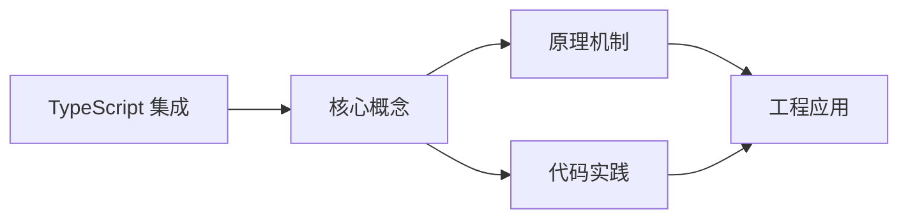
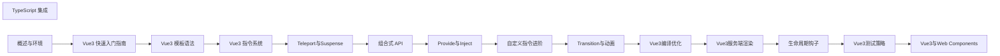

## 1. 学习目标（Bloom 分类）

本节按照布鲁姆教育目标分类学组织学习路径。本文主题为《TypeScript 集成》，属于 Vue 3 模块，读者可以根据自身阶段选择阅读深度。

记忆层面：能够准确复述本文的核心概念、术语与基本语法或操作步骤，并能够在提问或检索时快速定位对应知识点。能够说出 Vue 3 的核心概念、术语与标准写法。

理解层面：能够用自己的语言解释核心原理与工作机制，说明概念之间的因果关系，而不是机械记忆结论。能够解释 Vue 3 的工作原理与设计动机。

应用层面：能够在真实项目或练习场景中运用本文知识解决具体问题，写出正确且可维护的实现。能够编写符合 Vue 3 规范的完整实现。

分析层面：能够拆解复杂问题，比较本文主题与相邻概念的异同，识别边界条件与例外情况。能够分析 Vue 3 与相邻方案的差异与边界。

评价层面：能够根据约束条件（性能、可读性、安全、成本）评价不同方案的优劣，做出有依据的技术决策。能够根据场景评价 Vue 3 相关方案的优劣。

创造层面：能够把本文知识与其他模块知识组合，设计出新的解决方案或可复用的工程模式。能够组合 Vue 3 与其他技术设计完整方案。

通过本节学习，读者应当能够把《TypeScript 集成》纳入自己的知识网络，并与 Vue 3 模块的其他主题（组合式 API、响应式、组件通信、路由、状态管理）建立关联。

## 2. 历史动机与发展脉络

《TypeScript 集成》是 Vue 3 领域的重要主题。要真正理解它，需要先了解它解决的问题与演进过程。

Vue 由尤雨溪于 2014 年发布，以“渐进式框架”定位：可作库嵌入，也可作框架构建完整应用。Vue 3 于 2020 年 9 月发布，核心是组合式 API 与全新响应式系统。
Vue 3 的技术支柱：Proxy 响应式（替代 Object.defineProperty）、虚拟 DOM 重写（PatchFlags）、Fragment/Teleport/Suspense 内置组件、组合式 API（setup/ref/reactive/computed）。
生态现状：Vue Router 4、Pinia（官方状态库）、Vite 构建、Nuxt 全栈框架；Vue 3.5 引入 useTemplateRef 等开发者体验改进。

回到本文主题：TypeScript 集成 的提出与成熟，正是上述技术背景下的必然产物。早期实现往往以简单可用为目标，随着工程规模扩大，社区逐渐沉淀出标准做法与最佳实践；理解这一脉络，可以帮助读者判断“为什么文档中的推荐写法是现在这个样子”，也能在遇到历史遗留代码时准确识别其设计年代与取舍。


## 3. 形式化定义与核心概念精讲

本节把《TypeScript 集成》涉及的核心概念以“定义 + 讲解”的形式展开。读者应把定义当作工具，把讲解当作理解路径；两者结合才能形成可迁移的知识。

响应式：ref 包装基本类型，reactive 包装对象；effect 收集依赖，Proxy 拦截读写；computed 缓存派生值。
组件通信：props 向下、emit 向上、v-model 双向、provide/inject 跨层、事件总线（慎用）。
生命周期：setup 在创建前执行；onMounted/onUpdated/onUnmounted 对应挂载、更新、卸载；KeepAlive 增加 activated/deactivated。

### 3.1 原文章节逐一精讲

原文档把主题拆分为 25 个小节，下面按顺序给出每一节的导读讲解，随后保留原文细节供精读。

#### 原文精读（完整保留）

# Vue + TypeScript 类型语法速查手册

> **符号约定**:`< >` 必填参数 | `[ ]` 可选参数

---

#### 1. TypeScript 集成概述 | TypeScript Integration Overview

TypeScript 是 JavaScript 的超集，它添加了静态类型系统，提供了更好的代码提示、类型检查和代码重构能力。Vue3 对 TypeScript 提供了良好的支持，通过集成 TypeScript，可以提高代码的可维护性和类型安全性。

##### 1.1 TypeScript 的优势

- **类型安全**：提供静态类型检查，减少运行时错误
- **代码提示**：IDE 提供更好的代码提示和自动补全
- **代码重构**：更安全的代码重构，减少重构引入的错误
- **可读性**：类型注解提高代码的可读性和可维护性
- **生态系统**：丰富的类型定义库和工具

##### 1.2 Vue3 对 TypeScript 的支持

- **内置类型定义**：Vue3 提供了完整的 TypeScript 类型定义
- **组合式 API**：组合式 API 天然支持 TypeScript
- **脚本设置**：`script setup` 语法糖对 TypeScript 有良好的支持
- **工具链**：Vite 等构建工具对 TypeScript 有良好的支持

#### 2. 环境设置 | Environment Setup

##### 2.1 创建 TypeScript 项目

使用 Vite 创建 Vue3 + TypeScript 项目：

```bash
 # 使用 npm
 npm create vite@latest my-vue3-ts-app -- --template vue-ts
 # 使用 yarn
 yarn create vite my-vue3-ts-app --template vue-ts
 # 使用 pnpm
 pnpm create vite my-vue3-ts-app --template vue-ts
```

##### 2.2 配置 TypeScript

TypeScript 配置文件 `tsconfig.json`：

```json
 {
  "compilerOptions": {
  "target": "ES2020",
  "useDefineForClassFields": true,
  "module": "ESNext",
  "lib": ["ES2020", "DOM", "DOM.Iterable"],
  "skipLibCheck": true,
  /* Bundler mode */
  "moduleResolution": "bundler",
  "allowImportingTsExtensions": true,
  "resolveJsonModule": true,
  "isolatedModules": true,
  "noEmit": true,
  "jsx": "preserve",
  /* Linting */
  "strict": true,
  "noUnusedLocals": true,
  "noUnusedParameters": true,
  "noFallthroughCasesInSwitch":
  },
  "include": ["src/**/*.ts", "src/**/*.d.ts", "src/**/*.tsx", "src/**/*.vue"],
  "references": [{ "path": "./tsconfig.node.json" }]
 }
```

##### 2.3 安装依赖

```bash
 # 安装 TypeScript
 npm install typescript
 # 安装 Vue 类型定义
 npm install @vue/runtime-core
 # 安装 ESLint 和 Prettier
 npm install eslint @typescript-eslint/parser @typescript-eslint/eslint-plugin prettier
```

#### 3. 基本类型使用 | Basic Type Usage

##### 3.1 基础类型

```typescript
 // 字符串
 const message: string = 'Hello TypeScript'
 // 数字
 const count: number = 42
 // 布尔值
 const isActive: boolean =
 // 数组
 const numbers: number[] = [1, 2, 3]
 const strings: Array<string> = ['a', 'b', 'c']
 // 元组
 const person: [string, number] = ['John', 30]
 // 枚举
 enum Color {
  Red,
  Green,
  Blue
 }
 const color: Color = Color.Red
 // 任意类型
 const anything: any = 'anything'
 // 未知类型
 const unknownValue: unknown = 'unknown'
 // 空类型
 const nothing: void = undefined
 // 永不返回的函数
 function error(message: string): never {
  throw new Error(message)
 }
```

##### 3.2 接口

```typescript
interface User {
  id: number;
  name: string;
  email: string;
  age?: number; // 可选属性
  readonly createdAt: Date; // 只读属性
}
const user: User = {
  id: 1,
  name: 'John',
  email: 'john@example.com',
  createdAt: new Date(),
};
// 函数接口
interface GreetFunction {
  (name: string): string;
}
const greet: GreetFunction = (name) => {
  return `Hello, ${name}!`;
};
```

##### 3.3 类型别名

```typescript
type UserId = number;
type UserName = string;
type UserEmail = string;
type User = {
  id: UserId;
  name: UserName;
  email: UserEmail;
  age?: number;
  readonly createdAt: Date;
};
// 联合类型
type Status = 'active' | 'inactive' | 'pending';
const userStatus: Status = 'active';
// 交叉类型
type Person = {
  name: string;
  age: number;
};
type Employee = {
  employeeId: number;
  department: string;
};
type EmployeePerson = Person & Employee;
const employee: EmployeePerson = {
  name: 'John',
  age: 30,
  employeeId: 123,
  department: 'Engineering',
};
```

#### 4. Vue 组件中的 TypeScript | TypeScript in Vue Components

##### 4.1 单文件组件中的 TypeScript

```vue
<template>
  <div class="component">
    <h2>{{ title }}</h2>
    <p>{{ message }}</p>
    <button @click="handleClick">Click me</button>
  </div>
</template>
<script setup lang="ts">
import { ref } from 'vue';
// 类型注解
const title: string = 'Hello TypeScript';
const message: string = 'Welcome to Vue3 + TypeScript';
const count: number = ref(0);
// 函数类型
const handleClick: () => void = () => {
  count.value++;
  console.log(`Count: ${count.value}`);
};
</script>
<style scoped>
.component {
  padding: 20px;
  border: 1px solid #ddd;
  border-radius: 8px;
}
</style>
```

##### 4.2 Props 类型

```vue
<template>
  <div class="child">
    <h3>{{ title }}</h3>
    <p>{{ message }}</p>
    <p v-if="count">Count: {{ count }}</p>
  </div>
</template>
<script setup lang="ts">
defineProps<{
  title: string;
  message: string;
  count?: number;
  ;
}>();
</script>
<!-- 或者使用接口 -->
<script setup lang="ts">
interface Props {
  title: string;
  message: string;
  count?: number;
  ;
}
defineProps<Props>();
</script>
```

##### 4.3 Emits 类型

```vue
<template>
  <div class="child">
    <button @click="handleClick">Click me</button>
  </div>
</template>
<script setup lang="ts">
const emit = defineEmits<{
  (e: 'click', message: string): void;
  (e: 'custom', data: { id: number; name: string }): void;
  ;
}>();
const handleClick: () => void = () => {
  emit('click', 'Button clicked');
  emit('custom', { id: 1, name: 'Test' });
  ;
};
</script>
```

##### 4.4 响应式数据类型

```vue
<template>
  <div class="component">
    <p>Count: {{ count }}</p>
    <p>User: {{ user.name }}</p>
  </div>
</template>
<script setup lang="ts">
import { ref, reactive } from 'vue'
// ref 类型
const count = ref<number>(0)
// reactive 类型
interface User {
 id: number
 name: string
 age?: number
}
const user = reactive<User>({
 id: 1,
 name: 'John'
}
</script>
```

##### 4.5 计算属性类型

```vue
<template>
  <div class="component">
    <p>Count: {{ count }}</p>
    <p>Double Count: {{ doubleCount }}</p>
  </div>
</template>
<script setup lang="ts">
import { ref, computed } from 'vue';
const count = ref<number>(0);
// 计算属性类型
const doubleCount = computed<number>(() => {
  return count.value * 2;
});
</script>
```

#### 5. 组合式 API 与 TypeScript | Composition API with TypeScript

##### 5.1 组合函数类型

```typescript
// composables/useCounter.ts
import { ref, computed, Ref } from 'vue';
export function useCounter(initialValue: number = 0) {
  const count = ref<number>(initialValue);
  const doubleCount = computed<number>(() => count.value * 2);
  const increment = (): void => {
    count.value++;
  };
  const decrement = (): void => {
    count.value--;
  };
  const reset = (): void => {
    count.value = initialValue;
  };
  return {
    count,
    doubleCount,
    increment,
    decrement,
    reset,
  };
}
// 使用组合函数
import { useCounter } from './composables/useCounter';
const { count, doubleCount, increment, decrement, reset } = useCounter(0);
```

##### 5.2 依赖注入类型

```typescript
 // 父组件
 import { provide, ref, Ref } from 'vue'
 interface Theme {
  primary: string
  secondary: string
 }
 const theme = ref<Theme>({
  primary: '#42b983',
  secondary: '#35495e'
 }
 provide<Ref<Theme>>('theme', theme)
 // 子组件
 import { inject, Ref } from 'vue'
 interface Theme {
  primary: string
  secondary: string
 }
 const theme = inject<Ref<Theme>>('theme')
```

#### 6. 路由与状态管理 | Routing and State Management

##### 6.1 Vue Router 与 TypeScript

```typescript
 // router/index.ts
 import { createRouter, createWebHistory, RouteRecordRaw } from 'vue-router'
 const routes: Array<RouteRecordRaw> = [
  {
  path: '/',
  name: 'Home',
  component: () => import('../views/Home.vue')
  },
  {
  path: '/about',
  name: 'About',
  component: () => import('../views/About.vue')
  },
  {
  path: '/user/:id',
  name: 'User',
  component: () => import('../views/User.vue'),
  props:
  }
 ]
 const router = createRouter({
  history: createWebHistory(),
  routes
 }
 export default router
 // 组件中使用
 import { useRoute, useRouter } from 'vue-router'
 const route = useRoute()
 const router = useRouter()
 // 类型安全的参数访问
 const userId = route.params.id as string
 // 类型安全的导航
 router.push({ name: 'User', params: { id: '1' } })
```

##### 6.2 Pinia 与 TypeScript

```typescript
 // stores/user.ts
 import { defineStore } from 'pinia'
 import { ref, computed } from 'vue'
 interface User {
  id: number
  name: string
  email: string
 }
 export const useUserStore = defineStore('user', () => {
  const user = ref<User | null>(null)
  const isLoggedIn = computed<boolean>(() => !!user.value)
  const login = (userData: User): void => {
  user.value = userData
  }
  const logout = (): void => {
  user.value = null
  }
  return {
  user,
  isLoggedIn,
  login,
  logout
  }
 }
 // 组件中使用
 import { useUserStore } from './stores/user'
 const userStore = useUserStore()
 userStore.login({
  id: 1,
  name: 'John',
  email: 'john@example.com'
 }
 console.log(userStore.isLoggedIn) //
```

#### 7. 工具类型 | Utility Types

##### 7.1 内置工具类型

```typescript
// Partial<T> - 使所有属性可选
interface User {
  id: number;
  name: string;
  email: string;
}
const partialUser: Partial<User> = {
  name: 'John',
};
// Required<T> - 使所有属性必需
const requiredUser: Required<User> = {
  id: 1,
  name: 'John',
  email: 'john@example.com',
};
// Readonly<T> - 使所有属性只读
const readonlyUser: Readonly<User> = {
  id: 1,
  name: 'John',
  email: 'john@example.com',
};
// Pick<T, K> - 从 T 中选取 K 个属性
const pickedUser: Pick<User, 'name' | 'email'> = {
  name: 'John',
  email: 'john@example.com',
};
// Omit<T, K> - 从 T 中排除 K 个属性
const omittedUser: Omit<User, 'id'> = {
  name: 'John',
  email: 'john@example.com',
};
// Record<K, T> - 构建键为 K 类型，值为 T 类型的对象
const userMap: Record<number, User> = {
  1: { id: 1, name: 'John', email: 'john@example.com' },
  2: { id: 2, name: 'Jane', email: 'jane@example.com' },
};
```

##### 7.2 自定义工具类型

```typescript
// 深度部分类型
type DeepPartial<T> = T extends object
  ? {
      [P in keyof T]?: DeepPartial<T[P]>;
    }
  : T;
// 深度只读类型
type DeepReadonly<T> = T extends object
  ? {
      readonly [P in keyof T]: DeepReadonly<T[P]>;
    }
  : T;
// 非空类型
type NonNullable<T> = T extends null | undefined ? never : T;
// 函数参数类型
type Parameters<T extends (...args: any[]) => any> = T extends (...args: infer P) => any
  ? P
  : never;
// 函数返回类型
type ReturnType<T extends (...args: any[]) => any> = T extends (...args: any[]) => infer R
  ? R
  : any;
```

#### 8. 最佳实践 | Best Practices

##### 8.1 类型定义

- **使用接口**：对于对象类型，优先使用接口
- **使用类型别名**：对于联合类型、交叉类型等，使用类型别名
- **使用泛型**：对于可复用的类型，使用泛型
- **避免 any**：尽量避免使用 any 类型，使用 unknown 代替

##### 8.2 组件设计

- **明确 props 类型**：为组件的 props 定义明确的类型
- **明确 emits 类型**：为组件的事件定义明确的类型
- **使用类型断言**：在必要时使用类型断言，但要谨慎
- **使用类型守卫**：使用类型守卫提高类型安全性

##### 8.3 代码组织

- **类型文件**：将共享的类型定义放在单独的类型文件中
- **命名规范**：使用 PascalCase 命名接口和类型别名
- **注释**：为复杂的类型添加注释
- **模块化**：将类型定义按功能模块划分

##### 8.4 工具配置

- **严格模式**：启用 TypeScript 的严格模式
- **ESLint**：配置 ESLint 检查 TypeScript 代码
- **Prettier**：使用 Prettier 格式化 TypeScript 代码
- **编辑器配置**：配置 VS Code 等编辑器的 TypeScript 支持

#### 9. 示例 | Examples

##### 9.1 基础组件示例

```vue
<template>
  <div class="button">
    <button
      :class="['btn', `btn-${variant}`, { 'btn-disabled': disabled }]"
      :disabled="disabled"
      @click="$emit('click')"
    >
      <slot></slot>
    </button>
  </div>
</template>
<script setup lang="ts">
defineProps<{
  variant: 'primary' | 'secondary' | 'success' | 'danger';
  disabled?: boolean;
  ;
}>();
defineEmits<{
  (e: 'click'): void;
  ;
}>();
</script>
<style scoped>
.btn {
  padding: 8px 16px;
  border: none;
  border-radius: 4px;
  cursor: pointer;
  font-size: 14px;
}
.btn-primary {
  background-color: #42b983;
  color: white;
}
.btn-secondary {
  background-color: #999;
  color: white;
}
.btn-success {
  background-color: #28a745;
  color: white;
}
.btn-danger {
  background-color: #dc3545;
  color: white;
}
.btn-disabled {
  opacity: 0.6;
  cursor: not-allowed;
}
</style>
```

##### 9.2 复杂组件示例

```vue
<template>
  <div class="todo-list">
    <h2>Todo List</h2>
    <div class="todo-input">
      <input v-model="newTodo" @keyup.enter="addTodo" placeholder="Add a new todo" />
      <button @click="addTodo">Add</button>
    </div>
    <ul class="todo-items">
      <li v-for="todo in todos" :key="todo.id" class="todo-item">
        <input type="checkbox" v-model="todo.completed" @change="updateTodo(todo)" />
        <span :class="{ completed: todo.completed }">{{ todo.text }}</span>
        <button @click="deleteTodo(todo.id)">Delete</button>
      </li>
    </ul>
    <div class="todo-stats">
      <p>Total: {{ todos.length }}</p>
      <p>Completed: {{ completedCount }}</p>
      <p>Remaining: {{ remainingCount }}</p>
    </div>
  </div>
</template>
<script setup lang="ts">
import { ref, computed } from 'vue'
interface Todo {
 id: number
 text: string
 completed: boolean
}
const todos = ref<Todo[]>([
 { id: 1, text: 'Learn Vue3', completed: false },
 { id: 2, text: 'Learn TypeScript', completed: false },
 { id: 3, text: 'Build a project', completed: false }
]
const newTodo = ref<string>('')
const completedCount = computed<number>(() => {
 return todos.value.filter(todo => todo.completed).length
}
const remainingCount = computed<number>(() => {
 return todos.value.filter(todo => !todo.completed).length
}
const addTodo = (): void => {
 if (newTodo.value.trim()) {
 todos.value.push({
 id: Date.now(),
 text: newTodo.value.trim(),
 completed: false
 })
 newTodo.value = ''
 }
}
const updateTodo = (todo: Todo): void => {
 console.log('Updated todo:', todo)
}
const deleteTodo = (id: number): void => {
 todos.value = todos.value.filter(todo => todo.id !== id)
}
</script>
<style scoped>
.todo-list {
  max-width: 400px;
  margin: 0 auto;
  padding: 20px;
  border: 1px solid #ddd;
  border-radius: 8px;
}
.todo-input {
  display: flex;
  margin-bottom: 20px;
}
.todo-input input {
  flex: 1;
  padding: 8px;
  border: 1px solid #ddd;
  border-radius: 4px 0 0 4px;
}
.todo-input button {
  padding: 8px 16px;
  background-color: #42b983;
  color: white;
  border: none;
  border-radius: 0 4px 4px 0;
  cursor: pointer;
}
.todo-items {
  list-style-type: none;
  padding: 0;
  margin-bottom: 20px;
}
.todo-item {
  display: flex;
  align-items: center;
  padding: 10px;
  border-bottom: 1px solid #eee;
}
.todo-item input {
  margin-right: 10px;
}
.todo-item span {
  flex: 1;
}
.todo-item .completed {
  text-decoration: line-through;
  color: #999;
}
.todo-item button {
  padding: 4px 8px;
  background-color: #dc3545;
  color: white;
  border: none;
  border-radius: 4px;
  cursor: pointer;
}
.todo-stats {
  display: flex;
  justify-content: space-between;
  font-size: 14px;
  color: #666;
}
</style>
```

#### 10. 小结 | Summary

TypeScript 与 Vue3 的集成可以提高代码的可维护性和类型安全性，减少运行时错误，提供更好的开发体验。通过本章节的学习，你已经了解了 TypeScript 与 Vue3 集成的基本方法和最佳实践。
在实际开发中，要充分利用 TypeScript 的类型系统，为组件、props、事件、状态等添加明确的类型定义，同时要注意避免过度使用 any 类型，保持代码的类型安全性。只有这样，才能充分发挥 TypeScript 的优势，构建高质量的 Vue3 应用。

#### 延伸阅读

- [TypeScript](typescript/overview)
#### 基础类型

**Ref 类型**
```typescript
import { ref, type Ref } from 'vue';

const count = ref(0);              // Ref<number>
const name = ref<string>('Tom');   // Ref<string>
const list = ref<number[]>([]);    // Ref<number[]>
const user = ref<{ id: number; name: string } | null>(null);

// 显式类型
const value: Ref<string> = ref('');
```

**ComputedRef 类型**
```typescript
import { computed, type ComputedRef } from 'vue';

const count = ref(0);
const double: ComputedRef<number> = computed(() => count.value * 2);

// 类型推断
const str = computed(() => 'hello');  // ComputedRef<string>
```

**reactive 类型**
```typescript
import { reactive } from 'vue';

interface State {
  count: number;
  list: string[];
  user: { id: number; name: string } | null;
}

const state = reactive<State>({
  count: 0,
  list: [],
  user: null
});
```

**shallowRef 类型**
```typescript
import { shallowRef } from 'vue';

type Widget = { el: HTMLElement; destroy(): void };
const widget = shallowRef<Widget | null>(null);
```

---

#### PropType 复杂类型

**PropType 定义**
```typescript
import { defineComponent, type PropType } from 'vue';

defineComponent({
  props: {
    // 数组类型
    list: { type: Array as PropType<string[]>, required: true },
    // 对象类型
    user: Object as PropType<{ id: number; name: string }>,
    // 函数类型
    onChange: Function as PropType<(value: string) => void>,
    // 联合类型
    status: String as PropType<'active' | 'inactive'>,
    // 复杂对象
    config: {
      type: Object as PropType<{ apiBase: string; timeout?: number }>,
      required: true
    }
  }
});
```

**script setup 中使用 PropType**
```typescript
<script setup lang="ts">
import type { PropType } from 'vue';

const props = defineProps({
  list: Array as PropType<{ id: number; name: string }[]>,
  callback: Function as PropType<(value: string) => void>
});
</script>
```

---

#### 泛型 props

**defineProps 泛型声明**
```typescript
<script setup lang="ts">
interface Props {
  title: string;
  count?: number;
  list: Array<{ id: number; name: string }>;
  callback?: (value: string) => void;
  status?: 'active' | 'inactive';
}

const props = defineProps<Props>();
</script>
```

**withDefaults 默认值**
```typescript
import { withDefaults } from 'vue';

interface Props {
  title?: string;
  count?: number;
  list?: string[];
}

const props = withDefaults(defineProps<Props>(), {
  title: '默认标题',
  count: 0,
  list: () => []  // 引用类型必须用工厂函数
});
```

**响应式 props 解构(Vue 3.5+)**
```typescript
const { title = '默认标题', count = 0 } = defineProps<{
  title?: string;
  count?: number;
}>();
```

---

#### defineEmits 类型

**泛型签名**
```typescript
<script setup lang="ts">
const emit = defineEmits<{
  (e: 'change', value: string): void;
  (e: 'submit', payload: { id: number; data: any }): void;
  (e: 'delete', id: number): void;
}>();

emit('change', 'new value');
emit('submit', { id: 1, data: { x: 1 } });
</script>
```

**简洁语法(Vue 3.3+)**
```typescript
const emit = defineEmits<{
  change: [value: string];
  submit: [payload: { id: number; data: any }];
  delete: [id: number];
}>();

emit('change', 'new value');
```

---

#### defineModel 类型

**defineModel 类型**
```typescript
const model = defineModel<string>();
model.value = 'new value';

const count = defineModel<number>('count', { default: 0 });
const visible = defineModel<boolean>('visible');
```

---

#### 组件类型

**defineComponent 类型**
```typescript
import { defineComponent, type PropType } from 'vue';

export default defineComponent({
  props: {
    title: { type: String, required: true }
  },
  emits: {
    change: (val: string) => typeof val === 'string'
  },
  setup(props, { emit, slots, attrs }) {
    return {};
  }
});
```

**defineSlots 类型**
```typescript
<script setup lang="ts">
const slots = defineSlots<{
  default(props: { item: any; index: number }): any;
  header?(props: { title: string }): any;
  footer?(): any;
}>();
</script>
```

---

#### 模板引用类型

**useTemplateRef 类型(Vue 3.5+)**
```typescript
import { useTemplateRef } from 'vue';

const inputEl = useTemplateRef<HTMLInputElement>('inputRef');
onMounted(() => inputEl.value?.focus());

const childRef = useTemplateRef<InstanceType<typeof ChildComp>>('child');
onMounted(() => childRef.value?.publicMethod());
```

**ref 字符串方式**
```typescript
import { ref, onMounted } from 'vue';

const inputEl = ref<HTMLInputElement | null>(null);
onMounted(() => inputEl.value?.focus());

const chartEl = ref<HTMLElement | null>(null);
```

**组件实例类型**
```typescript
import ChildComp from './ChildComp.vue';

// 获取组件暴露的类型
type ChildInstance = InstanceType<typeof ChildComp>;

const child = ref<ChildInstance | null>(null);
child.value?.publicMethod();
```

---

#### provide / inject 类型

**InjectionKey 类型化**
```typescript
import type { InjectionKey, Ref } from 'vue';
import { provide, inject, ref } from 'vue';

interface UserContext {
  user: Ref<{ id: number; name: string } | null>;
  login: (name: string) => Promise<void>;
  logout: () => void;
}

const UserKey: InjectionKey<UserContext> = Symbol('user');

// 提供方
provide(UserKey, {
  user: ref(null),
  login: async (name) => { /* ... */ },
  logout: () => { /* ... */ }
});

// 注入方(自动类型推断)
const ctx = inject(UserKey);  // UserContext | undefined
```

---

#### 事件处理类型

**事件处理函数类型**
```typescript
function onClick(event: MouseEvent): void {
  const target = event.target as HTMLButtonElement;
  console.log(target.value);
}

function onInput(event: Event): void {
  const value = (event.target as HTMLInputElement).value;
}

function onKeydown(event: KeyboardEvent): void {
  if (event.key === 'Enter') {
    // ...
  }
}
```

---

#### ComputedRef 与 WritableComputedRef

```typescript
import { ref, computed, type ComputedRef, type WritableComputedRef } from 'vue';

const count = ref(0);

const double: ComputedRef<number> = computed(() => count.value * 2);

const writable: WritableComputedRef<number> = computed({
  get: () => count.value,
  set: (v: number) => { count.value = v; }
});
```

---

#### 自定义指令类型

```typescript
import type { Directive, DirectiveBinding } from 'vue';

const vFocus: Directive<HTMLElement, boolean> = {
  mounted(el, binding: DirectiveBinding<boolean>) {
    if (binding.value) {
      el.focus();
    }
  }
};
```

---

#### 插件类型

```typescript
import type { App } from 'vue';

interface MyPluginOptions {
  apiBase: string;
  timeout?: number;
}

const MyPlugin = {
  install(app: App, options: MyPluginOptions) {
    app.provide('apiBase', options.apiBase);
  }
};

// ComponentCustomProperties 扩展
declare module 'vue' {
  interface ComponentCustomProperties {
    $apiBase: string;
    $format: (value: number) => string;
  }
}

app.use(MyPlugin, { apiBase: '/api', timeout: 3000 });
// 在组件中:this.$apiBase 可用(类型安全)
```

---

#### 全局组件类型

**GlobalComponents 扩展**
```typescript
declare module 'vue' {
  interface GlobalComponents {
    MyButton: typeof import('./MyButton.vue')['default'];
    RouterLink: typeof import('vue-router')['RouterLink'];
  }
}
```

---

#### 完整 TS 组件示例

```vue
<script setup lang="ts">
import { ref, computed, type PropType } from 'vue';

interface User {
  id: number;
  name: string;
  role: 'admin' | 'user';
}

const props = withDefaults(defineProps<{
  title: string;
  users?: User[];
  selectedId?: number | null;
}>(), {
  users: () => [],
  selectedId: null
});

const emit = defineEmits<{
  select: [user: User];
  delete: [id: number];
}>();

const selectedUser = computed(() =>
  props.users.find(u => u.id === props.selectedId) ?? null
);

const handleSelect = (user: User) => {
  emit('select', user);
};

defineExpose({ selectedUser });
</script>

<template>
  <div>
    <h2>{{ title }}</h2>
    <ul>
      <li
        v-for="user in users"
        :key="user.id"
        @click="handleSelect(user)"
      >
        {{ user.name }} ({{ user.role }})
      </li>
    </ul>
  </div>
</template>
```


### 3.2 概念关系图

下面用 Mermaid 图表达本文核心概念之间的关系，帮助读者建立整体图景：



图中展示的是本文知识的结构化关系：核心概念是入口，原理机制解释“为什么”，代码实践演示“怎么做”，工程应用回答“何时用”。读者学习时可以把每个小节的内容挂接到对应节点上。

## 4. 理论推导与原理解析

本节深入《TypeScript 集成》背后的原理。理论部分不求面面俱到，而是聚焦“能解释现象、能指导实践”的关键推导。

响应式：ref 包装基本类型，reactive 包装对象；effect 收集依赖，Proxy 拦截读写；computed 缓存派生值。
组件通信：props 向下、emit 向上、v-model 双向、provide/inject 跨层、事件总线（慎用）。
生命周期：setup 在创建前执行；onMounted/onUpdated/onUnmounted 对应挂载、更新、卸载；KeepAlive 增加 activated/deactivated。
模板编译：模板在构建期编译为渲染函数，指令（v-if/v-for/v-model）是编译糖。

需要强调的是，理论推导与工程实践之间存在翻译层：理论给出的是理想化模型与边界条件，工程代码则必须处理真实环境中的例外。读者在学习时应先掌握理论的“标准情形”，再通过陷阱章节了解“非标准情形”。

## 5. 代码示例与逐行讲解

本节把原文中的代码示例系统整理，并为每个示例补充用途说明与讲解。读者不应只浏览代码，而应逐段对照讲解理解设计意图。

### 5.1 示例：2.1 创建 TypeScript 项目

该示例来自原文《2.1 创建 TypeScript 项目》小节，用于演示TypeScript 集成相关操作。阅读时请先看代码结构，再看其后的讲解。

```bash
 # 使用 npm
 npm create vite@latest my-vue3-ts-app -- --template vue-ts
 # 使用 yarn
 yarn create vite my-vue3-ts-app --template vue-ts
 # 使用 pnpm
 pnpm create vite my-vue3-ts-app --template vue-ts
```

讲解：这段代码演示了本节核心知识点。代码中的关键操作可以归纳为三步：准备（定义或初始化）、执行（核心逻辑）、收尾（释放资源或返回结果）。实际项目中，这三步往往被封装为函数或类，以提升复用性与可测试性。

关键点分析：

该示例共 6 行有效代码，结构以数据或配置为主。阅读时应关注：数据字段的含义、配置项的作用，以及它们与运行行为的对应关系。

进阶思考路径：先尝试修改参数观察行为变化，再把示例中的模式迁移到自己的项目中；每次修改都记录预期与实测差异，这是把示例转化为能力的最快方式。

### 5.2 示例：2.2 配置 TypeScript

该示例来自原文《2.2 配置 TypeScript》小节，用于演示TypeScript 集成相关操作。阅读时请先看代码结构，再看其后的讲解。

```json
 {
  "compilerOptions": {
  "target": "ES2020",
  "useDefineForClassFields": true,
  "module": "ESNext",
  "lib": ["ES2020", "DOM", "DOM.Iterable"],
  "skipLibCheck": true,
  /* Bundler mode */
  "moduleResolution": "bundler",
  "allowImportingTsExtensions": true,
  "resolveJsonModule": true,
  "isolatedModules": true,
  "noEmit": true,
  "jsx": "preserve",
  /* Linting */
  "strict": true,
  "noUnusedLocals": true,
  "noUnusedParameters": true,
  "noFallthroughCasesInSwitch":
  },
  "include": ["src/**/*.ts", "src/**/*.d.ts", "src/**/*.tsx", "src/**/*.vue"],
  "references": [{ "path": "./tsconfig.node.json" }]
 }
```

讲解：这段代码演示了本节核心知识点。代码中的关键操作可以归纳为三步：准备（定义或初始化）、执行（核心逻辑）、收尾（释放资源或返回结果）。实际项目中，这三步往往被封装为函数或类，以提升复用性与可测试性。

关键点分析：

该示例共 23 行有效代码，结构以数据或配置为主。阅读时应关注：数据字段的含义、配置项的作用，以及它们与运行行为的对应关系。

进阶思考路径：先尝试修改参数观察行为变化，再把示例中的模式迁移到自己的项目中；每次修改都记录预期与实测差异，这是把示例转化为能力的最快方式。

### 5.3 示例：2.3 安装依赖

该示例来自原文《2.3 安装依赖》小节，用于演示TypeScript 集成相关操作。阅读时请先看代码结构，再看其后的讲解。

```bash
 # 安装 TypeScript
 npm install typescript
 # 安装 Vue 类型定义
 npm install @vue/runtime-core
 # 安装 ESLint 和 Prettier
 npm install eslint @typescript-eslint/parser @typescript-eslint/eslint-plugin prettier
```

讲解：这段代码演示了本节核心知识点。代码中的关键操作可以归纳为三步：准备（定义或初始化）、执行（核心逻辑）、收尾（释放资源或返回结果）。实际项目中，这三步往往被封装为函数或类，以提升复用性与可测试性。

关键点分析：

该示例共 6 行有效代码，结构以数据或配置为主。阅读时应关注：数据字段的含义、配置项的作用，以及它们与运行行为的对应关系。

进阶思考路径：先尝试修改参数观察行为变化，再把示例中的模式迁移到自己的项目中；每次修改都记录预期与实测差异，这是把示例转化为能力的最快方式。

### 5.4 示例：3.1 基础类型

该示例来自原文《3.1 基础类型》小节，用于演示TypeScript 集成相关操作。阅读时请先看代码结构，再看其后的讲解。

```typescript
 // 字符串
 const message: string = 'Hello TypeScript'
 // 数字
 const count: number = 42
 // 布尔值
 const isActive: boolean =
 // 数组
 const numbers: number[] = [1, 2, 3]
 const strings: Array<string> = ['a', 'b', 'c']
 // 元组
 const person: [string, number] = ['John', 30]
 // 枚举
 enum Color {
  Red,
  Green,
  Blue
 }
 const color: Color = Color.Red
 // 任意类型
 const anything: any = 'anything'
 // 未知类型
 const unknownValue: unknown = 'unknown'
 // 空类型
 const nothing: void = undefined
 // 永不返回的函数
 function error(message: string): never {
  throw new Error(message)
 }
```

讲解：这段代码演示了本节核心知识点。代码中的关键操作可以归纳为三步：准备（定义或初始化）、执行（核心逻辑）、收尾（释放资源或返回结果）。实际项目中，这三步往往被封装为函数或类，以提升复用性与可测试性。

关键点分析：

该示例共 28 行有效代码，包含 1 类关键结构（function）。其中：

- 入口与初始化部分负责建立上下文，对应实际项目中的启动或装配逻辑；
- 核心逻辑部分体现本文主题的主要操作，是阅读时最需要对照讲解理解的部分；
- 输出或返回部分把结果交给调用方，注意其类型与边界条件。

进阶思考路径：先尝试修改参数观察行为变化，再把示例中的模式迁移到自己的项目中；每次修改都记录预期与实测差异，这是把示例转化为能力的最快方式。

### 5.5 示例：3.2 接口

该示例来自原文《3.2 接口》小节，用于演示TypeScript 集成相关操作。阅读时请先看代码结构，再看其后的讲解。

```typescript
interface User {
  id: number;
  name: string;
  email: string;
  age?: number; // 可选属性
  readonly createdAt: Date; // 只读属性
}
const user: User = {
  id: 1,
  name: 'John',
  email: 'john@example.com',
  createdAt: new Date(),
};
// 函数接口
interface GreetFunction {
  (name: string): string;
}
const greet: GreetFunction = (name) => {
  return `Hello, ${name}!`;
};
```

讲解：这段代码演示了本节核心知识点。代码中的关键操作可以归纳为三步：准备（定义或初始化）、执行（核心逻辑）、收尾（释放资源或返回结果）。实际项目中，这三步往往被封装为函数或类，以提升复用性与可测试性。

关键点分析：

该示例共 20 行有效代码，包含 1 类关键结构（return）。其中：

- 入口与初始化部分负责建立上下文，对应实际项目中的启动或装配逻辑；
- 核心逻辑部分体现本文主题的主要操作，是阅读时最需要对照讲解理解的部分；
- 输出或返回部分把结果交给调用方，注意其类型与边界条件。

进阶思考路径：先尝试修改参数观察行为变化，再把示例中的模式迁移到自己的项目中；每次修改都记录预期与实测差异，这是把示例转化为能力的最快方式。

### 5.6 示例：3.3 类型别名

该示例来自原文《3.3 类型别名》小节，用于演示TypeScript 集成相关操作。阅读时请先看代码结构，再看其后的讲解。

```typescript
type UserId = number;
type UserName = string;
type UserEmail = string;
type User = {
  id: UserId;
  name: UserName;
  email: UserEmail;
  age?: number;
  readonly createdAt: Date;
};
// 联合类型
type Status = 'active' | 'inactive' | 'pending';
const userStatus: Status = 'active';
// 交叉类型
type Person = {
  name: string;
  age: number;
};
type Employee = {
  employeeId: number;
  department: string;
};
type EmployeePerson = Person & Employee;
const employee: EmployeePerson = {
  name: 'John',
  age: 30,
  employeeId: 123,
  department: 'Engineering',
};
```

讲解：这段代码演示了本节核心知识点。代码中的关键操作可以归纳为三步：准备（定义或初始化）、执行（核心逻辑）、收尾（释放资源或返回结果）。实际项目中，这三步往往被封装为函数或类，以提升复用性与可测试性。

关键点分析：

该示例共 29 行有效代码，结构以数据或配置为主。阅读时应关注：数据字段的含义、配置项的作用，以及它们与运行行为的对应关系。

进阶思考路径：先尝试修改参数观察行为变化，再把示例中的模式迁移到自己的项目中；每次修改都记录预期与实测差异，这是把示例转化为能力的最快方式。

### 5.7 示例：4.1 单文件组件中的 TypeScript

该示例来自原文《4.1 单文件组件中的 TypeScript》小节，用于演示TypeScript 集成相关操作。阅读时请先看代码结构，再看其后的讲解。

```vue
<template>
  <div class="component">
    <h2>{{ title }}</h2>
    <p>{{ message }}</p>
    <button @click="handleClick">Click me</button>
  </div>
</template>
<script setup lang="ts">
import { ref } from 'vue';
// 类型注解
const title: string = 'Hello TypeScript';
const message: string = 'Welcome to Vue3 + TypeScript';
const count: number = ref(0);
// 函数类型
const handleClick: () => void = () => {
  count.value++;
  console.log(`Count: ${count.value}`);
};
</script>
<style scoped>
.component {
  padding: 20px;
  border: 1px solid #ddd;
  border-radius: 8px;
}
</style>
```

讲解：这段代码演示了本节核心知识点。代码中的关键操作可以归纳为三步：准备（定义或初始化）、执行（核心逻辑）、收尾（释放资源或返回结果）。实际项目中，这三步往往被封装为函数或类，以提升复用性与可测试性。

关键点分析：

该示例共 26 行有效代码，包含 3 类关键结构（class、import、from）。其中：

- 入口与初始化部分负责建立上下文，对应实际项目中的启动或装配逻辑；
- 核心逻辑部分体现本文主题的主要操作，是阅读时最需要对照讲解理解的部分；
- 输出或返回部分把结果交给调用方，注意其类型与边界条件。

进阶思考路径：先尝试修改参数观察行为变化，再把示例中的模式迁移到自己的项目中；每次修改都记录预期与实测差异，这是把示例转化为能力的最快方式。

### 5.8 示例：4.2 Props 类型

该示例来自原文《4.2 Props 类型》小节，用于演示TypeScript 集成相关操作。阅读时请先看代码结构，再看其后的讲解。

```vue
<template>
  <div class="child">
    <h3>{{ title }}</h3>
    <p>{{ message }}</p>
    <p v-if="count">Count: {{ count }}</p>
  </div>
</template>
<script setup lang="ts">
defineProps<{
  title: string;
  message: string;
  count?: number;
  ;
}>();
</script>
<!-- 或者使用接口 -->
<script setup lang="ts">
interface Props {
  title: string;
  message: string;
  count?: number;
  ;
}
defineProps<Props>();
</script>
```

讲解：这段代码演示了本节核心知识点。代码中的关键操作可以归纳为三步：准备（定义或初始化）、执行（核心逻辑）、收尾（释放资源或返回结果）。实际项目中，这三步往往被封装为函数或类，以提升复用性与可测试性。

关键点分析：

该示例共 25 行有效代码，包含 1 类关键结构（class）。其中：

- 入口与初始化部分负责建立上下文，对应实际项目中的启动或装配逻辑；
- 核心逻辑部分体现本文主题的主要操作，是阅读时最需要对照讲解理解的部分；
- 输出或返回部分把结果交给调用方，注意其类型与边界条件。

进阶思考路径：先尝试修改参数观察行为变化，再把示例中的模式迁移到自己的项目中；每次修改都记录预期与实测差异，这是把示例转化为能力的最快方式。

### 5.9 示例：4.3 Emits 类型

该示例来自原文《4.3 Emits 类型》小节，用于演示TypeScript 集成相关操作。阅读时请先看代码结构，再看其后的讲解。

```vue
<template>
  <div class="child">
    <button @click="handleClick">Click me</button>
  </div>
</template>
<script setup lang="ts">
const emit = defineEmits<{
  (e: 'click', message: string): void;
  (e: 'custom', data: { id: number; name: string }): void;
  ;
}>();
const handleClick: () => void = () => {
  emit('click', 'Button clicked');
  emit('custom', { id: 1, name: 'Test' });
  ;
};
</script>
```

讲解：这段代码演示了本节核心知识点。代码中的关键操作可以归纳为三步：准备（定义或初始化）、执行（核心逻辑）、收尾（释放资源或返回结果）。实际项目中，这三步往往被封装为函数或类，以提升复用性与可测试性。

关键点分析：

该示例共 17 行有效代码，包含 1 类关键结构（class）。其中：

- 入口与初始化部分负责建立上下文，对应实际项目中的启动或装配逻辑；
- 核心逻辑部分体现本文主题的主要操作，是阅读时最需要对照讲解理解的部分；
- 输出或返回部分把结果交给调用方，注意其类型与边界条件。

进阶思考路径：先尝试修改参数观察行为变化，再把示例中的模式迁移到自己的项目中；每次修改都记录预期与实测差异，这是把示例转化为能力的最快方式。

### 5.10 示例：4.4 响应式数据类型

该示例来自原文《4.4 响应式数据类型》小节，用于演示TypeScript 集成相关操作。阅读时请先看代码结构，再看其后的讲解。

```vue
<template>
  <div class="component">
    <p>Count: {{ count }}</p>
    <p>User: {{ user.name }}</p>
  </div>
</template>
<script setup lang="ts">
import { ref, reactive } from 'vue'
// ref 类型
const count = ref<number>(0)
// reactive 类型
interface User {
 id: number
 name: string
 age?: number
}
const user = reactive<User>({
 id: 1,
 name: 'John'
}
</script>
```

讲解：这段代码演示了本节核心知识点。代码中的关键操作可以归纳为三步：准备（定义或初始化）、执行（核心逻辑）、收尾（释放资源或返回结果）。实际项目中，这三步往往被封装为函数或类，以提升复用性与可测试性。

关键点分析：

该示例共 21 行有效代码，包含 3 类关键结构（class、import、from）。其中：

- 入口与初始化部分负责建立上下文，对应实际项目中的启动或装配逻辑；
- 核心逻辑部分体现本文主题的主要操作，是阅读时最需要对照讲解理解的部分；
- 输出或返回部分把结果交给调用方，注意其类型与边界条件。

进阶思考路径：先尝试修改参数观察行为变化，再把示例中的模式迁移到自己的项目中；每次修改都记录预期与实测差异，这是把示例转化为能力的最快方式。

### 5.11 示例：4.5 计算属性类型

该示例来自原文《4.5 计算属性类型》小节，用于演示TypeScript 集成相关操作。阅读时请先看代码结构，再看其后的讲解。

```vue
<template>
  <div class="component">
    <p>Count: {{ count }}</p>
    <p>Double Count: {{ doubleCount }}</p>
  </div>
</template>
<script setup lang="ts">
import { ref, computed } from 'vue';
const count = ref<number>(0);
// 计算属性类型
const doubleCount = computed<number>(() => {
  return count.value * 2;
});
</script>
```

讲解：这段代码演示了本节核心知识点。代码中的关键操作可以归纳为三步：准备（定义或初始化）、执行（核心逻辑）、收尾（释放资源或返回结果）。实际项目中，这三步往往被封装为函数或类，以提升复用性与可测试性。

关键点分析：

该示例共 14 行有效代码，包含 4 类关键结构（class、import、from、return）。其中：

- 入口与初始化部分负责建立上下文，对应实际项目中的启动或装配逻辑；
- 核心逻辑部分体现本文主题的主要操作，是阅读时最需要对照讲解理解的部分；
- 输出或返回部分把结果交给调用方，注意其类型与边界条件。

进阶思考路径：先尝试修改参数观察行为变化，再把示例中的模式迁移到自己的项目中；每次修改都记录预期与实测差异，这是把示例转化为能力的最快方式。

### 5.12 示例：5.1 组合函数类型

该示例来自原文《5.1 组合函数类型》小节，用于演示TypeScript 集成相关操作。阅读时请先看代码结构，再看其后的讲解。

```typescript
// composables/useCounter.ts
import { ref, computed, Ref } from 'vue';
export function useCounter(initialValue: number = 0) {
  const count = ref<number>(initialValue);
  const doubleCount = computed<number>(() => count.value * 2);
  const increment = (): void => {
    count.value++;
  };
  const decrement = (): void => {
    count.value--;
  };
  const reset = (): void => {
    count.value = initialValue;
  };
  return {
    count,
    doubleCount,
    increment,
    decrement,
    reset,
  };
}
// 使用组合函数
import { useCounter } from './composables/useCounter';
const { count, doubleCount, increment, decrement, reset } = useCounter(0);
```

讲解：这段代码演示了本节核心知识点。代码中的关键操作可以归纳为三步：准备（定义或初始化）、执行（核心逻辑）、收尾（释放资源或返回结果）。实际项目中，这三步往往被封装为函数或类，以提升复用性与可测试性。

关键点分析：

该示例共 25 行有效代码，包含 4 类关键结构（function、import、from、return）。其中：

- 入口与初始化部分负责建立上下文，对应实际项目中的启动或装配逻辑；
- 核心逻辑部分体现本文主题的主要操作，是阅读时最需要对照讲解理解的部分；
- 输出或返回部分把结果交给调用方，注意其类型与边界条件。

进阶思考路径：先尝试修改参数观察行为变化，再把示例中的模式迁移到自己的项目中；每次修改都记录预期与实测差异，这是把示例转化为能力的最快方式。

### 5.13 示例：5.2 依赖注入类型

该示例来自原文《5.2 依赖注入类型》小节，用于演示TypeScript 集成相关操作。阅读时请先看代码结构，再看其后的讲解。

```typescript
 // 父组件
 import { provide, ref, Ref } from 'vue'
 interface Theme {
  primary: string
  secondary: string
 }
 const theme = ref<Theme>({
  primary: '#42b983',
  secondary: '#35495e'
 }
 provide<Ref<Theme>>('theme', theme)
 // 子组件
 import { inject, Ref } from 'vue'
 interface Theme {
  primary: string
  secondary: string
 }
 const theme = inject<Ref<Theme>>('theme')
```

讲解：这段代码演示了本节核心知识点。代码中的关键操作可以归纳为三步：准备（定义或初始化）、执行（核心逻辑）、收尾（释放资源或返回结果）。实际项目中，这三步往往被封装为函数或类，以提升复用性与可测试性。

关键点分析：

该示例共 18 行有效代码，包含 2 类关键结构（import、from）。其中：

- 入口与初始化部分负责建立上下文，对应实际项目中的启动或装配逻辑；
- 核心逻辑部分体现本文主题的主要操作，是阅读时最需要对照讲解理解的部分；
- 输出或返回部分把结果交给调用方，注意其类型与边界条件。

进阶思考路径：先尝试修改参数观察行为变化，再把示例中的模式迁移到自己的项目中；每次修改都记录预期与实测差异，这是把示例转化为能力的最快方式。

### 5.14 示例：6.1 Vue Router 与 TypeScript

该示例来自原文《6.1 Vue Router 与 TypeScript》小节，用于演示TypeScript 集成相关操作。阅读时请先看代码结构，再看其后的讲解。

```typescript
 // router/index.ts
 import { createRouter, createWebHistory, RouteRecordRaw } from 'vue-router'
 const routes: Array<RouteRecordRaw> = [
  {
  path: '/',
  name: 'Home',
  component: () => import('../views/Home.vue')
  },
  {
  path: '/about',
  name: 'About',
  component: () => import('../views/About.vue')
  },
  {
  path: '/user/:id',
  name: 'User',
  component: () => import('../views/User.vue'),
  props:
  }
 ]
 const router = createRouter({
  history: createWebHistory(),
  routes
 }
 export default router
 // 组件中使用
 import { useRoute, useRouter } from 'vue-router'
 const route = useRoute()
 const router = useRouter()
 // 类型安全的参数访问
 const userId = route.params.id as string
 // 类型安全的导航
 router.push({ name: 'User', params: { id: '1' } })
```

讲解：这段代码演示了本节核心知识点。代码中的关键操作可以归纳为三步：准备（定义或初始化）、执行（核心逻辑）、收尾（释放资源或返回结果）。实际项目中，这三步往往被封装为函数或类，以提升复用性与可测试性。

关键点分析：

该示例共 33 行有效代码，包含 2 类关键结构（import、from）。其中：

- 入口与初始化部分负责建立上下文，对应实际项目中的启动或装配逻辑；
- 核心逻辑部分体现本文主题的主要操作，是阅读时最需要对照讲解理解的部分；
- 输出或返回部分把结果交给调用方，注意其类型与边界条件。

进阶思考路径：先尝试修改参数观察行为变化，再把示例中的模式迁移到自己的项目中；每次修改都记录预期与实测差异，这是把示例转化为能力的最快方式。

### 5.15 示例：6.2 Pinia 与 TypeScript

该示例来自原文《6.2 Pinia 与 TypeScript》小节，用于演示TypeScript 集成相关操作。阅读时请先看代码结构，再看其后的讲解。

```typescript
 // stores/user.ts
 import { defineStore } from 'pinia'
 import { ref, computed } from 'vue'
 interface User {
  id: number
  name: string
  email: string
 }
 export const useUserStore = defineStore('user', () => {
  const user = ref<User | null>(null)
  const isLoggedIn = computed<boolean>(() => !!user.value)
  const login = (userData: User): void => {
  user.value = userData
  }
  const logout = (): void => {
  user.value = null
  }
  return {
  user,
  isLoggedIn,
  login,
  logout
  }
 }
 // 组件中使用
 import { useUserStore } from './stores/user'
 const userStore = useUserStore()
 userStore.login({
  id: 1,
  name: 'John',
  email: 'john@example.com'
 }
 console.log(userStore.isLoggedIn) //
```

讲解：这段代码演示了本节核心知识点。代码中的关键操作可以归纳为三步：准备（定义或初始化）、执行（核心逻辑）、收尾（释放资源或返回结果）。实际项目中，这三步往往被封装为函数或类，以提升复用性与可测试性。

关键点分析：

该示例共 33 行有效代码，包含 3 类关键结构（import、from、return）。其中：

- 入口与初始化部分负责建立上下文，对应实际项目中的启动或装配逻辑；
- 核心逻辑部分体现本文主题的主要操作，是阅读时最需要对照讲解理解的部分；
- 输出或返回部分把结果交给调用方，注意其类型与边界条件。

进阶思考路径：先尝试修改参数观察行为变化，再把示例中的模式迁移到自己的项目中；每次修改都记录预期与实测差异，这是把示例转化为能力的最快方式。

### 5.16 示例：7.1 内置工具类型

该示例来自原文《7.1 内置工具类型》小节，用于演示TypeScript 集成相关操作。阅读时请先看代码结构，再看其后的讲解。

```typescript
// Partial<T> - 使所有属性可选
interface User {
  id: number;
  name: string;
  email: string;
}
const partialUser: Partial<User> = {
  name: 'John',
};
// Required<T> - 使所有属性必需
const requiredUser: Required<User> = {
  id: 1,
  name: 'John',
  email: 'john@example.com',
};
// Readonly<T> - 使所有属性只读
const readonlyUser: Readonly<User> = {
  id: 1,
  name: 'John',
  email: 'john@example.com',
};
// Pick<T, K> - 从 T 中选取 K 个属性
const pickedUser: Pick<User, 'name' | 'email'> = {
  name: 'John',
  email: 'john@example.com',
};
// Omit<T, K> - 从 T 中排除 K 个属性
const omittedUser: Omit<User, 'id'> = {
  name: 'John',
  email: 'john@example.com',
};
// Record<K, T> - 构建键为 K 类型，值为 T 类型的对象
const userMap: Record<number, User> = {
  1: { id: 1, name: 'John', email: 'john@example.com' },
  2: { id: 2, name: 'Jane', email: 'jane@example.com' },
};
```

讲解：这段代码演示了本节核心知识点。代码中的关键操作可以归纳为三步：准备（定义或初始化）、执行（核心逻辑）、收尾（释放资源或返回结果）。实际项目中，这三步往往被封装为函数或类，以提升复用性与可测试性。

关键点分析：

该示例共 36 行有效代码，结构以数据或配置为主。阅读时应关注：数据字段的含义、配置项的作用，以及它们与运行行为的对应关系。

进阶思考路径：先尝试修改参数观察行为变化，再把示例中的模式迁移到自己的项目中；每次修改都记录预期与实测差异，这是把示例转化为能力的最快方式。

### 5.17 示例：7.2 自定义工具类型

该示例来自原文《7.2 自定义工具类型》小节，用于演示TypeScript 集成相关操作。阅读时请先看代码结构，再看其后的讲解。

```typescript
// 深度部分类型
type DeepPartial<T> = T extends object
  ? {
      [P in keyof T]?: DeepPartial<T[P]>;
    }
  : T;
// 深度只读类型
type DeepReadonly<T> = T extends object
  ? {
      readonly [P in keyof T]: DeepReadonly<T[P]>;
    }
  : T;
// 非空类型
type NonNullable<T> = T extends null | undefined ? never : T;
// 函数参数类型
type Parameters<T extends (...args: any[]) => any> = T extends (...args: infer P) => any
  ? P
  : never;
// 函数返回类型
type ReturnType<T extends (...args: any[]) => any> = T extends (...args: any[]) => infer R
  ? R
  : any;
```

讲解：这段代码演示了本节核心知识点。代码中的关键操作可以归纳为三步：准备（定义或初始化）、执行（核心逻辑）、收尾（释放资源或返回结果）。实际项目中，这三步往往被封装为函数或类，以提升复用性与可测试性。

关键点分析：

该示例共 22 行有效代码，结构以数据或配置为主。阅读时应关注：数据字段的含义、配置项的作用，以及它们与运行行为的对应关系。

进阶思考路径：先尝试修改参数观察行为变化，再把示例中的模式迁移到自己的项目中；每次修改都记录预期与实测差异，这是把示例转化为能力的最快方式。

### 5.18 示例：9.1 基础组件示例

该示例来自原文《9.1 基础组件示例》小节，用于演示TypeScript 集成相关操作。阅读时请先看代码结构，再看其后的讲解。

```vue
<template>
  <div class="button">
    <button
      :class="['btn', `btn-${variant}`, { 'btn-disabled': disabled }]"
      :disabled="disabled"
      @click="$emit('click')"
    >
      <slot></slot>
    </button>
  </div>
</template>
<script setup lang="ts">
defineProps<{
  variant: 'primary' | 'secondary' | 'success' | 'danger';
  disabled?: boolean;
  ;
}>();
defineEmits<{
  (e: 'click'): void;
  ;
}>();
</script>
<style scoped>
.btn {
  padding: 8px 16px;
  border: none;
  border-radius: 4px;
  cursor: pointer;
  font-size: 14px;
}
.btn-primary {
  background-color: #42b983;
  color: white;
}
.btn-secondary {
  background-color: #999;
  color: white;
}
.btn-success {
  background-color: #28a745;
  color: white;
}
.btn-danger {
  background-color: #dc3545;
  color: white;
}
.btn-disabled {
  opacity: 0.6;
  cursor: not-allowed;
}
</style>
```

讲解：这段代码演示了本节核心知识点。代码中的关键操作可以归纳为三步：准备（定义或初始化）、执行（核心逻辑）、收尾（释放资源或返回结果）。实际项目中，这三步往往被封装为函数或类，以提升复用性与可测试性。

关键点分析：

该示例共 51 行有效代码，包含 1 类关键结构（class）。其中：

- 入口与初始化部分负责建立上下文，对应实际项目中的启动或装配逻辑；
- 核心逻辑部分体现本文主题的主要操作，是阅读时最需要对照讲解理解的部分；
- 输出或返回部分把结果交给调用方，注意其类型与边界条件。

进阶思考路径：先尝试修改参数观察行为变化，再把示例中的模式迁移到自己的项目中；每次修改都记录预期与实测差异，这是把示例转化为能力的最快方式。

### 5.19 示例：9.2 复杂组件示例

该示例来自原文《9.2 复杂组件示例》小节，用于演示TypeScript 集成相关操作。阅读时请先看代码结构，再看其后的讲解。

```vue
<template>
  <div class="todo-list">
    <h2>Todo List</h2>
    <div class="todo-input">
      <input v-model="newTodo" @keyup.enter="addTodo" placeholder="Add a new todo" />
      <button @click="addTodo">Add</button>
    </div>
    <ul class="todo-items">
      <li v-for="todo in todos" :key="todo.id" class="todo-item">
        <input type="checkbox" v-model="todo.completed" @change="updateTodo(todo)" />
        <span :class="{ completed: todo.completed }">{{ todo.text }}</span>
        <button @click="deleteTodo(todo.id)">Delete</button>
      </li>
    </ul>
    <div class="todo-stats">
      <p>Total: {{ todos.length }}</p>
      <p>Completed: {{ completedCount }}</p>
      <p>Remaining: {{ remainingCount }}</p>
    </div>
  </div>
</template>
<script setup lang="ts">
import { ref, computed } from 'vue'
interface Todo {
 id: number
 text: string
 completed: boolean
}
const todos = ref<Todo[]>([
 { id: 1, text: 'Learn Vue3', completed: false },
 { id: 2, text: 'Learn TypeScript', completed: false },
 { id: 3, text: 'Build a project', completed: false }
]
const newTodo = ref<string>('')
const completedCount = computed<number>(() => {
 return todos.value.filter(todo => todo.completed).length
}
const remainingCount = computed<number>(() => {
 return todos.value.filter(todo => !todo.completed).length
}
const addTodo = (): void => {
 if (newTodo.value.trim()) {
 todos.value.push({
 id: Date.now(),
 text: newTodo.value.trim(),
 completed: false
 })
 newTodo.value = ''
 }
}
const updateTodo = (todo: Todo): void => {
 console.log('Updated todo:', todo)
}
const deleteTodo = (id: number): void => {
 todos.value = todos.value.filter(todo => todo.id !== id)
}
</script>
<style scoped>
.todo-list {
  max-width: 400px;
  margin: 0 auto;
  padding: 20px;
  border: 1px solid #ddd;
  border-radius: 8px;
}
.todo-input {
  display: flex;
  margin-bottom: 20px;
}
.todo-input input {
  flex: 1;
  padding: 8px;
  border: 1px solid #ddd;
  border-radius: 4px 0 0 4px;
}
.todo-input button {
  padding: 8px 16px;
  background-color: #42b983;
  color: white;
  border: none;
  border-radius: 0 4px 4px 0;
  cursor: pointer;
}
.todo-items {
  list-style-type: none;
  padding: 0;
  margin-bottom: 20px;
}
.todo-item {
  display: flex;
  align-items: center;
  padding: 10px;
  border-bottom: 1px solid #eee;
}
.todo-item input {
  margin-right: 10px;
}
.todo-item span {
  flex: 1;
}
.todo-item .completed {
  text-decoration: line-through;
  color: #999;
}
.todo-item button {
  padding: 4px 8px;
  background-color: #dc3545;
  color: white;
  border: none;
  border-radius: 4px;
  cursor: pointer;
}
.todo-stats {
  display: flex;
  justify-content: space-between;
  font-size: 14px;
  color: #666;
}
</style>
```

讲解：这段代码演示了本节核心知识点。代码中的关键操作可以归纳为三步：准备（定义或初始化）、执行（核心逻辑）、收尾（释放资源或返回结果）。实际项目中，这三步往往被封装为函数或类，以提升复用性与可测试性。

关键点分析：

该示例共 119 行有效代码，包含 5 类关键结构（class、import、from、if、return）。其中：

- 入口与初始化部分负责建立上下文，对应实际项目中的启动或装配逻辑；
- 核心逻辑部分体现本文主题的主要操作，是阅读时最需要对照讲解理解的部分；
- 输出或返回部分把结果交给调用方，注意其类型与边界条件。

进阶思考路径：先尝试修改参数观察行为变化，再把示例中的模式迁移到自己的项目中；每次修改都记录预期与实测差异，这是把示例转化为能力的最快方式。

### 5.20 示例：基础类型

该示例来自原文《基础类型》小节，用于演示TypeScript 集成相关操作。阅读时请先看代码结构，再看其后的讲解。

```typescript
import { ref, type Ref } from 'vue';

const count = ref(0);              // Ref<number>
const name = ref<string>('Tom');   // Ref<string>
const list = ref<number[]>([]);    // Ref<number[]>
const user = ref<{ id: number; name: string } | null>(null);

// 显式类型
const value: Ref<string> = ref('');
```

讲解：这段代码演示了本节核心知识点。代码中的关键操作可以归纳为三步：准备（定义或初始化）、执行（核心逻辑）、收尾（释放资源或返回结果）。实际项目中，这三步往往被封装为函数或类，以提升复用性与可测试性。

关键点分析：

该示例共 7 行有效代码，包含 2 类关键结构（import、from）。其中：

- 入口与初始化部分负责建立上下文，对应实际项目中的启动或装配逻辑；
- 核心逻辑部分体现本文主题的主要操作，是阅读时最需要对照讲解理解的部分；
- 输出或返回部分把结果交给调用方，注意其类型与边界条件。

进阶思考路径：先尝试修改参数观察行为变化，再把示例中的模式迁移到自己的项目中；每次修改都记录预期与实测差异，这是把示例转化为能力的最快方式。

### 5.21 示例：基础类型

该示例来自原文《基础类型》小节，用于演示TypeScript 集成相关操作。阅读时请先看代码结构，再看其后的讲解。

```typescript
import { computed, type ComputedRef } from 'vue';

const count = ref(0);
const double: ComputedRef<number> = computed(() => count.value * 2);

// 类型推断
const str = computed(() => 'hello');  // ComputedRef<string>
```

讲解：这段代码演示了本节核心知识点。代码中的关键操作可以归纳为三步：准备（定义或初始化）、执行（核心逻辑）、收尾（释放资源或返回结果）。实际项目中，这三步往往被封装为函数或类，以提升复用性与可测试性。

关键点分析：

该示例共 5 行有效代码，包含 2 类关键结构（import、from）。其中：

- 入口与初始化部分负责建立上下文，对应实际项目中的启动或装配逻辑；
- 核心逻辑部分体现本文主题的主要操作，是阅读时最需要对照讲解理解的部分；
- 输出或返回部分把结果交给调用方，注意其类型与边界条件。

进阶思考路径：先尝试修改参数观察行为变化，再把示例中的模式迁移到自己的项目中；每次修改都记录预期与实测差异，这是把示例转化为能力的最快方式。

### 5.22 示例：基础类型

该示例来自原文《基础类型》小节，用于演示TypeScript 集成相关操作。阅读时请先看代码结构，再看其后的讲解。

```typescript
import { reactive } from 'vue';

interface State {
  count: number;
  list: string[];
  user: { id: number; name: string } | null;
}

const state = reactive<State>({
  count: 0,
  list: [],
  user: null
});
```

讲解：这段代码演示了本节核心知识点。代码中的关键操作可以归纳为三步：准备（定义或初始化）、执行（核心逻辑）、收尾（释放资源或返回结果）。实际项目中，这三步往往被封装为函数或类，以提升复用性与可测试性。

关键点分析：

该示例共 11 行有效代码，包含 2 类关键结构（import、from）。其中：

- 入口与初始化部分负责建立上下文，对应实际项目中的启动或装配逻辑；
- 核心逻辑部分体现本文主题的主要操作，是阅读时最需要对照讲解理解的部分；
- 输出或返回部分把结果交给调用方，注意其类型与边界条件。

进阶思考路径：先尝试修改参数观察行为变化，再把示例中的模式迁移到自己的项目中；每次修改都记录预期与实测差异，这是把示例转化为能力的最快方式。

### 5.23 示例：基础类型

该示例来自原文《基础类型》小节，用于演示TypeScript 集成相关操作。阅读时请先看代码结构，再看其后的讲解。

```typescript
import { shallowRef } from 'vue';

type Widget = { el: HTMLElement; destroy(): void };
const widget = shallowRef<Widget | null>(null);
```

讲解：这段代码演示了本节核心知识点。代码中的关键操作可以归纳为三步：准备（定义或初始化）、执行（核心逻辑）、收尾（释放资源或返回结果）。实际项目中，这三步往往被封装为函数或类，以提升复用性与可测试性。

关键点分析：

该示例共 3 行有效代码，包含 2 类关键结构（import、from）。其中：

- 入口与初始化部分负责建立上下文，对应实际项目中的启动或装配逻辑；
- 核心逻辑部分体现本文主题的主要操作，是阅读时最需要对照讲解理解的部分；
- 输出或返回部分把结果交给调用方，注意其类型与边界条件。

进阶思考路径：先尝试修改参数观察行为变化，再把示例中的模式迁移到自己的项目中；每次修改都记录预期与实测差异，这是把示例转化为能力的最快方式。

### 5.24 示例：PropType 复杂类型

该示例来自原文《PropType 复杂类型》小节，用于演示TypeScript 集成相关操作。阅读时请先看代码结构，再看其后的讲解。

```typescript
import { defineComponent, type PropType } from 'vue';

defineComponent({
  props: {
    // 数组类型
    list: { type: Array as PropType<string[]>, required: true },
    // 对象类型
    user: Object as PropType<{ id: number; name: string }>,
    // 函数类型
    onChange: Function as PropType<(value: string) => void>,
    // 联合类型
    status: String as PropType<'active' | 'inactive'>,
    // 复杂对象
    config: {
      type: Object as PropType<{ apiBase: string; timeout?: number }>,
      required: true
    }
  }
});
```

讲解：这段代码演示了本节核心知识点。代码中的关键操作可以归纳为三步：准备（定义或初始化）、执行（核心逻辑）、收尾（释放资源或返回结果）。实际项目中，这三步往往被封装为函数或类，以提升复用性与可测试性。

关键点分析：

该示例共 18 行有效代码，包含 2 类关键结构（import、from）。其中：

- 入口与初始化部分负责建立上下文，对应实际项目中的启动或装配逻辑；
- 核心逻辑部分体现本文主题的主要操作，是阅读时最需要对照讲解理解的部分；
- 输出或返回部分把结果交给调用方，注意其类型与边界条件。

进阶思考路径：先尝试修改参数观察行为变化，再把示例中的模式迁移到自己的项目中；每次修改都记录预期与实测差异，这是把示例转化为能力的最快方式。

### 5.25 示例：PropType 复杂类型

该示例来自原文《PropType 复杂类型》小节，用于演示TypeScript 集成相关操作。阅读时请先看代码结构，再看其后的讲解。

```typescript
<script setup lang="ts">
import type { PropType } from 'vue';

const props = defineProps({
  list: Array as PropType<{ id: number; name: string }[]>,
  callback: Function as PropType<(value: string) => void>
});
</script>
```

讲解：这段代码演示了本节核心知识点。代码中的关键操作可以归纳为三步：准备（定义或初始化）、执行（核心逻辑）、收尾（释放资源或返回结果）。实际项目中，这三步往往被封装为函数或类，以提升复用性与可测试性。

关键点分析：

该示例共 7 行有效代码，包含 2 类关键结构（import、from）。其中：

- 入口与初始化部分负责建立上下文，对应实际项目中的启动或装配逻辑；
- 核心逻辑部分体现本文主题的主要操作，是阅读时最需要对照讲解理解的部分；
- 输出或返回部分把结果交给调用方，注意其类型与边界条件。

进阶思考路径：先尝试修改参数观察行为变化，再把示例中的模式迁移到自己的项目中；每次修改都记录预期与实测差异，这是把示例转化为能力的最快方式。

### 5.26 示例：泛型 props

该示例来自原文《泛型 props》小节，用于演示TypeScript 集成相关操作。阅读时请先看代码结构，再看其后的讲解。

```typescript
<script setup lang="ts">
interface Props {
  title: string;
  count?: number;
  list: Array<{ id: number; name: string }>;
  callback?: (value: string) => void;
  status?: 'active' | 'inactive';
}

const props = defineProps<Props>();
</script>
```

讲解：这段代码演示了本节核心知识点。代码中的关键操作可以归纳为三步：准备（定义或初始化）、执行（核心逻辑）、收尾（释放资源或返回结果）。实际项目中，这三步往往被封装为函数或类，以提升复用性与可测试性。

关键点分析：

该示例共 10 行有效代码，结构以数据或配置为主。阅读时应关注：数据字段的含义、配置项的作用，以及它们与运行行为的对应关系。

进阶思考路径：先尝试修改参数观察行为变化，再把示例中的模式迁移到自己的项目中；每次修改都记录预期与实测差异，这是把示例转化为能力的最快方式。

### 5.27 示例：泛型 props

该示例来自原文《泛型 props》小节，用于演示TypeScript 集成相关操作。阅读时请先看代码结构，再看其后的讲解。

```typescript
import { withDefaults } from 'vue';

interface Props {
  title?: string;
  count?: number;
  list?: string[];
}

const props = withDefaults(defineProps<Props>(), {
  title: '默认标题',
  count: 0,
  list: () => []  // 引用类型必须用工厂函数
});
```

讲解：这段代码演示了本节核心知识点。代码中的关键操作可以归纳为三步：准备（定义或初始化）、执行（核心逻辑）、收尾（释放资源或返回结果）。实际项目中，这三步往往被封装为函数或类，以提升复用性与可测试性。

关键点分析：

该示例共 11 行有效代码，包含 2 类关键结构（import、from）。其中：

- 入口与初始化部分负责建立上下文，对应实际项目中的启动或装配逻辑；
- 核心逻辑部分体现本文主题的主要操作，是阅读时最需要对照讲解理解的部分；
- 输出或返回部分把结果交给调用方，注意其类型与边界条件。

进阶思考路径：先尝试修改参数观察行为变化，再把示例中的模式迁移到自己的项目中；每次修改都记录预期与实测差异，这是把示例转化为能力的最快方式。

### 5.28 示例：泛型 props

该示例来自原文《泛型 props》小节，用于演示TypeScript 集成相关操作。阅读时请先看代码结构，再看其后的讲解。

```typescript
const { title = '默认标题', count = 0 } = defineProps<{
  title?: string;
  count?: number;
}>();
```

讲解：这段代码演示了本节核心知识点。代码中的关键操作可以归纳为三步：准备（定义或初始化）、执行（核心逻辑）、收尾（释放资源或返回结果）。实际项目中，这三步往往被封装为函数或类，以提升复用性与可测试性。

关键点分析：

该示例共 4 行有效代码，结构以数据或配置为主。阅读时应关注：数据字段的含义、配置项的作用，以及它们与运行行为的对应关系。

进阶思考路径：先尝试修改参数观察行为变化，再把示例中的模式迁移到自己的项目中；每次修改都记录预期与实测差异，这是把示例转化为能力的最快方式。

### 5.29 示例：defineEmits 类型

该示例来自原文《defineEmits 类型》小节，用于演示TypeScript 集成相关操作。阅读时请先看代码结构，再看其后的讲解。

```typescript
<script setup lang="ts">
const emit = defineEmits<{
  (e: 'change', value: string): void;
  (e: 'submit', payload: { id: number; data: any }): void;
  (e: 'delete', id: number): void;
}>();

emit('change', 'new value');
emit('submit', { id: 1, data: { x: 1 } });
</script>
```

讲解：这段代码演示了本节核心知识点。代码中的关键操作可以归纳为三步：准备（定义或初始化）、执行（核心逻辑）、收尾（释放资源或返回结果）。实际项目中，这三步往往被封装为函数或类，以提升复用性与可测试性。

关键点分析：

该示例共 9 行有效代码，结构以数据或配置为主。阅读时应关注：数据字段的含义、配置项的作用，以及它们与运行行为的对应关系。

进阶思考路径：先尝试修改参数观察行为变化，再把示例中的模式迁移到自己的项目中；每次修改都记录预期与实测差异，这是把示例转化为能力的最快方式。

### 5.30 示例：defineEmits 类型

该示例来自原文《defineEmits 类型》小节，用于演示TypeScript 集成相关操作。阅读时请先看代码结构，再看其后的讲解。

```typescript
const emit = defineEmits<{
  change: [value: string];
  submit: [payload: { id: number; data: any }];
  delete: [id: number];
}>();

emit('change', 'new value');
```

讲解：这段代码演示了本节核心知识点。代码中的关键操作可以归纳为三步：准备（定义或初始化）、执行（核心逻辑）、收尾（释放资源或返回结果）。实际项目中，这三步往往被封装为函数或类，以提升复用性与可测试性。

关键点分析：

该示例共 6 行有效代码，结构以数据或配置为主。阅读时应关注：数据字段的含义、配置项的作用，以及它们与运行行为的对应关系。

进阶思考路径：先尝试修改参数观察行为变化，再把示例中的模式迁移到自己的项目中；每次修改都记录预期与实测差异，这是把示例转化为能力的最快方式。

### 5.31 示例：defineModel 类型

该示例来自原文《defineModel 类型》小节，用于演示TypeScript 集成相关操作。阅读时请先看代码结构，再看其后的讲解。

```typescript
const model = defineModel<string>();
model.value = 'new value';

const count = defineModel<number>('count', { default: 0 });
const visible = defineModel<boolean>('visible');
```

讲解：这段代码演示了本节核心知识点。代码中的关键操作可以归纳为三步：准备（定义或初始化）、执行（核心逻辑）、收尾（释放资源或返回结果）。实际项目中，这三步往往被封装为函数或类，以提升复用性与可测试性。

关键点分析：

该示例共 4 行有效代码，结构以数据或配置为主。阅读时应关注：数据字段的含义、配置项的作用，以及它们与运行行为的对应关系。

进阶思考路径：先尝试修改参数观察行为变化，再把示例中的模式迁移到自己的项目中；每次修改都记录预期与实测差异，这是把示例转化为能力的最快方式。

### 5.32 示例：组件类型

该示例来自原文《组件类型》小节，用于演示TypeScript 集成相关操作。阅读时请先看代码结构，再看其后的讲解。

```typescript
import { defineComponent, type PropType } from 'vue';

export default defineComponent({
  props: {
    title: { type: String, required: true }
  },
  emits: {
    change: (val: string) => typeof val === 'string'
  },
  setup(props, { emit, slots, attrs }) {
    return {};
  }
});
```

讲解：这段代码演示了本节核心知识点。代码中的关键操作可以归纳为三步：准备（定义或初始化）、执行（核心逻辑）、收尾（释放资源或返回结果）。实际项目中，这三步往往被封装为函数或类，以提升复用性与可测试性。

关键点分析：

该示例共 12 行有效代码，包含 3 类关键结构（import、from、return）。其中：

- 入口与初始化部分负责建立上下文，对应实际项目中的启动或装配逻辑；
- 核心逻辑部分体现本文主题的主要操作，是阅读时最需要对照讲解理解的部分；
- 输出或返回部分把结果交给调用方，注意其类型与边界条件。

进阶思考路径：先尝试修改参数观察行为变化，再把示例中的模式迁移到自己的项目中；每次修改都记录预期与实测差异，这是把示例转化为能力的最快方式。

### 5.33 示例：组件类型

该示例来自原文《组件类型》小节，用于演示TypeScript 集成相关操作。阅读时请先看代码结构，再看其后的讲解。

```typescript
<script setup lang="ts">
const slots = defineSlots<{
  default(props: { item: any; index: number }): any;
  header?(props: { title: string }): any;
  footer?(): any;
}>();
</script>
```

讲解：这段代码演示了本节核心知识点。代码中的关键操作可以归纳为三步：准备（定义或初始化）、执行（核心逻辑）、收尾（释放资源或返回结果）。实际项目中，这三步往往被封装为函数或类，以提升复用性与可测试性。

关键点分析：

该示例共 7 行有效代码，结构以数据或配置为主。阅读时应关注：数据字段的含义、配置项的作用，以及它们与运行行为的对应关系。

进阶思考路径：先尝试修改参数观察行为变化，再把示例中的模式迁移到自己的项目中；每次修改都记录预期与实测差异，这是把示例转化为能力的最快方式。

### 5.34 示例：模板引用类型

该示例来自原文《模板引用类型》小节，用于演示TypeScript 集成相关操作。阅读时请先看代码结构，再看其后的讲解。

```typescript
import { useTemplateRef } from 'vue';

const inputEl = useTemplateRef<HTMLInputElement>('inputRef');
onMounted(() => inputEl.value?.focus());

const childRef = useTemplateRef<InstanceType<typeof ChildComp>>('child');
onMounted(() => childRef.value?.publicMethod());
```

讲解：这段代码演示了本节核心知识点。代码中的关键操作可以归纳为三步：准备（定义或初始化）、执行（核心逻辑）、收尾（释放资源或返回结果）。实际项目中，这三步往往被封装为函数或类，以提升复用性与可测试性。

关键点分析：

该示例共 5 行有效代码，包含 2 类关键结构（import、from）。其中：

- 入口与初始化部分负责建立上下文，对应实际项目中的启动或装配逻辑；
- 核心逻辑部分体现本文主题的主要操作，是阅读时最需要对照讲解理解的部分；
- 输出或返回部分把结果交给调用方，注意其类型与边界条件。

进阶思考路径：先尝试修改参数观察行为变化，再把示例中的模式迁移到自己的项目中；每次修改都记录预期与实测差异，这是把示例转化为能力的最快方式。

### 5.35 示例：模板引用类型

该示例来自原文《模板引用类型》小节，用于演示TypeScript 集成相关操作。阅读时请先看代码结构，再看其后的讲解。

```typescript
import { ref, onMounted } from 'vue';

const inputEl = ref<HTMLInputElement | null>(null);
onMounted(() => inputEl.value?.focus());

const chartEl = ref<HTMLElement | null>(null);
```

讲解：这段代码演示了本节核心知识点。代码中的关键操作可以归纳为三步：准备（定义或初始化）、执行（核心逻辑）、收尾（释放资源或返回结果）。实际项目中，这三步往往被封装为函数或类，以提升复用性与可测试性。

关键点分析：

该示例共 4 行有效代码，包含 2 类关键结构（import、from）。其中：

- 入口与初始化部分负责建立上下文，对应实际项目中的启动或装配逻辑；
- 核心逻辑部分体现本文主题的主要操作，是阅读时最需要对照讲解理解的部分；
- 输出或返回部分把结果交给调用方，注意其类型与边界条件。

进阶思考路径：先尝试修改参数观察行为变化，再把示例中的模式迁移到自己的项目中；每次修改都记录预期与实测差异，这是把示例转化为能力的最快方式。

### 5.36 示例：模板引用类型

该示例来自原文《模板引用类型》小节，用于演示TypeScript 集成相关操作。阅读时请先看代码结构，再看其后的讲解。

```typescript
import ChildComp from './ChildComp.vue';

// 获取组件暴露的类型
type ChildInstance = InstanceType<typeof ChildComp>;

const child = ref<ChildInstance | null>(null);
child.value?.publicMethod();
```

讲解：这段代码演示了本节核心知识点。代码中的关键操作可以归纳为三步：准备（定义或初始化）、执行（核心逻辑）、收尾（释放资源或返回结果）。实际项目中，这三步往往被封装为函数或类，以提升复用性与可测试性。

关键点分析：

该示例共 5 行有效代码，包含 2 类关键结构（import、from）。其中：

- 入口与初始化部分负责建立上下文，对应实际项目中的启动或装配逻辑；
- 核心逻辑部分体现本文主题的主要操作，是阅读时最需要对照讲解理解的部分；
- 输出或返回部分把结果交给调用方，注意其类型与边界条件。

进阶思考路径：先尝试修改参数观察行为变化，再把示例中的模式迁移到自己的项目中；每次修改都记录预期与实测差异，这是把示例转化为能力的最快方式。

### 5.37 示例：provide / inject 类型

该示例来自原文《provide / inject 类型》小节，用于演示TypeScript 集成相关操作。阅读时请先看代码结构，再看其后的讲解。

```typescript
import type { InjectionKey, Ref } from 'vue';
import { provide, inject, ref } from 'vue';

interface UserContext {
  user: Ref<{ id: number; name: string } | null>;
  login: (name: string) => Promise<void>;
  logout: () => void;
}

const UserKey: InjectionKey<UserContext> = Symbol('user');

// 提供方
provide(UserKey, {
  user: ref(null),
  login: async (name) => { /* ... */ },
  logout: () => { /* ... */ }
});

// 注入方(自动类型推断)
const ctx = inject(UserKey);  // UserContext | undefined
```

讲解：这段代码演示了本节核心知识点。代码中的关键操作可以归纳为三步：准备（定义或初始化）、执行（核心逻辑）、收尾（释放资源或返回结果）。实际项目中，这三步往往被封装为函数或类，以提升复用性与可测试性。

关键点分析：

该示例共 16 行有效代码，包含 2 类关键结构（import、from）。其中：

- 入口与初始化部分负责建立上下文，对应实际项目中的启动或装配逻辑；
- 核心逻辑部分体现本文主题的主要操作，是阅读时最需要对照讲解理解的部分；
- 输出或返回部分把结果交给调用方，注意其类型与边界条件。

进阶思考路径：先尝试修改参数观察行为变化，再把示例中的模式迁移到自己的项目中；每次修改都记录预期与实测差异，这是把示例转化为能力的最快方式。

### 5.38 示例：事件处理类型

该示例来自原文《事件处理类型》小节，用于演示TypeScript 集成相关操作。阅读时请先看代码结构，再看其后的讲解。

```typescript
function onClick(event: MouseEvent): void {
  const target = event.target as HTMLButtonElement;
  console.log(target.value);
}

function onInput(event: Event): void {
  const value = (event.target as HTMLInputElement).value;
}

function onKeydown(event: KeyboardEvent): void {
  if (event.key === 'Enter') {
    // ...
  }
}
```

讲解：这段代码演示了本节核心知识点。代码中的关键操作可以归纳为三步：准备（定义或初始化）、执行（核心逻辑）、收尾（释放资源或返回结果）。实际项目中，这三步往往被封装为函数或类，以提升复用性与可测试性。

关键点分析：

该示例共 12 行有效代码，包含 2 类关键结构（function、if）。其中：

- 入口与初始化部分负责建立上下文，对应实际项目中的启动或装配逻辑；
- 核心逻辑部分体现本文主题的主要操作，是阅读时最需要对照讲解理解的部分；
- 输出或返回部分把结果交给调用方，注意其类型与边界条件。

进阶思考路径：先尝试修改参数观察行为变化，再把示例中的模式迁移到自己的项目中；每次修改都记录预期与实测差异，这是把示例转化为能力的最快方式。

### 5.39 示例：ComputedRef 与 WritableComputedRef

该示例来自原文《ComputedRef 与 WritableComputedRef》小节，用于演示TypeScript 集成相关操作。阅读时请先看代码结构，再看其后的讲解。

```typescript
import { ref, computed, type ComputedRef, type WritableComputedRef } from 'vue';

const count = ref(0);

const double: ComputedRef<number> = computed(() => count.value * 2);

const writable: WritableComputedRef<number> = computed({
  get: () => count.value,
  set: (v: number) => { count.value = v; }
});
```

讲解：这段代码演示了本节核心知识点。代码中的关键操作可以归纳为三步：准备（定义或初始化）、执行（核心逻辑）、收尾（释放资源或返回结果）。实际项目中，这三步往往被封装为函数或类，以提升复用性与可测试性。

关键点分析：

该示例共 7 行有效代码，包含 2 类关键结构（import、from）。其中：

- 入口与初始化部分负责建立上下文，对应实际项目中的启动或装配逻辑；
- 核心逻辑部分体现本文主题的主要操作，是阅读时最需要对照讲解理解的部分；
- 输出或返回部分把结果交给调用方，注意其类型与边界条件。

进阶思考路径：先尝试修改参数观察行为变化，再把示例中的模式迁移到自己的项目中；每次修改都记录预期与实测差异，这是把示例转化为能力的最快方式。

### 5.40 示例：自定义指令类型

该示例来自原文《自定义指令类型》小节，用于演示TypeScript 集成相关操作。阅读时请先看代码结构，再看其后的讲解。

```typescript
import type { Directive, DirectiveBinding } from 'vue';

const vFocus: Directive<HTMLElement, boolean> = {
  mounted(el, binding: DirectiveBinding<boolean>) {
    if (binding.value) {
      el.focus();
    }
  }
};
```

讲解：这段代码演示了本节核心知识点。代码中的关键操作可以归纳为三步：准备（定义或初始化）、执行（核心逻辑）、收尾（释放资源或返回结果）。实际项目中，这三步往往被封装为函数或类，以提升复用性与可测试性。

关键点分析：

该示例共 8 行有效代码，包含 3 类关键结构（import、from、if）。其中：

- 入口与初始化部分负责建立上下文，对应实际项目中的启动或装配逻辑；
- 核心逻辑部分体现本文主题的主要操作，是阅读时最需要对照讲解理解的部分；
- 输出或返回部分把结果交给调用方，注意其类型与边界条件。

进阶思考路径：先尝试修改参数观察行为变化，再把示例中的模式迁移到自己的项目中；每次修改都记录预期与实测差异，这是把示例转化为能力的最快方式。

### 5.41 示例：插件类型

该示例来自原文《插件类型》小节，用于演示TypeScript 集成相关操作。阅读时请先看代码结构，再看其后的讲解。

```typescript
import type { App } from 'vue';

interface MyPluginOptions {
  apiBase: string;
  timeout?: number;
}

const MyPlugin = {
  install(app: App, options: MyPluginOptions) {
    app.provide('apiBase', options.apiBase);
  }
};

// ComponentCustomProperties 扩展
declare module 'vue' {
  interface ComponentCustomProperties {
    $apiBase: string;
    $format: (value: number) => string;
  }
}

app.use(MyPlugin, { apiBase: '/api', timeout: 3000 });
// 在组件中:this.$apiBase 可用(类型安全)
```

讲解：这段代码演示了本节核心知识点。代码中的关键操作可以归纳为三步：准备（定义或初始化）、执行（核心逻辑）、收尾（释放资源或返回结果）。实际项目中，这三步往往被封装为函数或类，以提升复用性与可测试性。

关键点分析：

该示例共 19 行有效代码，包含 2 类关键结构（import、from）。其中：

- 入口与初始化部分负责建立上下文，对应实际项目中的启动或装配逻辑；
- 核心逻辑部分体现本文主题的主要操作，是阅读时最需要对照讲解理解的部分；
- 输出或返回部分把结果交给调用方，注意其类型与边界条件。

进阶思考路径：先尝试修改参数观察行为变化，再把示例中的模式迁移到自己的项目中；每次修改都记录预期与实测差异，这是把示例转化为能力的最快方式。

### 5.42 示例：全局组件类型

该示例来自原文《全局组件类型》小节，用于演示TypeScript 集成相关操作。阅读时请先看代码结构，再看其后的讲解。

```typescript
declare module 'vue' {
  interface GlobalComponents {
    MyButton: typeof import('./MyButton.vue')['default'];
    RouterLink: typeof import('vue-router')['RouterLink'];
  }
}
```

讲解：这段代码演示了本节核心知识点。代码中的关键操作可以归纳为三步：准备（定义或初始化）、执行（核心逻辑）、收尾（释放资源或返回结果）。实际项目中，这三步往往被封装为函数或类，以提升复用性与可测试性。

关键点分析：

该示例共 6 行有效代码，包含 1 类关键结构（import）。其中：

- 入口与初始化部分负责建立上下文，对应实际项目中的启动或装配逻辑；
- 核心逻辑部分体现本文主题的主要操作，是阅读时最需要对照讲解理解的部分；
- 输出或返回部分把结果交给调用方，注意其类型与边界条件。

进阶思考路径：先尝试修改参数观察行为变化，再把示例中的模式迁移到自己的项目中；每次修改都记录预期与实测差异，这是把示例转化为能力的最快方式。

### 5.43 示例：完整 TS 组件示例

该示例来自原文《完整 TS 组件示例》小节，用于演示TypeScript 集成相关操作。阅读时请先看代码结构，再看其后的讲解。

```vue
<script setup lang="ts">
import { ref, computed, type PropType } from 'vue';

interface User {
  id: number;
  name: string;
  role: 'admin' | 'user';
}

const props = withDefaults(defineProps<{
  title: string;
  users?: User[];
  selectedId?: number | null;
}>(), {
  users: () => [],
  selectedId: null
});

const emit = defineEmits<{
  select: [user: User];
  delete: [id: number];
}>();

const selectedUser = computed(() =>
  props.users.find(u => u.id === props.selectedId) ?? null
);

const handleSelect = (user: User) => {
  emit('select', user);
};

defineExpose({ selectedUser });
</script>

<template>
  <div>
    <h2>{{ title }}</h2>
    <ul>
      <li
        v-for="user in users"
        :key="user.id"
        @click="handleSelect(user)"
      >
        {{ user.name }} ({{ user.role }})
      </li>
    </ul>
  </div>
</template>
```

讲解：这段代码演示了本节核心知识点。代码中的关键操作可以归纳为三步：准备（定义或初始化）、执行（核心逻辑）、收尾（释放资源或返回结果）。实际项目中，这三步往往被封装为函数或类，以提升复用性与可测试性。

关键点分析：

该示例共 41 行有效代码，包含 2 类关键结构（import、from）。其中：

- 入口与初始化部分负责建立上下文，对应实际项目中的启动或装配逻辑；
- 核心逻辑部分体现本文主题的主要操作，是阅读时最需要对照讲解理解的部分；
- 输出或返回部分把结果交给调用方，注意其类型与边界条件。

进阶思考路径：先尝试修改参数观察行为变化，再把示例中的模式迁移到自己的项目中；每次修改都记录预期与实测差异，这是把示例转化为能力的最快方式。


综合以上示例，可以总结出本主题的代码实践要点：第一，先定义清晰的输入输出契约；第二，核心逻辑保持单一职责；第三，错误处理与边界条件不可省略；第四，命名与注释表达意图而非复述代码。

## 6. 对比分析

对比是理解《TypeScript 集成》定位的最快路径。下面从多个维度与相邻方案进行对比。

Vue 与 React：Vue 模板 + 响应式自动追踪，React JSX + 手动依赖（hooks）；Vue 上手平缓，React 生态更广。
Options API 与 Composition API：Composition 更适合逻辑复用与 TS；Options 保留简单场景。
Vue 2 与 Vue 3：响应式实现、API 形态、生态差异显著，新项目一律 Vue 3。

对比的目的不是分出绝对优劣，而是建立选择依据：不同约束条件下，最优解不同。读者应把每个对比维度转化为决策检查清单。

## 7. 常见陷阱与最佳实践

本节整理该主题的高频错误与推荐做法。每个陷阱先描述现象，再解释原因，最后给出最佳实践。

### 7.1 响应式丢失

解构 reactive 或赋值整对象丢失响应。使用 ref/toRefs。

深入讲解：该问题之所以被归类为“常见陷阱”，是因为它在初学者的代码中反复出现，而且往往不在第一时间暴露——错误通常隐藏在特定数据或特定时序下。

从成因上看，响应式丢失 一般源于对 Vue 3 某个机制的理解偏差：要么误用了默认行为，要么忽略了边界条件，要么把其他语言的思维惯性带了过来。

从影响上看，响应式丢失 轻则产生错误结果，重则导致资源泄漏、数据损坏或安全事故；这也是为什么工程评审中会把它列为检查项。

从修复策略上看，处理响应式丢失的正确顺序是：先复现（构造最小用例），再定位（确认机制层面的根因），最后修复并补充回归测试。跳过复现直接改代码，往往治标不治本。

### 7.2 v-for key 用索引

列表变更导致状态错位。使用稳定唯一 key。

深入讲解：该问题之所以被归类为“常见陷阱”，是因为它在初学者的代码中反复出现，而且往往不在第一时间暴露——错误通常隐藏在特定数据或特定时序下。

从成因上看，v-for key 用索引 一般源于对 Vue 3 某个机制的理解偏差：要么误用了默认行为，要么忽略了边界条件，要么把其他语言的思维惯性带了过来。

从影响上看，v-for key 用索引 轻则产生错误结果，重则导致资源泄漏、数据损坏或安全事故；这也是为什么工程评审中会把它列为检查项。

从修复策略上看，处理v-for key 用索引的正确顺序是：先复现（构造最小用例），再定位（确认机制层面的根因），最后修复并补充回归测试。跳过复现直接改代码，往往治标不治本。

### 7.3 props 直接修改

单向数据流被破坏。通过 emit 通知父组件修改。

深入讲解：该问题之所以被归类为“常见陷阱”，是因为它在初学者的代码中反复出现，而且往往不在第一时间暴露——错误通常隐藏在特定数据或特定时序下。

从成因上看，props 直接修改 一般源于对 Vue 3 某个机制的理解偏差：要么误用了默认行为，要么忽略了边界条件，要么把其他语言的思维惯性带了过来。

从影响上看，props 直接修改 轻则产生错误结果，重则导致资源泄漏、数据损坏或安全事故；这也是为什么工程评审中会把它列为检查项。

从修复策略上看，处理props 直接修改的正确顺序是：先复现（构造最小用例），再定位（确认机制层面的根因），最后修复并补充回归测试。跳过复现直接改代码，往往治标不治本。

### 7.4 watch 深层陷阱

监听对象默认浅层；深层用 deep 或改写为 getter。

深入讲解：该问题之所以被归类为“常见陷阱”，是因为它在初学者的代码中反复出现，而且往往不在第一时间暴露——错误通常隐藏在特定数据或特定时序下。

从成因上看，watch 深层陷阱 一般源于对 Vue 3 某个机制的理解偏差：要么误用了默认行为，要么忽略了边界条件，要么把其他语言的思维惯性带了过来。

从影响上看，watch 深层陷阱 轻则产生错误结果，重则导致资源泄漏、数据损坏或安全事故；这也是为什么工程评审中会把它列为检查项。

从修复策略上看，处理watch 深层陷阱的正确顺序是：先复现（构造最小用例），再定位（确认机制层面的根因），最后修复并补充回归测试。跳过复现直接改代码，往往治标不治本。

### 7.5 组件样式泄漏

未用 scoped 导致全局污染。组件样式默认 scoped。

深入讲解：该问题之所以被归类为“常见陷阱”，是因为它在初学者的代码中反复出现，而且往往不在第一时间暴露——错误通常隐藏在特定数据或特定时序下。

从成因上看，组件样式泄漏 一般源于对 Vue 3 某个机制的理解偏差：要么误用了默认行为，要么忽略了边界条件，要么把其他语言的思维惯性带了过来。

从影响上看，组件样式泄漏 轻则产生错误结果，重则导致资源泄漏、数据损坏或安全事故；这也是为什么工程评审中会把它列为检查项。

从修复策略上看，处理组件样式泄漏的正确顺序是：先复现（构造最小用例），再定位（确认机制层面的根因），最后修复并补充回归测试。跳过复现直接改代码，往往治标不治本。

### 7.6 setup 中 async 误用

setup 顶层 await 变为异步组件需 Suspense。

深入讲解：该问题之所以被归类为“常见陷阱”，是因为它在初学者的代码中反复出现，而且往往不在第一时间暴露——错误通常隐藏在特定数据或特定时序下。

从成因上看，setup 中 async 误用 一般源于对 Vue 3 某个机制的理解偏差：要么误用了默认行为，要么忽略了边界条件，要么把其他语言的思维惯性带了过来。

从影响上看，setup 中 async 误用 轻则产生错误结果，重则导致资源泄漏、数据损坏或安全事故；这也是为什么工程评审中会把它列为检查项。

从修复策略上看，处理setup 中 async 误用的正确顺序是：先复现（构造最小用例），再定位（确认机制层面的根因），最后修复并补充回归测试。跳过复现直接改代码，往往治标不治本。

### 7.7 路由组件复用不刷新

参数变化组件复用。watch route 或 beforeRouteUpdate。

深入讲解：该问题之所以被归类为“常见陷阱”，是因为它在初学者的代码中反复出现，而且往往不在第一时间暴露——错误通常隐藏在特定数据或特定时序下。

从成因上看，路由组件复用不刷新 一般源于对 Vue 3 某个机制的理解偏差：要么误用了默认行为，要么忽略了边界条件，要么把其他语言的思维惯性带了过来。

从影响上看，路由组件复用不刷新 轻则产生错误结果，重则导致资源泄漏、数据损坏或安全事故；这也是为什么工程评审中会把它列为检查项。

从修复策略上看，处理路由组件复用不刷新的正确顺序是：先复现（构造最小用例），再定位（确认机制层面的根因），最后修复并补充回归测试。跳过复现直接改代码，往往治标不治本。

### 7.8 响应式大对象性能

深层代理开销大。大数据用 shallowRef 或冻结。

深入讲解：该问题之所以被归类为“常见陷阱”，是因为它在初学者的代码中反复出现，而且往往不在第一时间暴露——错误通常隐藏在特定数据或特定时序下。

从成因上看，响应式大对象性能 一般源于对 Vue 3 某个机制的理解偏差：要么误用了默认行为，要么忽略了边界条件，要么把其他语言的思维惯性带了过来。

从影响上看，响应式大对象性能 轻则产生错误结果，重则导致资源泄漏、数据损坏或安全事故；这也是为什么工程评审中会把它列为检查项。

从修复策略上看，处理响应式大对象性能的正确顺序是：先复现（构造最小用例），再定位（确认机制层面的根因），最后修复并补充回归测试。跳过复现直接改代码，往往治标不治本。

### 7.0 最佳实践总览

1. 组合式 API 按逻辑组织（自定义组合函数 useXxx）。
2. 组件单一职责，props 使用类型定义（TS）。
3. 状态管理：局部状态用 ref，跨组件用 Pinia，服务端状态用 Query 类库。
4. 模板保持声明式，复杂逻辑进 script。

把这些最佳实践固化为团队规范与代码评审检查项，是避免同类问题反复出现的关键。

## 8. 工程实践

本节把《TypeScript 集成》放入真实工程场景，给出可复用的模式与组织方法。

项目脚手架：create-vue（Vite + TS + Router + Pinia）。
目录分层：views（页面）、components（组件）、composables（逻辑）、stores（状态）、api（请求）。
性能：defineAsyncComponent 懒加载、v-memo 优化、虚拟列表。
测试：Vitest 单测 + Vue Test Utils；Playwright E2E。

### 8.1 工程实践的原则拆解

以上工程实践可以归纳为四条原则。第一，配置与代码分离：Vue 3 项目中环境差异应通过配置注入，而不是散落在代码分支中；这保证同一份代码可以在开发、测试、生产环境一致运行。

第二，接口稳定优先：对外接口（函数签名、协议、数据格式）一旦被消费方依赖，变更成本极高；设计时应预留扩展点并保持向后兼容。

第三，可观测性内置：日志、指标与追踪应该在功能开发时同步设计，而不是故障发生后补救；没有观测手段的模块等于黑盒。

第四，变更可回滚：任何发布都应有对应的回滚方案；数据库迁移、配置变更与代码发布一样需要版本管理与逆向路径。

### 8.2 实践落地的检查清单

- [ ] 项目脚手架：对照本节描述，检查当前项目是否已经落实；未落实的项列入技术债并排期处理。
- [ ] 目录分层：对照本节描述，检查当前项目是否已经落实；未落实的项列入技术债并排期处理。
- [ ] 性能：对照本节描述，检查当前项目是否已经落实；未落实的项列入技术债并排期处理。
- [ ] 测试：对照本节描述，检查当前项目是否已经落实；未落实的项列入技术债并排期处理。

工程实践的共性原则：配置与代码分离、接口稳定优先、可观测性内置、变更可回滚。这些原则适用于本主题的所有实现。

## 9. 案例研究

本节通过一个完整案例把《TypeScript 集成》的知识串起来。案例按“需求分析、方案设计、实现、验证”四步展开。

需求：实现文档站的搜索页与主题切换。
方案：Vue Router 路由 + Pinia 管理主题 + 组合函数封装搜索。
要点：搜索防抖与竞态取消；主题变量持久化。
验证：路由守卫权限、主题刷新保持、搜索准确性测试。

### 9.1 案例的扩展讨论

把案例中的方案放大到真实规模，需要额外考虑三个问题：

第一，规模：当数据量或并发量上升一个数量级时，原方案中的数据结构、缓存策略与任务调度是否仍然成立？通常需要引入分层与异步。

第二，团队：多人协作时，模块边界、接口契约与代码所有权必须明确；案例中的实现应拆分为可独立测试的单元，并配合文档说明设计意图。

第三，演进：上线后的需求变化不可避免；方案设计时应预留扩展点（配置化、插件化、事件化），并定期用真实指标验证假设。


案例研究的学习方法：先独立阅读需求，尝试在脑中形成方案，再对照实现与讲解，最后思考“如果约束变化（数据量、并发、团队规模），方案应如何调整”。

## 10. 知识要点总结与深入讲解

本节以讲解形式汇总全文要点，替代传统的习题与自测，读者不需要答题，只需跟随解释建立完整的认知框架。

关于《TypeScript 集成》的核心结论：

Vue 3 的核心是响应式与组合式：理解依赖收集才能驾驭性能与陷阱。
组件通信按层级选型：props/emit 为默认，provide/inject 跨层，Pinia 全局。
工程化（Vite + TS + 测试）是生产项目的基线。

原文档各小节的要点回顾：

- 1. TypeScript 集成概述 | TypeScript Integration Overview：该小节围绕TypeScript 集成展开具体细节，阅读时应关注其与核心结论的对应关系；每个小节都是核心结论在某一个侧面的展开。
- 2. 环境设置 | Environment Setup：该小节围绕TypeScript 集成展开具体细节，阅读时应关注其与核心结论的对应关系；每个小节都是核心结论在某一个侧面的展开。
- 3. 基本类型使用 | Basic Type Usage：该小节围绕TypeScript 集成展开具体细节，阅读时应关注其与核心结论的对应关系；每个小节都是核心结论在某一个侧面的展开。
- 4. Vue 组件中的 TypeScript | TypeScript in Vue Components：该小节围绕TypeScript 集成展开具体细节，阅读时应关注其与核心结论的对应关系；每个小节都是核心结论在某一个侧面的展开。
- 5. 组合式 API 与 TypeScript | Composition API with TypeScript：该小节围绕TypeScript 集成展开具体细节，阅读时应关注其与核心结论的对应关系；每个小节都是核心结论在某一个侧面的展开。
- 6. 路由与状态管理 | Routing and State Management：该小节围绕TypeScript 集成展开具体细节，阅读时应关注其与核心结论的对应关系；每个小节都是核心结论在某一个侧面的展开。
- 7. 工具类型 | Utility Types：该小节围绕TypeScript 集成展开具体细节，阅读时应关注其与核心结论的对应关系；每个小节都是核心结论在某一个侧面的展开。
- 8. 最佳实践 | Best Practices：该小节围绕TypeScript 集成展开具体细节，阅读时应关注其与核心结论的对应关系；每个小节都是核心结论在某一个侧面的展开。
- 9. 示例 | Examples：该小节围绕TypeScript 集成展开具体细节，阅读时应关注其与核心结论的对应关系；每个小节都是核心结论在某一个侧面的展开。
- 10. 小结 | Summary：该小节围绕TypeScript 集成展开具体细节，阅读时应关注其与核心结论的对应关系；每个小节都是核心结论在某一个侧面的展开。
- 延伸阅读：该小节围绕TypeScript 集成展开具体细节，阅读时应关注其与核心结论的对应关系；每个小节都是核心结论在某一个侧面的展开。
- 基础类型：该小节围绕TypeScript 集成展开具体细节，阅读时应关注其与核心结论的对应关系；每个小节都是核心结论在某一个侧面的展开。
- PropType 复杂类型：该小节围绕TypeScript 集成展开具体细节，阅读时应关注其与核心结论的对应关系；每个小节都是核心结论在某一个侧面的展开。
- 泛型 props：该小节围绕TypeScript 集成展开具体细节，阅读时应关注其与核心结论的对应关系；每个小节都是核心结论在某一个侧面的展开。
- defineEmits 类型：该小节围绕TypeScript 集成展开具体细节，阅读时应关注其与核心结论的对应关系；每个小节都是核心结论在某一个侧面的展开。
- defineModel 类型：该小节围绕TypeScript 集成展开具体细节，阅读时应关注其与核心结论的对应关系；每个小节都是核心结论在某一个侧面的展开。
- 组件类型：该小节围绕TypeScript 集成展开具体细节，阅读时应关注其与核心结论的对应关系；每个小节都是核心结论在某一个侧面的展开。
- 模板引用类型：该小节围绕TypeScript 集成展开具体细节，阅读时应关注其与核心结论的对应关系；每个小节都是核心结论在某一个侧面的展开。
- provide / inject 类型：该小节围绕TypeScript 集成展开具体细节，阅读时应关注其与核心结论的对应关系；每个小节都是核心结论在某一个侧面的展开。
- 事件处理类型：该小节围绕TypeScript 集成展开具体细节，阅读时应关注其与核心结论的对应关系；每个小节都是核心结论在某一个侧面的展开。
- ComputedRef 与 WritableComputedRef：该小节围绕TypeScript 集成展开具体细节，阅读时应关注其与核心结论的对应关系；每个小节都是核心结论在某一个侧面的展开。
- 自定义指令类型：该小节围绕TypeScript 集成展开具体细节，阅读时应关注其与核心结论的对应关系；每个小节都是核心结论在某一个侧面的展开。
- 插件类型：该小节围绕TypeScript 集成展开具体细节，阅读时应关注其与核心结论的对应关系；每个小节都是核心结论在某一个侧面的展开。
- 全局组件类型：该小节围绕TypeScript 集成展开具体细节，阅读时应关注其与核心结论的对应关系；每个小节都是核心结论在某一个侧面的展开。
- 完整 TS 组件示例：该小节围绕TypeScript 集成展开具体细节，阅读时应关注其与核心结论的对应关系；每个小节都是核心结论在某一个侧面的展开。

把以上要点与第 3-9 节的内容对照复习，即可完成对本文主题的闭环学习。

## 11. 参考文献


Vue 官方文档：https://vuejs.org/
Vue Router：https://router.vuejs.org/zh/
Pinia：https://pinia.vuejs.org/zh/
Vue 3 迁移指南：https://v3-migration.vuejs.org/
VueUse 组合函数库：https://vueuse.org/

## 12. 延伸阅读


Vue Teleport 与 Portal，见 010-vue3/026-TeleportPortalApp 文档。
Vue KeepAlive 缓存，见 010-vue3/027-KeepAliveCacheLifecycle 文档。
Vue Router 导航守卫，见 010-vue3/030-VueRouterNavigationGuard 文档。
TypeScript 与 Vue 组合，见 009-typescript 模块。
尚硅谷 Bilibili 空间（https://space.bilibili.com/302417610 ）提供 Vue3 课程。

## 14. 模块知识图谱与学习路径

本文属于 Vue 3 模块。为了把《TypeScript 集成》放入完整的知识网络，下面列出本模块的全部主题并给出相互关联的导读。学习时建议按模块内顺序推进，并在每个文档中留意交叉引用。



上图为模块主题的推荐学习顺序示意图（仅展示前若干主题）。各主题之间存在三类关联：

第一，前置依赖关系：早期主题是后期主题的基础，例如环境与语法先行、进阶主题随后；

第二，横向并列关系：同一层级主题从不同角度覆盖模块能力，学习顺序可以按兴趣调整；

第三，工程组合关系：多个主题在真实项目中组合使用，例如配置、性能与安全主题往往出现在同一系统的不同层面。

### 14.1 模块主题速查表

| 文档 | 主题 | 与本文的关联 |
| --- | --- | --- |
| 概述与环境 | 001-OverviewEnv | 本文的前置基础 |
| Vue3 快速入门指南 | 002-Vue3QuickStartGuide | 本文的前置基础 |
| Vue3 模板语法 | 003-Vue3TemplateSyntax | 本文的并列主题 |
| Vue3 指令系统 | 004-Vue3DirectiveSystem | 本文的并列主题 |
| Teleport与Suspense | 005-TeleportSuspense | 本文的并列主题 |
| 组合式 API | 006-API | 本文的并列主题 |
| Provide与Inject | 007-ProvideInject | 本文的并列主题 |
| 自定义指令进阶 | 008-CustomDirectiveAdvanced | 本文的并列主题 |
| Transition与动画 | 009-TransitionAnimation | 本文的并列主题 |
| Vue3编译优化 | 010-Vue3CompileOptimization | 本文的性能延伸 |
| Vue3服务端渲染 | 011-Vue3SSR | 本文的并列主题 |
| 生命周期钩子 | 012-LifecycleHook | 本文的并列主题 |
| Vue3测试策略 | 013-Vue3TestStrategy | 本文的并列主题 |
| Vue3与Web Components | 014-Vue3WebComponents | 本文的并列主题 |
| Vue3性能优化实践 | 015-Vue3PerformancePractice | 本文的性能延伸 |
| 响应式系统 | 016-ReactiveSystem | 本文的并列主题 |
| 自定义 Hook | 017-CustomHook | 本文的并列主题 |
| 组件系统 | 018-ComponentSystem | 本文的并列主题 |
| TypeScript 集成 | 019-TypeScriptIntegration | 本文自身 |
| Pinia 状态管理详解 | 020-PiniaStateManagementDetailed | 本文的并列主题 |
| 插件开发 | 021-PluginDevelopment | 本文的并列主题 |
| computed缓存机制与watch执行时机 | 022-ComputedCacheWatchTiming | 本文的原理深化 |
| Vue Router 详解 | 023-VueRouterDetailed | 本文的并列主题 |
| 组合式API优势场景 | 024-CompositionAPIAdvantageScene | 本文的并列主题 |
| 自定义组合函数封装 | 025-CustomComposableWrapper | 本文的并列主题 |
| Teleport传送门应用 | 026-TeleportPortalApp | 本文的并列主题 |
| KeepAlive缓存与生命周期 | 027-KeepAliveCacheLifecycle | 本文的并列主题 |
| 异步组件与Suspense | 028-AsyncComponentSuspense | 本文的并列主题 |
| Pinia持久化插件 | 029-PiniaPersistencePlugin | 本文的并列主题 |
| Vue-Router导航守卫 | 030-VueRouterNavigationGuard | 本文的并列主题 |
| Vue性能优化详解 | 031-VuePerformanceDetailed | 本文的性能延伸 |
| 性能优化 | 032-PerformanceOptimization | 本文的性能延伸 |
| Vue3 高级组件特性 | 033-Vue3AdvancedComponentFeature | 本文的并列主题 |
| Vue3 项目示例：个人博客站点 | 034-Vue3ProjectExampleBlog | 本文的综合应用 |
| Vue3 理论知识点 | 035-Vue3TheoryKnowledge | 本文的并列主题 |
| Vue 3 Vite 构建配置与命令 | 036-Vue3ViteBuildConfig | 本文的并列主题 |
| Vue 3.4 / 3.5 新特性 | 037-Vue3NewFeatures3435 | 本文的并列主题 |

速查表的作用是让读者快速判断：哪些文档应在阅读本文前掌握（前置基础），哪些文档应在阅读本文后继续（延伸主题）。本模块的交叉引用体系即以此表为基础。

## 15. 术语表

下表整理《TypeScript 集成》及 Vue 3 模块中出现的高频术语，给出简明释义。术语按字母序或逻辑序排列，供查阅。

| 术语 | 释义 |
| --- | --- |
| 响应式 | ref 包装基本类型，reactive 包装对象；effect 收集依赖，Proxy 拦截读写；computed 缓存派生值。 |
| 组件通信 | props 向下、emit 向上、v-model 双向、provide/inject 跨层、事件总线（慎用）。 |
| 生命周期 | setup 在创建前执行；onMounted/onUpdated/onUnmounted 对应挂载、更新、卸载；KeepAlive 增加 activated/d |
| 模板编译 | 模板在构建期编译为渲染函数，指令（v-if/v-for/v-model）是编译糖。 |
| 响应式丢失（易错点） | 参见常见陷阱章节的详细讲解 |
| v-for key 用索引（易错点） | 参见常见陷阱章节的详细讲解 |
| props 直接修改（易错点） | 参见常见陷阱章节的详细讲解 |
| watch 深层（易错点） | 参见常见陷阱章节的详细讲解 |
| 组件样式泄漏（易错点） | 参见常见陷阱章节的详细讲解 |
| setup 中 async 误用（易错点） | 参见常见陷阱章节的详细讲解 |

术语表与正文配合使用：先通读正文，遇到模糊术语回查本表；长期使用后术语会自然进入工作记忆。
