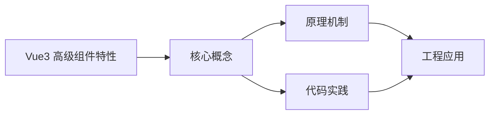
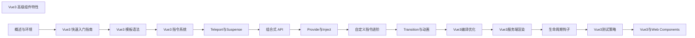

## 1. 学习目标（Bloom 分类）

本节按照布鲁姆教育目标分类学组织学习路径。本文主题为《Vue3 高级组件特性》，属于 Vue 3 模块，读者可以根据自身阶段选择阅读深度。

记忆层面：能够准确复述本文的核心概念、术语与基本语法或操作步骤，并能够在提问或检索时快速定位对应知识点。能够说出 Vue 3 的核心概念、术语与标准写法。

理解层面：能够用自己的语言解释核心原理与工作机制，说明概念之间的因果关系，而不是机械记忆结论。能够解释 Vue 3 的工作原理与设计动机。

应用层面：能够在真实项目或练习场景中运用本文知识解决具体问题，写出正确且可维护的实现。能够编写符合 Vue 3 规范的完整实现。

分析层面：能够拆解复杂问题，比较本文主题与相邻概念的异同，识别边界条件与例外情况。能够分析 Vue 3 与相邻方案的差异与边界。

评价层面：能够根据约束条件（性能、可读性、安全、成本）评价不同方案的优劣，做出有依据的技术决策。能够根据场景评价 Vue 3 相关方案的优劣。

创造层面：能够把本文知识与其他模块知识组合，设计出新的解决方案或可复用的工程模式。能够组合 Vue 3 与其他技术设计完整方案。

通过本节学习，读者应当能够把《Vue3 高级组件特性》纳入自己的知识网络，并与 Vue 3 模块的其他主题（组合式 API、响应式、组件通信、路由、状态管理）建立关联。

## 2. 历史动机与发展脉络

《Vue3 高级组件特性》是 Vue 3 领域的重要主题。要真正理解它，需要先了解它解决的问题与演进过程。

Vue 由尤雨溪于 2014 年发布，以“渐进式框架”定位：可作库嵌入，也可作框架构建完整应用。Vue 3 于 2020 年 9 月发布，核心是组合式 API 与全新响应式系统。
Vue 3 的技术支柱：Proxy 响应式（替代 Object.defineProperty）、虚拟 DOM 重写（PatchFlags）、Fragment/Teleport/Suspense 内置组件、组合式 API（setup/ref/reactive/computed）。
生态现状：Vue Router 4、Pinia（官方状态库）、Vite 构建、Nuxt 全栈框架；Vue 3.5 引入 useTemplateRef 等开发者体验改进。

回到本文主题：Vue3 高级组件特性 的提出与成熟，正是上述技术背景下的必然产物。早期实现往往以简单可用为目标，随着工程规模扩大，社区逐渐沉淀出标准做法与最佳实践；理解这一脉络，可以帮助读者判断“为什么文档中的推荐写法是现在这个样子”，也能在遇到历史遗留代码时准确识别其设计年代与取舍。


## 3. 形式化定义与核心概念精讲

本节把《Vue3 高级组件特性》涉及的核心概念以“定义 + 讲解”的形式展开。读者应把定义当作工具，把讲解当作理解路径；两者结合才能形成可迁移的知识。

响应式：ref 包装基本类型，reactive 包装对象；effect 收集依赖，Proxy 拦截读写；computed 缓存派生值。
组件通信：props 向下、emit 向上、v-model 双向、provide/inject 跨层、事件总线（慎用）。
生命周期：setup 在创建前执行；onMounted/onUpdated/onUnmounted 对应挂载、更新、卸载；KeepAlive 增加 activated/deactivated。

### 3.1 原文章节逐一精讲

原文档把主题拆分为 21 个小节，下面按顺序给出每一节的导读讲解，随后保留原文细节供精读。

#### 原文精读（完整保留）

# 高级组件 API 语法速查手册

> **符号约定**:`< >` 必填参数 | `[ ]` 可选参数

---

#### 1. 动态组件

##### 1.1 基本用法

**作用**：根据条件动态渲染不同的组件
**用法**：

```vue
<template>
  <div>
    <button @click="currentComponent = 'ComponentA'">组件 A</button>
    <button @click="currentComponent = 'ComponentB'">组件 B</button>
    <button @click="currentComponent = 'ComponentC'">组件 C</button>
    <component :is="currentComponent" />
  </div>
</template>
<script setup lang="ts">
import { ref } from 'vue';
import ComponentA from './ComponentA.vue';
import ComponentB from './ComponentB.vue';
import ComponentC from './ComponentC.vue';
const currentComponent = ref('ComponentA');
</script>
```

**组件定义**：

```vue
<!-- ComponentA.vue -->
<template>
  <div class="component">
    <h3>组件 A</h3>
    <p>这是组件 A 的内容</p>
  </div>
</template>
<style scoped>
.component {
  padding: 20px;
  border: 1px solid #ddd;
  border-radius: 8px;
  margin-top: 20px;
  background-color: #f9f9f9;
}
</style>
```

##### 1.2 动态组件的传参

```vue
<template>
  <div>
    <button @click="currentComponent = 'ComponentA'">组件 A</button>
    <button @click="currentComponent = 'ComponentB'">组件 B</button>
    <component :is="currentComponent" :message="message" @update="handleUpdate" />
  </div>
</template>
<script setup lang="ts">
import { ref } from 'vue';
import ComponentA from './ComponentA.vue';
import ComponentB from './ComponentB.vue';
const currentComponent = ref('ComponentA');
const message = ref('Hello from parent');
function handleUpdate(newMessage: string) {
  message.value = newMessage;
}
</script>
```

##### 1.3 动态组件的缓存

```vue
<template>
  <div>
    <button @click="currentComponent = 'ComponentA'">组件 A</button>
    <button @click="currentComponent = 'ComponentB'">组件 B</button>
    <keep-alive>
      <component :is="currentComponent" />
    </keep-alive>
  </div>
</template>
<script setup lang="ts">
import { ref } from 'vue';
import ComponentA from './ComponentA.vue';
import ComponentB from './ComponentB.vue';
const currentComponent = ref('ComponentA');
</script>
```

#### 2. 异步组件

##### 2.1 基本用法

**作用**：按需加载组件，提高初始加载性能
**用法**：

```vue
<template>
  <div>
    <h1>异步组件示例</h1>
    <button @click="showAsyncComponent = ">加载异步组件</button>
    <div v-if="showAsyncComponent">
      <AsyncComponent />
    </div>
  </div>
</template>
<script setup lang="ts">
import { ref, defineAsyncComponent } from 'vue'
const showAsyncComponent = ref(false)
// 定义异步组件
const AsyncComponent = defineAsyncComponent({
 loader: () => import('./AsyncComponent.vue'),
 loadingComponent: () => <div>加载中...</div>,
 errorComponent: () => <div>加载失败</div>,
 delay: 200,
 timeout: 3000
}
</script>
```

##### 2.2 高级配置

```vue
<template>
  <div>
    <h1>异步组件高级配置</h1>
    <AsyncComponentWithOptions />
  </div>
</template>
<script setup lang="ts">
import { defineAsyncComponent } from 'vue'
const AsyncComponentWithOptions = defineAsyncComponent({
 // 加载组件的函数
 loader: () => import('./HeavyComponent.vue'),
 // 加载过程中显示的组件
 loadingComponent: {
 template: '<div class="loading">加载中，请稍候...</div>'
 },
 // 加载失败时显示的组件
 errorComponent: {
 template: '<div class="error">加载失败，请重试</div>'
 },
 // 延迟显示加载组件的时间（毫秒）
 delay: 300,
 // 超时时间（毫秒）
 timeout: 5000,
 // 是否在组件加载失败时重试
 suspensible: false
}
</script>
<style scoped>
.loading {
  padding: 20px;
  text-align: center;
  color: #666;
}
.error {
  padding: 20px;
  text-align: center;
  color: #e74c3c;
}
</style>
```

#### 3. 递归组件

##### 3.1 基本用法

**作用**：组件可以递归调用自身，适用于树形结构等场景
**用法**：

```vue
<template>
  <div class="tree-node">
    <div class="node-content" @click="toggleExpanded">
      {{ node.name }}
      <span v-if="node.children && node.children.length > 0">
        {{ expanded ? '▼' : '▶' }}
      </span>
    </div>
    <div v-if="node.children && node.children.length > 0 && expanded" class="node-children">
      <TreeView v-for="child in node.children" :key="child.id" :node="child" />
    </div>
  </div>
</template>
<script setup lang="ts">
import { ref } from 'vue';
const props = defineProps<{
  node: {
    id: number;
    name: string;
    children?: Array<{
      id: number;
      name: string;
      children?: Array<any>;
    }>;
  };
  ;
}>();
const expanded = ref(false);
function toggleExpanded() {
  expanded.value = !expanded.value;
  ;
}
</script>
<style scoped>
.tree-node {
  margin-left: 20px;
}
.node-content {
  cursor: pointer;
  padding: 5px;
  border-radius: 4px;
  transition: background-color 0.3s;
}
.node-content:hover {
  background-color: #f0f0f0;
}
.node-children {
  margin-top: 5px;
}
</style>
```

##### 3.2 使用场景

```vue
<template>
  <div class="tree-view">
    <h2>树形结构示例</h2>
    <TreeView :node="treeData" />
  </div>
</template>
<script setup lang="ts">
import TreeView from './TreeView.vue';
const treeData = {
  id: 1,
  name: '根节点',
  children: [
    {
      id: 2,
      name: '子节点 1',
      children: [
        {
          id: 3,
          name: '孙节点 1-1',
        },
        {
          id: 4,
          name: '孙节点 1-2',
        },
      ],
    },
    {
      id: 5,
      name: '子节点 2',
      children: [
        {
          id: 6,
          name: '孙节点 2-1',
        },
      ],
    },
  ],
};
</script>
<style scoped>
.tree-view {
  padding: 20px;
  border: 1px solid #ddd;
  border-radius: 8px;
  background-color: #f9f9f9;
}
</style>
```

#### 4. 函数式组件

##### 4.1 基本用法

**作用**：无状态、无实例的组件，性能更高
**用法**：

```vue
<template>
  <div>
    <h2>函数式组件示例</h2>
    <FunctionalComponent :message="message" />
  </div>
</template>
<script setup lang="ts">
import { ref } from 'vue';
import FunctionalComponent from './FunctionalComponent.vue';
const message = ref('Hello from parent');
</script>
```

**函数式组件定义**：

```vue
<script setup lang="ts">
import { defineProps } from 'vue';
const props = defineProps<{
  message: string;
  ;
}>();
</script>
<template>
  <div class="functional-component">
    <p>{{ message }}</p>
    <p>这是一个函数式组件</p>
  </div>
</template>
<style scoped>
.functional-component {
  padding: 20px;
  border: 1px solid #ddd;
  border-radius: 8px;
  background-color: #f9f9f9;
}
</style>
```

#### 5. 组件插槽

##### 5.1 基本插槽

**作用**：允许父组件向子组件注入内容
**用法**：

```vue
<template>
  <div>
    <h2>插槽示例</h2>
    <SlotComponent>
      <p>这是插槽内容</p>
    </SlotComponent>
  </div>
</template>
<script setup lang="ts">
import SlotComponent from './SlotComponent.vue';
</script>
```

**插槽组件定义**：

```vue
<template>
  <div class="slot-component">
    <h3>插槽组件</h3>
    <slot></slot>
  </div>
</template>
<style scoped>
.slot-component {
  padding: 20px;
  border: 1px solid #ddd;
  border-radius: 8px;
  background-color: #f9f9f9;
}
</style>
```

##### 5.2 具名插槽

```vue
<template>
  <div>
    <h2>具名插槽示例</h2>
    <NamedSlotComponent>
      <template #header>
        <h3>自定义头部</h3>
      </template>
      <template #content>
        <p>自定义内容</p>
        <p>更多内容</p>
      </template>
      <template #footer>
        <p>自定义底部</p>
      </template>
    </NamedSlotComponent>
  </div>
</template>
<script setup lang="ts">
import NamedSlotComponent from './NamedSlotComponent.vue';
</script>
```

**具名插槽组件定义**：

```vue
<template>
  <div class="named-slot-component">
    <div class="header">
      <slot name="header">默认头部</slot>
    </div>
    <div class="content">
      <slot name="content">默认内容</slot>
    </div>
    <div class="footer">
      <slot name="footer">默认底部</slot>
    </div>
  </div>
</template>
<style scoped>
.named-slot-component {
  padding: 20px;
  border: 1px solid #ddd;
  border-radius: 8px;
  background-color: #f9f9f9;
}
.header {
  margin-bottom: 10px;
  padding-bottom: 10px;
  border-bottom: 1px solid #eee;
}
.content {
  margin-bottom: 10px;
  padding-bottom: 10px;
  border-bottom: 1px solid #eee;
}
.footer {
  margin-top: 10px;
}
</style>
```

##### 5.3 作用域插槽

```vue
<template>
  <div>
    <h2>作用域插槽示例</h2>
    <ScopedSlotComponent>
      <template #item="{ item }">
        <li class="custom-item">{{ item.id }}: {{ item.name }}</li>
      </template>
    </ScopedSlotComponent>
  </div>
</template>
<script setup lang="ts">
import ScopedSlotComponent from './ScopedSlotComponent.vue';
</script>
<style scoped>
.custom-item {
  padding: 5px;
  border-bottom: 1px solid #eee;
}
</style>
```

**作用域插槽组件定义**：

```vue
<template>
  <div class="scoped-slot-component">
    <h3>作用域插槽组件</h3>
    <ul>
      <slot v-for="item in items" :key="item.id" name="item" :item="item">
        {{ item.name }}
      </slot>
    </ul>
  </div>
</template>
<script setup lang="ts">
import { ref } from 'vue'
const items = ref([
 { id: 1, name: '项目 1' },
 { id: 2, name: '项目 2' },
 { id: 3, name: '项目 3' }
]
</script>
<style scoped>
.scoped-slot-component {
  padding: 20px;
  border: 1px solid #ddd;
  border-radius: 8px;
  background-color: #f9f9f9;
}
ul {
  list-style: none;
  padding: 0;
  margin: 0;
}
</style>
```

#### 6. 组件继承

##### 6.1 基本用法

**作用**：通过组合式 API 实现组件逻辑的复用
**用法**：

```vue
<template>
  <div class="base-component">
    <h3>{{ title }}</h3>
    <p>{{ message }}</p>
    <button @click="handleClick">点击我</button>
  </div>
</template>
<script setup lang="ts">
import { ref } from 'vue';
const props = defineProps<{
  title: string;
  message: string;
  ;
}>();
const emit = defineEmits<{
  (e: 'click'): void;
  ;
}>();
function handleClick() {
  emit('click');
  ;
}
</script>
<style scoped>
.base-component {
  padding: 20px;
  border: 1px solid #ddd;
  border-radius: 8px;
  background-color: #f9f9f9;
}
</style>
```

**继承组件**：

```vue
<template>
  <div class="extended-component">
    <BaseComponent :title="title" :message="message" @click="handleBaseClick" />
    <p>这是扩展内容</p>
  </div>
</template>
<script setup lang="ts">
import { ref } from 'vue';
import BaseComponent from './BaseComponent.vue';
const title = ref('扩展组件');
const message = ref('这是扩展组件的消息');
function handleBaseClick() {
  console.log('Base component clicked');
}
</script>
<style scoped>
.extended-component {
  padding: 20px;
  border: 1px solid #42b983;
  border-radius: 8px;
  background-color: #f0f9f0;
}
</style>
```

#### 7. 组件的 provide/inject

##### 7.1 基本用法

**作用**：实现组件之间的依赖注入，避免 props 层层传递
**用法**：

```vue
<template>
  <div class="parent-component">
    <h2>父组件</h2>
    <ChildComponent />
  </div>
</template>
<script setup lang="ts">
import { provide } from 'vue'
import ChildComponent from './ChildComponent.vue'
// 提供数据
provide('message', 'Hello from parent')
provide('user', {
 name: '张三',
 age: 20
}
</script>
<style scoped>
.parent-component {
  padding: 20px;
  border: 1px solid #ddd;
  border-radius: 8px;
  background-color: #f9f9f9;
}
</style>
```

**子组件**：

```vue
<template>
  <div class="child-component">
    <h3>子组件</h3>
    <p>{{ injectedMessage }}</p>
    <p>用户名: {{ injectedUser.name }}</p>
    <p>年龄: {{ injectedUser.age }}</p>
    <GrandchildComponent />
  </div>
</template>
<script setup lang="ts">
import { inject } from 'vue';
import GrandchildComponent from './GrandchildComponent.vue';
// 注入数据
const injectedMessage = inject('message', '默认消息');
const injectedUser = inject('user', { name: '默认用户', age: 0 });
</script>
<style scoped>
.child-component {
  padding: 20px;
  border: 1px solid #3498db;
  border-radius: 8px;
  background-color: #f0f8ff;
  margin-top: 10px;
}
</style>
```

**孙组件**：

```vue
<template>
  <div class="grandchild-component">
    <h4>孙组件</h4>
    <p>{{ injectedMessage }}</p>
    <p>用户名: {{ injectedUser.name }}</p>
  </div>
</template>
<script setup lang="ts">
import { inject } from 'vue';
// 注入数据
const injectedMessage = inject('message', '默认消息');
const injectedUser = inject('user', { name: '默认用户', age: 0 });
</script>
<style scoped>
.grandchild-component {
  padding: 20px;
  border: 1px solid #e74c3c;
  border-radius: 8px;
  background-color: #fff0f0;
  margin-top: 10px;
}
</style>
```

#### 8. 组件的生命周期钩子

##### 8.1 常用生命周期钩子

```vue
<template>
  <div class="lifecycle-component">
    <h2>生命周期钩子示例</h2>
    <p>组件状态: {{ status }}</p>
    <button @click="updateMessage">更新消息</button>
  </div>
</template>
<script setup lang="ts">
import {
  ref,
  onMounted,
  onUpdated,
  onUnmounted,
  onBeforeMount,
  onBeforeUpdate,
  onBeforeUnmount,
} from 'vue';
const status = ref('创建中');
const message = ref('初始消息');
// 组件挂载前
onBeforeMount(() => {
  status.value = '挂载前';
  console.log('组件挂载前');
});
// 组件挂载后
onMounted(() => {
  status.value = '已挂载';
  console.log('组件挂载后');
});
// 组件更新前
onBeforeUpdate(() => {
  console.log('组件更新前');
});
// 组件更新后
onUpdated(() => {
  console.log('组件更新后');
});
// 组件卸载前
onBeforeUnmount(() => {
  status.value = '卸载前';
  console.log('组件卸载前');
});
// 组件卸载后
onUnmounted(() => {
  console.log('组件卸载后');
});
function updateMessage() {
  message.value = '更新后的消息';
}
</script>
<style scoped>
.lifecycle-component {
  padding: 20px;
  border: 1px solid #ddd;
  border-radius: 8px;
  background-color: #f9f9f9;
}
</style>
```

#### 9. 组件的错误处理

##### 9.1 错误边界

**作用**：捕获组件树中的错误，防止整个应用崩溃
**用法**：

```vue
<template>
  <div class="error-boundary">
    <h2>错误边界示例</h2>
    <ErrorBoundary>
      <BuggyComponent />
    </ErrorBoundary>
  </div>
</template>
<script setup lang="ts">
import ErrorBoundary from './ErrorBoundary.vue';
import BuggyComponent from './BuggyComponent.vue';
</script>
<style scoped>
.error-boundary {
  padding: 20px;
  border: 1px solid #ddd;
  border-radius: 8px;
  background-color: #f9f9f9;
}
</style>
```

**错误边界组件**：

```vue
<template>
  <div>
    <slot v-if="!hasError"></slot>
    <div v-else class="error-message">
      <h3>发生错误</h3>
      <p>{{ error.message }}</p>
      <button @click="resetError">重试</button>
    </div>
  </div>
</template>
<script setup lang="ts">
import { ref, onErrorCaptured } from 'vue';
const hasError = ref(false);
const error = ref<Error | null>(null);
onErrorCaptured((err) => {
  hasError.value = error.value = err as Error;
  return; // 阻止错误继续传播
});
function resetError() {
  hasError.value = false;
  error.value = null;
}
</script>
<style scoped>
.error-message {
  padding: 20px;
  border: 1px solid #e74c3c;
  border-radius: 8px;
  background-color: #fff0f0;
  color: #e74c3c;
}
</style>
```

**有 bug 的组件**：

```vue
<template>
  <div class="buggy-component">
    <h3>有 bug 的组件</h3>
    <button @click="triggerError">触发错误</button>
  </div>
</template>
<script setup lang="ts">
function triggerError() {
  // 故意触发错误
  throw new Error('这是一个测试错误');
}
</script>
<style scoped>
.buggy-component {
  padding: 20px;
  border: 1px solid #ddd;
  border-radius: 8px;
  background-color: #f9f9f9;
}
</style>
```

#### 10. 最佳实践

##### 10.1 组件设计原则

- **单一职责**：每个组件只负责一个功能
- **可复用性**：设计通用的、可复用的组件
- **可维护性**：代码结构清晰，易于理解和维护
- **性能优化**：合理使用 `v-memo`、`keep-alive` 等优化性能
- **类型安全**：使用 TypeScript 为组件添加类型

##### 10.2 高级组件使用建议

- **动态组件**：用于根据条件渲染不同的组件
- **异步组件**：用于按需加载大型组件，提高初始加载性能
- **递归组件**：用于树形结构等递归场景
- **函数式组件**：用于无状态、纯展示的组件
- **插槽**：用于组件内容的定制化
- **provide/inject**：用于组件间的依赖注入
- **错误边界**：用于捕获和处理组件错误

##### 10.3 性能优化

- **合理使用 keep-alive**：缓存组件状态，减少重复渲染
- **使用异步组件**：按需加载组件，减少初始包大小
- **组件拆分**：将复杂组件拆分为更小的、可复用的组件
- **避免不必要的渲染**：使用 `v-memo`、计算属性等优化渲染性能
- **事件监听清理**：在组件卸载时清理事件监听器

#### 11. 总结

Vue3 的高级组件特性为开发者提供了强大的工具，从动态组件、异步组件到递归组件、插槽等，使开发者可以构建更加灵活、高效的应用。通过本教程的学习，你应该已经掌握了 Vue3 高级组件特性的基本使用方法和最佳实践，可以在实际项目中灵活运用。
#### defineExpose 暴露实例

**暴露属性/方法**
`defineExpose({ <key>: <value>, ... });`
```typescript
<script setup>
import { ref } from 'vue';

const count = ref(0);
const increment = () => count.value++;
const reset = () => { count.value = 0; };

defineExpose({
  count,
  increment,
  reset,
  // 也可以暴露计算属性
  double: computed(() => count.value * 2)
});
</script>
```

**父组件通过 ref 访问**
```vue
<template>
  <ChildComp ref="childRef" />
  <button @click="childRef?.increment()">+1</button>
  <button @click="childRef?.reset()">重置</button>
</template>

<script setup>
import { useTemplateRef } from 'vue';
import ChildComp from './ChildComp.vue';

const childRef = useTemplateRef<InstanceType<typeof ChildComp>>('childRef');
</script>
```

---

#### useAttrs 透传属性

**获取透传属性**
`const <attrs> = useAttrs();`
```typescript
<script setup>
import { useAttrs } from 'vue';

const attrs = useAttrs();
// attrs.class, attrs.id, attrs['data-test'] 等
console.log(attrs);
</script>

<template>
  <input v-bind="$attrs" />
</template>
```

**配合 inheritAttrs:false**
```vue
<script setup>
import { useAttrs } from 'vue';

defineOptions({
  inheritAttrs: false  // 阻止自动透传到根元素
});

const attrs = useAttrs();
</script>

<template>
  <div>
    <input v-bind="attrs" />
    <span>{{ attrs.placeholder }}</span>
  </div>
</template>
```

**attrs 响应性**
```typescript
import { useAttrs, watchEffect } from 'vue';

const attrs = useAttrs();
watchEffect(() => {
  console.log('attrs 变化:', attrs.class, attrs.id);
});
```

---

#### useSlots 插槽访问

**获取插槽**
`const <slots> = useSlots();`
```typescript
<script setup>
import { useSlots, computed } from 'vue';

const slots = useSlots();

const hasHeader = computed(() => !!slots.header);
const hasFooter = computed(() => !!slots.footer);
</script>

<template>
  <div>
    <header v-if="hasHeader">
      <slot name="header" />
    </header>
    <main>
      <slot />
    </main>
    <footer v-if="hasFooter">
      <slot name="footer" />
    </footer>
  </div>
</template>
```

**条件渲染插槽**
```typescript
import { useSlots, h } from 'vue';

const slots = useSlots();

function renderContent() {
  if (slots.default) {
    return slots.default();
  }
  if (slots.fallback) {
    return slots.fallback();
  }
  return h('div', '默认内容');
}
```

---

#### defineModel 双向绑定

**基础 defineModel**
`const <model> = defineModel([modelName], [options]);`
```typescript
<script setup lang="ts">
const model = defineModel<string>();

function update(value: string) {
  model.value = value;
}
</script>

<template>
  <input
    :value="model"
    @input="model = ($event.target as HTMLInputElement).value"
  />
</template>
```

**命名 model**
```typescript
const firstName = defineModel<string>('firstName');
const lastName = defineModel<string>('lastName');
```

**带默认值**
```typescript
const count = defineModel<number>({ default: 0 });
const title = defineModel<string>('title', { default: '标题' });
```

**local 模式(本地副本)**
```typescript
const text = defineModel<string>({ default: '', local: true });
// local:true 时,修改不立即同步到父组件
```

**修饰符处理**
```typescript
const [model, modifiers] = defineModel<string>({
  set(value) {
    if (modifiers.capitalize) {
      return value.charAt(0).toUpperCase() + value.slice(1);
    }
    if (modifiers.trim) {
      return value.trim();
    }
    return value;
  }
});
```
```vue
<MyInput v-model.capitalize="text" />
<MyInput v-model.trim="text" />
```

---

#### defineOptions 选项定义

**defineOptions 用法**
```typescript
defineOptions({
  name: 'UserCard',
  inheritAttrs: false,
  components: { MyButton },
  directives: {
    focus: { mounted: (el: HTMLElement) => el.focus() }
  },
  emits: ['change'],
  // 其他选项式 API 选项
  data() {
    return { extra: '' };
  },
  created() {
    console.log('created');
  }
});
```

---

#### defineSlots 插槽类型

**defineSlots 类型声明**
```typescript
<script setup lang="ts">
const slots = defineSlots<{
  default(props: { item: any; index: number }): any;
  header?(props: { title: string }): any;
  footer?(): any;
}>();
</script>

<template>
  <slot name="header" :title="pageTitle" />
  <ul>
    <li v-for="(item, index) in items" :key="item.id">
      <slot :item="item" :index="index" />
    </li>
  </ul>
  <slot name="footer" />
</template>
```

---

#### v-model 高级用法

**多个 v-model**
```vue
<!-- 父组件 -->
<UserForm
  v-model:firstName="first"
  v-model:lastName="last"
  v-model:age="age"
/>

<!-- 子组件 UserForm.vue -->
<script setup lang="ts">
const firstName = defineModel<string>('firstName');
const lastName = defineModel<string>('lastName');
const age = defineModel<number>('age', { default: 0 });
</script>
```

**v-model 与自定义事件**
```typescript
<script setup lang="ts">
const model = defineModel<string>();

// 等价于
const props = defineProps<{ modelValue: string }>();
const emit = defineEmits<{ 'update:modelValue': [value: string] }>();

// model.value = x 等价于 emit('update:modelValue', x)
</script>
```

---

#### 高阶组件模式

**函数式高阶组件**
```typescript
import { h, defineComponent, type Component } from 'vue';

export function withLoading<T extends Component>(WrappedComp: T) {
  return defineComponent({
    name: 'WithLoading',
    props: ['loading'],
    setup(props, { attrs, slots }) {
      return () => {
        if (props.loading) {
          return h('div', { class: 'loading' }, 'Loading...');
        }
        return h(WrappedComp, { ...attrs }, slots);
      };
    }
  });
}

// 使用
const AsyncUser = withLoading(UserCard);
```

**透传 props 与 emits**
```vue
<script setup lang="ts">
import { useAttrs, useListeners } from 'vue';

// 透传所有 props 和事件
defineOptions({ inheritAttrs: false });
const attrs = useAttrs();
</script>

<template>
  <Child v-bind="$attrs" v-on="$attrs" />
</template>
```

---

#### 渲染函数与 JSX

**h 函数**
```typescript
import { h, defineComponent } from 'vue';

export default defineComponent({
  name: 'MyList',
  props: { items: Array as PropType<string[]> },
  setup(props) {
    return () =>
      h('ul', props.items.map(item => h('li', { key: item }, item)));
  }
});
```

**JSX 语法**
```typescript
import { defineComponent } from 'vue';

export default defineComponent({
  name: 'MyComp',
  setup() {
    const count = ref(0);
    return () => (
      <button onClick={() => count.value++}>
        Clicked {count.value} times
      </button>
    );
  }
});
```

---

#### 组件通信综合

**v-model + emit 模式**
```vue
<!-- 子组件 -->
<script setup lang="ts">
const props = defineProps<{
  modelValue: string;
}>();

const emit = defineEmits<{
  'update:modelValue': [value: string];
  'submit': [value: string];
}>();

function handleInput(e: Event) {
  emit('update:modelValue', (e.target as HTMLInputElement).value);
}

function handleSubmit() {
  emit('submit', props.modelValue);
}
</script>

<template>
  <input :value="modelValue" @input="handleInput" />
  <button @click="handleSubmit">提交</button>
</template>
```

**provide + inject 通信**
```typescript
import { provide, inject, readonly, type InjectionKey, type Ref } from 'vue';

interface FormContext {
  values: Ref<Record<string, any>>;
  errors: Ref<Record<string, string>>;
  setField: (name: string, value: any) => void;
}

const FormKey: InjectionKey<FormContext> = Symbol('form');

// 父组件
const values = ref({});
const errors = ref({});
provide(FormKey, {
  values: readonly(values),
  errors: readonly(errors),
  setField: (name, value) => {
    values.value[name] = value;
  }
});

// 子组件
const formCtx = inject(FormKey);
formCtx?.setField('username', 'Tom');
```


### 3.2 概念关系图

下面用 Mermaid 图表达本文核心概念之间的关系，帮助读者建立整体图景：



图中展示的是本文知识的结构化关系：核心概念是入口，原理机制解释“为什么”，代码实践演示“怎么做”，工程应用回答“何时用”。读者学习时可以把每个小节的内容挂接到对应节点上。

## 4. 理论推导与原理解析

本节深入《Vue3 高级组件特性》背后的原理。理论部分不求面面俱到，而是聚焦“能解释现象、能指导实践”的关键推导。

响应式：ref 包装基本类型，reactive 包装对象；effect 收集依赖，Proxy 拦截读写；computed 缓存派生值。
组件通信：props 向下、emit 向上、v-model 双向、provide/inject 跨层、事件总线（慎用）。
生命周期：setup 在创建前执行；onMounted/onUpdated/onUnmounted 对应挂载、更新、卸载；KeepAlive 增加 activated/deactivated。
模板编译：模板在构建期编译为渲染函数，指令（v-if/v-for/v-model）是编译糖。

需要强调的是，理论推导与工程实践之间存在翻译层：理论给出的是理想化模型与边界条件，工程代码则必须处理真实环境中的例外。读者在学习时应先掌握理论的“标准情形”，再通过陷阱章节了解“非标准情形”。

## 5. 代码示例与逐行讲解

本节把原文中的代码示例系统整理，并为每个示例补充用途说明与讲解。读者不应只浏览代码，而应逐段对照讲解理解设计意图。

### 5.1 示例：1.1 基本用法

该示例来自原文《1.1 基本用法》小节，用于演示Vue3 高级组件特性相关操作。阅读时请先看代码结构，再看其后的讲解。

```vue
<template>
  <div>
    <button @click="currentComponent = 'ComponentA'">组件 A</button>
    <button @click="currentComponent = 'ComponentB'">组件 B</button>
    <button @click="currentComponent = 'ComponentC'">组件 C</button>
    <component :is="currentComponent" />
  </div>
</template>
<script setup lang="ts">
import { ref } from 'vue';
import ComponentA from './ComponentA.vue';
import ComponentB from './ComponentB.vue';
import ComponentC from './ComponentC.vue';
const currentComponent = ref('ComponentA');
</script>
```

讲解：这段代码演示了本节核心知识点。代码中的关键操作可以归纳为三步：准备（定义或初始化）、执行（核心逻辑）、收尾（释放资源或返回结果）。实际项目中，这三步往往被封装为函数或类，以提升复用性与可测试性。

关键点分析：

该示例共 15 行有效代码，包含 2 类关键结构（import、from）。其中：

- 入口与初始化部分负责建立上下文，对应实际项目中的启动或装配逻辑；
- 核心逻辑部分体现本文主题的主要操作，是阅读时最需要对照讲解理解的部分；
- 输出或返回部分把结果交给调用方，注意其类型与边界条件。

进阶思考路径：先尝试修改参数观察行为变化，再把示例中的模式迁移到自己的项目中；每次修改都记录预期与实测差异，这是把示例转化为能力的最快方式。

### 5.2 示例：1.1 基本用法

该示例来自原文《1.1 基本用法》小节，用于演示Vue3 高级组件特性相关操作。阅读时请先看代码结构，再看其后的讲解。

```vue
<!-- ComponentA.vue -->
<template>
  <div class="component">
    <h3>组件 A</h3>
    <p>这是组件 A 的内容</p>
  </div>
</template>
<style scoped>
.component {
  padding: 20px;
  border: 1px solid #ddd;
  border-radius: 8px;
  margin-top: 20px;
  background-color: #f9f9f9;
}
</style>
```

讲解：这段代码演示了本节核心知识点。代码中的关键操作可以归纳为三步：准备（定义或初始化）、执行（核心逻辑）、收尾（释放资源或返回结果）。实际项目中，这三步往往被封装为函数或类，以提升复用性与可测试性。

关键点分析：

该示例共 16 行有效代码，包含 1 类关键结构（class）。其中：

- 入口与初始化部分负责建立上下文，对应实际项目中的启动或装配逻辑；
- 核心逻辑部分体现本文主题的主要操作，是阅读时最需要对照讲解理解的部分；
- 输出或返回部分把结果交给调用方，注意其类型与边界条件。

进阶思考路径：先尝试修改参数观察行为变化，再把示例中的模式迁移到自己的项目中；每次修改都记录预期与实测差异，这是把示例转化为能力的最快方式。

### 5.3 示例：1.2 动态组件的传参

该示例来自原文《1.2 动态组件的传参》小节，用于演示Vue3 高级组件特性相关操作。阅读时请先看代码结构，再看其后的讲解。

```vue
<template>
  <div>
    <button @click="currentComponent = 'ComponentA'">组件 A</button>
    <button @click="currentComponent = 'ComponentB'">组件 B</button>
    <component :is="currentComponent" :message="message" @update="handleUpdate" />
  </div>
</template>
<script setup lang="ts">
import { ref } from 'vue';
import ComponentA from './ComponentA.vue';
import ComponentB from './ComponentB.vue';
const currentComponent = ref('ComponentA');
const message = ref('Hello from parent');
function handleUpdate(newMessage: string) {
  message.value = newMessage;
}
</script>
```

讲解：这段代码演示了本节核心知识点。代码中的关键操作可以归纳为三步：准备（定义或初始化）、执行（核心逻辑）、收尾（释放资源或返回结果）。实际项目中，这三步往往被封装为函数或类，以提升复用性与可测试性。

关键点分析：

该示例共 17 行有效代码，包含 3 类关键结构（function、import、from）。其中：

- 入口与初始化部分负责建立上下文，对应实际项目中的启动或装配逻辑；
- 核心逻辑部分体现本文主题的主要操作，是阅读时最需要对照讲解理解的部分；
- 输出或返回部分把结果交给调用方，注意其类型与边界条件。

进阶思考路径：先尝试修改参数观察行为变化，再把示例中的模式迁移到自己的项目中；每次修改都记录预期与实测差异，这是把示例转化为能力的最快方式。

### 5.4 示例：1.3 动态组件的缓存

该示例来自原文《1.3 动态组件的缓存》小节，用于演示Vue3 高级组件特性相关操作。阅读时请先看代码结构，再看其后的讲解。

```vue
<template>
  <div>
    <button @click="currentComponent = 'ComponentA'">组件 A</button>
    <button @click="currentComponent = 'ComponentB'">组件 B</button>
    <keep-alive>
      <component :is="currentComponent" />
    </keep-alive>
  </div>
</template>
<script setup lang="ts">
import { ref } from 'vue';
import ComponentA from './ComponentA.vue';
import ComponentB from './ComponentB.vue';
const currentComponent = ref('ComponentA');
</script>
```

讲解：这段代码演示了本节核心知识点。代码中的关键操作可以归纳为三步：准备（定义或初始化）、执行（核心逻辑）、收尾（释放资源或返回结果）。实际项目中，这三步往往被封装为函数或类，以提升复用性与可测试性。

关键点分析：

该示例共 15 行有效代码，包含 2 类关键结构（import、from）。其中：

- 入口与初始化部分负责建立上下文，对应实际项目中的启动或装配逻辑；
- 核心逻辑部分体现本文主题的主要操作，是阅读时最需要对照讲解理解的部分；
- 输出或返回部分把结果交给调用方，注意其类型与边界条件。

进阶思考路径：先尝试修改参数观察行为变化，再把示例中的模式迁移到自己的项目中；每次修改都记录预期与实测差异，这是把示例转化为能力的最快方式。

### 5.5 示例：2.1 基本用法

该示例来自原文《2.1 基本用法》小节，用于演示Vue3 高级组件特性相关操作。阅读时请先看代码结构，再看其后的讲解。

```vue
<template>
  <div>
    <h1>异步组件示例</h1>
    <button @click="showAsyncComponent = ">加载异步组件</button>
    <div v-if="showAsyncComponent">
      <AsyncComponent />
    </div>
  </div>
</template>
<script setup lang="ts">
import { ref, defineAsyncComponent } from 'vue'
const showAsyncComponent = ref(false)
// 定义异步组件
const AsyncComponent = defineAsyncComponent({
 loader: () => import('./AsyncComponent.vue'),
 loadingComponent: () => <div>加载中...</div>,
 errorComponent: () => <div>加载失败</div>,
 delay: 200,
 timeout: 3000
}
</script>
```

讲解：这段代码演示了本节核心知识点。代码中的关键操作可以归纳为三步：准备（定义或初始化）、执行（核心逻辑）、收尾（释放资源或返回结果）。实际项目中，这三步往往被封装为函数或类，以提升复用性与可测试性。

关键点分析：

该示例共 21 行有效代码，包含 2 类关键结构（import、from）。其中：

- 入口与初始化部分负责建立上下文，对应实际项目中的启动或装配逻辑；
- 核心逻辑部分体现本文主题的主要操作，是阅读时最需要对照讲解理解的部分；
- 输出或返回部分把结果交给调用方，注意其类型与边界条件。

进阶思考路径：先尝试修改参数观察行为变化，再把示例中的模式迁移到自己的项目中；每次修改都记录预期与实测差异，这是把示例转化为能力的最快方式。

### 5.6 示例：2.2 高级配置

该示例来自原文《2.2 高级配置》小节，用于演示Vue3 高级组件特性相关操作。阅读时请先看代码结构，再看其后的讲解。

```vue
<template>
  <div>
    <h1>异步组件高级配置</h1>
    <AsyncComponentWithOptions />
  </div>
</template>
<script setup lang="ts">
import { defineAsyncComponent } from 'vue'
const AsyncComponentWithOptions = defineAsyncComponent({
 // 加载组件的函数
 loader: () => import('./HeavyComponent.vue'),
 // 加载过程中显示的组件
 loadingComponent: {
 template: '<div class="loading">加载中，请稍候...</div>'
 },
 // 加载失败时显示的组件
 errorComponent: {
 template: '<div class="error">加载失败，请重试</div>'
 },
 // 延迟显示加载组件的时间（毫秒）
 delay: 300,
 // 超时时间（毫秒）
 timeout: 5000,
 // 是否在组件加载失败时重试
 suspensible: false
}
</script>
<style scoped>
.loading {
  padding: 20px;
  text-align: center;
  color: #666;
}
.error {
  padding: 20px;
  text-align: center;
  color: #e74c3c;
}
</style>
```

讲解：这段代码演示了本节核心知识点。代码中的关键操作可以归纳为三步：准备（定义或初始化）、执行（核心逻辑）、收尾（释放资源或返回结果）。实际项目中，这三步往往被封装为函数或类，以提升复用性与可测试性。

关键点分析：

该示例共 39 行有效代码，包含 3 类关键结构（class、import、from）。其中：

- 入口与初始化部分负责建立上下文，对应实际项目中的启动或装配逻辑；
- 核心逻辑部分体现本文主题的主要操作，是阅读时最需要对照讲解理解的部分；
- 输出或返回部分把结果交给调用方，注意其类型与边界条件。

进阶思考路径：先尝试修改参数观察行为变化，再把示例中的模式迁移到自己的项目中；每次修改都记录预期与实测差异，这是把示例转化为能力的最快方式。

### 5.7 示例：3.1 基本用法

该示例来自原文《3.1 基本用法》小节，用于演示Vue3 高级组件特性相关操作。阅读时请先看代码结构，再看其后的讲解。

```vue
<template>
  <div class="tree-node">
    <div class="node-content" @click="toggleExpanded">
      {{ node.name }}
      <span v-if="node.children && node.children.length > 0">
        {{ expanded ? '▼' : '▶' }}
      </span>
    </div>
    <div v-if="node.children && node.children.length > 0 && expanded" class="node-children">
      <TreeView v-for="child in node.children" :key="child.id" :node="child" />
    </div>
  </div>
</template>
<script setup lang="ts">
import { ref } from 'vue';
const props = defineProps<{
  node: {
    id: number;
    name: string;
    children?: Array<{
      id: number;
      name: string;
      children?: Array<any>;
    }>;
  };
  ;
}>();
const expanded = ref(false);
function toggleExpanded() {
  expanded.value = !expanded.value;
  ;
}
</script>
<style scoped>
.tree-node {
  margin-left: 20px;
}
.node-content {
  cursor: pointer;
  padding: 5px;
  border-radius: 4px;
  transition: background-color 0.3s;
}
.node-content:hover {
  background-color: #f0f0f0;
}
.node-children {
  margin-top: 5px;
}
</style>
```

讲解：这段代码演示了本节核心知识点。代码中的关键操作可以归纳为三步：准备（定义或初始化）、执行（核心逻辑）、收尾（释放资源或返回结果）。实际项目中，这三步往往被封装为函数或类，以提升复用性与可测试性。

关键点分析：

该示例共 50 行有效代码，包含 4 类关键结构（class、function、import、from）。其中：

- 入口与初始化部分负责建立上下文，对应实际项目中的启动或装配逻辑；
- 核心逻辑部分体现本文主题的主要操作，是阅读时最需要对照讲解理解的部分；
- 输出或返回部分把结果交给调用方，注意其类型与边界条件。

进阶思考路径：先尝试修改参数观察行为变化，再把示例中的模式迁移到自己的项目中；每次修改都记录预期与实测差异，这是把示例转化为能力的最快方式。

### 5.8 示例：3.2 使用场景

该示例来自原文《3.2 使用场景》小节，用于演示Vue3 高级组件特性相关操作。阅读时请先看代码结构，再看其后的讲解。

```vue
<template>
  <div class="tree-view">
    <h2>树形结构示例</h2>
    <TreeView :node="treeData" />
  </div>
</template>
<script setup lang="ts">
import TreeView from './TreeView.vue';
const treeData = {
  id: 1,
  name: '根节点',
  children: [
    {
      id: 2,
      name: '子节点 1',
      children: [
        {
          id: 3,
          name: '孙节点 1-1',
        },
        {
          id: 4,
          name: '孙节点 1-2',
        },
      ],
    },
    {
      id: 5,
      name: '子节点 2',
      children: [
        {
          id: 6,
          name: '孙节点 2-1',
        },
      ],
    },
  ],
};
</script>
<style scoped>
.tree-view {
  padding: 20px;
  border: 1px solid #ddd;
  border-radius: 8px;
  background-color: #f9f9f9;
}
</style>
```

讲解：这段代码演示了本节核心知识点。代码中的关键操作可以归纳为三步：准备（定义或初始化）、执行（核心逻辑）、收尾（释放资源或返回结果）。实际项目中，这三步往往被封装为函数或类，以提升复用性与可测试性。

关键点分析：

该示例共 47 行有效代码，包含 3 类关键结构（class、import、from）。其中：

- 入口与初始化部分负责建立上下文，对应实际项目中的启动或装配逻辑；
- 核心逻辑部分体现本文主题的主要操作，是阅读时最需要对照讲解理解的部分；
- 输出或返回部分把结果交给调用方，注意其类型与边界条件。

进阶思考路径：先尝试修改参数观察行为变化，再把示例中的模式迁移到自己的项目中；每次修改都记录预期与实测差异，这是把示例转化为能力的最快方式。

### 5.9 示例：4.1 基本用法

该示例来自原文《4.1 基本用法》小节，用于演示Vue3 高级组件特性相关操作。阅读时请先看代码结构，再看其后的讲解。

```vue
<template>
  <div>
    <h2>函数式组件示例</h2>
    <FunctionalComponent :message="message" />
  </div>
</template>
<script setup lang="ts">
import { ref } from 'vue';
import FunctionalComponent from './FunctionalComponent.vue';
const message = ref('Hello from parent');
</script>
```

讲解：这段代码演示了本节核心知识点。代码中的关键操作可以归纳为三步：准备（定义或初始化）、执行（核心逻辑）、收尾（释放资源或返回结果）。实际项目中，这三步往往被封装为函数或类，以提升复用性与可测试性。

关键点分析：

该示例共 11 行有效代码，包含 2 类关键结构（import、from）。其中：

- 入口与初始化部分负责建立上下文，对应实际项目中的启动或装配逻辑；
- 核心逻辑部分体现本文主题的主要操作，是阅读时最需要对照讲解理解的部分；
- 输出或返回部分把结果交给调用方，注意其类型与边界条件。

进阶思考路径：先尝试修改参数观察行为变化，再把示例中的模式迁移到自己的项目中；每次修改都记录预期与实测差异，这是把示例转化为能力的最快方式。

### 5.10 示例：4.1 基本用法

该示例来自原文《4.1 基本用法》小节，用于演示Vue3 高级组件特性相关操作。阅读时请先看代码结构，再看其后的讲解。

```vue
<script setup lang="ts">
import { defineProps } from 'vue';
const props = defineProps<{
  message: string;
  ;
}>();
</script>
<template>
  <div class="functional-component">
    <p>{{ message }}</p>
    <p>这是一个函数式组件</p>
  </div>
</template>
<style scoped>
.functional-component {
  padding: 20px;
  border: 1px solid #ddd;
  border-radius: 8px;
  background-color: #f9f9f9;
}
</style>
```

讲解：这段代码演示了本节核心知识点。代码中的关键操作可以归纳为三步：准备（定义或初始化）、执行（核心逻辑）、收尾（释放资源或返回结果）。实际项目中，这三步往往被封装为函数或类，以提升复用性与可测试性。

关键点分析：

该示例共 21 行有效代码，包含 4 类关键结构（class、function、import、from）。其中：

- 入口与初始化部分负责建立上下文，对应实际项目中的启动或装配逻辑；
- 核心逻辑部分体现本文主题的主要操作，是阅读时最需要对照讲解理解的部分；
- 输出或返回部分把结果交给调用方，注意其类型与边界条件。

进阶思考路径：先尝试修改参数观察行为变化，再把示例中的模式迁移到自己的项目中；每次修改都记录预期与实测差异，这是把示例转化为能力的最快方式。

### 5.11 示例：5.1 基本插槽

该示例来自原文《5.1 基本插槽》小节，用于演示Vue3 高级组件特性相关操作。阅读时请先看代码结构，再看其后的讲解。

```vue
<template>
  <div>
    <h2>插槽示例</h2>
    <SlotComponent>
      <p>这是插槽内容</p>
    </SlotComponent>
  </div>
</template>
<script setup lang="ts">
import SlotComponent from './SlotComponent.vue';
</script>
```

讲解：这段代码演示了本节核心知识点。代码中的关键操作可以归纳为三步：准备（定义或初始化）、执行（核心逻辑）、收尾（释放资源或返回结果）。实际项目中，这三步往往被封装为函数或类，以提升复用性与可测试性。

关键点分析：

该示例共 11 行有效代码，包含 2 类关键结构（import、from）。其中：

- 入口与初始化部分负责建立上下文，对应实际项目中的启动或装配逻辑；
- 核心逻辑部分体现本文主题的主要操作，是阅读时最需要对照讲解理解的部分；
- 输出或返回部分把结果交给调用方，注意其类型与边界条件。

进阶思考路径：先尝试修改参数观察行为变化，再把示例中的模式迁移到自己的项目中；每次修改都记录预期与实测差异，这是把示例转化为能力的最快方式。

### 5.12 示例：5.1 基本插槽

该示例来自原文《5.1 基本插槽》小节，用于演示Vue3 高级组件特性相关操作。阅读时请先看代码结构，再看其后的讲解。

```vue
<template>
  <div class="slot-component">
    <h3>插槽组件</h3>
    <slot></slot>
  </div>
</template>
<style scoped>
.slot-component {
  padding: 20px;
  border: 1px solid #ddd;
  border-radius: 8px;
  background-color: #f9f9f9;
}
</style>
```

讲解：这段代码演示了本节核心知识点。代码中的关键操作可以归纳为三步：准备（定义或初始化）、执行（核心逻辑）、收尾（释放资源或返回结果）。实际项目中，这三步往往被封装为函数或类，以提升复用性与可测试性。

关键点分析：

该示例共 14 行有效代码，包含 1 类关键结构（class）。其中：

- 入口与初始化部分负责建立上下文，对应实际项目中的启动或装配逻辑；
- 核心逻辑部分体现本文主题的主要操作，是阅读时最需要对照讲解理解的部分；
- 输出或返回部分把结果交给调用方，注意其类型与边界条件。

进阶思考路径：先尝试修改参数观察行为变化，再把示例中的模式迁移到自己的项目中；每次修改都记录预期与实测差异，这是把示例转化为能力的最快方式。

### 5.13 示例：5.2 具名插槽

该示例来自原文《5.2 具名插槽》小节，用于演示Vue3 高级组件特性相关操作。阅读时请先看代码结构，再看其后的讲解。

```vue
<template>
  <div>
    <h2>具名插槽示例</h2>
    <NamedSlotComponent>
      <template #header>
        <h3>自定义头部</h3>
      </template>
      <template #content>
        <p>自定义内容</p>
        <p>更多内容</p>
      </template>
      <template #footer>
        <p>自定义底部</p>
      </template>
    </NamedSlotComponent>
  </div>
</template>
<script setup lang="ts">
import NamedSlotComponent from './NamedSlotComponent.vue';
</script>
```

讲解：这段代码演示了本节核心知识点。代码中的关键操作可以归纳为三步：准备（定义或初始化）、执行（核心逻辑）、收尾（释放资源或返回结果）。实际项目中，这三步往往被封装为函数或类，以提升复用性与可测试性。

关键点分析：

该示例共 20 行有效代码，包含 2 类关键结构（import、from）。其中：

- 入口与初始化部分负责建立上下文，对应实际项目中的启动或装配逻辑；
- 核心逻辑部分体现本文主题的主要操作，是阅读时最需要对照讲解理解的部分；
- 输出或返回部分把结果交给调用方，注意其类型与边界条件。

进阶思考路径：先尝试修改参数观察行为变化，再把示例中的模式迁移到自己的项目中；每次修改都记录预期与实测差异，这是把示例转化为能力的最快方式。

### 5.14 示例：5.2 具名插槽

该示例来自原文《5.2 具名插槽》小节，用于演示Vue3 高级组件特性相关操作。阅读时请先看代码结构，再看其后的讲解。

```vue
<template>
  <div class="named-slot-component">
    <div class="header">
      <slot name="header">默认头部</slot>
    </div>
    <div class="content">
      <slot name="content">默认内容</slot>
    </div>
    <div class="footer">
      <slot name="footer">默认底部</slot>
    </div>
  </div>
</template>
<style scoped>
.named-slot-component {
  padding: 20px;
  border: 1px solid #ddd;
  border-radius: 8px;
  background-color: #f9f9f9;
}
.header {
  margin-bottom: 10px;
  padding-bottom: 10px;
  border-bottom: 1px solid #eee;
}
.content {
  margin-bottom: 10px;
  padding-bottom: 10px;
  border-bottom: 1px solid #eee;
}
.footer {
  margin-top: 10px;
}
</style>
```

讲解：这段代码演示了本节核心知识点。代码中的关键操作可以归纳为三步：准备（定义或初始化）、执行（核心逻辑）、收尾（释放资源或返回结果）。实际项目中，这三步往往被封装为函数或类，以提升复用性与可测试性。

关键点分析：

该示例共 34 行有效代码，包含 1 类关键结构（class）。其中：

- 入口与初始化部分负责建立上下文，对应实际项目中的启动或装配逻辑；
- 核心逻辑部分体现本文主题的主要操作，是阅读时最需要对照讲解理解的部分；
- 输出或返回部分把结果交给调用方，注意其类型与边界条件。

进阶思考路径：先尝试修改参数观察行为变化，再把示例中的模式迁移到自己的项目中；每次修改都记录预期与实测差异，这是把示例转化为能力的最快方式。

### 5.15 示例：5.3 作用域插槽

该示例来自原文《5.3 作用域插槽》小节，用于演示Vue3 高级组件特性相关操作。阅读时请先看代码结构，再看其后的讲解。

```vue
<template>
  <div>
    <h2>作用域插槽示例</h2>
    <ScopedSlotComponent>
      <template #item="{ item }">
        <li class="custom-item">{{ item.id }}: {{ item.name }}</li>
      </template>
    </ScopedSlotComponent>
  </div>
</template>
<script setup lang="ts">
import ScopedSlotComponent from './ScopedSlotComponent.vue';
</script>
<style scoped>
.custom-item {
  padding: 5px;
  border-bottom: 1px solid #eee;
}
</style>
```

讲解：这段代码演示了本节核心知识点。代码中的关键操作可以归纳为三步：准备（定义或初始化）、执行（核心逻辑）、收尾（释放资源或返回结果）。实际项目中，这三步往往被封装为函数或类，以提升复用性与可测试性。

关键点分析：

该示例共 19 行有效代码，包含 3 类关键结构（class、import、from）。其中：

- 入口与初始化部分负责建立上下文，对应实际项目中的启动或装配逻辑；
- 核心逻辑部分体现本文主题的主要操作，是阅读时最需要对照讲解理解的部分；
- 输出或返回部分把结果交给调用方，注意其类型与边界条件。

进阶思考路径：先尝试修改参数观察行为变化，再把示例中的模式迁移到自己的项目中；每次修改都记录预期与实测差异，这是把示例转化为能力的最快方式。

### 5.16 示例：5.3 作用域插槽

该示例来自原文《5.3 作用域插槽》小节，用于演示Vue3 高级组件特性相关操作。阅读时请先看代码结构，再看其后的讲解。

```vue
<template>
  <div class="scoped-slot-component">
    <h3>作用域插槽组件</h3>
    <ul>
      <slot v-for="item in items" :key="item.id" name="item" :item="item">
        {{ item.name }}
      </slot>
    </ul>
  </div>
</template>
<script setup lang="ts">
import { ref } from 'vue'
const items = ref([
 { id: 1, name: '项目 1' },
 { id: 2, name: '项目 2' },
 { id: 3, name: '项目 3' }
]
</script>
<style scoped>
.scoped-slot-component {
  padding: 20px;
  border: 1px solid #ddd;
  border-radius: 8px;
  background-color: #f9f9f9;
}
ul {
  list-style: none;
  padding: 0;
  margin: 0;
}
</style>
```

讲解：这段代码演示了本节核心知识点。代码中的关键操作可以归纳为三步：准备（定义或初始化）、执行（核心逻辑）、收尾（释放资源或返回结果）。实际项目中，这三步往往被封装为函数或类，以提升复用性与可测试性。

关键点分析：

该示例共 31 行有效代码，包含 3 类关键结构（class、import、from）。其中：

- 入口与初始化部分负责建立上下文，对应实际项目中的启动或装配逻辑；
- 核心逻辑部分体现本文主题的主要操作，是阅读时最需要对照讲解理解的部分；
- 输出或返回部分把结果交给调用方，注意其类型与边界条件。

进阶思考路径：先尝试修改参数观察行为变化，再把示例中的模式迁移到自己的项目中；每次修改都记录预期与实测差异，这是把示例转化为能力的最快方式。

### 5.17 示例：6.1 基本用法

该示例来自原文《6.1 基本用法》小节，用于演示Vue3 高级组件特性相关操作。阅读时请先看代码结构，再看其后的讲解。

```vue
<template>
  <div class="base-component">
    <h3>{{ title }}</h3>
    <p>{{ message }}</p>
    <button @click="handleClick">点击我</button>
  </div>
</template>
<script setup lang="ts">
import { ref } from 'vue';
const props = defineProps<{
  title: string;
  message: string;
  ;
}>();
const emit = defineEmits<{
  (e: 'click'): void;
  ;
}>();
function handleClick() {
  emit('click');
  ;
}
</script>
<style scoped>
.base-component {
  padding: 20px;
  border: 1px solid #ddd;
  border-radius: 8px;
  background-color: #f9f9f9;
}
</style>
```

讲解：这段代码演示了本节核心知识点。代码中的关键操作可以归纳为三步：准备（定义或初始化）、执行（核心逻辑）、收尾（释放资源或返回结果）。实际项目中，这三步往往被封装为函数或类，以提升复用性与可测试性。

关键点分析：

该示例共 31 行有效代码，包含 4 类关键结构（class、function、import、from）。其中：

- 入口与初始化部分负责建立上下文，对应实际项目中的启动或装配逻辑；
- 核心逻辑部分体现本文主题的主要操作，是阅读时最需要对照讲解理解的部分；
- 输出或返回部分把结果交给调用方，注意其类型与边界条件。

进阶思考路径：先尝试修改参数观察行为变化，再把示例中的模式迁移到自己的项目中；每次修改都记录预期与实测差异，这是把示例转化为能力的最快方式。

### 5.18 示例：6.1 基本用法

该示例来自原文《6.1 基本用法》小节，用于演示Vue3 高级组件特性相关操作。阅读时请先看代码结构，再看其后的讲解。

```vue
<template>
  <div class="extended-component">
    <BaseComponent :title="title" :message="message" @click="handleBaseClick" />
    <p>这是扩展内容</p>
  </div>
</template>
<script setup lang="ts">
import { ref } from 'vue';
import BaseComponent from './BaseComponent.vue';
const title = ref('扩展组件');
const message = ref('这是扩展组件的消息');
function handleBaseClick() {
  console.log('Base component clicked');
}
</script>
<style scoped>
.extended-component {
  padding: 20px;
  border: 1px solid #42b983;
  border-radius: 8px;
  background-color: #f0f9f0;
}
</style>
```

讲解：这段代码演示了本节核心知识点。代码中的关键操作可以归纳为三步：准备（定义或初始化）、执行（核心逻辑）、收尾（释放资源或返回结果）。实际项目中，这三步往往被封装为函数或类，以提升复用性与可测试性。

关键点分析：

该示例共 23 行有效代码，包含 4 类关键结构（class、function、import、from）。其中：

- 入口与初始化部分负责建立上下文，对应实际项目中的启动或装配逻辑；
- 核心逻辑部分体现本文主题的主要操作，是阅读时最需要对照讲解理解的部分；
- 输出或返回部分把结果交给调用方，注意其类型与边界条件。

进阶思考路径：先尝试修改参数观察行为变化，再把示例中的模式迁移到自己的项目中；每次修改都记录预期与实测差异，这是把示例转化为能力的最快方式。

### 5.19 示例：7.1 基本用法

该示例来自原文《7.1 基本用法》小节，用于演示Vue3 高级组件特性相关操作。阅读时请先看代码结构，再看其后的讲解。

```vue
<template>
  <div class="parent-component">
    <h2>父组件</h2>
    <ChildComponent />
  </div>
</template>
<script setup lang="ts">
import { provide } from 'vue'
import ChildComponent from './ChildComponent.vue'
// 提供数据
provide('message', 'Hello from parent')
provide('user', {
 name: '张三',
 age: 20
}
</script>
<style scoped>
.parent-component {
  padding: 20px;
  border: 1px solid #ddd;
  border-radius: 8px;
  background-color: #f9f9f9;
}
</style>
```

讲解：这段代码演示了本节核心知识点。代码中的关键操作可以归纳为三步：准备（定义或初始化）、执行（核心逻辑）、收尾（释放资源或返回结果）。实际项目中，这三步往往被封装为函数或类，以提升复用性与可测试性。

关键点分析：

该示例共 24 行有效代码，包含 3 类关键结构（class、import、from）。其中：

- 入口与初始化部分负责建立上下文，对应实际项目中的启动或装配逻辑；
- 核心逻辑部分体现本文主题的主要操作，是阅读时最需要对照讲解理解的部分；
- 输出或返回部分把结果交给调用方，注意其类型与边界条件。

进阶思考路径：先尝试修改参数观察行为变化，再把示例中的模式迁移到自己的项目中；每次修改都记录预期与实测差异，这是把示例转化为能力的最快方式。

### 5.20 示例：7.1 基本用法

该示例来自原文《7.1 基本用法》小节，用于演示Vue3 高级组件特性相关操作。阅读时请先看代码结构，再看其后的讲解。

```vue
<template>
  <div class="child-component">
    <h3>子组件</h3>
    <p>{{ injectedMessage }}</p>
    <p>用户名: {{ injectedUser.name }}</p>
    <p>年龄: {{ injectedUser.age }}</p>
    <GrandchildComponent />
  </div>
</template>
<script setup lang="ts">
import { inject } from 'vue';
import GrandchildComponent from './GrandchildComponent.vue';
// 注入数据
const injectedMessage = inject('message', '默认消息');
const injectedUser = inject('user', { name: '默认用户', age: 0 });
</script>
<style scoped>
.child-component {
  padding: 20px;
  border: 1px solid #3498db;
  border-radius: 8px;
  background-color: #f0f8ff;
  margin-top: 10px;
}
</style>
```

讲解：这段代码演示了本节核心知识点。代码中的关键操作可以归纳为三步：准备（定义或初始化）、执行（核心逻辑）、收尾（释放资源或返回结果）。实际项目中，这三步往往被封装为函数或类，以提升复用性与可测试性。

关键点分析：

该示例共 25 行有效代码，包含 3 类关键结构（class、import、from）。其中：

- 入口与初始化部分负责建立上下文，对应实际项目中的启动或装配逻辑；
- 核心逻辑部分体现本文主题的主要操作，是阅读时最需要对照讲解理解的部分；
- 输出或返回部分把结果交给调用方，注意其类型与边界条件。

进阶思考路径：先尝试修改参数观察行为变化，再把示例中的模式迁移到自己的项目中；每次修改都记录预期与实测差异，这是把示例转化为能力的最快方式。

### 5.21 示例：7.1 基本用法

该示例来自原文《7.1 基本用法》小节，用于演示Vue3 高级组件特性相关操作。阅读时请先看代码结构，再看其后的讲解。

```vue
<template>
  <div class="grandchild-component">
    <h4>孙组件</h4>
    <p>{{ injectedMessage }}</p>
    <p>用户名: {{ injectedUser.name }}</p>
  </div>
</template>
<script setup lang="ts">
import { inject } from 'vue';
// 注入数据
const injectedMessage = inject('message', '默认消息');
const injectedUser = inject('user', { name: '默认用户', age: 0 });
</script>
<style scoped>
.grandchild-component {
  padding: 20px;
  border: 1px solid #e74c3c;
  border-radius: 8px;
  background-color: #fff0f0;
  margin-top: 10px;
}
</style>
```

讲解：这段代码演示了本节核心知识点。代码中的关键操作可以归纳为三步：准备（定义或初始化）、执行（核心逻辑）、收尾（释放资源或返回结果）。实际项目中，这三步往往被封装为函数或类，以提升复用性与可测试性。

关键点分析：

该示例共 22 行有效代码，包含 3 类关键结构（class、import、from）。其中：

- 入口与初始化部分负责建立上下文，对应实际项目中的启动或装配逻辑；
- 核心逻辑部分体现本文主题的主要操作，是阅读时最需要对照讲解理解的部分；
- 输出或返回部分把结果交给调用方，注意其类型与边界条件。

进阶思考路径：先尝试修改参数观察行为变化，再把示例中的模式迁移到自己的项目中；每次修改都记录预期与实测差异，这是把示例转化为能力的最快方式。

### 5.22 示例：8.1 常用生命周期钩子

该示例来自原文《8.1 常用生命周期钩子》小节，用于演示Vue3 高级组件特性相关操作。阅读时请先看代码结构，再看其后的讲解。

```vue
<template>
  <div class="lifecycle-component">
    <h2>生命周期钩子示例</h2>
    <p>组件状态: {{ status }}</p>
    <button @click="updateMessage">更新消息</button>
  </div>
</template>
<script setup lang="ts">
import {
  ref,
  onMounted,
  onUpdated,
  onUnmounted,
  onBeforeMount,
  onBeforeUpdate,
  onBeforeUnmount,
} from 'vue';
const status = ref('创建中');
const message = ref('初始消息');
// 组件挂载前
onBeforeMount(() => {
  status.value = '挂载前';
  console.log('组件挂载前');
});
// 组件挂载后
onMounted(() => {
  status.value = '已挂载';
  console.log('组件挂载后');
});
// 组件更新前
onBeforeUpdate(() => {
  console.log('组件更新前');
});
// 组件更新后
onUpdated(() => {
  console.log('组件更新后');
});
// 组件卸载前
onBeforeUnmount(() => {
  status.value = '卸载前';
  console.log('组件卸载前');
});
// 组件卸载后
onUnmounted(() => {
  console.log('组件卸载后');
});
function updateMessage() {
  message.value = '更新后的消息';
}
</script>
<style scoped>
.lifecycle-component {
  padding: 20px;
  border: 1px solid #ddd;
  border-radius: 8px;
  background-color: #f9f9f9;
}
</style>
```

讲解：这段代码演示了本节核心知识点。代码中的关键操作可以归纳为三步：准备（定义或初始化）、执行（核心逻辑）、收尾（释放资源或返回结果）。实际项目中，这三步往往被封装为函数或类，以提升复用性与可测试性。

关键点分析：

该示例共 58 行有效代码，包含 4 类关键结构（class、function、import、from）。其中：

- 入口与初始化部分负责建立上下文，对应实际项目中的启动或装配逻辑；
- 核心逻辑部分体现本文主题的主要操作，是阅读时最需要对照讲解理解的部分；
- 输出或返回部分把结果交给调用方，注意其类型与边界条件。

进阶思考路径：先尝试修改参数观察行为变化，再把示例中的模式迁移到自己的项目中；每次修改都记录预期与实测差异，这是把示例转化为能力的最快方式。

### 5.23 示例：9.1 错误边界

该示例来自原文《9.1 错误边界》小节，用于演示Vue3 高级组件特性相关操作。阅读时请先看代码结构，再看其后的讲解。

```vue
<template>
  <div class="error-boundary">
    <h2>错误边界示例</h2>
    <ErrorBoundary>
      <BuggyComponent />
    </ErrorBoundary>
  </div>
</template>
<script setup lang="ts">
import ErrorBoundary from './ErrorBoundary.vue';
import BuggyComponent from './BuggyComponent.vue';
</script>
<style scoped>
.error-boundary {
  padding: 20px;
  border: 1px solid #ddd;
  border-radius: 8px;
  background-color: #f9f9f9;
}
</style>
```

讲解：这段代码演示了本节核心知识点。代码中的关键操作可以归纳为三步：准备（定义或初始化）、执行（核心逻辑）、收尾（释放资源或返回结果）。实际项目中，这三步往往被封装为函数或类，以提升复用性与可测试性。

关键点分析：

该示例共 20 行有效代码，包含 3 类关键结构（class、import、from）。其中：

- 入口与初始化部分负责建立上下文，对应实际项目中的启动或装配逻辑；
- 核心逻辑部分体现本文主题的主要操作，是阅读时最需要对照讲解理解的部分；
- 输出或返回部分把结果交给调用方，注意其类型与边界条件。

进阶思考路径：先尝试修改参数观察行为变化，再把示例中的模式迁移到自己的项目中；每次修改都记录预期与实测差异，这是把示例转化为能力的最快方式。

### 5.24 示例：9.1 错误边界

该示例来自原文《9.1 错误边界》小节，用于演示Vue3 高级组件特性相关操作。阅读时请先看代码结构，再看其后的讲解。

```vue
<template>
  <div>
    <slot v-if="!hasError"></slot>
    <div v-else class="error-message">
      <h3>发生错误</h3>
      <p>{{ error.message }}</p>
      <button @click="resetError">重试</button>
    </div>
  </div>
</template>
<script setup lang="ts">
import { ref, onErrorCaptured } from 'vue';
const hasError = ref(false);
const error = ref<Error | null>(null);
onErrorCaptured((err) => {
  hasError.value = error.value = err as Error;
  return; // 阻止错误继续传播
});
function resetError() {
  hasError.value = false;
  error.value = null;
}
</script>
<style scoped>
.error-message {
  padding: 20px;
  border: 1px solid #e74c3c;
  border-radius: 8px;
  background-color: #fff0f0;
  color: #e74c3c;
}
</style>
```

讲解：这段代码演示了本节核心知识点。代码中的关键操作可以归纳为三步：准备（定义或初始化）、执行（核心逻辑）、收尾（释放资源或返回结果）。实际项目中，这三步往往被封装为函数或类，以提升复用性与可测试性。

关键点分析：

该示例共 32 行有效代码，包含 5 类关键结构（class、function、import、from、return）。其中：

- 入口与初始化部分负责建立上下文，对应实际项目中的启动或装配逻辑；
- 核心逻辑部分体现本文主题的主要操作，是阅读时最需要对照讲解理解的部分；
- 输出或返回部分把结果交给调用方，注意其类型与边界条件。

进阶思考路径：先尝试修改参数观察行为变化，再把示例中的模式迁移到自己的项目中；每次修改都记录预期与实测差异，这是把示例转化为能力的最快方式。

### 5.25 示例：9.1 错误边界

该示例来自原文《9.1 错误边界》小节，用于演示Vue3 高级组件特性相关操作。阅读时请先看代码结构，再看其后的讲解。

```vue
<template>
  <div class="buggy-component">
    <h3>有 bug 的组件</h3>
    <button @click="triggerError">触发错误</button>
  </div>
</template>
<script setup lang="ts">
function triggerError() {
  // 故意触发错误
  throw new Error('这是一个测试错误');
}
</script>
<style scoped>
.buggy-component {
  padding: 20px;
  border: 1px solid #ddd;
  border-radius: 8px;
  background-color: #f9f9f9;
}
</style>
```

讲解：这段代码演示了本节核心知识点。代码中的关键操作可以归纳为三步：准备（定义或初始化）、执行（核心逻辑）、收尾（释放资源或返回结果）。实际项目中，这三步往往被封装为函数或类，以提升复用性与可测试性。

关键点分析：

该示例共 20 行有效代码，包含 2 类关键结构（class、function）。其中：

- 入口与初始化部分负责建立上下文，对应实际项目中的启动或装配逻辑；
- 核心逻辑部分体现本文主题的主要操作，是阅读时最需要对照讲解理解的部分；
- 输出或返回部分把结果交给调用方，注意其类型与边界条件。

进阶思考路径：先尝试修改参数观察行为变化，再把示例中的模式迁移到自己的项目中；每次修改都记录预期与实测差异，这是把示例转化为能力的最快方式。

### 5.26 示例：defineExpose 暴露实例

该示例来自原文《defineExpose 暴露实例》小节，用于演示Vue3 高级组件特性相关操作。阅读时请先看代码结构，再看其后的讲解。

```typescript
<script setup>
import { ref } from 'vue';

const count = ref(0);
const increment = () => count.value++;
const reset = () => { count.value = 0; };

defineExpose({
  count,
  increment,
  reset,
  // 也可以暴露计算属性
  double: computed(() => count.value * 2)
});
</script>
```

讲解：这段代码演示了本节核心知识点。代码中的关键操作可以归纳为三步：准备（定义或初始化）、执行（核心逻辑）、收尾（释放资源或返回结果）。实际项目中，这三步往往被封装为函数或类，以提升复用性与可测试性。

关键点分析：

该示例共 13 行有效代码，包含 2 类关键结构（import、from）。其中：

- 入口与初始化部分负责建立上下文，对应实际项目中的启动或装配逻辑；
- 核心逻辑部分体现本文主题的主要操作，是阅读时最需要对照讲解理解的部分；
- 输出或返回部分把结果交给调用方，注意其类型与边界条件。

进阶思考路径：先尝试修改参数观察行为变化，再把示例中的模式迁移到自己的项目中；每次修改都记录预期与实测差异，这是把示例转化为能力的最快方式。

### 5.27 示例：defineExpose 暴露实例

该示例来自原文《defineExpose 暴露实例》小节，用于演示Vue3 高级组件特性相关操作。阅读时请先看代码结构，再看其后的讲解。

```vue
<template>
  <ChildComp ref="childRef" />
  <button @click="childRef?.increment()">+1</button>
  <button @click="childRef?.reset()">重置</button>
</template>

<script setup>
import { useTemplateRef } from 'vue';
import ChildComp from './ChildComp.vue';

const childRef = useTemplateRef<InstanceType<typeof ChildComp>>('childRef');
</script>
```

讲解：这段代码演示了本节核心知识点。代码中的关键操作可以归纳为三步：准备（定义或初始化）、执行（核心逻辑）、收尾（释放资源或返回结果）。实际项目中，这三步往往被封装为函数或类，以提升复用性与可测试性。

关键点分析：

该示例共 10 行有效代码，包含 2 类关键结构（import、from）。其中：

- 入口与初始化部分负责建立上下文，对应实际项目中的启动或装配逻辑；
- 核心逻辑部分体现本文主题的主要操作，是阅读时最需要对照讲解理解的部分；
- 输出或返回部分把结果交给调用方，注意其类型与边界条件。

进阶思考路径：先尝试修改参数观察行为变化，再把示例中的模式迁移到自己的项目中；每次修改都记录预期与实测差异，这是把示例转化为能力的最快方式。

### 5.28 示例：useAttrs 透传属性

该示例来自原文《useAttrs 透传属性》小节，用于演示Vue3 高级组件特性相关操作。阅读时请先看代码结构，再看其后的讲解。

```typescript
<script setup>
import { useAttrs } from 'vue';

const attrs = useAttrs();
// attrs.class, attrs.id, attrs['data-test'] 等
console.log(attrs);
</script>

<template>
  <input v-bind="$attrs" />
</template>
```

讲解：这段代码演示了本节核心知识点。代码中的关键操作可以归纳为三步：准备（定义或初始化）、执行（核心逻辑）、收尾（释放资源或返回结果）。实际项目中，这三步往往被封装为函数或类，以提升复用性与可测试性。

关键点分析：

该示例共 9 行有效代码，包含 3 类关键结构（class、import、from）。其中：

- 入口与初始化部分负责建立上下文，对应实际项目中的启动或装配逻辑；
- 核心逻辑部分体现本文主题的主要操作，是阅读时最需要对照讲解理解的部分；
- 输出或返回部分把结果交给调用方，注意其类型与边界条件。

进阶思考路径：先尝试修改参数观察行为变化，再把示例中的模式迁移到自己的项目中；每次修改都记录预期与实测差异，这是把示例转化为能力的最快方式。

### 5.29 示例：useAttrs 透传属性

该示例来自原文《useAttrs 透传属性》小节，用于演示Vue3 高级组件特性相关操作。阅读时请先看代码结构，再看其后的讲解。

```vue
<script setup>
import { useAttrs } from 'vue';

defineOptions({
  inheritAttrs: false  // 阻止自动透传到根元素
});

const attrs = useAttrs();
</script>

<template>
  <div>
    <input v-bind="attrs" />
    <span>{{ attrs.placeholder }}</span>
  </div>
</template>
```

讲解：这段代码演示了本节核心知识点。代码中的关键操作可以归纳为三步：准备（定义或初始化）、执行（核心逻辑）、收尾（释放资源或返回结果）。实际项目中，这三步往往被封装为函数或类，以提升复用性与可测试性。

关键点分析：

该示例共 13 行有效代码，包含 2 类关键结构（import、from）。其中：

- 入口与初始化部分负责建立上下文，对应实际项目中的启动或装配逻辑；
- 核心逻辑部分体现本文主题的主要操作，是阅读时最需要对照讲解理解的部分；
- 输出或返回部分把结果交给调用方，注意其类型与边界条件。

进阶思考路径：先尝试修改参数观察行为变化，再把示例中的模式迁移到自己的项目中；每次修改都记录预期与实测差异，这是把示例转化为能力的最快方式。

### 5.30 示例：useAttrs 透传属性

该示例来自原文《useAttrs 透传属性》小节，用于演示Vue3 高级组件特性相关操作。阅读时请先看代码结构，再看其后的讲解。

```typescript
import { useAttrs, watchEffect } from 'vue';

const attrs = useAttrs();
watchEffect(() => {
  console.log('attrs 变化:', attrs.class, attrs.id);
});
```

讲解：这段代码演示了本节核心知识点。代码中的关键操作可以归纳为三步：准备（定义或初始化）、执行（核心逻辑）、收尾（释放资源或返回结果）。实际项目中，这三步往往被封装为函数或类，以提升复用性与可测试性。

关键点分析：

该示例共 5 行有效代码，包含 3 类关键结构（class、import、from）。其中：

- 入口与初始化部分负责建立上下文，对应实际项目中的启动或装配逻辑；
- 核心逻辑部分体现本文主题的主要操作，是阅读时最需要对照讲解理解的部分；
- 输出或返回部分把结果交给调用方，注意其类型与边界条件。

进阶思考路径：先尝试修改参数观察行为变化，再把示例中的模式迁移到自己的项目中；每次修改都记录预期与实测差异，这是把示例转化为能力的最快方式。

### 5.31 示例：useSlots 插槽访问

该示例来自原文《useSlots 插槽访问》小节，用于演示Vue3 高级组件特性相关操作。阅读时请先看代码结构，再看其后的讲解。

```typescript
<script setup>
import { useSlots, computed } from 'vue';

const slots = useSlots();

const hasHeader = computed(() => !!slots.header);
const hasFooter = computed(() => !!slots.footer);
</script>

<template>
  <div>
    <header v-if="hasHeader">
      <slot name="header" />
    </header>
    <main>
      <slot />
    </main>
    <footer v-if="hasFooter">
      <slot name="footer" />
    </footer>
  </div>
</template>
```

讲解：这段代码演示了本节核心知识点。代码中的关键操作可以归纳为三步：准备（定义或初始化）、执行（核心逻辑）、收尾（释放资源或返回结果）。实际项目中，这三步往往被封装为函数或类，以提升复用性与可测试性。

关键点分析：

该示例共 19 行有效代码，包含 2 类关键结构（import、from）。其中：

- 入口与初始化部分负责建立上下文，对应实际项目中的启动或装配逻辑；
- 核心逻辑部分体现本文主题的主要操作，是阅读时最需要对照讲解理解的部分；
- 输出或返回部分把结果交给调用方，注意其类型与边界条件。

进阶思考路径：先尝试修改参数观察行为变化，再把示例中的模式迁移到自己的项目中；每次修改都记录预期与实测差异，这是把示例转化为能力的最快方式。

### 5.32 示例：useSlots 插槽访问

该示例来自原文《useSlots 插槽访问》小节，用于演示Vue3 高级组件特性相关操作。阅读时请先看代码结构，再看其后的讲解。

```typescript
import { useSlots, h } from 'vue';

const slots = useSlots();

function renderContent() {
  if (slots.default) {
    return slots.default();
  }
  if (slots.fallback) {
    return slots.fallback();
  }
  return h('div', '默认内容');
}
```

讲解：这段代码演示了本节核心知识点。代码中的关键操作可以归纳为三步：准备（定义或初始化）、执行（核心逻辑）、收尾（释放资源或返回结果）。实际项目中，这三步往往被封装为函数或类，以提升复用性与可测试性。

关键点分析：

该示例共 11 行有效代码，包含 5 类关键结构（function、import、from、if、return）。其中：

- 入口与初始化部分负责建立上下文，对应实际项目中的启动或装配逻辑；
- 核心逻辑部分体现本文主题的主要操作，是阅读时最需要对照讲解理解的部分；
- 输出或返回部分把结果交给调用方，注意其类型与边界条件。

进阶思考路径：先尝试修改参数观察行为变化，再把示例中的模式迁移到自己的项目中；每次修改都记录预期与实测差异，这是把示例转化为能力的最快方式。

### 5.33 示例：defineModel 双向绑定

该示例来自原文《defineModel 双向绑定》小节，用于演示Vue3 高级组件特性相关操作。阅读时请先看代码结构，再看其后的讲解。

```typescript
<script setup lang="ts">
const model = defineModel<string>();

function update(value: string) {
  model.value = value;
}
</script>

<template>
  <input
    :value="model"
    @input="model = ($event.target as HTMLInputElement).value"
  />
</template>
```

讲解：这段代码演示了本节核心知识点。代码中的关键操作可以归纳为三步：准备（定义或初始化）、执行（核心逻辑）、收尾（释放资源或返回结果）。实际项目中，这三步往往被封装为函数或类，以提升复用性与可测试性。

关键点分析：

该示例共 12 行有效代码，包含 1 类关键结构（function）。其中：

- 入口与初始化部分负责建立上下文，对应实际项目中的启动或装配逻辑；
- 核心逻辑部分体现本文主题的主要操作，是阅读时最需要对照讲解理解的部分；
- 输出或返回部分把结果交给调用方，注意其类型与边界条件。

进阶思考路径：先尝试修改参数观察行为变化，再把示例中的模式迁移到自己的项目中；每次修改都记录预期与实测差异，这是把示例转化为能力的最快方式。

### 5.34 示例：defineModel 双向绑定

该示例来自原文《defineModel 双向绑定》小节，用于演示Vue3 高级组件特性相关操作。阅读时请先看代码结构，再看其后的讲解。

```typescript
const firstName = defineModel<string>('firstName');
const lastName = defineModel<string>('lastName');
```

讲解：这段代码演示了本节核心知识点。代码中的关键操作可以归纳为三步：准备（定义或初始化）、执行（核心逻辑）、收尾（释放资源或返回结果）。实际项目中，这三步往往被封装为函数或类，以提升复用性与可测试性。

关键点分析：

该示例共 2 行有效代码，结构以数据或配置为主。阅读时应关注：数据字段的含义、配置项的作用，以及它们与运行行为的对应关系。

进阶思考路径：先尝试修改参数观察行为变化，再把示例中的模式迁移到自己的项目中；每次修改都记录预期与实测差异，这是把示例转化为能力的最快方式。

### 5.35 示例：defineModel 双向绑定

该示例来自原文《defineModel 双向绑定》小节，用于演示Vue3 高级组件特性相关操作。阅读时请先看代码结构，再看其后的讲解。

```typescript
const count = defineModel<number>({ default: 0 });
const title = defineModel<string>('title', { default: '标题' });
```

讲解：这段代码演示了本节核心知识点。代码中的关键操作可以归纳为三步：准备（定义或初始化）、执行（核心逻辑）、收尾（释放资源或返回结果）。实际项目中，这三步往往被封装为函数或类，以提升复用性与可测试性。

关键点分析：

该示例共 2 行有效代码，结构以数据或配置为主。阅读时应关注：数据字段的含义、配置项的作用，以及它们与运行行为的对应关系。

进阶思考路径：先尝试修改参数观察行为变化，再把示例中的模式迁移到自己的项目中；每次修改都记录预期与实测差异，这是把示例转化为能力的最快方式。

### 5.36 示例：defineModel 双向绑定

该示例来自原文《defineModel 双向绑定》小节，用于演示Vue3 高级组件特性相关操作。阅读时请先看代码结构，再看其后的讲解。

```typescript
const text = defineModel<string>({ default: '', local: true });
// local:true 时,修改不立即同步到父组件
```

讲解：这段代码演示了本节核心知识点。代码中的关键操作可以归纳为三步：准备（定义或初始化）、执行（核心逻辑）、收尾（释放资源或返回结果）。实际项目中，这三步往往被封装为函数或类，以提升复用性与可测试性。

关键点分析：

该示例共 2 行有效代码，结构以数据或配置为主。阅读时应关注：数据字段的含义、配置项的作用，以及它们与运行行为的对应关系。

进阶思考路径：先尝试修改参数观察行为变化，再把示例中的模式迁移到自己的项目中；每次修改都记录预期与实测差异，这是把示例转化为能力的最快方式。

### 5.37 示例：defineModel 双向绑定

该示例来自原文《defineModel 双向绑定》小节，用于演示Vue3 高级组件特性相关操作。阅读时请先看代码结构，再看其后的讲解。

```typescript
const [model, modifiers] = defineModel<string>({
  set(value) {
    if (modifiers.capitalize) {
      return value.charAt(0).toUpperCase() + value.slice(1);
    }
    if (modifiers.trim) {
      return value.trim();
    }
    return value;
  }
});
```

讲解：这段代码演示了本节核心知识点。代码中的关键操作可以归纳为三步：准备（定义或初始化）、执行（核心逻辑）、收尾（释放资源或返回结果）。实际项目中，这三步往往被封装为函数或类，以提升复用性与可测试性。

关键点分析：

该示例共 11 行有效代码，包含 2 类关键结构（if、return）。其中：

- 入口与初始化部分负责建立上下文，对应实际项目中的启动或装配逻辑；
- 核心逻辑部分体现本文主题的主要操作，是阅读时最需要对照讲解理解的部分；
- 输出或返回部分把结果交给调用方，注意其类型与边界条件。

进阶思考路径：先尝试修改参数观察行为变化，再把示例中的模式迁移到自己的项目中；每次修改都记录预期与实测差异，这是把示例转化为能力的最快方式。

### 5.38 示例：defineModel 双向绑定

该示例来自原文《defineModel 双向绑定》小节，用于演示Vue3 高级组件特性相关操作。阅读时请先看代码结构，再看其后的讲解。

```vue
<MyInput v-model.capitalize="text" />
<MyInput v-model.trim="text" />
```

讲解：这段代码演示了本节核心知识点。代码中的关键操作可以归纳为三步：准备（定义或初始化）、执行（核心逻辑）、收尾（释放资源或返回结果）。实际项目中，这三步往往被封装为函数或类，以提升复用性与可测试性。

关键点分析：

该示例共 2 行有效代码，结构以数据或配置为主。阅读时应关注：数据字段的含义、配置项的作用，以及它们与运行行为的对应关系。

进阶思考路径：先尝试修改参数观察行为变化，再把示例中的模式迁移到自己的项目中；每次修改都记录预期与实测差异，这是把示例转化为能力的最快方式。

### 5.39 示例：defineOptions 选项定义

该示例来自原文《defineOptions 选项定义》小节，用于演示Vue3 高级组件特性相关操作。阅读时请先看代码结构，再看其后的讲解。

```typescript
defineOptions({
  name: 'UserCard',
  inheritAttrs: false,
  components: { MyButton },
  directives: {
    focus: { mounted: (el: HTMLElement) => el.focus() }
  },
  emits: ['change'],
  // 其他选项式 API 选项
  data() {
    return { extra: '' };
  },
  created() {
    console.log('created');
  }
});
```

讲解：这段代码演示了本节核心知识点。代码中的关键操作可以归纳为三步：准备（定义或初始化）、执行（核心逻辑）、收尾（释放资源或返回结果）。实际项目中，这三步往往被封装为函数或类，以提升复用性与可测试性。

关键点分析：

该示例共 16 行有效代码，包含 1 类关键结构（return）。其中：

- 入口与初始化部分负责建立上下文，对应实际项目中的启动或装配逻辑；
- 核心逻辑部分体现本文主题的主要操作，是阅读时最需要对照讲解理解的部分；
- 输出或返回部分把结果交给调用方，注意其类型与边界条件。

进阶思考路径：先尝试修改参数观察行为变化，再把示例中的模式迁移到自己的项目中；每次修改都记录预期与实测差异，这是把示例转化为能力的最快方式。

### 5.40 示例：defineSlots 插槽类型

该示例来自原文《defineSlots 插槽类型》小节，用于演示Vue3 高级组件特性相关操作。阅读时请先看代码结构，再看其后的讲解。

```typescript
<script setup lang="ts">
const slots = defineSlots<{
  default(props: { item: any; index: number }): any;
  header?(props: { title: string }): any;
  footer?(): any;
}>();
</script>

<template>
  <slot name="header" :title="pageTitle" />
  <ul>
    <li v-for="(item, index) in items" :key="item.id">
      <slot :item="item" :index="index" />
    </li>
  </ul>
  <slot name="footer" />
</template>
```

讲解：这段代码演示了本节核心知识点。代码中的关键操作可以归纳为三步：准备（定义或初始化）、执行（核心逻辑）、收尾（释放资源或返回结果）。实际项目中，这三步往往被封装为函数或类，以提升复用性与可测试性。

关键点分析：

该示例共 16 行有效代码，结构以数据或配置为主。阅读时应关注：数据字段的含义、配置项的作用，以及它们与运行行为的对应关系。

进阶思考路径：先尝试修改参数观察行为变化，再把示例中的模式迁移到自己的项目中；每次修改都记录预期与实测差异，这是把示例转化为能力的最快方式。

### 5.41 示例：v-model 高级用法

该示例来自原文《v-model 高级用法》小节，用于演示Vue3 高级组件特性相关操作。阅读时请先看代码结构，再看其后的讲解。

```vue
<!-- 父组件 -->
<UserForm
  v-model:firstName="first"
  v-model:lastName="last"
  v-model:age="age"
/>

<!-- 子组件 UserForm.vue -->
<script setup lang="ts">
const firstName = defineModel<string>('firstName');
const lastName = defineModel<string>('lastName');
const age = defineModel<number>('age', { default: 0 });
</script>
```

讲解：这段代码演示了本节核心知识点。代码中的关键操作可以归纳为三步：准备（定义或初始化）、执行（核心逻辑）、收尾（释放资源或返回结果）。实际项目中，这三步往往被封装为函数或类，以提升复用性与可测试性。

关键点分析：

该示例共 12 行有效代码，结构以数据或配置为主。阅读时应关注：数据字段的含义、配置项的作用，以及它们与运行行为的对应关系。

进阶思考路径：先尝试修改参数观察行为变化，再把示例中的模式迁移到自己的项目中；每次修改都记录预期与实测差异，这是把示例转化为能力的最快方式。

### 5.42 示例：v-model 高级用法

该示例来自原文《v-model 高级用法》小节，用于演示Vue3 高级组件特性相关操作。阅读时请先看代码结构，再看其后的讲解。

```typescript
<script setup lang="ts">
const model = defineModel<string>();

// 等价于
const props = defineProps<{ modelValue: string }>();
const emit = defineEmits<{ 'update:modelValue': [value: string] }>();

// model.value = x 等价于 emit('update:modelValue', x)
</script>
```

讲解：这段代码演示了本节核心知识点。代码中的关键操作可以归纳为三步：准备（定义或初始化）、执行（核心逻辑）、收尾（释放资源或返回结果）。实际项目中，这三步往往被封装为函数或类，以提升复用性与可测试性。

关键点分析：

该示例共 7 行有效代码，结构以数据或配置为主。阅读时应关注：数据字段的含义、配置项的作用，以及它们与运行行为的对应关系。

进阶思考路径：先尝试修改参数观察行为变化，再把示例中的模式迁移到自己的项目中；每次修改都记录预期与实测差异，这是把示例转化为能力的最快方式。

### 5.43 示例：高阶组件模式

该示例来自原文《高阶组件模式》小节，用于演示Vue3 高级组件特性相关操作。阅读时请先看代码结构，再看其后的讲解。

```typescript
import { h, defineComponent, type Component } from 'vue';

export function withLoading<T extends Component>(WrappedComp: T) {
  return defineComponent({
    name: 'WithLoading',
    props: ['loading'],
    setup(props, { attrs, slots }) {
      return () => {
        if (props.loading) {
          return h('div', { class: 'loading' }, 'Loading...');
        }
        return h(WrappedComp, { ...attrs }, slots);
      };
    }
  });
}

// 使用
const AsyncUser = withLoading(UserCard);
```

讲解：这段代码演示了本节核心知识点。代码中的关键操作可以归纳为三步：准备（定义或初始化）、执行（核心逻辑）、收尾（释放资源或返回结果）。实际项目中，这三步往往被封装为函数或类，以提升复用性与可测试性。

关键点分析：

该示例共 17 行有效代码，包含 6 类关键结构（class、function、import、from、if、return）。其中：

- 入口与初始化部分负责建立上下文，对应实际项目中的启动或装配逻辑；
- 核心逻辑部分体现本文主题的主要操作，是阅读时最需要对照讲解理解的部分；
- 输出或返回部分把结果交给调用方，注意其类型与边界条件。

进阶思考路径：先尝试修改参数观察行为变化，再把示例中的模式迁移到自己的项目中；每次修改都记录预期与实测差异，这是把示例转化为能力的最快方式。

### 5.44 示例：高阶组件模式

该示例来自原文《高阶组件模式》小节，用于演示Vue3 高级组件特性相关操作。阅读时请先看代码结构，再看其后的讲解。

```vue
<script setup lang="ts">
import { useAttrs, useListeners } from 'vue';

// 透传所有 props 和事件
defineOptions({ inheritAttrs: false });
const attrs = useAttrs();
</script>

<template>
  <Child v-bind="$attrs" v-on="$attrs" />
</template>
```

讲解：这段代码演示了本节核心知识点。代码中的关键操作可以归纳为三步：准备（定义或初始化）、执行（核心逻辑）、收尾（释放资源或返回结果）。实际项目中，这三步往往被封装为函数或类，以提升复用性与可测试性。

关键点分析：

该示例共 9 行有效代码，包含 2 类关键结构（import、from）。其中：

- 入口与初始化部分负责建立上下文，对应实际项目中的启动或装配逻辑；
- 核心逻辑部分体现本文主题的主要操作，是阅读时最需要对照讲解理解的部分；
- 输出或返回部分把结果交给调用方，注意其类型与边界条件。

进阶思考路径：先尝试修改参数观察行为变化，再把示例中的模式迁移到自己的项目中；每次修改都记录预期与实测差异，这是把示例转化为能力的最快方式。

### 5.45 示例：渲染函数与 JSX

该示例来自原文《渲染函数与 JSX》小节，用于演示Vue3 高级组件特性相关操作。阅读时请先看代码结构，再看其后的讲解。

```typescript
import { h, defineComponent } from 'vue';

export default defineComponent({
  name: 'MyList',
  props: { items: Array as PropType<string[]> },
  setup(props) {
    return () =>
      h('ul', props.items.map(item => h('li', { key: item }, item)));
  }
});
```

讲解：这段代码演示了本节核心知识点。代码中的关键操作可以归纳为三步：准备（定义或初始化）、执行（核心逻辑）、收尾（释放资源或返回结果）。实际项目中，这三步往往被封装为函数或类，以提升复用性与可测试性。

关键点分析：

该示例共 9 行有效代码，包含 3 类关键结构（import、from、return）。其中：

- 入口与初始化部分负责建立上下文，对应实际项目中的启动或装配逻辑；
- 核心逻辑部分体现本文主题的主要操作，是阅读时最需要对照讲解理解的部分；
- 输出或返回部分把结果交给调用方，注意其类型与边界条件。

进阶思考路径：先尝试修改参数观察行为变化，再把示例中的模式迁移到自己的项目中；每次修改都记录预期与实测差异，这是把示例转化为能力的最快方式。

### 5.46 示例：渲染函数与 JSX

该示例来自原文《渲染函数与 JSX》小节，用于演示Vue3 高级组件特性相关操作。阅读时请先看代码结构，再看其后的讲解。

```typescript
import { defineComponent } from 'vue';

export default defineComponent({
  name: 'MyComp',
  setup() {
    const count = ref(0);
    return () => (
      <button onClick={() => count.value++}>
        Clicked {count.value} times
      </button>
    );
  }
});
```

讲解：这段代码演示了本节核心知识点。代码中的关键操作可以归纳为三步：准备（定义或初始化）、执行（核心逻辑）、收尾（释放资源或返回结果）。实际项目中，这三步往往被封装为函数或类，以提升复用性与可测试性。

关键点分析：

该示例共 12 行有效代码，包含 3 类关键结构（import、from、return）。其中：

- 入口与初始化部分负责建立上下文，对应实际项目中的启动或装配逻辑；
- 核心逻辑部分体现本文主题的主要操作，是阅读时最需要对照讲解理解的部分；
- 输出或返回部分把结果交给调用方，注意其类型与边界条件。

进阶思考路径：先尝试修改参数观察行为变化，再把示例中的模式迁移到自己的项目中；每次修改都记录预期与实测差异，这是把示例转化为能力的最快方式。

### 5.47 示例：组件通信综合

该示例来自原文《组件通信综合》小节，用于演示Vue3 高级组件特性相关操作。阅读时请先看代码结构，再看其后的讲解。

```vue
<!-- 子组件 -->
<script setup lang="ts">
const props = defineProps<{
  modelValue: string;
}>();

const emit = defineEmits<{
  'update:modelValue': [value: string];
  'submit': [value: string];
}>();

function handleInput(e: Event) {
  emit('update:modelValue', (e.target as HTMLInputElement).value);
}

function handleSubmit() {
  emit('submit', props.modelValue);
}
</script>

<template>
  <input :value="modelValue" @input="handleInput" />
  <button @click="handleSubmit">提交</button>
</template>
```

讲解：这段代码演示了本节核心知识点。代码中的关键操作可以归纳为三步：准备（定义或初始化）、执行（核心逻辑）、收尾（释放资源或返回结果）。实际项目中，这三步往往被封装为函数或类，以提升复用性与可测试性。

关键点分析：

该示例共 20 行有效代码，包含 1 类关键结构（function）。其中：

- 入口与初始化部分负责建立上下文，对应实际项目中的启动或装配逻辑；
- 核心逻辑部分体现本文主题的主要操作，是阅读时最需要对照讲解理解的部分；
- 输出或返回部分把结果交给调用方，注意其类型与边界条件。

进阶思考路径：先尝试修改参数观察行为变化，再把示例中的模式迁移到自己的项目中；每次修改都记录预期与实测差异，这是把示例转化为能力的最快方式。

### 5.48 示例：组件通信综合

该示例来自原文《组件通信综合》小节，用于演示Vue3 高级组件特性相关操作。阅读时请先看代码结构，再看其后的讲解。

```typescript
import { provide, inject, readonly, type InjectionKey, type Ref } from 'vue';

interface FormContext {
  values: Ref<Record<string, any>>;
  errors: Ref<Record<string, string>>;
  setField: (name: string, value: any) => void;
}

const FormKey: InjectionKey<FormContext> = Symbol('form');

// 父组件
const values = ref({});
const errors = ref({});
provide(FormKey, {
  values: readonly(values),
  errors: readonly(errors),
  setField: (name, value) => {
    values.value[name] = value;
  }
});

// 子组件
const formCtx = inject(FormKey);
formCtx?.setField('username', 'Tom');
```

讲解：这段代码演示了本节核心知识点。代码中的关键操作可以归纳为三步：准备（定义或初始化）、执行（核心逻辑）、收尾（释放资源或返回结果）。实际项目中，这三步往往被封装为函数或类，以提升复用性与可测试性。

关键点分析：

该示例共 20 行有效代码，包含 2 类关键结构（import、from）。其中：

- 入口与初始化部分负责建立上下文，对应实际项目中的启动或装配逻辑；
- 核心逻辑部分体现本文主题的主要操作，是阅读时最需要对照讲解理解的部分；
- 输出或返回部分把结果交给调用方，注意其类型与边界条件。

进阶思考路径：先尝试修改参数观察行为变化，再把示例中的模式迁移到自己的项目中；每次修改都记录预期与实测差异，这是把示例转化为能力的最快方式。


综合以上示例，可以总结出本主题的代码实践要点：第一，先定义清晰的输入输出契约；第二，核心逻辑保持单一职责；第三，错误处理与边界条件不可省略；第四，命名与注释表达意图而非复述代码。

## 6. 对比分析

对比是理解《Vue3 高级组件特性》定位的最快路径。下面从多个维度与相邻方案进行对比。

Vue 与 React：Vue 模板 + 响应式自动追踪，React JSX + 手动依赖（hooks）；Vue 上手平缓，React 生态更广。
Options API 与 Composition API：Composition 更适合逻辑复用与 TS；Options 保留简单场景。
Vue 2 与 Vue 3：响应式实现、API 形态、生态差异显著，新项目一律 Vue 3。

对比的目的不是分出绝对优劣，而是建立选择依据：不同约束条件下，最优解不同。读者应把每个对比维度转化为决策检查清单。

## 7. 常见陷阱与最佳实践

本节整理该主题的高频错误与推荐做法。每个陷阱先描述现象，再解释原因，最后给出最佳实践。

### 7.1 响应式丢失

解构 reactive 或赋值整对象丢失响应。使用 ref/toRefs。

深入讲解：该问题之所以被归类为“常见陷阱”，是因为它在初学者的代码中反复出现，而且往往不在第一时间暴露——错误通常隐藏在特定数据或特定时序下。

从成因上看，响应式丢失 一般源于对 Vue 3 某个机制的理解偏差：要么误用了默认行为，要么忽略了边界条件，要么把其他语言的思维惯性带了过来。

从影响上看，响应式丢失 轻则产生错误结果，重则导致资源泄漏、数据损坏或安全事故；这也是为什么工程评审中会把它列为检查项。

从修复策略上看，处理响应式丢失的正确顺序是：先复现（构造最小用例），再定位（确认机制层面的根因），最后修复并补充回归测试。跳过复现直接改代码，往往治标不治本。

### 7.2 v-for key 用索引

列表变更导致状态错位。使用稳定唯一 key。

深入讲解：该问题之所以被归类为“常见陷阱”，是因为它在初学者的代码中反复出现，而且往往不在第一时间暴露——错误通常隐藏在特定数据或特定时序下。

从成因上看，v-for key 用索引 一般源于对 Vue 3 某个机制的理解偏差：要么误用了默认行为，要么忽略了边界条件，要么把其他语言的思维惯性带了过来。

从影响上看，v-for key 用索引 轻则产生错误结果，重则导致资源泄漏、数据损坏或安全事故；这也是为什么工程评审中会把它列为检查项。

从修复策略上看，处理v-for key 用索引的正确顺序是：先复现（构造最小用例），再定位（确认机制层面的根因），最后修复并补充回归测试。跳过复现直接改代码，往往治标不治本。

### 7.3 props 直接修改

单向数据流被破坏。通过 emit 通知父组件修改。

深入讲解：该问题之所以被归类为“常见陷阱”，是因为它在初学者的代码中反复出现，而且往往不在第一时间暴露——错误通常隐藏在特定数据或特定时序下。

从成因上看，props 直接修改 一般源于对 Vue 3 某个机制的理解偏差：要么误用了默认行为，要么忽略了边界条件，要么把其他语言的思维惯性带了过来。

从影响上看，props 直接修改 轻则产生错误结果，重则导致资源泄漏、数据损坏或安全事故；这也是为什么工程评审中会把它列为检查项。

从修复策略上看，处理props 直接修改的正确顺序是：先复现（构造最小用例），再定位（确认机制层面的根因），最后修复并补充回归测试。跳过复现直接改代码，往往治标不治本。

### 7.4 watch 深层陷阱

监听对象默认浅层；深层用 deep 或改写为 getter。

深入讲解：该问题之所以被归类为“常见陷阱”，是因为它在初学者的代码中反复出现，而且往往不在第一时间暴露——错误通常隐藏在特定数据或特定时序下。

从成因上看，watch 深层陷阱 一般源于对 Vue 3 某个机制的理解偏差：要么误用了默认行为，要么忽略了边界条件，要么把其他语言的思维惯性带了过来。

从影响上看，watch 深层陷阱 轻则产生错误结果，重则导致资源泄漏、数据损坏或安全事故；这也是为什么工程评审中会把它列为检查项。

从修复策略上看，处理watch 深层陷阱的正确顺序是：先复现（构造最小用例），再定位（确认机制层面的根因），最后修复并补充回归测试。跳过复现直接改代码，往往治标不治本。

### 7.5 组件样式泄漏

未用 scoped 导致全局污染。组件样式默认 scoped。

深入讲解：该问题之所以被归类为“常见陷阱”，是因为它在初学者的代码中反复出现，而且往往不在第一时间暴露——错误通常隐藏在特定数据或特定时序下。

从成因上看，组件样式泄漏 一般源于对 Vue 3 某个机制的理解偏差：要么误用了默认行为，要么忽略了边界条件，要么把其他语言的思维惯性带了过来。

从影响上看，组件样式泄漏 轻则产生错误结果，重则导致资源泄漏、数据损坏或安全事故；这也是为什么工程评审中会把它列为检查项。

从修复策略上看，处理组件样式泄漏的正确顺序是：先复现（构造最小用例），再定位（确认机制层面的根因），最后修复并补充回归测试。跳过复现直接改代码，往往治标不治本。

### 7.6 setup 中 async 误用

setup 顶层 await 变为异步组件需 Suspense。

深入讲解：该问题之所以被归类为“常见陷阱”，是因为它在初学者的代码中反复出现，而且往往不在第一时间暴露——错误通常隐藏在特定数据或特定时序下。

从成因上看，setup 中 async 误用 一般源于对 Vue 3 某个机制的理解偏差：要么误用了默认行为，要么忽略了边界条件，要么把其他语言的思维惯性带了过来。

从影响上看，setup 中 async 误用 轻则产生错误结果，重则导致资源泄漏、数据损坏或安全事故；这也是为什么工程评审中会把它列为检查项。

从修复策略上看，处理setup 中 async 误用的正确顺序是：先复现（构造最小用例），再定位（确认机制层面的根因），最后修复并补充回归测试。跳过复现直接改代码，往往治标不治本。

### 7.7 路由组件复用不刷新

参数变化组件复用。watch route 或 beforeRouteUpdate。

深入讲解：该问题之所以被归类为“常见陷阱”，是因为它在初学者的代码中反复出现，而且往往不在第一时间暴露——错误通常隐藏在特定数据或特定时序下。

从成因上看，路由组件复用不刷新 一般源于对 Vue 3 某个机制的理解偏差：要么误用了默认行为，要么忽略了边界条件，要么把其他语言的思维惯性带了过来。

从影响上看，路由组件复用不刷新 轻则产生错误结果，重则导致资源泄漏、数据损坏或安全事故；这也是为什么工程评审中会把它列为检查项。

从修复策略上看，处理路由组件复用不刷新的正确顺序是：先复现（构造最小用例），再定位（确认机制层面的根因），最后修复并补充回归测试。跳过复现直接改代码，往往治标不治本。

### 7.8 响应式大对象性能

深层代理开销大。大数据用 shallowRef 或冻结。

深入讲解：该问题之所以被归类为“常见陷阱”，是因为它在初学者的代码中反复出现，而且往往不在第一时间暴露——错误通常隐藏在特定数据或特定时序下。

从成因上看，响应式大对象性能 一般源于对 Vue 3 某个机制的理解偏差：要么误用了默认行为，要么忽略了边界条件，要么把其他语言的思维惯性带了过来。

从影响上看，响应式大对象性能 轻则产生错误结果，重则导致资源泄漏、数据损坏或安全事故；这也是为什么工程评审中会把它列为检查项。

从修复策略上看，处理响应式大对象性能的正确顺序是：先复现（构造最小用例），再定位（确认机制层面的根因），最后修复并补充回归测试。跳过复现直接改代码，往往治标不治本。

### 7.0 最佳实践总览

1. 组合式 API 按逻辑组织（自定义组合函数 useXxx）。
2. 组件单一职责，props 使用类型定义（TS）。
3. 状态管理：局部状态用 ref，跨组件用 Pinia，服务端状态用 Query 类库。
4. 模板保持声明式，复杂逻辑进 script。

把这些最佳实践固化为团队规范与代码评审检查项，是避免同类问题反复出现的关键。

## 8. 工程实践

本节把《Vue3 高级组件特性》放入真实工程场景，给出可复用的模式与组织方法。

项目脚手架：create-vue（Vite + TS + Router + Pinia）。
目录分层：views（页面）、components（组件）、composables（逻辑）、stores（状态）、api（请求）。
性能：defineAsyncComponent 懒加载、v-memo 优化、虚拟列表。
测试：Vitest 单测 + Vue Test Utils；Playwright E2E。

### 8.1 工程实践的原则拆解

以上工程实践可以归纳为四条原则。第一，配置与代码分离：Vue 3 项目中环境差异应通过配置注入，而不是散落在代码分支中；这保证同一份代码可以在开发、测试、生产环境一致运行。

第二，接口稳定优先：对外接口（函数签名、协议、数据格式）一旦被消费方依赖，变更成本极高；设计时应预留扩展点并保持向后兼容。

第三，可观测性内置：日志、指标与追踪应该在功能开发时同步设计，而不是故障发生后补救；没有观测手段的模块等于黑盒。

第四，变更可回滚：任何发布都应有对应的回滚方案；数据库迁移、配置变更与代码发布一样需要版本管理与逆向路径。

### 8.2 实践落地的检查清单

- [ ] 项目脚手架：对照本节描述，检查当前项目是否已经落实；未落实的项列入技术债并排期处理。
- [ ] 目录分层：对照本节描述，检查当前项目是否已经落实；未落实的项列入技术债并排期处理。
- [ ] 性能：对照本节描述，检查当前项目是否已经落实；未落实的项列入技术债并排期处理。
- [ ] 测试：对照本节描述，检查当前项目是否已经落实；未落实的项列入技术债并排期处理。

工程实践的共性原则：配置与代码分离、接口稳定优先、可观测性内置、变更可回滚。这些原则适用于本主题的所有实现。

## 9. 案例研究

本节通过一个完整案例把《Vue3 高级组件特性》的知识串起来。案例按“需求分析、方案设计、实现、验证”四步展开。

需求：实现文档站的搜索页与主题切换。
方案：Vue Router 路由 + Pinia 管理主题 + 组合函数封装搜索。
要点：搜索防抖与竞态取消；主题变量持久化。
验证：路由守卫权限、主题刷新保持、搜索准确性测试。

### 9.1 案例的扩展讨论

把案例中的方案放大到真实规模，需要额外考虑三个问题：

第一，规模：当数据量或并发量上升一个数量级时，原方案中的数据结构、缓存策略与任务调度是否仍然成立？通常需要引入分层与异步。

第二，团队：多人协作时，模块边界、接口契约与代码所有权必须明确；案例中的实现应拆分为可独立测试的单元，并配合文档说明设计意图。

第三，演进：上线后的需求变化不可避免；方案设计时应预留扩展点（配置化、插件化、事件化），并定期用真实指标验证假设。


案例研究的学习方法：先独立阅读需求，尝试在脑中形成方案，再对照实现与讲解，最后思考“如果约束变化（数据量、并发、团队规模），方案应如何调整”。

## 10. 知识要点总结与深入讲解

本节以讲解形式汇总全文要点，替代传统的习题与自测，读者不需要答题，只需跟随解释建立完整的认知框架。

关于《Vue3 高级组件特性》的核心结论：

Vue 3 的核心是响应式与组合式：理解依赖收集才能驾驭性能与陷阱。
组件通信按层级选型：props/emit 为默认，provide/inject 跨层，Pinia 全局。
工程化（Vite + TS + 测试）是生产项目的基线。

原文档各小节的要点回顾：

- 1. 动态组件：该小节围绕Vue3 高级组件特性展开具体细节，阅读时应关注其与核心结论的对应关系；每个小节都是核心结论在某一个侧面的展开。
- 2. 异步组件：该小节围绕Vue3 高级组件特性展开具体细节，阅读时应关注其与核心结论的对应关系；每个小节都是核心结论在某一个侧面的展开。
- 3. 递归组件：该小节围绕Vue3 高级组件特性展开具体细节，阅读时应关注其与核心结论的对应关系；每个小节都是核心结论在某一个侧面的展开。
- 4. 函数式组件：该小节围绕Vue3 高级组件特性展开具体细节，阅读时应关注其与核心结论的对应关系；每个小节都是核心结论在某一个侧面的展开。
- 5. 组件插槽：该小节围绕Vue3 高级组件特性展开具体细节，阅读时应关注其与核心结论的对应关系；每个小节都是核心结论在某一个侧面的展开。
- 6. 组件继承：该小节围绕Vue3 高级组件特性展开具体细节，阅读时应关注其与核心结论的对应关系；每个小节都是核心结论在某一个侧面的展开。
- 7. 组件的 provide/inject：该小节围绕Vue3 高级组件特性展开具体细节，阅读时应关注其与核心结论的对应关系；每个小节都是核心结论在某一个侧面的展开。
- 8. 组件的生命周期钩子：该小节围绕Vue3 高级组件特性展开具体细节，阅读时应关注其与核心结论的对应关系；每个小节都是核心结论在某一个侧面的展开。
- 9. 组件的错误处理：该小节围绕Vue3 高级组件特性展开具体细节，阅读时应关注其与核心结论的对应关系；每个小节都是核心结论在某一个侧面的展开。
- 10. 最佳实践：该小节围绕Vue3 高级组件特性展开具体细节，阅读时应关注其与核心结论的对应关系；每个小节都是核心结论在某一个侧面的展开。
- 11. 总结：该小节围绕Vue3 高级组件特性展开具体细节，阅读时应关注其与核心结论的对应关系；每个小节都是核心结论在某一个侧面的展开。
- defineExpose 暴露实例：该小节围绕Vue3 高级组件特性展开具体细节，阅读时应关注其与核心结论的对应关系；每个小节都是核心结论在某一个侧面的展开。
- useAttrs 透传属性：该小节围绕Vue3 高级组件特性展开具体细节，阅读时应关注其与核心结论的对应关系；每个小节都是核心结论在某一个侧面的展开。
- useSlots 插槽访问：该小节围绕Vue3 高级组件特性展开具体细节，阅读时应关注其与核心结论的对应关系；每个小节都是核心结论在某一个侧面的展开。
- defineModel 双向绑定：该小节围绕Vue3 高级组件特性展开具体细节，阅读时应关注其与核心结论的对应关系；每个小节都是核心结论在某一个侧面的展开。
- defineOptions 选项定义：该小节围绕Vue3 高级组件特性展开具体细节，阅读时应关注其与核心结论的对应关系；每个小节都是核心结论在某一个侧面的展开。
- defineSlots 插槽类型：该小节围绕Vue3 高级组件特性展开具体细节，阅读时应关注其与核心结论的对应关系；每个小节都是核心结论在某一个侧面的展开。
- v-model 高级用法：该小节围绕Vue3 高级组件特性展开具体细节，阅读时应关注其与核心结论的对应关系；每个小节都是核心结论在某一个侧面的展开。
- 高阶组件模式：该小节围绕Vue3 高级组件特性展开具体细节，阅读时应关注其与核心结论的对应关系；每个小节都是核心结论在某一个侧面的展开。
- 渲染函数与 JSX：该小节围绕Vue3 高级组件特性展开具体细节，阅读时应关注其与核心结论的对应关系；每个小节都是核心结论在某一个侧面的展开。
- 组件通信综合：该小节围绕Vue3 高级组件特性展开具体细节，阅读时应关注其与核心结论的对应关系；每个小节都是核心结论在某一个侧面的展开。

把以上要点与第 3-9 节的内容对照复习，即可完成对本文主题的闭环学习。

## 11. 参考文献


Vue 官方文档：https://vuejs.org/
Vue Router：https://router.vuejs.org/zh/
Pinia：https://pinia.vuejs.org/zh/
Vue 3 迁移指南：https://v3-migration.vuejs.org/
VueUse 组合函数库：https://vueuse.org/

## 12. 延伸阅读


Vue Teleport 与 Portal，见 010-vue3/026-TeleportPortalApp 文档。
Vue KeepAlive 缓存，见 010-vue3/027-KeepAliveCacheLifecycle 文档。
Vue Router 导航守卫，见 010-vue3/030-VueRouterNavigationGuard 文档。
TypeScript 与 Vue 组合，见 009-typescript 模块。
尚硅谷 Bilibili 空间（https://space.bilibili.com/302417610 ）提供 Vue3 课程。

## 14. 模块知识图谱与学习路径

本文属于 Vue 3 模块。为了把《Vue3 高级组件特性》放入完整的知识网络，下面列出本模块的全部主题并给出相互关联的导读。学习时建议按模块内顺序推进，并在每个文档中留意交叉引用。



上图为模块主题的推荐学习顺序示意图（仅展示前若干主题）。各主题之间存在三类关联：

第一，前置依赖关系：早期主题是后期主题的基础，例如环境与语法先行、进阶主题随后；

第二，横向并列关系：同一层级主题从不同角度覆盖模块能力，学习顺序可以按兴趣调整；

第三，工程组合关系：多个主题在真实项目中组合使用，例如配置、性能与安全主题往往出现在同一系统的不同层面。

### 14.1 模块主题速查表

| 文档 | 主题 | 与本文的关联 |
| --- | --- | --- |
| 概述与环境 | 001-OverviewEnv | 本文的前置基础 |
| Vue3 快速入门指南 | 002-Vue3QuickStartGuide | 本文的前置基础 |
| Vue3 模板语法 | 003-Vue3TemplateSyntax | 本文的并列主题 |
| Vue3 指令系统 | 004-Vue3DirectiveSystem | 本文的并列主题 |
| Teleport与Suspense | 005-TeleportSuspense | 本文的并列主题 |
| 组合式 API | 006-API | 本文的并列主题 |
| Provide与Inject | 007-ProvideInject | 本文的并列主题 |
| 自定义指令进阶 | 008-CustomDirectiveAdvanced | 本文的并列主题 |
| Transition与动画 | 009-TransitionAnimation | 本文的并列主题 |
| Vue3编译优化 | 010-Vue3CompileOptimization | 本文的性能延伸 |
| Vue3服务端渲染 | 011-Vue3SSR | 本文的并列主题 |
| 生命周期钩子 | 012-LifecycleHook | 本文的并列主题 |
| Vue3测试策略 | 013-Vue3TestStrategy | 本文的并列主题 |
| Vue3与Web Components | 014-Vue3WebComponents | 本文的并列主题 |
| Vue3性能优化实践 | 015-Vue3PerformancePractice | 本文的性能延伸 |
| 响应式系统 | 016-ReactiveSystem | 本文的并列主题 |
| 自定义 Hook | 017-CustomHook | 本文的并列主题 |
| 组件系统 | 018-ComponentSystem | 本文的并列主题 |
| TypeScript 集成 | 019-TypeScriptIntegration | 本文的并列主题 |
| Pinia 状态管理详解 | 020-PiniaStateManagementDetailed | 本文的并列主题 |
| 插件开发 | 021-PluginDevelopment | 本文的并列主题 |
| computed缓存机制与watch执行时机 | 022-ComputedCacheWatchTiming | 本文的原理深化 |
| Vue Router 详解 | 023-VueRouterDetailed | 本文的并列主题 |
| 组合式API优势场景 | 024-CompositionAPIAdvantageScene | 本文的并列主题 |
| 自定义组合函数封装 | 025-CustomComposableWrapper | 本文的并列主题 |
| Teleport传送门应用 | 026-TeleportPortalApp | 本文的并列主题 |
| KeepAlive缓存与生命周期 | 027-KeepAliveCacheLifecycle | 本文的并列主题 |
| 异步组件与Suspense | 028-AsyncComponentSuspense | 本文的并列主题 |
| Pinia持久化插件 | 029-PiniaPersistencePlugin | 本文的并列主题 |
| Vue-Router导航守卫 | 030-VueRouterNavigationGuard | 本文的并列主题 |
| Vue性能优化详解 | 031-VuePerformanceDetailed | 本文的性能延伸 |
| 性能优化 | 032-PerformanceOptimization | 本文的性能延伸 |
| Vue3 高级组件特性 | 033-Vue3AdvancedComponentFeature | 本文自身 |
| Vue3 项目示例：个人博客站点 | 034-Vue3ProjectExampleBlog | 本文的综合应用 |
| Vue3 理论知识点 | 035-Vue3TheoryKnowledge | 本文的并列主题 |
| Vue 3 Vite 构建配置与命令 | 036-Vue3ViteBuildConfig | 本文的并列主题 |
| Vue 3.4 / 3.5 新特性 | 037-Vue3NewFeatures3435 | 本文的并列主题 |

速查表的作用是让读者快速判断：哪些文档应在阅读本文前掌握（前置基础），哪些文档应在阅读本文后继续（延伸主题）。本模块的交叉引用体系即以此表为基础。

## 15. 术语表

下表整理《Vue3 高级组件特性》及 Vue 3 模块中出现的高频术语，给出简明释义。术语按字母序或逻辑序排列，供查阅。

| 术语 | 释义 |
| --- | --- |
| 响应式 | ref 包装基本类型，reactive 包装对象；effect 收集依赖，Proxy 拦截读写；computed 缓存派生值。 |
| 组件通信 | props 向下、emit 向上、v-model 双向、provide/inject 跨层、事件总线（慎用）。 |
| 生命周期 | setup 在创建前执行；onMounted/onUpdated/onUnmounted 对应挂载、更新、卸载；KeepAlive 增加 activated/d |
| 模板编译 | 模板在构建期编译为渲染函数，指令（v-if/v-for/v-model）是编译糖。 |
| 响应式丢失（易错点） | 参见常见陷阱章节的详细讲解 |
| v-for key 用索引（易错点） | 参见常见陷阱章节的详细讲解 |
| props 直接修改（易错点） | 参见常见陷阱章节的详细讲解 |
| watch 深层（易错点） | 参见常见陷阱章节的详细讲解 |
| 组件样式泄漏（易错点） | 参见常见陷阱章节的详细讲解 |
| setup 中 async 误用（易错点） | 参见常见陷阱章节的详细讲解 |

术语表与正文配合使用：先通读正文，遇到模糊术语回查本表；长期使用后术语会自然进入工作记忆。
