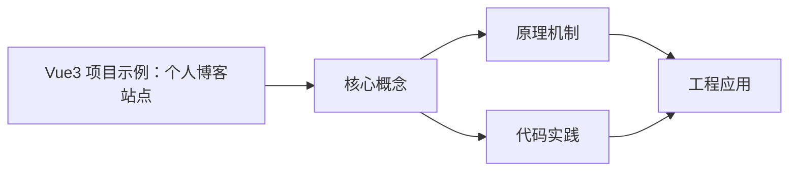
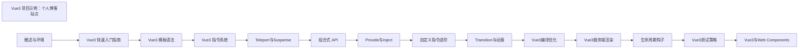

## 1. 学习目标（Bloom 分类）

本节按照布鲁姆教育目标分类学组织学习路径。本文主题为《Vue3 项目示例：个人博客站点》，属于 Vue 3 模块，读者可以根据自身阶段选择阅读深度。

记忆层面：能够准确复述本文的核心概念、术语与基本语法或操作步骤，并能够在提问或检索时快速定位对应知识点。能够说出 Vue 3 的核心概念、术语与标准写法。

理解层面：能够用自己的语言解释核心原理与工作机制，说明概念之间的因果关系，而不是机械记忆结论。能够解释 Vue 3 的工作原理与设计动机。

应用层面：能够在真实项目或练习场景中运用本文知识解决具体问题，写出正确且可维护的实现。能够编写符合 Vue 3 规范的完整实现。

分析层面：能够拆解复杂问题，比较本文主题与相邻概念的异同，识别边界条件与例外情况。能够分析 Vue 3 与相邻方案的差异与边界。

评价层面：能够根据约束条件（性能、可读性、安全、成本）评价不同方案的优劣，做出有依据的技术决策。能够根据场景评价 Vue 3 相关方案的优劣。

创造层面：能够把本文知识与其他模块知识组合，设计出新的解决方案或可复用的工程模式。能够组合 Vue 3 与其他技术设计完整方案。

通过本节学习，读者应当能够把《Vue3 项目示例：个人博客站点》纳入自己的知识网络，并与 Vue 3 模块的其他主题（组合式 API、响应式、组件通信、路由、状态管理）建立关联。

## 2. 历史动机与发展脉络

《Vue3 项目示例：个人博客站点》是 Vue 3 领域的重要主题。要真正理解它，需要先了解它解决的问题与演进过程。

Vue 由尤雨溪于 2014 年发布，以“渐进式框架”定位：可作库嵌入，也可作框架构建完整应用。Vue 3 于 2020 年 9 月发布，核心是组合式 API 与全新响应式系统。
Vue 3 的技术支柱：Proxy 响应式（替代 Object.defineProperty）、虚拟 DOM 重写（PatchFlags）、Fragment/Teleport/Suspense 内置组件、组合式 API（setup/ref/reactive/computed）。
生态现状：Vue Router 4、Pinia（官方状态库）、Vite 构建、Nuxt 全栈框架；Vue 3.5 引入 useTemplateRef 等开发者体验改进。

回到本文主题：Vue3 项目示例：个人博客站点 的提出与成熟，正是上述技术背景下的必然产物。早期实现往往以简单可用为目标，随着工程规模扩大，社区逐渐沉淀出标准做法与最佳实践；理解这一脉络，可以帮助读者判断“为什么文档中的推荐写法是现在这个样子”，也能在遇到历史遗留代码时准确识别其设计年代与取舍。


## 3. 形式化定义与核心概念精讲

本节把《Vue3 项目示例：个人博客站点》涉及的核心概念以“定义 + 讲解”的形式展开。读者应把定义当作工具，把讲解当作理解路径；两者结合才能形成可迁移的知识。

响应式：ref 包装基本类型，reactive 包装对象；effect 收集依赖，Proxy 拦截读写；computed 缓存派生值。
组件通信：props 向下、emit 向上、v-model 双向、provide/inject 跨层、事件总线（慎用）。
生命周期：setup 在创建前执行；onMounted/onUpdated/onUnmounted 对应挂载、更新、卸载；KeepAlive 增加 activated/deactivated。

### 3.1 原文章节逐一精讲

原文档把主题拆分为 6 个小节，下面按顺序给出每一节的导读讲解，随后保留原文细节供精读。

#### 原文精读（完整保留）


| 文章详情   | Markdown 渲染、目录导航、阅读进度 |
| ---------- | --------------------------------- |
| 分类页面   | 按分类筛选文章                    |
| 标签页面   | 标签云、按标签筛选                |
| 搜索功能   | 全文搜索文章标题和内容            |
| 暗色模式   | 主题切换，偏好持久化              |
| 响应式布局 | 适配桌面端和移动端                |
| 关于页面   | 个人信息展示                      |

#### 需求分析

##### 数据需求

- 文章：ID、标题、摘要、内容（Markdown）、分类、标签、发布日期、阅读量
- 分类：ID、名称、描述、文章数量
- 标签：ID、名称、文章数量
- 作者：名称、头像、简介、社交链接

##### 功能需求

- SPA 路由切换，支持浏览器前进后退
- 文章列表分页加载
- 阅读进度条
- 回到顶部按钮
- 代码块语法高亮

##### 非功能需求

- 首屏加载 < 2s
- SEO 友好（考虑 SSR）
- 无障碍支持

#### 技术选型

| 技术点   | 选型                       | 理由                          |
| -------- | -------------------------- | ----------------------------- |
| 框架     | Vue3 + Vite                | 快速开发，HMR 体验好          |
| API 风格 | 组合式 API                 | 逻辑复用，TypeScript 友好     |
| 路由     | Vue Router 4               | 官方路由方案                  |
| 状态管理 | Pinia                      | 轻量、类型安全、DevTools 支持 |
| 样式     | SCSS + CSS 变量            | 主题切换 + 样式组织           |
| Markdown | markdown-it + highlight.js | 渲染 + 代码高亮               |

#### 完整代码

##### 项目结构

```
blog/
  src/
    api/
      articles.ts
    assets/
      styles/
        variables.scss
        global.scss
    components/
      AppHeader.vue
      AppFooter.vue
      ArticleCard.vue
      TagCloud.vue
      ReadingProgress.vue
      ThemeToggle.vue
    composables/
      useTheme.ts
      useReadingProgress.ts
    layouts/
      DefaultLayout.vue
    router/
      index.ts
    stores/
      articles.ts
      theme.ts
    views/
      HomeView.vue
      ArticleView.vue
      CategoryView.vue
      TagView.vue
      AboutView.vue
    App.vue
    main.ts
```

##### 主题 Composable

```typescript
// src/composables/useTheme.ts
import { ref, watchEffect } from 'vue';

type Theme = 'light' | 'dark';

const STORAGE_KEY = 'blog-theme';

const theme = ref<Theme>((localStorage.getItem(STORAGE_KEY) as Theme) || 'light');

export function useTheme() {
  function toggle() {
    theme.value = theme.value === 'light' ? 'dark' : 'light';
  }

  watchEffect(() => {
    document.documentElement.setAttribute('data-theme', theme.value);
    localStorage.setItem(STORAGE_KEY, theme.value);
  });

  return { theme, toggle };
}
```

##### 阅读进度 Composable

```typescript
// src/composables/useReadingProgress.ts
import { ref, onMounted, onUnmounted } from "vue";

export function useReadingProgress() {
  const progress = ref(0);

  function update() {
    const el = document.documentElement;
    const scrollTop = el.scrollTop;
    const scrollHeight = el.scrollHeight - el.clientHeight;
    progress.value = scrollHeight > 0 ? (scrollTop / scrollHeight) * 100 : 0;
  }

  onMounted(() => window.addEventListener("scroll", update, { passive:  }));
  onUnmounted(() => window.removeEventListener("scroll", update));

  return { progress };
}
```

##### Pinia Store

```typescript
// src/stores/articles.ts
import { defineStore } from 'pinia';
import { ref, computed } from 'vue';
import type { Article, Category, Tag } from '@/api/articles';
import { fetchArticles, fetchArticleBySlug } from '@/api/articles';

export const useArticleStore = defineStore('articles', () => {
  const articles = ref<Article[]>([]);
  const currentArticle = ref<Article | null>(null);
  const loading = ref(false);
  const error = ref<string | null>(null);

  const categories = computed<Category[]>(() => {
    const map = new Map<string, Category>();
    articles.value.forEach((article) => {
      const cat = article.category;
      if (!map.has(cat.slug)) {
        map.set(cat.slug, { ...cat, count: 1 });
      } else {
        map.get(cat.slug)!.count++;
      }
    });
    return Array.from(map.values());
  });

  const tags = computed<Tag[]>(() => {
    const map = new Map<string, Tag>();
    articles.value.forEach((article) => {
      article.tags.forEach((tag) => {
        if (!map.has(tag.slug)) {
          map.set(tag.slug, { ...tag, count: 1 });
        } else {
          map.get(tag.slug)!.count++;
        }
      });
    });
    return Array.from(map.values());
  });

  const featuredArticles = computed(() => articles.value.filter((a) => a.featured).slice(0, 3));

  const latestArticles = computed(() =>
    [...articles.value]
      .sort((a, b) => new Date(b.publishedAt).getTime() - new Date(a.publishedAt).getTime())
      .slice(0, 10)
  );

  function getArticlesByCategory(slug: string): Article[] {
    return articles.value.filter((a) => a.category.slug === slug);
  }

  function getArticlesByTag(slug: string): Article[] {
    return articles.value.filter((a) => a.tags.some((t) => t.slug === slug));
  }

  function searchArticles(query: string): Article[] {
    const q = query.toLowerCase();
    return articles.value.filter(
      (a) => a.title.toLowerCase().includes(q) || a.summary.toLowerCase().includes(q)
    );
  }

  async function loadArticles() {
    loading.value = true;
    error.value = null;
    try {
      articles.value = await fetchArticles();
    } catch (e) {
      error.value = e instanceof Error ? e.message : 'Failed to load articles';
    } finally {
      loading.value = false;
    }
  }

  async function loadArticle(slug: string) {
    loading.value = true;
    error.value = null;
    try {
      currentArticle.value = await fetchArticleBySlug(slug);
    } catch (e) {
      error.value = e instanceof Error ? e.message : 'Failed to load article';
    } finally {
      loading.value = false;
    }
  }

  return {
    articles,
    currentArticle,
    loading,
    error,
    categories,
    tags,
    featuredArticles,
    latestArticles,
    getArticlesByCategory,
    getArticlesByTag,
    searchArticles,
    loadArticles,
    loadArticle,
  };
});
```

##### 路由配置

```typescript
// src/router/index.ts
import { createRouter, createWebHistory } from 'vue-router';
import DefaultLayout from '@/layouts/DefaultLayout.vue';

const router = createRouter({
  history: createWebHistory(import.meta.env.BASE_URL),
  routes: [
    {
      path: '/',
      component: DefaultLayout,
      children: [
        {
          path: '',
          name: 'home',
          component: () => import('@/views/HomeView.vue'),
        },
        {
          path: 'article/:slug',
          name: 'article',
          component: () => import('@/views/ArticleView.vue'),
          props: true,
        },
        {
          path: 'category/:slug',
          name: 'category',
          component: () => import('@/views/CategoryView.vue'),
          props: true,
        },
        {
          path: 'tag/:slug',
          name: 'tag',
          component: () => import('@/views/TagView.vue'),
          props: true,
        },
        {
          path: 'about',
          name: 'about',
          component: () => import('@/views/AboutView.vue'),
        },
      ],
    },
  ],
  scrollBehavior(_to, _from, savedPosition) {
    if (savedPosition) return savedPosition;
    return { top: 0 };
  },
});

export default router;
```

##### 组件示例：ArticleCard

```vue
<!-- src/components/ArticleCard.vue -->
<template>
  <article class="article-card" @click="navigate">
    <div class="article-card__meta">
      <span class="article-card__category">{{ article.category.name }}</span>
      <time class="article-card__date">{{ formattedDate }}</time>
    </div>
    <h3 class="article-card__title">{{ article.title }}</h3>
    <p class="article-card__summary">{{ article.summary }}</p>
    <div class="article-card__tags">
      <span v-for="tag in article.tags" :key="tag.slug" class="article-card__tag">
        #{{ tag.name }}
      </span>
    </div>
    <div class="article-card__footer">
      <span class="article-card__views">{{ article.views }} views</span>
      <span class="article-card__read-more">Read more &rarr;</span>
    </div>
  </article>
</template>

<script setup lang="ts">
import { computed } from 'vue';
import { useRouter } from 'vue-router';
import type { Article } from '@/api/articles';

const props = defineProps<{ article: Article }>();
const router = useRouter();

const formattedDate = computed(() =>
  new Date(props.article.publishedAt).toLocaleDateString('en-US', {
    year: 'numeric',
    month: 'short',
    day: 'numeric',
  })
);

function navigate() {
  router.push({ name: 'article', params: { slug: props.article.slug } });
}
</script>

<style scoped lang="scss">
.article-card {
  padding: 24px;
  background: var(--card-bg);
  border-radius: 12px;
  cursor: pointer;
  transition:
    transform 0.2s,
    box-shadow 0.2s;

  &:hover {
    transform: translateY(-2px);
    box-shadow: 0 8px 24px rgba(0, 0, 0, 0.1);
  }

  &__meta {
    display: flex;
    align-items: center;
    gap: 12px;
    margin-bottom: 8px;
    font-size: 0.85rem;
  }

  &__category {
    color: var(--accent);
    font-weight: 600;
  }

  &__date {
    color: var(--text-secondary);
  }

  &__title {
    font-size: 1.25rem;
    font-weight: 600;
    margin-bottom: 8px;
    line-height: 1.4;
  }

  &__summary {
    color: var(--text-secondary);
    font-size: 0.9rem;
    line-height: 1.6;
    margin-bottom: 12px;
    display: -webkit-box;
    -webkit-line-clamp: 3;
    -webkit-box-orient: vertical;
    overflow: hidden;
  }

  &__tags {
    display: flex;
    flex-wrap: wrap;
    gap: 8px;
    margin-bottom: 12px;
  }

  &__tag {
    font-size: 0.8rem;
    color: var(--text-secondary);
  }

  &__footer {
    display: flex;
    justify-content: space-between;
    align-items: center;
    font-size: 0.85rem;
  }

  &__views {
    color: var(--text-secondary);
  }

  &__read-more {
    color: var(--accent);
    font-weight: 500;
  }
}
</style>
```

##### 组件示例：ThemeToggle

```vue
<!-- src/components/ThemeToggle.vue -->
<template>
  <button
    class="theme-toggle"
    @click="toggle"
    :aria-label="`Switch to ${theme === 'light' ? 'dark' : 'light'} mode`"
  >
    <svg v-if="theme === 'light'" viewBox="0 0 24 24" width="20" height="20">
      <path
        fill="currentColor"
        d="M12 3a9 9 0 1 0 9 9c0-.46-.04-.92-.1-1.36a5.39 5.39 0 0 1-4.4 2.26 5.4 5.4 0 0 1-3.14-9.8c-.44-.06-.9-.1-1.36-.1z"
      />
    </svg>
    <svg v-else viewBox="0 0 24 24" width="20" height="20">
      <path
        fill="currentColor"
        d="M12 7c-2.76 0-5 2.24-5 5s2.24 5 5 5 5-2.24 5-5-2.24-5-5-5zM2 13h2c.55 0 1-.45 1-1s-.45-1-1-1H2c-.55 0-1 .45-1 1s.45 1 1 1zm18 0h2c.55 0 1-.45 1-1s-.45-1-1-1h-2c-.55 0-1 .45-1 1s.45 1 1 1zM11 2v2c0 .55.45 1 1 1s1-.45 1-1V2c0-.55-.45-1-1-1s-1 .45-1 1zm0 18v2c0 .55.45 1 1 1s1-.45 1-1v-2c0-.55-.45-1-1-1s-1 .45-1 1z"
      />
    </svg>
  </button>
</template>

<script setup lang="ts">
import { useTheme } from '@/composables/useTheme';
const { theme, toggle } = useTheme();
</script>

<style scoped>
.theme-toggle {
  background: none;
  border: none;
  cursor: pointer;
  padding: 8px;
  border-radius: 8px;
  display: flex;
  align-items: center;
  justify-content: center;
  color: var(--text-primary);
  transition: background 0.2s;
}
.theme-toggle:hover {
  background: var(--hover-bg);
}
</style>
```

##### 视图示例：HomeView

```vue
<!-- src/views/HomeView.vue -->
<template>
  <div class="home">
    <section class="hero">
      <h1 class="hero__title">My Blog</h1>
      <p class="hero__subtitle">Thoughts on code, design, and life</p>
    </section>

    <section v-if="store.featuredArticles.length" class="featured">
      <h2 class="section-title">Featured</h2>
      <div class="featured__grid">
        <ArticleCard
          v-for="article in store.featuredArticles"
          :key="article.id"
          :article="article"
        />
      </div>
    </section>

    <section class="latest">
      <h2 class="section-title">Latest Posts</h2>
      <div class="latest__list">
        <ArticleCard v-for="article in paginatedArticles" :key="article.id" :article="article" />
      </div>
      <button v-if="hasMore" class="load-more-btn" @click="loadMore">Load More</button>
    </section>

    <aside class="sidebar">
      <TagCloud :tags="store.tags" />
    </aside>
  </div>
</template>

<script setup lang="ts">
import { ref, computed, onMounted } from 'vue';
import { useArticleStore } from '@/stores/articles';
import ArticleCard from '@/components/ArticleCard.vue';
import TagCloud from '@/components/TagCloud.vue';

const store = useArticleStore();
const pageSize = 6;
const currentPage = ref(1);

const paginatedArticles = computed(() =>
  store.latestArticles.slice(0, currentPage.value * pageSize)
);

const hasMore = computed(() => currentPage.value * pageSize < store.latestArticles.length);

function loadMore() {
  currentPage.value++;
}

onMounted(() => {
  if (store.articles.length === 0) {
    store.loadArticles();
  }
});
</script>

<style scoped lang="scss">
.home {
  max-width: 1200px;
  margin: 0 auto;
  padding: 0 24px;
}

.hero {
  text-align: center;
  padding: 80px 0 40px;

  &__title {
    font-size: 3rem;
    font-weight: 700;
    margin-bottom: 12px;
  }

  &__subtitle {
    font-size: 1.2rem;
    color: var(--text-secondary);
  }
}

.section-title {
  font-size: 1.5rem;
  font-weight: 600;
  margin-bottom: 24px;
  padding-bottom: 8px;
  border-bottom: 2px solid var(--accent);
  display: inline-block;
}

.featured__grid {
  display: grid;
  grid-template-columns: repeat(auto-fill, minmax(340px, 1fr));
  gap: 24px;
  margin-bottom: 48px;
}

.latest__list {
  display: flex;
  flex-direction: column;
  gap: 16px;
  margin-bottom: 24px;
}

.load-more-btn {
  display: block;
  margin: 0 auto;
  padding: 12px 32px;
  background: var(--accent);
  color: white;
  border: none;
  border-radius: 8px;
  font-size: 1rem;
  cursor: pointer;
  transition: opacity 0.2s;

  &:hover {
    opacity: 0.9;
  }
}
</style>
```

##### 主入口

```typescript
// src/main.ts
import { createApp } from 'vue';
import { createPinia } from 'pinia';
import router from './router';
import App from './App.vue';
import './assets/styles/global.scss';

const app = createApp(App);
app.use(createPinia());
app.use(router);
app.mount('#app');
```

#### 运行说明

##### 创建项目

```bash
npm create vite@latest blog -- --template vue-ts
cd blog
npm install
npm install vue-router@4 pinia sass markdown-it highlight.js
```

##### 开发

```bash
npm run dev
```

##### 构建

```bash
npm run build
```

#### 扩展方向

1. **SSR/SSG** -- 使用 Nuxt3 实现服务端渲染或静态生成
2. **评论系统** -- 集成 Giscus/Disqus 评论
3. **RSS 订阅** -- 生成 RSS/Atom feed
4. **国际化** -- 使用 vue-i18n 支持多语言
5. **CMS 集成** -- 接入 Headless CMS（Strapi/Contentful）
6. **全文搜索** -- 集成 Algolia 或 FlexSearch
7. **PWA** -- 离线访问和推送通知

---

#### 关键代码速查

##### 组合式 API

```typescript
import { ref, computed, onMounted, watchEffect } from 'vue';
const count = ref(0);
const doubled = computed(() => count.value * 2);
onMounted(() => {
  /* ... */
});
watchEffect(() => {
  /* 自动追踪依赖 */
});
```

##### Pinia Store

```typescript
export const useStore = defineStore('name', () => {
  const state = ref(initialValue);
  const getter = computed(() => state.value);
  function action() {
    state.value = newValue;
  }
  return { state, getter, action };
});
```

##### Vue Router

```typescript
const router = createRouter({
  history: createWebHistory(),
  routes: [
    { path: "/", component: () => import("@/views/Home.vue") },
    { path: "/article/:slug", name: "article", component: () => import("@/views/Article.vue"), props:  },
  ],
});
```

##### defineProps / defineEmits

```typescript
const props = defineProps<{ article: Article; limit?: number }>();
const emit = defineEmits<{ (e: 'select', id: number): void }>();
```

##### CSS 变量主题

```scss
:root,
[data-theme='light'] {
  --bg: #fff;
  --text: #333;
}
[data-theme='dark'] {
  --bg: #1a1a2e;
  --text: #e0e0e0;
}
```


### 3.2 概念关系图

下面用 Mermaid 图表达本文核心概念之间的关系，帮助读者建立整体图景：



图中展示的是本文知识的结构化关系：核心概念是入口，原理机制解释“为什么”，代码实践演示“怎么做”，工程应用回答“何时用”。读者学习时可以把每个小节的内容挂接到对应节点上。

## 4. 理论推导与原理解析

本节深入《Vue3 项目示例：个人博客站点》背后的原理。理论部分不求面面俱到，而是聚焦“能解释现象、能指导实践”的关键推导。

响应式：ref 包装基本类型，reactive 包装对象；effect 收集依赖，Proxy 拦截读写；computed 缓存派生值。
组件通信：props 向下、emit 向上、v-model 双向、provide/inject 跨层、事件总线（慎用）。
生命周期：setup 在创建前执行；onMounted/onUpdated/onUnmounted 对应挂载、更新、卸载；KeepAlive 增加 activated/deactivated。
模板编译：模板在构建期编译为渲染函数，指令（v-if/v-for/v-model）是编译糖。

需要强调的是，理论推导与工程实践之间存在翻译层：理论给出的是理想化模型与边界条件，工程代码则必须处理真实环境中的例外。读者在学习时应先掌握理论的“标准情形”，再通过陷阱章节了解“非标准情形”。

## 5. 代码示例与逐行讲解

本节把原文中的代码示例系统整理，并为每个示例补充用途说明与讲解。读者不应只浏览代码，而应逐段对照讲解理解设计意图。

### 5.1 示例：项目结构

该示例来自原文《项目结构》小节，用于演示Vue3 项目示例：个人博客站点相关操作。阅读时请先看代码结构，再看其后的讲解。

```text
blog/
  src/
    api/
      articles.ts
    assets/
      styles/
        variables.scss
        global.scss
    components/
      AppHeader.vue
      AppFooter.vue
      ArticleCard.vue
      TagCloud.vue
      ReadingProgress.vue
      ThemeToggle.vue
    composables/
      useTheme.ts
      useReadingProgress.ts
    layouts/
      DefaultLayout.vue
    router/
      index.ts
    stores/
      articles.ts
      theme.ts
    views/
      HomeView.vue
      ArticleView.vue
      CategoryView.vue
      TagView.vue
      AboutView.vue
    App.vue
    main.ts
```

讲解：这段代码演示了本节核心知识点。代码中的关键操作可以归纳为三步：准备（定义或初始化）、执行（核心逻辑）、收尾（释放资源或返回结果）。实际项目中，这三步往往被封装为函数或类，以提升复用性与可测试性。

关键点分析：

该示例共 33 行有效代码，结构以数据或配置为主。阅读时应关注：数据字段的含义、配置项的作用，以及它们与运行行为的对应关系。

进阶思考路径：先尝试修改参数观察行为变化，再把示例中的模式迁移到自己的项目中；每次修改都记录预期与实测差异，这是把示例转化为能力的最快方式。

### 5.2 示例：主题 Composable

该示例来自原文《主题 Composable》小节，用于演示Vue3 项目示例：个人博客站点相关操作。阅读时请先看代码结构，再看其后的讲解。

```typescript
// src/composables/useTheme.ts
import { ref, watchEffect } from 'vue';

type Theme = 'light' | 'dark';

const STORAGE_KEY = 'blog-theme';

const theme = ref<Theme>((localStorage.getItem(STORAGE_KEY) as Theme) || 'light');

export function useTheme() {
  function toggle() {
    theme.value = theme.value === 'light' ? 'dark' : 'light';
  }

  watchEffect(() => {
    document.documentElement.setAttribute('data-theme', theme.value);
    localStorage.setItem(STORAGE_KEY, theme.value);
  });

  return { theme, toggle };
}
```

讲解：这段代码演示了本节核心知识点。代码中的关键操作可以归纳为三步：准备（定义或初始化）、执行（核心逻辑）、收尾（释放资源或返回结果）。实际项目中，这三步往往被封装为函数或类，以提升复用性与可测试性。

关键点分析：

该示例共 15 行有效代码，包含 4 类关键结构（function、import、from、return）。其中：

- 入口与初始化部分负责建立上下文，对应实际项目中的启动或装配逻辑；
- 核心逻辑部分体现本文主题的主要操作，是阅读时最需要对照讲解理解的部分；
- 输出或返回部分把结果交给调用方，注意其类型与边界条件。

进阶思考路径：先尝试修改参数观察行为变化，再把示例中的模式迁移到自己的项目中；每次修改都记录预期与实测差异，这是把示例转化为能力的最快方式。

### 5.3 示例：阅读进度 Composable

该示例来自原文《阅读进度 Composable》小节，用于演示Vue3 项目示例：个人博客站点相关操作。阅读时请先看代码结构，再看其后的讲解。

```typescript
// src/composables/useReadingProgress.ts
import { ref, onMounted, onUnmounted } from "vue";

export function useReadingProgress() {
  const progress = ref(0);

  function update() {
    const el = document.documentElement;
    const scrollTop = el.scrollTop;
    const scrollHeight = el.scrollHeight - el.clientHeight;
    progress.value = scrollHeight > 0 ? (scrollTop / scrollHeight) * 100 : 0;
  }

  onMounted(() => window.addEventListener("scroll", update, { passive:  }));
  onUnmounted(() => window.removeEventListener("scroll", update));

  return { progress };
}
```

讲解：这段代码演示了本节核心知识点。代码中的关键操作可以归纳为三步：准备（定义或初始化）、执行（核心逻辑）、收尾（释放资源或返回结果）。实际项目中，这三步往往被封装为函数或类，以提升复用性与可测试性。

关键点分析：

该示例共 14 行有效代码，包含 4 类关键结构（function、import、from、return）。其中：

- 入口与初始化部分负责建立上下文，对应实际项目中的启动或装配逻辑；
- 核心逻辑部分体现本文主题的主要操作，是阅读时最需要对照讲解理解的部分；
- 输出或返回部分把结果交给调用方，注意其类型与边界条件。

进阶思考路径：先尝试修改参数观察行为变化，再把示例中的模式迁移到自己的项目中；每次修改都记录预期与实测差异，这是把示例转化为能力的最快方式。

### 5.4 示例：Pinia Store

该示例来自原文《Pinia Store》小节，用于演示Vue3 项目示例：个人博客站点相关操作。阅读时请先看代码结构，再看其后的讲解。

```typescript
// src/stores/articles.ts
import { defineStore } from 'pinia';
import { ref, computed } from 'vue';
import type { Article, Category, Tag } from '@/api/articles';
import { fetchArticles, fetchArticleBySlug } from '@/api/articles';

export const useArticleStore = defineStore('articles', () => {
  const articles = ref<Article[]>([]);
  const currentArticle = ref<Article | null>(null);
  const loading = ref(false);
  const error = ref<string | null>(null);

  const categories = computed<Category[]>(() => {
    const map = new Map<string, Category>();
    articles.value.forEach((article) => {
      const cat = article.category;
      if (!map.has(cat.slug)) {
        map.set(cat.slug, { ...cat, count: 1 });
      } else {
        map.get(cat.slug)!.count++;
      }
    });
    return Array.from(map.values());
  });

  const tags = computed<Tag[]>(() => {
    const map = new Map<string, Tag>();
    articles.value.forEach((article) => {
      article.tags.forEach((tag) => {
        if (!map.has(tag.slug)) {
          map.set(tag.slug, { ...tag, count: 1 });
        } else {
          map.get(tag.slug)!.count++;
        }
      });
    });
    return Array.from(map.values());
  });

  const featuredArticles = computed(() => articles.value.filter((a) => a.featured).slice(0, 3));

  const latestArticles = computed(() =>
    [...articles.value]
      .sort((a, b) => new Date(b.publishedAt).getTime() - new Date(a.publishedAt).getTime())
      .slice(0, 10)
  );

  function getArticlesByCategory(slug: string): Article[] {
    return articles.value.filter((a) => a.category.slug === slug);
  }

  function getArticlesByTag(slug: string): Article[] {
    return articles.value.filter((a) => a.tags.some((t) => t.slug === slug));
  }

  function searchArticles(query: string): Article[] {
    const q = query.toLowerCase();
    return articles.value.filter(
      (a) => a.title.toLowerCase().includes(q) || a.summary.toLowerCase().includes(q)
    );
  }

  async function loadArticles() {
    loading.value = true;
    error.value = null;
    try {
      articles.value = await fetchArticles();
    } catch (e) {
      error.value = e instanceof Error ? e.message : 'Failed to load articles';
    } finally {
      loading.value = false;
    }
  }

  async function loadArticle(slug: string) {
    loading.value = true;
    error.value = null;
    try {
      currentArticle.value = await fetchArticleBySlug(slug);
    } catch (e) {
      error.value = e instanceof Error ? e.message : 'Failed to load article';
    } finally {
      loading.value = false;
    }
  }

  return {
    articles,
    currentArticle,
    loading,
    error,
    categories,
    tags,
    featuredArticles,
    latestArticles,
    getArticlesByCategory,
    getArticlesByTag,
    searchArticles,
    loadArticles,
    loadArticle,
  };
});
```

讲解：这段代码演示了本节核心知识点。代码中的关键操作可以归纳为三步：准备（定义或初始化）、执行（核心逻辑）、收尾（释放资源或返回结果）。实际项目中，这三步往往被封装为函数或类，以提升复用性与可测试性。

关键点分析：

该示例共 91 行有效代码，包含 5 类关键结构（function、import、from、if、return）。其中：

- 入口与初始化部分负责建立上下文，对应实际项目中的启动或装配逻辑；
- 核心逻辑部分体现本文主题的主要操作，是阅读时最需要对照讲解理解的部分；
- 输出或返回部分把结果交给调用方，注意其类型与边界条件。

进阶思考路径：先尝试修改参数观察行为变化，再把示例中的模式迁移到自己的项目中；每次修改都记录预期与实测差异，这是把示例转化为能力的最快方式。

### 5.5 示例：路由配置

该示例来自原文《路由配置》小节，用于演示Vue3 项目示例：个人博客站点相关操作。阅读时请先看代码结构，再看其后的讲解。

```typescript
// src/router/index.ts
import { createRouter, createWebHistory } from 'vue-router';
import DefaultLayout from '@/layouts/DefaultLayout.vue';

const router = createRouter({
  history: createWebHistory(import.meta.env.BASE_URL),
  routes: [
    {
      path: '/',
      component: DefaultLayout,
      children: [
        {
          path: '',
          name: 'home',
          component: () => import('@/views/HomeView.vue'),
        },
        {
          path: 'article/:slug',
          name: 'article',
          component: () => import('@/views/ArticleView.vue'),
          props: true,
        },
        {
          path: 'category/:slug',
          name: 'category',
          component: () => import('@/views/CategoryView.vue'),
          props: true,
        },
        {
          path: 'tag/:slug',
          name: 'tag',
          component: () => import('@/views/TagView.vue'),
          props: true,
        },
        {
          path: 'about',
          name: 'about',
          component: () => import('@/views/AboutView.vue'),
        },
      ],
    },
  ],
  scrollBehavior(_to, _from, savedPosition) {
    if (savedPosition) return savedPosition;
    return { top: 0 };
  },
});

export default router;
```

讲解：这段代码演示了本节核心知识点。代码中的关键操作可以归纳为三步：准备（定义或初始化）、执行（核心逻辑）、收尾（释放资源或返回结果）。实际项目中，这三步往往被封装为函数或类，以提升复用性与可测试性。

关键点分析：

该示例共 47 行有效代码，包含 4 类关键结构（import、from、if、return）。其中：

- 入口与初始化部分负责建立上下文，对应实际项目中的启动或装配逻辑；
- 核心逻辑部分体现本文主题的主要操作，是阅读时最需要对照讲解理解的部分；
- 输出或返回部分把结果交给调用方，注意其类型与边界条件。

进阶思考路径：先尝试修改参数观察行为变化，再把示例中的模式迁移到自己的项目中；每次修改都记录预期与实测差异，这是把示例转化为能力的最快方式。

### 5.6 示例：组件示例：ArticleCard

该示例来自原文《组件示例：ArticleCard》小节，用于演示Vue3 项目示例：个人博客站点相关操作。阅读时请先看代码结构，再看其后的讲解。

```vue
<!-- src/components/ArticleCard.vue -->
<template>
  <article class="article-card" @click="navigate">
    <div class="article-card__meta">
      <span class="article-card__category">{{ article.category.name }}</span>
      <time class="article-card__date">{{ formattedDate }}</time>
    </div>
    <h3 class="article-card__title">{{ article.title }}</h3>
    <p class="article-card__summary">{{ article.summary }}</p>
    <div class="article-card__tags">
      <span v-for="tag in article.tags" :key="tag.slug" class="article-card__tag">
        #{{ tag.name }}
      </span>
    </div>
    <div class="article-card__footer">
      <span class="article-card__views">{{ article.views }} views</span>
      <span class="article-card__read-more">Read more &rarr;</span>
    </div>
  </article>
</template>

<script setup lang="ts">
import { computed } from 'vue';
import { useRouter } from 'vue-router';
import type { Article } from '@/api/articles';

const props = defineProps<{ article: Article }>();
const router = useRouter();

const formattedDate = computed(() =>
  new Date(props.article.publishedAt).toLocaleDateString('en-US', {
    year: 'numeric',
    month: 'short',
    day: 'numeric',
  })
);

function navigate() {
  router.push({ name: 'article', params: { slug: props.article.slug } });
}
</script>

<style scoped lang="scss">
.article-card {
  padding: 24px;
  background: var(--card-bg);
  border-radius: 12px;
  cursor: pointer;
  transition:
    transform 0.2s,
    box-shadow 0.2s;

  &:hover {
    transform: translateY(-2px);
    box-shadow: 0 8px 24px rgba(0, 0, 0, 0.1);
  }

  &__meta {
    display: flex;
    align-items: center;
    gap: 12px;
    margin-bottom: 8px;
    font-size: 0.85rem;
  }

  &__category {
    color: var(--accent);
    font-weight: 600;
  }

  &__date {
    color: var(--text-secondary);
  }

  &__title {
    font-size: 1.25rem;
    font-weight: 600;
    margin-bottom: 8px;
    line-height: 1.4;
  }

  &__summary {
    color: var(--text-secondary);
    font-size: 0.9rem;
    line-height: 1.6;
    margin-bottom: 12px;
    display: -webkit-box;
    -webkit-line-clamp: 3;
    -webkit-box-orient: vertical;
    overflow: hidden;
  }

  &__tags {
    display: flex;
    flex-wrap: wrap;
    gap: 8px;
    margin-bottom: 12px;
  }

  &__tag {
    font-size: 0.8rem;
    color: var(--text-secondary);
  }

  &__footer {
    display: flex;
    justify-content: space-between;
    align-items: center;
    font-size: 0.85rem;
  }

  &__views {
    color: var(--text-secondary);
  }

  &__read-more {
    color: var(--accent);
    font-weight: 500;
  }
}
</style>
```

讲解：这段代码演示了本节核心知识点。代码中的关键操作可以归纳为三步：准备（定义或初始化）、执行（核心逻辑）、收尾（释放资源或返回结果）。实际项目中，这三步往往被封装为函数或类，以提升复用性与可测试性。

关键点分析：

该示例共 105 行有效代码，包含 4 类关键结构（class、function、import、from）。其中：

- 入口与初始化部分负责建立上下文，对应实际项目中的启动或装配逻辑；
- 核心逻辑部分体现本文主题的主要操作，是阅读时最需要对照讲解理解的部分；
- 输出或返回部分把结果交给调用方，注意其类型与边界条件。

进阶思考路径：先尝试修改参数观察行为变化，再把示例中的模式迁移到自己的项目中；每次修改都记录预期与实测差异，这是把示例转化为能力的最快方式。

### 5.7 示例：组件示例：ThemeToggle

该示例来自原文《组件示例：ThemeToggle》小节，用于演示Vue3 项目示例：个人博客站点相关操作。阅读时请先看代码结构，再看其后的讲解。

```vue
<!-- src/components/ThemeToggle.vue -->
<template>
  <button
    class="theme-toggle"
    @click="toggle"
    :aria-label="`Switch to ${theme === 'light' ? 'dark' : 'light'} mode`"
  >
    <svg v-if="theme === 'light'" viewBox="0 0 24 24" width="20" height="20">
      <path
        fill="currentColor"
        d="M12 3a9 9 0 1 0 9 9c0-.46-.04-.92-.1-1.36a5.39 5.39 0 0 1-4.4 2.26 5.4 5.4 0 0 1-3.14-9.8c-.44-.06-.9-.1-1.36-.1z"
      />
    </svg>
    <svg v-else viewBox="0 0 24 24" width="20" height="20">
      <path
        fill="currentColor"
        d="M12 7c-2.76 0-5 2.24-5 5s2.24 5 5 5 5-2.24 5-5-2.24-5-5-5zM2 13h2c.55 0 1-.45 1-1s-.45-1-1-1H2c-.55 0-1 .45-1 1s.45 1 1 1zm18 0h2c.55 0 1-.45 1-1s-.45-1-1-1h-2c-.55 0-1 .45-1 1s.45 1 1 1zM11 2v2c0 .55.45 1 1 1s1-.45 1-1V2c0-.55-.45-1-1-1s-1 .45-1 1zm0 18v2c0 .55.45 1 1 1s1-.45 1-1v-2c0-.55-.45-1-1-1s-1 .45-1 1z"
      />
    </svg>
  </button>
</template>

<script setup lang="ts">
import { useTheme } from '@/composables/useTheme';
const { theme, toggle } = useTheme();
</script>

<style scoped>
.theme-toggle {
  background: none;
  border: none;
  cursor: pointer;
  padding: 8px;
  border-radius: 8px;
  display: flex;
  align-items: center;
  justify-content: center;
  color: var(--text-primary);
  transition: background 0.2s;
}
.theme-toggle:hover {
  background: var(--hover-bg);
}
</style>
```

讲解：这段代码演示了本节核心知识点。代码中的关键操作可以归纳为三步：准备（定义或初始化）、执行（核心逻辑）、收尾（释放资源或返回结果）。实际项目中，这三步往往被封装为函数或类，以提升复用性与可测试性。

关键点分析：

该示例共 42 行有效代码，包含 3 类关键结构（class、import、from）。其中：

- 入口与初始化部分负责建立上下文，对应实际项目中的启动或装配逻辑；
- 核心逻辑部分体现本文主题的主要操作，是阅读时最需要对照讲解理解的部分；
- 输出或返回部分把结果交给调用方，注意其类型与边界条件。

进阶思考路径：先尝试修改参数观察行为变化，再把示例中的模式迁移到自己的项目中；每次修改都记录预期与实测差异，这是把示例转化为能力的最快方式。

### 5.8 示例：视图示例：HomeView

该示例来自原文《视图示例：HomeView》小节，用于演示Vue3 项目示例：个人博客站点相关操作。阅读时请先看代码结构，再看其后的讲解。

```vue
<!-- src/views/HomeView.vue -->
<template>
  <div class="home">
    <section class="hero">
      <h1 class="hero__title">My Blog</h1>
      <p class="hero__subtitle">Thoughts on code, design, and life</p>
    </section>

    <section v-if="store.featuredArticles.length" class="featured">
      <h2 class="section-title">Featured</h2>
      <div class="featured__grid">
        <ArticleCard
          v-for="article in store.featuredArticles"
          :key="article.id"
          :article="article"
        />
      </div>
    </section>

    <section class="latest">
      <h2 class="section-title">Latest Posts</h2>
      <div class="latest__list">
        <ArticleCard v-for="article in paginatedArticles" :key="article.id" :article="article" />
      </div>
      <button v-if="hasMore" class="load-more-btn" @click="loadMore">Load More</button>
    </section>

    <aside class="sidebar">
      <TagCloud :tags="store.tags" />
    </aside>
  </div>
</template>

<script setup lang="ts">
import { ref, computed, onMounted } from 'vue';
import { useArticleStore } from '@/stores/articles';
import ArticleCard from '@/components/ArticleCard.vue';
import TagCloud from '@/components/TagCloud.vue';

const store = useArticleStore();
const pageSize = 6;
const currentPage = ref(1);

const paginatedArticles = computed(() =>
  store.latestArticles.slice(0, currentPage.value * pageSize)
);

const hasMore = computed(() => currentPage.value * pageSize < store.latestArticles.length);

function loadMore() {
  currentPage.value++;
}

onMounted(() => {
  if (store.articles.length === 0) {
    store.loadArticles();
  }
});
</script>

<style scoped lang="scss">
.home {
  max-width: 1200px;
  margin: 0 auto;
  padding: 0 24px;
}

.hero {
  text-align: center;
  padding: 80px 0 40px;

  &__title {
    font-size: 3rem;
    font-weight: 700;
    margin-bottom: 12px;
  }

  &__subtitle {
    font-size: 1.2rem;
    color: var(--text-secondary);
  }
}

.section-title {
  font-size: 1.5rem;
  font-weight: 600;
  margin-bottom: 24px;
  padding-bottom: 8px;
  border-bottom: 2px solid var(--accent);
  display: inline-block;
}

.featured__grid {
  display: grid;
  grid-template-columns: repeat(auto-fill, minmax(340px, 1fr));
  gap: 24px;
  margin-bottom: 48px;
}

.latest__list {
  display: flex;
  flex-direction: column;
  gap: 16px;
  margin-bottom: 24px;
}

.load-more-btn {
  display: block;
  margin: 0 auto;
  padding: 12px 32px;
  background: var(--accent);
  color: white;
  border: none;
  border-radius: 8px;
  font-size: 1rem;
  cursor: pointer;
  transition: opacity 0.2s;

  &:hover {
    opacity: 0.9;
  }
}
</style>
```

讲解：这段代码演示了本节核心知识点。代码中的关键操作可以归纳为三步：准备（定义或初始化）、执行（核心逻辑）、收尾（释放资源或返回结果）。实际项目中，这三步往往被封装为函数或类，以提升复用性与可测试性。

关键点分析：

该示例共 105 行有效代码，包含 5 类关键结构（class、function、import、from、if）。其中：

- 入口与初始化部分负责建立上下文，对应实际项目中的启动或装配逻辑；
- 核心逻辑部分体现本文主题的主要操作，是阅读时最需要对照讲解理解的部分；
- 输出或返回部分把结果交给调用方，注意其类型与边界条件。

进阶思考路径：先尝试修改参数观察行为变化，再把示例中的模式迁移到自己的项目中；每次修改都记录预期与实测差异，这是把示例转化为能力的最快方式。

### 5.9 示例：主入口

该示例来自原文《主入口》小节，用于演示Vue3 项目示例：个人博客站点相关操作。阅读时请先看代码结构，再看其后的讲解。

```typescript
// src/main.ts
import { createApp } from 'vue';
import { createPinia } from 'pinia';
import router from './router';
import App from './App.vue';
import './assets/styles/global.scss';

const app = createApp(App);
app.use(createPinia());
app.use(router);
app.mount('#app');
```

讲解：这段代码演示了本节核心知识点。代码中的关键操作可以归纳为三步：准备（定义或初始化）、执行（核心逻辑）、收尾（释放资源或返回结果）。实际项目中，这三步往往被封装为函数或类，以提升复用性与可测试性。

关键点分析：

该示例共 10 行有效代码，包含 2 类关键结构（import、from）。其中：

- 入口与初始化部分负责建立上下文，对应实际项目中的启动或装配逻辑；
- 核心逻辑部分体现本文主题的主要操作，是阅读时最需要对照讲解理解的部分；
- 输出或返回部分把结果交给调用方，注意其类型与边界条件。

进阶思考路径：先尝试修改参数观察行为变化，再把示例中的模式迁移到自己的项目中；每次修改都记录预期与实测差异，这是把示例转化为能力的最快方式。

### 5.10 示例：创建项目

该示例来自原文《创建项目》小节，用于演示Vue3 项目示例：个人博客站点相关操作。阅读时请先看代码结构，再看其后的讲解。

```bash
npm create vite@latest blog -- --template vue-ts
cd blog
npm install
npm install vue-router@4 pinia sass markdown-it highlight.js
```

讲解：这段代码演示了本节核心知识点。代码中的关键操作可以归纳为三步：准备（定义或初始化）、执行（核心逻辑）、收尾（释放资源或返回结果）。实际项目中，这三步往往被封装为函数或类，以提升复用性与可测试性。

关键点分析：

该示例共 4 行有效代码，结构以数据或配置为主。阅读时应关注：数据字段的含义、配置项的作用，以及它们与运行行为的对应关系。

进阶思考路径：先尝试修改参数观察行为变化，再把示例中的模式迁移到自己的项目中；每次修改都记录预期与实测差异，这是把示例转化为能力的最快方式。

### 5.11 示例：开发

该示例来自原文《开发》小节，用于演示Vue3 项目示例：个人博客站点相关操作。阅读时请先看代码结构，再看其后的讲解。

```bash
npm run dev
```

讲解：这段代码演示了本节核心知识点。代码中的关键操作可以归纳为三步：准备（定义或初始化）、执行（核心逻辑）、收尾（释放资源或返回结果）。实际项目中，这三步往往被封装为函数或类，以提升复用性与可测试性。

关键点分析：

该示例共 1 行有效代码，结构以数据或配置为主。阅读时应关注：数据字段的含义、配置项的作用，以及它们与运行行为的对应关系。

进阶思考路径：先尝试修改参数观察行为变化，再把示例中的模式迁移到自己的项目中；每次修改都记录预期与实测差异，这是把示例转化为能力的最快方式。

### 5.12 示例：构建

该示例来自原文《构建》小节，用于演示Vue3 项目示例：个人博客站点相关操作。阅读时请先看代码结构，再看其后的讲解。

```bash
npm run build
```

讲解：这段代码演示了本节核心知识点。代码中的关键操作可以归纳为三步：准备（定义或初始化）、执行（核心逻辑）、收尾（释放资源或返回结果）。实际项目中，这三步往往被封装为函数或类，以提升复用性与可测试性。

关键点分析：

该示例共 1 行有效代码，结构以数据或配置为主。阅读时应关注：数据字段的含义、配置项的作用，以及它们与运行行为的对应关系。

进阶思考路径：先尝试修改参数观察行为变化，再把示例中的模式迁移到自己的项目中；每次修改都记录预期与实测差异，这是把示例转化为能力的最快方式。

### 5.13 示例：组合式 API

该示例来自原文《组合式 API》小节，用于演示Vue3 项目示例：个人博客站点相关操作。阅读时请先看代码结构，再看其后的讲解。

```typescript
import { ref, computed, onMounted, watchEffect } from 'vue';
const count = ref(0);
const doubled = computed(() => count.value * 2);
onMounted(() => {
  /* ... */
});
watchEffect(() => {
  /* 自动追踪依赖 */
});
```

讲解：这段代码演示了本节核心知识点。代码中的关键操作可以归纳为三步：准备（定义或初始化）、执行（核心逻辑）、收尾（释放资源或返回结果）。实际项目中，这三步往往被封装为函数或类，以提升复用性与可测试性。

关键点分析：

该示例共 9 行有效代码，包含 2 类关键结构（import、from）。其中：

- 入口与初始化部分负责建立上下文，对应实际项目中的启动或装配逻辑；
- 核心逻辑部分体现本文主题的主要操作，是阅读时最需要对照讲解理解的部分；
- 输出或返回部分把结果交给调用方，注意其类型与边界条件。

进阶思考路径：先尝试修改参数观察行为变化，再把示例中的模式迁移到自己的项目中；每次修改都记录预期与实测差异，这是把示例转化为能力的最快方式。

### 5.14 示例：Pinia Store

该示例来自原文《Pinia Store》小节，用于演示Vue3 项目示例：个人博客站点相关操作。阅读时请先看代码结构，再看其后的讲解。

```typescript
export const useStore = defineStore('name', () => {
  const state = ref(initialValue);
  const getter = computed(() => state.value);
  function action() {
    state.value = newValue;
  }
  return { state, getter, action };
});
```

讲解：这段代码演示了本节核心知识点。代码中的关键操作可以归纳为三步：准备（定义或初始化）、执行（核心逻辑）、收尾（释放资源或返回结果）。实际项目中，这三步往往被封装为函数或类，以提升复用性与可测试性。

关键点分析：

该示例共 8 行有效代码，包含 2 类关键结构（function、return）。其中：

- 入口与初始化部分负责建立上下文，对应实际项目中的启动或装配逻辑；
- 核心逻辑部分体现本文主题的主要操作，是阅读时最需要对照讲解理解的部分；
- 输出或返回部分把结果交给调用方，注意其类型与边界条件。

进阶思考路径：先尝试修改参数观察行为变化，再把示例中的模式迁移到自己的项目中；每次修改都记录预期与实测差异，这是把示例转化为能力的最快方式。

### 5.15 示例：Vue Router

该示例来自原文《Vue Router》小节，用于演示Vue3 项目示例：个人博客站点相关操作。阅读时请先看代码结构，再看其后的讲解。

```typescript
const router = createRouter({
  history: createWebHistory(),
  routes: [
    { path: "/", component: () => import("@/views/Home.vue") },
    { path: "/article/:slug", name: "article", component: () => import("@/views/Article.vue"), props:  },
  ],
});
```

讲解：这段代码演示了本节核心知识点。代码中的关键操作可以归纳为三步：准备（定义或初始化）、执行（核心逻辑）、收尾（释放资源或返回结果）。实际项目中，这三步往往被封装为函数或类，以提升复用性与可测试性。

关键点分析：

该示例共 7 行有效代码，包含 1 类关键结构（import）。其中：

- 入口与初始化部分负责建立上下文，对应实际项目中的启动或装配逻辑；
- 核心逻辑部分体现本文主题的主要操作，是阅读时最需要对照讲解理解的部分；
- 输出或返回部分把结果交给调用方，注意其类型与边界条件。

进阶思考路径：先尝试修改参数观察行为变化，再把示例中的模式迁移到自己的项目中；每次修改都记录预期与实测差异，这是把示例转化为能力的最快方式。

### 5.16 示例：defineProps / defineEmits

该示例来自原文《defineProps / defineEmits》小节，用于演示Vue3 项目示例：个人博客站点相关操作。阅读时请先看代码结构，再看其后的讲解。

```typescript
const props = defineProps<{ article: Article; limit?: number }>();
const emit = defineEmits<{ (e: 'select', id: number): void }>();
```

讲解：这段代码演示了本节核心知识点。代码中的关键操作可以归纳为三步：准备（定义或初始化）、执行（核心逻辑）、收尾（释放资源或返回结果）。实际项目中，这三步往往被封装为函数或类，以提升复用性与可测试性。

关键点分析：

该示例共 2 行有效代码，结构以数据或配置为主。阅读时应关注：数据字段的含义、配置项的作用，以及它们与运行行为的对应关系。

进阶思考路径：先尝试修改参数观察行为变化，再把示例中的模式迁移到自己的项目中；每次修改都记录预期与实测差异，这是把示例转化为能力的最快方式。

### 5.17 示例：CSS 变量主题

该示例来自原文《CSS 变量主题》小节，用于演示Vue3 项目示例：个人博客站点相关操作。阅读时请先看代码结构，再看其后的讲解。

```scss
:root,
[data-theme='light'] {
  --bg: #fff;
  --text: #333;
}
[data-theme='dark'] {
  --bg: #1a1a2e;
  --text: #e0e0e0;
}
```

讲解：这段代码演示了本节核心知识点。代码中的关键操作可以归纳为三步：准备（定义或初始化）、执行（核心逻辑）、收尾（释放资源或返回结果）。实际项目中，这三步往往被封装为函数或类，以提升复用性与可测试性。

关键点分析：

该示例共 9 行有效代码，结构以数据或配置为主。阅读时应关注：数据字段的含义、配置项的作用，以及它们与运行行为的对应关系。

进阶思考路径：先尝试修改参数观察行为变化，再把示例中的模式迁移到自己的项目中；每次修改都记录预期与实测差异，这是把示例转化为能力的最快方式。


综合以上示例，可以总结出本主题的代码实践要点：第一，先定义清晰的输入输出契约；第二，核心逻辑保持单一职责；第三，错误处理与边界条件不可省略；第四，命名与注释表达意图而非复述代码。

## 6. 对比分析

对比是理解《Vue3 项目示例：个人博客站点》定位的最快路径。下面从多个维度与相邻方案进行对比。

Vue 与 React：Vue 模板 + 响应式自动追踪，React JSX + 手动依赖（hooks）；Vue 上手平缓，React 生态更广。
Options API 与 Composition API：Composition 更适合逻辑复用与 TS；Options 保留简单场景。
Vue 2 与 Vue 3：响应式实现、API 形态、生态差异显著，新项目一律 Vue 3。

对比的目的不是分出绝对优劣，而是建立选择依据：不同约束条件下，最优解不同。读者应把每个对比维度转化为决策检查清单。

## 7. 常见陷阱与最佳实践

本节整理该主题的高频错误与推荐做法。每个陷阱先描述现象，再解释原因，最后给出最佳实践。

### 7.1 响应式丢失

解构 reactive 或赋值整对象丢失响应。使用 ref/toRefs。

深入讲解：该问题之所以被归类为“常见陷阱”，是因为它在初学者的代码中反复出现，而且往往不在第一时间暴露——错误通常隐藏在特定数据或特定时序下。

从成因上看，响应式丢失 一般源于对 Vue 3 某个机制的理解偏差：要么误用了默认行为，要么忽略了边界条件，要么把其他语言的思维惯性带了过来。

从影响上看，响应式丢失 轻则产生错误结果，重则导致资源泄漏、数据损坏或安全事故；这也是为什么工程评审中会把它列为检查项。

从修复策略上看，处理响应式丢失的正确顺序是：先复现（构造最小用例），再定位（确认机制层面的根因），最后修复并补充回归测试。跳过复现直接改代码，往往治标不治本。

### 7.2 v-for key 用索引

列表变更导致状态错位。使用稳定唯一 key。

深入讲解：该问题之所以被归类为“常见陷阱”，是因为它在初学者的代码中反复出现，而且往往不在第一时间暴露——错误通常隐藏在特定数据或特定时序下。

从成因上看，v-for key 用索引 一般源于对 Vue 3 某个机制的理解偏差：要么误用了默认行为，要么忽略了边界条件，要么把其他语言的思维惯性带了过来。

从影响上看，v-for key 用索引 轻则产生错误结果，重则导致资源泄漏、数据损坏或安全事故；这也是为什么工程评审中会把它列为检查项。

从修复策略上看，处理v-for key 用索引的正确顺序是：先复现（构造最小用例），再定位（确认机制层面的根因），最后修复并补充回归测试。跳过复现直接改代码，往往治标不治本。

### 7.3 props 直接修改

单向数据流被破坏。通过 emit 通知父组件修改。

深入讲解：该问题之所以被归类为“常见陷阱”，是因为它在初学者的代码中反复出现，而且往往不在第一时间暴露——错误通常隐藏在特定数据或特定时序下。

从成因上看，props 直接修改 一般源于对 Vue 3 某个机制的理解偏差：要么误用了默认行为，要么忽略了边界条件，要么把其他语言的思维惯性带了过来。

从影响上看，props 直接修改 轻则产生错误结果，重则导致资源泄漏、数据损坏或安全事故；这也是为什么工程评审中会把它列为检查项。

从修复策略上看，处理props 直接修改的正确顺序是：先复现（构造最小用例），再定位（确认机制层面的根因），最后修复并补充回归测试。跳过复现直接改代码，往往治标不治本。

### 7.4 watch 深层陷阱

监听对象默认浅层；深层用 deep 或改写为 getter。

深入讲解：该问题之所以被归类为“常见陷阱”，是因为它在初学者的代码中反复出现，而且往往不在第一时间暴露——错误通常隐藏在特定数据或特定时序下。

从成因上看，watch 深层陷阱 一般源于对 Vue 3 某个机制的理解偏差：要么误用了默认行为，要么忽略了边界条件，要么把其他语言的思维惯性带了过来。

从影响上看，watch 深层陷阱 轻则产生错误结果，重则导致资源泄漏、数据损坏或安全事故；这也是为什么工程评审中会把它列为检查项。

从修复策略上看，处理watch 深层陷阱的正确顺序是：先复现（构造最小用例），再定位（确认机制层面的根因），最后修复并补充回归测试。跳过复现直接改代码，往往治标不治本。

### 7.5 组件样式泄漏

未用 scoped 导致全局污染。组件样式默认 scoped。

深入讲解：该问题之所以被归类为“常见陷阱”，是因为它在初学者的代码中反复出现，而且往往不在第一时间暴露——错误通常隐藏在特定数据或特定时序下。

从成因上看，组件样式泄漏 一般源于对 Vue 3 某个机制的理解偏差：要么误用了默认行为，要么忽略了边界条件，要么把其他语言的思维惯性带了过来。

从影响上看，组件样式泄漏 轻则产生错误结果，重则导致资源泄漏、数据损坏或安全事故；这也是为什么工程评审中会把它列为检查项。

从修复策略上看，处理组件样式泄漏的正确顺序是：先复现（构造最小用例），再定位（确认机制层面的根因），最后修复并补充回归测试。跳过复现直接改代码，往往治标不治本。

### 7.6 setup 中 async 误用

setup 顶层 await 变为异步组件需 Suspense。

深入讲解：该问题之所以被归类为“常见陷阱”，是因为它在初学者的代码中反复出现，而且往往不在第一时间暴露——错误通常隐藏在特定数据或特定时序下。

从成因上看，setup 中 async 误用 一般源于对 Vue 3 某个机制的理解偏差：要么误用了默认行为，要么忽略了边界条件，要么把其他语言的思维惯性带了过来。

从影响上看，setup 中 async 误用 轻则产生错误结果，重则导致资源泄漏、数据损坏或安全事故；这也是为什么工程评审中会把它列为检查项。

从修复策略上看，处理setup 中 async 误用的正确顺序是：先复现（构造最小用例），再定位（确认机制层面的根因），最后修复并补充回归测试。跳过复现直接改代码，往往治标不治本。

### 7.7 路由组件复用不刷新

参数变化组件复用。watch route 或 beforeRouteUpdate。

深入讲解：该问题之所以被归类为“常见陷阱”，是因为它在初学者的代码中反复出现，而且往往不在第一时间暴露——错误通常隐藏在特定数据或特定时序下。

从成因上看，路由组件复用不刷新 一般源于对 Vue 3 某个机制的理解偏差：要么误用了默认行为，要么忽略了边界条件，要么把其他语言的思维惯性带了过来。

从影响上看，路由组件复用不刷新 轻则产生错误结果，重则导致资源泄漏、数据损坏或安全事故；这也是为什么工程评审中会把它列为检查项。

从修复策略上看，处理路由组件复用不刷新的正确顺序是：先复现（构造最小用例），再定位（确认机制层面的根因），最后修复并补充回归测试。跳过复现直接改代码，往往治标不治本。

### 7.8 响应式大对象性能

深层代理开销大。大数据用 shallowRef 或冻结。

深入讲解：该问题之所以被归类为“常见陷阱”，是因为它在初学者的代码中反复出现，而且往往不在第一时间暴露——错误通常隐藏在特定数据或特定时序下。

从成因上看，响应式大对象性能 一般源于对 Vue 3 某个机制的理解偏差：要么误用了默认行为，要么忽略了边界条件，要么把其他语言的思维惯性带了过来。

从影响上看，响应式大对象性能 轻则产生错误结果，重则导致资源泄漏、数据损坏或安全事故；这也是为什么工程评审中会把它列为检查项。

从修复策略上看，处理响应式大对象性能的正确顺序是：先复现（构造最小用例），再定位（确认机制层面的根因），最后修复并补充回归测试。跳过复现直接改代码，往往治标不治本。

### 7.0 最佳实践总览

1. 组合式 API 按逻辑组织（自定义组合函数 useXxx）。
2. 组件单一职责，props 使用类型定义（TS）。
3. 状态管理：局部状态用 ref，跨组件用 Pinia，服务端状态用 Query 类库。
4. 模板保持声明式，复杂逻辑进 script。

把这些最佳实践固化为团队规范与代码评审检查项，是避免同类问题反复出现的关键。

## 8. 工程实践

本节把《Vue3 项目示例：个人博客站点》放入真实工程场景，给出可复用的模式与组织方法。

项目脚手架：create-vue（Vite + TS + Router + Pinia）。
目录分层：views（页面）、components（组件）、composables（逻辑）、stores（状态）、api（请求）。
性能：defineAsyncComponent 懒加载、v-memo 优化、虚拟列表。
测试：Vitest 单测 + Vue Test Utils；Playwright E2E。

### 8.1 工程实践的原则拆解

以上工程实践可以归纳为四条原则。第一，配置与代码分离：Vue 3 项目中环境差异应通过配置注入，而不是散落在代码分支中；这保证同一份代码可以在开发、测试、生产环境一致运行。

第二，接口稳定优先：对外接口（函数签名、协议、数据格式）一旦被消费方依赖，变更成本极高；设计时应预留扩展点并保持向后兼容。

第三，可观测性内置：日志、指标与追踪应该在功能开发时同步设计，而不是故障发生后补救；没有观测手段的模块等于黑盒。

第四，变更可回滚：任何发布都应有对应的回滚方案；数据库迁移、配置变更与代码发布一样需要版本管理与逆向路径。

### 8.2 实践落地的检查清单

- [ ] 项目脚手架：对照本节描述，检查当前项目是否已经落实；未落实的项列入技术债并排期处理。
- [ ] 目录分层：对照本节描述，检查当前项目是否已经落实；未落实的项列入技术债并排期处理。
- [ ] 性能：对照本节描述，检查当前项目是否已经落实；未落实的项列入技术债并排期处理。
- [ ] 测试：对照本节描述，检查当前项目是否已经落实；未落实的项列入技术债并排期处理。

工程实践的共性原则：配置与代码分离、接口稳定优先、可观测性内置、变更可回滚。这些原则适用于本主题的所有实现。

## 9. 案例研究

本节通过一个完整案例把《Vue3 项目示例：个人博客站点》的知识串起来。案例按“需求分析、方案设计、实现、验证”四步展开。

需求：实现文档站的搜索页与主题切换。
方案：Vue Router 路由 + Pinia 管理主题 + 组合函数封装搜索。
要点：搜索防抖与竞态取消；主题变量持久化。
验证：路由守卫权限、主题刷新保持、搜索准确性测试。

### 9.1 案例的扩展讨论

把案例中的方案放大到真实规模，需要额外考虑三个问题：

第一，规模：当数据量或并发量上升一个数量级时，原方案中的数据结构、缓存策略与任务调度是否仍然成立？通常需要引入分层与异步。

第二，团队：多人协作时，模块边界、接口契约与代码所有权必须明确；案例中的实现应拆分为可独立测试的单元，并配合文档说明设计意图。

第三，演进：上线后的需求变化不可避免；方案设计时应预留扩展点（配置化、插件化、事件化），并定期用真实指标验证假设。


案例研究的学习方法：先独立阅读需求，尝试在脑中形成方案，再对照实现与讲解，最后思考“如果约束变化（数据量、并发、团队规模），方案应如何调整”。

## 10. 知识要点总结与深入讲解

本节以讲解形式汇总全文要点，替代传统的习题与自测，读者不需要答题，只需跟随解释建立完整的认知框架。

关于《Vue3 项目示例：个人博客站点》的核心结论：

Vue 3 的核心是响应式与组合式：理解依赖收集才能驾驭性能与陷阱。
组件通信按层级选型：props/emit 为默认，provide/inject 跨层，Pinia 全局。
工程化（Vite + TS + 测试）是生产项目的基线。

原文档各小节的要点回顾：

- 需求分析：该小节围绕Vue3 项目示例：个人博客站点展开具体细节，阅读时应关注其与核心结论的对应关系；每个小节都是核心结论在某一个侧面的展开。
- 技术选型：该小节围绕Vue3 项目示例：个人博客站点展开具体细节，阅读时应关注其与核心结论的对应关系；每个小节都是核心结论在某一个侧面的展开。
- 完整代码：该小节围绕Vue3 项目示例：个人博客站点展开具体细节，阅读时应关注其与核心结论的对应关系；每个小节都是核心结论在某一个侧面的展开。
- 运行说明：该小节围绕Vue3 项目示例：个人博客站点展开具体细节，阅读时应关注其与核心结论的对应关系；每个小节都是核心结论在某一个侧面的展开。
- 扩展方向：该小节围绕Vue3 项目示例：个人博客站点展开具体细节，阅读时应关注其与核心结论的对应关系；每个小节都是核心结论在某一个侧面的展开。
- 关键代码速查：该小节围绕Vue3 项目示例：个人博客站点展开具体细节，阅读时应关注其与核心结论的对应关系；每个小节都是核心结论在某一个侧面的展开。

把以上要点与第 3-9 节的内容对照复习，即可完成对本文主题的闭环学习。

## 11. 参考文献


Vue 官方文档：https://vuejs.org/
Vue Router：https://router.vuejs.org/zh/
Pinia：https://pinia.vuejs.org/zh/
Vue 3 迁移指南：https://v3-migration.vuejs.org/
VueUse 组合函数库：https://vueuse.org/

## 12. 延伸阅读


Vue Teleport 与 Portal，见 010-vue3/026-TeleportPortalApp 文档。
Vue KeepAlive 缓存，见 010-vue3/027-KeepAliveCacheLifecycle 文档。
Vue Router 导航守卫，见 010-vue3/030-VueRouterNavigationGuard 文档。
TypeScript 与 Vue 组合，见 009-typescript 模块。
尚硅谷 Bilibili 空间（https://space.bilibili.com/302417610 ）提供 Vue3 课程。

## 14. 模块知识图谱与学习路径

本文属于 Vue 3 模块。为了把《Vue3 项目示例：个人博客站点》放入完整的知识网络，下面列出本模块的全部主题并给出相互关联的导读。学习时建议按模块内顺序推进，并在每个文档中留意交叉引用。



上图为模块主题的推荐学习顺序示意图（仅展示前若干主题）。各主题之间存在三类关联：

第一，前置依赖关系：早期主题是后期主题的基础，例如环境与语法先行、进阶主题随后；

第二，横向并列关系：同一层级主题从不同角度覆盖模块能力，学习顺序可以按兴趣调整；

第三，工程组合关系：多个主题在真实项目中组合使用，例如配置、性能与安全主题往往出现在同一系统的不同层面。

### 14.1 模块主题速查表

| 文档 | 主题 | 与本文的关联 |
| --- | --- | --- |
| 概述与环境 | 001-OverviewEnv | 本文的前置基础 |
| Vue3 快速入门指南 | 002-Vue3QuickStartGuide | 本文的前置基础 |
| Vue3 模板语法 | 003-Vue3TemplateSyntax | 本文的并列主题 |
| Vue3 指令系统 | 004-Vue3DirectiveSystem | 本文的并列主题 |
| Teleport与Suspense | 005-TeleportSuspense | 本文的并列主题 |
| 组合式 API | 006-API | 本文的并列主题 |
| Provide与Inject | 007-ProvideInject | 本文的并列主题 |
| 自定义指令进阶 | 008-CustomDirectiveAdvanced | 本文的并列主题 |
| Transition与动画 | 009-TransitionAnimation | 本文的并列主题 |
| Vue3编译优化 | 010-Vue3CompileOptimization | 本文的性能延伸 |
| Vue3服务端渲染 | 011-Vue3SSR | 本文的并列主题 |
| 生命周期钩子 | 012-LifecycleHook | 本文的并列主题 |
| Vue3测试策略 | 013-Vue3TestStrategy | 本文的并列主题 |
| Vue3与Web Components | 014-Vue3WebComponents | 本文的并列主题 |
| Vue3性能优化实践 | 015-Vue3PerformancePractice | 本文的性能延伸 |
| 响应式系统 | 016-ReactiveSystem | 本文的并列主题 |
| 自定义 Hook | 017-CustomHook | 本文的并列主题 |
| 组件系统 | 018-ComponentSystem | 本文的并列主题 |
| TypeScript 集成 | 019-TypeScriptIntegration | 本文的并列主题 |
| Pinia 状态管理详解 | 020-PiniaStateManagementDetailed | 本文的并列主题 |
| 插件开发 | 021-PluginDevelopment | 本文的并列主题 |
| computed缓存机制与watch执行时机 | 022-ComputedCacheWatchTiming | 本文的原理深化 |
| Vue Router 详解 | 023-VueRouterDetailed | 本文的并列主题 |
| 组合式API优势场景 | 024-CompositionAPIAdvantageScene | 本文的并列主题 |
| 自定义组合函数封装 | 025-CustomComposableWrapper | 本文的并列主题 |
| Teleport传送门应用 | 026-TeleportPortalApp | 本文的并列主题 |
| KeepAlive缓存与生命周期 | 027-KeepAliveCacheLifecycle | 本文的并列主题 |
| 异步组件与Suspense | 028-AsyncComponentSuspense | 本文的并列主题 |
| Pinia持久化插件 | 029-PiniaPersistencePlugin | 本文的并列主题 |
| Vue-Router导航守卫 | 030-VueRouterNavigationGuard | 本文的并列主题 |
| Vue性能优化详解 | 031-VuePerformanceDetailed | 本文的性能延伸 |
| 性能优化 | 032-PerformanceOptimization | 本文的性能延伸 |
| Vue3 高级组件特性 | 033-Vue3AdvancedComponentFeature | 本文的并列主题 |
| Vue3 项目示例：个人博客站点 | 034-Vue3ProjectExampleBlog | 本文自身 |
| Vue3 理论知识点 | 035-Vue3TheoryKnowledge | 本文的并列主题 |
| Vue 3 Vite 构建配置与命令 | 036-Vue3ViteBuildConfig | 本文的并列主题 |
| Vue 3.4 / 3.5 新特性 | 037-Vue3NewFeatures3435 | 本文的并列主题 |

速查表的作用是让读者快速判断：哪些文档应在阅读本文前掌握（前置基础），哪些文档应在阅读本文后继续（延伸主题）。本模块的交叉引用体系即以此表为基础。

## 15. 术语表

下表整理《Vue3 项目示例：个人博客站点》及 Vue 3 模块中出现的高频术语，给出简明释义。术语按字母序或逻辑序排列，供查阅。

| 术语 | 释义 |
| --- | --- |
| 响应式 | ref 包装基本类型，reactive 包装对象；effect 收集依赖，Proxy 拦截读写；computed 缓存派生值。 |
| 组件通信 | props 向下、emit 向上、v-model 双向、provide/inject 跨层、事件总线（慎用）。 |
| 生命周期 | setup 在创建前执行；onMounted/onUpdated/onUnmounted 对应挂载、更新、卸载；KeepAlive 增加 activated/d |
| 模板编译 | 模板在构建期编译为渲染函数，指令（v-if/v-for/v-model）是编译糖。 |
| 响应式丢失（易错点） | 参见常见陷阱章节的详细讲解 |
| v-for key 用索引（易错点） | 参见常见陷阱章节的详细讲解 |
| props 直接修改（易错点） | 参见常见陷阱章节的详细讲解 |
| watch 深层（易错点） | 参见常见陷阱章节的详细讲解 |
| 组件样式泄漏（易错点） | 参见常见陷阱章节的详细讲解 |
| setup 中 async 误用（易错点） | 参见常见陷阱章节的详细讲解 |

术语表与正文配合使用：先通读正文，遇到模糊术语回查本表；长期使用后术语会自然进入工作记忆。
