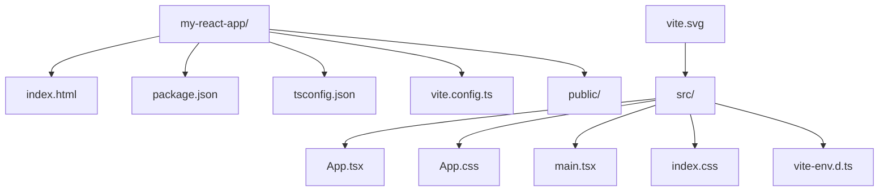
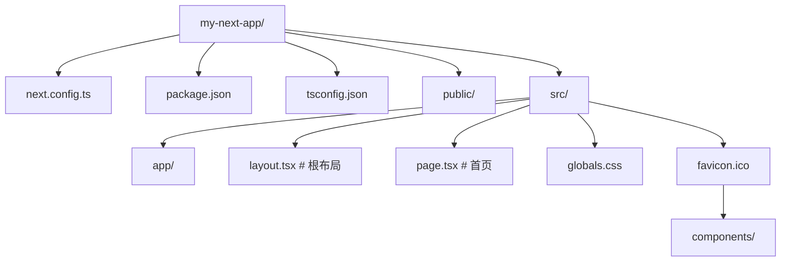
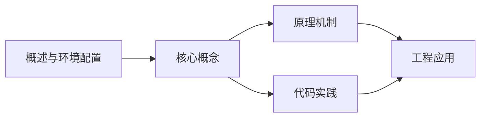
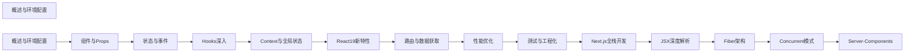

## 1. 学习目标（Bloom 分类）

本节按照布鲁姆教育目标分类学组织学习路径。本文主题为《概述与环境配置》，属于 React 模块，读者可以根据自身阶段选择阅读深度。

记忆层面：能够准确复述本文的核心概念、术语与基本语法或操作步骤，并能够在提问或检索时快速定位对应知识点。能够说出 React 的核心概念、术语与标准写法。

理解层面：能够用自己的语言解释核心原理与工作机制，说明概念之间的因果关系，而不是机械记忆结论。能够解释 React 的工作原理与设计动机。

应用层面：能够在真实项目或练习场景中运用本文知识解决具体问题，写出正确且可维护的实现。能够编写符合 React 规范的完整实现。

分析层面：能够拆解复杂问题，比较本文主题与相邻概念的异同，识别边界条件与例外情况。能够分析 React 与相邻方案的差异与边界。

评价层面：能够根据约束条件（性能、可读性、安全、成本）评价不同方案的优劣，做出有依据的技术决策。能够根据场景评价 React 相关方案的优劣。

创造层面：能够把本文知识与其他模块知识组合，设计出新的解决方案或可复用的工程模式。能够组合 React 与其他技术设计完整方案。

通过本节学习，读者应当能够把《概述与环境配置》纳入自己的知识网络，并与 React 模块的其他主题（组件、Hooks、状态管理、渲染性能）建立关联。

## 2. 历史动机与发展脉络

《概述与环境配置》是 React 领域的重要主题。要真正理解它，需要先了解它解决的问题与演进过程。

React 由 Facebook 于 2013 年开源，核心思想是组件化 UI 与声明式渲染；2019 年 React 16.8 引入 Hooks，函数组件成为主流。
React 19（2024）引入 Actions、useOptimistic、编译器（React Compiler）自动记忆化；并发特性（Suspense、Transitions）持续完善。
生态：Next.js/Remix 全栈框架、TanStack Query 服务端状态、Zustand/Redux 客户端状态、React Native 移动端。

回到本文主题：概述与环境配置 的提出与成熟，正是上述技术背景下的必然产物。早期实现往往以简单可用为目标，随着工程规模扩大，社区逐渐沉淀出标准做法与最佳实践；理解这一脉络，可以帮助读者判断“为什么文档中的推荐写法是现在这个样子”，也能在遇到历史遗留代码时准确识别其设计年代与取舍。


## 3. 形式化定义与核心概念精讲

本节把《概述与环境配置》涉及的核心概念以“定义 + 讲解”的形式展开。读者应把定义当作工具，把讲解当作理解路径；两者结合才能形成可迁移的知识。

组件模型：props 输入、state 内部状态、渲染输出 JSX；组件是纯函数，同一输入必得同一输出。
Hooks 规则：只能在顶层调用（不可在条件/循环中），函数组件与自定义 Hook 内使用；依赖数组决定 effect 重跑。
渲染与协调：setState 触发重渲染，虚拟 DOM diff 更新真实 DOM；key 帮助复用元素。

### 3.1 原文章节逐一精讲

原文档把主题拆分为 11 个小节，下面按顺序给出每一节的导读讲解，随后保留原文细节供精读。

#### 原文精读（完整保留）

# createApp/root API 语法速查手册

> **符号约定**:`< >` 必填参数 | `[ ]` 可选参数

---

#### 1. React 概述

React 是由 Meta（原 Facebook）开发并维护的开源 JavaScript UI 库，于 2013 年 5 月首次开源。它采用声明式编程范式，以组件化思想构建用户界面，是目前全球使用最广泛的前端框架之一。

##### 1.1 核心理念

| 理念                   | 说明                                                         |
| :--------------------- | :----------------------------------------------------------- |
| **声明式**             | 描述 UI 应该是什么样子，而非如何一步步操作 DOM               |
| **组件化**             | 将 UI 拆分为独立、可复用的组件，每个组件管理自己的状态和渲染 |
| **一次学习，到处编写** | React 可用于 Web、Native（React Native）、VR 等多个平台      |
| **单向数据流**         | 数据从父组件通过 Props 向下流动，状态变更通过回调向上传递    |

##### 1.2 发展历史

| 版本       | 时间    | 里程碑                                                   |
| :--------- | :------ | :------------------------------------------------------- |
| React 0.3  | 2013.05 | 首次开源                                                 |
| React 0.14 | 2015.10 | 拆分 react-dom，引入无状态函数组件                       |
| React 15   | 2016.04 | 正式版本号，Fiber 架构开始酝酿                           |
| React 16   | 2017.09 | Fiber 架构落地，Error Boundaries、Portals、Fragment      |
| React 16.8 | 2019.02 | **Hooks** 正式发布，函数组件成为主流                     |
| React 17   | 2020.10 | 事件委托机制变更，为并发特性铺路                         |
| React 18   | 2022.03 | 并发渲染、Automatic Batching、Suspense、useId 等         |
| React 19   | 2024.12 | Server Components、Actions、use() Hook、useOptimistic 等 |

##### 1.3 React 19 核心新特性概览

React 19 是一次重大更新，主要围绕以下方向：

- **React Server Components (RSC)**：服务端组件正式稳定，减少客户端 JavaScript 体积
- **Actions**：简化表单提交和异步状态管理
- **新 Hooks**：`use()`、`useFormStatus`、`useOptimistic`、`useActionState`
- **改进的 Suspense**：支持服务端流式渲染
- **ref 作为 prop**：函数组件不再需要 `forwardRef`
- **文档元数据支持**：`<title>`、`<meta>` 等标签可直接在组件中声明
- **样式表支持**：通过 `precedence` 控制样式表加载顺序

#### 2. 环境搭建

##### 2.1 使用 Vite 创建项目（推荐）

Vite 是目前最流行的前端构建工具，启动速度极快，热更新即时。

```bash
# 使用 npm
npm create vite@latest my-react-app -- --template react-ts

# 使用 pnpm
pnpm create vite my-react-app --template react-ts

# 进入项目并安装依赖
cd my-react-app
npm install
npm run dev
```

Vite 项目默认结构：



##### 2.2 使用 Next.js 创建项目

Next.js 是 React 全栈框架，支持 SSR、SSG、App Router 等特性。

```bash
# 创建 Next.js 15 项目
npx create-next-app@latest my-next-app --typescript --app --tailwind --eslint

# 或使用 pnpm
pnpm create next-app my-next-app --typescript --app --tailwind --eslint
```

Next.js App Router 项目结构：



##### 2.3 使用 Remix 创建项目

Remix 是一个专注于 Web 标准的全栈 React 框架。

```bash
npx create-remix@latest my-remix-app
```

##### 2.4 开发工具配置

**VS Code 推荐扩展：**

- ESLint — 代码规范检查
- Prettier — 代码格式化
- TypeScript Importer — 自动导入
- Error Lens — 行内错误提示
- React Developer Tools — 浏览器调试扩展

**推荐 VS Code settings.json 配置：**

```json
{
  "editor.formatOnSave": true,
  "editor.defaultFormatter": "esbenp.prettier-vscode",
  "editor.codeActionsOnSave": {
    "source.fixAll.eslint": "explicit"
  },
  "typescript.tsdk": "node_modules/typescript/lib"
}
```

#### 3. JSX 语法

JSX 是 JavaScript 的语法扩展，允许在 JavaScript 中编写类似 HTML 的代码。React 19 中 JSX Transform 已完全内置，无需手动引入 React。

##### 3.1 基本语法

```tsx
// JSX 基本结构
const element = <h1>Hello, React 19!</h1>;

// 使用表达式
const name = 'FANDEX';
const greeting = <h1>Hello, {name}!</h1>;

// 调用函数
function formatName(user: { firstName: string; lastName: string }) {
  return `${user.firstName} ${user.lastName}`;
}

const user = { firstName: '张', lastName: '三' };
const element = <h1>Hello, {formatName(user)}!</h1>;
```

##### 3.2 JSX 属性与样式

```tsx
// 属性使用 camelCase
const element = (
  <div className="container" htmlFor="input" tabIndex={0}>
    内容
  </div>
);

// 内联样式使用对象
const styleObj: React.CSSProperties = {
  color: 'red',
  fontSize: '16px',
  backgroundColor: '#f0f0f0',
};

const styledElement = <div style={styleObj}>带样式的文本</div>;
```

##### 3.3 条件渲染

```tsx
// 三元表达式
const element = isLoggedIn ? <Dashboard /> : <LoginPage />;

// 逻辑与 (&&)
const element = <div>{items.length > 0 && <ItemList items={items} />}</div>;

// 提前返回
function UserGreeting({ name }: { name?: string }) {
  if (!name) {
    return <p>请先登录</p>;
  }
  return <h1>欢迎回来，{name}！</h1>;
}
```

##### 3.4 列表渲染

```tsx
const fruits = [
  { id: 1, name: '苹果' },
  { id: 2, name: '香蕉' },
  { id: 3, name: '橙子' },
];

const fruitList = (
  <ul>
    {fruits.map((fruit) => (
      <li key={fruit.id}>{fruit.name}</li>
    ))}
  </ul>
);
```

> **注意**：`key` 应使用稳定且唯一的标识符，避免使用数组索引作为 key，尤其在列表会增删时。

#### 4. Hello World

##### 4.1 最简 React 应用

```tsx
// src/main.tsx
import { StrictMode } from 'react';
import { createRoot } from 'react-dom/client';
import App from './App';

createRoot(document.getElementById('root')!).render(
  <StrictMode>
    <App />
  </StrictMode>
);
```

```tsx
// src/App.tsx
function App() {
  return (
    <div>
      <h1>Hello, React 19!</h1>
      <p>欢迎使用 FANDEX React 知识库</p>
    </div>
  );
}

export default App;
```

##### 4.2 React 19 新的客户端渲染 API

React 19 对 `createRoot` 的使用方式做了调整，`render` 方法已被弃用，推荐使用新的 API：

```tsx
// React 18 方式（仍可用但已弃用）
// createRoot(container).render(<App />);

// React 19 推荐方式
import { createRoot } from 'react-dom/client';

const root = createRoot(document.getElementById('root')!);
root.render(<App />);
```

##### 4.3 StrictMode 说明

`StrictMode` 是开发模式下的辅助工具，它不会渲染任何可见 UI，但会：

- 识别不安全的生命周期方法
- 检测过时的 API 用法
- 检测意外的副作用（组件会被渲染两次）
- 检测过时的 Context API 用法

> **提示**：`StrictMode` 的双重渲染仅在开发模式下生效，生产构建中不会触发。

#### 5. TypeScript 与 React

##### 5.1 类型定义

React 19 内置了 TypeScript 类型支持，无需额外安装 `@types/react`：

```bash
npm install react react-dom
npm install -D typescript @types/react @types/react-dom
```

##### 5.2 常用类型

```tsx
import type { FC, ReactNode, CSSProperties, ChangeEvent } from 'react';

// 函数组件类型
const MyComponent: FC<{ title: string; children?: ReactNode }> = ({ title, children }) => {
  return (
    <div>
      <h1>{title}</h1>
      {children}
    </div>
  );
};

// 事件类型
const handleChange = (e: ChangeEvent<HTMLInputElement>) => {
  console.log(e.target.value);
};

// 样式类型
const styles: CSSProperties = {
  display: 'flex',
  justifyContent: 'center',
};
```

#### 6. 包管理器选择

| 包管理器 | 特点                    | 推荐场景           |
| :------- | :---------------------- | :----------------- |
| **npm**  | Node.js 内置，最通用    | 初学者、CI 环境    |
| **pnpm** | 硬链接机制，磁盘占用少  | 大型项目、Monorepo |
| **yarn** | 确定性安装，Plug'n'Play | 团队协作           |
| **bun**  | 极速安装，内置运行时    | 追求极致性能       |

```bash
# 使用 pnpm（推荐）
corepack enable
corepack prepare pnpm@latest --activate

# 使用 bun
npm install -g bun
```
#### 应用入口 API

**createRoot 创建根容器**
`const <root> = createRoot(<container>, [<options>]);`
```tsx
import { createRoot } from 'react-dom/client';

const root = createRoot(document.getElementById('root')!);
root.render(<App />);
```

**root.render 渲染节点**
`root.render(<node>);`
```tsx
root.render(<App />);
root.render(null); // 卸载等价
```

**root.unmount 卸载根**
`root.unmount();`
```tsx
root.unmount();
```

---

#### 水合 API

**hydrateRoot 服务端 HTML 水合**
`const <root> = hydrateRoot(<container>, <initialChildren>, [<options>]);`
```tsx
import { hydrateRoot } from 'react-dom/client';
import { App } from './App';

hydrateRoot(document.getElementById('root')!, <App />);
```

**hydrateOptions 水合选项**
`{ onRecoverableError?: <errorHandler>, identifierPrefix?: <string> }`
```tsx
hydrateRoot(container, <App />, {
  onRecoverableError: (error) => console.error(error),
  identifierPrefix: 'app-',
});
```

---

#### 严格模式

**StrictMode 严格模式组件**
`<StrictMode>...</StrictMode>`
```tsx
import { StrictMode } from 'react';

createRoot(container).render(
  <StrictMode>
    <App />
  </StrictMode>
);
```

---

#### createRoot 选项

**createRoot options**
`{ onRecoverableError?: <handler>, identifierPrefix?: <string>, onCaughtError?: <handler>, onUncaughtError?: <handler> }`
```tsx
createRoot(container, {
  onCaughtError: (error, info) => console.warn(error, info.componentStack),
  onUncaughtError: (error) => console.error(error),
  identifierPrefix: 'fandex-',
});
```

---

#### flushSync 同步刷新

**flushSync 强制同步刷新**
`flushSync(<callback>);`
```tsx
import { flushSync } from 'react-dom';

flushSync(() => {
  setCount(c => c + 1);
});
```


### 3.2 概念关系图

下面用 Mermaid 图表达本文核心概念之间的关系，帮助读者建立整体图景：



图中展示的是本文知识的结构化关系：核心概念是入口，原理机制解释“为什么”，代码实践演示“怎么做”，工程应用回答“何时用”。读者学习时可以把每个小节的内容挂接到对应节点上。

## 4. 理论推导与原理解析

本节深入《概述与环境配置》背后的原理。理论部分不求面面俱到，而是聚焦“能解释现象、能指导实践”的关键推导。

组件模型：props 输入、state 内部状态、渲染输出 JSX；组件是纯函数，同一输入必得同一输出。
Hooks 规则：只能在顶层调用（不可在条件/循环中），函数组件与自定义 Hook 内使用；依赖数组决定 effect 重跑。
渲染与协调：setState 触发重渲染，虚拟 DOM diff 更新真实 DOM；key 帮助复用元素。
状态提升与下放：共享状态提升到最近公共祖先；Context 跨层传递（Provider/useContext）。

需要强调的是，理论推导与工程实践之间存在翻译层：理论给出的是理想化模型与边界条件，工程代码则必须处理真实环境中的例外。读者在学习时应先掌握理论的“标准情形”，再通过陷阱章节了解“非标准情形”。

## 5. 代码示例与逐行讲解

本节把原文中的代码示例系统整理，并为每个示例补充用途说明与讲解。读者不应只浏览代码，而应逐段对照讲解理解设计意图。

### 5.1 示例：2.1 使用 Vite 创建项目（推荐）

该示例来自原文《2.1 使用 Vite 创建项目（推荐）》小节，用于演示概述与环境配置相关操作。阅读时请先看代码结构，再看其后的讲解。

```bash
# 使用 npm
npm create vite@latest my-react-app -- --template react-ts

# 使用 pnpm
pnpm create vite my-react-app --template react-ts

# 进入项目并安装依赖
cd my-react-app
npm install
npm run dev
```

讲解：这段代码演示了本节核心知识点。代码中的关键操作可以归纳为三步：准备（定义或初始化）、执行（核心逻辑）、收尾（释放资源或返回结果）。实际项目中，这三步往往被封装为函数或类，以提升复用性与可测试性。

关键点分析：

该示例共 8 行有效代码，结构以数据或配置为主。阅读时应关注：数据字段的含义、配置项的作用，以及它们与运行行为的对应关系。

进阶思考路径：先尝试修改参数观察行为变化，再把示例中的模式迁移到自己的项目中；每次修改都记录预期与实测差异，这是把示例转化为能力的最快方式。

### 5.2 示例：2.1 使用 Vite 创建项目（推荐）

该示例来自原文《2.1 使用 Vite 创建项目（推荐）》小节，用于演示概述与环境配置相关操作。阅读时请先看代码结构，再看其后的讲解。


讲解：这段代码演示了本节核心知识点。代码中的关键操作可以归纳为三步：准备（定义或初始化）、执行（核心逻辑）、收尾（释放资源或返回结果）。实际项目中，这三步往往被封装为函数或类，以提升复用性与可测试性。

关键点分析：

该示例共 25 行有效代码，结构以数据或配置为主。阅读时应关注：数据字段的含义、配置项的作用，以及它们与运行行为的对应关系。

进阶思考路径：先尝试修改参数观察行为变化，再把示例中的模式迁移到自己的项目中；每次修改都记录预期与实测差异，这是把示例转化为能力的最快方式。

### 5.3 示例：2.2 使用 Next.js 创建项目

该示例来自原文《2.2 使用 Next.js 创建项目》小节，用于演示概述与环境配置相关操作。阅读时请先看代码结构，再看其后的讲解。

```bash
# 创建 Next.js 15 项目
npx create-next-app@latest my-next-app --typescript --app --tailwind --eslint

# 或使用 pnpm
pnpm create next-app my-next-app --typescript --app --tailwind --eslint
```

讲解：这段代码演示了本节核心知识点。代码中的关键操作可以归纳为三步：准备（定义或初始化）、执行（核心逻辑）、收尾（释放资源或返回结果）。实际项目中，这三步往往被封装为函数或类，以提升复用性与可测试性。

关键点分析：

该示例共 4 行有效代码，结构以数据或配置为主。阅读时应关注：数据字段的含义、配置项的作用，以及它们与运行行为的对应关系。

进阶思考路径：先尝试修改参数观察行为变化，再把示例中的模式迁移到自己的项目中；每次修改都记录预期与实测差异，这是把示例转化为能力的最快方式。

### 5.4 示例：2.2 使用 Next.js 创建项目

该示例来自原文《2.2 使用 Next.js 创建项目》小节，用于演示概述与环境配置相关操作。阅读时请先看代码结构，再看其后的讲解。


讲解：这段代码演示了本节核心知识点。代码中的关键操作可以归纳为三步：准备（定义或初始化）、执行（核心逻辑）、收尾（释放资源或返回结果）。实际项目中，这三步往往被封装为函数或类，以提升复用性与可测试性。

关键点分析：

该示例共 24 行有效代码，结构以数据或配置为主。阅读时应关注：数据字段的含义、配置项的作用，以及它们与运行行为的对应关系。

进阶思考路径：先尝试修改参数观察行为变化，再把示例中的模式迁移到自己的项目中；每次修改都记录预期与实测差异，这是把示例转化为能力的最快方式。

### 5.5 示例：2.3 使用 Remix 创建项目

该示例来自原文《2.3 使用 Remix 创建项目》小节，用于演示概述与环境配置相关操作。阅读时请先看代码结构，再看其后的讲解。

```bash
npx create-remix@latest my-remix-app
```

讲解：这段代码演示了本节核心知识点。代码中的关键操作可以归纳为三步：准备（定义或初始化）、执行（核心逻辑）、收尾（释放资源或返回结果）。实际项目中，这三步往往被封装为函数或类，以提升复用性与可测试性。

关键点分析：

该示例共 1 行有效代码，结构以数据或配置为主。阅读时应关注：数据字段的含义、配置项的作用，以及它们与运行行为的对应关系。

进阶思考路径：先尝试修改参数观察行为变化，再把示例中的模式迁移到自己的项目中；每次修改都记录预期与实测差异，这是把示例转化为能力的最快方式。

### 5.6 示例：2.4 开发工具配置

该示例来自原文《2.4 开发工具配置》小节，用于演示概述与环境配置相关操作。阅读时请先看代码结构，再看其后的讲解。

```json
{
  "editor.formatOnSave": true,
  "editor.defaultFormatter": "esbenp.prettier-vscode",
  "editor.codeActionsOnSave": {
    "source.fixAll.eslint": "explicit"
  },
  "typescript.tsdk": "node_modules/typescript/lib"
}
```

讲解：这段代码演示了本节核心知识点。代码中的关键操作可以归纳为三步：准备（定义或初始化）、执行（核心逻辑）、收尾（释放资源或返回结果）。实际项目中，这三步往往被封装为函数或类，以提升复用性与可测试性。

关键点分析：

该示例共 8 行有效代码，结构以数据或配置为主。阅读时应关注：数据字段的含义、配置项的作用，以及它们与运行行为的对应关系。

进阶思考路径：先尝试修改参数观察行为变化，再把示例中的模式迁移到自己的项目中；每次修改都记录预期与实测差异，这是把示例转化为能力的最快方式。

### 5.7 示例：3.1 基本语法

该示例来自原文《3.1 基本语法》小节，用于演示概述与环境配置相关操作。阅读时请先看代码结构，再看其后的讲解。

```tsx
// JSX 基本结构
const element = <h1>Hello, React 19!</h1>;

// 使用表达式
const name = 'FANDEX';
const greeting = <h1>Hello, {name}!</h1>;

// 调用函数
function formatName(user: { firstName: string; lastName: string }) {
  return `${user.firstName} ${user.lastName}`;
}

const user = { firstName: '张', lastName: '三' };
const element = <h1>Hello, {formatName(user)}!</h1>;
```

讲解：这段代码演示了本节核心知识点。代码中的关键操作可以归纳为三步：准备（定义或初始化）、执行（核心逻辑）、收尾（释放资源或返回结果）。实际项目中，这三步往往被封装为函数或类，以提升复用性与可测试性。

关键点分析：

该示例共 11 行有效代码，包含 2 类关键结构（function、return）。其中：

- 入口与初始化部分负责建立上下文，对应实际项目中的启动或装配逻辑；
- 核心逻辑部分体现本文主题的主要操作，是阅读时最需要对照讲解理解的部分；
- 输出或返回部分把结果交给调用方，注意其类型与边界条件。

进阶思考路径：先尝试修改参数观察行为变化，再把示例中的模式迁移到自己的项目中；每次修改都记录预期与实测差异，这是把示例转化为能力的最快方式。

### 5.8 示例：3.2 JSX 属性与样式

该示例来自原文《3.2 JSX 属性与样式》小节，用于演示概述与环境配置相关操作。阅读时请先看代码结构，再看其后的讲解。

```tsx
// 属性使用 camelCase
const element = (
  <div className="container" htmlFor="input" tabIndex={0}>
    内容
  </div>
);

// 内联样式使用对象
const styleObj: React.CSSProperties = {
  color: 'red',
  fontSize: '16px',
  backgroundColor: '#f0f0f0',
};

const styledElement = <div style={styleObj}>带样式的文本</div>;
```

讲解：这段代码演示了本节核心知识点。代码中的关键操作可以归纳为三步：准备（定义或初始化）、执行（核心逻辑）、收尾（释放资源或返回结果）。实际项目中，这三步往往被封装为函数或类，以提升复用性与可测试性。

关键点分析：

该示例共 13 行有效代码，包含 1 类关键结构（class）。其中：

- 入口与初始化部分负责建立上下文，对应实际项目中的启动或装配逻辑；
- 核心逻辑部分体现本文主题的主要操作，是阅读时最需要对照讲解理解的部分；
- 输出或返回部分把结果交给调用方，注意其类型与边界条件。

进阶思考路径：先尝试修改参数观察行为变化，再把示例中的模式迁移到自己的项目中；每次修改都记录预期与实测差异，这是把示例转化为能力的最快方式。

### 5.9 示例：3.3 条件渲染

该示例来自原文《3.3 条件渲染》小节，用于演示概述与环境配置相关操作。阅读时请先看代码结构，再看其后的讲解。

```tsx
// 三元表达式
const element = isLoggedIn ? <Dashboard /> : <LoginPage />;

// 逻辑与 (&&)
const element = <div>{items.length > 0 && <ItemList items={items} />}</div>;

// 提前返回
function UserGreeting({ name }: { name?: string }) {
  if (!name) {
    return <p>请先登录</p>;
  }
  return <h1>欢迎回来，{name}！</h1>;
}
```

讲解：这段代码演示了本节核心知识点。代码中的关键操作可以归纳为三步：准备（定义或初始化）、执行（核心逻辑）、收尾（释放资源或返回结果）。实际项目中，这三步往往被封装为函数或类，以提升复用性与可测试性。

关键点分析：

该示例共 11 行有效代码，包含 3 类关键结构（function、if、return）。其中：

- 入口与初始化部分负责建立上下文，对应实际项目中的启动或装配逻辑；
- 核心逻辑部分体现本文主题的主要操作，是阅读时最需要对照讲解理解的部分；
- 输出或返回部分把结果交给调用方，注意其类型与边界条件。

进阶思考路径：先尝试修改参数观察行为变化，再把示例中的模式迁移到自己的项目中；每次修改都记录预期与实测差异，这是把示例转化为能力的最快方式。

### 5.10 示例：3.4 列表渲染

该示例来自原文《3.4 列表渲染》小节，用于演示概述与环境配置相关操作。阅读时请先看代码结构，再看其后的讲解。

```tsx
const fruits = [
  { id: 1, name: '苹果' },
  { id: 2, name: '香蕉' },
  { id: 3, name: '橙子' },
];

const fruitList = (
  <ul>
    {fruits.map((fruit) => (
      <li key={fruit.id}>{fruit.name}</li>
    ))}
  </ul>
);
```

讲解：这段代码演示了本节核心知识点。代码中的关键操作可以归纳为三步：准备（定义或初始化）、执行（核心逻辑）、收尾（释放资源或返回结果）。实际项目中，这三步往往被封装为函数或类，以提升复用性与可测试性。

关键点分析：

该示例共 12 行有效代码，结构以数据或配置为主。阅读时应关注：数据字段的含义、配置项的作用，以及它们与运行行为的对应关系。

进阶思考路径：先尝试修改参数观察行为变化，再把示例中的模式迁移到自己的项目中；每次修改都记录预期与实测差异，这是把示例转化为能力的最快方式。

### 5.11 示例：4.1 最简 React 应用

该示例来自原文《4.1 最简 React 应用》小节，用于演示概述与环境配置相关操作。阅读时请先看代码结构，再看其后的讲解。

```tsx
// src/main.tsx
import { StrictMode } from 'react';
import { createRoot } from 'react-dom/client';
import App from './App';

createRoot(document.getElementById('root')!).render(
  <StrictMode>
    <App />
  </StrictMode>
);
```

讲解：这段代码演示了本节核心知识点。代码中的关键操作可以归纳为三步：准备（定义或初始化）、执行（核心逻辑）、收尾（释放资源或返回结果）。实际项目中，这三步往往被封装为函数或类，以提升复用性与可测试性。

关键点分析：

该示例共 9 行有效代码，包含 2 类关键结构（import、from）。其中：

- 入口与初始化部分负责建立上下文，对应实际项目中的启动或装配逻辑；
- 核心逻辑部分体现本文主题的主要操作，是阅读时最需要对照讲解理解的部分；
- 输出或返回部分把结果交给调用方，注意其类型与边界条件。

进阶思考路径：先尝试修改参数观察行为变化，再把示例中的模式迁移到自己的项目中；每次修改都记录预期与实测差异，这是把示例转化为能力的最快方式。

### 5.12 示例：4.1 最简 React 应用

该示例来自原文《4.1 最简 React 应用》小节，用于演示概述与环境配置相关操作。阅读时请先看代码结构，再看其后的讲解。

```tsx
// src/App.tsx
function App() {
  return (
    <div>
      <h1>Hello, React 19!</h1>
      <p>欢迎使用 FANDEX React 知识库</p>
    </div>
  );
}

export default App;
```

讲解：这段代码演示了本节核心知识点。代码中的关键操作可以归纳为三步：准备（定义或初始化）、执行（核心逻辑）、收尾（释放资源或返回结果）。实际项目中，这三步往往被封装为函数或类，以提升复用性与可测试性。

关键点分析：

该示例共 10 行有效代码，包含 2 类关键结构（function、return）。其中：

- 入口与初始化部分负责建立上下文，对应实际项目中的启动或装配逻辑；
- 核心逻辑部分体现本文主题的主要操作，是阅读时最需要对照讲解理解的部分；
- 输出或返回部分把结果交给调用方，注意其类型与边界条件。

进阶思考路径：先尝试修改参数观察行为变化，再把示例中的模式迁移到自己的项目中；每次修改都记录预期与实测差异，这是把示例转化为能力的最快方式。

### 5.13 示例：4.2 React 19 新的客户端渲染 API

该示例来自原文《4.2 React 19 新的客户端渲染 API》小节，用于演示概述与环境配置相关操作。阅读时请先看代码结构，再看其后的讲解。

```tsx
// React 18 方式（仍可用但已弃用）
// createRoot(container).render(<App />);

// React 19 推荐方式
import { createRoot } from 'react-dom/client';

const root = createRoot(document.getElementById('root')!);
root.render(<App />);
```

讲解：这段代码演示了本节核心知识点。代码中的关键操作可以归纳为三步：准备（定义或初始化）、执行（核心逻辑）、收尾（释放资源或返回结果）。实际项目中，这三步往往被封装为函数或类，以提升复用性与可测试性。

关键点分析：

该示例共 6 行有效代码，包含 2 类关键结构（import、from）。其中：

- 入口与初始化部分负责建立上下文，对应实际项目中的启动或装配逻辑；
- 核心逻辑部分体现本文主题的主要操作，是阅读时最需要对照讲解理解的部分；
- 输出或返回部分把结果交给调用方，注意其类型与边界条件。

进阶思考路径：先尝试修改参数观察行为变化，再把示例中的模式迁移到自己的项目中；每次修改都记录预期与实测差异，这是把示例转化为能力的最快方式。

### 5.14 示例：5.1 类型定义

该示例来自原文《5.1 类型定义》小节，用于演示概述与环境配置相关操作。阅读时请先看代码结构，再看其后的讲解。

```bash
npm install react react-dom
npm install -D typescript @types/react @types/react-dom
```

讲解：这段代码演示了本节核心知识点。代码中的关键操作可以归纳为三步：准备（定义或初始化）、执行（核心逻辑）、收尾（释放资源或返回结果）。实际项目中，这三步往往被封装为函数或类，以提升复用性与可测试性。

关键点分析：

该示例共 2 行有效代码，结构以数据或配置为主。阅读时应关注：数据字段的含义、配置项的作用，以及它们与运行行为的对应关系。

进阶思考路径：先尝试修改参数观察行为变化，再把示例中的模式迁移到自己的项目中；每次修改都记录预期与实测差异，这是把示例转化为能力的最快方式。

### 5.15 示例：5.2 常用类型

该示例来自原文《5.2 常用类型》小节，用于演示概述与环境配置相关操作。阅读时请先看代码结构，再看其后的讲解。

```tsx
import type { FC, ReactNode, CSSProperties, ChangeEvent } from 'react';

// 函数组件类型
const MyComponent: FC<{ title: string; children?: ReactNode }> = ({ title, children }) => {
  return (
    <div>
      <h1>{title}</h1>
      {children}
    </div>
  );
};

// 事件类型
const handleChange = (e: ChangeEvent<HTMLInputElement>) => {
  console.log(e.target.value);
};

// 样式类型
const styles: CSSProperties = {
  display: 'flex',
  justifyContent: 'center',
};
```

讲解：这段代码演示了本节核心知识点。代码中的关键操作可以归纳为三步：准备（定义或初始化）、执行（核心逻辑）、收尾（释放资源或返回结果）。实际项目中，这三步往往被封装为函数或类，以提升复用性与可测试性。

关键点分析：

该示例共 19 行有效代码，包含 3 类关键结构（import、from、return）。其中：

- 入口与初始化部分负责建立上下文，对应实际项目中的启动或装配逻辑；
- 核心逻辑部分体现本文主题的主要操作，是阅读时最需要对照讲解理解的部分；
- 输出或返回部分把结果交给调用方，注意其类型与边界条件。

进阶思考路径：先尝试修改参数观察行为变化，再把示例中的模式迁移到自己的项目中；每次修改都记录预期与实测差异，这是把示例转化为能力的最快方式。

### 5.16 示例：6. 包管理器选择

该示例来自原文《6. 包管理器选择》小节，用于演示概述与环境配置相关操作。阅读时请先看代码结构，再看其后的讲解。

```bash
# 使用 pnpm（推荐）
corepack enable
corepack prepare pnpm@latest --activate

# 使用 bun
npm install -g bun
```

讲解：这段代码演示了本节核心知识点。代码中的关键操作可以归纳为三步：准备（定义或初始化）、执行（核心逻辑）、收尾（释放资源或返回结果）。实际项目中，这三步往往被封装为函数或类，以提升复用性与可测试性。

关键点分析：

该示例共 5 行有效代码，结构以数据或配置为主。阅读时应关注：数据字段的含义、配置项的作用，以及它们与运行行为的对应关系。

进阶思考路径：先尝试修改参数观察行为变化，再把示例中的模式迁移到自己的项目中；每次修改都记录预期与实测差异，这是把示例转化为能力的最快方式。

### 5.17 示例：应用入口 API

该示例来自原文《应用入口 API》小节，用于演示概述与环境配置相关操作。阅读时请先看代码结构，再看其后的讲解。

```tsx
import { createRoot } from 'react-dom/client';

const root = createRoot(document.getElementById('root')!);
root.render(<App />);
```

讲解：这段代码演示了本节核心知识点。代码中的关键操作可以归纳为三步：准备（定义或初始化）、执行（核心逻辑）、收尾（释放资源或返回结果）。实际项目中，这三步往往被封装为函数或类，以提升复用性与可测试性。

关键点分析：

该示例共 3 行有效代码，包含 2 类关键结构（import、from）。其中：

- 入口与初始化部分负责建立上下文，对应实际项目中的启动或装配逻辑；
- 核心逻辑部分体现本文主题的主要操作，是阅读时最需要对照讲解理解的部分；
- 输出或返回部分把结果交给调用方，注意其类型与边界条件。

进阶思考路径：先尝试修改参数观察行为变化，再把示例中的模式迁移到自己的项目中；每次修改都记录预期与实测差异，这是把示例转化为能力的最快方式。

### 5.18 示例：应用入口 API

该示例来自原文《应用入口 API》小节，用于演示概述与环境配置相关操作。阅读时请先看代码结构，再看其后的讲解。

```tsx
root.render(<App />);
root.render(null); // 卸载等价
```

讲解：这段代码演示了本节核心知识点。代码中的关键操作可以归纳为三步：准备（定义或初始化）、执行（核心逻辑）、收尾（释放资源或返回结果）。实际项目中，这三步往往被封装为函数或类，以提升复用性与可测试性。

关键点分析：

该示例共 2 行有效代码，结构以数据或配置为主。阅读时应关注：数据字段的含义、配置项的作用，以及它们与运行行为的对应关系。

进阶思考路径：先尝试修改参数观察行为变化，再把示例中的模式迁移到自己的项目中；每次修改都记录预期与实测差异，这是把示例转化为能力的最快方式。

### 5.19 示例：应用入口 API

该示例来自原文《应用入口 API》小节，用于演示概述与环境配置相关操作。阅读时请先看代码结构，再看其后的讲解。

```tsx
root.unmount();
```

讲解：这段代码演示了本节核心知识点。代码中的关键操作可以归纳为三步：准备（定义或初始化）、执行（核心逻辑）、收尾（释放资源或返回结果）。实际项目中，这三步往往被封装为函数或类，以提升复用性与可测试性。

关键点分析：

该示例共 1 行有效代码，结构以数据或配置为主。阅读时应关注：数据字段的含义、配置项的作用，以及它们与运行行为的对应关系。

进阶思考路径：先尝试修改参数观察行为变化，再把示例中的模式迁移到自己的项目中；每次修改都记录预期与实测差异，这是把示例转化为能力的最快方式。

### 5.20 示例：水合 API

该示例来自原文《水合 API》小节，用于演示概述与环境配置相关操作。阅读时请先看代码结构，再看其后的讲解。

```tsx
import { hydrateRoot } from 'react-dom/client';
import { App } from './App';

hydrateRoot(document.getElementById('root')!, <App />);
```

讲解：这段代码演示了本节核心知识点。代码中的关键操作可以归纳为三步：准备（定义或初始化）、执行（核心逻辑）、收尾（释放资源或返回结果）。实际项目中，这三步往往被封装为函数或类，以提升复用性与可测试性。

关键点分析：

该示例共 3 行有效代码，包含 2 类关键结构（import、from）。其中：

- 入口与初始化部分负责建立上下文，对应实际项目中的启动或装配逻辑；
- 核心逻辑部分体现本文主题的主要操作，是阅读时最需要对照讲解理解的部分；
- 输出或返回部分把结果交给调用方，注意其类型与边界条件。

进阶思考路径：先尝试修改参数观察行为变化，再把示例中的模式迁移到自己的项目中；每次修改都记录预期与实测差异，这是把示例转化为能力的最快方式。

### 5.21 示例：水合 API

该示例来自原文《水合 API》小节，用于演示概述与环境配置相关操作。阅读时请先看代码结构，再看其后的讲解。

```tsx
hydrateRoot(container, <App />, {
  onRecoverableError: (error) => console.error(error),
  identifierPrefix: 'app-',
});
```

讲解：这段代码演示了本节核心知识点。代码中的关键操作可以归纳为三步：准备（定义或初始化）、执行（核心逻辑）、收尾（释放资源或返回结果）。实际项目中，这三步往往被封装为函数或类，以提升复用性与可测试性。

关键点分析：

该示例共 4 行有效代码，结构以数据或配置为主。阅读时应关注：数据字段的含义、配置项的作用，以及它们与运行行为的对应关系。

进阶思考路径：先尝试修改参数观察行为变化，再把示例中的模式迁移到自己的项目中；每次修改都记录预期与实测差异，这是把示例转化为能力的最快方式。

### 5.22 示例：严格模式

该示例来自原文《严格模式》小节，用于演示概述与环境配置相关操作。阅读时请先看代码结构，再看其后的讲解。

```tsx
import { StrictMode } from 'react';

createRoot(container).render(
  <StrictMode>
    <App />
  </StrictMode>
);
```

讲解：这段代码演示了本节核心知识点。代码中的关键操作可以归纳为三步：准备（定义或初始化）、执行（核心逻辑）、收尾（释放资源或返回结果）。实际项目中，这三步往往被封装为函数或类，以提升复用性与可测试性。

关键点分析：

该示例共 6 行有效代码，包含 2 类关键结构（import、from）。其中：

- 入口与初始化部分负责建立上下文，对应实际项目中的启动或装配逻辑；
- 核心逻辑部分体现本文主题的主要操作，是阅读时最需要对照讲解理解的部分；
- 输出或返回部分把结果交给调用方，注意其类型与边界条件。

进阶思考路径：先尝试修改参数观察行为变化，再把示例中的模式迁移到自己的项目中；每次修改都记录预期与实测差异，这是把示例转化为能力的最快方式。

### 5.23 示例：createRoot 选项

该示例来自原文《createRoot 选项》小节，用于演示概述与环境配置相关操作。阅读时请先看代码结构，再看其后的讲解。

```tsx
createRoot(container, {
  onCaughtError: (error, info) => console.warn(error, info.componentStack),
  onUncaughtError: (error) => console.error(error),
  identifierPrefix: 'fandex-',
});
```

讲解：这段代码演示了本节核心知识点。代码中的关键操作可以归纳为三步：准备（定义或初始化）、执行（核心逻辑）、收尾（释放资源或返回结果）。实际项目中，这三步往往被封装为函数或类，以提升复用性与可测试性。

关键点分析：

该示例共 5 行有效代码，结构以数据或配置为主。阅读时应关注：数据字段的含义、配置项的作用，以及它们与运行行为的对应关系。

进阶思考路径：先尝试修改参数观察行为变化，再把示例中的模式迁移到自己的项目中；每次修改都记录预期与实测差异，这是把示例转化为能力的最快方式。

### 5.24 示例：flushSync 同步刷新

该示例来自原文《flushSync 同步刷新》小节，用于演示概述与环境配置相关操作。阅读时请先看代码结构，再看其后的讲解。

```tsx
import { flushSync } from 'react-dom';

flushSync(() => {
  setCount(c => c + 1);
});
```

讲解：这段代码演示了本节核心知识点。代码中的关键操作可以归纳为三步：准备（定义或初始化）、执行（核心逻辑）、收尾（释放资源或返回结果）。实际项目中，这三步往往被封装为函数或类，以提升复用性与可测试性。

关键点分析：

该示例共 4 行有效代码，包含 2 类关键结构（import、from）。其中：

- 入口与初始化部分负责建立上下文，对应实际项目中的启动或装配逻辑；
- 核心逻辑部分体现本文主题的主要操作，是阅读时最需要对照讲解理解的部分；
- 输出或返回部分把结果交给调用方，注意其类型与边界条件。

进阶思考路径：先尝试修改参数观察行为变化，再把示例中的模式迁移到自己的项目中；每次修改都记录预期与实测差异，这是把示例转化为能力的最快方式。


综合以上示例，可以总结出本主题的代码实践要点：第一，先定义清晰的输入输出契约；第二，核心逻辑保持单一职责；第三，错误处理与边界条件不可省略；第四，命名与注释表达意图而非复述代码。

## 6. 对比分析

对比是理解《概述与环境配置》定位的最快路径。下面从多个维度与相邻方案进行对比。

React 与 Vue：React JSX 全 JS、生态自由组合；Vue 模板 + 响应式自动追踪。团队偏好与既有代码决定选择。
函数组件与类组件：函数 + Hooks 是现代标准，类组件仅维护存量。
CSR 与 SSR：CSR 交互快、SSR SEO 好；Next.js 按页选择渲染模式。

对比的目的不是分出绝对优劣，而是建立选择依据：不同约束条件下，最优解不同。读者应把每个对比维度转化为决策检查清单。

## 7. 常见陷阱与最佳实践

本节整理该主题的高频错误与推荐做法。每个陷阱先描述现象，再解释原因，最后给出最佳实践。

### 7.1 setState 直接修改

直接修改 state 对象不触发渲染。创建新对象/数组。

深入讲解：该问题之所以被归类为“常见陷阱”，是因为它在初学者的代码中反复出现，而且往往不在第一时间暴露——错误通常隐藏在特定数据或特定时序下。

从成因上看，setState 直接修改 一般源于对 React 某个机制的理解偏差：要么误用了默认行为，要么忽略了边界条件，要么把其他语言的思维惯性带了过来。

从影响上看，setState 直接修改 轻则产生错误结果，重则导致资源泄漏、数据损坏或安全事故；这也是为什么工程评审中会把它列为检查项。

从修复策略上看，处理setState 直接修改的正确顺序是：先复现（构造最小用例），再定位（确认机制层面的根因），最后修复并补充回归测试。跳过复现直接改代码，往往治标不治本。

### 7.2 依赖数组缺失

effect 捕获旧值。按需列出依赖或用函数式更新。

深入讲解：该问题之所以被归类为“常见陷阱”，是因为它在初学者的代码中反复出现，而且往往不在第一时间暴露——错误通常隐藏在特定数据或特定时序下。

从成因上看，依赖数组缺失 一般源于对 React 某个机制的理解偏差：要么误用了默认行为，要么忽略了边界条件，要么把其他语言的思维惯性带了过来。

从影响上看，依赖数组缺失 轻则产生错误结果，重则导致资源泄漏、数据损坏或安全事故；这也是为什么工程评审中会把它列为检查项。

从修复策略上看，处理依赖数组缺失的正确顺序是：先复现（构造最小用例），再定位（确认机制层面的根因），最后修复并补充回归测试。跳过复现直接改代码，往往治标不治本。

### 7.3 条件调用 Hooks

违反 Hooks 规则导致渲染错乱。把条件放组件内或拆分组件。

深入讲解：该问题之所以被归类为“常见陷阱”，是因为它在初学者的代码中反复出现，而且往往不在第一时间暴露——错误通常隐藏在特定数据或特定时序下。

从成因上看，条件调用 Hooks 一般源于对 React 某个机制的理解偏差：要么误用了默认行为，要么忽略了边界条件，要么把其他语言的思维惯性带了过来。

从影响上看，条件调用 Hooks 轻则产生错误结果，重则导致资源泄漏、数据损坏或安全事故；这也是为什么工程评审中会把它列为检查项。

从修复策略上看，处理条件调用 Hooks的正确顺序是：先复现（构造最小用例），再定位（确认机制层面的根因），最后修复并补充回归测试。跳过复现直接改代码，往往治标不治本。

### 7.4 key 用索引

列表重排导致状态错位。使用稳定 id。

深入讲解：该问题之所以被归类为“常见陷阱”，是因为它在初学者的代码中反复出现，而且往往不在第一时间暴露——错误通常隐藏在特定数据或特定时序下。

从成因上看，key 用索引 一般源于对 React 某个机制的理解偏差：要么误用了默认行为，要么忽略了边界条件，要么把其他语言的思维惯性带了过来。

从影响上看，key 用索引 轻则产生错误结果，重则导致资源泄漏、数据损坏或安全事故；这也是为什么工程评审中会把它列为检查项。

从修复策略上看，处理key 用索引的正确顺序是：先复现（构造最小用例），再定位（确认机制层面的根因），最后修复并补充回归测试。跳过复现直接改代码，往往治标不治本。

### 7.5 Context 过度使用

Context 变更使所有消费者重渲染。拆分 Context 或选择状态库。

深入讲解：该问题之所以被归类为“常见陷阱”，是因为它在初学者的代码中反复出现，而且往往不在第一时间暴露——错误通常隐藏在特定数据或特定时序下。

从成因上看，Context 过度使用 一般源于对 React 某个机制的理解偏差：要么误用了默认行为，要么忽略了边界条件，要么把其他语言的思维惯性带了过来。

从影响上看，Context 过度使用 轻则产生错误结果，重则导致资源泄漏、数据损坏或安全事故；这也是为什么工程评审中会把它列为检查项。

从修复策略上看，处理Context 过度使用的正确顺序是：先复现（构造最小用例），再定位（确认机制层面的根因），最后修复并补充回归测试。跳过复现直接改代码，往往治标不治本。

### 7.6 内存泄漏

异步回调在卸载后 setState。用 cleanup 与取消标志。

深入讲解：该问题之所以被归类为“常见陷阱”，是因为它在初学者的代码中反复出现，而且往往不在第一时间暴露——错误通常隐藏在特定数据或特定时序下。

从成因上看，内存泄漏 一般源于对 React 某个机制的理解偏差：要么误用了默认行为，要么忽略了边界条件，要么把其他语言的思维惯性带了过来。

从影响上看，内存泄漏 轻则产生错误结果，重则导致资源泄漏、数据损坏或安全事故；这也是为什么工程评审中会把它列为检查项。

从修复策略上看，处理内存泄漏的正确顺序是：先复现（构造最小用例），再定位（确认机制层面的根因），最后修复并补充回归测试。跳过复现直接改代码，往往治标不治本。

### 7.7 受控组件误用

value 无 onChange 导致输入锁定。受控必须成对。

深入讲解：该问题之所以被归类为“常见陷阱”，是因为它在初学者的代码中反复出现，而且往往不在第一时间暴露——错误通常隐藏在特定数据或特定时序下。

从成因上看，受控组件误用 一般源于对 React 某个机制的理解偏差：要么误用了默认行为，要么忽略了边界条件，要么把其他语言的思维惯性带了过来。

从影响上看，受控组件误用 轻则产生错误结果，重则导致资源泄漏、数据损坏或安全事故；这也是为什么工程评审中会把它列为检查项。

从修复策略上看，处理受控组件误用的正确顺序是：先复现（构造最小用例），再定位（确认机制层面的根因），最后修复并补充回归测试。跳过复现直接改代码，往往治标不治本。

### 7.8 性能过早优化

useMemo/useCallback 滥用。先测量再优化。

深入讲解：该问题之所以被归类为“常见陷阱”，是因为它在初学者的代码中反复出现，而且往往不在第一时间暴露——错误通常隐藏在特定数据或特定时序下。

从成因上看，性能过早优化 一般源于对 React 某个机制的理解偏差：要么误用了默认行为，要么忽略了边界条件，要么把其他语言的思维惯性带了过来。

从影响上看，性能过早优化 轻则产生错误结果，重则导致资源泄漏、数据损坏或安全事故；这也是为什么工程评审中会把它列为检查项。

从修复策略上看，处理性能过早优化的正确顺序是：先复现（构造最小用例），再定位（确认机制层面的根因），最后修复并补充回归测试。跳过复现直接改代码，往往治标不治本。

### 7.0 最佳实践总览

1. 组件默认不可变数据流：props 只读，状态用函数式更新。
2. 自定义 Hook 封装副作用与复用逻辑。
3. 服务端状态用 TanStack Query，客户端全局状态用 Zustand。
4. React Compiler（19）开启后减少手工 memo。

把这些最佳实践固化为团队规范与代码评审检查项，是避免同类问题反复出现的关键。

## 8. 工程实践

本节把《概述与环境配置》放入真实工程场景，给出可复用的模式与组织方法。

项目结构：components/features/hooks/lib；colocation（相关文件就近）。
请求层：TanStack Query 管理缓存、重试、失效；错误边界兜底。
性能：代码分割（React.lazy）、虚拟列表（TanStack Virtual）、渲染分析（React DevTools Profiler）。
测试：Vitest + Testing Library（行为优先）+ Playwright。

### 8.1 工程实践的原则拆解

以上工程实践可以归纳为四条原则。第一，配置与代码分离：React 项目中环境差异应通过配置注入，而不是散落在代码分支中；这保证同一份代码可以在开发、测试、生产环境一致运行。

第二，接口稳定优先：对外接口（函数签名、协议、数据格式）一旦被消费方依赖，变更成本极高；设计时应预留扩展点并保持向后兼容。

第三，可观测性内置：日志、指标与追踪应该在功能开发时同步设计，而不是故障发生后补救；没有观测手段的模块等于黑盒。

第四，变更可回滚：任何发布都应有对应的回滚方案；数据库迁移、配置变更与代码发布一样需要版本管理与逆向路径。

### 8.2 实践落地的检查清单

- [ ] 项目结构：对照本节描述，检查当前项目是否已经落实；未落实的项列入技术债并排期处理。
- [ ] 请求层：对照本节描述，检查当前项目是否已经落实；未落实的项列入技术债并排期处理。
- [ ] 性能：对照本节描述，检查当前项目是否已经落实；未落实的项列入技术债并排期处理。
- [ ] 测试：对照本节描述，检查当前项目是否已经落实；未落实的项列入技术债并排期处理。

工程实践的共性原则：配置与代码分离、接口稳定优先、可观测性内置、变更可回滚。这些原则适用于本主题的所有实现。

## 9. 案例研究

本节通过一个完整案例把《概述与环境配置》的知识串起来。案例按“需求分析、方案设计、实现、验证”四步展开。

需求：实现文档列表页，支持搜索、筛选与分页。
方案：TanStack Query 数据层 + Zustand UI 状态 + 受控表单。
要点：查询键设计、防抖搜索、错误与空态处理。
验证：加载/错误/空态测试；请求缓存命中验证。

### 9.1 案例的扩展讨论

把案例中的方案放大到真实规模，需要额外考虑三个问题：

第一，规模：当数据量或并发量上升一个数量级时，原方案中的数据结构、缓存策略与任务调度是否仍然成立？通常需要引入分层与异步。

第二，团队：多人协作时，模块边界、接口契约与代码所有权必须明确；案例中的实现应拆分为可独立测试的单元，并配合文档说明设计意图。

第三，演进：上线后的需求变化不可避免；方案设计时应预留扩展点（配置化、插件化、事件化），并定期用真实指标验证假设。


案例研究的学习方法：先独立阅读需求，尝试在脑中形成方案，再对照实现与讲解，最后思考“如果约束变化（数据量、并发、团队规模），方案应如何调整”。

## 10. 知识要点总结与深入讲解

本节以讲解形式汇总全文要点，替代传统的习题与自测，读者不需要答题，只需跟随解释建立完整的认知框架。

关于《概述与环境配置》的核心结论：

React 的核心是“数据驱动视图”：状态变化驱动渲染，渲染结果可预测。
Hooks 是逻辑复用与副作用管理的载体，规则必须严格遵守。
工程基线：TS、测试、服务端状态库与性能分析。

原文档各小节的要点回顾：

- 1. React 概述：该小节围绕概述与环境配置展开具体细节，阅读时应关注其与核心结论的对应关系；每个小节都是核心结论在某一个侧面的展开。
- 2. 环境搭建：该小节围绕概述与环境配置展开具体细节，阅读时应关注其与核心结论的对应关系；每个小节都是核心结论在某一个侧面的展开。
- 3. JSX 语法：该小节围绕概述与环境配置展开具体细节，阅读时应关注其与核心结论的对应关系；每个小节都是核心结论在某一个侧面的展开。
- 4. Hello World：该小节围绕概述与环境配置展开具体细节，阅读时应关注其与核心结论的对应关系；每个小节都是核心结论在某一个侧面的展开。
- 5. TypeScript 与 React：该小节围绕概述与环境配置展开具体细节，阅读时应关注其与核心结论的对应关系；每个小节都是核心结论在某一个侧面的展开。
- 6. 包管理器选择：该小节围绕概述与环境配置展开具体细节，阅读时应关注其与核心结论的对应关系；每个小节都是核心结论在某一个侧面的展开。
- 应用入口 API：该小节围绕概述与环境配置展开具体细节，阅读时应关注其与核心结论的对应关系；每个小节都是核心结论在某一个侧面的展开。
- 水合 API：该小节围绕概述与环境配置展开具体细节，阅读时应关注其与核心结论的对应关系；每个小节都是核心结论在某一个侧面的展开。
- 严格模式：该小节围绕概述与环境配置展开具体细节，阅读时应关注其与核心结论的对应关系；每个小节都是核心结论在某一个侧面的展开。
- createRoot 选项：该小节围绕概述与环境配置展开具体细节，阅读时应关注其与核心结论的对应关系；每个小节都是核心结论在某一个侧面的展开。
- flushSync 同步刷新：该小节围绕概述与环境配置展开具体细节，阅读时应关注其与核心结论的对应关系；每个小节都是核心结论在某一个侧面的展开。

把以上要点与第 3-9 节的内容对照复习，即可完成对本文主题的闭环学习。

## 11. 参考文献


React 官方文档：https://react.dev/
React 19 发布说明：https://react.dev/blog/2024/12/05/react-19
TanStack Query：https://tanstack.com/query/latest
Zustand：https://zustand.docs.pmnd.rs/
Next.js：https://nextjs.org/

## 12. 延伸阅读


React Hooks 深入，见 011-react 模块 Hooks 文档。
React 与 TypeScript 类型，见 009-typescript 模块。
前端构建与 Vite，见 057-vite 模块（如已加入）。
黑马程序员 Bilibili 空间（https://space.bilibili.com/37974444 ）提供 React 课程。

## 14. 模块知识图谱与学习路径

本文属于 React 模块。为了把《概述与环境配置》放入完整的知识网络，下面列出本模块的全部主题并给出相互关联的导读。学习时建议按模块内顺序推进，并在每个文档中留意交叉引用。



上图为模块主题的推荐学习顺序示意图（仅展示前若干主题）。各主题之间存在三类关联：

第一，前置依赖关系：早期主题是后期主题的基础，例如环境与语法先行、进阶主题随后；

第二，横向并列关系：同一层级主题从不同角度覆盖模块能力，学习顺序可以按兴趣调整；

第三，工程组合关系：多个主题在真实项目中组合使用，例如配置、性能与安全主题往往出现在同一系统的不同层面。

### 14.1 模块主题速查表

| 文档 | 主题 | 与本文的关联 |
| --- | --- | --- |
| 概述与环境配置 | 001-OverviewEnvSetup | 本文自身 |
| 组件与Props | 002-ComponentProps | 本文的并列主题 |
| 状态与事件 | 003-StateEvent | 本文的并列主题 |
| Hooks深入 | 004-HooksDeep | 本文的原理深化 |
| Context与全局状态 | 005-ContextGlobalState | 本文的并列主题 |
| React19新特性 | 006-React19NewFeatures | 本文的并列主题 |
| 路由与数据获取 | 007-RouteDataFetch | 本文的并列主题 |
| 性能优化 | 008-PerformanceOptimization | 本文的性能延伸 |
| 测试与工程化 | 009-TestEngineering | 本文的并列主题 |
| Next.js全栈开发 | 010-NextJSFullStack | 本文的并列主题 |
| JSX深度解析 | 011-JSXDeepAnalysis | 本文的并列主题 |
| Fiber架构 | 012-FiberArchitecture | 本文的原理深化 |
| Concurrent模式 | 013-ConcurrentMode | 本文的并列主题 |
| Server-Components | 014-ServerComponents | 本文的并列主题 |
| Hooks原理 | 015-HooksPrinciple | 本文的原理深化 |
| 自定义Hooks设计模式 | 016-CustomHooksDesignPattern | 本文的并列主题 |
| 状态管理方案对比 | 017-StateManagementSolutionComparison | 本文的并列主题 |
| React性能优化 | 018-ReactPerformance | 本文的性能延伸 |
| React错误边界 | 019-ReactErrorBoundary | 本文的并列主题 |
| React表单处理 | 020-ReactForm | 本文的并列主题 |
| React与TypeScript | 021-ReactTypeScript | 本文的并列主题 |
| React测试 | 022-ReactTest | 本文的并列主题 |
| React路由进阶 | 023-ReactRouteAdvanced | 本文的并列主题 |
| React国际化 | 024-ReactI18n | 本文的并列主题 |
| React动画 | 025-ReactAnimation | 本文的并列主题 |
| React服务端渲染 | 026-ReactSSR | 本文的并列主题 |
| React设计模式 | 027-ReactDesignPattern | 本文的并列主题 |
| React与WebAssembly | 028-ReactWebAssembly | 本文的并列主题 |
| React与WebSocket | 029-ReactWebSocket | 本文的并列主题 |
| React与GraphQL | 030-ReactGraphQL | 本文的并列主题 |
| React与微前端 | 031-ReactMicroFrontend | 本文的并列主题 |
| React无障碍 | 032-ReactAccessibility | 本文的并列主题 |
| React与PWA | 033-ReactPWA | 本文的并列主题 |
| React与Canvas | 034-ReactCanvas | 本文的并列主题 |
| React与D3 | 035-ReactD3 | 本文的并列主题 |
| React与Storybook | 036-ReactStorybook | 本文的并列主题 |
| React与CI-CD | 037-ReactCICD | 本文的并列主题 |
| React与Monorepo | 038-ReactMonorepo | 本文的并列主题 |
| React-Compiler自动记忆化 | 039-ReactCompilerAutoMemoization | 本文的并列主题 |
| Server-Components与Client-Components | 040-ServerClientComponents | 本文的并列主题 |
| Next.js-App-Router | 041-NextJsAppRouter | 本文的并列主题 |
| React-19新增API | 042-React19NewAPI | 本文的并列主题 |
| 并发渲染与可中断更新 | 043-ConcurrentRenderInterruptible | 本文的并列主题 |
| 错误边界与Sentry集成 | 044-ErrorBoundarySentry | 本文的并列主题 |
| 自定义Hooks复用逻辑 | 045-CustomHooksReuseLogic | 本文的并列主题 |
| React Vite 与工具链命令 | 046-ReactViteToolchainCommand | 本文的并列主题 |

速查表的作用是让读者快速判断：哪些文档应在阅读本文前掌握（前置基础），哪些文档应在阅读本文后继续（延伸主题）。本模块的交叉引用体系即以此表为基础。

## 15. 术语表

下表整理《概述与环境配置》及 React 模块中出现的高频术语，给出简明释义。术语按字母序或逻辑序排列，供查阅。

| 术语 | 释义 |
| --- | --- |
| 组件模型 | props 输入、state 内部状态、渲染输出 JSX；组件是纯函数，同一输入必得同一输出。 |
| Hooks 规则 | 只能在顶层调用（不可在条件/循环中），函数组件与自定义 Hook 内使用；依赖数组决定 effect 重跑。 |
| 渲染与协调 | setState 触发重渲染，虚拟 DOM diff 更新真实 DOM；key 帮助复用元素。 |
| 状态提升与下放 | 共享状态提升到最近公共祖先；Context 跨层传递（Provider/useContext）。 |
| setState 直接修改（易错点） | 参见常见陷阱章节的详细讲解 |
| 依赖数组缺失（易错点） | 参见常见陷阱章节的详细讲解 |
| 条件调用 Hooks（易错点） | 参见常见陷阱章节的详细讲解 |
| key 用索引（易错点） | 参见常见陷阱章节的详细讲解 |
| Context 过度使用（易错点） | 参见常见陷阱章节的详细讲解 |
| 内存泄漏（易错点） | 参见常见陷阱章节的详细讲解 |

术语表与正文配合使用：先通读正文，遇到模糊术语回查本表；长期使用后术语会自然进入工作记忆。

## 13. 深度专题扩展

以下专题从不同角度深入本文主题，供有进阶需求的读者研读。每个专题独立成节，内容相互补充。

### 13.1 渲染原理与协调

React 渲染分阶段：render（构建元素树）、reconcile（diff）、commit（DOM 变更与副作用）。
diff 算法基于类型与 key：同类型复用实例，不同类型重建；列表 diff 按 key 匹配。
并发特性：useTransition 标记低优先级更新可中断；Suspense 等待异步边界。
React Compiler 自动记忆组件，减少手工 useMemo。

### 13.2 状态架构模式

状态分类：服务端状态（缓存数据）与客户端状态（UI 偏好）；分开管理。
TanStack Query：查询键（queryKey）+ 缓存生命周期（staleTime/gcTime）+ 失效策略。
Zustand：create 定义 store，selector 订阅切片，避免多余渲染。
表单状态：受控 + 校验库（React Hook Form + Zod）。

## 16. 核心概念串讲（复习视角）

本节以“把知识讲给他人听”的方式，把《概述与环境配置》的核心概念重新串讲一遍。与前文按章节展开不同，这里的叙述更接近课堂总结：先说整体，再逐个展开，最后收束。

《概述与环境配置》属于 React 模块。要理解它，先要理解它在模块中的位置：它解决的是该领域的一个具体问题，并依赖模块内若干前置概念；反过来，它又为后续进阶主题提供基础。

第一个概念是组件模型。props 输入、state 内部状态、渲染输出 JSX；组件是纯函数，同一输入必得同一输出。

在实际使用中，组件模型需要与相邻概念区分：它们的区别不在于名称，而在于适用条件与行为边界；这正是前文对比分析章节的意义。

第一个概念是Hooks 规则。只能在顶层调用（不可在条件/循环中），函数组件与自定义 Hook 内使用；依赖数组决定 effect 重跑。

在实际使用中，Hooks 规则需要与相邻概念区分：它们的区别不在于名称，而在于适用条件与行为边界；这正是前文对比分析章节的意义。

第一个概念是渲染与协调。setState 触发重渲染，虚拟 DOM diff 更新真实 DOM；key 帮助复用元素。

在实际使用中，渲染与协调需要与相邻概念区分：它们的区别不在于名称，而在于适用条件与行为边界；这正是前文对比分析章节的意义。

接下来是组件模型。props 输入、state 内部状态、渲染输出 JSX；组件是纯函数，同一输入必得同一输出。

理解该原理的关键不是记住结论，而是记住“它从什么假设出发、推出了什么、假设不成立时会怎样”。带着这个框架复习，原理之间就会连成网络。

接下来是Hooks 规则。只能在顶层调用（不可在条件/循环中），函数组件与自定义 Hook 内使用；依赖数组决定 effect 重跑。

理解该原理的关键不是记住结论，而是记住“它从什么假设出发、推出了什么、假设不成立时会怎样”。带着这个框架复习，原理之间就会连成网络。

接下来是渲染与协调。setState 触发重渲染，虚拟 DOM diff 更新真实 DOM；key 帮助复用元素。

理解该原理的关键不是记住结论，而是记住“它从什么假设出发、推出了什么、假设不成立时会怎样”。带着这个框架复习，原理之间就会连成网络。

接下来是状态提升与下放。共享状态提升到最近公共祖先；Context 跨层传递（Provider/useContext）。

理解该原理的关键不是记住结论，而是记住“它从什么假设出发、推出了什么、假设不成立时会怎样”。带着这个框架复习，原理之间就会连成网络。

串讲收束：把概念与原理放回本文主题，可以得出一个总纲——定义描述是什么，原理解释为什么，实践回答怎么做。三者构成完整的学习闭环；后续遇到相关问题，都可以按这个总纲检索知识。
