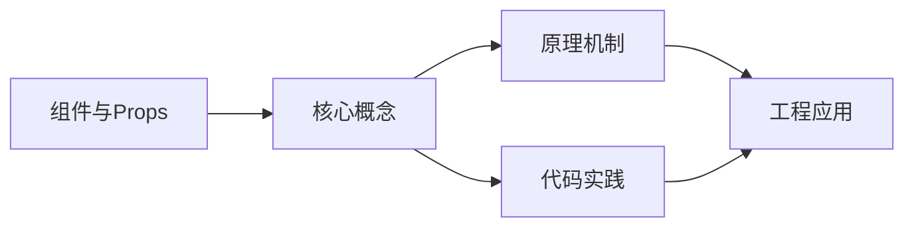
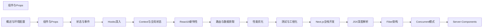

## 1. 学习目标（Bloom 分类）

本节按照布鲁姆教育目标分类学组织学习路径。本文主题为《组件与Props》，属于 React 模块，读者可以根据自身阶段选择阅读深度。

记忆层面：能够准确复述本文的核心概念、术语与基本语法或操作步骤，并能够在提问或检索时快速定位对应知识点。能够说出 React 的核心概念、术语与标准写法。

理解层面：能够用自己的语言解释核心原理与工作机制，说明概念之间的因果关系，而不是机械记忆结论。能够解释 React 的工作原理与设计动机。

应用层面：能够在真实项目或练习场景中运用本文知识解决具体问题，写出正确且可维护的实现。能够编写符合 React 规范的完整实现。

分析层面：能够拆解复杂问题，比较本文主题与相邻概念的异同，识别边界条件与例外情况。能够分析 React 与相邻方案的差异与边界。

评价层面：能够根据约束条件（性能、可读性、安全、成本）评价不同方案的优劣，做出有依据的技术决策。能够根据场景评价 React 相关方案的优劣。

创造层面：能够把本文知识与其他模块知识组合，设计出新的解决方案或可复用的工程模式。能够组合 React 与其他技术设计完整方案。

通过本节学习，读者应当能够把《组件与Props》纳入自己的知识网络，并与 React 模块的其他主题（组件、Hooks、状态管理、渲染性能）建立关联。

## 2. 历史动机与发展脉络

《组件与Props》是 React 领域的重要主题。要真正理解它，需要先了解它解决的问题与演进过程。

React 由 Facebook 于 2013 年开源，核心思想是组件化 UI 与声明式渲染；2019 年 React 16.8 引入 Hooks，函数组件成为主流。
React 19（2024）引入 Actions、useOptimistic、编译器（React Compiler）自动记忆化；并发特性（Suspense、Transitions）持续完善。
生态：Next.js/Remix 全栈框架、TanStack Query 服务端状态、Zustand/Redux 客户端状态、React Native 移动端。

回到本文主题：组件与Props 的提出与成熟，正是上述技术背景下的必然产物。早期实现往往以简单可用为目标，随着工程规模扩大，社区逐渐沉淀出标准做法与最佳实践；理解这一脉络，可以帮助读者判断“为什么文档中的推荐写法是现在这个样子”，也能在遇到历史遗留代码时准确识别其设计年代与取舍。


## 3. 形式化定义与核心概念精讲

本节把《组件与Props》涉及的核心概念以“定义 + 讲解”的形式展开。读者应把定义当作工具，把讲解当作理解路径；两者结合才能形成可迁移的知识。

组件模型：props 输入、state 内部状态、渲染输出 JSX；组件是纯函数，同一输入必得同一输出。
Hooks 规则：只能在顶层调用（不可在条件/循环中），函数组件与自定义 Hook 内使用；依赖数组决定 effect 重跑。
渲染与协调：setState 触发重渲染，虚拟 DOM diff 更新真实 DOM；key 帮助复用元素。

### 3.1 原文章节逐一精讲

原文档把主题拆分为 14 个小节，下面按顺序给出每一节的导读讲解，随后保留原文细节供精读。

#### 原文精读（完整保留）

# 函数组件 + Props 类型 语法速查手册

> **符号约定**:`< >` 必填参数 | `[ ]` 可选参数

---

#### 1. 函数组件

React 中组件是构建 UI 的基本单元。函数组件是现代 React 的主流写法，它是一个接收 Props 并返回 React 元素的纯函数。

##### 1.1 基本定义

```tsx
// 最简函数组件
function Greeting() {
  return <h1>Hello, World!</h1>;
}

// 使用箭头函数
const Greeting = () => <h1>Hello, World!</h1>;

// 带类型注解的组件
import type { FC } from 'react';

const Greeting: FC = () => {
  return <h1>Hello, World!</h1>;
};
```

##### 1.2 组件命名规范

- 组件名必须以**大写字母**开头（React 以此区分自定义组件和原生 HTML 标签）
- 文件名与组件名保持一致，使用 PascalCase
- 每个文件只导出一个主组件

```tsx
//  正确：大写开头
function UserProfile() {
  return <div>...</div>;
}

//  错误：小写开头，React 会将其视为 HTML 标签
function userProfile() {
  return <div>...</div>;
}
```

#### 2. Props 传递

Props（Properties）是父组件向子组件传递数据的方式，具有**只读**特性。

##### 2.1 基本 Props

```tsx
interface UserCardProps {
  name: string;
  age: number;
  email?: string; // 可选属性
}

function UserCard({ name, age, email }: UserCardProps) {
  return (
    <div className="user-card">
      <h2>{name}</h2>
      <p>年龄：{age}</p>
      {email && <p>邮箱：{email}</p>}
    </div>
  );
}

// 使用
<UserCard name="张三" age={25} email="zhangsan@example.com" />
<UserCard name="李四" age={30} /> // email 为 undefined，不会渲染
```

##### 2.2 默认值

```tsx
// 方式一：解构默认值（推荐）
function Button({ text = '点击', color = 'blue' }: { text?: string; color?: string }) {
  return <button style={{ color }}>{text}</button>;
}

// 方式二：默认值属性
function Button({ text, color }: { text?: string; color?: string }) {
  return <button style={{ color: color ?? 'blue' }}>{text ?? '点击'}</button>;
}
```

##### 2.3 展开传递 Props

```tsx
interface BaseInputProps {
  value: string;
  onChange: (value: string) => void;
  placeholder?: string;
  disabled?: boolean;
  className?: string;
}

function Input({ value, onChange, ...rest }: BaseInputProps) {
  return <input value={value} onChange={(e) => onChange(e.target.value)} {...rest} />;
}
```

##### 2.4 传递回调函数

```tsx
interface ChildProps {
  onAction: (data: string) => void;
}

function Child({ onAction }: ChildProps) {
  return <button onClick={() => onAction('来自子组件的数据')}>触发回调</button>;
}

function Parent() {
  const handleAction = (data: string) => {
    console.log('收到：', data);
  };

  return <Child onAction={handleAction} />;
}
```

#### 3. children

`children` 是 React 内置的特殊 Prop，用于在组件标签之间传递内容。

##### 3.1 基本 children

```tsx
import type { ReactNode } from 'react';

interface CardProps {
  children: ReactNode;
}

function Card({ children }: CardProps) {
  return (
    <div className="card" style={{ padding: '16px', border: '1px solid #ddd' }}>
      {children}
    </div>
  );
}

// 使用
<Card>
  <h2>标题</h2>
  <p>内容</p>
</Card>;
```

##### 3.2 多个插槽（具名插槽）

React 没有具名插槽的概念，但可以通过多个 Props 实现类似效果：

```tsx
interface LayoutProps {
  header: ReactNode;
  sidebar: ReactNode;
  children: ReactNode;
}

function Layout({ header, sidebar, children }: LayoutProps) {
  return (
    <div className="layout">
      <header>{header}</header>
      <div className="main">
        <aside>{sidebar}</aside>
        <main>{children}</main>
      </div>
    </div>
  );
}

// 使用
<Layout header={<nav>导航栏</nav>} sidebar={<div>侧边栏</div>}>
  <p>主内容区</p>
</Layout>;
```

##### 3.3 children 的类型

```tsx
import type { ReactNode, ReactElement } from 'react';

// ReactNode — 最宽泛，接受任何可渲染内容
// 包括：string | number | boolean | null | undefined | ReactElement | ReactFragment | ReactPortal
interface Props1 {
  children: ReactNode;
}

// ReactElement — 仅接受 React 元素（排除原始类型）
interface Props2 {
  children: ReactElement;
}

// 函数作为 children（Render Props 模式）
interface Props3 {
  children: (data: string) => ReactNode;
}
```

#### 4. 组件组合模式

##### 4.1 容器与展示组件

```tsx
// 展示组件 — 只负责 UI
interface UserListProps {
  users: Array<{ id: number; name: string }>;
  onSelect: (id: number) => void;
}

function UserList({ users, onSelect }: UserListProps) {
  return (
    <ul>
      {users.map((user) => (
        <li key={user.id} onClick={() => onSelect(user.id)}>
          {user.name}
        </li>
      ))}
    </ul>
  );
}

// 容器组件 — 负责数据和逻辑
function UserListContainer() {
  const [users, setUsers] = useState<Array<{ id: number; name: string }>>([]);

  useEffect(() => {
    fetchUsers().then(setUsers);
  }, []);

  const handleSelect = (id: number) => {
    console.log('选中用户：', id);
  };

  return <UserList users={users} onSelect={handleSelect} />;
}
```

##### 4.2 组合组件（Compound Components）

```tsx
import { createContext, useContext, type ReactNode } from 'react';

// 通过 Context 共享状态
interface TabsContextValue {
  activeTab: string;
  setActiveTab: (id: string) => void;
}

const TabsContext = createContext<TabsContextValue | null>(null);

function useTabsContext() {
  const ctx = useContext(TabsContext);
  if (!ctx) throw new Error('Tabs 组件必须在 TabsProvider 内使用');
  return ctx;
}

// 根组件
function Tabs({ defaultTab, children }: { defaultTab: string; children: ReactNode }) {
  const [activeTab, setActiveTab] = useState(defaultTab);
  return (
    <TabsContext.Provider value={{ activeTab, setActiveTab }}>
      <div className="tabs">{children}</div>
    </TabsContext.Provider>
  );
}

// 子组件
function TabList({ children }: { children: ReactNode }) {
  return <div className="tab-list">{children}</div>;
}

function Tab({ id, label }: { id: string; label: string }) {
  const { activeTab, setActiveTab } = useTabsContext();
  return (
    <button className={activeTab === id ? 'active' : ''} onClick={() => setActiveTab(id)}>
      {label}
    </button>
  );
}

function TabPanel({ id, children }: { id: string; children: ReactNode }) {
  const { activeTab } = useTabsContext();
  if (activeTab !== id) return null;
  return <div className="tab-panel">{children}</div>;
}

// 使用
<Tabs defaultTab="tab1">
  <TabList>
    <Tab id="tab1" label="标签一" />
    <Tab id="tab2" label="标签二" />
  </TabList>
  <TabPanel id="tab1">内容一</TabPanel>
  <TabPanel id="tab2">内容二</TabPanel>
</Tabs>;
```

##### 4.3 Render Props 模式

```tsx
interface DataFetcherProps<T> {
  url: string;
  render: (data: T | null, loading: boolean, error: Error | null) => ReactNode;
}

function DataFetcher<T>({ url, render }: DataFetcherProps<T>) {
  const [data, setData] = useState<T | null>(null);
  const [loading, setLoading] = useState(true);
  const [error, setError] = useState<Error | null>(null);

  useEffect(() => {
    fetch(url)
      .then((res) => res.json())
      .then((json) => {
        setData(json);
        setLoading(false);
      })
      .catch((err) => {
        setError(err);
        setLoading(false);
      });
  }, [url]);

  return <>{render(data, loading, error)}</>;
}

// 使用
<DataFetcher<Array<User>>
  url="/api/users"
  render={(data, loading, error) => {
    if (loading) return <Spinner />;
    if (error) return <Error message={error.message} />;
    return <UserList users={data!} />;
  }}
/>;
```

#### 5. 条件渲染

##### 5.1 常见模式

```tsx
// if/else
function Content({ isLoggedIn }: { isLoggedIn: boolean }) {
  if (isLoggedIn) {
    return <Dashboard />;
  }
  return <LoginPage />;
}

// 三元表达式 — 适合简单的二选一
const element = isLoading ? <Spinner /> : <Content />;

// 逻辑与 (&&) — 适合显示/隐藏
const element = (
  <div>
    {hasError && <ErrorMessage />}
    {data && <DataView data={data} />}
  </div>
);

// 立即执行函数（IIFE）— 适合复杂逻辑
const element = (
  <div>
    {(() => {
      switch (status) {
        case 'loading':
          return <Spinner />;
        case 'error':
          return <Error />;
        case 'success':
          return <DataView />;
        default:
          return null;
      }
    })()}
  </div>
);
```

##### 5.2 提取为子组件

```tsx
// 推荐做法：将条件渲染逻辑封装为独立组件
function Show({ when, children }: { when: boolean; children: ReactNode }) {
  return when ? <>{children}</> : null;
}

// 使用
<Show when={isLoggedIn}>
  <Dashboard />
</Show>;
```

#### 6. 列表与 key

##### 6.1 基本列表渲染

```tsx
interface Todo {
  id: string;
  text: string;
  completed: boolean;
}

function TodoList({ todos }: { todos: Todo[] }) {
  return (
    <ul>
      {todos.map((todo) => (
        <li key={todo.id} className={todo.completed ? 'done' : ''}>
          {todo.text}
        </li>
      ))}
    </ul>
  );
}
```

##### 6.2 key 的规则

| 规则               | 说明                                 |
| :----------------- | :----------------------------------- |
| **必须唯一**       | 同级兄弟节点之间 key 不能重复        |
| **必须稳定**       | key 不应随渲染变化（如随机数、索引） |
| **不使用索引**     | 列表增删时索引会变化，导致状态错乱   |
| **不需要全局唯一** | 只需在同级兄弟间唯一                 |

```tsx
//  错误：使用索引作为 key
{
  items.map((item, index) => <Item key={index} {...item} />);
}

//  正确：使用稳定唯一 ID
{
  items.map((item) => <Item key={item.id} {...item} />);
}
```

#### 7. Fragment

Fragment 允许组件返回多个元素而不需要额外的 DOM 节点。

##### 7.1 使用方式

```tsx
import { Fragment } from 'react';

// 方式一：显式 Fragment（可带 key）
function TableRows({ items }: { items: Item[] }) {
  return items.map((item) => (
    <Fragment key={item.id}>
      <td>{item.name}</td>
      <td>{item.value}</td>
    </Fragment>
  ));
}

// 方式二：短语法 <>...</>（不能带 key）
function MultipleElements() {
  return (
    <>
      <h1>标题</h1>
      <p>段落</p>
    </>
  );
}
```

##### 7.2 何时使用 Fragment

- 组件需要返回多个同级元素
- 在 `<table>` 中返回多个 `<td>`
- 避免无意义的 `<div>` 包裹（减少 DOM 层级）

> **注意**：短语法 `<>...</>` 不支持 `key` 属性，在列表渲染中需要带 `key` 时必须使用 `<Fragment key={...}>`。
#### 函数组件定义

**基本函数组件**
`function <Component>(<props>): <JSX.Element>`
```tsx
function Greeting({ name }: { name: string }) {
  return <h1>Hello, {name}</h1>;
}
```

**箭头函数组件**
`const <Component> = (<props>) => <JSX.Element>;`
```tsx
const Button = ({ label }: { label: string }) => (
  <button>{label}</button>
);
```

**FC 类型组件**
`const <Component>: React.FC<<Props>> = (<props>) => <JSX.Element>;`
```tsx
type ButtonProps = { label: string; onClick: () => void };

const Button: React.FC<ButtonProps> = ({ label, onClick }) => (
  <button onClick={onClick}>{label}</button>
);
```

---

#### Props 类型定义

**基础 Props 类型**
`type <Props> = { <key>: <type> };`
```tsx
type UserCardProps = {
  name: string;
  age: number;
  isActive?: boolean;
};
```

**PropsWithChildren 含子节点**
`type <Props> = React.PropsWithChildren<{ <key>: <type> }>;`
```tsx
type CardProps = React.PropsWithChildren<{ title: string }>;

function Card({ title, children }: CardProps) {
  return <section><h2>{title}</h2>{children}</section>;
}
```

**ComponentProps 提取元素属性**
`type <Props> = React.ComponentProps<<Element>>;`
```tsx
type DivProps = React.ComponentProps<'div'>;
type ButtonElProps = React.ComponentProps<'button'>;
type WrappedBtnProps = React.ComponentProps<typeof Button>;
```

**ComponentPropsWithRef 含 ref**
`type <Props> = React.ComponentPropsWithRef<<ElementType>>;`
```tsx
type InputProps = React.ComponentPropsWithRef<'input'>;
```

---

#### 可选与默认 Props

**可选 Props**
`<key>?: <type>`
```tsx
type ModalProps = { title: string; onClose?: () => void };
```

**默认值解构**
`function <C>({ <key> = <default> }: <Props>)`
```tsx
function Avatar({ size = 48 }: { size?: number }) {
  return ;
}
```

---

#### 泛型组件

**泛型函数组件**
`function <Component><<T>>(<props>): <JSX.Element>`
```tsx
function List<T>({ items, render }: {
  items: T[];
  render: (item: T, index: number) => React.ReactNode;
}) {
  return <ul>{items.map((item, i) => <li key={i}>{render(item, i)}</li>)}</ul>;
}
```

**泛型箭头组件**
`const <Component> = <T,>(<props>) => <JSX.Element>;`
```tsx
const Select = <T extends string | number>({
  options,
  value,
  onChange,
}: {
  options: T[];
  value: T;
  onChange: (v: T) => void;
}) => (
  <select value={value} onChange={e => onChange(e.target.value as T)}>
    {options.map(o => <option key={String(o)} value={o}>{o}</option>)}
  </select>
);
```

---

#### 事件 Props

**事件处理器 Props**
`<onChange>: React.ChangeEventHandler<<Element>>`
```tsx
type InputProps = {
  value: string;
  onChange: React.ChangeEventHandler<HTMLInputElement>;
  onClick?: React.MouseEventHandler<HTMLButtonElement>;
};
```

---

#### Children 类型

**ReactNode 任意节点**
`children: React.ReactNode`
```tsx
type Props = { children: React.ReactNode };
```

**ReactElement 单元素**
`children: React.ReactElement`
```tsx
type Props = { children: React.ReactElement };
```

**JSX.Element 类型**
`const <el>: JSX.Element = <node>;`
```tsx
const heading: JSX.Element = <h1>Title</h1>;
```

---

#### Props 拆分与合并

**Omit 排除属性**
`type <Props> = Omit<<Base>, <keys>>;`
```tsx
type IconButtonProps = Omit<React.ComponentProps<'button'>, 'type'> & {
  variant?: 'primary' | 'ghost';
};
```

**Pick 选取属性**
`type <Props> = Pick<<Base>, <keys>>;`
```tsx
type CoreInputProps = Pick<React.ComponentProps<'input'>, 'value' | 'onChange' | 'placeholder'>;
```

**交叉类型合并**
`type <Props> = <A> & <B>;`
```tsx
type Props = React.ComponentProps<'button'> & { loading?: boolean };
```


### 3.2 概念关系图

下面用 Mermaid 图表达本文核心概念之间的关系，帮助读者建立整体图景：



图中展示的是本文知识的结构化关系：核心概念是入口，原理机制解释“为什么”，代码实践演示“怎么做”，工程应用回答“何时用”。读者学习时可以把每个小节的内容挂接到对应节点上。

## 4. 理论推导与原理解析

本节深入《组件与Props》背后的原理。理论部分不求面面俱到，而是聚焦“能解释现象、能指导实践”的关键推导。

组件模型：props 输入、state 内部状态、渲染输出 JSX；组件是纯函数，同一输入必得同一输出。
Hooks 规则：只能在顶层调用（不可在条件/循环中），函数组件与自定义 Hook 内使用；依赖数组决定 effect 重跑。
渲染与协调：setState 触发重渲染，虚拟 DOM diff 更新真实 DOM；key 帮助复用元素。
状态提升与下放：共享状态提升到最近公共祖先；Context 跨层传递（Provider/useContext）。

需要强调的是，理论推导与工程实践之间存在翻译层：理论给出的是理想化模型与边界条件，工程代码则必须处理真实环境中的例外。读者在学习时应先掌握理论的“标准情形”，再通过陷阱章节了解“非标准情形”。

## 5. 代码示例与逐行讲解

本节把原文中的代码示例系统整理，并为每个示例补充用途说明与讲解。读者不应只浏览代码，而应逐段对照讲解理解设计意图。

### 5.1 示例：1.1 基本定义

该示例来自原文《1.1 基本定义》小节，用于演示组件与Props相关操作。阅读时请先看代码结构，再看其后的讲解。

```tsx
// 最简函数组件
function Greeting() {
  return <h1>Hello, World!</h1>;
}

// 使用箭头函数
const Greeting = () => <h1>Hello, World!</h1>;

// 带类型注解的组件
import type { FC } from 'react';

const Greeting: FC = () => {
  return <h1>Hello, World!</h1>;
};
```

讲解：这段代码演示了本节核心知识点。代码中的关键操作可以归纳为三步：准备（定义或初始化）、执行（核心逻辑）、收尾（释放资源或返回结果）。实际项目中，这三步往往被封装为函数或类，以提升复用性与可测试性。

关键点分析：

该示例共 11 行有效代码，包含 4 类关键结构（function、import、from、return）。其中：

- 入口与初始化部分负责建立上下文，对应实际项目中的启动或装配逻辑；
- 核心逻辑部分体现本文主题的主要操作，是阅读时最需要对照讲解理解的部分；
- 输出或返回部分把结果交给调用方，注意其类型与边界条件。

进阶思考路径：先尝试修改参数观察行为变化，再把示例中的模式迁移到自己的项目中；每次修改都记录预期与实测差异，这是把示例转化为能力的最快方式。

### 5.2 示例：1.2 组件命名规范

该示例来自原文《1.2 组件命名规范》小节，用于演示组件与Props相关操作。阅读时请先看代码结构，再看其后的讲解。

```tsx
//  正确：大写开头
function UserProfile() {
  return <div>...</div>;
}

//  错误：小写开头，React 会将其视为 HTML 标签
function userProfile() {
  return <div>...</div>;
}
```

讲解：这段代码演示了本节核心知识点。代码中的关键操作可以归纳为三步：准备（定义或初始化）、执行（核心逻辑）、收尾（释放资源或返回结果）。实际项目中，这三步往往被封装为函数或类，以提升复用性与可测试性。

关键点分析：

该示例共 8 行有效代码，包含 2 类关键结构（function、return）。其中：

- 入口与初始化部分负责建立上下文，对应实际项目中的启动或装配逻辑；
- 核心逻辑部分体现本文主题的主要操作，是阅读时最需要对照讲解理解的部分；
- 输出或返回部分把结果交给调用方，注意其类型与边界条件。

进阶思考路径：先尝试修改参数观察行为变化，再把示例中的模式迁移到自己的项目中；每次修改都记录预期与实测差异，这是把示例转化为能力的最快方式。

### 5.3 示例：2.1 基本 Props

该示例来自原文《2.1 基本 Props》小节，用于演示组件与Props相关操作。阅读时请先看代码结构，再看其后的讲解。

```tsx
interface UserCardProps {
  name: string;
  age: number;
  email?: string; // 可选属性
}

function UserCard({ name, age, email }: UserCardProps) {
  return (
    <div className="user-card">
      <h2>{name}</h2>
      <p>年龄：{age}</p>
      {email && <p>邮箱：{email}</p>}
    </div>
  );
}

// 使用
<UserCard name="张三" age={25} email="zhangsan@example.com" />
<UserCard name="李四" age={30} /> // email 为 undefined，不会渲染
```

讲解：这段代码演示了本节核心知识点。代码中的关键操作可以归纳为三步：准备（定义或初始化）、执行（核心逻辑）、收尾（释放资源或返回结果）。实际项目中，这三步往往被封装为函数或类，以提升复用性与可测试性。

关键点分析：

该示例共 17 行有效代码，包含 3 类关键结构（class、function、return）。其中：

- 入口与初始化部分负责建立上下文，对应实际项目中的启动或装配逻辑；
- 核心逻辑部分体现本文主题的主要操作，是阅读时最需要对照讲解理解的部分；
- 输出或返回部分把结果交给调用方，注意其类型与边界条件。

进阶思考路径：先尝试修改参数观察行为变化，再把示例中的模式迁移到自己的项目中；每次修改都记录预期与实测差异，这是把示例转化为能力的最快方式。

### 5.4 示例：2.2 默认值

该示例来自原文《2.2 默认值》小节，用于演示组件与Props相关操作。阅读时请先看代码结构，再看其后的讲解。

```tsx
// 方式一：解构默认值（推荐）
function Button({ text = '点击', color = 'blue' }: { text?: string; color?: string }) {
  return <button style={{ color }}>{text}</button>;
}

// 方式二：默认值属性
function Button({ text, color }: { text?: string; color?: string }) {
  return <button style={{ color: color ?? 'blue' }}>{text ?? '点击'}</button>;
}
```

讲解：这段代码演示了本节核心知识点。代码中的关键操作可以归纳为三步：准备（定义或初始化）、执行（核心逻辑）、收尾（释放资源或返回结果）。实际项目中，这三步往往被封装为函数或类，以提升复用性与可测试性。

关键点分析：

该示例共 8 行有效代码，包含 2 类关键结构（function、return）。其中：

- 入口与初始化部分负责建立上下文，对应实际项目中的启动或装配逻辑；
- 核心逻辑部分体现本文主题的主要操作，是阅读时最需要对照讲解理解的部分；
- 输出或返回部分把结果交给调用方，注意其类型与边界条件。

进阶思考路径：先尝试修改参数观察行为变化，再把示例中的模式迁移到自己的项目中；每次修改都记录预期与实测差异，这是把示例转化为能力的最快方式。

### 5.5 示例：2.3 展开传递 Props

该示例来自原文《2.3 展开传递 Props》小节，用于演示组件与Props相关操作。阅读时请先看代码结构，再看其后的讲解。

```tsx
interface BaseInputProps {
  value: string;
  onChange: (value: string) => void;
  placeholder?: string;
  disabled?: boolean;
  className?: string;
}

function Input({ value, onChange, ...rest }: BaseInputProps) {
  return <input value={value} onChange={(e) => onChange(e.target.value)} {...rest} />;
}
```

讲解：这段代码演示了本节核心知识点。代码中的关键操作可以归纳为三步：准备（定义或初始化）、执行（核心逻辑）、收尾（释放资源或返回结果）。实际项目中，这三步往往被封装为函数或类，以提升复用性与可测试性。

关键点分析：

该示例共 10 行有效代码，包含 3 类关键结构（class、function、return）。其中：

- 入口与初始化部分负责建立上下文，对应实际项目中的启动或装配逻辑；
- 核心逻辑部分体现本文主题的主要操作，是阅读时最需要对照讲解理解的部分；
- 输出或返回部分把结果交给调用方，注意其类型与边界条件。

进阶思考路径：先尝试修改参数观察行为变化，再把示例中的模式迁移到自己的项目中；每次修改都记录预期与实测差异，这是把示例转化为能力的最快方式。

### 5.6 示例：2.4 传递回调函数

该示例来自原文《2.4 传递回调函数》小节，用于演示组件与Props相关操作。阅读时请先看代码结构，再看其后的讲解。

```tsx
interface ChildProps {
  onAction: (data: string) => void;
}

function Child({ onAction }: ChildProps) {
  return <button onClick={() => onAction('来自子组件的数据')}>触发回调</button>;
}

function Parent() {
  const handleAction = (data: string) => {
    console.log('收到：', data);
  };

  return <Child onAction={handleAction} />;
}
```

讲解：这段代码演示了本节核心知识点。代码中的关键操作可以归纳为三步：准备（定义或初始化）、执行（核心逻辑）、收尾（释放资源或返回结果）。实际项目中，这三步往往被封装为函数或类，以提升复用性与可测试性。

关键点分析：

该示例共 12 行有效代码，包含 2 类关键结构（function、return）。其中：

- 入口与初始化部分负责建立上下文，对应实际项目中的启动或装配逻辑；
- 核心逻辑部分体现本文主题的主要操作，是阅读时最需要对照讲解理解的部分；
- 输出或返回部分把结果交给调用方，注意其类型与边界条件。

进阶思考路径：先尝试修改参数观察行为变化，再把示例中的模式迁移到自己的项目中；每次修改都记录预期与实测差异，这是把示例转化为能力的最快方式。

### 5.7 示例：3.1 基本 children

该示例来自原文《3.1 基本 children》小节，用于演示组件与Props相关操作。阅读时请先看代码结构，再看其后的讲解。

```tsx
import type { ReactNode } from 'react';

interface CardProps {
  children: ReactNode;
}

function Card({ children }: CardProps) {
  return (
    <div className="card" style={{ padding: '16px', border: '1px solid #ddd' }}>
      {children}
    </div>
  );
}

// 使用
<Card>
  <h2>标题</h2>
  <p>内容</p>
</Card>;
```

讲解：这段代码演示了本节核心知识点。代码中的关键操作可以归纳为三步：准备（定义或初始化）、执行（核心逻辑）、收尾（释放资源或返回结果）。实际项目中，这三步往往被封装为函数或类，以提升复用性与可测试性。

关键点分析：

该示例共 16 行有效代码，包含 5 类关键结构（class、function、import、from、return）。其中：

- 入口与初始化部分负责建立上下文，对应实际项目中的启动或装配逻辑；
- 核心逻辑部分体现本文主题的主要操作，是阅读时最需要对照讲解理解的部分；
- 输出或返回部分把结果交给调用方，注意其类型与边界条件。

进阶思考路径：先尝试修改参数观察行为变化，再把示例中的模式迁移到自己的项目中；每次修改都记录预期与实测差异，这是把示例转化为能力的最快方式。

### 5.8 示例：3.2 多个插槽（具名插槽）

该示例来自原文《3.2 多个插槽（具名插槽）》小节，用于演示组件与Props相关操作。阅读时请先看代码结构，再看其后的讲解。

```tsx
interface LayoutProps {
  header: ReactNode;
  sidebar: ReactNode;
  children: ReactNode;
}

function Layout({ header, sidebar, children }: LayoutProps) {
  return (
    <div className="layout">
      <header>{header}</header>
      <div className="main">
        <aside>{sidebar}</aside>
        <main>{children}</main>
      </div>
    </div>
  );
}

// 使用
<Layout header={<nav>导航栏</nav>} sidebar={<div>侧边栏</div>}>
  <p>主内容区</p>
</Layout>;
```

讲解：这段代码演示了本节核心知识点。代码中的关键操作可以归纳为三步：准备（定义或初始化）、执行（核心逻辑）、收尾（释放资源或返回结果）。实际项目中，这三步往往被封装为函数或类，以提升复用性与可测试性。

关键点分析：

该示例共 20 行有效代码，包含 3 类关键结构（class、function、return）。其中：

- 入口与初始化部分负责建立上下文，对应实际项目中的启动或装配逻辑；
- 核心逻辑部分体现本文主题的主要操作，是阅读时最需要对照讲解理解的部分；
- 输出或返回部分把结果交给调用方，注意其类型与边界条件。

进阶思考路径：先尝试修改参数观察行为变化，再把示例中的模式迁移到自己的项目中；每次修改都记录预期与实测差异，这是把示例转化为能力的最快方式。

### 5.9 示例：3.3 children 的类型

该示例来自原文《3.3 children 的类型》小节，用于演示组件与Props相关操作。阅读时请先看代码结构，再看其后的讲解。

```tsx
import type { ReactNode, ReactElement } from 'react';

// ReactNode — 最宽泛，接受任何可渲染内容
// 包括：string | number | boolean | null | undefined | ReactElement | ReactFragment | ReactPortal
interface Props1 {
  children: ReactNode;
}

// ReactElement — 仅接受 React 元素（排除原始类型）
interface Props2 {
  children: ReactElement;
}

// 函数作为 children（Render Props 模式）
interface Props3 {
  children: (data: string) => ReactNode;
}
```

讲解：这段代码演示了本节核心知识点。代码中的关键操作可以归纳为三步：准备（定义或初始化）、执行（核心逻辑）、收尾（释放资源或返回结果）。实际项目中，这三步往往被封装为函数或类，以提升复用性与可测试性。

关键点分析：

该示例共 14 行有效代码，包含 2 类关键结构（import、from）。其中：

- 入口与初始化部分负责建立上下文，对应实际项目中的启动或装配逻辑；
- 核心逻辑部分体现本文主题的主要操作，是阅读时最需要对照讲解理解的部分；
- 输出或返回部分把结果交给调用方，注意其类型与边界条件。

进阶思考路径：先尝试修改参数观察行为变化，再把示例中的模式迁移到自己的项目中；每次修改都记录预期与实测差异，这是把示例转化为能力的最快方式。

### 5.10 示例：4.1 容器与展示组件

该示例来自原文《4.1 容器与展示组件》小节，用于演示组件与Props相关操作。阅读时请先看代码结构，再看其后的讲解。

```tsx
// 展示组件 — 只负责 UI
interface UserListProps {
  users: Array<{ id: number; name: string }>;
  onSelect: (id: number) => void;
}

function UserList({ users, onSelect }: UserListProps) {
  return (
    <ul>
      {users.map((user) => (
        <li key={user.id} onClick={() => onSelect(user.id)}>
          {user.name}
        </li>
      ))}
    </ul>
  );
}

// 容器组件 — 负责数据和逻辑
function UserListContainer() {
  const [users, setUsers] = useState<Array<{ id: number; name: string }>>([]);

  useEffect(() => {
    fetchUsers().then(setUsers);
  }, []);

  const handleSelect = (id: number) => {
    console.log('选中用户：', id);
  };

  return <UserList users={users} onSelect={handleSelect} />;
}
```

讲解：这段代码演示了本节核心知识点。代码中的关键操作可以归纳为三步：准备（定义或初始化）、执行（核心逻辑）、收尾（释放资源或返回结果）。实际项目中，这三步往往被封装为函数或类，以提升复用性与可测试性。

关键点分析：

该示例共 27 行有效代码，包含 2 类关键结构（function、return）。其中：

- 入口与初始化部分负责建立上下文，对应实际项目中的启动或装配逻辑；
- 核心逻辑部分体现本文主题的主要操作，是阅读时最需要对照讲解理解的部分；
- 输出或返回部分把结果交给调用方，注意其类型与边界条件。

进阶思考路径：先尝试修改参数观察行为变化，再把示例中的模式迁移到自己的项目中；每次修改都记录预期与实测差异，这是把示例转化为能力的最快方式。

### 5.11 示例：4.2 组合组件（Compound Components）

该示例来自原文《4.2 组合组件（Compound Components）》小节，用于演示组件与Props相关操作。阅读时请先看代码结构，再看其后的讲解。

```tsx
import { createContext, useContext, type ReactNode } from 'react';

// 通过 Context 共享状态
interface TabsContextValue {
  activeTab: string;
  setActiveTab: (id: string) => void;
}

const TabsContext = createContext<TabsContextValue | null>(null);

function useTabsContext() {
  const ctx = useContext(TabsContext);
  if (!ctx) throw new Error('Tabs 组件必须在 TabsProvider 内使用');
  return ctx;
}

// 根组件
function Tabs({ defaultTab, children }: { defaultTab: string; children: ReactNode }) {
  const [activeTab, setActiveTab] = useState(defaultTab);
  return (
    <TabsContext.Provider value={{ activeTab, setActiveTab }}>
      <div className="tabs">{children}</div>
    </TabsContext.Provider>
  );
}

// 子组件
function TabList({ children }: { children: ReactNode }) {
  return <div className="tab-list">{children}</div>;
}

function Tab({ id, label }: { id: string; label: string }) {
  const { activeTab, setActiveTab } = useTabsContext();
  return (
    <button className={activeTab === id ? 'active' : ''} onClick={() => setActiveTab(id)}>
      {label}
    </button>
  );
}

function TabPanel({ id, children }: { id: string; children: ReactNode }) {
  const { activeTab } = useTabsContext();
  if (activeTab !== id) return null;
  return <div className="tab-panel">{children}</div>;
}

// 使用
<Tabs defaultTab="tab1">
  <TabList>
    <Tab id="tab1" label="标签一" />
    <Tab id="tab2" label="标签二" />
  </TabList>
  <TabPanel id="tab1">内容一</TabPanel>
  <TabPanel id="tab2">内容二</TabPanel>
</Tabs>;
```

讲解：这段代码演示了本节核心知识点。代码中的关键操作可以归纳为三步：准备（定义或初始化）、执行（核心逻辑）、收尾（释放资源或返回结果）。实际项目中，这三步往往被封装为函数或类，以提升复用性与可测试性。

关键点分析：

该示例共 47 行有效代码，包含 6 类关键结构（class、function、import、from、if、return）。其中：

- 入口与初始化部分负责建立上下文，对应实际项目中的启动或装配逻辑；
- 核心逻辑部分体现本文主题的主要操作，是阅读时最需要对照讲解理解的部分；
- 输出或返回部分把结果交给调用方，注意其类型与边界条件。

进阶思考路径：先尝试修改参数观察行为变化，再把示例中的模式迁移到自己的项目中；每次修改都记录预期与实测差异，这是把示例转化为能力的最快方式。

### 5.12 示例：4.3 Render Props 模式

该示例来自原文《4.3 Render Props 模式》小节，用于演示组件与Props相关操作。阅读时请先看代码结构，再看其后的讲解。

```tsx
interface DataFetcherProps<T> {
  url: string;
  render: (data: T | null, loading: boolean, error: Error | null) => ReactNode;
}

function DataFetcher<T>({ url, render }: DataFetcherProps<T>) {
  const [data, setData] = useState<T | null>(null);
  const [loading, setLoading] = useState(true);
  const [error, setError] = useState<Error | null>(null);

  useEffect(() => {
    fetch(url)
      .then((res) => res.json())
      .then((json) => {
        setData(json);
        setLoading(false);
      })
      .catch((err) => {
        setError(err);
        setLoading(false);
      });
  }, [url]);

  return <>{render(data, loading, error)}</>;
}

// 使用
<DataFetcher<Array<User>>
  url="/api/users"
  render={(data, loading, error) => {
    if (loading) return <Spinner />;
    if (error) return <Error message={error.message} />;
    return <UserList users={data!} />;
  }}
/>;
```

讲解：这段代码演示了本节核心知识点。代码中的关键操作可以归纳为三步：准备（定义或初始化）、执行（核心逻辑）、收尾（释放资源或返回结果）。实际项目中，这三步往往被封装为函数或类，以提升复用性与可测试性。

关键点分析：

该示例共 31 行有效代码，包含 3 类关键结构（function、if、return）。其中：

- 入口与初始化部分负责建立上下文，对应实际项目中的启动或装配逻辑；
- 核心逻辑部分体现本文主题的主要操作，是阅读时最需要对照讲解理解的部分；
- 输出或返回部分把结果交给调用方，注意其类型与边界条件。

进阶思考路径：先尝试修改参数观察行为变化，再把示例中的模式迁移到自己的项目中；每次修改都记录预期与实测差异，这是把示例转化为能力的最快方式。

### 5.13 示例：5.1 常见模式

该示例来自原文《5.1 常见模式》小节，用于演示组件与Props相关操作。阅读时请先看代码结构，再看其后的讲解。

```tsx
// if/else
function Content({ isLoggedIn }: { isLoggedIn: boolean }) {
  if (isLoggedIn) {
    return <Dashboard />;
  }
  return <LoginPage />;
}

// 三元表达式 — 适合简单的二选一
const element = isLoading ? <Spinner /> : <Content />;

// 逻辑与 (&&) — 适合显示/隐藏
const element = (
  <div>
    {hasError && <ErrorMessage />}
    {data && <DataView data={data} />}
  </div>
);

// 立即执行函数（IIFE）— 适合复杂逻辑
const element = (
  <div>
    {(() => {
      switch (status) {
        case 'loading':
          return <Spinner />;
        case 'error':
          return <Error />;
        case 'success':
          return <DataView />;
        default:
          return null;
      }
    })()}
  </div>
);
```

讲解：这段代码演示了本节核心知识点。代码中的关键操作可以归纳为三步：准备（定义或初始化）、执行（核心逻辑）、收尾（释放资源或返回结果）。实际项目中，这三步往往被封装为函数或类，以提升复用性与可测试性。

关键点分析：

该示例共 33 行有效代码，包含 3 类关键结构（function、if、return）。其中：

- 入口与初始化部分负责建立上下文，对应实际项目中的启动或装配逻辑；
- 核心逻辑部分体现本文主题的主要操作，是阅读时最需要对照讲解理解的部分；
- 输出或返回部分把结果交给调用方，注意其类型与边界条件。

进阶思考路径：先尝试修改参数观察行为变化，再把示例中的模式迁移到自己的项目中；每次修改都记录预期与实测差异，这是把示例转化为能力的最快方式。

### 5.14 示例：5.2 提取为子组件

该示例来自原文《5.2 提取为子组件》小节，用于演示组件与Props相关操作。阅读时请先看代码结构，再看其后的讲解。

```tsx
// 推荐做法：将条件渲染逻辑封装为独立组件
function Show({ when, children }: { when: boolean; children: ReactNode }) {
  return when ? <>{children}</> : null;
}

// 使用
<Show when={isLoggedIn}>
  <Dashboard />
</Show>;
```

讲解：这段代码演示了本节核心知识点。代码中的关键操作可以归纳为三步：准备（定义或初始化）、执行（核心逻辑）、收尾（释放资源或返回结果）。实际项目中，这三步往往被封装为函数或类，以提升复用性与可测试性。

关键点分析：

该示例共 8 行有效代码，包含 2 类关键结构（function、return）。其中：

- 入口与初始化部分负责建立上下文，对应实际项目中的启动或装配逻辑；
- 核心逻辑部分体现本文主题的主要操作，是阅读时最需要对照讲解理解的部分；
- 输出或返回部分把结果交给调用方，注意其类型与边界条件。

进阶思考路径：先尝试修改参数观察行为变化，再把示例中的模式迁移到自己的项目中；每次修改都记录预期与实测差异，这是把示例转化为能力的最快方式。

### 5.15 示例：6.1 基本列表渲染

该示例来自原文《6.1 基本列表渲染》小节，用于演示组件与Props相关操作。阅读时请先看代码结构，再看其后的讲解。

```tsx
interface Todo {
  id: string;
  text: string;
  completed: boolean;
}

function TodoList({ todos }: { todos: Todo[] }) {
  return (
    <ul>
      {todos.map((todo) => (
        <li key={todo.id} className={todo.completed ? 'done' : ''}>
          {todo.text}
        </li>
      ))}
    </ul>
  );
}
```

讲解：这段代码演示了本节核心知识点。代码中的关键操作可以归纳为三步：准备（定义或初始化）、执行（核心逻辑）、收尾（释放资源或返回结果）。实际项目中，这三步往往被封装为函数或类，以提升复用性与可测试性。

关键点分析：

该示例共 16 行有效代码，包含 3 类关键结构（class、function、return）。其中：

- 入口与初始化部分负责建立上下文，对应实际项目中的启动或装配逻辑；
- 核心逻辑部分体现本文主题的主要操作，是阅读时最需要对照讲解理解的部分；
- 输出或返回部分把结果交给调用方，注意其类型与边界条件。

进阶思考路径：先尝试修改参数观察行为变化，再把示例中的模式迁移到自己的项目中；每次修改都记录预期与实测差异，这是把示例转化为能力的最快方式。

### 5.16 示例：6.2 key 的规则

该示例来自原文《6.2 key 的规则》小节，用于演示组件与Props相关操作。阅读时请先看代码结构，再看其后的讲解。

```tsx
//  错误：使用索引作为 key
{
  items.map((item, index) => <Item key={index} {...item} />);
}

//  正确：使用稳定唯一 ID
{
  items.map((item) => <Item key={item.id} {...item} />);
}
```

讲解：这段代码演示了本节核心知识点。代码中的关键操作可以归纳为三步：准备（定义或初始化）、执行（核心逻辑）、收尾（释放资源或返回结果）。实际项目中，这三步往往被封装为函数或类，以提升复用性与可测试性。

关键点分析：

该示例共 8 行有效代码，结构以数据或配置为主。阅读时应关注：数据字段的含义、配置项的作用，以及它们与运行行为的对应关系。

进阶思考路径：先尝试修改参数观察行为变化，再把示例中的模式迁移到自己的项目中；每次修改都记录预期与实测差异，这是把示例转化为能力的最快方式。

### 5.17 示例：7.1 使用方式

该示例来自原文《7.1 使用方式》小节，用于演示组件与Props相关操作。阅读时请先看代码结构，再看其后的讲解。

```tsx
import { Fragment } from 'react';

// 方式一：显式 Fragment（可带 key）
function TableRows({ items }: { items: Item[] }) {
  return items.map((item) => (
    <Fragment key={item.id}>
      <td>{item.name}</td>
      <td>{item.value}</td>
    </Fragment>
  ));
}

// 方式二：短语法 <>...</>（不能带 key）
function MultipleElements() {
  return (
    <>
      <h1>标题</h1>
      <p>段落</p>
    </>
  );
}
```

讲解：这段代码演示了本节核心知识点。代码中的关键操作可以归纳为三步：准备（定义或初始化）、执行（核心逻辑）、收尾（释放资源或返回结果）。实际项目中，这三步往往被封装为函数或类，以提升复用性与可测试性。

关键点分析：

该示例共 19 行有效代码，包含 4 类关键结构（function、import、from、return）。其中：

- 入口与初始化部分负责建立上下文，对应实际项目中的启动或装配逻辑；
- 核心逻辑部分体现本文主题的主要操作，是阅读时最需要对照讲解理解的部分；
- 输出或返回部分把结果交给调用方，注意其类型与边界条件。

进阶思考路径：先尝试修改参数观察行为变化，再把示例中的模式迁移到自己的项目中；每次修改都记录预期与实测差异，这是把示例转化为能力的最快方式。

### 5.18 示例：函数组件定义

该示例来自原文《函数组件定义》小节，用于演示组件与Props相关操作。阅读时请先看代码结构，再看其后的讲解。

```tsx
function Greeting({ name }: { name: string }) {
  return <h1>Hello, {name}</h1>;
}
```

讲解：这段代码演示了本节核心知识点。代码中的关键操作可以归纳为三步：准备（定义或初始化）、执行（核心逻辑）、收尾（释放资源或返回结果）。实际项目中，这三步往往被封装为函数或类，以提升复用性与可测试性。

关键点分析：

该示例共 3 行有效代码，包含 2 类关键结构（function、return）。其中：

- 入口与初始化部分负责建立上下文，对应实际项目中的启动或装配逻辑；
- 核心逻辑部分体现本文主题的主要操作，是阅读时最需要对照讲解理解的部分；
- 输出或返回部分把结果交给调用方，注意其类型与边界条件。

进阶思考路径：先尝试修改参数观察行为变化，再把示例中的模式迁移到自己的项目中；每次修改都记录预期与实测差异，这是把示例转化为能力的最快方式。

### 5.19 示例：函数组件定义

该示例来自原文《函数组件定义》小节，用于演示组件与Props相关操作。阅读时请先看代码结构，再看其后的讲解。

```tsx
const Button = ({ label }: { label: string }) => (
  <button>{label}</button>
);
```

讲解：这段代码演示了本节核心知识点。代码中的关键操作可以归纳为三步：准备（定义或初始化）、执行（核心逻辑）、收尾（释放资源或返回结果）。实际项目中，这三步往往被封装为函数或类，以提升复用性与可测试性。

关键点分析：

该示例共 3 行有效代码，结构以数据或配置为主。阅读时应关注：数据字段的含义、配置项的作用，以及它们与运行行为的对应关系。

进阶思考路径：先尝试修改参数观察行为变化，再把示例中的模式迁移到自己的项目中；每次修改都记录预期与实测差异，这是把示例转化为能力的最快方式。

### 5.20 示例：函数组件定义

该示例来自原文《函数组件定义》小节，用于演示组件与Props相关操作。阅读时请先看代码结构，再看其后的讲解。

```tsx
type ButtonProps = { label: string; onClick: () => void };

const Button: React.FC<ButtonProps> = ({ label, onClick }) => (
  <button onClick={onClick}>{label}</button>
);
```

讲解：这段代码演示了本节核心知识点。代码中的关键操作可以归纳为三步：准备（定义或初始化）、执行（核心逻辑）、收尾（释放资源或返回结果）。实际项目中，这三步往往被封装为函数或类，以提升复用性与可测试性。

关键点分析：

该示例共 4 行有效代码，结构以数据或配置为主。阅读时应关注：数据字段的含义、配置项的作用，以及它们与运行行为的对应关系。

进阶思考路径：先尝试修改参数观察行为变化，再把示例中的模式迁移到自己的项目中；每次修改都记录预期与实测差异，这是把示例转化为能力的最快方式。

### 5.21 示例：Props 类型定义

该示例来自原文《Props 类型定义》小节，用于演示组件与Props相关操作。阅读时请先看代码结构，再看其后的讲解。

```tsx
type UserCardProps = {
  name: string;
  age: number;
  isActive?: boolean;
};
```

讲解：这段代码演示了本节核心知识点。代码中的关键操作可以归纳为三步：准备（定义或初始化）、执行（核心逻辑）、收尾（释放资源或返回结果）。实际项目中，这三步往往被封装为函数或类，以提升复用性与可测试性。

关键点分析：

该示例共 5 行有效代码，结构以数据或配置为主。阅读时应关注：数据字段的含义、配置项的作用，以及它们与运行行为的对应关系。

进阶思考路径：先尝试修改参数观察行为变化，再把示例中的模式迁移到自己的项目中；每次修改都记录预期与实测差异，这是把示例转化为能力的最快方式。

### 5.22 示例：Props 类型定义

该示例来自原文《Props 类型定义》小节，用于演示组件与Props相关操作。阅读时请先看代码结构，再看其后的讲解。

```tsx
type CardProps = React.PropsWithChildren<{ title: string }>;

function Card({ title, children }: CardProps) {
  return <section><h2>{title}</h2>{children}</section>;
}
```

讲解：这段代码演示了本节核心知识点。代码中的关键操作可以归纳为三步：准备（定义或初始化）、执行（核心逻辑）、收尾（释放资源或返回结果）。实际项目中，这三步往往被封装为函数或类，以提升复用性与可测试性。

关键点分析：

该示例共 4 行有效代码，包含 2 类关键结构（function、return）。其中：

- 入口与初始化部分负责建立上下文，对应实际项目中的启动或装配逻辑；
- 核心逻辑部分体现本文主题的主要操作，是阅读时最需要对照讲解理解的部分；
- 输出或返回部分把结果交给调用方，注意其类型与边界条件。

进阶思考路径：先尝试修改参数观察行为变化，再把示例中的模式迁移到自己的项目中；每次修改都记录预期与实测差异，这是把示例转化为能力的最快方式。

### 5.23 示例：Props 类型定义

该示例来自原文《Props 类型定义》小节，用于演示组件与Props相关操作。阅读时请先看代码结构，再看其后的讲解。

```tsx
type DivProps = React.ComponentProps<'div'>;
type ButtonElProps = React.ComponentProps<'button'>;
type WrappedBtnProps = React.ComponentProps<typeof Button>;
```

讲解：这段代码演示了本节核心知识点。代码中的关键操作可以归纳为三步：准备（定义或初始化）、执行（核心逻辑）、收尾（释放资源或返回结果）。实际项目中，这三步往往被封装为函数或类，以提升复用性与可测试性。

关键点分析：

该示例共 3 行有效代码，结构以数据或配置为主。阅读时应关注：数据字段的含义、配置项的作用，以及它们与运行行为的对应关系。

进阶思考路径：先尝试修改参数观察行为变化，再把示例中的模式迁移到自己的项目中；每次修改都记录预期与实测差异，这是把示例转化为能力的最快方式。

### 5.24 示例：Props 类型定义

该示例来自原文《Props 类型定义》小节，用于演示组件与Props相关操作。阅读时请先看代码结构，再看其后的讲解。

```tsx
type InputProps = React.ComponentPropsWithRef<'input'>;
```

讲解：这段代码演示了本节核心知识点。代码中的关键操作可以归纳为三步：准备（定义或初始化）、执行（核心逻辑）、收尾（释放资源或返回结果）。实际项目中，这三步往往被封装为函数或类，以提升复用性与可测试性。

关键点分析：

该示例共 1 行有效代码，结构以数据或配置为主。阅读时应关注：数据字段的含义、配置项的作用，以及它们与运行行为的对应关系。

进阶思考路径：先尝试修改参数观察行为变化，再把示例中的模式迁移到自己的项目中；每次修改都记录预期与实测差异，这是把示例转化为能力的最快方式。

### 5.25 示例：可选与默认 Props

该示例来自原文《可选与默认 Props》小节，用于演示组件与Props相关操作。阅读时请先看代码结构，再看其后的讲解。

```tsx
type ModalProps = { title: string; onClose?: () => void };
```

讲解：这段代码演示了本节核心知识点。代码中的关键操作可以归纳为三步：准备（定义或初始化）、执行（核心逻辑）、收尾（释放资源或返回结果）。实际项目中，这三步往往被封装为函数或类，以提升复用性与可测试性。

关键点分析：

该示例共 1 行有效代码，结构以数据或配置为主。阅读时应关注：数据字段的含义、配置项的作用，以及它们与运行行为的对应关系。

进阶思考路径：先尝试修改参数观察行为变化，再把示例中的模式迁移到自己的项目中；每次修改都记录预期与实测差异，这是把示例转化为能力的最快方式。

### 5.26 示例：可选与默认 Props

该示例来自原文《可选与默认 Props》小节，用于演示组件与Props相关操作。阅读时请先看代码结构，再看其后的讲解。

```tsx
function Avatar({ size = 48 }: { size?: number }) {
  return ;
}
```

讲解：这段代码演示了本节核心知识点。代码中的关键操作可以归纳为三步：准备（定义或初始化）、执行（核心逻辑）、收尾（释放资源或返回结果）。实际项目中，这三步往往被封装为函数或类，以提升复用性与可测试性。

关键点分析：

该示例共 3 行有效代码，包含 2 类关键结构（function、return）。其中：

- 入口与初始化部分负责建立上下文，对应实际项目中的启动或装配逻辑；
- 核心逻辑部分体现本文主题的主要操作，是阅读时最需要对照讲解理解的部分；
- 输出或返回部分把结果交给调用方，注意其类型与边界条件。

进阶思考路径：先尝试修改参数观察行为变化，再把示例中的模式迁移到自己的项目中；每次修改都记录预期与实测差异，这是把示例转化为能力的最快方式。

### 5.27 示例：泛型组件

该示例来自原文《泛型组件》小节，用于演示组件与Props相关操作。阅读时请先看代码结构，再看其后的讲解。

```tsx
function List<T>({ items, render }: {
  items: T[];
  render: (item: T, index: number) => React.ReactNode;
}) {
  return <ul>{items.map((item, i) => <li key={i}>{render(item, i)}</li>)}</ul>;
}
```

讲解：这段代码演示了本节核心知识点。代码中的关键操作可以归纳为三步：准备（定义或初始化）、执行（核心逻辑）、收尾（释放资源或返回结果）。实际项目中，这三步往往被封装为函数或类，以提升复用性与可测试性。

关键点分析：

该示例共 6 行有效代码，包含 2 类关键结构（function、return）。其中：

- 入口与初始化部分负责建立上下文，对应实际项目中的启动或装配逻辑；
- 核心逻辑部分体现本文主题的主要操作，是阅读时最需要对照讲解理解的部分；
- 输出或返回部分把结果交给调用方，注意其类型与边界条件。

进阶思考路径：先尝试修改参数观察行为变化，再把示例中的模式迁移到自己的项目中；每次修改都记录预期与实测差异，这是把示例转化为能力的最快方式。

### 5.28 示例：泛型组件

该示例来自原文《泛型组件》小节，用于演示组件与Props相关操作。阅读时请先看代码结构，再看其后的讲解。

```tsx
const Select = <T extends string | number>({
  options,
  value,
  onChange,
}: {
  options: T[];
  value: T;
  onChange: (v: T) => void;
}) => (
  <select value={value} onChange={e => onChange(e.target.value as T)}>
    {options.map(o => <option key={String(o)} value={o}>{o}</option>)}
  </select>
);
```

讲解：这段代码演示了本节核心知识点。代码中的关键操作可以归纳为三步：准备（定义或初始化）、执行（核心逻辑）、收尾（释放资源或返回结果）。实际项目中，这三步往往被封装为函数或类，以提升复用性与可测试性。

关键点分析：

该示例共 13 行有效代码，结构以数据或配置为主。阅读时应关注：数据字段的含义、配置项的作用，以及它们与运行行为的对应关系。

进阶思考路径：先尝试修改参数观察行为变化，再把示例中的模式迁移到自己的项目中；每次修改都记录预期与实测差异，这是把示例转化为能力的最快方式。

### 5.29 示例：事件 Props

该示例来自原文《事件 Props》小节，用于演示组件与Props相关操作。阅读时请先看代码结构，再看其后的讲解。

```tsx
type InputProps = {
  value: string;
  onChange: React.ChangeEventHandler<HTMLInputElement>;
  onClick?: React.MouseEventHandler<HTMLButtonElement>;
};
```

讲解：这段代码演示了本节核心知识点。代码中的关键操作可以归纳为三步：准备（定义或初始化）、执行（核心逻辑）、收尾（释放资源或返回结果）。实际项目中，这三步往往被封装为函数或类，以提升复用性与可测试性。

关键点分析：

该示例共 5 行有效代码，结构以数据或配置为主。阅读时应关注：数据字段的含义、配置项的作用，以及它们与运行行为的对应关系。

进阶思考路径：先尝试修改参数观察行为变化，再把示例中的模式迁移到自己的项目中；每次修改都记录预期与实测差异，这是把示例转化为能力的最快方式。

### 5.30 示例：Children 类型

该示例来自原文《Children 类型》小节，用于演示组件与Props相关操作。阅读时请先看代码结构，再看其后的讲解。

```tsx
type Props = { children: React.ReactNode };
```

讲解：这段代码演示了本节核心知识点。代码中的关键操作可以归纳为三步：准备（定义或初始化）、执行（核心逻辑）、收尾（释放资源或返回结果）。实际项目中，这三步往往被封装为函数或类，以提升复用性与可测试性。

关键点分析：

该示例共 1 行有效代码，结构以数据或配置为主。阅读时应关注：数据字段的含义、配置项的作用，以及它们与运行行为的对应关系。

进阶思考路径：先尝试修改参数观察行为变化，再把示例中的模式迁移到自己的项目中；每次修改都记录预期与实测差异，这是把示例转化为能力的最快方式。

### 5.31 示例：Children 类型

该示例来自原文《Children 类型》小节，用于演示组件与Props相关操作。阅读时请先看代码结构，再看其后的讲解。

```tsx
type Props = { children: React.ReactElement };
```

讲解：这段代码演示了本节核心知识点。代码中的关键操作可以归纳为三步：准备（定义或初始化）、执行（核心逻辑）、收尾（释放资源或返回结果）。实际项目中，这三步往往被封装为函数或类，以提升复用性与可测试性。

关键点分析：

该示例共 1 行有效代码，结构以数据或配置为主。阅读时应关注：数据字段的含义、配置项的作用，以及它们与运行行为的对应关系。

进阶思考路径：先尝试修改参数观察行为变化，再把示例中的模式迁移到自己的项目中；每次修改都记录预期与实测差异，这是把示例转化为能力的最快方式。

### 5.32 示例：Children 类型

该示例来自原文《Children 类型》小节，用于演示组件与Props相关操作。阅读时请先看代码结构，再看其后的讲解。

```tsx
const heading: JSX.Element = <h1>Title</h1>;
```

讲解：这段代码演示了本节核心知识点。代码中的关键操作可以归纳为三步：准备（定义或初始化）、执行（核心逻辑）、收尾（释放资源或返回结果）。实际项目中，这三步往往被封装为函数或类，以提升复用性与可测试性。

关键点分析：

该示例共 1 行有效代码，结构以数据或配置为主。阅读时应关注：数据字段的含义、配置项的作用，以及它们与运行行为的对应关系。

进阶思考路径：先尝试修改参数观察行为变化，再把示例中的模式迁移到自己的项目中；每次修改都记录预期与实测差异，这是把示例转化为能力的最快方式。

### 5.33 示例：Props 拆分与合并

该示例来自原文《Props 拆分与合并》小节，用于演示组件与Props相关操作。阅读时请先看代码结构，再看其后的讲解。

```tsx
type IconButtonProps = Omit<React.ComponentProps<'button'>, 'type'> & {
  variant?: 'primary' | 'ghost';
};
```

讲解：这段代码演示了本节核心知识点。代码中的关键操作可以归纳为三步：准备（定义或初始化）、执行（核心逻辑）、收尾（释放资源或返回结果）。实际项目中，这三步往往被封装为函数或类，以提升复用性与可测试性。

关键点分析：

该示例共 3 行有效代码，结构以数据或配置为主。阅读时应关注：数据字段的含义、配置项的作用，以及它们与运行行为的对应关系。

进阶思考路径：先尝试修改参数观察行为变化，再把示例中的模式迁移到自己的项目中；每次修改都记录预期与实测差异，这是把示例转化为能力的最快方式。

### 5.34 示例：Props 拆分与合并

该示例来自原文《Props 拆分与合并》小节，用于演示组件与Props相关操作。阅读时请先看代码结构，再看其后的讲解。

```tsx
type CoreInputProps = Pick<React.ComponentProps<'input'>, 'value' | 'onChange' | 'placeholder'>;
```

讲解：这段代码演示了本节核心知识点。代码中的关键操作可以归纳为三步：准备（定义或初始化）、执行（核心逻辑）、收尾（释放资源或返回结果）。实际项目中，这三步往往被封装为函数或类，以提升复用性与可测试性。

关键点分析：

该示例共 1 行有效代码，结构以数据或配置为主。阅读时应关注：数据字段的含义、配置项的作用，以及它们与运行行为的对应关系。

进阶思考路径：先尝试修改参数观察行为变化，再把示例中的模式迁移到自己的项目中；每次修改都记录预期与实测差异，这是把示例转化为能力的最快方式。

### 5.35 示例：Props 拆分与合并

该示例来自原文《Props 拆分与合并》小节，用于演示组件与Props相关操作。阅读时请先看代码结构，再看其后的讲解。

```tsx
type Props = React.ComponentProps<'button'> & { loading?: boolean };
```

讲解：这段代码演示了本节核心知识点。代码中的关键操作可以归纳为三步：准备（定义或初始化）、执行（核心逻辑）、收尾（释放资源或返回结果）。实际项目中，这三步往往被封装为函数或类，以提升复用性与可测试性。

关键点分析：

该示例共 1 行有效代码，结构以数据或配置为主。阅读时应关注：数据字段的含义、配置项的作用，以及它们与运行行为的对应关系。

进阶思考路径：先尝试修改参数观察行为变化，再把示例中的模式迁移到自己的项目中；每次修改都记录预期与实测差异，这是把示例转化为能力的最快方式。


综合以上示例，可以总结出本主题的代码实践要点：第一，先定义清晰的输入输出契约；第二，核心逻辑保持单一职责；第三，错误处理与边界条件不可省略；第四，命名与注释表达意图而非复述代码。

## 6. 对比分析

对比是理解《组件与Props》定位的最快路径。下面从多个维度与相邻方案进行对比。

React 与 Vue：React JSX 全 JS、生态自由组合；Vue 模板 + 响应式自动追踪。团队偏好与既有代码决定选择。
函数组件与类组件：函数 + Hooks 是现代标准，类组件仅维护存量。
CSR 与 SSR：CSR 交互快、SSR SEO 好；Next.js 按页选择渲染模式。

对比的目的不是分出绝对优劣，而是建立选择依据：不同约束条件下，最优解不同。读者应把每个对比维度转化为决策检查清单。

## 7. 常见陷阱与最佳实践

本节整理该主题的高频错误与推荐做法。每个陷阱先描述现象，再解释原因，最后给出最佳实践。

### 7.1 setState 直接修改

直接修改 state 对象不触发渲染。创建新对象/数组。

深入讲解：该问题之所以被归类为“常见陷阱”，是因为它在初学者的代码中反复出现，而且往往不在第一时间暴露——错误通常隐藏在特定数据或特定时序下。

从成因上看，setState 直接修改 一般源于对 React 某个机制的理解偏差：要么误用了默认行为，要么忽略了边界条件，要么把其他语言的思维惯性带了过来。

从影响上看，setState 直接修改 轻则产生错误结果，重则导致资源泄漏、数据损坏或安全事故；这也是为什么工程评审中会把它列为检查项。

从修复策略上看，处理setState 直接修改的正确顺序是：先复现（构造最小用例），再定位（确认机制层面的根因），最后修复并补充回归测试。跳过复现直接改代码，往往治标不治本。

### 7.2 依赖数组缺失

effect 捕获旧值。按需列出依赖或用函数式更新。

深入讲解：该问题之所以被归类为“常见陷阱”，是因为它在初学者的代码中反复出现，而且往往不在第一时间暴露——错误通常隐藏在特定数据或特定时序下。

从成因上看，依赖数组缺失 一般源于对 React 某个机制的理解偏差：要么误用了默认行为，要么忽略了边界条件，要么把其他语言的思维惯性带了过来。

从影响上看，依赖数组缺失 轻则产生错误结果，重则导致资源泄漏、数据损坏或安全事故；这也是为什么工程评审中会把它列为检查项。

从修复策略上看，处理依赖数组缺失的正确顺序是：先复现（构造最小用例），再定位（确认机制层面的根因），最后修复并补充回归测试。跳过复现直接改代码，往往治标不治本。

### 7.3 条件调用 Hooks

违反 Hooks 规则导致渲染错乱。把条件放组件内或拆分组件。

深入讲解：该问题之所以被归类为“常见陷阱”，是因为它在初学者的代码中反复出现，而且往往不在第一时间暴露——错误通常隐藏在特定数据或特定时序下。

从成因上看，条件调用 Hooks 一般源于对 React 某个机制的理解偏差：要么误用了默认行为，要么忽略了边界条件，要么把其他语言的思维惯性带了过来。

从影响上看，条件调用 Hooks 轻则产生错误结果，重则导致资源泄漏、数据损坏或安全事故；这也是为什么工程评审中会把它列为检查项。

从修复策略上看，处理条件调用 Hooks的正确顺序是：先复现（构造最小用例），再定位（确认机制层面的根因），最后修复并补充回归测试。跳过复现直接改代码，往往治标不治本。

### 7.4 key 用索引

列表重排导致状态错位。使用稳定 id。

深入讲解：该问题之所以被归类为“常见陷阱”，是因为它在初学者的代码中反复出现，而且往往不在第一时间暴露——错误通常隐藏在特定数据或特定时序下。

从成因上看，key 用索引 一般源于对 React 某个机制的理解偏差：要么误用了默认行为，要么忽略了边界条件，要么把其他语言的思维惯性带了过来。

从影响上看，key 用索引 轻则产生错误结果，重则导致资源泄漏、数据损坏或安全事故；这也是为什么工程评审中会把它列为检查项。

从修复策略上看，处理key 用索引的正确顺序是：先复现（构造最小用例），再定位（确认机制层面的根因），最后修复并补充回归测试。跳过复现直接改代码，往往治标不治本。

### 7.5 Context 过度使用

Context 变更使所有消费者重渲染。拆分 Context 或选择状态库。

深入讲解：该问题之所以被归类为“常见陷阱”，是因为它在初学者的代码中反复出现，而且往往不在第一时间暴露——错误通常隐藏在特定数据或特定时序下。

从成因上看，Context 过度使用 一般源于对 React 某个机制的理解偏差：要么误用了默认行为，要么忽略了边界条件，要么把其他语言的思维惯性带了过来。

从影响上看，Context 过度使用 轻则产生错误结果，重则导致资源泄漏、数据损坏或安全事故；这也是为什么工程评审中会把它列为检查项。

从修复策略上看，处理Context 过度使用的正确顺序是：先复现（构造最小用例），再定位（确认机制层面的根因），最后修复并补充回归测试。跳过复现直接改代码，往往治标不治本。

### 7.6 内存泄漏

异步回调在卸载后 setState。用 cleanup 与取消标志。

深入讲解：该问题之所以被归类为“常见陷阱”，是因为它在初学者的代码中反复出现，而且往往不在第一时间暴露——错误通常隐藏在特定数据或特定时序下。

从成因上看，内存泄漏 一般源于对 React 某个机制的理解偏差：要么误用了默认行为，要么忽略了边界条件，要么把其他语言的思维惯性带了过来。

从影响上看，内存泄漏 轻则产生错误结果，重则导致资源泄漏、数据损坏或安全事故；这也是为什么工程评审中会把它列为检查项。

从修复策略上看，处理内存泄漏的正确顺序是：先复现（构造最小用例），再定位（确认机制层面的根因），最后修复并补充回归测试。跳过复现直接改代码，往往治标不治本。

### 7.7 受控组件误用

value 无 onChange 导致输入锁定。受控必须成对。

深入讲解：该问题之所以被归类为“常见陷阱”，是因为它在初学者的代码中反复出现，而且往往不在第一时间暴露——错误通常隐藏在特定数据或特定时序下。

从成因上看，受控组件误用 一般源于对 React 某个机制的理解偏差：要么误用了默认行为，要么忽略了边界条件，要么把其他语言的思维惯性带了过来。

从影响上看，受控组件误用 轻则产生错误结果，重则导致资源泄漏、数据损坏或安全事故；这也是为什么工程评审中会把它列为检查项。

从修复策略上看，处理受控组件误用的正确顺序是：先复现（构造最小用例），再定位（确认机制层面的根因），最后修复并补充回归测试。跳过复现直接改代码，往往治标不治本。

### 7.8 性能过早优化

useMemo/useCallback 滥用。先测量再优化。

深入讲解：该问题之所以被归类为“常见陷阱”，是因为它在初学者的代码中反复出现，而且往往不在第一时间暴露——错误通常隐藏在特定数据或特定时序下。

从成因上看，性能过早优化 一般源于对 React 某个机制的理解偏差：要么误用了默认行为，要么忽略了边界条件，要么把其他语言的思维惯性带了过来。

从影响上看，性能过早优化 轻则产生错误结果，重则导致资源泄漏、数据损坏或安全事故；这也是为什么工程评审中会把它列为检查项。

从修复策略上看，处理性能过早优化的正确顺序是：先复现（构造最小用例），再定位（确认机制层面的根因），最后修复并补充回归测试。跳过复现直接改代码，往往治标不治本。

### 7.0 最佳实践总览

1. 组件默认不可变数据流：props 只读，状态用函数式更新。
2. 自定义 Hook 封装副作用与复用逻辑。
3. 服务端状态用 TanStack Query，客户端全局状态用 Zustand。
4. React Compiler（19）开启后减少手工 memo。

把这些最佳实践固化为团队规范与代码评审检查项，是避免同类问题反复出现的关键。

## 8. 工程实践

本节把《组件与Props》放入真实工程场景，给出可复用的模式与组织方法。

项目结构：components/features/hooks/lib；colocation（相关文件就近）。
请求层：TanStack Query 管理缓存、重试、失效；错误边界兜底。
性能：代码分割（React.lazy）、虚拟列表（TanStack Virtual）、渲染分析（React DevTools Profiler）。
测试：Vitest + Testing Library（行为优先）+ Playwright。

### 8.1 工程实践的原则拆解

以上工程实践可以归纳为四条原则。第一，配置与代码分离：React 项目中环境差异应通过配置注入，而不是散落在代码分支中；这保证同一份代码可以在开发、测试、生产环境一致运行。

第二，接口稳定优先：对外接口（函数签名、协议、数据格式）一旦被消费方依赖，变更成本极高；设计时应预留扩展点并保持向后兼容。

第三，可观测性内置：日志、指标与追踪应该在功能开发时同步设计，而不是故障发生后补救；没有观测手段的模块等于黑盒。

第四，变更可回滚：任何发布都应有对应的回滚方案；数据库迁移、配置变更与代码发布一样需要版本管理与逆向路径。

### 8.2 实践落地的检查清单

- [ ] 项目结构：对照本节描述，检查当前项目是否已经落实；未落实的项列入技术债并排期处理。
- [ ] 请求层：对照本节描述，检查当前项目是否已经落实；未落实的项列入技术债并排期处理。
- [ ] 性能：对照本节描述，检查当前项目是否已经落实；未落实的项列入技术债并排期处理。
- [ ] 测试：对照本节描述，检查当前项目是否已经落实；未落实的项列入技术债并排期处理。

工程实践的共性原则：配置与代码分离、接口稳定优先、可观测性内置、变更可回滚。这些原则适用于本主题的所有实现。

## 9. 案例研究

本节通过一个完整案例把《组件与Props》的知识串起来。案例按“需求分析、方案设计、实现、验证”四步展开。

需求：实现文档列表页，支持搜索、筛选与分页。
方案：TanStack Query 数据层 + Zustand UI 状态 + 受控表单。
要点：查询键设计、防抖搜索、错误与空态处理。
验证：加载/错误/空态测试；请求缓存命中验证。

### 9.1 案例的扩展讨论

把案例中的方案放大到真实规模，需要额外考虑三个问题：

第一，规模：当数据量或并发量上升一个数量级时，原方案中的数据结构、缓存策略与任务调度是否仍然成立？通常需要引入分层与异步。

第二，团队：多人协作时，模块边界、接口契约与代码所有权必须明确；案例中的实现应拆分为可独立测试的单元，并配合文档说明设计意图。

第三，演进：上线后的需求变化不可避免；方案设计时应预留扩展点（配置化、插件化、事件化），并定期用真实指标验证假设。


案例研究的学习方法：先独立阅读需求，尝试在脑中形成方案，再对照实现与讲解，最后思考“如果约束变化（数据量、并发、团队规模），方案应如何调整”。

## 10. 知识要点总结与深入讲解

本节以讲解形式汇总全文要点，替代传统的习题与自测，读者不需要答题，只需跟随解释建立完整的认知框架。

关于《组件与Props》的核心结论：

React 的核心是“数据驱动视图”：状态变化驱动渲染，渲染结果可预测。
Hooks 是逻辑复用与副作用管理的载体，规则必须严格遵守。
工程基线：TS、测试、服务端状态库与性能分析。

原文档各小节的要点回顾：

- 1. 函数组件：该小节围绕组件与Props展开具体细节，阅读时应关注其与核心结论的对应关系；每个小节都是核心结论在某一个侧面的展开。
- 2. Props 传递：该小节围绕组件与Props展开具体细节，阅读时应关注其与核心结论的对应关系；每个小节都是核心结论在某一个侧面的展开。
- 3. children：该小节围绕组件与Props展开具体细节，阅读时应关注其与核心结论的对应关系；每个小节都是核心结论在某一个侧面的展开。
- 4. 组件组合模式：该小节围绕组件与Props展开具体细节，阅读时应关注其与核心结论的对应关系；每个小节都是核心结论在某一个侧面的展开。
- 5. 条件渲染：该小节围绕组件与Props展开具体细节，阅读时应关注其与核心结论的对应关系；每个小节都是核心结论在某一个侧面的展开。
- 6. 列表与 key：该小节围绕组件与Props展开具体细节，阅读时应关注其与核心结论的对应关系；每个小节都是核心结论在某一个侧面的展开。
- 7. Fragment：该小节围绕组件与Props展开具体细节，阅读时应关注其与核心结论的对应关系；每个小节都是核心结论在某一个侧面的展开。
- 函数组件定义：该小节围绕组件与Props展开具体细节，阅读时应关注其与核心结论的对应关系；每个小节都是核心结论在某一个侧面的展开。
- Props 类型定义：该小节围绕组件与Props展开具体细节，阅读时应关注其与核心结论的对应关系；每个小节都是核心结论在某一个侧面的展开。
- 可选与默认 Props：该小节围绕组件与Props展开具体细节，阅读时应关注其与核心结论的对应关系；每个小节都是核心结论在某一个侧面的展开。
- 泛型组件：该小节围绕组件与Props展开具体细节，阅读时应关注其与核心结论的对应关系；每个小节都是核心结论在某一个侧面的展开。
- 事件 Props：该小节围绕组件与Props展开具体细节，阅读时应关注其与核心结论的对应关系；每个小节都是核心结论在某一个侧面的展开。
- Children 类型：该小节围绕组件与Props展开具体细节，阅读时应关注其与核心结论的对应关系；每个小节都是核心结论在某一个侧面的展开。
- Props 拆分与合并：该小节围绕组件与Props展开具体细节，阅读时应关注其与核心结论的对应关系；每个小节都是核心结论在某一个侧面的展开。

把以上要点与第 3-9 节的内容对照复习，即可完成对本文主题的闭环学习。

## 11. 参考文献


React 官方文档：https://react.dev/
React 19 发布说明：https://react.dev/blog/2024/12/05/react-19
TanStack Query：https://tanstack.com/query/latest
Zustand：https://zustand.docs.pmnd.rs/
Next.js：https://nextjs.org/

## 12. 延伸阅读


React Hooks 深入，见 011-react 模块 Hooks 文档。
React 与 TypeScript 类型，见 009-typescript 模块。
前端构建与 Vite，见 057-vite 模块（如已加入）。
黑马程序员 Bilibili 空间（https://space.bilibili.com/37974444 ）提供 React 课程。

## 14. 模块知识图谱与学习路径

本文属于 React 模块。为了把《组件与Props》放入完整的知识网络，下面列出本模块的全部主题并给出相互关联的导读。学习时建议按模块内顺序推进，并在每个文档中留意交叉引用。



上图为模块主题的推荐学习顺序示意图（仅展示前若干主题）。各主题之间存在三类关联：

第一，前置依赖关系：早期主题是后期主题的基础，例如环境与语法先行、进阶主题随后；

第二，横向并列关系：同一层级主题从不同角度覆盖模块能力，学习顺序可以按兴趣调整；

第三，工程组合关系：多个主题在真实项目中组合使用，例如配置、性能与安全主题往往出现在同一系统的不同层面。

### 14.1 模块主题速查表

| 文档 | 主题 | 与本文的关联 |
| --- | --- | --- |
| 概述与环境配置 | 001-OverviewEnvSetup | 本文的前置基础 |
| 组件与Props | 002-ComponentProps | 本文自身 |
| 状态与事件 | 003-StateEvent | 本文的并列主题 |
| Hooks深入 | 004-HooksDeep | 本文的原理深化 |
| Context与全局状态 | 005-ContextGlobalState | 本文的并列主题 |
| React19新特性 | 006-React19NewFeatures | 本文的并列主题 |
| 路由与数据获取 | 007-RouteDataFetch | 本文的并列主题 |
| 性能优化 | 008-PerformanceOptimization | 本文的性能延伸 |
| 测试与工程化 | 009-TestEngineering | 本文的并列主题 |
| Next.js全栈开发 | 010-NextJSFullStack | 本文的并列主题 |
| JSX深度解析 | 011-JSXDeepAnalysis | 本文的并列主题 |
| Fiber架构 | 012-FiberArchitecture | 本文的原理深化 |
| Concurrent模式 | 013-ConcurrentMode | 本文的并列主题 |
| Server-Components | 014-ServerComponents | 本文的并列主题 |
| Hooks原理 | 015-HooksPrinciple | 本文的原理深化 |
| 自定义Hooks设计模式 | 016-CustomHooksDesignPattern | 本文的并列主题 |
| 状态管理方案对比 | 017-StateManagementSolutionComparison | 本文的并列主题 |
| React性能优化 | 018-ReactPerformance | 本文的性能延伸 |
| React错误边界 | 019-ReactErrorBoundary | 本文的并列主题 |
| React表单处理 | 020-ReactForm | 本文的并列主题 |
| React与TypeScript | 021-ReactTypeScript | 本文的并列主题 |
| React测试 | 022-ReactTest | 本文的并列主题 |
| React路由进阶 | 023-ReactRouteAdvanced | 本文的并列主题 |
| React国际化 | 024-ReactI18n | 本文的并列主题 |
| React动画 | 025-ReactAnimation | 本文的并列主题 |
| React服务端渲染 | 026-ReactSSR | 本文的并列主题 |
| React设计模式 | 027-ReactDesignPattern | 本文的并列主题 |
| React与WebAssembly | 028-ReactWebAssembly | 本文的并列主题 |
| React与WebSocket | 029-ReactWebSocket | 本文的并列主题 |
| React与GraphQL | 030-ReactGraphQL | 本文的并列主题 |
| React与微前端 | 031-ReactMicroFrontend | 本文的并列主题 |
| React无障碍 | 032-ReactAccessibility | 本文的并列主题 |
| React与PWA | 033-ReactPWA | 本文的并列主题 |
| React与Canvas | 034-ReactCanvas | 本文的并列主题 |
| React与D3 | 035-ReactD3 | 本文的并列主题 |
| React与Storybook | 036-ReactStorybook | 本文的并列主题 |
| React与CI-CD | 037-ReactCICD | 本文的并列主题 |
| React与Monorepo | 038-ReactMonorepo | 本文的并列主题 |
| React-Compiler自动记忆化 | 039-ReactCompilerAutoMemoization | 本文的并列主题 |
| Server-Components与Client-Components | 040-ServerClientComponents | 本文的并列主题 |
| Next.js-App-Router | 041-NextJsAppRouter | 本文的并列主题 |
| React-19新增API | 042-React19NewAPI | 本文的并列主题 |
| 并发渲染与可中断更新 | 043-ConcurrentRenderInterruptible | 本文的并列主题 |
| 错误边界与Sentry集成 | 044-ErrorBoundarySentry | 本文的并列主题 |
| 自定义Hooks复用逻辑 | 045-CustomHooksReuseLogic | 本文的并列主题 |
| React Vite 与工具链命令 | 046-ReactViteToolchainCommand | 本文的并列主题 |

速查表的作用是让读者快速判断：哪些文档应在阅读本文前掌握（前置基础），哪些文档应在阅读本文后继续（延伸主题）。本模块的交叉引用体系即以此表为基础。

## 15. 术语表

下表整理《组件与Props》及 React 模块中出现的高频术语，给出简明释义。术语按字母序或逻辑序排列，供查阅。

| 术语 | 释义 |
| --- | --- |
| 组件模型 | props 输入、state 内部状态、渲染输出 JSX；组件是纯函数，同一输入必得同一输出。 |
| Hooks 规则 | 只能在顶层调用（不可在条件/循环中），函数组件与自定义 Hook 内使用；依赖数组决定 effect 重跑。 |
| 渲染与协调 | setState 触发重渲染，虚拟 DOM diff 更新真实 DOM；key 帮助复用元素。 |
| 状态提升与下放 | 共享状态提升到最近公共祖先；Context 跨层传递（Provider/useContext）。 |
| setState 直接修改（易错点） | 参见常见陷阱章节的详细讲解 |
| 依赖数组缺失（易错点） | 参见常见陷阱章节的详细讲解 |
| 条件调用 Hooks（易错点） | 参见常见陷阱章节的详细讲解 |
| key 用索引（易错点） | 参见常见陷阱章节的详细讲解 |
| Context 过度使用（易错点） | 参见常见陷阱章节的详细讲解 |
| 内存泄漏（易错点） | 参见常见陷阱章节的详细讲解 |

术语表与正文配合使用：先通读正文，遇到模糊术语回查本表；长期使用后术语会自然进入工作记忆。
