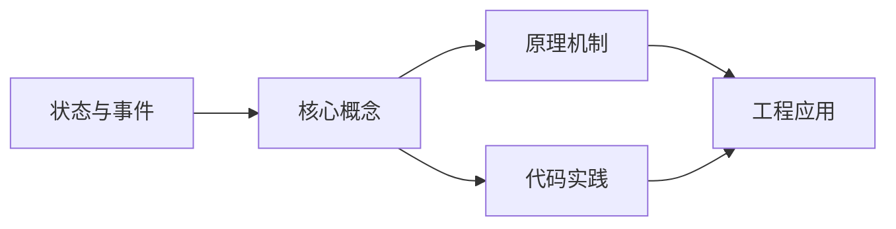
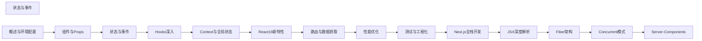

## 1. 学习目标（Bloom 分类）

本节按照布鲁姆教育目标分类学组织学习路径。本文主题为《状态与事件》，属于 React 模块，读者可以根据自身阶段选择阅读深度。

记忆层面：能够准确复述本文的核心概念、术语与基本语法或操作步骤，并能够在提问或检索时快速定位对应知识点。能够说出 React 的核心概念、术语与标准写法。

理解层面：能够用自己的语言解释核心原理与工作机制，说明概念之间的因果关系，而不是机械记忆结论。能够解释 React 的工作原理与设计动机。

应用层面：能够在真实项目或练习场景中运用本文知识解决具体问题，写出正确且可维护的实现。能够编写符合 React 规范的完整实现。

分析层面：能够拆解复杂问题，比较本文主题与相邻概念的异同，识别边界条件与例外情况。能够分析 React 与相邻方案的差异与边界。

评价层面：能够根据约束条件（性能、可读性、安全、成本）评价不同方案的优劣，做出有依据的技术决策。能够根据场景评价 React 相关方案的优劣。

创造层面：能够把本文知识与其他模块知识组合，设计出新的解决方案或可复用的工程模式。能够组合 React 与其他技术设计完整方案。

通过本节学习，读者应当能够把《状态与事件》纳入自己的知识网络，并与 React 模块的其他主题（组件、Hooks、状态管理、渲染性能）建立关联。

## 2. 历史动机与发展脉络

《状态与事件》是 React 领域的重要主题。要真正理解它，需要先了解它解决的问题与演进过程。

React 由 Facebook 于 2013 年开源，核心思想是组件化 UI 与声明式渲染；2019 年 React 16.8 引入 Hooks，函数组件成为主流。
React 19（2024）引入 Actions、useOptimistic、编译器（React Compiler）自动记忆化；并发特性（Suspense、Transitions）持续完善。
生态：Next.js/Remix 全栈框架、TanStack Query 服务端状态、Zustand/Redux 客户端状态、React Native 移动端。

回到本文主题：状态与事件 的提出与成熟，正是上述技术背景下的必然产物。早期实现往往以简单可用为目标，随着工程规模扩大，社区逐渐沉淀出标准做法与最佳实践；理解这一脉络，可以帮助读者判断“为什么文档中的推荐写法是现在这个样子”，也能在遇到历史遗留代码时准确识别其设计年代与取舍。


## 3. 形式化定义与核心概念精讲

本节把《状态与事件》涉及的核心概念以“定义 + 讲解”的形式展开。读者应把定义当作工具，把讲解当作理解路径；两者结合才能形成可迁移的知识。

组件模型：props 输入、state 内部状态、渲染输出 JSX；组件是纯函数，同一输入必得同一输出。
Hooks 规则：只能在顶层调用（不可在条件/循环中），函数组件与自定义 Hook 内使用；依赖数组决定 effect 重跑。
渲染与协调：setState 触发重渲染，虚拟 DOM diff 更新真实 DOM；key 帮助复用元素。

### 3.1 原文章节逐一精讲

原文档把主题拆分为 11 个小节，下面按顺序给出每一节的导读讲解，随后保留原文细节供精读。

#### 原文精读（完整保留）

# useState + 事件类型 语法速查手册

> **符号约定**:`< >` 必填参数 | `[ ]` 可选参数

---

#### 1. useState

`useState` 是最基础的 Hook，用于在函数组件中声明状态变量。

##### 1.1 基本用法

```tsx
import { useState } from 'react';

function Counter() {
  const [count, setCount] = useState(0);

  return (
    <div>
      <p>当前计数：{count}</p>
      <button onClick={() => setCount(count + 1)}>+1</button>
      <button onClick={() => setCount(count - 1)}>-1</button>
    </div>
  );
}
```

##### 1.2 函数式更新

当新状态依赖前一个状态时，应使用函数式更新，避免闭包陷阱：

```tsx
//  错误：快速连续点击可能丢失更新
const increment = () => setCount(count + 1);

//  正确：使用函数式更新
const increment = () => setCount((prev) => prev + 1);

// 批量更新
const resetAndAdd = () => {
  setCount(0); // 重置为 0
  setCount((prev) => prev + 1); // 在 0 的基础上 +1，结果为 1
};
```

##### 1.3 惰性初始化

当初始状态需要昂贵计算时，传入函数避免重复计算：

```tsx
//  每次渲染都会执行 createInitialState
const [state, setState] = useState(createInitialState());

//  只在首次渲染时执行
const [state, setState] = useState(() => createInitialState());

// 示例：从 localStorage 读取
const [theme, setTheme] = useState(() => {
  const saved = localStorage.getItem('theme');
  return saved ?? 'light';
});
```

##### 1.4 对象状态更新

```tsx
interface UserState {
  name: string;
  age: number;
  email: string;
}

function UserProfile() {
  const [user, setUser] = useState<UserState>({
    name: '',
    age: 0,
    email: '',
  });

  // 必须展开旧状态，否则会丢失其他字段
  const updateName = (name: string) => {
    setUser((prev) => ({ ...prev, name }));
  };

  // 使用 Immer 简化不可变更新
  // npm install immer
  import { produce } from 'immer';
  const updateAge = (age: number) => {
    setUser(
      produce((draft) => {
        draft.age = age;
      })
    );
  };

  return <div>...</div>;
}
```

#### 2. useReducer

`useReducer` 是 `useState` 的替代方案，适合管理复杂状态逻辑。

##### 2.1 基本用法

```tsx
import { useReducer } from 'react';

interface State {
  count: number;
}

type Action = { type: 'increment' } | { type: 'decrement' } | { type: 'reset'; payload: number };

function reducer(state: State, action: Action): State {
  switch (action.type) {
    case 'increment':
      return { count: state.count + 1 };
    case 'decrement':
      return { count: state.count - 1 };
    case 'reset':
      return { count: action.payload };
    default:
      return state;
  }
}

function Counter() {
  const [state, dispatch] = useReducer(reducer, { count: 0 });

  return (
    <div>
      <p>计数：{state.count}</p>
      <button onClick={() => dispatch({ type: 'increment' })}>+1</button>
      <button onClick={() => dispatch({ type: 'decrement' })}>-1</button>
      <button onClick={() => dispatch({ type: 'reset', payload: 0 })}>重置</button>
    </div>
  );
}
```

##### 2.2 复杂状态管理示例

```tsx
interface Todo {
  id: string;
  text: string;
  completed: boolean;
}

type TodoAction =
  | { type: 'add'; text: string }
  | { type: 'toggle'; id: string }
  | { type: 'delete'; id: string }
  | { type: 'edit'; id: string; text: string };

function todoReducer(state: Todo[], action: TodoAction): Todo[] {
  switch (action.type) {
    case 'add':
      return [...state, { id: crypto.randomUUID(), text: action.text, completed: false }];
    case 'toggle':
      return state.map((todo) =>
        todo.id === action.id ? { ...todo, completed: !todo.completed } : todo
      );
    case 'delete':
      return state.filter((todo) => todo.id !== action.id);
    case 'edit':
      return state.map((todo) => (todo.id === action.id ? { ...todo, text: action.text } : todo));
    default:
      return state;
  }
}

function TodoApp() {
  const [todos, dispatch] = useReducer(todoReducer, []);
  const [input, setInput] = useState('');

  const handleAdd = () => {
    if (input.trim()) {
      dispatch({ type: 'add', text: input.trim() });
      setInput('');
    }
  };

  return (
    <div>
      <input value={input} onChange={(e) => setInput(e.target.value)} />
      <button onClick={handleAdd}>添加</button>
      <ul>
        {todos.map((todo) => (
          <li key={todo.id}>
            <span
              style={{ textDecoration: todo.completed ? 'line-through' : 'none' }}
              onClick={() => dispatch({ type: 'toggle', id: todo.id })}
            >
              {todo.text}
            </span>
            <button onClick={() => dispatch({ type: 'delete', id: todo.id })}>删除</button>
          </li>
        ))}
      </ul>
    </div>
  );
}
```

##### 2.3 useState vs useReducer

| 场景                 | 推荐         | 原因                    |
| :------------------- | :----------- | :---------------------- |
| 简单独立状态         | `useState`   | 代码更简洁              |
| 多个关联状态         | `useReducer` | 逻辑集中，易于维护      |
| 下一个状态依赖前一个 | `useReducer` | 避免状态更新链          |
| 需要可预测的状态转换 | `useReducer` | 纯函数 reducer 易于测试 |

#### 3. 事件处理

##### 3.1 基本事件

```tsx
function EventDemo() {
  // 点击事件
  const handleClick = (e: React.MouseEvent<HTMLButtonElement>) => {
    console.log('点击', e.currentTarget);
  };

  // 输入事件
  const handleChange = (e: React.ChangeEvent<HTMLInputElement>) => {
    console.log('输入值：', e.target.value);
  };

  // 键盘事件
  const handleKeyDown = (e: React.KeyboardEvent<HTMLInputElement>) => {
    if (e.key === 'Enter') {
      console.log('回车键');
    }
  };

  // 表单提交
  const handleSubmit = (e: React.FormEvent<HTMLFormElement>) => {
    e.preventDefault();
    console.log('表单提交');
  };

  return (
    <form onSubmit={handleSubmit}>
      <input onChange={handleChange} onKeyDown={handleKeyDown} />
      <button type="submit" onClick={handleClick}>
        提交
      </button>
    </form>
  );
}
```

##### 3.2 传递参数

```tsx
function ItemList({ items }: { items: { id: string; name: string }[] }) {
  // 方式一：箭头函数包装
  const handleDelete = (id: string) => {
    console.log('删除：', id);
  };

  return (
    <ul>
      {items.map((item) => (
        <li key={item.id}>
          {item.name}
          <button onClick={() => handleDelete(item.id)}>删除</button>
        </li>
      ))}
    </ul>
  );
}
```

##### 3.3 事件委托

React 17+ 事件委托到根节点而非 document，避免了与第三方库的冲突。

#### 4. 表单处理

##### 4.1 受控组件

表单元素的值由 React 状态控制：

```tsx
function LoginForm() {
  const [formData, setFormData] = useState({
    username: '',
    password: '',
    remember: false,
  });

  const handleChange = (e: React.ChangeEvent<HTMLInputElement>) => {
    const { name, value, type, checked } = e.target;
    setFormData((prev) => ({
      ...prev,
      [name]: type === 'checkbox' ? checked : value,
    }));
  };

  const handleSubmit = (e: React.FormEvent) => {
    e.preventDefault();
    console.log('提交数据：', formData);
  };

  return (
    <form onSubmit={handleSubmit}>
      <input
        name="username"
        value={formData.username}
        onChange={handleChange}
        placeholder="用户名"
      />
      <input
        name="password"
        type="password"
        value={formData.password}
        onChange={handleChange}
        placeholder="密码"
      />
      <label>
        <input
          name="remember"
          type="checkbox"
          checked={formData.remember}
          onChange={handleChange}
        />
        记住我
      </label>
      <button type="submit">登录</button>
    </form>
  );
}
```

##### 4.2 非受控组件

使用 `ref` 直接访问 DOM 值：

```tsx
import { useRef } from 'react';

function UncontrolledForm() {
  const inputRef = useRef<HTMLInputElement>(null);

  const handleSubmit = (e: React.FormEvent) => {
    e.preventDefault();
    console.log('输入值：', inputRef.current?.value);
  };

  return (
    <form onSubmit={handleSubmit}>
      <input ref={inputRef} defaultValue="默认值" />
      <button type="submit">提交</button>
    </form>
  );
}
```

##### 4.3 受控 vs 非受控

| 特性         | 受控组件     | 非受控组件         |
| :----------- | :----------- | :----------------- |
| 数据源       | React state  | DOM                |
| 实时验证     | 支持         | 不便               |
| 条件禁用提交 | 支持         | 不便               |
| 代码量       | 较多         | 较少               |
| 适用场景     | 需要即时反馈 | 简单表单、文件上传 |

#### 5. 状态提升

当多个组件需要共享状态时，将状态提升到最近的共同父组件。

```tsx
function TemperatureInput({
  temperature,
  onTemperatureChange,
}: {
  temperature: string;
  onTemperatureChange: (value: string) => void;
}) {
  return <input value={temperature} onChange={(e) => onTemperatureChange(e.target.value)} />;
}

function Calculator() {
  const [celsius, setCelsius] = useState('');
  const [fahrenheit, setFahrenheit] = useState('');

  const handleCelsiusChange = (value: string) => {
    setCelsius(value);
    setFahrenheit(value ? ((parseFloat(value) * 9) / 5 + 32).toString() : '');
  };

  const handleFahrenheitChange = (value: string) => {
    setFahrenheit(value);
    setCelsius(value ? (((parseFloat(value) - 32) * 5) / 9).toString() : '');
  };

  return (
    <div>
      <label>摄氏度：</label>
      <TemperatureInput temperature={celsius} onTemperatureChange={handleCelsiusChange} />
      <label>华氏度：</label>
      <TemperatureInput temperature={fahrenheit} onTemperatureChange={handleFahrenheitChange} />
    </div>
  );
}
```

#### 6. 状态管理模式

##### 6.1 状态分类

| 类型           | 说明                 | 示例               |
| :------------- | :------------------- | :----------------- |
| **UI 状态**    | 组件内部展示状态     | 模态框开关、选中项 |
| **应用状态**   | 全局共享的业务数据   | 用户信息、购物车   |
| **服务端状态** | 来自后端的数据       | API 响应、缓存     |
| **URL 状态**   | 路由参数和查询字符串 | 页码、筛选条件     |

##### 6.2 状态放置原则

1. **能放局部就不提升** — 仅组件内部使用的状态不要提升
2. **能放 URL 就不放状态** — 分页、筛选等适合放在 URL 中
3. **服务端状态用专门库管理** — React Query / SWR
4. **全局状态用状态管理库** — Zustand / Jotai / Redux Toolkit

##### 6.3 React 19 中的 Actions

React 19 引入了 Actions 概念，简化了异步状态管理：

```tsx
import { useActionState } from 'react';

async function submitForm(prevState: string, formData: FormData) {
  const name = formData.get('name') as string;
  // 模拟异步操作
  await new Promise((resolve) => setTimeout(resolve, 1000));
  if (!name.trim()) {
    return '请输入姓名';
  }
  return '提交成功！';
}

function Form() {
  const [message, submitAction, isPending] = useActionState(submitForm, '');

  return (
    <form action={submitAction}>
      <input name="name" />
      <button type="submit" disabled={isPending}>
        {isPending ? '提交中...' : '提交'}
      </button>
      {message && <p>{message}</p>}
    </form>
  );
}
```
#### useState 状态钩子

**useState 基础用法**
`const [<state>, <setState>] = useState(<initialValue>);`
```tsx
const [count, setCount] = useState(0);
setCount(count + 1);
setCount(prev => prev + 1);
```

**useState 类型推断**
`const [<state>, <setState>] = useState<<T>>(<initialValue>);`
```tsx
const [user, setUser] = useState<User | null>(null);
const [tags, setTags] = useState<string[]>([]);
```

**useState 函数式初始化**
`useState(() => <initialValue>);`
```tsx
const [data] = useState(() => loadFromLocalStorage());
```

---

#### 事件类型

**ChangeEvent 表单变更事件**
`(e: React.ChangeEvent<<Element>>) => void`
```tsx
function Input() {
  const [value, setValue] = useState('');
  const onChange = (e: React.ChangeEvent<HTMLInputElement>) => {
    setValue(e.target.value);
  };
  return <input value={value} onChange={onChange} />;
}
```

**ChangeEvent<HTMLTextAreaElement>**
```tsx
const onTextChange = (e: React.ChangeEvent<HTMLTextAreaElement>) => {
  setText(e.target.value);
};
```

**ChangeEvent<HTMLSelectElement>**
```tsx
const onSelectChange = (e: React.ChangeEvent<HTMLSelectElement>) => {
  setSelect(e.target.value);
};
```

**MouseEvent 鼠标事件**
`(e: React.MouseEvent<<Element>>) => void`
```tsx
function Btn() {
  const onClick = (e: React.MouseEvent<HTMLButtonElement>) => {
    e.preventDefault();
    console.log(e.currentTarget);
  };
  return <button onClick={onClick}>Click</button>;
}
```

**MouseEvent 元素类型**
```tsx
const onDivClick: React.MouseEventHandler<HTMLDivElement> = (e) => {};
const onSpanClick: React.MouseEventHandler<HTMLSpanElement> = (e) => {};
```

**KeyboardEvent 键盘事件**
`(e: React.KeyboardEvent<<Element>>) => void`
```tsx
const onKeyDown = (e: React.KeyboardEvent<HTMLInputElement>) => {
  if (e.key === 'Enter') submit();
};
```

**FocusEvent 焦点事件**
`(e: React.FocusEvent<<Element>>) => void`
```tsx
const onFocus = (e: React.FocusEvent<HTMLInputElement>) => {
  console.log(e.target);
};
```

**SubmitEvent 表单提交(原生)**
`(e: React.FormEvent<<FormElement>>) => void`
```tsx
function Form() {
  const onSubmit = (e: React.FormEvent<HTMLFormElement>) => {
    e.preventDefault();
    const formData = new FormData(e.currentTarget);
    console.log(Object.fromEntries(formData));
  };
  return <form onSubmit={onSubmit}>...</form>;
}
```

---

#### 事件处理器类型

**EventHandler 类型别名**
`type <Handler> = React.ChangeEventHandler<<Element>>;`
```tsx
type InputChange = React.ChangeEventHandler<HTMLInputElement>;
const handle: InputChange = (e) => setValue(e.target.value);
```

**事件泛型**
`React.SyntheticEvent<<Element>>`
```tsx
function handle(e: React.SyntheticEvent<HTMLFormElement>) {
  e.preventDefault();
}
```

**ClipboardEvent 剪贴板事件**
```tsx
const onPaste = (e: React.ClipboardEvent<HTMLInputElement>) => {
  const text = e.clipboardData.getData('text');
};
```

**DragEvent 拖拽事件**
```tsx
const onDrop = (e: React.DragEvent<HTMLDivElement>) => {
  const files = e.dataTransfer.files;
};
```

**WheelEvent 滚轮事件**
```tsx
const onWheel = (e: React.WheelEvent<HTMLDivElement>) => {
  if (e.deltaY > 0) scrollDown();
};
```

---

#### 事件对象属性

**target vs currentTarget**
`e.target` / `e.currentTarget`
```tsx
const onClick = (e: React.MouseEvent<HTMLButtonElement>) => {
  e.target;        // 触发事件的元素(可能是子元素)
  e.currentTarget; // 绑定事件的元素
};
```

**鼠标坐标**
`e.clientX` / `e.clientY` / `e.pageX` / `e.pageY`
```tsx
const onMove = (e: React.MouseEvent<HTMLDivElement>) => {
  const { clientX, clientY } = e;
};
```

**按键信息**
`e.key` / `e.code` / `e.altKey` / `e.ctrlKey`
```tsx
const onKeyDown = (e: React.KeyboardEvent<HTMLInputElement>) => {
  if (e.key === 'Escape') close();
  if (e.ctrlKey && e.key === 's') save();
};
```

---

#### 内联事件处理器

**内联箭头函数**
`<button onClick={() => <fn>(<arg>)}>`
```tsx
<button onClick={() => deleteItem(id)}>删除</button>
```

**useCallback 包装**
`const <handler> = useCallback((<e>) => <fn>, [<deps>]);`
```tsx
const handleClick = useCallback((e: React.MouseEvent<HTMLButtonElement>) => {
  onClick(id);
}, [id, onClick]);
```


### 3.2 概念关系图

下面用 Mermaid 图表达本文核心概念之间的关系，帮助读者建立整体图景：



图中展示的是本文知识的结构化关系：核心概念是入口，原理机制解释“为什么”，代码实践演示“怎么做”，工程应用回答“何时用”。读者学习时可以把每个小节的内容挂接到对应节点上。

## 4. 理论推导与原理解析

本节深入《状态与事件》背后的原理。理论部分不求面面俱到，而是聚焦“能解释现象、能指导实践”的关键推导。

组件模型：props 输入、state 内部状态、渲染输出 JSX；组件是纯函数，同一输入必得同一输出。
Hooks 规则：只能在顶层调用（不可在条件/循环中），函数组件与自定义 Hook 内使用；依赖数组决定 effect 重跑。
渲染与协调：setState 触发重渲染，虚拟 DOM diff 更新真实 DOM；key 帮助复用元素。
状态提升与下放：共享状态提升到最近公共祖先；Context 跨层传递（Provider/useContext）。

需要强调的是，理论推导与工程实践之间存在翻译层：理论给出的是理想化模型与边界条件，工程代码则必须处理真实环境中的例外。读者在学习时应先掌握理论的“标准情形”，再通过陷阱章节了解“非标准情形”。

## 5. 代码示例与逐行讲解

本节把原文中的代码示例系统整理，并为每个示例补充用途说明与讲解。读者不应只浏览代码，而应逐段对照讲解理解设计意图。

### 5.1 示例：1.1 基本用法

该示例来自原文《1.1 基本用法》小节，用于演示状态与事件相关操作。阅读时请先看代码结构，再看其后的讲解。

```tsx
import { useState } from 'react';

function Counter() {
  const [count, setCount] = useState(0);

  return (
    <div>
      <p>当前计数：{count}</p>
      <button onClick={() => setCount(count + 1)}>+1</button>
      <button onClick={() => setCount(count - 1)}>-1</button>
    </div>
  );
}
```

讲解：这段代码演示了本节核心知识点。代码中的关键操作可以归纳为三步：准备（定义或初始化）、执行（核心逻辑）、收尾（释放资源或返回结果）。实际项目中，这三步往往被封装为函数或类，以提升复用性与可测试性。

关键点分析：

该示例共 11 行有效代码，包含 4 类关键结构（function、import、from、return）。其中：

- 入口与初始化部分负责建立上下文，对应实际项目中的启动或装配逻辑；
- 核心逻辑部分体现本文主题的主要操作，是阅读时最需要对照讲解理解的部分；
- 输出或返回部分把结果交给调用方，注意其类型与边界条件。

进阶思考路径：先尝试修改参数观察行为变化，再把示例中的模式迁移到自己的项目中；每次修改都记录预期与实测差异，这是把示例转化为能力的最快方式。

### 5.2 示例：1.2 函数式更新

该示例来自原文《1.2 函数式更新》小节，用于演示状态与事件相关操作。阅读时请先看代码结构，再看其后的讲解。

```tsx
//  错误：快速连续点击可能丢失更新
const increment = () => setCount(count + 1);

//  正确：使用函数式更新
const increment = () => setCount((prev) => prev + 1);

// 批量更新
const resetAndAdd = () => {
  setCount(0); // 重置为 0
  setCount((prev) => prev + 1); // 在 0 的基础上 +1，结果为 1
};
```

讲解：这段代码演示了本节核心知识点。代码中的关键操作可以归纳为三步：准备（定义或初始化）、执行（核心逻辑）、收尾（释放资源或返回结果）。实际项目中，这三步往往被封装为函数或类，以提升复用性与可测试性。

关键点分析：

该示例共 9 行有效代码，结构以数据或配置为主。阅读时应关注：数据字段的含义、配置项的作用，以及它们与运行行为的对应关系。

进阶思考路径：先尝试修改参数观察行为变化，再把示例中的模式迁移到自己的项目中；每次修改都记录预期与实测差异，这是把示例转化为能力的最快方式。

### 5.3 示例：1.3 惰性初始化

该示例来自原文《1.3 惰性初始化》小节，用于演示状态与事件相关操作。阅读时请先看代码结构，再看其后的讲解。

```tsx
//  每次渲染都会执行 createInitialState
const [state, setState] = useState(createInitialState());

//  只在首次渲染时执行
const [state, setState] = useState(() => createInitialState());

// 示例：从 localStorage 读取
const [theme, setTheme] = useState(() => {
  const saved = localStorage.getItem('theme');
  return saved ?? 'light';
});
```

讲解：这段代码演示了本节核心知识点。代码中的关键操作可以归纳为三步：准备（定义或初始化）、执行（核心逻辑）、收尾（释放资源或返回结果）。实际项目中，这三步往往被封装为函数或类，以提升复用性与可测试性。

关键点分析：

该示例共 9 行有效代码，包含 1 类关键结构（return）。其中：

- 入口与初始化部分负责建立上下文，对应实际项目中的启动或装配逻辑；
- 核心逻辑部分体现本文主题的主要操作，是阅读时最需要对照讲解理解的部分；
- 输出或返回部分把结果交给调用方，注意其类型与边界条件。

进阶思考路径：先尝试修改参数观察行为变化，再把示例中的模式迁移到自己的项目中；每次修改都记录预期与实测差异，这是把示例转化为能力的最快方式。

### 5.4 示例：1.4 对象状态更新

该示例来自原文《1.4 对象状态更新》小节，用于演示状态与事件相关操作。阅读时请先看代码结构，再看其后的讲解。

```tsx
interface UserState {
  name: string;
  age: number;
  email: string;
}

function UserProfile() {
  const [user, setUser] = useState<UserState>({
    name: '',
    age: 0,
    email: '',
  });

  // 必须展开旧状态，否则会丢失其他字段
  const updateName = (name: string) => {
    setUser((prev) => ({ ...prev, name }));
  };

  // 使用 Immer 简化不可变更新
  // npm install immer
  import { produce } from 'immer';
  const updateAge = (age: number) => {
    setUser(
      produce((draft) => {
        draft.age = age;
      })
    );
  };

  return <div>...</div>;
}
```

讲解：这段代码演示了本节核心知识点。代码中的关键操作可以归纳为三步：准备（定义或初始化）、执行（核心逻辑）、收尾（释放资源或返回结果）。实际项目中，这三步往往被封装为函数或类，以提升复用性与可测试性。

关键点分析：

该示例共 27 行有效代码，包含 4 类关键结构（function、import、from、return）。其中：

- 入口与初始化部分负责建立上下文，对应实际项目中的启动或装配逻辑；
- 核心逻辑部分体现本文主题的主要操作，是阅读时最需要对照讲解理解的部分；
- 输出或返回部分把结果交给调用方，注意其类型与边界条件。

进阶思考路径：先尝试修改参数观察行为变化，再把示例中的模式迁移到自己的项目中；每次修改都记录预期与实测差异，这是把示例转化为能力的最快方式。

### 5.5 示例：2.1 基本用法

该示例来自原文《2.1 基本用法》小节，用于演示状态与事件相关操作。阅读时请先看代码结构，再看其后的讲解。

```tsx
import { useReducer } from 'react';

interface State {
  count: number;
}

type Action = { type: 'increment' } | { type: 'decrement' } | { type: 'reset'; payload: number };

function reducer(state: State, action: Action): State {
  switch (action.type) {
    case 'increment':
      return { count: state.count + 1 };
    case 'decrement':
      return { count: state.count - 1 };
    case 'reset':
      return { count: action.payload };
    default:
      return state;
  }
}

function Counter() {
  const [state, dispatch] = useReducer(reducer, { count: 0 });

  return (
    <div>
      <p>计数：{state.count}</p>
      <button onClick={() => dispatch({ type: 'increment' })}>+1</button>
      <button onClick={() => dispatch({ type: 'decrement' })}>-1</button>
      <button onClick={() => dispatch({ type: 'reset', payload: 0 })}>重置</button>
    </div>
  );
}
```

讲解：这段代码演示了本节核心知识点。代码中的关键操作可以归纳为三步：准备（定义或初始化）、执行（核心逻辑）、收尾（释放资源或返回结果）。实际项目中，这三步往往被封装为函数或类，以提升复用性与可测试性。

关键点分析：

该示例共 28 行有效代码，包含 4 类关键结构（function、import、from、return）。其中：

- 入口与初始化部分负责建立上下文，对应实际项目中的启动或装配逻辑；
- 核心逻辑部分体现本文主题的主要操作，是阅读时最需要对照讲解理解的部分；
- 输出或返回部分把结果交给调用方，注意其类型与边界条件。

进阶思考路径：先尝试修改参数观察行为变化，再把示例中的模式迁移到自己的项目中；每次修改都记录预期与实测差异，这是把示例转化为能力的最快方式。

### 5.6 示例：2.2 复杂状态管理示例

该示例来自原文《2.2 复杂状态管理示例》小节，用于演示状态与事件相关操作。阅读时请先看代码结构，再看其后的讲解。

```tsx
interface Todo {
  id: string;
  text: string;
  completed: boolean;
}

type TodoAction =
  | { type: 'add'; text: string }
  | { type: 'toggle'; id: string }
  | { type: 'delete'; id: string }
  | { type: 'edit'; id: string; text: string };

function todoReducer(state: Todo[], action: TodoAction): Todo[] {
  switch (action.type) {
    case 'add':
      return [...state, { id: crypto.randomUUID(), text: action.text, completed: false }];
    case 'toggle':
      return state.map((todo) =>
        todo.id === action.id ? { ...todo, completed: !todo.completed } : todo
      );
    case 'delete':
      return state.filter((todo) => todo.id !== action.id);
    case 'edit':
      return state.map((todo) => (todo.id === action.id ? { ...todo, text: action.text } : todo));
    default:
      return state;
  }
}

function TodoApp() {
  const [todos, dispatch] = useReducer(todoReducer, []);
  const [input, setInput] = useState('');

  const handleAdd = () => {
    if (input.trim()) {
      dispatch({ type: 'add', text: input.trim() });
      setInput('');
    }
  };

  return (
    <div>
      <input value={input} onChange={(e) => setInput(e.target.value)} />
      <button onClick={handleAdd}>添加</button>
      <ul>
        {todos.map((todo) => (
          <li key={todo.id}>
            <span
              style={{ textDecoration: todo.completed ? 'line-through' : 'none' }}
              onClick={() => dispatch({ type: 'toggle', id: todo.id })}
            >
              {todo.text}
            </span>
            <button onClick={() => dispatch({ type: 'delete', id: todo.id })}>删除</button>
          </li>
        ))}
      </ul>
    </div>
  );
}
```

讲解：这段代码演示了本节核心知识点。代码中的关键操作可以归纳为三步：准备（定义或初始化）、执行（核心逻辑）、收尾（释放资源或返回结果）。实际项目中，这三步往往被封装为函数或类，以提升复用性与可测试性。

关键点分析：

该示例共 55 行有效代码，包含 3 类关键结构（function、if、return）。其中：

- 入口与初始化部分负责建立上下文，对应实际项目中的启动或装配逻辑；
- 核心逻辑部分体现本文主题的主要操作，是阅读时最需要对照讲解理解的部分；
- 输出或返回部分把结果交给调用方，注意其类型与边界条件。

进阶思考路径：先尝试修改参数观察行为变化，再把示例中的模式迁移到自己的项目中；每次修改都记录预期与实测差异，这是把示例转化为能力的最快方式。

### 5.7 示例：3.1 基本事件

该示例来自原文《3.1 基本事件》小节，用于演示状态与事件相关操作。阅读时请先看代码结构，再看其后的讲解。

```tsx
function EventDemo() {
  // 点击事件
  const handleClick = (e: React.MouseEvent<HTMLButtonElement>) => {
    console.log('点击', e.currentTarget);
  };

  // 输入事件
  const handleChange = (e: React.ChangeEvent<HTMLInputElement>) => {
    console.log('输入值：', e.target.value);
  };

  // 键盘事件
  const handleKeyDown = (e: React.KeyboardEvent<HTMLInputElement>) => {
    if (e.key === 'Enter') {
      console.log('回车键');
    }
  };

  // 表单提交
  const handleSubmit = (e: React.FormEvent<HTMLFormElement>) => {
    e.preventDefault();
    console.log('表单提交');
  };

  return (
    <form onSubmit={handleSubmit}>
      <input onChange={handleChange} onKeyDown={handleKeyDown} />
      <button type="submit" onClick={handleClick}>
        提交
      </button>
    </form>
  );
}
```

讲解：这段代码演示了本节核心知识点。代码中的关键操作可以归纳为三步：准备（定义或初始化）、执行（核心逻辑）、收尾（释放资源或返回结果）。实际项目中，这三步往往被封装为函数或类，以提升复用性与可测试性。

关键点分析：

该示例共 29 行有效代码，包含 3 类关键结构（function、if、return）。其中：

- 入口与初始化部分负责建立上下文，对应实际项目中的启动或装配逻辑；
- 核心逻辑部分体现本文主题的主要操作，是阅读时最需要对照讲解理解的部分；
- 输出或返回部分把结果交给调用方，注意其类型与边界条件。

进阶思考路径：先尝试修改参数观察行为变化，再把示例中的模式迁移到自己的项目中；每次修改都记录预期与实测差异，这是把示例转化为能力的最快方式。

### 5.8 示例：3.2 传递参数

该示例来自原文《3.2 传递参数》小节，用于演示状态与事件相关操作。阅读时请先看代码结构，再看其后的讲解。

```tsx
function ItemList({ items }: { items: { id: string; name: string }[] }) {
  // 方式一：箭头函数包装
  const handleDelete = (id: string) => {
    console.log('删除：', id);
  };

  return (
    <ul>
      {items.map((item) => (
        <li key={item.id}>
          {item.name}
          <button onClick={() => handleDelete(item.id)}>删除</button>
        </li>
      ))}
    </ul>
  );
}
```

讲解：这段代码演示了本节核心知识点。代码中的关键操作可以归纳为三步：准备（定义或初始化）、执行（核心逻辑）、收尾（释放资源或返回结果）。实际项目中，这三步往往被封装为函数或类，以提升复用性与可测试性。

关键点分析：

该示例共 16 行有效代码，包含 2 类关键结构（function、return）。其中：

- 入口与初始化部分负责建立上下文，对应实际项目中的启动或装配逻辑；
- 核心逻辑部分体现本文主题的主要操作，是阅读时最需要对照讲解理解的部分；
- 输出或返回部分把结果交给调用方，注意其类型与边界条件。

进阶思考路径：先尝试修改参数观察行为变化，再把示例中的模式迁移到自己的项目中；每次修改都记录预期与实测差异，这是把示例转化为能力的最快方式。

### 5.9 示例：4.1 受控组件

该示例来自原文《4.1 受控组件》小节，用于演示状态与事件相关操作。阅读时请先看代码结构，再看其后的讲解。

```tsx
function LoginForm() {
  const [formData, setFormData] = useState({
    username: '',
    password: '',
    remember: false,
  });

  const handleChange = (e: React.ChangeEvent<HTMLInputElement>) => {
    const { name, value, type, checked } = e.target;
    setFormData((prev) => ({
      ...prev,
      [name]: type === 'checkbox' ? checked : value,
    }));
  };

  const handleSubmit = (e: React.FormEvent) => {
    e.preventDefault();
    console.log('提交数据：', formData);
  };

  return (
    <form onSubmit={handleSubmit}>
      <input
        name="username"
        value={formData.username}
        onChange={handleChange}
        placeholder="用户名"
      />
      <input
        name="password"
        type="password"
        value={formData.password}
        onChange={handleChange}
        placeholder="密码"
      />
      <label>
        <input
          name="remember"
          type="checkbox"
          checked={formData.remember}
          onChange={handleChange}
        />
        记住我
      </label>
      <button type="submit">登录</button>
    </form>
  );
}
```

讲解：这段代码演示了本节核心知识点。代码中的关键操作可以归纳为三步：准备（定义或初始化）、执行（核心逻辑）、收尾（释放资源或返回结果）。实际项目中，这三步往往被封装为函数或类，以提升复用性与可测试性。

关键点分析：

该示例共 45 行有效代码，包含 2 类关键结构（function、return）。其中：

- 入口与初始化部分负责建立上下文，对应实际项目中的启动或装配逻辑；
- 核心逻辑部分体现本文主题的主要操作，是阅读时最需要对照讲解理解的部分；
- 输出或返回部分把结果交给调用方，注意其类型与边界条件。

进阶思考路径：先尝试修改参数观察行为变化，再把示例中的模式迁移到自己的项目中；每次修改都记录预期与实测差异，这是把示例转化为能力的最快方式。

### 5.10 示例：4.2 非受控组件

该示例来自原文《4.2 非受控组件》小节，用于演示状态与事件相关操作。阅读时请先看代码结构，再看其后的讲解。

```tsx
import { useRef } from 'react';

function UncontrolledForm() {
  const inputRef = useRef<HTMLInputElement>(null);

  const handleSubmit = (e: React.FormEvent) => {
    e.preventDefault();
    console.log('输入值：', inputRef.current?.value);
  };

  return (
    <form onSubmit={handleSubmit}>
      <input ref={inputRef} defaultValue="默认值" />
      <button type="submit">提交</button>
    </form>
  );
}
```

讲解：这段代码演示了本节核心知识点。代码中的关键操作可以归纳为三步：准备（定义或初始化）、执行（核心逻辑）、收尾（释放资源或返回结果）。实际项目中，这三步往往被封装为函数或类，以提升复用性与可测试性。

关键点分析：

该示例共 14 行有效代码，包含 4 类关键结构（function、import、from、return）。其中：

- 入口与初始化部分负责建立上下文，对应实际项目中的启动或装配逻辑；
- 核心逻辑部分体现本文主题的主要操作，是阅读时最需要对照讲解理解的部分；
- 输出或返回部分把结果交给调用方，注意其类型与边界条件。

进阶思考路径：先尝试修改参数观察行为变化，再把示例中的模式迁移到自己的项目中；每次修改都记录预期与实测差异，这是把示例转化为能力的最快方式。

### 5.11 示例：5. 状态提升

该示例来自原文《5. 状态提升》小节，用于演示状态与事件相关操作。阅读时请先看代码结构，再看其后的讲解。

```tsx
function TemperatureInput({
  temperature,
  onTemperatureChange,
}: {
  temperature: string;
  onTemperatureChange: (value: string) => void;
}) {
  return <input value={temperature} onChange={(e) => onTemperatureChange(e.target.value)} />;
}

function Calculator() {
  const [celsius, setCelsius] = useState('');
  const [fahrenheit, setFahrenheit] = useState('');

  const handleCelsiusChange = (value: string) => {
    setCelsius(value);
    setFahrenheit(value ? ((parseFloat(value) * 9) / 5 + 32).toString() : '');
  };

  const handleFahrenheitChange = (value: string) => {
    setFahrenheit(value);
    setCelsius(value ? (((parseFloat(value) - 32) * 5) / 9).toString() : '');
  };

  return (
    <div>
      <label>摄氏度：</label>
      <TemperatureInput temperature={celsius} onTemperatureChange={handleCelsiusChange} />
      <label>华氏度：</label>
      <TemperatureInput temperature={fahrenheit} onTemperatureChange={handleFahrenheitChange} />
    </div>
  );
}
```

讲解：这段代码演示了本节核心知识点。代码中的关键操作可以归纳为三步：准备（定义或初始化）、执行（核心逻辑）、收尾（释放资源或返回结果）。实际项目中，这三步往往被封装为函数或类，以提升复用性与可测试性。

关键点分析：

该示例共 29 行有效代码，包含 2 类关键结构（function、return）。其中：

- 入口与初始化部分负责建立上下文，对应实际项目中的启动或装配逻辑；
- 核心逻辑部分体现本文主题的主要操作，是阅读时最需要对照讲解理解的部分；
- 输出或返回部分把结果交给调用方，注意其类型与边界条件。

进阶思考路径：先尝试修改参数观察行为变化，再把示例中的模式迁移到自己的项目中；每次修改都记录预期与实测差异，这是把示例转化为能力的最快方式。

### 5.12 示例：6.3 React 19 中的 Actions

该示例来自原文《6.3 React 19 中的 Actions》小节，用于演示状态与事件相关操作。阅读时请先看代码结构，再看其后的讲解。

```tsx
import { useActionState } from 'react';

async function submitForm(prevState: string, formData: FormData) {
  const name = formData.get('name') as string;
  // 模拟异步操作
  await new Promise((resolve) => setTimeout(resolve, 1000));
  if (!name.trim()) {
    return '请输入姓名';
  }
  return '提交成功！';
}

function Form() {
  const [message, submitAction, isPending] = useActionState(submitForm, '');

  return (
    <form action={submitAction}>
      <input name="name" />
      <button type="submit" disabled={isPending}>
        {isPending ? '提交中...' : '提交'}
      </button>
      {message && <p>{message}</p>}
    </form>
  );
}
```

讲解：这段代码演示了本节核心知识点。代码中的关键操作可以归纳为三步：准备（定义或初始化）、执行（核心逻辑）、收尾（释放资源或返回结果）。实际项目中，这三步往往被封装为函数或类，以提升复用性与可测试性。

关键点分析：

该示例共 22 行有效代码，包含 5 类关键结构（function、import、from、if、return）。其中：

- 入口与初始化部分负责建立上下文，对应实际项目中的启动或装配逻辑；
- 核心逻辑部分体现本文主题的主要操作，是阅读时最需要对照讲解理解的部分；
- 输出或返回部分把结果交给调用方，注意其类型与边界条件。

进阶思考路径：先尝试修改参数观察行为变化，再把示例中的模式迁移到自己的项目中；每次修改都记录预期与实测差异，这是把示例转化为能力的最快方式。

### 5.13 示例：useState 状态钩子

该示例来自原文《useState 状态钩子》小节，用于演示状态与事件相关操作。阅读时请先看代码结构，再看其后的讲解。

```tsx
const [count, setCount] = useState(0);
setCount(count + 1);
setCount(prev => prev + 1);
```

讲解：这段代码演示了本节核心知识点。代码中的关键操作可以归纳为三步：准备（定义或初始化）、执行（核心逻辑）、收尾（释放资源或返回结果）。实际项目中，这三步往往被封装为函数或类，以提升复用性与可测试性。

关键点分析：

该示例共 3 行有效代码，结构以数据或配置为主。阅读时应关注：数据字段的含义、配置项的作用，以及它们与运行行为的对应关系。

进阶思考路径：先尝试修改参数观察行为变化，再把示例中的模式迁移到自己的项目中；每次修改都记录预期与实测差异，这是把示例转化为能力的最快方式。

### 5.14 示例：useState 状态钩子

该示例来自原文《useState 状态钩子》小节，用于演示状态与事件相关操作。阅读时请先看代码结构，再看其后的讲解。

```tsx
const [user, setUser] = useState<User | null>(null);
const [tags, setTags] = useState<string[]>([]);
```

讲解：这段代码演示了本节核心知识点。代码中的关键操作可以归纳为三步：准备（定义或初始化）、执行（核心逻辑）、收尾（释放资源或返回结果）。实际项目中，这三步往往被封装为函数或类，以提升复用性与可测试性。

关键点分析：

该示例共 2 行有效代码，结构以数据或配置为主。阅读时应关注：数据字段的含义、配置项的作用，以及它们与运行行为的对应关系。

进阶思考路径：先尝试修改参数观察行为变化，再把示例中的模式迁移到自己的项目中；每次修改都记录预期与实测差异，这是把示例转化为能力的最快方式。

### 5.15 示例：useState 状态钩子

该示例来自原文《useState 状态钩子》小节，用于演示状态与事件相关操作。阅读时请先看代码结构，再看其后的讲解。

```tsx
const [data] = useState(() => loadFromLocalStorage());
```

讲解：这段代码演示了本节核心知识点。代码中的关键操作可以归纳为三步：准备（定义或初始化）、执行（核心逻辑）、收尾（释放资源或返回结果）。实际项目中，这三步往往被封装为函数或类，以提升复用性与可测试性。

关键点分析：

该示例共 1 行有效代码，结构以数据或配置为主。阅读时应关注：数据字段的含义、配置项的作用，以及它们与运行行为的对应关系。

进阶思考路径：先尝试修改参数观察行为变化，再把示例中的模式迁移到自己的项目中；每次修改都记录预期与实测差异，这是把示例转化为能力的最快方式。

### 5.16 示例：事件类型

该示例来自原文《事件类型》小节，用于演示状态与事件相关操作。阅读时请先看代码结构，再看其后的讲解。

```tsx
function Input() {
  const [value, setValue] = useState('');
  const onChange = (e: React.ChangeEvent<HTMLInputElement>) => {
    setValue(e.target.value);
  };
  return <input value={value} onChange={onChange} />;
}
```

讲解：这段代码演示了本节核心知识点。代码中的关键操作可以归纳为三步：准备（定义或初始化）、执行（核心逻辑）、收尾（释放资源或返回结果）。实际项目中，这三步往往被封装为函数或类，以提升复用性与可测试性。

关键点分析：

该示例共 7 行有效代码，包含 2 类关键结构（function、return）。其中：

- 入口与初始化部分负责建立上下文，对应实际项目中的启动或装配逻辑；
- 核心逻辑部分体现本文主题的主要操作，是阅读时最需要对照讲解理解的部分；
- 输出或返回部分把结果交给调用方，注意其类型与边界条件。

进阶思考路径：先尝试修改参数观察行为变化，再把示例中的模式迁移到自己的项目中；每次修改都记录预期与实测差异，这是把示例转化为能力的最快方式。

### 5.17 示例：事件类型

该示例来自原文《事件类型》小节，用于演示状态与事件相关操作。阅读时请先看代码结构，再看其后的讲解。

```tsx
const onTextChange = (e: React.ChangeEvent<HTMLTextAreaElement>) => {
  setText(e.target.value);
};
```

讲解：这段代码演示了本节核心知识点。代码中的关键操作可以归纳为三步：准备（定义或初始化）、执行（核心逻辑）、收尾（释放资源或返回结果）。实际项目中，这三步往往被封装为函数或类，以提升复用性与可测试性。

关键点分析：

该示例共 3 行有效代码，结构以数据或配置为主。阅读时应关注：数据字段的含义、配置项的作用，以及它们与运行行为的对应关系。

进阶思考路径：先尝试修改参数观察行为变化，再把示例中的模式迁移到自己的项目中；每次修改都记录预期与实测差异，这是把示例转化为能力的最快方式。

### 5.18 示例：事件类型

该示例来自原文《事件类型》小节，用于演示状态与事件相关操作。阅读时请先看代码结构，再看其后的讲解。

```tsx
const onSelectChange = (e: React.ChangeEvent<HTMLSelectElement>) => {
  setSelect(e.target.value);
};
```

讲解：这段代码演示了本节核心知识点。代码中的关键操作可以归纳为三步：准备（定义或初始化）、执行（核心逻辑）、收尾（释放资源或返回结果）。实际项目中，这三步往往被封装为函数或类，以提升复用性与可测试性。

关键点分析：

该示例共 3 行有效代码，结构以数据或配置为主。阅读时应关注：数据字段的含义、配置项的作用，以及它们与运行行为的对应关系。

进阶思考路径：先尝试修改参数观察行为变化，再把示例中的模式迁移到自己的项目中；每次修改都记录预期与实测差异，这是把示例转化为能力的最快方式。

### 5.19 示例：事件类型

该示例来自原文《事件类型》小节，用于演示状态与事件相关操作。阅读时请先看代码结构，再看其后的讲解。

```tsx
function Btn() {
  const onClick = (e: React.MouseEvent<HTMLButtonElement>) => {
    e.preventDefault();
    console.log(e.currentTarget);
  };
  return <button onClick={onClick}>Click</button>;
}
```

讲解：这段代码演示了本节核心知识点。代码中的关键操作可以归纳为三步：准备（定义或初始化）、执行（核心逻辑）、收尾（释放资源或返回结果）。实际项目中，这三步往往被封装为函数或类，以提升复用性与可测试性。

关键点分析：

该示例共 7 行有效代码，包含 2 类关键结构（function、return）。其中：

- 入口与初始化部分负责建立上下文，对应实际项目中的启动或装配逻辑；
- 核心逻辑部分体现本文主题的主要操作，是阅读时最需要对照讲解理解的部分；
- 输出或返回部分把结果交给调用方，注意其类型与边界条件。

进阶思考路径：先尝试修改参数观察行为变化，再把示例中的模式迁移到自己的项目中；每次修改都记录预期与实测差异，这是把示例转化为能力的最快方式。

### 5.20 示例：事件类型

该示例来自原文《事件类型》小节，用于演示状态与事件相关操作。阅读时请先看代码结构，再看其后的讲解。

```tsx
const onDivClick: React.MouseEventHandler<HTMLDivElement> = (e) => {};
const onSpanClick: React.MouseEventHandler<HTMLSpanElement> = (e) => {};
```

讲解：这段代码演示了本节核心知识点。代码中的关键操作可以归纳为三步：准备（定义或初始化）、执行（核心逻辑）、收尾（释放资源或返回结果）。实际项目中，这三步往往被封装为函数或类，以提升复用性与可测试性。

关键点分析：

该示例共 2 行有效代码，结构以数据或配置为主。阅读时应关注：数据字段的含义、配置项的作用，以及它们与运行行为的对应关系。

进阶思考路径：先尝试修改参数观察行为变化，再把示例中的模式迁移到自己的项目中；每次修改都记录预期与实测差异，这是把示例转化为能力的最快方式。

### 5.21 示例：事件类型

该示例来自原文《事件类型》小节，用于演示状态与事件相关操作。阅读时请先看代码结构，再看其后的讲解。

```tsx
const onKeyDown = (e: React.KeyboardEvent<HTMLInputElement>) => {
  if (e.key === 'Enter') submit();
};
```

讲解：这段代码演示了本节核心知识点。代码中的关键操作可以归纳为三步：准备（定义或初始化）、执行（核心逻辑）、收尾（释放资源或返回结果）。实际项目中，这三步往往被封装为函数或类，以提升复用性与可测试性。

关键点分析：

该示例共 3 行有效代码，包含 1 类关键结构（if）。其中：

- 入口与初始化部分负责建立上下文，对应实际项目中的启动或装配逻辑；
- 核心逻辑部分体现本文主题的主要操作，是阅读时最需要对照讲解理解的部分；
- 输出或返回部分把结果交给调用方，注意其类型与边界条件。

进阶思考路径：先尝试修改参数观察行为变化，再把示例中的模式迁移到自己的项目中；每次修改都记录预期与实测差异，这是把示例转化为能力的最快方式。

### 5.22 示例：事件类型

该示例来自原文《事件类型》小节，用于演示状态与事件相关操作。阅读时请先看代码结构，再看其后的讲解。

```tsx
const onFocus = (e: React.FocusEvent<HTMLInputElement>) => {
  console.log(e.target);
};
```

讲解：这段代码演示了本节核心知识点。代码中的关键操作可以归纳为三步：准备（定义或初始化）、执行（核心逻辑）、收尾（释放资源或返回结果）。实际项目中，这三步往往被封装为函数或类，以提升复用性与可测试性。

关键点分析：

该示例共 3 行有效代码，结构以数据或配置为主。阅读时应关注：数据字段的含义、配置项的作用，以及它们与运行行为的对应关系。

进阶思考路径：先尝试修改参数观察行为变化，再把示例中的模式迁移到自己的项目中；每次修改都记录预期与实测差异，这是把示例转化为能力的最快方式。

### 5.23 示例：事件类型

该示例来自原文《事件类型》小节，用于演示状态与事件相关操作。阅读时请先看代码结构，再看其后的讲解。

```tsx
function Form() {
  const onSubmit = (e: React.FormEvent<HTMLFormElement>) => {
    e.preventDefault();
    const formData = new FormData(e.currentTarget);
    console.log(Object.fromEntries(formData));
  };
  return <form onSubmit={onSubmit}>...</form>;
}
```

讲解：这段代码演示了本节核心知识点。代码中的关键操作可以归纳为三步：准备（定义或初始化）、执行（核心逻辑）、收尾（释放资源或返回结果）。实际项目中，这三步往往被封装为函数或类，以提升复用性与可测试性。

关键点分析：

该示例共 8 行有效代码，包含 2 类关键结构（function、return）。其中：

- 入口与初始化部分负责建立上下文，对应实际项目中的启动或装配逻辑；
- 核心逻辑部分体现本文主题的主要操作，是阅读时最需要对照讲解理解的部分；
- 输出或返回部分把结果交给调用方，注意其类型与边界条件。

进阶思考路径：先尝试修改参数观察行为变化，再把示例中的模式迁移到自己的项目中；每次修改都记录预期与实测差异，这是把示例转化为能力的最快方式。

### 5.24 示例：事件处理器类型

该示例来自原文《事件处理器类型》小节，用于演示状态与事件相关操作。阅读时请先看代码结构，再看其后的讲解。

```tsx
type InputChange = React.ChangeEventHandler<HTMLInputElement>;
const handle: InputChange = (e) => setValue(e.target.value);
```

讲解：这段代码演示了本节核心知识点。代码中的关键操作可以归纳为三步：准备（定义或初始化）、执行（核心逻辑）、收尾（释放资源或返回结果）。实际项目中，这三步往往被封装为函数或类，以提升复用性与可测试性。

关键点分析：

该示例共 2 行有效代码，结构以数据或配置为主。阅读时应关注：数据字段的含义、配置项的作用，以及它们与运行行为的对应关系。

进阶思考路径：先尝试修改参数观察行为变化，再把示例中的模式迁移到自己的项目中；每次修改都记录预期与实测差异，这是把示例转化为能力的最快方式。

### 5.25 示例：事件处理器类型

该示例来自原文《事件处理器类型》小节，用于演示状态与事件相关操作。阅读时请先看代码结构，再看其后的讲解。

```tsx
function handle(e: React.SyntheticEvent<HTMLFormElement>) {
  e.preventDefault();
}
```

讲解：这段代码演示了本节核心知识点。代码中的关键操作可以归纳为三步：准备（定义或初始化）、执行（核心逻辑）、收尾（释放资源或返回结果）。实际项目中，这三步往往被封装为函数或类，以提升复用性与可测试性。

关键点分析：

该示例共 3 行有效代码，包含 1 类关键结构（function）。其中：

- 入口与初始化部分负责建立上下文，对应实际项目中的启动或装配逻辑；
- 核心逻辑部分体现本文主题的主要操作，是阅读时最需要对照讲解理解的部分；
- 输出或返回部分把结果交给调用方，注意其类型与边界条件。

进阶思考路径：先尝试修改参数观察行为变化，再把示例中的模式迁移到自己的项目中；每次修改都记录预期与实测差异，这是把示例转化为能力的最快方式。

### 5.26 示例：事件处理器类型

该示例来自原文《事件处理器类型》小节，用于演示状态与事件相关操作。阅读时请先看代码结构，再看其后的讲解。

```tsx
const onPaste = (e: React.ClipboardEvent<HTMLInputElement>) => {
  const text = e.clipboardData.getData('text');
};
```

讲解：这段代码演示了本节核心知识点。代码中的关键操作可以归纳为三步：准备（定义或初始化）、执行（核心逻辑）、收尾（释放资源或返回结果）。实际项目中，这三步往往被封装为函数或类，以提升复用性与可测试性。

关键点分析：

该示例共 3 行有效代码，结构以数据或配置为主。阅读时应关注：数据字段的含义、配置项的作用，以及它们与运行行为的对应关系。

进阶思考路径：先尝试修改参数观察行为变化，再把示例中的模式迁移到自己的项目中；每次修改都记录预期与实测差异，这是把示例转化为能力的最快方式。

### 5.27 示例：事件处理器类型

该示例来自原文《事件处理器类型》小节，用于演示状态与事件相关操作。阅读时请先看代码结构，再看其后的讲解。

```tsx
const onDrop = (e: React.DragEvent<HTMLDivElement>) => {
  const files = e.dataTransfer.files;
};
```

讲解：这段代码演示了本节核心知识点。代码中的关键操作可以归纳为三步：准备（定义或初始化）、执行（核心逻辑）、收尾（释放资源或返回结果）。实际项目中，这三步往往被封装为函数或类，以提升复用性与可测试性。

关键点分析：

该示例共 3 行有效代码，结构以数据或配置为主。阅读时应关注：数据字段的含义、配置项的作用，以及它们与运行行为的对应关系。

进阶思考路径：先尝试修改参数观察行为变化，再把示例中的模式迁移到自己的项目中；每次修改都记录预期与实测差异，这是把示例转化为能力的最快方式。

### 5.28 示例：事件处理器类型

该示例来自原文《事件处理器类型》小节，用于演示状态与事件相关操作。阅读时请先看代码结构，再看其后的讲解。

```tsx
const onWheel = (e: React.WheelEvent<HTMLDivElement>) => {
  if (e.deltaY > 0) scrollDown();
};
```

讲解：这段代码演示了本节核心知识点。代码中的关键操作可以归纳为三步：准备（定义或初始化）、执行（核心逻辑）、收尾（释放资源或返回结果）。实际项目中，这三步往往被封装为函数或类，以提升复用性与可测试性。

关键点分析：

该示例共 3 行有效代码，包含 1 类关键结构（if）。其中：

- 入口与初始化部分负责建立上下文，对应实际项目中的启动或装配逻辑；
- 核心逻辑部分体现本文主题的主要操作，是阅读时最需要对照讲解理解的部分；
- 输出或返回部分把结果交给调用方，注意其类型与边界条件。

进阶思考路径：先尝试修改参数观察行为变化，再把示例中的模式迁移到自己的项目中；每次修改都记录预期与实测差异，这是把示例转化为能力的最快方式。

### 5.29 示例：事件对象属性

该示例来自原文《事件对象属性》小节，用于演示状态与事件相关操作。阅读时请先看代码结构，再看其后的讲解。

```tsx
const onClick = (e: React.MouseEvent<HTMLButtonElement>) => {
  e.target;        // 触发事件的元素(可能是子元素)
  e.currentTarget; // 绑定事件的元素
};
```

讲解：这段代码演示了本节核心知识点。代码中的关键操作可以归纳为三步：准备（定义或初始化）、执行（核心逻辑）、收尾（释放资源或返回结果）。实际项目中，这三步往往被封装为函数或类，以提升复用性与可测试性。

关键点分析：

该示例共 4 行有效代码，结构以数据或配置为主。阅读时应关注：数据字段的含义、配置项的作用，以及它们与运行行为的对应关系。

进阶思考路径：先尝试修改参数观察行为变化，再把示例中的模式迁移到自己的项目中；每次修改都记录预期与实测差异，这是把示例转化为能力的最快方式。

### 5.30 示例：事件对象属性

该示例来自原文《事件对象属性》小节，用于演示状态与事件相关操作。阅读时请先看代码结构，再看其后的讲解。

```tsx
const onMove = (e: React.MouseEvent<HTMLDivElement>) => {
  const { clientX, clientY } = e;
};
```

讲解：这段代码演示了本节核心知识点。代码中的关键操作可以归纳为三步：准备（定义或初始化）、执行（核心逻辑）、收尾（释放资源或返回结果）。实际项目中，这三步往往被封装为函数或类，以提升复用性与可测试性。

关键点分析：

该示例共 3 行有效代码，结构以数据或配置为主。阅读时应关注：数据字段的含义、配置项的作用，以及它们与运行行为的对应关系。

进阶思考路径：先尝试修改参数观察行为变化，再把示例中的模式迁移到自己的项目中；每次修改都记录预期与实测差异，这是把示例转化为能力的最快方式。

### 5.31 示例：事件对象属性

该示例来自原文《事件对象属性》小节，用于演示状态与事件相关操作。阅读时请先看代码结构，再看其后的讲解。

```tsx
const onKeyDown = (e: React.KeyboardEvent<HTMLInputElement>) => {
  if (e.key === 'Escape') close();
  if (e.ctrlKey && e.key === 's') save();
};
```

讲解：这段代码演示了本节核心知识点。代码中的关键操作可以归纳为三步：准备（定义或初始化）、执行（核心逻辑）、收尾（释放资源或返回结果）。实际项目中，这三步往往被封装为函数或类，以提升复用性与可测试性。

关键点分析：

该示例共 4 行有效代码，包含 1 类关键结构（if）。其中：

- 入口与初始化部分负责建立上下文，对应实际项目中的启动或装配逻辑；
- 核心逻辑部分体现本文主题的主要操作，是阅读时最需要对照讲解理解的部分；
- 输出或返回部分把结果交给调用方，注意其类型与边界条件。

进阶思考路径：先尝试修改参数观察行为变化，再把示例中的模式迁移到自己的项目中；每次修改都记录预期与实测差异，这是把示例转化为能力的最快方式。

### 5.32 示例：内联事件处理器

该示例来自原文《内联事件处理器》小节，用于演示状态与事件相关操作。阅读时请先看代码结构，再看其后的讲解。

```tsx
<button onClick={() => deleteItem(id)}>删除</button>
```

讲解：这段代码演示了本节核心知识点。代码中的关键操作可以归纳为三步：准备（定义或初始化）、执行（核心逻辑）、收尾（释放资源或返回结果）。实际项目中，这三步往往被封装为函数或类，以提升复用性与可测试性。

关键点分析：

该示例共 1 行有效代码，结构以数据或配置为主。阅读时应关注：数据字段的含义、配置项的作用，以及它们与运行行为的对应关系。

进阶思考路径：先尝试修改参数观察行为变化，再把示例中的模式迁移到自己的项目中；每次修改都记录预期与实测差异，这是把示例转化为能力的最快方式。

### 5.33 示例：内联事件处理器

该示例来自原文《内联事件处理器》小节，用于演示状态与事件相关操作。阅读时请先看代码结构，再看其后的讲解。

```tsx
const handleClick = useCallback((e: React.MouseEvent<HTMLButtonElement>) => {
  onClick(id);
}, [id, onClick]);
```

讲解：这段代码演示了本节核心知识点。代码中的关键操作可以归纳为三步：准备（定义或初始化）、执行（核心逻辑）、收尾（释放资源或返回结果）。实际项目中，这三步往往被封装为函数或类，以提升复用性与可测试性。

关键点分析：

该示例共 3 行有效代码，结构以数据或配置为主。阅读时应关注：数据字段的含义、配置项的作用，以及它们与运行行为的对应关系。

进阶思考路径：先尝试修改参数观察行为变化，再把示例中的模式迁移到自己的项目中；每次修改都记录预期与实测差异，这是把示例转化为能力的最快方式。


综合以上示例，可以总结出本主题的代码实践要点：第一，先定义清晰的输入输出契约；第二，核心逻辑保持单一职责；第三，错误处理与边界条件不可省略；第四，命名与注释表达意图而非复述代码。

## 6. 对比分析

对比是理解《状态与事件》定位的最快路径。下面从多个维度与相邻方案进行对比。

React 与 Vue：React JSX 全 JS、生态自由组合；Vue 模板 + 响应式自动追踪。团队偏好与既有代码决定选择。
函数组件与类组件：函数 + Hooks 是现代标准，类组件仅维护存量。
CSR 与 SSR：CSR 交互快、SSR SEO 好；Next.js 按页选择渲染模式。

对比的目的不是分出绝对优劣，而是建立选择依据：不同约束条件下，最优解不同。读者应把每个对比维度转化为决策检查清单。

## 7. 常见陷阱与最佳实践

本节整理该主题的高频错误与推荐做法。每个陷阱先描述现象，再解释原因，最后给出最佳实践。

### 7.1 setState 直接修改

直接修改 state 对象不触发渲染。创建新对象/数组。

深入讲解：该问题之所以被归类为“常见陷阱”，是因为它在初学者的代码中反复出现，而且往往不在第一时间暴露——错误通常隐藏在特定数据或特定时序下。

从成因上看，setState 直接修改 一般源于对 React 某个机制的理解偏差：要么误用了默认行为，要么忽略了边界条件，要么把其他语言的思维惯性带了过来。

从影响上看，setState 直接修改 轻则产生错误结果，重则导致资源泄漏、数据损坏或安全事故；这也是为什么工程评审中会把它列为检查项。

从修复策略上看，处理setState 直接修改的正确顺序是：先复现（构造最小用例），再定位（确认机制层面的根因），最后修复并补充回归测试。跳过复现直接改代码，往往治标不治本。

### 7.2 依赖数组缺失

effect 捕获旧值。按需列出依赖或用函数式更新。

深入讲解：该问题之所以被归类为“常见陷阱”，是因为它在初学者的代码中反复出现，而且往往不在第一时间暴露——错误通常隐藏在特定数据或特定时序下。

从成因上看，依赖数组缺失 一般源于对 React 某个机制的理解偏差：要么误用了默认行为，要么忽略了边界条件，要么把其他语言的思维惯性带了过来。

从影响上看，依赖数组缺失 轻则产生错误结果，重则导致资源泄漏、数据损坏或安全事故；这也是为什么工程评审中会把它列为检查项。

从修复策略上看，处理依赖数组缺失的正确顺序是：先复现（构造最小用例），再定位（确认机制层面的根因），最后修复并补充回归测试。跳过复现直接改代码，往往治标不治本。

### 7.3 条件调用 Hooks

违反 Hooks 规则导致渲染错乱。把条件放组件内或拆分组件。

深入讲解：该问题之所以被归类为“常见陷阱”，是因为它在初学者的代码中反复出现，而且往往不在第一时间暴露——错误通常隐藏在特定数据或特定时序下。

从成因上看，条件调用 Hooks 一般源于对 React 某个机制的理解偏差：要么误用了默认行为，要么忽略了边界条件，要么把其他语言的思维惯性带了过来。

从影响上看，条件调用 Hooks 轻则产生错误结果，重则导致资源泄漏、数据损坏或安全事故；这也是为什么工程评审中会把它列为检查项。

从修复策略上看，处理条件调用 Hooks的正确顺序是：先复现（构造最小用例），再定位（确认机制层面的根因），最后修复并补充回归测试。跳过复现直接改代码，往往治标不治本。

### 7.4 key 用索引

列表重排导致状态错位。使用稳定 id。

深入讲解：该问题之所以被归类为“常见陷阱”，是因为它在初学者的代码中反复出现，而且往往不在第一时间暴露——错误通常隐藏在特定数据或特定时序下。

从成因上看，key 用索引 一般源于对 React 某个机制的理解偏差：要么误用了默认行为，要么忽略了边界条件，要么把其他语言的思维惯性带了过来。

从影响上看，key 用索引 轻则产生错误结果，重则导致资源泄漏、数据损坏或安全事故；这也是为什么工程评审中会把它列为检查项。

从修复策略上看，处理key 用索引的正确顺序是：先复现（构造最小用例），再定位（确认机制层面的根因），最后修复并补充回归测试。跳过复现直接改代码，往往治标不治本。

### 7.5 Context 过度使用

Context 变更使所有消费者重渲染。拆分 Context 或选择状态库。

深入讲解：该问题之所以被归类为“常见陷阱”，是因为它在初学者的代码中反复出现，而且往往不在第一时间暴露——错误通常隐藏在特定数据或特定时序下。

从成因上看，Context 过度使用 一般源于对 React 某个机制的理解偏差：要么误用了默认行为，要么忽略了边界条件，要么把其他语言的思维惯性带了过来。

从影响上看，Context 过度使用 轻则产生错误结果，重则导致资源泄漏、数据损坏或安全事故；这也是为什么工程评审中会把它列为检查项。

从修复策略上看，处理Context 过度使用的正确顺序是：先复现（构造最小用例），再定位（确认机制层面的根因），最后修复并补充回归测试。跳过复现直接改代码，往往治标不治本。

### 7.6 内存泄漏

异步回调在卸载后 setState。用 cleanup 与取消标志。

深入讲解：该问题之所以被归类为“常见陷阱”，是因为它在初学者的代码中反复出现，而且往往不在第一时间暴露——错误通常隐藏在特定数据或特定时序下。

从成因上看，内存泄漏 一般源于对 React 某个机制的理解偏差：要么误用了默认行为，要么忽略了边界条件，要么把其他语言的思维惯性带了过来。

从影响上看，内存泄漏 轻则产生错误结果，重则导致资源泄漏、数据损坏或安全事故；这也是为什么工程评审中会把它列为检查项。

从修复策略上看，处理内存泄漏的正确顺序是：先复现（构造最小用例），再定位（确认机制层面的根因），最后修复并补充回归测试。跳过复现直接改代码，往往治标不治本。

### 7.7 受控组件误用

value 无 onChange 导致输入锁定。受控必须成对。

深入讲解：该问题之所以被归类为“常见陷阱”，是因为它在初学者的代码中反复出现，而且往往不在第一时间暴露——错误通常隐藏在特定数据或特定时序下。

从成因上看，受控组件误用 一般源于对 React 某个机制的理解偏差：要么误用了默认行为，要么忽略了边界条件，要么把其他语言的思维惯性带了过来。

从影响上看，受控组件误用 轻则产生错误结果，重则导致资源泄漏、数据损坏或安全事故；这也是为什么工程评审中会把它列为检查项。

从修复策略上看，处理受控组件误用的正确顺序是：先复现（构造最小用例），再定位（确认机制层面的根因），最后修复并补充回归测试。跳过复现直接改代码，往往治标不治本。

### 7.8 性能过早优化

useMemo/useCallback 滥用。先测量再优化。

深入讲解：该问题之所以被归类为“常见陷阱”，是因为它在初学者的代码中反复出现，而且往往不在第一时间暴露——错误通常隐藏在特定数据或特定时序下。

从成因上看，性能过早优化 一般源于对 React 某个机制的理解偏差：要么误用了默认行为，要么忽略了边界条件，要么把其他语言的思维惯性带了过来。

从影响上看，性能过早优化 轻则产生错误结果，重则导致资源泄漏、数据损坏或安全事故；这也是为什么工程评审中会把它列为检查项。

从修复策略上看，处理性能过早优化的正确顺序是：先复现（构造最小用例），再定位（确认机制层面的根因），最后修复并补充回归测试。跳过复现直接改代码，往往治标不治本。

### 7.0 最佳实践总览

1. 组件默认不可变数据流：props 只读，状态用函数式更新。
2. 自定义 Hook 封装副作用与复用逻辑。
3. 服务端状态用 TanStack Query，客户端全局状态用 Zustand。
4. React Compiler（19）开启后减少手工 memo。

把这些最佳实践固化为团队规范与代码评审检查项，是避免同类问题反复出现的关键。

## 8. 工程实践

本节把《状态与事件》放入真实工程场景，给出可复用的模式与组织方法。

项目结构：components/features/hooks/lib；colocation（相关文件就近）。
请求层：TanStack Query 管理缓存、重试、失效；错误边界兜底。
性能：代码分割（React.lazy）、虚拟列表（TanStack Virtual）、渲染分析（React DevTools Profiler）。
测试：Vitest + Testing Library（行为优先）+ Playwright。

### 8.1 工程实践的原则拆解

以上工程实践可以归纳为四条原则。第一，配置与代码分离：React 项目中环境差异应通过配置注入，而不是散落在代码分支中；这保证同一份代码可以在开发、测试、生产环境一致运行。

第二，接口稳定优先：对外接口（函数签名、协议、数据格式）一旦被消费方依赖，变更成本极高；设计时应预留扩展点并保持向后兼容。

第三，可观测性内置：日志、指标与追踪应该在功能开发时同步设计，而不是故障发生后补救；没有观测手段的模块等于黑盒。

第四，变更可回滚：任何发布都应有对应的回滚方案；数据库迁移、配置变更与代码发布一样需要版本管理与逆向路径。

### 8.2 实践落地的检查清单

- [ ] 项目结构：对照本节描述，检查当前项目是否已经落实；未落实的项列入技术债并排期处理。
- [ ] 请求层：对照本节描述，检查当前项目是否已经落实；未落实的项列入技术债并排期处理。
- [ ] 性能：对照本节描述，检查当前项目是否已经落实；未落实的项列入技术债并排期处理。
- [ ] 测试：对照本节描述，检查当前项目是否已经落实；未落实的项列入技术债并排期处理。

工程实践的共性原则：配置与代码分离、接口稳定优先、可观测性内置、变更可回滚。这些原则适用于本主题的所有实现。

## 9. 案例研究

本节通过一个完整案例把《状态与事件》的知识串起来。案例按“需求分析、方案设计、实现、验证”四步展开。

需求：实现文档列表页，支持搜索、筛选与分页。
方案：TanStack Query 数据层 + Zustand UI 状态 + 受控表单。
要点：查询键设计、防抖搜索、错误与空态处理。
验证：加载/错误/空态测试；请求缓存命中验证。

### 9.1 案例的扩展讨论

把案例中的方案放大到真实规模，需要额外考虑三个问题：

第一，规模：当数据量或并发量上升一个数量级时，原方案中的数据结构、缓存策略与任务调度是否仍然成立？通常需要引入分层与异步。

第二，团队：多人协作时，模块边界、接口契约与代码所有权必须明确；案例中的实现应拆分为可独立测试的单元，并配合文档说明设计意图。

第三，演进：上线后的需求变化不可避免；方案设计时应预留扩展点（配置化、插件化、事件化），并定期用真实指标验证假设。


案例研究的学习方法：先独立阅读需求，尝试在脑中形成方案，再对照实现与讲解，最后思考“如果约束变化（数据量、并发、团队规模），方案应如何调整”。

## 10. 知识要点总结与深入讲解

本节以讲解形式汇总全文要点，替代传统的习题与自测，读者不需要答题，只需跟随解释建立完整的认知框架。

关于《状态与事件》的核心结论：

React 的核心是“数据驱动视图”：状态变化驱动渲染，渲染结果可预测。
Hooks 是逻辑复用与副作用管理的载体，规则必须严格遵守。
工程基线：TS、测试、服务端状态库与性能分析。

原文档各小节的要点回顾：

- 1. useState：该小节围绕状态与事件展开具体细节，阅读时应关注其与核心结论的对应关系；每个小节都是核心结论在某一个侧面的展开。
- 2. useReducer：该小节围绕状态与事件展开具体细节，阅读时应关注其与核心结论的对应关系；每个小节都是核心结论在某一个侧面的展开。
- 3. 事件处理：该小节围绕状态与事件展开具体细节，阅读时应关注其与核心结论的对应关系；每个小节都是核心结论在某一个侧面的展开。
- 4. 表单处理：该小节围绕状态与事件展开具体细节，阅读时应关注其与核心结论的对应关系；每个小节都是核心结论在某一个侧面的展开。
- 5. 状态提升：该小节围绕状态与事件展开具体细节，阅读时应关注其与核心结论的对应关系；每个小节都是核心结论在某一个侧面的展开。
- 6. 状态管理模式：该小节围绕状态与事件展开具体细节，阅读时应关注其与核心结论的对应关系；每个小节都是核心结论在某一个侧面的展开。
- useState 状态钩子：该小节围绕状态与事件展开具体细节，阅读时应关注其与核心结论的对应关系；每个小节都是核心结论在某一个侧面的展开。
- 事件类型：该小节围绕状态与事件展开具体细节，阅读时应关注其与核心结论的对应关系；每个小节都是核心结论在某一个侧面的展开。
- 事件处理器类型：该小节围绕状态与事件展开具体细节，阅读时应关注其与核心结论的对应关系；每个小节都是核心结论在某一个侧面的展开。
- 事件对象属性：该小节围绕状态与事件展开具体细节，阅读时应关注其与核心结论的对应关系；每个小节都是核心结论在某一个侧面的展开。
- 内联事件处理器：该小节围绕状态与事件展开具体细节，阅读时应关注其与核心结论的对应关系；每个小节都是核心结论在某一个侧面的展开。

把以上要点与第 3-9 节的内容对照复习，即可完成对本文主题的闭环学习。

## 11. 参考文献


React 官方文档：https://react.dev/
React 19 发布说明：https://react.dev/blog/2024/12/05/react-19
TanStack Query：https://tanstack.com/query/latest
Zustand：https://zustand.docs.pmnd.rs/
Next.js：https://nextjs.org/

## 12. 延伸阅读


React Hooks 深入，见 011-react 模块 Hooks 文档。
React 与 TypeScript 类型，见 009-typescript 模块。
前端构建与 Vite，见 057-vite 模块（如已加入）。
黑马程序员 Bilibili 空间（https://space.bilibili.com/37974444 ）提供 React 课程。

## 14. 模块知识图谱与学习路径

本文属于 React 模块。为了把《状态与事件》放入完整的知识网络，下面列出本模块的全部主题并给出相互关联的导读。学习时建议按模块内顺序推进，并在每个文档中留意交叉引用。



上图为模块主题的推荐学习顺序示意图（仅展示前若干主题）。各主题之间存在三类关联：

第一，前置依赖关系：早期主题是后期主题的基础，例如环境与语法先行、进阶主题随后；

第二，横向并列关系：同一层级主题从不同角度覆盖模块能力，学习顺序可以按兴趣调整；

第三，工程组合关系：多个主题在真实项目中组合使用，例如配置、性能与安全主题往往出现在同一系统的不同层面。

### 14.1 模块主题速查表

| 文档 | 主题 | 与本文的关联 |
| --- | --- | --- |
| 概述与环境配置 | 001-OverviewEnvSetup | 本文的前置基础 |
| 组件与Props | 002-ComponentProps | 本文的并列主题 |
| 状态与事件 | 003-StateEvent | 本文自身 |
| Hooks深入 | 004-HooksDeep | 本文的原理深化 |
| Context与全局状态 | 005-ContextGlobalState | 本文的并列主题 |
| React19新特性 | 006-React19NewFeatures | 本文的并列主题 |
| 路由与数据获取 | 007-RouteDataFetch | 本文的并列主题 |
| 性能优化 | 008-PerformanceOptimization | 本文的性能延伸 |
| 测试与工程化 | 009-TestEngineering | 本文的并列主题 |
| Next.js全栈开发 | 010-NextJSFullStack | 本文的并列主题 |
| JSX深度解析 | 011-JSXDeepAnalysis | 本文的并列主题 |
| Fiber架构 | 012-FiberArchitecture | 本文的原理深化 |
| Concurrent模式 | 013-ConcurrentMode | 本文的并列主题 |
| Server-Components | 014-ServerComponents | 本文的并列主题 |
| Hooks原理 | 015-HooksPrinciple | 本文的原理深化 |
| 自定义Hooks设计模式 | 016-CustomHooksDesignPattern | 本文的并列主题 |
| 状态管理方案对比 | 017-StateManagementSolutionComparison | 本文的并列主题 |
| React性能优化 | 018-ReactPerformance | 本文的性能延伸 |
| React错误边界 | 019-ReactErrorBoundary | 本文的并列主题 |
| React表单处理 | 020-ReactForm | 本文的并列主题 |
| React与TypeScript | 021-ReactTypeScript | 本文的并列主题 |
| React测试 | 022-ReactTest | 本文的并列主题 |
| React路由进阶 | 023-ReactRouteAdvanced | 本文的并列主题 |
| React国际化 | 024-ReactI18n | 本文的并列主题 |
| React动画 | 025-ReactAnimation | 本文的并列主题 |
| React服务端渲染 | 026-ReactSSR | 本文的并列主题 |
| React设计模式 | 027-ReactDesignPattern | 本文的并列主题 |
| React与WebAssembly | 028-ReactWebAssembly | 本文的并列主题 |
| React与WebSocket | 029-ReactWebSocket | 本文的并列主题 |
| React与GraphQL | 030-ReactGraphQL | 本文的并列主题 |
| React与微前端 | 031-ReactMicroFrontend | 本文的并列主题 |
| React无障碍 | 032-ReactAccessibility | 本文的并列主题 |
| React与PWA | 033-ReactPWA | 本文的并列主题 |
| React与Canvas | 034-ReactCanvas | 本文的并列主题 |
| React与D3 | 035-ReactD3 | 本文的并列主题 |
| React与Storybook | 036-ReactStorybook | 本文的并列主题 |
| React与CI-CD | 037-ReactCICD | 本文的并列主题 |
| React与Monorepo | 038-ReactMonorepo | 本文的并列主题 |
| React-Compiler自动记忆化 | 039-ReactCompilerAutoMemoization | 本文的并列主题 |
| Server-Components与Client-Components | 040-ServerClientComponents | 本文的并列主题 |
| Next.js-App-Router | 041-NextJsAppRouter | 本文的并列主题 |
| React-19新增API | 042-React19NewAPI | 本文的并列主题 |
| 并发渲染与可中断更新 | 043-ConcurrentRenderInterruptible | 本文的并列主题 |
| 错误边界与Sentry集成 | 044-ErrorBoundarySentry | 本文的并列主题 |
| 自定义Hooks复用逻辑 | 045-CustomHooksReuseLogic | 本文的并列主题 |
| React Vite 与工具链命令 | 046-ReactViteToolchainCommand | 本文的并列主题 |

速查表的作用是让读者快速判断：哪些文档应在阅读本文前掌握（前置基础），哪些文档应在阅读本文后继续（延伸主题）。本模块的交叉引用体系即以此表为基础。

## 15. 术语表

下表整理《状态与事件》及 React 模块中出现的高频术语，给出简明释义。术语按字母序或逻辑序排列，供查阅。

| 术语 | 释义 |
| --- | --- |
| 组件模型 | props 输入、state 内部状态、渲染输出 JSX；组件是纯函数，同一输入必得同一输出。 |
| Hooks 规则 | 只能在顶层调用（不可在条件/循环中），函数组件与自定义 Hook 内使用；依赖数组决定 effect 重跑。 |
| 渲染与协调 | setState 触发重渲染，虚拟 DOM diff 更新真实 DOM；key 帮助复用元素。 |
| 状态提升与下放 | 共享状态提升到最近公共祖先；Context 跨层传递（Provider/useContext）。 |
| setState 直接修改（易错点） | 参见常见陷阱章节的详细讲解 |
| 依赖数组缺失（易错点） | 参见常见陷阱章节的详细讲解 |
| 条件调用 Hooks（易错点） | 参见常见陷阱章节的详细讲解 |
| key 用索引（易错点） | 参见常见陷阱章节的详细讲解 |
| Context 过度使用（易错点） | 参见常见陷阱章节的详细讲解 |
| 内存泄漏（易错点） | 参见常见陷阱章节的详细讲解 |

术语表与正文配合使用：先通读正文，遇到模糊术语回查本表；长期使用后术语会自然进入工作记忆。
