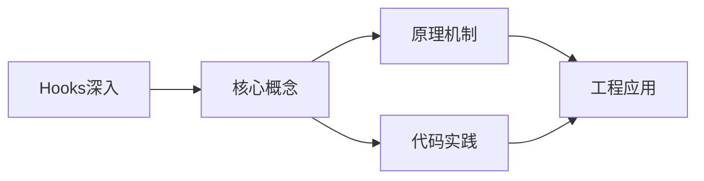
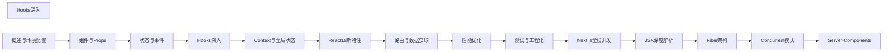

## 1. 学习目标（Bloom 分类）

本节按照布鲁姆教育目标分类学组织学习路径。本文主题为《Hooks深入》，属于 React 模块，读者可以根据自身阶段选择阅读深度。

记忆层面：能够准确复述本文的核心概念、术语与基本语法或操作步骤，并能够在提问或检索时快速定位对应知识点。能够说出 React 的核心概念、术语与标准写法。

理解层面：能够用自己的语言解释核心原理与工作机制，说明概念之间的因果关系，而不是机械记忆结论。能够解释 React 的工作原理与设计动机。

应用层面：能够在真实项目或练习场景中运用本文知识解决具体问题，写出正确且可维护的实现。能够编写符合 React 规范的完整实现。

分析层面：能够拆解复杂问题，比较本文主题与相邻概念的异同，识别边界条件与例外情况。能够分析 React 与相邻方案的差异与边界。

评价层面：能够根据约束条件（性能、可读性、安全、成本）评价不同方案的优劣，做出有依据的技术决策。能够根据场景评价 React 相关方案的优劣。

创造层面：能够把本文知识与其他模块知识组合，设计出新的解决方案或可复用的工程模式。能够组合 React 与其他技术设计完整方案。

通过本节学习，读者应当能够把《Hooks深入》纳入自己的知识网络，并与 React 模块的其他主题（组件、Hooks、状态管理、渲染性能）建立关联。

## 2. 历史动机与发展脉络

《Hooks深入》是 React 领域的重要主题。要真正理解它，需要先了解它解决的问题与演进过程。

React 由 Facebook 于 2013 年开源，核心思想是组件化 UI 与声明式渲染；2019 年 React 16.8 引入 Hooks，函数组件成为主流。
React 19（2024）引入 Actions、useOptimistic、编译器（React Compiler）自动记忆化；并发特性（Suspense、Transitions）持续完善。
生态：Next.js/Remix 全栈框架、TanStack Query 服务端状态、Zustand/Redux 客户端状态、React Native 移动端。

回到本文主题：Hooks深入 的提出与成熟，正是上述技术背景下的必然产物。早期实现往往以简单可用为目标，随着工程规模扩大，社区逐渐沉淀出标准做法与最佳实践；理解这一脉络，可以帮助读者判断“为什么文档中的推荐写法是现在这个样子”，也能在遇到历史遗留代码时准确识别其设计年代与取舍。


## 3. 形式化定义与核心概念精讲

本节把《Hooks深入》涉及的核心概念以“定义 + 讲解”的形式展开。读者应把定义当作工具，把讲解当作理解路径；两者结合才能形成可迁移的知识。

组件模型：props 输入、state 内部状态、渲染输出 JSX；组件是纯函数，同一输入必得同一输出。
Hooks 规则：只能在顶层调用（不可在条件/循环中），函数组件与自定义 Hook 内使用；依赖数组决定 effect 重跑。
渲染与协调：setState 触发重渲染，虚拟 DOM diff 更新真实 DOM；key 帮助复用元素。

### 3.1 原文章节逐一精讲

原文档把主题拆分为 20 个小节，下面按顺序给出每一节的导读讲解，随后保留原文细节供精读。

#### 原文精读（完整保留）

# 核心 Hooks 语法速查手册

> **符号约定**:`< >` 必填参数 | `[ ]` 可选参数

---

#### 1. useEffect

`useEffect` 用于处理副作用：数据获取、DOM 操作、订阅、定时器等。

##### 1.1 基本用法与生命周期

```tsx
import { useEffect, useState } from 'react';

function DataFetcher({ url }: { url: string }) {
  const [data, setData] = useState(null);

  // 每次渲染后执行
  useEffect(() => {
    fetch(url)
      .then((res) => res.json())
      .then(setData);
  }); //  无依赖数组，每次渲染都执行

  return <div>{JSON.stringify(data)}</div>;
}
```

##### 1.2 依赖数组

```tsx
// 空依赖 — 仅挂载时执行（相当于 componentDidMount）
useEffect(() => {
  console.log('组件挂载');
}, []);

// 有依赖 — 依赖变化时执行
useEffect(() => {
  console.log('userId 变化：', userId);
}, [userId]);

// 无依赖 — 每次渲染后执行
useEffect(() => {
  console.log('每次渲染后执行');
});
```

##### 1.3 清理函数

```tsx
function ChatRoom({ roomId }: { roomId: string }) {
  useEffect(() => {
    const connection = createConnection(roomId);
    connection.connect();

    // 清理函数：组件卸载或依赖变化前执行
    return () => {
      connection.disconnect();
    };
  }, [roomId]);

  return <div>聊天室：{roomId}</div>;
}
```

##### 1.4 常见副作用模式

```tsx
function UserProfile({ userId }: { userId: string }) {
  const [user, setUser] = useState<User | null>(null);

  // 数据获取
  useEffect(() => {
    let cancelled = false;

    async function fetchUser() {
      const response = await fetch(`/api/users/${userId}`);
      const data = await response.json();
      if (!cancelled) {
        setUser(data);
      }
    }

    fetchUser();

    return () => {
      cancelled = true; // 防止竞态条件
    };
  }, [userId]);

  // 事件监听
  useEffect(() => {
    const handleResize = () => {
      console.log('窗口大小变化');
    };

    window.addEventListener('resize', handleResize);
    return () => window.removeEventListener('resize', handleResize);
  }, []);

  // 定时器
  useEffect(() => {
    const timer = setInterval(() => {
      console.log('定时执行');
    }, 1000);

    return () => clearInterval(timer);
  }, []);

  return <div>{user?.name}</div>;
}
```

##### 1.5 useEffect 的执行时机

React 18+ 中 `useEffect` 在**渲染提交到屏幕之后**异步执行。如果需要同步执行副作用（如测量 DOM 布局），使用 `useLayoutEffect`：

```tsx
import { useLayoutEffect, useRef } from 'react';

function Tooltip() {
  const ref = useRef<HTMLDivElement>(null);

  useLayoutEffect(() => {
    // 在浏览器绘制前同步执行，避免闪烁
    const { height } = ref.current!.getBoundingClientRect();
    ref.current!.style.top = `${-height}px`;
  }, []);

  return <div ref={ref}>提示内容</div>;
}
```

#### 2. useRef

`useRef` 返回一个可变的 ref 对象，其 `.current` 属性可以持有任何值，且**变更不会触发重渲染**。

##### 2.1 访问 DOM 元素

```tsx
function TextInputWithFocus() {
  const inputRef = useRef<HTMLInputElement>(null);

  const focusInput = () => {
    inputRef.current?.focus();
  };

  return (
    <div>
      <input ref={inputRef} type="text" />
      <button onClick={focusInput}>聚焦输入框</button>
    </div>
  );
}
```

##### 2.2 保存可变值

```tsx
function Timer() {
  const [count, setCount] = useState(0);
  const timerRef = useRef<ReturnType<typeof setInterval>>();

  useEffect(() => {
    timerRef.current = setInterval(() => {
      setCount((c) => c + 1);
    }, 1000);

    return () => clearInterval(timerRef.current);
  }, []);

  const pause = () => clearInterval(timerRef.current);

  return (
    <div>
      <p>{count}</p>
      <button onClick={pause}>暂停</button>
    </div>
  );
}
```

##### 2.3 保存前一次渲染的值

```tsx
function usePrevious<T>(value: T): T | undefined {
  const ref = useRef<T>();

  useEffect(() => {
    ref.current = value;
  }, [value]);

  return ref.current;
}

// 使用
function Counter() {
  const [count, setCount] = useState(0);
  const prevCount = usePrevious(count);

  return (
    <div>
      <p>
        当前：{count}，上一次：{prevCount}
      </p>
      <button onClick={() => setCount((c) => c + 1)}>+1</button>
    </div>
  );
}
```

##### 2.4 React 19 中的 ref 改进

React 19 中 `ref` 可以作为 prop 直接传递，不再需要 `forwardRef`：

```tsx
// React 18 — 需要 forwardRef
const Input = forwardRef<HTMLInputElement, InputProps>((props, ref) => (
  <input ref={ref} {...props} />
));

// React 19 — ref 作为普通 prop
function Input({ ref, ...props }: InputProps & { ref?: React.Ref<HTMLInputElement> }) {
  return <input ref={ref} {...props} />;
}
```

#### 3. useMemo

`useMemo` 缓存计算结果，仅在依赖变化时重新计算。

##### 3.1 基本用法

```tsx
import { useMemo } from 'react';

function ExpensiveList({ items, filter }: { items: Item[]; filter: string }) {
  // 仅在 items 或 filter 变化时重新计算
  const filteredItems = useMemo(() => {
    console.log('重新过滤');
    return items.filter((item) => item.name.includes(filter));
  }, [items, filter]);

  return (
    <ul>
      {filteredItems.map((item) => (
        <li key={item.id}>{item.name}</li>
      ))}
    </ul>
  );
}
```

##### 3.2 何时使用 useMemo

```tsx
//  场景一：昂贵计算
const sortedData = useMemo(() => {
  return [...data].sort((a, b) => a.name.localeCompare(b.name));
}, [data]);

//  场景二：引用相等性（作为其他 Hook 的依赖或传给 memo 组件）
const options = useMemo(() => ({ pageSize: 10, sortBy: 'name' }), []);

//  场景三：创建对象/数组避免每次渲染创建新引用
const style = useMemo(() => ({ color: 'red', fontSize: 16 }), []);

//  不需要 useMemo：简单计算
const sum = a + b; // 直接计算即可

//  不需要 useMemo：原始值
const name = 'hello'; // 原始值天然引用稳定
```

#### 4. useCallback

`useCallback` 缓存函数引用，仅在依赖变化时创建新函数。

##### 4.1 基本用法

```tsx
import { useCallback } from 'react';

function ProductList({ products }: { products: Product[] }) {
  const [selectedId, setSelectedId] = useState<string | null>(null);

  // 缓存回调函数，避免每次渲染创建新函数
  const handleSelect = useCallback((id: string) => {
    setSelectedId(id);
  }, []);

  return (
    <div>
      {products.map((product) => (
        <ProductCard
          key={product.id}
          product={product}
          onSelect={handleSelect}
          isSelected={product.id === selectedId}
        />
      ))}
    </div>
  );
}

// 配合 React.memo 使用
const ProductCard = React.memo(({ product, onSelect, isSelected }: ProductCardProps) => {
  return (
    <div className={isSelected ? 'selected' : ''} onClick={() => onSelect(product.id)}>
      {product.name}
    </div>
  );
});
```

##### 4.2 useCallback vs useMemo

```tsx
// useCallback — 缓存函数
const handleClick = useCallback(() => {
  setCount((c) => c + 1);
}, []);

// 等价于 useMemo — 缓存函数
const handleClick = useMemo(
  () => () => {
    setCount((c) => c + 1);
  },
  []
);
```

> **提示**：在 React 19 中，编译器（React Compiler）可以自动优化这些场景，减少手动使用 `useMemo`/`useCallback` 的需求。

#### 5. useContext

`useContext` 用于消费 Context 值，详见 [Context与全局状态](./Context与全局状态.md)。

```tsx
import { createContext, useContext } from 'react';

const ThemeContext = createContext<'light' | 'dark'>('light');

function ThemedButton() {
  const theme = useContext(ThemeContext);
  return <button className={`btn-${theme}`}>主题按钮</button>;
}
```

#### 6. 自定义 Hook

自定义 Hook 是以 `use` 开头的函数，用于提取和复用组件逻辑。

##### 6.1 命名与规范

- 函数名必须以 `use` 开头（如 `useAuth`、`useFetch`）
- 内部可以调用其他 Hook
- 遵循 Hooks 规则

##### 6.2 常用自定义 Hook 示例

```tsx
// useFetch — 数据获取
function useFetch<T>(url: string) {
  const [data, setData] = useState<T | null>(null);
  const [loading, setLoading] = useState(true);
  const [error, setError] = useState<Error | null>(null);

  useEffect(() => {
    let cancelled = false;
    setLoading(true);

    fetch(url)
      .then((res) => {
        if (!res.ok) throw new Error(`HTTP ${res.status}`);
        return res.json();
      })
      .then((json) => {
        if (!cancelled) {
          setData(json);
          setError(null);
        }
      })
      .catch((err) => {
        if (!cancelled) setError(err);
      })
      .finally(() => {
        if (!cancelled) setLoading(false);
      });

    return () => {
      cancelled = true;
    };
  }, [url]);

  return { data, loading, error };
}

// 使用
function UserPage({ userId }: { userId: string }) {
  const { data: user, loading, error } = useFetch<User>(`/api/users/${userId}`);

  if (loading) return <Spinner />;
  if (error) return <Error message={error.message} />;
  return <div>{user!.name}</div>;
}
```

```tsx
// useLocalStorage — 持久化状态
function useLocalStorage<T>(key: string, initialValue: T) {
  const [storedValue, setStoredValue] = useState<T>(() => {
    try {
      const item = window.localStorage.getItem(key);
      return item ? (JSON.parse(item) as T) : initialValue;
    } catch {
      return initialValue;
    }
  });

  const setValue = (value: T | ((val: T) => T)) => {
    const valueToStore = value instanceof Function ? value(storedValue) : value;
    setStoredValue(valueToStore);
    window.localStorage.setItem(key, JSON.stringify(valueToStore));
  };

  return [storedValue, setValue] as const;
}
```

```tsx
// useDebounce — 防抖
function useDebounce<T>(value: T, delay: number): T {
  const [debouncedValue, setDebouncedValue] = useState(value);

  useEffect(() => {
    const timer = setTimeout(() => setDebouncedValue(value), delay);
    return () => clearTimeout(timer);
  }, [value, delay]);

  return debouncedValue;
}

// 使用
function SearchInput() {
  const [query, setQuery] = useState('');
  const debouncedQuery = useDebounce(query, 300);

  useEffect(() => {
    if (debouncedQuery) {
      // 发起搜索请求
      searchAPI(debouncedQuery);
    }
  }, [debouncedQuery]);

  return <input value={query} onChange={(e) => setQuery(e.target.value)} />;
}
```

```tsx
// useToggle — 布尔切换
function useToggle(initial = false): [boolean, () => void] {
  const [value, setValue] = useState(initial);
  const toggle = useCallback(() => setValue((v) => !v), []);
  return [value, toggle];
}
```

#### 7. Hooks 规则

##### 7.1 两条核心规则

1. **只在顶层调用 Hook** — 不要在循环、条件或嵌套函数中调用
2. **只在 React 函数中调用 Hook** — 函数组件或自定义 Hook 中

```tsx
//  错误：在条件中调用 Hook
function BadComponent({ isLoggedIn }: { isLoggedIn: boolean }) {
  if (isLoggedIn) {
    const [user, setUser] = useState(null); // 违反规则
  }
}

//  正确：将条件放在 Hook 内部
function GoodComponent({ isLoggedIn }: { isLoggedIn: boolean }) {
  const [user, setUser] = useState(null);

  useEffect(() => {
    if (isLoggedIn) {
      fetchUser().then(setUser);
    }
  }, [isLoggedIn]);
}
```

##### 7.2 ESLint 规则

安装 `eslint-plugin-react-hooks` 自动检查：

```bash
npm install -D eslint-plugin-react-hooks
```

```json
{
  "plugins": ["react-hooks"],
  "rules": {
    "react-hooks/rules-of-hooks": "error",
    "react-hooks/exhaustive-deps": "warn"
  }
}
```

#### 8. 常见陷阱

##### 8.1 闭包陷阱（Stale Closure）

```tsx
//  错误：定时器中的 count 是闭包捕获的旧值
function Counter() {
  const [count, setCount] = useState(0);

  useEffect(() => {
    const timer = setInterval(() => {
      console.log(count); // 永远是 0
      setCount(count + 1); // 永远设置为 1
    }, 1000);
    return () => clearInterval(timer);
  }, []); // 空依赖，count 被闭包捕获为 0

  return <p>{count}</p>;
}

//  正确：使用函数式更新
function Counter() {
  const [count, setCount] = useState(0);

  useEffect(() => {
    const timer = setInterval(() => {
      setCount((c) => c + 1); // 始终基于最新值
    }, 1000);
    return () => clearInterval(timer);
  }, []);

  return <p>{count}</p>;
}
```

##### 8.2 无限循环

```tsx
//  错误：每次渲染都创建新对象，导致 useEffect 无限触发
useEffect(() => {
  doSomething({ name: 'test' });
}, [{ name: 'test' }]); // 每次渲染都是新对象

//  正确：提取到组件外部或使用 useMemo
const options = useMemo(() => ({ name: 'test' }), []);
useEffect(() => {
  doSomething(options);
}, [options]);
```

##### 8.3 依赖遗漏

```tsx
//  错误：缺少依赖
useEffect(() => {
  fetchData(userId); // userId 变化时不会重新执行
}, []); // 缺少 userId

//  正确：添加所有依赖
useEffect(() => {
  fetchData(userId);
}, [userId]);
```

##### 8.4 对象依赖比较

```tsx
//  对象引用每次都不同
const obj = { a: 1, b: 2 };
useEffect(() => {
  /* ... */
}, [obj]); // 每次渲染都执行

//  方式一：拆分为原始值依赖
useEffect(() => {
  /* ... */
}, [obj.a, obj.b]);

//  方式二：useMemo 缓存对象
const memoizedObj = useMemo(() => ({ a: 1, b: 2 }), []);
useEffect(() => {
  /* ... */
}, [memoizedObj]);
```
#### useState 状态钩子

**useState**
`const [<state>, <setState>] = useState(<initialValue>);`
```tsx
const [count, setCount] = useState(0);
setCount(count + 1);
setCount(prev => prev + 1);
```

**useState 泛型**
`const [<state>, <setState>] = useState<<T>>(<initialValue>);`
```tsx
const [user, setUser] = useState<User | null>(null);
```

---

#### useEffect 副作用钩子

**useEffect 基础**
`useEffect(() => { [<cleanup>] }, [<deps>]);`
```tsx
useEffect(() => {
  const id = setInterval(tick, 1000);
  return () => clearInterval(id);
}, []);
```

**useEffect 依赖数组**
```tsx
useEffect(() => {
  fetchUser(id);
}, [id]);

useEffect(() => {
  syncToLocalStorage(data);
}, [data]);
```

---

#### useRef 引用钩子

**useRef 可变引用**
`const <ref> = useRef<<T>>(<initialValue>);`
```tsx
const countRef = useRef(0);
countRef.current++;
```

**useRef DOM 引用**
`const <ref> = useRef<<Element>>(null);`
```tsx
const inputRef = useRef<HTMLInputElement>(null);
useEffect(() => inputRef.current?.focus(), []);
<input ref={inputRef} />;
```

---

#### useMemo 计算缓存

**useMemo**
`const <value> = useMemo(() => <compute>, [<deps>]);`
```tsx
const sorted = useMemo(() => list.sort(), [list]);
const total = useMemo(() => items.reduce((s, i) => s + i.price, 0), [items]);
```

---

#### useCallback 函数缓存

**useCallback**
`const <handler> = useCallback((<args>) => <fn>, [<deps>]);`
```tsx
const handleClick = useCallback((id: string) => {
  select(id);
}, [select]);
```

---

#### useContext 上下文钩子

**useContext**
`const <value> = useContext<<T>>(<Context>);`
```tsx
const theme = useContext(ThemeContext);
const user = useContext(UserContext) as User;
```

---

#### useReducer 复杂状态

**useReducer**
`const [<state>, <dispatch>] = useReducer(<reducer>, <initialState>, [<init>]);`
```tsx
type State = { count: number };
type Action = { type: 'inc' } | { type: 'dec' };

const reducer = (state: State, action: Action) => {
  switch (action.type) {
    case 'inc': return { count: state.count + 1 };
    case 'dec': return { count: state.count - 1 };
  }
};

const [state, dispatch] = useReducer(reducer, { count: 0 });
dispatch({ type: 'inc' });
```

**useReducer 惰性初始化**
`useReducer(<reducer>, <initialArgs>, <init>);`
```tsx
const [state, dispatch] = useReducer(reducer, { count: 0 }, (init) => ({
  count: init.count * 2,
}));
```

---

#### useImperativeHandle 暴露方法

**useImperativeHandle**
`useImperativeHandle(<ref>, () => <handle>, [<deps>]);`
```tsx
const FancyInput = forwardRef<HTMLInputElement, Props>((props, ref) => {
  const inputRef = useRef<HTMLInputElement>(null);
  useImperativeHandle(ref, () => ({
    focus: () => inputRef.current?.focus(),
    clear: () => { if (inputRef.current) inputRef.current.value = ''; },
  }), []);
  return <input ref={inputRef} />;
});
```

---

#### useLayoutEffect 同步布局

**useLayoutEffect**
`useLayoutEffect(() => { [<cleanup>] }, [<deps>]);`
```tsx
useLayoutEffect(() => {
  const rect = el.getBoundingClientRect();
  setOffset(rect.top);
}, [el]);
```

---

#### useTransition 过渡更新

**useTransition**
`const [<isPending>, <startTransition>] = useTransition();`
```tsx
const [isPending, startTransition] = useTransition();

const handleTab = (tab: string) => {
  startTransition(() => {
    setActiveTab(tab);
  });
};
```

---

#### useDeferredValue 延迟值

**useDeferredValue**
`const <deferredValue> = useDeferredValue(<value>);`
```tsx
const deferredQuery = useDeferredValue(query);
const filtered = useMemo(() => filter(deferredQuery), [deferredQuery]);
```

---

#### useId 唯一标识

**useId**
`const <id> = useId();`
```tsx
const id = useId();
<label htmlFor={id}>Email</label>
<input id={id} type="email" />
```

**useId 前缀**
```tsx
const id = useId();
const emailId = `${id}-email`;
const passwordId = `${id}-password`;
```


### 3.2 概念关系图

下面用 Mermaid 图表达本文核心概念之间的关系，帮助读者建立整体图景：



图中展示的是本文知识的结构化关系：核心概念是入口，原理机制解释“为什么”，代码实践演示“怎么做”，工程应用回答“何时用”。读者学习时可以把每个小节的内容挂接到对应节点上。

## 4. 理论推导与原理解析

本节深入《Hooks深入》背后的原理。理论部分不求面面俱到，而是聚焦“能解释现象、能指导实践”的关键推导。

组件模型：props 输入、state 内部状态、渲染输出 JSX；组件是纯函数，同一输入必得同一输出。
Hooks 规则：只能在顶层调用（不可在条件/循环中），函数组件与自定义 Hook 内使用；依赖数组决定 effect 重跑。
渲染与协调：setState 触发重渲染，虚拟 DOM diff 更新真实 DOM；key 帮助复用元素。
状态提升与下放：共享状态提升到最近公共祖先；Context 跨层传递（Provider/useContext）。

需要强调的是，理论推导与工程实践之间存在翻译层：理论给出的是理想化模型与边界条件，工程代码则必须处理真实环境中的例外。读者在学习时应先掌握理论的“标准情形”，再通过陷阱章节了解“非标准情形”。

## 5. 代码示例与逐行讲解

本节把原文中的代码示例系统整理，并为每个示例补充用途说明与讲解。读者不应只浏览代码，而应逐段对照讲解理解设计意图。

### 5.1 示例：1.1 基本用法与生命周期

该示例来自原文《1.1 基本用法与生命周期》小节，用于演示Hooks深入相关操作。阅读时请先看代码结构，再看其后的讲解。

```tsx
import { useEffect, useState } from 'react';

function DataFetcher({ url }: { url: string }) {
  const [data, setData] = useState(null);

  // 每次渲染后执行
  useEffect(() => {
    fetch(url)
      .then((res) => res.json())
      .then(setData);
  }); //  无依赖数组，每次渲染都执行

  return <div>{JSON.stringify(data)}</div>;
}
```

讲解：这段代码演示了本节核心知识点。代码中的关键操作可以归纳为三步：准备（定义或初始化）、执行（核心逻辑）、收尾（释放资源或返回结果）。实际项目中，这三步往往被封装为函数或类，以提升复用性与可测试性。

关键点分析：

该示例共 11 行有效代码，包含 4 类关键结构（function、import、from、return）。其中：

- 入口与初始化部分负责建立上下文，对应实际项目中的启动或装配逻辑；
- 核心逻辑部分体现本文主题的主要操作，是阅读时最需要对照讲解理解的部分；
- 输出或返回部分把结果交给调用方，注意其类型与边界条件。

进阶思考路径：先尝试修改参数观察行为变化，再把示例中的模式迁移到自己的项目中；每次修改都记录预期与实测差异，这是把示例转化为能力的最快方式。

### 5.2 示例：1.2 依赖数组

该示例来自原文《1.2 依赖数组》小节，用于演示Hooks深入相关操作。阅读时请先看代码结构，再看其后的讲解。

```tsx
// 空依赖 — 仅挂载时执行（相当于 componentDidMount）
useEffect(() => {
  console.log('组件挂载');
}, []);

// 有依赖 — 依赖变化时执行
useEffect(() => {
  console.log('userId 变化：', userId);
}, [userId]);

// 无依赖 — 每次渲染后执行
useEffect(() => {
  console.log('每次渲染后执行');
});
```

讲解：这段代码演示了本节核心知识点。代码中的关键操作可以归纳为三步：准备（定义或初始化）、执行（核心逻辑）、收尾（释放资源或返回结果）。实际项目中，这三步往往被封装为函数或类，以提升复用性与可测试性。

关键点分析：

该示例共 12 行有效代码，结构以数据或配置为主。阅读时应关注：数据字段的含义、配置项的作用，以及它们与运行行为的对应关系。

进阶思考路径：先尝试修改参数观察行为变化，再把示例中的模式迁移到自己的项目中；每次修改都记录预期与实测差异，这是把示例转化为能力的最快方式。

### 5.3 示例：1.3 清理函数

该示例来自原文《1.3 清理函数》小节，用于演示Hooks深入相关操作。阅读时请先看代码结构，再看其后的讲解。

```tsx
function ChatRoom({ roomId }: { roomId: string }) {
  useEffect(() => {
    const connection = createConnection(roomId);
    connection.connect();

    // 清理函数：组件卸载或依赖变化前执行
    return () => {
      connection.disconnect();
    };
  }, [roomId]);

  return <div>聊天室：{roomId}</div>;
}
```

讲解：这段代码演示了本节核心知识点。代码中的关键操作可以归纳为三步：准备（定义或初始化）、执行（核心逻辑）、收尾（释放资源或返回结果）。实际项目中，这三步往往被封装为函数或类，以提升复用性与可测试性。

关键点分析：

该示例共 11 行有效代码，包含 2 类关键结构（function、return）。其中：

- 入口与初始化部分负责建立上下文，对应实际项目中的启动或装配逻辑；
- 核心逻辑部分体现本文主题的主要操作，是阅读时最需要对照讲解理解的部分；
- 输出或返回部分把结果交给调用方，注意其类型与边界条件。

进阶思考路径：先尝试修改参数观察行为变化，再把示例中的模式迁移到自己的项目中；每次修改都记录预期与实测差异，这是把示例转化为能力的最快方式。

### 5.4 示例：1.4 常见副作用模式

该示例来自原文《1.4 常见副作用模式》小节，用于演示Hooks深入相关操作。阅读时请先看代码结构，再看其后的讲解。

```tsx
function UserProfile({ userId }: { userId: string }) {
  const [user, setUser] = useState<User | null>(null);

  // 数据获取
  useEffect(() => {
    let cancelled = false;

    async function fetchUser() {
      const response = await fetch(`/api/users/${userId}`);
      const data = await response.json();
      if (!cancelled) {
        setUser(data);
      }
    }

    fetchUser();

    return () => {
      cancelled = true; // 防止竞态条件
    };
  }, [userId]);

  // 事件监听
  useEffect(() => {
    const handleResize = () => {
      console.log('窗口大小变化');
    };

    window.addEventListener('resize', handleResize);
    return () => window.removeEventListener('resize', handleResize);
  }, []);

  // 定时器
  useEffect(() => {
    const timer = setInterval(() => {
      console.log('定时执行');
    }, 1000);

    return () => clearInterval(timer);
  }, []);

  return <div>{user?.name}</div>;
}
```

讲解：这段代码演示了本节核心知识点。代码中的关键操作可以归纳为三步：准备（定义或初始化）、执行（核心逻辑）、收尾（释放资源或返回结果）。实际项目中，这三步往往被封装为函数或类，以提升复用性与可测试性。

关键点分析：

该示例共 34 行有效代码，包含 3 类关键结构（function、if、return）。其中：

- 入口与初始化部分负责建立上下文，对应实际项目中的启动或装配逻辑；
- 核心逻辑部分体现本文主题的主要操作，是阅读时最需要对照讲解理解的部分；
- 输出或返回部分把结果交给调用方，注意其类型与边界条件。

进阶思考路径：先尝试修改参数观察行为变化，再把示例中的模式迁移到自己的项目中；每次修改都记录预期与实测差异，这是把示例转化为能力的最快方式。

### 5.5 示例：1.5 useEffect 的执行时机

该示例来自原文《1.5 useEffect 的执行时机》小节，用于演示Hooks深入相关操作。阅读时请先看代码结构，再看其后的讲解。

```tsx
import { useLayoutEffect, useRef } from 'react';

function Tooltip() {
  const ref = useRef<HTMLDivElement>(null);

  useLayoutEffect(() => {
    // 在浏览器绘制前同步执行，避免闪烁
    const { height } = ref.current!.getBoundingClientRect();
    ref.current!.style.top = `${-height}px`;
  }, []);

  return <div ref={ref}>提示内容</div>;
}
```

讲解：这段代码演示了本节核心知识点。代码中的关键操作可以归纳为三步：准备（定义或初始化）、执行（核心逻辑）、收尾（释放资源或返回结果）。实际项目中，这三步往往被封装为函数或类，以提升复用性与可测试性。

关键点分析：

该示例共 10 行有效代码，包含 4 类关键结构（function、import、from、return）。其中：

- 入口与初始化部分负责建立上下文，对应实际项目中的启动或装配逻辑；
- 核心逻辑部分体现本文主题的主要操作，是阅读时最需要对照讲解理解的部分；
- 输出或返回部分把结果交给调用方，注意其类型与边界条件。

进阶思考路径：先尝试修改参数观察行为变化，再把示例中的模式迁移到自己的项目中；每次修改都记录预期与实测差异，这是把示例转化为能力的最快方式。

### 5.6 示例：2.1 访问 DOM 元素

该示例来自原文《2.1 访问 DOM 元素》小节，用于演示Hooks深入相关操作。阅读时请先看代码结构，再看其后的讲解。

```tsx
function TextInputWithFocus() {
  const inputRef = useRef<HTMLInputElement>(null);

  const focusInput = () => {
    inputRef.current?.focus();
  };

  return (
    <div>
      <input ref={inputRef} type="text" />
      <button onClick={focusInput}>聚焦输入框</button>
    </div>
  );
}
```

讲解：这段代码演示了本节核心知识点。代码中的关键操作可以归纳为三步：准备（定义或初始化）、执行（核心逻辑）、收尾（释放资源或返回结果）。实际项目中，这三步往往被封装为函数或类，以提升复用性与可测试性。

关键点分析：

该示例共 12 行有效代码，包含 2 类关键结构（function、return）。其中：

- 入口与初始化部分负责建立上下文，对应实际项目中的启动或装配逻辑；
- 核心逻辑部分体现本文主题的主要操作，是阅读时最需要对照讲解理解的部分；
- 输出或返回部分把结果交给调用方，注意其类型与边界条件。

进阶思考路径：先尝试修改参数观察行为变化，再把示例中的模式迁移到自己的项目中；每次修改都记录预期与实测差异，这是把示例转化为能力的最快方式。

### 5.7 示例：2.2 保存可变值

该示例来自原文《2.2 保存可变值》小节，用于演示Hooks深入相关操作。阅读时请先看代码结构，再看其后的讲解。

```tsx
function Timer() {
  const [count, setCount] = useState(0);
  const timerRef = useRef<ReturnType<typeof setInterval>>();

  useEffect(() => {
    timerRef.current = setInterval(() => {
      setCount((c) => c + 1);
    }, 1000);

    return () => clearInterval(timerRef.current);
  }, []);

  const pause = () => clearInterval(timerRef.current);

  return (
    <div>
      <p>{count}</p>
      <button onClick={pause}>暂停</button>
    </div>
  );
}
```

讲解：这段代码演示了本节核心知识点。代码中的关键操作可以归纳为三步：准备（定义或初始化）、执行（核心逻辑）、收尾（释放资源或返回结果）。实际项目中，这三步往往被封装为函数或类，以提升复用性与可测试性。

关键点分析：

该示例共 17 行有效代码，包含 2 类关键结构（function、return）。其中：

- 入口与初始化部分负责建立上下文，对应实际项目中的启动或装配逻辑；
- 核心逻辑部分体现本文主题的主要操作，是阅读时最需要对照讲解理解的部分；
- 输出或返回部分把结果交给调用方，注意其类型与边界条件。

进阶思考路径：先尝试修改参数观察行为变化，再把示例中的模式迁移到自己的项目中；每次修改都记录预期与实测差异，这是把示例转化为能力的最快方式。

### 5.8 示例：2.3 保存前一次渲染的值

该示例来自原文《2.3 保存前一次渲染的值》小节，用于演示Hooks深入相关操作。阅读时请先看代码结构，再看其后的讲解。

```tsx
function usePrevious<T>(value: T): T | undefined {
  const ref = useRef<T>();

  useEffect(() => {
    ref.current = value;
  }, [value]);

  return ref.current;
}

// 使用
function Counter() {
  const [count, setCount] = useState(0);
  const prevCount = usePrevious(count);

  return (
    <div>
      <p>
        当前：{count}，上一次：{prevCount}
      </p>
      <button onClick={() => setCount((c) => c + 1)}>+1</button>
    </div>
  );
}
```

讲解：这段代码演示了本节核心知识点。代码中的关键操作可以归纳为三步：准备（定义或初始化）、执行（核心逻辑）、收尾（释放资源或返回结果）。实际项目中，这三步往往被封装为函数或类，以提升复用性与可测试性。

关键点分析：

该示例共 20 行有效代码，包含 2 类关键结构（function、return）。其中：

- 入口与初始化部分负责建立上下文，对应实际项目中的启动或装配逻辑；
- 核心逻辑部分体现本文主题的主要操作，是阅读时最需要对照讲解理解的部分；
- 输出或返回部分把结果交给调用方，注意其类型与边界条件。

进阶思考路径：先尝试修改参数观察行为变化，再把示例中的模式迁移到自己的项目中；每次修改都记录预期与实测差异，这是把示例转化为能力的最快方式。

### 5.9 示例：2.4 React 19 中的 ref 改进

该示例来自原文《2.4 React 19 中的 ref 改进》小节，用于演示Hooks深入相关操作。阅读时请先看代码结构，再看其后的讲解。

```tsx
// React 18 — 需要 forwardRef
const Input = forwardRef<HTMLInputElement, InputProps>((props, ref) => (
  <input ref={ref} {...props} />
));

// React 19 — ref 作为普通 prop
function Input({ ref, ...props }: InputProps & { ref?: React.Ref<HTMLInputElement> }) {
  return <input ref={ref} {...props} />;
}
```

讲解：这段代码演示了本节核心知识点。代码中的关键操作可以归纳为三步：准备（定义或初始化）、执行（核心逻辑）、收尾（释放资源或返回结果）。实际项目中，这三步往往被封装为函数或类，以提升复用性与可测试性。

关键点分析：

该示例共 8 行有效代码，包含 2 类关键结构（function、return）。其中：

- 入口与初始化部分负责建立上下文，对应实际项目中的启动或装配逻辑；
- 核心逻辑部分体现本文主题的主要操作，是阅读时最需要对照讲解理解的部分；
- 输出或返回部分把结果交给调用方，注意其类型与边界条件。

进阶思考路径：先尝试修改参数观察行为变化，再把示例中的模式迁移到自己的项目中；每次修改都记录预期与实测差异，这是把示例转化为能力的最快方式。

### 5.10 示例：3.1 基本用法

该示例来自原文《3.1 基本用法》小节，用于演示Hooks深入相关操作。阅读时请先看代码结构，再看其后的讲解。

```tsx
import { useMemo } from 'react';

function ExpensiveList({ items, filter }: { items: Item[]; filter: string }) {
  // 仅在 items 或 filter 变化时重新计算
  const filteredItems = useMemo(() => {
    console.log('重新过滤');
    return items.filter((item) => item.name.includes(filter));
  }, [items, filter]);

  return (
    <ul>
      {filteredItems.map((item) => (
        <li key={item.id}>{item.name}</li>
      ))}
    </ul>
  );
}
```

讲解：这段代码演示了本节核心知识点。代码中的关键操作可以归纳为三步：准备（定义或初始化）、执行（核心逻辑）、收尾（释放资源或返回结果）。实际项目中，这三步往往被封装为函数或类，以提升复用性与可测试性。

关键点分析：

该示例共 15 行有效代码，包含 4 类关键结构（function、import、from、return）。其中：

- 入口与初始化部分负责建立上下文，对应实际项目中的启动或装配逻辑；
- 核心逻辑部分体现本文主题的主要操作，是阅读时最需要对照讲解理解的部分；
- 输出或返回部分把结果交给调用方，注意其类型与边界条件。

进阶思考路径：先尝试修改参数观察行为变化，再把示例中的模式迁移到自己的项目中；每次修改都记录预期与实测差异，这是把示例转化为能力的最快方式。

### 5.11 示例：3.2 何时使用 useMemo

该示例来自原文《3.2 何时使用 useMemo》小节，用于演示Hooks深入相关操作。阅读时请先看代码结构，再看其后的讲解。

```tsx
//  场景一：昂贵计算
const sortedData = useMemo(() => {
  return [...data].sort((a, b) => a.name.localeCompare(b.name));
}, [data]);

//  场景二：引用相等性（作为其他 Hook 的依赖或传给 memo 组件）
const options = useMemo(() => ({ pageSize: 10, sortBy: 'name' }), []);

//  场景三：创建对象/数组避免每次渲染创建新引用
const style = useMemo(() => ({ color: 'red', fontSize: 16 }), []);

//  不需要 useMemo：简单计算
const sum = a + b; // 直接计算即可

//  不需要 useMemo：原始值
const name = 'hello'; // 原始值天然引用稳定
```

讲解：这段代码演示了本节核心知识点。代码中的关键操作可以归纳为三步：准备（定义或初始化）、执行（核心逻辑）、收尾（释放资源或返回结果）。实际项目中，这三步往往被封装为函数或类，以提升复用性与可测试性。

关键点分析：

该示例共 12 行有效代码，包含 1 类关键结构（return）。其中：

- 入口与初始化部分负责建立上下文，对应实际项目中的启动或装配逻辑；
- 核心逻辑部分体现本文主题的主要操作，是阅读时最需要对照讲解理解的部分；
- 输出或返回部分把结果交给调用方，注意其类型与边界条件。

进阶思考路径：先尝试修改参数观察行为变化，再把示例中的模式迁移到自己的项目中；每次修改都记录预期与实测差异，这是把示例转化为能力的最快方式。

### 5.12 示例：4.1 基本用法

该示例来自原文《4.1 基本用法》小节，用于演示Hooks深入相关操作。阅读时请先看代码结构，再看其后的讲解。

```tsx
import { useCallback } from 'react';

function ProductList({ products }: { products: Product[] }) {
  const [selectedId, setSelectedId] = useState<string | null>(null);

  // 缓存回调函数，避免每次渲染创建新函数
  const handleSelect = useCallback((id: string) => {
    setSelectedId(id);
  }, []);

  return (
    <div>
      {products.map((product) => (
        <ProductCard
          key={product.id}
          product={product}
          onSelect={handleSelect}
          isSelected={product.id === selectedId}
        />
      ))}
    </div>
  );
}

// 配合 React.memo 使用
const ProductCard = React.memo(({ product, onSelect, isSelected }: ProductCardProps) => {
  return (
    <div className={isSelected ? 'selected' : ''} onClick={() => onSelect(product.id)}>
      {product.name}
    </div>
  );
});
```

讲解：这段代码演示了本节核心知识点。代码中的关键操作可以归纳为三步：准备（定义或初始化）、执行（核心逻辑）、收尾（释放资源或返回结果）。实际项目中，这三步往往被封装为函数或类，以提升复用性与可测试性。

关键点分析：

该示例共 28 行有效代码，包含 5 类关键结构（class、function、import、from、return）。其中：

- 入口与初始化部分负责建立上下文，对应实际项目中的启动或装配逻辑；
- 核心逻辑部分体现本文主题的主要操作，是阅读时最需要对照讲解理解的部分；
- 输出或返回部分把结果交给调用方，注意其类型与边界条件。

进阶思考路径：先尝试修改参数观察行为变化，再把示例中的模式迁移到自己的项目中；每次修改都记录预期与实测差异，这是把示例转化为能力的最快方式。

### 5.13 示例：4.2 useCallback vs useMemo

该示例来自原文《4.2 useCallback vs useMemo》小节，用于演示Hooks深入相关操作。阅读时请先看代码结构，再看其后的讲解。

```tsx
// useCallback — 缓存函数
const handleClick = useCallback(() => {
  setCount((c) => c + 1);
}, []);

// 等价于 useMemo — 缓存函数
const handleClick = useMemo(
  () => () => {
    setCount((c) => c + 1);
  },
  []
);
```

讲解：这段代码演示了本节核心知识点。代码中的关键操作可以归纳为三步：准备（定义或初始化）、执行（核心逻辑）、收尾（释放资源或返回结果）。实际项目中，这三步往往被封装为函数或类，以提升复用性与可测试性。

关键点分析：

该示例共 11 行有效代码，结构以数据或配置为主。阅读时应关注：数据字段的含义、配置项的作用，以及它们与运行行为的对应关系。

进阶思考路径：先尝试修改参数观察行为变化，再把示例中的模式迁移到自己的项目中；每次修改都记录预期与实测差异，这是把示例转化为能力的最快方式。

### 5.14 示例：5. useContext

该示例来自原文《5. useContext》小节，用于演示Hooks深入相关操作。阅读时请先看代码结构，再看其后的讲解。

```tsx
import { createContext, useContext } from 'react';

const ThemeContext = createContext<'light' | 'dark'>('light');

function ThemedButton() {
  const theme = useContext(ThemeContext);
  return <button className={`btn-${theme}`}>主题按钮</button>;
}
```

讲解：这段代码演示了本节核心知识点。代码中的关键操作可以归纳为三步：准备（定义或初始化）、执行（核心逻辑）、收尾（释放资源或返回结果）。实际项目中，这三步往往被封装为函数或类，以提升复用性与可测试性。

关键点分析：

该示例共 6 行有效代码，包含 5 类关键结构（class、function、import、from、return）。其中：

- 入口与初始化部分负责建立上下文，对应实际项目中的启动或装配逻辑；
- 核心逻辑部分体现本文主题的主要操作，是阅读时最需要对照讲解理解的部分；
- 输出或返回部分把结果交给调用方，注意其类型与边界条件。

进阶思考路径：先尝试修改参数观察行为变化，再把示例中的模式迁移到自己的项目中；每次修改都记录预期与实测差异，这是把示例转化为能力的最快方式。

### 5.15 示例：6.2 常用自定义 Hook 示例

该示例来自原文《6.2 常用自定义 Hook 示例》小节，用于演示Hooks深入相关操作。阅读时请先看代码结构，再看其后的讲解。

```tsx
// useFetch — 数据获取
function useFetch<T>(url: string) {
  const [data, setData] = useState<T | null>(null);
  const [loading, setLoading] = useState(true);
  const [error, setError] = useState<Error | null>(null);

  useEffect(() => {
    let cancelled = false;
    setLoading(true);

    fetch(url)
      .then((res) => {
        if (!res.ok) throw new Error(`HTTP ${res.status}`);
        return res.json();
      })
      .then((json) => {
        if (!cancelled) {
          setData(json);
          setError(null);
        }
      })
      .catch((err) => {
        if (!cancelled) setError(err);
      })
      .finally(() => {
        if (!cancelled) setLoading(false);
      });

    return () => {
      cancelled = true;
    };
  }, [url]);

  return { data, loading, error };
}

// 使用
function UserPage({ userId }: { userId: string }) {
  const { data: user, loading, error } = useFetch<User>(`/api/users/${userId}`);

  if (loading) return <Spinner />;
  if (error) return <Error message={error.message} />;
  return <div>{user!.name}</div>;
}
```

讲解：这段代码演示了本节核心知识点。代码中的关键操作可以归纳为三步：准备（定义或初始化）、执行（核心逻辑）、收尾（释放资源或返回结果）。实际项目中，这三步往往被封装为函数或类，以提升复用性与可测试性。

关键点分析：

该示例共 38 行有效代码，包含 3 类关键结构（function、if、return）。其中：

- 入口与初始化部分负责建立上下文，对应实际项目中的启动或装配逻辑；
- 核心逻辑部分体现本文主题的主要操作，是阅读时最需要对照讲解理解的部分；
- 输出或返回部分把结果交给调用方，注意其类型与边界条件。

进阶思考路径：先尝试修改参数观察行为变化，再把示例中的模式迁移到自己的项目中；每次修改都记录预期与实测差异，这是把示例转化为能力的最快方式。

### 5.16 示例：6.2 常用自定义 Hook 示例

该示例来自原文《6.2 常用自定义 Hook 示例》小节，用于演示Hooks深入相关操作。阅读时请先看代码结构，再看其后的讲解。

```tsx
// useLocalStorage — 持久化状态
function useLocalStorage<T>(key: string, initialValue: T) {
  const [storedValue, setStoredValue] = useState<T>(() => {
    try {
      const item = window.localStorage.getItem(key);
      return item ? (JSON.parse(item) as T) : initialValue;
    } catch {
      return initialValue;
    }
  });

  const setValue = (value: T | ((val: T) => T)) => {
    const valueToStore = value instanceof Function ? value(storedValue) : value;
    setStoredValue(valueToStore);
    window.localStorage.setItem(key, JSON.stringify(valueToStore));
  };

  return [storedValue, setValue] as const;
}
```

讲解：这段代码演示了本节核心知识点。代码中的关键操作可以归纳为三步：准备（定义或初始化）、执行（核心逻辑）、收尾（释放资源或返回结果）。实际项目中，这三步往往被封装为函数或类，以提升复用性与可测试性。

关键点分析：

该示例共 17 行有效代码，包含 2 类关键结构（function、return）。其中：

- 入口与初始化部分负责建立上下文，对应实际项目中的启动或装配逻辑；
- 核心逻辑部分体现本文主题的主要操作，是阅读时最需要对照讲解理解的部分；
- 输出或返回部分把结果交给调用方，注意其类型与边界条件。

进阶思考路径：先尝试修改参数观察行为变化，再把示例中的模式迁移到自己的项目中；每次修改都记录预期与实测差异，这是把示例转化为能力的最快方式。

### 5.17 示例：6.2 常用自定义 Hook 示例

该示例来自原文《6.2 常用自定义 Hook 示例》小节，用于演示Hooks深入相关操作。阅读时请先看代码结构，再看其后的讲解。

```tsx
// useDebounce — 防抖
function useDebounce<T>(value: T, delay: number): T {
  const [debouncedValue, setDebouncedValue] = useState(value);

  useEffect(() => {
    const timer = setTimeout(() => setDebouncedValue(value), delay);
    return () => clearTimeout(timer);
  }, [value, delay]);

  return debouncedValue;
}

// 使用
function SearchInput() {
  const [query, setQuery] = useState('');
  const debouncedQuery = useDebounce(query, 300);

  useEffect(() => {
    if (debouncedQuery) {
      // 发起搜索请求
      searchAPI(debouncedQuery);
    }
  }, [debouncedQuery]);

  return <input value={query} onChange={(e) => setQuery(e.target.value)} />;
}
```

讲解：这段代码演示了本节核心知识点。代码中的关键操作可以归纳为三步：准备（定义或初始化）、执行（核心逻辑）、收尾（释放资源或返回结果）。实际项目中，这三步往往被封装为函数或类，以提升复用性与可测试性。

关键点分析：

该示例共 21 行有效代码，包含 3 类关键结构（function、if、return）。其中：

- 入口与初始化部分负责建立上下文，对应实际项目中的启动或装配逻辑；
- 核心逻辑部分体现本文主题的主要操作，是阅读时最需要对照讲解理解的部分；
- 输出或返回部分把结果交给调用方，注意其类型与边界条件。

进阶思考路径：先尝试修改参数观察行为变化，再把示例中的模式迁移到自己的项目中；每次修改都记录预期与实测差异，这是把示例转化为能力的最快方式。

### 5.18 示例：6.2 常用自定义 Hook 示例

该示例来自原文《6.2 常用自定义 Hook 示例》小节，用于演示Hooks深入相关操作。阅读时请先看代码结构，再看其后的讲解。

```tsx
// useToggle — 布尔切换
function useToggle(initial = false): [boolean, () => void] {
  const [value, setValue] = useState(initial);
  const toggle = useCallback(() => setValue((v) => !v), []);
  return [value, toggle];
}
```

讲解：这段代码演示了本节核心知识点。代码中的关键操作可以归纳为三步：准备（定义或初始化）、执行（核心逻辑）、收尾（释放资源或返回结果）。实际项目中，这三步往往被封装为函数或类，以提升复用性与可测试性。

关键点分析：

该示例共 6 行有效代码，包含 2 类关键结构（function、return）。其中：

- 入口与初始化部分负责建立上下文，对应实际项目中的启动或装配逻辑；
- 核心逻辑部分体现本文主题的主要操作，是阅读时最需要对照讲解理解的部分；
- 输出或返回部分把结果交给调用方，注意其类型与边界条件。

进阶思考路径：先尝试修改参数观察行为变化，再把示例中的模式迁移到自己的项目中；每次修改都记录预期与实测差异，这是把示例转化为能力的最快方式。

### 5.19 示例：7.1 两条核心规则

该示例来自原文《7.1 两条核心规则》小节，用于演示Hooks深入相关操作。阅读时请先看代码结构，再看其后的讲解。

```tsx
//  错误：在条件中调用 Hook
function BadComponent({ isLoggedIn }: { isLoggedIn: boolean }) {
  if (isLoggedIn) {
    const [user, setUser] = useState(null); // 违反规则
  }
}

//  正确：将条件放在 Hook 内部
function GoodComponent({ isLoggedIn }: { isLoggedIn: boolean }) {
  const [user, setUser] = useState(null);

  useEffect(() => {
    if (isLoggedIn) {
      fetchUser().then(setUser);
    }
  }, [isLoggedIn]);
}
```

讲解：这段代码演示了本节核心知识点。代码中的关键操作可以归纳为三步：准备（定义或初始化）、执行（核心逻辑）、收尾（释放资源或返回结果）。实际项目中，这三步往往被封装为函数或类，以提升复用性与可测试性。

关键点分析：

该示例共 15 行有效代码，包含 2 类关键结构（function、if）。其中：

- 入口与初始化部分负责建立上下文，对应实际项目中的启动或装配逻辑；
- 核心逻辑部分体现本文主题的主要操作，是阅读时最需要对照讲解理解的部分；
- 输出或返回部分把结果交给调用方，注意其类型与边界条件。

进阶思考路径：先尝试修改参数观察行为变化，再把示例中的模式迁移到自己的项目中；每次修改都记录预期与实测差异，这是把示例转化为能力的最快方式。

### 5.20 示例：7.2 ESLint 规则

该示例来自原文《7.2 ESLint 规则》小节，用于演示Hooks深入相关操作。阅读时请先看代码结构，再看其后的讲解。

```bash
npm install -D eslint-plugin-react-hooks
```

讲解：这段代码演示了本节核心知识点。代码中的关键操作可以归纳为三步：准备（定义或初始化）、执行（核心逻辑）、收尾（释放资源或返回结果）。实际项目中，这三步往往被封装为函数或类，以提升复用性与可测试性。

关键点分析：

该示例共 1 行有效代码，结构以数据或配置为主。阅读时应关注：数据字段的含义、配置项的作用，以及它们与运行行为的对应关系。

进阶思考路径：先尝试修改参数观察行为变化，再把示例中的模式迁移到自己的项目中；每次修改都记录预期与实测差异，这是把示例转化为能力的最快方式。

### 5.21 示例：7.2 ESLint 规则

该示例来自原文《7.2 ESLint 规则》小节，用于演示Hooks深入相关操作。阅读时请先看代码结构，再看其后的讲解。

```json
{
  "plugins": ["react-hooks"],
  "rules": {
    "react-hooks/rules-of-hooks": "error",
    "react-hooks/exhaustive-deps": "warn"
  }
}
```

讲解：这段代码演示了本节核心知识点。代码中的关键操作可以归纳为三步：准备（定义或初始化）、执行（核心逻辑）、收尾（释放资源或返回结果）。实际项目中，这三步往往被封装为函数或类，以提升复用性与可测试性。

关键点分析：

该示例共 7 行有效代码，结构以数据或配置为主。阅读时应关注：数据字段的含义、配置项的作用，以及它们与运行行为的对应关系。

进阶思考路径：先尝试修改参数观察行为变化，再把示例中的模式迁移到自己的项目中；每次修改都记录预期与实测差异，这是把示例转化为能力的最快方式。

### 5.22 示例：8.1 闭包陷阱（Stale Closure）

该示例来自原文《8.1 闭包陷阱（Stale Closure）》小节，用于演示Hooks深入相关操作。阅读时请先看代码结构，再看其后的讲解。

```tsx
//  错误：定时器中的 count 是闭包捕获的旧值
function Counter() {
  const [count, setCount] = useState(0);

  useEffect(() => {
    const timer = setInterval(() => {
      console.log(count); // 永远是 0
      setCount(count + 1); // 永远设置为 1
    }, 1000);
    return () => clearInterval(timer);
  }, []); // 空依赖，count 被闭包捕获为 0

  return <p>{count}</p>;
}

//  正确：使用函数式更新
function Counter() {
  const [count, setCount] = useState(0);

  useEffect(() => {
    const timer = setInterval(() => {
      setCount((c) => c + 1); // 始终基于最新值
    }, 1000);
    return () => clearInterval(timer);
  }, []);

  return <p>{count}</p>;
}
```

讲解：这段代码演示了本节核心知识点。代码中的关键操作可以归纳为三步：准备（定义或初始化）、执行（核心逻辑）、收尾（释放资源或返回结果）。实际项目中，这三步往往被封装为函数或类，以提升复用性与可测试性。

关键点分析：

该示例共 23 行有效代码，包含 2 类关键结构（function、return）。其中：

- 入口与初始化部分负责建立上下文，对应实际项目中的启动或装配逻辑；
- 核心逻辑部分体现本文主题的主要操作，是阅读时最需要对照讲解理解的部分；
- 输出或返回部分把结果交给调用方，注意其类型与边界条件。

进阶思考路径：先尝试修改参数观察行为变化，再把示例中的模式迁移到自己的项目中；每次修改都记录预期与实测差异，这是把示例转化为能力的最快方式。

### 5.23 示例：8.2 无限循环

该示例来自原文《8.2 无限循环》小节，用于演示Hooks深入相关操作。阅读时请先看代码结构，再看其后的讲解。

```tsx
//  错误：每次渲染都创建新对象，导致 useEffect 无限触发
useEffect(() => {
  doSomething({ name: 'test' });
}, [{ name: 'test' }]); // 每次渲染都是新对象

//  正确：提取到组件外部或使用 useMemo
const options = useMemo(() => ({ name: 'test' }), []);
useEffect(() => {
  doSomething(options);
}, [options]);
```

讲解：这段代码演示了本节核心知识点。代码中的关键操作可以归纳为三步：准备（定义或初始化）、执行（核心逻辑）、收尾（释放资源或返回结果）。实际项目中，这三步往往被封装为函数或类，以提升复用性与可测试性。

关键点分析：

该示例共 9 行有效代码，结构以数据或配置为主。阅读时应关注：数据字段的含义、配置项的作用，以及它们与运行行为的对应关系。

进阶思考路径：先尝试修改参数观察行为变化，再把示例中的模式迁移到自己的项目中；每次修改都记录预期与实测差异，这是把示例转化为能力的最快方式。

### 5.24 示例：8.3 依赖遗漏

该示例来自原文《8.3 依赖遗漏》小节，用于演示Hooks深入相关操作。阅读时请先看代码结构，再看其后的讲解。

```tsx
//  错误：缺少依赖
useEffect(() => {
  fetchData(userId); // userId 变化时不会重新执行
}, []); // 缺少 userId

//  正确：添加所有依赖
useEffect(() => {
  fetchData(userId);
}, [userId]);
```

讲解：这段代码演示了本节核心知识点。代码中的关键操作可以归纳为三步：准备（定义或初始化）、执行（核心逻辑）、收尾（释放资源或返回结果）。实际项目中，这三步往往被封装为函数或类，以提升复用性与可测试性。

关键点分析：

该示例共 8 行有效代码，结构以数据或配置为主。阅读时应关注：数据字段的含义、配置项的作用，以及它们与运行行为的对应关系。

进阶思考路径：先尝试修改参数观察行为变化，再把示例中的模式迁移到自己的项目中；每次修改都记录预期与实测差异，这是把示例转化为能力的最快方式。

### 5.25 示例：8.4 对象依赖比较

该示例来自原文《8.4 对象依赖比较》小节，用于演示Hooks深入相关操作。阅读时请先看代码结构，再看其后的讲解。

```tsx
//  对象引用每次都不同
const obj = { a: 1, b: 2 };
useEffect(() => {
  /* ... */
}, [obj]); // 每次渲染都执行

//  方式一：拆分为原始值依赖
useEffect(() => {
  /* ... */
}, [obj.a, obj.b]);

//  方式二：useMemo 缓存对象
const memoizedObj = useMemo(() => ({ a: 1, b: 2 }), []);
useEffect(() => {
  /* ... */
}, [memoizedObj]);
```

讲解：这段代码演示了本节核心知识点。代码中的关键操作可以归纳为三步：准备（定义或初始化）、执行（核心逻辑）、收尾（释放资源或返回结果）。实际项目中，这三步往往被封装为函数或类，以提升复用性与可测试性。

关键点分析：

该示例共 14 行有效代码，结构以数据或配置为主。阅读时应关注：数据字段的含义、配置项的作用，以及它们与运行行为的对应关系。

进阶思考路径：先尝试修改参数观察行为变化，再把示例中的模式迁移到自己的项目中；每次修改都记录预期与实测差异，这是把示例转化为能力的最快方式。

### 5.26 示例：useState 状态钩子

该示例来自原文《useState 状态钩子》小节，用于演示Hooks深入相关操作。阅读时请先看代码结构，再看其后的讲解。

```tsx
const [count, setCount] = useState(0);
setCount(count + 1);
setCount(prev => prev + 1);
```

讲解：这段代码演示了本节核心知识点。代码中的关键操作可以归纳为三步：准备（定义或初始化）、执行（核心逻辑）、收尾（释放资源或返回结果）。实际项目中，这三步往往被封装为函数或类，以提升复用性与可测试性。

关键点分析：

该示例共 3 行有效代码，结构以数据或配置为主。阅读时应关注：数据字段的含义、配置项的作用，以及它们与运行行为的对应关系。

进阶思考路径：先尝试修改参数观察行为变化，再把示例中的模式迁移到自己的项目中；每次修改都记录预期与实测差异，这是把示例转化为能力的最快方式。

### 5.27 示例：useState 状态钩子

该示例来自原文《useState 状态钩子》小节，用于演示Hooks深入相关操作。阅读时请先看代码结构，再看其后的讲解。

```tsx
const [user, setUser] = useState<User | null>(null);
```

讲解：这段代码演示了本节核心知识点。代码中的关键操作可以归纳为三步：准备（定义或初始化）、执行（核心逻辑）、收尾（释放资源或返回结果）。实际项目中，这三步往往被封装为函数或类，以提升复用性与可测试性。

关键点分析：

该示例共 1 行有效代码，结构以数据或配置为主。阅读时应关注：数据字段的含义、配置项的作用，以及它们与运行行为的对应关系。

进阶思考路径：先尝试修改参数观察行为变化，再把示例中的模式迁移到自己的项目中；每次修改都记录预期与实测差异，这是把示例转化为能力的最快方式。

### 5.28 示例：useEffect 副作用钩子

该示例来自原文《useEffect 副作用钩子》小节，用于演示Hooks深入相关操作。阅读时请先看代码结构，再看其后的讲解。

```tsx
useEffect(() => {
  const id = setInterval(tick, 1000);
  return () => clearInterval(id);
}, []);
```

讲解：这段代码演示了本节核心知识点。代码中的关键操作可以归纳为三步：准备（定义或初始化）、执行（核心逻辑）、收尾（释放资源或返回结果）。实际项目中，这三步往往被封装为函数或类，以提升复用性与可测试性。

关键点分析：

该示例共 4 行有效代码，包含 1 类关键结构（return）。其中：

- 入口与初始化部分负责建立上下文，对应实际项目中的启动或装配逻辑；
- 核心逻辑部分体现本文主题的主要操作，是阅读时最需要对照讲解理解的部分；
- 输出或返回部分把结果交给调用方，注意其类型与边界条件。

进阶思考路径：先尝试修改参数观察行为变化，再把示例中的模式迁移到自己的项目中；每次修改都记录预期与实测差异，这是把示例转化为能力的最快方式。

### 5.29 示例：useEffect 副作用钩子

该示例来自原文《useEffect 副作用钩子》小节，用于演示Hooks深入相关操作。阅读时请先看代码结构，再看其后的讲解。

```tsx
useEffect(() => {
  fetchUser(id);
}, [id]);

useEffect(() => {
  syncToLocalStorage(data);
}, [data]);
```

讲解：这段代码演示了本节核心知识点。代码中的关键操作可以归纳为三步：准备（定义或初始化）、执行（核心逻辑）、收尾（释放资源或返回结果）。实际项目中，这三步往往被封装为函数或类，以提升复用性与可测试性。

关键点分析：

该示例共 6 行有效代码，结构以数据或配置为主。阅读时应关注：数据字段的含义、配置项的作用，以及它们与运行行为的对应关系。

进阶思考路径：先尝试修改参数观察行为变化，再把示例中的模式迁移到自己的项目中；每次修改都记录预期与实测差异，这是把示例转化为能力的最快方式。

### 5.30 示例：useRef 引用钩子

该示例来自原文《useRef 引用钩子》小节，用于演示Hooks深入相关操作。阅读时请先看代码结构，再看其后的讲解。

```tsx
const countRef = useRef(0);
countRef.current++;
```

讲解：这段代码演示了本节核心知识点。代码中的关键操作可以归纳为三步：准备（定义或初始化）、执行（核心逻辑）、收尾（释放资源或返回结果）。实际项目中，这三步往往被封装为函数或类，以提升复用性与可测试性。

关键点分析：

该示例共 2 行有效代码，结构以数据或配置为主。阅读时应关注：数据字段的含义、配置项的作用，以及它们与运行行为的对应关系。

进阶思考路径：先尝试修改参数观察行为变化，再把示例中的模式迁移到自己的项目中；每次修改都记录预期与实测差异，这是把示例转化为能力的最快方式。

### 5.31 示例：useRef 引用钩子

该示例来自原文《useRef 引用钩子》小节，用于演示Hooks深入相关操作。阅读时请先看代码结构，再看其后的讲解。

```tsx
const inputRef = useRef<HTMLInputElement>(null);
useEffect(() => inputRef.current?.focus(), []);
<input ref={inputRef} />;
```

讲解：这段代码演示了本节核心知识点。代码中的关键操作可以归纳为三步：准备（定义或初始化）、执行（核心逻辑）、收尾（释放资源或返回结果）。实际项目中，这三步往往被封装为函数或类，以提升复用性与可测试性。

关键点分析：

该示例共 3 行有效代码，结构以数据或配置为主。阅读时应关注：数据字段的含义、配置项的作用，以及它们与运行行为的对应关系。

进阶思考路径：先尝试修改参数观察行为变化，再把示例中的模式迁移到自己的项目中；每次修改都记录预期与实测差异，这是把示例转化为能力的最快方式。

### 5.32 示例：useMemo 计算缓存

该示例来自原文《useMemo 计算缓存》小节，用于演示Hooks深入相关操作。阅读时请先看代码结构，再看其后的讲解。

```tsx
const sorted = useMemo(() => list.sort(), [list]);
const total = useMemo(() => items.reduce((s, i) => s + i.price, 0), [items]);
```

讲解：这段代码演示了本节核心知识点。代码中的关键操作可以归纳为三步：准备（定义或初始化）、执行（核心逻辑）、收尾（释放资源或返回结果）。实际项目中，这三步往往被封装为函数或类，以提升复用性与可测试性。

关键点分析：

该示例共 2 行有效代码，结构以数据或配置为主。阅读时应关注：数据字段的含义、配置项的作用，以及它们与运行行为的对应关系。

进阶思考路径：先尝试修改参数观察行为变化，再把示例中的模式迁移到自己的项目中；每次修改都记录预期与实测差异，这是把示例转化为能力的最快方式。

### 5.33 示例：useCallback 函数缓存

该示例来自原文《useCallback 函数缓存》小节，用于演示Hooks深入相关操作。阅读时请先看代码结构，再看其后的讲解。

```tsx
const handleClick = useCallback((id: string) => {
  select(id);
}, [select]);
```

讲解：这段代码演示了本节核心知识点。代码中的关键操作可以归纳为三步：准备（定义或初始化）、执行（核心逻辑）、收尾（释放资源或返回结果）。实际项目中，这三步往往被封装为函数或类，以提升复用性与可测试性。

关键点分析：

该示例共 3 行有效代码，结构以数据或配置为主。阅读时应关注：数据字段的含义、配置项的作用，以及它们与运行行为的对应关系。

进阶思考路径：先尝试修改参数观察行为变化，再把示例中的模式迁移到自己的项目中；每次修改都记录预期与实测差异，这是把示例转化为能力的最快方式。

### 5.34 示例：useContext 上下文钩子

该示例来自原文《useContext 上下文钩子》小节，用于演示Hooks深入相关操作。阅读时请先看代码结构，再看其后的讲解。

```tsx
const theme = useContext(ThemeContext);
const user = useContext(UserContext) as User;
```

讲解：这段代码演示了本节核心知识点。代码中的关键操作可以归纳为三步：准备（定义或初始化）、执行（核心逻辑）、收尾（释放资源或返回结果）。实际项目中，这三步往往被封装为函数或类，以提升复用性与可测试性。

关键点分析：

该示例共 2 行有效代码，结构以数据或配置为主。阅读时应关注：数据字段的含义、配置项的作用，以及它们与运行行为的对应关系。

进阶思考路径：先尝试修改参数观察行为变化，再把示例中的模式迁移到自己的项目中；每次修改都记录预期与实测差异，这是把示例转化为能力的最快方式。

### 5.35 示例：useReducer 复杂状态

该示例来自原文《useReducer 复杂状态》小节，用于演示Hooks深入相关操作。阅读时请先看代码结构，再看其后的讲解。

```tsx
type State = { count: number };
type Action = { type: 'inc' } | { type: 'dec' };

const reducer = (state: State, action: Action) => {
  switch (action.type) {
    case 'inc': return { count: state.count + 1 };
    case 'dec': return { count: state.count - 1 };
  }
};

const [state, dispatch] = useReducer(reducer, { count: 0 });
dispatch({ type: 'inc' });
```

讲解：这段代码演示了本节核心知识点。代码中的关键操作可以归纳为三步：准备（定义或初始化）、执行（核心逻辑）、收尾（释放资源或返回结果）。实际项目中，这三步往往被封装为函数或类，以提升复用性与可测试性。

关键点分析：

该示例共 10 行有效代码，包含 1 类关键结构（return）。其中：

- 入口与初始化部分负责建立上下文，对应实际项目中的启动或装配逻辑；
- 核心逻辑部分体现本文主题的主要操作，是阅读时最需要对照讲解理解的部分；
- 输出或返回部分把结果交给调用方，注意其类型与边界条件。

进阶思考路径：先尝试修改参数观察行为变化，再把示例中的模式迁移到自己的项目中；每次修改都记录预期与实测差异，这是把示例转化为能力的最快方式。

### 5.36 示例：useReducer 复杂状态

该示例来自原文《useReducer 复杂状态》小节，用于演示Hooks深入相关操作。阅读时请先看代码结构，再看其后的讲解。

```tsx
const [state, dispatch] = useReducer(reducer, { count: 0 }, (init) => ({
  count: init.count * 2,
}));
```

讲解：这段代码演示了本节核心知识点。代码中的关键操作可以归纳为三步：准备（定义或初始化）、执行（核心逻辑）、收尾（释放资源或返回结果）。实际项目中，这三步往往被封装为函数或类，以提升复用性与可测试性。

关键点分析：

该示例共 3 行有效代码，结构以数据或配置为主。阅读时应关注：数据字段的含义、配置项的作用，以及它们与运行行为的对应关系。

进阶思考路径：先尝试修改参数观察行为变化，再把示例中的模式迁移到自己的项目中；每次修改都记录预期与实测差异，这是把示例转化为能力的最快方式。

### 5.37 示例：useImperativeHandle 暴露方法

该示例来自原文《useImperativeHandle 暴露方法》小节，用于演示Hooks深入相关操作。阅读时请先看代码结构，再看其后的讲解。

```tsx
const FancyInput = forwardRef<HTMLInputElement, Props>((props, ref) => {
  const inputRef = useRef<HTMLInputElement>(null);
  useImperativeHandle(ref, () => ({
    focus: () => inputRef.current?.focus(),
    clear: () => { if (inputRef.current) inputRef.current.value = ''; },
  }), []);
  return <input ref={inputRef} />;
});
```

讲解：这段代码演示了本节核心知识点。代码中的关键操作可以归纳为三步：准备（定义或初始化）、执行（核心逻辑）、收尾（释放资源或返回结果）。实际项目中，这三步往往被封装为函数或类，以提升复用性与可测试性。

关键点分析：

该示例共 8 行有效代码，包含 2 类关键结构（if、return）。其中：

- 入口与初始化部分负责建立上下文，对应实际项目中的启动或装配逻辑；
- 核心逻辑部分体现本文主题的主要操作，是阅读时最需要对照讲解理解的部分；
- 输出或返回部分把结果交给调用方，注意其类型与边界条件。

进阶思考路径：先尝试修改参数观察行为变化，再把示例中的模式迁移到自己的项目中；每次修改都记录预期与实测差异，这是把示例转化为能力的最快方式。

### 5.38 示例：useLayoutEffect 同步布局

该示例来自原文《useLayoutEffect 同步布局》小节，用于演示Hooks深入相关操作。阅读时请先看代码结构，再看其后的讲解。

```tsx
useLayoutEffect(() => {
  const rect = el.getBoundingClientRect();
  setOffset(rect.top);
}, [el]);
```

讲解：这段代码演示了本节核心知识点。代码中的关键操作可以归纳为三步：准备（定义或初始化）、执行（核心逻辑）、收尾（释放资源或返回结果）。实际项目中，这三步往往被封装为函数或类，以提升复用性与可测试性。

关键点分析：

该示例共 4 行有效代码，结构以数据或配置为主。阅读时应关注：数据字段的含义、配置项的作用，以及它们与运行行为的对应关系。

进阶思考路径：先尝试修改参数观察行为变化，再把示例中的模式迁移到自己的项目中；每次修改都记录预期与实测差异，这是把示例转化为能力的最快方式。

### 5.39 示例：useTransition 过渡更新

该示例来自原文《useTransition 过渡更新》小节，用于演示Hooks深入相关操作。阅读时请先看代码结构，再看其后的讲解。

```tsx
const [isPending, startTransition] = useTransition();

const handleTab = (tab: string) => {
  startTransition(() => {
    setActiveTab(tab);
  });
};
```

讲解：这段代码演示了本节核心知识点。代码中的关键操作可以归纳为三步：准备（定义或初始化）、执行（核心逻辑）、收尾（释放资源或返回结果）。实际项目中，这三步往往被封装为函数或类，以提升复用性与可测试性。

关键点分析：

该示例共 6 行有效代码，结构以数据或配置为主。阅读时应关注：数据字段的含义、配置项的作用，以及它们与运行行为的对应关系。

进阶思考路径：先尝试修改参数观察行为变化，再把示例中的模式迁移到自己的项目中；每次修改都记录预期与实测差异，这是把示例转化为能力的最快方式。

### 5.40 示例：useDeferredValue 延迟值

该示例来自原文《useDeferredValue 延迟值》小节，用于演示Hooks深入相关操作。阅读时请先看代码结构，再看其后的讲解。

```tsx
const deferredQuery = useDeferredValue(query);
const filtered = useMemo(() => filter(deferredQuery), [deferredQuery]);
```

讲解：这段代码演示了本节核心知识点。代码中的关键操作可以归纳为三步：准备（定义或初始化）、执行（核心逻辑）、收尾（释放资源或返回结果）。实际项目中，这三步往往被封装为函数或类，以提升复用性与可测试性。

关键点分析：

该示例共 2 行有效代码，结构以数据或配置为主。阅读时应关注：数据字段的含义、配置项的作用，以及它们与运行行为的对应关系。

进阶思考路径：先尝试修改参数观察行为变化，再把示例中的模式迁移到自己的项目中；每次修改都记录预期与实测差异，这是把示例转化为能力的最快方式。

### 5.41 示例：useId 唯一标识

该示例来自原文《useId 唯一标识》小节，用于演示Hooks深入相关操作。阅读时请先看代码结构，再看其后的讲解。

```tsx
const id = useId();
<label htmlFor={id}>Email</label>
<input id={id} type="email" />
```

讲解：这段代码演示了本节核心知识点。代码中的关键操作可以归纳为三步：准备（定义或初始化）、执行（核心逻辑）、收尾（释放资源或返回结果）。实际项目中，这三步往往被封装为函数或类，以提升复用性与可测试性。

关键点分析：

该示例共 3 行有效代码，结构以数据或配置为主。阅读时应关注：数据字段的含义、配置项的作用，以及它们与运行行为的对应关系。

进阶思考路径：先尝试修改参数观察行为变化，再把示例中的模式迁移到自己的项目中；每次修改都记录预期与实测差异，这是把示例转化为能力的最快方式。

### 5.42 示例：useId 唯一标识

该示例来自原文《useId 唯一标识》小节，用于演示Hooks深入相关操作。阅读时请先看代码结构，再看其后的讲解。

```tsx
const id = useId();
const emailId = `${id}-email`;
const passwordId = `${id}-password`;
```

讲解：这段代码演示了本节核心知识点。代码中的关键操作可以归纳为三步：准备（定义或初始化）、执行（核心逻辑）、收尾（释放资源或返回结果）。实际项目中，这三步往往被封装为函数或类，以提升复用性与可测试性。

关键点分析：

该示例共 3 行有效代码，结构以数据或配置为主。阅读时应关注：数据字段的含义、配置项的作用，以及它们与运行行为的对应关系。

进阶思考路径：先尝试修改参数观察行为变化，再把示例中的模式迁移到自己的项目中；每次修改都记录预期与实测差异，这是把示例转化为能力的最快方式。


综合以上示例，可以总结出本主题的代码实践要点：第一，先定义清晰的输入输出契约；第二，核心逻辑保持单一职责；第三，错误处理与边界条件不可省略；第四，命名与注释表达意图而非复述代码。

## 6. 对比分析

对比是理解《Hooks深入》定位的最快路径。下面从多个维度与相邻方案进行对比。

React 与 Vue：React JSX 全 JS、生态自由组合；Vue 模板 + 响应式自动追踪。团队偏好与既有代码决定选择。
函数组件与类组件：函数 + Hooks 是现代标准，类组件仅维护存量。
CSR 与 SSR：CSR 交互快、SSR SEO 好；Next.js 按页选择渲染模式。

对比的目的不是分出绝对优劣，而是建立选择依据：不同约束条件下，最优解不同。读者应把每个对比维度转化为决策检查清单。

## 7. 常见陷阱与最佳实践

本节整理该主题的高频错误与推荐做法。每个陷阱先描述现象，再解释原因，最后给出最佳实践。

### 7.1 setState 直接修改

直接修改 state 对象不触发渲染。创建新对象/数组。

深入讲解：该问题之所以被归类为“常见陷阱”，是因为它在初学者的代码中反复出现，而且往往不在第一时间暴露——错误通常隐藏在特定数据或特定时序下。

从成因上看，setState 直接修改 一般源于对 React 某个机制的理解偏差：要么误用了默认行为，要么忽略了边界条件，要么把其他语言的思维惯性带了过来。

从影响上看，setState 直接修改 轻则产生错误结果，重则导致资源泄漏、数据损坏或安全事故；这也是为什么工程评审中会把它列为检查项。

从修复策略上看，处理setState 直接修改的正确顺序是：先复现（构造最小用例），再定位（确认机制层面的根因），最后修复并补充回归测试。跳过复现直接改代码，往往治标不治本。

### 7.2 依赖数组缺失

effect 捕获旧值。按需列出依赖或用函数式更新。

深入讲解：该问题之所以被归类为“常见陷阱”，是因为它在初学者的代码中反复出现，而且往往不在第一时间暴露——错误通常隐藏在特定数据或特定时序下。

从成因上看，依赖数组缺失 一般源于对 React 某个机制的理解偏差：要么误用了默认行为，要么忽略了边界条件，要么把其他语言的思维惯性带了过来。

从影响上看，依赖数组缺失 轻则产生错误结果，重则导致资源泄漏、数据损坏或安全事故；这也是为什么工程评审中会把它列为检查项。

从修复策略上看，处理依赖数组缺失的正确顺序是：先复现（构造最小用例），再定位（确认机制层面的根因），最后修复并补充回归测试。跳过复现直接改代码，往往治标不治本。

### 7.3 条件调用 Hooks

违反 Hooks 规则导致渲染错乱。把条件放组件内或拆分组件。

深入讲解：该问题之所以被归类为“常见陷阱”，是因为它在初学者的代码中反复出现，而且往往不在第一时间暴露——错误通常隐藏在特定数据或特定时序下。

从成因上看，条件调用 Hooks 一般源于对 React 某个机制的理解偏差：要么误用了默认行为，要么忽略了边界条件，要么把其他语言的思维惯性带了过来。

从影响上看，条件调用 Hooks 轻则产生错误结果，重则导致资源泄漏、数据损坏或安全事故；这也是为什么工程评审中会把它列为检查项。

从修复策略上看，处理条件调用 Hooks的正确顺序是：先复现（构造最小用例），再定位（确认机制层面的根因），最后修复并补充回归测试。跳过复现直接改代码，往往治标不治本。

### 7.4 key 用索引

列表重排导致状态错位。使用稳定 id。

深入讲解：该问题之所以被归类为“常见陷阱”，是因为它在初学者的代码中反复出现，而且往往不在第一时间暴露——错误通常隐藏在特定数据或特定时序下。

从成因上看，key 用索引 一般源于对 React 某个机制的理解偏差：要么误用了默认行为，要么忽略了边界条件，要么把其他语言的思维惯性带了过来。

从影响上看，key 用索引 轻则产生错误结果，重则导致资源泄漏、数据损坏或安全事故；这也是为什么工程评审中会把它列为检查项。

从修复策略上看，处理key 用索引的正确顺序是：先复现（构造最小用例），再定位（确认机制层面的根因），最后修复并补充回归测试。跳过复现直接改代码，往往治标不治本。

### 7.5 Context 过度使用

Context 变更使所有消费者重渲染。拆分 Context 或选择状态库。

深入讲解：该问题之所以被归类为“常见陷阱”，是因为它在初学者的代码中反复出现，而且往往不在第一时间暴露——错误通常隐藏在特定数据或特定时序下。

从成因上看，Context 过度使用 一般源于对 React 某个机制的理解偏差：要么误用了默认行为，要么忽略了边界条件，要么把其他语言的思维惯性带了过来。

从影响上看，Context 过度使用 轻则产生错误结果，重则导致资源泄漏、数据损坏或安全事故；这也是为什么工程评审中会把它列为检查项。

从修复策略上看，处理Context 过度使用的正确顺序是：先复现（构造最小用例），再定位（确认机制层面的根因），最后修复并补充回归测试。跳过复现直接改代码，往往治标不治本。

### 7.6 内存泄漏

异步回调在卸载后 setState。用 cleanup 与取消标志。

深入讲解：该问题之所以被归类为“常见陷阱”，是因为它在初学者的代码中反复出现，而且往往不在第一时间暴露——错误通常隐藏在特定数据或特定时序下。

从成因上看，内存泄漏 一般源于对 React 某个机制的理解偏差：要么误用了默认行为，要么忽略了边界条件，要么把其他语言的思维惯性带了过来。

从影响上看，内存泄漏 轻则产生错误结果，重则导致资源泄漏、数据损坏或安全事故；这也是为什么工程评审中会把它列为检查项。

从修复策略上看，处理内存泄漏的正确顺序是：先复现（构造最小用例），再定位（确认机制层面的根因），最后修复并补充回归测试。跳过复现直接改代码，往往治标不治本。

### 7.7 受控组件误用

value 无 onChange 导致输入锁定。受控必须成对。

深入讲解：该问题之所以被归类为“常见陷阱”，是因为它在初学者的代码中反复出现，而且往往不在第一时间暴露——错误通常隐藏在特定数据或特定时序下。

从成因上看，受控组件误用 一般源于对 React 某个机制的理解偏差：要么误用了默认行为，要么忽略了边界条件，要么把其他语言的思维惯性带了过来。

从影响上看，受控组件误用 轻则产生错误结果，重则导致资源泄漏、数据损坏或安全事故；这也是为什么工程评审中会把它列为检查项。

从修复策略上看，处理受控组件误用的正确顺序是：先复现（构造最小用例），再定位（确认机制层面的根因），最后修复并补充回归测试。跳过复现直接改代码，往往治标不治本。

### 7.8 性能过早优化

useMemo/useCallback 滥用。先测量再优化。

深入讲解：该问题之所以被归类为“常见陷阱”，是因为它在初学者的代码中反复出现，而且往往不在第一时间暴露——错误通常隐藏在特定数据或特定时序下。

从成因上看，性能过早优化 一般源于对 React 某个机制的理解偏差：要么误用了默认行为，要么忽略了边界条件，要么把其他语言的思维惯性带了过来。

从影响上看，性能过早优化 轻则产生错误结果，重则导致资源泄漏、数据损坏或安全事故；这也是为什么工程评审中会把它列为检查项。

从修复策略上看，处理性能过早优化的正确顺序是：先复现（构造最小用例），再定位（确认机制层面的根因），最后修复并补充回归测试。跳过复现直接改代码，往往治标不治本。

### 7.0 最佳实践总览

1. 组件默认不可变数据流：props 只读，状态用函数式更新。
2. 自定义 Hook 封装副作用与复用逻辑。
3. 服务端状态用 TanStack Query，客户端全局状态用 Zustand。
4. React Compiler（19）开启后减少手工 memo。

把这些最佳实践固化为团队规范与代码评审检查项，是避免同类问题反复出现的关键。

## 8. 工程实践

本节把《Hooks深入》放入真实工程场景，给出可复用的模式与组织方法。

项目结构：components/features/hooks/lib；colocation（相关文件就近）。
请求层：TanStack Query 管理缓存、重试、失效；错误边界兜底。
性能：代码分割（React.lazy）、虚拟列表（TanStack Virtual）、渲染分析（React DevTools Profiler）。
测试：Vitest + Testing Library（行为优先）+ Playwright。

### 8.1 工程实践的原则拆解

以上工程实践可以归纳为四条原则。第一，配置与代码分离：React 项目中环境差异应通过配置注入，而不是散落在代码分支中；这保证同一份代码可以在开发、测试、生产环境一致运行。

第二，接口稳定优先：对外接口（函数签名、协议、数据格式）一旦被消费方依赖，变更成本极高；设计时应预留扩展点并保持向后兼容。

第三，可观测性内置：日志、指标与追踪应该在功能开发时同步设计，而不是故障发生后补救；没有观测手段的模块等于黑盒。

第四，变更可回滚：任何发布都应有对应的回滚方案；数据库迁移、配置变更与代码发布一样需要版本管理与逆向路径。

### 8.2 实践落地的检查清单

- [ ] 项目结构：对照本节描述，检查当前项目是否已经落实；未落实的项列入技术债并排期处理。
- [ ] 请求层：对照本节描述，检查当前项目是否已经落实；未落实的项列入技术债并排期处理。
- [ ] 性能：对照本节描述，检查当前项目是否已经落实；未落实的项列入技术债并排期处理。
- [ ] 测试：对照本节描述，检查当前项目是否已经落实；未落实的项列入技术债并排期处理。

工程实践的共性原则：配置与代码分离、接口稳定优先、可观测性内置、变更可回滚。这些原则适用于本主题的所有实现。

## 9. 案例研究

本节通过一个完整案例把《Hooks深入》的知识串起来。案例按“需求分析、方案设计、实现、验证”四步展开。

需求：实现文档列表页，支持搜索、筛选与分页。
方案：TanStack Query 数据层 + Zustand UI 状态 + 受控表单。
要点：查询键设计、防抖搜索、错误与空态处理。
验证：加载/错误/空态测试；请求缓存命中验证。

### 9.1 案例的扩展讨论

把案例中的方案放大到真实规模，需要额外考虑三个问题：

第一，规模：当数据量或并发量上升一个数量级时，原方案中的数据结构、缓存策略与任务调度是否仍然成立？通常需要引入分层与异步。

第二，团队：多人协作时，模块边界、接口契约与代码所有权必须明确；案例中的实现应拆分为可独立测试的单元，并配合文档说明设计意图。

第三，演进：上线后的需求变化不可避免；方案设计时应预留扩展点（配置化、插件化、事件化），并定期用真实指标验证假设。


案例研究的学习方法：先独立阅读需求，尝试在脑中形成方案，再对照实现与讲解，最后思考“如果约束变化（数据量、并发、团队规模），方案应如何调整”。

## 10. 知识要点总结与深入讲解

本节以讲解形式汇总全文要点，替代传统的习题与自测，读者不需要答题，只需跟随解释建立完整的认知框架。

关于《Hooks深入》的核心结论：

React 的核心是“数据驱动视图”：状态变化驱动渲染，渲染结果可预测。
Hooks 是逻辑复用与副作用管理的载体，规则必须严格遵守。
工程基线：TS、测试、服务端状态库与性能分析。

原文档各小节的要点回顾：

- 1. useEffect：该小节围绕Hooks深入展开具体细节，阅读时应关注其与核心结论的对应关系；每个小节都是核心结论在某一个侧面的展开。
- 2. useRef：该小节围绕Hooks深入展开具体细节，阅读时应关注其与核心结论的对应关系；每个小节都是核心结论在某一个侧面的展开。
- 3. useMemo：该小节围绕Hooks深入展开具体细节，阅读时应关注其与核心结论的对应关系；每个小节都是核心结论在某一个侧面的展开。
- 4. useCallback：该小节围绕Hooks深入展开具体细节，阅读时应关注其与核心结论的对应关系；每个小节都是核心结论在某一个侧面的展开。
- 5. useContext：该小节围绕Hooks深入展开具体细节，阅读时应关注其与核心结论的对应关系；每个小节都是核心结论在某一个侧面的展开。
- 6. 自定义 Hook：该小节围绕Hooks深入展开具体细节，阅读时应关注其与核心结论的对应关系；每个小节都是核心结论在某一个侧面的展开。
- 7. Hooks 规则：该小节围绕Hooks深入展开具体细节，阅读时应关注其与核心结论的对应关系；每个小节都是核心结论在某一个侧面的展开。
- 8. 常见陷阱：该小节围绕Hooks深入展开具体细节，阅读时应关注其与核心结论的对应关系；每个小节都是核心结论在某一个侧面的展开。
- useState 状态钩子：该小节围绕Hooks深入展开具体细节，阅读时应关注其与核心结论的对应关系；每个小节都是核心结论在某一个侧面的展开。
- useEffect 副作用钩子：该小节围绕Hooks深入展开具体细节，阅读时应关注其与核心结论的对应关系；每个小节都是核心结论在某一个侧面的展开。
- useRef 引用钩子：该小节围绕Hooks深入展开具体细节，阅读时应关注其与核心结论的对应关系；每个小节都是核心结论在某一个侧面的展开。
- useMemo 计算缓存：该小节围绕Hooks深入展开具体细节，阅读时应关注其与核心结论的对应关系；每个小节都是核心结论在某一个侧面的展开。
- useCallback 函数缓存：该小节围绕Hooks深入展开具体细节，阅读时应关注其与核心结论的对应关系；每个小节都是核心结论在某一个侧面的展开。
- useContext 上下文钩子：该小节围绕Hooks深入展开具体细节，阅读时应关注其与核心结论的对应关系；每个小节都是核心结论在某一个侧面的展开。
- useReducer 复杂状态：该小节围绕Hooks深入展开具体细节，阅读时应关注其与核心结论的对应关系；每个小节都是核心结论在某一个侧面的展开。
- useImperativeHandle 暴露方法：该小节围绕Hooks深入展开具体细节，阅读时应关注其与核心结论的对应关系；每个小节都是核心结论在某一个侧面的展开。
- useLayoutEffect 同步布局：该小节围绕Hooks深入展开具体细节，阅读时应关注其与核心结论的对应关系；每个小节都是核心结论在某一个侧面的展开。
- useTransition 过渡更新：该小节围绕Hooks深入展开具体细节，阅读时应关注其与核心结论的对应关系；每个小节都是核心结论在某一个侧面的展开。
- useDeferredValue 延迟值：该小节围绕Hooks深入展开具体细节，阅读时应关注其与核心结论的对应关系；每个小节都是核心结论在某一个侧面的展开。
- useId 唯一标识：该小节围绕Hooks深入展开具体细节，阅读时应关注其与核心结论的对应关系；每个小节都是核心结论在某一个侧面的展开。

把以上要点与第 3-9 节的内容对照复习，即可完成对本文主题的闭环学习。

## 11. 参考文献


React 官方文档：https://react.dev/
React 19 发布说明：https://react.dev/blog/2024/12/05/react-19
TanStack Query：https://tanstack.com/query/latest
Zustand：https://zustand.docs.pmnd.rs/
Next.js：https://nextjs.org/

## 12. 延伸阅读


React Hooks 深入，见 011-react 模块 Hooks 文档。
React 与 TypeScript 类型，见 009-typescript 模块。
前端构建与 Vite，见 057-vite 模块（如已加入）。
黑马程序员 Bilibili 空间（https://space.bilibili.com/37974444 ）提供 React 课程。

## 14. 模块知识图谱与学习路径

本文属于 React 模块。为了把《Hooks深入》放入完整的知识网络，下面列出本模块的全部主题并给出相互关联的导读。学习时建议按模块内顺序推进，并在每个文档中留意交叉引用。



上图为模块主题的推荐学习顺序示意图（仅展示前若干主题）。各主题之间存在三类关联：

第一，前置依赖关系：早期主题是后期主题的基础，例如环境与语法先行、进阶主题随后；

第二，横向并列关系：同一层级主题从不同角度覆盖模块能力，学习顺序可以按兴趣调整；

第三，工程组合关系：多个主题在真实项目中组合使用，例如配置、性能与安全主题往往出现在同一系统的不同层面。

### 14.1 模块主题速查表

| 文档 | 主题 | 与本文的关联 |
| --- | --- | --- |
| 概述与环境配置 | 001-OverviewEnvSetup | 本文的前置基础 |
| 组件与Props | 002-ComponentProps | 本文的并列主题 |
| 状态与事件 | 003-StateEvent | 本文的并列主题 |
| Hooks深入 | 004-HooksDeep | 本文自身 |
| Context与全局状态 | 005-ContextGlobalState | 本文的并列主题 |
| React19新特性 | 006-React19NewFeatures | 本文的并列主题 |
| 路由与数据获取 | 007-RouteDataFetch | 本文的并列主题 |
| 性能优化 | 008-PerformanceOptimization | 本文的性能延伸 |
| 测试与工程化 | 009-TestEngineering | 本文的并列主题 |
| Next.js全栈开发 | 010-NextJSFullStack | 本文的并列主题 |
| JSX深度解析 | 011-JSXDeepAnalysis | 本文的并列主题 |
| Fiber架构 | 012-FiberArchitecture | 本文的原理深化 |
| Concurrent模式 | 013-ConcurrentMode | 本文的并列主题 |
| Server-Components | 014-ServerComponents | 本文的并列主题 |
| Hooks原理 | 015-HooksPrinciple | 本文的原理深化 |
| 自定义Hooks设计模式 | 016-CustomHooksDesignPattern | 本文的并列主题 |
| 状态管理方案对比 | 017-StateManagementSolutionComparison | 本文的并列主题 |
| React性能优化 | 018-ReactPerformance | 本文的性能延伸 |
| React错误边界 | 019-ReactErrorBoundary | 本文的并列主题 |
| React表单处理 | 020-ReactForm | 本文的并列主题 |
| React与TypeScript | 021-ReactTypeScript | 本文的并列主题 |
| React测试 | 022-ReactTest | 本文的并列主题 |
| React路由进阶 | 023-ReactRouteAdvanced | 本文的并列主题 |
| React国际化 | 024-ReactI18n | 本文的并列主题 |
| React动画 | 025-ReactAnimation | 本文的并列主题 |
| React服务端渲染 | 026-ReactSSR | 本文的并列主题 |
| React设计模式 | 027-ReactDesignPattern | 本文的并列主题 |
| React与WebAssembly | 028-ReactWebAssembly | 本文的并列主题 |
| React与WebSocket | 029-ReactWebSocket | 本文的并列主题 |
| React与GraphQL | 030-ReactGraphQL | 本文的并列主题 |
| React与微前端 | 031-ReactMicroFrontend | 本文的并列主题 |
| React无障碍 | 032-ReactAccessibility | 本文的并列主题 |
| React与PWA | 033-ReactPWA | 本文的并列主题 |
| React与Canvas | 034-ReactCanvas | 本文的并列主题 |
| React与D3 | 035-ReactD3 | 本文的并列主题 |
| React与Storybook | 036-ReactStorybook | 本文的并列主题 |
| React与CI-CD | 037-ReactCICD | 本文的并列主题 |
| React与Monorepo | 038-ReactMonorepo | 本文的并列主题 |
| React-Compiler自动记忆化 | 039-ReactCompilerAutoMemoization | 本文的并列主题 |
| Server-Components与Client-Components | 040-ServerClientComponents | 本文的并列主题 |
| Next.js-App-Router | 041-NextJsAppRouter | 本文的并列主题 |
| React-19新增API | 042-React19NewAPI | 本文的并列主题 |
| 并发渲染与可中断更新 | 043-ConcurrentRenderInterruptible | 本文的并列主题 |
| 错误边界与Sentry集成 | 044-ErrorBoundarySentry | 本文的并列主题 |
| 自定义Hooks复用逻辑 | 045-CustomHooksReuseLogic | 本文的并列主题 |
| React Vite 与工具链命令 | 046-ReactViteToolchainCommand | 本文的并列主题 |

速查表的作用是让读者快速判断：哪些文档应在阅读本文前掌握（前置基础），哪些文档应在阅读本文后继续（延伸主题）。本模块的交叉引用体系即以此表为基础。

## 15. 术语表

下表整理《Hooks深入》及 React 模块中出现的高频术语，给出简明释义。术语按字母序或逻辑序排列，供查阅。

| 术语 | 释义 |
| --- | --- |
| 组件模型 | props 输入、state 内部状态、渲染输出 JSX；组件是纯函数，同一输入必得同一输出。 |
| Hooks 规则 | 只能在顶层调用（不可在条件/循环中），函数组件与自定义 Hook 内使用；依赖数组决定 effect 重跑。 |
| 渲染与协调 | setState 触发重渲染，虚拟 DOM diff 更新真实 DOM；key 帮助复用元素。 |
| 状态提升与下放 | 共享状态提升到最近公共祖先；Context 跨层传递（Provider/useContext）。 |
| setState 直接修改（易错点） | 参见常见陷阱章节的详细讲解 |
| 依赖数组缺失（易错点） | 参见常见陷阱章节的详细讲解 |
| 条件调用 Hooks（易错点） | 参见常见陷阱章节的详细讲解 |
| key 用索引（易错点） | 参见常见陷阱章节的详细讲解 |
| Context 过度使用（易错点） | 参见常见陷阱章节的详细讲解 |
| 内存泄漏（易错点） | 参见常见陷阱章节的详细讲解 |

术语表与正文配合使用：先通读正文，遇到模糊术语回查本表；长期使用后术语会自然进入工作记忆。
