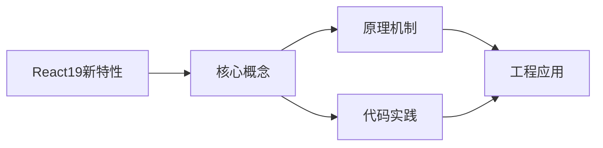
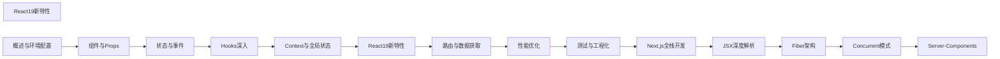

## 1. 学习目标（Bloom 分类）

本节按照布鲁姆教育目标分类学组织学习路径。本文主题为《React19新特性》，属于 React 模块，读者可以根据自身阶段选择阅读深度。

记忆层面：能够准确复述本文的核心概念、术语与基本语法或操作步骤，并能够在提问或检索时快速定位对应知识点。能够说出 React 的核心概念、术语与标准写法。

理解层面：能够用自己的语言解释核心原理与工作机制，说明概念之间的因果关系，而不是机械记忆结论。能够解释 React 的工作原理与设计动机。

应用层面：能够在真实项目或练习场景中运用本文知识解决具体问题，写出正确且可维护的实现。能够编写符合 React 规范的完整实现。

分析层面：能够拆解复杂问题，比较本文主题与相邻概念的异同，识别边界条件与例外情况。能够分析 React 与相邻方案的差异与边界。

评价层面：能够根据约束条件（性能、可读性、安全、成本）评价不同方案的优劣，做出有依据的技术决策。能够根据场景评价 React 相关方案的优劣。

创造层面：能够把本文知识与其他模块知识组合，设计出新的解决方案或可复用的工程模式。能够组合 React 与其他技术设计完整方案。

通过本节学习，读者应当能够把《React19新特性》纳入自己的知识网络，并与 React 模块的其他主题（组件、Hooks、状态管理、渲染性能）建立关联。

## 2. 历史动机与发展脉络

《React19新特性》是 React 领域的重要主题。要真正理解它，需要先了解它解决的问题与演进过程。

React 由 Facebook 于 2013 年开源，核心思想是组件化 UI 与声明式渲染；2019 年 React 16.8 引入 Hooks，函数组件成为主流。
React 19（2024）引入 Actions、useOptimistic、编译器（React Compiler）自动记忆化；并发特性（Suspense、Transitions）持续完善。
生态：Next.js/Remix 全栈框架、TanStack Query 服务端状态、Zustand/Redux 客户端状态、React Native 移动端。

回到本文主题：React19新特性 的提出与成熟，正是上述技术背景下的必然产物。早期实现往往以简单可用为目标，随着工程规模扩大，社区逐渐沉淀出标准做法与最佳实践；理解这一脉络，可以帮助读者判断“为什么文档中的推荐写法是现在这个样子”，也能在遇到历史遗留代码时准确识别其设计年代与取舍。


## 3. 形式化定义与核心概念精讲

本节把《React19新特性》涉及的核心概念以“定义 + 讲解”的形式展开。读者应把定义当作工具，把讲解当作理解路径；两者结合才能形成可迁移的知识。

组件模型：props 输入、state 内部状态、渲染输出 JSX；组件是纯函数，同一输入必得同一输出。
Hooks 规则：只能在顶层调用（不可在条件/循环中），函数组件与自定义 Hook 内使用；依赖数组决定 effect 重跑。
渲染与协调：setState 触发重渲染，虚拟 DOM diff 更新真实 DOM；key 帮助复用元素。

### 3.1 原文章节逐一精讲

原文档把主题拆分为 29 个小节，下面按顺序给出每一节的导读讲解，随后保留原文细节供精读。

#### 原文精读（完整保留）

# React 19 Actions 与表单深入

> **符号约定**：`< >` 必填参数 | `[ ]` 可选参数

---

#### 1. React Server Components (RSC)

React Server Components 是 React 19 最重要的特性，允许组件在服务端渲染，减少客户端 JavaScript 体积。

##### 1.1 Server Components vs Client Components

| 特性        | Server Component        | Client Component           |
| :---------- | :---------------------- | :------------------------- |
| 运行环境    | 服务端                  | 客户端（浏览器）           |
| 获取数据    | 直接访问数据库/文件系统 | 通过 API/fetch             |
| 交互性      | 无（无状态、无事件）    | 有（useState、onClick 等） |
| Bundle 体积 | 零（不发送到客户端）    | 包含在客户端 Bundle 中     |
| 文件后缀    | `.tsx`（默认）          | `.tsx` + `'use client'`    |

##### 1.2 Server Components 示例

```tsx
// app/posts/page.tsx — 默认是 Server Component
import { db } from '@/lib/db';

// 直接访问数据库，无需 API
async function PostsPage() {
  const posts = await db.post.findMany({
    orderBy: { createdAt: 'desc' },
    take: 10,
  });

  return (
    <div>
      <h1>最新文章</h1>
      {posts.map((post) => (
        <article key={post.id}>
          <h2>{post.title}</h2>
          <p>{post.excerpt}</p>
        </article>
      ))}
    </div>
  );
}

export default PostsPage;
```

##### 1.3 Client Components

```tsx
'use client'; // 声明为客户端组件

import { useState } from 'react';

export function LikeButton({ postId }: { postId: string }) {
  const [liked, setLiked] = useState(false);
  const [count, setCount] = useState(0);

  const handleLike = async () => {
    setLiked(!liked);
    setCount((c) => (liked ? c - 1 : c + 1));
    await fetch(`/api/posts/${postId}/like`, { method: 'POST' });
  };

  return (
    <button onClick={handleLike}>
      {liked ? '' : ''} {count}
    </button>
  );
}
```

##### 1.4 组合模式

```tsx
// Server Component 可以导入和渲染 Client Component
import { LikeButton } from './LikeButton'; // Client Component
import { getPost } from '@/lib/db';

async function PostPage({ id }: { id: string }) {
  const post = await getPost(id); // 服务端数据获取

  return (
    <article>
      <h1>{post.title}</h1>
      <div>{post.content}</div>
      {/* Client Component 嵌入 Server Component */}
      <LikeButton postId={id} />
    </article>
  );
}
```

> **注意**：Client Component 不能导入 Server Component，但可以通过 `children` prop 传入。

#### 2. use() Hook

`use()` 是 React 19 新增的 Hook，用于读取 Promise 或 Context 的值。

##### 2.1 读取 Promise

```tsx
import { use, Suspense } from 'react';

// 在组件外部创建 Promise
const userPromise = fetch('/api/user').then((res) => res.json());

function UserProfile() {
  // use() 会挂起组件直到 Promise resolve
  const user = use(userPromise) as { name: string; email: string };

  return (
    <div>
      <h2>{user.name}</h2>
      <p>{user.email}</p>
    </div>
  );
}

// 必须配合 Suspense 使用
function App() {
  return (
    <Suspense fallback={<p>加载用户信息...</p>}>
      <UserProfile />
    </Suspense>
  );
}
```

##### 2.2 读取 Context

```tsx
import { use, createContext } from 'react';

const ThemeContext = createContext<'light' | 'dark'>('light');

// use() 可以在条件语句中调用（与 useContext 不同）
function ThemedComponent({ showTheme }: { showTheme: boolean }) {
  if (showTheme) {
    const theme = use(ThemeContext); //  use() 可以在条件中调用
    return <p>当前主题：{theme}</p>;
  }
  return <p>未显示主题</p>;
}
```

##### 2.3 use() 与 useContext 的区别

| 特性          | useContext | use()               |
| :------------ | :--------- | :------------------ |
| 条件中调用    | 不可以     | 可以                |
| 读取 Promise  | 不可以     | 可以                |
| 读取 Context  | 可以       | 可以                |
| 需要 Suspense | 不需要     | 读取 Promise 时需要 |

#### 3. Actions

Actions 是 React 19 引入的异步状态管理模式，简化表单提交和异步操作。

##### 3.1 表单 Action

```tsx
async function createUser(formData: FormData) {
  'use server'; // Next.js Server Action

  const name = formData.get('name') as string;
  const email = formData.get('email') as string;

  await db.user.create({ data: { name, email } });
  redirect('/users');
}

function CreateUserForm() {
  return (
    <form action={createUser}>
      <input name="name" placeholder="姓名" required />
      <input name="email" type="email" placeholder="邮箱" required />
      <button type="submit">创建用户</button>
    </form>
  );
}
```

##### 3.2 客户端 Action

```tsx
function SearchForm() {
  const [results, setResults] = useState([]);

  async function handleSearch(formData: FormData) {
    const query = formData.get('query') as string;
    const res = await fetch(`/api/search?q=${query}`);
    const data = await res.json();
    setResults(data);
  }

  return (
    <form action={handleSearch}>
      <input name="query" />
      <button type="submit">搜索</button>
      <ul>
        {results.map((r) => (
          <li key={r.id}>{r.title}</li>
        ))}
      </ul>
    </form>
  );
}
```

#### 4. useFormStatus

`useFormStatus` 获取父级 `<form>` 的提交状态，无需传递 Props。

```tsx
import { useFormStatus } from 'react-dom';

function SubmitButton() {
  const { pending, data, method, action } = useFormStatus();

  return (
    <button type="submit" disabled={pending}>
      {pending ? '提交中...' : '提交'}
    </button>
  );
}

function ContactForm() {
  async function handleSubmit(formData: FormData) {
    await sendEmail(formData);
  }

  return (
    <form action={handleSubmit}>
      <input name="email" type="email" required />
      <textarea name="message" required />
      <SubmitButton /> {/* 自动获取表单状态 */}
    </form>
  );
}
```

> **注意**：`useFormStatus` 必须在 `<form>` 内部的组件中调用，且该组件必须是 `<form>` 的子组件，不能是 `<form>` 本身。

#### 5. useOptimistic

`useOptimistic` 实现乐观更新，在异步操作完成前先展示预期结果。

```tsx
import { useOptimistic, useState } from 'react';

interface Message {
  id: string;
  text: string;
  sending?: boolean;
}

function Chat({
  messages,
  onSend,
}: {
  messages: Message[];
  onSend: (text: string) => Promise<void>;
}) {
  const [optimisticMessages, addOptimisticMessage] = useOptimistic(
    messages,
    (currentMessages, newText: string) => [
      ...currentMessages,
      { id: crypto.randomUUID(), text: newText, sending: true },
    ]
  );

  const [input, setInput] = useState('');

  async function handleSubmit(formData: FormData) {
    const text = formData.get('message') as string;
    setInput('');
    addOptimisticMessage(text); // 立即显示乐观消息
    await onSend(text); // 实际发送
  }

  return (
    <div>
      <ul>
        {optimisticMessages.map((msg) => (
          <li key={msg.id} style={{ opacity: msg.sending ? 0.5 : 1 }}>
            {msg.text} {msg.sending && '（发送中...）'}
          </li>
        ))}
      </ul>
      <form action={handleSubmit}>
        <input name="message" value={input} onChange={(e) => setInput(e.target.value)} />
        <button type="submit">发送</button>
      </form>
    </div>
  );
}
```

#### 6. useActionState

`useActionState` 管理表单 Action 的状态（返回值、加载状态）。

```tsx
import { useActionState } from 'react';

interface FormState {
  message: string;
  success: boolean;
}

async function submitOrder(prevState: FormState, formData: FormData): Promise<FormState> {
  try {
    const item = formData.get('item') as string;
    const quantity = parseInt(formData.get('quantity') as string);

    await createOrder({ item, quantity });

    return { message: '订单创建成功！', success: true };
  } catch (error) {
    return { message: `创建失败：${(error as Error).message}`, success: false };
  }
}

function OrderForm() {
  const [state, submitAction, isPending] = useActionState(submitOrder, {
    message: '',
    success: false,
  });

  return (
    <form action={submitAction}>
      <input name="item" placeholder="商品名称" required />
      <input name="quantity" type="number" min="1" required />
      <button type="submit" disabled={isPending}>
        {isPending ? '提交中...' : '下单'}
      </button>
      {state.message && <p style={{ color: state.success ? 'green' : 'red' }}>{state.message}</p>}
    </form>
  );
}
```

#### 7. Suspense 进阶

##### 7.1 嵌套 Suspense

```tsx
import { Suspense } from 'react';

function Dashboard() {
  return (
    <div>
      <h1>仪表盘</h1>
      {/* 每个区域独立加载 */}
      <Suspense fallback={<ChartSkeleton />}>
        <SalesChart />
      </Suspense>

      <Suspense fallback={<TableSkeleton />}>
        <RecentOrders />
      </Suspense>

      <Suspense fallback={<ListSkeleton />}>
        <Notifications />
      </Suspense>
    </div>
  );
}
```

##### 7.2 Suspense 与数据获取

```tsx
// 封装数据获取函数
function fetchUser(id: string) {
  let status = 'pending';
  let result: User;
  let error: Error;

  const promise = fetch(`/api/users/${id}`)
    .then((res) => res.json())
    .then((data) => {
      status = 'success';
      result = data;
    })
    .catch((err) => {
      status = 'error';
      error = err;
    });

  return {
    read() {
      if (status === 'pending') throw promise;
      if (status === 'error') throw error;
      return result;
    },
  };
}

// 在组件中使用
function UserProfile({ id }: { id: string }) {
  const user = fetchUser(id).read(); // 挂起直到数据就绪
  return <div>{user.name}</div>;
}
```

#### 8. 流式 SSR

React 19 支持流式服务端渲染，允许逐步发送 HTML 到客户端。

##### 8.1 Node.js 流式渲染

```tsx
import { renderToPipeableStream } from 'react-dom/server';
import { App } from './App';

app.get('/', (req, res) => {
  const { pipe } = renderToPipeableStream(<App />, {
    bootstrapScripts: ['/client.js'],
    onShellReady() {
      res.setHeader('content-type', 'text/html');
      pipe(res);
    },
    onError(error) {
      console.error('SSR 错误：', error);
    },
  });
});
```

##### 8.2 Next.js 中的流式渲染

Next.js App Router 默认使用流式 SSR：

```tsx
// app/page.tsx
import { Suspense } from 'react';

async function SlowData() {
  const data = await fetch('https://api.example.com/slow', {
    next: { revalidate: 60 },
  });
  const json = await data.json();
  return <div>{json.content}</div>;
}

export default function Page() {
  return (
    <div>
      <h1>快速内容</h1>
      {/* 快速内容立即显示，SlowData 流式加载 */}
      <Suspense fallback={<p>加载中...</p>}>
        <SlowData />
      </Suspense>
    </div>
  );
}
```

#### 9. 其他 React 19 改进

##### 9.1 文档元数据

```tsx
// React 19 支持在组件中声明 <title>、<meta> 等标签
function BlogPost({ post }: { post: Post }) {
  return (
    <article>
      <title>{post.title}</title>
      <meta name="description" content={post.excerpt} />
      <link rel="canonical" href={`https://example.com/posts/${post.id}`} />
      <h1>{post.title}</h1>
      <div>{post.content}</div>
    </article>
  );
}
```

##### 9.2 样式表支持

```tsx
function Component() {
  return (
    <>
      {/* 通过 precedence 控制样式表加载顺序 */}
      <link rel="stylesheet" href="reset.css" precedence="default" />
      <link rel="stylesheet" href="styles.css" precedence="high" />
      <div className="styled">内容</div>
    </>
  );
}
```

##### 9.3 异步脚本支持

```tsx
function MapComponent() {
  return (
    <>
      <script async src="https://maps.googleapis.com/maps/api/js" />
      <div id="map">地图容器</div>
    </>
  );
}
```

##### 9.4 ref 回调清理

```tsx
function Input() {
  const ref = useCallback((node: HTMLInputElement | null) => {
    if (node) {
      // 挂载时
      node.focus();
    }
    return () => {
      // 卸载时清理（React 19 新增）
    };
  }, []);

  return <input ref={ref} />;
}
```
#### Actions 概念

**基本写法：startTransition 内的异步函数即 Action**
`startTransition(async () => <异步>)`
```tsx
// 自动管理 pending 错误乐观更新
const [isPending, startTransition] = useTransition();
startTransition(async () => await submit(data));
```

---

#### useActionState

**基本写法：用 Action 管理 form 状态**
`const [<state>, <dispatch>, <isPending>] = useActionState(<action>, <初值>, [<permalink>])`
```tsx
// 表单提交状态一体化
const [error, submitAction, isPending] = useActionState(
  async (prev, formData) => await save(formData.get('name')),
  null
);
```

---

**基本写法：action 函数签名**
`async (<previousState>, <payload>) => <newState>`
```tsx
// 接收上次状态与提交数据
async function reducer(prev, formData) {
  const err = await save(formData.get('name'));
  return err;
}
```

---

**基本写法：permalink 支持渐进增强**
`useActionState(<action>, <初值>, <永久链接>)`
```tsx
// JS 未加载时跳转到该 URL
useActionState(action, null, '/profile');
```

---

#### 表单 action 属性

**基本写法：form 直接接收 Action 函数**
`<form action={<action函数>}>`
```tsx
// 提交自动调用 action 并重置表单
<form action={submitAction}>
  <input name="email" />
  <button type="submit">提交</button>
</form>
```

---

**基本写法：button formAction 覆盖**
`<button formAction={<另一个action>}>`
```tsx
// 同表单多个提交按钮
<form action={save}>
  <button formAction={publish}>发布</button>
</form>
```

---

#### useFormStatus

**基本写法：子组件读取父表单状态**
`const { pending, data, method, action } = useFormStatus()`
```tsx
// 按钮感知提交中状态
import { useFormStatus } from 'react-dom';
function Submit() {
  const { pending } = useFormStatus();
  return <button disabled={pending}>{pending ? '提交中' : '提交'}</button>;
}
```

---

**基本写法：读取提交的 FormData**
`const { data } = useFormStatus()`
```tsx
// 显示正在提交的字段
const { data } = useFormStatus();
return <span>{data.get('name')}</span>;
```

---

#### useOptimistic 乐观更新

**基本写法：提交期间展示乐观值**
`const [<optimistic>, <add>] = useOptimistic(<state>, <updateFn>)`
```tsx
// 立即显示新消息请求成功后保留
const [messages, addOptimistic] = useOptimistic(messages, (state, newMsg) => [
  ...state, { ...newMsg, pending: true }
]);
```

---

**基本写法：在 Action 内调用 add**
`await <add>(<乐观值>); await <真实请求>`
```tsx
// 先乐观展示再确认
async function sendAction(formData) {
  addOptimistic({ id: 'temp', text: formData.get('text') });
  await api.send(formData);
}
```

---

#### 表单组件组合

**基本写法：useActionState 配合 form action**
`<form action={<dispatch>}>`
```tsx
// useActionState 返回的 dispatch 作为 form action
const [state, dispatch, pending] = useActionState(action, null);
<form action={dispatch}><input name="q" /></form>
```

---

**基本写法：useFormStatus 用于按钮**
`function <Button>() { const { pending } = useFormStatus(); }`
```tsx
// 子组件无需传递 pending prop
function SubmitButton() {
  const { pending } = useFormStatus();
  return <button disabled={pending}>保存</button>;
}
```

---

#### 传统表单处理对比

**基本写法：手动管理 pending 与错误**
`const [<pending>, <setPending>] = useState(false)`
```tsx
// 旧写法繁琐
const [pending, setPending] = useState(false);
const [error, setError] = useState(null);
const onSubmit = async () => {
  setPending(true);
  const err = await save();
  setPending(false);
  if (err) setError(err);
};
```

---

#### Action 错误处理

**基本写法：Action 内抛错由错误边界捕获**
`throw new Error(<消息>)`
```tsx
// 失败自动回滚乐观更新
async function action() {
  if (failed) throw new Error('提交失败');
}
```

---

#### 多个 Action 类型

**基本写法：根据 payload 分支处理**
`async (<state>, <payload>) => { switch (<payload>.type) { } }`
```tsx
// 类似 reducer 风格
async function reducer(state, payload) {
  switch (payload.type) {
    case 'SAVE': return await save(payload.data);
    case 'DELETE': return await del(payload.id);
  }
}
```

---

#### 取消排队 Action

**基本写法：通过返回值控制队列**
`return <newState>`
```tsx
// 后续排队 action 会接收最新 state
return { ok: true };
```

---

#### 表单重置

**基本写法：form action 成功后自动重置**
`<form action={<action>}>`
```tsx
// 提交完成后清空输入
<form action={submit}>
  <input name="text" />
</form>
```

---

#### useFormState 兼容旧名

**基本写法：React 19 重命名为 useActionState**
`const [<state>, <action>] = useFormState(<fn>, <初值>)`
```tsx
// 兼容旧 API 不推荐使用
import { useFormState } from 'react-dom';
```

---

#### 配合 Server Action

**基本写法：Server Action 作为 form action**
`'use server' async function <action>(<formData>) {}`
```tsx
// 服务端执行 Action
async function submitAction(formData) {
  'use server';
  await db.insert(formData.get('name'));
}
```

---

#### 表单校验

**基本写法：Action 内做服务端校验**
`if (!<合法>) return { <错误字段>: <消息> }`
```tsx
// 返回错误信息给 useActionState
async function action(prev, formData) {
  if (!formData.get('email')) return { error: '邮箱必填' };
  await save(formData);
  return { ok: true };
}
```

---

#### 配合 useOptimistic 与错误边界

**基本写法：失败自动回滚乐观值**
`useOptimistic(<state>, <updateFn>)`
```tsx
// Action 抛错时 useOptimistic 自动回滚
const [items, addOptimistic] = useOptimistic(items, (s, n) => [...s, n]);
```

---

#### 渐进增强

**基本写法：JS 未加载时表单仍可提交**
`<form action={<serverAction>} >`
```tsx
// 服务端 Action 支持无 JS 提交
<form action={serverAction}>
  <input name="q" />
</form>
```

---

#### 表单状态展示

**基本写法：根据 useActionState 返回值渲染**
`{<state>?.<error> && <错误提示>}`
```tsx
// 显示错误或成功状态
const [state] = useActionState(action, null);
{state?.error && <p className="error">{state.error}</p>}
```

---

#### 复用 Action 逻辑

**基本写法：自定义 Hook 封装 Action**
`function use<名称>() { const [...] = useActionState(<action>, <初值>); return { ... }; }`
```tsx
// 提取通用提交逻辑
function useSaveForm() {
  const [state, dispatch, pending] = useActionState(saveAction, null);
  return { state, dispatch, pending };
}
```

---

#### Action 与 transition 关系

**基本写法：Action 内部走 transition**
`startTransition(async () => <异步>)`
```tsx
// 因此 isPending 与 useTransition 一致
const [isPending] = useTransition();
```

---

#### 表单提交禁用按钮

**基本写法：useFormStatus 控制 disabled**
`<button disabled={<pending>}>`
```tsx
// 防止重复提交
const { pending } = useFormStatus();
<button disabled={pending}>提交</button>
```


### 3.2 概念关系图

下面用 Mermaid 图表达本文核心概念之间的关系，帮助读者建立整体图景：



图中展示的是本文知识的结构化关系：核心概念是入口，原理机制解释“为什么”，代码实践演示“怎么做”，工程应用回答“何时用”。读者学习时可以把每个小节的内容挂接到对应节点上。

## 4. 理论推导与原理解析

本节深入《React19新特性》背后的原理。理论部分不求面面俱到，而是聚焦“能解释现象、能指导实践”的关键推导。

组件模型：props 输入、state 内部状态、渲染输出 JSX；组件是纯函数，同一输入必得同一输出。
Hooks 规则：只能在顶层调用（不可在条件/循环中），函数组件与自定义 Hook 内使用；依赖数组决定 effect 重跑。
渲染与协调：setState 触发重渲染，虚拟 DOM diff 更新真实 DOM；key 帮助复用元素。
状态提升与下放：共享状态提升到最近公共祖先；Context 跨层传递（Provider/useContext）。

需要强调的是，理论推导与工程实践之间存在翻译层：理论给出的是理想化模型与边界条件，工程代码则必须处理真实环境中的例外。读者在学习时应先掌握理论的“标准情形”，再通过陷阱章节了解“非标准情形”。

## 5. 代码示例与逐行讲解

本节把原文中的代码示例系统整理，并为每个示例补充用途说明与讲解。读者不应只浏览代码，而应逐段对照讲解理解设计意图。

### 5.1 示例：1.2 Server Components 示例

该示例来自原文《1.2 Server Components 示例》小节，用于演示React19新特性相关操作。阅读时请先看代码结构，再看其后的讲解。

```tsx
// app/posts/page.tsx — 默认是 Server Component
import { db } from '@/lib/db';

// 直接访问数据库，无需 API
async function PostsPage() {
  const posts = await db.post.findMany({
    orderBy: { createdAt: 'desc' },
    take: 10,
  });

  return (
    <div>
      <h1>最新文章</h1>
      {posts.map((post) => (
        <article key={post.id}>
          <h2>{post.title}</h2>
          <p>{post.excerpt}</p>
        </article>
      ))}
    </div>
  );
}

export default PostsPage;
```

讲解：这段代码演示了本节核心知识点。代码中的关键操作可以归纳为三步：准备（定义或初始化）、执行（核心逻辑）、收尾（释放资源或返回结果）。实际项目中，这三步往往被封装为函数或类，以提升复用性与可测试性。

关键点分析：

该示例共 21 行有效代码，包含 4 类关键结构（function、import、from、return）。其中：

- 入口与初始化部分负责建立上下文，对应实际项目中的启动或装配逻辑；
- 核心逻辑部分体现本文主题的主要操作，是阅读时最需要对照讲解理解的部分；
- 输出或返回部分把结果交给调用方，注意其类型与边界条件。

进阶思考路径：先尝试修改参数观察行为变化，再把示例中的模式迁移到自己的项目中；每次修改都记录预期与实测差异，这是把示例转化为能力的最快方式。

### 5.2 示例：1.3 Client Components

该示例来自原文《1.3 Client Components》小节，用于演示React19新特性相关操作。阅读时请先看代码结构，再看其后的讲解。

```tsx
'use client'; // 声明为客户端组件

import { useState } from 'react';

export function LikeButton({ postId }: { postId: string }) {
  const [liked, setLiked] = useState(false);
  const [count, setCount] = useState(0);

  const handleLike = async () => {
    setLiked(!liked);
    setCount((c) => (liked ? c - 1 : c + 1));
    await fetch(`/api/posts/${postId}/like`, { method: 'POST' });
  };

  return (
    <button onClick={handleLike}>
      {liked ? '' : ''} {count}
    </button>
  );
}
```

讲解：这段代码演示了本节核心知识点。代码中的关键操作可以归纳为三步：准备（定义或初始化）、执行（核心逻辑）、收尾（释放资源或返回结果）。实际项目中，这三步往往被封装为函数或类，以提升复用性与可测试性。

关键点分析：

该示例共 16 行有效代码，包含 4 类关键结构（function、import、from、return）。其中：

- 入口与初始化部分负责建立上下文，对应实际项目中的启动或装配逻辑；
- 核心逻辑部分体现本文主题的主要操作，是阅读时最需要对照讲解理解的部分；
- 输出或返回部分把结果交给调用方，注意其类型与边界条件。

进阶思考路径：先尝试修改参数观察行为变化，再把示例中的模式迁移到自己的项目中；每次修改都记录预期与实测差异，这是把示例转化为能力的最快方式。

### 5.3 示例：1.4 组合模式

该示例来自原文《1.4 组合模式》小节，用于演示React19新特性相关操作。阅读时请先看代码结构，再看其后的讲解。

```tsx
// Server Component 可以导入和渲染 Client Component
import { LikeButton } from './LikeButton'; // Client Component
import { getPost } from '@/lib/db';

async function PostPage({ id }: { id: string }) {
  const post = await getPost(id); // 服务端数据获取

  return (
    <article>
      <h1>{post.title}</h1>
      <div>{post.content}</div>
      {/* Client Component 嵌入 Server Component */}
      <LikeButton postId={id} />
    </article>
  );
}
```

讲解：这段代码演示了本节核心知识点。代码中的关键操作可以归纳为三步：准备（定义或初始化）、执行（核心逻辑）、收尾（释放资源或返回结果）。实际项目中，这三步往往被封装为函数或类，以提升复用性与可测试性。

关键点分析：

该示例共 14 行有效代码，包含 4 类关键结构（function、import、from、return）。其中：

- 入口与初始化部分负责建立上下文，对应实际项目中的启动或装配逻辑；
- 核心逻辑部分体现本文主题的主要操作，是阅读时最需要对照讲解理解的部分；
- 输出或返回部分把结果交给调用方，注意其类型与边界条件。

进阶思考路径：先尝试修改参数观察行为变化，再把示例中的模式迁移到自己的项目中；每次修改都记录预期与实测差异，这是把示例转化为能力的最快方式。

### 5.4 示例：2.1 读取 Promise

该示例来自原文《2.1 读取 Promise》小节，用于演示React19新特性相关操作。阅读时请先看代码结构，再看其后的讲解。

```tsx
import { use, Suspense } from 'react';

// 在组件外部创建 Promise
const userPromise = fetch('/api/user').then((res) => res.json());

function UserProfile() {
  // use() 会挂起组件直到 Promise resolve
  const user = use(userPromise) as { name: string; email: string };

  return (
    <div>
      <h2>{user.name}</h2>
      <p>{user.email}</p>
    </div>
  );
}

// 必须配合 Suspense 使用
function App() {
  return (
    <Suspense fallback={<p>加载用户信息...</p>}>
      <UserProfile />
    </Suspense>
  );
}
```

讲解：这段代码演示了本节核心知识点。代码中的关键操作可以归纳为三步：准备（定义或初始化）、执行（核心逻辑）、收尾（释放资源或返回结果）。实际项目中，这三步往往被封装为函数或类，以提升复用性与可测试性。

关键点分析：

该示例共 21 行有效代码，包含 4 类关键结构（function、import、from、return）。其中：

- 入口与初始化部分负责建立上下文，对应实际项目中的启动或装配逻辑；
- 核心逻辑部分体现本文主题的主要操作，是阅读时最需要对照讲解理解的部分；
- 输出或返回部分把结果交给调用方，注意其类型与边界条件。

进阶思考路径：先尝试修改参数观察行为变化，再把示例中的模式迁移到自己的项目中；每次修改都记录预期与实测差异，这是把示例转化为能力的最快方式。

### 5.5 示例：2.2 读取 Context

该示例来自原文《2.2 读取 Context》小节，用于演示React19新特性相关操作。阅读时请先看代码结构，再看其后的讲解。

```tsx
import { use, createContext } from 'react';

const ThemeContext = createContext<'light' | 'dark'>('light');

// use() 可以在条件语句中调用（与 useContext 不同）
function ThemedComponent({ showTheme }: { showTheme: boolean }) {
  if (showTheme) {
    const theme = use(ThemeContext); //  use() 可以在条件中调用
    return <p>当前主题：{theme}</p>;
  }
  return <p>未显示主题</p>;
}
```

讲解：这段代码演示了本节核心知识点。代码中的关键操作可以归纳为三步：准备（定义或初始化）、执行（核心逻辑）、收尾（释放资源或返回结果）。实际项目中，这三步往往被封装为函数或类，以提升复用性与可测试性。

关键点分析：

该示例共 10 行有效代码，包含 5 类关键结构（function、import、from、if、return）。其中：

- 入口与初始化部分负责建立上下文，对应实际项目中的启动或装配逻辑；
- 核心逻辑部分体现本文主题的主要操作，是阅读时最需要对照讲解理解的部分；
- 输出或返回部分把结果交给调用方，注意其类型与边界条件。

进阶思考路径：先尝试修改参数观察行为变化，再把示例中的模式迁移到自己的项目中；每次修改都记录预期与实测差异，这是把示例转化为能力的最快方式。

### 5.6 示例：3.1 表单 Action

该示例来自原文《3.1 表单 Action》小节，用于演示React19新特性相关操作。阅读时请先看代码结构，再看其后的讲解。

```tsx
async function createUser(formData: FormData) {
  'use server'; // Next.js Server Action

  const name = formData.get('name') as string;
  const email = formData.get('email') as string;

  await db.user.create({ data: { name, email } });
  redirect('/users');
}

function CreateUserForm() {
  return (
    <form action={createUser}>
      <input name="name" placeholder="姓名" required />
      <input name="email" type="email" placeholder="邮箱" required />
      <button type="submit">创建用户</button>
    </form>
  );
}
```

讲解：这段代码演示了本节核心知识点。代码中的关键操作可以归纳为三步：准备（定义或初始化）、执行（核心逻辑）、收尾（释放资源或返回结果）。实际项目中，这三步往往被封装为函数或类，以提升复用性与可测试性。

关键点分析：

该示例共 16 行有效代码，包含 2 类关键结构（function、return）。其中：

- 入口与初始化部分负责建立上下文，对应实际项目中的启动或装配逻辑；
- 核心逻辑部分体现本文主题的主要操作，是阅读时最需要对照讲解理解的部分；
- 输出或返回部分把结果交给调用方，注意其类型与边界条件。

进阶思考路径：先尝试修改参数观察行为变化，再把示例中的模式迁移到自己的项目中；每次修改都记录预期与实测差异，这是把示例转化为能力的最快方式。

### 5.7 示例：3.2 客户端 Action

该示例来自原文《3.2 客户端 Action》小节，用于演示React19新特性相关操作。阅读时请先看代码结构，再看其后的讲解。

```tsx
function SearchForm() {
  const [results, setResults] = useState([]);

  async function handleSearch(formData: FormData) {
    const query = formData.get('query') as string;
    const res = await fetch(`/api/search?q=${query}`);
    const data = await res.json();
    setResults(data);
  }

  return (
    <form action={handleSearch}>
      <input name="query" />
      <button type="submit">搜索</button>
      <ul>
        {results.map((r) => (
          <li key={r.id}>{r.title}</li>
        ))}
      </ul>
    </form>
  );
}
```

讲解：这段代码演示了本节核心知识点。代码中的关键操作可以归纳为三步：准备（定义或初始化）、执行（核心逻辑）、收尾（释放资源或返回结果）。实际项目中，这三步往往被封装为函数或类，以提升复用性与可测试性。

关键点分析：

该示例共 20 行有效代码，包含 2 类关键结构（function、return）。其中：

- 入口与初始化部分负责建立上下文，对应实际项目中的启动或装配逻辑；
- 核心逻辑部分体现本文主题的主要操作，是阅读时最需要对照讲解理解的部分；
- 输出或返回部分把结果交给调用方，注意其类型与边界条件。

进阶思考路径：先尝试修改参数观察行为变化，再把示例中的模式迁移到自己的项目中；每次修改都记录预期与实测差异，这是把示例转化为能力的最快方式。

### 5.8 示例：4. useFormStatus

该示例来自原文《4. useFormStatus》小节，用于演示React19新特性相关操作。阅读时请先看代码结构，再看其后的讲解。

```tsx
import { useFormStatus } from 'react-dom';

function SubmitButton() {
  const { pending, data, method, action } = useFormStatus();

  return (
    <button type="submit" disabled={pending}>
      {pending ? '提交中...' : '提交'}
    </button>
  );
}

function ContactForm() {
  async function handleSubmit(formData: FormData) {
    await sendEmail(formData);
  }

  return (
    <form action={handleSubmit}>
      <input name="email" type="email" required />
      <textarea name="message" required />
      <SubmitButton /> {/* 自动获取表单状态 */}
    </form>
  );
}
```

讲解：这段代码演示了本节核心知识点。代码中的关键操作可以归纳为三步：准备（定义或初始化）、执行（核心逻辑）、收尾（释放资源或返回结果）。实际项目中，这三步往往被封装为函数或类，以提升复用性与可测试性。

关键点分析：

该示例共 21 行有效代码，包含 4 类关键结构（function、import、from、return）。其中：

- 入口与初始化部分负责建立上下文，对应实际项目中的启动或装配逻辑；
- 核心逻辑部分体现本文主题的主要操作，是阅读时最需要对照讲解理解的部分；
- 输出或返回部分把结果交给调用方，注意其类型与边界条件。

进阶思考路径：先尝试修改参数观察行为变化，再把示例中的模式迁移到自己的项目中；每次修改都记录预期与实测差异，这是把示例转化为能力的最快方式。

### 5.9 示例：5. useOptimistic

该示例来自原文《5. useOptimistic》小节，用于演示React19新特性相关操作。阅读时请先看代码结构，再看其后的讲解。

```tsx
import { useOptimistic, useState } from 'react';

interface Message {
  id: string;
  text: string;
  sending?: boolean;
}

function Chat({
  messages,
  onSend,
}: {
  messages: Message[];
  onSend: (text: string) => Promise<void>;
}) {
  const [optimisticMessages, addOptimisticMessage] = useOptimistic(
    messages,
    (currentMessages, newText: string) => [
      ...currentMessages,
      { id: crypto.randomUUID(), text: newText, sending: true },
    ]
  );

  const [input, setInput] = useState('');

  async function handleSubmit(formData: FormData) {
    const text = formData.get('message') as string;
    setInput('');
    addOptimisticMessage(text); // 立即显示乐观消息
    await onSend(text); // 实际发送
  }

  return (
    <div>
      <ul>
        {optimisticMessages.map((msg) => (
          <li key={msg.id} style={{ opacity: msg.sending ? 0.5 : 1 }}>
            {msg.text} {msg.sending && '（发送中...）'}
          </li>
        ))}
      </ul>
      <form action={handleSubmit}>
        <input name="message" value={input} onChange={(e) => setInput(e.target.value)} />
        <button type="submit">发送</button>
      </form>
    </div>
  );
}
```

讲解：这段代码演示了本节核心知识点。代码中的关键操作可以归纳为三步：准备（定义或初始化）、执行（核心逻辑）、收尾（释放资源或返回结果）。实际项目中，这三步往往被封装为函数或类，以提升复用性与可测试性。

关键点分析：

该示例共 43 行有效代码，包含 4 类关键结构（function、import、from、return）。其中：

- 入口与初始化部分负责建立上下文，对应实际项目中的启动或装配逻辑；
- 核心逻辑部分体现本文主题的主要操作，是阅读时最需要对照讲解理解的部分；
- 输出或返回部分把结果交给调用方，注意其类型与边界条件。

进阶思考路径：先尝试修改参数观察行为变化，再把示例中的模式迁移到自己的项目中；每次修改都记录预期与实测差异，这是把示例转化为能力的最快方式。

### 5.10 示例：6. useActionState

该示例来自原文《6. useActionState》小节，用于演示React19新特性相关操作。阅读时请先看代码结构，再看其后的讲解。

```tsx
import { useActionState } from 'react';

interface FormState {
  message: string;
  success: boolean;
}

async function submitOrder(prevState: FormState, formData: FormData): Promise<FormState> {
  try {
    const item = formData.get('item') as string;
    const quantity = parseInt(formData.get('quantity') as string);

    await createOrder({ item, quantity });

    return { message: '订单创建成功！', success: true };
  } catch (error) {
    return { message: `创建失败：${(error as Error).message}`, success: false };
  }
}

function OrderForm() {
  const [state, submitAction, isPending] = useActionState(submitOrder, {
    message: '',
    success: false,
  });

  return (
    <form action={submitAction}>
      <input name="item" placeholder="商品名称" required />
      <input name="quantity" type="number" min="1" required />
      <button type="submit" disabled={isPending}>
        {isPending ? '提交中...' : '下单'}
      </button>
      {state.message && <p style={{ color: state.success ? 'green' : 'red' }}>{state.message}</p>}
    </form>
  );
}
```

讲解：这段代码演示了本节核心知识点。代码中的关键操作可以归纳为三步：准备（定义或初始化）、执行（核心逻辑）、收尾（释放资源或返回结果）。实际项目中，这三步往往被封装为函数或类，以提升复用性与可测试性。

关键点分析：

该示例共 31 行有效代码，包含 4 类关键结构（function、import、from、return）。其中：

- 入口与初始化部分负责建立上下文，对应实际项目中的启动或装配逻辑；
- 核心逻辑部分体现本文主题的主要操作，是阅读时最需要对照讲解理解的部分；
- 输出或返回部分把结果交给调用方，注意其类型与边界条件。

进阶思考路径：先尝试修改参数观察行为变化，再把示例中的模式迁移到自己的项目中；每次修改都记录预期与实测差异，这是把示例转化为能力的最快方式。

### 5.11 示例：7.1 嵌套 Suspense

该示例来自原文《7.1 嵌套 Suspense》小节，用于演示React19新特性相关操作。阅读时请先看代码结构，再看其后的讲解。

```tsx
import { Suspense } from 'react';

function Dashboard() {
  return (
    <div>
      <h1>仪表盘</h1>
      {/* 每个区域独立加载 */}
      <Suspense fallback={<ChartSkeleton />}>
        <SalesChart />
      </Suspense>

      <Suspense fallback={<TableSkeleton />}>
        <RecentOrders />
      </Suspense>

      <Suspense fallback={<ListSkeleton />}>
        <Notifications />
      </Suspense>
    </div>
  );
}
```

讲解：这段代码演示了本节核心知识点。代码中的关键操作可以归纳为三步：准备（定义或初始化）、执行（核心逻辑）、收尾（释放资源或返回结果）。实际项目中，这三步往往被封装为函数或类，以提升复用性与可测试性。

关键点分析：

该示例共 18 行有效代码，包含 4 类关键结构（function、import、from、return）。其中：

- 入口与初始化部分负责建立上下文，对应实际项目中的启动或装配逻辑；
- 核心逻辑部分体现本文主题的主要操作，是阅读时最需要对照讲解理解的部分；
- 输出或返回部分把结果交给调用方，注意其类型与边界条件。

进阶思考路径：先尝试修改参数观察行为变化，再把示例中的模式迁移到自己的项目中；每次修改都记录预期与实测差异，这是把示例转化为能力的最快方式。

### 5.12 示例：7.2 Suspense 与数据获取

该示例来自原文《7.2 Suspense 与数据获取》小节，用于演示React19新特性相关操作。阅读时请先看代码结构，再看其后的讲解。

```tsx
// 封装数据获取函数
function fetchUser(id: string) {
  let status = 'pending';
  let result: User;
  let error: Error;

  const promise = fetch(`/api/users/${id}`)
    .then((res) => res.json())
    .then((data) => {
      status = 'success';
      result = data;
    })
    .catch((err) => {
      status = 'error';
      error = err;
    });

  return {
    read() {
      if (status === 'pending') throw promise;
      if (status === 'error') throw error;
      return result;
    },
  };
}

// 在组件中使用
function UserProfile({ id }: { id: string }) {
  const user = fetchUser(id).read(); // 挂起直到数据就绪
  return <div>{user.name}</div>;
}
```

讲解：这段代码演示了本节核心知识点。代码中的关键操作可以归纳为三步：准备（定义或初始化）、执行（核心逻辑）、收尾（释放资源或返回结果）。实际项目中，这三步往往被封装为函数或类，以提升复用性与可测试性。

关键点分析：

该示例共 28 行有效代码，包含 3 类关键结构（function、if、return）。其中：

- 入口与初始化部分负责建立上下文，对应实际项目中的启动或装配逻辑；
- 核心逻辑部分体现本文主题的主要操作，是阅读时最需要对照讲解理解的部分；
- 输出或返回部分把结果交给调用方，注意其类型与边界条件。

进阶思考路径：先尝试修改参数观察行为变化，再把示例中的模式迁移到自己的项目中；每次修改都记录预期与实测差异，这是把示例转化为能力的最快方式。

### 5.13 示例：8.1 Node.js 流式渲染

该示例来自原文《8.1 Node.js 流式渲染》小节，用于演示React19新特性相关操作。阅读时请先看代码结构，再看其后的讲解。

```tsx
import { renderToPipeableStream } from 'react-dom/server';
import { App } from './App';

app.get('/', (req, res) => {
  const { pipe } = renderToPipeableStream(<App />, {
    bootstrapScripts: ['/client.js'],
    onShellReady() {
      res.setHeader('content-type', 'text/html');
      pipe(res);
    },
    onError(error) {
      console.error('SSR 错误：', error);
    },
  });
});
```

讲解：这段代码演示了本节核心知识点。代码中的关键操作可以归纳为三步：准备（定义或初始化）、执行（核心逻辑）、收尾（释放资源或返回结果）。实际项目中，这三步往往被封装为函数或类，以提升复用性与可测试性。

关键点分析：

该示例共 14 行有效代码，包含 2 类关键结构（import、from）。其中：

- 入口与初始化部分负责建立上下文，对应实际项目中的启动或装配逻辑；
- 核心逻辑部分体现本文主题的主要操作，是阅读时最需要对照讲解理解的部分；
- 输出或返回部分把结果交给调用方，注意其类型与边界条件。

进阶思考路径：先尝试修改参数观察行为变化，再把示例中的模式迁移到自己的项目中；每次修改都记录预期与实测差异，这是把示例转化为能力的最快方式。

### 5.14 示例：8.2 Next.js 中的流式渲染

该示例来自原文《8.2 Next.js 中的流式渲染》小节，用于演示React19新特性相关操作。阅读时请先看代码结构，再看其后的讲解。

```tsx
// app/page.tsx
import { Suspense } from 'react';

async function SlowData() {
  const data = await fetch('https://api.example.com/slow', {
    next: { revalidate: 60 },
  });
  const json = await data.json();
  return <div>{json.content}</div>;
}

export default function Page() {
  return (
    <div>
      <h1>快速内容</h1>
      {/* 快速内容立即显示，SlowData 流式加载 */}
      <Suspense fallback={<p>加载中...</p>}>
        <SlowData />
      </Suspense>
    </div>
  );
}
```

讲解：这段代码演示了本节核心知识点。代码中的关键操作可以归纳为三步：准备（定义或初始化）、执行（核心逻辑）、收尾（释放资源或返回结果）。实际项目中，这三步往往被封装为函数或类，以提升复用性与可测试性。

关键点分析：

该示例共 20 行有效代码，包含 4 类关键结构（function、import、from、return）。其中：

- 入口与初始化部分负责建立上下文，对应实际项目中的启动或装配逻辑；
- 核心逻辑部分体现本文主题的主要操作，是阅读时最需要对照讲解理解的部分；
- 输出或返回部分把结果交给调用方，注意其类型与边界条件。

进阶思考路径：先尝试修改参数观察行为变化，再把示例中的模式迁移到自己的项目中；每次修改都记录预期与实测差异，这是把示例转化为能力的最快方式。

### 5.15 示例：9.1 文档元数据

该示例来自原文《9.1 文档元数据》小节，用于演示React19新特性相关操作。阅读时请先看代码结构，再看其后的讲解。

```tsx
// React 19 支持在组件中声明 <title>、<meta> 等标签
function BlogPost({ post }: { post: Post }) {
  return (
    <article>
      <title>{post.title}</title>
      <meta name="description" content={post.excerpt} />
      <link rel="canonical" href={`https://example.com/posts/${post.id}`} />
      <h1>{post.title}</h1>
      <div>{post.content}</div>
    </article>
  );
}
```

讲解：这段代码演示了本节核心知识点。代码中的关键操作可以归纳为三步：准备（定义或初始化）、执行（核心逻辑）、收尾（释放资源或返回结果）。实际项目中，这三步往往被封装为函数或类，以提升复用性与可测试性。

关键点分析：

该示例共 12 行有效代码，包含 2 类关键结构（function、return）。其中：

- 入口与初始化部分负责建立上下文，对应实际项目中的启动或装配逻辑；
- 核心逻辑部分体现本文主题的主要操作，是阅读时最需要对照讲解理解的部分；
- 输出或返回部分把结果交给调用方，注意其类型与边界条件。

进阶思考路径：先尝试修改参数观察行为变化，再把示例中的模式迁移到自己的项目中；每次修改都记录预期与实测差异，这是把示例转化为能力的最快方式。

### 5.16 示例：9.2 样式表支持

该示例来自原文《9.2 样式表支持》小节，用于演示React19新特性相关操作。阅读时请先看代码结构，再看其后的讲解。

```tsx
function Component() {
  return (
    <>
      {/* 通过 precedence 控制样式表加载顺序 */}
      <link rel="stylesheet" href="reset.css" precedence="default" />
      <link rel="stylesheet" href="styles.css" precedence="high" />
      <div className="styled">内容</div>
    </>
  );
}
```

讲解：这段代码演示了本节核心知识点。代码中的关键操作可以归纳为三步：准备（定义或初始化）、执行（核心逻辑）、收尾（释放资源或返回结果）。实际项目中，这三步往往被封装为函数或类，以提升复用性与可测试性。

关键点分析：

该示例共 10 行有效代码，包含 3 类关键结构（class、function、return）。其中：

- 入口与初始化部分负责建立上下文，对应实际项目中的启动或装配逻辑；
- 核心逻辑部分体现本文主题的主要操作，是阅读时最需要对照讲解理解的部分；
- 输出或返回部分把结果交给调用方，注意其类型与边界条件。

进阶思考路径：先尝试修改参数观察行为变化，再把示例中的模式迁移到自己的项目中；每次修改都记录预期与实测差异，这是把示例转化为能力的最快方式。

### 5.17 示例：9.3 异步脚本支持

该示例来自原文《9.3 异步脚本支持》小节，用于演示React19新特性相关操作。阅读时请先看代码结构，再看其后的讲解。

```tsx
function MapComponent() {
  return (
    <>
      <script async src="https://maps.googleapis.com/maps/api/js" />
      <div id="map">地图容器</div>
    </>
  );
}
```

讲解：这段代码演示了本节核心知识点。代码中的关键操作可以归纳为三步：准备（定义或初始化）、执行（核心逻辑）、收尾（释放资源或返回结果）。实际项目中，这三步往往被封装为函数或类，以提升复用性与可测试性。

关键点分析：

该示例共 8 行有效代码，包含 2 类关键结构（function、return）。其中：

- 入口与初始化部分负责建立上下文，对应实际项目中的启动或装配逻辑；
- 核心逻辑部分体现本文主题的主要操作，是阅读时最需要对照讲解理解的部分；
- 输出或返回部分把结果交给调用方，注意其类型与边界条件。

进阶思考路径：先尝试修改参数观察行为变化，再把示例中的模式迁移到自己的项目中；每次修改都记录预期与实测差异，这是把示例转化为能力的最快方式。

### 5.18 示例：9.4 ref 回调清理

该示例来自原文《9.4 ref 回调清理》小节，用于演示React19新特性相关操作。阅读时请先看代码结构，再看其后的讲解。

```tsx
function Input() {
  const ref = useCallback((node: HTMLInputElement | null) => {
    if (node) {
      // 挂载时
      node.focus();
    }
    return () => {
      // 卸载时清理（React 19 新增）
    };
  }, []);

  return <input ref={ref} />;
}
```

讲解：这段代码演示了本节核心知识点。代码中的关键操作可以归纳为三步：准备（定义或初始化）、执行（核心逻辑）、收尾（释放资源或返回结果）。实际项目中，这三步往往被封装为函数或类，以提升复用性与可测试性。

关键点分析：

该示例共 12 行有效代码，包含 3 类关键结构（function、if、return）。其中：

- 入口与初始化部分负责建立上下文，对应实际项目中的启动或装配逻辑；
- 核心逻辑部分体现本文主题的主要操作，是阅读时最需要对照讲解理解的部分；
- 输出或返回部分把结果交给调用方，注意其类型与边界条件。

进阶思考路径：先尝试修改参数观察行为变化，再把示例中的模式迁移到自己的项目中；每次修改都记录预期与实测差异，这是把示例转化为能力的最快方式。

### 5.19 示例：Actions 概念

该示例来自原文《Actions 概念》小节，用于演示React19新特性相关操作。阅读时请先看代码结构，再看其后的讲解。

```tsx
// 自动管理 pending 错误乐观更新
const [isPending, startTransition] = useTransition();
startTransition(async () => await submit(data));
```

讲解：这段代码演示了本节核心知识点。代码中的关键操作可以归纳为三步：准备（定义或初始化）、执行（核心逻辑）、收尾（释放资源或返回结果）。实际项目中，这三步往往被封装为函数或类，以提升复用性与可测试性。

关键点分析：

该示例共 3 行有效代码，结构以数据或配置为主。阅读时应关注：数据字段的含义、配置项的作用，以及它们与运行行为的对应关系。

进阶思考路径：先尝试修改参数观察行为变化，再把示例中的模式迁移到自己的项目中；每次修改都记录预期与实测差异，这是把示例转化为能力的最快方式。

### 5.20 示例：useActionState

该示例来自原文《useActionState》小节，用于演示React19新特性相关操作。阅读时请先看代码结构，再看其后的讲解。

```tsx
// 表单提交状态一体化
const [error, submitAction, isPending] = useActionState(
  async (prev, formData) => await save(formData.get('name')),
  null
);
```

讲解：这段代码演示了本节核心知识点。代码中的关键操作可以归纳为三步：准备（定义或初始化）、执行（核心逻辑）、收尾（释放资源或返回结果）。实际项目中，这三步往往被封装为函数或类，以提升复用性与可测试性。

关键点分析：

该示例共 5 行有效代码，结构以数据或配置为主。阅读时应关注：数据字段的含义、配置项的作用，以及它们与运行行为的对应关系。

进阶思考路径：先尝试修改参数观察行为变化，再把示例中的模式迁移到自己的项目中；每次修改都记录预期与实测差异，这是把示例转化为能力的最快方式。

### 5.21 示例：useActionState

该示例来自原文《useActionState》小节，用于演示React19新特性相关操作。阅读时请先看代码结构，再看其后的讲解。

```tsx
// 接收上次状态与提交数据
async function reducer(prev, formData) {
  const err = await save(formData.get('name'));
  return err;
}
```

讲解：这段代码演示了本节核心知识点。代码中的关键操作可以归纳为三步：准备（定义或初始化）、执行（核心逻辑）、收尾（释放资源或返回结果）。实际项目中，这三步往往被封装为函数或类，以提升复用性与可测试性。

关键点分析：

该示例共 5 行有效代码，包含 2 类关键结构（function、return）。其中：

- 入口与初始化部分负责建立上下文，对应实际项目中的启动或装配逻辑；
- 核心逻辑部分体现本文主题的主要操作，是阅读时最需要对照讲解理解的部分；
- 输出或返回部分把结果交给调用方，注意其类型与边界条件。

进阶思考路径：先尝试修改参数观察行为变化，再把示例中的模式迁移到自己的项目中；每次修改都记录预期与实测差异，这是把示例转化为能力的最快方式。

### 5.22 示例：useActionState

该示例来自原文《useActionState》小节，用于演示React19新特性相关操作。阅读时请先看代码结构，再看其后的讲解。

```tsx
// JS 未加载时跳转到该 URL
useActionState(action, null, '/profile');
```

讲解：这段代码演示了本节核心知识点。代码中的关键操作可以归纳为三步：准备（定义或初始化）、执行（核心逻辑）、收尾（释放资源或返回结果）。实际项目中，这三步往往被封装为函数或类，以提升复用性与可测试性。

关键点分析：

该示例共 2 行有效代码，结构以数据或配置为主。阅读时应关注：数据字段的含义、配置项的作用，以及它们与运行行为的对应关系。

进阶思考路径：先尝试修改参数观察行为变化，再把示例中的模式迁移到自己的项目中；每次修改都记录预期与实测差异，这是把示例转化为能力的最快方式。

### 5.23 示例：表单 action 属性

该示例来自原文《表单 action 属性》小节，用于演示React19新特性相关操作。阅读时请先看代码结构，再看其后的讲解。

```tsx
// 提交自动调用 action 并重置表单
<form action={submitAction}>
  <input name="email" />
  <button type="submit">提交</button>
</form>
```

讲解：这段代码演示了本节核心知识点。代码中的关键操作可以归纳为三步：准备（定义或初始化）、执行（核心逻辑）、收尾（释放资源或返回结果）。实际项目中，这三步往往被封装为函数或类，以提升复用性与可测试性。

关键点分析：

该示例共 5 行有效代码，结构以数据或配置为主。阅读时应关注：数据字段的含义、配置项的作用，以及它们与运行行为的对应关系。

进阶思考路径：先尝试修改参数观察行为变化，再把示例中的模式迁移到自己的项目中；每次修改都记录预期与实测差异，这是把示例转化为能力的最快方式。

### 5.24 示例：表单 action 属性

该示例来自原文《表单 action 属性》小节，用于演示React19新特性相关操作。阅读时请先看代码结构，再看其后的讲解。

```tsx
// 同表单多个提交按钮
<form action={save}>
  <button formAction={publish}>发布</button>
</form>
```

讲解：这段代码演示了本节核心知识点。代码中的关键操作可以归纳为三步：准备（定义或初始化）、执行（核心逻辑）、收尾（释放资源或返回结果）。实际项目中，这三步往往被封装为函数或类，以提升复用性与可测试性。

关键点分析：

该示例共 4 行有效代码，结构以数据或配置为主。阅读时应关注：数据字段的含义、配置项的作用，以及它们与运行行为的对应关系。

进阶思考路径：先尝试修改参数观察行为变化，再把示例中的模式迁移到自己的项目中；每次修改都记录预期与实测差异，这是把示例转化为能力的最快方式。

### 5.25 示例：useFormStatus

该示例来自原文《useFormStatus》小节，用于演示React19新特性相关操作。阅读时请先看代码结构，再看其后的讲解。

```tsx
// 按钮感知提交中状态
import { useFormStatus } from 'react-dom';
function Submit() {
  const { pending } = useFormStatus();
  return <button disabled={pending}>{pending ? '提交中' : '提交'}</button>;
}
```

讲解：这段代码演示了本节核心知识点。代码中的关键操作可以归纳为三步：准备（定义或初始化）、执行（核心逻辑）、收尾（释放资源或返回结果）。实际项目中，这三步往往被封装为函数或类，以提升复用性与可测试性。

关键点分析：

该示例共 6 行有效代码，包含 4 类关键结构（function、import、from、return）。其中：

- 入口与初始化部分负责建立上下文，对应实际项目中的启动或装配逻辑；
- 核心逻辑部分体现本文主题的主要操作，是阅读时最需要对照讲解理解的部分；
- 输出或返回部分把结果交给调用方，注意其类型与边界条件。

进阶思考路径：先尝试修改参数观察行为变化，再把示例中的模式迁移到自己的项目中；每次修改都记录预期与实测差异，这是把示例转化为能力的最快方式。

### 5.26 示例：useFormStatus

该示例来自原文《useFormStatus》小节，用于演示React19新特性相关操作。阅读时请先看代码结构，再看其后的讲解。

```tsx
// 显示正在提交的字段
const { data } = useFormStatus();
return <span>{data.get('name')}</span>;
```

讲解：这段代码演示了本节核心知识点。代码中的关键操作可以归纳为三步：准备（定义或初始化）、执行（核心逻辑）、收尾（释放资源或返回结果）。实际项目中，这三步往往被封装为函数或类，以提升复用性与可测试性。

关键点分析：

该示例共 3 行有效代码，包含 1 类关键结构（return）。其中：

- 入口与初始化部分负责建立上下文，对应实际项目中的启动或装配逻辑；
- 核心逻辑部分体现本文主题的主要操作，是阅读时最需要对照讲解理解的部分；
- 输出或返回部分把结果交给调用方，注意其类型与边界条件。

进阶思考路径：先尝试修改参数观察行为变化，再把示例中的模式迁移到自己的项目中；每次修改都记录预期与实测差异，这是把示例转化为能力的最快方式。

### 5.27 示例：useOptimistic 乐观更新

该示例来自原文《useOptimistic 乐观更新》小节，用于演示React19新特性相关操作。阅读时请先看代码结构，再看其后的讲解。

```tsx
// 立即显示新消息请求成功后保留
const [messages, addOptimistic] = useOptimistic(messages, (state, newMsg) => [
  ...state, { ...newMsg, pending: true }
]);
```

讲解：这段代码演示了本节核心知识点。代码中的关键操作可以归纳为三步：准备（定义或初始化）、执行（核心逻辑）、收尾（释放资源或返回结果）。实际项目中，这三步往往被封装为函数或类，以提升复用性与可测试性。

关键点分析：

该示例共 4 行有效代码，结构以数据或配置为主。阅读时应关注：数据字段的含义、配置项的作用，以及它们与运行行为的对应关系。

进阶思考路径：先尝试修改参数观察行为变化，再把示例中的模式迁移到自己的项目中；每次修改都记录预期与实测差异，这是把示例转化为能力的最快方式。

### 5.28 示例：useOptimistic 乐观更新

该示例来自原文《useOptimistic 乐观更新》小节，用于演示React19新特性相关操作。阅读时请先看代码结构，再看其后的讲解。

```tsx
// 先乐观展示再确认
async function sendAction(formData) {
  addOptimistic({ id: 'temp', text: formData.get('text') });
  await api.send(formData);
}
```

讲解：这段代码演示了本节核心知识点。代码中的关键操作可以归纳为三步：准备（定义或初始化）、执行（核心逻辑）、收尾（释放资源或返回结果）。实际项目中，这三步往往被封装为函数或类，以提升复用性与可测试性。

关键点分析：

该示例共 5 行有效代码，包含 1 类关键结构（function）。其中：

- 入口与初始化部分负责建立上下文，对应实际项目中的启动或装配逻辑；
- 核心逻辑部分体现本文主题的主要操作，是阅读时最需要对照讲解理解的部分；
- 输出或返回部分把结果交给调用方，注意其类型与边界条件。

进阶思考路径：先尝试修改参数观察行为变化，再把示例中的模式迁移到自己的项目中；每次修改都记录预期与实测差异，这是把示例转化为能力的最快方式。

### 5.29 示例：表单组件组合

该示例来自原文《表单组件组合》小节，用于演示React19新特性相关操作。阅读时请先看代码结构，再看其后的讲解。

```tsx
// useActionState 返回的 dispatch 作为 form action
const [state, dispatch, pending] = useActionState(action, null);
<form action={dispatch}><input name="q" /></form>
```

讲解：这段代码演示了本节核心知识点。代码中的关键操作可以归纳为三步：准备（定义或初始化）、执行（核心逻辑）、收尾（释放资源或返回结果）。实际项目中，这三步往往被封装为函数或类，以提升复用性与可测试性。

关键点分析：

该示例共 3 行有效代码，结构以数据或配置为主。阅读时应关注：数据字段的含义、配置项的作用，以及它们与运行行为的对应关系。

进阶思考路径：先尝试修改参数观察行为变化，再把示例中的模式迁移到自己的项目中；每次修改都记录预期与实测差异，这是把示例转化为能力的最快方式。

### 5.30 示例：表单组件组合

该示例来自原文《表单组件组合》小节，用于演示React19新特性相关操作。阅读时请先看代码结构，再看其后的讲解。

```tsx
// 子组件无需传递 pending prop
function SubmitButton() {
  const { pending } = useFormStatus();
  return <button disabled={pending}>保存</button>;
}
```

讲解：这段代码演示了本节核心知识点。代码中的关键操作可以归纳为三步：准备（定义或初始化）、执行（核心逻辑）、收尾（释放资源或返回结果）。实际项目中，这三步往往被封装为函数或类，以提升复用性与可测试性。

关键点分析：

该示例共 5 行有效代码，包含 2 类关键结构（function、return）。其中：

- 入口与初始化部分负责建立上下文，对应实际项目中的启动或装配逻辑；
- 核心逻辑部分体现本文主题的主要操作，是阅读时最需要对照讲解理解的部分；
- 输出或返回部分把结果交给调用方，注意其类型与边界条件。

进阶思考路径：先尝试修改参数观察行为变化，再把示例中的模式迁移到自己的项目中；每次修改都记录预期与实测差异，这是把示例转化为能力的最快方式。

### 5.31 示例：传统表单处理对比

该示例来自原文《传统表单处理对比》小节，用于演示React19新特性相关操作。阅读时请先看代码结构，再看其后的讲解。

```tsx
// 旧写法繁琐
const [pending, setPending] = useState(false);
const [error, setError] = useState(null);
const onSubmit = async () => {
  setPending(true);
  const err = await save();
  setPending(false);
  if (err) setError(err);
};
```

讲解：这段代码演示了本节核心知识点。代码中的关键操作可以归纳为三步：准备（定义或初始化）、执行（核心逻辑）、收尾（释放资源或返回结果）。实际项目中，这三步往往被封装为函数或类，以提升复用性与可测试性。

关键点分析：

该示例共 9 行有效代码，包含 1 类关键结构（if）。其中：

- 入口与初始化部分负责建立上下文，对应实际项目中的启动或装配逻辑；
- 核心逻辑部分体现本文主题的主要操作，是阅读时最需要对照讲解理解的部分；
- 输出或返回部分把结果交给调用方，注意其类型与边界条件。

进阶思考路径：先尝试修改参数观察行为变化，再把示例中的模式迁移到自己的项目中；每次修改都记录预期与实测差异，这是把示例转化为能力的最快方式。

### 5.32 示例：Action 错误处理

该示例来自原文《Action 错误处理》小节，用于演示React19新特性相关操作。阅读时请先看代码结构，再看其后的讲解。

```tsx
// 失败自动回滚乐观更新
async function action() {
  if (failed) throw new Error('提交失败');
}
```

讲解：这段代码演示了本节核心知识点。代码中的关键操作可以归纳为三步：准备（定义或初始化）、执行（核心逻辑）、收尾（释放资源或返回结果）。实际项目中，这三步往往被封装为函数或类，以提升复用性与可测试性。

关键点分析：

该示例共 4 行有效代码，包含 2 类关键结构（function、if）。其中：

- 入口与初始化部分负责建立上下文，对应实际项目中的启动或装配逻辑；
- 核心逻辑部分体现本文主题的主要操作，是阅读时最需要对照讲解理解的部分；
- 输出或返回部分把结果交给调用方，注意其类型与边界条件。

进阶思考路径：先尝试修改参数观察行为变化，再把示例中的模式迁移到自己的项目中；每次修改都记录预期与实测差异，这是把示例转化为能力的最快方式。

### 5.33 示例：多个 Action 类型

该示例来自原文《多个 Action 类型》小节，用于演示React19新特性相关操作。阅读时请先看代码结构，再看其后的讲解。

```tsx
// 类似 reducer 风格
async function reducer(state, payload) {
  switch (payload.type) {
    case 'SAVE': return await save(payload.data);
    case 'DELETE': return await del(payload.id);
  }
}
```

讲解：这段代码演示了本节核心知识点。代码中的关键操作可以归纳为三步：准备（定义或初始化）、执行（核心逻辑）、收尾（释放资源或返回结果）。实际项目中，这三步往往被封装为函数或类，以提升复用性与可测试性。

关键点分析：

该示例共 7 行有效代码，包含 2 类关键结构（function、return）。其中：

- 入口与初始化部分负责建立上下文，对应实际项目中的启动或装配逻辑；
- 核心逻辑部分体现本文主题的主要操作，是阅读时最需要对照讲解理解的部分；
- 输出或返回部分把结果交给调用方，注意其类型与边界条件。

进阶思考路径：先尝试修改参数观察行为变化，再把示例中的模式迁移到自己的项目中；每次修改都记录预期与实测差异，这是把示例转化为能力的最快方式。

### 5.34 示例：取消排队 Action

该示例来自原文《取消排队 Action》小节，用于演示React19新特性相关操作。阅读时请先看代码结构，再看其后的讲解。

```tsx
// 后续排队 action 会接收最新 state
return { ok: true };
```

讲解：这段代码演示了本节核心知识点。代码中的关键操作可以归纳为三步：准备（定义或初始化）、执行（核心逻辑）、收尾（释放资源或返回结果）。实际项目中，这三步往往被封装为函数或类，以提升复用性与可测试性。

关键点分析：

该示例共 2 行有效代码，包含 1 类关键结构（return）。其中：

- 入口与初始化部分负责建立上下文，对应实际项目中的启动或装配逻辑；
- 核心逻辑部分体现本文主题的主要操作，是阅读时最需要对照讲解理解的部分；
- 输出或返回部分把结果交给调用方，注意其类型与边界条件。

进阶思考路径：先尝试修改参数观察行为变化，再把示例中的模式迁移到自己的项目中；每次修改都记录预期与实测差异，这是把示例转化为能力的最快方式。

### 5.35 示例：表单重置

该示例来自原文《表单重置》小节，用于演示React19新特性相关操作。阅读时请先看代码结构，再看其后的讲解。

```tsx
// 提交完成后清空输入
<form action={submit}>
  <input name="text" />
</form>
```

讲解：这段代码演示了本节核心知识点。代码中的关键操作可以归纳为三步：准备（定义或初始化）、执行（核心逻辑）、收尾（释放资源或返回结果）。实际项目中，这三步往往被封装为函数或类，以提升复用性与可测试性。

关键点分析：

该示例共 4 行有效代码，结构以数据或配置为主。阅读时应关注：数据字段的含义、配置项的作用，以及它们与运行行为的对应关系。

进阶思考路径：先尝试修改参数观察行为变化，再把示例中的模式迁移到自己的项目中；每次修改都记录预期与实测差异，这是把示例转化为能力的最快方式。

### 5.36 示例：useFormState 兼容旧名

该示例来自原文《useFormState 兼容旧名》小节，用于演示React19新特性相关操作。阅读时请先看代码结构，再看其后的讲解。

```tsx
// 兼容旧 API 不推荐使用
import { useFormState } from 'react-dom';
```

讲解：这段代码演示了本节核心知识点。代码中的关键操作可以归纳为三步：准备（定义或初始化）、执行（核心逻辑）、收尾（释放资源或返回结果）。实际项目中，这三步往往被封装为函数或类，以提升复用性与可测试性。

关键点分析：

该示例共 2 行有效代码，包含 2 类关键结构（import、from）。其中：

- 入口与初始化部分负责建立上下文，对应实际项目中的启动或装配逻辑；
- 核心逻辑部分体现本文主题的主要操作，是阅读时最需要对照讲解理解的部分；
- 输出或返回部分把结果交给调用方，注意其类型与边界条件。

进阶思考路径：先尝试修改参数观察行为变化，再把示例中的模式迁移到自己的项目中；每次修改都记录预期与实测差异，这是把示例转化为能力的最快方式。

### 5.37 示例：配合 Server Action

该示例来自原文《配合 Server Action》小节，用于演示React19新特性相关操作。阅读时请先看代码结构，再看其后的讲解。

```tsx
// 服务端执行 Action
async function submitAction(formData) {
  'use server';
  await db.insert(formData.get('name'));
}
```

讲解：这段代码演示了本节核心知识点。代码中的关键操作可以归纳为三步：准备（定义或初始化）、执行（核心逻辑）、收尾（释放资源或返回结果）。实际项目中，这三步往往被封装为函数或类，以提升复用性与可测试性。

关键点分析：

该示例共 5 行有效代码，包含 1 类关键结构（function）。其中：

- 入口与初始化部分负责建立上下文，对应实际项目中的启动或装配逻辑；
- 核心逻辑部分体现本文主题的主要操作，是阅读时最需要对照讲解理解的部分；
- 输出或返回部分把结果交给调用方，注意其类型与边界条件。

进阶思考路径：先尝试修改参数观察行为变化，再把示例中的模式迁移到自己的项目中；每次修改都记录预期与实测差异，这是把示例转化为能力的最快方式。

### 5.38 示例：表单校验

该示例来自原文《表单校验》小节，用于演示React19新特性相关操作。阅读时请先看代码结构，再看其后的讲解。

```tsx
// 返回错误信息给 useActionState
async function action(prev, formData) {
  if (!formData.get('email')) return { error: '邮箱必填' };
  await save(formData);
  return { ok: true };
}
```

讲解：这段代码演示了本节核心知识点。代码中的关键操作可以归纳为三步：准备（定义或初始化）、执行（核心逻辑）、收尾（释放资源或返回结果）。实际项目中，这三步往往被封装为函数或类，以提升复用性与可测试性。

关键点分析：

该示例共 6 行有效代码，包含 3 类关键结构（function、if、return）。其中：

- 入口与初始化部分负责建立上下文，对应实际项目中的启动或装配逻辑；
- 核心逻辑部分体现本文主题的主要操作，是阅读时最需要对照讲解理解的部分；
- 输出或返回部分把结果交给调用方，注意其类型与边界条件。

进阶思考路径：先尝试修改参数观察行为变化，再把示例中的模式迁移到自己的项目中；每次修改都记录预期与实测差异，这是把示例转化为能力的最快方式。

### 5.39 示例：配合 useOptimistic 与错误边界

该示例来自原文《配合 useOptimistic 与错误边界》小节，用于演示React19新特性相关操作。阅读时请先看代码结构，再看其后的讲解。

```tsx
// Action 抛错时 useOptimistic 自动回滚
const [items, addOptimistic] = useOptimistic(items, (s, n) => [...s, n]);
```

讲解：这段代码演示了本节核心知识点。代码中的关键操作可以归纳为三步：准备（定义或初始化）、执行（核心逻辑）、收尾（释放资源或返回结果）。实际项目中，这三步往往被封装为函数或类，以提升复用性与可测试性。

关键点分析：

该示例共 2 行有效代码，结构以数据或配置为主。阅读时应关注：数据字段的含义、配置项的作用，以及它们与运行行为的对应关系。

进阶思考路径：先尝试修改参数观察行为变化，再把示例中的模式迁移到自己的项目中；每次修改都记录预期与实测差异，这是把示例转化为能力的最快方式。

### 5.40 示例：渐进增强

该示例来自原文《渐进增强》小节，用于演示React19新特性相关操作。阅读时请先看代码结构，再看其后的讲解。

```tsx
// 服务端 Action 支持无 JS 提交
<form action={serverAction}>
  <input name="q" />
</form>
```

讲解：这段代码演示了本节核心知识点。代码中的关键操作可以归纳为三步：准备（定义或初始化）、执行（核心逻辑）、收尾（释放资源或返回结果）。实际项目中，这三步往往被封装为函数或类，以提升复用性与可测试性。

关键点分析：

该示例共 4 行有效代码，结构以数据或配置为主。阅读时应关注：数据字段的含义、配置项的作用，以及它们与运行行为的对应关系。

进阶思考路径：先尝试修改参数观察行为变化，再把示例中的模式迁移到自己的项目中；每次修改都记录预期与实测差异，这是把示例转化为能力的最快方式。

### 5.41 示例：表单状态展示

该示例来自原文《表单状态展示》小节，用于演示React19新特性相关操作。阅读时请先看代码结构，再看其后的讲解。

```tsx
// 显示错误或成功状态
const [state] = useActionState(action, null);
{state?.error && <p className="error">{state.error}</p>}
```

讲解：这段代码演示了本节核心知识点。代码中的关键操作可以归纳为三步：准备（定义或初始化）、执行（核心逻辑）、收尾（释放资源或返回结果）。实际项目中，这三步往往被封装为函数或类，以提升复用性与可测试性。

关键点分析：

该示例共 3 行有效代码，包含 1 类关键结构（class）。其中：

- 入口与初始化部分负责建立上下文，对应实际项目中的启动或装配逻辑；
- 核心逻辑部分体现本文主题的主要操作，是阅读时最需要对照讲解理解的部分；
- 输出或返回部分把结果交给调用方，注意其类型与边界条件。

进阶思考路径：先尝试修改参数观察行为变化，再把示例中的模式迁移到自己的项目中；每次修改都记录预期与实测差异，这是把示例转化为能力的最快方式。

### 5.42 示例：复用 Action 逻辑

该示例来自原文《复用 Action 逻辑》小节，用于演示React19新特性相关操作。阅读时请先看代码结构，再看其后的讲解。

```tsx
// 提取通用提交逻辑
function useSaveForm() {
  const [state, dispatch, pending] = useActionState(saveAction, null);
  return { state, dispatch, pending };
}
```

讲解：这段代码演示了本节核心知识点。代码中的关键操作可以归纳为三步：准备（定义或初始化）、执行（核心逻辑）、收尾（释放资源或返回结果）。实际项目中，这三步往往被封装为函数或类，以提升复用性与可测试性。

关键点分析：

该示例共 5 行有效代码，包含 2 类关键结构（function、return）。其中：

- 入口与初始化部分负责建立上下文，对应实际项目中的启动或装配逻辑；
- 核心逻辑部分体现本文主题的主要操作，是阅读时最需要对照讲解理解的部分；
- 输出或返回部分把结果交给调用方，注意其类型与边界条件。

进阶思考路径：先尝试修改参数观察行为变化，再把示例中的模式迁移到自己的项目中；每次修改都记录预期与实测差异，这是把示例转化为能力的最快方式。

### 5.43 示例：Action 与 transition 关系

该示例来自原文《Action 与 transition 关系》小节，用于演示React19新特性相关操作。阅读时请先看代码结构，再看其后的讲解。

```tsx
// 因此 isPending 与 useTransition 一致
const [isPending] = useTransition();
```

讲解：这段代码演示了本节核心知识点。代码中的关键操作可以归纳为三步：准备（定义或初始化）、执行（核心逻辑）、收尾（释放资源或返回结果）。实际项目中，这三步往往被封装为函数或类，以提升复用性与可测试性。

关键点分析：

该示例共 2 行有效代码，结构以数据或配置为主。阅读时应关注：数据字段的含义、配置项的作用，以及它们与运行行为的对应关系。

进阶思考路径：先尝试修改参数观察行为变化，再把示例中的模式迁移到自己的项目中；每次修改都记录预期与实测差异，这是把示例转化为能力的最快方式。

### 5.44 示例：表单提交禁用按钮

该示例来自原文《表单提交禁用按钮》小节，用于演示React19新特性相关操作。阅读时请先看代码结构，再看其后的讲解。

```tsx
// 防止重复提交
const { pending } = useFormStatus();
<button disabled={pending}>提交</button>
```

讲解：这段代码演示了本节核心知识点。代码中的关键操作可以归纳为三步：准备（定义或初始化）、执行（核心逻辑）、收尾（释放资源或返回结果）。实际项目中，这三步往往被封装为函数或类，以提升复用性与可测试性。

关键点分析：

该示例共 3 行有效代码，结构以数据或配置为主。阅读时应关注：数据字段的含义、配置项的作用，以及它们与运行行为的对应关系。

进阶思考路径：先尝试修改参数观察行为变化，再把示例中的模式迁移到自己的项目中；每次修改都记录预期与实测差异，这是把示例转化为能力的最快方式。


综合以上示例，可以总结出本主题的代码实践要点：第一，先定义清晰的输入输出契约；第二，核心逻辑保持单一职责；第三，错误处理与边界条件不可省略；第四，命名与注释表达意图而非复述代码。

## 6. 对比分析

对比是理解《React19新特性》定位的最快路径。下面从多个维度与相邻方案进行对比。

React 与 Vue：React JSX 全 JS、生态自由组合；Vue 模板 + 响应式自动追踪。团队偏好与既有代码决定选择。
函数组件与类组件：函数 + Hooks 是现代标准，类组件仅维护存量。
CSR 与 SSR：CSR 交互快、SSR SEO 好；Next.js 按页选择渲染模式。

对比的目的不是分出绝对优劣，而是建立选择依据：不同约束条件下，最优解不同。读者应把每个对比维度转化为决策检查清单。

## 7. 常见陷阱与最佳实践

本节整理该主题的高频错误与推荐做法。每个陷阱先描述现象，再解释原因，最后给出最佳实践。

### 7.1 setState 直接修改

直接修改 state 对象不触发渲染。创建新对象/数组。

深入讲解：该问题之所以被归类为“常见陷阱”，是因为它在初学者的代码中反复出现，而且往往不在第一时间暴露——错误通常隐藏在特定数据或特定时序下。

从成因上看，setState 直接修改 一般源于对 React 某个机制的理解偏差：要么误用了默认行为，要么忽略了边界条件，要么把其他语言的思维惯性带了过来。

从影响上看，setState 直接修改 轻则产生错误结果，重则导致资源泄漏、数据损坏或安全事故；这也是为什么工程评审中会把它列为检查项。

从修复策略上看，处理setState 直接修改的正确顺序是：先复现（构造最小用例），再定位（确认机制层面的根因），最后修复并补充回归测试。跳过复现直接改代码，往往治标不治本。

### 7.2 依赖数组缺失

effect 捕获旧值。按需列出依赖或用函数式更新。

深入讲解：该问题之所以被归类为“常见陷阱”，是因为它在初学者的代码中反复出现，而且往往不在第一时间暴露——错误通常隐藏在特定数据或特定时序下。

从成因上看，依赖数组缺失 一般源于对 React 某个机制的理解偏差：要么误用了默认行为，要么忽略了边界条件，要么把其他语言的思维惯性带了过来。

从影响上看，依赖数组缺失 轻则产生错误结果，重则导致资源泄漏、数据损坏或安全事故；这也是为什么工程评审中会把它列为检查项。

从修复策略上看，处理依赖数组缺失的正确顺序是：先复现（构造最小用例），再定位（确认机制层面的根因），最后修复并补充回归测试。跳过复现直接改代码，往往治标不治本。

### 7.3 条件调用 Hooks

违反 Hooks 规则导致渲染错乱。把条件放组件内或拆分组件。

深入讲解：该问题之所以被归类为“常见陷阱”，是因为它在初学者的代码中反复出现，而且往往不在第一时间暴露——错误通常隐藏在特定数据或特定时序下。

从成因上看，条件调用 Hooks 一般源于对 React 某个机制的理解偏差：要么误用了默认行为，要么忽略了边界条件，要么把其他语言的思维惯性带了过来。

从影响上看，条件调用 Hooks 轻则产生错误结果，重则导致资源泄漏、数据损坏或安全事故；这也是为什么工程评审中会把它列为检查项。

从修复策略上看，处理条件调用 Hooks的正确顺序是：先复现（构造最小用例），再定位（确认机制层面的根因），最后修复并补充回归测试。跳过复现直接改代码，往往治标不治本。

### 7.4 key 用索引

列表重排导致状态错位。使用稳定 id。

深入讲解：该问题之所以被归类为“常见陷阱”，是因为它在初学者的代码中反复出现，而且往往不在第一时间暴露——错误通常隐藏在特定数据或特定时序下。

从成因上看，key 用索引 一般源于对 React 某个机制的理解偏差：要么误用了默认行为，要么忽略了边界条件，要么把其他语言的思维惯性带了过来。

从影响上看，key 用索引 轻则产生错误结果，重则导致资源泄漏、数据损坏或安全事故；这也是为什么工程评审中会把它列为检查项。

从修复策略上看，处理key 用索引的正确顺序是：先复现（构造最小用例），再定位（确认机制层面的根因），最后修复并补充回归测试。跳过复现直接改代码，往往治标不治本。

### 7.5 Context 过度使用

Context 变更使所有消费者重渲染。拆分 Context 或选择状态库。

深入讲解：该问题之所以被归类为“常见陷阱”，是因为它在初学者的代码中反复出现，而且往往不在第一时间暴露——错误通常隐藏在特定数据或特定时序下。

从成因上看，Context 过度使用 一般源于对 React 某个机制的理解偏差：要么误用了默认行为，要么忽略了边界条件，要么把其他语言的思维惯性带了过来。

从影响上看，Context 过度使用 轻则产生错误结果，重则导致资源泄漏、数据损坏或安全事故；这也是为什么工程评审中会把它列为检查项。

从修复策略上看，处理Context 过度使用的正确顺序是：先复现（构造最小用例），再定位（确认机制层面的根因），最后修复并补充回归测试。跳过复现直接改代码，往往治标不治本。

### 7.6 内存泄漏

异步回调在卸载后 setState。用 cleanup 与取消标志。

深入讲解：该问题之所以被归类为“常见陷阱”，是因为它在初学者的代码中反复出现，而且往往不在第一时间暴露——错误通常隐藏在特定数据或特定时序下。

从成因上看，内存泄漏 一般源于对 React 某个机制的理解偏差：要么误用了默认行为，要么忽略了边界条件，要么把其他语言的思维惯性带了过来。

从影响上看，内存泄漏 轻则产生错误结果，重则导致资源泄漏、数据损坏或安全事故；这也是为什么工程评审中会把它列为检查项。

从修复策略上看，处理内存泄漏的正确顺序是：先复现（构造最小用例），再定位（确认机制层面的根因），最后修复并补充回归测试。跳过复现直接改代码，往往治标不治本。

### 7.7 受控组件误用

value 无 onChange 导致输入锁定。受控必须成对。

深入讲解：该问题之所以被归类为“常见陷阱”，是因为它在初学者的代码中反复出现，而且往往不在第一时间暴露——错误通常隐藏在特定数据或特定时序下。

从成因上看，受控组件误用 一般源于对 React 某个机制的理解偏差：要么误用了默认行为，要么忽略了边界条件，要么把其他语言的思维惯性带了过来。

从影响上看，受控组件误用 轻则产生错误结果，重则导致资源泄漏、数据损坏或安全事故；这也是为什么工程评审中会把它列为检查项。

从修复策略上看，处理受控组件误用的正确顺序是：先复现（构造最小用例），再定位（确认机制层面的根因），最后修复并补充回归测试。跳过复现直接改代码，往往治标不治本。

### 7.8 性能过早优化

useMemo/useCallback 滥用。先测量再优化。

深入讲解：该问题之所以被归类为“常见陷阱”，是因为它在初学者的代码中反复出现，而且往往不在第一时间暴露——错误通常隐藏在特定数据或特定时序下。

从成因上看，性能过早优化 一般源于对 React 某个机制的理解偏差：要么误用了默认行为，要么忽略了边界条件，要么把其他语言的思维惯性带了过来。

从影响上看，性能过早优化 轻则产生错误结果，重则导致资源泄漏、数据损坏或安全事故；这也是为什么工程评审中会把它列为检查项。

从修复策略上看，处理性能过早优化的正确顺序是：先复现（构造最小用例），再定位（确认机制层面的根因），最后修复并补充回归测试。跳过复现直接改代码，往往治标不治本。

### 7.0 最佳实践总览

1. 组件默认不可变数据流：props 只读，状态用函数式更新。
2. 自定义 Hook 封装副作用与复用逻辑。
3. 服务端状态用 TanStack Query，客户端全局状态用 Zustand。
4. React Compiler（19）开启后减少手工 memo。

把这些最佳实践固化为团队规范与代码评审检查项，是避免同类问题反复出现的关键。

## 8. 工程实践

本节把《React19新特性》放入真实工程场景，给出可复用的模式与组织方法。

项目结构：components/features/hooks/lib；colocation（相关文件就近）。
请求层：TanStack Query 管理缓存、重试、失效；错误边界兜底。
性能：代码分割（React.lazy）、虚拟列表（TanStack Virtual）、渲染分析（React DevTools Profiler）。
测试：Vitest + Testing Library（行为优先）+ Playwright。

### 8.1 工程实践的原则拆解

以上工程实践可以归纳为四条原则。第一，配置与代码分离：React 项目中环境差异应通过配置注入，而不是散落在代码分支中；这保证同一份代码可以在开发、测试、生产环境一致运行。

第二，接口稳定优先：对外接口（函数签名、协议、数据格式）一旦被消费方依赖，变更成本极高；设计时应预留扩展点并保持向后兼容。

第三，可观测性内置：日志、指标与追踪应该在功能开发时同步设计，而不是故障发生后补救；没有观测手段的模块等于黑盒。

第四，变更可回滚：任何发布都应有对应的回滚方案；数据库迁移、配置变更与代码发布一样需要版本管理与逆向路径。

### 8.2 实践落地的检查清单

- [ ] 项目结构：对照本节描述，检查当前项目是否已经落实；未落实的项列入技术债并排期处理。
- [ ] 请求层：对照本节描述，检查当前项目是否已经落实；未落实的项列入技术债并排期处理。
- [ ] 性能：对照本节描述，检查当前项目是否已经落实；未落实的项列入技术债并排期处理。
- [ ] 测试：对照本节描述，检查当前项目是否已经落实；未落实的项列入技术债并排期处理。

工程实践的共性原则：配置与代码分离、接口稳定优先、可观测性内置、变更可回滚。这些原则适用于本主题的所有实现。

## 9. 案例研究

本节通过一个完整案例把《React19新特性》的知识串起来。案例按“需求分析、方案设计、实现、验证”四步展开。

需求：实现文档列表页，支持搜索、筛选与分页。
方案：TanStack Query 数据层 + Zustand UI 状态 + 受控表单。
要点：查询键设计、防抖搜索、错误与空态处理。
验证：加载/错误/空态测试；请求缓存命中验证。

### 9.1 案例的扩展讨论

把案例中的方案放大到真实规模，需要额外考虑三个问题：

第一，规模：当数据量或并发量上升一个数量级时，原方案中的数据结构、缓存策略与任务调度是否仍然成立？通常需要引入分层与异步。

第二，团队：多人协作时，模块边界、接口契约与代码所有权必须明确；案例中的实现应拆分为可独立测试的单元，并配合文档说明设计意图。

第三，演进：上线后的需求变化不可避免；方案设计时应预留扩展点（配置化、插件化、事件化），并定期用真实指标验证假设。


案例研究的学习方法：先独立阅读需求，尝试在脑中形成方案，再对照实现与讲解，最后思考“如果约束变化（数据量、并发、团队规模），方案应如何调整”。

## 10. 知识要点总结与深入讲解

本节以讲解形式汇总全文要点，替代传统的习题与自测，读者不需要答题，只需跟随解释建立完整的认知框架。

关于《React19新特性》的核心结论：

React 的核心是“数据驱动视图”：状态变化驱动渲染，渲染结果可预测。
Hooks 是逻辑复用与副作用管理的载体，规则必须严格遵守。
工程基线：TS、测试、服务端状态库与性能分析。

原文档各小节的要点回顾：

- 1. React Server Components (RSC)：该小节围绕React19新特性展开具体细节，阅读时应关注其与核心结论的对应关系；每个小节都是核心结论在某一个侧面的展开。
- 2. use() Hook：该小节围绕React19新特性展开具体细节，阅读时应关注其与核心结论的对应关系；每个小节都是核心结论在某一个侧面的展开。
- 3. Actions：该小节围绕React19新特性展开具体细节，阅读时应关注其与核心结论的对应关系；每个小节都是核心结论在某一个侧面的展开。
- 4. useFormStatus：该小节围绕React19新特性展开具体细节，阅读时应关注其与核心结论的对应关系；每个小节都是核心结论在某一个侧面的展开。
- 5. useOptimistic：该小节围绕React19新特性展开具体细节，阅读时应关注其与核心结论的对应关系；每个小节都是核心结论在某一个侧面的展开。
- 6. useActionState：该小节围绕React19新特性展开具体细节，阅读时应关注其与核心结论的对应关系；每个小节都是核心结论在某一个侧面的展开。
- 7. Suspense 进阶：该小节围绕React19新特性展开具体细节，阅读时应关注其与核心结论的对应关系；每个小节都是核心结论在某一个侧面的展开。
- 8. 流式 SSR：该小节围绕React19新特性展开具体细节，阅读时应关注其与核心结论的对应关系；每个小节都是核心结论在某一个侧面的展开。
- 9. 其他 React 19 改进：该小节围绕React19新特性展开具体细节，阅读时应关注其与核心结论的对应关系；每个小节都是核心结论在某一个侧面的展开。
- Actions 概念：该小节围绕React19新特性展开具体细节，阅读时应关注其与核心结论的对应关系；每个小节都是核心结论在某一个侧面的展开。
- useActionState：该小节围绕React19新特性展开具体细节，阅读时应关注其与核心结论的对应关系；每个小节都是核心结论在某一个侧面的展开。
- 表单 action 属性：该小节围绕React19新特性展开具体细节，阅读时应关注其与核心结论的对应关系；每个小节都是核心结论在某一个侧面的展开。
- useFormStatus：该小节围绕React19新特性展开具体细节，阅读时应关注其与核心结论的对应关系；每个小节都是核心结论在某一个侧面的展开。
- useOptimistic 乐观更新：该小节围绕React19新特性展开具体细节，阅读时应关注其与核心结论的对应关系；每个小节都是核心结论在某一个侧面的展开。
- 表单组件组合：该小节围绕React19新特性展开具体细节，阅读时应关注其与核心结论的对应关系；每个小节都是核心结论在某一个侧面的展开。
- 传统表单处理对比：该小节围绕React19新特性展开具体细节，阅读时应关注其与核心结论的对应关系；每个小节都是核心结论在某一个侧面的展开。
- Action 错误处理：该小节围绕React19新特性展开具体细节，阅读时应关注其与核心结论的对应关系；每个小节都是核心结论在某一个侧面的展开。
- 多个 Action 类型：该小节围绕React19新特性展开具体细节，阅读时应关注其与核心结论的对应关系；每个小节都是核心结论在某一个侧面的展开。
- 取消排队 Action：该小节围绕React19新特性展开具体细节，阅读时应关注其与核心结论的对应关系；每个小节都是核心结论在某一个侧面的展开。
- 表单重置：该小节围绕React19新特性展开具体细节，阅读时应关注其与核心结论的对应关系；每个小节都是核心结论在某一个侧面的展开。
- useFormState 兼容旧名：该小节围绕React19新特性展开具体细节，阅读时应关注其与核心结论的对应关系；每个小节都是核心结论在某一个侧面的展开。
- 配合 Server Action：该小节围绕React19新特性展开具体细节，阅读时应关注其与核心结论的对应关系；每个小节都是核心结论在某一个侧面的展开。
- 表单校验：该小节围绕React19新特性展开具体细节，阅读时应关注其与核心结论的对应关系；每个小节都是核心结论在某一个侧面的展开。
- 配合 useOptimistic 与错误边界：该小节围绕React19新特性展开具体细节，阅读时应关注其与核心结论的对应关系；每个小节都是核心结论在某一个侧面的展开。
- 渐进增强：该小节围绕React19新特性展开具体细节，阅读时应关注其与核心结论的对应关系；每个小节都是核心结论在某一个侧面的展开。
- 表单状态展示：该小节围绕React19新特性展开具体细节，阅读时应关注其与核心结论的对应关系；每个小节都是核心结论在某一个侧面的展开。
- 复用 Action 逻辑：该小节围绕React19新特性展开具体细节，阅读时应关注其与核心结论的对应关系；每个小节都是核心结论在某一个侧面的展开。
- Action 与 transition 关系：该小节围绕React19新特性展开具体细节，阅读时应关注其与核心结论的对应关系；每个小节都是核心结论在某一个侧面的展开。
- 表单提交禁用按钮：该小节围绕React19新特性展开具体细节，阅读时应关注其与核心结论的对应关系；每个小节都是核心结论在某一个侧面的展开。

把以上要点与第 3-9 节的内容对照复习，即可完成对本文主题的闭环学习。

## 11. 参考文献


React 官方文档：https://react.dev/
React 19 发布说明：https://react.dev/blog/2024/12/05/react-19
TanStack Query：https://tanstack.com/query/latest
Zustand：https://zustand.docs.pmnd.rs/
Next.js：https://nextjs.org/

## 12. 延伸阅读


React Hooks 深入，见 011-react 模块 Hooks 文档。
React 与 TypeScript 类型，见 009-typescript 模块。
前端构建与 Vite，见 057-vite 模块（如已加入）。
黑马程序员 Bilibili 空间（https://space.bilibili.com/37974444 ）提供 React 课程。

## 14. 模块知识图谱与学习路径

本文属于 React 模块。为了把《React19新特性》放入完整的知识网络，下面列出本模块的全部主题并给出相互关联的导读。学习时建议按模块内顺序推进，并在每个文档中留意交叉引用。



上图为模块主题的推荐学习顺序示意图（仅展示前若干主题）。各主题之间存在三类关联：

第一，前置依赖关系：早期主题是后期主题的基础，例如环境与语法先行、进阶主题随后；

第二，横向并列关系：同一层级主题从不同角度覆盖模块能力，学习顺序可以按兴趣调整；

第三，工程组合关系：多个主题在真实项目中组合使用，例如配置、性能与安全主题往往出现在同一系统的不同层面。

### 14.1 模块主题速查表

| 文档 | 主题 | 与本文的关联 |
| --- | --- | --- |
| 概述与环境配置 | 001-OverviewEnvSetup | 本文的前置基础 |
| 组件与Props | 002-ComponentProps | 本文的并列主题 |
| 状态与事件 | 003-StateEvent | 本文的并列主题 |
| Hooks深入 | 004-HooksDeep | 本文的原理深化 |
| Context与全局状态 | 005-ContextGlobalState | 本文的并列主题 |
| React19新特性 | 006-React19NewFeatures | 本文自身 |
| 路由与数据获取 | 007-RouteDataFetch | 本文的并列主题 |
| 性能优化 | 008-PerformanceOptimization | 本文的性能延伸 |
| 测试与工程化 | 009-TestEngineering | 本文的并列主题 |
| Next.js全栈开发 | 010-NextJSFullStack | 本文的并列主题 |
| JSX深度解析 | 011-JSXDeepAnalysis | 本文的并列主题 |
| Fiber架构 | 012-FiberArchitecture | 本文的原理深化 |
| Concurrent模式 | 013-ConcurrentMode | 本文的并列主题 |
| Server-Components | 014-ServerComponents | 本文的并列主题 |
| Hooks原理 | 015-HooksPrinciple | 本文的原理深化 |
| 自定义Hooks设计模式 | 016-CustomHooksDesignPattern | 本文的并列主题 |
| 状态管理方案对比 | 017-StateManagementSolutionComparison | 本文的并列主题 |
| React性能优化 | 018-ReactPerformance | 本文的性能延伸 |
| React错误边界 | 019-ReactErrorBoundary | 本文的并列主题 |
| React表单处理 | 020-ReactForm | 本文的并列主题 |
| React与TypeScript | 021-ReactTypeScript | 本文的并列主题 |
| React测试 | 022-ReactTest | 本文的并列主题 |
| React路由进阶 | 023-ReactRouteAdvanced | 本文的并列主题 |
| React国际化 | 024-ReactI18n | 本文的并列主题 |
| React动画 | 025-ReactAnimation | 本文的并列主题 |
| React服务端渲染 | 026-ReactSSR | 本文的并列主题 |
| React设计模式 | 027-ReactDesignPattern | 本文的并列主题 |
| React与WebAssembly | 028-ReactWebAssembly | 本文的并列主题 |
| React与WebSocket | 029-ReactWebSocket | 本文的并列主题 |
| React与GraphQL | 030-ReactGraphQL | 本文的并列主题 |
| React与微前端 | 031-ReactMicroFrontend | 本文的并列主题 |
| React无障碍 | 032-ReactAccessibility | 本文的并列主题 |
| React与PWA | 033-ReactPWA | 本文的并列主题 |
| React与Canvas | 034-ReactCanvas | 本文的并列主题 |
| React与D3 | 035-ReactD3 | 本文的并列主题 |
| React与Storybook | 036-ReactStorybook | 本文的并列主题 |
| React与CI-CD | 037-ReactCICD | 本文的并列主题 |
| React与Monorepo | 038-ReactMonorepo | 本文的并列主题 |
| React-Compiler自动记忆化 | 039-ReactCompilerAutoMemoization | 本文的并列主题 |
| Server-Components与Client-Components | 040-ServerClientComponents | 本文的并列主题 |
| Next.js-App-Router | 041-NextJsAppRouter | 本文的并列主题 |
| React-19新增API | 042-React19NewAPI | 本文的并列主题 |
| 并发渲染与可中断更新 | 043-ConcurrentRenderInterruptible | 本文的并列主题 |
| 错误边界与Sentry集成 | 044-ErrorBoundarySentry | 本文的并列主题 |
| 自定义Hooks复用逻辑 | 045-CustomHooksReuseLogic | 本文的并列主题 |
| React Vite 与工具链命令 | 046-ReactViteToolchainCommand | 本文的并列主题 |

速查表的作用是让读者快速判断：哪些文档应在阅读本文前掌握（前置基础），哪些文档应在阅读本文后继续（延伸主题）。本模块的交叉引用体系即以此表为基础。

## 15. 术语表

下表整理《React19新特性》及 React 模块中出现的高频术语，给出简明释义。术语按字母序或逻辑序排列，供查阅。

| 术语 | 释义 |
| --- | --- |
| 组件模型 | props 输入、state 内部状态、渲染输出 JSX；组件是纯函数，同一输入必得同一输出。 |
| Hooks 规则 | 只能在顶层调用（不可在条件/循环中），函数组件与自定义 Hook 内使用；依赖数组决定 effect 重跑。 |
| 渲染与协调 | setState 触发重渲染，虚拟 DOM diff 更新真实 DOM；key 帮助复用元素。 |
| 状态提升与下放 | 共享状态提升到最近公共祖先；Context 跨层传递（Provider/useContext）。 |
| setState 直接修改（易错点） | 参见常见陷阱章节的详细讲解 |
| 依赖数组缺失（易错点） | 参见常见陷阱章节的详细讲解 |
| 条件调用 Hooks（易错点） | 参见常见陷阱章节的详细讲解 |
| key 用索引（易错点） | 参见常见陷阱章节的详细讲解 |
| Context 过度使用（易错点） | 参见常见陷阱章节的详细讲解 |
| 内存泄漏（易错点） | 参见常见陷阱章节的详细讲解 |

术语表与正文配合使用：先通读正文，遇到模糊术语回查本表；长期使用后术语会自然进入工作记忆。
