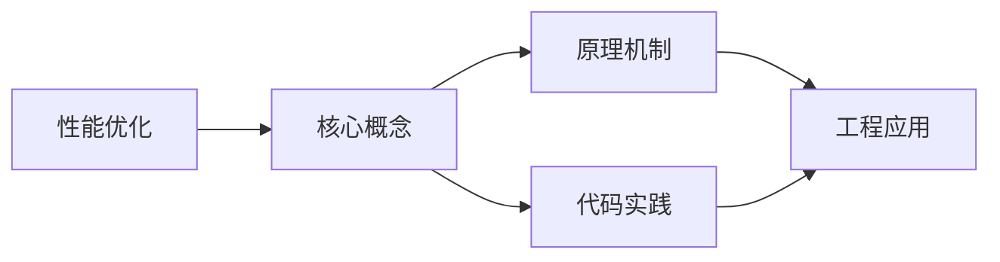
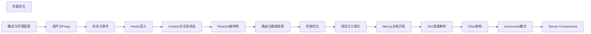

## 1. 学习目标（Bloom 分类）

本节按照布鲁姆教育目标分类学组织学习路径。本文主题为《性能优化》，属于 React 模块，读者可以根据自身阶段选择阅读深度。

记忆层面：能够准确复述本文的核心概念、术语与基本语法或操作步骤，并能够在提问或检索时快速定位对应知识点。能够说出 React 的核心概念、术语与标准写法。

理解层面：能够用自己的语言解释核心原理与工作机制，说明概念之间的因果关系，而不是机械记忆结论。能够解释 React 的工作原理与设计动机。

应用层面：能够在真实项目或练习场景中运用本文知识解决具体问题，写出正确且可维护的实现。能够编写符合 React 规范的完整实现。

分析层面：能够拆解复杂问题，比较本文主题与相邻概念的异同，识别边界条件与例外情况。能够分析 React 与相邻方案的差异与边界。

评价层面：能够根据约束条件（性能、可读性、安全、成本）评价不同方案的优劣，做出有依据的技术决策。能够根据场景评价 React 相关方案的优劣。

创造层面：能够把本文知识与其他模块知识组合，设计出新的解决方案或可复用的工程模式。能够组合 React 与其他技术设计完整方案。

通过本节学习，读者应当能够把《性能优化》纳入自己的知识网络，并与 React 模块的其他主题（组件、Hooks、状态管理、渲染性能）建立关联。

## 2. 历史动机与发展脉络

《性能优化》是 React 领域的重要主题。要真正理解它，需要先了解它解决的问题与演进过程。

React 由 Facebook 于 2013 年开源，核心思想是组件化 UI 与声明式渲染；2019 年 React 16.8 引入 Hooks，函数组件成为主流。
React 19（2024）引入 Actions、useOptimistic、编译器（React Compiler）自动记忆化；并发特性（Suspense、Transitions）持续完善。
生态：Next.js/Remix 全栈框架、TanStack Query 服务端状态、Zustand/Redux 客户端状态、React Native 移动端。

回到本文主题：性能优化 的提出与成熟，正是上述技术背景下的必然产物。早期实现往往以简单可用为目标，随着工程规模扩大，社区逐渐沉淀出标准做法与最佳实践；理解这一脉络，可以帮助读者判断“为什么文档中的推荐写法是现在这个样子”，也能在遇到历史遗留代码时准确识别其设计年代与取舍。


## 3. 形式化定义与核心概念精讲

本节把《性能优化》涉及的核心概念以“定义 + 讲解”的形式展开。读者应把定义当作工具，把讲解当作理解路径；两者结合才能形成可迁移的知识。

组件模型：props 输入、state 内部状态、渲染输出 JSX；组件是纯函数，同一输入必得同一输出。
Hooks 规则：只能在顶层调用（不可在条件/循环中），函数组件与自定义 Hook 内使用；依赖数组决定 effect 重跑。
渲染与协调：setState 触发重渲染，虚拟 DOM diff 更新真实 DOM；key 帮助复用元素。

### 3.1 原文章节逐一精讲

原文档把主题拆分为 30 个小节，下面按顺序给出每一节的导读讲解，随后保留原文细节供精读。

#### 原文精读（完整保留）

# React 性能优化

> **符号约定**：`< >` 必填参数 | `[ ]` 可选参数

---

#### 1. React.memo

`React.memo` 是高阶组件，对组件进行浅比较，避免不必要的重渲染。

##### 1.1 基本用法

```tsx
import { memo } from 'react';

interface UserCardProps {
  name: string;
  avatar: string;
  onClick: (id: string) => void;
}

// 使用 memo 包裹，props 不变时跳过渲染
const UserCard = memo(function UserCard({ name, avatar }: UserCardProps) {
  console.log('UserCard 渲染'); // 仅在 props 变化时打印
  return (
    <div className="user-card">
      
      <span>{name}</span>
    </div>
  );
});
```

##### 1.2 自定义比较函数

```tsx
interface ItemProps {
  item: {
    id: string;
    name: string;
    tags: string[];
  };
  selected: boolean;
}

const Item = memo(
  function Item({ item, selected }: ItemProps) {
    return <div className={selected ? 'selected' : ''}>{item.name}</div>;
  },
  (prevProps, nextProps) => {
    // 自定义浅比较逻辑
    return (
      prevProps.item.id === nextProps.item.id &&
      prevProps.item.name === nextProps.item.name &&
      prevProps.selected === nextProps.selected
    );
  }
);
```

##### 1.3 何时使用 memo

```tsx
//  场景一：频繁重渲染的父组件中的子组件
function Parent() {
  const [count, setCount] = useState(0); // 频繁变化
  return (
    <div>
      <p>{count}</p>
      <button onClick={() => setCount((c) => c + 1)}>+1</button>
      <ExpensiveChild /> {/* memo 包裹后不会随 count 变化而重渲染 */}
    </div>
  );
}

//  场景二：列表项组件
const ListItem = memo(function ListItem({ item }: { item: Item }) {
  return <li>{item.name}</li>;
});

//  不需要 memo：props 经常变化
//  不需要 memo：组件很轻量，重渲染成本极低
```

#### 2. useMemo / useCallback

##### 2.1 避免不必要的计算

```tsx
function ProductTable({ products, filterText, sortBy }: Props) {
  //  缓存计算结果
  const filteredProducts = useMemo(() => {
    return products
      .filter((p) => p.name.includes(filterText))
      .sort((a, b) => {
        if (sortBy === 'price') return a.price - b.price;
        return a.name.localeCompare(b.name);
      });
  }, [products, filterText, sortBy]);

  return (
    <table>
      {filteredProducts.map((p) => (
        <ProductRow key={p.id} product={p} />
      ))}
    </table>
  );
}
```

##### 2.2 稳定引用

```tsx
function SearchPage() {
  const [query, setQuery] = useState('');

  //  缓存对象引用，避免子组件因新引用而重渲染
  const searchOptions = useMemo(() => ({ query, pageSize: 20, includeArchived: false }), [query]);

  //  缓存函数引用
  const handleSearch = useCallback((newQuery: string) => {
    setQuery(newQuery);
  }, []);

  return (
    <div>
      <SearchInput onSearch={handleSearch} />
      <SearchResults options={searchOptions} />
    </div>
  );
}
```

#### 3. 代码分割（lazy/Suspense）

##### 3.1 React.lazy 动态导入

```tsx
import { lazy, Suspense } from 'react';

// 懒加载组件
const Dashboard = lazy(() => import('./Dashboard'));
const Settings = lazy(() => import('./Settings'));
const Profile = lazy(() => import('./Profile'));

function App() {
  return (
    <Suspense fallback={<PageSkeleton />}>
      <Dashboard />
    </Suspense>
  );
}
```

##### 3.2 路由级代码分割

```tsx
import { lazy, Suspense } from 'react';
import { createBrowserRouter } from 'react-router';

const Home = lazy(() => import('./pages/Home'));
const About = lazy(() => import('./pages/About'));
const Users = lazy(() => import('./pages/Users'));

function SuspenseWrapper({ children }: { children: React.ReactNode }) {
  return <Suspense fallback={<PageSkeleton />}>{children}</Suspense>;
}

const router = createBrowserRouter([
  {
    path: '/',
    element: (
      <SuspenseWrapper>
        <Home />
      </SuspenseWrapper>
    ),
  },
  {
    path: '/about',
    element: (
      <SuspenseWrapper>
        <About />
      </SuspenseWrapper>
    ),
  },
  {
    path: '/users',
    element: (
      <SuspenseWrapper>
        <Users />
      </SuspenseWrapper>
    ),
  },
]);
```

##### 3.3 命名导出懒加载

```tsx
// utils/lazy.ts
import { lazy, type ComponentType } from 'react';

function lazyNamed<T extends ComponentType<any>>(
  factory: () => Promise<{ [key: string]: T }>,
  name: string
) {
  return lazy(() => factory().then((module) => ({ default: module[name] })));
}

// 使用
const MyComponent = lazyNamed(() => import('./components'), 'MyComponent');
```

#### 4. 虚拟化

##### 4.1 为什么需要虚拟化

当列表数据量很大时（如 10000+ 条），直接渲染所有 DOM 节点会导致严重卡顿。虚拟化只渲染可视区域内的元素。

##### 4.2 @tanstack/react-virtual

```tsx
import { useVirtualizer } from '@tanstack/react-virtual';
import { useRef } from 'react';

function VirtualList({ items }: { items: Array<{ id: string; name: string }> }) {
  const parentRef = useRef<HTMLDivElement>(null);

  const virtualizer = useVirtualizer({
    count: items.length,
    getScrollElement: () => parentRef.current,
    estimateSize: () => 50, // 每行预估高度
    overscan: 5, // 可视区域外额外渲染的行数
  });

  return (
    <div ref={parentRef} style={{ height: '600px', overflow: 'auto' }}>
      <div style={{ height: `${virtualizer.getTotalSize()}px`, position: 'relative' }}>
        {virtualizer.getVirtualItems().map((virtualItem) => (
          <div
            key={virtualItem.key}
            style={{
              position: 'absolute',
              top: 0,
              transform: `translateY(${virtualItem.start}px)`,
              height: `${virtualItem.size}px`,
              width: '100%',
            }}
          >
            {items[virtualItem.index].name}
          </div>
        ))}
      </div>
    </div>
  );
}
```

##### 4.3 react-window

```tsx
import { FixedSizeList as List } from 'react-window';

function BigList({ items }: { items: string[] }) {
  const Row = ({ index, style }: { index: number; style: React.CSSProperties }) => (
    <div style={style}>{items[index]}</div>
  );

  return (
    <List height={600} itemCount={items.length} itemSize={50} width="100%">
      {Row}
    </List>
  );
}
```

#### 5. 并发特性

##### 5.1 useTransition

`useTransition` 将状态更新标记为非紧急，允许 UI 保持响应。

```tsx
import { useTransition, useState } from 'react';

function SearchPage() {
  const [query, setQuery] = useState('');
  const [results, setResults] = useState<string[]>([]);
  const [isPending, startTransition] = useTransition();

  const handleSearch = (value: string) => {
    // 紧急更新：输入框立即响应
    setQuery(value);

    // 非紧急更新：搜索结果可以延迟
    startTransition(() => {
      const filtered = hugeData.filter((item) =>
        item.name.toLowerCase().includes(value.toLowerCase())
      );
      setResults(filtered);
    });
  };

  return (
    <div>
      <input value={query} onChange={(e) => handleSearch(e.target.value)} placeholder="搜索..." />
      {isPending && <Spinner />}
      <ul>
        {results.map((r, i) => (
          <li key={i}>{r}</li>
        ))}
      </ul>
    </div>
  );
}
```

##### 5.2 useDeferredValue

`useDeferredValue` 延迟更新某个值的渲染，与 `useTransition` 类似但适用于接收延迟值的场景。

```tsx
import { useDeferredValue, useState, useMemo } from 'react';

function SearchResults({ query }: { query: string }) {
  const deferredQuery = useDeferredValue(query);

  const results = useMemo(() => {
    return hugeData.filter((item) => item.name.toLowerCase().includes(deferredQuery.toLowerCase()));
  }, [deferredQuery]);

  return (
    <ul>
      {results.map((r) => (
        <li key={r.id}>{r.name}</li>
      ))}
    </ul>
  );
}

function SearchPage() {
  const [query, setQuery] = useState('');

  return (
    <div>
      <input value={query} onChange={(e) => setQuery(e.target.value)} />
      <SearchResults query={query} />
    </div>
  );
}
```

##### 5.3 useTransition vs useDeferredValue

| 特性           | useTransition  | useDeferredValue    |
| :------------- | :------------- | :------------------ |
| 控制粒度       | 控制更新过程   | 控制值的延迟        |
| 获取 isPending | 可以           | 不可以              |
| 使用方式       | 包裹 setState  | 包裹值              |
| 适用场景       | 主动触发的更新 | 接收 props 的子组件 |

#### 6. Profiler

##### 6.1 React DevTools Profiler

React DevTools 提供了 Profiler 面板，可以可视化组件渲染性能：

1. 安装 React DevTools 浏览器扩展
2. 切换到 Profiler 标签
3. 点击录制按钮
4. 操作应用
5. 停止录制，查看火焰图

##### 6.2 编程式 Profiler

```tsx
import { Profiler } from 'react';

function onRenderCallback(
  id: string,
  phase: 'mount' | 'update' | 'nested-update',
  actualDuration: number,
  baseDuration: number,
  startTime: number,
  commitTime: number
) {
  // 记录渲染性能数据
  console.log(`${id} ${phase} 耗时：${actualDuration.toFixed(2)}ms`);
}

function App() {
  return (
    <Profiler id="App" onRender={onRenderCallback}>
      <Dashboard />
    </Profiler>
  );
}
```

#### 7. 性能分析

##### 7.1 Chrome DevTools Performance

1. 打开 Chrome DevTools → Performance
2. 点击录制
3. 操作应用
4. 停止录制
5. 分析 Main 线程中的长任务

##### 7.2 React Compiler

React Compiler（原 React Forget）是 React 团队开发的编译器，自动优化组件重渲染：

```bash
# 安装 React Compiler
npm install babel-plugin-react-compiler
```

```js
// babel.config.js
module.exports = {
  presets: ['@babel/preset-react'],
  plugins: ['react-compiler'],
};
```

```tsx
// 使用 Compiler 后，无需手动 useMemo/useCallback
function SearchPage() {
  const [query, setQuery] = useState('');

  // Compiler 自动优化，无需 useCallback
  const handleSearch = (value: string) => {
    setQuery(value);
  };

  // Compiler 自动优化，无需 useMemo
  const results = hugeData.filter((item) => item.name.includes(query));

  return (
    <div>
      <SearchInput onSearch={handleSearch} />
      <ResultList results={results} />
    </div>
  );
}
```

##### 7.3 性能优化清单

| 优化项       | 方法                             | 优先级 |
| :----------- | :------------------------------- | :----- |
| 减少重渲染   | React.memo + useMemo/useCallback | 高     |
| 代码分割     | React.lazy + Suspense            | 高     |
| 虚拟化长列表 | @tanstack/react-virtual          | 高     |
| 图片优化     | next/image 或懒加载              | 中     |
| 非紧急更新   | useTransition / useDeferredValue | 中     |
| Bundle 分析  | webpack-bundle-analyzer          | 中     |
| 缓存数据     | React Query / SWR                | 中     |
| 预加载       | preload / prefetch               | 低     |
| Web Worker   | 计算密集型任务移出主线程         | 低     |
| SSR/SSG      | 服务端渲染减少客户端工作         | 视场景 |
#### React.memo 组件记忆化

**基本写法：对函数组件进行浅比较记忆化**
`const <组件> = React.memo(<组件> [, <对比函数>])`
```tsx
// 仅当 props 变化时才重新渲染
const UserCard = React.memo(function UserCard({ name, age }) {
  return <div>{name} - {age}</div>;
});
```

---

**基本写法：自定义对比函数**
`React.memo(<组件>, (<prevProps>, <nextProps>) => <是否相等>)`
```tsx
// 返回 true 表示跳过渲染
const Item = React.memo(ItemBase, (prev, next) => prev.id === next.id);
```

---

#### useMemo 缓存计算结果

**基本写法：缓存昂贵计算的结果**
`const <值> = useMemo(() => <计算>, [<依赖>])`
```tsx
// 仅当 deps 变化时重新计算
const sorted = useMemo(() => list.sort(), [list]);
```

---

**基本写法：缓存对象引用**
`const <对象> = useMemo(() => ({ <字段> }), [<依赖>])`
```tsx
// 避免每次渲染生成新对象引用
const style = useMemo(() => ({ color: 'red' }), []);
```

---

#### useCallback 缓存函数引用

**基本写法：缓存函数实例避免子组件重渲染**
`const <函数> = useCallback((<参数>) => <逻辑>, [<依赖>])`
```tsx
// 配合 React.memo 子组件使用
const handleClick = useCallback(() => doAction(id), [id]);
```

---

#### lazy 与 Suspense 延迟加载

**基本写法：动态导入组件**
`const <组件> = lazy(() => import(<路径>))`
```tsx
// 按需加载路由级组件
const Detail = lazy(() => import('./Detail'));
```

---

**基本写法：配合 Suspense 显示降级 UI**
`<Suspense fallback={<占位>}> <组件 /> </Suspense>`
```tsx
// 加载期间显示 fallback
<Suspense fallback={<Spinner />}>
  <Detail />
</Suspense>
```

---

**基本写法：嵌套 Suspense 边界**
`<Suspense fallback={<外层占位>}> <<父组件> /> </Suspense>`
```tsx
// 子组件独立Suspense避免整页阻塞
<Suspense fallback={<PageSkeleton />}>
  <Header />
  <Suspense fallback={<ListSkeleton />}>
    <List />
  </Suspense>
</Suspense>
```

---

#### 列表虚拟化

**基本写法：长列表只渲染可见项**
`<虚拟列表 <数据>={数据} />`
```tsx
// 使用 react-window 减少 DOM 节点数量
import { FixedSizeList } from 'react-window';
<FixedSizeList height={600} itemCount={10000} itemSize={40} width={400}>
  {({ index, style }) => <div style={style}>行 {index}</div>}
</FixedSizeList>
```

---

#### key 优化列表渲染

**基本写法：为列表项提供稳定唯一 key**
`<列表项 key={<唯一标识>} />`
```tsx
// 使用业务 id 而非数组索引
{todos.map(t => <TodoItem key={t.id} todo={t} />)}
```

---

#### 状态拆分降低渲染范围

**基本写法：将高频更新状态隔离到独立子组件**
`function <子组件>() { const [<状态>, <设置>] = useState(<初值>); }`
```tsx
// 输入框高频更新不触发父组件渲染
function SearchInput() {
  const [text, setText] = useState('');
  return <input value={text} onChange={e => setText(e.target.value)} />;
}
```

---

#### useDeferredValue 延迟更新

**基本写法：将非紧急更新标记为可延迟**
`const <延迟值> = useDeferredValue(<值>)`
```tsx
// 搜索结果可延迟，输入框保持流畅
const deferredQuery = useDeferredValue(query);
const results = useMemo(() => filter(deferredQuery), [deferredQuery]);
```

---

#### 批量更新 Automatic Batching

**基本写法：同一事件中多次 setState 自动合并**
`<设置1>(<值1>); <设置2>(<值2>);`
```tsx
// React 18+ 自动批量合并为一次渲染
function handleClick() {
  setCount(c => c + 1);
  setFlag(f => !f);
}
```

---

**基本写法：flushSync 强制同步刷新**
`flushSync(() => { <更新> })`
```tsx
// 需要立即反映 DOM 时使用
import { flushSync } from 'react-dom';
flushSync(() => setScrollTop(0));
```

---

#### Profiler 性能分析

**基本写法：测量组件渲染耗时**
`<Profiler id={<标识>} onRender={<回调>}> <子组件 /> </Profiler>`
```tsx
// 收集渲染阶段与耗时
<Profiler id="App" onRender={(id, phase, actualTime) => console.log(id, phase, actualTime)}>
  <App />
</Profiler>
```

---

#### 图片与资源懒加载

**基本写法：图片原生懒加载**
`} loading="lazy" />`
```tsx
// 视口进入时再加载图片

```

---

#### 代码分割按路由

**基本写法：路由配置级懒加载**
`const <页面> = lazy(() => import(<页面路径>))`
```tsx
// 每个路由独立 chunk
const Home = lazy(() => import('./pages/Home'));
const User = lazy(() => import('./pages/User'));
```

---

#### Context 渲染优化

**基本写法：拆分 Context 避免无关消费者更新**
`const <静态Context> = createContext(<静态值>); const <动态Context> = createContext(<动态值>);`
```tsx
// 静态与高频更新状态分离
const ThemeContext = createContext('light');
const UserContext = createContext(null);
```

---

#### ref 读取而非订阅

**基本写法：频繁变化的值不进 state**
`const <ref> = useRef(<初值>); <ref>.current = <新值>;`
```tsx
// 不触发渲染的容器
const timerRef = useRef(null);
timerRef.current = setInterval(tick, 1000);
```

---

#### 使用 Production 构建

**基本写法：生产环境去除开发警告**
`npm run build`
```bash
# 生产构建自动启用优化
npm run build
```

---

#### Strict Mode 排查副作用

**基本写法：开发期双重渲染检测副作用**
`<React.StrictMode> <根组件 /> </React.StrictMode>`
```tsx
// 开发环境帮助发现不纯渲染
<React.StrictMode>
  <App />
</React.StrictMode>
```

---

#### Web Worker 卸载计算

**基本写法：将繁重任务交给 Worker**
`const <worker> = new Worker(new URL(<脚本>, import.meta.url))`
```tsx
// 主线程保持响应
const worker = new Worker(new URL('./heavy.js', import.meta.url));
worker.postMessage(data);
```

---

#### useSyncExternalStore 订阅外部源

**基本写法：安全订阅外部 store**
`const <值> = useSyncExternalStore(<订阅>, <快照>, [<服务端快照>])`
```tsx
// 避免 tearing 撕裂问题
const width = useSyncExternalStore(subscribeResize, () => window.innerWidth);
```

---

#### 避免内联对象与函数

**基本写法：将常量对象提到组件外**
`const <常量对象> = { <字段> };`
```tsx
// 防止每次渲染新建对象破坏 memo
const HEADER_STYLE = { padding: 8 };
function Header() { return <div style={HEADER_STYLE} />; }
```

---

#### useTransition 降低更新优先级

**基本写法：将昂贵更新标记为过渡**
`const [<isPending>, <startTransition>] = useTransition()`
```tsx
// 切换标签页时保持交互响应
const [isPending, startTransition] = useTransition();
startTransition(() => setTab(target));
```

---

#### 虚拟化表格优化

**基本写法：表格按行虚拟化**
`<FixedSizeList <数据>={行} itemSize={<行高>} >`
```tsx
// 万行数据表格仍流畅
<FixedSizeList height={500} itemCount={rows.length} itemSize={36} width="100%">
  {({ index, style, data }) => <Row style={style} data={data[index]} />}
</FixedSizeList>
```

---

#### tree shaking 减小体积

**基本写法：按命名导入而非整体引入**
`import { <命名> } from <库>`
```tsx
// 仅打包使用到的工具函数
import { debounce } from 'lodash-es';
```

---

#### 预加载关键资源

**基本写法：在入口注入资源预取**
`<link rel="preload" href=<资源> as=<类型> />`
```tsx
// 关键字体提前加载
<link rel="preload" href="/fonts.woff2" as="font" type="font/woff2" crossOrigin />
```


### 3.2 概念关系图

下面用 Mermaid 图表达本文核心概念之间的关系，帮助读者建立整体图景：



图中展示的是本文知识的结构化关系：核心概念是入口，原理机制解释“为什么”，代码实践演示“怎么做”，工程应用回答“何时用”。读者学习时可以把每个小节的内容挂接到对应节点上。

## 4. 理论推导与原理解析

本节深入《性能优化》背后的原理。理论部分不求面面俱到，而是聚焦“能解释现象、能指导实践”的关键推导。

组件模型：props 输入、state 内部状态、渲染输出 JSX；组件是纯函数，同一输入必得同一输出。
Hooks 规则：只能在顶层调用（不可在条件/循环中），函数组件与自定义 Hook 内使用；依赖数组决定 effect 重跑。
渲染与协调：setState 触发重渲染，虚拟 DOM diff 更新真实 DOM；key 帮助复用元素。
状态提升与下放：共享状态提升到最近公共祖先；Context 跨层传递（Provider/useContext）。

需要强调的是，理论推导与工程实践之间存在翻译层：理论给出的是理想化模型与边界条件，工程代码则必须处理真实环境中的例外。读者在学习时应先掌握理论的“标准情形”，再通过陷阱章节了解“非标准情形”。

## 5. 代码示例与逐行讲解

本节把原文中的代码示例系统整理，并为每个示例补充用途说明与讲解。读者不应只浏览代码，而应逐段对照讲解理解设计意图。

### 5.1 示例：1.1 基本用法

该示例来自原文《1.1 基本用法》小节，用于演示性能优化相关操作。阅读时请先看代码结构，再看其后的讲解。

```tsx
import { memo } from 'react';

interface UserCardProps {
  name: string;
  avatar: string;
  onClick: (id: string) => void;
}

// 使用 memo 包裹，props 不变时跳过渲染
const UserCard = memo(function UserCard({ name, avatar }: UserCardProps) {
  console.log('UserCard 渲染'); // 仅在 props 变化时打印
  return (
    <div className="user-card">
      
      <span>{name}</span>
    </div>
  );
});
```

讲解：这段代码演示了本节核心知识点。代码中的关键操作可以归纳为三步：准备（定义或初始化）、执行（核心逻辑）、收尾（释放资源或返回结果）。实际项目中，这三步往往被封装为函数或类，以提升复用性与可测试性。

关键点分析：

该示例共 16 行有效代码，包含 5 类关键结构（class、function、import、from、return）。其中：

- 入口与初始化部分负责建立上下文，对应实际项目中的启动或装配逻辑；
- 核心逻辑部分体现本文主题的主要操作，是阅读时最需要对照讲解理解的部分；
- 输出或返回部分把结果交给调用方，注意其类型与边界条件。

进阶思考路径：先尝试修改参数观察行为变化，再把示例中的模式迁移到自己的项目中；每次修改都记录预期与实测差异，这是把示例转化为能力的最快方式。

### 5.2 示例：1.2 自定义比较函数

该示例来自原文《1.2 自定义比较函数》小节，用于演示性能优化相关操作。阅读时请先看代码结构，再看其后的讲解。

```tsx
interface ItemProps {
  item: {
    id: string;
    name: string;
    tags: string[];
  };
  selected: boolean;
}

const Item = memo(
  function Item({ item, selected }: ItemProps) {
    return <div className={selected ? 'selected' : ''}>{item.name}</div>;
  },
  (prevProps, nextProps) => {
    // 自定义浅比较逻辑
    return (
      prevProps.item.id === nextProps.item.id &&
      prevProps.item.name === nextProps.item.name &&
      prevProps.selected === nextProps.selected
    );
  }
);
```

讲解：这段代码演示了本节核心知识点。代码中的关键操作可以归纳为三步：准备（定义或初始化）、执行（核心逻辑）、收尾（释放资源或返回结果）。实际项目中，这三步往往被封装为函数或类，以提升复用性与可测试性。

关键点分析：

该示例共 21 行有效代码，包含 3 类关键结构（class、function、return）。其中：

- 入口与初始化部分负责建立上下文，对应实际项目中的启动或装配逻辑；
- 核心逻辑部分体现本文主题的主要操作，是阅读时最需要对照讲解理解的部分；
- 输出或返回部分把结果交给调用方，注意其类型与边界条件。

进阶思考路径：先尝试修改参数观察行为变化，再把示例中的模式迁移到自己的项目中；每次修改都记录预期与实测差异，这是把示例转化为能力的最快方式。

### 5.3 示例：1.3 何时使用 memo

该示例来自原文《1.3 何时使用 memo》小节，用于演示性能优化相关操作。阅读时请先看代码结构，再看其后的讲解。

```tsx
//  场景一：频繁重渲染的父组件中的子组件
function Parent() {
  const [count, setCount] = useState(0); // 频繁变化
  return (
    <div>
      <p>{count}</p>
      <button onClick={() => setCount((c) => c + 1)}>+1</button>
      <ExpensiveChild /> {/* memo 包裹后不会随 count 变化而重渲染 */}
    </div>
  );
}

//  场景二：列表项组件
const ListItem = memo(function ListItem({ item }: { item: Item }) {
  return <li>{item.name}</li>;
});

//  不需要 memo：props 经常变化
//  不需要 memo：组件很轻量，重渲染成本极低
```

讲解：这段代码演示了本节核心知识点。代码中的关键操作可以归纳为三步：准备（定义或初始化）、执行（核心逻辑）、收尾（释放资源或返回结果）。实际项目中，这三步往往被封装为函数或类，以提升复用性与可测试性。

关键点分析：

该示例共 17 行有效代码，包含 2 类关键结构（function、return）。其中：

- 入口与初始化部分负责建立上下文，对应实际项目中的启动或装配逻辑；
- 核心逻辑部分体现本文主题的主要操作，是阅读时最需要对照讲解理解的部分；
- 输出或返回部分把结果交给调用方，注意其类型与边界条件。

进阶思考路径：先尝试修改参数观察行为变化，再把示例中的模式迁移到自己的项目中；每次修改都记录预期与实测差异，这是把示例转化为能力的最快方式。

### 5.4 示例：2.1 避免不必要的计算

该示例来自原文《2.1 避免不必要的计算》小节，用于演示性能优化相关操作。阅读时请先看代码结构，再看其后的讲解。

```tsx
function ProductTable({ products, filterText, sortBy }: Props) {
  //  缓存计算结果
  const filteredProducts = useMemo(() => {
    return products
      .filter((p) => p.name.includes(filterText))
      .sort((a, b) => {
        if (sortBy === 'price') return a.price - b.price;
        return a.name.localeCompare(b.name);
      });
  }, [products, filterText, sortBy]);

  return (
    <table>
      {filteredProducts.map((p) => (
        <ProductRow key={p.id} product={p} />
      ))}
    </table>
  );
}
```

讲解：这段代码演示了本节核心知识点。代码中的关键操作可以归纳为三步：准备（定义或初始化）、执行（核心逻辑）、收尾（释放资源或返回结果）。实际项目中，这三步往往被封装为函数或类，以提升复用性与可测试性。

关键点分析：

该示例共 18 行有效代码，包含 3 类关键结构（function、if、return）。其中：

- 入口与初始化部分负责建立上下文，对应实际项目中的启动或装配逻辑；
- 核心逻辑部分体现本文主题的主要操作，是阅读时最需要对照讲解理解的部分；
- 输出或返回部分把结果交给调用方，注意其类型与边界条件。

进阶思考路径：先尝试修改参数观察行为变化，再把示例中的模式迁移到自己的项目中；每次修改都记录预期与实测差异，这是把示例转化为能力的最快方式。

### 5.5 示例：2.2 稳定引用

该示例来自原文《2.2 稳定引用》小节，用于演示性能优化相关操作。阅读时请先看代码结构，再看其后的讲解。

```tsx
function SearchPage() {
  const [query, setQuery] = useState('');

  //  缓存对象引用，避免子组件因新引用而重渲染
  const searchOptions = useMemo(() => ({ query, pageSize: 20, includeArchived: false }), [query]);

  //  缓存函数引用
  const handleSearch = useCallback((newQuery: string) => {
    setQuery(newQuery);
  }, []);

  return (
    <div>
      <SearchInput onSearch={handleSearch} />
      <SearchResults options={searchOptions} />
    </div>
  );
}
```

讲解：这段代码演示了本节核心知识点。代码中的关键操作可以归纳为三步：准备（定义或初始化）、执行（核心逻辑）、收尾（释放资源或返回结果）。实际项目中，这三步往往被封装为函数或类，以提升复用性与可测试性。

关键点分析：

该示例共 15 行有效代码，包含 2 类关键结构（function、return）。其中：

- 入口与初始化部分负责建立上下文，对应实际项目中的启动或装配逻辑；
- 核心逻辑部分体现本文主题的主要操作，是阅读时最需要对照讲解理解的部分；
- 输出或返回部分把结果交给调用方，注意其类型与边界条件。

进阶思考路径：先尝试修改参数观察行为变化，再把示例中的模式迁移到自己的项目中；每次修改都记录预期与实测差异，这是把示例转化为能力的最快方式。

### 5.6 示例：3.1 React.lazy 动态导入

该示例来自原文《3.1 React.lazy 动态导入》小节，用于演示性能优化相关操作。阅读时请先看代码结构，再看其后的讲解。

```tsx
import { lazy, Suspense } from 'react';

// 懒加载组件
const Dashboard = lazy(() => import('./Dashboard'));
const Settings = lazy(() => import('./Settings'));
const Profile = lazy(() => import('./Profile'));

function App() {
  return (
    <Suspense fallback={<PageSkeleton />}>
      <Dashboard />
    </Suspense>
  );
}
```

讲解：这段代码演示了本节核心知识点。代码中的关键操作可以归纳为三步：准备（定义或初始化）、执行（核心逻辑）、收尾（释放资源或返回结果）。实际项目中，这三步往往被封装为函数或类，以提升复用性与可测试性。

关键点分析：

该示例共 12 行有效代码，包含 4 类关键结构（function、import、from、return）。其中：

- 入口与初始化部分负责建立上下文，对应实际项目中的启动或装配逻辑；
- 核心逻辑部分体现本文主题的主要操作，是阅读时最需要对照讲解理解的部分；
- 输出或返回部分把结果交给调用方，注意其类型与边界条件。

进阶思考路径：先尝试修改参数观察行为变化，再把示例中的模式迁移到自己的项目中；每次修改都记录预期与实测差异，这是把示例转化为能力的最快方式。

### 5.7 示例：3.2 路由级代码分割

该示例来自原文《3.2 路由级代码分割》小节，用于演示性能优化相关操作。阅读时请先看代码结构，再看其后的讲解。

```tsx
import { lazy, Suspense } from 'react';
import { createBrowserRouter } from 'react-router';

const Home = lazy(() => import('./pages/Home'));
const About = lazy(() => import('./pages/About'));
const Users = lazy(() => import('./pages/Users'));

function SuspenseWrapper({ children }: { children: React.ReactNode }) {
  return <Suspense fallback={<PageSkeleton />}>{children}</Suspense>;
}

const router = createBrowserRouter([
  {
    path: '/',
    element: (
      <SuspenseWrapper>
        <Home />
      </SuspenseWrapper>
    ),
  },
  {
    path: '/about',
    element: (
      <SuspenseWrapper>
        <About />
      </SuspenseWrapper>
    ),
  },
  {
    path: '/users',
    element: (
      <SuspenseWrapper>
        <Users />
      </SuspenseWrapper>
    ),
  },
]);
```

讲解：这段代码演示了本节核心知识点。代码中的关键操作可以归纳为三步：准备（定义或初始化）、执行（核心逻辑）、收尾（释放资源或返回结果）。实际项目中，这三步往往被封装为函数或类，以提升复用性与可测试性。

关键点分析：

该示例共 34 行有效代码，包含 4 类关键结构（function、import、from、return）。其中：

- 入口与初始化部分负责建立上下文，对应实际项目中的启动或装配逻辑；
- 核心逻辑部分体现本文主题的主要操作，是阅读时最需要对照讲解理解的部分；
- 输出或返回部分把结果交给调用方，注意其类型与边界条件。

进阶思考路径：先尝试修改参数观察行为变化，再把示例中的模式迁移到自己的项目中；每次修改都记录预期与实测差异，这是把示例转化为能力的最快方式。

### 5.8 示例：3.3 命名导出懒加载

该示例来自原文《3.3 命名导出懒加载》小节，用于演示性能优化相关操作。阅读时请先看代码结构，再看其后的讲解。

```tsx
// utils/lazy.ts
import { lazy, type ComponentType } from 'react';

function lazyNamed<T extends ComponentType<any>>(
  factory: () => Promise<{ [key: string]: T }>,
  name: string
) {
  return lazy(() => factory().then((module) => ({ default: module[name] })));
}

// 使用
const MyComponent = lazyNamed(() => import('./components'), 'MyComponent');
```

讲解：这段代码演示了本节核心知识点。代码中的关键操作可以归纳为三步：准备（定义或初始化）、执行（核心逻辑）、收尾（释放资源或返回结果）。实际项目中，这三步往往被封装为函数或类，以提升复用性与可测试性。

关键点分析：

该示例共 10 行有效代码，包含 4 类关键结构（function、import、from、return）。其中：

- 入口与初始化部分负责建立上下文，对应实际项目中的启动或装配逻辑；
- 核心逻辑部分体现本文主题的主要操作，是阅读时最需要对照讲解理解的部分；
- 输出或返回部分把结果交给调用方，注意其类型与边界条件。

进阶思考路径：先尝试修改参数观察行为变化，再把示例中的模式迁移到自己的项目中；每次修改都记录预期与实测差异，这是把示例转化为能力的最快方式。

### 5.9 示例：4.2 @tanstack/react-virtual

该示例来自原文《4.2 @tanstack/react-virtual》小节，用于演示性能优化相关操作。阅读时请先看代码结构，再看其后的讲解。

```tsx
import { useVirtualizer } from '@tanstack/react-virtual';
import { useRef } from 'react';

function VirtualList({ items }: { items: Array<{ id: string; name: string }> }) {
  const parentRef = useRef<HTMLDivElement>(null);

  const virtualizer = useVirtualizer({
    count: items.length,
    getScrollElement: () => parentRef.current,
    estimateSize: () => 50, // 每行预估高度
    overscan: 5, // 可视区域外额外渲染的行数
  });

  return (
    <div ref={parentRef} style={{ height: '600px', overflow: 'auto' }}>
      <div style={{ height: `${virtualizer.getTotalSize()}px`, position: 'relative' }}>
        {virtualizer.getVirtualItems().map((virtualItem) => (
          <div
            key={virtualItem.key}
            style={{
              position: 'absolute',
              top: 0,
              transform: `translateY(${virtualItem.start}px)`,
              height: `${virtualItem.size}px`,
              width: '100%',
            }}
          >
            {items[virtualItem.index].name}
          </div>
        ))}
      </div>
    </div>
  );
}
```

讲解：这段代码演示了本节核心知识点。代码中的关键操作可以归纳为三步：准备（定义或初始化）、执行（核心逻辑）、收尾（释放资源或返回结果）。实际项目中，这三步往往被封装为函数或类，以提升复用性与可测试性。

关键点分析：

该示例共 31 行有效代码，包含 4 类关键结构（function、import、from、return）。其中：

- 入口与初始化部分负责建立上下文，对应实际项目中的启动或装配逻辑；
- 核心逻辑部分体现本文主题的主要操作，是阅读时最需要对照讲解理解的部分；
- 输出或返回部分把结果交给调用方，注意其类型与边界条件。

进阶思考路径：先尝试修改参数观察行为变化，再把示例中的模式迁移到自己的项目中；每次修改都记录预期与实测差异，这是把示例转化为能力的最快方式。

### 5.10 示例：4.3 react-window

该示例来自原文《4.3 react-window》小节，用于演示性能优化相关操作。阅读时请先看代码结构，再看其后的讲解。

```tsx
import { FixedSizeList as List } from 'react-window';

function BigList({ items }: { items: string[] }) {
  const Row = ({ index, style }: { index: number; style: React.CSSProperties }) => (
    <div style={style}>{items[index]}</div>
  );

  return (
    <List height={600} itemCount={items.length} itemSize={50} width="100%">
      {Row}
    </List>
  );
}
```

讲解：这段代码演示了本节核心知识点。代码中的关键操作可以归纳为三步：准备（定义或初始化）、执行（核心逻辑）、收尾（释放资源或返回结果）。实际项目中，这三步往往被封装为函数或类，以提升复用性与可测试性。

关键点分析：

该示例共 11 行有效代码，包含 4 类关键结构（function、import、from、return）。其中：

- 入口与初始化部分负责建立上下文，对应实际项目中的启动或装配逻辑；
- 核心逻辑部分体现本文主题的主要操作，是阅读时最需要对照讲解理解的部分；
- 输出或返回部分把结果交给调用方，注意其类型与边界条件。

进阶思考路径：先尝试修改参数观察行为变化，再把示例中的模式迁移到自己的项目中；每次修改都记录预期与实测差异，这是把示例转化为能力的最快方式。

### 5.11 示例：5.1 useTransition

该示例来自原文《5.1 useTransition》小节，用于演示性能优化相关操作。阅读时请先看代码结构，再看其后的讲解。

```tsx
import { useTransition, useState } from 'react';

function SearchPage() {
  const [query, setQuery] = useState('');
  const [results, setResults] = useState<string[]>([]);
  const [isPending, startTransition] = useTransition();

  const handleSearch = (value: string) => {
    // 紧急更新：输入框立即响应
    setQuery(value);

    // 非紧急更新：搜索结果可以延迟
    startTransition(() => {
      const filtered = hugeData.filter((item) =>
        item.name.toLowerCase().includes(value.toLowerCase())
      );
      setResults(filtered);
    });
  };

  return (
    <div>
      <input value={query} onChange={(e) => handleSearch(e.target.value)} placeholder="搜索..." />
      {isPending && <Spinner />}
      <ul>
        {results.map((r, i) => (
          <li key={i}>{r}</li>
        ))}
      </ul>
    </div>
  );
}
```

讲解：这段代码演示了本节核心知识点。代码中的关键操作可以归纳为三步：准备（定义或初始化）、执行（核心逻辑）、收尾（释放资源或返回结果）。实际项目中，这三步往往被封装为函数或类，以提升复用性与可测试性。

关键点分析：

该示例共 28 行有效代码，包含 4 类关键结构（function、import、from、return）。其中：

- 入口与初始化部分负责建立上下文，对应实际项目中的启动或装配逻辑；
- 核心逻辑部分体现本文主题的主要操作，是阅读时最需要对照讲解理解的部分；
- 输出或返回部分把结果交给调用方，注意其类型与边界条件。

进阶思考路径：先尝试修改参数观察行为变化，再把示例中的模式迁移到自己的项目中；每次修改都记录预期与实测差异，这是把示例转化为能力的最快方式。

### 5.12 示例：5.2 useDeferredValue

该示例来自原文《5.2 useDeferredValue》小节，用于演示性能优化相关操作。阅读时请先看代码结构，再看其后的讲解。

```tsx
import { useDeferredValue, useState, useMemo } from 'react';

function SearchResults({ query }: { query: string }) {
  const deferredQuery = useDeferredValue(query);

  const results = useMemo(() => {
    return hugeData.filter((item) => item.name.toLowerCase().includes(deferredQuery.toLowerCase()));
  }, [deferredQuery]);

  return (
    <ul>
      {results.map((r) => (
        <li key={r.id}>{r.name}</li>
      ))}
    </ul>
  );
}

function SearchPage() {
  const [query, setQuery] = useState('');

  return (
    <div>
      <input value={query} onChange={(e) => setQuery(e.target.value)} />
      <SearchResults query={query} />
    </div>
  );
}
```

讲解：这段代码演示了本节核心知识点。代码中的关键操作可以归纳为三步：准备（定义或初始化）、执行（核心逻辑）、收尾（释放资源或返回结果）。实际项目中，这三步往往被封装为函数或类，以提升复用性与可测试性。

关键点分析：

该示例共 23 行有效代码，包含 4 类关键结构（function、import、from、return）。其中：

- 入口与初始化部分负责建立上下文，对应实际项目中的启动或装配逻辑；
- 核心逻辑部分体现本文主题的主要操作，是阅读时最需要对照讲解理解的部分；
- 输出或返回部分把结果交给调用方，注意其类型与边界条件。

进阶思考路径：先尝试修改参数观察行为变化，再把示例中的模式迁移到自己的项目中；每次修改都记录预期与实测差异，这是把示例转化为能力的最快方式。

### 5.13 示例：6.2 编程式 Profiler

该示例来自原文《6.2 编程式 Profiler》小节，用于演示性能优化相关操作。阅读时请先看代码结构，再看其后的讲解。

```tsx
import { Profiler } from 'react';

function onRenderCallback(
  id: string,
  phase: 'mount' | 'update' | 'nested-update',
  actualDuration: number,
  baseDuration: number,
  startTime: number,
  commitTime: number
) {
  // 记录渲染性能数据
  console.log(`${id} ${phase} 耗时：${actualDuration.toFixed(2)}ms`);
}

function App() {
  return (
    <Profiler id="App" onRender={onRenderCallback}>
      <Dashboard />
    </Profiler>
  );
}
```

讲解：这段代码演示了本节核心知识点。代码中的关键操作可以归纳为三步：准备（定义或初始化）、执行（核心逻辑）、收尾（释放资源或返回结果）。实际项目中，这三步往往被封装为函数或类，以提升复用性与可测试性。

关键点分析：

该示例共 19 行有效代码，包含 4 类关键结构（function、import、from、return）。其中：

- 入口与初始化部分负责建立上下文，对应实际项目中的启动或装配逻辑；
- 核心逻辑部分体现本文主题的主要操作，是阅读时最需要对照讲解理解的部分；
- 输出或返回部分把结果交给调用方，注意其类型与边界条件。

进阶思考路径：先尝试修改参数观察行为变化，再把示例中的模式迁移到自己的项目中；每次修改都记录预期与实测差异，这是把示例转化为能力的最快方式。

### 5.14 示例：7.2 React Compiler

该示例来自原文《7.2 React Compiler》小节，用于演示性能优化相关操作。阅读时请先看代码结构，再看其后的讲解。

```bash
# 安装 React Compiler
npm install babel-plugin-react-compiler
```

讲解：这段代码演示了本节核心知识点。代码中的关键操作可以归纳为三步：准备（定义或初始化）、执行（核心逻辑）、收尾（释放资源或返回结果）。实际项目中，这三步往往被封装为函数或类，以提升复用性与可测试性。

关键点分析：

该示例共 2 行有效代码，结构以数据或配置为主。阅读时应关注：数据字段的含义、配置项的作用，以及它们与运行行为的对应关系。

进阶思考路径：先尝试修改参数观察行为变化，再把示例中的模式迁移到自己的项目中；每次修改都记录预期与实测差异，这是把示例转化为能力的最快方式。

### 5.15 示例：7.2 React Compiler

该示例来自原文《7.2 React Compiler》小节，用于演示性能优化相关操作。阅读时请先看代码结构，再看其后的讲解。

```js
// babel.config.js
module.exports = {
  presets: ['@babel/preset-react'],
  plugins: ['react-compiler'],
};
```

讲解：这段代码演示了本节核心知识点。代码中的关键操作可以归纳为三步：准备（定义或初始化）、执行（核心逻辑）、收尾（释放资源或返回结果）。实际项目中，这三步往往被封装为函数或类，以提升复用性与可测试性。

关键点分析：

该示例共 5 行有效代码，结构以数据或配置为主。阅读时应关注：数据字段的含义、配置项的作用，以及它们与运行行为的对应关系。

进阶思考路径：先尝试修改参数观察行为变化，再把示例中的模式迁移到自己的项目中；每次修改都记录预期与实测差异，这是把示例转化为能力的最快方式。

### 5.16 示例：7.2 React Compiler

该示例来自原文《7.2 React Compiler》小节，用于演示性能优化相关操作。阅读时请先看代码结构，再看其后的讲解。

```tsx
// 使用 Compiler 后，无需手动 useMemo/useCallback
function SearchPage() {
  const [query, setQuery] = useState('');

  // Compiler 自动优化，无需 useCallback
  const handleSearch = (value: string) => {
    setQuery(value);
  };

  // Compiler 自动优化，无需 useMemo
  const results = hugeData.filter((item) => item.name.includes(query));

  return (
    <div>
      <SearchInput onSearch={handleSearch} />
      <ResultList results={results} />
    </div>
  );
}
```

讲解：这段代码演示了本节核心知识点。代码中的关键操作可以归纳为三步：准备（定义或初始化）、执行（核心逻辑）、收尾（释放资源或返回结果）。实际项目中，这三步往往被封装为函数或类，以提升复用性与可测试性。

关键点分析：

该示例共 16 行有效代码，包含 2 类关键结构（function、return）。其中：

- 入口与初始化部分负责建立上下文，对应实际项目中的启动或装配逻辑；
- 核心逻辑部分体现本文主题的主要操作，是阅读时最需要对照讲解理解的部分；
- 输出或返回部分把结果交给调用方，注意其类型与边界条件。

进阶思考路径：先尝试修改参数观察行为变化，再把示例中的模式迁移到自己的项目中；每次修改都记录预期与实测差异，这是把示例转化为能力的最快方式。

### 5.17 示例：React.memo 组件记忆化

该示例来自原文《React.memo 组件记忆化》小节，用于演示性能优化相关操作。阅读时请先看代码结构，再看其后的讲解。

```tsx
// 仅当 props 变化时才重新渲染
const UserCard = React.memo(function UserCard({ name, age }) {
  return <div>{name} - {age}</div>;
});
```

讲解：这段代码演示了本节核心知识点。代码中的关键操作可以归纳为三步：准备（定义或初始化）、执行（核心逻辑）、收尾（释放资源或返回结果）。实际项目中，这三步往往被封装为函数或类，以提升复用性与可测试性。

关键点分析：

该示例共 4 行有效代码，包含 2 类关键结构（function、return）。其中：

- 入口与初始化部分负责建立上下文，对应实际项目中的启动或装配逻辑；
- 核心逻辑部分体现本文主题的主要操作，是阅读时最需要对照讲解理解的部分；
- 输出或返回部分把结果交给调用方，注意其类型与边界条件。

进阶思考路径：先尝试修改参数观察行为变化，再把示例中的模式迁移到自己的项目中；每次修改都记录预期与实测差异，这是把示例转化为能力的最快方式。

### 5.18 示例：React.memo 组件记忆化

该示例来自原文《React.memo 组件记忆化》小节，用于演示性能优化相关操作。阅读时请先看代码结构，再看其后的讲解。

```tsx
// 返回 true 表示跳过渲染
const Item = React.memo(ItemBase, (prev, next) => prev.id === next.id);
```

讲解：这段代码演示了本节核心知识点。代码中的关键操作可以归纳为三步：准备（定义或初始化）、执行（核心逻辑）、收尾（释放资源或返回结果）。实际项目中，这三步往往被封装为函数或类，以提升复用性与可测试性。

关键点分析：

该示例共 2 行有效代码，结构以数据或配置为主。阅读时应关注：数据字段的含义、配置项的作用，以及它们与运行行为的对应关系。

进阶思考路径：先尝试修改参数观察行为变化，再把示例中的模式迁移到自己的项目中；每次修改都记录预期与实测差异，这是把示例转化为能力的最快方式。

### 5.19 示例：useMemo 缓存计算结果

该示例来自原文《useMemo 缓存计算结果》小节，用于演示性能优化相关操作。阅读时请先看代码结构，再看其后的讲解。

```tsx
// 仅当 deps 变化时重新计算
const sorted = useMemo(() => list.sort(), [list]);
```

讲解：这段代码演示了本节核心知识点。代码中的关键操作可以归纳为三步：准备（定义或初始化）、执行（核心逻辑）、收尾（释放资源或返回结果）。实际项目中，这三步往往被封装为函数或类，以提升复用性与可测试性。

关键点分析：

该示例共 2 行有效代码，结构以数据或配置为主。阅读时应关注：数据字段的含义、配置项的作用，以及它们与运行行为的对应关系。

进阶思考路径：先尝试修改参数观察行为变化，再把示例中的模式迁移到自己的项目中；每次修改都记录预期与实测差异，这是把示例转化为能力的最快方式。

### 5.20 示例：useMemo 缓存计算结果

该示例来自原文《useMemo 缓存计算结果》小节，用于演示性能优化相关操作。阅读时请先看代码结构，再看其后的讲解。

```tsx
// 避免每次渲染生成新对象引用
const style = useMemo(() => ({ color: 'red' }), []);
```

讲解：这段代码演示了本节核心知识点。代码中的关键操作可以归纳为三步：准备（定义或初始化）、执行（核心逻辑）、收尾（释放资源或返回结果）。实际项目中，这三步往往被封装为函数或类，以提升复用性与可测试性。

关键点分析：

该示例共 2 行有效代码，结构以数据或配置为主。阅读时应关注：数据字段的含义、配置项的作用，以及它们与运行行为的对应关系。

进阶思考路径：先尝试修改参数观察行为变化，再把示例中的模式迁移到自己的项目中；每次修改都记录预期与实测差异，这是把示例转化为能力的最快方式。

### 5.21 示例：useCallback 缓存函数引用

该示例来自原文《useCallback 缓存函数引用》小节，用于演示性能优化相关操作。阅读时请先看代码结构，再看其后的讲解。

```tsx
// 配合 React.memo 子组件使用
const handleClick = useCallback(() => doAction(id), [id]);
```

讲解：这段代码演示了本节核心知识点。代码中的关键操作可以归纳为三步：准备（定义或初始化）、执行（核心逻辑）、收尾（释放资源或返回结果）。实际项目中，这三步往往被封装为函数或类，以提升复用性与可测试性。

关键点分析：

该示例共 2 行有效代码，结构以数据或配置为主。阅读时应关注：数据字段的含义、配置项的作用，以及它们与运行行为的对应关系。

进阶思考路径：先尝试修改参数观察行为变化，再把示例中的模式迁移到自己的项目中；每次修改都记录预期与实测差异，这是把示例转化为能力的最快方式。

### 5.22 示例：lazy 与 Suspense 延迟加载

该示例来自原文《lazy 与 Suspense 延迟加载》小节，用于演示性能优化相关操作。阅读时请先看代码结构，再看其后的讲解。

```tsx
// 按需加载路由级组件
const Detail = lazy(() => import('./Detail'));
```

讲解：这段代码演示了本节核心知识点。代码中的关键操作可以归纳为三步：准备（定义或初始化）、执行（核心逻辑）、收尾（释放资源或返回结果）。实际项目中，这三步往往被封装为函数或类，以提升复用性与可测试性。

关键点分析：

该示例共 2 行有效代码，包含 1 类关键结构（import）。其中：

- 入口与初始化部分负责建立上下文，对应实际项目中的启动或装配逻辑；
- 核心逻辑部分体现本文主题的主要操作，是阅读时最需要对照讲解理解的部分；
- 输出或返回部分把结果交给调用方，注意其类型与边界条件。

进阶思考路径：先尝试修改参数观察行为变化，再把示例中的模式迁移到自己的项目中；每次修改都记录预期与实测差异，这是把示例转化为能力的最快方式。

### 5.23 示例：lazy 与 Suspense 延迟加载

该示例来自原文《lazy 与 Suspense 延迟加载》小节，用于演示性能优化相关操作。阅读时请先看代码结构，再看其后的讲解。

```tsx
// 加载期间显示 fallback
<Suspense fallback={<Spinner />}>
  <Detail />
</Suspense>
```

讲解：这段代码演示了本节核心知识点。代码中的关键操作可以归纳为三步：准备（定义或初始化）、执行（核心逻辑）、收尾（释放资源或返回结果）。实际项目中，这三步往往被封装为函数或类，以提升复用性与可测试性。

关键点分析：

该示例共 4 行有效代码，结构以数据或配置为主。阅读时应关注：数据字段的含义、配置项的作用，以及它们与运行行为的对应关系。

进阶思考路径：先尝试修改参数观察行为变化，再把示例中的模式迁移到自己的项目中；每次修改都记录预期与实测差异，这是把示例转化为能力的最快方式。

### 5.24 示例：lazy 与 Suspense 延迟加载

该示例来自原文《lazy 与 Suspense 延迟加载》小节，用于演示性能优化相关操作。阅读时请先看代码结构，再看其后的讲解。

```tsx
// 子组件独立Suspense避免整页阻塞
<Suspense fallback={<PageSkeleton />}>
  <Header />
  <Suspense fallback={<ListSkeleton />}>
    <List />
  </Suspense>
</Suspense>
```

讲解：这段代码演示了本节核心知识点。代码中的关键操作可以归纳为三步：准备（定义或初始化）、执行（核心逻辑）、收尾（释放资源或返回结果）。实际项目中，这三步往往被封装为函数或类，以提升复用性与可测试性。

关键点分析：

该示例共 7 行有效代码，结构以数据或配置为主。阅读时应关注：数据字段的含义、配置项的作用，以及它们与运行行为的对应关系。

进阶思考路径：先尝试修改参数观察行为变化，再把示例中的模式迁移到自己的项目中；每次修改都记录预期与实测差异，这是把示例转化为能力的最快方式。

### 5.25 示例：列表虚拟化

该示例来自原文《列表虚拟化》小节，用于演示性能优化相关操作。阅读时请先看代码结构，再看其后的讲解。

```tsx
// 使用 react-window 减少 DOM 节点数量
import { FixedSizeList } from 'react-window';
<FixedSizeList height={600} itemCount={10000} itemSize={40} width={400}>
  {({ index, style }) => <div style={style}>行 {index}</div>}
</FixedSizeList>
```

讲解：这段代码演示了本节核心知识点。代码中的关键操作可以归纳为三步：准备（定义或初始化）、执行（核心逻辑）、收尾（释放资源或返回结果）。实际项目中，这三步往往被封装为函数或类，以提升复用性与可测试性。

关键点分析：

该示例共 5 行有效代码，包含 2 类关键结构（import、from）。其中：

- 入口与初始化部分负责建立上下文，对应实际项目中的启动或装配逻辑；
- 核心逻辑部分体现本文主题的主要操作，是阅读时最需要对照讲解理解的部分；
- 输出或返回部分把结果交给调用方，注意其类型与边界条件。

进阶思考路径：先尝试修改参数观察行为变化，再把示例中的模式迁移到自己的项目中；每次修改都记录预期与实测差异，这是把示例转化为能力的最快方式。

### 5.26 示例：key 优化列表渲染

该示例来自原文《key 优化列表渲染》小节，用于演示性能优化相关操作。阅读时请先看代码结构，再看其后的讲解。

```tsx
// 使用业务 id 而非数组索引
{todos.map(t => <TodoItem key={t.id} todo={t} />)}
```

讲解：这段代码演示了本节核心知识点。代码中的关键操作可以归纳为三步：准备（定义或初始化）、执行（核心逻辑）、收尾（释放资源或返回结果）。实际项目中，这三步往往被封装为函数或类，以提升复用性与可测试性。

关键点分析：

该示例共 2 行有效代码，结构以数据或配置为主。阅读时应关注：数据字段的含义、配置项的作用，以及它们与运行行为的对应关系。

进阶思考路径：先尝试修改参数观察行为变化，再把示例中的模式迁移到自己的项目中；每次修改都记录预期与实测差异，这是把示例转化为能力的最快方式。

### 5.27 示例：状态拆分降低渲染范围

该示例来自原文《状态拆分降低渲染范围》小节，用于演示性能优化相关操作。阅读时请先看代码结构，再看其后的讲解。

```tsx
// 输入框高频更新不触发父组件渲染
function SearchInput() {
  const [text, setText] = useState('');
  return <input value={text} onChange={e => setText(e.target.value)} />;
}
```

讲解：这段代码演示了本节核心知识点。代码中的关键操作可以归纳为三步：准备（定义或初始化）、执行（核心逻辑）、收尾（释放资源或返回结果）。实际项目中，这三步往往被封装为函数或类，以提升复用性与可测试性。

关键点分析：

该示例共 5 行有效代码，包含 2 类关键结构（function、return）。其中：

- 入口与初始化部分负责建立上下文，对应实际项目中的启动或装配逻辑；
- 核心逻辑部分体现本文主题的主要操作，是阅读时最需要对照讲解理解的部分；
- 输出或返回部分把结果交给调用方，注意其类型与边界条件。

进阶思考路径：先尝试修改参数观察行为变化，再把示例中的模式迁移到自己的项目中；每次修改都记录预期与实测差异，这是把示例转化为能力的最快方式。

### 5.28 示例：useDeferredValue 延迟更新

该示例来自原文《useDeferredValue 延迟更新》小节，用于演示性能优化相关操作。阅读时请先看代码结构，再看其后的讲解。

```tsx
// 搜索结果可延迟，输入框保持流畅
const deferredQuery = useDeferredValue(query);
const results = useMemo(() => filter(deferredQuery), [deferredQuery]);
```

讲解：这段代码演示了本节核心知识点。代码中的关键操作可以归纳为三步：准备（定义或初始化）、执行（核心逻辑）、收尾（释放资源或返回结果）。实际项目中，这三步往往被封装为函数或类，以提升复用性与可测试性。

关键点分析：

该示例共 3 行有效代码，结构以数据或配置为主。阅读时应关注：数据字段的含义、配置项的作用，以及它们与运行行为的对应关系。

进阶思考路径：先尝试修改参数观察行为变化，再把示例中的模式迁移到自己的项目中；每次修改都记录预期与实测差异，这是把示例转化为能力的最快方式。

### 5.29 示例：批量更新 Automatic Batching

该示例来自原文《批量更新 Automatic Batching》小节，用于演示性能优化相关操作。阅读时请先看代码结构，再看其后的讲解。

```tsx
// React 18+ 自动批量合并为一次渲染
function handleClick() {
  setCount(c => c + 1);
  setFlag(f => !f);
}
```

讲解：这段代码演示了本节核心知识点。代码中的关键操作可以归纳为三步：准备（定义或初始化）、执行（核心逻辑）、收尾（释放资源或返回结果）。实际项目中，这三步往往被封装为函数或类，以提升复用性与可测试性。

关键点分析：

该示例共 5 行有效代码，包含 1 类关键结构（function）。其中：

- 入口与初始化部分负责建立上下文，对应实际项目中的启动或装配逻辑；
- 核心逻辑部分体现本文主题的主要操作，是阅读时最需要对照讲解理解的部分；
- 输出或返回部分把结果交给调用方，注意其类型与边界条件。

进阶思考路径：先尝试修改参数观察行为变化，再把示例中的模式迁移到自己的项目中；每次修改都记录预期与实测差异，这是把示例转化为能力的最快方式。

### 5.30 示例：批量更新 Automatic Batching

该示例来自原文《批量更新 Automatic Batching》小节，用于演示性能优化相关操作。阅读时请先看代码结构，再看其后的讲解。

```tsx
// 需要立即反映 DOM 时使用
import { flushSync } from 'react-dom';
flushSync(() => setScrollTop(0));
```

讲解：这段代码演示了本节核心知识点。代码中的关键操作可以归纳为三步：准备（定义或初始化）、执行（核心逻辑）、收尾（释放资源或返回结果）。实际项目中，这三步往往被封装为函数或类，以提升复用性与可测试性。

关键点分析：

该示例共 3 行有效代码，包含 2 类关键结构（import、from）。其中：

- 入口与初始化部分负责建立上下文，对应实际项目中的启动或装配逻辑；
- 核心逻辑部分体现本文主题的主要操作，是阅读时最需要对照讲解理解的部分；
- 输出或返回部分把结果交给调用方，注意其类型与边界条件。

进阶思考路径：先尝试修改参数观察行为变化，再把示例中的模式迁移到自己的项目中；每次修改都记录预期与实测差异，这是把示例转化为能力的最快方式。

### 5.31 示例：Profiler 性能分析

该示例来自原文《Profiler 性能分析》小节，用于演示性能优化相关操作。阅读时请先看代码结构，再看其后的讲解。

```tsx
// 收集渲染阶段与耗时
<Profiler id="App" onRender={(id, phase, actualTime) => console.log(id, phase, actualTime)}>
  <App />
</Profiler>
```

讲解：这段代码演示了本节核心知识点。代码中的关键操作可以归纳为三步：准备（定义或初始化）、执行（核心逻辑）、收尾（释放资源或返回结果）。实际项目中，这三步往往被封装为函数或类，以提升复用性与可测试性。

关键点分析：

该示例共 4 行有效代码，结构以数据或配置为主。阅读时应关注：数据字段的含义、配置项的作用，以及它们与运行行为的对应关系。

进阶思考路径：先尝试修改参数观察行为变化，再把示例中的模式迁移到自己的项目中；每次修改都记录预期与实测差异，这是把示例转化为能力的最快方式。

### 5.32 示例：图片与资源懒加载

该示例来自原文《图片与资源懒加载》小节，用于演示性能优化相关操作。阅读时请先看代码结构，再看其后的讲解。

```tsx
// 视口进入时再加载图片

```

讲解：这段代码演示了本节核心知识点。代码中的关键操作可以归纳为三步：准备（定义或初始化）、执行（核心逻辑）、收尾（释放资源或返回结果）。实际项目中，这三步往往被封装为函数或类，以提升复用性与可测试性。

关键点分析：

该示例共 2 行有效代码，结构以数据或配置为主。阅读时应关注：数据字段的含义、配置项的作用，以及它们与运行行为的对应关系。

进阶思考路径：先尝试修改参数观察行为变化，再把示例中的模式迁移到自己的项目中；每次修改都记录预期与实测差异，这是把示例转化为能力的最快方式。

### 5.33 示例：代码分割按路由

该示例来自原文《代码分割按路由》小节，用于演示性能优化相关操作。阅读时请先看代码结构，再看其后的讲解。

```tsx
// 每个路由独立 chunk
const Home = lazy(() => import('./pages/Home'));
const User = lazy(() => import('./pages/User'));
```

讲解：这段代码演示了本节核心知识点。代码中的关键操作可以归纳为三步：准备（定义或初始化）、执行（核心逻辑）、收尾（释放资源或返回结果）。实际项目中，这三步往往被封装为函数或类，以提升复用性与可测试性。

关键点分析：

该示例共 3 行有效代码，包含 1 类关键结构（import）。其中：

- 入口与初始化部分负责建立上下文，对应实际项目中的启动或装配逻辑；
- 核心逻辑部分体现本文主题的主要操作，是阅读时最需要对照讲解理解的部分；
- 输出或返回部分把结果交给调用方，注意其类型与边界条件。

进阶思考路径：先尝试修改参数观察行为变化，再把示例中的模式迁移到自己的项目中；每次修改都记录预期与实测差异，这是把示例转化为能力的最快方式。

### 5.34 示例：Context 渲染优化

该示例来自原文《Context 渲染优化》小节，用于演示性能优化相关操作。阅读时请先看代码结构，再看其后的讲解。

```tsx
// 静态与高频更新状态分离
const ThemeContext = createContext('light');
const UserContext = createContext(null);
```

讲解：这段代码演示了本节核心知识点。代码中的关键操作可以归纳为三步：准备（定义或初始化）、执行（核心逻辑）、收尾（释放资源或返回结果）。实际项目中，这三步往往被封装为函数或类，以提升复用性与可测试性。

关键点分析：

该示例共 3 行有效代码，结构以数据或配置为主。阅读时应关注：数据字段的含义、配置项的作用，以及它们与运行行为的对应关系。

进阶思考路径：先尝试修改参数观察行为变化，再把示例中的模式迁移到自己的项目中；每次修改都记录预期与实测差异，这是把示例转化为能力的最快方式。

### 5.35 示例：ref 读取而非订阅

该示例来自原文《ref 读取而非订阅》小节，用于演示性能优化相关操作。阅读时请先看代码结构，再看其后的讲解。

```tsx
// 不触发渲染的容器
const timerRef = useRef(null);
timerRef.current = setInterval(tick, 1000);
```

讲解：这段代码演示了本节核心知识点。代码中的关键操作可以归纳为三步：准备（定义或初始化）、执行（核心逻辑）、收尾（释放资源或返回结果）。实际项目中，这三步往往被封装为函数或类，以提升复用性与可测试性。

关键点分析：

该示例共 3 行有效代码，结构以数据或配置为主。阅读时应关注：数据字段的含义、配置项的作用，以及它们与运行行为的对应关系。

进阶思考路径：先尝试修改参数观察行为变化，再把示例中的模式迁移到自己的项目中；每次修改都记录预期与实测差异，这是把示例转化为能力的最快方式。

### 5.36 示例：使用 Production 构建

该示例来自原文《使用 Production 构建》小节，用于演示性能优化相关操作。阅读时请先看代码结构，再看其后的讲解。

```bash
# 生产构建自动启用优化
npm run build
```

讲解：这段代码演示了本节核心知识点。代码中的关键操作可以归纳为三步：准备（定义或初始化）、执行（核心逻辑）、收尾（释放资源或返回结果）。实际项目中，这三步往往被封装为函数或类，以提升复用性与可测试性。

关键点分析：

该示例共 2 行有效代码，结构以数据或配置为主。阅读时应关注：数据字段的含义、配置项的作用，以及它们与运行行为的对应关系。

进阶思考路径：先尝试修改参数观察行为变化，再把示例中的模式迁移到自己的项目中；每次修改都记录预期与实测差异，这是把示例转化为能力的最快方式。

### 5.37 示例：Strict Mode 排查副作用

该示例来自原文《Strict Mode 排查副作用》小节，用于演示性能优化相关操作。阅读时请先看代码结构，再看其后的讲解。

```tsx
// 开发环境帮助发现不纯渲染
<React.StrictMode>
  <App />
</React.StrictMode>
```

讲解：这段代码演示了本节核心知识点。代码中的关键操作可以归纳为三步：准备（定义或初始化）、执行（核心逻辑）、收尾（释放资源或返回结果）。实际项目中，这三步往往被封装为函数或类，以提升复用性与可测试性。

关键点分析：

该示例共 4 行有效代码，结构以数据或配置为主。阅读时应关注：数据字段的含义、配置项的作用，以及它们与运行行为的对应关系。

进阶思考路径：先尝试修改参数观察行为变化，再把示例中的模式迁移到自己的项目中；每次修改都记录预期与实测差异，这是把示例转化为能力的最快方式。

### 5.38 示例：Web Worker 卸载计算

该示例来自原文《Web Worker 卸载计算》小节，用于演示性能优化相关操作。阅读时请先看代码结构，再看其后的讲解。

```tsx
// 主线程保持响应
const worker = new Worker(new URL('./heavy.js', import.meta.url));
worker.postMessage(data);
```

讲解：这段代码演示了本节核心知识点。代码中的关键操作可以归纳为三步：准备（定义或初始化）、执行（核心逻辑）、收尾（释放资源或返回结果）。实际项目中，这三步往往被封装为函数或类，以提升复用性与可测试性。

关键点分析：

该示例共 3 行有效代码，包含 1 类关键结构（import）。其中：

- 入口与初始化部分负责建立上下文，对应实际项目中的启动或装配逻辑；
- 核心逻辑部分体现本文主题的主要操作，是阅读时最需要对照讲解理解的部分；
- 输出或返回部分把结果交给调用方，注意其类型与边界条件。

进阶思考路径：先尝试修改参数观察行为变化，再把示例中的模式迁移到自己的项目中；每次修改都记录预期与实测差异，这是把示例转化为能力的最快方式。

### 5.39 示例：useSyncExternalStore 订阅外部源

该示例来自原文《useSyncExternalStore 订阅外部源》小节，用于演示性能优化相关操作。阅读时请先看代码结构，再看其后的讲解。

```tsx
// 避免 tearing 撕裂问题
const width = useSyncExternalStore(subscribeResize, () => window.innerWidth);
```

讲解：这段代码演示了本节核心知识点。代码中的关键操作可以归纳为三步：准备（定义或初始化）、执行（核心逻辑）、收尾（释放资源或返回结果）。实际项目中，这三步往往被封装为函数或类，以提升复用性与可测试性。

关键点分析：

该示例共 2 行有效代码，结构以数据或配置为主。阅读时应关注：数据字段的含义、配置项的作用，以及它们与运行行为的对应关系。

进阶思考路径：先尝试修改参数观察行为变化，再把示例中的模式迁移到自己的项目中；每次修改都记录预期与实测差异，这是把示例转化为能力的最快方式。

### 5.40 示例：避免内联对象与函数

该示例来自原文《避免内联对象与函数》小节，用于演示性能优化相关操作。阅读时请先看代码结构，再看其后的讲解。

```tsx
// 防止每次渲染新建对象破坏 memo
const HEADER_STYLE = { padding: 8 };
function Header() { return <div style={HEADER_STYLE} />; }
```

讲解：这段代码演示了本节核心知识点。代码中的关键操作可以归纳为三步：准备（定义或初始化）、执行（核心逻辑）、收尾（释放资源或返回结果）。实际项目中，这三步往往被封装为函数或类，以提升复用性与可测试性。

关键点分析：

该示例共 3 行有效代码，包含 2 类关键结构（function、return）。其中：

- 入口与初始化部分负责建立上下文，对应实际项目中的启动或装配逻辑；
- 核心逻辑部分体现本文主题的主要操作，是阅读时最需要对照讲解理解的部分；
- 输出或返回部分把结果交给调用方，注意其类型与边界条件。

进阶思考路径：先尝试修改参数观察行为变化，再把示例中的模式迁移到自己的项目中；每次修改都记录预期与实测差异，这是把示例转化为能力的最快方式。

### 5.41 示例：useTransition 降低更新优先级

该示例来自原文《useTransition 降低更新优先级》小节，用于演示性能优化相关操作。阅读时请先看代码结构，再看其后的讲解。

```tsx
// 切换标签页时保持交互响应
const [isPending, startTransition] = useTransition();
startTransition(() => setTab(target));
```

讲解：这段代码演示了本节核心知识点。代码中的关键操作可以归纳为三步：准备（定义或初始化）、执行（核心逻辑）、收尾（释放资源或返回结果）。实际项目中，这三步往往被封装为函数或类，以提升复用性与可测试性。

关键点分析：

该示例共 3 行有效代码，结构以数据或配置为主。阅读时应关注：数据字段的含义、配置项的作用，以及它们与运行行为的对应关系。

进阶思考路径：先尝试修改参数观察行为变化，再把示例中的模式迁移到自己的项目中；每次修改都记录预期与实测差异，这是把示例转化为能力的最快方式。

### 5.42 示例：虚拟化表格优化

该示例来自原文《虚拟化表格优化》小节，用于演示性能优化相关操作。阅读时请先看代码结构，再看其后的讲解。

```tsx
// 万行数据表格仍流畅
<FixedSizeList height={500} itemCount={rows.length} itemSize={36} width="100%">
  {({ index, style, data }) => <Row style={style} data={data[index]} />}
</FixedSizeList>
```

讲解：这段代码演示了本节核心知识点。代码中的关键操作可以归纳为三步：准备（定义或初始化）、执行（核心逻辑）、收尾（释放资源或返回结果）。实际项目中，这三步往往被封装为函数或类，以提升复用性与可测试性。

关键点分析：

该示例共 4 行有效代码，结构以数据或配置为主。阅读时应关注：数据字段的含义、配置项的作用，以及它们与运行行为的对应关系。

进阶思考路径：先尝试修改参数观察行为变化，再把示例中的模式迁移到自己的项目中；每次修改都记录预期与实测差异，这是把示例转化为能力的最快方式。

### 5.43 示例：tree shaking 减小体积

该示例来自原文《tree shaking 减小体积》小节，用于演示性能优化相关操作。阅读时请先看代码结构，再看其后的讲解。

```tsx
// 仅打包使用到的工具函数
import { debounce } from 'lodash-es';
```

讲解：这段代码演示了本节核心知识点。代码中的关键操作可以归纳为三步：准备（定义或初始化）、执行（核心逻辑）、收尾（释放资源或返回结果）。实际项目中，这三步往往被封装为函数或类，以提升复用性与可测试性。

关键点分析：

该示例共 2 行有效代码，包含 2 类关键结构（import、from）。其中：

- 入口与初始化部分负责建立上下文，对应实际项目中的启动或装配逻辑；
- 核心逻辑部分体现本文主题的主要操作，是阅读时最需要对照讲解理解的部分；
- 输出或返回部分把结果交给调用方，注意其类型与边界条件。

进阶思考路径：先尝试修改参数观察行为变化，再把示例中的模式迁移到自己的项目中；每次修改都记录预期与实测差异，这是把示例转化为能力的最快方式。

### 5.44 示例：预加载关键资源

该示例来自原文《预加载关键资源》小节，用于演示性能优化相关操作。阅读时请先看代码结构，再看其后的讲解。

```tsx
// 关键字体提前加载
<link rel="preload" href="/fonts.woff2" as="font" type="font/woff2" crossOrigin />
```

讲解：这段代码演示了本节核心知识点。代码中的关键操作可以归纳为三步：准备（定义或初始化）、执行（核心逻辑）、收尾（释放资源或返回结果）。实际项目中，这三步往往被封装为函数或类，以提升复用性与可测试性。

关键点分析：

该示例共 2 行有效代码，结构以数据或配置为主。阅读时应关注：数据字段的含义、配置项的作用，以及它们与运行行为的对应关系。

进阶思考路径：先尝试修改参数观察行为变化，再把示例中的模式迁移到自己的项目中；每次修改都记录预期与实测差异，这是把示例转化为能力的最快方式。


综合以上示例，可以总结出本主题的代码实践要点：第一，先定义清晰的输入输出契约；第二，核心逻辑保持单一职责；第三，错误处理与边界条件不可省略；第四，命名与注释表达意图而非复述代码。

## 6. 对比分析

对比是理解《性能优化》定位的最快路径。下面从多个维度与相邻方案进行对比。

React 与 Vue：React JSX 全 JS、生态自由组合；Vue 模板 + 响应式自动追踪。团队偏好与既有代码决定选择。
函数组件与类组件：函数 + Hooks 是现代标准，类组件仅维护存量。
CSR 与 SSR：CSR 交互快、SSR SEO 好；Next.js 按页选择渲染模式。

对比的目的不是分出绝对优劣，而是建立选择依据：不同约束条件下，最优解不同。读者应把每个对比维度转化为决策检查清单。

## 7. 常见陷阱与最佳实践

本节整理该主题的高频错误与推荐做法。每个陷阱先描述现象，再解释原因，最后给出最佳实践。

### 7.1 setState 直接修改

直接修改 state 对象不触发渲染。创建新对象/数组。

深入讲解：该问题之所以被归类为“常见陷阱”，是因为它在初学者的代码中反复出现，而且往往不在第一时间暴露——错误通常隐藏在特定数据或特定时序下。

从成因上看，setState 直接修改 一般源于对 React 某个机制的理解偏差：要么误用了默认行为，要么忽略了边界条件，要么把其他语言的思维惯性带了过来。

从影响上看，setState 直接修改 轻则产生错误结果，重则导致资源泄漏、数据损坏或安全事故；这也是为什么工程评审中会把它列为检查项。

从修复策略上看，处理setState 直接修改的正确顺序是：先复现（构造最小用例），再定位（确认机制层面的根因），最后修复并补充回归测试。跳过复现直接改代码，往往治标不治本。

### 7.2 依赖数组缺失

effect 捕获旧值。按需列出依赖或用函数式更新。

深入讲解：该问题之所以被归类为“常见陷阱”，是因为它在初学者的代码中反复出现，而且往往不在第一时间暴露——错误通常隐藏在特定数据或特定时序下。

从成因上看，依赖数组缺失 一般源于对 React 某个机制的理解偏差：要么误用了默认行为，要么忽略了边界条件，要么把其他语言的思维惯性带了过来。

从影响上看，依赖数组缺失 轻则产生错误结果，重则导致资源泄漏、数据损坏或安全事故；这也是为什么工程评审中会把它列为检查项。

从修复策略上看，处理依赖数组缺失的正确顺序是：先复现（构造最小用例），再定位（确认机制层面的根因），最后修复并补充回归测试。跳过复现直接改代码，往往治标不治本。

### 7.3 条件调用 Hooks

违反 Hooks 规则导致渲染错乱。把条件放组件内或拆分组件。

深入讲解：该问题之所以被归类为“常见陷阱”，是因为它在初学者的代码中反复出现，而且往往不在第一时间暴露——错误通常隐藏在特定数据或特定时序下。

从成因上看，条件调用 Hooks 一般源于对 React 某个机制的理解偏差：要么误用了默认行为，要么忽略了边界条件，要么把其他语言的思维惯性带了过来。

从影响上看，条件调用 Hooks 轻则产生错误结果，重则导致资源泄漏、数据损坏或安全事故；这也是为什么工程评审中会把它列为检查项。

从修复策略上看，处理条件调用 Hooks的正确顺序是：先复现（构造最小用例），再定位（确认机制层面的根因），最后修复并补充回归测试。跳过复现直接改代码，往往治标不治本。

### 7.4 key 用索引

列表重排导致状态错位。使用稳定 id。

深入讲解：该问题之所以被归类为“常见陷阱”，是因为它在初学者的代码中反复出现，而且往往不在第一时间暴露——错误通常隐藏在特定数据或特定时序下。

从成因上看，key 用索引 一般源于对 React 某个机制的理解偏差：要么误用了默认行为，要么忽略了边界条件，要么把其他语言的思维惯性带了过来。

从影响上看，key 用索引 轻则产生错误结果，重则导致资源泄漏、数据损坏或安全事故；这也是为什么工程评审中会把它列为检查项。

从修复策略上看，处理key 用索引的正确顺序是：先复现（构造最小用例），再定位（确认机制层面的根因），最后修复并补充回归测试。跳过复现直接改代码，往往治标不治本。

### 7.5 Context 过度使用

Context 变更使所有消费者重渲染。拆分 Context 或选择状态库。

深入讲解：该问题之所以被归类为“常见陷阱”，是因为它在初学者的代码中反复出现，而且往往不在第一时间暴露——错误通常隐藏在特定数据或特定时序下。

从成因上看，Context 过度使用 一般源于对 React 某个机制的理解偏差：要么误用了默认行为，要么忽略了边界条件，要么把其他语言的思维惯性带了过来。

从影响上看，Context 过度使用 轻则产生错误结果，重则导致资源泄漏、数据损坏或安全事故；这也是为什么工程评审中会把它列为检查项。

从修复策略上看，处理Context 过度使用的正确顺序是：先复现（构造最小用例），再定位（确认机制层面的根因），最后修复并补充回归测试。跳过复现直接改代码，往往治标不治本。

### 7.6 内存泄漏

异步回调在卸载后 setState。用 cleanup 与取消标志。

深入讲解：该问题之所以被归类为“常见陷阱”，是因为它在初学者的代码中反复出现，而且往往不在第一时间暴露——错误通常隐藏在特定数据或特定时序下。

从成因上看，内存泄漏 一般源于对 React 某个机制的理解偏差：要么误用了默认行为，要么忽略了边界条件，要么把其他语言的思维惯性带了过来。

从影响上看，内存泄漏 轻则产生错误结果，重则导致资源泄漏、数据损坏或安全事故；这也是为什么工程评审中会把它列为检查项。

从修复策略上看，处理内存泄漏的正确顺序是：先复现（构造最小用例），再定位（确认机制层面的根因），最后修复并补充回归测试。跳过复现直接改代码，往往治标不治本。

### 7.7 受控组件误用

value 无 onChange 导致输入锁定。受控必须成对。

深入讲解：该问题之所以被归类为“常见陷阱”，是因为它在初学者的代码中反复出现，而且往往不在第一时间暴露——错误通常隐藏在特定数据或特定时序下。

从成因上看，受控组件误用 一般源于对 React 某个机制的理解偏差：要么误用了默认行为，要么忽略了边界条件，要么把其他语言的思维惯性带了过来。

从影响上看，受控组件误用 轻则产生错误结果，重则导致资源泄漏、数据损坏或安全事故；这也是为什么工程评审中会把它列为检查项。

从修复策略上看，处理受控组件误用的正确顺序是：先复现（构造最小用例），再定位（确认机制层面的根因），最后修复并补充回归测试。跳过复现直接改代码，往往治标不治本。

### 7.8 性能过早优化

useMemo/useCallback 滥用。先测量再优化。

深入讲解：该问题之所以被归类为“常见陷阱”，是因为它在初学者的代码中反复出现，而且往往不在第一时间暴露——错误通常隐藏在特定数据或特定时序下。

从成因上看，性能过早优化 一般源于对 React 某个机制的理解偏差：要么误用了默认行为，要么忽略了边界条件，要么把其他语言的思维惯性带了过来。

从影响上看，性能过早优化 轻则产生错误结果，重则导致资源泄漏、数据损坏或安全事故；这也是为什么工程评审中会把它列为检查项。

从修复策略上看，处理性能过早优化的正确顺序是：先复现（构造最小用例），再定位（确认机制层面的根因），最后修复并补充回归测试。跳过复现直接改代码，往往治标不治本。

### 7.0 最佳实践总览

1. 组件默认不可变数据流：props 只读，状态用函数式更新。
2. 自定义 Hook 封装副作用与复用逻辑。
3. 服务端状态用 TanStack Query，客户端全局状态用 Zustand。
4. React Compiler（19）开启后减少手工 memo。

把这些最佳实践固化为团队规范与代码评审检查项，是避免同类问题反复出现的关键。

## 8. 工程实践

本节把《性能优化》放入真实工程场景，给出可复用的模式与组织方法。

项目结构：components/features/hooks/lib；colocation（相关文件就近）。
请求层：TanStack Query 管理缓存、重试、失效；错误边界兜底。
性能：代码分割（React.lazy）、虚拟列表（TanStack Virtual）、渲染分析（React DevTools Profiler）。
测试：Vitest + Testing Library（行为优先）+ Playwright。

### 8.1 工程实践的原则拆解

以上工程实践可以归纳为四条原则。第一，配置与代码分离：React 项目中环境差异应通过配置注入，而不是散落在代码分支中；这保证同一份代码可以在开发、测试、生产环境一致运行。

第二，接口稳定优先：对外接口（函数签名、协议、数据格式）一旦被消费方依赖，变更成本极高；设计时应预留扩展点并保持向后兼容。

第三，可观测性内置：日志、指标与追踪应该在功能开发时同步设计，而不是故障发生后补救；没有观测手段的模块等于黑盒。

第四，变更可回滚：任何发布都应有对应的回滚方案；数据库迁移、配置变更与代码发布一样需要版本管理与逆向路径。

### 8.2 实践落地的检查清单

- [ ] 项目结构：对照本节描述，检查当前项目是否已经落实；未落实的项列入技术债并排期处理。
- [ ] 请求层：对照本节描述，检查当前项目是否已经落实；未落实的项列入技术债并排期处理。
- [ ] 性能：对照本节描述，检查当前项目是否已经落实；未落实的项列入技术债并排期处理。
- [ ] 测试：对照本节描述，检查当前项目是否已经落实；未落实的项列入技术债并排期处理。

工程实践的共性原则：配置与代码分离、接口稳定优先、可观测性内置、变更可回滚。这些原则适用于本主题的所有实现。

## 9. 案例研究

本节通过一个完整案例把《性能优化》的知识串起来。案例按“需求分析、方案设计、实现、验证”四步展开。

需求：实现文档列表页，支持搜索、筛选与分页。
方案：TanStack Query 数据层 + Zustand UI 状态 + 受控表单。
要点：查询键设计、防抖搜索、错误与空态处理。
验证：加载/错误/空态测试；请求缓存命中验证。

### 9.1 案例的扩展讨论

把案例中的方案放大到真实规模，需要额外考虑三个问题：

第一，规模：当数据量或并发量上升一个数量级时，原方案中的数据结构、缓存策略与任务调度是否仍然成立？通常需要引入分层与异步。

第二，团队：多人协作时，模块边界、接口契约与代码所有权必须明确；案例中的实现应拆分为可独立测试的单元，并配合文档说明设计意图。

第三，演进：上线后的需求变化不可避免；方案设计时应预留扩展点（配置化、插件化、事件化），并定期用真实指标验证假设。


案例研究的学习方法：先独立阅读需求，尝试在脑中形成方案，再对照实现与讲解，最后思考“如果约束变化（数据量、并发、团队规模），方案应如何调整”。

## 10. 知识要点总结与深入讲解

本节以讲解形式汇总全文要点，替代传统的习题与自测，读者不需要答题，只需跟随解释建立完整的认知框架。

关于《性能优化》的核心结论：

React 的核心是“数据驱动视图”：状态变化驱动渲染，渲染结果可预测。
Hooks 是逻辑复用与副作用管理的载体，规则必须严格遵守。
工程基线：TS、测试、服务端状态库与性能分析。

原文档各小节的要点回顾：

- 1. React.memo：该小节围绕性能优化展开具体细节，阅读时应关注其与核心结论的对应关系；每个小节都是核心结论在某一个侧面的展开。
- 2. useMemo / useCallback：该小节围绕性能优化展开具体细节，阅读时应关注其与核心结论的对应关系；每个小节都是核心结论在某一个侧面的展开。
- 3. 代码分割（lazy/Suspense）：该小节围绕性能优化展开具体细节，阅读时应关注其与核心结论的对应关系；每个小节都是核心结论在某一个侧面的展开。
- 4. 虚拟化：该小节围绕性能优化展开具体细节，阅读时应关注其与核心结论的对应关系；每个小节都是核心结论在某一个侧面的展开。
- 5. 并发特性：该小节围绕性能优化展开具体细节，阅读时应关注其与核心结论的对应关系；每个小节都是核心结论在某一个侧面的展开。
- 6. Profiler：该小节围绕性能优化展开具体细节，阅读时应关注其与核心结论的对应关系；每个小节都是核心结论在某一个侧面的展开。
- 7. 性能分析：该小节围绕性能优化展开具体细节，阅读时应关注其与核心结论的对应关系；每个小节都是核心结论在某一个侧面的展开。
- React.memo 组件记忆化：该小节围绕性能优化展开具体细节，阅读时应关注其与核心结论的对应关系；每个小节都是核心结论在某一个侧面的展开。
- useMemo 缓存计算结果：该小节围绕性能优化展开具体细节，阅读时应关注其与核心结论的对应关系；每个小节都是核心结论在某一个侧面的展开。
- useCallback 缓存函数引用：该小节围绕性能优化展开具体细节，阅读时应关注其与核心结论的对应关系；每个小节都是核心结论在某一个侧面的展开。
- lazy 与 Suspense 延迟加载：该小节围绕性能优化展开具体细节，阅读时应关注其与核心结论的对应关系；每个小节都是核心结论在某一个侧面的展开。
- 列表虚拟化：该小节围绕性能优化展开具体细节，阅读时应关注其与核心结论的对应关系；每个小节都是核心结论在某一个侧面的展开。
- key 优化列表渲染：该小节围绕性能优化展开具体细节，阅读时应关注其与核心结论的对应关系；每个小节都是核心结论在某一个侧面的展开。
- 状态拆分降低渲染范围：该小节围绕性能优化展开具体细节，阅读时应关注其与核心结论的对应关系；每个小节都是核心结论在某一个侧面的展开。
- useDeferredValue 延迟更新：该小节围绕性能优化展开具体细节，阅读时应关注其与核心结论的对应关系；每个小节都是核心结论在某一个侧面的展开。
- 批量更新 Automatic Batching：该小节围绕性能优化展开具体细节，阅读时应关注其与核心结论的对应关系；每个小节都是核心结论在某一个侧面的展开。
- Profiler 性能分析：该小节围绕性能优化展开具体细节，阅读时应关注其与核心结论的对应关系；每个小节都是核心结论在某一个侧面的展开。
- 图片与资源懒加载：该小节围绕性能优化展开具体细节，阅读时应关注其与核心结论的对应关系；每个小节都是核心结论在某一个侧面的展开。
- 代码分割按路由：该小节围绕性能优化展开具体细节，阅读时应关注其与核心结论的对应关系；每个小节都是核心结论在某一个侧面的展开。
- Context 渲染优化：该小节围绕性能优化展开具体细节，阅读时应关注其与核心结论的对应关系；每个小节都是核心结论在某一个侧面的展开。
- ref 读取而非订阅：该小节围绕性能优化展开具体细节，阅读时应关注其与核心结论的对应关系；每个小节都是核心结论在某一个侧面的展开。
- 使用 Production 构建：该小节围绕性能优化展开具体细节，阅读时应关注其与核心结论的对应关系；每个小节都是核心结论在某一个侧面的展开。
- Strict Mode 排查副作用：该小节围绕性能优化展开具体细节，阅读时应关注其与核心结论的对应关系；每个小节都是核心结论在某一个侧面的展开。
- Web Worker 卸载计算：该小节围绕性能优化展开具体细节，阅读时应关注其与核心结论的对应关系；每个小节都是核心结论在某一个侧面的展开。
- useSyncExternalStore 订阅外部源：该小节围绕性能优化展开具体细节，阅读时应关注其与核心结论的对应关系；每个小节都是核心结论在某一个侧面的展开。
- 避免内联对象与函数：该小节围绕性能优化展开具体细节，阅读时应关注其与核心结论的对应关系；每个小节都是核心结论在某一个侧面的展开。
- useTransition 降低更新优先级：该小节围绕性能优化展开具体细节，阅读时应关注其与核心结论的对应关系；每个小节都是核心结论在某一个侧面的展开。
- 虚拟化表格优化：该小节围绕性能优化展开具体细节，阅读时应关注其与核心结论的对应关系；每个小节都是核心结论在某一个侧面的展开。
- tree shaking 减小体积：该小节围绕性能优化展开具体细节，阅读时应关注其与核心结论的对应关系；每个小节都是核心结论在某一个侧面的展开。
- 预加载关键资源：该小节围绕性能优化展开具体细节，阅读时应关注其与核心结论的对应关系；每个小节都是核心结论在某一个侧面的展开。

把以上要点与第 3-9 节的内容对照复习，即可完成对本文主题的闭环学习。

## 11. 参考文献


React 官方文档：https://react.dev/
React 19 发布说明：https://react.dev/blog/2024/12/05/react-19
TanStack Query：https://tanstack.com/query/latest
Zustand：https://zustand.docs.pmnd.rs/
Next.js：https://nextjs.org/

## 12. 延伸阅读


React Hooks 深入，见 011-react 模块 Hooks 文档。
React 与 TypeScript 类型，见 009-typescript 模块。
前端构建与 Vite，见 057-vite 模块（如已加入）。
黑马程序员 Bilibili 空间（https://space.bilibili.com/37974444 ）提供 React 课程。

## 14. 模块知识图谱与学习路径

本文属于 React 模块。为了把《性能优化》放入完整的知识网络，下面列出本模块的全部主题并给出相互关联的导读。学习时建议按模块内顺序推进，并在每个文档中留意交叉引用。



上图为模块主题的推荐学习顺序示意图（仅展示前若干主题）。各主题之间存在三类关联：

第一，前置依赖关系：早期主题是后期主题的基础，例如环境与语法先行、进阶主题随后；

第二，横向并列关系：同一层级主题从不同角度覆盖模块能力，学习顺序可以按兴趣调整；

第三，工程组合关系：多个主题在真实项目中组合使用，例如配置、性能与安全主题往往出现在同一系统的不同层面。

### 14.1 模块主题速查表

| 文档 | 主题 | 与本文的关联 |
| --- | --- | --- |
| 概述与环境配置 | 001-OverviewEnvSetup | 本文的前置基础 |
| 组件与Props | 002-ComponentProps | 本文的并列主题 |
| 状态与事件 | 003-StateEvent | 本文的并列主题 |
| Hooks深入 | 004-HooksDeep | 本文的原理深化 |
| Context与全局状态 | 005-ContextGlobalState | 本文的并列主题 |
| React19新特性 | 006-React19NewFeatures | 本文的并列主题 |
| 路由与数据获取 | 007-RouteDataFetch | 本文的并列主题 |
| 性能优化 | 008-PerformanceOptimization | 本文自身 |
| 测试与工程化 | 009-TestEngineering | 本文的并列主题 |
| Next.js全栈开发 | 010-NextJSFullStack | 本文的并列主题 |
| JSX深度解析 | 011-JSXDeepAnalysis | 本文的并列主题 |
| Fiber架构 | 012-FiberArchitecture | 本文的原理深化 |
| Concurrent模式 | 013-ConcurrentMode | 本文的并列主题 |
| Server-Components | 014-ServerComponents | 本文的并列主题 |
| Hooks原理 | 015-HooksPrinciple | 本文的原理深化 |
| 自定义Hooks设计模式 | 016-CustomHooksDesignPattern | 本文的并列主题 |
| 状态管理方案对比 | 017-StateManagementSolutionComparison | 本文的并列主题 |
| React性能优化 | 018-ReactPerformance | 本文的性能延伸 |
| React错误边界 | 019-ReactErrorBoundary | 本文的并列主题 |
| React表单处理 | 020-ReactForm | 本文的并列主题 |
| React与TypeScript | 021-ReactTypeScript | 本文的并列主题 |
| React测试 | 022-ReactTest | 本文的并列主题 |
| React路由进阶 | 023-ReactRouteAdvanced | 本文的并列主题 |
| React国际化 | 024-ReactI18n | 本文的并列主题 |
| React动画 | 025-ReactAnimation | 本文的并列主题 |
| React服务端渲染 | 026-ReactSSR | 本文的并列主题 |
| React设计模式 | 027-ReactDesignPattern | 本文的并列主题 |
| React与WebAssembly | 028-ReactWebAssembly | 本文的并列主题 |
| React与WebSocket | 029-ReactWebSocket | 本文的并列主题 |
| React与GraphQL | 030-ReactGraphQL | 本文的并列主题 |
| React与微前端 | 031-ReactMicroFrontend | 本文的并列主题 |
| React无障碍 | 032-ReactAccessibility | 本文的并列主题 |
| React与PWA | 033-ReactPWA | 本文的并列主题 |
| React与Canvas | 034-ReactCanvas | 本文的并列主题 |
| React与D3 | 035-ReactD3 | 本文的并列主题 |
| React与Storybook | 036-ReactStorybook | 本文的并列主题 |
| React与CI-CD | 037-ReactCICD | 本文的并列主题 |
| React与Monorepo | 038-ReactMonorepo | 本文的并列主题 |
| React-Compiler自动记忆化 | 039-ReactCompilerAutoMemoization | 本文的并列主题 |
| Server-Components与Client-Components | 040-ServerClientComponents | 本文的并列主题 |
| Next.js-App-Router | 041-NextJsAppRouter | 本文的并列主题 |
| React-19新增API | 042-React19NewAPI | 本文的并列主题 |
| 并发渲染与可中断更新 | 043-ConcurrentRenderInterruptible | 本文的并列主题 |
| 错误边界与Sentry集成 | 044-ErrorBoundarySentry | 本文的并列主题 |
| 自定义Hooks复用逻辑 | 045-CustomHooksReuseLogic | 本文的并列主题 |
| React Vite 与工具链命令 | 046-ReactViteToolchainCommand | 本文的并列主题 |

速查表的作用是让读者快速判断：哪些文档应在阅读本文前掌握（前置基础），哪些文档应在阅读本文后继续（延伸主题）。本模块的交叉引用体系即以此表为基础。

## 15. 术语表

下表整理《性能优化》及 React 模块中出现的高频术语，给出简明释义。术语按字母序或逻辑序排列，供查阅。

| 术语 | 释义 |
| --- | --- |
| 组件模型 | props 输入、state 内部状态、渲染输出 JSX；组件是纯函数，同一输入必得同一输出。 |
| Hooks 规则 | 只能在顶层调用（不可在条件/循环中），函数组件与自定义 Hook 内使用；依赖数组决定 effect 重跑。 |
| 渲染与协调 | setState 触发重渲染，虚拟 DOM diff 更新真实 DOM；key 帮助复用元素。 |
| 状态提升与下放 | 共享状态提升到最近公共祖先；Context 跨层传递（Provider/useContext）。 |
| setState 直接修改（易错点） | 参见常见陷阱章节的详细讲解 |
| 依赖数组缺失（易错点） | 参见常见陷阱章节的详细讲解 |
| 条件调用 Hooks（易错点） | 参见常见陷阱章节的详细讲解 |
| key 用索引（易错点） | 参见常见陷阱章节的详细讲解 |
| Context 过度使用（易错点） | 参见常见陷阱章节的详细讲解 |
| 内存泄漏（易错点） | 参见常见陷阱章节的详细讲解 |

术语表与正文配合使用：先通读正文，遇到模糊术语回查本表；长期使用后术语会自然进入工作记忆。
