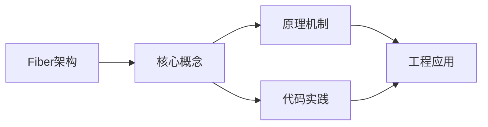
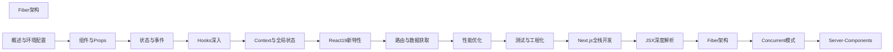

## 1. 学习目标（Bloom 分类）

本节按照布鲁姆教育目标分类学组织学习路径。本文主题为《Fiber架构》，属于 React 模块，读者可以根据自身阶段选择阅读深度。

记忆层面：能够准确复述本文的核心概念、术语与基本语法或操作步骤，并能够在提问或检索时快速定位对应知识点。能够说出 React 的核心概念、术语与标准写法。

理解层面：能够用自己的语言解释核心原理与工作机制，说明概念之间的因果关系，而不是机械记忆结论。能够解释 React 的工作原理与设计动机。

应用层面：能够在真实项目或练习场景中运用本文知识解决具体问题，写出正确且可维护的实现。能够编写符合 React 规范的完整实现。

分析层面：能够拆解复杂问题，比较本文主题与相邻概念的异同，识别边界条件与例外情况。能够分析 React 与相邻方案的差异与边界。

评价层面：能够根据约束条件（性能、可读性、安全、成本）评价不同方案的优劣，做出有依据的技术决策。能够根据场景评价 React 相关方案的优劣。

创造层面：能够把本文知识与其他模块知识组合，设计出新的解决方案或可复用的工程模式。能够组合 React 与其他技术设计完整方案。

通过本节学习，读者应当能够把《Fiber架构》纳入自己的知识网络，并与 React 模块的其他主题（组件、Hooks、状态管理、渲染性能）建立关联。

## 2. 历史动机与发展脉络

《Fiber架构》是 React 领域的重要主题。要真正理解它，需要先了解它解决的问题与演进过程。

React 由 Facebook 于 2013 年开源，核心思想是组件化 UI 与声明式渲染；2019 年 React 16.8 引入 Hooks，函数组件成为主流。
React 19（2024）引入 Actions、useOptimistic、编译器（React Compiler）自动记忆化；并发特性（Suspense、Transitions）持续完善。
生态：Next.js/Remix 全栈框架、TanStack Query 服务端状态、Zustand/Redux 客户端状态、React Native 移动端。

回到本文主题：Fiber架构 的提出与成熟，正是上述技术背景下的必然产物。早期实现往往以简单可用为目标，随着工程规模扩大，社区逐渐沉淀出标准做法与最佳实践；理解这一脉络，可以帮助读者判断“为什么文档中的推荐写法是现在这个样子”，也能在遇到历史遗留代码时准确识别其设计年代与取舍。


## 3. 形式化定义与核心概念精讲

本节把《Fiber架构》涉及的核心概念以“定义 + 讲解”的形式展开。读者应把定义当作工具，把讲解当作理解路径；两者结合才能形成可迁移的知识。

组件模型：props 输入、state 内部状态、渲染输出 JSX；组件是纯函数，同一输入必得同一输出。
Hooks 规则：只能在顶层调用（不可在条件/循环中），函数组件与自定义 Hook 内使用；依赖数组决定 effect 重跑。
渲染与协调：setState 触发重渲染，虚拟 DOM diff 更新真实 DOM；key 帮助复用元素。

### 3.1 原文章节逐一精讲

原文档把主题拆分为 27 个小节，下面按顺序给出每一节的导读讲解，随后保留原文细节供精读。

#### 原文精读（完整保留）

# React Fiber 架构原理

> **符号约定**：`< >` 必填参数 | `[ ]` 可选参数

---

#### 双缓冲机制

**基本写法：current 树与 workInProgress 树**
`<fiber>.alternate = <对应的另一棵树Fiber>`
```tsx
// 两棵树交替复用节点
const workInProgress = current.alternate;
```

---

#### 概述

Fiber 是 React 16 引入的全新协调引擎，替代了原有的 Stack Reconciler。Fiber 的核心目标是实现可中断的异步渲染：将渲染工作拆分为小的工作单元（Fiber 节点），在每次处理完一个单元后检查是否需要让出主线程，从而避免长时间阻塞用户交互。Fiber 架构是 React 并发模式、Suspense 和服务端流式渲染的基础。

#### 基础概念

##### Fiber 节点结构

每个 React 元素对应一个 Fiber 节点，Fiber 节点通过链表结构组织：

```
Fiber 节点结构：
{
  type,        // 组件类型（函数/类/标签名）
  key,         // 列表中的唯一标识
  props,       // 属性对象
  stateNode,   // 关联的实例或 DOM 节点
  return,      // 父 Fiber 节点
  child,       // 第一个子 Fiber 节点
  sibling,     // 下一个兄弟 Fiber 节点
  alternate,   // 双缓冲对应的 Fiber 节点
  effectTag,   // 副作用标记（插入/更新/删除）
  flags,       // 副作用标志位
  lanes,       // 优先级车道
}
```

##### Fiber 树的结构

Fiber 节点通过 child、sibling 和 return 指针形成树结构：

```
        App (Fiber)
       /           \
  Header          Main
                  /    \
            Sidebar  Content
```

- child 指向第一个子节点
- sibling 指向下一个兄弟节点
- return 指向父节点

#### 快速上手

##### Fiber 的工作流程

React 的渲染分为两个阶段：

1. **Render 阶段**（可中断）：遍历 Fiber 树，计算变更，构建 workInProgress 树
2. **Commit 阶段**（不可中断）：将变更应用到 DOM

```
Render 阶段（可中断）：
  处理 Fiber 节点 → 检查是否需要让出 → 继续或中断

Commit 阶段（不可中断）：
  BeforeMutation → Mutation → LayoutEffect
```

#### 详细用法

##### 工作循环详解

```javascript
// 简化的 Fiber 工作循环
function workLoop() {
  // 是否需要让出主线程
  while (nextUnitOfWork && !shouldYield()) {
    // 处理一个工作单元
    nextUnitOfWork = performUnitOfWork(nextUnitOfWork);
  }

  if (nextUnitOfWork) {
    // 还有未完成的工作，请求下次空闲时继续
    requestIdleCallback(workLoop);
  } else {
    // 所有工作完成，提交变更
    commitRoot();
  }
}

// 处理单个 Fiber 节点
function performUnitOfWork(fiber) {
  // 1. 处理当前节点（beginWork）
  const children = reconcileChildren(fiber);

  // 2. 优先处理子节点（深度优先）
  if (fiber.child) {
    return fiber.child;
  }

  // 3. 没有子节点，处理兄弟节点
  let nextFiber = fiber;
  while (nextFiber) {
    // 完成当前节点的工作（completeWork）
    completeWork(nextFiber);

    if (nextFiber.sibling) {
      return nextFiber.sibling;
    }
    // 回到父节点继续处理
    nextFiber = nextFiber.return;
  }
}
```

##### 优先级调度（Lanes 模型）

React 使用 Lanes 模型管理更新优先级：

| Lane                | 优先级 | 说明                       |
| ------------------- | ------ | -------------------------- |
| SyncLane            | 最高   | 同步更新，如 flushSync     |
| InputContinuousLane | 高     | 连续输入，如拖拽           |
| DefaultLane         | 普通   | 默认状态更新               |
| TransitionLane      | 低     | 过渡更新，如 useTransition |
| IdleLane            | 最低   | 空闲时执行                 |

```javascript
// 优先级调度示例
function ensureRootIsScheduled(root) {
  // 获取最高优先级的待处理更新
  const nextLanes = getNextLanes(root);

  if (nextLanes === NoLanes) {
    // 没有待处理的更新
    return;
  }

  // 根据优先级调度回调
  const newCallbackPriority = getHighestPriorityLane(nextLanes);

  if (newCallbackPriority === SyncLane) {
    // 同步优先级：立即执行
    scheduleSyncCallback(performSyncWorkOnRoot.bind(null, root));
  } else {
    // 其他优先级：调度到空闲时执行
    scheduleCallback(priorityLevel, performConcurrentWorkOnRoot.bind(null, root));
  }
}
```

##### Reconciliation 协调过程

```javascript
// 简化的子节点协调算法
function reconcileChildren(fiber, elements) {
  let index = 0;
  let oldFiber = fiber.alternate?.child;
  let prevSibling = null;

  while (index < elements.length || oldFiber != null) {
    const element = elements[index];
    const sameType = oldFiber && element && element.type === oldFiber.type;

    if (sameType) {
      // 类型相同：更新属性
      const newFiber = {
        type: oldFiber.type,
        props: element.props,
        return: fiber,
        alternate: oldFiber,
        effectTag: 'UPDATE',
      };
    } else if (element && !sameType) {
      // 新元素：插入
      const newFiber = {
        type: element.type,
        props: element.props,
        return: fiber,
        effectTag: 'PLACEMENT',
      };
    } else if (oldFiber && !sameType) {
      // 旧元素不存在于新列表：删除
      oldFiber.effectTag = 'DELETION';
      deletions.push(oldFiber);
    }

    index++;
    oldFiber = oldFiber?.sibling;
  }
}
```

#### 常见场景

##### 理解 key 的作用

```jsx
// key 帮助 Fiber 识别哪些元素可以复用
function List({ items }) {
  return (
    <ul>
      {items.map((item) => (
        // key 让 Fiber 知道同一 key 的节点可以复用
        <li key={item.id}>{item.name}</li>
      ))}
    </ul>
  );
}

// 错误用法：使用索引作为 key
// 当列表顺序变化时，Fiber 无法正确复用节点，导致不必要的 DOM 操作
// <li key={index}>{item.name}</li>
```

##### 理解 useEffect 的执行时机

```jsx
// useEffect 在 Commit 阶段的 LayoutEffect 之后异步执行
function Component() {
  useEffect(() => {
    // 在 DOM 更新完成后异步调用
    // 不阻塞浏览器绘制
    console.log('副作用执行');
    return () => {
      console.log('清理函数执行');
    };
  }, []);

  useLayoutEffect(() => {
    // 在 DOM 更新后同步调用
    // 阻塞浏览器绘制
    console.log('布局副作用执行');
  }, []);
}
```

#### 注意事项

- Fiber 的 Render 阶段可能执行多次（中断后重新开始），不应在 Render 阶段产生副作用
- Commit 阶段不可中断，应避免在此阶段执行耗时操作
- key 的稳定性很重要，不要使用随机值或索引作为 key
- Fiber 架构的内部实现细节可能随版本变化，开发者应关注公开 API 而非内部实现
- React DevTools 的 Profiler 面板可以可视化 Fiber 树的渲染过程

#### 进阶用法

##### 自定义调度器

```javascript
// 使用 Scheduler API 控制任务优先级
import { scheduleCallback, NormalPriority } from 'scheduler';

function scheduleCustomTask(callback) {
  scheduleCallback(NormalPriority, () => {
    // 在正常优先级下执行任务
    const result = callback();
    return result;
  });
}
```

##### Fiber 与并发模式的关系

```jsx
// 并发模式依赖 Fiber 的可中断渲染能力
// useTransition 标记的更新会被分配较低的 Lane 优先级
// 高优先级更新（如用户输入）可以中断低优先级渲染

function SearchPage() {
  const [isPending, startTransition] = useTransition();
  const [query, setQuery] = useState('');

  function handleInput(e) {
    // 紧急更新：高优先级 Lane
    setQuery(e.target.value);

    // 过渡更新：低优先级 Lane，可被中断
    startTransition(() => {
      setSearchResults(search(e.target.value));
    });
  }
}
```

##### 调试 Fiber 树

```javascript
// 在 React DevTools 中查看 Fiber 节点
// 或通过 __SECRET_INTERNALS_DO_NOT_USE_OR_YOU_WILL_BE_FIRED 访问

// 获取组件对应的 Fiber 节点（仅调试用）
function getFiberFromDOM(domElement) {
  const key = Object.keys(domElement).find((k) => k.startsWith('__reactFiber$'));
  return domElement[key];
}
```
#### Fiber 节点概念

**基本写法：每个组件对应一个 Fiber 节点**
`type <FiberNode> = { type, key, stateNode, child, sibling, return }`
```tsx
// Fiber 树通过链表结构关联
{
  type: 'div',
  child: childFiber,
  sibling: nextFiber,
  return: parentFiber
}
```

---

#### 链表结构

**基本写法：child sibling return 三指针**
`<fiber>.child = <子>; <fiber>.sibling = <兄弟>; <fiber>.return = <父>`
```tsx
// 形成可中断遍历的链表
parentFiber.child = firstChild;
firstChild.sibling = secondChild;
firstChild.return = parentFiber;
```

---

#### Work Loop 工作循环

**基本写法：performUnitOfWork 逐节点处理**
`function <performUnitOfWork>(<unit>) { <处理>; return <下一个>; }`
```tsx
// 每处理完一个节点检查是否需要让出
while (nextUnitOfWork && !shouldYield()) {
  nextUnitOfWork = performUnitOfWork(nextUnitOfWork);
}
```

---

#### 时间切片

**基本写法：使用 MessageChannel 调度**
`shouldYield() = <当前时间> - <开始时间> > <时间片>`
```tsx
// 5ms 左右时间片让出主线程
const DEADLINE = 5;
function shouldYield() { return performance.now() - startTime > DEADLINE; }
```

---

#### 优先级调度 Lane 模型

**基本写法：用二进制位表示优先级**
`const <lane> = 1 << <位>`
```tsx
// 不同位代表不同优先级
const SyncLane = 1;          // 同步最高
const InputContinuousLane = 2; // 输入连续
const DefaultLane = 4;       // 默认
```

---

**基本写法：lanes 字段保存待处理优先级**
`<fiber>.lanes = <优先级位图>`
```tsx
// 多个优先级合并存储
fiber.lanes = SyncLane | DefaultLane;
```

---

#### Render 阶段

**基本写法：beginWork 处理节点进入**
`function <beginWork>(<fiber>) { return <子fiber> }`
```tsx
// 创建子 Fiber 并标记副作用
function beginWork(fiber) {
  // 比较 props 计算 flags
  return fiber.child;
}
```

---

**基本写法：completeWork 处理节点完成**
`function <completeWork>(<fiber>) { <挂载真实DOM>; }`
```tsx
// 创建 DOM 并挂载属性
function completeWork(fiber) {
  if (fiber.stateNode == null) fiber.stateNode = document.createElement(fiber.type);
}
```

---

#### 副作用标记

**基本写法：flags 标记变更类型**
`<fiber>.flags = <Placement> | <Update> | <Deletion>`
```tsx
// 标记插入更新删除
fiber.flags |= Placement;
fiber.flags |= Update;
fiber.flags |= ChildDeletion;
```

---

**基本写法：subtreeFlags 收集子树副作用**
`<fiber>.subtreeFlags |= <child>.flags | <child>.subtreeFlags`
```tsx
// 自下而上汇总
parentFiber.subtreeFlags |= childFiber.flags;
```

---

#### Commit 阶段

**基本写法：commitMutation 执行 DOM 操作**
`function <commitMutation>(<fiber>) { <根据flags操作DOM> }`
```tsx
// 提交阶段同步执行
if (flags & Placement) parent.appendChild(stateNode);
if (flags & ChildDeletion) parent.removeChild(child);
```

---

**基本写法：commitLayout 处理生命周期**
`function <commitLayout>(<fiber>) { <调用useLayoutEffect等> }`
```tsx
// 同步执行 layout effect
commitLayout(fiber);
```

---

#### 协调 Reconciliation

**基本写法：diff 同层兄弟节点**
`function <reconcileChildren>(<父>, <旧>, <新>) { <diff> }`
```tsx
// 同层比较决定复用或新建
reconcileChildren(parentFiber, currentChildren, nextChildren);
```

---

**基本写法：key 辅助匹配**
`if (<旧>.key === <新>.key) <复用>`
```tsx
// 通过 key 提高复用率
oldFiber.key === newChild.key;
```

---

#### 可中断恢复

**基本写法：让出时保存 nextUnitOfWork**
`<nextUnitOfWork> = <当前fiber>`
```tsx
// 恢复时继续处理
let nextUnitOfWork = savedFiber;
```

---

#### Lane 调度入口

**基本写法：scheduleUpdateOnFiber 触发更新**
`scheduleUpdateOnFiber(<fiber>, <lane>)`
```tsx
// 标记 lane 后调度
scheduleUpdateOnFiber(fiber, SyncLane);
```

---

#### 批处理入口

**基本写法：ensureRootIsOnSchedule 进入调度**
`ensureRootIsOnSchedule(<root>, <lane>)`
```tsx
// 根节点合并 lanes 后调度
ensureRootIsOnSchedule(root, lane);
```

---

#### Hook 链表存储

**基本写法：hooks 挂在 Fiber 的 memoizedState**
`<fiber>.memoizedState = <hook链表头>`
```tsx
// 单向链表保存每次 hook 调用
hook.next = nextHook;
fiber.memoizedState = firstHook;
```

---

**基本写法：hook.memoizedState 保存状态**
`<hook>.memoizedState = <状态>`
```tsx
// useState 保存值 useReducer 保存 reducer 返回值
hook.memoizedState = initialState;
```

---

#### Update Queue 更新队列

**基本写法：hook 保存 pending 队列**
`<hook>.updateQueue = { pending: <update> }`
```tsx
// 环形链表保存待处理更新
hook.updateQueue.pending = update;
```

---

#### Effect 链表

**基本写法：useEffect 通过 updateQueue 关联**
`<hook>.updateQueue.lastEffect = <effect>`
```tsx
// 同组件多个 effect 形成环形链表
hook.updateQueue.lastEffect = effect;
```

---

#### Suspense 挂起机制

**基本写法：抛出 Promise 暂停渲染**
`throw <Promise>`
```tsx
// 子组件挂起时由最近 Suspense 接管
throw new Promise(resolve => fetch().then(resolve));
```

---

#### 错误处理

**基本写法：捕获子树抛出的错误**
`<fiber>.flags |= <Incomplete>`
```tsx
// 卸载失败子树切换到错误边界
fiber.flags |= Incomplete;
```

---

#### DevTools 集成

**基本写法：通过 renderer 接口暴露 Fiber**
`<renderer>.findFiberByHostInstance(<DOM>)`
```tsx
// DevTools 通过协议读取 Fiber
reactDevTools.attach(renderer);
```

---

#### Reconciler 包

**基本写法：react-reconciler 暴露可定制接口**
`const <Reconciler> = Reconciler(<hostConfig>)`
```tsx
// 自定义渲染器如 React Three
const Reconciler = require('react-reconciler');
const renderer = Reconciler(hostConfig);
```


### 3.2 概念关系图

下面用 Mermaid 图表达本文核心概念之间的关系，帮助读者建立整体图景：



图中展示的是本文知识的结构化关系：核心概念是入口，原理机制解释“为什么”，代码实践演示“怎么做”，工程应用回答“何时用”。读者学习时可以把每个小节的内容挂接到对应节点上。

## 4. 理论推导与原理解析

本节深入《Fiber架构》背后的原理。理论部分不求面面俱到，而是聚焦“能解释现象、能指导实践”的关键推导。

组件模型：props 输入、state 内部状态、渲染输出 JSX；组件是纯函数，同一输入必得同一输出。
Hooks 规则：只能在顶层调用（不可在条件/循环中），函数组件与自定义 Hook 内使用；依赖数组决定 effect 重跑。
渲染与协调：setState 触发重渲染，虚拟 DOM diff 更新真实 DOM；key 帮助复用元素。
状态提升与下放：共享状态提升到最近公共祖先；Context 跨层传递（Provider/useContext）。

需要强调的是，理论推导与工程实践之间存在翻译层：理论给出的是理想化模型与边界条件，工程代码则必须处理真实环境中的例外。读者在学习时应先掌握理论的“标准情形”，再通过陷阱章节了解“非标准情形”。

## 5. 代码示例与逐行讲解

本节把原文中的代码示例系统整理，并为每个示例补充用途说明与讲解。读者不应只浏览代码，而应逐段对照讲解理解设计意图。

### 5.1 示例：双缓冲机制

该示例来自原文《双缓冲机制》小节，用于演示Fiber架构相关操作。阅读时请先看代码结构，再看其后的讲解。

```tsx
// 两棵树交替复用节点
const workInProgress = current.alternate;
```

讲解：这段代码演示了本节核心知识点。代码中的关键操作可以归纳为三步：准备（定义或初始化）、执行（核心逻辑）、收尾（释放资源或返回结果）。实际项目中，这三步往往被封装为函数或类，以提升复用性与可测试性。

关键点分析：

该示例共 2 行有效代码，结构以数据或配置为主。阅读时应关注：数据字段的含义、配置项的作用，以及它们与运行行为的对应关系。

进阶思考路径：先尝试修改参数观察行为变化，再把示例中的模式迁移到自己的项目中；每次修改都记录预期与实测差异，这是把示例转化为能力的最快方式。

### 5.2 示例：Fiber 节点结构

该示例来自原文《Fiber 节点结构》小节，用于演示Fiber架构相关操作。阅读时请先看代码结构，再看其后的讲解。

```text
Fiber 节点结构：
{
  type,        // 组件类型（函数/类/标签名）
  key,         // 列表中的唯一标识
  props,       // 属性对象
  stateNode,   // 关联的实例或 DOM 节点
  return,      // 父 Fiber 节点
  child,       // 第一个子 Fiber 节点
  sibling,     // 下一个兄弟 Fiber 节点
  alternate,   // 双缓冲对应的 Fiber 节点
  effectTag,   // 副作用标记（插入/更新/删除）
  flags,       // 副作用标志位
  lanes,       // 优先级车道
}
```

讲解：这段代码演示了本节核心知识点。代码中的关键操作可以归纳为三步：准备（定义或初始化）、执行（核心逻辑）、收尾（释放资源或返回结果）。实际项目中，这三步往往被封装为函数或类，以提升复用性与可测试性。

关键点分析：

该示例共 14 行有效代码，包含 1 类关键结构（return）。其中：

- 入口与初始化部分负责建立上下文，对应实际项目中的启动或装配逻辑；
- 核心逻辑部分体现本文主题的主要操作，是阅读时最需要对照讲解理解的部分；
- 输出或返回部分把结果交给调用方，注意其类型与边界条件。

进阶思考路径：先尝试修改参数观察行为变化，再把示例中的模式迁移到自己的项目中；每次修改都记录预期与实测差异，这是把示例转化为能力的最快方式。

### 5.3 示例：Fiber 树的结构

该示例来自原文《Fiber 树的结构》小节，用于演示Fiber架构相关操作。阅读时请先看代码结构，再看其后的讲解。

```text
        App (Fiber)
       /           \
  Header          Main
                  /    \
            Sidebar  Content
```

讲解：这段代码演示了本节核心知识点。代码中的关键操作可以归纳为三步：准备（定义或初始化）、执行（核心逻辑）、收尾（释放资源或返回结果）。实际项目中，这三步往往被封装为函数或类，以提升复用性与可测试性。

关键点分析：

该示例共 5 行有效代码，结构以数据或配置为主。阅读时应关注：数据字段的含义、配置项的作用，以及它们与运行行为的对应关系。

进阶思考路径：先尝试修改参数观察行为变化，再把示例中的模式迁移到自己的项目中；每次修改都记录预期与实测差异，这是把示例转化为能力的最快方式。

### 5.4 示例：Fiber 的工作流程

该示例来自原文《Fiber 的工作流程》小节，用于演示Fiber架构相关操作。阅读时请先看代码结构，再看其后的讲解。

```text
Render 阶段（可中断）：
  处理 Fiber 节点 → 检查是否需要让出 → 继续或中断

Commit 阶段（不可中断）：
  BeforeMutation → Mutation → LayoutEffect
```

讲解：这段代码演示了本节核心知识点。代码中的关键操作可以归纳为三步：准备（定义或初始化）、执行（核心逻辑）、收尾（释放资源或返回结果）。实际项目中，这三步往往被封装为函数或类，以提升复用性与可测试性。

关键点分析：

该示例共 4 行有效代码，结构以数据或配置为主。阅读时应关注：数据字段的含义、配置项的作用，以及它们与运行行为的对应关系。

进阶思考路径：先尝试修改参数观察行为变化，再把示例中的模式迁移到自己的项目中；每次修改都记录预期与实测差异，这是把示例转化为能力的最快方式。

### 5.5 示例：工作循环详解

该示例来自原文《工作循环详解》小节，用于演示Fiber架构相关操作。阅读时请先看代码结构，再看其后的讲解。

```javascript
// 简化的 Fiber 工作循环
function workLoop() {
  // 是否需要让出主线程
  while (nextUnitOfWork && !shouldYield()) {
    // 处理一个工作单元
    nextUnitOfWork = performUnitOfWork(nextUnitOfWork);
  }

  if (nextUnitOfWork) {
    // 还有未完成的工作，请求下次空闲时继续
    requestIdleCallback(workLoop);
  } else {
    // 所有工作完成，提交变更
    commitRoot();
  }
}

// 处理单个 Fiber 节点
function performUnitOfWork(fiber) {
  // 1. 处理当前节点（beginWork）
  const children = reconcileChildren(fiber);

  // 2. 优先处理子节点（深度优先）
  if (fiber.child) {
    return fiber.child;
  }

  // 3. 没有子节点，处理兄弟节点
  let nextFiber = fiber;
  while (nextFiber) {
    // 完成当前节点的工作（completeWork）
    completeWork(nextFiber);

    if (nextFiber.sibling) {
      return nextFiber.sibling;
    }
    // 回到父节点继续处理
    nextFiber = nextFiber.return;
  }
}
```

讲解：这段代码演示了本节核心知识点。代码中的关键操作可以归纳为三步：准备（定义或初始化）、执行（核心逻辑）、收尾（释放资源或返回结果）。实际项目中，这三步往往被封装为函数或类，以提升复用性与可测试性。

关键点分析：

该示例共 35 行有效代码，包含 4 类关键结构（function、if、while、return）。其中：

- 入口与初始化部分负责建立上下文，对应实际项目中的启动或装配逻辑；
- 核心逻辑部分体现本文主题的主要操作，是阅读时最需要对照讲解理解的部分；
- 输出或返回部分把结果交给调用方，注意其类型与边界条件。

进阶思考路径：先尝试修改参数观察行为变化，再把示例中的模式迁移到自己的项目中；每次修改都记录预期与实测差异，这是把示例转化为能力的最快方式。

### 5.6 示例：优先级调度（Lanes 模型）

该示例来自原文《优先级调度（Lanes 模型）》小节，用于演示Fiber架构相关操作。阅读时请先看代码结构，再看其后的讲解。

```javascript
// 优先级调度示例
function ensureRootIsScheduled(root) {
  // 获取最高优先级的待处理更新
  const nextLanes = getNextLanes(root);

  if (nextLanes === NoLanes) {
    // 没有待处理的更新
    return;
  }

  // 根据优先级调度回调
  const newCallbackPriority = getHighestPriorityLane(nextLanes);

  if (newCallbackPriority === SyncLane) {
    // 同步优先级：立即执行
    scheduleSyncCallback(performSyncWorkOnRoot.bind(null, root));
  } else {
    // 其他优先级：调度到空闲时执行
    scheduleCallback(priorityLevel, performConcurrentWorkOnRoot.bind(null, root));
  }
}
```

讲解：这段代码演示了本节核心知识点。代码中的关键操作可以归纳为三步：准备（定义或初始化）、执行（核心逻辑）、收尾（释放资源或返回结果）。实际项目中，这三步往往被封装为函数或类，以提升复用性与可测试性。

关键点分析：

该示例共 18 行有效代码，包含 3 类关键结构（function、if、return）。其中：

- 入口与初始化部分负责建立上下文，对应实际项目中的启动或装配逻辑；
- 核心逻辑部分体现本文主题的主要操作，是阅读时最需要对照讲解理解的部分；
- 输出或返回部分把结果交给调用方，注意其类型与边界条件。

进阶思考路径：先尝试修改参数观察行为变化，再把示例中的模式迁移到自己的项目中；每次修改都记录预期与实测差异，这是把示例转化为能力的最快方式。

### 5.7 示例：Reconciliation 协调过程

该示例来自原文《Reconciliation 协调过程》小节，用于演示Fiber架构相关操作。阅读时请先看代码结构，再看其后的讲解。

```javascript
// 简化的子节点协调算法
function reconcileChildren(fiber, elements) {
  let index = 0;
  let oldFiber = fiber.alternate?.child;
  let prevSibling = null;

  while (index < elements.length || oldFiber != null) {
    const element = elements[index];
    const sameType = oldFiber && element && element.type === oldFiber.type;

    if (sameType) {
      // 类型相同：更新属性
      const newFiber = {
        type: oldFiber.type,
        props: element.props,
        return: fiber,
        alternate: oldFiber,
        effectTag: 'UPDATE',
      };
    } else if (element && !sameType) {
      // 新元素：插入
      const newFiber = {
        type: element.type,
        props: element.props,
        return: fiber,
        effectTag: 'PLACEMENT',
      };
    } else if (oldFiber && !sameType) {
      // 旧元素不存在于新列表：删除
      oldFiber.effectTag = 'DELETION';
      deletions.push(oldFiber);
    }

    index++;
    oldFiber = oldFiber?.sibling;
  }
}
```

讲解：这段代码演示了本节核心知识点。代码中的关键操作可以归纳为三步：准备（定义或初始化）、执行（核心逻辑）、收尾（释放资源或返回结果）。实际项目中，这三步往往被封装为函数或类，以提升复用性与可测试性。

关键点分析：

该示例共 34 行有效代码，包含 4 类关键结构（function、if、while、return）。其中：

- 入口与初始化部分负责建立上下文，对应实际项目中的启动或装配逻辑；
- 核心逻辑部分体现本文主题的主要操作，是阅读时最需要对照讲解理解的部分；
- 输出或返回部分把结果交给调用方，注意其类型与边界条件。

进阶思考路径：先尝试修改参数观察行为变化，再把示例中的模式迁移到自己的项目中；每次修改都记录预期与实测差异，这是把示例转化为能力的最快方式。

### 5.8 示例：理解 key 的作用

该示例来自原文《理解 key 的作用》小节，用于演示Fiber架构相关操作。阅读时请先看代码结构，再看其后的讲解。

```jsx
// key 帮助 Fiber 识别哪些元素可以复用
function List({ items }) {
  return (
    <ul>
      {items.map((item) => (
        // key 让 Fiber 知道同一 key 的节点可以复用
        <li key={item.id}>{item.name}</li>
      ))}
    </ul>
  );
}

// 错误用法：使用索引作为 key
// 当列表顺序变化时，Fiber 无法正确复用节点，导致不必要的 DOM 操作
// <li key={index}>{item.name}</li>
```

讲解：这段代码演示了本节核心知识点。代码中的关键操作可以归纳为三步：准备（定义或初始化）、执行（核心逻辑）、收尾（释放资源或返回结果）。实际项目中，这三步往往被封装为函数或类，以提升复用性与可测试性。

关键点分析：

该示例共 14 行有效代码，包含 2 类关键结构（function、return）。其中：

- 入口与初始化部分负责建立上下文，对应实际项目中的启动或装配逻辑；
- 核心逻辑部分体现本文主题的主要操作，是阅读时最需要对照讲解理解的部分；
- 输出或返回部分把结果交给调用方，注意其类型与边界条件。

进阶思考路径：先尝试修改参数观察行为变化，再把示例中的模式迁移到自己的项目中；每次修改都记录预期与实测差异，这是把示例转化为能力的最快方式。

### 5.9 示例：理解 useEffect 的执行时机

该示例来自原文《理解 useEffect 的执行时机》小节，用于演示Fiber架构相关操作。阅读时请先看代码结构，再看其后的讲解。

```jsx
// useEffect 在 Commit 阶段的 LayoutEffect 之后异步执行
function Component() {
  useEffect(() => {
    // 在 DOM 更新完成后异步调用
    // 不阻塞浏览器绘制
    console.log('副作用执行');
    return () => {
      console.log('清理函数执行');
    };
  }, []);

  useLayoutEffect(() => {
    // 在 DOM 更新后同步调用
    // 阻塞浏览器绘制
    console.log('布局副作用执行');
  }, []);
}
```

讲解：这段代码演示了本节核心知识点。代码中的关键操作可以归纳为三步：准备（定义或初始化）、执行（核心逻辑）、收尾（释放资源或返回结果）。实际项目中，这三步往往被封装为函数或类，以提升复用性与可测试性。

关键点分析：

该示例共 16 行有效代码，包含 2 类关键结构（function、return）。其中：

- 入口与初始化部分负责建立上下文，对应实际项目中的启动或装配逻辑；
- 核心逻辑部分体现本文主题的主要操作，是阅读时最需要对照讲解理解的部分；
- 输出或返回部分把结果交给调用方，注意其类型与边界条件。

进阶思考路径：先尝试修改参数观察行为变化，再把示例中的模式迁移到自己的项目中；每次修改都记录预期与实测差异，这是把示例转化为能力的最快方式。

### 5.10 示例：自定义调度器

该示例来自原文《自定义调度器》小节，用于演示Fiber架构相关操作。阅读时请先看代码结构，再看其后的讲解。

```javascript
// 使用 Scheduler API 控制任务优先级
import { scheduleCallback, NormalPriority } from 'scheduler';

function scheduleCustomTask(callback) {
  scheduleCallback(NormalPriority, () => {
    // 在正常优先级下执行任务
    const result = callback();
    return result;
  });
}
```

讲解：这段代码演示了本节核心知识点。代码中的关键操作可以归纳为三步：准备（定义或初始化）、执行（核心逻辑）、收尾（释放资源或返回结果）。实际项目中，这三步往往被封装为函数或类，以提升复用性与可测试性。

关键点分析：

该示例共 9 行有效代码，包含 4 类关键结构（function、import、from、return）。其中：

- 入口与初始化部分负责建立上下文，对应实际项目中的启动或装配逻辑；
- 核心逻辑部分体现本文主题的主要操作，是阅读时最需要对照讲解理解的部分；
- 输出或返回部分把结果交给调用方，注意其类型与边界条件。

进阶思考路径：先尝试修改参数观察行为变化，再把示例中的模式迁移到自己的项目中；每次修改都记录预期与实测差异，这是把示例转化为能力的最快方式。

### 5.11 示例：Fiber 与并发模式的关系

该示例来自原文《Fiber 与并发模式的关系》小节，用于演示Fiber架构相关操作。阅读时请先看代码结构，再看其后的讲解。

```jsx
// 并发模式依赖 Fiber 的可中断渲染能力
// useTransition 标记的更新会被分配较低的 Lane 优先级
// 高优先级更新（如用户输入）可以中断低优先级渲染

function SearchPage() {
  const [isPending, startTransition] = useTransition();
  const [query, setQuery] = useState('');

  function handleInput(e) {
    // 紧急更新：高优先级 Lane
    setQuery(e.target.value);

    // 过渡更新：低优先级 Lane，可被中断
    startTransition(() => {
      setSearchResults(search(e.target.value));
    });
  }
}
```

讲解：这段代码演示了本节核心知识点。代码中的关键操作可以归纳为三步：准备（定义或初始化）、执行（核心逻辑）、收尾（释放资源或返回结果）。实际项目中，这三步往往被封装为函数或类，以提升复用性与可测试性。

关键点分析：

该示例共 15 行有效代码，包含 1 类关键结构（function）。其中：

- 入口与初始化部分负责建立上下文，对应实际项目中的启动或装配逻辑；
- 核心逻辑部分体现本文主题的主要操作，是阅读时最需要对照讲解理解的部分；
- 输出或返回部分把结果交给调用方，注意其类型与边界条件。

进阶思考路径：先尝试修改参数观察行为变化，再把示例中的模式迁移到自己的项目中；每次修改都记录预期与实测差异，这是把示例转化为能力的最快方式。

### 5.12 示例：调试 Fiber 树

该示例来自原文《调试 Fiber 树》小节，用于演示Fiber架构相关操作。阅读时请先看代码结构，再看其后的讲解。

```javascript
// 在 React DevTools 中查看 Fiber 节点
// 或通过 __SECRET_INTERNALS_DO_NOT_USE_OR_YOU_WILL_BE_FIRED 访问

// 获取组件对应的 Fiber 节点（仅调试用）
function getFiberFromDOM(domElement) {
  const key = Object.keys(domElement).find((k) => k.startsWith('__reactFiber$'));
  return domElement[key];
}
```

讲解：这段代码演示了本节核心知识点。代码中的关键操作可以归纳为三步：准备（定义或初始化）、执行（核心逻辑）、收尾（释放资源或返回结果）。实际项目中，这三步往往被封装为函数或类，以提升复用性与可测试性。

关键点分析：

该示例共 7 行有效代码，包含 2 类关键结构（function、return）。其中：

- 入口与初始化部分负责建立上下文，对应实际项目中的启动或装配逻辑；
- 核心逻辑部分体现本文主题的主要操作，是阅读时最需要对照讲解理解的部分；
- 输出或返回部分把结果交给调用方，注意其类型与边界条件。

进阶思考路径：先尝试修改参数观察行为变化，再把示例中的模式迁移到自己的项目中；每次修改都记录预期与实测差异，这是把示例转化为能力的最快方式。

### 5.13 示例：Fiber 节点概念

该示例来自原文《Fiber 节点概念》小节，用于演示Fiber架构相关操作。阅读时请先看代码结构，再看其后的讲解。

```tsx
// Fiber 树通过链表结构关联
{
  type: 'div',
  child: childFiber,
  sibling: nextFiber,
  return: parentFiber
}
```

讲解：这段代码演示了本节核心知识点。代码中的关键操作可以归纳为三步：准备（定义或初始化）、执行（核心逻辑）、收尾（释放资源或返回结果）。实际项目中，这三步往往被封装为函数或类，以提升复用性与可测试性。

关键点分析：

该示例共 7 行有效代码，包含 1 类关键结构（return）。其中：

- 入口与初始化部分负责建立上下文，对应实际项目中的启动或装配逻辑；
- 核心逻辑部分体现本文主题的主要操作，是阅读时最需要对照讲解理解的部分；
- 输出或返回部分把结果交给调用方，注意其类型与边界条件。

进阶思考路径：先尝试修改参数观察行为变化，再把示例中的模式迁移到自己的项目中；每次修改都记录预期与实测差异，这是把示例转化为能力的最快方式。

### 5.14 示例：链表结构

该示例来自原文《链表结构》小节，用于演示Fiber架构相关操作。阅读时请先看代码结构，再看其后的讲解。

```tsx
// 形成可中断遍历的链表
parentFiber.child = firstChild;
firstChild.sibling = secondChild;
firstChild.return = parentFiber;
```

讲解：这段代码演示了本节核心知识点。代码中的关键操作可以归纳为三步：准备（定义或初始化）、执行（核心逻辑）、收尾（释放资源或返回结果）。实际项目中，这三步往往被封装为函数或类，以提升复用性与可测试性。

关键点分析：

该示例共 4 行有效代码，包含 1 类关键结构（return）。其中：

- 入口与初始化部分负责建立上下文，对应实际项目中的启动或装配逻辑；
- 核心逻辑部分体现本文主题的主要操作，是阅读时最需要对照讲解理解的部分；
- 输出或返回部分把结果交给调用方，注意其类型与边界条件。

进阶思考路径：先尝试修改参数观察行为变化，再把示例中的模式迁移到自己的项目中；每次修改都记录预期与实测差异，这是把示例转化为能力的最快方式。

### 5.15 示例：Work Loop 工作循环

该示例来自原文《Work Loop 工作循环》小节，用于演示Fiber架构相关操作。阅读时请先看代码结构，再看其后的讲解。

```tsx
// 每处理完一个节点检查是否需要让出
while (nextUnitOfWork && !shouldYield()) {
  nextUnitOfWork = performUnitOfWork(nextUnitOfWork);
}
```

讲解：这段代码演示了本节核心知识点。代码中的关键操作可以归纳为三步：准备（定义或初始化）、执行（核心逻辑）、收尾（释放资源或返回结果）。实际项目中，这三步往往被封装为函数或类，以提升复用性与可测试性。

关键点分析：

该示例共 4 行有效代码，包含 1 类关键结构（while）。其中：

- 入口与初始化部分负责建立上下文，对应实际项目中的启动或装配逻辑；
- 核心逻辑部分体现本文主题的主要操作，是阅读时最需要对照讲解理解的部分；
- 输出或返回部分把结果交给调用方，注意其类型与边界条件。

进阶思考路径：先尝试修改参数观察行为变化，再把示例中的模式迁移到自己的项目中；每次修改都记录预期与实测差异，这是把示例转化为能力的最快方式。

### 5.16 示例：时间切片

该示例来自原文《时间切片》小节，用于演示Fiber架构相关操作。阅读时请先看代码结构，再看其后的讲解。

```tsx
// 5ms 左右时间片让出主线程
const DEADLINE = 5;
function shouldYield() { return performance.now() - startTime > DEADLINE; }
```

讲解：这段代码演示了本节核心知识点。代码中的关键操作可以归纳为三步：准备（定义或初始化）、执行（核心逻辑）、收尾（释放资源或返回结果）。实际项目中，这三步往往被封装为函数或类，以提升复用性与可测试性。

关键点分析：

该示例共 3 行有效代码，包含 2 类关键结构（function、return）。其中：

- 入口与初始化部分负责建立上下文，对应实际项目中的启动或装配逻辑；
- 核心逻辑部分体现本文主题的主要操作，是阅读时最需要对照讲解理解的部分；
- 输出或返回部分把结果交给调用方，注意其类型与边界条件。

进阶思考路径：先尝试修改参数观察行为变化，再把示例中的模式迁移到自己的项目中；每次修改都记录预期与实测差异，这是把示例转化为能力的最快方式。

### 5.17 示例：优先级调度 Lane 模型

该示例来自原文《优先级调度 Lane 模型》小节，用于演示Fiber架构相关操作。阅读时请先看代码结构，再看其后的讲解。

```tsx
// 不同位代表不同优先级
const SyncLane = 1;          // 同步最高
const InputContinuousLane = 2; // 输入连续
const DefaultLane = 4;       // 默认
```

讲解：这段代码演示了本节核心知识点。代码中的关键操作可以归纳为三步：准备（定义或初始化）、执行（核心逻辑）、收尾（释放资源或返回结果）。实际项目中，这三步往往被封装为函数或类，以提升复用性与可测试性。

关键点分析：

该示例共 4 行有效代码，结构以数据或配置为主。阅读时应关注：数据字段的含义、配置项的作用，以及它们与运行行为的对应关系。

进阶思考路径：先尝试修改参数观察行为变化，再把示例中的模式迁移到自己的项目中；每次修改都记录预期与实测差异，这是把示例转化为能力的最快方式。

### 5.18 示例：优先级调度 Lane 模型

该示例来自原文《优先级调度 Lane 模型》小节，用于演示Fiber架构相关操作。阅读时请先看代码结构，再看其后的讲解。

```tsx
// 多个优先级合并存储
fiber.lanes = SyncLane | DefaultLane;
```

讲解：这段代码演示了本节核心知识点。代码中的关键操作可以归纳为三步：准备（定义或初始化）、执行（核心逻辑）、收尾（释放资源或返回结果）。实际项目中，这三步往往被封装为函数或类，以提升复用性与可测试性。

关键点分析：

该示例共 2 行有效代码，结构以数据或配置为主。阅读时应关注：数据字段的含义、配置项的作用，以及它们与运行行为的对应关系。

进阶思考路径：先尝试修改参数观察行为变化，再把示例中的模式迁移到自己的项目中；每次修改都记录预期与实测差异，这是把示例转化为能力的最快方式。

### 5.19 示例：Render 阶段

该示例来自原文《Render 阶段》小节，用于演示Fiber架构相关操作。阅读时请先看代码结构，再看其后的讲解。

```tsx
// 创建子 Fiber 并标记副作用
function beginWork(fiber) {
  // 比较 props 计算 flags
  return fiber.child;
}
```

讲解：这段代码演示了本节核心知识点。代码中的关键操作可以归纳为三步：准备（定义或初始化）、执行（核心逻辑）、收尾（释放资源或返回结果）。实际项目中，这三步往往被封装为函数或类，以提升复用性与可测试性。

关键点分析：

该示例共 5 行有效代码，包含 2 类关键结构（function、return）。其中：

- 入口与初始化部分负责建立上下文，对应实际项目中的启动或装配逻辑；
- 核心逻辑部分体现本文主题的主要操作，是阅读时最需要对照讲解理解的部分；
- 输出或返回部分把结果交给调用方，注意其类型与边界条件。

进阶思考路径：先尝试修改参数观察行为变化，再把示例中的模式迁移到自己的项目中；每次修改都记录预期与实测差异，这是把示例转化为能力的最快方式。

### 5.20 示例：Render 阶段

该示例来自原文《Render 阶段》小节，用于演示Fiber架构相关操作。阅读时请先看代码结构，再看其后的讲解。

```tsx
// 创建 DOM 并挂载属性
function completeWork(fiber) {
  if (fiber.stateNode == null) fiber.stateNode = document.createElement(fiber.type);
}
```

讲解：这段代码演示了本节核心知识点。代码中的关键操作可以归纳为三步：准备（定义或初始化）、执行（核心逻辑）、收尾（释放资源或返回结果）。实际项目中，这三步往往被封装为函数或类，以提升复用性与可测试性。

关键点分析：

该示例共 4 行有效代码，包含 2 类关键结构（function、if）。其中：

- 入口与初始化部分负责建立上下文，对应实际项目中的启动或装配逻辑；
- 核心逻辑部分体现本文主题的主要操作，是阅读时最需要对照讲解理解的部分；
- 输出或返回部分把结果交给调用方，注意其类型与边界条件。

进阶思考路径：先尝试修改参数观察行为变化，再把示例中的模式迁移到自己的项目中；每次修改都记录预期与实测差异，这是把示例转化为能力的最快方式。

### 5.21 示例：副作用标记

该示例来自原文《副作用标记》小节，用于演示Fiber架构相关操作。阅读时请先看代码结构，再看其后的讲解。

```tsx
// 标记插入更新删除
fiber.flags |= Placement;
fiber.flags |= Update;
fiber.flags |= ChildDeletion;
```

讲解：这段代码演示了本节核心知识点。代码中的关键操作可以归纳为三步：准备（定义或初始化）、执行（核心逻辑）、收尾（释放资源或返回结果）。实际项目中，这三步往往被封装为函数或类，以提升复用性与可测试性。

关键点分析：

该示例共 4 行有效代码，结构以数据或配置为主。阅读时应关注：数据字段的含义、配置项的作用，以及它们与运行行为的对应关系。

进阶思考路径：先尝试修改参数观察行为变化，再把示例中的模式迁移到自己的项目中；每次修改都记录预期与实测差异，这是把示例转化为能力的最快方式。

### 5.22 示例：副作用标记

该示例来自原文《副作用标记》小节，用于演示Fiber架构相关操作。阅读时请先看代码结构，再看其后的讲解。

```tsx
// 自下而上汇总
parentFiber.subtreeFlags |= childFiber.flags;
```

讲解：这段代码演示了本节核心知识点。代码中的关键操作可以归纳为三步：准备（定义或初始化）、执行（核心逻辑）、收尾（释放资源或返回结果）。实际项目中，这三步往往被封装为函数或类，以提升复用性与可测试性。

关键点分析：

该示例共 2 行有效代码，结构以数据或配置为主。阅读时应关注：数据字段的含义、配置项的作用，以及它们与运行行为的对应关系。

进阶思考路径：先尝试修改参数观察行为变化，再把示例中的模式迁移到自己的项目中；每次修改都记录预期与实测差异，这是把示例转化为能力的最快方式。

### 5.23 示例：Commit 阶段

该示例来自原文《Commit 阶段》小节，用于演示Fiber架构相关操作。阅读时请先看代码结构，再看其后的讲解。

```tsx
// 提交阶段同步执行
if (flags & Placement) parent.appendChild(stateNode);
if (flags & ChildDeletion) parent.removeChild(child);
```

讲解：这段代码演示了本节核心知识点。代码中的关键操作可以归纳为三步：准备（定义或初始化）、执行（核心逻辑）、收尾（释放资源或返回结果）。实际项目中，这三步往往被封装为函数或类，以提升复用性与可测试性。

关键点分析：

该示例共 3 行有效代码，包含 1 类关键结构（if）。其中：

- 入口与初始化部分负责建立上下文，对应实际项目中的启动或装配逻辑；
- 核心逻辑部分体现本文主题的主要操作，是阅读时最需要对照讲解理解的部分；
- 输出或返回部分把结果交给调用方，注意其类型与边界条件。

进阶思考路径：先尝试修改参数观察行为变化，再把示例中的模式迁移到自己的项目中；每次修改都记录预期与实测差异，这是把示例转化为能力的最快方式。

### 5.24 示例：Commit 阶段

该示例来自原文《Commit 阶段》小节，用于演示Fiber架构相关操作。阅读时请先看代码结构，再看其后的讲解。

```tsx
// 同步执行 layout effect
commitLayout(fiber);
```

讲解：这段代码演示了本节核心知识点。代码中的关键操作可以归纳为三步：准备（定义或初始化）、执行（核心逻辑）、收尾（释放资源或返回结果）。实际项目中，这三步往往被封装为函数或类，以提升复用性与可测试性。

关键点分析：

该示例共 2 行有效代码，结构以数据或配置为主。阅读时应关注：数据字段的含义、配置项的作用，以及它们与运行行为的对应关系。

进阶思考路径：先尝试修改参数观察行为变化，再把示例中的模式迁移到自己的项目中；每次修改都记录预期与实测差异，这是把示例转化为能力的最快方式。

### 5.25 示例：协调 Reconciliation

该示例来自原文《协调 Reconciliation》小节，用于演示Fiber架构相关操作。阅读时请先看代码结构，再看其后的讲解。

```tsx
// 同层比较决定复用或新建
reconcileChildren(parentFiber, currentChildren, nextChildren);
```

讲解：这段代码演示了本节核心知识点。代码中的关键操作可以归纳为三步：准备（定义或初始化）、执行（核心逻辑）、收尾（释放资源或返回结果）。实际项目中，这三步往往被封装为函数或类，以提升复用性与可测试性。

关键点分析：

该示例共 2 行有效代码，结构以数据或配置为主。阅读时应关注：数据字段的含义、配置项的作用，以及它们与运行行为的对应关系。

进阶思考路径：先尝试修改参数观察行为变化，再把示例中的模式迁移到自己的项目中；每次修改都记录预期与实测差异，这是把示例转化为能力的最快方式。

### 5.26 示例：协调 Reconciliation

该示例来自原文《协调 Reconciliation》小节，用于演示Fiber架构相关操作。阅读时请先看代码结构，再看其后的讲解。

```tsx
// 通过 key 提高复用率
oldFiber.key === newChild.key;
```

讲解：这段代码演示了本节核心知识点。代码中的关键操作可以归纳为三步：准备（定义或初始化）、执行（核心逻辑）、收尾（释放资源或返回结果）。实际项目中，这三步往往被封装为函数或类，以提升复用性与可测试性。

关键点分析：

该示例共 2 行有效代码，结构以数据或配置为主。阅读时应关注：数据字段的含义、配置项的作用，以及它们与运行行为的对应关系。

进阶思考路径：先尝试修改参数观察行为变化，再把示例中的模式迁移到自己的项目中；每次修改都记录预期与实测差异，这是把示例转化为能力的最快方式。

### 5.27 示例：可中断恢复

该示例来自原文《可中断恢复》小节，用于演示Fiber架构相关操作。阅读时请先看代码结构，再看其后的讲解。

```tsx
// 恢复时继续处理
let nextUnitOfWork = savedFiber;
```

讲解：这段代码演示了本节核心知识点。代码中的关键操作可以归纳为三步：准备（定义或初始化）、执行（核心逻辑）、收尾（释放资源或返回结果）。实际项目中，这三步往往被封装为函数或类，以提升复用性与可测试性。

关键点分析：

该示例共 2 行有效代码，结构以数据或配置为主。阅读时应关注：数据字段的含义、配置项的作用，以及它们与运行行为的对应关系。

进阶思考路径：先尝试修改参数观察行为变化，再把示例中的模式迁移到自己的项目中；每次修改都记录预期与实测差异，这是把示例转化为能力的最快方式。

### 5.28 示例：Lane 调度入口

该示例来自原文《Lane 调度入口》小节，用于演示Fiber架构相关操作。阅读时请先看代码结构，再看其后的讲解。

```tsx
// 标记 lane 后调度
scheduleUpdateOnFiber(fiber, SyncLane);
```

讲解：这段代码演示了本节核心知识点。代码中的关键操作可以归纳为三步：准备（定义或初始化）、执行（核心逻辑）、收尾（释放资源或返回结果）。实际项目中，这三步往往被封装为函数或类，以提升复用性与可测试性。

关键点分析：

该示例共 2 行有效代码，结构以数据或配置为主。阅读时应关注：数据字段的含义、配置项的作用，以及它们与运行行为的对应关系。

进阶思考路径：先尝试修改参数观察行为变化，再把示例中的模式迁移到自己的项目中；每次修改都记录预期与实测差异，这是把示例转化为能力的最快方式。

### 5.29 示例：批处理入口

该示例来自原文《批处理入口》小节，用于演示Fiber架构相关操作。阅读时请先看代码结构，再看其后的讲解。

```tsx
// 根节点合并 lanes 后调度
ensureRootIsOnSchedule(root, lane);
```

讲解：这段代码演示了本节核心知识点。代码中的关键操作可以归纳为三步：准备（定义或初始化）、执行（核心逻辑）、收尾（释放资源或返回结果）。实际项目中，这三步往往被封装为函数或类，以提升复用性与可测试性。

关键点分析：

该示例共 2 行有效代码，结构以数据或配置为主。阅读时应关注：数据字段的含义、配置项的作用，以及它们与运行行为的对应关系。

进阶思考路径：先尝试修改参数观察行为变化，再把示例中的模式迁移到自己的项目中；每次修改都记录预期与实测差异，这是把示例转化为能力的最快方式。

### 5.30 示例：Hook 链表存储

该示例来自原文《Hook 链表存储》小节，用于演示Fiber架构相关操作。阅读时请先看代码结构，再看其后的讲解。

```tsx
// 单向链表保存每次 hook 调用
hook.next = nextHook;
fiber.memoizedState = firstHook;
```

讲解：这段代码演示了本节核心知识点。代码中的关键操作可以归纳为三步：准备（定义或初始化）、执行（核心逻辑）、收尾（释放资源或返回结果）。实际项目中，这三步往往被封装为函数或类，以提升复用性与可测试性。

关键点分析：

该示例共 3 行有效代码，结构以数据或配置为主。阅读时应关注：数据字段的含义、配置项的作用，以及它们与运行行为的对应关系。

进阶思考路径：先尝试修改参数观察行为变化，再把示例中的模式迁移到自己的项目中；每次修改都记录预期与实测差异，这是把示例转化为能力的最快方式。

### 5.31 示例：Hook 链表存储

该示例来自原文《Hook 链表存储》小节，用于演示Fiber架构相关操作。阅读时请先看代码结构，再看其后的讲解。

```tsx
// useState 保存值 useReducer 保存 reducer 返回值
hook.memoizedState = initialState;
```

讲解：这段代码演示了本节核心知识点。代码中的关键操作可以归纳为三步：准备（定义或初始化）、执行（核心逻辑）、收尾（释放资源或返回结果）。实际项目中，这三步往往被封装为函数或类，以提升复用性与可测试性。

关键点分析：

该示例共 2 行有效代码，结构以数据或配置为主。阅读时应关注：数据字段的含义、配置项的作用，以及它们与运行行为的对应关系。

进阶思考路径：先尝试修改参数观察行为变化，再把示例中的模式迁移到自己的项目中；每次修改都记录预期与实测差异，这是把示例转化为能力的最快方式。

### 5.32 示例：Update Queue 更新队列

该示例来自原文《Update Queue 更新队列》小节，用于演示Fiber架构相关操作。阅读时请先看代码结构，再看其后的讲解。

```tsx
// 环形链表保存待处理更新
hook.updateQueue.pending = update;
```

讲解：这段代码演示了本节核心知识点。代码中的关键操作可以归纳为三步：准备（定义或初始化）、执行（核心逻辑）、收尾（释放资源或返回结果）。实际项目中，这三步往往被封装为函数或类，以提升复用性与可测试性。

关键点分析：

该示例共 2 行有效代码，结构以数据或配置为主。阅读时应关注：数据字段的含义、配置项的作用，以及它们与运行行为的对应关系。

进阶思考路径：先尝试修改参数观察行为变化，再把示例中的模式迁移到自己的项目中；每次修改都记录预期与实测差异，这是把示例转化为能力的最快方式。

### 5.33 示例：Effect 链表

该示例来自原文《Effect 链表》小节，用于演示Fiber架构相关操作。阅读时请先看代码结构，再看其后的讲解。

```tsx
// 同组件多个 effect 形成环形链表
hook.updateQueue.lastEffect = effect;
```

讲解：这段代码演示了本节核心知识点。代码中的关键操作可以归纳为三步：准备（定义或初始化）、执行（核心逻辑）、收尾（释放资源或返回结果）。实际项目中，这三步往往被封装为函数或类，以提升复用性与可测试性。

关键点分析：

该示例共 2 行有效代码，结构以数据或配置为主。阅读时应关注：数据字段的含义、配置项的作用，以及它们与运行行为的对应关系。

进阶思考路径：先尝试修改参数观察行为变化，再把示例中的模式迁移到自己的项目中；每次修改都记录预期与实测差异，这是把示例转化为能力的最快方式。

### 5.34 示例：Suspense 挂起机制

该示例来自原文《Suspense 挂起机制》小节，用于演示Fiber架构相关操作。阅读时请先看代码结构，再看其后的讲解。

```tsx
// 子组件挂起时由最近 Suspense 接管
throw new Promise(resolve => fetch().then(resolve));
```

讲解：这段代码演示了本节核心知识点。代码中的关键操作可以归纳为三步：准备（定义或初始化）、执行（核心逻辑）、收尾（释放资源或返回结果）。实际项目中，这三步往往被封装为函数或类，以提升复用性与可测试性。

关键点分析：

该示例共 2 行有效代码，结构以数据或配置为主。阅读时应关注：数据字段的含义、配置项的作用，以及它们与运行行为的对应关系。

进阶思考路径：先尝试修改参数观察行为变化，再把示例中的模式迁移到自己的项目中；每次修改都记录预期与实测差异，这是把示例转化为能力的最快方式。

### 5.35 示例：错误处理

该示例来自原文《错误处理》小节，用于演示Fiber架构相关操作。阅读时请先看代码结构，再看其后的讲解。

```tsx
// 卸载失败子树切换到错误边界
fiber.flags |= Incomplete;
```

讲解：这段代码演示了本节核心知识点。代码中的关键操作可以归纳为三步：准备（定义或初始化）、执行（核心逻辑）、收尾（释放资源或返回结果）。实际项目中，这三步往往被封装为函数或类，以提升复用性与可测试性。

关键点分析：

该示例共 2 行有效代码，结构以数据或配置为主。阅读时应关注：数据字段的含义、配置项的作用，以及它们与运行行为的对应关系。

进阶思考路径：先尝试修改参数观察行为变化，再把示例中的模式迁移到自己的项目中；每次修改都记录预期与实测差异，这是把示例转化为能力的最快方式。

### 5.36 示例：DevTools 集成

该示例来自原文《DevTools 集成》小节，用于演示Fiber架构相关操作。阅读时请先看代码结构，再看其后的讲解。

```tsx
// DevTools 通过协议读取 Fiber
reactDevTools.attach(renderer);
```

讲解：这段代码演示了本节核心知识点。代码中的关键操作可以归纳为三步：准备（定义或初始化）、执行（核心逻辑）、收尾（释放资源或返回结果）。实际项目中，这三步往往被封装为函数或类，以提升复用性与可测试性。

关键点分析：

该示例共 2 行有效代码，结构以数据或配置为主。阅读时应关注：数据字段的含义、配置项的作用，以及它们与运行行为的对应关系。

进阶思考路径：先尝试修改参数观察行为变化，再把示例中的模式迁移到自己的项目中；每次修改都记录预期与实测差异，这是把示例转化为能力的最快方式。

### 5.37 示例：Reconciler 包

该示例来自原文《Reconciler 包》小节，用于演示Fiber架构相关操作。阅读时请先看代码结构，再看其后的讲解。

```tsx
// 自定义渲染器如 React Three
const Reconciler = require('react-reconciler');
const renderer = Reconciler(hostConfig);
```

讲解：这段代码演示了本节核心知识点。代码中的关键操作可以归纳为三步：准备（定义或初始化）、执行（核心逻辑）、收尾（释放资源或返回结果）。实际项目中，这三步往往被封装为函数或类，以提升复用性与可测试性。

关键点分析：

该示例共 3 行有效代码，结构以数据或配置为主。阅读时应关注：数据字段的含义、配置项的作用，以及它们与运行行为的对应关系。

进阶思考路径：先尝试修改参数观察行为变化，再把示例中的模式迁移到自己的项目中；每次修改都记录预期与实测差异，这是把示例转化为能力的最快方式。


综合以上示例，可以总结出本主题的代码实践要点：第一，先定义清晰的输入输出契约；第二，核心逻辑保持单一职责；第三，错误处理与边界条件不可省略；第四，命名与注释表达意图而非复述代码。

## 6. 对比分析

对比是理解《Fiber架构》定位的最快路径。下面从多个维度与相邻方案进行对比。

React 与 Vue：React JSX 全 JS、生态自由组合；Vue 模板 + 响应式自动追踪。团队偏好与既有代码决定选择。
函数组件与类组件：函数 + Hooks 是现代标准，类组件仅维护存量。
CSR 与 SSR：CSR 交互快、SSR SEO 好；Next.js 按页选择渲染模式。

对比的目的不是分出绝对优劣，而是建立选择依据：不同约束条件下，最优解不同。读者应把每个对比维度转化为决策检查清单。

## 7. 常见陷阱与最佳实践

本节整理该主题的高频错误与推荐做法。每个陷阱先描述现象，再解释原因，最后给出最佳实践。

### 7.1 setState 直接修改

直接修改 state 对象不触发渲染。创建新对象/数组。

深入讲解：该问题之所以被归类为“常见陷阱”，是因为它在初学者的代码中反复出现，而且往往不在第一时间暴露——错误通常隐藏在特定数据或特定时序下。

从成因上看，setState 直接修改 一般源于对 React 某个机制的理解偏差：要么误用了默认行为，要么忽略了边界条件，要么把其他语言的思维惯性带了过来。

从影响上看，setState 直接修改 轻则产生错误结果，重则导致资源泄漏、数据损坏或安全事故；这也是为什么工程评审中会把它列为检查项。

从修复策略上看，处理setState 直接修改的正确顺序是：先复现（构造最小用例），再定位（确认机制层面的根因），最后修复并补充回归测试。跳过复现直接改代码，往往治标不治本。

### 7.2 依赖数组缺失

effect 捕获旧值。按需列出依赖或用函数式更新。

深入讲解：该问题之所以被归类为“常见陷阱”，是因为它在初学者的代码中反复出现，而且往往不在第一时间暴露——错误通常隐藏在特定数据或特定时序下。

从成因上看，依赖数组缺失 一般源于对 React 某个机制的理解偏差：要么误用了默认行为，要么忽略了边界条件，要么把其他语言的思维惯性带了过来。

从影响上看，依赖数组缺失 轻则产生错误结果，重则导致资源泄漏、数据损坏或安全事故；这也是为什么工程评审中会把它列为检查项。

从修复策略上看，处理依赖数组缺失的正确顺序是：先复现（构造最小用例），再定位（确认机制层面的根因），最后修复并补充回归测试。跳过复现直接改代码，往往治标不治本。

### 7.3 条件调用 Hooks

违反 Hooks 规则导致渲染错乱。把条件放组件内或拆分组件。

深入讲解：该问题之所以被归类为“常见陷阱”，是因为它在初学者的代码中反复出现，而且往往不在第一时间暴露——错误通常隐藏在特定数据或特定时序下。

从成因上看，条件调用 Hooks 一般源于对 React 某个机制的理解偏差：要么误用了默认行为，要么忽略了边界条件，要么把其他语言的思维惯性带了过来。

从影响上看，条件调用 Hooks 轻则产生错误结果，重则导致资源泄漏、数据损坏或安全事故；这也是为什么工程评审中会把它列为检查项。

从修复策略上看，处理条件调用 Hooks的正确顺序是：先复现（构造最小用例），再定位（确认机制层面的根因），最后修复并补充回归测试。跳过复现直接改代码，往往治标不治本。

### 7.4 key 用索引

列表重排导致状态错位。使用稳定 id。

深入讲解：该问题之所以被归类为“常见陷阱”，是因为它在初学者的代码中反复出现，而且往往不在第一时间暴露——错误通常隐藏在特定数据或特定时序下。

从成因上看，key 用索引 一般源于对 React 某个机制的理解偏差：要么误用了默认行为，要么忽略了边界条件，要么把其他语言的思维惯性带了过来。

从影响上看，key 用索引 轻则产生错误结果，重则导致资源泄漏、数据损坏或安全事故；这也是为什么工程评审中会把它列为检查项。

从修复策略上看，处理key 用索引的正确顺序是：先复现（构造最小用例），再定位（确认机制层面的根因），最后修复并补充回归测试。跳过复现直接改代码，往往治标不治本。

### 7.5 Context 过度使用

Context 变更使所有消费者重渲染。拆分 Context 或选择状态库。

深入讲解：该问题之所以被归类为“常见陷阱”，是因为它在初学者的代码中反复出现，而且往往不在第一时间暴露——错误通常隐藏在特定数据或特定时序下。

从成因上看，Context 过度使用 一般源于对 React 某个机制的理解偏差：要么误用了默认行为，要么忽略了边界条件，要么把其他语言的思维惯性带了过来。

从影响上看，Context 过度使用 轻则产生错误结果，重则导致资源泄漏、数据损坏或安全事故；这也是为什么工程评审中会把它列为检查项。

从修复策略上看，处理Context 过度使用的正确顺序是：先复现（构造最小用例），再定位（确认机制层面的根因），最后修复并补充回归测试。跳过复现直接改代码，往往治标不治本。

### 7.6 内存泄漏

异步回调在卸载后 setState。用 cleanup 与取消标志。

深入讲解：该问题之所以被归类为“常见陷阱”，是因为它在初学者的代码中反复出现，而且往往不在第一时间暴露——错误通常隐藏在特定数据或特定时序下。

从成因上看，内存泄漏 一般源于对 React 某个机制的理解偏差：要么误用了默认行为，要么忽略了边界条件，要么把其他语言的思维惯性带了过来。

从影响上看，内存泄漏 轻则产生错误结果，重则导致资源泄漏、数据损坏或安全事故；这也是为什么工程评审中会把它列为检查项。

从修复策略上看，处理内存泄漏的正确顺序是：先复现（构造最小用例），再定位（确认机制层面的根因），最后修复并补充回归测试。跳过复现直接改代码，往往治标不治本。

### 7.7 受控组件误用

value 无 onChange 导致输入锁定。受控必须成对。

深入讲解：该问题之所以被归类为“常见陷阱”，是因为它在初学者的代码中反复出现，而且往往不在第一时间暴露——错误通常隐藏在特定数据或特定时序下。

从成因上看，受控组件误用 一般源于对 React 某个机制的理解偏差：要么误用了默认行为，要么忽略了边界条件，要么把其他语言的思维惯性带了过来。

从影响上看，受控组件误用 轻则产生错误结果，重则导致资源泄漏、数据损坏或安全事故；这也是为什么工程评审中会把它列为检查项。

从修复策略上看，处理受控组件误用的正确顺序是：先复现（构造最小用例），再定位（确认机制层面的根因），最后修复并补充回归测试。跳过复现直接改代码，往往治标不治本。

### 7.8 性能过早优化

useMemo/useCallback 滥用。先测量再优化。

深入讲解：该问题之所以被归类为“常见陷阱”，是因为它在初学者的代码中反复出现，而且往往不在第一时间暴露——错误通常隐藏在特定数据或特定时序下。

从成因上看，性能过早优化 一般源于对 React 某个机制的理解偏差：要么误用了默认行为，要么忽略了边界条件，要么把其他语言的思维惯性带了过来。

从影响上看，性能过早优化 轻则产生错误结果，重则导致资源泄漏、数据损坏或安全事故；这也是为什么工程评审中会把它列为检查项。

从修复策略上看，处理性能过早优化的正确顺序是：先复现（构造最小用例），再定位（确认机制层面的根因），最后修复并补充回归测试。跳过复现直接改代码，往往治标不治本。

### 7.0 最佳实践总览

1. 组件默认不可变数据流：props 只读，状态用函数式更新。
2. 自定义 Hook 封装副作用与复用逻辑。
3. 服务端状态用 TanStack Query，客户端全局状态用 Zustand。
4. React Compiler（19）开启后减少手工 memo。

把这些最佳实践固化为团队规范与代码评审检查项，是避免同类问题反复出现的关键。

## 8. 工程实践

本节把《Fiber架构》放入真实工程场景，给出可复用的模式与组织方法。

项目结构：components/features/hooks/lib；colocation（相关文件就近）。
请求层：TanStack Query 管理缓存、重试、失效；错误边界兜底。
性能：代码分割（React.lazy）、虚拟列表（TanStack Virtual）、渲染分析（React DevTools Profiler）。
测试：Vitest + Testing Library（行为优先）+ Playwright。

### 8.1 工程实践的原则拆解

以上工程实践可以归纳为四条原则。第一，配置与代码分离：React 项目中环境差异应通过配置注入，而不是散落在代码分支中；这保证同一份代码可以在开发、测试、生产环境一致运行。

第二，接口稳定优先：对外接口（函数签名、协议、数据格式）一旦被消费方依赖，变更成本极高；设计时应预留扩展点并保持向后兼容。

第三，可观测性内置：日志、指标与追踪应该在功能开发时同步设计，而不是故障发生后补救；没有观测手段的模块等于黑盒。

第四，变更可回滚：任何发布都应有对应的回滚方案；数据库迁移、配置变更与代码发布一样需要版本管理与逆向路径。

### 8.2 实践落地的检查清单

- [ ] 项目结构：对照本节描述，检查当前项目是否已经落实；未落实的项列入技术债并排期处理。
- [ ] 请求层：对照本节描述，检查当前项目是否已经落实；未落实的项列入技术债并排期处理。
- [ ] 性能：对照本节描述，检查当前项目是否已经落实；未落实的项列入技术债并排期处理。
- [ ] 测试：对照本节描述，检查当前项目是否已经落实；未落实的项列入技术债并排期处理。

工程实践的共性原则：配置与代码分离、接口稳定优先、可观测性内置、变更可回滚。这些原则适用于本主题的所有实现。

## 9. 案例研究

本节通过一个完整案例把《Fiber架构》的知识串起来。案例按“需求分析、方案设计、实现、验证”四步展开。

需求：实现文档列表页，支持搜索、筛选与分页。
方案：TanStack Query 数据层 + Zustand UI 状态 + 受控表单。
要点：查询键设计、防抖搜索、错误与空态处理。
验证：加载/错误/空态测试；请求缓存命中验证。

### 9.1 案例的扩展讨论

把案例中的方案放大到真实规模，需要额外考虑三个问题：

第一，规模：当数据量或并发量上升一个数量级时，原方案中的数据结构、缓存策略与任务调度是否仍然成立？通常需要引入分层与异步。

第二，团队：多人协作时，模块边界、接口契约与代码所有权必须明确；案例中的实现应拆分为可独立测试的单元，并配合文档说明设计意图。

第三，演进：上线后的需求变化不可避免；方案设计时应预留扩展点（配置化、插件化、事件化），并定期用真实指标验证假设。


案例研究的学习方法：先独立阅读需求，尝试在脑中形成方案，再对照实现与讲解，最后思考“如果约束变化（数据量、并发、团队规模），方案应如何调整”。

## 10. 知识要点总结与深入讲解

本节以讲解形式汇总全文要点，替代传统的习题与自测，读者不需要答题，只需跟随解释建立完整的认知框架。

关于《Fiber架构》的核心结论：

React 的核心是“数据驱动视图”：状态变化驱动渲染，渲染结果可预测。
Hooks 是逻辑复用与副作用管理的载体，规则必须严格遵守。
工程基线：TS、测试、服务端状态库与性能分析。

原文档各小节的要点回顾：

- 双缓冲机制：该小节围绕Fiber架构展开具体细节，阅读时应关注其与核心结论的对应关系；每个小节都是核心结论在某一个侧面的展开。
- 概述：该小节围绕Fiber架构展开具体细节，阅读时应关注其与核心结论的对应关系；每个小节都是核心结论在某一个侧面的展开。
- 基础概念：该小节围绕Fiber架构展开具体细节，阅读时应关注其与核心结论的对应关系；每个小节都是核心结论在某一个侧面的展开。
- 快速上手：该小节围绕Fiber架构展开具体细节，阅读时应关注其与核心结论的对应关系；每个小节都是核心结论在某一个侧面的展开。
- 详细用法：该小节围绕Fiber架构展开具体细节，阅读时应关注其与核心结论的对应关系；每个小节都是核心结论在某一个侧面的展开。
- 常见场景：该小节围绕Fiber架构展开具体细节，阅读时应关注其与核心结论的对应关系；每个小节都是核心结论在某一个侧面的展开。
- 注意事项：该小节围绕Fiber架构展开具体细节，阅读时应关注其与核心结论的对应关系；每个小节都是核心结论在某一个侧面的展开。
- 进阶用法：该小节围绕Fiber架构展开具体细节，阅读时应关注其与核心结论的对应关系；每个小节都是核心结论在某一个侧面的展开。
- Fiber 节点概念：该小节围绕Fiber架构展开具体细节，阅读时应关注其与核心结论的对应关系；每个小节都是核心结论在某一个侧面的展开。
- 链表结构：该小节围绕Fiber架构展开具体细节，阅读时应关注其与核心结论的对应关系；每个小节都是核心结论在某一个侧面的展开。
- Work Loop 工作循环：该小节围绕Fiber架构展开具体细节，阅读时应关注其与核心结论的对应关系；每个小节都是核心结论在某一个侧面的展开。
- 时间切片：该小节围绕Fiber架构展开具体细节，阅读时应关注其与核心结论的对应关系；每个小节都是核心结论在某一个侧面的展开。
- 优先级调度 Lane 模型：该小节围绕Fiber架构展开具体细节，阅读时应关注其与核心结论的对应关系；每个小节都是核心结论在某一个侧面的展开。
- Render 阶段：该小节围绕Fiber架构展开具体细节，阅读时应关注其与核心结论的对应关系；每个小节都是核心结论在某一个侧面的展开。
- 副作用标记：该小节围绕Fiber架构展开具体细节，阅读时应关注其与核心结论的对应关系；每个小节都是核心结论在某一个侧面的展开。
- Commit 阶段：该小节围绕Fiber架构展开具体细节，阅读时应关注其与核心结论的对应关系；每个小节都是核心结论在某一个侧面的展开。
- 协调 Reconciliation：该小节围绕Fiber架构展开具体细节，阅读时应关注其与核心结论的对应关系；每个小节都是核心结论在某一个侧面的展开。
- 可中断恢复：该小节围绕Fiber架构展开具体细节，阅读时应关注其与核心结论的对应关系；每个小节都是核心结论在某一个侧面的展开。
- Lane 调度入口：该小节围绕Fiber架构展开具体细节，阅读时应关注其与核心结论的对应关系；每个小节都是核心结论在某一个侧面的展开。
- 批处理入口：该小节围绕Fiber架构展开具体细节，阅读时应关注其与核心结论的对应关系；每个小节都是核心结论在某一个侧面的展开。
- Hook 链表存储：该小节围绕Fiber架构展开具体细节，阅读时应关注其与核心结论的对应关系；每个小节都是核心结论在某一个侧面的展开。
- Update Queue 更新队列：该小节围绕Fiber架构展开具体细节，阅读时应关注其与核心结论的对应关系；每个小节都是核心结论在某一个侧面的展开。
- Effect 链表：该小节围绕Fiber架构展开具体细节，阅读时应关注其与核心结论的对应关系；每个小节都是核心结论在某一个侧面的展开。
- Suspense 挂起机制：该小节围绕Fiber架构展开具体细节，阅读时应关注其与核心结论的对应关系；每个小节都是核心结论在某一个侧面的展开。
- 错误处理：该小节围绕Fiber架构展开具体细节，阅读时应关注其与核心结论的对应关系；每个小节都是核心结论在某一个侧面的展开。
- DevTools 集成：该小节围绕Fiber架构展开具体细节，阅读时应关注其与核心结论的对应关系；每个小节都是核心结论在某一个侧面的展开。
- Reconciler 包：该小节围绕Fiber架构展开具体细节，阅读时应关注其与核心结论的对应关系；每个小节都是核心结论在某一个侧面的展开。

把以上要点与第 3-9 节的内容对照复习，即可完成对本文主题的闭环学习。

## 11. 参考文献


React 官方文档：https://react.dev/
React 19 发布说明：https://react.dev/blog/2024/12/05/react-19
TanStack Query：https://tanstack.com/query/latest
Zustand：https://zustand.docs.pmnd.rs/
Next.js：https://nextjs.org/

## 12. 延伸阅读


React Hooks 深入，见 011-react 模块 Hooks 文档。
React 与 TypeScript 类型，见 009-typescript 模块。
前端构建与 Vite，见 057-vite 模块（如已加入）。
黑马程序员 Bilibili 空间（https://space.bilibili.com/37974444 ）提供 React 课程。

## 14. 模块知识图谱与学习路径

本文属于 React 模块。为了把《Fiber架构》放入完整的知识网络，下面列出本模块的全部主题并给出相互关联的导读。学习时建议按模块内顺序推进，并在每个文档中留意交叉引用。



上图为模块主题的推荐学习顺序示意图（仅展示前若干主题）。各主题之间存在三类关联：

第一，前置依赖关系：早期主题是后期主题的基础，例如环境与语法先行、进阶主题随后；

第二，横向并列关系：同一层级主题从不同角度覆盖模块能力，学习顺序可以按兴趣调整；

第三，工程组合关系：多个主题在真实项目中组合使用，例如配置、性能与安全主题往往出现在同一系统的不同层面。

### 14.1 模块主题速查表

| 文档 | 主题 | 与本文的关联 |
| --- | --- | --- |
| 概述与环境配置 | 001-OverviewEnvSetup | 本文的前置基础 |
| 组件与Props | 002-ComponentProps | 本文的并列主题 |
| 状态与事件 | 003-StateEvent | 本文的并列主题 |
| Hooks深入 | 004-HooksDeep | 本文的原理深化 |
| Context与全局状态 | 005-ContextGlobalState | 本文的并列主题 |
| React19新特性 | 006-React19NewFeatures | 本文的并列主题 |
| 路由与数据获取 | 007-RouteDataFetch | 本文的并列主题 |
| 性能优化 | 008-PerformanceOptimization | 本文的性能延伸 |
| 测试与工程化 | 009-TestEngineering | 本文的并列主题 |
| Next.js全栈开发 | 010-NextJSFullStack | 本文的并列主题 |
| JSX深度解析 | 011-JSXDeepAnalysis | 本文的并列主题 |
| Fiber架构 | 012-FiberArchitecture | 本文自身 |
| Concurrent模式 | 013-ConcurrentMode | 本文的并列主题 |
| Server-Components | 014-ServerComponents | 本文的并列主题 |
| Hooks原理 | 015-HooksPrinciple | 本文的原理深化 |
| 自定义Hooks设计模式 | 016-CustomHooksDesignPattern | 本文的并列主题 |
| 状态管理方案对比 | 017-StateManagementSolutionComparison | 本文的并列主题 |
| React性能优化 | 018-ReactPerformance | 本文的性能延伸 |
| React错误边界 | 019-ReactErrorBoundary | 本文的并列主题 |
| React表单处理 | 020-ReactForm | 本文的并列主题 |
| React与TypeScript | 021-ReactTypeScript | 本文的并列主题 |
| React测试 | 022-ReactTest | 本文的并列主题 |
| React路由进阶 | 023-ReactRouteAdvanced | 本文的并列主题 |
| React国际化 | 024-ReactI18n | 本文的并列主题 |
| React动画 | 025-ReactAnimation | 本文的并列主题 |
| React服务端渲染 | 026-ReactSSR | 本文的并列主题 |
| React设计模式 | 027-ReactDesignPattern | 本文的并列主题 |
| React与WebAssembly | 028-ReactWebAssembly | 本文的并列主题 |
| React与WebSocket | 029-ReactWebSocket | 本文的并列主题 |
| React与GraphQL | 030-ReactGraphQL | 本文的并列主题 |
| React与微前端 | 031-ReactMicroFrontend | 本文的并列主题 |
| React无障碍 | 032-ReactAccessibility | 本文的并列主题 |
| React与PWA | 033-ReactPWA | 本文的并列主题 |
| React与Canvas | 034-ReactCanvas | 本文的并列主题 |
| React与D3 | 035-ReactD3 | 本文的并列主题 |
| React与Storybook | 036-ReactStorybook | 本文的并列主题 |
| React与CI-CD | 037-ReactCICD | 本文的并列主题 |
| React与Monorepo | 038-ReactMonorepo | 本文的并列主题 |
| React-Compiler自动记忆化 | 039-ReactCompilerAutoMemoization | 本文的并列主题 |
| Server-Components与Client-Components | 040-ServerClientComponents | 本文的并列主题 |
| Next.js-App-Router | 041-NextJsAppRouter | 本文的并列主题 |
| React-19新增API | 042-React19NewAPI | 本文的并列主题 |
| 并发渲染与可中断更新 | 043-ConcurrentRenderInterruptible | 本文的并列主题 |
| 错误边界与Sentry集成 | 044-ErrorBoundarySentry | 本文的并列主题 |
| 自定义Hooks复用逻辑 | 045-CustomHooksReuseLogic | 本文的并列主题 |
| React Vite 与工具链命令 | 046-ReactViteToolchainCommand | 本文的并列主题 |

速查表的作用是让读者快速判断：哪些文档应在阅读本文前掌握（前置基础），哪些文档应在阅读本文后继续（延伸主题）。本模块的交叉引用体系即以此表为基础。

## 15. 术语表

下表整理《Fiber架构》及 React 模块中出现的高频术语，给出简明释义。术语按字母序或逻辑序排列，供查阅。

| 术语 | 释义 |
| --- | --- |
| 组件模型 | props 输入、state 内部状态、渲染输出 JSX；组件是纯函数，同一输入必得同一输出。 |
| Hooks 规则 | 只能在顶层调用（不可在条件/循环中），函数组件与自定义 Hook 内使用；依赖数组决定 effect 重跑。 |
| 渲染与协调 | setState 触发重渲染，虚拟 DOM diff 更新真实 DOM；key 帮助复用元素。 |
| 状态提升与下放 | 共享状态提升到最近公共祖先；Context 跨层传递（Provider/useContext）。 |
| setState 直接修改（易错点） | 参见常见陷阱章节的详细讲解 |
| 依赖数组缺失（易错点） | 参见常见陷阱章节的详细讲解 |
| 条件调用 Hooks（易错点） | 参见常见陷阱章节的详细讲解 |
| key 用索引（易错点） | 参见常见陷阱章节的详细讲解 |
| Context 过度使用（易错点） | 参见常见陷阱章节的详细讲解 |
| 内存泄漏（易错点） | 参见常见陷阱章节的详细讲解 |

术语表与正文配合使用：先通读正文，遇到模糊术语回查本表；长期使用后术语会自然进入工作记忆。
