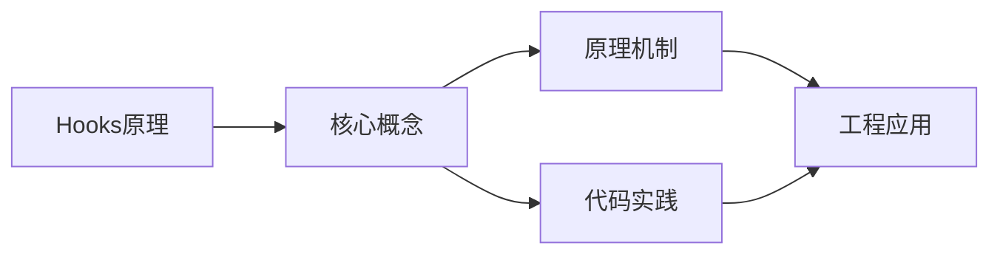
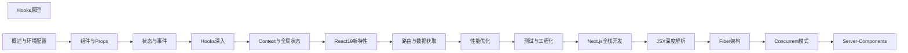

## 1. 学习目标（Bloom 分类）

本节按照布鲁姆教育目标分类学组织学习路径。本文主题为《Hooks原理》，属于 React 模块，读者可以根据自身阶段选择阅读深度。

记忆层面：能够准确复述本文的核心概念、术语与基本语法或操作步骤，并能够在提问或检索时快速定位对应知识点。能够说出 React 的核心概念、术语与标准写法。

理解层面：能够用自己的语言解释核心原理与工作机制，说明概念之间的因果关系，而不是机械记忆结论。能够解释 React 的工作原理与设计动机。

应用层面：能够在真实项目或练习场景中运用本文知识解决具体问题，写出正确且可维护的实现。能够编写符合 React 规范的完整实现。

分析层面：能够拆解复杂问题，比较本文主题与相邻概念的异同，识别边界条件与例外情况。能够分析 React 与相邻方案的差异与边界。

评价层面：能够根据约束条件（性能、可读性、安全、成本）评价不同方案的优劣，做出有依据的技术决策。能够根据场景评价 React 相关方案的优劣。

创造层面：能够把本文知识与其他模块知识组合，设计出新的解决方案或可复用的工程模式。能够组合 React 与其他技术设计完整方案。

通过本节学习，读者应当能够把《Hooks原理》纳入自己的知识网络，并与 React 模块的其他主题（组件、Hooks、状态管理、渲染性能）建立关联。

## 2. 历史动机与发展脉络

《Hooks原理》是 React 领域的重要主题。要真正理解它，需要先了解它解决的问题与演进过程。

React 由 Facebook 于 2013 年开源，核心思想是组件化 UI 与声明式渲染；2019 年 React 16.8 引入 Hooks，函数组件成为主流。
React 19（2024）引入 Actions、useOptimistic、编译器（React Compiler）自动记忆化；并发特性（Suspense、Transitions）持续完善。
生态：Next.js/Remix 全栈框架、TanStack Query 服务端状态、Zustand/Redux 客户端状态、React Native 移动端。

回到本文主题：Hooks原理 的提出与成熟，正是上述技术背景下的必然产物。早期实现往往以简单可用为目标，随着工程规模扩大，社区逐渐沉淀出标准做法与最佳实践；理解这一脉络，可以帮助读者判断“为什么文档中的推荐写法是现在这个样子”，也能在遇到历史遗留代码时准确识别其设计年代与取舍。


## 3. 形式化定义与核心概念精讲

本节把《Hooks原理》涉及的核心概念以“定义 + 讲解”的形式展开。读者应把定义当作工具，把讲解当作理解路径；两者结合才能形成可迁移的知识。

组件模型：props 输入、state 内部状态、渲染输出 JSX；组件是纯函数，同一输入必得同一输出。
Hooks 规则：只能在顶层调用（不可在条件/循环中），函数组件与自定义 Hook 内使用；依赖数组决定 effect 重跑。
渲染与协调：setState 触发重渲染，虚拟 DOM diff 更新真实 DOM；key 帮助复用元素。

### 3.1 原文章节逐一精讲

原文档把主题拆分为 29 个小节，下面按顺序给出每一节的导读讲解，随后保留原文细节供精读。

#### 原文精读（完整保留）

# React Hooks 原理与闭包陷阱

> **符号约定**：`< >` 必填参数 | `[ ]` 可选参数

---

#### 概述

React Hooks 的底层实现基于 Fiber 架构。每个函数组件对应的 Fiber 节点上挂载了一个 Hooks 链表，Hooks 按调用顺序以链表形式串联。理解 Hooks 的底层原理有助于避免常见的使用错误（如条件调用 Hooks），也能帮助开发者编写更高效的自定义 Hooks。

#### 基础概念

##### Hooks 链表结构

Hooks 在 Fiber 上以链表形式存储，每个 Hook 节点包含当前状态和更新队列：

```
Fiber.memoizedState → Hook1 → Hook2 → Hook3 → null

每个 Hook 节点：
{
  memoizedState,  // 当前状态值
  baseState,      // 初始状态
  queue,          // 更新队列
  next,           // 指向下一个 Hook
}
```

##### 为什么 Hooks 有使用规则

- **只在顶层调用**：Hooks 按链表顺序匹配，条件调用会破坏顺序，导致状态错乱
- **只在函数组件中调用**：Hooks 依赖 Fiber 上下文，普通函数中没有 Fiber

#### 快速上手

##### useState 的实现原理

```javascript
// 简化的 useState 实现
function useState(initialState) {
  // 获取或创建 Hook 节点
  const hook = mountWorkInProgressHook();

  // 初始化状态
  hook.memoizedState = initialState;

  // 创建更新队列
  hook.queue = {
    pending: null, // 待处理的更新
    dispatch: null, // dispatch 函数
    lastRenderedState: initialState, // 上次渲染的状态
  };

  // 创建 dispatch 函数
  const dispatch = dispatchSetState.bind(null, currentlyRenderingFiber, hook.queue);
  hook.queue.dispatch = dispatch;

  return [hook.memoizedState, dispatch];
}
```

##### dispatch 的实现

```javascript
// dispatch 函数：将更新加入队列并调度渲染
function dispatchSetState(fiber, queue, action) {
  // 创建更新对象
  const update = {
    action, // 新值或更新函数
    lane: requestUpdateLane(), // 优先级
    next: null, // 指向下一个更新（环形链表）
  };

  // 将更新加入队列（环形链表）
  const pending = queue.pending;
  if (pending === null) {
    update.next = update; // 指向自己
  } else {
    update.next = pending.next;
    pending.next = update;
  }
  queue.pending = update;

  // 调度渲染
  scheduleUpdateOnFiber(fiber, lane);
}
```

#### 详细用法

##### useEffect 的实现原理

```javascript
// 简化的 useEffect 实现
function useEffect(create, deps) {
  const hook = mountWorkInProgressHook();

  // 存储副作用信息
  hook.memoizedState = {
    create, // 副作用函数
    deps, // 依赖数组
    destroy: undefined, // 清理函数
  };

  // 标记 Fiber 有 Passive 副作用
  currentlyRenderingFiber.flags |= PassiveEffect;
}

// 更新时的 useEffect
function updateEffect(create, deps) {
  const hook = updateWorkInProgressHook();

  // 比较依赖是否变化
  const prevDeps = hook.memoizedState.deps;
  if (areHookInputsEqual(deps, prevDeps)) {
    // 依赖未变化，跳过
    return;
  }

  // 依赖变化，更新副作用
  hook.memoizedState = { create, deps, destroy: undefined };
  currentlyRenderingFiber.flags |= PassiveEffect;
}
```

##### useRef 的实现原理

```javascript
// useRef 本质上是一个始终返回同一对象的 Hook
function useRef(initialValue) {
  const hook = mountWorkInProgressHook();

  // 创建一个可变对象，跨渲染保持引用
  hook.memoizedState = { current: initialValue };
  return hook.memoizedState;
}

// 更新时直接返回同一对象
function updateRef(initialValue) {
  const hook = updateWorkInProgressHook();
  return hook.memoizedState;
}

// 这就是为什么修改 ref.current 不会触发重渲染
// React 不追踪 ref 的变化，只保持引用不变
```

##### useMemo 和 useCallback 的实现

```javascript
// useMemo：缓存计算结果
function useMemo(nextCreate, deps) {
  const hook = mountWorkInProgressHook();
  const nextValue = nextCreate();
  hook.memoizedState = [nextValue, deps];
  return nextValue;
}

function updateMemo(nextCreate, deps) {
  const hook = updateWorkInProgressHook();
  const [prevValue, prevDeps] = hook.memoizedState;

  if (areHookInputsEqual(deps, prevDeps)) {
    return prevValue; // 依赖未变，返回缓存值
  }

  const nextValue = nextCreate();
  hook.memoizedState = [nextValue, deps];
  return nextValue;
}

// useCallback 本质上是 useMemo 的特例
function useCallback(callback, deps) {
  return useMemo(() => callback, deps);
}
```

#### 常见场景

##### 理解闭包陷阱

```jsx
// 闭包陷阱：事件处理器中捕获了旧的状态值
function Counter() {
  const [count, setCount] = useState(0);

  function handleClick() {
    // 这里的 count 是渲染时的快照，不是最新值
    setTimeout(() => {
      console.log(count); // 可能是旧值
    }, 1000);
  }

  // 解决方案一：使用函数式更新
  function handleClickFixed() {
    setTimeout(() => {
      setCount((prev) => prev + 1); // 基于最新状态更新
    }, 1000);
  }

  // 解决方案二：使用 ref 保持最新值
  const countRef = useRef(count);
  countRef.current = count;

  function handleClickWithRef() {
    setTimeout(() => {
      console.log(countRef.current); // 始终是最新值
    }, 1000);
  }
}
```

##### 理解批量更新

```jsx
// React 18 自动批量更新：所有状态更新合并为一次渲染
function handleClick() {
  setCount((c) => c + 1); // 不会立即渲染
  setFlag((f) => !f); // 不会立即渲染
  setName('张三'); // 不会立即渲染
  // 三次更新合并为一次渲染
}

// 在 React 17 中，只有 React 事件处理器内才会批量更新
// setTimeout 中的更新不会批量处理
// React 18 中所有场景都自动批量更新
```

#### 注意事项

- Hooks 的调用顺序必须稳定，不能在条件语句、循环或嵌套函数中调用
- useEffect 的清理函数在下次 effect 执行前或组件卸载时调用
- useState 的函数式更新可以避免闭包陷阱，应优先使用
- useRef 修改 current 不会触发重渲染，适合存储不参与渲染的可变值
- useMemo 和 useCallback 应在性能分析后使用，不要过度优化
- React 18 中所有更新都自动批量处理，不再需要 unstable_batchedUpdates

#### 进阶用法

##### 自定义 Hook 的底层原理

```jsx
// 自定义 Hook 只是复用 Hooks 逻辑的函数
// 调用自定义 Hook 时，其中的 Hooks 会被添加到当前 Fiber 的链表中
function useWindowSize() {
  const [size, setSize] = useState({
    width: window.innerWidth,
    height: window.innerHeight,
  });

  useEffect(() => {
    function handleResize() {
      setSize({
        width: window.innerWidth,
        height: window.innerHeight,
      });
    }
    window.addEventListener('resize', handleResize);
    return () => window.removeEventListener('resize', handleResize);
  }, []);

  return size;
}

// 使用时，useState 和 useEffect 被添加到调用组件的 Fiber 链表中
function App() {
  const size = useWindowSize(); // Hooks 被合并到 App 的链表
  return (
    <div>
      {size.width} x {size.height}
    </div>
  );
}
```

##### useSyncExternalStore 的实现

```jsx
import { useSyncExternalStore } from 'react';

// 用于订阅外部数据源，确保并发模式下的数据一致性
function useOnlineStatus() {
  return useSyncExternalStore(
    // subscribe：订阅函数
    (callback) => {
      window.addEventListener('online', callback);
      window.addEventListener('offline', callback);
      return () => {
        window.removeEventListener('online', callback);
        window.removeEventListener('offline', callback);
      };
    },
    // getSnapshot：获取当前值
    () => navigator.onLine,
    // getServerSnapshot：服务端渲染时的值
    () => true
  );
}
```
#### Hooks 链表存储

**基本写法：组件对应 Fiber 的 memoizedState**
`<fiber>.memoizedState = <hook链表>`
```tsx
// 每次渲染按顺序构建链表
fiber.memoizedState = hook1;
hook1.next = hook2;
```

---

**基本写法：Hook 对象结构**
`type <Hook> = { memoizedState, baseState, baseQueue, queue, next }`
```tsx
// Hook 节点字段
{
  memoizedState: 0,
  queue: { pending: null },
  next: nextHook
}
```

---

#### Hook 调用顺序约束

**基本写法：必须保证每次渲染调用顺序一致**
`use<A>(); use<B>();`
```tsx
// 顺序错乱会导致状态错位
function App() {
  const [a] = useState(0);
  const [b] = useState(0);
}
```

---

**基本写法：禁止在条件分支中调用**
`if (<条件>) useState(); // 错误`
```tsx
// 正确做法条件放在 hook 之后
const [v, setV] = useState(0);
if (cond) setV(1);
```

---

#### mount 与 update 两套实现

**基本写法：首次挂载走 mount 队列**
`const <dispatch> = mountState(<初值>)`
```tsx
// 初次创建 hook 并初始化
const [state, dispatch] = mountState(initial);
```

---

**基本写法：更新走 update 队列**
`const <dispatch> = updateState()`
```tsx
// 复用已有 hook 处理更新
const [state, dispatch] = updateState();
```

---

#### useState 实现

**基本写法：dispatchAction 创建 update**
`function <dispatchAction>(<hook>, <action>) { <update>.next = <update>; }`
```tsx
// 环形链表追加 update
const update = { action };
update.next = update;
hook.queue.pending = update;
```

---

**基本写法：render 时遍历 queue 计算新状态**
`while (<update> !== <first>) { <state> = <reducer>(<state>, <update>.action); }`
```tsx
// 逐一应用 action 得到最新 state
let newState = state;
while (update) {
  newState = reducer(newState, update.action);
  update = update.next;
}
```

---

#### useReducer 实现

**基本写法：与 useState 类似但用 reducer**
`const [state, dispatch] = mountReducer(<reducer>, <初值>)`
```tsx
// dispatch 调用 reducer 计算新状态
dispatch({ type: 'INC' });
```

---

#### useEffect 实现

**基本写法：effect 对象挂在 updateQueue**
`<hook>.updateQueue.lastEffect = <effect>`
```tsx
// effect 形成环形链表
effect.next = effect;
hook.updateQueue.lastEffect = effect;
```

---

**基本写法：effect 包含 create 与 destroy**
`type <Effect> = { tag, create, destroy, deps, next }`
```tsx
// create 是副作用函数 destroy 是清理函数
{
  create: () => subscribe(),
  destroy: () => unsubscribe(),
  deps: [id]
}
```

---

#### deps 依赖比较

**基本写法：浅比较决定是否执行 effect**
`if (!<shallowEqual>(<prevDeps>, <nextDeps>)) <执行>`
```tsx
// Object.is 逐项比较
const areEqual = prevDeps.every((d, i) => Object.is(d, nextDeps[i]));
```

---

#### useRef 实现

**基本写法：ref 对象首次创建后保持引用**
`const <ref> = { current: <初值> }`
```tsx
// ref 直接存入 memoizedState 不参与更新
hook.memoizedState = { current: initial };
```

---

#### useMemo useCallback 实现

**基本写法：依赖不变返回缓存值**
`if (<depsChanged>) <重新计算> else <返回缓存>`
```tsx
// 缓存结果与依赖
if (depsChanged) {
  hook.memoizedState = [factory(), deps];
}
return hook.memoizedState[0];
```

---

#### 闭包陷阱成因

**基本写法：effect 捕获旧值导致 stale closure**
`useEffect(() => <使用旧值>, [])`
```tsx
// 空依赖导致捕获首次渲染的 count
const [count] = useState(0);
useEffect(() => {
  const id = setInterval(() => console.log(count), 1000);
  return () => clearInterval(id);
}, []);
```

---

#### 闭包陷阱解决依赖

**基本写法：补全依赖项**
`useEffect(() => <逻辑>, [<依赖>])`
```tsx
// 加入 count 让每次更新重建 effect
useEffect(() => {
  const id = setInterval(() => console.log(count), 1000);
  return () => clearInterval(id);
}, [count]);
```

---

#### 使用 ref 规避闭包

**基本写法：ref.current 始终是最新值**
`const <latest> = useRef(<值>); <latest>.current = <值>;`
```tsx
// 通过 ref 读取最新 count
const countRef = useRef(count);
countRef.current = count;
useEffect(() => {
  const id = setInterval(() => console.log(countRef.current), 1000);
  return () => clearInterval(id);
}, []);
```

---

#### useEffectEvent 规避闭包

**基本写法：使用实验性 useEffectEvent 抽离非响应式逻辑**
`const <fn> = useEffectEvent(<回调>)`
```tsx
// 内部访问最新 props 不进依赖
const onTick = useEffectEvent(() => console.log(count));
useEffect(() => {
  const id = setInterval(onTick, 1000);
  return () => clearInterval(id);
}, []);
```

---

#### useReducer 解决闭包

**基本写法：dispatch 引用稳定不捕获旧值**
`dispatch({ type: 'INC' })`
```tsx
// dispatch 永远是最新的不进依赖
useEffect(() => {
  const id = setInterval(() => dispatch({ type: 'INC' }), 1000);
  return () => clearInterval(id);
}, [dispatch]);
```

---

#### setState 函数式更新

**基本写法：使用函数式更新读取最新 state**
`setCount(c => c + 1)`
```tsx
// 避免依赖外部 count
setInterval(() => setCount(c => c + 1), 1000);
```

---

#### Hook 规则 ESLint 校验

**基本写法：eslint-plugin-react-hooks 强制规则**
`npm i -D eslint-plugin-react-hooks`
```bash
# 安装后自动检测违反规则的写法
npm install --save-dev eslint-plugin-react-hooks
```

---

#### 自定义 Hook 闭包

**基本写法：自定义 Hook 也要注意依赖**
`function use<名称>(<值>) { useEffect(() => <用值>, [<值>]); }`
```tsx
// 内部依赖必须完整
function useTimer(cb) {
  useEffect(() => {
    const id = setInterval(cb, 1000);
    return () => clearInterval(id);
  }, [cb]);
}
```

---

#### useState 惰性初始化

**基本写法：传入函数仅首次调用**
`useState(() => <昂贵计算>)`
```tsx
// 避免每次渲染重复计算
const [data] = useState(() => heavyCompute());
```

---

#### bailout 优化

**基本写法：props 与 state 未变跳过渲染**
`if (<oldProps> === <newProps>) bailout`
```tsx
// 浅比较决定是否跳过子树处理
if (Object.is(prevProps, nextProps)) return bailout;
```

---

#### 并发模式下 Hook 行为

**基本写法：transition 内 setState 走低优先级 lane**
`startTransition(() => <setState>)`
```tsx
// 标记为非紧急更新
startTransition(() => setList(bigData));
```

---

#### 严格模式双重渲染

**基本写法：开发环境两次渲染检测副作用**
`<React.StrictMode> <App/> </React.StrictMode>`
```tsx
// 帮助发现不纯函数副作用
<React.StrictMode><App /></React.StrictMode>
```

---

#### Hook 与 Fiber 关系

**基本写法：每次渲染重建 hook 链表**
`<render> -> <遍历hook链表> -> <执行hook函数>`
```tsx
// 通过 current.memoizedState 复用上次状态
renderHooks(fiber);
```


### 3.2 概念关系图

下面用 Mermaid 图表达本文核心概念之间的关系，帮助读者建立整体图景：



图中展示的是本文知识的结构化关系：核心概念是入口，原理机制解释“为什么”，代码实践演示“怎么做”，工程应用回答“何时用”。读者学习时可以把每个小节的内容挂接到对应节点上。

## 4. 理论推导与原理解析

本节深入《Hooks原理》背后的原理。理论部分不求面面俱到，而是聚焦“能解释现象、能指导实践”的关键推导。

组件模型：props 输入、state 内部状态、渲染输出 JSX；组件是纯函数，同一输入必得同一输出。
Hooks 规则：只能在顶层调用（不可在条件/循环中），函数组件与自定义 Hook 内使用；依赖数组决定 effect 重跑。
渲染与协调：setState 触发重渲染，虚拟 DOM diff 更新真实 DOM；key 帮助复用元素。
状态提升与下放：共享状态提升到最近公共祖先；Context 跨层传递（Provider/useContext）。

需要强调的是，理论推导与工程实践之间存在翻译层：理论给出的是理想化模型与边界条件，工程代码则必须处理真实环境中的例外。读者在学习时应先掌握理论的“标准情形”，再通过陷阱章节了解“非标准情形”。

## 5. 代码示例与逐行讲解

本节把原文中的代码示例系统整理，并为每个示例补充用途说明与讲解。读者不应只浏览代码，而应逐段对照讲解理解设计意图。

### 5.1 示例：Hooks 链表结构

该示例来自原文《Hooks 链表结构》小节，用于演示Hooks原理相关操作。阅读时请先看代码结构，再看其后的讲解。

```text
Fiber.memoizedState → Hook1 → Hook2 → Hook3 → null

每个 Hook 节点：
{
  memoizedState,  // 当前状态值
  baseState,      // 初始状态
  queue,          // 更新队列
  next,           // 指向下一个 Hook
}
```

讲解：这段代码演示了本节核心知识点。代码中的关键操作可以归纳为三步：准备（定义或初始化）、执行（核心逻辑）、收尾（释放资源或返回结果）。实际项目中，这三步往往被封装为函数或类，以提升复用性与可测试性。

关键点分析：

该示例共 8 行有效代码，结构以数据或配置为主。阅读时应关注：数据字段的含义、配置项的作用，以及它们与运行行为的对应关系。

进阶思考路径：先尝试修改参数观察行为变化，再把示例中的模式迁移到自己的项目中；每次修改都记录预期与实测差异，这是把示例转化为能力的最快方式。

### 5.2 示例：useState 的实现原理

该示例来自原文《useState 的实现原理》小节，用于演示Hooks原理相关操作。阅读时请先看代码结构，再看其后的讲解。

```javascript
// 简化的 useState 实现
function useState(initialState) {
  // 获取或创建 Hook 节点
  const hook = mountWorkInProgressHook();

  // 初始化状态
  hook.memoizedState = initialState;

  // 创建更新队列
  hook.queue = {
    pending: null, // 待处理的更新
    dispatch: null, // dispatch 函数
    lastRenderedState: initialState, // 上次渲染的状态
  };

  // 创建 dispatch 函数
  const dispatch = dispatchSetState.bind(null, currentlyRenderingFiber, hook.queue);
  hook.queue.dispatch = dispatch;

  return [hook.memoizedState, dispatch];
}
```

讲解：这段代码演示了本节核心知识点。代码中的关键操作可以归纳为三步：准备（定义或初始化）、执行（核心逻辑）、收尾（释放资源或返回结果）。实际项目中，这三步往往被封装为函数或类，以提升复用性与可测试性。

关键点分析：

该示例共 17 行有效代码，包含 2 类关键结构（function、return）。其中：

- 入口与初始化部分负责建立上下文，对应实际项目中的启动或装配逻辑；
- 核心逻辑部分体现本文主题的主要操作，是阅读时最需要对照讲解理解的部分；
- 输出或返回部分把结果交给调用方，注意其类型与边界条件。

进阶思考路径：先尝试修改参数观察行为变化，再把示例中的模式迁移到自己的项目中；每次修改都记录预期与实测差异，这是把示例转化为能力的最快方式。

### 5.3 示例：dispatch 的实现

该示例来自原文《dispatch 的实现》小节，用于演示Hooks原理相关操作。阅读时请先看代码结构，再看其后的讲解。

```javascript
// dispatch 函数：将更新加入队列并调度渲染
function dispatchSetState(fiber, queue, action) {
  // 创建更新对象
  const update = {
    action, // 新值或更新函数
    lane: requestUpdateLane(), // 优先级
    next: null, // 指向下一个更新（环形链表）
  };

  // 将更新加入队列（环形链表）
  const pending = queue.pending;
  if (pending === null) {
    update.next = update; // 指向自己
  } else {
    update.next = pending.next;
    pending.next = update;
  }
  queue.pending = update;

  // 调度渲染
  scheduleUpdateOnFiber(fiber, lane);
}
```

讲解：这段代码演示了本节核心知识点。代码中的关键操作可以归纳为三步：准备（定义或初始化）、执行（核心逻辑）、收尾（释放资源或返回结果）。实际项目中，这三步往往被封装为函数或类，以提升复用性与可测试性。

关键点分析：

该示例共 20 行有效代码，包含 2 类关键结构（function、if）。其中：

- 入口与初始化部分负责建立上下文，对应实际项目中的启动或装配逻辑；
- 核心逻辑部分体现本文主题的主要操作，是阅读时最需要对照讲解理解的部分；
- 输出或返回部分把结果交给调用方，注意其类型与边界条件。

进阶思考路径：先尝试修改参数观察行为变化，再把示例中的模式迁移到自己的项目中；每次修改都记录预期与实测差异，这是把示例转化为能力的最快方式。

### 5.4 示例：useEffect 的实现原理

该示例来自原文《useEffect 的实现原理》小节，用于演示Hooks原理相关操作。阅读时请先看代码结构，再看其后的讲解。

```javascript
// 简化的 useEffect 实现
function useEffect(create, deps) {
  const hook = mountWorkInProgressHook();

  // 存储副作用信息
  hook.memoizedState = {
    create, // 副作用函数
    deps, // 依赖数组
    destroy: undefined, // 清理函数
  };

  // 标记 Fiber 有 Passive 副作用
  currentlyRenderingFiber.flags |= PassiveEffect;
}

// 更新时的 useEffect
function updateEffect(create, deps) {
  const hook = updateWorkInProgressHook();

  // 比较依赖是否变化
  const prevDeps = hook.memoizedState.deps;
  if (areHookInputsEqual(deps, prevDeps)) {
    // 依赖未变化，跳过
    return;
  }

  // 依赖变化，更新副作用
  hook.memoizedState = { create, deps, destroy: undefined };
  currentlyRenderingFiber.flags |= PassiveEffect;
}
```

讲解：这段代码演示了本节核心知识点。代码中的关键操作可以归纳为三步：准备（定义或初始化）、执行（核心逻辑）、收尾（释放资源或返回结果）。实际项目中，这三步往往被封装为函数或类，以提升复用性与可测试性。

关键点分析：

该示例共 25 行有效代码，包含 3 类关键结构（function、if、return）。其中：

- 入口与初始化部分负责建立上下文，对应实际项目中的启动或装配逻辑；
- 核心逻辑部分体现本文主题的主要操作，是阅读时最需要对照讲解理解的部分；
- 输出或返回部分把结果交给调用方，注意其类型与边界条件。

进阶思考路径：先尝试修改参数观察行为变化，再把示例中的模式迁移到自己的项目中；每次修改都记录预期与实测差异，这是把示例转化为能力的最快方式。

### 5.5 示例：useRef 的实现原理

该示例来自原文《useRef 的实现原理》小节，用于演示Hooks原理相关操作。阅读时请先看代码结构，再看其后的讲解。

```javascript
// useRef 本质上是一个始终返回同一对象的 Hook
function useRef(initialValue) {
  const hook = mountWorkInProgressHook();

  // 创建一个可变对象，跨渲染保持引用
  hook.memoizedState = { current: initialValue };
  return hook.memoizedState;
}

// 更新时直接返回同一对象
function updateRef(initialValue) {
  const hook = updateWorkInProgressHook();
  return hook.memoizedState;
}

// 这就是为什么修改 ref.current 不会触发重渲染
// React 不追踪 ref 的变化，只保持引用不变
```

讲解：这段代码演示了本节核心知识点。代码中的关键操作可以归纳为三步：准备（定义或初始化）、执行（核心逻辑）、收尾（释放资源或返回结果）。实际项目中，这三步往往被封装为函数或类，以提升复用性与可测试性。

关键点分析：

该示例共 14 行有效代码，包含 2 类关键结构（function、return）。其中：

- 入口与初始化部分负责建立上下文，对应实际项目中的启动或装配逻辑；
- 核心逻辑部分体现本文主题的主要操作，是阅读时最需要对照讲解理解的部分；
- 输出或返回部分把结果交给调用方，注意其类型与边界条件。

进阶思考路径：先尝试修改参数观察行为变化，再把示例中的模式迁移到自己的项目中；每次修改都记录预期与实测差异，这是把示例转化为能力的最快方式。

### 5.6 示例：useMemo 和 useCallback 的实现

该示例来自原文《useMemo 和 useCallback 的实现》小节，用于演示Hooks原理相关操作。阅读时请先看代码结构，再看其后的讲解。

```javascript
// useMemo：缓存计算结果
function useMemo(nextCreate, deps) {
  const hook = mountWorkInProgressHook();
  const nextValue = nextCreate();
  hook.memoizedState = [nextValue, deps];
  return nextValue;
}

function updateMemo(nextCreate, deps) {
  const hook = updateWorkInProgressHook();
  const [prevValue, prevDeps] = hook.memoizedState;

  if (areHookInputsEqual(deps, prevDeps)) {
    return prevValue; // 依赖未变，返回缓存值
  }

  const nextValue = nextCreate();
  hook.memoizedState = [nextValue, deps];
  return nextValue;
}

// useCallback 本质上是 useMemo 的特例
function useCallback(callback, deps) {
  return useMemo(() => callback, deps);
}
```

讲解：这段代码演示了本节核心知识点。代码中的关键操作可以归纳为三步：准备（定义或初始化）、执行（核心逻辑）、收尾（释放资源或返回结果）。实际项目中，这三步往往被封装为函数或类，以提升复用性与可测试性。

关键点分析：

该示例共 21 行有效代码，包含 3 类关键结构（function、if、return）。其中：

- 入口与初始化部分负责建立上下文，对应实际项目中的启动或装配逻辑；
- 核心逻辑部分体现本文主题的主要操作，是阅读时最需要对照讲解理解的部分；
- 输出或返回部分把结果交给调用方，注意其类型与边界条件。

进阶思考路径：先尝试修改参数观察行为变化，再把示例中的模式迁移到自己的项目中；每次修改都记录预期与实测差异，这是把示例转化为能力的最快方式。

### 5.7 示例：理解闭包陷阱

该示例来自原文《理解闭包陷阱》小节，用于演示Hooks原理相关操作。阅读时请先看代码结构，再看其后的讲解。

```jsx
// 闭包陷阱：事件处理器中捕获了旧的状态值
function Counter() {
  const [count, setCount] = useState(0);

  function handleClick() {
    // 这里的 count 是渲染时的快照，不是最新值
    setTimeout(() => {
      console.log(count); // 可能是旧值
    }, 1000);
  }

  // 解决方案一：使用函数式更新
  function handleClickFixed() {
    setTimeout(() => {
      setCount((prev) => prev + 1); // 基于最新状态更新
    }, 1000);
  }

  // 解决方案二：使用 ref 保持最新值
  const countRef = useRef(count);
  countRef.current = count;

  function handleClickWithRef() {
    setTimeout(() => {
      console.log(countRef.current); // 始终是最新值
    }, 1000);
  }
}
```

讲解：这段代码演示了本节核心知识点。代码中的关键操作可以归纳为三步：准备（定义或初始化）、执行（核心逻辑）、收尾（释放资源或返回结果）。实际项目中，这三步往往被封装为函数或类，以提升复用性与可测试性。

关键点分析：

该示例共 24 行有效代码，包含 1 类关键结构（function）。其中：

- 入口与初始化部分负责建立上下文，对应实际项目中的启动或装配逻辑；
- 核心逻辑部分体现本文主题的主要操作，是阅读时最需要对照讲解理解的部分；
- 输出或返回部分把结果交给调用方，注意其类型与边界条件。

进阶思考路径：先尝试修改参数观察行为变化，再把示例中的模式迁移到自己的项目中；每次修改都记录预期与实测差异，这是把示例转化为能力的最快方式。

### 5.8 示例：理解批量更新

该示例来自原文《理解批量更新》小节，用于演示Hooks原理相关操作。阅读时请先看代码结构，再看其后的讲解。

```jsx
// React 18 自动批量更新：所有状态更新合并为一次渲染
function handleClick() {
  setCount((c) => c + 1); // 不会立即渲染
  setFlag((f) => !f); // 不会立即渲染
  setName('张三'); // 不会立即渲染
  // 三次更新合并为一次渲染
}

// 在 React 17 中，只有 React 事件处理器内才会批量更新
// setTimeout 中的更新不会批量处理
// React 18 中所有场景都自动批量更新
```

讲解：这段代码演示了本节核心知识点。代码中的关键操作可以归纳为三步：准备（定义或初始化）、执行（核心逻辑）、收尾（释放资源或返回结果）。实际项目中，这三步往往被封装为函数或类，以提升复用性与可测试性。

关键点分析：

该示例共 10 行有效代码，包含 1 类关键结构（function）。其中：

- 入口与初始化部分负责建立上下文，对应实际项目中的启动或装配逻辑；
- 核心逻辑部分体现本文主题的主要操作，是阅读时最需要对照讲解理解的部分；
- 输出或返回部分把结果交给调用方，注意其类型与边界条件。

进阶思考路径：先尝试修改参数观察行为变化，再把示例中的模式迁移到自己的项目中；每次修改都记录预期与实测差异，这是把示例转化为能力的最快方式。

### 5.9 示例：自定义 Hook 的底层原理

该示例来自原文《自定义 Hook 的底层原理》小节，用于演示Hooks原理相关操作。阅读时请先看代码结构，再看其后的讲解。

```jsx
// 自定义 Hook 只是复用 Hooks 逻辑的函数
// 调用自定义 Hook 时，其中的 Hooks 会被添加到当前 Fiber 的链表中
function useWindowSize() {
  const [size, setSize] = useState({
    width: window.innerWidth,
    height: window.innerHeight,
  });

  useEffect(() => {
    function handleResize() {
      setSize({
        width: window.innerWidth,
        height: window.innerHeight,
      });
    }
    window.addEventListener('resize', handleResize);
    return () => window.removeEventListener('resize', handleResize);
  }, []);

  return size;
}

// 使用时，useState 和 useEffect 被添加到调用组件的 Fiber 链表中
function App() {
  const size = useWindowSize(); // Hooks 被合并到 App 的链表
  return (
    <div>
      {size.width} x {size.height}
    </div>
  );
}
```

讲解：这段代码演示了本节核心知识点。代码中的关键操作可以归纳为三步：准备（定义或初始化）、执行（核心逻辑）、收尾（释放资源或返回结果）。实际项目中，这三步往往被封装为函数或类，以提升复用性与可测试性。

关键点分析：

该示例共 28 行有效代码，包含 2 类关键结构（function、return）。其中：

- 入口与初始化部分负责建立上下文，对应实际项目中的启动或装配逻辑；
- 核心逻辑部分体现本文主题的主要操作，是阅读时最需要对照讲解理解的部分；
- 输出或返回部分把结果交给调用方，注意其类型与边界条件。

进阶思考路径：先尝试修改参数观察行为变化，再把示例中的模式迁移到自己的项目中；每次修改都记录预期与实测差异，这是把示例转化为能力的最快方式。

### 5.10 示例：useSyncExternalStore 的实现

该示例来自原文《useSyncExternalStore 的实现》小节，用于演示Hooks原理相关操作。阅读时请先看代码结构，再看其后的讲解。

```jsx
import { useSyncExternalStore } from 'react';

// 用于订阅外部数据源，确保并发模式下的数据一致性
function useOnlineStatus() {
  return useSyncExternalStore(
    // subscribe：订阅函数
    (callback) => {
      window.addEventListener('online', callback);
      window.addEventListener('offline', callback);
      return () => {
        window.removeEventListener('online', callback);
        window.removeEventListener('offline', callback);
      };
    },
    // getSnapshot：获取当前值
    () => navigator.onLine,
    // getServerSnapshot：服务端渲染时的值
    () => true
  );
}
```

讲解：这段代码演示了本节核心知识点。代码中的关键操作可以归纳为三步：准备（定义或初始化）、执行（核心逻辑）、收尾（释放资源或返回结果）。实际项目中，这三步往往被封装为函数或类，以提升复用性与可测试性。

关键点分析：

该示例共 19 行有效代码，包含 4 类关键结构（function、import、from、return）。其中：

- 入口与初始化部分负责建立上下文，对应实际项目中的启动或装配逻辑；
- 核心逻辑部分体现本文主题的主要操作，是阅读时最需要对照讲解理解的部分；
- 输出或返回部分把结果交给调用方，注意其类型与边界条件。

进阶思考路径：先尝试修改参数观察行为变化，再把示例中的模式迁移到自己的项目中；每次修改都记录预期与实测差异，这是把示例转化为能力的最快方式。

### 5.11 示例：Hooks 链表存储

该示例来自原文《Hooks 链表存储》小节，用于演示Hooks原理相关操作。阅读时请先看代码结构，再看其后的讲解。

```tsx
// 每次渲染按顺序构建链表
fiber.memoizedState = hook1;
hook1.next = hook2;
```

讲解：这段代码演示了本节核心知识点。代码中的关键操作可以归纳为三步：准备（定义或初始化）、执行（核心逻辑）、收尾（释放资源或返回结果）。实际项目中，这三步往往被封装为函数或类，以提升复用性与可测试性。

关键点分析：

该示例共 3 行有效代码，结构以数据或配置为主。阅读时应关注：数据字段的含义、配置项的作用，以及它们与运行行为的对应关系。

进阶思考路径：先尝试修改参数观察行为变化，再把示例中的模式迁移到自己的项目中；每次修改都记录预期与实测差异，这是把示例转化为能力的最快方式。

### 5.12 示例：Hooks 链表存储

该示例来自原文《Hooks 链表存储》小节，用于演示Hooks原理相关操作。阅读时请先看代码结构，再看其后的讲解。

```tsx
// Hook 节点字段
{
  memoizedState: 0,
  queue: { pending: null },
  next: nextHook
}
```

讲解：这段代码演示了本节核心知识点。代码中的关键操作可以归纳为三步：准备（定义或初始化）、执行（核心逻辑）、收尾（释放资源或返回结果）。实际项目中，这三步往往被封装为函数或类，以提升复用性与可测试性。

关键点分析：

该示例共 6 行有效代码，结构以数据或配置为主。阅读时应关注：数据字段的含义、配置项的作用，以及它们与运行行为的对应关系。

进阶思考路径：先尝试修改参数观察行为变化，再把示例中的模式迁移到自己的项目中；每次修改都记录预期与实测差异，这是把示例转化为能力的最快方式。

### 5.13 示例：Hook 调用顺序约束

该示例来自原文《Hook 调用顺序约束》小节，用于演示Hooks原理相关操作。阅读时请先看代码结构，再看其后的讲解。

```tsx
// 顺序错乱会导致状态错位
function App() {
  const [a] = useState(0);
  const [b] = useState(0);
}
```

讲解：这段代码演示了本节核心知识点。代码中的关键操作可以归纳为三步：准备（定义或初始化）、执行（核心逻辑）、收尾（释放资源或返回结果）。实际项目中，这三步往往被封装为函数或类，以提升复用性与可测试性。

关键点分析：

该示例共 5 行有效代码，包含 1 类关键结构（function）。其中：

- 入口与初始化部分负责建立上下文，对应实际项目中的启动或装配逻辑；
- 核心逻辑部分体现本文主题的主要操作，是阅读时最需要对照讲解理解的部分；
- 输出或返回部分把结果交给调用方，注意其类型与边界条件。

进阶思考路径：先尝试修改参数观察行为变化，再把示例中的模式迁移到自己的项目中；每次修改都记录预期与实测差异，这是把示例转化为能力的最快方式。

### 5.14 示例：Hook 调用顺序约束

该示例来自原文《Hook 调用顺序约束》小节，用于演示Hooks原理相关操作。阅读时请先看代码结构，再看其后的讲解。

```tsx
// 正确做法条件放在 hook 之后
const [v, setV] = useState(0);
if (cond) setV(1);
```

讲解：这段代码演示了本节核心知识点。代码中的关键操作可以归纳为三步：准备（定义或初始化）、执行（核心逻辑）、收尾（释放资源或返回结果）。实际项目中，这三步往往被封装为函数或类，以提升复用性与可测试性。

关键点分析：

该示例共 3 行有效代码，包含 1 类关键结构（if）。其中：

- 入口与初始化部分负责建立上下文，对应实际项目中的启动或装配逻辑；
- 核心逻辑部分体现本文主题的主要操作，是阅读时最需要对照讲解理解的部分；
- 输出或返回部分把结果交给调用方，注意其类型与边界条件。

进阶思考路径：先尝试修改参数观察行为变化，再把示例中的模式迁移到自己的项目中；每次修改都记录预期与实测差异，这是把示例转化为能力的最快方式。

### 5.15 示例：mount 与 update 两套实现

该示例来自原文《mount 与 update 两套实现》小节，用于演示Hooks原理相关操作。阅读时请先看代码结构，再看其后的讲解。

```tsx
// 初次创建 hook 并初始化
const [state, dispatch] = mountState(initial);
```

讲解：这段代码演示了本节核心知识点。代码中的关键操作可以归纳为三步：准备（定义或初始化）、执行（核心逻辑）、收尾（释放资源或返回结果）。实际项目中，这三步往往被封装为函数或类，以提升复用性与可测试性。

关键点分析：

该示例共 2 行有效代码，结构以数据或配置为主。阅读时应关注：数据字段的含义、配置项的作用，以及它们与运行行为的对应关系。

进阶思考路径：先尝试修改参数观察行为变化，再把示例中的模式迁移到自己的项目中；每次修改都记录预期与实测差异，这是把示例转化为能力的最快方式。

### 5.16 示例：mount 与 update 两套实现

该示例来自原文《mount 与 update 两套实现》小节，用于演示Hooks原理相关操作。阅读时请先看代码结构，再看其后的讲解。

```tsx
// 复用已有 hook 处理更新
const [state, dispatch] = updateState();
```

讲解：这段代码演示了本节核心知识点。代码中的关键操作可以归纳为三步：准备（定义或初始化）、执行（核心逻辑）、收尾（释放资源或返回结果）。实际项目中，这三步往往被封装为函数或类，以提升复用性与可测试性。

关键点分析：

该示例共 2 行有效代码，结构以数据或配置为主。阅读时应关注：数据字段的含义、配置项的作用，以及它们与运行行为的对应关系。

进阶思考路径：先尝试修改参数观察行为变化，再把示例中的模式迁移到自己的项目中；每次修改都记录预期与实测差异，这是把示例转化为能力的最快方式。

### 5.17 示例：useState 实现

该示例来自原文《useState 实现》小节，用于演示Hooks原理相关操作。阅读时请先看代码结构，再看其后的讲解。

```tsx
// 环形链表追加 update
const update = { action };
update.next = update;
hook.queue.pending = update;
```

讲解：这段代码演示了本节核心知识点。代码中的关键操作可以归纳为三步：准备（定义或初始化）、执行（核心逻辑）、收尾（释放资源或返回结果）。实际项目中，这三步往往被封装为函数或类，以提升复用性与可测试性。

关键点分析：

该示例共 4 行有效代码，结构以数据或配置为主。阅读时应关注：数据字段的含义、配置项的作用，以及它们与运行行为的对应关系。

进阶思考路径：先尝试修改参数观察行为变化，再把示例中的模式迁移到自己的项目中；每次修改都记录预期与实测差异，这是把示例转化为能力的最快方式。

### 5.18 示例：useState 实现

该示例来自原文《useState 实现》小节，用于演示Hooks原理相关操作。阅读时请先看代码结构，再看其后的讲解。

```tsx
// 逐一应用 action 得到最新 state
let newState = state;
while (update) {
  newState = reducer(newState, update.action);
  update = update.next;
}
```

讲解：这段代码演示了本节核心知识点。代码中的关键操作可以归纳为三步：准备（定义或初始化）、执行（核心逻辑）、收尾（释放资源或返回结果）。实际项目中，这三步往往被封装为函数或类，以提升复用性与可测试性。

关键点分析：

该示例共 6 行有效代码，包含 1 类关键结构（while）。其中：

- 入口与初始化部分负责建立上下文，对应实际项目中的启动或装配逻辑；
- 核心逻辑部分体现本文主题的主要操作，是阅读时最需要对照讲解理解的部分；
- 输出或返回部分把结果交给调用方，注意其类型与边界条件。

进阶思考路径：先尝试修改参数观察行为变化，再把示例中的模式迁移到自己的项目中；每次修改都记录预期与实测差异，这是把示例转化为能力的最快方式。

### 5.19 示例：useReducer 实现

该示例来自原文《useReducer 实现》小节，用于演示Hooks原理相关操作。阅读时请先看代码结构，再看其后的讲解。

```tsx
// dispatch 调用 reducer 计算新状态
dispatch({ type: 'INC' });
```

讲解：这段代码演示了本节核心知识点。代码中的关键操作可以归纳为三步：准备（定义或初始化）、执行（核心逻辑）、收尾（释放资源或返回结果）。实际项目中，这三步往往被封装为函数或类，以提升复用性与可测试性。

关键点分析：

该示例共 2 行有效代码，结构以数据或配置为主。阅读时应关注：数据字段的含义、配置项的作用，以及它们与运行行为的对应关系。

进阶思考路径：先尝试修改参数观察行为变化，再把示例中的模式迁移到自己的项目中；每次修改都记录预期与实测差异，这是把示例转化为能力的最快方式。

### 5.20 示例：useEffect 实现

该示例来自原文《useEffect 实现》小节，用于演示Hooks原理相关操作。阅读时请先看代码结构，再看其后的讲解。

```tsx
// effect 形成环形链表
effect.next = effect;
hook.updateQueue.lastEffect = effect;
```

讲解：这段代码演示了本节核心知识点。代码中的关键操作可以归纳为三步：准备（定义或初始化）、执行（核心逻辑）、收尾（释放资源或返回结果）。实际项目中，这三步往往被封装为函数或类，以提升复用性与可测试性。

关键点分析：

该示例共 3 行有效代码，结构以数据或配置为主。阅读时应关注：数据字段的含义、配置项的作用，以及它们与运行行为的对应关系。

进阶思考路径：先尝试修改参数观察行为变化，再把示例中的模式迁移到自己的项目中；每次修改都记录预期与实测差异，这是把示例转化为能力的最快方式。

### 5.21 示例：useEffect 实现

该示例来自原文《useEffect 实现》小节，用于演示Hooks原理相关操作。阅读时请先看代码结构，再看其后的讲解。

```tsx
// create 是副作用函数 destroy 是清理函数
{
  create: () => subscribe(),
  destroy: () => unsubscribe(),
  deps: [id]
}
```

讲解：这段代码演示了本节核心知识点。代码中的关键操作可以归纳为三步：准备（定义或初始化）、执行（核心逻辑）、收尾（释放资源或返回结果）。实际项目中，这三步往往被封装为函数或类，以提升复用性与可测试性。

关键点分析：

该示例共 6 行有效代码，结构以数据或配置为主。阅读时应关注：数据字段的含义、配置项的作用，以及它们与运行行为的对应关系。

进阶思考路径：先尝试修改参数观察行为变化，再把示例中的模式迁移到自己的项目中；每次修改都记录预期与实测差异，这是把示例转化为能力的最快方式。

### 5.22 示例：deps 依赖比较

该示例来自原文《deps 依赖比较》小节，用于演示Hooks原理相关操作。阅读时请先看代码结构，再看其后的讲解。

```tsx
// Object.is 逐项比较
const areEqual = prevDeps.every((d, i) => Object.is(d, nextDeps[i]));
```

讲解：这段代码演示了本节核心知识点。代码中的关键操作可以归纳为三步：准备（定义或初始化）、执行（核心逻辑）、收尾（释放资源或返回结果）。实际项目中，这三步往往被封装为函数或类，以提升复用性与可测试性。

关键点分析：

该示例共 2 行有效代码，结构以数据或配置为主。阅读时应关注：数据字段的含义、配置项的作用，以及它们与运行行为的对应关系。

进阶思考路径：先尝试修改参数观察行为变化，再把示例中的模式迁移到自己的项目中；每次修改都记录预期与实测差异，这是把示例转化为能力的最快方式。

### 5.23 示例：useRef 实现

该示例来自原文《useRef 实现》小节，用于演示Hooks原理相关操作。阅读时请先看代码结构，再看其后的讲解。

```tsx
// ref 直接存入 memoizedState 不参与更新
hook.memoizedState = { current: initial };
```

讲解：这段代码演示了本节核心知识点。代码中的关键操作可以归纳为三步：准备（定义或初始化）、执行（核心逻辑）、收尾（释放资源或返回结果）。实际项目中，这三步往往被封装为函数或类，以提升复用性与可测试性。

关键点分析：

该示例共 2 行有效代码，结构以数据或配置为主。阅读时应关注：数据字段的含义、配置项的作用，以及它们与运行行为的对应关系。

进阶思考路径：先尝试修改参数观察行为变化，再把示例中的模式迁移到自己的项目中；每次修改都记录预期与实测差异，这是把示例转化为能力的最快方式。

### 5.24 示例：useMemo useCallback 实现

该示例来自原文《useMemo useCallback 实现》小节，用于演示Hooks原理相关操作。阅读时请先看代码结构，再看其后的讲解。

```tsx
// 缓存结果与依赖
if (depsChanged) {
  hook.memoizedState = [factory(), deps];
}
return hook.memoizedState[0];
```

讲解：这段代码演示了本节核心知识点。代码中的关键操作可以归纳为三步：准备（定义或初始化）、执行（核心逻辑）、收尾（释放资源或返回结果）。实际项目中，这三步往往被封装为函数或类，以提升复用性与可测试性。

关键点分析：

该示例共 5 行有效代码，包含 2 类关键结构（if、return）。其中：

- 入口与初始化部分负责建立上下文，对应实际项目中的启动或装配逻辑；
- 核心逻辑部分体现本文主题的主要操作，是阅读时最需要对照讲解理解的部分；
- 输出或返回部分把结果交给调用方，注意其类型与边界条件。

进阶思考路径：先尝试修改参数观察行为变化，再把示例中的模式迁移到自己的项目中；每次修改都记录预期与实测差异，这是把示例转化为能力的最快方式。

### 5.25 示例：闭包陷阱成因

该示例来自原文《闭包陷阱成因》小节，用于演示Hooks原理相关操作。阅读时请先看代码结构，再看其后的讲解。

```tsx
// 空依赖导致捕获首次渲染的 count
const [count] = useState(0);
useEffect(() => {
  const id = setInterval(() => console.log(count), 1000);
  return () => clearInterval(id);
}, []);
```

讲解：这段代码演示了本节核心知识点。代码中的关键操作可以归纳为三步：准备（定义或初始化）、执行（核心逻辑）、收尾（释放资源或返回结果）。实际项目中，这三步往往被封装为函数或类，以提升复用性与可测试性。

关键点分析：

该示例共 6 行有效代码，包含 1 类关键结构（return）。其中：

- 入口与初始化部分负责建立上下文，对应实际项目中的启动或装配逻辑；
- 核心逻辑部分体现本文主题的主要操作，是阅读时最需要对照讲解理解的部分；
- 输出或返回部分把结果交给调用方，注意其类型与边界条件。

进阶思考路径：先尝试修改参数观察行为变化，再把示例中的模式迁移到自己的项目中；每次修改都记录预期与实测差异，这是把示例转化为能力的最快方式。

### 5.26 示例：闭包陷阱解决依赖

该示例来自原文《闭包陷阱解决依赖》小节，用于演示Hooks原理相关操作。阅读时请先看代码结构，再看其后的讲解。

```tsx
// 加入 count 让每次更新重建 effect
useEffect(() => {
  const id = setInterval(() => console.log(count), 1000);
  return () => clearInterval(id);
}, [count]);
```

讲解：这段代码演示了本节核心知识点。代码中的关键操作可以归纳为三步：准备（定义或初始化）、执行（核心逻辑）、收尾（释放资源或返回结果）。实际项目中，这三步往往被封装为函数或类，以提升复用性与可测试性。

关键点分析：

该示例共 5 行有效代码，包含 1 类关键结构（return）。其中：

- 入口与初始化部分负责建立上下文，对应实际项目中的启动或装配逻辑；
- 核心逻辑部分体现本文主题的主要操作，是阅读时最需要对照讲解理解的部分；
- 输出或返回部分把结果交给调用方，注意其类型与边界条件。

进阶思考路径：先尝试修改参数观察行为变化，再把示例中的模式迁移到自己的项目中；每次修改都记录预期与实测差异，这是把示例转化为能力的最快方式。

### 5.27 示例：使用 ref 规避闭包

该示例来自原文《使用 ref 规避闭包》小节，用于演示Hooks原理相关操作。阅读时请先看代码结构，再看其后的讲解。

```tsx
// 通过 ref 读取最新 count
const countRef = useRef(count);
countRef.current = count;
useEffect(() => {
  const id = setInterval(() => console.log(countRef.current), 1000);
  return () => clearInterval(id);
}, []);
```

讲解：这段代码演示了本节核心知识点。代码中的关键操作可以归纳为三步：准备（定义或初始化）、执行（核心逻辑）、收尾（释放资源或返回结果）。实际项目中，这三步往往被封装为函数或类，以提升复用性与可测试性。

关键点分析：

该示例共 7 行有效代码，包含 1 类关键结构（return）。其中：

- 入口与初始化部分负责建立上下文，对应实际项目中的启动或装配逻辑；
- 核心逻辑部分体现本文主题的主要操作，是阅读时最需要对照讲解理解的部分；
- 输出或返回部分把结果交给调用方，注意其类型与边界条件。

进阶思考路径：先尝试修改参数观察行为变化，再把示例中的模式迁移到自己的项目中；每次修改都记录预期与实测差异，这是把示例转化为能力的最快方式。

### 5.28 示例：useEffectEvent 规避闭包

该示例来自原文《useEffectEvent 规避闭包》小节，用于演示Hooks原理相关操作。阅读时请先看代码结构，再看其后的讲解。

```tsx
// 内部访问最新 props 不进依赖
const onTick = useEffectEvent(() => console.log(count));
useEffect(() => {
  const id = setInterval(onTick, 1000);
  return () => clearInterval(id);
}, []);
```

讲解：这段代码演示了本节核心知识点。代码中的关键操作可以归纳为三步：准备（定义或初始化）、执行（核心逻辑）、收尾（释放资源或返回结果）。实际项目中，这三步往往被封装为函数或类，以提升复用性与可测试性。

关键点分析：

该示例共 6 行有效代码，包含 1 类关键结构（return）。其中：

- 入口与初始化部分负责建立上下文，对应实际项目中的启动或装配逻辑；
- 核心逻辑部分体现本文主题的主要操作，是阅读时最需要对照讲解理解的部分；
- 输出或返回部分把结果交给调用方，注意其类型与边界条件。

进阶思考路径：先尝试修改参数观察行为变化，再把示例中的模式迁移到自己的项目中；每次修改都记录预期与实测差异，这是把示例转化为能力的最快方式。

### 5.29 示例：useReducer 解决闭包

该示例来自原文《useReducer 解决闭包》小节，用于演示Hooks原理相关操作。阅读时请先看代码结构，再看其后的讲解。

```tsx
// dispatch 永远是最新的不进依赖
useEffect(() => {
  const id = setInterval(() => dispatch({ type: 'INC' }), 1000);
  return () => clearInterval(id);
}, [dispatch]);
```

讲解：这段代码演示了本节核心知识点。代码中的关键操作可以归纳为三步：准备（定义或初始化）、执行（核心逻辑）、收尾（释放资源或返回结果）。实际项目中，这三步往往被封装为函数或类，以提升复用性与可测试性。

关键点分析：

该示例共 5 行有效代码，包含 1 类关键结构（return）。其中：

- 入口与初始化部分负责建立上下文，对应实际项目中的启动或装配逻辑；
- 核心逻辑部分体现本文主题的主要操作，是阅读时最需要对照讲解理解的部分；
- 输出或返回部分把结果交给调用方，注意其类型与边界条件。

进阶思考路径：先尝试修改参数观察行为变化，再把示例中的模式迁移到自己的项目中；每次修改都记录预期与实测差异，这是把示例转化为能力的最快方式。

### 5.30 示例：setState 函数式更新

该示例来自原文《setState 函数式更新》小节，用于演示Hooks原理相关操作。阅读时请先看代码结构，再看其后的讲解。

```tsx
// 避免依赖外部 count
setInterval(() => setCount(c => c + 1), 1000);
```

讲解：这段代码演示了本节核心知识点。代码中的关键操作可以归纳为三步：准备（定义或初始化）、执行（核心逻辑）、收尾（释放资源或返回结果）。实际项目中，这三步往往被封装为函数或类，以提升复用性与可测试性。

关键点分析：

该示例共 2 行有效代码，结构以数据或配置为主。阅读时应关注：数据字段的含义、配置项的作用，以及它们与运行行为的对应关系。

进阶思考路径：先尝试修改参数观察行为变化，再把示例中的模式迁移到自己的项目中；每次修改都记录预期与实测差异，这是把示例转化为能力的最快方式。

### 5.31 示例：Hook 规则 ESLint 校验

该示例来自原文《Hook 规则 ESLint 校验》小节，用于演示Hooks原理相关操作。阅读时请先看代码结构，再看其后的讲解。

```bash
# 安装后自动检测违反规则的写法
npm install --save-dev eslint-plugin-react-hooks
```

讲解：这段代码演示了本节核心知识点。代码中的关键操作可以归纳为三步：准备（定义或初始化）、执行（核心逻辑）、收尾（释放资源或返回结果）。实际项目中，这三步往往被封装为函数或类，以提升复用性与可测试性。

关键点分析：

该示例共 2 行有效代码，结构以数据或配置为主。阅读时应关注：数据字段的含义、配置项的作用，以及它们与运行行为的对应关系。

进阶思考路径：先尝试修改参数观察行为变化，再把示例中的模式迁移到自己的项目中；每次修改都记录预期与实测差异，这是把示例转化为能力的最快方式。

### 5.32 示例：自定义 Hook 闭包

该示例来自原文《自定义 Hook 闭包》小节，用于演示Hooks原理相关操作。阅读时请先看代码结构，再看其后的讲解。

```tsx
// 内部依赖必须完整
function useTimer(cb) {
  useEffect(() => {
    const id = setInterval(cb, 1000);
    return () => clearInterval(id);
  }, [cb]);
}
```

讲解：这段代码演示了本节核心知识点。代码中的关键操作可以归纳为三步：准备（定义或初始化）、执行（核心逻辑）、收尾（释放资源或返回结果）。实际项目中，这三步往往被封装为函数或类，以提升复用性与可测试性。

关键点分析：

该示例共 7 行有效代码，包含 2 类关键结构（function、return）。其中：

- 入口与初始化部分负责建立上下文，对应实际项目中的启动或装配逻辑；
- 核心逻辑部分体现本文主题的主要操作，是阅读时最需要对照讲解理解的部分；
- 输出或返回部分把结果交给调用方，注意其类型与边界条件。

进阶思考路径：先尝试修改参数观察行为变化，再把示例中的模式迁移到自己的项目中；每次修改都记录预期与实测差异，这是把示例转化为能力的最快方式。

### 5.33 示例：useState 惰性初始化

该示例来自原文《useState 惰性初始化》小节，用于演示Hooks原理相关操作。阅读时请先看代码结构，再看其后的讲解。

```tsx
// 避免每次渲染重复计算
const [data] = useState(() => heavyCompute());
```

讲解：这段代码演示了本节核心知识点。代码中的关键操作可以归纳为三步：准备（定义或初始化）、执行（核心逻辑）、收尾（释放资源或返回结果）。实际项目中，这三步往往被封装为函数或类，以提升复用性与可测试性。

关键点分析：

该示例共 2 行有效代码，结构以数据或配置为主。阅读时应关注：数据字段的含义、配置项的作用，以及它们与运行行为的对应关系。

进阶思考路径：先尝试修改参数观察行为变化，再把示例中的模式迁移到自己的项目中；每次修改都记录预期与实测差异，这是把示例转化为能力的最快方式。

### 5.34 示例：bailout 优化

该示例来自原文《bailout 优化》小节，用于演示Hooks原理相关操作。阅读时请先看代码结构，再看其后的讲解。

```tsx
// 浅比较决定是否跳过子树处理
if (Object.is(prevProps, nextProps)) return bailout;
```

讲解：这段代码演示了本节核心知识点。代码中的关键操作可以归纳为三步：准备（定义或初始化）、执行（核心逻辑）、收尾（释放资源或返回结果）。实际项目中，这三步往往被封装为函数或类，以提升复用性与可测试性。

关键点分析：

该示例共 2 行有效代码，包含 2 类关键结构（if、return）。其中：

- 入口与初始化部分负责建立上下文，对应实际项目中的启动或装配逻辑；
- 核心逻辑部分体现本文主题的主要操作，是阅读时最需要对照讲解理解的部分；
- 输出或返回部分把结果交给调用方，注意其类型与边界条件。

进阶思考路径：先尝试修改参数观察行为变化，再把示例中的模式迁移到自己的项目中；每次修改都记录预期与实测差异，这是把示例转化为能力的最快方式。

### 5.35 示例：并发模式下 Hook 行为

该示例来自原文《并发模式下 Hook 行为》小节，用于演示Hooks原理相关操作。阅读时请先看代码结构，再看其后的讲解。

```tsx
// 标记为非紧急更新
startTransition(() => setList(bigData));
```

讲解：这段代码演示了本节核心知识点。代码中的关键操作可以归纳为三步：准备（定义或初始化）、执行（核心逻辑）、收尾（释放资源或返回结果）。实际项目中，这三步往往被封装为函数或类，以提升复用性与可测试性。

关键点分析：

该示例共 2 行有效代码，结构以数据或配置为主。阅读时应关注：数据字段的含义、配置项的作用，以及它们与运行行为的对应关系。

进阶思考路径：先尝试修改参数观察行为变化，再把示例中的模式迁移到自己的项目中；每次修改都记录预期与实测差异，这是把示例转化为能力的最快方式。

### 5.36 示例：严格模式双重渲染

该示例来自原文《严格模式双重渲染》小节，用于演示Hooks原理相关操作。阅读时请先看代码结构，再看其后的讲解。

```tsx
// 帮助发现不纯函数副作用
<React.StrictMode><App /></React.StrictMode>
```

讲解：这段代码演示了本节核心知识点。代码中的关键操作可以归纳为三步：准备（定义或初始化）、执行（核心逻辑）、收尾（释放资源或返回结果）。实际项目中，这三步往往被封装为函数或类，以提升复用性与可测试性。

关键点分析：

该示例共 2 行有效代码，结构以数据或配置为主。阅读时应关注：数据字段的含义、配置项的作用，以及它们与运行行为的对应关系。

进阶思考路径：先尝试修改参数观察行为变化，再把示例中的模式迁移到自己的项目中；每次修改都记录预期与实测差异，这是把示例转化为能力的最快方式。

### 5.37 示例：Hook 与 Fiber 关系

该示例来自原文《Hook 与 Fiber 关系》小节，用于演示Hooks原理相关操作。阅读时请先看代码结构，再看其后的讲解。

```tsx
// 通过 current.memoizedState 复用上次状态
renderHooks(fiber);
```

讲解：这段代码演示了本节核心知识点。代码中的关键操作可以归纳为三步：准备（定义或初始化）、执行（核心逻辑）、收尾（释放资源或返回结果）。实际项目中，这三步往往被封装为函数或类，以提升复用性与可测试性。

关键点分析：

该示例共 2 行有效代码，结构以数据或配置为主。阅读时应关注：数据字段的含义、配置项的作用，以及它们与运行行为的对应关系。

进阶思考路径：先尝试修改参数观察行为变化，再把示例中的模式迁移到自己的项目中；每次修改都记录预期与实测差异，这是把示例转化为能力的最快方式。


综合以上示例，可以总结出本主题的代码实践要点：第一，先定义清晰的输入输出契约；第二，核心逻辑保持单一职责；第三，错误处理与边界条件不可省略；第四，命名与注释表达意图而非复述代码。

## 6. 对比分析

对比是理解《Hooks原理》定位的最快路径。下面从多个维度与相邻方案进行对比。

React 与 Vue：React JSX 全 JS、生态自由组合；Vue 模板 + 响应式自动追踪。团队偏好与既有代码决定选择。
函数组件与类组件：函数 + Hooks 是现代标准，类组件仅维护存量。
CSR 与 SSR：CSR 交互快、SSR SEO 好；Next.js 按页选择渲染模式。

对比的目的不是分出绝对优劣，而是建立选择依据：不同约束条件下，最优解不同。读者应把每个对比维度转化为决策检查清单。

## 7. 常见陷阱与最佳实践

本节整理该主题的高频错误与推荐做法。每个陷阱先描述现象，再解释原因，最后给出最佳实践。

### 7.1 setState 直接修改

直接修改 state 对象不触发渲染。创建新对象/数组。

深入讲解：该问题之所以被归类为“常见陷阱”，是因为它在初学者的代码中反复出现，而且往往不在第一时间暴露——错误通常隐藏在特定数据或特定时序下。

从成因上看，setState 直接修改 一般源于对 React 某个机制的理解偏差：要么误用了默认行为，要么忽略了边界条件，要么把其他语言的思维惯性带了过来。

从影响上看，setState 直接修改 轻则产生错误结果，重则导致资源泄漏、数据损坏或安全事故；这也是为什么工程评审中会把它列为检查项。

从修复策略上看，处理setState 直接修改的正确顺序是：先复现（构造最小用例），再定位（确认机制层面的根因），最后修复并补充回归测试。跳过复现直接改代码，往往治标不治本。

### 7.2 依赖数组缺失

effect 捕获旧值。按需列出依赖或用函数式更新。

深入讲解：该问题之所以被归类为“常见陷阱”，是因为它在初学者的代码中反复出现，而且往往不在第一时间暴露——错误通常隐藏在特定数据或特定时序下。

从成因上看，依赖数组缺失 一般源于对 React 某个机制的理解偏差：要么误用了默认行为，要么忽略了边界条件，要么把其他语言的思维惯性带了过来。

从影响上看，依赖数组缺失 轻则产生错误结果，重则导致资源泄漏、数据损坏或安全事故；这也是为什么工程评审中会把它列为检查项。

从修复策略上看，处理依赖数组缺失的正确顺序是：先复现（构造最小用例），再定位（确认机制层面的根因），最后修复并补充回归测试。跳过复现直接改代码，往往治标不治本。

### 7.3 条件调用 Hooks

违反 Hooks 规则导致渲染错乱。把条件放组件内或拆分组件。

深入讲解：该问题之所以被归类为“常见陷阱”，是因为它在初学者的代码中反复出现，而且往往不在第一时间暴露——错误通常隐藏在特定数据或特定时序下。

从成因上看，条件调用 Hooks 一般源于对 React 某个机制的理解偏差：要么误用了默认行为，要么忽略了边界条件，要么把其他语言的思维惯性带了过来。

从影响上看，条件调用 Hooks 轻则产生错误结果，重则导致资源泄漏、数据损坏或安全事故；这也是为什么工程评审中会把它列为检查项。

从修复策略上看，处理条件调用 Hooks的正确顺序是：先复现（构造最小用例），再定位（确认机制层面的根因），最后修复并补充回归测试。跳过复现直接改代码，往往治标不治本。

### 7.4 key 用索引

列表重排导致状态错位。使用稳定 id。

深入讲解：该问题之所以被归类为“常见陷阱”，是因为它在初学者的代码中反复出现，而且往往不在第一时间暴露——错误通常隐藏在特定数据或特定时序下。

从成因上看，key 用索引 一般源于对 React 某个机制的理解偏差：要么误用了默认行为，要么忽略了边界条件，要么把其他语言的思维惯性带了过来。

从影响上看，key 用索引 轻则产生错误结果，重则导致资源泄漏、数据损坏或安全事故；这也是为什么工程评审中会把它列为检查项。

从修复策略上看，处理key 用索引的正确顺序是：先复现（构造最小用例），再定位（确认机制层面的根因），最后修复并补充回归测试。跳过复现直接改代码，往往治标不治本。

### 7.5 Context 过度使用

Context 变更使所有消费者重渲染。拆分 Context 或选择状态库。

深入讲解：该问题之所以被归类为“常见陷阱”，是因为它在初学者的代码中反复出现，而且往往不在第一时间暴露——错误通常隐藏在特定数据或特定时序下。

从成因上看，Context 过度使用 一般源于对 React 某个机制的理解偏差：要么误用了默认行为，要么忽略了边界条件，要么把其他语言的思维惯性带了过来。

从影响上看，Context 过度使用 轻则产生错误结果，重则导致资源泄漏、数据损坏或安全事故；这也是为什么工程评审中会把它列为检查项。

从修复策略上看，处理Context 过度使用的正确顺序是：先复现（构造最小用例），再定位（确认机制层面的根因），最后修复并补充回归测试。跳过复现直接改代码，往往治标不治本。

### 7.6 内存泄漏

异步回调在卸载后 setState。用 cleanup 与取消标志。

深入讲解：该问题之所以被归类为“常见陷阱”，是因为它在初学者的代码中反复出现，而且往往不在第一时间暴露——错误通常隐藏在特定数据或特定时序下。

从成因上看，内存泄漏 一般源于对 React 某个机制的理解偏差：要么误用了默认行为，要么忽略了边界条件，要么把其他语言的思维惯性带了过来。

从影响上看，内存泄漏 轻则产生错误结果，重则导致资源泄漏、数据损坏或安全事故；这也是为什么工程评审中会把它列为检查项。

从修复策略上看，处理内存泄漏的正确顺序是：先复现（构造最小用例），再定位（确认机制层面的根因），最后修复并补充回归测试。跳过复现直接改代码，往往治标不治本。

### 7.7 受控组件误用

value 无 onChange 导致输入锁定。受控必须成对。

深入讲解：该问题之所以被归类为“常见陷阱”，是因为它在初学者的代码中反复出现，而且往往不在第一时间暴露——错误通常隐藏在特定数据或特定时序下。

从成因上看，受控组件误用 一般源于对 React 某个机制的理解偏差：要么误用了默认行为，要么忽略了边界条件，要么把其他语言的思维惯性带了过来。

从影响上看，受控组件误用 轻则产生错误结果，重则导致资源泄漏、数据损坏或安全事故；这也是为什么工程评审中会把它列为检查项。

从修复策略上看，处理受控组件误用的正确顺序是：先复现（构造最小用例），再定位（确认机制层面的根因），最后修复并补充回归测试。跳过复现直接改代码，往往治标不治本。

### 7.8 性能过早优化

useMemo/useCallback 滥用。先测量再优化。

深入讲解：该问题之所以被归类为“常见陷阱”，是因为它在初学者的代码中反复出现，而且往往不在第一时间暴露——错误通常隐藏在特定数据或特定时序下。

从成因上看，性能过早优化 一般源于对 React 某个机制的理解偏差：要么误用了默认行为，要么忽略了边界条件，要么把其他语言的思维惯性带了过来。

从影响上看，性能过早优化 轻则产生错误结果，重则导致资源泄漏、数据损坏或安全事故；这也是为什么工程评审中会把它列为检查项。

从修复策略上看，处理性能过早优化的正确顺序是：先复现（构造最小用例），再定位（确认机制层面的根因），最后修复并补充回归测试。跳过复现直接改代码，往往治标不治本。

### 7.0 最佳实践总览

1. 组件默认不可变数据流：props 只读，状态用函数式更新。
2. 自定义 Hook 封装副作用与复用逻辑。
3. 服务端状态用 TanStack Query，客户端全局状态用 Zustand。
4. React Compiler（19）开启后减少手工 memo。

把这些最佳实践固化为团队规范与代码评审检查项，是避免同类问题反复出现的关键。

## 8. 工程实践

本节把《Hooks原理》放入真实工程场景，给出可复用的模式与组织方法。

项目结构：components/features/hooks/lib；colocation（相关文件就近）。
请求层：TanStack Query 管理缓存、重试、失效；错误边界兜底。
性能：代码分割（React.lazy）、虚拟列表（TanStack Virtual）、渲染分析（React DevTools Profiler）。
测试：Vitest + Testing Library（行为优先）+ Playwright。

### 8.1 工程实践的原则拆解

以上工程实践可以归纳为四条原则。第一，配置与代码分离：React 项目中环境差异应通过配置注入，而不是散落在代码分支中；这保证同一份代码可以在开发、测试、生产环境一致运行。

第二，接口稳定优先：对外接口（函数签名、协议、数据格式）一旦被消费方依赖，变更成本极高；设计时应预留扩展点并保持向后兼容。

第三，可观测性内置：日志、指标与追踪应该在功能开发时同步设计，而不是故障发生后补救；没有观测手段的模块等于黑盒。

第四，变更可回滚：任何发布都应有对应的回滚方案；数据库迁移、配置变更与代码发布一样需要版本管理与逆向路径。

### 8.2 实践落地的检查清单

- [ ] 项目结构：对照本节描述，检查当前项目是否已经落实；未落实的项列入技术债并排期处理。
- [ ] 请求层：对照本节描述，检查当前项目是否已经落实；未落实的项列入技术债并排期处理。
- [ ] 性能：对照本节描述，检查当前项目是否已经落实；未落实的项列入技术债并排期处理。
- [ ] 测试：对照本节描述，检查当前项目是否已经落实；未落实的项列入技术债并排期处理。

工程实践的共性原则：配置与代码分离、接口稳定优先、可观测性内置、变更可回滚。这些原则适用于本主题的所有实现。

## 9. 案例研究

本节通过一个完整案例把《Hooks原理》的知识串起来。案例按“需求分析、方案设计、实现、验证”四步展开。

需求：实现文档列表页，支持搜索、筛选与分页。
方案：TanStack Query 数据层 + Zustand UI 状态 + 受控表单。
要点：查询键设计、防抖搜索、错误与空态处理。
验证：加载/错误/空态测试；请求缓存命中验证。

### 9.1 案例的扩展讨论

把案例中的方案放大到真实规模，需要额外考虑三个问题：

第一，规模：当数据量或并发量上升一个数量级时，原方案中的数据结构、缓存策略与任务调度是否仍然成立？通常需要引入分层与异步。

第二，团队：多人协作时，模块边界、接口契约与代码所有权必须明确；案例中的实现应拆分为可独立测试的单元，并配合文档说明设计意图。

第三，演进：上线后的需求变化不可避免；方案设计时应预留扩展点（配置化、插件化、事件化），并定期用真实指标验证假设。


案例研究的学习方法：先独立阅读需求，尝试在脑中形成方案，再对照实现与讲解，最后思考“如果约束变化（数据量、并发、团队规模），方案应如何调整”。

## 10. 知识要点总结与深入讲解

本节以讲解形式汇总全文要点，替代传统的习题与自测，读者不需要答题，只需跟随解释建立完整的认知框架。

关于《Hooks原理》的核心结论：

React 的核心是“数据驱动视图”：状态变化驱动渲染，渲染结果可预测。
Hooks 是逻辑复用与副作用管理的载体，规则必须严格遵守。
工程基线：TS、测试、服务端状态库与性能分析。

原文档各小节的要点回顾：

- 概述：该小节围绕Hooks原理展开具体细节，阅读时应关注其与核心结论的对应关系；每个小节都是核心结论在某一个侧面的展开。
- 基础概念：该小节围绕Hooks原理展开具体细节，阅读时应关注其与核心结论的对应关系；每个小节都是核心结论在某一个侧面的展开。
- 快速上手：该小节围绕Hooks原理展开具体细节，阅读时应关注其与核心结论的对应关系；每个小节都是核心结论在某一个侧面的展开。
- 详细用法：该小节围绕Hooks原理展开具体细节，阅读时应关注其与核心结论的对应关系；每个小节都是核心结论在某一个侧面的展开。
- 常见场景：该小节围绕Hooks原理展开具体细节，阅读时应关注其与核心结论的对应关系；每个小节都是核心结论在某一个侧面的展开。
- 注意事项：该小节围绕Hooks原理展开具体细节，阅读时应关注其与核心结论的对应关系；每个小节都是核心结论在某一个侧面的展开。
- 进阶用法：该小节围绕Hooks原理展开具体细节，阅读时应关注其与核心结论的对应关系；每个小节都是核心结论在某一个侧面的展开。
- Hooks 链表存储：该小节围绕Hooks原理展开具体细节，阅读时应关注其与核心结论的对应关系；每个小节都是核心结论在某一个侧面的展开。
- Hook 调用顺序约束：该小节围绕Hooks原理展开具体细节，阅读时应关注其与核心结论的对应关系；每个小节都是核心结论在某一个侧面的展开。
- mount 与 update 两套实现：该小节围绕Hooks原理展开具体细节，阅读时应关注其与核心结论的对应关系；每个小节都是核心结论在某一个侧面的展开。
- useState 实现：该小节围绕Hooks原理展开具体细节，阅读时应关注其与核心结论的对应关系；每个小节都是核心结论在某一个侧面的展开。
- useReducer 实现：该小节围绕Hooks原理展开具体细节，阅读时应关注其与核心结论的对应关系；每个小节都是核心结论在某一个侧面的展开。
- useEffect 实现：该小节围绕Hooks原理展开具体细节，阅读时应关注其与核心结论的对应关系；每个小节都是核心结论在某一个侧面的展开。
- deps 依赖比较：该小节围绕Hooks原理展开具体细节，阅读时应关注其与核心结论的对应关系；每个小节都是核心结论在某一个侧面的展开。
- useRef 实现：该小节围绕Hooks原理展开具体细节，阅读时应关注其与核心结论的对应关系；每个小节都是核心结论在某一个侧面的展开。
- useMemo useCallback 实现：该小节围绕Hooks原理展开具体细节，阅读时应关注其与核心结论的对应关系；每个小节都是核心结论在某一个侧面的展开。
- 闭包陷阱成因：该小节围绕Hooks原理展开具体细节，阅读时应关注其与核心结论的对应关系；每个小节都是核心结论在某一个侧面的展开。
- 闭包陷阱解决依赖：该小节围绕Hooks原理展开具体细节，阅读时应关注其与核心结论的对应关系；每个小节都是核心结论在某一个侧面的展开。
- 使用 ref 规避闭包：该小节围绕Hooks原理展开具体细节，阅读时应关注其与核心结论的对应关系；每个小节都是核心结论在某一个侧面的展开。
- useEffectEvent 规避闭包：该小节围绕Hooks原理展开具体细节，阅读时应关注其与核心结论的对应关系；每个小节都是核心结论在某一个侧面的展开。
- useReducer 解决闭包：该小节围绕Hooks原理展开具体细节，阅读时应关注其与核心结论的对应关系；每个小节都是核心结论在某一个侧面的展开。
- setState 函数式更新：该小节围绕Hooks原理展开具体细节，阅读时应关注其与核心结论的对应关系；每个小节都是核心结论在某一个侧面的展开。
- Hook 规则 ESLint 校验：该小节围绕Hooks原理展开具体细节，阅读时应关注其与核心结论的对应关系；每个小节都是核心结论在某一个侧面的展开。
- 自定义 Hook 闭包：该小节围绕Hooks原理展开具体细节，阅读时应关注其与核心结论的对应关系；每个小节都是核心结论在某一个侧面的展开。
- useState 惰性初始化：该小节围绕Hooks原理展开具体细节，阅读时应关注其与核心结论的对应关系；每个小节都是核心结论在某一个侧面的展开。
- bailout 优化：该小节围绕Hooks原理展开具体细节，阅读时应关注其与核心结论的对应关系；每个小节都是核心结论在某一个侧面的展开。
- 并发模式下 Hook 行为：该小节围绕Hooks原理展开具体细节，阅读时应关注其与核心结论的对应关系；每个小节都是核心结论在某一个侧面的展开。
- 严格模式双重渲染：该小节围绕Hooks原理展开具体细节，阅读时应关注其与核心结论的对应关系；每个小节都是核心结论在某一个侧面的展开。
- Hook 与 Fiber 关系：该小节围绕Hooks原理展开具体细节，阅读时应关注其与核心结论的对应关系；每个小节都是核心结论在某一个侧面的展开。

把以上要点与第 3-9 节的内容对照复习，即可完成对本文主题的闭环学习。

## 11. 参考文献


React 官方文档：https://react.dev/
React 19 发布说明：https://react.dev/blog/2024/12/05/react-19
TanStack Query：https://tanstack.com/query/latest
Zustand：https://zustand.docs.pmnd.rs/
Next.js：https://nextjs.org/

## 12. 延伸阅读


React Hooks 深入，见 011-react 模块 Hooks 文档。
React 与 TypeScript 类型，见 009-typescript 模块。
前端构建与 Vite，见 057-vite 模块（如已加入）。
黑马程序员 Bilibili 空间（https://space.bilibili.com/37974444 ）提供 React 课程。

## 14. 模块知识图谱与学习路径

本文属于 React 模块。为了把《Hooks原理》放入完整的知识网络，下面列出本模块的全部主题并给出相互关联的导读。学习时建议按模块内顺序推进，并在每个文档中留意交叉引用。



上图为模块主题的推荐学习顺序示意图（仅展示前若干主题）。各主题之间存在三类关联：

第一，前置依赖关系：早期主题是后期主题的基础，例如环境与语法先行、进阶主题随后；

第二，横向并列关系：同一层级主题从不同角度覆盖模块能力，学习顺序可以按兴趣调整；

第三，工程组合关系：多个主题在真实项目中组合使用，例如配置、性能与安全主题往往出现在同一系统的不同层面。

### 14.1 模块主题速查表

| 文档 | 主题 | 与本文的关联 |
| --- | --- | --- |
| 概述与环境配置 | 001-OverviewEnvSetup | 本文的前置基础 |
| 组件与Props | 002-ComponentProps | 本文的并列主题 |
| 状态与事件 | 003-StateEvent | 本文的并列主题 |
| Hooks深入 | 004-HooksDeep | 本文的原理深化 |
| Context与全局状态 | 005-ContextGlobalState | 本文的并列主题 |
| React19新特性 | 006-React19NewFeatures | 本文的并列主题 |
| 路由与数据获取 | 007-RouteDataFetch | 本文的并列主题 |
| 性能优化 | 008-PerformanceOptimization | 本文的性能延伸 |
| 测试与工程化 | 009-TestEngineering | 本文的并列主题 |
| Next.js全栈开发 | 010-NextJSFullStack | 本文的并列主题 |
| JSX深度解析 | 011-JSXDeepAnalysis | 本文的并列主题 |
| Fiber架构 | 012-FiberArchitecture | 本文的原理深化 |
| Concurrent模式 | 013-ConcurrentMode | 本文的并列主题 |
| Server-Components | 014-ServerComponents | 本文的并列主题 |
| Hooks原理 | 015-HooksPrinciple | 本文自身 |
| 自定义Hooks设计模式 | 016-CustomHooksDesignPattern | 本文的并列主题 |
| 状态管理方案对比 | 017-StateManagementSolutionComparison | 本文的并列主题 |
| React性能优化 | 018-ReactPerformance | 本文的性能延伸 |
| React错误边界 | 019-ReactErrorBoundary | 本文的并列主题 |
| React表单处理 | 020-ReactForm | 本文的并列主题 |
| React与TypeScript | 021-ReactTypeScript | 本文的并列主题 |
| React测试 | 022-ReactTest | 本文的并列主题 |
| React路由进阶 | 023-ReactRouteAdvanced | 本文的并列主题 |
| React国际化 | 024-ReactI18n | 本文的并列主题 |
| React动画 | 025-ReactAnimation | 本文的并列主题 |
| React服务端渲染 | 026-ReactSSR | 本文的并列主题 |
| React设计模式 | 027-ReactDesignPattern | 本文的并列主题 |
| React与WebAssembly | 028-ReactWebAssembly | 本文的并列主题 |
| React与WebSocket | 029-ReactWebSocket | 本文的并列主题 |
| React与GraphQL | 030-ReactGraphQL | 本文的并列主题 |
| React与微前端 | 031-ReactMicroFrontend | 本文的并列主题 |
| React无障碍 | 032-ReactAccessibility | 本文的并列主题 |
| React与PWA | 033-ReactPWA | 本文的并列主题 |
| React与Canvas | 034-ReactCanvas | 本文的并列主题 |
| React与D3 | 035-ReactD3 | 本文的并列主题 |
| React与Storybook | 036-ReactStorybook | 本文的并列主题 |
| React与CI-CD | 037-ReactCICD | 本文的并列主题 |
| React与Monorepo | 038-ReactMonorepo | 本文的并列主题 |
| React-Compiler自动记忆化 | 039-ReactCompilerAutoMemoization | 本文的并列主题 |
| Server-Components与Client-Components | 040-ServerClientComponents | 本文的并列主题 |
| Next.js-App-Router | 041-NextJsAppRouter | 本文的并列主题 |
| React-19新增API | 042-React19NewAPI | 本文的并列主题 |
| 并发渲染与可中断更新 | 043-ConcurrentRenderInterruptible | 本文的并列主题 |
| 错误边界与Sentry集成 | 044-ErrorBoundarySentry | 本文的并列主题 |
| 自定义Hooks复用逻辑 | 045-CustomHooksReuseLogic | 本文的并列主题 |
| React Vite 与工具链命令 | 046-ReactViteToolchainCommand | 本文的并列主题 |

速查表的作用是让读者快速判断：哪些文档应在阅读本文前掌握（前置基础），哪些文档应在阅读本文后继续（延伸主题）。本模块的交叉引用体系即以此表为基础。

## 15. 术语表

下表整理《Hooks原理》及 React 模块中出现的高频术语，给出简明释义。术语按字母序或逻辑序排列，供查阅。

| 术语 | 释义 |
| --- | --- |
| 组件模型 | props 输入、state 内部状态、渲染输出 JSX；组件是纯函数，同一输入必得同一输出。 |
| Hooks 规则 | 只能在顶层调用（不可在条件/循环中），函数组件与自定义 Hook 内使用；依赖数组决定 effect 重跑。 |
| 渲染与协调 | setState 触发重渲染，虚拟 DOM diff 更新真实 DOM；key 帮助复用元素。 |
| 状态提升与下放 | 共享状态提升到最近公共祖先；Context 跨层传递（Provider/useContext）。 |
| setState 直接修改（易错点） | 参见常见陷阱章节的详细讲解 |
| 依赖数组缺失（易错点） | 参见常见陷阱章节的详细讲解 |
| 条件调用 Hooks（易错点） | 参见常见陷阱章节的详细讲解 |
| key 用索引（易错点） | 参见常见陷阱章节的详细讲解 |
| Context 过度使用（易错点） | 参见常见陷阱章节的详细讲解 |
| 内存泄漏（易错点） | 参见常见陷阱章节的详细讲解 |

术语表与正文配合使用：先通读正文，遇到模糊术语回查本表；长期使用后术语会自然进入工作记忆。
