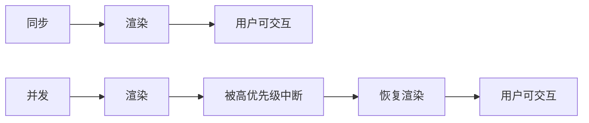

## 1. 并发渲染原理

### 1.1 同步 vs 并发

**同步渲染**：一旦开始，不可中断，直到完成。

**并发渲染**：可暂停、恢复、放弃渲染工作。



### 1.2 Fiber 架构

Fiber 将渲染工作拆分为小单元（Fiber 节点），每个单元可在 5ms 时间片内完成：

```
Work Loop:
  while (nextUnitOfWork && !shouldYield()) {
    nextUnitOfWork = performUnitOfWork(nextUnitOfWork);
  }
```

## 2. 优先级调度

### 2.1 优先级等级

| 优先级 | 场景       | Lane                |
| ------ | ---------- | ------------------- |
| 立即   | 用户输入   | SyncLane            |
| 高     | 受控输入   | InputContinuousLane |
| 默认   | 数据获取   | DefaultLane         |
| 低     | 离屏预渲染 | IdleLane            |

### 2.2 优先级插队

```jsx
// 低优先级更新进行中
startTransition(() => {
  setSearchResults(heavyFilter(query));
});

// 用户输入插队（高优先级）
setInputValue(e.target.value);
```

## 3. startTransition

```jsx
import { useState, startTransition } from 'react';

function Search() {
  const [input, setInput] = useState('');
  const [results, setResults] = useState([]);

  function handleChange(e) {
    // 高优先级：立即更新输入框
    setInput(e.target.value);

    // 低优先级：延迟更新搜索结果
    startTransition(() => {
      setResults(filterItems(e.target.value));
    });
  }
}
```

## 4. useDeferredValue

```jsx
import { useDeferredValue } from 'react';

function Search() {
  const [query, setQuery] = useState('');
  const deferredQuery = useDeferredValue(query);

  return (
    <>
      <input value={query} onChange={(e) => setQuery(e.target.value)} />
      <Results query={deferredQuery} />
    </>
  );
}
```

`useDeferredValue` 返回一个延迟版本的值，当有更高优先级更新时，延迟更新。

## 5. Suspense 与并发

```jsx
<Suspense fallback={<Loading />}>
  <UserProfile /> {/* 异步获取数据 */}
</Suspense>
```

并发模式下，Suspense 不会阻塞整个树，只显示最近的 fallback。

## 参考文献

React 官方文档：https://react.dev/
React 19 发布说明：https://react.dev/blog/2024/12/05/react-19
TanStack Query：https://tanstack.com/query/latest
Zustand：https://zustand.docs.pmnd.rs/
Next.js：https://nextjs.org/

## 延伸阅读

React Hooks 深入，见 011-react 模块 Hooks 文档。
React 与 TypeScript 类型，见 009-typescript 模块。
前端构建与 Vite，见 057-vite 模块（如已加入）。
黑马程序员 Bilibili 空间（https://space.bilibili.com/37974444 ）提供 React 课程。

## 深度专题扩展

以下专题从不同角度深入本文主题，供有进阶需求的读者研读。每个专题独立成节，内容相互补充。

### 13.1 渲染原理与协调

React 渲染分阶段：render（构建元素树）、reconcile（diff）、commit（DOM 变更与副作用）。
diff 算法基于类型与 key：同类型复用实例，不同类型重建；列表 diff 按 key 匹配。
并发特性：useTransition 标记低优先级更新可中断；Suspense 等待异步边界。
React Compiler 自动记忆组件，减少手工 useMemo。

### 13.2 状态架构模式

状态分类：服务端状态（缓存数据）与客户端状态（UI 偏好）；分开管理。
TanStack Query：查询键（queryKey）+ 缓存生命周期（staleTime/gcTime）+ 失效策略。
Zustand：create 定义 store，selector 订阅切片，避免多余渲染。
表单状态：受控 + 校验库（React Hook Form + Zod）。
