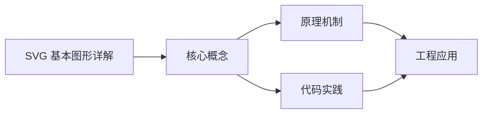

## 1. 学习目标（Bloom 分类）

本节按照布鲁姆教育目标分类学组织学习路径。本文主题为《SVG 基本图形详解》，属于 SVG 模块，读者可以根据自身阶段选择阅读深度。

记忆层面：能够准确复述本文的核心概念、术语与基本语法或操作步骤，并能够在提问或检索时快速定位对应知识点。能够说出 SVG 的核心概念、术语与标准写法。

理解层面：能够用自己的语言解释核心原理与工作机制，说明概念之间的因果关系，而不是机械记忆结论。能够解释 SVG 的工作原理与设计动机。

应用层面：能够在真实项目或练习场景中运用本文知识解决具体问题，写出正确且可维护的实现。能够编写符合 SVG 规范的完整实现。

分析层面：能够拆解复杂问题，比较本文主题与相邻概念的异同，识别边界条件与例外情况。能够分析 SVG 与相邻方案的差异与边界。

评价层面：能够根据约束条件（性能、可读性、安全、成本）评价不同方案的优劣，做出有依据的技术决策。能够根据场景评价 SVG 相关方案的优劣。

创造层面：能够把本文知识与其他模块知识组合，设计出新的解决方案或可复用的工程模式。能够组合 SVG 与其他技术设计完整方案。

通过本节学习，读者应当能够把《SVG 基本图形详解》纳入自己的知识网络，并与 SVG 模块的其他主题（矢量图形、路径、变换、动画）建立关联。

## 2. 历史动机与发展脉络

《SVG 基本图形详解》是 SVG 领域的重要主题。要真正理解它，需要先了解它解决的问题与演进过程。

SVG（可缩放矢量图形）于 2001 年由 W3C 标准化，是 Web 原生矢量格式；与位图不同，SVG 由几何描述构成，任意缩放不失真。
SVG 是 XML 方言：元素即图形（rect/circle/path），样式可用 CSS，交互可用事件；SPA 生态中常以内联 SVG 与图标组件使用。
现代应用：图标系统、数据可视化（D3）、地图、LOGO、动画与交互图形；浏览器对 SVG 的支持已非常完整。

回到本文主题：SVG 基本图形详解 的提出与成熟，正是上述技术背景下的必然产物。早期实现往往以简单可用为目标，随着工程规模扩大，社区逐渐沉淀出标准做法与最佳实践；理解这一脉络，可以帮助读者判断“为什么文档中的推荐写法是现在这个样子”，也能在遇到历史遗留代码时准确识别其设计年代与取舍。


## 3. 形式化定义与核心概念精讲

本节把《SVG 基本图形详解》涉及的核心概念以“定义 + 讲解”的形式展开。读者应把定义当作工具，把讲解当作理解路径；两者结合才能形成可迁移的知识。

坐标系：viewBox 定义逻辑坐标（min-x min-y width height），preserveAspectRatio 控制缩放对齐。
基本图形：rect（矩形）、circle（圆）、ellipse（椭圆）、line（直线）、polyline/polygon（折线/多边形）。
路径 path：M/L/C/Q/A 命令组合任意曲线；fill 填充、stroke 描边。

### 3.1 原文章节逐一精讲

原文档把主题拆分为 18 个小节，下面按顺序给出每一节的导读讲解，随后保留原文细节供精读。

#### 原文精读（完整保留）

# SVG 基本图形 语法速查手册

> **符号约定**:`< >` 必填参数 | `[ ]` 可选参数

---

#### 1. 矩形 rect

`<rect>` 绘制矩形，支持圆角。

```html
<svg viewBox="0 0 300 150">
  <rect x="10" y="10" width="80" height="60" fill="#4f5bd5" />
  <rect x="110" y="10" width="80" height="60" rx="12" ry="12" fill="#00b894" />
  <rect x="210" y="10" width="80" height="60" rx="30" ry="10" fill="#d63031" />
</svg>
```

##### 1.1 属性

| 属性               | 说明              | 默认值 |
| ------------------ | ----------------- | ------ |
| `x` / `y`          | 左上角坐标        | 0      |
| `width` / `height` | 宽高（必需）      | -      |
| `rx` / `ry`        | 水平/垂直圆角半径 | 0      |
| `fill`             | 填充色            | black  |
| `stroke`           | 描边色            | none   |
| `stroke-width`     | 描边宽度          | 1      |

> 当只设置 `rx` 时，`ry` 默认等于 `rx`，形成等圆角。

##### 1.2 圆角矩形技巧

```html
<!-- 仅上方圆角（用 path 实现） -->
<path d="M 10 30 Q 10 10 30 10 L 70 10 Q 90 10 90 30 L 90 70 L 10 70 Z" fill="#4f5bd5" />
```

`<rect>` 原生不支持单侧圆角，需用 `<path>` 配合贝塞尔曲线实现。

#### 2. 圆形 circle

`<circle>` 由圆心与半径定义。

```html
<svg viewBox="0 0 200 100">
  <circle cx="50" cy="50" r="40" fill="#4f5bd5" />
  <circle cx="150" cy="50" r="40" fill="none" stroke="#d63031" stroke-width="3" />
</svg>
```

##### 2.1 属性

| 属性              | 说明         |
| ----------------- | ------------ |
| `cx` / `cy`       | 圆心坐标     |
| `r`               | 半径（必需） |
| `fill` / `stroke` | 填充与描边   |

##### 2.2 描边居中特性

SVG 描边以路径为中心，**向两侧各扩展 stroke-width/2**。这意味着半径 40、描边 4 的圆，实际占据 84×84 区域。

```html
<circle cx="50" cy="50" r="40" stroke="#000" stroke-width="4" fill="none" />
<!-- 实际边界：cx-r-strokeWidth/2 到 cx+r+strokeWidth/2，即 8 到 92 -->
```

#### 3. 椭圆 ellipse

`<ellipse>` 用两个半径定义。

```html
<svg viewBox="0 0 200 100">
  <ellipse cx="100" cy="50" rx="80" ry="30" fill="#4f5bd5" />
</svg>
```

##### 3.1 属性

| 属性        | 说明          |
| ----------- | ------------- |
| `cx` / `cy` | 圆心          |
| `rx` / `ry` | 水平/垂直半径 |

> 当 `rx === ry` 时，椭圆等价于圆形。

#### 4. 直线 line

`<line>` 由两个端点定义。

```html
<svg viewBox="0 0 200 100">
  <line x1="10" y1="10" x2="190" y2="90" stroke="#333" stroke-width="2" />
  <line x1="10" y1="50" x2="190" y2="50" stroke="#d63031" stroke-width="4" stroke-dasharray="8 4" />
</svg>
```

##### 4.1 属性

| 属性               | 说明                            |
| ------------------ | ------------------------------- |
| `x1` / `y1`        | 起点                            |
| `x2` / `y2`        | 终点                            |
| `stroke`           | 描边色（必需，否则不可见）      |
| `stroke-width`     | 描边宽度                        |
| `stroke-linecap`   | 端点形状：butt / round / square |
| `stroke-dasharray` | 虚线模式                        |

> `<line>` 默认无 fill，必须设置 stroke 才可见。

#### 5. 折线 polyline

`<polyline>` 由一系列点连接，**不闭合**。

```html
<svg viewBox="0 0 200 100">
  <polyline
    points="10,90 50,10 90,90 130,10 170,90"
    fill="none"
    stroke="#4f5bd5"
    stroke-width="2"
  />
</svg>
```

##### 5.1 points 语法

```
points="x1,y1 x2,y2 x3,y3 ..."
```

也可用空格分隔：

```
points="10 90 50 10 90 90 130 10 170 90"
```

##### 5.2 fill 陷阱

```html
<!-- 错误：默认 fill=black，会填充封闭区域 -->
<polyline points="10,90 50,10 90,90" />

<!-- 正确：折线需显式设置 fill="none" -->
<polyline points="10,90 50,10 90,90" fill="none" stroke="#000" />
```

#### 6. 多边形 polygon

`<polygon>` 类似 polyline，但**自动闭合**首尾。

```html
<svg viewBox="0 0 200 100">
  <polygon points="100,10 190,90 10,90" fill="#4f5bd5" />
  <polygon points="100,10 140,50 100,90 60,50" fill="#00b894" stroke="#fff" stroke-width="2" />
</svg>
```

##### 6.1 常见多边形

| 形状   | points 示例（以中心为参考）                                              |
| ------ | ------------------------------------------------------------------------ |
| 三角形 | `100,10 190,90 10,90`                                                    |
| 菱形   | `100,10 140,50 100,90 60,50`                                             |
| 五角星 | `100,10 120,70 180,70 130,105 150,165 100,130 50,165 70,105 20,70 80,70` |
| 六边形 | `100,10 170,50 170,110 100,150 30,110 30,50`                             |

#### 7. 描边属性详解

##### 7.1 stroke-linecap 端点

```html
<line x1="10" y1="20" x2="100" y2="20" stroke="#000" stroke-width="10" stroke-linecap="butt" />
<line x1="10" y1="40" x2="100" y2="40" stroke="#000" stroke-width="10" stroke-linecap="round" />
<line x1="10" y1="60" x2="100" y2="60" stroke="#000" stroke-width="10" stroke-linecap="square" />
```

| 值       | 效果                            |
| -------- | ------------------------------- |
| `butt`   | 平直端点（默认）                |
| `round`  | 半圆端点                        |
| `square` | 方形延伸（多出 stroke-width/2） |

##### 7.2 stroke-linejoin 拐角

```html
<polyline
  points="10,90 50,10 90,90"
  stroke="#000"
  stroke-width="10"
  fill="none"
  stroke-linejoin="miter"
/>
<polyline
  points="110,90 150,10 190,90"
  stroke="#000"
  stroke-width="10"
  fill="none"
  stroke-linejoin="round"
/>
<polyline
  points="10,140 50,60 90,140"
  stroke="#000"
  stroke-width="10"
  fill="none"
  stroke-linejoin="bevel"
/>
```

| 值      | 效果                                        |
| ------- | ------------------------------------------- |
| `miter` | 尖角（默认，可用 `stroke-miterlimit` 限制） |
| `round` | 圆角                                        |
| `bevel` | 斜切                                        |

##### 7.3 stroke-dasharray 虚线

```html
<!-- 实线 -->
<line x1="10" y1="10" x2="190" y2="10" stroke="#000" />

<!-- 等长虚线：8px 实线 + 4px 空白 -->
<line x1="10" y1="30" x2="190" y2="30" stroke="#000" stroke-dasharray="8 4" />

<!-- 点线：1px 实线 + 4px 空白 -->
<line x1="10" y1="50" x2="190" y2="50" stroke="#000" stroke-dasharray="1 4" />

<!-- 复合虚线：10px + 4px + 2px + 4px -->
<line x1="10" y1="70" x2="190" y2="70" stroke="#000" stroke-dasharray="10 4 2 4" />
```

##### 7.4 stroke-dashoffset 起始偏移

`stroke-dashoffset` 控制虚线起始位置，常用于动画绘制线条。

```html
<line x1="10" y1="90" x2="190" y2="90" stroke="#000" stroke-dasharray="180" stroke-dashoffset="0" />
<!-- dashoffset 从 180 → 0 动画可模拟"绘制"效果 -->
```

#### 8. 基本图形对比

| 元素         | 必需属性      | 是否闭合 | 是否可填充             |
| ------------ | ------------- | -------- | ---------------------- |
| `<rect>`     | width, height | 是       | 是                     |
| `<circle>`   | r             | 是       | 是                     |
| `<ellipse>`  | rx, ry        | 是       | 是                     |
| `<line>`     | x1,y1,x2,y2   | 否       | 否（无 fill）          |
| `<polyline>` | points        | 否       | 是（但通常 fill=none） |
| `<polygon>`  | points        | 是       | 是                     |

#### 9. 综合示例：简洁仪表盘

```html
<svg viewBox="0 0 200 200" width="200" height="200">
  <!-- 背景圆 -->
  <circle cx="100" cy="100" r="90" fill="none" stroke="#e0e0e0" stroke-width="12" />
  <!-- 进度弧（70%） -->
  <circle
    cx="100"
    cy="100"
    r="90"
    fill="none"
    stroke="#4f5bd5"
    stroke-width="12"
    stroke-dasharray="396 565"
    stroke-dashoffset="-141"
    transform="rotate(-90 100 100)"
    stroke-linecap="round"
  />
  <!-- 中心文本 -->
  <text x="100" y="105" text-anchor="middle" font-size="36" fill="#333">70%</text>
</svg>
```

**原理**：

- 圆周长 ≈ 2π × 90 ≈ 565
- 70% 弧长 ≈ 396
- dasharray "396 565"：画 396 留 565
- rotate(-90 100 100)：从 12 点钟方向开始
- stroke-linecap="round"：端点圆滑

下一篇介绍强大的 `<path>`，它可表达任意形状。
#### 矩形 rect

**矩形**
`<rect x="<左上x>" y="<左上y>" width="<宽>" height="<高>" [rx="<水平圆角>"] [ry="<垂直圆角>"] [fill="<填充色>"] [stroke="<描边色>"] [stroke-width="<描边宽度>"] />`
```html
<svg viewBox="0 0 300 150">
  <rect x="10" y="10" width="80" height="60" fill="#4f5bd5" />
  <rect x="110" y="10" width="80" height="60" rx="12" ry="12" fill="#00b894" />
  <rect x="210" y="10" width="80" height="60" rx="30" ry="10" fill="#d63031" />
</svg>
```

##### rect 属性

| 属性               | 说明              | 默认值 |
| ------------------ | ----------------- | ------ |
| `x` / `y`          | 左上角坐标        | 0      |
| `width` / `height` | 宽高(必需)      | -      |
| `rx` / `ry`        | 水平/垂直圆角半径 | 0      |
| `fill`             | 填充色            | black  |
| `stroke`           | 描边色            | none   |
| `stroke-width`     | 描边宽度          | 1      |

> 当只设置 `rx` 时,`ry` 默认等于 `rx`,形成等圆角。

##### 单侧圆角矩形(用 path 实现)
```html
<!-- 仅上方圆角 -->
<path d="M 10 30 Q 10 10 30 10 L 70 10 Q 90 10 90 30 L 90 70 L 10 70 Z" fill="#4f5bd5" />
```

---

#### 圆形 circle

**圆形**
`<circle cx="<圆心x>" cy="<圆心y>" r="<半径>" [fill="<填充色>"] [stroke="<描边色>"] [stroke-width="<描边宽度>"] />`
```html
<svg viewBox="0 0 200 100">
  <circle cx="50" cy="50" r="40" fill="#4f5bd5" />
  <circle cx="150" cy="50" r="40" fill="none" stroke="#d63031" stroke-width="3" />
</svg>
```

##### circle 属性

| 属性              | 说明         |
| ----------------- | ------------ |
| `cx` / `cy`       | 圆心坐标     |
| `r`               | 半径(必需) |
| `fill` / `stroke` | 填充与描边   |

##### 描边居中特性
SVG 描边以路径为中心,**向两侧各扩展 stroke-width/2**。半径 40、描边 4 的圆,实际占据 84×84 区域。
```html
<circle cx="50" cy="50" r="40" stroke="#000" stroke-width="4" fill="none" />
<!-- 实际边界:cx-r-strokeWidth/2 到 cx+r+strokeWidth/2,即 8 到 92 -->
```

---

#### 椭圆 ellipse

**椭圆**
`<ellipse cx="<圆心x>" cy="<圆心y>" rx="<水平半径>" ry="<垂直半径>" [fill="<填充色>"] [stroke="<描边色>"] />`
```html
<svg viewBox="0 0 200 100">
  <ellipse cx="100" cy="50" rx="80" ry="30" fill="#4f5bd5" />
</svg>
```

##### ellipse 属性

| 属性        | 说明          |
| ----------- | ------------- |
| `cx` / `cy` | 圆心          |
| `rx` / `ry` | 水平/垂直半径 |

> 当 `rx === ry` 时,椭圆等价于圆形。

---

#### 直线 line

**直线**
`<line x1="<起点x>" y1="<起点y>" x2="<终点x>" y2="<终点y>" stroke="<描边色>" [stroke-width="<描边宽度>"] [stroke-linecap="<端点形状>"] [stroke-dasharray="<虚线模式>"] />`
```html
<svg viewBox="0 0 200 100">
  <line x1="10" y1="10" x2="190" y2="90" stroke="#333" stroke-width="2" />
  <line x1="10" y1="50" x2="190" y2="50" stroke="#d63031" stroke-width="4" stroke-dasharray="8 4" />
</svg>
```

##### line 属性

| 属性               | 说明                            |
| ------------------ | ------------------------------- |
| `x1` / `y1`        | 起点                            |
| `x2` / `y2`        | 终点                            |
| `stroke`           | 描边色(必需,否则不可见)      |
| `stroke-width`     | 描边宽度                        |
| `stroke-linecap`   | 端点形状:butt / round / square |
| `stroke-dasharray` | 虚线模式                        |

> `<line>` 默认无 fill,必须设置 stroke 才可见。

---

#### 折线 polyline

**折线(不闭合)**
`<polyline points="<x1,y1 x2,y2 x3,y3 ...>" [fill="<填充色>"] stroke="<描边色>" [stroke-width="<描边宽度>"] />`
```html
<svg viewBox="0 0 200 100">
  <polyline
    points="10,90 50,10 90,90 130,10 170,90"
    fill="none"
    stroke="#4f5bd5"
    stroke-width="2"
  />
</svg>
```

##### points 语法
```
points="x1,y1 x2,y2 x3,y3 ..."
```
也可用空格分隔:
```
points="10 90 50 10 90 90 130 10 170 90"
```

##### fill 陷阱
```html
<!-- 错误:默认 fill=black,会填充封闭区域 -->
<polyline points="10,90 50,10 90,90" />

<!-- 正确:折线需显式设置 fill="none" -->
<polyline points="10,90 50,10 90,90" fill="none" stroke="#000" />
```

---

#### 多边形 polygon

**多边形(自动闭合)**
`<polygon points="<x1,y1 x2,y2 ...>" [fill="<填充色>"] [stroke="<描边色>"] [stroke-width="<描边宽度>"] />`
```html
<svg viewBox="0 0 200 100">
  <polygon points="100,10 190,90 10,90" fill="#4f5bd5" />
  <polygon points="100,10 140,50 100,90 60,50" fill="#00b894" stroke="#fff" stroke-width="2" />
</svg>
```

##### 常见多边形 points 示例

| 形状   | points 示例(以中心为参考)                                              |
| ------ | ------------------------------------------------------------------------ |
| 三角形 | `100,10 190,90 10,90`                                                    |
| 菱形   | `100,10 140,50 100,90 60,50`                                             |
| 五角星 | `100,10 120,70 180,70 130,105 150,165 100,130 50,165 70,105 20,70 80,70` |
| 六边形 | `100,10 170,50 170,110 100,150 30,110 30,50`                             |

---

#### 描边属性

##### stroke-linecap 端点

**stroke-linecap 端点形状**
`stroke-linecap="<butt | round | square>"`
```html
<line x1="10" y1="20" x2="100" y2="20" stroke="#000" stroke-width="10" stroke-linecap="butt" />
<line x1="10" y1="40" x2="100" y2="40" stroke="#000" stroke-width="10" stroke-linecap="round" />
<line x1="10" y1="60" x2="100" y2="60" stroke="#000" stroke-width="10" stroke-linecap="square" />
```

| 值       | 效果                            |
| -------- | ------------------------------- |
| `butt`   | 平直端点(默认)                |
| `round`  | 半圆端点                        |
| `square` | 方形延伸(多出 stroke-width/2) |

##### stroke-linejoin 拐角

**stroke-linejoin 拐角形状**
`stroke-linejoin="<miter | round | bevel>"`
```html
<polyline
  points="10,90 50,10 90,90"
  stroke="#000"
  stroke-width="10"
  fill="none"
  stroke-linejoin="miter"
/>
<polyline
  points="110,90 150,10 190,90"
  stroke="#000"
  stroke-width="10"
  fill="none"
  stroke-linejoin="round"
/>
<polyline
  points="10,140 50,60 90,140"
  stroke="#000"
  stroke-width="10"
  fill="none"
  stroke-linejoin="bevel"
/>
```

| 值      | 效果                                        |
| ------- | ------------------------------------------- |
| `miter` | 尖角(默认,可用 `stroke-miterlimit` 限制) |
| `round` | 圆角                                        |
| `bevel` | 斜切                                        |

##### stroke-dasharray 虚线

**stroke-dasharray 虚线模式**
`stroke-dasharray="<实线长度 空白长度 ...>"`
```html
<!-- 实线 -->
<line x1="10" y1="10" x2="190" y2="10" stroke="#000" />

<!-- 等长虚线:8px 实线 + 4px 空白 -->
<line x1="10" y1="30" x2="190" y2="30" stroke="#000" stroke-dasharray="8 4" />

<!-- 点线:1px 实线 + 4px 空白 -->
<line x1="10" y1="50" x2="190" y2="50" stroke="#000" stroke-dasharray="1 4" />

<!-- 复合虚线:10px + 4px + 2px + 4px -->
<line x1="10" y1="70" x2="190" y2="70" stroke="#000" stroke-dasharray="10 4 2 4" />
```

##### stroke-dashoffset 起始偏移

**stroke-dashoffset 虚线起始位置**
`stroke-dashoffset="<偏移量>"`
```html
<line x1="10" y1="90" x2="190" y2="90" stroke="#000" stroke-dasharray="180" stroke-dashoffset="0" />
<!-- dashoffset 从 180 → 0 动画可模拟"绘制"效果 -->
```

---

#### 基本图形对比

| 元素         | 必需属性      | 是否闭合 | 是否可填充             |
| ------------ | ------------- | -------- | ---------------------- |
| `<rect>`     | width, height | 是       | 是                     |
| `<circle>`   | r             | 是       | 是                     |
| `<ellipse>`  | rx, ry        | 是       | 是                     |
| `<line>`     | x1,y1,x2,y2   | 否       | 否(无 fill)          |
| `<polyline>` | points        | 否       | 是(但通常 fill=none) |
| `<polygon>`  | points        | 是       | 是                     |

---

#### 综合示例:仪表盘

**进度环图形**
```html
<svg viewBox="0 0 200 200" width="200" height="200">
  <!-- 背景圆 -->
  <circle cx="100" cy="100" r="90" fill="none" stroke="#e0e0e0" stroke-width="12" />
  <!-- 进度弧(70%) -->
  <circle
    cx="100"
    cy="100"
    r="90"
    fill="none"
    stroke="#4f5bd5"
    stroke-width="12"
    stroke-dasharray="396 565"
    stroke-dashoffset="-141"
    transform="rotate(-90 100 100)"
    stroke-linecap="round"
  />
  <!-- 中心文本 -->
  <text x="100" y="105" text-anchor="middle" font-size="36" fill="#333">70%</text>
</svg>
```

参数说明:
- 圆周长 ≈ 2π × 90 ≈ 565
- 70% 弧长 ≈ 396
- dasharray "396 565":画 396 留 565
- rotate(-90 100 100):从 12 点钟方向开始
- stroke-linecap="round":端点圆滑


### 3.2 概念关系图

下面用 Mermaid 图表达本文核心概念之间的关系，帮助读者建立整体图景：



图中展示的是本文知识的结构化关系：核心概念是入口，原理机制解释“为什么”，代码实践演示“怎么做”，工程应用回答“何时用”。读者学习时可以把每个小节的内容挂接到对应节点上。

## 4. 理论推导与原理解析

本节深入《SVG 基本图形详解》背后的原理。理论部分不求面面俱到，而是聚焦“能解释现象、能指导实践”的关键推导。

坐标系：viewBox 定义逻辑坐标（min-x min-y width height），preserveAspectRatio 控制缩放对齐。
基本图形：rect（矩形）、circle（圆）、ellipse（椭圆）、line（直线）、polyline/polygon（折线/多边形）。
路径 path：M/L/C/Q/A 命令组合任意曲线；fill 填充、stroke 描边。
变换与动画：transform 平移缩放旋转；CSS/SMIL 动画控制属性过渡。

需要强调的是，理论推导与工程实践之间存在翻译层：理论给出的是理想化模型与边界条件，工程代码则必须处理真实环境中的例外。读者在学习时应先掌握理论的“标准情形”，再通过陷阱章节了解“非标准情形”。

## 5. 代码示例与逐行讲解

本节把原文中的代码示例系统整理，并为每个示例补充用途说明与讲解。读者不应只浏览代码，而应逐段对照讲解理解设计意图。

### 5.1 示例：1. 矩形 rect

该示例来自原文《1. 矩形 rect》小节，用于演示SVG 基本图形详解相关操作。阅读时请先看代码结构，再看其后的讲解。

```html
<svg viewBox="0 0 300 150">
  <rect x="10" y="10" width="80" height="60" fill="#4f5bd5" />
  <rect x="110" y="10" width="80" height="60" rx="12" ry="12" fill="#00b894" />
  <rect x="210" y="10" width="80" height="60" rx="30" ry="10" fill="#d63031" />
</svg>
```

讲解：这段代码演示了本节核心知识点。代码中的关键操作可以归纳为三步：准备（定义或初始化）、执行（核心逻辑）、收尾（释放资源或返回结果）。实际项目中，这三步往往被封装为函数或类，以提升复用性与可测试性。

关键点分析：

该示例共 5 行有效代码，结构以数据或配置为主。阅读时应关注：数据字段的含义、配置项的作用，以及它们与运行行为的对应关系。

进阶思考路径：先尝试修改参数观察行为变化，再把示例中的模式迁移到自己的项目中；每次修改都记录预期与实测差异，这是把示例转化为能力的最快方式。

### 5.2 示例：1.2 圆角矩形技巧

该示例来自原文《1.2 圆角矩形技巧》小节，用于演示SVG 基本图形详解相关操作。阅读时请先看代码结构，再看其后的讲解。

```html
<!-- 仅上方圆角（用 path 实现） -->
<path d="M 10 30 Q 10 10 30 10 L 70 10 Q 90 10 90 30 L 90 70 L 10 70 Z" fill="#4f5bd5" />
```

讲解：这段代码演示了本节核心知识点。代码中的关键操作可以归纳为三步：准备（定义或初始化）、执行（核心逻辑）、收尾（释放资源或返回结果）。实际项目中，这三步往往被封装为函数或类，以提升复用性与可测试性。

关键点分析：

该示例共 2 行有效代码，结构以数据或配置为主。阅读时应关注：数据字段的含义、配置项的作用，以及它们与运行行为的对应关系。

进阶思考路径：先尝试修改参数观察行为变化，再把示例中的模式迁移到自己的项目中；每次修改都记录预期与实测差异，这是把示例转化为能力的最快方式。

### 5.3 示例：2. 圆形 circle

该示例来自原文《2. 圆形 circle》小节，用于演示SVG 基本图形详解相关操作。阅读时请先看代码结构，再看其后的讲解。

```html
<svg viewBox="0 0 200 100">
  <circle cx="50" cy="50" r="40" fill="#4f5bd5" />
  <circle cx="150" cy="50" r="40" fill="none" stroke="#d63031" stroke-width="3" />
</svg>
```

讲解：这段代码演示了本节核心知识点。代码中的关键操作可以归纳为三步：准备（定义或初始化）、执行（核心逻辑）、收尾（释放资源或返回结果）。实际项目中，这三步往往被封装为函数或类，以提升复用性与可测试性。

关键点分析：

该示例共 4 行有效代码，结构以数据或配置为主。阅读时应关注：数据字段的含义、配置项的作用，以及它们与运行行为的对应关系。

进阶思考路径：先尝试修改参数观察行为变化，再把示例中的模式迁移到自己的项目中；每次修改都记录预期与实测差异，这是把示例转化为能力的最快方式。

### 5.4 示例：2.2 描边居中特性

该示例来自原文《2.2 描边居中特性》小节，用于演示SVG 基本图形详解相关操作。阅读时请先看代码结构，再看其后的讲解。

```html
<circle cx="50" cy="50" r="40" stroke="#000" stroke-width="4" fill="none" />
<!-- 实际边界：cx-r-strokeWidth/2 到 cx+r+strokeWidth/2，即 8 到 92 -->
```

讲解：这段代码演示了本节核心知识点。代码中的关键操作可以归纳为三步：准备（定义或初始化）、执行（核心逻辑）、收尾（释放资源或返回结果）。实际项目中，这三步往往被封装为函数或类，以提升复用性与可测试性。

关键点分析：

该示例共 2 行有效代码，结构以数据或配置为主。阅读时应关注：数据字段的含义、配置项的作用，以及它们与运行行为的对应关系。

进阶思考路径：先尝试修改参数观察行为变化，再把示例中的模式迁移到自己的项目中；每次修改都记录预期与实测差异，这是把示例转化为能力的最快方式。

### 5.5 示例：3. 椭圆 ellipse

该示例来自原文《3. 椭圆 ellipse》小节，用于演示SVG 基本图形详解相关操作。阅读时请先看代码结构，再看其后的讲解。

```html
<svg viewBox="0 0 200 100">
  <ellipse cx="100" cy="50" rx="80" ry="30" fill="#4f5bd5" />
</svg>
```

讲解：这段代码演示了本节核心知识点。代码中的关键操作可以归纳为三步：准备（定义或初始化）、执行（核心逻辑）、收尾（释放资源或返回结果）。实际项目中，这三步往往被封装为函数或类，以提升复用性与可测试性。

关键点分析：

该示例共 3 行有效代码，结构以数据或配置为主。阅读时应关注：数据字段的含义、配置项的作用，以及它们与运行行为的对应关系。

进阶思考路径：先尝试修改参数观察行为变化，再把示例中的模式迁移到自己的项目中；每次修改都记录预期与实测差异，这是把示例转化为能力的最快方式。

### 5.6 示例：4. 直线 line

该示例来自原文《4. 直线 line》小节，用于演示SVG 基本图形详解相关操作。阅读时请先看代码结构，再看其后的讲解。

```html
<svg viewBox="0 0 200 100">
  <line x1="10" y1="10" x2="190" y2="90" stroke="#333" stroke-width="2" />
  <line x1="10" y1="50" x2="190" y2="50" stroke="#d63031" stroke-width="4" stroke-dasharray="8 4" />
</svg>
```

讲解：这段代码演示了本节核心知识点。代码中的关键操作可以归纳为三步：准备（定义或初始化）、执行（核心逻辑）、收尾（释放资源或返回结果）。实际项目中，这三步往往被封装为函数或类，以提升复用性与可测试性。

关键点分析：

该示例共 4 行有效代码，结构以数据或配置为主。阅读时应关注：数据字段的含义、配置项的作用，以及它们与运行行为的对应关系。

进阶思考路径：先尝试修改参数观察行为变化，再把示例中的模式迁移到自己的项目中；每次修改都记录预期与实测差异，这是把示例转化为能力的最快方式。

### 5.7 示例：5. 折线 polyline

该示例来自原文《5. 折线 polyline》小节，用于演示SVG 基本图形详解相关操作。阅读时请先看代码结构，再看其后的讲解。

```html
<svg viewBox="0 0 200 100">
  <polyline
    points="10,90 50,10 90,90 130,10 170,90"
    fill="none"
    stroke="#4f5bd5"
    stroke-width="2"
  />
</svg>
```

讲解：这段代码演示了本节核心知识点。代码中的关键操作可以归纳为三步：准备（定义或初始化）、执行（核心逻辑）、收尾（释放资源或返回结果）。实际项目中，这三步往往被封装为函数或类，以提升复用性与可测试性。

关键点分析：

该示例共 8 行有效代码，结构以数据或配置为主。阅读时应关注：数据字段的含义、配置项的作用，以及它们与运行行为的对应关系。

进阶思考路径：先尝试修改参数观察行为变化，再把示例中的模式迁移到自己的项目中；每次修改都记录预期与实测差异，这是把示例转化为能力的最快方式。

### 5.8 示例：5.1 points 语法

该示例来自原文《5.1 points 语法》小节，用于演示SVG 基本图形详解相关操作。阅读时请先看代码结构，再看其后的讲解。

```text
points="x1,y1 x2,y2 x3,y3 ..."
```

讲解：这段代码演示了本节核心知识点。代码中的关键操作可以归纳为三步：准备（定义或初始化）、执行（核心逻辑）、收尾（释放资源或返回结果）。实际项目中，这三步往往被封装为函数或类，以提升复用性与可测试性。

关键点分析：

该示例共 1 行有效代码，结构以数据或配置为主。阅读时应关注：数据字段的含义、配置项的作用，以及它们与运行行为的对应关系。

进阶思考路径：先尝试修改参数观察行为变化，再把示例中的模式迁移到自己的项目中；每次修改都记录预期与实测差异，这是把示例转化为能力的最快方式。

### 5.9 示例：5.1 points 语法

该示例来自原文《5.1 points 语法》小节，用于演示SVG 基本图形详解相关操作。阅读时请先看代码结构，再看其后的讲解。

```text
points="10 90 50 10 90 90 130 10 170 90"
```

讲解：这段代码演示了本节核心知识点。代码中的关键操作可以归纳为三步：准备（定义或初始化）、执行（核心逻辑）、收尾（释放资源或返回结果）。实际项目中，这三步往往被封装为函数或类，以提升复用性与可测试性。

关键点分析：

该示例共 1 行有效代码，结构以数据或配置为主。阅读时应关注：数据字段的含义、配置项的作用，以及它们与运行行为的对应关系。

进阶思考路径：先尝试修改参数观察行为变化，再把示例中的模式迁移到自己的项目中；每次修改都记录预期与实测差异，这是把示例转化为能力的最快方式。

### 5.10 示例：5.2 fill 陷阱

该示例来自原文《5.2 fill 陷阱》小节，用于演示SVG 基本图形详解相关操作。阅读时请先看代码结构，再看其后的讲解。

```html
<!-- 错误：默认 fill=black，会填充封闭区域 -->
<polyline points="10,90 50,10 90,90" />

<!-- 正确：折线需显式设置 fill="none" -->
<polyline points="10,90 50,10 90,90" fill="none" stroke="#000" />
```

讲解：这段代码演示了本节核心知识点。代码中的关键操作可以归纳为三步：准备（定义或初始化）、执行（核心逻辑）、收尾（释放资源或返回结果）。实际项目中，这三步往往被封装为函数或类，以提升复用性与可测试性。

关键点分析：

该示例共 4 行有效代码，结构以数据或配置为主。阅读时应关注：数据字段的含义、配置项的作用，以及它们与运行行为的对应关系。

进阶思考路径：先尝试修改参数观察行为变化，再把示例中的模式迁移到自己的项目中；每次修改都记录预期与实测差异，这是把示例转化为能力的最快方式。

### 5.11 示例：6. 多边形 polygon

该示例来自原文《6. 多边形 polygon》小节，用于演示SVG 基本图形详解相关操作。阅读时请先看代码结构，再看其后的讲解。

```html
<svg viewBox="0 0 200 100">
  <polygon points="100,10 190,90 10,90" fill="#4f5bd5" />
  <polygon points="100,10 140,50 100,90 60,50" fill="#00b894" stroke="#fff" stroke-width="2" />
</svg>
```

讲解：这段代码演示了本节核心知识点。代码中的关键操作可以归纳为三步：准备（定义或初始化）、执行（核心逻辑）、收尾（释放资源或返回结果）。实际项目中，这三步往往被封装为函数或类，以提升复用性与可测试性。

关键点分析：

该示例共 4 行有效代码，结构以数据或配置为主。阅读时应关注：数据字段的含义、配置项的作用，以及它们与运行行为的对应关系。

进阶思考路径：先尝试修改参数观察行为变化，再把示例中的模式迁移到自己的项目中；每次修改都记录预期与实测差异，这是把示例转化为能力的最快方式。

### 5.12 示例：7.1 stroke-linecap 端点

该示例来自原文《7.1 stroke-linecap 端点》小节，用于演示SVG 基本图形详解相关操作。阅读时请先看代码结构，再看其后的讲解。

```html
<line x1="10" y1="20" x2="100" y2="20" stroke="#000" stroke-width="10" stroke-linecap="butt" />
<line x1="10" y1="40" x2="100" y2="40" stroke="#000" stroke-width="10" stroke-linecap="round" />
<line x1="10" y1="60" x2="100" y2="60" stroke="#000" stroke-width="10" stroke-linecap="square" />
```

讲解：这段代码演示了本节核心知识点。代码中的关键操作可以归纳为三步：准备（定义或初始化）、执行（核心逻辑）、收尾（释放资源或返回结果）。实际项目中，这三步往往被封装为函数或类，以提升复用性与可测试性。

关键点分析：

该示例共 3 行有效代码，结构以数据或配置为主。阅读时应关注：数据字段的含义、配置项的作用，以及它们与运行行为的对应关系。

进阶思考路径：先尝试修改参数观察行为变化，再把示例中的模式迁移到自己的项目中；每次修改都记录预期与实测差异，这是把示例转化为能力的最快方式。

### 5.13 示例：7.2 stroke-linejoin 拐角

该示例来自原文《7.2 stroke-linejoin 拐角》小节，用于演示SVG 基本图形详解相关操作。阅读时请先看代码结构，再看其后的讲解。

```html
<polyline
  points="10,90 50,10 90,90"
  stroke="#000"
  stroke-width="10"
  fill="none"
  stroke-linejoin="miter"
/>
<polyline
  points="110,90 150,10 190,90"
  stroke="#000"
  stroke-width="10"
  fill="none"
  stroke-linejoin="round"
/>
<polyline
  points="10,140 50,60 90,140"
  stroke="#000"
  stroke-width="10"
  fill="none"
  stroke-linejoin="bevel"
/>
```

讲解：这段代码演示了本节核心知识点。代码中的关键操作可以归纳为三步：准备（定义或初始化）、执行（核心逻辑）、收尾（释放资源或返回结果）。实际项目中，这三步往往被封装为函数或类，以提升复用性与可测试性。

关键点分析：

该示例共 21 行有效代码，结构以数据或配置为主。阅读时应关注：数据字段的含义、配置项的作用，以及它们与运行行为的对应关系。

进阶思考路径：先尝试修改参数观察行为变化，再把示例中的模式迁移到自己的项目中；每次修改都记录预期与实测差异，这是把示例转化为能力的最快方式。

### 5.14 示例：7.3 stroke-dasharray 虚线

该示例来自原文《7.3 stroke-dasharray 虚线》小节，用于演示SVG 基本图形详解相关操作。阅读时请先看代码结构，再看其后的讲解。

```html
<!-- 实线 -->
<line x1="10" y1="10" x2="190" y2="10" stroke="#000" />

<!-- 等长虚线：8px 实线 + 4px 空白 -->
<line x1="10" y1="30" x2="190" y2="30" stroke="#000" stroke-dasharray="8 4" />

<!-- 点线：1px 实线 + 4px 空白 -->
<line x1="10" y1="50" x2="190" y2="50" stroke="#000" stroke-dasharray="1 4" />

<!-- 复合虚线：10px + 4px + 2px + 4px -->
<line x1="10" y1="70" x2="190" y2="70" stroke="#000" stroke-dasharray="10 4 2 4" />
```

讲解：这段代码演示了本节核心知识点。代码中的关键操作可以归纳为三步：准备（定义或初始化）、执行（核心逻辑）、收尾（释放资源或返回结果）。实际项目中，这三步往往被封装为函数或类，以提升复用性与可测试性。

关键点分析：

该示例共 8 行有效代码，结构以数据或配置为主。阅读时应关注：数据字段的含义、配置项的作用，以及它们与运行行为的对应关系。

进阶思考路径：先尝试修改参数观察行为变化，再把示例中的模式迁移到自己的项目中；每次修改都记录预期与实测差异，这是把示例转化为能力的最快方式。

### 5.15 示例：7.4 stroke-dashoffset 起始偏移

该示例来自原文《7.4 stroke-dashoffset 起始偏移》小节，用于演示SVG 基本图形详解相关操作。阅读时请先看代码结构，再看其后的讲解。

```html
<line x1="10" y1="90" x2="190" y2="90" stroke="#000" stroke-dasharray="180" stroke-dashoffset="0" />
<!-- dashoffset 从 180 → 0 动画可模拟"绘制"效果 -->
```

讲解：这段代码演示了本节核心知识点。代码中的关键操作可以归纳为三步：准备（定义或初始化）、执行（核心逻辑）、收尾（释放资源或返回结果）。实际项目中，这三步往往被封装为函数或类，以提升复用性与可测试性。

关键点分析：

该示例共 2 行有效代码，结构以数据或配置为主。阅读时应关注：数据字段的含义、配置项的作用，以及它们与运行行为的对应关系。

进阶思考路径：先尝试修改参数观察行为变化，再把示例中的模式迁移到自己的项目中；每次修改都记录预期与实测差异，这是把示例转化为能力的最快方式。

### 5.16 示例：9. 综合示例：简洁仪表盘

该示例来自原文《9. 综合示例：简洁仪表盘》小节，用于演示SVG 基本图形详解相关操作。阅读时请先看代码结构，再看其后的讲解。

```html
<svg viewBox="0 0 200 200" width="200" height="200">
  <!-- 背景圆 -->
  <circle cx="100" cy="100" r="90" fill="none" stroke="#e0e0e0" stroke-width="12" />
  <!-- 进度弧（70%） -->
  <circle
    cx="100"
    cy="100"
    r="90"
    fill="none"
    stroke="#4f5bd5"
    stroke-width="12"
    stroke-dasharray="396 565"
    stroke-dashoffset="-141"
    transform="rotate(-90 100 100)"
    stroke-linecap="round"
  />
  <!-- 中心文本 -->
  <text x="100" y="105" text-anchor="middle" font-size="36" fill="#333">70%</text>
</svg>
```

讲解：这段代码演示了本节核心知识点。代码中的关键操作可以归纳为三步：准备（定义或初始化）、执行（核心逻辑）、收尾（释放资源或返回结果）。实际项目中，这三步往往被封装为函数或类，以提升复用性与可测试性。

关键点分析：

该示例共 19 行有效代码，结构以数据或配置为主。阅读时应关注：数据字段的含义、配置项的作用，以及它们与运行行为的对应关系。

进阶思考路径：先尝试修改参数观察行为变化，再把示例中的模式迁移到自己的项目中；每次修改都记录预期与实测差异，这是把示例转化为能力的最快方式。

### 5.17 示例：矩形 rect

该示例来自原文《矩形 rect》小节，用于演示SVG 基本图形详解相关操作。阅读时请先看代码结构，再看其后的讲解。

```html
<svg viewBox="0 0 300 150">
  <rect x="10" y="10" width="80" height="60" fill="#4f5bd5" />
  <rect x="110" y="10" width="80" height="60" rx="12" ry="12" fill="#00b894" />
  <rect x="210" y="10" width="80" height="60" rx="30" ry="10" fill="#d63031" />
</svg>
```

讲解：这段代码演示了本节核心知识点。代码中的关键操作可以归纳为三步：准备（定义或初始化）、执行（核心逻辑）、收尾（释放资源或返回结果）。实际项目中，这三步往往被封装为函数或类，以提升复用性与可测试性。

关键点分析：

该示例共 5 行有效代码，结构以数据或配置为主。阅读时应关注：数据字段的含义、配置项的作用，以及它们与运行行为的对应关系。

进阶思考路径：先尝试修改参数观察行为变化，再把示例中的模式迁移到自己的项目中；每次修改都记录预期与实测差异，这是把示例转化为能力的最快方式。

### 5.18 示例：单侧圆角矩形(用 path 实现)

该示例来自原文《单侧圆角矩形(用 path 实现)》小节，用于演示SVG 基本图形详解相关操作。阅读时请先看代码结构，再看其后的讲解。

```html
<!-- 仅上方圆角 -->
<path d="M 10 30 Q 10 10 30 10 L 70 10 Q 90 10 90 30 L 90 70 L 10 70 Z" fill="#4f5bd5" />
```

讲解：这段代码演示了本节核心知识点。代码中的关键操作可以归纳为三步：准备（定义或初始化）、执行（核心逻辑）、收尾（释放资源或返回结果）。实际项目中，这三步往往被封装为函数或类，以提升复用性与可测试性。

关键点分析：

该示例共 2 行有效代码，结构以数据或配置为主。阅读时应关注：数据字段的含义、配置项的作用，以及它们与运行行为的对应关系。

进阶思考路径：先尝试修改参数观察行为变化，再把示例中的模式迁移到自己的项目中；每次修改都记录预期与实测差异，这是把示例转化为能力的最快方式。

### 5.19 示例：圆形 circle

该示例来自原文《圆形 circle》小节，用于演示SVG 基本图形详解相关操作。阅读时请先看代码结构，再看其后的讲解。

```html
<svg viewBox="0 0 200 100">
  <circle cx="50" cy="50" r="40" fill="#4f5bd5" />
  <circle cx="150" cy="50" r="40" fill="none" stroke="#d63031" stroke-width="3" />
</svg>
```

讲解：这段代码演示了本节核心知识点。代码中的关键操作可以归纳为三步：准备（定义或初始化）、执行（核心逻辑）、收尾（释放资源或返回结果）。实际项目中，这三步往往被封装为函数或类，以提升复用性与可测试性。

关键点分析：

该示例共 4 行有效代码，结构以数据或配置为主。阅读时应关注：数据字段的含义、配置项的作用，以及它们与运行行为的对应关系。

进阶思考路径：先尝试修改参数观察行为变化，再把示例中的模式迁移到自己的项目中；每次修改都记录预期与实测差异，这是把示例转化为能力的最快方式。

### 5.20 示例：描边居中特性

该示例来自原文《描边居中特性》小节，用于演示SVG 基本图形详解相关操作。阅读时请先看代码结构，再看其后的讲解。

```html
<circle cx="50" cy="50" r="40" stroke="#000" stroke-width="4" fill="none" />
<!-- 实际边界:cx-r-strokeWidth/2 到 cx+r+strokeWidth/2,即 8 到 92 -->
```

讲解：这段代码演示了本节核心知识点。代码中的关键操作可以归纳为三步：准备（定义或初始化）、执行（核心逻辑）、收尾（释放资源或返回结果）。实际项目中，这三步往往被封装为函数或类，以提升复用性与可测试性。

关键点分析：

该示例共 2 行有效代码，结构以数据或配置为主。阅读时应关注：数据字段的含义、配置项的作用，以及它们与运行行为的对应关系。

进阶思考路径：先尝试修改参数观察行为变化，再把示例中的模式迁移到自己的项目中；每次修改都记录预期与实测差异，这是把示例转化为能力的最快方式。

### 5.21 示例：椭圆 ellipse

该示例来自原文《椭圆 ellipse》小节，用于演示SVG 基本图形详解相关操作。阅读时请先看代码结构，再看其后的讲解。

```html
<svg viewBox="0 0 200 100">
  <ellipse cx="100" cy="50" rx="80" ry="30" fill="#4f5bd5" />
</svg>
```

讲解：这段代码演示了本节核心知识点。代码中的关键操作可以归纳为三步：准备（定义或初始化）、执行（核心逻辑）、收尾（释放资源或返回结果）。实际项目中，这三步往往被封装为函数或类，以提升复用性与可测试性。

关键点分析：

该示例共 3 行有效代码，结构以数据或配置为主。阅读时应关注：数据字段的含义、配置项的作用，以及它们与运行行为的对应关系。

进阶思考路径：先尝试修改参数观察行为变化，再把示例中的模式迁移到自己的项目中；每次修改都记录预期与实测差异，这是把示例转化为能力的最快方式。

### 5.22 示例：直线 line

该示例来自原文《直线 line》小节，用于演示SVG 基本图形详解相关操作。阅读时请先看代码结构，再看其后的讲解。

```html
<svg viewBox="0 0 200 100">
  <line x1="10" y1="10" x2="190" y2="90" stroke="#333" stroke-width="2" />
  <line x1="10" y1="50" x2="190" y2="50" stroke="#d63031" stroke-width="4" stroke-dasharray="8 4" />
</svg>
```

讲解：这段代码演示了本节核心知识点。代码中的关键操作可以归纳为三步：准备（定义或初始化）、执行（核心逻辑）、收尾（释放资源或返回结果）。实际项目中，这三步往往被封装为函数或类，以提升复用性与可测试性。

关键点分析：

该示例共 4 行有效代码，结构以数据或配置为主。阅读时应关注：数据字段的含义、配置项的作用，以及它们与运行行为的对应关系。

进阶思考路径：先尝试修改参数观察行为变化，再把示例中的模式迁移到自己的项目中；每次修改都记录预期与实测差异，这是把示例转化为能力的最快方式。

### 5.23 示例：折线 polyline

该示例来自原文《折线 polyline》小节，用于演示SVG 基本图形详解相关操作。阅读时请先看代码结构，再看其后的讲解。

```html
<svg viewBox="0 0 200 100">
  <polyline
    points="10,90 50,10 90,90 130,10 170,90"
    fill="none"
    stroke="#4f5bd5"
    stroke-width="2"
  />
</svg>
```

讲解：这段代码演示了本节核心知识点。代码中的关键操作可以归纳为三步：准备（定义或初始化）、执行（核心逻辑）、收尾（释放资源或返回结果）。实际项目中，这三步往往被封装为函数或类，以提升复用性与可测试性。

关键点分析：

该示例共 8 行有效代码，结构以数据或配置为主。阅读时应关注：数据字段的含义、配置项的作用，以及它们与运行行为的对应关系。

进阶思考路径：先尝试修改参数观察行为变化，再把示例中的模式迁移到自己的项目中；每次修改都记录预期与实测差异，这是把示例转化为能力的最快方式。

### 5.24 示例：points 语法

该示例来自原文《points 语法》小节，用于演示SVG 基本图形详解相关操作。阅读时请先看代码结构，再看其后的讲解。

```text
points="x1,y1 x2,y2 x3,y3 ..."
```

讲解：这段代码演示了本节核心知识点。代码中的关键操作可以归纳为三步：准备（定义或初始化）、执行（核心逻辑）、收尾（释放资源或返回结果）。实际项目中，这三步往往被封装为函数或类，以提升复用性与可测试性。

关键点分析：

该示例共 1 行有效代码，结构以数据或配置为主。阅读时应关注：数据字段的含义、配置项的作用，以及它们与运行行为的对应关系。

进阶思考路径：先尝试修改参数观察行为变化，再把示例中的模式迁移到自己的项目中；每次修改都记录预期与实测差异，这是把示例转化为能力的最快方式。

### 5.25 示例：points 语法

该示例来自原文《points 语法》小节，用于演示SVG 基本图形详解相关操作。阅读时请先看代码结构，再看其后的讲解。

```text
points="10 90 50 10 90 90 130 10 170 90"
```

讲解：这段代码演示了本节核心知识点。代码中的关键操作可以归纳为三步：准备（定义或初始化）、执行（核心逻辑）、收尾（释放资源或返回结果）。实际项目中，这三步往往被封装为函数或类，以提升复用性与可测试性。

关键点分析：

该示例共 1 行有效代码，结构以数据或配置为主。阅读时应关注：数据字段的含义、配置项的作用，以及它们与运行行为的对应关系。

进阶思考路径：先尝试修改参数观察行为变化，再把示例中的模式迁移到自己的项目中；每次修改都记录预期与实测差异，这是把示例转化为能力的最快方式。

### 5.26 示例：fill 陷阱

该示例来自原文《fill 陷阱》小节，用于演示SVG 基本图形详解相关操作。阅读时请先看代码结构，再看其后的讲解。

```html
<!-- 错误:默认 fill=black,会填充封闭区域 -->
<polyline points="10,90 50,10 90,90" />

<!-- 正确:折线需显式设置 fill="none" -->
<polyline points="10,90 50,10 90,90" fill="none" stroke="#000" />
```

讲解：这段代码演示了本节核心知识点。代码中的关键操作可以归纳为三步：准备（定义或初始化）、执行（核心逻辑）、收尾（释放资源或返回结果）。实际项目中，这三步往往被封装为函数或类，以提升复用性与可测试性。

关键点分析：

该示例共 4 行有效代码，结构以数据或配置为主。阅读时应关注：数据字段的含义、配置项的作用，以及它们与运行行为的对应关系。

进阶思考路径：先尝试修改参数观察行为变化，再把示例中的模式迁移到自己的项目中；每次修改都记录预期与实测差异，这是把示例转化为能力的最快方式。

### 5.27 示例：多边形 polygon

该示例来自原文《多边形 polygon》小节，用于演示SVG 基本图形详解相关操作。阅读时请先看代码结构，再看其后的讲解。

```html
<svg viewBox="0 0 200 100">
  <polygon points="100,10 190,90 10,90" fill="#4f5bd5" />
  <polygon points="100,10 140,50 100,90 60,50" fill="#00b894" stroke="#fff" stroke-width="2" />
</svg>
```

讲解：这段代码演示了本节核心知识点。代码中的关键操作可以归纳为三步：准备（定义或初始化）、执行（核心逻辑）、收尾（释放资源或返回结果）。实际项目中，这三步往往被封装为函数或类，以提升复用性与可测试性。

关键点分析：

该示例共 4 行有效代码，结构以数据或配置为主。阅读时应关注：数据字段的含义、配置项的作用，以及它们与运行行为的对应关系。

进阶思考路径：先尝试修改参数观察行为变化，再把示例中的模式迁移到自己的项目中；每次修改都记录预期与实测差异，这是把示例转化为能力的最快方式。

### 5.28 示例：stroke-linecap 端点

该示例来自原文《stroke-linecap 端点》小节，用于演示SVG 基本图形详解相关操作。阅读时请先看代码结构，再看其后的讲解。

```html
<line x1="10" y1="20" x2="100" y2="20" stroke="#000" stroke-width="10" stroke-linecap="butt" />
<line x1="10" y1="40" x2="100" y2="40" stroke="#000" stroke-width="10" stroke-linecap="round" />
<line x1="10" y1="60" x2="100" y2="60" stroke="#000" stroke-width="10" stroke-linecap="square" />
```

讲解：这段代码演示了本节核心知识点。代码中的关键操作可以归纳为三步：准备（定义或初始化）、执行（核心逻辑）、收尾（释放资源或返回结果）。实际项目中，这三步往往被封装为函数或类，以提升复用性与可测试性。

关键点分析：

该示例共 3 行有效代码，结构以数据或配置为主。阅读时应关注：数据字段的含义、配置项的作用，以及它们与运行行为的对应关系。

进阶思考路径：先尝试修改参数观察行为变化，再把示例中的模式迁移到自己的项目中；每次修改都记录预期与实测差异，这是把示例转化为能力的最快方式。

### 5.29 示例：stroke-linejoin 拐角

该示例来自原文《stroke-linejoin 拐角》小节，用于演示SVG 基本图形详解相关操作。阅读时请先看代码结构，再看其后的讲解。

```html
<polyline
  points="10,90 50,10 90,90"
  stroke="#000"
  stroke-width="10"
  fill="none"
  stroke-linejoin="miter"
/>
<polyline
  points="110,90 150,10 190,90"
  stroke="#000"
  stroke-width="10"
  fill="none"
  stroke-linejoin="round"
/>
<polyline
  points="10,140 50,60 90,140"
  stroke="#000"
  stroke-width="10"
  fill="none"
  stroke-linejoin="bevel"
/>
```

讲解：这段代码演示了本节核心知识点。代码中的关键操作可以归纳为三步：准备（定义或初始化）、执行（核心逻辑）、收尾（释放资源或返回结果）。实际项目中，这三步往往被封装为函数或类，以提升复用性与可测试性。

关键点分析：

该示例共 21 行有效代码，结构以数据或配置为主。阅读时应关注：数据字段的含义、配置项的作用，以及它们与运行行为的对应关系。

进阶思考路径：先尝试修改参数观察行为变化，再把示例中的模式迁移到自己的项目中；每次修改都记录预期与实测差异，这是把示例转化为能力的最快方式。

### 5.30 示例：stroke-dasharray 虚线

该示例来自原文《stroke-dasharray 虚线》小节，用于演示SVG 基本图形详解相关操作。阅读时请先看代码结构，再看其后的讲解。

```html
<!-- 实线 -->
<line x1="10" y1="10" x2="190" y2="10" stroke="#000" />

<!-- 等长虚线:8px 实线 + 4px 空白 -->
<line x1="10" y1="30" x2="190" y2="30" stroke="#000" stroke-dasharray="8 4" />

<!-- 点线:1px 实线 + 4px 空白 -->
<line x1="10" y1="50" x2="190" y2="50" stroke="#000" stroke-dasharray="1 4" />

<!-- 复合虚线:10px + 4px + 2px + 4px -->
<line x1="10" y1="70" x2="190" y2="70" stroke="#000" stroke-dasharray="10 4 2 4" />
```

讲解：这段代码演示了本节核心知识点。代码中的关键操作可以归纳为三步：准备（定义或初始化）、执行（核心逻辑）、收尾（释放资源或返回结果）。实际项目中，这三步往往被封装为函数或类，以提升复用性与可测试性。

关键点分析：

该示例共 8 行有效代码，结构以数据或配置为主。阅读时应关注：数据字段的含义、配置项的作用，以及它们与运行行为的对应关系。

进阶思考路径：先尝试修改参数观察行为变化，再把示例中的模式迁移到自己的项目中；每次修改都记录预期与实测差异，这是把示例转化为能力的最快方式。

### 5.31 示例：stroke-dashoffset 起始偏移

该示例来自原文《stroke-dashoffset 起始偏移》小节，用于演示SVG 基本图形详解相关操作。阅读时请先看代码结构，再看其后的讲解。

```html
<line x1="10" y1="90" x2="190" y2="90" stroke="#000" stroke-dasharray="180" stroke-dashoffset="0" />
<!-- dashoffset 从 180 → 0 动画可模拟"绘制"效果 -->
```

讲解：这段代码演示了本节核心知识点。代码中的关键操作可以归纳为三步：准备（定义或初始化）、执行（核心逻辑）、收尾（释放资源或返回结果）。实际项目中，这三步往往被封装为函数或类，以提升复用性与可测试性。

关键点分析：

该示例共 2 行有效代码，结构以数据或配置为主。阅读时应关注：数据字段的含义、配置项的作用，以及它们与运行行为的对应关系。

进阶思考路径：先尝试修改参数观察行为变化，再把示例中的模式迁移到自己的项目中；每次修改都记录预期与实测差异，这是把示例转化为能力的最快方式。

### 5.32 示例：综合示例:仪表盘

该示例来自原文《综合示例:仪表盘》小节，用于演示SVG 基本图形详解相关操作。阅读时请先看代码结构，再看其后的讲解。

```html
<svg viewBox="0 0 200 200" width="200" height="200">
  <!-- 背景圆 -->
  <circle cx="100" cy="100" r="90" fill="none" stroke="#e0e0e0" stroke-width="12" />
  <!-- 进度弧(70%) -->
  <circle
    cx="100"
    cy="100"
    r="90"
    fill="none"
    stroke="#4f5bd5"
    stroke-width="12"
    stroke-dasharray="396 565"
    stroke-dashoffset="-141"
    transform="rotate(-90 100 100)"
    stroke-linecap="round"
  />
  <!-- 中心文本 -->
  <text x="100" y="105" text-anchor="middle" font-size="36" fill="#333">70%</text>
</svg>
```

讲解：这段代码演示了本节核心知识点。代码中的关键操作可以归纳为三步：准备（定义或初始化）、执行（核心逻辑）、收尾（释放资源或返回结果）。实际项目中，这三步往往被封装为函数或类，以提升复用性与可测试性。

关键点分析：

该示例共 19 行有效代码，结构以数据或配置为主。阅读时应关注：数据字段的含义、配置项的作用，以及它们与运行行为的对应关系。

进阶思考路径：先尝试修改参数观察行为变化，再把示例中的模式迁移到自己的项目中；每次修改都记录预期与实测差异，这是把示例转化为能力的最快方式。


综合以上示例，可以总结出本主题的代码实践要点：第一，先定义清晰的输入输出契约；第二，核心逻辑保持单一职责；第三，错误处理与边界条件不可省略；第四，命名与注释表达意图而非复述代码。

## 6. 对比分析

对比是理解《SVG 基本图形详解》定位的最快路径。下面从多个维度与相邻方案进行对比。

SVG 与 canvas：SVG 矢量、可交互、DOM 友好；canvas 位图、高性能、适合游戏。
SVG 与 PNG：SVG 无损缩放、体积小；PNG 兼容极旧环境但位图放大模糊。
SMIL 与 CSS 动画：CSS 更现代，SMIL 支持部分高级特性；现代项目优先 CSS/Web Animations。

对比的目的不是分出绝对优劣，而是建立选择依据：不同约束条件下，最优解不同。读者应把每个对比维度转化为决策检查清单。

## 7. 常见陷阱与最佳实践

本节整理该主题的高频错误与推荐做法。每个陷阱先描述现象，再解释原因，最后给出最佳实践。

### 7.1 viewBox 缺失

缩放行为异常。始终定义 viewBox 与宽高。

深入讲解：该问题之所以被归类为“常见陷阱”，是因为它在初学者的代码中反复出现，而且往往不在第一时间暴露——错误通常隐藏在特定数据或特定时序下。

从成因上看，viewBox 缺失 一般源于对 SVG 某个机制的理解偏差：要么误用了默认行为，要么忽略了边界条件，要么把其他语言的思维惯性带了过来。

从影响上看，viewBox 缺失 轻则产生错误结果，重则导致资源泄漏、数据损坏或安全事故；这也是为什么工程评审中会把它列为检查项。

从修复策略上看，处理viewBox 缺失的正确顺序是：先复现（构造最小用例），再定位（确认机制层面的根因），最后修复并补充回归测试。跳过复现直接改代码，往往治标不治本。

### 7.2 无命名空间

内联 SVG 需 xmlns；HTML5 中内联可省略但外部文件必须。

深入讲解：该问题之所以被归类为“常见陷阱”，是因为它在初学者的代码中反复出现，而且往往不在第一时间暴露——错误通常隐藏在特定数据或特定时序下。

从成因上看，无命名空间 一般源于对 SVG 某个机制的理解偏差：要么误用了默认行为，要么忽略了边界条件，要么把其他语言的思维惯性带了过来。

从影响上看，无命名空间 轻则产生错误结果，重则导致资源泄漏、数据损坏或安全事故；这也是为什么工程评审中会把它列为检查项。

从修复策略上看，处理无命名空间的正确顺序是：先复现（构造最小用例），再定位（确认机制层面的根因），最后修复并补充回归测试。跳过复现直接改代码，往往治标不治本。

### 7.3 路径命令错误

坐标格式错误导致图形缺失。检查命令字母与数字。

深入讲解：该问题之所以被归类为“常见陷阱”，是因为它在初学者的代码中反复出现，而且往往不在第一时间暴露——错误通常隐藏在特定数据或特定时序下。

从成因上看，路径命令错误 一般源于对 SVG 某个机制的理解偏差：要么误用了默认行为，要么忽略了边界条件，要么把其他语言的思维惯性带了过来。

从影响上看，路径命令错误 轻则产生错误结果，重则导致资源泄漏、数据损坏或安全事故；这也是为什么工程评审中会把它列为检查项。

从修复策略上看，处理路径命令错误的正确顺序是：先复现（构造最小用例），再定位（确认机制层面的根因），最后修复并补充回归测试。跳过复现直接改代码，往往治标不治本。

### 7.4 fill-rule 混淆

非零环绕与奇偶规则结果不同。按需选择。

深入讲解：该问题之所以被归类为“常见陷阱”，是因为它在初学者的代码中反复出现，而且往往不在第一时间暴露——错误通常隐藏在特定数据或特定时序下。

从成因上看，fill-rule 混淆 一般源于对 SVG 某个机制的理解偏差：要么误用了默认行为，要么忽略了边界条件，要么把其他语言的思维惯性带了过来。

从影响上看，fill-rule 混淆 轻则产生错误结果，重则导致资源泄漏、数据损坏或安全事故；这也是为什么工程评审中会把它列为检查项。

从修复策略上看，处理fill-rule 混淆的正确顺序是：先复现（构造最小用例），再定位（确认机制层面的根因），最后修复并补充回归测试。跳过复现直接改代码，往往治标不治本。

### 7.5 动画性能

逐帧修改 DOM 属性卡顿。使用 transform 与 CSS 动画。

深入讲解：该问题之所以被归类为“常见陷阱”，是因为它在初学者的代码中反复出现，而且往往不在第一时间暴露——错误通常隐藏在特定数据或特定时序下。

从成因上看，动画性能 一般源于对 SVG 某个机制的理解偏差：要么误用了默认行为，要么忽略了边界条件，要么把其他语言的思维惯性带了过来。

从影响上看，动画性能 轻则产生错误结果，重则导致资源泄漏、数据损坏或安全事故；这也是为什么工程评审中会把它列为检查项。

从修复策略上看，处理动画性能的正确顺序是：先复现（构造最小用例），再定位（确认机制层面的根因），最后修复并补充回归测试。跳过复现直接改代码，往往治标不治本。

### 7.6 可访问性缺失

SVG 无 role/title 时屏幕阅读器忽略。添加 role="img" 与 title。

深入讲解：该问题之所以被归类为“常见陷阱”，是因为它在初学者的代码中反复出现，而且往往不在第一时间暴露——错误通常隐藏在特定数据或特定时序下。

从成因上看，可访问性缺失 一般源于对 SVG 某个机制的理解偏差：要么误用了默认行为，要么忽略了边界条件，要么把其他语言的思维惯性带了过来。

从影响上看，可访问性缺失 轻则产生错误结果，重则导致资源泄漏、数据损坏或安全事故；这也是为什么工程评审中会把它列为检查项。

从修复策略上看，处理可访问性缺失的正确顺序是：先复现（构造最小用例），再定位（确认机制层面的根因），最后修复并补充回归测试。跳过复现直接改代码，往往治标不治本。

### 7.7 字体依赖

text 元素依赖系统字体。需要一致性时转路径或使用 web 字体。

深入讲解：该问题之所以被归类为“常见陷阱”，是因为它在初学者的代码中反复出现，而且往往不在第一时间暴露——错误通常隐藏在特定数据或特定时序下。

从成因上看，字体依赖 一般源于对 SVG 某个机制的理解偏差：要么误用了默认行为，要么忽略了边界条件，要么把其他语言的思维惯性带了过来。

从影响上看，字体依赖 轻则产生错误结果，重则导致资源泄漏、数据损坏或安全事故；这也是为什么工程评审中会把它列为检查项。

从修复策略上看，处理字体依赖的正确顺序是：先复现（构造最小用例），再定位（确认机制层面的根因），最后修复并补充回归测试。跳过复现直接改代码，往往治标不治本。

### 7.0 最佳实践总览

1. 图标组件化（React/Vue）统一尺寸与样式。
2. 图形语义化：装饰用 aria-hidden，信息图提供 title/desc。
3. 性能：复用 symbol/use 减少重复；大图使用懒加载。

把这些最佳实践固化为团队规范与代码评审检查项，是避免同类问题反复出现的关键。

## 8. 工程实践

本节把《SVG 基本图形详解》放入真实工程场景，给出可复用的模式与组织方法。

图标系统：symbol + use 组合 sprite；图标组件接受 size/color props。
数据可视化：D3 生成 SVG 元素；响应式 viewBox 自适应容器。
优化：SVGO 压缩；关键图形内联，非关键用 img 懒加载。

### 8.1 工程实践的原则拆解

以上工程实践可以归纳为四条原则。第一，配置与代码分离：SVG 项目中环境差异应通过配置注入，而不是散落在代码分支中；这保证同一份代码可以在开发、测试、生产环境一致运行。

第二，接口稳定优先：对外接口（函数签名、协议、数据格式）一旦被消费方依赖，变更成本极高；设计时应预留扩展点并保持向后兼容。

第三，可观测性内置：日志、指标与追踪应该在功能开发时同步设计，而不是故障发生后补救；没有观测手段的模块等于黑盒。

第四，变更可回滚：任何发布都应有对应的回滚方案；数据库迁移、配置变更与代码发布一样需要版本管理与逆向路径。

### 8.2 实践落地的检查清单

- [ ] 图标系统：对照本节描述，检查当前项目是否已经落实；未落实的项列入技术债并排期处理。
- [ ] 数据可视化：对照本节描述，检查当前项目是否已经落实；未落实的项列入技术债并排期处理。
- [ ] 优化：对照本节描述，检查当前项目是否已经落实；未落实的项列入技术债并排期处理。

工程实践的共性原则：配置与代码分离、接口稳定优先、可观测性内置、变更可回滚。这些原则适用于本主题的所有实现。

## 9. 案例研究

本节通过一个完整案例把《SVG 基本图形详解》的知识串起来。案例按“需求分析、方案设计、实现、验证”四步展开。

需求：实现带 hover 交互的折线统计图。
方案：D3 计算坐标生成 path，CSS 过渡动画，tooltip 跟随。
要点：viewport 响应式；坐标轴刻度清晰；无数据时显示空态。
验证：多分辨率截图、交互测试、axe 可访问性。

### 9.1 案例的扩展讨论

把案例中的方案放大到真实规模，需要额外考虑三个问题：

第一，规模：当数据量或并发量上升一个数量级时，原方案中的数据结构、缓存策略与任务调度是否仍然成立？通常需要引入分层与异步。

第二，团队：多人协作时，模块边界、接口契约与代码所有权必须明确；案例中的实现应拆分为可独立测试的单元，并配合文档说明设计意图。

第三，演进：上线后的需求变化不可避免；方案设计时应预留扩展点（配置化、插件化、事件化），并定期用真实指标验证假设。


案例研究的学习方法：先独立阅读需求，尝试在脑中形成方案，再对照实现与讲解，最后思考“如果约束变化（数据量、并发、团队规模），方案应如何调整”。

## 10. 知识要点总结与深入讲解

本节以讲解形式汇总全文要点，替代传统的习题与自测，读者不需要答题，只需跟随解释建立完整的认知框架。

关于《SVG 基本图形详解》的核心结论：

SVG 是 Web 的矢量基础设施，理解坐标系与路径就掌握了核心。
内联 SVG 可被 CSS/JS 完全控制，是组件化图标的理想载体。
性能与可访问性并重：复用、压缩、语义化。

原文档各小节的要点回顾：

- 1. 矩形 rect：该小节围绕SVG 基本图形详解展开具体细节，阅读时应关注其与核心结论的对应关系；每个小节都是核心结论在某一个侧面的展开。
- 2. 圆形 circle：该小节围绕SVG 基本图形详解展开具体细节，阅读时应关注其与核心结论的对应关系；每个小节都是核心结论在某一个侧面的展开。
- 3. 椭圆 ellipse：该小节围绕SVG 基本图形详解展开具体细节，阅读时应关注其与核心结论的对应关系；每个小节都是核心结论在某一个侧面的展开。
- 4. 直线 line：该小节围绕SVG 基本图形详解展开具体细节，阅读时应关注其与核心结论的对应关系；每个小节都是核心结论在某一个侧面的展开。
- 5. 折线 polyline：该小节围绕SVG 基本图形详解展开具体细节，阅读时应关注其与核心结论的对应关系；每个小节都是核心结论在某一个侧面的展开。
- 6. 多边形 polygon：该小节围绕SVG 基本图形详解展开具体细节，阅读时应关注其与核心结论的对应关系；每个小节都是核心结论在某一个侧面的展开。
- 7. 描边属性详解：该小节围绕SVG 基本图形详解展开具体细节，阅读时应关注其与核心结论的对应关系；每个小节都是核心结论在某一个侧面的展开。
- 8. 基本图形对比：该小节围绕SVG 基本图形详解展开具体细节，阅读时应关注其与核心结论的对应关系；每个小节都是核心结论在某一个侧面的展开。
- 9. 综合示例：简洁仪表盘：该小节围绕SVG 基本图形详解展开具体细节，阅读时应关注其与核心结论的对应关系；每个小节都是核心结论在某一个侧面的展开。
- 矩形 rect：该小节围绕SVG 基本图形详解展开具体细节，阅读时应关注其与核心结论的对应关系；每个小节都是核心结论在某一个侧面的展开。
- 圆形 circle：该小节围绕SVG 基本图形详解展开具体细节，阅读时应关注其与核心结论的对应关系；每个小节都是核心结论在某一个侧面的展开。
- 椭圆 ellipse：该小节围绕SVG 基本图形详解展开具体细节，阅读时应关注其与核心结论的对应关系；每个小节都是核心结论在某一个侧面的展开。
- 直线 line：该小节围绕SVG 基本图形详解展开具体细节，阅读时应关注其与核心结论的对应关系；每个小节都是核心结论在某一个侧面的展开。
- 折线 polyline：该小节围绕SVG 基本图形详解展开具体细节，阅读时应关注其与核心结论的对应关系；每个小节都是核心结论在某一个侧面的展开。
- 多边形 polygon：该小节围绕SVG 基本图形详解展开具体细节，阅读时应关注其与核心结论的对应关系；每个小节都是核心结论在某一个侧面的展开。
- 描边属性：该小节围绕SVG 基本图形详解展开具体细节，阅读时应关注其与核心结论的对应关系；每个小节都是核心结论在某一个侧面的展开。
- 基本图形对比：该小节围绕SVG 基本图形详解展开具体细节，阅读时应关注其与核心结论的对应关系；每个小节都是核心结论在某一个侧面的展开。
- 综合示例:仪表盘：该小节围绕SVG 基本图形详解展开具体细节，阅读时应关注其与核心结论的对应关系；每个小节都是核心结论在某一个侧面的展开。

把以上要点与第 3-9 节的内容对照复习，即可完成对本文主题的闭环学习。

## 11. 参考文献


MDN SVG 文档：https://developer.mozilla.org/zh-CN/docs/Web/SVG
SVG 规范（W3C）：https://www.w3.org/TR/SVG2/
SVGO 优化工具：https://github.com/svg/svgo
D3.js：https://d3js.org/

## 12. 延伸阅读


SVG 图形语法，见 012-svg 模块文档。
CSS 样式与动画，见 007-css 模块。
React/Vue 图标组件实践，见 011-react/010-vue3 模块。
黑马程序员 Bilibili 空间（https://space.bilibili.com/37974444 ）提供前端图形课程。

## 14. 模块知识图谱与学习路径

本文属于 SVG 模块。为了把《SVG 基本图形详解》放入完整的知识网络，下面列出本模块的全部主题并给出相互关联的导读。学习时建议按模块内顺序推进，并在每个文档中留意交叉引用。

```mermaid
flowchart LR
    A["SVG 基本图形详解"]
    N0["SVG 概述与环境配置"]
    N1["SVG 基础语法与文档结构"]
    N0 --> N1
    N2["SVG 坐标系与 viewBox"]
    N1 --> N2
    N3["SVG 基本图形详解"]
    N2 --> N3
    N4["SVG 路径 path 详解"]
    N3 --> N4
    N5["SVG 文本与排版"]
    N4 --> N5
    N6["SVG 颜色与填充"]
    N5 --> N6
    N7["SVG 渐变与图案"]
    N6 --> N7
    N8["SVG 变换 transform"]
    N7 --> N8
    N9["SVG 滤镜详解"]
    N8 --> N9
    N10["SVG 裁剪与蒙版"]
    N9 --> N10
    N11["SVG 符号与复用"]
    N10 --> N11
    N12["SVG 动画基础"]
    N11 --> N12
    N13["SVG CSS 样式化"]
    N12 --> N13
```



上图为模块主题的推荐学习顺序示意图（仅展示前若干主题）。各主题之间存在三类关联：

第一，前置依赖关系：早期主题是后期主题的基础，例如环境与语法先行、进阶主题随后；

第二，横向并列关系：同一层级主题从不同角度覆盖模块能力，学习顺序可以按兴趣调整；

第三，工程组合关系：多个主题在真实项目中组合使用，例如配置、性能与安全主题往往出现在同一系统的不同层面。

### 14.1 模块主题速查表

| 文档 | 主题 | 与本文的关联 |
| --- | --- | --- |
| SVG 概述与环境配置 | 001-SVGOverviewEnvSetup | 本文的前置基础 |
| SVG 基础语法与文档结构 | 002-SVGBasicSyntaxDocStructure | 本文的前置基础 |
| SVG 坐标系与 viewBox | 003-SVGCoordinateSystemViewBox | 本文的并列主题 |
| SVG 基本图形详解 | 004-SVGBasicShapeDetailed | 本文自身 |
| SVG 路径 path 详解 | 005-SVGPathPathDetailed | 本文的并列主题 |
| SVG 文本与排版 | 006-SVGTextTypography | 本文的并列主题 |
| SVG 颜色与填充 | 007-SVGColorFill | 本文的并列主题 |
| SVG 渐变与图案 | 008-SVGGradientPattern | 本文的并列主题 |
| SVG 变换 transform | 009-SVGTransformTransform | 本文的并列主题 |
| SVG 滤镜详解 | 010-SVGFilterDetailed | 本文的并列主题 |
| SVG 裁剪与蒙版 | 011-SVGClipMask | 本文的并列主题 |
| SVG 符号与复用 | 012-SVGSymbolReuse | 本文的并列主题 |
| SVG 动画基础 | 013-SVGAnimationBasics | 本文的前置基础 |
| SVG CSS 样式化 | 014-SVGCSSStyling | 本文的并列主题 |
| SVG JavaScript 交互 | 015-SVGJavaScriptInteraction | 本文的并列主题 |
| SVG 响应式与性能 | 016-SVGResponsivePerformance | 本文的性能延伸 |
| SVG 图标与可访问性 | 017-SVGIconAccessibility | 本文的并列主题 |
| SVG 实战项目 | 018-SVGPracticeProject | 本文的综合应用 |

速查表的作用是让读者快速判断：哪些文档应在阅读本文前掌握（前置基础），哪些文档应在阅读本文后继续（延伸主题）。本模块的交叉引用体系即以此表为基础。

## 15. 术语表

下表整理《SVG 基本图形详解》及 SVG 模块中出现的高频术语，给出简明释义。术语按字母序或逻辑序排列，供查阅。

| 术语 | 释义 |
| --- | --- |
| 坐标系 | viewBox 定义逻辑坐标（min-x min-y width height），preserveAspectRatio 控制缩放对齐。 |
| 基本图形 | rect（矩形）、circle（圆）、ellipse（椭圆）、line（直线）、polyline/polygon（折线/多边形）。 |
| 路径 path | M/L/C/Q/A 命令组合任意曲线；fill 填充、stroke 描边。 |
| 变换与动画 | transform 平移缩放旋转；CSS/SMIL 动画控制属性过渡。 |
| viewBox 缺失（易错点） | 参见常见陷阱章节的详细讲解 |
| 无命名空间（易错点） | 参见常见陷阱章节的详细讲解 |
| 路径命令错误（易错点） | 参见常见陷阱章节的详细讲解 |
| fill-rule 混淆（易错点） | 参见常见陷阱章节的详细讲解 |
| 动画性能（易错点） | 参见常见陷阱章节的详细讲解 |
| 可访问性缺失（易错点） | 参见常见陷阱章节的详细讲解 |

术语表与正文配合使用：先通读正文，遇到模糊术语回查本表；长期使用后术语会自然进入工作记忆。
