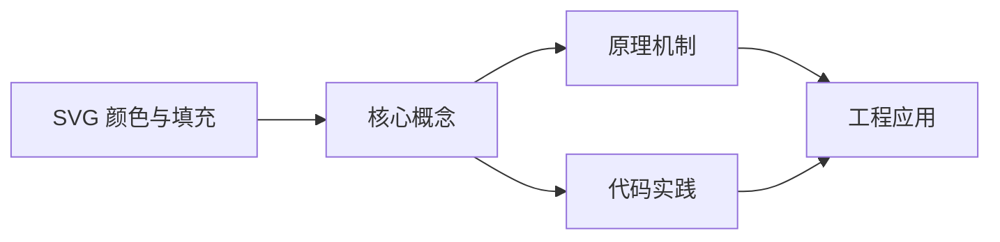

## 1. 学习目标（Bloom 分类）

本节按照布鲁姆教育目标分类学组织学习路径。本文主题为《SVG 颜色与填充》，属于 SVG 模块，读者可以根据自身阶段选择阅读深度。

记忆层面：能够准确复述本文的核心概念、术语与基本语法或操作步骤，并能够在提问或检索时快速定位对应知识点。能够说出 SVG 的核心概念、术语与标准写法。

理解层面：能够用自己的语言解释核心原理与工作机制，说明概念之间的因果关系，而不是机械记忆结论。能够解释 SVG 的工作原理与设计动机。

应用层面：能够在真实项目或练习场景中运用本文知识解决具体问题，写出正确且可维护的实现。能够编写符合 SVG 规范的完整实现。

分析层面：能够拆解复杂问题，比较本文主题与相邻概念的异同，识别边界条件与例外情况。能够分析 SVG 与相邻方案的差异与边界。

评价层面：能够根据约束条件（性能、可读性、安全、成本）评价不同方案的优劣，做出有依据的技术决策。能够根据场景评价 SVG 相关方案的优劣。

创造层面：能够把本文知识与其他模块知识组合，设计出新的解决方案或可复用的工程模式。能够组合 SVG 与其他技术设计完整方案。

通过本节学习，读者应当能够把《SVG 颜色与填充》纳入自己的知识网络，并与 SVG 模块的其他主题（矢量图形、路径、变换、动画）建立关联。

## 2. 历史动机与发展脉络

《SVG 颜色与填充》是 SVG 领域的重要主题。要真正理解它，需要先了解它解决的问题与演进过程。

SVG（可缩放矢量图形）于 2001 年由 W3C 标准化，是 Web 原生矢量格式；与位图不同，SVG 由几何描述构成，任意缩放不失真。
SVG 是 XML 方言：元素即图形（rect/circle/path），样式可用 CSS，交互可用事件；SPA 生态中常以内联 SVG 与图标组件使用。
现代应用：图标系统、数据可视化（D3）、地图、LOGO、动画与交互图形；浏览器对 SVG 的支持已非常完整。

回到本文主题：SVG 颜色与填充 的提出与成熟，正是上述技术背景下的必然产物。早期实现往往以简单可用为目标，随着工程规模扩大，社区逐渐沉淀出标准做法与最佳实践；理解这一脉络，可以帮助读者判断“为什么文档中的推荐写法是现在这个样子”，也能在遇到历史遗留代码时准确识别其设计年代与取舍。


## 3. 形式化定义与核心概念精讲

本节把《SVG 颜色与填充》涉及的核心概念以“定义 + 讲解”的形式展开。读者应把定义当作工具，把讲解当作理解路径；两者结合才能形成可迁移的知识。

坐标系：viewBox 定义逻辑坐标（min-x min-y width height），preserveAspectRatio 控制缩放对齐。
基本图形：rect（矩形）、circle（圆）、ellipse（椭圆）、line（直线）、polyline/polygon（折线/多边形）。
路径 path：M/L/C/Q/A 命令组合任意曲线；fill 填充、stroke 描边。

### 3.1 原文章节逐一精讲

原文档把主题拆分为 22 个小节，下面按顺序给出每一节的导读讲解，随后保留原文细节供精读。

#### 原文精读（完整保留）

# SVG 颜色与填充 语法速查手册

> **符号约定**:`< >` 必填参数 | `[ ]` 可选参数

---

#### 1. 填充 fill

`fill` 控制图形内部颜色，支持颜色值、URL 引用、关键字。

```html
<svg viewBox="0 0 300 100">
  <rect x="10" y="10" width="60" height="60" fill="#4f5bd5" />
  <rect x="80" y="10" width="60" height="60" fill="rgb(0,184,148)" />
  <rect x="150" y="10" width="60" height="60" fill="rgba(214,48,49,0.5)" />
  <rect x="220" y="10" width="60" height="60" fill="url(#grad)" />
</svg>
```

##### 1.1 fill 支持的值

| 类型         | 示例                         |
| ------------ | ---------------------------- |
| 关键字       | `red`、`blue`、`transparent` |
| 十六进制     | `#4f5bd5`、`#fff`            |
| RGB          | `rgb(79,91,213)`             |
| RGBA         | `rgba(79,91,213,0.5)`        |
| HSL          | `hsl(233, 62%, 57%)`         |
| URL 引用     | `url(#gradient)`             |
| currentColor | 引用当前 `color` 属性        |

##### 1.2 fill-opacity 填充透明度

```html
<circle cx="50" cy="50" r="30" fill="#4f5bd5" fill-opacity="0.5" />
<!-- 等价于 rgba(79,91,213,0.5)，但 fill-opacity 可独立控制 -->
```

`fill-opacity` 与 `rgba()` 区别：fill-opacity 不影响 stroke 透明度，可单独控制填充层。

#### 2. 描边 stroke

##### 2.1 基础属性

```html
<rect
  x="10"
  y="10"
  width="80"
  height="60"
  fill="none"
  stroke="#4f5bd5"
  stroke-width="3"
  stroke-opacity="0.8"
/>
```

| 属性                | 说明                            |
| ------------------- | ------------------------------- |
| `stroke`            | 描边颜色                        |
| `stroke-width`      | 描边宽度                        |
| `stroke-opacity`    | 描边透明度                      |
| `stroke-linecap`    | 端点形状：butt / round / square |
| `stroke-linejoin`   | 拐角：miter / round / bevel     |
| `stroke-miterlimit` | 尖角最大长度比（默认 4）        |
| `stroke-dasharray`  | 虚线模式                        |
| `stroke-dashoffset` | 虚线起始偏移                    |

##### 2.2 stroke-miterlimit 尖角限制

```html
<polyline
  points="10,90 50,10 90,90"
  stroke="#000"
  stroke-width="10"
  fill="none"
  stroke-linejoin="miter"
  stroke-miterlimit="2"
/>
<!-- 当尖角过尖（夹角小于某阈值），自动转为 bevel -->
```

默认 4，当 miter 长度超过 stroke-width 的 4 倍时自动斜切。

#### 3. opacity 透明度

##### 3.1 元素级 opacity

```html
<g opacity="0.5">
  <rect width="100" height="100" fill="#4f5bd5" />
  <circle cx="80" cy="80" r="30" fill="#d63031" />
</g>
<!-- 整组透明度 0.5，子元素互相叠加 -->
```

##### 3.2 与 fill-opacity 区别

```html
<!-- opacity 影响整体（含子元素叠加） -->
<g opacity="0.5">
  <rect fill="#4f5bd5" />
</g>

<!-- fill-opacity 仅影响填充层，stroke 不受影响 -->
<rect fill="#4f5bd5" fill-opacity="0.5" stroke="#000" />
```

#### 4. currentColor 主题色

`currentColor` 引用当前元素的 `color` 属性，实现 CSS 联动主题化。

```html
<svg viewBox="0 0 100 100" style="color: #4f5bd5">
  <circle cx="50" cy="50" r="40" fill="currentColor" />
</svg>
```

```css
.icon-primary {
  color: #4f5bd5;
}
.icon-danger {
  color: #d63031;
}
.icon-success {
  color: #00b894;
}
```

```html
<svg class="icon-danger" viewBox="0 0 24 24">
  <path d="M12 2 L22 20 L2 20 Z" fill="currentColor" />
  <text x="12" y="18" text-anchor="middle" fill="#fff" font-size="14">!</text>
</svg>
```

> `currentColor` 是 SVG 图标系统主题化的核心，让同一图标可在不同上下文中显示不同颜色。

#### 5. paint-order 绘制顺序

`paint-order` 控制 fill、stroke、markers 的绘制顺序。

```html
<text font-size="40" stroke="#fff" stroke-width="6" fill="#4f5bd5" paint-order="stroke fill">
  描边在下
</text>
```

| 值                    | 效果                                     |
| --------------------- | ---------------------------------------- |
| `fill stroke`         | 先填充后描边（默认，描边在上）           |
| `stroke fill`         | 先描边后填充（填充在上，描边不遮挡文字） |
| `fill stroke markers` | 完整顺序                                 |

> 描边文字推荐 `stroke fill`，避免粗描边遮挡文字内部。

#### 6. vector-effect 矢量效果

`vector-effect` 控制图形在缩放时的描边行为，最常用的是 `non-scaling-stroke`。

##### 6.1 默认行为：描边随缩放

```html
<svg viewBox="0 0 100 100" width="200" height="200">
  <rect x="10" y="10" width="80" height="80" fill="none" stroke="#000" stroke-width="2" />
  <!-- viewBox 100×100 缩放到 200×200，描边实际显示 4px -->
</svg>
```

##### 6.2 non-scaling-stroke 描边不缩放

```html
<svg viewBox="0 0 100 100" width="200" height="200">
  <rect
    x="10"
    y="10"
    width="80"
    height="80"
    fill="none"
    stroke="#000"
    stroke-width="2"
    vector-effect="non-scaling-stroke"
  />
  <!-- 描边始终保持 2px，不受 viewBox 缩放影响 -->
</svg>
```

##### 6.3 应用场景

| 场景           | 说明                         |
| -------------- | ---------------------------- |
| **地图边界**   | 地图缩放时边界线粗细保持一致 |
| **图表网格线** | 数据图缩放时网格线宽不变     |
| **响应式图标** | 图标在不同尺寸下描边视觉一致 |
| **技术绘图**   | 工程图描边宽度有严格规范     |

#### 7. fill-rule 填充规则

复杂路径的填充规则，详见 [路径 path 详解](./路径path详解)。

```html
<!-- 五角星中心镂空 -->
<path
  d="M 100 10 L 120 70 L 180 70 L 130 105 L 150 165 L 100 130 L 50 165 L 70 105 L 20 70 L 80 70 Z"
  fill="#d63031"
  fill-rule="evenodd"
/>
```

#### 8. 颜色函数

SVG 支持 CSS Color Module Level 4 的所有颜色函数。

##### 8.1 hex 与 rgb

```html
<rect fill="#4f5bd5" />
<rect fill="rgb(79 91 213)" />
<rect fill="rgb(79 91 213 / 0.5)" />
```

##### 8.2 hsl 色相旋转

```html
<rect fill="hsl(233 62% 57%)" /> <rect fill="hsl(233 62% 57% / 0.5)" />
```

##### 8.3 color-mix 混色（现代浏览器）

```html
<rect fill="color-mix(in srgb, #4f5bd5 50%, white)" />
<!-- 50% 蓝色与白色混合 -->
```

#### 9. CSS 变量集成

SVG 可使用 CSS 自定义属性，实现运行时主题切换。

```html
<style>
  :root {
    --brand: #4f5bd5;
    --danger: #d63031;
  }
  .dark-theme {
    --brand: #8b92e8;
    --danger: #ff6b6b;
  }
</style>

<svg viewBox="0 0 100 100">
  <rect width="100" height="50" fill="var(--brand)" />
  <rect y="50" width="100" height="50" fill="var(--danger)" />
</svg>
```

切换父元素 class 即可联动 SVG 颜色变化。

#### 10. 描边动画技巧

##### 10.1 stroke-dasharray 绘制动画

```html
<svg viewBox="0 0 200 100">
  <path
    d="M 10 50 Q 100 10 190 50"
    fill="none"
    stroke="#4f5bd5"
    stroke-width="3"
    stroke-dasharray="200"
    stroke-dashoffset="200"
  >
    <animate attributeName="stroke-dashoffset" from="200" to="0" dur="2s" fill="freeze" />
  </path>
</svg>
```

原理：dasharray 等于路径总长，dashoffset 从全长到 0，模拟"画线"效果。

##### 10.2 流动虚线

```css
@keyframes dash-flow {
  to {
    stroke-dashoffset: -24;
  }
}
.flow {
  stroke-dasharray: 8 4;
  animation: dash-flow 1s linear infinite;
}
```

```html
<line x1="10" y1="50" x2="190" y2="50" stroke="#4f5bd5" stroke-width="3" class="flow" />
```

形成"蚂蚁线"效果，常用于表示数据流或加载中状态。

#### 11. 综合示例：渐变描边按钮

```html
<svg viewBox="0 0 200 60">
  <defs>
    <linearGradient id="btn-grad" x1="0%" x2="100%">
      <stop offset="0%" stop-color="#4f5bd5" />
      <stop offset="100%" stop-color="#00b894" />
    </linearGradient>
  </defs>
  <rect
    x="2"
    y="2"
    width="196"
    height="56"
    rx="28"
    fill="none"
    stroke="url(#btn-grad)"
    stroke-width="2"
    vector-effect="non-scaling-stroke"
  />
  <text x="100" y="35" text-anchor="middle" font-size="18" fill="url(#btn-grad)" font-weight="bold">
    立即开始
  </text>
</svg>
```

下一篇介绍渐变与图案，构建更丰富的视觉表现。
#### fill 填充

**fill 填充属性**
`fill="<颜色值 | url(#id) | currentColor | transparent>"`
```html
<svg viewBox="0 0 300 100">
  <rect x="10" y="10" width="60" height="60" fill="#4f5bd5" />
  <rect x="80" y="10" width="60" height="60" fill="rgb(0,184,148)" />
  <rect x="150" y="10" width="60" height="60" fill="rgba(214,48,49,0.5)" />
  <rect x="220" y="10" width="60" height="60" fill="url(#grad)" />
</svg>
```

##### fill 支持的值

| 类型         | 示例                         |
| ------------ | ---------------------------- |
| 关键字       | `red`、`blue`、`transparent` |
| 十六进制     | `#4f5bd5`、`#fff`            |
| RGB          | `rgb(79,91,213)`             |
| RGBA         | `rgba(79,91,213,0.5)`        |
| HSL          | `hsl(233, 62%, 57%)`         |
| URL 引用     | `url(#gradient)`             |
| currentColor | 引用当前 `color` 属性        |

##### fill-opacity 填充透明度

**fill-opacity 独立控制填充透明度**
`fill-opacity="<0-1>"`
```html
<circle cx="50" cy="50" r="30" fill="#4f5bd5" fill-opacity="0.5" />
<!-- 等价于 rgba(79,91,213,0.5),但 fill-opacity 可独立控制 -->
```

`fill-opacity` 与 `rgba()` 区别:fill-opacity 不影响 stroke 透明度,可单独控制填充层。

---

#### stroke 描边

**stroke 描边基础属性**
```html
<rect
  x="10"
  y="10"
  width="80"
  height="60"
  fill="none"
  stroke="#4f5bd5"
  stroke-width="3"
  stroke-opacity="0.8"
/>
```

##### stroke 属性列表

| 属性                | 说明                            |
| ------------------- | ------------------------------- |
| `stroke`            | 描边颜色                        |
| `stroke-width`      | 描边宽度                        |
| `stroke-opacity`    | 描边透明度                      |
| `stroke-linecap`    | 端点形状:butt / round / square |
| `stroke-linejoin`   | 拐角:miter / round / bevel     |
| `stroke-miterlimit` | 尖角最大长度比(默认 4)        |
| `stroke-dasharray`  | 虚线模式                        |
| `stroke-dashoffset` | 虚线起始偏移                    |

##### stroke-miterlimit 尖角限制

**stroke-miterlimit 尖角最大长度比**
`stroke-miterlimit="<比值>"`
```html
<polyline
  points="10,90 50,10 90,90"
  stroke="#000"
  stroke-width="10"
  fill="none"
  stroke-linejoin="miter"
  stroke-miterlimit="2"
/>
<!-- 当尖角过尖(夹角小于某阈值),自动转为 bevel -->
```

默认 4,当 miter 长度超过 stroke-width 的 4 倍时自动斜切。

---

#### opacity 透明度

##### 元素级 opacity

**opacity 元素整体透明度**
`opacity="<0-1>"`
```html
<g opacity="0.5">
  <rect width="100" height="100" fill="#4f5bd5" />
  <circle cx="80" cy="80" r="30" fill="#d63031" />
</g>
<!-- 整组透明度 0.5,子元素互相叠加 -->
```

##### opacity 与 fill-opacity 区别

```html
<!-- opacity 影响整体(含子元素叠加) -->
<g opacity="0.5">
  <rect fill="#4f5bd5" />
</g>

<!-- fill-opacity 仅影响填充层,stroke 不受影响 -->
<rect fill="#4f5bd5" fill-opacity="0.5" stroke="#000" />
```

---

#### currentColor 主题色

**currentColor 引用当前 color 属性**
`fill="currentColor"` / `stroke="currentColor"`
```html
<svg viewBox="0 0 100 100" style="color: #4f5bd5">
  <circle cx="50" cy="50" r="40" fill="currentColor" />
</svg>
```

```css
.icon-primary {
  color: #4f5bd5;
}
.icon-danger {
  color: #d63031;
}
.icon-success {
  color: #00b894;
}
```

```html
<svg class="icon-danger" viewBox="0 0 24 24">
  <path d="M12 2 L22 20 L2 20 Z" fill="currentColor" />
  <text x="12" y="18" text-anchor="middle" fill="#fff" font-size="14">!</text>
</svg>
```

> `currentColor` 是 SVG 图标系统主题化的核心,让同一图标可在不同上下文中显示不同颜色。

---

#### paint-order 绘制顺序

**paint-order 绘制顺序**
`paint-order="<fill | stroke | markers> ..."`
```html
<text font-size="40" stroke="#fff" stroke-width="6" fill="#4f5bd5" paint-order="stroke fill">
  描边在下
</text>
```

| 值                    | 效果                                     |
| --------------------- | ---------------------------------------- |
| `fill stroke`         | 先填充后描边(默认,描边在上)           |
| `stroke fill`         | 先描边后填充(填充在上,描边不遮挡文字) |
| `fill stroke markers` | 完整顺序                                 |

> 描边文字推荐 `stroke fill`,避免粗描边遮挡文字内部。

---

#### vector-effect 矢量效果

##### 默认行为:描边随缩放

```html
<svg viewBox="0 0 100 100" width="200" height="200">
  <rect x="10" y="10" width="80" height="80" fill="none" stroke="#000" stroke-width="2" />
  <!-- viewBox 100×100 缩放到 200×200,描边实际显示 4px -->
</svg>
```

##### non-scaling-stroke 描边不缩放

**vector-effect="non-scaling-stroke"**
`vector-effect="non-scaling-stroke"`
```html
<svg viewBox="0 0 100 100" width="200" height="200">
  <rect
    x="10"
    y="10"
    width="80"
    height="80"
    fill="none"
    stroke="#000"
    stroke-width="2"
    vector-effect="non-scaling-stroke"
  />
  <!-- 描边始终保持 2px,不受 viewBox 缩放影响 -->
</svg>
```

##### 应用场景

| 场景           | 说明                         |
| -------------- | ---------------------------- |
| **地图边界**   | 地图缩放时边界线粗细保持一致 |
| **图表网格线** | 数据图缩放时网格线宽不变     |
| **响应式图标** | 图标在不同尺寸下描边视觉一致 |
| **技术绘图**   | 工程图描边宽度有严格规范     |

---

#### fill-rule 填充规则

**fill-rule 复杂路径填充规则**
`fill-rule="<nonzero | evenodd>"`
```html
<!-- 五角星中心镂空 -->
<path
  d="M 100 10 L 120 70 L 180 70 L 130 105 L 150 165 L 100 130 L 50 165 L 70 105 L 20 70 L 80 70 Z"
  fill="#d63031"
  fill-rule="evenodd"
/>
```

---

#### 颜色函数

##### hex 与 rgb

**RGB 颜色函数**
```html
<rect fill="#4f5bd5" />
<rect fill="rgb(79 91 213)" />
<rect fill="rgb(79 91 213 / 0.5)" />
```

##### hsl 色相旋转

**HSL 颜色函数**
```html
<rect fill="hsl(233 62% 57%)" />
<rect fill="hsl(233 62% 57% / 0.5)" />
```

##### color-mix 混色

**color-mix 混色函数(现代浏览器)**
`color-mix(in <色彩空间>, <颜色1> <百分比>, <颜色2>)`
```html
<rect fill="color-mix(in srgb, #4f5bd5 50%, white)" />
<!-- 50% 蓝色与白色混合 -->
```

---

#### CSS 变量集成

**SVG 使用 CSS 自定义属性**
`fill="var(--<变量名>)"`
```html
<style>
  :root {
    --brand: #4f5bd5;
    --danger: #d63031;
  }
  .dark-theme {
    --brand: #8b92e8;
    --danger: #ff6b6b;
  }
</style>

<svg viewBox="0 0 100 100">
  <rect width="100" height="50" fill="var(--brand)" />
  <rect y="50" width="100" height="50" fill="var(--danger)" />
</svg>
```

切换父元素 class 即可联动 SVG 颜色变化。

---

#### 描边动画

##### stroke-dasharray 绘制动画

**stroke-dasharray + animate 实现绘制动画**
```html
<svg viewBox="0 0 200 100">
  <path
    d="M 10 50 Q 100 10 190 50"
    fill="none"
    stroke="#4f5bd5"
    stroke-width="3"
    stroke-dasharray="200"
    stroke-dashoffset="200"
  >
    <animate attributeName="stroke-dashoffset" from="200" to="0" dur="2s" fill="freeze" />
  </path>
</svg>
```

原理:dasharray 等于路径总长,dashoffset 从全长到 0,模拟"画线"效果。

##### 流动虚线

**CSS 流动虚线动画**
```css
@keyframes dash-flow {
  to {
    stroke-dashoffset: -24;
  }
}
.flow {
  stroke-dasharray: 8 4;
  animation: dash-flow 1s linear infinite;
}
```

```html
<line x1="10" y1="50" x2="190" y2="50" stroke="#4f5bd5" stroke-width="3" class="flow" />
```

形成"蚂蚁线"效果,常用于表示数据流或加载中状态。

---

#### 综合示例:渐变描边按钮

**渐变描边按钮**
```html
<svg viewBox="0 0 200 60">
  <defs>
    <linearGradient id="btn-grad" x1="0%" x2="100%">
      <stop offset="0%" stop-color="#4f5bd5" />
      <stop offset="100%" stop-color="#00b894" />
    </linearGradient>
  </defs>
  <rect
    x="2"
    y="2"
    width="196"
    height="56"
    rx="28"
    fill="none"
    stroke="url(#btn-grad)"
    stroke-width="2"
    vector-effect="non-scaling-stroke"
  />
  <text x="100" y="35" text-anchor="middle" font-size="18" fill="url(#btn-grad)" font-weight="bold">
    立即开始
  </text>
</svg>
```


### 3.2 概念关系图

下面用 Mermaid 图表达本文核心概念之间的关系，帮助读者建立整体图景：



图中展示的是本文知识的结构化关系：核心概念是入口，原理机制解释“为什么”，代码实践演示“怎么做”，工程应用回答“何时用”。读者学习时可以把每个小节的内容挂接到对应节点上。

## 4. 理论推导与原理解析

本节深入《SVG 颜色与填充》背后的原理。理论部分不求面面俱到，而是聚焦“能解释现象、能指导实践”的关键推导。

坐标系：viewBox 定义逻辑坐标（min-x min-y width height），preserveAspectRatio 控制缩放对齐。
基本图形：rect（矩形）、circle（圆）、ellipse（椭圆）、line（直线）、polyline/polygon（折线/多边形）。
路径 path：M/L/C/Q/A 命令组合任意曲线；fill 填充、stroke 描边。
变换与动画：transform 平移缩放旋转；CSS/SMIL 动画控制属性过渡。

需要强调的是，理论推导与工程实践之间存在翻译层：理论给出的是理想化模型与边界条件，工程代码则必须处理真实环境中的例外。读者在学习时应先掌握理论的“标准情形”，再通过陷阱章节了解“非标准情形”。

## 5. 代码示例与逐行讲解

本节把原文中的代码示例系统整理，并为每个示例补充用途说明与讲解。读者不应只浏览代码，而应逐段对照讲解理解设计意图。

### 5.1 示例：1. 填充 fill

该示例来自原文《1. 填充 fill》小节，用于演示SVG 颜色与填充相关操作。阅读时请先看代码结构，再看其后的讲解。

```html
<svg viewBox="0 0 300 100">
  <rect x="10" y="10" width="60" height="60" fill="#4f5bd5" />
  <rect x="80" y="10" width="60" height="60" fill="rgb(0,184,148)" />
  <rect x="150" y="10" width="60" height="60" fill="rgba(214,48,49,0.5)" />
  <rect x="220" y="10" width="60" height="60" fill="url(#grad)" />
</svg>
```

讲解：这段代码演示了本节核心知识点。代码中的关键操作可以归纳为三步：准备（定义或初始化）、执行（核心逻辑）、收尾（释放资源或返回结果）。实际项目中，这三步往往被封装为函数或类，以提升复用性与可测试性。

关键点分析：

该示例共 6 行有效代码，结构以数据或配置为主。阅读时应关注：数据字段的含义、配置项的作用，以及它们与运行行为的对应关系。

进阶思考路径：先尝试修改参数观察行为变化，再把示例中的模式迁移到自己的项目中；每次修改都记录预期与实测差异，这是把示例转化为能力的最快方式。

### 5.2 示例：1.2 fill-opacity 填充透明度

该示例来自原文《1.2 fill-opacity 填充透明度》小节，用于演示SVG 颜色与填充相关操作。阅读时请先看代码结构，再看其后的讲解。

```html
<circle cx="50" cy="50" r="30" fill="#4f5bd5" fill-opacity="0.5" />
<!-- 等价于 rgba(79,91,213,0.5)，但 fill-opacity 可独立控制 -->
```

讲解：这段代码演示了本节核心知识点。代码中的关键操作可以归纳为三步：准备（定义或初始化）、执行（核心逻辑）、收尾（释放资源或返回结果）。实际项目中，这三步往往被封装为函数或类，以提升复用性与可测试性。

关键点分析：

该示例共 2 行有效代码，结构以数据或配置为主。阅读时应关注：数据字段的含义、配置项的作用，以及它们与运行行为的对应关系。

进阶思考路径：先尝试修改参数观察行为变化，再把示例中的模式迁移到自己的项目中；每次修改都记录预期与实测差异，这是把示例转化为能力的最快方式。

### 5.3 示例：2.1 基础属性

该示例来自原文《2.1 基础属性》小节，用于演示SVG 颜色与填充相关操作。阅读时请先看代码结构，再看其后的讲解。

```html
<rect
  x="10"
  y="10"
  width="80"
  height="60"
  fill="none"
  stroke="#4f5bd5"
  stroke-width="3"
  stroke-opacity="0.8"
/>
```

讲解：这段代码演示了本节核心知识点。代码中的关键操作可以归纳为三步：准备（定义或初始化）、执行（核心逻辑）、收尾（释放资源或返回结果）。实际项目中，这三步往往被封装为函数或类，以提升复用性与可测试性。

关键点分析：

该示例共 10 行有效代码，结构以数据或配置为主。阅读时应关注：数据字段的含义、配置项的作用，以及它们与运行行为的对应关系。

进阶思考路径：先尝试修改参数观察行为变化，再把示例中的模式迁移到自己的项目中；每次修改都记录预期与实测差异，这是把示例转化为能力的最快方式。

### 5.4 示例：2.2 stroke-miterlimit 尖角限制

该示例来自原文《2.2 stroke-miterlimit 尖角限制》小节，用于演示SVG 颜色与填充相关操作。阅读时请先看代码结构，再看其后的讲解。

```html
<polyline
  points="10,90 50,10 90,90"
  stroke="#000"
  stroke-width="10"
  fill="none"
  stroke-linejoin="miter"
  stroke-miterlimit="2"
/>
<!-- 当尖角过尖（夹角小于某阈值），自动转为 bevel -->
```

讲解：这段代码演示了本节核心知识点。代码中的关键操作可以归纳为三步：准备（定义或初始化）、执行（核心逻辑）、收尾（释放资源或返回结果）。实际项目中，这三步往往被封装为函数或类，以提升复用性与可测试性。

关键点分析：

该示例共 9 行有效代码，结构以数据或配置为主。阅读时应关注：数据字段的含义、配置项的作用，以及它们与运行行为的对应关系。

进阶思考路径：先尝试修改参数观察行为变化，再把示例中的模式迁移到自己的项目中；每次修改都记录预期与实测差异，这是把示例转化为能力的最快方式。

### 5.5 示例：3.1 元素级 opacity

该示例来自原文《3.1 元素级 opacity》小节，用于演示SVG 颜色与填充相关操作。阅读时请先看代码结构，再看其后的讲解。

```html
<g opacity="0.5">
  <rect width="100" height="100" fill="#4f5bd5" />
  <circle cx="80" cy="80" r="30" fill="#d63031" />
</g>
<!-- 整组透明度 0.5，子元素互相叠加 -->
```

讲解：这段代码演示了本节核心知识点。代码中的关键操作可以归纳为三步：准备（定义或初始化）、执行（核心逻辑）、收尾（释放资源或返回结果）。实际项目中，这三步往往被封装为函数或类，以提升复用性与可测试性。

关键点分析：

该示例共 5 行有效代码，结构以数据或配置为主。阅读时应关注：数据字段的含义、配置项的作用，以及它们与运行行为的对应关系。

进阶思考路径：先尝试修改参数观察行为变化，再把示例中的模式迁移到自己的项目中；每次修改都记录预期与实测差异，这是把示例转化为能力的最快方式。

### 5.6 示例：3.2 与 fill-opacity 区别

该示例来自原文《3.2 与 fill-opacity 区别》小节，用于演示SVG 颜色与填充相关操作。阅读时请先看代码结构，再看其后的讲解。

```html
<!-- opacity 影响整体（含子元素叠加） -->
<g opacity="0.5">
  <rect fill="#4f5bd5" />
</g>

<!-- fill-opacity 仅影响填充层，stroke 不受影响 -->
<rect fill="#4f5bd5" fill-opacity="0.5" stroke="#000" />
```

讲解：这段代码演示了本节核心知识点。代码中的关键操作可以归纳为三步：准备（定义或初始化）、执行（核心逻辑）、收尾（释放资源或返回结果）。实际项目中，这三步往往被封装为函数或类，以提升复用性与可测试性。

关键点分析：

该示例共 6 行有效代码，结构以数据或配置为主。阅读时应关注：数据字段的含义、配置项的作用，以及它们与运行行为的对应关系。

进阶思考路径：先尝试修改参数观察行为变化，再把示例中的模式迁移到自己的项目中；每次修改都记录预期与实测差异，这是把示例转化为能力的最快方式。

### 5.7 示例：4. currentColor 主题色

该示例来自原文《4. currentColor 主题色》小节，用于演示SVG 颜色与填充相关操作。阅读时请先看代码结构，再看其后的讲解。

```html
<svg viewBox="0 0 100 100" style="color: #4f5bd5">
  <circle cx="50" cy="50" r="40" fill="currentColor" />
</svg>
```

讲解：这段代码演示了本节核心知识点。代码中的关键操作可以归纳为三步：准备（定义或初始化）、执行（核心逻辑）、收尾（释放资源或返回结果）。实际项目中，这三步往往被封装为函数或类，以提升复用性与可测试性。

关键点分析：

该示例共 3 行有效代码，结构以数据或配置为主。阅读时应关注：数据字段的含义、配置项的作用，以及它们与运行行为的对应关系。

进阶思考路径：先尝试修改参数观察行为变化，再把示例中的模式迁移到自己的项目中；每次修改都记录预期与实测差异，这是把示例转化为能力的最快方式。

### 5.8 示例：4. currentColor 主题色

该示例来自原文《4. currentColor 主题色》小节，用于演示SVG 颜色与填充相关操作。阅读时请先看代码结构，再看其后的讲解。

```css
.icon-primary {
  color: #4f5bd5;
}
.icon-danger {
  color: #d63031;
}
.icon-success {
  color: #00b894;
}
```

讲解：这段代码演示了本节核心知识点。代码中的关键操作可以归纳为三步：准备（定义或初始化）、执行（核心逻辑）、收尾（释放资源或返回结果）。实际项目中，这三步往往被封装为函数或类，以提升复用性与可测试性。

关键点分析：

该示例共 9 行有效代码，结构以数据或配置为主。阅读时应关注：数据字段的含义、配置项的作用，以及它们与运行行为的对应关系。

进阶思考路径：先尝试修改参数观察行为变化，再把示例中的模式迁移到自己的项目中；每次修改都记录预期与实测差异，这是把示例转化为能力的最快方式。

### 5.9 示例：4. currentColor 主题色

该示例来自原文《4. currentColor 主题色》小节，用于演示SVG 颜色与填充相关操作。阅读时请先看代码结构，再看其后的讲解。

```html
<svg class="icon-danger" viewBox="0 0 24 24">
  <path d="M12 2 L22 20 L2 20 Z" fill="currentColor" />
  <text x="12" y="18" text-anchor="middle" fill="#fff" font-size="14">!</text>
</svg>
```

讲解：这段代码演示了本节核心知识点。代码中的关键操作可以归纳为三步：准备（定义或初始化）、执行（核心逻辑）、收尾（释放资源或返回结果）。实际项目中，这三步往往被封装为函数或类，以提升复用性与可测试性。

关键点分析：

该示例共 4 行有效代码，包含 1 类关键结构（class）。其中：

- 入口与初始化部分负责建立上下文，对应实际项目中的启动或装配逻辑；
- 核心逻辑部分体现本文主题的主要操作，是阅读时最需要对照讲解理解的部分；
- 输出或返回部分把结果交给调用方，注意其类型与边界条件。

进阶思考路径：先尝试修改参数观察行为变化，再把示例中的模式迁移到自己的项目中；每次修改都记录预期与实测差异，这是把示例转化为能力的最快方式。

### 5.10 示例：5. paint-order 绘制顺序

该示例来自原文《5. paint-order 绘制顺序》小节，用于演示SVG 颜色与填充相关操作。阅读时请先看代码结构，再看其后的讲解。

```html
<text font-size="40" stroke="#fff" stroke-width="6" fill="#4f5bd5" paint-order="stroke fill">
  描边在下
</text>
```

讲解：这段代码演示了本节核心知识点。代码中的关键操作可以归纳为三步：准备（定义或初始化）、执行（核心逻辑）、收尾（释放资源或返回结果）。实际项目中，这三步往往被封装为函数或类，以提升复用性与可测试性。

关键点分析：

该示例共 3 行有效代码，结构以数据或配置为主。阅读时应关注：数据字段的含义、配置项的作用，以及它们与运行行为的对应关系。

进阶思考路径：先尝试修改参数观察行为变化，再把示例中的模式迁移到自己的项目中；每次修改都记录预期与实测差异，这是把示例转化为能力的最快方式。

### 5.11 示例：6.1 默认行为：描边随缩放

该示例来自原文《6.1 默认行为：描边随缩放》小节，用于演示SVG 颜色与填充相关操作。阅读时请先看代码结构，再看其后的讲解。

```html
<svg viewBox="0 0 100 100" width="200" height="200">
  <rect x="10" y="10" width="80" height="80" fill="none" stroke="#000" stroke-width="2" />
  <!-- viewBox 100×100 缩放到 200×200，描边实际显示 4px -->
</svg>
```

讲解：这段代码演示了本节核心知识点。代码中的关键操作可以归纳为三步：准备（定义或初始化）、执行（核心逻辑）、收尾（释放资源或返回结果）。实际项目中，这三步往往被封装为函数或类，以提升复用性与可测试性。

关键点分析：

该示例共 4 行有效代码，结构以数据或配置为主。阅读时应关注：数据字段的含义、配置项的作用，以及它们与运行行为的对应关系。

进阶思考路径：先尝试修改参数观察行为变化，再把示例中的模式迁移到自己的项目中；每次修改都记录预期与实测差异，这是把示例转化为能力的最快方式。

### 5.12 示例：6.2 non-scaling-stroke 描边不缩放

该示例来自原文《6.2 non-scaling-stroke 描边不缩放》小节，用于演示SVG 颜色与填充相关操作。阅读时请先看代码结构，再看其后的讲解。

```html
<svg viewBox="0 0 100 100" width="200" height="200">
  <rect
    x="10"
    y="10"
    width="80"
    height="80"
    fill="none"
    stroke="#000"
    stroke-width="2"
    vector-effect="non-scaling-stroke"
  />
  <!-- 描边始终保持 2px，不受 viewBox 缩放影响 -->
</svg>
```

讲解：这段代码演示了本节核心知识点。代码中的关键操作可以归纳为三步：准备（定义或初始化）、执行（核心逻辑）、收尾（释放资源或返回结果）。实际项目中，这三步往往被封装为函数或类，以提升复用性与可测试性。

关键点分析：

该示例共 13 行有效代码，结构以数据或配置为主。阅读时应关注：数据字段的含义、配置项的作用，以及它们与运行行为的对应关系。

进阶思考路径：先尝试修改参数观察行为变化，再把示例中的模式迁移到自己的项目中；每次修改都记录预期与实测差异，这是把示例转化为能力的最快方式。

### 5.13 示例：7. fill-rule 填充规则

该示例来自原文《7. fill-rule 填充规则》小节，用于演示SVG 颜色与填充相关操作。阅读时请先看代码结构，再看其后的讲解。

```html
<!-- 五角星中心镂空 -->
<path
  d="M 100 10 L 120 70 L 180 70 L 130 105 L 150 165 L 100 130 L 50 165 L 70 105 L 20 70 L 80 70 Z"
  fill="#d63031"
  fill-rule="evenodd"
/>
```

讲解：这段代码演示了本节核心知识点。代码中的关键操作可以归纳为三步：准备（定义或初始化）、执行（核心逻辑）、收尾（释放资源或返回结果）。实际项目中，这三步往往被封装为函数或类，以提升复用性与可测试性。

关键点分析：

该示例共 6 行有效代码，结构以数据或配置为主。阅读时应关注：数据字段的含义、配置项的作用，以及它们与运行行为的对应关系。

进阶思考路径：先尝试修改参数观察行为变化，再把示例中的模式迁移到自己的项目中；每次修改都记录预期与实测差异，这是把示例转化为能力的最快方式。

### 5.14 示例：8.1 hex 与 rgb

该示例来自原文《8.1 hex 与 rgb》小节，用于演示SVG 颜色与填充相关操作。阅读时请先看代码结构，再看其后的讲解。

```html
<rect fill="#4f5bd5" />
<rect fill="rgb(79 91 213)" />
<rect fill="rgb(79 91 213 / 0.5)" />
```

讲解：这段代码演示了本节核心知识点。代码中的关键操作可以归纳为三步：准备（定义或初始化）、执行（核心逻辑）、收尾（释放资源或返回结果）。实际项目中，这三步往往被封装为函数或类，以提升复用性与可测试性。

关键点分析：

该示例共 3 行有效代码，结构以数据或配置为主。阅读时应关注：数据字段的含义、配置项的作用，以及它们与运行行为的对应关系。

进阶思考路径：先尝试修改参数观察行为变化，再把示例中的模式迁移到自己的项目中；每次修改都记录预期与实测差异，这是把示例转化为能力的最快方式。

### 5.15 示例：8.2 hsl 色相旋转

该示例来自原文《8.2 hsl 色相旋转》小节，用于演示SVG 颜色与填充相关操作。阅读时请先看代码结构，再看其后的讲解。

```html
<rect fill="hsl(233 62% 57%)" /> <rect fill="hsl(233 62% 57% / 0.5)" />
```

讲解：这段代码演示了本节核心知识点。代码中的关键操作可以归纳为三步：准备（定义或初始化）、执行（核心逻辑）、收尾（释放资源或返回结果）。实际项目中，这三步往往被封装为函数或类，以提升复用性与可测试性。

关键点分析：

该示例共 1 行有效代码，结构以数据或配置为主。阅读时应关注：数据字段的含义、配置项的作用，以及它们与运行行为的对应关系。

进阶思考路径：先尝试修改参数观察行为变化，再把示例中的模式迁移到自己的项目中；每次修改都记录预期与实测差异，这是把示例转化为能力的最快方式。

### 5.16 示例：8.3 color-mix 混色（现代浏览器）

该示例来自原文《8.3 color-mix 混色（现代浏览器）》小节，用于演示SVG 颜色与填充相关操作。阅读时请先看代码结构，再看其后的讲解。

```html
<rect fill="color-mix(in srgb, #4f5bd5 50%, white)" />
<!-- 50% 蓝色与白色混合 -->
```

讲解：这段代码演示了本节核心知识点。代码中的关键操作可以归纳为三步：准备（定义或初始化）、执行（核心逻辑）、收尾（释放资源或返回结果）。实际项目中，这三步往往被封装为函数或类，以提升复用性与可测试性。

关键点分析：

该示例共 2 行有效代码，结构以数据或配置为主。阅读时应关注：数据字段的含义、配置项的作用，以及它们与运行行为的对应关系。

进阶思考路径：先尝试修改参数观察行为变化，再把示例中的模式迁移到自己的项目中；每次修改都记录预期与实测差异，这是把示例转化为能力的最快方式。

### 5.17 示例：9. CSS 变量集成

该示例来自原文《9. CSS 变量集成》小节，用于演示SVG 颜色与填充相关操作。阅读时请先看代码结构，再看其后的讲解。

```html
<style>
  :root {
    --brand: #4f5bd5;
    --danger: #d63031;
  }
  .dark-theme {
    --brand: #8b92e8;
    --danger: #ff6b6b;
  }
</style>

<svg viewBox="0 0 100 100">
  <rect width="100" height="50" fill="var(--brand)" />
  <rect y="50" width="100" height="50" fill="var(--danger)" />
</svg>
```

讲解：这段代码演示了本节核心知识点。代码中的关键操作可以归纳为三步：准备（定义或初始化）、执行（核心逻辑）、收尾（释放资源或返回结果）。实际项目中，这三步往往被封装为函数或类，以提升复用性与可测试性。

关键点分析：

该示例共 14 行有效代码，结构以数据或配置为主。阅读时应关注：数据字段的含义、配置项的作用，以及它们与运行行为的对应关系。

进阶思考路径：先尝试修改参数观察行为变化，再把示例中的模式迁移到自己的项目中；每次修改都记录预期与实测差异，这是把示例转化为能力的最快方式。

### 5.18 示例：10.1 stroke-dasharray 绘制动画

该示例来自原文《10.1 stroke-dasharray 绘制动画》小节，用于演示SVG 颜色与填充相关操作。阅读时请先看代码结构，再看其后的讲解。

```html
<svg viewBox="0 0 200 100">
  <path
    d="M 10 50 Q 100 10 190 50"
    fill="none"
    stroke="#4f5bd5"
    stroke-width="3"
    stroke-dasharray="200"
    stroke-dashoffset="200"
  >
    <animate attributeName="stroke-dashoffset" from="200" to="0" dur="2s" fill="freeze" />
  </path>
</svg>
```

讲解：这段代码演示了本节核心知识点。代码中的关键操作可以归纳为三步：准备（定义或初始化）、执行（核心逻辑）、收尾（释放资源或返回结果）。实际项目中，这三步往往被封装为函数或类，以提升复用性与可测试性。

关键点分析：

该示例共 12 行有效代码，结构以数据或配置为主。阅读时应关注：数据字段的含义、配置项的作用，以及它们与运行行为的对应关系。

进阶思考路径：先尝试修改参数观察行为变化，再把示例中的模式迁移到自己的项目中；每次修改都记录预期与实测差异，这是把示例转化为能力的最快方式。

### 5.19 示例：10.2 流动虚线

该示例来自原文《10.2 流动虚线》小节，用于演示SVG 颜色与填充相关操作。阅读时请先看代码结构，再看其后的讲解。

```css
@keyframes dash-flow {
  to {
    stroke-dashoffset: -24;
  }
}
.flow {
  stroke-dasharray: 8 4;
  animation: dash-flow 1s linear infinite;
}
```

讲解：这段代码演示了本节核心知识点。代码中的关键操作可以归纳为三步：准备（定义或初始化）、执行（核心逻辑）、收尾（释放资源或返回结果）。实际项目中，这三步往往被封装为函数或类，以提升复用性与可测试性。

关键点分析：

该示例共 9 行有效代码，结构以数据或配置为主。阅读时应关注：数据字段的含义、配置项的作用，以及它们与运行行为的对应关系。

进阶思考路径：先尝试修改参数观察行为变化，再把示例中的模式迁移到自己的项目中；每次修改都记录预期与实测差异，这是把示例转化为能力的最快方式。

### 5.20 示例：10.2 流动虚线

该示例来自原文《10.2 流动虚线》小节，用于演示SVG 颜色与填充相关操作。阅读时请先看代码结构，再看其后的讲解。

```html
<line x1="10" y1="50" x2="190" y2="50" stroke="#4f5bd5" stroke-width="3" class="flow" />
```

讲解：这段代码演示了本节核心知识点。代码中的关键操作可以归纳为三步：准备（定义或初始化）、执行（核心逻辑）、收尾（释放资源或返回结果）。实际项目中，这三步往往被封装为函数或类，以提升复用性与可测试性。

关键点分析：

该示例共 1 行有效代码，包含 1 类关键结构（class）。其中：

- 入口与初始化部分负责建立上下文，对应实际项目中的启动或装配逻辑；
- 核心逻辑部分体现本文主题的主要操作，是阅读时最需要对照讲解理解的部分；
- 输出或返回部分把结果交给调用方，注意其类型与边界条件。

进阶思考路径：先尝试修改参数观察行为变化，再把示例中的模式迁移到自己的项目中；每次修改都记录预期与实测差异，这是把示例转化为能力的最快方式。

### 5.21 示例：11. 综合示例：渐变描边按钮

该示例来自原文《11. 综合示例：渐变描边按钮》小节，用于演示SVG 颜色与填充相关操作。阅读时请先看代码结构，再看其后的讲解。

```html
<svg viewBox="0 0 200 60">
  <defs>
    <linearGradient id="btn-grad" x1="0%" x2="100%">
      <stop offset="0%" stop-color="#4f5bd5" />
      <stop offset="100%" stop-color="#00b894" />
    </linearGradient>
  </defs>
  <rect
    x="2"
    y="2"
    width="196"
    height="56"
    rx="28"
    fill="none"
    stroke="url(#btn-grad)"
    stroke-width="2"
    vector-effect="non-scaling-stroke"
  />
  <text x="100" y="35" text-anchor="middle" font-size="18" fill="url(#btn-grad)" font-weight="bold">
    立即开始
  </text>
</svg>
```

讲解：这段代码演示了本节核心知识点。代码中的关键操作可以归纳为三步：准备（定义或初始化）、执行（核心逻辑）、收尾（释放资源或返回结果）。实际项目中，这三步往往被封装为函数或类，以提升复用性与可测试性。

关键点分析：

该示例共 22 行有效代码，结构以数据或配置为主。阅读时应关注：数据字段的含义、配置项的作用，以及它们与运行行为的对应关系。

进阶思考路径：先尝试修改参数观察行为变化，再把示例中的模式迁移到自己的项目中；每次修改都记录预期与实测差异，这是把示例转化为能力的最快方式。

### 5.22 示例：fill 填充

该示例来自原文《fill 填充》小节，用于演示SVG 颜色与填充相关操作。阅读时请先看代码结构，再看其后的讲解。

```html
<svg viewBox="0 0 300 100">
  <rect x="10" y="10" width="60" height="60" fill="#4f5bd5" />
  <rect x="80" y="10" width="60" height="60" fill="rgb(0,184,148)" />
  <rect x="150" y="10" width="60" height="60" fill="rgba(214,48,49,0.5)" />
  <rect x="220" y="10" width="60" height="60" fill="url(#grad)" />
</svg>
```

讲解：这段代码演示了本节核心知识点。代码中的关键操作可以归纳为三步：准备（定义或初始化）、执行（核心逻辑）、收尾（释放资源或返回结果）。实际项目中，这三步往往被封装为函数或类，以提升复用性与可测试性。

关键点分析：

该示例共 6 行有效代码，结构以数据或配置为主。阅读时应关注：数据字段的含义、配置项的作用，以及它们与运行行为的对应关系。

进阶思考路径：先尝试修改参数观察行为变化，再把示例中的模式迁移到自己的项目中；每次修改都记录预期与实测差异，这是把示例转化为能力的最快方式。

### 5.23 示例：fill-opacity 填充透明度

该示例来自原文《fill-opacity 填充透明度》小节，用于演示SVG 颜色与填充相关操作。阅读时请先看代码结构，再看其后的讲解。

```html
<circle cx="50" cy="50" r="30" fill="#4f5bd5" fill-opacity="0.5" />
<!-- 等价于 rgba(79,91,213,0.5),但 fill-opacity 可独立控制 -->
```

讲解：这段代码演示了本节核心知识点。代码中的关键操作可以归纳为三步：准备（定义或初始化）、执行（核心逻辑）、收尾（释放资源或返回结果）。实际项目中，这三步往往被封装为函数或类，以提升复用性与可测试性。

关键点分析：

该示例共 2 行有效代码，结构以数据或配置为主。阅读时应关注：数据字段的含义、配置项的作用，以及它们与运行行为的对应关系。

进阶思考路径：先尝试修改参数观察行为变化，再把示例中的模式迁移到自己的项目中；每次修改都记录预期与实测差异，这是把示例转化为能力的最快方式。

### 5.24 示例：stroke 描边

该示例来自原文《stroke 描边》小节，用于演示SVG 颜色与填充相关操作。阅读时请先看代码结构，再看其后的讲解。

```html
<rect
  x="10"
  y="10"
  width="80"
  height="60"
  fill="none"
  stroke="#4f5bd5"
  stroke-width="3"
  stroke-opacity="0.8"
/>
```

讲解：这段代码演示了本节核心知识点。代码中的关键操作可以归纳为三步：准备（定义或初始化）、执行（核心逻辑）、收尾（释放资源或返回结果）。实际项目中，这三步往往被封装为函数或类，以提升复用性与可测试性。

关键点分析：

该示例共 10 行有效代码，结构以数据或配置为主。阅读时应关注：数据字段的含义、配置项的作用，以及它们与运行行为的对应关系。

进阶思考路径：先尝试修改参数观察行为变化，再把示例中的模式迁移到自己的项目中；每次修改都记录预期与实测差异，这是把示例转化为能力的最快方式。

### 5.25 示例：stroke-miterlimit 尖角限制

该示例来自原文《stroke-miterlimit 尖角限制》小节，用于演示SVG 颜色与填充相关操作。阅读时请先看代码结构，再看其后的讲解。

```html
<polyline
  points="10,90 50,10 90,90"
  stroke="#000"
  stroke-width="10"
  fill="none"
  stroke-linejoin="miter"
  stroke-miterlimit="2"
/>
<!-- 当尖角过尖(夹角小于某阈值),自动转为 bevel -->
```

讲解：这段代码演示了本节核心知识点。代码中的关键操作可以归纳为三步：准备（定义或初始化）、执行（核心逻辑）、收尾（释放资源或返回结果）。实际项目中，这三步往往被封装为函数或类，以提升复用性与可测试性。

关键点分析：

该示例共 9 行有效代码，结构以数据或配置为主。阅读时应关注：数据字段的含义、配置项的作用，以及它们与运行行为的对应关系。

进阶思考路径：先尝试修改参数观察行为变化，再把示例中的模式迁移到自己的项目中；每次修改都记录预期与实测差异，这是把示例转化为能力的最快方式。

### 5.26 示例：元素级 opacity

该示例来自原文《元素级 opacity》小节，用于演示SVG 颜色与填充相关操作。阅读时请先看代码结构，再看其后的讲解。

```html
<g opacity="0.5">
  <rect width="100" height="100" fill="#4f5bd5" />
  <circle cx="80" cy="80" r="30" fill="#d63031" />
</g>
<!-- 整组透明度 0.5,子元素互相叠加 -->
```

讲解：这段代码演示了本节核心知识点。代码中的关键操作可以归纳为三步：准备（定义或初始化）、执行（核心逻辑）、收尾（释放资源或返回结果）。实际项目中，这三步往往被封装为函数或类，以提升复用性与可测试性。

关键点分析：

该示例共 5 行有效代码，结构以数据或配置为主。阅读时应关注：数据字段的含义、配置项的作用，以及它们与运行行为的对应关系。

进阶思考路径：先尝试修改参数观察行为变化，再把示例中的模式迁移到自己的项目中；每次修改都记录预期与实测差异，这是把示例转化为能力的最快方式。

### 5.27 示例：opacity 与 fill-opacity 区别

该示例来自原文《opacity 与 fill-opacity 区别》小节，用于演示SVG 颜色与填充相关操作。阅读时请先看代码结构，再看其后的讲解。

```html
<!-- opacity 影响整体(含子元素叠加) -->
<g opacity="0.5">
  <rect fill="#4f5bd5" />
</g>

<!-- fill-opacity 仅影响填充层,stroke 不受影响 -->
<rect fill="#4f5bd5" fill-opacity="0.5" stroke="#000" />
```

讲解：这段代码演示了本节核心知识点。代码中的关键操作可以归纳为三步：准备（定义或初始化）、执行（核心逻辑）、收尾（释放资源或返回结果）。实际项目中，这三步往往被封装为函数或类，以提升复用性与可测试性。

关键点分析：

该示例共 6 行有效代码，结构以数据或配置为主。阅读时应关注：数据字段的含义、配置项的作用，以及它们与运行行为的对应关系。

进阶思考路径：先尝试修改参数观察行为变化，再把示例中的模式迁移到自己的项目中；每次修改都记录预期与实测差异，这是把示例转化为能力的最快方式。

### 5.28 示例：currentColor 主题色

该示例来自原文《currentColor 主题色》小节，用于演示SVG 颜色与填充相关操作。阅读时请先看代码结构，再看其后的讲解。

```html
<svg viewBox="0 0 100 100" style="color: #4f5bd5">
  <circle cx="50" cy="50" r="40" fill="currentColor" />
</svg>
```

讲解：这段代码演示了本节核心知识点。代码中的关键操作可以归纳为三步：准备（定义或初始化）、执行（核心逻辑）、收尾（释放资源或返回结果）。实际项目中，这三步往往被封装为函数或类，以提升复用性与可测试性。

关键点分析：

该示例共 3 行有效代码，结构以数据或配置为主。阅读时应关注：数据字段的含义、配置项的作用，以及它们与运行行为的对应关系。

进阶思考路径：先尝试修改参数观察行为变化，再把示例中的模式迁移到自己的项目中；每次修改都记录预期与实测差异，这是把示例转化为能力的最快方式。

### 5.29 示例：currentColor 主题色

该示例来自原文《currentColor 主题色》小节，用于演示SVG 颜色与填充相关操作。阅读时请先看代码结构，再看其后的讲解。

```css
.icon-primary {
  color: #4f5bd5;
}
.icon-danger {
  color: #d63031;
}
.icon-success {
  color: #00b894;
}
```

讲解：这段代码演示了本节核心知识点。代码中的关键操作可以归纳为三步：准备（定义或初始化）、执行（核心逻辑）、收尾（释放资源或返回结果）。实际项目中，这三步往往被封装为函数或类，以提升复用性与可测试性。

关键点分析：

该示例共 9 行有效代码，结构以数据或配置为主。阅读时应关注：数据字段的含义、配置项的作用，以及它们与运行行为的对应关系。

进阶思考路径：先尝试修改参数观察行为变化，再把示例中的模式迁移到自己的项目中；每次修改都记录预期与实测差异，这是把示例转化为能力的最快方式。

### 5.30 示例：currentColor 主题色

该示例来自原文《currentColor 主题色》小节，用于演示SVG 颜色与填充相关操作。阅读时请先看代码结构，再看其后的讲解。

```html
<svg class="icon-danger" viewBox="0 0 24 24">
  <path d="M12 2 L22 20 L2 20 Z" fill="currentColor" />
  <text x="12" y="18" text-anchor="middle" fill="#fff" font-size="14">!</text>
</svg>
```

讲解：这段代码演示了本节核心知识点。代码中的关键操作可以归纳为三步：准备（定义或初始化）、执行（核心逻辑）、收尾（释放资源或返回结果）。实际项目中，这三步往往被封装为函数或类，以提升复用性与可测试性。

关键点分析：

该示例共 4 行有效代码，包含 1 类关键结构（class）。其中：

- 入口与初始化部分负责建立上下文，对应实际项目中的启动或装配逻辑；
- 核心逻辑部分体现本文主题的主要操作，是阅读时最需要对照讲解理解的部分；
- 输出或返回部分把结果交给调用方，注意其类型与边界条件。

进阶思考路径：先尝试修改参数观察行为变化，再把示例中的模式迁移到自己的项目中；每次修改都记录预期与实测差异，这是把示例转化为能力的最快方式。

### 5.31 示例：paint-order 绘制顺序

该示例来自原文《paint-order 绘制顺序》小节，用于演示SVG 颜色与填充相关操作。阅读时请先看代码结构，再看其后的讲解。

```html
<text font-size="40" stroke="#fff" stroke-width="6" fill="#4f5bd5" paint-order="stroke fill">
  描边在下
</text>
```

讲解：这段代码演示了本节核心知识点。代码中的关键操作可以归纳为三步：准备（定义或初始化）、执行（核心逻辑）、收尾（释放资源或返回结果）。实际项目中，这三步往往被封装为函数或类，以提升复用性与可测试性。

关键点分析：

该示例共 3 行有效代码，结构以数据或配置为主。阅读时应关注：数据字段的含义、配置项的作用，以及它们与运行行为的对应关系。

进阶思考路径：先尝试修改参数观察行为变化，再把示例中的模式迁移到自己的项目中；每次修改都记录预期与实测差异，这是把示例转化为能力的最快方式。

### 5.32 示例：默认行为:描边随缩放

该示例来自原文《默认行为:描边随缩放》小节，用于演示SVG 颜色与填充相关操作。阅读时请先看代码结构，再看其后的讲解。

```html
<svg viewBox="0 0 100 100" width="200" height="200">
  <rect x="10" y="10" width="80" height="80" fill="none" stroke="#000" stroke-width="2" />
  <!-- viewBox 100×100 缩放到 200×200,描边实际显示 4px -->
</svg>
```

讲解：这段代码演示了本节核心知识点。代码中的关键操作可以归纳为三步：准备（定义或初始化）、执行（核心逻辑）、收尾（释放资源或返回结果）。实际项目中，这三步往往被封装为函数或类，以提升复用性与可测试性。

关键点分析：

该示例共 4 行有效代码，结构以数据或配置为主。阅读时应关注：数据字段的含义、配置项的作用，以及它们与运行行为的对应关系。

进阶思考路径：先尝试修改参数观察行为变化，再把示例中的模式迁移到自己的项目中；每次修改都记录预期与实测差异，这是把示例转化为能力的最快方式。

### 5.33 示例：non-scaling-stroke 描边不缩放

该示例来自原文《non-scaling-stroke 描边不缩放》小节，用于演示SVG 颜色与填充相关操作。阅读时请先看代码结构，再看其后的讲解。

```html
<svg viewBox="0 0 100 100" width="200" height="200">
  <rect
    x="10"
    y="10"
    width="80"
    height="80"
    fill="none"
    stroke="#000"
    stroke-width="2"
    vector-effect="non-scaling-stroke"
  />
  <!-- 描边始终保持 2px,不受 viewBox 缩放影响 -->
</svg>
```

讲解：这段代码演示了本节核心知识点。代码中的关键操作可以归纳为三步：准备（定义或初始化）、执行（核心逻辑）、收尾（释放资源或返回结果）。实际项目中，这三步往往被封装为函数或类，以提升复用性与可测试性。

关键点分析：

该示例共 13 行有效代码，结构以数据或配置为主。阅读时应关注：数据字段的含义、配置项的作用，以及它们与运行行为的对应关系。

进阶思考路径：先尝试修改参数观察行为变化，再把示例中的模式迁移到自己的项目中；每次修改都记录预期与实测差异，这是把示例转化为能力的最快方式。

### 5.34 示例：fill-rule 填充规则

该示例来自原文《fill-rule 填充规则》小节，用于演示SVG 颜色与填充相关操作。阅读时请先看代码结构，再看其后的讲解。

```html
<!-- 五角星中心镂空 -->
<path
  d="M 100 10 L 120 70 L 180 70 L 130 105 L 150 165 L 100 130 L 50 165 L 70 105 L 20 70 L 80 70 Z"
  fill="#d63031"
  fill-rule="evenodd"
/>
```

讲解：这段代码演示了本节核心知识点。代码中的关键操作可以归纳为三步：准备（定义或初始化）、执行（核心逻辑）、收尾（释放资源或返回结果）。实际项目中，这三步往往被封装为函数或类，以提升复用性与可测试性。

关键点分析：

该示例共 6 行有效代码，结构以数据或配置为主。阅读时应关注：数据字段的含义、配置项的作用，以及它们与运行行为的对应关系。

进阶思考路径：先尝试修改参数观察行为变化，再把示例中的模式迁移到自己的项目中；每次修改都记录预期与实测差异，这是把示例转化为能力的最快方式。

### 5.35 示例：hex 与 rgb

该示例来自原文《hex 与 rgb》小节，用于演示SVG 颜色与填充相关操作。阅读时请先看代码结构，再看其后的讲解。

```html
<rect fill="#4f5bd5" />
<rect fill="rgb(79 91 213)" />
<rect fill="rgb(79 91 213 / 0.5)" />
```

讲解：这段代码演示了本节核心知识点。代码中的关键操作可以归纳为三步：准备（定义或初始化）、执行（核心逻辑）、收尾（释放资源或返回结果）。实际项目中，这三步往往被封装为函数或类，以提升复用性与可测试性。

关键点分析：

该示例共 3 行有效代码，结构以数据或配置为主。阅读时应关注：数据字段的含义、配置项的作用，以及它们与运行行为的对应关系。

进阶思考路径：先尝试修改参数观察行为变化，再把示例中的模式迁移到自己的项目中；每次修改都记录预期与实测差异，这是把示例转化为能力的最快方式。

### 5.36 示例：hsl 色相旋转

该示例来自原文《hsl 色相旋转》小节，用于演示SVG 颜色与填充相关操作。阅读时请先看代码结构，再看其后的讲解。

```html
<rect fill="hsl(233 62% 57%)" />
<rect fill="hsl(233 62% 57% / 0.5)" />
```

讲解：这段代码演示了本节核心知识点。代码中的关键操作可以归纳为三步：准备（定义或初始化）、执行（核心逻辑）、收尾（释放资源或返回结果）。实际项目中，这三步往往被封装为函数或类，以提升复用性与可测试性。

关键点分析：

该示例共 2 行有效代码，结构以数据或配置为主。阅读时应关注：数据字段的含义、配置项的作用，以及它们与运行行为的对应关系。

进阶思考路径：先尝试修改参数观察行为变化，再把示例中的模式迁移到自己的项目中；每次修改都记录预期与实测差异，这是把示例转化为能力的最快方式。

### 5.37 示例：color-mix 混色

该示例来自原文《color-mix 混色》小节，用于演示SVG 颜色与填充相关操作。阅读时请先看代码结构，再看其后的讲解。

```html
<rect fill="color-mix(in srgb, #4f5bd5 50%, white)" />
<!-- 50% 蓝色与白色混合 -->
```

讲解：这段代码演示了本节核心知识点。代码中的关键操作可以归纳为三步：准备（定义或初始化）、执行（核心逻辑）、收尾（释放资源或返回结果）。实际项目中，这三步往往被封装为函数或类，以提升复用性与可测试性。

关键点分析：

该示例共 2 行有效代码，结构以数据或配置为主。阅读时应关注：数据字段的含义、配置项的作用，以及它们与运行行为的对应关系。

进阶思考路径：先尝试修改参数观察行为变化，再把示例中的模式迁移到自己的项目中；每次修改都记录预期与实测差异，这是把示例转化为能力的最快方式。

### 5.38 示例：CSS 变量集成

该示例来自原文《CSS 变量集成》小节，用于演示SVG 颜色与填充相关操作。阅读时请先看代码结构，再看其后的讲解。

```html
<style>
  :root {
    --brand: #4f5bd5;
    --danger: #d63031;
  }
  .dark-theme {
    --brand: #8b92e8;
    --danger: #ff6b6b;
  }
</style>

<svg viewBox="0 0 100 100">
  <rect width="100" height="50" fill="var(--brand)" />
  <rect y="50" width="100" height="50" fill="var(--danger)" />
</svg>
```

讲解：这段代码演示了本节核心知识点。代码中的关键操作可以归纳为三步：准备（定义或初始化）、执行（核心逻辑）、收尾（释放资源或返回结果）。实际项目中，这三步往往被封装为函数或类，以提升复用性与可测试性。

关键点分析：

该示例共 14 行有效代码，结构以数据或配置为主。阅读时应关注：数据字段的含义、配置项的作用，以及它们与运行行为的对应关系。

进阶思考路径：先尝试修改参数观察行为变化，再把示例中的模式迁移到自己的项目中；每次修改都记录预期与实测差异，这是把示例转化为能力的最快方式。

### 5.39 示例：stroke-dasharray 绘制动画

该示例来自原文《stroke-dasharray 绘制动画》小节，用于演示SVG 颜色与填充相关操作。阅读时请先看代码结构，再看其后的讲解。

```html
<svg viewBox="0 0 200 100">
  <path
    d="M 10 50 Q 100 10 190 50"
    fill="none"
    stroke="#4f5bd5"
    stroke-width="3"
    stroke-dasharray="200"
    stroke-dashoffset="200"
  >
    <animate attributeName="stroke-dashoffset" from="200" to="0" dur="2s" fill="freeze" />
  </path>
</svg>
```

讲解：这段代码演示了本节核心知识点。代码中的关键操作可以归纳为三步：准备（定义或初始化）、执行（核心逻辑）、收尾（释放资源或返回结果）。实际项目中，这三步往往被封装为函数或类，以提升复用性与可测试性。

关键点分析：

该示例共 12 行有效代码，结构以数据或配置为主。阅读时应关注：数据字段的含义、配置项的作用，以及它们与运行行为的对应关系。

进阶思考路径：先尝试修改参数观察行为变化，再把示例中的模式迁移到自己的项目中；每次修改都记录预期与实测差异，这是把示例转化为能力的最快方式。

### 5.40 示例：流动虚线

该示例来自原文《流动虚线》小节，用于演示SVG 颜色与填充相关操作。阅读时请先看代码结构，再看其后的讲解。

```css
@keyframes dash-flow {
  to {
    stroke-dashoffset: -24;
  }
}
.flow {
  stroke-dasharray: 8 4;
  animation: dash-flow 1s linear infinite;
}
```

讲解：这段代码演示了本节核心知识点。代码中的关键操作可以归纳为三步：准备（定义或初始化）、执行（核心逻辑）、收尾（释放资源或返回结果）。实际项目中，这三步往往被封装为函数或类，以提升复用性与可测试性。

关键点分析：

该示例共 9 行有效代码，结构以数据或配置为主。阅读时应关注：数据字段的含义、配置项的作用，以及它们与运行行为的对应关系。

进阶思考路径：先尝试修改参数观察行为变化，再把示例中的模式迁移到自己的项目中；每次修改都记录预期与实测差异，这是把示例转化为能力的最快方式。

### 5.41 示例：流动虚线

该示例来自原文《流动虚线》小节，用于演示SVG 颜色与填充相关操作。阅读时请先看代码结构，再看其后的讲解。

```html
<line x1="10" y1="50" x2="190" y2="50" stroke="#4f5bd5" stroke-width="3" class="flow" />
```

讲解：这段代码演示了本节核心知识点。代码中的关键操作可以归纳为三步：准备（定义或初始化）、执行（核心逻辑）、收尾（释放资源或返回结果）。实际项目中，这三步往往被封装为函数或类，以提升复用性与可测试性。

关键点分析：

该示例共 1 行有效代码，包含 1 类关键结构（class）。其中：

- 入口与初始化部分负责建立上下文，对应实际项目中的启动或装配逻辑；
- 核心逻辑部分体现本文主题的主要操作，是阅读时最需要对照讲解理解的部分；
- 输出或返回部分把结果交给调用方，注意其类型与边界条件。

进阶思考路径：先尝试修改参数观察行为变化，再把示例中的模式迁移到自己的项目中；每次修改都记录预期与实测差异，这是把示例转化为能力的最快方式。

### 5.42 示例：综合示例:渐变描边按钮

该示例来自原文《综合示例:渐变描边按钮》小节，用于演示SVG 颜色与填充相关操作。阅读时请先看代码结构，再看其后的讲解。

```html
<svg viewBox="0 0 200 60">
  <defs>
    <linearGradient id="btn-grad" x1="0%" x2="100%">
      <stop offset="0%" stop-color="#4f5bd5" />
      <stop offset="100%" stop-color="#00b894" />
    </linearGradient>
  </defs>
  <rect
    x="2"
    y="2"
    width="196"
    height="56"
    rx="28"
    fill="none"
    stroke="url(#btn-grad)"
    stroke-width="2"
    vector-effect="non-scaling-stroke"
  />
  <text x="100" y="35" text-anchor="middle" font-size="18" fill="url(#btn-grad)" font-weight="bold">
    立即开始
  </text>
</svg>
```

讲解：这段代码演示了本节核心知识点。代码中的关键操作可以归纳为三步：准备（定义或初始化）、执行（核心逻辑）、收尾（释放资源或返回结果）。实际项目中，这三步往往被封装为函数或类，以提升复用性与可测试性。

关键点分析：

该示例共 22 行有效代码，结构以数据或配置为主。阅读时应关注：数据字段的含义、配置项的作用，以及它们与运行行为的对应关系。

进阶思考路径：先尝试修改参数观察行为变化，再把示例中的模式迁移到自己的项目中；每次修改都记录预期与实测差异，这是把示例转化为能力的最快方式。


综合以上示例，可以总结出本主题的代码实践要点：第一，先定义清晰的输入输出契约；第二，核心逻辑保持单一职责；第三，错误处理与边界条件不可省略；第四，命名与注释表达意图而非复述代码。

## 6. 对比分析

对比是理解《SVG 颜色与填充》定位的最快路径。下面从多个维度与相邻方案进行对比。

SVG 与 canvas：SVG 矢量、可交互、DOM 友好；canvas 位图、高性能、适合游戏。
SVG 与 PNG：SVG 无损缩放、体积小；PNG 兼容极旧环境但位图放大模糊。
SMIL 与 CSS 动画：CSS 更现代，SMIL 支持部分高级特性；现代项目优先 CSS/Web Animations。

对比的目的不是分出绝对优劣，而是建立选择依据：不同约束条件下，最优解不同。读者应把每个对比维度转化为决策检查清单。

## 7. 常见陷阱与最佳实践

本节整理该主题的高频错误与推荐做法。每个陷阱先描述现象，再解释原因，最后给出最佳实践。

### 7.1 viewBox 缺失

缩放行为异常。始终定义 viewBox 与宽高。

深入讲解：该问题之所以被归类为“常见陷阱”，是因为它在初学者的代码中反复出现，而且往往不在第一时间暴露——错误通常隐藏在特定数据或特定时序下。

从成因上看，viewBox 缺失 一般源于对 SVG 某个机制的理解偏差：要么误用了默认行为，要么忽略了边界条件，要么把其他语言的思维惯性带了过来。

从影响上看，viewBox 缺失 轻则产生错误结果，重则导致资源泄漏、数据损坏或安全事故；这也是为什么工程评审中会把它列为检查项。

从修复策略上看，处理viewBox 缺失的正确顺序是：先复现（构造最小用例），再定位（确认机制层面的根因），最后修复并补充回归测试。跳过复现直接改代码，往往治标不治本。

### 7.2 无命名空间

内联 SVG 需 xmlns；HTML5 中内联可省略但外部文件必须。

深入讲解：该问题之所以被归类为“常见陷阱”，是因为它在初学者的代码中反复出现，而且往往不在第一时间暴露——错误通常隐藏在特定数据或特定时序下。

从成因上看，无命名空间 一般源于对 SVG 某个机制的理解偏差：要么误用了默认行为，要么忽略了边界条件，要么把其他语言的思维惯性带了过来。

从影响上看，无命名空间 轻则产生错误结果，重则导致资源泄漏、数据损坏或安全事故；这也是为什么工程评审中会把它列为检查项。

从修复策略上看，处理无命名空间的正确顺序是：先复现（构造最小用例），再定位（确认机制层面的根因），最后修复并补充回归测试。跳过复现直接改代码，往往治标不治本。

### 7.3 路径命令错误

坐标格式错误导致图形缺失。检查命令字母与数字。

深入讲解：该问题之所以被归类为“常见陷阱”，是因为它在初学者的代码中反复出现，而且往往不在第一时间暴露——错误通常隐藏在特定数据或特定时序下。

从成因上看，路径命令错误 一般源于对 SVG 某个机制的理解偏差：要么误用了默认行为，要么忽略了边界条件，要么把其他语言的思维惯性带了过来。

从影响上看，路径命令错误 轻则产生错误结果，重则导致资源泄漏、数据损坏或安全事故；这也是为什么工程评审中会把它列为检查项。

从修复策略上看，处理路径命令错误的正确顺序是：先复现（构造最小用例），再定位（确认机制层面的根因），最后修复并补充回归测试。跳过复现直接改代码，往往治标不治本。

### 7.4 fill-rule 混淆

非零环绕与奇偶规则结果不同。按需选择。

深入讲解：该问题之所以被归类为“常见陷阱”，是因为它在初学者的代码中反复出现，而且往往不在第一时间暴露——错误通常隐藏在特定数据或特定时序下。

从成因上看，fill-rule 混淆 一般源于对 SVG 某个机制的理解偏差：要么误用了默认行为，要么忽略了边界条件，要么把其他语言的思维惯性带了过来。

从影响上看，fill-rule 混淆 轻则产生错误结果，重则导致资源泄漏、数据损坏或安全事故；这也是为什么工程评审中会把它列为检查项。

从修复策略上看，处理fill-rule 混淆的正确顺序是：先复现（构造最小用例），再定位（确认机制层面的根因），最后修复并补充回归测试。跳过复现直接改代码，往往治标不治本。

### 7.5 动画性能

逐帧修改 DOM 属性卡顿。使用 transform 与 CSS 动画。

深入讲解：该问题之所以被归类为“常见陷阱”，是因为它在初学者的代码中反复出现，而且往往不在第一时间暴露——错误通常隐藏在特定数据或特定时序下。

从成因上看，动画性能 一般源于对 SVG 某个机制的理解偏差：要么误用了默认行为，要么忽略了边界条件，要么把其他语言的思维惯性带了过来。

从影响上看，动画性能 轻则产生错误结果，重则导致资源泄漏、数据损坏或安全事故；这也是为什么工程评审中会把它列为检查项。

从修复策略上看，处理动画性能的正确顺序是：先复现（构造最小用例），再定位（确认机制层面的根因），最后修复并补充回归测试。跳过复现直接改代码，往往治标不治本。

### 7.6 可访问性缺失

SVG 无 role/title 时屏幕阅读器忽略。添加 role="img" 与 title。

深入讲解：该问题之所以被归类为“常见陷阱”，是因为它在初学者的代码中反复出现，而且往往不在第一时间暴露——错误通常隐藏在特定数据或特定时序下。

从成因上看，可访问性缺失 一般源于对 SVG 某个机制的理解偏差：要么误用了默认行为，要么忽略了边界条件，要么把其他语言的思维惯性带了过来。

从影响上看，可访问性缺失 轻则产生错误结果，重则导致资源泄漏、数据损坏或安全事故；这也是为什么工程评审中会把它列为检查项。

从修复策略上看，处理可访问性缺失的正确顺序是：先复现（构造最小用例），再定位（确认机制层面的根因），最后修复并补充回归测试。跳过复现直接改代码，往往治标不治本。

### 7.7 字体依赖

text 元素依赖系统字体。需要一致性时转路径或使用 web 字体。

深入讲解：该问题之所以被归类为“常见陷阱”，是因为它在初学者的代码中反复出现，而且往往不在第一时间暴露——错误通常隐藏在特定数据或特定时序下。

从成因上看，字体依赖 一般源于对 SVG 某个机制的理解偏差：要么误用了默认行为，要么忽略了边界条件，要么把其他语言的思维惯性带了过来。

从影响上看，字体依赖 轻则产生错误结果，重则导致资源泄漏、数据损坏或安全事故；这也是为什么工程评审中会把它列为检查项。

从修复策略上看，处理字体依赖的正确顺序是：先复现（构造最小用例），再定位（确认机制层面的根因），最后修复并补充回归测试。跳过复现直接改代码，往往治标不治本。

### 7.0 最佳实践总览

1. 图标组件化（React/Vue）统一尺寸与样式。
2. 图形语义化：装饰用 aria-hidden，信息图提供 title/desc。
3. 性能：复用 symbol/use 减少重复；大图使用懒加载。

把这些最佳实践固化为团队规范与代码评审检查项，是避免同类问题反复出现的关键。

## 8. 工程实践

本节把《SVG 颜色与填充》放入真实工程场景，给出可复用的模式与组织方法。

图标系统：symbol + use 组合 sprite；图标组件接受 size/color props。
数据可视化：D3 生成 SVG 元素；响应式 viewBox 自适应容器。
优化：SVGO 压缩；关键图形内联，非关键用 img 懒加载。

### 8.1 工程实践的原则拆解

以上工程实践可以归纳为四条原则。第一，配置与代码分离：SVG 项目中环境差异应通过配置注入，而不是散落在代码分支中；这保证同一份代码可以在开发、测试、生产环境一致运行。

第二，接口稳定优先：对外接口（函数签名、协议、数据格式）一旦被消费方依赖，变更成本极高；设计时应预留扩展点并保持向后兼容。

第三，可观测性内置：日志、指标与追踪应该在功能开发时同步设计，而不是故障发生后补救；没有观测手段的模块等于黑盒。

第四，变更可回滚：任何发布都应有对应的回滚方案；数据库迁移、配置变更与代码发布一样需要版本管理与逆向路径。

### 8.2 实践落地的检查清单

- [ ] 图标系统：对照本节描述，检查当前项目是否已经落实；未落实的项列入技术债并排期处理。
- [ ] 数据可视化：对照本节描述，检查当前项目是否已经落实；未落实的项列入技术债并排期处理。
- [ ] 优化：对照本节描述，检查当前项目是否已经落实；未落实的项列入技术债并排期处理。

工程实践的共性原则：配置与代码分离、接口稳定优先、可观测性内置、变更可回滚。这些原则适用于本主题的所有实现。

## 9. 案例研究

本节通过一个完整案例把《SVG 颜色与填充》的知识串起来。案例按“需求分析、方案设计、实现、验证”四步展开。

需求：实现带 hover 交互的折线统计图。
方案：D3 计算坐标生成 path，CSS 过渡动画，tooltip 跟随。
要点：viewport 响应式；坐标轴刻度清晰；无数据时显示空态。
验证：多分辨率截图、交互测试、axe 可访问性。

### 9.1 案例的扩展讨论

把案例中的方案放大到真实规模，需要额外考虑三个问题：

第一，规模：当数据量或并发量上升一个数量级时，原方案中的数据结构、缓存策略与任务调度是否仍然成立？通常需要引入分层与异步。

第二，团队：多人协作时，模块边界、接口契约与代码所有权必须明确；案例中的实现应拆分为可独立测试的单元，并配合文档说明设计意图。

第三，演进：上线后的需求变化不可避免；方案设计时应预留扩展点（配置化、插件化、事件化），并定期用真实指标验证假设。


案例研究的学习方法：先独立阅读需求，尝试在脑中形成方案，再对照实现与讲解，最后思考“如果约束变化（数据量、并发、团队规模），方案应如何调整”。

## 10. 知识要点总结与深入讲解

本节以讲解形式汇总全文要点，替代传统的习题与自测，读者不需要答题，只需跟随解释建立完整的认知框架。

关于《SVG 颜色与填充》的核心结论：

SVG 是 Web 的矢量基础设施，理解坐标系与路径就掌握了核心。
内联 SVG 可被 CSS/JS 完全控制，是组件化图标的理想载体。
性能与可访问性并重：复用、压缩、语义化。

原文档各小节的要点回顾：

- 1. 填充 fill：该小节围绕SVG 颜色与填充展开具体细节，阅读时应关注其与核心结论的对应关系；每个小节都是核心结论在某一个侧面的展开。
- 2. 描边 stroke：该小节围绕SVG 颜色与填充展开具体细节，阅读时应关注其与核心结论的对应关系；每个小节都是核心结论在某一个侧面的展开。
- 3. opacity 透明度：该小节围绕SVG 颜色与填充展开具体细节，阅读时应关注其与核心结论的对应关系；每个小节都是核心结论在某一个侧面的展开。
- 4. currentColor 主题色：该小节围绕SVG 颜色与填充展开具体细节，阅读时应关注其与核心结论的对应关系；每个小节都是核心结论在某一个侧面的展开。
- 5. paint-order 绘制顺序：该小节围绕SVG 颜色与填充展开具体细节，阅读时应关注其与核心结论的对应关系；每个小节都是核心结论在某一个侧面的展开。
- 6. vector-effect 矢量效果：该小节围绕SVG 颜色与填充展开具体细节，阅读时应关注其与核心结论的对应关系；每个小节都是核心结论在某一个侧面的展开。
- 7. fill-rule 填充规则：该小节围绕SVG 颜色与填充展开具体细节，阅读时应关注其与核心结论的对应关系；每个小节都是核心结论在某一个侧面的展开。
- 8. 颜色函数：该小节围绕SVG 颜色与填充展开具体细节，阅读时应关注其与核心结论的对应关系；每个小节都是核心结论在某一个侧面的展开。
- 9. CSS 变量集成：该小节围绕SVG 颜色与填充展开具体细节，阅读时应关注其与核心结论的对应关系；每个小节都是核心结论在某一个侧面的展开。
- 10. 描边动画技巧：该小节围绕SVG 颜色与填充展开具体细节，阅读时应关注其与核心结论的对应关系；每个小节都是核心结论在某一个侧面的展开。
- 11. 综合示例：渐变描边按钮：该小节围绕SVG 颜色与填充展开具体细节，阅读时应关注其与核心结论的对应关系；每个小节都是核心结论在某一个侧面的展开。
- fill 填充：该小节围绕SVG 颜色与填充展开具体细节，阅读时应关注其与核心结论的对应关系；每个小节都是核心结论在某一个侧面的展开。
- stroke 描边：该小节围绕SVG 颜色与填充展开具体细节，阅读时应关注其与核心结论的对应关系；每个小节都是核心结论在某一个侧面的展开。
- opacity 透明度：该小节围绕SVG 颜色与填充展开具体细节，阅读时应关注其与核心结论的对应关系；每个小节都是核心结论在某一个侧面的展开。
- currentColor 主题色：该小节围绕SVG 颜色与填充展开具体细节，阅读时应关注其与核心结论的对应关系；每个小节都是核心结论在某一个侧面的展开。
- paint-order 绘制顺序：该小节围绕SVG 颜色与填充展开具体细节，阅读时应关注其与核心结论的对应关系；每个小节都是核心结论在某一个侧面的展开。
- vector-effect 矢量效果：该小节围绕SVG 颜色与填充展开具体细节，阅读时应关注其与核心结论的对应关系；每个小节都是核心结论在某一个侧面的展开。
- fill-rule 填充规则：该小节围绕SVG 颜色与填充展开具体细节，阅读时应关注其与核心结论的对应关系；每个小节都是核心结论在某一个侧面的展开。
- 颜色函数：该小节围绕SVG 颜色与填充展开具体细节，阅读时应关注其与核心结论的对应关系；每个小节都是核心结论在某一个侧面的展开。
- CSS 变量集成：该小节围绕SVG 颜色与填充展开具体细节，阅读时应关注其与核心结论的对应关系；每个小节都是核心结论在某一个侧面的展开。
- 描边动画：该小节围绕SVG 颜色与填充展开具体细节，阅读时应关注其与核心结论的对应关系；每个小节都是核心结论在某一个侧面的展开。
- 综合示例:渐变描边按钮：该小节围绕SVG 颜色与填充展开具体细节，阅读时应关注其与核心结论的对应关系；每个小节都是核心结论在某一个侧面的展开。

把以上要点与第 3-9 节的内容对照复习，即可完成对本文主题的闭环学习。

## 11. 参考文献


MDN SVG 文档：https://developer.mozilla.org/zh-CN/docs/Web/SVG
SVG 规范（W3C）：https://www.w3.org/TR/SVG2/
SVGO 优化工具：https://github.com/svg/svgo
D3.js：https://d3js.org/

## 12. 延伸阅读


SVG 图形语法，见 012-svg 模块文档。
CSS 样式与动画，见 007-css 模块。
React/Vue 图标组件实践，见 011-react/010-vue3 模块。
黑马程序员 Bilibili 空间（https://space.bilibili.com/37974444 ）提供前端图形课程。

## 14. 模块知识图谱与学习路径

本文属于 SVG 模块。为了把《SVG 颜色与填充》放入完整的知识网络，下面列出本模块的全部主题并给出相互关联的导读。学习时建议按模块内顺序推进，并在每个文档中留意交叉引用。

```mermaid
flowchart LR
    A["SVG 颜色与填充"]
    N0["SVG 概述与环境配置"]
    N1["SVG 基础语法与文档结构"]
    N0 --> N1
    N2["SVG 坐标系与 viewBox"]
    N1 --> N2
    N3["SVG 基本图形详解"]
    N2 --> N3
    N4["SVG 路径 path 详解"]
    N3 --> N4
    N5["SVG 文本与排版"]
    N4 --> N5
    N6["SVG 颜色与填充"]
    N5 --> N6
    N7["SVG 渐变与图案"]
    N6 --> N7
    N8["SVG 变换 transform"]
    N7 --> N8
    N9["SVG 滤镜详解"]
    N8 --> N9
    N10["SVG 裁剪与蒙版"]
    N9 --> N10
    N11["SVG 符号与复用"]
    N10 --> N11
    N12["SVG 动画基础"]
    N11 --> N12
    N13["SVG CSS 样式化"]
    N12 --> N13
```



上图为模块主题的推荐学习顺序示意图（仅展示前若干主题）。各主题之间存在三类关联：

第一，前置依赖关系：早期主题是后期主题的基础，例如环境与语法先行、进阶主题随后；

第二，横向并列关系：同一层级主题从不同角度覆盖模块能力，学习顺序可以按兴趣调整；

第三，工程组合关系：多个主题在真实项目中组合使用，例如配置、性能与安全主题往往出现在同一系统的不同层面。

### 14.1 模块主题速查表

| 文档 | 主题 | 与本文的关联 |
| --- | --- | --- |
| SVG 概述与环境配置 | 001-SVGOverviewEnvSetup | 本文的前置基础 |
| SVG 基础语法与文档结构 | 002-SVGBasicSyntaxDocStructure | 本文的前置基础 |
| SVG 坐标系与 viewBox | 003-SVGCoordinateSystemViewBox | 本文的并列主题 |
| SVG 基本图形详解 | 004-SVGBasicShapeDetailed | 本文的并列主题 |
| SVG 路径 path 详解 | 005-SVGPathPathDetailed | 本文的并列主题 |
| SVG 文本与排版 | 006-SVGTextTypography | 本文的并列主题 |
| SVG 颜色与填充 | 007-SVGColorFill | 本文自身 |
| SVG 渐变与图案 | 008-SVGGradientPattern | 本文的并列主题 |
| SVG 变换 transform | 009-SVGTransformTransform | 本文的并列主题 |
| SVG 滤镜详解 | 010-SVGFilterDetailed | 本文的并列主题 |
| SVG 裁剪与蒙版 | 011-SVGClipMask | 本文的并列主题 |
| SVG 符号与复用 | 012-SVGSymbolReuse | 本文的并列主题 |
| SVG 动画基础 | 013-SVGAnimationBasics | 本文的前置基础 |
| SVG CSS 样式化 | 014-SVGCSSStyling | 本文的并列主题 |
| SVG JavaScript 交互 | 015-SVGJavaScriptInteraction | 本文的并列主题 |
| SVG 响应式与性能 | 016-SVGResponsivePerformance | 本文的性能延伸 |
| SVG 图标与可访问性 | 017-SVGIconAccessibility | 本文的并列主题 |
| SVG 实战项目 | 018-SVGPracticeProject | 本文的综合应用 |

速查表的作用是让读者快速判断：哪些文档应在阅读本文前掌握（前置基础），哪些文档应在阅读本文后继续（延伸主题）。本模块的交叉引用体系即以此表为基础。

## 15. 术语表

下表整理《SVG 颜色与填充》及 SVG 模块中出现的高频术语，给出简明释义。术语按字母序或逻辑序排列，供查阅。

| 术语 | 释义 |
| --- | --- |
| 坐标系 | viewBox 定义逻辑坐标（min-x min-y width height），preserveAspectRatio 控制缩放对齐。 |
| 基本图形 | rect（矩形）、circle（圆）、ellipse（椭圆）、line（直线）、polyline/polygon（折线/多边形）。 |
| 路径 path | M/L/C/Q/A 命令组合任意曲线；fill 填充、stroke 描边。 |
| 变换与动画 | transform 平移缩放旋转；CSS/SMIL 动画控制属性过渡。 |
| viewBox 缺失（易错点） | 参见常见陷阱章节的详细讲解 |
| 无命名空间（易错点） | 参见常见陷阱章节的详细讲解 |
| 路径命令错误（易错点） | 参见常见陷阱章节的详细讲解 |
| fill-rule 混淆（易错点） | 参见常见陷阱章节的详细讲解 |
| 动画性能（易错点） | 参见常见陷阱章节的详细讲解 |
| 可访问性缺失（易错点） | 参见常见陷阱章节的详细讲解 |

术语表与正文配合使用：先通读正文，遇到模糊术语回查本表；长期使用后术语会自然进入工作记忆。
