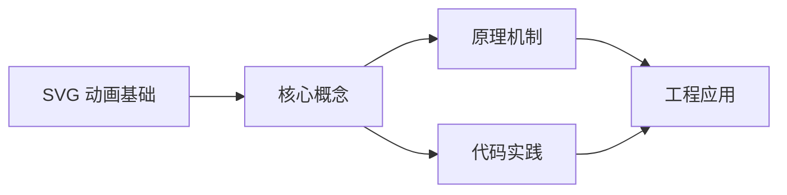

## 1. 学习目标（Bloom 分类）

本节按照布鲁姆教育目标分类学组织学习路径。本文主题为《SVG 动画基础》，属于 SVG 模块，读者可以根据自身阶段选择阅读深度。

记忆层面：能够准确复述本文的核心概念、术语与基本语法或操作步骤，并能够在提问或检索时快速定位对应知识点。能够说出 SVG 的核心概念、术语与标准写法。

理解层面：能够用自己的语言解释核心原理与工作机制，说明概念之间的因果关系，而不是机械记忆结论。能够解释 SVG 的工作原理与设计动机。

应用层面：能够在真实项目或练习场景中运用本文知识解决具体问题，写出正确且可维护的实现。能够编写符合 SVG 规范的完整实现。

分析层面：能够拆解复杂问题，比较本文主题与相邻概念的异同，识别边界条件与例外情况。能够分析 SVG 与相邻方案的差异与边界。

评价层面：能够根据约束条件（性能、可读性、安全、成本）评价不同方案的优劣，做出有依据的技术决策。能够根据场景评价 SVG 相关方案的优劣。

创造层面：能够把本文知识与其他模块知识组合，设计出新的解决方案或可复用的工程模式。能够组合 SVG 与其他技术设计完整方案。

通过本节学习，读者应当能够把《SVG 动画基础》纳入自己的知识网络，并与 SVG 模块的其他主题（矢量图形、路径、变换、动画）建立关联。

## 2. 历史动机与发展脉络

《SVG 动画基础》是 SVG 领域的重要主题。要真正理解它，需要先了解它解决的问题与演进过程。

SVG（可缩放矢量图形）于 2001 年由 W3C 标准化，是 Web 原生矢量格式；与位图不同，SVG 由几何描述构成，任意缩放不失真。
SVG 是 XML 方言：元素即图形（rect/circle/path），样式可用 CSS，交互可用事件；SPA 生态中常以内联 SVG 与图标组件使用。
现代应用：图标系统、数据可视化（D3）、地图、LOGO、动画与交互图形；浏览器对 SVG 的支持已非常完整。

回到本文主题：SVG 动画基础 的提出与成熟，正是上述技术背景下的必然产物。早期实现往往以简单可用为目标，随着工程规模扩大，社区逐渐沉淀出标准做法与最佳实践；理解这一脉络，可以帮助读者判断“为什么文档中的推荐写法是现在这个样子”，也能在遇到历史遗留代码时准确识别其设计年代与取舍。


## 3. 形式化定义与核心概念精讲

本节把《SVG 动画基础》涉及的核心概念以“定义 + 讲解”的形式展开。读者应把定义当作工具，把讲解当作理解路径；两者结合才能形成可迁移的知识。

坐标系：viewBox 定义逻辑坐标（min-x min-y width height），preserveAspectRatio 控制缩放对齐。
基本图形：rect（矩形）、circle（圆）、ellipse（椭圆）、line（直线）、polyline/polygon（折线/多边形）。
路径 path：M/L/C/Q/A 命令组合任意曲线；fill 填充、stroke 描边。

### 3.1 原文章节逐一精讲

原文档把主题拆分为 24 个小节，下面按顺序给出每一节的导读讲解，随后保留原文细节供精读。

#### 原文精读（完整保留）

# SVG 动画 语法速查手册

> **符号约定**:`< >` 必填参数 | `[ ]` 可选参数

---

#### 1. SVG 动画方案对比

| 方案           | 说明                                          | 优势                    | 劣势                           |
| -------------- | --------------------------------------------- | ----------------------- | ------------------------------ |
| **SMIL**       | `<animate>`、`<animateTransform>` 等 SVG 原生 | 无需 JS、声明式、跨文档 | Chrome 曾废弃后恢复；IE 不支持 |
| **CSS**        | `@keyframes` + `transform`                    | 浏览器优化好、生态成熟  | 仅限 CSS 可控属性              |
| **JavaScript** | requestAnimationFrame + DOM 操作              | 灵活、可做复杂逻辑      | 性能消耗大、需手动优化         |

#### 2. SMIL animate

`<animate>` 在指定时间内变化某个属性值。

```html
<svg viewBox="0 0 200 100">
  <rect x="10" y="40" width="40" height="20" fill="#4f5bd5">
    <animate attributeName="x" from="10" to="150" dur="2s" repeatCount="indefinite" />
  </rect>
</svg>
```

##### 2.1 关键属性

| 属性            | 说明                                            |
| --------------- | ----------------------------------------------- |
| `attributeName` | 要变化的属性名                                  |
| `from / to`     | 起始/结束值                                     |
| `values`        | 关键帧值列表（分号分隔）                        |
| `dur`           | 持续时间（如 `2s`、`500ms`）                    |
| `repeatCount`   | 重复次数（数字或 `indefinite`）                 |
| `begin`         | 开始时间（如 `1s`、`click`）                    |
| `end`           | 结束条件                                        |
| `fill`          | 动画结束行为：`freeze` 保留终值 / `remove` 还原 |
| `calcMode`      | 插值模式：linear / paced / spline / discrete    |

##### 2.2 values 关键帧

```html
<circle cx="50" cy="50" r="20" fill="#4f5bd5">
  <animate
    attributeName="cx"
    values="50;150;100;50"
    keyTimes="0;0.5;0.8;1"
    dur="4s"
    repeatCount="indefinite"
  />
</circle>
```

- `values`：关键帧值
- `keyTimes`：对应时间点（0-1，必须从 0 开始到 1 结束）

##### 2.3 calcMode 插值模式

| 值               | 说明                            |
| ---------------- | ------------------------------- |
| `linear`（默认） | 线性插值                        |
| `paced`          | 按距离等分（适合路径）          |
| `spline`         | 贝塞尔曲线（配合 `keySplines`） |
| `discrete`       | 离散切换（无过渡）              |

```html
<animate
  attributeName="cx"
  values="50;150;50"
  keyTimes="0;0.5;1"
  keySplines="0.4 0 0.2 1; 0.4 0 0.2 1"
  calcMode="spline"
  dur="2s"
  repeatCount="indefinite"
/>
```

`keySplines` 类似 CSS `cubic-bezier`，控制每段时间的缓动曲线。

#### 3. animateTransform

`<animateTransform>` 专用于 `transform` 属性动画。

```html
<rect x="-25" y="-25" width="50" height="50" fill="#4f5bd5">
  <animateTransform
    attributeName="transform"
    type="rotate"
    from="0 0 0"
    to="360 0 0"
    dur="4s"
    repeatCount="indefinite"
  />
</rect>
```

##### 3.1 type 类型

| 值                | 说明                               |
| ----------------- | ---------------------------------- |
| `translate`       | 平移                               |
| `rotate`          | 旋转（需指定中心 `from="0 cx cy"`) |
| `scale`           | 缩放                               |
| `skewX` / `skewY` | 倾斜                               |

##### 3.2 多变换叠加

```html
<g>
  <animateTransform
    attributeName="transform"
    type="translate"
    values="0 0; 100 0; 0 0"
    dur="4s"
    repeatCount="indefinite"
    additive="sum"
  />
  <animateTransform
    attributeName="transform"
    type="rotate"
    values="0; 360"
    dur="2s"
    repeatCount="indefinite"
    additive="sum"
  />
  <rect x="-20" y="-20" width="40" height="40" fill="#4f5bd5" />
</g>
```

`additive="sum"` 让多个 animateTransform 共同作用。

#### 4. animateMotion 路径动画

`<animateMotion>` 让元素沿指定路径运动。

```html
<svg viewBox="0 0 300 200">
  <path id="motion-path" d="M 20 100 Q 150 20 280 100" fill="none" stroke="#ccc" />
  <circle r="10" fill="#4f5bd5">
    <animateMotion dur="3s" repeatCount="indefinite">
      <mpath href="#motion-path" />
    </animateMotion>
  </circle>
</svg>
```

##### 4.1 path 属性内联

```html
<circle r="8" fill="#d63031">
  <animateMotion path="M 0 0 L 100 0 L 100 100 L 0 100 Z" dur="4s" repeatCount="indefinite" />
</circle>
```

##### 4.2 rotate 自动朝向

```html
<g>
  <polygon points="0,-10 15,0 0,10" fill="#4f5bd5" />
  <animateMotion dur="4s" repeatCount="indefinite" rotate="auto">
    <mpath href="#motion-path" />
  </animateMotion>
</g>
```

| `rotate` 值    | 说明                 |
| -------------- | -------------------- |
| `auto`         | 元素方向跟随路径切线 |
| `auto-reverse` | 反向朝向             |
| `0`（默认）    | 不旋转               |

##### 4.3 keyPoints 速度控制

```html
<animateMotion
  dur="4s"
  repeatCount="indefinite"
  keyPoints="0;0.5;1"
  keyTimes="0;0.5;1"
  calcMode="linear"
>
  <mpath href="#motion-path" />
</animateMotion>
```

`keyPoints` 控制路径位置进度（0-1），可做"快进慢出"等效果。

#### 5. set 元素

`<set>` 是 `<animate>` 的简化版，用于瞬间设置属性值。

```html
<rect width="100" height="100" fill="#4f5bd5">
  <set attributeName="fill" to="#d63031" begin="2s" />
</rect>
<!-- 2 秒后突然变红 -->
```

#### 6. begin 事件触发

`begin` 不仅支持时间，还支持事件触发。

```html
<svg viewBox="0 0 200 100">
  <rect id="btn" x="50" y="30" width="100" height="40" rx="8" fill="#4f5bd5" />
  <text x="100" y="55" text-anchor="middle" fill="#fff">点击</text>

  <circle cx="100" cy="50" r="0" fill="#d63031">
    <animate attributeName="r" from="0" to="80" begin="btn.click" dur="0.5s" fill="remove" />
  </circle>
</svg>
```

`begin="btn.click"` 表示 btn 被点击时触发动画。

##### 6.1 支持的事件

| 事件                   | 触发时机            |
| ---------------------- | ------------------- |
| `click`                | 点击                |
| `mouseover`            | 鼠标悬停            |
| `mouseout`             | 鼠标移出            |
| `focusin` / `focusout` | 获取/失去焦点       |
| `begin` / `end`        | 其他动画的开始/结束 |
| `repeat`               | 动画重复            |

##### 6.2 动画链式触发

```html
<rect>
  <animate id="a1" attributeName="x" from="0" to="100" dur="1s" begin="0s" fill="freeze" />
  <animate attributeName="y" from="0" to="100" dur="1s" begin="a1.end" fill="freeze" />
</rect>
```

第二个动画在第一个动画结束时启动。

#### 7. CSS 动画

CSS 动画同样适用于 SVG，但需注意属性差异。

```html
<style>
  .spinner {
    transform-origin: center;
    transform-box: fill-box;
    animation: spin 2s linear infinite;
  }
  @keyframes spin {
    to {
      transform: rotate(360deg);
    }
  }

  .pulse {
    animation: pulse 2s ease-in-out infinite;
  }
  @keyframes pulse {
    0%,
    100% {
      transform: scale(1);
    }
    50% {
      transform: scale(1.2);
    }
  }
</style>

<svg viewBox="0 0 100 100">
  <circle class="spinner" cx="50" cy="50" r="20" fill="#4f5bd5" />
  <circle class="pulse" cx="50" cy="50" r="10" fill="#d63031" />
</svg>
```

##### 7.1 transform-box 必要性

SVG 元素默认 `transform-origin` 以 viewBox 原点为参考。设置 `transform-box: fill-box` 让 transform-origin 以元素边界框为参考。

```css
.spinner {
  transform-origin: center;
  transform-box: fill-box;
}
```

##### 7.2 CSS 动画可控制的属性

| 类别                 | 示例                               |
| -------------------- | ---------------------------------- |
| 几何属性（部分支持） | `cx`、`cy`、`r`、`width`、`height` |
| 颜色属性             | `fill`、`stroke`、`stop-color`     |
| 透明度               | `opacity`、`fill-opacity`          |
| 变换                 | `transform`                        |
| 滤镜                 | `filter`                           |

> 现代浏览器支持 CSS 动画 SVG 几何属性，但兼容性需验证。

#### 8. JavaScript 动画

```javascript
const circle = document.querySelector('circle');
let start = null;

function animate(timestamp) {
  if (!start) start = timestamp;
  const progress = ((timestamp - start) / 2000) % 1;
  circle.setAttribute('cx', 50 + progress * 100);
  requestAnimationFrame(animate);
}

requestAnimationFrame(animate);
```

##### 8.1 Web Animations API

```javascript
const rect = document.querySelector('rect');
rect.animate([{ transform: 'translateX(0)' }, { transform: 'translateX(200px)' }], {
  duration: 2000,
  iterations: Infinity,
  easing: 'ease-in-out',
});
```

WAAPI 性能接近 CSS 动画，且更灵活。

#### 9. 性能优化

##### 9.1 优先级

1. **CSS transform/opacity**（GPU 加速）
2. **SMIL**（声明式，浏览器优化）
3. **JavaScript + requestAnimationFrame**（最灵活但开销大）

##### 9.2 will-change 提示

```css
.animated-element {
  will-change: transform;
}
```

提示浏览器将元素提升为独立图层，避免重绘整个 SVG。

##### 9.3 避免布局抖动

```javascript
// 错误：每次读取 offsetWidth 触发布局
function animate() {
  const x = element.offsetWidth;
  element.style.transform = `translateX(${x + 1}px)`;
  requestAnimationFrame(animate);
}

// 正确：用变量缓存
let x = 0;
function animate() {
  x += 1;
  element.style.transform = `translateX(${x}px)`;
  requestAnimationFrame(animate);
}
```

#### 10. 实战：加载动画

```html
<svg viewBox="0 0 100 100" width="100" height="100">
  <g class="spinner">
    <circle cx="50" cy="50" r="40" fill="none" stroke="#e0e0e0" stroke-width="6" />
    <circle
      cx="50"
      cy="50"
      r="40"
      fill="none"
      stroke="#4f5bd5"
      stroke-width="6"
      stroke-linecap="round"
      stroke-dasharray="60 200"
    />
  </g>
  <style>
    .spinner {
      transform-origin: center;
      transform-box: fill-box;
      animation: spin 1.2s linear infinite;
    }
    @keyframes spin {
      to {
        transform: rotate(360deg);
      }
    }
  </style>
</svg>
```

**原理**：dasharray "60 200" 让圆只显示 60 长度的弧，整体旋转形成加载圈。

#### 11. 实战：路径绘制动画

```html
<svg viewBox="0 0 200 100">
  <path
    d="M 10 50 Q 100 10 190 50"
    fill="none"
    stroke="#4f5bd5"
    stroke-width="3"
    stroke-dasharray="220"
    stroke-dashoffset="220"
  >
    <animate attributeName="stroke-dashoffset" from="220" to="0" dur="2s" fill="freeze" />
  </path>
</svg>
```

**步骤**：

1. `getTotalLength()` 获取路径长度（约 220）
2. `stroke-dasharray` 设为路径总长
3. `stroke-dashoffset` 从总长到 0，模拟"画线"

#### 12. 浏览器兼容

| 特性                 | Chrome | Firefox | Safari | Edge |
| -------------------- | ------ | ------- | ------ | ---- |
| SMIL                 | √      | √       | √      | √    |
| CSS transform on SVG | √      | √       | √      | √    |
| CSS 动画几何属性     | √ 90+  | √       | √      | √    |
| WAAPI on SVG         | √      | √       | √      | √    |

> SMIL 曾被 Chrome 计划废弃，但因社区反馈已恢复并稳定支持。

下一篇介绍 CSS 样式化 SVG 的完整方案。
#### SVG 动画方案对比

| 方案           | 说明                                          | 优势                    | 劣势                           |
| -------------- | --------------------------------------------- | ----------------------- | ------------------------------ |
| **SMIL**       | `<animate>`、`<animateTransform>` 等 SVG 原生 | 无需 JS、声明式、跨文档 | Chrome 曾废弃后恢复;IE 不支持 |
| **CSS**        | `@keyframes` + `transform`                    | 浏览器优化好、生态成熟  | 仅限 CSS 可控属性              |
| **JavaScript** | requestAnimationFrame + DOM 操作              | 灵活、可做复杂逻辑      | 性能消耗大、需手动优化         |

---

#### animate 属性动画

**animate SMIL 属性动画**
`<animate attributeName="<属性名>" [from="<起始值>"] [to="<结束值>"] [values="<关键帧值列表>"] dur="<时长>" [begin="<开始>"] [end="<结束>"] [repeatCount="<重复>"] [fill="<freeze|remove>"] [calcMode="<插值模式>"] [keyTimes="<时间点>"] [keySplines="<贝塞尔>"] />`
```html
<svg viewBox="0 0 200 100">
  <rect x="10" y="40" width="40" height="20" fill="#4f5bd5">
    <animate attributeName="x" from="10" to="150" dur="2s" repeatCount="indefinite" />
  </rect>
</svg>
```

##### animate 关键属性

| 属性            | 说明                                            |
| --------------- | ----------------------------------------------- |
| `attributeName` | 要变化的属性名                                  |
| `from / to`     | 起始/结束值                                     |
| `values`        | 关键帧值列表(分号分隔)                        |
| `dur`           | 持续时间(如 `2s`、`500ms`)                    |
| `repeatCount`   | 重复次数(数字或 `indefinite`)                 |
| `begin`         | 开始时间(如 `1s`、`click`)                    |
| `end`           | 结束条件                                        |
| `fill`          | 动画结束行为:`freeze` 保留终值 / `remove` 还原 |
| `calcMode`      | 插值模式:linear / paced / spline / discrete    |

##### values 关键帧

**values + keyTimes 多关键帧**
```html
<circle cx="50" cy="50" r="20" fill="#4f5bd5">
  <animate
    attributeName="cx"
    values="50;150;100;50"
    keyTimes="0;0.5;0.8;1"
    dur="4s"
    repeatCount="indefinite"
  />
</circle>
```

- `values`:关键帧值
- `keyTimes`:对应时间点(0-1,必须从 0 开始到 1 结束)

##### calcMode 插值模式

| 值               | 说明                            |
| ---------------- | ------------------------------- |
| `linear`(默认) | 线性插值                        |
| `paced`          | 按距离等分(适合路径)          |
| `spline`         | 贝塞尔曲线(配合 `keySplines`) |
| `discrete`       | 离散切换(无过渡)              |

**spline 贝塞尔缓动**
```html
<animate
  attributeName="cx"
  values="50;150;50"
  keyTimes="0;0.5;1"
  keySplines="0.4 0 0.2 1; 0.4 0 0.2 1"
  calcMode="spline"
  dur="2s"
  repeatCount="indefinite"
/>
```

`keySplines` 类似 CSS `cubic-bezier`,控制每段时间的缓动曲线。

---

#### animateTransform 变换动画

**animateTransform transform 属性动画**
`<animateTransform attributeName="transform" type="<变换类型>" [from="<起始值>"] [to="<结束值>"] [values="<关键帧>"] dur="<时长>" [repeatCount="<重复>"] [additive="<sum|replace>"] [accumulate="<sum|none>"] />`
```html
<rect x="-25" y="-25" width="50" height="50" fill="#4f5bd5">
  <animateTransform
    attributeName="transform"
    type="rotate"
    from="0 0 0"
    to="360 0 0"
    dur="4s"
    repeatCount="indefinite"
  />
</rect>
```

##### type 变换类型

| 值                | 说明                               |
| ----------------- | ---------------------------------- |
| `translate`       | 平移                               |
| `rotate`          | 旋转(需指定中心 `from="0 cx cy"`) |
| `scale`           | 缩放                               |
| `skewX` / `skewY` | 倾斜                               |

##### additive 多变换叠加

**additive="sum" 多变换共同作用**
```html
<g>
  <animateTransform
    attributeName="transform"
    type="translate"
    values="0 0; 100 0; 0 0"
    dur="4s"
    repeatCount="indefinite"
    additive="sum"
  />
  <animateTransform
    attributeName="transform"
    type="rotate"
    values="0; 360"
    dur="2s"
    repeatCount="indefinite"
    additive="sum"
  />
  <rect x="-20" y="-20" width="40" height="40" fill="#4f5bd5" />
</g>
```

`additive="sum"` 让多个 animateTransform 叠加,否则后一个会覆盖前一个。

---

#### animateMotion 路径动画

**animateMotion 沿路径运动**
`<animateMotion [path="<路径d>"] [dur="<时长>"] [repeatCount="<重复>"] [rotate="<auto|auto-reverse|0>"] [keyPoints="<路径进度>"] [keyTimes="<时间点>"] [calcMode="<模式>"]><mpath href="<#路径id>" /></animateMotion>`
```html
<svg viewBox="0 0 300 200">
  <path id="motion-path" d="M 20 100 Q 150 20 280 100" fill="none" stroke="#ccc" />
  <circle r="10" fill="#4f5bd5">
    <animateMotion dur="3s" repeatCount="indefinite">
      <mpath href="#motion-path" />
    </animateMotion>
  </circle>
</svg>
```

##### path 属性内联

**path 内联路径**
```html
<circle r="8" fill="#d63031">
  <animateMotion path="M 0 0 L 100 0 L 100 100 L 0 100 Z" dur="4s" repeatCount="indefinite" />
</circle>
```

##### rotate 自动朝向

**rotate 跟随路径切线**
```html
<g>
  <polygon points="0,-10 15,0 0,10" fill="#4f5bd5" />
  <animateMotion dur="4s" repeatCount="indefinite" rotate="auto">
    <mpath href="#motion-path" />
  </animateMotion>
</g>
```

| `rotate` 值    | 说明                 |
| -------------- | -------------------- |
| `auto`         | 元素方向跟随路径切线 |
| `auto-reverse` | 反向朝向             |
| `0`(默认)    | 不旋转               |

##### keyPoints 速度控制

**keyPoints 路径进度控制**
```html
<animateMotion
  dur="4s"
  repeatCount="indefinite"
  keyPoints="0;0.5;1"
  keyTimes="0;0.5;1"
  calcMode="linear"
>
  <mpath href="#motion-path" />
</animateMotion>
```

`keyPoints` 控制路径位置进度(0-1),可做"快进慢出"等效果。

---

#### set 元素

**set 瞬间设置属性值**
`<set attributeName="<属性名>" to="<值>" begin="<时间或事件>" />`
```html
<rect width="100" height="100" fill="#4f5bd5">
  <set attributeName="fill" to="#d63031" begin="2s" />
</rect>
<!-- 2 秒后突然变红 -->
```

`<set>` 是 `<animate>` 的简化版,用于瞬间设置属性值,无过渡。

---

#### begin 事件触发

**begin 事件触发动画**
`begin="<元素id>.<事件>"` 或 `begin="<时间>"`
```html
<svg viewBox="0 0 200 100">
  <rect id="btn" x="50" y="30" width="100" height="40" rx="8" fill="#4f5bd5" />
  <text x="100" y="55" text-anchor="middle" fill="#fff">点击</text>

  <circle cx="100" cy="50" r="0" fill="#d63031">
    <animate attributeName="r" from="0" to="80" begin="btn.click" dur="0.5s" fill="remove" />
  </circle>
</svg>
```

`begin="btn.click"` 表示 btn 被点击时触发动画。

##### 支持的事件

| 事件                   | 触发时机            |
| ---------------------- | ------------------- |
| `click`                | 点击                |
| `mouseover`            | 鼠标悬停            |
| `mouseout`             | 鼠标移出            |
| `focusin` / `focusout` | 获取/失去焦点       |
| `begin` / `end`        | 其他动画的开始/结束 |
| `repeat`               | 动画重复            |

##### 动画链式触发

**begin 引用其他动画结束**
```html
<rect>
  <animate id="a1" attributeName="x" from="0" to="100" dur="1s" begin="0s" fill="freeze" />
  <animate attributeName="y" from="0" to="100" dur="1s" begin="a1.end" fill="freeze" />
</rect>
```

第二个动画在第一个动画结束时启动(`begin="a1.end"`)。

---

#### CSS 动画

**@keyframes + transform SVG 动画**
```html
<style>
  .spinner {
    transform-origin: center;
    transform-box: fill-box;
    animation: spin 2s linear infinite;
  }
  @keyframes spin {
    to {
      transform: rotate(360deg);
    }
  }

  .pulse {
    animation: pulse 2s ease-in-out infinite;
  }
  @keyframes pulse {
    0%,
    100% {
      transform: scale(1);
    }
    50% {
      transform: scale(1.2);
    }
  }
</style>

<svg viewBox="0 0 100 100">
  <circle class="spinner" cx="50" cy="50" r="20" fill="#4f5bd5" />
  <circle class="pulse" cx="50" cy="50" r="10" fill="#d63031" />
</svg>
```

##### transform-box 必要性

**transform-box: fill-box 元素边界框为参考**
```css
.spinner {
  transform-origin: center;
  transform-box: fill-box;
}
```

SVG 元素默认 `transform-origin` 以 viewBox 原点为参考。设置 `transform-box: fill-box` 让 transform-origin 以元素边界框为参考。

##### CSS 动画可控制的属性

| 类别                 | 示例                               |
| -------------------- | ---------------------------------- |
| 几何属性(部分支持) | `cx`、`cy`、`r`、`width`、`height` |
| 颜色属性             | `fill`、`stroke`、`stop-color`     |
| 透明度               | `opacity`、`fill-opacity`          |
| 变换                 | `transform`                        |
| 滤镜                 | `filter`                           |

---

#### JavaScript 动画

**requestAnimationFrame 手动动画**
```javascript
const circle = document.querySelector('circle');
let start = null;

function animate(timestamp) {
  if (!start) start = timestamp;
  const progress = ((timestamp - start) / 2000) % 1;
  circle.setAttribute('cx', 50 + progress * 100);
  requestAnimationFrame(animate);
}

requestAnimationFrame(animate);
```

##### Web Animations API

**element.animate WAAPI**
```javascript
const rect = document.querySelector('rect');
rect.animate([{ transform: 'translateX(0)' }, { transform: 'translateX(200px)' }], {
  duration: 2000,
  iterations: Infinity,
  easing: 'ease-in-out',
});
```

WAAPI 性能接近 CSS 动画,且更灵活。

---

#### will-change 性能提示

**will-change 提示浏览器提升图层**
```css
.animated-element {
  will-change: transform;
}
```

提示浏览器将元素提升为独立图层,避免重绘整个 SVG。

---

#### 综合示例:加载动画

**stroke-dasharray + CSS spin 加载圈**
```html
<svg viewBox="0 0 100 100" width="100" height="100">
  <g class="spinner">
    <circle cx="50" cy="50" r="40" fill="none" stroke="#e0e0e0" stroke-width="6" />
    <circle
      cx="50"
      cy="50"
      r="40"
      fill="none"
      stroke="#4f5bd5"
      stroke-width="6"
      stroke-linecap="round"
      stroke-dasharray="60 200"
    />
  </g>
  <style>
    .spinner {
      transform-origin: center;
      transform-box: fill-box;
      animation: spin 1.2s linear infinite;
    }
    @keyframes spin {
      to {
        transform: rotate(360deg);
      }
    }
  </style>
</svg>
```

原理:dasharray "60 200" 让圆只显示 60 长度的弧,整体旋转形成加载圈。

---

#### 综合示例:路径绘制动画

**stroke-dashoffset 画线动画**
```html
<svg viewBox="0 0 200 100">
  <path
    d="M 10 50 Q 100 10 190 50"
    fill="none"
    stroke="#4f5bd5"
    stroke-width="3"
    stroke-dasharray="220"
    stroke-dashoffset="220"
  >
    <animate attributeName="stroke-dashoffset" from="220" to="0" dur="2s" fill="freeze" />
  </path>
</svg>
```

实现步骤:
1. `getTotalLength()` 获取路径长度(约 220)
2. `stroke-dasharray` 设为路径总长
3. `stroke-dashoffset` 从总长到 0,模拟"画线"

---

#### 浏览器兼容

| 特性                 | Chrome | Firefox | Safari | Edge |
| -------------------- | ------ | ------- | ------ | ---- |
| SMIL                 | 支持   | 支持    | 支持   | 支持 |
| CSS transform on SVG | 支持   | 支持    | 支持   | 支持 |
| CSS 动画几何属性     | 90+    | 支持    | 支持   | 支持 |
| WAAPI on SVG         | 支持   | 支持    | 支持   | 支持 |


### 3.2 概念关系图

下面用 Mermaid 图表达本文核心概念之间的关系，帮助读者建立整体图景：



图中展示的是本文知识的结构化关系：核心概念是入口，原理机制解释“为什么”，代码实践演示“怎么做”，工程应用回答“何时用”。读者学习时可以把每个小节的内容挂接到对应节点上。

## 4. 理论推导与原理解析

本节深入《SVG 动画基础》背后的原理。理论部分不求面面俱到，而是聚焦“能解释现象、能指导实践”的关键推导。

坐标系：viewBox 定义逻辑坐标（min-x min-y width height），preserveAspectRatio 控制缩放对齐。
基本图形：rect（矩形）、circle（圆）、ellipse（椭圆）、line（直线）、polyline/polygon（折线/多边形）。
路径 path：M/L/C/Q/A 命令组合任意曲线；fill 填充、stroke 描边。
变换与动画：transform 平移缩放旋转；CSS/SMIL 动画控制属性过渡。

需要强调的是，理论推导与工程实践之间存在翻译层：理论给出的是理想化模型与边界条件，工程代码则必须处理真实环境中的例外。读者在学习时应先掌握理论的“标准情形”，再通过陷阱章节了解“非标准情形”。

## 5. 代码示例与逐行讲解

本节把原文中的代码示例系统整理，并为每个示例补充用途说明与讲解。读者不应只浏览代码，而应逐段对照讲解理解设计意图。

### 5.1 示例：2. SMIL animate

该示例来自原文《2. SMIL animate》小节，用于演示SVG 动画基础相关操作。阅读时请先看代码结构，再看其后的讲解。

```html
<svg viewBox="0 0 200 100">
  <rect x="10" y="40" width="40" height="20" fill="#4f5bd5">
    <animate attributeName="x" from="10" to="150" dur="2s" repeatCount="indefinite" />
  </rect>
</svg>
```

讲解：这段代码演示了本节核心知识点。代码中的关键操作可以归纳为三步：准备（定义或初始化）、执行（核心逻辑）、收尾（释放资源或返回结果）。实际项目中，这三步往往被封装为函数或类，以提升复用性与可测试性。

关键点分析：

该示例共 5 行有效代码，结构以数据或配置为主。阅读时应关注：数据字段的含义、配置项的作用，以及它们与运行行为的对应关系。

进阶思考路径：先尝试修改参数观察行为变化，再把示例中的模式迁移到自己的项目中；每次修改都记录预期与实测差异，这是把示例转化为能力的最快方式。

### 5.2 示例：2.2 values 关键帧

该示例来自原文《2.2 values 关键帧》小节，用于演示SVG 动画基础相关操作。阅读时请先看代码结构，再看其后的讲解。

```html
<circle cx="50" cy="50" r="20" fill="#4f5bd5">
  <animate
    attributeName="cx"
    values="50;150;100;50"
    keyTimes="0;0.5;0.8;1"
    dur="4s"
    repeatCount="indefinite"
  />
</circle>
```

讲解：这段代码演示了本节核心知识点。代码中的关键操作可以归纳为三步：准备（定义或初始化）、执行（核心逻辑）、收尾（释放资源或返回结果）。实际项目中，这三步往往被封装为函数或类，以提升复用性与可测试性。

关键点分析：

该示例共 9 行有效代码，结构以数据或配置为主。阅读时应关注：数据字段的含义、配置项的作用，以及它们与运行行为的对应关系。

进阶思考路径：先尝试修改参数观察行为变化，再把示例中的模式迁移到自己的项目中；每次修改都记录预期与实测差异，这是把示例转化为能力的最快方式。

### 5.3 示例：2.3 calcMode 插值模式

该示例来自原文《2.3 calcMode 插值模式》小节，用于演示SVG 动画基础相关操作。阅读时请先看代码结构，再看其后的讲解。

```html
<animate
  attributeName="cx"
  values="50;150;50"
  keyTimes="0;0.5;1"
  keySplines="0.4 0 0.2 1; 0.4 0 0.2 1"
  calcMode="spline"
  dur="2s"
  repeatCount="indefinite"
/>
```

讲解：这段代码演示了本节核心知识点。代码中的关键操作可以归纳为三步：准备（定义或初始化）、执行（核心逻辑）、收尾（释放资源或返回结果）。实际项目中，这三步往往被封装为函数或类，以提升复用性与可测试性。

关键点分析：

该示例共 9 行有效代码，结构以数据或配置为主。阅读时应关注：数据字段的含义、配置项的作用，以及它们与运行行为的对应关系。

进阶思考路径：先尝试修改参数观察行为变化，再把示例中的模式迁移到自己的项目中；每次修改都记录预期与实测差异，这是把示例转化为能力的最快方式。

### 5.4 示例：3. animateTransform

该示例来自原文《3. animateTransform》小节，用于演示SVG 动画基础相关操作。阅读时请先看代码结构，再看其后的讲解。

```html
<rect x="-25" y="-25" width="50" height="50" fill="#4f5bd5">
  <animateTransform
    attributeName="transform"
    type="rotate"
    from="0 0 0"
    to="360 0 0"
    dur="4s"
    repeatCount="indefinite"
  />
</rect>
```

讲解：这段代码演示了本节核心知识点。代码中的关键操作可以归纳为三步：准备（定义或初始化）、执行（核心逻辑）、收尾（释放资源或返回结果）。实际项目中，这三步往往被封装为函数或类，以提升复用性与可测试性。

关键点分析：

该示例共 10 行有效代码，结构以数据或配置为主。阅读时应关注：数据字段的含义、配置项的作用，以及它们与运行行为的对应关系。

进阶思考路径：先尝试修改参数观察行为变化，再把示例中的模式迁移到自己的项目中；每次修改都记录预期与实测差异，这是把示例转化为能力的最快方式。

### 5.5 示例：3.2 多变换叠加

该示例来自原文《3.2 多变换叠加》小节，用于演示SVG 动画基础相关操作。阅读时请先看代码结构，再看其后的讲解。

```html
<g>
  <animateTransform
    attributeName="transform"
    type="translate"
    values="0 0; 100 0; 0 0"
    dur="4s"
    repeatCount="indefinite"
    additive="sum"
  />
  <animateTransform
    attributeName="transform"
    type="rotate"
    values="0; 360"
    dur="2s"
    repeatCount="indefinite"
    additive="sum"
  />
  <rect x="-20" y="-20" width="40" height="40" fill="#4f5bd5" />
</g>
```

讲解：这段代码演示了本节核心知识点。代码中的关键操作可以归纳为三步：准备（定义或初始化）、执行（核心逻辑）、收尾（释放资源或返回结果）。实际项目中，这三步往往被封装为函数或类，以提升复用性与可测试性。

关键点分析：

该示例共 19 行有效代码，结构以数据或配置为主。阅读时应关注：数据字段的含义、配置项的作用，以及它们与运行行为的对应关系。

进阶思考路径：先尝试修改参数观察行为变化，再把示例中的模式迁移到自己的项目中；每次修改都记录预期与实测差异，这是把示例转化为能力的最快方式。

### 5.6 示例：4. animateMotion 路径动画

该示例来自原文《4. animateMotion 路径动画》小节，用于演示SVG 动画基础相关操作。阅读时请先看代码结构，再看其后的讲解。

```html
<svg viewBox="0 0 300 200">
  <path id="motion-path" d="M 20 100 Q 150 20 280 100" fill="none" stroke="#ccc" />
  <circle r="10" fill="#4f5bd5">
    <animateMotion dur="3s" repeatCount="indefinite">
      <mpath href="#motion-path" />
    </animateMotion>
  </circle>
</svg>
```

讲解：这段代码演示了本节核心知识点。代码中的关键操作可以归纳为三步：准备（定义或初始化）、执行（核心逻辑）、收尾（释放资源或返回结果）。实际项目中，这三步往往被封装为函数或类，以提升复用性与可测试性。

关键点分析：

该示例共 8 行有效代码，结构以数据或配置为主。阅读时应关注：数据字段的含义、配置项的作用，以及它们与运行行为的对应关系。

进阶思考路径：先尝试修改参数观察行为变化，再把示例中的模式迁移到自己的项目中；每次修改都记录预期与实测差异，这是把示例转化为能力的最快方式。

### 5.7 示例：4.1 path 属性内联

该示例来自原文《4.1 path 属性内联》小节，用于演示SVG 动画基础相关操作。阅读时请先看代码结构，再看其后的讲解。

```html
<circle r="8" fill="#d63031">
  <animateMotion path="M 0 0 L 100 0 L 100 100 L 0 100 Z" dur="4s" repeatCount="indefinite" />
</circle>
```

讲解：这段代码演示了本节核心知识点。代码中的关键操作可以归纳为三步：准备（定义或初始化）、执行（核心逻辑）、收尾（释放资源或返回结果）。实际项目中，这三步往往被封装为函数或类，以提升复用性与可测试性。

关键点分析：

该示例共 3 行有效代码，结构以数据或配置为主。阅读时应关注：数据字段的含义、配置项的作用，以及它们与运行行为的对应关系。

进阶思考路径：先尝试修改参数观察行为变化，再把示例中的模式迁移到自己的项目中；每次修改都记录预期与实测差异，这是把示例转化为能力的最快方式。

### 5.8 示例：4.2 rotate 自动朝向

该示例来自原文《4.2 rotate 自动朝向》小节，用于演示SVG 动画基础相关操作。阅读时请先看代码结构，再看其后的讲解。

```html
<g>
  <polygon points="0,-10 15,0 0,10" fill="#4f5bd5" />
  <animateMotion dur="4s" repeatCount="indefinite" rotate="auto">
    <mpath href="#motion-path" />
  </animateMotion>
</g>
```

讲解：这段代码演示了本节核心知识点。代码中的关键操作可以归纳为三步：准备（定义或初始化）、执行（核心逻辑）、收尾（释放资源或返回结果）。实际项目中，这三步往往被封装为函数或类，以提升复用性与可测试性。

关键点分析：

该示例共 6 行有效代码，结构以数据或配置为主。阅读时应关注：数据字段的含义、配置项的作用，以及它们与运行行为的对应关系。

进阶思考路径：先尝试修改参数观察行为变化，再把示例中的模式迁移到自己的项目中；每次修改都记录预期与实测差异，这是把示例转化为能力的最快方式。

### 5.9 示例：4.3 keyPoints 速度控制

该示例来自原文《4.3 keyPoints 速度控制》小节，用于演示SVG 动画基础相关操作。阅读时请先看代码结构，再看其后的讲解。

```html
<animateMotion
  dur="4s"
  repeatCount="indefinite"
  keyPoints="0;0.5;1"
  keyTimes="0;0.5;1"
  calcMode="linear"
>
  <mpath href="#motion-path" />
</animateMotion>
```

讲解：这段代码演示了本节核心知识点。代码中的关键操作可以归纳为三步：准备（定义或初始化）、执行（核心逻辑）、收尾（释放资源或返回结果）。实际项目中，这三步往往被封装为函数或类，以提升复用性与可测试性。

关键点分析：

该示例共 9 行有效代码，结构以数据或配置为主。阅读时应关注：数据字段的含义、配置项的作用，以及它们与运行行为的对应关系。

进阶思考路径：先尝试修改参数观察行为变化，再把示例中的模式迁移到自己的项目中；每次修改都记录预期与实测差异，这是把示例转化为能力的最快方式。

### 5.10 示例：5. set 元素

该示例来自原文《5. set 元素》小节，用于演示SVG 动画基础相关操作。阅读时请先看代码结构，再看其后的讲解。

```html
<rect width="100" height="100" fill="#4f5bd5">
  <set attributeName="fill" to="#d63031" begin="2s" />
</rect>
<!-- 2 秒后突然变红 -->
```

讲解：这段代码演示了本节核心知识点。代码中的关键操作可以归纳为三步：准备（定义或初始化）、执行（核心逻辑）、收尾（释放资源或返回结果）。实际项目中，这三步往往被封装为函数或类，以提升复用性与可测试性。

关键点分析：

该示例共 4 行有效代码，结构以数据或配置为主。阅读时应关注：数据字段的含义、配置项的作用，以及它们与运行行为的对应关系。

进阶思考路径：先尝试修改参数观察行为变化，再把示例中的模式迁移到自己的项目中；每次修改都记录预期与实测差异，这是把示例转化为能力的最快方式。

### 5.11 示例：6. begin 事件触发

该示例来自原文《6. begin 事件触发》小节，用于演示SVG 动画基础相关操作。阅读时请先看代码结构，再看其后的讲解。

```html
<svg viewBox="0 0 200 100">
  <rect id="btn" x="50" y="30" width="100" height="40" rx="8" fill="#4f5bd5" />
  <text x="100" y="55" text-anchor="middle" fill="#fff">点击</text>

  <circle cx="100" cy="50" r="0" fill="#d63031">
    <animate attributeName="r" from="0" to="80" begin="btn.click" dur="0.5s" fill="remove" />
  </circle>
</svg>
```

讲解：这段代码演示了本节核心知识点。代码中的关键操作可以归纳为三步：准备（定义或初始化）、执行（核心逻辑）、收尾（释放资源或返回结果）。实际项目中，这三步往往被封装为函数或类，以提升复用性与可测试性。

关键点分析：

该示例共 7 行有效代码，结构以数据或配置为主。阅读时应关注：数据字段的含义、配置项的作用，以及它们与运行行为的对应关系。

进阶思考路径：先尝试修改参数观察行为变化，再把示例中的模式迁移到自己的项目中；每次修改都记录预期与实测差异，这是把示例转化为能力的最快方式。

### 5.12 示例：6.2 动画链式触发

该示例来自原文《6.2 动画链式触发》小节，用于演示SVG 动画基础相关操作。阅读时请先看代码结构，再看其后的讲解。

```html
<rect>
  <animate id="a1" attributeName="x" from="0" to="100" dur="1s" begin="0s" fill="freeze" />
  <animate attributeName="y" from="0" to="100" dur="1s" begin="a1.end" fill="freeze" />
</rect>
```

讲解：这段代码演示了本节核心知识点。代码中的关键操作可以归纳为三步：准备（定义或初始化）、执行（核心逻辑）、收尾（释放资源或返回结果）。实际项目中，这三步往往被封装为函数或类，以提升复用性与可测试性。

关键点分析：

该示例共 4 行有效代码，结构以数据或配置为主。阅读时应关注：数据字段的含义、配置项的作用，以及它们与运行行为的对应关系。

进阶思考路径：先尝试修改参数观察行为变化，再把示例中的模式迁移到自己的项目中；每次修改都记录预期与实测差异，这是把示例转化为能力的最快方式。

### 5.13 示例：7. CSS 动画

该示例来自原文《7. CSS 动画》小节，用于演示SVG 动画基础相关操作。阅读时请先看代码结构，再看其后的讲解。

```html
<style>
  .spinner {
    transform-origin: center;
    transform-box: fill-box;
    animation: spin 2s linear infinite;
  }
  @keyframes spin {
    to {
      transform: rotate(360deg);
    }
  }

  .pulse {
    animation: pulse 2s ease-in-out infinite;
  }
  @keyframes pulse {
    0%,
    100% {
      transform: scale(1);
    }
    50% {
      transform: scale(1.2);
    }
  }
</style>

<svg viewBox="0 0 100 100">
  <circle class="spinner" cx="50" cy="50" r="20" fill="#4f5bd5" />
  <circle class="pulse" cx="50" cy="50" r="10" fill="#d63031" />
</svg>
```

讲解：这段代码演示了本节核心知识点。代码中的关键操作可以归纳为三步：准备（定义或初始化）、执行（核心逻辑）、收尾（释放资源或返回结果）。实际项目中，这三步往往被封装为函数或类，以提升复用性与可测试性。

关键点分析：

该示例共 28 行有效代码，包含 1 类关键结构（class）。其中：

- 入口与初始化部分负责建立上下文，对应实际项目中的启动或装配逻辑；
- 核心逻辑部分体现本文主题的主要操作，是阅读时最需要对照讲解理解的部分；
- 输出或返回部分把结果交给调用方，注意其类型与边界条件。

进阶思考路径：先尝试修改参数观察行为变化，再把示例中的模式迁移到自己的项目中；每次修改都记录预期与实测差异，这是把示例转化为能力的最快方式。

### 5.14 示例：7.1 transform-box 必要性

该示例来自原文《7.1 transform-box 必要性》小节，用于演示SVG 动画基础相关操作。阅读时请先看代码结构，再看其后的讲解。

```css
.spinner {
  transform-origin: center;
  transform-box: fill-box;
}
```

讲解：这段代码演示了本节核心知识点。代码中的关键操作可以归纳为三步：准备（定义或初始化）、执行（核心逻辑）、收尾（释放资源或返回结果）。实际项目中，这三步往往被封装为函数或类，以提升复用性与可测试性。

关键点分析：

该示例共 4 行有效代码，结构以数据或配置为主。阅读时应关注：数据字段的含义、配置项的作用，以及它们与运行行为的对应关系。

进阶思考路径：先尝试修改参数观察行为变化，再把示例中的模式迁移到自己的项目中；每次修改都记录预期与实测差异，这是把示例转化为能力的最快方式。

### 5.15 示例：8. JavaScript 动画

该示例来自原文《8. JavaScript 动画》小节，用于演示SVG 动画基础相关操作。阅读时请先看代码结构，再看其后的讲解。

```javascript
const circle = document.querySelector('circle');
let start = null;

function animate(timestamp) {
  if (!start) start = timestamp;
  const progress = ((timestamp - start) / 2000) % 1;
  circle.setAttribute('cx', 50 + progress * 100);
  requestAnimationFrame(animate);
}

requestAnimationFrame(animate);
```

讲解：这段代码演示了本节核心知识点。代码中的关键操作可以归纳为三步：准备（定义或初始化）、执行（核心逻辑）、收尾（释放资源或返回结果）。实际项目中，这三步往往被封装为函数或类，以提升复用性与可测试性。

关键点分析：

该示例共 9 行有效代码，包含 2 类关键结构（function、if）。其中：

- 入口与初始化部分负责建立上下文，对应实际项目中的启动或装配逻辑；
- 核心逻辑部分体现本文主题的主要操作，是阅读时最需要对照讲解理解的部分；
- 输出或返回部分把结果交给调用方，注意其类型与边界条件。

进阶思考路径：先尝试修改参数观察行为变化，再把示例中的模式迁移到自己的项目中；每次修改都记录预期与实测差异，这是把示例转化为能力的最快方式。

### 5.16 示例：8.1 Web Animations API

该示例来自原文《8.1 Web Animations API》小节，用于演示SVG 动画基础相关操作。阅读时请先看代码结构，再看其后的讲解。

```javascript
const rect = document.querySelector('rect');
rect.animate([{ transform: 'translateX(0)' }, { transform: 'translateX(200px)' }], {
  duration: 2000,
  iterations: Infinity,
  easing: 'ease-in-out',
});
```

讲解：这段代码演示了本节核心知识点。代码中的关键操作可以归纳为三步：准备（定义或初始化）、执行（核心逻辑）、收尾（释放资源或返回结果）。实际项目中，这三步往往被封装为函数或类，以提升复用性与可测试性。

关键点分析：

该示例共 6 行有效代码，结构以数据或配置为主。阅读时应关注：数据字段的含义、配置项的作用，以及它们与运行行为的对应关系。

进阶思考路径：先尝试修改参数观察行为变化，再把示例中的模式迁移到自己的项目中；每次修改都记录预期与实测差异，这是把示例转化为能力的最快方式。

### 5.17 示例：9.2 will-change 提示

该示例来自原文《9.2 will-change 提示》小节，用于演示SVG 动画基础相关操作。阅读时请先看代码结构，再看其后的讲解。

```css
.animated-element {
  will-change: transform;
}
```

讲解：这段代码演示了本节核心知识点。代码中的关键操作可以归纳为三步：准备（定义或初始化）、执行（核心逻辑）、收尾（释放资源或返回结果）。实际项目中，这三步往往被封装为函数或类，以提升复用性与可测试性。

关键点分析：

该示例共 3 行有效代码，结构以数据或配置为主。阅读时应关注：数据字段的含义、配置项的作用，以及它们与运行行为的对应关系。

进阶思考路径：先尝试修改参数观察行为变化，再把示例中的模式迁移到自己的项目中；每次修改都记录预期与实测差异，这是把示例转化为能力的最快方式。

### 5.18 示例：9.3 避免布局抖动

该示例来自原文《9.3 避免布局抖动》小节，用于演示SVG 动画基础相关操作。阅读时请先看代码结构，再看其后的讲解。

```javascript
// 错误：每次读取 offsetWidth 触发布局
function animate() {
  const x = element.offsetWidth;
  element.style.transform = `translateX(${x + 1}px)`;
  requestAnimationFrame(animate);
}

// 正确：用变量缓存
let x = 0;
function animate() {
  x += 1;
  element.style.transform = `translateX(${x}px)`;
  requestAnimationFrame(animate);
}
```

讲解：这段代码演示了本节核心知识点。代码中的关键操作可以归纳为三步：准备（定义或初始化）、执行（核心逻辑）、收尾（释放资源或返回结果）。实际项目中，这三步往往被封装为函数或类，以提升复用性与可测试性。

关键点分析：

该示例共 13 行有效代码，包含 1 类关键结构（function）。其中：

- 入口与初始化部分负责建立上下文，对应实际项目中的启动或装配逻辑；
- 核心逻辑部分体现本文主题的主要操作，是阅读时最需要对照讲解理解的部分；
- 输出或返回部分把结果交给调用方，注意其类型与边界条件。

进阶思考路径：先尝试修改参数观察行为变化，再把示例中的模式迁移到自己的项目中；每次修改都记录预期与实测差异，这是把示例转化为能力的最快方式。

### 5.19 示例：10. 实战：加载动画

该示例来自原文《10. 实战：加载动画》小节，用于演示SVG 动画基础相关操作。阅读时请先看代码结构，再看其后的讲解。

```html
<svg viewBox="0 0 100 100" width="100" height="100">
  <g class="spinner">
    <circle cx="50" cy="50" r="40" fill="none" stroke="#e0e0e0" stroke-width="6" />
    <circle
      cx="50"
      cy="50"
      r="40"
      fill="none"
      stroke="#4f5bd5"
      stroke-width="6"
      stroke-linecap="round"
      stroke-dasharray="60 200"
    />
  </g>
  <style>
    .spinner {
      transform-origin: center;
      transform-box: fill-box;
      animation: spin 1.2s linear infinite;
    }
    @keyframes spin {
      to {
        transform: rotate(360deg);
      }
    }
  </style>
</svg>
```

讲解：这段代码演示了本节核心知识点。代码中的关键操作可以归纳为三步：准备（定义或初始化）、执行（核心逻辑）、收尾（释放资源或返回结果）。实际项目中，这三步往往被封装为函数或类，以提升复用性与可测试性。

关键点分析：

该示例共 27 行有效代码，包含 1 类关键结构（class）。其中：

- 入口与初始化部分负责建立上下文，对应实际项目中的启动或装配逻辑；
- 核心逻辑部分体现本文主题的主要操作，是阅读时最需要对照讲解理解的部分；
- 输出或返回部分把结果交给调用方，注意其类型与边界条件。

进阶思考路径：先尝试修改参数观察行为变化，再把示例中的模式迁移到自己的项目中；每次修改都记录预期与实测差异，这是把示例转化为能力的最快方式。

### 5.20 示例：11. 实战：路径绘制动画

该示例来自原文《11. 实战：路径绘制动画》小节，用于演示SVG 动画基础相关操作。阅读时请先看代码结构，再看其后的讲解。

```html
<svg viewBox="0 0 200 100">
  <path
    d="M 10 50 Q 100 10 190 50"
    fill="none"
    stroke="#4f5bd5"
    stroke-width="3"
    stroke-dasharray="220"
    stroke-dashoffset="220"
  >
    <animate attributeName="stroke-dashoffset" from="220" to="0" dur="2s" fill="freeze" />
  </path>
</svg>
```

讲解：这段代码演示了本节核心知识点。代码中的关键操作可以归纳为三步：准备（定义或初始化）、执行（核心逻辑）、收尾（释放资源或返回结果）。实际项目中，这三步往往被封装为函数或类，以提升复用性与可测试性。

关键点分析：

该示例共 12 行有效代码，结构以数据或配置为主。阅读时应关注：数据字段的含义、配置项的作用，以及它们与运行行为的对应关系。

进阶思考路径：先尝试修改参数观察行为变化，再把示例中的模式迁移到自己的项目中；每次修改都记录预期与实测差异，这是把示例转化为能力的最快方式。

### 5.21 示例：animate 属性动画

该示例来自原文《animate 属性动画》小节，用于演示SVG 动画基础相关操作。阅读时请先看代码结构，再看其后的讲解。

```html
<svg viewBox="0 0 200 100">
  <rect x="10" y="40" width="40" height="20" fill="#4f5bd5">
    <animate attributeName="x" from="10" to="150" dur="2s" repeatCount="indefinite" />
  </rect>
</svg>
```

讲解：这段代码演示了本节核心知识点。代码中的关键操作可以归纳为三步：准备（定义或初始化）、执行（核心逻辑）、收尾（释放资源或返回结果）。实际项目中，这三步往往被封装为函数或类，以提升复用性与可测试性。

关键点分析：

该示例共 5 行有效代码，结构以数据或配置为主。阅读时应关注：数据字段的含义、配置项的作用，以及它们与运行行为的对应关系。

进阶思考路径：先尝试修改参数观察行为变化，再把示例中的模式迁移到自己的项目中；每次修改都记录预期与实测差异，这是把示例转化为能力的最快方式。

### 5.22 示例：values 关键帧

该示例来自原文《values 关键帧》小节，用于演示SVG 动画基础相关操作。阅读时请先看代码结构，再看其后的讲解。

```html
<circle cx="50" cy="50" r="20" fill="#4f5bd5">
  <animate
    attributeName="cx"
    values="50;150;100;50"
    keyTimes="0;0.5;0.8;1"
    dur="4s"
    repeatCount="indefinite"
  />
</circle>
```

讲解：这段代码演示了本节核心知识点。代码中的关键操作可以归纳为三步：准备（定义或初始化）、执行（核心逻辑）、收尾（释放资源或返回结果）。实际项目中，这三步往往被封装为函数或类，以提升复用性与可测试性。

关键点分析：

该示例共 9 行有效代码，结构以数据或配置为主。阅读时应关注：数据字段的含义、配置项的作用，以及它们与运行行为的对应关系。

进阶思考路径：先尝试修改参数观察行为变化，再把示例中的模式迁移到自己的项目中；每次修改都记录预期与实测差异，这是把示例转化为能力的最快方式。

### 5.23 示例：calcMode 插值模式

该示例来自原文《calcMode 插值模式》小节，用于演示SVG 动画基础相关操作。阅读时请先看代码结构，再看其后的讲解。

```html
<animate
  attributeName="cx"
  values="50;150;50"
  keyTimes="0;0.5;1"
  keySplines="0.4 0 0.2 1; 0.4 0 0.2 1"
  calcMode="spline"
  dur="2s"
  repeatCount="indefinite"
/>
```

讲解：这段代码演示了本节核心知识点。代码中的关键操作可以归纳为三步：准备（定义或初始化）、执行（核心逻辑）、收尾（释放资源或返回结果）。实际项目中，这三步往往被封装为函数或类，以提升复用性与可测试性。

关键点分析：

该示例共 9 行有效代码，结构以数据或配置为主。阅读时应关注：数据字段的含义、配置项的作用，以及它们与运行行为的对应关系。

进阶思考路径：先尝试修改参数观察行为变化，再把示例中的模式迁移到自己的项目中；每次修改都记录预期与实测差异，这是把示例转化为能力的最快方式。

### 5.24 示例：animateTransform 变换动画

该示例来自原文《animateTransform 变换动画》小节，用于演示SVG 动画基础相关操作。阅读时请先看代码结构，再看其后的讲解。

```html
<rect x="-25" y="-25" width="50" height="50" fill="#4f5bd5">
  <animateTransform
    attributeName="transform"
    type="rotate"
    from="0 0 0"
    to="360 0 0"
    dur="4s"
    repeatCount="indefinite"
  />
</rect>
```

讲解：这段代码演示了本节核心知识点。代码中的关键操作可以归纳为三步：准备（定义或初始化）、执行（核心逻辑）、收尾（释放资源或返回结果）。实际项目中，这三步往往被封装为函数或类，以提升复用性与可测试性。

关键点分析：

该示例共 10 行有效代码，结构以数据或配置为主。阅读时应关注：数据字段的含义、配置项的作用，以及它们与运行行为的对应关系。

进阶思考路径：先尝试修改参数观察行为变化，再把示例中的模式迁移到自己的项目中；每次修改都记录预期与实测差异，这是把示例转化为能力的最快方式。

### 5.25 示例：additive 多变换叠加

该示例来自原文《additive 多变换叠加》小节，用于演示SVG 动画基础相关操作。阅读时请先看代码结构，再看其后的讲解。

```html
<g>
  <animateTransform
    attributeName="transform"
    type="translate"
    values="0 0; 100 0; 0 0"
    dur="4s"
    repeatCount="indefinite"
    additive="sum"
  />
  <animateTransform
    attributeName="transform"
    type="rotate"
    values="0; 360"
    dur="2s"
    repeatCount="indefinite"
    additive="sum"
  />
  <rect x="-20" y="-20" width="40" height="40" fill="#4f5bd5" />
</g>
```

讲解：这段代码演示了本节核心知识点。代码中的关键操作可以归纳为三步：准备（定义或初始化）、执行（核心逻辑）、收尾（释放资源或返回结果）。实际项目中，这三步往往被封装为函数或类，以提升复用性与可测试性。

关键点分析：

该示例共 19 行有效代码，结构以数据或配置为主。阅读时应关注：数据字段的含义、配置项的作用，以及它们与运行行为的对应关系。

进阶思考路径：先尝试修改参数观察行为变化，再把示例中的模式迁移到自己的项目中；每次修改都记录预期与实测差异，这是把示例转化为能力的最快方式。

### 5.26 示例：animateMotion 路径动画

该示例来自原文《animateMotion 路径动画》小节，用于演示SVG 动画基础相关操作。阅读时请先看代码结构，再看其后的讲解。

```html
<svg viewBox="0 0 300 200">
  <path id="motion-path" d="M 20 100 Q 150 20 280 100" fill="none" stroke="#ccc" />
  <circle r="10" fill="#4f5bd5">
    <animateMotion dur="3s" repeatCount="indefinite">
      <mpath href="#motion-path" />
    </animateMotion>
  </circle>
</svg>
```

讲解：这段代码演示了本节核心知识点。代码中的关键操作可以归纳为三步：准备（定义或初始化）、执行（核心逻辑）、收尾（释放资源或返回结果）。实际项目中，这三步往往被封装为函数或类，以提升复用性与可测试性。

关键点分析：

该示例共 8 行有效代码，结构以数据或配置为主。阅读时应关注：数据字段的含义、配置项的作用，以及它们与运行行为的对应关系。

进阶思考路径：先尝试修改参数观察行为变化，再把示例中的模式迁移到自己的项目中；每次修改都记录预期与实测差异，这是把示例转化为能力的最快方式。

### 5.27 示例：path 属性内联

该示例来自原文《path 属性内联》小节，用于演示SVG 动画基础相关操作。阅读时请先看代码结构，再看其后的讲解。

```html
<circle r="8" fill="#d63031">
  <animateMotion path="M 0 0 L 100 0 L 100 100 L 0 100 Z" dur="4s" repeatCount="indefinite" />
</circle>
```

讲解：这段代码演示了本节核心知识点。代码中的关键操作可以归纳为三步：准备（定义或初始化）、执行（核心逻辑）、收尾（释放资源或返回结果）。实际项目中，这三步往往被封装为函数或类，以提升复用性与可测试性。

关键点分析：

该示例共 3 行有效代码，结构以数据或配置为主。阅读时应关注：数据字段的含义、配置项的作用，以及它们与运行行为的对应关系。

进阶思考路径：先尝试修改参数观察行为变化，再把示例中的模式迁移到自己的项目中；每次修改都记录预期与实测差异，这是把示例转化为能力的最快方式。

### 5.28 示例：rotate 自动朝向

该示例来自原文《rotate 自动朝向》小节，用于演示SVG 动画基础相关操作。阅读时请先看代码结构，再看其后的讲解。

```html
<g>
  <polygon points="0,-10 15,0 0,10" fill="#4f5bd5" />
  <animateMotion dur="4s" repeatCount="indefinite" rotate="auto">
    <mpath href="#motion-path" />
  </animateMotion>
</g>
```

讲解：这段代码演示了本节核心知识点。代码中的关键操作可以归纳为三步：准备（定义或初始化）、执行（核心逻辑）、收尾（释放资源或返回结果）。实际项目中，这三步往往被封装为函数或类，以提升复用性与可测试性。

关键点分析：

该示例共 6 行有效代码，结构以数据或配置为主。阅读时应关注：数据字段的含义、配置项的作用，以及它们与运行行为的对应关系。

进阶思考路径：先尝试修改参数观察行为变化，再把示例中的模式迁移到自己的项目中；每次修改都记录预期与实测差异，这是把示例转化为能力的最快方式。

### 5.29 示例：keyPoints 速度控制

该示例来自原文《keyPoints 速度控制》小节，用于演示SVG 动画基础相关操作。阅读时请先看代码结构，再看其后的讲解。

```html
<animateMotion
  dur="4s"
  repeatCount="indefinite"
  keyPoints="0;0.5;1"
  keyTimes="0;0.5;1"
  calcMode="linear"
>
  <mpath href="#motion-path" />
</animateMotion>
```

讲解：这段代码演示了本节核心知识点。代码中的关键操作可以归纳为三步：准备（定义或初始化）、执行（核心逻辑）、收尾（释放资源或返回结果）。实际项目中，这三步往往被封装为函数或类，以提升复用性与可测试性。

关键点分析：

该示例共 9 行有效代码，结构以数据或配置为主。阅读时应关注：数据字段的含义、配置项的作用，以及它们与运行行为的对应关系。

进阶思考路径：先尝试修改参数观察行为变化，再把示例中的模式迁移到自己的项目中；每次修改都记录预期与实测差异，这是把示例转化为能力的最快方式。

### 5.30 示例：set 元素

该示例来自原文《set 元素》小节，用于演示SVG 动画基础相关操作。阅读时请先看代码结构，再看其后的讲解。

```html
<rect width="100" height="100" fill="#4f5bd5">
  <set attributeName="fill" to="#d63031" begin="2s" />
</rect>
<!-- 2 秒后突然变红 -->
```

讲解：这段代码演示了本节核心知识点。代码中的关键操作可以归纳为三步：准备（定义或初始化）、执行（核心逻辑）、收尾（释放资源或返回结果）。实际项目中，这三步往往被封装为函数或类，以提升复用性与可测试性。

关键点分析：

该示例共 4 行有效代码，结构以数据或配置为主。阅读时应关注：数据字段的含义、配置项的作用，以及它们与运行行为的对应关系。

进阶思考路径：先尝试修改参数观察行为变化，再把示例中的模式迁移到自己的项目中；每次修改都记录预期与实测差异，这是把示例转化为能力的最快方式。

### 5.31 示例：begin 事件触发

该示例来自原文《begin 事件触发》小节，用于演示SVG 动画基础相关操作。阅读时请先看代码结构，再看其后的讲解。

```html
<svg viewBox="0 0 200 100">
  <rect id="btn" x="50" y="30" width="100" height="40" rx="8" fill="#4f5bd5" />
  <text x="100" y="55" text-anchor="middle" fill="#fff">点击</text>

  <circle cx="100" cy="50" r="0" fill="#d63031">
    <animate attributeName="r" from="0" to="80" begin="btn.click" dur="0.5s" fill="remove" />
  </circle>
</svg>
```

讲解：这段代码演示了本节核心知识点。代码中的关键操作可以归纳为三步：准备（定义或初始化）、执行（核心逻辑）、收尾（释放资源或返回结果）。实际项目中，这三步往往被封装为函数或类，以提升复用性与可测试性。

关键点分析：

该示例共 7 行有效代码，结构以数据或配置为主。阅读时应关注：数据字段的含义、配置项的作用，以及它们与运行行为的对应关系。

进阶思考路径：先尝试修改参数观察行为变化，再把示例中的模式迁移到自己的项目中；每次修改都记录预期与实测差异，这是把示例转化为能力的最快方式。

### 5.32 示例：动画链式触发

该示例来自原文《动画链式触发》小节，用于演示SVG 动画基础相关操作。阅读时请先看代码结构，再看其后的讲解。

```html
<rect>
  <animate id="a1" attributeName="x" from="0" to="100" dur="1s" begin="0s" fill="freeze" />
  <animate attributeName="y" from="0" to="100" dur="1s" begin="a1.end" fill="freeze" />
</rect>
```

讲解：这段代码演示了本节核心知识点。代码中的关键操作可以归纳为三步：准备（定义或初始化）、执行（核心逻辑）、收尾（释放资源或返回结果）。实际项目中，这三步往往被封装为函数或类，以提升复用性与可测试性。

关键点分析：

该示例共 4 行有效代码，结构以数据或配置为主。阅读时应关注：数据字段的含义、配置项的作用，以及它们与运行行为的对应关系。

进阶思考路径：先尝试修改参数观察行为变化，再把示例中的模式迁移到自己的项目中；每次修改都记录预期与实测差异，这是把示例转化为能力的最快方式。

### 5.33 示例：CSS 动画

该示例来自原文《CSS 动画》小节，用于演示SVG 动画基础相关操作。阅读时请先看代码结构，再看其后的讲解。

```html
<style>
  .spinner {
    transform-origin: center;
    transform-box: fill-box;
    animation: spin 2s linear infinite;
  }
  @keyframes spin {
    to {
      transform: rotate(360deg);
    }
  }

  .pulse {
    animation: pulse 2s ease-in-out infinite;
  }
  @keyframes pulse {
    0%,
    100% {
      transform: scale(1);
    }
    50% {
      transform: scale(1.2);
    }
  }
</style>

<svg viewBox="0 0 100 100">
  <circle class="spinner" cx="50" cy="50" r="20" fill="#4f5bd5" />
  <circle class="pulse" cx="50" cy="50" r="10" fill="#d63031" />
</svg>
```

讲解：这段代码演示了本节核心知识点。代码中的关键操作可以归纳为三步：准备（定义或初始化）、执行（核心逻辑）、收尾（释放资源或返回结果）。实际项目中，这三步往往被封装为函数或类，以提升复用性与可测试性。

关键点分析：

该示例共 28 行有效代码，包含 1 类关键结构（class）。其中：

- 入口与初始化部分负责建立上下文，对应实际项目中的启动或装配逻辑；
- 核心逻辑部分体现本文主题的主要操作，是阅读时最需要对照讲解理解的部分；
- 输出或返回部分把结果交给调用方，注意其类型与边界条件。

进阶思考路径：先尝试修改参数观察行为变化，再把示例中的模式迁移到自己的项目中；每次修改都记录预期与实测差异，这是把示例转化为能力的最快方式。

### 5.34 示例：transform-box 必要性

该示例来自原文《transform-box 必要性》小节，用于演示SVG 动画基础相关操作。阅读时请先看代码结构，再看其后的讲解。

```css
.spinner {
  transform-origin: center;
  transform-box: fill-box;
}
```

讲解：这段代码演示了本节核心知识点。代码中的关键操作可以归纳为三步：准备（定义或初始化）、执行（核心逻辑）、收尾（释放资源或返回结果）。实际项目中，这三步往往被封装为函数或类，以提升复用性与可测试性。

关键点分析：

该示例共 4 行有效代码，结构以数据或配置为主。阅读时应关注：数据字段的含义、配置项的作用，以及它们与运行行为的对应关系。

进阶思考路径：先尝试修改参数观察行为变化，再把示例中的模式迁移到自己的项目中；每次修改都记录预期与实测差异，这是把示例转化为能力的最快方式。

### 5.35 示例：JavaScript 动画

该示例来自原文《JavaScript 动画》小节，用于演示SVG 动画基础相关操作。阅读时请先看代码结构，再看其后的讲解。

```javascript
const circle = document.querySelector('circle');
let start = null;

function animate(timestamp) {
  if (!start) start = timestamp;
  const progress = ((timestamp - start) / 2000) % 1;
  circle.setAttribute('cx', 50 + progress * 100);
  requestAnimationFrame(animate);
}

requestAnimationFrame(animate);
```

讲解：这段代码演示了本节核心知识点。代码中的关键操作可以归纳为三步：准备（定义或初始化）、执行（核心逻辑）、收尾（释放资源或返回结果）。实际项目中，这三步往往被封装为函数或类，以提升复用性与可测试性。

关键点分析：

该示例共 9 行有效代码，包含 2 类关键结构（function、if）。其中：

- 入口与初始化部分负责建立上下文，对应实际项目中的启动或装配逻辑；
- 核心逻辑部分体现本文主题的主要操作，是阅读时最需要对照讲解理解的部分；
- 输出或返回部分把结果交给调用方，注意其类型与边界条件。

进阶思考路径：先尝试修改参数观察行为变化，再把示例中的模式迁移到自己的项目中；每次修改都记录预期与实测差异，这是把示例转化为能力的最快方式。

### 5.36 示例：Web Animations API

该示例来自原文《Web Animations API》小节，用于演示SVG 动画基础相关操作。阅读时请先看代码结构，再看其后的讲解。

```javascript
const rect = document.querySelector('rect');
rect.animate([{ transform: 'translateX(0)' }, { transform: 'translateX(200px)' }], {
  duration: 2000,
  iterations: Infinity,
  easing: 'ease-in-out',
});
```

讲解：这段代码演示了本节核心知识点。代码中的关键操作可以归纳为三步：准备（定义或初始化）、执行（核心逻辑）、收尾（释放资源或返回结果）。实际项目中，这三步往往被封装为函数或类，以提升复用性与可测试性。

关键点分析：

该示例共 6 行有效代码，结构以数据或配置为主。阅读时应关注：数据字段的含义、配置项的作用，以及它们与运行行为的对应关系。

进阶思考路径：先尝试修改参数观察行为变化，再把示例中的模式迁移到自己的项目中；每次修改都记录预期与实测差异，这是把示例转化为能力的最快方式。

### 5.37 示例：will-change 性能提示

该示例来自原文《will-change 性能提示》小节，用于演示SVG 动画基础相关操作。阅读时请先看代码结构，再看其后的讲解。

```css
.animated-element {
  will-change: transform;
}
```

讲解：这段代码演示了本节核心知识点。代码中的关键操作可以归纳为三步：准备（定义或初始化）、执行（核心逻辑）、收尾（释放资源或返回结果）。实际项目中，这三步往往被封装为函数或类，以提升复用性与可测试性。

关键点分析：

该示例共 3 行有效代码，结构以数据或配置为主。阅读时应关注：数据字段的含义、配置项的作用，以及它们与运行行为的对应关系。

进阶思考路径：先尝试修改参数观察行为变化，再把示例中的模式迁移到自己的项目中；每次修改都记录预期与实测差异，这是把示例转化为能力的最快方式。

### 5.38 示例：综合示例:加载动画

该示例来自原文《综合示例:加载动画》小节，用于演示SVG 动画基础相关操作。阅读时请先看代码结构，再看其后的讲解。

```html
<svg viewBox="0 0 100 100" width="100" height="100">
  <g class="spinner">
    <circle cx="50" cy="50" r="40" fill="none" stroke="#e0e0e0" stroke-width="6" />
    <circle
      cx="50"
      cy="50"
      r="40"
      fill="none"
      stroke="#4f5bd5"
      stroke-width="6"
      stroke-linecap="round"
      stroke-dasharray="60 200"
    />
  </g>
  <style>
    .spinner {
      transform-origin: center;
      transform-box: fill-box;
      animation: spin 1.2s linear infinite;
    }
    @keyframes spin {
      to {
        transform: rotate(360deg);
      }
    }
  </style>
</svg>
```

讲解：这段代码演示了本节核心知识点。代码中的关键操作可以归纳为三步：准备（定义或初始化）、执行（核心逻辑）、收尾（释放资源或返回结果）。实际项目中，这三步往往被封装为函数或类，以提升复用性与可测试性。

关键点分析：

该示例共 27 行有效代码，包含 1 类关键结构（class）。其中：

- 入口与初始化部分负责建立上下文，对应实际项目中的启动或装配逻辑；
- 核心逻辑部分体现本文主题的主要操作，是阅读时最需要对照讲解理解的部分；
- 输出或返回部分把结果交给调用方，注意其类型与边界条件。

进阶思考路径：先尝试修改参数观察行为变化，再把示例中的模式迁移到自己的项目中；每次修改都记录预期与实测差异，这是把示例转化为能力的最快方式。

### 5.39 示例：综合示例:路径绘制动画

该示例来自原文《综合示例:路径绘制动画》小节，用于演示SVG 动画基础相关操作。阅读时请先看代码结构，再看其后的讲解。

```html
<svg viewBox="0 0 200 100">
  <path
    d="M 10 50 Q 100 10 190 50"
    fill="none"
    stroke="#4f5bd5"
    stroke-width="3"
    stroke-dasharray="220"
    stroke-dashoffset="220"
  >
    <animate attributeName="stroke-dashoffset" from="220" to="0" dur="2s" fill="freeze" />
  </path>
</svg>
```

讲解：这段代码演示了本节核心知识点。代码中的关键操作可以归纳为三步：准备（定义或初始化）、执行（核心逻辑）、收尾（释放资源或返回结果）。实际项目中，这三步往往被封装为函数或类，以提升复用性与可测试性。

关键点分析：

该示例共 12 行有效代码，结构以数据或配置为主。阅读时应关注：数据字段的含义、配置项的作用，以及它们与运行行为的对应关系。

进阶思考路径：先尝试修改参数观察行为变化，再把示例中的模式迁移到自己的项目中；每次修改都记录预期与实测差异，这是把示例转化为能力的最快方式。


综合以上示例，可以总结出本主题的代码实践要点：第一，先定义清晰的输入输出契约；第二，核心逻辑保持单一职责；第三，错误处理与边界条件不可省略；第四，命名与注释表达意图而非复述代码。

## 6. 对比分析

对比是理解《SVG 动画基础》定位的最快路径。下面从多个维度与相邻方案进行对比。

SVG 与 canvas：SVG 矢量、可交互、DOM 友好；canvas 位图、高性能、适合游戏。
SVG 与 PNG：SVG 无损缩放、体积小；PNG 兼容极旧环境但位图放大模糊。
SMIL 与 CSS 动画：CSS 更现代，SMIL 支持部分高级特性；现代项目优先 CSS/Web Animations。

对比的目的不是分出绝对优劣，而是建立选择依据：不同约束条件下，最优解不同。读者应把每个对比维度转化为决策检查清单。

## 7. 常见陷阱与最佳实践

本节整理该主题的高频错误与推荐做法。每个陷阱先描述现象，再解释原因，最后给出最佳实践。

### 7.1 viewBox 缺失

缩放行为异常。始终定义 viewBox 与宽高。

深入讲解：该问题之所以被归类为“常见陷阱”，是因为它在初学者的代码中反复出现，而且往往不在第一时间暴露——错误通常隐藏在特定数据或特定时序下。

从成因上看，viewBox 缺失 一般源于对 SVG 某个机制的理解偏差：要么误用了默认行为，要么忽略了边界条件，要么把其他语言的思维惯性带了过来。

从影响上看，viewBox 缺失 轻则产生错误结果，重则导致资源泄漏、数据损坏或安全事故；这也是为什么工程评审中会把它列为检查项。

从修复策略上看，处理viewBox 缺失的正确顺序是：先复现（构造最小用例），再定位（确认机制层面的根因），最后修复并补充回归测试。跳过复现直接改代码，往往治标不治本。

### 7.2 无命名空间

内联 SVG 需 xmlns；HTML5 中内联可省略但外部文件必须。

深入讲解：该问题之所以被归类为“常见陷阱”，是因为它在初学者的代码中反复出现，而且往往不在第一时间暴露——错误通常隐藏在特定数据或特定时序下。

从成因上看，无命名空间 一般源于对 SVG 某个机制的理解偏差：要么误用了默认行为，要么忽略了边界条件，要么把其他语言的思维惯性带了过来。

从影响上看，无命名空间 轻则产生错误结果，重则导致资源泄漏、数据损坏或安全事故；这也是为什么工程评审中会把它列为检查项。

从修复策略上看，处理无命名空间的正确顺序是：先复现（构造最小用例），再定位（确认机制层面的根因），最后修复并补充回归测试。跳过复现直接改代码，往往治标不治本。

### 7.3 路径命令错误

坐标格式错误导致图形缺失。检查命令字母与数字。

深入讲解：该问题之所以被归类为“常见陷阱”，是因为它在初学者的代码中反复出现，而且往往不在第一时间暴露——错误通常隐藏在特定数据或特定时序下。

从成因上看，路径命令错误 一般源于对 SVG 某个机制的理解偏差：要么误用了默认行为，要么忽略了边界条件，要么把其他语言的思维惯性带了过来。

从影响上看，路径命令错误 轻则产生错误结果，重则导致资源泄漏、数据损坏或安全事故；这也是为什么工程评审中会把它列为检查项。

从修复策略上看，处理路径命令错误的正确顺序是：先复现（构造最小用例），再定位（确认机制层面的根因），最后修复并补充回归测试。跳过复现直接改代码，往往治标不治本。

### 7.4 fill-rule 混淆

非零环绕与奇偶规则结果不同。按需选择。

深入讲解：该问题之所以被归类为“常见陷阱”，是因为它在初学者的代码中反复出现，而且往往不在第一时间暴露——错误通常隐藏在特定数据或特定时序下。

从成因上看，fill-rule 混淆 一般源于对 SVG 某个机制的理解偏差：要么误用了默认行为，要么忽略了边界条件，要么把其他语言的思维惯性带了过来。

从影响上看，fill-rule 混淆 轻则产生错误结果，重则导致资源泄漏、数据损坏或安全事故；这也是为什么工程评审中会把它列为检查项。

从修复策略上看，处理fill-rule 混淆的正确顺序是：先复现（构造最小用例），再定位（确认机制层面的根因），最后修复并补充回归测试。跳过复现直接改代码，往往治标不治本。

### 7.5 动画性能

逐帧修改 DOM 属性卡顿。使用 transform 与 CSS 动画。

深入讲解：该问题之所以被归类为“常见陷阱”，是因为它在初学者的代码中反复出现，而且往往不在第一时间暴露——错误通常隐藏在特定数据或特定时序下。

从成因上看，动画性能 一般源于对 SVG 某个机制的理解偏差：要么误用了默认行为，要么忽略了边界条件，要么把其他语言的思维惯性带了过来。

从影响上看，动画性能 轻则产生错误结果，重则导致资源泄漏、数据损坏或安全事故；这也是为什么工程评审中会把它列为检查项。

从修复策略上看，处理动画性能的正确顺序是：先复现（构造最小用例），再定位（确认机制层面的根因），最后修复并补充回归测试。跳过复现直接改代码，往往治标不治本。

### 7.6 可访问性缺失

SVG 无 role/title 时屏幕阅读器忽略。添加 role="img" 与 title。

深入讲解：该问题之所以被归类为“常见陷阱”，是因为它在初学者的代码中反复出现，而且往往不在第一时间暴露——错误通常隐藏在特定数据或特定时序下。

从成因上看，可访问性缺失 一般源于对 SVG 某个机制的理解偏差：要么误用了默认行为，要么忽略了边界条件，要么把其他语言的思维惯性带了过来。

从影响上看，可访问性缺失 轻则产生错误结果，重则导致资源泄漏、数据损坏或安全事故；这也是为什么工程评审中会把它列为检查项。

从修复策略上看，处理可访问性缺失的正确顺序是：先复现（构造最小用例），再定位（确认机制层面的根因），最后修复并补充回归测试。跳过复现直接改代码，往往治标不治本。

### 7.7 字体依赖

text 元素依赖系统字体。需要一致性时转路径或使用 web 字体。

深入讲解：该问题之所以被归类为“常见陷阱”，是因为它在初学者的代码中反复出现，而且往往不在第一时间暴露——错误通常隐藏在特定数据或特定时序下。

从成因上看，字体依赖 一般源于对 SVG 某个机制的理解偏差：要么误用了默认行为，要么忽略了边界条件，要么把其他语言的思维惯性带了过来。

从影响上看，字体依赖 轻则产生错误结果，重则导致资源泄漏、数据损坏或安全事故；这也是为什么工程评审中会把它列为检查项。

从修复策略上看，处理字体依赖的正确顺序是：先复现（构造最小用例），再定位（确认机制层面的根因），最后修复并补充回归测试。跳过复现直接改代码，往往治标不治本。

### 7.0 最佳实践总览

1. 图标组件化（React/Vue）统一尺寸与样式。
2. 图形语义化：装饰用 aria-hidden，信息图提供 title/desc。
3. 性能：复用 symbol/use 减少重复；大图使用懒加载。

把这些最佳实践固化为团队规范与代码评审检查项，是避免同类问题反复出现的关键。

## 8. 工程实践

本节把《SVG 动画基础》放入真实工程场景，给出可复用的模式与组织方法。

图标系统：symbol + use 组合 sprite；图标组件接受 size/color props。
数据可视化：D3 生成 SVG 元素；响应式 viewBox 自适应容器。
优化：SVGO 压缩；关键图形内联，非关键用 img 懒加载。

### 8.1 工程实践的原则拆解

以上工程实践可以归纳为四条原则。第一，配置与代码分离：SVG 项目中环境差异应通过配置注入，而不是散落在代码分支中；这保证同一份代码可以在开发、测试、生产环境一致运行。

第二，接口稳定优先：对外接口（函数签名、协议、数据格式）一旦被消费方依赖，变更成本极高；设计时应预留扩展点并保持向后兼容。

第三，可观测性内置：日志、指标与追踪应该在功能开发时同步设计，而不是故障发生后补救；没有观测手段的模块等于黑盒。

第四，变更可回滚：任何发布都应有对应的回滚方案；数据库迁移、配置变更与代码发布一样需要版本管理与逆向路径。

### 8.2 实践落地的检查清单

- [ ] 图标系统：对照本节描述，检查当前项目是否已经落实；未落实的项列入技术债并排期处理。
- [ ] 数据可视化：对照本节描述，检查当前项目是否已经落实；未落实的项列入技术债并排期处理。
- [ ] 优化：对照本节描述，检查当前项目是否已经落实；未落实的项列入技术债并排期处理。

工程实践的共性原则：配置与代码分离、接口稳定优先、可观测性内置、变更可回滚。这些原则适用于本主题的所有实现。

## 9. 案例研究

本节通过一个完整案例把《SVG 动画基础》的知识串起来。案例按“需求分析、方案设计、实现、验证”四步展开。

需求：实现带 hover 交互的折线统计图。
方案：D3 计算坐标生成 path，CSS 过渡动画，tooltip 跟随。
要点：viewport 响应式；坐标轴刻度清晰；无数据时显示空态。
验证：多分辨率截图、交互测试、axe 可访问性。

### 9.1 案例的扩展讨论

把案例中的方案放大到真实规模，需要额外考虑三个问题：

第一，规模：当数据量或并发量上升一个数量级时，原方案中的数据结构、缓存策略与任务调度是否仍然成立？通常需要引入分层与异步。

第二，团队：多人协作时，模块边界、接口契约与代码所有权必须明确；案例中的实现应拆分为可独立测试的单元，并配合文档说明设计意图。

第三，演进：上线后的需求变化不可避免；方案设计时应预留扩展点（配置化、插件化、事件化），并定期用真实指标验证假设。


案例研究的学习方法：先独立阅读需求，尝试在脑中形成方案，再对照实现与讲解，最后思考“如果约束变化（数据量、并发、团队规模），方案应如何调整”。

## 10. 知识要点总结与深入讲解

本节以讲解形式汇总全文要点，替代传统的习题与自测，读者不需要答题，只需跟随解释建立完整的认知框架。

关于《SVG 动画基础》的核心结论：

SVG 是 Web 的矢量基础设施，理解坐标系与路径就掌握了核心。
内联 SVG 可被 CSS/JS 完全控制，是组件化图标的理想载体。
性能与可访问性并重：复用、压缩、语义化。

原文档各小节的要点回顾：

- 1. SVG 动画方案对比：该小节围绕SVG 动画基础展开具体细节，阅读时应关注其与核心结论的对应关系；每个小节都是核心结论在某一个侧面的展开。
- 2. SMIL animate：该小节围绕SVG 动画基础展开具体细节，阅读时应关注其与核心结论的对应关系；每个小节都是核心结论在某一个侧面的展开。
- 3. animateTransform：该小节围绕SVG 动画基础展开具体细节，阅读时应关注其与核心结论的对应关系；每个小节都是核心结论在某一个侧面的展开。
- 4. animateMotion 路径动画：该小节围绕SVG 动画基础展开具体细节，阅读时应关注其与核心结论的对应关系；每个小节都是核心结论在某一个侧面的展开。
- 5. set 元素：该小节围绕SVG 动画基础展开具体细节，阅读时应关注其与核心结论的对应关系；每个小节都是核心结论在某一个侧面的展开。
- 6. begin 事件触发：该小节围绕SVG 动画基础展开具体细节，阅读时应关注其与核心结论的对应关系；每个小节都是核心结论在某一个侧面的展开。
- 7. CSS 动画：该小节围绕SVG 动画基础展开具体细节，阅读时应关注其与核心结论的对应关系；每个小节都是核心结论在某一个侧面的展开。
- 8. JavaScript 动画：该小节围绕SVG 动画基础展开具体细节，阅读时应关注其与核心结论的对应关系；每个小节都是核心结论在某一个侧面的展开。
- 9. 性能优化：该小节围绕SVG 动画基础展开具体细节，阅读时应关注其与核心结论的对应关系；每个小节都是核心结论在某一个侧面的展开。
- 10. 实战：加载动画：该小节围绕SVG 动画基础展开具体细节，阅读时应关注其与核心结论的对应关系；每个小节都是核心结论在某一个侧面的展开。
- 11. 实战：路径绘制动画：该小节围绕SVG 动画基础展开具体细节，阅读时应关注其与核心结论的对应关系；每个小节都是核心结论在某一个侧面的展开。
- 12. 浏览器兼容：该小节围绕SVG 动画基础展开具体细节，阅读时应关注其与核心结论的对应关系；每个小节都是核心结论在某一个侧面的展开。
- SVG 动画方案对比：该小节围绕SVG 动画基础展开具体细节，阅读时应关注其与核心结论的对应关系；每个小节都是核心结论在某一个侧面的展开。
- animate 属性动画：该小节围绕SVG 动画基础展开具体细节，阅读时应关注其与核心结论的对应关系；每个小节都是核心结论在某一个侧面的展开。
- animateTransform 变换动画：该小节围绕SVG 动画基础展开具体细节，阅读时应关注其与核心结论的对应关系；每个小节都是核心结论在某一个侧面的展开。
- animateMotion 路径动画：该小节围绕SVG 动画基础展开具体细节，阅读时应关注其与核心结论的对应关系；每个小节都是核心结论在某一个侧面的展开。
- set 元素：该小节围绕SVG 动画基础展开具体细节，阅读时应关注其与核心结论的对应关系；每个小节都是核心结论在某一个侧面的展开。
- begin 事件触发：该小节围绕SVG 动画基础展开具体细节，阅读时应关注其与核心结论的对应关系；每个小节都是核心结论在某一个侧面的展开。
- CSS 动画：该小节围绕SVG 动画基础展开具体细节，阅读时应关注其与核心结论的对应关系；每个小节都是核心结论在某一个侧面的展开。
- JavaScript 动画：该小节围绕SVG 动画基础展开具体细节，阅读时应关注其与核心结论的对应关系；每个小节都是核心结论在某一个侧面的展开。
- will-change 性能提示：该小节围绕SVG 动画基础展开具体细节，阅读时应关注其与核心结论的对应关系；每个小节都是核心结论在某一个侧面的展开。
- 综合示例:加载动画：该小节围绕SVG 动画基础展开具体细节，阅读时应关注其与核心结论的对应关系；每个小节都是核心结论在某一个侧面的展开。
- 综合示例:路径绘制动画：该小节围绕SVG 动画基础展开具体细节，阅读时应关注其与核心结论的对应关系；每个小节都是核心结论在某一个侧面的展开。
- 浏览器兼容：该小节围绕SVG 动画基础展开具体细节，阅读时应关注其与核心结论的对应关系；每个小节都是核心结论在某一个侧面的展开。

把以上要点与第 3-9 节的内容对照复习，即可完成对本文主题的闭环学习。

## 11. 参考文献


MDN SVG 文档：https://developer.mozilla.org/zh-CN/docs/Web/SVG
SVG 规范（W3C）：https://www.w3.org/TR/SVG2/
SVGO 优化工具：https://github.com/svg/svgo
D3.js：https://d3js.org/

## 12. 延伸阅读


SVG 图形语法，见 012-svg 模块文档。
CSS 样式与动画，见 007-css 模块。
React/Vue 图标组件实践，见 011-react/010-vue3 模块。
黑马程序员 Bilibili 空间（https://space.bilibili.com/37974444 ）提供前端图形课程。

## 14. 模块知识图谱与学习路径

本文属于 SVG 模块。为了把《SVG 动画基础》放入完整的知识网络，下面列出本模块的全部主题并给出相互关联的导读。学习时建议按模块内顺序推进，并在每个文档中留意交叉引用。

```mermaid
flowchart LR
    A["SVG 动画基础"]
    N0["SVG 概述与环境配置"]
    N1["SVG 基础语法与文档结构"]
    N0 --> N1
    N2["SVG 坐标系与 viewBox"]
    N1 --> N2
    N3["SVG 基本图形详解"]
    N2 --> N3
    N4["SVG 路径 path 详解"]
    N3 --> N4
    N5["SVG 文本与排版"]
    N4 --> N5
    N6["SVG 颜色与填充"]
    N5 --> N6
    N7["SVG 渐变与图案"]
    N6 --> N7
    N8["SVG 变换 transform"]
    N7 --> N8
    N9["SVG 滤镜详解"]
    N8 --> N9
    N10["SVG 裁剪与蒙版"]
    N9 --> N10
    N11["SVG 符号与复用"]
    N10 --> N11
    N12["SVG 动画基础"]
    N11 --> N12
    N13["SVG CSS 样式化"]
    N12 --> N13
```



上图为模块主题的推荐学习顺序示意图（仅展示前若干主题）。各主题之间存在三类关联：

第一，前置依赖关系：早期主题是后期主题的基础，例如环境与语法先行、进阶主题随后；

第二，横向并列关系：同一层级主题从不同角度覆盖模块能力，学习顺序可以按兴趣调整；

第三，工程组合关系：多个主题在真实项目中组合使用，例如配置、性能与安全主题往往出现在同一系统的不同层面。

### 14.1 模块主题速查表

| 文档 | 主题 | 与本文的关联 |
| --- | --- | --- |
| SVG 概述与环境配置 | 001-SVGOverviewEnvSetup | 本文的前置基础 |
| SVG 基础语法与文档结构 | 002-SVGBasicSyntaxDocStructure | 本文的前置基础 |
| SVG 坐标系与 viewBox | 003-SVGCoordinateSystemViewBox | 本文的并列主题 |
| SVG 基本图形详解 | 004-SVGBasicShapeDetailed | 本文的并列主题 |
| SVG 路径 path 详解 | 005-SVGPathPathDetailed | 本文的并列主题 |
| SVG 文本与排版 | 006-SVGTextTypography | 本文的并列主题 |
| SVG 颜色与填充 | 007-SVGColorFill | 本文的并列主题 |
| SVG 渐变与图案 | 008-SVGGradientPattern | 本文的并列主题 |
| SVG 变换 transform | 009-SVGTransformTransform | 本文的并列主题 |
| SVG 滤镜详解 | 010-SVGFilterDetailed | 本文的并列主题 |
| SVG 裁剪与蒙版 | 011-SVGClipMask | 本文的并列主题 |
| SVG 符号与复用 | 012-SVGSymbolReuse | 本文的并列主题 |
| SVG 动画基础 | 013-SVGAnimationBasics | 本文自身 |
| SVG CSS 样式化 | 014-SVGCSSStyling | 本文的并列主题 |
| SVG JavaScript 交互 | 015-SVGJavaScriptInteraction | 本文的并列主题 |
| SVG 响应式与性能 | 016-SVGResponsivePerformance | 本文的性能延伸 |
| SVG 图标与可访问性 | 017-SVGIconAccessibility | 本文的并列主题 |
| SVG 实战项目 | 018-SVGPracticeProject | 本文的综合应用 |

速查表的作用是让读者快速判断：哪些文档应在阅读本文前掌握（前置基础），哪些文档应在阅读本文后继续（延伸主题）。本模块的交叉引用体系即以此表为基础。

## 15. 术语表

下表整理《SVG 动画基础》及 SVG 模块中出现的高频术语，给出简明释义。术语按字母序或逻辑序排列，供查阅。

| 术语 | 释义 |
| --- | --- |
| 坐标系 | viewBox 定义逻辑坐标（min-x min-y width height），preserveAspectRatio 控制缩放对齐。 |
| 基本图形 | rect（矩形）、circle（圆）、ellipse（椭圆）、line（直线）、polyline/polygon（折线/多边形）。 |
| 路径 path | M/L/C/Q/A 命令组合任意曲线；fill 填充、stroke 描边。 |
| 变换与动画 | transform 平移缩放旋转；CSS/SMIL 动画控制属性过渡。 |
| viewBox 缺失（易错点） | 参见常见陷阱章节的详细讲解 |
| 无命名空间（易错点） | 参见常见陷阱章节的详细讲解 |
| 路径命令错误（易错点） | 参见常见陷阱章节的详细讲解 |
| fill-rule 混淆（易错点） | 参见常见陷阱章节的详细讲解 |
| 动画性能（易错点） | 参见常见陷阱章节的详细讲解 |
| 可访问性缺失（易错点） | 参见常见陷阱章节的详细讲解 |

术语表与正文配合使用：先通读正文，遇到模糊术语回查本表；长期使用后术语会自然进入工作记忆。
