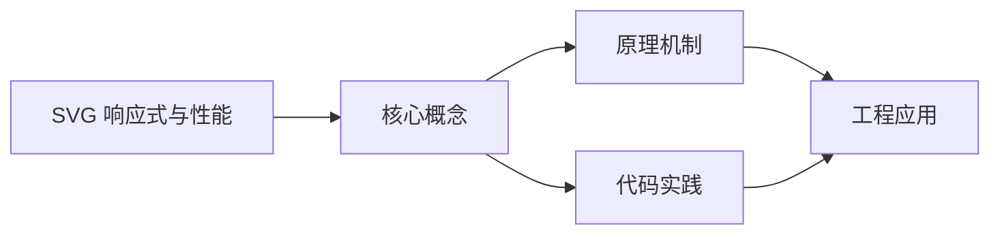

## 1. 学习目标（Bloom 分类）

本节按照布鲁姆教育目标分类学组织学习路径。本文主题为《SVG 响应式与性能》，属于 SVG 模块，读者可以根据自身阶段选择阅读深度。

记忆层面：能够准确复述本文的核心概念、术语与基本语法或操作步骤，并能够在提问或检索时快速定位对应知识点。能够说出 SVG 的核心概念、术语与标准写法。

理解层面：能够用自己的语言解释核心原理与工作机制，说明概念之间的因果关系，而不是机械记忆结论。能够解释 SVG 的工作原理与设计动机。

应用层面：能够在真实项目或练习场景中运用本文知识解决具体问题，写出正确且可维护的实现。能够编写符合 SVG 规范的完整实现。

分析层面：能够拆解复杂问题，比较本文主题与相邻概念的异同，识别边界条件与例外情况。能够分析 SVG 与相邻方案的差异与边界。

评价层面：能够根据约束条件（性能、可读性、安全、成本）评价不同方案的优劣，做出有依据的技术决策。能够根据场景评价 SVG 相关方案的优劣。

创造层面：能够把本文知识与其他模块知识组合，设计出新的解决方案或可复用的工程模式。能够组合 SVG 与其他技术设计完整方案。

通过本节学习，读者应当能够把《SVG 响应式与性能》纳入自己的知识网络，并与 SVG 模块的其他主题（矢量图形、路径、变换、动画）建立关联。

## 2. 历史动机与发展脉络

《SVG 响应式与性能》是 SVG 领域的重要主题。要真正理解它，需要先了解它解决的问题与演进过程。

SVG（可缩放矢量图形）于 2001 年由 W3C 标准化，是 Web 原生矢量格式；与位图不同，SVG 由几何描述构成，任意缩放不失真。
SVG 是 XML 方言：元素即图形（rect/circle/path），样式可用 CSS，交互可用事件；SPA 生态中常以内联 SVG 与图标组件使用。
现代应用：图标系统、数据可视化（D3）、地图、LOGO、动画与交互图形；浏览器对 SVG 的支持已非常完整。

回到本文主题：SVG 响应式与性能 的提出与成熟，正是上述技术背景下的必然产物。早期实现往往以简单可用为目标，随着工程规模扩大，社区逐渐沉淀出标准做法与最佳实践；理解这一脉络，可以帮助读者判断“为什么文档中的推荐写法是现在这个样子”，也能在遇到历史遗留代码时准确识别其设计年代与取舍。


## 3. 形式化定义与核心概念精讲

本节把《SVG 响应式与性能》涉及的核心概念以“定义 + 讲解”的形式展开。读者应把定义当作工具，把讲解当作理解路径；两者结合才能形成可迁移的知识。

坐标系：viewBox 定义逻辑坐标（min-x min-y width height），preserveAspectRatio 控制缩放对齐。
基本图形：rect（矩形）、circle（圆）、ellipse（椭圆）、line（直线）、polyline/polygon（折线/多边形）。
路径 path：M/L/C/Q/A 命令组合任意曲线；fill 填充、stroke 描边。

### 3.1 原文章节逐一精讲

原文档把主题拆分为 24 个小节，下面按顺序给出每一节的导读讲解，随后保留原文细节供精读。

#### 原文精读（完整保留）

# SVG 响应式与性能 语法速查手册

> **符号约定**:`< >` 必填参数 | `[ ]` 可选参数

---

#### 1. 响应式 SVG

##### 1.1 仅声明 viewBox

让 SVG 自适应容器尺寸的标准做法：

```html
<svg viewBox="0 0 400 300" class="responsive">
  <!-- 内容 -->
</svg>
```

```css
.responsive {
  width: 100%;
  height: auto;
  display: block;
}
```

> 不指定 width/height，仅声明 viewBox，让外层 CSS 控制实际尺寸。SVG 会按宽高比自动缩放。

##### 1.2 preserveAspectRatio 适配

```html
<!-- 完整显示，留白 -->
<svg viewBox="0 0 400 300" preserveAspectRatio="xMidYMid meet">
  <!-- 4:3 内容在 16:9 容器中会上下留白 -->
</svg>

<!-- 填满容器，可能裁剪 -->
<svg viewBox="0 0 400 300" preserveAspectRatio="xMidYMid slice">
  <!-- 4:3 内容在 16:9 容器中左右被裁 -->
</svg>
```

##### 1.3 CSS aspect-ratio

```css
.chart {
  width: 100%;
  aspect-ratio: 4 / 3;
}
```

```html
<svg class="chart" viewBox="0 0 400 300">...</svg>
```

确保容器保持宽高比，避免 SVG 高度坍塌。

#### 2. 流式 SVG

不同屏幕显示不同内容：

```html
<svg viewBox="0 0 400 200">
  <style>
    .mobile-only {
      display: none;
    }
    .desktop-only {
      display: block;
    }

    @media (max-width: 600px) {
      .mobile-only {
        display: block;
      }
      .desktop-only {
        display: none;
      }
    }
  </style>
  <g class="mobile-only">
    <!-- 移动端简化版 -->
    <text x="200" y="100" text-anchor="middle" font-size="20">简化视图</text>
  </g>
  <g class="desktop-only">
    <!-- 桌面端完整版 -->
    <text x="200" y="50" text-anchor="middle" font-size="32">完整视图</text>
    <text x="200" y="100" text-anchor="middle" font-size="16">更多细节</text>
  </g>
</svg>
```

#### 3. CSS Container Queries

```css
.chart-container {
  container-type: inline-size;
}

@container (max-width: 400px) {
  .chart .detailed {
    display: none;
  }
}
```

```html
<div class="chart-container">
  <svg class="chart" viewBox="0 0 400 300">
    <g class="detailed">...</g>
  </svg>
</div>
```

根据容器宽度（而非视口）响应式显示。

#### 4. 性能瓶颈分析

##### 4.1 SVG 渲染性能特征

| 因素         | 影响                                 |
| ------------ | ------------------------------------ |
| DOM 节点数量 | 节点多 → 重排重绘开销大              |
| 复杂路径     | 长路径 → 解析与渲染慢                |
| 滤镜         | feGaussianBlur 等 → CPU/GPU 开销大   |
| 蒙版与裁剪   | 软蒙版 → 像素级计算                  |
| 文本渲染     | 大量 `<text>` → 排版开销             |
| 透明度与混合 | opacity、mix-blend-mode → 合成层开销 |

##### 4.2 节点数量阈值

| 节点数      | 性能                  |
| ----------- | --------------------- |
| < 100       | 流畅                  |
| 100 - 1000  | 静态可用，动画需优化  |
| 1000 - 5000 | 明显卡顿              |
| > 5000      | 考虑改用 Canvas/WebGL |

#### 5. 优化策略

##### 5.1 减少节点

```html
<!-- 冗余：多个单独的 line -->
<g stroke="#333">
  <line x1="10" y1="10" x2="100" y2="10" />
  <line x1="10" y1="20" x2="100" y2="20" />
  <line x1="10" y1="30" x2="100" y2="30" />
</g>

<!-- 优化：合并为一个 path -->
<path d="M 10 10 L 100 10 M 10 20 L 100 20 M 10 30 L 100 30" stroke="#333" />
```

##### 5.2 复用 symbol

```html
<defs>
  <symbol id="dot" viewBox="0 0 10 10">
    <circle cx="5" cy="5" r="4" />
  </symbol>
</defs>
<use href="#dot" x="0" y="0" />
<use href="#dot" x="20" y="0" />
<!-- 1000 个 use 比直接画 1000 个 circle 内存占用小 -->
```

##### 5.3 简化路径

```html
<!-- 原始路径 -->
<path d="M 10.123456 10.234567 L 50.345678 10.456789 ..." />

<!-- SVGO 优化后 -->
<path d="M10 10L50 10..." />
```

使用 SVGO 工具自动优化：

```bash
npm install -g svgo
svgo input.svg -o output.svg --precision=2
```

##### 5.4 避免复杂滤镜

```html
<!-- 慢：模糊大区域 -->
<filter id="blur">
  <feGaussianBlur stdDeviation="10" />
</filter>
<rect width="1920" height="1080" filter="url(#blur)" />

<!-- 快：模糊小区域再缩放 -->
<filter id="blur-small" x="0" y="0" width="200" height="200">
  <feGaussianBlur stdDeviation="10" />
</filter>
```

##### 5.5 transform 替代几何属性

```javascript
// 慢：修改 x 触发重排
rect.setAttribute('x', 100);

// 快：修改 transform 使用合成层
rect.style.transform = 'translateX(100px)';
```

##### 5.6 will-change 提示

```css
.animated-element {
  will-change: transform, opacity;
}
```

让浏览器提前为元素创建独立图层。

#### 6. 懒加载

##### 6.1 IntersectionObserver

```javascript
const observer = new IntersectionObserver((entries) => {
  entries.forEach((entry) => {
    if (entry.isIntersecting) {
      const img = entry.target;
      img.src = img.dataset.src;
      observer.unobserve(img);
    }
  });
});

document.querySelectorAll('img[data-src]').forEach((img) => {
  observer.observe(img);
});
```

```html

```

##### 6.2 内联关键 SVG

首屏关键 SVG 内联，避免额外请求：

```html
<!-- 内联首屏 Logo -->
<svg viewBox="0 0 100 40" class="logo">
  <path d="..." fill="currentColor" />
</svg>

<!-- 懒加载非关键 SVG -->

```

#### 7. 压缩与优化

##### 7.1 SVGO 优化

```bash
# 单文件
svgo input.svg -o output.svg

# 批量
svgo -f input-dir -o output-dir

# 配置文件 .svgo.config.js
module.exports = {
  plugins: [
    { name: 'preset-default' },
    { name: 'removeDimensions', active: true },  // 移除 width/height
    { name: 'sortAttrs', active: true }
  ]
};
```

##### 7.2 常用优化项

| 优化             | 说明                   |
| ---------------- | ---------------------- |
| 移除注释         | 减小体积               |
| 移除编辑器元数据 | 如 Inkscape 命名空间   |
| 合并路径         | 多 path 合并为单 path  |
| 简化坐标         | 降低精度到 2 位小数    |
| 移除默认值       | 如 fill="black" 可省略 |
| 转换为相对路径   | 文件更小               |

##### 7.3 Gzip / Brotli 压缩

服务器配置 SVG 压缩（文本格式压缩率高）：

```nginx
# nginx.conf
gzip on;
gzip_types image/svg+xml;
```

通常可压缩 70%-90%。

#### 8. 缓存策略

##### 8.1 外部 SVG 文件缓存

```nginx
location ~* \.svg$ {
  expires 1y;
  add_header Cache-Control "public, immutable";
}
```

##### 8.2 文件名哈希

```html
<!-- 构建工具生成 -->

```

文件内容变化时哈希变化，浏览器自动重新下载。

#### 9. 渲染优化

##### 9.1 避免重排

```javascript
// 慢：逐个修改属性
elements.forEach((el) => {
  el.setAttribute('x', newX);
  el.setAttribute('y', newY);
});

// 快：批量修改
svg.style.display = 'none';
elements.forEach((el) => {
  el.setAttribute('x', newX);
  el.setAttribute('y', newY);
});
svg.style.display = 'block';
```

##### 9.2 使用 DocumentFragment

```javascript
const fragment = document.createDocumentFragment();
for (let i = 0; i < 1000; i++) {
  const dot = createSVG('circle', { cx: i, cy: 50, r: 2 });
  fragment.appendChild(dot);
}
svg.appendChild(fragment); // 一次性插入
```

##### 9.3 CSS containment

```css
.chart {
  contain: layout style paint;
}
```

隔离元素布局、样式、绘制，避免影响外部。

#### 10. 实战：大数据点散点图

```html
<svg viewBox="0 0 800 400" class="scatter">
  <defs>
    <symbol id="point" viewBox="-1 -1 2 2">
      <circle r="1" fill="#4f5bd5" />
    </symbol>
  </defs>
</svg>

<script>
  const svg = document.querySelector('.scatter');
  const data = [];
  for (let i = 0; i < 2000; i++) {
    data.push({
      x: Math.random() * 800,
      y: Math.random() * 400,
    });
  }

  // 批量插入，减少 reflow
  const fragment = document.createDocumentFragment();
  data.forEach((d) => {
    const use = document.createElementNS('http://www.w3.org/2000/svg', 'use');
    use.setAttribute('href', '#point');
    use.setAttribute('x', d.x - 1);
    use.setAttribute('y', d.y - 1);
    use.setAttribute('width', 6);
    use.setAttribute('height', 6);
    fragment.appendChild(use);
  });
  svg.appendChild(fragment);
</script>
```

**优化点**：

- symbol 复用避免重复定义 circle
- DocumentFragment 批量插入
- 限制节点数（> 5000 考虑 Canvas）

#### 11. 监测与分析

##### 11.1 Chrome DevTools

- **Performance** 面板：录制动画，分析帧率与瓶颈
- **Layers** 面板：查看合成层，确认 GPU 加速
- **Rendering** 面板：开启 Paint flashing 高亮重绘区域

##### 11.2 关键指标

| 指标     | 目标    |
| -------- | ------- |
| FPS      | ≥ 55    |
| 首次渲染 | < 100ms |
| 单帧渲染 | < 16ms  |
| 内存占用 | < 50MB  |

#### 12. 何时改用 Canvas

| 场景                     | 推荐          |
| ------------------------ | ------------- |
| 数据点 < 1000            | SVG           |
| 数据点 1000-5000，无动画 | SVG（优化后） |
| 数据点 > 5000            | Canvas        |
| 实时粒子系统             | Canvas/WebGL  |
| 复杂图像处理             | Canvas        |
| 需要交互与可访问性       | SVG           |

下一篇介绍 SVG 图标系统与可访问性。
#### 响应式 SVG 基础

**仅声明 viewBox 自适应**
`<svg viewBox="<min-x> <min-y> <width> <height>" [class]="<类名>">`
```html
<!-- 不指定 width/height,仅声明 viewBox,由外层 CSS 控制实际尺寸 -->
<svg viewBox="0 0 400 300" class="responsive">
  <!-- SVG 内容按宽高比自动缩放 -->
</svg>
```

```css
.responsive {
  width: 100%;
  height: auto;
  display: block;
}
```

---

#### preserveAspectRatio 适配

**完整显示留白**
`<svg viewBox="..." preserveAspectRatio="xMidYMid meet">`
```html
<!-- 4:3 内容在 16:9 容器中上下留白,完整显示 -->
<svg viewBox="0 0 400 300" preserveAspectRatio="xMidYMid meet">
  <!-- 内容 -->
</svg>
```

**填满容器裁剪**
`<svg viewBox="..." preserveAspectRatio="xMidYMid slice">`
```html
<!-- 4:3 内容在 16:9 容器中左右被裁,填满容器 -->
<svg viewBox="0 0 400 300" preserveAspectRatio="xMidYMid slice">
  <!-- 内容 -->
</svg>
```

##### preserveAspectRatio 取值表

| 对齐方式 | 说明 |
| --- | --- |
| `xMinYMin` | 左上对齐 |
| `xMidYMin` | 顶部居中对齐 |
| `xMaxYMin` | 右上对齐 |
| `xMinYMid` | 左侧居中对齐 |
| `xMidYMid` | 居中对齐(默认) |
| `xMaxYMid` | 右侧居中对齐 |
| `xMinYMax` | 左下对齐 |
| `xMidYMax` | 底部居中对齐 |
| `xMaxYMax` | 右下对齐 |
| `meet` | 完整显示,留白 |
| `slice` | 填满容器,裁剪 |
| `none` | 拉伸变形,不保比例 |

---

#### CSS aspect-ratio 控制宽高比

**容器宽高比**
`<selector> { aspect-ratio: <width> / <height>; }`
```css
.chart {
  width: 100%;
  aspect-ratio: 4 / 3;
}
```

```html
<svg class="chart" viewBox="0 0 400 300">...</svg>
```

---

#### 流式 SVG 媒体查询

**视口响应式显示**
`@media (max-width: <breakpoint>) { <selector> { display: <value>; } }`
```html
<svg viewBox="0 0 400 200">
  <style>
    .mobile-only { display: none; }
    .desktop-only { display: block; }

    @media (max-width: 600px) {
      .mobile-only { display: block; }
      .desktop-only { display: none; }
    }
  </style>
  <g class="mobile-only">
    <text x="200" y="100" text-anchor="middle" font-size="20">简化视图</text>
  </g>
  <g class="desktop-only">
    <text x="200" y="50" text-anchor="middle" font-size="32">完整视图</text>
    <text x="200" y="100" text-anchor="middle" font-size="16">更多细节</text>
  </g>
</svg>
```

---

#### CSS Container Queries

**容器查询声明**
`<container-selector> { container-type: inline-size; }`
```css
.chart-container {
  container-type: inline-size;
}

@container (max-width: 400px) {
  .chart .detailed {
    display: none;
  }
}
```

```html
<div class="chart-container">
  <svg class="chart" viewBox="0 0 400 300">
    <g class="detailed">...</g>
  </svg>
</div>
```

---

#### 响应式属性综合

**svg 元素响应式属性**
`<svg viewBox="..." preserveAspectRatio="..." width="..." height="...">`
```html
<svg
  viewBox="0 0 100 100"
  preserveAspectRatio="xMidYMid meet"
  width="100%"
  height="100%"
  class="responsive-svg"
>
  <circle cx="50" cy="50" r="40" fill="#4f5bd5" />
</svg>
```

##### svg 响应式属性表

| 属性 | 说明 | 示例 |
| --- | --- | --- |
| `viewBox` | 视口坐标系 | `0 0 400 300` |
| `preserveAspectRatio` | 宽高比保持策略 | `xMidYMid meet` |
| `width` | 宽度(CSS 可覆盖) | `100%` / `auto` |
| `height` | 高度(CSS 可覆盖) | `100%` / `auto` |
| `class` | CSS 类名 | `responsive` |

---

#### CSS 响应式尺寸变体

**断点尺寸控制**
`@media (max-width: <bp>) { .icon { width: <size>; height: <size>; } }`
```css
.responsive-icon {
  width: 32px;
  height: 32px;
}

@media (max-width: 768px) {
  .responsive-icon {
    width: 24px;
    height: 24px;
  }
}

@media (max-width: 480px) {
  .responsive-icon {
    width: 16px;
    height: 16px;
  }
}
```

```html
<svg class="responsive-icon" viewBox="0 0 24 24">
  <use href="#icon-menu" />
</svg>
```

---

#### 嵌入式响应式图片

**img 标签响应式 SVG**
`.svg" alt="..." width="..." height="..." />`
```html

```

```css
img.responsive-svg {
  width: 100%;
  height: auto;
  max-width: 800px;
}
```

---

#### 响应式 viewBox 多版本

**多 viewBox 适配**
`<svg viewBox="<mobile-box>" class="svg-mobile"> / <svg viewBox="<desktop-box>" class="svg-desktop">`
```html
<!-- 移动端简化版 viewBox -->
<svg viewBox="0 0 200 200" class="svg-mobile">
  <circle cx="100" cy="100" r="50" />
</svg>

<!-- 桌面端扩展版 viewBox -->
<svg viewBox="0 0 800 400" class="svg-desktop">
  <circle cx="100" cy="200" r="50" />
  <circle cx="400" cy="200" r="50" />
  <circle cx="700" cy="200" r="50" />
</svg>
```

```css
.svg-mobile { display: none; }
.svg-desktop { display: block; }

@media (max-width: 768px) {
  .svg-mobile { display: block; }
  .svg-desktop { display: none; }
}
```

---

#### 响应式字体单位

**SVG 内 em 单位**
`<text font-size="<em>em" ...>`
```html
<svg viewBox="0 0 400 200">
  <text x="200" y="100" text-anchor="middle" font-size="2em">
    响应式文本
  </text>
</svg>
```

```css
svg {
  font-size: 16px;
}
@media (max-width: 600px) {
  svg {
    font-size: 12px;
  }
}
```

---

#### 响应式 transform 缩放

**CSS transform 自适应**
`<selector> { transform: scale(<factor>); transform-origin: <origin>; }`
```css
.logo-svg {
  transform-origin: center;
  transform-box: fill-box;
}

@media (max-width: 600px) {
  .logo-svg {
    transform: scale(0.7);
  }
}
```

```html
<svg class="logo-svg" viewBox="0 0 400 120">
  <text x="200" y="75" text-anchor="middle" font-size="48">LOGO</text>
</svg>
```

---

#### 响应式 stroke-width

**non-scaling-stroke 属性**
`<element stroke-width="<value>" vector-effect="non-scaling-stroke" />`
```html
<svg viewBox="0 0 100 100" width="100%" height="100%">
  <!-- 描边宽度不随 SVG 缩放而变化 -->
  <rect
    x="10"
    y="10"
    width="80"
    height="80"
    fill="none"
    stroke="#333"
    stroke-width="2"
    vector-effect="non-scaling-stroke"
  />
</svg>
```

##### vector-effect 取值表

| 值 | 说明 |
| --- | --- |
| `non-scaling-stroke` | 描边宽度保持不变,不随缩放 |
| `non-rotating-stroke` | 描边方向不随变换旋转 |
| `none` | 默认行为,随变换缩放 |


### 3.2 概念关系图

下面用 Mermaid 图表达本文核心概念之间的关系，帮助读者建立整体图景：



图中展示的是本文知识的结构化关系：核心概念是入口，原理机制解释“为什么”，代码实践演示“怎么做”，工程应用回答“何时用”。读者学习时可以把每个小节的内容挂接到对应节点上。

## 4. 理论推导与原理解析

本节深入《SVG 响应式与性能》背后的原理。理论部分不求面面俱到，而是聚焦“能解释现象、能指导实践”的关键推导。

坐标系：viewBox 定义逻辑坐标（min-x min-y width height），preserveAspectRatio 控制缩放对齐。
基本图形：rect（矩形）、circle（圆）、ellipse（椭圆）、line（直线）、polyline/polygon（折线/多边形）。
路径 path：M/L/C/Q/A 命令组合任意曲线；fill 填充、stroke 描边。
变换与动画：transform 平移缩放旋转；CSS/SMIL 动画控制属性过渡。

需要强调的是，理论推导与工程实践之间存在翻译层：理论给出的是理想化模型与边界条件，工程代码则必须处理真实环境中的例外。读者在学习时应先掌握理论的“标准情形”，再通过陷阱章节了解“非标准情形”。

## 5. 代码示例与逐行讲解

本节把原文中的代码示例系统整理，并为每个示例补充用途说明与讲解。读者不应只浏览代码，而应逐段对照讲解理解设计意图。

### 5.1 示例：1.1 仅声明 viewBox

该示例来自原文《1.1 仅声明 viewBox》小节，用于演示SVG 响应式与性能相关操作。阅读时请先看代码结构，再看其后的讲解。

```html
<svg viewBox="0 0 400 300" class="responsive">
  <!-- 内容 -->
</svg>
```

讲解：这段代码演示了本节核心知识点。代码中的关键操作可以归纳为三步：准备（定义或初始化）、执行（核心逻辑）、收尾（释放资源或返回结果）。实际项目中，这三步往往被封装为函数或类，以提升复用性与可测试性。

关键点分析：

该示例共 3 行有效代码，包含 1 类关键结构（class）。其中：

- 入口与初始化部分负责建立上下文，对应实际项目中的启动或装配逻辑；
- 核心逻辑部分体现本文主题的主要操作，是阅读时最需要对照讲解理解的部分；
- 输出或返回部分把结果交给调用方，注意其类型与边界条件。

进阶思考路径：先尝试修改参数观察行为变化，再把示例中的模式迁移到自己的项目中；每次修改都记录预期与实测差异，这是把示例转化为能力的最快方式。

### 5.2 示例：1.1 仅声明 viewBox

该示例来自原文《1.1 仅声明 viewBox》小节，用于演示SVG 响应式与性能相关操作。阅读时请先看代码结构，再看其后的讲解。

```css
.responsive {
  width: 100%;
  height: auto;
  display: block;
}
```

讲解：这段代码演示了本节核心知识点。代码中的关键操作可以归纳为三步：准备（定义或初始化）、执行（核心逻辑）、收尾（释放资源或返回结果）。实际项目中，这三步往往被封装为函数或类，以提升复用性与可测试性。

关键点分析：

该示例共 5 行有效代码，结构以数据或配置为主。阅读时应关注：数据字段的含义、配置项的作用，以及它们与运行行为的对应关系。

进阶思考路径：先尝试修改参数观察行为变化，再把示例中的模式迁移到自己的项目中；每次修改都记录预期与实测差异，这是把示例转化为能力的最快方式。

### 5.3 示例：1.2 preserveAspectRatio 适配

该示例来自原文《1.2 preserveAspectRatio 适配》小节，用于演示SVG 响应式与性能相关操作。阅读时请先看代码结构，再看其后的讲解。

```html
<!-- 完整显示，留白 -->
<svg viewBox="0 0 400 300" preserveAspectRatio="xMidYMid meet">
  <!-- 4:3 内容在 16:9 容器中会上下留白 -->
</svg>

<!-- 填满容器，可能裁剪 -->
<svg viewBox="0 0 400 300" preserveAspectRatio="xMidYMid slice">
  <!-- 4:3 内容在 16:9 容器中左右被裁 -->
</svg>
```

讲解：这段代码演示了本节核心知识点。代码中的关键操作可以归纳为三步：准备（定义或初始化）、执行（核心逻辑）、收尾（释放资源或返回结果）。实际项目中，这三步往往被封装为函数或类，以提升复用性与可测试性。

关键点分析：

该示例共 8 行有效代码，结构以数据或配置为主。阅读时应关注：数据字段的含义、配置项的作用，以及它们与运行行为的对应关系。

进阶思考路径：先尝试修改参数观察行为变化，再把示例中的模式迁移到自己的项目中；每次修改都记录预期与实测差异，这是把示例转化为能力的最快方式。

### 5.4 示例：1.3 CSS aspect-ratio

该示例来自原文《1.3 CSS aspect-ratio》小节，用于演示SVG 响应式与性能相关操作。阅读时请先看代码结构，再看其后的讲解。

```css
.chart {
  width: 100%;
  aspect-ratio: 4 / 3;
}
```

讲解：这段代码演示了本节核心知识点。代码中的关键操作可以归纳为三步：准备（定义或初始化）、执行（核心逻辑）、收尾（释放资源或返回结果）。实际项目中，这三步往往被封装为函数或类，以提升复用性与可测试性。

关键点分析：

该示例共 4 行有效代码，结构以数据或配置为主。阅读时应关注：数据字段的含义、配置项的作用，以及它们与运行行为的对应关系。

进阶思考路径：先尝试修改参数观察行为变化，再把示例中的模式迁移到自己的项目中；每次修改都记录预期与实测差异，这是把示例转化为能力的最快方式。

### 5.5 示例：1.3 CSS aspect-ratio

该示例来自原文《1.3 CSS aspect-ratio》小节，用于演示SVG 响应式与性能相关操作。阅读时请先看代码结构，再看其后的讲解。

```html
<svg class="chart" viewBox="0 0 400 300">...</svg>
```

讲解：这段代码演示了本节核心知识点。代码中的关键操作可以归纳为三步：准备（定义或初始化）、执行（核心逻辑）、收尾（释放资源或返回结果）。实际项目中，这三步往往被封装为函数或类，以提升复用性与可测试性。

关键点分析：

该示例共 1 行有效代码，包含 1 类关键结构（class）。其中：

- 入口与初始化部分负责建立上下文，对应实际项目中的启动或装配逻辑；
- 核心逻辑部分体现本文主题的主要操作，是阅读时最需要对照讲解理解的部分；
- 输出或返回部分把结果交给调用方，注意其类型与边界条件。

进阶思考路径：先尝试修改参数观察行为变化，再把示例中的模式迁移到自己的项目中；每次修改都记录预期与实测差异，这是把示例转化为能力的最快方式。

### 5.6 示例：2. 流式 SVG

该示例来自原文《2. 流式 SVG》小节，用于演示SVG 响应式与性能相关操作。阅读时请先看代码结构，再看其后的讲解。

```html
<svg viewBox="0 0 400 200">
  <style>
    .mobile-only {
      display: none;
    }
    .desktop-only {
      display: block;
    }

    @media (max-width: 600px) {
      .mobile-only {
        display: block;
      }
      .desktop-only {
        display: none;
      }
    }
  </style>
  <g class="mobile-only">
    <!-- 移动端简化版 -->
    <text x="200" y="100" text-anchor="middle" font-size="20">简化视图</text>
  </g>
  <g class="desktop-only">
    <!-- 桌面端完整版 -->
    <text x="200" y="50" text-anchor="middle" font-size="32">完整视图</text>
    <text x="200" y="100" text-anchor="middle" font-size="16">更多细节</text>
  </g>
</svg>
```

讲解：这段代码演示了本节核心知识点。代码中的关键操作可以归纳为三步：准备（定义或初始化）、执行（核心逻辑）、收尾（释放资源或返回结果）。实际项目中，这三步往往被封装为函数或类，以提升复用性与可测试性。

关键点分析：

该示例共 27 行有效代码，包含 1 类关键结构（class）。其中：

- 入口与初始化部分负责建立上下文，对应实际项目中的启动或装配逻辑；
- 核心逻辑部分体现本文主题的主要操作，是阅读时最需要对照讲解理解的部分；
- 输出或返回部分把结果交给调用方，注意其类型与边界条件。

进阶思考路径：先尝试修改参数观察行为变化，再把示例中的模式迁移到自己的项目中；每次修改都记录预期与实测差异，这是把示例转化为能力的最快方式。

### 5.7 示例：3. CSS Container Queries

该示例来自原文《3. CSS Container Queries》小节，用于演示SVG 响应式与性能相关操作。阅读时请先看代码结构，再看其后的讲解。

```css
.chart-container {
  container-type: inline-size;
}

@container (max-width: 400px) {
  .chart .detailed {
    display: none;
  }
}
```

讲解：这段代码演示了本节核心知识点。代码中的关键操作可以归纳为三步：准备（定义或初始化）、执行（核心逻辑）、收尾（释放资源或返回结果）。实际项目中，这三步往往被封装为函数或类，以提升复用性与可测试性。

关键点分析：

该示例共 8 行有效代码，结构以数据或配置为主。阅读时应关注：数据字段的含义、配置项的作用，以及它们与运行行为的对应关系。

进阶思考路径：先尝试修改参数观察行为变化，再把示例中的模式迁移到自己的项目中；每次修改都记录预期与实测差异，这是把示例转化为能力的最快方式。

### 5.8 示例：3. CSS Container Queries

该示例来自原文《3. CSS Container Queries》小节，用于演示SVG 响应式与性能相关操作。阅读时请先看代码结构，再看其后的讲解。

```html
<div class="chart-container">
  <svg class="chart" viewBox="0 0 400 300">
    <g class="detailed">...</g>
  </svg>
</div>
```

讲解：这段代码演示了本节核心知识点。代码中的关键操作可以归纳为三步：准备（定义或初始化）、执行（核心逻辑）、收尾（释放资源或返回结果）。实际项目中，这三步往往被封装为函数或类，以提升复用性与可测试性。

关键点分析：

该示例共 5 行有效代码，包含 1 类关键结构（class）。其中：

- 入口与初始化部分负责建立上下文，对应实际项目中的启动或装配逻辑；
- 核心逻辑部分体现本文主题的主要操作，是阅读时最需要对照讲解理解的部分；
- 输出或返回部分把结果交给调用方，注意其类型与边界条件。

进阶思考路径：先尝试修改参数观察行为变化，再把示例中的模式迁移到自己的项目中；每次修改都记录预期与实测差异，这是把示例转化为能力的最快方式。

### 5.9 示例：5.1 减少节点

该示例来自原文《5.1 减少节点》小节，用于演示SVG 响应式与性能相关操作。阅读时请先看代码结构，再看其后的讲解。

```html
<!-- 冗余：多个单独的 line -->
<g stroke="#333">
  <line x1="10" y1="10" x2="100" y2="10" />
  <line x1="10" y1="20" x2="100" y2="20" />
  <line x1="10" y1="30" x2="100" y2="30" />
</g>

<!-- 优化：合并为一个 path -->
<path d="M 10 10 L 100 10 M 10 20 L 100 20 M 10 30 L 100 30" stroke="#333" />
```

讲解：这段代码演示了本节核心知识点。代码中的关键操作可以归纳为三步：准备（定义或初始化）、执行（核心逻辑）、收尾（释放资源或返回结果）。实际项目中，这三步往往被封装为函数或类，以提升复用性与可测试性。

关键点分析：

该示例共 8 行有效代码，结构以数据或配置为主。阅读时应关注：数据字段的含义、配置项的作用，以及它们与运行行为的对应关系。

进阶思考路径：先尝试修改参数观察行为变化，再把示例中的模式迁移到自己的项目中；每次修改都记录预期与实测差异，这是把示例转化为能力的最快方式。

### 5.10 示例：5.2 复用 symbol

该示例来自原文《5.2 复用 symbol》小节，用于演示SVG 响应式与性能相关操作。阅读时请先看代码结构，再看其后的讲解。

```html
<defs>
  <symbol id="dot" viewBox="0 0 10 10">
    <circle cx="5" cy="5" r="4" />
  </symbol>
</defs>
<use href="#dot" x="0" y="0" />
<use href="#dot" x="20" y="0" />
<!-- 1000 个 use 比直接画 1000 个 circle 内存占用小 -->
```

讲解：这段代码演示了本节核心知识点。代码中的关键操作可以归纳为三步：准备（定义或初始化）、执行（核心逻辑）、收尾（释放资源或返回结果）。实际项目中，这三步往往被封装为函数或类，以提升复用性与可测试性。

关键点分析：

该示例共 8 行有效代码，结构以数据或配置为主。阅读时应关注：数据字段的含义、配置项的作用，以及它们与运行行为的对应关系。

进阶思考路径：先尝试修改参数观察行为变化，再把示例中的模式迁移到自己的项目中；每次修改都记录预期与实测差异，这是把示例转化为能力的最快方式。

### 5.11 示例：5.3 简化路径

该示例来自原文《5.3 简化路径》小节，用于演示SVG 响应式与性能相关操作。阅读时请先看代码结构，再看其后的讲解。

```html
<!-- 原始路径 -->
<path d="M 10.123456 10.234567 L 50.345678 10.456789 ..." />

<!-- SVGO 优化后 -->
<path d="M10 10L50 10..." />
```

讲解：这段代码演示了本节核心知识点。代码中的关键操作可以归纳为三步：准备（定义或初始化）、执行（核心逻辑）、收尾（释放资源或返回结果）。实际项目中，这三步往往被封装为函数或类，以提升复用性与可测试性。

关键点分析：

该示例共 4 行有效代码，结构以数据或配置为主。阅读时应关注：数据字段的含义、配置项的作用，以及它们与运行行为的对应关系。

进阶思考路径：先尝试修改参数观察行为变化，再把示例中的模式迁移到自己的项目中；每次修改都记录预期与实测差异，这是把示例转化为能力的最快方式。

### 5.12 示例：5.3 简化路径

该示例来自原文《5.3 简化路径》小节，用于演示SVG 响应式与性能相关操作。阅读时请先看代码结构，再看其后的讲解。

```bash
npm install -g svgo
svgo input.svg -o output.svg --precision=2
```

讲解：这段代码演示了本节核心知识点。代码中的关键操作可以归纳为三步：准备（定义或初始化）、执行（核心逻辑）、收尾（释放资源或返回结果）。实际项目中，这三步往往被封装为函数或类，以提升复用性与可测试性。

关键点分析：

该示例共 2 行有效代码，结构以数据或配置为主。阅读时应关注：数据字段的含义、配置项的作用，以及它们与运行行为的对应关系。

进阶思考路径：先尝试修改参数观察行为变化，再把示例中的模式迁移到自己的项目中；每次修改都记录预期与实测差异，这是把示例转化为能力的最快方式。

### 5.13 示例：5.4 避免复杂滤镜

该示例来自原文《5.4 避免复杂滤镜》小节，用于演示SVG 响应式与性能相关操作。阅读时请先看代码结构，再看其后的讲解。

```html
<!-- 慢：模糊大区域 -->
<filter id="blur">
  <feGaussianBlur stdDeviation="10" />
</filter>
<rect width="1920" height="1080" filter="url(#blur)" />

<!-- 快：模糊小区域再缩放 -->
<filter id="blur-small" x="0" y="0" width="200" height="200">
  <feGaussianBlur stdDeviation="10" />
</filter>
```

讲解：这段代码演示了本节核心知识点。代码中的关键操作可以归纳为三步：准备（定义或初始化）、执行（核心逻辑）、收尾（释放资源或返回结果）。实际项目中，这三步往往被封装为函数或类，以提升复用性与可测试性。

关键点分析：

该示例共 9 行有效代码，结构以数据或配置为主。阅读时应关注：数据字段的含义、配置项的作用，以及它们与运行行为的对应关系。

进阶思考路径：先尝试修改参数观察行为变化，再把示例中的模式迁移到自己的项目中；每次修改都记录预期与实测差异，这是把示例转化为能力的最快方式。

### 5.14 示例：5.5 transform 替代几何属性

该示例来自原文《5.5 transform 替代几何属性》小节，用于演示SVG 响应式与性能相关操作。阅读时请先看代码结构，再看其后的讲解。

```javascript
// 慢：修改 x 触发重排
rect.setAttribute('x', 100);

// 快：修改 transform 使用合成层
rect.style.transform = 'translateX(100px)';
```

讲解：这段代码演示了本节核心知识点。代码中的关键操作可以归纳为三步：准备（定义或初始化）、执行（核心逻辑）、收尾（释放资源或返回结果）。实际项目中，这三步往往被封装为函数或类，以提升复用性与可测试性。

关键点分析：

该示例共 4 行有效代码，结构以数据或配置为主。阅读时应关注：数据字段的含义、配置项的作用，以及它们与运行行为的对应关系。

进阶思考路径：先尝试修改参数观察行为变化，再把示例中的模式迁移到自己的项目中；每次修改都记录预期与实测差异，这是把示例转化为能力的最快方式。

### 5.15 示例：5.6 will-change 提示

该示例来自原文《5.6 will-change 提示》小节，用于演示SVG 响应式与性能相关操作。阅读时请先看代码结构，再看其后的讲解。

```css
.animated-element {
  will-change: transform, opacity;
}
```

讲解：这段代码演示了本节核心知识点。代码中的关键操作可以归纳为三步：准备（定义或初始化）、执行（核心逻辑）、收尾（释放资源或返回结果）。实际项目中，这三步往往被封装为函数或类，以提升复用性与可测试性。

关键点分析：

该示例共 3 行有效代码，结构以数据或配置为主。阅读时应关注：数据字段的含义、配置项的作用，以及它们与运行行为的对应关系。

进阶思考路径：先尝试修改参数观察行为变化，再把示例中的模式迁移到自己的项目中；每次修改都记录预期与实测差异，这是把示例转化为能力的最快方式。

### 5.16 示例：6.1 IntersectionObserver

该示例来自原文《6.1 IntersectionObserver》小节，用于演示SVG 响应式与性能相关操作。阅读时请先看代码结构，再看其后的讲解。

```javascript
const observer = new IntersectionObserver((entries) => {
  entries.forEach((entry) => {
    if (entry.isIntersecting) {
      const img = entry.target;
      img.src = img.dataset.src;
      observer.unobserve(img);
    }
  });
});

document.querySelectorAll('img[data-src]').forEach((img) => {
  observer.observe(img);
});
```

讲解：这段代码演示了本节核心知识点。代码中的关键操作可以归纳为三步：准备（定义或初始化）、执行（核心逻辑）、收尾（释放资源或返回结果）。实际项目中，这三步往往被封装为函数或类，以提升复用性与可测试性。

关键点分析：

该示例共 12 行有效代码，包含 1 类关键结构（if）。其中：

- 入口与初始化部分负责建立上下文，对应实际项目中的启动或装配逻辑；
- 核心逻辑部分体现本文主题的主要操作，是阅读时最需要对照讲解理解的部分；
- 输出或返回部分把结果交给调用方，注意其类型与边界条件。

进阶思考路径：先尝试修改参数观察行为变化，再把示例中的模式迁移到自己的项目中；每次修改都记录预期与实测差异，这是把示例转化为能力的最快方式。

### 5.17 示例：6.1 IntersectionObserver

该示例来自原文《6.1 IntersectionObserver》小节，用于演示SVG 响应式与性能相关操作。阅读时请先看代码结构，再看其后的讲解。

```html

```

讲解：这段代码演示了本节核心知识点。代码中的关键操作可以归纳为三步：准备（定义或初始化）、执行（核心逻辑）、收尾（释放资源或返回结果）。实际项目中，这三步往往被封装为函数或类，以提升复用性与可测试性。

关键点分析：

该示例共 1 行有效代码，结构以数据或配置为主。阅读时应关注：数据字段的含义、配置项的作用，以及它们与运行行为的对应关系。

进阶思考路径：先尝试修改参数观察行为变化，再把示例中的模式迁移到自己的项目中；每次修改都记录预期与实测差异，这是把示例转化为能力的最快方式。

### 5.18 示例：6.2 内联关键 SVG

该示例来自原文《6.2 内联关键 SVG》小节，用于演示SVG 响应式与性能相关操作。阅读时请先看代码结构，再看其后的讲解。

```html
<!-- 内联首屏 Logo -->
<svg viewBox="0 0 100 40" class="logo">
  <path d="..." fill="currentColor" />
</svg>

<!-- 懒加载非关键 SVG -->

```

讲解：这段代码演示了本节核心知识点。代码中的关键操作可以归纳为三步：准备（定义或初始化）、执行（核心逻辑）、收尾（释放资源或返回结果）。实际项目中，这三步往往被封装为函数或类，以提升复用性与可测试性。

关键点分析：

该示例共 6 行有效代码，包含 1 类关键结构（class）。其中：

- 入口与初始化部分负责建立上下文，对应实际项目中的启动或装配逻辑；
- 核心逻辑部分体现本文主题的主要操作，是阅读时最需要对照讲解理解的部分；
- 输出或返回部分把结果交给调用方，注意其类型与边界条件。

进阶思考路径：先尝试修改参数观察行为变化，再把示例中的模式迁移到自己的项目中；每次修改都记录预期与实测差异，这是把示例转化为能力的最快方式。

### 5.19 示例：7.1 SVGO 优化

该示例来自原文《7.1 SVGO 优化》小节，用于演示SVG 响应式与性能相关操作。阅读时请先看代码结构，再看其后的讲解。

```bash
# 单文件
svgo input.svg -o output.svg

# 批量
svgo -f input-dir -o output-dir

# 配置文件 .svgo.config.js
module.exports = {
  plugins: [
    { name: 'preset-default' },
    { name: 'removeDimensions', active: true },  // 移除 width/height
    { name: 'sortAttrs', active: true }
  ]
};
```

讲解：这段代码演示了本节核心知识点。代码中的关键操作可以归纳为三步：准备（定义或初始化）、执行（核心逻辑）、收尾（释放资源或返回结果）。实际项目中，这三步往往被封装为函数或类，以提升复用性与可测试性。

关键点分析：

该示例共 12 行有效代码，结构以数据或配置为主。阅读时应关注：数据字段的含义、配置项的作用，以及它们与运行行为的对应关系。

进阶思考路径：先尝试修改参数观察行为变化，再把示例中的模式迁移到自己的项目中；每次修改都记录预期与实测差异，这是把示例转化为能力的最快方式。

### 5.20 示例：7.3 Gzip / Brotli 压缩

该示例来自原文《7.3 Gzip / Brotli 压缩》小节，用于演示SVG 响应式与性能相关操作。阅读时请先看代码结构，再看其后的讲解。

```nginx
# nginx.conf
gzip on;
gzip_types image/svg+xml;
```

讲解：这段代码演示了本节核心知识点。代码中的关键操作可以归纳为三步：准备（定义或初始化）、执行（核心逻辑）、收尾（释放资源或返回结果）。实际项目中，这三步往往被封装为函数或类，以提升复用性与可测试性。

关键点分析：

该示例共 3 行有效代码，结构以数据或配置为主。阅读时应关注：数据字段的含义、配置项的作用，以及它们与运行行为的对应关系。

进阶思考路径：先尝试修改参数观察行为变化，再把示例中的模式迁移到自己的项目中；每次修改都记录预期与实测差异，这是把示例转化为能力的最快方式。

### 5.21 示例：8.1 外部 SVG 文件缓存

该示例来自原文《8.1 外部 SVG 文件缓存》小节，用于演示SVG 响应式与性能相关操作。阅读时请先看代码结构，再看其后的讲解。

```nginx
location ~* \.svg$ {
  expires 1y;
  add_header Cache-Control "public, immutable";
}
```

讲解：这段代码演示了本节核心知识点。代码中的关键操作可以归纳为三步：准备（定义或初始化）、执行（核心逻辑）、收尾（释放资源或返回结果）。实际项目中，这三步往往被封装为函数或类，以提升复用性与可测试性。

关键点分析：

该示例共 4 行有效代码，结构以数据或配置为主。阅读时应关注：数据字段的含义、配置项的作用，以及它们与运行行为的对应关系。

进阶思考路径：先尝试修改参数观察行为变化，再把示例中的模式迁移到自己的项目中；每次修改都记录预期与实测差异，这是把示例转化为能力的最快方式。

### 5.22 示例：8.2 文件名哈希

该示例来自原文《8.2 文件名哈希》小节，用于演示SVG 响应式与性能相关操作。阅读时请先看代码结构，再看其后的讲解。

```html
<!-- 构建工具生成 -->

```

讲解：这段代码演示了本节核心知识点。代码中的关键操作可以归纳为三步：准备（定义或初始化）、执行（核心逻辑）、收尾（释放资源或返回结果）。实际项目中，这三步往往被封装为函数或类，以提升复用性与可测试性。

关键点分析：

该示例共 2 行有效代码，结构以数据或配置为主。阅读时应关注：数据字段的含义、配置项的作用，以及它们与运行行为的对应关系。

进阶思考路径：先尝试修改参数观察行为变化，再把示例中的模式迁移到自己的项目中；每次修改都记录预期与实测差异，这是把示例转化为能力的最快方式。

### 5.23 示例：9.1 避免重排

该示例来自原文《9.1 避免重排》小节，用于演示SVG 响应式与性能相关操作。阅读时请先看代码结构，再看其后的讲解。

```javascript
// 慢：逐个修改属性
elements.forEach((el) => {
  el.setAttribute('x', newX);
  el.setAttribute('y', newY);
});

// 快：批量修改
svg.style.display = 'none';
elements.forEach((el) => {
  el.setAttribute('x', newX);
  el.setAttribute('y', newY);
});
svg.style.display = 'block';
```

讲解：这段代码演示了本节核心知识点。代码中的关键操作可以归纳为三步：准备（定义或初始化）、执行（核心逻辑）、收尾（释放资源或返回结果）。实际项目中，这三步往往被封装为函数或类，以提升复用性与可测试性。

关键点分析：

该示例共 12 行有效代码，结构以数据或配置为主。阅读时应关注：数据字段的含义、配置项的作用，以及它们与运行行为的对应关系。

进阶思考路径：先尝试修改参数观察行为变化，再把示例中的模式迁移到自己的项目中；每次修改都记录预期与实测差异，这是把示例转化为能力的最快方式。

### 5.24 示例：9.2 使用 DocumentFragment

该示例来自原文《9.2 使用 DocumentFragment》小节，用于演示SVG 响应式与性能相关操作。阅读时请先看代码结构，再看其后的讲解。

```javascript
const fragment = document.createDocumentFragment();
for (let i = 0; i < 1000; i++) {
  const dot = createSVG('circle', { cx: i, cy: 50, r: 2 });
  fragment.appendChild(dot);
}
svg.appendChild(fragment); // 一次性插入
```

讲解：这段代码演示了本节核心知识点。代码中的关键操作可以归纳为三步：准备（定义或初始化）、执行（核心逻辑）、收尾（释放资源或返回结果）。实际项目中，这三步往往被封装为函数或类，以提升复用性与可测试性。

关键点分析：

该示例共 6 行有效代码，包含 1 类关键结构（for）。其中：

- 入口与初始化部分负责建立上下文，对应实际项目中的启动或装配逻辑；
- 核心逻辑部分体现本文主题的主要操作，是阅读时最需要对照讲解理解的部分；
- 输出或返回部分把结果交给调用方，注意其类型与边界条件。

进阶思考路径：先尝试修改参数观察行为变化，再把示例中的模式迁移到自己的项目中；每次修改都记录预期与实测差异，这是把示例转化为能力的最快方式。

### 5.25 示例：9.3 CSS containment

该示例来自原文《9.3 CSS containment》小节，用于演示SVG 响应式与性能相关操作。阅读时请先看代码结构，再看其后的讲解。

```css
.chart {
  contain: layout style paint;
}
```

讲解：这段代码演示了本节核心知识点。代码中的关键操作可以归纳为三步：准备（定义或初始化）、执行（核心逻辑）、收尾（释放资源或返回结果）。实际项目中，这三步往往被封装为函数或类，以提升复用性与可测试性。

关键点分析：

该示例共 3 行有效代码，结构以数据或配置为主。阅读时应关注：数据字段的含义、配置项的作用，以及它们与运行行为的对应关系。

进阶思考路径：先尝试修改参数观察行为变化，再把示例中的模式迁移到自己的项目中；每次修改都记录预期与实测差异，这是把示例转化为能力的最快方式。

### 5.26 示例：10. 实战：大数据点散点图

该示例来自原文《10. 实战：大数据点散点图》小节，用于演示SVG 响应式与性能相关操作。阅读时请先看代码结构，再看其后的讲解。

```html
<svg viewBox="0 0 800 400" class="scatter">
  <defs>
    <symbol id="point" viewBox="-1 -1 2 2">
      <circle r="1" fill="#4f5bd5" />
    </symbol>
  </defs>
</svg>

<script>
  const svg = document.querySelector('.scatter');
  const data = [];
  for (let i = 0; i < 2000; i++) {
    data.push({
      x: Math.random() * 800,
      y: Math.random() * 400,
    });
  }

  // 批量插入，减少 reflow
  const fragment = document.createDocumentFragment();
  data.forEach((d) => {
    const use = document.createElementNS('http://www.w3.org/2000/svg', 'use');
    use.setAttribute('href', '#point');
    use.setAttribute('x', d.x - 1);
    use.setAttribute('y', d.y - 1);
    use.setAttribute('width', 6);
    use.setAttribute('height', 6);
    fragment.appendChild(use);
  });
  svg.appendChild(fragment);
</script>
```

讲解：这段代码演示了本节核心知识点。代码中的关键操作可以归纳为三步：准备（定义或初始化）、执行（核心逻辑）、收尾（释放资源或返回结果）。实际项目中，这三步往往被封装为函数或类，以提升复用性与可测试性。

关键点分析：

该示例共 29 行有效代码，包含 2 类关键结构（class、for）。其中：

- 入口与初始化部分负责建立上下文，对应实际项目中的启动或装配逻辑；
- 核心逻辑部分体现本文主题的主要操作，是阅读时最需要对照讲解理解的部分；
- 输出或返回部分把结果交给调用方，注意其类型与边界条件。

进阶思考路径：先尝试修改参数观察行为变化，再把示例中的模式迁移到自己的项目中；每次修改都记录预期与实测差异，这是把示例转化为能力的最快方式。

### 5.27 示例：响应式 SVG 基础

该示例来自原文《响应式 SVG 基础》小节，用于演示SVG 响应式与性能相关操作。阅读时请先看代码结构，再看其后的讲解。

```html
<!-- 不指定 width/height,仅声明 viewBox,由外层 CSS 控制实际尺寸 -->
<svg viewBox="0 0 400 300" class="responsive">
  <!-- SVG 内容按宽高比自动缩放 -->
</svg>
```

讲解：这段代码演示了本节核心知识点。代码中的关键操作可以归纳为三步：准备（定义或初始化）、执行（核心逻辑）、收尾（释放资源或返回结果）。实际项目中，这三步往往被封装为函数或类，以提升复用性与可测试性。

关键点分析：

该示例共 4 行有效代码，包含 1 类关键结构（class）。其中：

- 入口与初始化部分负责建立上下文，对应实际项目中的启动或装配逻辑；
- 核心逻辑部分体现本文主题的主要操作，是阅读时最需要对照讲解理解的部分；
- 输出或返回部分把结果交给调用方，注意其类型与边界条件。

进阶思考路径：先尝试修改参数观察行为变化，再把示例中的模式迁移到自己的项目中；每次修改都记录预期与实测差异，这是把示例转化为能力的最快方式。

### 5.28 示例：响应式 SVG 基础

该示例来自原文《响应式 SVG 基础》小节，用于演示SVG 响应式与性能相关操作。阅读时请先看代码结构，再看其后的讲解。

```css
.responsive {
  width: 100%;
  height: auto;
  display: block;
}
```

讲解：这段代码演示了本节核心知识点。代码中的关键操作可以归纳为三步：准备（定义或初始化）、执行（核心逻辑）、收尾（释放资源或返回结果）。实际项目中，这三步往往被封装为函数或类，以提升复用性与可测试性。

关键点分析：

该示例共 5 行有效代码，结构以数据或配置为主。阅读时应关注：数据字段的含义、配置项的作用，以及它们与运行行为的对应关系。

进阶思考路径：先尝试修改参数观察行为变化，再把示例中的模式迁移到自己的项目中；每次修改都记录预期与实测差异，这是把示例转化为能力的最快方式。

### 5.29 示例：preserveAspectRatio 适配

该示例来自原文《preserveAspectRatio 适配》小节，用于演示SVG 响应式与性能相关操作。阅读时请先看代码结构，再看其后的讲解。

```html
<!-- 4:3 内容在 16:9 容器中上下留白,完整显示 -->
<svg viewBox="0 0 400 300" preserveAspectRatio="xMidYMid meet">
  <!-- 内容 -->
</svg>
```

讲解：这段代码演示了本节核心知识点。代码中的关键操作可以归纳为三步：准备（定义或初始化）、执行（核心逻辑）、收尾（释放资源或返回结果）。实际项目中，这三步往往被封装为函数或类，以提升复用性与可测试性。

关键点分析：

该示例共 4 行有效代码，结构以数据或配置为主。阅读时应关注：数据字段的含义、配置项的作用，以及它们与运行行为的对应关系。

进阶思考路径：先尝试修改参数观察行为变化，再把示例中的模式迁移到自己的项目中；每次修改都记录预期与实测差异，这是把示例转化为能力的最快方式。

### 5.30 示例：preserveAspectRatio 适配

该示例来自原文《preserveAspectRatio 适配》小节，用于演示SVG 响应式与性能相关操作。阅读时请先看代码结构，再看其后的讲解。

```html
<!-- 4:3 内容在 16:9 容器中左右被裁,填满容器 -->
<svg viewBox="0 0 400 300" preserveAspectRatio="xMidYMid slice">
  <!-- 内容 -->
</svg>
```

讲解：这段代码演示了本节核心知识点。代码中的关键操作可以归纳为三步：准备（定义或初始化）、执行（核心逻辑）、收尾（释放资源或返回结果）。实际项目中，这三步往往被封装为函数或类，以提升复用性与可测试性。

关键点分析：

该示例共 4 行有效代码，结构以数据或配置为主。阅读时应关注：数据字段的含义、配置项的作用，以及它们与运行行为的对应关系。

进阶思考路径：先尝试修改参数观察行为变化，再把示例中的模式迁移到自己的项目中；每次修改都记录预期与实测差异，这是把示例转化为能力的最快方式。

### 5.31 示例：CSS aspect-ratio 控制宽高比

该示例来自原文《CSS aspect-ratio 控制宽高比》小节，用于演示SVG 响应式与性能相关操作。阅读时请先看代码结构，再看其后的讲解。

```css
.chart {
  width: 100%;
  aspect-ratio: 4 / 3;
}
```

讲解：这段代码演示了本节核心知识点。代码中的关键操作可以归纳为三步：准备（定义或初始化）、执行（核心逻辑）、收尾（释放资源或返回结果）。实际项目中，这三步往往被封装为函数或类，以提升复用性与可测试性。

关键点分析：

该示例共 4 行有效代码，结构以数据或配置为主。阅读时应关注：数据字段的含义、配置项的作用，以及它们与运行行为的对应关系。

进阶思考路径：先尝试修改参数观察行为变化，再把示例中的模式迁移到自己的项目中；每次修改都记录预期与实测差异，这是把示例转化为能力的最快方式。

### 5.32 示例：CSS aspect-ratio 控制宽高比

该示例来自原文《CSS aspect-ratio 控制宽高比》小节，用于演示SVG 响应式与性能相关操作。阅读时请先看代码结构，再看其后的讲解。

```html
<svg class="chart" viewBox="0 0 400 300">...</svg>
```

讲解：这段代码演示了本节核心知识点。代码中的关键操作可以归纳为三步：准备（定义或初始化）、执行（核心逻辑）、收尾（释放资源或返回结果）。实际项目中，这三步往往被封装为函数或类，以提升复用性与可测试性。

关键点分析：

该示例共 1 行有效代码，包含 1 类关键结构（class）。其中：

- 入口与初始化部分负责建立上下文，对应实际项目中的启动或装配逻辑；
- 核心逻辑部分体现本文主题的主要操作，是阅读时最需要对照讲解理解的部分；
- 输出或返回部分把结果交给调用方，注意其类型与边界条件。

进阶思考路径：先尝试修改参数观察行为变化，再把示例中的模式迁移到自己的项目中；每次修改都记录预期与实测差异，这是把示例转化为能力的最快方式。

### 5.33 示例：流式 SVG 媒体查询

该示例来自原文《流式 SVG 媒体查询》小节，用于演示SVG 响应式与性能相关操作。阅读时请先看代码结构，再看其后的讲解。

```html
<svg viewBox="0 0 400 200">
  <style>
    .mobile-only { display: none; }
    .desktop-only { display: block; }

    @media (max-width: 600px) {
      .mobile-only { display: block; }
      .desktop-only { display: none; }
    }
  </style>
  <g class="mobile-only">
    <text x="200" y="100" text-anchor="middle" font-size="20">简化视图</text>
  </g>
  <g class="desktop-only">
    <text x="200" y="50" text-anchor="middle" font-size="32">完整视图</text>
    <text x="200" y="100" text-anchor="middle" font-size="16">更多细节</text>
  </g>
</svg>
```

讲解：这段代码演示了本节核心知识点。代码中的关键操作可以归纳为三步：准备（定义或初始化）、执行（核心逻辑）、收尾（释放资源或返回结果）。实际项目中，这三步往往被封装为函数或类，以提升复用性与可测试性。

关键点分析：

该示例共 17 行有效代码，包含 1 类关键结构（class）。其中：

- 入口与初始化部分负责建立上下文，对应实际项目中的启动或装配逻辑；
- 核心逻辑部分体现本文主题的主要操作，是阅读时最需要对照讲解理解的部分；
- 输出或返回部分把结果交给调用方，注意其类型与边界条件。

进阶思考路径：先尝试修改参数观察行为变化，再把示例中的模式迁移到自己的项目中；每次修改都记录预期与实测差异，这是把示例转化为能力的最快方式。

### 5.34 示例：CSS Container Queries

该示例来自原文《CSS Container Queries》小节，用于演示SVG 响应式与性能相关操作。阅读时请先看代码结构，再看其后的讲解。

```css
.chart-container {
  container-type: inline-size;
}

@container (max-width: 400px) {
  .chart .detailed {
    display: none;
  }
}
```

讲解：这段代码演示了本节核心知识点。代码中的关键操作可以归纳为三步：准备（定义或初始化）、执行（核心逻辑）、收尾（释放资源或返回结果）。实际项目中，这三步往往被封装为函数或类，以提升复用性与可测试性。

关键点分析：

该示例共 8 行有效代码，结构以数据或配置为主。阅读时应关注：数据字段的含义、配置项的作用，以及它们与运行行为的对应关系。

进阶思考路径：先尝试修改参数观察行为变化，再把示例中的模式迁移到自己的项目中；每次修改都记录预期与实测差异，这是把示例转化为能力的最快方式。

### 5.35 示例：CSS Container Queries

该示例来自原文《CSS Container Queries》小节，用于演示SVG 响应式与性能相关操作。阅读时请先看代码结构，再看其后的讲解。

```html
<div class="chart-container">
  <svg class="chart" viewBox="0 0 400 300">
    <g class="detailed">...</g>
  </svg>
</div>
```

讲解：这段代码演示了本节核心知识点。代码中的关键操作可以归纳为三步：准备（定义或初始化）、执行（核心逻辑）、收尾（释放资源或返回结果）。实际项目中，这三步往往被封装为函数或类，以提升复用性与可测试性。

关键点分析：

该示例共 5 行有效代码，包含 1 类关键结构（class）。其中：

- 入口与初始化部分负责建立上下文，对应实际项目中的启动或装配逻辑；
- 核心逻辑部分体现本文主题的主要操作，是阅读时最需要对照讲解理解的部分；
- 输出或返回部分把结果交给调用方，注意其类型与边界条件。

进阶思考路径：先尝试修改参数观察行为变化，再把示例中的模式迁移到自己的项目中；每次修改都记录预期与实测差异，这是把示例转化为能力的最快方式。

### 5.36 示例：响应式属性综合

该示例来自原文《响应式属性综合》小节，用于演示SVG 响应式与性能相关操作。阅读时请先看代码结构，再看其后的讲解。

```html
<svg
  viewBox="0 0 100 100"
  preserveAspectRatio="xMidYMid meet"
  width="100%"
  height="100%"
  class="responsive-svg"
>
  <circle cx="50" cy="50" r="40" fill="#4f5bd5" />
</svg>
```

讲解：这段代码演示了本节核心知识点。代码中的关键操作可以归纳为三步：准备（定义或初始化）、执行（核心逻辑）、收尾（释放资源或返回结果）。实际项目中，这三步往往被封装为函数或类，以提升复用性与可测试性。

关键点分析：

该示例共 9 行有效代码，包含 1 类关键结构（class）。其中：

- 入口与初始化部分负责建立上下文，对应实际项目中的启动或装配逻辑；
- 核心逻辑部分体现本文主题的主要操作，是阅读时最需要对照讲解理解的部分；
- 输出或返回部分把结果交给调用方，注意其类型与边界条件。

进阶思考路径：先尝试修改参数观察行为变化，再把示例中的模式迁移到自己的项目中；每次修改都记录预期与实测差异，这是把示例转化为能力的最快方式。

### 5.37 示例：CSS 响应式尺寸变体

该示例来自原文《CSS 响应式尺寸变体》小节，用于演示SVG 响应式与性能相关操作。阅读时请先看代码结构，再看其后的讲解。

```css
.responsive-icon {
  width: 32px;
  height: 32px;
}

@media (max-width: 768px) {
  .responsive-icon {
    width: 24px;
    height: 24px;
  }
}

@media (max-width: 480px) {
  .responsive-icon {
    width: 16px;
    height: 16px;
  }
}
```

讲解：这段代码演示了本节核心知识点。代码中的关键操作可以归纳为三步：准备（定义或初始化）、执行（核心逻辑）、收尾（释放资源或返回结果）。实际项目中，这三步往往被封装为函数或类，以提升复用性与可测试性。

关键点分析：

该示例共 16 行有效代码，结构以数据或配置为主。阅读时应关注：数据字段的含义、配置项的作用，以及它们与运行行为的对应关系。

进阶思考路径：先尝试修改参数观察行为变化，再把示例中的模式迁移到自己的项目中；每次修改都记录预期与实测差异，这是把示例转化为能力的最快方式。

### 5.38 示例：CSS 响应式尺寸变体

该示例来自原文《CSS 响应式尺寸变体》小节，用于演示SVG 响应式与性能相关操作。阅读时请先看代码结构，再看其后的讲解。

```html
<svg class="responsive-icon" viewBox="0 0 24 24">
  <use href="#icon-menu" />
</svg>
```

讲解：这段代码演示了本节核心知识点。代码中的关键操作可以归纳为三步：准备（定义或初始化）、执行（核心逻辑）、收尾（释放资源或返回结果）。实际项目中，这三步往往被封装为函数或类，以提升复用性与可测试性。

关键点分析：

该示例共 3 行有效代码，包含 1 类关键结构（class）。其中：

- 入口与初始化部分负责建立上下文，对应实际项目中的启动或装配逻辑；
- 核心逻辑部分体现本文主题的主要操作，是阅读时最需要对照讲解理解的部分；
- 输出或返回部分把结果交给调用方，注意其类型与边界条件。

进阶思考路径：先尝试修改参数观察行为变化，再把示例中的模式迁移到自己的项目中；每次修改都记录预期与实测差异，这是把示例转化为能力的最快方式。

### 5.39 示例：嵌入式响应式图片

该示例来自原文《嵌入式响应式图片》小节，用于演示SVG 响应式与性能相关操作。阅读时请先看代码结构，再看其后的讲解。

```html

```

讲解：这段代码演示了本节核心知识点。代码中的关键操作可以归纳为三步：准备（定义或初始化）、执行（核心逻辑）、收尾（释放资源或返回结果）。实际项目中，这三步往往被封装为函数或类，以提升复用性与可测试性。

关键点分析：

该示例共 7 行有效代码，结构以数据或配置为主。阅读时应关注：数据字段的含义、配置项的作用，以及它们与运行行为的对应关系。

进阶思考路径：先尝试修改参数观察行为变化，再把示例中的模式迁移到自己的项目中；每次修改都记录预期与实测差异，这是把示例转化为能力的最快方式。

### 5.40 示例：嵌入式响应式图片

该示例来自原文《嵌入式响应式图片》小节，用于演示SVG 响应式与性能相关操作。阅读时请先看代码结构，再看其后的讲解。

```css
img.responsive-svg {
  width: 100%;
  height: auto;
  max-width: 800px;
}
```

讲解：这段代码演示了本节核心知识点。代码中的关键操作可以归纳为三步：准备（定义或初始化）、执行（核心逻辑）、收尾（释放资源或返回结果）。实际项目中，这三步往往被封装为函数或类，以提升复用性与可测试性。

关键点分析：

该示例共 5 行有效代码，结构以数据或配置为主。阅读时应关注：数据字段的含义、配置项的作用，以及它们与运行行为的对应关系。

进阶思考路径：先尝试修改参数观察行为变化，再把示例中的模式迁移到自己的项目中；每次修改都记录预期与实测差异，这是把示例转化为能力的最快方式。

### 5.41 示例：响应式 viewBox 多版本

该示例来自原文《响应式 viewBox 多版本》小节，用于演示SVG 响应式与性能相关操作。阅读时请先看代码结构，再看其后的讲解。

```html
<!-- 移动端简化版 viewBox -->
<svg viewBox="0 0 200 200" class="svg-mobile">
  <circle cx="100" cy="100" r="50" />
</svg>

<!-- 桌面端扩展版 viewBox -->
<svg viewBox="0 0 800 400" class="svg-desktop">
  <circle cx="100" cy="200" r="50" />
  <circle cx="400" cy="200" r="50" />
  <circle cx="700" cy="200" r="50" />
</svg>
```

讲解：这段代码演示了本节核心知识点。代码中的关键操作可以归纳为三步：准备（定义或初始化）、执行（核心逻辑）、收尾（释放资源或返回结果）。实际项目中，这三步往往被封装为函数或类，以提升复用性与可测试性。

关键点分析：

该示例共 10 行有效代码，包含 1 类关键结构（class）。其中：

- 入口与初始化部分负责建立上下文，对应实际项目中的启动或装配逻辑；
- 核心逻辑部分体现本文主题的主要操作，是阅读时最需要对照讲解理解的部分；
- 输出或返回部分把结果交给调用方，注意其类型与边界条件。

进阶思考路径：先尝试修改参数观察行为变化，再把示例中的模式迁移到自己的项目中；每次修改都记录预期与实测差异，这是把示例转化为能力的最快方式。

### 5.42 示例：响应式 viewBox 多版本

该示例来自原文《响应式 viewBox 多版本》小节，用于演示SVG 响应式与性能相关操作。阅读时请先看代码结构，再看其后的讲解。

```css
.svg-mobile { display: none; }
.svg-desktop { display: block; }

@media (max-width: 768px) {
  .svg-mobile { display: block; }
  .svg-desktop { display: none; }
}
```

讲解：这段代码演示了本节核心知识点。代码中的关键操作可以归纳为三步：准备（定义或初始化）、执行（核心逻辑）、收尾（释放资源或返回结果）。实际项目中，这三步往往被封装为函数或类，以提升复用性与可测试性。

关键点分析：

该示例共 6 行有效代码，结构以数据或配置为主。阅读时应关注：数据字段的含义、配置项的作用，以及它们与运行行为的对应关系。

进阶思考路径：先尝试修改参数观察行为变化，再把示例中的模式迁移到自己的项目中；每次修改都记录预期与实测差异，这是把示例转化为能力的最快方式。

### 5.43 示例：响应式字体单位

该示例来自原文《响应式字体单位》小节，用于演示SVG 响应式与性能相关操作。阅读时请先看代码结构，再看其后的讲解。

```html
<svg viewBox="0 0 400 200">
  <text x="200" y="100" text-anchor="middle" font-size="2em">
    响应式文本
  </text>
</svg>
```

讲解：这段代码演示了本节核心知识点。代码中的关键操作可以归纳为三步：准备（定义或初始化）、执行（核心逻辑）、收尾（释放资源或返回结果）。实际项目中，这三步往往被封装为函数或类，以提升复用性与可测试性。

关键点分析：

该示例共 5 行有效代码，结构以数据或配置为主。阅读时应关注：数据字段的含义、配置项的作用，以及它们与运行行为的对应关系。

进阶思考路径：先尝试修改参数观察行为变化，再把示例中的模式迁移到自己的项目中；每次修改都记录预期与实测差异，这是把示例转化为能力的最快方式。

### 5.44 示例：响应式字体单位

该示例来自原文《响应式字体单位》小节，用于演示SVG 响应式与性能相关操作。阅读时请先看代码结构，再看其后的讲解。

```css
svg {
  font-size: 16px;
}
@media (max-width: 600px) {
  svg {
    font-size: 12px;
  }
}
```

讲解：这段代码演示了本节核心知识点。代码中的关键操作可以归纳为三步：准备（定义或初始化）、执行（核心逻辑）、收尾（释放资源或返回结果）。实际项目中，这三步往往被封装为函数或类，以提升复用性与可测试性。

关键点分析：

该示例共 8 行有效代码，结构以数据或配置为主。阅读时应关注：数据字段的含义、配置项的作用，以及它们与运行行为的对应关系。

进阶思考路径：先尝试修改参数观察行为变化，再把示例中的模式迁移到自己的项目中；每次修改都记录预期与实测差异，这是把示例转化为能力的最快方式。

### 5.45 示例：响应式 transform 缩放

该示例来自原文《响应式 transform 缩放》小节，用于演示SVG 响应式与性能相关操作。阅读时请先看代码结构，再看其后的讲解。

```css
.logo-svg {
  transform-origin: center;
  transform-box: fill-box;
}

@media (max-width: 600px) {
  .logo-svg {
    transform: scale(0.7);
  }
}
```

讲解：这段代码演示了本节核心知识点。代码中的关键操作可以归纳为三步：准备（定义或初始化）、执行（核心逻辑）、收尾（释放资源或返回结果）。实际项目中，这三步往往被封装为函数或类，以提升复用性与可测试性。

关键点分析：

该示例共 9 行有效代码，结构以数据或配置为主。阅读时应关注：数据字段的含义、配置项的作用，以及它们与运行行为的对应关系。

进阶思考路径：先尝试修改参数观察行为变化，再把示例中的模式迁移到自己的项目中；每次修改都记录预期与实测差异，这是把示例转化为能力的最快方式。

### 5.46 示例：响应式 transform 缩放

该示例来自原文《响应式 transform 缩放》小节，用于演示SVG 响应式与性能相关操作。阅读时请先看代码结构，再看其后的讲解。

```html
<svg class="logo-svg" viewBox="0 0 400 120">
  <text x="200" y="75" text-anchor="middle" font-size="48">LOGO</text>
</svg>
```

讲解：这段代码演示了本节核心知识点。代码中的关键操作可以归纳为三步：准备（定义或初始化）、执行（核心逻辑）、收尾（释放资源或返回结果）。实际项目中，这三步往往被封装为函数或类，以提升复用性与可测试性。

关键点分析：

该示例共 3 行有效代码，包含 1 类关键结构（class）。其中：

- 入口与初始化部分负责建立上下文，对应实际项目中的启动或装配逻辑；
- 核心逻辑部分体现本文主题的主要操作，是阅读时最需要对照讲解理解的部分；
- 输出或返回部分把结果交给调用方，注意其类型与边界条件。

进阶思考路径：先尝试修改参数观察行为变化，再把示例中的模式迁移到自己的项目中；每次修改都记录预期与实测差异，这是把示例转化为能力的最快方式。

### 5.47 示例：响应式 stroke-width

该示例来自原文《响应式 stroke-width》小节，用于演示SVG 响应式与性能相关操作。阅读时请先看代码结构，再看其后的讲解。

```html
<svg viewBox="0 0 100 100" width="100%" height="100%">
  <!-- 描边宽度不随 SVG 缩放而变化 -->
  <rect
    x="10"
    y="10"
    width="80"
    height="80"
    fill="none"
    stroke="#333"
    stroke-width="2"
    vector-effect="non-scaling-stroke"
  />
</svg>
```

讲解：这段代码演示了本节核心知识点。代码中的关键操作可以归纳为三步：准备（定义或初始化）、执行（核心逻辑）、收尾（释放资源或返回结果）。实际项目中，这三步往往被封装为函数或类，以提升复用性与可测试性。

关键点分析：

该示例共 13 行有效代码，结构以数据或配置为主。阅读时应关注：数据字段的含义、配置项的作用，以及它们与运行行为的对应关系。

进阶思考路径：先尝试修改参数观察行为变化，再把示例中的模式迁移到自己的项目中；每次修改都记录预期与实测差异，这是把示例转化为能力的最快方式。


综合以上示例，可以总结出本主题的代码实践要点：第一，先定义清晰的输入输出契约；第二，核心逻辑保持单一职责；第三，错误处理与边界条件不可省略；第四，命名与注释表达意图而非复述代码。

## 6. 对比分析

对比是理解《SVG 响应式与性能》定位的最快路径。下面从多个维度与相邻方案进行对比。

SVG 与 canvas：SVG 矢量、可交互、DOM 友好；canvas 位图、高性能、适合游戏。
SVG 与 PNG：SVG 无损缩放、体积小；PNG 兼容极旧环境但位图放大模糊。
SMIL 与 CSS 动画：CSS 更现代，SMIL 支持部分高级特性；现代项目优先 CSS/Web Animations。

对比的目的不是分出绝对优劣，而是建立选择依据：不同约束条件下，最优解不同。读者应把每个对比维度转化为决策检查清单。

## 7. 常见陷阱与最佳实践

本节整理该主题的高频错误与推荐做法。每个陷阱先描述现象，再解释原因，最后给出最佳实践。

### 7.1 viewBox 缺失

缩放行为异常。始终定义 viewBox 与宽高。

深入讲解：该问题之所以被归类为“常见陷阱”，是因为它在初学者的代码中反复出现，而且往往不在第一时间暴露——错误通常隐藏在特定数据或特定时序下。

从成因上看，viewBox 缺失 一般源于对 SVG 某个机制的理解偏差：要么误用了默认行为，要么忽略了边界条件，要么把其他语言的思维惯性带了过来。

从影响上看，viewBox 缺失 轻则产生错误结果，重则导致资源泄漏、数据损坏或安全事故；这也是为什么工程评审中会把它列为检查项。

从修复策略上看，处理viewBox 缺失的正确顺序是：先复现（构造最小用例），再定位（确认机制层面的根因），最后修复并补充回归测试。跳过复现直接改代码，往往治标不治本。

### 7.2 无命名空间

内联 SVG 需 xmlns；HTML5 中内联可省略但外部文件必须。

深入讲解：该问题之所以被归类为“常见陷阱”，是因为它在初学者的代码中反复出现，而且往往不在第一时间暴露——错误通常隐藏在特定数据或特定时序下。

从成因上看，无命名空间 一般源于对 SVG 某个机制的理解偏差：要么误用了默认行为，要么忽略了边界条件，要么把其他语言的思维惯性带了过来。

从影响上看，无命名空间 轻则产生错误结果，重则导致资源泄漏、数据损坏或安全事故；这也是为什么工程评审中会把它列为检查项。

从修复策略上看，处理无命名空间的正确顺序是：先复现（构造最小用例），再定位（确认机制层面的根因），最后修复并补充回归测试。跳过复现直接改代码，往往治标不治本。

### 7.3 路径命令错误

坐标格式错误导致图形缺失。检查命令字母与数字。

深入讲解：该问题之所以被归类为“常见陷阱”，是因为它在初学者的代码中反复出现，而且往往不在第一时间暴露——错误通常隐藏在特定数据或特定时序下。

从成因上看，路径命令错误 一般源于对 SVG 某个机制的理解偏差：要么误用了默认行为，要么忽略了边界条件，要么把其他语言的思维惯性带了过来。

从影响上看，路径命令错误 轻则产生错误结果，重则导致资源泄漏、数据损坏或安全事故；这也是为什么工程评审中会把它列为检查项。

从修复策略上看，处理路径命令错误的正确顺序是：先复现（构造最小用例），再定位（确认机制层面的根因），最后修复并补充回归测试。跳过复现直接改代码，往往治标不治本。

### 7.4 fill-rule 混淆

非零环绕与奇偶规则结果不同。按需选择。

深入讲解：该问题之所以被归类为“常见陷阱”，是因为它在初学者的代码中反复出现，而且往往不在第一时间暴露——错误通常隐藏在特定数据或特定时序下。

从成因上看，fill-rule 混淆 一般源于对 SVG 某个机制的理解偏差：要么误用了默认行为，要么忽略了边界条件，要么把其他语言的思维惯性带了过来。

从影响上看，fill-rule 混淆 轻则产生错误结果，重则导致资源泄漏、数据损坏或安全事故；这也是为什么工程评审中会把它列为检查项。

从修复策略上看，处理fill-rule 混淆的正确顺序是：先复现（构造最小用例），再定位（确认机制层面的根因），最后修复并补充回归测试。跳过复现直接改代码，往往治标不治本。

### 7.5 动画性能

逐帧修改 DOM 属性卡顿。使用 transform 与 CSS 动画。

深入讲解：该问题之所以被归类为“常见陷阱”，是因为它在初学者的代码中反复出现，而且往往不在第一时间暴露——错误通常隐藏在特定数据或特定时序下。

从成因上看，动画性能 一般源于对 SVG 某个机制的理解偏差：要么误用了默认行为，要么忽略了边界条件，要么把其他语言的思维惯性带了过来。

从影响上看，动画性能 轻则产生错误结果，重则导致资源泄漏、数据损坏或安全事故；这也是为什么工程评审中会把它列为检查项。

从修复策略上看，处理动画性能的正确顺序是：先复现（构造最小用例），再定位（确认机制层面的根因），最后修复并补充回归测试。跳过复现直接改代码，往往治标不治本。

### 7.6 可访问性缺失

SVG 无 role/title 时屏幕阅读器忽略。添加 role="img" 与 title。

深入讲解：该问题之所以被归类为“常见陷阱”，是因为它在初学者的代码中反复出现，而且往往不在第一时间暴露——错误通常隐藏在特定数据或特定时序下。

从成因上看，可访问性缺失 一般源于对 SVG 某个机制的理解偏差：要么误用了默认行为，要么忽略了边界条件，要么把其他语言的思维惯性带了过来。

从影响上看，可访问性缺失 轻则产生错误结果，重则导致资源泄漏、数据损坏或安全事故；这也是为什么工程评审中会把它列为检查项。

从修复策略上看，处理可访问性缺失的正确顺序是：先复现（构造最小用例），再定位（确认机制层面的根因），最后修复并补充回归测试。跳过复现直接改代码，往往治标不治本。

### 7.7 字体依赖

text 元素依赖系统字体。需要一致性时转路径或使用 web 字体。

深入讲解：该问题之所以被归类为“常见陷阱”，是因为它在初学者的代码中反复出现，而且往往不在第一时间暴露——错误通常隐藏在特定数据或特定时序下。

从成因上看，字体依赖 一般源于对 SVG 某个机制的理解偏差：要么误用了默认行为，要么忽略了边界条件，要么把其他语言的思维惯性带了过来。

从影响上看，字体依赖 轻则产生错误结果，重则导致资源泄漏、数据损坏或安全事故；这也是为什么工程评审中会把它列为检查项。

从修复策略上看，处理字体依赖的正确顺序是：先复现（构造最小用例），再定位（确认机制层面的根因），最后修复并补充回归测试。跳过复现直接改代码，往往治标不治本。

### 7.0 最佳实践总览

1. 图标组件化（React/Vue）统一尺寸与样式。
2. 图形语义化：装饰用 aria-hidden，信息图提供 title/desc。
3. 性能：复用 symbol/use 减少重复；大图使用懒加载。

把这些最佳实践固化为团队规范与代码评审检查项，是避免同类问题反复出现的关键。

## 8. 工程实践

本节把《SVG 响应式与性能》放入真实工程场景，给出可复用的模式与组织方法。

图标系统：symbol + use 组合 sprite；图标组件接受 size/color props。
数据可视化：D3 生成 SVG 元素；响应式 viewBox 自适应容器。
优化：SVGO 压缩；关键图形内联，非关键用 img 懒加载。

### 8.1 工程实践的原则拆解

以上工程实践可以归纳为四条原则。第一，配置与代码分离：SVG 项目中环境差异应通过配置注入，而不是散落在代码分支中；这保证同一份代码可以在开发、测试、生产环境一致运行。

第二，接口稳定优先：对外接口（函数签名、协议、数据格式）一旦被消费方依赖，变更成本极高；设计时应预留扩展点并保持向后兼容。

第三，可观测性内置：日志、指标与追踪应该在功能开发时同步设计，而不是故障发生后补救；没有观测手段的模块等于黑盒。

第四，变更可回滚：任何发布都应有对应的回滚方案；数据库迁移、配置变更与代码发布一样需要版本管理与逆向路径。

### 8.2 实践落地的检查清单

- [ ] 图标系统：对照本节描述，检查当前项目是否已经落实；未落实的项列入技术债并排期处理。
- [ ] 数据可视化：对照本节描述，检查当前项目是否已经落实；未落实的项列入技术债并排期处理。
- [ ] 优化：对照本节描述，检查当前项目是否已经落实；未落实的项列入技术债并排期处理。

工程实践的共性原则：配置与代码分离、接口稳定优先、可观测性内置、变更可回滚。这些原则适用于本主题的所有实现。

## 9. 案例研究

本节通过一个完整案例把《SVG 响应式与性能》的知识串起来。案例按“需求分析、方案设计、实现、验证”四步展开。

需求：实现带 hover 交互的折线统计图。
方案：D3 计算坐标生成 path，CSS 过渡动画，tooltip 跟随。
要点：viewport 响应式；坐标轴刻度清晰；无数据时显示空态。
验证：多分辨率截图、交互测试、axe 可访问性。

### 9.1 案例的扩展讨论

把案例中的方案放大到真实规模，需要额外考虑三个问题：

第一，规模：当数据量或并发量上升一个数量级时，原方案中的数据结构、缓存策略与任务调度是否仍然成立？通常需要引入分层与异步。

第二，团队：多人协作时，模块边界、接口契约与代码所有权必须明确；案例中的实现应拆分为可独立测试的单元，并配合文档说明设计意图。

第三，演进：上线后的需求变化不可避免；方案设计时应预留扩展点（配置化、插件化、事件化），并定期用真实指标验证假设。


案例研究的学习方法：先独立阅读需求，尝试在脑中形成方案，再对照实现与讲解，最后思考“如果约束变化（数据量、并发、团队规模），方案应如何调整”。

## 10. 知识要点总结与深入讲解

本节以讲解形式汇总全文要点，替代传统的习题与自测，读者不需要答题，只需跟随解释建立完整的认知框架。

关于《SVG 响应式与性能》的核心结论：

SVG 是 Web 的矢量基础设施，理解坐标系与路径就掌握了核心。
内联 SVG 可被 CSS/JS 完全控制，是组件化图标的理想载体。
性能与可访问性并重：复用、压缩、语义化。

原文档各小节的要点回顾：

- 1. 响应式 SVG：该小节围绕SVG 响应式与性能展开具体细节，阅读时应关注其与核心结论的对应关系；每个小节都是核心结论在某一个侧面的展开。
- 2. 流式 SVG：该小节围绕SVG 响应式与性能展开具体细节，阅读时应关注其与核心结论的对应关系；每个小节都是核心结论在某一个侧面的展开。
- 3. CSS Container Queries：该小节围绕SVG 响应式与性能展开具体细节，阅读时应关注其与核心结论的对应关系；每个小节都是核心结论在某一个侧面的展开。
- 4. 性能瓶颈分析：该小节围绕SVG 响应式与性能展开具体细节，阅读时应关注其与核心结论的对应关系；每个小节都是核心结论在某一个侧面的展开。
- 5. 优化策略：该小节围绕SVG 响应式与性能展开具体细节，阅读时应关注其与核心结论的对应关系；每个小节都是核心结论在某一个侧面的展开。
- 6. 懒加载：该小节围绕SVG 响应式与性能展开具体细节，阅读时应关注其与核心结论的对应关系；每个小节都是核心结论在某一个侧面的展开。
- 7. 压缩与优化：该小节围绕SVG 响应式与性能展开具体细节，阅读时应关注其与核心结论的对应关系；每个小节都是核心结论在某一个侧面的展开。
- 8. 缓存策略：该小节围绕SVG 响应式与性能展开具体细节，阅读时应关注其与核心结论的对应关系；每个小节都是核心结论在某一个侧面的展开。
- 9. 渲染优化：该小节围绕SVG 响应式与性能展开具体细节，阅读时应关注其与核心结论的对应关系；每个小节都是核心结论在某一个侧面的展开。
- 10. 实战：大数据点散点图：该小节围绕SVG 响应式与性能展开具体细节，阅读时应关注其与核心结论的对应关系；每个小节都是核心结论在某一个侧面的展开。
- 11. 监测与分析：该小节围绕SVG 响应式与性能展开具体细节，阅读时应关注其与核心结论的对应关系；每个小节都是核心结论在某一个侧面的展开。
- 12. 何时改用 Canvas：该小节围绕SVG 响应式与性能展开具体细节，阅读时应关注其与核心结论的对应关系；每个小节都是核心结论在某一个侧面的展开。
- 响应式 SVG 基础：该小节围绕SVG 响应式与性能展开具体细节，阅读时应关注其与核心结论的对应关系；每个小节都是核心结论在某一个侧面的展开。
- preserveAspectRatio 适配：该小节围绕SVG 响应式与性能展开具体细节，阅读时应关注其与核心结论的对应关系；每个小节都是核心结论在某一个侧面的展开。
- CSS aspect-ratio 控制宽高比：该小节围绕SVG 响应式与性能展开具体细节，阅读时应关注其与核心结论的对应关系；每个小节都是核心结论在某一个侧面的展开。
- 流式 SVG 媒体查询：该小节围绕SVG 响应式与性能展开具体细节，阅读时应关注其与核心结论的对应关系；每个小节都是核心结论在某一个侧面的展开。
- CSS Container Queries：该小节围绕SVG 响应式与性能展开具体细节，阅读时应关注其与核心结论的对应关系；每个小节都是核心结论在某一个侧面的展开。
- 响应式属性综合：该小节围绕SVG 响应式与性能展开具体细节，阅读时应关注其与核心结论的对应关系；每个小节都是核心结论在某一个侧面的展开。
- CSS 响应式尺寸变体：该小节围绕SVG 响应式与性能展开具体细节，阅读时应关注其与核心结论的对应关系；每个小节都是核心结论在某一个侧面的展开。
- 嵌入式响应式图片：该小节围绕SVG 响应式与性能展开具体细节，阅读时应关注其与核心结论的对应关系；每个小节都是核心结论在某一个侧面的展开。
- 响应式 viewBox 多版本：该小节围绕SVG 响应式与性能展开具体细节，阅读时应关注其与核心结论的对应关系；每个小节都是核心结论在某一个侧面的展开。
- 响应式字体单位：该小节围绕SVG 响应式与性能展开具体细节，阅读时应关注其与核心结论的对应关系；每个小节都是核心结论在某一个侧面的展开。
- 响应式 transform 缩放：该小节围绕SVG 响应式与性能展开具体细节，阅读时应关注其与核心结论的对应关系；每个小节都是核心结论在某一个侧面的展开。
- 响应式 stroke-width：该小节围绕SVG 响应式与性能展开具体细节，阅读时应关注其与核心结论的对应关系；每个小节都是核心结论在某一个侧面的展开。

把以上要点与第 3-9 节的内容对照复习，即可完成对本文主题的闭环学习。

## 11. 参考文献


MDN SVG 文档：https://developer.mozilla.org/zh-CN/docs/Web/SVG
SVG 规范（W3C）：https://www.w3.org/TR/SVG2/
SVGO 优化工具：https://github.com/svg/svgo
D3.js：https://d3js.org/

## 12. 延伸阅读


SVG 图形语法，见 012-svg 模块文档。
CSS 样式与动画，见 007-css 模块。
React/Vue 图标组件实践，见 011-react/010-vue3 模块。
黑马程序员 Bilibili 空间（https://space.bilibili.com/37974444 ）提供前端图形课程。

## 14. 模块知识图谱与学习路径

本文属于 SVG 模块。为了把《SVG 响应式与性能》放入完整的知识网络，下面列出本模块的全部主题并给出相互关联的导读。学习时建议按模块内顺序推进，并在每个文档中留意交叉引用。

```mermaid
flowchart LR
    A["SVG 响应式与性能"]
    N0["SVG 概述与环境配置"]
    N1["SVG 基础语法与文档结构"]
    N0 --> N1
    N2["SVG 坐标系与 viewBox"]
    N1 --> N2
    N3["SVG 基本图形详解"]
    N2 --> N3
    N4["SVG 路径 path 详解"]
    N3 --> N4
    N5["SVG 文本与排版"]
    N4 --> N5
    N6["SVG 颜色与填充"]
    N5 --> N6
    N7["SVG 渐变与图案"]
    N6 --> N7
    N8["SVG 变换 transform"]
    N7 --> N8
    N9["SVG 滤镜详解"]
    N8 --> N9
    N10["SVG 裁剪与蒙版"]
    N9 --> N10
    N11["SVG 符号与复用"]
    N10 --> N11
    N12["SVG 动画基础"]
    N11 --> N12
    N13["SVG CSS 样式化"]
    N12 --> N13
```



上图为模块主题的推荐学习顺序示意图（仅展示前若干主题）。各主题之间存在三类关联：

第一，前置依赖关系：早期主题是后期主题的基础，例如环境与语法先行、进阶主题随后；

第二，横向并列关系：同一层级主题从不同角度覆盖模块能力，学习顺序可以按兴趣调整；

第三，工程组合关系：多个主题在真实项目中组合使用，例如配置、性能与安全主题往往出现在同一系统的不同层面。

### 14.1 模块主题速查表

| 文档 | 主题 | 与本文的关联 |
| --- | --- | --- |
| SVG 概述与环境配置 | 001-SVGOverviewEnvSetup | 本文的前置基础 |
| SVG 基础语法与文档结构 | 002-SVGBasicSyntaxDocStructure | 本文的前置基础 |
| SVG 坐标系与 viewBox | 003-SVGCoordinateSystemViewBox | 本文的并列主题 |
| SVG 基本图形详解 | 004-SVGBasicShapeDetailed | 本文的并列主题 |
| SVG 路径 path 详解 | 005-SVGPathPathDetailed | 本文的并列主题 |
| SVG 文本与排版 | 006-SVGTextTypography | 本文的并列主题 |
| SVG 颜色与填充 | 007-SVGColorFill | 本文的并列主题 |
| SVG 渐变与图案 | 008-SVGGradientPattern | 本文的并列主题 |
| SVG 变换 transform | 009-SVGTransformTransform | 本文的并列主题 |
| SVG 滤镜详解 | 010-SVGFilterDetailed | 本文的并列主题 |
| SVG 裁剪与蒙版 | 011-SVGClipMask | 本文的并列主题 |
| SVG 符号与复用 | 012-SVGSymbolReuse | 本文的并列主题 |
| SVG 动画基础 | 013-SVGAnimationBasics | 本文的前置基础 |
| SVG CSS 样式化 | 014-SVGCSSStyling | 本文的并列主题 |
| SVG JavaScript 交互 | 015-SVGJavaScriptInteraction | 本文的并列主题 |
| SVG 响应式与性能 | 016-SVGResponsivePerformance | 本文自身 |
| SVG 图标与可访问性 | 017-SVGIconAccessibility | 本文的并列主题 |
| SVG 实战项目 | 018-SVGPracticeProject | 本文的综合应用 |

速查表的作用是让读者快速判断：哪些文档应在阅读本文前掌握（前置基础），哪些文档应在阅读本文后继续（延伸主题）。本模块的交叉引用体系即以此表为基础。

## 15. 术语表

下表整理《SVG 响应式与性能》及 SVG 模块中出现的高频术语，给出简明释义。术语按字母序或逻辑序排列，供查阅。

| 术语 | 释义 |
| --- | --- |
| 坐标系 | viewBox 定义逻辑坐标（min-x min-y width height），preserveAspectRatio 控制缩放对齐。 |
| 基本图形 | rect（矩形）、circle（圆）、ellipse（椭圆）、line（直线）、polyline/polygon（折线/多边形）。 |
| 路径 path | M/L/C/Q/A 命令组合任意曲线；fill 填充、stroke 描边。 |
| 变换与动画 | transform 平移缩放旋转；CSS/SMIL 动画控制属性过渡。 |
| viewBox 缺失（易错点） | 参见常见陷阱章节的详细讲解 |
| 无命名空间（易错点） | 参见常见陷阱章节的详细讲解 |
| 路径命令错误（易错点） | 参见常见陷阱章节的详细讲解 |
| fill-rule 混淆（易错点） | 参见常见陷阱章节的详细讲解 |
| 动画性能（易错点） | 参见常见陷阱章节的详细讲解 |
| 可访问性缺失（易错点） | 参见常见陷阱章节的详细讲解 |

术语表与正文配合使用：先通读正文，遇到模糊术语回查本表；长期使用后术语会自然进入工作记忆。
