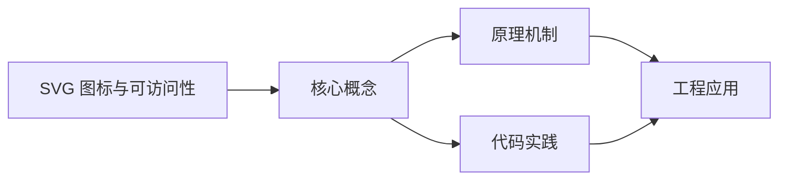

## 1. 学习目标（Bloom 分类）

本节按照布鲁姆教育目标分类学组织学习路径。本文主题为《SVG 图标与可访问性》，属于 SVG 模块，读者可以根据自身阶段选择阅读深度。

记忆层面：能够准确复述本文的核心概念、术语与基本语法或操作步骤，并能够在提问或检索时快速定位对应知识点。能够说出 SVG 的核心概念、术语与标准写法。

理解层面：能够用自己的语言解释核心原理与工作机制，说明概念之间的因果关系，而不是机械记忆结论。能够解释 SVG 的工作原理与设计动机。

应用层面：能够在真实项目或练习场景中运用本文知识解决具体问题，写出正确且可维护的实现。能够编写符合 SVG 规范的完整实现。

分析层面：能够拆解复杂问题，比较本文主题与相邻概念的异同，识别边界条件与例外情况。能够分析 SVG 与相邻方案的差异与边界。

评价层面：能够根据约束条件（性能、可读性、安全、成本）评价不同方案的优劣，做出有依据的技术决策。能够根据场景评价 SVG 相关方案的优劣。

创造层面：能够把本文知识与其他模块知识组合，设计出新的解决方案或可复用的工程模式。能够组合 SVG 与其他技术设计完整方案。

通过本节学习，读者应当能够把《SVG 图标与可访问性》纳入自己的知识网络，并与 SVG 模块的其他主题（矢量图形、路径、变换、动画）建立关联。

## 2. 历史动机与发展脉络

《SVG 图标与可访问性》是 SVG 领域的重要主题。要真正理解它，需要先了解它解决的问题与演进过程。

SVG（可缩放矢量图形）于 2001 年由 W3C 标准化，是 Web 原生矢量格式；与位图不同，SVG 由几何描述构成，任意缩放不失真。
SVG 是 XML 方言：元素即图形（rect/circle/path），样式可用 CSS，交互可用事件；SPA 生态中常以内联 SVG 与图标组件使用。
现代应用：图标系统、数据可视化（D3）、地图、LOGO、动画与交互图形；浏览器对 SVG 的支持已非常完整。

回到本文主题：SVG 图标与可访问性 的提出与成熟，正是上述技术背景下的必然产物。早期实现往往以简单可用为目标，随着工程规模扩大，社区逐渐沉淀出标准做法与最佳实践；理解这一脉络，可以帮助读者判断“为什么文档中的推荐写法是现在这个样子”，也能在遇到历史遗留代码时准确识别其设计年代与取舍。


## 3. 形式化定义与核心概念精讲

本节把《SVG 图标与可访问性》涉及的核心概念以“定义 + 讲解”的形式展开。读者应把定义当作工具，把讲解当作理解路径；两者结合才能形成可迁移的知识。

坐标系：viewBox 定义逻辑坐标（min-x min-y width height），preserveAspectRatio 控制缩放对齐。
基本图形：rect（矩形）、circle（圆）、ellipse（椭圆）、line（直线）、polyline/polygon（折线/多边形）。
路径 path：M/L/C/Q/A 命令组合任意曲线；fill 填充、stroke 描边。

### 3.1 原文章节逐一精讲

原文档把主题拆分为 34 个小节，下面按顺序给出每一节的导读讲解，随后保留原文细节供精读。

#### 原文精读（完整保留）

# SVG 图标与可访问性 语法速查手册

> **符号约定**:`< >` 必填参数 | `[ ]` 可选参数

---

#### 1. 为什么用 SVG 图标

| 维度     | SVG 图标     | 字体图标（如 Font Awesome） | PNG 图标 |
| -------- | ------------ | --------------------------- | -------- |
| 缩放     | 无损         | 无损                        | 锯齿     |
| 颜色     | CSS 控制     | CSS 控制（有限）            | 固定     |
| 可访问性 | 原生支持     | 一般                        | 需 alt   |
| 文件体积 | 小（单图标） | 中（整包）                  | 大       |
| 动画     | 支持         | 有限                        | 不支持   |
| 语义化   | DOM 节点     | 字符                        | 图片     |

SVG 是现代 Web 图标的首选方案。

#### 2. 图标设计原则

##### 2.1 统一画布

所有图标使用相同 viewBox（通常 24×24）：

```html
<symbol id="icon-home" viewBox="0 0 24 24">...</symbol>
<symbol id="icon-search" viewBox="0 0 24 24">...</symbol>
```

##### 2.2 描边一致

```html
<symbol id="icon-home" viewBox="0 0 24 24">
  <path
    d="..."
    fill="none"
    stroke="currentColor"
    stroke-width="2"
    stroke-linecap="round"
    stroke-linejoin="round"
  />
</symbol>
```

统一描边宽度、端点、拐角，保持视觉一致性。

##### 2.3 使用 currentColor

```html
<!-- 错误：硬编码颜色 -->
<symbol id="icon-home">
  <path fill="#4f5bd5" />
</symbol>

<!-- 正确：使用 currentColor -->
<symbol id="icon-home">
  <path fill="currentColor" />
</symbol>
```

`currentColor` 让图标颜色继承父元素 `color`，实现主题化。

##### 2.4 对齐像素网格

```html
<!-- 模糊：坐标落在 .5 -->
<path d="M 0.5 0.5 L 10.5 0.5" />

<!-- 清晰：整数坐标 -->
<path d="M 0 0 L 10 0" />
```

1px 描边的图标需对齐像素网格，避免抗锯齿模糊。

#### 3. 图标系统实现

##### 3.1 Sprite 模式

```html
<!-- icons.svg 隐藏文件 -->
<svg xmlns="http://www.w3.org/2000/svg" style="display:none">
  <symbol id="icon-home" viewBox="0 0 24 24">
    <path
      d="M3 12 L12 3 L21 12 M5 10 V21 H19 V10"
      fill="none"
      stroke="currentColor"
      stroke-width="2"
      stroke-linecap="round"
      stroke-linejoin="round"
    />
  </symbol>
  <symbol id="icon-search" viewBox="0 0 24 24">
    <circle cx="11" cy="11" r="7" fill="none" stroke="currentColor" stroke-width="2" />
    <line
      x1="16"
      y1="16"
      x2="21"
      y2="21"
      stroke="currentColor"
      stroke-width="2"
      stroke-linecap="round"
    />
  </symbol>
  <symbol id="icon-user" viewBox="0 0 24 24">
    <circle cx="12" cy="8" r="4" fill="currentColor" />
    <path
      d="M4 20 C4 16 8 14 12 14 C16 14 20 16 20 20"
      fill="none"
      stroke="currentColor"
      stroke-width="2"
      stroke-linecap="round"
    />
  </symbol>
</svg>
```

##### 3.2 使用图标

```html
<svg class="icon" aria-hidden="true">
  <use href="#icon-home" />
</svg>
```

```css
.icon {
  width: 24px;
  height: 24px;
  fill: none;
  stroke: currentColor;
  stroke-width: 2;
}
```

##### 3.3 尺寸变体

```css
.icon-sm {
  width: 16px;
  height: 16px;
}
.icon-md {
  width: 24px;
  height: 24px;
}
.icon-lg {
  width: 32px;
  height: 32px;
}
.icon-xl {
  width: 48px;
  height: 48px;
}
```

```html
<svg class="icon icon-sm"><use href="#icon-home" /></svg>
<svg class="icon icon-lg"><use href="#icon-home" /></svg>
```

##### 3.4 颜色变体

```css
.icon-primary {
  color: #4f5bd5;
}
.icon-success {
  color: #00b894;
}
.icon-danger {
  color: #d63031;
}
.icon-warning {
  color: #f9a825;
}
```

```html
<button class="btn">
  <svg class="icon icon-danger"><use href="#icon-delete" /></svg>
  删除
</button>
```

#### 4. 可访问性基础

##### 4.1 装饰性图标

纯装饰图标应隐藏于屏幕阅读器：

```html
<svg class="icon" aria-hidden="true">
  <use href="#icon-decorative" />
</svg>
```

`aria-hidden="true"` 让屏幕阅读器跳过此元素。

##### 4.2 语义图标

传递信息的图标需提供替代文本：

```html
<svg class="icon" role="img" aria-label="搜索">
  <use href="#icon-search" />
</svg>

<!-- 或使用 title -->
<svg class="icon" role="img" aria-labelledby="search-title">
  <title id="search-title">搜索</title>
  <use href="#icon-search" />
</svg>
```

##### 4.3 交互图标

可点击的图标需有合适语义：

```html
<button class="icon-btn" aria-label="关闭">
  <svg class="icon" aria-hidden="true">
    <use href="#icon-close" />
  </svg>
</button>
```

`aria-label` 在按钮上，SVG 本身 `aria-hidden`，避免重复朗读。

#### 5. role 属性

| role 值        | 用途                           |
| -------------- | ------------------------------ |
| `img`          | 图像（需 aria-label 或 title） |
| `button`       | 按钮（通常外层用 `<button>`）  |
| `presentation` | 仅为展示，无语义               |
| `none`         | 等价于 presentation            |

```html
<!-- 图表作为整体图像 -->
<svg role="img" aria-labelledby="chart-title chart-desc">
  <title id="chart-title">2024 季度销售额</title>
  <desc id="chart-desc">柱状图展示 Q1-Q4 销售额，Q3 最高 210 万</desc>
  <!-- 图表内容 -->
</svg>
```

#### 6. focus 与键盘导航

可交互的 SVG 元素需支持键盘操作：

```html
<svg class="icon-btn" role="button" tabindex="0" aria-label="菜单" id="menu-btn">
  <use href="#icon-menu" />
</svg>

<script>
  const btn = document.getElementById('menu-btn');
  btn.addEventListener('keydown', (e) => {
    if (e.key === 'Enter' || e.key === ' ') {
      e.preventDefault();
      toggleMenu();
    }
  });
  btn.addEventListener('click', toggleMenu);
</script>
```

##### 6.1 focus 样式

```css
.icon-btn:focus-visible {
  outline: 2px solid #4f5bd5;
  outline-offset: 4px;
  border-radius: 4px;
}
```

`:focus-visible` 仅在键盘聚焦时显示，鼠标点击不显示。

#### 7. prefers-reduced-motion

```css
.animated-icon {
  animation: spin 2s linear infinite;
}

@media (prefers-reduced-motion: reduce) {
  .animated-icon {
    animation: none;
  }
}
```

尊重用户的系统偏好，禁用动画。

#### 8. 颜色对比度

图标颜色需满足 WCAG 对比度要求：

| 文本类型        | 最小对比度（WCAG AA） |
| --------------- | --------------------- |
| 正常文本        | 4.5:1                 |
| 大文本（18pt+） | 3:1                   |
| 图标与图形      | 3:1                   |

```css
/* 检查对比度 */
.icon-primary {
  color: #4f5bd5; /* 对比度 4.8:1（白底） */
}

/* 错误：对比度不足 */
.icon-low-contrast {
  color: #ccc; /* 对比度 1.6:1 */
}
```

#### 9. 图标按钮组件

```html
<button class="btn-icon btn-icon-danger" aria-label="删除项目">
  <svg class="icon" aria-hidden="true" viewBox="0 0 24 24">
    <path
      d="M3 6 H21 M8 6 V4 H16 V6 M6 6 L7 20 H17 L18 6"
      fill="none"
      stroke="currentColor"
      stroke-width="2"
      stroke-linecap="round"
      stroke-linejoin="round"
    />
  </svg>
</button>

<style>
  .btn-icon {
    display: inline-flex;
    align-items: center;
    justify-content: center;
    width: 40px;
    height: 40px;
    border: none;
    border-radius: 8px;
    background: transparent;
    cursor: pointer;
    transition: background 0.2s;
  }
  .btn-icon:hover {
    background: rgba(0, 0, 0, 0.05);
  }
  .btn-icon:focus-visible {
    outline: 2px solid #4f5bd5;
    outline-offset: 2px;
  }
  .btn-icon-danger {
    color: #d63031;
  }
  .btn-icon-danger:hover {
    background: rgba(214, 48, 49, 0.1);
  }
  .icon {
    width: 20px;
    height: 20px;
  }
</style>
```

#### 10. 动态图标

##### 10.1 加载状态

```html
<svg class="icon icon-spin" viewBox="0 0 24 24" aria-label="加载中" role="img">
  <path
    d="M12 2 A10 10 0 0 1 22 12"
    fill="none"
    stroke="currentColor"
    stroke-width="3"
    stroke-linecap="round"
  />
</svg>

<style>
  .icon-spin {
    animation: spin 1s linear infinite;
    transform-origin: center;
    transform-box: fill-box;
  }
  @keyframes spin {
    to {
      transform: rotate(360deg);
    }
  }
</style>
```

##### 10.2 状态切换

```html
<button class="btn-toggle" aria-pressed="false" id="like-btn">
  <svg class="icon" viewBox="0 0 24 24">
    <path
      class="heart-outline"
      d="M12 21 L4 13 C2 11 2 8 4 6 C6 4 9 4 12 7 C15 4 18 4 20 6 C22 8 22 11 20 13 Z"
      fill="none"
      stroke="currentColor"
      stroke-width="2"
    />
    <path
      class="heart-fill"
      d="M12 21 L4 13 C2 11 2 8 4 6 C6 4 9 4 12 7 C15 4 18 4 20 6 C22 8 22 11 20 13 Z"
      fill="currentColor"
    />
  </svg>
</button>

<style>
  .btn-toggle .heart-fill {
    display: none;
  }
  .btn-toggle[aria-pressed='true'] .heart-outline {
    display: none;
  }
  .btn-toggle[aria-pressed='true'] .heart-fill {
    display: block;
  }
  .btn-toggle[aria-pressed='true'] {
    color: #d63031;
  }
</style>

<script>
  const btn = document.getElementById('like-btn');
  btn.addEventListener('click', () => {
    const pressed = btn.getAttribute('aria-pressed') === 'true';
    btn.setAttribute('aria-pressed', !pressed);
  });
</script>
```

`aria-pressed` 表示按钮按下状态，配合 CSS 切换图标。

#### 11. 图标命名规范

```
icon-{category}-{name}
```

| 命名                  | 含义          |
| --------------------- | ------------- |
| `icon-action-home`    | 操作类 - 首页 |
| `icon-action-search`  | 操作类 - 搜索 |
| `icon-media-play`     | 媒体类 - 播放 |
| `icon-media-pause`    | 媒体类 - 暂停 |
| `icon-status-success` | 状态类 - 成功 |
| `icon-status-error`   | 状态类 - 错误 |
| `icon-nav-menu`       | 导航类 - 菜单 |
| `icon-nav-close`      | 导航类 - 关闭 |

#### 12. 图标集管理

##### 12.1 目录结构

```
src/
  assets/
    icons/
      action/
        home.svg
        search.svg
      media/
        play.svg
        pause.svg
      status/
        success.svg
        error.svg
  sprite/
    icons.svg       # 构建生成的 sprite
    icons.ts        # TypeScript 声明
```

##### 12.2 构建脚本

```javascript
// scripts/build-icons.js
const fs = require('fs');
const path = require('path');
const { optimize } = require('svgo');

const iconsDir = path.join(__dirname, '../src/assets/icons');
const outputPath = path.join(__dirname, '../src/sprite/icons.svg');

function buildSprite() {
  const symbols = [];
  function walk(dir) {
    const items = fs.readdirSync(dir);
    for (const item of items) {
      const fullPath = path.join(dir, item);
      const stat = fs.statSync(fullPath);
      if (stat.isDirectory()) {
        walk(fullPath);
      } else if (item.endsWith('.svg')) {
        const name = path.basename(item, '.svg');
        const content = fs.readFileSync(fullPath, 'utf8');
        const optimized = optimize(content, {
          plugins: [{ name: 'preset-default' }, { name: 'removeDimensions' }],
        }).data;
        // 提取内容并转为 symbol
        const inner = optimized.replace(/<svg[^>]*>|<\/svg>/g, '');
        symbols.push(`<symbol id="icon-${name}" viewBox="0 0 24 24">${inner}</symbol>`);
      }
    }
  }
  walk(iconsDir);
  const sprite = `<svg xmlns="http://www.w3.org/2000/svg" style="display:none">${symbols.join('')}</svg>`;
  fs.writeFileSync(outputPath, sprite);
  console.log(`Built ${symbols.length} icons`);
}

buildSprite();
```

#### 13. 实战：完整的图标按钮系统

```html
<!DOCTYPE html>
<html>
  <head>
    <style>
      .icon {
        width: 24px;
        height: 24px;
        fill: none;
        stroke: currentColor;
        stroke-width: 2;
      }
      .btn {
        display: inline-flex;
        align-items: center;
        gap: 8px;
        padding: 8px 16px;
        border: 1px solid #ddd;
        border-radius: 8px;
        background: #fff;
        color: #333;
        cursor: pointer;
        font-size: 14px;
        transition: all 0.2s;
      }
      .btn:hover {
        background: #f5f5f5;
        border-color: #ccc;
      }
      .btn:focus-visible {
        outline: 2px solid #4f5bd5;
        outline-offset: 2px;
      }
      .btn-primary {
        background: #4f5bd5;
        border-color: #4f5bd5;
        color: #fff;
      }
      .btn-primary:hover {
        background: #3a47b8;
      }
      .btn-danger {
        color: #d63031;
        border-color: #d63031;
      }
      .btn-danger:hover {
        background: #fbe9e7;
      }
      .btn-icon-only {
        padding: 8px;
      }
    </style>
  </head>
  <body>
    <svg style="display:none">
      <symbol id="icon-plus" viewBox="0 0 24 24">
        <path d="M12 5 V19 M5 12 H19" stroke-linecap="round" />
      </symbol>
      <symbol id="icon-trash" viewBox="0 0 24 24">
        <path
          d="M3 6 H21 M8 6 V4 H16 V6 M6 6 L7 20 H17 L18 6"
          stroke-linecap="round"
          stroke-linejoin="round"
        />
      </symbol>
      <symbol id="icon-check" viewBox="0 0 24 24">
        <path d="M5 12 L10 17 L19 8" stroke-linecap="round" stroke-linejoin="round" />
      </symbol>
    </svg>

    <button class="btn btn-primary">
      <svg class="icon" aria-hidden="true"><use href="#icon-plus" /></svg>
      新建项目
    </button>

    <button class="btn btn-danger btn-icon-only" aria-label="删除">
      <svg class="icon" aria-hidden="true"><use href="#icon-trash" /></svg>
    </button>

    <button class="btn" aria-pressed="false" id="check-btn">
      <svg class="icon" aria-hidden="true"><use href="#icon-check" /></svg>
      标记完成
    </button>

    <script>
      document.getElementById('check-btn').addEventListener('click', function () {
        const pressed = this.getAttribute('aria-pressed') === 'true';
        this.setAttribute('aria-pressed', !pressed);
      });
    </script>
  </body>
</html>
```

下一篇以综合项目串联所有知识点。
#### 图标定义

**symbol 定义图标**
`<symbol id="<icon-id>" viewBox="0 0 24 24">...</symbol>`
```html
<svg xmlns="http://www.w3.org/2000/svg" style="display:none">
  <!-- 统一 24x24 画布,所有图标共用 viewBox -->
  <symbol id="icon-home" viewBox="0 0 24 24">
    <path
      d="M3 12 L12 3 L21 12 M5 10 V21 H19 V10"
      fill="none"
      stroke="currentColor"
      stroke-width="2"
      stroke-linecap="round"
      stroke-linejoin="round"
    />
  </symbol>
  <symbol id="icon-search" viewBox="0 0 24 24">
    <circle cx="11" cy="11" r="7" fill="none" stroke="currentColor" stroke-width="2" />
    <line
      x1="16"
      y1="16"
      x2="21"
      y2="21"
      stroke="currentColor"
      stroke-width="2"
      stroke-linecap="round"
    />
  </symbol>
  <symbol id="icon-user" viewBox="0 0 24 24">
    <circle cx="12" cy="8" r="4" fill="currentColor" />
    <path
      d="M4 20 C4 16 8 14 12 14 C16 14 20 16 20 20"
      fill="none"
      stroke="currentColor"
      stroke-width="2"
      stroke-linecap="round"
    />
  </symbol>
</svg>
```

##### symbol 元素属性表

| 属性 | 说明 | 示例 |
| --- | --- | --- |
| `id` | 唯一标识符(被 use 引用) | `icon-home` |
| `viewBox` | 视口坐标系 | `0 0 24 24` |
| `width` | 宽度(通常省略,由 use 控制) | `24` |
| `height` | 高度(通常省略,由 use 控制) | `24` |
| `fill` | 默认填充 | `none` |
| `stroke` | 默认描边 | `currentColor` |

---

#### 图标使用

**use 引用图标**
`<svg class="<类>" aria-hidden="true"><use href="#<icon-id>" /></svg>`
```html
<svg class="icon" aria-hidden="true">
  <use href="#icon-home" />
</svg>
```

```css
.icon {
  width: 24px;
  height: 24px;
  fill: none;
  stroke: currentColor;
  stroke-width: 2;
}
```

##### use 元素属性表

| 属性 | 说明 | 示例 |
| --- | --- | --- |
| `href` | 引用 symbol 的 id | `#icon-home` |
| `x` | x 坐标偏移 | `0` |
| `y` | y 坐标偏移 | `0` |
| `width` | 宽度(覆盖 symbol) | `24` |
| `height` | 高度(覆盖 symbol) | `24` |

---

#### 尺寸变体

**图标尺寸 CSS**
`.<size-class> { width: <px>; height: <px>; }`
```css
.icon-sm { width: 16px; height: 16px; }
.icon-md { width: 24px; height: 24px; }
.icon-lg { width: 32px; height: 32px; }
.icon-xl { width: 48px; height: 48px; }
```

```html
<svg class="icon icon-sm"><use href="#icon-home" /></svg>
<svg class="icon icon-md"><use href="#icon-home" /></svg>
<svg class="icon icon-lg"><use href="#icon-home" /></svg>
<svg class="icon icon-xl"><use href="#icon-home" /></svg>
```

---

#### 颜色变体 currentColor

**currentColor 主题化**
`<element fill="currentColor" [stroke]="currentColor" />`
```html
<!-- 使用 currentColor,颜色继承父元素 color -->
<symbol id="icon-home" viewBox="0 0 24 24">
  <path fill="currentColor" stroke="currentColor" />
</symbol>
```

```css
.icon-primary { color: #4f5bd5; }
.icon-success { color: #00b894; }
.icon-danger { color: #d63031; }
.icon-warning { color: #f9a825; }
```

```html
<button class="btn">
  <svg class="icon icon-danger"><use href="#icon-delete" /></svg>
  删除
</button>
```

---

#### 描边一致性

**统一描边属性**
`<path stroke-width="<width>" stroke-linecap="<cap>" stroke-linejoin="<join>" />`
```html
<symbol id="icon-edit" viewBox="0 0 24 24">
  <path
    d="M3 17.25 V21 H6.75 L17.81 9.94 L14.06 6.19 L3 17.25 Z"
    fill="none"
    stroke="currentColor"
    stroke-width="2"
    stroke-linecap="round"
    stroke-linejoin="round"
  />
</symbol>
```

##### 描边属性表

| 属性 | 说明 | 可选值 |
| --- | --- | --- |
| `stroke-width` | 描边宽度 | `2`(像素,统一) |
| `stroke-linecap` | 线段端点样式 | `butt` / `round` / `square` |
| `stroke-linejoin` | 拐角连接样式 | `miter` / `round` / `bevel` |

---

#### 像素网格对齐

**整数坐标对齐**
`<path d="M <int> <int> L <int> <int>" />`
```html
<!-- 清晰:整数坐标 -->
<path d="M 0 0 L 10 0" stroke-width="1" />

<!-- 模糊:坐标落在 .5(抗锯齿) -->
<path d="M 0.5 0.5 L 10.5 0.5" stroke-width="1" />
```

---

#### 装饰性图标 aria-hidden

**纯装饰图标隐藏**
`<svg aria-hidden="true">...</svg>`
```html
<svg class="icon" aria-hidden="true">
  <use href="#icon-decorative" />
</svg>
```

`aria-hidden="true"` 让屏幕阅读器跳过此元素,适用于纯装饰图标。

---

#### 语义图标 aria-label

**带替代文本的图标**
`<svg role="img" aria-label="<文本>">...</svg>`
```html
<svg class="icon" role="img" aria-label="搜索">
  <use href="#icon-search" />
</svg>
```

**title 子元素提供标签**
`<svg role="img" aria-labelledby="<title-id>"><title id="...">...</title>...</svg>`
```html
<svg class="icon" role="img" aria-labelledby="search-title">
  <title id="search-title">搜索</title>
  <use href="#icon-search" />
</svg>
```

---

#### 交互图标按钮

**可点击图标按钮**
`<button aria-label="<文本>"><svg aria-hidden="true">...</svg></button>`
```html
<button class="icon-btn" aria-label="关闭">
  <svg class="icon" aria-hidden="true">
    <use href="#icon-close" />
  </svg>
</button>
```

`aria-label` 放在外层 button 上,SVG 本身 `aria-hidden`,避免重复朗读。

---

#### role 属性

**SVG role 语义**
`<svg role="<role-value>" aria-labelledby="<id1> [<id2>]">`
```html
<svg role="img" aria-labelledby="chart-title chart-desc">
  <title id="chart-title">2024 季度销售额</title>
  <desc id="chart-desc">柱状图展示 Q1-Q4 销售额,Q3 最高 210 万</desc>
  <!-- 图表内容 -->
</svg>
```

##### role 取值表

| role 值 | 用途 |
| --- | --- |
| `img` | 图像(需 aria-label 或 title) |
| `button` | 按钮(通常外层用 `<button>`) |
| `presentation` | 仅为展示,无语义 |
| `none` | 等价于 presentation |
| `graphics-document` | 图形文档(SVG 2) |
| `graphics-symbol` | 图形符号(SVG 2) |

---

#### desc 元素描述

**desc 长描述**
`<svg><title>...</title><desc>...</desc>...</svg>`
```html
<svg viewBox="0 0 200 200" role="img" aria-labelledby="t d">
  <title id="t">销售趋势图</title>
  <desc id="d">折线图显示 2024 年 1-12 月销售额变化</desc>
  <polyline points="20,150 50,120 80,140 110,90 140,110 170,70" />
</svg>
```

---

#### tabindex 与键盘导航

**可聚焦 SVG**
`<svg role="button" tabindex="0" aria-label="<文本>" id="<id>">`
```html
<svg class="icon-btn" role="button" tabindex="0" aria-label="菜单" id="menu-btn">
  <use href="#icon-menu" />
</svg>

<script>
  const btn = document.getElementById('menu-btn');
  btn.addEventListener('keydown', (e) => {
    if (e.key === 'Enter' || e.key === ' ') {
      e.preventDefault();
      toggleMenu();
    }
  });
  btn.addEventListener('click', toggleMenu);
</script>
```

---

#### focus 可见样式

**focus-visible 样式**
`<selector>:focus-visible { outline: <style> <color> <width>; outline-offset: <px>; }`
```css
.icon-btn:focus-visible {
  outline: 2px solid #4f5bd5;
  outline-offset: 4px;
  border-radius: 4px;
}
```

`:focus-visible` 仅在键盘聚焦时显示轮廓,鼠标点击不显示。

---

#### prefers-reduced-motion

**禁用动画媒体查询**
`@media (prefers-reduced-motion: reduce) { <selector> { animation: none; } }`
```css
.animated-icon {
  animation: spin 2s linear infinite;
}

@media (prefers-reduced-motion: reduce) {
  .animated-icon {
    animation: none;
  }
}
```

---

#### aria-pressed 状态切换

**按钮按下状态**
`<button aria-pressed="<bool>" id="<id>">...</button>`
```html
<button class="btn-toggle" aria-pressed="false" id="like-btn">
  <svg class="icon" viewBox="0 0 24 24">
    <path
      class="heart-outline"
      d="M12 21 L4 13 C2 11 2 8 4 6 C6 4 9 4 12 7 C15 4 18 4 20 6 C22 8 22 11 20 13 Z"
      fill="none"
      stroke="currentColor"
      stroke-width="2"
    />
    <path
      class="heart-fill"
      d="M12 21 L4 13 C2 11 2 8 4 6 C6 4 9 4 12 7 C15 4 18 4 20 6 C22 8 22 11 20 13 Z"
      fill="currentColor"
    />
  </svg>
</button>

<style>
  .btn-toggle .heart-fill { display: none; }
  .btn-toggle[aria-pressed='true'] .heart-outline { display: none; }
  .btn-toggle[aria-pressed='true'] .heart-fill { display: block; }
  .btn-toggle[aria-pressed='true'] { color: #d63031; }
</style>

<script>
  const btn = document.getElementById('like-btn');
  btn.addEventListener('click', () => {
    const pressed = btn.getAttribute('aria-pressed') === 'true';
    btn.setAttribute('aria-pressed', !pressed);
  });
</script>
```

##### aria 状态属性表

| 属性 | 说明 | 取值 |
| --- | --- | --- |
| `aria-pressed` | 按钮按下状态 | `true` / `false` / `mixed` |
| `aria-expanded` | 展开/折叠状态 | `true` / `false` |
| `aria-hidden` | 对辅助技术隐藏 | `true` / `false` |
| `aria-label` | 可访问名称 | 任意字符串 |
| `aria-labelledby` | 引用 ID 作为名称 | `id [id2 ...]` |
| `aria-describedby` | 引用 ID 作为描述 | `id [id2 ...]` |
| `aria-disabled` | 禁用状态 | `true` / `false` |

---

#### 加载动画图标

**旋转加载图标**
`<svg class="<spin-class>" [aria-label]="..." [role]="img">`
```html
<svg class="icon icon-spin" viewBox="0 0 24 24" aria-label="加载中" role="img">
  <path
    d="M12 2 A10 10 0 0 1 22 12"
    fill="none"
    stroke="currentColor"
    stroke-width="3"
    stroke-linecap="round"
  />
</svg>

<style>
  .icon-spin {
    animation: spin 1s linear infinite;
    transform-origin: center;
    transform-box: fill-box;
  }
  @keyframes spin {
    to {
      transform: rotate(360deg);
    }
  }
</style>
```

---

#### 图标按钮组件

**完整图标按钮**
`<button class="btn-icon <variant>" aria-label="<文本>"><svg class="icon" aria-hidden="true">...</svg></button>`
```html
<button class="btn-icon btn-icon-danger" aria-label="删除项目">
  <svg class="icon" aria-hidden="true" viewBox="0 0 24 24">
    <path
      d="M3 6 H21 M8 6 V4 H16 V6 M6 6 L7 20 H17 L18 6"
      fill="none"
      stroke="currentColor"
      stroke-width="2"
      stroke-linecap="round"
      stroke-linejoin="round"
    />
  </svg>
</button>

<style>
  .btn-icon {
    display: inline-flex;
    align-items: center;
    justify-content: center;
    width: 40px;
    height: 40px;
    border: none;
    border-radius: 8px;
    background: transparent;
    cursor: pointer;
    transition: background 0.2s;
  }
  .btn-icon:hover { background: rgba(0, 0, 0, 0.05); }
  .btn-icon:focus-visible {
    outline: 2px solid #4f5bd5;
    outline-offset: 2px;
  }
  .btn-icon-danger { color: #d63031; }
  .btn-icon-danger:hover { background: rgba(214, 48, 49, 0.1); }
  .icon { width: 20px; height: 20px; }
</style>
```

---

#### 颜色对比度属性

**主题色对比度**
`<selector> { color: <hex>; }`
```css
/* 对比度 4.8:1(白底),满足 WCAG AA */
.icon-primary { color: #4f5bd5; }

/* 对比度 1.6:1(白底),不满足 WCAG AA */
.icon-low-contrast { color: #ccc; }
```

##### WCAG 对比度要求表

| 文本类型 | 最小对比度(WCAG AA) |
| --- | --- |
| 正常文本 | 4.5:1 |
| 大文本(18pt+) | 3:1 |
| 图标与图形 | 3:1 |

---

#### 图标 sprite 模式

**SVG sprite 定义**
`<svg xmlns="..." style="display:none"><symbol id="..." viewBox="...">...</symbol>...</svg>`
```html
<!-- 隐藏的 sprite 文件,所有图标集中定义 -->
<svg xmlns="http://www.w3.org/2000/svg" style="display:none">
  <symbol id="icon-home" viewBox="0 0 24 24">
    <path d="..." fill="none" stroke="currentColor" stroke-width="2" />
  </symbol>
  <symbol id="icon-search" viewBox="0 0 24 24">
    <circle cx="11" cy="11" r="7" fill="none" stroke="currentColor" stroke-width="2" />
  </symbol>
</svg>

<!-- 通过 use 引用 -->
<svg class="icon"><use href="#icon-home" /></svg>
```

---

#### currentColor 与 CSS 变量穿透

**主题切换**
`<symbol id="..."><path fill="var(--icon-color)" /></symbol>`
```html
<symbol id="icon-themed" viewBox="0 0 24 24">
  <path
    d="M12 2 L15 9 L22 9 L17 14 L19 21 L12 17 L5 21 L7 14 L2 9 L9 9 Z"
    fill="var(--icon-color, currentColor)"
  />
</symbol>
```

```css
:root {
  --icon-color: #4f5bd5;
}
.dark-theme {
  --icon-color: #7c89ff;
}
```

---

#### SVG title 与 desc 元素

**结构化描述**
`<svg><title>...</title><desc>...</desc>...</svg>`
```html
<svg viewBox="0 0 100 100" role="img" aria-labelledby="icon-t icon-d">
  <title id="icon-t">警告</title>
  <desc id="icon-d">黄色三角形带感叹号,表示警告状态</desc>
  <polygon points="50,10 90,90 10,90" fill="#f9a825" />
  <text x="50" y="70" text-anchor="middle" font-size="40" fill="#fff">!</text>
</svg>
```

##### title 与 desc 属性表

| 元素 | 用途 | 必需属性 |
| --- | --- | --- |
| `<title>` | 简短可访问名称 | `id`(配合 aria-labelledby) |
| `<desc>` | 详细描述 | `id`(配合 aria-describedby) |


### 3.2 概念关系图

下面用 Mermaid 图表达本文核心概念之间的关系，帮助读者建立整体图景：



图中展示的是本文知识的结构化关系：核心概念是入口，原理机制解释“为什么”，代码实践演示“怎么做”，工程应用回答“何时用”。读者学习时可以把每个小节的内容挂接到对应节点上。

## 4. 理论推导与原理解析

本节深入《SVG 图标与可访问性》背后的原理。理论部分不求面面俱到，而是聚焦“能解释现象、能指导实践”的关键推导。

坐标系：viewBox 定义逻辑坐标（min-x min-y width height），preserveAspectRatio 控制缩放对齐。
基本图形：rect（矩形）、circle（圆）、ellipse（椭圆）、line（直线）、polyline/polygon（折线/多边形）。
路径 path：M/L/C/Q/A 命令组合任意曲线；fill 填充、stroke 描边。
变换与动画：transform 平移缩放旋转；CSS/SMIL 动画控制属性过渡。

需要强调的是，理论推导与工程实践之间存在翻译层：理论给出的是理想化模型与边界条件，工程代码则必须处理真实环境中的例外。读者在学习时应先掌握理论的“标准情形”，再通过陷阱章节了解“非标准情形”。

## 5. 代码示例与逐行讲解

本节把原文中的代码示例系统整理，并为每个示例补充用途说明与讲解。读者不应只浏览代码，而应逐段对照讲解理解设计意图。

### 5.1 示例：2.1 统一画布

该示例来自原文《2.1 统一画布》小节，用于演示SVG 图标与可访问性相关操作。阅读时请先看代码结构，再看其后的讲解。

```html
<symbol id="icon-home" viewBox="0 0 24 24">...</symbol>
<symbol id="icon-search" viewBox="0 0 24 24">...</symbol>
```

讲解：这段代码演示了本节核心知识点。代码中的关键操作可以归纳为三步：准备（定义或初始化）、执行（核心逻辑）、收尾（释放资源或返回结果）。实际项目中，这三步往往被封装为函数或类，以提升复用性与可测试性。

关键点分析：

该示例共 2 行有效代码，结构以数据或配置为主。阅读时应关注：数据字段的含义、配置项的作用，以及它们与运行行为的对应关系。

进阶思考路径：先尝试修改参数观察行为变化，再把示例中的模式迁移到自己的项目中；每次修改都记录预期与实测差异，这是把示例转化为能力的最快方式。

### 5.2 示例：2.2 描边一致

该示例来自原文《2.2 描边一致》小节，用于演示SVG 图标与可访问性相关操作。阅读时请先看代码结构，再看其后的讲解。

```html
<symbol id="icon-home" viewBox="0 0 24 24">
  <path
    d="..."
    fill="none"
    stroke="currentColor"
    stroke-width="2"
    stroke-linecap="round"
    stroke-linejoin="round"
  />
</symbol>
```

讲解：这段代码演示了本节核心知识点。代码中的关键操作可以归纳为三步：准备（定义或初始化）、执行（核心逻辑）、收尾（释放资源或返回结果）。实际项目中，这三步往往被封装为函数或类，以提升复用性与可测试性。

关键点分析：

该示例共 10 行有效代码，结构以数据或配置为主。阅读时应关注：数据字段的含义、配置项的作用，以及它们与运行行为的对应关系。

进阶思考路径：先尝试修改参数观察行为变化，再把示例中的模式迁移到自己的项目中；每次修改都记录预期与实测差异，这是把示例转化为能力的最快方式。

### 5.3 示例：2.3 使用 currentColor

该示例来自原文《2.3 使用 currentColor》小节，用于演示SVG 图标与可访问性相关操作。阅读时请先看代码结构，再看其后的讲解。

```html
<!-- 错误：硬编码颜色 -->
<symbol id="icon-home">
  <path fill="#4f5bd5" />
</symbol>

<!-- 正确：使用 currentColor -->
<symbol id="icon-home">
  <path fill="currentColor" />
</symbol>
```

讲解：这段代码演示了本节核心知识点。代码中的关键操作可以归纳为三步：准备（定义或初始化）、执行（核心逻辑）、收尾（释放资源或返回结果）。实际项目中，这三步往往被封装为函数或类，以提升复用性与可测试性。

关键点分析：

该示例共 8 行有效代码，结构以数据或配置为主。阅读时应关注：数据字段的含义、配置项的作用，以及它们与运行行为的对应关系。

进阶思考路径：先尝试修改参数观察行为变化，再把示例中的模式迁移到自己的项目中；每次修改都记录预期与实测差异，这是把示例转化为能力的最快方式。

### 5.4 示例：2.4 对齐像素网格

该示例来自原文《2.4 对齐像素网格》小节，用于演示SVG 图标与可访问性相关操作。阅读时请先看代码结构，再看其后的讲解。

```html
<!-- 模糊：坐标落在 .5 -->
<path d="M 0.5 0.5 L 10.5 0.5" />

<!-- 清晰：整数坐标 -->
<path d="M 0 0 L 10 0" />
```

讲解：这段代码演示了本节核心知识点。代码中的关键操作可以归纳为三步：准备（定义或初始化）、执行（核心逻辑）、收尾（释放资源或返回结果）。实际项目中，这三步往往被封装为函数或类，以提升复用性与可测试性。

关键点分析：

该示例共 4 行有效代码，结构以数据或配置为主。阅读时应关注：数据字段的含义、配置项的作用，以及它们与运行行为的对应关系。

进阶思考路径：先尝试修改参数观察行为变化，再把示例中的模式迁移到自己的项目中；每次修改都记录预期与实测差异，这是把示例转化为能力的最快方式。

### 5.5 示例：3.1 Sprite 模式

该示例来自原文《3.1 Sprite 模式》小节，用于演示SVG 图标与可访问性相关操作。阅读时请先看代码结构，再看其后的讲解。

```html
<!-- icons.svg 隐藏文件 -->
<svg xmlns="http://www.w3.org/2000/svg" style="display:none">
  <symbol id="icon-home" viewBox="0 0 24 24">
    <path
      d="M3 12 L12 3 L21 12 M5 10 V21 H19 V10"
      fill="none"
      stroke="currentColor"
      stroke-width="2"
      stroke-linecap="round"
      stroke-linejoin="round"
    />
  </symbol>
  <symbol id="icon-search" viewBox="0 0 24 24">
    <circle cx="11" cy="11" r="7" fill="none" stroke="currentColor" stroke-width="2" />
    <line
      x1="16"
      y1="16"
      x2="21"
      y2="21"
      stroke="currentColor"
      stroke-width="2"
      stroke-linecap="round"
    />
  </symbol>
  <symbol id="icon-user" viewBox="0 0 24 24">
    <circle cx="12" cy="8" r="4" fill="currentColor" />
    <path
      d="M4 20 C4 16 8 14 12 14 C16 14 20 16 20 20"
      fill="none"
      stroke="currentColor"
      stroke-width="2"
      stroke-linecap="round"
    />
  </symbol>
</svg>
```

讲解：这段代码演示了本节核心知识点。代码中的关键操作可以归纳为三步：准备（定义或初始化）、执行（核心逻辑）、收尾（释放资源或返回结果）。实际项目中，这三步往往被封装为函数或类，以提升复用性与可测试性。

关键点分析：

该示例共 35 行有效代码，结构以数据或配置为主。阅读时应关注：数据字段的含义、配置项的作用，以及它们与运行行为的对应关系。

进阶思考路径：先尝试修改参数观察行为变化，再把示例中的模式迁移到自己的项目中；每次修改都记录预期与实测差异，这是把示例转化为能力的最快方式。

### 5.6 示例：3.2 使用图标

该示例来自原文《3.2 使用图标》小节，用于演示SVG 图标与可访问性相关操作。阅读时请先看代码结构，再看其后的讲解。

```html
<svg class="icon" aria-hidden="true">
  <use href="#icon-home" />
</svg>
```

讲解：这段代码演示了本节核心知识点。代码中的关键操作可以归纳为三步：准备（定义或初始化）、执行（核心逻辑）、收尾（释放资源或返回结果）。实际项目中，这三步往往被封装为函数或类，以提升复用性与可测试性。

关键点分析：

该示例共 3 行有效代码，包含 1 类关键结构（class）。其中：

- 入口与初始化部分负责建立上下文，对应实际项目中的启动或装配逻辑；
- 核心逻辑部分体现本文主题的主要操作，是阅读时最需要对照讲解理解的部分；
- 输出或返回部分把结果交给调用方，注意其类型与边界条件。

进阶思考路径：先尝试修改参数观察行为变化，再把示例中的模式迁移到自己的项目中；每次修改都记录预期与实测差异，这是把示例转化为能力的最快方式。

### 5.7 示例：3.2 使用图标

该示例来自原文《3.2 使用图标》小节，用于演示SVG 图标与可访问性相关操作。阅读时请先看代码结构，再看其后的讲解。

```css
.icon {
  width: 24px;
  height: 24px;
  fill: none;
  stroke: currentColor;
  stroke-width: 2;
}
```

讲解：这段代码演示了本节核心知识点。代码中的关键操作可以归纳为三步：准备（定义或初始化）、执行（核心逻辑）、收尾（释放资源或返回结果）。实际项目中，这三步往往被封装为函数或类，以提升复用性与可测试性。

关键点分析：

该示例共 7 行有效代码，结构以数据或配置为主。阅读时应关注：数据字段的含义、配置项的作用，以及它们与运行行为的对应关系。

进阶思考路径：先尝试修改参数观察行为变化，再把示例中的模式迁移到自己的项目中；每次修改都记录预期与实测差异，这是把示例转化为能力的最快方式。

### 5.8 示例：3.3 尺寸变体

该示例来自原文《3.3 尺寸变体》小节，用于演示SVG 图标与可访问性相关操作。阅读时请先看代码结构，再看其后的讲解。

```css
.icon-sm {
  width: 16px;
  height: 16px;
}
.icon-md {
  width: 24px;
  height: 24px;
}
.icon-lg {
  width: 32px;
  height: 32px;
}
.icon-xl {
  width: 48px;
  height: 48px;
}
```

讲解：这段代码演示了本节核心知识点。代码中的关键操作可以归纳为三步：准备（定义或初始化）、执行（核心逻辑）、收尾（释放资源或返回结果）。实际项目中，这三步往往被封装为函数或类，以提升复用性与可测试性。

关键点分析：

该示例共 16 行有效代码，结构以数据或配置为主。阅读时应关注：数据字段的含义、配置项的作用，以及它们与运行行为的对应关系。

进阶思考路径：先尝试修改参数观察行为变化，再把示例中的模式迁移到自己的项目中；每次修改都记录预期与实测差异，这是把示例转化为能力的最快方式。

### 5.9 示例：3.3 尺寸变体

该示例来自原文《3.3 尺寸变体》小节，用于演示SVG 图标与可访问性相关操作。阅读时请先看代码结构，再看其后的讲解。

```html
<svg class="icon icon-sm"><use href="#icon-home" /></svg>
<svg class="icon icon-lg"><use href="#icon-home" /></svg>
```

讲解：这段代码演示了本节核心知识点。代码中的关键操作可以归纳为三步：准备（定义或初始化）、执行（核心逻辑）、收尾（释放资源或返回结果）。实际项目中，这三步往往被封装为函数或类，以提升复用性与可测试性。

关键点分析：

该示例共 2 行有效代码，包含 1 类关键结构（class）。其中：

- 入口与初始化部分负责建立上下文，对应实际项目中的启动或装配逻辑；
- 核心逻辑部分体现本文主题的主要操作，是阅读时最需要对照讲解理解的部分；
- 输出或返回部分把结果交给调用方，注意其类型与边界条件。

进阶思考路径：先尝试修改参数观察行为变化，再把示例中的模式迁移到自己的项目中；每次修改都记录预期与实测差异，这是把示例转化为能力的最快方式。

### 5.10 示例：3.4 颜色变体

该示例来自原文《3.4 颜色变体》小节，用于演示SVG 图标与可访问性相关操作。阅读时请先看代码结构，再看其后的讲解。

```css
.icon-primary {
  color: #4f5bd5;
}
.icon-success {
  color: #00b894;
}
.icon-danger {
  color: #d63031;
}
.icon-warning {
  color: #f9a825;
}
```

讲解：这段代码演示了本节核心知识点。代码中的关键操作可以归纳为三步：准备（定义或初始化）、执行（核心逻辑）、收尾（释放资源或返回结果）。实际项目中，这三步往往被封装为函数或类，以提升复用性与可测试性。

关键点分析：

该示例共 12 行有效代码，结构以数据或配置为主。阅读时应关注：数据字段的含义、配置项的作用，以及它们与运行行为的对应关系。

进阶思考路径：先尝试修改参数观察行为变化，再把示例中的模式迁移到自己的项目中；每次修改都记录预期与实测差异，这是把示例转化为能力的最快方式。

### 5.11 示例：3.4 颜色变体

该示例来自原文《3.4 颜色变体》小节，用于演示SVG 图标与可访问性相关操作。阅读时请先看代码结构，再看其后的讲解。

```html
<button class="btn">
  <svg class="icon icon-danger"><use href="#icon-delete" /></svg>
  删除
</button>
```

讲解：这段代码演示了本节核心知识点。代码中的关键操作可以归纳为三步：准备（定义或初始化）、执行（核心逻辑）、收尾（释放资源或返回结果）。实际项目中，这三步往往被封装为函数或类，以提升复用性与可测试性。

关键点分析：

该示例共 4 行有效代码，包含 1 类关键结构（class）。其中：

- 入口与初始化部分负责建立上下文，对应实际项目中的启动或装配逻辑；
- 核心逻辑部分体现本文主题的主要操作，是阅读时最需要对照讲解理解的部分；
- 输出或返回部分把结果交给调用方，注意其类型与边界条件。

进阶思考路径：先尝试修改参数观察行为变化，再把示例中的模式迁移到自己的项目中；每次修改都记录预期与实测差异，这是把示例转化为能力的最快方式。

### 5.12 示例：4.1 装饰性图标

该示例来自原文《4.1 装饰性图标》小节，用于演示SVG 图标与可访问性相关操作。阅读时请先看代码结构，再看其后的讲解。

```html
<svg class="icon" aria-hidden="true">
  <use href="#icon-decorative" />
</svg>
```

讲解：这段代码演示了本节核心知识点。代码中的关键操作可以归纳为三步：准备（定义或初始化）、执行（核心逻辑）、收尾（释放资源或返回结果）。实际项目中，这三步往往被封装为函数或类，以提升复用性与可测试性。

关键点分析：

该示例共 3 行有效代码，包含 1 类关键结构（class）。其中：

- 入口与初始化部分负责建立上下文，对应实际项目中的启动或装配逻辑；
- 核心逻辑部分体现本文主题的主要操作，是阅读时最需要对照讲解理解的部分；
- 输出或返回部分把结果交给调用方，注意其类型与边界条件。

进阶思考路径：先尝试修改参数观察行为变化，再把示例中的模式迁移到自己的项目中；每次修改都记录预期与实测差异，这是把示例转化为能力的最快方式。

### 5.13 示例：4.2 语义图标

该示例来自原文《4.2 语义图标》小节，用于演示SVG 图标与可访问性相关操作。阅读时请先看代码结构，再看其后的讲解。

```html
<svg class="icon" role="img" aria-label="搜索">
  <use href="#icon-search" />
</svg>

<!-- 或使用 title -->
<svg class="icon" role="img" aria-labelledby="search-title">
  <title id="search-title">搜索</title>
  <use href="#icon-search" />
</svg>
```

讲解：这段代码演示了本节核心知识点。代码中的关键操作可以归纳为三步：准备（定义或初始化）、执行（核心逻辑）、收尾（释放资源或返回结果）。实际项目中，这三步往往被封装为函数或类，以提升复用性与可测试性。

关键点分析：

该示例共 8 行有效代码，包含 1 类关键结构（class）。其中：

- 入口与初始化部分负责建立上下文，对应实际项目中的启动或装配逻辑；
- 核心逻辑部分体现本文主题的主要操作，是阅读时最需要对照讲解理解的部分；
- 输出或返回部分把结果交给调用方，注意其类型与边界条件。

进阶思考路径：先尝试修改参数观察行为变化，再把示例中的模式迁移到自己的项目中；每次修改都记录预期与实测差异，这是把示例转化为能力的最快方式。

### 5.14 示例：4.3 交互图标

该示例来自原文《4.3 交互图标》小节，用于演示SVG 图标与可访问性相关操作。阅读时请先看代码结构，再看其后的讲解。

```html
<button class="icon-btn" aria-label="关闭">
  <svg class="icon" aria-hidden="true">
    <use href="#icon-close" />
  </svg>
</button>
```

讲解：这段代码演示了本节核心知识点。代码中的关键操作可以归纳为三步：准备（定义或初始化）、执行（核心逻辑）、收尾（释放资源或返回结果）。实际项目中，这三步往往被封装为函数或类，以提升复用性与可测试性。

关键点分析：

该示例共 5 行有效代码，包含 1 类关键结构（class）。其中：

- 入口与初始化部分负责建立上下文，对应实际项目中的启动或装配逻辑；
- 核心逻辑部分体现本文主题的主要操作，是阅读时最需要对照讲解理解的部分；
- 输出或返回部分把结果交给调用方，注意其类型与边界条件。

进阶思考路径：先尝试修改参数观察行为变化，再把示例中的模式迁移到自己的项目中；每次修改都记录预期与实测差异，这是把示例转化为能力的最快方式。

### 5.15 示例：5. role 属性

该示例来自原文《5. role 属性》小节，用于演示SVG 图标与可访问性相关操作。阅读时请先看代码结构，再看其后的讲解。

```html
<!-- 图表作为整体图像 -->
<svg role="img" aria-labelledby="chart-title chart-desc">
  <title id="chart-title">2024 季度销售额</title>
  <desc id="chart-desc">柱状图展示 Q1-Q4 销售额，Q3 最高 210 万</desc>
  <!-- 图表内容 -->
</svg>
```

讲解：这段代码演示了本节核心知识点。代码中的关键操作可以归纳为三步：准备（定义或初始化）、执行（核心逻辑）、收尾（释放资源或返回结果）。实际项目中，这三步往往被封装为函数或类，以提升复用性与可测试性。

关键点分析：

该示例共 6 行有效代码，结构以数据或配置为主。阅读时应关注：数据字段的含义、配置项的作用，以及它们与运行行为的对应关系。

进阶思考路径：先尝试修改参数观察行为变化，再把示例中的模式迁移到自己的项目中；每次修改都记录预期与实测差异，这是把示例转化为能力的最快方式。

### 5.16 示例：6. focus 与键盘导航

该示例来自原文《6. focus 与键盘导航》小节，用于演示SVG 图标与可访问性相关操作。阅读时请先看代码结构，再看其后的讲解。

```html
<svg class="icon-btn" role="button" tabindex="0" aria-label="菜单" id="menu-btn">
  <use href="#icon-menu" />
</svg>

<script>
  const btn = document.getElementById('menu-btn');
  btn.addEventListener('keydown', (e) => {
    if (e.key === 'Enter' || e.key === ' ') {
      e.preventDefault();
      toggleMenu();
    }
  });
  btn.addEventListener('click', toggleMenu);
</script>
```

讲解：这段代码演示了本节核心知识点。代码中的关键操作可以归纳为三步：准备（定义或初始化）、执行（核心逻辑）、收尾（释放资源或返回结果）。实际项目中，这三步往往被封装为函数或类，以提升复用性与可测试性。

关键点分析：

该示例共 13 行有效代码，包含 2 类关键结构（class、if）。其中：

- 入口与初始化部分负责建立上下文，对应实际项目中的启动或装配逻辑；
- 核心逻辑部分体现本文主题的主要操作，是阅读时最需要对照讲解理解的部分；
- 输出或返回部分把结果交给调用方，注意其类型与边界条件。

进阶思考路径：先尝试修改参数观察行为变化，再把示例中的模式迁移到自己的项目中；每次修改都记录预期与实测差异，这是把示例转化为能力的最快方式。

### 5.17 示例：6.1 focus 样式

该示例来自原文《6.1 focus 样式》小节，用于演示SVG 图标与可访问性相关操作。阅读时请先看代码结构，再看其后的讲解。

```css
.icon-btn:focus-visible {
  outline: 2px solid #4f5bd5;
  outline-offset: 4px;
  border-radius: 4px;
}
```

讲解：这段代码演示了本节核心知识点。代码中的关键操作可以归纳为三步：准备（定义或初始化）、执行（核心逻辑）、收尾（释放资源或返回结果）。实际项目中，这三步往往被封装为函数或类，以提升复用性与可测试性。

关键点分析：

该示例共 5 行有效代码，结构以数据或配置为主。阅读时应关注：数据字段的含义、配置项的作用，以及它们与运行行为的对应关系。

进阶思考路径：先尝试修改参数观察行为变化，再把示例中的模式迁移到自己的项目中；每次修改都记录预期与实测差异，这是把示例转化为能力的最快方式。

### 5.18 示例：7. prefers-reduced-motion

该示例来自原文《7. prefers-reduced-motion》小节，用于演示SVG 图标与可访问性相关操作。阅读时请先看代码结构，再看其后的讲解。

```css
.animated-icon {
  animation: spin 2s linear infinite;
}

@media (prefers-reduced-motion: reduce) {
  .animated-icon {
    animation: none;
  }
}
```

讲解：这段代码演示了本节核心知识点。代码中的关键操作可以归纳为三步：准备（定义或初始化）、执行（核心逻辑）、收尾（释放资源或返回结果）。实际项目中，这三步往往被封装为函数或类，以提升复用性与可测试性。

关键点分析：

该示例共 8 行有效代码，结构以数据或配置为主。阅读时应关注：数据字段的含义、配置项的作用，以及它们与运行行为的对应关系。

进阶思考路径：先尝试修改参数观察行为变化，再把示例中的模式迁移到自己的项目中；每次修改都记录预期与实测差异，这是把示例转化为能力的最快方式。

### 5.19 示例：8. 颜色对比度

该示例来自原文《8. 颜色对比度》小节，用于演示SVG 图标与可访问性相关操作。阅读时请先看代码结构，再看其后的讲解。

```css
/* 检查对比度 */
.icon-primary {
  color: #4f5bd5; /* 对比度 4.8:1（白底） */
}

/* 错误：对比度不足 */
.icon-low-contrast {
  color: #ccc; /* 对比度 1.6:1 */
}
```

讲解：这段代码演示了本节核心知识点。代码中的关键操作可以归纳为三步：准备（定义或初始化）、执行（核心逻辑）、收尾（释放资源或返回结果）。实际项目中，这三步往往被封装为函数或类，以提升复用性与可测试性。

关键点分析：

该示例共 8 行有效代码，结构以数据或配置为主。阅读时应关注：数据字段的含义、配置项的作用，以及它们与运行行为的对应关系。

进阶思考路径：先尝试修改参数观察行为变化，再把示例中的模式迁移到自己的项目中；每次修改都记录预期与实测差异，这是把示例转化为能力的最快方式。

### 5.20 示例：9. 图标按钮组件

该示例来自原文《9. 图标按钮组件》小节，用于演示SVG 图标与可访问性相关操作。阅读时请先看代码结构，再看其后的讲解。

```html
<button class="btn-icon btn-icon-danger" aria-label="删除项目">
  <svg class="icon" aria-hidden="true" viewBox="0 0 24 24">
    <path
      d="M3 6 H21 M8 6 V4 H16 V6 M6 6 L7 20 H17 L18 6"
      fill="none"
      stroke="currentColor"
      stroke-width="2"
      stroke-linecap="round"
      stroke-linejoin="round"
    />
  </svg>
</button>

<style>
  .btn-icon {
    display: inline-flex;
    align-items: center;
    justify-content: center;
    width: 40px;
    height: 40px;
    border: none;
    border-radius: 8px;
    background: transparent;
    cursor: pointer;
    transition: background 0.2s;
  }
  .btn-icon:hover {
    background: rgba(0, 0, 0, 0.05);
  }
  .btn-icon:focus-visible {
    outline: 2px solid #4f5bd5;
    outline-offset: 2px;
  }
  .btn-icon-danger {
    color: #d63031;
  }
  .btn-icon-danger:hover {
    background: rgba(214, 48, 49, 0.1);
  }
  .icon {
    width: 20px;
    height: 20px;
  }
</style>
```

讲解：这段代码演示了本节核心知识点。代码中的关键操作可以归纳为三步：准备（定义或初始化）、执行（核心逻辑）、收尾（释放资源或返回结果）。实际项目中，这三步往往被封装为函数或类，以提升复用性与可测试性。

关键点分析：

该示例共 43 行有效代码，包含 1 类关键结构（class）。其中：

- 入口与初始化部分负责建立上下文，对应实际项目中的启动或装配逻辑；
- 核心逻辑部分体现本文主题的主要操作，是阅读时最需要对照讲解理解的部分；
- 输出或返回部分把结果交给调用方，注意其类型与边界条件。

进阶思考路径：先尝试修改参数观察行为变化，再把示例中的模式迁移到自己的项目中；每次修改都记录预期与实测差异，这是把示例转化为能力的最快方式。

### 5.21 示例：10.1 加载状态

该示例来自原文《10.1 加载状态》小节，用于演示SVG 图标与可访问性相关操作。阅读时请先看代码结构，再看其后的讲解。

```html
<svg class="icon icon-spin" viewBox="0 0 24 24" aria-label="加载中" role="img">
  <path
    d="M12 2 A10 10 0 0 1 22 12"
    fill="none"
    stroke="currentColor"
    stroke-width="3"
    stroke-linecap="round"
  />
</svg>

<style>
  .icon-spin {
    animation: spin 1s linear infinite;
    transform-origin: center;
    transform-box: fill-box;
  }
  @keyframes spin {
    to {
      transform: rotate(360deg);
    }
  }
</style>
```

讲解：这段代码演示了本节核心知识点。代码中的关键操作可以归纳为三步：准备（定义或初始化）、执行（核心逻辑）、收尾（释放资源或返回结果）。实际项目中，这三步往往被封装为函数或类，以提升复用性与可测试性。

关键点分析：

该示例共 21 行有效代码，包含 1 类关键结构（class）。其中：

- 入口与初始化部分负责建立上下文，对应实际项目中的启动或装配逻辑；
- 核心逻辑部分体现本文主题的主要操作，是阅读时最需要对照讲解理解的部分；
- 输出或返回部分把结果交给调用方，注意其类型与边界条件。

进阶思考路径：先尝试修改参数观察行为变化，再把示例中的模式迁移到自己的项目中；每次修改都记录预期与实测差异，这是把示例转化为能力的最快方式。

### 5.22 示例：10.2 状态切换

该示例来自原文《10.2 状态切换》小节，用于演示SVG 图标与可访问性相关操作。阅读时请先看代码结构，再看其后的讲解。

```html
<button class="btn-toggle" aria-pressed="false" id="like-btn">
  <svg class="icon" viewBox="0 0 24 24">
    <path
      class="heart-outline"
      d="M12 21 L4 13 C2 11 2 8 4 6 C6 4 9 4 12 7 C15 4 18 4 20 6 C22 8 22 11 20 13 Z"
      fill="none"
      stroke="currentColor"
      stroke-width="2"
    />
    <path
      class="heart-fill"
      d="M12 21 L4 13 C2 11 2 8 4 6 C6 4 9 4 12 7 C15 4 18 4 20 6 C22 8 22 11 20 13 Z"
      fill="currentColor"
    />
  </svg>
</button>

<style>
  .btn-toggle .heart-fill {
    display: none;
  }
  .btn-toggle[aria-pressed='true'] .heart-outline {
    display: none;
  }
  .btn-toggle[aria-pressed='true'] .heart-fill {
    display: block;
  }
  .btn-toggle[aria-pressed='true'] {
    color: #d63031;
  }
</style>

<script>
  const btn = document.getElementById('like-btn');
  btn.addEventListener('click', () => {
    const pressed = btn.getAttribute('aria-pressed') === 'true';
    btn.setAttribute('aria-pressed', !pressed);
  });
</script>
```

讲解：这段代码演示了本节核心知识点。代码中的关键操作可以归纳为三步：准备（定义或初始化）、执行（核心逻辑）、收尾（释放资源或返回结果）。实际项目中，这三步往往被封装为函数或类，以提升复用性与可测试性。

关键点分析：

该示例共 37 行有效代码，包含 1 类关键结构（class）。其中：

- 入口与初始化部分负责建立上下文，对应实际项目中的启动或装配逻辑；
- 核心逻辑部分体现本文主题的主要操作，是阅读时最需要对照讲解理解的部分；
- 输出或返回部分把结果交给调用方，注意其类型与边界条件。

进阶思考路径：先尝试修改参数观察行为变化，再把示例中的模式迁移到自己的项目中；每次修改都记录预期与实测差异，这是把示例转化为能力的最快方式。

### 5.23 示例：11. 图标命名规范

该示例来自原文《11. 图标命名规范》小节，用于演示SVG 图标与可访问性相关操作。阅读时请先看代码结构，再看其后的讲解。

```text
icon-{category}-{name}
```

讲解：这段代码演示了本节核心知识点。代码中的关键操作可以归纳为三步：准备（定义或初始化）、执行（核心逻辑）、收尾（释放资源或返回结果）。实际项目中，这三步往往被封装为函数或类，以提升复用性与可测试性。

关键点分析：

该示例共 1 行有效代码，结构以数据或配置为主。阅读时应关注：数据字段的含义、配置项的作用，以及它们与运行行为的对应关系。

进阶思考路径：先尝试修改参数观察行为变化，再把示例中的模式迁移到自己的项目中；每次修改都记录预期与实测差异，这是把示例转化为能力的最快方式。

### 5.24 示例：12.1 目录结构

该示例来自原文《12.1 目录结构》小节，用于演示SVG 图标与可访问性相关操作。阅读时请先看代码结构，再看其后的讲解。

```text
src/
  assets/
    icons/
      action/
        home.svg
        search.svg
      media/
        play.svg
        pause.svg
      status/
        success.svg
        error.svg
  sprite/
    icons.svg       # 构建生成的 sprite
    icons.ts        # TypeScript 声明
```

讲解：这段代码演示了本节核心知识点。代码中的关键操作可以归纳为三步：准备（定义或初始化）、执行（核心逻辑）、收尾（释放资源或返回结果）。实际项目中，这三步往往被封装为函数或类，以提升复用性与可测试性。

关键点分析：

该示例共 15 行有效代码，结构以数据或配置为主。阅读时应关注：数据字段的含义、配置项的作用，以及它们与运行行为的对应关系。

进阶思考路径：先尝试修改参数观察行为变化，再把示例中的模式迁移到自己的项目中；每次修改都记录预期与实测差异，这是把示例转化为能力的最快方式。

### 5.25 示例：12.2 构建脚本

该示例来自原文《12.2 构建脚本》小节，用于演示SVG 图标与可访问性相关操作。阅读时请先看代码结构，再看其后的讲解。

```javascript
// scripts/build-icons.js
const fs = require('fs');
const path = require('path');
const { optimize } = require('svgo');

const iconsDir = path.join(__dirname, '../src/assets/icons');
const outputPath = path.join(__dirname, '../src/sprite/icons.svg');

function buildSprite() {
  const symbols = [];
  function walk(dir) {
    const items = fs.readdirSync(dir);
    for (const item of items) {
      const fullPath = path.join(dir, item);
      const stat = fs.statSync(fullPath);
      if (stat.isDirectory()) {
        walk(fullPath);
      } else if (item.endsWith('.svg')) {
        const name = path.basename(item, '.svg');
        const content = fs.readFileSync(fullPath, 'utf8');
        const optimized = optimize(content, {
          plugins: [{ name: 'preset-default' }, { name: 'removeDimensions' }],
        }).data;
        // 提取内容并转为 symbol
        const inner = optimized.replace(/<svg[^>]*>|<\/svg>/g, '');
        symbols.push(`<symbol id="icon-${name}" viewBox="0 0 24 24">${inner}</symbol>`);
      }
    }
  }
  walk(iconsDir);
  const sprite = `<svg xmlns="http://www.w3.org/2000/svg" style="display:none">${symbols.join('')}</svg>`;
  fs.writeFileSync(outputPath, sprite);
  console.log(`Built ${symbols.length} icons`);
}

buildSprite();
```

讲解：这段代码演示了本节核心知识点。代码中的关键操作可以归纳为三步：准备（定义或初始化）、执行（核心逻辑）、收尾（释放资源或返回结果）。实际项目中，这三步往往被封装为函数或类，以提升复用性与可测试性。

关键点分析：

该示例共 33 行有效代码，包含 3 类关键结构（function、if、for）。其中：

- 入口与初始化部分负责建立上下文，对应实际项目中的启动或装配逻辑；
- 核心逻辑部分体现本文主题的主要操作，是阅读时最需要对照讲解理解的部分；
- 输出或返回部分把结果交给调用方，注意其类型与边界条件。

进阶思考路径：先尝试修改参数观察行为变化，再把示例中的模式迁移到自己的项目中；每次修改都记录预期与实测差异，这是把示例转化为能力的最快方式。

### 5.26 示例：13. 实战：完整的图标按钮系统

该示例来自原文《13. 实战：完整的图标按钮系统》小节，用于演示SVG 图标与可访问性相关操作。阅读时请先看代码结构，再看其后的讲解。

```html
<!DOCTYPE html>
<html>
  <head>
    <style>
      .icon {
        width: 24px;
        height: 24px;
        fill: none;
        stroke: currentColor;
        stroke-width: 2;
      }
      .btn {
        display: inline-flex;
        align-items: center;
        gap: 8px;
        padding: 8px 16px;
        border: 1px solid #ddd;
        border-radius: 8px;
        background: #fff;
        color: #333;
        cursor: pointer;
        font-size: 14px;
        transition: all 0.2s;
      }
      .btn:hover {
        background: #f5f5f5;
        border-color: #ccc;
      }
      .btn:focus-visible {
        outline: 2px solid #4f5bd5;
        outline-offset: 2px;
      }
      .btn-primary {
        background: #4f5bd5;
        border-color: #4f5bd5;
        color: #fff;
      }
      .btn-primary:hover {
        background: #3a47b8;
      }
      .btn-danger {
        color: #d63031;
        border-color: #d63031;
      }
      .btn-danger:hover {
        background: #fbe9e7;
      }
      .btn-icon-only {
        padding: 8px;
      }
    </style>
  </head>
  <body>
    <svg style="display:none">
      <symbol id="icon-plus" viewBox="0 0 24 24">
        <path d="M12 5 V19 M5 12 H19" stroke-linecap="round" />
      </symbol>
      <symbol id="icon-trash" viewBox="0 0 24 24">
        <path
          d="M3 6 H21 M8 6 V4 H16 V6 M6 6 L7 20 H17 L18 6"
          stroke-linecap="round"
          stroke-linejoin="round"
        />
      </symbol>
      <symbol id="icon-check" viewBox="0 0 24 24">
        <path d="M5 12 L10 17 L19 8" stroke-linecap="round" stroke-linejoin="round" />
      </symbol>
    </svg>

    <button class="btn btn-primary">
      <svg class="icon" aria-hidden="true"><use href="#icon-plus" /></svg>
      新建项目
    </button>

    <button class="btn btn-danger btn-icon-only" aria-label="删除">
      <svg class="icon" aria-hidden="true"><use href="#icon-trash" /></svg>
    </button>

    <button class="btn" aria-pressed="false" id="check-btn">
      <svg class="icon" aria-hidden="true"><use href="#icon-check" /></svg>
      标记完成
    </button>

    <script>
      document.getElementById('check-btn').addEventListener('click', function () {
        const pressed = this.getAttribute('aria-pressed') === 'true';
        this.setAttribute('aria-pressed', !pressed);
      });
    </script>
  </body>
</html>
```

讲解：这段代码演示了本节核心知识点。代码中的关键操作可以归纳为三步：准备（定义或初始化）、执行（核心逻辑）、收尾（释放资源或返回结果）。实际项目中，这三步往往被封装为函数或类，以提升复用性与可测试性。

关键点分析：

该示例共 87 行有效代码，包含 2 类关键结构（class、function）。其中：

- 入口与初始化部分负责建立上下文，对应实际项目中的启动或装配逻辑；
- 核心逻辑部分体现本文主题的主要操作，是阅读时最需要对照讲解理解的部分；
- 输出或返回部分把结果交给调用方，注意其类型与边界条件。

进阶思考路径：先尝试修改参数观察行为变化，再把示例中的模式迁移到自己的项目中；每次修改都记录预期与实测差异，这是把示例转化为能力的最快方式。

### 5.27 示例：图标定义

该示例来自原文《图标定义》小节，用于演示SVG 图标与可访问性相关操作。阅读时请先看代码结构，再看其后的讲解。

```html
<svg xmlns="http://www.w3.org/2000/svg" style="display:none">
  <!-- 统一 24x24 画布,所有图标共用 viewBox -->
  <symbol id="icon-home" viewBox="0 0 24 24">
    <path
      d="M3 12 L12 3 L21 12 M5 10 V21 H19 V10"
      fill="none"
      stroke="currentColor"
      stroke-width="2"
      stroke-linecap="round"
      stroke-linejoin="round"
    />
  </symbol>
  <symbol id="icon-search" viewBox="0 0 24 24">
    <circle cx="11" cy="11" r="7" fill="none" stroke="currentColor" stroke-width="2" />
    <line
      x1="16"
      y1="16"
      x2="21"
      y2="21"
      stroke="currentColor"
      stroke-width="2"
      stroke-linecap="round"
    />
  </symbol>
  <symbol id="icon-user" viewBox="0 0 24 24">
    <circle cx="12" cy="8" r="4" fill="currentColor" />
    <path
      d="M4 20 C4 16 8 14 12 14 C16 14 20 16 20 20"
      fill="none"
      stroke="currentColor"
      stroke-width="2"
      stroke-linecap="round"
    />
  </symbol>
</svg>
```

讲解：这段代码演示了本节核心知识点。代码中的关键操作可以归纳为三步：准备（定义或初始化）、执行（核心逻辑）、收尾（释放资源或返回结果）。实际项目中，这三步往往被封装为函数或类，以提升复用性与可测试性。

关键点分析：

该示例共 35 行有效代码，结构以数据或配置为主。阅读时应关注：数据字段的含义、配置项的作用，以及它们与运行行为的对应关系。

进阶思考路径：先尝试修改参数观察行为变化，再把示例中的模式迁移到自己的项目中；每次修改都记录预期与实测差异，这是把示例转化为能力的最快方式。

### 5.28 示例：图标使用

该示例来自原文《图标使用》小节，用于演示SVG 图标与可访问性相关操作。阅读时请先看代码结构，再看其后的讲解。

```html
<svg class="icon" aria-hidden="true">
  <use href="#icon-home" />
</svg>
```

讲解：这段代码演示了本节核心知识点。代码中的关键操作可以归纳为三步：准备（定义或初始化）、执行（核心逻辑）、收尾（释放资源或返回结果）。实际项目中，这三步往往被封装为函数或类，以提升复用性与可测试性。

关键点分析：

该示例共 3 行有效代码，包含 1 类关键结构（class）。其中：

- 入口与初始化部分负责建立上下文，对应实际项目中的启动或装配逻辑；
- 核心逻辑部分体现本文主题的主要操作，是阅读时最需要对照讲解理解的部分；
- 输出或返回部分把结果交给调用方，注意其类型与边界条件。

进阶思考路径：先尝试修改参数观察行为变化，再把示例中的模式迁移到自己的项目中；每次修改都记录预期与实测差异，这是把示例转化为能力的最快方式。

### 5.29 示例：图标使用

该示例来自原文《图标使用》小节，用于演示SVG 图标与可访问性相关操作。阅读时请先看代码结构，再看其后的讲解。

```css
.icon {
  width: 24px;
  height: 24px;
  fill: none;
  stroke: currentColor;
  stroke-width: 2;
}
```

讲解：这段代码演示了本节核心知识点。代码中的关键操作可以归纳为三步：准备（定义或初始化）、执行（核心逻辑）、收尾（释放资源或返回结果）。实际项目中，这三步往往被封装为函数或类，以提升复用性与可测试性。

关键点分析：

该示例共 7 行有效代码，结构以数据或配置为主。阅读时应关注：数据字段的含义、配置项的作用，以及它们与运行行为的对应关系。

进阶思考路径：先尝试修改参数观察行为变化，再把示例中的模式迁移到自己的项目中；每次修改都记录预期与实测差异，这是把示例转化为能力的最快方式。

### 5.30 示例：尺寸变体

该示例来自原文《尺寸变体》小节，用于演示SVG 图标与可访问性相关操作。阅读时请先看代码结构，再看其后的讲解。

```css
.icon-sm { width: 16px; height: 16px; }
.icon-md { width: 24px; height: 24px; }
.icon-lg { width: 32px; height: 32px; }
.icon-xl { width: 48px; height: 48px; }
```

讲解：这段代码演示了本节核心知识点。代码中的关键操作可以归纳为三步：准备（定义或初始化）、执行（核心逻辑）、收尾（释放资源或返回结果）。实际项目中，这三步往往被封装为函数或类，以提升复用性与可测试性。

关键点分析：

该示例共 4 行有效代码，结构以数据或配置为主。阅读时应关注：数据字段的含义、配置项的作用，以及它们与运行行为的对应关系。

进阶思考路径：先尝试修改参数观察行为变化，再把示例中的模式迁移到自己的项目中；每次修改都记录预期与实测差异，这是把示例转化为能力的最快方式。

### 5.31 示例：尺寸变体

该示例来自原文《尺寸变体》小节，用于演示SVG 图标与可访问性相关操作。阅读时请先看代码结构，再看其后的讲解。

```html
<svg class="icon icon-sm"><use href="#icon-home" /></svg>
<svg class="icon icon-md"><use href="#icon-home" /></svg>
<svg class="icon icon-lg"><use href="#icon-home" /></svg>
<svg class="icon icon-xl"><use href="#icon-home" /></svg>
```

讲解：这段代码演示了本节核心知识点。代码中的关键操作可以归纳为三步：准备（定义或初始化）、执行（核心逻辑）、收尾（释放资源或返回结果）。实际项目中，这三步往往被封装为函数或类，以提升复用性与可测试性。

关键点分析：

该示例共 4 行有效代码，包含 1 类关键结构（class）。其中：

- 入口与初始化部分负责建立上下文，对应实际项目中的启动或装配逻辑；
- 核心逻辑部分体现本文主题的主要操作，是阅读时最需要对照讲解理解的部分；
- 输出或返回部分把结果交给调用方，注意其类型与边界条件。

进阶思考路径：先尝试修改参数观察行为变化，再把示例中的模式迁移到自己的项目中；每次修改都记录预期与实测差异，这是把示例转化为能力的最快方式。

### 5.32 示例：颜色变体 currentColor

该示例来自原文《颜色变体 currentColor》小节，用于演示SVG 图标与可访问性相关操作。阅读时请先看代码结构，再看其后的讲解。

```html
<!-- 使用 currentColor,颜色继承父元素 color -->
<symbol id="icon-home" viewBox="0 0 24 24">
  <path fill="currentColor" stroke="currentColor" />
</symbol>
```

讲解：这段代码演示了本节核心知识点。代码中的关键操作可以归纳为三步：准备（定义或初始化）、执行（核心逻辑）、收尾（释放资源或返回结果）。实际项目中，这三步往往被封装为函数或类，以提升复用性与可测试性。

关键点分析：

该示例共 4 行有效代码，结构以数据或配置为主。阅读时应关注：数据字段的含义、配置项的作用，以及它们与运行行为的对应关系。

进阶思考路径：先尝试修改参数观察行为变化，再把示例中的模式迁移到自己的项目中；每次修改都记录预期与实测差异，这是把示例转化为能力的最快方式。

### 5.33 示例：颜色变体 currentColor

该示例来自原文《颜色变体 currentColor》小节，用于演示SVG 图标与可访问性相关操作。阅读时请先看代码结构，再看其后的讲解。

```css
.icon-primary { color: #4f5bd5; }
.icon-success { color: #00b894; }
.icon-danger { color: #d63031; }
.icon-warning { color: #f9a825; }
```

讲解：这段代码演示了本节核心知识点。代码中的关键操作可以归纳为三步：准备（定义或初始化）、执行（核心逻辑）、收尾（释放资源或返回结果）。实际项目中，这三步往往被封装为函数或类，以提升复用性与可测试性。

关键点分析：

该示例共 4 行有效代码，结构以数据或配置为主。阅读时应关注：数据字段的含义、配置项的作用，以及它们与运行行为的对应关系。

进阶思考路径：先尝试修改参数观察行为变化，再把示例中的模式迁移到自己的项目中；每次修改都记录预期与实测差异，这是把示例转化为能力的最快方式。

### 5.34 示例：颜色变体 currentColor

该示例来自原文《颜色变体 currentColor》小节，用于演示SVG 图标与可访问性相关操作。阅读时请先看代码结构，再看其后的讲解。

```html
<button class="btn">
  <svg class="icon icon-danger"><use href="#icon-delete" /></svg>
  删除
</button>
```

讲解：这段代码演示了本节核心知识点。代码中的关键操作可以归纳为三步：准备（定义或初始化）、执行（核心逻辑）、收尾（释放资源或返回结果）。实际项目中，这三步往往被封装为函数或类，以提升复用性与可测试性。

关键点分析：

该示例共 4 行有效代码，包含 1 类关键结构（class）。其中：

- 入口与初始化部分负责建立上下文，对应实际项目中的启动或装配逻辑；
- 核心逻辑部分体现本文主题的主要操作，是阅读时最需要对照讲解理解的部分；
- 输出或返回部分把结果交给调用方，注意其类型与边界条件。

进阶思考路径：先尝试修改参数观察行为变化，再把示例中的模式迁移到自己的项目中；每次修改都记录预期与实测差异，这是把示例转化为能力的最快方式。

### 5.35 示例：描边一致性

该示例来自原文《描边一致性》小节，用于演示SVG 图标与可访问性相关操作。阅读时请先看代码结构，再看其后的讲解。

```html
<symbol id="icon-edit" viewBox="0 0 24 24">
  <path
    d="M3 17.25 V21 H6.75 L17.81 9.94 L14.06 6.19 L3 17.25 Z"
    fill="none"
    stroke="currentColor"
    stroke-width="2"
    stroke-linecap="round"
    stroke-linejoin="round"
  />
</symbol>
```

讲解：这段代码演示了本节核心知识点。代码中的关键操作可以归纳为三步：准备（定义或初始化）、执行（核心逻辑）、收尾（释放资源或返回结果）。实际项目中，这三步往往被封装为函数或类，以提升复用性与可测试性。

关键点分析：

该示例共 10 行有效代码，结构以数据或配置为主。阅读时应关注：数据字段的含义、配置项的作用，以及它们与运行行为的对应关系。

进阶思考路径：先尝试修改参数观察行为变化，再把示例中的模式迁移到自己的项目中；每次修改都记录预期与实测差异，这是把示例转化为能力的最快方式。

### 5.36 示例：像素网格对齐

该示例来自原文《像素网格对齐》小节，用于演示SVG 图标与可访问性相关操作。阅读时请先看代码结构，再看其后的讲解。

```html
<!-- 清晰:整数坐标 -->
<path d="M 0 0 L 10 0" stroke-width="1" />

<!-- 模糊:坐标落在 .5(抗锯齿) -->
<path d="M 0.5 0.5 L 10.5 0.5" stroke-width="1" />
```

讲解：这段代码演示了本节核心知识点。代码中的关键操作可以归纳为三步：准备（定义或初始化）、执行（核心逻辑）、收尾（释放资源或返回结果）。实际项目中，这三步往往被封装为函数或类，以提升复用性与可测试性。

关键点分析：

该示例共 4 行有效代码，结构以数据或配置为主。阅读时应关注：数据字段的含义、配置项的作用，以及它们与运行行为的对应关系。

进阶思考路径：先尝试修改参数观察行为变化，再把示例中的模式迁移到自己的项目中；每次修改都记录预期与实测差异，这是把示例转化为能力的最快方式。

### 5.37 示例：装饰性图标 aria-hidden

该示例来自原文《装饰性图标 aria-hidden》小节，用于演示SVG 图标与可访问性相关操作。阅读时请先看代码结构，再看其后的讲解。

```html
<svg class="icon" aria-hidden="true">
  <use href="#icon-decorative" />
</svg>
```

讲解：这段代码演示了本节核心知识点。代码中的关键操作可以归纳为三步：准备（定义或初始化）、执行（核心逻辑）、收尾（释放资源或返回结果）。实际项目中，这三步往往被封装为函数或类，以提升复用性与可测试性。

关键点分析：

该示例共 3 行有效代码，包含 1 类关键结构（class）。其中：

- 入口与初始化部分负责建立上下文，对应实际项目中的启动或装配逻辑；
- 核心逻辑部分体现本文主题的主要操作，是阅读时最需要对照讲解理解的部分；
- 输出或返回部分把结果交给调用方，注意其类型与边界条件。

进阶思考路径：先尝试修改参数观察行为变化，再把示例中的模式迁移到自己的项目中；每次修改都记录预期与实测差异，这是把示例转化为能力的最快方式。

### 5.38 示例：语义图标 aria-label

该示例来自原文《语义图标 aria-label》小节，用于演示SVG 图标与可访问性相关操作。阅读时请先看代码结构，再看其后的讲解。

```html
<svg class="icon" role="img" aria-label="搜索">
  <use href="#icon-search" />
</svg>
```

讲解：这段代码演示了本节核心知识点。代码中的关键操作可以归纳为三步：准备（定义或初始化）、执行（核心逻辑）、收尾（释放资源或返回结果）。实际项目中，这三步往往被封装为函数或类，以提升复用性与可测试性。

关键点分析：

该示例共 3 行有效代码，包含 1 类关键结构（class）。其中：

- 入口与初始化部分负责建立上下文，对应实际项目中的启动或装配逻辑；
- 核心逻辑部分体现本文主题的主要操作，是阅读时最需要对照讲解理解的部分；
- 输出或返回部分把结果交给调用方，注意其类型与边界条件。

进阶思考路径：先尝试修改参数观察行为变化，再把示例中的模式迁移到自己的项目中；每次修改都记录预期与实测差异，这是把示例转化为能力的最快方式。

### 5.39 示例：语义图标 aria-label

该示例来自原文《语义图标 aria-label》小节，用于演示SVG 图标与可访问性相关操作。阅读时请先看代码结构，再看其后的讲解。

```html
<svg class="icon" role="img" aria-labelledby="search-title">
  <title id="search-title">搜索</title>
  <use href="#icon-search" />
</svg>
```

讲解：这段代码演示了本节核心知识点。代码中的关键操作可以归纳为三步：准备（定义或初始化）、执行（核心逻辑）、收尾（释放资源或返回结果）。实际项目中，这三步往往被封装为函数或类，以提升复用性与可测试性。

关键点分析：

该示例共 4 行有效代码，包含 1 类关键结构（class）。其中：

- 入口与初始化部分负责建立上下文，对应实际项目中的启动或装配逻辑；
- 核心逻辑部分体现本文主题的主要操作，是阅读时最需要对照讲解理解的部分；
- 输出或返回部分把结果交给调用方，注意其类型与边界条件。

进阶思考路径：先尝试修改参数观察行为变化，再把示例中的模式迁移到自己的项目中；每次修改都记录预期与实测差异，这是把示例转化为能力的最快方式。

### 5.40 示例：交互图标按钮

该示例来自原文《交互图标按钮》小节，用于演示SVG 图标与可访问性相关操作。阅读时请先看代码结构，再看其后的讲解。

```html
<button class="icon-btn" aria-label="关闭">
  <svg class="icon" aria-hidden="true">
    <use href="#icon-close" />
  </svg>
</button>
```

讲解：这段代码演示了本节核心知识点。代码中的关键操作可以归纳为三步：准备（定义或初始化）、执行（核心逻辑）、收尾（释放资源或返回结果）。实际项目中，这三步往往被封装为函数或类，以提升复用性与可测试性。

关键点分析：

该示例共 5 行有效代码，包含 1 类关键结构（class）。其中：

- 入口与初始化部分负责建立上下文，对应实际项目中的启动或装配逻辑；
- 核心逻辑部分体现本文主题的主要操作，是阅读时最需要对照讲解理解的部分；
- 输出或返回部分把结果交给调用方，注意其类型与边界条件。

进阶思考路径：先尝试修改参数观察行为变化，再把示例中的模式迁移到自己的项目中；每次修改都记录预期与实测差异，这是把示例转化为能力的最快方式。

### 5.41 示例：role 属性

该示例来自原文《role 属性》小节，用于演示SVG 图标与可访问性相关操作。阅读时请先看代码结构，再看其后的讲解。

```html
<svg role="img" aria-labelledby="chart-title chart-desc">
  <title id="chart-title">2024 季度销售额</title>
  <desc id="chart-desc">柱状图展示 Q1-Q4 销售额,Q3 最高 210 万</desc>
  <!-- 图表内容 -->
</svg>
```

讲解：这段代码演示了本节核心知识点。代码中的关键操作可以归纳为三步：准备（定义或初始化）、执行（核心逻辑）、收尾（释放资源或返回结果）。实际项目中，这三步往往被封装为函数或类，以提升复用性与可测试性。

关键点分析：

该示例共 5 行有效代码，结构以数据或配置为主。阅读时应关注：数据字段的含义、配置项的作用，以及它们与运行行为的对应关系。

进阶思考路径：先尝试修改参数观察行为变化，再把示例中的模式迁移到自己的项目中；每次修改都记录预期与实测差异，这是把示例转化为能力的最快方式。

### 5.42 示例：desc 元素描述

该示例来自原文《desc 元素描述》小节，用于演示SVG 图标与可访问性相关操作。阅读时请先看代码结构，再看其后的讲解。

```html
<svg viewBox="0 0 200 200" role="img" aria-labelledby="t d">
  <title id="t">销售趋势图</title>
  <desc id="d">折线图显示 2024 年 1-12 月销售额变化</desc>
  <polyline points="20,150 50,120 80,140 110,90 140,110 170,70" />
</svg>
```

讲解：这段代码演示了本节核心知识点。代码中的关键操作可以归纳为三步：准备（定义或初始化）、执行（核心逻辑）、收尾（释放资源或返回结果）。实际项目中，这三步往往被封装为函数或类，以提升复用性与可测试性。

关键点分析：

该示例共 5 行有效代码，结构以数据或配置为主。阅读时应关注：数据字段的含义、配置项的作用，以及它们与运行行为的对应关系。

进阶思考路径：先尝试修改参数观察行为变化，再把示例中的模式迁移到自己的项目中；每次修改都记录预期与实测差异，这是把示例转化为能力的最快方式。

### 5.43 示例：tabindex 与键盘导航

该示例来自原文《tabindex 与键盘导航》小节，用于演示SVG 图标与可访问性相关操作。阅读时请先看代码结构，再看其后的讲解。

```html
<svg class="icon-btn" role="button" tabindex="0" aria-label="菜单" id="menu-btn">
  <use href="#icon-menu" />
</svg>

<script>
  const btn = document.getElementById('menu-btn');
  btn.addEventListener('keydown', (e) => {
    if (e.key === 'Enter' || e.key === ' ') {
      e.preventDefault();
      toggleMenu();
    }
  });
  btn.addEventListener('click', toggleMenu);
</script>
```

讲解：这段代码演示了本节核心知识点。代码中的关键操作可以归纳为三步：准备（定义或初始化）、执行（核心逻辑）、收尾（释放资源或返回结果）。实际项目中，这三步往往被封装为函数或类，以提升复用性与可测试性。

关键点分析：

该示例共 13 行有效代码，包含 2 类关键结构（class、if）。其中：

- 入口与初始化部分负责建立上下文，对应实际项目中的启动或装配逻辑；
- 核心逻辑部分体现本文主题的主要操作，是阅读时最需要对照讲解理解的部分；
- 输出或返回部分把结果交给调用方，注意其类型与边界条件。

进阶思考路径：先尝试修改参数观察行为变化，再把示例中的模式迁移到自己的项目中；每次修改都记录预期与实测差异，这是把示例转化为能力的最快方式。

### 5.44 示例：focus 可见样式

该示例来自原文《focus 可见样式》小节，用于演示SVG 图标与可访问性相关操作。阅读时请先看代码结构，再看其后的讲解。

```css
.icon-btn:focus-visible {
  outline: 2px solid #4f5bd5;
  outline-offset: 4px;
  border-radius: 4px;
}
```

讲解：这段代码演示了本节核心知识点。代码中的关键操作可以归纳为三步：准备（定义或初始化）、执行（核心逻辑）、收尾（释放资源或返回结果）。实际项目中，这三步往往被封装为函数或类，以提升复用性与可测试性。

关键点分析：

该示例共 5 行有效代码，结构以数据或配置为主。阅读时应关注：数据字段的含义、配置项的作用，以及它们与运行行为的对应关系。

进阶思考路径：先尝试修改参数观察行为变化，再把示例中的模式迁移到自己的项目中；每次修改都记录预期与实测差异，这是把示例转化为能力的最快方式。

### 5.45 示例：prefers-reduced-motion

该示例来自原文《prefers-reduced-motion》小节，用于演示SVG 图标与可访问性相关操作。阅读时请先看代码结构，再看其后的讲解。

```css
.animated-icon {
  animation: spin 2s linear infinite;
}

@media (prefers-reduced-motion: reduce) {
  .animated-icon {
    animation: none;
  }
}
```

讲解：这段代码演示了本节核心知识点。代码中的关键操作可以归纳为三步：准备（定义或初始化）、执行（核心逻辑）、收尾（释放资源或返回结果）。实际项目中，这三步往往被封装为函数或类，以提升复用性与可测试性。

关键点分析：

该示例共 8 行有效代码，结构以数据或配置为主。阅读时应关注：数据字段的含义、配置项的作用，以及它们与运行行为的对应关系。

进阶思考路径：先尝试修改参数观察行为变化，再把示例中的模式迁移到自己的项目中；每次修改都记录预期与实测差异，这是把示例转化为能力的最快方式。

### 5.46 示例：aria-pressed 状态切换

该示例来自原文《aria-pressed 状态切换》小节，用于演示SVG 图标与可访问性相关操作。阅读时请先看代码结构，再看其后的讲解。

```html
<button class="btn-toggle" aria-pressed="false" id="like-btn">
  <svg class="icon" viewBox="0 0 24 24">
    <path
      class="heart-outline"
      d="M12 21 L4 13 C2 11 2 8 4 6 C6 4 9 4 12 7 C15 4 18 4 20 6 C22 8 22 11 20 13 Z"
      fill="none"
      stroke="currentColor"
      stroke-width="2"
    />
    <path
      class="heart-fill"
      d="M12 21 L4 13 C2 11 2 8 4 6 C6 4 9 4 12 7 C15 4 18 4 20 6 C22 8 22 11 20 13 Z"
      fill="currentColor"
    />
  </svg>
</button>

<style>
  .btn-toggle .heart-fill { display: none; }
  .btn-toggle[aria-pressed='true'] .heart-outline { display: none; }
  .btn-toggle[aria-pressed='true'] .heart-fill { display: block; }
  .btn-toggle[aria-pressed='true'] { color: #d63031; }
</style>

<script>
  const btn = document.getElementById('like-btn');
  btn.addEventListener('click', () => {
    const pressed = btn.getAttribute('aria-pressed') === 'true';
    btn.setAttribute('aria-pressed', !pressed);
  });
</script>
```

讲解：这段代码演示了本节核心知识点。代码中的关键操作可以归纳为三步：准备（定义或初始化）、执行（核心逻辑）、收尾（释放资源或返回结果）。实际项目中，这三步往往被封装为函数或类，以提升复用性与可测试性。

关键点分析：

该示例共 29 行有效代码，包含 1 类关键结构（class）。其中：

- 入口与初始化部分负责建立上下文，对应实际项目中的启动或装配逻辑；
- 核心逻辑部分体现本文主题的主要操作，是阅读时最需要对照讲解理解的部分；
- 输出或返回部分把结果交给调用方，注意其类型与边界条件。

进阶思考路径：先尝试修改参数观察行为变化，再把示例中的模式迁移到自己的项目中；每次修改都记录预期与实测差异，这是把示例转化为能力的最快方式。

### 5.47 示例：加载动画图标

该示例来自原文《加载动画图标》小节，用于演示SVG 图标与可访问性相关操作。阅读时请先看代码结构，再看其后的讲解。

```html
<svg class="icon icon-spin" viewBox="0 0 24 24" aria-label="加载中" role="img">
  <path
    d="M12 2 A10 10 0 0 1 22 12"
    fill="none"
    stroke="currentColor"
    stroke-width="3"
    stroke-linecap="round"
  />
</svg>

<style>
  .icon-spin {
    animation: spin 1s linear infinite;
    transform-origin: center;
    transform-box: fill-box;
  }
  @keyframes spin {
    to {
      transform: rotate(360deg);
    }
  }
</style>
```

讲解：这段代码演示了本节核心知识点。代码中的关键操作可以归纳为三步：准备（定义或初始化）、执行（核心逻辑）、收尾（释放资源或返回结果）。实际项目中，这三步往往被封装为函数或类，以提升复用性与可测试性。

关键点分析：

该示例共 21 行有效代码，包含 1 类关键结构（class）。其中：

- 入口与初始化部分负责建立上下文，对应实际项目中的启动或装配逻辑；
- 核心逻辑部分体现本文主题的主要操作，是阅读时最需要对照讲解理解的部分；
- 输出或返回部分把结果交给调用方，注意其类型与边界条件。

进阶思考路径：先尝试修改参数观察行为变化，再把示例中的模式迁移到自己的项目中；每次修改都记录预期与实测差异，这是把示例转化为能力的最快方式。

### 5.48 示例：图标按钮组件

该示例来自原文《图标按钮组件》小节，用于演示SVG 图标与可访问性相关操作。阅读时请先看代码结构，再看其后的讲解。

```html
<button class="btn-icon btn-icon-danger" aria-label="删除项目">
  <svg class="icon" aria-hidden="true" viewBox="0 0 24 24">
    <path
      d="M3 6 H21 M8 6 V4 H16 V6 M6 6 L7 20 H17 L18 6"
      fill="none"
      stroke="currentColor"
      stroke-width="2"
      stroke-linecap="round"
      stroke-linejoin="round"
    />
  </svg>
</button>

<style>
  .btn-icon {
    display: inline-flex;
    align-items: center;
    justify-content: center;
    width: 40px;
    height: 40px;
    border: none;
    border-radius: 8px;
    background: transparent;
    cursor: pointer;
    transition: background 0.2s;
  }
  .btn-icon:hover { background: rgba(0, 0, 0, 0.05); }
  .btn-icon:focus-visible {
    outline: 2px solid #4f5bd5;
    outline-offset: 2px;
  }
  .btn-icon-danger { color: #d63031; }
  .btn-icon-danger:hover { background: rgba(214, 48, 49, 0.1); }
  .icon { width: 20px; height: 20px; }
</style>
```

讲解：这段代码演示了本节核心知识点。代码中的关键操作可以归纳为三步：准备（定义或初始化）、执行（核心逻辑）、收尾（释放资源或返回结果）。实际项目中，这三步往往被封装为函数或类，以提升复用性与可测试性。

关键点分析：

该示例共 34 行有效代码，包含 1 类关键结构（class）。其中：

- 入口与初始化部分负责建立上下文，对应实际项目中的启动或装配逻辑；
- 核心逻辑部分体现本文主题的主要操作，是阅读时最需要对照讲解理解的部分；
- 输出或返回部分把结果交给调用方，注意其类型与边界条件。

进阶思考路径：先尝试修改参数观察行为变化，再把示例中的模式迁移到自己的项目中；每次修改都记录预期与实测差异，这是把示例转化为能力的最快方式。

### 5.49 示例：颜色对比度属性

该示例来自原文《颜色对比度属性》小节，用于演示SVG 图标与可访问性相关操作。阅读时请先看代码结构，再看其后的讲解。

```css
/* 对比度 4.8:1(白底),满足 WCAG AA */
.icon-primary { color: #4f5bd5; }

/* 对比度 1.6:1(白底),不满足 WCAG AA */
.icon-low-contrast { color: #ccc; }
```

讲解：这段代码演示了本节核心知识点。代码中的关键操作可以归纳为三步：准备（定义或初始化）、执行（核心逻辑）、收尾（释放资源或返回结果）。实际项目中，这三步往往被封装为函数或类，以提升复用性与可测试性。

关键点分析：

该示例共 4 行有效代码，结构以数据或配置为主。阅读时应关注：数据字段的含义、配置项的作用，以及它们与运行行为的对应关系。

进阶思考路径：先尝试修改参数观察行为变化，再把示例中的模式迁移到自己的项目中；每次修改都记录预期与实测差异，这是把示例转化为能力的最快方式。

### 5.50 示例：图标 sprite 模式

该示例来自原文《图标 sprite 模式》小节，用于演示SVG 图标与可访问性相关操作。阅读时请先看代码结构，再看其后的讲解。

```html
<!-- 隐藏的 sprite 文件,所有图标集中定义 -->
<svg xmlns="http://www.w3.org/2000/svg" style="display:none">
  <symbol id="icon-home" viewBox="0 0 24 24">
    <path d="..." fill="none" stroke="currentColor" stroke-width="2" />
  </symbol>
  <symbol id="icon-search" viewBox="0 0 24 24">
    <circle cx="11" cy="11" r="7" fill="none" stroke="currentColor" stroke-width="2" />
  </symbol>
</svg>

<!-- 通过 use 引用 -->
<svg class="icon"><use href="#icon-home" /></svg>
```

讲解：这段代码演示了本节核心知识点。代码中的关键操作可以归纳为三步：准备（定义或初始化）、执行（核心逻辑）、收尾（释放资源或返回结果）。实际项目中，这三步往往被封装为函数或类，以提升复用性与可测试性。

关键点分析：

该示例共 11 行有效代码，包含 1 类关键结构（class）。其中：

- 入口与初始化部分负责建立上下文，对应实际项目中的启动或装配逻辑；
- 核心逻辑部分体现本文主题的主要操作，是阅读时最需要对照讲解理解的部分；
- 输出或返回部分把结果交给调用方，注意其类型与边界条件。

进阶思考路径：先尝试修改参数观察行为变化，再把示例中的模式迁移到自己的项目中；每次修改都记录预期与实测差异，这是把示例转化为能力的最快方式。

### 5.51 示例：currentColor 与 CSS 变量穿透

该示例来自原文《currentColor 与 CSS 变量穿透》小节，用于演示SVG 图标与可访问性相关操作。阅读时请先看代码结构，再看其后的讲解。

```html
<symbol id="icon-themed" viewBox="0 0 24 24">
  <path
    d="M12 2 L15 9 L22 9 L17 14 L19 21 L12 17 L5 21 L7 14 L2 9 L9 9 Z"
    fill="var(--icon-color, currentColor)"
  />
</symbol>
```

讲解：这段代码演示了本节核心知识点。代码中的关键操作可以归纳为三步：准备（定义或初始化）、执行（核心逻辑）、收尾（释放资源或返回结果）。实际项目中，这三步往往被封装为函数或类，以提升复用性与可测试性。

关键点分析：

该示例共 6 行有效代码，结构以数据或配置为主。阅读时应关注：数据字段的含义、配置项的作用，以及它们与运行行为的对应关系。

进阶思考路径：先尝试修改参数观察行为变化，再把示例中的模式迁移到自己的项目中；每次修改都记录预期与实测差异，这是把示例转化为能力的最快方式。

### 5.52 示例：currentColor 与 CSS 变量穿透

该示例来自原文《currentColor 与 CSS 变量穿透》小节，用于演示SVG 图标与可访问性相关操作。阅读时请先看代码结构，再看其后的讲解。

```css
:root {
  --icon-color: #4f5bd5;
}
.dark-theme {
  --icon-color: #7c89ff;
}
```

讲解：这段代码演示了本节核心知识点。代码中的关键操作可以归纳为三步：准备（定义或初始化）、执行（核心逻辑）、收尾（释放资源或返回结果）。实际项目中，这三步往往被封装为函数或类，以提升复用性与可测试性。

关键点分析：

该示例共 6 行有效代码，结构以数据或配置为主。阅读时应关注：数据字段的含义、配置项的作用，以及它们与运行行为的对应关系。

进阶思考路径：先尝试修改参数观察行为变化，再把示例中的模式迁移到自己的项目中；每次修改都记录预期与实测差异，这是把示例转化为能力的最快方式。

### 5.53 示例：SVG title 与 desc 元素

该示例来自原文《SVG title 与 desc 元素》小节，用于演示SVG 图标与可访问性相关操作。阅读时请先看代码结构，再看其后的讲解。

```html
<svg viewBox="0 0 100 100" role="img" aria-labelledby="icon-t icon-d">
  <title id="icon-t">警告</title>
  <desc id="icon-d">黄色三角形带感叹号,表示警告状态</desc>
  <polygon points="50,10 90,90 10,90" fill="#f9a825" />
  <text x="50" y="70" text-anchor="middle" font-size="40" fill="#fff">!</text>
</svg>
```

讲解：这段代码演示了本节核心知识点。代码中的关键操作可以归纳为三步：准备（定义或初始化）、执行（核心逻辑）、收尾（释放资源或返回结果）。实际项目中，这三步往往被封装为函数或类，以提升复用性与可测试性。

关键点分析：

该示例共 6 行有效代码，结构以数据或配置为主。阅读时应关注：数据字段的含义、配置项的作用，以及它们与运行行为的对应关系。

进阶思考路径：先尝试修改参数观察行为变化，再把示例中的模式迁移到自己的项目中；每次修改都记录预期与实测差异，这是把示例转化为能力的最快方式。


综合以上示例，可以总结出本主题的代码实践要点：第一，先定义清晰的输入输出契约；第二，核心逻辑保持单一职责；第三，错误处理与边界条件不可省略；第四，命名与注释表达意图而非复述代码。

## 6. 对比分析

对比是理解《SVG 图标与可访问性》定位的最快路径。下面从多个维度与相邻方案进行对比。

SVG 与 canvas：SVG 矢量、可交互、DOM 友好；canvas 位图、高性能、适合游戏。
SVG 与 PNG：SVG 无损缩放、体积小；PNG 兼容极旧环境但位图放大模糊。
SMIL 与 CSS 动画：CSS 更现代，SMIL 支持部分高级特性；现代项目优先 CSS/Web Animations。

对比的目的不是分出绝对优劣，而是建立选择依据：不同约束条件下，最优解不同。读者应把每个对比维度转化为决策检查清单。

## 7. 常见陷阱与最佳实践

本节整理该主题的高频错误与推荐做法。每个陷阱先描述现象，再解释原因，最后给出最佳实践。

### 7.1 viewBox 缺失

缩放行为异常。始终定义 viewBox 与宽高。

深入讲解：该问题之所以被归类为“常见陷阱”，是因为它在初学者的代码中反复出现，而且往往不在第一时间暴露——错误通常隐藏在特定数据或特定时序下。

从成因上看，viewBox 缺失 一般源于对 SVG 某个机制的理解偏差：要么误用了默认行为，要么忽略了边界条件，要么把其他语言的思维惯性带了过来。

从影响上看，viewBox 缺失 轻则产生错误结果，重则导致资源泄漏、数据损坏或安全事故；这也是为什么工程评审中会把它列为检查项。

从修复策略上看，处理viewBox 缺失的正确顺序是：先复现（构造最小用例），再定位（确认机制层面的根因），最后修复并补充回归测试。跳过复现直接改代码，往往治标不治本。

### 7.2 无命名空间

内联 SVG 需 xmlns；HTML5 中内联可省略但外部文件必须。

深入讲解：该问题之所以被归类为“常见陷阱”，是因为它在初学者的代码中反复出现，而且往往不在第一时间暴露——错误通常隐藏在特定数据或特定时序下。

从成因上看，无命名空间 一般源于对 SVG 某个机制的理解偏差：要么误用了默认行为，要么忽略了边界条件，要么把其他语言的思维惯性带了过来。

从影响上看，无命名空间 轻则产生错误结果，重则导致资源泄漏、数据损坏或安全事故；这也是为什么工程评审中会把它列为检查项。

从修复策略上看，处理无命名空间的正确顺序是：先复现（构造最小用例），再定位（确认机制层面的根因），最后修复并补充回归测试。跳过复现直接改代码，往往治标不治本。

### 7.3 路径命令错误

坐标格式错误导致图形缺失。检查命令字母与数字。

深入讲解：该问题之所以被归类为“常见陷阱”，是因为它在初学者的代码中反复出现，而且往往不在第一时间暴露——错误通常隐藏在特定数据或特定时序下。

从成因上看，路径命令错误 一般源于对 SVG 某个机制的理解偏差：要么误用了默认行为，要么忽略了边界条件，要么把其他语言的思维惯性带了过来。

从影响上看，路径命令错误 轻则产生错误结果，重则导致资源泄漏、数据损坏或安全事故；这也是为什么工程评审中会把它列为检查项。

从修复策略上看，处理路径命令错误的正确顺序是：先复现（构造最小用例），再定位（确认机制层面的根因），最后修复并补充回归测试。跳过复现直接改代码，往往治标不治本。

### 7.4 fill-rule 混淆

非零环绕与奇偶规则结果不同。按需选择。

深入讲解：该问题之所以被归类为“常见陷阱”，是因为它在初学者的代码中反复出现，而且往往不在第一时间暴露——错误通常隐藏在特定数据或特定时序下。

从成因上看，fill-rule 混淆 一般源于对 SVG 某个机制的理解偏差：要么误用了默认行为，要么忽略了边界条件，要么把其他语言的思维惯性带了过来。

从影响上看，fill-rule 混淆 轻则产生错误结果，重则导致资源泄漏、数据损坏或安全事故；这也是为什么工程评审中会把它列为检查项。

从修复策略上看，处理fill-rule 混淆的正确顺序是：先复现（构造最小用例），再定位（确认机制层面的根因），最后修复并补充回归测试。跳过复现直接改代码，往往治标不治本。

### 7.5 动画性能

逐帧修改 DOM 属性卡顿。使用 transform 与 CSS 动画。

深入讲解：该问题之所以被归类为“常见陷阱”，是因为它在初学者的代码中反复出现，而且往往不在第一时间暴露——错误通常隐藏在特定数据或特定时序下。

从成因上看，动画性能 一般源于对 SVG 某个机制的理解偏差：要么误用了默认行为，要么忽略了边界条件，要么把其他语言的思维惯性带了过来。

从影响上看，动画性能 轻则产生错误结果，重则导致资源泄漏、数据损坏或安全事故；这也是为什么工程评审中会把它列为检查项。

从修复策略上看，处理动画性能的正确顺序是：先复现（构造最小用例），再定位（确认机制层面的根因），最后修复并补充回归测试。跳过复现直接改代码，往往治标不治本。

### 7.6 可访问性缺失

SVG 无 role/title 时屏幕阅读器忽略。添加 role="img" 与 title。

深入讲解：该问题之所以被归类为“常见陷阱”，是因为它在初学者的代码中反复出现，而且往往不在第一时间暴露——错误通常隐藏在特定数据或特定时序下。

从成因上看，可访问性缺失 一般源于对 SVG 某个机制的理解偏差：要么误用了默认行为，要么忽略了边界条件，要么把其他语言的思维惯性带了过来。

从影响上看，可访问性缺失 轻则产生错误结果，重则导致资源泄漏、数据损坏或安全事故；这也是为什么工程评审中会把它列为检查项。

从修复策略上看，处理可访问性缺失的正确顺序是：先复现（构造最小用例），再定位（确认机制层面的根因），最后修复并补充回归测试。跳过复现直接改代码，往往治标不治本。

### 7.7 字体依赖

text 元素依赖系统字体。需要一致性时转路径或使用 web 字体。

深入讲解：该问题之所以被归类为“常见陷阱”，是因为它在初学者的代码中反复出现，而且往往不在第一时间暴露——错误通常隐藏在特定数据或特定时序下。

从成因上看，字体依赖 一般源于对 SVG 某个机制的理解偏差：要么误用了默认行为，要么忽略了边界条件，要么把其他语言的思维惯性带了过来。

从影响上看，字体依赖 轻则产生错误结果，重则导致资源泄漏、数据损坏或安全事故；这也是为什么工程评审中会把它列为检查项。

从修复策略上看，处理字体依赖的正确顺序是：先复现（构造最小用例），再定位（确认机制层面的根因），最后修复并补充回归测试。跳过复现直接改代码，往往治标不治本。

### 7.0 最佳实践总览

1. 图标组件化（React/Vue）统一尺寸与样式。
2. 图形语义化：装饰用 aria-hidden，信息图提供 title/desc。
3. 性能：复用 symbol/use 减少重复；大图使用懒加载。

把这些最佳实践固化为团队规范与代码评审检查项，是避免同类问题反复出现的关键。

## 8. 工程实践

本节把《SVG 图标与可访问性》放入真实工程场景，给出可复用的模式与组织方法。

图标系统：symbol + use 组合 sprite；图标组件接受 size/color props。
数据可视化：D3 生成 SVG 元素；响应式 viewBox 自适应容器。
优化：SVGO 压缩；关键图形内联，非关键用 img 懒加载。

### 8.1 工程实践的原则拆解

以上工程实践可以归纳为四条原则。第一，配置与代码分离：SVG 项目中环境差异应通过配置注入，而不是散落在代码分支中；这保证同一份代码可以在开发、测试、生产环境一致运行。

第二，接口稳定优先：对外接口（函数签名、协议、数据格式）一旦被消费方依赖，变更成本极高；设计时应预留扩展点并保持向后兼容。

第三，可观测性内置：日志、指标与追踪应该在功能开发时同步设计，而不是故障发生后补救；没有观测手段的模块等于黑盒。

第四，变更可回滚：任何发布都应有对应的回滚方案；数据库迁移、配置变更与代码发布一样需要版本管理与逆向路径。

### 8.2 实践落地的检查清单

- [ ] 图标系统：对照本节描述，检查当前项目是否已经落实；未落实的项列入技术债并排期处理。
- [ ] 数据可视化：对照本节描述，检查当前项目是否已经落实；未落实的项列入技术债并排期处理。
- [ ] 优化：对照本节描述，检查当前项目是否已经落实；未落实的项列入技术债并排期处理。

工程实践的共性原则：配置与代码分离、接口稳定优先、可观测性内置、变更可回滚。这些原则适用于本主题的所有实现。

## 9. 案例研究

本节通过一个完整案例把《SVG 图标与可访问性》的知识串起来。案例按“需求分析、方案设计、实现、验证”四步展开。

需求：实现带 hover 交互的折线统计图。
方案：D3 计算坐标生成 path，CSS 过渡动画，tooltip 跟随。
要点：viewport 响应式；坐标轴刻度清晰；无数据时显示空态。
验证：多分辨率截图、交互测试、axe 可访问性。

### 9.1 案例的扩展讨论

把案例中的方案放大到真实规模，需要额外考虑三个问题：

第一，规模：当数据量或并发量上升一个数量级时，原方案中的数据结构、缓存策略与任务调度是否仍然成立？通常需要引入分层与异步。

第二，团队：多人协作时，模块边界、接口契约与代码所有权必须明确；案例中的实现应拆分为可独立测试的单元，并配合文档说明设计意图。

第三，演进：上线后的需求变化不可避免；方案设计时应预留扩展点（配置化、插件化、事件化），并定期用真实指标验证假设。


案例研究的学习方法：先独立阅读需求，尝试在脑中形成方案，再对照实现与讲解，最后思考“如果约束变化（数据量、并发、团队规模），方案应如何调整”。

## 10. 知识要点总结与深入讲解

本节以讲解形式汇总全文要点，替代传统的习题与自测，读者不需要答题，只需跟随解释建立完整的认知框架。

关于《SVG 图标与可访问性》的核心结论：

SVG 是 Web 的矢量基础设施，理解坐标系与路径就掌握了核心。
内联 SVG 可被 CSS/JS 完全控制，是组件化图标的理想载体。
性能与可访问性并重：复用、压缩、语义化。

原文档各小节的要点回顾：

- 1. 为什么用 SVG 图标：该小节围绕SVG 图标与可访问性展开具体细节，阅读时应关注其与核心结论的对应关系；每个小节都是核心结论在某一个侧面的展开。
- 2. 图标设计原则：该小节围绕SVG 图标与可访问性展开具体细节，阅读时应关注其与核心结论的对应关系；每个小节都是核心结论在某一个侧面的展开。
- 3. 图标系统实现：该小节围绕SVG 图标与可访问性展开具体细节，阅读时应关注其与核心结论的对应关系；每个小节都是核心结论在某一个侧面的展开。
- 4. 可访问性基础：该小节围绕SVG 图标与可访问性展开具体细节，阅读时应关注其与核心结论的对应关系；每个小节都是核心结论在某一个侧面的展开。
- 5. role 属性：该小节围绕SVG 图标与可访问性展开具体细节，阅读时应关注其与核心结论的对应关系；每个小节都是核心结论在某一个侧面的展开。
- 6. focus 与键盘导航：该小节围绕SVG 图标与可访问性展开具体细节，阅读时应关注其与核心结论的对应关系；每个小节都是核心结论在某一个侧面的展开。
- 7. prefers-reduced-motion：该小节围绕SVG 图标与可访问性展开具体细节，阅读时应关注其与核心结论的对应关系；每个小节都是核心结论在某一个侧面的展开。
- 8. 颜色对比度：该小节围绕SVG 图标与可访问性展开具体细节，阅读时应关注其与核心结论的对应关系；每个小节都是核心结论在某一个侧面的展开。
- 9. 图标按钮组件：该小节围绕SVG 图标与可访问性展开具体细节，阅读时应关注其与核心结论的对应关系；每个小节都是核心结论在某一个侧面的展开。
- 10. 动态图标：该小节围绕SVG 图标与可访问性展开具体细节，阅读时应关注其与核心结论的对应关系；每个小节都是核心结论在某一个侧面的展开。
- 11. 图标命名规范：该小节围绕SVG 图标与可访问性展开具体细节，阅读时应关注其与核心结论的对应关系；每个小节都是核心结论在某一个侧面的展开。
- 12. 图标集管理：该小节围绕SVG 图标与可访问性展开具体细节，阅读时应关注其与核心结论的对应关系；每个小节都是核心结论在某一个侧面的展开。
- 13. 实战：完整的图标按钮系统：该小节围绕SVG 图标与可访问性展开具体细节，阅读时应关注其与核心结论的对应关系；每个小节都是核心结论在某一个侧面的展开。
- 图标定义：该小节围绕SVG 图标与可访问性展开具体细节，阅读时应关注其与核心结论的对应关系；每个小节都是核心结论在某一个侧面的展开。
- 图标使用：该小节围绕SVG 图标与可访问性展开具体细节，阅读时应关注其与核心结论的对应关系；每个小节都是核心结论在某一个侧面的展开。
- 尺寸变体：该小节围绕SVG 图标与可访问性展开具体细节，阅读时应关注其与核心结论的对应关系；每个小节都是核心结论在某一个侧面的展开。
- 颜色变体 currentColor：该小节围绕SVG 图标与可访问性展开具体细节，阅读时应关注其与核心结论的对应关系；每个小节都是核心结论在某一个侧面的展开。
- 描边一致性：该小节围绕SVG 图标与可访问性展开具体细节，阅读时应关注其与核心结论的对应关系；每个小节都是核心结论在某一个侧面的展开。
- 像素网格对齐：该小节围绕SVG 图标与可访问性展开具体细节，阅读时应关注其与核心结论的对应关系；每个小节都是核心结论在某一个侧面的展开。
- 装饰性图标 aria-hidden：该小节围绕SVG 图标与可访问性展开具体细节，阅读时应关注其与核心结论的对应关系；每个小节都是核心结论在某一个侧面的展开。
- 语义图标 aria-label：该小节围绕SVG 图标与可访问性展开具体细节，阅读时应关注其与核心结论的对应关系；每个小节都是核心结论在某一个侧面的展开。
- 交互图标按钮：该小节围绕SVG 图标与可访问性展开具体细节，阅读时应关注其与核心结论的对应关系；每个小节都是核心结论在某一个侧面的展开。
- role 属性：该小节围绕SVG 图标与可访问性展开具体细节，阅读时应关注其与核心结论的对应关系；每个小节都是核心结论在某一个侧面的展开。
- desc 元素描述：该小节围绕SVG 图标与可访问性展开具体细节，阅读时应关注其与核心结论的对应关系；每个小节都是核心结论在某一个侧面的展开。
- tabindex 与键盘导航：该小节围绕SVG 图标与可访问性展开具体细节，阅读时应关注其与核心结论的对应关系；每个小节都是核心结论在某一个侧面的展开。
- focus 可见样式：该小节围绕SVG 图标与可访问性展开具体细节，阅读时应关注其与核心结论的对应关系；每个小节都是核心结论在某一个侧面的展开。
- prefers-reduced-motion：该小节围绕SVG 图标与可访问性展开具体细节，阅读时应关注其与核心结论的对应关系；每个小节都是核心结论在某一个侧面的展开。
- aria-pressed 状态切换：该小节围绕SVG 图标与可访问性展开具体细节，阅读时应关注其与核心结论的对应关系；每个小节都是核心结论在某一个侧面的展开。
- 加载动画图标：该小节围绕SVG 图标与可访问性展开具体细节，阅读时应关注其与核心结论的对应关系；每个小节都是核心结论在某一个侧面的展开。
- 图标按钮组件：该小节围绕SVG 图标与可访问性展开具体细节，阅读时应关注其与核心结论的对应关系；每个小节都是核心结论在某一个侧面的展开。
- 颜色对比度属性：该小节围绕SVG 图标与可访问性展开具体细节，阅读时应关注其与核心结论的对应关系；每个小节都是核心结论在某一个侧面的展开。
- 图标 sprite 模式：该小节围绕SVG 图标与可访问性展开具体细节，阅读时应关注其与核心结论的对应关系；每个小节都是核心结论在某一个侧面的展开。
- currentColor 与 CSS 变量穿透：该小节围绕SVG 图标与可访问性展开具体细节，阅读时应关注其与核心结论的对应关系；每个小节都是核心结论在某一个侧面的展开。
- SVG title 与 desc 元素：该小节围绕SVG 图标与可访问性展开具体细节，阅读时应关注其与核心结论的对应关系；每个小节都是核心结论在某一个侧面的展开。

把以上要点与第 3-9 节的内容对照复习，即可完成对本文主题的闭环学习。

## 11. 参考文献


MDN SVG 文档：https://developer.mozilla.org/zh-CN/docs/Web/SVG
SVG 规范（W3C）：https://www.w3.org/TR/SVG2/
SVGO 优化工具：https://github.com/svg/svgo
D3.js：https://d3js.org/

## 12. 延伸阅读


SVG 图形语法，见 012-svg 模块文档。
CSS 样式与动画，见 007-css 模块。
React/Vue 图标组件实践，见 011-react/010-vue3 模块。
黑马程序员 Bilibili 空间（https://space.bilibili.com/37974444 ）提供前端图形课程。

## 14. 模块知识图谱与学习路径

本文属于 SVG 模块。为了把《SVG 图标与可访问性》放入完整的知识网络，下面列出本模块的全部主题并给出相互关联的导读。学习时建议按模块内顺序推进，并在每个文档中留意交叉引用。

```mermaid
flowchart LR
    A["SVG 图标与可访问性"]
    N0["SVG 概述与环境配置"]
    N1["SVG 基础语法与文档结构"]
    N0 --> N1
    N2["SVG 坐标系与 viewBox"]
    N1 --> N2
    N3["SVG 基本图形详解"]
    N2 --> N3
    N4["SVG 路径 path 详解"]
    N3 --> N4
    N5["SVG 文本与排版"]
    N4 --> N5
    N6["SVG 颜色与填充"]
    N5 --> N6
    N7["SVG 渐变与图案"]
    N6 --> N7
    N8["SVG 变换 transform"]
    N7 --> N8
    N9["SVG 滤镜详解"]
    N8 --> N9
    N10["SVG 裁剪与蒙版"]
    N9 --> N10
    N11["SVG 符号与复用"]
    N10 --> N11
    N12["SVG 动画基础"]
    N11 --> N12
    N13["SVG CSS 样式化"]
    N12 --> N13
```



上图为模块主题的推荐学习顺序示意图（仅展示前若干主题）。各主题之间存在三类关联：

第一，前置依赖关系：早期主题是后期主题的基础，例如环境与语法先行、进阶主题随后；

第二，横向并列关系：同一层级主题从不同角度覆盖模块能力，学习顺序可以按兴趣调整；

第三，工程组合关系：多个主题在真实项目中组合使用，例如配置、性能与安全主题往往出现在同一系统的不同层面。

### 14.1 模块主题速查表

| 文档 | 主题 | 与本文的关联 |
| --- | --- | --- |
| SVG 概述与环境配置 | 001-SVGOverviewEnvSetup | 本文的前置基础 |
| SVG 基础语法与文档结构 | 002-SVGBasicSyntaxDocStructure | 本文的前置基础 |
| SVG 坐标系与 viewBox | 003-SVGCoordinateSystemViewBox | 本文的并列主题 |
| SVG 基本图形详解 | 004-SVGBasicShapeDetailed | 本文的并列主题 |
| SVG 路径 path 详解 | 005-SVGPathPathDetailed | 本文的并列主题 |
| SVG 文本与排版 | 006-SVGTextTypography | 本文的并列主题 |
| SVG 颜色与填充 | 007-SVGColorFill | 本文的并列主题 |
| SVG 渐变与图案 | 008-SVGGradientPattern | 本文的并列主题 |
| SVG 变换 transform | 009-SVGTransformTransform | 本文的并列主题 |
| SVG 滤镜详解 | 010-SVGFilterDetailed | 本文的并列主题 |
| SVG 裁剪与蒙版 | 011-SVGClipMask | 本文的并列主题 |
| SVG 符号与复用 | 012-SVGSymbolReuse | 本文的并列主题 |
| SVG 动画基础 | 013-SVGAnimationBasics | 本文的前置基础 |
| SVG CSS 样式化 | 014-SVGCSSStyling | 本文的并列主题 |
| SVG JavaScript 交互 | 015-SVGJavaScriptInteraction | 本文的并列主题 |
| SVG 响应式与性能 | 016-SVGResponsivePerformance | 本文的性能延伸 |
| SVG 图标与可访问性 | 017-SVGIconAccessibility | 本文自身 |
| SVG 实战项目 | 018-SVGPracticeProject | 本文的综合应用 |

速查表的作用是让读者快速判断：哪些文档应在阅读本文前掌握（前置基础），哪些文档应在阅读本文后继续（延伸主题）。本模块的交叉引用体系即以此表为基础。

## 15. 术语表

下表整理《SVG 图标与可访问性》及 SVG 模块中出现的高频术语，给出简明释义。术语按字母序或逻辑序排列，供查阅。

| 术语 | 释义 |
| --- | --- |
| 坐标系 | viewBox 定义逻辑坐标（min-x min-y width height），preserveAspectRatio 控制缩放对齐。 |
| 基本图形 | rect（矩形）、circle（圆）、ellipse（椭圆）、line（直线）、polyline/polygon（折线/多边形）。 |
| 路径 path | M/L/C/Q/A 命令组合任意曲线；fill 填充、stroke 描边。 |
| 变换与动画 | transform 平移缩放旋转；CSS/SMIL 动画控制属性过渡。 |
| viewBox 缺失（易错点） | 参见常见陷阱章节的详细讲解 |
| 无命名空间（易错点） | 参见常见陷阱章节的详细讲解 |
| 路径命令错误（易错点） | 参见常见陷阱章节的详细讲解 |
| fill-rule 混淆（易错点） | 参见常见陷阱章节的详细讲解 |
| 动画性能（易错点） | 参见常见陷阱章节的详细讲解 |
| 可访问性缺失（易错点） | 参见常见陷阱章节的详细讲解 |

术语表与正文配合使用：先通读正文，遇到模糊术语回查本表；长期使用后术语会自然进入工作记忆。
