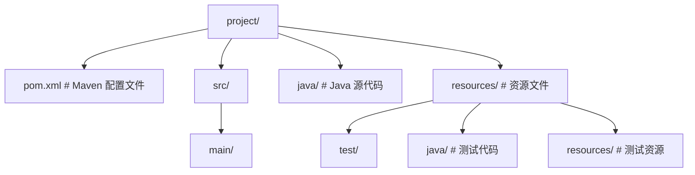
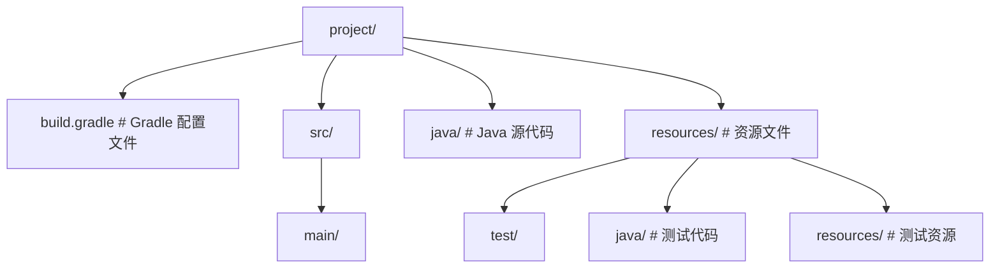
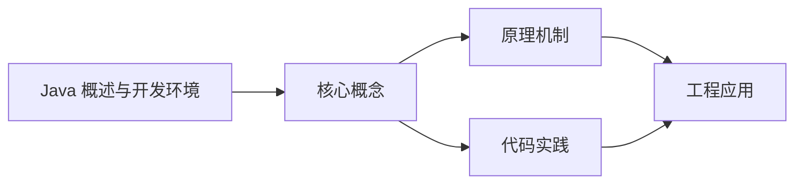
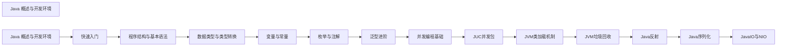

## 1. 学习目标（Bloom 分类）

本节按照布鲁姆教育目标分类学组织学习路径。本文主题为《Java 概述与开发环境》，属于 Java 模块，读者可以根据自身阶段选择阅读深度。

记忆层面：能够准确复述本文的核心概念、术语与基本语法或操作步骤，并能够在提问或检索时快速定位对应知识点。能够说出 Java 的编译执行模型（javac 到字节码，JVM 解释与 JIT）。

理解层面：能够用自己的语言解释核心原理与工作机制，说明概念之间的因果关系，而不是机械记忆结论。能够解释面向对象三大特性与 JVM 内存区域的职责。

应用层面：能够在真实项目或练习场景中运用本文知识解决具体问题，写出正确且可维护的实现。能够编写类、接口、集合操作与异常处理的完整程序。

分析层面：能够拆解复杂问题，比较本文主题与相邻概念的异同，识别边界条件与例外情况。能够分析 Java 与 C++、Go 在内存管理与并发模型上的差异。

评价层面：能够根据约束条件（性能、可读性、安全、成本）评价不同方案的优劣，做出有依据的技术决策。能够评价不同集合、并发工具与框架的适用场景。

创造层面：能够把本文知识与其他模块知识组合，设计出新的解决方案或可复用的工程模式。能够组合 Spring 生态设计企业级应用。

通过本节学习，读者应当能够把《Java 概述与开发环境》纳入自己的知识网络，并与 Java 模块的其他主题（JVM、集合框架、并发、Spring 生态）建立关联。

## 2. 历史动机与发展脉络

《Java 概述与开发环境》是 Java 领域的重要主题。要真正理解它，需要先了解它解决的问题与演进过程。

Java 由 James Gosling 领导的 Sun 团队于 1995 年发布，口号“一次编写，到处运行”依托 JVM 字节码实现跨平台。2006 年 Sun 将 Java 开源（OpenJDK），2010 年 Oracle 收购 Sun 后 Java 进入新的治理阶段。
Java 的版本节奏在 2017 年后改为每半年一个特性版本、每两年一个 LTS（长期支持）版本。当前主流 LTS 包括 Java 11、17、21 与 25；Java 21 引入虚拟线程（Project Loom 成果），显著降低高并发服务的线程成本。
Java 生态以 Spring 家族为核心：Spring Boot 简化配置与部署，Spring Cloud 提供微服务组件；构建工具从 Maven 演进到 Gradle；JVM 语言（Kotlin、Scala、Groovy）与 Java 共存互操作。
Android 开发早期使用 Java，2019 年后官方转向 Kotlin-first，但 Java 仍是服务端领域（尤其是金融、电商等企业系统）的中坚力量。

回到本文主题：Java 概述与开发环境 的提出与成熟，正是上述技术背景下的必然产物。早期实现往往以简单可用为目标，随着工程规模扩大，社区逐渐沉淀出标准做法与最佳实践；理解这一脉络，可以帮助读者判断“为什么文档中的推荐写法是现在这个样子”，也能在遇到历史遗留代码时准确识别其设计年代与取舍。

理解 Java 版本与 LTS 机制，是工程选型的起点：生产环境优先 LTS，新特性（如虚拟线程）可以在受控场景评估后引入。

## 3. 形式化定义与核心概念精讲

本节把《Java 概述与开发环境》涉及的核心概念以“定义 + 讲解”的形式展开。读者应把定义当作工具，把讲解当作理解路径；两者结合才能形成可迁移的知识。

JVM 与字节码：`javac` 把 .java 编译为 .class 字节码，JVM 加载、校验并执行；热点代码由 JIT（如 C2）编译为机器码，解释与编译结合实现启动速度与峰值性能的平衡。
面向对象：封装（访问控制）、继承（extends/implements）与多态（重载/重写）是 Java 的类型系统支柱；接口默认方法（Java 8）与密封类（Java 17）持续演进表达能力。
异常体系：受检异常（checked）编译期强制处理，非受检异常（RuntimeException）运行时抛出；try-with-resources 自动关闭资源。
泛型与擦除：Java 泛型在编译期检查后擦除类型参数，运行时无泛型信息；这解释了 `List<String>` 与 `List<Integer>` 的 Class 相同，以及通配符 `? extends` 的逆变协变规则。

### 3.1 原文章节逐一精讲

原文档把主题拆分为 11 个小节，下面按顺序给出每一节的导读讲解，随后保留原文细节供精读。

#### 原文精读（完整保留）


#### 1. Java 概述 (Overview)

Java 是一种由 **Sun Microsystems** (后被 Oracle 收购) 于 1995 年发布的面向对象编程语言。其核心理念是 **"Write Once, Run Anywhere" (WORA)**，即一次编写，到处运行。Java 不仅是一种编程语言，更是一个完整的平台，包括运行环境、开发工具和丰富的类库。

##### 1.1 发展历程

| 时间 | 事件                                        | 版本      |
| ---- | ------------------------------------------- | --------- |
| 1991 | Green 项目启动，旨在开发嵌入式设备编程语言  | -         |
| 1995 | Java 1.0 正式发布                           | 1.0       |
| 1998 | Java 2 发布，引入 J2SE、J2EE、J2ME          | 1.2       |
| 2004 | Java 5 发布，引入泛型、枚举、注解等特性     | 5.0       |
| 2006 | Java 开源，创建 OpenJDK                     | 6.0       |
| 2011 | Oracle 收购 Sun Microsystems                | 7.0       |
| 2014 | Java 8 发布，引入 Lambda 表达式、Stream API | 8.0 (LTS) |
| 2018 | Java 11 发布                                | 11 (LTS)  |
| 2021 | Java 17 发布                                | 17 (LTS)  |
| 2023 | Java 21 发布                                | 21 (LTS)  |
| 2025 | Java 25 发布                                | 25        |

##### 1.2 核心特点 (Key Features)

| 特点             | 描述                                                                                              | 优势                                       |
| ---------------- | ------------------------------------------------------------------------------------------------- | ------------------------------------------ |
| **跨平台性**     | 通过 JVM (Java Virtual Machine) 实现，Java 源代码编译成字节码 (`.class`)，由各平台的 JVM 解释执行 | 一次编写，到处运行，无需为不同平台重新编译 |
| **面向对象**     | 支持封装、继承、多态等特性，是纯粹的面向对象语言                                                  | 代码结构清晰，易于维护和扩展               |
| **强类型语言**   | 严格的编译时类型检查，所有变量必须先声明后使用                                                    | 提高代码可靠性，减少运行时错误             |
| **自动内存管理** | GC (Garbage Collection) 机制自动回收不再使用的对象内存                                            | 减少内存泄漏，简化内存管理                 |
| **安全性**       | 内置安全模型，如沙箱机制、字节码校验、访问控制                                                    | 提高应用安全性，防止恶意代码执行           |
| **多线程支持**   | 内置对多线程编程的支持，提供 Thread 类和相关 API                                                  | 充分利用多核处理器，提高应用性能           |
| **丰富的类库**   | 提供大量内置类库，覆盖网络、IO、集合、并发等多个领域                                              | 提高开发效率，减少重复代码                 |
| **分布式计算**   | 内置网络编程能力，支持分布式应用开发                                                              | 便于构建分布式系统和微服务                 |

#### 2. Java 开发工具 (The "Three Big" Concepts)

##### 2.1 JVM (Java Virtual Machine)

JVM 是运行 Java 字节码的虚拟机，是 Java 跨平台的核心。它将 Java 字节码翻译成特定平台的机器码并执行。
**JVM 的主要组成部分**：

- **类加载器 (ClassLoader)**: 负责加载类文件
- **运行时数据区 (Runtime Data Area)**: 包括方法区、堆、栈、程序计数器等
- **执行引擎 (Execution Engine)**: 执行字节码，包括解释器和 JIT 编译器
- **本地方法接口 (Native Interface)**: 与本地方法交互

##### 2.2 JRE (Java Runtime Environment)

JRE 包含 JVM 和核心类库，是运行 Java 程序所需的最小环境。普通用户只需要安装 JRE 即可运行 Java 应用。

##### 2.3 JDK (Java Development Kit)

JDK 包含 JRE 和开发工具，如编译器 (`javac`)、调试器 (`jdb`)、文档生成器 (`javadoc`) 等。开发人员必须安装 JDK 来编译和开发 Java 应用。
**JDK 主要工具**：

- `javac`: Java 编译器，将 `.java` 文件编译成 `.class` 文件
- `java`: Java 运行时，执行 `.class` 文件
- `javadoc`: 生成 API 文档
- `jar`: 打包工具，创建 JAR 文件
- `jdb`: Java 调试器
- `jps`: 查看 Java 进程
- `jstat`: 监控 JVM 统计信息
- `jmap`: 生成堆转储快照
- `jstack`: 生成线程转储

#### 3. 环境搭建 (Environment Setup)

##### 3.1 下载 JDK

推荐使用 OpenJDK 或 Oracle JDK，选择 LTS (Long Term Support) 版本以获得长期支持：

- **OpenJDK**: 开源版本，可从 [Adoptium](https://adoptium.net/) 或 [OpenJDK 官网](https://openjdk.org/) 下载
- **Oracle JDK**: 商业版本，可从 [Oracle 官网](https://www.oracle.com/java/technologies/downloads/) 下载

##### 3.2 安装 JDK

###### 3.2.1 Windows 安装

1. 下载 JDK 安装包（.exe 文件）
2. 双击安装包，按照向导完成安装
3. 记住安装路径，用于配置环境变量

###### 3.2.2 macOS 安装

1. 下载 JDK 安装包（.dmg 文件）
2. 双击安装包，按照向导完成安装
3. 或使用 Homebrew 安装：`brew install openjdk@21`

###### 3.2.3 Linux 安装

1. 使用包管理器安装：

- Ubuntu/Debian: `sudo apt install openjdk-21-jdk`
- CentOS/RHEL: `sudo yum install java-11-openjdk-devel`
- Fedora: `sudo dnf install java-21-openjdk-devel`

2. 或下载 tar.gz 文件手动安装：

- 解压到指定目录：`tar -zxvf jdk-21_linux-x64_bin.tar.gz -C /usr/local/`
- 配置环境变量

##### 3.3 配置环境变量

###### 3.3.1 Windows 配置

1. 右键点击「此电脑」→「属性」→「高级系统设置」→「环境变量」
2. 在「系统变量」中点击「新建」，设置 `JAVA_HOME`：

- 变量名：`JAVA_HOME`
- 变量值：JDK 安装目录，如 `C:\Program Files\Java\jdk-21`

3. 编辑 `Path` 变量，添加 `%JAVA_HOME%\bin`
4. 点击「确定」保存配置

###### 3.3.2 macOS/Linux 配置

编辑 `~/.bashrc` 或 `~/.zshrc` 文件，添加以下内容：

```bash
 # 设置 JAVA_HOME
 export JAVA_HOME=/usr/lib/jvm/java-21-openjdk-amd64
 # 添加到 PATH
 export PATH=$JAVA_HOME/bin:$PATH
```

然后执行 `source ~/.bashrc` 或 `source ~/.zshrc` 使配置生效。

##### 3.4 验证安装

打开命令行终端，执行以下命令验证 JDK 安装是否成功：

```bash
 # 查看 Java 版本
 java -version
 # 查看 javac 版本
 javac -version
```

**预期输出**：

```
 java version "21" 2023-09-19 LTS
 Java(TM) SE Runtime Environment (build 21+35-LTS-2513)
 Java HotSpot(TM) 64-Bit Server VM (build 21+35-LTS-2513, mixed mode, sharing)
 javac 21
```

#### 4. 开发工具 IDE

##### 4.1 主流 IDE

| IDE                    | 描述                         | 特点                                           |
| ---------------------- | ---------------------------- | ---------------------------------------------- |
| **IntelliJ IDEA**      | JetBrains 开发的 Java IDE    | 功能强大，智能代码提示，插件丰富，适合大型项目 |
| **Eclipse**            | 开源 Java IDE                | 插件生态丰富，适合企业级开发                   |
| **NetBeans**           | Oracle 开发的开源 IDE        | 轻量级，适合初学者，集成 Maven 和 Gradle       |
| **Visual Studio Code** | Microsoft 开发的轻量级编辑器 | 插件丰富，启动快速，适合小型项目               |

##### 4.2 IDE 配置

###### 4.2.1 IntelliJ IDEA 配置

1. 下载并安装 [IntelliJ IDEA](https://www.jetbrains.com/idea/download/)
2. 打开 IDEA，选择「New Project」
3. 选择「Java」，配置 JDK 路径
4. 选择项目模板，点击「Create」

###### 4.2.2 Eclipse 配置

1. 下载并安装 [Eclipse](https://www.eclipse.org/downloads/)
2. 打开 Eclipse，选择「File」→「New」→「Java Project」
3. 输入项目名称，配置 JDK 路径
4. 点击「Finish」创建项目

#### 5. 第一个 Java 程序

##### 5.1 编写 HelloWorld.java

```java
 public class HelloWorld {
  public static void main(String[] args) {
  System.out.println("Hello, Java!");
  }
 }
```

##### 5.2 编译和运行

```bash
 # 编译 Java 文件
 javac HelloWorld.java
 # 运行编译后的类
 java HelloWorld
```

**预期输出**：

```
 Hello, Java!
```

##### 5.3 项目结构

对于大型项目，推荐使用 Maven 或 Gradle 管理项目依赖和构建：
**Maven 项目结构**：



**Gradle 项目结构**：



#### 6. 应用领域 (Applications)

##### 6.1 企业级应用

- **Spring Boot**: 快速构建企业级应用的框架，简化配置，内嵌服务器
- **Spring Cloud**: 微服务架构的分布式系统框架
- **Java EE (Jakarta EE)**: 企业级应用规范，包括 Servlet、JSP、EJB 等
- **Quarkus**: 云原生 Java 框架，启动快，内存占用低

##### 6.2 移动应用

- **Android 开发**: Java 是 Android 原生开发的主要语言
- **Kotlin**: 基于 JVM 的语言，与 Java 互操作，被 Google 推荐为 Android 开发首选语言

##### 6.3 大数据

- **Hadoop**: 分布式存储和计算框架，核心组件用 Java 开发
- **Spark**: 快速的大数据处理引擎，支持 Java API
- **Flink**: 流处理框架，适合实时数据处理
- **Kafka**: 分布式消息队列，用 Java 开发

##### 6.4 云计算

- **微服务架构**: 使用 Spring Cloud、Micronaut 等框架构建
- **容器化**: 与 Docker、Kubernetes 集成
- **Serverless**: 支持 AWS Lambda、Google Cloud Functions 等

##### 6.5 其他领域

- **科学计算**: 用于数值计算、模拟等
- **金融系统**: 对精度和可靠性要求高的交易系统
- **游戏开发**: 后端服务器、游戏逻辑
- **嵌入式系统**: 物联网设备、智能设备

#### 7. Java 版本选择

##### 7.1 LTS 版本

LTS (Long Term Support) 版本提供长期支持，适合生产环境：

- **Java 8**: 2014 年发布，支持至 2030 年
- **Java 11**: 2018 年发布，支持至 2026 年
- **Java 17**: 2021 年发布，支持至 2029 年
- **Java 21**: 2023 年发布，支持至 2031 年

##### 7.2 非 LTS 版本

非 LTS 版本每 6 个月发布一次，包含最新特性，适合测试和尝鲜：

- **Java 12-16**: 已停止支持
- **Java 18-20**: 已停止支持
- **Java 22-24**: 最新特性版本
- **Java 25**: 最新发布版本

#### 8. 最佳实践

##### 8.1 编码规范

- **命名规范**:
- 类名: PascalCase (如 `HelloWorld`)
- 方法名: camelCase (如 `getUser`)
- 变量名: camelCase (如 `userName`)
- 常量名: UPPER_SNAKE_CASE (如 `MAX_SIZE`)
- **代码风格**:
- 使用 4 个空格缩进
- 每行不超过 120 个字符
- 合理使用空行分隔代码块
- 添加适当的注释

##### 8.2 性能优化

- **使用 StringBuilder 拼接字符串**
- **避免在循环中创建对象**
- **使用集合框架时选择合适的实现**
- **合理使用多线程**
- **优化内存使用，避免内存泄漏**

##### 8.3 安全性

- **避免使用过时的 API**
- **使用参数化查询防止 SQL 注入**
- **加密敏感数据**
- **实现适当的访问控制**
- **定期更新依赖库**

##### 8.4 工具使用

- **构建工具**: Maven 或 Gradle
- **版本控制**: Git
- **持续集成**: Jenkins、GitHub Actions
- **代码质量**: SonarQube、Checkstyle
- **测试框架**: JUnit、TestNG、Mockito

#### 9. 常见问题与解决方案

##### 9.1 环境变量配置错误

**问题**: 执行 `java -version` 时提示 "java 不是内部或外部命令"
**解决方案**:

- 检查 JAVA_HOME 是否正确设置
- 检查 Path 变量是否包含 %JAVA_HOME%\bin
- 重启命令行终端

##### 9.2 版本冲突

**问题**: 系统中安装了多个 Java 版本，导致使用错误的版本
**解决方案**:

- 检查 JAVA_HOME 指向正确的版本
- 调整 Path 变量中 Java 路径的顺序
- 使用 `update-alternatives` (Linux) 管理多个 Java 版本

##### 9.3 内存不足

**问题**: 运行 Java 程序时出现 "OutOfMemoryError"
**解决方案**:

- 增加 JVM 内存分配：`java -Xms512m -Xmx1024m MainClass`
- 检查代码中是否有内存泄漏
- 使用内存分析工具如 VisualVM 分析内存使用情况

##### 9.4 依赖冲突

**问题**: Maven 或 Gradle 项目中出现依赖冲突
**解决方案**:

- 使用 `mvn dependency:tree` 或 `gradle dependencies` 查看依赖树
- 排除冲突的依赖
- 使用统一的依赖版本管理

#### 10. 学习资源

##### 10.1 官方资源

- [Oracle Java 文档](https://docs.oracle.com/en/java/)
- [OpenJDK 官网](https://openjdk.org/)
- [Spring 官方文档](https://spring.io/docs)

##### 10.2 书籍

- 《Java 核心技术》(Core Java)
- 《Effective Java》
- 《Java 并发编程实战》
- 《Spring Boot 实战》

##### 10.3 在线教程

- [Oracle Java 教程](https://docs.oracle.com/javase/tutorial/)
- [Spring 官方教程](https://spring.io/guides)
- [Baeldung](https://www.baeldung.com/)
- [JavaPoint](https://www.javatpoint.com/)

#### 11. 总结

Java 是一种功能强大、跨平台的面向对象编程语言，拥有丰富的生态系统和广泛的应用领域。从企业级应用到移动开发，从大数据到云计算，Java 都发挥着重要作用。
搭建 Java 开发环境是学习 Java 的第一步，选择合适的 JDK 版本和 IDE 可以提高开发效率。遵循编码规范和最佳实践，使用现代化的工具和框架，可以编写出高质量、可维护的 Java 代码。
随着 Java 的不断发展，新特性和新框架不断涌现，作为 Java 开发者，需要持续学习和适应变化，以保持竞争力。

---


### 3.2 概念关系图

下面用 Mermaid 图表达本文核心概念之间的关系，帮助读者建立整体图景：



图中展示的是本文知识的结构化关系：核心概念是入口，原理机制解释“为什么”，代码实践演示“怎么做”，工程应用回答“何时用”。读者学习时可以把每个小节的内容挂接到对应节点上。

## 4. 理论推导与原理解析

本节深入《Java 概述与开发环境》背后的原理。理论部分不求面面俱到，而是聚焦“能解释现象、能指导实践”的关键推导。

JVM 内存模型：堆（新生代/老年代）、元空间、虚拟机栈、本地方法栈与程序计数器；GC 从 CMS 演进到 G1（默认）、ZGC（超低延迟），理解分代收集是调优前提。
并发工具：synchronized 与 JUC（java.util.concurrent）的锁、并发容器、线程池、CompletableFuture 构成并发工具箱；Java 21 的虚拟线程让“每任务一线程”成为可能。
类加载机制：双亲委派模型保证类唯一性，SPI（ServiceLoader）打破委派实现扩展；自定义类加载器是热部署与隔离的基础。
反射与注解：反射在运行时检查类结构，注解提供元数据；Spring 的依赖注入与 AOP 均基于这些机制，但反射有性能与安全成本。

需要强调的是，理论推导与工程实践之间存在翻译层：理论给出的是理想化模型与边界条件，工程代码则必须处理真实环境中的例外。读者在学习时应先掌握理论的“标准情形”，再通过陷阱章节了解“非标准情形”。

## 5. 代码示例与逐行讲解

本节把原文中的代码示例系统整理，并为每个示例补充用途说明与讲解。读者不应只浏览代码，而应逐段对照讲解理解设计意图。

### 5.1 示例：3.3.2 macOS/Linux 配置

该示例来自原文《3.3.2 macOS/Linux 配置》小节，用于演示Java 概述与开发环境相关操作。阅读时请先看代码结构，再看其后的讲解。

```bash
 # 设置 JAVA_HOME
 export JAVA_HOME=/usr/lib/jvm/java-21-openjdk-amd64
 # 添加到 PATH
 export PATH=$JAVA_HOME/bin:$PATH
```

讲解：这段代码演示了本节核心知识点。代码中的关键操作可以归纳为三步：准备（定义或初始化）、执行（核心逻辑）、收尾（释放资源或返回结果）。实际项目中，这三步往往被封装为函数或类，以提升复用性与可测试性。

关键点分析：

该示例共 4 行有效代码，结构以数据或配置为主。阅读时应关注：数据字段的含义、配置项的作用，以及它们与运行行为的对应关系。

进阶思考路径：先尝试修改参数观察行为变化，再把示例中的模式迁移到自己的项目中；每次修改都记录预期与实测差异，这是把示例转化为能力的最快方式。

### 5.2 示例：3.4 验证安装

该示例来自原文《3.4 验证安装》小节，用于演示Java 概述与开发环境相关操作。阅读时请先看代码结构，再看其后的讲解。

```bash
 # 查看 Java 版本
 java -version
 # 查看 javac 版本
 javac -version
```

讲解：这段代码演示了本节核心知识点。代码中的关键操作可以归纳为三步：准备（定义或初始化）、执行（核心逻辑）、收尾（释放资源或返回结果）。实际项目中，这三步往往被封装为函数或类，以提升复用性与可测试性。

关键点分析：

该示例共 4 行有效代码，结构以数据或配置为主。阅读时应关注：数据字段的含义、配置项的作用，以及它们与运行行为的对应关系。

进阶思考路径：先尝试修改参数观察行为变化，再把示例中的模式迁移到自己的项目中；每次修改都记录预期与实测差异，这是把示例转化为能力的最快方式。

### 5.3 示例：3.4 验证安装

该示例来自原文《3.4 验证安装》小节，用于演示Java 概述与开发环境相关操作。阅读时请先看代码结构，再看其后的讲解。

```text
 java version "21" 2023-09-19 LTS
 Java(TM) SE Runtime Environment (build 21+35-LTS-2513)
 Java HotSpot(TM) 64-Bit Server VM (build 21+35-LTS-2513, mixed mode, sharing)
 javac 21
```

讲解：这段代码演示了本节核心知识点。代码中的关键操作可以归纳为三步：准备（定义或初始化）、执行（核心逻辑）、收尾（释放资源或返回结果）。实际项目中，这三步往往被封装为函数或类，以提升复用性与可测试性。

关键点分析：

该示例共 4 行有效代码，结构以数据或配置为主。阅读时应关注：数据字段的含义、配置项的作用，以及它们与运行行为的对应关系。

进阶思考路径：先尝试修改参数观察行为变化，再把示例中的模式迁移到自己的项目中；每次修改都记录预期与实测差异，这是把示例转化为能力的最快方式。

### 5.4 示例：5.1 编写 HelloWorld.java

该示例来自原文《5.1 编写 HelloWorld.java》小节，用于演示Java 概述与开发环境相关操作。阅读时请先看代码结构，再看其后的讲解。

```java
 public class HelloWorld {
  public static void main(String[] args) {
  System.out.println("Hello, Java!");
  }
 }
```

讲解：这段代码演示了本节核心知识点。代码中的关键操作可以归纳为三步：准备（定义或初始化）、执行（核心逻辑）、收尾（释放资源或返回结果）。实际项目中，这三步往往被封装为函数或类，以提升复用性与可测试性。

关键点分析：

该示例共 5 行有效代码，包含 1 类关键结构（class）。其中：

- 入口与初始化部分负责建立上下文，对应实际项目中的启动或装配逻辑；
- 核心逻辑部分体现本文主题的主要操作，是阅读时最需要对照讲解理解的部分；
- 输出或返回部分把结果交给调用方，注意其类型与边界条件。

进阶思考路径：先尝试修改参数观察行为变化，再把示例中的模式迁移到自己的项目中；每次修改都记录预期与实测差异，这是把示例转化为能力的最快方式。

### 5.5 示例：5.2 编译和运行

该示例来自原文《5.2 编译和运行》小节，用于演示Java 概述与开发环境相关操作。阅读时请先看代码结构，再看其后的讲解。

```bash
 # 编译 Java 文件
 javac HelloWorld.java
 # 运行编译后的类
 java HelloWorld
```

讲解：这段代码演示了本节核心知识点。代码中的关键操作可以归纳为三步：准备（定义或初始化）、执行（核心逻辑）、收尾（释放资源或返回结果）。实际项目中，这三步往往被封装为函数或类，以提升复用性与可测试性。

关键点分析：

该示例共 4 行有效代码，结构以数据或配置为主。阅读时应关注：数据字段的含义、配置项的作用，以及它们与运行行为的对应关系。

进阶思考路径：先尝试修改参数观察行为变化，再把示例中的模式迁移到自己的项目中；每次修改都记录预期与实测差异，这是把示例转化为能力的最快方式。

### 5.6 示例：5.2 编译和运行

该示例来自原文《5.2 编译和运行》小节，用于演示Java 概述与开发环境相关操作。阅读时请先看代码结构，再看其后的讲解。

```text
 Hello, Java!
```

讲解：这段代码演示了本节核心知识点。代码中的关键操作可以归纳为三步：准备（定义或初始化）、执行（核心逻辑）、收尾（释放资源或返回结果）。实际项目中，这三步往往被封装为函数或类，以提升复用性与可测试性。

关键点分析：

该示例共 1 行有效代码，结构以数据或配置为主。阅读时应关注：数据字段的含义、配置项的作用，以及它们与运行行为的对应关系。

进阶思考路径：先尝试修改参数观察行为变化，再把示例中的模式迁移到自己的项目中；每次修改都记录预期与实测差异，这是把示例转化为能力的最快方式。

### 5.7 示例：5.3 项目结构

该示例来自原文《5.3 项目结构》小节，用于演示Java 概述与开发环境相关操作。阅读时请先看代码结构，再看其后的讲解。


讲解：这段代码演示了本节核心知识点。代码中的关键操作可以归纳为三步：准备（定义或初始化）、执行（核心逻辑）、收尾（释放资源或返回结果）。实际项目中，这三步往往被封装为函数或类，以提升复用性与可测试性。

关键点分析：

该示例共 18 行有效代码，结构以数据或配置为主。阅读时应关注：数据字段的含义、配置项的作用，以及它们与运行行为的对应关系。

进阶思考路径：先尝试修改参数观察行为变化，再把示例中的模式迁移到自己的项目中；每次修改都记录预期与实测差异，这是把示例转化为能力的最快方式。

### 5.8 示例：5.3 项目结构

该示例来自原文《5.3 项目结构》小节，用于演示Java 概述与开发环境相关操作。阅读时请先看代码结构，再看其后的讲解。


讲解：这段代码演示了本节核心知识点。代码中的关键操作可以归纳为三步：准备（定义或初始化）、执行（核心逻辑）、收尾（释放资源或返回结果）。实际项目中，这三步往往被封装为函数或类，以提升复用性与可测试性。

关键点分析：

该示例共 18 行有效代码，结构以数据或配置为主。阅读时应关注：数据字段的含义、配置项的作用，以及它们与运行行为的对应关系。

进阶思考路径：先尝试修改参数观察行为变化，再把示例中的模式迁移到自己的项目中；每次修改都记录预期与实测差异，这是把示例转化为能力的最快方式。

```java
// 泛型工具：类型安全的取最小值
public static <T extends Comparable<T>> T minOf(T a, T b) {
    return a.compareTo(b) <= 0 ? a : b;
}
```
讲解：`<T extends Comparable<T>>` 约束 T 必须可比较，编译期保证 `compareTo` 可用；返回值类型与入参一致，避免运行时强转。

综合以上示例，可以总结出本主题的代码实践要点：第一，先定义清晰的输入输出契约；第二，核心逻辑保持单一职责；第三，错误处理与边界条件不可省略；第四，命名与注释表达意图而非复述代码。

## 6. 对比分析

对比是理解《Java 概述与开发环境》定位的最快路径。下面从多个维度与相邻方案进行对比。

Java 与 C++：Java 无指针算术、自动 GC、跨平台；C++ 可精细控制内存与性能，适合系统级开发。Java 开发效率高，C++ 性能上限高。
Java 与 Go：Java 生态成熟、类型系统与工具链完备；Go 语法简单、并发原生、部署为单一二进制。服务端选型取决于团队与生态。
Java 8 与 Java 21：lambda/Stream（8）与虚拟线程/模式匹配（21）代表两个时代；新项目应基于 17+ 使用现代 API。

对比的目的不是分出绝对优劣，而是建立选择依据：不同约束条件下，最优解不同。读者应把每个对比维度转化为决策检查清单。

## 7. 常见陷阱与最佳实践

本节整理该主题的高频错误与推荐做法。每个陷阱先描述现象，再解释原因，最后给出最佳实践。

### 7.1 equals 与 hashCode 不一致

违反约定导致 HashMap 查找失效。重写 equals 必须同步重写 hashCode，且保证相等对象哈希一致。

深入讲解：该问题之所以被归类为“常见陷阱”，是因为它在初学者的代码中反复出现，而且往往不在第一时间暴露——错误通常隐藏在特定数据或特定时序下。

从成因上看，equals 与 hashCode 不一致 一般源于对 Java 某个机制的理解偏差：要么误用了默认行为，要么忽略了边界条件，要么把其他语言的思维惯性带了过来。

从影响上看，equals 与 hashCode 不一致 轻则产生错误结果，重则导致资源泄漏、数据损坏或安全事故；这也是为什么工程评审中会把它列为检查项。

从修复策略上看，处理equals 与 hashCode 不一致的正确顺序是：先复现（构造最小用例），再定位（确认机制层面的根因），最后修复并补充回归测试。跳过复现直接改代码，往往治标不治本。

### 7.2 集合遍历时修改

`for-each` 中调用 `list.remove` 抛 ConcurrentModificationException。使用 Iterator.remove 或收集后批量删除。

深入讲解：该问题之所以被归类为“常见陷阱”，是因为它在初学者的代码中反复出现，而且往往不在第一时间暴露——错误通常隐藏在特定数据或特定时序下。

从成因上看，集合遍历时修改 一般源于对 Java 某个机制的理解偏差：要么误用了默认行为，要么忽略了边界条件，要么把其他语言的思维惯性带了过来。

从影响上看，集合遍历时修改 轻则产生错误结果，重则导致资源泄漏、数据损坏或安全事故；这也是为什么工程评审中会把它列为检查项。

从修复策略上看，处理集合遍历时修改的正确顺序是：先复现（构造最小用例），再定位（确认机制层面的根因），最后修复并补充回归测试。跳过复现直接改代码，往往治标不治本。

### 7.3 字符串用 == 比较

`==` 比较引用而非内容；字符串应使用 `equals`，并优先字符串常量池与 `StringBuilder` 拼接。

深入讲解：该问题之所以被归类为“常见陷阱”，是因为它在初学者的代码中反复出现，而且往往不在第一时间暴露——错误通常隐藏在特定数据或特定时序下。

从成因上看，字符串用 == 比较 一般源于对 Java 某个机制的理解偏差：要么误用了默认行为，要么忽略了边界条件，要么把其他语言的思维惯性带了过来。

从影响上看，字符串用 == 比较 轻则产生错误结果，重则导致资源泄漏、数据损坏或安全事故；这也是为什么工程评审中会把它列为检查项。

从修复策略上看，处理字符串用 == 比较的正确顺序是：先复现（构造最小用例），再定位（确认机制层面的根因），最后修复并补充回归测试。跳过复现直接改代码，往往治标不治本。

### 7.4 整数缓存误判

`Integer` 在 -128~127 间缓存，`==` 可能为 true，超出范围为 false。包装类型比较一律用 equals。

深入讲解：该问题之所以被归类为“常见陷阱”，是因为它在初学者的代码中反复出现，而且往往不在第一时间暴露——错误通常隐藏在特定数据或特定时序下。

从成因上看，整数缓存误判 一般源于对 Java 某个机制的理解偏差：要么误用了默认行为，要么忽略了边界条件，要么把其他语言的思维惯性带了过来。

从影响上看，整数缓存误判 轻则产生错误结果，重则导致资源泄漏、数据损坏或安全事故；这也是为什么工程评审中会把它列为检查项。

从修复策略上看，处理整数缓存误判的正确顺序是：先复现（构造最小用例），再定位（确认机制层面的根因），最后修复并补充回归测试。跳过复现直接改代码，往往治标不治本。

### 7.5 线程安全误用

`SimpleDateFormat` 非线程安全，多线程格式化出错。使用 `DateTimeFormatter`（不可变）或 ThreadLocal。

深入讲解：该问题之所以被归类为“常见陷阱”，是因为它在初学者的代码中反复出现，而且往往不在第一时间暴露——错误通常隐藏在特定数据或特定时序下。

从成因上看，线程安全误用 一般源于对 Java 某个机制的理解偏差：要么误用了默认行为，要么忽略了边界条件，要么把其他语言的思维惯性带了过来。

从影响上看，线程安全误用 轻则产生错误结果，重则导致资源泄漏、数据损坏或安全事故；这也是为什么工程评审中会把它列为检查项。

从修复策略上看，处理线程安全误用的正确顺序是：先复现（构造最小用例），再定位（确认机制层面的根因），最后修复并补充回归测试。跳过复现直接改代码，往往治标不治本。

### 7.6 资源泄漏

忘记关闭连接与流。使用 try-with-resources 或确保 finally 关闭。

深入讲解：该问题之所以被归类为“常见陷阱”，是因为它在初学者的代码中反复出现，而且往往不在第一时间暴露——错误通常隐藏在特定数据或特定时序下。

从成因上看，资源泄漏 一般源于对 Java 某个机制的理解偏差：要么误用了默认行为，要么忽略了边界条件，要么把其他语言的思维惯性带了过来。

从影响上看，资源泄漏 轻则产生错误结果，重则导致资源泄漏、数据损坏或安全事故；这也是为什么工程评审中会把它列为检查项。

从修复策略上看，处理资源泄漏的正确顺序是：先复现（构造最小用例），再定位（确认机制层面的根因），最后修复并补充回归测试。跳过复现直接改代码，往往治标不治本。

### 7.7 空指针

链式调用未判空。使用 Optional、Objects.requireNonNull 与防御式检查。

深入讲解：该问题之所以被归类为“常见陷阱”，是因为它在初学者的代码中反复出现，而且往往不在第一时间暴露——错误通常隐藏在特定数据或特定时序下。

从成因上看，空指针 一般源于对 Java 某个机制的理解偏差：要么误用了默认行为，要么忽略了边界条件，要么把其他语言的思维惯性带了过来。

从影响上看，空指针 轻则产生错误结果，重则导致资源泄漏、数据损坏或安全事故；这也是为什么工程评审中会把它列为检查项。

从修复策略上看，处理空指针的正确顺序是：先复现（构造最小用例），再定位（确认机制层面的根因），最后修复并补充回归测试。跳过复现直接改代码，往往治标不治本。

### 7.8 大对象长时间存活

导致老年代增长与 Full GC。评估对象生命周期，及时释放引用，必要时使用弱引用。

深入讲解：该问题之所以被归类为“常见陷阱”，是因为它在初学者的代码中反复出现，而且往往不在第一时间暴露——错误通常隐藏在特定数据或特定时序下。

从成因上看，大对象长时间存活 一般源于对 Java 某个机制的理解偏差：要么误用了默认行为，要么忽略了边界条件，要么把其他语言的思维惯性带了过来。

从影响上看，大对象长时间存活 轻则产生错误结果，重则导致资源泄漏、数据损坏或安全事故；这也是为什么工程评审中会把它列为检查项。

从修复策略上看，处理大对象长时间存活的正确顺序是：先复现（构造最小用例），再定位（确认机制层面的根因），最后修复并补充回归测试。跳过复现直接改代码，往往治标不治本。

### 7.9 魔法数字与重复代码

可读性与维护性下降。使用常量、枚举与抽取方法。

深入讲解：该问题之所以被归类为“常见陷阱”，是因为它在初学者的代码中反复出现，而且往往不在第一时间暴露——错误通常隐藏在特定数据或特定时序下。

从成因上看，魔法数字与重复代码 一般源于对 Java 某个机制的理解偏差：要么误用了默认行为，要么忽略了边界条件，要么把其他语言的思维惯性带了过来。

从影响上看，魔法数字与重复代码 轻则产生错误结果，重则导致资源泄漏、数据损坏或安全事故；这也是为什么工程评审中会把它列为检查项。

从修复策略上看，处理魔法数字与重复代码的正确顺序是：先复现（构造最小用例），再定位（确认机制层面的根因），最后修复并补充回归测试。跳过复现直接改代码，往往治标不治本。

### 7.10 忽略编译告警

未检查类型转换与废弃 API 隐藏问题。开启 -Xlint 并保持零告警。

深入讲解：该问题之所以被归类为“常见陷阱”，是因为它在初学者的代码中反复出现，而且往往不在第一时间暴露——错误通常隐藏在特定数据或特定时序下。

从成因上看，忽略编译告警 一般源于对 Java 某个机制的理解偏差：要么误用了默认行为，要么忽略了边界条件，要么把其他语言的思维惯性带了过来。

从影响上看，忽略编译告警 轻则产生错误结果，重则导致资源泄漏、数据损坏或安全事故；这也是为什么工程评审中会把它列为检查项。

从修复策略上看，处理忽略编译告警的正确顺序是：先复现（构造最小用例），再定位（确认机制层面的根因），最后修复并补充回归测试。跳过复现直接改代码，往往治标不治本。

### 7.0 最佳实践总览

1. 遵循 Java 命名规范：类名驼峰、常量全大写、包名小写域名反写。
2. 面向接口编程，依赖注入优先于直接 new。
3. 不可变对象优先：final 字段 + 防御性拷贝。
4. 集合返回只读视图，避免外部修改内部状态。
5. 日志使用 SLF4J 门面 + 占位符，避免字符串拼接。
6. 测试使用 JUnit 5 + AssertJ，按 given/when/then 组织。

把这些最佳实践固化为团队规范与代码评审检查项，是避免同类问题反复出现的关键。

## 8. 工程实践

本节把《Java 概述与开发环境》放入真实工程场景，给出可复用的模式与组织方法。

Maven 项目结构：src/main/java、src/test/java 与 pom.xml；依赖坐标（groupId/artifactId/version）从中央仓库解析。
Spring Boot 分层：Controller（HTTP 层）、Service（业务层）、Repository（数据层）；DTO 与实体分离防止内部结构泄漏。
配置管理：application.yml + profile（dev/prod）+ 配置中心；敏感信息走环境变量或 Secret。
可观测性：actuator 健康端点、Micrometer 指标、分布式追踪（OpenTelemetry）构成生产基线。

### 8.1 工程实践的原则拆解

以上工程实践可以归纳为四条原则。第一，配置与代码分离：Java 项目中环境差异应通过配置注入，而不是散落在代码分支中；这保证同一份代码可以在开发、测试、生产环境一致运行。

第二，接口稳定优先：对外接口（函数签名、协议、数据格式）一旦被消费方依赖，变更成本极高；设计时应预留扩展点并保持向后兼容。

第三，可观测性内置：日志、指标与追踪应该在功能开发时同步设计，而不是故障发生后补救；没有观测手段的模块等于黑盒。

第四，变更可回滚：任何发布都应有对应的回滚方案；数据库迁移、配置变更与代码发布一样需要版本管理与逆向路径。

### 8.2 实践落地的检查清单

- [ ] Maven 项目结构：对照本节描述，检查当前项目是否已经落实；未落实的项列入技术债并排期处理。
- [ ] Spring Boot 分层：对照本节描述，检查当前项目是否已经落实；未落实的项列入技术债并排期处理。
- [ ] 配置管理：对照本节描述，检查当前项目是否已经落实；未落实的项列入技术债并排期处理。
- [ ] 可观测性：对照本节描述，检查当前项目是否已经落实；未落实的项列入技术债并排期处理。

工程实践的共性原则：配置与代码分离、接口稳定优先、可观测性内置、变更可回滚。这些原则适用于本主题的所有实现。

## 9. 案例研究

本节通过一个完整案例把《Java 概述与开发环境》的知识串起来。案例按“需求分析、方案设计、实现、验证”四步展开。

需求：实现订单服务，支持创建订单、查询列表与状态流转。
方案：Spring Boot 3 + JPA + H2（演示），Controller-Service-Repository 三层。
实现要点：订单状态用枚举；金额用 BigDecimal；创建订单在事务内完成库存校验与扣减；接口返回 DTO。
验证：JUnit 测试服务层事务回滚；MockMvc 测试 HTTP 层；压测关注吞吐与延迟。

### 9.1 案例的扩展讨论

把案例中的方案放大到真实规模，需要额外考虑三个问题：

第一，规模：当数据量或并发量上升一个数量级时，原方案中的数据结构、缓存策略与任务调度是否仍然成立？通常需要引入分层与异步。

第二，团队：多人协作时，模块边界、接口契约与代码所有权必须明确；案例中的实现应拆分为可独立测试的单元，并配合文档说明设计意图。

第三，演进：上线后的需求变化不可避免；方案设计时应预留扩展点（配置化、插件化、事件化），并定期用真实指标验证假设。


案例研究的学习方法：先独立阅读需求，尝试在脑中形成方案，再对照实现与讲解，最后思考“如果约束变化（数据量、并发、团队规模），方案应如何调整”。

## 10. 知识要点总结与深入讲解

本节以讲解形式汇总全文要点，替代传统的习题与自测，读者不需要答题，只需跟随解释建立完整的认知框架。

关于《Java 概述与开发环境》的核心结论：

Java 的竞争力来自 JVM 生态的深度与广度，选型时应优先考虑团队存量技能与生态需求。
内存、并发与类加载三大机制是 Java 进阶的分水岭，理解它们才能解决线上疑难问题。
工程化基线：LTS 版本、依赖锁定、静态检查、单元测试与可观测性。

原文档各小节的要点回顾：

- 1. Java 概述 (Overview)：该小节围绕Java 概述与开发环境展开具体细节，阅读时应关注其与核心结论的对应关系；每个小节都是核心结论在某一个侧面的展开。
- 2. Java 开发工具 (The "Three Big" Concepts)：该小节围绕Java 概述与开发环境展开具体细节，阅读时应关注其与核心结论的对应关系；每个小节都是核心结论在某一个侧面的展开。
- 3. 环境搭建 (Environment Setup)：该小节围绕Java 概述与开发环境展开具体细节，阅读时应关注其与核心结论的对应关系；每个小节都是核心结论在某一个侧面的展开。
- 4. 开发工具 IDE：该小节围绕Java 概述与开发环境展开具体细节，阅读时应关注其与核心结论的对应关系；每个小节都是核心结论在某一个侧面的展开。
- 5. 第一个 Java 程序：该小节围绕Java 概述与开发环境展开具体细节，阅读时应关注其与核心结论的对应关系；每个小节都是核心结论在某一个侧面的展开。
- 6. 应用领域 (Applications)：该小节围绕Java 概述与开发环境展开具体细节，阅读时应关注其与核心结论的对应关系；每个小节都是核心结论在某一个侧面的展开。
- 7. Java 版本选择：该小节围绕Java 概述与开发环境展开具体细节，阅读时应关注其与核心结论的对应关系；每个小节都是核心结论在某一个侧面的展开。
- 8. 最佳实践：该小节围绕Java 概述与开发环境展开具体细节，阅读时应关注其与核心结论的对应关系；每个小节都是核心结论在某一个侧面的展开。
- 9. 常见问题与解决方案：该小节围绕Java 概述与开发环境展开具体细节，阅读时应关注其与核心结论的对应关系；每个小节都是核心结论在某一个侧面的展开。
- 10. 学习资源：该小节围绕Java 概述与开发环境展开具体细节，阅读时应关注其与核心结论的对应关系；每个小节都是核心结论在某一个侧面的展开。
- 11. 总结：该小节围绕Java 概述与开发环境展开具体细节，阅读时应关注其与核心结论的对应关系；每个小节都是核心结论在某一个侧面的展开。

把以上要点与第 3-9 节的内容对照复习，即可完成对本文主题的闭环学习。

## 11. 参考文献


Oracle Java 官方文档：https://docs.oracle.com/en/java/
OpenJDK 项目：https://openjdk.org/
Java 语言规范：https://docs.oracle.com/javase/specs/
Spring 官方文档：https://spring.io/projects/spring-boot
Baeldung 教程站：https://www.baeldung.com/
Maven 官方文档：https://maven.apache.org/guides/

## 12. 延伸阅读


Java 并发与 JUC，见 013-java 模块并发文档。
JVM 内存与 GC 调优，见 013-java 模块 JVM 文档。
Spring Boot 微服务与 Kubernetes，见 013-java/041-JavaKubernetes 文档。
数据库访问（JDBC/JPA），见 019-sql 模块相关文档。
黑马程序员 Bilibili 空间（https://space.bilibili.com/37974444 ）提供 Java 全栈课程；尚硅谷 Bilibili 空间（https://space.bilibili.com/302417610 ）提供 Java 进阶课程。

## 14. 模块知识图谱与学习路径

本文属于 Java 模块。为了把《Java 概述与开发环境》放入完整的知识网络，下面列出本模块的全部主题并给出相互关联的导读。学习时建议按模块内顺序推进，并在每个文档中留意交叉引用。



上图为模块主题的推荐学习顺序示意图（仅展示前若干主题）。各主题之间存在三类关联：

第一，前置依赖关系：早期主题是后期主题的基础，例如环境与语法先行、进阶主题随后；

第二，横向并列关系：同一层级主题从不同角度覆盖模块能力，学习顺序可以按兴趣调整；

第三，工程组合关系：多个主题在真实项目中组合使用，例如配置、性能与安全主题往往出现在同一系统的不同层面。

### 14.1 模块主题速查表

| 文档 | 主题 | 与本文的关联 |
| --- | --- | --- |
| Java 概述与开发环境 | 001-JavaOverviewDevEnv | 本文自身 |
| 快速入门 | 002-QuickStart | 本文的前置基础 |
| 程序结构与基本语法 | 003-ProgramStructureBasicSyntax | 本文的并列主题 |
| 数据类型与类型转换 | 004-DataTypeConversion | 本文的并列主题 |
| 变量与常量 | 005-VariableConstant | 本文的并列主题 |
| 枚举与注解 | 006-JavaAnnotationsTutorial | 本文的并列主题 |
| 泛型进阶 | 007-JavaGenericsTutorial | 本文的并列主题 |
| 并发编程基础 | 008-ConcurrencyBasics | 本文的前置基础 |
| JUC并发包 | 009-JUCConcurrency | 本文的并列主题 |
| JVM类加载机制 | 010-JVMClassLoadingMechanism | 本文的原理深化 |
| JVM垃圾回收 | 011-JVMGC | 本文的并列主题 |
| Java反射 | 012-JavaReflection | 本文的并列主题 |
| Java序列化 | 013-JavaSerialization | 本文的并列主题 |
| JavaIO与NIO | 014-JavaIONIO | 本文的并列主题 |
| Java新特性 | 015-JavaNewFeatures | 本文的并列主题 |
| 运算符与表达式 | 016-OperatorExpression | 本文的并列主题 |
| Spring 基础：IoC 容器、AOP、Bean 生命周期与企业级开发核心 | 017-SpringBasicsIoCAOPBeanLifecycle | 本文的前置基础 |
| SpringBoot进阶 | 018-SpringBootAdvanced | 本文的并列主题 |
| SpringBoot安全 | 019-SpringBootSecurity | 本文的安全延伸 |
| SpringBoot数据访问 | 020-SpringBootDataAccess | 本文的并列主题 |
| Java设计模式 | 021-JavaDesignPattern | 本文的并列主题 |
| Java函数式编程 | 022-JavaFunctionalProgramming | 本文的并列主题 |
| Java网络编程 | 023-JavaNetworkProgramming | 本文的并列主题 |
| Java日志系统 | 024-JavaLogSystem | 本文的并列主题 |
| Java单元测试 | 025-JavaUnitTest | 本文的并列主题 |
| Java构建工具 | 026-JavaBuildTool | 本文的并列主题 |
| 控制流 | 027-ControlFlow | 本文的并列主题 |
| Java与微服务 | 028-JavaMicroservice | 本文的并列主题 |
| Java与消息队列 | 029-JavaMessageQueue | 本文的并列主题 |
| Java与Redis | 030-JavaRedis | 本文的并列主题 |
| Java与Docker | 031-JavaDocker | 本文的并列主题 |
| Java与GraphQL | 032-JavaGraphQL | 本文的并列主题 |
| Java性能调优 | 033-JavaPerformanceTuning | 本文的性能延伸 |
| Java与AI | 034-JavaAI | 本文的并列主题 |
| Java与安全 | 035-JavaSecurity | 本文的安全延伸 |
| Java与WebAssembly | 036-JavaWebAssembly | 本文的并列主题 |
| Java与响应式编程 | 037-JavaReactiveProgramming | 本文的并列主题 |
| 方法详解 | 038-MethodDetailed | 本文的并列主题 |
| Java与虚拟线程 | 039-JavaVirtualThread | 本文的并列主题 |
| Java与GraalVM | 040-JavaGraalVM | 本文的并列主题 |
| Java与Kubernetes | 041-JavaKubernetes | 本文的并列主题 |
| Java记录类 | 042-JavaRecordClass | 本文的并列主题 |
| Java文本块 | 043-JavaTextBlock | 本文的并列主题 |
| Java模块系统 | 044-JavaModuleSystem | 本文的并列主题 |
| Java与数据库连接 | 045-JavaDatabaseConnection | 本文的并列主题 |
| Java 新特性与生态 | 046-JavaNewFeaturesEcosystem | 本文的并列主题 |
| 数组详解 | 047-ArrayDetailed | 本文的并列主题 |
| JVM调优 | 048-JVMtuning | 本文的性能延伸 |
| 集合框架详解 | 049-CollectionFrameworkDetailed | 本文的并列主题 |
| 并发编程详解 | 050-ConcurrencyDetailed | 本文的并列主题 |
| CompletableFuture异步编排 | 051-CompletableFutureAsync | 本文的并列主题 |
| ThreadLocal内存泄漏 | 052-ThreadLocalMemoryLeak | 本文的并列主题 |
| 反射与动态代理 | 053-ReflectionDynamicProxy | 本文的并列主题 |
| 注解处理器 | 054-AnnotationProcessor | 本文的并列主题 |
| 分代ZGC详解 | 055-GenerationalZGCDetailed | 本文的并列主题 |
| 面向对象编程 | 056-OOP | 本文的并列主题 |
| 抽象类与接口 | 057-AbstractClassInterface | 本文的并列主题 |
| 异常处理机制 | 058-ExceptionHandlingMechanism | 本文的原理深化 |
| 泛型详解 | 059-GenericDetailed | 本文的并列主题 |
| I/O 流与文件操作 | 060-IOStreamFileOperation | 本文的并列主题 |
| 多线程基础 | 061-MultithreadingBasics | 本文的前置基础 |
| JVM 内存模型 | 062-JVMMemoryModel | 本文的并列主题 |
| Lambda与函数式编程 | 063-LambdaFunctionalProgramming | 本文的并列主题 |
| Stream API | 064-StreamAPI | 本文的并列主题 |
| Spring Boot 学习笔记 | 065-SpringBootNotes | 本文的并列主题 |
| 网络编程 | 066-NetworkProgramming | 本文的并列主题 |
| Spring Cloud 微服务开发 | 067-SpringCloudMicroserviceDevelopment | 本文的并列主题 |
| Java Swing 图形界面 | 068-JavaSwingGUI | 本文的并列主题 |
| Java 项目示例：图书管理系统 | 069-JavaProjectExampleLibrarySystem | 本文的综合应用 |
| Java 理论知识点：JVM 原理、类加载机制与内存管理 | 070-JavaTheoryJVMClassLoadingMemory | 本文的原理深化 |
| Java NIO 通道与缓冲区 | 071-JavaNIOChannelBuffer | 本文的并列主题 |
| Java JDBC 数据库连接 | 072-JDBCDatabaseConnection | 本文的并列主题 |
| Java Optional 类 | 073-JavaOptionalClass | 本文的并列主题 |
| Java Executor 与 ForkJoin | 074-ExecutorForkJoinPool | 本文的并列主题 |
| Java Path 与 Files 语法速查手册 | 075-JavaPathFiles | 本文的并列主题 |
| 启动 REPL 交互环境 | 076-JavaJshellJpackage | 本文的前置基础 |
| Java 同步器 CountDownLatch/CyclicBarrier/Phaser 语法速查手册 | 077-JavaCountDownLatchCyclicBarrier | 本文的并列主题 |
| Java 阻塞队列 BlockingQueue 语法速查手册 | 078-JavaBlockingQueue | 本文的并列主题 |
| Java try-with-resources 与异常链语法速查手册 | 079-JavaTryWithResources | 本文的并列主题 |
| Java HttpClient 与 WebSocket 语法速查手册 | 080-JavaHttpClientWebSocket | 本文的并列主题 |
| Java 时间格式化 DateTimeFormatter/ZoneId 语法速查手册 | 081-JavaTimeFormatting | 本文的并列主题 |
| Java 类型擦除与桥接方法语法速查手册 | 082-JavaTypeErasure | 本文的并列主题 |
| Java 枚举进阶 EnumSet/EnumMap/枚举单例语法速查手册 | 083-JavaEnumAdvanced | 本文的并列主题 |
| Java Iterator/Iterable/Spliterator 语法速查手册 | 084-JavaIteratorIterable | 本文的并列主题 |
| Java Comparator/Comparable 语法速查手册 | 085-JavaComparatorComparable | 本文的并列主题 |
| Java String.format/printf/MessageFormat 语法速查手册 | 086-JavaStringFormat | 本文的并列主题 |
| Java Arrays 工具类语法速查手册 | 087-JavaArraysUtility | 本文的并列主题 |
| Java Objects 工具类语法速查手册 | 088-JavaObjectsUtility | 本文的并列主题 |
| Java 命令行工具 javac/java/jar/jshell/jpackage 语法速查手册 | 089-JavaCommandLineTools | 本文的并列主题 |
| Maven pom.xml 配置语法速查手册 | 090-MavenPomConfiguration | 本文的并列主题 |
| Gradle build.gradle 配置语法速查手册 | 091-GradleBuildConfiguration | 本文的并列主题 |

速查表的作用是让读者快速判断：哪些文档应在阅读本文前掌握（前置基础），哪些文档应在阅读本文后继续（延伸主题）。本模块的交叉引用体系即以此表为基础。

## 15. 术语表

下表整理《Java 概述与开发环境》及 Java 模块中出现的高频术语，给出简明释义。术语按字母序或逻辑序排列，供查阅。

| 术语 | 释义 |
| --- | --- |
| JVM 与字节码 | `javac` 把 .java 编译为 .class 字节码，JVM 加载、校验并执行；热点代码由 JIT（如 C2）编译为机器码，解释与编译结合实现启动速度与 |
| 面向对象 | 封装（访问控制）、继承（extends/implements）与多态（重载/重写）是 Java 的类型系统支柱；接口默认方法（Java 8）与密封类（Java  |
| 异常体系 | 受检异常（checked）编译期强制处理，非受检异常（RuntimeException）运行时抛出；try-with-resources 自动关闭资源。 |
| 泛型与擦除 | Java 泛型在编译期检查后擦除类型参数，运行时无泛型信息；这解释了 `List<String>` 与 `List<Integer>` 的 Class 相同，以 |
| JVM 内存模型 | 堆（新生代/老年代）、元空间、虚拟机栈、本地方法栈与程序计数器；GC 从 CMS 演进到 G1（默认）、ZGC（超低延迟），理解分代收集是调优前提。 |
| 并发工具 | synchronized 与 JUC（java.util.concurrent）的锁、并发容器、线程池、CompletableFuture 构成并发工具箱；Ja |
| 类加载机制 | 双亲委派模型保证类唯一性，SPI（ServiceLoader）打破委派实现扩展；自定义类加载器是热部署与隔离的基础。 |
| 反射与注解 | 反射在运行时检查类结构，注解提供元数据；Spring 的依赖注入与 AOP 均基于这些机制，但反射有性能与安全成本。 |
| equals 与 hashCode 不一致（易错点） | 参见常见陷阱章节的详细讲解 |
| 集合遍历时修改（易错点） | 参见常见陷阱章节的详细讲解 |
| 字符串用 == 比较（易错点） | 参见常见陷阱章节的详细讲解 |
| 整数缓存误判（易错点） | 参见常见陷阱章节的详细讲解 |
| 线程安全误用（易错点） | 参见常见陷阱章节的详细讲解 |
| 资源泄漏（易错点） | 参见常见陷阱章节的详细讲解 |

术语表与正文配合使用：先通读正文，遇到模糊术语回查本表；长期使用后术语会自然进入工作记忆。

## 13. 深度专题扩展

以下专题从不同角度深入本文主题，供有进阶需求的读者研读。每个专题独立成节，内容相互补充。

### 13.1 Java 集合框架源码级分析

HashMap 在 Java 8+ 由数组 + 链表 + 红黑树组成：哈希桶冲突超过 8 且容量不小于 64 时树化；扩容按 2 的幂进行，通过 `(n-1) & hash` 定位桶。
ConcurrentHashMap 采用 CAS + synchronized 锁桶（Java 8 实现），读操作无锁；与 HashTable 的全表锁相比并发度大幅提升。
ArrayList 扩容 1.5 倍并复制数组；LinkedList 每个节点有前后指针；LinkedList 的随机访问是 O(n)，顺序插入删除是 O(1)。
PriorityQueue 是小顶堆结构，offer/poll 为 O(log n)；TreeMap/TreeSet 基于红黑树，key 有序。
工程建议：按操作特征选型——随机访问用 ArrayList，频繁头尾操作用 ArrayDeque，排序键用 TreeMap，高并发用 ConcurrentHashMap。

### 13.2 JVM 垃圾回收与调优

分代假说：大多数对象朝生夕灭。新生代（Eden + Survivor）采用复制算法，老年代采用标记-整理或并发标记；GC Roots 可达性分析决定存活对象。
G1 把堆划分为 Region，跟踪每个 Region 的回收价值，优先回收收益最高的区域；ZGC 使用染色指针与读屏障实现亚毫秒级暂停。
调优参数：-Xms/-Xmx 设置堆，-XX:MaxMetaspaceSize 限制元空间，-XX:MaxGCPauseMillis 设置 G1 目标停顿。
调优流程：先用 GC 日志与 JFR 观察，再调整堆与 GC 策略；避免盲目复制网上参数。容器环境注意 -XX:MaxRAMPercentage。

### 13.3 虚拟线程与高并发编程

Java 21 的虚拟线程（Virtual Threads）由 JVM 调度，占用内存远小于平台线程，支持百万级并发任务；适合 I/O 密集场景。
使用 Executors.newVirtualThreadPerTaskExecutor() 创建线程池；阻塞 I/O 时虚拟线程自动让出载体线程。
注意：synchronized 块内阻塞会固定载体线程；尽量使用 ReentrantLock 或避免在锁内阻塞。
虚拟线程不是万能：CPU 密集任务仍受核心数限制；线程本地变量（ThreadLocal）在虚拟线程下成本更高。

## 16. 核心概念串讲（复习视角）

本节以“把知识讲给他人听”的方式，把《Java 概述与开发环境》的核心概念重新串讲一遍。与前文按章节展开不同，这里的叙述更接近课堂总结：先说整体，再逐个展开，最后收束。

《Java 概述与开发环境》属于 Java 模块。要理解它，先要理解它在模块中的位置：它解决的是该领域的一个具体问题，并依赖模块内若干前置概念；反过来，它又为后续进阶主题提供基础。

第一个概念是JVM 与字节码。`javac` 把 .java 编译为 .class 字节码，JVM 加载、校验并执行；热点代码由 JIT（如 C2）编译为机器码，解释与编译结合实现启动速度与峰值性能的平衡。

在实际使用中，JVM 与字节码需要与相邻概念区分：它们的区别不在于名称，而在于适用条件与行为边界；这正是前文对比分析章节的意义。

第一个概念是面向对象。封装（访问控制）、继承（extends/implements）与多态（重载/重写）是 Java 的类型系统支柱；接口默认方法（Java 8）与密封类（Java 17）持续演进表达能力。

在实际使用中，面向对象需要与相邻概念区分：它们的区别不在于名称，而在于适用条件与行为边界；这正是前文对比分析章节的意义。

第一个概念是异常体系。受检异常（checked）编译期强制处理，非受检异常（RuntimeException）运行时抛出；try-with-resources 自动关闭资源。

在实际使用中，异常体系需要与相邻概念区分：它们的区别不在于名称，而在于适用条件与行为边界；这正是前文对比分析章节的意义。

第一个概念是泛型与擦除。Java 泛型在编译期检查后擦除类型参数，运行时无泛型信息；这解释了 `List<String>` 与 `List<Integer>` 的 Class 相同，以及通配符 `? extends` 的逆变协变规则。

在实际使用中，泛型与擦除需要与相邻概念区分：它们的区别不在于名称，而在于适用条件与行为边界；这正是前文对比分析章节的意义。

接下来是JVM 内存模型。堆（新生代/老年代）、元空间、虚拟机栈、本地方法栈与程序计数器；GC 从 CMS 演进到 G1（默认）、ZGC（超低延迟），理解分代收集是调优前提。

理解该原理的关键不是记住结论，而是记住“它从什么假设出发、推出了什么、假设不成立时会怎样”。带着这个框架复习，原理之间就会连成网络。

接下来是并发工具。synchronized 与 JUC（java.util.concurrent）的锁、并发容器、线程池、CompletableFuture 构成并发工具箱；Java 21 的虚拟线程让“每任务一线程”成为可能。

理解该原理的关键不是记住结论，而是记住“它从什么假设出发、推出了什么、假设不成立时会怎样”。带着这个框架复习，原理之间就会连成网络。

接下来是类加载机制。双亲委派模型保证类唯一性，SPI（ServiceLoader）打破委派实现扩展；自定义类加载器是热部署与隔离的基础。

理解该原理的关键不是记住结论，而是记住“它从什么假设出发、推出了什么、假设不成立时会怎样”。带着这个框架复习，原理之间就会连成网络。

接下来是反射与注解。反射在运行时检查类结构，注解提供元数据；Spring 的依赖注入与 AOP 均基于这些机制，但反射有性能与安全成本。

理解该原理的关键不是记住结论，而是记住“它从什么假设出发、推出了什么、假设不成立时会怎样”。带着这个框架复习，原理之间就会连成网络。

串讲收束：把概念与原理放回本文主题，可以得出一个总纲——定义描述是什么，原理解释为什么，实践回答怎么做。三者构成完整的学习闭环；后续遇到相关问题，都可以按这个总纲检索知识。
