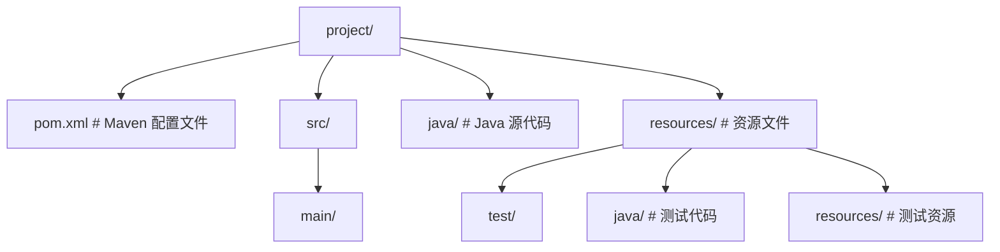
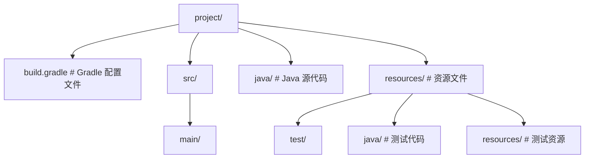

## 0. 零基础入门（从零开始）

### 0.3 学习路径

完成上面的第一步后，按以下顺序继续学习：

- 002-程序结构与基本语法：第一个 Java 程序的逐行解读。
- 003-变量与数据类型：整数、浮点、布尔、字符串。
- 004-运算符与表达式：算术、比较、逻辑运算。
- 005-控制流：if、switch、循环。


## 1. Java 概述 (Overview)

Java 是一种由 **Sun Microsystems** (后被 Oracle 收购) 于 1995 年发布的面向对象编程语言。其核心理念是 **"Write Once, Run Anywhere" (WORA)**，即一次编写，到处运行。Java 不仅是一种编程语言，更是一个完整的平台，包括运行环境、开发工具和丰富的类库。

### 1.1 发展历程

| 时间 | 事件                                        | 版本      |
| ---- | ------------------------------------------- | --------- |
| 1991 | Green 项目启动，旨在开发嵌入式设备编程语言  | -         |
| 1995 | Java 1.0 正式发布                           | 1.0       |
| 1998 | Java 2 发布，引入 J2SE、J2EE、J2ME          | 1.2       |
| 2004 | Java 5 发布，引入泛型、枚举、注解等特性     | 5.0       |
| 2006 | Java 开源，创建 OpenJDK                     | 6.0       |
| 2011 | Oracle 收购 Sun Microsystems                | 7.0       |
| 2014 | Java 8 发布，引入 Lambda 表达式、Stream API | 8.0 (LTS) |
| 2018 | Java 11 发布                                | 11 (LTS)  |
| 2021 | Java 17 发布                                | 17 (LTS)  |
| 2023 | Java 21 发布                                | 21 (LTS)  |
| 2025 | Java 25 发布                                | 25        |

### 1.2 核心特点 (Key Features)

| 特点             | 描述                                                                                              | 优势                                       |
| ---------------- | ------------------------------------------------------------------------------------------------- | ------------------------------------------ |
| **跨平台性**     | 通过 JVM (Java Virtual Machine) 实现，Java 源代码编译成字节码 (`.class`)，由各平台的 JVM 解释执行 | 一次编写，到处运行，无需为不同平台重新编译 |
| **面向对象**     | 支持封装、继承、多态等特性，是纯粹的面向对象语言                                                  | 代码结构清晰，易于维护和扩展               |
| **强类型语言**   | 严格的编译时类型检查，所有变量必须先声明后使用                                                    | 提高代码可靠性，减少运行时错误             |
| **自动内存管理** | GC (Garbage Collection) 机制自动回收不再使用的对象内存                                            | 减少内存泄漏，简化内存管理                 |
| **安全性**       | 内置安全模型，如沙箱机制、字节码校验、访问控制                                                    | 提高应用安全性，防止恶意代码执行           |
| **多线程支持**   | 内置对多线程编程的支持，提供 Thread 类和相关 API                                                  | 充分利用多核处理器，提高应用性能           |
| **丰富的类库**   | 提供大量内置类库，覆盖网络、IO、集合、并发等多个领域                                              | 提高开发效率，减少重复代码                 |
| **分布式计算**   | 内置网络编程能力，支持分布式应用开发                                                              | 便于构建分布式系统和微服务                 |

## 2. Java 开发工具 (The "Three Big" Concepts)

### 2.1 JVM (Java Virtual Machine)

JVM 是运行 Java 字节码的虚拟机，是 Java 跨平台的核心。它将 Java 字节码翻译成特定平台的机器码并执行。
**JVM 的主要组成部分**：

- **类加载器 (ClassLoader)**: 负责加载类文件
- **运行时数据区 (Runtime Data Area)**: 包括方法区、堆、栈、程序计数器等
- **执行引擎 (Execution Engine)**: 执行字节码，包括解释器和 JIT 编译器
- **本地方法接口 (Native Interface)**: 与本地方法交互

### 2.2 JRE (Java Runtime Environment)

JRE 包含 JVM 和核心类库，是运行 Java 程序所需的最小环境。普通用户只需要安装 JRE 即可运行 Java 应用。

### 2.3 JDK (Java Development Kit)

JDK 包含 JRE 和开发工具，如编译器 (`javac`)、调试器 (`jdb`)、文档生成器 (`javadoc`) 等。开发人员必须安装 JDK 来编译和开发 Java 应用。
**JDK 主要工具**：

- `javac`: Java 编译器，将 `.java` 文件编译成 `.class` 文件
- `java`: Java 运行时，执行 `.class` 文件
- `javadoc`: 生成 API 文档
- `jar`: 打包工具，创建 JAR 文件
- `jdb`: Java 调试器
- `jps`: 查看 Java 进程
- `jstat`: 监控 JVM 统计信息
- `jmap`: 生成堆转储快照
- `jstack`: 生成线程转储

## 3. 环境搭建 (Environment Setup)

### 3.1 下载 JDK

推荐使用 OpenJDK 或 Oracle JDK，选择 LTS (Long Term Support) 版本以获得长期支持：

- **OpenJDK**: 开源版本，可从 [Adoptium](https://adoptium.net/) 或 [OpenJDK 官网](https://openjdk.org/) 下载
- **Oracle JDK**: 商业版本，可从 [Oracle 官网](https://www.oracle.com/java/technologies/downloads/) 下载

### 3.2 安装 JDK

#### 3.2.1 Windows 安装

1. 下载 JDK 安装包（.exe 文件）
2. 双击安装包，按照向导完成安装
3. 记住安装路径，用于配置环境变量

#### 3.2.2 macOS 安装

1. 下载 JDK 安装包（.dmg 文件）
2. 双击安装包，按照向导完成安装
3. 或使用 Homebrew 安装：`brew install openjdk@21`

#### 3.2.3 Linux 安装

1. 使用包管理器安装：

- Ubuntu/Debian: `sudo apt install openjdk-21-jdk`
- CentOS/RHEL: `sudo yum install java-11-openjdk-devel`
- Fedora: `sudo dnf install java-21-openjdk-devel`

2. 或下载 tar.gz 文件手动安装：

- 解压到指定目录：`tar -zxvf jdk-21_linux-x64_bin.tar.gz -C /usr/local/`
- 配置环境变量

### 3.3 配置环境变量

#### 3.3.1 Windows 配置

1. 右键点击「此电脑」→「属性」→「高级系统设置」→「环境变量」
2. 在「系统变量」中点击「新建」，设置 `JAVA_HOME`：

- 变量名：`JAVA_HOME`
- 变量值：JDK 安装目录，如 `C:\Program Files\Java\jdk-21`

3. 编辑 `Path` 变量，添加 `%JAVA_HOME%\bin`
4. 点击「确定」保存配置

#### 3.3.2 macOS/Linux 配置

编辑 `~/.bashrc` 或 `~/.zshrc` 文件，添加以下内容：

```bash
 # 设置 JAVA_HOME
 export JAVA_HOME=/usr/lib/jvm/java-21-openjdk-amd64
 # 添加到 PATH
 export PATH=$JAVA_HOME/bin:$PATH
```

然后执行 `source ~/.bashrc` 或 `source ~/.zshrc` 使配置生效。

### 3.4 验证安装

打开命令行终端，执行以下命令验证 JDK 安装是否成功：

```bash
 # 查看 Java 版本
 java -version
 # 查看 javac 版本
 javac -version
```

**预期输出**：

```
 java version "21" 2023-09-19 LTS
 Java(TM) SE Runtime Environment (build 21+35-LTS-2513)
 Java HotSpot(TM) 64-Bit Server VM (build 21+35-LTS-2513, mixed mode, sharing)
 javac 21
```

## 4. 开发工具 IDE

### 4.1 主流 IDE

| IDE                    | 描述                         | 特点                                           |
| ---------------------- | ---------------------------- | ---------------------------------------------- |
| **IntelliJ IDEA**      | JetBrains 开发的 Java IDE    | 功能强大，智能代码提示，插件丰富，适合大型项目 |
| **Eclipse**            | 开源 Java IDE                | 插件生态丰富，适合企业级开发                   |
| **NetBeans**           | Oracle 开发的开源 IDE        | 轻量级，适合初学者，集成 Maven 和 Gradle       |
| **Visual Studio Code** | Microsoft 开发的轻量级编辑器 | 插件丰富，启动快速，适合小型项目               |

### 4.2 IDE 配置

#### 4.2.1 IntelliJ IDEA 配置

1. 下载并安装 [IntelliJ IDEA](https://www.jetbrains.com/idea/download/)
2. 打开 IDEA，选择「New Project」
3. 选择「Java」，配置 JDK 路径
4. 选择项目模板，点击「Create」

#### 4.2.2 Eclipse 配置

1. 下载并安装 [Eclipse](https://www.eclipse.org/downloads/)
2. 打开 Eclipse，选择「File」→「New」→「Java Project」
3. 输入项目名称，配置 JDK 路径
4. 点击「Finish」创建项目

## 5. 第一个 Java 程序

### 5.1 编写 HelloWorld.java

```java
 public class HelloWorld {
  public static void main(String[] args) {
  System.out.println("Hello, Java!");
  }
 }
```

### 5.2 编译和运行

```bash
 # 编译 Java 文件
 javac HelloWorld.java
 # 运行编译后的类
 java HelloWorld
```

**预期输出**：

```
 Hello, Java!
```

### 5.3 项目结构

对于大型项目，推荐使用 Maven 或 Gradle 管理项目依赖和构建：
**Maven 项目结构**：



**Gradle 项目结构**：



## 6. 应用领域 (Applications)

### 6.1 企业级应用

- **Spring Boot**: 快速构建企业级应用的框架，简化配置，内嵌服务器
- **Spring Cloud**: 微服务架构的分布式系统框架
- **Java EE (Jakarta EE)**: 企业级应用规范，包括 Servlet、JSP、EJB 等
- **Quarkus**: 云原生 Java 框架，启动快，内存占用低

### 6.2 移动应用

- **Android 开发**: Java 是 Android 原生开发的主要语言
- **Kotlin**: 基于 JVM 的语言，与 Java 互操作，被 Google 推荐为 Android 开发首选语言

### 6.3 大数据

- **Hadoop**: 分布式存储和计算框架，核心组件用 Java 开发
- **Spark**: 快速的大数据处理引擎，支持 Java API
- **Flink**: 流处理框架，适合实时数据处理
- **Kafka**: 分布式消息队列，用 Java 开发

### 6.4 云计算

- **微服务架构**: 使用 Spring Cloud、Micronaut 等框架构建
- **容器化**: 与 Docker、Kubernetes 集成
- **Serverless**: 支持 AWS Lambda、Google Cloud Functions 等

### 6.5 其他领域

- **科学计算**: 用于数值计算、模拟等
- **金融系统**: 对精度和可靠性要求高的交易系统
- **游戏开发**: 后端服务器、游戏逻辑
- **嵌入式系统**: 物联网设备、智能设备

## 7. Java 版本选择

### 7.1 LTS 版本

LTS (Long Term Support) 版本提供长期支持，适合生产环境：

- **Java 8**: 2014 年发布，支持至 2030 年
- **Java 11**: 2018 年发布，支持至 2026 年
- **Java 17**: 2021 年发布，支持至 2029 年
- **Java 21**: 2023 年发布，支持至 2031 年

### 7.2 非 LTS 版本

非 LTS 版本每 6 个月发布一次，包含最新特性，适合测试和尝鲜：

- **Java 12-16**: 已停止支持
- **Java 18-20**: 已停止支持
- **Java 22-24**: 最新特性版本
- **Java 25**: 最新发布版本

## 8. 最佳实践

### 8.1 编码规范

- **命名规范**:
- 类名: PascalCase (如 `HelloWorld`)
- 方法名: camelCase (如 `getUser`)
- 变量名: camelCase (如 `userName`)
- 常量名: UPPER_SNAKE_CASE (如 `MAX_SIZE`)
- **代码风格**:
- 使用 4 个空格缩进
- 每行不超过 120 个字符
- 合理使用空行分隔代码块
- 添加适当的注释

### 8.2 性能优化

- **使用 StringBuilder 拼接字符串**
- **避免在循环中创建对象**
- **使用集合框架时选择合适的实现**
- **合理使用多线程**
- **优化内存使用，避免内存泄漏**

### 8.3 安全性

- **避免使用过时的 API**
- **使用参数化查询防止 SQL 注入**
- **加密敏感数据**
- **实现适当的访问控制**
- **定期更新依赖库**

### 8.4 工具使用

- **构建工具**: Maven 或 Gradle
- **版本控制**: Git
- **持续集成**: Jenkins、GitHub Actions
- **代码质量**: SonarQube、Checkstyle
- **测试框架**: JUnit、TestNG、Mockito

## 9. 常见问题与解决方案

### 9.1 环境变量配置错误

**问题**: 执行 `java -version` 时提示 "java 不是内部或外部命令"
**解决方案**:

- 检查 JAVA_HOME 是否正确设置
- 检查 Path 变量是否包含 %JAVA_HOME%\bin
- 重启命令行终端

### 9.2 版本冲突

**问题**: 系统中安装了多个 Java 版本，导致使用错误的版本
**解决方案**:

- 检查 JAVA_HOME 指向正确的版本
- 调整 Path 变量中 Java 路径的顺序
- 使用 `update-alternatives` (Linux) 管理多个 Java 版本

### 9.3 内存不足

**问题**: 运行 Java 程序时出现 "OutOfMemoryError"
**解决方案**:

- 增加 JVM 内存分配：`java -Xms512m -Xmx1024m MainClass`
- 检查代码中是否有内存泄漏
- 使用内存分析工具如 VisualVM 分析内存使用情况

### 9.4 依赖冲突

**问题**: Maven 或 Gradle 项目中出现依赖冲突
**解决方案**:

- 使用 `mvn dependency:tree` 或 `gradle dependencies` 查看依赖树
- 排除冲突的依赖
- 使用统一的依赖版本管理

## 10. 学习资源

### 10.1 官方资源

- [Oracle Java 文档](https://docs.oracle.com/en/java/)
- [OpenJDK 官网](https://openjdk.org/)
- [Spring 官方文档](https://spring.io/docs)

### 10.2 书籍

- 《Java 核心技术》(Core Java)
- 《Effective Java》
- 《Java 并发编程实战》
- 《Spring Boot 实战》

### 10.3 在线教程

- [Oracle Java 教程](https://docs.oracle.com/javase/tutorial/)
- [Spring 官方教程](https://spring.io/guides)
- [Baeldung](https://www.baeldung.com/)
- [JavaPoint](https://www.javatpoint.com/)

## 11. 总结

Java 是一种功能强大、跨平台的面向对象编程语言，拥有丰富的生态系统和广泛的应用领域。从企业级应用到移动开发，从大数据到云计算，Java 都发挥着重要作用。
搭建 Java 开发环境是学习 Java 的第一步，选择合适的 JDK 版本和 IDE 可以提高开发效率。遵循编码规范和最佳实践，使用现代化的工具和框架，可以编写出高质量、可维护的 Java 代码。
随着 Java 的不断发展，新特性和新框架不断涌现，作为 Java 开发者，需要持续学习和适应变化，以保持竞争力。

---

## 参考文献


Oracle Java 官方文档：https://docs.oracle.com/en/java/
OpenJDK 项目：https://openjdk.org/
Java 语言规范：https://docs.oracle.com/javase/specs/
Spring 官方文档：https://spring.io/projects/spring-boot
Baeldung 教程站：https://www.baeldung.com/
Maven 官方文档：https://maven.apache.org/guides/

## 延伸阅读


Java 并发与 JUC，见 013-java 模块并发文档。
JVM 内存与 GC 调优，见 013-java 模块 JVM 文档。
Spring Boot 微服务与 Kubernetes，见 013-java/041-JavaKubernetes 文档。
数据库访问（JDBC/JPA），见 019-sql 模块相关文档。
黑马程序员 Bilibili 空间（https://space.bilibili.com/37974444 ）提供 Java 全栈课程；尚硅谷 Bilibili 空间（https://space.bilibili.com/302417610 ）提供 Java 进阶课程。

## 深度专题扩展


以下专题从不同角度深入本文主题，供有进阶需求的读者研读。每个专题独立成节，内容相互补充。

### 13.1 Java 集合框架源码级分析

HashMap 在 Java 8+ 由数组 + 链表 + 红黑树组成：哈希桶冲突超过 8 且容量不小于 64 时树化；扩容按 2 的幂进行，通过 `(n-1) & hash` 定位桶。
ConcurrentHashMap 采用 CAS + synchronized 锁桶（Java 8 实现），读操作无锁；与 HashTable 的全表锁相比并发度大幅提升。
ArrayList 扩容 1.5 倍并复制数组；LinkedList 每个节点有前后指针；LinkedList 的随机访问是 O(n)，顺序插入删除是 O(1)。
PriorityQueue 是小顶堆结构，offer/poll 为 O(log n)；TreeMap/TreeSet 基于红黑树，key 有序。
工程建议：按操作特征选型——随机访问用 ArrayList，频繁头尾操作用 ArrayDeque，排序键用 TreeMap，高并发用 ConcurrentHashMap。

### 13.2 JVM 垃圾回收与调优

分代假说：大多数对象朝生夕灭。新生代（Eden + Survivor）采用复制算法，老年代采用标记-整理或并发标记；GC Roots 可达性分析决定存活对象。
G1 把堆划分为 Region，跟踪每个 Region 的回收价值，优先回收收益最高的区域；ZGC 使用染色指针与读屏障实现亚毫秒级暂停。
调优参数：-Xms/-Xmx 设置堆，-XX:MaxMetaspaceSize 限制元空间，-XX:MaxGCPauseMillis 设置 G1 目标停顿。
调优流程：先用 GC 日志与 JFR 观察，再调整堆与 GC 策略；避免盲目复制网上参数。容器环境注意 -XX:MaxRAMPercentage。

### 13.3 虚拟线程与高并发编程

Java 21 的虚拟线程（Virtual Threads）由 JVM 调度，占用内存远小于平台线程，支持百万级并发任务；适合 I/O 密集场景。
使用 Executors.newVirtualThreadPerTaskExecutor() 创建线程池；阻塞 I/O 时虚拟线程自动让出载体线程。
注意：synchronized 块内阻塞会固定载体线程；尽量使用 ReentrantLock 或避免在锁内阻塞。
虚拟线程不是万能：CPU 密集任务仍受核心数限制；线程本地变量（ThreadLocal）在虚拟线程下成本更高。

## 模块文档速查表

| 文档 | 主题 | 与本文的关联 |
| --- | --- | --- |
| Java 概述与开发环境 | 001-JavaOverviewDevEnv | 本文自身 |
| 快速入门 | 002-QuickStart | 本文的前置基础 |
| 程序结构与基本语法 | 003-ProgramStructureBasicSyntax | 本文的并列主题 |
| 数据类型与类型转换 | 004-DataTypeConversion | 本文的并列主题 |
| 变量与常量 | 005-VariableConstant | 本文的并列主题 |
| 枚举与注解 | 006-JavaAnnotationsTutorial | 本文的并列主题 |
| 泛型进阶 | 007-JavaGenericsTutorial | 本文的并列主题 |
| 并发编程基础 | 008-ConcurrencyBasics | 本文的前置基础 |
| JUC并发包 | 009-JUCConcurrency | 本文的并列主题 |
| JVM类加载机制 | 010-JVMClassLoadingMechanism | 本文的原理深化 |
| JVM垃圾回收 | 011-JVMGC | 本文的并列主题 |
| Java反射 | 012-JavaReflection | 本文的并列主题 |
| Java序列化 | 013-JavaSerialization | 本文的并列主题 |
| JavaIO与NIO | 014-JavaIONIO | 本文的并列主题 |
| Java新特性 | 015-JavaNewFeatures | 本文的并列主题 |
| 运算符与表达式 | 016-OperatorExpression | 本文的并列主题 |
| Spring 基础：IoC 容器、AOP、Bean 生命周期与企业级开发核心 | 017-SpringBasicsIoCAOPBeanLifecycle | 本文的前置基础 |
| SpringBoot进阶 | 018-SpringBootAdvanced | 本文的并列主题 |
| SpringBoot安全 | 019-SpringBootSecurity | 本文的安全延伸 |
| SpringBoot数据访问 | 020-SpringBootDataAccess | 本文的并列主题 |
| Java设计模式 | 021-JavaDesignPattern | 本文的并列主题 |
| Java函数式编程 | 022-JavaFunctionalProgramming | 本文的并列主题 |
| Java网络编程 | 023-JavaNetworkProgramming | 本文的并列主题 |
| Java日志系统 | 024-JavaLogSystem | 本文的并列主题 |
| Java单元测试 | 025-JavaUnitTest | 本文的并列主题 |
| Java构建工具 | 026-JavaBuildTool | 本文的并列主题 |
| 控制流 | 027-ControlFlow | 本文的并列主题 |
| Java与微服务 | 028-JavaMicroservice | 本文的并列主题 |
| Java与消息队列 | 029-JavaMessageQueue | 本文的并列主题 |
| Java与Redis | 030-JavaRedis | 本文的并列主题 |
| Java与Docker | 031-JavaDocker | 本文的并列主题 |
| Java与GraphQL | 032-JavaGraphQL | 本文的并列主题 |
| Java性能调优 | 033-JavaPerformanceTuning | 本文的性能延伸 |
| Java与AI | 034-JavaAI | 本文的并列主题 |
| Java与安全 | 035-JavaSecurity | 本文的安全延伸 |
| Java与WebAssembly | 036-JavaWebAssembly | 本文的并列主题 |
| Java与响应式编程 | 037-JavaReactiveProgramming | 本文的并列主题 |
| 方法详解 | 038-MethodDetailed | 本文的并列主题 |
| Java与虚拟线程 | 039-JavaVirtualThread | 本文的并列主题 |
| Java与GraalVM | 040-JavaGraalVM | 本文的并列主题 |
| Java与Kubernetes | 041-JavaKubernetes | 本文的并列主题 |
| Java记录类 | 042-JavaRecordClass | 本文的并列主题 |
| Java文本块 | 043-JavaTextBlock | 本文的并列主题 |
| Java模块系统 | 044-JavaModuleSystem | 本文的并列主题 |
| Java与数据库连接 | 045-JavaDatabaseConnection | 本文的并列主题 |
| Java 新特性与生态 | 046-JavaNewFeaturesEcosystem | 本文的并列主题 |
| 数组详解 | 047-ArrayDetailed | 本文的并列主题 |
| JVM调优 | 048-JVMtuning | 本文的性能延伸 |
| 集合框架详解 | 049-CollectionFrameworkDetailed | 本文的并列主题 |
| 并发编程详解 | 050-ConcurrencyDetailed | 本文的并列主题 |
| CompletableFuture异步编排 | 051-CompletableFutureAsync | 本文的并列主题 |
| ThreadLocal内存泄漏 | 052-ThreadLocalMemoryLeak | 本文的并列主题 |
| 反射与动态代理 | 053-ReflectionDynamicProxy | 本文的并列主题 |
| 注解处理器 | 054-AnnotationProcessor | 本文的并列主题 |
| 分代ZGC详解 | 055-GenerationalZGCDetailed | 本文的并列主题 |
| 面向对象编程 | 056-OOP | 本文的并列主题 |
| 抽象类与接口 | 057-AbstractClassInterface | 本文的并列主题 |
| 异常处理机制 | 058-ExceptionHandlingMechanism | 本文的原理深化 |
| 泛型详解 | 059-GenericDetailed | 本文的并列主题 |
| I/O 流与文件操作 | 060-IOStreamFileOperation | 本文的并列主题 |
| 多线程基础 | 061-MultithreadingBasics | 本文的前置基础 |
| JVM 内存模型 | 062-JVMMemoryModel | 本文的并列主题 |
| Lambda与函数式编程 | 063-LambdaFunctionalProgramming | 本文的并列主题 |
| Stream API | 064-StreamAPI | 本文的并列主题 |
| Spring Boot 学习笔记 | 065-SpringBootNotes | 本文的并列主题 |
| 网络编程 | 066-NetworkProgramming | 本文的并列主题 |
| Spring Cloud 微服务开发 | 067-SpringCloudMicroserviceDevelopment | 本文的并列主题 |
| Java Swing 图形界面 | 068-JavaSwingGUI | 本文的并列主题 |
| Java 项目示例：图书管理系统 | 069-JavaProjectExampleLibrarySystem | 本文的综合应用 |
| Java 理论知识点：JVM 原理、类加载机制与内存管理 | 070-JavaTheoryJVMClassLoadingMemory | 本文的原理深化 |
| Java NIO 通道与缓冲区 | 071-JavaNIOChannelBuffer | 本文的并列主题 |
| Java JDBC 数据库连接 | 072-JDBCDatabaseConnection | 本文的并列主题 |
| Java Optional 类 | 073-JavaOptionalClass | 本文的并列主题 |
| Java Executor 与 ForkJoin | 074-ExecutorForkJoinPool | 本文的并列主题 |
| Java Path 与 Files 语法速查手册 | 075-JavaPathFiles | 本文的并列主题 |
| 启动 REPL 交互环境 | 076-JavaJshellJpackage | 本文的前置基础 |
| Java 同步器 CountDownLatch/CyclicBarrier/Phaser 语法速查手册 | 077-JavaCountDownLatchCyclicBarrier | 本文的并列主题 |
| Java 阻塞队列 BlockingQueue 语法速查手册 | 078-JavaBlockingQueue | 本文的并列主题 |
| Java try-with-resources 与异常链语法速查手册 | 079-JavaTryWithResources | 本文的并列主题 |
| Java HttpClient 与 WebSocket 语法速查手册 | 080-JavaHttpClientWebSocket | 本文的并列主题 |
| Java 时间格式化 DateTimeFormatter/ZoneId 语法速查手册 | 081-JavaTimeFormatting | 本文的并列主题 |
| Java 类型擦除与桥接方法语法速查手册 | 082-JavaTypeErasure | 本文的并列主题 |
| Java 枚举进阶 EnumSet/EnumMap/枚举单例语法速查手册 | 083-JavaEnumAdvanced | 本文的并列主题 |
| Java Iterator/Iterable/Spliterator 语法速查手册 | 084-JavaIteratorIterable | 本文的并列主题 |
| Java Comparator/Comparable 语法速查手册 | 085-JavaComparatorComparable | 本文的并列主题 |
| Java String.format/printf/MessageFormat 语法速查手册 | 086-JavaStringFormat | 本文的并列主题 |
| Java Arrays 工具类语法速查手册 | 087-JavaArraysUtility | 本文的并列主题 |
| Java Objects 工具类语法速查手册 | 088-JavaObjectsUtility | 本文的并列主题 |
| Java 命令行工具 javac/java/jar/jshell/jpackage 语法速查手册 | 089-JavaCommandLineTools | 本文的并列主题 |
| Maven pom.xml 配置语法速查手册 | 090-MavenPomConfiguration | 本文的并列主题 |
| Gradle build.gradle 配置语法速查手册 | 091-GradleBuildConfiguration | 本文的并列主题 |
