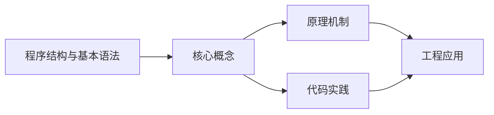
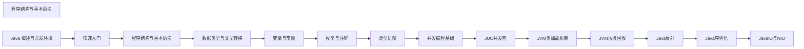

## 1. 学习目标（Bloom 分类）

本节按照布鲁姆教育目标分类学组织学习路径。本文主题为《程序结构与基本语法》，属于 Java 模块，读者可以根据自身阶段选择阅读深度。

记忆层面：能够准确复述本文的核心概念、术语与基本语法或操作步骤，并能够在提问或检索时快速定位对应知识点。能够说出 Java 的编译执行模型（javac 到字节码，JVM 解释与 JIT）。

理解层面：能够用自己的语言解释核心原理与工作机制，说明概念之间的因果关系，而不是机械记忆结论。能够解释面向对象三大特性与 JVM 内存区域的职责。

应用层面：能够在真实项目或练习场景中运用本文知识解决具体问题，写出正确且可维护的实现。能够编写类、接口、集合操作与异常处理的完整程序。

分析层面：能够拆解复杂问题，比较本文主题与相邻概念的异同，识别边界条件与例外情况。能够分析 Java 与 C++、Go 在内存管理与并发模型上的差异。

评价层面：能够根据约束条件（性能、可读性、安全、成本）评价不同方案的优劣，做出有依据的技术决策。能够评价不同集合、并发工具与框架的适用场景。

创造层面：能够把本文知识与其他模块知识组合，设计出新的解决方案或可复用的工程模式。能够组合 Spring 生态设计企业级应用。

通过本节学习，读者应当能够把《程序结构与基本语法》纳入自己的知识网络，并与 Java 模块的其他主题（JVM、集合框架、并发、Spring 生态）建立关联。

## 2. 历史动机与发展脉络

《程序结构与基本语法》是 Java 领域的重要主题。要真正理解它，需要先了解它解决的问题与演进过程。

Java 由 James Gosling 领导的 Sun 团队于 1995 年发布，口号“一次编写，到处运行”依托 JVM 字节码实现跨平台。2006 年 Sun 将 Java 开源（OpenJDK），2010 年 Oracle 收购 Sun 后 Java 进入新的治理阶段。
Java 的版本节奏在 2017 年后改为每半年一个特性版本、每两年一个 LTS（长期支持）版本。当前主流 LTS 包括 Java 11、17、21 与 25；Java 21 引入虚拟线程（Project Loom 成果），显著降低高并发服务的线程成本。
Java 生态以 Spring 家族为核心：Spring Boot 简化配置与部署，Spring Cloud 提供微服务组件；构建工具从 Maven 演进到 Gradle；JVM 语言（Kotlin、Scala、Groovy）与 Java 共存互操作。
Android 开发早期使用 Java，2019 年后官方转向 Kotlin-first，但 Java 仍是服务端领域（尤其是金融、电商等企业系统）的中坚力量。

回到本文主题：程序结构与基本语法 的提出与成熟，正是上述技术背景下的必然产物。早期实现往往以简单可用为目标，随着工程规模扩大，社区逐渐沉淀出标准做法与最佳实践；理解这一脉络，可以帮助读者判断“为什么文档中的推荐写法是现在这个样子”，也能在遇到历史遗留代码时准确识别其设计年代与取舍。

理解 Java 版本与 LTS 机制，是工程选型的起点：生产环境优先 LTS，新特性（如虚拟线程）可以在受控场景评估后引入。

## 3. 形式化定义与核心概念精讲

本节把《程序结构与基本语法》涉及的核心概念以“定义 + 讲解”的形式展开。读者应把定义当作工具，把讲解当作理解路径；两者结合才能形成可迁移的知识。

JVM 与字节码：`javac` 把 .java 编译为 .class 字节码，JVM 加载、校验并执行；热点代码由 JIT（如 C2）编译为机器码，解释与编译结合实现启动速度与峰值性能的平衡。
面向对象：封装（访问控制）、继承（extends/implements）与多态（重载/重写）是 Java 的类型系统支柱；接口默认方法（Java 8）与密封类（Java 17）持续演进表达能力。
异常体系：受检异常（checked）编译期强制处理，非受检异常（RuntimeException）运行时抛出；try-with-resources 自动关闭资源。
泛型与擦除：Java 泛型在编译期检查后擦除类型参数，运行时无泛型信息；这解释了 `List<String>` 与 `List<Integer>` 的 Class 相同，以及通配符 `? extends` 的逆变协变规则。

### 3.1 原文章节逐一精讲

原文档把主题拆分为 14 个小节，下面按顺序给出每一节的导读讲解，随后保留原文细节供精读。

#### 原文精读（完整保留）

# Java 程序结构与基本语法

> **符号约定**：`< >` 必填参数 | `[ ]` 可选参数

---

#### 1. Java 程序结构

##### 1.1 源文件结构

一个典型的 Java 源文件包含以下部分：

1. **包声明 (Package Declaration)**：指定源文件所属的包。
2. **导入语句 (Import Statements)**：导入需要使用的类。
3. **类定义 (Class Definition)**：定义一个或多个类。
4. **方法定义 (Method Definition)**：在类中定义方法，包括主方法。
5. **执行语句 (Statements)**：在方法中编写具体的代码逻辑。
   **示例**：

```java
 /*
  * 包声明
  */
 package com.example;
 /*
  * 导入语句
  */
 import java.util.Scanner;
 import java.util.Date;
 /*
  * 类定义
  */
 public class HelloWorld {
  /*
  * 主方法
  * 程序的入口点
  */
  public static void main(String[] args) {
  // 执行语句
  System.out.println("Hello, Java!");
  // 创建 Date 对象
  Date now = new Date();
  System.out.println("当前时间: " + now);
  }
 }
```

##### 1.2 类的结构

一个 Java 类通常包含以下部分：

1. **修饰符 (Modifiers)**：如 `public`, `private`, `protected` 等。
2. **类名 (Class Name)**：遵循大驼峰命名法。
3. **继承关系 (Inheritance)**：使用 `extends` 关键字继承父类。
4. **实现接口 (Interface Implementation)**：使用 `implements` 关键字实现接口。
5. **成员变量 (Member Variables)**：类的属性。
6. **构造方法 (Constructor)**：用于创建对象。
7. **成员方法 (Member Methods)**：类的行为。
   **示例**：

```java
 package com.example;
 public class Student extends Person implements Serializable {
  // 成员变量
  private String studentId;
  private String major;
  // 构造方法
  public Student() {
  }
  public Student(String name, int age, String studentId, String major) {
  super(name, age);
  this.studentId = studentId;
  this.major = major;
  }
  // 成员方法
  public String getStudentId() {
  return studentId;
  }
  public void setStudentId(String studentId) {
  this.studentId = studentId;
  }
  public String getMajor() {
  return major;
  }
  public void setMajor(String major) {
  this.major = major;
  }
  public void study() {
  System.out.println(getName() + " is studying " + major);
  }
 }
```

##### 1.3 主方法

主方法是 Java 程序的入口点，具有以下特点：

- 修饰符：`public static void`
- 方法名：`main`
- 参数：`String[] args`
  **示例**：

```java
 public static void main(String[] args) {
  // 程序从这里开始执行
  System.out.println("Hello, World!");
  // 处理命令行参数
  for (int i = 0; i < args.length; i++) {
  System.out.println("Argument " + i + ": " + args[i]);
  }
 }
```

#### 2. 注释规范

##### 2.1 单行注释

**语法**：`// 注释内容`
**示例**：

```java
 // 这是一个单行注释
 int age = 18; // 定义年龄变量
```

##### 2.2 多行注释

**语法**：`/* 注释内容 */`
**示例**：

```java
 /*
  * 这是一个多行注释
  * 可以跨越多行
  */
 int sum = 0;
 for (int i = 1; i <= 100; i++) {
  sum += i; // 累加
 }
```

##### 2.3 文档注释

**语法**：`/** 注释内容 */`
**示例**：

```java
 /**
  * 计算两个数的和
  * @param a 第一个加数
  * @param b 第二个加数
  * @return 两个数的和
  */
 public int add(int a, int b) {
  return a + b;
 }
```

**常用的 Javadoc 标签**：

| 标签       | 描述             | 示例                                              |
| ---------- | ---------------- | ------------------------------------------------- |
| `@author`  | 作者             | `@author John Doe`                                |
| `@param`   | 参数说明         | `@param name 用户名`                              |
| `@return`  | 返回值说明       | `@return 计算结果`                                |
| `@throws`  | 异常说明         | `@throws IllegalArgumentException 参数错误时抛出` |
| `@version` | 版本             | `@version 1.0`                                    |
| `@since`   | 从哪个版本开始   | `@since 1.5`                                      |
| `@see`     | 参考其他类或方法 | `@see java.util.ArrayList`                        |

#### 3. 标识符

##### 3.1 标识符的规则

标识符是用于命名类、方法、变量、常量等的名称，必须遵循以下规则：

1. **组成字符**：字母 (A-Z, a-z)、数字 (0-9)、下划线 (\_)、美元符号 ($)。
2. **开头字符**：不能以数字开头。
3. **关键字**：不能使用 Java 关键字作为标识符。
4. **大小写敏感**：Java 是大小写敏感的，因此 `myVar` 和 `MyVar` 是不同的标识符。

##### 3.2 命名规范

###### 3.2.1 类名和接口名

- **命名规则**：大驼峰命名法 (Upper Camel Case)
- **示例**：`HelloWorld`, `StudentInfo`, `UserService`

###### 3.2.2 方法名和变量名

- **命名规则**：小驼峰命名法 (Lower Camel Case)
- **示例**：`getUserName`, `ageCount`, `calculateTotal`

###### 3.2.3 包名

- **命名规则**：全小写，使用点 (.) 分隔
- **示例**：`com.example.util`, `org.apache.commons.io`

###### 3.2.4 常量名

- **命名规则**：全大写，使用下划线 (\_) 分隔
- **示例**：`MAX_VALUE`, `DEFAULT_TIMEOUT`, `PI`

###### 3.2.5 枚举常量

- **命名规则**：全大写，使用下划线 (\_) 分隔
- **示例**：`RED`, `GREEN`, `BLUE`

##### 3.3 命名最佳实践

1. **含义明确**：标识符应该能够清晰地表达其用途。
2. **避免缩写**：除非是广为人知的缩写（如 `URL`, `HTTP`），否则应使用完整的单词。
3. **一致性**：在整个项目中保持命名风格的一致性。
4. **长度适中**：标识符应该足够长以表达其含义，但也不应过长。
   **示例**：

```java
 // 不好的命名
 int a; // 含义不明确
 int cnt; // 使用了缩写
 int user_name; // 不符合小驼峰命名法
 // 好的命名
 int age; // 含义明确
 int count; // 使用完整单词
 int userName; // 符合小驼峰命名法
```

#### 4. 关键字

##### 4.1 常用关键字

Java 有 50 多个关键字，以下是一些常用的关键字：

| 关键字       | 描述                   |
| ------------ | ---------------------- |
| `public`     | 公共访问修饰符         |
| `private`    | 私有访问修饰符         |
| `protected`  | 受保护的访问修饰符     |
| `class`      | 定义类                 |
| `interface`  | 定义接口               |
| `extends`    | 继承类                 |
| `implements` | 实现接口               |
| `static`     | 静态修饰符             |
| `final`      | 最终修饰符             |
| `void`       | 无返回值               |
| `return`     | 返回值                 |
| `if`         | 条件语句               |
| `else`       | 条件语句的分支         |
| `for`        | 循环语句               |
| `while`      | 循环语句               |
| `do`         | 循环语句               |
| `switch`     | 开关语句               |
| `case`       | 开关语句的分支         |
| `default`    | 开关语句的默认分支     |
| `break`      | 跳出循环或开关语句     |
| `continue`   | 跳过当前循环迭代       |
| `try`        | 异常处理的开始         |
| `catch`      | 捕获异常               |
| `finally`    | 异常处理的最终块       |
| `throw`      | 抛出异常               |
| `throws`     | 声明方法可能抛出的异常 |
| `new`        | 创建对象               |
| `this`       | 当前对象的引用         |
| `super`      | 父类的引用             |
| `package`    | 包声明                 |
| `import`     | 导入类                 |

##### 4.2 保留字和字面量

除了关键字外，Java 还有一些保留字和字面量：

- **保留字**：``, `false`, `null`
- **字面量**：
- 整数字面量：`123`, `0x1A`
- 浮点数字面量：`3.14`, `2.5e3`
- 布尔字面量：``, `false`
- 字符字面量：`'A'`, `'\n'`
- 字符串字面量：`"Hello"`
- null 字面量：`null`

#### 5. 键盘录入

##### 5.1 使用 Scanner 类

`java.util.Scanner` 是 Java 中用于获取控制台输入的常用类。
**基本用法**：

```java
 import java.util.Scanner;
 public class InputTest {
  public static void main(String[] args) {
  // 1. 创建 Scanner 对象
  Scanner sc = new Scanner(System.in);
  // 2. 获取不同类型的输入
  System.out.print("请输入整数: ");
  int num = sc.nextInt();
  System.out.print("请输入浮点数: ");
  double d = sc.nextDouble();
  System.out.print("请输入布尔值: ");
  boolean b = sc.nextBoolean();
  // 注意：next() 会遇到空格停止
  System.out.print("请输入字符串 (next()): ");
  String str1 = sc.next();
  // 读取换行符
  sc.nextLine();
  // nextLine() 会读取整行
  System.out.print("请输入字符串 (nextLine()): ");
  String str2 = sc.nextLine();
  // 3. 输出结果
  System.out.println("整数: " + num);
  System.out.println("浮点数: " + d);
  System.out.println("布尔值: " + b);
  System.out.println("字符串 (next()): " + str1);
  System.out.println("字符串 (nextLine()): " + str2);
  // 4. 关闭 Scanner
  sc.close();
  }
 }
```

##### 5.2 Scanner 类的常用方法

| 方法            | 描述                         |
| --------------- | ---------------------------- |
| `next()`        | 读取一个单词（遇到空格停止） |
| `nextLine()`    | 读取一整行                   |
| `nextInt()`     | 读取一个整数                 |
| `nextDouble()`  | 读取一个双精度浮点数         |
| `nextBoolean()` | 读取一个布尔值               |
| `nextByte()`    | 读取一个字节                 |
| `nextShort()`   | 读取一个短整数               |
| `nextLong()`    | 读取一个长整数               |
| `nextFloat()`   | 读取一个单精度浮点数         |
| `hasNext()`     | 检查是否还有输入             |
| `hasNextInt()`  | 检查下一个输入是否是整数     |

##### 5.3 注意事项

1. **输入缓冲区问题**：当使用 `nextInt()`, `nextDouble()` 等方法后，输入缓冲区中会留下换行符，此时使用 `nextLine()` 会读取到空字符串。解决方案是在使用 `nextLine()` 前先调用一次 `nextLine()` 来消耗换行符。
2. **资源关闭**：使用完 Scanner 后，应该调用 `close()` 方法关闭资源，以避免资源泄漏。
3. **异常处理**：当输入的数据类型与期望的类型不匹配时，会抛出 `InputMismatchException`，应该使用 try-catch 进行处理。
   **示例**：

```java
 import java.util.InputMismatchException;
 import java.util.Scanner;
 public class SafeInputTest {
  public static void main(String[] args) {
  Scanner sc = new Scanner(System.in);
  int num = 0;
  boolean valid = false;
  while (!valid) {
  System.out.print("请输入整数: ");
  try {
  num = sc.nextInt();
  valid = true;
  } catch (InputMismatchException e) {
  System.out.println("输入错误，请重新输入整数!");
  sc.next(); // 消耗错误的输入
  }
  }
  System.out.println("输入的整数是: " + num);
  sc.close();
  }
 }
```

#### 6. 代码风格与最佳实践

##### 6.1 缩进与空格

- **缩进**：使用 4 个空格进行缩进，不要使用制表符 (Tab)。
- **空格**：
- 在运算符两侧添加空格：`a = b + c;`
- 在逗号后添加空格：`method(a, b, c);`
- 在大括号前添加空格：`if (condition) {`
- 在小括号内侧不添加空格：`if(condition)` 应该写成 `if (condition)`

##### 6.2 代码块

- **大括号**：使用 K&R 风格，即左大括号放在行尾，右大括号放在新行，与对应的控制语句对齐。
  **示例**：

```java
 // 好的风格
 if (condition) {
  // 代码块
 }
  // 代码块
 }
 // 不好的风格
 if (condition)
 {
  // 代码块
 }
 else
 {
  // 代码块
 }
```

##### 6.3 行长度

- **行长度**：每行代码的长度不应超过 80 个字符，超过时应换行。
- **换行**：在逗号后或运算符前换行，缩进 8 个空格。
  **示例**：

```java
 // 好的风格
 int result = calculateValue(a, b, c, d)
  + calculateValue(e, f, g, h)
  - calculateValue(i, j, k, l);
 // 不好的风格
 int result = calculateValue(a, b, c, d) + calculateValue(e, f, g, h) - calculateValue(i, j, k, l);
```

##### 6.4 命名约定

- **类名**：使用大驼峰命名法，每个单词的首字母大写。
- **方法名**：使用小驼峰命名法，第一个单词小写，后续单词首字母大写。
- **变量名**：使用小驼峰命名法，应具有描述性。
- **常量名**：使用全大写，单词之间用下划线分隔。
- **包名**：使用全小写，单词之间用点分隔。

##### 6.5 注释

- **单行注释**：用于解释单行代码的功能。
- **多行注释**：用于解释代码块的功能。
- **文档注释**：用于生成 API 文档，应包含类、方法的功能、参数、返回值等信息。

##### 6.6 其他最佳实践

1. **避免使用魔术数字**：将常量定义为具名常量。
2. **保持方法简洁**：每个方法应只做一件事，长度不应超过 50 行。
3. **使用有意义的变量名**：变量名应能够清晰地表达其用途。
4. **避免冗余代码**：不要重复编写相同的代码，应提取为方法。
5. **使用 try-with-resources**：对于需要关闭的资源，使用 try-with-resources 语句。
   **示例**：

```java
 // 不好的风格
 for (int i = 0; i < 10; i++) {
  // 代码
 }
 // 好的风格
 private static final int MAX_ITERATIONS = 10;
 for (int i = 0; i < MAX_ITERATIONS; i++) {
  // 代码
 }
 // 使用 try-with-resources
 try (Scanner sc = new Scanner(System.in)) {
  // 使用 sc
 }
```

#### 7. 实际应用示例

##### 7.1 示例 1：简单的计算器

```java
 import java.util.Scanner;
 public class Calculator {
  public static void main(String[] args) {
  Scanner sc = new Scanner(System.in);
  System.out.print("请输入第一个数: ");
  double num1 = sc.nextDouble();
  System.out.print("请输入运算符 (+, -, *, /): ");
  char operator = sc.next().charAt(0);
  System.out.print("请输入第二个数: ");
  double num2 = sc.nextDouble();
  double result = 0;
  boolean valid = true;
  switch (operator) {
  case '+':
  result = num1 + num2;
  break;
  case '-':
  result = num1 - num2;
  break;
  case '*':
  result = num1 * num2;
  break;
  case '/':
  if (num2 != 0) {
  result = num1 / num2;
  } else {
  System.out.println("错误：除数不能为零!");
  valid = false;
  }
  break;
  default:
  System.out.println("错误：无效的运算符!");
  valid = false;
  }
  if (valid) {
  System.out.println(num1 + " " + operator + " " + num2 + " = " + result);
  }
  sc.close();
  }
 }
```

##### 7.2 示例 2：学生信息管理

```java
 import java.util.Scanner;
 public class StudentManager {
  public static void main(String[] args) {
  Scanner sc = new Scanner(System.in);
  // 存储学生信息
  String[] names = new String[5];
  int[] ages = new int[5];
  double[] scores = new double[5];
  // 输入学生信息
  for (int i = 0; i < names.length; i++) {
  System.out.println("请输入第 " + (i + 1) + " 个学生的信息:");
  System.out.print("姓名: ");
  names[i] = sc.next();
  System.out.print("年龄: ");
  ages[i] = sc.nextInt();
  System.out.print("成绩: ");
  scores[i] = sc.nextDouble();
  }
  // 输出学生信息
  System.out.println("\n学生信息列表:");
  System.out.println("姓名\t年龄\t成绩");
  System.out.println("------------------------");
  for (int i = 0; i < names.length; i++) {
  System.out.println(names[i] + "\t" + ages[i] + "\t" + scores[i]);
  }
  // 计算平均成绩
  double sum = 0;
  for (double score : scores) {
  sum += score;
  }
  double average = sum / scores.length;
  System.out.println("\n平均成绩: " + average);
  sc.close();
  }
 }
```

---

#### 源文件结构

**基本写法：包声明**
`package <包名>;`
```java
// 声明源文件所属的包
package com.example;
```

---

**基本写法：导入单个类**
`import <全限定类名>;`
```java
// 导入需要使用的类
import java.util.Scanner;
```

---

**基本写法：导入整个包**
`import <包名>.*;`
```java
// 导入整个包下的所有类
import java.util.*;
```

---

**基本写法：类定义**
`<修饰符> class <类名> { }`
```java
// 定义一个公开类
public class HelloWorld {
}
```

---

**单行写法：简单类定义**
`<修饰符> class <类名> { }`
```java
// 单行定义一个空类
public class Empty { }
```

---

**换行写法：完整类定义**
`<修饰符> class <类名> extends <父类> implements <接口> { <成员变量> <构造方法> <成员方法> }`
```java
// 定义带继承与接口实现的完整类
public class Student extends Person implements Serializable {
    private String studentId;
    private String major;
}
```

---

#### 主方法

**基本写法：主方法定义**
`public static void main(String[] args) { }`
```java
// 定义程序入口方法
public static void main(String[] args) {
}
```

---

**基本写法：主方法输出**
`public static void main(String[] args) { System.out.println(<内容>); }`
```java
// 在主方法中输出字符串
public static void main(String[] args) {
    System.out.println("Hello, World!");
}
```

---

**基本写法：读取命令行参数**
`<参数>[<索引>]`
```java
// 读取第一个命令行参数
public static void main(String[] args) {
    String firstArg = args[0];
}
```

---

#### 注释规范

**基本写法：单行注释**
`// <注释内容>`
```java
// 这是一个单行注释
int age = 18;
```

---

**基本写法：多行注释**
`/* <注释内容> */`
```java
/* 这是一个多行注释 */
int sum = 0;
```

---

**换行写法：多行注释**
`/* <注释内容> */`
```java
/*
 * 这是一个多行注释
 * 可以跨越多行
 */
int sum = 0;
```

---

**基本写法：文档注释**
`/** <注释内容> */`
```java
/** 计算两个数的和 */
public int add(int a, int b) {
    return a + b;
}
```

---

**换行写法：文档注释带标签**
`/** <描述> @param <参数名> <说明> @return <说明> */`
```java
/**
 * 计算两个数的和
 * @param a 第一个加数
 * @param b 第二个加数
 * @return 两个数的和
 */
public int add(int a, int b) {
    return a + b;
}
```

---

#### 标识符命名规范

**基本写法：类名命名**
`<UpperCamelCase>`
```java
// 类名使用大驼峰命名法
HelloWorld
```

---

**基本写法：方法名命名**
`<lowerCamelCase>`
```java
// 方法名使用小驼峰命名法
getUserName
```

---

**基本写法：变量名命名**
`<lowerCamelCase>`
```java
// 变量名使用小驼峰命名法
ageCount
```

---

**基本写法：包名命名**
`<全小写.分隔>`
```java
// 包名全小写使用点分隔
com.example.util
```

---

**基本写法：常量名命名**
`<UPPER_SNAKE_CASE>`
```java
// 常量名全大写使用下划线分隔
MAX_VALUE
```

---

#### 键盘录入

**基本写法：创建 Scanner 对象**
`Scanner <变量名> = new Scanner(System.in);`
```java
// 创建用于读取控制台输入的 Scanner 对象
Scanner sc = new Scanner(System.in);
```

---

**基本写法：读取整数**
`<Scanner对象>.nextInt();`
```java
// 读取用户输入的整数
int num = sc.nextInt();
```

---

**基本写法：读取浮点数**
`<Scanner对象>.nextDouble();`
```java
// 读取用户输入的浮点数
double d = sc.nextDouble();
```

---

**基本写法：读取布尔值**
`<Scanner对象>.nextBoolean();`
```java
// 读取用户输入的布尔值
boolean b = sc.nextBoolean();
```

---

**基本写法：读取一个单词**
`<Scanner对象>.next();`
```java
// 读取一个单词遇到空格停止
String str = sc.next();
```

---

**基本写法：读取整行**
`<Scanner对象>.nextLine();`
```java
// 读取整行输入
String line = sc.nextLine();
```

---

**基本写法：关闭 Scanner**
`<Scanner对象>.close();`
```java
// 关闭 Scanner 释放资源
sc.close();
```

---

#### 代码风格

**基本写法：K&R 风格左大括号**
`if (<条件>) { }`
```java
// 左大括号放在行尾
if (condition) {
}
```

---

**基本写法：try-with-resources**
`try (<资源声明>) { }`
```java
// 自动关闭资源的 try 语句
try (Scanner sc = new Scanner(System.in)) {
}
```

---

#### Java 25+ 新特性

**基本写法：Java 21+ record 记录类**
`public record <名称>(<字段>) { }`
```java
// 定义不可变的数据载体记录类
public record Point(int x, int y) { }
```

---

**基本写法：Java 21+ sealed 密封类**
`public sealed class <名称> permits <子类> { }`
```java
// 限制可继承的子类范围
public sealed class Shape permits Circle, Square, Triangle { }
```

---

**基本写法：Java 21+ 模式匹配 switch**
`switch (<obj>) { case <类型> <变量> -> <语句>; }`
```java
// 使用类型模式匹配的 switch 表达式
String result = switch (obj) {
    case Integer i -> "整数: " + i;
    case String s -> "字符串: " + s;
    default -> "未知类型";
};
```

---

**基本写法：Java 21+ 文本块**
`"""<多行文本>"""`
```java
// 使用三引号定义多行字符串
String json = """
        {
            "name": "Tom",
            "age": 18
        }
        """;
```

---

**基本写法：Java 25+ 严格浮点（默认恢复 strictfp 行为）**
`<修饰符> class <类名> { }`
```java
// Java 25 起默认采用严格浮点语义，无需显式声明 strictfp
public class Calculator {
    public double compute() {
        return 0.1 + 0.2;  // 在所有平台上结果一致
    }
}
```

---

**基本写法：Java 25+ scoped values**
`ScopedValue.where(<name>, <value>).run(() -> { })`
```java
// 使用 ScopedValue 在线程作用域内共享不可变值
private static final ScopedValue<String> USER_ID = ScopedValue.newInstance();
ScopedValue.where(USER_ID, "user123").run(() -> {
    System.out.println(USER_ID.get());
});
```

---

**基本写法：Java 25+ structured concurrency**
`try (var scope = new StructuredTaskScope.ShutdownOnFailure()) { }`
```java
// 使用结构化并发管理多个子任务的生命周期
try (var scope = new StructuredTaskScope.ShutdownOnFailure()) {
    var task1 = scope.fork(() -> fetchUser());
    var task2 = scope.fork(() -> fetchOrders());
    scope.join().throwIfFailed();
    var user = task1.get();
    var orders = task2.get();
}
```

---

**基本写法：Java 25+ virtual threads**
`Thread.ofVirtual().start(() -> { })`
```java
// 启动虚拟线程执行轻量级并发任务
Thread vThread = Thread.ofVirtual().start(() -> {
    System.out.println("运行在虚拟线程: " + Thread.currentThread());
});
```

---

**基本写法：Java 25+ module info 模块声明**
`module <模块名> { exports <包>; requires <模块>; }`
```java
// 在 module-info.java 中声明模块依赖关系
module com.example.app {
    exports com.example.app.api;
    requires java.sql;
    requires transitive java.base;
}
```


### 3.2 概念关系图

下面用 Mermaid 图表达本文核心概念之间的关系，帮助读者建立整体图景：



图中展示的是本文知识的结构化关系：核心概念是入口，原理机制解释“为什么”，代码实践演示“怎么做”，工程应用回答“何时用”。读者学习时可以把每个小节的内容挂接到对应节点上。

## 4. 理论推导与原理解析

本节深入《程序结构与基本语法》背后的原理。理论部分不求面面俱到，而是聚焦“能解释现象、能指导实践”的关键推导。

JVM 内存模型：堆（新生代/老年代）、元空间、虚拟机栈、本地方法栈与程序计数器；GC 从 CMS 演进到 G1（默认）、ZGC（超低延迟），理解分代收集是调优前提。
并发工具：synchronized 与 JUC（java.util.concurrent）的锁、并发容器、线程池、CompletableFuture 构成并发工具箱；Java 21 的虚拟线程让“每任务一线程”成为可能。
类加载机制：双亲委派模型保证类唯一性，SPI（ServiceLoader）打破委派实现扩展；自定义类加载器是热部署与隔离的基础。
反射与注解：反射在运行时检查类结构，注解提供元数据；Spring 的依赖注入与 AOP 均基于这些机制，但反射有性能与安全成本。

需要强调的是，理论推导与工程实践之间存在翻译层：理论给出的是理想化模型与边界条件，工程代码则必须处理真实环境中的例外。读者在学习时应先掌握理论的“标准情形”，再通过陷阱章节了解“非标准情形”。

## 5. 代码示例与逐行讲解

本节把原文中的代码示例系统整理，并为每个示例补充用途说明与讲解。读者不应只浏览代码，而应逐段对照讲解理解设计意图。

### 5.1 示例：1.1 源文件结构

该示例来自原文《1.1 源文件结构》小节，用于演示程序结构与基本语法相关操作。阅读时请先看代码结构，再看其后的讲解。

```java
 /*
  * 包声明
  */
 package com.example;
 /*
  * 导入语句
  */
 import java.util.Scanner;
 import java.util.Date;
 /*
  * 类定义
  */
 public class HelloWorld {
  /*
  * 主方法
  * 程序的入口点
  */
  public static void main(String[] args) {
  // 执行语句
  System.out.println("Hello, Java!");
  // 创建 Date 对象
  Date now = new Date();
  System.out.println("当前时间: " + now);
  }
 }
```

讲解：这段代码演示了本节核心知识点。代码中的关键操作可以归纳为三步：准备（定义或初始化）、执行（核心逻辑）、收尾（释放资源或返回结果）。实际项目中，这三步往往被封装为函数或类，以提升复用性与可测试性。

关键点分析：

该示例共 25 行有效代码，包含 2 类关键结构（class、import）。其中：

- 入口与初始化部分负责建立上下文，对应实际项目中的启动或装配逻辑；
- 核心逻辑部分体现本文主题的主要操作，是阅读时最需要对照讲解理解的部分；
- 输出或返回部分把结果交给调用方，注意其类型与边界条件。

进阶思考路径：先尝试修改参数观察行为变化，再把示例中的模式迁移到自己的项目中；每次修改都记录预期与实测差异，这是把示例转化为能力的最快方式。

### 5.2 示例：1.2 类的结构

该示例来自原文《1.2 类的结构》小节，用于演示程序结构与基本语法相关操作。阅读时请先看代码结构，再看其后的讲解。

```java
 package com.example;
 public class Student extends Person implements Serializable {
  // 成员变量
  private String studentId;
  private String major;
  // 构造方法
  public Student() {
  }
  public Student(String name, int age, String studentId, String major) {
  super(name, age);
  this.studentId = studentId;
  this.major = major;
  }
  // 成员方法
  public String getStudentId() {
  return studentId;
  }
  public void setStudentId(String studentId) {
  this.studentId = studentId;
  }
  public String getMajor() {
  return major;
  }
  public void setMajor(String major) {
  this.major = major;
  }
  public void study() {
  System.out.println(getName() + " is studying " + major);
  }
 }
```

讲解：这段代码演示了本节核心知识点。代码中的关键操作可以归纳为三步：准备（定义或初始化）、执行（核心逻辑）、收尾（释放资源或返回结果）。实际项目中，这三步往往被封装为函数或类，以提升复用性与可测试性。

关键点分析：

该示例共 30 行有效代码，包含 2 类关键结构（class、return）。其中：

- 入口与初始化部分负责建立上下文，对应实际项目中的启动或装配逻辑；
- 核心逻辑部分体现本文主题的主要操作，是阅读时最需要对照讲解理解的部分；
- 输出或返回部分把结果交给调用方，注意其类型与边界条件。

进阶思考路径：先尝试修改参数观察行为变化，再把示例中的模式迁移到自己的项目中；每次修改都记录预期与实测差异，这是把示例转化为能力的最快方式。

### 5.3 示例：1.3 主方法

该示例来自原文《1.3 主方法》小节，用于演示程序结构与基本语法相关操作。阅读时请先看代码结构，再看其后的讲解。

```java
 public static void main(String[] args) {
  // 程序从这里开始执行
  System.out.println("Hello, World!");
  // 处理命令行参数
  for (int i = 0; i < args.length; i++) {
  System.out.println("Argument " + i + ": " + args[i]);
  }
 }
```

讲解：这段代码演示了本节核心知识点。代码中的关键操作可以归纳为三步：准备（定义或初始化）、执行（核心逻辑）、收尾（释放资源或返回结果）。实际项目中，这三步往往被封装为函数或类，以提升复用性与可测试性。

关键点分析：

该示例共 8 行有效代码，包含 1 类关键结构（for）。其中：

- 入口与初始化部分负责建立上下文，对应实际项目中的启动或装配逻辑；
- 核心逻辑部分体现本文主题的主要操作，是阅读时最需要对照讲解理解的部分；
- 输出或返回部分把结果交给调用方，注意其类型与边界条件。

进阶思考路径：先尝试修改参数观察行为变化，再把示例中的模式迁移到自己的项目中；每次修改都记录预期与实测差异，这是把示例转化为能力的最快方式。

### 5.4 示例：2.1 单行注释

该示例来自原文《2.1 单行注释》小节，用于演示程序结构与基本语法相关操作。阅读时请先看代码结构，再看其后的讲解。

```java
 // 这是一个单行注释
 int age = 18; // 定义年龄变量
```

讲解：这段代码演示了本节核心知识点。代码中的关键操作可以归纳为三步：准备（定义或初始化）、执行（核心逻辑）、收尾（释放资源或返回结果）。实际项目中，这三步往往被封装为函数或类，以提升复用性与可测试性。

关键点分析：

该示例共 2 行有效代码，结构以数据或配置为主。阅读时应关注：数据字段的含义、配置项的作用，以及它们与运行行为的对应关系。

进阶思考路径：先尝试修改参数观察行为变化，再把示例中的模式迁移到自己的项目中；每次修改都记录预期与实测差异，这是把示例转化为能力的最快方式。

### 5.5 示例：2.2 多行注释

该示例来自原文《2.2 多行注释》小节，用于演示程序结构与基本语法相关操作。阅读时请先看代码结构，再看其后的讲解。

```java
 /*
  * 这是一个多行注释
  * 可以跨越多行
  */
 int sum = 0;
 for (int i = 1; i <= 100; i++) {
  sum += i; // 累加
 }
```

讲解：这段代码演示了本节核心知识点。代码中的关键操作可以归纳为三步：准备（定义或初始化）、执行（核心逻辑）、收尾（释放资源或返回结果）。实际项目中，这三步往往被封装为函数或类，以提升复用性与可测试性。

关键点分析：

该示例共 8 行有效代码，包含 1 类关键结构（for）。其中：

- 入口与初始化部分负责建立上下文，对应实际项目中的启动或装配逻辑；
- 核心逻辑部分体现本文主题的主要操作，是阅读时最需要对照讲解理解的部分；
- 输出或返回部分把结果交给调用方，注意其类型与边界条件。

进阶思考路径：先尝试修改参数观察行为变化，再把示例中的模式迁移到自己的项目中；每次修改都记录预期与实测差异，这是把示例转化为能力的最快方式。

### 5.6 示例：2.3 文档注释

该示例来自原文《2.3 文档注释》小节，用于演示程序结构与基本语法相关操作。阅读时请先看代码结构，再看其后的讲解。

```java
 /**
  * 计算两个数的和
  * @param a 第一个加数
  * @param b 第二个加数
  * @return 两个数的和
  */
 public int add(int a, int b) {
  return a + b;
 }
```

讲解：这段代码演示了本节核心知识点。代码中的关键操作可以归纳为三步：准备（定义或初始化）、执行（核心逻辑）、收尾（释放资源或返回结果）。实际项目中，这三步往往被封装为函数或类，以提升复用性与可测试性。

关键点分析：

该示例共 9 行有效代码，包含 1 类关键结构（return）。其中：

- 入口与初始化部分负责建立上下文，对应实际项目中的启动或装配逻辑；
- 核心逻辑部分体现本文主题的主要操作，是阅读时最需要对照讲解理解的部分；
- 输出或返回部分把结果交给调用方，注意其类型与边界条件。

进阶思考路径：先尝试修改参数观察行为变化，再把示例中的模式迁移到自己的项目中；每次修改都记录预期与实测差异，这是把示例转化为能力的最快方式。

### 5.7 示例：3.3 命名最佳实践

该示例来自原文《3.3 命名最佳实践》小节，用于演示程序结构与基本语法相关操作。阅读时请先看代码结构，再看其后的讲解。

```java
 // 不好的命名
 int a; // 含义不明确
 int cnt; // 使用了缩写
 int user_name; // 不符合小驼峰命名法
 // 好的命名
 int age; // 含义明确
 int count; // 使用完整单词
 int userName; // 符合小驼峰命名法
```

讲解：这段代码演示了本节核心知识点。代码中的关键操作可以归纳为三步：准备（定义或初始化）、执行（核心逻辑）、收尾（释放资源或返回结果）。实际项目中，这三步往往被封装为函数或类，以提升复用性与可测试性。

关键点分析：

该示例共 8 行有效代码，结构以数据或配置为主。阅读时应关注：数据字段的含义、配置项的作用，以及它们与运行行为的对应关系。

进阶思考路径：先尝试修改参数观察行为变化，再把示例中的模式迁移到自己的项目中；每次修改都记录预期与实测差异，这是把示例转化为能力的最快方式。

### 5.8 示例：5.1 使用 Scanner 类

该示例来自原文《5.1 使用 Scanner 类》小节，用于演示程序结构与基本语法相关操作。阅读时请先看代码结构，再看其后的讲解。

```java
 import java.util.Scanner;
 public class InputTest {
  public static void main(String[] args) {
  // 1. 创建 Scanner 对象
  Scanner sc = new Scanner(System.in);
  // 2. 获取不同类型的输入
  System.out.print("请输入整数: ");
  int num = sc.nextInt();
  System.out.print("请输入浮点数: ");
  double d = sc.nextDouble();
  System.out.print("请输入布尔值: ");
  boolean b = sc.nextBoolean();
  // 注意：next() 会遇到空格停止
  System.out.print("请输入字符串 (next()): ");
  String str1 = sc.next();
  // 读取换行符
  sc.nextLine();
  // nextLine() 会读取整行
  System.out.print("请输入字符串 (nextLine()): ");
  String str2 = sc.nextLine();
  // 3. 输出结果
  System.out.println("整数: " + num);
  System.out.println("浮点数: " + d);
  System.out.println("布尔值: " + b);
  System.out.println("字符串 (next()): " + str1);
  System.out.println("字符串 (nextLine()): " + str2);
  // 4. 关闭 Scanner
  sc.close();
  }
 }
```

讲解：这段代码演示了本节核心知识点。代码中的关键操作可以归纳为三步：准备（定义或初始化）、执行（核心逻辑）、收尾（释放资源或返回结果）。实际项目中，这三步往往被封装为函数或类，以提升复用性与可测试性。

关键点分析：

该示例共 30 行有效代码，包含 2 类关键结构（class、import）。其中：

- 入口与初始化部分负责建立上下文，对应实际项目中的启动或装配逻辑；
- 核心逻辑部分体现本文主题的主要操作，是阅读时最需要对照讲解理解的部分；
- 输出或返回部分把结果交给调用方，注意其类型与边界条件。

进阶思考路径：先尝试修改参数观察行为变化，再把示例中的模式迁移到自己的项目中；每次修改都记录预期与实测差异，这是把示例转化为能力的最快方式。

### 5.9 示例：5.3 注意事项

该示例来自原文《5.3 注意事项》小节，用于演示程序结构与基本语法相关操作。阅读时请先看代码结构，再看其后的讲解。

```java
 import java.util.InputMismatchException;
 import java.util.Scanner;
 public class SafeInputTest {
  public static void main(String[] args) {
  Scanner sc = new Scanner(System.in);
  int num = 0;
  boolean valid = false;
  while (!valid) {
  System.out.print("请输入整数: ");
  try {
  num = sc.nextInt();
  valid = true;
  } catch (InputMismatchException e) {
  System.out.println("输入错误，请重新输入整数!");
  sc.next(); // 消耗错误的输入
  }
  }
  System.out.println("输入的整数是: " + num);
  sc.close();
  }
 }
```

讲解：这段代码演示了本节核心知识点。代码中的关键操作可以归纳为三步：准备（定义或初始化）、执行（核心逻辑）、收尾（释放资源或返回结果）。实际项目中，这三步往往被封装为函数或类，以提升复用性与可测试性。

关键点分析：

该示例共 21 行有效代码，包含 3 类关键结构（class、import、while）。其中：

- 入口与初始化部分负责建立上下文，对应实际项目中的启动或装配逻辑；
- 核心逻辑部分体现本文主题的主要操作，是阅读时最需要对照讲解理解的部分；
- 输出或返回部分把结果交给调用方，注意其类型与边界条件。

进阶思考路径：先尝试修改参数观察行为变化，再把示例中的模式迁移到自己的项目中；每次修改都记录预期与实测差异，这是把示例转化为能力的最快方式。

### 5.10 示例：6.2 代码块

该示例来自原文《6.2 代码块》小节，用于演示程序结构与基本语法相关操作。阅读时请先看代码结构，再看其后的讲解。

```java
 // 好的风格
 if (condition) {
  // 代码块
 }
  // 代码块
 }
 // 不好的风格
 if (condition)
 {
  // 代码块
 }
 else
 {
  // 代码块
 }
```

讲解：这段代码演示了本节核心知识点。代码中的关键操作可以归纳为三步：准备（定义或初始化）、执行（核心逻辑）、收尾（释放资源或返回结果）。实际项目中，这三步往往被封装为函数或类，以提升复用性与可测试性。

关键点分析：

该示例共 15 行有效代码，包含 1 类关键结构（if）。其中：

- 入口与初始化部分负责建立上下文，对应实际项目中的启动或装配逻辑；
- 核心逻辑部分体现本文主题的主要操作，是阅读时最需要对照讲解理解的部分；
- 输出或返回部分把结果交给调用方，注意其类型与边界条件。

进阶思考路径：先尝试修改参数观察行为变化，再把示例中的模式迁移到自己的项目中；每次修改都记录预期与实测差异，这是把示例转化为能力的最快方式。

### 5.11 示例：6.3 行长度

该示例来自原文《6.3 行长度》小节，用于演示程序结构与基本语法相关操作。阅读时请先看代码结构，再看其后的讲解。

```java
 // 好的风格
 int result = calculateValue(a, b, c, d)
  + calculateValue(e, f, g, h)
  - calculateValue(i, j, k, l);
 // 不好的风格
 int result = calculateValue(a, b, c, d) + calculateValue(e, f, g, h) - calculateValue(i, j, k, l);
```

讲解：这段代码演示了本节核心知识点。代码中的关键操作可以归纳为三步：准备（定义或初始化）、执行（核心逻辑）、收尾（释放资源或返回结果）。实际项目中，这三步往往被封装为函数或类，以提升复用性与可测试性。

关键点分析：

该示例共 6 行有效代码，结构以数据或配置为主。阅读时应关注：数据字段的含义、配置项的作用，以及它们与运行行为的对应关系。

进阶思考路径：先尝试修改参数观察行为变化，再把示例中的模式迁移到自己的项目中；每次修改都记录预期与实测差异，这是把示例转化为能力的最快方式。

### 5.12 示例：6.6 其他最佳实践

该示例来自原文《6.6 其他最佳实践》小节，用于演示程序结构与基本语法相关操作。阅读时请先看代码结构，再看其后的讲解。

```java
 // 不好的风格
 for (int i = 0; i < 10; i++) {
  // 代码
 }
 // 好的风格
 private static final int MAX_ITERATIONS = 10;
 for (int i = 0; i < MAX_ITERATIONS; i++) {
  // 代码
 }
 // 使用 try-with-resources
 try (Scanner sc = new Scanner(System.in)) {
  // 使用 sc
 }
```

讲解：这段代码演示了本节核心知识点。代码中的关键操作可以归纳为三步：准备（定义或初始化）、执行（核心逻辑）、收尾（释放资源或返回结果）。实际项目中，这三步往往被封装为函数或类，以提升复用性与可测试性。

关键点分析：

该示例共 13 行有效代码，包含 1 类关键结构（for）。其中：

- 入口与初始化部分负责建立上下文，对应实际项目中的启动或装配逻辑；
- 核心逻辑部分体现本文主题的主要操作，是阅读时最需要对照讲解理解的部分；
- 输出或返回部分把结果交给调用方，注意其类型与边界条件。

进阶思考路径：先尝试修改参数观察行为变化，再把示例中的模式迁移到自己的项目中；每次修改都记录预期与实测差异，这是把示例转化为能力的最快方式。

### 5.13 示例：7.1 示例 1：简单的计算器

该示例来自原文《7.1 示例 1：简单的计算器》小节，用于演示程序结构与基本语法相关操作。阅读时请先看代码结构，再看其后的讲解。

```java
 import java.util.Scanner;
 public class Calculator {
  public static void main(String[] args) {
  Scanner sc = new Scanner(System.in);
  System.out.print("请输入第一个数: ");
  double num1 = sc.nextDouble();
  System.out.print("请输入运算符 (+, -, *, /): ");
  char operator = sc.next().charAt(0);
  System.out.print("请输入第二个数: ");
  double num2 = sc.nextDouble();
  double result = 0;
  boolean valid = true;
  switch (operator) {
  case '+':
  result = num1 + num2;
  break;
  case '-':
  result = num1 - num2;
  break;
  case '*':
  result = num1 * num2;
  break;
  case '/':
  if (num2 != 0) {
  result = num1 / num2;
  } else {
  System.out.println("错误：除数不能为零!");
  valid = false;
  }
  break;
  default:
  System.out.println("错误：无效的运算符!");
  valid = false;
  }
  if (valid) {
  System.out.println(num1 + " " + operator + " " + num2 + " = " + result);
  }
  sc.close();
  }
 }
```

讲解：这段代码演示了本节核心知识点。代码中的关键操作可以归纳为三步：准备（定义或初始化）、执行（核心逻辑）、收尾（释放资源或返回结果）。实际项目中，这三步往往被封装为函数或类，以提升复用性与可测试性。

关键点分析：

该示例共 40 行有效代码，包含 3 类关键结构（class、import、if）。其中：

- 入口与初始化部分负责建立上下文，对应实际项目中的启动或装配逻辑；
- 核心逻辑部分体现本文主题的主要操作，是阅读时最需要对照讲解理解的部分；
- 输出或返回部分把结果交给调用方，注意其类型与边界条件。

进阶思考路径：先尝试修改参数观察行为变化，再把示例中的模式迁移到自己的项目中；每次修改都记录预期与实测差异，这是把示例转化为能力的最快方式。

### 5.14 示例：7.2 示例 2：学生信息管理

该示例来自原文《7.2 示例 2：学生信息管理》小节，用于演示程序结构与基本语法相关操作。阅读时请先看代码结构，再看其后的讲解。

```java
 import java.util.Scanner;
 public class StudentManager {
  public static void main(String[] args) {
  Scanner sc = new Scanner(System.in);
  // 存储学生信息
  String[] names = new String[5];
  int[] ages = new int[5];
  double[] scores = new double[5];
  // 输入学生信息
  for (int i = 0; i < names.length; i++) {
  System.out.println("请输入第 " + (i + 1) + " 个学生的信息:");
  System.out.print("姓名: ");
  names[i] = sc.next();
  System.out.print("年龄: ");
  ages[i] = sc.nextInt();
  System.out.print("成绩: ");
  scores[i] = sc.nextDouble();
  }
  // 输出学生信息
  System.out.println("\n学生信息列表:");
  System.out.println("姓名\t年龄\t成绩");
  System.out.println("------------------------");
  for (int i = 0; i < names.length; i++) {
  System.out.println(names[i] + "\t" + ages[i] + "\t" + scores[i]);
  }
  // 计算平均成绩
  double sum = 0;
  for (double score : scores) {
  sum += score;
  }
  double average = sum / scores.length;
  System.out.println("\n平均成绩: " + average);
  sc.close();
  }
 }
```

讲解：这段代码演示了本节核心知识点。代码中的关键操作可以归纳为三步：准备（定义或初始化）、执行（核心逻辑）、收尾（释放资源或返回结果）。实际项目中，这三步往往被封装为函数或类，以提升复用性与可测试性。

关键点分析：

该示例共 35 行有效代码，包含 3 类关键结构（class、import、for）。其中：

- 入口与初始化部分负责建立上下文，对应实际项目中的启动或装配逻辑；
- 核心逻辑部分体现本文主题的主要操作，是阅读时最需要对照讲解理解的部分；
- 输出或返回部分把结果交给调用方，注意其类型与边界条件。

进阶思考路径：先尝试修改参数观察行为变化，再把示例中的模式迁移到自己的项目中；每次修改都记录预期与实测差异，这是把示例转化为能力的最快方式。

### 5.15 示例：源文件结构

该示例来自原文《源文件结构》小节，用于演示程序结构与基本语法相关操作。阅读时请先看代码结构，再看其后的讲解。

```java
// 声明源文件所属的包
package com.example;
```

讲解：这段代码演示了本节核心知识点。代码中的关键操作可以归纳为三步：准备（定义或初始化）、执行（核心逻辑）、收尾（释放资源或返回结果）。实际项目中，这三步往往被封装为函数或类，以提升复用性与可测试性。

关键点分析：

该示例共 2 行有效代码，结构以数据或配置为主。阅读时应关注：数据字段的含义、配置项的作用，以及它们与运行行为的对应关系。

进阶思考路径：先尝试修改参数观察行为变化，再把示例中的模式迁移到自己的项目中；每次修改都记录预期与实测差异，这是把示例转化为能力的最快方式。

### 5.16 示例：源文件结构

该示例来自原文《源文件结构》小节，用于演示程序结构与基本语法相关操作。阅读时请先看代码结构，再看其后的讲解。

```java
// 导入需要使用的类
import java.util.Scanner;
```

讲解：这段代码演示了本节核心知识点。代码中的关键操作可以归纳为三步：准备（定义或初始化）、执行（核心逻辑）、收尾（释放资源或返回结果）。实际项目中，这三步往往被封装为函数或类，以提升复用性与可测试性。

关键点分析：

该示例共 2 行有效代码，包含 1 类关键结构（import）。其中：

- 入口与初始化部分负责建立上下文，对应实际项目中的启动或装配逻辑；
- 核心逻辑部分体现本文主题的主要操作，是阅读时最需要对照讲解理解的部分；
- 输出或返回部分把结果交给调用方，注意其类型与边界条件。

进阶思考路径：先尝试修改参数观察行为变化，再把示例中的模式迁移到自己的项目中；每次修改都记录预期与实测差异，这是把示例转化为能力的最快方式。

### 5.17 示例：源文件结构

该示例来自原文《源文件结构》小节，用于演示程序结构与基本语法相关操作。阅读时请先看代码结构，再看其后的讲解。

```java
// 导入整个包下的所有类
import java.util.*;
```

讲解：这段代码演示了本节核心知识点。代码中的关键操作可以归纳为三步：准备（定义或初始化）、执行（核心逻辑）、收尾（释放资源或返回结果）。实际项目中，这三步往往被封装为函数或类，以提升复用性与可测试性。

关键点分析：

该示例共 2 行有效代码，包含 1 类关键结构（import）。其中：

- 入口与初始化部分负责建立上下文，对应实际项目中的启动或装配逻辑；
- 核心逻辑部分体现本文主题的主要操作，是阅读时最需要对照讲解理解的部分；
- 输出或返回部分把结果交给调用方，注意其类型与边界条件。

进阶思考路径：先尝试修改参数观察行为变化，再把示例中的模式迁移到自己的项目中；每次修改都记录预期与实测差异，这是把示例转化为能力的最快方式。

### 5.18 示例：源文件结构

该示例来自原文《源文件结构》小节，用于演示程序结构与基本语法相关操作。阅读时请先看代码结构，再看其后的讲解。

```java
// 定义一个公开类
public class HelloWorld {
}
```

讲解：这段代码演示了本节核心知识点。代码中的关键操作可以归纳为三步：准备（定义或初始化）、执行（核心逻辑）、收尾（释放资源或返回结果）。实际项目中，这三步往往被封装为函数或类，以提升复用性与可测试性。

关键点分析：

该示例共 3 行有效代码，包含 1 类关键结构（class）。其中：

- 入口与初始化部分负责建立上下文，对应实际项目中的启动或装配逻辑；
- 核心逻辑部分体现本文主题的主要操作，是阅读时最需要对照讲解理解的部分；
- 输出或返回部分把结果交给调用方，注意其类型与边界条件。

进阶思考路径：先尝试修改参数观察行为变化，再把示例中的模式迁移到自己的项目中；每次修改都记录预期与实测差异，这是把示例转化为能力的最快方式。

### 5.19 示例：源文件结构

该示例来自原文《源文件结构》小节，用于演示程序结构与基本语法相关操作。阅读时请先看代码结构，再看其后的讲解。

```java
// 单行定义一个空类
public class Empty { }
```

讲解：这段代码演示了本节核心知识点。代码中的关键操作可以归纳为三步：准备（定义或初始化）、执行（核心逻辑）、收尾（释放资源或返回结果）。实际项目中，这三步往往被封装为函数或类，以提升复用性与可测试性。

关键点分析：

该示例共 2 行有效代码，包含 1 类关键结构（class）。其中：

- 入口与初始化部分负责建立上下文，对应实际项目中的启动或装配逻辑；
- 核心逻辑部分体现本文主题的主要操作，是阅读时最需要对照讲解理解的部分；
- 输出或返回部分把结果交给调用方，注意其类型与边界条件。

进阶思考路径：先尝试修改参数观察行为变化，再把示例中的模式迁移到自己的项目中；每次修改都记录预期与实测差异，这是把示例转化为能力的最快方式。

### 5.20 示例：源文件结构

该示例来自原文《源文件结构》小节，用于演示程序结构与基本语法相关操作。阅读时请先看代码结构，再看其后的讲解。

```java
// 定义带继承与接口实现的完整类
public class Student extends Person implements Serializable {
    private String studentId;
    private String major;
}
```

讲解：这段代码演示了本节核心知识点。代码中的关键操作可以归纳为三步：准备（定义或初始化）、执行（核心逻辑）、收尾（释放资源或返回结果）。实际项目中，这三步往往被封装为函数或类，以提升复用性与可测试性。

关键点分析：

该示例共 5 行有效代码，包含 1 类关键结构（class）。其中：

- 入口与初始化部分负责建立上下文，对应实际项目中的启动或装配逻辑；
- 核心逻辑部分体现本文主题的主要操作，是阅读时最需要对照讲解理解的部分；
- 输出或返回部分把结果交给调用方，注意其类型与边界条件。

进阶思考路径：先尝试修改参数观察行为变化，再把示例中的模式迁移到自己的项目中；每次修改都记录预期与实测差异，这是把示例转化为能力的最快方式。

### 5.21 示例：主方法

该示例来自原文《主方法》小节，用于演示程序结构与基本语法相关操作。阅读时请先看代码结构，再看其后的讲解。

```java
// 定义程序入口方法
public static void main(String[] args) {
}
```

讲解：这段代码演示了本节核心知识点。代码中的关键操作可以归纳为三步：准备（定义或初始化）、执行（核心逻辑）、收尾（释放资源或返回结果）。实际项目中，这三步往往被封装为函数或类，以提升复用性与可测试性。

关键点分析：

该示例共 3 行有效代码，结构以数据或配置为主。阅读时应关注：数据字段的含义、配置项的作用，以及它们与运行行为的对应关系。

进阶思考路径：先尝试修改参数观察行为变化，再把示例中的模式迁移到自己的项目中；每次修改都记录预期与实测差异，这是把示例转化为能力的最快方式。

### 5.22 示例：主方法

该示例来自原文《主方法》小节，用于演示程序结构与基本语法相关操作。阅读时请先看代码结构，再看其后的讲解。

```java
// 在主方法中输出字符串
public static void main(String[] args) {
    System.out.println("Hello, World!");
}
```

讲解：这段代码演示了本节核心知识点。代码中的关键操作可以归纳为三步：准备（定义或初始化）、执行（核心逻辑）、收尾（释放资源或返回结果）。实际项目中，这三步往往被封装为函数或类，以提升复用性与可测试性。

关键点分析：

该示例共 4 行有效代码，结构以数据或配置为主。阅读时应关注：数据字段的含义、配置项的作用，以及它们与运行行为的对应关系。

进阶思考路径：先尝试修改参数观察行为变化，再把示例中的模式迁移到自己的项目中；每次修改都记录预期与实测差异，这是把示例转化为能力的最快方式。

### 5.23 示例：主方法

该示例来自原文《主方法》小节，用于演示程序结构与基本语法相关操作。阅读时请先看代码结构，再看其后的讲解。

```java
// 读取第一个命令行参数
public static void main(String[] args) {
    String firstArg = args[0];
}
```

讲解：这段代码演示了本节核心知识点。代码中的关键操作可以归纳为三步：准备（定义或初始化）、执行（核心逻辑）、收尾（释放资源或返回结果）。实际项目中，这三步往往被封装为函数或类，以提升复用性与可测试性。

关键点分析：

该示例共 4 行有效代码，结构以数据或配置为主。阅读时应关注：数据字段的含义、配置项的作用，以及它们与运行行为的对应关系。

进阶思考路径：先尝试修改参数观察行为变化，再把示例中的模式迁移到自己的项目中；每次修改都记录预期与实测差异，这是把示例转化为能力的最快方式。

### 5.24 示例：注释规范

该示例来自原文《注释规范》小节，用于演示程序结构与基本语法相关操作。阅读时请先看代码结构，再看其后的讲解。

```java
// 这是一个单行注释
int age = 18;
```

讲解：这段代码演示了本节核心知识点。代码中的关键操作可以归纳为三步：准备（定义或初始化）、执行（核心逻辑）、收尾（释放资源或返回结果）。实际项目中，这三步往往被封装为函数或类，以提升复用性与可测试性。

关键点分析：

该示例共 2 行有效代码，结构以数据或配置为主。阅读时应关注：数据字段的含义、配置项的作用，以及它们与运行行为的对应关系。

进阶思考路径：先尝试修改参数观察行为变化，再把示例中的模式迁移到自己的项目中；每次修改都记录预期与实测差异，这是把示例转化为能力的最快方式。

### 5.25 示例：注释规范

该示例来自原文《注释规范》小节，用于演示程序结构与基本语法相关操作。阅读时请先看代码结构，再看其后的讲解。

```java
/* 这是一个多行注释 */
int sum = 0;
```

讲解：这段代码演示了本节核心知识点。代码中的关键操作可以归纳为三步：准备（定义或初始化）、执行（核心逻辑）、收尾（释放资源或返回结果）。实际项目中，这三步往往被封装为函数或类，以提升复用性与可测试性。

关键点分析：

该示例共 2 行有效代码，结构以数据或配置为主。阅读时应关注：数据字段的含义、配置项的作用，以及它们与运行行为的对应关系。

进阶思考路径：先尝试修改参数观察行为变化，再把示例中的模式迁移到自己的项目中；每次修改都记录预期与实测差异，这是把示例转化为能力的最快方式。

### 5.26 示例：注释规范

该示例来自原文《注释规范》小节，用于演示程序结构与基本语法相关操作。阅读时请先看代码结构，再看其后的讲解。

```java
/*
 * 这是一个多行注释
 * 可以跨越多行
 */
int sum = 0;
```

讲解：这段代码演示了本节核心知识点。代码中的关键操作可以归纳为三步：准备（定义或初始化）、执行（核心逻辑）、收尾（释放资源或返回结果）。实际项目中，这三步往往被封装为函数或类，以提升复用性与可测试性。

关键点分析：

该示例共 5 行有效代码，结构以数据或配置为主。阅读时应关注：数据字段的含义、配置项的作用，以及它们与运行行为的对应关系。

进阶思考路径：先尝试修改参数观察行为变化，再把示例中的模式迁移到自己的项目中；每次修改都记录预期与实测差异，这是把示例转化为能力的最快方式。

### 5.27 示例：注释规范

该示例来自原文《注释规范》小节，用于演示程序结构与基本语法相关操作。阅读时请先看代码结构，再看其后的讲解。

```java
/** 计算两个数的和 */
public int add(int a, int b) {
    return a + b;
}
```

讲解：这段代码演示了本节核心知识点。代码中的关键操作可以归纳为三步：准备（定义或初始化）、执行（核心逻辑）、收尾（释放资源或返回结果）。实际项目中，这三步往往被封装为函数或类，以提升复用性与可测试性。

关键点分析：

该示例共 4 行有效代码，包含 1 类关键结构（return）。其中：

- 入口与初始化部分负责建立上下文，对应实际项目中的启动或装配逻辑；
- 核心逻辑部分体现本文主题的主要操作，是阅读时最需要对照讲解理解的部分；
- 输出或返回部分把结果交给调用方，注意其类型与边界条件。

进阶思考路径：先尝试修改参数观察行为变化，再把示例中的模式迁移到自己的项目中；每次修改都记录预期与实测差异，这是把示例转化为能力的最快方式。

### 5.28 示例：注释规范

该示例来自原文《注释规范》小节，用于演示程序结构与基本语法相关操作。阅读时请先看代码结构，再看其后的讲解。

```java
/**
 * 计算两个数的和
 * @param a 第一个加数
 * @param b 第二个加数
 * @return 两个数的和
 */
public int add(int a, int b) {
    return a + b;
}
```

讲解：这段代码演示了本节核心知识点。代码中的关键操作可以归纳为三步：准备（定义或初始化）、执行（核心逻辑）、收尾（释放资源或返回结果）。实际项目中，这三步往往被封装为函数或类，以提升复用性与可测试性。

关键点分析：

该示例共 9 行有效代码，包含 1 类关键结构（return）。其中：

- 入口与初始化部分负责建立上下文，对应实际项目中的启动或装配逻辑；
- 核心逻辑部分体现本文主题的主要操作，是阅读时最需要对照讲解理解的部分；
- 输出或返回部分把结果交给调用方，注意其类型与边界条件。

进阶思考路径：先尝试修改参数观察行为变化，再把示例中的模式迁移到自己的项目中；每次修改都记录预期与实测差异，这是把示例转化为能力的最快方式。

### 5.29 示例：标识符命名规范

该示例来自原文《标识符命名规范》小节，用于演示程序结构与基本语法相关操作。阅读时请先看代码结构，再看其后的讲解。

```java
// 类名使用大驼峰命名法
HelloWorld
```

讲解：这段代码演示了本节核心知识点。代码中的关键操作可以归纳为三步：准备（定义或初始化）、执行（核心逻辑）、收尾（释放资源或返回结果）。实际项目中，这三步往往被封装为函数或类，以提升复用性与可测试性。

关键点分析：

该示例共 2 行有效代码，结构以数据或配置为主。阅读时应关注：数据字段的含义、配置项的作用，以及它们与运行行为的对应关系。

进阶思考路径：先尝试修改参数观察行为变化，再把示例中的模式迁移到自己的项目中；每次修改都记录预期与实测差异，这是把示例转化为能力的最快方式。

### 5.30 示例：标识符命名规范

该示例来自原文《标识符命名规范》小节，用于演示程序结构与基本语法相关操作。阅读时请先看代码结构，再看其后的讲解。

```java
// 方法名使用小驼峰命名法
getUserName
```

讲解：这段代码演示了本节核心知识点。代码中的关键操作可以归纳为三步：准备（定义或初始化）、执行（核心逻辑）、收尾（释放资源或返回结果）。实际项目中，这三步往往被封装为函数或类，以提升复用性与可测试性。

关键点分析：

该示例共 2 行有效代码，结构以数据或配置为主。阅读时应关注：数据字段的含义、配置项的作用，以及它们与运行行为的对应关系。

进阶思考路径：先尝试修改参数观察行为变化，再把示例中的模式迁移到自己的项目中；每次修改都记录预期与实测差异，这是把示例转化为能力的最快方式。

### 5.31 示例：标识符命名规范

该示例来自原文《标识符命名规范》小节，用于演示程序结构与基本语法相关操作。阅读时请先看代码结构，再看其后的讲解。

```java
// 变量名使用小驼峰命名法
ageCount
```

讲解：这段代码演示了本节核心知识点。代码中的关键操作可以归纳为三步：准备（定义或初始化）、执行（核心逻辑）、收尾（释放资源或返回结果）。实际项目中，这三步往往被封装为函数或类，以提升复用性与可测试性。

关键点分析：

该示例共 2 行有效代码，结构以数据或配置为主。阅读时应关注：数据字段的含义、配置项的作用，以及它们与运行行为的对应关系。

进阶思考路径：先尝试修改参数观察行为变化，再把示例中的模式迁移到自己的项目中；每次修改都记录预期与实测差异，这是把示例转化为能力的最快方式。

### 5.32 示例：标识符命名规范

该示例来自原文《标识符命名规范》小节，用于演示程序结构与基本语法相关操作。阅读时请先看代码结构，再看其后的讲解。

```java
// 包名全小写使用点分隔
com.example.util
```

讲解：这段代码演示了本节核心知识点。代码中的关键操作可以归纳为三步：准备（定义或初始化）、执行（核心逻辑）、收尾（释放资源或返回结果）。实际项目中，这三步往往被封装为函数或类，以提升复用性与可测试性。

关键点分析：

该示例共 2 行有效代码，结构以数据或配置为主。阅读时应关注：数据字段的含义、配置项的作用，以及它们与运行行为的对应关系。

进阶思考路径：先尝试修改参数观察行为变化，再把示例中的模式迁移到自己的项目中；每次修改都记录预期与实测差异，这是把示例转化为能力的最快方式。

### 5.33 示例：标识符命名规范

该示例来自原文《标识符命名规范》小节，用于演示程序结构与基本语法相关操作。阅读时请先看代码结构，再看其后的讲解。

```java
// 常量名全大写使用下划线分隔
MAX_VALUE
```

讲解：这段代码演示了本节核心知识点。代码中的关键操作可以归纳为三步：准备（定义或初始化）、执行（核心逻辑）、收尾（释放资源或返回结果）。实际项目中，这三步往往被封装为函数或类，以提升复用性与可测试性。

关键点分析：

该示例共 2 行有效代码，结构以数据或配置为主。阅读时应关注：数据字段的含义、配置项的作用，以及它们与运行行为的对应关系。

进阶思考路径：先尝试修改参数观察行为变化，再把示例中的模式迁移到自己的项目中；每次修改都记录预期与实测差异，这是把示例转化为能力的最快方式。

### 5.34 示例：键盘录入

该示例来自原文《键盘录入》小节，用于演示程序结构与基本语法相关操作。阅读时请先看代码结构，再看其后的讲解。

```java
// 创建用于读取控制台输入的 Scanner 对象
Scanner sc = new Scanner(System.in);
```

讲解：这段代码演示了本节核心知识点。代码中的关键操作可以归纳为三步：准备（定义或初始化）、执行（核心逻辑）、收尾（释放资源或返回结果）。实际项目中，这三步往往被封装为函数或类，以提升复用性与可测试性。

关键点分析：

该示例共 2 行有效代码，结构以数据或配置为主。阅读时应关注：数据字段的含义、配置项的作用，以及它们与运行行为的对应关系。

进阶思考路径：先尝试修改参数观察行为变化，再把示例中的模式迁移到自己的项目中；每次修改都记录预期与实测差异，这是把示例转化为能力的最快方式。

### 5.35 示例：键盘录入

该示例来自原文《键盘录入》小节，用于演示程序结构与基本语法相关操作。阅读时请先看代码结构，再看其后的讲解。

```java
// 读取用户输入的整数
int num = sc.nextInt();
```

讲解：这段代码演示了本节核心知识点。代码中的关键操作可以归纳为三步：准备（定义或初始化）、执行（核心逻辑）、收尾（释放资源或返回结果）。实际项目中，这三步往往被封装为函数或类，以提升复用性与可测试性。

关键点分析：

该示例共 2 行有效代码，结构以数据或配置为主。阅读时应关注：数据字段的含义、配置项的作用，以及它们与运行行为的对应关系。

进阶思考路径：先尝试修改参数观察行为变化，再把示例中的模式迁移到自己的项目中；每次修改都记录预期与实测差异，这是把示例转化为能力的最快方式。

### 5.36 示例：键盘录入

该示例来自原文《键盘录入》小节，用于演示程序结构与基本语法相关操作。阅读时请先看代码结构，再看其后的讲解。

```java
// 读取用户输入的浮点数
double d = sc.nextDouble();
```

讲解：这段代码演示了本节核心知识点。代码中的关键操作可以归纳为三步：准备（定义或初始化）、执行（核心逻辑）、收尾（释放资源或返回结果）。实际项目中，这三步往往被封装为函数或类，以提升复用性与可测试性。

关键点分析：

该示例共 2 行有效代码，结构以数据或配置为主。阅读时应关注：数据字段的含义、配置项的作用，以及它们与运行行为的对应关系。

进阶思考路径：先尝试修改参数观察行为变化，再把示例中的模式迁移到自己的项目中；每次修改都记录预期与实测差异，这是把示例转化为能力的最快方式。

### 5.37 示例：键盘录入

该示例来自原文《键盘录入》小节，用于演示程序结构与基本语法相关操作。阅读时请先看代码结构，再看其后的讲解。

```java
// 读取用户输入的布尔值
boolean b = sc.nextBoolean();
```

讲解：这段代码演示了本节核心知识点。代码中的关键操作可以归纳为三步：准备（定义或初始化）、执行（核心逻辑）、收尾（释放资源或返回结果）。实际项目中，这三步往往被封装为函数或类，以提升复用性与可测试性。

关键点分析：

该示例共 2 行有效代码，结构以数据或配置为主。阅读时应关注：数据字段的含义、配置项的作用，以及它们与运行行为的对应关系。

进阶思考路径：先尝试修改参数观察行为变化，再把示例中的模式迁移到自己的项目中；每次修改都记录预期与实测差异，这是把示例转化为能力的最快方式。

### 5.38 示例：键盘录入

该示例来自原文《键盘录入》小节，用于演示程序结构与基本语法相关操作。阅读时请先看代码结构，再看其后的讲解。

```java
// 读取一个单词遇到空格停止
String str = sc.next();
```

讲解：这段代码演示了本节核心知识点。代码中的关键操作可以归纳为三步：准备（定义或初始化）、执行（核心逻辑）、收尾（释放资源或返回结果）。实际项目中，这三步往往被封装为函数或类，以提升复用性与可测试性。

关键点分析：

该示例共 2 行有效代码，结构以数据或配置为主。阅读时应关注：数据字段的含义、配置项的作用，以及它们与运行行为的对应关系。

进阶思考路径：先尝试修改参数观察行为变化，再把示例中的模式迁移到自己的项目中；每次修改都记录预期与实测差异，这是把示例转化为能力的最快方式。

### 5.39 示例：键盘录入

该示例来自原文《键盘录入》小节，用于演示程序结构与基本语法相关操作。阅读时请先看代码结构，再看其后的讲解。

```java
// 读取整行输入
String line = sc.nextLine();
```

讲解：这段代码演示了本节核心知识点。代码中的关键操作可以归纳为三步：准备（定义或初始化）、执行（核心逻辑）、收尾（释放资源或返回结果）。实际项目中，这三步往往被封装为函数或类，以提升复用性与可测试性。

关键点分析：

该示例共 2 行有效代码，结构以数据或配置为主。阅读时应关注：数据字段的含义、配置项的作用，以及它们与运行行为的对应关系。

进阶思考路径：先尝试修改参数观察行为变化，再把示例中的模式迁移到自己的项目中；每次修改都记录预期与实测差异，这是把示例转化为能力的最快方式。

### 5.40 示例：键盘录入

该示例来自原文《键盘录入》小节，用于演示程序结构与基本语法相关操作。阅读时请先看代码结构，再看其后的讲解。

```java
// 关闭 Scanner 释放资源
sc.close();
```

讲解：这段代码演示了本节核心知识点。代码中的关键操作可以归纳为三步：准备（定义或初始化）、执行（核心逻辑）、收尾（释放资源或返回结果）。实际项目中，这三步往往被封装为函数或类，以提升复用性与可测试性。

关键点分析：

该示例共 2 行有效代码，结构以数据或配置为主。阅读时应关注：数据字段的含义、配置项的作用，以及它们与运行行为的对应关系。

进阶思考路径：先尝试修改参数观察行为变化，再把示例中的模式迁移到自己的项目中；每次修改都记录预期与实测差异，这是把示例转化为能力的最快方式。

### 5.41 示例：代码风格

该示例来自原文《代码风格》小节，用于演示程序结构与基本语法相关操作。阅读时请先看代码结构，再看其后的讲解。

```java
// 左大括号放在行尾
if (condition) {
}
```

讲解：这段代码演示了本节核心知识点。代码中的关键操作可以归纳为三步：准备（定义或初始化）、执行（核心逻辑）、收尾（释放资源或返回结果）。实际项目中，这三步往往被封装为函数或类，以提升复用性与可测试性。

关键点分析：

该示例共 3 行有效代码，包含 1 类关键结构（if）。其中：

- 入口与初始化部分负责建立上下文，对应实际项目中的启动或装配逻辑；
- 核心逻辑部分体现本文主题的主要操作，是阅读时最需要对照讲解理解的部分；
- 输出或返回部分把结果交给调用方，注意其类型与边界条件。

进阶思考路径：先尝试修改参数观察行为变化，再把示例中的模式迁移到自己的项目中；每次修改都记录预期与实测差异，这是把示例转化为能力的最快方式。

### 5.42 示例：代码风格

该示例来自原文《代码风格》小节，用于演示程序结构与基本语法相关操作。阅读时请先看代码结构，再看其后的讲解。

```java
// 自动关闭资源的 try 语句
try (Scanner sc = new Scanner(System.in)) {
}
```

讲解：这段代码演示了本节核心知识点。代码中的关键操作可以归纳为三步：准备（定义或初始化）、执行（核心逻辑）、收尾（释放资源或返回结果）。实际项目中，这三步往往被封装为函数或类，以提升复用性与可测试性。

关键点分析：

该示例共 3 行有效代码，结构以数据或配置为主。阅读时应关注：数据字段的含义、配置项的作用，以及它们与运行行为的对应关系。

进阶思考路径：先尝试修改参数观察行为变化，再把示例中的模式迁移到自己的项目中；每次修改都记录预期与实测差异，这是把示例转化为能力的最快方式。

### 5.43 示例：Java 25+ 新特性

该示例来自原文《Java 25+ 新特性》小节，用于演示程序结构与基本语法相关操作。阅读时请先看代码结构，再看其后的讲解。

```java
// 定义不可变的数据载体记录类
public record Point(int x, int y) { }
```

讲解：这段代码演示了本节核心知识点。代码中的关键操作可以归纳为三步：准备（定义或初始化）、执行（核心逻辑）、收尾（释放资源或返回结果）。实际项目中，这三步往往被封装为函数或类，以提升复用性与可测试性。

关键点分析：

该示例共 2 行有效代码，结构以数据或配置为主。阅读时应关注：数据字段的含义、配置项的作用，以及它们与运行行为的对应关系。

进阶思考路径：先尝试修改参数观察行为变化，再把示例中的模式迁移到自己的项目中；每次修改都记录预期与实测差异，这是把示例转化为能力的最快方式。

### 5.44 示例：Java 25+ 新特性

该示例来自原文《Java 25+ 新特性》小节，用于演示程序结构与基本语法相关操作。阅读时请先看代码结构，再看其后的讲解。

```java
// 限制可继承的子类范围
public sealed class Shape permits Circle, Square, Triangle { }
```

讲解：这段代码演示了本节核心知识点。代码中的关键操作可以归纳为三步：准备（定义或初始化）、执行（核心逻辑）、收尾（释放资源或返回结果）。实际项目中，这三步往往被封装为函数或类，以提升复用性与可测试性。

关键点分析：

该示例共 2 行有效代码，包含 1 类关键结构（class）。其中：

- 入口与初始化部分负责建立上下文，对应实际项目中的启动或装配逻辑；
- 核心逻辑部分体现本文主题的主要操作，是阅读时最需要对照讲解理解的部分；
- 输出或返回部分把结果交给调用方，注意其类型与边界条件。

进阶思考路径：先尝试修改参数观察行为变化，再把示例中的模式迁移到自己的项目中；每次修改都记录预期与实测差异，这是把示例转化为能力的最快方式。

### 5.45 示例：Java 25+ 新特性

该示例来自原文《Java 25+ 新特性》小节，用于演示程序结构与基本语法相关操作。阅读时请先看代码结构，再看其后的讲解。

```java
// 使用类型模式匹配的 switch 表达式
String result = switch (obj) {
    case Integer i -> "整数: " + i;
    case String s -> "字符串: " + s;
    default -> "未知类型";
};
```

讲解：这段代码演示了本节核心知识点。代码中的关键操作可以归纳为三步：准备（定义或初始化）、执行（核心逻辑）、收尾（释放资源或返回结果）。实际项目中，这三步往往被封装为函数或类，以提升复用性与可测试性。

关键点分析：

该示例共 6 行有效代码，结构以数据或配置为主。阅读时应关注：数据字段的含义、配置项的作用，以及它们与运行行为的对应关系。

进阶思考路径：先尝试修改参数观察行为变化，再把示例中的模式迁移到自己的项目中；每次修改都记录预期与实测差异，这是把示例转化为能力的最快方式。

### 5.46 示例：Java 25+ 新特性

该示例来自原文《Java 25+ 新特性》小节，用于演示程序结构与基本语法相关操作。阅读时请先看代码结构，再看其后的讲解。

```java
// 使用三引号定义多行字符串
String json = """
        {
            "name": "Tom",
            "age": 18
        }
        """;
```

讲解：这段代码演示了本节核心知识点。代码中的关键操作可以归纳为三步：准备（定义或初始化）、执行（核心逻辑）、收尾（释放资源或返回结果）。实际项目中，这三步往往被封装为函数或类，以提升复用性与可测试性。

关键点分析：

该示例共 7 行有效代码，结构以数据或配置为主。阅读时应关注：数据字段的含义、配置项的作用，以及它们与运行行为的对应关系。

进阶思考路径：先尝试修改参数观察行为变化，再把示例中的模式迁移到自己的项目中；每次修改都记录预期与实测差异，这是把示例转化为能力的最快方式。

### 5.47 示例：Java 25+ 新特性

该示例来自原文《Java 25+ 新特性》小节，用于演示程序结构与基本语法相关操作。阅读时请先看代码结构，再看其后的讲解。

```java
// Java 25 起默认采用严格浮点语义，无需显式声明 strictfp
public class Calculator {
    public double compute() {
        return 0.1 + 0.2;  // 在所有平台上结果一致
    }
}
```

讲解：这段代码演示了本节核心知识点。代码中的关键操作可以归纳为三步：准备（定义或初始化）、执行（核心逻辑）、收尾（释放资源或返回结果）。实际项目中，这三步往往被封装为函数或类，以提升复用性与可测试性。

关键点分析：

该示例共 6 行有效代码，包含 2 类关键结构（class、return）。其中：

- 入口与初始化部分负责建立上下文，对应实际项目中的启动或装配逻辑；
- 核心逻辑部分体现本文主题的主要操作，是阅读时最需要对照讲解理解的部分；
- 输出或返回部分把结果交给调用方，注意其类型与边界条件。

进阶思考路径：先尝试修改参数观察行为变化，再把示例中的模式迁移到自己的项目中；每次修改都记录预期与实测差异，这是把示例转化为能力的最快方式。

### 5.48 示例：Java 25+ 新特性

该示例来自原文《Java 25+ 新特性》小节，用于演示程序结构与基本语法相关操作。阅读时请先看代码结构，再看其后的讲解。

```java
// 使用 ScopedValue 在线程作用域内共享不可变值
private static final ScopedValue<String> USER_ID = ScopedValue.newInstance();
ScopedValue.where(USER_ID, "user123").run(() -> {
    System.out.println(USER_ID.get());
});
```

讲解：这段代码演示了本节核心知识点。代码中的关键操作可以归纳为三步：准备（定义或初始化）、执行（核心逻辑）、收尾（释放资源或返回结果）。实际项目中，这三步往往被封装为函数或类，以提升复用性与可测试性。

关键点分析：

该示例共 5 行有效代码，结构以数据或配置为主。阅读时应关注：数据字段的含义、配置项的作用，以及它们与运行行为的对应关系。

进阶思考路径：先尝试修改参数观察行为变化，再把示例中的模式迁移到自己的项目中；每次修改都记录预期与实测差异，这是把示例转化为能力的最快方式。

### 5.49 示例：Java 25+ 新特性

该示例来自原文《Java 25+ 新特性》小节，用于演示程序结构与基本语法相关操作。阅读时请先看代码结构，再看其后的讲解。

```java
// 使用结构化并发管理多个子任务的生命周期
try (var scope = new StructuredTaskScope.ShutdownOnFailure()) {
    var task1 = scope.fork(() -> fetchUser());
    var task2 = scope.fork(() -> fetchOrders());
    scope.join().throwIfFailed();
    var user = task1.get();
    var orders = task2.get();
}
```

讲解：这段代码演示了本节核心知识点。代码中的关键操作可以归纳为三步：准备（定义或初始化）、执行（核心逻辑）、收尾（释放资源或返回结果）。实际项目中，这三步往往被封装为函数或类，以提升复用性与可测试性。

关键点分析：

该示例共 8 行有效代码，结构以数据或配置为主。阅读时应关注：数据字段的含义、配置项的作用，以及它们与运行行为的对应关系。

进阶思考路径：先尝试修改参数观察行为变化，再把示例中的模式迁移到自己的项目中；每次修改都记录预期与实测差异，这是把示例转化为能力的最快方式。

### 5.50 示例：Java 25+ 新特性

该示例来自原文《Java 25+ 新特性》小节，用于演示程序结构与基本语法相关操作。阅读时请先看代码结构，再看其后的讲解。

```java
// 启动虚拟线程执行轻量级并发任务
Thread vThread = Thread.ofVirtual().start(() -> {
    System.out.println("运行在虚拟线程: " + Thread.currentThread());
});
```

讲解：这段代码演示了本节核心知识点。代码中的关键操作可以归纳为三步：准备（定义或初始化）、执行（核心逻辑）、收尾（释放资源或返回结果）。实际项目中，这三步往往被封装为函数或类，以提升复用性与可测试性。

关键点分析：

该示例共 4 行有效代码，结构以数据或配置为主。阅读时应关注：数据字段的含义、配置项的作用，以及它们与运行行为的对应关系。

进阶思考路径：先尝试修改参数观察行为变化，再把示例中的模式迁移到自己的项目中；每次修改都记录预期与实测差异，这是把示例转化为能力的最快方式。

### 5.51 示例：Java 25+ 新特性

该示例来自原文《Java 25+ 新特性》小节，用于演示程序结构与基本语法相关操作。阅读时请先看代码结构，再看其后的讲解。

```java
// 在 module-info.java 中声明模块依赖关系
module com.example.app {
    exports com.example.app.api;
    requires java.sql;
    requires transitive java.base;
}
```

讲解：这段代码演示了本节核心知识点。代码中的关键操作可以归纳为三步：准备（定义或初始化）、执行（核心逻辑）、收尾（释放资源或返回结果）。实际项目中，这三步往往被封装为函数或类，以提升复用性与可测试性。

关键点分析：

该示例共 6 行有效代码，结构以数据或配置为主。阅读时应关注：数据字段的含义、配置项的作用，以及它们与运行行为的对应关系。

进阶思考路径：先尝试修改参数观察行为变化，再把示例中的模式迁移到自己的项目中；每次修改都记录预期与实测差异，这是把示例转化为能力的最快方式。

```java
// 泛型工具：类型安全的取最小值
public static <T extends Comparable<T>> T minOf(T a, T b) {
    return a.compareTo(b) <= 0 ? a : b;
}
```
讲解：`<T extends Comparable<T>>` 约束 T 必须可比较，编译期保证 `compareTo` 可用；返回值类型与入参一致，避免运行时强转。

综合以上示例，可以总结出本主题的代码实践要点：第一，先定义清晰的输入输出契约；第二，核心逻辑保持单一职责；第三，错误处理与边界条件不可省略；第四，命名与注释表达意图而非复述代码。

## 6. 对比分析

对比是理解《程序结构与基本语法》定位的最快路径。下面从多个维度与相邻方案进行对比。

Java 与 C++：Java 无指针算术、自动 GC、跨平台；C++ 可精细控制内存与性能，适合系统级开发。Java 开发效率高，C++ 性能上限高。
Java 与 Go：Java 生态成熟、类型系统与工具链完备；Go 语法简单、并发原生、部署为单一二进制。服务端选型取决于团队与生态。
Java 8 与 Java 21：lambda/Stream（8）与虚拟线程/模式匹配（21）代表两个时代；新项目应基于 17+ 使用现代 API。

对比的目的不是分出绝对优劣，而是建立选择依据：不同约束条件下，最优解不同。读者应把每个对比维度转化为决策检查清单。

## 7. 常见陷阱与最佳实践

本节整理该主题的高频错误与推荐做法。每个陷阱先描述现象，再解释原因，最后给出最佳实践。

### 7.1 equals 与 hashCode 不一致

违反约定导致 HashMap 查找失效。重写 equals 必须同步重写 hashCode，且保证相等对象哈希一致。

深入讲解：该问题之所以被归类为“常见陷阱”，是因为它在初学者的代码中反复出现，而且往往不在第一时间暴露——错误通常隐藏在特定数据或特定时序下。

从成因上看，equals 与 hashCode 不一致 一般源于对 Java 某个机制的理解偏差：要么误用了默认行为，要么忽略了边界条件，要么把其他语言的思维惯性带了过来。

从影响上看，equals 与 hashCode 不一致 轻则产生错误结果，重则导致资源泄漏、数据损坏或安全事故；这也是为什么工程评审中会把它列为检查项。

从修复策略上看，处理equals 与 hashCode 不一致的正确顺序是：先复现（构造最小用例），再定位（确认机制层面的根因），最后修复并补充回归测试。跳过复现直接改代码，往往治标不治本。

### 7.2 集合遍历时修改

`for-each` 中调用 `list.remove` 抛 ConcurrentModificationException。使用 Iterator.remove 或收集后批量删除。

深入讲解：该问题之所以被归类为“常见陷阱”，是因为它在初学者的代码中反复出现，而且往往不在第一时间暴露——错误通常隐藏在特定数据或特定时序下。

从成因上看，集合遍历时修改 一般源于对 Java 某个机制的理解偏差：要么误用了默认行为，要么忽略了边界条件，要么把其他语言的思维惯性带了过来。

从影响上看，集合遍历时修改 轻则产生错误结果，重则导致资源泄漏、数据损坏或安全事故；这也是为什么工程评审中会把它列为检查项。

从修复策略上看，处理集合遍历时修改的正确顺序是：先复现（构造最小用例），再定位（确认机制层面的根因），最后修复并补充回归测试。跳过复现直接改代码，往往治标不治本。

### 7.3 字符串用 == 比较

`==` 比较引用而非内容；字符串应使用 `equals`，并优先字符串常量池与 `StringBuilder` 拼接。

深入讲解：该问题之所以被归类为“常见陷阱”，是因为它在初学者的代码中反复出现，而且往往不在第一时间暴露——错误通常隐藏在特定数据或特定时序下。

从成因上看，字符串用 == 比较 一般源于对 Java 某个机制的理解偏差：要么误用了默认行为，要么忽略了边界条件，要么把其他语言的思维惯性带了过来。

从影响上看，字符串用 == 比较 轻则产生错误结果，重则导致资源泄漏、数据损坏或安全事故；这也是为什么工程评审中会把它列为检查项。

从修复策略上看，处理字符串用 == 比较的正确顺序是：先复现（构造最小用例），再定位（确认机制层面的根因），最后修复并补充回归测试。跳过复现直接改代码，往往治标不治本。

### 7.4 整数缓存误判

`Integer` 在 -128~127 间缓存，`==` 可能为 true，超出范围为 false。包装类型比较一律用 equals。

深入讲解：该问题之所以被归类为“常见陷阱”，是因为它在初学者的代码中反复出现，而且往往不在第一时间暴露——错误通常隐藏在特定数据或特定时序下。

从成因上看，整数缓存误判 一般源于对 Java 某个机制的理解偏差：要么误用了默认行为，要么忽略了边界条件，要么把其他语言的思维惯性带了过来。

从影响上看，整数缓存误判 轻则产生错误结果，重则导致资源泄漏、数据损坏或安全事故；这也是为什么工程评审中会把它列为检查项。

从修复策略上看，处理整数缓存误判的正确顺序是：先复现（构造最小用例），再定位（确认机制层面的根因），最后修复并补充回归测试。跳过复现直接改代码，往往治标不治本。

### 7.5 线程安全误用

`SimpleDateFormat` 非线程安全，多线程格式化出错。使用 `DateTimeFormatter`（不可变）或 ThreadLocal。

深入讲解：该问题之所以被归类为“常见陷阱”，是因为它在初学者的代码中反复出现，而且往往不在第一时间暴露——错误通常隐藏在特定数据或特定时序下。

从成因上看，线程安全误用 一般源于对 Java 某个机制的理解偏差：要么误用了默认行为，要么忽略了边界条件，要么把其他语言的思维惯性带了过来。

从影响上看，线程安全误用 轻则产生错误结果，重则导致资源泄漏、数据损坏或安全事故；这也是为什么工程评审中会把它列为检查项。

从修复策略上看，处理线程安全误用的正确顺序是：先复现（构造最小用例），再定位（确认机制层面的根因），最后修复并补充回归测试。跳过复现直接改代码，往往治标不治本。

### 7.6 资源泄漏

忘记关闭连接与流。使用 try-with-resources 或确保 finally 关闭。

深入讲解：该问题之所以被归类为“常见陷阱”，是因为它在初学者的代码中反复出现，而且往往不在第一时间暴露——错误通常隐藏在特定数据或特定时序下。

从成因上看，资源泄漏 一般源于对 Java 某个机制的理解偏差：要么误用了默认行为，要么忽略了边界条件，要么把其他语言的思维惯性带了过来。

从影响上看，资源泄漏 轻则产生错误结果，重则导致资源泄漏、数据损坏或安全事故；这也是为什么工程评审中会把它列为检查项。

从修复策略上看，处理资源泄漏的正确顺序是：先复现（构造最小用例），再定位（确认机制层面的根因），最后修复并补充回归测试。跳过复现直接改代码，往往治标不治本。

### 7.7 空指针

链式调用未判空。使用 Optional、Objects.requireNonNull 与防御式检查。

深入讲解：该问题之所以被归类为“常见陷阱”，是因为它在初学者的代码中反复出现，而且往往不在第一时间暴露——错误通常隐藏在特定数据或特定时序下。

从成因上看，空指针 一般源于对 Java 某个机制的理解偏差：要么误用了默认行为，要么忽略了边界条件，要么把其他语言的思维惯性带了过来。

从影响上看，空指针 轻则产生错误结果，重则导致资源泄漏、数据损坏或安全事故；这也是为什么工程评审中会把它列为检查项。

从修复策略上看，处理空指针的正确顺序是：先复现（构造最小用例），再定位（确认机制层面的根因），最后修复并补充回归测试。跳过复现直接改代码，往往治标不治本。

### 7.8 大对象长时间存活

导致老年代增长与 Full GC。评估对象生命周期，及时释放引用，必要时使用弱引用。

深入讲解：该问题之所以被归类为“常见陷阱”，是因为它在初学者的代码中反复出现，而且往往不在第一时间暴露——错误通常隐藏在特定数据或特定时序下。

从成因上看，大对象长时间存活 一般源于对 Java 某个机制的理解偏差：要么误用了默认行为，要么忽略了边界条件，要么把其他语言的思维惯性带了过来。

从影响上看，大对象长时间存活 轻则产生错误结果，重则导致资源泄漏、数据损坏或安全事故；这也是为什么工程评审中会把它列为检查项。

从修复策略上看，处理大对象长时间存活的正确顺序是：先复现（构造最小用例），再定位（确认机制层面的根因），最后修复并补充回归测试。跳过复现直接改代码，往往治标不治本。

### 7.9 魔法数字与重复代码

可读性与维护性下降。使用常量、枚举与抽取方法。

深入讲解：该问题之所以被归类为“常见陷阱”，是因为它在初学者的代码中反复出现，而且往往不在第一时间暴露——错误通常隐藏在特定数据或特定时序下。

从成因上看，魔法数字与重复代码 一般源于对 Java 某个机制的理解偏差：要么误用了默认行为，要么忽略了边界条件，要么把其他语言的思维惯性带了过来。

从影响上看，魔法数字与重复代码 轻则产生错误结果，重则导致资源泄漏、数据损坏或安全事故；这也是为什么工程评审中会把它列为检查项。

从修复策略上看，处理魔法数字与重复代码的正确顺序是：先复现（构造最小用例），再定位（确认机制层面的根因），最后修复并补充回归测试。跳过复现直接改代码，往往治标不治本。

### 7.10 忽略编译告警

未检查类型转换与废弃 API 隐藏问题。开启 -Xlint 并保持零告警。

深入讲解：该问题之所以被归类为“常见陷阱”，是因为它在初学者的代码中反复出现，而且往往不在第一时间暴露——错误通常隐藏在特定数据或特定时序下。

从成因上看，忽略编译告警 一般源于对 Java 某个机制的理解偏差：要么误用了默认行为，要么忽略了边界条件，要么把其他语言的思维惯性带了过来。

从影响上看，忽略编译告警 轻则产生错误结果，重则导致资源泄漏、数据损坏或安全事故；这也是为什么工程评审中会把它列为检查项。

从修复策略上看，处理忽略编译告警的正确顺序是：先复现（构造最小用例），再定位（确认机制层面的根因），最后修复并补充回归测试。跳过复现直接改代码，往往治标不治本。

### 7.0 最佳实践总览

1. 遵循 Java 命名规范：类名驼峰、常量全大写、包名小写域名反写。
2. 面向接口编程，依赖注入优先于直接 new。
3. 不可变对象优先：final 字段 + 防御性拷贝。
4. 集合返回只读视图，避免外部修改内部状态。
5. 日志使用 SLF4J 门面 + 占位符，避免字符串拼接。
6. 测试使用 JUnit 5 + AssertJ，按 given/when/then 组织。

把这些最佳实践固化为团队规范与代码评审检查项，是避免同类问题反复出现的关键。

## 8. 工程实践

本节把《程序结构与基本语法》放入真实工程场景，给出可复用的模式与组织方法。

Maven 项目结构：src/main/java、src/test/java 与 pom.xml；依赖坐标（groupId/artifactId/version）从中央仓库解析。
Spring Boot 分层：Controller（HTTP 层）、Service（业务层）、Repository（数据层）；DTO 与实体分离防止内部结构泄漏。
配置管理：application.yml + profile（dev/prod）+ 配置中心；敏感信息走环境变量或 Secret。
可观测性：actuator 健康端点、Micrometer 指标、分布式追踪（OpenTelemetry）构成生产基线。

### 8.1 工程实践的原则拆解

以上工程实践可以归纳为四条原则。第一，配置与代码分离：Java 项目中环境差异应通过配置注入，而不是散落在代码分支中；这保证同一份代码可以在开发、测试、生产环境一致运行。

第二，接口稳定优先：对外接口（函数签名、协议、数据格式）一旦被消费方依赖，变更成本极高；设计时应预留扩展点并保持向后兼容。

第三，可观测性内置：日志、指标与追踪应该在功能开发时同步设计，而不是故障发生后补救；没有观测手段的模块等于黑盒。

第四，变更可回滚：任何发布都应有对应的回滚方案；数据库迁移、配置变更与代码发布一样需要版本管理与逆向路径。

### 8.2 实践落地的检查清单

- [ ] Maven 项目结构：对照本节描述，检查当前项目是否已经落实；未落实的项列入技术债并排期处理。
- [ ] Spring Boot 分层：对照本节描述，检查当前项目是否已经落实；未落实的项列入技术债并排期处理。
- [ ] 配置管理：对照本节描述，检查当前项目是否已经落实；未落实的项列入技术债并排期处理。
- [ ] 可观测性：对照本节描述，检查当前项目是否已经落实；未落实的项列入技术债并排期处理。

工程实践的共性原则：配置与代码分离、接口稳定优先、可观测性内置、变更可回滚。这些原则适用于本主题的所有实现。

## 9. 案例研究

本节通过一个完整案例把《程序结构与基本语法》的知识串起来。案例按“需求分析、方案设计、实现、验证”四步展开。

需求：实现订单服务，支持创建订单、查询列表与状态流转。
方案：Spring Boot 3 + JPA + H2（演示），Controller-Service-Repository 三层。
实现要点：订单状态用枚举；金额用 BigDecimal；创建订单在事务内完成库存校验与扣减；接口返回 DTO。
验证：JUnit 测试服务层事务回滚；MockMvc 测试 HTTP 层；压测关注吞吐与延迟。

### 9.1 案例的扩展讨论

把案例中的方案放大到真实规模，需要额外考虑三个问题：

第一，规模：当数据量或并发量上升一个数量级时，原方案中的数据结构、缓存策略与任务调度是否仍然成立？通常需要引入分层与异步。

第二，团队：多人协作时，模块边界、接口契约与代码所有权必须明确；案例中的实现应拆分为可独立测试的单元，并配合文档说明设计意图。

第三，演进：上线后的需求变化不可避免；方案设计时应预留扩展点（配置化、插件化、事件化），并定期用真实指标验证假设。


案例研究的学习方法：先独立阅读需求，尝试在脑中形成方案，再对照实现与讲解，最后思考“如果约束变化（数据量、并发、团队规模），方案应如何调整”。

## 10. 知识要点总结与深入讲解

本节以讲解形式汇总全文要点，替代传统的习题与自测，读者不需要答题，只需跟随解释建立完整的认知框架。

关于《程序结构与基本语法》的核心结论：

Java 的竞争力来自 JVM 生态的深度与广度，选型时应优先考虑团队存量技能与生态需求。
内存、并发与类加载三大机制是 Java 进阶的分水岭，理解它们才能解决线上疑难问题。
工程化基线：LTS 版本、依赖锁定、静态检查、单元测试与可观测性。

原文档各小节的要点回顾：

- 1. Java 程序结构：该小节围绕程序结构与基本语法展开具体细节，阅读时应关注其与核心结论的对应关系；每个小节都是核心结论在某一个侧面的展开。
- 2. 注释规范：该小节围绕程序结构与基本语法展开具体细节，阅读时应关注其与核心结论的对应关系；每个小节都是核心结论在某一个侧面的展开。
- 3. 标识符：该小节围绕程序结构与基本语法展开具体细节，阅读时应关注其与核心结论的对应关系；每个小节都是核心结论在某一个侧面的展开。
- 4. 关键字：该小节围绕程序结构与基本语法展开具体细节，阅读时应关注其与核心结论的对应关系；每个小节都是核心结论在某一个侧面的展开。
- 5. 键盘录入：该小节围绕程序结构与基本语法展开具体细节，阅读时应关注其与核心结论的对应关系；每个小节都是核心结论在某一个侧面的展开。
- 6. 代码风格与最佳实践：该小节围绕程序结构与基本语法展开具体细节，阅读时应关注其与核心结论的对应关系；每个小节都是核心结论在某一个侧面的展开。
- 7. 实际应用示例：该小节围绕程序结构与基本语法展开具体细节，阅读时应关注其与核心结论的对应关系；每个小节都是核心结论在某一个侧面的展开。
- 源文件结构：该小节围绕程序结构与基本语法展开具体细节，阅读时应关注其与核心结论的对应关系；每个小节都是核心结论在某一个侧面的展开。
- 主方法：该小节围绕程序结构与基本语法展开具体细节，阅读时应关注其与核心结论的对应关系；每个小节都是核心结论在某一个侧面的展开。
- 注释规范：该小节围绕程序结构与基本语法展开具体细节，阅读时应关注其与核心结论的对应关系；每个小节都是核心结论在某一个侧面的展开。
- 标识符命名规范：该小节围绕程序结构与基本语法展开具体细节，阅读时应关注其与核心结论的对应关系；每个小节都是核心结论在某一个侧面的展开。
- 键盘录入：该小节围绕程序结构与基本语法展开具体细节，阅读时应关注其与核心结论的对应关系；每个小节都是核心结论在某一个侧面的展开。
- 代码风格：该小节围绕程序结构与基本语法展开具体细节，阅读时应关注其与核心结论的对应关系；每个小节都是核心结论在某一个侧面的展开。
- Java 25+ 新特性：该小节围绕程序结构与基本语法展开具体细节，阅读时应关注其与核心结论的对应关系；每个小节都是核心结论在某一个侧面的展开。

把以上要点与第 3-9 节的内容对照复习，即可完成对本文主题的闭环学习。

## 11. 参考文献


Oracle Java 官方文档：https://docs.oracle.com/en/java/
OpenJDK 项目：https://openjdk.org/
Java 语言规范：https://docs.oracle.com/javase/specs/
Spring 官方文档：https://spring.io/projects/spring-boot
Baeldung 教程站：https://www.baeldung.com/
Maven 官方文档：https://maven.apache.org/guides/

## 12. 延伸阅读


Java 并发与 JUC，见 013-java 模块并发文档。
JVM 内存与 GC 调优，见 013-java 模块 JVM 文档。
Spring Boot 微服务与 Kubernetes，见 013-java/041-JavaKubernetes 文档。
数据库访问（JDBC/JPA），见 019-sql 模块相关文档。
黑马程序员 Bilibili 空间（https://space.bilibili.com/37974444 ）提供 Java 全栈课程；尚硅谷 Bilibili 空间（https://space.bilibili.com/302417610 ）提供 Java 进阶课程。

## 14. 模块知识图谱与学习路径

本文属于 Java 模块。为了把《程序结构与基本语法》放入完整的知识网络，下面列出本模块的全部主题并给出相互关联的导读。学习时建议按模块内顺序推进，并在每个文档中留意交叉引用。



上图为模块主题的推荐学习顺序示意图（仅展示前若干主题）。各主题之间存在三类关联：

第一，前置依赖关系：早期主题是后期主题的基础，例如环境与语法先行、进阶主题随后；

第二，横向并列关系：同一层级主题从不同角度覆盖模块能力，学习顺序可以按兴趣调整；

第三，工程组合关系：多个主题在真实项目中组合使用，例如配置、性能与安全主题往往出现在同一系统的不同层面。

### 14.1 模块主题速查表

| 文档 | 主题 | 与本文的关联 |
| --- | --- | --- |
| Java 概述与开发环境 | 001-JavaOverviewDevEnv | 本文的前置基础 |
| 快速入门 | 002-QuickStart | 本文的前置基础 |
| 程序结构与基本语法 | 003-ProgramStructureBasicSyntax | 本文自身 |
| 数据类型与类型转换 | 004-DataTypeConversion | 本文的并列主题 |
| 变量与常量 | 005-VariableConstant | 本文的并列主题 |
| 枚举与注解 | 006-JavaAnnotationsTutorial | 本文的并列主题 |
| 泛型进阶 | 007-JavaGenericsTutorial | 本文的并列主题 |
| 并发编程基础 | 008-ConcurrencyBasics | 本文的前置基础 |
| JUC并发包 | 009-JUCConcurrency | 本文的并列主题 |
| JVM类加载机制 | 010-JVMClassLoadingMechanism | 本文的原理深化 |
| JVM垃圾回收 | 011-JVMGC | 本文的并列主题 |
| Java反射 | 012-JavaReflection | 本文的并列主题 |
| Java序列化 | 013-JavaSerialization | 本文的并列主题 |
| JavaIO与NIO | 014-JavaIONIO | 本文的并列主题 |
| Java新特性 | 015-JavaNewFeatures | 本文的并列主题 |
| 运算符与表达式 | 016-OperatorExpression | 本文的并列主题 |
| Spring 基础：IoC 容器、AOP、Bean 生命周期与企业级开发核心 | 017-SpringBasicsIoCAOPBeanLifecycle | 本文的前置基础 |
| SpringBoot进阶 | 018-SpringBootAdvanced | 本文的并列主题 |
| SpringBoot安全 | 019-SpringBootSecurity | 本文的安全延伸 |
| SpringBoot数据访问 | 020-SpringBootDataAccess | 本文的并列主题 |
| Java设计模式 | 021-JavaDesignPattern | 本文的并列主题 |
| Java函数式编程 | 022-JavaFunctionalProgramming | 本文的并列主题 |
| Java网络编程 | 023-JavaNetworkProgramming | 本文的并列主题 |
| Java日志系统 | 024-JavaLogSystem | 本文的并列主题 |
| Java单元测试 | 025-JavaUnitTest | 本文的并列主题 |
| Java构建工具 | 026-JavaBuildTool | 本文的并列主题 |
| 控制流 | 027-ControlFlow | 本文的并列主题 |
| Java与微服务 | 028-JavaMicroservice | 本文的并列主题 |
| Java与消息队列 | 029-JavaMessageQueue | 本文的并列主题 |
| Java与Redis | 030-JavaRedis | 本文的并列主题 |
| Java与Docker | 031-JavaDocker | 本文的并列主题 |
| Java与GraphQL | 032-JavaGraphQL | 本文的并列主题 |
| Java性能调优 | 033-JavaPerformanceTuning | 本文的性能延伸 |
| Java与AI | 034-JavaAI | 本文的并列主题 |
| Java与安全 | 035-JavaSecurity | 本文的安全延伸 |
| Java与WebAssembly | 036-JavaWebAssembly | 本文的并列主题 |
| Java与响应式编程 | 037-JavaReactiveProgramming | 本文的并列主题 |
| 方法详解 | 038-MethodDetailed | 本文的并列主题 |
| Java与虚拟线程 | 039-JavaVirtualThread | 本文的并列主题 |
| Java与GraalVM | 040-JavaGraalVM | 本文的并列主题 |
| Java与Kubernetes | 041-JavaKubernetes | 本文的并列主题 |
| Java记录类 | 042-JavaRecordClass | 本文的并列主题 |
| Java文本块 | 043-JavaTextBlock | 本文的并列主题 |
| Java模块系统 | 044-JavaModuleSystem | 本文的并列主题 |
| Java与数据库连接 | 045-JavaDatabaseConnection | 本文的并列主题 |
| Java 新特性与生态 | 046-JavaNewFeaturesEcosystem | 本文的并列主题 |
| 数组详解 | 047-ArrayDetailed | 本文的并列主题 |
| JVM调优 | 048-JVMtuning | 本文的性能延伸 |
| 集合框架详解 | 049-CollectionFrameworkDetailed | 本文的并列主题 |
| 并发编程详解 | 050-ConcurrencyDetailed | 本文的并列主题 |
| CompletableFuture异步编排 | 051-CompletableFutureAsync | 本文的并列主题 |
| ThreadLocal内存泄漏 | 052-ThreadLocalMemoryLeak | 本文的并列主题 |
| 反射与动态代理 | 053-ReflectionDynamicProxy | 本文的并列主题 |
| 注解处理器 | 054-AnnotationProcessor | 本文的并列主题 |
| 分代ZGC详解 | 055-GenerationalZGCDetailed | 本文的并列主题 |
| 面向对象编程 | 056-OOP | 本文的并列主题 |
| 抽象类与接口 | 057-AbstractClassInterface | 本文的并列主题 |
| 异常处理机制 | 058-ExceptionHandlingMechanism | 本文的原理深化 |
| 泛型详解 | 059-GenericDetailed | 本文的并列主题 |
| I/O 流与文件操作 | 060-IOStreamFileOperation | 本文的并列主题 |
| 多线程基础 | 061-MultithreadingBasics | 本文的前置基础 |
| JVM 内存模型 | 062-JVMMemoryModel | 本文的并列主题 |
| Lambda与函数式编程 | 063-LambdaFunctionalProgramming | 本文的并列主题 |
| Stream API | 064-StreamAPI | 本文的并列主题 |
| Spring Boot 学习笔记 | 065-SpringBootNotes | 本文的并列主题 |
| 网络编程 | 066-NetworkProgramming | 本文的并列主题 |
| Spring Cloud 微服务开发 | 067-SpringCloudMicroserviceDevelopment | 本文的并列主题 |
| Java Swing 图形界面 | 068-JavaSwingGUI | 本文的并列主题 |
| Java 项目示例：图书管理系统 | 069-JavaProjectExampleLibrarySystem | 本文的综合应用 |
| Java 理论知识点：JVM 原理、类加载机制与内存管理 | 070-JavaTheoryJVMClassLoadingMemory | 本文的原理深化 |
| Java NIO 通道与缓冲区 | 071-JavaNIOChannelBuffer | 本文的并列主题 |
| Java JDBC 数据库连接 | 072-JDBCDatabaseConnection | 本文的并列主题 |
| Java Optional 类 | 073-JavaOptionalClass | 本文的并列主题 |
| Java Executor 与 ForkJoin | 074-ExecutorForkJoinPool | 本文的并列主题 |
| Java Path 与 Files 语法速查手册 | 075-JavaPathFiles | 本文的并列主题 |
| 启动 REPL 交互环境 | 076-JavaJshellJpackage | 本文的前置基础 |
| Java 同步器 CountDownLatch/CyclicBarrier/Phaser 语法速查手册 | 077-JavaCountDownLatchCyclicBarrier | 本文的并列主题 |
| Java 阻塞队列 BlockingQueue 语法速查手册 | 078-JavaBlockingQueue | 本文的并列主题 |
| Java try-with-resources 与异常链语法速查手册 | 079-JavaTryWithResources | 本文的并列主题 |
| Java HttpClient 与 WebSocket 语法速查手册 | 080-JavaHttpClientWebSocket | 本文的并列主题 |
| Java 时间格式化 DateTimeFormatter/ZoneId 语法速查手册 | 081-JavaTimeFormatting | 本文的并列主题 |
| Java 类型擦除与桥接方法语法速查手册 | 082-JavaTypeErasure | 本文的并列主题 |
| Java 枚举进阶 EnumSet/EnumMap/枚举单例语法速查手册 | 083-JavaEnumAdvanced | 本文的并列主题 |
| Java Iterator/Iterable/Spliterator 语法速查手册 | 084-JavaIteratorIterable | 本文的并列主题 |
| Java Comparator/Comparable 语法速查手册 | 085-JavaComparatorComparable | 本文的并列主题 |
| Java String.format/printf/MessageFormat 语法速查手册 | 086-JavaStringFormat | 本文的并列主题 |
| Java Arrays 工具类语法速查手册 | 087-JavaArraysUtility | 本文的并列主题 |
| Java Objects 工具类语法速查手册 | 088-JavaObjectsUtility | 本文的并列主题 |
| Java 命令行工具 javac/java/jar/jshell/jpackage 语法速查手册 | 089-JavaCommandLineTools | 本文的并列主题 |
| Maven pom.xml 配置语法速查手册 | 090-MavenPomConfiguration | 本文的并列主题 |
| Gradle build.gradle 配置语法速查手册 | 091-GradleBuildConfiguration | 本文的并列主题 |

速查表的作用是让读者快速判断：哪些文档应在阅读本文前掌握（前置基础），哪些文档应在阅读本文后继续（延伸主题）。本模块的交叉引用体系即以此表为基础。

## 15. 术语表

下表整理《程序结构与基本语法》及 Java 模块中出现的高频术语，给出简明释义。术语按字母序或逻辑序排列，供查阅。

| 术语 | 释义 |
| --- | --- |
| JVM 与字节码 | `javac` 把 .java 编译为 .class 字节码，JVM 加载、校验并执行；热点代码由 JIT（如 C2）编译为机器码，解释与编译结合实现启动速度与 |
| 面向对象 | 封装（访问控制）、继承（extends/implements）与多态（重载/重写）是 Java 的类型系统支柱；接口默认方法（Java 8）与密封类（Java  |
| 异常体系 | 受检异常（checked）编译期强制处理，非受检异常（RuntimeException）运行时抛出；try-with-resources 自动关闭资源。 |
| 泛型与擦除 | Java 泛型在编译期检查后擦除类型参数，运行时无泛型信息；这解释了 `List<String>` 与 `List<Integer>` 的 Class 相同，以 |
| JVM 内存模型 | 堆（新生代/老年代）、元空间、虚拟机栈、本地方法栈与程序计数器；GC 从 CMS 演进到 G1（默认）、ZGC（超低延迟），理解分代收集是调优前提。 |
| 并发工具 | synchronized 与 JUC（java.util.concurrent）的锁、并发容器、线程池、CompletableFuture 构成并发工具箱；Ja |
| 类加载机制 | 双亲委派模型保证类唯一性，SPI（ServiceLoader）打破委派实现扩展；自定义类加载器是热部署与隔离的基础。 |
| 反射与注解 | 反射在运行时检查类结构，注解提供元数据；Spring 的依赖注入与 AOP 均基于这些机制，但反射有性能与安全成本。 |
| equals 与 hashCode 不一致（易错点） | 参见常见陷阱章节的详细讲解 |
| 集合遍历时修改（易错点） | 参见常见陷阱章节的详细讲解 |
| 字符串用 == 比较（易错点） | 参见常见陷阱章节的详细讲解 |
| 整数缓存误判（易错点） | 参见常见陷阱章节的详细讲解 |
| 线程安全误用（易错点） | 参见常见陷阱章节的详细讲解 |
| 资源泄漏（易错点） | 参见常见陷阱章节的详细讲解 |

术语表与正文配合使用：先通读正文，遇到模糊术语回查本表；长期使用后术语会自然进入工作记忆。
