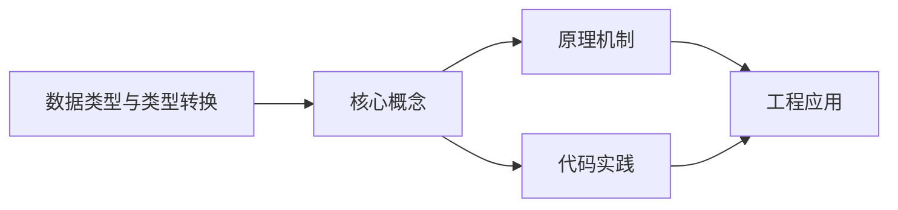
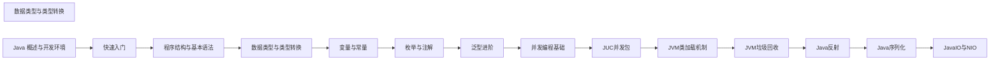

## 1. 学习目标（Bloom 分类）

本节按照布鲁姆教育目标分类学组织学习路径。本文主题为《数据类型与类型转换》，属于 Java 模块，读者可以根据自身阶段选择阅读深度。

记忆层面：能够准确复述本文的核心概念、术语与基本语法或操作步骤，并能够在提问或检索时快速定位对应知识点。能够说出 Java 的编译执行模型（javac 到字节码，JVM 解释与 JIT）。

理解层面：能够用自己的语言解释核心原理与工作机制，说明概念之间的因果关系，而不是机械记忆结论。能够解释面向对象三大特性与 JVM 内存区域的职责。

应用层面：能够在真实项目或练习场景中运用本文知识解决具体问题，写出正确且可维护的实现。能够编写类、接口、集合操作与异常处理的完整程序。

分析层面：能够拆解复杂问题，比较本文主题与相邻概念的异同，识别边界条件与例外情况。能够分析 Java 与 C++、Go 在内存管理与并发模型上的差异。

评价层面：能够根据约束条件（性能、可读性、安全、成本）评价不同方案的优劣，做出有依据的技术决策。能够评价不同集合、并发工具与框架的适用场景。

创造层面：能够把本文知识与其他模块知识组合，设计出新的解决方案或可复用的工程模式。能够组合 Spring 生态设计企业级应用。

通过本节学习，读者应当能够把《数据类型与类型转换》纳入自己的知识网络，并与 Java 模块的其他主题（JVM、集合框架、并发、Spring 生态）建立关联。

## 2. 历史动机与发展脉络

《数据类型与类型转换》是 Java 领域的重要主题。要真正理解它，需要先了解它解决的问题与演进过程。

Java 由 James Gosling 领导的 Sun 团队于 1995 年发布，口号“一次编写，到处运行”依托 JVM 字节码实现跨平台。2006 年 Sun 将 Java 开源（OpenJDK），2010 年 Oracle 收购 Sun 后 Java 进入新的治理阶段。
Java 的版本节奏在 2017 年后改为每半年一个特性版本、每两年一个 LTS（长期支持）版本。当前主流 LTS 包括 Java 11、17、21 与 25；Java 21 引入虚拟线程（Project Loom 成果），显著降低高并发服务的线程成本。
Java 生态以 Spring 家族为核心：Spring Boot 简化配置与部署，Spring Cloud 提供微服务组件；构建工具从 Maven 演进到 Gradle；JVM 语言（Kotlin、Scala、Groovy）与 Java 共存互操作。
Android 开发早期使用 Java，2019 年后官方转向 Kotlin-first，但 Java 仍是服务端领域（尤其是金融、电商等企业系统）的中坚力量。

回到本文主题：数据类型与类型转换 的提出与成熟，正是上述技术背景下的必然产物。早期实现往往以简单可用为目标，随着工程规模扩大，社区逐渐沉淀出标准做法与最佳实践；理解这一脉络，可以帮助读者判断“为什么文档中的推荐写法是现在这个样子”，也能在遇到历史遗留代码时准确识别其设计年代与取舍。

理解 Java 版本与 LTS 机制，是工程选型的起点：生产环境优先 LTS，新特性（如虚拟线程）可以在受控场景评估后引入。

## 3. 形式化定义与核心概念精讲

本节把《数据类型与类型转换》涉及的核心概念以“定义 + 讲解”的形式展开。读者应把定义当作工具，把讲解当作理解路径；两者结合才能形成可迁移的知识。

JVM 与字节码：`javac` 把 .java 编译为 .class 字节码，JVM 加载、校验并执行；热点代码由 JIT（如 C2）编译为机器码，解释与编译结合实现启动速度与峰值性能的平衡。
面向对象：封装（访问控制）、继承（extends/implements）与多态（重载/重写）是 Java 的类型系统支柱；接口默认方法（Java 8）与密封类（Java 17）持续演进表达能力。
异常体系：受检异常（checked）编译期强制处理，非受检异常（RuntimeException）运行时抛出；try-with-resources 自动关闭资源。
泛型与擦除：Java 泛型在编译期检查后擦除类型参数，运行时无泛型信息；这解释了 `List<String>` 与 `List<Integer>` 的 Class 相同，以及通配符 `? extends` 的逆变协变规则。

### 3.1 原文章节逐一精讲

原文档把主题拆分为 19 个小节，下面按顺序给出每一节的导读讲解，随后保留原文细节供精读。

#### 原文精读（完整保留）

# Java 数据类型与类型转换

> **符号约定**：`< >` 必填参数 | `[ ]` 可选参数

---

#### 1. 数据类型分类

Java 是一种强类型语言，数据类型分为两大类：

##### 1.1 基本数据类型 (Primitive Types)

- **存储方式**：直接存储在栈内存中，值存储在变量分配的内存空间里。
- **特点**：占用空间小，存取速度快。
- **种类**：共有 8 种基本数据类型，分为四大类。

##### 1.2 引用数据类型 (Reference Types)

- **存储方式**：存储在堆内存中，栈内存中存储的是对象的引用（地址）。
- **特点**：占用空间较大，存取速度相对较慢。
- **种类**：类 (Class)、接口 (Interface)、数组 (Array)、枚举 (Enum) 等。

#### 2. 基本数据类型详解

##### 2.1 整数类型

| 类型    | 占用字节 | 默认值 | 取值范围                 | 适用场景                       |
| ------- | -------- | ------ | ------------------------ | ------------------------------ |
| `byte`  | 1        | 0      | -128 ~ 127               | 节省内存，适用于存储小范围整数 |
| `short` | 2        | 0      | -32,768 ~ 32,767         | 适用于存储中等范围整数         |
| `int`   | 4        | 0      | -2^31 ~ 2^31-1 (约 21亿) | 最常用的整数类型               |
| `long`  | 8        | 0L     | -2^63 ~ 2^63-1           | 适用于存储大范围整数           |

**示例**：

```java
 byte b = 100; // 正确，在 byte 范围内
 short s = 1000; // 正确，在 short 范围内
 int i = 100000; // 正确，在 int 范围内
 long l = 10000000000L; // 注意：需要加 L 后缀
```

##### 2.2 浮点数类型

| 类型     | 占用字节 | 默认值 | 精度                    | 适用场景                             |
| -------- | -------- | ------ | ----------------------- | ------------------------------------ |
| `float`  | 4        | 0.0f   | 单精度，约 7 位小数     | 节省内存，适用于对精度要求不高的场景 |
| `double` | 8        | 0.0d   | 双精度，约 15-17 位小数 | 最常用的浮点数类型，精度更高         |

**示例**：

```java
 float f = 3.14f; // 注意：需要加 F 后缀
 double d = 3.1415926535; // double 是默认的浮点数类型
```

##### 2.3 字符类型

| 类型   | 占用字节 | 默认值   | 取值范围  | 适用场景                        |
| ------ | -------- | -------- | --------- | ------------------------------- |
| `char` | 2        | '\u0000' | 0 ~ 65535 | 存储单个字符，使用 Unicode 编码 |

**示例**：

```java
 char c1 = 'A'; // 字符字面量
 char c2 = 65; // ASCII 码，对应 'A'
 char c3 = '\u0041'; // Unicode 编码，对应 'A'
```

##### 2.4 布尔类型

| 类型      | 占用字节     | 默认值 | 取值范围 | 适用场景     |
| --------- | ------------ | ------ | -------- | ------------ |
| `boolean` | 1 (依赖 JVM) | false  | / false  | 用于条件判断 |

**示例**：

```java
 boolean flag = true;
 boolean isReady = false;
```

#### 3. 引用数据类型

##### 3.1 类 (Class)

- **定义**：使用 `class` 关键字定义的类型。
- **示例**：`String`, `Integer`, `ArrayList` 等。
  **示例**：

```java
 String str = "Hello, Java!"; // 字符串对象
 ArrayList<String> list = new ArrayList<>(); // 集合对象
```

##### 3.2 接口 (Interface)

- **定义**：使用 `interface` 关键字定义的类型。
- **示例**：`Runnable`, `Comparable` 等。
  **示例**：

```java
 Runnable runnable = () -> System.out.println("Hello");
```

##### 3.3 数组 (Array)

- **定义**：使用 `[]` 符号定义的类型。
- **示例**：`int[]`, `String[]` 等。
  **示例**：

```java
 int[] numbers = {1, 2, 3, 4, 5};
 String[] names = new String[3];
```

#### 4. 类型转换

##### 4.1 自动类型转换 (Implicit Conversion)

**定义**：小容量类型向大容量类型的转换，由编译器自动完成。
**转换规则**：

- **整数类型**：`byte` → `short` → `int` → `long`
- **浮点类型**：`float` → `double`
- **整数到浮点**：`byte` → `short` → `int` → `long` → `float` → `double`
- **字符到整数**：`char` → `int` → `long` → `float` → `double`
  **示例**：

```java
 byte b = 100;
 short s = b; // 自动转换：byte → short
 int i = s; // 自动转换：short → int
 long l = i; // 自动转换：int → long
 float f = l; // 自动转换：long → float
 double d = f; // 自动转换：float → double
 char c = 'A';
 int i2 = c; // 自动转换：char → int，值为 65
```

##### 4.2 强制类型转换 (Explicit Conversion)

**定义**：大容量类型向小容量类型的转换，需要显式指定目标类型。
**语法**：`(目标类型) 表达式`
**注意事项**：

- 可能导致**数据溢出**或**精度丢失**。
- 应该在转换前检查值是否在目标类型的范围内。
  **示例**：

```java
 // 精度丢失
 double pi = 3.14159;
 int num = (int) pi; // 结果为 3，小数部分被截断
 // 数据溢出
 int i = 130;
 byte b = (byte) i; // 结果为 -126，因为 130 超出了 byte 的范围
 // 安全的强制转换
 int i2 = 100;
 byte b2 = (byte) i2; // 结果为 100，在 byte 范围内
```

##### 4.3 基本类型与引用类型的转换

###### 4.3.1 装箱 (Boxing)

**定义**：将基本类型转换为对应的包装类。
**示例**：

```java
 int i = 100;
 integer iObj = Integer.valueOf(i); // 手动装箱
 integer iObj2 = i; // 自动装箱（Java 5+）
 boolean b = true;
 Boolean bObj = Boolean.valueOf(b); // 手动装箱
 Boolean bObj2 = b; // 自动装箱
```

###### 4.3.2 拆箱 (Unboxing)

**定义**：将包装类转换为对应的基本类型。
**示例**：

```java
 integer iObj = 100;
 int i = iObj.intValue(); // 手动拆箱
 int i2 = iObj; // 自动拆箱（Java 5+）
 Boolean bObj = true;
 boolean b = bObj.booleanValue(); // 手动拆箱
 boolean b2 = bObj; // 自动拆箱
```

##### 4.4 字符串与基本类型的转换

###### 4.4.1 基本类型转字符串

**方法**：

1. 使用 `String.valueOf()` 方法
2. 使用 `+` 运算符
3. 使用包装类的 `toString()` 方法
   **示例**：

```java
 int i = 100;
 String s1 = String.valueOf(i); // 方法 1
 String s2 = i + "";
  // 方法 2
 String s3 = Integer.toString(i); // 方法 3
 double d = 3.14;
 String s4 = String.valueOf(d);
 String s5 = d + "";
 String s6 = Double.toString(d);
```

###### 4.4.2 字符串转基本类型

**方法**：使用包装类的静态 `parseXxx()` 方法。
**示例**：

```java
 String s1 = "100";
 int i = Integer.parseInt(s1);
 String s2 = "3.14";
 double d = Double.parseDouble(s2);
 String s3 = "";
 boolean b = Boolean.parseBoolean(s3);
```

#### 5. 类型转换的特殊情况

##### 5.1 整数默认类型

- **整数字面量**：默认类型为 `int`。
- **长整型**：需要在数值后加 `L` 或 `l`（建议使用大写 `L`，避免与数字 `1` 混淆）。
  **示例**：

```java
 int i = 100; // 正确
 long l1 = 100; // 正确，int 自动转换为 long
 long l2 = 10000000000L; // 必须加 L，否则会超出 int 范围
```

##### 5.2 浮点数默认类型

- **浮点数字面量**：默认类型为 `double`。
- **单精度浮点数**：需要在数值后加 `F` 或 `f`。
  **示例**：

```java
 double d = 3.14; // 正确
 float f1 = (float) 3.14; // 强制转换
 float f2 = 3.14f; // 正确，加 F 后缀
```

##### 5.3 运算中的类型提升

- **规则**：在运算中，`byte`, `short`, `char` 类型会先提升为 `int` 类型再进行计算。
- **结果类型**：运算结果的类型为参与运算的最高类型。
  **示例**：

```java
 byte b1 = 10;
 byte b2 = 20;
 // byte b3 = b1 + b2; // 错误：b1 + b2 结果为 int 类型
 int i = b1 + b2; // 正确
 int i1 = 100;
 double d1 = 3.14;
 double d2 = i1 + d1; // 结果为 double 类型
```

##### 5.4 字符串拼接

- **规则**：使用 `+` 运算符时，若有一方为字符串，则整体变为字符串连接。
- **运算顺序**：从左到右依次计算。
  **示例**：

```java
 int i = 10;
 int j = 20;
 String s = "Result: " + i + j; // 结果为 "Result: 1020"
 String s2 = "Result: " + (i + j); // 结果为 "Result: 30"
 // 混合类型
 String s3 = "Pi is " + 3.14; // 结果为 "Pi is 3.14"
 String s4 = 10 + 20 + " is the sum"; // 结果为 "30 is the sum"
```

#### 6. 类型转换的最佳实践

##### 6.1 避免数据溢出

- **检查范围**：在进行强制类型转换前，检查值是否在目标类型的范围内。
- **使用包装类的方法**：使用包装类的 `MIN_VALUE` 和 `MAX_VALUE` 常量进行范围检查。
  **示例**：

```java
 int i = 130;
 if (i >= Byte.MIN_VALUE && i <= Byte.MAX_VALUE) {
  byte b = (byte) i;
  System.out.println("转换成功: " + b);
 }
  System.out.println("转换失败：值超出 byte 范围");
 }
```

##### 6.2 避免精度丢失

- **使用适当的类型**：根据需要选择合适的浮点类型。
- **BigDecimal**：对于需要精确计算的场景，使用 `BigDecimal` 类。
  **示例**：

```java
 // 精度丢失问题
 double d1 = 0.1;
 double d2 = 0.2;
 double sum = d1 + d2; // 结果为 0.30000000000000004
 // 使用 BigDecimal
 import java.math.BigDecimal;
 BigDecimal bd1 = new BigDecimal("0.1");
 BigDecimal bd2 = new BigDecimal("0.2");
 BigDecimal bdSum = bd1.add(bd2); // 结果为 0.3
```

##### 6.3 合理使用装箱和拆箱

- **自动装箱/拆箱**：Java 5+ 支持自动装箱和拆箱，但应避免在循环中频繁使用，可能影响性能。
- **缓存机制**：包装类对某些值有缓存机制（如 `Integer` 对 -128 到 127 的值），可以提高性能。
  **示例**：

```java
 // 缓存机制示例
 integer i1 = 100;
 integer i2 = 100;
 System.out.println(i1 == i2); // 结果为 true，因为 100 在缓存范围内
 integer i3 = 200;
 integer i4 = 200;
 System.out.println(i3 == i4); // 结果为 false，因为 200 不在缓存范围内
 System.out.println(i3.equals(i4)); // 结果为 true，推荐使用 equals 比较
```

##### 6.4 字符串转换的安全性

- **异常处理**：在将字符串转换为基本类型时，应捕获 `NumberFormatException` 异常。
- **空值检查**：在转换前检查字符串是否为 `null`。
  **示例**：

```java
 String s = "123";
 try {
  int i = Integer.parseInt(s);
  System.out.println("转换成功: " + i);
 }
  System.out.println("转换失败: " + e.getMessage());
 }
 // 空值检查
 String s2 = null;
 if (s2 != null) {
  int i2 = Integer.parseInt(s2);
 }
  System.out.println("字符串为 null");
 }
```

#### 7. 实际应用示例

##### 7.1 示例 1：温度转换

```java
 import java.util.Scanner;
 public class TemperatureConverter {
  public static void main(String[] args) {
  Scanner sc = new Scanner(System.in);
  System.out.print("请输入摄氏度: ");
  double celsius = sc.nextDouble();
  // 转换为华氏度
  double fahrenheit = celsius * 9 / 5 + 32;
  System.out.println(celsius + " 摄氏度 = " + fahrenheit + " 华氏度");
  sc.close();
  }
 }
```

##### 7.2 示例 2：计算圆的面积

```java
 import java.util.Scanner;
 public class CircleArea {
  public static void main(String[] args) {
  Scanner sc = new Scanner(System.in);
  System.out.print("请输入圆的半径: ");
  double radius = sc.nextDouble();
  // 计算面积
  double area = Math.PI * radius * radius;
  System.out.println("圆的面积: " + area);
  sc.close();
  }
 }
```

##### 7.3 示例 3：类型转换练习

```java
 public class TypeConversionDemo {
  public static void main(String[] args) {
  // 自动类型转换
  byte b = 10;
  short s = b;
  int i = s;
  long l = i;
  float f = l;
  double d = f;
  System.out.println("自动类型转换:");
  System.out.println("byte: " + b);
  System.out.println("short: " + s);
  System.out.println("int: " + i);
  System.out.println("long: " + l);
  System.out.println("float: " + f);
  System.out.println("double: " + d);
  // 强制类型转换
  double pi = 3.14159;
  int piInt = (int) pi;
  System.out.println("\n强制类型转换:");
  System.out.println("double pi: " + pi);
  System.out.println("int pi: " + piInt);
  // 字符串转换
  String str = "12345";
  int strToInt = Integer.parseInt(str);
  System.out.println("\n字符串转换:");
  System.out.println("String: " + str);
  System.out.println("int: " + strToInt);
  // 装箱和拆箱
  Integer iObj = 100;
  int iUnboxed = iObj;
  System.out.println("\n装箱和拆箱:");
  System.out.println("Integer: " + iObj);
  System.out.println("int: " + iUnboxed);
  }
 }
```

---

#### 整数类型

**基本写法：byte 类型**
`byte <变量名> = <值>;`
```java
// 声明 1 字节整数
byte b = 100;
```

---

**基本写法：short 类型**
`short <变量名> = <值>;`
```java
// 声明 2 字节整数
short s = 1000;
```

---

**基本写法：int 类型**
`int <变量名> = <值>;`
```java
// 声明 4 字节整数（默认）
int i = 100000;
```

---

**基本写法：long 类型**
`long <变量名> = <值>L;`
```java
// 声明 8 字节整数必须加 L 后缀
long l = 10000000000L;
```

---

#### 浮点数类型

**基本写法：float 类型**
`float <变量名> = <值>F;`
```java
// 声明单精度浮点数必须加 F 后缀
float f = 3.14f;
```

---

**基本写法：double 类型**
`double <变量名> = <值>;`
```java
// 声明双精度浮点数（默认）
double d = 3.1415926535;
```

---

#### 字符类型

**基本写法：字符字面量**
`char <变量名> = '<字符>';`
```java
// 使用字符字面量声明
char c1 = 'A';
```

---

**基本写法：ASCII 码赋值**
`char <变量名> = <ASCII码>;`
```java
// 使用 ASCII 码赋值
char c2 = 65;
```

---

**基本写法：Unicode 编码赋值**
`char <变量名> = '\u<编码>';`
```java
// 使用 Unicode 编码赋值
char c3 = '\u0041';
```

---

#### 布尔类型

**基本写法：布尔类型**
`boolean <变量名> = <true|false>;`
```java
// 声明布尔类型变量
boolean flag = true;
```

---

#### 引用数据类型

**基本写法：类类型声明**
`<类名> <变量名> = new <类名>();`
```java
// 声明集合对象
ArrayList<String> list = new ArrayList<>();
```

---

**基本写法：字符串声明**
`String <变量名> = "<字符串>";`
```java
// 声明字符串对象
String str = "Hello, Java!";
```

---

**基本写法：数组类型声明**
`<类型>[] <变量名> = { <元素> };`
```java
// 声明并初始化数组
int[] numbers = {1, 2, 3, 4, 5};
```

---

#### 自动类型转换

**基本写法：小类型转大类型**
`<大类型> <变量名> = <小类型变量>;`
```java
// byte 自动转换为 short
byte b = 100;
short s = b;
```

---

**基本写法：int 转 long**
`long <变量名> = <int变量>;`
```java
// int 自动转换为 long
int i = 100;
long l = i;
```

---

**基本写法：char 转 int**
`int <变量名> = <char变量>;`
```java
// char 自动转换为 int
char c = 'A';
int i = c;
```

---

#### 强制类型转换

**基本写法：强制类型转换**
`(<目标类型>) <表达式>`
```java
// double 强制转换为 int
double pi = 3.14159;
int num = (int) pi;
```

---

**基本写法：int 转 byte**
`byte <变量名> = (byte) <int变量>;`
```java
// int 强制转换为 byte
int i = 100;
byte b = (byte) i;
```

---

#### 装箱与拆箱

**基本写法：手动装箱**
`<包装类> <变量名> = <包装类>.valueOf(<基本类型>);`
```java
// int 手动装箱为 Integer
int i = 100;
Integer iObj = Integer.valueOf(i);
```

---

**基本写法：自动装箱**
`<包装类> <变量名> = <基本类型>;`
```java
// int 自动装箱为 Integer
Integer iObj = 100;
```

---

**基本写法：手动拆箱**
`<基本类型> <变量名> = <包装类变量>.<xxxValue>();`
```java
// Integer 手动拆箱为 int
Integer iObj = 100;
int i = iObj.intValue();
```

---

**基本写法：自动拆箱**
`<基本类型> <变量名> = <包装类变量>;`
```java
// Integer 自动拆箱为 int
Integer iObj = 100;
int i = iObj;
```

---

#### 字符串与基本类型转换

**基本写法：基本类型转字符串**
`String <变量名> = String.valueOf(<基本类型>);`
```java
// int 转换为字符串
int i = 100;
String s = String.valueOf(i);
```

---

**基本写法：字符串转 int**
`int <变量名> = Integer.parseInt(<字符串>);`
```java
// 字符串转换为 int
String s = "100";
int i = Integer.parseInt(s);
```

---

**基本写法：字符串转 double**
`double <变量名> = Double.parseDouble(<字符串>);`
```java
// 字符串转换为 double
String s = "3.14";
double d = Double.parseDouble(s);
```

---

**基本写法：字符串转 boolean**
`boolean <变量名> = Boolean.parseBoolean(<字符串>);`
```java
// 字符串转换为 boolean
String s = "true";
boolean b = Boolean.parseBoolean(s);
```

---

#### 运算中的类型提升

**基本写法：byte 运算提升为 int**
`int <变量名> = <byte变量1> + <byte变量2>;`
```java
// 两个 byte 相加结果为 int
byte b1 = 10;
byte b2 = 20;
int i = b1 + b2;
```

---

**基本写法：int 与 double 运算**
`double <变量名> = <int变量> + <double变量>;`
```java
// int 与 double 运算结果为 double
int i = 100;
double d = 3.14;
double result = i + d;
```

---

#### 字符串拼接

**基本写法：字符串与数字拼接**
`String <变量名> = <字符串> + <数字>;`
```java
// 字符串与数字拼接
String s = "Result: " + 42;
```

---

**基本写法：括号优先拼接**
`String <变量名> = <字符串> + (<表达式>);`
```java
// 使用括号先计算再拼接
String s = "Result: " + (10 + 20);
```

---

#### BigDecimal 精确计算

**基本写法：创建 BigDecimal**
`BigDecimal <变量名> = new BigDecimal("<数值>");`
```java
// 使用字符串创建 BigDecimal
BigDecimal bd = new BigDecimal("0.1");
```

---

**基本写法：BigDecimal 加法**
`BigDecimal <结果> = <bd1>.add(<bd2>);`
```java
// 两个 BigDecimal 相加
BigDecimal bd1 = new BigDecimal("0.1");
BigDecimal bd2 = new BigDecimal("0.2");
BigDecimal sum = bd1.add(bd2);
```


### 3.2 概念关系图

下面用 Mermaid 图表达本文核心概念之间的关系，帮助读者建立整体图景：



图中展示的是本文知识的结构化关系：核心概念是入口，原理机制解释“为什么”，代码实践演示“怎么做”，工程应用回答“何时用”。读者学习时可以把每个小节的内容挂接到对应节点上。

## 4. 理论推导与原理解析

本节深入《数据类型与类型转换》背后的原理。理论部分不求面面俱到，而是聚焦“能解释现象、能指导实践”的关键推导。

JVM 内存模型：堆（新生代/老年代）、元空间、虚拟机栈、本地方法栈与程序计数器；GC 从 CMS 演进到 G1（默认）、ZGC（超低延迟），理解分代收集是调优前提。
并发工具：synchronized 与 JUC（java.util.concurrent）的锁、并发容器、线程池、CompletableFuture 构成并发工具箱；Java 21 的虚拟线程让“每任务一线程”成为可能。
类加载机制：双亲委派模型保证类唯一性，SPI（ServiceLoader）打破委派实现扩展；自定义类加载器是热部署与隔离的基础。
反射与注解：反射在运行时检查类结构，注解提供元数据；Spring 的依赖注入与 AOP 均基于这些机制，但反射有性能与安全成本。

需要强调的是，理论推导与工程实践之间存在翻译层：理论给出的是理想化模型与边界条件，工程代码则必须处理真实环境中的例外。读者在学习时应先掌握理论的“标准情形”，再通过陷阱章节了解“非标准情形”。

## 5. 代码示例与逐行讲解

本节把原文中的代码示例系统整理，并为每个示例补充用途说明与讲解。读者不应只浏览代码，而应逐段对照讲解理解设计意图。

### 5.1 示例：2.1 整数类型

该示例来自原文《2.1 整数类型》小节，用于演示数据类型与类型转换相关操作。阅读时请先看代码结构，再看其后的讲解。

```java
 byte b = 100; // 正确，在 byte 范围内
 short s = 1000; // 正确，在 short 范围内
 int i = 100000; // 正确，在 int 范围内
 long l = 10000000000L; // 注意：需要加 L 后缀
```

讲解：这段代码演示了本节核心知识点。代码中的关键操作可以归纳为三步：准备（定义或初始化）、执行（核心逻辑）、收尾（释放资源或返回结果）。实际项目中，这三步往往被封装为函数或类，以提升复用性与可测试性。

关键点分析：

该示例共 4 行有效代码，结构以数据或配置为主。阅读时应关注：数据字段的含义、配置项的作用，以及它们与运行行为的对应关系。

进阶思考路径：先尝试修改参数观察行为变化，再把示例中的模式迁移到自己的项目中；每次修改都记录预期与实测差异，这是把示例转化为能力的最快方式。

### 5.2 示例：2.2 浮点数类型

该示例来自原文《2.2 浮点数类型》小节，用于演示数据类型与类型转换相关操作。阅读时请先看代码结构，再看其后的讲解。

```java
 float f = 3.14f; // 注意：需要加 F 后缀
 double d = 3.1415926535; // double 是默认的浮点数类型
```

讲解：这段代码演示了本节核心知识点。代码中的关键操作可以归纳为三步：准备（定义或初始化）、执行（核心逻辑）、收尾（释放资源或返回结果）。实际项目中，这三步往往被封装为函数或类，以提升复用性与可测试性。

关键点分析：

该示例共 2 行有效代码，结构以数据或配置为主。阅读时应关注：数据字段的含义、配置项的作用，以及它们与运行行为的对应关系。

进阶思考路径：先尝试修改参数观察行为变化，再把示例中的模式迁移到自己的项目中；每次修改都记录预期与实测差异，这是把示例转化为能力的最快方式。

### 5.3 示例：2.3 字符类型

该示例来自原文《2.3 字符类型》小节，用于演示数据类型与类型转换相关操作。阅读时请先看代码结构，再看其后的讲解。

```java
 char c1 = 'A'; // 字符字面量
 char c2 = 65; // ASCII 码，对应 'A'
 char c3 = '\u0041'; // Unicode 编码，对应 'A'
```

讲解：这段代码演示了本节核心知识点。代码中的关键操作可以归纳为三步：准备（定义或初始化）、执行（核心逻辑）、收尾（释放资源或返回结果）。实际项目中，这三步往往被封装为函数或类，以提升复用性与可测试性。

关键点分析：

该示例共 3 行有效代码，结构以数据或配置为主。阅读时应关注：数据字段的含义、配置项的作用，以及它们与运行行为的对应关系。

进阶思考路径：先尝试修改参数观察行为变化，再把示例中的模式迁移到自己的项目中；每次修改都记录预期与实测差异，这是把示例转化为能力的最快方式。

### 5.4 示例：2.4 布尔类型

该示例来自原文《2.4 布尔类型》小节，用于演示数据类型与类型转换相关操作。阅读时请先看代码结构，再看其后的讲解。

```java
 boolean flag = true;
 boolean isReady = false;
```

讲解：这段代码演示了本节核心知识点。代码中的关键操作可以归纳为三步：准备（定义或初始化）、执行（核心逻辑）、收尾（释放资源或返回结果）。实际项目中，这三步往往被封装为函数或类，以提升复用性与可测试性。

关键点分析：

该示例共 2 行有效代码，结构以数据或配置为主。阅读时应关注：数据字段的含义、配置项的作用，以及它们与运行行为的对应关系。

进阶思考路径：先尝试修改参数观察行为变化，再把示例中的模式迁移到自己的项目中；每次修改都记录预期与实测差异，这是把示例转化为能力的最快方式。

### 5.5 示例：3.1 类 (Class)

该示例来自原文《3.1 类 (Class)》小节，用于演示数据类型与类型转换相关操作。阅读时请先看代码结构，再看其后的讲解。

```java
 String str = "Hello, Java!"; // 字符串对象
 ArrayList<String> list = new ArrayList<>(); // 集合对象
```

讲解：这段代码演示了本节核心知识点。代码中的关键操作可以归纳为三步：准备（定义或初始化）、执行（核心逻辑）、收尾（释放资源或返回结果）。实际项目中，这三步往往被封装为函数或类，以提升复用性与可测试性。

关键点分析：

该示例共 2 行有效代码，结构以数据或配置为主。阅读时应关注：数据字段的含义、配置项的作用，以及它们与运行行为的对应关系。

进阶思考路径：先尝试修改参数观察行为变化，再把示例中的模式迁移到自己的项目中；每次修改都记录预期与实测差异，这是把示例转化为能力的最快方式。

### 5.6 示例：3.2 接口 (Interface)

该示例来自原文《3.2 接口 (Interface)》小节，用于演示数据类型与类型转换相关操作。阅读时请先看代码结构，再看其后的讲解。

```java
 Runnable runnable = () -> System.out.println("Hello");
```

讲解：这段代码演示了本节核心知识点。代码中的关键操作可以归纳为三步：准备（定义或初始化）、执行（核心逻辑）、收尾（释放资源或返回结果）。实际项目中，这三步往往被封装为函数或类，以提升复用性与可测试性。

关键点分析：

该示例共 1 行有效代码，结构以数据或配置为主。阅读时应关注：数据字段的含义、配置项的作用，以及它们与运行行为的对应关系。

进阶思考路径：先尝试修改参数观察行为变化，再把示例中的模式迁移到自己的项目中；每次修改都记录预期与实测差异，这是把示例转化为能力的最快方式。

### 5.7 示例：3.3 数组 (Array)

该示例来自原文《3.3 数组 (Array)》小节，用于演示数据类型与类型转换相关操作。阅读时请先看代码结构，再看其后的讲解。

```java
 int[] numbers = {1, 2, 3, 4, 5};
 String[] names = new String[3];
```

讲解：这段代码演示了本节核心知识点。代码中的关键操作可以归纳为三步：准备（定义或初始化）、执行（核心逻辑）、收尾（释放资源或返回结果）。实际项目中，这三步往往被封装为函数或类，以提升复用性与可测试性。

关键点分析：

该示例共 2 行有效代码，结构以数据或配置为主。阅读时应关注：数据字段的含义、配置项的作用，以及它们与运行行为的对应关系。

进阶思考路径：先尝试修改参数观察行为变化，再把示例中的模式迁移到自己的项目中；每次修改都记录预期与实测差异，这是把示例转化为能力的最快方式。

### 5.8 示例：4.1 自动类型转换 (Implicit Conversion)

该示例来自原文《4.1 自动类型转换 (Implicit Conversion)》小节，用于演示数据类型与类型转换相关操作。阅读时请先看代码结构，再看其后的讲解。

```java
 byte b = 100;
 short s = b; // 自动转换：byte → short
 int i = s; // 自动转换：short → int
 long l = i; // 自动转换：int → long
 float f = l; // 自动转换：long → float
 double d = f; // 自动转换：float → double
 char c = 'A';
 int i2 = c; // 自动转换：char → int，值为 65
```

讲解：这段代码演示了本节核心知识点。代码中的关键操作可以归纳为三步：准备（定义或初始化）、执行（核心逻辑）、收尾（释放资源或返回结果）。实际项目中，这三步往往被封装为函数或类，以提升复用性与可测试性。

关键点分析：

该示例共 8 行有效代码，结构以数据或配置为主。阅读时应关注：数据字段的含义、配置项的作用，以及它们与运行行为的对应关系。

进阶思考路径：先尝试修改参数观察行为变化，再把示例中的模式迁移到自己的项目中；每次修改都记录预期与实测差异，这是把示例转化为能力的最快方式。

### 5.9 示例：4.2 强制类型转换 (Explicit Conversion)

该示例来自原文《4.2 强制类型转换 (Explicit Conversion)》小节，用于演示数据类型与类型转换相关操作。阅读时请先看代码结构，再看其后的讲解。

```java
 // 精度丢失
 double pi = 3.14159;
 int num = (int) pi; // 结果为 3，小数部分被截断
 // 数据溢出
 int i = 130;
 byte b = (byte) i; // 结果为 -126，因为 130 超出了 byte 的范围
 // 安全的强制转换
 int i2 = 100;
 byte b2 = (byte) i2; // 结果为 100，在 byte 范围内
```

讲解：这段代码演示了本节核心知识点。代码中的关键操作可以归纳为三步：准备（定义或初始化）、执行（核心逻辑）、收尾（释放资源或返回结果）。实际项目中，这三步往往被封装为函数或类，以提升复用性与可测试性。

关键点分析：

该示例共 9 行有效代码，结构以数据或配置为主。阅读时应关注：数据字段的含义、配置项的作用，以及它们与运行行为的对应关系。

进阶思考路径：先尝试修改参数观察行为变化，再把示例中的模式迁移到自己的项目中；每次修改都记录预期与实测差异，这是把示例转化为能力的最快方式。

### 5.10 示例：4.3.1 装箱 (Boxing)

该示例来自原文《4.3.1 装箱 (Boxing)》小节，用于演示数据类型与类型转换相关操作。阅读时请先看代码结构，再看其后的讲解。

```java
 int i = 100;
 integer iObj = Integer.valueOf(i); // 手动装箱
 integer iObj2 = i; // 自动装箱（Java 5+）
 boolean b = true;
 Boolean bObj = Boolean.valueOf(b); // 手动装箱
 Boolean bObj2 = b; // 自动装箱
```

讲解：这段代码演示了本节核心知识点。代码中的关键操作可以归纳为三步：准备（定义或初始化）、执行（核心逻辑）、收尾（释放资源或返回结果）。实际项目中，这三步往往被封装为函数或类，以提升复用性与可测试性。

关键点分析：

该示例共 6 行有效代码，结构以数据或配置为主。阅读时应关注：数据字段的含义、配置项的作用，以及它们与运行行为的对应关系。

进阶思考路径：先尝试修改参数观察行为变化，再把示例中的模式迁移到自己的项目中；每次修改都记录预期与实测差异，这是把示例转化为能力的最快方式。

### 5.11 示例：4.3.2 拆箱 (Unboxing)

该示例来自原文《4.3.2 拆箱 (Unboxing)》小节，用于演示数据类型与类型转换相关操作。阅读时请先看代码结构，再看其后的讲解。

```java
 integer iObj = 100;
 int i = iObj.intValue(); // 手动拆箱
 int i2 = iObj; // 自动拆箱（Java 5+）
 Boolean bObj = true;
 boolean b = bObj.booleanValue(); // 手动拆箱
 boolean b2 = bObj; // 自动拆箱
```

讲解：这段代码演示了本节核心知识点。代码中的关键操作可以归纳为三步：准备（定义或初始化）、执行（核心逻辑）、收尾（释放资源或返回结果）。实际项目中，这三步往往被封装为函数或类，以提升复用性与可测试性。

关键点分析：

该示例共 6 行有效代码，结构以数据或配置为主。阅读时应关注：数据字段的含义、配置项的作用，以及它们与运行行为的对应关系。

进阶思考路径：先尝试修改参数观察行为变化，再把示例中的模式迁移到自己的项目中；每次修改都记录预期与实测差异，这是把示例转化为能力的最快方式。

### 5.12 示例：4.4.1 基本类型转字符串

该示例来自原文《4.4.1 基本类型转字符串》小节，用于演示数据类型与类型转换相关操作。阅读时请先看代码结构，再看其后的讲解。

```java
 int i = 100;
 String s1 = String.valueOf(i); // 方法 1
 String s2 = i + "";
  // 方法 2
 String s3 = Integer.toString(i); // 方法 3
 double d = 3.14;
 String s4 = String.valueOf(d);
 String s5 = d + "";
 String s6 = Double.toString(d);
```

讲解：这段代码演示了本节核心知识点。代码中的关键操作可以归纳为三步：准备（定义或初始化）、执行（核心逻辑）、收尾（释放资源或返回结果）。实际项目中，这三步往往被封装为函数或类，以提升复用性与可测试性。

关键点分析：

该示例共 9 行有效代码，结构以数据或配置为主。阅读时应关注：数据字段的含义、配置项的作用，以及它们与运行行为的对应关系。

进阶思考路径：先尝试修改参数观察行为变化，再把示例中的模式迁移到自己的项目中；每次修改都记录预期与实测差异，这是把示例转化为能力的最快方式。

### 5.13 示例：4.4.2 字符串转基本类型

该示例来自原文《4.4.2 字符串转基本类型》小节，用于演示数据类型与类型转换相关操作。阅读时请先看代码结构，再看其后的讲解。

```java
 String s1 = "100";
 int i = Integer.parseInt(s1);
 String s2 = "3.14";
 double d = Double.parseDouble(s2);
 String s3 = "";
 boolean b = Boolean.parseBoolean(s3);
```

讲解：这段代码演示了本节核心知识点。代码中的关键操作可以归纳为三步：准备（定义或初始化）、执行（核心逻辑）、收尾（释放资源或返回结果）。实际项目中，这三步往往被封装为函数或类，以提升复用性与可测试性。

关键点分析：

该示例共 6 行有效代码，结构以数据或配置为主。阅读时应关注：数据字段的含义、配置项的作用，以及它们与运行行为的对应关系。

进阶思考路径：先尝试修改参数观察行为变化，再把示例中的模式迁移到自己的项目中；每次修改都记录预期与实测差异，这是把示例转化为能力的最快方式。

### 5.14 示例：5.1 整数默认类型

该示例来自原文《5.1 整数默认类型》小节，用于演示数据类型与类型转换相关操作。阅读时请先看代码结构，再看其后的讲解。

```java
 int i = 100; // 正确
 long l1 = 100; // 正确，int 自动转换为 long
 long l2 = 10000000000L; // 必须加 L，否则会超出 int 范围
```

讲解：这段代码演示了本节核心知识点。代码中的关键操作可以归纳为三步：准备（定义或初始化）、执行（核心逻辑）、收尾（释放资源或返回结果）。实际项目中，这三步往往被封装为函数或类，以提升复用性与可测试性。

关键点分析：

该示例共 3 行有效代码，结构以数据或配置为主。阅读时应关注：数据字段的含义、配置项的作用，以及它们与运行行为的对应关系。

进阶思考路径：先尝试修改参数观察行为变化，再把示例中的模式迁移到自己的项目中；每次修改都记录预期与实测差异，这是把示例转化为能力的最快方式。

### 5.15 示例：5.2 浮点数默认类型

该示例来自原文《5.2 浮点数默认类型》小节，用于演示数据类型与类型转换相关操作。阅读时请先看代码结构，再看其后的讲解。

```java
 double d = 3.14; // 正确
 float f1 = (float) 3.14; // 强制转换
 float f2 = 3.14f; // 正确，加 F 后缀
```

讲解：这段代码演示了本节核心知识点。代码中的关键操作可以归纳为三步：准备（定义或初始化）、执行（核心逻辑）、收尾（释放资源或返回结果）。实际项目中，这三步往往被封装为函数或类，以提升复用性与可测试性。

关键点分析：

该示例共 3 行有效代码，结构以数据或配置为主。阅读时应关注：数据字段的含义、配置项的作用，以及它们与运行行为的对应关系。

进阶思考路径：先尝试修改参数观察行为变化，再把示例中的模式迁移到自己的项目中；每次修改都记录预期与实测差异，这是把示例转化为能力的最快方式。

### 5.16 示例：5.3 运算中的类型提升

该示例来自原文《5.3 运算中的类型提升》小节，用于演示数据类型与类型转换相关操作。阅读时请先看代码结构，再看其后的讲解。

```java
 byte b1 = 10;
 byte b2 = 20;
 // byte b3 = b1 + b2; // 错误：b1 + b2 结果为 int 类型
 int i = b1 + b2; // 正确
 int i1 = 100;
 double d1 = 3.14;
 double d2 = i1 + d1; // 结果为 double 类型
```

讲解：这段代码演示了本节核心知识点。代码中的关键操作可以归纳为三步：准备（定义或初始化）、执行（核心逻辑）、收尾（释放资源或返回结果）。实际项目中，这三步往往被封装为函数或类，以提升复用性与可测试性。

关键点分析：

该示例共 7 行有效代码，结构以数据或配置为主。阅读时应关注：数据字段的含义、配置项的作用，以及它们与运行行为的对应关系。

进阶思考路径：先尝试修改参数观察行为变化，再把示例中的模式迁移到自己的项目中；每次修改都记录预期与实测差异，这是把示例转化为能力的最快方式。

### 5.17 示例：5.4 字符串拼接

该示例来自原文《5.4 字符串拼接》小节，用于演示数据类型与类型转换相关操作。阅读时请先看代码结构，再看其后的讲解。

```java
 int i = 10;
 int j = 20;
 String s = "Result: " + i + j; // 结果为 "Result: 1020"
 String s2 = "Result: " + (i + j); // 结果为 "Result: 30"
 // 混合类型
 String s3 = "Pi is " + 3.14; // 结果为 "Pi is 3.14"
 String s4 = 10 + 20 + " is the sum"; // 结果为 "30 is the sum"
```

讲解：这段代码演示了本节核心知识点。代码中的关键操作可以归纳为三步：准备（定义或初始化）、执行（核心逻辑）、收尾（释放资源或返回结果）。实际项目中，这三步往往被封装为函数或类，以提升复用性与可测试性。

关键点分析：

该示例共 7 行有效代码，结构以数据或配置为主。阅读时应关注：数据字段的含义、配置项的作用，以及它们与运行行为的对应关系。

进阶思考路径：先尝试修改参数观察行为变化，再把示例中的模式迁移到自己的项目中；每次修改都记录预期与实测差异，这是把示例转化为能力的最快方式。

### 5.18 示例：6.1 避免数据溢出

该示例来自原文《6.1 避免数据溢出》小节，用于演示数据类型与类型转换相关操作。阅读时请先看代码结构，再看其后的讲解。

```java
 int i = 130;
 if (i >= Byte.MIN_VALUE && i <= Byte.MAX_VALUE) {
  byte b = (byte) i;
  System.out.println("转换成功: " + b);
 }
  System.out.println("转换失败：值超出 byte 范围");
 }
```

讲解：这段代码演示了本节核心知识点。代码中的关键操作可以归纳为三步：准备（定义或初始化）、执行（核心逻辑）、收尾（释放资源或返回结果）。实际项目中，这三步往往被封装为函数或类，以提升复用性与可测试性。

关键点分析：

该示例共 7 行有效代码，包含 1 类关键结构（if）。其中：

- 入口与初始化部分负责建立上下文，对应实际项目中的启动或装配逻辑；
- 核心逻辑部分体现本文主题的主要操作，是阅读时最需要对照讲解理解的部分；
- 输出或返回部分把结果交给调用方，注意其类型与边界条件。

进阶思考路径：先尝试修改参数观察行为变化，再把示例中的模式迁移到自己的项目中；每次修改都记录预期与实测差异，这是把示例转化为能力的最快方式。

### 5.19 示例：6.2 避免精度丢失

该示例来自原文《6.2 避免精度丢失》小节，用于演示数据类型与类型转换相关操作。阅读时请先看代码结构，再看其后的讲解。

```java
 // 精度丢失问题
 double d1 = 0.1;
 double d2 = 0.2;
 double sum = d1 + d2; // 结果为 0.30000000000000004
 // 使用 BigDecimal
 import java.math.BigDecimal;
 BigDecimal bd1 = new BigDecimal("0.1");
 BigDecimal bd2 = new BigDecimal("0.2");
 BigDecimal bdSum = bd1.add(bd2); // 结果为 0.3
```

讲解：这段代码演示了本节核心知识点。代码中的关键操作可以归纳为三步：准备（定义或初始化）、执行（核心逻辑）、收尾（释放资源或返回结果）。实际项目中，这三步往往被封装为函数或类，以提升复用性与可测试性。

关键点分析：

该示例共 9 行有效代码，包含 1 类关键结构（import）。其中：

- 入口与初始化部分负责建立上下文，对应实际项目中的启动或装配逻辑；
- 核心逻辑部分体现本文主题的主要操作，是阅读时最需要对照讲解理解的部分；
- 输出或返回部分把结果交给调用方，注意其类型与边界条件。

进阶思考路径：先尝试修改参数观察行为变化，再把示例中的模式迁移到自己的项目中；每次修改都记录预期与实测差异，这是把示例转化为能力的最快方式。

### 5.20 示例：6.3 合理使用装箱和拆箱

该示例来自原文《6.3 合理使用装箱和拆箱》小节，用于演示数据类型与类型转换相关操作。阅读时请先看代码结构，再看其后的讲解。

```java
 // 缓存机制示例
 integer i1 = 100;
 integer i2 = 100;
 System.out.println(i1 == i2); // 结果为 true，因为 100 在缓存范围内
 integer i3 = 200;
 integer i4 = 200;
 System.out.println(i3 == i4); // 结果为 false，因为 200 不在缓存范围内
 System.out.println(i3.equals(i4)); // 结果为 true，推荐使用 equals 比较
```

讲解：这段代码演示了本节核心知识点。代码中的关键操作可以归纳为三步：准备（定义或初始化）、执行（核心逻辑）、收尾（释放资源或返回结果）。实际项目中，这三步往往被封装为函数或类，以提升复用性与可测试性。

关键点分析：

该示例共 8 行有效代码，结构以数据或配置为主。阅读时应关注：数据字段的含义、配置项的作用，以及它们与运行行为的对应关系。

进阶思考路径：先尝试修改参数观察行为变化，再把示例中的模式迁移到自己的项目中；每次修改都记录预期与实测差异，这是把示例转化为能力的最快方式。

### 5.21 示例：6.4 字符串转换的安全性

该示例来自原文《6.4 字符串转换的安全性》小节，用于演示数据类型与类型转换相关操作。阅读时请先看代码结构，再看其后的讲解。

```java
 String s = "123";
 try {
  int i = Integer.parseInt(s);
  System.out.println("转换成功: " + i);
 }
  System.out.println("转换失败: " + e.getMessage());
 }
 // 空值检查
 String s2 = null;
 if (s2 != null) {
  int i2 = Integer.parseInt(s2);
 }
  System.out.println("字符串为 null");
 }
```

讲解：这段代码演示了本节核心知识点。代码中的关键操作可以归纳为三步：准备（定义或初始化）、执行（核心逻辑）、收尾（释放资源或返回结果）。实际项目中，这三步往往被封装为函数或类，以提升复用性与可测试性。

关键点分析：

该示例共 14 行有效代码，包含 1 类关键结构（if）。其中：

- 入口与初始化部分负责建立上下文，对应实际项目中的启动或装配逻辑；
- 核心逻辑部分体现本文主题的主要操作，是阅读时最需要对照讲解理解的部分；
- 输出或返回部分把结果交给调用方，注意其类型与边界条件。

进阶思考路径：先尝试修改参数观察行为变化，再把示例中的模式迁移到自己的项目中；每次修改都记录预期与实测差异，这是把示例转化为能力的最快方式。

### 5.22 示例：7.1 示例 1：温度转换

该示例来自原文《7.1 示例 1：温度转换》小节，用于演示数据类型与类型转换相关操作。阅读时请先看代码结构，再看其后的讲解。

```java
 import java.util.Scanner;
 public class TemperatureConverter {
  public static void main(String[] args) {
  Scanner sc = new Scanner(System.in);
  System.out.print("请输入摄氏度: ");
  double celsius = sc.nextDouble();
  // 转换为华氏度
  double fahrenheit = celsius * 9 / 5 + 32;
  System.out.println(celsius + " 摄氏度 = " + fahrenheit + " 华氏度");
  sc.close();
  }
 }
```

讲解：这段代码演示了本节核心知识点。代码中的关键操作可以归纳为三步：准备（定义或初始化）、执行（核心逻辑）、收尾（释放资源或返回结果）。实际项目中，这三步往往被封装为函数或类，以提升复用性与可测试性。

关键点分析：

该示例共 12 行有效代码，包含 2 类关键结构（class、import）。其中：

- 入口与初始化部分负责建立上下文，对应实际项目中的启动或装配逻辑；
- 核心逻辑部分体现本文主题的主要操作，是阅读时最需要对照讲解理解的部分；
- 输出或返回部分把结果交给调用方，注意其类型与边界条件。

进阶思考路径：先尝试修改参数观察行为变化，再把示例中的模式迁移到自己的项目中；每次修改都记录预期与实测差异，这是把示例转化为能力的最快方式。

### 5.23 示例：7.2 示例 2：计算圆的面积

该示例来自原文《7.2 示例 2：计算圆的面积》小节，用于演示数据类型与类型转换相关操作。阅读时请先看代码结构，再看其后的讲解。

```java
 import java.util.Scanner;
 public class CircleArea {
  public static void main(String[] args) {
  Scanner sc = new Scanner(System.in);
  System.out.print("请输入圆的半径: ");
  double radius = sc.nextDouble();
  // 计算面积
  double area = Math.PI * radius * radius;
  System.out.println("圆的面积: " + area);
  sc.close();
  }
 }
```

讲解：这段代码演示了本节核心知识点。代码中的关键操作可以归纳为三步：准备（定义或初始化）、执行（核心逻辑）、收尾（释放资源或返回结果）。实际项目中，这三步往往被封装为函数或类，以提升复用性与可测试性。

关键点分析：

该示例共 12 行有效代码，包含 2 类关键结构（class、import）。其中：

- 入口与初始化部分负责建立上下文，对应实际项目中的启动或装配逻辑；
- 核心逻辑部分体现本文主题的主要操作，是阅读时最需要对照讲解理解的部分；
- 输出或返回部分把结果交给调用方，注意其类型与边界条件。

进阶思考路径：先尝试修改参数观察行为变化，再把示例中的模式迁移到自己的项目中；每次修改都记录预期与实测差异，这是把示例转化为能力的最快方式。

### 5.24 示例：7.3 示例 3：类型转换练习

该示例来自原文《7.3 示例 3：类型转换练习》小节，用于演示数据类型与类型转换相关操作。阅读时请先看代码结构，再看其后的讲解。

```java
 public class TypeConversionDemo {
  public static void main(String[] args) {
  // 自动类型转换
  byte b = 10;
  short s = b;
  int i = s;
  long l = i;
  float f = l;
  double d = f;
  System.out.println("自动类型转换:");
  System.out.println("byte: " + b);
  System.out.println("short: " + s);
  System.out.println("int: " + i);
  System.out.println("long: " + l);
  System.out.println("float: " + f);
  System.out.println("double: " + d);
  // 强制类型转换
  double pi = 3.14159;
  int piInt = (int) pi;
  System.out.println("\n强制类型转换:");
  System.out.println("double pi: " + pi);
  System.out.println("int pi: " + piInt);
  // 字符串转换
  String str = "12345";
  int strToInt = Integer.parseInt(str);
  System.out.println("\n字符串转换:");
  System.out.println("String: " + str);
  System.out.println("int: " + strToInt);
  // 装箱和拆箱
  Integer iObj = 100;
  int iUnboxed = iObj;
  System.out.println("\n装箱和拆箱:");
  System.out.println("Integer: " + iObj);
  System.out.println("int: " + iUnboxed);
  }
 }
```

讲解：这段代码演示了本节核心知识点。代码中的关键操作可以归纳为三步：准备（定义或初始化）、执行（核心逻辑）、收尾（释放资源或返回结果）。实际项目中，这三步往往被封装为函数或类，以提升复用性与可测试性。

关键点分析：

该示例共 36 行有效代码，包含 1 类关键结构（class）。其中：

- 入口与初始化部分负责建立上下文，对应实际项目中的启动或装配逻辑；
- 核心逻辑部分体现本文主题的主要操作，是阅读时最需要对照讲解理解的部分；
- 输出或返回部分把结果交给调用方，注意其类型与边界条件。

进阶思考路径：先尝试修改参数观察行为变化，再把示例中的模式迁移到自己的项目中；每次修改都记录预期与实测差异，这是把示例转化为能力的最快方式。

### 5.25 示例：整数类型

该示例来自原文《整数类型》小节，用于演示数据类型与类型转换相关操作。阅读时请先看代码结构，再看其后的讲解。

```java
// 声明 1 字节整数
byte b = 100;
```

讲解：这段代码演示了本节核心知识点。代码中的关键操作可以归纳为三步：准备（定义或初始化）、执行（核心逻辑）、收尾（释放资源或返回结果）。实际项目中，这三步往往被封装为函数或类，以提升复用性与可测试性。

关键点分析：

该示例共 2 行有效代码，结构以数据或配置为主。阅读时应关注：数据字段的含义、配置项的作用，以及它们与运行行为的对应关系。

进阶思考路径：先尝试修改参数观察行为变化，再把示例中的模式迁移到自己的项目中；每次修改都记录预期与实测差异，这是把示例转化为能力的最快方式。

### 5.26 示例：整数类型

该示例来自原文《整数类型》小节，用于演示数据类型与类型转换相关操作。阅读时请先看代码结构，再看其后的讲解。

```java
// 声明 2 字节整数
short s = 1000;
```

讲解：这段代码演示了本节核心知识点。代码中的关键操作可以归纳为三步：准备（定义或初始化）、执行（核心逻辑）、收尾（释放资源或返回结果）。实际项目中，这三步往往被封装为函数或类，以提升复用性与可测试性。

关键点分析：

该示例共 2 行有效代码，结构以数据或配置为主。阅读时应关注：数据字段的含义、配置项的作用，以及它们与运行行为的对应关系。

进阶思考路径：先尝试修改参数观察行为变化，再把示例中的模式迁移到自己的项目中；每次修改都记录预期与实测差异，这是把示例转化为能力的最快方式。

### 5.27 示例：整数类型

该示例来自原文《整数类型》小节，用于演示数据类型与类型转换相关操作。阅读时请先看代码结构，再看其后的讲解。

```java
// 声明 4 字节整数（默认）
int i = 100000;
```

讲解：这段代码演示了本节核心知识点。代码中的关键操作可以归纳为三步：准备（定义或初始化）、执行（核心逻辑）、收尾（释放资源或返回结果）。实际项目中，这三步往往被封装为函数或类，以提升复用性与可测试性。

关键点分析：

该示例共 2 行有效代码，结构以数据或配置为主。阅读时应关注：数据字段的含义、配置项的作用，以及它们与运行行为的对应关系。

进阶思考路径：先尝试修改参数观察行为变化，再把示例中的模式迁移到自己的项目中；每次修改都记录预期与实测差异，这是把示例转化为能力的最快方式。

### 5.28 示例：整数类型

该示例来自原文《整数类型》小节，用于演示数据类型与类型转换相关操作。阅读时请先看代码结构，再看其后的讲解。

```java
// 声明 8 字节整数必须加 L 后缀
long l = 10000000000L;
```

讲解：这段代码演示了本节核心知识点。代码中的关键操作可以归纳为三步：准备（定义或初始化）、执行（核心逻辑）、收尾（释放资源或返回结果）。实际项目中，这三步往往被封装为函数或类，以提升复用性与可测试性。

关键点分析：

该示例共 2 行有效代码，结构以数据或配置为主。阅读时应关注：数据字段的含义、配置项的作用，以及它们与运行行为的对应关系。

进阶思考路径：先尝试修改参数观察行为变化，再把示例中的模式迁移到自己的项目中；每次修改都记录预期与实测差异，这是把示例转化为能力的最快方式。

### 5.29 示例：浮点数类型

该示例来自原文《浮点数类型》小节，用于演示数据类型与类型转换相关操作。阅读时请先看代码结构，再看其后的讲解。

```java
// 声明单精度浮点数必须加 F 后缀
float f = 3.14f;
```

讲解：这段代码演示了本节核心知识点。代码中的关键操作可以归纳为三步：准备（定义或初始化）、执行（核心逻辑）、收尾（释放资源或返回结果）。实际项目中，这三步往往被封装为函数或类，以提升复用性与可测试性。

关键点分析：

该示例共 2 行有效代码，结构以数据或配置为主。阅读时应关注：数据字段的含义、配置项的作用，以及它们与运行行为的对应关系。

进阶思考路径：先尝试修改参数观察行为变化，再把示例中的模式迁移到自己的项目中；每次修改都记录预期与实测差异，这是把示例转化为能力的最快方式。

### 5.30 示例：浮点数类型

该示例来自原文《浮点数类型》小节，用于演示数据类型与类型转换相关操作。阅读时请先看代码结构，再看其后的讲解。

```java
// 声明双精度浮点数（默认）
double d = 3.1415926535;
```

讲解：这段代码演示了本节核心知识点。代码中的关键操作可以归纳为三步：准备（定义或初始化）、执行（核心逻辑）、收尾（释放资源或返回结果）。实际项目中，这三步往往被封装为函数或类，以提升复用性与可测试性。

关键点分析：

该示例共 2 行有效代码，结构以数据或配置为主。阅读时应关注：数据字段的含义、配置项的作用，以及它们与运行行为的对应关系。

进阶思考路径：先尝试修改参数观察行为变化，再把示例中的模式迁移到自己的项目中；每次修改都记录预期与实测差异，这是把示例转化为能力的最快方式。

### 5.31 示例：字符类型

该示例来自原文《字符类型》小节，用于演示数据类型与类型转换相关操作。阅读时请先看代码结构，再看其后的讲解。

```java
// 使用字符字面量声明
char c1 = 'A';
```

讲解：这段代码演示了本节核心知识点。代码中的关键操作可以归纳为三步：准备（定义或初始化）、执行（核心逻辑）、收尾（释放资源或返回结果）。实际项目中，这三步往往被封装为函数或类，以提升复用性与可测试性。

关键点分析：

该示例共 2 行有效代码，结构以数据或配置为主。阅读时应关注：数据字段的含义、配置项的作用，以及它们与运行行为的对应关系。

进阶思考路径：先尝试修改参数观察行为变化，再把示例中的模式迁移到自己的项目中；每次修改都记录预期与实测差异，这是把示例转化为能力的最快方式。

### 5.32 示例：字符类型

该示例来自原文《字符类型》小节，用于演示数据类型与类型转换相关操作。阅读时请先看代码结构，再看其后的讲解。

```java
// 使用 ASCII 码赋值
char c2 = 65;
```

讲解：这段代码演示了本节核心知识点。代码中的关键操作可以归纳为三步：准备（定义或初始化）、执行（核心逻辑）、收尾（释放资源或返回结果）。实际项目中，这三步往往被封装为函数或类，以提升复用性与可测试性。

关键点分析：

该示例共 2 行有效代码，结构以数据或配置为主。阅读时应关注：数据字段的含义、配置项的作用，以及它们与运行行为的对应关系。

进阶思考路径：先尝试修改参数观察行为变化，再把示例中的模式迁移到自己的项目中；每次修改都记录预期与实测差异，这是把示例转化为能力的最快方式。

### 5.33 示例：字符类型

该示例来自原文《字符类型》小节，用于演示数据类型与类型转换相关操作。阅读时请先看代码结构，再看其后的讲解。

```java
// 使用 Unicode 编码赋值
char c3 = '\u0041';
```

讲解：这段代码演示了本节核心知识点。代码中的关键操作可以归纳为三步：准备（定义或初始化）、执行（核心逻辑）、收尾（释放资源或返回结果）。实际项目中，这三步往往被封装为函数或类，以提升复用性与可测试性。

关键点分析：

该示例共 2 行有效代码，结构以数据或配置为主。阅读时应关注：数据字段的含义、配置项的作用，以及它们与运行行为的对应关系。

进阶思考路径：先尝试修改参数观察行为变化，再把示例中的模式迁移到自己的项目中；每次修改都记录预期与实测差异，这是把示例转化为能力的最快方式。

### 5.34 示例：布尔类型

该示例来自原文《布尔类型》小节，用于演示数据类型与类型转换相关操作。阅读时请先看代码结构，再看其后的讲解。

```java
// 声明布尔类型变量
boolean flag = true;
```

讲解：这段代码演示了本节核心知识点。代码中的关键操作可以归纳为三步：准备（定义或初始化）、执行（核心逻辑）、收尾（释放资源或返回结果）。实际项目中，这三步往往被封装为函数或类，以提升复用性与可测试性。

关键点分析：

该示例共 2 行有效代码，结构以数据或配置为主。阅读时应关注：数据字段的含义、配置项的作用，以及它们与运行行为的对应关系。

进阶思考路径：先尝试修改参数观察行为变化，再把示例中的模式迁移到自己的项目中；每次修改都记录预期与实测差异，这是把示例转化为能力的最快方式。

### 5.35 示例：引用数据类型

该示例来自原文《引用数据类型》小节，用于演示数据类型与类型转换相关操作。阅读时请先看代码结构，再看其后的讲解。

```java
// 声明集合对象
ArrayList<String> list = new ArrayList<>();
```

讲解：这段代码演示了本节核心知识点。代码中的关键操作可以归纳为三步：准备（定义或初始化）、执行（核心逻辑）、收尾（释放资源或返回结果）。实际项目中，这三步往往被封装为函数或类，以提升复用性与可测试性。

关键点分析：

该示例共 2 行有效代码，结构以数据或配置为主。阅读时应关注：数据字段的含义、配置项的作用，以及它们与运行行为的对应关系。

进阶思考路径：先尝试修改参数观察行为变化，再把示例中的模式迁移到自己的项目中；每次修改都记录预期与实测差异，这是把示例转化为能力的最快方式。

### 5.36 示例：引用数据类型

该示例来自原文《引用数据类型》小节，用于演示数据类型与类型转换相关操作。阅读时请先看代码结构，再看其后的讲解。

```java
// 声明字符串对象
String str = "Hello, Java!";
```

讲解：这段代码演示了本节核心知识点。代码中的关键操作可以归纳为三步：准备（定义或初始化）、执行（核心逻辑）、收尾（释放资源或返回结果）。实际项目中，这三步往往被封装为函数或类，以提升复用性与可测试性。

关键点分析：

该示例共 2 行有效代码，结构以数据或配置为主。阅读时应关注：数据字段的含义、配置项的作用，以及它们与运行行为的对应关系。

进阶思考路径：先尝试修改参数观察行为变化，再把示例中的模式迁移到自己的项目中；每次修改都记录预期与实测差异，这是把示例转化为能力的最快方式。

### 5.37 示例：引用数据类型

该示例来自原文《引用数据类型》小节，用于演示数据类型与类型转换相关操作。阅读时请先看代码结构，再看其后的讲解。

```java
// 声明并初始化数组
int[] numbers = {1, 2, 3, 4, 5};
```

讲解：这段代码演示了本节核心知识点。代码中的关键操作可以归纳为三步：准备（定义或初始化）、执行（核心逻辑）、收尾（释放资源或返回结果）。实际项目中，这三步往往被封装为函数或类，以提升复用性与可测试性。

关键点分析：

该示例共 2 行有效代码，结构以数据或配置为主。阅读时应关注：数据字段的含义、配置项的作用，以及它们与运行行为的对应关系。

进阶思考路径：先尝试修改参数观察行为变化，再把示例中的模式迁移到自己的项目中；每次修改都记录预期与实测差异，这是把示例转化为能力的最快方式。

### 5.38 示例：自动类型转换

该示例来自原文《自动类型转换》小节，用于演示数据类型与类型转换相关操作。阅读时请先看代码结构，再看其后的讲解。

```java
// byte 自动转换为 short
byte b = 100;
short s = b;
```

讲解：这段代码演示了本节核心知识点。代码中的关键操作可以归纳为三步：准备（定义或初始化）、执行（核心逻辑）、收尾（释放资源或返回结果）。实际项目中，这三步往往被封装为函数或类，以提升复用性与可测试性。

关键点分析：

该示例共 3 行有效代码，结构以数据或配置为主。阅读时应关注：数据字段的含义、配置项的作用，以及它们与运行行为的对应关系。

进阶思考路径：先尝试修改参数观察行为变化，再把示例中的模式迁移到自己的项目中；每次修改都记录预期与实测差异，这是把示例转化为能力的最快方式。

### 5.39 示例：自动类型转换

该示例来自原文《自动类型转换》小节，用于演示数据类型与类型转换相关操作。阅读时请先看代码结构，再看其后的讲解。

```java
// int 自动转换为 long
int i = 100;
long l = i;
```

讲解：这段代码演示了本节核心知识点。代码中的关键操作可以归纳为三步：准备（定义或初始化）、执行（核心逻辑）、收尾（释放资源或返回结果）。实际项目中，这三步往往被封装为函数或类，以提升复用性与可测试性。

关键点分析：

该示例共 3 行有效代码，结构以数据或配置为主。阅读时应关注：数据字段的含义、配置项的作用，以及它们与运行行为的对应关系。

进阶思考路径：先尝试修改参数观察行为变化，再把示例中的模式迁移到自己的项目中；每次修改都记录预期与实测差异，这是把示例转化为能力的最快方式。

### 5.40 示例：自动类型转换

该示例来自原文《自动类型转换》小节，用于演示数据类型与类型转换相关操作。阅读时请先看代码结构，再看其后的讲解。

```java
// char 自动转换为 int
char c = 'A';
int i = c;
```

讲解：这段代码演示了本节核心知识点。代码中的关键操作可以归纳为三步：准备（定义或初始化）、执行（核心逻辑）、收尾（释放资源或返回结果）。实际项目中，这三步往往被封装为函数或类，以提升复用性与可测试性。

关键点分析：

该示例共 3 行有效代码，结构以数据或配置为主。阅读时应关注：数据字段的含义、配置项的作用，以及它们与运行行为的对应关系。

进阶思考路径：先尝试修改参数观察行为变化，再把示例中的模式迁移到自己的项目中；每次修改都记录预期与实测差异，这是把示例转化为能力的最快方式。

### 5.41 示例：强制类型转换

该示例来自原文《强制类型转换》小节，用于演示数据类型与类型转换相关操作。阅读时请先看代码结构，再看其后的讲解。

```java
// double 强制转换为 int
double pi = 3.14159;
int num = (int) pi;
```

讲解：这段代码演示了本节核心知识点。代码中的关键操作可以归纳为三步：准备（定义或初始化）、执行（核心逻辑）、收尾（释放资源或返回结果）。实际项目中，这三步往往被封装为函数或类，以提升复用性与可测试性。

关键点分析：

该示例共 3 行有效代码，结构以数据或配置为主。阅读时应关注：数据字段的含义、配置项的作用，以及它们与运行行为的对应关系。

进阶思考路径：先尝试修改参数观察行为变化，再把示例中的模式迁移到自己的项目中；每次修改都记录预期与实测差异，这是把示例转化为能力的最快方式。

### 5.42 示例：强制类型转换

该示例来自原文《强制类型转换》小节，用于演示数据类型与类型转换相关操作。阅读时请先看代码结构，再看其后的讲解。

```java
// int 强制转换为 byte
int i = 100;
byte b = (byte) i;
```

讲解：这段代码演示了本节核心知识点。代码中的关键操作可以归纳为三步：准备（定义或初始化）、执行（核心逻辑）、收尾（释放资源或返回结果）。实际项目中，这三步往往被封装为函数或类，以提升复用性与可测试性。

关键点分析：

该示例共 3 行有效代码，结构以数据或配置为主。阅读时应关注：数据字段的含义、配置项的作用，以及它们与运行行为的对应关系。

进阶思考路径：先尝试修改参数观察行为变化，再把示例中的模式迁移到自己的项目中；每次修改都记录预期与实测差异，这是把示例转化为能力的最快方式。

### 5.43 示例：装箱与拆箱

该示例来自原文《装箱与拆箱》小节，用于演示数据类型与类型转换相关操作。阅读时请先看代码结构，再看其后的讲解。

```java
// int 手动装箱为 Integer
int i = 100;
Integer iObj = Integer.valueOf(i);
```

讲解：这段代码演示了本节核心知识点。代码中的关键操作可以归纳为三步：准备（定义或初始化）、执行（核心逻辑）、收尾（释放资源或返回结果）。实际项目中，这三步往往被封装为函数或类，以提升复用性与可测试性。

关键点分析：

该示例共 3 行有效代码，结构以数据或配置为主。阅读时应关注：数据字段的含义、配置项的作用，以及它们与运行行为的对应关系。

进阶思考路径：先尝试修改参数观察行为变化，再把示例中的模式迁移到自己的项目中；每次修改都记录预期与实测差异，这是把示例转化为能力的最快方式。

### 5.44 示例：装箱与拆箱

该示例来自原文《装箱与拆箱》小节，用于演示数据类型与类型转换相关操作。阅读时请先看代码结构，再看其后的讲解。

```java
// int 自动装箱为 Integer
Integer iObj = 100;
```

讲解：这段代码演示了本节核心知识点。代码中的关键操作可以归纳为三步：准备（定义或初始化）、执行（核心逻辑）、收尾（释放资源或返回结果）。实际项目中，这三步往往被封装为函数或类，以提升复用性与可测试性。

关键点分析：

该示例共 2 行有效代码，结构以数据或配置为主。阅读时应关注：数据字段的含义、配置项的作用，以及它们与运行行为的对应关系。

进阶思考路径：先尝试修改参数观察行为变化，再把示例中的模式迁移到自己的项目中；每次修改都记录预期与实测差异，这是把示例转化为能力的最快方式。

### 5.45 示例：装箱与拆箱

该示例来自原文《装箱与拆箱》小节，用于演示数据类型与类型转换相关操作。阅读时请先看代码结构，再看其后的讲解。

```java
// Integer 手动拆箱为 int
Integer iObj = 100;
int i = iObj.intValue();
```

讲解：这段代码演示了本节核心知识点。代码中的关键操作可以归纳为三步：准备（定义或初始化）、执行（核心逻辑）、收尾（释放资源或返回结果）。实际项目中，这三步往往被封装为函数或类，以提升复用性与可测试性。

关键点分析：

该示例共 3 行有效代码，结构以数据或配置为主。阅读时应关注：数据字段的含义、配置项的作用，以及它们与运行行为的对应关系。

进阶思考路径：先尝试修改参数观察行为变化，再把示例中的模式迁移到自己的项目中；每次修改都记录预期与实测差异，这是把示例转化为能力的最快方式。

### 5.46 示例：装箱与拆箱

该示例来自原文《装箱与拆箱》小节，用于演示数据类型与类型转换相关操作。阅读时请先看代码结构，再看其后的讲解。

```java
// Integer 自动拆箱为 int
Integer iObj = 100;
int i = iObj;
```

讲解：这段代码演示了本节核心知识点。代码中的关键操作可以归纳为三步：准备（定义或初始化）、执行（核心逻辑）、收尾（释放资源或返回结果）。实际项目中，这三步往往被封装为函数或类，以提升复用性与可测试性。

关键点分析：

该示例共 3 行有效代码，结构以数据或配置为主。阅读时应关注：数据字段的含义、配置项的作用，以及它们与运行行为的对应关系。

进阶思考路径：先尝试修改参数观察行为变化，再把示例中的模式迁移到自己的项目中；每次修改都记录预期与实测差异，这是把示例转化为能力的最快方式。

### 5.47 示例：字符串与基本类型转换

该示例来自原文《字符串与基本类型转换》小节，用于演示数据类型与类型转换相关操作。阅读时请先看代码结构，再看其后的讲解。

```java
// int 转换为字符串
int i = 100;
String s = String.valueOf(i);
```

讲解：这段代码演示了本节核心知识点。代码中的关键操作可以归纳为三步：准备（定义或初始化）、执行（核心逻辑）、收尾（释放资源或返回结果）。实际项目中，这三步往往被封装为函数或类，以提升复用性与可测试性。

关键点分析：

该示例共 3 行有效代码，结构以数据或配置为主。阅读时应关注：数据字段的含义、配置项的作用，以及它们与运行行为的对应关系。

进阶思考路径：先尝试修改参数观察行为变化，再把示例中的模式迁移到自己的项目中；每次修改都记录预期与实测差异，这是把示例转化为能力的最快方式。

### 5.48 示例：字符串与基本类型转换

该示例来自原文《字符串与基本类型转换》小节，用于演示数据类型与类型转换相关操作。阅读时请先看代码结构，再看其后的讲解。

```java
// 字符串转换为 int
String s = "100";
int i = Integer.parseInt(s);
```

讲解：这段代码演示了本节核心知识点。代码中的关键操作可以归纳为三步：准备（定义或初始化）、执行（核心逻辑）、收尾（释放资源或返回结果）。实际项目中，这三步往往被封装为函数或类，以提升复用性与可测试性。

关键点分析：

该示例共 3 行有效代码，结构以数据或配置为主。阅读时应关注：数据字段的含义、配置项的作用，以及它们与运行行为的对应关系。

进阶思考路径：先尝试修改参数观察行为变化，再把示例中的模式迁移到自己的项目中；每次修改都记录预期与实测差异，这是把示例转化为能力的最快方式。

### 5.49 示例：字符串与基本类型转换

该示例来自原文《字符串与基本类型转换》小节，用于演示数据类型与类型转换相关操作。阅读时请先看代码结构，再看其后的讲解。

```java
// 字符串转换为 double
String s = "3.14";
double d = Double.parseDouble(s);
```

讲解：这段代码演示了本节核心知识点。代码中的关键操作可以归纳为三步：准备（定义或初始化）、执行（核心逻辑）、收尾（释放资源或返回结果）。实际项目中，这三步往往被封装为函数或类，以提升复用性与可测试性。

关键点分析：

该示例共 3 行有效代码，结构以数据或配置为主。阅读时应关注：数据字段的含义、配置项的作用，以及它们与运行行为的对应关系。

进阶思考路径：先尝试修改参数观察行为变化，再把示例中的模式迁移到自己的项目中；每次修改都记录预期与实测差异，这是把示例转化为能力的最快方式。

### 5.50 示例：字符串与基本类型转换

该示例来自原文《字符串与基本类型转换》小节，用于演示数据类型与类型转换相关操作。阅读时请先看代码结构，再看其后的讲解。

```java
// 字符串转换为 boolean
String s = "true";
boolean b = Boolean.parseBoolean(s);
```

讲解：这段代码演示了本节核心知识点。代码中的关键操作可以归纳为三步：准备（定义或初始化）、执行（核心逻辑）、收尾（释放资源或返回结果）。实际项目中，这三步往往被封装为函数或类，以提升复用性与可测试性。

关键点分析：

该示例共 3 行有效代码，结构以数据或配置为主。阅读时应关注：数据字段的含义、配置项的作用，以及它们与运行行为的对应关系。

进阶思考路径：先尝试修改参数观察行为变化，再把示例中的模式迁移到自己的项目中；每次修改都记录预期与实测差异，这是把示例转化为能力的最快方式。

### 5.51 示例：运算中的类型提升

该示例来自原文《运算中的类型提升》小节，用于演示数据类型与类型转换相关操作。阅读时请先看代码结构，再看其后的讲解。

```java
// 两个 byte 相加结果为 int
byte b1 = 10;
byte b2 = 20;
int i = b1 + b2;
```

讲解：这段代码演示了本节核心知识点。代码中的关键操作可以归纳为三步：准备（定义或初始化）、执行（核心逻辑）、收尾（释放资源或返回结果）。实际项目中，这三步往往被封装为函数或类，以提升复用性与可测试性。

关键点分析：

该示例共 4 行有效代码，结构以数据或配置为主。阅读时应关注：数据字段的含义、配置项的作用，以及它们与运行行为的对应关系。

进阶思考路径：先尝试修改参数观察行为变化，再把示例中的模式迁移到自己的项目中；每次修改都记录预期与实测差异，这是把示例转化为能力的最快方式。

### 5.52 示例：运算中的类型提升

该示例来自原文《运算中的类型提升》小节，用于演示数据类型与类型转换相关操作。阅读时请先看代码结构，再看其后的讲解。

```java
// int 与 double 运算结果为 double
int i = 100;
double d = 3.14;
double result = i + d;
```

讲解：这段代码演示了本节核心知识点。代码中的关键操作可以归纳为三步：准备（定义或初始化）、执行（核心逻辑）、收尾（释放资源或返回结果）。实际项目中，这三步往往被封装为函数或类，以提升复用性与可测试性。

关键点分析：

该示例共 4 行有效代码，结构以数据或配置为主。阅读时应关注：数据字段的含义、配置项的作用，以及它们与运行行为的对应关系。

进阶思考路径：先尝试修改参数观察行为变化，再把示例中的模式迁移到自己的项目中；每次修改都记录预期与实测差异，这是把示例转化为能力的最快方式。

### 5.53 示例：字符串拼接

该示例来自原文《字符串拼接》小节，用于演示数据类型与类型转换相关操作。阅读时请先看代码结构，再看其后的讲解。

```java
// 字符串与数字拼接
String s = "Result: " + 42;
```

讲解：这段代码演示了本节核心知识点。代码中的关键操作可以归纳为三步：准备（定义或初始化）、执行（核心逻辑）、收尾（释放资源或返回结果）。实际项目中，这三步往往被封装为函数或类，以提升复用性与可测试性。

关键点分析：

该示例共 2 行有效代码，结构以数据或配置为主。阅读时应关注：数据字段的含义、配置项的作用，以及它们与运行行为的对应关系。

进阶思考路径：先尝试修改参数观察行为变化，再把示例中的模式迁移到自己的项目中；每次修改都记录预期与实测差异，这是把示例转化为能力的最快方式。

### 5.54 示例：字符串拼接

该示例来自原文《字符串拼接》小节，用于演示数据类型与类型转换相关操作。阅读时请先看代码结构，再看其后的讲解。

```java
// 使用括号先计算再拼接
String s = "Result: " + (10 + 20);
```

讲解：这段代码演示了本节核心知识点。代码中的关键操作可以归纳为三步：准备（定义或初始化）、执行（核心逻辑）、收尾（释放资源或返回结果）。实际项目中，这三步往往被封装为函数或类，以提升复用性与可测试性。

关键点分析：

该示例共 2 行有效代码，结构以数据或配置为主。阅读时应关注：数据字段的含义、配置项的作用，以及它们与运行行为的对应关系。

进阶思考路径：先尝试修改参数观察行为变化，再把示例中的模式迁移到自己的项目中；每次修改都记录预期与实测差异，这是把示例转化为能力的最快方式。

### 5.55 示例：BigDecimal 精确计算

该示例来自原文《BigDecimal 精确计算》小节，用于演示数据类型与类型转换相关操作。阅读时请先看代码结构，再看其后的讲解。

```java
// 使用字符串创建 BigDecimal
BigDecimal bd = new BigDecimal("0.1");
```

讲解：这段代码演示了本节核心知识点。代码中的关键操作可以归纳为三步：准备（定义或初始化）、执行（核心逻辑）、收尾（释放资源或返回结果）。实际项目中，这三步往往被封装为函数或类，以提升复用性与可测试性。

关键点分析：

该示例共 2 行有效代码，结构以数据或配置为主。阅读时应关注：数据字段的含义、配置项的作用，以及它们与运行行为的对应关系。

进阶思考路径：先尝试修改参数观察行为变化，再把示例中的模式迁移到自己的项目中；每次修改都记录预期与实测差异，这是把示例转化为能力的最快方式。

### 5.56 示例：BigDecimal 精确计算

该示例来自原文《BigDecimal 精确计算》小节，用于演示数据类型与类型转换相关操作。阅读时请先看代码结构，再看其后的讲解。

```java
// 两个 BigDecimal 相加
BigDecimal bd1 = new BigDecimal("0.1");
BigDecimal bd2 = new BigDecimal("0.2");
BigDecimal sum = bd1.add(bd2);
```

讲解：这段代码演示了本节核心知识点。代码中的关键操作可以归纳为三步：准备（定义或初始化）、执行（核心逻辑）、收尾（释放资源或返回结果）。实际项目中，这三步往往被封装为函数或类，以提升复用性与可测试性。

关键点分析：

该示例共 4 行有效代码，结构以数据或配置为主。阅读时应关注：数据字段的含义、配置项的作用，以及它们与运行行为的对应关系。

进阶思考路径：先尝试修改参数观察行为变化，再把示例中的模式迁移到自己的项目中；每次修改都记录预期与实测差异，这是把示例转化为能力的最快方式。

```java
// 泛型工具：类型安全的取最小值
public static <T extends Comparable<T>> T minOf(T a, T b) {
    return a.compareTo(b) <= 0 ? a : b;
}
```
讲解：`<T extends Comparable<T>>` 约束 T 必须可比较，编译期保证 `compareTo` 可用；返回值类型与入参一致，避免运行时强转。

综合以上示例，可以总结出本主题的代码实践要点：第一，先定义清晰的输入输出契约；第二，核心逻辑保持单一职责；第三，错误处理与边界条件不可省略；第四，命名与注释表达意图而非复述代码。

## 6. 对比分析

对比是理解《数据类型与类型转换》定位的最快路径。下面从多个维度与相邻方案进行对比。

Java 与 C++：Java 无指针算术、自动 GC、跨平台；C++ 可精细控制内存与性能，适合系统级开发。Java 开发效率高，C++ 性能上限高。
Java 与 Go：Java 生态成熟、类型系统与工具链完备；Go 语法简单、并发原生、部署为单一二进制。服务端选型取决于团队与生态。
Java 8 与 Java 21：lambda/Stream（8）与虚拟线程/模式匹配（21）代表两个时代；新项目应基于 17+ 使用现代 API。

对比的目的不是分出绝对优劣，而是建立选择依据：不同约束条件下，最优解不同。读者应把每个对比维度转化为决策检查清单。

## 7. 常见陷阱与最佳实践

本节整理该主题的高频错误与推荐做法。每个陷阱先描述现象，再解释原因，最后给出最佳实践。

### 7.1 equals 与 hashCode 不一致

违反约定导致 HashMap 查找失效。重写 equals 必须同步重写 hashCode，且保证相等对象哈希一致。

深入讲解：该问题之所以被归类为“常见陷阱”，是因为它在初学者的代码中反复出现，而且往往不在第一时间暴露——错误通常隐藏在特定数据或特定时序下。

从成因上看，equals 与 hashCode 不一致 一般源于对 Java 某个机制的理解偏差：要么误用了默认行为，要么忽略了边界条件，要么把其他语言的思维惯性带了过来。

从影响上看，equals 与 hashCode 不一致 轻则产生错误结果，重则导致资源泄漏、数据损坏或安全事故；这也是为什么工程评审中会把它列为检查项。

从修复策略上看，处理equals 与 hashCode 不一致的正确顺序是：先复现（构造最小用例），再定位（确认机制层面的根因），最后修复并补充回归测试。跳过复现直接改代码，往往治标不治本。

### 7.2 集合遍历时修改

`for-each` 中调用 `list.remove` 抛 ConcurrentModificationException。使用 Iterator.remove 或收集后批量删除。

深入讲解：该问题之所以被归类为“常见陷阱”，是因为它在初学者的代码中反复出现，而且往往不在第一时间暴露——错误通常隐藏在特定数据或特定时序下。

从成因上看，集合遍历时修改 一般源于对 Java 某个机制的理解偏差：要么误用了默认行为，要么忽略了边界条件，要么把其他语言的思维惯性带了过来。

从影响上看，集合遍历时修改 轻则产生错误结果，重则导致资源泄漏、数据损坏或安全事故；这也是为什么工程评审中会把它列为检查项。

从修复策略上看，处理集合遍历时修改的正确顺序是：先复现（构造最小用例），再定位（确认机制层面的根因），最后修复并补充回归测试。跳过复现直接改代码，往往治标不治本。

### 7.3 字符串用 == 比较

`==` 比较引用而非内容；字符串应使用 `equals`，并优先字符串常量池与 `StringBuilder` 拼接。

深入讲解：该问题之所以被归类为“常见陷阱”，是因为它在初学者的代码中反复出现，而且往往不在第一时间暴露——错误通常隐藏在特定数据或特定时序下。

从成因上看，字符串用 == 比较 一般源于对 Java 某个机制的理解偏差：要么误用了默认行为，要么忽略了边界条件，要么把其他语言的思维惯性带了过来。

从影响上看，字符串用 == 比较 轻则产生错误结果，重则导致资源泄漏、数据损坏或安全事故；这也是为什么工程评审中会把它列为检查项。

从修复策略上看，处理字符串用 == 比较的正确顺序是：先复现（构造最小用例），再定位（确认机制层面的根因），最后修复并补充回归测试。跳过复现直接改代码，往往治标不治本。

### 7.4 整数缓存误判

`Integer` 在 -128~127 间缓存，`==` 可能为 true，超出范围为 false。包装类型比较一律用 equals。

深入讲解：该问题之所以被归类为“常见陷阱”，是因为它在初学者的代码中反复出现，而且往往不在第一时间暴露——错误通常隐藏在特定数据或特定时序下。

从成因上看，整数缓存误判 一般源于对 Java 某个机制的理解偏差：要么误用了默认行为，要么忽略了边界条件，要么把其他语言的思维惯性带了过来。

从影响上看，整数缓存误判 轻则产生错误结果，重则导致资源泄漏、数据损坏或安全事故；这也是为什么工程评审中会把它列为检查项。

从修复策略上看，处理整数缓存误判的正确顺序是：先复现（构造最小用例），再定位（确认机制层面的根因），最后修复并补充回归测试。跳过复现直接改代码，往往治标不治本。

### 7.5 线程安全误用

`SimpleDateFormat` 非线程安全，多线程格式化出错。使用 `DateTimeFormatter`（不可变）或 ThreadLocal。

深入讲解：该问题之所以被归类为“常见陷阱”，是因为它在初学者的代码中反复出现，而且往往不在第一时间暴露——错误通常隐藏在特定数据或特定时序下。

从成因上看，线程安全误用 一般源于对 Java 某个机制的理解偏差：要么误用了默认行为，要么忽略了边界条件，要么把其他语言的思维惯性带了过来。

从影响上看，线程安全误用 轻则产生错误结果，重则导致资源泄漏、数据损坏或安全事故；这也是为什么工程评审中会把它列为检查项。

从修复策略上看，处理线程安全误用的正确顺序是：先复现（构造最小用例），再定位（确认机制层面的根因），最后修复并补充回归测试。跳过复现直接改代码，往往治标不治本。

### 7.6 资源泄漏

忘记关闭连接与流。使用 try-with-resources 或确保 finally 关闭。

深入讲解：该问题之所以被归类为“常见陷阱”，是因为它在初学者的代码中反复出现，而且往往不在第一时间暴露——错误通常隐藏在特定数据或特定时序下。

从成因上看，资源泄漏 一般源于对 Java 某个机制的理解偏差：要么误用了默认行为，要么忽略了边界条件，要么把其他语言的思维惯性带了过来。

从影响上看，资源泄漏 轻则产生错误结果，重则导致资源泄漏、数据损坏或安全事故；这也是为什么工程评审中会把它列为检查项。

从修复策略上看，处理资源泄漏的正确顺序是：先复现（构造最小用例），再定位（确认机制层面的根因），最后修复并补充回归测试。跳过复现直接改代码，往往治标不治本。

### 7.7 空指针

链式调用未判空。使用 Optional、Objects.requireNonNull 与防御式检查。

深入讲解：该问题之所以被归类为“常见陷阱”，是因为它在初学者的代码中反复出现，而且往往不在第一时间暴露——错误通常隐藏在特定数据或特定时序下。

从成因上看，空指针 一般源于对 Java 某个机制的理解偏差：要么误用了默认行为，要么忽略了边界条件，要么把其他语言的思维惯性带了过来。

从影响上看，空指针 轻则产生错误结果，重则导致资源泄漏、数据损坏或安全事故；这也是为什么工程评审中会把它列为检查项。

从修复策略上看，处理空指针的正确顺序是：先复现（构造最小用例），再定位（确认机制层面的根因），最后修复并补充回归测试。跳过复现直接改代码，往往治标不治本。

### 7.8 大对象长时间存活

导致老年代增长与 Full GC。评估对象生命周期，及时释放引用，必要时使用弱引用。

深入讲解：该问题之所以被归类为“常见陷阱”，是因为它在初学者的代码中反复出现，而且往往不在第一时间暴露——错误通常隐藏在特定数据或特定时序下。

从成因上看，大对象长时间存活 一般源于对 Java 某个机制的理解偏差：要么误用了默认行为，要么忽略了边界条件，要么把其他语言的思维惯性带了过来。

从影响上看，大对象长时间存活 轻则产生错误结果，重则导致资源泄漏、数据损坏或安全事故；这也是为什么工程评审中会把它列为检查项。

从修复策略上看，处理大对象长时间存活的正确顺序是：先复现（构造最小用例），再定位（确认机制层面的根因），最后修复并补充回归测试。跳过复现直接改代码，往往治标不治本。

### 7.9 魔法数字与重复代码

可读性与维护性下降。使用常量、枚举与抽取方法。

深入讲解：该问题之所以被归类为“常见陷阱”，是因为它在初学者的代码中反复出现，而且往往不在第一时间暴露——错误通常隐藏在特定数据或特定时序下。

从成因上看，魔法数字与重复代码 一般源于对 Java 某个机制的理解偏差：要么误用了默认行为，要么忽略了边界条件，要么把其他语言的思维惯性带了过来。

从影响上看，魔法数字与重复代码 轻则产生错误结果，重则导致资源泄漏、数据损坏或安全事故；这也是为什么工程评审中会把它列为检查项。

从修复策略上看，处理魔法数字与重复代码的正确顺序是：先复现（构造最小用例），再定位（确认机制层面的根因），最后修复并补充回归测试。跳过复现直接改代码，往往治标不治本。

### 7.10 忽略编译告警

未检查类型转换与废弃 API 隐藏问题。开启 -Xlint 并保持零告警。

深入讲解：该问题之所以被归类为“常见陷阱”，是因为它在初学者的代码中反复出现，而且往往不在第一时间暴露——错误通常隐藏在特定数据或特定时序下。

从成因上看，忽略编译告警 一般源于对 Java 某个机制的理解偏差：要么误用了默认行为，要么忽略了边界条件，要么把其他语言的思维惯性带了过来。

从影响上看，忽略编译告警 轻则产生错误结果，重则导致资源泄漏、数据损坏或安全事故；这也是为什么工程评审中会把它列为检查项。

从修复策略上看，处理忽略编译告警的正确顺序是：先复现（构造最小用例），再定位（确认机制层面的根因），最后修复并补充回归测试。跳过复现直接改代码，往往治标不治本。

### 7.0 最佳实践总览

1. 遵循 Java 命名规范：类名驼峰、常量全大写、包名小写域名反写。
2. 面向接口编程，依赖注入优先于直接 new。
3. 不可变对象优先：final 字段 + 防御性拷贝。
4. 集合返回只读视图，避免外部修改内部状态。
5. 日志使用 SLF4J 门面 + 占位符，避免字符串拼接。
6. 测试使用 JUnit 5 + AssertJ，按 given/when/then 组织。

把这些最佳实践固化为团队规范与代码评审检查项，是避免同类问题反复出现的关键。

## 8. 工程实践

本节把《数据类型与类型转换》放入真实工程场景，给出可复用的模式与组织方法。

Maven 项目结构：src/main/java、src/test/java 与 pom.xml；依赖坐标（groupId/artifactId/version）从中央仓库解析。
Spring Boot 分层：Controller（HTTP 层）、Service（业务层）、Repository（数据层）；DTO 与实体分离防止内部结构泄漏。
配置管理：application.yml + profile（dev/prod）+ 配置中心；敏感信息走环境变量或 Secret。
可观测性：actuator 健康端点、Micrometer 指标、分布式追踪（OpenTelemetry）构成生产基线。

### 8.1 工程实践的原则拆解

以上工程实践可以归纳为四条原则。第一，配置与代码分离：Java 项目中环境差异应通过配置注入，而不是散落在代码分支中；这保证同一份代码可以在开发、测试、生产环境一致运行。

第二，接口稳定优先：对外接口（函数签名、协议、数据格式）一旦被消费方依赖，变更成本极高；设计时应预留扩展点并保持向后兼容。

第三，可观测性内置：日志、指标与追踪应该在功能开发时同步设计，而不是故障发生后补救；没有观测手段的模块等于黑盒。

第四，变更可回滚：任何发布都应有对应的回滚方案；数据库迁移、配置变更与代码发布一样需要版本管理与逆向路径。

### 8.2 实践落地的检查清单

- [ ] Maven 项目结构：对照本节描述，检查当前项目是否已经落实；未落实的项列入技术债并排期处理。
- [ ] Spring Boot 分层：对照本节描述，检查当前项目是否已经落实；未落实的项列入技术债并排期处理。
- [ ] 配置管理：对照本节描述，检查当前项目是否已经落实；未落实的项列入技术债并排期处理。
- [ ] 可观测性：对照本节描述，检查当前项目是否已经落实；未落实的项列入技术债并排期处理。

工程实践的共性原则：配置与代码分离、接口稳定优先、可观测性内置、变更可回滚。这些原则适用于本主题的所有实现。

## 9. 案例研究

本节通过一个完整案例把《数据类型与类型转换》的知识串起来。案例按“需求分析、方案设计、实现、验证”四步展开。

需求：实现订单服务，支持创建订单、查询列表与状态流转。
方案：Spring Boot 3 + JPA + H2（演示），Controller-Service-Repository 三层。
实现要点：订单状态用枚举；金额用 BigDecimal；创建订单在事务内完成库存校验与扣减；接口返回 DTO。
验证：JUnit 测试服务层事务回滚；MockMvc 测试 HTTP 层；压测关注吞吐与延迟。

### 9.1 案例的扩展讨论

把案例中的方案放大到真实规模，需要额外考虑三个问题：

第一，规模：当数据量或并发量上升一个数量级时，原方案中的数据结构、缓存策略与任务调度是否仍然成立？通常需要引入分层与异步。

第二，团队：多人协作时，模块边界、接口契约与代码所有权必须明确；案例中的实现应拆分为可独立测试的单元，并配合文档说明设计意图。

第三，演进：上线后的需求变化不可避免；方案设计时应预留扩展点（配置化、插件化、事件化），并定期用真实指标验证假设。


案例研究的学习方法：先独立阅读需求，尝试在脑中形成方案，再对照实现与讲解，最后思考“如果约束变化（数据量、并发、团队规模），方案应如何调整”。

## 10. 知识要点总结与深入讲解

本节以讲解形式汇总全文要点，替代传统的习题与自测，读者不需要答题，只需跟随解释建立完整的认知框架。

关于《数据类型与类型转换》的核心结论：

Java 的竞争力来自 JVM 生态的深度与广度，选型时应优先考虑团队存量技能与生态需求。
内存、并发与类加载三大机制是 Java 进阶的分水岭，理解它们才能解决线上疑难问题。
工程化基线：LTS 版本、依赖锁定、静态检查、单元测试与可观测性。

原文档各小节的要点回顾：

- 1. 数据类型分类：该小节围绕数据类型与类型转换展开具体细节，阅读时应关注其与核心结论的对应关系；每个小节都是核心结论在某一个侧面的展开。
- 2. 基本数据类型详解：该小节围绕数据类型与类型转换展开具体细节，阅读时应关注其与核心结论的对应关系；每个小节都是核心结论在某一个侧面的展开。
- 3. 引用数据类型：该小节围绕数据类型与类型转换展开具体细节，阅读时应关注其与核心结论的对应关系；每个小节都是核心结论在某一个侧面的展开。
- 4. 类型转换：该小节围绕数据类型与类型转换展开具体细节，阅读时应关注其与核心结论的对应关系；每个小节都是核心结论在某一个侧面的展开。
- 5. 类型转换的特殊情况：该小节围绕数据类型与类型转换展开具体细节，阅读时应关注其与核心结论的对应关系；每个小节都是核心结论在某一个侧面的展开。
- 6. 类型转换的最佳实践：该小节围绕数据类型与类型转换展开具体细节，阅读时应关注其与核心结论的对应关系；每个小节都是核心结论在某一个侧面的展开。
- 7. 实际应用示例：该小节围绕数据类型与类型转换展开具体细节，阅读时应关注其与核心结论的对应关系；每个小节都是核心结论在某一个侧面的展开。
- 整数类型：该小节围绕数据类型与类型转换展开具体细节，阅读时应关注其与核心结论的对应关系；每个小节都是核心结论在某一个侧面的展开。
- 浮点数类型：该小节围绕数据类型与类型转换展开具体细节，阅读时应关注其与核心结论的对应关系；每个小节都是核心结论在某一个侧面的展开。
- 字符类型：该小节围绕数据类型与类型转换展开具体细节，阅读时应关注其与核心结论的对应关系；每个小节都是核心结论在某一个侧面的展开。
- 布尔类型：该小节围绕数据类型与类型转换展开具体细节，阅读时应关注其与核心结论的对应关系；每个小节都是核心结论在某一个侧面的展开。
- 引用数据类型：该小节围绕数据类型与类型转换展开具体细节，阅读时应关注其与核心结论的对应关系；每个小节都是核心结论在某一个侧面的展开。
- 自动类型转换：该小节围绕数据类型与类型转换展开具体细节，阅读时应关注其与核心结论的对应关系；每个小节都是核心结论在某一个侧面的展开。
- 强制类型转换：该小节围绕数据类型与类型转换展开具体细节，阅读时应关注其与核心结论的对应关系；每个小节都是核心结论在某一个侧面的展开。
- 装箱与拆箱：该小节围绕数据类型与类型转换展开具体细节，阅读时应关注其与核心结论的对应关系；每个小节都是核心结论在某一个侧面的展开。
- 字符串与基本类型转换：该小节围绕数据类型与类型转换展开具体细节，阅读时应关注其与核心结论的对应关系；每个小节都是核心结论在某一个侧面的展开。
- 运算中的类型提升：该小节围绕数据类型与类型转换展开具体细节，阅读时应关注其与核心结论的对应关系；每个小节都是核心结论在某一个侧面的展开。
- 字符串拼接：该小节围绕数据类型与类型转换展开具体细节，阅读时应关注其与核心结论的对应关系；每个小节都是核心结论在某一个侧面的展开。
- BigDecimal 精确计算：该小节围绕数据类型与类型转换展开具体细节，阅读时应关注其与核心结论的对应关系；每个小节都是核心结论在某一个侧面的展开。

把以上要点与第 3-9 节的内容对照复习，即可完成对本文主题的闭环学习。

## 11. 参考文献


Oracle Java 官方文档：https://docs.oracle.com/en/java/
OpenJDK 项目：https://openjdk.org/
Java 语言规范：https://docs.oracle.com/javase/specs/
Spring 官方文档：https://spring.io/projects/spring-boot
Baeldung 教程站：https://www.baeldung.com/
Maven 官方文档：https://maven.apache.org/guides/

## 12. 延伸阅读


Java 并发与 JUC，见 013-java 模块并发文档。
JVM 内存与 GC 调优，见 013-java 模块 JVM 文档。
Spring Boot 微服务与 Kubernetes，见 013-java/041-JavaKubernetes 文档。
数据库访问（JDBC/JPA），见 019-sql 模块相关文档。
黑马程序员 Bilibili 空间（https://space.bilibili.com/37974444 ）提供 Java 全栈课程；尚硅谷 Bilibili 空间（https://space.bilibili.com/302417610 ）提供 Java 进阶课程。

## 14. 模块知识图谱与学习路径

本文属于 Java 模块。为了把《数据类型与类型转换》放入完整的知识网络，下面列出本模块的全部主题并给出相互关联的导读。学习时建议按模块内顺序推进，并在每个文档中留意交叉引用。



上图为模块主题的推荐学习顺序示意图（仅展示前若干主题）。各主题之间存在三类关联：

第一，前置依赖关系：早期主题是后期主题的基础，例如环境与语法先行、进阶主题随后；

第二，横向并列关系：同一层级主题从不同角度覆盖模块能力，学习顺序可以按兴趣调整；

第三，工程组合关系：多个主题在真实项目中组合使用，例如配置、性能与安全主题往往出现在同一系统的不同层面。

### 14.1 模块主题速查表

| 文档 | 主题 | 与本文的关联 |
| --- | --- | --- |
| Java 概述与开发环境 | 001-JavaOverviewDevEnv | 本文的前置基础 |
| 快速入门 | 002-QuickStart | 本文的前置基础 |
| 程序结构与基本语法 | 003-ProgramStructureBasicSyntax | 本文的并列主题 |
| 数据类型与类型转换 | 004-DataTypeConversion | 本文自身 |
| 变量与常量 | 005-VariableConstant | 本文的并列主题 |
| 枚举与注解 | 006-JavaAnnotationsTutorial | 本文的并列主题 |
| 泛型进阶 | 007-JavaGenericsTutorial | 本文的并列主题 |
| 并发编程基础 | 008-ConcurrencyBasics | 本文的前置基础 |
| JUC并发包 | 009-JUCConcurrency | 本文的并列主题 |
| JVM类加载机制 | 010-JVMClassLoadingMechanism | 本文的原理深化 |
| JVM垃圾回收 | 011-JVMGC | 本文的并列主题 |
| Java反射 | 012-JavaReflection | 本文的并列主题 |
| Java序列化 | 013-JavaSerialization | 本文的并列主题 |
| JavaIO与NIO | 014-JavaIONIO | 本文的并列主题 |
| Java新特性 | 015-JavaNewFeatures | 本文的并列主题 |
| 运算符与表达式 | 016-OperatorExpression | 本文的并列主题 |
| Spring 基础：IoC 容器、AOP、Bean 生命周期与企业级开发核心 | 017-SpringBasicsIoCAOPBeanLifecycle | 本文的前置基础 |
| SpringBoot进阶 | 018-SpringBootAdvanced | 本文的并列主题 |
| SpringBoot安全 | 019-SpringBootSecurity | 本文的安全延伸 |
| SpringBoot数据访问 | 020-SpringBootDataAccess | 本文的并列主题 |
| Java设计模式 | 021-JavaDesignPattern | 本文的并列主题 |
| Java函数式编程 | 022-JavaFunctionalProgramming | 本文的并列主题 |
| Java网络编程 | 023-JavaNetworkProgramming | 本文的并列主题 |
| Java日志系统 | 024-JavaLogSystem | 本文的并列主题 |
| Java单元测试 | 025-JavaUnitTest | 本文的并列主题 |
| Java构建工具 | 026-JavaBuildTool | 本文的并列主题 |
| 控制流 | 027-ControlFlow | 本文的并列主题 |
| Java与微服务 | 028-JavaMicroservice | 本文的并列主题 |
| Java与消息队列 | 029-JavaMessageQueue | 本文的并列主题 |
| Java与Redis | 030-JavaRedis | 本文的并列主题 |
| Java与Docker | 031-JavaDocker | 本文的并列主题 |
| Java与GraphQL | 032-JavaGraphQL | 本文的并列主题 |
| Java性能调优 | 033-JavaPerformanceTuning | 本文的性能延伸 |
| Java与AI | 034-JavaAI | 本文的并列主题 |
| Java与安全 | 035-JavaSecurity | 本文的安全延伸 |
| Java与WebAssembly | 036-JavaWebAssembly | 本文的并列主题 |
| Java与响应式编程 | 037-JavaReactiveProgramming | 本文的并列主题 |
| 方法详解 | 038-MethodDetailed | 本文的并列主题 |
| Java与虚拟线程 | 039-JavaVirtualThread | 本文的并列主题 |
| Java与GraalVM | 040-JavaGraalVM | 本文的并列主题 |
| Java与Kubernetes | 041-JavaKubernetes | 本文的并列主题 |
| Java记录类 | 042-JavaRecordClass | 本文的并列主题 |
| Java文本块 | 043-JavaTextBlock | 本文的并列主题 |
| Java模块系统 | 044-JavaModuleSystem | 本文的并列主题 |
| Java与数据库连接 | 045-JavaDatabaseConnection | 本文的并列主题 |
| Java 新特性与生态 | 046-JavaNewFeaturesEcosystem | 本文的并列主题 |
| 数组详解 | 047-ArrayDetailed | 本文的并列主题 |
| JVM调优 | 048-JVMtuning | 本文的性能延伸 |
| 集合框架详解 | 049-CollectionFrameworkDetailed | 本文的并列主题 |
| 并发编程详解 | 050-ConcurrencyDetailed | 本文的并列主题 |
| CompletableFuture异步编排 | 051-CompletableFutureAsync | 本文的并列主题 |
| ThreadLocal内存泄漏 | 052-ThreadLocalMemoryLeak | 本文的并列主题 |
| 反射与动态代理 | 053-ReflectionDynamicProxy | 本文的并列主题 |
| 注解处理器 | 054-AnnotationProcessor | 本文的并列主题 |
| 分代ZGC详解 | 055-GenerationalZGCDetailed | 本文的并列主题 |
| 面向对象编程 | 056-OOP | 本文的并列主题 |
| 抽象类与接口 | 057-AbstractClassInterface | 本文的并列主题 |
| 异常处理机制 | 058-ExceptionHandlingMechanism | 本文的原理深化 |
| 泛型详解 | 059-GenericDetailed | 本文的并列主题 |
| I/O 流与文件操作 | 060-IOStreamFileOperation | 本文的并列主题 |
| 多线程基础 | 061-MultithreadingBasics | 本文的前置基础 |
| JVM 内存模型 | 062-JVMMemoryModel | 本文的并列主题 |
| Lambda与函数式编程 | 063-LambdaFunctionalProgramming | 本文的并列主题 |
| Stream API | 064-StreamAPI | 本文的并列主题 |
| Spring Boot 学习笔记 | 065-SpringBootNotes | 本文的并列主题 |
| 网络编程 | 066-NetworkProgramming | 本文的并列主题 |
| Spring Cloud 微服务开发 | 067-SpringCloudMicroserviceDevelopment | 本文的并列主题 |
| Java Swing 图形界面 | 068-JavaSwingGUI | 本文的并列主题 |
| Java 项目示例：图书管理系统 | 069-JavaProjectExampleLibrarySystem | 本文的综合应用 |
| Java 理论知识点：JVM 原理、类加载机制与内存管理 | 070-JavaTheoryJVMClassLoadingMemory | 本文的原理深化 |
| Java NIO 通道与缓冲区 | 071-JavaNIOChannelBuffer | 本文的并列主题 |
| Java JDBC 数据库连接 | 072-JDBCDatabaseConnection | 本文的并列主题 |
| Java Optional 类 | 073-JavaOptionalClass | 本文的并列主题 |
| Java Executor 与 ForkJoin | 074-ExecutorForkJoinPool | 本文的并列主题 |
| Java Path 与 Files 语法速查手册 | 075-JavaPathFiles | 本文的并列主题 |
| 启动 REPL 交互环境 | 076-JavaJshellJpackage | 本文的前置基础 |
| Java 同步器 CountDownLatch/CyclicBarrier/Phaser 语法速查手册 | 077-JavaCountDownLatchCyclicBarrier | 本文的并列主题 |
| Java 阻塞队列 BlockingQueue 语法速查手册 | 078-JavaBlockingQueue | 本文的并列主题 |
| Java try-with-resources 与异常链语法速查手册 | 079-JavaTryWithResources | 本文的并列主题 |
| Java HttpClient 与 WebSocket 语法速查手册 | 080-JavaHttpClientWebSocket | 本文的并列主题 |
| Java 时间格式化 DateTimeFormatter/ZoneId 语法速查手册 | 081-JavaTimeFormatting | 本文的并列主题 |
| Java 类型擦除与桥接方法语法速查手册 | 082-JavaTypeErasure | 本文的并列主题 |
| Java 枚举进阶 EnumSet/EnumMap/枚举单例语法速查手册 | 083-JavaEnumAdvanced | 本文的并列主题 |
| Java Iterator/Iterable/Spliterator 语法速查手册 | 084-JavaIteratorIterable | 本文的并列主题 |
| Java Comparator/Comparable 语法速查手册 | 085-JavaComparatorComparable | 本文的并列主题 |
| Java String.format/printf/MessageFormat 语法速查手册 | 086-JavaStringFormat | 本文的并列主题 |
| Java Arrays 工具类语法速查手册 | 087-JavaArraysUtility | 本文的并列主题 |
| Java Objects 工具类语法速查手册 | 088-JavaObjectsUtility | 本文的并列主题 |
| Java 命令行工具 javac/java/jar/jshell/jpackage 语法速查手册 | 089-JavaCommandLineTools | 本文的并列主题 |
| Maven pom.xml 配置语法速查手册 | 090-MavenPomConfiguration | 本文的并列主题 |
| Gradle build.gradle 配置语法速查手册 | 091-GradleBuildConfiguration | 本文的并列主题 |

速查表的作用是让读者快速判断：哪些文档应在阅读本文前掌握（前置基础），哪些文档应在阅读本文后继续（延伸主题）。本模块的交叉引用体系即以此表为基础。

## 15. 术语表

下表整理《数据类型与类型转换》及 Java 模块中出现的高频术语，给出简明释义。术语按字母序或逻辑序排列，供查阅。

| 术语 | 释义 |
| --- | --- |
| JVM 与字节码 | `javac` 把 .java 编译为 .class 字节码，JVM 加载、校验并执行；热点代码由 JIT（如 C2）编译为机器码，解释与编译结合实现启动速度与 |
| 面向对象 | 封装（访问控制）、继承（extends/implements）与多态（重载/重写）是 Java 的类型系统支柱；接口默认方法（Java 8）与密封类（Java  |
| 异常体系 | 受检异常（checked）编译期强制处理，非受检异常（RuntimeException）运行时抛出；try-with-resources 自动关闭资源。 |
| 泛型与擦除 | Java 泛型在编译期检查后擦除类型参数，运行时无泛型信息；这解释了 `List<String>` 与 `List<Integer>` 的 Class 相同，以 |
| JVM 内存模型 | 堆（新生代/老年代）、元空间、虚拟机栈、本地方法栈与程序计数器；GC 从 CMS 演进到 G1（默认）、ZGC（超低延迟），理解分代收集是调优前提。 |
| 并发工具 | synchronized 与 JUC（java.util.concurrent）的锁、并发容器、线程池、CompletableFuture 构成并发工具箱；Ja |
| 类加载机制 | 双亲委派模型保证类唯一性，SPI（ServiceLoader）打破委派实现扩展；自定义类加载器是热部署与隔离的基础。 |
| 反射与注解 | 反射在运行时检查类结构，注解提供元数据；Spring 的依赖注入与 AOP 均基于这些机制，但反射有性能与安全成本。 |
| equals 与 hashCode 不一致（易错点） | 参见常见陷阱章节的详细讲解 |
| 集合遍历时修改（易错点） | 参见常见陷阱章节的详细讲解 |
| 字符串用 == 比较（易错点） | 参见常见陷阱章节的详细讲解 |
| 整数缓存误判（易错点） | 参见常见陷阱章节的详细讲解 |
| 线程安全误用（易错点） | 参见常见陷阱章节的详细讲解 |
| 资源泄漏（易错点） | 参见常见陷阱章节的详细讲解 |

术语表与正文配合使用：先通读正文，遇到模糊术语回查本表；长期使用后术语会自然进入工作记忆。
