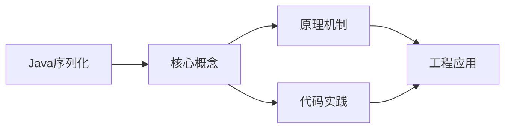
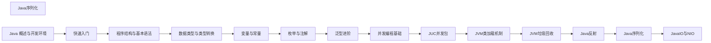

## 1. 学习目标（Bloom 分类）

本节按照布鲁姆教育目标分类学组织学习路径。本文主题为《Java序列化》，属于 Java 模块，读者可以根据自身阶段选择阅读深度。

记忆层面：能够准确复述本文的核心概念、术语与基本语法或操作步骤，并能够在提问或检索时快速定位对应知识点。能够说出 Java 的编译执行模型（javac 到字节码，JVM 解释与 JIT）。

理解层面：能够用自己的语言解释核心原理与工作机制，说明概念之间的因果关系，而不是机械记忆结论。能够解释面向对象三大特性与 JVM 内存区域的职责。

应用层面：能够在真实项目或练习场景中运用本文知识解决具体问题，写出正确且可维护的实现。能够编写类、接口、集合操作与异常处理的完整程序。

分析层面：能够拆解复杂问题，比较本文主题与相邻概念的异同，识别边界条件与例外情况。能够分析 Java 与 C++、Go 在内存管理与并发模型上的差异。

评价层面：能够根据约束条件（性能、可读性、安全、成本）评价不同方案的优劣，做出有依据的技术决策。能够评价不同集合、并发工具与框架的适用场景。

创造层面：能够把本文知识与其他模块知识组合，设计出新的解决方案或可复用的工程模式。能够组合 Spring 生态设计企业级应用。

通过本节学习，读者应当能够把《Java序列化》纳入自己的知识网络，并与 Java 模块的其他主题（JVM、集合框架、并发、Spring 生态）建立关联。

## 2. 历史动机与发展脉络

《Java序列化》是 Java 领域的重要主题。要真正理解它，需要先了解它解决的问题与演进过程。

Java 由 James Gosling 领导的 Sun 团队于 1995 年发布，口号“一次编写，到处运行”依托 JVM 字节码实现跨平台。2006 年 Sun 将 Java 开源（OpenJDK），2010 年 Oracle 收购 Sun 后 Java 进入新的治理阶段。
Java 的版本节奏在 2017 年后改为每半年一个特性版本、每两年一个 LTS（长期支持）版本。当前主流 LTS 包括 Java 11、17、21 与 25；Java 21 引入虚拟线程（Project Loom 成果），显著降低高并发服务的线程成本。
Java 生态以 Spring 家族为核心：Spring Boot 简化配置与部署，Spring Cloud 提供微服务组件；构建工具从 Maven 演进到 Gradle；JVM 语言（Kotlin、Scala、Groovy）与 Java 共存互操作。
Android 开发早期使用 Java，2019 年后官方转向 Kotlin-first，但 Java 仍是服务端领域（尤其是金融、电商等企业系统）的中坚力量。

回到本文主题：Java序列化 的提出与成熟，正是上述技术背景下的必然产物。早期实现往往以简单可用为目标，随着工程规模扩大，社区逐渐沉淀出标准做法与最佳实践；理解这一脉络，可以帮助读者判断“为什么文档中的推荐写法是现在这个样子”，也能在遇到历史遗留代码时准确识别其设计年代与取舍。

理解 Java 版本与 LTS 机制，是工程选型的起点：生产环境优先 LTS，新特性（如虚拟线程）可以在受控场景评估后引入。

## 3. 形式化定义与核心概念精讲

本节把《Java序列化》涉及的核心概念以“定义 + 讲解”的形式展开。读者应把定义当作工具，把讲解当作理解路径；两者结合才能形成可迁移的知识。

JVM 与字节码：`javac` 把 .java 编译为 .class 字节码，JVM 加载、校验并执行；热点代码由 JIT（如 C2）编译为机器码，解释与编译结合实现启动速度与峰值性能的平衡。
面向对象：封装（访问控制）、继承（extends/implements）与多态（重载/重写）是 Java 的类型系统支柱；接口默认方法（Java 8）与密封类（Java 17）持续演进表达能力。
异常体系：受检异常（checked）编译期强制处理，非受检异常（RuntimeException）运行时抛出；try-with-resources 自动关闭资源。
泛型与擦除：Java 泛型在编译期检查后擦除类型参数，运行时无泛型信息；这解释了 `List<String>` 与 `List<Integer>` 的 Class 相同，以及通配符 `? extends` 的逆变协变规则。

### 3.1 原文章节逐一精讲

原文档把主题拆分为 16 个小节，下面按顺序给出每一节的导读讲解，随后保留原文细节供精读。

#### 原文精读（完整保留）

# Java 序列化

> **符号约定**：`< >` 必填参数 | `[ ]` 可选参数

---

#### 概述

序列化是将 Java 对象转换为字节流的过程，反序列化是将字节流恢复为 Java 对象的过程。序列化的核心用途是让对象可以脱离内存存在：存储到文件、通过网络传输、保存到数据库。当你需要把一个对象从一台机器发送到另一台机器，或者把对象持久化保存时，就需要序列化。

Java 原生提供了 Serializable 接口实现序列化，但这种方式存在很多问题（安全性差、无法跨语言、版本兼容困难），实际项目中更多使用 JSON、Protocol Buffers 等替代方案。理解序列化的原理和不同方案的优缺点，是选择合适方案的基础。

#### 基础概念

##### 什么是序列化

简单来说，序列化就是把对象变成可以存储或传输的格式。比如你有一个 User 对象，包含 name 和 age 两个字段，序列化后它可能变成一段 JSON 文本 {"name":"Alice","age":25}，或者一段二进制数据。反序列化就是反过来，把这段数据还原成 User 对象。

##### 为什么需要序列化

- **网络传输**：微服务之间传递对象，需要把对象序列化后通过网络发送
- **持久化存储**：把对象保存到文件或数据库，下次启动时恢复
- **缓存**：把对象存入 Redis 等缓存系统，需要序列化后存储
- **跨语言通信**：不同语言编写的系统之间交换数据

##### 序列化方案的选择标准

选择序列化方案时需要考虑：是否需要跨语言（Java 序列化只有 Java 能用）、序列化后的数据大小（影响网络传输和存储成本）、序列化和反序列化的速度、是否人类可读（JSON 可读，二进制格式不可读）、Schema 演化能力（字段增删时是否兼容）。

#### 快速上手

##### Java 原生序列化

最简单的序列化方式，只需实现 Serializable 接口：

```java
import java.io.*;

// 实现 Serializable 接口即可序列化
public class User implements Serializable {
    // 序列化版本号，用于版本兼容检查
    private static final long serialVersionUID = 1L;

    private String name;
    private int age;
    private transient String password;  // transient 关键字表示此字段不参与序列化

    public User(String name, int age, String password) {
        this.name = name;
        this.age = age;
        this.password = password;
    }

    // getter...
    public String getName() { return name; }
    public int getAge() { return age; }
    public String getPassword() { return password; }
}
```

序列化和反序列化操作：

```java
import java.io.*;

// 序列化：对象 -> 字节流
User user = new User("Alice", 25, "secret123");
try (ObjectOutputStream oos = new ObjectOutputStream(new FileOutputStream("user.dat"))) {
    oos.writeObject(user);  // 将对象写入文件
}

// 反序列化：字节流 -> 对象
try (ObjectInputStream ois = new ObjectInputStream(new FileInputStream("user.dat"))) {
    User restored = (User) ois.readObject();  // 从文件读取对象
    System.out.println(restored.getName());     // 输出: Alice
    System.out.println(restored.getPassword()); // 输出: null（transient 字段不序列化）
}
```

#### 详细用法

##### 1. serialVersionUID 的作用

serialVersionUID 用于标识类的版本。反序列化时，JVM 会比较字节流中的 serialVersionUID 和当前类的 serialVersionUID，如果不一致就抛出 InvalidClassException：

```java
public class User implements Serializable {
    // 如果不手动指定，JVM 会根据类结构自动生成
    // 但类结构变化（增删字段）后自动生成的值会改变，导致旧数据无法反序列化
    // 手动指定后，只要版本号不变，增删字段也能兼容
    private static final long serialVersionUID = 1L;

    private String name;
    private int age;
    // 新增字段：旧数据反序列化时，新字段为默认值（null 或 0）
    private String email;
}
```

建议始终手动指定 serialVersionUID，避免类结构变化导致的反序列化失败。

##### 2. transient 关键字

transient 标记的字段不参与序列化，适合敏感数据或不需要持久化的数据：

```java
public class Session implements Serializable {
    private String sessionId;
    private transient String password;    // 密码不序列化
    private transient Thread worker;      // 线程对象无法序列化
    private transient Socket connection;  // 网络连接无法序列化
}
```

注意：transient 只能用于 Java 原生序列化。使用 JSON 序列化时，transient 不起作用，需要用 @JsonIgnore 等注解。

##### 3. 自定义序列化逻辑

通过实现 writeObject 和 readObject 方法，可以自定义序列化和反序列化的行为：

```java
import java.io.*;

public class User implements Serializable {
    private static final long serialVersionUID = 1L;

    private String name;
    private transient String encryptedPassword;

    // 自定义序列化逻辑
    private void writeObject(ObjectOutputStream oos) throws IOException {
        oos.defaultWriteObject();  // 先执行默认序列化
        // 可以在这里添加额外的序列化逻辑
    }

    // 自定义反序列化逻辑
    private void readObject(ObjectInputStream ois) throws IOException, ClassNotFoundException {
        ois.defaultReadObject();  // 先执行默认反序列化
        // 可以在这里恢复 transient 字段的值
        // 例如：从其他来源重新获取密码
    }
}
```

##### 4. 使用 Jackson 进行 JSON 序列化

Jackson 是 Java 生态中最流行的 JSON 序列化库，可读性好、跨语言、使用广泛：

```xml
<!-- Maven 依赖 -->
<dependency>
    <groupId>com.fasterxml.jackson.core</groupId>
    <artifactId>jackson-databind</artifactId>
    <version>2.16.0</version>
</dependency>
```

```java
import com.fasterxml.jackson.databind.ObjectMapper;
import com.fasterxml.jackson.annotation.JsonIgnore;
import com.fasterxml.jackson.annotation.JsonProperty;

public class User {
    private String name;
    private int age;

    @JsonIgnore  // JSON 序列化时忽略此字段
    private String password;

    @JsonProperty("user_email")  // JSON 中的字段名
    private String email;

    // Jackson 需要无参构造函数
    public User() {}

    public User(String name, int age, String email) {
        this.name = name;
        this.age = age;
        this.email = email;
    }

    // getter 和 setter...
}

// 序列化
ObjectMapper mapper = new ObjectMapper();
User user = new User("Alice", 25, "alice@example.com");
String json = mapper.writeValueAsString(user);
// {"name":"Alice","age":25,"user_email":"alice@example.com"}

// 反序列化
User restored = mapper.readValue(json, User.class);
```

##### 5. Jackson 常用配置

```java
import com.fasterxml.jackson.databind.ObjectMapper;
import com.fasterxml.jackson.databind.SerializationFeature;
import com.fasterxml.jackson.datatype.jsr310.JavaTimeModule;
import java.text.SimpleDateFormat;

ObjectMapper mapper = new ObjectMapper();

// 格式化输出（开发调试时使用，生产环境关闭以减少数据量）
mapper.enable(SerializationFeature.INDENT_OUTPUT);

// 日期格式
mapper.registerModule(new JavaTimeModule());  // 支持 Java 8 日期类型
mapper.disable(SerializationFeature.WRITE_DATES_AS_TIMESTAMPS);  // 日期输出为字符串而非时间戳

// 忽略未知字段（反序列化时 JSON 中有 Java 类没有的字段，不报错）
mapper.configure(com.fasterxml.jackson.databind.DeserializationFeature.FAIL_ON_UNKNOWN_PROPERTIES, false);

// 空对象不报错
mapper.configure(SerializationFeature.FAIL_ON_EMPTY_BEANS, false);
```

##### 6. 使用 Gson 进行 JSON 序列化

Gson 是 Google 提供的 JSON 库，比 Jackson 更轻量：

```xml
<dependency>
    <groupId>com.google.code.gson</groupId>
    <artifactId>gson</artifactId>
    <version>2.10.1</version>
</dependency>
```

```java
import com.google.gson.Gson;
import com.google.gson.GsonBuilder;

Gson gson = new GsonBuilder()
    .setPrettyPrinting()       // 格式化输出
    .serializeNulls()          // 序列化 null 值（默认忽略）
    .setDateFormat("yyyy-MM-dd")  // 日期格式
    .create();

// 序列化
User user = new User("Alice", 25);
String json = gson.toJson(user);

// 反序列化
User restored = gson.fromJson(json, User.class);
```

##### 7. 使用 Protocol Buffers

Protocol Buffers（Protobuf）是 Google 开发的高效二进制序列化格式，数据量小、速度快、支持跨语言：

```protobuf
// user.proto
syntax = "proto3";

message User {
    string name = 1;
    int32 age = 2;
    string email = 3;
}
```

编译 proto 文件生成 Java 类后使用：

```java
// 构建对象
UserProto.User user = UserProto.User.newBuilder()
    .setName("Alice")
    .setAge(25)
    .setEmail("alice@example.com")
    .build();

// 序列化为字节数组
byte[] bytes = user.toByteArray();

// 反序列化
UserProto.User restored = UserProto.User.parseFrom(bytes);
```

#### 常见场景

##### 场景一：API 响应序列化

Spring Boot 中 Controller 返回的对象自动序列化为 JSON：

```java
import com.fasterxml.jackson.annotation.JsonInclude;

@JsonInclude(JsonInclude.Include.NON_NULL)  // null 字段不输出
public class ApiResponse<T> {
    private int code;
    private String message;
    private T data;

    public static <T> ApiResponse<T> success(T data) {
        ApiResponse<T> response = new ApiResponse<>();
        response.code = 200;
        response.message = "success";
        response.data = data;
        return response;
    }
}
```

##### 场景二：Redis 缓存序列化

存入 Redis 的对象需要序列化，通常使用 JSON 格式以便跨语言读取：

```java
import com.fasterxml.jackson.databind.ObjectMapper;
import org.springframework.data.redis.core.StringRedisTemplate;

@Service
public class CacheService {

    private final StringRedisTemplate redisTemplate;
    private final ObjectMapper objectMapper;

    // 存储对象到 Redis
    public void put(String key, Object value) {
        try {
            String json = objectMapper.writeValueAsString(value);
            redisTemplate.opsForValue().set(key, json);
        } catch (Exception e) {
            throw new RuntimeException("序列化失败", e);
        }
    }

    // 从 Redis 读取对象
    public <T> T get(String key, Class<T> type) {
        String json = redisTemplate.opsForValue().get(key);
        if (json == null) return null;
        try {
            return objectMapper.readValue(json, type);
        } catch (Exception e) {
            throw new RuntimeException("反序列化失败", e);
        }
    }
}
```

#### 注意事项与常见错误

##### Java 原生序列化的安全风险

Java 原生反序列化存在严重的安全漏洞。攻击者可以构造恶意的序列化数据，在反序列化时执行任意代码。永远不要反序列化不可信来源的数据。如果必须使用，可以使用 JEP 290 过滤机制限制可反序列化的类。

##### 循环引用导致无限递归

对象之间存在双向引用时，JSON 序列化会陷入无限递归：

```java
public class User {
    private List<Order> orders;  // 用户有多个订单
}

public class Order {
    private User user;  // 订单属于某个用户（循环引用）
}

// 解决方案一：使用 @JsonIgnore 忽略反向引用
public class Order {
    @JsonIgnore
    private User user;
}

// 解决方案二：使用 @JsonManagedReference 和 @JsonBackReference
public class User {
    @JsonManagedReference
    private List<Order> orders;
}

public class Order {
    @JsonBackReference
    private User user;
}
```

##### 日期格式问题

不同序列化方式对日期的处理不同。Java 原生序列化保存的是时间戳，JSON 序列化默认输出时间戳数字。建议统一使用 ISO 8601 格式（如 2024-01-15T10:30:00Z）。

##### 枚举类型的序列化

默认情况下枚举按名称序列化。如果按序号序列化，新增枚举值可能导致反序列化错位：

```java
// 错误：按序号序列化，新增值会打乱顺序
public enum Status {
    ACTIVE,    // 0
    INACTIVE,  // 1
    // 新增 PENDING 后，原来存为 1 的 INACTIVE 会变成 PENDING
    PENDING    // 2
}

// 正确：始终按名称序列化
@JsonFormat(shape = JsonFormat.Shape.STRING)
public enum Status {
    ACTIVE, INACTIVE, PENDING
}
```

#### 进阶用法

##### Kryo 高性能序列化

Kryo 是一个高性能的 Java 序列化框架，速度比 Java 原生序列化快 10 倍以上，序列化后的数据也更小：

```java
import com.esotericsoftware.kryo.Kryo;
import com.esotericsoftware.kryo.io.Output;
import com.esotericsoftware.kryo.io.Input;

Kryo kryo = new Kryo();
kryo.register(User.class);  // 注册类，提高性能

// 序列化
Output output = new Output(new ByteArrayOutputStream());
kryo.writeObject(output, user);
output.close();

// 反序列化
Input input = new Input(new ByteArrayInputStream(output.getBuffer()));
User restored = kryo.readObject(input, User.class);
```

##### Avro Schema 演化

Avro 支持 Schema 演化，可以在不破坏兼容性的情况下增删字段。适合需要长期存储和版本迭代的数据格式：

```json
{
  "type": "record",
  "name": "User",
  "fields": [
    { "name": "name", "type": "string" },
    { "name": "age", "type": ["null", "int"], "default": null }
  ]
}
```

新增字段时提供默认值，旧数据反序列化时新字段使用默认值，不会报错。
#### Serializable 接口

**基本写法：实现可序列化**
`class <类名> implements Serializable {}`
```java
// 标记类为可序列化
public class User implements Serializable {
    private static final long serialVersionUID = 1L;
    private String name;
}
```

---

**基本写法：定义 serialVersionUID**
`private static final long serialVersionUID = <值>L;`
```java
// 显式声明版本号保证兼容
private static final long serialVersionUID = 42L;
```

---

#### 对象流序列化

**基本写法：写入对象**
`new ObjectOutputStream(<输出流>).writeObject(<对象>);`
```java
// 序列化对象到文件
try (ObjectOutputStream oos = new ObjectOutputStream(
        new FileOutputStream("user.dat"))) {
    oos.writeObject(user);
}
```

---

**基本写法：读取对象**
`new ObjectInputStream(<输入流>).readObject();`
```java
// 从文件反序列化对象
try (ObjectInputStream ois = new ObjectInputStream(
        new FileInputStream("user.dat"))) {
    User u = (User) ois.readObject();
}
```

---

#### 关键字 transient

**基本写法：排除字段**
`transient <类型> <字段名>;`
```java
// 标记字段不参与序列化
private transient String password;
```

---

#### 自定义序列化

**基本写法：重写 writeObject**
`private void writeObject(ObjectOutputStream out) throws IOException {}`
```java
// 自定义写入逻辑
private void writeObject(ObjectOutputStream out) throws IOException {
    out.defaultWriteObject();
    out.writeUTF(encrypt(password));
}
```

---

**基本写法：重写 readObject**
`private void readObject(ObjectInputStream in) throws IOException, ClassNotFoundException {}`
```java
// 自定义读取逻辑
private void readObject(ObjectInputStream in) throws IOException, ClassNotFoundException {
    in.defaultReadObject();
    this.password = decrypt(in.readUTF());
}
```

---

**基本写法：writeReplace 替换对象**
`private Object writeReplace() { return <新对象>; }`
```java
// 序列化时替换为另一个对象
private Object writeReplace() {
    return new UserProxy(name);
}
```

---

**基本写法：readResolve 单例恢复**
`private Object readResolve() { return <实例>; }`
```java
// 反序列化时返回单例实例
private Object readResolve() {
    return INSTANCE;
}
```

---

#### Externalizable 接口

**基本写法：实现 Externalizable**
`class <类名> implements Externalizable { public void writeExternal(ObjectOutput o) {} public void readExternal(ObjectInput i) {} }`
```java
// 完全自定义序列化
public class User implements Externalizable {
    public void writeExternal(ObjectOutput out) throws IOException {
        out.writeUTF(name);
    }
    public void readExternal(ObjectInput in) throws IOException {
        this.name = in.readUTF();
    }
}
```

---

#### 序列化过滤（Java 9+）

**基本写法：设置输入过滤器**
`ObjectInputFilter.Config.createFilter("<规则>")`
```java
// 反序列化白名单过滤
ObjectInputFilter filter = ObjectInputFilter.Config.createFilter(
    "com.example.*;java.lang.*;!*");
ois.setObjectInputFilter(filter);
```

---

**基本写法：全局过滤器**
`ObjectInputFilter.Config.setSerialFilter(<过滤器>);`
```java
// 设置全局反序列化过滤器
ObjectInputFilter.Config.setSerialFilter(info -> {
    if (info.serialClass() == User.class) return ObjectInputFilter.Status.ALLOWED;
    return ObjectInputFilter.Status.REJECTED;
});
```

---

#### JSON 序列化（Jackson）

**基本写法：Jackson 写 JSON**
`new ObjectMapper().writeValueAsString(<对象>);`
```java
// 将对象序列化为 JSON 字符串
String json = new ObjectMapper().writeValueAsString(user);
```

---

**基本写法：Jackson 读 JSON**
`new ObjectMapper().readValue(<json>, <类>.class);`
```java
// 将 JSON 字符串反序列化为对象
User u = new ObjectMapper().readValue(json, User.class);
```

---

**基本写法：Jackson 写文件**
`new ObjectMapper().writeValue(<文件>, <对象>);`
```java
// 将对象序列化到 JSON 文件
new ObjectMapper().writeValue(new File("user.json"), user);
```

---

**基本写法：忽略字段**
`@JsonIgnore`
```java
// 标记字段不参与 JSON 序列化
@JsonIgnore
private String password;
```

---

**基本写法：指定字段名**
`@JsonProperty("<名称>")`
```java
// 自定义 JSON 字段名
@JsonProperty("user_name")
private String userName;
```

---

#### JSON 序列化（Gson）

**基本写法：Gson 写 JSON**
`new Gson().toJson(<对象>);`
```java
// 使用 Gson 序列化为 JSON
String json = new Gson().toJson(user);
```

---

**基本写法：Gson 读 JSON**
`new Gson().fromJson(<json>, <类>.class);`
```java
// 使用 Gson 反序列化
User u = new Gson().fromJson(json, User.class);
```

---

#### ProtoBuf 二进制序列化

**基本写法：ProtoBuf 写入**
`<消息类>.writeTo(<输出流>);`
```java
// ProtoBuf 消息写入字节流
UserProto.User u = UserProto.User.newBuilder().setName("Alice").build();
u.writeTo(new FileOutputStream("u.bin"));
```

---

**基本写法：ProtoBuf 读取**
`<消息类>.parseFrom(<输入流>);`
```java
// 从字节流解析 ProtoBuf 消息
UserProto.User u = UserProto.User.parseFrom(new FileInputStream("u.bin"));
```


### 3.2 概念关系图

下面用 Mermaid 图表达本文核心概念之间的关系，帮助读者建立整体图景：



图中展示的是本文知识的结构化关系：核心概念是入口，原理机制解释“为什么”，代码实践演示“怎么做”，工程应用回答“何时用”。读者学习时可以把每个小节的内容挂接到对应节点上。

## 4. 理论推导与原理解析

本节深入《Java序列化》背后的原理。理论部分不求面面俱到，而是聚焦“能解释现象、能指导实践”的关键推导。

JVM 内存模型：堆（新生代/老年代）、元空间、虚拟机栈、本地方法栈与程序计数器；GC 从 CMS 演进到 G1（默认）、ZGC（超低延迟），理解分代收集是调优前提。
并发工具：synchronized 与 JUC（java.util.concurrent）的锁、并发容器、线程池、CompletableFuture 构成并发工具箱；Java 21 的虚拟线程让“每任务一线程”成为可能。
类加载机制：双亲委派模型保证类唯一性，SPI（ServiceLoader）打破委派实现扩展；自定义类加载器是热部署与隔离的基础。
反射与注解：反射在运行时检查类结构，注解提供元数据；Spring 的依赖注入与 AOP 均基于这些机制，但反射有性能与安全成本。

需要强调的是，理论推导与工程实践之间存在翻译层：理论给出的是理想化模型与边界条件，工程代码则必须处理真实环境中的例外。读者在学习时应先掌握理论的“标准情形”，再通过陷阱章节了解“非标准情形”。

## 5. 代码示例与逐行讲解

本节把原文中的代码示例系统整理，并为每个示例补充用途说明与讲解。读者不应只浏览代码，而应逐段对照讲解理解设计意图。

### 5.1 示例：Java 原生序列化

该示例来自原文《Java 原生序列化》小节，用于演示Java序列化相关操作。阅读时请先看代码结构，再看其后的讲解。

```java
import java.io.*;

// 实现 Serializable 接口即可序列化
public class User implements Serializable {
    // 序列化版本号，用于版本兼容检查
    private static final long serialVersionUID = 1L;

    private String name;
    private int age;
    private transient String password;  // transient 关键字表示此字段不参与序列化

    public User(String name, int age, String password) {
        this.name = name;
        this.age = age;
        this.password = password;
    }

    // getter...
    public String getName() { return name; }
    public int getAge() { return age; }
    public String getPassword() { return password; }
}
```

讲解：这段代码演示了本节核心知识点。代码中的关键操作可以归纳为三步：准备（定义或初始化）、执行（核心逻辑）、收尾（释放资源或返回结果）。实际项目中，这三步往往被封装为函数或类，以提升复用性与可测试性。

关键点分析：

该示例共 18 行有效代码，包含 3 类关键结构（class、import、return）。其中：

- 入口与初始化部分负责建立上下文，对应实际项目中的启动或装配逻辑；
- 核心逻辑部分体现本文主题的主要操作，是阅读时最需要对照讲解理解的部分；
- 输出或返回部分把结果交给调用方，注意其类型与边界条件。

进阶思考路径：先尝试修改参数观察行为变化，再把示例中的模式迁移到自己的项目中；每次修改都记录预期与实测差异，这是把示例转化为能力的最快方式。

### 5.2 示例：Java 原生序列化

该示例来自原文《Java 原生序列化》小节，用于演示Java序列化相关操作。阅读时请先看代码结构，再看其后的讲解。

```java
import java.io.*;

// 序列化：对象 -> 字节流
User user = new User("Alice", 25, "secret123");
try (ObjectOutputStream oos = new ObjectOutputStream(new FileOutputStream("user.dat"))) {
    oos.writeObject(user);  // 将对象写入文件
}

// 反序列化：字节流 -> 对象
try (ObjectInputStream ois = new ObjectInputStream(new FileInputStream("user.dat"))) {
    User restored = (User) ois.readObject();  // 从文件读取对象
    System.out.println(restored.getName());     // 输出: Alice
    System.out.println(restored.getPassword()); // 输出: null（transient 字段不序列化）
}
```

讲解：这段代码演示了本节核心知识点。代码中的关键操作可以归纳为三步：准备（定义或初始化）、执行（核心逻辑）、收尾（释放资源或返回结果）。实际项目中，这三步往往被封装为函数或类，以提升复用性与可测试性。

关键点分析：

该示例共 12 行有效代码，包含 1 类关键结构（import）。其中：

- 入口与初始化部分负责建立上下文，对应实际项目中的启动或装配逻辑；
- 核心逻辑部分体现本文主题的主要操作，是阅读时最需要对照讲解理解的部分；
- 输出或返回部分把结果交给调用方，注意其类型与边界条件。

进阶思考路径：先尝试修改参数观察行为变化，再把示例中的模式迁移到自己的项目中；每次修改都记录预期与实测差异，这是把示例转化为能力的最快方式。

### 5.3 示例：1. serialVersionUID 的作用

该示例来自原文《1. serialVersionUID 的作用》小节，用于演示Java序列化相关操作。阅读时请先看代码结构，再看其后的讲解。

```java
public class User implements Serializable {
    // 如果不手动指定，JVM 会根据类结构自动生成
    // 但类结构变化（增删字段）后自动生成的值会改变，导致旧数据无法反序列化
    // 手动指定后，只要版本号不变，增删字段也能兼容
    private static final long serialVersionUID = 1L;

    private String name;
    private int age;
    // 新增字段：旧数据反序列化时，新字段为默认值（null 或 0）
    private String email;
}
```

讲解：这段代码演示了本节核心知识点。代码中的关键操作可以归纳为三步：准备（定义或初始化）、执行（核心逻辑）、收尾（释放资源或返回结果）。实际项目中，这三步往往被封装为函数或类，以提升复用性与可测试性。

关键点分析：

该示例共 10 行有效代码，包含 1 类关键结构（class）。其中：

- 入口与初始化部分负责建立上下文，对应实际项目中的启动或装配逻辑；
- 核心逻辑部分体现本文主题的主要操作，是阅读时最需要对照讲解理解的部分；
- 输出或返回部分把结果交给调用方，注意其类型与边界条件。

进阶思考路径：先尝试修改参数观察行为变化，再把示例中的模式迁移到自己的项目中；每次修改都记录预期与实测差异，这是把示例转化为能力的最快方式。

### 5.4 示例：2. transient 关键字

该示例来自原文《2. transient 关键字》小节，用于演示Java序列化相关操作。阅读时请先看代码结构，再看其后的讲解。

```java
public class Session implements Serializable {
    private String sessionId;
    private transient String password;    // 密码不序列化
    private transient Thread worker;      // 线程对象无法序列化
    private transient Socket connection;  // 网络连接无法序列化
}
```

讲解：这段代码演示了本节核心知识点。代码中的关键操作可以归纳为三步：准备（定义或初始化）、执行（核心逻辑）、收尾（释放资源或返回结果）。实际项目中，这三步往往被封装为函数或类，以提升复用性与可测试性。

关键点分析：

该示例共 6 行有效代码，包含 1 类关键结构（class）。其中：

- 入口与初始化部分负责建立上下文，对应实际项目中的启动或装配逻辑；
- 核心逻辑部分体现本文主题的主要操作，是阅读时最需要对照讲解理解的部分；
- 输出或返回部分把结果交给调用方，注意其类型与边界条件。

进阶思考路径：先尝试修改参数观察行为变化，再把示例中的模式迁移到自己的项目中；每次修改都记录预期与实测差异，这是把示例转化为能力的最快方式。

### 5.5 示例：3. 自定义序列化逻辑

该示例来自原文《3. 自定义序列化逻辑》小节，用于演示Java序列化相关操作。阅读时请先看代码结构，再看其后的讲解。

```java
import java.io.*;

public class User implements Serializable {
    private static final long serialVersionUID = 1L;

    private String name;
    private transient String encryptedPassword;

    // 自定义序列化逻辑
    private void writeObject(ObjectOutputStream oos) throws IOException {
        oos.defaultWriteObject();  // 先执行默认序列化
        // 可以在这里添加额外的序列化逻辑
    }

    // 自定义反序列化逻辑
    private void readObject(ObjectInputStream ois) throws IOException, ClassNotFoundException {
        ois.defaultReadObject();  // 先执行默认反序列化
        // 可以在这里恢复 transient 字段的值
        // 例如：从其他来源重新获取密码
    }
}
```

讲解：这段代码演示了本节核心知识点。代码中的关键操作可以归纳为三步：准备（定义或初始化）、执行（核心逻辑）、收尾（释放资源或返回结果）。实际项目中，这三步往往被封装为函数或类，以提升复用性与可测试性。

关键点分析：

该示例共 17 行有效代码，包含 2 类关键结构（class、import）。其中：

- 入口与初始化部分负责建立上下文，对应实际项目中的启动或装配逻辑；
- 核心逻辑部分体现本文主题的主要操作，是阅读时最需要对照讲解理解的部分；
- 输出或返回部分把结果交给调用方，注意其类型与边界条件。

进阶思考路径：先尝试修改参数观察行为变化，再把示例中的模式迁移到自己的项目中；每次修改都记录预期与实测差异，这是把示例转化为能力的最快方式。

### 5.6 示例：4. 使用 Jackson 进行 JSON 序列化

该示例来自原文《4. 使用 Jackson 进行 JSON 序列化》小节，用于演示Java序列化相关操作。阅读时请先看代码结构，再看其后的讲解。

```xml
<!-- Maven 依赖 -->
<dependency>
    <groupId>com.fasterxml.jackson.core</groupId>
    <artifactId>jackson-databind</artifactId>
    <version>2.16.0</version>
</dependency>
```

讲解：这段代码演示了本节核心知识点。代码中的关键操作可以归纳为三步：准备（定义或初始化）、执行（核心逻辑）、收尾（释放资源或返回结果）。实际项目中，这三步往往被封装为函数或类，以提升复用性与可测试性。

关键点分析：

该示例共 6 行有效代码，结构以数据或配置为主。阅读时应关注：数据字段的含义、配置项的作用，以及它们与运行行为的对应关系。

进阶思考路径：先尝试修改参数观察行为变化，再把示例中的模式迁移到自己的项目中；每次修改都记录预期与实测差异，这是把示例转化为能力的最快方式。

### 5.7 示例：4. 使用 Jackson 进行 JSON 序列化

该示例来自原文《4. 使用 Jackson 进行 JSON 序列化》小节，用于演示Java序列化相关操作。阅读时请先看代码结构，再看其后的讲解。

```java
import com.fasterxml.jackson.databind.ObjectMapper;
import com.fasterxml.jackson.annotation.JsonIgnore;
import com.fasterxml.jackson.annotation.JsonProperty;

public class User {
    private String name;
    private int age;

    @JsonIgnore  // JSON 序列化时忽略此字段
    private String password;

    @JsonProperty("user_email")  // JSON 中的字段名
    private String email;

    // Jackson 需要无参构造函数
    public User() {}

    public User(String name, int age, String email) {
        this.name = name;
        this.age = age;
        this.email = email;
    }

    // getter 和 setter...
}

// 序列化
ObjectMapper mapper = new ObjectMapper();
User user = new User("Alice", 25, "alice@example.com");
String json = mapper.writeValueAsString(user);
// {"name":"Alice","age":25,"user_email":"alice@example.com"}

// 反序列化
User restored = mapper.readValue(json, User.class);
```

讲解：这段代码演示了本节核心知识点。代码中的关键操作可以归纳为三步：准备（定义或初始化）、执行（核心逻辑）、收尾（释放资源或返回结果）。实际项目中，这三步往往被封装为函数或类，以提升复用性与可测试性。

关键点分析：

该示例共 26 行有效代码，包含 2 类关键结构（class、import）。其中：

- 入口与初始化部分负责建立上下文，对应实际项目中的启动或装配逻辑；
- 核心逻辑部分体现本文主题的主要操作，是阅读时最需要对照讲解理解的部分；
- 输出或返回部分把结果交给调用方，注意其类型与边界条件。

进阶思考路径：先尝试修改参数观察行为变化，再把示例中的模式迁移到自己的项目中；每次修改都记录预期与实测差异，这是把示例转化为能力的最快方式。

### 5.8 示例：5. Jackson 常用配置

该示例来自原文《5. Jackson 常用配置》小节，用于演示Java序列化相关操作。阅读时请先看代码结构，再看其后的讲解。

```java
import com.fasterxml.jackson.databind.ObjectMapper;
import com.fasterxml.jackson.databind.SerializationFeature;
import com.fasterxml.jackson.datatype.jsr310.JavaTimeModule;
import java.text.SimpleDateFormat;

ObjectMapper mapper = new ObjectMapper();

// 格式化输出（开发调试时使用，生产环境关闭以减少数据量）
mapper.enable(SerializationFeature.INDENT_OUTPUT);

// 日期格式
mapper.registerModule(new JavaTimeModule());  // 支持 Java 8 日期类型
mapper.disable(SerializationFeature.WRITE_DATES_AS_TIMESTAMPS);  // 日期输出为字符串而非时间戳

// 忽略未知字段（反序列化时 JSON 中有 Java 类没有的字段，不报错）
mapper.configure(com.fasterxml.jackson.databind.DeserializationFeature.FAIL_ON_UNKNOWN_PROPERTIES, false);

// 空对象不报错
mapper.configure(SerializationFeature.FAIL_ON_EMPTY_BEANS, false);
```

讲解：这段代码演示了本节核心知识点。代码中的关键操作可以归纳为三步：准备（定义或初始化）、执行（核心逻辑）、收尾（释放资源或返回结果）。实际项目中，这三步往往被封装为函数或类，以提升复用性与可测试性。

关键点分析：

该示例共 14 行有效代码，包含 1 类关键结构（import）。其中：

- 入口与初始化部分负责建立上下文，对应实际项目中的启动或装配逻辑；
- 核心逻辑部分体现本文主题的主要操作，是阅读时最需要对照讲解理解的部分；
- 输出或返回部分把结果交给调用方，注意其类型与边界条件。

进阶思考路径：先尝试修改参数观察行为变化，再把示例中的模式迁移到自己的项目中；每次修改都记录预期与实测差异，这是把示例转化为能力的最快方式。

### 5.9 示例：6. 使用 Gson 进行 JSON 序列化

该示例来自原文《6. 使用 Gson 进行 JSON 序列化》小节，用于演示Java序列化相关操作。阅读时请先看代码结构，再看其后的讲解。

```xml
<dependency>
    <groupId>com.google.code.gson</groupId>
    <artifactId>gson</artifactId>
    <version>2.10.1</version>
</dependency>
```

讲解：这段代码演示了本节核心知识点。代码中的关键操作可以归纳为三步：准备（定义或初始化）、执行（核心逻辑）、收尾（释放资源或返回结果）。实际项目中，这三步往往被封装为函数或类，以提升复用性与可测试性。

关键点分析：

该示例共 5 行有效代码，结构以数据或配置为主。阅读时应关注：数据字段的含义、配置项的作用，以及它们与运行行为的对应关系。

进阶思考路径：先尝试修改参数观察行为变化，再把示例中的模式迁移到自己的项目中；每次修改都记录预期与实测差异，这是把示例转化为能力的最快方式。

### 5.10 示例：6. 使用 Gson 进行 JSON 序列化

该示例来自原文《6. 使用 Gson 进行 JSON 序列化》小节，用于演示Java序列化相关操作。阅读时请先看代码结构，再看其后的讲解。

```java
import com.google.gson.Gson;
import com.google.gson.GsonBuilder;

Gson gson = new GsonBuilder()
    .setPrettyPrinting()       // 格式化输出
    .serializeNulls()          // 序列化 null 值（默认忽略）
    .setDateFormat("yyyy-MM-dd")  // 日期格式
    .create();

// 序列化
User user = new User("Alice", 25);
String json = gson.toJson(user);

// 反序列化
User restored = gson.fromJson(json, User.class);
```

讲解：这段代码演示了本节核心知识点。代码中的关键操作可以归纳为三步：准备（定义或初始化）、执行（核心逻辑）、收尾（释放资源或返回结果）。实际项目中，这三步往往被封装为函数或类，以提升复用性与可测试性。

关键点分析：

该示例共 12 行有效代码，包含 2 类关键结构（class、import）。其中：

- 入口与初始化部分负责建立上下文，对应实际项目中的启动或装配逻辑；
- 核心逻辑部分体现本文主题的主要操作，是阅读时最需要对照讲解理解的部分；
- 输出或返回部分把结果交给调用方，注意其类型与边界条件。

进阶思考路径：先尝试修改参数观察行为变化，再把示例中的模式迁移到自己的项目中；每次修改都记录预期与实测差异，这是把示例转化为能力的最快方式。

### 5.11 示例：7. 使用 Protocol Buffers

该示例来自原文《7. 使用 Protocol Buffers》小节，用于演示Java序列化相关操作。阅读时请先看代码结构，再看其后的讲解。

```protobuf
// user.proto
syntax = "proto3";

message User {
    string name = 1;
    int32 age = 2;
    string email = 3;
}
```

讲解：这段代码演示了本节核心知识点。代码中的关键操作可以归纳为三步：准备（定义或初始化）、执行（核心逻辑）、收尾（释放资源或返回结果）。实际项目中，这三步往往被封装为函数或类，以提升复用性与可测试性。

关键点分析：

该示例共 7 行有效代码，结构以数据或配置为主。阅读时应关注：数据字段的含义、配置项的作用，以及它们与运行行为的对应关系。

进阶思考路径：先尝试修改参数观察行为变化，再把示例中的模式迁移到自己的项目中；每次修改都记录预期与实测差异，这是把示例转化为能力的最快方式。

### 5.12 示例：7. 使用 Protocol Buffers

该示例来自原文《7. 使用 Protocol Buffers》小节，用于演示Java序列化相关操作。阅读时请先看代码结构，再看其后的讲解。

```java
// 构建对象
UserProto.User user = UserProto.User.newBuilder()
    .setName("Alice")
    .setAge(25)
    .setEmail("alice@example.com")
    .build();

// 序列化为字节数组
byte[] bytes = user.toByteArray();

// 反序列化
UserProto.User restored = UserProto.User.parseFrom(bytes);
```

讲解：这段代码演示了本节核心知识点。代码中的关键操作可以归纳为三步：准备（定义或初始化）、执行（核心逻辑）、收尾（释放资源或返回结果）。实际项目中，这三步往往被封装为函数或类，以提升复用性与可测试性。

关键点分析：

该示例共 10 行有效代码，结构以数据或配置为主。阅读时应关注：数据字段的含义、配置项的作用，以及它们与运行行为的对应关系。

进阶思考路径：先尝试修改参数观察行为变化，再把示例中的模式迁移到自己的项目中；每次修改都记录预期与实测差异，这是把示例转化为能力的最快方式。

### 5.13 示例：场景一：API 响应序列化

该示例来自原文《场景一：API 响应序列化》小节，用于演示Java序列化相关操作。阅读时请先看代码结构，再看其后的讲解。

```java
import com.fasterxml.jackson.annotation.JsonInclude;

@JsonInclude(JsonInclude.Include.NON_NULL)  // null 字段不输出
public class ApiResponse<T> {
    private int code;
    private String message;
    private T data;

    public static <T> ApiResponse<T> success(T data) {
        ApiResponse<T> response = new ApiResponse<>();
        response.code = 200;
        response.message = "success";
        response.data = data;
        return response;
    }
}
```

讲解：这段代码演示了本节核心知识点。代码中的关键操作可以归纳为三步：准备（定义或初始化）、执行（核心逻辑）、收尾（释放资源或返回结果）。实际项目中，这三步往往被封装为函数或类，以提升复用性与可测试性。

关键点分析：

该示例共 14 行有效代码，包含 3 类关键结构（class、import、return）。其中：

- 入口与初始化部分负责建立上下文，对应实际项目中的启动或装配逻辑；
- 核心逻辑部分体现本文主题的主要操作，是阅读时最需要对照讲解理解的部分；
- 输出或返回部分把结果交给调用方，注意其类型与边界条件。

进阶思考路径：先尝试修改参数观察行为变化，再把示例中的模式迁移到自己的项目中；每次修改都记录预期与实测差异，这是把示例转化为能力的最快方式。

### 5.14 示例：场景二：Redis 缓存序列化

该示例来自原文《场景二：Redis 缓存序列化》小节，用于演示Java序列化相关操作。阅读时请先看代码结构，再看其后的讲解。

```java
import com.fasterxml.jackson.databind.ObjectMapper;
import org.springframework.data.redis.core.StringRedisTemplate;

@Service
public class CacheService {

    private final StringRedisTemplate redisTemplate;
    private final ObjectMapper objectMapper;

    // 存储对象到 Redis
    public void put(String key, Object value) {
        try {
            String json = objectMapper.writeValueAsString(value);
            redisTemplate.opsForValue().set(key, json);
        } catch (Exception e) {
            throw new RuntimeException("序列化失败", e);
        }
    }

    // 从 Redis 读取对象
    public <T> T get(String key, Class<T> type) {
        String json = redisTemplate.opsForValue().get(key);
        if (json == null) return null;
        try {
            return objectMapper.readValue(json, type);
        } catch (Exception e) {
            throw new RuntimeException("反序列化失败", e);
        }
    }
}
```

讲解：这段代码演示了本节核心知识点。代码中的关键操作可以归纳为三步：准备（定义或初始化）、执行（核心逻辑）、收尾（释放资源或返回结果）。实际项目中，这三步往往被封装为函数或类，以提升复用性与可测试性。

关键点分析：

该示例共 26 行有效代码，包含 4 类关键结构（class、import、if、return）。其中：

- 入口与初始化部分负责建立上下文，对应实际项目中的启动或装配逻辑；
- 核心逻辑部分体现本文主题的主要操作，是阅读时最需要对照讲解理解的部分；
- 输出或返回部分把结果交给调用方，注意其类型与边界条件。

进阶思考路径：先尝试修改参数观察行为变化，再把示例中的模式迁移到自己的项目中；每次修改都记录预期与实测差异，这是把示例转化为能力的最快方式。

### 5.15 示例：循环引用导致无限递归

该示例来自原文《循环引用导致无限递归》小节，用于演示Java序列化相关操作。阅读时请先看代码结构，再看其后的讲解。

```java
public class User {
    private List<Order> orders;  // 用户有多个订单
}

public class Order {
    private User user;  // 订单属于某个用户（循环引用）
}

// 解决方案一：使用 @JsonIgnore 忽略反向引用
public class Order {
    @JsonIgnore
    private User user;
}

// 解决方案二：使用 @JsonManagedReference 和 @JsonBackReference
public class User {
    @JsonManagedReference
    private List<Order> orders;
}

public class Order {
    @JsonBackReference
    private User user;
}
```

讲解：这段代码演示了本节核心知识点。代码中的关键操作可以归纳为三步：准备（定义或初始化）、执行（核心逻辑）、收尾（释放资源或返回结果）。实际项目中，这三步往往被封装为函数或类，以提升复用性与可测试性。

关键点分析：

该示例共 20 行有效代码，包含 1 类关键结构（class）。其中：

- 入口与初始化部分负责建立上下文，对应实际项目中的启动或装配逻辑；
- 核心逻辑部分体现本文主题的主要操作，是阅读时最需要对照讲解理解的部分；
- 输出或返回部分把结果交给调用方，注意其类型与边界条件。

进阶思考路径：先尝试修改参数观察行为变化，再把示例中的模式迁移到自己的项目中；每次修改都记录预期与实测差异，这是把示例转化为能力的最快方式。

### 5.16 示例：枚举类型的序列化

该示例来自原文《枚举类型的序列化》小节，用于演示Java序列化相关操作。阅读时请先看代码结构，再看其后的讲解。

```java
// 错误：按序号序列化，新增值会打乱顺序
public enum Status {
    ACTIVE,    // 0
    INACTIVE,  // 1
    // 新增 PENDING 后，原来存为 1 的 INACTIVE 会变成 PENDING
    PENDING    // 2
}

// 正确：始终按名称序列化
@JsonFormat(shape = JsonFormat.Shape.STRING)
public enum Status {
    ACTIVE, INACTIVE, PENDING
}
```

讲解：这段代码演示了本节核心知识点。代码中的关键操作可以归纳为三步：准备（定义或初始化）、执行（核心逻辑）、收尾（释放资源或返回结果）。实际项目中，这三步往往被封装为函数或类，以提升复用性与可测试性。

关键点分析：

该示例共 12 行有效代码，结构以数据或配置为主。阅读时应关注：数据字段的含义、配置项的作用，以及它们与运行行为的对应关系。

进阶思考路径：先尝试修改参数观察行为变化，再把示例中的模式迁移到自己的项目中；每次修改都记录预期与实测差异，这是把示例转化为能力的最快方式。

### 5.17 示例：Kryo 高性能序列化

该示例来自原文《Kryo 高性能序列化》小节，用于演示Java序列化相关操作。阅读时请先看代码结构，再看其后的讲解。

```java
import com.esotericsoftware.kryo.Kryo;
import com.esotericsoftware.kryo.io.Output;
import com.esotericsoftware.kryo.io.Input;

Kryo kryo = new Kryo();
kryo.register(User.class);  // 注册类，提高性能

// 序列化
Output output = new Output(new ByteArrayOutputStream());
kryo.writeObject(output, user);
output.close();

// 反序列化
Input input = new Input(new ByteArrayInputStream(output.getBuffer()));
User restored = kryo.readObject(input, User.class);
```

讲解：这段代码演示了本节核心知识点。代码中的关键操作可以归纳为三步：准备（定义或初始化）、执行（核心逻辑）、收尾（释放资源或返回结果）。实际项目中，这三步往往被封装为函数或类，以提升复用性与可测试性。

关键点分析：

该示例共 12 行有效代码，包含 2 类关键结构（class、import）。其中：

- 入口与初始化部分负责建立上下文，对应实际项目中的启动或装配逻辑；
- 核心逻辑部分体现本文主题的主要操作，是阅读时最需要对照讲解理解的部分；
- 输出或返回部分把结果交给调用方，注意其类型与边界条件。

进阶思考路径：先尝试修改参数观察行为变化，再把示例中的模式迁移到自己的项目中；每次修改都记录预期与实测差异，这是把示例转化为能力的最快方式。

### 5.18 示例：Avro Schema 演化

该示例来自原文《Avro Schema 演化》小节，用于演示Java序列化相关操作。阅读时请先看代码结构，再看其后的讲解。

```json
{
  "type": "record",
  "name": "User",
  "fields": [
    { "name": "name", "type": "string" },
    { "name": "age", "type": ["null", "int"], "default": null }
  ]
}
```

讲解：这段代码演示了本节核心知识点。代码中的关键操作可以归纳为三步：准备（定义或初始化）、执行（核心逻辑）、收尾（释放资源或返回结果）。实际项目中，这三步往往被封装为函数或类，以提升复用性与可测试性。

关键点分析：

该示例共 8 行有效代码，结构以数据或配置为主。阅读时应关注：数据字段的含义、配置项的作用，以及它们与运行行为的对应关系。

进阶思考路径：先尝试修改参数观察行为变化，再把示例中的模式迁移到自己的项目中；每次修改都记录预期与实测差异，这是把示例转化为能力的最快方式。

### 5.19 示例：Serializable 接口

该示例来自原文《Serializable 接口》小节，用于演示Java序列化相关操作。阅读时请先看代码结构，再看其后的讲解。

```java
// 标记类为可序列化
public class User implements Serializable {
    private static final long serialVersionUID = 1L;
    private String name;
}
```

讲解：这段代码演示了本节核心知识点。代码中的关键操作可以归纳为三步：准备（定义或初始化）、执行（核心逻辑）、收尾（释放资源或返回结果）。实际项目中，这三步往往被封装为函数或类，以提升复用性与可测试性。

关键点分析：

该示例共 5 行有效代码，包含 1 类关键结构（class）。其中：

- 入口与初始化部分负责建立上下文，对应实际项目中的启动或装配逻辑；
- 核心逻辑部分体现本文主题的主要操作，是阅读时最需要对照讲解理解的部分；
- 输出或返回部分把结果交给调用方，注意其类型与边界条件。

进阶思考路径：先尝试修改参数观察行为变化，再把示例中的模式迁移到自己的项目中；每次修改都记录预期与实测差异，这是把示例转化为能力的最快方式。

### 5.20 示例：Serializable 接口

该示例来自原文《Serializable 接口》小节，用于演示Java序列化相关操作。阅读时请先看代码结构，再看其后的讲解。

```java
// 显式声明版本号保证兼容
private static final long serialVersionUID = 42L;
```

讲解：这段代码演示了本节核心知识点。代码中的关键操作可以归纳为三步：准备（定义或初始化）、执行（核心逻辑）、收尾（释放资源或返回结果）。实际项目中，这三步往往被封装为函数或类，以提升复用性与可测试性。

关键点分析：

该示例共 2 行有效代码，结构以数据或配置为主。阅读时应关注：数据字段的含义、配置项的作用，以及它们与运行行为的对应关系。

进阶思考路径：先尝试修改参数观察行为变化，再把示例中的模式迁移到自己的项目中；每次修改都记录预期与实测差异，这是把示例转化为能力的最快方式。

### 5.21 示例：对象流序列化

该示例来自原文《对象流序列化》小节，用于演示Java序列化相关操作。阅读时请先看代码结构，再看其后的讲解。

```java
// 序列化对象到文件
try (ObjectOutputStream oos = new ObjectOutputStream(
        new FileOutputStream("user.dat"))) {
    oos.writeObject(user);
}
```

讲解：这段代码演示了本节核心知识点。代码中的关键操作可以归纳为三步：准备（定义或初始化）、执行（核心逻辑）、收尾（释放资源或返回结果）。实际项目中，这三步往往被封装为函数或类，以提升复用性与可测试性。

关键点分析：

该示例共 5 行有效代码，结构以数据或配置为主。阅读时应关注：数据字段的含义、配置项的作用，以及它们与运行行为的对应关系。

进阶思考路径：先尝试修改参数观察行为变化，再把示例中的模式迁移到自己的项目中；每次修改都记录预期与实测差异，这是把示例转化为能力的最快方式。

### 5.22 示例：对象流序列化

该示例来自原文《对象流序列化》小节，用于演示Java序列化相关操作。阅读时请先看代码结构，再看其后的讲解。

```java
// 从文件反序列化对象
try (ObjectInputStream ois = new ObjectInputStream(
        new FileInputStream("user.dat"))) {
    User u = (User) ois.readObject();
}
```

讲解：这段代码演示了本节核心知识点。代码中的关键操作可以归纳为三步：准备（定义或初始化）、执行（核心逻辑）、收尾（释放资源或返回结果）。实际项目中，这三步往往被封装为函数或类，以提升复用性与可测试性。

关键点分析：

该示例共 5 行有效代码，结构以数据或配置为主。阅读时应关注：数据字段的含义、配置项的作用，以及它们与运行行为的对应关系。

进阶思考路径：先尝试修改参数观察行为变化，再把示例中的模式迁移到自己的项目中；每次修改都记录预期与实测差异，这是把示例转化为能力的最快方式。

### 5.23 示例：关键字 transient

该示例来自原文《关键字 transient》小节，用于演示Java序列化相关操作。阅读时请先看代码结构，再看其后的讲解。

```java
// 标记字段不参与序列化
private transient String password;
```

讲解：这段代码演示了本节核心知识点。代码中的关键操作可以归纳为三步：准备（定义或初始化）、执行（核心逻辑）、收尾（释放资源或返回结果）。实际项目中，这三步往往被封装为函数或类，以提升复用性与可测试性。

关键点分析：

该示例共 2 行有效代码，结构以数据或配置为主。阅读时应关注：数据字段的含义、配置项的作用，以及它们与运行行为的对应关系。

进阶思考路径：先尝试修改参数观察行为变化，再把示例中的模式迁移到自己的项目中；每次修改都记录预期与实测差异，这是把示例转化为能力的最快方式。

### 5.24 示例：自定义序列化

该示例来自原文《自定义序列化》小节，用于演示Java序列化相关操作。阅读时请先看代码结构，再看其后的讲解。

```java
// 自定义写入逻辑
private void writeObject(ObjectOutputStream out) throws IOException {
    out.defaultWriteObject();
    out.writeUTF(encrypt(password));
}
```

讲解：这段代码演示了本节核心知识点。代码中的关键操作可以归纳为三步：准备（定义或初始化）、执行（核心逻辑）、收尾（释放资源或返回结果）。实际项目中，这三步往往被封装为函数或类，以提升复用性与可测试性。

关键点分析：

该示例共 5 行有效代码，结构以数据或配置为主。阅读时应关注：数据字段的含义、配置项的作用，以及它们与运行行为的对应关系。

进阶思考路径：先尝试修改参数观察行为变化，再把示例中的模式迁移到自己的项目中；每次修改都记录预期与实测差异，这是把示例转化为能力的最快方式。

### 5.25 示例：自定义序列化

该示例来自原文《自定义序列化》小节，用于演示Java序列化相关操作。阅读时请先看代码结构，再看其后的讲解。

```java
// 自定义读取逻辑
private void readObject(ObjectInputStream in) throws IOException, ClassNotFoundException {
    in.defaultReadObject();
    this.password = decrypt(in.readUTF());
}
```

讲解：这段代码演示了本节核心知识点。代码中的关键操作可以归纳为三步：准备（定义或初始化）、执行（核心逻辑）、收尾（释放资源或返回结果）。实际项目中，这三步往往被封装为函数或类，以提升复用性与可测试性。

关键点分析：

该示例共 5 行有效代码，结构以数据或配置为主。阅读时应关注：数据字段的含义、配置项的作用，以及它们与运行行为的对应关系。

进阶思考路径：先尝试修改参数观察行为变化，再把示例中的模式迁移到自己的项目中；每次修改都记录预期与实测差异，这是把示例转化为能力的最快方式。

### 5.26 示例：自定义序列化

该示例来自原文《自定义序列化》小节，用于演示Java序列化相关操作。阅读时请先看代码结构，再看其后的讲解。

```java
// 序列化时替换为另一个对象
private Object writeReplace() {
    return new UserProxy(name);
}
```

讲解：这段代码演示了本节核心知识点。代码中的关键操作可以归纳为三步：准备（定义或初始化）、执行（核心逻辑）、收尾（释放资源或返回结果）。实际项目中，这三步往往被封装为函数或类，以提升复用性与可测试性。

关键点分析：

该示例共 4 行有效代码，包含 1 类关键结构（return）。其中：

- 入口与初始化部分负责建立上下文，对应实际项目中的启动或装配逻辑；
- 核心逻辑部分体现本文主题的主要操作，是阅读时最需要对照讲解理解的部分；
- 输出或返回部分把结果交给调用方，注意其类型与边界条件。

进阶思考路径：先尝试修改参数观察行为变化，再把示例中的模式迁移到自己的项目中；每次修改都记录预期与实测差异，这是把示例转化为能力的最快方式。

### 5.27 示例：自定义序列化

该示例来自原文《自定义序列化》小节，用于演示Java序列化相关操作。阅读时请先看代码结构，再看其后的讲解。

```java
// 反序列化时返回单例实例
private Object readResolve() {
    return INSTANCE;
}
```

讲解：这段代码演示了本节核心知识点。代码中的关键操作可以归纳为三步：准备（定义或初始化）、执行（核心逻辑）、收尾（释放资源或返回结果）。实际项目中，这三步往往被封装为函数或类，以提升复用性与可测试性。

关键点分析：

该示例共 4 行有效代码，包含 1 类关键结构（return）。其中：

- 入口与初始化部分负责建立上下文，对应实际项目中的启动或装配逻辑；
- 核心逻辑部分体现本文主题的主要操作，是阅读时最需要对照讲解理解的部分；
- 输出或返回部分把结果交给调用方，注意其类型与边界条件。

进阶思考路径：先尝试修改参数观察行为变化，再把示例中的模式迁移到自己的项目中；每次修改都记录预期与实测差异，这是把示例转化为能力的最快方式。

### 5.28 示例：Externalizable 接口

该示例来自原文《Externalizable 接口》小节，用于演示Java序列化相关操作。阅读时请先看代码结构，再看其后的讲解。

```java
// 完全自定义序列化
public class User implements Externalizable {
    public void writeExternal(ObjectOutput out) throws IOException {
        out.writeUTF(name);
    }
    public void readExternal(ObjectInput in) throws IOException {
        this.name = in.readUTF();
    }
}
```

讲解：这段代码演示了本节核心知识点。代码中的关键操作可以归纳为三步：准备（定义或初始化）、执行（核心逻辑）、收尾（释放资源或返回结果）。实际项目中，这三步往往被封装为函数或类，以提升复用性与可测试性。

关键点分析：

该示例共 9 行有效代码，包含 1 类关键结构（class）。其中：

- 入口与初始化部分负责建立上下文，对应实际项目中的启动或装配逻辑；
- 核心逻辑部分体现本文主题的主要操作，是阅读时最需要对照讲解理解的部分；
- 输出或返回部分把结果交给调用方，注意其类型与边界条件。

进阶思考路径：先尝试修改参数观察行为变化，再把示例中的模式迁移到自己的项目中；每次修改都记录预期与实测差异，这是把示例转化为能力的最快方式。

### 5.29 示例：序列化过滤（Java 9+）

该示例来自原文《序列化过滤（Java 9+）》小节，用于演示Java序列化相关操作。阅读时请先看代码结构，再看其后的讲解。

```java
// 反序列化白名单过滤
ObjectInputFilter filter = ObjectInputFilter.Config.createFilter(
    "com.example.*;java.lang.*;!*");
ois.setObjectInputFilter(filter);
```

讲解：这段代码演示了本节核心知识点。代码中的关键操作可以归纳为三步：准备（定义或初始化）、执行（核心逻辑）、收尾（释放资源或返回结果）。实际项目中，这三步往往被封装为函数或类，以提升复用性与可测试性。

关键点分析：

该示例共 4 行有效代码，结构以数据或配置为主。阅读时应关注：数据字段的含义、配置项的作用，以及它们与运行行为的对应关系。

进阶思考路径：先尝试修改参数观察行为变化，再把示例中的模式迁移到自己的项目中；每次修改都记录预期与实测差异，这是把示例转化为能力的最快方式。

### 5.30 示例：序列化过滤（Java 9+）

该示例来自原文《序列化过滤（Java 9+）》小节，用于演示Java序列化相关操作。阅读时请先看代码结构，再看其后的讲解。

```java
// 设置全局反序列化过滤器
ObjectInputFilter.Config.setSerialFilter(info -> {
    if (info.serialClass() == User.class) return ObjectInputFilter.Status.ALLOWED;
    return ObjectInputFilter.Status.REJECTED;
});
```

讲解：这段代码演示了本节核心知识点。代码中的关键操作可以归纳为三步：准备（定义或初始化）、执行（核心逻辑）、收尾（释放资源或返回结果）。实际项目中，这三步往往被封装为函数或类，以提升复用性与可测试性。

关键点分析：

该示例共 5 行有效代码，包含 3 类关键结构（class、if、return）。其中：

- 入口与初始化部分负责建立上下文，对应实际项目中的启动或装配逻辑；
- 核心逻辑部分体现本文主题的主要操作，是阅读时最需要对照讲解理解的部分；
- 输出或返回部分把结果交给调用方，注意其类型与边界条件。

进阶思考路径：先尝试修改参数观察行为变化，再把示例中的模式迁移到自己的项目中；每次修改都记录预期与实测差异，这是把示例转化为能力的最快方式。

### 5.31 示例：JSON 序列化（Jackson）

该示例来自原文《JSON 序列化（Jackson）》小节，用于演示Java序列化相关操作。阅读时请先看代码结构，再看其后的讲解。

```java
// 将对象序列化为 JSON 字符串
String json = new ObjectMapper().writeValueAsString(user);
```

讲解：这段代码演示了本节核心知识点。代码中的关键操作可以归纳为三步：准备（定义或初始化）、执行（核心逻辑）、收尾（释放资源或返回结果）。实际项目中，这三步往往被封装为函数或类，以提升复用性与可测试性。

关键点分析：

该示例共 2 行有效代码，结构以数据或配置为主。阅读时应关注：数据字段的含义、配置项的作用，以及它们与运行行为的对应关系。

进阶思考路径：先尝试修改参数观察行为变化，再把示例中的模式迁移到自己的项目中；每次修改都记录预期与实测差异，这是把示例转化为能力的最快方式。

### 5.32 示例：JSON 序列化（Jackson）

该示例来自原文《JSON 序列化（Jackson）》小节，用于演示Java序列化相关操作。阅读时请先看代码结构，再看其后的讲解。

```java
// 将 JSON 字符串反序列化为对象
User u = new ObjectMapper().readValue(json, User.class);
```

讲解：这段代码演示了本节核心知识点。代码中的关键操作可以归纳为三步：准备（定义或初始化）、执行（核心逻辑）、收尾（释放资源或返回结果）。实际项目中，这三步往往被封装为函数或类，以提升复用性与可测试性。

关键点分析：

该示例共 2 行有效代码，包含 1 类关键结构（class）。其中：

- 入口与初始化部分负责建立上下文，对应实际项目中的启动或装配逻辑；
- 核心逻辑部分体现本文主题的主要操作，是阅读时最需要对照讲解理解的部分；
- 输出或返回部分把结果交给调用方，注意其类型与边界条件。

进阶思考路径：先尝试修改参数观察行为变化，再把示例中的模式迁移到自己的项目中；每次修改都记录预期与实测差异，这是把示例转化为能力的最快方式。

### 5.33 示例：JSON 序列化（Jackson）

该示例来自原文《JSON 序列化（Jackson）》小节，用于演示Java序列化相关操作。阅读时请先看代码结构，再看其后的讲解。

```java
// 将对象序列化到 JSON 文件
new ObjectMapper().writeValue(new File("user.json"), user);
```

讲解：这段代码演示了本节核心知识点。代码中的关键操作可以归纳为三步：准备（定义或初始化）、执行（核心逻辑）、收尾（释放资源或返回结果）。实际项目中，这三步往往被封装为函数或类，以提升复用性与可测试性。

关键点分析：

该示例共 2 行有效代码，结构以数据或配置为主。阅读时应关注：数据字段的含义、配置项的作用，以及它们与运行行为的对应关系。

进阶思考路径：先尝试修改参数观察行为变化，再把示例中的模式迁移到自己的项目中；每次修改都记录预期与实测差异，这是把示例转化为能力的最快方式。

### 5.34 示例：JSON 序列化（Jackson）

该示例来自原文《JSON 序列化（Jackson）》小节，用于演示Java序列化相关操作。阅读时请先看代码结构，再看其后的讲解。

```java
// 标记字段不参与 JSON 序列化
@JsonIgnore
private String password;
```

讲解：这段代码演示了本节核心知识点。代码中的关键操作可以归纳为三步：准备（定义或初始化）、执行（核心逻辑）、收尾（释放资源或返回结果）。实际项目中，这三步往往被封装为函数或类，以提升复用性与可测试性。

关键点分析：

该示例共 3 行有效代码，结构以数据或配置为主。阅读时应关注：数据字段的含义、配置项的作用，以及它们与运行行为的对应关系。

进阶思考路径：先尝试修改参数观察行为变化，再把示例中的模式迁移到自己的项目中；每次修改都记录预期与实测差异，这是把示例转化为能力的最快方式。

### 5.35 示例：JSON 序列化（Jackson）

该示例来自原文《JSON 序列化（Jackson）》小节，用于演示Java序列化相关操作。阅读时请先看代码结构，再看其后的讲解。

```java
// 自定义 JSON 字段名
@JsonProperty("user_name")
private String userName;
```

讲解：这段代码演示了本节核心知识点。代码中的关键操作可以归纳为三步：准备（定义或初始化）、执行（核心逻辑）、收尾（释放资源或返回结果）。实际项目中，这三步往往被封装为函数或类，以提升复用性与可测试性。

关键点分析：

该示例共 3 行有效代码，结构以数据或配置为主。阅读时应关注：数据字段的含义、配置项的作用，以及它们与运行行为的对应关系。

进阶思考路径：先尝试修改参数观察行为变化，再把示例中的模式迁移到自己的项目中；每次修改都记录预期与实测差异，这是把示例转化为能力的最快方式。

### 5.36 示例：JSON 序列化（Gson）

该示例来自原文《JSON 序列化（Gson）》小节，用于演示Java序列化相关操作。阅读时请先看代码结构，再看其后的讲解。

```java
// 使用 Gson 序列化为 JSON
String json = new Gson().toJson(user);
```

讲解：这段代码演示了本节核心知识点。代码中的关键操作可以归纳为三步：准备（定义或初始化）、执行（核心逻辑）、收尾（释放资源或返回结果）。实际项目中，这三步往往被封装为函数或类，以提升复用性与可测试性。

关键点分析：

该示例共 2 行有效代码，结构以数据或配置为主。阅读时应关注：数据字段的含义、配置项的作用，以及它们与运行行为的对应关系。

进阶思考路径：先尝试修改参数观察行为变化，再把示例中的模式迁移到自己的项目中；每次修改都记录预期与实测差异，这是把示例转化为能力的最快方式。

### 5.37 示例：JSON 序列化（Gson）

该示例来自原文《JSON 序列化（Gson）》小节，用于演示Java序列化相关操作。阅读时请先看代码结构，再看其后的讲解。

```java
// 使用 Gson 反序列化
User u = new Gson().fromJson(json, User.class);
```

讲解：这段代码演示了本节核心知识点。代码中的关键操作可以归纳为三步：准备（定义或初始化）、执行（核心逻辑）、收尾（释放资源或返回结果）。实际项目中，这三步往往被封装为函数或类，以提升复用性与可测试性。

关键点分析：

该示例共 2 行有效代码，包含 1 类关键结构（class）。其中：

- 入口与初始化部分负责建立上下文，对应实际项目中的启动或装配逻辑；
- 核心逻辑部分体现本文主题的主要操作，是阅读时最需要对照讲解理解的部分；
- 输出或返回部分把结果交给调用方，注意其类型与边界条件。

进阶思考路径：先尝试修改参数观察行为变化，再把示例中的模式迁移到自己的项目中；每次修改都记录预期与实测差异，这是把示例转化为能力的最快方式。

### 5.38 示例：ProtoBuf 二进制序列化

该示例来自原文《ProtoBuf 二进制序列化》小节，用于演示Java序列化相关操作。阅读时请先看代码结构，再看其后的讲解。

```java
// ProtoBuf 消息写入字节流
UserProto.User u = UserProto.User.newBuilder().setName("Alice").build();
u.writeTo(new FileOutputStream("u.bin"));
```

讲解：这段代码演示了本节核心知识点。代码中的关键操作可以归纳为三步：准备（定义或初始化）、执行（核心逻辑）、收尾（释放资源或返回结果）。实际项目中，这三步往往被封装为函数或类，以提升复用性与可测试性。

关键点分析：

该示例共 3 行有效代码，结构以数据或配置为主。阅读时应关注：数据字段的含义、配置项的作用，以及它们与运行行为的对应关系。

进阶思考路径：先尝试修改参数观察行为变化，再把示例中的模式迁移到自己的项目中；每次修改都记录预期与实测差异，这是把示例转化为能力的最快方式。

### 5.39 示例：ProtoBuf 二进制序列化

该示例来自原文《ProtoBuf 二进制序列化》小节，用于演示Java序列化相关操作。阅读时请先看代码结构，再看其后的讲解。

```java
// 从字节流解析 ProtoBuf 消息
UserProto.User u = UserProto.User.parseFrom(new FileInputStream("u.bin"));
```

讲解：这段代码演示了本节核心知识点。代码中的关键操作可以归纳为三步：准备（定义或初始化）、执行（核心逻辑）、收尾（释放资源或返回结果）。实际项目中，这三步往往被封装为函数或类，以提升复用性与可测试性。

关键点分析：

该示例共 2 行有效代码，结构以数据或配置为主。阅读时应关注：数据字段的含义、配置项的作用，以及它们与运行行为的对应关系。

进阶思考路径：先尝试修改参数观察行为变化，再把示例中的模式迁移到自己的项目中；每次修改都记录预期与实测差异，这是把示例转化为能力的最快方式。

```java
// 泛型工具：类型安全的取最小值
public static <T extends Comparable<T>> T minOf(T a, T b) {
    return a.compareTo(b) <= 0 ? a : b;
}
```
讲解：`<T extends Comparable<T>>` 约束 T 必须可比较，编译期保证 `compareTo` 可用；返回值类型与入参一致，避免运行时强转。

综合以上示例，可以总结出本主题的代码实践要点：第一，先定义清晰的输入输出契约；第二，核心逻辑保持单一职责；第三，错误处理与边界条件不可省略；第四，命名与注释表达意图而非复述代码。

## 6. 对比分析

对比是理解《Java序列化》定位的最快路径。下面从多个维度与相邻方案进行对比。

Java 与 C++：Java 无指针算术、自动 GC、跨平台；C++ 可精细控制内存与性能，适合系统级开发。Java 开发效率高，C++ 性能上限高。
Java 与 Go：Java 生态成熟、类型系统与工具链完备；Go 语法简单、并发原生、部署为单一二进制。服务端选型取决于团队与生态。
Java 8 与 Java 21：lambda/Stream（8）与虚拟线程/模式匹配（21）代表两个时代；新项目应基于 17+ 使用现代 API。

对比的目的不是分出绝对优劣，而是建立选择依据：不同约束条件下，最优解不同。读者应把每个对比维度转化为决策检查清单。

## 7. 常见陷阱与最佳实践

本节整理该主题的高频错误与推荐做法。每个陷阱先描述现象，再解释原因，最后给出最佳实践。

### 7.1 equals 与 hashCode 不一致

违反约定导致 HashMap 查找失效。重写 equals 必须同步重写 hashCode，且保证相等对象哈希一致。

深入讲解：该问题之所以被归类为“常见陷阱”，是因为它在初学者的代码中反复出现，而且往往不在第一时间暴露——错误通常隐藏在特定数据或特定时序下。

从成因上看，equals 与 hashCode 不一致 一般源于对 Java 某个机制的理解偏差：要么误用了默认行为，要么忽略了边界条件，要么把其他语言的思维惯性带了过来。

从影响上看，equals 与 hashCode 不一致 轻则产生错误结果，重则导致资源泄漏、数据损坏或安全事故；这也是为什么工程评审中会把它列为检查项。

从修复策略上看，处理equals 与 hashCode 不一致的正确顺序是：先复现（构造最小用例），再定位（确认机制层面的根因），最后修复并补充回归测试。跳过复现直接改代码，往往治标不治本。

### 7.2 集合遍历时修改

`for-each` 中调用 `list.remove` 抛 ConcurrentModificationException。使用 Iterator.remove 或收集后批量删除。

深入讲解：该问题之所以被归类为“常见陷阱”，是因为它在初学者的代码中反复出现，而且往往不在第一时间暴露——错误通常隐藏在特定数据或特定时序下。

从成因上看，集合遍历时修改 一般源于对 Java 某个机制的理解偏差：要么误用了默认行为，要么忽略了边界条件，要么把其他语言的思维惯性带了过来。

从影响上看，集合遍历时修改 轻则产生错误结果，重则导致资源泄漏、数据损坏或安全事故；这也是为什么工程评审中会把它列为检查项。

从修复策略上看，处理集合遍历时修改的正确顺序是：先复现（构造最小用例），再定位（确认机制层面的根因），最后修复并补充回归测试。跳过复现直接改代码，往往治标不治本。

### 7.3 字符串用 == 比较

`==` 比较引用而非内容；字符串应使用 `equals`，并优先字符串常量池与 `StringBuilder` 拼接。

深入讲解：该问题之所以被归类为“常见陷阱”，是因为它在初学者的代码中反复出现，而且往往不在第一时间暴露——错误通常隐藏在特定数据或特定时序下。

从成因上看，字符串用 == 比较 一般源于对 Java 某个机制的理解偏差：要么误用了默认行为，要么忽略了边界条件，要么把其他语言的思维惯性带了过来。

从影响上看，字符串用 == 比较 轻则产生错误结果，重则导致资源泄漏、数据损坏或安全事故；这也是为什么工程评审中会把它列为检查项。

从修复策略上看，处理字符串用 == 比较的正确顺序是：先复现（构造最小用例），再定位（确认机制层面的根因），最后修复并补充回归测试。跳过复现直接改代码，往往治标不治本。

### 7.4 整数缓存误判

`Integer` 在 -128~127 间缓存，`==` 可能为 true，超出范围为 false。包装类型比较一律用 equals。

深入讲解：该问题之所以被归类为“常见陷阱”，是因为它在初学者的代码中反复出现，而且往往不在第一时间暴露——错误通常隐藏在特定数据或特定时序下。

从成因上看，整数缓存误判 一般源于对 Java 某个机制的理解偏差：要么误用了默认行为，要么忽略了边界条件，要么把其他语言的思维惯性带了过来。

从影响上看，整数缓存误判 轻则产生错误结果，重则导致资源泄漏、数据损坏或安全事故；这也是为什么工程评审中会把它列为检查项。

从修复策略上看，处理整数缓存误判的正确顺序是：先复现（构造最小用例），再定位（确认机制层面的根因），最后修复并补充回归测试。跳过复现直接改代码，往往治标不治本。

### 7.5 线程安全误用

`SimpleDateFormat` 非线程安全，多线程格式化出错。使用 `DateTimeFormatter`（不可变）或 ThreadLocal。

深入讲解：该问题之所以被归类为“常见陷阱”，是因为它在初学者的代码中反复出现，而且往往不在第一时间暴露——错误通常隐藏在特定数据或特定时序下。

从成因上看，线程安全误用 一般源于对 Java 某个机制的理解偏差：要么误用了默认行为，要么忽略了边界条件，要么把其他语言的思维惯性带了过来。

从影响上看，线程安全误用 轻则产生错误结果，重则导致资源泄漏、数据损坏或安全事故；这也是为什么工程评审中会把它列为检查项。

从修复策略上看，处理线程安全误用的正确顺序是：先复现（构造最小用例），再定位（确认机制层面的根因），最后修复并补充回归测试。跳过复现直接改代码，往往治标不治本。

### 7.6 资源泄漏

忘记关闭连接与流。使用 try-with-resources 或确保 finally 关闭。

深入讲解：该问题之所以被归类为“常见陷阱”，是因为它在初学者的代码中反复出现，而且往往不在第一时间暴露——错误通常隐藏在特定数据或特定时序下。

从成因上看，资源泄漏 一般源于对 Java 某个机制的理解偏差：要么误用了默认行为，要么忽略了边界条件，要么把其他语言的思维惯性带了过来。

从影响上看，资源泄漏 轻则产生错误结果，重则导致资源泄漏、数据损坏或安全事故；这也是为什么工程评审中会把它列为检查项。

从修复策略上看，处理资源泄漏的正确顺序是：先复现（构造最小用例），再定位（确认机制层面的根因），最后修复并补充回归测试。跳过复现直接改代码，往往治标不治本。

### 7.7 空指针

链式调用未判空。使用 Optional、Objects.requireNonNull 与防御式检查。

深入讲解：该问题之所以被归类为“常见陷阱”，是因为它在初学者的代码中反复出现，而且往往不在第一时间暴露——错误通常隐藏在特定数据或特定时序下。

从成因上看，空指针 一般源于对 Java 某个机制的理解偏差：要么误用了默认行为，要么忽略了边界条件，要么把其他语言的思维惯性带了过来。

从影响上看，空指针 轻则产生错误结果，重则导致资源泄漏、数据损坏或安全事故；这也是为什么工程评审中会把它列为检查项。

从修复策略上看，处理空指针的正确顺序是：先复现（构造最小用例），再定位（确认机制层面的根因），最后修复并补充回归测试。跳过复现直接改代码，往往治标不治本。

### 7.8 大对象长时间存活

导致老年代增长与 Full GC。评估对象生命周期，及时释放引用，必要时使用弱引用。

深入讲解：该问题之所以被归类为“常见陷阱”，是因为它在初学者的代码中反复出现，而且往往不在第一时间暴露——错误通常隐藏在特定数据或特定时序下。

从成因上看，大对象长时间存活 一般源于对 Java 某个机制的理解偏差：要么误用了默认行为，要么忽略了边界条件，要么把其他语言的思维惯性带了过来。

从影响上看，大对象长时间存活 轻则产生错误结果，重则导致资源泄漏、数据损坏或安全事故；这也是为什么工程评审中会把它列为检查项。

从修复策略上看，处理大对象长时间存活的正确顺序是：先复现（构造最小用例），再定位（确认机制层面的根因），最后修复并补充回归测试。跳过复现直接改代码，往往治标不治本。

### 7.9 魔法数字与重复代码

可读性与维护性下降。使用常量、枚举与抽取方法。

深入讲解：该问题之所以被归类为“常见陷阱”，是因为它在初学者的代码中反复出现，而且往往不在第一时间暴露——错误通常隐藏在特定数据或特定时序下。

从成因上看，魔法数字与重复代码 一般源于对 Java 某个机制的理解偏差：要么误用了默认行为，要么忽略了边界条件，要么把其他语言的思维惯性带了过来。

从影响上看，魔法数字与重复代码 轻则产生错误结果，重则导致资源泄漏、数据损坏或安全事故；这也是为什么工程评审中会把它列为检查项。

从修复策略上看，处理魔法数字与重复代码的正确顺序是：先复现（构造最小用例），再定位（确认机制层面的根因），最后修复并补充回归测试。跳过复现直接改代码，往往治标不治本。

### 7.10 忽略编译告警

未检查类型转换与废弃 API 隐藏问题。开启 -Xlint 并保持零告警。

深入讲解：该问题之所以被归类为“常见陷阱”，是因为它在初学者的代码中反复出现，而且往往不在第一时间暴露——错误通常隐藏在特定数据或特定时序下。

从成因上看，忽略编译告警 一般源于对 Java 某个机制的理解偏差：要么误用了默认行为，要么忽略了边界条件，要么把其他语言的思维惯性带了过来。

从影响上看，忽略编译告警 轻则产生错误结果，重则导致资源泄漏、数据损坏或安全事故；这也是为什么工程评审中会把它列为检查项。

从修复策略上看，处理忽略编译告警的正确顺序是：先复现（构造最小用例），再定位（确认机制层面的根因），最后修复并补充回归测试。跳过复现直接改代码，往往治标不治本。

### 7.0 最佳实践总览

1. 遵循 Java 命名规范：类名驼峰、常量全大写、包名小写域名反写。
2. 面向接口编程，依赖注入优先于直接 new。
3. 不可变对象优先：final 字段 + 防御性拷贝。
4. 集合返回只读视图，避免外部修改内部状态。
5. 日志使用 SLF4J 门面 + 占位符，避免字符串拼接。
6. 测试使用 JUnit 5 + AssertJ，按 given/when/then 组织。

把这些最佳实践固化为团队规范与代码评审检查项，是避免同类问题反复出现的关键。

## 8. 工程实践

本节把《Java序列化》放入真实工程场景，给出可复用的模式与组织方法。

Maven 项目结构：src/main/java、src/test/java 与 pom.xml；依赖坐标（groupId/artifactId/version）从中央仓库解析。
Spring Boot 分层：Controller（HTTP 层）、Service（业务层）、Repository（数据层）；DTO 与实体分离防止内部结构泄漏。
配置管理：application.yml + profile（dev/prod）+ 配置中心；敏感信息走环境变量或 Secret。
可观测性：actuator 健康端点、Micrometer 指标、分布式追踪（OpenTelemetry）构成生产基线。

### 8.1 工程实践的原则拆解

以上工程实践可以归纳为四条原则。第一，配置与代码分离：Java 项目中环境差异应通过配置注入，而不是散落在代码分支中；这保证同一份代码可以在开发、测试、生产环境一致运行。

第二，接口稳定优先：对外接口（函数签名、协议、数据格式）一旦被消费方依赖，变更成本极高；设计时应预留扩展点并保持向后兼容。

第三，可观测性内置：日志、指标与追踪应该在功能开发时同步设计，而不是故障发生后补救；没有观测手段的模块等于黑盒。

第四，变更可回滚：任何发布都应有对应的回滚方案；数据库迁移、配置变更与代码发布一样需要版本管理与逆向路径。

### 8.2 实践落地的检查清单

- [ ] Maven 项目结构：对照本节描述，检查当前项目是否已经落实；未落实的项列入技术债并排期处理。
- [ ] Spring Boot 分层：对照本节描述，检查当前项目是否已经落实；未落实的项列入技术债并排期处理。
- [ ] 配置管理：对照本节描述，检查当前项目是否已经落实；未落实的项列入技术债并排期处理。
- [ ] 可观测性：对照本节描述，检查当前项目是否已经落实；未落实的项列入技术债并排期处理。

工程实践的共性原则：配置与代码分离、接口稳定优先、可观测性内置、变更可回滚。这些原则适用于本主题的所有实现。

## 9. 案例研究

本节通过一个完整案例把《Java序列化》的知识串起来。案例按“需求分析、方案设计、实现、验证”四步展开。

需求：实现订单服务，支持创建订单、查询列表与状态流转。
方案：Spring Boot 3 + JPA + H2（演示），Controller-Service-Repository 三层。
实现要点：订单状态用枚举；金额用 BigDecimal；创建订单在事务内完成库存校验与扣减；接口返回 DTO。
验证：JUnit 测试服务层事务回滚；MockMvc 测试 HTTP 层；压测关注吞吐与延迟。

### 9.1 案例的扩展讨论

把案例中的方案放大到真实规模，需要额外考虑三个问题：

第一，规模：当数据量或并发量上升一个数量级时，原方案中的数据结构、缓存策略与任务调度是否仍然成立？通常需要引入分层与异步。

第二，团队：多人协作时，模块边界、接口契约与代码所有权必须明确；案例中的实现应拆分为可独立测试的单元，并配合文档说明设计意图。

第三，演进：上线后的需求变化不可避免；方案设计时应预留扩展点（配置化、插件化、事件化），并定期用真实指标验证假设。


案例研究的学习方法：先独立阅读需求，尝试在脑中形成方案，再对照实现与讲解，最后思考“如果约束变化（数据量、并发、团队规模），方案应如何调整”。

## 10. 知识要点总结与深入讲解

本节以讲解形式汇总全文要点，替代传统的习题与自测，读者不需要答题，只需跟随解释建立完整的认知框架。

关于《Java序列化》的核心结论：

Java 的竞争力来自 JVM 生态的深度与广度，选型时应优先考虑团队存量技能与生态需求。
内存、并发与类加载三大机制是 Java 进阶的分水岭，理解它们才能解决线上疑难问题。
工程化基线：LTS 版本、依赖锁定、静态检查、单元测试与可观测性。

原文档各小节的要点回顾：

- 概述：该小节围绕Java序列化展开具体细节，阅读时应关注其与核心结论的对应关系；每个小节都是核心结论在某一个侧面的展开。
- 基础概念：该小节围绕Java序列化展开具体细节，阅读时应关注其与核心结论的对应关系；每个小节都是核心结论在某一个侧面的展开。
- 快速上手：该小节围绕Java序列化展开具体细节，阅读时应关注其与核心结论的对应关系；每个小节都是核心结论在某一个侧面的展开。
- 详细用法：该小节围绕Java序列化展开具体细节，阅读时应关注其与核心结论的对应关系；每个小节都是核心结论在某一个侧面的展开。
- 常见场景：该小节围绕Java序列化展开具体细节，阅读时应关注其与核心结论的对应关系；每个小节都是核心结论在某一个侧面的展开。
- 注意事项与常见错误：该小节围绕Java序列化展开具体细节，阅读时应关注其与核心结论的对应关系；每个小节都是核心结论在某一个侧面的展开。
- 进阶用法：该小节围绕Java序列化展开具体细节，阅读时应关注其与核心结论的对应关系；每个小节都是核心结论在某一个侧面的展开。
- Serializable 接口：该小节围绕Java序列化展开具体细节，阅读时应关注其与核心结论的对应关系；每个小节都是核心结论在某一个侧面的展开。
- 对象流序列化：该小节围绕Java序列化展开具体细节，阅读时应关注其与核心结论的对应关系；每个小节都是核心结论在某一个侧面的展开。
- 关键字 transient：该小节围绕Java序列化展开具体细节，阅读时应关注其与核心结论的对应关系；每个小节都是核心结论在某一个侧面的展开。
- 自定义序列化：该小节围绕Java序列化展开具体细节，阅读时应关注其与核心结论的对应关系；每个小节都是核心结论在某一个侧面的展开。
- Externalizable 接口：该小节围绕Java序列化展开具体细节，阅读时应关注其与核心结论的对应关系；每个小节都是核心结论在某一个侧面的展开。
- 序列化过滤（Java 9+）：该小节围绕Java序列化展开具体细节，阅读时应关注其与核心结论的对应关系；每个小节都是核心结论在某一个侧面的展开。
- JSON 序列化（Jackson）：该小节围绕Java序列化展开具体细节，阅读时应关注其与核心结论的对应关系；每个小节都是核心结论在某一个侧面的展开。
- JSON 序列化（Gson）：该小节围绕Java序列化展开具体细节，阅读时应关注其与核心结论的对应关系；每个小节都是核心结论在某一个侧面的展开。
- ProtoBuf 二进制序列化：该小节围绕Java序列化展开具体细节，阅读时应关注其与核心结论的对应关系；每个小节都是核心结论在某一个侧面的展开。

把以上要点与第 3-9 节的内容对照复习，即可完成对本文主题的闭环学习。

## 11. 参考文献


Oracle Java 官方文档：https://docs.oracle.com/en/java/
OpenJDK 项目：https://openjdk.org/
Java 语言规范：https://docs.oracle.com/javase/specs/
Spring 官方文档：https://spring.io/projects/spring-boot
Baeldung 教程站：https://www.baeldung.com/
Maven 官方文档：https://maven.apache.org/guides/

## 12. 延伸阅读


Java 并发与 JUC，见 013-java 模块并发文档。
JVM 内存与 GC 调优，见 013-java 模块 JVM 文档。
Spring Boot 微服务与 Kubernetes，见 013-java/041-JavaKubernetes 文档。
数据库访问（JDBC/JPA），见 019-sql 模块相关文档。
黑马程序员 Bilibili 空间（https://space.bilibili.com/37974444 ）提供 Java 全栈课程；尚硅谷 Bilibili 空间（https://space.bilibili.com/302417610 ）提供 Java 进阶课程。

## 14. 模块知识图谱与学习路径

本文属于 Java 模块。为了把《Java序列化》放入完整的知识网络，下面列出本模块的全部主题并给出相互关联的导读。学习时建议按模块内顺序推进，并在每个文档中留意交叉引用。



上图为模块主题的推荐学习顺序示意图（仅展示前若干主题）。各主题之间存在三类关联：

第一，前置依赖关系：早期主题是后期主题的基础，例如环境与语法先行、进阶主题随后；

第二，横向并列关系：同一层级主题从不同角度覆盖模块能力，学习顺序可以按兴趣调整；

第三，工程组合关系：多个主题在真实项目中组合使用，例如配置、性能与安全主题往往出现在同一系统的不同层面。

### 14.1 模块主题速查表

| 文档 | 主题 | 与本文的关联 |
| --- | --- | --- |
| Java 概述与开发环境 | 001-JavaOverviewDevEnv | 本文的前置基础 |
| 快速入门 | 002-QuickStart | 本文的前置基础 |
| 程序结构与基本语法 | 003-ProgramStructureBasicSyntax | 本文的并列主题 |
| 数据类型与类型转换 | 004-DataTypeConversion | 本文的并列主题 |
| 变量与常量 | 005-VariableConstant | 本文的并列主题 |
| 枚举与注解 | 006-JavaAnnotationsTutorial | 本文的并列主题 |
| 泛型进阶 | 007-JavaGenericsTutorial | 本文的并列主题 |
| 并发编程基础 | 008-ConcurrencyBasics | 本文的前置基础 |
| JUC并发包 | 009-JUCConcurrency | 本文的并列主题 |
| JVM类加载机制 | 010-JVMClassLoadingMechanism | 本文的原理深化 |
| JVM垃圾回收 | 011-JVMGC | 本文的并列主题 |
| Java反射 | 012-JavaReflection | 本文的并列主题 |
| Java序列化 | 013-JavaSerialization | 本文自身 |
| JavaIO与NIO | 014-JavaIONIO | 本文的并列主题 |
| Java新特性 | 015-JavaNewFeatures | 本文的并列主题 |
| 运算符与表达式 | 016-OperatorExpression | 本文的并列主题 |
| Spring 基础：IoC 容器、AOP、Bean 生命周期与企业级开发核心 | 017-SpringBasicsIoCAOPBeanLifecycle | 本文的前置基础 |
| SpringBoot进阶 | 018-SpringBootAdvanced | 本文的并列主题 |
| SpringBoot安全 | 019-SpringBootSecurity | 本文的安全延伸 |
| SpringBoot数据访问 | 020-SpringBootDataAccess | 本文的并列主题 |
| Java设计模式 | 021-JavaDesignPattern | 本文的并列主题 |
| Java函数式编程 | 022-JavaFunctionalProgramming | 本文的并列主题 |
| Java网络编程 | 023-JavaNetworkProgramming | 本文的并列主题 |
| Java日志系统 | 024-JavaLogSystem | 本文的并列主题 |
| Java单元测试 | 025-JavaUnitTest | 本文的并列主题 |
| Java构建工具 | 026-JavaBuildTool | 本文的并列主题 |
| 控制流 | 027-ControlFlow | 本文的并列主题 |
| Java与微服务 | 028-JavaMicroservice | 本文的并列主题 |
| Java与消息队列 | 029-JavaMessageQueue | 本文的并列主题 |
| Java与Redis | 030-JavaRedis | 本文的并列主题 |
| Java与Docker | 031-JavaDocker | 本文的并列主题 |
| Java与GraphQL | 032-JavaGraphQL | 本文的并列主题 |
| Java性能调优 | 033-JavaPerformanceTuning | 本文的性能延伸 |
| Java与AI | 034-JavaAI | 本文的并列主题 |
| Java与安全 | 035-JavaSecurity | 本文的安全延伸 |
| Java与WebAssembly | 036-JavaWebAssembly | 本文的并列主题 |
| Java与响应式编程 | 037-JavaReactiveProgramming | 本文的并列主题 |
| 方法详解 | 038-MethodDetailed | 本文的并列主题 |
| Java与虚拟线程 | 039-JavaVirtualThread | 本文的并列主题 |
| Java与GraalVM | 040-JavaGraalVM | 本文的并列主题 |
| Java与Kubernetes | 041-JavaKubernetes | 本文的并列主题 |
| Java记录类 | 042-JavaRecordClass | 本文的并列主题 |
| Java文本块 | 043-JavaTextBlock | 本文的并列主题 |
| Java模块系统 | 044-JavaModuleSystem | 本文的并列主题 |
| Java与数据库连接 | 045-JavaDatabaseConnection | 本文的并列主题 |
| Java 新特性与生态 | 046-JavaNewFeaturesEcosystem | 本文的并列主题 |
| 数组详解 | 047-ArrayDetailed | 本文的并列主题 |
| JVM调优 | 048-JVMtuning | 本文的性能延伸 |
| 集合框架详解 | 049-CollectionFrameworkDetailed | 本文的并列主题 |
| 并发编程详解 | 050-ConcurrencyDetailed | 本文的并列主题 |
| CompletableFuture异步编排 | 051-CompletableFutureAsync | 本文的并列主题 |
| ThreadLocal内存泄漏 | 052-ThreadLocalMemoryLeak | 本文的并列主题 |
| 反射与动态代理 | 053-ReflectionDynamicProxy | 本文的并列主题 |
| 注解处理器 | 054-AnnotationProcessor | 本文的并列主题 |
| 分代ZGC详解 | 055-GenerationalZGCDetailed | 本文的并列主题 |
| 面向对象编程 | 056-OOP | 本文的并列主题 |
| 抽象类与接口 | 057-AbstractClassInterface | 本文的并列主题 |
| 异常处理机制 | 058-ExceptionHandlingMechanism | 本文的原理深化 |
| 泛型详解 | 059-GenericDetailed | 本文的并列主题 |
| I/O 流与文件操作 | 060-IOStreamFileOperation | 本文的并列主题 |
| 多线程基础 | 061-MultithreadingBasics | 本文的前置基础 |
| JVM 内存模型 | 062-JVMMemoryModel | 本文的并列主题 |
| Lambda与函数式编程 | 063-LambdaFunctionalProgramming | 本文的并列主题 |
| Stream API | 064-StreamAPI | 本文的并列主题 |
| Spring Boot 学习笔记 | 065-SpringBootNotes | 本文的并列主题 |
| 网络编程 | 066-NetworkProgramming | 本文的并列主题 |
| Spring Cloud 微服务开发 | 067-SpringCloudMicroserviceDevelopment | 本文的并列主题 |
| Java Swing 图形界面 | 068-JavaSwingGUI | 本文的并列主题 |
| Java 项目示例：图书管理系统 | 069-JavaProjectExampleLibrarySystem | 本文的综合应用 |
| Java 理论知识点：JVM 原理、类加载机制与内存管理 | 070-JavaTheoryJVMClassLoadingMemory | 本文的原理深化 |
| Java NIO 通道与缓冲区 | 071-JavaNIOChannelBuffer | 本文的并列主题 |
| Java JDBC 数据库连接 | 072-JDBCDatabaseConnection | 本文的并列主题 |
| Java Optional 类 | 073-JavaOptionalClass | 本文的并列主题 |
| Java Executor 与 ForkJoin | 074-ExecutorForkJoinPool | 本文的并列主题 |
| Java Path 与 Files 语法速查手册 | 075-JavaPathFiles | 本文的并列主题 |
| 启动 REPL 交互环境 | 076-JavaJshellJpackage | 本文的前置基础 |
| Java 同步器 CountDownLatch/CyclicBarrier/Phaser 语法速查手册 | 077-JavaCountDownLatchCyclicBarrier | 本文的并列主题 |
| Java 阻塞队列 BlockingQueue 语法速查手册 | 078-JavaBlockingQueue | 本文的并列主题 |
| Java try-with-resources 与异常链语法速查手册 | 079-JavaTryWithResources | 本文的并列主题 |
| Java HttpClient 与 WebSocket 语法速查手册 | 080-JavaHttpClientWebSocket | 本文的并列主题 |
| Java 时间格式化 DateTimeFormatter/ZoneId 语法速查手册 | 081-JavaTimeFormatting | 本文的并列主题 |
| Java 类型擦除与桥接方法语法速查手册 | 082-JavaTypeErasure | 本文的并列主题 |
| Java 枚举进阶 EnumSet/EnumMap/枚举单例语法速查手册 | 083-JavaEnumAdvanced | 本文的并列主题 |
| Java Iterator/Iterable/Spliterator 语法速查手册 | 084-JavaIteratorIterable | 本文的并列主题 |
| Java Comparator/Comparable 语法速查手册 | 085-JavaComparatorComparable | 本文的并列主题 |
| Java String.format/printf/MessageFormat 语法速查手册 | 086-JavaStringFormat | 本文的并列主题 |
| Java Arrays 工具类语法速查手册 | 087-JavaArraysUtility | 本文的并列主题 |
| Java Objects 工具类语法速查手册 | 088-JavaObjectsUtility | 本文的并列主题 |
| Java 命令行工具 javac/java/jar/jshell/jpackage 语法速查手册 | 089-JavaCommandLineTools | 本文的并列主题 |
| Maven pom.xml 配置语法速查手册 | 090-MavenPomConfiguration | 本文的并列主题 |
| Gradle build.gradle 配置语法速查手册 | 091-GradleBuildConfiguration | 本文的并列主题 |

速查表的作用是让读者快速判断：哪些文档应在阅读本文前掌握（前置基础），哪些文档应在阅读本文后继续（延伸主题）。本模块的交叉引用体系即以此表为基础。

## 15. 术语表

下表整理《Java序列化》及 Java 模块中出现的高频术语，给出简明释义。术语按字母序或逻辑序排列，供查阅。

| 术语 | 释义 |
| --- | --- |
| JVM 与字节码 | `javac` 把 .java 编译为 .class 字节码，JVM 加载、校验并执行；热点代码由 JIT（如 C2）编译为机器码，解释与编译结合实现启动速度与 |
| 面向对象 | 封装（访问控制）、继承（extends/implements）与多态（重载/重写）是 Java 的类型系统支柱；接口默认方法（Java 8）与密封类（Java  |
| 异常体系 | 受检异常（checked）编译期强制处理，非受检异常（RuntimeException）运行时抛出；try-with-resources 自动关闭资源。 |
| 泛型与擦除 | Java 泛型在编译期检查后擦除类型参数，运行时无泛型信息；这解释了 `List<String>` 与 `List<Integer>` 的 Class 相同，以 |
| JVM 内存模型 | 堆（新生代/老年代）、元空间、虚拟机栈、本地方法栈与程序计数器；GC 从 CMS 演进到 G1（默认）、ZGC（超低延迟），理解分代收集是调优前提。 |
| 并发工具 | synchronized 与 JUC（java.util.concurrent）的锁、并发容器、线程池、CompletableFuture 构成并发工具箱；Ja |
| 类加载机制 | 双亲委派模型保证类唯一性，SPI（ServiceLoader）打破委派实现扩展；自定义类加载器是热部署与隔离的基础。 |
| 反射与注解 | 反射在运行时检查类结构，注解提供元数据；Spring 的依赖注入与 AOP 均基于这些机制，但反射有性能与安全成本。 |
| equals 与 hashCode 不一致（易错点） | 参见常见陷阱章节的详细讲解 |
| 集合遍历时修改（易错点） | 参见常见陷阱章节的详细讲解 |
| 字符串用 == 比较（易错点） | 参见常见陷阱章节的详细讲解 |
| 整数缓存误判（易错点） | 参见常见陷阱章节的详细讲解 |
| 线程安全误用（易错点） | 参见常见陷阱章节的详细讲解 |
| 资源泄漏（易错点） | 参见常见陷阱章节的详细讲解 |

术语表与正文配合使用：先通读正文，遇到模糊术语回查本表；长期使用后术语会自然进入工作记忆。
