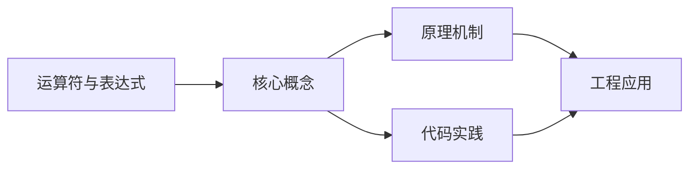
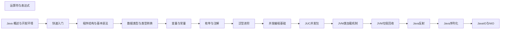

## 1. 学习目标（Bloom 分类）

本节按照布鲁姆教育目标分类学组织学习路径。本文主题为《运算符与表达式》，属于 Java 模块，读者可以根据自身阶段选择阅读深度。

记忆层面：能够准确复述本文的核心概念、术语与基本语法或操作步骤，并能够在提问或检索时快速定位对应知识点。能够说出 Java 的编译执行模型（javac 到字节码，JVM 解释与 JIT）。

理解层面：能够用自己的语言解释核心原理与工作机制，说明概念之间的因果关系，而不是机械记忆结论。能够解释面向对象三大特性与 JVM 内存区域的职责。

应用层面：能够在真实项目或练习场景中运用本文知识解决具体问题，写出正确且可维护的实现。能够编写类、接口、集合操作与异常处理的完整程序。

分析层面：能够拆解复杂问题，比较本文主题与相邻概念的异同，识别边界条件与例外情况。能够分析 Java 与 C++、Go 在内存管理与并发模型上的差异。

评价层面：能够根据约束条件（性能、可读性、安全、成本）评价不同方案的优劣，做出有依据的技术决策。能够评价不同集合、并发工具与框架的适用场景。

创造层面：能够把本文知识与其他模块知识组合，设计出新的解决方案或可复用的工程模式。能够组合 Spring 生态设计企业级应用。

通过本节学习，读者应当能够把《运算符与表达式》纳入自己的知识网络，并与 Java 模块的其他主题（JVM、集合框架、并发、Spring 生态）建立关联。

## 2. 历史动机与发展脉络

《运算符与表达式》是 Java 领域的重要主题。要真正理解它，需要先了解它解决的问题与演进过程。

Java 由 James Gosling 领导的 Sun 团队于 1995 年发布，口号“一次编写，到处运行”依托 JVM 字节码实现跨平台。2006 年 Sun 将 Java 开源（OpenJDK），2010 年 Oracle 收购 Sun 后 Java 进入新的治理阶段。
Java 的版本节奏在 2017 年后改为每半年一个特性版本、每两年一个 LTS（长期支持）版本。当前主流 LTS 包括 Java 11、17、21 与 25；Java 21 引入虚拟线程（Project Loom 成果），显著降低高并发服务的线程成本。
Java 生态以 Spring 家族为核心：Spring Boot 简化配置与部署，Spring Cloud 提供微服务组件；构建工具从 Maven 演进到 Gradle；JVM 语言（Kotlin、Scala、Groovy）与 Java 共存互操作。
Android 开发早期使用 Java，2019 年后官方转向 Kotlin-first，但 Java 仍是服务端领域（尤其是金融、电商等企业系统）的中坚力量。

回到本文主题：运算符与表达式 的提出与成熟，正是上述技术背景下的必然产物。早期实现往往以简单可用为目标，随着工程规模扩大，社区逐渐沉淀出标准做法与最佳实践；理解这一脉络，可以帮助读者判断“为什么文档中的推荐写法是现在这个样子”，也能在遇到历史遗留代码时准确识别其设计年代与取舍。

理解 Java 版本与 LTS 机制，是工程选型的起点：生产环境优先 LTS，新特性（如虚拟线程）可以在受控场景评估后引入。

## 3. 形式化定义与核心概念精讲

本节把《运算符与表达式》涉及的核心概念以“定义 + 讲解”的形式展开。读者应把定义当作工具，把讲解当作理解路径；两者结合才能形成可迁移的知识。

JVM 与字节码：`javac` 把 .java 编译为 .class 字节码，JVM 加载、校验并执行；热点代码由 JIT（如 C2）编译为机器码，解释与编译结合实现启动速度与峰值性能的平衡。
面向对象：封装（访问控制）、继承（extends/implements）与多态（重载/重写）是 Java 的类型系统支柱；接口默认方法（Java 8）与密封类（Java 17）持续演进表达能力。
异常体系：受检异常（checked）编译期强制处理，非受检异常（RuntimeException）运行时抛出；try-with-resources 自动关闭资源。
泛型与擦除：Java 泛型在编译期检查后擦除类型参数，运行时无泛型信息；这解释了 `List<String>` 与 `List<Integer>` 的 Class 相同，以及通配符 `? extends` 的逆变协变规则。

### 3.1 原文章节逐一精讲

原文档把主题拆分为 17 个小节，下面按顺序给出每一节的导读讲解，随后保留原文细节供精读。

#### 原文精读（完整保留）

# Java 运算符与表达式

> **符号约定**：`< >` 必填参数 | `[ ]` 可选参数

---

#### 1. 运算符分类

##### 1.1 算术运算符

算术运算符用于执行基本的数学运算，包括加法、减法、乘法、除法和取模等。

| 运算符         | 描述         | 示例 (a=10, b=3) | 结果           |
| -------------- | ------------ | ---------------- | -------------- |
| `+`            | 加法         | `a + b`          | 13             |
| `-`            | 减法         | `a - b`          | 7              |
| `*`            | 乘法         | `a * b`          | 30             |
| `/`            | 除法         | `a / b`          | 3 (整数除法)   |
| `%`            | 取模（取余） | `a % b`          | 1              |
| `++`           | 自增         | `a++` (先用后加) | 10 (a 变为 11) |
| `++`           | 自增         | `++a` (先加后用) | 11 (a 变为 11) |
| `--`           | 自减         | `b--` (先用后减) | 3 (b 变为 2)   |
| `--`           | 自减         | `--b` (先减后用) | 2 (b 变为 2)   |
| **特殊用法**： |

- `+` 运算符还可以用于字符串拼接：`"Hello" + "World"` 结果为 `"HelloWorld"`
- 当 `+` 运算符两边有一个是字符串时，会将另一个操作数转换为字符串进行拼接
  **示例**：

```java
 // 基本算术运算
 int a = 10;
 int b = 3;
 System.out.println("a + b = " + (a + b)); // 13
 System.out.println("a - b = " + (a - b)); // 7
 System.out.println("a * b = " + (a * b)); // 30
 System.out.println("a / b = " + (a / b)); // 3 (整数除法)
 System.out.println("a % b = " + (a % b)); // 1
 // 自增和自减
 int c = 5;
 System.out.println("c++ = " + c++); // 5 (先用后加)
 System.out.println("c = " + c); // 6
 System.out.println("++c = " + ++c); // 7 (先加后用)
 // 字符串拼接
 String str1 = "Hello";
 String str2 = "World";
 System.out.println(str1 + " " + str2); // "Hello World"
 System.out.println("The answer is: " + 42); // "The answer is: 42"
```

##### 1.2 关系运算符

关系运算符用于比较两个值的大小关系，结果为 `boolean` 类型（``或`false`）。

| 运算符     | 描述     | 示例 (a=10, b=3) | 结果  |
| ---------- | -------- | ---------------- | ----- |
| `==`       | 等于     | `a == b`         | false |
| `!=`       | 不等于   | `a != b`         |       |
| `>`        | 大于     | `a > b`          |       |
| `<`        | 小于     | `a < b`          | false |
| `>=`       | 大于等于 | `a >= b`         |       |
| `<=`       | 小于等于 | `a <= b`         | false |
| **注意**： |

- 对于引用类型，`==` 比较的是对象的引用（内存地址），而不是对象的内容。要比较对象的内容，应使用 `equals()` 方法。
  **示例**：

```java
 // 基本类型比较
 int a = 10;
 int b = 3;
 System.out.println("a == b: " + (a == b)); // false
 System.out.println("a != b: " + (a != b)); //
 System.out.println("a > b: " + (a > b)); //
 System.out.println("a < b: " + (a < b)); // false
 System.out.println("a >= b: " + (a >= b)); //
 System.out.println("a <= b: " + (a <= b)); // false
 // 引用类型比较
 String s1 = "Hello";
 String s2 = "Hello";
 String s3 = new String("Hello");
 System.out.println("s1 == s2: " + (s1 == s2)); //  (字符串常量池)
 System.out.println("s1 == s3: " + (s1 == s3)); // false (不同对象)
 System.out.println("s1.equals(s3): " + s1.equals(s3)); //  (内容相同)
```

##### 1.3 逻辑运算符

逻辑运算符用于连接布尔表达式，结果为 `boolean` 类型。

| 运算符         | 描述             | 短路特性                       | 示例 (a=true, b=false)   | 结果                           |
| -------------- | ---------------- | ------------------------------ | ------------------------ | ------------------------------ |
| `&&`           | 短路与           | 有（第一个为假则不计算第二个） | `a && b`                 | false                          |
| `              |                  | `                              | 短路或                   | 有（第一个为真则不计算第二个） | `a  |     | b`  |     |
| `!`            | 逻辑非           | 无                             | `!a`                     | false                          |
| `&`            | 逻辑与（无短路） | 无（总是计算两个操作数）       | `a & b`                  | false                          |
| `              | `                | 逻辑或（无短路）               | 无（总是计算两个操作数） | `a                             | b`  |     |
| `^`            | 逻辑异或         | 无                             | `a ^ b`                  |                                |
| **短路特性**： |

- `&&`：如果第一个操作数为 `false`，则第二个操作数不会被计算
- `||`：如果第一个操作数为 ``，则第二个操作数不会被计算
  **示例**：

```java
 // 短路与
 int x = 5;
 b boolean result1 = (x > 10) && (x++ > 0);
 System.out.println("result1: " + result1); // false
 System.out.println("x: " + x); // 5 (x++ 未执行)
 // 短路或
 int y = 5;
 b boolean result2 = (y < 10) || (y++ > 0);
 System.out.println("result2: " + result2); //
 System.out.println("y: " + y); // 5 (y++ 未执行)
 // 逻辑非
 boolean flag = true;
 System.out.println("!flag: " + !flag); // false
 // 逻辑异或
 boolean a = true;
 b boolean b = false;
 System.out.println("a ^ b: " + (a ^ b)); //
```

##### 1.4 位运算符

位运算符用于对二进制位进行操作，适用于整数类型（`byte`, `short`, `int`, `long`）。

| 运算符     | 描述           | 示例 (a=6, b=3) | 二进制                 | 结果 |
| ---------- | -------------- | --------------- | ---------------------- | ---- |
| `&`        | 按位与         | `a & b`         | `110 & 011 = 010`      | 2    |
| `          | `              | 按位或          | `a                     | b`   | `110 | 011 = 111` | 7   |
| `^`        | 按位异或       | `a ^ b`         | `110 ^ 011 = 101`      | 5    |
| `~`        | 按位取反       | `~a`            | `~00000110 = 11111001` | -7   |
| `<<`       | 左移           | `a << 1`        | `110 << 1 = 1100`      | 12   |
| `>>`       | 右移（带符号） | `a >> 1`        | `110 >> 1 = 011`       | 3    |
| `>>>`      | 右移（无符号） | `a >>> 1`       | `110 >>> 1 = 011`      | 3    |
| **说明**： |

- `<<`：左移 n 位，相当于乘以 2 的 n 次方
- `>>`：右移 n 位，相当于除以 2 的 n 次方（带符号）
- `>>>`：无符号右移，高位补 0
  **示例**：

```java
 int a = 6; // 二进制: 110
 int b = 3; // 二进制: 011
 System.out.println("a & b = " + (a & b)); // 2 (010)
 System.out.println("a | b = " + (a | b)); // 7 (111)
 System.out.println("a ^ b = " + (a ^ b)); // 5 (101)
 System.out.println("~a = " + (~a)); // -7
 System.out.println("a << 1 = " + (a << 1)); // 12 (1100)
 System.out.println("a >> 1 = " + (a >> 1)); // 3 (011)
 System.out.println("a >>> 1 = " + (a >>> 1)); // 3 (011)
 // 负数的位运算
 int c = -6; // 二进制补码: 11111111111111111111111111111010
 System.out.println("c >> 1 = " + (c >> 1)); // -3 (带符号右移)
 System.out.println("c >>> 1 = " + (c >>> 1)); // 2147483645 (无符号右移)
```

##### 1.5 赋值运算符

赋值运算符用于给变量赋值，包括简单赋值和复合赋值。

| 运算符     | 描述           | 示例       | 等价于        |
| ---------- | -------------- | ---------- | ------------- |
| `=`        | 简单赋值       | `a = 10`   | `a = 10`      |
| `+=`       | 加法赋值       | `a += 5`   | `a = a + 5`   |
| `-=`       | 减法赋值       | `a -= 5`   | `a = a - 5`   |
| `*=`       | 乘法赋值       | `a *= 5`   | `a = a * 5`   |
| `/=`       | 除法赋值       | `a /= 5`   | `a = a / 5`   |
| `%=`       | 取模赋值       | `a %= 5`   | `a = a % 5`   |
| `<<=`      | 左移赋值       | `a <<= 2`  | `a = a << 2`  |
| `>>=`      | 右移赋值       | `a >>= 2`  | `a = a >> 2`  |
| `>>>=`     | 无符号右移赋值 | `a >>>= 2` | `a = a >>> 2` |
| `&=`       | 按位与赋值     | `a &= 5`   | `a = a & 5`   |
| `          | =`             | 按位或赋值 | `a            | = 5` | `a = a | 5`  |
| `^=`       | 按位异或赋值   | `a ^= 5`   | `a = a ^ 5`   |
| **示例**： |

```java
 int a = 10;
 // 简单赋值
 a = 20;
 System.out.println("a = " + a); // 20
 // 复合赋值
 a += 5; // 等价于 a = a + 5
 System.out.println("a += 5: " + a); // 25
 a -= 3; // 等价于 a = a - 3
 System.out.println("a -= 3: " + a); // 22
 a *= 2; // 等价于 a = a * 2
 System.out.println("a *= 2: " + a); // 44
 a /= 4; // 等价于 a = a / 4
 System.out.println("a /= 4: " + a); // 11
 a %= 3; // 等价于 a = a % 3
 System.out.println("a %= 3: " + a); // 2
```

##### 1.6 三元运算符

三元运算符是 Java 中唯一的三目运算符，用于根据条件表达式的值选择执行两个表达式中的一个。
**语法**：`条件表达式 ? 表达式1 : 表达式2`
**说明**：

- 如果条件表达式为 ``，则执行表达式1并返回其结果
- 如果条件表达式为 `false`，则执行表达式2并返回其结果
  **示例**：

```java
 // 基本用法
 int a = 10;
 int b = 20;
 int max = (a > b) ? a : b;
 System.out.println("Max: " + max); // 20
 // 嵌套使用
 int x = 5;
 int y = 10;
 int z = 15;
 int largest = (x > y) ? ((x > z) ? x : z) : ((y > z) ? y : z);
 System.out.println("Largest: " + largest); // 15
 // 用于赋值
 String result = (a > b) ? "a is larger" : "b is larger";
 System.out.println(result); // "b is larger"
```

#### 2. 表达式

##### 2.1 表达式的概念

表达式是由运算符和操作数组成的代码片段，用于计算一个值。表达式可以是简单的（如 `5 + 3`），也可以是复杂的（如 `(a + b) * c / d`）。

##### 2.2 表达式的类型

根据表达式的结果类型，表达式可以分为以下几类：

1. **算术表达式**：结果为数值类型，如 `a + b`, `x * y`
2. **关系表达式**：结果为布尔类型，如 `a > b`, `x == y`
3. **逻辑表达式**：结果为布尔类型，如 `a && b`, `x || y`
4. **位表达式**：结果为整数类型，如 `a & b`, `x << y`
5. **赋值表达式**：结果为赋值后变量的值，如 `a = 5`, `x += 3`
6. **三元表达式**：结果为表达式1或表达式2的值，如 `(a > b) ? a : b`

##### 2.3 表达式的求值

表达式的求值顺序取决于运算符的优先级和结合性。
**结合性**：当多个运算符具有相同优先级时，表达式的求值顺序（从左到右或从右到左）。

| 运算符     | 结合性   |
| ---------- | -------- |
| 算术运算符 | 从左到右 |
| 关系运算符 | 从左到右 |
| 逻辑运算符 | 从左到右 |
| 赋值运算符 | 从右到左 |
| 三元运算符 | 从右到左 |
| **示例**： |

```java
 // 结合性示例
 int a = 10;
 int b = 5;
 int c = 3;
 // 算术运算符：从左到右
 int result1 = a + b * c; // 等价于 a + (b * c) = 10 + 15 = 25
 System.out.println("result1: " + result1);
 // 赋值运算符：从右到左
 int x, y;
 x = y = 5; // 等价于 x = (y = 5)
 System.out.println("x: " + x + ", y: " + y); // x: 5, y: 5
 // 三元运算符：从右到左
 int a = 10;
 int b = 20;
 int c = 30;
 int result2 = a > b ? a : b > c ? b : c;
 // 等价于 a > b ? a : (b > c ? b : c)
 System.out.println("result2: " + result2); // 30
```

#### 3. 运算符优先级

运算符优先级决定了表达式中不同运算符的执行顺序。优先级高的运算符先执行，优先级低的运算符后执行。

| 优先级     | 运算符                                                      | 结合性   |
| ---------- | ----------------------------------------------------------- | -------- |
| 1          | `()` `[]` `.`                                               | 从左到右 |
| 2          | `!` `~` `++` `--` `+` (一元) `-` (一元)                     | 从右到左 |
| 3          | `*` `/` `%`                                                 | 从左到右 |
| 4          | `+` (二元) `-` (二元)                                       | 从左到右 |
| 5          | `<<` `>>` `>>>`                                             | 从左到右 |
| 6          | `<` `<=` `>` `>=` `instanceof`                              | 从左到右 |
| 7          | `==` `!=`                                                   | 从左到右 |
| 8          | `&`                                                         | 从左到右 |
| 9          | `^`                                                         | 从左到右 |
| 10         | `                                                           | `        | 从左到右 |
| 11         | `&&`                                                        | 从左到右 |
| 12         | `                                                           |          | `        | 从左到右 |
| 13         | `? :`                                                       | 从右到左 |
| 14         | `=` `+=` `-=` `*=` `/=` `%=` `<<=` `>>=` `>>>=` `&=` `^=` ` | =`       | 从右到左 |
| **示例**： |

```java
 // 优先级示例
 int a = 10;
 int b = 5;
 int c = 3;
 int d = 2;
 // 运算顺序：先乘除后加减
 int result1 = a + b * c - d;
 // 等价于 a + (b * c) - d = 10 + 15 - 2 = 23
 System.out.println("result1: " + result1);
 // 运算顺序：先括号内，后括号外
 int result2 = (a + b) * (c - d);
 // 等价于 (10 + 5) * (3 - 2) = 15 * 1 = 15
 System.out.println("result2: " + result2);
 // 运算顺序：先关系运算，后逻辑运算
 boolean result3 = a > b && c < d;
 // 等价于 (a > b) && (c < d) =  && false = false
 System.out.println("result3: " + result3);
```

#### 4. 常见陷阱与最佳实践

##### 4.1 浮点精度问题

**问题**：由于浮点数的存储方式（IEEE 754 标准），某些十进制小数无法精确表示，导致计算结果出现误差。
**示例**：

```java
 double a = 0.1;
 double b = 0.2;
 double c = a + b;
 System.out.println(c); // 输出 0.30000000000000004，而不是 0.3
```

**解决方案**：

- 使用 `BigDecimal` 类进行精确计算
- 对于货币等需要精确计算的场景，应使用 `BigDecimal`
  **示例**：

```java
 import java.math.BigDecimal;
 BigDecimal a = new BigDecimal("0.1");
 BigDecimal b = new BigDecimal("0.2");
 BigDecimal c = a.add(b);
 System.out.println(c); // 输出 0.3
```

##### 4.2 整数溢出问题

**问题**：当整数运算的结果超出其类型的取值范围时，会发生溢出，导致结果不正确。
**示例**：

```java
 int max = Integer.MAX_VALUE; // 2147483647
 int result = max + 1;
 System.out.println(result); // 输出 -2147483648，发生溢出
```

**解决方案**：

- 使用更大范围的整数类型（如 `long`）
- 在运算前检查是否会发生溢出
- 使用 `Math.addExact()` 等方法，在溢出时抛出异常
  **示例**：

```java
 long max = Integer.MAX_VALUE;
 long result = max + 1;
 System.out.println(result); // 输出 2147483648，正确
 // 使用 Math.addExact()
 try {
  int result2 = Math.addExact(Integer.MAX_VALUE, 1);
 }
  System.out.println("发生溢出: " + e.getMessage());
 }
```

##### 4.3 字符串拼接的性能问题

**问题**：使用 `+` 运算符进行大量字符串拼接时，会创建多个临时字符串对象，影响性能。
**解决方案**：

- 对于少量字符串拼接，使用 `+` 运算符是可以接受的
- 对于大量字符串拼接，应使用 `StringBuilder` 或 `StringBuffer`
  **示例**：

```java
 // 性能较差的方式
 String result = "";
 for (int i = 0; i < 1000; i++) {
  result += " " + i;
 }
 // 性能较好的方式
 StringBuilder sb = new StringBuilder();
 for (int i = 0; i < 1000; i++) {
  sb.append(" ").append(i);
 }
 String result = sb.toString();
```

##### 4.4 短路运算符的使用

**最佳实践**：

- 当第二个操作数可能会导致异常或有副作用时，应使用短路运算符 (`&&`, `||`)
- 当需要确保两个操作数都被计算时，应使用非短路运算符 (`&`, `|`)
  **示例**：

```java
 // 安全的空检查
 String str = null;
 if (str != null && str.length() > 0) {
  // 只有当 str 不为 null 时，才会计算 str.length()
  System.out.println("String length: " + str.length());
 }
 // 确保两个条件都被检查
 boolean condition1 = checkCondition1();
 boolean condition2 = checkCondition2();
 if (condition1 & condition2) {
  // 无论 condition1 是什么，都会执行 checkCondition2()
  System.out.println("Both conditions are ");
 }
```

##### 4.5 位运算符的应用

**位运算符的常见应用**：

- 位掩码：用于表示一组布尔标志
- 位操作：用于高效的数学运算
- 加密和哈希算法：使用位运算进行数据变换
  **示例**：

```java
 // 位掩码示例
 int FLAG_READ = 1 << 0; // 0b0001
 int FLAG_WRITE = 1 << 1; // 0b0010
 int FLAG_EXECUTE = 1 << 2; // 0b0100
 int permissions = FLAG_READ | FLAG_WRITE; // 0b0011
 // 检查权限
 if ((permissions & FLAG_READ) != 0) {
  System.out.println("Read permission granted");
 }
 // 高效的乘除运算
 int a = 10;
 int multiplyBy2 = a << 1; // 等价于 a * 2
 int divideBy2 = a >> 1; // 等价于 a / 2
 System.out.println("Multiply by 2: " + multiplyBy2); // 20
 System.out.println("Divide by 2: " + divideBy2); // 5
```

#### 5. 实际应用示例

##### 5.1 示例 1：计算BMI指数

```java
 import java.util.Scanner;
 public class BMICalculator {
  public static void main(String[] args) {
  Scanner sc = new Scanner(System.in);
  System.out.print("请输入体重（公斤）: ");
  double weight = sc.nextDouble();
  System.out.print("请输入身高（米）: ");
  double height = sc.nextDouble();
  // 计算BMI
  double bmi = weight / (height * height);
  // 判断BMI等级
  String level;
  if (bmi < 18.5) {
  level = "偏瘦";
  } else if (bmi < 24) {
  level = "正常";
  } else if (bmi < 28) {
  level = "偏胖";
  } else {
  level = "肥胖";
  }
  System.out.println("您的BMI指数: " + bmi);
  System.out.println("体重等级: " + level);
  sc.close();
  }
 }
```

##### 5.2 示例 2：判断闰年

```java
 import java.util.Scanner;
 public class LeapYearChecker {
  public static void main(String[] args) {
  Scanner sc = new Scanner(System.in);
  System.out.print("请输入年份: ");
  int year = sc.nextInt();
  // 判断闰年
  boolean isLeapYear = (year % 4 == 0 && year % 100 != 0) || (year % 400 == 0);
  if (isLeapYear) {
  System.out.println(year + " 是闰年");
  } else {
  System.out.println(year + " 不是闰年");
  }
  sc.close();
  }
 }
```

##### 5.3 示例 3：使用位运算实现权限管理

```java
 public class PermissionManager {
  // 权限标志
  public static final int PERMISSION_READ = 1 << 0; // 0b0001
  public static final int PERMISSION_WRITE = 1 << 1; // 0b0010
  public static final int PERMISSION_EXECUTE = 1 << 2; // 0b0100
  public static final int PERMISSION_DELETE = 1 << 3; // 0b1000
  public static void main(String[] args) {
  // 分配权限
  int userPermissions = PERMISSION_READ | PERMISSION_WRITE;
  // 检查权限
  System.out.println("Read permission: " + hasPermission(userPermissions, PERMISSION_READ));
  System.out.println("Write permission: " + hasPermission(userPermissions, PERMISSION_WRITE));
  System.out.println("Execute permission: " + hasPermission(userPermissions, PERMISSION_EXECUTE));
  System.out.println("Delete permission: " + hasPermission(userPermissions, PERMISSION_DELETE));
  // 添加权限
  userPermissions |= PERMISSION_EXECUTE;
  System.out.println("\nAfter adding execute permission:");
  System.out.println("Execute permission: " + hasPermission(userPermissions, PERMISSION_EXECUTE));
  // 移除权限
  userPermissions &= ~PERMISSION_WRITE;
  System.out.println("\nAfter removing write permission:");
  System.out.println("Write permission: " + hasPermission(userPermissions, PERMISSION_WRITE));
  }
  public static boolean hasPermission(int permissions, int permission) {
  return (permissions & permission) != 0;
  }
 }
```

---

#### 算术运算符

**基本写法：加法运算**
`<操作数1> + <操作数2>`
```java
// 两个整数相加
int sum = 10 + 3;
```

---

**基本写法：减法运算**
`<操作数1> - <操作数2>`
```java
// 两个整数相减
int diff = 10 - 3;
```

---

**基本写法：乘法运算**
`<操作数1> * <操作数2>`
```java
// 两个整数相乘
int product = 10 * 3;
```

---

**基本写法：除法运算**
`<操作数1> / <操作数2>`
```java
// 两个整数相除取整
int quotient = 10 / 3;
```

---

**基本写法：取模运算**
`<操作数1> % <操作数2>`
```java
// 取余数
int remainder = 10 % 3;
```

---

#### 自增自减

**基本写法：后置自增**
`<变量>++`
```java
// 先使用后加 1
int a = 5;
int b = a++;
```

---

**基本写法：前置自增**
`++<变量>`
```java
// 先加 1 后使用
int a = 5;
int b = ++a;
```

---

**基本写法：后置自减**
`<变量>--`
```java
// 先使用后减 1
int a = 5;
int b = a--;
```

---

**基本写法：前置自减**
`--<变量>`
```java
// 先减 1 后使用
int a = 5;
int b = --a;
```

---

#### 字符串拼接

**基本写法：字符串拼接**
`<字符串> + <其他类型>`
```java
// 字符串与字符串拼接
String result = "Hello" + " " + "World";
```

---

**基本写法：字符串与数字拼接**
`<字符串> + <数字>`
```java
// 字符串与数字拼接
String result = "The answer is: " + 42;
```

---

#### 关系运算符

**基本写法：等于比较**
`<操作数1> == <操作数2>`
```java
// 比较两个值是否相等
boolean result = (10 == 3);
```

---

**基本写法：不等于比较**
`<操作数1> != <操作数2>`
```java
// 比较两个值是否不相等
boolean result = (10 != 3);
```

---

**基本写法：大于比较**
`<操作数1> > <操作数2>`
```java
// 比较左边是否大于右边
boolean result = (10 > 3);
```

---

**基本写法：小于比较**
`<操作数1> < <操作数2>`
```java
// 比较左边是否小于右边
boolean result = (10 < 3);
```

---

**基本写法：大于等于比较**
`<操作数1> >= <操作数2>`
```java
// 比较左边是否大于等于右边
boolean result = (10 >= 3);
```

---

**基本写法：小于等于比较**
`<操作数1> <= <操作数2>`
```java
// 比较左边是否小于等于右边
boolean result = (10 <= 3);
```

---

**基本写法：引用类型内容比较**
`<对象1>.equals(<对象2>)`
```java
// 比较两个字符串内容是否相同
String s1 = "Hello";
String s2 = new String("Hello");
boolean result = s1.equals(s2);
```

---

#### 逻辑运算符

**基本写法：短路与**
`<布尔表达式1> && <布尔表达式2>`
```java
// 第一个为 false 则不计算第二个
boolean result = (x > 10) && (x++ > 0);
```

---

**基本写法：短路或**
`<布尔表达式1> || <布尔表达式2>`
```java
// 第一个为 true 则不计算第二个
boolean result = (y < 10) || (y++ > 0);
```

---

**基本写法：逻辑非**
`!<布尔表达式>`
```java
// 对布尔值取反
boolean result = !flag;
```

---

**基本写法：逻辑异或**
`<布尔表达式1> ^ <布尔表达式2>`
```java
// 相同为 false 不同为 true
boolean result = true ^ false;
```

---

#### 位运算符

**基本写法：按位与**
`<操作数1> & <操作数2>`
```java
// 二进制位与运算
int result = 6 & 3;
```

---

**基本写法：按位或**
`<操作数1> | <操作数2>`
```java
// 二进制位或运算
int result = 6 | 3;
```

---

**基本写法：按位异或**
`<操作数1> ^ <操作数2>`
```java
// 二进制位异或运算
int result = 6 ^ 3;
```

---

**基本写法：按位取反**
`~<操作数>`
```java
// 二进制位取反
int result = ~6;
```

---

**基本写法：左移**
`<操作数> << <位数>`
```java
// 二进制位左移相当于乘以 2
int result = 6 << 1;
```

---

**基本写法：右移**
`<操作数> >> <位数>`
```java
// 二进制位右移相当于除以 2
int result = 6 >> 1;
```

---

**基本写法：无符号右移**
`<操作数> >>> <位数>`
```java
// 高位补 0 的右移
int result = -6 >>> 1;
```

---

#### 赋值运算符

**基本写法：简单赋值**
`<变量> = <值>`
```java
// 给变量赋值
int a = 10;
```

---

**基本写法：加法复合赋值**
`<变量> += <值>`
```java
// 等价于 a = a + 5
int a = 10;
a += 5;
```

---

**基本写法：减法复合赋值**
`<变量> -= <值>`
```java
// 等价于 a = a - 3
int a = 10;
a -= 3;
```

---

**基本写法：乘法复合赋值**
`<变量> *= <值>`
```java
// 等价于 a = a * 2
int a = 10;
a *= 2;
```

---

**基本写法：除法复合赋值**
`<变量> /= <值>`
```java
// 等价于 a = a / 4
int a = 10;
a /= 4;
```

---

**基本写法：取模复合赋值**
`<变量> %= <值>`
```java
// 等价于 a = a % 3
int a = 10;
a %= 3;
```

---

#### 三元运算符

**基本写法：三元运算符**
`<条件表达式> ? <表达式1> : <表达式2>`
```java
// 根据条件选择值
int max = (a > b) ? a : b;
```

---

**基本写法：三元运算符赋值字符串**
`<条件> ? "<字符串1>" : "<字符串2>"`
```java
// 根据条件选择字符串
String result = (a > b) ? "a is larger" : "b is larger";
```

---

#### 运算符优先级

**基本写法：使用括号明确顺序**
`(<表达式>)`
```java
// 使用括号改变运算顺序
int result = (a + b) * (c - d);
```

---

#### 整数溢出处理

**基本写法：溢出检查加法**
`Math.addExact(<a>, <b>)`
```java
// 溢出时抛出 ArithmeticException
int result = Math.addExact(Integer.MAX_VALUE, 1);
```

---

**基本写法：使用更大类型**
`long <变量名> = <int变量> + <值>;`
```java
// 使用 long 类型避免溢出
long max = Integer.MAX_VALUE;
long result = max + 1;
```

---

#### 字符串拼接性能

**基本写法：创建 StringBuilder**
`StringBuilder <变量名> = new StringBuilder();`
```java
// 创建 StringBuilder 对象
StringBuilder sb = new StringBuilder();
```

---

**基本写法：StringBuilder 追加**
`<StringBuilder>.append(<内容>)`
```java
// 追加内容到 StringBuilder
sb.append("Hello").append(" ").append("World");
```

---

**基本写法：转换为字符串**
`<StringBuilder>.toString()`
```java
// 将 StringBuilder 转换为字符串
String result = sb.toString();
```

---

#### 位运算应用

**基本写法：位掩码定义**
`int <标志> = 1 << <位数>;`
```java
// 定义权限标志位
int FLAG_READ = 1 << 0;
```

---

**基本写法：位掩码组合**
`<标志1> | <标志2>`
```java
// 组合多个权限标志
int permissions = FLAG_READ | FLAG_WRITE;
```

---

**基本写法：检查位掩码**
`(<组合标志> & <单个标志>) != 0`
```java
// 检查是否包含某权限
boolean hasRead = (permissions & FLAG_READ) != 0;
```


### 3.2 概念关系图

下面用 Mermaid 图表达本文核心概念之间的关系，帮助读者建立整体图景：



图中展示的是本文知识的结构化关系：核心概念是入口，原理机制解释“为什么”，代码实践演示“怎么做”，工程应用回答“何时用”。读者学习时可以把每个小节的内容挂接到对应节点上。

## 4. 理论推导与原理解析

本节深入《运算符与表达式》背后的原理。理论部分不求面面俱到，而是聚焦“能解释现象、能指导实践”的关键推导。

JVM 内存模型：堆（新生代/老年代）、元空间、虚拟机栈、本地方法栈与程序计数器；GC 从 CMS 演进到 G1（默认）、ZGC（超低延迟），理解分代收集是调优前提。
并发工具：synchronized 与 JUC（java.util.concurrent）的锁、并发容器、线程池、CompletableFuture 构成并发工具箱；Java 21 的虚拟线程让“每任务一线程”成为可能。
类加载机制：双亲委派模型保证类唯一性，SPI（ServiceLoader）打破委派实现扩展；自定义类加载器是热部署与隔离的基础。
反射与注解：反射在运行时检查类结构，注解提供元数据；Spring 的依赖注入与 AOP 均基于这些机制，但反射有性能与安全成本。

需要强调的是，理论推导与工程实践之间存在翻译层：理论给出的是理想化模型与边界条件，工程代码则必须处理真实环境中的例外。读者在学习时应先掌握理论的“标准情形”，再通过陷阱章节了解“非标准情形”。

## 5. 代码示例与逐行讲解

本节把原文中的代码示例系统整理，并为每个示例补充用途说明与讲解。读者不应只浏览代码，而应逐段对照讲解理解设计意图。

### 5.1 示例：1.1 算术运算符

该示例来自原文《1.1 算术运算符》小节，用于演示运算符与表达式相关操作。阅读时请先看代码结构，再看其后的讲解。

```java
 // 基本算术运算
 int a = 10;
 int b = 3;
 System.out.println("a + b = " + (a + b)); // 13
 System.out.println("a - b = " + (a - b)); // 7
 System.out.println("a * b = " + (a * b)); // 30
 System.out.println("a / b = " + (a / b)); // 3 (整数除法)
 System.out.println("a % b = " + (a % b)); // 1
 // 自增和自减
 int c = 5;
 System.out.println("c++ = " + c++); // 5 (先用后加)
 System.out.println("c = " + c); // 6
 System.out.println("++c = " + ++c); // 7 (先加后用)
 // 字符串拼接
 String str1 = "Hello";
 String str2 = "World";
 System.out.println(str1 + " " + str2); // "Hello World"
 System.out.println("The answer is: " + 42); // "The answer is: 42"
```

讲解：这段代码演示了本节核心知识点。代码中的关键操作可以归纳为三步：准备（定义或初始化）、执行（核心逻辑）、收尾（释放资源或返回结果）。实际项目中，这三步往往被封装为函数或类，以提升复用性与可测试性。

关键点分析：

该示例共 18 行有效代码，结构以数据或配置为主。阅读时应关注：数据字段的含义、配置项的作用，以及它们与运行行为的对应关系。

进阶思考路径：先尝试修改参数观察行为变化，再把示例中的模式迁移到自己的项目中；每次修改都记录预期与实测差异，这是把示例转化为能力的最快方式。

### 5.2 示例：1.2 关系运算符

该示例来自原文《1.2 关系运算符》小节，用于演示运算符与表达式相关操作。阅读时请先看代码结构，再看其后的讲解。

```java
 // 基本类型比较
 int a = 10;
 int b = 3;
 System.out.println("a == b: " + (a == b)); // false
 System.out.println("a != b: " + (a != b)); //
 System.out.println("a > b: " + (a > b)); //
 System.out.println("a < b: " + (a < b)); // false
 System.out.println("a >= b: " + (a >= b)); //
 System.out.println("a <= b: " + (a <= b)); // false
 // 引用类型比较
 String s1 = "Hello";
 String s2 = "Hello";
 String s3 = new String("Hello");
 System.out.println("s1 == s2: " + (s1 == s2)); //  (字符串常量池)
 System.out.println("s1 == s3: " + (s1 == s3)); // false (不同对象)
 System.out.println("s1.equals(s3): " + s1.equals(s3)); //  (内容相同)
```

讲解：这段代码演示了本节核心知识点。代码中的关键操作可以归纳为三步：准备（定义或初始化）、执行（核心逻辑）、收尾（释放资源或返回结果）。实际项目中，这三步往往被封装为函数或类，以提升复用性与可测试性。

关键点分析：

该示例共 16 行有效代码，结构以数据或配置为主。阅读时应关注：数据字段的含义、配置项的作用，以及它们与运行行为的对应关系。

进阶思考路径：先尝试修改参数观察行为变化，再把示例中的模式迁移到自己的项目中；每次修改都记录预期与实测差异，这是把示例转化为能力的最快方式。

### 5.3 示例：1.3 逻辑运算符

该示例来自原文《1.3 逻辑运算符》小节，用于演示运算符与表达式相关操作。阅读时请先看代码结构，再看其后的讲解。

```java
 // 短路与
 int x = 5;
 b boolean result1 = (x > 10) && (x++ > 0);
 System.out.println("result1: " + result1); // false
 System.out.println("x: " + x); // 5 (x++ 未执行)
 // 短路或
 int y = 5;
 b boolean result2 = (y < 10) || (y++ > 0);
 System.out.println("result2: " + result2); //
 System.out.println("y: " + y); // 5 (y++ 未执行)
 // 逻辑非
 boolean flag = true;
 System.out.println("!flag: " + !flag); // false
 // 逻辑异或
 boolean a = true;
 b boolean b = false;
 System.out.println("a ^ b: " + (a ^ b)); //
```

讲解：这段代码演示了本节核心知识点。代码中的关键操作可以归纳为三步：准备（定义或初始化）、执行（核心逻辑）、收尾（释放资源或返回结果）。实际项目中，这三步往往被封装为函数或类，以提升复用性与可测试性。

关键点分析：

该示例共 17 行有效代码，结构以数据或配置为主。阅读时应关注：数据字段的含义、配置项的作用，以及它们与运行行为的对应关系。

进阶思考路径：先尝试修改参数观察行为变化，再把示例中的模式迁移到自己的项目中；每次修改都记录预期与实测差异，这是把示例转化为能力的最快方式。

### 5.4 示例：1.4 位运算符

该示例来自原文《1.4 位运算符》小节，用于演示运算符与表达式相关操作。阅读时请先看代码结构，再看其后的讲解。

```java
 int a = 6; // 二进制: 110
 int b = 3; // 二进制: 011
 System.out.println("a & b = " + (a & b)); // 2 (010)
 System.out.println("a | b = " + (a | b)); // 7 (111)
 System.out.println("a ^ b = " + (a ^ b)); // 5 (101)
 System.out.println("~a = " + (~a)); // -7
 System.out.println("a << 1 = " + (a << 1)); // 12 (1100)
 System.out.println("a >> 1 = " + (a >> 1)); // 3 (011)
 System.out.println("a >>> 1 = " + (a >>> 1)); // 3 (011)
 // 负数的位运算
 int c = -6; // 二进制补码: 11111111111111111111111111111010
 System.out.println("c >> 1 = " + (c >> 1)); // -3 (带符号右移)
 System.out.println("c >>> 1 = " + (c >>> 1)); // 2147483645 (无符号右移)
```

讲解：这段代码演示了本节核心知识点。代码中的关键操作可以归纳为三步：准备（定义或初始化）、执行（核心逻辑）、收尾（释放资源或返回结果）。实际项目中，这三步往往被封装为函数或类，以提升复用性与可测试性。

关键点分析：

该示例共 13 行有效代码，结构以数据或配置为主。阅读时应关注：数据字段的含义、配置项的作用，以及它们与运行行为的对应关系。

进阶思考路径：先尝试修改参数观察行为变化，再把示例中的模式迁移到自己的项目中；每次修改都记录预期与实测差异，这是把示例转化为能力的最快方式。

### 5.5 示例：1.5 赋值运算符

该示例来自原文《1.5 赋值运算符》小节，用于演示运算符与表达式相关操作。阅读时请先看代码结构，再看其后的讲解。

```java
 int a = 10;
 // 简单赋值
 a = 20;
 System.out.println("a = " + a); // 20
 // 复合赋值
 a += 5; // 等价于 a = a + 5
 System.out.println("a += 5: " + a); // 25
 a -= 3; // 等价于 a = a - 3
 System.out.println("a -= 3: " + a); // 22
 a *= 2; // 等价于 a = a * 2
 System.out.println("a *= 2: " + a); // 44
 a /= 4; // 等价于 a = a / 4
 System.out.println("a /= 4: " + a); // 11
 a %= 3; // 等价于 a = a % 3
 System.out.println("a %= 3: " + a); // 2
```

讲解：这段代码演示了本节核心知识点。代码中的关键操作可以归纳为三步：准备（定义或初始化）、执行（核心逻辑）、收尾（释放资源或返回结果）。实际项目中，这三步往往被封装为函数或类，以提升复用性与可测试性。

关键点分析：

该示例共 15 行有效代码，结构以数据或配置为主。阅读时应关注：数据字段的含义、配置项的作用，以及它们与运行行为的对应关系。

进阶思考路径：先尝试修改参数观察行为变化，再把示例中的模式迁移到自己的项目中；每次修改都记录预期与实测差异，这是把示例转化为能力的最快方式。

### 5.6 示例：1.6 三元运算符

该示例来自原文《1.6 三元运算符》小节，用于演示运算符与表达式相关操作。阅读时请先看代码结构，再看其后的讲解。

```java
 // 基本用法
 int a = 10;
 int b = 20;
 int max = (a > b) ? a : b;
 System.out.println("Max: " + max); // 20
 // 嵌套使用
 int x = 5;
 int y = 10;
 int z = 15;
 int largest = (x > y) ? ((x > z) ? x : z) : ((y > z) ? y : z);
 System.out.println("Largest: " + largest); // 15
 // 用于赋值
 String result = (a > b) ? "a is larger" : "b is larger";
 System.out.println(result); // "b is larger"
```

讲解：这段代码演示了本节核心知识点。代码中的关键操作可以归纳为三步：准备（定义或初始化）、执行（核心逻辑）、收尾（释放资源或返回结果）。实际项目中，这三步往往被封装为函数或类，以提升复用性与可测试性。

关键点分析：

该示例共 14 行有效代码，结构以数据或配置为主。阅读时应关注：数据字段的含义、配置项的作用，以及它们与运行行为的对应关系。

进阶思考路径：先尝试修改参数观察行为变化，再把示例中的模式迁移到自己的项目中；每次修改都记录预期与实测差异，这是把示例转化为能力的最快方式。

### 5.7 示例：2.3 表达式的求值

该示例来自原文《2.3 表达式的求值》小节，用于演示运算符与表达式相关操作。阅读时请先看代码结构，再看其后的讲解。

```java
 // 结合性示例
 int a = 10;
 int b = 5;
 int c = 3;
 // 算术运算符：从左到右
 int result1 = a + b * c; // 等价于 a + (b * c) = 10 + 15 = 25
 System.out.println("result1: " + result1);
 // 赋值运算符：从右到左
 int x, y;
 x = y = 5; // 等价于 x = (y = 5)
 System.out.println("x: " + x + ", y: " + y); // x: 5, y: 5
 // 三元运算符：从右到左
 int a = 10;
 int b = 20;
 int c = 30;
 int result2 = a > b ? a : b > c ? b : c;
 // 等价于 a > b ? a : (b > c ? b : c)
 System.out.println("result2: " + result2); // 30
```

讲解：这段代码演示了本节核心知识点。代码中的关键操作可以归纳为三步：准备（定义或初始化）、执行（核心逻辑）、收尾（释放资源或返回结果）。实际项目中，这三步往往被封装为函数或类，以提升复用性与可测试性。

关键点分析：

该示例共 18 行有效代码，结构以数据或配置为主。阅读时应关注：数据字段的含义、配置项的作用，以及它们与运行行为的对应关系。

进阶思考路径：先尝试修改参数观察行为变化，再把示例中的模式迁移到自己的项目中；每次修改都记录预期与实测差异，这是把示例转化为能力的最快方式。

### 5.8 示例：3. 运算符优先级

该示例来自原文《3. 运算符优先级》小节，用于演示运算符与表达式相关操作。阅读时请先看代码结构，再看其后的讲解。

```java
 // 优先级示例
 int a = 10;
 int b = 5;
 int c = 3;
 int d = 2;
 // 运算顺序：先乘除后加减
 int result1 = a + b * c - d;
 // 等价于 a + (b * c) - d = 10 + 15 - 2 = 23
 System.out.println("result1: " + result1);
 // 运算顺序：先括号内，后括号外
 int result2 = (a + b) * (c - d);
 // 等价于 (10 + 5) * (3 - 2) = 15 * 1 = 15
 System.out.println("result2: " + result2);
 // 运算顺序：先关系运算，后逻辑运算
 boolean result3 = a > b && c < d;
 // 等价于 (a > b) && (c < d) =  && false = false
 System.out.println("result3: " + result3);
```

讲解：这段代码演示了本节核心知识点。代码中的关键操作可以归纳为三步：准备（定义或初始化）、执行（核心逻辑）、收尾（释放资源或返回结果）。实际项目中，这三步往往被封装为函数或类，以提升复用性与可测试性。

关键点分析：

该示例共 17 行有效代码，结构以数据或配置为主。阅读时应关注：数据字段的含义、配置项的作用，以及它们与运行行为的对应关系。

进阶思考路径：先尝试修改参数观察行为变化，再把示例中的模式迁移到自己的项目中；每次修改都记录预期与实测差异，这是把示例转化为能力的最快方式。

### 5.9 示例：4.1 浮点精度问题

该示例来自原文《4.1 浮点精度问题》小节，用于演示运算符与表达式相关操作。阅读时请先看代码结构，再看其后的讲解。

```java
 double a = 0.1;
 double b = 0.2;
 double c = a + b;
 System.out.println(c); // 输出 0.30000000000000004，而不是 0.3
```

讲解：这段代码演示了本节核心知识点。代码中的关键操作可以归纳为三步：准备（定义或初始化）、执行（核心逻辑）、收尾（释放资源或返回结果）。实际项目中，这三步往往被封装为函数或类，以提升复用性与可测试性。

关键点分析：

该示例共 4 行有效代码，结构以数据或配置为主。阅读时应关注：数据字段的含义、配置项的作用，以及它们与运行行为的对应关系。

进阶思考路径：先尝试修改参数观察行为变化，再把示例中的模式迁移到自己的项目中；每次修改都记录预期与实测差异，这是把示例转化为能力的最快方式。

### 5.10 示例：4.1 浮点精度问题

该示例来自原文《4.1 浮点精度问题》小节，用于演示运算符与表达式相关操作。阅读时请先看代码结构，再看其后的讲解。

```java
 import java.math.BigDecimal;
 BigDecimal a = new BigDecimal("0.1");
 BigDecimal b = new BigDecimal("0.2");
 BigDecimal c = a.add(b);
 System.out.println(c); // 输出 0.3
```

讲解：这段代码演示了本节核心知识点。代码中的关键操作可以归纳为三步：准备（定义或初始化）、执行（核心逻辑）、收尾（释放资源或返回结果）。实际项目中，这三步往往被封装为函数或类，以提升复用性与可测试性。

关键点分析：

该示例共 5 行有效代码，包含 1 类关键结构（import）。其中：

- 入口与初始化部分负责建立上下文，对应实际项目中的启动或装配逻辑；
- 核心逻辑部分体现本文主题的主要操作，是阅读时最需要对照讲解理解的部分；
- 输出或返回部分把结果交给调用方，注意其类型与边界条件。

进阶思考路径：先尝试修改参数观察行为变化，再把示例中的模式迁移到自己的项目中；每次修改都记录预期与实测差异，这是把示例转化为能力的最快方式。

### 5.11 示例：4.2 整数溢出问题

该示例来自原文《4.2 整数溢出问题》小节，用于演示运算符与表达式相关操作。阅读时请先看代码结构，再看其后的讲解。

```java
 int max = Integer.MAX_VALUE; // 2147483647
 int result = max + 1;
 System.out.println(result); // 输出 -2147483648，发生溢出
```

讲解：这段代码演示了本节核心知识点。代码中的关键操作可以归纳为三步：准备（定义或初始化）、执行（核心逻辑）、收尾（释放资源或返回结果）。实际项目中，这三步往往被封装为函数或类，以提升复用性与可测试性。

关键点分析：

该示例共 3 行有效代码，结构以数据或配置为主。阅读时应关注：数据字段的含义、配置项的作用，以及它们与运行行为的对应关系。

进阶思考路径：先尝试修改参数观察行为变化，再把示例中的模式迁移到自己的项目中；每次修改都记录预期与实测差异，这是把示例转化为能力的最快方式。

### 5.12 示例：4.2 整数溢出问题

该示例来自原文《4.2 整数溢出问题》小节，用于演示运算符与表达式相关操作。阅读时请先看代码结构，再看其后的讲解。

```java
 long max = Integer.MAX_VALUE;
 long result = max + 1;
 System.out.println(result); // 输出 2147483648，正确
 // 使用 Math.addExact()
 try {
  int result2 = Math.addExact(Integer.MAX_VALUE, 1);
 }
  System.out.println("发生溢出: " + e.getMessage());
 }
```

讲解：这段代码演示了本节核心知识点。代码中的关键操作可以归纳为三步：准备（定义或初始化）、执行（核心逻辑）、收尾（释放资源或返回结果）。实际项目中，这三步往往被封装为函数或类，以提升复用性与可测试性。

关键点分析：

该示例共 9 行有效代码，结构以数据或配置为主。阅读时应关注：数据字段的含义、配置项的作用，以及它们与运行行为的对应关系。

进阶思考路径：先尝试修改参数观察行为变化，再把示例中的模式迁移到自己的项目中；每次修改都记录预期与实测差异，这是把示例转化为能力的最快方式。

### 5.13 示例：4.3 字符串拼接的性能问题

该示例来自原文《4.3 字符串拼接的性能问题》小节，用于演示运算符与表达式相关操作。阅读时请先看代码结构，再看其后的讲解。

```java
 // 性能较差的方式
 String result = "";
 for (int i = 0; i < 1000; i++) {
  result += " " + i;
 }
 // 性能较好的方式
 StringBuilder sb = new StringBuilder();
 for (int i = 0; i < 1000; i++) {
  sb.append(" ").append(i);
 }
 String result = sb.toString();
```

讲解：这段代码演示了本节核心知识点。代码中的关键操作可以归纳为三步：准备（定义或初始化）、执行（核心逻辑）、收尾（释放资源或返回结果）。实际项目中，这三步往往被封装为函数或类，以提升复用性与可测试性。

关键点分析：

该示例共 11 行有效代码，包含 1 类关键结构（for）。其中：

- 入口与初始化部分负责建立上下文，对应实际项目中的启动或装配逻辑；
- 核心逻辑部分体现本文主题的主要操作，是阅读时最需要对照讲解理解的部分；
- 输出或返回部分把结果交给调用方，注意其类型与边界条件。

进阶思考路径：先尝试修改参数观察行为变化，再把示例中的模式迁移到自己的项目中；每次修改都记录预期与实测差异，这是把示例转化为能力的最快方式。

### 5.14 示例：4.4 短路运算符的使用

该示例来自原文《4.4 短路运算符的使用》小节，用于演示运算符与表达式相关操作。阅读时请先看代码结构，再看其后的讲解。

```java
 // 安全的空检查
 String str = null;
 if (str != null && str.length() > 0) {
  // 只有当 str 不为 null 时，才会计算 str.length()
  System.out.println("String length: " + str.length());
 }
 // 确保两个条件都被检查
 boolean condition1 = checkCondition1();
 boolean condition2 = checkCondition2();
 if (condition1 & condition2) {
  // 无论 condition1 是什么，都会执行 checkCondition2()
  System.out.println("Both conditions are ");
 }
```

讲解：这段代码演示了本节核心知识点。代码中的关键操作可以归纳为三步：准备（定义或初始化）、执行（核心逻辑）、收尾（释放资源或返回结果）。实际项目中，这三步往往被封装为函数或类，以提升复用性与可测试性。

关键点分析：

该示例共 13 行有效代码，包含 1 类关键结构（if）。其中：

- 入口与初始化部分负责建立上下文，对应实际项目中的启动或装配逻辑；
- 核心逻辑部分体现本文主题的主要操作，是阅读时最需要对照讲解理解的部分；
- 输出或返回部分把结果交给调用方，注意其类型与边界条件。

进阶思考路径：先尝试修改参数观察行为变化，再把示例中的模式迁移到自己的项目中；每次修改都记录预期与实测差异，这是把示例转化为能力的最快方式。

### 5.15 示例：4.5 位运算符的应用

该示例来自原文《4.5 位运算符的应用》小节，用于演示运算符与表达式相关操作。阅读时请先看代码结构，再看其后的讲解。

```java
 // 位掩码示例
 int FLAG_READ = 1 << 0; // 0b0001
 int FLAG_WRITE = 1 << 1; // 0b0010
 int FLAG_EXECUTE = 1 << 2; // 0b0100
 int permissions = FLAG_READ | FLAG_WRITE; // 0b0011
 // 检查权限
 if ((permissions & FLAG_READ) != 0) {
  System.out.println("Read permission granted");
 }
 // 高效的乘除运算
 int a = 10;
 int multiplyBy2 = a << 1; // 等价于 a * 2
 int divideBy2 = a >> 1; // 等价于 a / 2
 System.out.println("Multiply by 2: " + multiplyBy2); // 20
 System.out.println("Divide by 2: " + divideBy2); // 5
```

讲解：这段代码演示了本节核心知识点。代码中的关键操作可以归纳为三步：准备（定义或初始化）、执行（核心逻辑）、收尾（释放资源或返回结果）。实际项目中，这三步往往被封装为函数或类，以提升复用性与可测试性。

关键点分析：

该示例共 15 行有效代码，包含 1 类关键结构（if）。其中：

- 入口与初始化部分负责建立上下文，对应实际项目中的启动或装配逻辑；
- 核心逻辑部分体现本文主题的主要操作，是阅读时最需要对照讲解理解的部分；
- 输出或返回部分把结果交给调用方，注意其类型与边界条件。

进阶思考路径：先尝试修改参数观察行为变化，再把示例中的模式迁移到自己的项目中；每次修改都记录预期与实测差异，这是把示例转化为能力的最快方式。

### 5.16 示例：5.1 示例 1：计算BMI指数

该示例来自原文《5.1 示例 1：计算BMI指数》小节，用于演示运算符与表达式相关操作。阅读时请先看代码结构，再看其后的讲解。

```java
 import java.util.Scanner;
 public class BMICalculator {
  public static void main(String[] args) {
  Scanner sc = new Scanner(System.in);
  System.out.print("请输入体重（公斤）: ");
  double weight = sc.nextDouble();
  System.out.print("请输入身高（米）: ");
  double height = sc.nextDouble();
  // 计算BMI
  double bmi = weight / (height * height);
  // 判断BMI等级
  String level;
  if (bmi < 18.5) {
  level = "偏瘦";
  } else if (bmi < 24) {
  level = "正常";
  } else if (bmi < 28) {
  level = "偏胖";
  } else {
  level = "肥胖";
  }
  System.out.println("您的BMI指数: " + bmi);
  System.out.println("体重等级: " + level);
  sc.close();
  }
 }
```

讲解：这段代码演示了本节核心知识点。代码中的关键操作可以归纳为三步：准备（定义或初始化）、执行（核心逻辑）、收尾（释放资源或返回结果）。实际项目中，这三步往往被封装为函数或类，以提升复用性与可测试性。

关键点分析：

该示例共 26 行有效代码，包含 3 类关键结构（class、import、if）。其中：

- 入口与初始化部分负责建立上下文，对应实际项目中的启动或装配逻辑；
- 核心逻辑部分体现本文主题的主要操作，是阅读时最需要对照讲解理解的部分；
- 输出或返回部分把结果交给调用方，注意其类型与边界条件。

进阶思考路径：先尝试修改参数观察行为变化，再把示例中的模式迁移到自己的项目中；每次修改都记录预期与实测差异，这是把示例转化为能力的最快方式。

### 5.17 示例：5.2 示例 2：判断闰年

该示例来自原文《5.2 示例 2：判断闰年》小节，用于演示运算符与表达式相关操作。阅读时请先看代码结构，再看其后的讲解。

```java
 import java.util.Scanner;
 public class LeapYearChecker {
  public static void main(String[] args) {
  Scanner sc = new Scanner(System.in);
  System.out.print("请输入年份: ");
  int year = sc.nextInt();
  // 判断闰年
  boolean isLeapYear = (year % 4 == 0 && year % 100 != 0) || (year % 400 == 0);
  if (isLeapYear) {
  System.out.println(year + " 是闰年");
  } else {
  System.out.println(year + " 不是闰年");
  }
  sc.close();
  }
 }
```

讲解：这段代码演示了本节核心知识点。代码中的关键操作可以归纳为三步：准备（定义或初始化）、执行（核心逻辑）、收尾（释放资源或返回结果）。实际项目中，这三步往往被封装为函数或类，以提升复用性与可测试性。

关键点分析：

该示例共 16 行有效代码，包含 3 类关键结构（class、import、if）。其中：

- 入口与初始化部分负责建立上下文，对应实际项目中的启动或装配逻辑；
- 核心逻辑部分体现本文主题的主要操作，是阅读时最需要对照讲解理解的部分；
- 输出或返回部分把结果交给调用方，注意其类型与边界条件。

进阶思考路径：先尝试修改参数观察行为变化，再把示例中的模式迁移到自己的项目中；每次修改都记录预期与实测差异，这是把示例转化为能力的最快方式。

### 5.18 示例：5.3 示例 3：使用位运算实现权限管理

该示例来自原文《5.3 示例 3：使用位运算实现权限管理》小节，用于演示运算符与表达式相关操作。阅读时请先看代码结构，再看其后的讲解。

```java
 public class PermissionManager {
  // 权限标志
  public static final int PERMISSION_READ = 1 << 0; // 0b0001
  public static final int PERMISSION_WRITE = 1 << 1; // 0b0010
  public static final int PERMISSION_EXECUTE = 1 << 2; // 0b0100
  public static final int PERMISSION_DELETE = 1 << 3; // 0b1000
  public static void main(String[] args) {
  // 分配权限
  int userPermissions = PERMISSION_READ | PERMISSION_WRITE;
  // 检查权限
  System.out.println("Read permission: " + hasPermission(userPermissions, PERMISSION_READ));
  System.out.println("Write permission: " + hasPermission(userPermissions, PERMISSION_WRITE));
  System.out.println("Execute permission: " + hasPermission(userPermissions, PERMISSION_EXECUTE));
  System.out.println("Delete permission: " + hasPermission(userPermissions, PERMISSION_DELETE));
  // 添加权限
  userPermissions |= PERMISSION_EXECUTE;
  System.out.println("\nAfter adding execute permission:");
  System.out.println("Execute permission: " + hasPermission(userPermissions, PERMISSION_EXECUTE));
  // 移除权限
  userPermissions &= ~PERMISSION_WRITE;
  System.out.println("\nAfter removing write permission:");
  System.out.println("Write permission: " + hasPermission(userPermissions, PERMISSION_WRITE));
  }
  public static boolean hasPermission(int permissions, int permission) {
  return (permissions & permission) != 0;
  }
 }
```

讲解：这段代码演示了本节核心知识点。代码中的关键操作可以归纳为三步：准备（定义或初始化）、执行（核心逻辑）、收尾（释放资源或返回结果）。实际项目中，这三步往往被封装为函数或类，以提升复用性与可测试性。

关键点分析：

该示例共 27 行有效代码，包含 2 类关键结构（class、return）。其中：

- 入口与初始化部分负责建立上下文，对应实际项目中的启动或装配逻辑；
- 核心逻辑部分体现本文主题的主要操作，是阅读时最需要对照讲解理解的部分；
- 输出或返回部分把结果交给调用方，注意其类型与边界条件。

进阶思考路径：先尝试修改参数观察行为变化，再把示例中的模式迁移到自己的项目中；每次修改都记录预期与实测差异，这是把示例转化为能力的最快方式。

### 5.19 示例：算术运算符

该示例来自原文《算术运算符》小节，用于演示运算符与表达式相关操作。阅读时请先看代码结构，再看其后的讲解。

```java
// 两个整数相加
int sum = 10 + 3;
```

讲解：这段代码演示了本节核心知识点。代码中的关键操作可以归纳为三步：准备（定义或初始化）、执行（核心逻辑）、收尾（释放资源或返回结果）。实际项目中，这三步往往被封装为函数或类，以提升复用性与可测试性。

关键点分析：

该示例共 2 行有效代码，结构以数据或配置为主。阅读时应关注：数据字段的含义、配置项的作用，以及它们与运行行为的对应关系。

进阶思考路径：先尝试修改参数观察行为变化，再把示例中的模式迁移到自己的项目中；每次修改都记录预期与实测差异，这是把示例转化为能力的最快方式。

### 5.20 示例：算术运算符

该示例来自原文《算术运算符》小节，用于演示运算符与表达式相关操作。阅读时请先看代码结构，再看其后的讲解。

```java
// 两个整数相减
int diff = 10 - 3;
```

讲解：这段代码演示了本节核心知识点。代码中的关键操作可以归纳为三步：准备（定义或初始化）、执行（核心逻辑）、收尾（释放资源或返回结果）。实际项目中，这三步往往被封装为函数或类，以提升复用性与可测试性。

关键点分析：

该示例共 2 行有效代码，结构以数据或配置为主。阅读时应关注：数据字段的含义、配置项的作用，以及它们与运行行为的对应关系。

进阶思考路径：先尝试修改参数观察行为变化，再把示例中的模式迁移到自己的项目中；每次修改都记录预期与实测差异，这是把示例转化为能力的最快方式。

### 5.21 示例：算术运算符

该示例来自原文《算术运算符》小节，用于演示运算符与表达式相关操作。阅读时请先看代码结构，再看其后的讲解。

```java
// 两个整数相乘
int product = 10 * 3;
```

讲解：这段代码演示了本节核心知识点。代码中的关键操作可以归纳为三步：准备（定义或初始化）、执行（核心逻辑）、收尾（释放资源或返回结果）。实际项目中，这三步往往被封装为函数或类，以提升复用性与可测试性。

关键点分析：

该示例共 2 行有效代码，结构以数据或配置为主。阅读时应关注：数据字段的含义、配置项的作用，以及它们与运行行为的对应关系。

进阶思考路径：先尝试修改参数观察行为变化，再把示例中的模式迁移到自己的项目中；每次修改都记录预期与实测差异，这是把示例转化为能力的最快方式。

### 5.22 示例：算术运算符

该示例来自原文《算术运算符》小节，用于演示运算符与表达式相关操作。阅读时请先看代码结构，再看其后的讲解。

```java
// 两个整数相除取整
int quotient = 10 / 3;
```

讲解：这段代码演示了本节核心知识点。代码中的关键操作可以归纳为三步：准备（定义或初始化）、执行（核心逻辑）、收尾（释放资源或返回结果）。实际项目中，这三步往往被封装为函数或类，以提升复用性与可测试性。

关键点分析：

该示例共 2 行有效代码，结构以数据或配置为主。阅读时应关注：数据字段的含义、配置项的作用，以及它们与运行行为的对应关系。

进阶思考路径：先尝试修改参数观察行为变化，再把示例中的模式迁移到自己的项目中；每次修改都记录预期与实测差异，这是把示例转化为能力的最快方式。

### 5.23 示例：算术运算符

该示例来自原文《算术运算符》小节，用于演示运算符与表达式相关操作。阅读时请先看代码结构，再看其后的讲解。

```java
// 取余数
int remainder = 10 % 3;
```

讲解：这段代码演示了本节核心知识点。代码中的关键操作可以归纳为三步：准备（定义或初始化）、执行（核心逻辑）、收尾（释放资源或返回结果）。实际项目中，这三步往往被封装为函数或类，以提升复用性与可测试性。

关键点分析：

该示例共 2 行有效代码，结构以数据或配置为主。阅读时应关注：数据字段的含义、配置项的作用，以及它们与运行行为的对应关系。

进阶思考路径：先尝试修改参数观察行为变化，再把示例中的模式迁移到自己的项目中；每次修改都记录预期与实测差异，这是把示例转化为能力的最快方式。

### 5.24 示例：自增自减

该示例来自原文《自增自减》小节，用于演示运算符与表达式相关操作。阅读时请先看代码结构，再看其后的讲解。

```java
// 先使用后加 1
int a = 5;
int b = a++;
```

讲解：这段代码演示了本节核心知识点。代码中的关键操作可以归纳为三步：准备（定义或初始化）、执行（核心逻辑）、收尾（释放资源或返回结果）。实际项目中，这三步往往被封装为函数或类，以提升复用性与可测试性。

关键点分析：

该示例共 3 行有效代码，结构以数据或配置为主。阅读时应关注：数据字段的含义、配置项的作用，以及它们与运行行为的对应关系。

进阶思考路径：先尝试修改参数观察行为变化，再把示例中的模式迁移到自己的项目中；每次修改都记录预期与实测差异，这是把示例转化为能力的最快方式。

### 5.25 示例：自增自减

该示例来自原文《自增自减》小节，用于演示运算符与表达式相关操作。阅读时请先看代码结构，再看其后的讲解。

```java
// 先加 1 后使用
int a = 5;
int b = ++a;
```

讲解：这段代码演示了本节核心知识点。代码中的关键操作可以归纳为三步：准备（定义或初始化）、执行（核心逻辑）、收尾（释放资源或返回结果）。实际项目中，这三步往往被封装为函数或类，以提升复用性与可测试性。

关键点分析：

该示例共 3 行有效代码，结构以数据或配置为主。阅读时应关注：数据字段的含义、配置项的作用，以及它们与运行行为的对应关系。

进阶思考路径：先尝试修改参数观察行为变化，再把示例中的模式迁移到自己的项目中；每次修改都记录预期与实测差异，这是把示例转化为能力的最快方式。

### 5.26 示例：自增自减

该示例来自原文《自增自减》小节，用于演示运算符与表达式相关操作。阅读时请先看代码结构，再看其后的讲解。

```java
// 先使用后减 1
int a = 5;
int b = a--;
```

讲解：这段代码演示了本节核心知识点。代码中的关键操作可以归纳为三步：准备（定义或初始化）、执行（核心逻辑）、收尾（释放资源或返回结果）。实际项目中，这三步往往被封装为函数或类，以提升复用性与可测试性。

关键点分析：

该示例共 3 行有效代码，结构以数据或配置为主。阅读时应关注：数据字段的含义、配置项的作用，以及它们与运行行为的对应关系。

进阶思考路径：先尝试修改参数观察行为变化，再把示例中的模式迁移到自己的项目中；每次修改都记录预期与实测差异，这是把示例转化为能力的最快方式。

### 5.27 示例：自增自减

该示例来自原文《自增自减》小节，用于演示运算符与表达式相关操作。阅读时请先看代码结构，再看其后的讲解。

```java
// 先减 1 后使用
int a = 5;
int b = --a;
```

讲解：这段代码演示了本节核心知识点。代码中的关键操作可以归纳为三步：准备（定义或初始化）、执行（核心逻辑）、收尾（释放资源或返回结果）。实际项目中，这三步往往被封装为函数或类，以提升复用性与可测试性。

关键点分析：

该示例共 3 行有效代码，结构以数据或配置为主。阅读时应关注：数据字段的含义、配置项的作用，以及它们与运行行为的对应关系。

进阶思考路径：先尝试修改参数观察行为变化，再把示例中的模式迁移到自己的项目中；每次修改都记录预期与实测差异，这是把示例转化为能力的最快方式。

### 5.28 示例：字符串拼接

该示例来自原文《字符串拼接》小节，用于演示运算符与表达式相关操作。阅读时请先看代码结构，再看其后的讲解。

```java
// 字符串与字符串拼接
String result = "Hello" + " " + "World";
```

讲解：这段代码演示了本节核心知识点。代码中的关键操作可以归纳为三步：准备（定义或初始化）、执行（核心逻辑）、收尾（释放资源或返回结果）。实际项目中，这三步往往被封装为函数或类，以提升复用性与可测试性。

关键点分析：

该示例共 2 行有效代码，结构以数据或配置为主。阅读时应关注：数据字段的含义、配置项的作用，以及它们与运行行为的对应关系。

进阶思考路径：先尝试修改参数观察行为变化，再把示例中的模式迁移到自己的项目中；每次修改都记录预期与实测差异，这是把示例转化为能力的最快方式。

### 5.29 示例：字符串拼接

该示例来自原文《字符串拼接》小节，用于演示运算符与表达式相关操作。阅读时请先看代码结构，再看其后的讲解。

```java
// 字符串与数字拼接
String result = "The answer is: " + 42;
```

讲解：这段代码演示了本节核心知识点。代码中的关键操作可以归纳为三步：准备（定义或初始化）、执行（核心逻辑）、收尾（释放资源或返回结果）。实际项目中，这三步往往被封装为函数或类，以提升复用性与可测试性。

关键点分析：

该示例共 2 行有效代码，结构以数据或配置为主。阅读时应关注：数据字段的含义、配置项的作用，以及它们与运行行为的对应关系。

进阶思考路径：先尝试修改参数观察行为变化，再把示例中的模式迁移到自己的项目中；每次修改都记录预期与实测差异，这是把示例转化为能力的最快方式。

### 5.30 示例：关系运算符

该示例来自原文《关系运算符》小节，用于演示运算符与表达式相关操作。阅读时请先看代码结构，再看其后的讲解。

```java
// 比较两个值是否相等
boolean result = (10 == 3);
```

讲解：这段代码演示了本节核心知识点。代码中的关键操作可以归纳为三步：准备（定义或初始化）、执行（核心逻辑）、收尾（释放资源或返回结果）。实际项目中，这三步往往被封装为函数或类，以提升复用性与可测试性。

关键点分析：

该示例共 2 行有效代码，结构以数据或配置为主。阅读时应关注：数据字段的含义、配置项的作用，以及它们与运行行为的对应关系。

进阶思考路径：先尝试修改参数观察行为变化，再把示例中的模式迁移到自己的项目中；每次修改都记录预期与实测差异，这是把示例转化为能力的最快方式。

### 5.31 示例：关系运算符

该示例来自原文《关系运算符》小节，用于演示运算符与表达式相关操作。阅读时请先看代码结构，再看其后的讲解。

```java
// 比较两个值是否不相等
boolean result = (10 != 3);
```

讲解：这段代码演示了本节核心知识点。代码中的关键操作可以归纳为三步：准备（定义或初始化）、执行（核心逻辑）、收尾（释放资源或返回结果）。实际项目中，这三步往往被封装为函数或类，以提升复用性与可测试性。

关键点分析：

该示例共 2 行有效代码，结构以数据或配置为主。阅读时应关注：数据字段的含义、配置项的作用，以及它们与运行行为的对应关系。

进阶思考路径：先尝试修改参数观察行为变化，再把示例中的模式迁移到自己的项目中；每次修改都记录预期与实测差异，这是把示例转化为能力的最快方式。

### 5.32 示例：关系运算符

该示例来自原文《关系运算符》小节，用于演示运算符与表达式相关操作。阅读时请先看代码结构，再看其后的讲解。

```java
// 比较左边是否大于右边
boolean result = (10 > 3);
```

讲解：这段代码演示了本节核心知识点。代码中的关键操作可以归纳为三步：准备（定义或初始化）、执行（核心逻辑）、收尾（释放资源或返回结果）。实际项目中，这三步往往被封装为函数或类，以提升复用性与可测试性。

关键点分析：

该示例共 2 行有效代码，结构以数据或配置为主。阅读时应关注：数据字段的含义、配置项的作用，以及它们与运行行为的对应关系。

进阶思考路径：先尝试修改参数观察行为变化，再把示例中的模式迁移到自己的项目中；每次修改都记录预期与实测差异，这是把示例转化为能力的最快方式。

### 5.33 示例：关系运算符

该示例来自原文《关系运算符》小节，用于演示运算符与表达式相关操作。阅读时请先看代码结构，再看其后的讲解。

```java
// 比较左边是否小于右边
boolean result = (10 < 3);
```

讲解：这段代码演示了本节核心知识点。代码中的关键操作可以归纳为三步：准备（定义或初始化）、执行（核心逻辑）、收尾（释放资源或返回结果）。实际项目中，这三步往往被封装为函数或类，以提升复用性与可测试性。

关键点分析：

该示例共 2 行有效代码，结构以数据或配置为主。阅读时应关注：数据字段的含义、配置项的作用，以及它们与运行行为的对应关系。

进阶思考路径：先尝试修改参数观察行为变化，再把示例中的模式迁移到自己的项目中；每次修改都记录预期与实测差异，这是把示例转化为能力的最快方式。

### 5.34 示例：关系运算符

该示例来自原文《关系运算符》小节，用于演示运算符与表达式相关操作。阅读时请先看代码结构，再看其后的讲解。

```java
// 比较左边是否大于等于右边
boolean result = (10 >= 3);
```

讲解：这段代码演示了本节核心知识点。代码中的关键操作可以归纳为三步：准备（定义或初始化）、执行（核心逻辑）、收尾（释放资源或返回结果）。实际项目中，这三步往往被封装为函数或类，以提升复用性与可测试性。

关键点分析：

该示例共 2 行有效代码，结构以数据或配置为主。阅读时应关注：数据字段的含义、配置项的作用，以及它们与运行行为的对应关系。

进阶思考路径：先尝试修改参数观察行为变化，再把示例中的模式迁移到自己的项目中；每次修改都记录预期与实测差异，这是把示例转化为能力的最快方式。

### 5.35 示例：关系运算符

该示例来自原文《关系运算符》小节，用于演示运算符与表达式相关操作。阅读时请先看代码结构，再看其后的讲解。

```java
// 比较左边是否小于等于右边
boolean result = (10 <= 3);
```

讲解：这段代码演示了本节核心知识点。代码中的关键操作可以归纳为三步：准备（定义或初始化）、执行（核心逻辑）、收尾（释放资源或返回结果）。实际项目中，这三步往往被封装为函数或类，以提升复用性与可测试性。

关键点分析：

该示例共 2 行有效代码，结构以数据或配置为主。阅读时应关注：数据字段的含义、配置项的作用，以及它们与运行行为的对应关系。

进阶思考路径：先尝试修改参数观察行为变化，再把示例中的模式迁移到自己的项目中；每次修改都记录预期与实测差异，这是把示例转化为能力的最快方式。

### 5.36 示例：关系运算符

该示例来自原文《关系运算符》小节，用于演示运算符与表达式相关操作。阅读时请先看代码结构，再看其后的讲解。

```java
// 比较两个字符串内容是否相同
String s1 = "Hello";
String s2 = new String("Hello");
boolean result = s1.equals(s2);
```

讲解：这段代码演示了本节核心知识点。代码中的关键操作可以归纳为三步：准备（定义或初始化）、执行（核心逻辑）、收尾（释放资源或返回结果）。实际项目中，这三步往往被封装为函数或类，以提升复用性与可测试性。

关键点分析：

该示例共 4 行有效代码，结构以数据或配置为主。阅读时应关注：数据字段的含义、配置项的作用，以及它们与运行行为的对应关系。

进阶思考路径：先尝试修改参数观察行为变化，再把示例中的模式迁移到自己的项目中；每次修改都记录预期与实测差异，这是把示例转化为能力的最快方式。

### 5.37 示例：逻辑运算符

该示例来自原文《逻辑运算符》小节，用于演示运算符与表达式相关操作。阅读时请先看代码结构，再看其后的讲解。

```java
// 第一个为 false 则不计算第二个
boolean result = (x > 10) && (x++ > 0);
```

讲解：这段代码演示了本节核心知识点。代码中的关键操作可以归纳为三步：准备（定义或初始化）、执行（核心逻辑）、收尾（释放资源或返回结果）。实际项目中，这三步往往被封装为函数或类，以提升复用性与可测试性。

关键点分析：

该示例共 2 行有效代码，结构以数据或配置为主。阅读时应关注：数据字段的含义、配置项的作用，以及它们与运行行为的对应关系。

进阶思考路径：先尝试修改参数观察行为变化，再把示例中的模式迁移到自己的项目中；每次修改都记录预期与实测差异，这是把示例转化为能力的最快方式。

### 5.38 示例：逻辑运算符

该示例来自原文《逻辑运算符》小节，用于演示运算符与表达式相关操作。阅读时请先看代码结构，再看其后的讲解。

```java
// 第一个为 true 则不计算第二个
boolean result = (y < 10) || (y++ > 0);
```

讲解：这段代码演示了本节核心知识点。代码中的关键操作可以归纳为三步：准备（定义或初始化）、执行（核心逻辑）、收尾（释放资源或返回结果）。实际项目中，这三步往往被封装为函数或类，以提升复用性与可测试性。

关键点分析：

该示例共 2 行有效代码，结构以数据或配置为主。阅读时应关注：数据字段的含义、配置项的作用，以及它们与运行行为的对应关系。

进阶思考路径：先尝试修改参数观察行为变化，再把示例中的模式迁移到自己的项目中；每次修改都记录预期与实测差异，这是把示例转化为能力的最快方式。

### 5.39 示例：逻辑运算符

该示例来自原文《逻辑运算符》小节，用于演示运算符与表达式相关操作。阅读时请先看代码结构，再看其后的讲解。

```java
// 对布尔值取反
boolean result = !flag;
```

讲解：这段代码演示了本节核心知识点。代码中的关键操作可以归纳为三步：准备（定义或初始化）、执行（核心逻辑）、收尾（释放资源或返回结果）。实际项目中，这三步往往被封装为函数或类，以提升复用性与可测试性。

关键点分析：

该示例共 2 行有效代码，结构以数据或配置为主。阅读时应关注：数据字段的含义、配置项的作用，以及它们与运行行为的对应关系。

进阶思考路径：先尝试修改参数观察行为变化，再把示例中的模式迁移到自己的项目中；每次修改都记录预期与实测差异，这是把示例转化为能力的最快方式。

### 5.40 示例：逻辑运算符

该示例来自原文《逻辑运算符》小节，用于演示运算符与表达式相关操作。阅读时请先看代码结构，再看其后的讲解。

```java
// 相同为 false 不同为 true
boolean result = true ^ false;
```

讲解：这段代码演示了本节核心知识点。代码中的关键操作可以归纳为三步：准备（定义或初始化）、执行（核心逻辑）、收尾（释放资源或返回结果）。实际项目中，这三步往往被封装为函数或类，以提升复用性与可测试性。

关键点分析：

该示例共 2 行有效代码，结构以数据或配置为主。阅读时应关注：数据字段的含义、配置项的作用，以及它们与运行行为的对应关系。

进阶思考路径：先尝试修改参数观察行为变化，再把示例中的模式迁移到自己的项目中；每次修改都记录预期与实测差异，这是把示例转化为能力的最快方式。

### 5.41 示例：位运算符

该示例来自原文《位运算符》小节，用于演示运算符与表达式相关操作。阅读时请先看代码结构，再看其后的讲解。

```java
// 二进制位与运算
int result = 6 & 3;
```

讲解：这段代码演示了本节核心知识点。代码中的关键操作可以归纳为三步：准备（定义或初始化）、执行（核心逻辑）、收尾（释放资源或返回结果）。实际项目中，这三步往往被封装为函数或类，以提升复用性与可测试性。

关键点分析：

该示例共 2 行有效代码，结构以数据或配置为主。阅读时应关注：数据字段的含义、配置项的作用，以及它们与运行行为的对应关系。

进阶思考路径：先尝试修改参数观察行为变化，再把示例中的模式迁移到自己的项目中；每次修改都记录预期与实测差异，这是把示例转化为能力的最快方式。

### 5.42 示例：位运算符

该示例来自原文《位运算符》小节，用于演示运算符与表达式相关操作。阅读时请先看代码结构，再看其后的讲解。

```java
// 二进制位或运算
int result = 6 | 3;
```

讲解：这段代码演示了本节核心知识点。代码中的关键操作可以归纳为三步：准备（定义或初始化）、执行（核心逻辑）、收尾（释放资源或返回结果）。实际项目中，这三步往往被封装为函数或类，以提升复用性与可测试性。

关键点分析：

该示例共 2 行有效代码，结构以数据或配置为主。阅读时应关注：数据字段的含义、配置项的作用，以及它们与运行行为的对应关系。

进阶思考路径：先尝试修改参数观察行为变化，再把示例中的模式迁移到自己的项目中；每次修改都记录预期与实测差异，这是把示例转化为能力的最快方式。

### 5.43 示例：位运算符

该示例来自原文《位运算符》小节，用于演示运算符与表达式相关操作。阅读时请先看代码结构，再看其后的讲解。

```java
// 二进制位异或运算
int result = 6 ^ 3;
```

讲解：这段代码演示了本节核心知识点。代码中的关键操作可以归纳为三步：准备（定义或初始化）、执行（核心逻辑）、收尾（释放资源或返回结果）。实际项目中，这三步往往被封装为函数或类，以提升复用性与可测试性。

关键点分析：

该示例共 2 行有效代码，结构以数据或配置为主。阅读时应关注：数据字段的含义、配置项的作用，以及它们与运行行为的对应关系。

进阶思考路径：先尝试修改参数观察行为变化，再把示例中的模式迁移到自己的项目中；每次修改都记录预期与实测差异，这是把示例转化为能力的最快方式。

### 5.44 示例：位运算符

该示例来自原文《位运算符》小节，用于演示运算符与表达式相关操作。阅读时请先看代码结构，再看其后的讲解。

```java
// 二进制位取反
int result = ~6;
```

讲解：这段代码演示了本节核心知识点。代码中的关键操作可以归纳为三步：准备（定义或初始化）、执行（核心逻辑）、收尾（释放资源或返回结果）。实际项目中，这三步往往被封装为函数或类，以提升复用性与可测试性。

关键点分析：

该示例共 2 行有效代码，结构以数据或配置为主。阅读时应关注：数据字段的含义、配置项的作用，以及它们与运行行为的对应关系。

进阶思考路径：先尝试修改参数观察行为变化，再把示例中的模式迁移到自己的项目中；每次修改都记录预期与实测差异，这是把示例转化为能力的最快方式。

### 5.45 示例：位运算符

该示例来自原文《位运算符》小节，用于演示运算符与表达式相关操作。阅读时请先看代码结构，再看其后的讲解。

```java
// 二进制位左移相当于乘以 2
int result = 6 << 1;
```

讲解：这段代码演示了本节核心知识点。代码中的关键操作可以归纳为三步：准备（定义或初始化）、执行（核心逻辑）、收尾（释放资源或返回结果）。实际项目中，这三步往往被封装为函数或类，以提升复用性与可测试性。

关键点分析：

该示例共 2 行有效代码，结构以数据或配置为主。阅读时应关注：数据字段的含义、配置项的作用，以及它们与运行行为的对应关系。

进阶思考路径：先尝试修改参数观察行为变化，再把示例中的模式迁移到自己的项目中；每次修改都记录预期与实测差异，这是把示例转化为能力的最快方式。

### 5.46 示例：位运算符

该示例来自原文《位运算符》小节，用于演示运算符与表达式相关操作。阅读时请先看代码结构，再看其后的讲解。

```java
// 二进制位右移相当于除以 2
int result = 6 >> 1;
```

讲解：这段代码演示了本节核心知识点。代码中的关键操作可以归纳为三步：准备（定义或初始化）、执行（核心逻辑）、收尾（释放资源或返回结果）。实际项目中，这三步往往被封装为函数或类，以提升复用性与可测试性。

关键点分析：

该示例共 2 行有效代码，结构以数据或配置为主。阅读时应关注：数据字段的含义、配置项的作用，以及它们与运行行为的对应关系。

进阶思考路径：先尝试修改参数观察行为变化，再把示例中的模式迁移到自己的项目中；每次修改都记录预期与实测差异，这是把示例转化为能力的最快方式。

### 5.47 示例：位运算符

该示例来自原文《位运算符》小节，用于演示运算符与表达式相关操作。阅读时请先看代码结构，再看其后的讲解。

```java
// 高位补 0 的右移
int result = -6 >>> 1;
```

讲解：这段代码演示了本节核心知识点。代码中的关键操作可以归纳为三步：准备（定义或初始化）、执行（核心逻辑）、收尾（释放资源或返回结果）。实际项目中，这三步往往被封装为函数或类，以提升复用性与可测试性。

关键点分析：

该示例共 2 行有效代码，结构以数据或配置为主。阅读时应关注：数据字段的含义、配置项的作用，以及它们与运行行为的对应关系。

进阶思考路径：先尝试修改参数观察行为变化，再把示例中的模式迁移到自己的项目中；每次修改都记录预期与实测差异，这是把示例转化为能力的最快方式。

### 5.48 示例：赋值运算符

该示例来自原文《赋值运算符》小节，用于演示运算符与表达式相关操作。阅读时请先看代码结构，再看其后的讲解。

```java
// 给变量赋值
int a = 10;
```

讲解：这段代码演示了本节核心知识点。代码中的关键操作可以归纳为三步：准备（定义或初始化）、执行（核心逻辑）、收尾（释放资源或返回结果）。实际项目中，这三步往往被封装为函数或类，以提升复用性与可测试性。

关键点分析：

该示例共 2 行有效代码，结构以数据或配置为主。阅读时应关注：数据字段的含义、配置项的作用，以及它们与运行行为的对应关系。

进阶思考路径：先尝试修改参数观察行为变化，再把示例中的模式迁移到自己的项目中；每次修改都记录预期与实测差异，这是把示例转化为能力的最快方式。

### 5.49 示例：赋值运算符

该示例来自原文《赋值运算符》小节，用于演示运算符与表达式相关操作。阅读时请先看代码结构，再看其后的讲解。

```java
// 等价于 a = a + 5
int a = 10;
a += 5;
```

讲解：这段代码演示了本节核心知识点。代码中的关键操作可以归纳为三步：准备（定义或初始化）、执行（核心逻辑）、收尾（释放资源或返回结果）。实际项目中，这三步往往被封装为函数或类，以提升复用性与可测试性。

关键点分析：

该示例共 3 行有效代码，结构以数据或配置为主。阅读时应关注：数据字段的含义、配置项的作用，以及它们与运行行为的对应关系。

进阶思考路径：先尝试修改参数观察行为变化，再把示例中的模式迁移到自己的项目中；每次修改都记录预期与实测差异，这是把示例转化为能力的最快方式。

### 5.50 示例：赋值运算符

该示例来自原文《赋值运算符》小节，用于演示运算符与表达式相关操作。阅读时请先看代码结构，再看其后的讲解。

```java
// 等价于 a = a - 3
int a = 10;
a -= 3;
```

讲解：这段代码演示了本节核心知识点。代码中的关键操作可以归纳为三步：准备（定义或初始化）、执行（核心逻辑）、收尾（释放资源或返回结果）。实际项目中，这三步往往被封装为函数或类，以提升复用性与可测试性。

关键点分析：

该示例共 3 行有效代码，结构以数据或配置为主。阅读时应关注：数据字段的含义、配置项的作用，以及它们与运行行为的对应关系。

进阶思考路径：先尝试修改参数观察行为变化，再把示例中的模式迁移到自己的项目中；每次修改都记录预期与实测差异，这是把示例转化为能力的最快方式。

### 5.51 示例：赋值运算符

该示例来自原文《赋值运算符》小节，用于演示运算符与表达式相关操作。阅读时请先看代码结构，再看其后的讲解。

```java
// 等价于 a = a * 2
int a = 10;
a *= 2;
```

讲解：这段代码演示了本节核心知识点。代码中的关键操作可以归纳为三步：准备（定义或初始化）、执行（核心逻辑）、收尾（释放资源或返回结果）。实际项目中，这三步往往被封装为函数或类，以提升复用性与可测试性。

关键点分析：

该示例共 3 行有效代码，结构以数据或配置为主。阅读时应关注：数据字段的含义、配置项的作用，以及它们与运行行为的对应关系。

进阶思考路径：先尝试修改参数观察行为变化，再把示例中的模式迁移到自己的项目中；每次修改都记录预期与实测差异，这是把示例转化为能力的最快方式。

### 5.52 示例：赋值运算符

该示例来自原文《赋值运算符》小节，用于演示运算符与表达式相关操作。阅读时请先看代码结构，再看其后的讲解。

```java
// 等价于 a = a / 4
int a = 10;
a /= 4;
```

讲解：这段代码演示了本节核心知识点。代码中的关键操作可以归纳为三步：准备（定义或初始化）、执行（核心逻辑）、收尾（释放资源或返回结果）。实际项目中，这三步往往被封装为函数或类，以提升复用性与可测试性。

关键点分析：

该示例共 3 行有效代码，结构以数据或配置为主。阅读时应关注：数据字段的含义、配置项的作用，以及它们与运行行为的对应关系。

进阶思考路径：先尝试修改参数观察行为变化，再把示例中的模式迁移到自己的项目中；每次修改都记录预期与实测差异，这是把示例转化为能力的最快方式。

### 5.53 示例：赋值运算符

该示例来自原文《赋值运算符》小节，用于演示运算符与表达式相关操作。阅读时请先看代码结构，再看其后的讲解。

```java
// 等价于 a = a % 3
int a = 10;
a %= 3;
```

讲解：这段代码演示了本节核心知识点。代码中的关键操作可以归纳为三步：准备（定义或初始化）、执行（核心逻辑）、收尾（释放资源或返回结果）。实际项目中，这三步往往被封装为函数或类，以提升复用性与可测试性。

关键点分析：

该示例共 3 行有效代码，结构以数据或配置为主。阅读时应关注：数据字段的含义、配置项的作用，以及它们与运行行为的对应关系。

进阶思考路径：先尝试修改参数观察行为变化，再把示例中的模式迁移到自己的项目中；每次修改都记录预期与实测差异，这是把示例转化为能力的最快方式。

### 5.54 示例：三元运算符

该示例来自原文《三元运算符》小节，用于演示运算符与表达式相关操作。阅读时请先看代码结构，再看其后的讲解。

```java
// 根据条件选择值
int max = (a > b) ? a : b;
```

讲解：这段代码演示了本节核心知识点。代码中的关键操作可以归纳为三步：准备（定义或初始化）、执行（核心逻辑）、收尾（释放资源或返回结果）。实际项目中，这三步往往被封装为函数或类，以提升复用性与可测试性。

关键点分析：

该示例共 2 行有效代码，结构以数据或配置为主。阅读时应关注：数据字段的含义、配置项的作用，以及它们与运行行为的对应关系。

进阶思考路径：先尝试修改参数观察行为变化，再把示例中的模式迁移到自己的项目中；每次修改都记录预期与实测差异，这是把示例转化为能力的最快方式。

### 5.55 示例：三元运算符

该示例来自原文《三元运算符》小节，用于演示运算符与表达式相关操作。阅读时请先看代码结构，再看其后的讲解。

```java
// 根据条件选择字符串
String result = (a > b) ? "a is larger" : "b is larger";
```

讲解：这段代码演示了本节核心知识点。代码中的关键操作可以归纳为三步：准备（定义或初始化）、执行（核心逻辑）、收尾（释放资源或返回结果）。实际项目中，这三步往往被封装为函数或类，以提升复用性与可测试性。

关键点分析：

该示例共 2 行有效代码，结构以数据或配置为主。阅读时应关注：数据字段的含义、配置项的作用，以及它们与运行行为的对应关系。

进阶思考路径：先尝试修改参数观察行为变化，再把示例中的模式迁移到自己的项目中；每次修改都记录预期与实测差异，这是把示例转化为能力的最快方式。

### 5.56 示例：运算符优先级

该示例来自原文《运算符优先级》小节，用于演示运算符与表达式相关操作。阅读时请先看代码结构，再看其后的讲解。

```java
// 使用括号改变运算顺序
int result = (a + b) * (c - d);
```

讲解：这段代码演示了本节核心知识点。代码中的关键操作可以归纳为三步：准备（定义或初始化）、执行（核心逻辑）、收尾（释放资源或返回结果）。实际项目中，这三步往往被封装为函数或类，以提升复用性与可测试性。

关键点分析：

该示例共 2 行有效代码，结构以数据或配置为主。阅读时应关注：数据字段的含义、配置项的作用，以及它们与运行行为的对应关系。

进阶思考路径：先尝试修改参数观察行为变化，再把示例中的模式迁移到自己的项目中；每次修改都记录预期与实测差异，这是把示例转化为能力的最快方式。

### 5.57 示例：整数溢出处理

该示例来自原文《整数溢出处理》小节，用于演示运算符与表达式相关操作。阅读时请先看代码结构，再看其后的讲解。

```java
// 溢出时抛出 ArithmeticException
int result = Math.addExact(Integer.MAX_VALUE, 1);
```

讲解：这段代码演示了本节核心知识点。代码中的关键操作可以归纳为三步：准备（定义或初始化）、执行（核心逻辑）、收尾（释放资源或返回结果）。实际项目中，这三步往往被封装为函数或类，以提升复用性与可测试性。

关键点分析：

该示例共 2 行有效代码，结构以数据或配置为主。阅读时应关注：数据字段的含义、配置项的作用，以及它们与运行行为的对应关系。

进阶思考路径：先尝试修改参数观察行为变化，再把示例中的模式迁移到自己的项目中；每次修改都记录预期与实测差异，这是把示例转化为能力的最快方式。

### 5.58 示例：整数溢出处理

该示例来自原文《整数溢出处理》小节，用于演示运算符与表达式相关操作。阅读时请先看代码结构，再看其后的讲解。

```java
// 使用 long 类型避免溢出
long max = Integer.MAX_VALUE;
long result = max + 1;
```

讲解：这段代码演示了本节核心知识点。代码中的关键操作可以归纳为三步：准备（定义或初始化）、执行（核心逻辑）、收尾（释放资源或返回结果）。实际项目中，这三步往往被封装为函数或类，以提升复用性与可测试性。

关键点分析：

该示例共 3 行有效代码，结构以数据或配置为主。阅读时应关注：数据字段的含义、配置项的作用，以及它们与运行行为的对应关系。

进阶思考路径：先尝试修改参数观察行为变化，再把示例中的模式迁移到自己的项目中；每次修改都记录预期与实测差异，这是把示例转化为能力的最快方式。

### 5.59 示例：字符串拼接性能

该示例来自原文《字符串拼接性能》小节，用于演示运算符与表达式相关操作。阅读时请先看代码结构，再看其后的讲解。

```java
// 创建 StringBuilder 对象
StringBuilder sb = new StringBuilder();
```

讲解：这段代码演示了本节核心知识点。代码中的关键操作可以归纳为三步：准备（定义或初始化）、执行（核心逻辑）、收尾（释放资源或返回结果）。实际项目中，这三步往往被封装为函数或类，以提升复用性与可测试性。

关键点分析：

该示例共 2 行有效代码，结构以数据或配置为主。阅读时应关注：数据字段的含义、配置项的作用，以及它们与运行行为的对应关系。

进阶思考路径：先尝试修改参数观察行为变化，再把示例中的模式迁移到自己的项目中；每次修改都记录预期与实测差异，这是把示例转化为能力的最快方式。

### 5.60 示例：字符串拼接性能

该示例来自原文《字符串拼接性能》小节，用于演示运算符与表达式相关操作。阅读时请先看代码结构，再看其后的讲解。

```java
// 追加内容到 StringBuilder
sb.append("Hello").append(" ").append("World");
```

讲解：这段代码演示了本节核心知识点。代码中的关键操作可以归纳为三步：准备（定义或初始化）、执行（核心逻辑）、收尾（释放资源或返回结果）。实际项目中，这三步往往被封装为函数或类，以提升复用性与可测试性。

关键点分析：

该示例共 2 行有效代码，结构以数据或配置为主。阅读时应关注：数据字段的含义、配置项的作用，以及它们与运行行为的对应关系。

进阶思考路径：先尝试修改参数观察行为变化，再把示例中的模式迁移到自己的项目中；每次修改都记录预期与实测差异，这是把示例转化为能力的最快方式。

### 5.61 示例：字符串拼接性能

该示例来自原文《字符串拼接性能》小节，用于演示运算符与表达式相关操作。阅读时请先看代码结构，再看其后的讲解。

```java
// 将 StringBuilder 转换为字符串
String result = sb.toString();
```

讲解：这段代码演示了本节核心知识点。代码中的关键操作可以归纳为三步：准备（定义或初始化）、执行（核心逻辑）、收尾（释放资源或返回结果）。实际项目中，这三步往往被封装为函数或类，以提升复用性与可测试性。

关键点分析：

该示例共 2 行有效代码，结构以数据或配置为主。阅读时应关注：数据字段的含义、配置项的作用，以及它们与运行行为的对应关系。

进阶思考路径：先尝试修改参数观察行为变化，再把示例中的模式迁移到自己的项目中；每次修改都记录预期与实测差异，这是把示例转化为能力的最快方式。

### 5.62 示例：位运算应用

该示例来自原文《位运算应用》小节，用于演示运算符与表达式相关操作。阅读时请先看代码结构，再看其后的讲解。

```java
// 定义权限标志位
int FLAG_READ = 1 << 0;
```

讲解：这段代码演示了本节核心知识点。代码中的关键操作可以归纳为三步：准备（定义或初始化）、执行（核心逻辑）、收尾（释放资源或返回结果）。实际项目中，这三步往往被封装为函数或类，以提升复用性与可测试性。

关键点分析：

该示例共 2 行有效代码，结构以数据或配置为主。阅读时应关注：数据字段的含义、配置项的作用，以及它们与运行行为的对应关系。

进阶思考路径：先尝试修改参数观察行为变化，再把示例中的模式迁移到自己的项目中；每次修改都记录预期与实测差异，这是把示例转化为能力的最快方式。

### 5.63 示例：位运算应用

该示例来自原文《位运算应用》小节，用于演示运算符与表达式相关操作。阅读时请先看代码结构，再看其后的讲解。

```java
// 组合多个权限标志
int permissions = FLAG_READ | FLAG_WRITE;
```

讲解：这段代码演示了本节核心知识点。代码中的关键操作可以归纳为三步：准备（定义或初始化）、执行（核心逻辑）、收尾（释放资源或返回结果）。实际项目中，这三步往往被封装为函数或类，以提升复用性与可测试性。

关键点分析：

该示例共 2 行有效代码，结构以数据或配置为主。阅读时应关注：数据字段的含义、配置项的作用，以及它们与运行行为的对应关系。

进阶思考路径：先尝试修改参数观察行为变化，再把示例中的模式迁移到自己的项目中；每次修改都记录预期与实测差异，这是把示例转化为能力的最快方式。

### 5.64 示例：位运算应用

该示例来自原文《位运算应用》小节，用于演示运算符与表达式相关操作。阅读时请先看代码结构，再看其后的讲解。

```java
// 检查是否包含某权限
boolean hasRead = (permissions & FLAG_READ) != 0;
```

讲解：这段代码演示了本节核心知识点。代码中的关键操作可以归纳为三步：准备（定义或初始化）、执行（核心逻辑）、收尾（释放资源或返回结果）。实际项目中，这三步往往被封装为函数或类，以提升复用性与可测试性。

关键点分析：

该示例共 2 行有效代码，结构以数据或配置为主。阅读时应关注：数据字段的含义、配置项的作用，以及它们与运行行为的对应关系。

进阶思考路径：先尝试修改参数观察行为变化，再把示例中的模式迁移到自己的项目中；每次修改都记录预期与实测差异，这是把示例转化为能力的最快方式。

```java
// 泛型工具：类型安全的取最小值
public static <T extends Comparable<T>> T minOf(T a, T b) {
    return a.compareTo(b) <= 0 ? a : b;
}
```
讲解：`<T extends Comparable<T>>` 约束 T 必须可比较，编译期保证 `compareTo` 可用；返回值类型与入参一致，避免运行时强转。

综合以上示例，可以总结出本主题的代码实践要点：第一，先定义清晰的输入输出契约；第二，核心逻辑保持单一职责；第三，错误处理与边界条件不可省略；第四，命名与注释表达意图而非复述代码。

## 6. 对比分析

对比是理解《运算符与表达式》定位的最快路径。下面从多个维度与相邻方案进行对比。

Java 与 C++：Java 无指针算术、自动 GC、跨平台；C++ 可精细控制内存与性能，适合系统级开发。Java 开发效率高，C++ 性能上限高。
Java 与 Go：Java 生态成熟、类型系统与工具链完备；Go 语法简单、并发原生、部署为单一二进制。服务端选型取决于团队与生态。
Java 8 与 Java 21：lambda/Stream（8）与虚拟线程/模式匹配（21）代表两个时代；新项目应基于 17+ 使用现代 API。

对比的目的不是分出绝对优劣，而是建立选择依据：不同约束条件下，最优解不同。读者应把每个对比维度转化为决策检查清单。

## 7. 常见陷阱与最佳实践

本节整理该主题的高频错误与推荐做法。每个陷阱先描述现象，再解释原因，最后给出最佳实践。

### 7.1 equals 与 hashCode 不一致

违反约定导致 HashMap 查找失效。重写 equals 必须同步重写 hashCode，且保证相等对象哈希一致。

深入讲解：该问题之所以被归类为“常见陷阱”，是因为它在初学者的代码中反复出现，而且往往不在第一时间暴露——错误通常隐藏在特定数据或特定时序下。

从成因上看，equals 与 hashCode 不一致 一般源于对 Java 某个机制的理解偏差：要么误用了默认行为，要么忽略了边界条件，要么把其他语言的思维惯性带了过来。

从影响上看，equals 与 hashCode 不一致 轻则产生错误结果，重则导致资源泄漏、数据损坏或安全事故；这也是为什么工程评审中会把它列为检查项。

从修复策略上看，处理equals 与 hashCode 不一致的正确顺序是：先复现（构造最小用例），再定位（确认机制层面的根因），最后修复并补充回归测试。跳过复现直接改代码，往往治标不治本。

### 7.2 集合遍历时修改

`for-each` 中调用 `list.remove` 抛 ConcurrentModificationException。使用 Iterator.remove 或收集后批量删除。

深入讲解：该问题之所以被归类为“常见陷阱”，是因为它在初学者的代码中反复出现，而且往往不在第一时间暴露——错误通常隐藏在特定数据或特定时序下。

从成因上看，集合遍历时修改 一般源于对 Java 某个机制的理解偏差：要么误用了默认行为，要么忽略了边界条件，要么把其他语言的思维惯性带了过来。

从影响上看，集合遍历时修改 轻则产生错误结果，重则导致资源泄漏、数据损坏或安全事故；这也是为什么工程评审中会把它列为检查项。

从修复策略上看，处理集合遍历时修改的正确顺序是：先复现（构造最小用例），再定位（确认机制层面的根因），最后修复并补充回归测试。跳过复现直接改代码，往往治标不治本。

### 7.3 字符串用 == 比较

`==` 比较引用而非内容；字符串应使用 `equals`，并优先字符串常量池与 `StringBuilder` 拼接。

深入讲解：该问题之所以被归类为“常见陷阱”，是因为它在初学者的代码中反复出现，而且往往不在第一时间暴露——错误通常隐藏在特定数据或特定时序下。

从成因上看，字符串用 == 比较 一般源于对 Java 某个机制的理解偏差：要么误用了默认行为，要么忽略了边界条件，要么把其他语言的思维惯性带了过来。

从影响上看，字符串用 == 比较 轻则产生错误结果，重则导致资源泄漏、数据损坏或安全事故；这也是为什么工程评审中会把它列为检查项。

从修复策略上看，处理字符串用 == 比较的正确顺序是：先复现（构造最小用例），再定位（确认机制层面的根因），最后修复并补充回归测试。跳过复现直接改代码，往往治标不治本。

### 7.4 整数缓存误判

`Integer` 在 -128~127 间缓存，`==` 可能为 true，超出范围为 false。包装类型比较一律用 equals。

深入讲解：该问题之所以被归类为“常见陷阱”，是因为它在初学者的代码中反复出现，而且往往不在第一时间暴露——错误通常隐藏在特定数据或特定时序下。

从成因上看，整数缓存误判 一般源于对 Java 某个机制的理解偏差：要么误用了默认行为，要么忽略了边界条件，要么把其他语言的思维惯性带了过来。

从影响上看，整数缓存误判 轻则产生错误结果，重则导致资源泄漏、数据损坏或安全事故；这也是为什么工程评审中会把它列为检查项。

从修复策略上看，处理整数缓存误判的正确顺序是：先复现（构造最小用例），再定位（确认机制层面的根因），最后修复并补充回归测试。跳过复现直接改代码，往往治标不治本。

### 7.5 线程安全误用

`SimpleDateFormat` 非线程安全，多线程格式化出错。使用 `DateTimeFormatter`（不可变）或 ThreadLocal。

深入讲解：该问题之所以被归类为“常见陷阱”，是因为它在初学者的代码中反复出现，而且往往不在第一时间暴露——错误通常隐藏在特定数据或特定时序下。

从成因上看，线程安全误用 一般源于对 Java 某个机制的理解偏差：要么误用了默认行为，要么忽略了边界条件，要么把其他语言的思维惯性带了过来。

从影响上看，线程安全误用 轻则产生错误结果，重则导致资源泄漏、数据损坏或安全事故；这也是为什么工程评审中会把它列为检查项。

从修复策略上看，处理线程安全误用的正确顺序是：先复现（构造最小用例），再定位（确认机制层面的根因），最后修复并补充回归测试。跳过复现直接改代码，往往治标不治本。

### 7.6 资源泄漏

忘记关闭连接与流。使用 try-with-resources 或确保 finally 关闭。

深入讲解：该问题之所以被归类为“常见陷阱”，是因为它在初学者的代码中反复出现，而且往往不在第一时间暴露——错误通常隐藏在特定数据或特定时序下。

从成因上看，资源泄漏 一般源于对 Java 某个机制的理解偏差：要么误用了默认行为，要么忽略了边界条件，要么把其他语言的思维惯性带了过来。

从影响上看，资源泄漏 轻则产生错误结果，重则导致资源泄漏、数据损坏或安全事故；这也是为什么工程评审中会把它列为检查项。

从修复策略上看，处理资源泄漏的正确顺序是：先复现（构造最小用例），再定位（确认机制层面的根因），最后修复并补充回归测试。跳过复现直接改代码，往往治标不治本。

### 7.7 空指针

链式调用未判空。使用 Optional、Objects.requireNonNull 与防御式检查。

深入讲解：该问题之所以被归类为“常见陷阱”，是因为它在初学者的代码中反复出现，而且往往不在第一时间暴露——错误通常隐藏在特定数据或特定时序下。

从成因上看，空指针 一般源于对 Java 某个机制的理解偏差：要么误用了默认行为，要么忽略了边界条件，要么把其他语言的思维惯性带了过来。

从影响上看，空指针 轻则产生错误结果，重则导致资源泄漏、数据损坏或安全事故；这也是为什么工程评审中会把它列为检查项。

从修复策略上看，处理空指针的正确顺序是：先复现（构造最小用例），再定位（确认机制层面的根因），最后修复并补充回归测试。跳过复现直接改代码，往往治标不治本。

### 7.8 大对象长时间存活

导致老年代增长与 Full GC。评估对象生命周期，及时释放引用，必要时使用弱引用。

深入讲解：该问题之所以被归类为“常见陷阱”，是因为它在初学者的代码中反复出现，而且往往不在第一时间暴露——错误通常隐藏在特定数据或特定时序下。

从成因上看，大对象长时间存活 一般源于对 Java 某个机制的理解偏差：要么误用了默认行为，要么忽略了边界条件，要么把其他语言的思维惯性带了过来。

从影响上看，大对象长时间存活 轻则产生错误结果，重则导致资源泄漏、数据损坏或安全事故；这也是为什么工程评审中会把它列为检查项。

从修复策略上看，处理大对象长时间存活的正确顺序是：先复现（构造最小用例），再定位（确认机制层面的根因），最后修复并补充回归测试。跳过复现直接改代码，往往治标不治本。

### 7.9 魔法数字与重复代码

可读性与维护性下降。使用常量、枚举与抽取方法。

深入讲解：该问题之所以被归类为“常见陷阱”，是因为它在初学者的代码中反复出现，而且往往不在第一时间暴露——错误通常隐藏在特定数据或特定时序下。

从成因上看，魔法数字与重复代码 一般源于对 Java 某个机制的理解偏差：要么误用了默认行为，要么忽略了边界条件，要么把其他语言的思维惯性带了过来。

从影响上看，魔法数字与重复代码 轻则产生错误结果，重则导致资源泄漏、数据损坏或安全事故；这也是为什么工程评审中会把它列为检查项。

从修复策略上看，处理魔法数字与重复代码的正确顺序是：先复现（构造最小用例），再定位（确认机制层面的根因），最后修复并补充回归测试。跳过复现直接改代码，往往治标不治本。

### 7.10 忽略编译告警

未检查类型转换与废弃 API 隐藏问题。开启 -Xlint 并保持零告警。

深入讲解：该问题之所以被归类为“常见陷阱”，是因为它在初学者的代码中反复出现，而且往往不在第一时间暴露——错误通常隐藏在特定数据或特定时序下。

从成因上看，忽略编译告警 一般源于对 Java 某个机制的理解偏差：要么误用了默认行为，要么忽略了边界条件，要么把其他语言的思维惯性带了过来。

从影响上看，忽略编译告警 轻则产生错误结果，重则导致资源泄漏、数据损坏或安全事故；这也是为什么工程评审中会把它列为检查项。

从修复策略上看，处理忽略编译告警的正确顺序是：先复现（构造最小用例），再定位（确认机制层面的根因），最后修复并补充回归测试。跳过复现直接改代码，往往治标不治本。

### 7.0 最佳实践总览

1. 遵循 Java 命名规范：类名驼峰、常量全大写、包名小写域名反写。
2. 面向接口编程，依赖注入优先于直接 new。
3. 不可变对象优先：final 字段 + 防御性拷贝。
4. 集合返回只读视图，避免外部修改内部状态。
5. 日志使用 SLF4J 门面 + 占位符，避免字符串拼接。
6. 测试使用 JUnit 5 + AssertJ，按 given/when/then 组织。

把这些最佳实践固化为团队规范与代码评审检查项，是避免同类问题反复出现的关键。

## 8. 工程实践

本节把《运算符与表达式》放入真实工程场景，给出可复用的模式与组织方法。

Maven 项目结构：src/main/java、src/test/java 与 pom.xml；依赖坐标（groupId/artifactId/version）从中央仓库解析。
Spring Boot 分层：Controller（HTTP 层）、Service（业务层）、Repository（数据层）；DTO 与实体分离防止内部结构泄漏。
配置管理：application.yml + profile（dev/prod）+ 配置中心；敏感信息走环境变量或 Secret。
可观测性：actuator 健康端点、Micrometer 指标、分布式追踪（OpenTelemetry）构成生产基线。

### 8.1 工程实践的原则拆解

以上工程实践可以归纳为四条原则。第一，配置与代码分离：Java 项目中环境差异应通过配置注入，而不是散落在代码分支中；这保证同一份代码可以在开发、测试、生产环境一致运行。

第二，接口稳定优先：对外接口（函数签名、协议、数据格式）一旦被消费方依赖，变更成本极高；设计时应预留扩展点并保持向后兼容。

第三，可观测性内置：日志、指标与追踪应该在功能开发时同步设计，而不是故障发生后补救；没有观测手段的模块等于黑盒。

第四，变更可回滚：任何发布都应有对应的回滚方案；数据库迁移、配置变更与代码发布一样需要版本管理与逆向路径。

### 8.2 实践落地的检查清单

- [ ] Maven 项目结构：对照本节描述，检查当前项目是否已经落实；未落实的项列入技术债并排期处理。
- [ ] Spring Boot 分层：对照本节描述，检查当前项目是否已经落实；未落实的项列入技术债并排期处理。
- [ ] 配置管理：对照本节描述，检查当前项目是否已经落实；未落实的项列入技术债并排期处理。
- [ ] 可观测性：对照本节描述，检查当前项目是否已经落实；未落实的项列入技术债并排期处理。

工程实践的共性原则：配置与代码分离、接口稳定优先、可观测性内置、变更可回滚。这些原则适用于本主题的所有实现。

## 9. 案例研究

本节通过一个完整案例把《运算符与表达式》的知识串起来。案例按“需求分析、方案设计、实现、验证”四步展开。

需求：实现订单服务，支持创建订单、查询列表与状态流转。
方案：Spring Boot 3 + JPA + H2（演示），Controller-Service-Repository 三层。
实现要点：订单状态用枚举；金额用 BigDecimal；创建订单在事务内完成库存校验与扣减；接口返回 DTO。
验证：JUnit 测试服务层事务回滚；MockMvc 测试 HTTP 层；压测关注吞吐与延迟。

### 9.1 案例的扩展讨论

把案例中的方案放大到真实规模，需要额外考虑三个问题：

第一，规模：当数据量或并发量上升一个数量级时，原方案中的数据结构、缓存策略与任务调度是否仍然成立？通常需要引入分层与异步。

第二，团队：多人协作时，模块边界、接口契约与代码所有权必须明确；案例中的实现应拆分为可独立测试的单元，并配合文档说明设计意图。

第三，演进：上线后的需求变化不可避免；方案设计时应预留扩展点（配置化、插件化、事件化），并定期用真实指标验证假设。


案例研究的学习方法：先独立阅读需求，尝试在脑中形成方案，再对照实现与讲解，最后思考“如果约束变化（数据量、并发、团队规模），方案应如何调整”。

## 10. 知识要点总结与深入讲解

本节以讲解形式汇总全文要点，替代传统的习题与自测，读者不需要答题，只需跟随解释建立完整的认知框架。

关于《运算符与表达式》的核心结论：

Java 的竞争力来自 JVM 生态的深度与广度，选型时应优先考虑团队存量技能与生态需求。
内存、并发与类加载三大机制是 Java 进阶的分水岭，理解它们才能解决线上疑难问题。
工程化基线：LTS 版本、依赖锁定、静态检查、单元测试与可观测性。

原文档各小节的要点回顾：

- 1. 运算符分类：该小节围绕运算符与表达式展开具体细节，阅读时应关注其与核心结论的对应关系；每个小节都是核心结论在某一个侧面的展开。
- 2. 表达式：该小节围绕运算符与表达式展开具体细节，阅读时应关注其与核心结论的对应关系；每个小节都是核心结论在某一个侧面的展开。
- 3. 运算符优先级：该小节围绕运算符与表达式展开具体细节，阅读时应关注其与核心结论的对应关系；每个小节都是核心结论在某一个侧面的展开。
- 4. 常见陷阱与最佳实践：该小节围绕运算符与表达式展开具体细节，阅读时应关注其与核心结论的对应关系；每个小节都是核心结论在某一个侧面的展开。
- 5. 实际应用示例：该小节围绕运算符与表达式展开具体细节，阅读时应关注其与核心结论的对应关系；每个小节都是核心结论在某一个侧面的展开。
- 算术运算符：该小节围绕运算符与表达式展开具体细节，阅读时应关注其与核心结论的对应关系；每个小节都是核心结论在某一个侧面的展开。
- 自增自减：该小节围绕运算符与表达式展开具体细节，阅读时应关注其与核心结论的对应关系；每个小节都是核心结论在某一个侧面的展开。
- 字符串拼接：该小节围绕运算符与表达式展开具体细节，阅读时应关注其与核心结论的对应关系；每个小节都是核心结论在某一个侧面的展开。
- 关系运算符：该小节围绕运算符与表达式展开具体细节，阅读时应关注其与核心结论的对应关系；每个小节都是核心结论在某一个侧面的展开。
- 逻辑运算符：该小节围绕运算符与表达式展开具体细节，阅读时应关注其与核心结论的对应关系；每个小节都是核心结论在某一个侧面的展开。
- 位运算符：该小节围绕运算符与表达式展开具体细节，阅读时应关注其与核心结论的对应关系；每个小节都是核心结论在某一个侧面的展开。
- 赋值运算符：该小节围绕运算符与表达式展开具体细节，阅读时应关注其与核心结论的对应关系；每个小节都是核心结论在某一个侧面的展开。
- 三元运算符：该小节围绕运算符与表达式展开具体细节，阅读时应关注其与核心结论的对应关系；每个小节都是核心结论在某一个侧面的展开。
- 运算符优先级：该小节围绕运算符与表达式展开具体细节，阅读时应关注其与核心结论的对应关系；每个小节都是核心结论在某一个侧面的展开。
- 整数溢出处理：该小节围绕运算符与表达式展开具体细节，阅读时应关注其与核心结论的对应关系；每个小节都是核心结论在某一个侧面的展开。
- 字符串拼接性能：该小节围绕运算符与表达式展开具体细节，阅读时应关注其与核心结论的对应关系；每个小节都是核心结论在某一个侧面的展开。
- 位运算应用：该小节围绕运算符与表达式展开具体细节，阅读时应关注其与核心结论的对应关系；每个小节都是核心结论在某一个侧面的展开。

把以上要点与第 3-9 节的内容对照复习，即可完成对本文主题的闭环学习。

## 11. 参考文献


Oracle Java 官方文档：https://docs.oracle.com/en/java/
OpenJDK 项目：https://openjdk.org/
Java 语言规范：https://docs.oracle.com/javase/specs/
Spring 官方文档：https://spring.io/projects/spring-boot
Baeldung 教程站：https://www.baeldung.com/
Maven 官方文档：https://maven.apache.org/guides/

## 12. 延伸阅读


Java 并发与 JUC，见 013-java 模块并发文档。
JVM 内存与 GC 调优，见 013-java 模块 JVM 文档。
Spring Boot 微服务与 Kubernetes，见 013-java/041-JavaKubernetes 文档。
数据库访问（JDBC/JPA），见 019-sql 模块相关文档。
黑马程序员 Bilibili 空间（https://space.bilibili.com/37974444 ）提供 Java 全栈课程；尚硅谷 Bilibili 空间（https://space.bilibili.com/302417610 ）提供 Java 进阶课程。

## 14. 模块知识图谱与学习路径

本文属于 Java 模块。为了把《运算符与表达式》放入完整的知识网络，下面列出本模块的全部主题并给出相互关联的导读。学习时建议按模块内顺序推进，并在每个文档中留意交叉引用。



上图为模块主题的推荐学习顺序示意图（仅展示前若干主题）。各主题之间存在三类关联：

第一，前置依赖关系：早期主题是后期主题的基础，例如环境与语法先行、进阶主题随后；

第二，横向并列关系：同一层级主题从不同角度覆盖模块能力，学习顺序可以按兴趣调整；

第三，工程组合关系：多个主题在真实项目中组合使用，例如配置、性能与安全主题往往出现在同一系统的不同层面。

### 14.1 模块主题速查表

| 文档 | 主题 | 与本文的关联 |
| --- | --- | --- |
| Java 概述与开发环境 | 001-JavaOverviewDevEnv | 本文的前置基础 |
| 快速入门 | 002-QuickStart | 本文的前置基础 |
| 程序结构与基本语法 | 003-ProgramStructureBasicSyntax | 本文的并列主题 |
| 数据类型与类型转换 | 004-DataTypeConversion | 本文的并列主题 |
| 变量与常量 | 005-VariableConstant | 本文的并列主题 |
| 枚举与注解 | 006-JavaAnnotationsTutorial | 本文的并列主题 |
| 泛型进阶 | 007-JavaGenericsTutorial | 本文的并列主题 |
| 并发编程基础 | 008-ConcurrencyBasics | 本文的前置基础 |
| JUC并发包 | 009-JUCConcurrency | 本文的并列主题 |
| JVM类加载机制 | 010-JVMClassLoadingMechanism | 本文的原理深化 |
| JVM垃圾回收 | 011-JVMGC | 本文的并列主题 |
| Java反射 | 012-JavaReflection | 本文的并列主题 |
| Java序列化 | 013-JavaSerialization | 本文的并列主题 |
| JavaIO与NIO | 014-JavaIONIO | 本文的并列主题 |
| Java新特性 | 015-JavaNewFeatures | 本文的并列主题 |
| 运算符与表达式 | 016-OperatorExpression | 本文自身 |
| Spring 基础：IoC 容器、AOP、Bean 生命周期与企业级开发核心 | 017-SpringBasicsIoCAOPBeanLifecycle | 本文的前置基础 |
| SpringBoot进阶 | 018-SpringBootAdvanced | 本文的并列主题 |
| SpringBoot安全 | 019-SpringBootSecurity | 本文的安全延伸 |
| SpringBoot数据访问 | 020-SpringBootDataAccess | 本文的并列主题 |
| Java设计模式 | 021-JavaDesignPattern | 本文的并列主题 |
| Java函数式编程 | 022-JavaFunctionalProgramming | 本文的并列主题 |
| Java网络编程 | 023-JavaNetworkProgramming | 本文的并列主题 |
| Java日志系统 | 024-JavaLogSystem | 本文的并列主题 |
| Java单元测试 | 025-JavaUnitTest | 本文的并列主题 |
| Java构建工具 | 026-JavaBuildTool | 本文的并列主题 |
| 控制流 | 027-ControlFlow | 本文的并列主题 |
| Java与微服务 | 028-JavaMicroservice | 本文的并列主题 |
| Java与消息队列 | 029-JavaMessageQueue | 本文的并列主题 |
| Java与Redis | 030-JavaRedis | 本文的并列主题 |
| Java与Docker | 031-JavaDocker | 本文的并列主题 |
| Java与GraphQL | 032-JavaGraphQL | 本文的并列主题 |
| Java性能调优 | 033-JavaPerformanceTuning | 本文的性能延伸 |
| Java与AI | 034-JavaAI | 本文的并列主题 |
| Java与安全 | 035-JavaSecurity | 本文的安全延伸 |
| Java与WebAssembly | 036-JavaWebAssembly | 本文的并列主题 |
| Java与响应式编程 | 037-JavaReactiveProgramming | 本文的并列主题 |
| 方法详解 | 038-MethodDetailed | 本文的并列主题 |
| Java与虚拟线程 | 039-JavaVirtualThread | 本文的并列主题 |
| Java与GraalVM | 040-JavaGraalVM | 本文的并列主题 |
| Java与Kubernetes | 041-JavaKubernetes | 本文的并列主题 |
| Java记录类 | 042-JavaRecordClass | 本文的并列主题 |
| Java文本块 | 043-JavaTextBlock | 本文的并列主题 |
| Java模块系统 | 044-JavaModuleSystem | 本文的并列主题 |
| Java与数据库连接 | 045-JavaDatabaseConnection | 本文的并列主题 |
| Java 新特性与生态 | 046-JavaNewFeaturesEcosystem | 本文的并列主题 |
| 数组详解 | 047-ArrayDetailed | 本文的并列主题 |
| JVM调优 | 048-JVMtuning | 本文的性能延伸 |
| 集合框架详解 | 049-CollectionFrameworkDetailed | 本文的并列主题 |
| 并发编程详解 | 050-ConcurrencyDetailed | 本文的并列主题 |
| CompletableFuture异步编排 | 051-CompletableFutureAsync | 本文的并列主题 |
| ThreadLocal内存泄漏 | 052-ThreadLocalMemoryLeak | 本文的并列主题 |
| 反射与动态代理 | 053-ReflectionDynamicProxy | 本文的并列主题 |
| 注解处理器 | 054-AnnotationProcessor | 本文的并列主题 |
| 分代ZGC详解 | 055-GenerationalZGCDetailed | 本文的并列主题 |
| 面向对象编程 | 056-OOP | 本文的并列主题 |
| 抽象类与接口 | 057-AbstractClassInterface | 本文的并列主题 |
| 异常处理机制 | 058-ExceptionHandlingMechanism | 本文的原理深化 |
| 泛型详解 | 059-GenericDetailed | 本文的并列主题 |
| I/O 流与文件操作 | 060-IOStreamFileOperation | 本文的并列主题 |
| 多线程基础 | 061-MultithreadingBasics | 本文的前置基础 |
| JVM 内存模型 | 062-JVMMemoryModel | 本文的并列主题 |
| Lambda与函数式编程 | 063-LambdaFunctionalProgramming | 本文的并列主题 |
| Stream API | 064-StreamAPI | 本文的并列主题 |
| Spring Boot 学习笔记 | 065-SpringBootNotes | 本文的并列主题 |
| 网络编程 | 066-NetworkProgramming | 本文的并列主题 |
| Spring Cloud 微服务开发 | 067-SpringCloudMicroserviceDevelopment | 本文的并列主题 |
| Java Swing 图形界面 | 068-JavaSwingGUI | 本文的并列主题 |
| Java 项目示例：图书管理系统 | 069-JavaProjectExampleLibrarySystem | 本文的综合应用 |
| Java 理论知识点：JVM 原理、类加载机制与内存管理 | 070-JavaTheoryJVMClassLoadingMemory | 本文的原理深化 |
| Java NIO 通道与缓冲区 | 071-JavaNIOChannelBuffer | 本文的并列主题 |
| Java JDBC 数据库连接 | 072-JDBCDatabaseConnection | 本文的并列主题 |
| Java Optional 类 | 073-JavaOptionalClass | 本文的并列主题 |
| Java Executor 与 ForkJoin | 074-ExecutorForkJoinPool | 本文的并列主题 |
| Java Path 与 Files 语法速查手册 | 075-JavaPathFiles | 本文的并列主题 |
| 启动 REPL 交互环境 | 076-JavaJshellJpackage | 本文的前置基础 |
| Java 同步器 CountDownLatch/CyclicBarrier/Phaser 语法速查手册 | 077-JavaCountDownLatchCyclicBarrier | 本文的并列主题 |
| Java 阻塞队列 BlockingQueue 语法速查手册 | 078-JavaBlockingQueue | 本文的并列主题 |
| Java try-with-resources 与异常链语法速查手册 | 079-JavaTryWithResources | 本文的并列主题 |
| Java HttpClient 与 WebSocket 语法速查手册 | 080-JavaHttpClientWebSocket | 本文的并列主题 |
| Java 时间格式化 DateTimeFormatter/ZoneId 语法速查手册 | 081-JavaTimeFormatting | 本文的并列主题 |
| Java 类型擦除与桥接方法语法速查手册 | 082-JavaTypeErasure | 本文的并列主题 |
| Java 枚举进阶 EnumSet/EnumMap/枚举单例语法速查手册 | 083-JavaEnumAdvanced | 本文的并列主题 |
| Java Iterator/Iterable/Spliterator 语法速查手册 | 084-JavaIteratorIterable | 本文的并列主题 |
| Java Comparator/Comparable 语法速查手册 | 085-JavaComparatorComparable | 本文的并列主题 |
| Java String.format/printf/MessageFormat 语法速查手册 | 086-JavaStringFormat | 本文的并列主题 |
| Java Arrays 工具类语法速查手册 | 087-JavaArraysUtility | 本文的并列主题 |
| Java Objects 工具类语法速查手册 | 088-JavaObjectsUtility | 本文的并列主题 |
| Java 命令行工具 javac/java/jar/jshell/jpackage 语法速查手册 | 089-JavaCommandLineTools | 本文的并列主题 |
| Maven pom.xml 配置语法速查手册 | 090-MavenPomConfiguration | 本文的并列主题 |
| Gradle build.gradle 配置语法速查手册 | 091-GradleBuildConfiguration | 本文的并列主题 |

速查表的作用是让读者快速判断：哪些文档应在阅读本文前掌握（前置基础），哪些文档应在阅读本文后继续（延伸主题）。本模块的交叉引用体系即以此表为基础。

## 15. 术语表

下表整理《运算符与表达式》及 Java 模块中出现的高频术语，给出简明释义。术语按字母序或逻辑序排列，供查阅。

| 术语 | 释义 |
| --- | --- |
| JVM 与字节码 | `javac` 把 .java 编译为 .class 字节码，JVM 加载、校验并执行；热点代码由 JIT（如 C2）编译为机器码，解释与编译结合实现启动速度与 |
| 面向对象 | 封装（访问控制）、继承（extends/implements）与多态（重载/重写）是 Java 的类型系统支柱；接口默认方法（Java 8）与密封类（Java  |
| 异常体系 | 受检异常（checked）编译期强制处理，非受检异常（RuntimeException）运行时抛出；try-with-resources 自动关闭资源。 |
| 泛型与擦除 | Java 泛型在编译期检查后擦除类型参数，运行时无泛型信息；这解释了 `List<String>` 与 `List<Integer>` 的 Class 相同，以 |
| JVM 内存模型 | 堆（新生代/老年代）、元空间、虚拟机栈、本地方法栈与程序计数器；GC 从 CMS 演进到 G1（默认）、ZGC（超低延迟），理解分代收集是调优前提。 |
| 并发工具 | synchronized 与 JUC（java.util.concurrent）的锁、并发容器、线程池、CompletableFuture 构成并发工具箱；Ja |
| 类加载机制 | 双亲委派模型保证类唯一性，SPI（ServiceLoader）打破委派实现扩展；自定义类加载器是热部署与隔离的基础。 |
| 反射与注解 | 反射在运行时检查类结构，注解提供元数据；Spring 的依赖注入与 AOP 均基于这些机制，但反射有性能与安全成本。 |
| equals 与 hashCode 不一致（易错点） | 参见常见陷阱章节的详细讲解 |
| 集合遍历时修改（易错点） | 参见常见陷阱章节的详细讲解 |
| 字符串用 == 比较（易错点） | 参见常见陷阱章节的详细讲解 |
| 整数缓存误判（易错点） | 参见常见陷阱章节的详细讲解 |
| 线程安全误用（易错点） | 参见常见陷阱章节的详细讲解 |
| 资源泄漏（易错点） | 参见常见陷阱章节的详细讲解 |

术语表与正文配合使用：先通读正文，遇到模糊术语回查本表；长期使用后术语会自然进入工作记忆。
