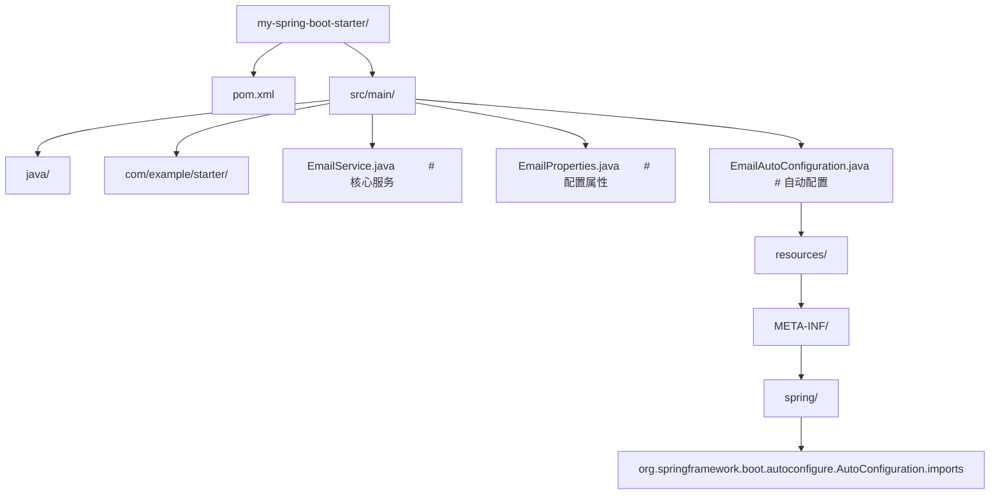
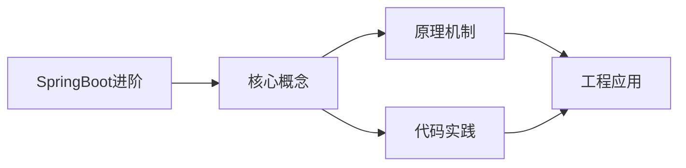
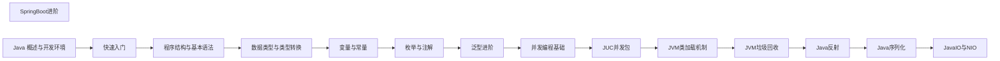

## 1. 学习目标（Bloom 分类）

本节按照布鲁姆教育目标分类学组织学习路径。本文主题为《SpringBoot进阶》，属于 Java 模块，读者可以根据自身阶段选择阅读深度。

记忆层面：能够准确复述本文的核心概念、术语与基本语法或操作步骤，并能够在提问或检索时快速定位对应知识点。能够说出 Java 的编译执行模型（javac 到字节码，JVM 解释与 JIT）。

理解层面：能够用自己的语言解释核心原理与工作机制，说明概念之间的因果关系，而不是机械记忆结论。能够解释面向对象三大特性与 JVM 内存区域的职责。

应用层面：能够在真实项目或练习场景中运用本文知识解决具体问题，写出正确且可维护的实现。能够编写类、接口、集合操作与异常处理的完整程序。

分析层面：能够拆解复杂问题，比较本文主题与相邻概念的异同，识别边界条件与例外情况。能够分析 Java 与 C++、Go 在内存管理与并发模型上的差异。

评价层面：能够根据约束条件（性能、可读性、安全、成本）评价不同方案的优劣，做出有依据的技术决策。能够评价不同集合、并发工具与框架的适用场景。

创造层面：能够把本文知识与其他模块知识组合，设计出新的解决方案或可复用的工程模式。能够组合 Spring 生态设计企业级应用。

通过本节学习，读者应当能够把《SpringBoot进阶》纳入自己的知识网络，并与 Java 模块的其他主题（JVM、集合框架、并发、Spring 生态）建立关联。

## 2. 历史动机与发展脉络

《SpringBoot进阶》是 Java 领域的重要主题。要真正理解它，需要先了解它解决的问题与演进过程。

Java 由 James Gosling 领导的 Sun 团队于 1995 年发布，口号“一次编写，到处运行”依托 JVM 字节码实现跨平台。2006 年 Sun 将 Java 开源（OpenJDK），2010 年 Oracle 收购 Sun 后 Java 进入新的治理阶段。
Java 的版本节奏在 2017 年后改为每半年一个特性版本、每两年一个 LTS（长期支持）版本。当前主流 LTS 包括 Java 11、17、21 与 25；Java 21 引入虚拟线程（Project Loom 成果），显著降低高并发服务的线程成本。
Java 生态以 Spring 家族为核心：Spring Boot 简化配置与部署，Spring Cloud 提供微服务组件；构建工具从 Maven 演进到 Gradle；JVM 语言（Kotlin、Scala、Groovy）与 Java 共存互操作。
Android 开发早期使用 Java，2019 年后官方转向 Kotlin-first，但 Java 仍是服务端领域（尤其是金融、电商等企业系统）的中坚力量。

回到本文主题：SpringBoot进阶 的提出与成熟，正是上述技术背景下的必然产物。早期实现往往以简单可用为目标，随着工程规模扩大，社区逐渐沉淀出标准做法与最佳实践；理解这一脉络，可以帮助读者判断“为什么文档中的推荐写法是现在这个样子”，也能在遇到历史遗留代码时准确识别其设计年代与取舍。

理解 Java 版本与 LTS 机制，是工程选型的起点：生产环境优先 LTS，新特性（如虚拟线程）可以在受控场景评估后引入。

## 3. 形式化定义与核心概念精讲

本节把《SpringBoot进阶》涉及的核心概念以“定义 + 讲解”的形式展开。读者应把定义当作工具，把讲解当作理解路径；两者结合才能形成可迁移的知识。

JVM 与字节码：`javac` 把 .java 编译为 .class 字节码，JVM 加载、校验并执行；热点代码由 JIT（如 C2）编译为机器码，解释与编译结合实现启动速度与峰值性能的平衡。
面向对象：封装（访问控制）、继承（extends/implements）与多态（重载/重写）是 Java 的类型系统支柱；接口默认方法（Java 8）与密封类（Java 17）持续演进表达能力。
异常体系：受检异常（checked）编译期强制处理，非受检异常（RuntimeException）运行时抛出；try-with-resources 自动关闭资源。
泛型与擦除：Java 泛型在编译期检查后擦除类型参数，运行时无泛型信息；这解释了 `List<String>` 与 `List<Integer>` 的 Class 相同，以及通配符 `? extends` 的逆变协变规则。

### 3.1 原文章节逐一精讲

原文档把主题拆分为 16 个小节，下面按顺序给出每一节的导读讲解，随后保留原文细节供精读。

#### 原文精读（完整保留）

# Java SpringBoot 进阶配置

> **符号约定**：`< >` 必填参数 | `[ ]` 可选参数

---

#### 概述

Spring Boot 进阶内容涵盖自动配置原理、自定义 Starter、条件化装配、事件机制等核心特性。理解这些内容后，你不再只是"用"Spring Boot，而是能"驾驭"它：遇到问题时知道从哪里排查，需要扩展时知道怎么自定义。

Spring Boot 的核心价值是"约定优于配置"。它通过自动配置帮你做了大量默认设置，让你专注于业务代码。但当你需要覆盖默认行为或创建自己的组件时，就需要理解自动配置的工作原理。

#### 基础概念

##### 自动配置

自动配置是 Spring Boot 的核心机制。当你在 pom.xml 中添加一个依赖（如 spring-boot-starter-web），Spring Boot 会自动配置嵌入式的 Tomcat、DispatcherServlet、消息转换器等。这一切通过 @Conditional 系列注解实现：只有满足特定条件时，配置才会生效。

##### Starter

Starter 是一组依赖的集合，它把某个功能需要的所有 jar 包打包在一起，你只需要添加一个 Starter 依赖就能使用对应功能。例如 spring-boot-starter-web 包含了 Spring MVC、Tomcat、Jackson 等依赖。

##### 条件化装配

Spring Boot 使用 @Conditional 系列注解来决定是否创建某个 Bean。常见的条件注解包括：@ConditionalOnClass（类路径上存在某个类时生效）、@ConditionalOnMissingBean（容器中不存在某个 Bean 时生效）、@ConditionalOnProperty（配置文件中某个属性满足条件时生效）。

#### 快速上手

##### 理解自动配置的生效条件

查看当前应用生效了哪些自动配置：

```bash
# 启动时开启自动配置报告
java -jar myapp.jar --debug

# 或在 application.yml 中配置
debug: true
```

启动后控制台会输出一份报告，分为两部分：Positive matches（生效的自动配置）和 Negative matches（未生效的自动配置及原因）。

##### 排除不需要的自动配置

如果某个自动配置不需要，可以排除它：

```java
// 方式一：在启动类上排除
@SpringBootApplication(exclude = {DataSourceAutoConfiguration.class})
public class Application {
    public static void main(String[] args) {
        SpringApplication.run(Application.class, args);
    }
}

// 方式二：在配置文件中排除
// spring.autoconfigure.exclude=org.springframework.boot.autoconfigure.jdbc.DataSourceAutoConfiguration
```

#### 详细用法

##### 1. 自定义自动配置

创建自己的自动配置类，让其他项目引入你的 jar 后自动装配：

```java
import org.springframework.boot.autoconfigure.AutoConfiguration;
import org.springframework.boot.autoconfigure.condition.ConditionalOnClass;
import org.springframework.boot.autoconfigure.condition.ConditionalOnMissingBean;
import org.springframework.boot.autoconfigure.condition.ConditionalOnProperty;
import org.springframework.context.annotation.Bean;

@AutoConfiguration  // Spring Boot 3.x 的新注解
@ConditionalOnClass(EmailService.class)  // 类路径上存在 EmailService 时才生效
public class EmailAutoConfiguration {

    @Bean
    @ConditionalOnMissingBean  // 容器中没有 EmailService 时才创建
    @ConditionalOnProperty(prefix = "email", name = "enabled", havingValue = "true", matchIfMissing = true)
    public EmailService emailService(EmailProperties properties) {
        return new EmailService(properties.getHost(), properties.getPort());
    }
}
```

配置属性类：

```java
import org.springframework.boot.context.properties.ConfigurationProperties;

@ConfigurationProperties(prefix = "email")
public class EmailProperties {
    private String host = "localhost";  // 默认值
    private int port = 25;
    private boolean enabled = true;

    // getter 和 setter...
    public String getHost() { return host; }
    public void setHost(String host) { this.host = host; }
    public int getPort() { return port; }
    public void setPort(int port) { this.port = port; }
    public boolean isEnabled() { return enabled; }
    public void setEnabled(boolean enabled) { this.enabled = enabled; }
}
```

##### 2. 创建自定义 Starter

一个标准的 Starter 项目结构如下：



注册自动配置（Spring Boot 3.x 方式）：

```
# 文件: META-INF/spring/org.springframework.boot.autoconfigure.AutoConfiguration.imports
com.example.starter.EmailAutoConfiguration
```

使用自定义 Starter 时，只需要添加依赖并在配置文件中设置属性：

```yaml
# 使用方的 application.yml
email:
  host: smtp.example.com
  port: 587
  enabled: true
```

##### 3. 条件注解详解

Spring Boot 提供了丰富的条件注解：

```java
import org.springframework.boot.autoconfigure.condition.*;

// 当类路径上存在 DataSource 类时生效
@ConditionalOnClass(DataSource.class)

// 当类路径上不存在 RedisTemplate 类时生效
@ConditionalOnMissingClass("org.springframework.data.redis.core.RedisTemplate")

// 当容器中不存在 DataSource Bean 时生效（让你可以覆盖默认配置）
@ConditionalOnMissingBean(DataSource.class)

// 当容器中已经存在 DataSource Bean 时生效
@ConditionalOnBean(DataSource.class)

// 当配置属性 my.feature.enabled=true 时生效
@ConditionalOnProperty(prefix = "my.feature", name = "enabled", havingValue = "true")

// matchIfMissing = true 表示属性不存在时也生效（默认启用）
@ConditionalOnProperty(prefix = "my.feature", name = "enabled", havingValue = "true", matchIfMissing = true)

// 当当前是 Web 应用时生效
@ConditionalOnWebApplication

// 当当前不是 Web 应用时生效
@ConditionalOnNotWebApplication
```

##### 4. Spring Boot 事件机制

Spring Boot 在启动过程中会发布一系列事件，你可以监听这些事件来执行自定义逻辑：

```java
import org.springframework.boot.context.event.ApplicationReadyEvent;
import org.springframework.context.event.EventListener;
import org.springframework.stereotype.Component;

@Component
public class AppStartupListener {

    // 应用启动完成后的回调（所有 Bean 初始化完毕）
    @EventListener(ApplicationReadyEvent.class)
    public void onReady() {
        System.out.println("应用已启动完毕，可以开始接收请求");
        // 初始化缓存、预热数据等...
    }
}
```

Spring Boot 启动事件的顺序：

1. ApplicationStartingEvent：应用刚启动
2. ApplicationEnvironmentPreparedEvent：环境变量准备好
3. ApplicationContextInitializedEvent：上下文初始化
4. ApplicationPreparedEvent：Bean 定义加载完毕
5. ApplicationReadyEvent：应用启动完成，可以接收请求
6. ApplicationFailedEvent：启动失败

##### 5. 自定义 ApplicationRunner

如果需要在应用启动后执行初始化逻辑，实现 ApplicationRunner 接口：

```java
import org.springframework.boot.ApplicationArguments;
import org.springframework.boot.ApplicationRunner;
import org.springframework.stereotype.Component;

@Component
public class DataInitializer implements ApplicationRunner {

    private final UserRepository userRepository;

    public DataInitializer(UserRepository userRepository) {
        this.userRepository = userRepository;
    }

    @Override
    public void run(ApplicationArguments args) throws Exception {
        // 应用启动后自动执行
        if (userRepository.count() == 0) {
            // 初始化默认数据
            User admin = new User();
            admin.setUsername("admin");
            admin.setPassword("encoded_password");
            admin.setRole("ADMIN");
            userRepository.save(admin);
            System.out.println("已创建默认管理员账号");
        }
    }
}
```

##### 6. Profile 环境隔离

Profile 用于区分不同环境的配置：

```yaml
# application.yml（公共配置）
spring:
  profiles:
    active: dev # 激活 dev 环境

---
# application-dev.yml（开发环境）
server:
  port: 8080
spring:
  datasource:
    url: jdbc:mysql://localhost:3306/dev_db

---
# application-prod.yml（生产环境）
server:
  port: 80
spring:
  datasource:
    url: jdbc:mysql://prod-server:3306/prod_db
```

也可以用 Java 配置区分环境：

```java
import org.springframework.context.annotation.Bean;
import org.springframework.context.annotation.Configuration;
import org.springframework.context.annotation.Profile;

@Configuration
public class DataSourceConfig {

    @Bean
    @Profile("dev")  // 只在 dev 环境下创建
    public DataSource devDataSource() {
        // 开发环境用 H2 内存数据库
        return new EmbeddedDatabaseBuilder().setType(H2).build();
    }

    @Bean
    @Profile("prod")  // 只在生产环境下创建
    public DataSource prodDataSource() {
        // 生产环境用 MySQL
        HikariDataSource ds = new HikariDataSource();
        ds.setJdbcUrl("jdbc:mysql://prod-server:3306/prod_db");
        return ds;
    }
}
```

##### 7. 配置属性绑定

将配置文件的属性绑定到 Java 对象：

```java
import org.springframework.boot.context.properties.ConfigurationProperties;
import org.springframework.stereotype.Component;

@Component
@ConfigurationProperties(prefix = "app")
public class AppProperties {

    private String name;
    private String version;
    private Server server = new Server();

    // getter 和 setter...
    public String getName() { return name; }
    public void setName(String name) { this.name = name; }
    public String getVersion() { return version; }
    public void setVersion(String version) { this.version = version; }
    public Server getServer() { return server; }
    public void setServer(Server server) { this.server = server; }

    // 嵌套属性
    public static class Server {
        private String host = "localhost";
        private int port = 8080;

        public String getHost() { return host; }
        public void setHost(String host) { this.host = host; }
        public int getPort() { return port; }
        public void setPort(int port) { this.port = port; }
    }
}
```

```yaml
# application.yml
app:
  name: My Application
  version: 1.0.0
  server:
    host: 0.0.0.0
    port: 9090
```

#### 常见场景

##### 场景一：多数据源配置

当应用需要连接多个数据库时：

```java
import org.springframework.boot.context.properties.ConfigurationProperties;
import org.springframework.boot.jdbc.DataSourceBuilder;
import org.springframework.context.annotation.Bean;
import org.springframework.context.annotation.Configuration;
import org.springframework.context.annotation.Primary;
import javax.sql.DataSource;

@Configuration
public class MultiDataSourceConfig {

    // 主数据源
    @Bean
    @Primary  // 标记为默认数据源
    @ConfigurationProperties(prefix = "spring.datasource.primary")
    public DataSource primaryDataSource() {
        return DataSourceBuilder.create().build();
    }

    // 从数据源
    @Bean
    @ConfigurationProperties(prefix = "spring.datasource.secondary")
    public DataSource secondaryDataSource() {
        return DataSourceBuilder.create().build();
    }
}
```

##### 场景二：优雅停机

Spring Boot 支持优雅停机，在关闭时等待正在处理的请求完成：

```yaml
server:
  shutdown: graceful # 启用优雅停机

spring:
  lifecycle:
    timeout-per-shutdown-phase: 30s # 最多等待30秒
```

#### 注意事项与常见错误

##### 自动配置的优先级

自动配置类的执行顺序很重要。可以使用 @AutoConfigureBefore 和 @AutoConfigureAfter 控制顺序：

```java
@AutoConfiguration
@AutoConfigureBefore(DataSourceAutoConfiguration.class)  // 在数据源配置之前执行
public class MyAutoConfiguration {
    // ...
}
```

##### 不要滥用 @ConditionalOnMissingBean

@ConditionalOnMissingBean 允许用户覆盖默认 Bean，但也可能导致意外行为。如果你的 Bean 必须存在，不要加这个注解。

##### 配置属性的校验

配置属性可以使用 JSR-303 注解进行校验：

```java
import jakarta.validation.constraints.NotEmpty;
import jakarta.validation.constraints.Min;

@ConfigurationProperties(prefix = "email")
@Validated  // 启用校验
public class EmailProperties {
    @NotEmpty(message = "邮件服务器地址不能为空")
    private String host;

    @Min(value = 1, message = "端口号不能小于1")
    private int port = 25;
}
```

##### Starter 命名规范

官方 Starter 的命名格式是 spring-boot-starter-_（如 spring-boot-starter-web）。第三方 Starter 应该命名为 _-spring-boot-starter（如 mylib-spring-boot-starter），避免与官方命名冲突。

#### 进阶用法

##### 自定义 Health Indicator

Spring Boot Actuator 提供了健康检查端点，你可以添加自定义的健康检查：

```java
import org.springframework.boot.actuate.health.Health;
import org.springframework.boot.actuate.health.HealthIndicator;
import org.springframework.stereotype.Component;

@Component
public class CustomHealthIndicator implements HealthIndicator {

    @Override
    public Health health() {
        // 检查外部服务是否可用
        try {
            // 模拟检查外部 API
            boolean isUp = checkExternalService();
            if (isUp) {
                return Health.up()
                    .withDetail("externalService", "可用")
                    .build();
            } else {
                return Health.down()
                    .withDetail("externalService", "不可用")
                    .build();
            }
        } catch (Exception e) {
            return Health.down(e).build();
        }
    }

    private boolean checkExternalService() {
        // 实际检查逻辑
        return true;
    }
}
```

##### ApplicationContextInitializer

在 Spring 上下文刷新之前执行初始化逻辑：

```java
import org.springframework.context.ApplicationContextInitializer;
import org.springframework.context.ConfigurableApplicationContext;

public class MyInitializer implements ApplicationContextInitializer<ConfigurableApplicationContext> {
    @Override
    public void initialize(ConfigurableApplicationContext context) {
        // 在 Bean 创建之前设置环境变量或属性
        context.getEnvironment().getSystemProperties().put("my.property", "value");
    }
}
```

##### SpringBootAdmin 监控

Spring Boot Admin 是一个社区项目，提供了 Web 界面来监控 Spring Boot 应用。集成后可以看到应用的健康状态、JVM 信息、请求追踪等。适合在开发和测试环境中使用，生产环境需要配置安全认证。
#### application.yml 基础配置

**基本写法：服务端口与上下文配置**
`server.port: <端口>`
```java
// application.yml
server:
  port: 8081
  servlet:
    context-path: /api
```

---

**基本写法：应用名称配置**
`spring.application.name: <名称>`
```java
// 应用名称（SpringBoot 2.7+ 推荐写法）
spring:
  application:
    name: my-app
```

---

**基本写法：多环境配置**
`spring.profiles.active: <profile>`
```java
// 激活 dev 环境
spring:
  profiles:
    active: dev
```

---

**基本写法：自定义配置项**
`<前缀>.<字段>: <值>`
```java
// application.yml 自定义属性
app:
  cache:
    ttl: 3600
    maxSize: 1000
```

---

#### 读取配置

**基本写法：使用 @Value 注入**
`@Value("${<属性名>}")`
```java
// 注入单个配置项
@Value("${app.cache.ttl}")
private long cacheTtl;
```

---

**基本写法：使用 @ConfigurationProperties 绑定**
`@ConfigurationProperties(prefix = "<前缀>")`
```java
// 批量绑定配置到对象
@Component
@ConfigurationProperties(prefix = "app.cache")
public class CacheProperties {
    private long ttl;
    private int maxSize;
}
```

---

**基本写法：注入 Environment**
`@Autowired Environment <env>`
```java
// 通过 Environment 动态读取配置
@Autowired
private Environment env;
String ttl = env.getProperty("app.cache.ttl");
```

---

#### 核心注解

**基本写法：启动类注解**
`@SpringBootApplication`
```java
// 标记 SpringBoot 启动类
@SpringBootApplication
public class App {
    public static void main(String[] args) {
        SpringApplication.run(App.class, args);
    }
}
```

---

**基本写法：自定义 Component 扫描**
`@ComponentScan(basePackages = {"<包1>", "<包2>"})`
```java
// 指定扫描的包路径
@SpringBootApplication
@ComponentScan(basePackages = {"com.example.service", "com.example.dao"})
public class App { }
```

---

**基本写法：排除自动配置**
`@SpringBootApplication(exclude = {<配置类>.class})`
```java
// 排除数据源自动配置
@SpringBootApplication(exclude = {DataSourceAutoConfiguration.class})
public class App { }
```

---

**基本写法：定义 Bean**
`@Bean`
```java
// 在配置类中声明 Bean
@Configuration
public class AppConfig {
    @Bean
    public RestTemplate restTemplate() {
        return new RestTemplate();
    }
}
```

---

**基本写法：条件化 Bean**
`@ConditionalOnProperty(name = "<属性>", havingValue = "<值>")`
```java
// 仅在配置项匹配时生效
@Bean
@ConditionalOnProperty(name = "app.cache.enabled", havingValue = "true")
public CacheManager cacheManager() {
    return new ConcurrentMapCacheManager();
}
```

---

**基本写法：缺失时创建**
`@ConditionalOnMissingBean(<类型>.class)`
```java
// 容器中无该类型 Bean 时才创建
@Bean
@ConditionalOnMissingBean(RestTemplate.class)
public RestTemplate defaultRestTemplate() {
    return new RestTemplate();
}
```

---

#### 自动配置机制

**基本写法：自定义 AutoConfiguration**
`@AutoConfiguration`
```java
// SpringBoot 2.7+ 自动配置类写法
@AutoConfiguration
@ConditionalOnClass(RestTemplate.class)
public class MyAutoConfiguration {
    @Bean
    @ConditionalOnMissingBean
    public RestTemplate restTemplate() {
        return new RestTemplate();
    }
}
```

---

**基本写法：注册自动配置**
`META-INF/spring/org.springframework.boot.autoconfigure.AutoConfiguration.imports`
```java
// 文件内每行写一个全限定类名
com.example.MyAutoConfiguration
com.example.OtherAutoConfiguration
```

---

#### Profile 环境

**基本写法：声明 Profile Bean**
`@Profile("<名称>")`
```java
// 仅在 dev 环境生效
@Bean
@Profile("dev")
public DataSource devDataSource() {
    return new HikariDataSource();
}
```

---

**基本写法：Profile 配置文件**
`application-<profile>.yml`
```java
// 文件名约定：application-dev.yml、application-prod.yml
// 激活 dev 后会合并 application.yml 与 application-dev.yml
```

---

#### 条件装配

**基本写法：类路径存在时生效**
`@ConditionalOnClass(<类>.class)`
```java
// 类路径存在该类时配置才生效
@Configuration
@ConditionalOnClass(RestTemplate.class)
public class WebConfig { }
```

---

**基本写法：Bean 存在时生效**
`@ConditionalOnBean(<类型>.class)`
```java
// 容器中存在 DataSource 时生效
@Bean
@ConditionalOnBean(DataSource.class)
public JdbcTemplate jdbcTemplate(DataSource ds) {
    return new JdbcTemplate(ds);
}
```

---

#### 常用 Starter 依赖

**基本写法：Web Starter**
`spring-boot-starter-web`
```java
// pom.xml 引入后自动配置 Tomcat + Spring MVC
<dependency>
    <groupId>org.springframework.boot</groupId>
    <artifactId>spring-boot-starter-web</artifactId>
</dependency>
```

---

**基本写法：数据访问 Starter**
`spring-boot-starter-data-jpa`
```java
// 引入后自动配置 Hibernate + JPA
<dependency>
    <groupId>org.springframework.boot</groupId>
    <artifactId>spring-boot-starter-data-jpa</artifactId>
</dependency>
```

---

#### 启动与运行

**基本写法：以编程方式启动**
`SpringApplication.run(<配置类>.class, <args>)`
```java
// 通过 API 启动并定制
new SpringApplicationBuilder(App.class)
    .bannerMode(Banner.Mode.OFF)
    .logStartupInfo(false)
    .run(args);
```

---

**基本写法：命令行传参**
`--<属性名>=<值>`
```java
// 启动时覆盖配置
java -jar app.jar --server.port=9090 --spring.profiles.active=prod
```

---

**基本写法：CommandLineRunner 初始化**
`@Bean CommandLineRunner <方法>`
```java
// 启动完成后执行
@Bean
public CommandLineRunner init(DataService service) {
    return args -> service.loadData();
}
```

---

#### 外部化配置加载顺序

**基本写法：命令行参数优先级最高**
`java -jar <jar> --<属性>=<值>`
```java
// 优先级（从高到低）：
// 命令行参数 > 环境变量 > application-{profile}.yml > application.yml
java -jar app.jar --server.port=9090
```


### 3.2 概念关系图

下面用 Mermaid 图表达本文核心概念之间的关系，帮助读者建立整体图景：



图中展示的是本文知识的结构化关系：核心概念是入口，原理机制解释“为什么”，代码实践演示“怎么做”，工程应用回答“何时用”。读者学习时可以把每个小节的内容挂接到对应节点上。

## 4. 理论推导与原理解析

本节深入《SpringBoot进阶》背后的原理。理论部分不求面面俱到，而是聚焦“能解释现象、能指导实践”的关键推导。

JVM 内存模型：堆（新生代/老年代）、元空间、虚拟机栈、本地方法栈与程序计数器；GC 从 CMS 演进到 G1（默认）、ZGC（超低延迟），理解分代收集是调优前提。
并发工具：synchronized 与 JUC（java.util.concurrent）的锁、并发容器、线程池、CompletableFuture 构成并发工具箱；Java 21 的虚拟线程让“每任务一线程”成为可能。
类加载机制：双亲委派模型保证类唯一性，SPI（ServiceLoader）打破委派实现扩展；自定义类加载器是热部署与隔离的基础。
反射与注解：反射在运行时检查类结构，注解提供元数据；Spring 的依赖注入与 AOP 均基于这些机制，但反射有性能与安全成本。

需要强调的是，理论推导与工程实践之间存在翻译层：理论给出的是理想化模型与边界条件，工程代码则必须处理真实环境中的例外。读者在学习时应先掌握理论的“标准情形”，再通过陷阱章节了解“非标准情形”。

## 5. 代码示例与逐行讲解

本节把原文中的代码示例系统整理，并为每个示例补充用途说明与讲解。读者不应只浏览代码，而应逐段对照讲解理解设计意图。

### 5.1 示例：理解自动配置的生效条件

该示例来自原文《理解自动配置的生效条件》小节，用于演示SpringBoot进阶相关操作。阅读时请先看代码结构，再看其后的讲解。

```bash
# 启动时开启自动配置报告
java -jar myapp.jar --debug

# 或在 application.yml 中配置
debug: true
```

讲解：这段代码演示了本节核心知识点。代码中的关键操作可以归纳为三步：准备（定义或初始化）、执行（核心逻辑）、收尾（释放资源或返回结果）。实际项目中，这三步往往被封装为函数或类，以提升复用性与可测试性。

关键点分析：

该示例共 4 行有效代码，结构以数据或配置为主。阅读时应关注：数据字段的含义、配置项的作用，以及它们与运行行为的对应关系。

进阶思考路径：先尝试修改参数观察行为变化，再把示例中的模式迁移到自己的项目中；每次修改都记录预期与实测差异，这是把示例转化为能力的最快方式。

### 5.2 示例：排除不需要的自动配置

该示例来自原文《排除不需要的自动配置》小节，用于演示SpringBoot进阶相关操作。阅读时请先看代码结构，再看其后的讲解。

```java
// 方式一：在启动类上排除
@SpringBootApplication(exclude = {DataSourceAutoConfiguration.class})
public class Application {
    public static void main(String[] args) {
        SpringApplication.run(Application.class, args);
    }
}

// 方式二：在配置文件中排除
// spring.autoconfigure.exclude=org.springframework.boot.autoconfigure.jdbc.DataSourceAutoConfiguration
```

讲解：这段代码演示了本节核心知识点。代码中的关键操作可以归纳为三步：准备（定义或初始化）、执行（核心逻辑）、收尾（释放资源或返回结果）。实际项目中，这三步往往被封装为函数或类，以提升复用性与可测试性。

关键点分析：

该示例共 9 行有效代码，包含 1 类关键结构（class）。其中：

- 入口与初始化部分负责建立上下文，对应实际项目中的启动或装配逻辑；
- 核心逻辑部分体现本文主题的主要操作，是阅读时最需要对照讲解理解的部分；
- 输出或返回部分把结果交给调用方，注意其类型与边界条件。

进阶思考路径：先尝试修改参数观察行为变化，再把示例中的模式迁移到自己的项目中；每次修改都记录预期与实测差异，这是把示例转化为能力的最快方式。

### 5.3 示例：1. 自定义自动配置

该示例来自原文《1. 自定义自动配置》小节，用于演示SpringBoot进阶相关操作。阅读时请先看代码结构，再看其后的讲解。

```java
import org.springframework.boot.autoconfigure.AutoConfiguration;
import org.springframework.boot.autoconfigure.condition.ConditionalOnClass;
import org.springframework.boot.autoconfigure.condition.ConditionalOnMissingBean;
import org.springframework.boot.autoconfigure.condition.ConditionalOnProperty;
import org.springframework.context.annotation.Bean;

@AutoConfiguration  // Spring Boot 3.x 的新注解
@ConditionalOnClass(EmailService.class)  // 类路径上存在 EmailService 时才生效
public class EmailAutoConfiguration {

    @Bean
    @ConditionalOnMissingBean  // 容器中没有 EmailService 时才创建
    @ConditionalOnProperty(prefix = "email", name = "enabled", havingValue = "true", matchIfMissing = true)
    public EmailService emailService(EmailProperties properties) {
        return new EmailService(properties.getHost(), properties.getPort());
    }
}
```

讲解：这段代码演示了本节核心知识点。代码中的关键操作可以归纳为三步：准备（定义或初始化）、执行（核心逻辑）、收尾（释放资源或返回结果）。实际项目中，这三步往往被封装为函数或类，以提升复用性与可测试性。

关键点分析：

该示例共 15 行有效代码，包含 3 类关键结构（class、import、return）。其中：

- 入口与初始化部分负责建立上下文，对应实际项目中的启动或装配逻辑；
- 核心逻辑部分体现本文主题的主要操作，是阅读时最需要对照讲解理解的部分；
- 输出或返回部分把结果交给调用方，注意其类型与边界条件。

进阶思考路径：先尝试修改参数观察行为变化，再把示例中的模式迁移到自己的项目中；每次修改都记录预期与实测差异，这是把示例转化为能力的最快方式。

### 5.4 示例：1. 自定义自动配置

该示例来自原文《1. 自定义自动配置》小节，用于演示SpringBoot进阶相关操作。阅读时请先看代码结构，再看其后的讲解。

```java
import org.springframework.boot.context.properties.ConfigurationProperties;

@ConfigurationProperties(prefix = "email")
public class EmailProperties {
    private String host = "localhost";  // 默认值
    private int port = 25;
    private boolean enabled = true;

    // getter 和 setter...
    public String getHost() { return host; }
    public void setHost(String host) { this.host = host; }
    public int getPort() { return port; }
    public void setPort(int port) { this.port = port; }
    public boolean isEnabled() { return enabled; }
    public void setEnabled(boolean enabled) { this.enabled = enabled; }
}
```

讲解：这段代码演示了本节核心知识点。代码中的关键操作可以归纳为三步：准备（定义或初始化）、执行（核心逻辑）、收尾（释放资源或返回结果）。实际项目中，这三步往往被封装为函数或类，以提升复用性与可测试性。

关键点分析：

该示例共 14 行有效代码，包含 3 类关键结构（class、import、return）。其中：

- 入口与初始化部分负责建立上下文，对应实际项目中的启动或装配逻辑；
- 核心逻辑部分体现本文主题的主要操作，是阅读时最需要对照讲解理解的部分；
- 输出或返回部分把结果交给调用方，注意其类型与边界条件。

进阶思考路径：先尝试修改参数观察行为变化，再把示例中的模式迁移到自己的项目中；每次修改都记录预期与实测差异，这是把示例转化为能力的最快方式。

### 5.5 示例：2. 创建自定义 Starter

该示例来自原文《2. 创建自定义 Starter》小节，用于演示SpringBoot进阶相关操作。阅读时请先看代码结构，再看其后的讲解。


讲解：这段代码演示了本节核心知识点。代码中的关键操作可以归纳为三步：准备（定义或初始化）、执行（核心逻辑）、收尾（释放资源或返回结果）。实际项目中，这三步往往被封装为函数或类，以提升复用性与可测试性。

关键点分析：

该示例共 24 行有效代码，包含 1 类关键结构（import）。其中：

- 入口与初始化部分负责建立上下文，对应实际项目中的启动或装配逻辑；
- 核心逻辑部分体现本文主题的主要操作，是阅读时最需要对照讲解理解的部分；
- 输出或返回部分把结果交给调用方，注意其类型与边界条件。

进阶思考路径：先尝试修改参数观察行为变化，再把示例中的模式迁移到自己的项目中；每次修改都记录预期与实测差异，这是把示例转化为能力的最快方式。

### 5.6 示例：2. 创建自定义 Starter

该示例来自原文《2. 创建自定义 Starter》小节，用于演示SpringBoot进阶相关操作。阅读时请先看代码结构，再看其后的讲解。

```text
# 文件: META-INF/spring/org.springframework.boot.autoconfigure.AutoConfiguration.imports
com.example.starter.EmailAutoConfiguration
```

讲解：这段代码演示了本节核心知识点。代码中的关键操作可以归纳为三步：准备（定义或初始化）、执行（核心逻辑）、收尾（释放资源或返回结果）。实际项目中，这三步往往被封装为函数或类，以提升复用性与可测试性。

关键点分析：

该示例共 2 行有效代码，包含 1 类关键结构（import）。其中：

- 入口与初始化部分负责建立上下文，对应实际项目中的启动或装配逻辑；
- 核心逻辑部分体现本文主题的主要操作，是阅读时最需要对照讲解理解的部分；
- 输出或返回部分把结果交给调用方，注意其类型与边界条件。

进阶思考路径：先尝试修改参数观察行为变化，再把示例中的模式迁移到自己的项目中；每次修改都记录预期与实测差异，这是把示例转化为能力的最快方式。

### 5.7 示例：2. 创建自定义 Starter

该示例来自原文《2. 创建自定义 Starter》小节，用于演示SpringBoot进阶相关操作。阅读时请先看代码结构，再看其后的讲解。

```yaml
# 使用方的 application.yml
email:
  host: smtp.example.com
  port: 587
  enabled: true
```

讲解：这段代码演示了本节核心知识点。代码中的关键操作可以归纳为三步：准备（定义或初始化）、执行（核心逻辑）、收尾（释放资源或返回结果）。实际项目中，这三步往往被封装为函数或类，以提升复用性与可测试性。

关键点分析：

该示例共 5 行有效代码，结构以数据或配置为主。阅读时应关注：数据字段的含义、配置项的作用，以及它们与运行行为的对应关系。

进阶思考路径：先尝试修改参数观察行为变化，再把示例中的模式迁移到自己的项目中；每次修改都记录预期与实测差异，这是把示例转化为能力的最快方式。

### 5.8 示例：3. 条件注解详解

该示例来自原文《3. 条件注解详解》小节，用于演示SpringBoot进阶相关操作。阅读时请先看代码结构，再看其后的讲解。

```java
import org.springframework.boot.autoconfigure.condition.*;

// 当类路径上存在 DataSource 类时生效
@ConditionalOnClass(DataSource.class)

// 当类路径上不存在 RedisTemplate 类时生效
@ConditionalOnMissingClass("org.springframework.data.redis.core.RedisTemplate")

// 当容器中不存在 DataSource Bean 时生效（让你可以覆盖默认配置）
@ConditionalOnMissingBean(DataSource.class)

// 当容器中已经存在 DataSource Bean 时生效
@ConditionalOnBean(DataSource.class)

// 当配置属性 my.feature.enabled=true 时生效
@ConditionalOnProperty(prefix = "my.feature", name = "enabled", havingValue = "true")

// matchIfMissing = true 表示属性不存在时也生效（默认启用）
@ConditionalOnProperty(prefix = "my.feature", name = "enabled", havingValue = "true", matchIfMissing = true)

// 当当前是 Web 应用时生效
@ConditionalOnWebApplication

// 当当前不是 Web 应用时生效
@ConditionalOnNotWebApplication
```

讲解：这段代码演示了本节核心知识点。代码中的关键操作可以归纳为三步：准备（定义或初始化）、执行（核心逻辑）、收尾（释放资源或返回结果）。实际项目中，这三步往往被封装为函数或类，以提升复用性与可测试性。

关键点分析：

该示例共 17 行有效代码，包含 2 类关键结构（class、import）。其中：

- 入口与初始化部分负责建立上下文，对应实际项目中的启动或装配逻辑；
- 核心逻辑部分体现本文主题的主要操作，是阅读时最需要对照讲解理解的部分；
- 输出或返回部分把结果交给调用方，注意其类型与边界条件。

进阶思考路径：先尝试修改参数观察行为变化，再把示例中的模式迁移到自己的项目中；每次修改都记录预期与实测差异，这是把示例转化为能力的最快方式。

### 5.9 示例：4. Spring Boot 事件机制

该示例来自原文《4. Spring Boot 事件机制》小节，用于演示SpringBoot进阶相关操作。阅读时请先看代码结构，再看其后的讲解。

```java
import org.springframework.boot.context.event.ApplicationReadyEvent;
import org.springframework.context.event.EventListener;
import org.springframework.stereotype.Component;

@Component
public class AppStartupListener {

    // 应用启动完成后的回调（所有 Bean 初始化完毕）
    @EventListener(ApplicationReadyEvent.class)
    public void onReady() {
        System.out.println("应用已启动完毕，可以开始接收请求");
        // 初始化缓存、预热数据等...
    }
}
```

讲解：这段代码演示了本节核心知识点。代码中的关键操作可以归纳为三步：准备（定义或初始化）、执行（核心逻辑）、收尾（释放资源或返回结果）。实际项目中，这三步往往被封装为函数或类，以提升复用性与可测试性。

关键点分析：

该示例共 12 行有效代码，包含 2 类关键结构（class、import）。其中：

- 入口与初始化部分负责建立上下文，对应实际项目中的启动或装配逻辑；
- 核心逻辑部分体现本文主题的主要操作，是阅读时最需要对照讲解理解的部分；
- 输出或返回部分把结果交给调用方，注意其类型与边界条件。

进阶思考路径：先尝试修改参数观察行为变化，再把示例中的模式迁移到自己的项目中；每次修改都记录预期与实测差异，这是把示例转化为能力的最快方式。

### 5.10 示例：5. 自定义 ApplicationRunner

该示例来自原文《5. 自定义 ApplicationRunner》小节，用于演示SpringBoot进阶相关操作。阅读时请先看代码结构，再看其后的讲解。

```java
import org.springframework.boot.ApplicationArguments;
import org.springframework.boot.ApplicationRunner;
import org.springframework.stereotype.Component;

@Component
public class DataInitializer implements ApplicationRunner {

    private final UserRepository userRepository;

    public DataInitializer(UserRepository userRepository) {
        this.userRepository = userRepository;
    }

    @Override
    public void run(ApplicationArguments args) throws Exception {
        // 应用启动后自动执行
        if (userRepository.count() == 0) {
            // 初始化默认数据
            User admin = new User();
            admin.setUsername("admin");
            admin.setPassword("encoded_password");
            admin.setRole("ADMIN");
            userRepository.save(admin);
            System.out.println("已创建默认管理员账号");
        }
    }
}
```

讲解：这段代码演示了本节核心知识点。代码中的关键操作可以归纳为三步：准备（定义或初始化）、执行（核心逻辑）、收尾（释放资源或返回结果）。实际项目中，这三步往往被封装为函数或类，以提升复用性与可测试性。

关键点分析：

该示例共 23 行有效代码，包含 3 类关键结构（class、import、if）。其中：

- 入口与初始化部分负责建立上下文，对应实际项目中的启动或装配逻辑；
- 核心逻辑部分体现本文主题的主要操作，是阅读时最需要对照讲解理解的部分；
- 输出或返回部分把结果交给调用方，注意其类型与边界条件。

进阶思考路径：先尝试修改参数观察行为变化，再把示例中的模式迁移到自己的项目中；每次修改都记录预期与实测差异，这是把示例转化为能力的最快方式。

### 5.11 示例：6. Profile 环境隔离

该示例来自原文《6. Profile 环境隔离》小节，用于演示SpringBoot进阶相关操作。阅读时请先看代码结构，再看其后的讲解。

```yaml
# application.yml（公共配置）
spring:
  profiles:
    active: dev # 激活 dev 环境

---
# application-dev.yml（开发环境）
server:
  port: 8080
spring:
  datasource:
    url: jdbc:mysql://localhost:3306/dev_db

---
# application-prod.yml（生产环境）
server:
  port: 80
spring:
  datasource:
    url: jdbc:mysql://prod-server:3306/prod_db
```

讲解：这段代码演示了本节核心知识点。代码中的关键操作可以归纳为三步：准备（定义或初始化）、执行（核心逻辑）、收尾（释放资源或返回结果）。实际项目中，这三步往往被封装为函数或类，以提升复用性与可测试性。

关键点分析：

该示例共 18 行有效代码，结构以数据或配置为主。阅读时应关注：数据字段的含义、配置项的作用，以及它们与运行行为的对应关系。

进阶思考路径：先尝试修改参数观察行为变化，再把示例中的模式迁移到自己的项目中；每次修改都记录预期与实测差异，这是把示例转化为能力的最快方式。

### 5.12 示例：6. Profile 环境隔离

该示例来自原文《6. Profile 环境隔离》小节，用于演示SpringBoot进阶相关操作。阅读时请先看代码结构，再看其后的讲解。

```java
import org.springframework.context.annotation.Bean;
import org.springframework.context.annotation.Configuration;
import org.springframework.context.annotation.Profile;

@Configuration
public class DataSourceConfig {

    @Bean
    @Profile("dev")  // 只在 dev 环境下创建
    public DataSource devDataSource() {
        // 开发环境用 H2 内存数据库
        return new EmbeddedDatabaseBuilder().setType(H2).build();
    }

    @Bean
    @Profile("prod")  // 只在生产环境下创建
    public DataSource prodDataSource() {
        // 生产环境用 MySQL
        HikariDataSource ds = new HikariDataSource();
        ds.setJdbcUrl("jdbc:mysql://prod-server:3306/prod_db");
        return ds;
    }
}
```

讲解：这段代码演示了本节核心知识点。代码中的关键操作可以归纳为三步：准备（定义或初始化）、执行（核心逻辑）、收尾（释放资源或返回结果）。实际项目中，这三步往往被封装为函数或类，以提升复用性与可测试性。

关键点分析：

该示例共 20 行有效代码，包含 3 类关键结构（class、import、return）。其中：

- 入口与初始化部分负责建立上下文，对应实际项目中的启动或装配逻辑；
- 核心逻辑部分体现本文主题的主要操作，是阅读时最需要对照讲解理解的部分；
- 输出或返回部分把结果交给调用方，注意其类型与边界条件。

进阶思考路径：先尝试修改参数观察行为变化，再把示例中的模式迁移到自己的项目中；每次修改都记录预期与实测差异，这是把示例转化为能力的最快方式。

### 5.13 示例：7. 配置属性绑定

该示例来自原文《7. 配置属性绑定》小节，用于演示SpringBoot进阶相关操作。阅读时请先看代码结构，再看其后的讲解。

```java
import org.springframework.boot.context.properties.ConfigurationProperties;
import org.springframework.stereotype.Component;

@Component
@ConfigurationProperties(prefix = "app")
public class AppProperties {

    private String name;
    private String version;
    private Server server = new Server();

    // getter 和 setter...
    public String getName() { return name; }
    public void setName(String name) { this.name = name; }
    public String getVersion() { return version; }
    public void setVersion(String version) { this.version = version; }
    public Server getServer() { return server; }
    public void setServer(Server server) { this.server = server; }

    // 嵌套属性
    public static class Server {
        private String host = "localhost";
        private int port = 8080;

        public String getHost() { return host; }
        public void setHost(String host) { this.host = host; }
        public int getPort() { return port; }
        public void setPort(int port) { this.port = port; }
    }
}
```

讲解：这段代码演示了本节核心知识点。代码中的关键操作可以归纳为三步：准备（定义或初始化）、执行（核心逻辑）、收尾（释放资源或返回结果）。实际项目中，这三步往往被封装为函数或类，以提升复用性与可测试性。

关键点分析：

该示例共 25 行有效代码，包含 3 类关键结构（class、import、return）。其中：

- 入口与初始化部分负责建立上下文，对应实际项目中的启动或装配逻辑；
- 核心逻辑部分体现本文主题的主要操作，是阅读时最需要对照讲解理解的部分；
- 输出或返回部分把结果交给调用方，注意其类型与边界条件。

进阶思考路径：先尝试修改参数观察行为变化，再把示例中的模式迁移到自己的项目中；每次修改都记录预期与实测差异，这是把示例转化为能力的最快方式。

### 5.14 示例：7. 配置属性绑定

该示例来自原文《7. 配置属性绑定》小节，用于演示SpringBoot进阶相关操作。阅读时请先看代码结构，再看其后的讲解。

```yaml
# application.yml
app:
  name: My Application
  version: 1.0.0
  server:
    host: 0.0.0.0
    port: 9090
```

讲解：这段代码演示了本节核心知识点。代码中的关键操作可以归纳为三步：准备（定义或初始化）、执行（核心逻辑）、收尾（释放资源或返回结果）。实际项目中，这三步往往被封装为函数或类，以提升复用性与可测试性。

关键点分析：

该示例共 7 行有效代码，结构以数据或配置为主。阅读时应关注：数据字段的含义、配置项的作用，以及它们与运行行为的对应关系。

进阶思考路径：先尝试修改参数观察行为变化，再把示例中的模式迁移到自己的项目中；每次修改都记录预期与实测差异，这是把示例转化为能力的最快方式。

### 5.15 示例：场景一：多数据源配置

该示例来自原文《场景一：多数据源配置》小节，用于演示SpringBoot进阶相关操作。阅读时请先看代码结构，再看其后的讲解。

```java
import org.springframework.boot.context.properties.ConfigurationProperties;
import org.springframework.boot.jdbc.DataSourceBuilder;
import org.springframework.context.annotation.Bean;
import org.springframework.context.annotation.Configuration;
import org.springframework.context.annotation.Primary;
import javax.sql.DataSource;

@Configuration
public class MultiDataSourceConfig {

    // 主数据源
    @Bean
    @Primary  // 标记为默认数据源
    @ConfigurationProperties(prefix = "spring.datasource.primary")
    public DataSource primaryDataSource() {
        return DataSourceBuilder.create().build();
    }

    // 从数据源
    @Bean
    @ConfigurationProperties(prefix = "spring.datasource.secondary")
    public DataSource secondaryDataSource() {
        return DataSourceBuilder.create().build();
    }
}
```

讲解：这段代码演示了本节核心知识点。代码中的关键操作可以归纳为三步：准备（定义或初始化）、执行（核心逻辑）、收尾（释放资源或返回结果）。实际项目中，这三步往往被封装为函数或类，以提升复用性与可测试性。

关键点分析：

该示例共 22 行有效代码，包含 3 类关键结构（class、import、return）。其中：

- 入口与初始化部分负责建立上下文，对应实际项目中的启动或装配逻辑；
- 核心逻辑部分体现本文主题的主要操作，是阅读时最需要对照讲解理解的部分；
- 输出或返回部分把结果交给调用方，注意其类型与边界条件。

进阶思考路径：先尝试修改参数观察行为变化，再把示例中的模式迁移到自己的项目中；每次修改都记录预期与实测差异，这是把示例转化为能力的最快方式。

### 5.16 示例：场景二：优雅停机

该示例来自原文《场景二：优雅停机》小节，用于演示SpringBoot进阶相关操作。阅读时请先看代码结构，再看其后的讲解。

```yaml
server:
  shutdown: graceful # 启用优雅停机

spring:
  lifecycle:
    timeout-per-shutdown-phase: 30s # 最多等待30秒
```

讲解：这段代码演示了本节核心知识点。代码中的关键操作可以归纳为三步：准备（定义或初始化）、执行（核心逻辑）、收尾（释放资源或返回结果）。实际项目中，这三步往往被封装为函数或类，以提升复用性与可测试性。

关键点分析：

该示例共 5 行有效代码，结构以数据或配置为主。阅读时应关注：数据字段的含义、配置项的作用，以及它们与运行行为的对应关系。

进阶思考路径：先尝试修改参数观察行为变化，再把示例中的模式迁移到自己的项目中；每次修改都记录预期与实测差异，这是把示例转化为能力的最快方式。

### 5.17 示例：自动配置的优先级

该示例来自原文《自动配置的优先级》小节，用于演示SpringBoot进阶相关操作。阅读时请先看代码结构，再看其后的讲解。

```java
@AutoConfiguration
@AutoConfigureBefore(DataSourceAutoConfiguration.class)  // 在数据源配置之前执行
public class MyAutoConfiguration {
    // ...
}
```

讲解：这段代码演示了本节核心知识点。代码中的关键操作可以归纳为三步：准备（定义或初始化）、执行（核心逻辑）、收尾（释放资源或返回结果）。实际项目中，这三步往往被封装为函数或类，以提升复用性与可测试性。

关键点分析：

该示例共 5 行有效代码，包含 1 类关键结构（class）。其中：

- 入口与初始化部分负责建立上下文，对应实际项目中的启动或装配逻辑；
- 核心逻辑部分体现本文主题的主要操作，是阅读时最需要对照讲解理解的部分；
- 输出或返回部分把结果交给调用方，注意其类型与边界条件。

进阶思考路径：先尝试修改参数观察行为变化，再把示例中的模式迁移到自己的项目中；每次修改都记录预期与实测差异，这是把示例转化为能力的最快方式。

### 5.18 示例：配置属性的校验

该示例来自原文《配置属性的校验》小节，用于演示SpringBoot进阶相关操作。阅读时请先看代码结构，再看其后的讲解。

```java
import jakarta.validation.constraints.NotEmpty;
import jakarta.validation.constraints.Min;

@ConfigurationProperties(prefix = "email")
@Validated  // 启用校验
public class EmailProperties {
    @NotEmpty(message = "邮件服务器地址不能为空")
    private String host;

    @Min(value = 1, message = "端口号不能小于1")
    private int port = 25;
}
```

讲解：这段代码演示了本节核心知识点。代码中的关键操作可以归纳为三步：准备（定义或初始化）、执行（核心逻辑）、收尾（释放资源或返回结果）。实际项目中，这三步往往被封装为函数或类，以提升复用性与可测试性。

关键点分析：

该示例共 10 行有效代码，包含 2 类关键结构（class、import）。其中：

- 入口与初始化部分负责建立上下文，对应实际项目中的启动或装配逻辑；
- 核心逻辑部分体现本文主题的主要操作，是阅读时最需要对照讲解理解的部分；
- 输出或返回部分把结果交给调用方，注意其类型与边界条件。

进阶思考路径：先尝试修改参数观察行为变化，再把示例中的模式迁移到自己的项目中；每次修改都记录预期与实测差异，这是把示例转化为能力的最快方式。

### 5.19 示例：自定义 Health Indicator

该示例来自原文《自定义 Health Indicator》小节，用于演示SpringBoot进阶相关操作。阅读时请先看代码结构，再看其后的讲解。

```java
import org.springframework.boot.actuate.health.Health;
import org.springframework.boot.actuate.health.HealthIndicator;
import org.springframework.stereotype.Component;

@Component
public class CustomHealthIndicator implements HealthIndicator {

    @Override
    public Health health() {
        // 检查外部服务是否可用
        try {
            // 模拟检查外部 API
            boolean isUp = checkExternalService();
            if (isUp) {
                return Health.up()
                    .withDetail("externalService", "可用")
                    .build();
            } else {
                return Health.down()
                    .withDetail("externalService", "不可用")
                    .build();
            }
        } catch (Exception e) {
            return Health.down(e).build();
        }
    }

    private boolean checkExternalService() {
        // 实际检查逻辑
        return true;
    }
}
```

讲解：这段代码演示了本节核心知识点。代码中的关键操作可以归纳为三步：准备（定义或初始化）、执行（核心逻辑）、收尾（释放资源或返回结果）。实际项目中，这三步往往被封装为函数或类，以提升复用性与可测试性。

关键点分析：

该示例共 29 行有效代码，包含 4 类关键结构（class、import、if、return）。其中：

- 入口与初始化部分负责建立上下文，对应实际项目中的启动或装配逻辑；
- 核心逻辑部分体现本文主题的主要操作，是阅读时最需要对照讲解理解的部分；
- 输出或返回部分把结果交给调用方，注意其类型与边界条件。

进阶思考路径：先尝试修改参数观察行为变化，再把示例中的模式迁移到自己的项目中；每次修改都记录预期与实测差异，这是把示例转化为能力的最快方式。

### 5.20 示例：ApplicationContextInitializer

该示例来自原文《ApplicationContextInitializer》小节，用于演示SpringBoot进阶相关操作。阅读时请先看代码结构，再看其后的讲解。

```java
import org.springframework.context.ApplicationContextInitializer;
import org.springframework.context.ConfigurableApplicationContext;

public class MyInitializer implements ApplicationContextInitializer<ConfigurableApplicationContext> {
    @Override
    public void initialize(ConfigurableApplicationContext context) {
        // 在 Bean 创建之前设置环境变量或属性
        context.getEnvironment().getSystemProperties().put("my.property", "value");
    }
}
```

讲解：这段代码演示了本节核心知识点。代码中的关键操作可以归纳为三步：准备（定义或初始化）、执行（核心逻辑）、收尾（释放资源或返回结果）。实际项目中，这三步往往被封装为函数或类，以提升复用性与可测试性。

关键点分析：

该示例共 9 行有效代码，包含 2 类关键结构（class、import）。其中：

- 入口与初始化部分负责建立上下文，对应实际项目中的启动或装配逻辑；
- 核心逻辑部分体现本文主题的主要操作，是阅读时最需要对照讲解理解的部分；
- 输出或返回部分把结果交给调用方，注意其类型与边界条件。

进阶思考路径：先尝试修改参数观察行为变化，再把示例中的模式迁移到自己的项目中；每次修改都记录预期与实测差异，这是把示例转化为能力的最快方式。

### 5.21 示例：application.yml 基础配置

该示例来自原文《application.yml 基础配置》小节，用于演示SpringBoot进阶相关操作。阅读时请先看代码结构，再看其后的讲解。

```java
// application.yml
server:
  port: 8081
  servlet:
    context-path: /api
```

讲解：这段代码演示了本节核心知识点。代码中的关键操作可以归纳为三步：准备（定义或初始化）、执行（核心逻辑）、收尾（释放资源或返回结果）。实际项目中，这三步往往被封装为函数或类，以提升复用性与可测试性。

关键点分析：

该示例共 5 行有效代码，结构以数据或配置为主。阅读时应关注：数据字段的含义、配置项的作用，以及它们与运行行为的对应关系。

进阶思考路径：先尝试修改参数观察行为变化，再把示例中的模式迁移到自己的项目中；每次修改都记录预期与实测差异，这是把示例转化为能力的最快方式。

### 5.22 示例：application.yml 基础配置

该示例来自原文《application.yml 基础配置》小节，用于演示SpringBoot进阶相关操作。阅读时请先看代码结构，再看其后的讲解。

```java
// 应用名称（SpringBoot 2.7+ 推荐写法）
spring:
  application:
    name: my-app
```

讲解：这段代码演示了本节核心知识点。代码中的关键操作可以归纳为三步：准备（定义或初始化）、执行（核心逻辑）、收尾（释放资源或返回结果）。实际项目中，这三步往往被封装为函数或类，以提升复用性与可测试性。

关键点分析：

该示例共 4 行有效代码，结构以数据或配置为主。阅读时应关注：数据字段的含义、配置项的作用，以及它们与运行行为的对应关系。

进阶思考路径：先尝试修改参数观察行为变化，再把示例中的模式迁移到自己的项目中；每次修改都记录预期与实测差异，这是把示例转化为能力的最快方式。

### 5.23 示例：application.yml 基础配置

该示例来自原文《application.yml 基础配置》小节，用于演示SpringBoot进阶相关操作。阅读时请先看代码结构，再看其后的讲解。

```java
// 激活 dev 环境
spring:
  profiles:
    active: dev
```

讲解：这段代码演示了本节核心知识点。代码中的关键操作可以归纳为三步：准备（定义或初始化）、执行（核心逻辑）、收尾（释放资源或返回结果）。实际项目中，这三步往往被封装为函数或类，以提升复用性与可测试性。

关键点分析：

该示例共 4 行有效代码，结构以数据或配置为主。阅读时应关注：数据字段的含义、配置项的作用，以及它们与运行行为的对应关系。

进阶思考路径：先尝试修改参数观察行为变化，再把示例中的模式迁移到自己的项目中；每次修改都记录预期与实测差异，这是把示例转化为能力的最快方式。

### 5.24 示例：application.yml 基础配置

该示例来自原文《application.yml 基础配置》小节，用于演示SpringBoot进阶相关操作。阅读时请先看代码结构，再看其后的讲解。

```java
// application.yml 自定义属性
app:
  cache:
    ttl: 3600
    maxSize: 1000
```

讲解：这段代码演示了本节核心知识点。代码中的关键操作可以归纳为三步：准备（定义或初始化）、执行（核心逻辑）、收尾（释放资源或返回结果）。实际项目中，这三步往往被封装为函数或类，以提升复用性与可测试性。

关键点分析：

该示例共 5 行有效代码，结构以数据或配置为主。阅读时应关注：数据字段的含义、配置项的作用，以及它们与运行行为的对应关系。

进阶思考路径：先尝试修改参数观察行为变化，再把示例中的模式迁移到自己的项目中；每次修改都记录预期与实测差异，这是把示例转化为能力的最快方式。

### 5.25 示例：读取配置

该示例来自原文《读取配置》小节，用于演示SpringBoot进阶相关操作。阅读时请先看代码结构，再看其后的讲解。

```java
// 注入单个配置项
@Value("${app.cache.ttl}")
private long cacheTtl;
```

讲解：这段代码演示了本节核心知识点。代码中的关键操作可以归纳为三步：准备（定义或初始化）、执行（核心逻辑）、收尾（释放资源或返回结果）。实际项目中，这三步往往被封装为函数或类，以提升复用性与可测试性。

关键点分析：

该示例共 3 行有效代码，结构以数据或配置为主。阅读时应关注：数据字段的含义、配置项的作用，以及它们与运行行为的对应关系。

进阶思考路径：先尝试修改参数观察行为变化，再把示例中的模式迁移到自己的项目中；每次修改都记录预期与实测差异，这是把示例转化为能力的最快方式。

### 5.26 示例：读取配置

该示例来自原文《读取配置》小节，用于演示SpringBoot进阶相关操作。阅读时请先看代码结构，再看其后的讲解。

```java
// 批量绑定配置到对象
@Component
@ConfigurationProperties(prefix = "app.cache")
public class CacheProperties {
    private long ttl;
    private int maxSize;
}
```

讲解：这段代码演示了本节核心知识点。代码中的关键操作可以归纳为三步：准备（定义或初始化）、执行（核心逻辑）、收尾（释放资源或返回结果）。实际项目中，这三步往往被封装为函数或类，以提升复用性与可测试性。

关键点分析：

该示例共 7 行有效代码，包含 1 类关键结构（class）。其中：

- 入口与初始化部分负责建立上下文，对应实际项目中的启动或装配逻辑；
- 核心逻辑部分体现本文主题的主要操作，是阅读时最需要对照讲解理解的部分；
- 输出或返回部分把结果交给调用方，注意其类型与边界条件。

进阶思考路径：先尝试修改参数观察行为变化，再把示例中的模式迁移到自己的项目中；每次修改都记录预期与实测差异，这是把示例转化为能力的最快方式。

### 5.27 示例：读取配置

该示例来自原文《读取配置》小节，用于演示SpringBoot进阶相关操作。阅读时请先看代码结构，再看其后的讲解。

```java
// 通过 Environment 动态读取配置
@Autowired
private Environment env;
String ttl = env.getProperty("app.cache.ttl");
```

讲解：这段代码演示了本节核心知识点。代码中的关键操作可以归纳为三步：准备（定义或初始化）、执行（核心逻辑）、收尾（释放资源或返回结果）。实际项目中，这三步往往被封装为函数或类，以提升复用性与可测试性。

关键点分析：

该示例共 4 行有效代码，结构以数据或配置为主。阅读时应关注：数据字段的含义、配置项的作用，以及它们与运行行为的对应关系。

进阶思考路径：先尝试修改参数观察行为变化，再把示例中的模式迁移到自己的项目中；每次修改都记录预期与实测差异，这是把示例转化为能力的最快方式。

### 5.28 示例：核心注解

该示例来自原文《核心注解》小节，用于演示SpringBoot进阶相关操作。阅读时请先看代码结构，再看其后的讲解。

```java
// 标记 SpringBoot 启动类
@SpringBootApplication
public class App {
    public static void main(String[] args) {
        SpringApplication.run(App.class, args);
    }
}
```

讲解：这段代码演示了本节核心知识点。代码中的关键操作可以归纳为三步：准备（定义或初始化）、执行（核心逻辑）、收尾（释放资源或返回结果）。实际项目中，这三步往往被封装为函数或类，以提升复用性与可测试性。

关键点分析：

该示例共 7 行有效代码，包含 1 类关键结构（class）。其中：

- 入口与初始化部分负责建立上下文，对应实际项目中的启动或装配逻辑；
- 核心逻辑部分体现本文主题的主要操作，是阅读时最需要对照讲解理解的部分；
- 输出或返回部分把结果交给调用方，注意其类型与边界条件。

进阶思考路径：先尝试修改参数观察行为变化，再把示例中的模式迁移到自己的项目中；每次修改都记录预期与实测差异，这是把示例转化为能力的最快方式。

### 5.29 示例：核心注解

该示例来自原文《核心注解》小节，用于演示SpringBoot进阶相关操作。阅读时请先看代码结构，再看其后的讲解。

```java
// 指定扫描的包路径
@SpringBootApplication
@ComponentScan(basePackages = {"com.example.service", "com.example.dao"})
public class App { }
```

讲解：这段代码演示了本节核心知识点。代码中的关键操作可以归纳为三步：准备（定义或初始化）、执行（核心逻辑）、收尾（释放资源或返回结果）。实际项目中，这三步往往被封装为函数或类，以提升复用性与可测试性。

关键点分析：

该示例共 4 行有效代码，包含 1 类关键结构（class）。其中：

- 入口与初始化部分负责建立上下文，对应实际项目中的启动或装配逻辑；
- 核心逻辑部分体现本文主题的主要操作，是阅读时最需要对照讲解理解的部分；
- 输出或返回部分把结果交给调用方，注意其类型与边界条件。

进阶思考路径：先尝试修改参数观察行为变化，再把示例中的模式迁移到自己的项目中；每次修改都记录预期与实测差异，这是把示例转化为能力的最快方式。

### 5.30 示例：核心注解

该示例来自原文《核心注解》小节，用于演示SpringBoot进阶相关操作。阅读时请先看代码结构，再看其后的讲解。

```java
// 排除数据源自动配置
@SpringBootApplication(exclude = {DataSourceAutoConfiguration.class})
public class App { }
```

讲解：这段代码演示了本节核心知识点。代码中的关键操作可以归纳为三步：准备（定义或初始化）、执行（核心逻辑）、收尾（释放资源或返回结果）。实际项目中，这三步往往被封装为函数或类，以提升复用性与可测试性。

关键点分析：

该示例共 3 行有效代码，包含 1 类关键结构（class）。其中：

- 入口与初始化部分负责建立上下文，对应实际项目中的启动或装配逻辑；
- 核心逻辑部分体现本文主题的主要操作，是阅读时最需要对照讲解理解的部分；
- 输出或返回部分把结果交给调用方，注意其类型与边界条件。

进阶思考路径：先尝试修改参数观察行为变化，再把示例中的模式迁移到自己的项目中；每次修改都记录预期与实测差异，这是把示例转化为能力的最快方式。

### 5.31 示例：核心注解

该示例来自原文《核心注解》小节，用于演示SpringBoot进阶相关操作。阅读时请先看代码结构，再看其后的讲解。

```java
// 在配置类中声明 Bean
@Configuration
public class AppConfig {
    @Bean
    public RestTemplate restTemplate() {
        return new RestTemplate();
    }
}
```

讲解：这段代码演示了本节核心知识点。代码中的关键操作可以归纳为三步：准备（定义或初始化）、执行（核心逻辑）、收尾（释放资源或返回结果）。实际项目中，这三步往往被封装为函数或类，以提升复用性与可测试性。

关键点分析：

该示例共 8 行有效代码，包含 2 类关键结构（class、return）。其中：

- 入口与初始化部分负责建立上下文，对应实际项目中的启动或装配逻辑；
- 核心逻辑部分体现本文主题的主要操作，是阅读时最需要对照讲解理解的部分；
- 输出或返回部分把结果交给调用方，注意其类型与边界条件。

进阶思考路径：先尝试修改参数观察行为变化，再把示例中的模式迁移到自己的项目中；每次修改都记录预期与实测差异，这是把示例转化为能力的最快方式。

### 5.32 示例：核心注解

该示例来自原文《核心注解》小节，用于演示SpringBoot进阶相关操作。阅读时请先看代码结构，再看其后的讲解。

```java
// 仅在配置项匹配时生效
@Bean
@ConditionalOnProperty(name = "app.cache.enabled", havingValue = "true")
public CacheManager cacheManager() {
    return new ConcurrentMapCacheManager();
}
```

讲解：这段代码演示了本节核心知识点。代码中的关键操作可以归纳为三步：准备（定义或初始化）、执行（核心逻辑）、收尾（释放资源或返回结果）。实际项目中，这三步往往被封装为函数或类，以提升复用性与可测试性。

关键点分析：

该示例共 6 行有效代码，包含 1 类关键结构（return）。其中：

- 入口与初始化部分负责建立上下文，对应实际项目中的启动或装配逻辑；
- 核心逻辑部分体现本文主题的主要操作，是阅读时最需要对照讲解理解的部分；
- 输出或返回部分把结果交给调用方，注意其类型与边界条件。

进阶思考路径：先尝试修改参数观察行为变化，再把示例中的模式迁移到自己的项目中；每次修改都记录预期与实测差异，这是把示例转化为能力的最快方式。

### 5.33 示例：核心注解

该示例来自原文《核心注解》小节，用于演示SpringBoot进阶相关操作。阅读时请先看代码结构，再看其后的讲解。

```java
// 容器中无该类型 Bean 时才创建
@Bean
@ConditionalOnMissingBean(RestTemplate.class)
public RestTemplate defaultRestTemplate() {
    return new RestTemplate();
}
```

讲解：这段代码演示了本节核心知识点。代码中的关键操作可以归纳为三步：准备（定义或初始化）、执行（核心逻辑）、收尾（释放资源或返回结果）。实际项目中，这三步往往被封装为函数或类，以提升复用性与可测试性。

关键点分析：

该示例共 6 行有效代码，包含 2 类关键结构（class、return）。其中：

- 入口与初始化部分负责建立上下文，对应实际项目中的启动或装配逻辑；
- 核心逻辑部分体现本文主题的主要操作，是阅读时最需要对照讲解理解的部分；
- 输出或返回部分把结果交给调用方，注意其类型与边界条件。

进阶思考路径：先尝试修改参数观察行为变化，再把示例中的模式迁移到自己的项目中；每次修改都记录预期与实测差异，这是把示例转化为能力的最快方式。

### 5.34 示例：自动配置机制

该示例来自原文《自动配置机制》小节，用于演示SpringBoot进阶相关操作。阅读时请先看代码结构，再看其后的讲解。

```java
// SpringBoot 2.7+ 自动配置类写法
@AutoConfiguration
@ConditionalOnClass(RestTemplate.class)
public class MyAutoConfiguration {
    @Bean
    @ConditionalOnMissingBean
    public RestTemplate restTemplate() {
        return new RestTemplate();
    }
}
```

讲解：这段代码演示了本节核心知识点。代码中的关键操作可以归纳为三步：准备（定义或初始化）、执行（核心逻辑）、收尾（释放资源或返回结果）。实际项目中，这三步往往被封装为函数或类，以提升复用性与可测试性。

关键点分析：

该示例共 10 行有效代码，包含 2 类关键结构（class、return）。其中：

- 入口与初始化部分负责建立上下文，对应实际项目中的启动或装配逻辑；
- 核心逻辑部分体现本文主题的主要操作，是阅读时最需要对照讲解理解的部分；
- 输出或返回部分把结果交给调用方，注意其类型与边界条件。

进阶思考路径：先尝试修改参数观察行为变化，再把示例中的模式迁移到自己的项目中；每次修改都记录预期与实测差异，这是把示例转化为能力的最快方式。

### 5.35 示例：自动配置机制

该示例来自原文《自动配置机制》小节，用于演示SpringBoot进阶相关操作。阅读时请先看代码结构，再看其后的讲解。

```java
// 文件内每行写一个全限定类名
com.example.MyAutoConfiguration
com.example.OtherAutoConfiguration
```

讲解：这段代码演示了本节核心知识点。代码中的关键操作可以归纳为三步：准备（定义或初始化）、执行（核心逻辑）、收尾（释放资源或返回结果）。实际项目中，这三步往往被封装为函数或类，以提升复用性与可测试性。

关键点分析：

该示例共 3 行有效代码，结构以数据或配置为主。阅读时应关注：数据字段的含义、配置项的作用，以及它们与运行行为的对应关系。

进阶思考路径：先尝试修改参数观察行为变化，再把示例中的模式迁移到自己的项目中；每次修改都记录预期与实测差异，这是把示例转化为能力的最快方式。

### 5.36 示例：Profile 环境

该示例来自原文《Profile 环境》小节，用于演示SpringBoot进阶相关操作。阅读时请先看代码结构，再看其后的讲解。

```java
// 仅在 dev 环境生效
@Bean
@Profile("dev")
public DataSource devDataSource() {
    return new HikariDataSource();
}
```

讲解：这段代码演示了本节核心知识点。代码中的关键操作可以归纳为三步：准备（定义或初始化）、执行（核心逻辑）、收尾（释放资源或返回结果）。实际项目中，这三步往往被封装为函数或类，以提升复用性与可测试性。

关键点分析：

该示例共 6 行有效代码，包含 1 类关键结构（return）。其中：

- 入口与初始化部分负责建立上下文，对应实际项目中的启动或装配逻辑；
- 核心逻辑部分体现本文主题的主要操作，是阅读时最需要对照讲解理解的部分；
- 输出或返回部分把结果交给调用方，注意其类型与边界条件。

进阶思考路径：先尝试修改参数观察行为变化，再把示例中的模式迁移到自己的项目中；每次修改都记录预期与实测差异，这是把示例转化为能力的最快方式。

### 5.37 示例：Profile 环境

该示例来自原文《Profile 环境》小节，用于演示SpringBoot进阶相关操作。阅读时请先看代码结构，再看其后的讲解。

```java
// 文件名约定：application-dev.yml、application-prod.yml
// 激活 dev 后会合并 application.yml 与 application-dev.yml
```

讲解：这段代码演示了本节核心知识点。代码中的关键操作可以归纳为三步：准备（定义或初始化）、执行（核心逻辑）、收尾（释放资源或返回结果）。实际项目中，这三步往往被封装为函数或类，以提升复用性与可测试性。

关键点分析：

该示例共 2 行有效代码，结构以数据或配置为主。阅读时应关注：数据字段的含义、配置项的作用，以及它们与运行行为的对应关系。

进阶思考路径：先尝试修改参数观察行为变化，再把示例中的模式迁移到自己的项目中；每次修改都记录预期与实测差异，这是把示例转化为能力的最快方式。

### 5.38 示例：条件装配

该示例来自原文《条件装配》小节，用于演示SpringBoot进阶相关操作。阅读时请先看代码结构，再看其后的讲解。

```java
// 类路径存在该类时配置才生效
@Configuration
@ConditionalOnClass(RestTemplate.class)
public class WebConfig { }
```

讲解：这段代码演示了本节核心知识点。代码中的关键操作可以归纳为三步：准备（定义或初始化）、执行（核心逻辑）、收尾（释放资源或返回结果）。实际项目中，这三步往往被封装为函数或类，以提升复用性与可测试性。

关键点分析：

该示例共 4 行有效代码，包含 1 类关键结构（class）。其中：

- 入口与初始化部分负责建立上下文，对应实际项目中的启动或装配逻辑；
- 核心逻辑部分体现本文主题的主要操作，是阅读时最需要对照讲解理解的部分；
- 输出或返回部分把结果交给调用方，注意其类型与边界条件。

进阶思考路径：先尝试修改参数观察行为变化，再把示例中的模式迁移到自己的项目中；每次修改都记录预期与实测差异，这是把示例转化为能力的最快方式。

### 5.39 示例：条件装配

该示例来自原文《条件装配》小节，用于演示SpringBoot进阶相关操作。阅读时请先看代码结构，再看其后的讲解。

```java
// 容器中存在 DataSource 时生效
@Bean
@ConditionalOnBean(DataSource.class)
public JdbcTemplate jdbcTemplate(DataSource ds) {
    return new JdbcTemplate(ds);
}
```

讲解：这段代码演示了本节核心知识点。代码中的关键操作可以归纳为三步：准备（定义或初始化）、执行（核心逻辑）、收尾（释放资源或返回结果）。实际项目中，这三步往往被封装为函数或类，以提升复用性与可测试性。

关键点分析：

该示例共 6 行有效代码，包含 2 类关键结构（class、return）。其中：

- 入口与初始化部分负责建立上下文，对应实际项目中的启动或装配逻辑；
- 核心逻辑部分体现本文主题的主要操作，是阅读时最需要对照讲解理解的部分；
- 输出或返回部分把结果交给调用方，注意其类型与边界条件。

进阶思考路径：先尝试修改参数观察行为变化，再把示例中的模式迁移到自己的项目中；每次修改都记录预期与实测差异，这是把示例转化为能力的最快方式。

### 5.40 示例：常用 Starter 依赖

该示例来自原文《常用 Starter 依赖》小节，用于演示SpringBoot进阶相关操作。阅读时请先看代码结构，再看其后的讲解。

```java
// pom.xml 引入后自动配置 Tomcat + Spring MVC
<dependency>
    <groupId>org.springframework.boot</groupId>
    <artifactId>spring-boot-starter-web</artifactId>
</dependency>
```

讲解：这段代码演示了本节核心知识点。代码中的关键操作可以归纳为三步：准备（定义或初始化）、执行（核心逻辑）、收尾（释放资源或返回结果）。实际项目中，这三步往往被封装为函数或类，以提升复用性与可测试性。

关键点分析：

该示例共 5 行有效代码，结构以数据或配置为主。阅读时应关注：数据字段的含义、配置项的作用，以及它们与运行行为的对应关系。

进阶思考路径：先尝试修改参数观察行为变化，再把示例中的模式迁移到自己的项目中；每次修改都记录预期与实测差异，这是把示例转化为能力的最快方式。

### 5.41 示例：常用 Starter 依赖

该示例来自原文《常用 Starter 依赖》小节，用于演示SpringBoot进阶相关操作。阅读时请先看代码结构，再看其后的讲解。

```java
// 引入后自动配置 Hibernate + JPA
<dependency>
    <groupId>org.springframework.boot</groupId>
    <artifactId>spring-boot-starter-data-jpa</artifactId>
</dependency>
```

讲解：这段代码演示了本节核心知识点。代码中的关键操作可以归纳为三步：准备（定义或初始化）、执行（核心逻辑）、收尾（释放资源或返回结果）。实际项目中，这三步往往被封装为函数或类，以提升复用性与可测试性。

关键点分析：

该示例共 5 行有效代码，结构以数据或配置为主。阅读时应关注：数据字段的含义、配置项的作用，以及它们与运行行为的对应关系。

进阶思考路径：先尝试修改参数观察行为变化，再把示例中的模式迁移到自己的项目中；每次修改都记录预期与实测差异，这是把示例转化为能力的最快方式。

### 5.42 示例：启动与运行

该示例来自原文《启动与运行》小节，用于演示SpringBoot进阶相关操作。阅读时请先看代码结构，再看其后的讲解。

```java
// 通过 API 启动并定制
new SpringApplicationBuilder(App.class)
    .bannerMode(Banner.Mode.OFF)
    .logStartupInfo(false)
    .run(args);
```

讲解：这段代码演示了本节核心知识点。代码中的关键操作可以归纳为三步：准备（定义或初始化）、执行（核心逻辑）、收尾（释放资源或返回结果）。实际项目中，这三步往往被封装为函数或类，以提升复用性与可测试性。

关键点分析：

该示例共 5 行有效代码，包含 1 类关键结构（class）。其中：

- 入口与初始化部分负责建立上下文，对应实际项目中的启动或装配逻辑；
- 核心逻辑部分体现本文主题的主要操作，是阅读时最需要对照讲解理解的部分；
- 输出或返回部分把结果交给调用方，注意其类型与边界条件。

进阶思考路径：先尝试修改参数观察行为变化，再把示例中的模式迁移到自己的项目中；每次修改都记录预期与实测差异，这是把示例转化为能力的最快方式。

### 5.43 示例：启动与运行

该示例来自原文《启动与运行》小节，用于演示SpringBoot进阶相关操作。阅读时请先看代码结构，再看其后的讲解。

```java
// 启动时覆盖配置
java -jar app.jar --server.port=9090 --spring.profiles.active=prod
```

讲解：这段代码演示了本节核心知识点。代码中的关键操作可以归纳为三步：准备（定义或初始化）、执行（核心逻辑）、收尾（释放资源或返回结果）。实际项目中，这三步往往被封装为函数或类，以提升复用性与可测试性。

关键点分析：

该示例共 2 行有效代码，结构以数据或配置为主。阅读时应关注：数据字段的含义、配置项的作用，以及它们与运行行为的对应关系。

进阶思考路径：先尝试修改参数观察行为变化，再把示例中的模式迁移到自己的项目中；每次修改都记录预期与实测差异，这是把示例转化为能力的最快方式。

### 5.44 示例：启动与运行

该示例来自原文《启动与运行》小节，用于演示SpringBoot进阶相关操作。阅读时请先看代码结构，再看其后的讲解。

```java
// 启动完成后执行
@Bean
public CommandLineRunner init(DataService service) {
    return args -> service.loadData();
}
```

讲解：这段代码演示了本节核心知识点。代码中的关键操作可以归纳为三步：准备（定义或初始化）、执行（核心逻辑）、收尾（释放资源或返回结果）。实际项目中，这三步往往被封装为函数或类，以提升复用性与可测试性。

关键点分析：

该示例共 5 行有效代码，包含 1 类关键结构（return）。其中：

- 入口与初始化部分负责建立上下文，对应实际项目中的启动或装配逻辑；
- 核心逻辑部分体现本文主题的主要操作，是阅读时最需要对照讲解理解的部分；
- 输出或返回部分把结果交给调用方，注意其类型与边界条件。

进阶思考路径：先尝试修改参数观察行为变化，再把示例中的模式迁移到自己的项目中；每次修改都记录预期与实测差异，这是把示例转化为能力的最快方式。

### 5.45 示例：外部化配置加载顺序

该示例来自原文《外部化配置加载顺序》小节，用于演示SpringBoot进阶相关操作。阅读时请先看代码结构，再看其后的讲解。

```java
// 优先级（从高到低）：
// 命令行参数 > 环境变量 > application-{profile}.yml > application.yml
java -jar app.jar --server.port=9090
```

讲解：这段代码演示了本节核心知识点。代码中的关键操作可以归纳为三步：准备（定义或初始化）、执行（核心逻辑）、收尾（释放资源或返回结果）。实际项目中，这三步往往被封装为函数或类，以提升复用性与可测试性。

关键点分析：

该示例共 3 行有效代码，结构以数据或配置为主。阅读时应关注：数据字段的含义、配置项的作用，以及它们与运行行为的对应关系。

进阶思考路径：先尝试修改参数观察行为变化，再把示例中的模式迁移到自己的项目中；每次修改都记录预期与实测差异，这是把示例转化为能力的最快方式。

```java
// 泛型工具：类型安全的取最小值
public static <T extends Comparable<T>> T minOf(T a, T b) {
    return a.compareTo(b) <= 0 ? a : b;
}
```
讲解：`<T extends Comparable<T>>` 约束 T 必须可比较，编译期保证 `compareTo` 可用；返回值类型与入参一致，避免运行时强转。

综合以上示例，可以总结出本主题的代码实践要点：第一，先定义清晰的输入输出契约；第二，核心逻辑保持单一职责；第三，错误处理与边界条件不可省略；第四，命名与注释表达意图而非复述代码。

## 6. 对比分析

对比是理解《SpringBoot进阶》定位的最快路径。下面从多个维度与相邻方案进行对比。

Java 与 C++：Java 无指针算术、自动 GC、跨平台；C++ 可精细控制内存与性能，适合系统级开发。Java 开发效率高，C++ 性能上限高。
Java 与 Go：Java 生态成熟、类型系统与工具链完备；Go 语法简单、并发原生、部署为单一二进制。服务端选型取决于团队与生态。
Java 8 与 Java 21：lambda/Stream（8）与虚拟线程/模式匹配（21）代表两个时代；新项目应基于 17+ 使用现代 API。

对比的目的不是分出绝对优劣，而是建立选择依据：不同约束条件下，最优解不同。读者应把每个对比维度转化为决策检查清单。

## 7. 常见陷阱与最佳实践

本节整理该主题的高频错误与推荐做法。每个陷阱先描述现象，再解释原因，最后给出最佳实践。

### 7.1 equals 与 hashCode 不一致

违反约定导致 HashMap 查找失效。重写 equals 必须同步重写 hashCode，且保证相等对象哈希一致。

深入讲解：该问题之所以被归类为“常见陷阱”，是因为它在初学者的代码中反复出现，而且往往不在第一时间暴露——错误通常隐藏在特定数据或特定时序下。

从成因上看，equals 与 hashCode 不一致 一般源于对 Java 某个机制的理解偏差：要么误用了默认行为，要么忽略了边界条件，要么把其他语言的思维惯性带了过来。

从影响上看，equals 与 hashCode 不一致 轻则产生错误结果，重则导致资源泄漏、数据损坏或安全事故；这也是为什么工程评审中会把它列为检查项。

从修复策略上看，处理equals 与 hashCode 不一致的正确顺序是：先复现（构造最小用例），再定位（确认机制层面的根因），最后修复并补充回归测试。跳过复现直接改代码，往往治标不治本。

### 7.2 集合遍历时修改

`for-each` 中调用 `list.remove` 抛 ConcurrentModificationException。使用 Iterator.remove 或收集后批量删除。

深入讲解：该问题之所以被归类为“常见陷阱”，是因为它在初学者的代码中反复出现，而且往往不在第一时间暴露——错误通常隐藏在特定数据或特定时序下。

从成因上看，集合遍历时修改 一般源于对 Java 某个机制的理解偏差：要么误用了默认行为，要么忽略了边界条件，要么把其他语言的思维惯性带了过来。

从影响上看，集合遍历时修改 轻则产生错误结果，重则导致资源泄漏、数据损坏或安全事故；这也是为什么工程评审中会把它列为检查项。

从修复策略上看，处理集合遍历时修改的正确顺序是：先复现（构造最小用例），再定位（确认机制层面的根因），最后修复并补充回归测试。跳过复现直接改代码，往往治标不治本。

### 7.3 字符串用 == 比较

`==` 比较引用而非内容；字符串应使用 `equals`，并优先字符串常量池与 `StringBuilder` 拼接。

深入讲解：该问题之所以被归类为“常见陷阱”，是因为它在初学者的代码中反复出现，而且往往不在第一时间暴露——错误通常隐藏在特定数据或特定时序下。

从成因上看，字符串用 == 比较 一般源于对 Java 某个机制的理解偏差：要么误用了默认行为，要么忽略了边界条件，要么把其他语言的思维惯性带了过来。

从影响上看，字符串用 == 比较 轻则产生错误结果，重则导致资源泄漏、数据损坏或安全事故；这也是为什么工程评审中会把它列为检查项。

从修复策略上看，处理字符串用 == 比较的正确顺序是：先复现（构造最小用例），再定位（确认机制层面的根因），最后修复并补充回归测试。跳过复现直接改代码，往往治标不治本。

### 7.4 整数缓存误判

`Integer` 在 -128~127 间缓存，`==` 可能为 true，超出范围为 false。包装类型比较一律用 equals。

深入讲解：该问题之所以被归类为“常见陷阱”，是因为它在初学者的代码中反复出现，而且往往不在第一时间暴露——错误通常隐藏在特定数据或特定时序下。

从成因上看，整数缓存误判 一般源于对 Java 某个机制的理解偏差：要么误用了默认行为，要么忽略了边界条件，要么把其他语言的思维惯性带了过来。

从影响上看，整数缓存误判 轻则产生错误结果，重则导致资源泄漏、数据损坏或安全事故；这也是为什么工程评审中会把它列为检查项。

从修复策略上看，处理整数缓存误判的正确顺序是：先复现（构造最小用例），再定位（确认机制层面的根因），最后修复并补充回归测试。跳过复现直接改代码，往往治标不治本。

### 7.5 线程安全误用

`SimpleDateFormat` 非线程安全，多线程格式化出错。使用 `DateTimeFormatter`（不可变）或 ThreadLocal。

深入讲解：该问题之所以被归类为“常见陷阱”，是因为它在初学者的代码中反复出现，而且往往不在第一时间暴露——错误通常隐藏在特定数据或特定时序下。

从成因上看，线程安全误用 一般源于对 Java 某个机制的理解偏差：要么误用了默认行为，要么忽略了边界条件，要么把其他语言的思维惯性带了过来。

从影响上看，线程安全误用 轻则产生错误结果，重则导致资源泄漏、数据损坏或安全事故；这也是为什么工程评审中会把它列为检查项。

从修复策略上看，处理线程安全误用的正确顺序是：先复现（构造最小用例），再定位（确认机制层面的根因），最后修复并补充回归测试。跳过复现直接改代码，往往治标不治本。

### 7.6 资源泄漏

忘记关闭连接与流。使用 try-with-resources 或确保 finally 关闭。

深入讲解：该问题之所以被归类为“常见陷阱”，是因为它在初学者的代码中反复出现，而且往往不在第一时间暴露——错误通常隐藏在特定数据或特定时序下。

从成因上看，资源泄漏 一般源于对 Java 某个机制的理解偏差：要么误用了默认行为，要么忽略了边界条件，要么把其他语言的思维惯性带了过来。

从影响上看，资源泄漏 轻则产生错误结果，重则导致资源泄漏、数据损坏或安全事故；这也是为什么工程评审中会把它列为检查项。

从修复策略上看，处理资源泄漏的正确顺序是：先复现（构造最小用例），再定位（确认机制层面的根因），最后修复并补充回归测试。跳过复现直接改代码，往往治标不治本。

### 7.7 空指针

链式调用未判空。使用 Optional、Objects.requireNonNull 与防御式检查。

深入讲解：该问题之所以被归类为“常见陷阱”，是因为它在初学者的代码中反复出现，而且往往不在第一时间暴露——错误通常隐藏在特定数据或特定时序下。

从成因上看，空指针 一般源于对 Java 某个机制的理解偏差：要么误用了默认行为，要么忽略了边界条件，要么把其他语言的思维惯性带了过来。

从影响上看，空指针 轻则产生错误结果，重则导致资源泄漏、数据损坏或安全事故；这也是为什么工程评审中会把它列为检查项。

从修复策略上看，处理空指针的正确顺序是：先复现（构造最小用例），再定位（确认机制层面的根因），最后修复并补充回归测试。跳过复现直接改代码，往往治标不治本。

### 7.8 大对象长时间存活

导致老年代增长与 Full GC。评估对象生命周期，及时释放引用，必要时使用弱引用。

深入讲解：该问题之所以被归类为“常见陷阱”，是因为它在初学者的代码中反复出现，而且往往不在第一时间暴露——错误通常隐藏在特定数据或特定时序下。

从成因上看，大对象长时间存活 一般源于对 Java 某个机制的理解偏差：要么误用了默认行为，要么忽略了边界条件，要么把其他语言的思维惯性带了过来。

从影响上看，大对象长时间存活 轻则产生错误结果，重则导致资源泄漏、数据损坏或安全事故；这也是为什么工程评审中会把它列为检查项。

从修复策略上看，处理大对象长时间存活的正确顺序是：先复现（构造最小用例），再定位（确认机制层面的根因），最后修复并补充回归测试。跳过复现直接改代码，往往治标不治本。

### 7.9 魔法数字与重复代码

可读性与维护性下降。使用常量、枚举与抽取方法。

深入讲解：该问题之所以被归类为“常见陷阱”，是因为它在初学者的代码中反复出现，而且往往不在第一时间暴露——错误通常隐藏在特定数据或特定时序下。

从成因上看，魔法数字与重复代码 一般源于对 Java 某个机制的理解偏差：要么误用了默认行为，要么忽略了边界条件，要么把其他语言的思维惯性带了过来。

从影响上看，魔法数字与重复代码 轻则产生错误结果，重则导致资源泄漏、数据损坏或安全事故；这也是为什么工程评审中会把它列为检查项。

从修复策略上看，处理魔法数字与重复代码的正确顺序是：先复现（构造最小用例），再定位（确认机制层面的根因），最后修复并补充回归测试。跳过复现直接改代码，往往治标不治本。

### 7.10 忽略编译告警

未检查类型转换与废弃 API 隐藏问题。开启 -Xlint 并保持零告警。

深入讲解：该问题之所以被归类为“常见陷阱”，是因为它在初学者的代码中反复出现，而且往往不在第一时间暴露——错误通常隐藏在特定数据或特定时序下。

从成因上看，忽略编译告警 一般源于对 Java 某个机制的理解偏差：要么误用了默认行为，要么忽略了边界条件，要么把其他语言的思维惯性带了过来。

从影响上看，忽略编译告警 轻则产生错误结果，重则导致资源泄漏、数据损坏或安全事故；这也是为什么工程评审中会把它列为检查项。

从修复策略上看，处理忽略编译告警的正确顺序是：先复现（构造最小用例），再定位（确认机制层面的根因），最后修复并补充回归测试。跳过复现直接改代码，往往治标不治本。

### 7.0 最佳实践总览

1. 遵循 Java 命名规范：类名驼峰、常量全大写、包名小写域名反写。
2. 面向接口编程，依赖注入优先于直接 new。
3. 不可变对象优先：final 字段 + 防御性拷贝。
4. 集合返回只读视图，避免外部修改内部状态。
5. 日志使用 SLF4J 门面 + 占位符，避免字符串拼接。
6. 测试使用 JUnit 5 + AssertJ，按 given/when/then 组织。

把这些最佳实践固化为团队规范与代码评审检查项，是避免同类问题反复出现的关键。

## 8. 工程实践

本节把《SpringBoot进阶》放入真实工程场景，给出可复用的模式与组织方法。

Maven 项目结构：src/main/java、src/test/java 与 pom.xml；依赖坐标（groupId/artifactId/version）从中央仓库解析。
Spring Boot 分层：Controller（HTTP 层）、Service（业务层）、Repository（数据层）；DTO 与实体分离防止内部结构泄漏。
配置管理：application.yml + profile（dev/prod）+ 配置中心；敏感信息走环境变量或 Secret。
可观测性：actuator 健康端点、Micrometer 指标、分布式追踪（OpenTelemetry）构成生产基线。

### 8.1 工程实践的原则拆解

以上工程实践可以归纳为四条原则。第一，配置与代码分离：Java 项目中环境差异应通过配置注入，而不是散落在代码分支中；这保证同一份代码可以在开发、测试、生产环境一致运行。

第二，接口稳定优先：对外接口（函数签名、协议、数据格式）一旦被消费方依赖，变更成本极高；设计时应预留扩展点并保持向后兼容。

第三，可观测性内置：日志、指标与追踪应该在功能开发时同步设计，而不是故障发生后补救；没有观测手段的模块等于黑盒。

第四，变更可回滚：任何发布都应有对应的回滚方案；数据库迁移、配置变更与代码发布一样需要版本管理与逆向路径。

### 8.2 实践落地的检查清单

- [ ] Maven 项目结构：对照本节描述，检查当前项目是否已经落实；未落实的项列入技术债并排期处理。
- [ ] Spring Boot 分层：对照本节描述，检查当前项目是否已经落实；未落实的项列入技术债并排期处理。
- [ ] 配置管理：对照本节描述，检查当前项目是否已经落实；未落实的项列入技术债并排期处理。
- [ ] 可观测性：对照本节描述，检查当前项目是否已经落实；未落实的项列入技术债并排期处理。

工程实践的共性原则：配置与代码分离、接口稳定优先、可观测性内置、变更可回滚。这些原则适用于本主题的所有实现。

## 9. 案例研究

本节通过一个完整案例把《SpringBoot进阶》的知识串起来。案例按“需求分析、方案设计、实现、验证”四步展开。

需求：实现订单服务，支持创建订单、查询列表与状态流转。
方案：Spring Boot 3 + JPA + H2（演示），Controller-Service-Repository 三层。
实现要点：订单状态用枚举；金额用 BigDecimal；创建订单在事务内完成库存校验与扣减；接口返回 DTO。
验证：JUnit 测试服务层事务回滚；MockMvc 测试 HTTP 层；压测关注吞吐与延迟。

### 9.1 案例的扩展讨论

把案例中的方案放大到真实规模，需要额外考虑三个问题：

第一，规模：当数据量或并发量上升一个数量级时，原方案中的数据结构、缓存策略与任务调度是否仍然成立？通常需要引入分层与异步。

第二，团队：多人协作时，模块边界、接口契约与代码所有权必须明确；案例中的实现应拆分为可独立测试的单元，并配合文档说明设计意图。

第三，演进：上线后的需求变化不可避免；方案设计时应预留扩展点（配置化、插件化、事件化），并定期用真实指标验证假设。


案例研究的学习方法：先独立阅读需求，尝试在脑中形成方案，再对照实现与讲解，最后思考“如果约束变化（数据量、并发、团队规模），方案应如何调整”。

## 10. 知识要点总结与深入讲解

本节以讲解形式汇总全文要点，替代传统的习题与自测，读者不需要答题，只需跟随解释建立完整的认知框架。

关于《SpringBoot进阶》的核心结论：

Java 的竞争力来自 JVM 生态的深度与广度，选型时应优先考虑团队存量技能与生态需求。
内存、并发与类加载三大机制是 Java 进阶的分水岭，理解它们才能解决线上疑难问题。
工程化基线：LTS 版本、依赖锁定、静态检查、单元测试与可观测性。

原文档各小节的要点回顾：

- 概述：该小节围绕SpringBoot进阶展开具体细节，阅读时应关注其与核心结论的对应关系；每个小节都是核心结论在某一个侧面的展开。
- 基础概念：该小节围绕SpringBoot进阶展开具体细节，阅读时应关注其与核心结论的对应关系；每个小节都是核心结论在某一个侧面的展开。
- 快速上手：该小节围绕SpringBoot进阶展开具体细节，阅读时应关注其与核心结论的对应关系；每个小节都是核心结论在某一个侧面的展开。
- 详细用法：该小节围绕SpringBoot进阶展开具体细节，阅读时应关注其与核心结论的对应关系；每个小节都是核心结论在某一个侧面的展开。
- 常见场景：该小节围绕SpringBoot进阶展开具体细节，阅读时应关注其与核心结论的对应关系；每个小节都是核心结论在某一个侧面的展开。
- 注意事项与常见错误：该小节围绕SpringBoot进阶展开具体细节，阅读时应关注其与核心结论的对应关系；每个小节都是核心结论在某一个侧面的展开。
- 进阶用法：该小节围绕SpringBoot进阶展开具体细节，阅读时应关注其与核心结论的对应关系；每个小节都是核心结论在某一个侧面的展开。
- application.yml 基础配置：该小节围绕SpringBoot进阶展开具体细节，阅读时应关注其与核心结论的对应关系；每个小节都是核心结论在某一个侧面的展开。
- 读取配置：该小节围绕SpringBoot进阶展开具体细节，阅读时应关注其与核心结论的对应关系；每个小节都是核心结论在某一个侧面的展开。
- 核心注解：该小节围绕SpringBoot进阶展开具体细节，阅读时应关注其与核心结论的对应关系；每个小节都是核心结论在某一个侧面的展开。
- 自动配置机制：该小节围绕SpringBoot进阶展开具体细节，阅读时应关注其与核心结论的对应关系；每个小节都是核心结论在某一个侧面的展开。
- Profile 环境：该小节围绕SpringBoot进阶展开具体细节，阅读时应关注其与核心结论的对应关系；每个小节都是核心结论在某一个侧面的展开。
- 条件装配：该小节围绕SpringBoot进阶展开具体细节，阅读时应关注其与核心结论的对应关系；每个小节都是核心结论在某一个侧面的展开。
- 常用 Starter 依赖：该小节围绕SpringBoot进阶展开具体细节，阅读时应关注其与核心结论的对应关系；每个小节都是核心结论在某一个侧面的展开。
- 启动与运行：该小节围绕SpringBoot进阶展开具体细节，阅读时应关注其与核心结论的对应关系；每个小节都是核心结论在某一个侧面的展开。
- 外部化配置加载顺序：该小节围绕SpringBoot进阶展开具体细节，阅读时应关注其与核心结论的对应关系；每个小节都是核心结论在某一个侧面的展开。

把以上要点与第 3-9 节的内容对照复习，即可完成对本文主题的闭环学习。

## 11. 参考文献


Oracle Java 官方文档：https://docs.oracle.com/en/java/
OpenJDK 项目：https://openjdk.org/
Java 语言规范：https://docs.oracle.com/javase/specs/
Spring 官方文档：https://spring.io/projects/spring-boot
Baeldung 教程站：https://www.baeldung.com/
Maven 官方文档：https://maven.apache.org/guides/

## 12. 延伸阅读


Java 并发与 JUC，见 013-java 模块并发文档。
JVM 内存与 GC 调优，见 013-java 模块 JVM 文档。
Spring Boot 微服务与 Kubernetes，见 013-java/041-JavaKubernetes 文档。
数据库访问（JDBC/JPA），见 019-sql 模块相关文档。
黑马程序员 Bilibili 空间（https://space.bilibili.com/37974444 ）提供 Java 全栈课程；尚硅谷 Bilibili 空间（https://space.bilibili.com/302417610 ）提供 Java 进阶课程。

## 14. 模块知识图谱与学习路径

本文属于 Java 模块。为了把《SpringBoot进阶》放入完整的知识网络，下面列出本模块的全部主题并给出相互关联的导读。学习时建议按模块内顺序推进，并在每个文档中留意交叉引用。



上图为模块主题的推荐学习顺序示意图（仅展示前若干主题）。各主题之间存在三类关联：

第一，前置依赖关系：早期主题是后期主题的基础，例如环境与语法先行、进阶主题随后；

第二，横向并列关系：同一层级主题从不同角度覆盖模块能力，学习顺序可以按兴趣调整；

第三，工程组合关系：多个主题在真实项目中组合使用，例如配置、性能与安全主题往往出现在同一系统的不同层面。

### 14.1 模块主题速查表

| 文档 | 主题 | 与本文的关联 |
| --- | --- | --- |
| Java 概述与开发环境 | 001-JavaOverviewDevEnv | 本文的前置基础 |
| 快速入门 | 002-QuickStart | 本文的前置基础 |
| 程序结构与基本语法 | 003-ProgramStructureBasicSyntax | 本文的并列主题 |
| 数据类型与类型转换 | 004-DataTypeConversion | 本文的并列主题 |
| 变量与常量 | 005-VariableConstant | 本文的并列主题 |
| 枚举与注解 | 006-JavaAnnotationsTutorial | 本文的并列主题 |
| 泛型进阶 | 007-JavaGenericsTutorial | 本文的并列主题 |
| 并发编程基础 | 008-ConcurrencyBasics | 本文的前置基础 |
| JUC并发包 | 009-JUCConcurrency | 本文的并列主题 |
| JVM类加载机制 | 010-JVMClassLoadingMechanism | 本文的原理深化 |
| JVM垃圾回收 | 011-JVMGC | 本文的并列主题 |
| Java反射 | 012-JavaReflection | 本文的并列主题 |
| Java序列化 | 013-JavaSerialization | 本文的并列主题 |
| JavaIO与NIO | 014-JavaIONIO | 本文的并列主题 |
| Java新特性 | 015-JavaNewFeatures | 本文的并列主题 |
| 运算符与表达式 | 016-OperatorExpression | 本文的并列主题 |
| Spring 基础：IoC 容器、AOP、Bean 生命周期与企业级开发核心 | 017-SpringBasicsIoCAOPBeanLifecycle | 本文的前置基础 |
| SpringBoot进阶 | 018-SpringBootAdvanced | 本文自身 |
| SpringBoot安全 | 019-SpringBootSecurity | 本文的安全延伸 |
| SpringBoot数据访问 | 020-SpringBootDataAccess | 本文的并列主题 |
| Java设计模式 | 021-JavaDesignPattern | 本文的并列主题 |
| Java函数式编程 | 022-JavaFunctionalProgramming | 本文的并列主题 |
| Java网络编程 | 023-JavaNetworkProgramming | 本文的并列主题 |
| Java日志系统 | 024-JavaLogSystem | 本文的并列主题 |
| Java单元测试 | 025-JavaUnitTest | 本文的并列主题 |
| Java构建工具 | 026-JavaBuildTool | 本文的并列主题 |
| 控制流 | 027-ControlFlow | 本文的并列主题 |
| Java与微服务 | 028-JavaMicroservice | 本文的并列主题 |
| Java与消息队列 | 029-JavaMessageQueue | 本文的并列主题 |
| Java与Redis | 030-JavaRedis | 本文的并列主题 |
| Java与Docker | 031-JavaDocker | 本文的并列主题 |
| Java与GraphQL | 032-JavaGraphQL | 本文的并列主题 |
| Java性能调优 | 033-JavaPerformanceTuning | 本文的性能延伸 |
| Java与AI | 034-JavaAI | 本文的并列主题 |
| Java与安全 | 035-JavaSecurity | 本文的安全延伸 |
| Java与WebAssembly | 036-JavaWebAssembly | 本文的并列主题 |
| Java与响应式编程 | 037-JavaReactiveProgramming | 本文的并列主题 |
| 方法详解 | 038-MethodDetailed | 本文的并列主题 |
| Java与虚拟线程 | 039-JavaVirtualThread | 本文的并列主题 |
| Java与GraalVM | 040-JavaGraalVM | 本文的并列主题 |
| Java与Kubernetes | 041-JavaKubernetes | 本文的并列主题 |
| Java记录类 | 042-JavaRecordClass | 本文的并列主题 |
| Java文本块 | 043-JavaTextBlock | 本文的并列主题 |
| Java模块系统 | 044-JavaModuleSystem | 本文的并列主题 |
| Java与数据库连接 | 045-JavaDatabaseConnection | 本文的并列主题 |
| Java 新特性与生态 | 046-JavaNewFeaturesEcosystem | 本文的并列主题 |
| 数组详解 | 047-ArrayDetailed | 本文的并列主题 |
| JVM调优 | 048-JVMtuning | 本文的性能延伸 |
| 集合框架详解 | 049-CollectionFrameworkDetailed | 本文的并列主题 |
| 并发编程详解 | 050-ConcurrencyDetailed | 本文的并列主题 |
| CompletableFuture异步编排 | 051-CompletableFutureAsync | 本文的并列主题 |
| ThreadLocal内存泄漏 | 052-ThreadLocalMemoryLeak | 本文的并列主题 |
| 反射与动态代理 | 053-ReflectionDynamicProxy | 本文的并列主题 |
| 注解处理器 | 054-AnnotationProcessor | 本文的并列主题 |
| 分代ZGC详解 | 055-GenerationalZGCDetailed | 本文的并列主题 |
| 面向对象编程 | 056-OOP | 本文的并列主题 |
| 抽象类与接口 | 057-AbstractClassInterface | 本文的并列主题 |
| 异常处理机制 | 058-ExceptionHandlingMechanism | 本文的原理深化 |
| 泛型详解 | 059-GenericDetailed | 本文的并列主题 |
| I/O 流与文件操作 | 060-IOStreamFileOperation | 本文的并列主题 |
| 多线程基础 | 061-MultithreadingBasics | 本文的前置基础 |
| JVM 内存模型 | 062-JVMMemoryModel | 本文的并列主题 |
| Lambda与函数式编程 | 063-LambdaFunctionalProgramming | 本文的并列主题 |
| Stream API | 064-StreamAPI | 本文的并列主题 |
| Spring Boot 学习笔记 | 065-SpringBootNotes | 本文的并列主题 |
| 网络编程 | 066-NetworkProgramming | 本文的并列主题 |
| Spring Cloud 微服务开发 | 067-SpringCloudMicroserviceDevelopment | 本文的并列主题 |
| Java Swing 图形界面 | 068-JavaSwingGUI | 本文的并列主题 |
| Java 项目示例：图书管理系统 | 069-JavaProjectExampleLibrarySystem | 本文的综合应用 |
| Java 理论知识点：JVM 原理、类加载机制与内存管理 | 070-JavaTheoryJVMClassLoadingMemory | 本文的原理深化 |
| Java NIO 通道与缓冲区 | 071-JavaNIOChannelBuffer | 本文的并列主题 |
| Java JDBC 数据库连接 | 072-JDBCDatabaseConnection | 本文的并列主题 |
| Java Optional 类 | 073-JavaOptionalClass | 本文的并列主题 |
| Java Executor 与 ForkJoin | 074-ExecutorForkJoinPool | 本文的并列主题 |
| Java Path 与 Files 语法速查手册 | 075-JavaPathFiles | 本文的并列主题 |
| 启动 REPL 交互环境 | 076-JavaJshellJpackage | 本文的前置基础 |
| Java 同步器 CountDownLatch/CyclicBarrier/Phaser 语法速查手册 | 077-JavaCountDownLatchCyclicBarrier | 本文的并列主题 |
| Java 阻塞队列 BlockingQueue 语法速查手册 | 078-JavaBlockingQueue | 本文的并列主题 |
| Java try-with-resources 与异常链语法速查手册 | 079-JavaTryWithResources | 本文的并列主题 |
| Java HttpClient 与 WebSocket 语法速查手册 | 080-JavaHttpClientWebSocket | 本文的并列主题 |
| Java 时间格式化 DateTimeFormatter/ZoneId 语法速查手册 | 081-JavaTimeFormatting | 本文的并列主题 |
| Java 类型擦除与桥接方法语法速查手册 | 082-JavaTypeErasure | 本文的并列主题 |
| Java 枚举进阶 EnumSet/EnumMap/枚举单例语法速查手册 | 083-JavaEnumAdvanced | 本文的并列主题 |
| Java Iterator/Iterable/Spliterator 语法速查手册 | 084-JavaIteratorIterable | 本文的并列主题 |
| Java Comparator/Comparable 语法速查手册 | 085-JavaComparatorComparable | 本文的并列主题 |
| Java String.format/printf/MessageFormat 语法速查手册 | 086-JavaStringFormat | 本文的并列主题 |
| Java Arrays 工具类语法速查手册 | 087-JavaArraysUtility | 本文的并列主题 |
| Java Objects 工具类语法速查手册 | 088-JavaObjectsUtility | 本文的并列主题 |
| Java 命令行工具 javac/java/jar/jshell/jpackage 语法速查手册 | 089-JavaCommandLineTools | 本文的并列主题 |
| Maven pom.xml 配置语法速查手册 | 090-MavenPomConfiguration | 本文的并列主题 |
| Gradle build.gradle 配置语法速查手册 | 091-GradleBuildConfiguration | 本文的并列主题 |

速查表的作用是让读者快速判断：哪些文档应在阅读本文前掌握（前置基础），哪些文档应在阅读本文后继续（延伸主题）。本模块的交叉引用体系即以此表为基础。

## 15. 术语表

下表整理《SpringBoot进阶》及 Java 模块中出现的高频术语，给出简明释义。术语按字母序或逻辑序排列，供查阅。

| 术语 | 释义 |
| --- | --- |
| JVM 与字节码 | `javac` 把 .java 编译为 .class 字节码，JVM 加载、校验并执行；热点代码由 JIT（如 C2）编译为机器码，解释与编译结合实现启动速度与 |
| 面向对象 | 封装（访问控制）、继承（extends/implements）与多态（重载/重写）是 Java 的类型系统支柱；接口默认方法（Java 8）与密封类（Java  |
| 异常体系 | 受检异常（checked）编译期强制处理，非受检异常（RuntimeException）运行时抛出；try-with-resources 自动关闭资源。 |
| 泛型与擦除 | Java 泛型在编译期检查后擦除类型参数，运行时无泛型信息；这解释了 `List<String>` 与 `List<Integer>` 的 Class 相同，以 |
| JVM 内存模型 | 堆（新生代/老年代）、元空间、虚拟机栈、本地方法栈与程序计数器；GC 从 CMS 演进到 G1（默认）、ZGC（超低延迟），理解分代收集是调优前提。 |
| 并发工具 | synchronized 与 JUC（java.util.concurrent）的锁、并发容器、线程池、CompletableFuture 构成并发工具箱；Ja |
| 类加载机制 | 双亲委派模型保证类唯一性，SPI（ServiceLoader）打破委派实现扩展；自定义类加载器是热部署与隔离的基础。 |
| 反射与注解 | 反射在运行时检查类结构，注解提供元数据；Spring 的依赖注入与 AOP 均基于这些机制，但反射有性能与安全成本。 |
| equals 与 hashCode 不一致（易错点） | 参见常见陷阱章节的详细讲解 |
| 集合遍历时修改（易错点） | 参见常见陷阱章节的详细讲解 |
| 字符串用 == 比较（易错点） | 参见常见陷阱章节的详细讲解 |
| 整数缓存误判（易错点） | 参见常见陷阱章节的详细讲解 |
| 线程安全误用（易错点） | 参见常见陷阱章节的详细讲解 |
| 资源泄漏（易错点） | 参见常见陷阱章节的详细讲解 |

术语表与正文配合使用：先通读正文，遇到模糊术语回查本表；长期使用后术语会自然进入工作记忆。
