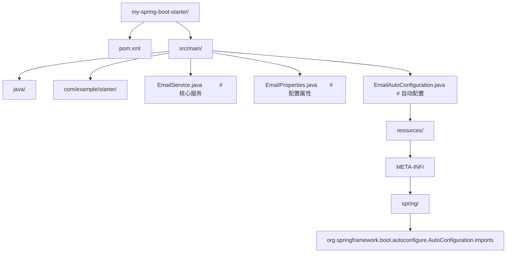

# Java SpringBoot 进阶配置

> **符号约定**：`< >` 必填参数 | `[ ]` 可选参数

---

## 概述

Spring Boot 进阶内容涵盖自动配置原理、自定义 Starter、条件化装配、事件机制等核心特性。理解这些内容后，你不再只是"用"Spring Boot，而是能"驾驭"它：遇到问题时知道从哪里排查，需要扩展时知道怎么自定义。

Spring Boot 的核心价值是"约定优于配置"。它通过自动配置帮你做了大量默认设置，让你专注于业务代码。但当你需要覆盖默认行为或创建自己的组件时，就需要理解自动配置的工作原理。

## 基础概念

### 自动配置

自动配置是 Spring Boot 的核心机制。当你在 pom.xml 中添加一个依赖（如 spring-boot-starter-web），Spring Boot 会自动配置嵌入式的 Tomcat、DispatcherServlet、消息转换器等。这一切通过 @Conditional 系列注解实现：只有满足特定条件时，配置才会生效。

### Starter

Starter 是一组依赖的集合，它把某个功能需要的所有 jar 包打包在一起，你只需要添加一个 Starter 依赖就能使用对应功能。例如 spring-boot-starter-web 包含了 Spring MVC、Tomcat、Jackson 等依赖。

### 条件化装配

Spring Boot 使用 @Conditional 系列注解来决定是否创建某个 Bean。常见的条件注解包括：@ConditionalOnClass（类路径上存在某个类时生效）、@ConditionalOnMissingBean（容器中不存在某个 Bean 时生效）、@ConditionalOnProperty（配置文件中某个属性满足条件时生效）。

## 快速上手

### 理解自动配置的生效条件

查看当前应用生效了哪些自动配置：

```bash
# 启动时开启自动配置报告
java -jar myapp.jar --debug

# 或在 application.yml 中配置
debug: true
```

启动后控制台会输出一份报告，分为两部分：Positive matches（生效的自动配置）和 Negative matches（未生效的自动配置及原因）。

### 排除不需要的自动配置

如果某个自动配置不需要，可以排除它：

```java
// 方式一：在启动类上排除
@SpringBootApplication(exclude = {DataSourceAutoConfiguration.class})
public class Application {
    public static void main(String[] args) {
        SpringApplication.run(Application.class, args);
    }
}

// 方式二：在配置文件中排除
// spring.autoconfigure.exclude=org.springframework.boot.autoconfigure.jdbc.DataSourceAutoConfiguration
```

## 详细用法

### 1. 自定义自动配置

创建自己的自动配置类，让其他项目引入你的 jar 后自动装配：

```java
import org.springframework.boot.autoconfigure.AutoConfiguration;
import org.springframework.boot.autoconfigure.condition.ConditionalOnClass;
import org.springframework.boot.autoconfigure.condition.ConditionalOnMissingBean;
import org.springframework.boot.autoconfigure.condition.ConditionalOnProperty;
import org.springframework.context.annotation.Bean;

@AutoConfiguration  // Spring Boot 3.x 的新注解
@ConditionalOnClass(EmailService.class)  // 类路径上存在 EmailService 时才生效
public class EmailAutoConfiguration {

    @Bean
    @ConditionalOnMissingBean  // 容器中没有 EmailService 时才创建
    @ConditionalOnProperty(prefix = "email", name = "enabled", havingValue = "true", matchIfMissing = true)
    public EmailService emailService(EmailProperties properties) {
        return new EmailService(properties.getHost(), properties.getPort());
    }
}
```

配置属性类：

```java
import org.springframework.boot.context.properties.ConfigurationProperties;

@ConfigurationProperties(prefix = "email")
public class EmailProperties {
    private String host = "localhost";  // 默认值
    private int port = 25;
    private boolean enabled = true;

    // getter 和 setter...
    public String getHost() { return host; }
    public void setHost(String host) { this.host = host; }
    public int getPort() { return port; }
    public void setPort(int port) { this.port = port; }
    public boolean isEnabled() { return enabled; }
    public void setEnabled(boolean enabled) { this.enabled = enabled; }
}
```

### 2. 创建自定义 Starter

一个标准的 Starter 项目结构如下：



注册自动配置（Spring Boot 3.x 方式）：

```
# 文件: META-INF/spring/org.springframework.boot.autoconfigure.AutoConfiguration.imports
com.example.starter.EmailAutoConfiguration
```

使用自定义 Starter 时，只需要添加依赖并在配置文件中设置属性：

```yaml
# 使用方的 application.yml
email:
  host: smtp.example.com
  port: 587
  enabled: true
```

### 3. 条件注解详解

Spring Boot 提供了丰富的条件注解：

```java
import org.springframework.boot.autoconfigure.condition.*;

// 当类路径上存在 DataSource 类时生效
@ConditionalOnClass(DataSource.class)

// 当类路径上不存在 RedisTemplate 类时生效
@ConditionalOnMissingClass("org.springframework.data.redis.core.RedisTemplate")

// 当容器中不存在 DataSource Bean 时生效（让你可以覆盖默认配置）
@ConditionalOnMissingBean(DataSource.class)

// 当容器中已经存在 DataSource Bean 时生效
@ConditionalOnBean(DataSource.class)

// 当配置属性 my.feature.enabled=true 时生效
@ConditionalOnProperty(prefix = "my.feature", name = "enabled", havingValue = "true")

// matchIfMissing = true 表示属性不存在时也生效（默认启用）
@ConditionalOnProperty(prefix = "my.feature", name = "enabled", havingValue = "true", matchIfMissing = true)

// 当当前是 Web 应用时生效
@ConditionalOnWebApplication

// 当当前不是 Web 应用时生效
@ConditionalOnNotWebApplication
```

### 4. Spring Boot 事件机制

Spring Boot 在启动过程中会发布一系列事件，你可以监听这些事件来执行自定义逻辑：

```java
import org.springframework.boot.context.event.ApplicationReadyEvent;
import org.springframework.context.event.EventListener;
import org.springframework.stereotype.Component;

@Component
public class AppStartupListener {

    // 应用启动完成后的回调（所有 Bean 初始化完毕）
    @EventListener(ApplicationReadyEvent.class)
    public void onReady() {
        System.out.println("应用已启动完毕，可以开始接收请求");
        // 初始化缓存、预热数据等...
    }
}
```

Spring Boot 启动事件的顺序：

1. ApplicationStartingEvent：应用刚启动
2. ApplicationEnvironmentPreparedEvent：环境变量准备好
3. ApplicationContextInitializedEvent：上下文初始化
4. ApplicationPreparedEvent：Bean 定义加载完毕
5. ApplicationReadyEvent：应用启动完成，可以接收请求
6. ApplicationFailedEvent：启动失败

### 5. 自定义 ApplicationRunner

如果需要在应用启动后执行初始化逻辑，实现 ApplicationRunner 接口：

```java
import org.springframework.boot.ApplicationArguments;
import org.springframework.boot.ApplicationRunner;
import org.springframework.stereotype.Component;

@Component
public class DataInitializer implements ApplicationRunner {

    private final UserRepository userRepository;

    public DataInitializer(UserRepository userRepository) {
        this.userRepository = userRepository;
    }

    @Override
    public void run(ApplicationArguments args) throws Exception {
        // 应用启动后自动执行
        if (userRepository.count() == 0) {
            // 初始化默认数据
            User admin = new User();
            admin.setUsername("admin");
            admin.setPassword("encoded_password");
            admin.setRole("ADMIN");
            userRepository.save(admin);
            System.out.println("已创建默认管理员账号");
        }
    }
}
```

### 6. Profile 环境隔离

Profile 用于区分不同环境的配置：

```yaml
# application.yml（公共配置）
spring:
  profiles:
    active: dev # 激活 dev 环境

---
# application-dev.yml（开发环境）
server:
  port: 8080
spring:
  datasource:
    url: jdbc:mysql://localhost:3306/dev_db

---
# application-prod.yml（生产环境）
server:
  port: 80
spring:
  datasource:
    url: jdbc:mysql://prod-server:3306/prod_db
```

也可以用 Java 配置区分环境：

```java
import org.springframework.context.annotation.Bean;
import org.springframework.context.annotation.Configuration;
import org.springframework.context.annotation.Profile;

@Configuration
public class DataSourceConfig {

    @Bean
    @Profile("dev")  // 只在 dev 环境下创建
    public DataSource devDataSource() {
        // 开发环境用 H2 内存数据库
        return new EmbeddedDatabaseBuilder().setType(H2).build();
    }

    @Bean
    @Profile("prod")  // 只在生产环境下创建
    public DataSource prodDataSource() {
        // 生产环境用 MySQL
        HikariDataSource ds = new HikariDataSource();
        ds.setJdbcUrl("jdbc:mysql://prod-server:3306/prod_db");
        return ds;
    }
}
```

### 7. 配置属性绑定

将配置文件的属性绑定到 Java 对象：

```java
import org.springframework.boot.context.properties.ConfigurationProperties;
import org.springframework.stereotype.Component;

@Component
@ConfigurationProperties(prefix = "app")
public class AppProperties {

    private String name;
    private String version;
    private Server server = new Server();

    // getter 和 setter...
    public String getName() { return name; }
    public void setName(String name) { this.name = name; }
    public String getVersion() { return version; }
    public void setVersion(String version) { this.version = version; }
    public Server getServer() { return server; }
    public void setServer(Server server) { this.server = server; }

    // 嵌套属性
    public static class Server {
        private String host = "localhost";
        private int port = 8080;

        public String getHost() { return host; }
        public void setHost(String host) { this.host = host; }
        public int getPort() { return port; }
        public void setPort(int port) { this.port = port; }
    }
}
```

```yaml
# application.yml
app:
  name: My Application
  version: 1.0.0
  server:
    host: 0.0.0.0
    port: 9090
```

## 常见场景

### 场景一：多数据源配置

当应用需要连接多个数据库时：

```java
import org.springframework.boot.context.properties.ConfigurationProperties;
import org.springframework.boot.jdbc.DataSourceBuilder;
import org.springframework.context.annotation.Bean;
import org.springframework.context.annotation.Configuration;
import org.springframework.context.annotation.Primary;
import javax.sql.DataSource;

@Configuration
public class MultiDataSourceConfig {

    // 主数据源
    @Bean
    @Primary  // 标记为默认数据源
    @ConfigurationProperties(prefix = "spring.datasource.primary")
    public DataSource primaryDataSource() {
        return DataSourceBuilder.create().build();
    }

    // 从数据源
    @Bean
    @ConfigurationProperties(prefix = "spring.datasource.secondary")
    public DataSource secondaryDataSource() {
        return DataSourceBuilder.create().build();
    }
}
```

### 场景二：优雅停机

Spring Boot 支持优雅停机，在关闭时等待正在处理的请求完成：

```yaml
server:
  shutdown: graceful # 启用优雅停机

spring:
  lifecycle:
    timeout-per-shutdown-phase: 30s # 最多等待30秒
```

## 注意事项与常见错误

### 自动配置的优先级

自动配置类的执行顺序很重要。可以使用 @AutoConfigureBefore 和 @AutoConfigureAfter 控制顺序：

```java
@AutoConfiguration
@AutoConfigureBefore(DataSourceAutoConfiguration.class)  // 在数据源配置之前执行
public class MyAutoConfiguration {
    // ...
}
```

### 不要滥用 @ConditionalOnMissingBean

@ConditionalOnMissingBean 允许用户覆盖默认 Bean，但也可能导致意外行为。如果你的 Bean 必须存在，不要加这个注解。

### 配置属性的校验

配置属性可以使用 JSR-303 注解进行校验：

```java
import jakarta.validation.constraints.NotEmpty;
import jakarta.validation.constraints.Min;

@ConfigurationProperties(prefix = "email")
@Validated  // 启用校验
public class EmailProperties {
    @NotEmpty(message = "邮件服务器地址不能为空")
    private String host;

    @Min(value = 1, message = "端口号不能小于1")
    private int port = 25;
}
```

### Starter 命名规范

官方 Starter 的命名格式是 spring-boot-starter-_（如 spring-boot-starter-web）。第三方 Starter 应该命名为 _-spring-boot-starter（如 mylib-spring-boot-starter），避免与官方命名冲突。

## 进阶用法

### 自定义 Health Indicator

Spring Boot Actuator 提供了健康检查端点，你可以添加自定义的健康检查：

```java
import org.springframework.boot.actuate.health.Health;
import org.springframework.boot.actuate.health.HealthIndicator;
import org.springframework.stereotype.Component;

@Component
public class CustomHealthIndicator implements HealthIndicator {

    @Override
    public Health health() {
        // 检查外部服务是否可用
        try {
            // 模拟检查外部 API
            boolean isUp = checkExternalService();
            if (isUp) {
                return Health.up()
                    .withDetail("externalService", "可用")
                    .build();
            } else {
                return Health.down()
                    .withDetail("externalService", "不可用")
                    .build();
            }
        } catch (Exception e) {
            return Health.down(e).build();
        }
    }

    private boolean checkExternalService() {
        // 实际检查逻辑
        return true;
    }
}
```

### ApplicationContextInitializer

在 Spring 上下文刷新之前执行初始化逻辑：

```java
import org.springframework.context.ApplicationContextInitializer;
import org.springframework.context.ConfigurableApplicationContext;

public class MyInitializer implements ApplicationContextInitializer<ConfigurableApplicationContext> {
    @Override
    public void initialize(ConfigurableApplicationContext context) {
        // 在 Bean 创建之前设置环境变量或属性
        context.getEnvironment().getSystemProperties().put("my.property", "value");
    }
}
```

### SpringBootAdmin 监控

Spring Boot Admin 是一个社区项目，提供了 Web 界面来监控 Spring Boot 应用。集成后可以看到应用的健康状态、JVM 信息、请求追踪等。适合在开发和测试环境中使用，生产环境需要配置安全认证。
## application.yml 基础配置

**基本写法：服务端口与上下文配置**
`server.port: <端口>`
```java
// application.yml
server:
  port: 8081
  servlet:
    context-path: /api
```

---

**基本写法：应用名称配置**
`spring.application.name: <名称>`
```java
// 应用名称（SpringBoot 2.7+ 推荐写法）
spring:
  application:
    name: my-app
```

---

**基本写法：多环境配置**
`spring.profiles.active: <profile>`
```java
// 激活 dev 环境
spring:
  profiles:
    active: dev
```

---

**基本写法：自定义配置项**
`<前缀>.<字段>: <值>`
```java
// application.yml 自定义属性
app:
  cache:
    ttl: 3600
    maxSize: 1000
```

---

## 读取配置

**基本写法：使用 @Value 注入**
`@Value("${<属性名>}")`
```java
// 注入单个配置项
@Value("${app.cache.ttl}")
private long cacheTtl;
```

---

**基本写法：使用 @ConfigurationProperties 绑定**
`@ConfigurationProperties(prefix = "<前缀>")`
```java
// 批量绑定配置到对象
@Component
@ConfigurationProperties(prefix = "app.cache")
public class CacheProperties {
    private long ttl;
    private int maxSize;
}
```

---

**基本写法：注入 Environment**
`@Autowired Environment <env>`
```java
// 通过 Environment 动态读取配置
@Autowired
private Environment env;
String ttl = env.getProperty("app.cache.ttl");
```

---

## 核心注解

**基本写法：启动类注解**
`@SpringBootApplication`
```java
// 标记 SpringBoot 启动类
@SpringBootApplication
public class App {
    public static void main(String[] args) {
        SpringApplication.run(App.class, args);
    }
}
```

---

**基本写法：自定义 Component 扫描**
`@ComponentScan(basePackages = {"<包1>", "<包2>"})`
```java
// 指定扫描的包路径
@SpringBootApplication
@ComponentScan(basePackages = {"com.example.service", "com.example.dao"})
public class App { }
```

---

**基本写法：排除自动配置**
`@SpringBootApplication(exclude = {<配置类>.class})`
```java
// 排除数据源自动配置
@SpringBootApplication(exclude = {DataSourceAutoConfiguration.class})
public class App { }
```

---

**基本写法：定义 Bean**
`@Bean`
```java
// 在配置类中声明 Bean
@Configuration
public class AppConfig {
    @Bean
    public RestTemplate restTemplate() {
        return new RestTemplate();
    }
}
```

---

**基本写法：条件化 Bean**
`@ConditionalOnProperty(name = "<属性>", havingValue = "<值>")`
```java
// 仅在配置项匹配时生效
@Bean
@ConditionalOnProperty(name = "app.cache.enabled", havingValue = "true")
public CacheManager cacheManager() {
    return new ConcurrentMapCacheManager();
}
```

---

**基本写法：缺失时创建**
`@ConditionalOnMissingBean(<类型>.class)`
```java
// 容器中无该类型 Bean 时才创建
@Bean
@ConditionalOnMissingBean(RestTemplate.class)
public RestTemplate defaultRestTemplate() {
    return new RestTemplate();
}
```

---

## 自动配置机制

**基本写法：自定义 AutoConfiguration**
`@AutoConfiguration`
```java
// SpringBoot 2.7+ 自动配置类写法
@AutoConfiguration
@ConditionalOnClass(RestTemplate.class)
public class MyAutoConfiguration {
    @Bean
    @ConditionalOnMissingBean
    public RestTemplate restTemplate() {
        return new RestTemplate();
    }
}
```

---

**基本写法：注册自动配置**
`META-INF/spring/org.springframework.boot.autoconfigure.AutoConfiguration.imports`
```java
// 文件内每行写一个全限定类名
com.example.MyAutoConfiguration
com.example.OtherAutoConfiguration
```

---

## Profile 环境

**基本写法：声明 Profile Bean**
`@Profile("<名称>")`
```java
// 仅在 dev 环境生效
@Bean
@Profile("dev")
public DataSource devDataSource() {
    return new HikariDataSource();
}
```

---

**基本写法：Profile 配置文件**
`application-<profile>.yml`
```java
// 文件名约定：application-dev.yml、application-prod.yml
// 激活 dev 后会合并 application.yml 与 application-dev.yml
```

---

## 条件装配

**基本写法：类路径存在时生效**
`@ConditionalOnClass(<类>.class)`
```java
// 类路径存在该类时配置才生效
@Configuration
@ConditionalOnClass(RestTemplate.class)
public class WebConfig { }
```

---

**基本写法：Bean 存在时生效**
`@ConditionalOnBean(<类型>.class)`
```java
// 容器中存在 DataSource 时生效
@Bean
@ConditionalOnBean(DataSource.class)
public JdbcTemplate jdbcTemplate(DataSource ds) {
    return new JdbcTemplate(ds);
}
```

---

## 常用 Starter 依赖

**基本写法：Web Starter**
`spring-boot-starter-web`
```java
// pom.xml 引入后自动配置 Tomcat + Spring MVC
<dependency>
    <groupId>org.springframework.boot</groupId>
    <artifactId>spring-boot-starter-web</artifactId>
</dependency>
```

---

**基本写法：数据访问 Starter**
`spring-boot-starter-data-jpa`
```java
// 引入后自动配置 Hibernate + JPA
<dependency>
    <groupId>org.springframework.boot</groupId>
    <artifactId>spring-boot-starter-data-jpa</artifactId>
</dependency>
```

---

## 启动与运行

**基本写法：以编程方式启动**
`SpringApplication.run(<配置类>.class, <args>)`
```java
// 通过 API 启动并定制
new SpringApplicationBuilder(App.class)
    .bannerMode(Banner.Mode.OFF)
    .logStartupInfo(false)
    .run(args);
```

---

**基本写法：命令行传参**
`--<属性名>=<值>`
```java
// 启动时覆盖配置
java -jar app.jar --server.port=9090 --spring.profiles.active=prod
```

---

**基本写法：CommandLineRunner 初始化**
`@Bean CommandLineRunner <方法>`
```java
// 启动完成后执行
@Bean
public CommandLineRunner init(DataService service) {
    return args -> service.loadData();
}
```

---

## 外部化配置加载顺序

**基本写法：命令行参数优先级最高**
`java -jar <jar> --<属性>=<值>`
```java
// 优先级（从高到低）：
// 命令行参数 > 环境变量 > application-{profile}.yml > application.yml
java -jar app.jar --server.port=9090
```

## 参考文献


Oracle Java 官方文档：https://docs.oracle.com/en/java/
OpenJDK 项目：https://openjdk.org/
Java 语言规范：https://docs.oracle.com/javase/specs/
Spring 官方文档：https://spring.io/projects/spring-boot
Baeldung 教程站：https://www.baeldung.com/
Maven 官方文档：https://maven.apache.org/guides/

## 延伸阅读


Java 并发与 JUC，见 013-java 模块并发文档。
JVM 内存与 GC 调优，见 013-java 模块 JVM 文档。
Spring Boot 微服务与 Kubernetes，见 013-java/041-JavaKubernetes 文档。
数据库访问（JDBC/JPA），见 019-sql 模块相关文档。
黑马程序员 Bilibili 空间（https://space.bilibili.com/37974444 ）提供 Java 全栈课程；尚硅谷 Bilibili 空间（https://space.bilibili.com/302417610 ）提供 Java 进阶课程。

## 模块文档速查表

| 文档 | 主题 | 与本文的关联 |
| --- | --- | --- |
| Java 概述与开发环境 | 001-JavaOverviewDevEnv | 本文的前置基础 |
| 快速入门 | 002-QuickStart | 本文的前置基础 |
| 程序结构与基本语法 | 003-ProgramStructureBasicSyntax | 本文的并列主题 |
| 数据类型与类型转换 | 004-DataTypeConversion | 本文的并列主题 |
| 变量与常量 | 005-VariableConstant | 本文的并列主题 |
| 枚举与注解 | 006-JavaAnnotationsTutorial | 本文的并列主题 |
| 泛型进阶 | 007-JavaGenericsTutorial | 本文的并列主题 |
| 并发编程基础 | 008-ConcurrencyBasics | 本文的前置基础 |
| JUC并发包 | 009-JUCConcurrency | 本文的并列主题 |
| JVM类加载机制 | 010-JVMClassLoadingMechanism | 本文的原理深化 |
| JVM垃圾回收 | 011-JVMGC | 本文的并列主题 |
| Java反射 | 012-JavaReflection | 本文的并列主题 |
| Java序列化 | 013-JavaSerialization | 本文的并列主题 |
| JavaIO与NIO | 014-JavaIONIO | 本文的并列主题 |
| Java新特性 | 015-JavaNewFeatures | 本文的并列主题 |
| 运算符与表达式 | 016-OperatorExpression | 本文的并列主题 |
| Spring 基础：IoC 容器、AOP、Bean 生命周期与企业级开发核心 | 017-SpringBasicsIoCAOPBeanLifecycle | 本文的前置基础 |
| SpringBoot进阶 | 018-SpringBootAdvanced | 本文自身 |
| SpringBoot安全 | 019-SpringBootSecurity | 本文的安全延伸 |
| SpringBoot数据访问 | 020-SpringBootDataAccess | 本文的并列主题 |
| Java设计模式 | 021-JavaDesignPattern | 本文的并列主题 |
| Java函数式编程 | 022-JavaFunctionalProgramming | 本文的并列主题 |
| Java网络编程 | 023-JavaNetworkProgramming | 本文的并列主题 |
| Java日志系统 | 024-JavaLogSystem | 本文的并列主题 |
| Java单元测试 | 025-JavaUnitTest | 本文的并列主题 |
| Java构建工具 | 026-JavaBuildTool | 本文的并列主题 |
| 控制流 | 027-ControlFlow | 本文的并列主题 |
| Java与微服务 | 028-JavaMicroservice | 本文的并列主题 |
| Java与消息队列 | 029-JavaMessageQueue | 本文的并列主题 |
| Java与Redis | 030-JavaRedis | 本文的并列主题 |
| Java与Docker | 031-JavaDocker | 本文的并列主题 |
| Java与GraphQL | 032-JavaGraphQL | 本文的并列主题 |
| Java性能调优 | 033-JavaPerformanceTuning | 本文的性能延伸 |
| Java与AI | 034-JavaAI | 本文的并列主题 |
| Java与安全 | 035-JavaSecurity | 本文的安全延伸 |
| Java与WebAssembly | 036-JavaWebAssembly | 本文的并列主题 |
| Java与响应式编程 | 037-JavaReactiveProgramming | 本文的并列主题 |
| 方法详解 | 038-MethodDetailed | 本文的并列主题 |
| Java与虚拟线程 | 039-JavaVirtualThread | 本文的并列主题 |
| Java与GraalVM | 040-JavaGraalVM | 本文的并列主题 |
| Java与Kubernetes | 041-JavaKubernetes | 本文的并列主题 |
| Java记录类 | 042-JavaRecordClass | 本文的并列主题 |
| Java文本块 | 043-JavaTextBlock | 本文的并列主题 |
| Java模块系统 | 044-JavaModuleSystem | 本文的并列主题 |
| Java与数据库连接 | 045-JavaDatabaseConnection | 本文的并列主题 |
| Java 新特性与生态 | 046-JavaNewFeaturesEcosystem | 本文的并列主题 |
| 数组详解 | 047-ArrayDetailed | 本文的并列主题 |
| JVM调优 | 048-JVMtuning | 本文的性能延伸 |
| 集合框架详解 | 049-CollectionFrameworkDetailed | 本文的并列主题 |
| 并发编程详解 | 050-ConcurrencyDetailed | 本文的并列主题 |
| CompletableFuture异步编排 | 051-CompletableFutureAsync | 本文的并列主题 |
| ThreadLocal内存泄漏 | 052-ThreadLocalMemoryLeak | 本文的并列主题 |
| 反射与动态代理 | 053-ReflectionDynamicProxy | 本文的并列主题 |
| 注解处理器 | 054-AnnotationProcessor | 本文的并列主题 |
| 分代ZGC详解 | 055-GenerationalZGCDetailed | 本文的并列主题 |
| 面向对象编程 | 056-OOP | 本文的并列主题 |
| 抽象类与接口 | 057-AbstractClassInterface | 本文的并列主题 |
| 异常处理机制 | 058-ExceptionHandlingMechanism | 本文的原理深化 |
| 泛型详解 | 059-GenericDetailed | 本文的并列主题 |
| I/O 流与文件操作 | 060-IOStreamFileOperation | 本文的并列主题 |
| 多线程基础 | 061-MultithreadingBasics | 本文的前置基础 |
| JVM 内存模型 | 062-JVMMemoryModel | 本文的并列主题 |
| Lambda与函数式编程 | 063-LambdaFunctionalProgramming | 本文的并列主题 |
| Stream API | 064-StreamAPI | 本文的并列主题 |
| Spring Boot 学习笔记 | 065-SpringBootNotes | 本文的并列主题 |
| 网络编程 | 066-NetworkProgramming | 本文的并列主题 |
| Spring Cloud 微服务开发 | 067-SpringCloudMicroserviceDevelopment | 本文的并列主题 |
| Java Swing 图形界面 | 068-JavaSwingGUI | 本文的并列主题 |
| Java 项目示例：图书管理系统 | 069-JavaProjectExampleLibrarySystem | 本文的综合应用 |
| Java 理论知识点：JVM 原理、类加载机制与内存管理 | 070-JavaTheoryJVMClassLoadingMemory | 本文的原理深化 |
| Java NIO 通道与缓冲区 | 071-JavaNIOChannelBuffer | 本文的并列主题 |
| Java JDBC 数据库连接 | 072-JDBCDatabaseConnection | 本文的并列主题 |
| Java Optional 类 | 073-JavaOptionalClass | 本文的并列主题 |
| Java Executor 与 ForkJoin | 074-ExecutorForkJoinPool | 本文的并列主题 |
| Java Path 与 Files 语法速查手册 | 075-JavaPathFiles | 本文的并列主题 |
| 启动 REPL 交互环境 | 076-JavaJshellJpackage | 本文的前置基础 |
| Java 同步器 CountDownLatch/CyclicBarrier/Phaser 语法速查手册 | 077-JavaCountDownLatchCyclicBarrier | 本文的并列主题 |
| Java 阻塞队列 BlockingQueue 语法速查手册 | 078-JavaBlockingQueue | 本文的并列主题 |
| Java try-with-resources 与异常链语法速查手册 | 079-JavaTryWithResources | 本文的并列主题 |
| Java HttpClient 与 WebSocket 语法速查手册 | 080-JavaHttpClientWebSocket | 本文的并列主题 |
| Java 时间格式化 DateTimeFormatter/ZoneId 语法速查手册 | 081-JavaTimeFormatting | 本文的并列主题 |
| Java 类型擦除与桥接方法语法速查手册 | 082-JavaTypeErasure | 本文的并列主题 |
| Java 枚举进阶 EnumSet/EnumMap/枚举单例语法速查手册 | 083-JavaEnumAdvanced | 本文的并列主题 |
| Java Iterator/Iterable/Spliterator 语法速查手册 | 084-JavaIteratorIterable | 本文的并列主题 |
| Java Comparator/Comparable 语法速查手册 | 085-JavaComparatorComparable | 本文的并列主题 |
| Java String.format/printf/MessageFormat 语法速查手册 | 086-JavaStringFormat | 本文的并列主题 |
| Java Arrays 工具类语法速查手册 | 087-JavaArraysUtility | 本文的并列主题 |
| Java Objects 工具类语法速查手册 | 088-JavaObjectsUtility | 本文的并列主题 |
| Java 命令行工具 javac/java/jar/jshell/jpackage 语法速查手册 | 089-JavaCommandLineTools | 本文的并列主题 |
| Maven pom.xml 配置语法速查手册 | 090-MavenPomConfiguration | 本文的并列主题 |
| Gradle build.gradle 配置语法速查手册 | 091-GradleBuildConfiguration | 本文的并列主题 |
