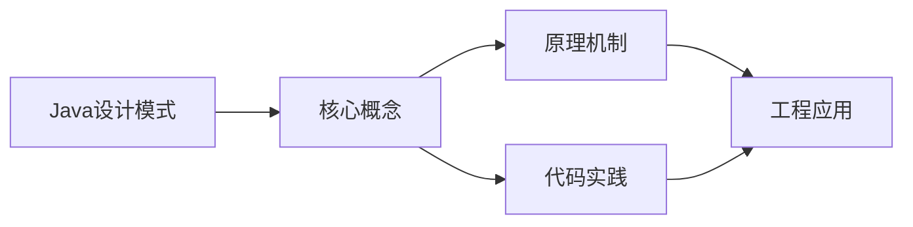
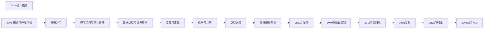

## 1. 学习目标（Bloom 分类）

本节按照布鲁姆教育目标分类学组织学习路径。本文主题为《Java设计模式》，属于 Java 模块，读者可以根据自身阶段选择阅读深度。

记忆层面：能够准确复述本文的核心概念、术语与基本语法或操作步骤，并能够在提问或检索时快速定位对应知识点。能够说出 Java 的编译执行模型（javac 到字节码，JVM 解释与 JIT）。

理解层面：能够用自己的语言解释核心原理与工作机制，说明概念之间的因果关系，而不是机械记忆结论。能够解释面向对象三大特性与 JVM 内存区域的职责。

应用层面：能够在真实项目或练习场景中运用本文知识解决具体问题，写出正确且可维护的实现。能够编写类、接口、集合操作与异常处理的完整程序。

分析层面：能够拆解复杂问题，比较本文主题与相邻概念的异同，识别边界条件与例外情况。能够分析 Java 与 C++、Go 在内存管理与并发模型上的差异。

评价层面：能够根据约束条件（性能、可读性、安全、成本）评价不同方案的优劣，做出有依据的技术决策。能够评价不同集合、并发工具与框架的适用场景。

创造层面：能够把本文知识与其他模块知识组合，设计出新的解决方案或可复用的工程模式。能够组合 Spring 生态设计企业级应用。

通过本节学习，读者应当能够把《Java设计模式》纳入自己的知识网络，并与 Java 模块的其他主题（JVM、集合框架、并发、Spring 生态）建立关联。

## 2. 历史动机与发展脉络

《Java设计模式》是 Java 领域的重要主题。要真正理解它，需要先了解它解决的问题与演进过程。

Java 由 James Gosling 领导的 Sun 团队于 1995 年发布，口号“一次编写，到处运行”依托 JVM 字节码实现跨平台。2006 年 Sun 将 Java 开源（OpenJDK），2010 年 Oracle 收购 Sun 后 Java 进入新的治理阶段。
Java 的版本节奏在 2017 年后改为每半年一个特性版本、每两年一个 LTS（长期支持）版本。当前主流 LTS 包括 Java 11、17、21 与 25；Java 21 引入虚拟线程（Project Loom 成果），显著降低高并发服务的线程成本。
Java 生态以 Spring 家族为核心：Spring Boot 简化配置与部署，Spring Cloud 提供微服务组件；构建工具从 Maven 演进到 Gradle；JVM 语言（Kotlin、Scala、Groovy）与 Java 共存互操作。
Android 开发早期使用 Java，2019 年后官方转向 Kotlin-first，但 Java 仍是服务端领域（尤其是金融、电商等企业系统）的中坚力量。

回到本文主题：Java设计模式 的提出与成熟，正是上述技术背景下的必然产物。早期实现往往以简单可用为目标，随着工程规模扩大，社区逐渐沉淀出标准做法与最佳实践；理解这一脉络，可以帮助读者判断“为什么文档中的推荐写法是现在这个样子”，也能在遇到历史遗留代码时准确识别其设计年代与取舍。

理解 Java 版本与 LTS 机制，是工程选型的起点：生产环境优先 LTS，新特性（如虚拟线程）可以在受控场景评估后引入。

## 3. 形式化定义与核心概念精讲

本节把《Java设计模式》涉及的核心概念以“定义 + 讲解”的形式展开。读者应把定义当作工具，把讲解当作理解路径；两者结合才能形成可迁移的知识。

JVM 与字节码：`javac` 把 .java 编译为 .class 字节码，JVM 加载、校验并执行；热点代码由 JIT（如 C2）编译为机器码，解释与编译结合实现启动速度与峰值性能的平衡。
面向对象：封装（访问控制）、继承（extends/implements）与多态（重载/重写）是 Java 的类型系统支柱；接口默认方法（Java 8）与密封类（Java 17）持续演进表达能力。
异常体系：受检异常（checked）编译期强制处理，非受检异常（RuntimeException）运行时抛出；try-with-resources 自动关闭资源。
泛型与擦除：Java 泛型在编译期检查后擦除类型参数，运行时无泛型信息；这解释了 `List<String>` 与 `List<Integer>` 的 Class 相同，以及通配符 `? extends` 的逆变协变规则。

### 3.1 原文章节逐一精讲

原文档把主题拆分为 7 个小节，下面按顺序给出每一节的导读讲解，随后保留原文细节供精读。

#### 原文精读（完整保留）


#### 概述

设计模式是针对软件设计中常见问题的可复用解决方案。1994 年，四位作者（被称为 GoF，Gang of Four）在《设计模式》一书中总结了 23 种经典设计模式，分为创建型、结构型和行为型三大类。

学习设计模式的目的不是生搬硬套，而是理解每种模式解决的问题和背后的设计思想。当你遇到类似的场景时，可以快速想到合适的解决方案。过度使用设计模式会让代码变得复杂，适度使用则能让代码更灵活、更易维护。

#### 基础概念

##### 三大类设计模式

- **创建型**：关注对象的创建方式，将对象的创建与使用分离。包括单例、工厂方法、抽象工厂、建造者、原型
- **结构型**：关注类和对象的组合方式，形成更大的结构。包括适配器、桥接、组合、装饰器、外观、享元、代理
- **行为型**：关注对象之间的通信和职责分配。包括策略、观察者、模板方法、命令、迭代器、中介者、备忘录、状态、职责链、访问者、解释器

##### 设计原则

设计模式遵循的核心原则包括：

- 开闭原则：对扩展开放，对修改关闭
- 单一职责：一个类只做一件事
- 依赖倒置：依赖抽象而非具体实现
- 里氏替换：子类可以替换父类
- 接口隔离：接口要小而专

#### 快速上手

##### 单例模式

确保一个类只有一个实例，并提供全局访问点：

```java
// 方式一：枚举单例（最简洁、最安全）
public enum Singleton {
    INSTANCE;

    public void doSomething() {
        System.out.println("执行单例方法");
    }
}

// 使用
Singleton.INSTANCE.doSomething();

// 方式二：双重检查锁定（延迟初始化）
public class Singleton {
    private static volatile Singleton instance;

    private Singleton() {}  // 私有构造函数，防止外部实例化

    public static Singleton getInstance() {
        if (instance == null) {                  // 第一次检查（无锁）
            synchronized (Singleton.class) {
                if (instance == null) {          // 第二次检查（有锁）
                    instance = new Singleton();
                }
            }
        }
        return instance;
    }
}
```

##### 工厂方法模式

定义创建对象的接口，让子类决定实例化哪个类：

```java
// 产品接口
interface Transport {
    void deliver();
}

// 具体产品
class Truck implements Transport {
    public void deliver() {
        System.out.println("卡车运输货物");
    }
}

class Ship implements Transport {
    public void deliver() {
        System.out.println("轮船运输货物");
    }
}

// 工厂接口
interface TransportFactory {
    Transport create();
}

// 具体工厂
class TruckFactory implements TransportFactory {
    public Transport create() {
        return new Truck();
    }
}

class ShipFactory implements TransportFactory {
    public Transport create() {
        return new Ship();
    }
}

// 使用
TransportFactory factory = new TruckFactory();
Transport transport = factory.create();
transport.deliver();  // 输出: 卡车运输货物
```

#### 详细用法

##### 1. 建造者模式

当对象有很多可选参数时，使用建造者模式可以避免构造函数参数过多：

```java
// 使用 Lombok 的 @Builder 注解可以自动生成（推荐）
// @Builder
// public class User { ... }

// 手动实现建造者
public class User {
    private final String name;    // 必填
    private final int age;        // 必填
    private final String email;   // 可选
    private final String phone;   // 可选

    private User(Builder builder) {
        this.name = builder.name;
        this.age = builder.age;
        this.email = builder.email;
        this.phone = builder.phone;
    }

    public static Builder builder() {
        return new Builder();
    }

    public static class Builder {
        private String name;
        private int age;
        private String email;
        private String phone;

        public Builder name(String name) {
            this.name = name;
            return this;  // 返回 this 实现链式调用
        }

        public Builder age(int age) {
            this.age = age;
            return this;
        }

        public Builder email(String email) {
            this.email = email;
            return this;
        }

        public Builder phone(String phone) {
            this.phone = phone;
            return this;
        }

        public User build() {
            // 可以在这里添加参数校验
            if (name == null || name.isEmpty()) {
                throw new IllegalStateException("姓名不能为空");
            }
            return new User(this);
        }
    }
}

// 使用：链式调用，清晰易读
User user = User.builder()
    .name("Alice")
    .age(25)
    .email("alice@example.com")
    .build();
```

##### 2. 策略模式

定义一系列算法，将每个算法封装起来，使它们可以互相替换：

```java
// 策略接口
interface PaymentStrategy {
    void pay(double amount);
}

// 具体策略
class CreditCardPayment implements PaymentStrategy {
    private String cardNumber;

    public CreditCardPayment(String cardNumber) {
        this.cardNumber = cardNumber;
    }

    public void pay(double amount) {
        System.out.println("信用卡支付: " + amount + " 元，卡号: " + cardNumber);
    }
}

class WechatPayment implements PaymentStrategy {
    public void pay(double amount) {
        System.out.println("微信支付: " + amount + " 元");
    }
}

// 上下文
class ShoppingCart {
    private PaymentStrategy paymentStrategy;

    public void setPaymentStrategy(PaymentStrategy strategy) {
        this.paymentStrategy = strategy;
    }

    public void checkout(double amount) {
        paymentStrategy.pay(amount);
    }
}

// 使用
ShoppingCart cart = new ShoppingCart();
cart.setPaymentStrategy(new CreditCardPayment("6222****1234"));
cart.checkout(99.9);  // 信用卡支付: 99.9 元

cart.setPaymentStrategy(new WechatPayment());
cart.checkout(49.9);  // 微信支付: 49.9 元
```

##### 3. 观察者模式

定义对象间一对多的依赖关系，当一个对象状态改变时，所有依赖它的对象都会收到通知：

```java
import java.util.ArrayList;
import java.util.List;

// 观察者接口
interface OrderListener {
    void onOrderCreated(Order order);
}

// 被观察者
class OrderService {
    private List<OrderListener> listeners = new ArrayList<>();

    // 注册观察者
    public void addListener(OrderListener listener) {
        listeners.add(listener);
    }

    // 移除观察者
    public void removeListener(OrderListener listener) {
        listeners.remove(listener);
    }

    // 创建订单时通知所有观察者
    public void createOrder(Order order) {
        // 保存订单到数据库...
        System.out.println("订单已创建: " + order.getId());

        // 通知所有观察者
        for (OrderListener listener : listeners) {
            listener.onOrderCreated(order);
        }
    }
}

// 具体观察者
class EmailNotifier implements OrderListener {
    public void onOrderCreated(Order order) {
        System.out.println("发送邮件通知: 订单 " + order.getId() + " 已创建");
    }
}

class InventoryUpdater implements OrderListener {
    public void onOrderCreated(Order order) {
        System.out.println("更新库存: 扣减商品数量");
    }
}

// 使用
OrderService orderService = new OrderService();
orderService.addListener(new EmailNotifier());
orderService.addListener(new InventoryUpdater());
orderService.createOrder(new Order("1001"));
```

##### 4. 模板方法模式

在父类中定义算法的骨架，将某些步骤延迟到子类实现：

```java
// 抽象模板类
abstract class DataProcessor {

    // 模板方法：定义处理流程的骨架（用 final 防止子类覆盖）
    public final void process() {
        readData();
        transformData();
        writeData();
    }

    // 具体方法：所有子类共用的实现
    private void readData() {
        System.out.println("读取原始数据");
    }

    // 抽象方法：由子类实现不同的转换逻辑
    protected abstract void transformData();

    // 具体方法
    private void writeData() {
        System.out.println("写入处理后的数据");
    }
}

// 具体子类
class JsonProcessor extends DataProcessor {
    @Override
    protected void transformData() {
        System.out.println("将数据转换为 JSON 格式");
    }
}

class XmlProcessor extends DataProcessor {
    @Override
    protected void transformData() {
        System.out.println("将数据转换为 XML 格式");
    }
}

// 使用
DataProcessor processor = new JsonProcessor();
processor.process();
// 输出:
// 读取原始数据
// 将数据转换为 JSON 格式
// 写入处理后的数据
```

##### 5. 适配器模式

将一个类的接口转换成客户端期望的另一个接口，使原本不兼容的类可以协同工作：

```java
// 目标接口（客户端期望的接口）
interface MediaPlayer {
    void play(String filename);
}

// 已有的类（接口不兼容）
class AdvancedMediaPlayer {
    public void playVlc(String filename) {
        System.out.println("播放 VLC 文件: " + filename);
    }

    public void playMp4(String filename) {
        System.out.println("播放 MP4 文件: " + filename);
    }
}

// 适配器：将 AdvancedMediaPlayer 适配为 MediaPlayer
class MediaAdapter implements MediaPlayer {
    private AdvancedMediaPlayer advancedPlayer;

    public MediaAdapter() {
        this.advancedPlayer = new AdvancedMediaPlayer();
    }

    @Override
    public void play(String filename) {
        if (filename.endsWith(".vlc")) {
            advancedPlayer.playVlc(filename);
        } else if (filename.endsWith(".mp4")) {
            advancedPlayer.playMp4(filename);
        }
    }
}

// 使用
MediaPlayer player = new MediaAdapter();
player.play("movie.mp4");  // 播放 MP4 文件: movie.mp4
```

##### 6. 装饰器模式

动态地给对象添加额外的职责，比继承更灵活：

```java
// 组件接口
interface Coffee {
    String getDescription();
    double getCost();
}

// 基础组件
class SimpleCoffee implements Coffee {
    public String getDescription() { return "普通咖啡"; }
    public double getCost() { return 10.0; }
}

// 装饰器基类
abstract class CoffeeDecorator implements Coffee {
    protected Coffee coffee;

    public CoffeeDecorator(Coffee coffee) {
        this.coffee = coffee;
    }
}

// 具体装饰器
class MilkDecorator extends CoffeeDecorator {
    public MilkDecorator(Coffee coffee) { super(coffee); }
    public String getDescription() { return coffee.getDescription() + " + 牛奶"; }
    public double getCost() { return coffee.getCost() + 3.0; }
}

class SugarDecorator extends CoffeeDecorator {
    public SugarDecorator(Coffee coffee) { super(coffee); }
    public String getDescription() { return coffee.getDescription() + " + 糖"; }
    public double getCost() { return coffee.getCost() + 1.0; }
}

// 使用：可以自由组合装饰器
Coffee coffee = new SimpleCoffee();             // 普通咖啡, 10.0
coffee = new MilkDecorator(coffee);             // 普通咖啡 + 牛奶, 13.0
coffee = new SugarDecorator(coffee);            // 普通咖啡 + 牛奶 + 糖, 14.0
System.out.println(coffee.getDescription() + " = " + coffee.getCost());
```

##### 7. 代理模式

为另一个对象提供替身或占位符，控制对原对象的访问：

```java
import java.lang.reflect.InvocationHandler;
import java.lang.reflect.Method;
import java.lang.reflect.Proxy;

// 接口
interface UserService {
    User getUser(Long id);
}

// 实际实现
class UserServiceImpl implements UserService {
    public User getUser(Long id) {
        System.out.println("从数据库查询用户: " + id);
        return new User(id, "Alice");
    }
}

// JDK 动态代理：添加缓存功能
class CacheProxy implements InvocationHandler {
    private Object target;
    private Map<String, Object> cache = new HashMap<>();

    public CacheProxy(Object target) {
        this.target = target;
    }

    @Override
    public Object invoke(Object proxy, Method method, Object[] args) throws Throwable {
        String key = method.getName() + ":" + args[0];
        if (cache.containsKey(key)) {
            System.out.println("从缓存返回结果: " + key);
            return cache.get(key);
        }
        Object result = method.invoke(target, args);
        cache.put(key, result);
        return result;
    }
}

// 使用
UserService original = new UserServiceImpl();
UserService proxied = (UserService) Proxy.newProxyInstance(
    original.getClass().getClassLoader(),
    original.getClass().getInterfaces(),
    new CacheProxy(original)
);

proxied.getUser(1L);  // 从数据库查询用户: 1
proxied.getUser(1L);  // 从缓存返回结果: getUser:1
```

#### 常见场景

##### 场景一：Spring 中的设计模式

Spring 框架大量使用了设计模式：

- **工厂模式**：BeanFactory 和 ApplicationContext 创建 Bean
- **单例模式**：Spring Bean 默认是单例的
- **代理模式**：AOP 使用动态代理实现
- **模板方法**：JdbcTemplate、RestTemplate 等模板类
- **观察者模式**：ApplicationEvent 和 ApplicationListener
- **适配器模式**：HandlerAdapter 适配不同的 Controller

##### 场景二：使用函数式接口简化策略模式

Java 8 的 Lambda 表达式可以简化很多设计模式的实现：

```java
import java.util.function.DoubleUnaryOperator;

// 用函数式接口代替策略接口
class Calculator {
    private DoubleUnaryOperator strategy;

    public Calculator(DoubleUnaryOperator strategy) {
        this.strategy = strategy;
    }

    public double calculate(double input) {
        return strategy.applyAsDouble(input);
    }
}

// 使用 Lambda 代替具体的策略类
Calculator square = new Calculator(x -> x * x);
Calculator cube = new Calculator(x -> x * x * x);

System.out.println(square.calculate(3));  // 9.0
System.out.println(cube.calculate(3));    // 27.0
```

#### 注意事项与常见错误

##### 不要为了用模式而用模式

设计模式是解决问题的工具，不是目标。如果一个简单的 if-else 就能解决问题，不需要引入策略模式。过度设计比没有设计更糟糕。

##### 单例模式的陷阱

单例模式在测试中很难 mock，而且全局状态会导致隐式依赖。在 Spring 应用中，让 Spring 管理单例 Bean 比自己实现单例模式更好。

##### 建造者模式与构造函数的选择

如果对象只有 2-3 个必填参数，直接用构造函数即可。只有当参数很多且大部分可选时，建造者模式才有价值。

##### 代理模式的性能

动态代理（JDK Proxy、CGLIB）会带来微小的性能开销。在性能敏感的场景中，需要评估代理的影响。

#### 进阶用法

##### 事件总线（观察者模式的进阶）

在大型应用中，可以使用事件总线来解耦组件之间的通信：

```java
import java.util.Map;
import java.util.List;
import java.util.ArrayList;
import java.util.concurrent.ConcurrentHashMap;

// 简单的事件总线实现
class EventBus {
    private Map<Class<?>, List<Object>> listeners = new ConcurrentHashMap<>();

    // 注册监听器
    public <T> void register(Class<T> eventType, Object listener) {
        listeners.computeIfAbsent(eventType, k -> new ArrayList<>()).add(listener);
    }

    // 发布事件
    @SuppressWarnings("unchecked")
    public <T> void publish(T event) {
        List<Object> handlers = listeners.get(event.getClass());
        if (handlers != null) {
            for (Object handler : handlers) {
                ((java.util.function.Consumer<T>) handler).accept(event);
            }
        }
    }
}

// 使用
EventBus bus = new EventBus();
bus.register(OrderCreatedEvent.class, (OrderCreatedEvent e) -> {
    System.out.println("处理订单: " + e.getOrderId());
});
bus.publish(new OrderCreatedEvent("1001"));
```

##### 组合模式

将对象组合成树形结构，统一处理单个对象和组合对象：

```java
import java.util.ArrayList;
import java.util.List;

// 组件接口
interface FileSystemComponent {
    long getSize();
    void print(String indent);
}

// 叶子节点
class File implements FileSystemComponent {
    private String name;
    private long size;

    public File(String name, long size) {
        this.name = name;
        this.size = size;
    }

    public long getSize() { return size; }
    public void print(String indent) {
        System.out.println(indent + "- " + name + " (" + size + "KB)");
    }
}

// 组合节点
class Directory implements FileSystemComponent {
    private String name;
    private List<FileSystemComponent> children = new ArrayList<>();

    public Directory(String name) { this.name = name; }

    public void add(FileSystemComponent component) {
        children.add(component);
    }

    public long getSize() {
        return children.stream().mapToLong(FileSystemComponent::getSize).sum();
    }

    public void print(String indent) {
        System.out.println(indent + "+ " + name + "/");
        for (FileSystemComponent child : children) {
            child.print(indent + "  ");
        }
    }
}

// 使用
Directory root = new Directory("项目");
root.add(new File("pom.xml", 5));
Directory src = new Directory("src");
src.add(new File("Main.java", 3));
src.add(new File("Utils.java", 2));
root.add(src);
root.print("");  // 打印目录树
```


### 3.2 概念关系图

下面用 Mermaid 图表达本文核心概念之间的关系，帮助读者建立整体图景：



图中展示的是本文知识的结构化关系：核心概念是入口，原理机制解释“为什么”，代码实践演示“怎么做”，工程应用回答“何时用”。读者学习时可以把每个小节的内容挂接到对应节点上。

## 4. 理论推导与原理解析

本节深入《Java设计模式》背后的原理。理论部分不求面面俱到，而是聚焦“能解释现象、能指导实践”的关键推导。

JVM 内存模型：堆（新生代/老年代）、元空间、虚拟机栈、本地方法栈与程序计数器；GC 从 CMS 演进到 G1（默认）、ZGC（超低延迟），理解分代收集是调优前提。
并发工具：synchronized 与 JUC（java.util.concurrent）的锁、并发容器、线程池、CompletableFuture 构成并发工具箱；Java 21 的虚拟线程让“每任务一线程”成为可能。
类加载机制：双亲委派模型保证类唯一性，SPI（ServiceLoader）打破委派实现扩展；自定义类加载器是热部署与隔离的基础。
反射与注解：反射在运行时检查类结构，注解提供元数据；Spring 的依赖注入与 AOP 均基于这些机制，但反射有性能与安全成本。

需要强调的是，理论推导与工程实践之间存在翻译层：理论给出的是理想化模型与边界条件，工程代码则必须处理真实环境中的例外。读者在学习时应先掌握理论的“标准情形”，再通过陷阱章节了解“非标准情形”。

## 5. 代码示例与逐行讲解

本节把原文中的代码示例系统整理，并为每个示例补充用途说明与讲解。读者不应只浏览代码，而应逐段对照讲解理解设计意图。

### 5.1 示例：单例模式

该示例来自原文《单例模式》小节，用于演示Java设计模式相关操作。阅读时请先看代码结构，再看其后的讲解。

```java
// 方式一：枚举单例（最简洁、最安全）
public enum Singleton {
    INSTANCE;

    public void doSomething() {
        System.out.println("执行单例方法");
    }
}

// 使用
Singleton.INSTANCE.doSomething();

// 方式二：双重检查锁定（延迟初始化）
public class Singleton {
    private static volatile Singleton instance;

    private Singleton() {}  // 私有构造函数，防止外部实例化

    public static Singleton getInstance() {
        if (instance == null) {                  // 第一次检查（无锁）
            synchronized (Singleton.class) {
                if (instance == null) {          // 第二次检查（有锁）
                    instance = new Singleton();
                }
            }
        }
        return instance;
    }
}
```

讲解：这段代码演示了本节核心知识点。代码中的关键操作可以归纳为三步：准备（定义或初始化）、执行（核心逻辑）、收尾（释放资源或返回结果）。实际项目中，这三步往往被封装为函数或类，以提升复用性与可测试性。

关键点分析：

该示例共 24 行有效代码，包含 3 类关键结构（class、if、return）。其中：

- 入口与初始化部分负责建立上下文，对应实际项目中的启动或装配逻辑；
- 核心逻辑部分体现本文主题的主要操作，是阅读时最需要对照讲解理解的部分；
- 输出或返回部分把结果交给调用方，注意其类型与边界条件。

进阶思考路径：先尝试修改参数观察行为变化，再把示例中的模式迁移到自己的项目中；每次修改都记录预期与实测差异，这是把示例转化为能力的最快方式。

### 5.2 示例：工厂方法模式

该示例来自原文《工厂方法模式》小节，用于演示Java设计模式相关操作。阅读时请先看代码结构，再看其后的讲解。

```java
// 产品接口
interface Transport {
    void deliver();
}

// 具体产品
class Truck implements Transport {
    public void deliver() {
        System.out.println("卡车运输货物");
    }
}

class Ship implements Transport {
    public void deliver() {
        System.out.println("轮船运输货物");
    }
}

// 工厂接口
interface TransportFactory {
    Transport create();
}

// 具体工厂
class TruckFactory implements TransportFactory {
    public Transport create() {
        return new Truck();
    }
}

class ShipFactory implements TransportFactory {
    public Transport create() {
        return new Ship();
    }
}

// 使用
TransportFactory factory = new TruckFactory();
Transport transport = factory.create();
transport.deliver();  // 输出: 卡车运输货物
```

讲解：这段代码演示了本节核心知识点。代码中的关键操作可以归纳为三步：准备（定义或初始化）、执行（核心逻辑）、收尾（释放资源或返回结果）。实际项目中，这三步往往被封装为函数或类，以提升复用性与可测试性。

关键点分析：

该示例共 34 行有效代码，包含 2 类关键结构（class、return）。其中：

- 入口与初始化部分负责建立上下文，对应实际项目中的启动或装配逻辑；
- 核心逻辑部分体现本文主题的主要操作，是阅读时最需要对照讲解理解的部分；
- 输出或返回部分把结果交给调用方，注意其类型与边界条件。

进阶思考路径：先尝试修改参数观察行为变化，再把示例中的模式迁移到自己的项目中；每次修改都记录预期与实测差异，这是把示例转化为能力的最快方式。

### 5.3 示例：1. 建造者模式

该示例来自原文《1. 建造者模式》小节，用于演示Java设计模式相关操作。阅读时请先看代码结构，再看其后的讲解。

```java
// 使用 Lombok 的 @Builder 注解可以自动生成（推荐）
// @Builder
// public class User { ... }

// 手动实现建造者
public class User {
    private final String name;    // 必填
    private final int age;        // 必填
    private final String email;   // 可选
    private final String phone;   // 可选

    private User(Builder builder) {
        this.name = builder.name;
        this.age = builder.age;
        this.email = builder.email;
        this.phone = builder.phone;
    }

    public static Builder builder() {
        return new Builder();
    }

    public static class Builder {
        private String name;
        private int age;
        private String email;
        private String phone;

        public Builder name(String name) {
            this.name = name;
            return this;  // 返回 this 实现链式调用
        }

        public Builder age(int age) {
            this.age = age;
            return this;
        }

        public Builder email(String email) {
            this.email = email;
            return this;
        }

        public Builder phone(String phone) {
            this.phone = phone;
            return this;
        }

        public User build() {
            // 可以在这里添加参数校验
            if (name == null || name.isEmpty()) {
                throw new IllegalStateException("姓名不能为空");
            }
            return new User(this);
        }
    }
}

// 使用：链式调用，清晰易读
User user = User.builder()
    .name("Alice")
    .age(25)
    .email("alice@example.com")
    .build();
```

讲解：这段代码演示了本节核心知识点。代码中的关键操作可以归纳为三步：准备（定义或初始化）、执行（核心逻辑）、收尾（释放资源或返回结果）。实际项目中，这三步往往被封装为函数或类，以提升复用性与可测试性。

关键点分析：

该示例共 54 行有效代码，包含 3 类关键结构（class、if、return）。其中：

- 入口与初始化部分负责建立上下文，对应实际项目中的启动或装配逻辑；
- 核心逻辑部分体现本文主题的主要操作，是阅读时最需要对照讲解理解的部分；
- 输出或返回部分把结果交给调用方，注意其类型与边界条件。

进阶思考路径：先尝试修改参数观察行为变化，再把示例中的模式迁移到自己的项目中；每次修改都记录预期与实测差异，这是把示例转化为能力的最快方式。

### 5.4 示例：2. 策略模式

该示例来自原文《2. 策略模式》小节，用于演示Java设计模式相关操作。阅读时请先看代码结构，再看其后的讲解。

```java
// 策略接口
interface PaymentStrategy {
    void pay(double amount);
}

// 具体策略
class CreditCardPayment implements PaymentStrategy {
    private String cardNumber;

    public CreditCardPayment(String cardNumber) {
        this.cardNumber = cardNumber;
    }

    public void pay(double amount) {
        System.out.println("信用卡支付: " + amount + " 元，卡号: " + cardNumber);
    }
}

class WechatPayment implements PaymentStrategy {
    public void pay(double amount) {
        System.out.println("微信支付: " + amount + " 元");
    }
}

// 上下文
class ShoppingCart {
    private PaymentStrategy paymentStrategy;

    public void setPaymentStrategy(PaymentStrategy strategy) {
        this.paymentStrategy = strategy;
    }

    public void checkout(double amount) {
        paymentStrategy.pay(amount);
    }
}

// 使用
ShoppingCart cart = new ShoppingCart();
cart.setPaymentStrategy(new CreditCardPayment("6222****1234"));
cart.checkout(99.9);  // 信用卡支付: 99.9 元

cart.setPaymentStrategy(new WechatPayment());
cart.checkout(49.9);  // 微信支付: 49.9 元
```

讲解：这段代码演示了本节核心知识点。代码中的关键操作可以归纳为三步：准备（定义或初始化）、执行（核心逻辑）、收尾（释放资源或返回结果）。实际项目中，这三步往往被封装为函数或类，以提升复用性与可测试性。

关键点分析：

该示例共 35 行有效代码，包含 1 类关键结构（class）。其中：

- 入口与初始化部分负责建立上下文，对应实际项目中的启动或装配逻辑；
- 核心逻辑部分体现本文主题的主要操作，是阅读时最需要对照讲解理解的部分；
- 输出或返回部分把结果交给调用方，注意其类型与边界条件。

进阶思考路径：先尝试修改参数观察行为变化，再把示例中的模式迁移到自己的项目中；每次修改都记录预期与实测差异，这是把示例转化为能力的最快方式。

### 5.5 示例：3. 观察者模式

该示例来自原文《3. 观察者模式》小节，用于演示Java设计模式相关操作。阅读时请先看代码结构，再看其后的讲解。

```java
import java.util.ArrayList;
import java.util.List;

// 观察者接口
interface OrderListener {
    void onOrderCreated(Order order);
}

// 被观察者
class OrderService {
    private List<OrderListener> listeners = new ArrayList<>();

    // 注册观察者
    public void addListener(OrderListener listener) {
        listeners.add(listener);
    }

    // 移除观察者
    public void removeListener(OrderListener listener) {
        listeners.remove(listener);
    }

    // 创建订单时通知所有观察者
    public void createOrder(Order order) {
        // 保存订单到数据库...
        System.out.println("订单已创建: " + order.getId());

        // 通知所有观察者
        for (OrderListener listener : listeners) {
            listener.onOrderCreated(order);
        }
    }
}

// 具体观察者
class EmailNotifier implements OrderListener {
    public void onOrderCreated(Order order) {
        System.out.println("发送邮件通知: 订单 " + order.getId() + " 已创建");
    }
}

class InventoryUpdater implements OrderListener {
    public void onOrderCreated(Order order) {
        System.out.println("更新库存: 扣减商品数量");
    }
}

// 使用
OrderService orderService = new OrderService();
orderService.addListener(new EmailNotifier());
orderService.addListener(new InventoryUpdater());
orderService.createOrder(new Order("1001"));
```

讲解：这段代码演示了本节核心知识点。代码中的关键操作可以归纳为三步：准备（定义或初始化）、执行（核心逻辑）、收尾（释放资源或返回结果）。实际项目中，这三步往往被封装为函数或类，以提升复用性与可测试性。

关键点分析：

该示例共 43 行有效代码，包含 3 类关键结构（class、import、for）。其中：

- 入口与初始化部分负责建立上下文，对应实际项目中的启动或装配逻辑；
- 核心逻辑部分体现本文主题的主要操作，是阅读时最需要对照讲解理解的部分；
- 输出或返回部分把结果交给调用方，注意其类型与边界条件。

进阶思考路径：先尝试修改参数观察行为变化，再把示例中的模式迁移到自己的项目中；每次修改都记录预期与实测差异，这是把示例转化为能力的最快方式。

### 5.6 示例：4. 模板方法模式

该示例来自原文《4. 模板方法模式》小节，用于演示Java设计模式相关操作。阅读时请先看代码结构，再看其后的讲解。

```java
// 抽象模板类
abstract class DataProcessor {

    // 模板方法：定义处理流程的骨架（用 final 防止子类覆盖）
    public final void process() {
        readData();
        transformData();
        writeData();
    }

    // 具体方法：所有子类共用的实现
    private void readData() {
        System.out.println("读取原始数据");
    }

    // 抽象方法：由子类实现不同的转换逻辑
    protected abstract void transformData();

    // 具体方法
    private void writeData() {
        System.out.println("写入处理后的数据");
    }
}

// 具体子类
class JsonProcessor extends DataProcessor {
    @Override
    protected void transformData() {
        System.out.println("将数据转换为 JSON 格式");
    }
}

class XmlProcessor extends DataProcessor {
    @Override
    protected void transformData() {
        System.out.println("将数据转换为 XML 格式");
    }
}

// 使用
DataProcessor processor = new JsonProcessor();
processor.process();
// 输出:
// 读取原始数据
// 将数据转换为 JSON 格式
// 写入处理后的数据
```

讲解：这段代码演示了本节核心知识点。代码中的关键操作可以归纳为三步：准备（定义或初始化）、执行（核心逻辑）、收尾（释放资源或返回结果）。实际项目中，这三步往往被封装为函数或类，以提升复用性与可测试性。

关键点分析：

该示例共 39 行有效代码，包含 1 类关键结构（class）。其中：

- 入口与初始化部分负责建立上下文，对应实际项目中的启动或装配逻辑；
- 核心逻辑部分体现本文主题的主要操作，是阅读时最需要对照讲解理解的部分；
- 输出或返回部分把结果交给调用方，注意其类型与边界条件。

进阶思考路径：先尝试修改参数观察行为变化，再把示例中的模式迁移到自己的项目中；每次修改都记录预期与实测差异，这是把示例转化为能力的最快方式。

### 5.7 示例：5. 适配器模式

该示例来自原文《5. 适配器模式》小节，用于演示Java设计模式相关操作。阅读时请先看代码结构，再看其后的讲解。

```java
// 目标接口（客户端期望的接口）
interface MediaPlayer {
    void play(String filename);
}

// 已有的类（接口不兼容）
class AdvancedMediaPlayer {
    public void playVlc(String filename) {
        System.out.println("播放 VLC 文件: " + filename);
    }

    public void playMp4(String filename) {
        System.out.println("播放 MP4 文件: " + filename);
    }
}

// 适配器：将 AdvancedMediaPlayer 适配为 MediaPlayer
class MediaAdapter implements MediaPlayer {
    private AdvancedMediaPlayer advancedPlayer;

    public MediaAdapter() {
        this.advancedPlayer = new AdvancedMediaPlayer();
    }

    @Override
    public void play(String filename) {
        if (filename.endsWith(".vlc")) {
            advancedPlayer.playVlc(filename);
        } else if (filename.endsWith(".mp4")) {
            advancedPlayer.playMp4(filename);
        }
    }
}

// 使用
MediaPlayer player = new MediaAdapter();
player.play("movie.mp4");  // 播放 MP4 文件: movie.mp4
```

讲解：这段代码演示了本节核心知识点。代码中的关键操作可以归纳为三步：准备（定义或初始化）、执行（核心逻辑）、收尾（释放资源或返回结果）。实际项目中，这三步往往被封装为函数或类，以提升复用性与可测试性。

关键点分析：

该示例共 31 行有效代码，包含 2 类关键结构（class、if）。其中：

- 入口与初始化部分负责建立上下文，对应实际项目中的启动或装配逻辑；
- 核心逻辑部分体现本文主题的主要操作，是阅读时最需要对照讲解理解的部分；
- 输出或返回部分把结果交给调用方，注意其类型与边界条件。

进阶思考路径：先尝试修改参数观察行为变化，再把示例中的模式迁移到自己的项目中；每次修改都记录预期与实测差异，这是把示例转化为能力的最快方式。

### 5.8 示例：6. 装饰器模式

该示例来自原文《6. 装饰器模式》小节，用于演示Java设计模式相关操作。阅读时请先看代码结构，再看其后的讲解。

```java
// 组件接口
interface Coffee {
    String getDescription();
    double getCost();
}

// 基础组件
class SimpleCoffee implements Coffee {
    public String getDescription() { return "普通咖啡"; }
    public double getCost() { return 10.0; }
}

// 装饰器基类
abstract class CoffeeDecorator implements Coffee {
    protected Coffee coffee;

    public CoffeeDecorator(Coffee coffee) {
        this.coffee = coffee;
    }
}

// 具体装饰器
class MilkDecorator extends CoffeeDecorator {
    public MilkDecorator(Coffee coffee) { super(coffee); }
    public String getDescription() { return coffee.getDescription() + " + 牛奶"; }
    public double getCost() { return coffee.getCost() + 3.0; }
}

class SugarDecorator extends CoffeeDecorator {
    public SugarDecorator(Coffee coffee) { super(coffee); }
    public String getDescription() { return coffee.getDescription() + " + 糖"; }
    public double getCost() { return coffee.getCost() + 1.0; }
}

// 使用：可以自由组合装饰器
Coffee coffee = new SimpleCoffee();             // 普通咖啡, 10.0
coffee = new MilkDecorator(coffee);             // 普通咖啡 + 牛奶, 13.0
coffee = new SugarDecorator(coffee);            // 普通咖啡 + 牛奶 + 糖, 14.0
System.out.println(coffee.getDescription() + " = " + coffee.getCost());
```

讲解：这段代码演示了本节核心知识点。代码中的关键操作可以归纳为三步：准备（定义或初始化）、执行（核心逻辑）、收尾（释放资源或返回结果）。实际项目中，这三步往往被封装为函数或类，以提升复用性与可测试性。

关键点分析：

该示例共 33 行有效代码，包含 2 类关键结构（class、return）。其中：

- 入口与初始化部分负责建立上下文，对应实际项目中的启动或装配逻辑；
- 核心逻辑部分体现本文主题的主要操作，是阅读时最需要对照讲解理解的部分；
- 输出或返回部分把结果交给调用方，注意其类型与边界条件。

进阶思考路径：先尝试修改参数观察行为变化，再把示例中的模式迁移到自己的项目中；每次修改都记录预期与实测差异，这是把示例转化为能力的最快方式。

### 5.9 示例：7. 代理模式

该示例来自原文《7. 代理模式》小节，用于演示Java设计模式相关操作。阅读时请先看代码结构，再看其后的讲解。

```java
import java.lang.reflect.InvocationHandler;
import java.lang.reflect.Method;
import java.lang.reflect.Proxy;

// 接口
interface UserService {
    User getUser(Long id);
}

// 实际实现
class UserServiceImpl implements UserService {
    public User getUser(Long id) {
        System.out.println("从数据库查询用户: " + id);
        return new User(id, "Alice");
    }
}

// JDK 动态代理：添加缓存功能
class CacheProxy implements InvocationHandler {
    private Object target;
    private Map<String, Object> cache = new HashMap<>();

    public CacheProxy(Object target) {
        this.target = target;
    }

    @Override
    public Object invoke(Object proxy, Method method, Object[] args) throws Throwable {
        String key = method.getName() + ":" + args[0];
        if (cache.containsKey(key)) {
            System.out.println("从缓存返回结果: " + key);
            return cache.get(key);
        }
        Object result = method.invoke(target, args);
        cache.put(key, result);
        return result;
    }
}

// 使用
UserService original = new UserServiceImpl();
UserService proxied = (UserService) Proxy.newProxyInstance(
    original.getClass().getClassLoader(),
    original.getClass().getInterfaces(),
    new CacheProxy(original)
);

proxied.getUser(1L);  // 从数据库查询用户: 1
proxied.getUser(1L);  // 从缓存返回结果: getUser:1
```

讲解：这段代码演示了本节核心知识点。代码中的关键操作可以归纳为三步：准备（定义或初始化）、执行（核心逻辑）、收尾（释放资源或返回结果）。实际项目中，这三步往往被封装为函数或类，以提升复用性与可测试性。

关键点分析：

该示例共 42 行有效代码，包含 4 类关键结构（class、import、if、return）。其中：

- 入口与初始化部分负责建立上下文，对应实际项目中的启动或装配逻辑；
- 核心逻辑部分体现本文主题的主要操作，是阅读时最需要对照讲解理解的部分；
- 输出或返回部分把结果交给调用方，注意其类型与边界条件。

进阶思考路径：先尝试修改参数观察行为变化，再把示例中的模式迁移到自己的项目中；每次修改都记录预期与实测差异，这是把示例转化为能力的最快方式。

### 5.10 示例：场景二：使用函数式接口简化策略模式

该示例来自原文《场景二：使用函数式接口简化策略模式》小节，用于演示Java设计模式相关操作。阅读时请先看代码结构，再看其后的讲解。

```java
import java.util.function.DoubleUnaryOperator;

// 用函数式接口代替策略接口
class Calculator {
    private DoubleUnaryOperator strategy;

    public Calculator(DoubleUnaryOperator strategy) {
        this.strategy = strategy;
    }

    public double calculate(double input) {
        return strategy.applyAsDouble(input);
    }
}

// 使用 Lambda 代替具体的策略类
Calculator square = new Calculator(x -> x * x);
Calculator cube = new Calculator(x -> x * x * x);

System.out.println(square.calculate(3));  // 9.0
System.out.println(cube.calculate(3));    // 27.0
```

讲解：这段代码演示了本节核心知识点。代码中的关键操作可以归纳为三步：准备（定义或初始化）、执行（核心逻辑）、收尾（释放资源或返回结果）。实际项目中，这三步往往被封装为函数或类，以提升复用性与可测试性。

关键点分析：

该示例共 16 行有效代码，包含 4 类关键结构（class、function、import、return）。其中：

- 入口与初始化部分负责建立上下文，对应实际项目中的启动或装配逻辑；
- 核心逻辑部分体现本文主题的主要操作，是阅读时最需要对照讲解理解的部分；
- 输出或返回部分把结果交给调用方，注意其类型与边界条件。

进阶思考路径：先尝试修改参数观察行为变化，再把示例中的模式迁移到自己的项目中；每次修改都记录预期与实测差异，这是把示例转化为能力的最快方式。

### 5.11 示例：事件总线（观察者模式的进阶）

该示例来自原文《事件总线（观察者模式的进阶）》小节，用于演示Java设计模式相关操作。阅读时请先看代码结构，再看其后的讲解。

```java
import java.util.Map;
import java.util.List;
import java.util.ArrayList;
import java.util.concurrent.ConcurrentHashMap;

// 简单的事件总线实现
class EventBus {
    private Map<Class<?>, List<Object>> listeners = new ConcurrentHashMap<>();

    // 注册监听器
    public <T> void register(Class<T> eventType, Object listener) {
        listeners.computeIfAbsent(eventType, k -> new ArrayList<>()).add(listener);
    }

    // 发布事件
    @SuppressWarnings("unchecked")
    public <T> void publish(T event) {
        List<Object> handlers = listeners.get(event.getClass());
        if (handlers != null) {
            for (Object handler : handlers) {
                ((java.util.function.Consumer<T>) handler).accept(event);
            }
        }
    }
}

// 使用
EventBus bus = new EventBus();
bus.register(OrderCreatedEvent.class, (OrderCreatedEvent e) -> {
    System.out.println("处理订单: " + e.getOrderId());
});
bus.publish(new OrderCreatedEvent("1001"));
```

讲解：这段代码演示了本节核心知识点。代码中的关键操作可以归纳为三步：准备（定义或初始化）、执行（核心逻辑）、收尾（释放资源或返回结果）。实际项目中，这三步往往被封装为函数或类，以提升复用性与可测试性。

关键点分析：

该示例共 28 行有效代码，包含 5 类关键结构（class、function、import、if、for）。其中：

- 入口与初始化部分负责建立上下文，对应实际项目中的启动或装配逻辑；
- 核心逻辑部分体现本文主题的主要操作，是阅读时最需要对照讲解理解的部分；
- 输出或返回部分把结果交给调用方，注意其类型与边界条件。

进阶思考路径：先尝试修改参数观察行为变化，再把示例中的模式迁移到自己的项目中；每次修改都记录预期与实测差异，这是把示例转化为能力的最快方式。

### 5.12 示例：组合模式

该示例来自原文《组合模式》小节，用于演示Java设计模式相关操作。阅读时请先看代码结构，再看其后的讲解。

```java
import java.util.ArrayList;
import java.util.List;

// 组件接口
interface FileSystemComponent {
    long getSize();
    void print(String indent);
}

// 叶子节点
class File implements FileSystemComponent {
    private String name;
    private long size;

    public File(String name, long size) {
        this.name = name;
        this.size = size;
    }

    public long getSize() { return size; }
    public void print(String indent) {
        System.out.println(indent + "- " + name + " (" + size + "KB)");
    }
}

// 组合节点
class Directory implements FileSystemComponent {
    private String name;
    private List<FileSystemComponent> children = new ArrayList<>();

    public Directory(String name) { this.name = name; }

    public void add(FileSystemComponent component) {
        children.add(component);
    }

    public long getSize() {
        return children.stream().mapToLong(FileSystemComponent::getSize).sum();
    }

    public void print(String indent) {
        System.out.println(indent + "+ " + name + "/");
        for (FileSystemComponent child : children) {
            child.print(indent + "  ");
        }
    }
}

// 使用
Directory root = new Directory("项目");
root.add(new File("pom.xml", 5));
Directory src = new Directory("src");
src.add(new File("Main.java", 3));
src.add(new File("Utils.java", 2));
root.add(src);
root.print("");  // 打印目录树
```

讲解：这段代码演示了本节核心知识点。代码中的关键操作可以归纳为三步：准备（定义或初始化）、执行（核心逻辑）、收尾（释放资源或返回结果）。实际项目中，这三步往往被封装为函数或类，以提升复用性与可测试性。

关键点分析：

该示例共 46 行有效代码，包含 4 类关键结构（class、import、for、return）。其中：

- 入口与初始化部分负责建立上下文，对应实际项目中的启动或装配逻辑；
- 核心逻辑部分体现本文主题的主要操作，是阅读时最需要对照讲解理解的部分；
- 输出或返回部分把结果交给调用方，注意其类型与边界条件。

进阶思考路径：先尝试修改参数观察行为变化，再把示例中的模式迁移到自己的项目中；每次修改都记录预期与实测差异，这是把示例转化为能力的最快方式。

```java
// 泛型工具：类型安全的取最小值
public static <T extends Comparable<T>> T minOf(T a, T b) {
    return a.compareTo(b) <= 0 ? a : b;
}
```
讲解：`<T extends Comparable<T>>` 约束 T 必须可比较，编译期保证 `compareTo` 可用；返回值类型与入参一致，避免运行时强转。

综合以上示例，可以总结出本主题的代码实践要点：第一，先定义清晰的输入输出契约；第二，核心逻辑保持单一职责；第三，错误处理与边界条件不可省略；第四，命名与注释表达意图而非复述代码。

## 6. 对比分析

对比是理解《Java设计模式》定位的最快路径。下面从多个维度与相邻方案进行对比。

Java 与 C++：Java 无指针算术、自动 GC、跨平台；C++ 可精细控制内存与性能，适合系统级开发。Java 开发效率高，C++ 性能上限高。
Java 与 Go：Java 生态成熟、类型系统与工具链完备；Go 语法简单、并发原生、部署为单一二进制。服务端选型取决于团队与生态。
Java 8 与 Java 21：lambda/Stream（8）与虚拟线程/模式匹配（21）代表两个时代；新项目应基于 17+ 使用现代 API。

对比的目的不是分出绝对优劣，而是建立选择依据：不同约束条件下，最优解不同。读者应把每个对比维度转化为决策检查清单。

## 7. 常见陷阱与最佳实践

本节整理该主题的高频错误与推荐做法。每个陷阱先描述现象，再解释原因，最后给出最佳实践。

### 7.1 equals 与 hashCode 不一致

违反约定导致 HashMap 查找失效。重写 equals 必须同步重写 hashCode，且保证相等对象哈希一致。

深入讲解：该问题之所以被归类为“常见陷阱”，是因为它在初学者的代码中反复出现，而且往往不在第一时间暴露——错误通常隐藏在特定数据或特定时序下。

从成因上看，equals 与 hashCode 不一致 一般源于对 Java 某个机制的理解偏差：要么误用了默认行为，要么忽略了边界条件，要么把其他语言的思维惯性带了过来。

从影响上看，equals 与 hashCode 不一致 轻则产生错误结果，重则导致资源泄漏、数据损坏或安全事故；这也是为什么工程评审中会把它列为检查项。

从修复策略上看，处理equals 与 hashCode 不一致的正确顺序是：先复现（构造最小用例），再定位（确认机制层面的根因），最后修复并补充回归测试。跳过复现直接改代码，往往治标不治本。

### 7.2 集合遍历时修改

`for-each` 中调用 `list.remove` 抛 ConcurrentModificationException。使用 Iterator.remove 或收集后批量删除。

深入讲解：该问题之所以被归类为“常见陷阱”，是因为它在初学者的代码中反复出现，而且往往不在第一时间暴露——错误通常隐藏在特定数据或特定时序下。

从成因上看，集合遍历时修改 一般源于对 Java 某个机制的理解偏差：要么误用了默认行为，要么忽略了边界条件，要么把其他语言的思维惯性带了过来。

从影响上看，集合遍历时修改 轻则产生错误结果，重则导致资源泄漏、数据损坏或安全事故；这也是为什么工程评审中会把它列为检查项。

从修复策略上看，处理集合遍历时修改的正确顺序是：先复现（构造最小用例），再定位（确认机制层面的根因），最后修复并补充回归测试。跳过复现直接改代码，往往治标不治本。

### 7.3 字符串用 == 比较

`==` 比较引用而非内容；字符串应使用 `equals`，并优先字符串常量池与 `StringBuilder` 拼接。

深入讲解：该问题之所以被归类为“常见陷阱”，是因为它在初学者的代码中反复出现，而且往往不在第一时间暴露——错误通常隐藏在特定数据或特定时序下。

从成因上看，字符串用 == 比较 一般源于对 Java 某个机制的理解偏差：要么误用了默认行为，要么忽略了边界条件，要么把其他语言的思维惯性带了过来。

从影响上看，字符串用 == 比较 轻则产生错误结果，重则导致资源泄漏、数据损坏或安全事故；这也是为什么工程评审中会把它列为检查项。

从修复策略上看，处理字符串用 == 比较的正确顺序是：先复现（构造最小用例），再定位（确认机制层面的根因），最后修复并补充回归测试。跳过复现直接改代码，往往治标不治本。

### 7.4 整数缓存误判

`Integer` 在 -128~127 间缓存，`==` 可能为 true，超出范围为 false。包装类型比较一律用 equals。

深入讲解：该问题之所以被归类为“常见陷阱”，是因为它在初学者的代码中反复出现，而且往往不在第一时间暴露——错误通常隐藏在特定数据或特定时序下。

从成因上看，整数缓存误判 一般源于对 Java 某个机制的理解偏差：要么误用了默认行为，要么忽略了边界条件，要么把其他语言的思维惯性带了过来。

从影响上看，整数缓存误判 轻则产生错误结果，重则导致资源泄漏、数据损坏或安全事故；这也是为什么工程评审中会把它列为检查项。

从修复策略上看，处理整数缓存误判的正确顺序是：先复现（构造最小用例），再定位（确认机制层面的根因），最后修复并补充回归测试。跳过复现直接改代码，往往治标不治本。

### 7.5 线程安全误用

`SimpleDateFormat` 非线程安全，多线程格式化出错。使用 `DateTimeFormatter`（不可变）或 ThreadLocal。

深入讲解：该问题之所以被归类为“常见陷阱”，是因为它在初学者的代码中反复出现，而且往往不在第一时间暴露——错误通常隐藏在特定数据或特定时序下。

从成因上看，线程安全误用 一般源于对 Java 某个机制的理解偏差：要么误用了默认行为，要么忽略了边界条件，要么把其他语言的思维惯性带了过来。

从影响上看，线程安全误用 轻则产生错误结果，重则导致资源泄漏、数据损坏或安全事故；这也是为什么工程评审中会把它列为检查项。

从修复策略上看，处理线程安全误用的正确顺序是：先复现（构造最小用例），再定位（确认机制层面的根因），最后修复并补充回归测试。跳过复现直接改代码，往往治标不治本。

### 7.6 资源泄漏

忘记关闭连接与流。使用 try-with-resources 或确保 finally 关闭。

深入讲解：该问题之所以被归类为“常见陷阱”，是因为它在初学者的代码中反复出现，而且往往不在第一时间暴露——错误通常隐藏在特定数据或特定时序下。

从成因上看，资源泄漏 一般源于对 Java 某个机制的理解偏差：要么误用了默认行为，要么忽略了边界条件，要么把其他语言的思维惯性带了过来。

从影响上看，资源泄漏 轻则产生错误结果，重则导致资源泄漏、数据损坏或安全事故；这也是为什么工程评审中会把它列为检查项。

从修复策略上看，处理资源泄漏的正确顺序是：先复现（构造最小用例），再定位（确认机制层面的根因），最后修复并补充回归测试。跳过复现直接改代码，往往治标不治本。

### 7.7 空指针

链式调用未判空。使用 Optional、Objects.requireNonNull 与防御式检查。

深入讲解：该问题之所以被归类为“常见陷阱”，是因为它在初学者的代码中反复出现，而且往往不在第一时间暴露——错误通常隐藏在特定数据或特定时序下。

从成因上看，空指针 一般源于对 Java 某个机制的理解偏差：要么误用了默认行为，要么忽略了边界条件，要么把其他语言的思维惯性带了过来。

从影响上看，空指针 轻则产生错误结果，重则导致资源泄漏、数据损坏或安全事故；这也是为什么工程评审中会把它列为检查项。

从修复策略上看，处理空指针的正确顺序是：先复现（构造最小用例），再定位（确认机制层面的根因），最后修复并补充回归测试。跳过复现直接改代码，往往治标不治本。

### 7.8 大对象长时间存活

导致老年代增长与 Full GC。评估对象生命周期，及时释放引用，必要时使用弱引用。

深入讲解：该问题之所以被归类为“常见陷阱”，是因为它在初学者的代码中反复出现，而且往往不在第一时间暴露——错误通常隐藏在特定数据或特定时序下。

从成因上看，大对象长时间存活 一般源于对 Java 某个机制的理解偏差：要么误用了默认行为，要么忽略了边界条件，要么把其他语言的思维惯性带了过来。

从影响上看，大对象长时间存活 轻则产生错误结果，重则导致资源泄漏、数据损坏或安全事故；这也是为什么工程评审中会把它列为检查项。

从修复策略上看，处理大对象长时间存活的正确顺序是：先复现（构造最小用例），再定位（确认机制层面的根因），最后修复并补充回归测试。跳过复现直接改代码，往往治标不治本。

### 7.9 魔法数字与重复代码

可读性与维护性下降。使用常量、枚举与抽取方法。

深入讲解：该问题之所以被归类为“常见陷阱”，是因为它在初学者的代码中反复出现，而且往往不在第一时间暴露——错误通常隐藏在特定数据或特定时序下。

从成因上看，魔法数字与重复代码 一般源于对 Java 某个机制的理解偏差：要么误用了默认行为，要么忽略了边界条件，要么把其他语言的思维惯性带了过来。

从影响上看，魔法数字与重复代码 轻则产生错误结果，重则导致资源泄漏、数据损坏或安全事故；这也是为什么工程评审中会把它列为检查项。

从修复策略上看，处理魔法数字与重复代码的正确顺序是：先复现（构造最小用例），再定位（确认机制层面的根因），最后修复并补充回归测试。跳过复现直接改代码，往往治标不治本。

### 7.10 忽略编译告警

未检查类型转换与废弃 API 隐藏问题。开启 -Xlint 并保持零告警。

深入讲解：该问题之所以被归类为“常见陷阱”，是因为它在初学者的代码中反复出现，而且往往不在第一时间暴露——错误通常隐藏在特定数据或特定时序下。

从成因上看，忽略编译告警 一般源于对 Java 某个机制的理解偏差：要么误用了默认行为，要么忽略了边界条件，要么把其他语言的思维惯性带了过来。

从影响上看，忽略编译告警 轻则产生错误结果，重则导致资源泄漏、数据损坏或安全事故；这也是为什么工程评审中会把它列为检查项。

从修复策略上看，处理忽略编译告警的正确顺序是：先复现（构造最小用例），再定位（确认机制层面的根因），最后修复并补充回归测试。跳过复现直接改代码，往往治标不治本。

### 7.0 最佳实践总览

1. 遵循 Java 命名规范：类名驼峰、常量全大写、包名小写域名反写。
2. 面向接口编程，依赖注入优先于直接 new。
3. 不可变对象优先：final 字段 + 防御性拷贝。
4. 集合返回只读视图，避免外部修改内部状态。
5. 日志使用 SLF4J 门面 + 占位符，避免字符串拼接。
6. 测试使用 JUnit 5 + AssertJ，按 given/when/then 组织。

把这些最佳实践固化为团队规范与代码评审检查项，是避免同类问题反复出现的关键。

## 8. 工程实践

本节把《Java设计模式》放入真实工程场景，给出可复用的模式与组织方法。

Maven 项目结构：src/main/java、src/test/java 与 pom.xml；依赖坐标（groupId/artifactId/version）从中央仓库解析。
Spring Boot 分层：Controller（HTTP 层）、Service（业务层）、Repository（数据层）；DTO 与实体分离防止内部结构泄漏。
配置管理：application.yml + profile（dev/prod）+ 配置中心；敏感信息走环境变量或 Secret。
可观测性：actuator 健康端点、Micrometer 指标、分布式追踪（OpenTelemetry）构成生产基线。

### 8.1 工程实践的原则拆解

以上工程实践可以归纳为四条原则。第一，配置与代码分离：Java 项目中环境差异应通过配置注入，而不是散落在代码分支中；这保证同一份代码可以在开发、测试、生产环境一致运行。

第二，接口稳定优先：对外接口（函数签名、协议、数据格式）一旦被消费方依赖，变更成本极高；设计时应预留扩展点并保持向后兼容。

第三，可观测性内置：日志、指标与追踪应该在功能开发时同步设计，而不是故障发生后补救；没有观测手段的模块等于黑盒。

第四，变更可回滚：任何发布都应有对应的回滚方案；数据库迁移、配置变更与代码发布一样需要版本管理与逆向路径。

### 8.2 实践落地的检查清单

- [ ] Maven 项目结构：对照本节描述，检查当前项目是否已经落实；未落实的项列入技术债并排期处理。
- [ ] Spring Boot 分层：对照本节描述，检查当前项目是否已经落实；未落实的项列入技术债并排期处理。
- [ ] 配置管理：对照本节描述，检查当前项目是否已经落实；未落实的项列入技术债并排期处理。
- [ ] 可观测性：对照本节描述，检查当前项目是否已经落实；未落实的项列入技术债并排期处理。

工程实践的共性原则：配置与代码分离、接口稳定优先、可观测性内置、变更可回滚。这些原则适用于本主题的所有实现。

## 9. 案例研究

本节通过一个完整案例把《Java设计模式》的知识串起来。案例按“需求分析、方案设计、实现、验证”四步展开。

需求：实现订单服务，支持创建订单、查询列表与状态流转。
方案：Spring Boot 3 + JPA + H2（演示），Controller-Service-Repository 三层。
实现要点：订单状态用枚举；金额用 BigDecimal；创建订单在事务内完成库存校验与扣减；接口返回 DTO。
验证：JUnit 测试服务层事务回滚；MockMvc 测试 HTTP 层；压测关注吞吐与延迟。

### 9.1 案例的扩展讨论

把案例中的方案放大到真实规模，需要额外考虑三个问题：

第一，规模：当数据量或并发量上升一个数量级时，原方案中的数据结构、缓存策略与任务调度是否仍然成立？通常需要引入分层与异步。

第二，团队：多人协作时，模块边界、接口契约与代码所有权必须明确；案例中的实现应拆分为可独立测试的单元，并配合文档说明设计意图。

第三，演进：上线后的需求变化不可避免；方案设计时应预留扩展点（配置化、插件化、事件化），并定期用真实指标验证假设。


案例研究的学习方法：先独立阅读需求，尝试在脑中形成方案，再对照实现与讲解，最后思考“如果约束变化（数据量、并发、团队规模），方案应如何调整”。

## 10. 知识要点总结与深入讲解

本节以讲解形式汇总全文要点，替代传统的习题与自测，读者不需要答题，只需跟随解释建立完整的认知框架。

关于《Java设计模式》的核心结论：

Java 的竞争力来自 JVM 生态的深度与广度，选型时应优先考虑团队存量技能与生态需求。
内存、并发与类加载三大机制是 Java 进阶的分水岭，理解它们才能解决线上疑难问题。
工程化基线：LTS 版本、依赖锁定、静态检查、单元测试与可观测性。

原文档各小节的要点回顾：

- 概述：该小节围绕Java设计模式展开具体细节，阅读时应关注其与核心结论的对应关系；每个小节都是核心结论在某一个侧面的展开。
- 基础概念：该小节围绕Java设计模式展开具体细节，阅读时应关注其与核心结论的对应关系；每个小节都是核心结论在某一个侧面的展开。
- 快速上手：该小节围绕Java设计模式展开具体细节，阅读时应关注其与核心结论的对应关系；每个小节都是核心结论在某一个侧面的展开。
- 详细用法：该小节围绕Java设计模式展开具体细节，阅读时应关注其与核心结论的对应关系；每个小节都是核心结论在某一个侧面的展开。
- 常见场景：该小节围绕Java设计模式展开具体细节，阅读时应关注其与核心结论的对应关系；每个小节都是核心结论在某一个侧面的展开。
- 注意事项与常见错误：该小节围绕Java设计模式展开具体细节，阅读时应关注其与核心结论的对应关系；每个小节都是核心结论在某一个侧面的展开。
- 进阶用法：该小节围绕Java设计模式展开具体细节，阅读时应关注其与核心结论的对应关系；每个小节都是核心结论在某一个侧面的展开。

把以上要点与第 3-9 节的内容对照复习，即可完成对本文主题的闭环学习。

## 11. 参考文献


Oracle Java 官方文档：https://docs.oracle.com/en/java/
OpenJDK 项目：https://openjdk.org/
Java 语言规范：https://docs.oracle.com/javase/specs/
Spring 官方文档：https://spring.io/projects/spring-boot
Baeldung 教程站：https://www.baeldung.com/
Maven 官方文档：https://maven.apache.org/guides/

## 12. 延伸阅读


Java 并发与 JUC，见 013-java 模块并发文档。
JVM 内存与 GC 调优，见 013-java 模块 JVM 文档。
Spring Boot 微服务与 Kubernetes，见 013-java/041-JavaKubernetes 文档。
数据库访问（JDBC/JPA），见 019-sql 模块相关文档。
黑马程序员 Bilibili 空间（https://space.bilibili.com/37974444 ）提供 Java 全栈课程；尚硅谷 Bilibili 空间（https://space.bilibili.com/302417610 ）提供 Java 进阶课程。

## 14. 模块知识图谱与学习路径

本文属于 Java 模块。为了把《Java设计模式》放入完整的知识网络，下面列出本模块的全部主题并给出相互关联的导读。学习时建议按模块内顺序推进，并在每个文档中留意交叉引用。



上图为模块主题的推荐学习顺序示意图（仅展示前若干主题）。各主题之间存在三类关联：

第一，前置依赖关系：早期主题是后期主题的基础，例如环境与语法先行、进阶主题随后；

第二，横向并列关系：同一层级主题从不同角度覆盖模块能力，学习顺序可以按兴趣调整；

第三，工程组合关系：多个主题在真实项目中组合使用，例如配置、性能与安全主题往往出现在同一系统的不同层面。

### 14.1 模块主题速查表

| 文档 | 主题 | 与本文的关联 |
| --- | --- | --- |
| Java 概述与开发环境 | 001-JavaOverviewDevEnv | 本文的前置基础 |
| 快速入门 | 002-QuickStart | 本文的前置基础 |
| 程序结构与基本语法 | 003-ProgramStructureBasicSyntax | 本文的并列主题 |
| 数据类型与类型转换 | 004-DataTypeConversion | 本文的并列主题 |
| 变量与常量 | 005-VariableConstant | 本文的并列主题 |
| 枚举与注解 | 006-JavaAnnotationsTutorial | 本文的并列主题 |
| 泛型进阶 | 007-JavaGenericsTutorial | 本文的并列主题 |
| 并发编程基础 | 008-ConcurrencyBasics | 本文的前置基础 |
| JUC并发包 | 009-JUCConcurrency | 本文的并列主题 |
| JVM类加载机制 | 010-JVMClassLoadingMechanism | 本文的原理深化 |
| JVM垃圾回收 | 011-JVMGC | 本文的并列主题 |
| Java反射 | 012-JavaReflection | 本文的并列主题 |
| Java序列化 | 013-JavaSerialization | 本文的并列主题 |
| JavaIO与NIO | 014-JavaIONIO | 本文的并列主题 |
| Java新特性 | 015-JavaNewFeatures | 本文的并列主题 |
| 运算符与表达式 | 016-OperatorExpression | 本文的并列主题 |
| Spring 基础：IoC 容器、AOP、Bean 生命周期与企业级开发核心 | 017-SpringBasicsIoCAOPBeanLifecycle | 本文的前置基础 |
| SpringBoot进阶 | 018-SpringBootAdvanced | 本文的并列主题 |
| SpringBoot安全 | 019-SpringBootSecurity | 本文的安全延伸 |
| SpringBoot数据访问 | 020-SpringBootDataAccess | 本文的并列主题 |
| Java设计模式 | 021-JavaDesignPattern | 本文自身 |
| Java函数式编程 | 022-JavaFunctionalProgramming | 本文的并列主题 |
| Java网络编程 | 023-JavaNetworkProgramming | 本文的并列主题 |
| Java日志系统 | 024-JavaLogSystem | 本文的并列主题 |
| Java单元测试 | 025-JavaUnitTest | 本文的并列主题 |
| Java构建工具 | 026-JavaBuildTool | 本文的并列主题 |
| 控制流 | 027-ControlFlow | 本文的并列主题 |
| Java与微服务 | 028-JavaMicroservice | 本文的并列主题 |
| Java与消息队列 | 029-JavaMessageQueue | 本文的并列主题 |
| Java与Redis | 030-JavaRedis | 本文的并列主题 |
| Java与Docker | 031-JavaDocker | 本文的并列主题 |
| Java与GraphQL | 032-JavaGraphQL | 本文的并列主题 |
| Java性能调优 | 033-JavaPerformanceTuning | 本文的性能延伸 |
| Java与AI | 034-JavaAI | 本文的并列主题 |
| Java与安全 | 035-JavaSecurity | 本文的安全延伸 |
| Java与WebAssembly | 036-JavaWebAssembly | 本文的并列主题 |
| Java与响应式编程 | 037-JavaReactiveProgramming | 本文的并列主题 |
| 方法详解 | 038-MethodDetailed | 本文的并列主题 |
| Java与虚拟线程 | 039-JavaVirtualThread | 本文的并列主题 |
| Java与GraalVM | 040-JavaGraalVM | 本文的并列主题 |
| Java与Kubernetes | 041-JavaKubernetes | 本文的并列主题 |
| Java记录类 | 042-JavaRecordClass | 本文的并列主题 |
| Java文本块 | 043-JavaTextBlock | 本文的并列主题 |
| Java模块系统 | 044-JavaModuleSystem | 本文的并列主题 |
| Java与数据库连接 | 045-JavaDatabaseConnection | 本文的并列主题 |
| Java 新特性与生态 | 046-JavaNewFeaturesEcosystem | 本文的并列主题 |
| 数组详解 | 047-ArrayDetailed | 本文的并列主题 |
| JVM调优 | 048-JVMtuning | 本文的性能延伸 |
| 集合框架详解 | 049-CollectionFrameworkDetailed | 本文的并列主题 |
| 并发编程详解 | 050-ConcurrencyDetailed | 本文的并列主题 |
| CompletableFuture异步编排 | 051-CompletableFutureAsync | 本文的并列主题 |
| ThreadLocal内存泄漏 | 052-ThreadLocalMemoryLeak | 本文的并列主题 |
| 反射与动态代理 | 053-ReflectionDynamicProxy | 本文的并列主题 |
| 注解处理器 | 054-AnnotationProcessor | 本文的并列主题 |
| 分代ZGC详解 | 055-GenerationalZGCDetailed | 本文的并列主题 |
| 面向对象编程 | 056-OOP | 本文的并列主题 |
| 抽象类与接口 | 057-AbstractClassInterface | 本文的并列主题 |
| 异常处理机制 | 058-ExceptionHandlingMechanism | 本文的原理深化 |
| 泛型详解 | 059-GenericDetailed | 本文的并列主题 |
| I/O 流与文件操作 | 060-IOStreamFileOperation | 本文的并列主题 |
| 多线程基础 | 061-MultithreadingBasics | 本文的前置基础 |
| JVM 内存模型 | 062-JVMMemoryModel | 本文的并列主题 |
| Lambda与函数式编程 | 063-LambdaFunctionalProgramming | 本文的并列主题 |
| Stream API | 064-StreamAPI | 本文的并列主题 |
| Spring Boot 学习笔记 | 065-SpringBootNotes | 本文的并列主题 |
| 网络编程 | 066-NetworkProgramming | 本文的并列主题 |
| Spring Cloud 微服务开发 | 067-SpringCloudMicroserviceDevelopment | 本文的并列主题 |
| Java Swing 图形界面 | 068-JavaSwingGUI | 本文的并列主题 |
| Java 项目示例：图书管理系统 | 069-JavaProjectExampleLibrarySystem | 本文的综合应用 |
| Java 理论知识点：JVM 原理、类加载机制与内存管理 | 070-JavaTheoryJVMClassLoadingMemory | 本文的原理深化 |
| Java NIO 通道与缓冲区 | 071-JavaNIOChannelBuffer | 本文的并列主题 |
| Java JDBC 数据库连接 | 072-JDBCDatabaseConnection | 本文的并列主题 |
| Java Optional 类 | 073-JavaOptionalClass | 本文的并列主题 |
| Java Executor 与 ForkJoin | 074-ExecutorForkJoinPool | 本文的并列主题 |
| Java Path 与 Files 语法速查手册 | 075-JavaPathFiles | 本文的并列主题 |
| 启动 REPL 交互环境 | 076-JavaJshellJpackage | 本文的前置基础 |
| Java 同步器 CountDownLatch/CyclicBarrier/Phaser 语法速查手册 | 077-JavaCountDownLatchCyclicBarrier | 本文的并列主题 |
| Java 阻塞队列 BlockingQueue 语法速查手册 | 078-JavaBlockingQueue | 本文的并列主题 |
| Java try-with-resources 与异常链语法速查手册 | 079-JavaTryWithResources | 本文的并列主题 |
| Java HttpClient 与 WebSocket 语法速查手册 | 080-JavaHttpClientWebSocket | 本文的并列主题 |
| Java 时间格式化 DateTimeFormatter/ZoneId 语法速查手册 | 081-JavaTimeFormatting | 本文的并列主题 |
| Java 类型擦除与桥接方法语法速查手册 | 082-JavaTypeErasure | 本文的并列主题 |
| Java 枚举进阶 EnumSet/EnumMap/枚举单例语法速查手册 | 083-JavaEnumAdvanced | 本文的并列主题 |
| Java Iterator/Iterable/Spliterator 语法速查手册 | 084-JavaIteratorIterable | 本文的并列主题 |
| Java Comparator/Comparable 语法速查手册 | 085-JavaComparatorComparable | 本文的并列主题 |
| Java String.format/printf/MessageFormat 语法速查手册 | 086-JavaStringFormat | 本文的并列主题 |
| Java Arrays 工具类语法速查手册 | 087-JavaArraysUtility | 本文的并列主题 |
| Java Objects 工具类语法速查手册 | 088-JavaObjectsUtility | 本文的并列主题 |
| Java 命令行工具 javac/java/jar/jshell/jpackage 语法速查手册 | 089-JavaCommandLineTools | 本文的并列主题 |
| Maven pom.xml 配置语法速查手册 | 090-MavenPomConfiguration | 本文的并列主题 |
| Gradle build.gradle 配置语法速查手册 | 091-GradleBuildConfiguration | 本文的并列主题 |

速查表的作用是让读者快速判断：哪些文档应在阅读本文前掌握（前置基础），哪些文档应在阅读本文后继续（延伸主题）。本模块的交叉引用体系即以此表为基础。

## 15. 术语表

下表整理《Java设计模式》及 Java 模块中出现的高频术语，给出简明释义。术语按字母序或逻辑序排列，供查阅。

| 术语 | 释义 |
| --- | --- |
| JVM 与字节码 | `javac` 把 .java 编译为 .class 字节码，JVM 加载、校验并执行；热点代码由 JIT（如 C2）编译为机器码，解释与编译结合实现启动速度与 |
| 面向对象 | 封装（访问控制）、继承（extends/implements）与多态（重载/重写）是 Java 的类型系统支柱；接口默认方法（Java 8）与密封类（Java  |
| 异常体系 | 受检异常（checked）编译期强制处理，非受检异常（RuntimeException）运行时抛出；try-with-resources 自动关闭资源。 |
| 泛型与擦除 | Java 泛型在编译期检查后擦除类型参数，运行时无泛型信息；这解释了 `List<String>` 与 `List<Integer>` 的 Class 相同，以 |
| JVM 内存模型 | 堆（新生代/老年代）、元空间、虚拟机栈、本地方法栈与程序计数器；GC 从 CMS 演进到 G1（默认）、ZGC（超低延迟），理解分代收集是调优前提。 |
| 并发工具 | synchronized 与 JUC（java.util.concurrent）的锁、并发容器、线程池、CompletableFuture 构成并发工具箱；Ja |
| 类加载机制 | 双亲委派模型保证类唯一性，SPI（ServiceLoader）打破委派实现扩展；自定义类加载器是热部署与隔离的基础。 |
| 反射与注解 | 反射在运行时检查类结构，注解提供元数据；Spring 的依赖注入与 AOP 均基于这些机制，但反射有性能与安全成本。 |
| equals 与 hashCode 不一致（易错点） | 参见常见陷阱章节的详细讲解 |
| 集合遍历时修改（易错点） | 参见常见陷阱章节的详细讲解 |
| 字符串用 == 比较（易错点） | 参见常见陷阱章节的详细讲解 |
| 整数缓存误判（易错点） | 参见常见陷阱章节的详细讲解 |
| 线程安全误用（易错点） | 参见常见陷阱章节的详细讲解 |
| 资源泄漏（易错点） | 参见常见陷阱章节的详细讲解 |

术语表与正文配合使用：先通读正文，遇到模糊术语回查本表；长期使用后术语会自然进入工作记忆。
