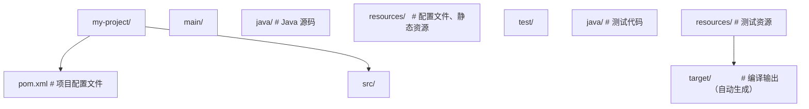
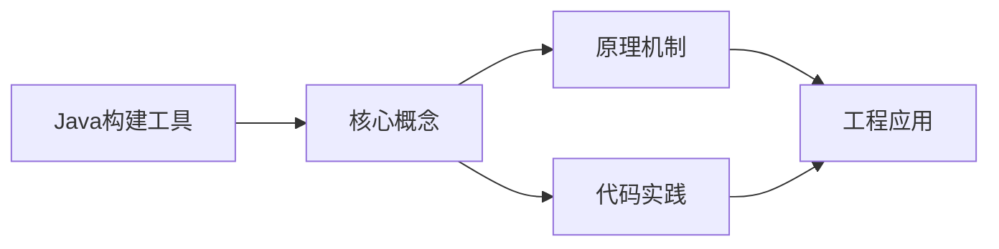
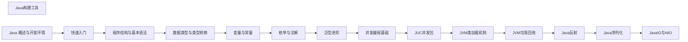

## 1. 学习目标（Bloom 分类）

本节按照布鲁姆教育目标分类学组织学习路径。本文主题为《Java构建工具》，属于 Java 模块，读者可以根据自身阶段选择阅读深度。

记忆层面：能够准确复述本文的核心概念、术语与基本语法或操作步骤，并能够在提问或检索时快速定位对应知识点。能够说出 Java 的编译执行模型（javac 到字节码，JVM 解释与 JIT）。

理解层面：能够用自己的语言解释核心原理与工作机制，说明概念之间的因果关系，而不是机械记忆结论。能够解释面向对象三大特性与 JVM 内存区域的职责。

应用层面：能够在真实项目或练习场景中运用本文知识解决具体问题，写出正确且可维护的实现。能够编写类、接口、集合操作与异常处理的完整程序。

分析层面：能够拆解复杂问题，比较本文主题与相邻概念的异同，识别边界条件与例外情况。能够分析 Java 与 C++、Go 在内存管理与并发模型上的差异。

评价层面：能够根据约束条件（性能、可读性、安全、成本）评价不同方案的优劣，做出有依据的技术决策。能够评价不同集合、并发工具与框架的适用场景。

创造层面：能够把本文知识与其他模块知识组合，设计出新的解决方案或可复用的工程模式。能够组合 Spring 生态设计企业级应用。

通过本节学习，读者应当能够把《Java构建工具》纳入自己的知识网络，并与 Java 模块的其他主题（JVM、集合框架、并发、Spring 生态）建立关联。

## 2. 历史动机与发展脉络

《Java构建工具》是 Java 领域的重要主题。要真正理解它，需要先了解它解决的问题与演进过程。

Java 由 James Gosling 领导的 Sun 团队于 1995 年发布，口号“一次编写，到处运行”依托 JVM 字节码实现跨平台。2006 年 Sun 将 Java 开源（OpenJDK），2010 年 Oracle 收购 Sun 后 Java 进入新的治理阶段。
Java 的版本节奏在 2017 年后改为每半年一个特性版本、每两年一个 LTS（长期支持）版本。当前主流 LTS 包括 Java 11、17、21 与 25；Java 21 引入虚拟线程（Project Loom 成果），显著降低高并发服务的线程成本。
Java 生态以 Spring 家族为核心：Spring Boot 简化配置与部署，Spring Cloud 提供微服务组件；构建工具从 Maven 演进到 Gradle；JVM 语言（Kotlin、Scala、Groovy）与 Java 共存互操作。
Android 开发早期使用 Java，2019 年后官方转向 Kotlin-first，但 Java 仍是服务端领域（尤其是金融、电商等企业系统）的中坚力量。

回到本文主题：Java构建工具 的提出与成熟，正是上述技术背景下的必然产物。早期实现往往以简单可用为目标，随着工程规模扩大，社区逐渐沉淀出标准做法与最佳实践；理解这一脉络，可以帮助读者判断“为什么文档中的推荐写法是现在这个样子”，也能在遇到历史遗留代码时准确识别其设计年代与取舍。

理解 Java 版本与 LTS 机制，是工程选型的起点：生产环境优先 LTS，新特性（如虚拟线程）可以在受控场景评估后引入。

## 3. 形式化定义与核心概念精讲

本节把《Java构建工具》涉及的核心概念以“定义 + 讲解”的形式展开。读者应把定义当作工具，把讲解当作理解路径；两者结合才能形成可迁移的知识。

JVM 与字节码：`javac` 把 .java 编译为 .class 字节码，JVM 加载、校验并执行；热点代码由 JIT（如 C2）编译为机器码，解释与编译结合实现启动速度与峰值性能的平衡。
面向对象：封装（访问控制）、继承（extends/implements）与多态（重载/重写）是 Java 的类型系统支柱；接口默认方法（Java 8）与密封类（Java 17）持续演进表达能力。
异常体系：受检异常（checked）编译期强制处理，非受检异常（RuntimeException）运行时抛出；try-with-resources 自动关闭资源。
泛型与擦除：Java 泛型在编译期检查后擦除类型参数，运行时无泛型信息；这解释了 `List<String>` 与 `List<Integer>` 的 Class 相同，以及通配符 `? extends` 的逆变协变规则。

### 3.1 原文章节逐一精讲

原文档把主题拆分为 14 个小节，下面按顺序给出每一节的导读讲解，随后保留原文细节供精读。

#### 原文精读（完整保留）

# Java 构建工具 Maven/Gradle 速查

> **符号约定**：`< >` 必填参数 | `[ ]` 可选参数

---

#### 概述

Java 构建工具负责管理项目的依赖、编译源码、运行测试、打包发布等一系列任务。没有构建工具时，你需要手动下载 jar 包、手动编译、手动组织目录结构，效率极低。构建工具把这些重复性工作自动化，让你专注于编写代码。

Java 生态中有两个主流构建工具：Maven 和 Gradle。Maven 是老牌工具，使用 XML 配置，约定严格，社区资源丰富；Gradle 是后起之秀，使用 Groovy/Kotlin DSL 配置，更灵活，构建速度更快。新项目可以根据团队偏好选择，两者都能胜任。

#### 基础概念

##### 依赖管理

Java 项目通常依赖大量第三方库（如 Spring、Jackson、MySQL 驱动等）。构建工具通过坐标（groupId、artifactId、version）从仓库（Maven Central 或私有仓库）自动下载这些依赖，并处理依赖之间的传递关系。

##### 仓库

仓库是存放 jar 包的地方。Maven Central 是最大的公共仓库，几乎所有开源 Java 库都发布在这里。企业通常还会搭建私有仓库（如 Nexus、Artifactory）来存放内部组件。

##### 生命周期

Maven 定义了标准的构建生命周期：validate -> compile -> test -> package -> verify -> install -> deploy。每个阶段由插件的具体目标（goal）实现。执行某个阶段时，它之前的所有阶段会自动执行。

##### 多模块项目

大型项目通常拆分为多个模块（如 api、service、common），每个模块有独立的 pom.xml 或 build.gradle，但由父项目统一管理依赖版本和构建流程。

#### 快速上手

##### Maven 项目结构

Maven 约定了标准的目录结构：



##### 最简 pom.xml

```xml
<?xml version="1.0" encoding="UTF-8"?>
<project xmlns="http://maven.apache.org/POM/4.0.0"
         xmlns:xsi="http://www.w3.org/2001/XMLSchema-instance"
         xsi:schemaLocation="http://maven.apache.org/POM/4.0.0
         http://maven.apache.org/xsd/maven-4.0.0.xsd">
    <modelVersion>4.0.0</modelVersion>

    <!-- 项目坐标 -->
    <groupId>com.example</groupId>
    <artifactId>my-project</artifactId>
    <version>1.0.0</version>
    <packaging>jar</packaging>

    <!-- 继承 Spring Boot 父项目，获得默认配置和依赖版本管理 -->
    <parent>
        <groupId>org.springframework.boot</groupId>
        <artifactId>spring-boot-starter-parent</artifactId>
        <version>3.2.0</version>
    </parent>

    <dependencies>
        <!-- Spring Boot Web Starter -->
        <dependency>
            <groupId>org.springframework.boot</groupId>
            <artifactId>spring-boot-starter-web</artifactId>
        </dependency>
    </dependencies>
</project>
```

##### 常用 Maven 命令

```bash
# 编译项目
mvn compile

# 运行测试
mvn test

# 打包（编译 + 测试 + 生成 jar）
mvn package

# 清理之前的构建结果
mvn clean

# 清理并打包（最常用）
mvn clean package

# 安装到本地仓库（供其他项目引用）
mvn install

# 跳过测试打包（紧急发布时使用）
mvn clean package -DskipTests

# 查看依赖树（排查依赖冲突）
mvn dependency:tree
```

#### 详细用法

##### 1. Maven 依赖管理

```xml
<dependencies>
    <!-- 基本依赖：groupId + artifactId + version -->
    <dependency>
        <groupId>com.google.guava</groupId>
        <artifactId>guava</artifactId>
        <version>33.0.0-jre</version>
    </dependency>

    <!-- scope 控制依赖的作用范围 -->
    <dependency>
        <groupId>junit</groupId>
        <artifactId>junit</artifactId>
        <version>5.10.0</version>
        <scope>test</scope>  <!-- 只在测试时使用，不会打包到最终 jar -->
    </dependency>

    <dependency>
        <groupId>javax.servlet</groupId>
        <artifactId>javax.servlet-api</artifactId>
        <version>4.0.1</version>
        <scope>provided</scope>  <!-- 由运行环境提供（如 Tomcat），不打包 -->
    </dependency>

    <!-- 排除传递依赖 -->
    <dependency>
        <groupId>com.example</groupId>
        <artifactId>some-library</artifactId>
        <version>1.0.0</version>
        <exclusions>
            <exclusion>
                <groupId>org.slf4j</groupId>
                <artifactId>slf4j-log4j12</artifactId>
                <!-- 排除这个传递依赖，避免与项目使用的日志框架冲突 -->
            </exclusion>
        </exclusions>
    </dependency>
</dependencies>
```

##### 2. Maven 依赖版本管理

在多模块项目中，统一管理依赖版本很重要：

```xml
<!-- 在父 pom.xml 中使用 dependencyManagement 管理版本 -->
<dependencyManagement>
    <dependencies>
        <dependency>
            <groupId>com.google.guava</groupId>
            <artifactId>guava</artifactId>
            <version>33.0.0-jre</version>
        </dependency>
        <dependency>
            <groupId>org.apache.commons</groupId>
            <artifactId>commons-lang3</artifactId>
            <version>3.14.0</version>
        </dependency>
    </dependencies>
</dependencyManagement>

<!-- 子模块中不需要指定版本，统一使用父项目定义的版本 -->
<dependencies>
    <dependency>
        <groupId>com.google.guava</groupId>
        <artifactId>guava</artifactId>
        <!-- 不需要写 version，由父项目管理 -->
    </dependency>
</dependencies>
```

##### 3. Maven 多模块项目

```xml
<!-- 父项目 pom.xml -->
<groupId>com.example</groupId>
<artifactId>my-project-parent</artifactId>
<version>1.0.0</version>
<packaging>pom</packaging>  <!-- 父项目的打包类型是 pom -->

<modules>
    <module>api</module>      <!-- API 模块 -->
    <module>service</module>  <!-- 业务逻辑模块 -->
    <module>common</module>   <!-- 公共工具模块 -->
</modules>
```

子模块的 pom.xml：

```xml
<!-- api/pom.xml -->
<parent>
    <groupId>com.example</groupId>
    <artifactId>my-project-parent</artifactId>
    <version>1.0.0</version>
</parent>

<artifactId>my-project-api</artifactId>

<dependencies>
    <!-- 依赖同项目的 common 模块 -->
    <dependency>
        <groupId>com.example</groupId>
        <artifactId>my-project-common</artifactId>
        <version>${project.version}</version>
    </dependency>
</dependencies>
```

##### 4. Gradle 项目结构

Gradle 的项目结构与 Maven 相同，但配置文件是 build.gradle：

```groovy
// build.gradle
plugins {
    id 'java'
    id 'org.springframework.boot' version '3.2.0'
    id 'io.spring.dependency-management' version '1.1.4'
}

group = 'com.example'
version = '1.0.0'

java {
    sourceCompatibility = '17'  // Java 版本
}

// 仓库配置
repositories {
    mavenCentral()  // Maven Central 仓库
    // maven { url 'https://maven.aliyun.com/repository/public' }  // 阿里云镜像
}

// 依赖配置
dependencies {
    implementation 'org.springframework.boot:spring-boot-starter-web'
    implementation 'com.google.guava:guava:33.0.0-jre'
    testImplementation 'org.springframework.boot:spring-boot-starter-test'
}
```

##### 5. Gradle 依赖范围

Gradle 的依赖范围比 Maven 更细粒度：

```groovy
dependencies {
    // implementation：编译和运行时都需要，但不会传递给依赖此模块的其他模块
    implementation 'com.google.guava:guava:33.0.0-jre'

    // api：编译和运行时都需要，且会传递给依赖此模块的其他模块
    api 'com.example:my-common-lib:1.0.0'

    // compileOnly：只在编译时需要，运行时由环境提供
    compileOnly 'org.projectlombok:lombok:1.18.30'

    // runtimeOnly：只在运行时需要，编译时不需要（如数据库驱动）
    runtimeOnly 'com.mysql:mysql-connector-j:8.3.0'

    // testImplementation：只在测试编译和运行时需要
    testImplementation 'org.junit.jupiter:junit-jupiter:5.10.0'

    // annotationProcessor：注解处理器（如 Lombok）
    annotationProcessor 'org.projectlombok:lombok:1.18.30'
}
```

##### 6. Gradle 常用命令

```bash
# 编译项目
gradle build

# 清理构建结果
gradle clean

# 运行测试
gradle test

# 查看依赖树
gradle dependencies

# 刷新依赖（强制重新下载）
gradle build --refresh-dependencies

# 不运行测试打包
gradle build -x test
```

##### 7. Gradle 多模块项目

```groovy
// settings.gradle（根目录）
rootProject.name = 'my-project'
include 'api', 'service', 'common'
```

```groovy
// api/build.gradle
dependencies {
    implementation project(':common')  // 依赖同项目的 common 模块
}
```

##### 8. Maven 私有仓库配置

企业项目通常需要发布到私有仓库：

```xml
<!-- pom.xml 中配置分发管理 -->
<distributionManagement>
    <repository>
        <id>company-releases</id>
        <url>https://nexus.company.com/repository/releases/</url>
    </repository>
    <snapshotRepository>
        <id>company-snapshots</id>
        <url>https://nexus.company.com/repository/snapshots/</url>
    </snapshotRepository>
</distributionManagement>
```

```bash
# 发布到私有仓库
mvn deploy
```

#### 常见场景

##### 场景一：解决依赖冲突

当多个库间接依赖同一个库的不同版本时，会产生冲突：

```bash
# Maven：查看依赖树找到冲突
mvn dependency:tree -Dincludes=com.fasterxml.jackson.core:jackson-databind

# 找到冲突后，用 exclusion 排除不需要的版本
# 或者在 dependencyManagement 中强制指定版本
```

```groovy
// Gradle：查看依赖冲突
gradle dependencies --configuration runtimeClasspath

// 强制指定版本
configurations.all {
    resolutionStrategy {
        force 'com.fasterxml.jackson.core:jackson-databind:2.16.0'
    }
}
```

##### 场景二：使用国内镜像加速

国内访问 Maven Central 较慢，可以配置阿里云镜像：

```xml
<!-- ~/.m2/settings.xml -->
<mirrors>
    <mirror>
        <id>aliyun</id>
        <mirrorOf>central</mirrorOf>
        <url>https://maven.aliyun.com/repository/public</url>
    </mirror>
</mirrors>
```

#### 注意事项与常见错误

##### 依赖范围不要搞错

Maven 的 scope 和 Gradle 的 configuration 容易混淆。最常见的错误是把应该用 implementation 的依赖写成了 api，导致依赖泄露，其他模块无意中依赖了不应该看到的内部库。

##### SNAPSHOT 版本的风险

SNAPSHOT 版本是不稳定的开发版本，每次构建可能获取到不同的代码。生产环境绝不能依赖 SNAPSHOT 版本，应该使用正式发布的版本。

##### 不要把构建工具的配置文件提交时忽略

target/ 和 build/ 目录应该加入 .gitignore，但 pom.xml、build.gradle、settings.gradle 必须提交到版本控制。

##### Gradle Wrapper

使用 Gradle Wrapper 可以确保所有开发者使用相同的 Gradle 版本：

```bash
# 生成 Wrapper
gradle wrapper

# 使用 Wrapper 代替本地 Gradle
./gradlew build  # Linux/Mac
gradlew.bat build  # Windows
```

#### 进阶用法

##### Maven BOM 依赖管理

BOM（Bill of Materials）是一种特殊的 pom，只包含 dependencyManagement，用于统一管理一组相关依赖的版本：

```xml
<!-- 导入 Spring Cloud BOM -->
<dependencyManagement>
    <dependencies>
        <dependency>
            <groupId>org.springframework.cloud</groupId>
            <artifactId>spring-cloud-dependencies</artifactId>
            <version>2023.0.0</version>
            <type>pom</type>
            <scope>import</scope>
        </dependency>
    </dependencies>
</dependencyManagement>
```

##### Gradle 构建缓存

Gradle 支持构建缓存，可以显著加快构建速度：

```groovy
// gradle.properties
org.gradle.caching=true        // 启用构建缓存
org.gradle.parallel=true       // 并行构建模块
org.gradle.jvmargs=-Xmx2g     // 增加 Gradle 的 JVM 内存
```

##### 自定义 Maven 插件

当标准插件不满足需求时，可以编写自定义插件：

```xml
<!-- 使用 exec-maven-plugin 在构建时执行自定义命令 -->
<plugin>
    <groupId>org.codehaus.mojo</groupId>
    <artifactId>exec-maven-plugin</artifactId>
    <executions>
        <execution>
            <phase>generate-sources</phase>
            <goals>
                <goal>exec</goal>
            </goals>
            <configuration>
                <executable>npm</executable>
                <arguments>
                    <argument>run</argument>
                    <argument>build</argument>
                </arguments>
            </configuration>
        </execution>
    </executions>
</plugin>
```
#### Maven 常用命令

**基本写法：清理构建产物**
`mvn clean`
```java
// 删除 target 目录，确保全新构建
mvn clean
```

---

**基本写法：编译主代码**
`mvn compile`
```java
// 编译 src/main/java 到 target/classes
mvn compile
```

---

**基本写法：编译测试代码**
`mvn test-compile`
```java
// 编译 src/test/java 到 target/test-classes
mvn test-compile
```

---

**基本写法：运行测试**
`mvn test`
```java
// 执行所有单元测试，报告输出到 target/surefire-reports
mvn test
```

---

**基本写法：打包**
`mvn package`
```java
// 打包为 jar/war，输出到 target/
mvn package
```

---

**基本写法：安装到本地仓库**
`mvn install`
```java
// 安装到 ~/.m2/repository 供其他本地项目依赖
mvn install
```

---

**基本写法：部署到远程仓库**
`mvn deploy`
```java
// 上传构件到 Nexus/Artifactory 等远程仓库
mvn deploy
```

---

**基本写法：跳过测试打包**
`mvn package -DskipTests`
```java
// 编译测试代码但不执行测试
mvn clean package -DskipTests
```

---

**基本写法：完全跳过测试**
`mvn package -Dmaven.test.skip=true`
```java
// 既不编译也不执行测试
mvn clean package -Dmaven.test.skip=true
```

---

**基本写法：激活 Profile**
`mvn package -P<profileId>`
```java
// 激活指定 profile 进行打包
mvn clean package -Pprod
```

---

**基本写法：离线构建**
`mvn -o <goal>`
```java
// 不访问远程仓库，仅使用本地依赖
mvn -o clean package
```

---

**基本写法：多线程构建**
`mvn -T <threads> <goal>`
```java
// 使用 4 线程并行构建
mvn -T 4 clean install
```

---

**基本写法：查看依赖树**
`mvn dependency:tree`
```java
// 排查依赖冲突必备
mvn dependency:tree
```

---

**基本写法：过滤依赖**
`mvn dependency:tree -Dincludes=<groupId>:<artifactId>`
```java
// 只查看指定依赖的引入路径
mvn dependency:tree -Dincludes=org.springframework:spring-core
```

---

**基本写法：分析依赖**
`mvn dependency:analyze`
```java
// 检查未使用与未声明依赖
mvn dependency:analyze
```

---

**基本写法：查看有效 POM**
`mvn help:effective-pom`
```java
// 输出合并父 POM 后的最终 POM
mvn help:effective-pom
```

---

**基本写法：创建项目骨架**
`mvn archetype:generate`
```java
// 交互式生成 Maven 项目结构
mvn archetype:generate -DgroupId=com.example -DartifactId=my-app -DarchetypeArtifactId=maven-archetype-quickstart -DinteractiveMode=false
```

---

**基本写法：Spring Boot 运行**
`mvn spring-boot:run`
```java
// 直接从源码启动 Spring Boot 应用
mvn spring-boot:run
```

---

**基本写法：多模块构建**
`mvn -pl <module> -am <goal>`
```java
// 只构建指定模块及其依赖模块
mvn -pl my-module -am clean install
```

---

#### Maven 依赖 Scope

**基本写法：编译期依赖**
`<scope>compile</scope>`
```java
// 默认 scope，全阶段可用
<dependency>
    <groupId>org.springframework</groupId>
    <artifactId>spring-core</artifactId>
    <scope>compile</scope>
</dependency>
```

---

**基本写法：测试期依赖**
`<scope>test</scope>`
```java
// 仅测试阶段可用
<dependency>
    <groupId>junit</groupId>
    <artifactId>junit</artifactId>
    <scope>test</scope>
</dependency>
```

---

**基本写法：已提供依赖**
`<scope>provided</scope>`
```java
// 编译测试可用，打包时不包含（由容器提供）
<dependency>
    <groupId>jakarta.servlet</groupId>
    <artifactId>jakarta.servlet-api</artifactId>
    <scope>provided</scope>
</dependency>
```

---

**基本写法：运行时依赖**
`<scope>runtime</scope>`
```java
// 编译不需要，运行时需要
<dependency>
    <groupId>mysql</groupId>
    <artifactId>mysql-connector-java</artifactId>
    <scope>runtime</scope>
</dependency>
```

---

#### Gradle 常用命令

**基本写法：列出所有任务**
`./gradlew tasks`
```java
// 查看项目可用的所有 Gradle 任务
./gradlew tasks
```

---

**基本写法：清理构建**
`./gradlew clean`
```java
// 删除 build 目录
./gradlew clean
```

---

**基本写法：编译代码**
`./gradlew build`
```java
// 完整构建（编译、测试、打包）
./gradlew build
```

---

**基本写法：跳过测试构建**
`./gradlew build -x test`
```java
// 排除 test 任务
./gradlew build -x test
```

---

**基本写法：运行测试**
`./gradlew test`
```java
// 执行所有测试
./gradlew test
```

---

**基本写法：运行指定测试类**
`./gradlew test --tests <类名>`
```java
// 只运行某个测试类
./gradlew test --tests com.example.UserServiceTest
```

---

**基本写法：运行 Spring Boot**
`./gradlew bootRun`
```java
// 启动 Spring Boot 应用
./gradlew bootRun
```

---

**基本写法：打包**
`./gradlew bootJar`
```java
// 生成可执行 fat jar
./gradlew bootJar
```

---

**基本写法：查看依赖树**
`./gradlew dependencies`
```java
// 打印项目依赖树
./gradlew dependencies
```

---

**基本写法：查看指定配置的依赖**
`./gradlew dependencies --configuration <配置>`
```java
// 只查看 runtimeClasspath 的依赖
./gradlew dependencies --configuration runtimeClasspath
```

---

**基本写法：依赖分析**
`./gradlew dependencyInsight --dependency <名称>`
```java
// 查看某个依赖的详细解析过程
./gradlew dependencyInsight --dependency spring-core
```

---

**基本写法：刷新依赖**
`./gradlew --refresh-dependencies build`
```java
// 强制重新下载依赖
./gradlew --refresh-dependencies build
```

---

**基本写法：并行构建**
`./gradlew build --parallel`
```java
// 多模块并行构建
./gradlew build --parallel
```

---

**基本写法：构建缓存**
`./gradlew build --build-cache`
```java
// 启用 Gradle 构建缓存
./gradlew build --build-cache
```

---

**基本写法：查看任务详情**
`./gradlew help --task <任务名>`
```java
// 查看某任务的描述与依赖
./gradlew help --task build
```

---

**基本写法：初始化 Wrapper**
`gradle wrapper --gradle-version <版本>`
```java
// 生成 gradlew 脚本，统一团队 Gradle 版本
gradle wrapper --gradle-version 8.5
```

---

#### build.gradle 关键配置

**基本写法：插件声明**
`plugins { id '<plugin>' version '<version>' }`
```java
// Groovy DSL 声明插件
plugins {
    id 'org.springframework.boot' version '3.2.0'
    id 'java'
}
```

---

**基本写法：依赖声明**
`implementation '<group>:<name>:<version>'`
```java
// Groovy DSL 添加依赖
dependencies {
    implementation 'org.springframework.boot:spring-boot-starter-web:3.2.0'
    testImplementation 'org.junit.jupiter:junit-jupiter:5.12.1'
}
```

---

**基本写法：Kotlin DSL 依赖**
`implementation("<group>:<name>:<version>")`
```java
// build.gradle.kts 写法
dependencies {
    implementation("org.springframework.boot:spring-boot-starter-web:3.2.0")
    testImplementation("org.junit.jupiter:junit-jupiter:5.12.1")
}
```

---

**基本写法：Java 版本配置**
`java { sourceCompatibility = JavaVersion.VERSION_17 }`
```java
// 指定编译目标版本
java {
    sourceCompatibility = JavaVersion.VERSION_17
    targetCompatibility = JavaVersion.VERSION_17
}
```

---

**基本写法：仓库配置**
`repositories { mavenCentral() }`
```java
// 配置依赖仓库
repositories {
    mavenCentral()
    maven { url 'https://maven.aliyun.com/repository/public' }
}
```

---

**基本写法：自定义任务**
`task <name> { doLast { ... } }`
```java
// Groovy DSL 定义任务
task printVersion {
    doLast {
        println "Project version: ${project.version}"
    }
}
```

---

#### 仓库镜像配置

**基本写法：Maven 阿里云镜像**
`<mirror>` in settings.xml
```java
// ~/.m2/settings.xml 配置镜像加速
<mirror>
    <id>aliyun</id>
    <mirrorOf>central</mirrorOf>
    <url>https://maven.aliyun.com/repository/public</url>
</mirror>
```

---

**基本写法：Gradle 阿里云镜像**
`repositories { maven { url '...' } }`
```java
// settings.gradle 或 build.gradle 配置
repositories {
    maven { url 'https://maven.aliyun.com/repository/public' }
    mavenCentral()
}
```

---

#### 版本管理

**基本写法：Maven 版本号约定**
`<major>.<minor>.<patch>-<qualifier>`
```java
// 语义化版本号约定
// 1.0.0-SNAPSHOT 快照版本
// 1.0.0-RELEASE 正式版本
```

---

**基本写法：Maven 版本更新检查**
`mvn versions:display-dependency-updates`
```java
// 列出可用的依赖新版本
mvn versions:display-dependency-updates
```

---

**基本写法：Gradle 版本目录**
`libs.versions.toml`
```java
// gradle/libs.versions.toml 集中管理版本
[versions]
junit = "5.12.1"
[libraries]
junit = { module = "org.junit.jupiter:junit-jupiter", version.ref = "junit" }
```

---

#### 发布构件

**基本写法：Maven 发布到远程仓库**
`<distributionManagement>`
```java
// pom.xml 配置发布目标
<distributionManagement>
    <repository>
        <id>releases</id>
        <url>https://repo.example.com/releases</url>
    </repository>
</distributionManagement>
```

---

**基本写法：Gradle 发布**
`maven-publish` 插件
```java
// build.gradle 配置发布
publishing {
    publications {
        maven(MavenPublication) {
            from components.java
            groupId = 'com.example'
            artifactId = 'my-lib'
            version = '1.0.0'
        }
    }
}
```


### 3.2 概念关系图

下面用 Mermaid 图表达本文核心概念之间的关系，帮助读者建立整体图景：



图中展示的是本文知识的结构化关系：核心概念是入口，原理机制解释“为什么”，代码实践演示“怎么做”，工程应用回答“何时用”。读者学习时可以把每个小节的内容挂接到对应节点上。

## 4. 理论推导与原理解析

本节深入《Java构建工具》背后的原理。理论部分不求面面俱到，而是聚焦“能解释现象、能指导实践”的关键推导。

JVM 内存模型：堆（新生代/老年代）、元空间、虚拟机栈、本地方法栈与程序计数器；GC 从 CMS 演进到 G1（默认）、ZGC（超低延迟），理解分代收集是调优前提。
并发工具：synchronized 与 JUC（java.util.concurrent）的锁、并发容器、线程池、CompletableFuture 构成并发工具箱；Java 21 的虚拟线程让“每任务一线程”成为可能。
类加载机制：双亲委派模型保证类唯一性，SPI（ServiceLoader）打破委派实现扩展；自定义类加载器是热部署与隔离的基础。
反射与注解：反射在运行时检查类结构，注解提供元数据；Spring 的依赖注入与 AOP 均基于这些机制，但反射有性能与安全成本。

需要强调的是，理论推导与工程实践之间存在翻译层：理论给出的是理想化模型与边界条件，工程代码则必须处理真实环境中的例外。读者在学习时应先掌握理论的“标准情形”，再通过陷阱章节了解“非标准情形”。

## 5. 代码示例与逐行讲解

本节把原文中的代码示例系统整理，并为每个示例补充用途说明与讲解。读者不应只浏览代码，而应逐段对照讲解理解设计意图。

### 5.1 示例：Maven 项目结构

该示例来自原文《Maven 项目结构》小节，用于演示Java构建工具相关操作。阅读时请先看代码结构，再看其后的讲解。


讲解：这段代码演示了本节核心知识点。代码中的关键操作可以归纳为三步：准备（定义或初始化）、执行（核心逻辑）、收尾（释放资源或返回结果）。实际项目中，这三步往往被封装为函数或类，以提升复用性与可测试性。

关键点分析：

该示例共 14 行有效代码，结构以数据或配置为主。阅读时应关注：数据字段的含义、配置项的作用，以及它们与运行行为的对应关系。

进阶思考路径：先尝试修改参数观察行为变化，再把示例中的模式迁移到自己的项目中；每次修改都记录预期与实测差异，这是把示例转化为能力的最快方式。

### 5.2 示例：最简 pom.xml

该示例来自原文《最简 pom.xml》小节，用于演示Java构建工具相关操作。阅读时请先看代码结构，再看其后的讲解。

```xml
<?xml version="1.0" encoding="UTF-8"?>
<project xmlns="http://maven.apache.org/POM/4.0.0"
         xmlns:xsi="http://www.w3.org/2001/XMLSchema-instance"
         xsi:schemaLocation="http://maven.apache.org/POM/4.0.0
         http://maven.apache.org/xsd/maven-4.0.0.xsd">
    <modelVersion>4.0.0</modelVersion>

    <!-- 项目坐标 -->
    <groupId>com.example</groupId>
    <artifactId>my-project</artifactId>
    <version>1.0.0</version>
    <packaging>jar</packaging>

    <!-- 继承 Spring Boot 父项目，获得默认配置和依赖版本管理 -->
    <parent>
        <groupId>org.springframework.boot</groupId>
        <artifactId>spring-boot-starter-parent</artifactId>
        <version>3.2.0</version>
    </parent>

    <dependencies>
        <!-- Spring Boot Web Starter -->
        <dependency>
            <groupId>org.springframework.boot</groupId>
            <artifactId>spring-boot-starter-web</artifactId>
        </dependency>
    </dependencies>
</project>
```

讲解：这段代码演示了本节核心知识点。代码中的关键操作可以归纳为三步：准备（定义或初始化）、执行（核心逻辑）、收尾（释放资源或返回结果）。实际项目中，这三步往往被封装为函数或类，以提升复用性与可测试性。

关键点分析：

该示例共 25 行有效代码，结构以数据或配置为主。阅读时应关注：数据字段的含义、配置项的作用，以及它们与运行行为的对应关系。

进阶思考路径：先尝试修改参数观察行为变化，再把示例中的模式迁移到自己的项目中；每次修改都记录预期与实测差异，这是把示例转化为能力的最快方式。

### 5.3 示例：常用 Maven 命令

该示例来自原文《常用 Maven 命令》小节，用于演示Java构建工具相关操作。阅读时请先看代码结构，再看其后的讲解。

```bash
# 编译项目
mvn compile

# 运行测试
mvn test

# 打包（编译 + 测试 + 生成 jar）
mvn package

# 清理之前的构建结果
mvn clean

# 清理并打包（最常用）
mvn clean package

# 安装到本地仓库（供其他项目引用）
mvn install

# 跳过测试打包（紧急发布时使用）
mvn clean package -DskipTests

# 查看依赖树（排查依赖冲突）
mvn dependency:tree
```

讲解：这段代码演示了本节核心知识点。代码中的关键操作可以归纳为三步：准备（定义或初始化）、执行（核心逻辑）、收尾（释放资源或返回结果）。实际项目中，这三步往往被封装为函数或类，以提升复用性与可测试性。

关键点分析：

该示例共 16 行有效代码，结构以数据或配置为主。阅读时应关注：数据字段的含义、配置项的作用，以及它们与运行行为的对应关系。

进阶思考路径：先尝试修改参数观察行为变化，再把示例中的模式迁移到自己的项目中；每次修改都记录预期与实测差异，这是把示例转化为能力的最快方式。

### 5.4 示例：1. Maven 依赖管理

该示例来自原文《1. Maven 依赖管理》小节，用于演示Java构建工具相关操作。阅读时请先看代码结构，再看其后的讲解。

```xml
<dependencies>
    <!-- 基本依赖：groupId + artifactId + version -->
    <dependency>
        <groupId>com.google.guava</groupId>
        <artifactId>guava</artifactId>
        <version>33.0.0-jre</version>
    </dependency>

    <!-- scope 控制依赖的作用范围 -->
    <dependency>
        <groupId>junit</groupId>
        <artifactId>junit</artifactId>
        <version>5.10.0</version>
        <scope>test</scope>  <!-- 只在测试时使用，不会打包到最终 jar -->
    </dependency>

    <dependency>
        <groupId>javax.servlet</groupId>
        <artifactId>javax.servlet-api</artifactId>
        <version>4.0.1</version>
        <scope>provided</scope>  <!-- 由运行环境提供（如 Tomcat），不打包 -->
    </dependency>

    <!-- 排除传递依赖 -->
    <dependency>
        <groupId>com.example</groupId>
        <artifactId>some-library</artifactId>
        <version>1.0.0</version>
        <exclusions>
            <exclusion>
                <groupId>org.slf4j</groupId>
                <artifactId>slf4j-log4j12</artifactId>
                <!-- 排除这个传递依赖，避免与项目使用的日志框架冲突 -->
            </exclusion>
        </exclusions>
    </dependency>
</dependencies>
```

讲解：这段代码演示了本节核心知识点。代码中的关键操作可以归纳为三步：准备（定义或初始化）、执行（核心逻辑）、收尾（释放资源或返回结果）。实际项目中，这三步往往被封装为函数或类，以提升复用性与可测试性。

关键点分析：

该示例共 34 行有效代码，结构以数据或配置为主。阅读时应关注：数据字段的含义、配置项的作用，以及它们与运行行为的对应关系。

进阶思考路径：先尝试修改参数观察行为变化，再把示例中的模式迁移到自己的项目中；每次修改都记录预期与实测差异，这是把示例转化为能力的最快方式。

### 5.5 示例：2. Maven 依赖版本管理

该示例来自原文《2. Maven 依赖版本管理》小节，用于演示Java构建工具相关操作。阅读时请先看代码结构，再看其后的讲解。

```xml
<!-- 在父 pom.xml 中使用 dependencyManagement 管理版本 -->
<dependencyManagement>
    <dependencies>
        <dependency>
            <groupId>com.google.guava</groupId>
            <artifactId>guava</artifactId>
            <version>33.0.0-jre</version>
        </dependency>
        <dependency>
            <groupId>org.apache.commons</groupId>
            <artifactId>commons-lang3</artifactId>
            <version>3.14.0</version>
        </dependency>
    </dependencies>
</dependencyManagement>

<!-- 子模块中不需要指定版本，统一使用父项目定义的版本 -->
<dependencies>
    <dependency>
        <groupId>com.google.guava</groupId>
        <artifactId>guava</artifactId>
        <!-- 不需要写 version，由父项目管理 -->
    </dependency>
</dependencies>
```

讲解：这段代码演示了本节核心知识点。代码中的关键操作可以归纳为三步：准备（定义或初始化）、执行（核心逻辑）、收尾（释放资源或返回结果）。实际项目中，这三步往往被封装为函数或类，以提升复用性与可测试性。

关键点分析：

该示例共 23 行有效代码，结构以数据或配置为主。阅读时应关注：数据字段的含义、配置项的作用，以及它们与运行行为的对应关系。

进阶思考路径：先尝试修改参数观察行为变化，再把示例中的模式迁移到自己的项目中；每次修改都记录预期与实测差异，这是把示例转化为能力的最快方式。

### 5.6 示例：3. Maven 多模块项目

该示例来自原文《3. Maven 多模块项目》小节，用于演示Java构建工具相关操作。阅读时请先看代码结构，再看其后的讲解。

```xml
<!-- 父项目 pom.xml -->
<groupId>com.example</groupId>
<artifactId>my-project-parent</artifactId>
<version>1.0.0</version>
<packaging>pom</packaging>  <!-- 父项目的打包类型是 pom -->

<modules>
    <module>api</module>      <!-- API 模块 -->
    <module>service</module>  <!-- 业务逻辑模块 -->
    <module>common</module>   <!-- 公共工具模块 -->
</modules>
```

讲解：这段代码演示了本节核心知识点。代码中的关键操作可以归纳为三步：准备（定义或初始化）、执行（核心逻辑）、收尾（释放资源或返回结果）。实际项目中，这三步往往被封装为函数或类，以提升复用性与可测试性。

关键点分析：

该示例共 10 行有效代码，结构以数据或配置为主。阅读时应关注：数据字段的含义、配置项的作用，以及它们与运行行为的对应关系。

进阶思考路径：先尝试修改参数观察行为变化，再把示例中的模式迁移到自己的项目中；每次修改都记录预期与实测差异，这是把示例转化为能力的最快方式。

### 5.7 示例：3. Maven 多模块项目

该示例来自原文《3. Maven 多模块项目》小节，用于演示Java构建工具相关操作。阅读时请先看代码结构，再看其后的讲解。

```xml
<!-- api/pom.xml -->
<parent>
    <groupId>com.example</groupId>
    <artifactId>my-project-parent</artifactId>
    <version>1.0.0</version>
</parent>

<artifactId>my-project-api</artifactId>

<dependencies>
    <!-- 依赖同项目的 common 模块 -->
    <dependency>
        <groupId>com.example</groupId>
        <artifactId>my-project-common</artifactId>
        <version>${project.version}</version>
    </dependency>
</dependencies>
```

讲解：这段代码演示了本节核心知识点。代码中的关键操作可以归纳为三步：准备（定义或初始化）、执行（核心逻辑）、收尾（释放资源或返回结果）。实际项目中，这三步往往被封装为函数或类，以提升复用性与可测试性。

关键点分析：

该示例共 15 行有效代码，结构以数据或配置为主。阅读时应关注：数据字段的含义、配置项的作用，以及它们与运行行为的对应关系。

进阶思考路径：先尝试修改参数观察行为变化，再把示例中的模式迁移到自己的项目中；每次修改都记录预期与实测差异，这是把示例转化为能力的最快方式。

### 5.8 示例：4. Gradle 项目结构

该示例来自原文《4. Gradle 项目结构》小节，用于演示Java构建工具相关操作。阅读时请先看代码结构，再看其后的讲解。

```groovy
// build.gradle
plugins {
    id 'java'
    id 'org.springframework.boot' version '3.2.0'
    id 'io.spring.dependency-management' version '1.1.4'
}

group = 'com.example'
version = '1.0.0'

java {
    sourceCompatibility = '17'  // Java 版本
}

// 仓库配置
repositories {
    mavenCentral()  // Maven Central 仓库
    // maven { url 'https://maven.aliyun.com/repository/public' }  // 阿里云镜像
}

// 依赖配置
dependencies {
    implementation 'org.springframework.boot:spring-boot-starter-web'
    implementation 'com.google.guava:guava:33.0.0-jre'
    testImplementation 'org.springframework.boot:spring-boot-starter-test'
}
```

讲解：这段代码演示了本节核心知识点。代码中的关键操作可以归纳为三步：准备（定义或初始化）、执行（核心逻辑）、收尾（释放资源或返回结果）。实际项目中，这三步往往被封装为函数或类，以提升复用性与可测试性。

关键点分析：

该示例共 22 行有效代码，结构以数据或配置为主。阅读时应关注：数据字段的含义、配置项的作用，以及它们与运行行为的对应关系。

进阶思考路径：先尝试修改参数观察行为变化，再把示例中的模式迁移到自己的项目中；每次修改都记录预期与实测差异，这是把示例转化为能力的最快方式。

### 5.9 示例：5. Gradle 依赖范围

该示例来自原文《5. Gradle 依赖范围》小节，用于演示Java构建工具相关操作。阅读时请先看代码结构，再看其后的讲解。

```groovy
dependencies {
    // implementation：编译和运行时都需要，但不会传递给依赖此模块的其他模块
    implementation 'com.google.guava:guava:33.0.0-jre'

    // api：编译和运行时都需要，且会传递给依赖此模块的其他模块
    api 'com.example:my-common-lib:1.0.0'

    // compileOnly：只在编译时需要，运行时由环境提供
    compileOnly 'org.projectlombok:lombok:1.18.30'

    // runtimeOnly：只在运行时需要，编译时不需要（如数据库驱动）
    runtimeOnly 'com.mysql:mysql-connector-j:8.3.0'

    // testImplementation：只在测试编译和运行时需要
    testImplementation 'org.junit.jupiter:junit-jupiter:5.10.0'

    // annotationProcessor：注解处理器（如 Lombok）
    annotationProcessor 'org.projectlombok:lombok:1.18.30'
}
```

讲解：这段代码演示了本节核心知识点。代码中的关键操作可以归纳为三步：准备（定义或初始化）、执行（核心逻辑）、收尾（释放资源或返回结果）。实际项目中，这三步往往被封装为函数或类，以提升复用性与可测试性。

关键点分析：

该示例共 14 行有效代码，结构以数据或配置为主。阅读时应关注：数据字段的含义、配置项的作用，以及它们与运行行为的对应关系。

进阶思考路径：先尝试修改参数观察行为变化，再把示例中的模式迁移到自己的项目中；每次修改都记录预期与实测差异，这是把示例转化为能力的最快方式。

### 5.10 示例：6. Gradle 常用命令

该示例来自原文《6. Gradle 常用命令》小节，用于演示Java构建工具相关操作。阅读时请先看代码结构，再看其后的讲解。

```bash
# 编译项目
gradle build

# 清理构建结果
gradle clean

# 运行测试
gradle test

# 查看依赖树
gradle dependencies

# 刷新依赖（强制重新下载）
gradle build --refresh-dependencies

# 不运行测试打包
gradle build -x test
```

讲解：这段代码演示了本节核心知识点。代码中的关键操作可以归纳为三步：准备（定义或初始化）、执行（核心逻辑）、收尾（释放资源或返回结果）。实际项目中，这三步往往被封装为函数或类，以提升复用性与可测试性。

关键点分析：

该示例共 12 行有效代码，结构以数据或配置为主。阅读时应关注：数据字段的含义、配置项的作用，以及它们与运行行为的对应关系。

进阶思考路径：先尝试修改参数观察行为变化，再把示例中的模式迁移到自己的项目中；每次修改都记录预期与实测差异，这是把示例转化为能力的最快方式。

### 5.11 示例：7. Gradle 多模块项目

该示例来自原文《7. Gradle 多模块项目》小节，用于演示Java构建工具相关操作。阅读时请先看代码结构，再看其后的讲解。

```groovy
// settings.gradle（根目录）
rootProject.name = 'my-project'
include 'api', 'service', 'common'
```

讲解：这段代码演示了本节核心知识点。代码中的关键操作可以归纳为三步：准备（定义或初始化）、执行（核心逻辑）、收尾（释放资源或返回结果）。实际项目中，这三步往往被封装为函数或类，以提升复用性与可测试性。

关键点分析：

该示例共 3 行有效代码，结构以数据或配置为主。阅读时应关注：数据字段的含义、配置项的作用，以及它们与运行行为的对应关系。

进阶思考路径：先尝试修改参数观察行为变化，再把示例中的模式迁移到自己的项目中；每次修改都记录预期与实测差异，这是把示例转化为能力的最快方式。

### 5.12 示例：7. Gradle 多模块项目

该示例来自原文《7. Gradle 多模块项目》小节，用于演示Java构建工具相关操作。阅读时请先看代码结构，再看其后的讲解。

```groovy
// api/build.gradle
dependencies {
    implementation project(':common')  // 依赖同项目的 common 模块
}
```

讲解：这段代码演示了本节核心知识点。代码中的关键操作可以归纳为三步：准备（定义或初始化）、执行（核心逻辑）、收尾（释放资源或返回结果）。实际项目中，这三步往往被封装为函数或类，以提升复用性与可测试性。

关键点分析：

该示例共 4 行有效代码，结构以数据或配置为主。阅读时应关注：数据字段的含义、配置项的作用，以及它们与运行行为的对应关系。

进阶思考路径：先尝试修改参数观察行为变化，再把示例中的模式迁移到自己的项目中；每次修改都记录预期与实测差异，这是把示例转化为能力的最快方式。

### 5.13 示例：8. Maven 私有仓库配置

该示例来自原文《8. Maven 私有仓库配置》小节，用于演示Java构建工具相关操作。阅读时请先看代码结构，再看其后的讲解。

```xml
<!-- pom.xml 中配置分发管理 -->
<distributionManagement>
    <repository>
        <id>company-releases</id>
        <url>https://nexus.company.com/repository/releases/</url>
    </repository>
    <snapshotRepository>
        <id>company-snapshots</id>
        <url>https://nexus.company.com/repository/snapshots/</url>
    </snapshotRepository>
</distributionManagement>
```

讲解：这段代码演示了本节核心知识点。代码中的关键操作可以归纳为三步：准备（定义或初始化）、执行（核心逻辑）、收尾（释放资源或返回结果）。实际项目中，这三步往往被封装为函数或类，以提升复用性与可测试性。

关键点分析：

该示例共 11 行有效代码，结构以数据或配置为主。阅读时应关注：数据字段的含义、配置项的作用，以及它们与运行行为的对应关系。

进阶思考路径：先尝试修改参数观察行为变化，再把示例中的模式迁移到自己的项目中；每次修改都记录预期与实测差异，这是把示例转化为能力的最快方式。

### 5.14 示例：8. Maven 私有仓库配置

该示例来自原文《8. Maven 私有仓库配置》小节，用于演示Java构建工具相关操作。阅读时请先看代码结构，再看其后的讲解。

```bash
# 发布到私有仓库
mvn deploy
```

讲解：这段代码演示了本节核心知识点。代码中的关键操作可以归纳为三步：准备（定义或初始化）、执行（核心逻辑）、收尾（释放资源或返回结果）。实际项目中，这三步往往被封装为函数或类，以提升复用性与可测试性。

关键点分析：

该示例共 2 行有效代码，结构以数据或配置为主。阅读时应关注：数据字段的含义、配置项的作用，以及它们与运行行为的对应关系。

进阶思考路径：先尝试修改参数观察行为变化，再把示例中的模式迁移到自己的项目中；每次修改都记录预期与实测差异，这是把示例转化为能力的最快方式。

### 5.15 示例：场景一：解决依赖冲突

该示例来自原文《场景一：解决依赖冲突》小节，用于演示Java构建工具相关操作。阅读时请先看代码结构，再看其后的讲解。

```bash
# Maven：查看依赖树找到冲突
mvn dependency:tree -Dincludes=com.fasterxml.jackson.core:jackson-databind

# 找到冲突后，用 exclusion 排除不需要的版本
# 或者在 dependencyManagement 中强制指定版本
```

讲解：这段代码演示了本节核心知识点。代码中的关键操作可以归纳为三步：准备（定义或初始化）、执行（核心逻辑）、收尾（释放资源或返回结果）。实际项目中，这三步往往被封装为函数或类，以提升复用性与可测试性。

关键点分析：

该示例共 4 行有效代码，结构以数据或配置为主。阅读时应关注：数据字段的含义、配置项的作用，以及它们与运行行为的对应关系。

进阶思考路径：先尝试修改参数观察行为变化，再把示例中的模式迁移到自己的项目中；每次修改都记录预期与实测差异，这是把示例转化为能力的最快方式。

### 5.16 示例：场景一：解决依赖冲突

该示例来自原文《场景一：解决依赖冲突》小节，用于演示Java构建工具相关操作。阅读时请先看代码结构，再看其后的讲解。

```groovy
// Gradle：查看依赖冲突
gradle dependencies --configuration runtimeClasspath

// 强制指定版本
configurations.all {
    resolutionStrategy {
        force 'com.fasterxml.jackson.core:jackson-databind:2.16.0'
    }
}
```

讲解：这段代码演示了本节核心知识点。代码中的关键操作可以归纳为三步：准备（定义或初始化）、执行（核心逻辑）、收尾（释放资源或返回结果）。实际项目中，这三步往往被封装为函数或类，以提升复用性与可测试性。

关键点分析：

该示例共 8 行有效代码，结构以数据或配置为主。阅读时应关注：数据字段的含义、配置项的作用，以及它们与运行行为的对应关系。

进阶思考路径：先尝试修改参数观察行为变化，再把示例中的模式迁移到自己的项目中；每次修改都记录预期与实测差异，这是把示例转化为能力的最快方式。

### 5.17 示例：场景二：使用国内镜像加速

该示例来自原文《场景二：使用国内镜像加速》小节，用于演示Java构建工具相关操作。阅读时请先看代码结构，再看其后的讲解。

```xml
<!-- ~/.m2/settings.xml -->
<mirrors>
    <mirror>
        <id>aliyun</id>
        <mirrorOf>central</mirrorOf>
        <url>https://maven.aliyun.com/repository/public</url>
    </mirror>
</mirrors>
```

讲解：这段代码演示了本节核心知识点。代码中的关键操作可以归纳为三步：准备（定义或初始化）、执行（核心逻辑）、收尾（释放资源或返回结果）。实际项目中，这三步往往被封装为函数或类，以提升复用性与可测试性。

关键点分析：

该示例共 8 行有效代码，结构以数据或配置为主。阅读时应关注：数据字段的含义、配置项的作用，以及它们与运行行为的对应关系。

进阶思考路径：先尝试修改参数观察行为变化，再把示例中的模式迁移到自己的项目中；每次修改都记录预期与实测差异，这是把示例转化为能力的最快方式。

### 5.18 示例：Gradle Wrapper

该示例来自原文《Gradle Wrapper》小节，用于演示Java构建工具相关操作。阅读时请先看代码结构，再看其后的讲解。

```bash
# 生成 Wrapper
gradle wrapper

# 使用 Wrapper 代替本地 Gradle
./gradlew build  # Linux/Mac
gradlew.bat build  # Windows
```

讲解：这段代码演示了本节核心知识点。代码中的关键操作可以归纳为三步：准备（定义或初始化）、执行（核心逻辑）、收尾（释放资源或返回结果）。实际项目中，这三步往往被封装为函数或类，以提升复用性与可测试性。

关键点分析：

该示例共 5 行有效代码，结构以数据或配置为主。阅读时应关注：数据字段的含义、配置项的作用，以及它们与运行行为的对应关系。

进阶思考路径：先尝试修改参数观察行为变化，再把示例中的模式迁移到自己的项目中；每次修改都记录预期与实测差异，这是把示例转化为能力的最快方式。

### 5.19 示例：Maven BOM 依赖管理

该示例来自原文《Maven BOM 依赖管理》小节，用于演示Java构建工具相关操作。阅读时请先看代码结构，再看其后的讲解。

```xml
<!-- 导入 Spring Cloud BOM -->
<dependencyManagement>
    <dependencies>
        <dependency>
            <groupId>org.springframework.cloud</groupId>
            <artifactId>spring-cloud-dependencies</artifactId>
            <version>2023.0.0</version>
            <type>pom</type>
            <scope>import</scope>
        </dependency>
    </dependencies>
</dependencyManagement>
```

讲解：这段代码演示了本节核心知识点。代码中的关键操作可以归纳为三步：准备（定义或初始化）、执行（核心逻辑）、收尾（释放资源或返回结果）。实际项目中，这三步往往被封装为函数或类，以提升复用性与可测试性。

关键点分析：

该示例共 12 行有效代码，包含 1 类关键结构（import）。其中：

- 入口与初始化部分负责建立上下文，对应实际项目中的启动或装配逻辑；
- 核心逻辑部分体现本文主题的主要操作，是阅读时最需要对照讲解理解的部分；
- 输出或返回部分把结果交给调用方，注意其类型与边界条件。

进阶思考路径：先尝试修改参数观察行为变化，再把示例中的模式迁移到自己的项目中；每次修改都记录预期与实测差异，这是把示例转化为能力的最快方式。

### 5.20 示例：Gradle 构建缓存

该示例来自原文《Gradle 构建缓存》小节，用于演示Java构建工具相关操作。阅读时请先看代码结构，再看其后的讲解。

```groovy
// gradle.properties
org.gradle.caching=true        // 启用构建缓存
org.gradle.parallel=true       // 并行构建模块
org.gradle.jvmargs=-Xmx2g     // 增加 Gradle 的 JVM 内存
```

讲解：这段代码演示了本节核心知识点。代码中的关键操作可以归纳为三步：准备（定义或初始化）、执行（核心逻辑）、收尾（释放资源或返回结果）。实际项目中，这三步往往被封装为函数或类，以提升复用性与可测试性。

关键点分析：

该示例共 4 行有效代码，结构以数据或配置为主。阅读时应关注：数据字段的含义、配置项的作用，以及它们与运行行为的对应关系。

进阶思考路径：先尝试修改参数观察行为变化，再把示例中的模式迁移到自己的项目中；每次修改都记录预期与实测差异，这是把示例转化为能力的最快方式。

### 5.21 示例：自定义 Maven 插件

该示例来自原文《自定义 Maven 插件》小节，用于演示Java构建工具相关操作。阅读时请先看代码结构，再看其后的讲解。

```xml
<!-- 使用 exec-maven-plugin 在构建时执行自定义命令 -->
<plugin>
    <groupId>org.codehaus.mojo</groupId>
    <artifactId>exec-maven-plugin</artifactId>
    <executions>
        <execution>
            <phase>generate-sources</phase>
            <goals>
                <goal>exec</goal>
            </goals>
            <configuration>
                <executable>npm</executable>
                <arguments>
                    <argument>run</argument>
                    <argument>build</argument>
                </arguments>
            </configuration>
        </execution>
    </executions>
</plugin>
```

讲解：这段代码演示了本节核心知识点。代码中的关键操作可以归纳为三步：准备（定义或初始化）、执行（核心逻辑）、收尾（释放资源或返回结果）。实际项目中，这三步往往被封装为函数或类，以提升复用性与可测试性。

关键点分析：

该示例共 20 行有效代码，结构以数据或配置为主。阅读时应关注：数据字段的含义、配置项的作用，以及它们与运行行为的对应关系。

进阶思考路径：先尝试修改参数观察行为变化，再把示例中的模式迁移到自己的项目中；每次修改都记录预期与实测差异，这是把示例转化为能力的最快方式。

### 5.22 示例：Maven 常用命令

该示例来自原文《Maven 常用命令》小节，用于演示Java构建工具相关操作。阅读时请先看代码结构，再看其后的讲解。

```java
// 删除 target 目录，确保全新构建
mvn clean
```

讲解：这段代码演示了本节核心知识点。代码中的关键操作可以归纳为三步：准备（定义或初始化）、执行（核心逻辑）、收尾（释放资源或返回结果）。实际项目中，这三步往往被封装为函数或类，以提升复用性与可测试性。

关键点分析：

该示例共 2 行有效代码，结构以数据或配置为主。阅读时应关注：数据字段的含义、配置项的作用，以及它们与运行行为的对应关系。

进阶思考路径：先尝试修改参数观察行为变化，再把示例中的模式迁移到自己的项目中；每次修改都记录预期与实测差异，这是把示例转化为能力的最快方式。

### 5.23 示例：Maven 常用命令

该示例来自原文《Maven 常用命令》小节，用于演示Java构建工具相关操作。阅读时请先看代码结构，再看其后的讲解。

```java
// 编译 src/main/java 到 target/classes
mvn compile
```

讲解：这段代码演示了本节核心知识点。代码中的关键操作可以归纳为三步：准备（定义或初始化）、执行（核心逻辑）、收尾（释放资源或返回结果）。实际项目中，这三步往往被封装为函数或类，以提升复用性与可测试性。

关键点分析：

该示例共 2 行有效代码，包含 1 类关键结构（class）。其中：

- 入口与初始化部分负责建立上下文，对应实际项目中的启动或装配逻辑；
- 核心逻辑部分体现本文主题的主要操作，是阅读时最需要对照讲解理解的部分；
- 输出或返回部分把结果交给调用方，注意其类型与边界条件。

进阶思考路径：先尝试修改参数观察行为变化，再把示例中的模式迁移到自己的项目中；每次修改都记录预期与实测差异，这是把示例转化为能力的最快方式。

### 5.24 示例：Maven 常用命令

该示例来自原文《Maven 常用命令》小节，用于演示Java构建工具相关操作。阅读时请先看代码结构，再看其后的讲解。

```java
// 编译 src/test/java 到 target/test-classes
mvn test-compile
```

讲解：这段代码演示了本节核心知识点。代码中的关键操作可以归纳为三步：准备（定义或初始化）、执行（核心逻辑）、收尾（释放资源或返回结果）。实际项目中，这三步往往被封装为函数或类，以提升复用性与可测试性。

关键点分析：

该示例共 2 行有效代码，包含 1 类关键结构（class）。其中：

- 入口与初始化部分负责建立上下文，对应实际项目中的启动或装配逻辑；
- 核心逻辑部分体现本文主题的主要操作，是阅读时最需要对照讲解理解的部分；
- 输出或返回部分把结果交给调用方，注意其类型与边界条件。

进阶思考路径：先尝试修改参数观察行为变化，再把示例中的模式迁移到自己的项目中；每次修改都记录预期与实测差异，这是把示例转化为能力的最快方式。

### 5.25 示例：Maven 常用命令

该示例来自原文《Maven 常用命令》小节，用于演示Java构建工具相关操作。阅读时请先看代码结构，再看其后的讲解。

```java
// 执行所有单元测试，报告输出到 target/surefire-reports
mvn test
```

讲解：这段代码演示了本节核心知识点。代码中的关键操作可以归纳为三步：准备（定义或初始化）、执行（核心逻辑）、收尾（释放资源或返回结果）。实际项目中，这三步往往被封装为函数或类，以提升复用性与可测试性。

关键点分析：

该示例共 2 行有效代码，结构以数据或配置为主。阅读时应关注：数据字段的含义、配置项的作用，以及它们与运行行为的对应关系。

进阶思考路径：先尝试修改参数观察行为变化，再把示例中的模式迁移到自己的项目中；每次修改都记录预期与实测差异，这是把示例转化为能力的最快方式。

### 5.26 示例：Maven 常用命令

该示例来自原文《Maven 常用命令》小节，用于演示Java构建工具相关操作。阅读时请先看代码结构，再看其后的讲解。

```java
// 打包为 jar/war，输出到 target/
mvn package
```

讲解：这段代码演示了本节核心知识点。代码中的关键操作可以归纳为三步：准备（定义或初始化）、执行（核心逻辑）、收尾（释放资源或返回结果）。实际项目中，这三步往往被封装为函数或类，以提升复用性与可测试性。

关键点分析：

该示例共 2 行有效代码，结构以数据或配置为主。阅读时应关注：数据字段的含义、配置项的作用，以及它们与运行行为的对应关系。

进阶思考路径：先尝试修改参数观察行为变化，再把示例中的模式迁移到自己的项目中；每次修改都记录预期与实测差异，这是把示例转化为能力的最快方式。

### 5.27 示例：Maven 常用命令

该示例来自原文《Maven 常用命令》小节，用于演示Java构建工具相关操作。阅读时请先看代码结构，再看其后的讲解。

```java
// 安装到 ~/.m2/repository 供其他本地项目依赖
mvn install
```

讲解：这段代码演示了本节核心知识点。代码中的关键操作可以归纳为三步：准备（定义或初始化）、执行（核心逻辑）、收尾（释放资源或返回结果）。实际项目中，这三步往往被封装为函数或类，以提升复用性与可测试性。

关键点分析：

该示例共 2 行有效代码，结构以数据或配置为主。阅读时应关注：数据字段的含义、配置项的作用，以及它们与运行行为的对应关系。

进阶思考路径：先尝试修改参数观察行为变化，再把示例中的模式迁移到自己的项目中；每次修改都记录预期与实测差异，这是把示例转化为能力的最快方式。

### 5.28 示例：Maven 常用命令

该示例来自原文《Maven 常用命令》小节，用于演示Java构建工具相关操作。阅读时请先看代码结构，再看其后的讲解。

```java
// 上传构件到 Nexus/Artifactory 等远程仓库
mvn deploy
```

讲解：这段代码演示了本节核心知识点。代码中的关键操作可以归纳为三步：准备（定义或初始化）、执行（核心逻辑）、收尾（释放资源或返回结果）。实际项目中，这三步往往被封装为函数或类，以提升复用性与可测试性。

关键点分析：

该示例共 2 行有效代码，结构以数据或配置为主。阅读时应关注：数据字段的含义、配置项的作用，以及它们与运行行为的对应关系。

进阶思考路径：先尝试修改参数观察行为变化，再把示例中的模式迁移到自己的项目中；每次修改都记录预期与实测差异，这是把示例转化为能力的最快方式。

### 5.29 示例：Maven 常用命令

该示例来自原文《Maven 常用命令》小节，用于演示Java构建工具相关操作。阅读时请先看代码结构，再看其后的讲解。

```java
// 编译测试代码但不执行测试
mvn clean package -DskipTests
```

讲解：这段代码演示了本节核心知识点。代码中的关键操作可以归纳为三步：准备（定义或初始化）、执行（核心逻辑）、收尾（释放资源或返回结果）。实际项目中，这三步往往被封装为函数或类，以提升复用性与可测试性。

关键点分析：

该示例共 2 行有效代码，结构以数据或配置为主。阅读时应关注：数据字段的含义、配置项的作用，以及它们与运行行为的对应关系。

进阶思考路径：先尝试修改参数观察行为变化，再把示例中的模式迁移到自己的项目中；每次修改都记录预期与实测差异，这是把示例转化为能力的最快方式。

### 5.30 示例：Maven 常用命令

该示例来自原文《Maven 常用命令》小节，用于演示Java构建工具相关操作。阅读时请先看代码结构，再看其后的讲解。

```java
// 既不编译也不执行测试
mvn clean package -Dmaven.test.skip=true
```

讲解：这段代码演示了本节核心知识点。代码中的关键操作可以归纳为三步：准备（定义或初始化）、执行（核心逻辑）、收尾（释放资源或返回结果）。实际项目中，这三步往往被封装为函数或类，以提升复用性与可测试性。

关键点分析：

该示例共 2 行有效代码，结构以数据或配置为主。阅读时应关注：数据字段的含义、配置项的作用，以及它们与运行行为的对应关系。

进阶思考路径：先尝试修改参数观察行为变化，再把示例中的模式迁移到自己的项目中；每次修改都记录预期与实测差异，这是把示例转化为能力的最快方式。

### 5.31 示例：Maven 常用命令

该示例来自原文《Maven 常用命令》小节，用于演示Java构建工具相关操作。阅读时请先看代码结构，再看其后的讲解。

```java
// 激活指定 profile 进行打包
mvn clean package -Pprod
```

讲解：这段代码演示了本节核心知识点。代码中的关键操作可以归纳为三步：准备（定义或初始化）、执行（核心逻辑）、收尾（释放资源或返回结果）。实际项目中，这三步往往被封装为函数或类，以提升复用性与可测试性。

关键点分析：

该示例共 2 行有效代码，结构以数据或配置为主。阅读时应关注：数据字段的含义、配置项的作用，以及它们与运行行为的对应关系。

进阶思考路径：先尝试修改参数观察行为变化，再把示例中的模式迁移到自己的项目中；每次修改都记录预期与实测差异，这是把示例转化为能力的最快方式。

### 5.32 示例：Maven 常用命令

该示例来自原文《Maven 常用命令》小节，用于演示Java构建工具相关操作。阅读时请先看代码结构，再看其后的讲解。

```java
// 不访问远程仓库，仅使用本地依赖
mvn -o clean package
```

讲解：这段代码演示了本节核心知识点。代码中的关键操作可以归纳为三步：准备（定义或初始化）、执行（核心逻辑）、收尾（释放资源或返回结果）。实际项目中，这三步往往被封装为函数或类，以提升复用性与可测试性。

关键点分析：

该示例共 2 行有效代码，结构以数据或配置为主。阅读时应关注：数据字段的含义、配置项的作用，以及它们与运行行为的对应关系。

进阶思考路径：先尝试修改参数观察行为变化，再把示例中的模式迁移到自己的项目中；每次修改都记录预期与实测差异，这是把示例转化为能力的最快方式。

### 5.33 示例：Maven 常用命令

该示例来自原文《Maven 常用命令》小节，用于演示Java构建工具相关操作。阅读时请先看代码结构，再看其后的讲解。

```java
// 使用 4 线程并行构建
mvn -T 4 clean install
```

讲解：这段代码演示了本节核心知识点。代码中的关键操作可以归纳为三步：准备（定义或初始化）、执行（核心逻辑）、收尾（释放资源或返回结果）。实际项目中，这三步往往被封装为函数或类，以提升复用性与可测试性。

关键点分析：

该示例共 2 行有效代码，结构以数据或配置为主。阅读时应关注：数据字段的含义、配置项的作用，以及它们与运行行为的对应关系。

进阶思考路径：先尝试修改参数观察行为变化，再把示例中的模式迁移到自己的项目中；每次修改都记录预期与实测差异，这是把示例转化为能力的最快方式。

### 5.34 示例：Maven 常用命令

该示例来自原文《Maven 常用命令》小节，用于演示Java构建工具相关操作。阅读时请先看代码结构，再看其后的讲解。

```java
// 排查依赖冲突必备
mvn dependency:tree
```

讲解：这段代码演示了本节核心知识点。代码中的关键操作可以归纳为三步：准备（定义或初始化）、执行（核心逻辑）、收尾（释放资源或返回结果）。实际项目中，这三步往往被封装为函数或类，以提升复用性与可测试性。

关键点分析：

该示例共 2 行有效代码，结构以数据或配置为主。阅读时应关注：数据字段的含义、配置项的作用，以及它们与运行行为的对应关系。

进阶思考路径：先尝试修改参数观察行为变化，再把示例中的模式迁移到自己的项目中；每次修改都记录预期与实测差异，这是把示例转化为能力的最快方式。

### 5.35 示例：Maven 常用命令

该示例来自原文《Maven 常用命令》小节，用于演示Java构建工具相关操作。阅读时请先看代码结构，再看其后的讲解。

```java
// 只查看指定依赖的引入路径
mvn dependency:tree -Dincludes=org.springframework:spring-core
```

讲解：这段代码演示了本节核心知识点。代码中的关键操作可以归纳为三步：准备（定义或初始化）、执行（核心逻辑）、收尾（释放资源或返回结果）。实际项目中，这三步往往被封装为函数或类，以提升复用性与可测试性。

关键点分析：

该示例共 2 行有效代码，结构以数据或配置为主。阅读时应关注：数据字段的含义、配置项的作用，以及它们与运行行为的对应关系。

进阶思考路径：先尝试修改参数观察行为变化，再把示例中的模式迁移到自己的项目中；每次修改都记录预期与实测差异，这是把示例转化为能力的最快方式。

### 5.36 示例：Maven 常用命令

该示例来自原文《Maven 常用命令》小节，用于演示Java构建工具相关操作。阅读时请先看代码结构，再看其后的讲解。

```java
// 检查未使用与未声明依赖
mvn dependency:analyze
```

讲解：这段代码演示了本节核心知识点。代码中的关键操作可以归纳为三步：准备（定义或初始化）、执行（核心逻辑）、收尾（释放资源或返回结果）。实际项目中，这三步往往被封装为函数或类，以提升复用性与可测试性。

关键点分析：

该示例共 2 行有效代码，结构以数据或配置为主。阅读时应关注：数据字段的含义、配置项的作用，以及它们与运行行为的对应关系。

进阶思考路径：先尝试修改参数观察行为变化，再把示例中的模式迁移到自己的项目中；每次修改都记录预期与实测差异，这是把示例转化为能力的最快方式。

### 5.37 示例：Maven 常用命令

该示例来自原文《Maven 常用命令》小节，用于演示Java构建工具相关操作。阅读时请先看代码结构，再看其后的讲解。

```java
// 输出合并父 POM 后的最终 POM
mvn help:effective-pom
```

讲解：这段代码演示了本节核心知识点。代码中的关键操作可以归纳为三步：准备（定义或初始化）、执行（核心逻辑）、收尾（释放资源或返回结果）。实际项目中，这三步往往被封装为函数或类，以提升复用性与可测试性。

关键点分析：

该示例共 2 行有效代码，结构以数据或配置为主。阅读时应关注：数据字段的含义、配置项的作用，以及它们与运行行为的对应关系。

进阶思考路径：先尝试修改参数观察行为变化，再把示例中的模式迁移到自己的项目中；每次修改都记录预期与实测差异，这是把示例转化为能力的最快方式。

### 5.38 示例：Maven 常用命令

该示例来自原文《Maven 常用命令》小节，用于演示Java构建工具相关操作。阅读时请先看代码结构，再看其后的讲解。

```java
// 交互式生成 Maven 项目结构
mvn archetype:generate -DgroupId=com.example -DartifactId=my-app -DarchetypeArtifactId=maven-archetype-quickstart -DinteractiveMode=false
```

讲解：这段代码演示了本节核心知识点。代码中的关键操作可以归纳为三步：准备（定义或初始化）、执行（核心逻辑）、收尾（释放资源或返回结果）。实际项目中，这三步往往被封装为函数或类，以提升复用性与可测试性。

关键点分析：

该示例共 2 行有效代码，结构以数据或配置为主。阅读时应关注：数据字段的含义、配置项的作用，以及它们与运行行为的对应关系。

进阶思考路径：先尝试修改参数观察行为变化，再把示例中的模式迁移到自己的项目中；每次修改都记录预期与实测差异，这是把示例转化为能力的最快方式。

### 5.39 示例：Maven 常用命令

该示例来自原文《Maven 常用命令》小节，用于演示Java构建工具相关操作。阅读时请先看代码结构，再看其后的讲解。

```java
// 直接从源码启动 Spring Boot 应用
mvn spring-boot:run
```

讲解：这段代码演示了本节核心知识点。代码中的关键操作可以归纳为三步：准备（定义或初始化）、执行（核心逻辑）、收尾（释放资源或返回结果）。实际项目中，这三步往往被封装为函数或类，以提升复用性与可测试性。

关键点分析：

该示例共 2 行有效代码，结构以数据或配置为主。阅读时应关注：数据字段的含义、配置项的作用，以及它们与运行行为的对应关系。

进阶思考路径：先尝试修改参数观察行为变化，再把示例中的模式迁移到自己的项目中；每次修改都记录预期与实测差异，这是把示例转化为能力的最快方式。

### 5.40 示例：Maven 常用命令

该示例来自原文《Maven 常用命令》小节，用于演示Java构建工具相关操作。阅读时请先看代码结构，再看其后的讲解。

```java
// 只构建指定模块及其依赖模块
mvn -pl my-module -am clean install
```

讲解：这段代码演示了本节核心知识点。代码中的关键操作可以归纳为三步：准备（定义或初始化）、执行（核心逻辑）、收尾（释放资源或返回结果）。实际项目中，这三步往往被封装为函数或类，以提升复用性与可测试性。

关键点分析：

该示例共 2 行有效代码，结构以数据或配置为主。阅读时应关注：数据字段的含义、配置项的作用，以及它们与运行行为的对应关系。

进阶思考路径：先尝试修改参数观察行为变化，再把示例中的模式迁移到自己的项目中；每次修改都记录预期与实测差异，这是把示例转化为能力的最快方式。

### 5.41 示例：Maven 依赖 Scope

该示例来自原文《Maven 依赖 Scope》小节，用于演示Java构建工具相关操作。阅读时请先看代码结构，再看其后的讲解。

```java
// 默认 scope，全阶段可用
<dependency>
    <groupId>org.springframework</groupId>
    <artifactId>spring-core</artifactId>
    <scope>compile</scope>
</dependency>
```

讲解：这段代码演示了本节核心知识点。代码中的关键操作可以归纳为三步：准备（定义或初始化）、执行（核心逻辑）、收尾（释放资源或返回结果）。实际项目中，这三步往往被封装为函数或类，以提升复用性与可测试性。

关键点分析：

该示例共 6 行有效代码，结构以数据或配置为主。阅读时应关注：数据字段的含义、配置项的作用，以及它们与运行行为的对应关系。

进阶思考路径：先尝试修改参数观察行为变化，再把示例中的模式迁移到自己的项目中；每次修改都记录预期与实测差异，这是把示例转化为能力的最快方式。

### 5.42 示例：Maven 依赖 Scope

该示例来自原文《Maven 依赖 Scope》小节，用于演示Java构建工具相关操作。阅读时请先看代码结构，再看其后的讲解。

```java
// 仅测试阶段可用
<dependency>
    <groupId>junit</groupId>
    <artifactId>junit</artifactId>
    <scope>test</scope>
</dependency>
```

讲解：这段代码演示了本节核心知识点。代码中的关键操作可以归纳为三步：准备（定义或初始化）、执行（核心逻辑）、收尾（释放资源或返回结果）。实际项目中，这三步往往被封装为函数或类，以提升复用性与可测试性。

关键点分析：

该示例共 6 行有效代码，结构以数据或配置为主。阅读时应关注：数据字段的含义、配置项的作用，以及它们与运行行为的对应关系。

进阶思考路径：先尝试修改参数观察行为变化，再把示例中的模式迁移到自己的项目中；每次修改都记录预期与实测差异，这是把示例转化为能力的最快方式。

### 5.43 示例：Maven 依赖 Scope

该示例来自原文《Maven 依赖 Scope》小节，用于演示Java构建工具相关操作。阅读时请先看代码结构，再看其后的讲解。

```java
// 编译测试可用，打包时不包含（由容器提供）
<dependency>
    <groupId>jakarta.servlet</groupId>
    <artifactId>jakarta.servlet-api</artifactId>
    <scope>provided</scope>
</dependency>
```

讲解：这段代码演示了本节核心知识点。代码中的关键操作可以归纳为三步：准备（定义或初始化）、执行（核心逻辑）、收尾（释放资源或返回结果）。实际项目中，这三步往往被封装为函数或类，以提升复用性与可测试性。

关键点分析：

该示例共 6 行有效代码，结构以数据或配置为主。阅读时应关注：数据字段的含义、配置项的作用，以及它们与运行行为的对应关系。

进阶思考路径：先尝试修改参数观察行为变化，再把示例中的模式迁移到自己的项目中；每次修改都记录预期与实测差异，这是把示例转化为能力的最快方式。

### 5.44 示例：Maven 依赖 Scope

该示例来自原文《Maven 依赖 Scope》小节，用于演示Java构建工具相关操作。阅读时请先看代码结构，再看其后的讲解。

```java
// 编译不需要，运行时需要
<dependency>
    <groupId>mysql</groupId>
    <artifactId>mysql-connector-java</artifactId>
    <scope>runtime</scope>
</dependency>
```

讲解：这段代码演示了本节核心知识点。代码中的关键操作可以归纳为三步：准备（定义或初始化）、执行（核心逻辑）、收尾（释放资源或返回结果）。实际项目中，这三步往往被封装为函数或类，以提升复用性与可测试性。

关键点分析：

该示例共 6 行有效代码，结构以数据或配置为主。阅读时应关注：数据字段的含义、配置项的作用，以及它们与运行行为的对应关系。

进阶思考路径：先尝试修改参数观察行为变化，再把示例中的模式迁移到自己的项目中；每次修改都记录预期与实测差异，这是把示例转化为能力的最快方式。

### 5.45 示例：Gradle 常用命令

该示例来自原文《Gradle 常用命令》小节，用于演示Java构建工具相关操作。阅读时请先看代码结构，再看其后的讲解。

```java
// 查看项目可用的所有 Gradle 任务
./gradlew tasks
```

讲解：这段代码演示了本节核心知识点。代码中的关键操作可以归纳为三步：准备（定义或初始化）、执行（核心逻辑）、收尾（释放资源或返回结果）。实际项目中，这三步往往被封装为函数或类，以提升复用性与可测试性。

关键点分析：

该示例共 2 行有效代码，结构以数据或配置为主。阅读时应关注：数据字段的含义、配置项的作用，以及它们与运行行为的对应关系。

进阶思考路径：先尝试修改参数观察行为变化，再把示例中的模式迁移到自己的项目中；每次修改都记录预期与实测差异，这是把示例转化为能力的最快方式。

### 5.46 示例：Gradle 常用命令

该示例来自原文《Gradle 常用命令》小节，用于演示Java构建工具相关操作。阅读时请先看代码结构，再看其后的讲解。

```java
// 删除 build 目录
./gradlew clean
```

讲解：这段代码演示了本节核心知识点。代码中的关键操作可以归纳为三步：准备（定义或初始化）、执行（核心逻辑）、收尾（释放资源或返回结果）。实际项目中，这三步往往被封装为函数或类，以提升复用性与可测试性。

关键点分析：

该示例共 2 行有效代码，结构以数据或配置为主。阅读时应关注：数据字段的含义、配置项的作用，以及它们与运行行为的对应关系。

进阶思考路径：先尝试修改参数观察行为变化，再把示例中的模式迁移到自己的项目中；每次修改都记录预期与实测差异，这是把示例转化为能力的最快方式。

### 5.47 示例：Gradle 常用命令

该示例来自原文《Gradle 常用命令》小节，用于演示Java构建工具相关操作。阅读时请先看代码结构，再看其后的讲解。

```java
// 完整构建（编译、测试、打包）
./gradlew build
```

讲解：这段代码演示了本节核心知识点。代码中的关键操作可以归纳为三步：准备（定义或初始化）、执行（核心逻辑）、收尾（释放资源或返回结果）。实际项目中，这三步往往被封装为函数或类，以提升复用性与可测试性。

关键点分析：

该示例共 2 行有效代码，结构以数据或配置为主。阅读时应关注：数据字段的含义、配置项的作用，以及它们与运行行为的对应关系。

进阶思考路径：先尝试修改参数观察行为变化，再把示例中的模式迁移到自己的项目中；每次修改都记录预期与实测差异，这是把示例转化为能力的最快方式。

### 5.48 示例：Gradle 常用命令

该示例来自原文《Gradle 常用命令》小节，用于演示Java构建工具相关操作。阅读时请先看代码结构，再看其后的讲解。

```java
// 排除 test 任务
./gradlew build -x test
```

讲解：这段代码演示了本节核心知识点。代码中的关键操作可以归纳为三步：准备（定义或初始化）、执行（核心逻辑）、收尾（释放资源或返回结果）。实际项目中，这三步往往被封装为函数或类，以提升复用性与可测试性。

关键点分析：

该示例共 2 行有效代码，结构以数据或配置为主。阅读时应关注：数据字段的含义、配置项的作用，以及它们与运行行为的对应关系。

进阶思考路径：先尝试修改参数观察行为变化，再把示例中的模式迁移到自己的项目中；每次修改都记录预期与实测差异，这是把示例转化为能力的最快方式。

### 5.49 示例：Gradle 常用命令

该示例来自原文《Gradle 常用命令》小节，用于演示Java构建工具相关操作。阅读时请先看代码结构，再看其后的讲解。

```java
// 执行所有测试
./gradlew test
```

讲解：这段代码演示了本节核心知识点。代码中的关键操作可以归纳为三步：准备（定义或初始化）、执行（核心逻辑）、收尾（释放资源或返回结果）。实际项目中，这三步往往被封装为函数或类，以提升复用性与可测试性。

关键点分析：

该示例共 2 行有效代码，结构以数据或配置为主。阅读时应关注：数据字段的含义、配置项的作用，以及它们与运行行为的对应关系。

进阶思考路径：先尝试修改参数观察行为变化，再把示例中的模式迁移到自己的项目中；每次修改都记录预期与实测差异，这是把示例转化为能力的最快方式。

### 5.50 示例：Gradle 常用命令

该示例来自原文《Gradle 常用命令》小节，用于演示Java构建工具相关操作。阅读时请先看代码结构，再看其后的讲解。

```java
// 只运行某个测试类
./gradlew test --tests com.example.UserServiceTest
```

讲解：这段代码演示了本节核心知识点。代码中的关键操作可以归纳为三步：准备（定义或初始化）、执行（核心逻辑）、收尾（释放资源或返回结果）。实际项目中，这三步往往被封装为函数或类，以提升复用性与可测试性。

关键点分析：

该示例共 2 行有效代码，结构以数据或配置为主。阅读时应关注：数据字段的含义、配置项的作用，以及它们与运行行为的对应关系。

进阶思考路径：先尝试修改参数观察行为变化，再把示例中的模式迁移到自己的项目中；每次修改都记录预期与实测差异，这是把示例转化为能力的最快方式。

### 5.51 示例：Gradle 常用命令

该示例来自原文《Gradle 常用命令》小节，用于演示Java构建工具相关操作。阅读时请先看代码结构，再看其后的讲解。

```java
// 启动 Spring Boot 应用
./gradlew bootRun
```

讲解：这段代码演示了本节核心知识点。代码中的关键操作可以归纳为三步：准备（定义或初始化）、执行（核心逻辑）、收尾（释放资源或返回结果）。实际项目中，这三步往往被封装为函数或类，以提升复用性与可测试性。

关键点分析：

该示例共 2 行有效代码，结构以数据或配置为主。阅读时应关注：数据字段的含义、配置项的作用，以及它们与运行行为的对应关系。

进阶思考路径：先尝试修改参数观察行为变化，再把示例中的模式迁移到自己的项目中；每次修改都记录预期与实测差异，这是把示例转化为能力的最快方式。

### 5.52 示例：Gradle 常用命令

该示例来自原文《Gradle 常用命令》小节，用于演示Java构建工具相关操作。阅读时请先看代码结构，再看其后的讲解。

```java
// 生成可执行 fat jar
./gradlew bootJar
```

讲解：这段代码演示了本节核心知识点。代码中的关键操作可以归纳为三步：准备（定义或初始化）、执行（核心逻辑）、收尾（释放资源或返回结果）。实际项目中，这三步往往被封装为函数或类，以提升复用性与可测试性。

关键点分析：

该示例共 2 行有效代码，结构以数据或配置为主。阅读时应关注：数据字段的含义、配置项的作用，以及它们与运行行为的对应关系。

进阶思考路径：先尝试修改参数观察行为变化，再把示例中的模式迁移到自己的项目中；每次修改都记录预期与实测差异，这是把示例转化为能力的最快方式。

### 5.53 示例：Gradle 常用命令

该示例来自原文《Gradle 常用命令》小节，用于演示Java构建工具相关操作。阅读时请先看代码结构，再看其后的讲解。

```java
// 打印项目依赖树
./gradlew dependencies
```

讲解：这段代码演示了本节核心知识点。代码中的关键操作可以归纳为三步：准备（定义或初始化）、执行（核心逻辑）、收尾（释放资源或返回结果）。实际项目中，这三步往往被封装为函数或类，以提升复用性与可测试性。

关键点分析：

该示例共 2 行有效代码，结构以数据或配置为主。阅读时应关注：数据字段的含义、配置项的作用，以及它们与运行行为的对应关系。

进阶思考路径：先尝试修改参数观察行为变化，再把示例中的模式迁移到自己的项目中；每次修改都记录预期与实测差异，这是把示例转化为能力的最快方式。

### 5.54 示例：Gradle 常用命令

该示例来自原文《Gradle 常用命令》小节，用于演示Java构建工具相关操作。阅读时请先看代码结构，再看其后的讲解。

```java
// 只查看 runtimeClasspath 的依赖
./gradlew dependencies --configuration runtimeClasspath
```

讲解：这段代码演示了本节核心知识点。代码中的关键操作可以归纳为三步：准备（定义或初始化）、执行（核心逻辑）、收尾（释放资源或返回结果）。实际项目中，这三步往往被封装为函数或类，以提升复用性与可测试性。

关键点分析：

该示例共 2 行有效代码，结构以数据或配置为主。阅读时应关注：数据字段的含义、配置项的作用，以及它们与运行行为的对应关系。

进阶思考路径：先尝试修改参数观察行为变化，再把示例中的模式迁移到自己的项目中；每次修改都记录预期与实测差异，这是把示例转化为能力的最快方式。

### 5.55 示例：Gradle 常用命令

该示例来自原文《Gradle 常用命令》小节，用于演示Java构建工具相关操作。阅读时请先看代码结构，再看其后的讲解。

```java
// 查看某个依赖的详细解析过程
./gradlew dependencyInsight --dependency spring-core
```

讲解：这段代码演示了本节核心知识点。代码中的关键操作可以归纳为三步：准备（定义或初始化）、执行（核心逻辑）、收尾（释放资源或返回结果）。实际项目中，这三步往往被封装为函数或类，以提升复用性与可测试性。

关键点分析：

该示例共 2 行有效代码，结构以数据或配置为主。阅读时应关注：数据字段的含义、配置项的作用，以及它们与运行行为的对应关系。

进阶思考路径：先尝试修改参数观察行为变化，再把示例中的模式迁移到自己的项目中；每次修改都记录预期与实测差异，这是把示例转化为能力的最快方式。

### 5.56 示例：Gradle 常用命令

该示例来自原文《Gradle 常用命令》小节，用于演示Java构建工具相关操作。阅读时请先看代码结构，再看其后的讲解。

```java
// 强制重新下载依赖
./gradlew --refresh-dependencies build
```

讲解：这段代码演示了本节核心知识点。代码中的关键操作可以归纳为三步：准备（定义或初始化）、执行（核心逻辑）、收尾（释放资源或返回结果）。实际项目中，这三步往往被封装为函数或类，以提升复用性与可测试性。

关键点分析：

该示例共 2 行有效代码，结构以数据或配置为主。阅读时应关注：数据字段的含义、配置项的作用，以及它们与运行行为的对应关系。

进阶思考路径：先尝试修改参数观察行为变化，再把示例中的模式迁移到自己的项目中；每次修改都记录预期与实测差异，这是把示例转化为能力的最快方式。

### 5.57 示例：Gradle 常用命令

该示例来自原文《Gradle 常用命令》小节，用于演示Java构建工具相关操作。阅读时请先看代码结构，再看其后的讲解。

```java
// 多模块并行构建
./gradlew build --parallel
```

讲解：这段代码演示了本节核心知识点。代码中的关键操作可以归纳为三步：准备（定义或初始化）、执行（核心逻辑）、收尾（释放资源或返回结果）。实际项目中，这三步往往被封装为函数或类，以提升复用性与可测试性。

关键点分析：

该示例共 2 行有效代码，结构以数据或配置为主。阅读时应关注：数据字段的含义、配置项的作用，以及它们与运行行为的对应关系。

进阶思考路径：先尝试修改参数观察行为变化，再把示例中的模式迁移到自己的项目中；每次修改都记录预期与实测差异，这是把示例转化为能力的最快方式。

### 5.58 示例：Gradle 常用命令

该示例来自原文《Gradle 常用命令》小节，用于演示Java构建工具相关操作。阅读时请先看代码结构，再看其后的讲解。

```java
// 启用 Gradle 构建缓存
./gradlew build --build-cache
```

讲解：这段代码演示了本节核心知识点。代码中的关键操作可以归纳为三步：准备（定义或初始化）、执行（核心逻辑）、收尾（释放资源或返回结果）。实际项目中，这三步往往被封装为函数或类，以提升复用性与可测试性。

关键点分析：

该示例共 2 行有效代码，结构以数据或配置为主。阅读时应关注：数据字段的含义、配置项的作用，以及它们与运行行为的对应关系。

进阶思考路径：先尝试修改参数观察行为变化，再把示例中的模式迁移到自己的项目中；每次修改都记录预期与实测差异，这是把示例转化为能力的最快方式。

### 5.59 示例：Gradle 常用命令

该示例来自原文《Gradle 常用命令》小节，用于演示Java构建工具相关操作。阅读时请先看代码结构，再看其后的讲解。

```java
// 查看某任务的描述与依赖
./gradlew help --task build
```

讲解：这段代码演示了本节核心知识点。代码中的关键操作可以归纳为三步：准备（定义或初始化）、执行（核心逻辑）、收尾（释放资源或返回结果）。实际项目中，这三步往往被封装为函数或类，以提升复用性与可测试性。

关键点分析：

该示例共 2 行有效代码，结构以数据或配置为主。阅读时应关注：数据字段的含义、配置项的作用，以及它们与运行行为的对应关系。

进阶思考路径：先尝试修改参数观察行为变化，再把示例中的模式迁移到自己的项目中；每次修改都记录预期与实测差异，这是把示例转化为能力的最快方式。

### 5.60 示例：Gradle 常用命令

该示例来自原文《Gradle 常用命令》小节，用于演示Java构建工具相关操作。阅读时请先看代码结构，再看其后的讲解。

```java
// 生成 gradlew 脚本，统一团队 Gradle 版本
gradle wrapper --gradle-version 8.5
```

讲解：这段代码演示了本节核心知识点。代码中的关键操作可以归纳为三步：准备（定义或初始化）、执行（核心逻辑）、收尾（释放资源或返回结果）。实际项目中，这三步往往被封装为函数或类，以提升复用性与可测试性。

关键点分析：

该示例共 2 行有效代码，结构以数据或配置为主。阅读时应关注：数据字段的含义、配置项的作用，以及它们与运行行为的对应关系。

进阶思考路径：先尝试修改参数观察行为变化，再把示例中的模式迁移到自己的项目中；每次修改都记录预期与实测差异，这是把示例转化为能力的最快方式。

### 5.61 示例：build.gradle 关键配置

该示例来自原文《build.gradle 关键配置》小节，用于演示Java构建工具相关操作。阅读时请先看代码结构，再看其后的讲解。

```java
// Groovy DSL 声明插件
plugins {
    id 'org.springframework.boot' version '3.2.0'
    id 'java'
}
```

讲解：这段代码演示了本节核心知识点。代码中的关键操作可以归纳为三步：准备（定义或初始化）、执行（核心逻辑）、收尾（释放资源或返回结果）。实际项目中，这三步往往被封装为函数或类，以提升复用性与可测试性。

关键点分析：

该示例共 5 行有效代码，结构以数据或配置为主。阅读时应关注：数据字段的含义、配置项的作用，以及它们与运行行为的对应关系。

进阶思考路径：先尝试修改参数观察行为变化，再把示例中的模式迁移到自己的项目中；每次修改都记录预期与实测差异，这是把示例转化为能力的最快方式。

### 5.62 示例：build.gradle 关键配置

该示例来自原文《build.gradle 关键配置》小节，用于演示Java构建工具相关操作。阅读时请先看代码结构，再看其后的讲解。

```java
// Groovy DSL 添加依赖
dependencies {
    implementation 'org.springframework.boot:spring-boot-starter-web:3.2.0'
    testImplementation 'org.junit.jupiter:junit-jupiter:5.12.1'
}
```

讲解：这段代码演示了本节核心知识点。代码中的关键操作可以归纳为三步：准备（定义或初始化）、执行（核心逻辑）、收尾（释放资源或返回结果）。实际项目中，这三步往往被封装为函数或类，以提升复用性与可测试性。

关键点分析：

该示例共 5 行有效代码，结构以数据或配置为主。阅读时应关注：数据字段的含义、配置项的作用，以及它们与运行行为的对应关系。

进阶思考路径：先尝试修改参数观察行为变化，再把示例中的模式迁移到自己的项目中；每次修改都记录预期与实测差异，这是把示例转化为能力的最快方式。

### 5.63 示例：build.gradle 关键配置

该示例来自原文《build.gradle 关键配置》小节，用于演示Java构建工具相关操作。阅读时请先看代码结构，再看其后的讲解。

```java
// build.gradle.kts 写法
dependencies {
    implementation("org.springframework.boot:spring-boot-starter-web:3.2.0")
    testImplementation("org.junit.jupiter:junit-jupiter:5.12.1")
}
```

讲解：这段代码演示了本节核心知识点。代码中的关键操作可以归纳为三步：准备（定义或初始化）、执行（核心逻辑）、收尾（释放资源或返回结果）。实际项目中，这三步往往被封装为函数或类，以提升复用性与可测试性。

关键点分析：

该示例共 5 行有效代码，结构以数据或配置为主。阅读时应关注：数据字段的含义、配置项的作用，以及它们与运行行为的对应关系。

进阶思考路径：先尝试修改参数观察行为变化，再把示例中的模式迁移到自己的项目中；每次修改都记录预期与实测差异，这是把示例转化为能力的最快方式。

### 5.64 示例：build.gradle 关键配置

该示例来自原文《build.gradle 关键配置》小节，用于演示Java构建工具相关操作。阅读时请先看代码结构，再看其后的讲解。

```java
// 指定编译目标版本
java {
    sourceCompatibility = JavaVersion.VERSION_17
    targetCompatibility = JavaVersion.VERSION_17
}
```

讲解：这段代码演示了本节核心知识点。代码中的关键操作可以归纳为三步：准备（定义或初始化）、执行（核心逻辑）、收尾（释放资源或返回结果）。实际项目中，这三步往往被封装为函数或类，以提升复用性与可测试性。

关键点分析：

该示例共 5 行有效代码，结构以数据或配置为主。阅读时应关注：数据字段的含义、配置项的作用，以及它们与运行行为的对应关系。

进阶思考路径：先尝试修改参数观察行为变化，再把示例中的模式迁移到自己的项目中；每次修改都记录预期与实测差异，这是把示例转化为能力的最快方式。

### 5.65 示例：build.gradle 关键配置

该示例来自原文《build.gradle 关键配置》小节，用于演示Java构建工具相关操作。阅读时请先看代码结构，再看其后的讲解。

```java
// 配置依赖仓库
repositories {
    mavenCentral()
    maven { url 'https://maven.aliyun.com/repository/public' }
}
```

讲解：这段代码演示了本节核心知识点。代码中的关键操作可以归纳为三步：准备（定义或初始化）、执行（核心逻辑）、收尾（释放资源或返回结果）。实际项目中，这三步往往被封装为函数或类，以提升复用性与可测试性。

关键点分析：

该示例共 5 行有效代码，结构以数据或配置为主。阅读时应关注：数据字段的含义、配置项的作用，以及它们与运行行为的对应关系。

进阶思考路径：先尝试修改参数观察行为变化，再把示例中的模式迁移到自己的项目中；每次修改都记录预期与实测差异，这是把示例转化为能力的最快方式。

### 5.66 示例：build.gradle 关键配置

该示例来自原文《build.gradle 关键配置》小节，用于演示Java构建工具相关操作。阅读时请先看代码结构，再看其后的讲解。

```java
// Groovy DSL 定义任务
task printVersion {
    doLast {
        println "Project version: ${project.version}"
    }
}
```

讲解：这段代码演示了本节核心知识点。代码中的关键操作可以归纳为三步：准备（定义或初始化）、执行（核心逻辑）、收尾（释放资源或返回结果）。实际项目中，这三步往往被封装为函数或类，以提升复用性与可测试性。

关键点分析：

该示例共 6 行有效代码，结构以数据或配置为主。阅读时应关注：数据字段的含义、配置项的作用，以及它们与运行行为的对应关系。

进阶思考路径：先尝试修改参数观察行为变化，再把示例中的模式迁移到自己的项目中；每次修改都记录预期与实测差异，这是把示例转化为能力的最快方式。

### 5.67 示例：仓库镜像配置

该示例来自原文《仓库镜像配置》小节，用于演示Java构建工具相关操作。阅读时请先看代码结构，再看其后的讲解。

```java
// ~/.m2/settings.xml 配置镜像加速
<mirror>
    <id>aliyun</id>
    <mirrorOf>central</mirrorOf>
    <url>https://maven.aliyun.com/repository/public</url>
</mirror>
```

讲解：这段代码演示了本节核心知识点。代码中的关键操作可以归纳为三步：准备（定义或初始化）、执行（核心逻辑）、收尾（释放资源或返回结果）。实际项目中，这三步往往被封装为函数或类，以提升复用性与可测试性。

关键点分析：

该示例共 6 行有效代码，结构以数据或配置为主。阅读时应关注：数据字段的含义、配置项的作用，以及它们与运行行为的对应关系。

进阶思考路径：先尝试修改参数观察行为变化，再把示例中的模式迁移到自己的项目中；每次修改都记录预期与实测差异，这是把示例转化为能力的最快方式。

### 5.68 示例：仓库镜像配置

该示例来自原文《仓库镜像配置》小节，用于演示Java构建工具相关操作。阅读时请先看代码结构，再看其后的讲解。

```java
// settings.gradle 或 build.gradle 配置
repositories {
    maven { url 'https://maven.aliyun.com/repository/public' }
    mavenCentral()
}
```

讲解：这段代码演示了本节核心知识点。代码中的关键操作可以归纳为三步：准备（定义或初始化）、执行（核心逻辑）、收尾（释放资源或返回结果）。实际项目中，这三步往往被封装为函数或类，以提升复用性与可测试性。

关键点分析：

该示例共 5 行有效代码，结构以数据或配置为主。阅读时应关注：数据字段的含义、配置项的作用，以及它们与运行行为的对应关系。

进阶思考路径：先尝试修改参数观察行为变化，再把示例中的模式迁移到自己的项目中；每次修改都记录预期与实测差异，这是把示例转化为能力的最快方式。

### 5.69 示例：版本管理

该示例来自原文《版本管理》小节，用于演示Java构建工具相关操作。阅读时请先看代码结构，再看其后的讲解。

```java
// 语义化版本号约定
// 1.0.0-SNAPSHOT 快照版本
// 1.0.0-RELEASE 正式版本
```

讲解：这段代码演示了本节核心知识点。代码中的关键操作可以归纳为三步：准备（定义或初始化）、执行（核心逻辑）、收尾（释放资源或返回结果）。实际项目中，这三步往往被封装为函数或类，以提升复用性与可测试性。

关键点分析：

该示例共 3 行有效代码，结构以数据或配置为主。阅读时应关注：数据字段的含义、配置项的作用，以及它们与运行行为的对应关系。

进阶思考路径：先尝试修改参数观察行为变化，再把示例中的模式迁移到自己的项目中；每次修改都记录预期与实测差异，这是把示例转化为能力的最快方式。

### 5.70 示例：版本管理

该示例来自原文《版本管理》小节，用于演示Java构建工具相关操作。阅读时请先看代码结构，再看其后的讲解。

```java
// 列出可用的依赖新版本
mvn versions:display-dependency-updates
```

讲解：这段代码演示了本节核心知识点。代码中的关键操作可以归纳为三步：准备（定义或初始化）、执行（核心逻辑）、收尾（释放资源或返回结果）。实际项目中，这三步往往被封装为函数或类，以提升复用性与可测试性。

关键点分析：

该示例共 2 行有效代码，结构以数据或配置为主。阅读时应关注：数据字段的含义、配置项的作用，以及它们与运行行为的对应关系。

进阶思考路径：先尝试修改参数观察行为变化，再把示例中的模式迁移到自己的项目中；每次修改都记录预期与实测差异，这是把示例转化为能力的最快方式。

### 5.71 示例：版本管理

该示例来自原文《版本管理》小节，用于演示Java构建工具相关操作。阅读时请先看代码结构，再看其后的讲解。

```java
// gradle/libs.versions.toml 集中管理版本
[versions]
junit = "5.12.1"
[libraries]
junit = { module = "org.junit.jupiter:junit-jupiter", version.ref = "junit" }
```

讲解：这段代码演示了本节核心知识点。代码中的关键操作可以归纳为三步：准备（定义或初始化）、执行（核心逻辑）、收尾（释放资源或返回结果）。实际项目中，这三步往往被封装为函数或类，以提升复用性与可测试性。

关键点分析：

该示例共 5 行有效代码，结构以数据或配置为主。阅读时应关注：数据字段的含义、配置项的作用，以及它们与运行行为的对应关系。

进阶思考路径：先尝试修改参数观察行为变化，再把示例中的模式迁移到自己的项目中；每次修改都记录预期与实测差异，这是把示例转化为能力的最快方式。

### 5.72 示例：发布构件

该示例来自原文《发布构件》小节，用于演示Java构建工具相关操作。阅读时请先看代码结构，再看其后的讲解。

```java
// pom.xml 配置发布目标
<distributionManagement>
    <repository>
        <id>releases</id>
        <url>https://repo.example.com/releases</url>
    </repository>
</distributionManagement>
```

讲解：这段代码演示了本节核心知识点。代码中的关键操作可以归纳为三步：准备（定义或初始化）、执行（核心逻辑）、收尾（释放资源或返回结果）。实际项目中，这三步往往被封装为函数或类，以提升复用性与可测试性。

关键点分析：

该示例共 7 行有效代码，结构以数据或配置为主。阅读时应关注：数据字段的含义、配置项的作用，以及它们与运行行为的对应关系。

进阶思考路径：先尝试修改参数观察行为变化，再把示例中的模式迁移到自己的项目中；每次修改都记录预期与实测差异，这是把示例转化为能力的最快方式。

### 5.73 示例：发布构件

该示例来自原文《发布构件》小节，用于演示Java构建工具相关操作。阅读时请先看代码结构，再看其后的讲解。

```java
// build.gradle 配置发布
publishing {
    publications {
        maven(MavenPublication) {
            from components.java
            groupId = 'com.example'
            artifactId = 'my-lib'
            version = '1.0.0'
        }
    }
}
```

讲解：这段代码演示了本节核心知识点。代码中的关键操作可以归纳为三步：准备（定义或初始化）、执行（核心逻辑）、收尾（释放资源或返回结果）。实际项目中，这三步往往被封装为函数或类，以提升复用性与可测试性。

关键点分析：

该示例共 11 行有效代码，包含 1 类关键结构（from）。其中：

- 入口与初始化部分负责建立上下文，对应实际项目中的启动或装配逻辑；
- 核心逻辑部分体现本文主题的主要操作，是阅读时最需要对照讲解理解的部分；
- 输出或返回部分把结果交给调用方，注意其类型与边界条件。

进阶思考路径：先尝试修改参数观察行为变化，再把示例中的模式迁移到自己的项目中；每次修改都记录预期与实测差异，这是把示例转化为能力的最快方式。

```java
// 泛型工具：类型安全的取最小值
public static <T extends Comparable<T>> T minOf(T a, T b) {
    return a.compareTo(b) <= 0 ? a : b;
}
```
讲解：`<T extends Comparable<T>>` 约束 T 必须可比较，编译期保证 `compareTo` 可用；返回值类型与入参一致，避免运行时强转。

综合以上示例，可以总结出本主题的代码实践要点：第一，先定义清晰的输入输出契约；第二，核心逻辑保持单一职责；第三，错误处理与边界条件不可省略；第四，命名与注释表达意图而非复述代码。

## 6. 对比分析

对比是理解《Java构建工具》定位的最快路径。下面从多个维度与相邻方案进行对比。

Java 与 C++：Java 无指针算术、自动 GC、跨平台；C++ 可精细控制内存与性能，适合系统级开发。Java 开发效率高，C++ 性能上限高。
Java 与 Go：Java 生态成熟、类型系统与工具链完备；Go 语法简单、并发原生、部署为单一二进制。服务端选型取决于团队与生态。
Java 8 与 Java 21：lambda/Stream（8）与虚拟线程/模式匹配（21）代表两个时代；新项目应基于 17+ 使用现代 API。

对比的目的不是分出绝对优劣，而是建立选择依据：不同约束条件下，最优解不同。读者应把每个对比维度转化为决策检查清单。

## 7. 常见陷阱与最佳实践

本节整理该主题的高频错误与推荐做法。每个陷阱先描述现象，再解释原因，最后给出最佳实践。

### 7.1 equals 与 hashCode 不一致

违反约定导致 HashMap 查找失效。重写 equals 必须同步重写 hashCode，且保证相等对象哈希一致。

深入讲解：该问题之所以被归类为“常见陷阱”，是因为它在初学者的代码中反复出现，而且往往不在第一时间暴露——错误通常隐藏在特定数据或特定时序下。

从成因上看，equals 与 hashCode 不一致 一般源于对 Java 某个机制的理解偏差：要么误用了默认行为，要么忽略了边界条件，要么把其他语言的思维惯性带了过来。

从影响上看，equals 与 hashCode 不一致 轻则产生错误结果，重则导致资源泄漏、数据损坏或安全事故；这也是为什么工程评审中会把它列为检查项。

从修复策略上看，处理equals 与 hashCode 不一致的正确顺序是：先复现（构造最小用例），再定位（确认机制层面的根因），最后修复并补充回归测试。跳过复现直接改代码，往往治标不治本。

### 7.2 集合遍历时修改

`for-each` 中调用 `list.remove` 抛 ConcurrentModificationException。使用 Iterator.remove 或收集后批量删除。

深入讲解：该问题之所以被归类为“常见陷阱”，是因为它在初学者的代码中反复出现，而且往往不在第一时间暴露——错误通常隐藏在特定数据或特定时序下。

从成因上看，集合遍历时修改 一般源于对 Java 某个机制的理解偏差：要么误用了默认行为，要么忽略了边界条件，要么把其他语言的思维惯性带了过来。

从影响上看，集合遍历时修改 轻则产生错误结果，重则导致资源泄漏、数据损坏或安全事故；这也是为什么工程评审中会把它列为检查项。

从修复策略上看，处理集合遍历时修改的正确顺序是：先复现（构造最小用例），再定位（确认机制层面的根因），最后修复并补充回归测试。跳过复现直接改代码，往往治标不治本。

### 7.3 字符串用 == 比较

`==` 比较引用而非内容；字符串应使用 `equals`，并优先字符串常量池与 `StringBuilder` 拼接。

深入讲解：该问题之所以被归类为“常见陷阱”，是因为它在初学者的代码中反复出现，而且往往不在第一时间暴露——错误通常隐藏在特定数据或特定时序下。

从成因上看，字符串用 == 比较 一般源于对 Java 某个机制的理解偏差：要么误用了默认行为，要么忽略了边界条件，要么把其他语言的思维惯性带了过来。

从影响上看，字符串用 == 比较 轻则产生错误结果，重则导致资源泄漏、数据损坏或安全事故；这也是为什么工程评审中会把它列为检查项。

从修复策略上看，处理字符串用 == 比较的正确顺序是：先复现（构造最小用例），再定位（确认机制层面的根因），最后修复并补充回归测试。跳过复现直接改代码，往往治标不治本。

### 7.4 整数缓存误判

`Integer` 在 -128~127 间缓存，`==` 可能为 true，超出范围为 false。包装类型比较一律用 equals。

深入讲解：该问题之所以被归类为“常见陷阱”，是因为它在初学者的代码中反复出现，而且往往不在第一时间暴露——错误通常隐藏在特定数据或特定时序下。

从成因上看，整数缓存误判 一般源于对 Java 某个机制的理解偏差：要么误用了默认行为，要么忽略了边界条件，要么把其他语言的思维惯性带了过来。

从影响上看，整数缓存误判 轻则产生错误结果，重则导致资源泄漏、数据损坏或安全事故；这也是为什么工程评审中会把它列为检查项。

从修复策略上看，处理整数缓存误判的正确顺序是：先复现（构造最小用例），再定位（确认机制层面的根因），最后修复并补充回归测试。跳过复现直接改代码，往往治标不治本。

### 7.5 线程安全误用

`SimpleDateFormat` 非线程安全，多线程格式化出错。使用 `DateTimeFormatter`（不可变）或 ThreadLocal。

深入讲解：该问题之所以被归类为“常见陷阱”，是因为它在初学者的代码中反复出现，而且往往不在第一时间暴露——错误通常隐藏在特定数据或特定时序下。

从成因上看，线程安全误用 一般源于对 Java 某个机制的理解偏差：要么误用了默认行为，要么忽略了边界条件，要么把其他语言的思维惯性带了过来。

从影响上看，线程安全误用 轻则产生错误结果，重则导致资源泄漏、数据损坏或安全事故；这也是为什么工程评审中会把它列为检查项。

从修复策略上看，处理线程安全误用的正确顺序是：先复现（构造最小用例），再定位（确认机制层面的根因），最后修复并补充回归测试。跳过复现直接改代码，往往治标不治本。

### 7.6 资源泄漏

忘记关闭连接与流。使用 try-with-resources 或确保 finally 关闭。

深入讲解：该问题之所以被归类为“常见陷阱”，是因为它在初学者的代码中反复出现，而且往往不在第一时间暴露——错误通常隐藏在特定数据或特定时序下。

从成因上看，资源泄漏 一般源于对 Java 某个机制的理解偏差：要么误用了默认行为，要么忽略了边界条件，要么把其他语言的思维惯性带了过来。

从影响上看，资源泄漏 轻则产生错误结果，重则导致资源泄漏、数据损坏或安全事故；这也是为什么工程评审中会把它列为检查项。

从修复策略上看，处理资源泄漏的正确顺序是：先复现（构造最小用例），再定位（确认机制层面的根因），最后修复并补充回归测试。跳过复现直接改代码，往往治标不治本。

### 7.7 空指针

链式调用未判空。使用 Optional、Objects.requireNonNull 与防御式检查。

深入讲解：该问题之所以被归类为“常见陷阱”，是因为它在初学者的代码中反复出现，而且往往不在第一时间暴露——错误通常隐藏在特定数据或特定时序下。

从成因上看，空指针 一般源于对 Java 某个机制的理解偏差：要么误用了默认行为，要么忽略了边界条件，要么把其他语言的思维惯性带了过来。

从影响上看，空指针 轻则产生错误结果，重则导致资源泄漏、数据损坏或安全事故；这也是为什么工程评审中会把它列为检查项。

从修复策略上看，处理空指针的正确顺序是：先复现（构造最小用例），再定位（确认机制层面的根因），最后修复并补充回归测试。跳过复现直接改代码，往往治标不治本。

### 7.8 大对象长时间存活

导致老年代增长与 Full GC。评估对象生命周期，及时释放引用，必要时使用弱引用。

深入讲解：该问题之所以被归类为“常见陷阱”，是因为它在初学者的代码中反复出现，而且往往不在第一时间暴露——错误通常隐藏在特定数据或特定时序下。

从成因上看，大对象长时间存活 一般源于对 Java 某个机制的理解偏差：要么误用了默认行为，要么忽略了边界条件，要么把其他语言的思维惯性带了过来。

从影响上看，大对象长时间存活 轻则产生错误结果，重则导致资源泄漏、数据损坏或安全事故；这也是为什么工程评审中会把它列为检查项。

从修复策略上看，处理大对象长时间存活的正确顺序是：先复现（构造最小用例），再定位（确认机制层面的根因），最后修复并补充回归测试。跳过复现直接改代码，往往治标不治本。

### 7.9 魔法数字与重复代码

可读性与维护性下降。使用常量、枚举与抽取方法。

深入讲解：该问题之所以被归类为“常见陷阱”，是因为它在初学者的代码中反复出现，而且往往不在第一时间暴露——错误通常隐藏在特定数据或特定时序下。

从成因上看，魔法数字与重复代码 一般源于对 Java 某个机制的理解偏差：要么误用了默认行为，要么忽略了边界条件，要么把其他语言的思维惯性带了过来。

从影响上看，魔法数字与重复代码 轻则产生错误结果，重则导致资源泄漏、数据损坏或安全事故；这也是为什么工程评审中会把它列为检查项。

从修复策略上看，处理魔法数字与重复代码的正确顺序是：先复现（构造最小用例），再定位（确认机制层面的根因），最后修复并补充回归测试。跳过复现直接改代码，往往治标不治本。

### 7.10 忽略编译告警

未检查类型转换与废弃 API 隐藏问题。开启 -Xlint 并保持零告警。

深入讲解：该问题之所以被归类为“常见陷阱”，是因为它在初学者的代码中反复出现，而且往往不在第一时间暴露——错误通常隐藏在特定数据或特定时序下。

从成因上看，忽略编译告警 一般源于对 Java 某个机制的理解偏差：要么误用了默认行为，要么忽略了边界条件，要么把其他语言的思维惯性带了过来。

从影响上看，忽略编译告警 轻则产生错误结果，重则导致资源泄漏、数据损坏或安全事故；这也是为什么工程评审中会把它列为检查项。

从修复策略上看，处理忽略编译告警的正确顺序是：先复现（构造最小用例），再定位（确认机制层面的根因），最后修复并补充回归测试。跳过复现直接改代码，往往治标不治本。

### 7.0 最佳实践总览

1. 遵循 Java 命名规范：类名驼峰、常量全大写、包名小写域名反写。
2. 面向接口编程，依赖注入优先于直接 new。
3. 不可变对象优先：final 字段 + 防御性拷贝。
4. 集合返回只读视图，避免外部修改内部状态。
5. 日志使用 SLF4J 门面 + 占位符，避免字符串拼接。
6. 测试使用 JUnit 5 + AssertJ，按 given/when/then 组织。

把这些最佳实践固化为团队规范与代码评审检查项，是避免同类问题反复出现的关键。

## 8. 工程实践

本节把《Java构建工具》放入真实工程场景，给出可复用的模式与组织方法。

Maven 项目结构：src/main/java、src/test/java 与 pom.xml；依赖坐标（groupId/artifactId/version）从中央仓库解析。
Spring Boot 分层：Controller（HTTP 层）、Service（业务层）、Repository（数据层）；DTO 与实体分离防止内部结构泄漏。
配置管理：application.yml + profile（dev/prod）+ 配置中心；敏感信息走环境变量或 Secret。
可观测性：actuator 健康端点、Micrometer 指标、分布式追踪（OpenTelemetry）构成生产基线。

### 8.1 工程实践的原则拆解

以上工程实践可以归纳为四条原则。第一，配置与代码分离：Java 项目中环境差异应通过配置注入，而不是散落在代码分支中；这保证同一份代码可以在开发、测试、生产环境一致运行。

第二，接口稳定优先：对外接口（函数签名、协议、数据格式）一旦被消费方依赖，变更成本极高；设计时应预留扩展点并保持向后兼容。

第三，可观测性内置：日志、指标与追踪应该在功能开发时同步设计，而不是故障发生后补救；没有观测手段的模块等于黑盒。

第四，变更可回滚：任何发布都应有对应的回滚方案；数据库迁移、配置变更与代码发布一样需要版本管理与逆向路径。

### 8.2 实践落地的检查清单

- [ ] Maven 项目结构：对照本节描述，检查当前项目是否已经落实；未落实的项列入技术债并排期处理。
- [ ] Spring Boot 分层：对照本节描述，检查当前项目是否已经落实；未落实的项列入技术债并排期处理。
- [ ] 配置管理：对照本节描述，检查当前项目是否已经落实；未落实的项列入技术债并排期处理。
- [ ] 可观测性：对照本节描述，检查当前项目是否已经落实；未落实的项列入技术债并排期处理。

工程实践的共性原则：配置与代码分离、接口稳定优先、可观测性内置、变更可回滚。这些原则适用于本主题的所有实现。

## 9. 案例研究

本节通过一个完整案例把《Java构建工具》的知识串起来。案例按“需求分析、方案设计、实现、验证”四步展开。

需求：实现订单服务，支持创建订单、查询列表与状态流转。
方案：Spring Boot 3 + JPA + H2（演示），Controller-Service-Repository 三层。
实现要点：订单状态用枚举；金额用 BigDecimal；创建订单在事务内完成库存校验与扣减；接口返回 DTO。
验证：JUnit 测试服务层事务回滚；MockMvc 测试 HTTP 层；压测关注吞吐与延迟。

### 9.1 案例的扩展讨论

把案例中的方案放大到真实规模，需要额外考虑三个问题：

第一，规模：当数据量或并发量上升一个数量级时，原方案中的数据结构、缓存策略与任务调度是否仍然成立？通常需要引入分层与异步。

第二，团队：多人协作时，模块边界、接口契约与代码所有权必须明确；案例中的实现应拆分为可独立测试的单元，并配合文档说明设计意图。

第三，演进：上线后的需求变化不可避免；方案设计时应预留扩展点（配置化、插件化、事件化），并定期用真实指标验证假设。


案例研究的学习方法：先独立阅读需求，尝试在脑中形成方案，再对照实现与讲解，最后思考“如果约束变化（数据量、并发、团队规模），方案应如何调整”。

## 10. 知识要点总结与深入讲解

本节以讲解形式汇总全文要点，替代传统的习题与自测，读者不需要答题，只需跟随解释建立完整的认知框架。

关于《Java构建工具》的核心结论：

Java 的竞争力来自 JVM 生态的深度与广度，选型时应优先考虑团队存量技能与生态需求。
内存、并发与类加载三大机制是 Java 进阶的分水岭，理解它们才能解决线上疑难问题。
工程化基线：LTS 版本、依赖锁定、静态检查、单元测试与可观测性。

原文档各小节的要点回顾：

- 概述：该小节围绕Java构建工具展开具体细节，阅读时应关注其与核心结论的对应关系；每个小节都是核心结论在某一个侧面的展开。
- 基础概念：该小节围绕Java构建工具展开具体细节，阅读时应关注其与核心结论的对应关系；每个小节都是核心结论在某一个侧面的展开。
- 快速上手：该小节围绕Java构建工具展开具体细节，阅读时应关注其与核心结论的对应关系；每个小节都是核心结论在某一个侧面的展开。
- 详细用法：该小节围绕Java构建工具展开具体细节，阅读时应关注其与核心结论的对应关系；每个小节都是核心结论在某一个侧面的展开。
- 常见场景：该小节围绕Java构建工具展开具体细节，阅读时应关注其与核心结论的对应关系；每个小节都是核心结论在某一个侧面的展开。
- 注意事项与常见错误：该小节围绕Java构建工具展开具体细节，阅读时应关注其与核心结论的对应关系；每个小节都是核心结论在某一个侧面的展开。
- 进阶用法：该小节围绕Java构建工具展开具体细节，阅读时应关注其与核心结论的对应关系；每个小节都是核心结论在某一个侧面的展开。
- Maven 常用命令：该小节围绕Java构建工具展开具体细节，阅读时应关注其与核心结论的对应关系；每个小节都是核心结论在某一个侧面的展开。
- Maven 依赖 Scope：该小节围绕Java构建工具展开具体细节，阅读时应关注其与核心结论的对应关系；每个小节都是核心结论在某一个侧面的展开。
- Gradle 常用命令：该小节围绕Java构建工具展开具体细节，阅读时应关注其与核心结论的对应关系；每个小节都是核心结论在某一个侧面的展开。
- build.gradle 关键配置：该小节围绕Java构建工具展开具体细节，阅读时应关注其与核心结论的对应关系；每个小节都是核心结论在某一个侧面的展开。
- 仓库镜像配置：该小节围绕Java构建工具展开具体细节，阅读时应关注其与核心结论的对应关系；每个小节都是核心结论在某一个侧面的展开。
- 版本管理：该小节围绕Java构建工具展开具体细节，阅读时应关注其与核心结论的对应关系；每个小节都是核心结论在某一个侧面的展开。
- 发布构件：该小节围绕Java构建工具展开具体细节，阅读时应关注其与核心结论的对应关系；每个小节都是核心结论在某一个侧面的展开。

把以上要点与第 3-9 节的内容对照复习，即可完成对本文主题的闭环学习。

## 11. 参考文献


Oracle Java 官方文档：https://docs.oracle.com/en/java/
OpenJDK 项目：https://openjdk.org/
Java 语言规范：https://docs.oracle.com/javase/specs/
Spring 官方文档：https://spring.io/projects/spring-boot
Baeldung 教程站：https://www.baeldung.com/
Maven 官方文档：https://maven.apache.org/guides/

## 12. 延伸阅读


Java 并发与 JUC，见 013-java 模块并发文档。
JVM 内存与 GC 调优，见 013-java 模块 JVM 文档。
Spring Boot 微服务与 Kubernetes，见 013-java/041-JavaKubernetes 文档。
数据库访问（JDBC/JPA），见 019-sql 模块相关文档。
黑马程序员 Bilibili 空间（https://space.bilibili.com/37974444 ）提供 Java 全栈课程；尚硅谷 Bilibili 空间（https://space.bilibili.com/302417610 ）提供 Java 进阶课程。

## 14. 模块知识图谱与学习路径

本文属于 Java 模块。为了把《Java构建工具》放入完整的知识网络，下面列出本模块的全部主题并给出相互关联的导读。学习时建议按模块内顺序推进，并在每个文档中留意交叉引用。



上图为模块主题的推荐学习顺序示意图（仅展示前若干主题）。各主题之间存在三类关联：

第一，前置依赖关系：早期主题是后期主题的基础，例如环境与语法先行、进阶主题随后；

第二，横向并列关系：同一层级主题从不同角度覆盖模块能力，学习顺序可以按兴趣调整；

第三，工程组合关系：多个主题在真实项目中组合使用，例如配置、性能与安全主题往往出现在同一系统的不同层面。

### 14.1 模块主题速查表

| 文档 | 主题 | 与本文的关联 |
| --- | --- | --- |
| Java 概述与开发环境 | 001-JavaOverviewDevEnv | 本文的前置基础 |
| 快速入门 | 002-QuickStart | 本文的前置基础 |
| 程序结构与基本语法 | 003-ProgramStructureBasicSyntax | 本文的并列主题 |
| 数据类型与类型转换 | 004-DataTypeConversion | 本文的并列主题 |
| 变量与常量 | 005-VariableConstant | 本文的并列主题 |
| 枚举与注解 | 006-JavaAnnotationsTutorial | 本文的并列主题 |
| 泛型进阶 | 007-JavaGenericsTutorial | 本文的并列主题 |
| 并发编程基础 | 008-ConcurrencyBasics | 本文的前置基础 |
| JUC并发包 | 009-JUCConcurrency | 本文的并列主题 |
| JVM类加载机制 | 010-JVMClassLoadingMechanism | 本文的原理深化 |
| JVM垃圾回收 | 011-JVMGC | 本文的并列主题 |
| Java反射 | 012-JavaReflection | 本文的并列主题 |
| Java序列化 | 013-JavaSerialization | 本文的并列主题 |
| JavaIO与NIO | 014-JavaIONIO | 本文的并列主题 |
| Java新特性 | 015-JavaNewFeatures | 本文的并列主题 |
| 运算符与表达式 | 016-OperatorExpression | 本文的并列主题 |
| Spring 基础：IoC 容器、AOP、Bean 生命周期与企业级开发核心 | 017-SpringBasicsIoCAOPBeanLifecycle | 本文的前置基础 |
| SpringBoot进阶 | 018-SpringBootAdvanced | 本文的并列主题 |
| SpringBoot安全 | 019-SpringBootSecurity | 本文的安全延伸 |
| SpringBoot数据访问 | 020-SpringBootDataAccess | 本文的并列主题 |
| Java设计模式 | 021-JavaDesignPattern | 本文的并列主题 |
| Java函数式编程 | 022-JavaFunctionalProgramming | 本文的并列主题 |
| Java网络编程 | 023-JavaNetworkProgramming | 本文的并列主题 |
| Java日志系统 | 024-JavaLogSystem | 本文的并列主题 |
| Java单元测试 | 025-JavaUnitTest | 本文的并列主题 |
| Java构建工具 | 026-JavaBuildTool | 本文自身 |
| 控制流 | 027-ControlFlow | 本文的并列主题 |
| Java与微服务 | 028-JavaMicroservice | 本文的并列主题 |
| Java与消息队列 | 029-JavaMessageQueue | 本文的并列主题 |
| Java与Redis | 030-JavaRedis | 本文的并列主题 |
| Java与Docker | 031-JavaDocker | 本文的并列主题 |
| Java与GraphQL | 032-JavaGraphQL | 本文的并列主题 |
| Java性能调优 | 033-JavaPerformanceTuning | 本文的性能延伸 |
| Java与AI | 034-JavaAI | 本文的并列主题 |
| Java与安全 | 035-JavaSecurity | 本文的安全延伸 |
| Java与WebAssembly | 036-JavaWebAssembly | 本文的并列主题 |
| Java与响应式编程 | 037-JavaReactiveProgramming | 本文的并列主题 |
| 方法详解 | 038-MethodDetailed | 本文的并列主题 |
| Java与虚拟线程 | 039-JavaVirtualThread | 本文的并列主题 |
| Java与GraalVM | 040-JavaGraalVM | 本文的并列主题 |
| Java与Kubernetes | 041-JavaKubernetes | 本文的并列主题 |
| Java记录类 | 042-JavaRecordClass | 本文的并列主题 |
| Java文本块 | 043-JavaTextBlock | 本文的并列主题 |
| Java模块系统 | 044-JavaModuleSystem | 本文的并列主题 |
| Java与数据库连接 | 045-JavaDatabaseConnection | 本文的并列主题 |
| Java 新特性与生态 | 046-JavaNewFeaturesEcosystem | 本文的并列主题 |
| 数组详解 | 047-ArrayDetailed | 本文的并列主题 |
| JVM调优 | 048-JVMtuning | 本文的性能延伸 |
| 集合框架详解 | 049-CollectionFrameworkDetailed | 本文的并列主题 |
| 并发编程详解 | 050-ConcurrencyDetailed | 本文的并列主题 |
| CompletableFuture异步编排 | 051-CompletableFutureAsync | 本文的并列主题 |
| ThreadLocal内存泄漏 | 052-ThreadLocalMemoryLeak | 本文的并列主题 |
| 反射与动态代理 | 053-ReflectionDynamicProxy | 本文的并列主题 |
| 注解处理器 | 054-AnnotationProcessor | 本文的并列主题 |
| 分代ZGC详解 | 055-GenerationalZGCDetailed | 本文的并列主题 |
| 面向对象编程 | 056-OOP | 本文的并列主题 |
| 抽象类与接口 | 057-AbstractClassInterface | 本文的并列主题 |
| 异常处理机制 | 058-ExceptionHandlingMechanism | 本文的原理深化 |
| 泛型详解 | 059-GenericDetailed | 本文的并列主题 |
| I/O 流与文件操作 | 060-IOStreamFileOperation | 本文的并列主题 |
| 多线程基础 | 061-MultithreadingBasics | 本文的前置基础 |
| JVM 内存模型 | 062-JVMMemoryModel | 本文的并列主题 |
| Lambda与函数式编程 | 063-LambdaFunctionalProgramming | 本文的并列主题 |
| Stream API | 064-StreamAPI | 本文的并列主题 |
| Spring Boot 学习笔记 | 065-SpringBootNotes | 本文的并列主题 |
| 网络编程 | 066-NetworkProgramming | 本文的并列主题 |
| Spring Cloud 微服务开发 | 067-SpringCloudMicroserviceDevelopment | 本文的并列主题 |
| Java Swing 图形界面 | 068-JavaSwingGUI | 本文的并列主题 |
| Java 项目示例：图书管理系统 | 069-JavaProjectExampleLibrarySystem | 本文的综合应用 |
| Java 理论知识点：JVM 原理、类加载机制与内存管理 | 070-JavaTheoryJVMClassLoadingMemory | 本文的原理深化 |
| Java NIO 通道与缓冲区 | 071-JavaNIOChannelBuffer | 本文的并列主题 |
| Java JDBC 数据库连接 | 072-JDBCDatabaseConnection | 本文的并列主题 |
| Java Optional 类 | 073-JavaOptionalClass | 本文的并列主题 |
| Java Executor 与 ForkJoin | 074-ExecutorForkJoinPool | 本文的并列主题 |
| Java Path 与 Files 语法速查手册 | 075-JavaPathFiles | 本文的并列主题 |
| 启动 REPL 交互环境 | 076-JavaJshellJpackage | 本文的前置基础 |
| Java 同步器 CountDownLatch/CyclicBarrier/Phaser 语法速查手册 | 077-JavaCountDownLatchCyclicBarrier | 本文的并列主题 |
| Java 阻塞队列 BlockingQueue 语法速查手册 | 078-JavaBlockingQueue | 本文的并列主题 |
| Java try-with-resources 与异常链语法速查手册 | 079-JavaTryWithResources | 本文的并列主题 |
| Java HttpClient 与 WebSocket 语法速查手册 | 080-JavaHttpClientWebSocket | 本文的并列主题 |
| Java 时间格式化 DateTimeFormatter/ZoneId 语法速查手册 | 081-JavaTimeFormatting | 本文的并列主题 |
| Java 类型擦除与桥接方法语法速查手册 | 082-JavaTypeErasure | 本文的并列主题 |
| Java 枚举进阶 EnumSet/EnumMap/枚举单例语法速查手册 | 083-JavaEnumAdvanced | 本文的并列主题 |
| Java Iterator/Iterable/Spliterator 语法速查手册 | 084-JavaIteratorIterable | 本文的并列主题 |
| Java Comparator/Comparable 语法速查手册 | 085-JavaComparatorComparable | 本文的并列主题 |
| Java String.format/printf/MessageFormat 语法速查手册 | 086-JavaStringFormat | 本文的并列主题 |
| Java Arrays 工具类语法速查手册 | 087-JavaArraysUtility | 本文的并列主题 |
| Java Objects 工具类语法速查手册 | 088-JavaObjectsUtility | 本文的并列主题 |
| Java 命令行工具 javac/java/jar/jshell/jpackage 语法速查手册 | 089-JavaCommandLineTools | 本文的并列主题 |
| Maven pom.xml 配置语法速查手册 | 090-MavenPomConfiguration | 本文的并列主题 |
| Gradle build.gradle 配置语法速查手册 | 091-GradleBuildConfiguration | 本文的并列主题 |

速查表的作用是让读者快速判断：哪些文档应在阅读本文前掌握（前置基础），哪些文档应在阅读本文后继续（延伸主题）。本模块的交叉引用体系即以此表为基础。

## 15. 术语表

下表整理《Java构建工具》及 Java 模块中出现的高频术语，给出简明释义。术语按字母序或逻辑序排列，供查阅。

| 术语 | 释义 |
| --- | --- |
| JVM 与字节码 | `javac` 把 .java 编译为 .class 字节码，JVM 加载、校验并执行；热点代码由 JIT（如 C2）编译为机器码，解释与编译结合实现启动速度与 |
| 面向对象 | 封装（访问控制）、继承（extends/implements）与多态（重载/重写）是 Java 的类型系统支柱；接口默认方法（Java 8）与密封类（Java  |
| 异常体系 | 受检异常（checked）编译期强制处理，非受检异常（RuntimeException）运行时抛出；try-with-resources 自动关闭资源。 |
| 泛型与擦除 | Java 泛型在编译期检查后擦除类型参数，运行时无泛型信息；这解释了 `List<String>` 与 `List<Integer>` 的 Class 相同，以 |
| JVM 内存模型 | 堆（新生代/老年代）、元空间、虚拟机栈、本地方法栈与程序计数器；GC 从 CMS 演进到 G1（默认）、ZGC（超低延迟），理解分代收集是调优前提。 |
| 并发工具 | synchronized 与 JUC（java.util.concurrent）的锁、并发容器、线程池、CompletableFuture 构成并发工具箱；Ja |
| 类加载机制 | 双亲委派模型保证类唯一性，SPI（ServiceLoader）打破委派实现扩展；自定义类加载器是热部署与隔离的基础。 |
| 反射与注解 | 反射在运行时检查类结构，注解提供元数据；Spring 的依赖注入与 AOP 均基于这些机制，但反射有性能与安全成本。 |
| equals 与 hashCode 不一致（易错点） | 参见常见陷阱章节的详细讲解 |
| 集合遍历时修改（易错点） | 参见常见陷阱章节的详细讲解 |
| 字符串用 == 比较（易错点） | 参见常见陷阱章节的详细讲解 |
| 整数缓存误判（易错点） | 参见常见陷阱章节的详细讲解 |
| 线程安全误用（易错点） | 参见常见陷阱章节的详细讲解 |
| 资源泄漏（易错点） | 参见常见陷阱章节的详细讲解 |

术语表与正文配合使用：先通读正文，遇到模糊术语回查本表；长期使用后术语会自然进入工作记忆。
