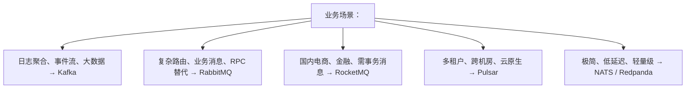
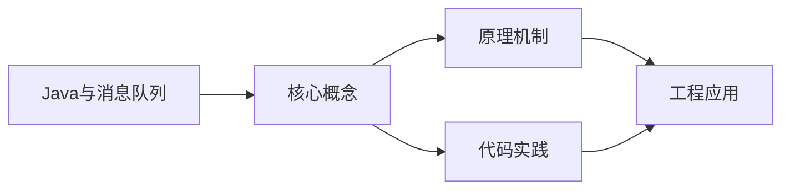
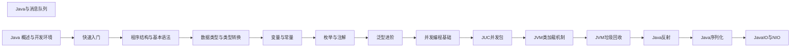

## 1. 学习目标（Bloom 分类）

本节按照布鲁姆教育目标分类学组织学习路径。本文主题为《Java与消息队列》，属于 Java 模块，读者可以根据自身阶段选择阅读深度。

记忆层面：能够准确复述本文的核心概念、术语与基本语法或操作步骤，并能够在提问或检索时快速定位对应知识点。能够说出 Java 的编译执行模型（javac 到字节码，JVM 解释与 JIT）。

理解层面：能够用自己的语言解释核心原理与工作机制，说明概念之间的因果关系，而不是机械记忆结论。能够解释面向对象三大特性与 JVM 内存区域的职责。

应用层面：能够在真实项目或练习场景中运用本文知识解决具体问题，写出正确且可维护的实现。能够编写类、接口、集合操作与异常处理的完整程序。

分析层面：能够拆解复杂问题，比较本文主题与相邻概念的异同，识别边界条件与例外情况。能够分析 Java 与 C++、Go 在内存管理与并发模型上的差异。

评价层面：能够根据约束条件（性能、可读性、安全、成本）评价不同方案的优劣，做出有依据的技术决策。能够评价不同集合、并发工具与框架的适用场景。

创造层面：能够把本文知识与其他模块知识组合，设计出新的解决方案或可复用的工程模式。能够组合 Spring 生态设计企业级应用。

通过本节学习，读者应当能够把《Java与消息队列》纳入自己的知识网络，并与 Java 模块的其他主题（JVM、集合框架、并发、Spring 生态）建立关联。

## 2. 历史动机与发展脉络

《Java与消息队列》是 Java 领域的重要主题。要真正理解它，需要先了解它解决的问题与演进过程。

Java 由 James Gosling 领导的 Sun 团队于 1995 年发布，口号“一次编写，到处运行”依托 JVM 字节码实现跨平台。2006 年 Sun 将 Java 开源（OpenJDK），2010 年 Oracle 收购 Sun 后 Java 进入新的治理阶段。
Java 的版本节奏在 2017 年后改为每半年一个特性版本、每两年一个 LTS（长期支持）版本。当前主流 LTS 包括 Java 11、17、21 与 25；Java 21 引入虚拟线程（Project Loom 成果），显著降低高并发服务的线程成本。
Java 生态以 Spring 家族为核心：Spring Boot 简化配置与部署，Spring Cloud 提供微服务组件；构建工具从 Maven 演进到 Gradle；JVM 语言（Kotlin、Scala、Groovy）与 Java 共存互操作。
Android 开发早期使用 Java，2019 年后官方转向 Kotlin-first，但 Java 仍是服务端领域（尤其是金融、电商等企业系统）的中坚力量。

回到本文主题：Java与消息队列 的提出与成熟，正是上述技术背景下的必然产物。早期实现往往以简单可用为目标，随着工程规模扩大，社区逐渐沉淀出标准做法与最佳实践；理解这一脉络，可以帮助读者判断“为什么文档中的推荐写法是现在这个样子”，也能在遇到历史遗留代码时准确识别其设计年代与取舍。

理解 Java 版本与 LTS 机制，是工程选型的起点：生产环境优先 LTS，新特性（如虚拟线程）可以在受控场景评估后引入。

## 3. 形式化定义与核心概念精讲

本节把《Java与消息队列》涉及的核心概念以“定义 + 讲解”的形式展开。读者应把定义当作工具，把讲解当作理解路径；两者结合才能形成可迁移的知识。

JVM 与字节码：`javac` 把 .java 编译为 .class 字节码，JVM 加载、校验并执行；热点代码由 JIT（如 C2）编译为机器码，解释与编译结合实现启动速度与峰值性能的平衡。
面向对象：封装（访问控制）、继承（extends/implements）与多态（重载/重写）是 Java 的类型系统支柱；接口默认方法（Java 8）与密封类（Java 17）持续演进表达能力。
异常体系：受检异常（checked）编译期强制处理，非受检异常（RuntimeException）运行时抛出；try-with-resources 自动关闭资源。
泛型与擦除：Java 泛型在编译期检查后擦除类型参数，运行时无泛型信息；这解释了 `List<String>` 与 `List<Integer>` 的 Class 相同，以及通配符 `? extends` 的逆变协变规则。

### 3.1 原文章节逐一精讲

原文档把主题拆分为 12 个小节，下面按顺序给出每一节的导读讲解，随后保留原文细节供精读。

#### 原文精读（完整保留）


# Java 与消息队列

> 本文系统阐述 Java 生态中消息队列的理论基础、协议演进、主流产品（Kafka、RabbitMQ、RocketMQ、Pulsar）的架构与 API、生产级工程实践与陷阱剖析。从消息中间件的诞生动机出发，经过 AMQP/JMS 协议、分布式日志抽象、流处理范式，到 Exactly-Once 语义、事务消息、Schema 演进等高级主题，全链路覆盖。

#### 1. 学习目标

本节按 Bloom 认知层级组织学习目标。

##### 1.1 记忆层（Remember）

- 列举至少 5 种主流消息队列产品及其所属公司、典型场景。
- 复述 JMS 与 AMQP 协议的核心区别。
- 描述 Kafka 的 Producer、Broker、Consumer、Topic、Partition、Offset 概念。

##### 1.2 理解层（Understand）

- 解释消息队列解耦、削峰、异步三大作用的本质。
- 阐述 At-Most-Once、At-Least-Once、Exactly-Once 三种语义的实现机制。
- 说明 Kafka ISR（In-Sync Replicas）机制如何平衡一致性与可用性。

##### 1.3 应用层（Apply）

- 使用 Kafka Java Client 实现生产者与消费者。
- 使用 Spring Boot + RabbitMQ 实现发布订阅模式。
- 实现一个支持重试与死信队列的消息处理流程。

##### 1.4 分析层（Analyze）

- 对比 Kafka 与 RabbitMQ 的架构差异与适用场景。
- 拆解 Kafka 顺序消费的实现机制，指出单分区严格顺序与多分区局部顺序的区别。
- 分析 RocketMQ 事务消息的两阶段提交原理。

##### 1.5 评价层（Evaluate）

- 评估在金融场景下应选择哪种 MQ 与何种语义。
- 评判 Kafka 替代关系型数据库作为事件溯源存储的可行性。
- 论证消息队列是否会引入不一致性，以及如何缓解。

##### 1.6 创造层（Create）

- 设计一个支持亿级消息堆积的订单事件流水系统。
- 实现一个跨集群双向同步的消息镜像组件。
- 构建一个可观测的消息中间件监控平台，含堆积、延迟、消费成功率指标。

#### 2. 历史动机与背景

##### 2.1 消息中间件的起源

消息队列（Message Queue, MQ）的思想可追溯至 1960 年代 IBM 的 CICS（Customer Information Control System）与 1970 年代的 Tuxedo。这些系统首次将"事务"与"消息"作为独立的可靠性单元抽象出来。

1993 年，IBM 发布 MQSeries（后更名 WebSphere MQ，现 IBM MQ），被业界视为第一款商业级消息中间件。其核心理念"一次送达"（Once-and-Once-Only Delivery）至今仍是 MQ 的金标准。

##### 2.2 JMS 规范的诞生

2001 年，JCP 发布 JSR 914：Java Message Service（JMS）API。JMS 是 Java 平台的消息中间件 API 标准，定义了一套与厂商无关的接口，使应用代码可在 ActiveMQ、IBM MQ、SonicMQ 等实现间切换。

JMS 模型包含两种：

- **Point-to-Point（PTP）**：基于 Queue，一条消息仅被一个消费者消费。
- **Publish/Subscribe（Pub/Sub）**：基于 Topic，一条消息被所有订阅者消费。

JMS 的局限在于：仅是 API 标准，未规定线路协议（Wire Protocol），不同实现间互不兼容。这催生了后续 AMQP 协议。

##### 2.3 AMQP 协议

2006 年，JPMorgan Chase 联合 iMatix 等公司制定了 AMQP（Advanced Message Queuing Protocol）0.8 版本。AMQP 不仅是 API，更是线路协议标准，规定客户端与 Broker 之间的字节级交互。

AMQP 模型比 JMS 更精细，包含：

- **Exchange**：接收生产者消息，按规则路由到队列。
- **Queue**：存储消息，等待消费者拉取。
- **Binding**：Exchange 与 Queue 的绑定规则。

Exchange 类型：

- **Direct**：按 routing key 完全匹配。
- **Topic**：按 routing key 模式匹配（如 `order.*.created`）。
- **Fanout**：广播到所有绑定队列。
- **Headers**：按消息头属性匹配。

AMQP 1.0 于 2011 年成为 OASIS 标准，并被 ISO/IEC 19464 采纳。

##### 2.4 Kafka 的颠覆

2011 年，LinkedIn 开源 Kafka。Kafka 不再是传统 MQ，而是一种"分布式提交日志"（Distributed Commit Log）。其设计目标与 JMS/AMQP MQ 截然不同：

| 维度 | 传统 MQ（RabbitMQ/ActiveMQ） | Kafka |
|------|--------------------------------|-------|
| 设计目标 | 路由与可靠性 | 高吞吐量日志 |
| 消息模型 | 队列（消息消费后删除） | 日志（消息持久保留） |
| 路由能力 | 强（Exchange + Binding） | 弱（按 Topic/Partition） |
| 单消息延迟 | 微秒级 | 毫秒级 |
| 吞吐量 | 万级 TPS | 百万级 TPS |
| 消息回溯 | 不支持 | 支持（按 Offset 任意位置） |
| 适用场景 | 业务消息、RPC 替代 | 日志、事件流、流处理 |

Kafka 的核心创新在于：

1. **分区日志**：Topic 划分为多个 Partition，每个 Partition 是一个有序、不可变、追加写入的日志。
2. **消费者组**：同一组内消费者分担分区，组间独立消费（广播）。
3. **顺序磁盘 IO**：顺序写盘速度可达数百 MB/s，远超随机写。
4. **零拷贝**：使用 `sendfile` 系统调用，数据直接从页缓存到网卡，无需经过用户空间。

Kafka 引发了流处理（Stream Processing）范式的兴起，催生了 Kafka Streams、Flink、Spark Streaming 等框架。

##### 2.5 RocketMQ 与 Pulsar

2012 年，阿里巴巴基于 Kafka 思想自研 MetaQ，2016 年捐赠给 Apache 并改名 RocketMQ。RocketMQ 在 Kafka 基础上增加：

- **事务消息**：基于两阶段提交实现分布式事务。
- **定时消息**：原生支持延迟级别（如 1s/5s/10s/...）。
- **消息轨迹**：消息全链路追踪。
- **Tag 过滤**：消费端按 Tag 过滤消息。

2016 年，Yahoo 开源 Pulsar。Pulsar 采用**计算存储分离**架构：

- **Broker**：无状态，负责消息收发。
- **BookKeeper**：分布式日志存储层，负责消息持久化。

这种架构支持跨机房复制、弹性扩展、读写分离，被认为是下一代消息流平台。

##### 2.6 现代 MQ 的多元化

进入 2020 年代，MQ 生态呈现多元化：

- **Kafka**：事件流、日志聚合首选。
- **RabbitMQ**：业务消息、复杂路由首选。
- **RocketMQ**：电商、金融场景，国内生态成熟。
- **Pulsar**：云原生、多租户、Geo-Replication。
- **NATS**：轻量级、低延迟、云原生。
- **Redpanda**：Kafka 协议的 C++ 重写，无 JVM 与 ZooKeeper。

Java 开发者应根据业务特征选型，避免"一招鲜吃遍天"。

#### 3. 形式化定义

##### 3.1 消息中间件代数语义

消息中间件可形式化为八元组：

$$
\text{MQ} = (P, B, C, M, R, \Sigma, \delta, \phi)
$$

- $P$：生产者集合。
- $B$：Broker 集群（含 Topic、Partition、Queue 等结构）。
- $C$：消费者集合。
- $M$：消息集合，每条消息为 $(key, payload, headers, timestamp)$。
- $R$：路由规则集合（如 Exchange 类型、Topic 模式）。
- $\Sigma$：消息语义集合 $\{at\_most\_once, at\_least\_once, exactly\_once\}$。
- $\delta$：状态转移函数（消息从生产到消费的状态变化）。
- $\phi$：持久化函数（消息写入磁盘与副本的策略）。

##### 3.2 分区日志的数学结构

Kafka 中 Topic 是 Partition 的有序集合：

$$
\text{Topic} = \{p_0, p_1, \ldots, p_{n-1}\}
$$

每个 Partition $p_i$ 是一个无限追加的有序日志：

$$
p_i = [(m_0, t_0), (m_1, t_1), \ldots, (m_k, t_k), \ldots]
$$

其中 $m_j$ 为消息，$t_j$ 为单调递增的时间戳。Offset 为消息在分区中的位置：

$$
\text{offset}(m_j) = j
$$

消费者组 $G$ 在 Partition $p_i$ 上的消费位置记为 $\text{committed\_offset}(G, p_i)$，消费进度：

$$
\text{lag}(G, p_i) = \text{log\_end\_offset}(p_i) - \text{committed\_offset}(G, p_i)
$$

##### 3.3 三种语义的形式化

**At-Most-Once**：消息可能丢失但不会重复。

$$
P(\text{deliver}(m) \le 1) = 1
$$

实现：发送后立即标记为已消费，不等待确认。

**At-Least-Once**：消息不会丢失但可能重复。

$$
P(\text{deliver}(m) \ge 1) = 1
$$

实现：消费者处理完消息后提交 Offset；若处理失败或超时，重启后重新消费。

**Exactly-Once**：消息既不丢失也不重复。

$$
P(\text{deliver}(m) = 1) = 1
$$

实现：

- 生产端：幂等 Producer（基于 PID + 序列号去重）。
- 消费端：事务（消费 + 处理 + 提交 Offset 在同一事务中）。
- Broker 端：事务日志保证原子性。

##### 3.4 ISR 机制

Kafka 为每个 Partition 维护一组同步副本 ISR（In-Sync Replicas）。设 Partition 的副本集合为 $\{l, f_1, f_2, \ldots, f_k\}$，其中 $l$ 为 leader。

副本 $f_i$ 在 ISR 中当且仅当：

$$
\text{lag}(f_i) \le \text{replica.lag.time.max.ms}
$$

即副本落后 leader 的时间不超过阈值。

写入语义：

- `acks=0`：生产者不等待确认，可能丢失。
- `acks=1`：等待 leader 确认，leader 故障可能丢失。
- `acks=all`（即 `-1`）：等待所有 ISR 副本确认，最强一致。

但 `acks=all` 仍可能丢数据：若 ISR 仅剩 leader（其他副本被踢出），leader 故障后新 leader 无数据。生产环境需配合 `min.insync.replicas=2` 强制要求至少 2 个副本。

##### 3.5 排队论模型

将消息中间件建模为 M/M/1 排队系统（泊松到达、指数服务、单服务台）：

- 到达率 $\lambda$（消息/秒）。
- 服务率 $\mu$（消息/秒）。
- 利用率 $\rho = \lambda / \mu$。

系统稳定条件 $\rho < 1$。平均队列长度：

$$
L_q = \frac{\rho^2}{1 - \rho}
$$

平均等待时间：

$$
W_q = \frac{\rho}{\mu - \lambda}
$$

当 $\rho \to 1$ 时，队列长度与等待时间发散。这是 MQ 堆积的数学本质：消费速度跟不上生产速度时，系统不稳定。

#### 4. 理论推导

##### 4.1 Kafka 吞吐量模型

设 Producer 批量大小为 $B$（消息数），单消息大小为 $S$（字节），网络带宽为 $N$（字节/秒），磁盘顺序写速度为 $D$（字节/秒）。

单 Producer 线程的理论吞吐量：

$$
\text{Throughput}_{producer} = \min\left(\frac{N}{B \cdot S}, \frac{D}{B \cdot S}\right) \cdot B = \min\left(\frac{N}{S}, \frac{D}{S}\right)
$$

实际受以下因素影响：

- 批量大小 $B$：增大可提高吞吐但增加延迟。
- 压缩：开启 `snappy` 或 `lz4` 可减少 50%+ 网络与存储开销。
- 副本数 $R$：吞吐量约下降为 $1/R$（每条消息写 $R$ 次）。

Kafka 官方基准：3 副本、ACK=all、单 Producer，可达 100MB/s+ 吞吐量。

##### 4.2 顺序消费的延迟分析

设单 Partition 消费速度为 $\mu$，生产到达率为 $\lambda$。Partition 数 $P$ 决定并发度：

$$
\text{Parallelism} = \min(P, C)
$$

其中 $C$ 为消费者数。单 Partition 内严格顺序，跨 Partition 无序。

若业务要求全局顺序，则 $P = 1$，并发度为 1。此时：

$$
\text{Throughput}_{max} = \mu
$$

这是"顺序性"与"吞吐量"的根本矛盾。常用妥协方案：

- **业务键分桶**：同一业务键（如订单 ID）路由到同一 Partition，保证业务相关消息顺序，跨业务无序。
- **业务无序接受**：放宽顺序约束，让业务层处理乱序。

##### 4.3 消息堆积的容量估算

设每条消息平均大小 $S$（字节），堆积时间 $T$（秒），生产速率 $\lambda$（消息/秒），消费速率 $\mu$（消息/秒），$\lambda > \mu$。

堆积总量：

$$
V = (\lambda - \mu) \cdot T
$$

所需存储空间：

$$
\text{Storage} = V \cdot S \cdot R
$$

其中 $R$ 为副本数。

示例：$\lambda = 100000$，$\mu = 80000$，$T = 3600$，$S = 1$ KB，$R = 3$。

$$
V = 20000 \cdot 3600 = 7.2 \times 10^7 \text{ 条}
$$
$$
\text{Storage} = 7.2 \times 10^7 \cdot 1 \text{ KB} \cdot 3 \approx 216 \text{ GB}
$$

这解释了为何 MQ 必须有堆积告警与扩容预案。

##### 4.4 RabbitMQ 路由复杂度

RabbitMQ Topic Exchange 的 routing key 匹配算法基于模式串：

- `*` 匹配一个单词。
- `#` 匹配零或多个单词。

匹配时间复杂度为 $O(L \cdot K)$，$L$ 为 routing key 长度，$K$ 为绑定规则数。

当 $K$ 极大（如百万级绑定）时，路由成为瓶颈。生产环境应限制单 Exchange 的绑定数。

##### 4.5 Exactly-Once 的成本

Kafka Exactly-Once 通过事务实现，开销主要来自：

1. **事务协调器**：每事务需写 TransactionLog。
2. **PID 与序列号**：每条消息增加约 12 字节元数据。
3. **两阶段提交**：消费 + 处理 + 提交 Offset 必须在同一事务。

实测：开启 EOS 后吞吐量下降约 20%-30%。这是 EOS 未默认启用的原因。

#### 5. 代码示例

##### 5.1 示例一：Kafka 生产者

```java
package com.fandex.mq.kafka;

import org.apache.kafka.clients.producer.KafkaProducer;
import org.apache.kafka.clients.producer.ProducerConfig;
import org.apache.kafka.clients.producer.ProducerRecord;
import org.apache.kafka.clients.producer.RecordMetadata;
import org.apache.kafka.common.serialization.StringSerializer;

import java.util.Properties;
import java.util.concurrent.Future;
import java.util.concurrent.TimeUnit;

/**
 * Kafka 生产者示例，演示配置、发送、回调。
 *
 * <p>关键配置：
 * <ul>
 *   <li>{@code acks=all}：等待所有 ISR 副本确认</li>
 *   <li>{@code enable.idempotence=true}：开启幂等</li>
 *   <li>{@code batch.size} + {@code linger.ms}：批量发送调优</li>
 * </ul>
 */
public class KafkaProducerDemo {

    public static void main(String[] args) {
        Properties props = new Properties();
        // Broker 地址列表
        props.put(ProducerConfig.BOOTSTRAP_SERVERS_CONFIG, "localhost:9092");
        // Key/Value 序列化器
        props.put(ProducerConfig.KEY_SERIALIZER_CLASS_CONFIG, StringSerializer.class.getName());
        props.put(ProducerConfig.VALUE_SERIALIZER_CLASS_CONFIG, StringSerializer.class.getName());
        // 等待所有 ISR 副本确认，最强一致性
        props.put(ProducerConfig.ACKS_CONFIG, "all");
        // 开启幂等 Producer，防止网络重试导致重复
        props.put(ProducerConfig.ENABLE_IDEMPOTENCE_CONFIG, true);
        // 重试次数
        props.put(ProducerConfig.RETRIES_CONFIG, 3);
        // 批量大小（字节）
        props.put(ProducerConfig.BATCH_SIZE_CONFIG, 32 * 1024);
        // 等待批量满的最长时间（毫秒）
        props.put(ProducerConfig.LINGER_MS_CONFIG, 10);
        // 缓冲区大小
        props.put(ProducerConfig.BUFFER_MEMORY_CONFIG, 32 * 1024 * 1024);
        // 压缩算法
        props.put(ProducerConfig.COMPRESSION_TYPE_CONFIG, "lz4");

        try (KafkaProducer<String, String> producer = new KafkaProducer<>(props)) {
            String topic = "order-events";

            // 1. 同步发送（阻塞等待结果）
            ProducerRecord<String, String> record1 = new ProducerRecord<>(
                    topic, "order-001", "Order created at " + System.currentTimeMillis());
            Future<RecordMetadata> future = producer.send(record1);
            RecordMetadata metadata = future.get(10, TimeUnit.SECONDS);
            System.out.println("[Sync] Sent to partition " + metadata.partition()
                    + " offset " + metadata.offset());

            // 2. 异步发送（回调）
            for (int i = 0; i < 100; i++) {
                ProducerRecord<String, String> record = new ProducerRecord<>(
                        topic, "order-" + i, "Order payload " + i);
                producer.send(record, (meta, exception) -> {
                    if (exception != null) {
                        System.err.println("发送失败: " + exception.getMessage());
                        // 生产环境应记录日志、告警、进入死信队列
                    } else {
                        System.out.println("异步发送成功 partition=" + meta.partition()
                                + " offset=" + meta.offset());
                    }
                });
            }

            // 3. 保证所有消息发送完成
            producer.flush();
        } catch (Exception e) {
            e.printStackTrace();
        }
    }
}
```

##### 5.2 示例二：Kafka 消费者（手动提交 Offset + 重试）

```java
package com.fandex.mq.kafka;

import org.apache.kafka.clients.consumer.ConsumerConfig;
import org.apache.kafka.clients.consumer.ConsumerRecord;
import org.apache.kafka.clients.consumer.ConsumerRecords;
import org.apache.kafka.clients.consumer.KafkaConsumer;
import org.apache.kafka.common.serialization.StringDeserializer;

import java.time.Duration;
import java.util.Collections;
import java.util.Properties;
import java.util.concurrent.atomic.AtomicInteger;

/**
 * Kafka 消费者示例，演示手动提交、重试、死信。
 *
 * <p>关键设计：
 * <ul>
 *   <li>关闭自动提交，处理完成后手动提交</li>
 *   <li>失败重试 3 次仍失败则进入死信 Topic</li>
 *   <li>使用 ConsumerRebalanceListener 处理 rebalance</li>
 * </ul>
 */
public class KafkaConsumerDemo {

    private static final int MAX_RETRY = 3;

    public static void main(String[] args) {
        Properties props = new Properties();
        props.put(ConsumerConfig.BOOTSTRAP_SERVERS_CONFIG, "localhost:9092");
        props.put(ConsumerConfig.GROUP_ID_CONFIG, "order-consumer-group");
        props.put(ConsumerConfig.KEY_DESERIALIZER_CLASS_CONFIG, StringDeserializer.class.getName());
        props.put(ConsumerConfig.VALUE_DESERIALIZER_CLASS_CONFIG, StringDeserializer.class.getName());
        // 关闭自动提交
        props.put(ConsumerConfig.ENABLE_AUTO_COMMIT_CONFIG, false);
        // 从最早开始消费（首次加入组时）
        props.put(ConsumerConfig.AUTO_OFFSET_RESET_CONFIG, "earliest");
        // 单次 poll 最大记录数
        props.put(ConsumerConfig.MAX_POLL_RECORDS_CONFIG, 500);
        // 两次 poll 间最大间隔（超过会触发 rebalance）
        props.put(ConsumerConfig.MAX_POLL_INTERVAL_MS_CONFIG, 300_000);

        try (KafkaConsumer<String, String> consumer = new KafkaConsumer<>(props)) {
            consumer.subscribe(Collections.singletonList("order-events"));

            while (!Thread.currentThread().isInterrupted()) {
                ConsumerRecords<String, String> records = consumer.poll(Duration.ofMillis(1000));
                for (ConsumerRecord<String, String> record : records) {
                    boolean success = false;
                    for (int attempt = 1; attempt <= MAX_RETRY; attempt++) {
                        try {
                            processRecord(record);
                            success = true;
                            break;
                        } catch (Exception e) {
                            System.err.println("处理失败 attempt=" + attempt
                                    + " offset=" + record.offset() + " err=" + e.getMessage());
                            if (attempt < MAX_RETRY) {
                                Thread.sleep(1000L * attempt); // 指数退避
                            }
                        }
                    }
                    if (!success) {
                        // 进入死信队列
                        sendToDeadLetterTopic(record);
                    }
                }
                // 处理完成后手动提交
                consumer.commitSync();
            }
        } catch (InterruptedException e) {
            Thread.currentThread().interrupt();
        }
    }

    /**
     * 实际业务处理逻辑。这里仅打印演示。
     */
    private static void processRecord(ConsumerRecord<String, String> record) throws Exception {
        // 模拟业务处理
        if (record.value().contains("error")) {
            throw new RuntimeException("模拟业务异常");
        }
        System.out.println("处理消息: partition=" + record.partition()
                + " offset=" + record.offset()
                + " key=" + record.key()
                + " value=" + record.value());
    }

    private static void sendToDeadLetterTopic(ConsumerRecord<String, String> record) {
        // 实际项目应通过独立 Producer 发送到 order-events.DLT
        System.err.println("发送到死信队列: offset=" + record.offset() + " value=" + record.value());
    }
}
```

##### 5.3 示例三：Spring Boot + RabbitMQ

```java
package com.fandex.mq.rabbit;

import org.springframework.amqp.core.*;
import org.springframework.amqp.rabbit.annotation.RabbitListener;
import org.springframework.amqp.rabbit.core.RabbitTemplate;
import org.springframework.beans.factory.annotation.Autowired;
import org.springframework.boot.SpringApplication;
import org.springframework.boot.autoconfigure.SpringBootApplication;
import org.springframework.context.annotation.Bean;
import org.springframework.stereotype.Component;

/**
 * Spring Boot + RabbitMQ 完整示例。
 *
 * <p>演示 Direct Exchange + Dead Letter Queue 配置与使用。
 */
@SpringBootApplication
public class RabbitMqApplication {

    public static final String EXCHANGE = "order.exchange";
    public static final String QUEUE = "order.queue";
    public static final String ROUTING_KEY = "order.created";
    public static final String DLX = "order.dlx";
    public static final String DLQ = "order.dlq";

    public static void main(String[] args) {
        SpringApplication.run(RabbitMqApplication.class, args);
    }

    /**
     * 主 Exchange（Direct 类型）。
     */
    @Bean
    public DirectExchange orderExchange() {
        return ExchangeBuilder.directExchange(EXCHANGE).durable(true).build();
    }

    /**
     * 死信 Exchange。
     */
    @Bean
    public DirectExchange deadLetterExchange() {
        return ExchangeBuilder.directExchange(DLX).durable(true).build();
    }

    /**
     * 主队列，配置死信路由。
     */
    @Bean
    public Queue orderQueue() {
        return QueueBuilder.durable(QUEUE)
                .withArgument("x-dead-letter-exchange", DLX)
                .withArgument("x-dead-letter-routing-key", "order.dead")
                .withArgument("x-message-ttl", 60000)  // 消息 60s 未消费则进死信
                .build();
    }

    /**
     * 死信队列。
     */
    @Bean
    public Queue deadLetterQueue() {
        return QueueBuilder.durable(DLQ).build();
    }

    @Bean
    public Binding orderBinding(Queue orderQueue, DirectExchange orderExchange) {
        return BindingBuilder.bind(orderQueue).to(orderExchange).with(ROUTING_KEY);
    }

    @Bean
    public Binding dlqBinding(Queue deadLetterQueue, DirectExchange deadLetterExchange) {
        return BindingBuilder.bind(deadLetterQueue).to(deadLetterExchange).with("order.dead");
    }

    /**
     * 生产者，发送订单消息。
     */
    @Component
    public static class OrderProducer {
        @Autowired
        private RabbitTemplate rabbitTemplate;

        public void sendOrder(String orderId, String payload) {
            rabbitTemplate.convertAndSend(EXCHANGE, ROUTING_KEY, payload, message -> {
                message.getMessageProperties().setMessageId(orderId);
                message.getMessageProperties().setCorrelationId(orderId);
                return message;
            });
            System.out.println("发送订单: " + orderId);
        }
    }

    /**
     * 消费者，自动确认 + 手动异常处理。
     */
    @Component
    public static class OrderConsumer {
        @RabbitListener(queues = QUEUE)
        public void onMessage(String payload, Message message) {
            try {
                System.out.println("消费订单: " + payload
                        + " messageId=" + message.getMessageProperties().getMessageId());
                // 模拟业务处理
                if (payload.contains("error")) {
                    throw new RuntimeException("业务异常");
                }
            } catch (Exception e) {
                // 重试 N 次后进死信队列
                Long deathCount = (Long) message.getMessageProperties()
                        .getHeaders().getOrDefault("x-death-count", 0L);
                if (deathCount >= 3) {
                    rabbitTemplate.convertAndSend(DLX, "order.dead", payload);
                } else {
                    // 重新入队，触发重试
                    rabbitTemplate.convertAndSend(EXCHANGE, ROUTING_KEY, payload);
                }
            }
        }
    }
}
```

##### 5.4 示例四：Kafka Streams 简单聚合

```java
package com.fandex.mq.kafka.streams;

import org.apache.kafka.common.serialization.Serdes;
import org.apache.kafka.streams.KafkaStreams;
import org.apache.kafka.streams.StreamsBuilder;
import org.apache.kafka.streams.StreamsConfig;
import org.apache.kafka.streams.kstream.KStream;
import org.apache.kafka.streams.kstream.KTable;
import org.apache.kafka.streams.kstream.Materialized;
import org.apache.kafka.streams.kstream.Produced;

import java.util.Properties;
import java.util.concurrent.CountDownLatch;

/**
 * Kafka Streams 示例：按用户 ID 聚合订单金额。
 *
 * <p>输入 Topic: order-events (key=userId, value=orderAmount)
 * <p>输出 Topic: user-order-summary (key=userId, value=totalAmount)
 */
public class OrderAggregationStream {

    public static void main(String[] args) {
        Properties props = new Properties();
        props.put(StreamsConfig.APPLICATION_ID_CONFIG, "order-aggregation-app");
        props.put(StreamsConfig.BOOTSTRAP_SERVERS_CONFIG, "localhost:9092");
        props.put(StreamsConfig.DEFAULT_KEY_SERDE_CLASS_CONFIG, Serdes.String().getClass());
        props.put(StreamsConfig.DEFAULT_VALUE_SERDE_CLASS_CONFIG, Serdes.String().getClass());
        // Exactly-Once 语义
        props.put(StreamsConfig.PROCESSING_GUARANTEE_CONFIG, "exactly_once_v2");

        StreamsBuilder builder = new StreamsBuilder();
        KStream<String, String> orders = builder.stream("order-events");

        // 解析金额（演示中假设 value 是数字字符串）
        KTable<String, Long> userTotal = orders
                .filter((k, v) -> {
                    try { Long.parseLong(v); return true; }
                    catch (Exception e) { return false; }
                })
                .mapValues(Long::parseLong)
                .groupByKey()
                .reduce(Long::sum, Materialized.as("user-order-summary-store"));

        // 写回 Topic
        userTotal.toStream().to("user-order-summary",
                Produced.with(Serdes.String(), Serdes.Long()));

        KafkaStreams streams = new KafkaStreams(builder.build(), props);
        CountDownLatch latch = new CountDownLatch(1);

        Runtime.getRuntime().addShutdownHook(new Thread(() -> {
            streams.close();
            latch.countDown();
        }));

        try {
            streams.start();
            latch.await();
        } catch (InterruptedException e) {
            Thread.currentThread().interrupt();
        }
    }
}
```

##### 5.5 示例五：RocketMQ 事务消息

```java
package com.fandex.mq.rocketmq;

import org.apache.rocketmq.client.producer.LocalTransactionState;
import org.apache.rocketmq.client.producer.TransactionListener;
import org.apache.rocketmq.client.producer.TransactionMQProducer;
import org.apache.rocketmq.common.message.Message;
import org.apache.rocketmq.common.message.MessageExt;

import java.util.concurrent.ConcurrentHashMap;
import java.util.concurrent.ExecutorService;
import java.util.concurrent.Executors;

/**
 * RocketMQ 事务消息示例。
 *
 * <p>核心流程：
 * <ol>
 *   <li>Producer 发送"半消息"到 Broker（消费者不可见）</li>
 *   <li>Producer 执行本地事务</li>
 *   <li>根据本地事务结果决定提交或回滚半消息</li>
 *   <li>若超时未决定，Broker 回查 Producer</li>
 * </ol>
 */
public class RocketMqTransactionProducer {

    public static void main(String[] args) throws Exception {
        TransactionMQProducer producer = new TransactionMQProducer("tx-producer-group");
        producer.setNamesrvAddr("localhost:9876");

        // 异步回查执行器
        ExecutorService executor = Executors.newFixedThreadPool(2);
        producer.setExecutorService(executor);

        // 事务监听器
        producer.setTransactionListener(new TransactionListener() {
            // 本地事务状态缓存，模拟
            private final ConcurrentHashMap<String, LocalTransactionState> localTxState = new ConcurrentHashMap<>();

            @Override
            public LocalTransactionState executeLocalTransaction(Message msg, Object arg) {
                String orderId = msg.getKeys();
                try {
                    // 执行本地事务（如扣库存、写库）
                    doLocalBusiness(orderId);
                    localTxState.put(orderId, LocalTransactionState.COMMIT_MESSAGE);
                    return LocalTransactionState.COMMIT_MESSAGE;
                } catch (Exception e) {
                    localTxState.put(orderId, LocalTransactionState.ROLLBACK_MESSAGE);
                    return LocalTransactionState.ROLLBACK_MESSAGE;
                }
            }

            @Override
            public LocalTransactionState checkLocalTransaction(MessageExt msg) {
                // Broker 回查：根据本地状态返回
                String orderId = msg.getKeys();
                return localTxState.getOrDefault(orderId, LocalTransactionState.UNKNOW);
            }
        });

        producer.start();
        Message msg = new Message("order-tx-topic", "TAG-A",
                "order-001", "Order transaction payload".getBytes());
        producer.sendMessageInTransaction(msg, null);

        Thread.sleep(5000);
        producer.shutdown();
        executor.shutdown();
    }

    private static void doLocalBusiness(String orderId) {
        // 模拟本地业务逻辑
        System.out.println("执行本地事务: " + orderId);
    }
}
```

#### 6. 对比分析

##### 6.1 主流 MQ 全面对比

| 维度 | Kafka | RabbitMQ | RocketMQ | Pulsar |
|------|-------|----------|----------|--------|
| 开发语言 | Scala/Erlang | Erlang | Java | Java |
| 协议 | 自定义（TCP） | AMQP | 自定义 | 自定义 + Kafka 协议 |
| 模型 | Partition 日志 | Queue + Exchange | Topic + Queue | Topic + Partition |
| 吞吐量 | 极高（百万级） | 中（万级） | 高（十万级） | 极高 |
| 单条延迟 | 毫秒级 | 微秒级 | 毫秒级 | 毫秒级 |
| 顺序性 | Partition 内严格 | 单队列严格 | 单队列严格 | Partition 内严格 |
| 事务 | 支持（EOS） | 支持（不严谨） | 支持（事务消息） | 支持 |
| 延迟消息 | 不支持（需外置） | 插件支持 | 原生支持 | 原生支持 |
| 消息回溯 | 支持 | 不支持 | 支持 | 支持 |
| 持久化 | 顺序磁盘 | 内存 + 磁盘 | CommitLog | BookKeeper |
| 多租户 | 弱 | 弱 | 弱 | 强 |
| Geo-Replication | MirrorMaker | Federation | Dledger | 原生支持 |
| 生态 | 流处理首选 | 业务消息 | 阿里生态 | 云原生 |

##### 6.2 选型决策树



##### 6.3 语义对比

| 语义 | 实现方式 | 适用场景 |
|------|----------|----------|
| At-Most-Once | 发送即忘、自动提交 | 日志、监控指标（可丢失） |
| At-Least-Once | 同步提交、重试 | 业务消息（需幂等） |
| Exactly-Once | 事务 + 幂等 | 金融、计费、状态机 |

#### 7. 常见陷阱与反模式

##### 7.1 反模式一：消费者自动提交 Offset

**事故案例**：某订单服务使用 `enable.auto.commit=true`，poll 后处理耗时超过 `max.poll.interval.ms`（默认 5 分钟），触发 rebalance，但 Offset 已自动提交，导致这批消息丢失。

**正确做法**：关闭自动提交，处理完成后手动提交。

##### 7.2 反模式二：消费者阻塞 poll 循环

**事故案例**：业务处理耗时 10 分钟，超过 `max.poll.interval.ms`，频繁 rebalance，永远消费不完。

**正确做法**：

1. 业务异步化，poll 与处理分离。
2. 增加 `max.poll.interval.ms`。
3. 减小 `max.poll.records`。

##### 7.3 反模式三：消息处理无幂等

**事故案例**：At-Least-Once 语义下，消费者处理订单后崩溃，重启后重新消费，导致重复扣款。

**正确做法**：业务层实现幂等（如基于订单 ID 去重、状态机校验）。

##### 7.4 反模式四：Topic 分区数过少

**事故案例**：单分区 Topic 在峰值 QPS 100000 时无法扩展，消费延迟严重。

**正确做法**：根据峰值 QPS 与单 Partition 处理能力估算分区数，预留扩展空间。一般建议分区数 = 消费者数 * 1.5。

##### 7.5 反模式五：消息体过大

**事故案例**：将 10MB 的图片二进制作为消息发送，导致 Broker 内存溢出。

**正确做法**：消息体只存元数据（如 URL），大数据存对象存储（OSS、S3）。

##### 7.6 反模式六：缺少死信队列

**事故案例**：单条消息因业务异常一直重试，导致整个分区消费停滞。

**正确做法**：设置最大重试次数，超限后进入死信队列，由人工或独立任务处理。

##### 7.7 反模式七：忽略消息顺序性

**事故案例**：多分区 Topic 下，订单"创建"与"支付"消息进入不同分区，消费者乱序处理，导致支付失败。

**正确做法**：以订单 ID 为 Key，保证同一订单的消息进入同一分区。

##### 7.8 反模式八：用 MQ 替代 RPC

**事故案例**：某团队用 MQ 实现请求-响应模式，复杂度爆炸。

**正确做法**：MQ 适合异步、解耦、削峰；同步 RPC 用 HTTP、gRPC。

#### 8. 工程实践

##### 8.1 消息可靠性清单

**生产端**：

- `acks=all` + `min.insync.replicas=2`。
- `enable.idempotence=true`。
- `retries=Integer.MAX_VALUE` + `delivery.timeout.ms` 控制总时长。
- `max.in.flight.requests.per.connection=5`（幂等模式下可设大）。

**Broker 端**：

- `replication.factor=3`。
- `unclean.leader.election.enable=false`。
- `min.insync.replicas=2`。
- `log.flush.interval.messages` 控制刷盘频率（性能权衡）。

**消费端**：

- 关闭自动提交。
- 处理失败重试，超限进死信。
- 业务幂等。

##### 8.2 性能优化清单

**生产端**：

- `linger.ms=10` + `batch.size=32KB`。
- `compression.type=lz4`。
- `buffer.memory=64MB`。

**Broker 端**：

- 调大 `num.io.threads` 与 `num.network.threads`。
- 调大 socket 缓冲区。
- 使用 SSD。

**消费端**：

- `fetch.min.bytes=1KB` 减少 RPC。
- `max.poll.records=500` 批量处理。
- 多线程处理，注意提交 Offset 时机。

##### 8.3 监控指标

- **生产端**：发送速率、错误率、延迟。
- **Broker**：磁盘使用、CPU、网卡流量、ISR 缩减。
- **消费端**：Lag、消费速率、提交失败率。
- **业务**：消息堆积告警、死信队列监控、端到端延迟。

Prometheus + JMX Exporter + Grafana 是常见方案。

##### 8.4 容量规划

公式：

$$
\text{Brokers} = \lceil \frac{\text{Throughput}_{in} \cdot R}{\text{Throughput}_{per\_broker}} \rceil
$$

例：写入 100MB/s，3 副本，单 Broker 100MB/s → $\lceil 100 \cdot 3 / 100 \rceil = 3$ 台。

预留 30% 余量，实际 4 台。

#### 9. 案例研究

##### 9.1 案例一：某电商订单事件总线

**背景**：日订单 5000 万，需在订单系统、库存、物流、营销、风控间解耦。

**架构**：

- 一级消息总线：Kafka，订单核心事件。
- 二级路由：按业务订阅，分发到具体系统。
- 死信：失败消息进 DLQ，由人工处理。

**关键设计**：

1. **Topic 设计**：`order.created`、`order.paid`、`order.shipped`、`order.completed`。
2. **分区**：按订单 ID hash，64 分区。
3. **Schema**：Avro + Schema Registry 保证兼容性。
4. **监控**：每分区 Lag、消费成功率、端到端延迟。

**结果**：解耦后各系统独立迭代，端到端延迟 P99 < 5 秒。

##### 9.2 案例二：金融交易的 Exactly-Once 实现

**背景**：证券交易系统，要求每笔交易消息严格一次送达。

**方案**：Kafka EOS + 业务幂等。

```java
// 初始化事务 Producer
props.put(ProducerConfig.TRANSACTIONAL_ID_CONFIG, "tx-producer-1");
props.put(ProducerConfig.ENABLE_IDEMPOTENCE_CONFIG, true);
props.put(ProducerConfig.TRANSACTION_TIMEOUT_CONFIG, 60_000);

KafkaProducer<String, String> producer = new KafkaProducer<>(props);
producer.initTransactions();

// 消费 + 处理 + 发送 + 提交 Offset 在同一事务
KafkaConsumer<String, String> consumer = new KafkaConsumer<>(consumerProps);

while (true) {
    ConsumerRecords<String, String> records = consumer.poll(Duration.ofMillis(1000));
    if (records.isEmpty()) continue;

    producer.beginTransaction();
    try {
        for (ConsumerRecord<String, String> r : records) {
            // 业务处理
            processTransaction(r.value());
            // 发送下游消息
            producer.send(new ProducerRecord<>("processed-events", r.key(), r.value()));
        }
        // 提交消费 Offset（在事务内）
        producer.sendOffsetsToTransaction(
                getOffsetsToCommit(records), consumer.groupMetadata());
        producer.commitTransaction();
    } catch (Exception e) {
        producer.abortTransaction();
    }
}
```

**结果**：百亿级消息零丢失、零重复。

##### 9.3 案例三：消息堆积的应急处理

**背景**：某次大促，订单消息消费速度跟不上生产速度，Lag 飙升到 1 亿。

**应急步骤**：

1. **快速扩容消费者**：增加 Pod 数到分区数上限。
2. **降级非核心消费**：暂时关闭营销、推荐等非核心消费组。
3. **跳过部分历史消息**：使用 `seek` 跳到最新 Offset（接受部分丢失）。
4. **事后补偿**：将跳过的消息从备份恢复，重新处理。

**关键代码**：

```java
// 跳到最新 Offset
consumer.seekToEnd(topics);
// 或跳到指定时间
Map<TopicPartition, Long> offsets = consumer.offsetsForTimes(
        topics.stream().collect(Collectors.toMap(tp -> tp, tp -> Instant.now().toEpochMilli())));
offsets.forEach((tp, offset) -> consumer.seek(tp, offset));
```

**教训**：必须有容量预案与降级方案。

#### 10. 知识讲解与要点分析（原习题）

##### 10.1 基础题

**题 1**：解释 JMS 与 AMQP 的核心区别。

**参考答案要点**：

- JMS 是 API 标准，AMQP 是线路协议标准。
- JMS 仅 Java，AMQP 跨语言。
- JMS 模型简单（Queue/Topic），AMQP 模型丰富（Exchange/Binding）。

**题 2**：Kafka 中 acks=all 是否能保证消息不丢？

**参考答案要点**：

- 不能完全保证。
- 若 ISR 仅剩 leader，leader 故障后仍可能丢失。
- 需配合 `min.insync.replicas >= 2` 才能严格保证。

##### 10.2 进阶题

**题 3**：设计一个保证 Exactly-Once 的消费流程。

**参考答案要点**：

- Producer 开启幂等 + 事务。
- Consumer 关闭自动提交。
- 消费 + 处理 + 提交 Offset 在同一 Kafka 事务内。
- 业务层实现幂等。

**题 4**：Kafka 为什么用 Partition 而不是 Queue？

**参考答案要点**：

- Partition 是有序追加日志，支持回溯。
- Queue 是消费即删除，不可回溯。
- Partition 天然分布式，可水平扩展。
- Partition 适合日志、流处理场景。

##### 10.3 挑战题

**题 5**：设计一个支持亿级消息堆积的 MQ 选型方案。

**参考答案要点**：

- Kafka 适合，因其持久化设计。
- 增加分区数与消费者数。
- 监控 Lag，告警阈值 < 100 万。
- 准备降级方案（跳过、降级消费）。

**题 6**：如何实现消息的全局顺序消费？

**参考答案要点**：

- 单 Partition，并发度 1（性能瓶颈）。
- 或业务键分桶，桶内顺序。
- 或使用顺序消息中间件（如 RocketMQ 顺序消息）。
- 权衡顺序性与吞吐量。

#### 11. 参考文献

[1] Apache Software Foundation. 2024. *Apache Kafka Documentation*. https://kafka.apache.org/documentation/

[2] Kreps, J., Narkhede, N., and Rao, J. 2011. *Kafka: A Distributed Messaging System for Log Processing*. In *Proceedings of the 6th International Workshop on Networking Meets Databases (NetDB '11)*. ACM. https://kafka.apache.org/

[3] VMware Inc. 2024. *RabbitMQ Documentation*. https://www.rabbitmq.com/documentation.html

[4] Apache Software Foundation. 2024. *Apache RocketMQ Documentation*. https://rocketmq.apache.org/docs/

[5] Apache Software Foundation. 2024. *Apache Pulsar Documentation*. https://pulsar.apache.org/docs/

[6] OASIS. 2011. *Advanced Message Queuing Protocol (AMQP) Version 1.0*. OASIS Standard. https://docs.oasis-open.org/amqp/core/v1.0/amqp-core-complete-v1.0.pdf

[7] JSR 914 Expert Group. 2003. *Java Message Service (JMS) API*. Java Community Process. https://jcp.org/en/jsr/detail?id=914

[8] Kreps, J. 2014. *Questioning the Lambda Architecture*. O'Reilly Media. https://www.oreilly.com/radar/questioning-the-lambda-architecture/

[9] Apache Software Foundation. 2024. *Kafka IPDL and Protocol Specification*. https://kafka.apache.org/protocol.html

[10] Wang, X. et al. 2017. *The Design and Implementation of RocketMQ*. Alibaba Tech Blog. https://rocketmq.apache.org/rocketmq/the-design-of-transactional-message/

[11] Sijie, M. and Jia, Z. 2018. *Apache Pulsar: The Unified Messaging Platform*. ApacheCon. https://pulsar.apache.org/blog/

[12] Kleppmann, M. 2017. *Designing Data-Intensive Applications*. O'Reilly Media.

[13] Apache Software Foundation. 2024. *Kafka Streams Documentation*. https://kafka.apache.org/documentation/streams/

[14] Kreps, J., Narkhede, N. 2014. *Kafka: A Distributed Messaging System for Log Processing (Revisited)*. LinkedIn Engineering. https://engineering.linkedin.com/kafka

[15] Carlin, M. et al. 2020. *Exactly-Once Semantics in Kafka*. Confluent White Paper. https://www.confluent.io/blog/exactly-once-semantics-are-possible-heres-how-apache-kafka-does-it/

#### 12. 延伸阅读

##### 12.1 官方文档

- Apache Kafka Documentation. https://kafka.apache.org/documentation/
- RabbitMQ Documentation. https://www.rabbitmq.com/documentation.html
- Apache RocketMQ Documentation. https://rocketmq.apache.org/docs/
- Apache Pulsar Documentation. https://pulsar.apache.org/docs/

##### 12.2 经典教材

- Martin Kleppmann. *Designing Data-Intensive Applications*. O'Reilly, 2017.
- Neha Narkhede, Gwen Shapira, Todd Palino. *Kafka: The Definitive Guide* (2nd ed.). O'Reilly, 2021.
- Dylan Scott. *RabbitMQ in Depth*. Manning, 2017.

##### 12.3 前沿论文

- Kreps, J. et al. 2011. *Kafka: A Distributed Messaging System for Log Processing*. NetDB 2011.
- Wang, X. et al. 2017. *The Design and Implementation of an Elastic Messaging System*. SIGMOD.
- Sijie, M. et al. 2018. *Apache Pulsar: The Unified Messaging Platform*. IEEE Data Eng. Bull.

##### 12.4 进阶主题

- **Schema Registry**：Avro/Protobuf/JSON Schema 演进管理。
- **Kafka Connect**：流式数据集成框架。
- **KSQL**：SQL 风格的流处理查询。
- **Pulsar Functions**：轻量级流处理计算。
- **MQ 与 Service Mesh**：Istio、Linkerd 中的 MQ 集成。

---

**总结**：消息队列是分布式系统的核心中间件，从最早的解耦工具演化为事件流平台、状态转移日志、Event Sourcing 基础设施。理解 MQ 的本质——"持久化的、有序的、可重放的、可扩展的消息流"——是正确选型与设计的前提。生产环境需重点关注可靠性（acks、ISR、min.insync.replicas）、顺序性（分区设计、业务键路由）、可观测性（Lag、延迟、死信）三大维度。


### 3.2 概念关系图

下面用 Mermaid 图表达本文核心概念之间的关系，帮助读者建立整体图景：



图中展示的是本文知识的结构化关系：核心概念是入口，原理机制解释“为什么”，代码实践演示“怎么做”，工程应用回答“何时用”。读者学习时可以把每个小节的内容挂接到对应节点上。

## 4. 理论推导与原理解析

本节深入《Java与消息队列》背后的原理。理论部分不求面面俱到，而是聚焦“能解释现象、能指导实践”的关键推导。

JVM 内存模型：堆（新生代/老年代）、元空间、虚拟机栈、本地方法栈与程序计数器；GC 从 CMS 演进到 G1（默认）、ZGC（超低延迟），理解分代收集是调优前提。
并发工具：synchronized 与 JUC（java.util.concurrent）的锁、并发容器、线程池、CompletableFuture 构成并发工具箱；Java 21 的虚拟线程让“每任务一线程”成为可能。
类加载机制：双亲委派模型保证类唯一性，SPI（ServiceLoader）打破委派实现扩展；自定义类加载器是热部署与隔离的基础。
反射与注解：反射在运行时检查类结构，注解提供元数据；Spring 的依赖注入与 AOP 均基于这些机制，但反射有性能与安全成本。

需要强调的是，理论推导与工程实践之间存在翻译层：理论给出的是理想化模型与边界条件，工程代码则必须处理真实环境中的例外。读者在学习时应先掌握理论的“标准情形”，再通过陷阱章节了解“非标准情形”。

## 5. 代码示例与逐行讲解

本节把原文中的代码示例系统整理，并为每个示例补充用途说明与讲解。读者不应只浏览代码，而应逐段对照讲解理解设计意图。

### 5.1 示例：5.1 示例一：Kafka 生产者

该示例来自原文《5.1 示例一：Kafka 生产者》小节，用于演示Java与消息队列相关操作。阅读时请先看代码结构，再看其后的讲解。

```java
package com.fandex.mq.kafka;

import org.apache.kafka.clients.producer.KafkaProducer;
import org.apache.kafka.clients.producer.ProducerConfig;
import org.apache.kafka.clients.producer.ProducerRecord;
import org.apache.kafka.clients.producer.RecordMetadata;
import org.apache.kafka.common.serialization.StringSerializer;

import java.util.Properties;
import java.util.concurrent.Future;
import java.util.concurrent.TimeUnit;

/**
 * Kafka 生产者示例，演示配置、发送、回调。
 *
 * <p>关键配置：
 * <ul>
 *   <li>{@code acks=all}：等待所有 ISR 副本确认</li>
 *   <li>{@code enable.idempotence=true}：开启幂等</li>
 *   <li>{@code batch.size} + {@code linger.ms}：批量发送调优</li>
 * </ul>
 */
public class KafkaProducerDemo {

    public static void main(String[] args) {
        Properties props = new Properties();
        // Broker 地址列表
        props.put(ProducerConfig.BOOTSTRAP_SERVERS_CONFIG, "localhost:9092");
        // Key/Value 序列化器
        props.put(ProducerConfig.KEY_SERIALIZER_CLASS_CONFIG, StringSerializer.class.getName());
        props.put(ProducerConfig.VALUE_SERIALIZER_CLASS_CONFIG, StringSerializer.class.getName());
        // 等待所有 ISR 副本确认，最强一致性
        props.put(ProducerConfig.ACKS_CONFIG, "all");
        // 开启幂等 Producer，防止网络重试导致重复
        props.put(ProducerConfig.ENABLE_IDEMPOTENCE_CONFIG, true);
        // 重试次数
        props.put(ProducerConfig.RETRIES_CONFIG, 3);
        // 批量大小（字节）
        props.put(ProducerConfig.BATCH_SIZE_CONFIG, 32 * 1024);
        // 等待批量满的最长时间（毫秒）
        props.put(ProducerConfig.LINGER_MS_CONFIG, 10);
        // 缓冲区大小
        props.put(ProducerConfig.BUFFER_MEMORY_CONFIG, 32 * 1024 * 1024);
        // 压缩算法
        props.put(ProducerConfig.COMPRESSION_TYPE_CONFIG, "lz4");

        try (KafkaProducer<String, String> producer = new KafkaProducer<>(props)) {
            String topic = "order-events";

            // 1. 同步发送（阻塞等待结果）
            ProducerRecord<String, String> record1 = new ProducerRecord<>(
                    topic, "order-001", "Order created at " + System.currentTimeMillis());
            Future<RecordMetadata> future = producer.send(record1);
            RecordMetadata metadata = future.get(10, TimeUnit.SECONDS);
            System.out.println("[Sync] Sent to partition " + metadata.partition()
                    + " offset " + metadata.offset());

            // 2. 异步发送（回调）
            for (int i = 0; i < 100; i++) {
                ProducerRecord<String, String> record = new ProducerRecord<>(
                        topic, "order-" + i, "Order payload " + i);
                producer.send(record, (meta, exception) -> {
                    if (exception != null) {
                        System.err.println("发送失败: " + exception.getMessage());
                        // 生产环境应记录日志、告警、进入死信队列
                    } else {
                        System.out.println("异步发送成功 partition=" + meta.partition()
                                + " offset=" + meta.offset());
                    }
                });
            }

            // 3. 保证所有消息发送完成
            producer.flush();
        } catch (Exception e) {
            e.printStackTrace();
        }
    }
}
```

讲解：这段代码演示了本节核心知识点。代码中的关键操作可以归纳为三步：准备（定义或初始化）、执行（核心逻辑）、收尾（释放资源或返回结果）。实际项目中，这三步往往被封装为函数或类，以提升复用性与可测试性。

关键点分析：

该示例共 71 行有效代码，包含 4 类关键结构（class、import、if、for）。其中：

- 入口与初始化部分负责建立上下文，对应实际项目中的启动或装配逻辑；
- 核心逻辑部分体现本文主题的主要操作，是阅读时最需要对照讲解理解的部分；
- 输出或返回部分把结果交给调用方，注意其类型与边界条件。

进阶思考路径：先尝试修改参数观察行为变化，再把示例中的模式迁移到自己的项目中；每次修改都记录预期与实测差异，这是把示例转化为能力的最快方式。

### 5.2 示例：5.2 示例二：Kafka 消费者（手动提交 Offset + 重试）

该示例来自原文《5.2 示例二：Kafka 消费者（手动提交 Offset + 重试）》小节，用于演示Java与消息队列相关操作。阅读时请先看代码结构，再看其后的讲解。

```java
package com.fandex.mq.kafka;

import org.apache.kafka.clients.consumer.ConsumerConfig;
import org.apache.kafka.clients.consumer.ConsumerRecord;
import org.apache.kafka.clients.consumer.ConsumerRecords;
import org.apache.kafka.clients.consumer.KafkaConsumer;
import org.apache.kafka.common.serialization.StringDeserializer;

import java.time.Duration;
import java.util.Collections;
import java.util.Properties;
import java.util.concurrent.atomic.AtomicInteger;

/**
 * Kafka 消费者示例，演示手动提交、重试、死信。
 *
 * <p>关键设计：
 * <ul>
 *   <li>关闭自动提交，处理完成后手动提交</li>
 *   <li>失败重试 3 次仍失败则进入死信 Topic</li>
 *   <li>使用 ConsumerRebalanceListener 处理 rebalance</li>
 * </ul>
 */
public class KafkaConsumerDemo {

    private static final int MAX_RETRY = 3;

    public static void main(String[] args) {
        Properties props = new Properties();
        props.put(ConsumerConfig.BOOTSTRAP_SERVERS_CONFIG, "localhost:9092");
        props.put(ConsumerConfig.GROUP_ID_CONFIG, "order-consumer-group");
        props.put(ConsumerConfig.KEY_DESERIALIZER_CLASS_CONFIG, StringDeserializer.class.getName());
        props.put(ConsumerConfig.VALUE_DESERIALIZER_CLASS_CONFIG, StringDeserializer.class.getName());
        // 关闭自动提交
        props.put(ConsumerConfig.ENABLE_AUTO_COMMIT_CONFIG, false);
        // 从最早开始消费（首次加入组时）
        props.put(ConsumerConfig.AUTO_OFFSET_RESET_CONFIG, "earliest");
        // 单次 poll 最大记录数
        props.put(ConsumerConfig.MAX_POLL_RECORDS_CONFIG, 500);
        // 两次 poll 间最大间隔（超过会触发 rebalance）
        props.put(ConsumerConfig.MAX_POLL_INTERVAL_MS_CONFIG, 300_000);

        try (KafkaConsumer<String, String> consumer = new KafkaConsumer<>(props)) {
            consumer.subscribe(Collections.singletonList("order-events"));

            while (!Thread.currentThread().isInterrupted()) {
                ConsumerRecords<String, String> records = consumer.poll(Duration.ofMillis(1000));
                for (ConsumerRecord<String, String> record : records) {
                    boolean success = false;
                    for (int attempt = 1; attempt <= MAX_RETRY; attempt++) {
                        try {
                            processRecord(record);
                            success = true;
                            break;
                        } catch (Exception e) {
                            System.err.println("处理失败 attempt=" + attempt
                                    + " offset=" + record.offset() + " err=" + e.getMessage());
                            if (attempt < MAX_RETRY) {
                                Thread.sleep(1000L * attempt); // 指数退避
                            }
                        }
                    }
                    if (!success) {
                        // 进入死信队列
                        sendToDeadLetterTopic(record);
                    }
                }
                // 处理完成后手动提交
                consumer.commitSync();
            }
        } catch (InterruptedException e) {
            Thread.currentThread().interrupt();
        }
    }

    /**
     * 实际业务处理逻辑。这里仅打印演示。
     */
    private static void processRecord(ConsumerRecord<String, String> record) throws Exception {
        // 模拟业务处理
        if (record.value().contains("error")) {
            throw new RuntimeException("模拟业务异常");
        }
        System.out.println("处理消息: partition=" + record.partition()
                + " offset=" + record.offset()
                + " key=" + record.key()
                + " value=" + record.value());
    }

    private static void sendToDeadLetterTopic(ConsumerRecord<String, String> record) {
        // 实际项目应通过独立 Producer 发送到 order-events.DLT
        System.err.println("发送到死信队列: offset=" + record.offset() + " value=" + record.value());
    }
}
```

讲解：这段代码演示了本节核心知识点。代码中的关键操作可以归纳为三步：准备（定义或初始化）、执行（核心逻辑）、收尾（释放资源或返回结果）。实际项目中，这三步往往被封装为函数或类，以提升复用性与可测试性。

关键点分析：

该示例共 85 行有效代码，包含 5 类关键结构（class、import、if、for、while）。其中：

- 入口与初始化部分负责建立上下文，对应实际项目中的启动或装配逻辑；
- 核心逻辑部分体现本文主题的主要操作，是阅读时最需要对照讲解理解的部分；
- 输出或返回部分把结果交给调用方，注意其类型与边界条件。

进阶思考路径：先尝试修改参数观察行为变化，再把示例中的模式迁移到自己的项目中；每次修改都记录预期与实测差异，这是把示例转化为能力的最快方式。

### 5.3 示例：5.3 示例三：Spring Boot + RabbitMQ

该示例来自原文《5.3 示例三：Spring Boot + RabbitMQ》小节，用于演示Java与消息队列相关操作。阅读时请先看代码结构，再看其后的讲解。

```java
package com.fandex.mq.rabbit;

import org.springframework.amqp.core.*;
import org.springframework.amqp.rabbit.annotation.RabbitListener;
import org.springframework.amqp.rabbit.core.RabbitTemplate;
import org.springframework.beans.factory.annotation.Autowired;
import org.springframework.boot.SpringApplication;
import org.springframework.boot.autoconfigure.SpringBootApplication;
import org.springframework.context.annotation.Bean;
import org.springframework.stereotype.Component;

/**
 * Spring Boot + RabbitMQ 完整示例。
 *
 * <p>演示 Direct Exchange + Dead Letter Queue 配置与使用。
 */
@SpringBootApplication
public class RabbitMqApplication {

    public static final String EXCHANGE = "order.exchange";
    public static final String QUEUE = "order.queue";
    public static final String ROUTING_KEY = "order.created";
    public static final String DLX = "order.dlx";
    public static final String DLQ = "order.dlq";

    public static void main(String[] args) {
        SpringApplication.run(RabbitMqApplication.class, args);
    }

    /**
     * 主 Exchange（Direct 类型）。
     */
    @Bean
    public DirectExchange orderExchange() {
        return ExchangeBuilder.directExchange(EXCHANGE).durable(true).build();
    }

    /**
     * 死信 Exchange。
     */
    @Bean
    public DirectExchange deadLetterExchange() {
        return ExchangeBuilder.directExchange(DLX).durable(true).build();
    }

    /**
     * 主队列，配置死信路由。
     */
    @Bean
    public Queue orderQueue() {
        return QueueBuilder.durable(QUEUE)
                .withArgument("x-dead-letter-exchange", DLX)
                .withArgument("x-dead-letter-routing-key", "order.dead")
                .withArgument("x-message-ttl", 60000)  // 消息 60s 未消费则进死信
                .build();
    }

    /**
     * 死信队列。
     */
    @Bean
    public Queue deadLetterQueue() {
        return QueueBuilder.durable(DLQ).build();
    }

    @Bean
    public Binding orderBinding(Queue orderQueue, DirectExchange orderExchange) {
        return BindingBuilder.bind(orderQueue).to(orderExchange).with(ROUTING_KEY);
    }

    @Bean
    public Binding dlqBinding(Queue deadLetterQueue, DirectExchange deadLetterExchange) {
        return BindingBuilder.bind(deadLetterQueue).to(deadLetterExchange).with("order.dead");
    }

    /**
     * 生产者，发送订单消息。
     */
    @Component
    public static class OrderProducer {
        @Autowired
        private RabbitTemplate rabbitTemplate;

        public void sendOrder(String orderId, String payload) {
            rabbitTemplate.convertAndSend(EXCHANGE, ROUTING_KEY, payload, message -> {
                message.getMessageProperties().setMessageId(orderId);
                message.getMessageProperties().setCorrelationId(orderId);
                return message;
            });
            System.out.println("发送订单: " + orderId);
        }
    }

    /**
     * 消费者，自动确认 + 手动异常处理。
     */
    @Component
    public static class OrderConsumer {
        @RabbitListener(queues = QUEUE)
        public void onMessage(String payload, Message message) {
            try {
                System.out.println("消费订单: " + payload
                        + " messageId=" + message.getMessageProperties().getMessageId());
                // 模拟业务处理
                if (payload.contains("error")) {
                    throw new RuntimeException("业务异常");
                }
            } catch (Exception e) {
                // 重试 N 次后进死信队列
                Long deathCount = (Long) message.getMessageProperties()
                        .getHeaders().getOrDefault("x-death-count", 0L);
                if (deathCount >= 3) {
                    rabbitTemplate.convertAndSend(DLX, "order.dead", payload);
                } else {
                    // 重新入队，触发重试
                    rabbitTemplate.convertAndSend(EXCHANGE, ROUTING_KEY, payload);
                }
            }
        }
    }
}
```

讲解：这段代码演示了本节核心知识点。代码中的关键操作可以归纳为三步：准备（定义或初始化）、执行（核心逻辑）、收尾（释放资源或返回结果）。实际项目中，这三步往往被封装为函数或类，以提升复用性与可测试性。

关键点分析：

该示例共 108 行有效代码，包含 4 类关键结构（class、import、if、return）。其中：

- 入口与初始化部分负责建立上下文，对应实际项目中的启动或装配逻辑；
- 核心逻辑部分体现本文主题的主要操作，是阅读时最需要对照讲解理解的部分；
- 输出或返回部分把结果交给调用方，注意其类型与边界条件。

进阶思考路径：先尝试修改参数观察行为变化，再把示例中的模式迁移到自己的项目中；每次修改都记录预期与实测差异，这是把示例转化为能力的最快方式。

### 5.4 示例：5.4 示例四：Kafka Streams 简单聚合

该示例来自原文《5.4 示例四：Kafka Streams 简单聚合》小节，用于演示Java与消息队列相关操作。阅读时请先看代码结构，再看其后的讲解。

```java
package com.fandex.mq.kafka.streams;

import org.apache.kafka.common.serialization.Serdes;
import org.apache.kafka.streams.KafkaStreams;
import org.apache.kafka.streams.StreamsBuilder;
import org.apache.kafka.streams.StreamsConfig;
import org.apache.kafka.streams.kstream.KStream;
import org.apache.kafka.streams.kstream.KTable;
import org.apache.kafka.streams.kstream.Materialized;
import org.apache.kafka.streams.kstream.Produced;

import java.util.Properties;
import java.util.concurrent.CountDownLatch;

/**
 * Kafka Streams 示例：按用户 ID 聚合订单金额。
 *
 * <p>输入 Topic: order-events (key=userId, value=orderAmount)
 * <p>输出 Topic: user-order-summary (key=userId, value=totalAmount)
 */
public class OrderAggregationStream {

    public static void main(String[] args) {
        Properties props = new Properties();
        props.put(StreamsConfig.APPLICATION_ID_CONFIG, "order-aggregation-app");
        props.put(StreamsConfig.BOOTSTRAP_SERVERS_CONFIG, "localhost:9092");
        props.put(StreamsConfig.DEFAULT_KEY_SERDE_CLASS_CONFIG, Serdes.String().getClass());
        props.put(StreamsConfig.DEFAULT_VALUE_SERDE_CLASS_CONFIG, Serdes.String().getClass());
        // Exactly-Once 语义
        props.put(StreamsConfig.PROCESSING_GUARANTEE_CONFIG, "exactly_once_v2");

        StreamsBuilder builder = new StreamsBuilder();
        KStream<String, String> orders = builder.stream("order-events");

        // 解析金额（演示中假设 value 是数字字符串）
        KTable<String, Long> userTotal = orders
                .filter((k, v) -> {
                    try { Long.parseLong(v); return true; }
                    catch (Exception e) { return false; }
                })
                .mapValues(Long::parseLong)
                .groupByKey()
                .reduce(Long::sum, Materialized.as("user-order-summary-store"));

        // 写回 Topic
        userTotal.toStream().to("user-order-summary",
                Produced.with(Serdes.String(), Serdes.Long()));

        KafkaStreams streams = new KafkaStreams(builder.build(), props);
        CountDownLatch latch = new CountDownLatch(1);

        Runtime.getRuntime().addShutdownHook(new Thread(() -> {
            streams.close();
            latch.countDown();
        }));

        try {
            streams.start();
            latch.await();
        } catch (InterruptedException e) {
            Thread.currentThread().interrupt();
        }
    }
}
```

讲解：这段代码演示了本节核心知识点。代码中的关键操作可以归纳为三步：准备（定义或初始化）、执行（核心逻辑）、收尾（释放资源或返回结果）。实际项目中，这三步往往被封装为函数或类，以提升复用性与可测试性。

关键点分析：

该示例共 54 行有效代码，包含 3 类关键结构（class、import、return）。其中：

- 入口与初始化部分负责建立上下文，对应实际项目中的启动或装配逻辑；
- 核心逻辑部分体现本文主题的主要操作，是阅读时最需要对照讲解理解的部分；
- 输出或返回部分把结果交给调用方，注意其类型与边界条件。

进阶思考路径：先尝试修改参数观察行为变化，再把示例中的模式迁移到自己的项目中；每次修改都记录预期与实测差异，这是把示例转化为能力的最快方式。

### 5.5 示例：5.5 示例五：RocketMQ 事务消息

该示例来自原文《5.5 示例五：RocketMQ 事务消息》小节，用于演示Java与消息队列相关操作。阅读时请先看代码结构，再看其后的讲解。

```java
package com.fandex.mq.rocketmq;

import org.apache.rocketmq.client.producer.LocalTransactionState;
import org.apache.rocketmq.client.producer.TransactionListener;
import org.apache.rocketmq.client.producer.TransactionMQProducer;
import org.apache.rocketmq.common.message.Message;
import org.apache.rocketmq.common.message.MessageExt;

import java.util.concurrent.ConcurrentHashMap;
import java.util.concurrent.ExecutorService;
import java.util.concurrent.Executors;

/**
 * RocketMQ 事务消息示例。
 *
 * <p>核心流程：
 * <ol>
 *   <li>Producer 发送"半消息"到 Broker（消费者不可见）</li>
 *   <li>Producer 执行本地事务</li>
 *   <li>根据本地事务结果决定提交或回滚半消息</li>
 *   <li>若超时未决定，Broker 回查 Producer</li>
 * </ol>
 */
public class RocketMqTransactionProducer {

    public static void main(String[] args) throws Exception {
        TransactionMQProducer producer = new TransactionMQProducer("tx-producer-group");
        producer.setNamesrvAddr("localhost:9876");

        // 异步回查执行器
        ExecutorService executor = Executors.newFixedThreadPool(2);
        producer.setExecutorService(executor);

        // 事务监听器
        producer.setTransactionListener(new TransactionListener() {
            // 本地事务状态缓存，模拟
            private final ConcurrentHashMap<String, LocalTransactionState> localTxState = new ConcurrentHashMap<>();

            @Override
            public LocalTransactionState executeLocalTransaction(Message msg, Object arg) {
                String orderId = msg.getKeys();
                try {
                    // 执行本地事务（如扣库存、写库）
                    doLocalBusiness(orderId);
                    localTxState.put(orderId, LocalTransactionState.COMMIT_MESSAGE);
                    return LocalTransactionState.COMMIT_MESSAGE;
                } catch (Exception e) {
                    localTxState.put(orderId, LocalTransactionState.ROLLBACK_MESSAGE);
                    return LocalTransactionState.ROLLBACK_MESSAGE;
                }
            }

            @Override
            public LocalTransactionState checkLocalTransaction(MessageExt msg) {
                // Broker 回查：根据本地状态返回
                String orderId = msg.getKeys();
                return localTxState.getOrDefault(orderId, LocalTransactionState.UNKNOW);
            }
        });

        producer.start();
        Message msg = new Message("order-tx-topic", "TAG-A",
                "order-001", "Order transaction payload".getBytes());
        producer.sendMessageInTransaction(msg, null);

        Thread.sleep(5000);
        producer.shutdown();
        executor.shutdown();
    }

    private static void doLocalBusiness(String orderId) {
        // 模拟本地业务逻辑
        System.out.println("执行本地事务: " + orderId);
    }
}
```

讲解：这段代码演示了本节核心知识点。代码中的关键操作可以归纳为三步：准备（定义或初始化）、执行（核心逻辑）、收尾（释放资源或返回结果）。实际项目中，这三步往往被封装为函数或类，以提升复用性与可测试性。

关键点分析：

该示例共 64 行有效代码，包含 3 类关键结构（class、import、return）。其中：

- 入口与初始化部分负责建立上下文，对应实际项目中的启动或装配逻辑；
- 核心逻辑部分体现本文主题的主要操作，是阅读时最需要对照讲解理解的部分；
- 输出或返回部分把结果交给调用方，注意其类型与边界条件。

进阶思考路径：先尝试修改参数观察行为变化，再把示例中的模式迁移到自己的项目中；每次修改都记录预期与实测差异，这是把示例转化为能力的最快方式。

### 5.6 示例：6.2 选型决策树

该示例来自原文《6.2 选型决策树》小节，用于演示Java与消息队列相关操作。阅读时请先看代码结构，再看其后的讲解。


讲解：这段代码演示了本节核心知识点。代码中的关键操作可以归纳为三步：准备（定义或初始化）、执行（核心逻辑）、收尾（释放资源或返回结果）。实际项目中，这三步往往被封装为函数或类，以提升复用性与可测试性。

关键点分析：

该示例共 12 行有效代码，结构以数据或配置为主。阅读时应关注：数据字段的含义、配置项的作用，以及它们与运行行为的对应关系。

进阶思考路径：先尝试修改参数观察行为变化，再把示例中的模式迁移到自己的项目中；每次修改都记录预期与实测差异，这是把示例转化为能力的最快方式。

### 5.7 示例：9.2 案例二：金融交易的 Exactly-Once 实现

该示例来自原文《9.2 案例二：金融交易的 Exactly-Once 实现》小节，用于演示Java与消息队列相关操作。阅读时请先看代码结构，再看其后的讲解。

```java
// 初始化事务 Producer
props.put(ProducerConfig.TRANSACTIONAL_ID_CONFIG, "tx-producer-1");
props.put(ProducerConfig.ENABLE_IDEMPOTENCE_CONFIG, true);
props.put(ProducerConfig.TRANSACTION_TIMEOUT_CONFIG, 60_000);

KafkaProducer<String, String> producer = new KafkaProducer<>(props);
producer.initTransactions();

// 消费 + 处理 + 发送 + 提交 Offset 在同一事务
KafkaConsumer<String, String> consumer = new KafkaConsumer<>(consumerProps);

while (true) {
    ConsumerRecords<String, String> records = consumer.poll(Duration.ofMillis(1000));
    if (records.isEmpty()) continue;

    producer.beginTransaction();
    try {
        for (ConsumerRecord<String, String> r : records) {
            // 业务处理
            processTransaction(r.value());
            // 发送下游消息
            producer.send(new ProducerRecord<>("processed-events", r.key(), r.value()));
        }
        // 提交消费 Offset（在事务内）
        producer.sendOffsetsToTransaction(
                getOffsetsToCommit(records), consumer.groupMetadata());
        producer.commitTransaction();
    } catch (Exception e) {
        producer.abortTransaction();
    }
}
```

讲解：这段代码演示了本节核心知识点。代码中的关键操作可以归纳为三步：准备（定义或初始化）、执行（核心逻辑）、收尾（释放资源或返回结果）。实际项目中，这三步往往被封装为函数或类，以提升复用性与可测试性。

关键点分析：

该示例共 27 行有效代码，包含 3 类关键结构（if、for、while）。其中：

- 入口与初始化部分负责建立上下文，对应实际项目中的启动或装配逻辑；
- 核心逻辑部分体现本文主题的主要操作，是阅读时最需要对照讲解理解的部分；
- 输出或返回部分把结果交给调用方，注意其类型与边界条件。

进阶思考路径：先尝试修改参数观察行为变化，再把示例中的模式迁移到自己的项目中；每次修改都记录预期与实测差异，这是把示例转化为能力的最快方式。

### 5.8 示例：9.3 案例三：消息堆积的应急处理

该示例来自原文《9.3 案例三：消息堆积的应急处理》小节，用于演示Java与消息队列相关操作。阅读时请先看代码结构，再看其后的讲解。

```java
// 跳到最新 Offset
consumer.seekToEnd(topics);
// 或跳到指定时间
Map<TopicPartition, Long> offsets = consumer.offsetsForTimes(
        topics.stream().collect(Collectors.toMap(tp -> tp, tp -> Instant.now().toEpochMilli())));
offsets.forEach((tp, offset) -> consumer.seek(tp, offset));
```

讲解：这段代码演示了本节核心知识点。代码中的关键操作可以归纳为三步：准备（定义或初始化）、执行（核心逻辑）、收尾（释放资源或返回结果）。实际项目中，这三步往往被封装为函数或类，以提升复用性与可测试性。

关键点分析：

该示例共 6 行有效代码，结构以数据或配置为主。阅读时应关注：数据字段的含义、配置项的作用，以及它们与运行行为的对应关系。

进阶思考路径：先尝试修改参数观察行为变化，再把示例中的模式迁移到自己的项目中；每次修改都记录预期与实测差异，这是把示例转化为能力的最快方式。

```java
// 泛型工具：类型安全的取最小值
public static <T extends Comparable<T>> T minOf(T a, T b) {
    return a.compareTo(b) <= 0 ? a : b;
}
```
讲解：`<T extends Comparable<T>>` 约束 T 必须可比较，编译期保证 `compareTo` 可用；返回值类型与入参一致，避免运行时强转。

综合以上示例，可以总结出本主题的代码实践要点：第一，先定义清晰的输入输出契约；第二，核心逻辑保持单一职责；第三，错误处理与边界条件不可省略；第四，命名与注释表达意图而非复述代码。

## 6. 对比分析

对比是理解《Java与消息队列》定位的最快路径。下面从多个维度与相邻方案进行对比。

Java 与 C++：Java 无指针算术、自动 GC、跨平台；C++ 可精细控制内存与性能，适合系统级开发。Java 开发效率高，C++ 性能上限高。
Java 与 Go：Java 生态成熟、类型系统与工具链完备；Go 语法简单、并发原生、部署为单一二进制。服务端选型取决于团队与生态。
Java 8 与 Java 21：lambda/Stream（8）与虚拟线程/模式匹配（21）代表两个时代；新项目应基于 17+ 使用现代 API。

对比的目的不是分出绝对优劣，而是建立选择依据：不同约束条件下，最优解不同。读者应把每个对比维度转化为决策检查清单。

## 7. 常见陷阱与最佳实践

本节整理该主题的高频错误与推荐做法。每个陷阱先描述现象，再解释原因，最后给出最佳实践。

### 7.1 equals 与 hashCode 不一致

违反约定导致 HashMap 查找失效。重写 equals 必须同步重写 hashCode，且保证相等对象哈希一致。

深入讲解：该问题之所以被归类为“常见陷阱”，是因为它在初学者的代码中反复出现，而且往往不在第一时间暴露——错误通常隐藏在特定数据或特定时序下。

从成因上看，equals 与 hashCode 不一致 一般源于对 Java 某个机制的理解偏差：要么误用了默认行为，要么忽略了边界条件，要么把其他语言的思维惯性带了过来。

从影响上看，equals 与 hashCode 不一致 轻则产生错误结果，重则导致资源泄漏、数据损坏或安全事故；这也是为什么工程评审中会把它列为检查项。

从修复策略上看，处理equals 与 hashCode 不一致的正确顺序是：先复现（构造最小用例），再定位（确认机制层面的根因），最后修复并补充回归测试。跳过复现直接改代码，往往治标不治本。

### 7.2 集合遍历时修改

`for-each` 中调用 `list.remove` 抛 ConcurrentModificationException。使用 Iterator.remove 或收集后批量删除。

深入讲解：该问题之所以被归类为“常见陷阱”，是因为它在初学者的代码中反复出现，而且往往不在第一时间暴露——错误通常隐藏在特定数据或特定时序下。

从成因上看，集合遍历时修改 一般源于对 Java 某个机制的理解偏差：要么误用了默认行为，要么忽略了边界条件，要么把其他语言的思维惯性带了过来。

从影响上看，集合遍历时修改 轻则产生错误结果，重则导致资源泄漏、数据损坏或安全事故；这也是为什么工程评审中会把它列为检查项。

从修复策略上看，处理集合遍历时修改的正确顺序是：先复现（构造最小用例），再定位（确认机制层面的根因），最后修复并补充回归测试。跳过复现直接改代码，往往治标不治本。

### 7.3 字符串用 == 比较

`==` 比较引用而非内容；字符串应使用 `equals`，并优先字符串常量池与 `StringBuilder` 拼接。

深入讲解：该问题之所以被归类为“常见陷阱”，是因为它在初学者的代码中反复出现，而且往往不在第一时间暴露——错误通常隐藏在特定数据或特定时序下。

从成因上看，字符串用 == 比较 一般源于对 Java 某个机制的理解偏差：要么误用了默认行为，要么忽略了边界条件，要么把其他语言的思维惯性带了过来。

从影响上看，字符串用 == 比较 轻则产生错误结果，重则导致资源泄漏、数据损坏或安全事故；这也是为什么工程评审中会把它列为检查项。

从修复策略上看，处理字符串用 == 比较的正确顺序是：先复现（构造最小用例），再定位（确认机制层面的根因），最后修复并补充回归测试。跳过复现直接改代码，往往治标不治本。

### 7.4 整数缓存误判

`Integer` 在 -128~127 间缓存，`==` 可能为 true，超出范围为 false。包装类型比较一律用 equals。

深入讲解：该问题之所以被归类为“常见陷阱”，是因为它在初学者的代码中反复出现，而且往往不在第一时间暴露——错误通常隐藏在特定数据或特定时序下。

从成因上看，整数缓存误判 一般源于对 Java 某个机制的理解偏差：要么误用了默认行为，要么忽略了边界条件，要么把其他语言的思维惯性带了过来。

从影响上看，整数缓存误判 轻则产生错误结果，重则导致资源泄漏、数据损坏或安全事故；这也是为什么工程评审中会把它列为检查项。

从修复策略上看，处理整数缓存误判的正确顺序是：先复现（构造最小用例），再定位（确认机制层面的根因），最后修复并补充回归测试。跳过复现直接改代码，往往治标不治本。

### 7.5 线程安全误用

`SimpleDateFormat` 非线程安全，多线程格式化出错。使用 `DateTimeFormatter`（不可变）或 ThreadLocal。

深入讲解：该问题之所以被归类为“常见陷阱”，是因为它在初学者的代码中反复出现，而且往往不在第一时间暴露——错误通常隐藏在特定数据或特定时序下。

从成因上看，线程安全误用 一般源于对 Java 某个机制的理解偏差：要么误用了默认行为，要么忽略了边界条件，要么把其他语言的思维惯性带了过来。

从影响上看，线程安全误用 轻则产生错误结果，重则导致资源泄漏、数据损坏或安全事故；这也是为什么工程评审中会把它列为检查项。

从修复策略上看，处理线程安全误用的正确顺序是：先复现（构造最小用例），再定位（确认机制层面的根因），最后修复并补充回归测试。跳过复现直接改代码，往往治标不治本。

### 7.6 资源泄漏

忘记关闭连接与流。使用 try-with-resources 或确保 finally 关闭。

深入讲解：该问题之所以被归类为“常见陷阱”，是因为它在初学者的代码中反复出现，而且往往不在第一时间暴露——错误通常隐藏在特定数据或特定时序下。

从成因上看，资源泄漏 一般源于对 Java 某个机制的理解偏差：要么误用了默认行为，要么忽略了边界条件，要么把其他语言的思维惯性带了过来。

从影响上看，资源泄漏 轻则产生错误结果，重则导致资源泄漏、数据损坏或安全事故；这也是为什么工程评审中会把它列为检查项。

从修复策略上看，处理资源泄漏的正确顺序是：先复现（构造最小用例），再定位（确认机制层面的根因），最后修复并补充回归测试。跳过复现直接改代码，往往治标不治本。

### 7.7 空指针

链式调用未判空。使用 Optional、Objects.requireNonNull 与防御式检查。

深入讲解：该问题之所以被归类为“常见陷阱”，是因为它在初学者的代码中反复出现，而且往往不在第一时间暴露——错误通常隐藏在特定数据或特定时序下。

从成因上看，空指针 一般源于对 Java 某个机制的理解偏差：要么误用了默认行为，要么忽略了边界条件，要么把其他语言的思维惯性带了过来。

从影响上看，空指针 轻则产生错误结果，重则导致资源泄漏、数据损坏或安全事故；这也是为什么工程评审中会把它列为检查项。

从修复策略上看，处理空指针的正确顺序是：先复现（构造最小用例），再定位（确认机制层面的根因），最后修复并补充回归测试。跳过复现直接改代码，往往治标不治本。

### 7.8 大对象长时间存活

导致老年代增长与 Full GC。评估对象生命周期，及时释放引用，必要时使用弱引用。

深入讲解：该问题之所以被归类为“常见陷阱”，是因为它在初学者的代码中反复出现，而且往往不在第一时间暴露——错误通常隐藏在特定数据或特定时序下。

从成因上看，大对象长时间存活 一般源于对 Java 某个机制的理解偏差：要么误用了默认行为，要么忽略了边界条件，要么把其他语言的思维惯性带了过来。

从影响上看，大对象长时间存活 轻则产生错误结果，重则导致资源泄漏、数据损坏或安全事故；这也是为什么工程评审中会把它列为检查项。

从修复策略上看，处理大对象长时间存活的正确顺序是：先复现（构造最小用例），再定位（确认机制层面的根因），最后修复并补充回归测试。跳过复现直接改代码，往往治标不治本。

### 7.9 魔法数字与重复代码

可读性与维护性下降。使用常量、枚举与抽取方法。

深入讲解：该问题之所以被归类为“常见陷阱”，是因为它在初学者的代码中反复出现，而且往往不在第一时间暴露——错误通常隐藏在特定数据或特定时序下。

从成因上看，魔法数字与重复代码 一般源于对 Java 某个机制的理解偏差：要么误用了默认行为，要么忽略了边界条件，要么把其他语言的思维惯性带了过来。

从影响上看，魔法数字与重复代码 轻则产生错误结果，重则导致资源泄漏、数据损坏或安全事故；这也是为什么工程评审中会把它列为检查项。

从修复策略上看，处理魔法数字与重复代码的正确顺序是：先复现（构造最小用例），再定位（确认机制层面的根因），最后修复并补充回归测试。跳过复现直接改代码，往往治标不治本。

### 7.10 忽略编译告警

未检查类型转换与废弃 API 隐藏问题。开启 -Xlint 并保持零告警。

深入讲解：该问题之所以被归类为“常见陷阱”，是因为它在初学者的代码中反复出现，而且往往不在第一时间暴露——错误通常隐藏在特定数据或特定时序下。

从成因上看，忽略编译告警 一般源于对 Java 某个机制的理解偏差：要么误用了默认行为，要么忽略了边界条件，要么把其他语言的思维惯性带了过来。

从影响上看，忽略编译告警 轻则产生错误结果，重则导致资源泄漏、数据损坏或安全事故；这也是为什么工程评审中会把它列为检查项。

从修复策略上看，处理忽略编译告警的正确顺序是：先复现（构造最小用例），再定位（确认机制层面的根因），最后修复并补充回归测试。跳过复现直接改代码，往往治标不治本。

### 7.0 最佳实践总览

1. 遵循 Java 命名规范：类名驼峰、常量全大写、包名小写域名反写。
2. 面向接口编程，依赖注入优先于直接 new。
3. 不可变对象优先：final 字段 + 防御性拷贝。
4. 集合返回只读视图，避免外部修改内部状态。
5. 日志使用 SLF4J 门面 + 占位符，避免字符串拼接。
6. 测试使用 JUnit 5 + AssertJ，按 given/when/then 组织。

把这些最佳实践固化为团队规范与代码评审检查项，是避免同类问题反复出现的关键。

## 8. 工程实践

本节把《Java与消息队列》放入真实工程场景，给出可复用的模式与组织方法。

Maven 项目结构：src/main/java、src/test/java 与 pom.xml；依赖坐标（groupId/artifactId/version）从中央仓库解析。
Spring Boot 分层：Controller（HTTP 层）、Service（业务层）、Repository（数据层）；DTO 与实体分离防止内部结构泄漏。
配置管理：application.yml + profile（dev/prod）+ 配置中心；敏感信息走环境变量或 Secret。
可观测性：actuator 健康端点、Micrometer 指标、分布式追踪（OpenTelemetry）构成生产基线。

### 8.1 工程实践的原则拆解

以上工程实践可以归纳为四条原则。第一，配置与代码分离：Java 项目中环境差异应通过配置注入，而不是散落在代码分支中；这保证同一份代码可以在开发、测试、生产环境一致运行。

第二，接口稳定优先：对外接口（函数签名、协议、数据格式）一旦被消费方依赖，变更成本极高；设计时应预留扩展点并保持向后兼容。

第三，可观测性内置：日志、指标与追踪应该在功能开发时同步设计，而不是故障发生后补救；没有观测手段的模块等于黑盒。

第四，变更可回滚：任何发布都应有对应的回滚方案；数据库迁移、配置变更与代码发布一样需要版本管理与逆向路径。

### 8.2 实践落地的检查清单

- [ ] Maven 项目结构：对照本节描述，检查当前项目是否已经落实；未落实的项列入技术债并排期处理。
- [ ] Spring Boot 分层：对照本节描述，检查当前项目是否已经落实；未落实的项列入技术债并排期处理。
- [ ] 配置管理：对照本节描述，检查当前项目是否已经落实；未落实的项列入技术债并排期处理。
- [ ] 可观测性：对照本节描述，检查当前项目是否已经落实；未落实的项列入技术债并排期处理。

工程实践的共性原则：配置与代码分离、接口稳定优先、可观测性内置、变更可回滚。这些原则适用于本主题的所有实现。

## 9. 案例研究

本节通过一个完整案例把《Java与消息队列》的知识串起来。案例按“需求分析、方案设计、实现、验证”四步展开。

需求：实现订单服务，支持创建订单、查询列表与状态流转。
方案：Spring Boot 3 + JPA + H2（演示），Controller-Service-Repository 三层。
实现要点：订单状态用枚举；金额用 BigDecimal；创建订单在事务内完成库存校验与扣减；接口返回 DTO。
验证：JUnit 测试服务层事务回滚；MockMvc 测试 HTTP 层；压测关注吞吐与延迟。

### 9.1 案例的扩展讨论

把案例中的方案放大到真实规模，需要额外考虑三个问题：

第一，规模：当数据量或并发量上升一个数量级时，原方案中的数据结构、缓存策略与任务调度是否仍然成立？通常需要引入分层与异步。

第二，团队：多人协作时，模块边界、接口契约与代码所有权必须明确；案例中的实现应拆分为可独立测试的单元，并配合文档说明设计意图。

第三，演进：上线后的需求变化不可避免；方案设计时应预留扩展点（配置化、插件化、事件化），并定期用真实指标验证假设。


案例研究的学习方法：先独立阅读需求，尝试在脑中形成方案，再对照实现与讲解，最后思考“如果约束变化（数据量、并发、团队规模），方案应如何调整”。

## 10. 知识要点总结与深入讲解

本节以讲解形式汇总全文要点，替代传统的习题与自测，读者不需要答题，只需跟随解释建立完整的认知框架。

关于《Java与消息队列》的核心结论：

Java 的竞争力来自 JVM 生态的深度与广度，选型时应优先考虑团队存量技能与生态需求。
内存、并发与类加载三大机制是 Java 进阶的分水岭，理解它们才能解决线上疑难问题。
工程化基线：LTS 版本、依赖锁定、静态检查、单元测试与可观测性。

原文档各小节的要点回顾：

- 1. 学习目标：该小节围绕Java与消息队列展开具体细节，阅读时应关注其与核心结论的对应关系；每个小节都是核心结论在某一个侧面的展开。
- 2. 历史动机与背景：该小节围绕Java与消息队列展开具体细节，阅读时应关注其与核心结论的对应关系；每个小节都是核心结论在某一个侧面的展开。
- 3. 形式化定义：该小节围绕Java与消息队列展开具体细节，阅读时应关注其与核心结论的对应关系；每个小节都是核心结论在某一个侧面的展开。
- 4. 理论推导：该小节围绕Java与消息队列展开具体细节，阅读时应关注其与核心结论的对应关系；每个小节都是核心结论在某一个侧面的展开。
- 5. 代码示例：该小节围绕Java与消息队列展开具体细节，阅读时应关注其与核心结论的对应关系；每个小节都是核心结论在某一个侧面的展开。
- 6. 对比分析：该小节围绕Java与消息队列展开具体细节，阅读时应关注其与核心结论的对应关系；每个小节都是核心结论在某一个侧面的展开。
- 7. 常见陷阱与反模式：该小节围绕Java与消息队列展开具体细节，阅读时应关注其与核心结论的对应关系；每个小节都是核心结论在某一个侧面的展开。
- 8. 工程实践：该小节围绕Java与消息队列展开具体细节，阅读时应关注其与核心结论的对应关系；每个小节都是核心结论在某一个侧面的展开。
- 9. 案例研究：该小节围绕Java与消息队列展开具体细节，阅读时应关注其与核心结论的对应关系；每个小节都是核心结论在某一个侧面的展开。
- 10. 知识讲解与要点分析（原习题）：该小节围绕Java与消息队列展开具体细节，阅读时应关注其与核心结论的对应关系；每个小节都是核心结论在某一个侧面的展开。
- 11. 参考文献：该小节围绕Java与消息队列展开具体细节，阅读时应关注其与核心结论的对应关系；每个小节都是核心结论在某一个侧面的展开。
- 12. 延伸阅读：该小节围绕Java与消息队列展开具体细节，阅读时应关注其与核心结论的对应关系；每个小节都是核心结论在某一个侧面的展开。

把以上要点与第 3-9 节的内容对照复习，即可完成对本文主题的闭环学习。

## 11. 参考文献


Oracle Java 官方文档：https://docs.oracle.com/en/java/
OpenJDK 项目：https://openjdk.org/
Java 语言规范：https://docs.oracle.com/javase/specs/
Spring 官方文档：https://spring.io/projects/spring-boot
Baeldung 教程站：https://www.baeldung.com/
Maven 官方文档：https://maven.apache.org/guides/

## 12. 延伸阅读


Java 并发与 JUC，见 013-java 模块并发文档。
JVM 内存与 GC 调优，见 013-java 模块 JVM 文档。
Spring Boot 微服务与 Kubernetes，见 013-java/041-JavaKubernetes 文档。
数据库访问（JDBC/JPA），见 019-sql 模块相关文档。
黑马程序员 Bilibili 空间（https://space.bilibili.com/37974444 ）提供 Java 全栈课程；尚硅谷 Bilibili 空间（https://space.bilibili.com/302417610 ）提供 Java 进阶课程。

## 14. 模块知识图谱与学习路径

本文属于 Java 模块。为了把《Java与消息队列》放入完整的知识网络，下面列出本模块的全部主题并给出相互关联的导读。学习时建议按模块内顺序推进，并在每个文档中留意交叉引用。



上图为模块主题的推荐学习顺序示意图（仅展示前若干主题）。各主题之间存在三类关联：

第一，前置依赖关系：早期主题是后期主题的基础，例如环境与语法先行、进阶主题随后；

第二，横向并列关系：同一层级主题从不同角度覆盖模块能力，学习顺序可以按兴趣调整；

第三，工程组合关系：多个主题在真实项目中组合使用，例如配置、性能与安全主题往往出现在同一系统的不同层面。

### 14.1 模块主题速查表

| 文档 | 主题 | 与本文的关联 |
| --- | --- | --- |
| Java 概述与开发环境 | 001-JavaOverviewDevEnv | 本文的前置基础 |
| 快速入门 | 002-QuickStart | 本文的前置基础 |
| 程序结构与基本语法 | 003-ProgramStructureBasicSyntax | 本文的并列主题 |
| 数据类型与类型转换 | 004-DataTypeConversion | 本文的并列主题 |
| 变量与常量 | 005-VariableConstant | 本文的并列主题 |
| 枚举与注解 | 006-JavaAnnotationsTutorial | 本文的并列主题 |
| 泛型进阶 | 007-JavaGenericsTutorial | 本文的并列主题 |
| 并发编程基础 | 008-ConcurrencyBasics | 本文的前置基础 |
| JUC并发包 | 009-JUCConcurrency | 本文的并列主题 |
| JVM类加载机制 | 010-JVMClassLoadingMechanism | 本文的原理深化 |
| JVM垃圾回收 | 011-JVMGC | 本文的并列主题 |
| Java反射 | 012-JavaReflection | 本文的并列主题 |
| Java序列化 | 013-JavaSerialization | 本文的并列主题 |
| JavaIO与NIO | 014-JavaIONIO | 本文的并列主题 |
| Java新特性 | 015-JavaNewFeatures | 本文的并列主题 |
| 运算符与表达式 | 016-OperatorExpression | 本文的并列主题 |
| Spring 基础：IoC 容器、AOP、Bean 生命周期与企业级开发核心 | 017-SpringBasicsIoCAOPBeanLifecycle | 本文的前置基础 |
| SpringBoot进阶 | 018-SpringBootAdvanced | 本文的并列主题 |
| SpringBoot安全 | 019-SpringBootSecurity | 本文的安全延伸 |
| SpringBoot数据访问 | 020-SpringBootDataAccess | 本文的并列主题 |
| Java设计模式 | 021-JavaDesignPattern | 本文的并列主题 |
| Java函数式编程 | 022-JavaFunctionalProgramming | 本文的并列主题 |
| Java网络编程 | 023-JavaNetworkProgramming | 本文的并列主题 |
| Java日志系统 | 024-JavaLogSystem | 本文的并列主题 |
| Java单元测试 | 025-JavaUnitTest | 本文的并列主题 |
| Java构建工具 | 026-JavaBuildTool | 本文的并列主题 |
| 控制流 | 027-ControlFlow | 本文的并列主题 |
| Java与微服务 | 028-JavaMicroservice | 本文的并列主题 |
| Java与消息队列 | 029-JavaMessageQueue | 本文自身 |
| Java与Redis | 030-JavaRedis | 本文的并列主题 |
| Java与Docker | 031-JavaDocker | 本文的并列主题 |
| Java与GraphQL | 032-JavaGraphQL | 本文的并列主题 |
| Java性能调优 | 033-JavaPerformanceTuning | 本文的性能延伸 |
| Java与AI | 034-JavaAI | 本文的并列主题 |
| Java与安全 | 035-JavaSecurity | 本文的安全延伸 |
| Java与WebAssembly | 036-JavaWebAssembly | 本文的并列主题 |
| Java与响应式编程 | 037-JavaReactiveProgramming | 本文的并列主题 |
| 方法详解 | 038-MethodDetailed | 本文的并列主题 |
| Java与虚拟线程 | 039-JavaVirtualThread | 本文的并列主题 |
| Java与GraalVM | 040-JavaGraalVM | 本文的并列主题 |
| Java与Kubernetes | 041-JavaKubernetes | 本文的并列主题 |
| Java记录类 | 042-JavaRecordClass | 本文的并列主题 |
| Java文本块 | 043-JavaTextBlock | 本文的并列主题 |
| Java模块系统 | 044-JavaModuleSystem | 本文的并列主题 |
| Java与数据库连接 | 045-JavaDatabaseConnection | 本文的并列主题 |
| Java 新特性与生态 | 046-JavaNewFeaturesEcosystem | 本文的并列主题 |
| 数组详解 | 047-ArrayDetailed | 本文的并列主题 |
| JVM调优 | 048-JVMtuning | 本文的性能延伸 |
| 集合框架详解 | 049-CollectionFrameworkDetailed | 本文的并列主题 |
| 并发编程详解 | 050-ConcurrencyDetailed | 本文的并列主题 |
| CompletableFuture异步编排 | 051-CompletableFutureAsync | 本文的并列主题 |
| ThreadLocal内存泄漏 | 052-ThreadLocalMemoryLeak | 本文的并列主题 |
| 反射与动态代理 | 053-ReflectionDynamicProxy | 本文的并列主题 |
| 注解处理器 | 054-AnnotationProcessor | 本文的并列主题 |
| 分代ZGC详解 | 055-GenerationalZGCDetailed | 本文的并列主题 |
| 面向对象编程 | 056-OOP | 本文的并列主题 |
| 抽象类与接口 | 057-AbstractClassInterface | 本文的并列主题 |
| 异常处理机制 | 058-ExceptionHandlingMechanism | 本文的原理深化 |
| 泛型详解 | 059-GenericDetailed | 本文的并列主题 |
| I/O 流与文件操作 | 060-IOStreamFileOperation | 本文的并列主题 |
| 多线程基础 | 061-MultithreadingBasics | 本文的前置基础 |
| JVM 内存模型 | 062-JVMMemoryModel | 本文的并列主题 |
| Lambda与函数式编程 | 063-LambdaFunctionalProgramming | 本文的并列主题 |
| Stream API | 064-StreamAPI | 本文的并列主题 |
| Spring Boot 学习笔记 | 065-SpringBootNotes | 本文的并列主题 |
| 网络编程 | 066-NetworkProgramming | 本文的并列主题 |
| Spring Cloud 微服务开发 | 067-SpringCloudMicroserviceDevelopment | 本文的并列主题 |
| Java Swing 图形界面 | 068-JavaSwingGUI | 本文的并列主题 |
| Java 项目示例：图书管理系统 | 069-JavaProjectExampleLibrarySystem | 本文的综合应用 |
| Java 理论知识点：JVM 原理、类加载机制与内存管理 | 070-JavaTheoryJVMClassLoadingMemory | 本文的原理深化 |
| Java NIO 通道与缓冲区 | 071-JavaNIOChannelBuffer | 本文的并列主题 |
| Java JDBC 数据库连接 | 072-JDBCDatabaseConnection | 本文的并列主题 |
| Java Optional 类 | 073-JavaOptionalClass | 本文的并列主题 |
| Java Executor 与 ForkJoin | 074-ExecutorForkJoinPool | 本文的并列主题 |
| Java Path 与 Files 语法速查手册 | 075-JavaPathFiles | 本文的并列主题 |
| 启动 REPL 交互环境 | 076-JavaJshellJpackage | 本文的前置基础 |
| Java 同步器 CountDownLatch/CyclicBarrier/Phaser 语法速查手册 | 077-JavaCountDownLatchCyclicBarrier | 本文的并列主题 |
| Java 阻塞队列 BlockingQueue 语法速查手册 | 078-JavaBlockingQueue | 本文的并列主题 |
| Java try-with-resources 与异常链语法速查手册 | 079-JavaTryWithResources | 本文的并列主题 |
| Java HttpClient 与 WebSocket 语法速查手册 | 080-JavaHttpClientWebSocket | 本文的并列主题 |
| Java 时间格式化 DateTimeFormatter/ZoneId 语法速查手册 | 081-JavaTimeFormatting | 本文的并列主题 |
| Java 类型擦除与桥接方法语法速查手册 | 082-JavaTypeErasure | 本文的并列主题 |
| Java 枚举进阶 EnumSet/EnumMap/枚举单例语法速查手册 | 083-JavaEnumAdvanced | 本文的并列主题 |
| Java Iterator/Iterable/Spliterator 语法速查手册 | 084-JavaIteratorIterable | 本文的并列主题 |
| Java Comparator/Comparable 语法速查手册 | 085-JavaComparatorComparable | 本文的并列主题 |
| Java String.format/printf/MessageFormat 语法速查手册 | 086-JavaStringFormat | 本文的并列主题 |
| Java Arrays 工具类语法速查手册 | 087-JavaArraysUtility | 本文的并列主题 |
| Java Objects 工具类语法速查手册 | 088-JavaObjectsUtility | 本文的并列主题 |
| Java 命令行工具 javac/java/jar/jshell/jpackage 语法速查手册 | 089-JavaCommandLineTools | 本文的并列主题 |
| Maven pom.xml 配置语法速查手册 | 090-MavenPomConfiguration | 本文的并列主题 |
| Gradle build.gradle 配置语法速查手册 | 091-GradleBuildConfiguration | 本文的并列主题 |

速查表的作用是让读者快速判断：哪些文档应在阅读本文前掌握（前置基础），哪些文档应在阅读本文后继续（延伸主题）。本模块的交叉引用体系即以此表为基础。

## 15. 术语表

下表整理《Java与消息队列》及 Java 模块中出现的高频术语，给出简明释义。术语按字母序或逻辑序排列，供查阅。

| 术语 | 释义 |
| --- | --- |
| JVM 与字节码 | `javac` 把 .java 编译为 .class 字节码，JVM 加载、校验并执行；热点代码由 JIT（如 C2）编译为机器码，解释与编译结合实现启动速度与 |
| 面向对象 | 封装（访问控制）、继承（extends/implements）与多态（重载/重写）是 Java 的类型系统支柱；接口默认方法（Java 8）与密封类（Java  |
| 异常体系 | 受检异常（checked）编译期强制处理，非受检异常（RuntimeException）运行时抛出；try-with-resources 自动关闭资源。 |
| 泛型与擦除 | Java 泛型在编译期检查后擦除类型参数，运行时无泛型信息；这解释了 `List<String>` 与 `List<Integer>` 的 Class 相同，以 |
| JVM 内存模型 | 堆（新生代/老年代）、元空间、虚拟机栈、本地方法栈与程序计数器；GC 从 CMS 演进到 G1（默认）、ZGC（超低延迟），理解分代收集是调优前提。 |
| 并发工具 | synchronized 与 JUC（java.util.concurrent）的锁、并发容器、线程池、CompletableFuture 构成并发工具箱；Ja |
| 类加载机制 | 双亲委派模型保证类唯一性，SPI（ServiceLoader）打破委派实现扩展；自定义类加载器是热部署与隔离的基础。 |
| 反射与注解 | 反射在运行时检查类结构，注解提供元数据；Spring 的依赖注入与 AOP 均基于这些机制，但反射有性能与安全成本。 |
| equals 与 hashCode 不一致（易错点） | 参见常见陷阱章节的详细讲解 |
| 集合遍历时修改（易错点） | 参见常见陷阱章节的详细讲解 |
| 字符串用 == 比较（易错点） | 参见常见陷阱章节的详细讲解 |
| 整数缓存误判（易错点） | 参见常见陷阱章节的详细讲解 |
| 线程安全误用（易错点） | 参见常见陷阱章节的详细讲解 |
| 资源泄漏（易错点） | 参见常见陷阱章节的详细讲解 |

术语表与正文配合使用：先通读正文，遇到模糊术语回查本表；长期使用后术语会自然进入工作记忆。
