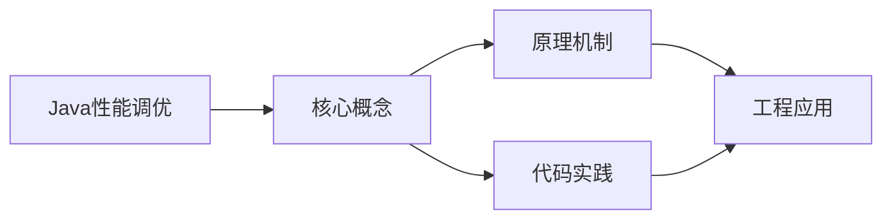
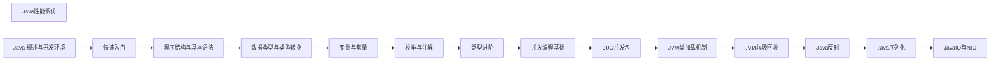

## 1. 学习目标（Bloom 分类）

本节按照布鲁姆教育目标分类学组织学习路径。本文主题为《Java性能调优》，属于 Java 模块，读者可以根据自身阶段选择阅读深度。

记忆层面：能够准确复述本文的核心概念、术语与基本语法或操作步骤，并能够在提问或检索时快速定位对应知识点。能够说出 Java 的编译执行模型（javac 到字节码，JVM 解释与 JIT）。

理解层面：能够用自己的语言解释核心原理与工作机制，说明概念之间的因果关系，而不是机械记忆结论。能够解释面向对象三大特性与 JVM 内存区域的职责。

应用层面：能够在真实项目或练习场景中运用本文知识解决具体问题，写出正确且可维护的实现。能够编写类、接口、集合操作与异常处理的完整程序。

分析层面：能够拆解复杂问题，比较本文主题与相邻概念的异同，识别边界条件与例外情况。能够分析 Java 与 C++、Go 在内存管理与并发模型上的差异。

评价层面：能够根据约束条件（性能、可读性、安全、成本）评价不同方案的优劣，做出有依据的技术决策。能够评价不同集合、并发工具与框架的适用场景。

创造层面：能够把本文知识与其他模块知识组合，设计出新的解决方案或可复用的工程模式。能够组合 Spring 生态设计企业级应用。

通过本节学习，读者应当能够把《Java性能调优》纳入自己的知识网络，并与 Java 模块的其他主题（JVM、集合框架、并发、Spring 生态）建立关联。

## 2. 历史动机与发展脉络

《Java性能调优》是 Java 领域的重要主题。要真正理解它，需要先了解它解决的问题与演进过程。

Java 由 James Gosling 领导的 Sun 团队于 1995 年发布，口号“一次编写，到处运行”依托 JVM 字节码实现跨平台。2006 年 Sun 将 Java 开源（OpenJDK），2010 年 Oracle 收购 Sun 后 Java 进入新的治理阶段。
Java 的版本节奏在 2017 年后改为每半年一个特性版本、每两年一个 LTS（长期支持）版本。当前主流 LTS 包括 Java 11、17、21 与 25；Java 21 引入虚拟线程（Project Loom 成果），显著降低高并发服务的线程成本。
Java 生态以 Spring 家族为核心：Spring Boot 简化配置与部署，Spring Cloud 提供微服务组件；构建工具从 Maven 演进到 Gradle；JVM 语言（Kotlin、Scala、Groovy）与 Java 共存互操作。
Android 开发早期使用 Java，2019 年后官方转向 Kotlin-first，但 Java 仍是服务端领域（尤其是金融、电商等企业系统）的中坚力量。

回到本文主题：Java性能调优 的提出与成熟，正是上述技术背景下的必然产物。早期实现往往以简单可用为目标，随着工程规模扩大，社区逐渐沉淀出标准做法与最佳实践；理解这一脉络，可以帮助读者判断“为什么文档中的推荐写法是现在这个样子”，也能在遇到历史遗留代码时准确识别其设计年代与取舍。

理解 Java 版本与 LTS 机制，是工程选型的起点：生产环境优先 LTS，新特性（如虚拟线程）可以在受控场景评估后引入。

## 3. 形式化定义与核心概念精讲

本节把《Java性能调优》涉及的核心概念以“定义 + 讲解”的形式展开。读者应把定义当作工具，把讲解当作理解路径；两者结合才能形成可迁移的知识。

JVM 与字节码：`javac` 把 .java 编译为 .class 字节码，JVM 加载、校验并执行；热点代码由 JIT（如 C2）编译为机器码，解释与编译结合实现启动速度与峰值性能的平衡。
面向对象：封装（访问控制）、继承（extends/implements）与多态（重载/重写）是 Java 的类型系统支柱；接口默认方法（Java 8）与密封类（Java 17）持续演进表达能力。
异常体系：受检异常（checked）编译期强制处理，非受检异常（RuntimeException）运行时抛出；try-with-resources 自动关闭资源。
泛型与擦除：Java 泛型在编译期检查后擦除类型参数，运行时无泛型信息；这解释了 `List<String>` 与 `List<Integer>` 的 Class 相同，以及通配符 `? extends` 的逆变协变规则。

### 3.1 原文章节逐一精讲

原文档把主题拆分为 7 个小节，下面按顺序给出每一节的导读讲解，随后保留原文细节供精读。

#### 原文精读（完整保留）


#### 概述

Java 性能调优是在应用满足功能需求之后，通过分析瓶颈、调整参数、优化代码来提升响应速度和吞吐量的过程。性能问题通常不会在开发阶段暴露，而是在高并发、大数据量的生产环境中才显现。因此，掌握性能调优的方法论比记住具体的参数更重要。

性能调优不是盲目修改配置，而是"先测量，再优化"。你需要先确定瓶颈在哪里（CPU、内存、IO、锁竞争），然后针对性地优化，最后验证优化效果。没有测量数据的调优只是猜测。

#### 基础概念

##### 性能指标

衡量 Java 应用性能的几个核心指标：

- **响应时间**：单个请求从发出到返回的时间，通常关注 P99（99% 的请求在多少时间内完成）
- **吞吐量**：单位时间内处理的请求数量，通常用 QPS（每秒查询数）衡量
- **GC 停顿**：垃圾回收导致的应用暂停时间，直接影响响应时间的稳定性
- **内存使用**：堆内存的占用情况和分配速率，影响 GC 频率

##### 性能瓶颈的常见来源

- **CPU 密集**：计算量过大，算法效率低
- **内存分配过快**：短生命周期对象太多，GC 压力大
- **IO 阻塞**：数据库查询慢、网络延迟高、磁盘读写慢
- **锁竞争**：多线程争抢同一把锁，导致线程等待
- **连接池不足**：数据库连接或 HTTP 连接不够用，请求排队

##### 调优的一般流程

1. 建立基准：用压测工具测量当前性能
2. 监控分析：用工具找到瓶颈所在
3. 提出假设：根据分析结果猜测原因
4. 实施优化：修改代码或配置
5. 验证效果：再次压测，对比数据
6. 重复以上步骤

#### 快速上手

##### 使用 JFR 记录性能数据

Java Flight Recorder（JFR）是 JDK 内置的性能分析工具，对应用影响极小（通常低于 2%），适合在生产环境使用：

```bash
# 启动应用时开启 JFR
java -XX:StartFlightRecording=duration=60s,filename=app.jfr -jar myapp.jar

# 或者在运行中的应用上动态开启
jcmd <pid> JFR.start duration=60s filename=app.jfr
```

使用 JDK Mission Control（JMC）打开 app.jfr 文件，可以查看 CPU 热点、内存分配、GC 事件、线程阻塞等信息。

##### 使用 async-profiler 分析 CPU 热点

async-profiler 是一个低开销的 CPU 和内存分析工具，能准确找到最耗时的方法：

```bash
# 分析 CPU 使用情况，持续 30 秒
java -jar async-profiler.jar -d 30 -f cpu.html <pid>

# 分析内存分配
java -jar async-profiler.jar -d 30 -e alloc -f alloc.html <pid>
```

生成的 HTML 文件包含火焰图，直观展示哪些方法占用了最多 CPU 时间。

#### 详细用法

##### 1. JVM 内存调优

JVM 内存分为堆（Heap）和非堆（Non-heap）。堆用于存储对象实例，非堆包括方法区（元空间）、线程栈、直接内存等。

```bash
# 基本内存参数
java -Xms2g -Xmx2g \        # 初始堆大小和最大堆大小设为相同，避免动态扩容
     -XX:MetaspaceSize=256m \ # 元空间初始大小
     -XX:MaxMetaspaceSize=256m \ # 元空间最大大小
     -jar myapp.jar
```

为什么要把 -Xms 和 -Xmx 设为相同？因为堆从较小值扩展到较大值时需要 Full GC，这个过程会暂停应用。设为相同值可以避免这种动态调整带来的停顿。

##### 2. 垃圾回收器选择

JDK 8 默认使用 Parallel GC，JDK 9+ 默认使用 G1 GC。不同场景适合不同的 GC：

```bash
# G1 GC：适合大多数服务端应用，平衡吞吐量和延迟
java -XX:+UseG1GC \
     -XX:MaxGCPauseMillis=200 \ # 目标最大停顿时间 200ms
     -XX:G1HeapRegionSize=8m \   # Region 大小
     -jar myapp.jar

# ZGC：适合需要极低延迟的应用（JDK 15+ 生产可用）
java -XX:+UseZGC \
     -XX:MaxGCPauseMillis=10 \  # 目标最大停顿时间 10ms
     -Xmx4g \
     -jar myapp.jar

# Parallel GC：适合批处理任务，追求最大吞吐量
java -XX:+UseParallelGC \
     -XX:ParallelGCThreads=4 \  # GC 线程数
     -jar myapp.jar
```

如何选择？如果应用对延迟敏感（如 Web 服务），选 G1 或 ZGC；如果应用是批处理任务（如数据分析），选 Parallel GC。

##### 3. 字符串优化

字符串拼接是 Java 中最常见的性能陷阱之一：

```java
// 错误：循环中使用 + 拼接字符串，每次都创建新对象
String result = "";
for (String item : items) {
    result += item;  // 每次循环都创建一个新的 String 对象
}

// 正确：使用 StringBuilder
StringBuilder sb = new StringBuilder();
for (String item : items) {
    sb.append(item);  // 在内部缓冲区追加，不创建新对象
}
String result = sb.toString();

// 更好：如果只是拼接已知数量的字符串，直接用 + 即可
// 编译器会自动优化为 StringBuilder
String greeting = "Hello, " + name + "!";  // 这没问题
```

##### 4. 集合优化

选择合适的集合类型和初始容量可以减少扩容开销：

```java
import java.util.ArrayList;
import java.util.HashMap;

// 指定初始容量，避免扩容
// ArrayList 每次扩容会增加 50%，涉及数组拷贝
List<String> list = new ArrayList<>(1000);  // 如果知道大概有多少元素

// HashMap 默认容量 16，负载因子 0.75，超过容量*负载因子就扩容
// 扩容需要重新计算所有键的哈希位置，代价很高
Map<String, String> map = new HashMap<>(1024);  // 预分配足够容量

// 使用基本类型集合避免自动装箱
// 错误：大量 Integer 对象的创建和销毁
Map<Integer, String> map = new HashMap<>();  // int 会被装箱为 Integer

// 如果使用第三方库，可以用 Trove 或 Eclipse Collections 的基本类型集合
// TIntObjectMap<String> map = new TIntObjectHashMap<>();
```

##### 5. 线程池优化

线程池的大小直接影响并发性能。线程太少会浪费 CPU，太多会导致上下文切换开销：

```java
import java.util.concurrent.ExecutorService;
import java.util.concurrent.Executors;
import java.util.concurrent.ThreadPoolExecutor;
import java.util.concurrent.LinkedBlockingQueue;
import java.util.concurrent.TimeUnit;

// CPU 密集型任务：线程数 = CPU 核心数 + 1
int cpuCores = Runtime.getRuntime().availableProcessors();
ExecutorService cpuPool = Executors.newFixedThreadPool(cpuCores + 1);

// IO 密集型任务：线程数 = CPU 核心数 * 2（或更多）
ExecutorService ioPool = Executors.newFixedThreadPool(cpuCores * 2);

// 自定义线程池（更灵活）
ThreadPoolExecutor customPool = new ThreadPoolExecutor(
    4,                                  // 核心线程数
    8,                                  // 最大线程数
    60, TimeUnit.SECONDS,               // 空闲线程存活时间
    new LinkedBlockingQueue<>(1000),    // 任务队列容量
    new ThreadPoolExecutor.CallerRunsPolicy()  // 队列满时由调用线程执行
);
```

##### 6. 数据库访问优化

数据库访问通常是 Java 应用最大的性能瓶颈：

```java
import javax.sql.DataSource;
import java.sql.Connection;
import java.sql.PreparedStatement;

// 使用连接池，不要每次创建新连接
// HikariCP 是性能最好的连接池
// spring.datasource.hikari.maximum-pool-size=20

// 使用 PreparedStatement 防止 SQL 注入，同时可以利用查询缓存
String sql = "SELECT * FROM users WHERE id = ?";
try (Connection conn = dataSource.getConnection();
     PreparedStatement ps = conn.prepareStatement(sql)) {
    ps.setLong(1, userId);
    // 执行查询...
}

// 批量操作代替循环单条操作
String insertSql = "INSERT INTO orders (user_id, amount) VALUES (?, ?)";
try (Connection conn = dataSource.getConnection();
     PreparedStatement ps = conn.prepareStatement(insertSql)) {
    for (Order order : orders) {
        ps.setLong(1, order.getUserId());
        ps.setBigDecimal(2, order.getAmount());
        ps.addBatch();  // 添加到批次
    }
    ps.executeBatch();  // 一次性执行所有插入
}
```

##### 7. 缓存优化

缓存是减少重复计算和数据库访问的最有效手段：

```java
import java.util.concurrent.ConcurrentHashMap;
import java.util.concurrent.TimeUnit;

// 简单的本地缓存
public class LocalCache<V> {
    private final ConcurrentHashMap<String, CacheEntry<V>> cache = new ConcurrentHashMap<>();
    private final long ttlMillis;  // 缓存过期时间

    public LocalCache(long ttlMillis) {
        this.ttlMillis = ttlMillis;
    }

    public V get(String key) {
        CacheEntry<V> entry = cache.get(key);
        if (entry != null && !entry.isExpired()) {
            return entry.value;
        }
        return null;
    }

    public void put(String key, V value) {
        cache.put(key, new CacheEntry<>(value, System.currentTimeMillis() + ttlMillis));
    }

    private static class CacheEntry<V> {
        final V value;
        final long expireTime;

        CacheEntry(V value, long expireTime) {
            this.value = value;
            this.expireTime = expireTime;
        }

        boolean isExpired() {
            return System.currentTimeMillis() > expireTime;
        }
    }
}
```

#### 常见场景

##### 场景一：接口响应慢

排查接口响应慢的标准流程：

```bash
# 第一步：查看 GC 日志，排除 GC 停顿的影响
java -Xlog:gc*:file=gc.log -jar myapp.jar

# 第二步：用 async-profiler 找到 CPU 热点
java -jar async-profiler.jar -d 30 -f cpu.html <pid>

# 第三步：查看数据库慢查询日志
# 第四步：检查是否有锁竞争（JFR 的 Thread Blocking 事件）
```

##### 场景二：内存泄漏

内存泄漏的表现是应用运行一段时间后越来越慢，最终 OOM：

```bash
# 第一步：用 jmap 导出堆转储
jmap -dump:live,format=b,file=heap.hprof <pid>

# 第二步：用 MAT（Memory Analyzer Tool）分析堆转储
# 查找占用内存最大的对象，追踪 GC Roots 引用链

# 第三步：常见内存泄漏原因
# - 静态集合不断添加元素但从不清理
# - 未关闭的资源（连接、流）
# - 监听器/回调未注销
# - ThreadLocal 未清理
```

##### 场景三：高并发下的线程问题

```java
// 错误：使用 synchronized 导致所有线程串行执行
public synchronized User getUser(Long id) {
    return userRepository.findById(id);
}

// 正确：缩小锁的范围，或使用并发集合
private final ConcurrentHashMap<Long, User> cache = new ConcurrentHashMap<>();

public User getUser(Long id) {
    // 使用 ConcurrentHashMap 的原子操作
    return cache.computeIfAbsent(id, key -> userRepository.findById(key));
}
```

#### 注意事项与常见错误

##### 过早优化

不要在没有性能数据的情况下优化代码。先让代码正确运行，再根据实际瓶颈优化。Donald Knuth 说过："过早优化是万恶之源。"

##### 忽略 GC 日志

生产环境一定要开启 GC 日志，否则无法排查 GC 相关的问题：

```bash
# JDK 9+ 的 GC 日志参数
java -Xlog:gc*:file=gc.log:time,uptime:filecount=5,filesize=10m -jar myapp.jar
```

##### 盲目调大内存

堆内存不是越大越好。堆越大，Full GC 的停顿时间越长。如果应用只需要 2GB 内存，设置 8GB 反而可能导致更长的 GC 停顿。应该根据实际需要设置合理的堆大小。

##### 忽略连接池配置

数据库连接池、HTTP 连接池的配置对性能影响很大。连接数太少会导致请求排队，太多会压垮数据库。一般建议数据库连接池大小为 CPU 核心数 \* 2 + 有效磁盘数。

#### 进阶用法

##### JIT 编译优化

JIT（Just-In-Time）编译器会将热点代码编译为本地机器码，大幅提升执行速度。了解 JIT 行为有助于理解某些性能现象：

```bash
# 查看 JIT 编译日志
java -XX:+PrintCompilation -jar myapp.jar

# 查看内联情况
java -XX:+PrintInlining -jar myapp.jar

# 禁用 JIT（用于对比测试）
java -Xint -jar myapp.jar  # 纯解释执行，速度会慢很多
```

##### 使用 JMH 做微基准测试

JMH（Java Microbenchmark Harness）是 OpenJDK 提供的微基准测试框架，用于准确测量小段代码的性能：

```java
import org.openjdk.jmh.annotations.*;
import java.util.concurrent.TimeUnit;

@BenchmarkMode(Mode.AverageTime)       // 测量平均执行时间
@OutputTimeUnit(TimeUnit.NANOSECONDS)  // 时间单位纳秒
@State(Scope.Thread)                   // 每个线程独立的状态
public class StringBenchmark {

    private String prefix = "Hello";
    private String name = "World";

    @Benchmark
    public String stringConcat() {
        return prefix + ", " + name + "!";
    }

    @Benchmark
    public String stringBuilder() {
        StringBuilder sb = new StringBuilder();
        sb.append(prefix).append(", ").append(name).append("!");
        return sb.toString();
    }
}
```

##### 容器环境下的内存配置

在 Docker 容器中运行 Java 应用时，需要正确配置内存限制：

```bash
# JDK 10+ 会自动识别容器内存限制
# JDK 8u191+ 需要手动开启
java -XX:+UseContainerSupport \
     -XX:MaxRAMPercentage=75.0 \  # 使用容器内存的 75% 作为堆
     -jar myapp.jar
```

不要用 -Xmx 指定固定值，因为容器的内存限制可能变化。使用 -XX:MaxRAMPercentage 更灵活。


### 3.2 概念关系图

下面用 Mermaid 图表达本文核心概念之间的关系，帮助读者建立整体图景：



图中展示的是本文知识的结构化关系：核心概念是入口，原理机制解释“为什么”，代码实践演示“怎么做”，工程应用回答“何时用”。读者学习时可以把每个小节的内容挂接到对应节点上。

## 4. 理论推导与原理解析

本节深入《Java性能调优》背后的原理。理论部分不求面面俱到，而是聚焦“能解释现象、能指导实践”的关键推导。

JVM 内存模型：堆（新生代/老年代）、元空间、虚拟机栈、本地方法栈与程序计数器；GC 从 CMS 演进到 G1（默认）、ZGC（超低延迟），理解分代收集是调优前提。
并发工具：synchronized 与 JUC（java.util.concurrent）的锁、并发容器、线程池、CompletableFuture 构成并发工具箱；Java 21 的虚拟线程让“每任务一线程”成为可能。
类加载机制：双亲委派模型保证类唯一性，SPI（ServiceLoader）打破委派实现扩展；自定义类加载器是热部署与隔离的基础。
反射与注解：反射在运行时检查类结构，注解提供元数据；Spring 的依赖注入与 AOP 均基于这些机制，但反射有性能与安全成本。

需要强调的是，理论推导与工程实践之间存在翻译层：理论给出的是理想化模型与边界条件，工程代码则必须处理真实环境中的例外。读者在学习时应先掌握理论的“标准情形”，再通过陷阱章节了解“非标准情形”。

## 5. 代码示例与逐行讲解

本节把原文中的代码示例系统整理，并为每个示例补充用途说明与讲解。读者不应只浏览代码，而应逐段对照讲解理解设计意图。

### 5.1 示例：使用 JFR 记录性能数据

该示例来自原文《使用 JFR 记录性能数据》小节，用于演示Java性能调优相关操作。阅读时请先看代码结构，再看其后的讲解。

```bash
# 启动应用时开启 JFR
java -XX:StartFlightRecording=duration=60s,filename=app.jfr -jar myapp.jar

# 或者在运行中的应用上动态开启
jcmd <pid> JFR.start duration=60s filename=app.jfr
```

讲解：这段代码演示了本节核心知识点。代码中的关键操作可以归纳为三步：准备（定义或初始化）、执行（核心逻辑）、收尾（释放资源或返回结果）。实际项目中，这三步往往被封装为函数或类，以提升复用性与可测试性。

关键点分析：

该示例共 4 行有效代码，结构以数据或配置为主。阅读时应关注：数据字段的含义、配置项的作用，以及它们与运行行为的对应关系。

进阶思考路径：先尝试修改参数观察行为变化，再把示例中的模式迁移到自己的项目中；每次修改都记录预期与实测差异，这是把示例转化为能力的最快方式。

### 5.2 示例：使用 async-profiler 分析 CPU 热点

该示例来自原文《使用 async-profiler 分析 CPU 热点》小节，用于演示Java性能调优相关操作。阅读时请先看代码结构，再看其后的讲解。

```bash
# 分析 CPU 使用情况，持续 30 秒
java -jar async-profiler.jar -d 30 -f cpu.html <pid>

# 分析内存分配
java -jar async-profiler.jar -d 30 -e alloc -f alloc.html <pid>
```

讲解：这段代码演示了本节核心知识点。代码中的关键操作可以归纳为三步：准备（定义或初始化）、执行（核心逻辑）、收尾（释放资源或返回结果）。实际项目中，这三步往往被封装为函数或类，以提升复用性与可测试性。

关键点分析：

该示例共 4 行有效代码，结构以数据或配置为主。阅读时应关注：数据字段的含义、配置项的作用，以及它们与运行行为的对应关系。

进阶思考路径：先尝试修改参数观察行为变化，再把示例中的模式迁移到自己的项目中；每次修改都记录预期与实测差异，这是把示例转化为能力的最快方式。

### 5.3 示例：1. JVM 内存调优

该示例来自原文《1. JVM 内存调优》小节，用于演示Java性能调优相关操作。阅读时请先看代码结构，再看其后的讲解。

```bash
# 基本内存参数
java -Xms2g -Xmx2g \        # 初始堆大小和最大堆大小设为相同，避免动态扩容
     -XX:MetaspaceSize=256m \ # 元空间初始大小
     -XX:MaxMetaspaceSize=256m \ # 元空间最大大小
     -jar myapp.jar
```

讲解：这段代码演示了本节核心知识点。代码中的关键操作可以归纳为三步：准备（定义或初始化）、执行（核心逻辑）、收尾（释放资源或返回结果）。实际项目中，这三步往往被封装为函数或类，以提升复用性与可测试性。

关键点分析：

该示例共 5 行有效代码，结构以数据或配置为主。阅读时应关注：数据字段的含义、配置项的作用，以及它们与运行行为的对应关系。

进阶思考路径：先尝试修改参数观察行为变化，再把示例中的模式迁移到自己的项目中；每次修改都记录预期与实测差异，这是把示例转化为能力的最快方式。

### 5.4 示例：2. 垃圾回收器选择

该示例来自原文《2. 垃圾回收器选择》小节，用于演示Java性能调优相关操作。阅读时请先看代码结构，再看其后的讲解。

```bash
# G1 GC：适合大多数服务端应用，平衡吞吐量和延迟
java -XX:+UseG1GC \
     -XX:MaxGCPauseMillis=200 \ # 目标最大停顿时间 200ms
     -XX:G1HeapRegionSize=8m \   # Region 大小
     -jar myapp.jar

# ZGC：适合需要极低延迟的应用（JDK 15+ 生产可用）
java -XX:+UseZGC \
     -XX:MaxGCPauseMillis=10 \  # 目标最大停顿时间 10ms
     -Xmx4g \
     -jar myapp.jar

# Parallel GC：适合批处理任务，追求最大吞吐量
java -XX:+UseParallelGC \
     -XX:ParallelGCThreads=4 \  # GC 线程数
     -jar myapp.jar
```

讲解：这段代码演示了本节核心知识点。代码中的关键操作可以归纳为三步：准备（定义或初始化）、执行（核心逻辑）、收尾（释放资源或返回结果）。实际项目中，这三步往往被封装为函数或类，以提升复用性与可测试性。

关键点分析：

该示例共 14 行有效代码，结构以数据或配置为主。阅读时应关注：数据字段的含义、配置项的作用，以及它们与运行行为的对应关系。

进阶思考路径：先尝试修改参数观察行为变化，再把示例中的模式迁移到自己的项目中；每次修改都记录预期与实测差异，这是把示例转化为能力的最快方式。

### 5.5 示例：3. 字符串优化

该示例来自原文《3. 字符串优化》小节，用于演示Java性能调优相关操作。阅读时请先看代码结构，再看其后的讲解。

```java
// 错误：循环中使用 + 拼接字符串，每次都创建新对象
String result = "";
for (String item : items) {
    result += item;  // 每次循环都创建一个新的 String 对象
}

// 正确：使用 StringBuilder
StringBuilder sb = new StringBuilder();
for (String item : items) {
    sb.append(item);  // 在内部缓冲区追加，不创建新对象
}
String result = sb.toString();

// 更好：如果只是拼接已知数量的字符串，直接用 + 即可
// 编译器会自动优化为 StringBuilder
String greeting = "Hello, " + name + "!";  // 这没问题
```

讲解：这段代码演示了本节核心知识点。代码中的关键操作可以归纳为三步：准备（定义或初始化）、执行（核心逻辑）、收尾（释放资源或返回结果）。实际项目中，这三步往往被封装为函数或类，以提升复用性与可测试性。

关键点分析：

该示例共 14 行有效代码，包含 1 类关键结构（for）。其中：

- 入口与初始化部分负责建立上下文，对应实际项目中的启动或装配逻辑；
- 核心逻辑部分体现本文主题的主要操作，是阅读时最需要对照讲解理解的部分；
- 输出或返回部分把结果交给调用方，注意其类型与边界条件。

进阶思考路径：先尝试修改参数观察行为变化，再把示例中的模式迁移到自己的项目中；每次修改都记录预期与实测差异，这是把示例转化为能力的最快方式。

### 5.6 示例：4. 集合优化

该示例来自原文《4. 集合优化》小节，用于演示Java性能调优相关操作。阅读时请先看代码结构，再看其后的讲解。

```java
import java.util.ArrayList;
import java.util.HashMap;

// 指定初始容量，避免扩容
// ArrayList 每次扩容会增加 50%，涉及数组拷贝
List<String> list = new ArrayList<>(1000);  // 如果知道大概有多少元素

// HashMap 默认容量 16，负载因子 0.75，超过容量*负载因子就扩容
// 扩容需要重新计算所有键的哈希位置，代价很高
Map<String, String> map = new HashMap<>(1024);  // 预分配足够容量

// 使用基本类型集合避免自动装箱
// 错误：大量 Integer 对象的创建和销毁
Map<Integer, String> map = new HashMap<>();  // int 会被装箱为 Integer

// 如果使用第三方库，可以用 Trove 或 Eclipse Collections 的基本类型集合
// TIntObjectMap<String> map = new TIntObjectHashMap<>();
```

讲解：这段代码演示了本节核心知识点。代码中的关键操作可以归纳为三步：准备（定义或初始化）、执行（核心逻辑）、收尾（释放资源或返回结果）。实际项目中，这三步往往被封装为函数或类，以提升复用性与可测试性。

关键点分析：

该示例共 13 行有效代码，包含 1 类关键结构（import）。其中：

- 入口与初始化部分负责建立上下文，对应实际项目中的启动或装配逻辑；
- 核心逻辑部分体现本文主题的主要操作，是阅读时最需要对照讲解理解的部分；
- 输出或返回部分把结果交给调用方，注意其类型与边界条件。

进阶思考路径：先尝试修改参数观察行为变化，再把示例中的模式迁移到自己的项目中；每次修改都记录预期与实测差异，这是把示例转化为能力的最快方式。

### 5.7 示例：5. 线程池优化

该示例来自原文《5. 线程池优化》小节，用于演示Java性能调优相关操作。阅读时请先看代码结构，再看其后的讲解。

```java
import java.util.concurrent.ExecutorService;
import java.util.concurrent.Executors;
import java.util.concurrent.ThreadPoolExecutor;
import java.util.concurrent.LinkedBlockingQueue;
import java.util.concurrent.TimeUnit;

// CPU 密集型任务：线程数 = CPU 核心数 + 1
int cpuCores = Runtime.getRuntime().availableProcessors();
ExecutorService cpuPool = Executors.newFixedThreadPool(cpuCores + 1);

// IO 密集型任务：线程数 = CPU 核心数 * 2（或更多）
ExecutorService ioPool = Executors.newFixedThreadPool(cpuCores * 2);

// 自定义线程池（更灵活）
ThreadPoolExecutor customPool = new ThreadPoolExecutor(
    4,                                  // 核心线程数
    8,                                  // 最大线程数
    60, TimeUnit.SECONDS,               // 空闲线程存活时间
    new LinkedBlockingQueue<>(1000),    // 任务队列容量
    new ThreadPoolExecutor.CallerRunsPolicy()  // 队列满时由调用线程执行
);
```

讲解：这段代码演示了本节核心知识点。代码中的关键操作可以归纳为三步：准备（定义或初始化）、执行（核心逻辑）、收尾（释放资源或返回结果）。实际项目中，这三步往往被封装为函数或类，以提升复用性与可测试性。

关键点分析：

该示例共 18 行有效代码，包含 1 类关键结构（import）。其中：

- 入口与初始化部分负责建立上下文，对应实际项目中的启动或装配逻辑；
- 核心逻辑部分体现本文主题的主要操作，是阅读时最需要对照讲解理解的部分；
- 输出或返回部分把结果交给调用方，注意其类型与边界条件。

进阶思考路径：先尝试修改参数观察行为变化，再把示例中的模式迁移到自己的项目中；每次修改都记录预期与实测差异，这是把示例转化为能力的最快方式。

### 5.8 示例：6. 数据库访问优化

该示例来自原文《6. 数据库访问优化》小节，用于演示Java性能调优相关操作。阅读时请先看代码结构，再看其后的讲解。

```java
import javax.sql.DataSource;
import java.sql.Connection;
import java.sql.PreparedStatement;

// 使用连接池，不要每次创建新连接
// HikariCP 是性能最好的连接池
// spring.datasource.hikari.maximum-pool-size=20

// 使用 PreparedStatement 防止 SQL 注入，同时可以利用查询缓存
String sql = "SELECT * FROM users WHERE id = ?";
try (Connection conn = dataSource.getConnection();
     PreparedStatement ps = conn.prepareStatement(sql)) {
    ps.setLong(1, userId);
    // 执行查询...
}

// 批量操作代替循环单条操作
String insertSql = "INSERT INTO orders (user_id, amount) VALUES (?, ?)";
try (Connection conn = dataSource.getConnection();
     PreparedStatement ps = conn.prepareStatement(insertSql)) {
    for (Order order : orders) {
        ps.setLong(1, order.getUserId());
        ps.setBigDecimal(2, order.getAmount());
        ps.addBatch();  // 添加到批次
    }
    ps.executeBatch();  // 一次性执行所有插入
}
```

讲解：这段代码演示了本节核心知识点。代码中的关键操作可以归纳为三步：准备（定义或初始化）、执行（核心逻辑）、收尾（释放资源或返回结果）。实际项目中，这三步往往被封装为函数或类，以提升复用性与可测试性。

关键点分析：

该示例共 24 行有效代码，包含 5 类关键结构（import、for、SELECT、INSERT、FROM）。其中：

- 入口与初始化部分负责建立上下文，对应实际项目中的启动或装配逻辑；
- 核心逻辑部分体现本文主题的主要操作，是阅读时最需要对照讲解理解的部分；
- 输出或返回部分把结果交给调用方，注意其类型与边界条件。

进阶思考路径：先尝试修改参数观察行为变化，再把示例中的模式迁移到自己的项目中；每次修改都记录预期与实测差异，这是把示例转化为能力的最快方式。

### 5.9 示例：7. 缓存优化

该示例来自原文《7. 缓存优化》小节，用于演示Java性能调优相关操作。阅读时请先看代码结构，再看其后的讲解。

```java
import java.util.concurrent.ConcurrentHashMap;
import java.util.concurrent.TimeUnit;

// 简单的本地缓存
public class LocalCache<V> {
    private final ConcurrentHashMap<String, CacheEntry<V>> cache = new ConcurrentHashMap<>();
    private final long ttlMillis;  // 缓存过期时间

    public LocalCache(long ttlMillis) {
        this.ttlMillis = ttlMillis;
    }

    public V get(String key) {
        CacheEntry<V> entry = cache.get(key);
        if (entry != null && !entry.isExpired()) {
            return entry.value;
        }
        return null;
    }

    public void put(String key, V value) {
        cache.put(key, new CacheEntry<>(value, System.currentTimeMillis() + ttlMillis));
    }

    private static class CacheEntry<V> {
        final V value;
        final long expireTime;

        CacheEntry(V value, long expireTime) {
            this.value = value;
            this.expireTime = expireTime;
        }

        boolean isExpired() {
            return System.currentTimeMillis() > expireTime;
        }
    }
}
```

讲解：这段代码演示了本节核心知识点。代码中的关键操作可以归纳为三步：准备（定义或初始化）、执行（核心逻辑）、收尾（释放资源或返回结果）。实际项目中，这三步往往被封装为函数或类，以提升复用性与可测试性。

关键点分析：

该示例共 31 行有效代码，包含 4 类关键结构（class、import、if、return）。其中：

- 入口与初始化部分负责建立上下文，对应实际项目中的启动或装配逻辑；
- 核心逻辑部分体现本文主题的主要操作，是阅读时最需要对照讲解理解的部分；
- 输出或返回部分把结果交给调用方，注意其类型与边界条件。

进阶思考路径：先尝试修改参数观察行为变化，再把示例中的模式迁移到自己的项目中；每次修改都记录预期与实测差异，这是把示例转化为能力的最快方式。

### 5.10 示例：场景一：接口响应慢

该示例来自原文《场景一：接口响应慢》小节，用于演示Java性能调优相关操作。阅读时请先看代码结构，再看其后的讲解。

```bash
# 第一步：查看 GC 日志，排除 GC 停顿的影响
java -Xlog:gc*:file=gc.log -jar myapp.jar

# 第二步：用 async-profiler 找到 CPU 热点
java -jar async-profiler.jar -d 30 -f cpu.html <pid>

# 第三步：查看数据库慢查询日志
# 第四步：检查是否有锁竞争（JFR 的 Thread Blocking 事件）
```

讲解：这段代码演示了本节核心知识点。代码中的关键操作可以归纳为三步：准备（定义或初始化）、执行（核心逻辑）、收尾（释放资源或返回结果）。实际项目中，这三步往往被封装为函数或类，以提升复用性与可测试性。

关键点分析：

该示例共 6 行有效代码，结构以数据或配置为主。阅读时应关注：数据字段的含义、配置项的作用，以及它们与运行行为的对应关系。

进阶思考路径：先尝试修改参数观察行为变化，再把示例中的模式迁移到自己的项目中；每次修改都记录预期与实测差异，这是把示例转化为能力的最快方式。

### 5.11 示例：场景二：内存泄漏

该示例来自原文《场景二：内存泄漏》小节，用于演示Java性能调优相关操作。阅读时请先看代码结构，再看其后的讲解。

```bash
# 第一步：用 jmap 导出堆转储
jmap -dump:live,format=b,file=heap.hprof <pid>

# 第二步：用 MAT（Memory Analyzer Tool）分析堆转储
# 查找占用内存最大的对象，追踪 GC Roots 引用链

# 第三步：常见内存泄漏原因
# - 静态集合不断添加元素但从不清理
# - 未关闭的资源（连接、流）
# - 监听器/回调未注销
# - ThreadLocal 未清理
```

讲解：这段代码演示了本节核心知识点。代码中的关键操作可以归纳为三步：准备（定义或初始化）、执行（核心逻辑）、收尾（释放资源或返回结果）。实际项目中，这三步往往被封装为函数或类，以提升复用性与可测试性。

关键点分析：

该示例共 9 行有效代码，结构以数据或配置为主。阅读时应关注：数据字段的含义、配置项的作用，以及它们与运行行为的对应关系。

进阶思考路径：先尝试修改参数观察行为变化，再把示例中的模式迁移到自己的项目中；每次修改都记录预期与实测差异，这是把示例转化为能力的最快方式。

### 5.12 示例：场景三：高并发下的线程问题

该示例来自原文《场景三：高并发下的线程问题》小节，用于演示Java性能调优相关操作。阅读时请先看代码结构，再看其后的讲解。

```java
// 错误：使用 synchronized 导致所有线程串行执行
public synchronized User getUser(Long id) {
    return userRepository.findById(id);
}

// 正确：缩小锁的范围，或使用并发集合
private final ConcurrentHashMap<Long, User> cache = new ConcurrentHashMap<>();

public User getUser(Long id) {
    // 使用 ConcurrentHashMap 的原子操作
    return cache.computeIfAbsent(id, key -> userRepository.findById(key));
}
```

讲解：这段代码演示了本节核心知识点。代码中的关键操作可以归纳为三步：准备（定义或初始化）、执行（核心逻辑）、收尾（释放资源或返回结果）。实际项目中，这三步往往被封装为函数或类，以提升复用性与可测试性。

关键点分析：

该示例共 10 行有效代码，包含 1 类关键结构（return）。其中：

- 入口与初始化部分负责建立上下文，对应实际项目中的启动或装配逻辑；
- 核心逻辑部分体现本文主题的主要操作，是阅读时最需要对照讲解理解的部分；
- 输出或返回部分把结果交给调用方，注意其类型与边界条件。

进阶思考路径：先尝试修改参数观察行为变化，再把示例中的模式迁移到自己的项目中；每次修改都记录预期与实测差异，这是把示例转化为能力的最快方式。

### 5.13 示例：忽略 GC 日志

该示例来自原文《忽略 GC 日志》小节，用于演示Java性能调优相关操作。阅读时请先看代码结构，再看其后的讲解。

```bash
# JDK 9+ 的 GC 日志参数
java -Xlog:gc*:file=gc.log:time,uptime:filecount=5,filesize=10m -jar myapp.jar
```

讲解：这段代码演示了本节核心知识点。代码中的关键操作可以归纳为三步：准备（定义或初始化）、执行（核心逻辑）、收尾（释放资源或返回结果）。实际项目中，这三步往往被封装为函数或类，以提升复用性与可测试性。

关键点分析：

该示例共 2 行有效代码，结构以数据或配置为主。阅读时应关注：数据字段的含义、配置项的作用，以及它们与运行行为的对应关系。

进阶思考路径：先尝试修改参数观察行为变化，再把示例中的模式迁移到自己的项目中；每次修改都记录预期与实测差异，这是把示例转化为能力的最快方式。

### 5.14 示例：JIT 编译优化

该示例来自原文《JIT 编译优化》小节，用于演示Java性能调优相关操作。阅读时请先看代码结构，再看其后的讲解。

```bash
# 查看 JIT 编译日志
java -XX:+PrintCompilation -jar myapp.jar

# 查看内联情况
java -XX:+PrintInlining -jar myapp.jar

# 禁用 JIT（用于对比测试）
java -Xint -jar myapp.jar  # 纯解释执行，速度会慢很多
```

讲解：这段代码演示了本节核心知识点。代码中的关键操作可以归纳为三步：准备（定义或初始化）、执行（核心逻辑）、收尾（释放资源或返回结果）。实际项目中，这三步往往被封装为函数或类，以提升复用性与可测试性。

关键点分析：

该示例共 6 行有效代码，结构以数据或配置为主。阅读时应关注：数据字段的含义、配置项的作用，以及它们与运行行为的对应关系。

进阶思考路径：先尝试修改参数观察行为变化，再把示例中的模式迁移到自己的项目中；每次修改都记录预期与实测差异，这是把示例转化为能力的最快方式。

### 5.15 示例：使用 JMH 做微基准测试

该示例来自原文《使用 JMH 做微基准测试》小节，用于演示Java性能调优相关操作。阅读时请先看代码结构，再看其后的讲解。

```java
import org.openjdk.jmh.annotations.*;
import java.util.concurrent.TimeUnit;

@BenchmarkMode(Mode.AverageTime)       // 测量平均执行时间
@OutputTimeUnit(TimeUnit.NANOSECONDS)  // 时间单位纳秒
@State(Scope.Thread)                   // 每个线程独立的状态
public class StringBenchmark {

    private String prefix = "Hello";
    private String name = "World";

    @Benchmark
    public String stringConcat() {
        return prefix + ", " + name + "!";
    }

    @Benchmark
    public String stringBuilder() {
        StringBuilder sb = new StringBuilder();
        sb.append(prefix).append(", ").append(name).append("!");
        return sb.toString();
    }
}
```

讲解：这段代码演示了本节核心知识点。代码中的关键操作可以归纳为三步：准备（定义或初始化）、执行（核心逻辑）、收尾（释放资源或返回结果）。实际项目中，这三步往往被封装为函数或类，以提升复用性与可测试性。

关键点分析：

该示例共 19 行有效代码，包含 3 类关键结构（class、import、return）。其中：

- 入口与初始化部分负责建立上下文，对应实际项目中的启动或装配逻辑；
- 核心逻辑部分体现本文主题的主要操作，是阅读时最需要对照讲解理解的部分；
- 输出或返回部分把结果交给调用方，注意其类型与边界条件。

进阶思考路径：先尝试修改参数观察行为变化，再把示例中的模式迁移到自己的项目中；每次修改都记录预期与实测差异，这是把示例转化为能力的最快方式。

### 5.16 示例：容器环境下的内存配置

该示例来自原文《容器环境下的内存配置》小节，用于演示Java性能调优相关操作。阅读时请先看代码结构，再看其后的讲解。

```bash
# JDK 10+ 会自动识别容器内存限制
# JDK 8u191+ 需要手动开启
java -XX:+UseContainerSupport \
     -XX:MaxRAMPercentage=75.0 \  # 使用容器内存的 75% 作为堆
     -jar myapp.jar
```

讲解：这段代码演示了本节核心知识点。代码中的关键操作可以归纳为三步：准备（定义或初始化）、执行（核心逻辑）、收尾（释放资源或返回结果）。实际项目中，这三步往往被封装为函数或类，以提升复用性与可测试性。

关键点分析：

该示例共 5 行有效代码，结构以数据或配置为主。阅读时应关注：数据字段的含义、配置项的作用，以及它们与运行行为的对应关系。

进阶思考路径：先尝试修改参数观察行为变化，再把示例中的模式迁移到自己的项目中；每次修改都记录预期与实测差异，这是把示例转化为能力的最快方式。

```java
// 泛型工具：类型安全的取最小值
public static <T extends Comparable<T>> T minOf(T a, T b) {
    return a.compareTo(b) <= 0 ? a : b;
}
```
讲解：`<T extends Comparable<T>>` 约束 T 必须可比较，编译期保证 `compareTo` 可用；返回值类型与入参一致，避免运行时强转。

综合以上示例，可以总结出本主题的代码实践要点：第一，先定义清晰的输入输出契约；第二，核心逻辑保持单一职责；第三，错误处理与边界条件不可省略；第四，命名与注释表达意图而非复述代码。

## 6. 对比分析

对比是理解《Java性能调优》定位的最快路径。下面从多个维度与相邻方案进行对比。

Java 与 C++：Java 无指针算术、自动 GC、跨平台；C++ 可精细控制内存与性能，适合系统级开发。Java 开发效率高，C++ 性能上限高。
Java 与 Go：Java 生态成熟、类型系统与工具链完备；Go 语法简单、并发原生、部署为单一二进制。服务端选型取决于团队与生态。
Java 8 与 Java 21：lambda/Stream（8）与虚拟线程/模式匹配（21）代表两个时代；新项目应基于 17+ 使用现代 API。

对比的目的不是分出绝对优劣，而是建立选择依据：不同约束条件下，最优解不同。读者应把每个对比维度转化为决策检查清单。

## 7. 常见陷阱与最佳实践

本节整理该主题的高频错误与推荐做法。每个陷阱先描述现象，再解释原因，最后给出最佳实践。

### 7.1 equals 与 hashCode 不一致

违反约定导致 HashMap 查找失效。重写 equals 必须同步重写 hashCode，且保证相等对象哈希一致。

深入讲解：该问题之所以被归类为“常见陷阱”，是因为它在初学者的代码中反复出现，而且往往不在第一时间暴露——错误通常隐藏在特定数据或特定时序下。

从成因上看，equals 与 hashCode 不一致 一般源于对 Java 某个机制的理解偏差：要么误用了默认行为，要么忽略了边界条件，要么把其他语言的思维惯性带了过来。

从影响上看，equals 与 hashCode 不一致 轻则产生错误结果，重则导致资源泄漏、数据损坏或安全事故；这也是为什么工程评审中会把它列为检查项。

从修复策略上看，处理equals 与 hashCode 不一致的正确顺序是：先复现（构造最小用例），再定位（确认机制层面的根因），最后修复并补充回归测试。跳过复现直接改代码，往往治标不治本。

### 7.2 集合遍历时修改

`for-each` 中调用 `list.remove` 抛 ConcurrentModificationException。使用 Iterator.remove 或收集后批量删除。

深入讲解：该问题之所以被归类为“常见陷阱”，是因为它在初学者的代码中反复出现，而且往往不在第一时间暴露——错误通常隐藏在特定数据或特定时序下。

从成因上看，集合遍历时修改 一般源于对 Java 某个机制的理解偏差：要么误用了默认行为，要么忽略了边界条件，要么把其他语言的思维惯性带了过来。

从影响上看，集合遍历时修改 轻则产生错误结果，重则导致资源泄漏、数据损坏或安全事故；这也是为什么工程评审中会把它列为检查项。

从修复策略上看，处理集合遍历时修改的正确顺序是：先复现（构造最小用例），再定位（确认机制层面的根因），最后修复并补充回归测试。跳过复现直接改代码，往往治标不治本。

### 7.3 字符串用 == 比较

`==` 比较引用而非内容；字符串应使用 `equals`，并优先字符串常量池与 `StringBuilder` 拼接。

深入讲解：该问题之所以被归类为“常见陷阱”，是因为它在初学者的代码中反复出现，而且往往不在第一时间暴露——错误通常隐藏在特定数据或特定时序下。

从成因上看，字符串用 == 比较 一般源于对 Java 某个机制的理解偏差：要么误用了默认行为，要么忽略了边界条件，要么把其他语言的思维惯性带了过来。

从影响上看，字符串用 == 比较 轻则产生错误结果，重则导致资源泄漏、数据损坏或安全事故；这也是为什么工程评审中会把它列为检查项。

从修复策略上看，处理字符串用 == 比较的正确顺序是：先复现（构造最小用例），再定位（确认机制层面的根因），最后修复并补充回归测试。跳过复现直接改代码，往往治标不治本。

### 7.4 整数缓存误判

`Integer` 在 -128~127 间缓存，`==` 可能为 true，超出范围为 false。包装类型比较一律用 equals。

深入讲解：该问题之所以被归类为“常见陷阱”，是因为它在初学者的代码中反复出现，而且往往不在第一时间暴露——错误通常隐藏在特定数据或特定时序下。

从成因上看，整数缓存误判 一般源于对 Java 某个机制的理解偏差：要么误用了默认行为，要么忽略了边界条件，要么把其他语言的思维惯性带了过来。

从影响上看，整数缓存误判 轻则产生错误结果，重则导致资源泄漏、数据损坏或安全事故；这也是为什么工程评审中会把它列为检查项。

从修复策略上看，处理整数缓存误判的正确顺序是：先复现（构造最小用例），再定位（确认机制层面的根因），最后修复并补充回归测试。跳过复现直接改代码，往往治标不治本。

### 7.5 线程安全误用

`SimpleDateFormat` 非线程安全，多线程格式化出错。使用 `DateTimeFormatter`（不可变）或 ThreadLocal。

深入讲解：该问题之所以被归类为“常见陷阱”，是因为它在初学者的代码中反复出现，而且往往不在第一时间暴露——错误通常隐藏在特定数据或特定时序下。

从成因上看，线程安全误用 一般源于对 Java 某个机制的理解偏差：要么误用了默认行为，要么忽略了边界条件，要么把其他语言的思维惯性带了过来。

从影响上看，线程安全误用 轻则产生错误结果，重则导致资源泄漏、数据损坏或安全事故；这也是为什么工程评审中会把它列为检查项。

从修复策略上看，处理线程安全误用的正确顺序是：先复现（构造最小用例），再定位（确认机制层面的根因），最后修复并补充回归测试。跳过复现直接改代码，往往治标不治本。

### 7.6 资源泄漏

忘记关闭连接与流。使用 try-with-resources 或确保 finally 关闭。

深入讲解：该问题之所以被归类为“常见陷阱”，是因为它在初学者的代码中反复出现，而且往往不在第一时间暴露——错误通常隐藏在特定数据或特定时序下。

从成因上看，资源泄漏 一般源于对 Java 某个机制的理解偏差：要么误用了默认行为，要么忽略了边界条件，要么把其他语言的思维惯性带了过来。

从影响上看，资源泄漏 轻则产生错误结果，重则导致资源泄漏、数据损坏或安全事故；这也是为什么工程评审中会把它列为检查项。

从修复策略上看，处理资源泄漏的正确顺序是：先复现（构造最小用例），再定位（确认机制层面的根因），最后修复并补充回归测试。跳过复现直接改代码，往往治标不治本。

### 7.7 空指针

链式调用未判空。使用 Optional、Objects.requireNonNull 与防御式检查。

深入讲解：该问题之所以被归类为“常见陷阱”，是因为它在初学者的代码中反复出现，而且往往不在第一时间暴露——错误通常隐藏在特定数据或特定时序下。

从成因上看，空指针 一般源于对 Java 某个机制的理解偏差：要么误用了默认行为，要么忽略了边界条件，要么把其他语言的思维惯性带了过来。

从影响上看，空指针 轻则产生错误结果，重则导致资源泄漏、数据损坏或安全事故；这也是为什么工程评审中会把它列为检查项。

从修复策略上看，处理空指针的正确顺序是：先复现（构造最小用例），再定位（确认机制层面的根因），最后修复并补充回归测试。跳过复现直接改代码，往往治标不治本。

### 7.8 大对象长时间存活

导致老年代增长与 Full GC。评估对象生命周期，及时释放引用，必要时使用弱引用。

深入讲解：该问题之所以被归类为“常见陷阱”，是因为它在初学者的代码中反复出现，而且往往不在第一时间暴露——错误通常隐藏在特定数据或特定时序下。

从成因上看，大对象长时间存活 一般源于对 Java 某个机制的理解偏差：要么误用了默认行为，要么忽略了边界条件，要么把其他语言的思维惯性带了过来。

从影响上看，大对象长时间存活 轻则产生错误结果，重则导致资源泄漏、数据损坏或安全事故；这也是为什么工程评审中会把它列为检查项。

从修复策略上看，处理大对象长时间存活的正确顺序是：先复现（构造最小用例），再定位（确认机制层面的根因），最后修复并补充回归测试。跳过复现直接改代码，往往治标不治本。

### 7.9 魔法数字与重复代码

可读性与维护性下降。使用常量、枚举与抽取方法。

深入讲解：该问题之所以被归类为“常见陷阱”，是因为它在初学者的代码中反复出现，而且往往不在第一时间暴露——错误通常隐藏在特定数据或特定时序下。

从成因上看，魔法数字与重复代码 一般源于对 Java 某个机制的理解偏差：要么误用了默认行为，要么忽略了边界条件，要么把其他语言的思维惯性带了过来。

从影响上看，魔法数字与重复代码 轻则产生错误结果，重则导致资源泄漏、数据损坏或安全事故；这也是为什么工程评审中会把它列为检查项。

从修复策略上看，处理魔法数字与重复代码的正确顺序是：先复现（构造最小用例），再定位（确认机制层面的根因），最后修复并补充回归测试。跳过复现直接改代码，往往治标不治本。

### 7.10 忽略编译告警

未检查类型转换与废弃 API 隐藏问题。开启 -Xlint 并保持零告警。

深入讲解：该问题之所以被归类为“常见陷阱”，是因为它在初学者的代码中反复出现，而且往往不在第一时间暴露——错误通常隐藏在特定数据或特定时序下。

从成因上看，忽略编译告警 一般源于对 Java 某个机制的理解偏差：要么误用了默认行为，要么忽略了边界条件，要么把其他语言的思维惯性带了过来。

从影响上看，忽略编译告警 轻则产生错误结果，重则导致资源泄漏、数据损坏或安全事故；这也是为什么工程评审中会把它列为检查项。

从修复策略上看，处理忽略编译告警的正确顺序是：先复现（构造最小用例），再定位（确认机制层面的根因），最后修复并补充回归测试。跳过复现直接改代码，往往治标不治本。

### 7.0 最佳实践总览

1. 遵循 Java 命名规范：类名驼峰、常量全大写、包名小写域名反写。
2. 面向接口编程，依赖注入优先于直接 new。
3. 不可变对象优先：final 字段 + 防御性拷贝。
4. 集合返回只读视图，避免外部修改内部状态。
5. 日志使用 SLF4J 门面 + 占位符，避免字符串拼接。
6. 测试使用 JUnit 5 + AssertJ，按 given/when/then 组织。

把这些最佳实践固化为团队规范与代码评审检查项，是避免同类问题反复出现的关键。

## 8. 工程实践

本节把《Java性能调优》放入真实工程场景，给出可复用的模式与组织方法。

Maven 项目结构：src/main/java、src/test/java 与 pom.xml；依赖坐标（groupId/artifactId/version）从中央仓库解析。
Spring Boot 分层：Controller（HTTP 层）、Service（业务层）、Repository（数据层）；DTO 与实体分离防止内部结构泄漏。
配置管理：application.yml + profile（dev/prod）+ 配置中心；敏感信息走环境变量或 Secret。
可观测性：actuator 健康端点、Micrometer 指标、分布式追踪（OpenTelemetry）构成生产基线。

### 8.1 工程实践的原则拆解

以上工程实践可以归纳为四条原则。第一，配置与代码分离：Java 项目中环境差异应通过配置注入，而不是散落在代码分支中；这保证同一份代码可以在开发、测试、生产环境一致运行。

第二，接口稳定优先：对外接口（函数签名、协议、数据格式）一旦被消费方依赖，变更成本极高；设计时应预留扩展点并保持向后兼容。

第三，可观测性内置：日志、指标与追踪应该在功能开发时同步设计，而不是故障发生后补救；没有观测手段的模块等于黑盒。

第四，变更可回滚：任何发布都应有对应的回滚方案；数据库迁移、配置变更与代码发布一样需要版本管理与逆向路径。

### 8.2 实践落地的检查清单

- [ ] Maven 项目结构：对照本节描述，检查当前项目是否已经落实；未落实的项列入技术债并排期处理。
- [ ] Spring Boot 分层：对照本节描述，检查当前项目是否已经落实；未落实的项列入技术债并排期处理。
- [ ] 配置管理：对照本节描述，检查当前项目是否已经落实；未落实的项列入技术债并排期处理。
- [ ] 可观测性：对照本节描述，检查当前项目是否已经落实；未落实的项列入技术债并排期处理。

工程实践的共性原则：配置与代码分离、接口稳定优先、可观测性内置、变更可回滚。这些原则适用于本主题的所有实现。

## 9. 案例研究

本节通过一个完整案例把《Java性能调优》的知识串起来。案例按“需求分析、方案设计、实现、验证”四步展开。

需求：实现订单服务，支持创建订单、查询列表与状态流转。
方案：Spring Boot 3 + JPA + H2（演示），Controller-Service-Repository 三层。
实现要点：订单状态用枚举；金额用 BigDecimal；创建订单在事务内完成库存校验与扣减；接口返回 DTO。
验证：JUnit 测试服务层事务回滚；MockMvc 测试 HTTP 层；压测关注吞吐与延迟。

### 9.1 案例的扩展讨论

把案例中的方案放大到真实规模，需要额外考虑三个问题：

第一，规模：当数据量或并发量上升一个数量级时，原方案中的数据结构、缓存策略与任务调度是否仍然成立？通常需要引入分层与异步。

第二，团队：多人协作时，模块边界、接口契约与代码所有权必须明确；案例中的实现应拆分为可独立测试的单元，并配合文档说明设计意图。

第三，演进：上线后的需求变化不可避免；方案设计时应预留扩展点（配置化、插件化、事件化），并定期用真实指标验证假设。


案例研究的学习方法：先独立阅读需求，尝试在脑中形成方案，再对照实现与讲解，最后思考“如果约束变化（数据量、并发、团队规模），方案应如何调整”。

## 10. 知识要点总结与深入讲解

本节以讲解形式汇总全文要点，替代传统的习题与自测，读者不需要答题，只需跟随解释建立完整的认知框架。

关于《Java性能调优》的核心结论：

Java 的竞争力来自 JVM 生态的深度与广度，选型时应优先考虑团队存量技能与生态需求。
内存、并发与类加载三大机制是 Java 进阶的分水岭，理解它们才能解决线上疑难问题。
工程化基线：LTS 版本、依赖锁定、静态检查、单元测试与可观测性。

原文档各小节的要点回顾：

- 概述：该小节围绕Java性能调优展开具体细节，阅读时应关注其与核心结论的对应关系；每个小节都是核心结论在某一个侧面的展开。
- 基础概念：该小节围绕Java性能调优展开具体细节，阅读时应关注其与核心结论的对应关系；每个小节都是核心结论在某一个侧面的展开。
- 快速上手：该小节围绕Java性能调优展开具体细节，阅读时应关注其与核心结论的对应关系；每个小节都是核心结论在某一个侧面的展开。
- 详细用法：该小节围绕Java性能调优展开具体细节，阅读时应关注其与核心结论的对应关系；每个小节都是核心结论在某一个侧面的展开。
- 常见场景：该小节围绕Java性能调优展开具体细节，阅读时应关注其与核心结论的对应关系；每个小节都是核心结论在某一个侧面的展开。
- 注意事项与常见错误：该小节围绕Java性能调优展开具体细节，阅读时应关注其与核心结论的对应关系；每个小节都是核心结论在某一个侧面的展开。
- 进阶用法：该小节围绕Java性能调优展开具体细节，阅读时应关注其与核心结论的对应关系；每个小节都是核心结论在某一个侧面的展开。

把以上要点与第 3-9 节的内容对照复习，即可完成对本文主题的闭环学习。

## 11. 参考文献


Oracle Java 官方文档：https://docs.oracle.com/en/java/
OpenJDK 项目：https://openjdk.org/
Java 语言规范：https://docs.oracle.com/javase/specs/
Spring 官方文档：https://spring.io/projects/spring-boot
Baeldung 教程站：https://www.baeldung.com/
Maven 官方文档：https://maven.apache.org/guides/

## 12. 延伸阅读


Java 并发与 JUC，见 013-java 模块并发文档。
JVM 内存与 GC 调优，见 013-java 模块 JVM 文档。
Spring Boot 微服务与 Kubernetes，见 013-java/041-JavaKubernetes 文档。
数据库访问（JDBC/JPA），见 019-sql 模块相关文档。
黑马程序员 Bilibili 空间（https://space.bilibili.com/37974444 ）提供 Java 全栈课程；尚硅谷 Bilibili 空间（https://space.bilibili.com/302417610 ）提供 Java 进阶课程。

## 14. 模块知识图谱与学习路径

本文属于 Java 模块。为了把《Java性能调优》放入完整的知识网络，下面列出本模块的全部主题并给出相互关联的导读。学习时建议按模块内顺序推进，并在每个文档中留意交叉引用。



上图为模块主题的推荐学习顺序示意图（仅展示前若干主题）。各主题之间存在三类关联：

第一，前置依赖关系：早期主题是后期主题的基础，例如环境与语法先行、进阶主题随后；

第二，横向并列关系：同一层级主题从不同角度覆盖模块能力，学习顺序可以按兴趣调整；

第三，工程组合关系：多个主题在真实项目中组合使用，例如配置、性能与安全主题往往出现在同一系统的不同层面。

### 14.1 模块主题速查表

| 文档 | 主题 | 与本文的关联 |
| --- | --- | --- |
| Java 概述与开发环境 | 001-JavaOverviewDevEnv | 本文的前置基础 |
| 快速入门 | 002-QuickStart | 本文的前置基础 |
| 程序结构与基本语法 | 003-ProgramStructureBasicSyntax | 本文的并列主题 |
| 数据类型与类型转换 | 004-DataTypeConversion | 本文的并列主题 |
| 变量与常量 | 005-VariableConstant | 本文的并列主题 |
| 枚举与注解 | 006-JavaAnnotationsTutorial | 本文的并列主题 |
| 泛型进阶 | 007-JavaGenericsTutorial | 本文的并列主题 |
| 并发编程基础 | 008-ConcurrencyBasics | 本文的前置基础 |
| JUC并发包 | 009-JUCConcurrency | 本文的并列主题 |
| JVM类加载机制 | 010-JVMClassLoadingMechanism | 本文的原理深化 |
| JVM垃圾回收 | 011-JVMGC | 本文的并列主题 |
| Java反射 | 012-JavaReflection | 本文的并列主题 |
| Java序列化 | 013-JavaSerialization | 本文的并列主题 |
| JavaIO与NIO | 014-JavaIONIO | 本文的并列主题 |
| Java新特性 | 015-JavaNewFeatures | 本文的并列主题 |
| 运算符与表达式 | 016-OperatorExpression | 本文的并列主题 |
| Spring 基础：IoC 容器、AOP、Bean 生命周期与企业级开发核心 | 017-SpringBasicsIoCAOPBeanLifecycle | 本文的前置基础 |
| SpringBoot进阶 | 018-SpringBootAdvanced | 本文的并列主题 |
| SpringBoot安全 | 019-SpringBootSecurity | 本文的安全延伸 |
| SpringBoot数据访问 | 020-SpringBootDataAccess | 本文的并列主题 |
| Java设计模式 | 021-JavaDesignPattern | 本文的并列主题 |
| Java函数式编程 | 022-JavaFunctionalProgramming | 本文的并列主题 |
| Java网络编程 | 023-JavaNetworkProgramming | 本文的并列主题 |
| Java日志系统 | 024-JavaLogSystem | 本文的并列主题 |
| Java单元测试 | 025-JavaUnitTest | 本文的并列主题 |
| Java构建工具 | 026-JavaBuildTool | 本文的并列主题 |
| 控制流 | 027-ControlFlow | 本文的并列主题 |
| Java与微服务 | 028-JavaMicroservice | 本文的并列主题 |
| Java与消息队列 | 029-JavaMessageQueue | 本文的并列主题 |
| Java与Redis | 030-JavaRedis | 本文的并列主题 |
| Java与Docker | 031-JavaDocker | 本文的并列主题 |
| Java与GraphQL | 032-JavaGraphQL | 本文的并列主题 |
| Java性能调优 | 033-JavaPerformanceTuning | 本文自身 |
| Java与AI | 034-JavaAI | 本文的并列主题 |
| Java与安全 | 035-JavaSecurity | 本文的安全延伸 |
| Java与WebAssembly | 036-JavaWebAssembly | 本文的并列主题 |
| Java与响应式编程 | 037-JavaReactiveProgramming | 本文的并列主题 |
| 方法详解 | 038-MethodDetailed | 本文的并列主题 |
| Java与虚拟线程 | 039-JavaVirtualThread | 本文的并列主题 |
| Java与GraalVM | 040-JavaGraalVM | 本文的并列主题 |
| Java与Kubernetes | 041-JavaKubernetes | 本文的并列主题 |
| Java记录类 | 042-JavaRecordClass | 本文的并列主题 |
| Java文本块 | 043-JavaTextBlock | 本文的并列主题 |
| Java模块系统 | 044-JavaModuleSystem | 本文的并列主题 |
| Java与数据库连接 | 045-JavaDatabaseConnection | 本文的并列主题 |
| Java 新特性与生态 | 046-JavaNewFeaturesEcosystem | 本文的并列主题 |
| 数组详解 | 047-ArrayDetailed | 本文的并列主题 |
| JVM调优 | 048-JVMtuning | 本文的性能延伸 |
| 集合框架详解 | 049-CollectionFrameworkDetailed | 本文的并列主题 |
| 并发编程详解 | 050-ConcurrencyDetailed | 本文的并列主题 |
| CompletableFuture异步编排 | 051-CompletableFutureAsync | 本文的并列主题 |
| ThreadLocal内存泄漏 | 052-ThreadLocalMemoryLeak | 本文的并列主题 |
| 反射与动态代理 | 053-ReflectionDynamicProxy | 本文的并列主题 |
| 注解处理器 | 054-AnnotationProcessor | 本文的并列主题 |
| 分代ZGC详解 | 055-GenerationalZGCDetailed | 本文的并列主题 |
| 面向对象编程 | 056-OOP | 本文的并列主题 |
| 抽象类与接口 | 057-AbstractClassInterface | 本文的并列主题 |
| 异常处理机制 | 058-ExceptionHandlingMechanism | 本文的原理深化 |
| 泛型详解 | 059-GenericDetailed | 本文的并列主题 |
| I/O 流与文件操作 | 060-IOStreamFileOperation | 本文的并列主题 |
| 多线程基础 | 061-MultithreadingBasics | 本文的前置基础 |
| JVM 内存模型 | 062-JVMMemoryModel | 本文的并列主题 |
| Lambda与函数式编程 | 063-LambdaFunctionalProgramming | 本文的并列主题 |
| Stream API | 064-StreamAPI | 本文的并列主题 |
| Spring Boot 学习笔记 | 065-SpringBootNotes | 本文的并列主题 |
| 网络编程 | 066-NetworkProgramming | 本文的并列主题 |
| Spring Cloud 微服务开发 | 067-SpringCloudMicroserviceDevelopment | 本文的并列主题 |
| Java Swing 图形界面 | 068-JavaSwingGUI | 本文的并列主题 |
| Java 项目示例：图书管理系统 | 069-JavaProjectExampleLibrarySystem | 本文的综合应用 |
| Java 理论知识点：JVM 原理、类加载机制与内存管理 | 070-JavaTheoryJVMClassLoadingMemory | 本文的原理深化 |
| Java NIO 通道与缓冲区 | 071-JavaNIOChannelBuffer | 本文的并列主题 |
| Java JDBC 数据库连接 | 072-JDBCDatabaseConnection | 本文的并列主题 |
| Java Optional 类 | 073-JavaOptionalClass | 本文的并列主题 |
| Java Executor 与 ForkJoin | 074-ExecutorForkJoinPool | 本文的并列主题 |
| Java Path 与 Files 语法速查手册 | 075-JavaPathFiles | 本文的并列主题 |
| 启动 REPL 交互环境 | 076-JavaJshellJpackage | 本文的前置基础 |
| Java 同步器 CountDownLatch/CyclicBarrier/Phaser 语法速查手册 | 077-JavaCountDownLatchCyclicBarrier | 本文的并列主题 |
| Java 阻塞队列 BlockingQueue 语法速查手册 | 078-JavaBlockingQueue | 本文的并列主题 |
| Java try-with-resources 与异常链语法速查手册 | 079-JavaTryWithResources | 本文的并列主题 |
| Java HttpClient 与 WebSocket 语法速查手册 | 080-JavaHttpClientWebSocket | 本文的并列主题 |
| Java 时间格式化 DateTimeFormatter/ZoneId 语法速查手册 | 081-JavaTimeFormatting | 本文的并列主题 |
| Java 类型擦除与桥接方法语法速查手册 | 082-JavaTypeErasure | 本文的并列主题 |
| Java 枚举进阶 EnumSet/EnumMap/枚举单例语法速查手册 | 083-JavaEnumAdvanced | 本文的并列主题 |
| Java Iterator/Iterable/Spliterator 语法速查手册 | 084-JavaIteratorIterable | 本文的并列主题 |
| Java Comparator/Comparable 语法速查手册 | 085-JavaComparatorComparable | 本文的并列主题 |
| Java String.format/printf/MessageFormat 语法速查手册 | 086-JavaStringFormat | 本文的并列主题 |
| Java Arrays 工具类语法速查手册 | 087-JavaArraysUtility | 本文的并列主题 |
| Java Objects 工具类语法速查手册 | 088-JavaObjectsUtility | 本文的并列主题 |
| Java 命令行工具 javac/java/jar/jshell/jpackage 语法速查手册 | 089-JavaCommandLineTools | 本文的并列主题 |
| Maven pom.xml 配置语法速查手册 | 090-MavenPomConfiguration | 本文的并列主题 |
| Gradle build.gradle 配置语法速查手册 | 091-GradleBuildConfiguration | 本文的并列主题 |

速查表的作用是让读者快速判断：哪些文档应在阅读本文前掌握（前置基础），哪些文档应在阅读本文后继续（延伸主题）。本模块的交叉引用体系即以此表为基础。

## 15. 术语表

下表整理《Java性能调优》及 Java 模块中出现的高频术语，给出简明释义。术语按字母序或逻辑序排列，供查阅。

| 术语 | 释义 |
| --- | --- |
| JVM 与字节码 | `javac` 把 .java 编译为 .class 字节码，JVM 加载、校验并执行；热点代码由 JIT（如 C2）编译为机器码，解释与编译结合实现启动速度与 |
| 面向对象 | 封装（访问控制）、继承（extends/implements）与多态（重载/重写）是 Java 的类型系统支柱；接口默认方法（Java 8）与密封类（Java  |
| 异常体系 | 受检异常（checked）编译期强制处理，非受检异常（RuntimeException）运行时抛出；try-with-resources 自动关闭资源。 |
| 泛型与擦除 | Java 泛型在编译期检查后擦除类型参数，运行时无泛型信息；这解释了 `List<String>` 与 `List<Integer>` 的 Class 相同，以 |
| JVM 内存模型 | 堆（新生代/老年代）、元空间、虚拟机栈、本地方法栈与程序计数器；GC 从 CMS 演进到 G1（默认）、ZGC（超低延迟），理解分代收集是调优前提。 |
| 并发工具 | synchronized 与 JUC（java.util.concurrent）的锁、并发容器、线程池、CompletableFuture 构成并发工具箱；Ja |
| 类加载机制 | 双亲委派模型保证类唯一性，SPI（ServiceLoader）打破委派实现扩展；自定义类加载器是热部署与隔离的基础。 |
| 反射与注解 | 反射在运行时检查类结构，注解提供元数据；Spring 的依赖注入与 AOP 均基于这些机制，但反射有性能与安全成本。 |
| equals 与 hashCode 不一致（易错点） | 参见常见陷阱章节的详细讲解 |
| 集合遍历时修改（易错点） | 参见常见陷阱章节的详细讲解 |
| 字符串用 == 比较（易错点） | 参见常见陷阱章节的详细讲解 |
| 整数缓存误判（易错点） | 参见常见陷阱章节的详细讲解 |
| 线程安全误用（易错点） | 参见常见陷阱章节的详细讲解 |
| 资源泄漏（易错点） | 参见常见陷阱章节的详细讲解 |

术语表与正文配合使用：先通读正文，遇到模糊术语回查本表；长期使用后术语会自然进入工作记忆。

## 13. 深度专题扩展

以下专题从不同角度深入本文主题，供有进阶需求的读者研读。每个专题独立成节，内容相互补充。

### 13.1 Java 集合框架源码级分析

HashMap 在 Java 8+ 由数组 + 链表 + 红黑树组成：哈希桶冲突超过 8 且容量不小于 64 时树化；扩容按 2 的幂进行，通过 `(n-1) & hash` 定位桶。
ConcurrentHashMap 采用 CAS + synchronized 锁桶（Java 8 实现），读操作无锁；与 HashTable 的全表锁相比并发度大幅提升。
ArrayList 扩容 1.5 倍并复制数组；LinkedList 每个节点有前后指针；LinkedList 的随机访问是 O(n)，顺序插入删除是 O(1)。
PriorityQueue 是小顶堆结构，offer/poll 为 O(log n)；TreeMap/TreeSet 基于红黑树，key 有序。
工程建议：按操作特征选型——随机访问用 ArrayList，频繁头尾操作用 ArrayDeque，排序键用 TreeMap，高并发用 ConcurrentHashMap。

### 13.2 JVM 垃圾回收与调优

分代假说：大多数对象朝生夕灭。新生代（Eden + Survivor）采用复制算法，老年代采用标记-整理或并发标记；GC Roots 可达性分析决定存活对象。
G1 把堆划分为 Region，跟踪每个 Region 的回收价值，优先回收收益最高的区域；ZGC 使用染色指针与读屏障实现亚毫秒级暂停。
调优参数：-Xms/-Xmx 设置堆，-XX:MaxMetaspaceSize 限制元空间，-XX:MaxGCPauseMillis 设置 G1 目标停顿。
调优流程：先用 GC 日志与 JFR 观察，再调整堆与 GC 策略；避免盲目复制网上参数。容器环境注意 -XX:MaxRAMPercentage。

### 13.3 虚拟线程与高并发编程

Java 21 的虚拟线程（Virtual Threads）由 JVM 调度，占用内存远小于平台线程，支持百万级并发任务；适合 I/O 密集场景。
使用 Executors.newVirtualThreadPerTaskExecutor() 创建线程池；阻塞 I/O 时虚拟线程自动让出载体线程。
注意：synchronized 块内阻塞会固定载体线程；尽量使用 ReentrantLock 或避免在锁内阻塞。
虚拟线程不是万能：CPU 密集任务仍受核心数限制；线程本地变量（ThreadLocal）在虚拟线程下成本更高。

## 16. 核心概念串讲（复习视角）

本节以“把知识讲给他人听”的方式，把《Java性能调优》的核心概念重新串讲一遍。与前文按章节展开不同，这里的叙述更接近课堂总结：先说整体，再逐个展开，最后收束。

《Java性能调优》属于 Java 模块。要理解它，先要理解它在模块中的位置：它解决的是该领域的一个具体问题，并依赖模块内若干前置概念；反过来，它又为后续进阶主题提供基础。

第一个概念是JVM 与字节码。`javac` 把 .java 编译为 .class 字节码，JVM 加载、校验并执行；热点代码由 JIT（如 C2）编译为机器码，解释与编译结合实现启动速度与峰值性能的平衡。

在实际使用中，JVM 与字节码需要与相邻概念区分：它们的区别不在于名称，而在于适用条件与行为边界；这正是前文对比分析章节的意义。

第一个概念是面向对象。封装（访问控制）、继承（extends/implements）与多态（重载/重写）是 Java 的类型系统支柱；接口默认方法（Java 8）与密封类（Java 17）持续演进表达能力。

在实际使用中，面向对象需要与相邻概念区分：它们的区别不在于名称，而在于适用条件与行为边界；这正是前文对比分析章节的意义。

第一个概念是异常体系。受检异常（checked）编译期强制处理，非受检异常（RuntimeException）运行时抛出；try-with-resources 自动关闭资源。

在实际使用中，异常体系需要与相邻概念区分：它们的区别不在于名称，而在于适用条件与行为边界；这正是前文对比分析章节的意义。

第一个概念是泛型与擦除。Java 泛型在编译期检查后擦除类型参数，运行时无泛型信息；这解释了 `List<String>` 与 `List<Integer>` 的 Class 相同，以及通配符 `? extends` 的逆变协变规则。

在实际使用中，泛型与擦除需要与相邻概念区分：它们的区别不在于名称，而在于适用条件与行为边界；这正是前文对比分析章节的意义。

接下来是JVM 内存模型。堆（新生代/老年代）、元空间、虚拟机栈、本地方法栈与程序计数器；GC 从 CMS 演进到 G1（默认）、ZGC（超低延迟），理解分代收集是调优前提。

理解该原理的关键不是记住结论，而是记住“它从什么假设出发、推出了什么、假设不成立时会怎样”。带着这个框架复习，原理之间就会连成网络。

接下来是并发工具。synchronized 与 JUC（java.util.concurrent）的锁、并发容器、线程池、CompletableFuture 构成并发工具箱；Java 21 的虚拟线程让“每任务一线程”成为可能。

理解该原理的关键不是记住结论，而是记住“它从什么假设出发、推出了什么、假设不成立时会怎样”。带着这个框架复习，原理之间就会连成网络。

接下来是类加载机制。双亲委派模型保证类唯一性，SPI（ServiceLoader）打破委派实现扩展；自定义类加载器是热部署与隔离的基础。

理解该原理的关键不是记住结论，而是记住“它从什么假设出发、推出了什么、假设不成立时会怎样”。带着这个框架复习，原理之间就会连成网络。

接下来是反射与注解。反射在运行时检查类结构，注解提供元数据；Spring 的依赖注入与 AOP 均基于这些机制，但反射有性能与安全成本。

理解该原理的关键不是记住结论，而是记住“它从什么假设出发、推出了什么、假设不成立时会怎样”。带着这个框架复习，原理之间就会连成网络。

串讲收束：把概念与原理放回本文主题，可以得出一个总纲——定义描述是什么，原理解释为什么，实践回答怎么做。三者构成完整的学习闭环；后续遇到相关问题，都可以按这个总纲检索知识。
