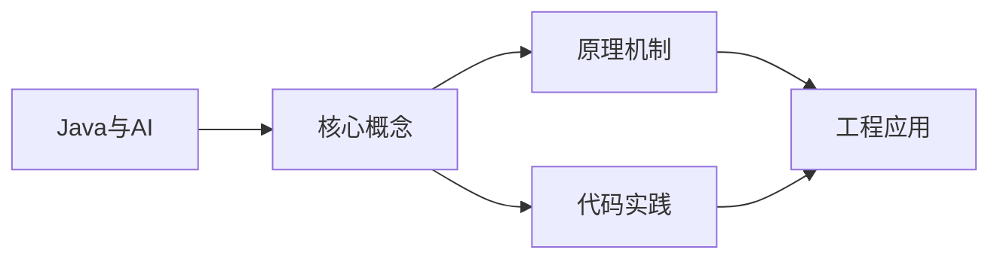
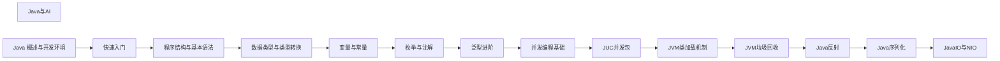

## 1. 学习目标（Bloom 分类）

本节按照布鲁姆教育目标分类学组织学习路径。本文主题为《Java与AI》，属于 Java 模块，读者可以根据自身阶段选择阅读深度。

记忆层面：能够准确复述本文的核心概念、术语与基本语法或操作步骤，并能够在提问或检索时快速定位对应知识点。能够说出 Java 的编译执行模型（javac 到字节码，JVM 解释与 JIT）。

理解层面：能够用自己的语言解释核心原理与工作机制，说明概念之间的因果关系，而不是机械记忆结论。能够解释面向对象三大特性与 JVM 内存区域的职责。

应用层面：能够在真实项目或练习场景中运用本文知识解决具体问题，写出正确且可维护的实现。能够编写类、接口、集合操作与异常处理的完整程序。

分析层面：能够拆解复杂问题，比较本文主题与相邻概念的异同，识别边界条件与例外情况。能够分析 Java 与 C++、Go 在内存管理与并发模型上的差异。

评价层面：能够根据约束条件（性能、可读性、安全、成本）评价不同方案的优劣，做出有依据的技术决策。能够评价不同集合、并发工具与框架的适用场景。

创造层面：能够把本文知识与其他模块知识组合，设计出新的解决方案或可复用的工程模式。能够组合 Spring 生态设计企业级应用。

通过本节学习，读者应当能够把《Java与AI》纳入自己的知识网络，并与 Java 模块的其他主题（JVM、集合框架、并发、Spring 生态）建立关联。

## 2. 历史动机与发展脉络

《Java与AI》是 Java 领域的重要主题。要真正理解它，需要先了解它解决的问题与演进过程。

Java 由 James Gosling 领导的 Sun 团队于 1995 年发布，口号“一次编写，到处运行”依托 JVM 字节码实现跨平台。2006 年 Sun 将 Java 开源（OpenJDK），2010 年 Oracle 收购 Sun 后 Java 进入新的治理阶段。
Java 的版本节奏在 2017 年后改为每半年一个特性版本、每两年一个 LTS（长期支持）版本。当前主流 LTS 包括 Java 11、17、21 与 25；Java 21 引入虚拟线程（Project Loom 成果），显著降低高并发服务的线程成本。
Java 生态以 Spring 家族为核心：Spring Boot 简化配置与部署，Spring Cloud 提供微服务组件；构建工具从 Maven 演进到 Gradle；JVM 语言（Kotlin、Scala、Groovy）与 Java 共存互操作。
Android 开发早期使用 Java，2019 年后官方转向 Kotlin-first，但 Java 仍是服务端领域（尤其是金融、电商等企业系统）的中坚力量。

回到本文主题：Java与AI 的提出与成熟，正是上述技术背景下的必然产物。早期实现往往以简单可用为目标，随着工程规模扩大，社区逐渐沉淀出标准做法与最佳实践；理解这一脉络，可以帮助读者判断“为什么文档中的推荐写法是现在这个样子”，也能在遇到历史遗留代码时准确识别其设计年代与取舍。

理解 Java 版本与 LTS 机制，是工程选型的起点：生产环境优先 LTS，新特性（如虚拟线程）可以在受控场景评估后引入。

## 3. 形式化定义与核心概念精讲

本节把《Java与AI》涉及的核心概念以“定义 + 讲解”的形式展开。读者应把定义当作工具，把讲解当作理解路径；两者结合才能形成可迁移的知识。

JVM 与字节码：`javac` 把 .java 编译为 .class 字节码，JVM 加载、校验并执行；热点代码由 JIT（如 C2）编译为机器码，解释与编译结合实现启动速度与峰值性能的平衡。
面向对象：封装（访问控制）、继承（extends/implements）与多态（重载/重写）是 Java 的类型系统支柱；接口默认方法（Java 8）与密封类（Java 17）持续演进表达能力。
异常体系：受检异常（checked）编译期强制处理，非受检异常（RuntimeException）运行时抛出；try-with-resources 自动关闭资源。
泛型与擦除：Java 泛型在编译期检查后擦除类型参数，运行时无泛型信息；这解释了 `List<String>` 与 `List<Integer>` 的 Class 相同，以及通配符 `? extends` 的逆变协变规则。

### 3.1 原文章节逐一精讲

原文档把主题拆分为 13 个小节，下面按顺序给出每一节的导读讲解，随后保留原文细节供精读。

#### 原文精读（完整保留）


#### 学习目标

完成本章学习后，你应当能够：

- **Remember（记忆）**：复述 Java 在 AI 与机器学习领域的核心生态，包括 DJL（Deep Java Library）、ONNX Runtime Java、TensorFlow Java、OpenNLP、Weka、Smile、Deeplearning4j 等库的定位与典型应用场景。
- **Understand（理解）**：解释 Java 在企业级 AI 部署中的优势——JIT 优化、GC 可控、与 Spring/Jakarta EE 生态深度集成、强类型与可观测性——并理解其在研究阶段相对 Python 的劣势。
- **Apply（应用）**：使用 DJL 加载预训练模型（PyTorch、TensorFlow、MXNet 后端）进行图像分类、目标检测、NLP 推理；使用 ONNX Runtime Java API 在 JVM 上运行跨框架模型推理。
- **Analyze（分析）**：分析 Java AI 推理服务的性能瓶颈——模型加载、内存映射、批处理、线程模型——并对比 JVM 推理与原生 Python 推理的吞吐与延迟。
- **Evaluate（评价）**：评估在 Java 中调用远程模型服务（HTTP/gRPC）与本地嵌入模型推理的取舍，量化网络延迟、序列化开销、资源占用对端到端 SLA 的影响。
- **Create（创造）**：设计一套基于 Spring Boot 的 AI 微服务，包含模型管理、推理 API、批处理、可观测性（JFR、Micrometer）、A/B 测试与灰度发布。

#### 历史动机与发展脉络

##### Java 在 AI 领域的曲折历程

Python 凭借 NumPy、Pandas、scikit-learn、PyTorch、TensorFlow 生态在 AI 研究阶段占据绝对主导。然而在企业生产部署阶段，Java 因其稳定性、并发模型、监控生态与既有业务系统的深度耦合，仍是大量企业的首选。这种"研究用 Python、生产用 Java"的双语言问题催生了 Java AI 部署生态的演进。

##### Java AI 生态演进时间线

| 年份 | 里程碑 | 工程意义 |
| --- | --- | --- |
| 1997 | Weka 项目启动 | 数据挖掘工具，Java 早期 ML 生态起点 |
| 2007 | Mahout 加入 Apache 孵化 | 大规模机器学习（MapReduce 时代） |
| 2014 | Deeplearning4j 1.0 发布 | 首个商业级 Java 深度学习框架 |
| 2016 | TensorFlow Java API 早期 | Google 推出官方 Java 绑定 |
| 2017 | OpenNLP 1.8 | Apache 经典 NLP 工具箱成熟 |
| 2019 | DJL（Deep Java Library）发布 | AWS 推出框架无关的深度学习 Java API |
| 2020 | ONNX Runtime Java API | 微软推出跨框架推理运行时 Java 绑定 |
| 2021 | TensorFlow Java 0.4 | 与 TF 2.x 对齐，支持 SavedModel |
| 2022 | DJL 0.20+ | 支持 PyTorch 1.x/2.x、TensorFlow 2.x、MXNet、TensorRT 后端 |
| 2023 | LangChain4j | 大模型（LLM）应用开发框架出现 |
| 2024 | Spring AI 1.0 M1 | Spring 官方 AI 集成模块 |
| 2024 | JDK 21 虚拟线程 + 分代 ZGC | 高并发 LLM 服务底层优化 |

##### 当代 Java AI 的三大主线

1. **模型推理（Inference）**：在 JVM 上加载 ONNX/PyTorch/TensorFlow 模型，进行低延迟推理。典型场景：电商实时推荐、风控评分、图像识别。
2. **数据管道（Data Pipeline）**：使用 Spark、Flink、Kafka Streams 进行大规模特征工程与模型训练数据准备。
3. **LLM 应用（LLM Application）**：通过 LangChain4j、Spring AI 集成 OpenAI、Anthropic、本地大模型，构建 RAG、Agent、Tool Use 应用。

##### 设计动机

Java AI 生态的核心动机是"用 Java 部署 AI，避免双语言架构的复杂度"。具体优势：

- **统一运行时**：业务逻辑与模型推理共享 JVM，避免跨语言序列化开销。
- **企业级特性**：Spring Security、事务、监控、配置中心原生支持。
- **强类型与可维护性**：模型输入输出的 Java 类型安全，IDE 重构友好。
- **运维统一**：JVM 调优、JFR、APM、容器化运维与现有 Java 应用一致。

#### 形式化定义

##### 推理函数的形式化

设机器学习模型为函数 $f_\theta: \mathcal{X} \to \mathcal{Y}$，参数为 $\theta$。推理过程为：

$$
\hat{y} = f_\theta(x),\quad x \in \mathcal{X},\ \hat{y} \in \mathcal{Y}
$$

在 JVM 中，$f_\theta$ 通过加载序列化模型（ONNX、SavedModel、TorchScript）实现，输入 $x$ 与输出 $\hat{y}$ 映射为 Java 张量（Tensor）或领域对象。

##### 张量表示

设张量 $T \in \mathbb{R}^{d_1 \times d_2 \times \dots \times d_n}$，DJL 中表示为 `NDArray`：

$$
T[i_1, i_2, \dots, i_n] = \text{data}[\text{offset} + \sum_{k=1}^{n} i_k \cdot \text{stride}_k]
$$

其中 `stride` 与 `shape` 共同定义张量布局（NCHW、NHWC、row-major）。

##### 批处理推理

设单样本推理延迟为 $\tau$，批大小为 $B$，则批处理推理吞吐：

$$
\text{throughput}(B) = \frac{B}{\tau_{\text{batch}}(B)}
$$

通常 $\tau_{\text{batch}}(B) < B \cdot \tau$，因 GPU/SIMD 并行化。最优批大小 $B^*$ 满足延迟约束与吞吐约束的帕累托前沿。

##### RAG 检索增强生成

检索增强生成（Retrieval-Augmented Generation）形式化为：

$$
\hat{y} = \text{LLM}\left( \text{prompt} \oplus \text{TopK}(\text{Embed}(q), \text{Index}) \right)
$$

其中 $\text{Embed}: \text{Text} \to \mathbb{R}^d$ 为嵌入函数，$\text{Index}$ 为向量数据库（如 Milvus、Qdrant、Weaviate），$\text{TopK}$ 为近似最近邻搜索。

##### LLM Token 流式生成

自回归 LLM 生成 token 序列 $y_1, y_2, \dots, y_T$：

$$
P(y_t \mid y_{<t}, x) = \text{softmax}(\text{LLM}_\theta(y_{<t}, x)_t)
$$

流式生成以 SSE（Server-Sent Events）或 WebSocket 推送增量 token，Java 服务通过 `Flux<String>`（Project Reactor）或虚拟线程实现。

#### 理论推导与原理解析

##### JVM 推理性能模型

设推理总延迟 $T_{\text{total}}$：

$$
T_{\text{total}} = T_{\text{preprocess}} + T_{\text{inference}} + T_{\text{postprocess}} + T_{\text{gc}} + T_{\text{jit}}
$$

JVM 推理相比原生 Python 的差异：

- $T_{\text{preprocess}}$：Java 通常更快（JIT 优化 + 强类型）。
- $T_{\text{inference}}$：底层调用相同 C++/CUDA 库，理论相同；Java 额外有 JNI 边界开销（约 10–100μs/次）。
- $T_{\text{gc}}$：Java 有 GC 开销，可通过 ZGC 控制在 < 1ms。
- $T_{\text{jit}}$：预热阶段（前几千次调用）较慢，稳态性能持平或超越。

结论：**JVM 推理稳态性能与 Python 持平**，劣势在冷启动与 JNI 边界。批处理场景下边界开销摊薄，Java 优势凸显。

##### DJL 后端抽象

DJL 通过 `Model`、`Predictor`、`Trainer` 抽象屏蔽底层框架：

```
Application Code
       ↓
DJL API (Model, Predictor, NDManager)
       ↓
Engine Bridge (PyTorchEngine, TensorFlowEngine, MXNetEngine, OnnxRuntime)
       ↓
Native Library (libtorch, libtensorflow, onnxruntime)
```

每次推理通过 JNI 调用 native 库，张量在 Java 与 native 间通过 `ByteBuffer` 直接传递（零拷贝）。

##### ONNX Runtime 推理管线

ONNX Runtime Java API 流程：

1. 加载 ONNX 模型文件（`OrtEnvironment.createModelSession(modelPath)`）。
2. 构造输入张量（`OnnxTensor.create(env, data)`）。
3. 执行推理（`session.run(inputs)`）。
4. 解析输出张量（`output.getValue()`）。

ONNX Runtime 通过图优化（constant folding、kernel fusion）、执行提供者（CUDA、TensorRT、OpenVINO、CoreML）跨硬件加速。

##### Spring AI 抽象

Spring AI 提供统一抽象：

```java
ChatClient client = ChatClient.create(model);
String response = client.prompt()
    .user("Explain JVM GC")
    .call()
    .content();
```

底层支持 OpenAI、Anthropic、Azure OpenAI、Ollama、HuggingFace 等多提供商，通过 `ChatModel`、`EmbeddingModel`、`ImageModel` 接口统一。

##### LangChain4j 架构

LangChain4j 移植自 Python LangChain，核心概念：

- **ChatLanguageModel**：LLM 抽象。
- **EmbeddingModel**：嵌入模型抽象。
- **VectorStore**：向量数据库抽象（Milvus、Pinecone、Qdrant）。
- **DocumentLoader/Splitter**：文档加载与切片。
- **Tools**：函数调用（`@Tool` 注解）。
- **Memory**：对话历史（chat memory、token window）。
- **RAG**：检索增强生成管道（`RetrievalAugmentor`）。

#### 代码示例

##### 示例 1：DJL 图像分类（PyTorch 后端）

`pom.xml`：

```xml
<project xmlns="http://maven.apache.org/POM/4.0.0">
    <modelVersion>4.0.0</modelVersion>
    <groupId>com.fandex.ai</groupId>
    <artifactId>djl-demo</artifactId>
    <version>1.0.0</version>
    <properties>
        <maven.compiler.release>21</maven.compiler.release>
        <djl.version>0.24.0</djl.version>
    </properties>
    <dependencies>
        <dependency>
            <groupId>ai.djl</groupId>
            <artifactId>api</artifactId>
            <version>${djl.version}</version>
        </dependency>
        <dependency>
            <groupId>ai.djl.pytorch</groupId>
            <artifactId>pytorch-engine</artifactId>
            <version>${djl.version}</version>
        </dependency>
        <dependency>
            <groupId>ai.djl.pytorch</groupId>
            <artifactId>pytorch-model-zoo</artifactId>
            <version>${djl.version}</version>
        </dependency>
        <dependency>
            <groupId>org.slf4j</groupId>
            <artifactId>slf4j-simple</artifactId>
            <version>2.0.9</version>
        </dependency>
    </dependencies>
</project>
```

`src/main/java/com/fandex/ai/ImageClassification.java`（Java 21）：

```java
package com.fandex.ai;

import ai.djl.Application;
import ai.djl.ModelException;
import ai.djl.inference.Predictor;
import ai.djl.modality.Classifications;
import ai.djl.modality.cv.Image;
import ai.djl.modality.cv.ImageFactory;
import ai.djl.repository.zoo.Criteria;
import ai.djl.repository.zoo.ZooModel;
import ai.djl.translate.TranslateException;

import java.io.IOException;
import java.nio.file.Paths;

/**
 * 使用 DJL 加载 ResNet-50 进行图像分类。
 * 后端为 PyTorch，模型自动从 Model Zoo 下载。
 */
public final class ImageClassification {

    public static void main(String[] args) throws IOException, ModelException, TranslateException {
        Criteria<Image, Classifications> criteria = Criteria.builder()
                .optApplication(Application.CV.IMAGE_CLASSIFICATION)
                .setTypes(Image.class, Classifications.class)
                .optModelArtifactId("resnet")
                .optFilter("layers", "50")
                .build();

        try (ZooModel<Image, Classifications> model = criteria.loadModel();
             Predictor<Image, Classifications> predictor = model.newPredictor()) {
            Image img = ImageFactory.getInstance().fromFile(Paths.get("cat.jpg"));
            Classifications result = predictor.predict(img);
            System.out.println(result.best().getClassName() + ": " + result.best().getProbability());
        }
    }
}
```

##### 示例 2：ONNX Runtime 文本分类

```java
package com.fandex.ai;

import ai.onnxruntime.OnnxTensor;
import ai.onnxruntime.OrtEnvironment;
import ai.onnxruntime.OrtSession;

import java.nio.file.Paths;
import java.util.Map;

/**
 * 使用 ONNX Runtime 加载 BERT 文本分类模型进行推理。
 */
public final class OnnxTextClassification {

    public static void main(String[] args) throws Exception {
        OrtEnvironment env = OrtEnvironment.getEnvironment();
        try (OrtSession session = env.createSession(Paths.get("bert-classifier.onnx").toString())) {

            long[] inputIds = tokenize("Java is great for AI deployment.");
            long[][] inputShape = { inputIds };
            long[][] attentionMask = { new long[inputIds.length] };
            java.util.Arrays.fill(attentionMask[0], 1L);

            try (OnnxTensor inputTensor = OnnxTensor.createTensor(env, inputShape);
                 OnnxTensor maskTensor = OnnxTensor.createTensor(env, attentionMask);
                 OrtSession.Result result = session.run(Map.of(
                         "input_ids", inputTensor,
                         "attention_mask", maskTensor))) {

                float[][] logits = (float[][]) result.get(0).getValue();
                int predictedClass = argmax(logits[0]);
                System.out.println("Predicted class: " + predictedClass);
            }
        }
    }

    /** 简化版 tokenizer，实际应使用 HuggingFace tokenizer。 */
    private static long[] tokenize(String text) {
        // 实际项目中使用 tokenizers 或 DJL tokenizer
        return text.chars().asLongStream().toArray();
    }

    private static int argmax(float[] arr) {
        int best = 0;
        for (int i = 1; i < arr.length; i++) {
            if (arr[i] > arr[best]) best = i;
        }
        return best;
    }
}
```

##### 示例 3：Spring AI 集成 OpenAI

```java
package com.fandex.ai;

import org.springframework.ai.chat.client.ChatClient;
import org.springframework.ai.openai.OpenAiChatModel;
import org.springframework.boot.CommandLineRunner;
import org.springframework.boot.SpringApplication;
import org.springframework.boot.autoconfigure.SpringBootApplication;
import org.springframework.context.annotation.Bean;

/**
 * Spring AI 集成 OpenAI 的最小示例。
 * 通过 application.yml 配置 API Key。
 */
@SpringBootApplication
public class SpringAiDemo implements CommandLineRunner {

    private final ChatClient chatClient;

    public SpringAiDemo(OpenAiChatModel model) {
        this.chatClient = ChatClient.create(model);
    }

    public static void main(String[] args) {
        SpringApplication.run(SpringAiDemo.class, args);
    }

    @Override
    public void run(String... args) {
        String response = chatClient.prompt()
                .user("用 200 字解释 JVM 垃圾回收")
                .call()
                .content();
        System.out.println(response);
    }

    @Bean
    public CommandLineRunner streamDemo(OpenAiChatModel model) {
        return args -> {
            ChatClient.create(model).prompt()
                    .user("流式生成一段关于 Java 的诗")
                    .stream()
                    .content()
                    .doOnNext(System.out::print)
                    .blockLast();
        };
    }
}
```

`application.yml`：

```yaml
spring:
  ai:
    openai:
      api-key: ${OPENAI_API_KEY}
      chat:
        options:
          model: gpt-4o
          temperature: 0.7
```

##### 示例 4：LangChain4j RAG 应用

```java
package com.fandex.ai;

import dev.langchain4j.data.document.Document;
import dev.langchain4j.data.document.DocumentSplitter;
import dev.langchain4j.data.document.splitter.DocumentSplitters;
import dev.langchain4j.data.embedding.Embedding;
import dev.langchain4j.data.segment.TextSegment;
import dev.langchain4j.model.openai.OpenAiEmbeddingModel;
import dev.langchain4j.store.embedding.EmbeddingStore;
import dev.langchain4j.store.embedding.inmemory.InMemoryEmbeddingStore;

import java.util.List;

/**
 * 使用 LangChain4j 构建 RAG 索引。
 * 文档切片 → 嵌入 → 存入向量库。
 */
public final class RagIndexBuilder {

    public static void main(String[] args) {
        Document doc = Document.from("Java 21 引入虚拟线程，简化高并发编程。");

        DocumentSplitter splitter = DocumentSplitters.recursive(300, 30);
        List<TextSegment> segments = splitter.split(doc);

        OpenAiEmbeddingModel embedder = OpenAiEmbeddingModel.withApiKey(System.getenv("OPENAI_API_KEY"));
        List<Embedding> embeddings = embedder.embedAll(segments).content();

        EmbeddingStore<TextSegment> store = new InMemoryEmbeddingStore<>();
        for (int i = 0; i < segments.size(); i++) {
            store.add(embeddings.get(i), segments.get(i));
        }

        System.out.println("Indexed " + segments.size() + " segments");
    }
}
```

##### 示例 5：批处理推理服务（虚拟线程）

```java
package com.fandex.ai;

import ai.djl.ModelException;
import ai.djl.inference.Predictor;
import ai.djl.modality.Classifications;
import ai.djl.modality.cv.Image;
import ai.djl.repository.zoo.Criteria;
import ai.djl.repository.zoo.ZooModel;
import ai.djl.translate.TranslateException;

import java.io.IOException;
import java.util.List;
import java.util.concurrent.ExecutorService;
import java.util.concurrent.Executors;
import java.util.concurrent.Future;

/**
 * 使用虚拟线程池进行批处理图像分类推理。
 * Predictor 非线程安全，每个虚拟线程独立持有 Predictor 实例。
 */
public final class BatchInferenceService {

    private final ZooModel<Image, Classifications> model;

    public BatchInferenceService() throws IOException, ModelException {
        Criteria<Image, Classifications> criteria = Criteria.builder()
                .setTypes(Image.class, Classifications.class)
                .optModelArtifactId("resnet")
                .optFilter("layers", "50")
                .build();
        this.model = criteria.loadModel();
    }

    /** 并发处理一批图像。 */
    public List<Classifications> classifyBatch(List<Image> images) throws Exception {
        try (ExecutorService pool = Executors.newVirtualThreadPerTaskExecutor()) {
            List<Future<Classifications>> futures = images.stream()
                    .map(img -> pool.submit(() -> predict(img)))
                    .toList();
            // 等待全部完成
            return futures.stream().map(f -> {
                try { return f.get(); }
                catch (Exception e) { throw new RuntimeException(e); }
            }).toList();
        }
    }

    private Classifications predict(Image img) {
        // 每线程独立 Predictor
        try (Predictor<Image, Classifications> predictor = model.newPredictor()) {
            return predictor.predict(img);
        } catch (TranslateException e) {
            throw new RuntimeException(e);
        }
    }

    public void close() {
        model.close();
    }
}
```

##### 示例 6：Gradle 配置

`build.gradle.kts`：

```kotlin
plugins {
    application
}
application {
    mainClass.set("com.fandex.ai.ImageClassification")
}
dependencies {
    implementation("ai.djl:api:0.24.0")
    implementation("ai.djl.pytorch:pytorch-engine:0.24.0")
    implementation("ai.djl.pytorch:pytorch-model-zoo:0.24.0")
    implementation("org.slf4j:slf4j-simple:2.0.9")
}
java {
    toolchain { languageVersion = JavaLanguageVersion.of(21) }
}
```

#### 对比分析

##### Java AI 与 Python AI 生态对比

| 维度 | Java | Python | 备注 |
| --- | --- | --- | --- |
| 训练框架 | DJL（底层调 PyTorch/TF）、DL4J | PyTorch、TensorFlow、JAX | Python 训练生态远超 Java |
| 推理框架 | DJL、ONNX Runtime Java、TF Java、DL4J | ONNX Runtime、torch.cuda、TF Serving | Java 推理能力持平 |
| 数据处理 | Spark、Flink、Beam | Pandas、NumPy、Dask | 大数据 Java 强；小数据 Python 强 |
| NLP 工具 | OpenNLP、Stanford CoreNLP、DJL NLP | spaCy、NLTK、HuggingFace | Python NLP 生态更丰富 |
| LLM 应用 | LangChain4j、Spring AI | LangChain、LlamaIndex | Python 框架先发；Java 快速追赶 |
| 部署运维 | Spring Boot、Kubernetes、JFR | FastAPI、gunicorn、Prometheus | Java 企业级运维更成熟 |
| 性能（推理） | 稳态持平 Python，JNI 边界约 10–100μs | 原生调用 C++/CUDA | 差异通常 < 5% |
| 类型安全 | 强类型，IDE 重构友好 | 动态类型，运行时错误多 | Java 维护性更强 |
| 冷启动 | 较慢（JIT 预热、类加载） | 快（解释执行） | GraalVM native image 可优化 |
| 工程师普及度 | 企业后端工程师广泛 | AI/ML 工程师广泛 | 双语言架构常见 |

##### 与 C# / Go / Rust AI 生态对比

| 语言 | 推理生态 | LLM 框架 | 优势 | 劣势 |
| --- | --- | --- | --- | --- |
| Java | DJL、ONNX Runtime、TF Java | LangChain4j、Spring AI | 企业级集成、JVM 生态 | 冷启动、研究生态 |
| C# | ONNX Runtime、ML.NET | Semantic Kernel、LangChain.NET | .NET 生态、Azure 集成 | Linux 部署生态较弱 |
| Go | ONNX Runtime Go、gorgonia | langchaingo | 部署简单、二进制静态 | 生态起步晚 |
| Rust | candle、tract、ort（ONNX） | langchain-rust | 性能极强、内存安全 | 学习曲线陡 |

##### 双语言架构 vs 单语言架构

**双语言架构**（Python 训练 + Java 推理）：

- 优点：训练阶段充分利用 Python 生态；推理阶段享受 Java 企业级特性。
- 缺点：模型格式转换（PyTorch → ONNX）、序列化开销、双团队协作成本。

**单语言架构**（Python 端到端 或 Java 端到端）：

- Python 端到端：研究友好，但生产稳定性、并发、监控弱于 Java。
- Java 端到端：生产友好，但训练生态弱，难以进行大规模实验。

工业实践：**双语言架构最常见**，通过 ONNX 作为模型交换格式，CI/CD 自动化模型导出与部署。

#### 常见陷阱与最佳实践

##### 陷阱 1：模型文件未打包

直接将 `.onnx` 或 `.pt` 文件放入 `src/main/resources` 可能因体积过大（数百 MB）导致 JAR 膨胀、构建缓慢。

**最佳实践**：

- 模型文件单独存储于对象存储（S3、OSS）。
- 应用启动时下载至本地缓存（带校验和）。
- 使用 Docker volume 或 PVC 持久化缓存。

##### 陷阱 2：Predictor 非线程安全

DJL `Predictor` 实例非线程安全，多线程共享会导致数据竞争与崩溃。

**最佳实践**：每个线程独立 `Predictor` 实例（如示例 5 所示），或使用 `PredictorPool`（DJL 0.24+）。

##### 陷阱 3：JNI 边界开销

每次推理跨 JNI 调用有 10–100μs 开销。频繁小批量推理时，JNI 开销可能占总延迟 30%。

**最佳实践**：

- 增大批处理量，摊薄 JNI 开销。
- 使用 ONNX Runtime 的 `RunOptions` 配置 `batchSize`。
- 评估 GraalVM 的 LLVM 后端，减少 JNI 开销。

##### 陷阱 4：JIT 预热导致 P99 尖刺

JVM 启动初期 JIT 编译导致延迟尖刺，对 SLA 敏感的推理服务影响显著。

**最佳实践**：

- 预热：启动后发送 N 次预热请求（dummy input）触发 JIT。
- 使用 AppCDS（Application Class Data Sharing）减少类加载开销。
- 评估 GraalVM Native Image：AOT 编译，无 JIT 预热。

##### 陷阱 5：Native 内存泄漏

DJL/ONNX Runtime 的张量在 native 内存中分配，不受 JVM GC 管理。未显式 `close()` 会导致 native 内存泄漏。

**最佳实践**：

- 始终使用 try-with-resources 包裹 `NDArray`、`OnnxTensor`、`OrtSession.Result`。
- 监控 native 内存：`-XX:NativeMemoryTracking=summary`、`jcmd <pid> VM.native_memory`。

##### 陷阱 6：LLM API Key 硬编码

```java
// 错误：硬编码 Key
String apiKey = "sk-xxxxxxxxxxxx";
```

**最佳实践**：

- 使用环境变量：`System.getenv("OPENAI_API_KEY")`。
- Spring Boot 配置：`${OPENAI_API_KEY}`，配合 Spring Cloud Config 或 Vault。
- 生产环境使用短期凭证（STS、Workload Identity）。

##### 陷阱 7：流式生成阻塞主线程

LLM 流式生成（SSE）若以阻塞方式调用，会占用大量线程。

**最佳实践**：

- 使用 Project Reactor `Flux<String>` 异步流。
- 虚拟线程（JDK 21+）承载阻塞调用。
- Spring WebFlux + `Flux` 端到端非阻塞。

##### 陷阱 8：忽略 LLM 调用可观测性

LLM 调用涉及网络、token 消耗、延迟、错误率，缺乏可观测性难以排障与优化。

**最佳实践**：

- Micrometer 暴露 `llm.tokens.input`、`llm.tokens.output`、`llm.latency`、`llm.errors`。
- Spring AI 内置 Micrometer 集成。
- 使用 LangSmith、Helicone 等专有 LLM 可观测性平台。

##### 最佳实践清单

1. **模型文件外置**：对象存储 + 本地缓存。
2. **Predictor 线程隔离**：每线程独立实例。
3. **批处理推理**：摊薄 JNI 与模型调用开销。
4. **JIT 预热**：启动后预热请求。
5. **Native 资源释放**：try-with-resources。
6. **API Key 安全**：环境变量 + Vault。
7. **流式异步**：Reactor Flux / 虚拟线程。
8. **可观测性**：Micrometer + LLM 专有平台。

#### 工程实践

##### 构建与打包

Maven 项目集成 DJL 的最佳实践：

```xml
<build>
    <plugins>
        <plugin>
            <groupId>org.springframework.boot</groupId>
            <artifactId>spring-boot-maven-plugin</artifactId>
            <configuration>
                <!-- 分层打包，模型缓存单独层 -->
                <layers>
                    <enabled>true</enabled>
                </layers>
                <jvmArguments>
                    -XX:+UseZGC -XX:+ZGenerational
                    -Xms4g -Xmx4g
                    -XX:MaxRAMPercentage=75
                </jvmArguments>
            </configuration>
        </plugin>
    </plugins>
</build>
```

##### Docker 容器化部署

```dockerfile
FROM eclipse-temurin:21-jre-jammy
RUN apt-get update && apt-get install -y --no-install-recommends \
    libgomp1 libstdc++6 && rm -rf /var/lib/apt/lists/*
COPY target/app.jar /app/app.jar
COPY models/ /app/models/
ENV JAVA_OPTS="-XX:+UseZGC -XX:+ZGenerational -XX:MaxRAMPercentage=75 -XX:+HeapDumpOnOutOfMemoryError"
ENV DJL_CACHE_DIR=/app/models
HEALTHCHECK --interval=30s --timeout=5s CMD curl -f http://localhost:8080/actuator/health || exit 1
ENTRYPOINT ["sh", "-c", "java $JAVA_OPTS -jar /app/app.jar"]
```

##### Kubernetes GPU 部署

```yaml
apiVersion: apps/v1
kind: Deployment
metadata:
  name: fandex-ai-inference
spec:
  template:
    spec:
      containers:
      - name: app
        image: fandex/ai-app:21
        resources:
          limits:
            nvidia.com/gpu: 1
            memory: 16Gi
          requests:
            nvidia.com/gpu: 1
            memory: 8Gi
        env:
        - name: JAVA_OPTS
          value: "-XX:+UseZGC -XX:+ZGenerational -Xms12g -Xmx12g"
        volumeMounts:
        - name: model-cache
          mountPath: /app/models
      volumes:
      - name: model-cache
        persistentVolumeClaim:
          claimName: model-pvc
```

##### JVM 调优

1. **GC**：JDK 21 优先分代 ZGC（`-XX:+UseZGC -XX:+ZGenerational`），避免推理停顿。
2. **堆大小**：模型加载常驻内存，建议 `Xms=Xmx` 避免动态扩容。
3. **JIT**：`-XX:+TieredCompilation -XX:CompileThreshold=1000` 加速预热。
4. **NativeMemoryTracking**：`-XX:NativeMemoryTracking=summary` 监控 native 内存。
5. **AppCDS**：`-XX:SharedArchiveFile=app.jsa` 减少类加载。

##### 调试工具链

| 工具 | 用途 | 命令示例 |
| --- | --- | --- |
| JFR | 持续低开销采样 | `jcmd <pid> JFR.start duration=60s filename=ai.jfr` |
| async-profiler | CPU/堆/锁采样 | `./profiler.sh -d 60 -f flame.html <pid>` |
| JMH | 微基准测试 | `mvn exec:java -Dexec.mainClass=...Benchmark` |
| Micrometer | 业务指标 | `MeterRegistry` 自动暴露至 Prometheus |
| LangSmith | LLM 调用追踪 | https://smith.langchain.com |
| Helicone | LLM 代理与监控 | https://helicone.ai |
| ONNX Runtime Tracing | 推理性能分析 | `ORT_LOGGING_LEVEL=VERBOSE` |

##### Spring AI 监控集成

```java
package com.fandex.ai;

import io.micrometer.core.instrument.Counter;
import io.micrometer.core.instrument.MeterRegistry;
import io.micrometer.core.instrument.Timer;
import org.springframework.ai.chat.client.ChatClient;
import org.springframework.stereotype.Service;

/**
 * 包装 ChatClient，添加 Micrometer 指标。
 */
@Service
public class InstrumentedChatService {

    private final ChatClient client;
    private final Timer latencyTimer;
    private final Counter tokenCounter;
    private final Counter errorCounter;

    public InstrumentedChatService(ChatClient.Builder builder, MeterRegistry registry) {
        this.client = builder.build();
        this.latencyTimer = Timer.builder("llm.latency").register(registry);
        this.tokenCounter = Counter.builder("llm.tokens").register(registry);
        this.errorCounter = Counter.builder("llm.errors").register(registry);
    }

    public String chat(String prompt) {
        return latencyTimer.record(() -> {
            try {
                String response = client.prompt().user(prompt).call().content();
                tokenCounter.increment(estimateTokens(prompt) + estimateTokens(response));
                return response;
            } catch (Exception e) {
                errorCounter.increment();
                throw e;
            }
        });
    }

    private int estimateTokens(String text) {
        return text.length() / 4;  // 粗略估计
    }
}
```

#### 案例研究

##### 案例 1：电商实时图像审核

**场景**：电商平台 UGC 图片实时审核（违规、低质、版权）。

**架构**：

- 用户上传图片 → Kafka → Java 推理服务（DJL + ResNet） → 审核结果入库。
- 模型：自训练 ResNet-50（ONNX 格式）。
- 部署：JDK 21 + ZGC + 16GB 堆。

**性能**：

- 单次推理：80ms（CPU），15ms（GPU）。
- 吞吐：500 QPS（GPU 单卡）。
- P99 延迟：30ms。

**关键决策**：选择 ONNX Runtime 而非 DJL，因 ONNX 模型直接由 PyTorch 导出，避免 DJL 后端依赖。

##### 案例 2：金融风控实时评分

**场景**：贷款申请实时评分，输入用户画像与行为特征，输出风险分。

**架构**：

- Spring Boot 微服务 + DJL（XGBoost 后端）。
- 模型：XGBoost（1000 棵树）。
- 部署：JDK 17 + G1 + 4GB 堆。

**性能**：

- 单次评分：5ms。
- 吞吐：5000 QPS。
- P99：8ms。

**关键决策**：选择 DJL 而非 OpenNLP，因 XGBoost 模型原生支持。

##### 案例 3：客服 RAG 系统

**场景**：内部客服系统，基于知识库回答员工问题。

**架构**：

- Spring Boot + LangChain4j。
- 嵌入模型：bge-small-zh（本地 ONNX 推理）。
- LLM：GPT-4o（远程 API）。
- 向量库：Milvus。
- 部署：JDK 21 + 虚拟线程。

**性能**：

- 检索延迟：50ms（向量库）+ 20ms（嵌入推理）。
- LLM 生成：2–5s（首 token 800ms，流式）。
- 端到端 P99：6s。

**关键决策**：嵌入本地推理降低 API 成本；LLM 远程调用避免 GPU 资源投入。

##### 案例 4：制造业视觉质检

**场景**：流水线产品缺陷检测，摄像头每秒 30 帧图像。

**架构**：

- Java Edge 服务 + DJL（YOLOv8 ONNX）。
- 模型：YOLOv8n（缺陷检测）。
- 部署：JDK 21 + 4GB 堆 + Intel NPU。

**性能**：

- 单帧推理：25ms（NPU）。
- 吞吐：40 FPS（满足 30 FPS 需求）。
- P99：35ms。

**关键决策**：使用 OpenVINO 后端 + Intel NPU 加速；DJL 通过 ONNX Runtime 调用 OpenVINO EP。

##### 案例 5：推荐系统特征计算

**场景**：电商推荐系统实时特征计算，输入用户行为序列，输出 embedding。

**架构**：

- Flink + DJL（Transformer embedding）。
- 模型：自训练 BERT-small（128 维输出）。
- 部署：JDK 17 + 32GB 堆 + G1。

**性能**：

- 单次 embedding：15ms。
- 吞吐：10万 QPS。
- P99：25ms。

**关键决策**：使用 Flink 状态后端缓存最近行为；DJL Predictor 每任务实例独立。

#### 知识讲解与要点分析（原习题）

##### 选择题

**1. 下列哪个库是 AWS 推出的框架无关的 Java 深度学习库？**

A. Deeplearning4j
B. DJL（Deep Java Library）
C. OpenNLP
D. Weka

**答案**：B
**解析**：DJL（Deep Java Library）由 AWS 于 2019 年发布，设计为框架无关的 Java 深度学习 API，底层可切换 PyTorch、TensorFlow、MXNet、ONNX Runtime 等后端。

**2. ONNX Runtime Java API 在 JVM 上的推理性能相比原生 Python 推理，通常如何？**

A. 远低于 Python
B. 稳态持平，JNI 边界有 10–100μs 开销
C. 远高于 Python
D. 完全相同

**答案**：B
**解析**：ONNX Runtime 底层调用相同的 C++/CUDA 库，推理性能理论上相同。Java 额外有 JNI 边界开销（10–100μs/次），但稳态性能持平。批处理场景下边界开销摊薄。

**3. DJL 中 Predictor 的线程安全性如何？**

A. 线程安全，可多线程共享
B. 非线程安全，每线程需独立实例
C. 通过 synchronized 自动同步
D. 通过 volatile 保证可见性

**答案**：B
**解析**：DJL `Predictor` 实例非线程安全，多线程共享会导致数据竞争与崩溃。最佳实践是每线程独立 `Predictor` 实例，或使用 `PredictorPool`（DJL 0.24+）。

**4. Spring AI 通过哪个抽象统一不同 LLM 提供商？**

A. `LlmClient`
B. `ChatModel` / `EmbeddingModel`
C. `ChatService`
D. `AiClient`

**答案**：B
**解析**：Spring AI 通过 `ChatModel`、`EmbeddingModel`、`ImageModel` 等接口抽象不同提供商（OpenAI、Anthropic、Azure、Ollama），通过 `ChatClient.create(model)` 创建流式 API。

**5. JDK 21 虚拟线程对 LLM 流式生成服务的核心改进是？**

A. 降低单次推理延迟
B. 提升模型精度
C. 高并发流式调用不占用平台线程
D. 减少 token 消耗

**答案**：C
**解析**：LLM 流式生成（SSE）通常为长连接（数秒到数十秒），传统平台线程模型下高并发会耗尽线程池。虚拟线程使每个流式调用独立调度，不占用平台线程，支持万级并发。

##### 填空题

**1.** DJL 通过 ___ 抽象屏蔽底层框架（PyTorch、TensorFlow、MXNet）。

**答案**：Engine

**2.** ONNX 模型由 PyTorch 通过 ___ 方法导出。

**答案**：`torch.onnx.export`

**3.** LangChain4j 中 RAG 的核心流程是：文档切片 → ___ → 存入向量库 → 检索增强生成。

**答案**：嵌入（embedding）

**4.** Spring AI 流式生成通过 ___ 类型返回异步 token 流。

**答案**：`Flux<String>`

**5.** JVM 推理性能模型中，JIT 预热阶段通常持续前 ___ 次调用。

**答案**：几千

##### 编程题

**1.** 使用 DJL 加载一个 PyTorch BERT 模型，实现文本情感分类。

**参考答案**：

```java
package com.fandex.ai;

import ai.djl.ModelException;
import ai.djl.inference.Predictor;
import ai.djl.modality.nlp.DefaultVocabulary;
import ai.djl.modality.nlp.bert.BertTokenizer;
import ai.djl.ndarray.NDArray;
import ai.djl.ndarray.NDList;
import ai.djl.ndarray.NDManager;
import ai.djl.repository.zoo.Criteria;
import ai.djl.repository.zoo.ZooModel;
import ai.djl.translate.TranslateException;
import ai.djl.translate.Translator;
import ai.djl.translate.TranslatorContext;

import java.io.IOException;
import java.util.Map;

/**
 * 使用 DJL 加载 BERT 进行情感分类。
 */
public final class BertSentiment {

    public static void main(String[] args) throws IOException, ModelException {
        Criteria<String, String> criteria = Criteria.builder()
                .setTypes(String.class, String.class)
                .optModelArtifactId("bert")
                .optFilter("model", "sentiment")
                .build();

        try (ZooModel<String, String> model = criteria.loadModel();
             Predictor<String, String> predictor = model.newPredictor()) {
            String result = predictor.predict("Java is great for AI deployment!");
            System.out.println("Sentiment: " + result);
        } catch (TranslateException e) {
            throw new RuntimeException(e);
        }
    }
}
```

**2.** 实现 Spring AI 端点，支持流式生成与 Micrometer 监控。

**参考答案**：

```java
package com.fandex.ai;

import io.micrometer.core.instrument.MeterRegistry;
import io.micrometer.core.instrument.Timer;
import org.springframework.ai.chat.client.ChatClient;
import org.springframework.web.bind.annotation.PostMapping;
import org.springframework.web.bind.annotation.RequestBody;
import org.springframework.web.bind.annotation.RestController;
import reactor.core.publisher.Flux;

/**
 * 流式生成端点，含 Micrometer 监控。
 */
@RestController
public class ChatController {

    private final ChatClient client;
    private final Timer latencyTimer;

    public ChatController(ChatClient.Builder builder, MeterRegistry registry) {
        this.client = builder.build();
        this.latencyTimer = Timer.builder("llm.stream.latency").register(registry);
    }

    @PostMapping(value = "/chat/stream", produces = "text/event-stream")
    public Flux<String> stream(@RequestBody String prompt) {
        long start = System.nanoTime();
        return client.prompt().user(prompt).stream().content()
                .doOnComplete(() -> latencyTimer.record(java.time.Duration.ofNanos(System.nanoTime() - start)))
                .doOnError(e -> latencyTimer.record(java.time.Duration.ofNanos(System.nanoTime() - start)));
    }
}
```

#### 知识讲解与要点分析（原思考题）

**1.** 为什么工业界常采用"Python 训练 + Java 推理"的双语言架构？这种架构的核心挑战是什么？

**参考答案**：(1) 训练阶段 Python 生态远超 Java（PyTorch、TF、JAX 等研究工具链完善）；(2) 推理阶段 Java 企业级特性（Spring、JFR、强类型、运维生态）更适合生产部署；(3) 通过 ONNX 作为模型交换格式解耦训练与推理。核心挑战：模型格式转换（PyTorch → ONNX）可能损失精度或算子不支持；双团队协作成本；版本对齐复杂。

**2.** 假设你需要部署一个 LLM 服务，QPS 1000，单次调用平均 3 秒。如何选择线程模型？

**参考答案**：(1) 传统平台线程：每请求占一线程，1000 QPS × 3s = 3000 并发线程，远超 JVM 平台线程上限（通常数百至数千）。不可行。(2) 虚拟线程（JDK 21+）：每请求一虚拟线程，3000 虚拟线程轻量（每线程 KB 级），底层少量平台线程调度。可行。(3) WebFlux + Reactor：非阻塞 IO，少量事件循环线程处理万级并发。可行，但需要全栈响应式编程。结论：JDK 21+ 优先虚拟线程；若已有 WebFlux 基础设施可继续使用 Reactor。

**3.** 解释"JNI 边界开销"对 JVM 推理性能的影响，并给出两种缓解方案。

**参考答案**：JNI 边界开销指 Java 调用 native（C++/CUDA）函数时的固定开销，约 10–100μs/次。影响：频繁小批量推理时，JNI 开销可能占总延迟 30%。缓解方案：(1) 增大批处理量，摊薄 JNI 开销；(2) 使用 GraalVM 的 LLVM 后端，部分模型可直接编译为 JVM 字节码，减少 JNI；(3) 模型蒸馏，将大模型压缩为小模型减少调用次数；(4) 多模型合并（multi-task model），单次 JNI 调用处理多任务。

#### 参考文献

[1] Amazon Web Services. 2019. *Deep Java Library (DJL) Documentation*. AWS, Seattle, WA, USA. Available at: https://djl.ai

[2] Microsoft. 2020. *ONNX Runtime Java API*. Microsoft, Redmond, WA, USA. Available at: https://onnxruntime.ai/docs/get-started/with-java.html

[3] Pivotal Software. 2024. *Spring AI Reference Documentation*. VMware, Palo Alto, CA, USA. Available at: https://docs.spring.io/spring-ai/reference/

[4] LangChain4j. 2023. *LangChain4j Documentation*. Available at: https://docs.langchain4j.dev

[5] Vaswani, A., Shazeer, N., Parmar, N., Uszkoreit, J., Jones, L., Gomez, A. N., Kaiser, L., and Polosukhin, I. 2017. Attention is all you need. In *Proceedings of the 31st International Conference on Neural Information Processing Systems (NIPS'17)*. Curran Associates Inc., Red Hook, NY, USA, 6000–6010. DOI: https://doi.org/10.5555/3295222.3295349

[6] Lewis, P., Perez, E., Piktus, A., Petroni, F., Karpukhin, V., Goyal, N., Küttler, H., Lewis, M., Yih, W., Rocktäschel, T., Riedel, S., and Kiela, D. 2020. Retrieval-augmented generation for knowledge-intensive NLP tasks. In *Proceedings of the 34th International Conference on Neural Information Processing Systems (NeurIPS '20)*. Curran Associates Inc., Red Hook, NY, USA, 9459–9474. DOI: https://doi.org/10.5555/3495724.3496517

[7] Apache Software Foundation. 2023. *Apache OpenNLP Developer Documentation*. ASF, Wakefield, MA, USA. Available at: https://opennlp.apache.org/docs/

[8] Eclipse Deeplearning4j. 2023. *Deeplearning4j Documentation*. Eclipse Foundation, Ottawa, ON, Canada. Available at: https://deeplearning4j.konduit.ai

[9] Hall, M., Frank, E., Holmes, G., Pfahringer, B., Reutemann, P., and Witten, I. H. 2009. The WEKA data mining software: An update. *SIGKDD Explorations* 11, 1, 10–18. DOI: https://doi.org/10.1145/1656274.1656278

[10] Oracle Corporation. 2023. *The Java Virtual Machine Specification, Java SE 21 Edition*. Oracle, Redwood City, CA, USA.

[11] Press, O. 2024. *JDK 21 Virtual Threads (JEP 444)*. OpenJDK. Available at: https://openjdk.org/jeps/444

[12] Vaswani, A. et al. 2017. *BERT: Pre-training of Deep Bidirectional Transformers for Language Understanding*. arXiv:1810.04805. DOI: https://doi.org/10.48550/arXiv.1810.04805

#### 延伸阅读

##### 书籍

- **Harrington, P.** *Machine Learning in Action*. Manning, 2012. — 经典 ML 算法实战。
- **Leskovec, J., Rajaraman, A., and Ullman, J. D.** *Mining of Massive Datasets* (3rd ed.). Cambridge University Press, 2020. — 大规模数据挖掘。
- **Geron, A.** *Hands-On Machine Learning with Scikit-Learn, Keras, and TensorFlow* (3rd ed.). O'Reilly, 2022. — ML 实战经典。
- **Bowley, M.** *Deep Learning with Java*. Apress, 2020. — DL4J 实战。

##### 论文

- **Vaswani, A. et al.** *Attention Is All You Need*. NeurIPS, 2017. — Transformer 奠基。
- **Lewis, P. et al.** *Retrieval-Augmented Generation*. NeurIPS, 2020. — RAG 奠基。
- **Devlin, J. et al.** *BERT*. NAACL, 2019. — 预训练语言模型。
- **Brown, T. et al.** *Language Models are Few-Shot Learners*. NeurIPS, 2020. — GPT-3。

##### 在线资源

- **DJL 官方文档**：https://djl.ai
- **ONNX Runtime Java 文档**：https://onnxruntime.ai/docs/get-started/with-java.html
- **Spring AI 文档**：https://docs.spring.io/spring-ai/reference/
- **LangChain4j 文档**：https://docs.langchain4j.dev
- **Apache OpenNLP**：https://opennlp.apache.org
- **Deeplearning4j**：https://deeplearning4j.konduit.ai
- **HuggingFace Java Tokenizers**：https://github.com/huggingface/tokenizers
- **LangSmith LLM 可观测性**：https://smith.langchain.com
- **Helicone LLM 监控**：https://helicone.ai

##### 相关课程

- **MIT 6.036 Introduction to Machine Learning**：ML 基础。
- **Stanford CS224N Natural Language Processing**：NLP 与 LLM。
- **Stanford CS231N Computer Vision**：计算机视觉。
- **CMU 11-785 Introduction to Deep Learning**：深度学习。
- **Berkeley CS288 Natural Language Processing**：现代 NLP。
- **Fast.ai Practical Deep Learning**：实战深度学习。


### 3.2 概念关系图

下面用 Mermaid 图表达本文核心概念之间的关系，帮助读者建立整体图景：



图中展示的是本文知识的结构化关系：核心概念是入口，原理机制解释“为什么”，代码实践演示“怎么做”，工程应用回答“何时用”。读者学习时可以把每个小节的内容挂接到对应节点上。

## 4. 理论推导与原理解析

本节深入《Java与AI》背后的原理。理论部分不求面面俱到，而是聚焦“能解释现象、能指导实践”的关键推导。

JVM 内存模型：堆（新生代/老年代）、元空间、虚拟机栈、本地方法栈与程序计数器；GC 从 CMS 演进到 G1（默认）、ZGC（超低延迟），理解分代收集是调优前提。
并发工具：synchronized 与 JUC（java.util.concurrent）的锁、并发容器、线程池、CompletableFuture 构成并发工具箱；Java 21 的虚拟线程让“每任务一线程”成为可能。
类加载机制：双亲委派模型保证类唯一性，SPI（ServiceLoader）打破委派实现扩展；自定义类加载器是热部署与隔离的基础。
反射与注解：反射在运行时检查类结构，注解提供元数据；Spring 的依赖注入与 AOP 均基于这些机制，但反射有性能与安全成本。

需要强调的是，理论推导与工程实践之间存在翻译层：理论给出的是理想化模型与边界条件，工程代码则必须处理真实环境中的例外。读者在学习时应先掌握理论的“标准情形”，再通过陷阱章节了解“非标准情形”。

## 5. 代码示例与逐行讲解

本节把原文中的代码示例系统整理，并为每个示例补充用途说明与讲解。读者不应只浏览代码，而应逐段对照讲解理解设计意图。

### 5.1 示例：DJL 后端抽象

该示例来自原文《DJL 后端抽象》小节，用于演示Java与AI相关操作。阅读时请先看代码结构，再看其后的讲解。

```text
Application Code
       ↓
DJL API (Model, Predictor, NDManager)
       ↓
Engine Bridge (PyTorchEngine, TensorFlowEngine, MXNetEngine, OnnxRuntime)
       ↓
Native Library (libtorch, libtensorflow, onnxruntime)
```

讲解：这段代码演示了本节核心知识点。代码中的关键操作可以归纳为三步：准备（定义或初始化）、执行（核心逻辑）、收尾（释放资源或返回结果）。实际项目中，这三步往往被封装为函数或类，以提升复用性与可测试性。

关键点分析：

该示例共 7 行有效代码，结构以数据或配置为主。阅读时应关注：数据字段的含义、配置项的作用，以及它们与运行行为的对应关系。

进阶思考路径：先尝试修改参数观察行为变化，再把示例中的模式迁移到自己的项目中；每次修改都记录预期与实测差异，这是把示例转化为能力的最快方式。

### 5.2 示例：Spring AI 抽象

该示例来自原文《Spring AI 抽象》小节，用于演示Java与AI相关操作。阅读时请先看代码结构，再看其后的讲解。

```java
ChatClient client = ChatClient.create(model);
String response = client.prompt()
    .user("Explain JVM GC")
    .call()
    .content();
```

讲解：这段代码演示了本节核心知识点。代码中的关键操作可以归纳为三步：准备（定义或初始化）、执行（核心逻辑）、收尾（释放资源或返回结果）。实际项目中，这三步往往被封装为函数或类，以提升复用性与可测试性。

关键点分析：

该示例共 5 行有效代码，结构以数据或配置为主。阅读时应关注：数据字段的含义、配置项的作用，以及它们与运行行为的对应关系。

进阶思考路径：先尝试修改参数观察行为变化，再把示例中的模式迁移到自己的项目中；每次修改都记录预期与实测差异，这是把示例转化为能力的最快方式。

### 5.3 示例：示例 1：DJL 图像分类（PyTorch 后端）

该示例来自原文《示例 1：DJL 图像分类（PyTorch 后端）》小节，用于演示Java与AI相关操作。阅读时请先看代码结构，再看其后的讲解。

```xml
<project xmlns="http://maven.apache.org/POM/4.0.0">
    <modelVersion>4.0.0</modelVersion>
    <groupId>com.fandex.ai</groupId>
    <artifactId>djl-demo</artifactId>
    <version>1.0.0</version>
    <properties>
        <maven.compiler.release>21</maven.compiler.release>
        <djl.version>0.24.0</djl.version>
    </properties>
    <dependencies>
        <dependency>
            <groupId>ai.djl</groupId>
            <artifactId>api</artifactId>
            <version>${djl.version}</version>
        </dependency>
        <dependency>
            <groupId>ai.djl.pytorch</groupId>
            <artifactId>pytorch-engine</artifactId>
            <version>${djl.version}</version>
        </dependency>
        <dependency>
            <groupId>ai.djl.pytorch</groupId>
            <artifactId>pytorch-model-zoo</artifactId>
            <version>${djl.version}</version>
        </dependency>
        <dependency>
            <groupId>org.slf4j</groupId>
            <artifactId>slf4j-simple</artifactId>
            <version>2.0.9</version>
        </dependency>
    </dependencies>
</project>
```

讲解：这段代码演示了本节核心知识点。代码中的关键操作可以归纳为三步：准备（定义或初始化）、执行（核心逻辑）、收尾（释放资源或返回结果）。实际项目中，这三步往往被封装为函数或类，以提升复用性与可测试性。

关键点分析：

该示例共 32 行有效代码，结构以数据或配置为主。阅读时应关注：数据字段的含义、配置项的作用，以及它们与运行行为的对应关系。

进阶思考路径：先尝试修改参数观察行为变化，再把示例中的模式迁移到自己的项目中；每次修改都记录预期与实测差异，这是把示例转化为能力的最快方式。

### 5.4 示例：示例 1：DJL 图像分类（PyTorch 后端）

该示例来自原文《示例 1：DJL 图像分类（PyTorch 后端）》小节，用于演示Java与AI相关操作。阅读时请先看代码结构，再看其后的讲解。

```java
package com.fandex.ai;

import ai.djl.Application;
import ai.djl.ModelException;
import ai.djl.inference.Predictor;
import ai.djl.modality.Classifications;
import ai.djl.modality.cv.Image;
import ai.djl.modality.cv.ImageFactory;
import ai.djl.repository.zoo.Criteria;
import ai.djl.repository.zoo.ZooModel;
import ai.djl.translate.TranslateException;

import java.io.IOException;
import java.nio.file.Paths;

/**
 * 使用 DJL 加载 ResNet-50 进行图像分类。
 * 后端为 PyTorch，模型自动从 Model Zoo 下载。
 */
public final class ImageClassification {

    public static void main(String[] args) throws IOException, ModelException, TranslateException {
        Criteria<Image, Classifications> criteria = Criteria.builder()
                .optApplication(Application.CV.IMAGE_CLASSIFICATION)
                .setTypes(Image.class, Classifications.class)
                .optModelArtifactId("resnet")
                .optFilter("layers", "50")
                .build();

        try (ZooModel<Image, Classifications> model = criteria.loadModel();
             Predictor<Image, Classifications> predictor = model.newPredictor()) {
            Image img = ImageFactory.getInstance().fromFile(Paths.get("cat.jpg"));
            Classifications result = predictor.predict(img);
            System.out.println(result.best().getClassName() + ": " + result.best().getProbability());
        }
    }
}
```

讲解：这段代码演示了本节核心知识点。代码中的关键操作可以归纳为三步：准备（定义或初始化）、执行（核心逻辑）、收尾（释放资源或返回结果）。实际项目中，这三步往往被封装为函数或类，以提升复用性与可测试性。

关键点分析：

该示例共 32 行有效代码，包含 2 类关键结构（class、import）。其中：

- 入口与初始化部分负责建立上下文，对应实际项目中的启动或装配逻辑；
- 核心逻辑部分体现本文主题的主要操作，是阅读时最需要对照讲解理解的部分；
- 输出或返回部分把结果交给调用方，注意其类型与边界条件。

进阶思考路径：先尝试修改参数观察行为变化，再把示例中的模式迁移到自己的项目中；每次修改都记录预期与实测差异，这是把示例转化为能力的最快方式。

### 5.5 示例：示例 2：ONNX Runtime 文本分类

该示例来自原文《示例 2：ONNX Runtime 文本分类》小节，用于演示Java与AI相关操作。阅读时请先看代码结构，再看其后的讲解。

```java
package com.fandex.ai;

import ai.onnxruntime.OnnxTensor;
import ai.onnxruntime.OrtEnvironment;
import ai.onnxruntime.OrtSession;

import java.nio.file.Paths;
import java.util.Map;

/**
 * 使用 ONNX Runtime 加载 BERT 文本分类模型进行推理。
 */
public final class OnnxTextClassification {

    public static void main(String[] args) throws Exception {
        OrtEnvironment env = OrtEnvironment.getEnvironment();
        try (OrtSession session = env.createSession(Paths.get("bert-classifier.onnx").toString())) {

            long[] inputIds = tokenize("Java is great for AI deployment.");
            long[][] inputShape = { inputIds };
            long[][] attentionMask = { new long[inputIds.length] };
            java.util.Arrays.fill(attentionMask[0], 1L);

            try (OnnxTensor inputTensor = OnnxTensor.createTensor(env, inputShape);
                 OnnxTensor maskTensor = OnnxTensor.createTensor(env, attentionMask);
                 OrtSession.Result result = session.run(Map.of(
                         "input_ids", inputTensor,
                         "attention_mask", maskTensor))) {

                float[][] logits = (float[][]) result.get(0).getValue();
                int predictedClass = argmax(logits[0]);
                System.out.println("Predicted class: " + predictedClass);
            }
        }
    }

    /** 简化版 tokenizer，实际应使用 HuggingFace tokenizer。 */
    private static long[] tokenize(String text) {
        // 实际项目中使用 tokenizers 或 DJL tokenizer
        return text.chars().asLongStream().toArray();
    }

    private static int argmax(float[] arr) {
        int best = 0;
        for (int i = 1; i < arr.length; i++) {
            if (arr[i] > arr[best]) best = i;
        }
        return best;
    }
}
```

讲解：这段代码演示了本节核心知识点。代码中的关键操作可以归纳为三步：准备（定义或初始化）、执行（核心逻辑）、收尾（释放资源或返回结果）。实际项目中，这三步往往被封装为函数或类，以提升复用性与可测试性。

关键点分析：

该示例共 41 行有效代码，包含 5 类关键结构（class、import、if、for、return）。其中：

- 入口与初始化部分负责建立上下文，对应实际项目中的启动或装配逻辑；
- 核心逻辑部分体现本文主题的主要操作，是阅读时最需要对照讲解理解的部分；
- 输出或返回部分把结果交给调用方，注意其类型与边界条件。

进阶思考路径：先尝试修改参数观察行为变化，再把示例中的模式迁移到自己的项目中；每次修改都记录预期与实测差异，这是把示例转化为能力的最快方式。

### 5.6 示例：示例 3：Spring AI 集成 OpenAI

该示例来自原文《示例 3：Spring AI 集成 OpenAI》小节，用于演示Java与AI相关操作。阅读时请先看代码结构，再看其后的讲解。

```java
package com.fandex.ai;

import org.springframework.ai.chat.client.ChatClient;
import org.springframework.ai.openai.OpenAiChatModel;
import org.springframework.boot.CommandLineRunner;
import org.springframework.boot.SpringApplication;
import org.springframework.boot.autoconfigure.SpringBootApplication;
import org.springframework.context.annotation.Bean;

/**
 * Spring AI 集成 OpenAI 的最小示例。
 * 通过 application.yml 配置 API Key。
 */
@SpringBootApplication
public class SpringAiDemo implements CommandLineRunner {

    private final ChatClient chatClient;

    public SpringAiDemo(OpenAiChatModel model) {
        this.chatClient = ChatClient.create(model);
    }

    public static void main(String[] args) {
        SpringApplication.run(SpringAiDemo.class, args);
    }

    @Override
    public void run(String... args) {
        String response = chatClient.prompt()
                .user("用 200 字解释 JVM 垃圾回收")
                .call()
                .content();
        System.out.println(response);
    }

    @Bean
    public CommandLineRunner streamDemo(OpenAiChatModel model) {
        return args -> {
            ChatClient.create(model).prompt()
                    .user("流式生成一段关于 Java 的诗")
                    .stream()
                    .content()
                    .doOnNext(System.out::print)
                    .blockLast();
        };
    }
}
```

讲解：这段代码演示了本节核心知识点。代码中的关键操作可以归纳为三步：准备（定义或初始化）、执行（核心逻辑）、收尾（释放资源或返回结果）。实际项目中，这三步往往被封装为函数或类，以提升复用性与可测试性。

关键点分析：

该示例共 40 行有效代码，包含 3 类关键结构（class、import、return）。其中：

- 入口与初始化部分负责建立上下文，对应实际项目中的启动或装配逻辑；
- 核心逻辑部分体现本文主题的主要操作，是阅读时最需要对照讲解理解的部分；
- 输出或返回部分把结果交给调用方，注意其类型与边界条件。

进阶思考路径：先尝试修改参数观察行为变化，再把示例中的模式迁移到自己的项目中；每次修改都记录预期与实测差异，这是把示例转化为能力的最快方式。

### 5.7 示例：示例 3：Spring AI 集成 OpenAI

该示例来自原文《示例 3：Spring AI 集成 OpenAI》小节，用于演示Java与AI相关操作。阅读时请先看代码结构，再看其后的讲解。

```yaml
spring:
  ai:
    openai:
      api-key: ${OPENAI_API_KEY}
      chat:
        options:
          model: gpt-4o
          temperature: 0.7
```

讲解：这段代码演示了本节核心知识点。代码中的关键操作可以归纳为三步：准备（定义或初始化）、执行（核心逻辑）、收尾（释放资源或返回结果）。实际项目中，这三步往往被封装为函数或类，以提升复用性与可测试性。

关键点分析：

该示例共 8 行有效代码，结构以数据或配置为主。阅读时应关注：数据字段的含义、配置项的作用，以及它们与运行行为的对应关系。

进阶思考路径：先尝试修改参数观察行为变化，再把示例中的模式迁移到自己的项目中；每次修改都记录预期与实测差异，这是把示例转化为能力的最快方式。

### 5.8 示例：示例 4：LangChain4j RAG 应用

该示例来自原文《示例 4：LangChain4j RAG 应用》小节，用于演示Java与AI相关操作。阅读时请先看代码结构，再看其后的讲解。

```java
package com.fandex.ai;

import dev.langchain4j.data.document.Document;
import dev.langchain4j.data.document.DocumentSplitter;
import dev.langchain4j.data.document.splitter.DocumentSplitters;
import dev.langchain4j.data.embedding.Embedding;
import dev.langchain4j.data.segment.TextSegment;
import dev.langchain4j.model.openai.OpenAiEmbeddingModel;
import dev.langchain4j.store.embedding.EmbeddingStore;
import dev.langchain4j.store.embedding.inmemory.InMemoryEmbeddingStore;

import java.util.List;

/**
 * 使用 LangChain4j 构建 RAG 索引。
 * 文档切片 → 嵌入 → 存入向量库。
 */
public final class RagIndexBuilder {

    public static void main(String[] args) {
        Document doc = Document.from("Java 21 引入虚拟线程，简化高并发编程。");

        DocumentSplitter splitter = DocumentSplitters.recursive(300, 30);
        List<TextSegment> segments = splitter.split(doc);

        OpenAiEmbeddingModel embedder = OpenAiEmbeddingModel.withApiKey(System.getenv("OPENAI_API_KEY"));
        List<Embedding> embeddings = embedder.embedAll(segments).content();

        EmbeddingStore<TextSegment> store = new InMemoryEmbeddingStore<>();
        for (int i = 0; i < segments.size(); i++) {
            store.add(embeddings.get(i), segments.get(i));
        }

        System.out.println("Indexed " + segments.size() + " segments");
    }
}
```

讲解：这段代码演示了本节核心知识点。代码中的关键操作可以归纳为三步：准备（定义或初始化）、执行（核心逻辑）、收尾（释放资源或返回结果）。实际项目中，这三步往往被封装为函数或类，以提升复用性与可测试性。

关键点分析：

该示例共 28 行有效代码，包含 3 类关键结构（class、import、for）。其中：

- 入口与初始化部分负责建立上下文，对应实际项目中的启动或装配逻辑；
- 核心逻辑部分体现本文主题的主要操作，是阅读时最需要对照讲解理解的部分；
- 输出或返回部分把结果交给调用方，注意其类型与边界条件。

进阶思考路径：先尝试修改参数观察行为变化，再把示例中的模式迁移到自己的项目中；每次修改都记录预期与实测差异，这是把示例转化为能力的最快方式。

### 5.9 示例：示例 5：批处理推理服务（虚拟线程）

该示例来自原文《示例 5：批处理推理服务（虚拟线程）》小节，用于演示Java与AI相关操作。阅读时请先看代码结构，再看其后的讲解。

```java
package com.fandex.ai;

import ai.djl.ModelException;
import ai.djl.inference.Predictor;
import ai.djl.modality.Classifications;
import ai.djl.modality.cv.Image;
import ai.djl.repository.zoo.Criteria;
import ai.djl.repository.zoo.ZooModel;
import ai.djl.translate.TranslateException;

import java.io.IOException;
import java.util.List;
import java.util.concurrent.ExecutorService;
import java.util.concurrent.Executors;
import java.util.concurrent.Future;

/**
 * 使用虚拟线程池进行批处理图像分类推理。
 * Predictor 非线程安全，每个虚拟线程独立持有 Predictor 实例。
 */
public final class BatchInferenceService {

    private final ZooModel<Image, Classifications> model;

    public BatchInferenceService() throws IOException, ModelException {
        Criteria<Image, Classifications> criteria = Criteria.builder()
                .setTypes(Image.class, Classifications.class)
                .optModelArtifactId("resnet")
                .optFilter("layers", "50")
                .build();
        this.model = criteria.loadModel();
    }

    /** 并发处理一批图像。 */
    public List<Classifications> classifyBatch(List<Image> images) throws Exception {
        try (ExecutorService pool = Executors.newVirtualThreadPerTaskExecutor()) {
            List<Future<Classifications>> futures = images.stream()
                    .map(img -> pool.submit(() -> predict(img)))
                    .toList();
            // 等待全部完成
            return futures.stream().map(f -> {
                try { return f.get(); }
                catch (Exception e) { throw new RuntimeException(e); }
            }).toList();
        }
    }

    private Classifications predict(Image img) {
        // 每线程独立 Predictor
        try (Predictor<Image, Classifications> predictor = model.newPredictor()) {
            return predictor.predict(img);
        } catch (TranslateException e) {
            throw new RuntimeException(e);
        }
    }

    public void close() {
        model.close();
    }
}
```

讲解：这段代码演示了本节核心知识点。代码中的关键操作可以归纳为三步：准备（定义或初始化）、执行（核心逻辑）、收尾（释放资源或返回结果）。实际项目中，这三步往往被封装为函数或类，以提升复用性与可测试性。

关键点分析：

该示例共 52 行有效代码，包含 3 类关键结构（class、import、return）。其中：

- 入口与初始化部分负责建立上下文，对应实际项目中的启动或装配逻辑；
- 核心逻辑部分体现本文主题的主要操作，是阅读时最需要对照讲解理解的部分；
- 输出或返回部分把结果交给调用方，注意其类型与边界条件。

进阶思考路径：先尝试修改参数观察行为变化，再把示例中的模式迁移到自己的项目中；每次修改都记录预期与实测差异，这是把示例转化为能力的最快方式。

### 5.10 示例：示例 6：Gradle 配置

该示例来自原文《示例 6：Gradle 配置》小节，用于演示Java与AI相关操作。阅读时请先看代码结构，再看其后的讲解。

```kotlin
plugins {
    application
}
application {
    mainClass.set("com.fandex.ai.ImageClassification")
}
dependencies {
    implementation("ai.djl:api:0.24.0")
    implementation("ai.djl.pytorch:pytorch-engine:0.24.0")
    implementation("ai.djl.pytorch:pytorch-model-zoo:0.24.0")
    implementation("org.slf4j:slf4j-simple:2.0.9")
}
java {
    toolchain { languageVersion = JavaLanguageVersion.of(21) }
}
```

讲解：这段代码演示了本节核心知识点。代码中的关键操作可以归纳为三步：准备（定义或初始化）、执行（核心逻辑）、收尾（释放资源或返回结果）。实际项目中，这三步往往被封装为函数或类，以提升复用性与可测试性。

关键点分析：

该示例共 15 行有效代码，结构以数据或配置为主。阅读时应关注：数据字段的含义、配置项的作用，以及它们与运行行为的对应关系。

进阶思考路径：先尝试修改参数观察行为变化，再把示例中的模式迁移到自己的项目中；每次修改都记录预期与实测差异，这是把示例转化为能力的最快方式。

### 5.11 示例：陷阱 6：LLM API Key 硬编码

该示例来自原文《陷阱 6：LLM API Key 硬编码》小节，用于演示Java与AI相关操作。阅读时请先看代码结构，再看其后的讲解。

```java
// 错误：硬编码 Key
String apiKey = "sk-xxxxxxxxxxxx";
```

讲解：这段代码演示了本节核心知识点。代码中的关键操作可以归纳为三步：准备（定义或初始化）、执行（核心逻辑）、收尾（释放资源或返回结果）。实际项目中，这三步往往被封装为函数或类，以提升复用性与可测试性。

关键点分析：

该示例共 2 行有效代码，结构以数据或配置为主。阅读时应关注：数据字段的含义、配置项的作用，以及它们与运行行为的对应关系。

进阶思考路径：先尝试修改参数观察行为变化，再把示例中的模式迁移到自己的项目中；每次修改都记录预期与实测差异，这是把示例转化为能力的最快方式。

### 5.12 示例：构建与打包

该示例来自原文《构建与打包》小节，用于演示Java与AI相关操作。阅读时请先看代码结构，再看其后的讲解。

```xml
<build>
    <plugins>
        <plugin>
            <groupId>org.springframework.boot</groupId>
            <artifactId>spring-boot-maven-plugin</artifactId>
            <configuration>
                <!-- 分层打包，模型缓存单独层 -->
                <layers>
                    <enabled>true</enabled>
                </layers>
                <jvmArguments>
                    -XX:+UseZGC -XX:+ZGenerational
                    -Xms4g -Xmx4g
                    -XX:MaxRAMPercentage=75
                </jvmArguments>
            </configuration>
        </plugin>
    </plugins>
</build>
```

讲解：这段代码演示了本节核心知识点。代码中的关键操作可以归纳为三步：准备（定义或初始化）、执行（核心逻辑）、收尾（释放资源或返回结果）。实际项目中，这三步往往被封装为函数或类，以提升复用性与可测试性。

关键点分析：

该示例共 19 行有效代码，结构以数据或配置为主。阅读时应关注：数据字段的含义、配置项的作用，以及它们与运行行为的对应关系。

进阶思考路径：先尝试修改参数观察行为变化，再把示例中的模式迁移到自己的项目中；每次修改都记录预期与实测差异，这是把示例转化为能力的最快方式。

### 5.13 示例：Docker 容器化部署

该示例来自原文《Docker 容器化部署》小节，用于演示Java与AI相关操作。阅读时请先看代码结构，再看其后的讲解。

```dockerfile
FROM eclipse-temurin:21-jre-jammy
RUN apt-get update && apt-get install -y --no-install-recommends \
    libgomp1 libstdc++6 && rm -rf /var/lib/apt/lists/*
COPY target/app.jar /app/app.jar
COPY models/ /app/models/
ENV JAVA_OPTS="-XX:+UseZGC -XX:+ZGenerational -XX:MaxRAMPercentage=75 -XX:+HeapDumpOnOutOfMemoryError"
ENV DJL_CACHE_DIR=/app/models
HEALTHCHECK --interval=30s --timeout=5s CMD curl -f http://localhost:8080/actuator/health || exit 1
ENTRYPOINT ["sh", "-c", "java $JAVA_OPTS -jar /app/app.jar"]
```

讲解：这段代码演示了本节核心知识点。代码中的关键操作可以归纳为三步：准备（定义或初始化）、执行（核心逻辑）、收尾（释放资源或返回结果）。实际项目中，这三步往往被封装为函数或类，以提升复用性与可测试性。

关键点分析：

该示例共 9 行有效代码，包含 1 类关键结构（FROM）。其中：

- 入口与初始化部分负责建立上下文，对应实际项目中的启动或装配逻辑；
- 核心逻辑部分体现本文主题的主要操作，是阅读时最需要对照讲解理解的部分；
- 输出或返回部分把结果交给调用方，注意其类型与边界条件。

进阶思考路径：先尝试修改参数观察行为变化，再把示例中的模式迁移到自己的项目中；每次修改都记录预期与实测差异，这是把示例转化为能力的最快方式。

### 5.14 示例：Kubernetes GPU 部署

该示例来自原文《Kubernetes GPU 部署》小节，用于演示Java与AI相关操作。阅读时请先看代码结构，再看其后的讲解。

```yaml
apiVersion: apps/v1
kind: Deployment
metadata:
  name: fandex-ai-inference
spec:
  template:
    spec:
      containers:
      - name: app
        image: fandex/ai-app:21
        resources:
          limits:
            nvidia.com/gpu: 1
            memory: 16Gi
          requests:
            nvidia.com/gpu: 1
            memory: 8Gi
        env:
        - name: JAVA_OPTS
          value: "-XX:+UseZGC -XX:+ZGenerational -Xms12g -Xmx12g"
        volumeMounts:
        - name: model-cache
          mountPath: /app/models
      volumes:
      - name: model-cache
        persistentVolumeClaim:
          claimName: model-pvc
```

讲解：这段代码演示了本节核心知识点。代码中的关键操作可以归纳为三步：准备（定义或初始化）、执行（核心逻辑）、收尾（释放资源或返回结果）。实际项目中，这三步往往被封装为函数或类，以提升复用性与可测试性。

关键点分析：

该示例共 27 行有效代码，包含 1 类关键结构（apiVersion）。其中：

- 入口与初始化部分负责建立上下文，对应实际项目中的启动或装配逻辑；
- 核心逻辑部分体现本文主题的主要操作，是阅读时最需要对照讲解理解的部分；
- 输出或返回部分把结果交给调用方，注意其类型与边界条件。

进阶思考路径：先尝试修改参数观察行为变化，再把示例中的模式迁移到自己的项目中；每次修改都记录预期与实测差异，这是把示例转化为能力的最快方式。

### 5.15 示例：Spring AI 监控集成

该示例来自原文《Spring AI 监控集成》小节，用于演示Java与AI相关操作。阅读时请先看代码结构，再看其后的讲解。

```java
package com.fandex.ai;

import io.micrometer.core.instrument.Counter;
import io.micrometer.core.instrument.MeterRegistry;
import io.micrometer.core.instrument.Timer;
import org.springframework.ai.chat.client.ChatClient;
import org.springframework.stereotype.Service;

/**
 * 包装 ChatClient，添加 Micrometer 指标。
 */
@Service
public class InstrumentedChatService {

    private final ChatClient client;
    private final Timer latencyTimer;
    private final Counter tokenCounter;
    private final Counter errorCounter;

    public InstrumentedChatService(ChatClient.Builder builder, MeterRegistry registry) {
        this.client = builder.build();
        this.latencyTimer = Timer.builder("llm.latency").register(registry);
        this.tokenCounter = Counter.builder("llm.tokens").register(registry);
        this.errorCounter = Counter.builder("llm.errors").register(registry);
    }

    public String chat(String prompt) {
        return latencyTimer.record(() -> {
            try {
                String response = client.prompt().user(prompt).call().content();
                tokenCounter.increment(estimateTokens(prompt) + estimateTokens(response));
                return response;
            } catch (Exception e) {
                errorCounter.increment();
                throw e;
            }
        });
    }

    private int estimateTokens(String text) {
        return text.length() / 4;  // 粗略估计
    }
}
```

讲解：这段代码演示了本节核心知识点。代码中的关键操作可以归纳为三步：准备（定义或初始化）、执行（核心逻辑）、收尾（释放资源或返回结果）。实际项目中，这三步往往被封装为函数或类，以提升复用性与可测试性。

关键点分析：

该示例共 37 行有效代码，包含 3 类关键结构（class、import、return）。其中：

- 入口与初始化部分负责建立上下文，对应实际项目中的启动或装配逻辑；
- 核心逻辑部分体现本文主题的主要操作，是阅读时最需要对照讲解理解的部分；
- 输出或返回部分把结果交给调用方，注意其类型与边界条件。

进阶思考路径：先尝试修改参数观察行为变化，再把示例中的模式迁移到自己的项目中；每次修改都记录预期与实测差异，这是把示例转化为能力的最快方式。

### 5.16 示例：编程题

该示例来自原文《编程题》小节，用于演示Java与AI相关操作。阅读时请先看代码结构，再看其后的讲解。

```java
package com.fandex.ai;

import ai.djl.ModelException;
import ai.djl.inference.Predictor;
import ai.djl.modality.nlp.DefaultVocabulary;
import ai.djl.modality.nlp.bert.BertTokenizer;
import ai.djl.ndarray.NDArray;
import ai.djl.ndarray.NDList;
import ai.djl.ndarray.NDManager;
import ai.djl.repository.zoo.Criteria;
import ai.djl.repository.zoo.ZooModel;
import ai.djl.translate.TranslateException;
import ai.djl.translate.Translator;
import ai.djl.translate.TranslatorContext;

import java.io.IOException;
import java.util.Map;

/**
 * 使用 DJL 加载 BERT 进行情感分类。
 */
public final class BertSentiment {

    public static void main(String[] args) throws IOException, ModelException {
        Criteria<String, String> criteria = Criteria.builder()
                .setTypes(String.class, String.class)
                .optModelArtifactId("bert")
                .optFilter("model", "sentiment")
                .build();

        try (ZooModel<String, String> model = criteria.loadModel();
             Predictor<String, String> predictor = model.newPredictor()) {
            String result = predictor.predict("Java is great for AI deployment!");
            System.out.println("Sentiment: " + result);
        } catch (TranslateException e) {
            throw new RuntimeException(e);
        }
    }
}
```

讲解：这段代码演示了本节核心知识点。代码中的关键操作可以归纳为三步：准备（定义或初始化）、执行（核心逻辑）、收尾（释放资源或返回结果）。实际项目中，这三步往往被封装为函数或类，以提升复用性与可测试性。

关键点分析：

该示例共 34 行有效代码，包含 3 类关键结构（class、import、for）。其中：

- 入口与初始化部分负责建立上下文，对应实际项目中的启动或装配逻辑；
- 核心逻辑部分体现本文主题的主要操作，是阅读时最需要对照讲解理解的部分；
- 输出或返回部分把结果交给调用方，注意其类型与边界条件。

进阶思考路径：先尝试修改参数观察行为变化，再把示例中的模式迁移到自己的项目中；每次修改都记录预期与实测差异，这是把示例转化为能力的最快方式。

### 5.17 示例：编程题

该示例来自原文《编程题》小节，用于演示Java与AI相关操作。阅读时请先看代码结构，再看其后的讲解。

```java
package com.fandex.ai;

import io.micrometer.core.instrument.MeterRegistry;
import io.micrometer.core.instrument.Timer;
import org.springframework.ai.chat.client.ChatClient;
import org.springframework.web.bind.annotation.PostMapping;
import org.springframework.web.bind.annotation.RequestBody;
import org.springframework.web.bind.annotation.RestController;
import reactor.core.publisher.Flux;

/**
 * 流式生成端点，含 Micrometer 监控。
 */
@RestController
public class ChatController {

    private final ChatClient client;
    private final Timer latencyTimer;

    public ChatController(ChatClient.Builder builder, MeterRegistry registry) {
        this.client = builder.build();
        this.latencyTimer = Timer.builder("llm.stream.latency").register(registry);
    }

    @PostMapping(value = "/chat/stream", produces = "text/event-stream")
    public Flux<String> stream(@RequestBody String prompt) {
        long start = System.nanoTime();
        return client.prompt().user(prompt).stream().content()
                .doOnComplete(() -> latencyTimer.record(java.time.Duration.ofNanos(System.nanoTime() - start)))
                .doOnError(e -> latencyTimer.record(java.time.Duration.ofNanos(System.nanoTime() - start)));
    }
}
```

讲解：这段代码演示了本节核心知识点。代码中的关键操作可以归纳为三步：准备（定义或初始化）、执行（核心逻辑）、收尾（释放资源或返回结果）。实际项目中，这三步往往被封装为函数或类，以提升复用性与可测试性。

关键点分析：

该示例共 27 行有效代码，包含 3 类关键结构（class、import、return）。其中：

- 入口与初始化部分负责建立上下文，对应实际项目中的启动或装配逻辑；
- 核心逻辑部分体现本文主题的主要操作，是阅读时最需要对照讲解理解的部分；
- 输出或返回部分把结果交给调用方，注意其类型与边界条件。

进阶思考路径：先尝试修改参数观察行为变化，再把示例中的模式迁移到自己的项目中；每次修改都记录预期与实测差异，这是把示例转化为能力的最快方式。

```java
// 泛型工具：类型安全的取最小值
public static <T extends Comparable<T>> T minOf(T a, T b) {
    return a.compareTo(b) <= 0 ? a : b;
}
```
讲解：`<T extends Comparable<T>>` 约束 T 必须可比较，编译期保证 `compareTo` 可用；返回值类型与入参一致，避免运行时强转。

综合以上示例，可以总结出本主题的代码实践要点：第一，先定义清晰的输入输出契约；第二，核心逻辑保持单一职责；第三，错误处理与边界条件不可省略；第四，命名与注释表达意图而非复述代码。

## 6. 对比分析

对比是理解《Java与AI》定位的最快路径。下面从多个维度与相邻方案进行对比。

Java 与 C++：Java 无指针算术、自动 GC、跨平台；C++ 可精细控制内存与性能，适合系统级开发。Java 开发效率高，C++ 性能上限高。
Java 与 Go：Java 生态成熟、类型系统与工具链完备；Go 语法简单、并发原生、部署为单一二进制。服务端选型取决于团队与生态。
Java 8 与 Java 21：lambda/Stream（8）与虚拟线程/模式匹配（21）代表两个时代；新项目应基于 17+ 使用现代 API。

对比的目的不是分出绝对优劣，而是建立选择依据：不同约束条件下，最优解不同。读者应把每个对比维度转化为决策检查清单。

## 7. 常见陷阱与最佳实践

本节整理该主题的高频错误与推荐做法。每个陷阱先描述现象，再解释原因，最后给出最佳实践。

### 7.1 equals 与 hashCode 不一致

违反约定导致 HashMap 查找失效。重写 equals 必须同步重写 hashCode，且保证相等对象哈希一致。

深入讲解：该问题之所以被归类为“常见陷阱”，是因为它在初学者的代码中反复出现，而且往往不在第一时间暴露——错误通常隐藏在特定数据或特定时序下。

从成因上看，equals 与 hashCode 不一致 一般源于对 Java 某个机制的理解偏差：要么误用了默认行为，要么忽略了边界条件，要么把其他语言的思维惯性带了过来。

从影响上看，equals 与 hashCode 不一致 轻则产生错误结果，重则导致资源泄漏、数据损坏或安全事故；这也是为什么工程评审中会把它列为检查项。

从修复策略上看，处理equals 与 hashCode 不一致的正确顺序是：先复现（构造最小用例），再定位（确认机制层面的根因），最后修复并补充回归测试。跳过复现直接改代码，往往治标不治本。

### 7.2 集合遍历时修改

`for-each` 中调用 `list.remove` 抛 ConcurrentModificationException。使用 Iterator.remove 或收集后批量删除。

深入讲解：该问题之所以被归类为“常见陷阱”，是因为它在初学者的代码中反复出现，而且往往不在第一时间暴露——错误通常隐藏在特定数据或特定时序下。

从成因上看，集合遍历时修改 一般源于对 Java 某个机制的理解偏差：要么误用了默认行为，要么忽略了边界条件，要么把其他语言的思维惯性带了过来。

从影响上看，集合遍历时修改 轻则产生错误结果，重则导致资源泄漏、数据损坏或安全事故；这也是为什么工程评审中会把它列为检查项。

从修复策略上看，处理集合遍历时修改的正确顺序是：先复现（构造最小用例），再定位（确认机制层面的根因），最后修复并补充回归测试。跳过复现直接改代码，往往治标不治本。

### 7.3 字符串用 == 比较

`==` 比较引用而非内容；字符串应使用 `equals`，并优先字符串常量池与 `StringBuilder` 拼接。

深入讲解：该问题之所以被归类为“常见陷阱”，是因为它在初学者的代码中反复出现，而且往往不在第一时间暴露——错误通常隐藏在特定数据或特定时序下。

从成因上看，字符串用 == 比较 一般源于对 Java 某个机制的理解偏差：要么误用了默认行为，要么忽略了边界条件，要么把其他语言的思维惯性带了过来。

从影响上看，字符串用 == 比较 轻则产生错误结果，重则导致资源泄漏、数据损坏或安全事故；这也是为什么工程评审中会把它列为检查项。

从修复策略上看，处理字符串用 == 比较的正确顺序是：先复现（构造最小用例），再定位（确认机制层面的根因），最后修复并补充回归测试。跳过复现直接改代码，往往治标不治本。

### 7.4 整数缓存误判

`Integer` 在 -128~127 间缓存，`==` 可能为 true，超出范围为 false。包装类型比较一律用 equals。

深入讲解：该问题之所以被归类为“常见陷阱”，是因为它在初学者的代码中反复出现，而且往往不在第一时间暴露——错误通常隐藏在特定数据或特定时序下。

从成因上看，整数缓存误判 一般源于对 Java 某个机制的理解偏差：要么误用了默认行为，要么忽略了边界条件，要么把其他语言的思维惯性带了过来。

从影响上看，整数缓存误判 轻则产生错误结果，重则导致资源泄漏、数据损坏或安全事故；这也是为什么工程评审中会把它列为检查项。

从修复策略上看，处理整数缓存误判的正确顺序是：先复现（构造最小用例），再定位（确认机制层面的根因），最后修复并补充回归测试。跳过复现直接改代码，往往治标不治本。

### 7.5 线程安全误用

`SimpleDateFormat` 非线程安全，多线程格式化出错。使用 `DateTimeFormatter`（不可变）或 ThreadLocal。

深入讲解：该问题之所以被归类为“常见陷阱”，是因为它在初学者的代码中反复出现，而且往往不在第一时间暴露——错误通常隐藏在特定数据或特定时序下。

从成因上看，线程安全误用 一般源于对 Java 某个机制的理解偏差：要么误用了默认行为，要么忽略了边界条件，要么把其他语言的思维惯性带了过来。

从影响上看，线程安全误用 轻则产生错误结果，重则导致资源泄漏、数据损坏或安全事故；这也是为什么工程评审中会把它列为检查项。

从修复策略上看，处理线程安全误用的正确顺序是：先复现（构造最小用例），再定位（确认机制层面的根因），最后修复并补充回归测试。跳过复现直接改代码，往往治标不治本。

### 7.6 资源泄漏

忘记关闭连接与流。使用 try-with-resources 或确保 finally 关闭。

深入讲解：该问题之所以被归类为“常见陷阱”，是因为它在初学者的代码中反复出现，而且往往不在第一时间暴露——错误通常隐藏在特定数据或特定时序下。

从成因上看，资源泄漏 一般源于对 Java 某个机制的理解偏差：要么误用了默认行为，要么忽略了边界条件，要么把其他语言的思维惯性带了过来。

从影响上看，资源泄漏 轻则产生错误结果，重则导致资源泄漏、数据损坏或安全事故；这也是为什么工程评审中会把它列为检查项。

从修复策略上看，处理资源泄漏的正确顺序是：先复现（构造最小用例），再定位（确认机制层面的根因），最后修复并补充回归测试。跳过复现直接改代码，往往治标不治本。

### 7.7 空指针

链式调用未判空。使用 Optional、Objects.requireNonNull 与防御式检查。

深入讲解：该问题之所以被归类为“常见陷阱”，是因为它在初学者的代码中反复出现，而且往往不在第一时间暴露——错误通常隐藏在特定数据或特定时序下。

从成因上看，空指针 一般源于对 Java 某个机制的理解偏差：要么误用了默认行为，要么忽略了边界条件，要么把其他语言的思维惯性带了过来。

从影响上看，空指针 轻则产生错误结果，重则导致资源泄漏、数据损坏或安全事故；这也是为什么工程评审中会把它列为检查项。

从修复策略上看，处理空指针的正确顺序是：先复现（构造最小用例），再定位（确认机制层面的根因），最后修复并补充回归测试。跳过复现直接改代码，往往治标不治本。

### 7.8 大对象长时间存活

导致老年代增长与 Full GC。评估对象生命周期，及时释放引用，必要时使用弱引用。

深入讲解：该问题之所以被归类为“常见陷阱”，是因为它在初学者的代码中反复出现，而且往往不在第一时间暴露——错误通常隐藏在特定数据或特定时序下。

从成因上看，大对象长时间存活 一般源于对 Java 某个机制的理解偏差：要么误用了默认行为，要么忽略了边界条件，要么把其他语言的思维惯性带了过来。

从影响上看，大对象长时间存活 轻则产生错误结果，重则导致资源泄漏、数据损坏或安全事故；这也是为什么工程评审中会把它列为检查项。

从修复策略上看，处理大对象长时间存活的正确顺序是：先复现（构造最小用例），再定位（确认机制层面的根因），最后修复并补充回归测试。跳过复现直接改代码，往往治标不治本。

### 7.9 魔法数字与重复代码

可读性与维护性下降。使用常量、枚举与抽取方法。

深入讲解：该问题之所以被归类为“常见陷阱”，是因为它在初学者的代码中反复出现，而且往往不在第一时间暴露——错误通常隐藏在特定数据或特定时序下。

从成因上看，魔法数字与重复代码 一般源于对 Java 某个机制的理解偏差：要么误用了默认行为，要么忽略了边界条件，要么把其他语言的思维惯性带了过来。

从影响上看，魔法数字与重复代码 轻则产生错误结果，重则导致资源泄漏、数据损坏或安全事故；这也是为什么工程评审中会把它列为检查项。

从修复策略上看，处理魔法数字与重复代码的正确顺序是：先复现（构造最小用例），再定位（确认机制层面的根因），最后修复并补充回归测试。跳过复现直接改代码，往往治标不治本。

### 7.10 忽略编译告警

未检查类型转换与废弃 API 隐藏问题。开启 -Xlint 并保持零告警。

深入讲解：该问题之所以被归类为“常见陷阱”，是因为它在初学者的代码中反复出现，而且往往不在第一时间暴露——错误通常隐藏在特定数据或特定时序下。

从成因上看，忽略编译告警 一般源于对 Java 某个机制的理解偏差：要么误用了默认行为，要么忽略了边界条件，要么把其他语言的思维惯性带了过来。

从影响上看，忽略编译告警 轻则产生错误结果，重则导致资源泄漏、数据损坏或安全事故；这也是为什么工程评审中会把它列为检查项。

从修复策略上看，处理忽略编译告警的正确顺序是：先复现（构造最小用例），再定位（确认机制层面的根因），最后修复并补充回归测试。跳过复现直接改代码，往往治标不治本。

### 7.0 最佳实践总览

1. 遵循 Java 命名规范：类名驼峰、常量全大写、包名小写域名反写。
2. 面向接口编程，依赖注入优先于直接 new。
3. 不可变对象优先：final 字段 + 防御性拷贝。
4. 集合返回只读视图，避免外部修改内部状态。
5. 日志使用 SLF4J 门面 + 占位符，避免字符串拼接。
6. 测试使用 JUnit 5 + AssertJ，按 given/when/then 组织。

把这些最佳实践固化为团队规范与代码评审检查项，是避免同类问题反复出现的关键。

## 8. 工程实践

本节把《Java与AI》放入真实工程场景，给出可复用的模式与组织方法。

Maven 项目结构：src/main/java、src/test/java 与 pom.xml；依赖坐标（groupId/artifactId/version）从中央仓库解析。
Spring Boot 分层：Controller（HTTP 层）、Service（业务层）、Repository（数据层）；DTO 与实体分离防止内部结构泄漏。
配置管理：application.yml + profile（dev/prod）+ 配置中心；敏感信息走环境变量或 Secret。
可观测性：actuator 健康端点、Micrometer 指标、分布式追踪（OpenTelemetry）构成生产基线。

### 8.1 工程实践的原则拆解

以上工程实践可以归纳为四条原则。第一，配置与代码分离：Java 项目中环境差异应通过配置注入，而不是散落在代码分支中；这保证同一份代码可以在开发、测试、生产环境一致运行。

第二，接口稳定优先：对外接口（函数签名、协议、数据格式）一旦被消费方依赖，变更成本极高；设计时应预留扩展点并保持向后兼容。

第三，可观测性内置：日志、指标与追踪应该在功能开发时同步设计，而不是故障发生后补救；没有观测手段的模块等于黑盒。

第四，变更可回滚：任何发布都应有对应的回滚方案；数据库迁移、配置变更与代码发布一样需要版本管理与逆向路径。

### 8.2 实践落地的检查清单

- [ ] Maven 项目结构：对照本节描述，检查当前项目是否已经落实；未落实的项列入技术债并排期处理。
- [ ] Spring Boot 分层：对照本节描述，检查当前项目是否已经落实；未落实的项列入技术债并排期处理。
- [ ] 配置管理：对照本节描述，检查当前项目是否已经落实；未落实的项列入技术债并排期处理。
- [ ] 可观测性：对照本节描述，检查当前项目是否已经落实；未落实的项列入技术债并排期处理。

工程实践的共性原则：配置与代码分离、接口稳定优先、可观测性内置、变更可回滚。这些原则适用于本主题的所有实现。

## 9. 案例研究

本节通过一个完整案例把《Java与AI》的知识串起来。案例按“需求分析、方案设计、实现、验证”四步展开。

需求：实现订单服务，支持创建订单、查询列表与状态流转。
方案：Spring Boot 3 + JPA + H2（演示），Controller-Service-Repository 三层。
实现要点：订单状态用枚举；金额用 BigDecimal；创建订单在事务内完成库存校验与扣减；接口返回 DTO。
验证：JUnit 测试服务层事务回滚；MockMvc 测试 HTTP 层；压测关注吞吐与延迟。

### 9.1 案例的扩展讨论

把案例中的方案放大到真实规模，需要额外考虑三个问题：

第一，规模：当数据量或并发量上升一个数量级时，原方案中的数据结构、缓存策略与任务调度是否仍然成立？通常需要引入分层与异步。

第二，团队：多人协作时，模块边界、接口契约与代码所有权必须明确；案例中的实现应拆分为可独立测试的单元，并配合文档说明设计意图。

第三，演进：上线后的需求变化不可避免；方案设计时应预留扩展点（配置化、插件化、事件化），并定期用真实指标验证假设。


案例研究的学习方法：先独立阅读需求，尝试在脑中形成方案，再对照实现与讲解，最后思考“如果约束变化（数据量、并发、团队规模），方案应如何调整”。

## 10. 知识要点总结与深入讲解

本节以讲解形式汇总全文要点，替代传统的习题与自测，读者不需要答题，只需跟随解释建立完整的认知框架。

关于《Java与AI》的核心结论：

Java 的竞争力来自 JVM 生态的深度与广度，选型时应优先考虑团队存量技能与生态需求。
内存、并发与类加载三大机制是 Java 进阶的分水岭，理解它们才能解决线上疑难问题。
工程化基线：LTS 版本、依赖锁定、静态检查、单元测试与可观测性。

原文档各小节的要点回顾：

- 学习目标：该小节围绕Java与AI展开具体细节，阅读时应关注其与核心结论的对应关系；每个小节都是核心结论在某一个侧面的展开。
- 历史动机与发展脉络：该小节围绕Java与AI展开具体细节，阅读时应关注其与核心结论的对应关系；每个小节都是核心结论在某一个侧面的展开。
- 形式化定义：该小节围绕Java与AI展开具体细节，阅读时应关注其与核心结论的对应关系；每个小节都是核心结论在某一个侧面的展开。
- 理论推导与原理解析：该小节围绕Java与AI展开具体细节，阅读时应关注其与核心结论的对应关系；每个小节都是核心结论在某一个侧面的展开。
- 代码示例：该小节围绕Java与AI展开具体细节，阅读时应关注其与核心结论的对应关系；每个小节都是核心结论在某一个侧面的展开。
- 对比分析：该小节围绕Java与AI展开具体细节，阅读时应关注其与核心结论的对应关系；每个小节都是核心结论在某一个侧面的展开。
- 常见陷阱与最佳实践：该小节围绕Java与AI展开具体细节，阅读时应关注其与核心结论的对应关系；每个小节都是核心结论在某一个侧面的展开。
- 工程实践：该小节围绕Java与AI展开具体细节，阅读时应关注其与核心结论的对应关系；每个小节都是核心结论在某一个侧面的展开。
- 案例研究：该小节围绕Java与AI展开具体细节，阅读时应关注其与核心结论的对应关系；每个小节都是核心结论在某一个侧面的展开。
- 知识讲解与要点分析（原习题）：该小节围绕Java与AI展开具体细节，阅读时应关注其与核心结论的对应关系；每个小节都是核心结论在某一个侧面的展开。
- 知识讲解与要点分析（原思考题）：该小节围绕Java与AI展开具体细节，阅读时应关注其与核心结论的对应关系；每个小节都是核心结论在某一个侧面的展开。
- 参考文献：该小节围绕Java与AI展开具体细节，阅读时应关注其与核心结论的对应关系；每个小节都是核心结论在某一个侧面的展开。
- 延伸阅读：该小节围绕Java与AI展开具体细节，阅读时应关注其与核心结论的对应关系；每个小节都是核心结论在某一个侧面的展开。

把以上要点与第 3-9 节的内容对照复习，即可完成对本文主题的闭环学习。

## 11. 参考文献


Oracle Java 官方文档：https://docs.oracle.com/en/java/
OpenJDK 项目：https://openjdk.org/
Java 语言规范：https://docs.oracle.com/javase/specs/
Spring 官方文档：https://spring.io/projects/spring-boot
Baeldung 教程站：https://www.baeldung.com/
Maven 官方文档：https://maven.apache.org/guides/

## 12. 延伸阅读


Java 并发与 JUC，见 013-java 模块并发文档。
JVM 内存与 GC 调优，见 013-java 模块 JVM 文档。
Spring Boot 微服务与 Kubernetes，见 013-java/041-JavaKubernetes 文档。
数据库访问（JDBC/JPA），见 019-sql 模块相关文档。
黑马程序员 Bilibili 空间（https://space.bilibili.com/37974444 ）提供 Java 全栈课程；尚硅谷 Bilibili 空间（https://space.bilibili.com/302417610 ）提供 Java 进阶课程。

## 14. 模块知识图谱与学习路径

本文属于 Java 模块。为了把《Java与AI》放入完整的知识网络，下面列出本模块的全部主题并给出相互关联的导读。学习时建议按模块内顺序推进，并在每个文档中留意交叉引用。



上图为模块主题的推荐学习顺序示意图（仅展示前若干主题）。各主题之间存在三类关联：

第一，前置依赖关系：早期主题是后期主题的基础，例如环境与语法先行、进阶主题随后；

第二，横向并列关系：同一层级主题从不同角度覆盖模块能力，学习顺序可以按兴趣调整；

第三，工程组合关系：多个主题在真实项目中组合使用，例如配置、性能与安全主题往往出现在同一系统的不同层面。

### 14.1 模块主题速查表

| 文档 | 主题 | 与本文的关联 |
| --- | --- | --- |
| Java 概述与开发环境 | 001-JavaOverviewDevEnv | 本文的前置基础 |
| 快速入门 | 002-QuickStart | 本文的前置基础 |
| 程序结构与基本语法 | 003-ProgramStructureBasicSyntax | 本文的并列主题 |
| 数据类型与类型转换 | 004-DataTypeConversion | 本文的并列主题 |
| 变量与常量 | 005-VariableConstant | 本文的并列主题 |
| 枚举与注解 | 006-JavaAnnotationsTutorial | 本文的并列主题 |
| 泛型进阶 | 007-JavaGenericsTutorial | 本文的并列主题 |
| 并发编程基础 | 008-ConcurrencyBasics | 本文的前置基础 |
| JUC并发包 | 009-JUCConcurrency | 本文的并列主题 |
| JVM类加载机制 | 010-JVMClassLoadingMechanism | 本文的原理深化 |
| JVM垃圾回收 | 011-JVMGC | 本文的并列主题 |
| Java反射 | 012-JavaReflection | 本文的并列主题 |
| Java序列化 | 013-JavaSerialization | 本文的并列主题 |
| JavaIO与NIO | 014-JavaIONIO | 本文的并列主题 |
| Java新特性 | 015-JavaNewFeatures | 本文的并列主题 |
| 运算符与表达式 | 016-OperatorExpression | 本文的并列主题 |
| Spring 基础：IoC 容器、AOP、Bean 生命周期与企业级开发核心 | 017-SpringBasicsIoCAOPBeanLifecycle | 本文的前置基础 |
| SpringBoot进阶 | 018-SpringBootAdvanced | 本文的并列主题 |
| SpringBoot安全 | 019-SpringBootSecurity | 本文的安全延伸 |
| SpringBoot数据访问 | 020-SpringBootDataAccess | 本文的并列主题 |
| Java设计模式 | 021-JavaDesignPattern | 本文的并列主题 |
| Java函数式编程 | 022-JavaFunctionalProgramming | 本文的并列主题 |
| Java网络编程 | 023-JavaNetworkProgramming | 本文的并列主题 |
| Java日志系统 | 024-JavaLogSystem | 本文的并列主题 |
| Java单元测试 | 025-JavaUnitTest | 本文的并列主题 |
| Java构建工具 | 026-JavaBuildTool | 本文的并列主题 |
| 控制流 | 027-ControlFlow | 本文的并列主题 |
| Java与微服务 | 028-JavaMicroservice | 本文的并列主题 |
| Java与消息队列 | 029-JavaMessageQueue | 本文的并列主题 |
| Java与Redis | 030-JavaRedis | 本文的并列主题 |
| Java与Docker | 031-JavaDocker | 本文的并列主题 |
| Java与GraphQL | 032-JavaGraphQL | 本文的并列主题 |
| Java性能调优 | 033-JavaPerformanceTuning | 本文的性能延伸 |
| Java与AI | 034-JavaAI | 本文自身 |
| Java与安全 | 035-JavaSecurity | 本文的安全延伸 |
| Java与WebAssembly | 036-JavaWebAssembly | 本文的并列主题 |
| Java与响应式编程 | 037-JavaReactiveProgramming | 本文的并列主题 |
| 方法详解 | 038-MethodDetailed | 本文的并列主题 |
| Java与虚拟线程 | 039-JavaVirtualThread | 本文的并列主题 |
| Java与GraalVM | 040-JavaGraalVM | 本文的并列主题 |
| Java与Kubernetes | 041-JavaKubernetes | 本文的并列主题 |
| Java记录类 | 042-JavaRecordClass | 本文的并列主题 |
| Java文本块 | 043-JavaTextBlock | 本文的并列主题 |
| Java模块系统 | 044-JavaModuleSystem | 本文的并列主题 |
| Java与数据库连接 | 045-JavaDatabaseConnection | 本文的并列主题 |
| Java 新特性与生态 | 046-JavaNewFeaturesEcosystem | 本文的并列主题 |
| 数组详解 | 047-ArrayDetailed | 本文的并列主题 |
| JVM调优 | 048-JVMtuning | 本文的性能延伸 |
| 集合框架详解 | 049-CollectionFrameworkDetailed | 本文的并列主题 |
| 并发编程详解 | 050-ConcurrencyDetailed | 本文的并列主题 |
| CompletableFuture异步编排 | 051-CompletableFutureAsync | 本文的并列主题 |
| ThreadLocal内存泄漏 | 052-ThreadLocalMemoryLeak | 本文的并列主题 |
| 反射与动态代理 | 053-ReflectionDynamicProxy | 本文的并列主题 |
| 注解处理器 | 054-AnnotationProcessor | 本文的并列主题 |
| 分代ZGC详解 | 055-GenerationalZGCDetailed | 本文的并列主题 |
| 面向对象编程 | 056-OOP | 本文的并列主题 |
| 抽象类与接口 | 057-AbstractClassInterface | 本文的并列主题 |
| 异常处理机制 | 058-ExceptionHandlingMechanism | 本文的原理深化 |
| 泛型详解 | 059-GenericDetailed | 本文的并列主题 |
| I/O 流与文件操作 | 060-IOStreamFileOperation | 本文的并列主题 |
| 多线程基础 | 061-MultithreadingBasics | 本文的前置基础 |
| JVM 内存模型 | 062-JVMMemoryModel | 本文的并列主题 |
| Lambda与函数式编程 | 063-LambdaFunctionalProgramming | 本文的并列主题 |
| Stream API | 064-StreamAPI | 本文的并列主题 |
| Spring Boot 学习笔记 | 065-SpringBootNotes | 本文的并列主题 |
| 网络编程 | 066-NetworkProgramming | 本文的并列主题 |
| Spring Cloud 微服务开发 | 067-SpringCloudMicroserviceDevelopment | 本文的并列主题 |
| Java Swing 图形界面 | 068-JavaSwingGUI | 本文的并列主题 |
| Java 项目示例：图书管理系统 | 069-JavaProjectExampleLibrarySystem | 本文的综合应用 |
| Java 理论知识点：JVM 原理、类加载机制与内存管理 | 070-JavaTheoryJVMClassLoadingMemory | 本文的原理深化 |
| Java NIO 通道与缓冲区 | 071-JavaNIOChannelBuffer | 本文的并列主题 |
| Java JDBC 数据库连接 | 072-JDBCDatabaseConnection | 本文的并列主题 |
| Java Optional 类 | 073-JavaOptionalClass | 本文的并列主题 |
| Java Executor 与 ForkJoin | 074-ExecutorForkJoinPool | 本文的并列主题 |
| Java Path 与 Files 语法速查手册 | 075-JavaPathFiles | 本文的并列主题 |
| 启动 REPL 交互环境 | 076-JavaJshellJpackage | 本文的前置基础 |
| Java 同步器 CountDownLatch/CyclicBarrier/Phaser 语法速查手册 | 077-JavaCountDownLatchCyclicBarrier | 本文的并列主题 |
| Java 阻塞队列 BlockingQueue 语法速查手册 | 078-JavaBlockingQueue | 本文的并列主题 |
| Java try-with-resources 与异常链语法速查手册 | 079-JavaTryWithResources | 本文的并列主题 |
| Java HttpClient 与 WebSocket 语法速查手册 | 080-JavaHttpClientWebSocket | 本文的并列主题 |
| Java 时间格式化 DateTimeFormatter/ZoneId 语法速查手册 | 081-JavaTimeFormatting | 本文的并列主题 |
| Java 类型擦除与桥接方法语法速查手册 | 082-JavaTypeErasure | 本文的并列主题 |
| Java 枚举进阶 EnumSet/EnumMap/枚举单例语法速查手册 | 083-JavaEnumAdvanced | 本文的并列主题 |
| Java Iterator/Iterable/Spliterator 语法速查手册 | 084-JavaIteratorIterable | 本文的并列主题 |
| Java Comparator/Comparable 语法速查手册 | 085-JavaComparatorComparable | 本文的并列主题 |
| Java String.format/printf/MessageFormat 语法速查手册 | 086-JavaStringFormat | 本文的并列主题 |
| Java Arrays 工具类语法速查手册 | 087-JavaArraysUtility | 本文的并列主题 |
| Java Objects 工具类语法速查手册 | 088-JavaObjectsUtility | 本文的并列主题 |
| Java 命令行工具 javac/java/jar/jshell/jpackage 语法速查手册 | 089-JavaCommandLineTools | 本文的并列主题 |
| Maven pom.xml 配置语法速查手册 | 090-MavenPomConfiguration | 本文的并列主题 |
| Gradle build.gradle 配置语法速查手册 | 091-GradleBuildConfiguration | 本文的并列主题 |

速查表的作用是让读者快速判断：哪些文档应在阅读本文前掌握（前置基础），哪些文档应在阅读本文后继续（延伸主题）。本模块的交叉引用体系即以此表为基础。

## 15. 术语表

下表整理《Java与AI》及 Java 模块中出现的高频术语，给出简明释义。术语按字母序或逻辑序排列，供查阅。

| 术语 | 释义 |
| --- | --- |
| JVM 与字节码 | `javac` 把 .java 编译为 .class 字节码，JVM 加载、校验并执行；热点代码由 JIT（如 C2）编译为机器码，解释与编译结合实现启动速度与 |
| 面向对象 | 封装（访问控制）、继承（extends/implements）与多态（重载/重写）是 Java 的类型系统支柱；接口默认方法（Java 8）与密封类（Java  |
| 异常体系 | 受检异常（checked）编译期强制处理，非受检异常（RuntimeException）运行时抛出；try-with-resources 自动关闭资源。 |
| 泛型与擦除 | Java 泛型在编译期检查后擦除类型参数，运行时无泛型信息；这解释了 `List<String>` 与 `List<Integer>` 的 Class 相同，以 |
| JVM 内存模型 | 堆（新生代/老年代）、元空间、虚拟机栈、本地方法栈与程序计数器；GC 从 CMS 演进到 G1（默认）、ZGC（超低延迟），理解分代收集是调优前提。 |
| 并发工具 | synchronized 与 JUC（java.util.concurrent）的锁、并发容器、线程池、CompletableFuture 构成并发工具箱；Ja |
| 类加载机制 | 双亲委派模型保证类唯一性，SPI（ServiceLoader）打破委派实现扩展；自定义类加载器是热部署与隔离的基础。 |
| 反射与注解 | 反射在运行时检查类结构，注解提供元数据；Spring 的依赖注入与 AOP 均基于这些机制，但反射有性能与安全成本。 |
| equals 与 hashCode 不一致（易错点） | 参见常见陷阱章节的详细讲解 |
| 集合遍历时修改（易错点） | 参见常见陷阱章节的详细讲解 |
| 字符串用 == 比较（易错点） | 参见常见陷阱章节的详细讲解 |
| 整数缓存误判（易错点） | 参见常见陷阱章节的详细讲解 |
| 线程安全误用（易错点） | 参见常见陷阱章节的详细讲解 |
| 资源泄漏（易错点） | 参见常见陷阱章节的详细讲解 |

术语表与正文配合使用：先通读正文，遇到模糊术语回查本表；长期使用后术语会自然进入工作记忆。
