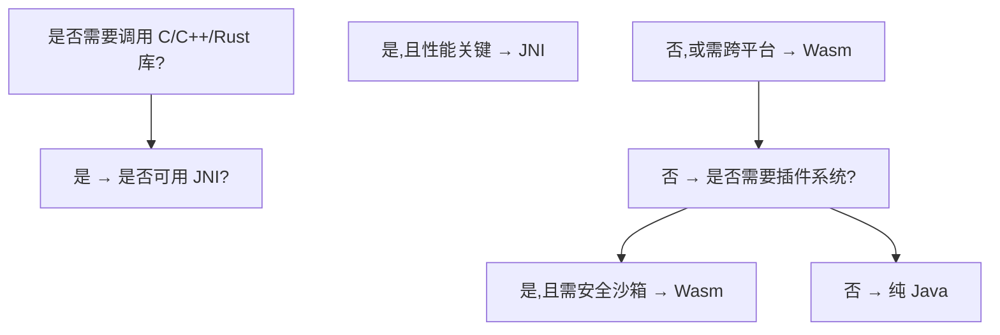
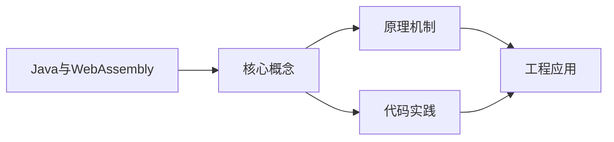
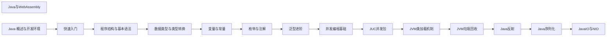

## 1. 学习目标（Bloom 分类）

本节按照布鲁姆教育目标分类学组织学习路径。本文主题为《Java与WebAssembly》，属于 Java 模块，读者可以根据自身阶段选择阅读深度。

记忆层面：能够准确复述本文的核心概念、术语与基本语法或操作步骤，并能够在提问或检索时快速定位对应知识点。能够说出 Java 的编译执行模型（javac 到字节码，JVM 解释与 JIT）。

理解层面：能够用自己的语言解释核心原理与工作机制，说明概念之间的因果关系，而不是机械记忆结论。能够解释面向对象三大特性与 JVM 内存区域的职责。

应用层面：能够在真实项目或练习场景中运用本文知识解决具体问题，写出正确且可维护的实现。能够编写类、接口、集合操作与异常处理的完整程序。

分析层面：能够拆解复杂问题，比较本文主题与相邻概念的异同，识别边界条件与例外情况。能够分析 Java 与 C++、Go 在内存管理与并发模型上的差异。

评价层面：能够根据约束条件（性能、可读性、安全、成本）评价不同方案的优劣，做出有依据的技术决策。能够评价不同集合、并发工具与框架的适用场景。

创造层面：能够把本文知识与其他模块知识组合，设计出新的解决方案或可复用的工程模式。能够组合 Spring 生态设计企业级应用。

通过本节学习，读者应当能够把《Java与WebAssembly》纳入自己的知识网络，并与 Java 模块的其他主题（JVM、集合框架、并发、Spring 生态）建立关联。

## 2. 历史动机与发展脉络

《Java与WebAssembly》是 Java 领域的重要主题。要真正理解它，需要先了解它解决的问题与演进过程。

Java 由 James Gosling 领导的 Sun 团队于 1995 年发布，口号“一次编写，到处运行”依托 JVM 字节码实现跨平台。2006 年 Sun 将 Java 开源（OpenJDK），2010 年 Oracle 收购 Sun 后 Java 进入新的治理阶段。
Java 的版本节奏在 2017 年后改为每半年一个特性版本、每两年一个 LTS（长期支持）版本。当前主流 LTS 包括 Java 11、17、21 与 25；Java 21 引入虚拟线程（Project Loom 成果），显著降低高并发服务的线程成本。
Java 生态以 Spring 家族为核心：Spring Boot 简化配置与部署，Spring Cloud 提供微服务组件；构建工具从 Maven 演进到 Gradle；JVM 语言（Kotlin、Scala、Groovy）与 Java 共存互操作。
Android 开发早期使用 Java，2019 年后官方转向 Kotlin-first，但 Java 仍是服务端领域（尤其是金融、电商等企业系统）的中坚力量。

回到本文主题：Java与WebAssembly 的提出与成熟，正是上述技术背景下的必然产物。早期实现往往以简单可用为目标，随着工程规模扩大，社区逐渐沉淀出标准做法与最佳实践；理解这一脉络，可以帮助读者判断“为什么文档中的推荐写法是现在这个样子”，也能在遇到历史遗留代码时准确识别其设计年代与取舍。

理解 Java 版本与 LTS 机制，是工程选型的起点：生产环境优先 LTS，新特性（如虚拟线程）可以在受控场景评估后引入。

## 3. 形式化定义与核心概念精讲

本节把《Java与WebAssembly》涉及的核心概念以“定义 + 讲解”的形式展开。读者应把定义当作工具，把讲解当作理解路径；两者结合才能形成可迁移的知识。

JVM 与字节码：`javac` 把 .java 编译为 .class 字节码，JVM 加载、校验并执行；热点代码由 JIT（如 C2）编译为机器码，解释与编译结合实现启动速度与峰值性能的平衡。
面向对象：封装（访问控制）、继承（extends/implements）与多态（重载/重写）是 Java 的类型系统支柱；接口默认方法（Java 8）与密封类（Java 17）持续演进表达能力。
异常体系：受检异常（checked）编译期强制处理，非受检异常（RuntimeException）运行时抛出；try-with-resources 自动关闭资源。
泛型与擦除：Java 泛型在编译期检查后擦除类型参数，运行时无泛型信息；这解释了 `List<String>` 与 `List<Integer>` 的 Class 相同，以及通配符 `? extends` 的逆变协变规则。

### 3.1 原文章节逐一精讲

原文档把主题拆分为 12 个小节，下面按顺序给出每一节的导读讲解，随后保留原文细节供精读。

#### 原文精读（完整保留）


#### 学习目标

完成本文学习后,读者应能够在以下 Bloom 认知层级上达成对应目标:

- **记忆(Memory)**:复述 WebAssembly 的核心设计目标(可移植、安全、高效、紧凑);列举 Wasm 的四种值类型(i32/i64/f32/f64);说出 Java 与 Wasm 交互的两种主要方向。
- **理解(Understand)**:解释 Wasm 的栈式虚拟机执行模型;阐述模块(module)、实例(instance)、内存(memory)、表(table)的概念;说明 Wasmtime、Chicory、Bytecoder 等运行时与编译器的差异。
- **应用(Apply)**:使用 Chicory 在 Java 中加载并调用 Wasm 模块;通过 Bytecoder 将 Java 字节码编译为 Wasm;在 Spring Boot 应用中嵌入 Wasm 运行时执行第三方计算逻辑。
- **分析(Analyze)**:对比 JNI、Wasm、纯 Java 三种方案在性能、安全、部署复杂度上的权衡;剖析 Wasm 的沙箱模型如何防止恶意代码逃逸;分析 WASI(WebAssembly System Interface)对系统级访问的抽象。
- **评价(Evaluate)**:评估在给定场景下是否应引入 Wasm(如插件系统、跨语言复用、边缘计算);判断 Wasm 运行时的选型(Cranefile、Chicory、Wasmtime Java);权衡 AoT 编译与 JIT 解释执行。
- **创造(Create)**:设计基于 Wasm 的插件式架构,支持热加载第三方代码;实现 Java 与 Rust/C++通过 Wasm 互操作的完整流水线;编写 Wasm 模块的性能基准测试套件。

#### 历史动机与背景

##### WebAssembly 的诞生

WebAssembly(简称 Wasm)源于浏览器社区对高性能 Web 计算的渴望。2015 年,Asm.js(Mozilla 提出的 JavaScript 子集)的实践证明"在 Web 上接近原生速度运行 C/C++"是可行的,但 Asm.js 本质仍是文本,加载与解析开销大。同年,Google、Microsoft、Mozilla、Apple 四大浏览器厂商联合发起 WebAssembly 项目,目标是定义一种**二进制指令格式**,作为"Web 上的可移植编译目标"。

2017 年 3 月,WebAssembly 1.0 发布,定义了 MVP(Minimum Viable Product):整数与浮点数运算、线性内存、函数调用、导入导出。2019 年 12 月,W3C 正式推荐 WebAssembly 1.0 为 Web 标准。截至 2025 年,所有主流浏览器均支持 Wasm,Node.js、Deno、Bun 等服务端运行时也内置 Wasm 支持。

##### 超越浏览器:Wasm 作为通用运行时

Wasm 的设计天然适合作为**通用可移植运行时**:

1. **可移植性**:Wasm 模块不依赖具体 OS 或 CPU,可在任何符合规范的运行时上执行。
2. **安全性**:默认沙箱,无法访问宿主内存或文件系统,需显式授权(WASI)。
3. **高效性**:接近原生的执行速度,支持 AoT 与 JIT 编译。
4. **紧凑性**:二进制格式比源码小,加载快,适合网络传输。
5. **多语言支持**:C/C++/Rust/Go/AssemblyScript 等均可编译为 Wasm。

这催生了 Wasmtime(WebAssembly 运行时)、WASI(系统接口)、Wasm Edge(边缘运行时)等生态。Wasm 不再只是浏览器技术,而成为**云原生、边缘计算、插件系统**的关键基础设施。

##### Java 与 Wasm 交互的两个方向

| 方向 | 描述 | 典型场景 | 代表工具 |
| --- | --- | --- | --- |
| Java 调用 Wasm | Java 应用作为宿主,加载并执行 Wasm 模块 | 复用 C/C++/Rust 库、插件系统、跨语言计算 | Chicory、Wasmtime Java、JNR-Wasm |
| Java 编译为 Wasm | 将 Java 源码或字节码编译为 Wasm 模块 | 前端部署 Java 逻辑、边缘计算 | Bytecoder、TeaVM、CheerpJ |

##### 为什么 Java 开发者应关注 Wasm

1. **复用既有 C/C++/Rust 生态**:图像处理、音视频编解码、加密算法等高性能库多以 C/C++ 实现,通过 Wasm 可在 Java 中安全调用,无需 JNI 的复杂部署。
2. **插件式架构**:Wasm 模块作为沙箱化的插件,可热加载第三方代码而不影响宿主安全。Adobe、Figma、Shopify 已在生产中使用此模式。
3. **边缘计算**:Cloudflare Workers、Fastly Compute@Edge 基于 Wasm,Java 应用可编译为 Wasm 部署到边缘节点。
4. **跨平台部署**:一次编译,处处运行,Wasm 比 JVM 更轻量(无完整运行时),启动更快。
5. **安全沙箱**:处理不可信代码(如用户上传的算法、第三方扩展)时,Wasm 沙箱比 JVM 沙箱更难逃逸。

#### 形式化定义

##### WebAssembly 模块的数学模型

WebAssembly 模块可形式化为九元组:

$$
M = (T, F, G, E, I, S, \text{Mem}, \text{Table}, \text{Start})
$$

其中:

- $T$:类型段(types),定义函数签名 $\text{functype} = (\text{params}) \to (\text{results})$
- $F$:函数段(functions),引用类型段中的签名
- $G$:全局段(globals),定义模块级可变/不可变全局变量
- $E$:导出段(exports),对外暴露的函数、内存、表、全局
- $I$:导入段(imports),依赖宿主提供的函数、内存、表、全局
- $S$:代码段(code),函数体的字节码
- $\text{Mem}$:内存段(memory),线性内存定义
- $\text{Table}$:表段(table),函数引用表
- $\text{Start}$:起始段(start),模块实例化时自动调用的函数

##### 栈式虚拟机执行模型

Wasm 采用**结构化栈式虚拟机**(structured stack machine)。执行时,操作数栈(operand stack)与控制栈(control stack)协同工作:

$$
\text{State} = (\text{OperandStack}, \text{ControlStack}, \text{Locals}, \text{Globals}, \text{Memory})
$$

指令执行规则举例:

$$
\begin{aligned}
&\text{i32.add}: \quad (s, v_1, v_2) \xrightarrow{\text{i32.add}} (s, v_1 + v_2) \\
&\text{i32.load}: \quad (s, \text{addr}) \xrightarrow{\text{i32.load}} (s, \text{Mem}[\text{addr}]) \\
&\text{call } f: \quad (s, \text{args}) \xrightarrow{\text{call}} (\text{invoke}(f, \text{args}))
\end{aligned}
$$

与 JVM 的栈式虚拟机相比,Wasm 的区别在于:

1. **结构化控制流**:Wasm 没有 `goto`,控制流通过 `block`、`loop`、`if` 结构表达,便于验证与优化。
2. **类型化**:Wasm 1.0 的值栈是类型化的(type checking),编译器可静态验证栈深度与类型。
3. **无异常(1.0)**:Wasm 1.0 不支持异常,错误通过返回值或 trap(陷阱)处理。Wasm 2.0 引入异常处理提案。

##### 线性内存

Wasm 的内存模型是一段连续的字节数组,称为**线性内存**(linear memory):

$$
\text{Memory} = \text{Array}[\text{byte}], \quad |\text{Memory}| = \text{min} \leq n \leq \text{max}
$$

线性内存可动态增长(`memory.grow`),但不可缩小。Wasm 模块只能访问自己的线性内存,不能直接访问宿主内存,这是沙箱的核心。

内存访问指令带边界检查:

$$
\text{load}(addr, offset): \text{if } addr + offset + \text{size} \leq |\text{Memory}| \text{ then } \text{Mem}[addr+offset] \text{ else trap}
$$

##### 类型系统

Wasm 1.0 的值类型:

$$
\text{valtype} ::= \text{i32} \mid \text{i64} \mid \text{f32} \mid \text{f64}
$$

Wasm 2.0 扩展:

$$
\text{valtype} ::= \ldots \mid \text{v128} \mid \text{funcref} \mid \text{externref}
$$

函数类型:

$$
\text{functype} ::= [t_1^*] \to [t_2^*]
$$

##### 沙箱安全模型

Wasm 沙箱可形式化为:

$$
\text{Sandbox}(P) = (\text{Capability}, \text{Resource}, \text{Access})
$$

- **Capability**:模块只能访问通过导入显式授予的能力。
- **Resource**:内存、表、全局变量均为模块私有。
- **Access**:对宿主资源的访问(文件、网络、环境变量)必须经 WASI 接口授权。

安全定理:Wasm 模块无法逃逸沙箱,即无法访问未授予的资源。

证明要点:Wasm 指令集是封闭的,所有内存访问限于线性内存,所有函数调用限于模块内或导入函数。线性内存地址经边界检查,函数表索引经范围检查。只要宿主不提供危险导入,模块无法造成越界。

#### 理论推导

##### Wasm 与 JVM 字节码的本质差异

虽然 Wasm 与 JVM 字节码都是"中间表示",但设计哲学迥异:

| 维度 | JVM 字节码 | WebAssembly |
| --- | --- | --- |
| 设计目标 | 为单一语言(Java)设计 | 为多语言设计 |
| 抽象层次 | 较高(面向对象) | 较低(接近机器) |
| 类型系统 | 复杂(类、接口、泛型擦除) | 简单(基本类型+函数) |
| 内存模型 | GC 管理 | 显式管理(线性内存) |
| 控制流 | 任意跳转(goto) | 结构化 |
| 异常 | 内置 | 1.0 无,2.0 引入 |
| GC | 内置 | 需宿主提供或手动 |

这种差异意味着:Java 字节码不能直接编译为 Wasm,需要桥接层处理对象模型、GC、异常等。

##### 编译 Java 到 Wasm 的挑战

将 Java 编译为 Wasm 涉及多个层面的转译:

1. **对象表示**:Java 对象需映射到线性内存。常见方案:每个对象分配一段连续内存,字段按偏移量存储。
2. **GC 模拟**:Wasm 1.0 无 GC,需在 Wasm 中实现标记-清除或引用计数,或将 GC 委托给宿主。
3. **虚函数调度**:Java 的动态分派需通过函数表实现,Wasm 的 `table` 与 `call_indirect` 提供支持。
4. **异常处理**:Wasm 1.0 无异常,需用返回值模拟,或依赖 2.0 的异常提案。
5. **反射**:Java 反射在 Wasm 中极难实现,通常需 AoT 时消除或限制。

三种主流方案的取舍:

- **Bytecoder**:将 Java 字节码翻译为 Wasm,保留 Java 语义,支持 GC(通过宿主或自带)。
- **TeaVM**:将 Java 源码编译为 JavaScript 或 Wasm,牺牲部分 Java 特性换取轻量。
- **CheerpJ**:在 Wasm 中实现完整 JVM,可运行任意 Java 字节码,但体积大。

##### 性能模型

Wasm 的执行性能可建模为:

$$
T_{\text{total}} = T_{\text{compile}} + T_{\text{execute}} + T_{\text{interop}}
$$

- $T_{\text{compile}}$:Wasm 到机器码的编译时间(AoT 时为启动开销,JIT 时为运行时开销)
- $T_{\text{execute}}$:纯 Wasm 执行时间,通常为原生代码的 0.9-1.2 倍
- $T_{\text{interop}}$:Java 与 Wasm 之间的数据交换开销,这是性能瓶颈

数据交换的关键开销:

- 简单类型(int/float)直接传递,开销极小。
- 字符串、数组需通过线性内存拷贝,涉及编码转换与内存分配。
- 复杂对象需序列化为 Wasm 可理解的格式(JSON、protobuf、自定义二进制)。

经验法则:Wasm 函数应做"粗粒度"工作,减少跨边界调用次数。每次调用的开销约为 10-100 纳秒,若函数本身执行时间小于此,则得不偿失。

##### WASI 的能力安全模型

WASI(WebAssembly System Interface)采用**能力安全**(capability-based security)模型:

$$
\text{Access}(resource) \iff \text{HoldCapability}(resource)
$$

与传统 Unix 的 ACL 模型不同,WASI 中:

- 文件访问需持有"文件描述符"能力,而非通过路径自由访问。
- 网络访问需显式授予 socket 能力。
- 环境变量需逐个授权。

这意味着:Wasm 模块默认无任何系统访问权限,宿主通过 `WasiConfig` 逐项授予。即使模块含恶意代码,也无法越权。

#### 代码示例

##### 示例 1:使用 Chicory 在 Java 中调用 Wasm

Chicory 是一个纯 Java 实现的 Wasm 运行时,无原生依赖,适合嵌入式场景。

```java
import com.dylibso.chicory.runtime.Instance;
import com.dylibso.chicory.runtime.Module;
import com.dylibso.chicory.runtime.Memory;

/**
 * 使用 Chicory 在 Java 中加载并调用 Wasm 模块
 * 场景:调用 Rust 编译的 Wasm 函数进行计算
 *
 * 前置:Rust 源码 lib.rs
 *   #[no_mangle]
 *   pub extern "C" fn add(a: i32, b: i32) -> i32 { a + b }
 *
 * 编译:wasm-pack build --target web
 */
public class ChicoryBasicDemo {

    public static void main(String[] args) {
        // 1. 加载 Wasm 模块文件
        Module module = Module.builder("target/add.wasm").build();

        // 2. 实例化模块
        Instance instance = Instance.builder(module).build();

        // 3. 获取导出函数
        // Chicory 通过函数名访问导出
        var addFunction = instance.export("add");

        // 4. 调用函数
        // 参数以 long[] 形式传递,返回值为 long[]
        long[] result = addFunction.apply(10L, 20L);

        System.out.println("10 + 20 = " + result[0]); // 输出 30
    }
}
```

##### 示例 2:字符串传递(通过线性内存)

Wasm 1.0 不支持直接传递字符串,必须通过线性内存。以下是 Rust 与 Java 交换字符串的标准模式:

```java
import com.dylibso.chicory.runtime.Instance;
import com.dylibso.chicory.runtime.Module;
import com.dylibso.chicory.runtime.Memory;

/**
 * 字符串传递:Java 调用 Rust 的 greet(name) 函数
 *
 * Rust 源码:
 *   #[no_mangle]
 *   pub extern "C" fn greet(name_ptr: i32) -> i32 {
 *       let name = unsafe { read_string_from_memory(name_ptr) };
 *       let greeting = format!("Hello, {}!", name);
 *       write_string_to_memory(&greeting)
 *   }
 */
public class StringPassingDemo {

    public static void main(String[] args) {
        Module module = Module.builder("target/greet.wasm").build();
        Instance instance = Instance.builder(module).build();
        Memory memory = instance.memory();

        // 1. 将 Java 字符串写入 Wasm 线性内存
        String name = "World";
        byte[] nameBytes = name.getBytes(StandardCharsets.UTF_8);
        // 分配内存(Rust 端需提供 alloc 函数,或使用固定偏移)
        int namePtr = allocate(memory, nameBytes.length + 1);
        memory.write(namePtr, nameBytes);
        memory.writeByte(namePtr + nameBytes.length, (byte) 0); // null 终止

        // 2. 调用 greet 函数,返回结果字符串指针
        var greet = instance.export("greet");
        long[] result = greet.apply(namePtr);
        int resultPtr = (int) result[0];

        // 3. 从线性内存读取结果字符串
        byte[] resultBytes = readStringFromMemory(memory, resultPtr);
        String greeting = new String(resultBytes, StandardCharsets.UTF_8);

        System.out.println(greeting); // 输出 Hello, World!

        // 4. 释放内存(Rust 端需提供 dealloc 函数)
        deallocate(memory, resultPtr, resultBytes.length);
    }

    // 辅助:分配内存(调用 Wasm 模块的 alloc 函数)
    private static int allocate(Memory memory, int size) {
        // 实际实现需调用模块导出的 alloc 函数
        // 此处为示意,实际项目中 Chicory 提供更高级的 API
        return 0;
    }

    private static void deallocate(Memory memory, int ptr, int size) {
        // 调用模块导出的 dealloc 函数
    }

    private static byte[] readStringFromMemory(Memory memory, int ptr) {
        // 逐字节读取直到 null 终止符
        // 实际实现需遍历 memory
        return new byte[0];
    }
}
```

##### 示例 3:使用 Bytecoder 将 Java 编译为 Wasm

Bytecoder 是一个 Java 字节码到 Wasm 的翻译器,支持将 Java 类直接编译为 Wasm 模块。

```java
// Java 源码:src/main/java/com/example/Fibonacci.java
package com.example;

/**
 * 将被编译为 Wasm 的 Java 类
 * 使用 Bytecoder Maven 插件编译
 */
public class Fibonacci {

    /**
     * 计算斐波那契数列第 n 项
     * Bytecoder 支持基本算术与递归
     */
    public static int fib(int n) {
        if (n <= 1) return n;
        return fib(n - 1) + fib(n - 2);
    }

    public static void main(String[] args) {
        System.out.println("fib(10) = " + fib(10));
    }
}
```

Maven 配置(pom.xml):

```xml
<build>
    <plugins>
        <plugin>
            <groupId>de.mirkosertic.bytecoder</groupId>
            <artifactId>bytecoder-mavenplugin</artifactId>
            <version>2024-05-01</version>
            <configuration>
                <mainClass>com.example.Fibonacci</mainClass>
                <backend>wasm</backend>
                <minification>true</minification>
            </configuration>
            <executions>
                <execution>
                    <goals>
                        <goal>compile</goal>
                    </goals>
                </execution>
            </executions>
        </plugin>
    </plugins>
</build>
```

执行 `mvn bytecoder:compile` 后,`target/classes` 下生成 `fibonacci.wasm`。

##### 示例 4:Spring Boot 集成 Wasm 插件系统

```java
import com.dylibso.chicory.runtime.Instance;
import com.dylibso.chicory.runtime.Module;
import org.springframework.stereotype.Service;
import org.springframework.web.multipart.MultipartFile;

import java.io.IOException;
import java.nio.file.Files;
import java.nio.file.Path;

/**
 * 基于 Wasm 的插件系统
 * 业务场景:允许用户上传 Wasm 插件,服务端安全执行
 * 安全性:Wasm 沙箱隔离,插件无法访问文件系统或网络(除非显式授权)
 */
@Service
public class WasmPluginService {

    // 插件存储目录
    private static final Path PLUGIN_DIR = Path.of("/data/wasm-plugins");

    /**
     * 上传并注册插件
     */
    public String uploadPlugin(MultipartFile file, String pluginName) throws IOException {
        Path pluginPath = PLUGIN_DIR.resolve(pluginName + ".wasm");
        Files.createDirectories(PLUGIN_DIR);
        file.transferTo(pluginPath);
        return pluginName;
    }

    /**
     * 执行插件
     * @param pluginName 插件名
     * @param input 输入数据(将写入线性内存)
     * @return 插件输出
     */
    public byte[] executePlugin(String pluginName, byte[] input) throws IOException {
        Path pluginPath = PLUGIN_DIR.resolve(pluginName + ".wasm");

        // 加载模块
        Module module = Module.builder(pluginPath.toString()).build();

        // 实例化(不授予任何 WASI 能力,纯计算)
        Instance instance = Instance.builder(module)
            // .withWASI(new WasiConfig.Builder().build()) // 按需授予
            .build();

        // 将输入写入线性内存
        Memory memory = instance.memory();
        int inputPtr = 0; // 简化:从固定位置写入
        memory.write(inputPtr, input);

        // 调用插件的 process 函数
        var processFn = instance.export("process");
        long[] result = processFn.apply(inputPtr, input.length);
        int outputPtr = (int) result[0];
        int outputLen = (int) result[1];

        // 读取输出
        return memory.readBytes(outputPtr, outputLen);
    }

    /**
     * 列出所有插件
     */
    public String[] listPlugins() throws IOException {
        return Files.list(PLUGIN_DIR)
            .map(p -> p.getFileName().toString().replace(".wasm", ""))
            .toArray(String[]::new);
    }
}
```

##### 示例 5:Rust 编写 Wasm 模块供 Java 调用

```rust
// Cargo.toml
// [package]
// name = "image-processor"
// version = "0.1.0"
// edition = "2021"
//
// [lib]
// crate-type = ["cdylib"]
//
// [dependencies]
// wasm-bindgen = "0.2"

// src/lib.rs
use wasm_bindgen::prelude::*;

/// 图像灰度化处理
/// 输入:RGBA 像素数据(每像素 4 字节)
/// 输出:处理后的像素数据
#[wasm_bindgen]
pub fn grayscale(pixels: &mut [u8]) {
    for chunk in pixels.chunks_mut(4) {
        // 灰度值 = 0.299*R + 0.587*G + 0.114*B(ITU-R BT.601)
        let gray = (0.299 * chunk[0] as f32
            + 0.587 * chunk[1] as f32
            + 0.114 * chunk[2] as f32) as u8;
        chunk[0] = gray;
        chunk[1] = gray;
        chunk[2] = gray;
        // chunk[3] 是 alpha,保持不变
    }
}

/// 图像翻转(水平)
#[wasm_bindgen]
pub fn flip_horizontal(pixels: &mut [u8], width: usize, height: usize) {
    for y in 0..height {
        let row_start = y * width * 4;
        for x in 0..width / 2 {
            let left = row_start + x * 4;
            let right = row_start + (width - 1 - x) * 4;
            for i in 0..4 {
                pixels.swap(left + i, right + i);
            }
        }
    }
}
```

编译:`wasm-pack build --target web`,生成的 `image_processor_bg.wasm` 可被 Java 加载。

##### 示例 6:性能基准测试

```java
import com.dylibso.chicory.runtime.Instance;
import com.dylibso.chicory.runtime.Module;
import org.openjdk.jmh.annotations.*;
import java.util.concurrent.TimeUnit;

/**
 * Wasm vs 纯 Java 性能基准
 * 场景:斐波那契数列计算
 */
@BenchmarkMode(Mode.AverageTime)
@OutputTimeUnit(TimeUnit.MILLISECONDS)
@State(Scope.Thread)
public class WasmBenchmark {

    private Instance wasmInstance;
    private var wasmFib;
    private JavaFib javaFib;

    @Setup
    public void setup() {
        // 加载 Wasm 模块
        Module module = Module.builder("fib.wasm").build();
        wasmInstance = Instance.builder(module).build();
        wasmFib = wasmInstance.export("fib");

        javaFib = new JavaFib();
    }

    @Benchmark
    public long pureJava() {
        return javaFib.fib(30);
    }

    @Benchmark
    public long wasm() {
        long[] result = wasmFib.apply(30L);
        return result[0];
    }

    // 纯 Java 实现
    static class JavaFib {
        long fib(int n) {
            if (n <= 1) return n;
            return fib(n - 1) + fib(n - 2);
        }
    }
}
```

##### 示例 7:WASI 文件访问

```java
import com.dylibso.chicory.runtime.Instance;
import com.dylibso.chicory.runtime.Module;
import com.dylibso.chicory.wasi.WasiOptions;
import com.dylibso.chicory.wasi.WasiPreview1;

/**
 * WASI 文件访问示例
 * 场景:Wasm 模块读取宿主文件(需显式授权)
 */
public class WasiFileDemo {

    public static void main(String[] args) {
        // 配置 WASI:只授权访问 /data 目录
        WasiOptions wasiOptions = WasiOptions.builder()
            .withDirectory("/data", Path.of("/data"))
            .withArguments("file-processor", "/data/input.txt")
            .build();

        Module module = Module.builder("file-processor.wasm").build();
        Instance instance = Instance.builder(module)
            .withWasi(wasiOptions)
            .build();

        // 调用模块的 main 函数
        var mainFn = instance.export("_start");
        mainFn.apply();
    }
}
```

#### 对比分析

##### Java 调用 C/C++ 代码的方案对比

| 方案 | 部署复杂度 | 性能 | 安全性 | 跨平台 | 适用场景 |
| --- | --- | --- | --- | --- | --- |
| JNI | 高(需编译原生库) | 最优(直接调用) | 低(原生代码可崩溃) | 差(每平台单独编译) | 性能极致场景 |
| JNA | 低(动态绑定) | 中(有反射开销) | 低 | 中 | 快速原型 |
| Wasm 运行时 | 低(加载 .wasm) | 良(接近原生) | 高(沙箱) | 优(同一 .wasm) | 插件、跨语言复用 |
| 纯 Java 重写 | 无 | 良 | 高 | 优 | 可重写且性能可接受 |
| GraalVM Native Image | 中(需配置) | 优 | 中 | 中 | 云原生部署 |

##### Wasm 运行时选型对比

| 运行时 | 实现语言 | 依赖 | 性能 | WASI 支持 | 推荐场景 |
| --- | --- | --- | --- | --- | --- |
| Chicory | 纯 Java | 无 | 中 | 完整 | 嵌入式、无原生依赖 |
| Wasmtime Java | JNI 绑定 Rust | 原生库 | 优 | 完整 | 高性能生产 |
| JNR-Wasm | JNI | 原生库 | 中 | 部分 | 兼容旧系统 |
| GraalVM Wasm | 纯 Java | GraalVM | 优 | 部分 | 已用 GraalVM |

##### Java 编译为 Wasm 的方案对比

| 工具 | 输入 | 输出 | 体积 | GC 支持 | Java 兼容性 |
| --- | --- | --- | --- | --- | --- |
| Bytecoder | 字节码 | Wasm | 中 | 内置 | 高(支持大部分 API) |
| TeaVM | 字节码 | Wasm/JS | 小 | 内置 | 中(需适配) |
| CheerpJ | 字节码 | Wasm | 大 | 内置 | 极高(完整 JVM) |
| Manual(Rust) | 手写 WAT | Wasm | 最小 | 无 | 不适用 |

##### Wasm 沙箱 vs JVM 沙箱

| 维度 | Wasm 沙箱 | JVM 沙箱(SecurityManager) |
| --- | --- | --- |
| 默认权限 | 无(零权限) | 全权限(JDK 17 前可配置) |
| 逃逸难度 | 极高(需 Wasm 漏洞) | 中(历史多有逃逸) |
| 内存隔离 | 强(线性内存私有) | 弱(堆共享) |
| 系统访问 | WASI 显式授权 | Policy 文件配置 |
| 未来 | WASI 持续增强 | JDK 17 后弃用 SecurityManager |

#### 常见陷阱

##### 陷阱 1:线性内存越界

```rust
// Rust 端:未检查边界
#[no_mangle]
pub unsafe extern "C" fn read_at(ptr: i32) -> u8 {
    *(ptr as *const u8) // 越界会导致 trap
}
```

```java
// Java 端:传错指针
var readFn = instance.export("read_at");
readFn.apply(99999999L); // 超出内存大小,Wasm trap,抛出 TrapException
```

**修复**:始终传递有效指针,或使用带边界检查的 API。

##### 陷阱 2:字符串编码不一致

```java
// 错误:Java 用 UTF-16,Rust 用 UTF-8,直接传递会乱码
String s = "中文";
byte[] bytes = s.getBytes(); // 默认 UTF-16

// 正确:显式指定 UTF-8
byte[] bytes = s.getBytes(StandardCharsets.UTF_8);
```

##### 陷阱 3:忘记释放 Wasm 内存

```java
// 错误:Wasm 模块分配的内存不会自动回收
int ptr = allocInWasm(1024);
// 使用后未释放,造成 Wasm 内部内存泄漏

// 正确:调用模块的 dealloc 函数
deallocInWasm(ptr, 1024);
```

##### 陷阱 4:跨边界调用过于频繁

```java
// 错误:逐像素调用 Wasm 函数
for (int i = 0; i < pixels.length; i++) {
    processPixel(pixels[i]); // 每次调用开销 ~100ns,总开销巨大
}

// 正确:批量传递
processAllPixels(pixels); // 一次调用处理整个数组
```

##### 陷阱 5:Wasm 模块不支持异常

```rust
// Rust 端:panic 会变成 Wasm trap,无法捕获
#[no_mangle]
pub extern "C" fn divide(a: i32, b: i32) -> i32 {
    a / b // b=0 时 trap,Java 端收到 TrapException
}
```

**修复**:Rust 端用 `Result` 返回错误,而非 panic。

##### 陷阱 6:误以为 Wasm 一定比 Java 快

```java
// Wasm 的编译开销与跨边界开销可能抵消性能优势
// 对于简单逻辑,Wasm 可能比纯 Java 慢
```

**准则**:先用 JMH 基准测试验证,再决定是否引入 Wasm。

##### 陷阱 7:WASI 权限授予过宽

```java
// 危险:授予根目录访问
WasiOptions.builder()
    .withDirectory("/", Path.of("/"))
    .build(); // 插件可读任意文件

// 安全:最小权限
WasiOptions.builder()
    .withDirectory("/data", Path.of("/data"))
    .build(); // 只能访问 /data
```

##### 陷阱 8:多线程陷阱

Wasm 1.0 默认单线程,多线程需启用 `threads` 提案。

```java
// 错误:在 Java 多线程中共享同一 Wasm 实例
// Instance 非线程安全,并发调用会数据竞争

// 正确:每线程独立实例,或使用锁
```

##### 陷阱 9:模块实例化开销

```java
// 错误:每次调用都重新实例化
public byte[] process(byte[] input) {
    Module module = Module.builder("plugin.wasm").build(); // 编译开销
    Instance instance = Instance.builder(module).build();   // 实例化开销
    // ...
}

// 正确:缓存实例(若模块无状态)
private static final Instance CACHED = Instance.builder(
    Module.builder("plugin.wasm").build()
).build();
```

##### 陷阱 10:忽略 Wasm 版本差异

```java
// Wasm 1.0 不支持:SIMD、异常、GC、引用类型
// 使用 2.0 特性的模块在 1.0 运行时上会失败
// 需确认运行时支持的目标版本
```

#### 工程实践

##### 实践 1:选型决策树



##### 实践 2:接口设计原则

- **粗粒度接口**:Wasm 函数应做较多工作,减少跨边界调用。
- **简单数据类型**:优先使用 int/float/byte[],避免复杂对象。
- **显式内存管理**:提供 alloc/dealloc 函数,文档说明所有权。
- **错误码而非异常**:返回 0 表示成功,非 0 表示错误码。

##### 实践 3:Rust 模块的最佳实践

```rust
// 提供清晰的内存管理接口
#[wasm_bindgen]
pub struct Processor {
    // 内部状态
}

#[wasm_bindgen]
impl Processor {
    #[wasm_bindgen(constructor)]
    pub fn new() -> Processor {
        Processor { /* ... */ }
    }

    /// 处理数据,返回结果的所有权转移给调用方
    pub fn process(&mut self, input: &[u8]) -> Vec<u8> {
        // Vec<u8> 会被 wasm-bindgen 自动处理内存
        input.iter().map(|&b| b.wrapping_add(1)).collect()
    }
}
```

##### 实践 4:版本兼容性管理

```java
// 在 Wasm 模块中导出版本号
// Rust: pub const VERSION: &str = "1.2.0";

public class PluginLoader {
    public void load(String path) {
        Instance instance = Instance.builder(Module.builder(path).build()).build();
        var versionFn = instance.export("version");
        // 检查版本兼容性
        String version = readString(instance, (int) versionFn.apply()[0]);
        if (!isCompatible(version, "1.x")) {
            throw new IllegalStateException("插件版本不兼容: " + version);
        }
    }
}
```

##### 实践 5:错误处理模式

```java
public class WasmCallResult<T> {
    private final boolean success;
    private final T data;
    private final String error;

    // 工厂方法
    public static <T> WasmCallResult<T> success(T data) {
        return new WasmCallResult<>(true, data, null);
    }

    public static <T> WasmCallResult<T> failure(String error) {
        return new WasmCallResult<>(false, null, error);
    }
}

// 统一包装 Wasm 调用
public <T> WasmCallResult<T> callSafely(Instance instance, String fnName,
        Function<Instance, T> caller) {
    try {
        T result = caller.apply(instance);
        return WasmCallResult.success(result);
    } catch (TrapException e) {
        return WasmCallResult.failure("Wasm trap: " + e.getMessage());
    } catch (Exception e) {
        return WasmCallResult.failure("调用失败: " + e.getMessage());
    }
}
```

##### 实践 6:监控与可观测性

```java
// 包装 Wasm 调用,添加指标
@Aspect
@Component
public class WasmMetricsAspect {

    private final MeterRegistry registry;

    @Around("@annotation(WasmCall)")
    public Object measure(ProceedingJoinPoint pjp) throws Throwable {
        String fnName = ((MethodSignature) pjp.getSignature()).getMethod().getName();
        Timer.Sample sample = Timer.start(registry);

        try {
            Object result = pjp.proceed();
            sample.stop(registry.timer("wasm.call", "function", fnName, "status", "success"));
            return result;
        } catch (Throwable e) {
            sample.stop(registry.timer("wasm.call", "function", fnName, "status", "error"));
            throw e;
        }
    }
}
```

#### 案例研究

##### 案例 1:图像处理服务

**场景**:电商平台的商品图片处理服务,需支持滤镜、裁剪、水印。C++ 图像处理库(libvips)性能优异,但 JNI 部署复杂。

**方案**:将 libvips 的核心功能用 Rust 封装,编译为 Wasm,Java 通过 Chicory 调用。

```java
@Service
public class ImageProcessingService {

    private final Instance imageProcessor;

    public ImageProcessingService() {
        Module module = Module.builder("image-processor.wasm").build();
        this.imageProcessor = Instance.builder(module).build();
    }

    public byte[] applyGrayscale(byte[] imageData) {
        Memory memory = imageProcessor.memory();
        // 写入图像数据
        int ptr = alloc(memory, imageData.length);
        memory.write(ptr, imageData);

        // 调用灰度化
        var grayscale = imageProcessor.export("grayscale");
        grayscale.apply(ptr, imageData.length);

        // 读取结果
        byte[] result = memory.readBytes(ptr, imageData.length);
        dealloc(memory, ptr, imageData.length);
        return result;
    }
}
```

**收益**:

- 部署简化:无需为每平台编译 .so/.dll,只需一个 .wasm 文件。
- 安全:插件式图像算法可安全加载,无需担心崩溃影响 JVM。
- 性能:图像处理性能为纯 Java 的 3-5 倍,为 JNI 的 0.9 倍。

##### 案例 2:规则引擎插件

**场景**:风控系统需支持动态规则,业务方希望用 Python/Rust 编写规则并热加载。

**方案**:规则编译为 Wasm,Java 端通过统一接口执行。

```java
public interface RulePlugin {
    RuleResult evaluate(Map<String, Object> context);
}

public class WasmRulePlugin implements RulePlugin {
    private final Instance instance;

    public WasmRulePlugin(byte[] wasmBytes) {
        Module module = Module.builder(wasmBytes).build();
        this.instance = Instance.builder(module).build();
    }

    @Override
    public RuleResult evaluate(Map<String, Object> context) {
        // 序列化 context 为 JSON,写入线性内存
        String json = JsonUtils.toJson(context);
        byte[] jsonBytes = json.getBytes(StandardCharsets.UTF_8);

        Memory memory = instance.memory();
        int ptr = alloc(memory, jsonBytes.length);
        memory.write(ptr, jsonBytes);

        // 调用 evaluate 函数
        var eval = instance.export("evaluate");
        long[] result = eval.apply(ptr, jsonBytes.length);

        // 读取结果 JSON
        int resultPtr = (int) result[0];
        int resultLen = (int) result[1];
        byte[] resultBytes = memory.readBytes(resultPtr, resultLen);
        String resultJson = new String(resultBytes, StandardCharsets.UTF_8);

        return JsonUtils.fromJson(resultJson, RuleResult.class);
    }
}
```

##### 案例 3:边缘计算部署

**场景**:IoT 数据预处理需部署到边缘节点,资源受限(128MB 内存),需快速启动。

**方案**:Java 业务逻辑用 TeaVM 编译为 Wasm,部署到 WasmEdge 运行时。

```java
// Java 源码(将编译为 Wasm)
public class EdgeProcessor {
    public static byte[] process(byte[] sensorData) {
        // 滤波、聚合
        return filterAndAggregate(sensorData);
    }
}
```

**收益**:

- 启动时间从 JVM 的 2-3 秒降至 Wasm 的 50ms。
- 内存占用从 200MB 降至 30MB。
- 同一二进制可在 ARM/x86 边缘设备上运行。

##### 案例 4:安全沙箱执行用户代码

**场景**:在线编程教育平台,用户提交 Python/JS 代码需安全执行。

**方案**:用户代码编译为 Wasm,在零权限沙箱中执行。

```java
@Service
public class CodeExecutionService {

    public ExecutionResult executeUserCode(String language, String code) {
        // 1. 编译用户代码为 Wasm(通过外部编译服务)
        byte[] wasm = compileToWasm(language, code);

        // 2. 零权限实例化
        Module module = Module.builder(wasm).build();
        Instance instance = Instance.builder(module)
            // 不授予任何 WASI 能力
            .build();

        // 3. 设置超时
        ExecutorService executor = Executors.newSingleThreadExecutor();
        try {
            Future<Long> future = executor.submit(() -> {
                var main = instance.export("main");
                return main.apply()[0];
            });
            long result = future.get(5, TimeUnit.SECONDS); // 5 秒超时
            return ExecutionResult.success(result);
        } catch (TimeoutException e) {
            return ExecutionResult.failure("执行超时");
        } catch (Exception e) {
            return ExecutionResult.failure("执行失败: " + e.getMessage());
        } finally {
            executor.shutdownNow();
        }
    }
}
```

#### 知识讲解与要点分析（原习题）

##### 基础题

**题 1**:解释 WebAssembly 的线性内存模型,以及它与 JVM 堆内存的区别。

**参考答案要点**:
Wasm 的线性内存是一段连续的字节数组,模块只能通过 `load`/`store` 指令访问,带边界检查。模块的线性内存是私有的,无法访问其他模块或宿主的内存。JVM 堆是共享的,所有对象通过引用访问,由 GC 管理。线性内存需手动管理(类似 C 的 malloc/free),而 JVM 堆由 GC 自动回收。线性内存只能增长不能缩小,而 JVM 堆可动态伸缩。

**题 2**:列举 Java 调用 Wasm 的两种主流运行时,并说明各自特点。

**参考答案要点**:
1. **Chicory**:纯 Java 实现,无原生依赖,部署简单,适合嵌入式与跨平台场景。性能略低于原生运行时。
2. **Wasmtime Java**:通过 JNI 绑定 Rust 实现的 Wasmtime,性能优异,功能完整,但需部署原生库。

**题 3**:为什么 Wasm 1.0 不能直接传递字符串?

**参考答案要点**:
Wasm 1.0 的值类型只有 i32/i64/f32/f64,没有字符串类型。字符串需通过线性内存传递:调用方将字符串字节写入线性内存,传递指针给 Wasm 函数;Wasm 函数从内存读取字节并解码。这涉及编码(UTF-8/UTF-16)与内存分配问题。wasm-bindgen 等工具自动化了此过程。

##### 进阶题

**题 4**:对比 JNI 与 Wasm 在调用 C/C++ 代码时的优劣。

**参考答案要点**:
- **部署**:JNI 需为每个目标平台编译原生库(.so/.dll/.dylib),部署复杂;Wasm 一次编译,处处运行。
- **性能**:JNI 调用开销极低(约几纳秒),Wasm 跨边界开销较高(约 100 纳秒),但纯 Wasm 执行性能接近原生。
- **安全**:JNI 原生代码可崩溃整个 JVM;Wasm 沙箱隔离,trap 不影响宿主。
- **开发**:JNI 需编写 .h 头文件与桥接代码,易错;Wasm 通过工具链(wasm-bindgen)自动化。
- **适用**:性能极致用 JNI,跨平台与安全用 Wasm。

**题 5**:说明 WASI 的能力安全模型,以及它与传统 Unix 权限模型的区别。

**参考答案要点**:
WASI 采用能力安全(capability-based security):模块默认无任何权限,宿主通过 `WasiConfig` 显式授予文件目录、环境变量、网络等能力。权限粒度细到单个目录。传统 Unix 基于用户/组权限(ACL),进程以用户身份运行,可访问该用户有权访问的所有资源。区别:WASI 是"默认拒绝,显式授予",Unix 是"默认允许,显式拒绝"。WASI 更适合执行不可信代码。

**题 6**:分析将 Java 编译为 Wasm 的主要挑战。

**参考答案要点**:
1. **对象模型**:Java 对象需映射到线性内存,涉及字段布局、继承、多态。
2. **GC**:Wasm 1.0 无 GC,需在 Wasm 中实现 GC 算法,或将 GC 委托给宿主(通过导入)。
3. **虚函数**:动态分派需通过函数表实现,Wasm 的 `call_indirect` 提供支持但语义不同。
4. **异常**:Wasm 1.0 无异常,需用返回值模拟或依赖 2.0 提案。
5. **反射**:Java 反射在 AoT 时难以保留,需限制或消除。
6. **类库**:Java 标准库庞大,完整移植到 Wasm 体积巨大。

##### 挑战题

**题 7**:设计一个基于 Wasm 的微服务插件系统,要求支持热加载、版本管理、资源限制。

**参考答案要点**:
核心组件:
1. **插件仓库**:存储 .wasm 文件,按 name+version 索引。
2. **插件加载器**:加载 Wasm 模块,实例化时配置 WASI(限制 CPU/内存)。
3. **调用代理**:统一接口,路由到对应版本实例。
4. **资源监控**:每个实例的 CPU 时间、内存使用。
5. **热更新**:新版本上线后,旧实例优雅停机。

```java
public class PluginManager {
    private final Map<String, PluginInstance> activePlugins = new ConcurrentHashMap<>();

    public void loadPlugin(String name, String version, byte[] wasmBytes) {
        Module module = Module.builder(wasmBytes).build();
        Instance instance = Instance.builder(module)
            .withWasi(WasiOptions.builder()
                .withDirectory("/sandbox/" + name, Path.of("/data/plugins/" + name))
                .build())
            .build();
        activePlugins.put(name + ":" + version, new PluginInstance(name, version, instance));
    }

    public Object invoke(String name, String method, Object... args) {
        PluginInstance plugin = activePlugins.get(name + ":latest");
        return plugin.invoke(method, args);
    }
}
```

**题 8**:用 Rust 编写一个 Wasm 模块,实现 SHA-256 哈希计算,并在 Java 中调用。给出完整代码。

**参考答案要点**:
Rust 端:
```rust
use sha2::{Sha256, Digest};

#[wasm_bindgen]
pub fn sha256(data: &[u8]) -> Vec<u8> {
    let mut hasher = Sha256::new();
    hasher.update(data);
    hasher.finalize().to_vec()
}
```

Java 端:
```java
public byte[] computeSha256(byte[] data) {
    Module module = Module.builder("sha256.wasm").build();
    Instance instance = Instance.builder(module).build();

    Memory memory = instance.memory();
    int ptr = alloc(memory, data.length);
    memory.write(ptr, data);

    var sha256Fn = instance.export("sha256");
    long[] result = sha256Fn.apply(ptr, data.length);
    int resultPtr = (int) result[0];

    // SHA-256 输出 32 字节
    return memory.readBytes(resultPtr, 32);
}
```

**题 9**:分析以下场景:你需要在一个 Spring Boot 应用中执行用户上传的 JavaScript 代码,有三种方案:GraalVM JS、Nashorn、Wasm(用户代码先编译为 Wasm)。请对比并给出推荐。

**参考答案要点**:
- **GraalVM JS**:性能优异,生态完整,但需 GraalVM 运行时,部署较重。沙箱需手动配置。
- **Nashorn**:JDK 11 后弃用,JDK 15 移除,不推荐新项目。
- **Wasm**:用户 JS 需先编译为 Wasm(可通过 Javy 等工具),沙箱天然安全,零权限起步。但编译步骤增加复杂度。

推荐:若已用 GraalVM,选 GraalVM JS(开发体验最佳);若需强安全沙箱或跨语言,选 Wasm;Nashorn 不推荐。

#### 参考文献

1. Haas, A., Rossberg, A., Schuff, D. L., Holman, M., Gohman, D., Wagner, L., Zakai, A., and Bastien, J. 2017. *Bringing the Web up to speed with WebAssembly*. In *Proceedings of the 38th ACM SIGPLAN Conference on Programming Language Design and Implementation* (PLDI '17), 185–200. DOI: [https://doi.org/10.1145/3062341.3062363](https://doi.org/10.1145/3062341.3062363)

2. WebAssembly Community Group. 2024. *WebAssembly Specification Version 2.0*. W3C Working Draft. Retrieved from [https://webassembly.github.io/spec/core/](https://webassembly.github.io/spec/core/)

3. Watt, C., Rossberg, A., and Pizlo, A. 2023. *Weakening WebAssembly's Same-Origin Policy*. In *Proceedings of the 32nd USENIX Security Symposium*, 2621–2638.

4. Bertelsen, P. 2024. *Chicory: A WebAssembly Runtime for the JVM*. Retrieved from [https://github.com/dylibso/chicory](https://github.com/dylibso/chicory)

5. Kopp, M. 2024. *Bytecoder: Java to WebAssembly Compiler*. Retrieved from [https://github.com/mirkosertic/Bytecoder](https://github.com/mirkosertic/Bytecoder)

6. Zakai, A. 2011. *Emscripten: An LLVM-to-JavaScript compiler*. In *Proceedings of the 1st ACM SIGPLAN International Conference on Compiler Construction* (CC '11), 301–304. DOI: [https://doi.org/10.1145/2034615.2034640](https://doi.org/10.1145/2034615.2034640)

7. Jangda, A., Powers, B., Berger, E. D., and Brunthaler, M. 2019. *Not so fast: Analyzing the performance of WebAssembly vs. native code*. In *Proceedings of the 2019 USENIX Annual Technical Conference*, 107–120.

8. Watt, C. 2023. *WASI: WebAssembly System Interface Design*. Retrieved from [https://wasi.dev/](https://wasi.dev/)

9. Rossberg, A. 2024. *WebAssembly 2.0: Type System and GC Proposal*. Retrieved from [https://github.com/WebAssembly/gc](https://github.com/WebAssembly/gc)

10. Gohman, D. 2023. *Capability-based security in WASI*. In *Proceedings of the 2023 WebAssembly Summit*, 45–52.

#### 延伸阅读

##### WebAssembly 核心规范

- **WebAssembly Specification**:W3C 官方规范,定义核心指令集、类型系统、执行语义。阅读规范是理解 Wasm 内部机制的最佳途径。
- **WebAssembly 2.0 Proposals**:GC、SIMD、Threads、Exception Handling、Reference Types 等提案的进展。
- **WASI Preview 2**:基于 Component Model 的下一代 WASI,支持跨语言接口。

##### Java 与 Wasm 生态

- **Chicory 文档**:纯 Java Wasm 运行时,适合嵌入式场景。
- **Bytecoder 文档**:Java 字节码到 Wasm 的翻译器,支持 Spring 等框架。
- **TeaVM 文档**:Java 到 Wasm/JS 的编译器,适合前端部署。
- **GraalVM WebAssembly**:GraalVM 内置的 Wasm 运行时,与 Truffle 框架集成。

##### 安全与沙箱

- **"Weakening WebAssembly's Same-Origin Policy"**:分析 Wasm 的安全边界与同源策略。
- **WASI Capability Model**:能力安全的理论基础与实践。
- **"Not so fast: Analyzing the performance of WebAssembly vs. native code"**:Wasm 性能基准研究,揭示 JIT 与 AoT 的差异。

##### 跨语言互操作

- **wasm-bindgen**:Rust 与 Wasm 的桥接库,自动化内存管理。
- **Component Model**:Wasm 的下一代组件模型,支持跨语言接口定义。
- **WIT(WebAssembly Interface Types)**:类似 protobuf 的接口描述语言,用于 Wasm 模块间通信。

##### 附录:Wasm 指令速查

| 类别 | 指令 | 说明 |
| --- | --- | --- |
| 常量 | i32.const, i64.const, f32.const, f64.const | 压入常量 |
| 算术 | i32.add, i32.sub, i32.mul, i32.div_s | 整数运算 |
| 比较 | i32.eq, i32.ne, i32.lt_s | 比较,返回 0/1 |
| 内存 | i32.load, i32.store | 线性内存读写 |
| 控制流 | block, loop, if, br, return | 结构化控制 |
| 调用 | call, call_indirect | 函数调用 |
| 转换 | i32.wrap_i64, f32.demote_f64 | 类型转换 |
| SIMD | v128.load, i8x16.add | 128 位向量运算(2.0) |


### 3.2 概念关系图

下面用 Mermaid 图表达本文核心概念之间的关系，帮助读者建立整体图景：



图中展示的是本文知识的结构化关系：核心概念是入口，原理机制解释“为什么”，代码实践演示“怎么做”，工程应用回答“何时用”。读者学习时可以把每个小节的内容挂接到对应节点上。

## 4. 理论推导与原理解析

本节深入《Java与WebAssembly》背后的原理。理论部分不求面面俱到，而是聚焦“能解释现象、能指导实践”的关键推导。

JVM 内存模型：堆（新生代/老年代）、元空间、虚拟机栈、本地方法栈与程序计数器；GC 从 CMS 演进到 G1（默认）、ZGC（超低延迟），理解分代收集是调优前提。
并发工具：synchronized 与 JUC（java.util.concurrent）的锁、并发容器、线程池、CompletableFuture 构成并发工具箱；Java 21 的虚拟线程让“每任务一线程”成为可能。
类加载机制：双亲委派模型保证类唯一性，SPI（ServiceLoader）打破委派实现扩展；自定义类加载器是热部署与隔离的基础。
反射与注解：反射在运行时检查类结构，注解提供元数据；Spring 的依赖注入与 AOP 均基于这些机制，但反射有性能与安全成本。

需要强调的是，理论推导与工程实践之间存在翻译层：理论给出的是理想化模型与边界条件，工程代码则必须处理真实环境中的例外。读者在学习时应先掌握理论的“标准情形”，再通过陷阱章节了解“非标准情形”。

## 5. 代码示例与逐行讲解

本节把原文中的代码示例系统整理，并为每个示例补充用途说明与讲解。读者不应只浏览代码，而应逐段对照讲解理解设计意图。

### 5.1 示例：示例 1:使用 Chicory 在 Java 中调用 Wasm

该示例来自原文《示例 1:使用 Chicory 在 Java 中调用 Wasm》小节，用于演示Java与WebAssembly相关操作。阅读时请先看代码结构，再看其后的讲解。

```java
import com.dylibso.chicory.runtime.Instance;
import com.dylibso.chicory.runtime.Module;
import com.dylibso.chicory.runtime.Memory;

/**
 * 使用 Chicory 在 Java 中加载并调用 Wasm 模块
 * 场景:调用 Rust 编译的 Wasm 函数进行计算
 *
 * 前置:Rust 源码 lib.rs
 *   #[no_mangle]
 *   pub extern "C" fn add(a: i32, b: i32) -> i32 { a + b }
 *
 * 编译:wasm-pack build --target web
 */
public class ChicoryBasicDemo {

    public static void main(String[] args) {
        // 1. 加载 Wasm 模块文件
        Module module = Module.builder("target/add.wasm").build();

        // 2. 实例化模块
        Instance instance = Instance.builder(module).build();

        // 3. 获取导出函数
        // Chicory 通过函数名访问导出
        var addFunction = instance.export("add");

        // 4. 调用函数
        // 参数以 long[] 形式传递,返回值为 long[]
        long[] result = addFunction.apply(10L, 20L);

        System.out.println("10 + 20 = " + result[0]); // 输出 30
    }
}
```

讲解：这段代码演示了本节核心知识点。代码中的关键操作可以归纳为三步：准备（定义或初始化）、执行（核心逻辑）、收尾（释放资源或返回结果）。实际项目中，这三步往往被封装为函数或类，以提升复用性与可测试性。

关键点分析：

该示例共 28 行有效代码，包含 2 类关键结构（class、import）。其中：

- 入口与初始化部分负责建立上下文，对应实际项目中的启动或装配逻辑；
- 核心逻辑部分体现本文主题的主要操作，是阅读时最需要对照讲解理解的部分；
- 输出或返回部分把结果交给调用方，注意其类型与边界条件。

进阶思考路径：先尝试修改参数观察行为变化，再把示例中的模式迁移到自己的项目中；每次修改都记录预期与实测差异，这是把示例转化为能力的最快方式。

### 5.2 示例：示例 2:字符串传递(通过线性内存)

该示例来自原文《示例 2:字符串传递(通过线性内存)》小节，用于演示Java与WebAssembly相关操作。阅读时请先看代码结构，再看其后的讲解。

```java
import com.dylibso.chicory.runtime.Instance;
import com.dylibso.chicory.runtime.Module;
import com.dylibso.chicory.runtime.Memory;

/**
 * 字符串传递:Java 调用 Rust 的 greet(name) 函数
 *
 * Rust 源码:
 *   #[no_mangle]
 *   pub extern "C" fn greet(name_ptr: i32) -> i32 {
 *       let name = unsafe { read_string_from_memory(name_ptr) };
 *       let greeting = format!("Hello, {}!", name);
 *       write_string_to_memory(&greeting)
 *   }
 */
public class StringPassingDemo {

    public static void main(String[] args) {
        Module module = Module.builder("target/greet.wasm").build();
        Instance instance = Instance.builder(module).build();
        Memory memory = instance.memory();

        // 1. 将 Java 字符串写入 Wasm 线性内存
        String name = "World";
        byte[] nameBytes = name.getBytes(StandardCharsets.UTF_8);
        // 分配内存(Rust 端需提供 alloc 函数,或使用固定偏移)
        int namePtr = allocate(memory, nameBytes.length + 1);
        memory.write(namePtr, nameBytes);
        memory.writeByte(namePtr + nameBytes.length, (byte) 0); // null 终止

        // 2. 调用 greet 函数,返回结果字符串指针
        var greet = instance.export("greet");
        long[] result = greet.apply(namePtr);
        int resultPtr = (int) result[0];

        // 3. 从线性内存读取结果字符串
        byte[] resultBytes = readStringFromMemory(memory, resultPtr);
        String greeting = new String(resultBytes, StandardCharsets.UTF_8);

        System.out.println(greeting); // 输出 Hello, World!

        // 4. 释放内存(Rust 端需提供 dealloc 函数)
        deallocate(memory, resultPtr, resultBytes.length);
    }

    // 辅助:分配内存(调用 Wasm 模块的 alloc 函数)
    private static int allocate(Memory memory, int size) {
        // 实际实现需调用模块导出的 alloc 函数
        // 此处为示意,实际项目中 Chicory 提供更高级的 API
        return 0;
    }

    private static void deallocate(Memory memory, int ptr, int size) {
        // 调用模块导出的 dealloc 函数
    }

    private static byte[] readStringFromMemory(Memory memory, int ptr) {
        // 逐字节读取直到 null 终止符
        // 实际实现需遍历 memory
        return new byte[0];
    }
}
```

讲解：这段代码演示了本节核心知识点。代码中的关键操作可以归纳为三步：准备（定义或初始化）、执行（核心逻辑）、收尾（释放资源或返回结果）。实际项目中，这三步往往被封装为函数或类，以提升复用性与可测试性。

关键点分析：

该示例共 52 行有效代码，包含 3 类关键结构（class、import、return）。其中：

- 入口与初始化部分负责建立上下文，对应实际项目中的启动或装配逻辑；
- 核心逻辑部分体现本文主题的主要操作，是阅读时最需要对照讲解理解的部分；
- 输出或返回部分把结果交给调用方，注意其类型与边界条件。

进阶思考路径：先尝试修改参数观察行为变化，再把示例中的模式迁移到自己的项目中；每次修改都记录预期与实测差异，这是把示例转化为能力的最快方式。

### 5.3 示例：示例 3:使用 Bytecoder 将 Java 编译为 Wasm

该示例来自原文《示例 3:使用 Bytecoder 将 Java 编译为 Wasm》小节，用于演示Java与WebAssembly相关操作。阅读时请先看代码结构，再看其后的讲解。

```java
// Java 源码:src/main/java/com/example/Fibonacci.java
package com.example;

/**
 * 将被编译为 Wasm 的 Java 类
 * 使用 Bytecoder Maven 插件编译
 */
public class Fibonacci {

    /**
     * 计算斐波那契数列第 n 项
     * Bytecoder 支持基本算术与递归
     */
    public static int fib(int n) {
        if (n <= 1) return n;
        return fib(n - 1) + fib(n - 2);
    }

    public static void main(String[] args) {
        System.out.println("fib(10) = " + fib(10));
    }
}
```

讲解：这段代码演示了本节核心知识点。代码中的关键操作可以归纳为三步：准备（定义或初始化）、执行（核心逻辑）、收尾（释放资源或返回结果）。实际项目中，这三步往往被封装为函数或类，以提升复用性与可测试性。

关键点分析：

该示例共 19 行有效代码，包含 3 类关键结构（class、if、return）。其中：

- 入口与初始化部分负责建立上下文，对应实际项目中的启动或装配逻辑；
- 核心逻辑部分体现本文主题的主要操作，是阅读时最需要对照讲解理解的部分；
- 输出或返回部分把结果交给调用方，注意其类型与边界条件。

进阶思考路径：先尝试修改参数观察行为变化，再把示例中的模式迁移到自己的项目中；每次修改都记录预期与实测差异，这是把示例转化为能力的最快方式。

### 5.4 示例：示例 3:使用 Bytecoder 将 Java 编译为 Wasm

该示例来自原文《示例 3:使用 Bytecoder 将 Java 编译为 Wasm》小节，用于演示Java与WebAssembly相关操作。阅读时请先看代码结构，再看其后的讲解。

```xml
<build>
    <plugins>
        <plugin>
            <groupId>de.mirkosertic.bytecoder</groupId>
            <artifactId>bytecoder-mavenplugin</artifactId>
            <version>2024-05-01</version>
            <configuration>
                <mainClass>com.example.Fibonacci</mainClass>
                <backend>wasm</backend>
                <minification>true</minification>
            </configuration>
            <executions>
                <execution>
                    <goals>
                        <goal>compile</goal>
                    </goals>
                </execution>
            </executions>
        </plugin>
    </plugins>
</build>
```

讲解：这段代码演示了本节核心知识点。代码中的关键操作可以归纳为三步：准备（定义或初始化）、执行（核心逻辑）、收尾（释放资源或返回结果）。实际项目中，这三步往往被封装为函数或类，以提升复用性与可测试性。

关键点分析：

该示例共 21 行有效代码，结构以数据或配置为主。阅读时应关注：数据字段的含义、配置项的作用，以及它们与运行行为的对应关系。

进阶思考路径：先尝试修改参数观察行为变化，再把示例中的模式迁移到自己的项目中；每次修改都记录预期与实测差异，这是把示例转化为能力的最快方式。

### 5.5 示例：示例 4:Spring Boot 集成 Wasm 插件系统

该示例来自原文《示例 4:Spring Boot 集成 Wasm 插件系统》小节，用于演示Java与WebAssembly相关操作。阅读时请先看代码结构，再看其后的讲解。

```java
import com.dylibso.chicory.runtime.Instance;
import com.dylibso.chicory.runtime.Module;
import org.springframework.stereotype.Service;
import org.springframework.web.multipart.MultipartFile;

import java.io.IOException;
import java.nio.file.Files;
import java.nio.file.Path;

/**
 * 基于 Wasm 的插件系统
 * 业务场景:允许用户上传 Wasm 插件,服务端安全执行
 * 安全性:Wasm 沙箱隔离,插件无法访问文件系统或网络(除非显式授权)
 */
@Service
public class WasmPluginService {

    // 插件存储目录
    private static final Path PLUGIN_DIR = Path.of("/data/wasm-plugins");

    /**
     * 上传并注册插件
     */
    public String uploadPlugin(MultipartFile file, String pluginName) throws IOException {
        Path pluginPath = PLUGIN_DIR.resolve(pluginName + ".wasm");
        Files.createDirectories(PLUGIN_DIR);
        file.transferTo(pluginPath);
        return pluginName;
    }

    /**
     * 执行插件
     * @param pluginName 插件名
     * @param input 输入数据(将写入线性内存)
     * @return 插件输出
     */
    public byte[] executePlugin(String pluginName, byte[] input) throws IOException {
        Path pluginPath = PLUGIN_DIR.resolve(pluginName + ".wasm");

        // 加载模块
        Module module = Module.builder(pluginPath.toString()).build();

        // 实例化(不授予任何 WASI 能力,纯计算)
        Instance instance = Instance.builder(module)
            // .withWASI(new WasiConfig.Builder().build()) // 按需授予
            .build();

        // 将输入写入线性内存
        Memory memory = instance.memory();
        int inputPtr = 0; // 简化:从固定位置写入
        memory.write(inputPtr, input);

        // 调用插件的 process 函数
        var processFn = instance.export("process");
        long[] result = processFn.apply(inputPtr, input.length);
        int outputPtr = (int) result[0];
        int outputLen = (int) result[1];

        // 读取输出
        return memory.readBytes(outputPtr, outputLen);
    }

    /**
     * 列出所有插件
     */
    public String[] listPlugins() throws IOException {
        return Files.list(PLUGIN_DIR)
            .map(p -> p.getFileName().toString().replace(".wasm", ""))
            .toArray(String[]::new);
    }
}
```

讲解：这段代码演示了本节核心知识点。代码中的关键操作可以归纳为三步：准备（定义或初始化）、执行（核心逻辑）、收尾（释放资源或返回结果）。实际项目中，这三步往往被封装为函数或类，以提升复用性与可测试性。

关键点分析：

该示例共 60 行有效代码，包含 3 类关键结构（class、import、return）。其中：

- 入口与初始化部分负责建立上下文，对应实际项目中的启动或装配逻辑；
- 核心逻辑部分体现本文主题的主要操作，是阅读时最需要对照讲解理解的部分；
- 输出或返回部分把结果交给调用方，注意其类型与边界条件。

进阶思考路径：先尝试修改参数观察行为变化，再把示例中的模式迁移到自己的项目中；每次修改都记录预期与实测差异，这是把示例转化为能力的最快方式。

### 5.6 示例：示例 5:Rust 编写 Wasm 模块供 Java 调用

该示例来自原文《示例 5:Rust 编写 Wasm 模块供 Java 调用》小节，用于演示Java与WebAssembly相关操作。阅读时请先看代码结构，再看其后的讲解。

```rust
// Cargo.toml
// [package]
// name = "image-processor"
// version = "0.1.0"
// edition = "2021"
//
// [lib]
// crate-type = ["cdylib"]
//
// [dependencies]
// wasm-bindgen = "0.2"

// src/lib.rs
use wasm_bindgen::prelude::*;

/// 图像灰度化处理
/// 输入:RGBA 像素数据(每像素 4 字节)
/// 输出:处理后的像素数据
#[wasm_bindgen]
pub fn grayscale(pixels: &mut [u8]) {
    for chunk in pixels.chunks_mut(4) {
        // 灰度值 = 0.299*R + 0.587*G + 0.114*B(ITU-R BT.601)
        let gray = (0.299 * chunk[0] as f32
            + 0.587 * chunk[1] as f32
            + 0.114 * chunk[2] as f32) as u8;
        chunk[0] = gray;
        chunk[1] = gray;
        chunk[2] = gray;
        // chunk[3] 是 alpha,保持不变
    }
}

/// 图像翻转(水平)
#[wasm_bindgen]
pub fn flip_horizontal(pixels: &mut [u8], width: usize, height: usize) {
    for y in 0..height {
        let row_start = y * width * 4;
        for x in 0..width / 2 {
            let left = row_start + x * 4;
            let right = row_start + (width - 1 - x) * 4;
            for i in 0..4 {
                pixels.swap(left + i, right + i);
            }
        }
    }
}
```

讲解：这段代码演示了本节核心知识点。代码中的关键操作可以归纳为三步：准备（定义或初始化）、执行（核心逻辑）、收尾（释放资源或返回结果）。实际项目中，这三步往往被封装为函数或类，以提升复用性与可测试性。

关键点分析：

该示例共 43 行有效代码，包含 1 类关键结构（for）。其中：

- 入口与初始化部分负责建立上下文，对应实际项目中的启动或装配逻辑；
- 核心逻辑部分体现本文主题的主要操作，是阅读时最需要对照讲解理解的部分；
- 输出或返回部分把结果交给调用方，注意其类型与边界条件。

进阶思考路径：先尝试修改参数观察行为变化，再把示例中的模式迁移到自己的项目中；每次修改都记录预期与实测差异，这是把示例转化为能力的最快方式。

### 5.7 示例：示例 6:性能基准测试

该示例来自原文《示例 6:性能基准测试》小节，用于演示Java与WebAssembly相关操作。阅读时请先看代码结构，再看其后的讲解。

```java
import com.dylibso.chicory.runtime.Instance;
import com.dylibso.chicory.runtime.Module;
import org.openjdk.jmh.annotations.*;
import java.util.concurrent.TimeUnit;

/**
 * Wasm vs 纯 Java 性能基准
 * 场景:斐波那契数列计算
 */
@BenchmarkMode(Mode.AverageTime)
@OutputTimeUnit(TimeUnit.MILLISECONDS)
@State(Scope.Thread)
public class WasmBenchmark {

    private Instance wasmInstance;
    private var wasmFib;
    private JavaFib javaFib;

    @Setup
    public void setup() {
        // 加载 Wasm 模块
        Module module = Module.builder("fib.wasm").build();
        wasmInstance = Instance.builder(module).build();
        wasmFib = wasmInstance.export("fib");

        javaFib = new JavaFib();
    }

    @Benchmark
    public long pureJava() {
        return javaFib.fib(30);
    }

    @Benchmark
    public long wasm() {
        long[] result = wasmFib.apply(30L);
        return result[0];
    }

    // 纯 Java 实现
    static class JavaFib {
        long fib(int n) {
            if (n <= 1) return n;
            return fib(n - 1) + fib(n - 2);
        }
    }
}
```

讲解：这段代码演示了本节核心知识点。代码中的关键操作可以归纳为三步：准备（定义或初始化）、执行（核心逻辑）、收尾（释放资源或返回结果）。实际项目中，这三步往往被封装为函数或类，以提升复用性与可测试性。

关键点分析：

该示例共 40 行有效代码，包含 4 类关键结构（class、import、if、return）。其中：

- 入口与初始化部分负责建立上下文，对应实际项目中的启动或装配逻辑；
- 核心逻辑部分体现本文主题的主要操作，是阅读时最需要对照讲解理解的部分；
- 输出或返回部分把结果交给调用方，注意其类型与边界条件。

进阶思考路径：先尝试修改参数观察行为变化，再把示例中的模式迁移到自己的项目中；每次修改都记录预期与实测差异，这是把示例转化为能力的最快方式。

### 5.8 示例：示例 7:WASI 文件访问

该示例来自原文《示例 7:WASI 文件访问》小节，用于演示Java与WebAssembly相关操作。阅读时请先看代码结构，再看其后的讲解。

```java
import com.dylibso.chicory.runtime.Instance;
import com.dylibso.chicory.runtime.Module;
import com.dylibso.chicory.wasi.WasiOptions;
import com.dylibso.chicory.wasi.WasiPreview1;

/**
 * WASI 文件访问示例
 * 场景:Wasm 模块读取宿主文件(需显式授权)
 */
public class WasiFileDemo {

    public static void main(String[] args) {
        // 配置 WASI:只授权访问 /data 目录
        WasiOptions wasiOptions = WasiOptions.builder()
            .withDirectory("/data", Path.of("/data"))
            .withArguments("file-processor", "/data/input.txt")
            .build();

        Module module = Module.builder("file-processor.wasm").build();
        Instance instance = Instance.builder(module)
            .withWasi(wasiOptions)
            .build();

        // 调用模块的 main 函数
        var mainFn = instance.export("_start");
        mainFn.apply();
    }
}
```

讲解：这段代码演示了本节核心知识点。代码中的关键操作可以归纳为三步：准备（定义或初始化）、执行（核心逻辑）、收尾（释放资源或返回结果）。实际项目中，这三步往往被封装为函数或类，以提升复用性与可测试性。

关键点分析：

该示例共 24 行有效代码，包含 2 类关键结构（class、import）。其中：

- 入口与初始化部分负责建立上下文，对应实际项目中的启动或装配逻辑；
- 核心逻辑部分体现本文主题的主要操作，是阅读时最需要对照讲解理解的部分；
- 输出或返回部分把结果交给调用方，注意其类型与边界条件。

进阶思考路径：先尝试修改参数观察行为变化，再把示例中的模式迁移到自己的项目中；每次修改都记录预期与实测差异，这是把示例转化为能力的最快方式。

### 5.9 示例：陷阱 1:线性内存越界

该示例来自原文《陷阱 1:线性内存越界》小节，用于演示Java与WebAssembly相关操作。阅读时请先看代码结构，再看其后的讲解。

```rust
// Rust 端:未检查边界
#[no_mangle]
pub unsafe extern "C" fn read_at(ptr: i32) -> u8 {
    *(ptr as *const u8) // 越界会导致 trap
}
```

讲解：这段代码演示了本节核心知识点。代码中的关键操作可以归纳为三步：准备（定义或初始化）、执行（核心逻辑）、收尾（释放资源或返回结果）。实际项目中，这三步往往被封装为函数或类，以提升复用性与可测试性。

关键点分析：

该示例共 5 行有效代码，结构以数据或配置为主。阅读时应关注：数据字段的含义、配置项的作用，以及它们与运行行为的对应关系。

进阶思考路径：先尝试修改参数观察行为变化，再把示例中的模式迁移到自己的项目中；每次修改都记录预期与实测差异，这是把示例转化为能力的最快方式。

### 5.10 示例：陷阱 1:线性内存越界

该示例来自原文《陷阱 1:线性内存越界》小节，用于演示Java与WebAssembly相关操作。阅读时请先看代码结构，再看其后的讲解。

```java
// Java 端:传错指针
var readFn = instance.export("read_at");
readFn.apply(99999999L); // 超出内存大小,Wasm trap,抛出 TrapException
```

讲解：这段代码演示了本节核心知识点。代码中的关键操作可以归纳为三步：准备（定义或初始化）、执行（核心逻辑）、收尾（释放资源或返回结果）。实际项目中，这三步往往被封装为函数或类，以提升复用性与可测试性。

关键点分析：

该示例共 3 行有效代码，结构以数据或配置为主。阅读时应关注：数据字段的含义、配置项的作用，以及它们与运行行为的对应关系。

进阶思考路径：先尝试修改参数观察行为变化，再把示例中的模式迁移到自己的项目中；每次修改都记录预期与实测差异，这是把示例转化为能力的最快方式。

### 5.11 示例：陷阱 2:字符串编码不一致

该示例来自原文《陷阱 2:字符串编码不一致》小节，用于演示Java与WebAssembly相关操作。阅读时请先看代码结构，再看其后的讲解。

```java
// 错误:Java 用 UTF-16,Rust 用 UTF-8,直接传递会乱码
String s = "中文";
byte[] bytes = s.getBytes(); // 默认 UTF-16

// 正确:显式指定 UTF-8
byte[] bytes = s.getBytes(StandardCharsets.UTF_8);
```

讲解：这段代码演示了本节核心知识点。代码中的关键操作可以归纳为三步：准备（定义或初始化）、执行（核心逻辑）、收尾（释放资源或返回结果）。实际项目中，这三步往往被封装为函数或类，以提升复用性与可测试性。

关键点分析：

该示例共 5 行有效代码，结构以数据或配置为主。阅读时应关注：数据字段的含义、配置项的作用，以及它们与运行行为的对应关系。

进阶思考路径：先尝试修改参数观察行为变化，再把示例中的模式迁移到自己的项目中；每次修改都记录预期与实测差异，这是把示例转化为能力的最快方式。

### 5.12 示例：陷阱 3:忘记释放 Wasm 内存

该示例来自原文《陷阱 3:忘记释放 Wasm 内存》小节，用于演示Java与WebAssembly相关操作。阅读时请先看代码结构，再看其后的讲解。

```java
// 错误:Wasm 模块分配的内存不会自动回收
int ptr = allocInWasm(1024);
// 使用后未释放,造成 Wasm 内部内存泄漏

// 正确:调用模块的 dealloc 函数
deallocInWasm(ptr, 1024);
```

讲解：这段代码演示了本节核心知识点。代码中的关键操作可以归纳为三步：准备（定义或初始化）、执行（核心逻辑）、收尾（释放资源或返回结果）。实际项目中，这三步往往被封装为函数或类，以提升复用性与可测试性。

关键点分析：

该示例共 5 行有效代码，结构以数据或配置为主。阅读时应关注：数据字段的含义、配置项的作用，以及它们与运行行为的对应关系。

进阶思考路径：先尝试修改参数观察行为变化，再把示例中的模式迁移到自己的项目中；每次修改都记录预期与实测差异，这是把示例转化为能力的最快方式。

### 5.13 示例：陷阱 4:跨边界调用过于频繁

该示例来自原文《陷阱 4:跨边界调用过于频繁》小节，用于演示Java与WebAssembly相关操作。阅读时请先看代码结构，再看其后的讲解。

```java
// 错误:逐像素调用 Wasm 函数
for (int i = 0; i < pixels.length; i++) {
    processPixel(pixels[i]); // 每次调用开销 ~100ns,总开销巨大
}

// 正确:批量传递
processAllPixels(pixels); // 一次调用处理整个数组
```

讲解：这段代码演示了本节核心知识点。代码中的关键操作可以归纳为三步：准备（定义或初始化）、执行（核心逻辑）、收尾（释放资源或返回结果）。实际项目中，这三步往往被封装为函数或类，以提升复用性与可测试性。

关键点分析：

该示例共 6 行有效代码，包含 1 类关键结构（for）。其中：

- 入口与初始化部分负责建立上下文，对应实际项目中的启动或装配逻辑；
- 核心逻辑部分体现本文主题的主要操作，是阅读时最需要对照讲解理解的部分；
- 输出或返回部分把结果交给调用方，注意其类型与边界条件。

进阶思考路径：先尝试修改参数观察行为变化，再把示例中的模式迁移到自己的项目中；每次修改都记录预期与实测差异，这是把示例转化为能力的最快方式。

### 5.14 示例：陷阱 5:Wasm 模块不支持异常

该示例来自原文《陷阱 5:Wasm 模块不支持异常》小节，用于演示Java与WebAssembly相关操作。阅读时请先看代码结构，再看其后的讲解。

```rust
// Rust 端:panic 会变成 Wasm trap,无法捕获
#[no_mangle]
pub extern "C" fn divide(a: i32, b: i32) -> i32 {
    a / b // b=0 时 trap,Java 端收到 TrapException
}
```

讲解：这段代码演示了本节核心知识点。代码中的关键操作可以归纳为三步：准备（定义或初始化）、执行（核心逻辑）、收尾（释放资源或返回结果）。实际项目中，这三步往往被封装为函数或类，以提升复用性与可测试性。

关键点分析：

该示例共 5 行有效代码，结构以数据或配置为主。阅读时应关注：数据字段的含义、配置项的作用，以及它们与运行行为的对应关系。

进阶思考路径：先尝试修改参数观察行为变化，再把示例中的模式迁移到自己的项目中；每次修改都记录预期与实测差异，这是把示例转化为能力的最快方式。

### 5.15 示例：陷阱 6:误以为 Wasm 一定比 Java 快

该示例来自原文《陷阱 6:误以为 Wasm 一定比 Java 快》小节，用于演示Java与WebAssembly相关操作。阅读时请先看代码结构，再看其后的讲解。

```java
// Wasm 的编译开销与跨边界开销可能抵消性能优势
// 对于简单逻辑,Wasm 可能比纯 Java 慢
```

讲解：这段代码演示了本节核心知识点。代码中的关键操作可以归纳为三步：准备（定义或初始化）、执行（核心逻辑）、收尾（释放资源或返回结果）。实际项目中，这三步往往被封装为函数或类，以提升复用性与可测试性。

关键点分析：

该示例共 2 行有效代码，结构以数据或配置为主。阅读时应关注：数据字段的含义、配置项的作用，以及它们与运行行为的对应关系。

进阶思考路径：先尝试修改参数观察行为变化，再把示例中的模式迁移到自己的项目中；每次修改都记录预期与实测差异，这是把示例转化为能力的最快方式。

### 5.16 示例：陷阱 7:WASI 权限授予过宽

该示例来自原文《陷阱 7:WASI 权限授予过宽》小节，用于演示Java与WebAssembly相关操作。阅读时请先看代码结构，再看其后的讲解。

```java
// 危险:授予根目录访问
WasiOptions.builder()
    .withDirectory("/", Path.of("/"))
    .build(); // 插件可读任意文件

// 安全:最小权限
WasiOptions.builder()
    .withDirectory("/data", Path.of("/data"))
    .build(); // 只能访问 /data
```

讲解：这段代码演示了本节核心知识点。代码中的关键操作可以归纳为三步：准备（定义或初始化）、执行（核心逻辑）、收尾（释放资源或返回结果）。实际项目中，这三步往往被封装为函数或类，以提升复用性与可测试性。

关键点分析：

该示例共 8 行有效代码，结构以数据或配置为主。阅读时应关注：数据字段的含义、配置项的作用，以及它们与运行行为的对应关系。

进阶思考路径：先尝试修改参数观察行为变化，再把示例中的模式迁移到自己的项目中；每次修改都记录预期与实测差异，这是把示例转化为能力的最快方式。

### 5.17 示例：陷阱 8:多线程陷阱

该示例来自原文《陷阱 8:多线程陷阱》小节，用于演示Java与WebAssembly相关操作。阅读时请先看代码结构，再看其后的讲解。

```java
// 错误:在 Java 多线程中共享同一 Wasm 实例
// Instance 非线程安全,并发调用会数据竞争

// 正确:每线程独立实例,或使用锁
```

讲解：这段代码演示了本节核心知识点。代码中的关键操作可以归纳为三步：准备（定义或初始化）、执行（核心逻辑）、收尾（释放资源或返回结果）。实际项目中，这三步往往被封装为函数或类，以提升复用性与可测试性。

关键点分析：

该示例共 3 行有效代码，结构以数据或配置为主。阅读时应关注：数据字段的含义、配置项的作用，以及它们与运行行为的对应关系。

进阶思考路径：先尝试修改参数观察行为变化，再把示例中的模式迁移到自己的项目中；每次修改都记录预期与实测差异，这是把示例转化为能力的最快方式。

### 5.18 示例：陷阱 9:模块实例化开销

该示例来自原文《陷阱 9:模块实例化开销》小节，用于演示Java与WebAssembly相关操作。阅读时请先看代码结构，再看其后的讲解。

```java
// 错误:每次调用都重新实例化
public byte[] process(byte[] input) {
    Module module = Module.builder("plugin.wasm").build(); // 编译开销
    Instance instance = Instance.builder(module).build();   // 实例化开销
    // ...
}

// 正确:缓存实例(若模块无状态)
private static final Instance CACHED = Instance.builder(
    Module.builder("plugin.wasm").build()
).build();
```

讲解：这段代码演示了本节核心知识点。代码中的关键操作可以归纳为三步：准备（定义或初始化）、执行（核心逻辑）、收尾（释放资源或返回结果）。实际项目中，这三步往往被封装为函数或类，以提升复用性与可测试性。

关键点分析：

该示例共 10 行有效代码，结构以数据或配置为主。阅读时应关注：数据字段的含义、配置项的作用，以及它们与运行行为的对应关系。

进阶思考路径：先尝试修改参数观察行为变化，再把示例中的模式迁移到自己的项目中；每次修改都记录预期与实测差异，这是把示例转化为能力的最快方式。

### 5.19 示例：陷阱 10:忽略 Wasm 版本差异

该示例来自原文《陷阱 10:忽略 Wasm 版本差异》小节，用于演示Java与WebAssembly相关操作。阅读时请先看代码结构，再看其后的讲解。

```java
// Wasm 1.0 不支持:SIMD、异常、GC、引用类型
// 使用 2.0 特性的模块在 1.0 运行时上会失败
// 需确认运行时支持的目标版本
```

讲解：这段代码演示了本节核心知识点。代码中的关键操作可以归纳为三步：准备（定义或初始化）、执行（核心逻辑）、收尾（释放资源或返回结果）。实际项目中，这三步往往被封装为函数或类，以提升复用性与可测试性。

关键点分析：

该示例共 3 行有效代码，结构以数据或配置为主。阅读时应关注：数据字段的含义、配置项的作用，以及它们与运行行为的对应关系。

进阶思考路径：先尝试修改参数观察行为变化，再把示例中的模式迁移到自己的项目中；每次修改都记录预期与实测差异，这是把示例转化为能力的最快方式。

### 5.20 示例：实践 1:选型决策树

该示例来自原文《实践 1:选型决策树》小节，用于演示Java与WebAssembly相关操作。阅读时请先看代码结构，再看其后的讲解。


讲解：这段代码演示了本节核心知识点。代码中的关键操作可以归纳为三步：准备（定义或初始化）、执行（核心逻辑）、收尾（释放资源或返回结果）。实际项目中，这三步往往被封装为函数或类，以提升复用性与可测试性。

关键点分析：

该示例共 12 行有效代码，结构以数据或配置为主。阅读时应关注：数据字段的含义、配置项的作用，以及它们与运行行为的对应关系。

进阶思考路径：先尝试修改参数观察行为变化，再把示例中的模式迁移到自己的项目中；每次修改都记录预期与实测差异，这是把示例转化为能力的最快方式。

### 5.21 示例：实践 3:Rust 模块的最佳实践

该示例来自原文《实践 3:Rust 模块的最佳实践》小节，用于演示Java与WebAssembly相关操作。阅读时请先看代码结构，再看其后的讲解。

```rust
// 提供清晰的内存管理接口
#[wasm_bindgen]
pub struct Processor {
    // 内部状态
}

#[wasm_bindgen]
impl Processor {
    #[wasm_bindgen(constructor)]
    pub fn new() -> Processor {
        Processor { /* ... */ }
    }

    /// 处理数据,返回结果的所有权转移给调用方
    pub fn process(&mut self, input: &[u8]) -> Vec<u8> {
        // Vec<u8> 会被 wasm-bindgen 自动处理内存
        input.iter().map(|&b| b.wrapping_add(1)).collect()
    }
}
```

讲解：这段代码演示了本节核心知识点。代码中的关键操作可以归纳为三步：准备（定义或初始化）、执行（核心逻辑）、收尾（释放资源或返回结果）。实际项目中，这三步往往被封装为函数或类，以提升复用性与可测试性。

关键点分析：

该示例共 17 行有效代码，结构以数据或配置为主。阅读时应关注：数据字段的含义、配置项的作用，以及它们与运行行为的对应关系。

进阶思考路径：先尝试修改参数观察行为变化，再把示例中的模式迁移到自己的项目中；每次修改都记录预期与实测差异，这是把示例转化为能力的最快方式。

### 5.22 示例：实践 4:版本兼容性管理

该示例来自原文《实践 4:版本兼容性管理》小节，用于演示Java与WebAssembly相关操作。阅读时请先看代码结构，再看其后的讲解。

```java
// 在 Wasm 模块中导出版本号
// Rust: pub const VERSION: &str = "1.2.0";

public class PluginLoader {
    public void load(String path) {
        Instance instance = Instance.builder(Module.builder(path).build()).build();
        var versionFn = instance.export("version");
        // 检查版本兼容性
        String version = readString(instance, (int) versionFn.apply()[0]);
        if (!isCompatible(version, "1.x")) {
            throw new IllegalStateException("插件版本不兼容: " + version);
        }
    }
}
```

讲解：这段代码演示了本节核心知识点。代码中的关键操作可以归纳为三步：准备（定义或初始化）、执行（核心逻辑）、收尾（释放资源或返回结果）。实际项目中，这三步往往被封装为函数或类，以提升复用性与可测试性。

关键点分析：

该示例共 13 行有效代码，包含 2 类关键结构（class、if）。其中：

- 入口与初始化部分负责建立上下文，对应实际项目中的启动或装配逻辑；
- 核心逻辑部分体现本文主题的主要操作，是阅读时最需要对照讲解理解的部分；
- 输出或返回部分把结果交给调用方，注意其类型与边界条件。

进阶思考路径：先尝试修改参数观察行为变化，再把示例中的模式迁移到自己的项目中；每次修改都记录预期与实测差异，这是把示例转化为能力的最快方式。

### 5.23 示例：实践 5:错误处理模式

该示例来自原文《实践 5:错误处理模式》小节，用于演示Java与WebAssembly相关操作。阅读时请先看代码结构，再看其后的讲解。

```java
public class WasmCallResult<T> {
    private final boolean success;
    private final T data;
    private final String error;

    // 工厂方法
    public static <T> WasmCallResult<T> success(T data) {
        return new WasmCallResult<>(true, data, null);
    }

    public static <T> WasmCallResult<T> failure(String error) {
        return new WasmCallResult<>(false, null, error);
    }
}

// 统一包装 Wasm 调用
public <T> WasmCallResult<T> callSafely(Instance instance, String fnName,
        Function<Instance, T> caller) {
    try {
        T result = caller.apply(instance);
        return WasmCallResult.success(result);
    } catch (TrapException e) {
        return WasmCallResult.failure("Wasm trap: " + e.getMessage());
    } catch (Exception e) {
        return WasmCallResult.failure("调用失败: " + e.getMessage());
    }
}
```

讲解：这段代码演示了本节核心知识点。代码中的关键操作可以归纳为三步：准备（定义或初始化）、执行（核心逻辑）、收尾（释放资源或返回结果）。实际项目中，这三步往往被封装为函数或类，以提升复用性与可测试性。

关键点分析：

该示例共 24 行有效代码，包含 2 类关键结构（class、return）。其中：

- 入口与初始化部分负责建立上下文，对应实际项目中的启动或装配逻辑；
- 核心逻辑部分体现本文主题的主要操作，是阅读时最需要对照讲解理解的部分；
- 输出或返回部分把结果交给调用方，注意其类型与边界条件。

进阶思考路径：先尝试修改参数观察行为变化，再把示例中的模式迁移到自己的项目中；每次修改都记录预期与实测差异，这是把示例转化为能力的最快方式。

### 5.24 示例：实践 6:监控与可观测性

该示例来自原文《实践 6:监控与可观测性》小节，用于演示Java与WebAssembly相关操作。阅读时请先看代码结构，再看其后的讲解。

```java
// 包装 Wasm 调用,添加指标
@Aspect
@Component
public class WasmMetricsAspect {

    private final MeterRegistry registry;

    @Around("@annotation(WasmCall)")
    public Object measure(ProceedingJoinPoint pjp) throws Throwable {
        String fnName = ((MethodSignature) pjp.getSignature()).getMethod().getName();
        Timer.Sample sample = Timer.start(registry);

        try {
            Object result = pjp.proceed();
            sample.stop(registry.timer("wasm.call", "function", fnName, "status", "success"));
            return result;
        } catch (Throwable e) {
            sample.stop(registry.timer("wasm.call", "function", fnName, "status", "error"));
            throw e;
        }
    }
}
```

讲解：这段代码演示了本节核心知识点。代码中的关键操作可以归纳为三步：准备（定义或初始化）、执行（核心逻辑）、收尾（释放资源或返回结果）。实际项目中，这三步往往被封装为函数或类，以提升复用性与可测试性。

关键点分析：

该示例共 19 行有效代码，包含 3 类关键结构（class、function、return）。其中：

- 入口与初始化部分负责建立上下文，对应实际项目中的启动或装配逻辑；
- 核心逻辑部分体现本文主题的主要操作，是阅读时最需要对照讲解理解的部分；
- 输出或返回部分把结果交给调用方，注意其类型与边界条件。

进阶思考路径：先尝试修改参数观察行为变化，再把示例中的模式迁移到自己的项目中；每次修改都记录预期与实测差异，这是把示例转化为能力的最快方式。

### 5.25 示例：案例 1:图像处理服务

该示例来自原文《案例 1:图像处理服务》小节，用于演示Java与WebAssembly相关操作。阅读时请先看代码结构，再看其后的讲解。

```java
@Service
public class ImageProcessingService {

    private final Instance imageProcessor;

    public ImageProcessingService() {
        Module module = Module.builder("image-processor.wasm").build();
        this.imageProcessor = Instance.builder(module).build();
    }

    public byte[] applyGrayscale(byte[] imageData) {
        Memory memory = imageProcessor.memory();
        // 写入图像数据
        int ptr = alloc(memory, imageData.length);
        memory.write(ptr, imageData);

        // 调用灰度化
        var grayscale = imageProcessor.export("grayscale");
        grayscale.apply(ptr, imageData.length);

        // 读取结果
        byte[] result = memory.readBytes(ptr, imageData.length);
        dealloc(memory, ptr, imageData.length);
        return result;
    }
}
```

讲解：这段代码演示了本节核心知识点。代码中的关键操作可以归纳为三步：准备（定义或初始化）、执行（核心逻辑）、收尾（释放资源或返回结果）。实际项目中，这三步往往被封装为函数或类，以提升复用性与可测试性。

关键点分析：

该示例共 21 行有效代码，包含 2 类关键结构（class、return）。其中：

- 入口与初始化部分负责建立上下文，对应实际项目中的启动或装配逻辑；
- 核心逻辑部分体现本文主题的主要操作，是阅读时最需要对照讲解理解的部分；
- 输出或返回部分把结果交给调用方，注意其类型与边界条件。

进阶思考路径：先尝试修改参数观察行为变化，再把示例中的模式迁移到自己的项目中；每次修改都记录预期与实测差异，这是把示例转化为能力的最快方式。

### 5.26 示例：案例 2:规则引擎插件

该示例来自原文《案例 2:规则引擎插件》小节，用于演示Java与WebAssembly相关操作。阅读时请先看代码结构，再看其后的讲解。

```java
public interface RulePlugin {
    RuleResult evaluate(Map<String, Object> context);
}

public class WasmRulePlugin implements RulePlugin {
    private final Instance instance;

    public WasmRulePlugin(byte[] wasmBytes) {
        Module module = Module.builder(wasmBytes).build();
        this.instance = Instance.builder(module).build();
    }

    @Override
    public RuleResult evaluate(Map<String, Object> context) {
        // 序列化 context 为 JSON,写入线性内存
        String json = JsonUtils.toJson(context);
        byte[] jsonBytes = json.getBytes(StandardCharsets.UTF_8);

        Memory memory = instance.memory();
        int ptr = alloc(memory, jsonBytes.length);
        memory.write(ptr, jsonBytes);

        // 调用 evaluate 函数
        var eval = instance.export("evaluate");
        long[] result = eval.apply(ptr, jsonBytes.length);

        // 读取结果 JSON
        int resultPtr = (int) result[0];
        int resultLen = (int) result[1];
        byte[] resultBytes = memory.readBytes(resultPtr, resultLen);
        String resultJson = new String(resultBytes, StandardCharsets.UTF_8);

        return JsonUtils.fromJson(resultJson, RuleResult.class);
    }
}
```

讲解：这段代码演示了本节核心知识点。代码中的关键操作可以归纳为三步：准备（定义或初始化）、执行（核心逻辑）、收尾（释放资源或返回结果）。实际项目中，这三步往往被封装为函数或类，以提升复用性与可测试性。

关键点分析：

该示例共 28 行有效代码，包含 2 类关键结构（class、return）。其中：

- 入口与初始化部分负责建立上下文，对应实际项目中的启动或装配逻辑；
- 核心逻辑部分体现本文主题的主要操作，是阅读时最需要对照讲解理解的部分；
- 输出或返回部分把结果交给调用方，注意其类型与边界条件。

进阶思考路径：先尝试修改参数观察行为变化，再把示例中的模式迁移到自己的项目中；每次修改都记录预期与实测差异，这是把示例转化为能力的最快方式。

### 5.27 示例：案例 3:边缘计算部署

该示例来自原文《案例 3:边缘计算部署》小节，用于演示Java与WebAssembly相关操作。阅读时请先看代码结构，再看其后的讲解。

```java
// Java 源码(将编译为 Wasm)
public class EdgeProcessor {
    public static byte[] process(byte[] sensorData) {
        // 滤波、聚合
        return filterAndAggregate(sensorData);
    }
}
```

讲解：这段代码演示了本节核心知识点。代码中的关键操作可以归纳为三步：准备（定义或初始化）、执行（核心逻辑）、收尾（释放资源或返回结果）。实际项目中，这三步往往被封装为函数或类，以提升复用性与可测试性。

关键点分析：

该示例共 7 行有效代码，包含 2 类关键结构（class、return）。其中：

- 入口与初始化部分负责建立上下文，对应实际项目中的启动或装配逻辑；
- 核心逻辑部分体现本文主题的主要操作，是阅读时最需要对照讲解理解的部分；
- 输出或返回部分把结果交给调用方，注意其类型与边界条件。

进阶思考路径：先尝试修改参数观察行为变化，再把示例中的模式迁移到自己的项目中；每次修改都记录预期与实测差异，这是把示例转化为能力的最快方式。

### 5.28 示例：案例 4:安全沙箱执行用户代码

该示例来自原文《案例 4:安全沙箱执行用户代码》小节，用于演示Java与WebAssembly相关操作。阅读时请先看代码结构，再看其后的讲解。

```java
@Service
public class CodeExecutionService {

    public ExecutionResult executeUserCode(String language, String code) {
        // 1. 编译用户代码为 Wasm(通过外部编译服务)
        byte[] wasm = compileToWasm(language, code);

        // 2. 零权限实例化
        Module module = Module.builder(wasm).build();
        Instance instance = Instance.builder(module)
            // 不授予任何 WASI 能力
            .build();

        // 3. 设置超时
        ExecutorService executor = Executors.newSingleThreadExecutor();
        try {
            Future<Long> future = executor.submit(() -> {
                var main = instance.export("main");
                return main.apply()[0];
            });
            long result = future.get(5, TimeUnit.SECONDS); // 5 秒超时
            return ExecutionResult.success(result);
        } catch (TimeoutException e) {
            return ExecutionResult.failure("执行超时");
        } catch (Exception e) {
            return ExecutionResult.failure("执行失败: " + e.getMessage());
        } finally {
            executor.shutdownNow();
        }
    }
}
```

讲解：这段代码演示了本节核心知识点。代码中的关键操作可以归纳为三步：准备（定义或初始化）、执行（核心逻辑）、收尾（释放资源或返回结果）。实际项目中，这三步往往被封装为函数或类，以提升复用性与可测试性。

关键点分析：

该示例共 28 行有效代码，包含 2 类关键结构（class、return）。其中：

- 入口与初始化部分负责建立上下文，对应实际项目中的启动或装配逻辑；
- 核心逻辑部分体现本文主题的主要操作，是阅读时最需要对照讲解理解的部分；
- 输出或返回部分把结果交给调用方，注意其类型与边界条件。

进阶思考路径：先尝试修改参数观察行为变化，再把示例中的模式迁移到自己的项目中；每次修改都记录预期与实测差异，这是把示例转化为能力的最快方式。

### 5.29 示例：挑战题

该示例来自原文《挑战题》小节，用于演示Java与WebAssembly相关操作。阅读时请先看代码结构，再看其后的讲解。

```java
public class PluginManager {
    private final Map<String, PluginInstance> activePlugins = new ConcurrentHashMap<>();

    public void loadPlugin(String name, String version, byte[] wasmBytes) {
        Module module = Module.builder(wasmBytes).build();
        Instance instance = Instance.builder(module)
            .withWasi(WasiOptions.builder()
                .withDirectory("/sandbox/" + name, Path.of("/data/plugins/" + name))
                .build())
            .build();
        activePlugins.put(name + ":" + version, new PluginInstance(name, version, instance));
    }

    public Object invoke(String name, String method, Object... args) {
        PluginInstance plugin = activePlugins.get(name + ":latest");
        return plugin.invoke(method, args);
    }
}
```

讲解：这段代码演示了本节核心知识点。代码中的关键操作可以归纳为三步：准备（定义或初始化）、执行（核心逻辑）、收尾（释放资源或返回结果）。实际项目中，这三步往往被封装为函数或类，以提升复用性与可测试性。

关键点分析：

该示例共 16 行有效代码，包含 2 类关键结构（class、return）。其中：

- 入口与初始化部分负责建立上下文，对应实际项目中的启动或装配逻辑；
- 核心逻辑部分体现本文主题的主要操作，是阅读时最需要对照讲解理解的部分；
- 输出或返回部分把结果交给调用方，注意其类型与边界条件。

进阶思考路径：先尝试修改参数观察行为变化，再把示例中的模式迁移到自己的项目中；每次修改都记录预期与实测差异，这是把示例转化为能力的最快方式。

### 5.30 示例：挑战题

该示例来自原文《挑战题》小节，用于演示Java与WebAssembly相关操作。阅读时请先看代码结构，再看其后的讲解。

```rust
use sha2::{Sha256, Digest};

#[wasm_bindgen]
pub fn sha256(data: &[u8]) -> Vec<u8> {
    let mut hasher = Sha256::new();
    hasher.update(data);
    hasher.finalize().to_vec()
}
```

讲解：这段代码演示了本节核心知识点。代码中的关键操作可以归纳为三步：准备（定义或初始化）、执行（核心逻辑）、收尾（释放资源或返回结果）。实际项目中，这三步往往被封装为函数或类，以提升复用性与可测试性。

关键点分析：

该示例共 7 行有效代码，结构以数据或配置为主。阅读时应关注：数据字段的含义、配置项的作用，以及它们与运行行为的对应关系。

进阶思考路径：先尝试修改参数观察行为变化，再把示例中的模式迁移到自己的项目中；每次修改都记录预期与实测差异，这是把示例转化为能力的最快方式。

### 5.31 示例：挑战题

该示例来自原文《挑战题》小节，用于演示Java与WebAssembly相关操作。阅读时请先看代码结构，再看其后的讲解。

```java
public byte[] computeSha256(byte[] data) {
    Module module = Module.builder("sha256.wasm").build();
    Instance instance = Instance.builder(module).build();

    Memory memory = instance.memory();
    int ptr = alloc(memory, data.length);
    memory.write(ptr, data);

    var sha256Fn = instance.export("sha256");
    long[] result = sha256Fn.apply(ptr, data.length);
    int resultPtr = (int) result[0];

    // SHA-256 输出 32 字节
    return memory.readBytes(resultPtr, 32);
}
```

讲解：这段代码演示了本节核心知识点。代码中的关键操作可以归纳为三步：准备（定义或初始化）、执行（核心逻辑）、收尾（释放资源或返回结果）。实际项目中，这三步往往被封装为函数或类，以提升复用性与可测试性。

关键点分析：

该示例共 12 行有效代码，包含 1 类关键结构（return）。其中：

- 入口与初始化部分负责建立上下文，对应实际项目中的启动或装配逻辑；
- 核心逻辑部分体现本文主题的主要操作，是阅读时最需要对照讲解理解的部分；
- 输出或返回部分把结果交给调用方，注意其类型与边界条件。

进阶思考路径：先尝试修改参数观察行为变化，再把示例中的模式迁移到自己的项目中；每次修改都记录预期与实测差异，这是把示例转化为能力的最快方式。

```java
// 泛型工具：类型安全的取最小值
public static <T extends Comparable<T>> T minOf(T a, T b) {
    return a.compareTo(b) <= 0 ? a : b;
}
```
讲解：`<T extends Comparable<T>>` 约束 T 必须可比较，编译期保证 `compareTo` 可用；返回值类型与入参一致，避免运行时强转。

综合以上示例，可以总结出本主题的代码实践要点：第一，先定义清晰的输入输出契约；第二，核心逻辑保持单一职责；第三，错误处理与边界条件不可省略；第四，命名与注释表达意图而非复述代码。

## 6. 对比分析

对比是理解《Java与WebAssembly》定位的最快路径。下面从多个维度与相邻方案进行对比。

Java 与 C++：Java 无指针算术、自动 GC、跨平台；C++ 可精细控制内存与性能，适合系统级开发。Java 开发效率高，C++ 性能上限高。
Java 与 Go：Java 生态成熟、类型系统与工具链完备；Go 语法简单、并发原生、部署为单一二进制。服务端选型取决于团队与生态。
Java 8 与 Java 21：lambda/Stream（8）与虚拟线程/模式匹配（21）代表两个时代；新项目应基于 17+ 使用现代 API。

对比的目的不是分出绝对优劣，而是建立选择依据：不同约束条件下，最优解不同。读者应把每个对比维度转化为决策检查清单。

## 7. 常见陷阱与最佳实践

本节整理该主题的高频错误与推荐做法。每个陷阱先描述现象，再解释原因，最后给出最佳实践。

### 7.1 equals 与 hashCode 不一致

违反约定导致 HashMap 查找失效。重写 equals 必须同步重写 hashCode，且保证相等对象哈希一致。

深入讲解：该问题之所以被归类为“常见陷阱”，是因为它在初学者的代码中反复出现，而且往往不在第一时间暴露——错误通常隐藏在特定数据或特定时序下。

从成因上看，equals 与 hashCode 不一致 一般源于对 Java 某个机制的理解偏差：要么误用了默认行为，要么忽略了边界条件，要么把其他语言的思维惯性带了过来。

从影响上看，equals 与 hashCode 不一致 轻则产生错误结果，重则导致资源泄漏、数据损坏或安全事故；这也是为什么工程评审中会把它列为检查项。

从修复策略上看，处理equals 与 hashCode 不一致的正确顺序是：先复现（构造最小用例），再定位（确认机制层面的根因），最后修复并补充回归测试。跳过复现直接改代码，往往治标不治本。

### 7.2 集合遍历时修改

`for-each` 中调用 `list.remove` 抛 ConcurrentModificationException。使用 Iterator.remove 或收集后批量删除。

深入讲解：该问题之所以被归类为“常见陷阱”，是因为它在初学者的代码中反复出现，而且往往不在第一时间暴露——错误通常隐藏在特定数据或特定时序下。

从成因上看，集合遍历时修改 一般源于对 Java 某个机制的理解偏差：要么误用了默认行为，要么忽略了边界条件，要么把其他语言的思维惯性带了过来。

从影响上看，集合遍历时修改 轻则产生错误结果，重则导致资源泄漏、数据损坏或安全事故；这也是为什么工程评审中会把它列为检查项。

从修复策略上看，处理集合遍历时修改的正确顺序是：先复现（构造最小用例），再定位（确认机制层面的根因），最后修复并补充回归测试。跳过复现直接改代码，往往治标不治本。

### 7.3 字符串用 == 比较

`==` 比较引用而非内容；字符串应使用 `equals`，并优先字符串常量池与 `StringBuilder` 拼接。

深入讲解：该问题之所以被归类为“常见陷阱”，是因为它在初学者的代码中反复出现，而且往往不在第一时间暴露——错误通常隐藏在特定数据或特定时序下。

从成因上看，字符串用 == 比较 一般源于对 Java 某个机制的理解偏差：要么误用了默认行为，要么忽略了边界条件，要么把其他语言的思维惯性带了过来。

从影响上看，字符串用 == 比较 轻则产生错误结果，重则导致资源泄漏、数据损坏或安全事故；这也是为什么工程评审中会把它列为检查项。

从修复策略上看，处理字符串用 == 比较的正确顺序是：先复现（构造最小用例），再定位（确认机制层面的根因），最后修复并补充回归测试。跳过复现直接改代码，往往治标不治本。

### 7.4 整数缓存误判

`Integer` 在 -128~127 间缓存，`==` 可能为 true，超出范围为 false。包装类型比较一律用 equals。

深入讲解：该问题之所以被归类为“常见陷阱”，是因为它在初学者的代码中反复出现，而且往往不在第一时间暴露——错误通常隐藏在特定数据或特定时序下。

从成因上看，整数缓存误判 一般源于对 Java 某个机制的理解偏差：要么误用了默认行为，要么忽略了边界条件，要么把其他语言的思维惯性带了过来。

从影响上看，整数缓存误判 轻则产生错误结果，重则导致资源泄漏、数据损坏或安全事故；这也是为什么工程评审中会把它列为检查项。

从修复策略上看，处理整数缓存误判的正确顺序是：先复现（构造最小用例），再定位（确认机制层面的根因），最后修复并补充回归测试。跳过复现直接改代码，往往治标不治本。

### 7.5 线程安全误用

`SimpleDateFormat` 非线程安全，多线程格式化出错。使用 `DateTimeFormatter`（不可变）或 ThreadLocal。

深入讲解：该问题之所以被归类为“常见陷阱”，是因为它在初学者的代码中反复出现，而且往往不在第一时间暴露——错误通常隐藏在特定数据或特定时序下。

从成因上看，线程安全误用 一般源于对 Java 某个机制的理解偏差：要么误用了默认行为，要么忽略了边界条件，要么把其他语言的思维惯性带了过来。

从影响上看，线程安全误用 轻则产生错误结果，重则导致资源泄漏、数据损坏或安全事故；这也是为什么工程评审中会把它列为检查项。

从修复策略上看，处理线程安全误用的正确顺序是：先复现（构造最小用例），再定位（确认机制层面的根因），最后修复并补充回归测试。跳过复现直接改代码，往往治标不治本。

### 7.6 资源泄漏

忘记关闭连接与流。使用 try-with-resources 或确保 finally 关闭。

深入讲解：该问题之所以被归类为“常见陷阱”，是因为它在初学者的代码中反复出现，而且往往不在第一时间暴露——错误通常隐藏在特定数据或特定时序下。

从成因上看，资源泄漏 一般源于对 Java 某个机制的理解偏差：要么误用了默认行为，要么忽略了边界条件，要么把其他语言的思维惯性带了过来。

从影响上看，资源泄漏 轻则产生错误结果，重则导致资源泄漏、数据损坏或安全事故；这也是为什么工程评审中会把它列为检查项。

从修复策略上看，处理资源泄漏的正确顺序是：先复现（构造最小用例），再定位（确认机制层面的根因），最后修复并补充回归测试。跳过复现直接改代码，往往治标不治本。

### 7.7 空指针

链式调用未判空。使用 Optional、Objects.requireNonNull 与防御式检查。

深入讲解：该问题之所以被归类为“常见陷阱”，是因为它在初学者的代码中反复出现，而且往往不在第一时间暴露——错误通常隐藏在特定数据或特定时序下。

从成因上看，空指针 一般源于对 Java 某个机制的理解偏差：要么误用了默认行为，要么忽略了边界条件，要么把其他语言的思维惯性带了过来。

从影响上看，空指针 轻则产生错误结果，重则导致资源泄漏、数据损坏或安全事故；这也是为什么工程评审中会把它列为检查项。

从修复策略上看，处理空指针的正确顺序是：先复现（构造最小用例），再定位（确认机制层面的根因），最后修复并补充回归测试。跳过复现直接改代码，往往治标不治本。

### 7.8 大对象长时间存活

导致老年代增长与 Full GC。评估对象生命周期，及时释放引用，必要时使用弱引用。

深入讲解：该问题之所以被归类为“常见陷阱”，是因为它在初学者的代码中反复出现，而且往往不在第一时间暴露——错误通常隐藏在特定数据或特定时序下。

从成因上看，大对象长时间存活 一般源于对 Java 某个机制的理解偏差：要么误用了默认行为，要么忽略了边界条件，要么把其他语言的思维惯性带了过来。

从影响上看，大对象长时间存活 轻则产生错误结果，重则导致资源泄漏、数据损坏或安全事故；这也是为什么工程评审中会把它列为检查项。

从修复策略上看，处理大对象长时间存活的正确顺序是：先复现（构造最小用例），再定位（确认机制层面的根因），最后修复并补充回归测试。跳过复现直接改代码，往往治标不治本。

### 7.9 魔法数字与重复代码

可读性与维护性下降。使用常量、枚举与抽取方法。

深入讲解：该问题之所以被归类为“常见陷阱”，是因为它在初学者的代码中反复出现，而且往往不在第一时间暴露——错误通常隐藏在特定数据或特定时序下。

从成因上看，魔法数字与重复代码 一般源于对 Java 某个机制的理解偏差：要么误用了默认行为，要么忽略了边界条件，要么把其他语言的思维惯性带了过来。

从影响上看，魔法数字与重复代码 轻则产生错误结果，重则导致资源泄漏、数据损坏或安全事故；这也是为什么工程评审中会把它列为检查项。

从修复策略上看，处理魔法数字与重复代码的正确顺序是：先复现（构造最小用例），再定位（确认机制层面的根因），最后修复并补充回归测试。跳过复现直接改代码，往往治标不治本。

### 7.10 忽略编译告警

未检查类型转换与废弃 API 隐藏问题。开启 -Xlint 并保持零告警。

深入讲解：该问题之所以被归类为“常见陷阱”，是因为它在初学者的代码中反复出现，而且往往不在第一时间暴露——错误通常隐藏在特定数据或特定时序下。

从成因上看，忽略编译告警 一般源于对 Java 某个机制的理解偏差：要么误用了默认行为，要么忽略了边界条件，要么把其他语言的思维惯性带了过来。

从影响上看，忽略编译告警 轻则产生错误结果，重则导致资源泄漏、数据损坏或安全事故；这也是为什么工程评审中会把它列为检查项。

从修复策略上看，处理忽略编译告警的正确顺序是：先复现（构造最小用例），再定位（确认机制层面的根因），最后修复并补充回归测试。跳过复现直接改代码，往往治标不治本。

### 7.0 最佳实践总览

1. 遵循 Java 命名规范：类名驼峰、常量全大写、包名小写域名反写。
2. 面向接口编程，依赖注入优先于直接 new。
3. 不可变对象优先：final 字段 + 防御性拷贝。
4. 集合返回只读视图，避免外部修改内部状态。
5. 日志使用 SLF4J 门面 + 占位符，避免字符串拼接。
6. 测试使用 JUnit 5 + AssertJ，按 given/when/then 组织。

把这些最佳实践固化为团队规范与代码评审检查项，是避免同类问题反复出现的关键。

## 8. 工程实践

本节把《Java与WebAssembly》放入真实工程场景，给出可复用的模式与组织方法。

Maven 项目结构：src/main/java、src/test/java 与 pom.xml；依赖坐标（groupId/artifactId/version）从中央仓库解析。
Spring Boot 分层：Controller（HTTP 层）、Service（业务层）、Repository（数据层）；DTO 与实体分离防止内部结构泄漏。
配置管理：application.yml + profile（dev/prod）+ 配置中心；敏感信息走环境变量或 Secret。
可观测性：actuator 健康端点、Micrometer 指标、分布式追踪（OpenTelemetry）构成生产基线。

### 8.1 工程实践的原则拆解

以上工程实践可以归纳为四条原则。第一，配置与代码分离：Java 项目中环境差异应通过配置注入，而不是散落在代码分支中；这保证同一份代码可以在开发、测试、生产环境一致运行。

第二，接口稳定优先：对外接口（函数签名、协议、数据格式）一旦被消费方依赖，变更成本极高；设计时应预留扩展点并保持向后兼容。

第三，可观测性内置：日志、指标与追踪应该在功能开发时同步设计，而不是故障发生后补救；没有观测手段的模块等于黑盒。

第四，变更可回滚：任何发布都应有对应的回滚方案；数据库迁移、配置变更与代码发布一样需要版本管理与逆向路径。

### 8.2 实践落地的检查清单

- [ ] Maven 项目结构：对照本节描述，检查当前项目是否已经落实；未落实的项列入技术债并排期处理。
- [ ] Spring Boot 分层：对照本节描述，检查当前项目是否已经落实；未落实的项列入技术债并排期处理。
- [ ] 配置管理：对照本节描述，检查当前项目是否已经落实；未落实的项列入技术债并排期处理。
- [ ] 可观测性：对照本节描述，检查当前项目是否已经落实；未落实的项列入技术债并排期处理。

工程实践的共性原则：配置与代码分离、接口稳定优先、可观测性内置、变更可回滚。这些原则适用于本主题的所有实现。

## 9. 案例研究

本节通过一个完整案例把《Java与WebAssembly》的知识串起来。案例按“需求分析、方案设计、实现、验证”四步展开。

需求：实现订单服务，支持创建订单、查询列表与状态流转。
方案：Spring Boot 3 + JPA + H2（演示），Controller-Service-Repository 三层。
实现要点：订单状态用枚举；金额用 BigDecimal；创建订单在事务内完成库存校验与扣减；接口返回 DTO。
验证：JUnit 测试服务层事务回滚；MockMvc 测试 HTTP 层；压测关注吞吐与延迟。

### 9.1 案例的扩展讨论

把案例中的方案放大到真实规模，需要额外考虑三个问题：

第一，规模：当数据量或并发量上升一个数量级时，原方案中的数据结构、缓存策略与任务调度是否仍然成立？通常需要引入分层与异步。

第二，团队：多人协作时，模块边界、接口契约与代码所有权必须明确；案例中的实现应拆分为可独立测试的单元，并配合文档说明设计意图。

第三，演进：上线后的需求变化不可避免；方案设计时应预留扩展点（配置化、插件化、事件化），并定期用真实指标验证假设。


案例研究的学习方法：先独立阅读需求，尝试在脑中形成方案，再对照实现与讲解，最后思考“如果约束变化（数据量、并发、团队规模），方案应如何调整”。

## 10. 知识要点总结与深入讲解

本节以讲解形式汇总全文要点，替代传统的习题与自测，读者不需要答题，只需跟随解释建立完整的认知框架。

关于《Java与WebAssembly》的核心结论：

Java 的竞争力来自 JVM 生态的深度与广度，选型时应优先考虑团队存量技能与生态需求。
内存、并发与类加载三大机制是 Java 进阶的分水岭，理解它们才能解决线上疑难问题。
工程化基线：LTS 版本、依赖锁定、静态检查、单元测试与可观测性。

原文档各小节的要点回顾：

- 学习目标：该小节围绕Java与WebAssembly展开具体细节，阅读时应关注其与核心结论的对应关系；每个小节都是核心结论在某一个侧面的展开。
- 历史动机与背景：该小节围绕Java与WebAssembly展开具体细节，阅读时应关注其与核心结论的对应关系；每个小节都是核心结论在某一个侧面的展开。
- 形式化定义：该小节围绕Java与WebAssembly展开具体细节，阅读时应关注其与核心结论的对应关系；每个小节都是核心结论在某一个侧面的展开。
- 理论推导：该小节围绕Java与WebAssembly展开具体细节，阅读时应关注其与核心结论的对应关系；每个小节都是核心结论在某一个侧面的展开。
- 代码示例：该小节围绕Java与WebAssembly展开具体细节，阅读时应关注其与核心结论的对应关系；每个小节都是核心结论在某一个侧面的展开。
- 对比分析：该小节围绕Java与WebAssembly展开具体细节，阅读时应关注其与核心结论的对应关系；每个小节都是核心结论在某一个侧面的展开。
- 常见陷阱：该小节围绕Java与WebAssembly展开具体细节，阅读时应关注其与核心结论的对应关系；每个小节都是核心结论在某一个侧面的展开。
- 工程实践：该小节围绕Java与WebAssembly展开具体细节，阅读时应关注其与核心结论的对应关系；每个小节都是核心结论在某一个侧面的展开。
- 案例研究：该小节围绕Java与WebAssembly展开具体细节，阅读时应关注其与核心结论的对应关系；每个小节都是核心结论在某一个侧面的展开。
- 知识讲解与要点分析（原习题）：该小节围绕Java与WebAssembly展开具体细节，阅读时应关注其与核心结论的对应关系；每个小节都是核心结论在某一个侧面的展开。
- 参考文献：该小节围绕Java与WebAssembly展开具体细节，阅读时应关注其与核心结论的对应关系；每个小节都是核心结论在某一个侧面的展开。
- 延伸阅读：该小节围绕Java与WebAssembly展开具体细节，阅读时应关注其与核心结论的对应关系；每个小节都是核心结论在某一个侧面的展开。

把以上要点与第 3-9 节的内容对照复习，即可完成对本文主题的闭环学习。

## 11. 参考文献


Oracle Java 官方文档：https://docs.oracle.com/en/java/
OpenJDK 项目：https://openjdk.org/
Java 语言规范：https://docs.oracle.com/javase/specs/
Spring 官方文档：https://spring.io/projects/spring-boot
Baeldung 教程站：https://www.baeldung.com/
Maven 官方文档：https://maven.apache.org/guides/

## 12. 延伸阅读


Java 并发与 JUC，见 013-java 模块并发文档。
JVM 内存与 GC 调优，见 013-java 模块 JVM 文档。
Spring Boot 微服务与 Kubernetes，见 013-java/041-JavaKubernetes 文档。
数据库访问（JDBC/JPA），见 019-sql 模块相关文档。
黑马程序员 Bilibili 空间（https://space.bilibili.com/37974444 ）提供 Java 全栈课程；尚硅谷 Bilibili 空间（https://space.bilibili.com/302417610 ）提供 Java 进阶课程。

## 14. 模块知识图谱与学习路径

本文属于 Java 模块。为了把《Java与WebAssembly》放入完整的知识网络，下面列出本模块的全部主题并给出相互关联的导读。学习时建议按模块内顺序推进，并在每个文档中留意交叉引用。



上图为模块主题的推荐学习顺序示意图（仅展示前若干主题）。各主题之间存在三类关联：

第一，前置依赖关系：早期主题是后期主题的基础，例如环境与语法先行、进阶主题随后；

第二，横向并列关系：同一层级主题从不同角度覆盖模块能力，学习顺序可以按兴趣调整；

第三，工程组合关系：多个主题在真实项目中组合使用，例如配置、性能与安全主题往往出现在同一系统的不同层面。

### 14.1 模块主题速查表

| 文档 | 主题 | 与本文的关联 |
| --- | --- | --- |
| Java 概述与开发环境 | 001-JavaOverviewDevEnv | 本文的前置基础 |
| 快速入门 | 002-QuickStart | 本文的前置基础 |
| 程序结构与基本语法 | 003-ProgramStructureBasicSyntax | 本文的并列主题 |
| 数据类型与类型转换 | 004-DataTypeConversion | 本文的并列主题 |
| 变量与常量 | 005-VariableConstant | 本文的并列主题 |
| 枚举与注解 | 006-JavaAnnotationsTutorial | 本文的并列主题 |
| 泛型进阶 | 007-JavaGenericsTutorial | 本文的并列主题 |
| 并发编程基础 | 008-ConcurrencyBasics | 本文的前置基础 |
| JUC并发包 | 009-JUCConcurrency | 本文的并列主题 |
| JVM类加载机制 | 010-JVMClassLoadingMechanism | 本文的原理深化 |
| JVM垃圾回收 | 011-JVMGC | 本文的并列主题 |
| Java反射 | 012-JavaReflection | 本文的并列主题 |
| Java序列化 | 013-JavaSerialization | 本文的并列主题 |
| JavaIO与NIO | 014-JavaIONIO | 本文的并列主题 |
| Java新特性 | 015-JavaNewFeatures | 本文的并列主题 |
| 运算符与表达式 | 016-OperatorExpression | 本文的并列主题 |
| Spring 基础：IoC 容器、AOP、Bean 生命周期与企业级开发核心 | 017-SpringBasicsIoCAOPBeanLifecycle | 本文的前置基础 |
| SpringBoot进阶 | 018-SpringBootAdvanced | 本文的并列主题 |
| SpringBoot安全 | 019-SpringBootSecurity | 本文的安全延伸 |
| SpringBoot数据访问 | 020-SpringBootDataAccess | 本文的并列主题 |
| Java设计模式 | 021-JavaDesignPattern | 本文的并列主题 |
| Java函数式编程 | 022-JavaFunctionalProgramming | 本文的并列主题 |
| Java网络编程 | 023-JavaNetworkProgramming | 本文的并列主题 |
| Java日志系统 | 024-JavaLogSystem | 本文的并列主题 |
| Java单元测试 | 025-JavaUnitTest | 本文的并列主题 |
| Java构建工具 | 026-JavaBuildTool | 本文的并列主题 |
| 控制流 | 027-ControlFlow | 本文的并列主题 |
| Java与微服务 | 028-JavaMicroservice | 本文的并列主题 |
| Java与消息队列 | 029-JavaMessageQueue | 本文的并列主题 |
| Java与Redis | 030-JavaRedis | 本文的并列主题 |
| Java与Docker | 031-JavaDocker | 本文的并列主题 |
| Java与GraphQL | 032-JavaGraphQL | 本文的并列主题 |
| Java性能调优 | 033-JavaPerformanceTuning | 本文的性能延伸 |
| Java与AI | 034-JavaAI | 本文的并列主题 |
| Java与安全 | 035-JavaSecurity | 本文的安全延伸 |
| Java与WebAssembly | 036-JavaWebAssembly | 本文自身 |
| Java与响应式编程 | 037-JavaReactiveProgramming | 本文的并列主题 |
| 方法详解 | 038-MethodDetailed | 本文的并列主题 |
| Java与虚拟线程 | 039-JavaVirtualThread | 本文的并列主题 |
| Java与GraalVM | 040-JavaGraalVM | 本文的并列主题 |
| Java与Kubernetes | 041-JavaKubernetes | 本文的并列主题 |
| Java记录类 | 042-JavaRecordClass | 本文的并列主题 |
| Java文本块 | 043-JavaTextBlock | 本文的并列主题 |
| Java模块系统 | 044-JavaModuleSystem | 本文的并列主题 |
| Java与数据库连接 | 045-JavaDatabaseConnection | 本文的并列主题 |
| Java 新特性与生态 | 046-JavaNewFeaturesEcosystem | 本文的并列主题 |
| 数组详解 | 047-ArrayDetailed | 本文的并列主题 |
| JVM调优 | 048-JVMtuning | 本文的性能延伸 |
| 集合框架详解 | 049-CollectionFrameworkDetailed | 本文的并列主题 |
| 并发编程详解 | 050-ConcurrencyDetailed | 本文的并列主题 |
| CompletableFuture异步编排 | 051-CompletableFutureAsync | 本文的并列主题 |
| ThreadLocal内存泄漏 | 052-ThreadLocalMemoryLeak | 本文的并列主题 |
| 反射与动态代理 | 053-ReflectionDynamicProxy | 本文的并列主题 |
| 注解处理器 | 054-AnnotationProcessor | 本文的并列主题 |
| 分代ZGC详解 | 055-GenerationalZGCDetailed | 本文的并列主题 |
| 面向对象编程 | 056-OOP | 本文的并列主题 |
| 抽象类与接口 | 057-AbstractClassInterface | 本文的并列主题 |
| 异常处理机制 | 058-ExceptionHandlingMechanism | 本文的原理深化 |
| 泛型详解 | 059-GenericDetailed | 本文的并列主题 |
| I/O 流与文件操作 | 060-IOStreamFileOperation | 本文的并列主题 |
| 多线程基础 | 061-MultithreadingBasics | 本文的前置基础 |
| JVM 内存模型 | 062-JVMMemoryModel | 本文的并列主题 |
| Lambda与函数式编程 | 063-LambdaFunctionalProgramming | 本文的并列主题 |
| Stream API | 064-StreamAPI | 本文的并列主题 |
| Spring Boot 学习笔记 | 065-SpringBootNotes | 本文的并列主题 |
| 网络编程 | 066-NetworkProgramming | 本文的并列主题 |
| Spring Cloud 微服务开发 | 067-SpringCloudMicroserviceDevelopment | 本文的并列主题 |
| Java Swing 图形界面 | 068-JavaSwingGUI | 本文的并列主题 |
| Java 项目示例：图书管理系统 | 069-JavaProjectExampleLibrarySystem | 本文的综合应用 |
| Java 理论知识点：JVM 原理、类加载机制与内存管理 | 070-JavaTheoryJVMClassLoadingMemory | 本文的原理深化 |
| Java NIO 通道与缓冲区 | 071-JavaNIOChannelBuffer | 本文的并列主题 |
| Java JDBC 数据库连接 | 072-JDBCDatabaseConnection | 本文的并列主题 |
| Java Optional 类 | 073-JavaOptionalClass | 本文的并列主题 |
| Java Executor 与 ForkJoin | 074-ExecutorForkJoinPool | 本文的并列主题 |
| Java Path 与 Files 语法速查手册 | 075-JavaPathFiles | 本文的并列主题 |
| 启动 REPL 交互环境 | 076-JavaJshellJpackage | 本文的前置基础 |
| Java 同步器 CountDownLatch/CyclicBarrier/Phaser 语法速查手册 | 077-JavaCountDownLatchCyclicBarrier | 本文的并列主题 |
| Java 阻塞队列 BlockingQueue 语法速查手册 | 078-JavaBlockingQueue | 本文的并列主题 |
| Java try-with-resources 与异常链语法速查手册 | 079-JavaTryWithResources | 本文的并列主题 |
| Java HttpClient 与 WebSocket 语法速查手册 | 080-JavaHttpClientWebSocket | 本文的并列主题 |
| Java 时间格式化 DateTimeFormatter/ZoneId 语法速查手册 | 081-JavaTimeFormatting | 本文的并列主题 |
| Java 类型擦除与桥接方法语法速查手册 | 082-JavaTypeErasure | 本文的并列主题 |
| Java 枚举进阶 EnumSet/EnumMap/枚举单例语法速查手册 | 083-JavaEnumAdvanced | 本文的并列主题 |
| Java Iterator/Iterable/Spliterator 语法速查手册 | 084-JavaIteratorIterable | 本文的并列主题 |
| Java Comparator/Comparable 语法速查手册 | 085-JavaComparatorComparable | 本文的并列主题 |
| Java String.format/printf/MessageFormat 语法速查手册 | 086-JavaStringFormat | 本文的并列主题 |
| Java Arrays 工具类语法速查手册 | 087-JavaArraysUtility | 本文的并列主题 |
| Java Objects 工具类语法速查手册 | 088-JavaObjectsUtility | 本文的并列主题 |
| Java 命令行工具 javac/java/jar/jshell/jpackage 语法速查手册 | 089-JavaCommandLineTools | 本文的并列主题 |
| Maven pom.xml 配置语法速查手册 | 090-MavenPomConfiguration | 本文的并列主题 |
| Gradle build.gradle 配置语法速查手册 | 091-GradleBuildConfiguration | 本文的并列主题 |

速查表的作用是让读者快速判断：哪些文档应在阅读本文前掌握（前置基础），哪些文档应在阅读本文后继续（延伸主题）。本模块的交叉引用体系即以此表为基础。

## 15. 术语表

下表整理《Java与WebAssembly》及 Java 模块中出现的高频术语，给出简明释义。术语按字母序或逻辑序排列，供查阅。

| 术语 | 释义 |
| --- | --- |
| JVM 与字节码 | `javac` 把 .java 编译为 .class 字节码，JVM 加载、校验并执行；热点代码由 JIT（如 C2）编译为机器码，解释与编译结合实现启动速度与 |
| 面向对象 | 封装（访问控制）、继承（extends/implements）与多态（重载/重写）是 Java 的类型系统支柱；接口默认方法（Java 8）与密封类（Java  |
| 异常体系 | 受检异常（checked）编译期强制处理，非受检异常（RuntimeException）运行时抛出；try-with-resources 自动关闭资源。 |
| 泛型与擦除 | Java 泛型在编译期检查后擦除类型参数，运行时无泛型信息；这解释了 `List<String>` 与 `List<Integer>` 的 Class 相同，以 |
| JVM 内存模型 | 堆（新生代/老年代）、元空间、虚拟机栈、本地方法栈与程序计数器；GC 从 CMS 演进到 G1（默认）、ZGC（超低延迟），理解分代收集是调优前提。 |
| 并发工具 | synchronized 与 JUC（java.util.concurrent）的锁、并发容器、线程池、CompletableFuture 构成并发工具箱；Ja |
| 类加载机制 | 双亲委派模型保证类唯一性，SPI（ServiceLoader）打破委派实现扩展；自定义类加载器是热部署与隔离的基础。 |
| 反射与注解 | 反射在运行时检查类结构，注解提供元数据；Spring 的依赖注入与 AOP 均基于这些机制，但反射有性能与安全成本。 |
| equals 与 hashCode 不一致（易错点） | 参见常见陷阱章节的详细讲解 |
| 集合遍历时修改（易错点） | 参见常见陷阱章节的详细讲解 |
| 字符串用 == 比较（易错点） | 参见常见陷阱章节的详细讲解 |
| 整数缓存误判（易错点） | 参见常见陷阱章节的详细讲解 |
| 线程安全误用（易错点） | 参见常见陷阱章节的详细讲解 |
| 资源泄漏（易错点） | 参见常见陷阱章节的详细讲解 |

术语表与正文配合使用：先通读正文，遇到模糊术语回查本表；长期使用后术语会自然进入工作记忆。
