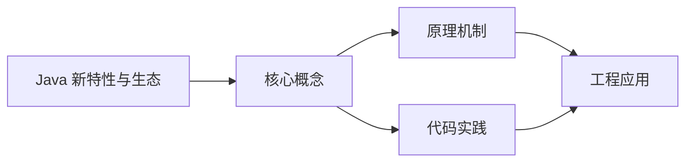
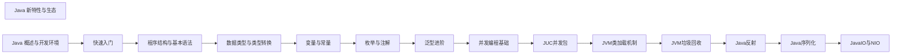

## 1. 学习目标（Bloom 分类）

本节按照布鲁姆教育目标分类学组织学习路径。本文主题为《Java 新特性与生态》，属于 Java 模块，读者可以根据自身阶段选择阅读深度。

记忆层面：能够准确复述本文的核心概念、术语与基本语法或操作步骤，并能够在提问或检索时快速定位对应知识点。能够说出 Java 的编译执行模型（javac 到字节码，JVM 解释与 JIT）。

理解层面：能够用自己的语言解释核心原理与工作机制，说明概念之间的因果关系，而不是机械记忆结论。能够解释面向对象三大特性与 JVM 内存区域的职责。

应用层面：能够在真实项目或练习场景中运用本文知识解决具体问题，写出正确且可维护的实现。能够编写类、接口、集合操作与异常处理的完整程序。

分析层面：能够拆解复杂问题，比较本文主题与相邻概念的异同，识别边界条件与例外情况。能够分析 Java 与 C++、Go 在内存管理与并发模型上的差异。

评价层面：能够根据约束条件（性能、可读性、安全、成本）评价不同方案的优劣，做出有依据的技术决策。能够评价不同集合、并发工具与框架的适用场景。

创造层面：能够把本文知识与其他模块知识组合，设计出新的解决方案或可复用的工程模式。能够组合 Spring 生态设计企业级应用。

通过本节学习，读者应当能够把《Java 新特性与生态》纳入自己的知识网络，并与 Java 模块的其他主题（JVM、集合框架、并发、Spring 生态）建立关联。

## 2. 历史动机与发展脉络

《Java 新特性与生态》是 Java 领域的重要主题。要真正理解它，需要先了解它解决的问题与演进过程。

Java 由 James Gosling 领导的 Sun 团队于 1995 年发布，口号“一次编写，到处运行”依托 JVM 字节码实现跨平台。2006 年 Sun 将 Java 开源（OpenJDK），2010 年 Oracle 收购 Sun 后 Java 进入新的治理阶段。
Java 的版本节奏在 2017 年后改为每半年一个特性版本、每两年一个 LTS（长期支持）版本。当前主流 LTS 包括 Java 11、17、21 与 25；Java 21 引入虚拟线程（Project Loom 成果），显著降低高并发服务的线程成本。
Java 生态以 Spring 家族为核心：Spring Boot 简化配置与部署，Spring Cloud 提供微服务组件；构建工具从 Maven 演进到 Gradle；JVM 语言（Kotlin、Scala、Groovy）与 Java 共存互操作。
Android 开发早期使用 Java，2019 年后官方转向 Kotlin-first，但 Java 仍是服务端领域（尤其是金融、电商等企业系统）的中坚力量。

回到本文主题：Java 新特性与生态 的提出与成熟，正是上述技术背景下的必然产物。早期实现往往以简单可用为目标，随着工程规模扩大，社区逐渐沉淀出标准做法与最佳实践；理解这一脉络，可以帮助读者判断“为什么文档中的推荐写法是现在这个样子”，也能在遇到历史遗留代码时准确识别其设计年代与取舍。

理解 Java 版本与 LTS 机制，是工程选型的起点：生产环境优先 LTS，新特性（如虚拟线程）可以在受控场景评估后引入。

## 3. 形式化定义与核心概念精讲

本节把《Java 新特性与生态》涉及的核心概念以“定义 + 讲解”的形式展开。读者应把定义当作工具，把讲解当作理解路径；两者结合才能形成可迁移的知识。

JVM 与字节码：`javac` 把 .java 编译为 .class 字节码，JVM 加载、校验并执行；热点代码由 JIT（如 C2）编译为机器码，解释与编译结合实现启动速度与峰值性能的平衡。
面向对象：封装（访问控制）、继承（extends/implements）与多态（重载/重写）是 Java 的类型系统支柱；接口默认方法（Java 8）与密封类（Java 17）持续演进表达能力。
异常体系：受检异常（checked）编译期强制处理，非受检异常（RuntimeException）运行时抛出；try-with-resources 自动关闭资源。
泛型与擦除：Java 泛型在编译期检查后擦除类型参数，运行时无泛型信息；这解释了 `List<String>` 与 `List<Integer>` 的 Class 相同，以及通配符 `? extends` 的逆变协变规则。

### 3.1 原文章节逐一精讲

原文档把主题拆分为 7 个小节，下面按顺序给出每一节的导读讲解，随后保留原文细节供精读。

#### 原文精读（完整保留）


#### 1. Java 21-24 新特性概览

Java 自从切换到六个月发布周期后，每个 LTS 版本都带来了重要的语言和运行时改进。Java 21 是最新的 LTS 版本，Java 22 和 23 持续引入预览特性，Java 24 进一步巩固了这些改进。

| 版本    | 发布时间 | LTS | 关键特性                                                      |
| :------ | :------- | :-- | :------------------------------------------------------------ |
| Java 21 | 2023-09  | 是  | Virtual Threads、Record Patterns、Pattern Matching for switch |
| Java 22 | 2024-03  | 否  | Unnamed Variables & Patterns、Stream Gatherers(预览)          |
| Java 23 | 2024-09  | 否  | Primitive Types in Patterns(预览)、Module Import Declarations |
| Java 24 | 2025-03  | 否  | Stream Gatherers(正式)、Compact Object Headers                |

##### 1.1 Virtual Threads（虚拟线程）

虚拟线程是 Project Loom 的核心成果，在 Java 21 中正式发布。它是一种轻量级线程，由 JVM 而非操作系统管理，使得创建百万级线程成为可能。

```java
// 传统平台线程 —— 每个线程占用约 1MB 栈空间
try (var executor = Executors.newFixedThreadPool(200)) {
    IntStream.range(0, 10_000).forEach(i -> {
        executor.submit(() -> {
            Thread.sleep(Duration.ofSeconds(1));
            return i;
        });
    });
} // 200 个线程处理 10000 个任务，需要排队

// 虚拟线程 —— 几乎无限制的并发
try (var executor = Executors.newVirtualThreadPerTaskExecutor()) {
    IntStream.range(0, 1_000_000).forEach(i -> {
        executor.submit(() -> {
            Thread.sleep(Duration.ofSeconds(1));
            return i;
        });
    });
} // 百万级虚拟线程同时运行
```

**关键注意事项：**

- 避免在虚拟线程中使用 `synchronized`，应改用 `ReentrantLock`（即"固定"问题）
- 虚拟线程适用于 I/O 密集型任务，不适用于 CPU 密集型计算
- 使用 `Thread.ofVirtual().name("my-vthread").start(runnable)` 自定义虚拟线程

```java
// 使用 ReentrantLock 替代 synchronized
private final ReentrantLock lock = new ReentrantLock();

public void safeMethod() {
    lock.lock();
    try {
        // 临界区逻辑
    } finally {
        lock.unlock();
    }
}
```

##### 1.2 Record Patterns（记录模式）

Record Patterns 在 Java 21 正式发布，允许在 `instanceof` 和 `switch` 中解构记录类：

```java
record Point(int x, int y) {}
record Rectangle(Point upperLeft, Point lowerRight) {}

// instanceof 解构
if (obj instanceof Point(int x, int y)) {
    System.out.println("x = " + x + ", y = " + y);
}

// 嵌套解构
if (obj instanceof Rectangle(Point(int x1, int y1), Point(int x2, int y2))) {
    System.out.printf("矩形: (%d,%d) -> (%d,%d)%n", x1, y1, x2, y2);
}

// switch 中使用 Record Patterns
static String describeShape(Object shape) {
    return switch (shape) {
        case Point(int x, int y) when x == y -> "对角线上的点";
        case Point(int x, int y) -> "普通点 (%d, %d)".formatted(x, y);
        case Rectangle(Point ul, Point lr) -> "矩形";
        default -> "未知形状";
    };
}
```

##### 1.3 Pattern Matching for switch

Java 21 正式发布了 switch 的模式匹配，结合 Record Patterns 和 Guarded Patterns 提供了强大的模式匹配能力：

```java
static String formatObject(Object obj) {
    return switch (obj) {
        case Integer i when i > 0  -> "正整数: %d".formatted(i);
        case Integer i             -> "非正整数: %d".formatted(i);
        case String s              -> "字符串(长度%d): %s".formatted(s.length(), s);
        case int[] arr             -> "int数组(长度%d)".formatted(arr.length);
        case null                  -> "null 值";
        default                    -> "其他类型: " + obj.getClass().getSimpleName();
    };
}
```

##### 1.4 Sequenced Collections

Java 21 引入了 `SequencedCollection`、`SequencedSet` 和 `SequencedMap` 接口，统一了有序集合的访问方式：

```java
// 之前：不同集合获取首尾元素的方式不同
list.get(0);                // List
list.get(list.size() - 1);
deque.getFirst();           // Deque
deque.getLast();
sortedSet.first();          // SortedSet
sortedSet.last();

// 现在：统一接口
sequencedCollection.getFirst();
sequencedCollection.getLast();
sequencedCollection.reversed(); // 返回逆序视图

// SequencedMap
sequencedMap.firstEntry();
sequencedMap.lastEntry();
sequencedMap.reversed();
sequencedMap.sequencedEntrySet();
sequencedMap.sequencedValues();
```

##### 1.5 String Templates（预览）

Java 21 引入了字符串模板的预览特性（注意：在后续版本中仍在演进）：

```java
// 使用 STR 模板处理器
String message = STR."欢迎 \{name}，你的余额为 \{balance} 元";

// 自定义模板处理器
var JSON = StringTemplate.RAW;
StringTemplate template = JSON."""
    {
        "name": "\{name}",
        "age": \{age}
    }
    """;
```

##### 1.6 Unnamed Patterns & Variables

Java 22 正式引入了未命名模式和变量：

```java
// 未命名变量 —— 不需要的返回值
try {
    int result = riskyOperation();
} catch (Exception _) {  // 不需要异常对象
    log.error("操作失败");
}

// 未命名模式 —— 忽略 Record 中的某些组件
if (obj instanceof Point(int x, _)) {
    System.out.println("x = " + x); // 只关心 x
}

// switch 中的未命名模式
switch (shape) {
    case Rectangle(Point(int x, _), _) -> "矩形宽度: " + x;
    case Circle(_) -> "圆形";
}
```

#### 2. Java 模块系统（JPMS）

Java 9 引入的模块系统（Project Jigsaw）在 Java 21+ 中已成为成熟特性。模块系统通过 `module-info.java` 显式声明依赖和导出，解决了 classpath 的脆弱性问题。

##### 2.1 模块定义

```java
// src/com.example.app/module-info.java
module com.example.app {
    requires com.example.service;      // 声明依赖
    requires transitive com.example.util; // 传递依赖
    exports com.example.app.api;       // 导出包
    exports com.example.app.spi to com.example.impl; // 限定导出
    opens com.example.app.model to com.fasterxml.jackson.databind; // 反射访问
    uses com.example.service.Processor; // 声明服务消费
    provides com.example.service.Processor  // 声明服务提供
        with com.example.app.DefaultProcessor;
}
```

##### 2.2 模块路径 vs 类路径

| 特性     | Classpath              | Module Path             |
| :------- | :--------------------- | :---------------------- |
| 可靠性   | 脆弱，容易冲突         | 可靠，显式声明依赖      |
| 封装性   | 所有 public 类都可访问 | 只有 exports 的包可访问 |
| 启动速度 | 较慢，需扫描所有 JAR   | 较快，按需加载模块      |
| 反射访问 | 无限制                 | 需要 opens 声明         |

##### 2.3 实际迁移策略

```bash
# 使用 jdeps 分析依赖
jdeps --module-path mods -s myapp.jar

# 使用 jlink 创建自定义运行时
jlink --module-path mods \
      --add-modules com.example.app \
      --output custom-runtime \
      --strip-debug \
      --compress zip-6 \
      --no-header-files \
      --no-man-pages
```

#### 3. Spring Boot 3.x 核心

Spring Boot 3.x 基于 Spring Framework 6，要求 Java 17+，全面拥抱 Jakarta EE 10 规范。

##### 3.1 自动配置原理

Spring Boot 的自动配置基于 `@Conditional` 系列注解和 `META-INF/spring/org.springframework.boot.autoconfigure.AutoConfiguration.imports` 文件：

```java
// 自定义自动配置类
@AutoConfiguration
@ConditionalOnClass(DataSource.class)
@ConditionalOnMissingBean(DataSource.class)
@EnableConfigurationProperties(DataSourceProperties.class)
public class DataSourceAutoConfiguration {

    @Bean
    @ConfigurationProperties(prefix = "spring.datasource")
    public DataSource dataSource(DataSourceProperties props) {
        return DataSourceBuilder.create()
            .url(props.getUrl())
            .username(props.getUsername())
            .password(props.getPassword())
            .build();
    }
}
```

```properties
# META-INF/spring/org.springframework.boot.autoconfigure.AutoConfiguration.imports
com.example.config.DataSourceAutoConfiguration
```

##### 3.2 Spring Boot Actuator

Actuator 提供生产级别的监控和管理端点：

```yaml
# application.yml
management:
  endpoints:
    web:
      exposure:
        include: health,info,metrics,prometheus,env,beans
  endpoint:
    health:
      show-details: when-authorized
  metrics:
    export:
      prometheus:
        enabled: true
  info:
    env:
      enabled: true
    java:
      enabled: true
    os:
      enabled: true
```

```java
// 自定义 Health Indicator
@Component
public class DatabaseHealthIndicator extends AbstractHealthIndicator {

    private final DataSource dataSource;

    public DatabaseHealthIndicator(DataSource dataSource) {
        this.dataSource = dataSource;
    }

    @Override
    protected void doHealthCheck(Health.Builder builder) throws Exception {
        try (Connection conn = dataSource.getConnection()) {
            if (conn.isValid(1)) {
                builder.up().withDetail("database", "PostgreSQL")
                        .withDetail("validationQuery", "isValid()");
            }
        }
    }
}
```

##### 3.3 Spring Security 6.x

Spring Security 6 全面采用组件化配置，废弃了 `WebSecurityConfigurerAdapter`：

```java
@Configuration
@EnableWebSecurity
public class SecurityConfig {

    @Bean
    public SecurityFilterChain filterChain(HttpSecurity http) throws Exception {
        http
            .authorizeHttpRequests(auth -> auth
                .requestMatchers("/api/public/**").permitAll()
                .requestMatchers("/api/admin/**").hasRole("ADMIN")
                .anyRequest().authenticated()
            )
            .oauth2ResourceServer(oauth2 -> oauth2
                .jwt(jwt -> jwt
                    .jwtAuthenticationConverter(jwtAuthenticationConverter())
                )
            )
            .sessionManagement(session -> session
                .sessionCreationPolicy(SessionCreationPolicy.STATELESS)
            );
        return http.build();
    }

    @Bean
    public JwtAuthenticationConverter jwtAuthenticationConverter() {
        JwtAuthenticationConverter converter = new JwtAuthenticationConverter();
        converter.setJwtGrantedAuthoritiesConverter(jwt -> {
            List<String> roles = jwt.getClaimAsStringList("roles");
            return roles.stream()
                .map(role -> new SimpleGrantedAuthority("ROLE_" + role))
                .collect(Collectors.toList());
        });
        return converter;
    }
}
```

#### 4. 构建工具

##### 4.1 Gradle 现代 Java 项目

Gradle 使用 Kotlin DSL 已成为主流选择：

```kotlin
// build.gradle.kts
plugins {
    java
    id("org.springframework.boot") version "3.3.0"
    id("io.spring.dependency-management") version "1.1.5"
}

group = "com.example"
version = "1.0.0"

java {
    toolchain {
        languageVersion = JavaLanguageVersion.of(21)
    }
}

dependencies {
    implementation("org.springframework.boot:spring-boot-starter-web")
    implementation("org.springframework.boot:spring-boot-starter-data-jpa")
    testImplementation("org.springframework.boot:spring-boot-starter-test")
}

tasks.test {
    useJUnitPlatform()
    jvmArgs = listOf("--enable-preview")  // 启用预览特性
}

// GraalVM 原生镜像插件
plugins {
    id("org.graalvm.buildtools.native") version "0.10.2"
}
```

##### 4.2 Maven Central 发布

发布到 Maven Central 需要 Sonatype 账号和 GPG 签名：

```kotlin
// build.gradle.kts — 发布配置
publishing {
    publications {
        create<MavenPublication>("mavenJava") {
            from(components["java"])
            pom {
                name.set("My Library")
                description.set("A useful library")
                url.set("https://github.com/example/my-lib")
                licenses {
                    license {
                        name.set("Apache-2.0")
                        url.set("https://opensource.org/licenses/Apache-2.0")
                    }
                }
                developers {
                    developer {
                        id.set("fanquanpp")
                        name.set("Fan Quan")
                    }
                }
                scm {
                    url.set("https://github.com/example/my-lib")
                }
            }
        }
    }
}

signing {
    sign(publishing.publications["mavenJava"])
}
```

#### 5. JPackage 打包

`jpackage` 工具可以将 Java 应用打包为平台原生安装包：

```bash
# 打包为 Windows 安装程序
jpackage \
  --name MyApp \
  --input target/libs \
  --main-jar myapp.jar \
  --main-class com.example.Main \
  --type msi \
  --app-version 1.0.0 \
  --vendor "Example Corp" \
  --win-dir-chooser \
  --win-menu \
  --win-shortcut \
  --java-options "--enable-preview"

# 打包为 macOS dmg
jpackage \
  --name MyApp \
  --input target/libs \
  --main-jar myapp.jar \
  --main-class com.example.Main \
  --type dmg \
  --app-version 1.0.0 \
  --vendor "Example Corp" \
  --mac-package-identifier com.example.myapp

# 打包为 Linux deb
jpackage \
  --name myapp \
  --input target/libs \
  --main-jar myapp.jar \
  --main-class com.example.Main \
  --type deb \
  --app-version 1.0.0 \
  --vendor "Example Corp"
```

结合 jlink 可以创建不含完整 JRE 的轻量安装包：

```bash
# 先用 jlink 创建自定义运行时
jlink --module-path target/modules \
      --add-modules com.example.app \
      --output target/custom-jre \
      --strip-debug --compress zip-6 \
      --no-header-files --no-man-pages

# 再用 jpackage 基于自定义运行时打包
jpackage \
  --name MyApp \
  --runtime-image target/custom-jre \
  --input target/libs \
  --main-jar myapp.jar \
  --main-class com.example.Main \
  --type app-image
```

#### 6. GraalVM 原生镜像

GraalVM 的 Native Image 技术可以将 Java 应用编译为独立的原生可执行文件，显著提升启动速度和降低内存占用。

##### 6.1 基本使用

```bash
# 安装 GraalVM
sdk install java 21-graal
sdk use java 21-graal

# 安装 native-image
gu install native-image

# 编译原生镜像
native-image -jar myapp.jar myapp

# 带优化的编译
native-image \
  --initialize-at-build-time \
  --no-fallback \
  -H:+ReportExceptionStackTraces \
  -H:Name=myapp \
  -jar myapp.jar
```

##### 6.2 Spring Boot 原生镜像

Spring Boot 3.x 对 GraalVM 原生镜像提供了一等支持：

```bash
# 使用 Spring Boot Maven 插件
mvn -Pnative native:compile

# 使用 Spring Boot Gradle 插件
gradle nativeCompile

# 使用 buildpacks（无需本地安装 GraalVM）
mvn -Pnative spring-boot:build-image
```

```java
// Runtime Hints —— 为反射、代理等提供元数据
@Configuration
@ImportRuntimeHints(MyHints.class)
public class NativeConfig {}

class MyHints implements RuntimeHintsRegistrar {
    @Override
    public void registerHints(RuntimeHints hints, ClassLoader classLoader) {
        hints.reflection()
            .registerType(MyModel.class, MemberCategory.INVOKE_PUBLIC_METHODS)
            .registerType(MyModel.class, MemberCategory.DECLARED_FIELDS);

        hints.resources()
            .registerPattern("com/example/templates/*");

        hints.serialization()
            .registerType(MySerializable.class);

        hints.proxies()
            .registerJdkProxy(MyInterface.class);
    }
}
```

##### 6.3 性能对比

| 指标         | 传统 JVM           | GraalVM Native Image |
| :----------- | :----------------- | :------------------- |
| 启动时间     | 1-3 秒             | 10-50 毫秒           |
| 首次请求延迟 | 较高（JIT 预热）   | 立即响应             |
| 内存占用     | 200-500 MB         | 30-80 MB             |
| 峰值吞吐量   | 更高（JIT 优化后） | 较低（AOT 限制）     |
| 生态兼容性   | 完全兼容           | 部分反射需配置       |

**适用场景：** 容器化微服务、Serverless 函数、CLI 工具、需要快速启动的云原生应用。

**不适用场景：** 长时间运行的重计算服务（JIT 的峰值性能更优）、重度依赖反射和动态代理的遗留应用。

#### 7. 小结

Java 21+ 的新特性正在从根本上改变 Java 的编程范式：

- **Virtual Threads** 让 Java 回归"一请求一线程"的简单模型
- **Pattern Matching** 让条件逻辑更加声明式和安全
- **Record Classes + Sealed Classes** 构建了代数数据类型的基础
- **JPMS** 提供了强封装和可靠的依赖管理
- **GraalVM Native Image** 让 Java 在云原生场景中更具竞争力
- **Spring Boot 3.x** 全面拥抱现代 Java 特性，提供一流的开发体验

这些特性组合在一起，使得 Java 在保持向后兼容的同时，不断进化以适应现代软件开发的需求。


### 3.2 概念关系图

下面用 Mermaid 图表达本文核心概念之间的关系，帮助读者建立整体图景：



图中展示的是本文知识的结构化关系：核心概念是入口，原理机制解释“为什么”，代码实践演示“怎么做”，工程应用回答“何时用”。读者学习时可以把每个小节的内容挂接到对应节点上。

## 4. 理论推导与原理解析

本节深入《Java 新特性与生态》背后的原理。理论部分不求面面俱到，而是聚焦“能解释现象、能指导实践”的关键推导。

JVM 内存模型：堆（新生代/老年代）、元空间、虚拟机栈、本地方法栈与程序计数器；GC 从 CMS 演进到 G1（默认）、ZGC（超低延迟），理解分代收集是调优前提。
并发工具：synchronized 与 JUC（java.util.concurrent）的锁、并发容器、线程池、CompletableFuture 构成并发工具箱；Java 21 的虚拟线程让“每任务一线程”成为可能。
类加载机制：双亲委派模型保证类唯一性，SPI（ServiceLoader）打破委派实现扩展；自定义类加载器是热部署与隔离的基础。
反射与注解：反射在运行时检查类结构，注解提供元数据；Spring 的依赖注入与 AOP 均基于这些机制，但反射有性能与安全成本。

需要强调的是，理论推导与工程实践之间存在翻译层：理论给出的是理想化模型与边界条件，工程代码则必须处理真实环境中的例外。读者在学习时应先掌握理论的“标准情形”，再通过陷阱章节了解“非标准情形”。

## 5. 代码示例与逐行讲解

本节把原文中的代码示例系统整理，并为每个示例补充用途说明与讲解。读者不应只浏览代码，而应逐段对照讲解理解设计意图。

### 5.1 示例：1.1 Virtual Threads（虚拟线程）

该示例来自原文《1.1 Virtual Threads（虚拟线程）》小节，用于演示Java 新特性与生态相关操作。阅读时请先看代码结构，再看其后的讲解。

```java
// 传统平台线程 —— 每个线程占用约 1MB 栈空间
try (var executor = Executors.newFixedThreadPool(200)) {
    IntStream.range(0, 10_000).forEach(i -> {
        executor.submit(() -> {
            Thread.sleep(Duration.ofSeconds(1));
            return i;
        });
    });
} // 200 个线程处理 10000 个任务，需要排队

// 虚拟线程 —— 几乎无限制的并发
try (var executor = Executors.newVirtualThreadPerTaskExecutor()) {
    IntStream.range(0, 1_000_000).forEach(i -> {
        executor.submit(() -> {
            Thread.sleep(Duration.ofSeconds(1));
            return i;
        });
    });
} // 百万级虚拟线程同时运行
```

讲解：这段代码演示了本节核心知识点。代码中的关键操作可以归纳为三步：准备（定义或初始化）、执行（核心逻辑）、收尾（释放资源或返回结果）。实际项目中，这三步往往被封装为函数或类，以提升复用性与可测试性。

关键点分析：

该示例共 18 行有效代码，包含 1 类关键结构（return）。其中：

- 入口与初始化部分负责建立上下文，对应实际项目中的启动或装配逻辑；
- 核心逻辑部分体现本文主题的主要操作，是阅读时最需要对照讲解理解的部分；
- 输出或返回部分把结果交给调用方，注意其类型与边界条件。

进阶思考路径：先尝试修改参数观察行为变化，再把示例中的模式迁移到自己的项目中；每次修改都记录预期与实测差异，这是把示例转化为能力的最快方式。

### 5.2 示例：1.1 Virtual Threads（虚拟线程）

该示例来自原文《1.1 Virtual Threads（虚拟线程）》小节，用于演示Java 新特性与生态相关操作。阅读时请先看代码结构，再看其后的讲解。

```java
// 使用 ReentrantLock 替代 synchronized
private final ReentrantLock lock = new ReentrantLock();

public void safeMethod() {
    lock.lock();
    try {
        // 临界区逻辑
    } finally {
        lock.unlock();
    }
}
```

讲解：这段代码演示了本节核心知识点。代码中的关键操作可以归纳为三步：准备（定义或初始化）、执行（核心逻辑）、收尾（释放资源或返回结果）。实际项目中，这三步往往被封装为函数或类，以提升复用性与可测试性。

关键点分析：

该示例共 10 行有效代码，结构以数据或配置为主。阅读时应关注：数据字段的含义、配置项的作用，以及它们与运行行为的对应关系。

进阶思考路径：先尝试修改参数观察行为变化，再把示例中的模式迁移到自己的项目中；每次修改都记录预期与实测差异，这是把示例转化为能力的最快方式。

### 5.3 示例：1.2 Record Patterns（记录模式）

该示例来自原文《1.2 Record Patterns（记录模式）》小节，用于演示Java 新特性与生态相关操作。阅读时请先看代码结构，再看其后的讲解。

```java
record Point(int x, int y) {}
record Rectangle(Point upperLeft, Point lowerRight) {}

// instanceof 解构
if (obj instanceof Point(int x, int y)) {
    System.out.println("x = " + x + ", y = " + y);
}

// 嵌套解构
if (obj instanceof Rectangle(Point(int x1, int y1), Point(int x2, int y2))) {
    System.out.printf("矩形: (%d,%d) -> (%d,%d)%n", x1, y1, x2, y2);
}

// switch 中使用 Record Patterns
static String describeShape(Object shape) {
    return switch (shape) {
        case Point(int x, int y) when x == y -> "对角线上的点";
        case Point(int x, int y) -> "普通点 (%d, %d)".formatted(x, y);
        case Rectangle(Point ul, Point lr) -> "矩形";
        default -> "未知形状";
    };
}
```

讲解：这段代码演示了本节核心知识点。代码中的关键操作可以归纳为三步：准备（定义或初始化）、执行（核心逻辑）、收尾（释放资源或返回结果）。实际项目中，这三步往往被封装为函数或类，以提升复用性与可测试性。

关键点分析：

该示例共 19 行有效代码，包含 2 类关键结构（if、return）。其中：

- 入口与初始化部分负责建立上下文，对应实际项目中的启动或装配逻辑；
- 核心逻辑部分体现本文主题的主要操作，是阅读时最需要对照讲解理解的部分；
- 输出或返回部分把结果交给调用方，注意其类型与边界条件。

进阶思考路径：先尝试修改参数观察行为变化，再把示例中的模式迁移到自己的项目中；每次修改都记录预期与实测差异，这是把示例转化为能力的最快方式。

### 5.4 示例：1.3 Pattern Matching for switch

该示例来自原文《1.3 Pattern Matching for switch》小节，用于演示Java 新特性与生态相关操作。阅读时请先看代码结构，再看其后的讲解。

```java
static String formatObject(Object obj) {
    return switch (obj) {
        case Integer i when i > 0  -> "正整数: %d".formatted(i);
        case Integer i             -> "非正整数: %d".formatted(i);
        case String s              -> "字符串(长度%d): %s".formatted(s.length(), s);
        case int[] arr             -> "int数组(长度%d)".formatted(arr.length);
        case null                  -> "null 值";
        default                    -> "其他类型: " + obj.getClass().getSimpleName();
    };
}
```

讲解：这段代码演示了本节核心知识点。代码中的关键操作可以归纳为三步：准备（定义或初始化）、执行（核心逻辑）、收尾（释放资源或返回结果）。实际项目中，这三步往往被封装为函数或类，以提升复用性与可测试性。

关键点分析：

该示例共 10 行有效代码，包含 1 类关键结构（return）。其中：

- 入口与初始化部分负责建立上下文，对应实际项目中的启动或装配逻辑；
- 核心逻辑部分体现本文主题的主要操作，是阅读时最需要对照讲解理解的部分；
- 输出或返回部分把结果交给调用方，注意其类型与边界条件。

进阶思考路径：先尝试修改参数观察行为变化，再把示例中的模式迁移到自己的项目中；每次修改都记录预期与实测差异，这是把示例转化为能力的最快方式。

### 5.5 示例：1.4 Sequenced Collections

该示例来自原文《1.4 Sequenced Collections》小节，用于演示Java 新特性与生态相关操作。阅读时请先看代码结构，再看其后的讲解。

```java
// 之前：不同集合获取首尾元素的方式不同
list.get(0);                // List
list.get(list.size() - 1);
deque.getFirst();           // Deque
deque.getLast();
sortedSet.first();          // SortedSet
sortedSet.last();

// 现在：统一接口
sequencedCollection.getFirst();
sequencedCollection.getLast();
sequencedCollection.reversed(); // 返回逆序视图

// SequencedMap
sequencedMap.firstEntry();
sequencedMap.lastEntry();
sequencedMap.reversed();
sequencedMap.sequencedEntrySet();
sequencedMap.sequencedValues();
```

讲解：这段代码演示了本节核心知识点。代码中的关键操作可以归纳为三步：准备（定义或初始化）、执行（核心逻辑）、收尾（释放资源或返回结果）。实际项目中，这三步往往被封装为函数或类，以提升复用性与可测试性。

关键点分析：

该示例共 17 行有效代码，结构以数据或配置为主。阅读时应关注：数据字段的含义、配置项的作用，以及它们与运行行为的对应关系。

进阶思考路径：先尝试修改参数观察行为变化，再把示例中的模式迁移到自己的项目中；每次修改都记录预期与实测差异，这是把示例转化为能力的最快方式。

### 5.6 示例：1.5 String Templates（预览）

该示例来自原文《1.5 String Templates（预览）》小节，用于演示Java 新特性与生态相关操作。阅读时请先看代码结构，再看其后的讲解。

```java
// 使用 STR 模板处理器
String message = STR."欢迎 \{name}，你的余额为 \{balance} 元";

// 自定义模板处理器
var JSON = StringTemplate.RAW;
StringTemplate template = JSON."""
    {
        "name": "\{name}",
        "age": \{age}
    }
    """;
```

讲解：这段代码演示了本节核心知识点。代码中的关键操作可以归纳为三步：准备（定义或初始化）、执行（核心逻辑）、收尾（释放资源或返回结果）。实际项目中，这三步往往被封装为函数或类，以提升复用性与可测试性。

关键点分析：

该示例共 10 行有效代码，结构以数据或配置为主。阅读时应关注：数据字段的含义、配置项的作用，以及它们与运行行为的对应关系。

进阶思考路径：先尝试修改参数观察行为变化，再把示例中的模式迁移到自己的项目中；每次修改都记录预期与实测差异，这是把示例转化为能力的最快方式。

### 5.7 示例：1.6 Unnamed Patterns & Variables

该示例来自原文《1.6 Unnamed Patterns & Variables》小节，用于演示Java 新特性与生态相关操作。阅读时请先看代码结构，再看其后的讲解。

```java
// 未命名变量 —— 不需要的返回值
try {
    int result = riskyOperation();
} catch (Exception _) {  // 不需要异常对象
    log.error("操作失败");
}

// 未命名模式 —— 忽略 Record 中的某些组件
if (obj instanceof Point(int x, _)) {
    System.out.println("x = " + x); // 只关心 x
}

// switch 中的未命名模式
switch (shape) {
    case Rectangle(Point(int x, _), _) -> "矩形宽度: " + x;
    case Circle(_) -> "圆形";
}
```

讲解：这段代码演示了本节核心知识点。代码中的关键操作可以归纳为三步：准备（定义或初始化）、执行（核心逻辑）、收尾（释放资源或返回结果）。实际项目中，这三步往往被封装为函数或类，以提升复用性与可测试性。

关键点分析：

该示例共 15 行有效代码，包含 1 类关键结构（if）。其中：

- 入口与初始化部分负责建立上下文，对应实际项目中的启动或装配逻辑；
- 核心逻辑部分体现本文主题的主要操作，是阅读时最需要对照讲解理解的部分；
- 输出或返回部分把结果交给调用方，注意其类型与边界条件。

进阶思考路径：先尝试修改参数观察行为变化，再把示例中的模式迁移到自己的项目中；每次修改都记录预期与实测差异，这是把示例转化为能力的最快方式。

### 5.8 示例：2.1 模块定义

该示例来自原文《2.1 模块定义》小节，用于演示Java 新特性与生态相关操作。阅读时请先看代码结构，再看其后的讲解。

```java
// src/com.example.app/module-info.java
module com.example.app {
    requires com.example.service;      // 声明依赖
    requires transitive com.example.util; // 传递依赖
    exports com.example.app.api;       // 导出包
    exports com.example.app.spi to com.example.impl; // 限定导出
    opens com.example.app.model to com.fasterxml.jackson.databind; // 反射访问
    uses com.example.service.Processor; // 声明服务消费
    provides com.example.service.Processor  // 声明服务提供
        with com.example.app.DefaultProcessor;
}
```

讲解：这段代码演示了本节核心知识点。代码中的关键操作可以归纳为三步：准备（定义或初始化）、执行（核心逻辑）、收尾（释放资源或返回结果）。实际项目中，这三步往往被封装为函数或类，以提升复用性与可测试性。

关键点分析：

该示例共 11 行有效代码，结构以数据或配置为主。阅读时应关注：数据字段的含义、配置项的作用，以及它们与运行行为的对应关系。

进阶思考路径：先尝试修改参数观察行为变化，再把示例中的模式迁移到自己的项目中；每次修改都记录预期与实测差异，这是把示例转化为能力的最快方式。

### 5.9 示例：2.3 实际迁移策略

该示例来自原文《2.3 实际迁移策略》小节，用于演示Java 新特性与生态相关操作。阅读时请先看代码结构，再看其后的讲解。

```bash
# 使用 jdeps 分析依赖
jdeps --module-path mods -s myapp.jar

# 使用 jlink 创建自定义运行时
jlink --module-path mods \
      --add-modules com.example.app \
      --output custom-runtime \
      --strip-debug \
      --compress zip-6 \
      --no-header-files \
      --no-man-pages
```

讲解：这段代码演示了本节核心知识点。代码中的关键操作可以归纳为三步：准备（定义或初始化）、执行（核心逻辑）、收尾（释放资源或返回结果）。实际项目中，这三步往往被封装为函数或类，以提升复用性与可测试性。

关键点分析：

该示例共 10 行有效代码，结构以数据或配置为主。阅读时应关注：数据字段的含义、配置项的作用，以及它们与运行行为的对应关系。

进阶思考路径：先尝试修改参数观察行为变化，再把示例中的模式迁移到自己的项目中；每次修改都记录预期与实测差异，这是把示例转化为能力的最快方式。

### 5.10 示例：3.1 自动配置原理

该示例来自原文《3.1 自动配置原理》小节，用于演示Java 新特性与生态相关操作。阅读时请先看代码结构，再看其后的讲解。

```java
// 自定义自动配置类
@AutoConfiguration
@ConditionalOnClass(DataSource.class)
@ConditionalOnMissingBean(DataSource.class)
@EnableConfigurationProperties(DataSourceProperties.class)
public class DataSourceAutoConfiguration {

    @Bean
    @ConfigurationProperties(prefix = "spring.datasource")
    public DataSource dataSource(DataSourceProperties props) {
        return DataSourceBuilder.create()
            .url(props.getUrl())
            .username(props.getUsername())
            .password(props.getPassword())
            .build();
    }
}
```

讲解：这段代码演示了本节核心知识点。代码中的关键操作可以归纳为三步：准备（定义或初始化）、执行（核心逻辑）、收尾（释放资源或返回结果）。实际项目中，这三步往往被封装为函数或类，以提升复用性与可测试性。

关键点分析：

该示例共 16 行有效代码，包含 2 类关键结构（class、return）。其中：

- 入口与初始化部分负责建立上下文，对应实际项目中的启动或装配逻辑；
- 核心逻辑部分体现本文主题的主要操作，是阅读时最需要对照讲解理解的部分；
- 输出或返回部分把结果交给调用方，注意其类型与边界条件。

进阶思考路径：先尝试修改参数观察行为变化，再把示例中的模式迁移到自己的项目中；每次修改都记录预期与实测差异，这是把示例转化为能力的最快方式。

### 5.11 示例：3.1 自动配置原理

该示例来自原文《3.1 自动配置原理》小节，用于演示Java 新特性与生态相关操作。阅读时请先看代码结构，再看其后的讲解。

```properties
# META-INF/spring/org.springframework.boot.autoconfigure.AutoConfiguration.imports
com.example.config.DataSourceAutoConfiguration
```

讲解：这段代码演示了本节核心知识点。代码中的关键操作可以归纳为三步：准备（定义或初始化）、执行（核心逻辑）、收尾（释放资源或返回结果）。实际项目中，这三步往往被封装为函数或类，以提升复用性与可测试性。

关键点分析：

该示例共 2 行有效代码，包含 1 类关键结构（import）。其中：

- 入口与初始化部分负责建立上下文，对应实际项目中的启动或装配逻辑；
- 核心逻辑部分体现本文主题的主要操作，是阅读时最需要对照讲解理解的部分；
- 输出或返回部分把结果交给调用方，注意其类型与边界条件。

进阶思考路径：先尝试修改参数观察行为变化，再把示例中的模式迁移到自己的项目中；每次修改都记录预期与实测差异，这是把示例转化为能力的最快方式。

### 5.12 示例：3.2 Spring Boot Actuator

该示例来自原文《3.2 Spring Boot Actuator》小节，用于演示Java 新特性与生态相关操作。阅读时请先看代码结构，再看其后的讲解。

```yaml
# application.yml
management:
  endpoints:
    web:
      exposure:
        include: health,info,metrics,prometheus,env,beans
  endpoint:
    health:
      show-details: when-authorized
  metrics:
    export:
      prometheus:
        enabled: true
  info:
    env:
      enabled: true
    java:
      enabled: true
    os:
      enabled: true
```

讲解：这段代码演示了本节核心知识点。代码中的关键操作可以归纳为三步：准备（定义或初始化）、执行（核心逻辑）、收尾（释放资源或返回结果）。实际项目中，这三步往往被封装为函数或类，以提升复用性与可测试性。

关键点分析：

该示例共 20 行有效代码，结构以数据或配置为主。阅读时应关注：数据字段的含义、配置项的作用，以及它们与运行行为的对应关系。

进阶思考路径：先尝试修改参数观察行为变化，再把示例中的模式迁移到自己的项目中；每次修改都记录预期与实测差异，这是把示例转化为能力的最快方式。

### 5.13 示例：3.2 Spring Boot Actuator

该示例来自原文《3.2 Spring Boot Actuator》小节，用于演示Java 新特性与生态相关操作。阅读时请先看代码结构，再看其后的讲解。

```java
// 自定义 Health Indicator
@Component
public class DatabaseHealthIndicator extends AbstractHealthIndicator {

    private final DataSource dataSource;

    public DatabaseHealthIndicator(DataSource dataSource) {
        this.dataSource = dataSource;
    }

    @Override
    protected void doHealthCheck(Health.Builder builder) throws Exception {
        try (Connection conn = dataSource.getConnection()) {
            if (conn.isValid(1)) {
                builder.up().withDetail("database", "PostgreSQL")
                        .withDetail("validationQuery", "isValid()");
            }
        }
    }
}
```

讲解：这段代码演示了本节核心知识点。代码中的关键操作可以归纳为三步：准备（定义或初始化）、执行（核心逻辑）、收尾（释放资源或返回结果）。实际项目中，这三步往往被封装为函数或类，以提升复用性与可测试性。

关键点分析：

该示例共 17 行有效代码，包含 2 类关键结构（class、if）。其中：

- 入口与初始化部分负责建立上下文，对应实际项目中的启动或装配逻辑；
- 核心逻辑部分体现本文主题的主要操作，是阅读时最需要对照讲解理解的部分；
- 输出或返回部分把结果交给调用方，注意其类型与边界条件。

进阶思考路径：先尝试修改参数观察行为变化，再把示例中的模式迁移到自己的项目中；每次修改都记录预期与实测差异，这是把示例转化为能力的最快方式。

### 5.14 示例：3.3 Spring Security 6.x

该示例来自原文《3.3 Spring Security 6.x》小节，用于演示Java 新特性与生态相关操作。阅读时请先看代码结构，再看其后的讲解。

```java
@Configuration
@EnableWebSecurity
public class SecurityConfig {

    @Bean
    public SecurityFilterChain filterChain(HttpSecurity http) throws Exception {
        http
            .authorizeHttpRequests(auth -> auth
                .requestMatchers("/api/public/**").permitAll()
                .requestMatchers("/api/admin/**").hasRole("ADMIN")
                .anyRequest().authenticated()
            )
            .oauth2ResourceServer(oauth2 -> oauth2
                .jwt(jwt -> jwt
                    .jwtAuthenticationConverter(jwtAuthenticationConverter())
                )
            )
            .sessionManagement(session -> session
                .sessionCreationPolicy(SessionCreationPolicy.STATELESS)
            );
        return http.build();
    }

    @Bean
    public JwtAuthenticationConverter jwtAuthenticationConverter() {
        JwtAuthenticationConverter converter = new JwtAuthenticationConverter();
        converter.setJwtGrantedAuthoritiesConverter(jwt -> {
            List<String> roles = jwt.getClaimAsStringList("roles");
            return roles.stream()
                .map(role -> new SimpleGrantedAuthority("ROLE_" + role))
                .collect(Collectors.toList());
        });
        return converter;
    }
}
```

讲解：这段代码演示了本节核心知识点。代码中的关键操作可以归纳为三步：准备（定义或初始化）、执行（核心逻辑）、收尾（释放资源或返回结果）。实际项目中，这三步往往被封装为函数或类，以提升复用性与可测试性。

关键点分析：

该示例共 33 行有效代码，包含 2 类关键结构（class、return）。其中：

- 入口与初始化部分负责建立上下文，对应实际项目中的启动或装配逻辑；
- 核心逻辑部分体现本文主题的主要操作，是阅读时最需要对照讲解理解的部分；
- 输出或返回部分把结果交给调用方，注意其类型与边界条件。

进阶思考路径：先尝试修改参数观察行为变化，再把示例中的模式迁移到自己的项目中；每次修改都记录预期与实测差异，这是把示例转化为能力的最快方式。

### 5.15 示例：4.1 Gradle 现代 Java 项目

该示例来自原文《4.1 Gradle 现代 Java 项目》小节，用于演示Java 新特性与生态相关操作。阅读时请先看代码结构，再看其后的讲解。

```kotlin
// build.gradle.kts
plugins {
    java
    id("org.springframework.boot") version "3.3.0"
    id("io.spring.dependency-management") version "1.1.5"
}

group = "com.example"
version = "1.0.0"

java {
    toolchain {
        languageVersion = JavaLanguageVersion.of(21)
    }
}

dependencies {
    implementation("org.springframework.boot:spring-boot-starter-web")
    implementation("org.springframework.boot:spring-boot-starter-data-jpa")
    testImplementation("org.springframework.boot:spring-boot-starter-test")
}

tasks.test {
    useJUnitPlatform()
    jvmArgs = listOf("--enable-preview")  // 启用预览特性
}

// GraalVM 原生镜像插件
plugins {
    id("org.graalvm.buildtools.native") version "0.10.2"
}
```

讲解：这段代码演示了本节核心知识点。代码中的关键操作可以归纳为三步：准备（定义或初始化）、执行（核心逻辑）、收尾（释放资源或返回结果）。实际项目中，这三步往往被封装为函数或类，以提升复用性与可测试性。

关键点分析：

该示例共 26 行有效代码，结构以数据或配置为主。阅读时应关注：数据字段的含义、配置项的作用，以及它们与运行行为的对应关系。

进阶思考路径：先尝试修改参数观察行为变化，再把示例中的模式迁移到自己的项目中；每次修改都记录预期与实测差异，这是把示例转化为能力的最快方式。

### 5.16 示例：4.2 Maven Central 发布

该示例来自原文《4.2 Maven Central 发布》小节，用于演示Java 新特性与生态相关操作。阅读时请先看代码结构，再看其后的讲解。

```kotlin
// build.gradle.kts — 发布配置
publishing {
    publications {
        create<MavenPublication>("mavenJava") {
            from(components["java"])
            pom {
                name.set("My Library")
                description.set("A useful library")
                url.set("https://github.com/example/my-lib")
                licenses {
                    license {
                        name.set("Apache-2.0")
                        url.set("https://opensource.org/licenses/Apache-2.0")
                    }
                }
                developers {
                    developer {
                        id.set("fanquanpp")
                        name.set("Fan Quan")
                    }
                }
                scm {
                    url.set("https://github.com/example/my-lib")
                }
            }
        }
    }
}

signing {
    sign(publishing.publications["mavenJava"])
}
```

讲解：这段代码演示了本节核心知识点。代码中的关键操作可以归纳为三步：准备（定义或初始化）、执行（核心逻辑）、收尾（释放资源或返回结果）。实际项目中，这三步往往被封装为函数或类，以提升复用性与可测试性。

关键点分析：

该示例共 31 行有效代码，结构以数据或配置为主。阅读时应关注：数据字段的含义、配置项的作用，以及它们与运行行为的对应关系。

进阶思考路径：先尝试修改参数观察行为变化，再把示例中的模式迁移到自己的项目中；每次修改都记录预期与实测差异，这是把示例转化为能力的最快方式。

### 5.17 示例：5. JPackage 打包

该示例来自原文《5. JPackage 打包》小节，用于演示Java 新特性与生态相关操作。阅读时请先看代码结构，再看其后的讲解。

```bash
# 打包为 Windows 安装程序
jpackage \
  --name MyApp \
  --input target/libs \
  --main-jar myapp.jar \
  --main-class com.example.Main \
  --type msi \
  --app-version 1.0.0 \
  --vendor "Example Corp" \
  --win-dir-chooser \
  --win-menu \
  --win-shortcut \
  --java-options "--enable-preview"

# 打包为 macOS dmg
jpackage \
  --name MyApp \
  --input target/libs \
  --main-jar myapp.jar \
  --main-class com.example.Main \
  --type dmg \
  --app-version 1.0.0 \
  --vendor "Example Corp" \
  --mac-package-identifier com.example.myapp

# 打包为 Linux deb
jpackage \
  --name myapp \
  --input target/libs \
  --main-jar myapp.jar \
  --main-class com.example.Main \
  --type deb \
  --app-version 1.0.0 \
  --vendor "Example Corp"
```

讲解：这段代码演示了本节核心知识点。代码中的关键操作可以归纳为三步：准备（定义或初始化）、执行（核心逻辑）、收尾（释放资源或返回结果）。实际项目中，这三步往往被封装为函数或类，以提升复用性与可测试性。

关键点分析：

该示例共 32 行有效代码，包含 1 类关键结构（class）。其中：

- 入口与初始化部分负责建立上下文，对应实际项目中的启动或装配逻辑；
- 核心逻辑部分体现本文主题的主要操作，是阅读时最需要对照讲解理解的部分；
- 输出或返回部分把结果交给调用方，注意其类型与边界条件。

进阶思考路径：先尝试修改参数观察行为变化，再把示例中的模式迁移到自己的项目中；每次修改都记录预期与实测差异，这是把示例转化为能力的最快方式。

### 5.18 示例：5. JPackage 打包

该示例来自原文《5. JPackage 打包》小节，用于演示Java 新特性与生态相关操作。阅读时请先看代码结构，再看其后的讲解。

```bash
# 先用 jlink 创建自定义运行时
jlink --module-path target/modules \
      --add-modules com.example.app \
      --output target/custom-jre \
      --strip-debug --compress zip-6 \
      --no-header-files --no-man-pages

# 再用 jpackage 基于自定义运行时打包
jpackage \
  --name MyApp \
  --runtime-image target/custom-jre \
  --input target/libs \
  --main-jar myapp.jar \
  --main-class com.example.Main \
  --type app-image
```

讲解：这段代码演示了本节核心知识点。代码中的关键操作可以归纳为三步：准备（定义或初始化）、执行（核心逻辑）、收尾（释放资源或返回结果）。实际项目中，这三步往往被封装为函数或类，以提升复用性与可测试性。

关键点分析：

该示例共 14 行有效代码，包含 1 类关键结构（class）。其中：

- 入口与初始化部分负责建立上下文，对应实际项目中的启动或装配逻辑；
- 核心逻辑部分体现本文主题的主要操作，是阅读时最需要对照讲解理解的部分；
- 输出或返回部分把结果交给调用方，注意其类型与边界条件。

进阶思考路径：先尝试修改参数观察行为变化，再把示例中的模式迁移到自己的项目中；每次修改都记录预期与实测差异，这是把示例转化为能力的最快方式。

### 5.19 示例：6.1 基本使用

该示例来自原文《6.1 基本使用》小节，用于演示Java 新特性与生态相关操作。阅读时请先看代码结构，再看其后的讲解。

```bash
# 安装 GraalVM
sdk install java 21-graal
sdk use java 21-graal

# 安装 native-image
gu install native-image

# 编译原生镜像
native-image -jar myapp.jar myapp

# 带优化的编译
native-image \
  --initialize-at-build-time \
  --no-fallback \
  -H:+ReportExceptionStackTraces \
  -H:Name=myapp \
  -jar myapp.jar
```

讲解：这段代码演示了本节核心知识点。代码中的关键操作可以归纳为三步：准备（定义或初始化）、执行（核心逻辑）、收尾（释放资源或返回结果）。实际项目中，这三步往往被封装为函数或类，以提升复用性与可测试性。

关键点分析：

该示例共 14 行有效代码，结构以数据或配置为主。阅读时应关注：数据字段的含义、配置项的作用，以及它们与运行行为的对应关系。

进阶思考路径：先尝试修改参数观察行为变化，再把示例中的模式迁移到自己的项目中；每次修改都记录预期与实测差异，这是把示例转化为能力的最快方式。

### 5.20 示例：6.2 Spring Boot 原生镜像

该示例来自原文《6.2 Spring Boot 原生镜像》小节，用于演示Java 新特性与生态相关操作。阅读时请先看代码结构，再看其后的讲解。

```bash
# 使用 Spring Boot Maven 插件
mvn -Pnative native:compile

# 使用 Spring Boot Gradle 插件
gradle nativeCompile

# 使用 buildpacks（无需本地安装 GraalVM）
mvn -Pnative spring-boot:build-image
```

讲解：这段代码演示了本节核心知识点。代码中的关键操作可以归纳为三步：准备（定义或初始化）、执行（核心逻辑）、收尾（释放资源或返回结果）。实际项目中，这三步往往被封装为函数或类，以提升复用性与可测试性。

关键点分析：

该示例共 6 行有效代码，结构以数据或配置为主。阅读时应关注：数据字段的含义、配置项的作用，以及它们与运行行为的对应关系。

进阶思考路径：先尝试修改参数观察行为变化，再把示例中的模式迁移到自己的项目中；每次修改都记录预期与实测差异，这是把示例转化为能力的最快方式。

### 5.21 示例：6.2 Spring Boot 原生镜像

该示例来自原文《6.2 Spring Boot 原生镜像》小节，用于演示Java 新特性与生态相关操作。阅读时请先看代码结构，再看其后的讲解。

```java
// Runtime Hints —— 为反射、代理等提供元数据
@Configuration
@ImportRuntimeHints(MyHints.class)
public class NativeConfig {}

class MyHints implements RuntimeHintsRegistrar {
    @Override
    public void registerHints(RuntimeHints hints, ClassLoader classLoader) {
        hints.reflection()
            .registerType(MyModel.class, MemberCategory.INVOKE_PUBLIC_METHODS)
            .registerType(MyModel.class, MemberCategory.DECLARED_FIELDS);

        hints.resources()
            .registerPattern("com/example/templates/*");

        hints.serialization()
            .registerType(MySerializable.class);

        hints.proxies()
            .registerJdkProxy(MyInterface.class);
    }
}
```

讲解：这段代码演示了本节核心知识点。代码中的关键操作可以归纳为三步：准备（定义或初始化）、执行（核心逻辑）、收尾（释放资源或返回结果）。实际项目中，这三步往往被封装为函数或类，以提升复用性与可测试性。

关键点分析：

该示例共 18 行有效代码，包含 1 类关键结构（class）。其中：

- 入口与初始化部分负责建立上下文，对应实际项目中的启动或装配逻辑；
- 核心逻辑部分体现本文主题的主要操作，是阅读时最需要对照讲解理解的部分；
- 输出或返回部分把结果交给调用方，注意其类型与边界条件。

进阶思考路径：先尝试修改参数观察行为变化，再把示例中的模式迁移到自己的项目中；每次修改都记录预期与实测差异，这是把示例转化为能力的最快方式。

```java
// 泛型工具：类型安全的取最小值
public static <T extends Comparable<T>> T minOf(T a, T b) {
    return a.compareTo(b) <= 0 ? a : b;
}
```
讲解：`<T extends Comparable<T>>` 约束 T 必须可比较，编译期保证 `compareTo` 可用；返回值类型与入参一致，避免运行时强转。

综合以上示例，可以总结出本主题的代码实践要点：第一，先定义清晰的输入输出契约；第二，核心逻辑保持单一职责；第三，错误处理与边界条件不可省略；第四，命名与注释表达意图而非复述代码。

## 6. 对比分析

对比是理解《Java 新特性与生态》定位的最快路径。下面从多个维度与相邻方案进行对比。

Java 与 C++：Java 无指针算术、自动 GC、跨平台；C++ 可精细控制内存与性能，适合系统级开发。Java 开发效率高，C++ 性能上限高。
Java 与 Go：Java 生态成熟、类型系统与工具链完备；Go 语法简单、并发原生、部署为单一二进制。服务端选型取决于团队与生态。
Java 8 与 Java 21：lambda/Stream（8）与虚拟线程/模式匹配（21）代表两个时代；新项目应基于 17+ 使用现代 API。

对比的目的不是分出绝对优劣，而是建立选择依据：不同约束条件下，最优解不同。读者应把每个对比维度转化为决策检查清单。

## 7. 常见陷阱与最佳实践

本节整理该主题的高频错误与推荐做法。每个陷阱先描述现象，再解释原因，最后给出最佳实践。

### 7.1 equals 与 hashCode 不一致

违反约定导致 HashMap 查找失效。重写 equals 必须同步重写 hashCode，且保证相等对象哈希一致。

深入讲解：该问题之所以被归类为“常见陷阱”，是因为它在初学者的代码中反复出现，而且往往不在第一时间暴露——错误通常隐藏在特定数据或特定时序下。

从成因上看，equals 与 hashCode 不一致 一般源于对 Java 某个机制的理解偏差：要么误用了默认行为，要么忽略了边界条件，要么把其他语言的思维惯性带了过来。

从影响上看，equals 与 hashCode 不一致 轻则产生错误结果，重则导致资源泄漏、数据损坏或安全事故；这也是为什么工程评审中会把它列为检查项。

从修复策略上看，处理equals 与 hashCode 不一致的正确顺序是：先复现（构造最小用例），再定位（确认机制层面的根因），最后修复并补充回归测试。跳过复现直接改代码，往往治标不治本。

### 7.2 集合遍历时修改

`for-each` 中调用 `list.remove` 抛 ConcurrentModificationException。使用 Iterator.remove 或收集后批量删除。

深入讲解：该问题之所以被归类为“常见陷阱”，是因为它在初学者的代码中反复出现，而且往往不在第一时间暴露——错误通常隐藏在特定数据或特定时序下。

从成因上看，集合遍历时修改 一般源于对 Java 某个机制的理解偏差：要么误用了默认行为，要么忽略了边界条件，要么把其他语言的思维惯性带了过来。

从影响上看，集合遍历时修改 轻则产生错误结果，重则导致资源泄漏、数据损坏或安全事故；这也是为什么工程评审中会把它列为检查项。

从修复策略上看，处理集合遍历时修改的正确顺序是：先复现（构造最小用例），再定位（确认机制层面的根因），最后修复并补充回归测试。跳过复现直接改代码，往往治标不治本。

### 7.3 字符串用 == 比较

`==` 比较引用而非内容；字符串应使用 `equals`，并优先字符串常量池与 `StringBuilder` 拼接。

深入讲解：该问题之所以被归类为“常见陷阱”，是因为它在初学者的代码中反复出现，而且往往不在第一时间暴露——错误通常隐藏在特定数据或特定时序下。

从成因上看，字符串用 == 比较 一般源于对 Java 某个机制的理解偏差：要么误用了默认行为，要么忽略了边界条件，要么把其他语言的思维惯性带了过来。

从影响上看，字符串用 == 比较 轻则产生错误结果，重则导致资源泄漏、数据损坏或安全事故；这也是为什么工程评审中会把它列为检查项。

从修复策略上看，处理字符串用 == 比较的正确顺序是：先复现（构造最小用例），再定位（确认机制层面的根因），最后修复并补充回归测试。跳过复现直接改代码，往往治标不治本。

### 7.4 整数缓存误判

`Integer` 在 -128~127 间缓存，`==` 可能为 true，超出范围为 false。包装类型比较一律用 equals。

深入讲解：该问题之所以被归类为“常见陷阱”，是因为它在初学者的代码中反复出现，而且往往不在第一时间暴露——错误通常隐藏在特定数据或特定时序下。

从成因上看，整数缓存误判 一般源于对 Java 某个机制的理解偏差：要么误用了默认行为，要么忽略了边界条件，要么把其他语言的思维惯性带了过来。

从影响上看，整数缓存误判 轻则产生错误结果，重则导致资源泄漏、数据损坏或安全事故；这也是为什么工程评审中会把它列为检查项。

从修复策略上看，处理整数缓存误判的正确顺序是：先复现（构造最小用例），再定位（确认机制层面的根因），最后修复并补充回归测试。跳过复现直接改代码，往往治标不治本。

### 7.5 线程安全误用

`SimpleDateFormat` 非线程安全，多线程格式化出错。使用 `DateTimeFormatter`（不可变）或 ThreadLocal。

深入讲解：该问题之所以被归类为“常见陷阱”，是因为它在初学者的代码中反复出现，而且往往不在第一时间暴露——错误通常隐藏在特定数据或特定时序下。

从成因上看，线程安全误用 一般源于对 Java 某个机制的理解偏差：要么误用了默认行为，要么忽略了边界条件，要么把其他语言的思维惯性带了过来。

从影响上看，线程安全误用 轻则产生错误结果，重则导致资源泄漏、数据损坏或安全事故；这也是为什么工程评审中会把它列为检查项。

从修复策略上看，处理线程安全误用的正确顺序是：先复现（构造最小用例），再定位（确认机制层面的根因），最后修复并补充回归测试。跳过复现直接改代码，往往治标不治本。

### 7.6 资源泄漏

忘记关闭连接与流。使用 try-with-resources 或确保 finally 关闭。

深入讲解：该问题之所以被归类为“常见陷阱”，是因为它在初学者的代码中反复出现，而且往往不在第一时间暴露——错误通常隐藏在特定数据或特定时序下。

从成因上看，资源泄漏 一般源于对 Java 某个机制的理解偏差：要么误用了默认行为，要么忽略了边界条件，要么把其他语言的思维惯性带了过来。

从影响上看，资源泄漏 轻则产生错误结果，重则导致资源泄漏、数据损坏或安全事故；这也是为什么工程评审中会把它列为检查项。

从修复策略上看，处理资源泄漏的正确顺序是：先复现（构造最小用例），再定位（确认机制层面的根因），最后修复并补充回归测试。跳过复现直接改代码，往往治标不治本。

### 7.7 空指针

链式调用未判空。使用 Optional、Objects.requireNonNull 与防御式检查。

深入讲解：该问题之所以被归类为“常见陷阱”，是因为它在初学者的代码中反复出现，而且往往不在第一时间暴露——错误通常隐藏在特定数据或特定时序下。

从成因上看，空指针 一般源于对 Java 某个机制的理解偏差：要么误用了默认行为，要么忽略了边界条件，要么把其他语言的思维惯性带了过来。

从影响上看，空指针 轻则产生错误结果，重则导致资源泄漏、数据损坏或安全事故；这也是为什么工程评审中会把它列为检查项。

从修复策略上看，处理空指针的正确顺序是：先复现（构造最小用例），再定位（确认机制层面的根因），最后修复并补充回归测试。跳过复现直接改代码，往往治标不治本。

### 7.8 大对象长时间存活

导致老年代增长与 Full GC。评估对象生命周期，及时释放引用，必要时使用弱引用。

深入讲解：该问题之所以被归类为“常见陷阱”，是因为它在初学者的代码中反复出现，而且往往不在第一时间暴露——错误通常隐藏在特定数据或特定时序下。

从成因上看，大对象长时间存活 一般源于对 Java 某个机制的理解偏差：要么误用了默认行为，要么忽略了边界条件，要么把其他语言的思维惯性带了过来。

从影响上看，大对象长时间存活 轻则产生错误结果，重则导致资源泄漏、数据损坏或安全事故；这也是为什么工程评审中会把它列为检查项。

从修复策略上看，处理大对象长时间存活的正确顺序是：先复现（构造最小用例），再定位（确认机制层面的根因），最后修复并补充回归测试。跳过复现直接改代码，往往治标不治本。

### 7.9 魔法数字与重复代码

可读性与维护性下降。使用常量、枚举与抽取方法。

深入讲解：该问题之所以被归类为“常见陷阱”，是因为它在初学者的代码中反复出现，而且往往不在第一时间暴露——错误通常隐藏在特定数据或特定时序下。

从成因上看，魔法数字与重复代码 一般源于对 Java 某个机制的理解偏差：要么误用了默认行为，要么忽略了边界条件，要么把其他语言的思维惯性带了过来。

从影响上看，魔法数字与重复代码 轻则产生错误结果，重则导致资源泄漏、数据损坏或安全事故；这也是为什么工程评审中会把它列为检查项。

从修复策略上看，处理魔法数字与重复代码的正确顺序是：先复现（构造最小用例），再定位（确认机制层面的根因），最后修复并补充回归测试。跳过复现直接改代码，往往治标不治本。

### 7.10 忽略编译告警

未检查类型转换与废弃 API 隐藏问题。开启 -Xlint 并保持零告警。

深入讲解：该问题之所以被归类为“常见陷阱”，是因为它在初学者的代码中反复出现，而且往往不在第一时间暴露——错误通常隐藏在特定数据或特定时序下。

从成因上看，忽略编译告警 一般源于对 Java 某个机制的理解偏差：要么误用了默认行为，要么忽略了边界条件，要么把其他语言的思维惯性带了过来。

从影响上看，忽略编译告警 轻则产生错误结果，重则导致资源泄漏、数据损坏或安全事故；这也是为什么工程评审中会把它列为检查项。

从修复策略上看，处理忽略编译告警的正确顺序是：先复现（构造最小用例），再定位（确认机制层面的根因），最后修复并补充回归测试。跳过复现直接改代码，往往治标不治本。

### 7.0 最佳实践总览

1. 遵循 Java 命名规范：类名驼峰、常量全大写、包名小写域名反写。
2. 面向接口编程，依赖注入优先于直接 new。
3. 不可变对象优先：final 字段 + 防御性拷贝。
4. 集合返回只读视图，避免外部修改内部状态。
5. 日志使用 SLF4J 门面 + 占位符，避免字符串拼接。
6. 测试使用 JUnit 5 + AssertJ，按 given/when/then 组织。

把这些最佳实践固化为团队规范与代码评审检查项，是避免同类问题反复出现的关键。

## 8. 工程实践

本节把《Java 新特性与生态》放入真实工程场景，给出可复用的模式与组织方法。

Maven 项目结构：src/main/java、src/test/java 与 pom.xml；依赖坐标（groupId/artifactId/version）从中央仓库解析。
Spring Boot 分层：Controller（HTTP 层）、Service（业务层）、Repository（数据层）；DTO 与实体分离防止内部结构泄漏。
配置管理：application.yml + profile（dev/prod）+ 配置中心；敏感信息走环境变量或 Secret。
可观测性：actuator 健康端点、Micrometer 指标、分布式追踪（OpenTelemetry）构成生产基线。

### 8.1 工程实践的原则拆解

以上工程实践可以归纳为四条原则。第一，配置与代码分离：Java 项目中环境差异应通过配置注入，而不是散落在代码分支中；这保证同一份代码可以在开发、测试、生产环境一致运行。

第二，接口稳定优先：对外接口（函数签名、协议、数据格式）一旦被消费方依赖，变更成本极高；设计时应预留扩展点并保持向后兼容。

第三，可观测性内置：日志、指标与追踪应该在功能开发时同步设计，而不是故障发生后补救；没有观测手段的模块等于黑盒。

第四，变更可回滚：任何发布都应有对应的回滚方案；数据库迁移、配置变更与代码发布一样需要版本管理与逆向路径。

### 8.2 实践落地的检查清单

- [ ] Maven 项目结构：对照本节描述，检查当前项目是否已经落实；未落实的项列入技术债并排期处理。
- [ ] Spring Boot 分层：对照本节描述，检查当前项目是否已经落实；未落实的项列入技术债并排期处理。
- [ ] 配置管理：对照本节描述，检查当前项目是否已经落实；未落实的项列入技术债并排期处理。
- [ ] 可观测性：对照本节描述，检查当前项目是否已经落实；未落实的项列入技术债并排期处理。

工程实践的共性原则：配置与代码分离、接口稳定优先、可观测性内置、变更可回滚。这些原则适用于本主题的所有实现。

## 9. 案例研究

本节通过一个完整案例把《Java 新特性与生态》的知识串起来。案例按“需求分析、方案设计、实现、验证”四步展开。

需求：实现订单服务，支持创建订单、查询列表与状态流转。
方案：Spring Boot 3 + JPA + H2（演示），Controller-Service-Repository 三层。
实现要点：订单状态用枚举；金额用 BigDecimal；创建订单在事务内完成库存校验与扣减；接口返回 DTO。
验证：JUnit 测试服务层事务回滚；MockMvc 测试 HTTP 层；压测关注吞吐与延迟。

### 9.1 案例的扩展讨论

把案例中的方案放大到真实规模，需要额外考虑三个问题：

第一，规模：当数据量或并发量上升一个数量级时，原方案中的数据结构、缓存策略与任务调度是否仍然成立？通常需要引入分层与异步。

第二，团队：多人协作时，模块边界、接口契约与代码所有权必须明确；案例中的实现应拆分为可独立测试的单元，并配合文档说明设计意图。

第三，演进：上线后的需求变化不可避免；方案设计时应预留扩展点（配置化、插件化、事件化），并定期用真实指标验证假设。


案例研究的学习方法：先独立阅读需求，尝试在脑中形成方案，再对照实现与讲解，最后思考“如果约束变化（数据量、并发、团队规模），方案应如何调整”。

## 10. 知识要点总结与深入讲解

本节以讲解形式汇总全文要点，替代传统的习题与自测，读者不需要答题，只需跟随解释建立完整的认知框架。

关于《Java 新特性与生态》的核心结论：

Java 的竞争力来自 JVM 生态的深度与广度，选型时应优先考虑团队存量技能与生态需求。
内存、并发与类加载三大机制是 Java 进阶的分水岭，理解它们才能解决线上疑难问题。
工程化基线：LTS 版本、依赖锁定、静态检查、单元测试与可观测性。

原文档各小节的要点回顾：

- 1. Java 21-24 新特性概览：该小节围绕Java 新特性与生态展开具体细节，阅读时应关注其与核心结论的对应关系；每个小节都是核心结论在某一个侧面的展开。
- 2. Java 模块系统（JPMS）：该小节围绕Java 新特性与生态展开具体细节，阅读时应关注其与核心结论的对应关系；每个小节都是核心结论在某一个侧面的展开。
- 3. Spring Boot 3.x 核心：该小节围绕Java 新特性与生态展开具体细节，阅读时应关注其与核心结论的对应关系；每个小节都是核心结论在某一个侧面的展开。
- 4. 构建工具：该小节围绕Java 新特性与生态展开具体细节，阅读时应关注其与核心结论的对应关系；每个小节都是核心结论在某一个侧面的展开。
- 5. JPackage 打包：该小节围绕Java 新特性与生态展开具体细节，阅读时应关注其与核心结论的对应关系；每个小节都是核心结论在某一个侧面的展开。
- 6. GraalVM 原生镜像：该小节围绕Java 新特性与生态展开具体细节，阅读时应关注其与核心结论的对应关系；每个小节都是核心结论在某一个侧面的展开。
- 7. 小结：该小节围绕Java 新特性与生态展开具体细节，阅读时应关注其与核心结论的对应关系；每个小节都是核心结论在某一个侧面的展开。

把以上要点与第 3-9 节的内容对照复习，即可完成对本文主题的闭环学习。

## 11. 参考文献


Oracle Java 官方文档：https://docs.oracle.com/en/java/
OpenJDK 项目：https://openjdk.org/
Java 语言规范：https://docs.oracle.com/javase/specs/
Spring 官方文档：https://spring.io/projects/spring-boot
Baeldung 教程站：https://www.baeldung.com/
Maven 官方文档：https://maven.apache.org/guides/

## 12. 延伸阅读


Java 并发与 JUC，见 013-java 模块并发文档。
JVM 内存与 GC 调优，见 013-java 模块 JVM 文档。
Spring Boot 微服务与 Kubernetes，见 013-java/041-JavaKubernetes 文档。
数据库访问（JDBC/JPA），见 019-sql 模块相关文档。
黑马程序员 Bilibili 空间（https://space.bilibili.com/37974444 ）提供 Java 全栈课程；尚硅谷 Bilibili 空间（https://space.bilibili.com/302417610 ）提供 Java 进阶课程。

## 14. 模块知识图谱与学习路径

本文属于 Java 模块。为了把《Java 新特性与生态》放入完整的知识网络，下面列出本模块的全部主题并给出相互关联的导读。学习时建议按模块内顺序推进，并在每个文档中留意交叉引用。



上图为模块主题的推荐学习顺序示意图（仅展示前若干主题）。各主题之间存在三类关联：

第一，前置依赖关系：早期主题是后期主题的基础，例如环境与语法先行、进阶主题随后；

第二，横向并列关系：同一层级主题从不同角度覆盖模块能力，学习顺序可以按兴趣调整；

第三，工程组合关系：多个主题在真实项目中组合使用，例如配置、性能与安全主题往往出现在同一系统的不同层面。

### 14.1 模块主题速查表

| 文档 | 主题 | 与本文的关联 |
| --- | --- | --- |
| Java 概述与开发环境 | 001-JavaOverviewDevEnv | 本文的前置基础 |
| 快速入门 | 002-QuickStart | 本文的前置基础 |
| 程序结构与基本语法 | 003-ProgramStructureBasicSyntax | 本文的并列主题 |
| 数据类型与类型转换 | 004-DataTypeConversion | 本文的并列主题 |
| 变量与常量 | 005-VariableConstant | 本文的并列主题 |
| 枚举与注解 | 006-JavaAnnotationsTutorial | 本文的并列主题 |
| 泛型进阶 | 007-JavaGenericsTutorial | 本文的并列主题 |
| 并发编程基础 | 008-ConcurrencyBasics | 本文的前置基础 |
| JUC并发包 | 009-JUCConcurrency | 本文的并列主题 |
| JVM类加载机制 | 010-JVMClassLoadingMechanism | 本文的原理深化 |
| JVM垃圾回收 | 011-JVMGC | 本文的并列主题 |
| Java反射 | 012-JavaReflection | 本文的并列主题 |
| Java序列化 | 013-JavaSerialization | 本文的并列主题 |
| JavaIO与NIO | 014-JavaIONIO | 本文的并列主题 |
| Java新特性 | 015-JavaNewFeatures | 本文的并列主题 |
| 运算符与表达式 | 016-OperatorExpression | 本文的并列主题 |
| Spring 基础：IoC 容器、AOP、Bean 生命周期与企业级开发核心 | 017-SpringBasicsIoCAOPBeanLifecycle | 本文的前置基础 |
| SpringBoot进阶 | 018-SpringBootAdvanced | 本文的并列主题 |
| SpringBoot安全 | 019-SpringBootSecurity | 本文的安全延伸 |
| SpringBoot数据访问 | 020-SpringBootDataAccess | 本文的并列主题 |
| Java设计模式 | 021-JavaDesignPattern | 本文的并列主题 |
| Java函数式编程 | 022-JavaFunctionalProgramming | 本文的并列主题 |
| Java网络编程 | 023-JavaNetworkProgramming | 本文的并列主题 |
| Java日志系统 | 024-JavaLogSystem | 本文的并列主题 |
| Java单元测试 | 025-JavaUnitTest | 本文的并列主题 |
| Java构建工具 | 026-JavaBuildTool | 本文的并列主题 |
| 控制流 | 027-ControlFlow | 本文的并列主题 |
| Java与微服务 | 028-JavaMicroservice | 本文的并列主题 |
| Java与消息队列 | 029-JavaMessageQueue | 本文的并列主题 |
| Java与Redis | 030-JavaRedis | 本文的并列主题 |
| Java与Docker | 031-JavaDocker | 本文的并列主题 |
| Java与GraphQL | 032-JavaGraphQL | 本文的并列主题 |
| Java性能调优 | 033-JavaPerformanceTuning | 本文的性能延伸 |
| Java与AI | 034-JavaAI | 本文的并列主题 |
| Java与安全 | 035-JavaSecurity | 本文的安全延伸 |
| Java与WebAssembly | 036-JavaWebAssembly | 本文的并列主题 |
| Java与响应式编程 | 037-JavaReactiveProgramming | 本文的并列主题 |
| 方法详解 | 038-MethodDetailed | 本文的并列主题 |
| Java与虚拟线程 | 039-JavaVirtualThread | 本文的并列主题 |
| Java与GraalVM | 040-JavaGraalVM | 本文的并列主题 |
| Java与Kubernetes | 041-JavaKubernetes | 本文的并列主题 |
| Java记录类 | 042-JavaRecordClass | 本文的并列主题 |
| Java文本块 | 043-JavaTextBlock | 本文的并列主题 |
| Java模块系统 | 044-JavaModuleSystem | 本文的并列主题 |
| Java与数据库连接 | 045-JavaDatabaseConnection | 本文的并列主题 |
| Java 新特性与生态 | 046-JavaNewFeaturesEcosystem | 本文自身 |
| 数组详解 | 047-ArrayDetailed | 本文的并列主题 |
| JVM调优 | 048-JVMtuning | 本文的性能延伸 |
| 集合框架详解 | 049-CollectionFrameworkDetailed | 本文的并列主题 |
| 并发编程详解 | 050-ConcurrencyDetailed | 本文的并列主题 |
| CompletableFuture异步编排 | 051-CompletableFutureAsync | 本文的并列主题 |
| ThreadLocal内存泄漏 | 052-ThreadLocalMemoryLeak | 本文的并列主题 |
| 反射与动态代理 | 053-ReflectionDynamicProxy | 本文的并列主题 |
| 注解处理器 | 054-AnnotationProcessor | 本文的并列主题 |
| 分代ZGC详解 | 055-GenerationalZGCDetailed | 本文的并列主题 |
| 面向对象编程 | 056-OOP | 本文的并列主题 |
| 抽象类与接口 | 057-AbstractClassInterface | 本文的并列主题 |
| 异常处理机制 | 058-ExceptionHandlingMechanism | 本文的原理深化 |
| 泛型详解 | 059-GenericDetailed | 本文的并列主题 |
| I/O 流与文件操作 | 060-IOStreamFileOperation | 本文的并列主题 |
| 多线程基础 | 061-MultithreadingBasics | 本文的前置基础 |
| JVM 内存模型 | 062-JVMMemoryModel | 本文的并列主题 |
| Lambda与函数式编程 | 063-LambdaFunctionalProgramming | 本文的并列主题 |
| Stream API | 064-StreamAPI | 本文的并列主题 |
| Spring Boot 学习笔记 | 065-SpringBootNotes | 本文的并列主题 |
| 网络编程 | 066-NetworkProgramming | 本文的并列主题 |
| Spring Cloud 微服务开发 | 067-SpringCloudMicroserviceDevelopment | 本文的并列主题 |
| Java Swing 图形界面 | 068-JavaSwingGUI | 本文的并列主题 |
| Java 项目示例：图书管理系统 | 069-JavaProjectExampleLibrarySystem | 本文的综合应用 |
| Java 理论知识点：JVM 原理、类加载机制与内存管理 | 070-JavaTheoryJVMClassLoadingMemory | 本文的原理深化 |
| Java NIO 通道与缓冲区 | 071-JavaNIOChannelBuffer | 本文的并列主题 |
| Java JDBC 数据库连接 | 072-JDBCDatabaseConnection | 本文的并列主题 |
| Java Optional 类 | 073-JavaOptionalClass | 本文的并列主题 |
| Java Executor 与 ForkJoin | 074-ExecutorForkJoinPool | 本文的并列主题 |
| Java Path 与 Files 语法速查手册 | 075-JavaPathFiles | 本文的并列主题 |
| 启动 REPL 交互环境 | 076-JavaJshellJpackage | 本文的前置基础 |
| Java 同步器 CountDownLatch/CyclicBarrier/Phaser 语法速查手册 | 077-JavaCountDownLatchCyclicBarrier | 本文的并列主题 |
| Java 阻塞队列 BlockingQueue 语法速查手册 | 078-JavaBlockingQueue | 本文的并列主题 |
| Java try-with-resources 与异常链语法速查手册 | 079-JavaTryWithResources | 本文的并列主题 |
| Java HttpClient 与 WebSocket 语法速查手册 | 080-JavaHttpClientWebSocket | 本文的并列主题 |
| Java 时间格式化 DateTimeFormatter/ZoneId 语法速查手册 | 081-JavaTimeFormatting | 本文的并列主题 |
| Java 类型擦除与桥接方法语法速查手册 | 082-JavaTypeErasure | 本文的并列主题 |
| Java 枚举进阶 EnumSet/EnumMap/枚举单例语法速查手册 | 083-JavaEnumAdvanced | 本文的并列主题 |
| Java Iterator/Iterable/Spliterator 语法速查手册 | 084-JavaIteratorIterable | 本文的并列主题 |
| Java Comparator/Comparable 语法速查手册 | 085-JavaComparatorComparable | 本文的并列主题 |
| Java String.format/printf/MessageFormat 语法速查手册 | 086-JavaStringFormat | 本文的并列主题 |
| Java Arrays 工具类语法速查手册 | 087-JavaArraysUtility | 本文的并列主题 |
| Java Objects 工具类语法速查手册 | 088-JavaObjectsUtility | 本文的并列主题 |
| Java 命令行工具 javac/java/jar/jshell/jpackage 语法速查手册 | 089-JavaCommandLineTools | 本文的并列主题 |
| Maven pom.xml 配置语法速查手册 | 090-MavenPomConfiguration | 本文的并列主题 |
| Gradle build.gradle 配置语法速查手册 | 091-GradleBuildConfiguration | 本文的并列主题 |

速查表的作用是让读者快速判断：哪些文档应在阅读本文前掌握（前置基础），哪些文档应在阅读本文后继续（延伸主题）。本模块的交叉引用体系即以此表为基础。

## 15. 术语表

下表整理《Java 新特性与生态》及 Java 模块中出现的高频术语，给出简明释义。术语按字母序或逻辑序排列，供查阅。

| 术语 | 释义 |
| --- | --- |
| JVM 与字节码 | `javac` 把 .java 编译为 .class 字节码，JVM 加载、校验并执行；热点代码由 JIT（如 C2）编译为机器码，解释与编译结合实现启动速度与 |
| 面向对象 | 封装（访问控制）、继承（extends/implements）与多态（重载/重写）是 Java 的类型系统支柱；接口默认方法（Java 8）与密封类（Java  |
| 异常体系 | 受检异常（checked）编译期强制处理，非受检异常（RuntimeException）运行时抛出；try-with-resources 自动关闭资源。 |
| 泛型与擦除 | Java 泛型在编译期检查后擦除类型参数，运行时无泛型信息；这解释了 `List<String>` 与 `List<Integer>` 的 Class 相同，以 |
| JVM 内存模型 | 堆（新生代/老年代）、元空间、虚拟机栈、本地方法栈与程序计数器；GC 从 CMS 演进到 G1（默认）、ZGC（超低延迟），理解分代收集是调优前提。 |
| 并发工具 | synchronized 与 JUC（java.util.concurrent）的锁、并发容器、线程池、CompletableFuture 构成并发工具箱；Ja |
| 类加载机制 | 双亲委派模型保证类唯一性，SPI（ServiceLoader）打破委派实现扩展；自定义类加载器是热部署与隔离的基础。 |
| 反射与注解 | 反射在运行时检查类结构，注解提供元数据；Spring 的依赖注入与 AOP 均基于这些机制，但反射有性能与安全成本。 |
| equals 与 hashCode 不一致（易错点） | 参见常见陷阱章节的详细讲解 |
| 集合遍历时修改（易错点） | 参见常见陷阱章节的详细讲解 |
| 字符串用 == 比较（易错点） | 参见常见陷阱章节的详细讲解 |
| 整数缓存误判（易错点） | 参见常见陷阱章节的详细讲解 |
| 线程安全误用（易错点） | 参见常见陷阱章节的详细讲解 |
| 资源泄漏（易错点） | 参见常见陷阱章节的详细讲解 |

术语表与正文配合使用：先通读正文，遇到模糊术语回查本表；长期使用后术语会自然进入工作记忆。
