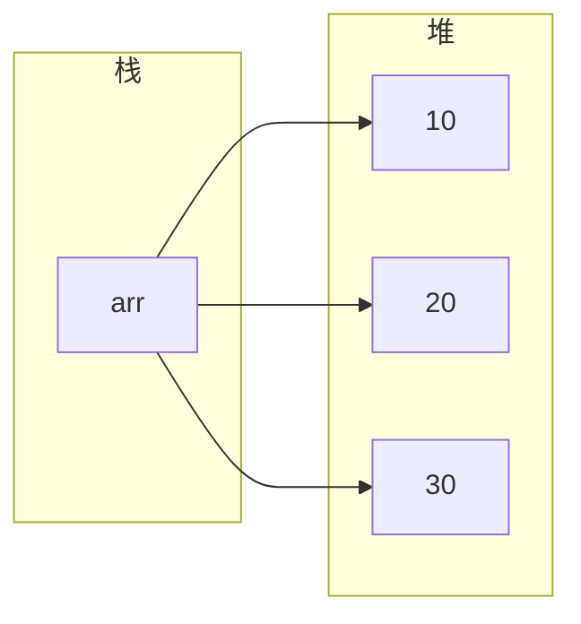
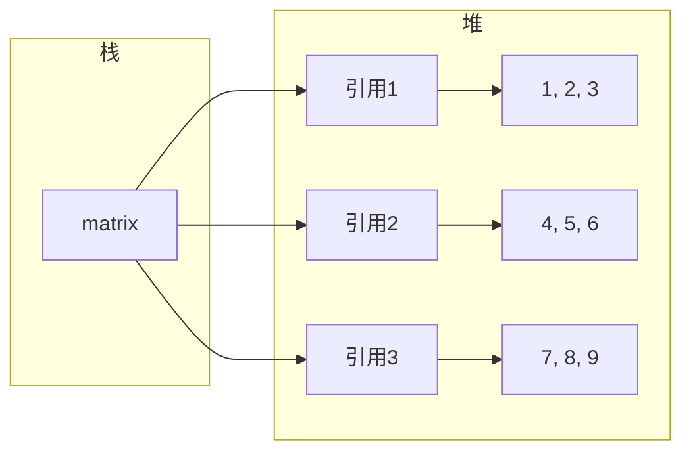
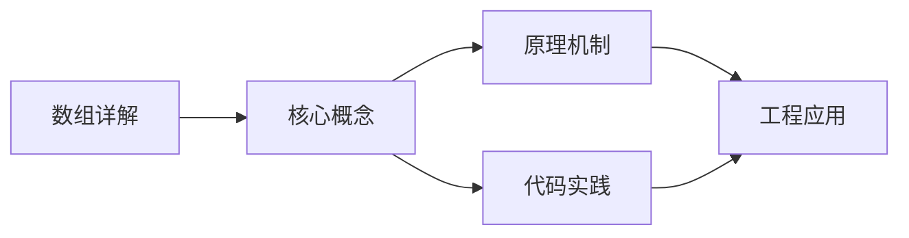
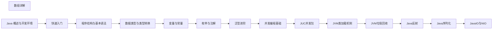

## 1. 学习目标（Bloom 分类）

本节按照布鲁姆教育目标分类学组织学习路径。本文主题为《数组详解》，属于 Java 模块，读者可以根据自身阶段选择阅读深度。

记忆层面：能够准确复述本文的核心概念、术语与基本语法或操作步骤，并能够在提问或检索时快速定位对应知识点。能够说出 Java 的编译执行模型（javac 到字节码，JVM 解释与 JIT）。

理解层面：能够用自己的语言解释核心原理与工作机制，说明概念之间的因果关系，而不是机械记忆结论。能够解释面向对象三大特性与 JVM 内存区域的职责。

应用层面：能够在真实项目或练习场景中运用本文知识解决具体问题，写出正确且可维护的实现。能够编写类、接口、集合操作与异常处理的完整程序。

分析层面：能够拆解复杂问题，比较本文主题与相邻概念的异同，识别边界条件与例外情况。能够分析 Java 与 C++、Go 在内存管理与并发模型上的差异。

评价层面：能够根据约束条件（性能、可读性、安全、成本）评价不同方案的优劣，做出有依据的技术决策。能够评价不同集合、并发工具与框架的适用场景。

创造层面：能够把本文知识与其他模块知识组合，设计出新的解决方案或可复用的工程模式。能够组合 Spring 生态设计企业级应用。

通过本节学习，读者应当能够把《数组详解》纳入自己的知识网络，并与 Java 模块的其他主题（JVM、集合框架、并发、Spring 生态）建立关联。

## 2. 历史动机与发展脉络

《数组详解》是 Java 领域的重要主题。要真正理解它，需要先了解它解决的问题与演进过程。

Java 由 James Gosling 领导的 Sun 团队于 1995 年发布，口号“一次编写，到处运行”依托 JVM 字节码实现跨平台。2006 年 Sun 将 Java 开源（OpenJDK），2010 年 Oracle 收购 Sun 后 Java 进入新的治理阶段。
Java 的版本节奏在 2017 年后改为每半年一个特性版本、每两年一个 LTS（长期支持）版本。当前主流 LTS 包括 Java 11、17、21 与 25；Java 21 引入虚拟线程（Project Loom 成果），显著降低高并发服务的线程成本。
Java 生态以 Spring 家族为核心：Spring Boot 简化配置与部署，Spring Cloud 提供微服务组件；构建工具从 Maven 演进到 Gradle；JVM 语言（Kotlin、Scala、Groovy）与 Java 共存互操作。
Android 开发早期使用 Java，2019 年后官方转向 Kotlin-first，但 Java 仍是服务端领域（尤其是金融、电商等企业系统）的中坚力量。

回到本文主题：数组详解 的提出与成熟，正是上述技术背景下的必然产物。早期实现往往以简单可用为目标，随着工程规模扩大，社区逐渐沉淀出标准做法与最佳实践；理解这一脉络，可以帮助读者判断“为什么文档中的推荐写法是现在这个样子”，也能在遇到历史遗留代码时准确识别其设计年代与取舍。

理解 Java 版本与 LTS 机制，是工程选型的起点：生产环境优先 LTS，新特性（如虚拟线程）可以在受控场景评估后引入。

## 3. 形式化定义与核心概念精讲

本节把《数组详解》涉及的核心概念以“定义 + 讲解”的形式展开。读者应把定义当作工具，把讲解当作理解路径；两者结合才能形成可迁移的知识。

JVM 与字节码：`javac` 把 .java 编译为 .class 字节码，JVM 加载、校验并执行；热点代码由 JIT（如 C2）编译为机器码，解释与编译结合实现启动速度与峰值性能的平衡。
面向对象：封装（访问控制）、继承（extends/implements）与多态（重载/重写）是 Java 的类型系统支柱；接口默认方法（Java 8）与密封类（Java 17）持续演进表达能力。
异常体系：受检异常（checked）编译期强制处理，非受检异常（RuntimeException）运行时抛出；try-with-resources 自动关闭资源。
泛型与擦除：Java 泛型在编译期检查后擦除类型参数，运行时无泛型信息；这解释了 `List<String>` 与 `List<Integer>` 的 Class 相同，以及通配符 `? extends` 的逆变协变规则。

### 3.1 原文章节逐一精讲

原文档把主题拆分为 21 个小节，下面按顺序给出每一节的导读讲解，随后保留原文细节供精读。

#### 原文精读（完整保留）

# Java 数组详解

> **符号约定**：`< >` 必填参数 | `[ ]` 可选参数

---

#### 1. 一维数组 (One-Dimensional Arrays)

数组是一组相同类型数据的有序集合，大小固定，在Java中是引用类型。

##### 1.1 数组的定义

```java
 // 方式1：数据类型[] 数组名
 int[] numbers;
 // 方式2：数据类型 数组名[]
 int numbers[]; // 不推荐，可读性较差
```

##### 1.2 数组的初始化

###### 1.2.1 静态初始化

直接指定数组元素的值，数组长度由元素个数决定。

```java
 // 基本类型数组
 int[] arr1 = {1, 2, 3, 4, 5};
 // 引用类型数组
 String[] arr2 = {"Java", "Python", "C++"};
 // 使用 new 关键字的静态初始化
 int[] arr3 = new int[]{1, 2, 3};
```

###### 1.2.2 动态初始化

只指定数组长度，元素使用默认初始值。

| 数据类型                       | 默认初始值        |
| ------------------------------ | ----------------- |
| `byte`, `short`, `int`, `long` | 0                 |
| `float`, `double`              | 0.0               |
| `char`                         | '\u0000' (空字符) |
| `boolean`                      | false             |
| 引用类型                       | null              |

```java
 // 动态初始化
 int[] arr = new int[5]; // 元素默认值为 0
 // 动态初始化后赋值
 for (int i = 0; i < arr.length; i++) {
  arr[i] = i + 1;
 }
```

##### 1.3 数组的访问与遍历

###### 1.3.1 元素访问

使用索引访问数组元素，索引从 0 开始。

```java
 int[] arr = {10, 20, 30};
 int first = arr[0]; // 获取第一个元素
 arr[1] = 25; // 修改第二个元素
```

###### 1.3.2 数组长度

使用 `length` 属性获取数组长度。

```java
 int[] arr = {1, 2, 3, 4, 5};
 int length = arr.length; // 5
```

###### 1.3.3 数组遍历

**方法1：普通 for 循环**

```java
 int[] arr = {1, 2, 3, 4, 5};
 for (int i = 0; i < arr.length; i++) {
  System.out.println(arr[i]);
 }
```

**方法2：增强型 for 循环 (for-each)**

```java
 int[] arr = {1, 2, 3, 4, 5};
 for (int num : arr) {
  System.out.println(num);
 }
```

**方法3：使用 Stream API (Java 8+)**

```java
 int[] arr = {1, 2, 3, 4, 5};
 Arrays.stream(arr).forEach(System.out::println);
```

#### 2. 多维数组 (Multidimensional Arrays)

##### 2.1 二维数组

二维数组是数组的数组，常用于表示矩阵、表格等数据结构。

###### 2.1.1 二维数组的初始化

**静态初始化**

```java
 int[][] matrix = {
  {1, 2, 3},
  {4, 5, 6},
  {7, 8, 9}
 }
```

**动态初始化**

```java
 // 方式1：指定行数和列数
 int[][] matrix = new int[3][3];
 // 方式2：先指定行数，后指定列数
 int[][] matrix = new int[3][];
 matrix[0] = new int[3];
 matrix[1] = new int[3];
 matrix[2] = new int[3];
```

###### 2.1.2 不规则数组 (Jagged Arrays)

二维数组的每行可以有不同的长度。

```java
 int[][] jagged = new int[3][];
 jagged[0] = new int[2]; // 第一行 2 个元素
 jagged[1] = new int[5]; // 第二行 5 个元素
 jagged[2] = new int[3]; // 第三行 3 个元素
```

###### 2.1.3 二维数组的遍历

**方法1：嵌套 for 循环**

```java
 int[][] matrix = {
  {1, 2, 3},
  {4, 5, 6},
  {7, 8, 9}
 }
 for (int i = 0; i < matrix.length; i++) {
  for (int j = 0; j < matrix[i].length; j++) {
  System.out.print(matrix[i][j] + " ");
  }
  System.out.println();
 }
```

**方法2：嵌套增强型 for 循环**

```java
 for (int[] row : matrix) {
  for (int num : row) {
  System.out.print(num + " ");
  }
  System.out.println();
 }
```

##### 2.2 三维及以上数组

Java 支持三维及以上的多维数组，使用较少。

```java
 // 三维数组
 int[][][] cube = new int[2][3][4];
 // 初始化三维数组
 cube[0][0][0] = 1;
 cube[0][0][1] = 2;
 // ...
```

#### 3. 数组的内存布局

##### 3.1 一维数组的内存布局

- **栈 (Stack)**: 存放数组引用变量（如 `arr`）
- **堆 (Heap)**: 存放数组实体（连续的内存块，存储实际数据）



##### 3.2 二维数组的内存布局

- **栈**: 存放二维数组引用变量
- **堆**: 存放数组的数组
- 第一级：存放指向每行数组的引用
- 第二级：存放每行的实际数据



#### 4. 数组的常见操作

##### 4.1 数组复制

**方法1：使用 `Arrays.copyOf()`**

```java
 int[] original = {1, 2, 3, 4, 5};
 int[] copy = Arrays.copyOf(original, original.length);
```

**方法2：使用 `System.arraycopy()`**

```java
 int[] original = {1, 2, 3, 4, 5};
 int[] copy = new int[original.length];
 System.arraycopy(original, 0, copy, 0, original.length);
```

**方法3：使用 `Arrays.copyOfRange()`**

```java
 int[] original = {1, 2, 3, 4, 5};
 int[] copy = Arrays.copyOfRange(original, 1, 4); // 复制索引 1-3 的元素
```

##### 4.2 数组排序

**方法1：使用 `Arrays.sort()`**

```java
 int[] arr = {5, 2, 8, 1, 3};
 Arrays.sort(arr); // 升序排序
 System.out.println(Arrays.toString(arr)); // [1, 2, 3, 5, 8]
```

**方法2：使用 `Arrays.sort()` 自定义比较器**

```java
 String[] arr = {"banana", "apple", "orange"};
 Arrays.sort(arr, Comparator.reverseOrder()); // 降序排序
 System.out.println(Arrays.toString(arr)); // [orange, banana, apple]
```

##### 4.3 数组查找

**方法1：线性查找**

```java
 public static int linearSearch(int[] arr, int target) {
  for (int i = 0; i < arr.length; i++) {
  if (arr[i] == target) {
  return i;
  }
  }
  return -1;
 }
```

**方法2：二分查找（数组必须已排序）**

```java
 int[] arr = {1, 2, 3, 4, 5, 6, 7, 8, 9};
 int index = Arrays.binarySearch(arr, 5); // 返回 4
```

##### 4.4 数组填充

```java
 int[] arr = new int[5];
 Arrays.fill(arr, 10); // 填充所有元素为 10
 System.out.println(Arrays.toString(arr)); // [10, 10, 10, 10, 10]
 // 填充指定范围
 int[] arr2 = new int[5];
 Arrays.fill(arr2, 1, 4, 5); // 填充索引 1-3 的元素为 5
 System.out.println(Arrays.toString(arr2)); // [0, 5, 5, 5, 0]
```

##### 4.5 数组比较

```java
 int[] arr1 = {1, 2, 3};
 int[] arr2 = {1, 2, 3};
 boolean equal = Arrays.equals(arr1, arr2); //
 // 多维数组比较
 int[][] matrix1 = {{1, 2}, {3, 4}};
 int[][] matrix2 = {{1, 2}, {3, 4}};
 boolean equal2 = Arrays.deepEquals(matrix1, matrix2); //
```

#### 5. `Arrays` 工具类详解

##### 5.1 常用方法

| 方法                                          | 描述                     |
| --------------------------------------------- | ------------------------ |
| `Arrays.toString(arr)`                        | 将数组转换为字符串       |
| `Arrays.deepToString(arr)`                    | 将多维数组转换为字符串   |
| `Arrays.sort(arr)`                            | 对数组进行升序排序       |
| `Arrays.sort(arr, comparator)`                | 使用自定义比较器排序     |
| `Arrays.binarySearch(arr, key)`               | 二分查找指定元素         |
| `Arrays.copyOf(arr, newLength)`               | 复制数组并指定新长度     |
| `Arrays.copyOfRange(arr, from, to)`           | 复制指定范围的数组       |
| `Arrays.fill(arr, value)`                     | 填充数组所有元素         |
| `Arrays.fill(arr, fromIndex, toIndex, value)` | 填充指定范围的元素       |
| `Arrays.equals(arr1, arr2)`                   | 比较两个数组是否相等     |
| `Arrays.deepEquals(arr1, arr2)`               | 比较两个多维数组是否相等 |
| `Arrays.hashCode(arr)`                        | 计算数组的哈希码         |
| `Arrays.stream(arr)`                          | 创建数组的流             |

##### 5.2 示例

```java
 import java.util.Arrays;
 import java.util.Comparator;
 public class ArraysDemo {
  public static void main(String[] args) {
  // 数组转字符串
  int[] arr = {1, 2, 3, 4, 5};
  System.out.println(Arrays.toString(arr));
  // 排序
  int[] unsorted = {5, 2, 8, 1, 3};
  Arrays.sort(unsorted);
  System.out.println(Arrays.toString(unsorted));
  // 二分查找
  int index = Arrays.binarySearch(unsorted, 3);
  System.out.println("Index of 3: " + index);
  // 复制数组
  int[] copy = Arrays.copyOf(unsorted, 10);
  System.out.println(Arrays.toString(copy));
  // 填充数组
  Arrays.fill(copy, 5, 10, 99);
  System.out.println(Arrays.toString(copy));
  // 比较数组
  int[] arr1 = {1, 2, 3};
  int[] arr2 = {1, 2, 3};
  System.out.println(Arrays.equals(arr1, arr2));
  }
 }
```

#### 6. 数组与集合的关系

##### 6.1 数组转集合

```java
 // 基本类型数组转集合
 int[] arr = {1, 2, 3, 4, 5};
 List<Integer> list = Arrays.stream(arr)
  .boxed()
  .collect(Collectors.toList());
 // 引用类型数组转集合
 String[] arr2 = {"Java", "Python", "C++"};
 List<String> list2 = Arrays.asList(arr2);
```

##### 6.2 集合转数组

```java
 List<Integer> list = Arrays.asList(1, 2, 3, 4, 5);
 // 方法1：指定数组大小
 integer[] arr = list.toArray(new Integer[list.size()]);
 // 方法2：使用 Stream API
 int[] arr2 = list.stream().mapToInt(Integer::intValue).toArray();
```

#### 7. 实际应用案例

##### 7.1 数组去重

```java
 public static int[] removeDuplicates(int[] arr) {
  return Arrays.stream(arr)
  .distinct()
  .toArray();
 }
 // 示例
 int[] arr = {1, 2, 2, 3, 4, 4, 5};
 int[] unique = removeDuplicates(arr);
 System.out.println(Arrays.toString(unique)); // [1, 2, 3, 4, 5]
```

##### 7.2 数组最大值和最小值

```java
 public static int findMax(int[] arr) {
  return Arrays.stream(arr).max().orElse(Integer.MIN_VALUE);
 }
 public static int findMin(int[] arr) {
  return Arrays.stream(arr).min().orElse(Integer.MAX_VALUE);
 }
 // 示例
 int[] arr = {5, 2, 8, 1, 3};
 System.out.println("Max: " + findMax(arr)); // 8
 System.out.println("Min: " + findMin(arr)); // 1
```

##### 7.3 数组反转

```java
 public static void reverse(int[] arr) {
  int left = 0;
  int right = arr.length - 1;
  while (left < right) {
  int temp = arr[left];
  arr[left] = arr[right];
  arr[right] = temp;
  left++;
  right--;
  }
 }
 // 示例
 int[] arr = {1, 2, 3, 4, 5};
 reverse(arr);
 System.out.println(Arrays.toString(arr)); // [5, 4, 3, 2, 1]
```

##### 7.4 二维数组转置

```java
 public static int[][] transpose(int[][] matrix) {
  int rows = matrix.length;
  int cols = matrix[0].length;
  int[][] transposed = new int[cols][rows];
  for (int i = 0; i < rows; i++) {
  for (int j = 0; j < cols; j++) {
  transposed[j][i] = matrix[i][j];
  }
  }
  return transposed;
 }
 // 示例
 int[][] matrix = {{1, 2, 3}, {4, 5, 6}};
 int[][] transposed = transpose(matrix);
 for (int[] row : transposed) {
  System.out.println(Arrays.toString(row));
 }
 // 输出:
 // [1, 4]
 // [2, 5]
 // [3, 6]
```

#### 8. 数组的最佳实践

##### 8.1 编码规范

- **数组声明**：使用 `int[] arr` 而不是 `int arr[]`
- **初始化**：根据需要选择静态或动态初始化
- **命名**：数组变量名应使用复数形式（如 `numbers`、`names`）

##### 8.2 性能考虑

- **数组大小**：根据实际需要确定数组大小，避免过大或过小
- **遍历方式**：对于大型数组，普通 for 循环可能比 for-each 循环更高效
- **排序**：对于基本类型数组，`Arrays.sort()` 使用双轴快速排序，性能较好

##### 8.3 内存管理

- **及时释放**：不再使用的数组引用应设置为 `null`，以便垃圾回收
- **避免频繁创建**：对于需要重复使用的数组，考虑使用对象池

#### 9. 常见陷阱

##### 9.1 索引越界

- **问题**：访问超出数组范围的索引
- **解决方案**：使用前检查索引是否在有效范围内

##### 9.2 空指针异常

- **问题**：访问 `null` 数组的元素
- **解决方案**：使用前检查数组是否为 `null`

##### 9.3 数组大小固定

- **问题**：数组大小一旦确定就不能更改
- **解决方案**：对于需要动态调整大小的场景，使用集合类（如 `ArrayList`）

##### 9.4 基本类型与包装类型

- **问题**：基本类型数组与包装类型集合之间的转换
- **解决方案**：使用 `Arrays.stream()` 和 `boxed()` 方法进行转换

##### 9.5 多维数组的不规则性

- **问题**：二维数组的每行长度可能不同
- **解决方案**：遍历前检查每行的长度

---

#### 数组声明

**基本写法：声明数组**
`<类型>[] <变量名>;`
```java
// 声明整型数组
int[] numbers;
```

---

**基本写法：C 风格声明**
`<类型> <变量名>[];`
```java
// C 风格声明数组
int numbers[];
```

---

#### 数组创建

**基本写法：指定长度创建**
`<变量名> = new <类型>[<长度>];`
```java
// 创建长度为 5 的数组
numbers = new int[5];
```

---

**基本写法：声明并创建**
`<类型>[] <变量名> = new <类型>[<长度>];`
```java
// 声明并创建数组
int[] numbers = new int[5];
```

---

**基本写法：静态初始化**
`<类型>[] <变量名> = { <元素1>, <元素2>, ... };`
```java
// 声明并初始化数组
int[] numbers = {1, 2, 3, 4, 5};
```

---

**基本写法：new 关键字初始化**
`<类型>[] <变量名> = new <类型>[]{ <元素1>, <元素2> };`
```java
// 使用 new 关键字初始化
int[] numbers = new int[]{1, 2, 3};
```

---

#### 数组访问

**基本写法：访问元素**
`<数组>[<索引>]`
```java
// 获取索引为 0 的元素
int first = numbers[0];
```

---

**基本写法：修改元素**
`<数组>[<索引>] = <值>;`
```java
// 修改索引为 0 的元素
numbers[0] = 100;
```

---

**基本写法：获取长度**
`<数组>.length`
```java
// 获取数组长度
int len = numbers.length;
```

---

#### 数组遍历

**基本写法：for 循环遍历**
`for (int i = 0; i < <数组>.length; i++) { }`
```java
// 使用索引遍历数组
for (int i = 0; i < numbers.length; i++) {
    int num = numbers[i];
}
```

---

**基本写法：增强 for 循环遍历**
`for (<类型> <变量> : <数组>) { }`
```java
// 使用增强 for 循环遍历
for (int num : numbers) {
}
```

---

#### 多维数组

**基本写法：二维数组声明**
`<类型>[][] <变量名> = new <类型>[<行>][<列>];`
```java
// 创建 3 行 4 列的二维数组
int[][] matrix = new int[3][4];
```

---

**基本写法：二维数组初始化**
`<类型>[][] <变量名> = { {<元素>}, {<元素>} };`
```java
// 静态初始化二维数组
int[][] matrix = {{1, 2, 3}, {4, 5, 6}, {7, 8, 9}};
```

---

**基本写法：访问二维数组元素**
`<数组>[<行>][<列>]`
```java
// 获取第二行第三列的元素
int element = matrix[1][2];
```

---

**基本写法：遍历二维数组**
`for (int i = 0; i < <数组>.length; i++) { for (int j = 0; j < <数组>[i].length; j++) { } }`
```java
// 嵌套循环遍历二维数组
for (int i = 0; i < matrix.length; i++) {
    for (int j = 0; j < matrix[i].length; j++) {
        int element = matrix[i][j];
    }
}
```

---

#### 不规则数组

**基本写法：创建不规则数组**
`<类型>[][] <变量名> = new <类型>[<行>][];`
```java
// 创建不规则二维数组
int[][] jagged = new int[3][];
jagged[0] = new int[2];
jagged[1] = new int[3];
jagged[2] = new int[4];
```

---

#### 数组排序

**基本写法：升序排序**
`Arrays.sort(<数组>);`
```java
// 对数组进行升序排序
int[] numbers = {5, 2, 8, 1, 9};
Arrays.sort(numbers);
```

---

**基本写法：部分排序**
`Arrays.sort(<数组>, <起始索引>, <结束索引>);`
```java
// 对数组指定范围排序
int[] numbers = {5, 2, 8, 1, 9};
Arrays.sort(numbers, 1, 4);
```

---

**基本写法：降序排序**
`Arrays.sort(<数组>, Collections.reverseOrder());`
```java
// 对 Integer 数组降序排序
Integer[] numbers = {5, 2, 8, 1, 9};
Arrays.sort(numbers, Collections.reverseOrder());
```

---

#### 数组搜索

**基本写法：二分查找**
`Arrays.binarySearch(<数组>, <目标值>);`
```java
// 在已排序数组中二分查找
int[] numbers = {1, 2, 3, 4, 5};
int index = Arrays.binarySearch(numbers, 3);
```

---

#### 数组复制

**基本写法：copyOf 复制**
`Arrays.copyOf(<原数组>, <新长度>);`
```java
// 复制数组并指定新长度
int[] original = {1, 2, 3};
int[] copy = Arrays.copyOf(original, 5);
```

---

**基本写法：copyOfRange 复制**
`Arrays.copyOfRange(<原数组>, <起始>, <结束>);`
```java
// 复制数组指定范围
int[] original = {1, 2, 3, 4, 5};
int[] copy = Arrays.copyOfRange(original, 1, 4);
```

---

**基本写法：System.arraycopy**
`System.arraycopy(<源数组>, <源位置>, <目标数组>, <目标位置>, <长度>);`
```java
// 系统级数组复制
int[] src = {1, 2, 3, 4, 5};
int[] dest = new int[3];
System.arraycopy(src, 1, dest, 0, 3);
```

---

#### 数组转换

**基本写法：数组转字符串**
`Arrays.toString(<数组>);`
```java
// 将数组转换为字符串表示
int[] numbers = {1, 2, 3};
String str = Arrays.toString(numbers);
```

---

**基本写法：二维数组转字符串**
`Arrays.deepToString(<数组>);`
```java
// 将多维数组转换为字符串
int[][] matrix = {{1, 2}, {3, 4}};
String str = Arrays.deepToString(matrix);
```

---

**基本写法：数组转 List**
`Arrays.asList(<数组>);`
```java
// 将数组转换为固定大小的 List
String[] arr = {"a", "b", "c"};
List<String> list = Arrays.asList(arr);
```

---

**基本写法：数组转可变 List**
`new ArrayList<>(Arrays.asList(<数组>));`
```java
// 将数组转换为可修改的 ArrayList
String[] arr = {"a", "b", "c"};
List<String> list = new ArrayList<>(Arrays.asList(arr));
```

---

#### 数组填充

**基本写法：填充所有元素**
`Arrays.fill(<数组>, <值>);`
```java
// 用指定值填充整个数组
int[] numbers = new int[5];
Arrays.fill(numbers, 0);
```

---

**基本写法：填充指定范围**
`Arrays.fill(<数组>, <起始>, <结束>, <值>);`
```java
// 用指定值填充数组指定范围
int[] numbers = new int[5];
Arrays.fill(numbers, 1, 3, 9);
```

---

#### 数组比较

**基本写法：一维数组比较**
`Arrays.equals(<数组1>, <数组2>);`
```java
// 比较两个一维数组内容是否相同
int[] a = {1, 2, 3};
int[] b = {1, 2, 3};
boolean result = Arrays.equals(a, b);
```

---

**基本写法：多维数组比较**
`Arrays.deepEquals(<数组1>, <数组2>);`
```java
// 比较两个多维数组内容是否相同
int[][] a = {{1, 2}, {3, 4}};
int[][] b = {{1, 2}, {3, 4}};
boolean result = Arrays.deepEquals(a, b);
```


### 3.2 概念关系图

下面用 Mermaid 图表达本文核心概念之间的关系，帮助读者建立整体图景：



图中展示的是本文知识的结构化关系：核心概念是入口，原理机制解释“为什么”，代码实践演示“怎么做”，工程应用回答“何时用”。读者学习时可以把每个小节的内容挂接到对应节点上。

## 4. 理论推导与原理解析

本节深入《数组详解》背后的原理。理论部分不求面面俱到，而是聚焦“能解释现象、能指导实践”的关键推导。

JVM 内存模型：堆（新生代/老年代）、元空间、虚拟机栈、本地方法栈与程序计数器；GC 从 CMS 演进到 G1（默认）、ZGC（超低延迟），理解分代收集是调优前提。
并发工具：synchronized 与 JUC（java.util.concurrent）的锁、并发容器、线程池、CompletableFuture 构成并发工具箱；Java 21 的虚拟线程让“每任务一线程”成为可能。
类加载机制：双亲委派模型保证类唯一性，SPI（ServiceLoader）打破委派实现扩展；自定义类加载器是热部署与隔离的基础。
反射与注解：反射在运行时检查类结构，注解提供元数据；Spring 的依赖注入与 AOP 均基于这些机制，但反射有性能与安全成本。

需要强调的是，理论推导与工程实践之间存在翻译层：理论给出的是理想化模型与边界条件，工程代码则必须处理真实环境中的例外。读者在学习时应先掌握理论的“标准情形”，再通过陷阱章节了解“非标准情形”。

## 5. 代码示例与逐行讲解

本节把原文中的代码示例系统整理，并为每个示例补充用途说明与讲解。读者不应只浏览代码，而应逐段对照讲解理解设计意图。

### 5.1 示例：1.1 数组的定义

该示例来自原文《1.1 数组的定义》小节，用于演示数组详解相关操作。阅读时请先看代码结构，再看其后的讲解。

```java
 // 方式1：数据类型[] 数组名
 int[] numbers;
 // 方式2：数据类型 数组名[]
 int numbers[]; // 不推荐，可读性较差
```

讲解：这段代码演示了本节核心知识点。代码中的关键操作可以归纳为三步：准备（定义或初始化）、执行（核心逻辑）、收尾（释放资源或返回结果）。实际项目中，这三步往往被封装为函数或类，以提升复用性与可测试性。

关键点分析：

该示例共 4 行有效代码，结构以数据或配置为主。阅读时应关注：数据字段的含义、配置项的作用，以及它们与运行行为的对应关系。

进阶思考路径：先尝试修改参数观察行为变化，再把示例中的模式迁移到自己的项目中；每次修改都记录预期与实测差异，这是把示例转化为能力的最快方式。

### 5.2 示例：1.2.1 静态初始化

该示例来自原文《1.2.1 静态初始化》小节，用于演示数组详解相关操作。阅读时请先看代码结构，再看其后的讲解。

```java
 // 基本类型数组
 int[] arr1 = {1, 2, 3, 4, 5};
 // 引用类型数组
 String[] arr2 = {"Java", "Python", "C++"};
 // 使用 new 关键字的静态初始化
 int[] arr3 = new int[]{1, 2, 3};
```

讲解：这段代码演示了本节核心知识点。代码中的关键操作可以归纳为三步：准备（定义或初始化）、执行（核心逻辑）、收尾（释放资源或返回结果）。实际项目中，这三步往往被封装为函数或类，以提升复用性与可测试性。

关键点分析：

该示例共 6 行有效代码，结构以数据或配置为主。阅读时应关注：数据字段的含义、配置项的作用，以及它们与运行行为的对应关系。

进阶思考路径：先尝试修改参数观察行为变化，再把示例中的模式迁移到自己的项目中；每次修改都记录预期与实测差异，这是把示例转化为能力的最快方式。

### 5.3 示例：1.2.2 动态初始化

该示例来自原文《1.2.2 动态初始化》小节，用于演示数组详解相关操作。阅读时请先看代码结构，再看其后的讲解。

```java
 // 动态初始化
 int[] arr = new int[5]; // 元素默认值为 0
 // 动态初始化后赋值
 for (int i = 0; i < arr.length; i++) {
  arr[i] = i + 1;
 }
```

讲解：这段代码演示了本节核心知识点。代码中的关键操作可以归纳为三步：准备（定义或初始化）、执行（核心逻辑）、收尾（释放资源或返回结果）。实际项目中，这三步往往被封装为函数或类，以提升复用性与可测试性。

关键点分析：

该示例共 6 行有效代码，包含 1 类关键结构（for）。其中：

- 入口与初始化部分负责建立上下文，对应实际项目中的启动或装配逻辑；
- 核心逻辑部分体现本文主题的主要操作，是阅读时最需要对照讲解理解的部分；
- 输出或返回部分把结果交给调用方，注意其类型与边界条件。

进阶思考路径：先尝试修改参数观察行为变化，再把示例中的模式迁移到自己的项目中；每次修改都记录预期与实测差异，这是把示例转化为能力的最快方式。

### 5.4 示例：1.3.1 元素访问

该示例来自原文《1.3.1 元素访问》小节，用于演示数组详解相关操作。阅读时请先看代码结构，再看其后的讲解。

```java
 int[] arr = {10, 20, 30};
 int first = arr[0]; // 获取第一个元素
 arr[1] = 25; // 修改第二个元素
```

讲解：这段代码演示了本节核心知识点。代码中的关键操作可以归纳为三步：准备（定义或初始化）、执行（核心逻辑）、收尾（释放资源或返回结果）。实际项目中，这三步往往被封装为函数或类，以提升复用性与可测试性。

关键点分析：

该示例共 3 行有效代码，结构以数据或配置为主。阅读时应关注：数据字段的含义、配置项的作用，以及它们与运行行为的对应关系。

进阶思考路径：先尝试修改参数观察行为变化，再把示例中的模式迁移到自己的项目中；每次修改都记录预期与实测差异，这是把示例转化为能力的最快方式。

### 5.5 示例：1.3.2 数组长度

该示例来自原文《1.3.2 数组长度》小节，用于演示数组详解相关操作。阅读时请先看代码结构，再看其后的讲解。

```java
 int[] arr = {1, 2, 3, 4, 5};
 int length = arr.length; // 5
```

讲解：这段代码演示了本节核心知识点。代码中的关键操作可以归纳为三步：准备（定义或初始化）、执行（核心逻辑）、收尾（释放资源或返回结果）。实际项目中，这三步往往被封装为函数或类，以提升复用性与可测试性。

关键点分析：

该示例共 2 行有效代码，结构以数据或配置为主。阅读时应关注：数据字段的含义、配置项的作用，以及它们与运行行为的对应关系。

进阶思考路径：先尝试修改参数观察行为变化，再把示例中的模式迁移到自己的项目中；每次修改都记录预期与实测差异，这是把示例转化为能力的最快方式。

### 5.6 示例：1.3.3 数组遍历

该示例来自原文《1.3.3 数组遍历》小节，用于演示数组详解相关操作。阅读时请先看代码结构，再看其后的讲解。

```java
 int[] arr = {1, 2, 3, 4, 5};
 for (int i = 0; i < arr.length; i++) {
  System.out.println(arr[i]);
 }
```

讲解：这段代码演示了本节核心知识点。代码中的关键操作可以归纳为三步：准备（定义或初始化）、执行（核心逻辑）、收尾（释放资源或返回结果）。实际项目中，这三步往往被封装为函数或类，以提升复用性与可测试性。

关键点分析：

该示例共 4 行有效代码，包含 1 类关键结构（for）。其中：

- 入口与初始化部分负责建立上下文，对应实际项目中的启动或装配逻辑；
- 核心逻辑部分体现本文主题的主要操作，是阅读时最需要对照讲解理解的部分；
- 输出或返回部分把结果交给调用方，注意其类型与边界条件。

进阶思考路径：先尝试修改参数观察行为变化，再把示例中的模式迁移到自己的项目中；每次修改都记录预期与实测差异，这是把示例转化为能力的最快方式。

### 5.7 示例：1.3.3 数组遍历

该示例来自原文《1.3.3 数组遍历》小节，用于演示数组详解相关操作。阅读时请先看代码结构，再看其后的讲解。

```java
 int[] arr = {1, 2, 3, 4, 5};
 for (int num : arr) {
  System.out.println(num);
 }
```

讲解：这段代码演示了本节核心知识点。代码中的关键操作可以归纳为三步：准备（定义或初始化）、执行（核心逻辑）、收尾（释放资源或返回结果）。实际项目中，这三步往往被封装为函数或类，以提升复用性与可测试性。

关键点分析：

该示例共 4 行有效代码，包含 1 类关键结构（for）。其中：

- 入口与初始化部分负责建立上下文，对应实际项目中的启动或装配逻辑；
- 核心逻辑部分体现本文主题的主要操作，是阅读时最需要对照讲解理解的部分；
- 输出或返回部分把结果交给调用方，注意其类型与边界条件。

进阶思考路径：先尝试修改参数观察行为变化，再把示例中的模式迁移到自己的项目中；每次修改都记录预期与实测差异，这是把示例转化为能力的最快方式。

### 5.8 示例：1.3.3 数组遍历

该示例来自原文《1.3.3 数组遍历》小节，用于演示数组详解相关操作。阅读时请先看代码结构，再看其后的讲解。

```java
 int[] arr = {1, 2, 3, 4, 5};
 Arrays.stream(arr).forEach(System.out::println);
```

讲解：这段代码演示了本节核心知识点。代码中的关键操作可以归纳为三步：准备（定义或初始化）、执行（核心逻辑）、收尾（释放资源或返回结果）。实际项目中，这三步往往被封装为函数或类，以提升复用性与可测试性。

关键点分析：

该示例共 2 行有效代码，结构以数据或配置为主。阅读时应关注：数据字段的含义、配置项的作用，以及它们与运行行为的对应关系。

进阶思考路径：先尝试修改参数观察行为变化，再把示例中的模式迁移到自己的项目中；每次修改都记录预期与实测差异，这是把示例转化为能力的最快方式。

### 5.9 示例：2.1.1 二维数组的初始化

该示例来自原文《2.1.1 二维数组的初始化》小节，用于演示数组详解相关操作。阅读时请先看代码结构，再看其后的讲解。

```java
 int[][] matrix = {
  {1, 2, 3},
  {4, 5, 6},
  {7, 8, 9}
 }
```

讲解：这段代码演示了本节核心知识点。代码中的关键操作可以归纳为三步：准备（定义或初始化）、执行（核心逻辑）、收尾（释放资源或返回结果）。实际项目中，这三步往往被封装为函数或类，以提升复用性与可测试性。

关键点分析：

该示例共 5 行有效代码，结构以数据或配置为主。阅读时应关注：数据字段的含义、配置项的作用，以及它们与运行行为的对应关系。

进阶思考路径：先尝试修改参数观察行为变化，再把示例中的模式迁移到自己的项目中；每次修改都记录预期与实测差异，这是把示例转化为能力的最快方式。

### 5.10 示例：2.1.1 二维数组的初始化

该示例来自原文《2.1.1 二维数组的初始化》小节，用于演示数组详解相关操作。阅读时请先看代码结构，再看其后的讲解。

```java
 // 方式1：指定行数和列数
 int[][] matrix = new int[3][3];
 // 方式2：先指定行数，后指定列数
 int[][] matrix = new int[3][];
 matrix[0] = new int[3];
 matrix[1] = new int[3];
 matrix[2] = new int[3];
```

讲解：这段代码演示了本节核心知识点。代码中的关键操作可以归纳为三步：准备（定义或初始化）、执行（核心逻辑）、收尾（释放资源或返回结果）。实际项目中，这三步往往被封装为函数或类，以提升复用性与可测试性。

关键点分析：

该示例共 7 行有效代码，结构以数据或配置为主。阅读时应关注：数据字段的含义、配置项的作用，以及它们与运行行为的对应关系。

进阶思考路径：先尝试修改参数观察行为变化，再把示例中的模式迁移到自己的项目中；每次修改都记录预期与实测差异，这是把示例转化为能力的最快方式。

### 5.11 示例：2.1.2 不规则数组 (Jagged Arrays)

该示例来自原文《2.1.2 不规则数组 (Jagged Arrays)》小节，用于演示数组详解相关操作。阅读时请先看代码结构，再看其后的讲解。

```java
 int[][] jagged = new int[3][];
 jagged[0] = new int[2]; // 第一行 2 个元素
 jagged[1] = new int[5]; // 第二行 5 个元素
 jagged[2] = new int[3]; // 第三行 3 个元素
```

讲解：这段代码演示了本节核心知识点。代码中的关键操作可以归纳为三步：准备（定义或初始化）、执行（核心逻辑）、收尾（释放资源或返回结果）。实际项目中，这三步往往被封装为函数或类，以提升复用性与可测试性。

关键点分析：

该示例共 4 行有效代码，结构以数据或配置为主。阅读时应关注：数据字段的含义、配置项的作用，以及它们与运行行为的对应关系。

进阶思考路径：先尝试修改参数观察行为变化，再把示例中的模式迁移到自己的项目中；每次修改都记录预期与实测差异，这是把示例转化为能力的最快方式。

### 5.12 示例：2.1.3 二维数组的遍历

该示例来自原文《2.1.3 二维数组的遍历》小节，用于演示数组详解相关操作。阅读时请先看代码结构，再看其后的讲解。

```java
 int[][] matrix = {
  {1, 2, 3},
  {4, 5, 6},
  {7, 8, 9}
 }
 for (int i = 0; i < matrix.length; i++) {
  for (int j = 0; j < matrix[i].length; j++) {
  System.out.print(matrix[i][j] + " ");
  }
  System.out.println();
 }
```

讲解：这段代码演示了本节核心知识点。代码中的关键操作可以归纳为三步：准备（定义或初始化）、执行（核心逻辑）、收尾（释放资源或返回结果）。实际项目中，这三步往往被封装为函数或类，以提升复用性与可测试性。

关键点分析：

该示例共 11 行有效代码，包含 1 类关键结构（for）。其中：

- 入口与初始化部分负责建立上下文，对应实际项目中的启动或装配逻辑；
- 核心逻辑部分体现本文主题的主要操作，是阅读时最需要对照讲解理解的部分；
- 输出或返回部分把结果交给调用方，注意其类型与边界条件。

进阶思考路径：先尝试修改参数观察行为变化，再把示例中的模式迁移到自己的项目中；每次修改都记录预期与实测差异，这是把示例转化为能力的最快方式。

### 5.13 示例：2.1.3 二维数组的遍历

该示例来自原文《2.1.3 二维数组的遍历》小节，用于演示数组详解相关操作。阅读时请先看代码结构，再看其后的讲解。

```java
 for (int[] row : matrix) {
  for (int num : row) {
  System.out.print(num + " ");
  }
  System.out.println();
 }
```

讲解：这段代码演示了本节核心知识点。代码中的关键操作可以归纳为三步：准备（定义或初始化）、执行（核心逻辑）、收尾（释放资源或返回结果）。实际项目中，这三步往往被封装为函数或类，以提升复用性与可测试性。

关键点分析：

该示例共 6 行有效代码，包含 1 类关键结构（for）。其中：

- 入口与初始化部分负责建立上下文，对应实际项目中的启动或装配逻辑；
- 核心逻辑部分体现本文主题的主要操作，是阅读时最需要对照讲解理解的部分；
- 输出或返回部分把结果交给调用方，注意其类型与边界条件。

进阶思考路径：先尝试修改参数观察行为变化，再把示例中的模式迁移到自己的项目中；每次修改都记录预期与实测差异，这是把示例转化为能力的最快方式。

### 5.14 示例：2.2 三维及以上数组

该示例来自原文《2.2 三维及以上数组》小节，用于演示数组详解相关操作。阅读时请先看代码结构，再看其后的讲解。

```java
 // 三维数组
 int[][][] cube = new int[2][3][4];
 // 初始化三维数组
 cube[0][0][0] = 1;
 cube[0][0][1] = 2;
 // ...
```

讲解：这段代码演示了本节核心知识点。代码中的关键操作可以归纳为三步：准备（定义或初始化）、执行（核心逻辑）、收尾（释放资源或返回结果）。实际项目中，这三步往往被封装为函数或类，以提升复用性与可测试性。

关键点分析：

该示例共 6 行有效代码，结构以数据或配置为主。阅读时应关注：数据字段的含义、配置项的作用，以及它们与运行行为的对应关系。

进阶思考路径：先尝试修改参数观察行为变化，再把示例中的模式迁移到自己的项目中；每次修改都记录预期与实测差异，这是把示例转化为能力的最快方式。

### 5.15 示例：3.1 一维数组的内存布局

该示例来自原文《3.1 一维数组的内存布局》小节，用于演示数组详解相关操作。阅读时请先看代码结构，再看其后的讲解。


讲解：这段代码演示了本节核心知识点。代码中的关键操作可以归纳为三步：准备（定义或初始化）、执行（核心逻辑）、收尾（释放资源或返回结果）。实际项目中，这三步往往被封装为函数或类，以提升复用性与可测试性。

关键点分析：

该示例共 12 行有效代码，结构以数据或配置为主。阅读时应关注：数据字段的含义、配置项的作用，以及它们与运行行为的对应关系。

进阶思考路径：先尝试修改参数观察行为变化，再把示例中的模式迁移到自己的项目中；每次修改都记录预期与实测差异，这是把示例转化为能力的最快方式。

### 5.16 示例：3.2 二维数组的内存布局

该示例来自原文《3.2 二维数组的内存布局》小节，用于演示数组详解相关操作。阅读时请先看代码结构，再看其后的讲解。


讲解：这段代码演示了本节核心知识点。代码中的关键操作可以归纳为三步：准备（定义或初始化）、执行（核心逻辑）、收尾（释放资源或返回结果）。实际项目中，这三步往往被封装为函数或类，以提升复用性与可测试性。

关键点分析：

该示例共 18 行有效代码，结构以数据或配置为主。阅读时应关注：数据字段的含义、配置项的作用，以及它们与运行行为的对应关系。

进阶思考路径：先尝试修改参数观察行为变化，再把示例中的模式迁移到自己的项目中；每次修改都记录预期与实测差异，这是把示例转化为能力的最快方式。

### 5.17 示例：4.1 数组复制

该示例来自原文《4.1 数组复制》小节，用于演示数组详解相关操作。阅读时请先看代码结构，再看其后的讲解。

```java
 int[] original = {1, 2, 3, 4, 5};
 int[] copy = Arrays.copyOf(original, original.length);
```

讲解：这段代码演示了本节核心知识点。代码中的关键操作可以归纳为三步：准备（定义或初始化）、执行（核心逻辑）、收尾（释放资源或返回结果）。实际项目中，这三步往往被封装为函数或类，以提升复用性与可测试性。

关键点分析：

该示例共 2 行有效代码，结构以数据或配置为主。阅读时应关注：数据字段的含义、配置项的作用，以及它们与运行行为的对应关系。

进阶思考路径：先尝试修改参数观察行为变化，再把示例中的模式迁移到自己的项目中；每次修改都记录预期与实测差异，这是把示例转化为能力的最快方式。

### 5.18 示例：4.1 数组复制

该示例来自原文《4.1 数组复制》小节，用于演示数组详解相关操作。阅读时请先看代码结构，再看其后的讲解。

```java
 int[] original = {1, 2, 3, 4, 5};
 int[] copy = new int[original.length];
 System.arraycopy(original, 0, copy, 0, original.length);
```

讲解：这段代码演示了本节核心知识点。代码中的关键操作可以归纳为三步：准备（定义或初始化）、执行（核心逻辑）、收尾（释放资源或返回结果）。实际项目中，这三步往往被封装为函数或类，以提升复用性与可测试性。

关键点分析：

该示例共 3 行有效代码，结构以数据或配置为主。阅读时应关注：数据字段的含义、配置项的作用，以及它们与运行行为的对应关系。

进阶思考路径：先尝试修改参数观察行为变化，再把示例中的模式迁移到自己的项目中；每次修改都记录预期与实测差异，这是把示例转化为能力的最快方式。

### 5.19 示例：4.1 数组复制

该示例来自原文《4.1 数组复制》小节，用于演示数组详解相关操作。阅读时请先看代码结构，再看其后的讲解。

```java
 int[] original = {1, 2, 3, 4, 5};
 int[] copy = Arrays.copyOfRange(original, 1, 4); // 复制索引 1-3 的元素
```

讲解：这段代码演示了本节核心知识点。代码中的关键操作可以归纳为三步：准备（定义或初始化）、执行（核心逻辑）、收尾（释放资源或返回结果）。实际项目中，这三步往往被封装为函数或类，以提升复用性与可测试性。

关键点分析：

该示例共 2 行有效代码，结构以数据或配置为主。阅读时应关注：数据字段的含义、配置项的作用，以及它们与运行行为的对应关系。

进阶思考路径：先尝试修改参数观察行为变化，再把示例中的模式迁移到自己的项目中；每次修改都记录预期与实测差异，这是把示例转化为能力的最快方式。

### 5.20 示例：4.2 数组排序

该示例来自原文《4.2 数组排序》小节，用于演示数组详解相关操作。阅读时请先看代码结构，再看其后的讲解。

```java
 int[] arr = {5, 2, 8, 1, 3};
 Arrays.sort(arr); // 升序排序
 System.out.println(Arrays.toString(arr)); // [1, 2, 3, 5, 8]
```

讲解：这段代码演示了本节核心知识点。代码中的关键操作可以归纳为三步：准备（定义或初始化）、执行（核心逻辑）、收尾（释放资源或返回结果）。实际项目中，这三步往往被封装为函数或类，以提升复用性与可测试性。

关键点分析：

该示例共 3 行有效代码，结构以数据或配置为主。阅读时应关注：数据字段的含义、配置项的作用，以及它们与运行行为的对应关系。

进阶思考路径：先尝试修改参数观察行为变化，再把示例中的模式迁移到自己的项目中；每次修改都记录预期与实测差异，这是把示例转化为能力的最快方式。

### 5.21 示例：4.2 数组排序

该示例来自原文《4.2 数组排序》小节，用于演示数组详解相关操作。阅读时请先看代码结构，再看其后的讲解。

```java
 String[] arr = {"banana", "apple", "orange"};
 Arrays.sort(arr, Comparator.reverseOrder()); // 降序排序
 System.out.println(Arrays.toString(arr)); // [orange, banana, apple]
```

讲解：这段代码演示了本节核心知识点。代码中的关键操作可以归纳为三步：准备（定义或初始化）、执行（核心逻辑）、收尾（释放资源或返回结果）。实际项目中，这三步往往被封装为函数或类，以提升复用性与可测试性。

关键点分析：

该示例共 3 行有效代码，结构以数据或配置为主。阅读时应关注：数据字段的含义、配置项的作用，以及它们与运行行为的对应关系。

进阶思考路径：先尝试修改参数观察行为变化，再把示例中的模式迁移到自己的项目中；每次修改都记录预期与实测差异，这是把示例转化为能力的最快方式。

### 5.22 示例：4.3 数组查找

该示例来自原文《4.3 数组查找》小节，用于演示数组详解相关操作。阅读时请先看代码结构，再看其后的讲解。

```java
 public static int linearSearch(int[] arr, int target) {
  for (int i = 0; i < arr.length; i++) {
  if (arr[i] == target) {
  return i;
  }
  }
  return -1;
 }
```

讲解：这段代码演示了本节核心知识点。代码中的关键操作可以归纳为三步：准备（定义或初始化）、执行（核心逻辑）、收尾（释放资源或返回结果）。实际项目中，这三步往往被封装为函数或类，以提升复用性与可测试性。

关键点分析：

该示例共 8 行有效代码，包含 3 类关键结构（if、for、return）。其中：

- 入口与初始化部分负责建立上下文，对应实际项目中的启动或装配逻辑；
- 核心逻辑部分体现本文主题的主要操作，是阅读时最需要对照讲解理解的部分；
- 输出或返回部分把结果交给调用方，注意其类型与边界条件。

进阶思考路径：先尝试修改参数观察行为变化，再把示例中的模式迁移到自己的项目中；每次修改都记录预期与实测差异，这是把示例转化为能力的最快方式。

### 5.23 示例：4.3 数组查找

该示例来自原文《4.3 数组查找》小节，用于演示数组详解相关操作。阅读时请先看代码结构，再看其后的讲解。

```java
 int[] arr = {1, 2, 3, 4, 5, 6, 7, 8, 9};
 int index = Arrays.binarySearch(arr, 5); // 返回 4
```

讲解：这段代码演示了本节核心知识点。代码中的关键操作可以归纳为三步：准备（定义或初始化）、执行（核心逻辑）、收尾（释放资源或返回结果）。实际项目中，这三步往往被封装为函数或类，以提升复用性与可测试性。

关键点分析：

该示例共 2 行有效代码，结构以数据或配置为主。阅读时应关注：数据字段的含义、配置项的作用，以及它们与运行行为的对应关系。

进阶思考路径：先尝试修改参数观察行为变化，再把示例中的模式迁移到自己的项目中；每次修改都记录预期与实测差异，这是把示例转化为能力的最快方式。

### 5.24 示例：4.4 数组填充

该示例来自原文《4.4 数组填充》小节，用于演示数组详解相关操作。阅读时请先看代码结构，再看其后的讲解。

```java
 int[] arr = new int[5];
 Arrays.fill(arr, 10); // 填充所有元素为 10
 System.out.println(Arrays.toString(arr)); // [10, 10, 10, 10, 10]
 // 填充指定范围
 int[] arr2 = new int[5];
 Arrays.fill(arr2, 1, 4, 5); // 填充索引 1-3 的元素为 5
 System.out.println(Arrays.toString(arr2)); // [0, 5, 5, 5, 0]
```

讲解：这段代码演示了本节核心知识点。代码中的关键操作可以归纳为三步：准备（定义或初始化）、执行（核心逻辑）、收尾（释放资源或返回结果）。实际项目中，这三步往往被封装为函数或类，以提升复用性与可测试性。

关键点分析：

该示例共 7 行有效代码，结构以数据或配置为主。阅读时应关注：数据字段的含义、配置项的作用，以及它们与运行行为的对应关系。

进阶思考路径：先尝试修改参数观察行为变化，再把示例中的模式迁移到自己的项目中；每次修改都记录预期与实测差异，这是把示例转化为能力的最快方式。

### 5.25 示例：4.5 数组比较

该示例来自原文《4.5 数组比较》小节，用于演示数组详解相关操作。阅读时请先看代码结构，再看其后的讲解。

```java
 int[] arr1 = {1, 2, 3};
 int[] arr2 = {1, 2, 3};
 boolean equal = Arrays.equals(arr1, arr2); //
 // 多维数组比较
 int[][] matrix1 = {{1, 2}, {3, 4}};
 int[][] matrix2 = {{1, 2}, {3, 4}};
 boolean equal2 = Arrays.deepEquals(matrix1, matrix2); //
```

讲解：这段代码演示了本节核心知识点。代码中的关键操作可以归纳为三步：准备（定义或初始化）、执行（核心逻辑）、收尾（释放资源或返回结果）。实际项目中，这三步往往被封装为函数或类，以提升复用性与可测试性。

关键点分析：

该示例共 7 行有效代码，结构以数据或配置为主。阅读时应关注：数据字段的含义、配置项的作用，以及它们与运行行为的对应关系。

进阶思考路径：先尝试修改参数观察行为变化，再把示例中的模式迁移到自己的项目中；每次修改都记录预期与实测差异，这是把示例转化为能力的最快方式。

### 5.26 示例：5.2 示例

该示例来自原文《5.2 示例》小节，用于演示数组详解相关操作。阅读时请先看代码结构，再看其后的讲解。

```java
 import java.util.Arrays;
 import java.util.Comparator;
 public class ArraysDemo {
  public static void main(String[] args) {
  // 数组转字符串
  int[] arr = {1, 2, 3, 4, 5};
  System.out.println(Arrays.toString(arr));
  // 排序
  int[] unsorted = {5, 2, 8, 1, 3};
  Arrays.sort(unsorted);
  System.out.println(Arrays.toString(unsorted));
  // 二分查找
  int index = Arrays.binarySearch(unsorted, 3);
  System.out.println("Index of 3: " + index);
  // 复制数组
  int[] copy = Arrays.copyOf(unsorted, 10);
  System.out.println(Arrays.toString(copy));
  // 填充数组
  Arrays.fill(copy, 5, 10, 99);
  System.out.println(Arrays.toString(copy));
  // 比较数组
  int[] arr1 = {1, 2, 3};
  int[] arr2 = {1, 2, 3};
  System.out.println(Arrays.equals(arr1, arr2));
  }
 }
```

讲解：这段代码演示了本节核心知识点。代码中的关键操作可以归纳为三步：准备（定义或初始化）、执行（核心逻辑）、收尾（释放资源或返回结果）。实际项目中，这三步往往被封装为函数或类，以提升复用性与可测试性。

关键点分析：

该示例共 26 行有效代码，包含 2 类关键结构（class、import）。其中：

- 入口与初始化部分负责建立上下文，对应实际项目中的启动或装配逻辑；
- 核心逻辑部分体现本文主题的主要操作，是阅读时最需要对照讲解理解的部分；
- 输出或返回部分把结果交给调用方，注意其类型与边界条件。

进阶思考路径：先尝试修改参数观察行为变化，再把示例中的模式迁移到自己的项目中；每次修改都记录预期与实测差异，这是把示例转化为能力的最快方式。

### 5.27 示例：6.1 数组转集合

该示例来自原文《6.1 数组转集合》小节，用于演示数组详解相关操作。阅读时请先看代码结构，再看其后的讲解。

```java
 // 基本类型数组转集合
 int[] arr = {1, 2, 3, 4, 5};
 List<Integer> list = Arrays.stream(arr)
  .boxed()
  .collect(Collectors.toList());
 // 引用类型数组转集合
 String[] arr2 = {"Java", "Python", "C++"};
 List<String> list2 = Arrays.asList(arr2);
```

讲解：这段代码演示了本节核心知识点。代码中的关键操作可以归纳为三步：准备（定义或初始化）、执行（核心逻辑）、收尾（释放资源或返回结果）。实际项目中，这三步往往被封装为函数或类，以提升复用性与可测试性。

关键点分析：

该示例共 8 行有效代码，结构以数据或配置为主。阅读时应关注：数据字段的含义、配置项的作用，以及它们与运行行为的对应关系。

进阶思考路径：先尝试修改参数观察行为变化，再把示例中的模式迁移到自己的项目中；每次修改都记录预期与实测差异，这是把示例转化为能力的最快方式。

### 5.28 示例：6.2 集合转数组

该示例来自原文《6.2 集合转数组》小节，用于演示数组详解相关操作。阅读时请先看代码结构，再看其后的讲解。

```java
 List<Integer> list = Arrays.asList(1, 2, 3, 4, 5);
 // 方法1：指定数组大小
 integer[] arr = list.toArray(new Integer[list.size()]);
 // 方法2：使用 Stream API
 int[] arr2 = list.stream().mapToInt(Integer::intValue).toArray();
```

讲解：这段代码演示了本节核心知识点。代码中的关键操作可以归纳为三步：准备（定义或初始化）、执行（核心逻辑）、收尾（释放资源或返回结果）。实际项目中，这三步往往被封装为函数或类，以提升复用性与可测试性。

关键点分析：

该示例共 5 行有效代码，结构以数据或配置为主。阅读时应关注：数据字段的含义、配置项的作用，以及它们与运行行为的对应关系。

进阶思考路径：先尝试修改参数观察行为变化，再把示例中的模式迁移到自己的项目中；每次修改都记录预期与实测差异，这是把示例转化为能力的最快方式。

### 5.29 示例：7.1 数组去重

该示例来自原文《7.1 数组去重》小节，用于演示数组详解相关操作。阅读时请先看代码结构，再看其后的讲解。

```java
 public static int[] removeDuplicates(int[] arr) {
  return Arrays.stream(arr)
  .distinct()
  .toArray();
 }
 // 示例
 int[] arr = {1, 2, 2, 3, 4, 4, 5};
 int[] unique = removeDuplicates(arr);
 System.out.println(Arrays.toString(unique)); // [1, 2, 3, 4, 5]
```

讲解：这段代码演示了本节核心知识点。代码中的关键操作可以归纳为三步：准备（定义或初始化）、执行（核心逻辑）、收尾（释放资源或返回结果）。实际项目中，这三步往往被封装为函数或类，以提升复用性与可测试性。

关键点分析：

该示例共 9 行有效代码，包含 1 类关键结构（return）。其中：

- 入口与初始化部分负责建立上下文，对应实际项目中的启动或装配逻辑；
- 核心逻辑部分体现本文主题的主要操作，是阅读时最需要对照讲解理解的部分；
- 输出或返回部分把结果交给调用方，注意其类型与边界条件。

进阶思考路径：先尝试修改参数观察行为变化，再把示例中的模式迁移到自己的项目中；每次修改都记录预期与实测差异，这是把示例转化为能力的最快方式。

### 5.30 示例：7.2 数组最大值和最小值

该示例来自原文《7.2 数组最大值和最小值》小节，用于演示数组详解相关操作。阅读时请先看代码结构，再看其后的讲解。

```java
 public static int findMax(int[] arr) {
  return Arrays.stream(arr).max().orElse(Integer.MIN_VALUE);
 }
 public static int findMin(int[] arr) {
  return Arrays.stream(arr).min().orElse(Integer.MAX_VALUE);
 }
 // 示例
 int[] arr = {5, 2, 8, 1, 3};
 System.out.println("Max: " + findMax(arr)); // 8
 System.out.println("Min: " + findMin(arr)); // 1
```

讲解：这段代码演示了本节核心知识点。代码中的关键操作可以归纳为三步：准备（定义或初始化）、执行（核心逻辑）、收尾（释放资源或返回结果）。实际项目中，这三步往往被封装为函数或类，以提升复用性与可测试性。

关键点分析：

该示例共 10 行有效代码，包含 1 类关键结构（return）。其中：

- 入口与初始化部分负责建立上下文，对应实际项目中的启动或装配逻辑；
- 核心逻辑部分体现本文主题的主要操作，是阅读时最需要对照讲解理解的部分；
- 输出或返回部分把结果交给调用方，注意其类型与边界条件。

进阶思考路径：先尝试修改参数观察行为变化，再把示例中的模式迁移到自己的项目中；每次修改都记录预期与实测差异，这是把示例转化为能力的最快方式。

### 5.31 示例：7.3 数组反转

该示例来自原文《7.3 数组反转》小节，用于演示数组详解相关操作。阅读时请先看代码结构，再看其后的讲解。

```java
 public static void reverse(int[] arr) {
  int left = 0;
  int right = arr.length - 1;
  while (left < right) {
  int temp = arr[left];
  arr[left] = arr[right];
  arr[right] = temp;
  left++;
  right--;
  }
 }
 // 示例
 int[] arr = {1, 2, 3, 4, 5};
 reverse(arr);
 System.out.println(Arrays.toString(arr)); // [5, 4, 3, 2, 1]
```

讲解：这段代码演示了本节核心知识点。代码中的关键操作可以归纳为三步：准备（定义或初始化）、执行（核心逻辑）、收尾（释放资源或返回结果）。实际项目中，这三步往往被封装为函数或类，以提升复用性与可测试性。

关键点分析：

该示例共 15 行有效代码，包含 1 类关键结构（while）。其中：

- 入口与初始化部分负责建立上下文，对应实际项目中的启动或装配逻辑；
- 核心逻辑部分体现本文主题的主要操作，是阅读时最需要对照讲解理解的部分；
- 输出或返回部分把结果交给调用方，注意其类型与边界条件。

进阶思考路径：先尝试修改参数观察行为变化，再把示例中的模式迁移到自己的项目中；每次修改都记录预期与实测差异，这是把示例转化为能力的最快方式。

### 5.32 示例：7.4 二维数组转置

该示例来自原文《7.4 二维数组转置》小节，用于演示数组详解相关操作。阅读时请先看代码结构，再看其后的讲解。

```java
 public static int[][] transpose(int[][] matrix) {
  int rows = matrix.length;
  int cols = matrix[0].length;
  int[][] transposed = new int[cols][rows];
  for (int i = 0; i < rows; i++) {
  for (int j = 0; j < cols; j++) {
  transposed[j][i] = matrix[i][j];
  }
  }
  return transposed;
 }
 // 示例
 int[][] matrix = {{1, 2, 3}, {4, 5, 6}};
 int[][] transposed = transpose(matrix);
 for (int[] row : transposed) {
  System.out.println(Arrays.toString(row));
 }
 // 输出:
 // [1, 4]
 // [2, 5]
 // [3, 6]
```

讲解：这段代码演示了本节核心知识点。代码中的关键操作可以归纳为三步：准备（定义或初始化）、执行（核心逻辑）、收尾（释放资源或返回结果）。实际项目中，这三步往往被封装为函数或类，以提升复用性与可测试性。

关键点分析：

该示例共 21 行有效代码，包含 2 类关键结构（for、return）。其中：

- 入口与初始化部分负责建立上下文，对应实际项目中的启动或装配逻辑；
- 核心逻辑部分体现本文主题的主要操作，是阅读时最需要对照讲解理解的部分；
- 输出或返回部分把结果交给调用方，注意其类型与边界条件。

进阶思考路径：先尝试修改参数观察行为变化，再把示例中的模式迁移到自己的项目中；每次修改都记录预期与实测差异，这是把示例转化为能力的最快方式。

### 5.33 示例：数组声明

该示例来自原文《数组声明》小节，用于演示数组详解相关操作。阅读时请先看代码结构，再看其后的讲解。

```java
// 声明整型数组
int[] numbers;
```

讲解：这段代码演示了本节核心知识点。代码中的关键操作可以归纳为三步：准备（定义或初始化）、执行（核心逻辑）、收尾（释放资源或返回结果）。实际项目中，这三步往往被封装为函数或类，以提升复用性与可测试性。

关键点分析：

该示例共 2 行有效代码，结构以数据或配置为主。阅读时应关注：数据字段的含义、配置项的作用，以及它们与运行行为的对应关系。

进阶思考路径：先尝试修改参数观察行为变化，再把示例中的模式迁移到自己的项目中；每次修改都记录预期与实测差异，这是把示例转化为能力的最快方式。

### 5.34 示例：数组声明

该示例来自原文《数组声明》小节，用于演示数组详解相关操作。阅读时请先看代码结构，再看其后的讲解。

```java
// C 风格声明数组
int numbers[];
```

讲解：这段代码演示了本节核心知识点。代码中的关键操作可以归纳为三步：准备（定义或初始化）、执行（核心逻辑）、收尾（释放资源或返回结果）。实际项目中，这三步往往被封装为函数或类，以提升复用性与可测试性。

关键点分析：

该示例共 2 行有效代码，结构以数据或配置为主。阅读时应关注：数据字段的含义、配置项的作用，以及它们与运行行为的对应关系。

进阶思考路径：先尝试修改参数观察行为变化，再把示例中的模式迁移到自己的项目中；每次修改都记录预期与实测差异，这是把示例转化为能力的最快方式。

### 5.35 示例：数组创建

该示例来自原文《数组创建》小节，用于演示数组详解相关操作。阅读时请先看代码结构，再看其后的讲解。

```java
// 创建长度为 5 的数组
numbers = new int[5];
```

讲解：这段代码演示了本节核心知识点。代码中的关键操作可以归纳为三步：准备（定义或初始化）、执行（核心逻辑）、收尾（释放资源或返回结果）。实际项目中，这三步往往被封装为函数或类，以提升复用性与可测试性。

关键点分析：

该示例共 2 行有效代码，结构以数据或配置为主。阅读时应关注：数据字段的含义、配置项的作用，以及它们与运行行为的对应关系。

进阶思考路径：先尝试修改参数观察行为变化，再把示例中的模式迁移到自己的项目中；每次修改都记录预期与实测差异，这是把示例转化为能力的最快方式。

### 5.36 示例：数组创建

该示例来自原文《数组创建》小节，用于演示数组详解相关操作。阅读时请先看代码结构，再看其后的讲解。

```java
// 声明并创建数组
int[] numbers = new int[5];
```

讲解：这段代码演示了本节核心知识点。代码中的关键操作可以归纳为三步：准备（定义或初始化）、执行（核心逻辑）、收尾（释放资源或返回结果）。实际项目中，这三步往往被封装为函数或类，以提升复用性与可测试性。

关键点分析：

该示例共 2 行有效代码，结构以数据或配置为主。阅读时应关注：数据字段的含义、配置项的作用，以及它们与运行行为的对应关系。

进阶思考路径：先尝试修改参数观察行为变化，再把示例中的模式迁移到自己的项目中；每次修改都记录预期与实测差异，这是把示例转化为能力的最快方式。

### 5.37 示例：数组创建

该示例来自原文《数组创建》小节，用于演示数组详解相关操作。阅读时请先看代码结构，再看其后的讲解。

```java
// 声明并初始化数组
int[] numbers = {1, 2, 3, 4, 5};
```

讲解：这段代码演示了本节核心知识点。代码中的关键操作可以归纳为三步：准备（定义或初始化）、执行（核心逻辑）、收尾（释放资源或返回结果）。实际项目中，这三步往往被封装为函数或类，以提升复用性与可测试性。

关键点分析：

该示例共 2 行有效代码，结构以数据或配置为主。阅读时应关注：数据字段的含义、配置项的作用，以及它们与运行行为的对应关系。

进阶思考路径：先尝试修改参数观察行为变化，再把示例中的模式迁移到自己的项目中；每次修改都记录预期与实测差异，这是把示例转化为能力的最快方式。

### 5.38 示例：数组创建

该示例来自原文《数组创建》小节，用于演示数组详解相关操作。阅读时请先看代码结构，再看其后的讲解。

```java
// 使用 new 关键字初始化
int[] numbers = new int[]{1, 2, 3};
```

讲解：这段代码演示了本节核心知识点。代码中的关键操作可以归纳为三步：准备（定义或初始化）、执行（核心逻辑）、收尾（释放资源或返回结果）。实际项目中，这三步往往被封装为函数或类，以提升复用性与可测试性。

关键点分析：

该示例共 2 行有效代码，结构以数据或配置为主。阅读时应关注：数据字段的含义、配置项的作用，以及它们与运行行为的对应关系。

进阶思考路径：先尝试修改参数观察行为变化，再把示例中的模式迁移到自己的项目中；每次修改都记录预期与实测差异，这是把示例转化为能力的最快方式。

### 5.39 示例：数组访问

该示例来自原文《数组访问》小节，用于演示数组详解相关操作。阅读时请先看代码结构，再看其后的讲解。

```java
// 获取索引为 0 的元素
int first = numbers[0];
```

讲解：这段代码演示了本节核心知识点。代码中的关键操作可以归纳为三步：准备（定义或初始化）、执行（核心逻辑）、收尾（释放资源或返回结果）。实际项目中，这三步往往被封装为函数或类，以提升复用性与可测试性。

关键点分析：

该示例共 2 行有效代码，结构以数据或配置为主。阅读时应关注：数据字段的含义、配置项的作用，以及它们与运行行为的对应关系。

进阶思考路径：先尝试修改参数观察行为变化，再把示例中的模式迁移到自己的项目中；每次修改都记录预期与实测差异，这是把示例转化为能力的最快方式。

### 5.40 示例：数组访问

该示例来自原文《数组访问》小节，用于演示数组详解相关操作。阅读时请先看代码结构，再看其后的讲解。

```java
// 修改索引为 0 的元素
numbers[0] = 100;
```

讲解：这段代码演示了本节核心知识点。代码中的关键操作可以归纳为三步：准备（定义或初始化）、执行（核心逻辑）、收尾（释放资源或返回结果）。实际项目中，这三步往往被封装为函数或类，以提升复用性与可测试性。

关键点分析：

该示例共 2 行有效代码，结构以数据或配置为主。阅读时应关注：数据字段的含义、配置项的作用，以及它们与运行行为的对应关系。

进阶思考路径：先尝试修改参数观察行为变化，再把示例中的模式迁移到自己的项目中；每次修改都记录预期与实测差异，这是把示例转化为能力的最快方式。

### 5.41 示例：数组访问

该示例来自原文《数组访问》小节，用于演示数组详解相关操作。阅读时请先看代码结构，再看其后的讲解。

```java
// 获取数组长度
int len = numbers.length;
```

讲解：这段代码演示了本节核心知识点。代码中的关键操作可以归纳为三步：准备（定义或初始化）、执行（核心逻辑）、收尾（释放资源或返回结果）。实际项目中，这三步往往被封装为函数或类，以提升复用性与可测试性。

关键点分析：

该示例共 2 行有效代码，结构以数据或配置为主。阅读时应关注：数据字段的含义、配置项的作用，以及它们与运行行为的对应关系。

进阶思考路径：先尝试修改参数观察行为变化，再把示例中的模式迁移到自己的项目中；每次修改都记录预期与实测差异，这是把示例转化为能力的最快方式。

### 5.42 示例：数组遍历

该示例来自原文《数组遍历》小节，用于演示数组详解相关操作。阅读时请先看代码结构，再看其后的讲解。

```java
// 使用索引遍历数组
for (int i = 0; i < numbers.length; i++) {
    int num = numbers[i];
}
```

讲解：这段代码演示了本节核心知识点。代码中的关键操作可以归纳为三步：准备（定义或初始化）、执行（核心逻辑）、收尾（释放资源或返回结果）。实际项目中，这三步往往被封装为函数或类，以提升复用性与可测试性。

关键点分析：

该示例共 4 行有效代码，包含 1 类关键结构（for）。其中：

- 入口与初始化部分负责建立上下文，对应实际项目中的启动或装配逻辑；
- 核心逻辑部分体现本文主题的主要操作，是阅读时最需要对照讲解理解的部分；
- 输出或返回部分把结果交给调用方，注意其类型与边界条件。

进阶思考路径：先尝试修改参数观察行为变化，再把示例中的模式迁移到自己的项目中；每次修改都记录预期与实测差异，这是把示例转化为能力的最快方式。

### 5.43 示例：数组遍历

该示例来自原文《数组遍历》小节，用于演示数组详解相关操作。阅读时请先看代码结构，再看其后的讲解。

```java
// 使用增强 for 循环遍历
for (int num : numbers) {
}
```

讲解：这段代码演示了本节核心知识点。代码中的关键操作可以归纳为三步：准备（定义或初始化）、执行（核心逻辑）、收尾（释放资源或返回结果）。实际项目中，这三步往往被封装为函数或类，以提升复用性与可测试性。

关键点分析：

该示例共 3 行有效代码，包含 1 类关键结构（for）。其中：

- 入口与初始化部分负责建立上下文，对应实际项目中的启动或装配逻辑；
- 核心逻辑部分体现本文主题的主要操作，是阅读时最需要对照讲解理解的部分；
- 输出或返回部分把结果交给调用方，注意其类型与边界条件。

进阶思考路径：先尝试修改参数观察行为变化，再把示例中的模式迁移到自己的项目中；每次修改都记录预期与实测差异，这是把示例转化为能力的最快方式。

### 5.44 示例：多维数组

该示例来自原文《多维数组》小节，用于演示数组详解相关操作。阅读时请先看代码结构，再看其后的讲解。

```java
// 创建 3 行 4 列的二维数组
int[][] matrix = new int[3][4];
```

讲解：这段代码演示了本节核心知识点。代码中的关键操作可以归纳为三步：准备（定义或初始化）、执行（核心逻辑）、收尾（释放资源或返回结果）。实际项目中，这三步往往被封装为函数或类，以提升复用性与可测试性。

关键点分析：

该示例共 2 行有效代码，结构以数据或配置为主。阅读时应关注：数据字段的含义、配置项的作用，以及它们与运行行为的对应关系。

进阶思考路径：先尝试修改参数观察行为变化，再把示例中的模式迁移到自己的项目中；每次修改都记录预期与实测差异，这是把示例转化为能力的最快方式。

### 5.45 示例：多维数组

该示例来自原文《多维数组》小节，用于演示数组详解相关操作。阅读时请先看代码结构，再看其后的讲解。

```java
// 静态初始化二维数组
int[][] matrix = {{1, 2, 3}, {4, 5, 6}, {7, 8, 9}};
```

讲解：这段代码演示了本节核心知识点。代码中的关键操作可以归纳为三步：准备（定义或初始化）、执行（核心逻辑）、收尾（释放资源或返回结果）。实际项目中，这三步往往被封装为函数或类，以提升复用性与可测试性。

关键点分析：

该示例共 2 行有效代码，结构以数据或配置为主。阅读时应关注：数据字段的含义、配置项的作用，以及它们与运行行为的对应关系。

进阶思考路径：先尝试修改参数观察行为变化，再把示例中的模式迁移到自己的项目中；每次修改都记录预期与实测差异，这是把示例转化为能力的最快方式。

### 5.46 示例：多维数组

该示例来自原文《多维数组》小节，用于演示数组详解相关操作。阅读时请先看代码结构，再看其后的讲解。

```java
// 获取第二行第三列的元素
int element = matrix[1][2];
```

讲解：这段代码演示了本节核心知识点。代码中的关键操作可以归纳为三步：准备（定义或初始化）、执行（核心逻辑）、收尾（释放资源或返回结果）。实际项目中，这三步往往被封装为函数或类，以提升复用性与可测试性。

关键点分析：

该示例共 2 行有效代码，结构以数据或配置为主。阅读时应关注：数据字段的含义、配置项的作用，以及它们与运行行为的对应关系。

进阶思考路径：先尝试修改参数观察行为变化，再把示例中的模式迁移到自己的项目中；每次修改都记录预期与实测差异，这是把示例转化为能力的最快方式。

### 5.47 示例：多维数组

该示例来自原文《多维数组》小节，用于演示数组详解相关操作。阅读时请先看代码结构，再看其后的讲解。

```java
// 嵌套循环遍历二维数组
for (int i = 0; i < matrix.length; i++) {
    for (int j = 0; j < matrix[i].length; j++) {
        int element = matrix[i][j];
    }
}
```

讲解：这段代码演示了本节核心知识点。代码中的关键操作可以归纳为三步：准备（定义或初始化）、执行（核心逻辑）、收尾（释放资源或返回结果）。实际项目中，这三步往往被封装为函数或类，以提升复用性与可测试性。

关键点分析：

该示例共 6 行有效代码，包含 1 类关键结构（for）。其中：

- 入口与初始化部分负责建立上下文，对应实际项目中的启动或装配逻辑；
- 核心逻辑部分体现本文主题的主要操作，是阅读时最需要对照讲解理解的部分；
- 输出或返回部分把结果交给调用方，注意其类型与边界条件。

进阶思考路径：先尝试修改参数观察行为变化，再把示例中的模式迁移到自己的项目中；每次修改都记录预期与实测差异，这是把示例转化为能力的最快方式。

### 5.48 示例：不规则数组

该示例来自原文《不规则数组》小节，用于演示数组详解相关操作。阅读时请先看代码结构，再看其后的讲解。

```java
// 创建不规则二维数组
int[][] jagged = new int[3][];
jagged[0] = new int[2];
jagged[1] = new int[3];
jagged[2] = new int[4];
```

讲解：这段代码演示了本节核心知识点。代码中的关键操作可以归纳为三步：准备（定义或初始化）、执行（核心逻辑）、收尾（释放资源或返回结果）。实际项目中，这三步往往被封装为函数或类，以提升复用性与可测试性。

关键点分析：

该示例共 5 行有效代码，结构以数据或配置为主。阅读时应关注：数据字段的含义、配置项的作用，以及它们与运行行为的对应关系。

进阶思考路径：先尝试修改参数观察行为变化，再把示例中的模式迁移到自己的项目中；每次修改都记录预期与实测差异，这是把示例转化为能力的最快方式。

### 5.49 示例：数组排序

该示例来自原文《数组排序》小节，用于演示数组详解相关操作。阅读时请先看代码结构，再看其后的讲解。

```java
// 对数组进行升序排序
int[] numbers = {5, 2, 8, 1, 9};
Arrays.sort(numbers);
```

讲解：这段代码演示了本节核心知识点。代码中的关键操作可以归纳为三步：准备（定义或初始化）、执行（核心逻辑）、收尾（释放资源或返回结果）。实际项目中，这三步往往被封装为函数或类，以提升复用性与可测试性。

关键点分析：

该示例共 3 行有效代码，结构以数据或配置为主。阅读时应关注：数据字段的含义、配置项的作用，以及它们与运行行为的对应关系。

进阶思考路径：先尝试修改参数观察行为变化，再把示例中的模式迁移到自己的项目中；每次修改都记录预期与实测差异，这是把示例转化为能力的最快方式。

### 5.50 示例：数组排序

该示例来自原文《数组排序》小节，用于演示数组详解相关操作。阅读时请先看代码结构，再看其后的讲解。

```java
// 对数组指定范围排序
int[] numbers = {5, 2, 8, 1, 9};
Arrays.sort(numbers, 1, 4);
```

讲解：这段代码演示了本节核心知识点。代码中的关键操作可以归纳为三步：准备（定义或初始化）、执行（核心逻辑）、收尾（释放资源或返回结果）。实际项目中，这三步往往被封装为函数或类，以提升复用性与可测试性。

关键点分析：

该示例共 3 行有效代码，结构以数据或配置为主。阅读时应关注：数据字段的含义、配置项的作用，以及它们与运行行为的对应关系。

进阶思考路径：先尝试修改参数观察行为变化，再把示例中的模式迁移到自己的项目中；每次修改都记录预期与实测差异，这是把示例转化为能力的最快方式。

### 5.51 示例：数组排序

该示例来自原文《数组排序》小节，用于演示数组详解相关操作。阅读时请先看代码结构，再看其后的讲解。

```java
// 对 Integer 数组降序排序
Integer[] numbers = {5, 2, 8, 1, 9};
Arrays.sort(numbers, Collections.reverseOrder());
```

讲解：这段代码演示了本节核心知识点。代码中的关键操作可以归纳为三步：准备（定义或初始化）、执行（核心逻辑）、收尾（释放资源或返回结果）。实际项目中，这三步往往被封装为函数或类，以提升复用性与可测试性。

关键点分析：

该示例共 3 行有效代码，结构以数据或配置为主。阅读时应关注：数据字段的含义、配置项的作用，以及它们与运行行为的对应关系。

进阶思考路径：先尝试修改参数观察行为变化，再把示例中的模式迁移到自己的项目中；每次修改都记录预期与实测差异，这是把示例转化为能力的最快方式。

### 5.52 示例：数组搜索

该示例来自原文《数组搜索》小节，用于演示数组详解相关操作。阅读时请先看代码结构，再看其后的讲解。

```java
// 在已排序数组中二分查找
int[] numbers = {1, 2, 3, 4, 5};
int index = Arrays.binarySearch(numbers, 3);
```

讲解：这段代码演示了本节核心知识点。代码中的关键操作可以归纳为三步：准备（定义或初始化）、执行（核心逻辑）、收尾（释放资源或返回结果）。实际项目中，这三步往往被封装为函数或类，以提升复用性与可测试性。

关键点分析：

该示例共 3 行有效代码，结构以数据或配置为主。阅读时应关注：数据字段的含义、配置项的作用，以及它们与运行行为的对应关系。

进阶思考路径：先尝试修改参数观察行为变化，再把示例中的模式迁移到自己的项目中；每次修改都记录预期与实测差异，这是把示例转化为能力的最快方式。

### 5.53 示例：数组复制

该示例来自原文《数组复制》小节，用于演示数组详解相关操作。阅读时请先看代码结构，再看其后的讲解。

```java
// 复制数组并指定新长度
int[] original = {1, 2, 3};
int[] copy = Arrays.copyOf(original, 5);
```

讲解：这段代码演示了本节核心知识点。代码中的关键操作可以归纳为三步：准备（定义或初始化）、执行（核心逻辑）、收尾（释放资源或返回结果）。实际项目中，这三步往往被封装为函数或类，以提升复用性与可测试性。

关键点分析：

该示例共 3 行有效代码，结构以数据或配置为主。阅读时应关注：数据字段的含义、配置项的作用，以及它们与运行行为的对应关系。

进阶思考路径：先尝试修改参数观察行为变化，再把示例中的模式迁移到自己的项目中；每次修改都记录预期与实测差异，这是把示例转化为能力的最快方式。

### 5.54 示例：数组复制

该示例来自原文《数组复制》小节，用于演示数组详解相关操作。阅读时请先看代码结构，再看其后的讲解。

```java
// 复制数组指定范围
int[] original = {1, 2, 3, 4, 5};
int[] copy = Arrays.copyOfRange(original, 1, 4);
```

讲解：这段代码演示了本节核心知识点。代码中的关键操作可以归纳为三步：准备（定义或初始化）、执行（核心逻辑）、收尾（释放资源或返回结果）。实际项目中，这三步往往被封装为函数或类，以提升复用性与可测试性。

关键点分析：

该示例共 3 行有效代码，结构以数据或配置为主。阅读时应关注：数据字段的含义、配置项的作用，以及它们与运行行为的对应关系。

进阶思考路径：先尝试修改参数观察行为变化，再把示例中的模式迁移到自己的项目中；每次修改都记录预期与实测差异，这是把示例转化为能力的最快方式。

### 5.55 示例：数组复制

该示例来自原文《数组复制》小节，用于演示数组详解相关操作。阅读时请先看代码结构，再看其后的讲解。

```java
// 系统级数组复制
int[] src = {1, 2, 3, 4, 5};
int[] dest = new int[3];
System.arraycopy(src, 1, dest, 0, 3);
```

讲解：这段代码演示了本节核心知识点。代码中的关键操作可以归纳为三步：准备（定义或初始化）、执行（核心逻辑）、收尾（释放资源或返回结果）。实际项目中，这三步往往被封装为函数或类，以提升复用性与可测试性。

关键点分析：

该示例共 4 行有效代码，结构以数据或配置为主。阅读时应关注：数据字段的含义、配置项的作用，以及它们与运行行为的对应关系。

进阶思考路径：先尝试修改参数观察行为变化，再把示例中的模式迁移到自己的项目中；每次修改都记录预期与实测差异，这是把示例转化为能力的最快方式。

### 5.56 示例：数组转换

该示例来自原文《数组转换》小节，用于演示数组详解相关操作。阅读时请先看代码结构，再看其后的讲解。

```java
// 将数组转换为字符串表示
int[] numbers = {1, 2, 3};
String str = Arrays.toString(numbers);
```

讲解：这段代码演示了本节核心知识点。代码中的关键操作可以归纳为三步：准备（定义或初始化）、执行（核心逻辑）、收尾（释放资源或返回结果）。实际项目中，这三步往往被封装为函数或类，以提升复用性与可测试性。

关键点分析：

该示例共 3 行有效代码，结构以数据或配置为主。阅读时应关注：数据字段的含义、配置项的作用，以及它们与运行行为的对应关系。

进阶思考路径：先尝试修改参数观察行为变化，再把示例中的模式迁移到自己的项目中；每次修改都记录预期与实测差异，这是把示例转化为能力的最快方式。

### 5.57 示例：数组转换

该示例来自原文《数组转换》小节，用于演示数组详解相关操作。阅读时请先看代码结构，再看其后的讲解。

```java
// 将多维数组转换为字符串
int[][] matrix = {{1, 2}, {3, 4}};
String str = Arrays.deepToString(matrix);
```

讲解：这段代码演示了本节核心知识点。代码中的关键操作可以归纳为三步：准备（定义或初始化）、执行（核心逻辑）、收尾（释放资源或返回结果）。实际项目中，这三步往往被封装为函数或类，以提升复用性与可测试性。

关键点分析：

该示例共 3 行有效代码，结构以数据或配置为主。阅读时应关注：数据字段的含义、配置项的作用，以及它们与运行行为的对应关系。

进阶思考路径：先尝试修改参数观察行为变化，再把示例中的模式迁移到自己的项目中；每次修改都记录预期与实测差异，这是把示例转化为能力的最快方式。

### 5.58 示例：数组转换

该示例来自原文《数组转换》小节，用于演示数组详解相关操作。阅读时请先看代码结构，再看其后的讲解。

```java
// 将数组转换为固定大小的 List
String[] arr = {"a", "b", "c"};
List<String> list = Arrays.asList(arr);
```

讲解：这段代码演示了本节核心知识点。代码中的关键操作可以归纳为三步：准备（定义或初始化）、执行（核心逻辑）、收尾（释放资源或返回结果）。实际项目中，这三步往往被封装为函数或类，以提升复用性与可测试性。

关键点分析：

该示例共 3 行有效代码，结构以数据或配置为主。阅读时应关注：数据字段的含义、配置项的作用，以及它们与运行行为的对应关系。

进阶思考路径：先尝试修改参数观察行为变化，再把示例中的模式迁移到自己的项目中；每次修改都记录预期与实测差异，这是把示例转化为能力的最快方式。

### 5.59 示例：数组转换

该示例来自原文《数组转换》小节，用于演示数组详解相关操作。阅读时请先看代码结构，再看其后的讲解。

```java
// 将数组转换为可修改的 ArrayList
String[] arr = {"a", "b", "c"};
List<String> list = new ArrayList<>(Arrays.asList(arr));
```

讲解：这段代码演示了本节核心知识点。代码中的关键操作可以归纳为三步：准备（定义或初始化）、执行（核心逻辑）、收尾（释放资源或返回结果）。实际项目中，这三步往往被封装为函数或类，以提升复用性与可测试性。

关键点分析：

该示例共 3 行有效代码，结构以数据或配置为主。阅读时应关注：数据字段的含义、配置项的作用，以及它们与运行行为的对应关系。

进阶思考路径：先尝试修改参数观察行为变化，再把示例中的模式迁移到自己的项目中；每次修改都记录预期与实测差异，这是把示例转化为能力的最快方式。

### 5.60 示例：数组填充

该示例来自原文《数组填充》小节，用于演示数组详解相关操作。阅读时请先看代码结构，再看其后的讲解。

```java
// 用指定值填充整个数组
int[] numbers = new int[5];
Arrays.fill(numbers, 0);
```

讲解：这段代码演示了本节核心知识点。代码中的关键操作可以归纳为三步：准备（定义或初始化）、执行（核心逻辑）、收尾（释放资源或返回结果）。实际项目中，这三步往往被封装为函数或类，以提升复用性与可测试性。

关键点分析：

该示例共 3 行有效代码，结构以数据或配置为主。阅读时应关注：数据字段的含义、配置项的作用，以及它们与运行行为的对应关系。

进阶思考路径：先尝试修改参数观察行为变化，再把示例中的模式迁移到自己的项目中；每次修改都记录预期与实测差异，这是把示例转化为能力的最快方式。

### 5.61 示例：数组填充

该示例来自原文《数组填充》小节，用于演示数组详解相关操作。阅读时请先看代码结构，再看其后的讲解。

```java
// 用指定值填充数组指定范围
int[] numbers = new int[5];
Arrays.fill(numbers, 1, 3, 9);
```

讲解：这段代码演示了本节核心知识点。代码中的关键操作可以归纳为三步：准备（定义或初始化）、执行（核心逻辑）、收尾（释放资源或返回结果）。实际项目中，这三步往往被封装为函数或类，以提升复用性与可测试性。

关键点分析：

该示例共 3 行有效代码，结构以数据或配置为主。阅读时应关注：数据字段的含义、配置项的作用，以及它们与运行行为的对应关系。

进阶思考路径：先尝试修改参数观察行为变化，再把示例中的模式迁移到自己的项目中；每次修改都记录预期与实测差异，这是把示例转化为能力的最快方式。

### 5.62 示例：数组比较

该示例来自原文《数组比较》小节，用于演示数组详解相关操作。阅读时请先看代码结构，再看其后的讲解。

```java
// 比较两个一维数组内容是否相同
int[] a = {1, 2, 3};
int[] b = {1, 2, 3};
boolean result = Arrays.equals(a, b);
```

讲解：这段代码演示了本节核心知识点。代码中的关键操作可以归纳为三步：准备（定义或初始化）、执行（核心逻辑）、收尾（释放资源或返回结果）。实际项目中，这三步往往被封装为函数或类，以提升复用性与可测试性。

关键点分析：

该示例共 4 行有效代码，结构以数据或配置为主。阅读时应关注：数据字段的含义、配置项的作用，以及它们与运行行为的对应关系。

进阶思考路径：先尝试修改参数观察行为变化，再把示例中的模式迁移到自己的项目中；每次修改都记录预期与实测差异，这是把示例转化为能力的最快方式。

### 5.63 示例：数组比较

该示例来自原文《数组比较》小节，用于演示数组详解相关操作。阅读时请先看代码结构，再看其后的讲解。

```java
// 比较两个多维数组内容是否相同
int[][] a = {{1, 2}, {3, 4}};
int[][] b = {{1, 2}, {3, 4}};
boolean result = Arrays.deepEquals(a, b);
```

讲解：这段代码演示了本节核心知识点。代码中的关键操作可以归纳为三步：准备（定义或初始化）、执行（核心逻辑）、收尾（释放资源或返回结果）。实际项目中，这三步往往被封装为函数或类，以提升复用性与可测试性。

关键点分析：

该示例共 4 行有效代码，结构以数据或配置为主。阅读时应关注：数据字段的含义、配置项的作用，以及它们与运行行为的对应关系。

进阶思考路径：先尝试修改参数观察行为变化，再把示例中的模式迁移到自己的项目中；每次修改都记录预期与实测差异，这是把示例转化为能力的最快方式。

```java
// 泛型工具：类型安全的取最小值
public static <T extends Comparable<T>> T minOf(T a, T b) {
    return a.compareTo(b) <= 0 ? a : b;
}
```
讲解：`<T extends Comparable<T>>` 约束 T 必须可比较，编译期保证 `compareTo` 可用；返回值类型与入参一致，避免运行时强转。

综合以上示例，可以总结出本主题的代码实践要点：第一，先定义清晰的输入输出契约；第二，核心逻辑保持单一职责；第三，错误处理与边界条件不可省略；第四，命名与注释表达意图而非复述代码。

## 6. 对比分析

对比是理解《数组详解》定位的最快路径。下面从多个维度与相邻方案进行对比。

Java 与 C++：Java 无指针算术、自动 GC、跨平台；C++ 可精细控制内存与性能，适合系统级开发。Java 开发效率高，C++ 性能上限高。
Java 与 Go：Java 生态成熟、类型系统与工具链完备；Go 语法简单、并发原生、部署为单一二进制。服务端选型取决于团队与生态。
Java 8 与 Java 21：lambda/Stream（8）与虚拟线程/模式匹配（21）代表两个时代；新项目应基于 17+ 使用现代 API。

对比的目的不是分出绝对优劣，而是建立选择依据：不同约束条件下，最优解不同。读者应把每个对比维度转化为决策检查清单。

## 7. 常见陷阱与最佳实践

本节整理该主题的高频错误与推荐做法。每个陷阱先描述现象，再解释原因，最后给出最佳实践。

### 7.1 equals 与 hashCode 不一致

违反约定导致 HashMap 查找失效。重写 equals 必须同步重写 hashCode，且保证相等对象哈希一致。

深入讲解：该问题之所以被归类为“常见陷阱”，是因为它在初学者的代码中反复出现，而且往往不在第一时间暴露——错误通常隐藏在特定数据或特定时序下。

从成因上看，equals 与 hashCode 不一致 一般源于对 Java 某个机制的理解偏差：要么误用了默认行为，要么忽略了边界条件，要么把其他语言的思维惯性带了过来。

从影响上看，equals 与 hashCode 不一致 轻则产生错误结果，重则导致资源泄漏、数据损坏或安全事故；这也是为什么工程评审中会把它列为检查项。

从修复策略上看，处理equals 与 hashCode 不一致的正确顺序是：先复现（构造最小用例），再定位（确认机制层面的根因），最后修复并补充回归测试。跳过复现直接改代码，往往治标不治本。

### 7.2 集合遍历时修改

`for-each` 中调用 `list.remove` 抛 ConcurrentModificationException。使用 Iterator.remove 或收集后批量删除。

深入讲解：该问题之所以被归类为“常见陷阱”，是因为它在初学者的代码中反复出现，而且往往不在第一时间暴露——错误通常隐藏在特定数据或特定时序下。

从成因上看，集合遍历时修改 一般源于对 Java 某个机制的理解偏差：要么误用了默认行为，要么忽略了边界条件，要么把其他语言的思维惯性带了过来。

从影响上看，集合遍历时修改 轻则产生错误结果，重则导致资源泄漏、数据损坏或安全事故；这也是为什么工程评审中会把它列为检查项。

从修复策略上看，处理集合遍历时修改的正确顺序是：先复现（构造最小用例），再定位（确认机制层面的根因），最后修复并补充回归测试。跳过复现直接改代码，往往治标不治本。

### 7.3 字符串用 == 比较

`==` 比较引用而非内容；字符串应使用 `equals`，并优先字符串常量池与 `StringBuilder` 拼接。

深入讲解：该问题之所以被归类为“常见陷阱”，是因为它在初学者的代码中反复出现，而且往往不在第一时间暴露——错误通常隐藏在特定数据或特定时序下。

从成因上看，字符串用 == 比较 一般源于对 Java 某个机制的理解偏差：要么误用了默认行为，要么忽略了边界条件，要么把其他语言的思维惯性带了过来。

从影响上看，字符串用 == 比较 轻则产生错误结果，重则导致资源泄漏、数据损坏或安全事故；这也是为什么工程评审中会把它列为检查项。

从修复策略上看，处理字符串用 == 比较的正确顺序是：先复现（构造最小用例），再定位（确认机制层面的根因），最后修复并补充回归测试。跳过复现直接改代码，往往治标不治本。

### 7.4 整数缓存误判

`Integer` 在 -128~127 间缓存，`==` 可能为 true，超出范围为 false。包装类型比较一律用 equals。

深入讲解：该问题之所以被归类为“常见陷阱”，是因为它在初学者的代码中反复出现，而且往往不在第一时间暴露——错误通常隐藏在特定数据或特定时序下。

从成因上看，整数缓存误判 一般源于对 Java 某个机制的理解偏差：要么误用了默认行为，要么忽略了边界条件，要么把其他语言的思维惯性带了过来。

从影响上看，整数缓存误判 轻则产生错误结果，重则导致资源泄漏、数据损坏或安全事故；这也是为什么工程评审中会把它列为检查项。

从修复策略上看，处理整数缓存误判的正确顺序是：先复现（构造最小用例），再定位（确认机制层面的根因），最后修复并补充回归测试。跳过复现直接改代码，往往治标不治本。

### 7.5 线程安全误用

`SimpleDateFormat` 非线程安全，多线程格式化出错。使用 `DateTimeFormatter`（不可变）或 ThreadLocal。

深入讲解：该问题之所以被归类为“常见陷阱”，是因为它在初学者的代码中反复出现，而且往往不在第一时间暴露——错误通常隐藏在特定数据或特定时序下。

从成因上看，线程安全误用 一般源于对 Java 某个机制的理解偏差：要么误用了默认行为，要么忽略了边界条件，要么把其他语言的思维惯性带了过来。

从影响上看，线程安全误用 轻则产生错误结果，重则导致资源泄漏、数据损坏或安全事故；这也是为什么工程评审中会把它列为检查项。

从修复策略上看，处理线程安全误用的正确顺序是：先复现（构造最小用例），再定位（确认机制层面的根因），最后修复并补充回归测试。跳过复现直接改代码，往往治标不治本。

### 7.6 资源泄漏

忘记关闭连接与流。使用 try-with-resources 或确保 finally 关闭。

深入讲解：该问题之所以被归类为“常见陷阱”，是因为它在初学者的代码中反复出现，而且往往不在第一时间暴露——错误通常隐藏在特定数据或特定时序下。

从成因上看，资源泄漏 一般源于对 Java 某个机制的理解偏差：要么误用了默认行为，要么忽略了边界条件，要么把其他语言的思维惯性带了过来。

从影响上看，资源泄漏 轻则产生错误结果，重则导致资源泄漏、数据损坏或安全事故；这也是为什么工程评审中会把它列为检查项。

从修复策略上看，处理资源泄漏的正确顺序是：先复现（构造最小用例），再定位（确认机制层面的根因），最后修复并补充回归测试。跳过复现直接改代码，往往治标不治本。

### 7.7 空指针

链式调用未判空。使用 Optional、Objects.requireNonNull 与防御式检查。

深入讲解：该问题之所以被归类为“常见陷阱”，是因为它在初学者的代码中反复出现，而且往往不在第一时间暴露——错误通常隐藏在特定数据或特定时序下。

从成因上看，空指针 一般源于对 Java 某个机制的理解偏差：要么误用了默认行为，要么忽略了边界条件，要么把其他语言的思维惯性带了过来。

从影响上看，空指针 轻则产生错误结果，重则导致资源泄漏、数据损坏或安全事故；这也是为什么工程评审中会把它列为检查项。

从修复策略上看，处理空指针的正确顺序是：先复现（构造最小用例），再定位（确认机制层面的根因），最后修复并补充回归测试。跳过复现直接改代码，往往治标不治本。

### 7.8 大对象长时间存活

导致老年代增长与 Full GC。评估对象生命周期，及时释放引用，必要时使用弱引用。

深入讲解：该问题之所以被归类为“常见陷阱”，是因为它在初学者的代码中反复出现，而且往往不在第一时间暴露——错误通常隐藏在特定数据或特定时序下。

从成因上看，大对象长时间存活 一般源于对 Java 某个机制的理解偏差：要么误用了默认行为，要么忽略了边界条件，要么把其他语言的思维惯性带了过来。

从影响上看，大对象长时间存活 轻则产生错误结果，重则导致资源泄漏、数据损坏或安全事故；这也是为什么工程评审中会把它列为检查项。

从修复策略上看，处理大对象长时间存活的正确顺序是：先复现（构造最小用例），再定位（确认机制层面的根因），最后修复并补充回归测试。跳过复现直接改代码，往往治标不治本。

### 7.9 魔法数字与重复代码

可读性与维护性下降。使用常量、枚举与抽取方法。

深入讲解：该问题之所以被归类为“常见陷阱”，是因为它在初学者的代码中反复出现，而且往往不在第一时间暴露——错误通常隐藏在特定数据或特定时序下。

从成因上看，魔法数字与重复代码 一般源于对 Java 某个机制的理解偏差：要么误用了默认行为，要么忽略了边界条件，要么把其他语言的思维惯性带了过来。

从影响上看，魔法数字与重复代码 轻则产生错误结果，重则导致资源泄漏、数据损坏或安全事故；这也是为什么工程评审中会把它列为检查项。

从修复策略上看，处理魔法数字与重复代码的正确顺序是：先复现（构造最小用例），再定位（确认机制层面的根因），最后修复并补充回归测试。跳过复现直接改代码，往往治标不治本。

### 7.10 忽略编译告警

未检查类型转换与废弃 API 隐藏问题。开启 -Xlint 并保持零告警。

深入讲解：该问题之所以被归类为“常见陷阱”，是因为它在初学者的代码中反复出现，而且往往不在第一时间暴露——错误通常隐藏在特定数据或特定时序下。

从成因上看，忽略编译告警 一般源于对 Java 某个机制的理解偏差：要么误用了默认行为，要么忽略了边界条件，要么把其他语言的思维惯性带了过来。

从影响上看，忽略编译告警 轻则产生错误结果，重则导致资源泄漏、数据损坏或安全事故；这也是为什么工程评审中会把它列为检查项。

从修复策略上看，处理忽略编译告警的正确顺序是：先复现（构造最小用例），再定位（确认机制层面的根因），最后修复并补充回归测试。跳过复现直接改代码，往往治标不治本。

### 7.0 最佳实践总览

1. 遵循 Java 命名规范：类名驼峰、常量全大写、包名小写域名反写。
2. 面向接口编程，依赖注入优先于直接 new。
3. 不可变对象优先：final 字段 + 防御性拷贝。
4. 集合返回只读视图，避免外部修改内部状态。
5. 日志使用 SLF4J 门面 + 占位符，避免字符串拼接。
6. 测试使用 JUnit 5 + AssertJ，按 given/when/then 组织。

把这些最佳实践固化为团队规范与代码评审检查项，是避免同类问题反复出现的关键。

## 8. 工程实践

本节把《数组详解》放入真实工程场景，给出可复用的模式与组织方法。

Maven 项目结构：src/main/java、src/test/java 与 pom.xml；依赖坐标（groupId/artifactId/version）从中央仓库解析。
Spring Boot 分层：Controller（HTTP 层）、Service（业务层）、Repository（数据层）；DTO 与实体分离防止内部结构泄漏。
配置管理：application.yml + profile（dev/prod）+ 配置中心；敏感信息走环境变量或 Secret。
可观测性：actuator 健康端点、Micrometer 指标、分布式追踪（OpenTelemetry）构成生产基线。

### 8.1 工程实践的原则拆解

以上工程实践可以归纳为四条原则。第一，配置与代码分离：Java 项目中环境差异应通过配置注入，而不是散落在代码分支中；这保证同一份代码可以在开发、测试、生产环境一致运行。

第二，接口稳定优先：对外接口（函数签名、协议、数据格式）一旦被消费方依赖，变更成本极高；设计时应预留扩展点并保持向后兼容。

第三，可观测性内置：日志、指标与追踪应该在功能开发时同步设计，而不是故障发生后补救；没有观测手段的模块等于黑盒。

第四，变更可回滚：任何发布都应有对应的回滚方案；数据库迁移、配置变更与代码发布一样需要版本管理与逆向路径。

### 8.2 实践落地的检查清单

- [ ] Maven 项目结构：对照本节描述，检查当前项目是否已经落实；未落实的项列入技术债并排期处理。
- [ ] Spring Boot 分层：对照本节描述，检查当前项目是否已经落实；未落实的项列入技术债并排期处理。
- [ ] 配置管理：对照本节描述，检查当前项目是否已经落实；未落实的项列入技术债并排期处理。
- [ ] 可观测性：对照本节描述，检查当前项目是否已经落实；未落实的项列入技术债并排期处理。

工程实践的共性原则：配置与代码分离、接口稳定优先、可观测性内置、变更可回滚。这些原则适用于本主题的所有实现。

## 9. 案例研究

本节通过一个完整案例把《数组详解》的知识串起来。案例按“需求分析、方案设计、实现、验证”四步展开。

需求：实现订单服务，支持创建订单、查询列表与状态流转。
方案：Spring Boot 3 + JPA + H2（演示），Controller-Service-Repository 三层。
实现要点：订单状态用枚举；金额用 BigDecimal；创建订单在事务内完成库存校验与扣减；接口返回 DTO。
验证：JUnit 测试服务层事务回滚；MockMvc 测试 HTTP 层；压测关注吞吐与延迟。

### 9.1 案例的扩展讨论

把案例中的方案放大到真实规模，需要额外考虑三个问题：

第一，规模：当数据量或并发量上升一个数量级时，原方案中的数据结构、缓存策略与任务调度是否仍然成立？通常需要引入分层与异步。

第二，团队：多人协作时，模块边界、接口契约与代码所有权必须明确；案例中的实现应拆分为可独立测试的单元，并配合文档说明设计意图。

第三，演进：上线后的需求变化不可避免；方案设计时应预留扩展点（配置化、插件化、事件化），并定期用真实指标验证假设。


案例研究的学习方法：先独立阅读需求，尝试在脑中形成方案，再对照实现与讲解，最后思考“如果约束变化（数据量、并发、团队规模），方案应如何调整”。

## 10. 知识要点总结与深入讲解

本节以讲解形式汇总全文要点，替代传统的习题与自测，读者不需要答题，只需跟随解释建立完整的认知框架。

关于《数组详解》的核心结论：

Java 的竞争力来自 JVM 生态的深度与广度，选型时应优先考虑团队存量技能与生态需求。
内存、并发与类加载三大机制是 Java 进阶的分水岭，理解它们才能解决线上疑难问题。
工程化基线：LTS 版本、依赖锁定、静态检查、单元测试与可观测性。

原文档各小节的要点回顾：

- 1. 一维数组 (One-Dimensional Arrays)：该小节围绕数组详解展开具体细节，阅读时应关注其与核心结论的对应关系；每个小节都是核心结论在某一个侧面的展开。
- 2. 多维数组 (Multidimensional Arrays)：该小节围绕数组详解展开具体细节，阅读时应关注其与核心结论的对应关系；每个小节都是核心结论在某一个侧面的展开。
- 3. 数组的内存布局：该小节围绕数组详解展开具体细节，阅读时应关注其与核心结论的对应关系；每个小节都是核心结论在某一个侧面的展开。
- 4. 数组的常见操作：该小节围绕数组详解展开具体细节，阅读时应关注其与核心结论的对应关系；每个小节都是核心结论在某一个侧面的展开。
- 5. `Arrays` 工具类详解：该小节围绕数组详解展开具体细节，阅读时应关注其与核心结论的对应关系；每个小节都是核心结论在某一个侧面的展开。
- 6. 数组与集合的关系：该小节围绕数组详解展开具体细节，阅读时应关注其与核心结论的对应关系；每个小节都是核心结论在某一个侧面的展开。
- 7. 实际应用案例：该小节围绕数组详解展开具体细节，阅读时应关注其与核心结论的对应关系；每个小节都是核心结论在某一个侧面的展开。
- 8. 数组的最佳实践：该小节围绕数组详解展开具体细节，阅读时应关注其与核心结论的对应关系；每个小节都是核心结论在某一个侧面的展开。
- 9. 常见陷阱：该小节围绕数组详解展开具体细节，阅读时应关注其与核心结论的对应关系；每个小节都是核心结论在某一个侧面的展开。
- 数组声明：该小节围绕数组详解展开具体细节，阅读时应关注其与核心结论的对应关系；每个小节都是核心结论在某一个侧面的展开。
- 数组创建：该小节围绕数组详解展开具体细节，阅读时应关注其与核心结论的对应关系；每个小节都是核心结论在某一个侧面的展开。
- 数组访问：该小节围绕数组详解展开具体细节，阅读时应关注其与核心结论的对应关系；每个小节都是核心结论在某一个侧面的展开。
- 数组遍历：该小节围绕数组详解展开具体细节，阅读时应关注其与核心结论的对应关系；每个小节都是核心结论在某一个侧面的展开。
- 多维数组：该小节围绕数组详解展开具体细节，阅读时应关注其与核心结论的对应关系；每个小节都是核心结论在某一个侧面的展开。
- 不规则数组：该小节围绕数组详解展开具体细节，阅读时应关注其与核心结论的对应关系；每个小节都是核心结论在某一个侧面的展开。
- 数组排序：该小节围绕数组详解展开具体细节，阅读时应关注其与核心结论的对应关系；每个小节都是核心结论在某一个侧面的展开。
- 数组搜索：该小节围绕数组详解展开具体细节，阅读时应关注其与核心结论的对应关系；每个小节都是核心结论在某一个侧面的展开。
- 数组复制：该小节围绕数组详解展开具体细节，阅读时应关注其与核心结论的对应关系；每个小节都是核心结论在某一个侧面的展开。
- 数组转换：该小节围绕数组详解展开具体细节，阅读时应关注其与核心结论的对应关系；每个小节都是核心结论在某一个侧面的展开。
- 数组填充：该小节围绕数组详解展开具体细节，阅读时应关注其与核心结论的对应关系；每个小节都是核心结论在某一个侧面的展开。
- 数组比较：该小节围绕数组详解展开具体细节，阅读时应关注其与核心结论的对应关系；每个小节都是核心结论在某一个侧面的展开。

把以上要点与第 3-9 节的内容对照复习，即可完成对本文主题的闭环学习。

## 11. 参考文献


Oracle Java 官方文档：https://docs.oracle.com/en/java/
OpenJDK 项目：https://openjdk.org/
Java 语言规范：https://docs.oracle.com/javase/specs/
Spring 官方文档：https://spring.io/projects/spring-boot
Baeldung 教程站：https://www.baeldung.com/
Maven 官方文档：https://maven.apache.org/guides/

## 12. 延伸阅读


Java 并发与 JUC，见 013-java 模块并发文档。
JVM 内存与 GC 调优，见 013-java 模块 JVM 文档。
Spring Boot 微服务与 Kubernetes，见 013-java/041-JavaKubernetes 文档。
数据库访问（JDBC/JPA），见 019-sql 模块相关文档。
黑马程序员 Bilibili 空间（https://space.bilibili.com/37974444 ）提供 Java 全栈课程；尚硅谷 Bilibili 空间（https://space.bilibili.com/302417610 ）提供 Java 进阶课程。

## 14. 模块知识图谱与学习路径

本文属于 Java 模块。为了把《数组详解》放入完整的知识网络，下面列出本模块的全部主题并给出相互关联的导读。学习时建议按模块内顺序推进，并在每个文档中留意交叉引用。



上图为模块主题的推荐学习顺序示意图（仅展示前若干主题）。各主题之间存在三类关联：

第一，前置依赖关系：早期主题是后期主题的基础，例如环境与语法先行、进阶主题随后；

第二，横向并列关系：同一层级主题从不同角度覆盖模块能力，学习顺序可以按兴趣调整；

第三，工程组合关系：多个主题在真实项目中组合使用，例如配置、性能与安全主题往往出现在同一系统的不同层面。

### 14.1 模块主题速查表

| 文档 | 主题 | 与本文的关联 |
| --- | --- | --- |
| Java 概述与开发环境 | 001-JavaOverviewDevEnv | 本文的前置基础 |
| 快速入门 | 002-QuickStart | 本文的前置基础 |
| 程序结构与基本语法 | 003-ProgramStructureBasicSyntax | 本文的并列主题 |
| 数据类型与类型转换 | 004-DataTypeConversion | 本文的并列主题 |
| 变量与常量 | 005-VariableConstant | 本文的并列主题 |
| 枚举与注解 | 006-JavaAnnotationsTutorial | 本文的并列主题 |
| 泛型进阶 | 007-JavaGenericsTutorial | 本文的并列主题 |
| 并发编程基础 | 008-ConcurrencyBasics | 本文的前置基础 |
| JUC并发包 | 009-JUCConcurrency | 本文的并列主题 |
| JVM类加载机制 | 010-JVMClassLoadingMechanism | 本文的原理深化 |
| JVM垃圾回收 | 011-JVMGC | 本文的并列主题 |
| Java反射 | 012-JavaReflection | 本文的并列主题 |
| Java序列化 | 013-JavaSerialization | 本文的并列主题 |
| JavaIO与NIO | 014-JavaIONIO | 本文的并列主题 |
| Java新特性 | 015-JavaNewFeatures | 本文的并列主题 |
| 运算符与表达式 | 016-OperatorExpression | 本文的并列主题 |
| Spring 基础：IoC 容器、AOP、Bean 生命周期与企业级开发核心 | 017-SpringBasicsIoCAOPBeanLifecycle | 本文的前置基础 |
| SpringBoot进阶 | 018-SpringBootAdvanced | 本文的并列主题 |
| SpringBoot安全 | 019-SpringBootSecurity | 本文的安全延伸 |
| SpringBoot数据访问 | 020-SpringBootDataAccess | 本文的并列主题 |
| Java设计模式 | 021-JavaDesignPattern | 本文的并列主题 |
| Java函数式编程 | 022-JavaFunctionalProgramming | 本文的并列主题 |
| Java网络编程 | 023-JavaNetworkProgramming | 本文的并列主题 |
| Java日志系统 | 024-JavaLogSystem | 本文的并列主题 |
| Java单元测试 | 025-JavaUnitTest | 本文的并列主题 |
| Java构建工具 | 026-JavaBuildTool | 本文的并列主题 |
| 控制流 | 027-ControlFlow | 本文的并列主题 |
| Java与微服务 | 028-JavaMicroservice | 本文的并列主题 |
| Java与消息队列 | 029-JavaMessageQueue | 本文的并列主题 |
| Java与Redis | 030-JavaRedis | 本文的并列主题 |
| Java与Docker | 031-JavaDocker | 本文的并列主题 |
| Java与GraphQL | 032-JavaGraphQL | 本文的并列主题 |
| Java性能调优 | 033-JavaPerformanceTuning | 本文的性能延伸 |
| Java与AI | 034-JavaAI | 本文的并列主题 |
| Java与安全 | 035-JavaSecurity | 本文的安全延伸 |
| Java与WebAssembly | 036-JavaWebAssembly | 本文的并列主题 |
| Java与响应式编程 | 037-JavaReactiveProgramming | 本文的并列主题 |
| 方法详解 | 038-MethodDetailed | 本文的并列主题 |
| Java与虚拟线程 | 039-JavaVirtualThread | 本文的并列主题 |
| Java与GraalVM | 040-JavaGraalVM | 本文的并列主题 |
| Java与Kubernetes | 041-JavaKubernetes | 本文的并列主题 |
| Java记录类 | 042-JavaRecordClass | 本文的并列主题 |
| Java文本块 | 043-JavaTextBlock | 本文的并列主题 |
| Java模块系统 | 044-JavaModuleSystem | 本文的并列主题 |
| Java与数据库连接 | 045-JavaDatabaseConnection | 本文的并列主题 |
| Java 新特性与生态 | 046-JavaNewFeaturesEcosystem | 本文的并列主题 |
| 数组详解 | 047-ArrayDetailed | 本文自身 |
| JVM调优 | 048-JVMtuning | 本文的性能延伸 |
| 集合框架详解 | 049-CollectionFrameworkDetailed | 本文的并列主题 |
| 并发编程详解 | 050-ConcurrencyDetailed | 本文的并列主题 |
| CompletableFuture异步编排 | 051-CompletableFutureAsync | 本文的并列主题 |
| ThreadLocal内存泄漏 | 052-ThreadLocalMemoryLeak | 本文的并列主题 |
| 反射与动态代理 | 053-ReflectionDynamicProxy | 本文的并列主题 |
| 注解处理器 | 054-AnnotationProcessor | 本文的并列主题 |
| 分代ZGC详解 | 055-GenerationalZGCDetailed | 本文的并列主题 |
| 面向对象编程 | 056-OOP | 本文的并列主题 |
| 抽象类与接口 | 057-AbstractClassInterface | 本文的并列主题 |
| 异常处理机制 | 058-ExceptionHandlingMechanism | 本文的原理深化 |
| 泛型详解 | 059-GenericDetailed | 本文的并列主题 |
| I/O 流与文件操作 | 060-IOStreamFileOperation | 本文的并列主题 |
| 多线程基础 | 061-MultithreadingBasics | 本文的前置基础 |
| JVM 内存模型 | 062-JVMMemoryModel | 本文的并列主题 |
| Lambda与函数式编程 | 063-LambdaFunctionalProgramming | 本文的并列主题 |
| Stream API | 064-StreamAPI | 本文的并列主题 |
| Spring Boot 学习笔记 | 065-SpringBootNotes | 本文的并列主题 |
| 网络编程 | 066-NetworkProgramming | 本文的并列主题 |
| Spring Cloud 微服务开发 | 067-SpringCloudMicroserviceDevelopment | 本文的并列主题 |
| Java Swing 图形界面 | 068-JavaSwingGUI | 本文的并列主题 |
| Java 项目示例：图书管理系统 | 069-JavaProjectExampleLibrarySystem | 本文的综合应用 |
| Java 理论知识点：JVM 原理、类加载机制与内存管理 | 070-JavaTheoryJVMClassLoadingMemory | 本文的原理深化 |
| Java NIO 通道与缓冲区 | 071-JavaNIOChannelBuffer | 本文的并列主题 |
| Java JDBC 数据库连接 | 072-JDBCDatabaseConnection | 本文的并列主题 |
| Java Optional 类 | 073-JavaOptionalClass | 本文的并列主题 |
| Java Executor 与 ForkJoin | 074-ExecutorForkJoinPool | 本文的并列主题 |
| Java Path 与 Files 语法速查手册 | 075-JavaPathFiles | 本文的并列主题 |
| 启动 REPL 交互环境 | 076-JavaJshellJpackage | 本文的前置基础 |
| Java 同步器 CountDownLatch/CyclicBarrier/Phaser 语法速查手册 | 077-JavaCountDownLatchCyclicBarrier | 本文的并列主题 |
| Java 阻塞队列 BlockingQueue 语法速查手册 | 078-JavaBlockingQueue | 本文的并列主题 |
| Java try-with-resources 与异常链语法速查手册 | 079-JavaTryWithResources | 本文的并列主题 |
| Java HttpClient 与 WebSocket 语法速查手册 | 080-JavaHttpClientWebSocket | 本文的并列主题 |
| Java 时间格式化 DateTimeFormatter/ZoneId 语法速查手册 | 081-JavaTimeFormatting | 本文的并列主题 |
| Java 类型擦除与桥接方法语法速查手册 | 082-JavaTypeErasure | 本文的并列主题 |
| Java 枚举进阶 EnumSet/EnumMap/枚举单例语法速查手册 | 083-JavaEnumAdvanced | 本文的并列主题 |
| Java Iterator/Iterable/Spliterator 语法速查手册 | 084-JavaIteratorIterable | 本文的并列主题 |
| Java Comparator/Comparable 语法速查手册 | 085-JavaComparatorComparable | 本文的并列主题 |
| Java String.format/printf/MessageFormat 语法速查手册 | 086-JavaStringFormat | 本文的并列主题 |
| Java Arrays 工具类语法速查手册 | 087-JavaArraysUtility | 本文的并列主题 |
| Java Objects 工具类语法速查手册 | 088-JavaObjectsUtility | 本文的并列主题 |
| Java 命令行工具 javac/java/jar/jshell/jpackage 语法速查手册 | 089-JavaCommandLineTools | 本文的并列主题 |
| Maven pom.xml 配置语法速查手册 | 090-MavenPomConfiguration | 本文的并列主题 |
| Gradle build.gradle 配置语法速查手册 | 091-GradleBuildConfiguration | 本文的并列主题 |

速查表的作用是让读者快速判断：哪些文档应在阅读本文前掌握（前置基础），哪些文档应在阅读本文后继续（延伸主题）。本模块的交叉引用体系即以此表为基础。

## 15. 术语表

下表整理《数组详解》及 Java 模块中出现的高频术语，给出简明释义。术语按字母序或逻辑序排列，供查阅。

| 术语 | 释义 |
| --- | --- |
| JVM 与字节码 | `javac` 把 .java 编译为 .class 字节码，JVM 加载、校验并执行；热点代码由 JIT（如 C2）编译为机器码，解释与编译结合实现启动速度与 |
| 面向对象 | 封装（访问控制）、继承（extends/implements）与多态（重载/重写）是 Java 的类型系统支柱；接口默认方法（Java 8）与密封类（Java  |
| 异常体系 | 受检异常（checked）编译期强制处理，非受检异常（RuntimeException）运行时抛出；try-with-resources 自动关闭资源。 |
| 泛型与擦除 | Java 泛型在编译期检查后擦除类型参数，运行时无泛型信息；这解释了 `List<String>` 与 `List<Integer>` 的 Class 相同，以 |
| JVM 内存模型 | 堆（新生代/老年代）、元空间、虚拟机栈、本地方法栈与程序计数器；GC 从 CMS 演进到 G1（默认）、ZGC（超低延迟），理解分代收集是调优前提。 |
| 并发工具 | synchronized 与 JUC（java.util.concurrent）的锁、并发容器、线程池、CompletableFuture 构成并发工具箱；Ja |
| 类加载机制 | 双亲委派模型保证类唯一性，SPI（ServiceLoader）打破委派实现扩展；自定义类加载器是热部署与隔离的基础。 |
| 反射与注解 | 反射在运行时检查类结构，注解提供元数据；Spring 的依赖注入与 AOP 均基于这些机制，但反射有性能与安全成本。 |
| equals 与 hashCode 不一致（易错点） | 参见常见陷阱章节的详细讲解 |
| 集合遍历时修改（易错点） | 参见常见陷阱章节的详细讲解 |
| 字符串用 == 比较（易错点） | 参见常见陷阱章节的详细讲解 |
| 整数缓存误判（易错点） | 参见常见陷阱章节的详细讲解 |
| 线程安全误用（易错点） | 参见常见陷阱章节的详细讲解 |
| 资源泄漏（易错点） | 参见常见陷阱章节的详细讲解 |

术语表与正文配合使用：先通读正文，遇到模糊术语回查本表；长期使用后术语会自然进入工作记忆。
