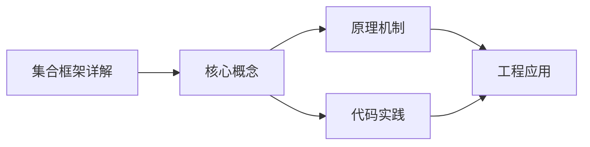
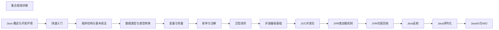

## 1. 学习目标（Bloom 分类）

本节按照布鲁姆教育目标分类学组织学习路径。本文主题为《集合框架详解》，属于 Java 模块，读者可以根据自身阶段选择阅读深度。

记忆层面：能够准确复述本文的核心概念、术语与基本语法或操作步骤，并能够在提问或检索时快速定位对应知识点。能够说出 Java 的编译执行模型（javac 到字节码，JVM 解释与 JIT）。

理解层面：能够用自己的语言解释核心原理与工作机制，说明概念之间的因果关系，而不是机械记忆结论。能够解释面向对象三大特性与 JVM 内存区域的职责。

应用层面：能够在真实项目或练习场景中运用本文知识解决具体问题，写出正确且可维护的实现。能够编写类、接口、集合操作与异常处理的完整程序。

分析层面：能够拆解复杂问题，比较本文主题与相邻概念的异同，识别边界条件与例外情况。能够分析 Java 与 C++、Go 在内存管理与并发模型上的差异。

评价层面：能够根据约束条件（性能、可读性、安全、成本）评价不同方案的优劣，做出有依据的技术决策。能够评价不同集合、并发工具与框架的适用场景。

创造层面：能够把本文知识与其他模块知识组合，设计出新的解决方案或可复用的工程模式。能够组合 Spring 生态设计企业级应用。

通过本节学习，读者应当能够把《集合框架详解》纳入自己的知识网络，并与 Java 模块的其他主题（JVM、集合框架、并发、Spring 生态）建立关联。

## 2. 历史动机与发展脉络

《集合框架详解》是 Java 领域的重要主题。要真正理解它，需要先了解它解决的问题与演进过程。

Java 由 James Gosling 领导的 Sun 团队于 1995 年发布，口号“一次编写，到处运行”依托 JVM 字节码实现跨平台。2006 年 Sun 将 Java 开源（OpenJDK），2010 年 Oracle 收购 Sun 后 Java 进入新的治理阶段。
Java 的版本节奏在 2017 年后改为每半年一个特性版本、每两年一个 LTS（长期支持）版本。当前主流 LTS 包括 Java 11、17、21 与 25；Java 21 引入虚拟线程（Project Loom 成果），显著降低高并发服务的线程成本。
Java 生态以 Spring 家族为核心：Spring Boot 简化配置与部署，Spring Cloud 提供微服务组件；构建工具从 Maven 演进到 Gradle；JVM 语言（Kotlin、Scala、Groovy）与 Java 共存互操作。
Android 开发早期使用 Java，2019 年后官方转向 Kotlin-first，但 Java 仍是服务端领域（尤其是金融、电商等企业系统）的中坚力量。

回到本文主题：集合框架详解 的提出与成熟，正是上述技术背景下的必然产物。早期实现往往以简单可用为目标，随着工程规模扩大，社区逐渐沉淀出标准做法与最佳实践；理解这一脉络，可以帮助读者判断“为什么文档中的推荐写法是现在这个样子”，也能在遇到历史遗留代码时准确识别其设计年代与取舍。

理解 Java 版本与 LTS 机制，是工程选型的起点：生产环境优先 LTS，新特性（如虚拟线程）可以在受控场景评估后引入。

## 3. 形式化定义与核心概念精讲

本节把《集合框架详解》涉及的核心概念以“定义 + 讲解”的形式展开。读者应把定义当作工具，把讲解当作理解路径；两者结合才能形成可迁移的知识。

JVM 与字节码：`javac` 把 .java 编译为 .class 字节码，JVM 加载、校验并执行；热点代码由 JIT（如 C2）编译为机器码，解释与编译结合实现启动速度与峰值性能的平衡。
面向对象：封装（访问控制）、继承（extends/implements）与多态（重载/重写）是 Java 的类型系统支柱；接口默认方法（Java 8）与密封类（Java 17）持续演进表达能力。
异常体系：受检异常（checked）编译期强制处理，非受检异常（RuntimeException）运行时抛出；try-with-resources 自动关闭资源。
泛型与擦除：Java 泛型在编译期检查后擦除类型参数，运行时无泛型信息；这解释了 `List<String>` 与 `List<Integer>` 的 Class 相同，以及通配符 `? extends` 的逆变协变规则。

### 3.1 原文章节逐一精讲

原文档把主题拆分为 21 个小节，下面按顺序给出每一节的导读讲解，随后保留原文细节供精读。

#### 原文精读（完整保留）

# Java 集合框架详解

> **符号约定**：`< >` 必填参数 | `[ ]` 可选参数

---

#### 1. 集合体系概览 (Hierarchy)

##### 1.1 集合框架的层次结构

Java 集合框架主要由以下接口和类组成：

- **Collection** 接口体系
  - **List**（有序可重复）
    - `ArrayList` — 动态数组，随机访问快
    - `LinkedList` — 双向链表，插入删除快
    - `Vector` — 线程安全的动态数组
  - **Set**（无序不重复）
    - `HashSet` — 哈希表实现，查找快
    - `TreeSet` — 红黑树实现，自然排序
    - `LinkedHashSet` — 保持插入顺序
  - **Queue**（队列）
    - `PriorityQueue` — 优先级队列

- **Map** 接口体系
  - `HashMap` — 哈希表实现，键值对存储
  - `TreeMap` — 红黑树实现，按键排序
  - `LinkedHashMap` — 保持插入顺序
  - `ConcurrentHashMap` — 线程安全的哈希表
  - `Hashtable` — 线程安全（遗留类）
  - `Properties` — 键值对配置

##### 1.2 核心接口

- **`Collection`**: 所有单列集合的根接口，定义了集合的基本操作
- **`List`**: 有序集合，允许重复元素，支持索引访问
- **`Set`**: 无序集合，不允许重复元素
- **`Queue`**: 队列接口，定义了队列的操作
- **`Map`**: 键值对集合，键唯一，值可以重复

#### 2. List 接口

##### 2.1 List 的特性

- **有序性**: 元素按插入顺序排列
- **可重复性**: 允许存储重复元素
- **索引访问**: 支持通过索引快速访问元素

##### 2.2 ArrayList

###### 2.2.1 特点

- **基于动态数组**实现
- **查询快速**: 时间复杂度 O(1)
- **增删较慢**: 时间复杂度 O(n)，需要移动元素
- **线程不安全**
- **初始容量**: 10，扩容因子 1.5

###### 2.2.2 常用方法

```java
 ArrayList<String> list = new ArrayList<>();
 // 添加元素
 list.add("Java");
 list.add(0, "Python"); // 在指定位置添加
 // 获取元素
 String element = list.get(0);
 // 修改元素
 list.set(1, "JavaScript");
 // 删除元素
 list.remove(0);
 list.remove("Java");
 // 其他方法
 int size = list.size();
 boolean contains = list.contains("Java");
 list.clear();
 boolean isEmpty = list.isEmpty();
```

##### 2.3 LinkedList

###### 2.3.1 特点

- **基于双向链表**实现
- **增删快速**: 时间复杂度 O(1)，只需修改指针
- **查询较慢**: 时间复杂度 O(n)，需要遍历
- **线程不安全**
- **实现了 List 和 Deque 接口**，可作为队列和栈使用

###### 2.3.2 常用方法

```java
 LinkedList<String> list = new LinkedList<>();
 // 添加元素
 list.add("Java");
 list.addFirst("Python");
 list.addLast("JavaScript");
 // 获取元素
 String first = list.getFirst();
 String last = list.getLast();
 // 删除元素
 list.removeFirst();
 list.removeLast();
 // 作为队列使用
 list.offer("C++"); // 入队
 String element = list.poll(); // 出队
 // 作为栈使用
 list.push("Go"); // 入栈
 String top = list.pop(); // 出栈
```

##### 2.4 Vector

###### 2.4.1 特点

- **基于动态数组**实现
- **线程安全**: 方法使用 synchronized 修饰
- **性能较差**: 由于线程安全开销
- **初始容量**: 10，扩容因子 2
- **不推荐使用**，建议使用 `Collections.synchronizedList()` 或 `CopyOnWriteArrayList`

#### 3. Set 接口

##### 3.1 Set 的特性

- **无序性**: 元素存储顺序不保证
- **唯一性**: 不允许存储重复元素
- **基于 equals() 和 hashCode() 方法**判断元素是否重复

##### 3.2 HashSet

###### 3.2.1 特点

- **基于 HashMap** 实现，使用 HashMap 的 key 存储元素
- **无序**: 元素存储顺序不保证
- **允许 null 元素**
- **线程不安全**
- **时间复杂度**: 添加、删除、查找均为 O(1)

###### 3.2.2 常用方法

```java
 HashSet<String> set = new HashSet<>();
 // 添加元素
 set.add("Java");
 set.add("Python");
 // 删除元素
 set.remove("Python");
 // 其他方法
 int size = set.size();
 boolean contains = set.contains("Java");
 set.clear();
 boolean isEmpty = set.isEmpty();
```

##### 3.3 TreeSet

###### 3.3.1 特点

- **基于红黑树**实现
- **有序**: 元素按自然顺序或自定义比较器排序
- **不允许 null 元素**
- **线程不安全**
- **时间复杂度**: 添加、删除、查找均为 O(log n)

###### 3.3.2 常用方法

```java
 // 自然排序
 TreeSet<Integer> set = new TreeSet<>();
 // 自定义比较器
 TreeSet<String> set = new TreeSet<>((s1, s2) -> s2.compareTo(s1)); // 降序
 // 添加元素
 set.add(10);
 set.add(5);
 set.add(15);
 // 特殊方法
 integer first = set.first(); // 获取第一个元素
 integer last = set.last(); // 获取最后一个元素
 integer higher = set.higher(10); // 获取大于10的最小元素
 integer lower = set.lower(10); // 获取小于10的最大元素
 integer ceiling = set.ceiling(10); // 获取大于等于10的最小元素
 integer floor = set.floor(10); // 获取小于等于10的最大元素
```

##### 3.4 LinkedHashSet

###### 3.4.1 特点

- **基于 LinkedHashMap** 实现
- **有序**: 维护元素的插入顺序
- **性能略低于 HashSet**，但提供了顺序保证
- **线程不安全**

#### 4. Map 接口

##### 4.1 Map 的特性

- **键值对存储**: 每个元素包含键和值
- **键唯一性**: 键不允许重复，值可以重复
- **无序性**: 大多数实现不保证键值对的顺序

##### 4.2 HashMap

###### 4.2.1 特点

- **基于哈希表**实现
- **允许 null 键和 null 值**
- **无序**: 键值对存储顺序不保证
- **线程不安全**
- **时间复杂度**: 添加、删除、查找均为 O(1)
- **初始容量**: 16，负载因子 0.75

###### 4.2.2 常用方法

```java
 HashMap<String, Integer> map = new HashMap<>();
 // 添加键值对
 map.put("Java", 100);
 map.put("Python", 90);
 // 获取值
 integer value = map.get("Java");
 // 修改值
 map.put("Java", 110); // 覆盖旧值
 // 删除键值对
 map.remove("Python");
 // 其他方法
 int size = map.size();
 boolean containsKey = map.containsKey("Java");
 boolean containsValue = map.containsValue(100);
 Set<String> keys = map.keySet(); // 获取所有键
 Collection<Integer> values = map.values(); // 获取所有值
 Set<Map.Entry<String, Integer>> entries = map.entrySet(); // 获取所有键值对
 map.clear();
 boolean isEmpty = map.isEmpty();
```

##### 4.3 TreeMap

###### 4.3.1 特点

- **基于红黑树**实现
- **有序**: 键按自然顺序或自定义比较器排序
- **不允许 null 键**，但允许 null 值
- **线程不安全**
- **时间复杂度**: 添加、删除、查找均为 O(log n)

###### 4.3.2 常用方法

```java
 // 自然排序
 TreeMap<String, Integer> map = new TreeMap<>();
 // 自定义比较器
 TreeMap<String, Integer> map = new TreeMap<>((s1, s2) -> s2.compareTo(s1)); // 降序
 // 添加键值对
 map.put("Java", 100);
 map.put("Python", 90);
 map.put("JavaScript", 80);
 // 特殊方法
 String firstKey = map.firstKey(); // 获取第一个键
 String lastKey = map.lastKey(); // 获取最后一个键
 Map.Entry<String, Integer> firstEntry = map.firstEntry(); // 获取第一个键值对
 Map.Entry<String, Integer> lastEntry = map.lastEntry(); // 获取最后一个键值对
 Map.Entry<String, Integer> higherEntry = map.higherEntry("Java"); // 获取大于Java的最小键值对
 Map.Entry<String, Integer> lowerEntry = map.lowerEntry("Java"); // 获取小于Java的最大键值对
```

##### 4.4 LinkedHashMap

###### 4.4.1 特点

- **基于哈希表和双向链表**实现
- **有序**: 维护键值对的插入顺序或访问顺序
- **性能略低于 HashMap**，但提供了顺序保证
- **线程不安全**

###### 4.4.2 访问顺序模式

```java
 // 构造函数第三个参数为  时，使用访问顺序
 LinkedHashMap<String, Integer> map = new LinkedHashMap<>(16, 0.75f, true);
 map.put("Java", 100);
 map.put("Python", 90);
 map.put("JavaScript", 80);
 // 访问元素，会将其移到链表尾部
 map.get("Java");
 // 遍历顺序：Python, JavaScript, Java（最近访问的在最后）
 for (Map.Entry<String, Integer> entry : map.entrySet()) {
  System.out.println(entry.getKey() + ": " + entry.getValue());
 }
```

##### 4.5 ConcurrentHashMap

###### 4.5.1 特点

- **线程安全**: 支持并发操作
- **分段锁**技术，性能优于 Hashtable
- **不允许 null 键和 null 值**
- **JUC 包中的类**，不属于 java.util

#### 5. 集合工具类

##### 5.1 java.util.Collections

###### 5.1.1 常用方法

- **排序方法**
- `sort(List<T>)`: 对列表进行自然排序
- `sort(List<T>, Comparator<? super T>)`: 使用自定义比较器排序
- `reverse(List<?> list)`: 反转列表
- `shuffle(List<?> list)`: 打乱列表顺序
- **查找方法**
- `binarySearch(List<? extends Comparable<? super T>> list, T key)`: 二分查找
- `max(Collection<? extends T>)`: 获取最大值
- `min(Collection<? extends T>)`: 获取最小值
- **线程安全方法**
- `synchronizedCollection(Collection<T>)`: 返回线程安全的集合
- `synchronizedList(List<T>)`: 返回线程安全的列表
- `synchronizedSet(Set<T>)`: 返回线程安全的集合
- `synchronizedMap(Map<K,V>)`: 返回线程安全的映射
- **不可变集合**
- `emptyList()`, `emptySet()`, `emptyMap()`: 返回空的不可变集合
- `singletonList(T)`, `singletonSet(T)`, `singletonMap(K,V)`: 返回只包含一个元素的不可变集合
- `unmodifiableList(List<? extends T>)`: 返回不可变的列表视图
- `unmodifiableSet(Set<? extends T>)`: 返回不可变的集合视图
- `unmodifiableMap(Map<? extends K, ? extends V>)`: 返回不可变的映射视图

##### 5.2 java.util.Arrays

- **asList(T... a)**: 将数组转换为列表
- **sort(Object[] a)**: 对数组排序
- **binarySearch(Object[] a, Object key)**: 对数组进行二分查找
- **toString(Object[] a)**: 将数组转换为字符串
- **equals(Object[] a, Object[] a2)**: 比较两个数组是否相等

#### 6. 遍历方式

##### 6.1 Iterator 迭代器

```java
 List<String> list = new ArrayList<>();
 list.add("Java");
 list.add("Python");
 list.add("JavaScript");
 // 使用 Iterator 遍历
 Iterator<String> iterator = list.iterator();
 while (iterator.hasNext()) {
  String element = iterator.next();
  System.out.println(element);
  // 可以安全删除元素
  if (element.equals("Python")) {
  iterator.remove();
  }
 }
```

##### 6.2 增强型 for 循环 (for-each)

```java
 // 遍历 List
 for (String element : list) {
  System.out.println(element);
 }
 // 遍历 Set
 for (String element : set) {
  System.out.println(element);
 }
 // 遍历 Map 的键
 for (String key : map.keySet()) {
  System.out.println(key + ": " + map.get(key));
 }
 // 遍历 Map 的键值对
 for (Map.Entry<String, Integer> entry : map.entrySet()) {
  System.out.println(entry.getKey() + ": " + entry.getValue());
 }
```

##### 6.3 Java 8+ forEach (Lambda 表达式)

```java
 // 遍历 List
 list.forEach(element -> System.out.println(element));
 // 遍历 Set
 set.forEach(element -> System.out.println(element));
 // 遍历 Map
 map.forEach((key, value) -> System.out.println(key + ": " + value));
```

##### 6.4 Java 8+ Stream API

```java
 // 使用 Stream 遍历并处理
 list.stream()
  .filter(element -> element.startsWith("J"))
  .map(String::toUpperCase)
  .forEach(System.out::println);
```

#### 7. 线程安全集合

##### 7.1 同步集合 (Synchronized Collections)

- **通过 Collections.synchronizedXXX() 创建**
- **方法级同步**，性能较低
- **示例**:

```java
 List<String> synchronizedList = Collections.synchronizedList(new ArrayList<>());
 Set<String> synchronizedSet = Collections.synchronizedSet(new HashSet<>());
 Map<String, Integer> synchronizedMap = Collections.synchronizedMap(new HashMap<>());
```

##### 7.2 并发集合 (Concurrent Collections)

- **JUC 包中的类**
- **更细粒度的锁**，性能更高
- **主要类**:
- `ConcurrentHashMap`: 线程安全的 HashMap
- `CopyOnWriteArrayList`: 适用于读多写少的场景
- `CopyOnWriteArraySet`: 基于 CopyOnWriteArrayList 实现
- `ConcurrentLinkedQueue`: 无界线程安全队列
- `BlockingQueue`: 阻塞队列接口，如 ArrayBlockingQueue, LinkedBlockingQueue

#### 8. Java 8+ 集合新特性

##### 8.1 Stream API

- **功能**: 提供函数式操作集合的能力
- **操作类型**:
- **中间操作**: filter, map, sorted, distinct, limit, skip
- **终端操作**: forEach, collect, reduce, count, anyMatch, allMatch, noneMatch

```java
 // Stream 示例
 List<String> result = list.stream()
  .filter(s -> s.length() > 5)
  .map(String::toUpperCase)
  .sorted()
  .collect(Collectors.toList());
```

##### 8.2 forEach 方法

- **所有集合接口**都添加了 forEach 方法
- **接受 Consumer 函数式接口**

##### 8.3 Map 新方法

- `forEach(BiConsumer<? super K, ? super V>)`: 遍历键值对
- `computeIfAbsent(K, Function<? super K, ? extends V>)`: 计算不存在的键的值
- `computeIfPresent(K, BiFunction<? super K, ? super V, ? extends V>)`: 计算存在的键的值
- `merge(K, V, BiFunction<? super V, ? super V, ? extends V>)`: 合并键的值
- `getOrDefault(Object, V)`: 获取键的值，不存在则返回默认值

#### 9. 实际应用案例

##### 9.1 列表去重

```java
 // 方法1：使用 HashSet
 List<String> list = Arrays.asList("Java", "Python", "Java", "JavaScript");
 Set<String> set = new HashSet<>(list);
 List<String> uniqueList = new ArrayList<>(set);
 // 方法2：使用 Stream
 List<String> uniqueList = list.stream()
  .distinct()
  .collect(Collectors.toList());
```

##### 9.2 列表排序

```java
 // 自然排序
 List<Integer> numbers = Arrays.asList(3, 1, 4, 1, 5, 9, 2, 6);
 Collections.sort(numbers);
 // 自定义排序
 List<String> names = Arrays.asList("Alice", "Bob", "Charlie", "David");
 Collections.sort(names, (s1, s2) -> s2.compareTo(s1)); // 降序
 // 使用 Stream 排序
 List<String> sortedNames = names.stream()
  .sorted(Comparator.reverseOrder())
  .collect(Collectors.toList());
```

##### 9.3 映射操作

```java
 // 统计单词出现次数
 List<String> words = Arrays.asList("Java", "Python", "Java", "JavaScript", "Python", "Java");
 Map<String, Integer> wordCount = new HashMap<>();
 for (String word : words) {
  wordCount.put(word, wordCount.getOrDefault(word, 0) + 1);
 }
 // 使用 Stream
 Map<String, Long> wordCount = words.stream()
  .collect(Collectors.groupingBy(Function.identity(), Collectors.counting()));
```

##### 9.4 集合转换

```java
 // 数组转集合
 String[] array = {"Java", "Python", "JavaScript"};
 List<String> list = Arrays.asList(array);
 Set<String> set = new HashSet<>(Arrays.asList(array));
 // 集合转数组
 List<String> list = Arrays.asList("Java", "Python", "JavaScript");
 String[] array = list.toArray(new String[0]);
 // List 转 Set
 Set<String> set = new HashSet<>(list);
 // Set 转 List
 List<String> list = new ArrayList<>(set);
```

#### 10. 性能分析

##### 10.1 List 实现类性能对比

| 操作     | ArrayList      | LinkedList | Vector         |
| -------- | -------------- | ---------- | -------------- |
| 随机访问 | O(1)           | O(n)       | O(1)           |
| 头部插入 | O(n)           | O(1)       | O(n)           |
| 中间插入 | O(n)           | O(n)       | O(n)           |
| 尾部插入 | O(1) amortized | O(1)       | O(1) amortized |
| 删除元素 | O(n)           | O(n)       | O(n)           |
| 线程安全 | 否             | 否         | 是             |

##### 10.2 Set 实现类性能对比

| 操作     | HashSet | TreeSet  | LinkedHashSet  |
| -------- | ------- | -------- | -------------- |
| 添加元素 | O(1)    | O(log n) | O(1)           |
| 删除元素 | O(1)    | O(log n) | O(1)           |
| 查找元素 | O(1)    | O(log n) | O(1)           |
| 有序性   | 否      | 是       | 是（插入顺序） |
| 线程安全 | 否      | 否       | 否             |

##### 10.3 Map 实现类性能对比

| 操作     | HashMap | TreeMap  | LinkedHashMap            | ConcurrentHashMap |
| -------- | ------- | -------- | ------------------------ | ----------------- |
| 添加元素 | O(1)    | O(log n) | O(1)                     | O(1)              |
| 删除元素 | O(1)    | O(log n) | O(1)                     | O(1)              |
| 查找元素 | O(1)    | O(log n) | O(1)                     | O(1)              |
| 有序性   | 否      | 是       | 是（插入顺序或访问顺序） | 否                |
| 线程安全 | 否      | 否       | 否                       | 是                |

#### 11. 最佳实践

##### 11.1 集合选择

- **需要索引访问**：使用 ArrayList
- **需要频繁增删**：使用 LinkedList
- **需要去重**：使用 Set
- **需要有序集合**：使用 TreeSet 或 LinkedHashSet
- **需要键值对存储**：使用 HashMap
- **需要有序的键值对**：使用 TreeMap 或 LinkedHashMap
- **多线程环境**：使用 ConcurrentHashMap 或 CopyOnWriteArrayList

##### 11.2 性能优化

- **初始化容量**：根据预期大小设置初始容量，减少扩容开销
- **选择合适的集合**：根据操作特点选择合适的集合实现
- **避免频繁修改**：对于读多写少的场景，使用 CopyOnWriteArrayList
- **使用 Stream API**：简洁高效地处理集合数据
- **避免自动装箱**：使用基本类型集合（如 IntArrayList）减少装箱开销

##### 11.3 注意事项

- **null 值处理**：不同集合对 null 值的处理不同
- **线程安全性**：多线程环境下注意集合的线程安全性
- **equals 和 hashCode**：使用自定义对象作为 Set 的元素或 Map 的键时，需要重写 equals 和 hashCode 方法
- **集合遍历**：遍历过程中修改集合需要使用 Iterator 的 remove 方法
- **资源释放**：对于大型集合，不再使用时应及时清空，避免内存泄漏

#### 12. 常见陷阱

##### 12.1 Arrays.asList() 的陷阱

- **返回的是固定大小的列表**，不支持 add 和 remove 操作
- **修改原数组会影响列表**，因为列表直接引用数组

```java
 String[] array = {"Java", "Python"};
 List<String> list = Arrays.asList(array);
 // 会抛出 UnsupportedOperationException
 // list.add("JavaScript");
 // 修改数组会影响列表
 array[0] = "C++";
 System.out.println(list.get(0)); // 输出: C++
```

##### 12.2 集合遍历中的修改

- **使用 for-each 遍历过程中修改集合会抛出 ConcurrentModificationException**
- **应该使用 Iterator 的 remove 方法**

```java
 // 错误：会抛出 ConcurrentModificationException
 for (String element : list) {
  if (element.equals("Python")) {
  list.remove(element);
  }
 }
 // 正确：使用 Iterator
 Iterator<String> iterator = list.iterator();
 while (iterator.hasNext()) {
  String element = iterator.next();
  if (element.equals("Python")) {
  iterator.remove();
  }
 }
```

##### 12.3 哈希集合的 equals 和 hashCode

- **使用自定义对象作为 HashSet 的元素或 HashMap 的键时，必须重写 equals 和 hashCode 方法**
- **否则会导致重复元素无法被检测**

```java
 class Person {
  private String name;
  private int age;
  // 必须重写 equals 和 hashCode
  @Override
  public boolean equals(Object o) {
  if (this == o) return true;
  if (o == null || getClass() != o.getClass()) return false;
  Person person = (Person) o;
  return age == person.age && Objects.equals(name, person.name);
  }
  @Override
  public int hashCode() {
  return Objects.hash(name, age);
  }
 }
```

---

#### ArrayList

**基本写法：创建 ArrayList**
`List<<类型>> <变量> = new ArrayList<>();`
```java
// 创建字符串 ArrayList
List<String> list = new ArrayList<>();
```

---

**基本写法：添加元素**
`<list>.add(<元素>);`
```java
// 向列表末尾添加元素
list.add("Apple");
```

---

**基本写法：指定位置添加**
`<list>.add(<索引>, <元素>);`
```java
// 在指定位置插入元素
list.add(0, "Banana");
```

---

**基本写法：获取元素**
`<list>.get(<索引>);`
```java
// 获取指定位置的元素
String item = list.get(0);
```

---

**基本写法：修改元素**
`<list>.set(<索引>, <元素>);`
```java
// 替换指定位置的元素
list.set(0, "Cherry");
```

---

**基本写法：删除元素**
`<list>.remove(<索引>);`
```java
// 删除指定位置的元素
list.remove(0);
```

---

**基本写法：获取大小**
`<list>.size();`
```java
// 获取列表元素个数
int size = list.size();
```

---

**基本写法：判断包含**
`<list>.contains(<元素>);`
```java
// 判断列表是否包含元素
boolean has = list.contains("Apple");
```

---

**基本写法：清空列表**
`<list>.clear();`
```java
// 清空列表所有元素
list.clear();
```

---

**基本写法：遍历 ArrayList**
`for (<类型> <变量> : <list>) { }`
```java
// 增强 for 循环遍历
for (String item : list) {
}
```

---

#### LinkedList

**基本写法：创建 LinkedList**
`LinkedList<<类型>> <变量> = new LinkedList<>();`
```java
// 创建 LinkedList
LinkedList<String> linked = new LinkedList<>();
```

---

**基本写法：头部添加**
`<list>.addFirst(<元素>);`
```java
// 在列表头部添加元素
linked.addFirst("First");
```

---

**基本写法：尾部添加**
`<list>.addLast(<元素>);`
```java
// 在列表尾部添加元素
linked.addLast("Last");
```

---

**基本写法：获取头部**
`<list>.getFirst();`
```java
// 获取列表头部元素
String first = linked.getFirst();
```

---

**基本写法：获取尾部**
`<list>.getLast();`
```java
// 获取列表尾部元素
String last = linked.getLast();
```

---

**基本写法：删除头部**
`<list>.removeFirst();`
```java
// 删除并返回头部元素
String removed = linked.removeFirst();
```

---

#### HashMap

**基本写法：创建 HashMap**
`Map<<键类型>, <值类型>> <变量> = new HashMap<>();`
```java
// 创建 HashMap
Map<String, Integer> map = new HashMap<>();
```

---

**基本写法：添加键值对**
`<map>.put(<键>, <值>);`
```java
// 向 Map 添加键值对
map.put("Alice", 25);
```

---

**基本写法：获取值**
`<map>.get(<键>);`
```java
// 根据键获取值
Integer age = map.get("Alice");
```

---

**基本写法：删除键值对**
`<map>.remove(<键>);`
```java
// 根据键删除键值对
map.remove("Alice");
```

---

**基本写法：判断包含键**
`<map>.containsKey(<键>);`
```java
// 判断是否包含指定键
boolean has = map.containsKey("Alice");
```

---

**基本写法：判断包含值**
`<map>.containsValue(<值>);`
```java
// 判断是否包含指定值
boolean has = map.containsValue(25);
```

---

**基本写法：获取所有键**
`<map>.keySet();`
```java
// 获取所有键的集合
Set<String> keys = map.keySet();
```

---

**基本写法：获取所有值**
`<map>.values();`
```java
// 获取所有值的集合
Collection<Integer> values = map.values();
```

---

**基本写法：获取所有键值对**
`<map>.entrySet();`
```java
// 获取所有键值对集合
Set<Map.Entry<String, Integer>> entries = map.entrySet();
```

---

**基本写法：遍历 Map**
`for (Map.Entry<<键类型>, <值类型>> <变量> : <map>.entrySet()) { }`
```java
// 遍历 Map 的键值对
for (Map.Entry<String, Integer> entry : map.entrySet()) {
    String key = entry.getKey();
    Integer value = entry.getValue();
}
```

---

#### HashSet

**基本写法：创建 HashSet**
`Set<<类型>> <变量> = new HashSet<>();`
```java
// 创建 HashSet
Set<String> set = new HashSet<>();
```

---

**基本写法：添加元素**
`<set>.add(<元素>);`
```java
// 向 Set 添加元素
set.add("Apple");
```

---

**基本写法：删除元素**
`<set>.remove(<元素>);`
```java
// 从 Set 删除元素
set.remove("Apple");
```

---

**基本写法：判断包含**
`<set>.contains(<元素>);`
```java
// 判断 Set 是否包含元素
boolean has = set.contains("Apple");
```

---

**基本写法：遍历 Set**
`for (<类型> <变量> : <set>) { }`
```java
// 遍历 Set
for (String item : set) {
}
```

---

#### TreeMap

**基本写法：创建 TreeMap**
`Map<<键类型>, <值类型>> <变量> = new TreeMap<>();`
```java
// 创建按键排序的 TreeMap
Map<String, Integer> treeMap = new TreeMap<>();
```

---

**基本写法：获取第一个键**
`((TreeMap<<K>, <V>>) <map>).firstKey();`
```java
// 获取最小的键
String first = ((TreeMap<String, Integer>) treeMap).firstKey();
```

---

**基本写法：获取最后一个键**
`((TreeMap<<K>, <V>>) <map>).lastKey();`
```java
// 获取最大的键
String last = ((TreeMap<String, Integer>) treeMap).lastKey();
```

---

#### 集合工具

**基本写法：排序 List**
`Collections.sort(<list>);`
```java
// 对 List 进行升序排序
Collections.sort(list);
```

---

**基本写法：降序排序**
`Collections.sort(<list>, Collections.reverseOrder());`
```java
// 对 List 进行降序排序
Collections.sort(list, Collections.reverseOrder());
```

---

**基本写法：反转 List**
`Collections.reverse(<list>);`
```java
// 反转 List 中元素的顺序
Collections.reverse(list);
```

---

**基本写法：打乱顺序**
`Collections.shuffle(<list>);`
```java
// 随机打乱 List 中元素的顺序
Collections.shuffle(list);
```

---

**基本写法：查找最大值**
`Collections.max(<list>);`
```java
// 查找 List 中的最大值
String max = Collections.max(list);
```

---

**基本写法：查找最小值**
`Collections.min(<list>);`
```java
// 查找 List 中的最小值
String min = Collections.min(list);
```

---

**基本写法：填充 List**
`Collections.fill(<list>, <值>);`
```java
// 用指定值填充整个 List
Collections.fill(list, "Default");
```

---

**基本写法：不可变 List**
`List.of(<元素1>, <元素2>)`
```java
// Java 9+ 创建不可变 List
List<String> immutable = List.of("A", "B", "C");
```

---

**基本写法：不可变 Set**
`Set.of(<元素1>, <元素2>)`
```java
// Java 9+ 创建不可变 Set
Set<String> immutable = Set.of("A", "B", "C");
```

---

**基本写法：不可变 Map**
`Map.of(<键1>, <值1>, <键2>, <值2>)`
```java
// Java 9+ 创建不可变 Map
Map<String, Integer> immutable = Map.of("A", 1, "B", 2);
```

---

#### 迭代器

**基本写法：获取迭代器**
`<集合>.iterator()`
```java
// 获取集合的迭代器
Iterator<String> it = list.iterator();
```

---

**基本写法：迭代器遍历**
`while (<迭代器>.hasNext()) { <迭代器>.next(); }`
```java
// 使用迭代器遍历
while (it.hasNext()) {
    String item = it.next();
}
```

---

**基本写法：迭代器删除**
`<迭代器>.remove();`
```java
// 使用迭代器安全删除元素
while (it.hasNext()) {
    String item = it.next();
    it.remove();
}
```

---

#### 集合转换

**基本写法：List 转数组**
`<list>.toArray(new <类型>[0]);`
```java
// 将 List 转换为数组
String[] arr = list.toArray(new String[0]);
```

---

**基本写法：数组转 List**
`Arrays.asList(<数组>);`
```java
// 将数组转换为 List
String[] arr = {"A", "B"};
List<String> list = Arrays.asList(arr);
```

---

**基本写法：List 转 Set**
`new HashSet<>(<list>);`
```java
// 将 List 转换为 Set 去重
Set<String> set = new HashSet<>(list);
```

---

#### 集合流操作

**基本写法：创建流**
`<集合>.stream()`
```java
// 从集合创建流
list.stream();
```

---

**基本写法：过滤**
`<stream>.filter(<条件>)`
```java
// 过滤满足条件的元素
list.stream().filter(s -> s.length() > 3);
```

---

**基本写法：映射**
`<stream>.map(<映射函数>)`
```java
// 将元素映射为新元素
list.stream().map(String::toUpperCase);
```

---

**基本写法：收集为 List**
`<stream>.collect(Collectors.toList())`
```java
// 将流收集为 List
List<String> result = list.stream().collect(Collectors.toList());
```

---

**基本写法：计数**
`<stream>.count()`
```java
// 统计流中元素个数
long count = list.stream().count();
```


### 3.2 概念关系图

下面用 Mermaid 图表达本文核心概念之间的关系，帮助读者建立整体图景：



图中展示的是本文知识的结构化关系：核心概念是入口，原理机制解释“为什么”，代码实践演示“怎么做”，工程应用回答“何时用”。读者学习时可以把每个小节的内容挂接到对应节点上。

## 4. 理论推导与原理解析

本节深入《集合框架详解》背后的原理。理论部分不求面面俱到，而是聚焦“能解释现象、能指导实践”的关键推导。

JVM 内存模型：堆（新生代/老年代）、元空间、虚拟机栈、本地方法栈与程序计数器；GC 从 CMS 演进到 G1（默认）、ZGC（超低延迟），理解分代收集是调优前提。
并发工具：synchronized 与 JUC（java.util.concurrent）的锁、并发容器、线程池、CompletableFuture 构成并发工具箱；Java 21 的虚拟线程让“每任务一线程”成为可能。
类加载机制：双亲委派模型保证类唯一性，SPI（ServiceLoader）打破委派实现扩展；自定义类加载器是热部署与隔离的基础。
反射与注解：反射在运行时检查类结构，注解提供元数据；Spring 的依赖注入与 AOP 均基于这些机制，但反射有性能与安全成本。

需要强调的是，理论推导与工程实践之间存在翻译层：理论给出的是理想化模型与边界条件，工程代码则必须处理真实环境中的例外。读者在学习时应先掌握理论的“标准情形”，再通过陷阱章节了解“非标准情形”。

## 5. 代码示例与逐行讲解

本节把原文中的代码示例系统整理，并为每个示例补充用途说明与讲解。读者不应只浏览代码，而应逐段对照讲解理解设计意图。

### 5.1 示例：2.2.2 常用方法

该示例来自原文《2.2.2 常用方法》小节，用于演示集合框架详解相关操作。阅读时请先看代码结构，再看其后的讲解。

```java
 ArrayList<String> list = new ArrayList<>();
 // 添加元素
 list.add("Java");
 list.add(0, "Python"); // 在指定位置添加
 // 获取元素
 String element = list.get(0);
 // 修改元素
 list.set(1, "JavaScript");
 // 删除元素
 list.remove(0);
 list.remove("Java");
 // 其他方法
 int size = list.size();
 boolean contains = list.contains("Java");
 list.clear();
 boolean isEmpty = list.isEmpty();
```

讲解：这段代码演示了本节核心知识点。代码中的关键操作可以归纳为三步：准备（定义或初始化）、执行（核心逻辑）、收尾（释放资源或返回结果）。实际项目中，这三步往往被封装为函数或类，以提升复用性与可测试性。

关键点分析：

该示例共 16 行有效代码，结构以数据或配置为主。阅读时应关注：数据字段的含义、配置项的作用，以及它们与运行行为的对应关系。

进阶思考路径：先尝试修改参数观察行为变化，再把示例中的模式迁移到自己的项目中；每次修改都记录预期与实测差异，这是把示例转化为能力的最快方式。

### 5.2 示例：2.3.2 常用方法

该示例来自原文《2.3.2 常用方法》小节，用于演示集合框架详解相关操作。阅读时请先看代码结构，再看其后的讲解。

```java
 LinkedList<String> list = new LinkedList<>();
 // 添加元素
 list.add("Java");
 list.addFirst("Python");
 list.addLast("JavaScript");
 // 获取元素
 String first = list.getFirst();
 String last = list.getLast();
 // 删除元素
 list.removeFirst();
 list.removeLast();
 // 作为队列使用
 list.offer("C++"); // 入队
 String element = list.poll(); // 出队
 // 作为栈使用
 list.push("Go"); // 入栈
 String top = list.pop(); // 出栈
```

讲解：这段代码演示了本节核心知识点。代码中的关键操作可以归纳为三步：准备（定义或初始化）、执行（核心逻辑）、收尾（释放资源或返回结果）。实际项目中，这三步往往被封装为函数或类，以提升复用性与可测试性。

关键点分析：

该示例共 17 行有效代码，结构以数据或配置为主。阅读时应关注：数据字段的含义、配置项的作用，以及它们与运行行为的对应关系。

进阶思考路径：先尝试修改参数观察行为变化，再把示例中的模式迁移到自己的项目中；每次修改都记录预期与实测差异，这是把示例转化为能力的最快方式。

### 5.3 示例：3.2.2 常用方法

该示例来自原文《3.2.2 常用方法》小节，用于演示集合框架详解相关操作。阅读时请先看代码结构，再看其后的讲解。

```java
 HashSet<String> set = new HashSet<>();
 // 添加元素
 set.add("Java");
 set.add("Python");
 // 删除元素
 set.remove("Python");
 // 其他方法
 int size = set.size();
 boolean contains = set.contains("Java");
 set.clear();
 boolean isEmpty = set.isEmpty();
```

讲解：这段代码演示了本节核心知识点。代码中的关键操作可以归纳为三步：准备（定义或初始化）、执行（核心逻辑）、收尾（释放资源或返回结果）。实际项目中，这三步往往被封装为函数或类，以提升复用性与可测试性。

关键点分析：

该示例共 11 行有效代码，结构以数据或配置为主。阅读时应关注：数据字段的含义、配置项的作用，以及它们与运行行为的对应关系。

进阶思考路径：先尝试修改参数观察行为变化，再把示例中的模式迁移到自己的项目中；每次修改都记录预期与实测差异，这是把示例转化为能力的最快方式。

### 5.4 示例：3.3.2 常用方法

该示例来自原文《3.3.2 常用方法》小节，用于演示集合框架详解相关操作。阅读时请先看代码结构，再看其后的讲解。

```java
 // 自然排序
 TreeSet<Integer> set = new TreeSet<>();
 // 自定义比较器
 TreeSet<String> set = new TreeSet<>((s1, s2) -> s2.compareTo(s1)); // 降序
 // 添加元素
 set.add(10);
 set.add(5);
 set.add(15);
 // 特殊方法
 integer first = set.first(); // 获取第一个元素
 integer last = set.last(); // 获取最后一个元素
 integer higher = set.higher(10); // 获取大于10的最小元素
 integer lower = set.lower(10); // 获取小于10的最大元素
 integer ceiling = set.ceiling(10); // 获取大于等于10的最小元素
 integer floor = set.floor(10); // 获取小于等于10的最大元素
```

讲解：这段代码演示了本节核心知识点。代码中的关键操作可以归纳为三步：准备（定义或初始化）、执行（核心逻辑）、收尾（释放资源或返回结果）。实际项目中，这三步往往被封装为函数或类，以提升复用性与可测试性。

关键点分析：

该示例共 15 行有效代码，结构以数据或配置为主。阅读时应关注：数据字段的含义、配置项的作用，以及它们与运行行为的对应关系。

进阶思考路径：先尝试修改参数观察行为变化，再把示例中的模式迁移到自己的项目中；每次修改都记录预期与实测差异，这是把示例转化为能力的最快方式。

### 5.5 示例：4.2.2 常用方法

该示例来自原文《4.2.2 常用方法》小节，用于演示集合框架详解相关操作。阅读时请先看代码结构，再看其后的讲解。

```java
 HashMap<String, Integer> map = new HashMap<>();
 // 添加键值对
 map.put("Java", 100);
 map.put("Python", 90);
 // 获取值
 integer value = map.get("Java");
 // 修改值
 map.put("Java", 110); // 覆盖旧值
 // 删除键值对
 map.remove("Python");
 // 其他方法
 int size = map.size();
 boolean containsKey = map.containsKey("Java");
 boolean containsValue = map.containsValue(100);
 Set<String> keys = map.keySet(); // 获取所有键
 Collection<Integer> values = map.values(); // 获取所有值
 Set<Map.Entry<String, Integer>> entries = map.entrySet(); // 获取所有键值对
 map.clear();
 boolean isEmpty = map.isEmpty();
```

讲解：这段代码演示了本节核心知识点。代码中的关键操作可以归纳为三步：准备（定义或初始化）、执行（核心逻辑）、收尾（释放资源或返回结果）。实际项目中，这三步往往被封装为函数或类，以提升复用性与可测试性。

关键点分析：

该示例共 19 行有效代码，结构以数据或配置为主。阅读时应关注：数据字段的含义、配置项的作用，以及它们与运行行为的对应关系。

进阶思考路径：先尝试修改参数观察行为变化，再把示例中的模式迁移到自己的项目中；每次修改都记录预期与实测差异，这是把示例转化为能力的最快方式。

### 5.6 示例：4.3.2 常用方法

该示例来自原文《4.3.2 常用方法》小节，用于演示集合框架详解相关操作。阅读时请先看代码结构，再看其后的讲解。

```java
 // 自然排序
 TreeMap<String, Integer> map = new TreeMap<>();
 // 自定义比较器
 TreeMap<String, Integer> map = new TreeMap<>((s1, s2) -> s2.compareTo(s1)); // 降序
 // 添加键值对
 map.put("Java", 100);
 map.put("Python", 90);
 map.put("JavaScript", 80);
 // 特殊方法
 String firstKey = map.firstKey(); // 获取第一个键
 String lastKey = map.lastKey(); // 获取最后一个键
 Map.Entry<String, Integer> firstEntry = map.firstEntry(); // 获取第一个键值对
 Map.Entry<String, Integer> lastEntry = map.lastEntry(); // 获取最后一个键值对
 Map.Entry<String, Integer> higherEntry = map.higherEntry("Java"); // 获取大于Java的最小键值对
 Map.Entry<String, Integer> lowerEntry = map.lowerEntry("Java"); // 获取小于Java的最大键值对
```

讲解：这段代码演示了本节核心知识点。代码中的关键操作可以归纳为三步：准备（定义或初始化）、执行（核心逻辑）、收尾（释放资源或返回结果）。实际项目中，这三步往往被封装为函数或类，以提升复用性与可测试性。

关键点分析：

该示例共 15 行有效代码，结构以数据或配置为主。阅读时应关注：数据字段的含义、配置项的作用，以及它们与运行行为的对应关系。

进阶思考路径：先尝试修改参数观察行为变化，再把示例中的模式迁移到自己的项目中；每次修改都记录预期与实测差异，这是把示例转化为能力的最快方式。

### 5.7 示例：4.4.2 访问顺序模式

该示例来自原文《4.4.2 访问顺序模式》小节，用于演示集合框架详解相关操作。阅读时请先看代码结构，再看其后的讲解。

```java
 // 构造函数第三个参数为  时，使用访问顺序
 LinkedHashMap<String, Integer> map = new LinkedHashMap<>(16, 0.75f, true);
 map.put("Java", 100);
 map.put("Python", 90);
 map.put("JavaScript", 80);
 // 访问元素，会将其移到链表尾部
 map.get("Java");
 // 遍历顺序：Python, JavaScript, Java（最近访问的在最后）
 for (Map.Entry<String, Integer> entry : map.entrySet()) {
  System.out.println(entry.getKey() + ": " + entry.getValue());
 }
```

讲解：这段代码演示了本节核心知识点。代码中的关键操作可以归纳为三步：准备（定义或初始化）、执行（核心逻辑）、收尾（释放资源或返回结果）。实际项目中，这三步往往被封装为函数或类，以提升复用性与可测试性。

关键点分析：

该示例共 11 行有效代码，包含 1 类关键结构（for）。其中：

- 入口与初始化部分负责建立上下文，对应实际项目中的启动或装配逻辑；
- 核心逻辑部分体现本文主题的主要操作，是阅读时最需要对照讲解理解的部分；
- 输出或返回部分把结果交给调用方，注意其类型与边界条件。

进阶思考路径：先尝试修改参数观察行为变化，再把示例中的模式迁移到自己的项目中；每次修改都记录预期与实测差异，这是把示例转化为能力的最快方式。

### 5.8 示例：6.1 Iterator 迭代器

该示例来自原文《6.1 Iterator 迭代器》小节，用于演示集合框架详解相关操作。阅读时请先看代码结构，再看其后的讲解。

```java
 List<String> list = new ArrayList<>();
 list.add("Java");
 list.add("Python");
 list.add("JavaScript");
 // 使用 Iterator 遍历
 Iterator<String> iterator = list.iterator();
 while (iterator.hasNext()) {
  String element = iterator.next();
  System.out.println(element);
  // 可以安全删除元素
  if (element.equals("Python")) {
  iterator.remove();
  }
 }
```

讲解：这段代码演示了本节核心知识点。代码中的关键操作可以归纳为三步：准备（定义或初始化）、执行（核心逻辑）、收尾（释放资源或返回结果）。实际项目中，这三步往往被封装为函数或类，以提升复用性与可测试性。

关键点分析：

该示例共 14 行有效代码，包含 2 类关键结构（if、while）。其中：

- 入口与初始化部分负责建立上下文，对应实际项目中的启动或装配逻辑；
- 核心逻辑部分体现本文主题的主要操作，是阅读时最需要对照讲解理解的部分；
- 输出或返回部分把结果交给调用方，注意其类型与边界条件。

进阶思考路径：先尝试修改参数观察行为变化，再把示例中的模式迁移到自己的项目中；每次修改都记录预期与实测差异，这是把示例转化为能力的最快方式。

### 5.9 示例：6.2 增强型 for 循环 (for-each)

该示例来自原文《6.2 增强型 for 循环 (for-each)》小节，用于演示集合框架详解相关操作。阅读时请先看代码结构，再看其后的讲解。

```java
 // 遍历 List
 for (String element : list) {
  System.out.println(element);
 }
 // 遍历 Set
 for (String element : set) {
  System.out.println(element);
 }
 // 遍历 Map 的键
 for (String key : map.keySet()) {
  System.out.println(key + ": " + map.get(key));
 }
 // 遍历 Map 的键值对
 for (Map.Entry<String, Integer> entry : map.entrySet()) {
  System.out.println(entry.getKey() + ": " + entry.getValue());
 }
```

讲解：这段代码演示了本节核心知识点。代码中的关键操作可以归纳为三步：准备（定义或初始化）、执行（核心逻辑）、收尾（释放资源或返回结果）。实际项目中，这三步往往被封装为函数或类，以提升复用性与可测试性。

关键点分析：

该示例共 16 行有效代码，包含 1 类关键结构（for）。其中：

- 入口与初始化部分负责建立上下文，对应实际项目中的启动或装配逻辑；
- 核心逻辑部分体现本文主题的主要操作，是阅读时最需要对照讲解理解的部分；
- 输出或返回部分把结果交给调用方，注意其类型与边界条件。

进阶思考路径：先尝试修改参数观察行为变化，再把示例中的模式迁移到自己的项目中；每次修改都记录预期与实测差异，这是把示例转化为能力的最快方式。

### 5.10 示例：6.3 Java 8+ forEach (Lambda 表达式)

该示例来自原文《6.3 Java 8+ forEach (Lambda 表达式)》小节，用于演示集合框架详解相关操作。阅读时请先看代码结构，再看其后的讲解。

```java
 // 遍历 List
 list.forEach(element -> System.out.println(element));
 // 遍历 Set
 set.forEach(element -> System.out.println(element));
 // 遍历 Map
 map.forEach((key, value) -> System.out.println(key + ": " + value));
```

讲解：这段代码演示了本节核心知识点。代码中的关键操作可以归纳为三步：准备（定义或初始化）、执行（核心逻辑）、收尾（释放资源或返回结果）。实际项目中，这三步往往被封装为函数或类，以提升复用性与可测试性。

关键点分析：

该示例共 6 行有效代码，结构以数据或配置为主。阅读时应关注：数据字段的含义、配置项的作用，以及它们与运行行为的对应关系。

进阶思考路径：先尝试修改参数观察行为变化，再把示例中的模式迁移到自己的项目中；每次修改都记录预期与实测差异，这是把示例转化为能力的最快方式。

### 5.11 示例：6.4 Java 8+ Stream API

该示例来自原文《6.4 Java 8+ Stream API》小节，用于演示集合框架详解相关操作。阅读时请先看代码结构，再看其后的讲解。

```java
 // 使用 Stream 遍历并处理
 list.stream()
  .filter(element -> element.startsWith("J"))
  .map(String::toUpperCase)
  .forEach(System.out::println);
```

讲解：这段代码演示了本节核心知识点。代码中的关键操作可以归纳为三步：准备（定义或初始化）、执行（核心逻辑）、收尾（释放资源或返回结果）。实际项目中，这三步往往被封装为函数或类，以提升复用性与可测试性。

关键点分析：

该示例共 5 行有效代码，结构以数据或配置为主。阅读时应关注：数据字段的含义、配置项的作用，以及它们与运行行为的对应关系。

进阶思考路径：先尝试修改参数观察行为变化，再把示例中的模式迁移到自己的项目中；每次修改都记录预期与实测差异，这是把示例转化为能力的最快方式。

### 5.12 示例：7.1 同步集合 (Synchronized Collections)

该示例来自原文《7.1 同步集合 (Synchronized Collections)》小节，用于演示集合框架详解相关操作。阅读时请先看代码结构，再看其后的讲解。

```java
 List<String> synchronizedList = Collections.synchronizedList(new ArrayList<>());
 Set<String> synchronizedSet = Collections.synchronizedSet(new HashSet<>());
 Map<String, Integer> synchronizedMap = Collections.synchronizedMap(new HashMap<>());
```

讲解：这段代码演示了本节核心知识点。代码中的关键操作可以归纳为三步：准备（定义或初始化）、执行（核心逻辑）、收尾（释放资源或返回结果）。实际项目中，这三步往往被封装为函数或类，以提升复用性与可测试性。

关键点分析：

该示例共 3 行有效代码，结构以数据或配置为主。阅读时应关注：数据字段的含义、配置项的作用，以及它们与运行行为的对应关系。

进阶思考路径：先尝试修改参数观察行为变化，再把示例中的模式迁移到自己的项目中；每次修改都记录预期与实测差异，这是把示例转化为能力的最快方式。

### 5.13 示例：8.1 Stream API

该示例来自原文《8.1 Stream API》小节，用于演示集合框架详解相关操作。阅读时请先看代码结构，再看其后的讲解。

```java
 // Stream 示例
 List<String> result = list.stream()
  .filter(s -> s.length() > 5)
  .map(String::toUpperCase)
  .sorted()
  .collect(Collectors.toList());
```

讲解：这段代码演示了本节核心知识点。代码中的关键操作可以归纳为三步：准备（定义或初始化）、执行（核心逻辑）、收尾（释放资源或返回结果）。实际项目中，这三步往往被封装为函数或类，以提升复用性与可测试性。

关键点分析：

该示例共 6 行有效代码，结构以数据或配置为主。阅读时应关注：数据字段的含义、配置项的作用，以及它们与运行行为的对应关系。

进阶思考路径：先尝试修改参数观察行为变化，再把示例中的模式迁移到自己的项目中；每次修改都记录预期与实测差异，这是把示例转化为能力的最快方式。

### 5.14 示例：9.1 列表去重

该示例来自原文《9.1 列表去重》小节，用于演示集合框架详解相关操作。阅读时请先看代码结构，再看其后的讲解。

```java
 // 方法1：使用 HashSet
 List<String> list = Arrays.asList("Java", "Python", "Java", "JavaScript");
 Set<String> set = new HashSet<>(list);
 List<String> uniqueList = new ArrayList<>(set);
 // 方法2：使用 Stream
 List<String> uniqueList = list.stream()
  .distinct()
  .collect(Collectors.toList());
```

讲解：这段代码演示了本节核心知识点。代码中的关键操作可以归纳为三步：准备（定义或初始化）、执行（核心逻辑）、收尾（释放资源或返回结果）。实际项目中，这三步往往被封装为函数或类，以提升复用性与可测试性。

关键点分析：

该示例共 8 行有效代码，结构以数据或配置为主。阅读时应关注：数据字段的含义、配置项的作用，以及它们与运行行为的对应关系。

进阶思考路径：先尝试修改参数观察行为变化，再把示例中的模式迁移到自己的项目中；每次修改都记录预期与实测差异，这是把示例转化为能力的最快方式。

### 5.15 示例：9.2 列表排序

该示例来自原文《9.2 列表排序》小节，用于演示集合框架详解相关操作。阅读时请先看代码结构，再看其后的讲解。

```java
 // 自然排序
 List<Integer> numbers = Arrays.asList(3, 1, 4, 1, 5, 9, 2, 6);
 Collections.sort(numbers);
 // 自定义排序
 List<String> names = Arrays.asList("Alice", "Bob", "Charlie", "David");
 Collections.sort(names, (s1, s2) -> s2.compareTo(s1)); // 降序
 // 使用 Stream 排序
 List<String> sortedNames = names.stream()
  .sorted(Comparator.reverseOrder())
  .collect(Collectors.toList());
```

讲解：这段代码演示了本节核心知识点。代码中的关键操作可以归纳为三步：准备（定义或初始化）、执行（核心逻辑）、收尾（释放资源或返回结果）。实际项目中，这三步往往被封装为函数或类，以提升复用性与可测试性。

关键点分析：

该示例共 10 行有效代码，结构以数据或配置为主。阅读时应关注：数据字段的含义、配置项的作用，以及它们与运行行为的对应关系。

进阶思考路径：先尝试修改参数观察行为变化，再把示例中的模式迁移到自己的项目中；每次修改都记录预期与实测差异，这是把示例转化为能力的最快方式。

### 5.16 示例：9.3 映射操作

该示例来自原文《9.3 映射操作》小节，用于演示集合框架详解相关操作。阅读时请先看代码结构，再看其后的讲解。

```java
 // 统计单词出现次数
 List<String> words = Arrays.asList("Java", "Python", "Java", "JavaScript", "Python", "Java");
 Map<String, Integer> wordCount = new HashMap<>();
 for (String word : words) {
  wordCount.put(word, wordCount.getOrDefault(word, 0) + 1);
 }
 // 使用 Stream
 Map<String, Long> wordCount = words.stream()
  .collect(Collectors.groupingBy(Function.identity(), Collectors.counting()));
```

讲解：这段代码演示了本节核心知识点。代码中的关键操作可以归纳为三步：准备（定义或初始化）、执行（核心逻辑）、收尾（释放资源或返回结果）。实际项目中，这三步往往被封装为函数或类，以提升复用性与可测试性。

关键点分析：

该示例共 9 行有效代码，包含 1 类关键结构（for）。其中：

- 入口与初始化部分负责建立上下文，对应实际项目中的启动或装配逻辑；
- 核心逻辑部分体现本文主题的主要操作，是阅读时最需要对照讲解理解的部分；
- 输出或返回部分把结果交给调用方，注意其类型与边界条件。

进阶思考路径：先尝试修改参数观察行为变化，再把示例中的模式迁移到自己的项目中；每次修改都记录预期与实测差异，这是把示例转化为能力的最快方式。

### 5.17 示例：9.4 集合转换

该示例来自原文《9.4 集合转换》小节，用于演示集合框架详解相关操作。阅读时请先看代码结构，再看其后的讲解。

```java
 // 数组转集合
 String[] array = {"Java", "Python", "JavaScript"};
 List<String> list = Arrays.asList(array);
 Set<String> set = new HashSet<>(Arrays.asList(array));
 // 集合转数组
 List<String> list = Arrays.asList("Java", "Python", "JavaScript");
 String[] array = list.toArray(new String[0]);
 // List 转 Set
 Set<String> set = new HashSet<>(list);
 // Set 转 List
 List<String> list = new ArrayList<>(set);
```

讲解：这段代码演示了本节核心知识点。代码中的关键操作可以归纳为三步：准备（定义或初始化）、执行（核心逻辑）、收尾（释放资源或返回结果）。实际项目中，这三步往往被封装为函数或类，以提升复用性与可测试性。

关键点分析：

该示例共 11 行有效代码，结构以数据或配置为主。阅读时应关注：数据字段的含义、配置项的作用，以及它们与运行行为的对应关系。

进阶思考路径：先尝试修改参数观察行为变化，再把示例中的模式迁移到自己的项目中；每次修改都记录预期与实测差异，这是把示例转化为能力的最快方式。

### 5.18 示例：12.1 Arrays.asList() 的陷阱

该示例来自原文《12.1 Arrays.asList() 的陷阱》小节，用于演示集合框架详解相关操作。阅读时请先看代码结构，再看其后的讲解。

```java
 String[] array = {"Java", "Python"};
 List<String> list = Arrays.asList(array);
 // 会抛出 UnsupportedOperationException
 // list.add("JavaScript");
 // 修改数组会影响列表
 array[0] = "C++";
 System.out.println(list.get(0)); // 输出: C++
```

讲解：这段代码演示了本节核心知识点。代码中的关键操作可以归纳为三步：准备（定义或初始化）、执行（核心逻辑）、收尾（释放资源或返回结果）。实际项目中，这三步往往被封装为函数或类，以提升复用性与可测试性。

关键点分析：

该示例共 7 行有效代码，结构以数据或配置为主。阅读时应关注：数据字段的含义、配置项的作用，以及它们与运行行为的对应关系。

进阶思考路径：先尝试修改参数观察行为变化，再把示例中的模式迁移到自己的项目中；每次修改都记录预期与实测差异，这是把示例转化为能力的最快方式。

### 5.19 示例：12.2 集合遍历中的修改

该示例来自原文《12.2 集合遍历中的修改》小节，用于演示集合框架详解相关操作。阅读时请先看代码结构，再看其后的讲解。

```java
 // 错误：会抛出 ConcurrentModificationException
 for (String element : list) {
  if (element.equals("Python")) {
  list.remove(element);
  }
 }
 // 正确：使用 Iterator
 Iterator<String> iterator = list.iterator();
 while (iterator.hasNext()) {
  String element = iterator.next();
  if (element.equals("Python")) {
  iterator.remove();
  }
 }
```

讲解：这段代码演示了本节核心知识点。代码中的关键操作可以归纳为三步：准备（定义或初始化）、执行（核心逻辑）、收尾（释放资源或返回结果）。实际项目中，这三步往往被封装为函数或类，以提升复用性与可测试性。

关键点分析：

该示例共 14 行有效代码，包含 3 类关键结构（if、for、while）。其中：

- 入口与初始化部分负责建立上下文，对应实际项目中的启动或装配逻辑；
- 核心逻辑部分体现本文主题的主要操作，是阅读时最需要对照讲解理解的部分；
- 输出或返回部分把结果交给调用方，注意其类型与边界条件。

进阶思考路径：先尝试修改参数观察行为变化，再把示例中的模式迁移到自己的项目中；每次修改都记录预期与实测差异，这是把示例转化为能力的最快方式。

### 5.20 示例：12.3 哈希集合的 equals 和 hashCode

该示例来自原文《12.3 哈希集合的 equals 和 hashCode》小节，用于演示集合框架详解相关操作。阅读时请先看代码结构，再看其后的讲解。

```java
 class Person {
  private String name;
  private int age;
  // 必须重写 equals 和 hashCode
  @Override
  public boolean equals(Object o) {
  if (this == o) return true;
  if (o == null || getClass() != o.getClass()) return false;
  Person person = (Person) o;
  return age == person.age && Objects.equals(name, person.name);
  }
  @Override
  public int hashCode() {
  return Objects.hash(name, age);
  }
 }
```

讲解：这段代码演示了本节核心知识点。代码中的关键操作可以归纳为三步：准备（定义或初始化）、执行（核心逻辑）、收尾（释放资源或返回结果）。实际项目中，这三步往往被封装为函数或类，以提升复用性与可测试性。

关键点分析：

该示例共 16 行有效代码，包含 3 类关键结构（class、if、return）。其中：

- 入口与初始化部分负责建立上下文，对应实际项目中的启动或装配逻辑；
- 核心逻辑部分体现本文主题的主要操作，是阅读时最需要对照讲解理解的部分；
- 输出或返回部分把结果交给调用方，注意其类型与边界条件。

进阶思考路径：先尝试修改参数观察行为变化，再把示例中的模式迁移到自己的项目中；每次修改都记录预期与实测差异，这是把示例转化为能力的最快方式。

### 5.21 示例：ArrayList

该示例来自原文《ArrayList》小节，用于演示集合框架详解相关操作。阅读时请先看代码结构，再看其后的讲解。

```java
// 创建字符串 ArrayList
List<String> list = new ArrayList<>();
```

讲解：这段代码演示了本节核心知识点。代码中的关键操作可以归纳为三步：准备（定义或初始化）、执行（核心逻辑）、收尾（释放资源或返回结果）。实际项目中，这三步往往被封装为函数或类，以提升复用性与可测试性。

关键点分析：

该示例共 2 行有效代码，结构以数据或配置为主。阅读时应关注：数据字段的含义、配置项的作用，以及它们与运行行为的对应关系。

进阶思考路径：先尝试修改参数观察行为变化，再把示例中的模式迁移到自己的项目中；每次修改都记录预期与实测差异，这是把示例转化为能力的最快方式。

### 5.22 示例：ArrayList

该示例来自原文《ArrayList》小节，用于演示集合框架详解相关操作。阅读时请先看代码结构，再看其后的讲解。

```java
// 向列表末尾添加元素
list.add("Apple");
```

讲解：这段代码演示了本节核心知识点。代码中的关键操作可以归纳为三步：准备（定义或初始化）、执行（核心逻辑）、收尾（释放资源或返回结果）。实际项目中，这三步往往被封装为函数或类，以提升复用性与可测试性。

关键点分析：

该示例共 2 行有效代码，结构以数据或配置为主。阅读时应关注：数据字段的含义、配置项的作用，以及它们与运行行为的对应关系。

进阶思考路径：先尝试修改参数观察行为变化，再把示例中的模式迁移到自己的项目中；每次修改都记录预期与实测差异，这是把示例转化为能力的最快方式。

### 5.23 示例：ArrayList

该示例来自原文《ArrayList》小节，用于演示集合框架详解相关操作。阅读时请先看代码结构，再看其后的讲解。

```java
// 在指定位置插入元素
list.add(0, "Banana");
```

讲解：这段代码演示了本节核心知识点。代码中的关键操作可以归纳为三步：准备（定义或初始化）、执行（核心逻辑）、收尾（释放资源或返回结果）。实际项目中，这三步往往被封装为函数或类，以提升复用性与可测试性。

关键点分析：

该示例共 2 行有效代码，结构以数据或配置为主。阅读时应关注：数据字段的含义、配置项的作用，以及它们与运行行为的对应关系。

进阶思考路径：先尝试修改参数观察行为变化，再把示例中的模式迁移到自己的项目中；每次修改都记录预期与实测差异，这是把示例转化为能力的最快方式。

### 5.24 示例：ArrayList

该示例来自原文《ArrayList》小节，用于演示集合框架详解相关操作。阅读时请先看代码结构，再看其后的讲解。

```java
// 获取指定位置的元素
String item = list.get(0);
```

讲解：这段代码演示了本节核心知识点。代码中的关键操作可以归纳为三步：准备（定义或初始化）、执行（核心逻辑）、收尾（释放资源或返回结果）。实际项目中，这三步往往被封装为函数或类，以提升复用性与可测试性。

关键点分析：

该示例共 2 行有效代码，结构以数据或配置为主。阅读时应关注：数据字段的含义、配置项的作用，以及它们与运行行为的对应关系。

进阶思考路径：先尝试修改参数观察行为变化，再把示例中的模式迁移到自己的项目中；每次修改都记录预期与实测差异，这是把示例转化为能力的最快方式。

### 5.25 示例：ArrayList

该示例来自原文《ArrayList》小节，用于演示集合框架详解相关操作。阅读时请先看代码结构，再看其后的讲解。

```java
// 替换指定位置的元素
list.set(0, "Cherry");
```

讲解：这段代码演示了本节核心知识点。代码中的关键操作可以归纳为三步：准备（定义或初始化）、执行（核心逻辑）、收尾（释放资源或返回结果）。实际项目中，这三步往往被封装为函数或类，以提升复用性与可测试性。

关键点分析：

该示例共 2 行有效代码，结构以数据或配置为主。阅读时应关注：数据字段的含义、配置项的作用，以及它们与运行行为的对应关系。

进阶思考路径：先尝试修改参数观察行为变化，再把示例中的模式迁移到自己的项目中；每次修改都记录预期与实测差异，这是把示例转化为能力的最快方式。

### 5.26 示例：ArrayList

该示例来自原文《ArrayList》小节，用于演示集合框架详解相关操作。阅读时请先看代码结构，再看其后的讲解。

```java
// 删除指定位置的元素
list.remove(0);
```

讲解：这段代码演示了本节核心知识点。代码中的关键操作可以归纳为三步：准备（定义或初始化）、执行（核心逻辑）、收尾（释放资源或返回结果）。实际项目中，这三步往往被封装为函数或类，以提升复用性与可测试性。

关键点分析：

该示例共 2 行有效代码，结构以数据或配置为主。阅读时应关注：数据字段的含义、配置项的作用，以及它们与运行行为的对应关系。

进阶思考路径：先尝试修改参数观察行为变化，再把示例中的模式迁移到自己的项目中；每次修改都记录预期与实测差异，这是把示例转化为能力的最快方式。

### 5.27 示例：ArrayList

该示例来自原文《ArrayList》小节，用于演示集合框架详解相关操作。阅读时请先看代码结构，再看其后的讲解。

```java
// 获取列表元素个数
int size = list.size();
```

讲解：这段代码演示了本节核心知识点。代码中的关键操作可以归纳为三步：准备（定义或初始化）、执行（核心逻辑）、收尾（释放资源或返回结果）。实际项目中，这三步往往被封装为函数或类，以提升复用性与可测试性。

关键点分析：

该示例共 2 行有效代码，结构以数据或配置为主。阅读时应关注：数据字段的含义、配置项的作用，以及它们与运行行为的对应关系。

进阶思考路径：先尝试修改参数观察行为变化，再把示例中的模式迁移到自己的项目中；每次修改都记录预期与实测差异，这是把示例转化为能力的最快方式。

### 5.28 示例：ArrayList

该示例来自原文《ArrayList》小节，用于演示集合框架详解相关操作。阅读时请先看代码结构，再看其后的讲解。

```java
// 判断列表是否包含元素
boolean has = list.contains("Apple");
```

讲解：这段代码演示了本节核心知识点。代码中的关键操作可以归纳为三步：准备（定义或初始化）、执行（核心逻辑）、收尾（释放资源或返回结果）。实际项目中，这三步往往被封装为函数或类，以提升复用性与可测试性。

关键点分析：

该示例共 2 行有效代码，结构以数据或配置为主。阅读时应关注：数据字段的含义、配置项的作用，以及它们与运行行为的对应关系。

进阶思考路径：先尝试修改参数观察行为变化，再把示例中的模式迁移到自己的项目中；每次修改都记录预期与实测差异，这是把示例转化为能力的最快方式。

### 5.29 示例：ArrayList

该示例来自原文《ArrayList》小节，用于演示集合框架详解相关操作。阅读时请先看代码结构，再看其后的讲解。

```java
// 清空列表所有元素
list.clear();
```

讲解：这段代码演示了本节核心知识点。代码中的关键操作可以归纳为三步：准备（定义或初始化）、执行（核心逻辑）、收尾（释放资源或返回结果）。实际项目中，这三步往往被封装为函数或类，以提升复用性与可测试性。

关键点分析：

该示例共 2 行有效代码，结构以数据或配置为主。阅读时应关注：数据字段的含义、配置项的作用，以及它们与运行行为的对应关系。

进阶思考路径：先尝试修改参数观察行为变化，再把示例中的模式迁移到自己的项目中；每次修改都记录预期与实测差异，这是把示例转化为能力的最快方式。

### 5.30 示例：ArrayList

该示例来自原文《ArrayList》小节，用于演示集合框架详解相关操作。阅读时请先看代码结构，再看其后的讲解。

```java
// 增强 for 循环遍历
for (String item : list) {
}
```

讲解：这段代码演示了本节核心知识点。代码中的关键操作可以归纳为三步：准备（定义或初始化）、执行（核心逻辑）、收尾（释放资源或返回结果）。实际项目中，这三步往往被封装为函数或类，以提升复用性与可测试性。

关键点分析：

该示例共 3 行有效代码，包含 1 类关键结构（for）。其中：

- 入口与初始化部分负责建立上下文，对应实际项目中的启动或装配逻辑；
- 核心逻辑部分体现本文主题的主要操作，是阅读时最需要对照讲解理解的部分；
- 输出或返回部分把结果交给调用方，注意其类型与边界条件。

进阶思考路径：先尝试修改参数观察行为变化，再把示例中的模式迁移到自己的项目中；每次修改都记录预期与实测差异，这是把示例转化为能力的最快方式。

### 5.31 示例：LinkedList

该示例来自原文《LinkedList》小节，用于演示集合框架详解相关操作。阅读时请先看代码结构，再看其后的讲解。

```java
// 创建 LinkedList
LinkedList<String> linked = new LinkedList<>();
```

讲解：这段代码演示了本节核心知识点。代码中的关键操作可以归纳为三步：准备（定义或初始化）、执行（核心逻辑）、收尾（释放资源或返回结果）。实际项目中，这三步往往被封装为函数或类，以提升复用性与可测试性。

关键点分析：

该示例共 2 行有效代码，结构以数据或配置为主。阅读时应关注：数据字段的含义、配置项的作用，以及它们与运行行为的对应关系。

进阶思考路径：先尝试修改参数观察行为变化，再把示例中的模式迁移到自己的项目中；每次修改都记录预期与实测差异，这是把示例转化为能力的最快方式。

### 5.32 示例：LinkedList

该示例来自原文《LinkedList》小节，用于演示集合框架详解相关操作。阅读时请先看代码结构，再看其后的讲解。

```java
// 在列表头部添加元素
linked.addFirst("First");
```

讲解：这段代码演示了本节核心知识点。代码中的关键操作可以归纳为三步：准备（定义或初始化）、执行（核心逻辑）、收尾（释放资源或返回结果）。实际项目中，这三步往往被封装为函数或类，以提升复用性与可测试性。

关键点分析：

该示例共 2 行有效代码，结构以数据或配置为主。阅读时应关注：数据字段的含义、配置项的作用，以及它们与运行行为的对应关系。

进阶思考路径：先尝试修改参数观察行为变化，再把示例中的模式迁移到自己的项目中；每次修改都记录预期与实测差异，这是把示例转化为能力的最快方式。

### 5.33 示例：LinkedList

该示例来自原文《LinkedList》小节，用于演示集合框架详解相关操作。阅读时请先看代码结构，再看其后的讲解。

```java
// 在列表尾部添加元素
linked.addLast("Last");
```

讲解：这段代码演示了本节核心知识点。代码中的关键操作可以归纳为三步：准备（定义或初始化）、执行（核心逻辑）、收尾（释放资源或返回结果）。实际项目中，这三步往往被封装为函数或类，以提升复用性与可测试性。

关键点分析：

该示例共 2 行有效代码，结构以数据或配置为主。阅读时应关注：数据字段的含义、配置项的作用，以及它们与运行行为的对应关系。

进阶思考路径：先尝试修改参数观察行为变化，再把示例中的模式迁移到自己的项目中；每次修改都记录预期与实测差异，这是把示例转化为能力的最快方式。

### 5.34 示例：LinkedList

该示例来自原文《LinkedList》小节，用于演示集合框架详解相关操作。阅读时请先看代码结构，再看其后的讲解。

```java
// 获取列表头部元素
String first = linked.getFirst();
```

讲解：这段代码演示了本节核心知识点。代码中的关键操作可以归纳为三步：准备（定义或初始化）、执行（核心逻辑）、收尾（释放资源或返回结果）。实际项目中，这三步往往被封装为函数或类，以提升复用性与可测试性。

关键点分析：

该示例共 2 行有效代码，结构以数据或配置为主。阅读时应关注：数据字段的含义、配置项的作用，以及它们与运行行为的对应关系。

进阶思考路径：先尝试修改参数观察行为变化，再把示例中的模式迁移到自己的项目中；每次修改都记录预期与实测差异，这是把示例转化为能力的最快方式。

### 5.35 示例：LinkedList

该示例来自原文《LinkedList》小节，用于演示集合框架详解相关操作。阅读时请先看代码结构，再看其后的讲解。

```java
// 获取列表尾部元素
String last = linked.getLast();
```

讲解：这段代码演示了本节核心知识点。代码中的关键操作可以归纳为三步：准备（定义或初始化）、执行（核心逻辑）、收尾（释放资源或返回结果）。实际项目中，这三步往往被封装为函数或类，以提升复用性与可测试性。

关键点分析：

该示例共 2 行有效代码，结构以数据或配置为主。阅读时应关注：数据字段的含义、配置项的作用，以及它们与运行行为的对应关系。

进阶思考路径：先尝试修改参数观察行为变化，再把示例中的模式迁移到自己的项目中；每次修改都记录预期与实测差异，这是把示例转化为能力的最快方式。

### 5.36 示例：LinkedList

该示例来自原文《LinkedList》小节，用于演示集合框架详解相关操作。阅读时请先看代码结构，再看其后的讲解。

```java
// 删除并返回头部元素
String removed = linked.removeFirst();
```

讲解：这段代码演示了本节核心知识点。代码中的关键操作可以归纳为三步：准备（定义或初始化）、执行（核心逻辑）、收尾（释放资源或返回结果）。实际项目中，这三步往往被封装为函数或类，以提升复用性与可测试性。

关键点分析：

该示例共 2 行有效代码，结构以数据或配置为主。阅读时应关注：数据字段的含义、配置项的作用，以及它们与运行行为的对应关系。

进阶思考路径：先尝试修改参数观察行为变化，再把示例中的模式迁移到自己的项目中；每次修改都记录预期与实测差异，这是把示例转化为能力的最快方式。

### 5.37 示例：HashMap

该示例来自原文《HashMap》小节，用于演示集合框架详解相关操作。阅读时请先看代码结构，再看其后的讲解。

```java
// 创建 HashMap
Map<String, Integer> map = new HashMap<>();
```

讲解：这段代码演示了本节核心知识点。代码中的关键操作可以归纳为三步：准备（定义或初始化）、执行（核心逻辑）、收尾（释放资源或返回结果）。实际项目中，这三步往往被封装为函数或类，以提升复用性与可测试性。

关键点分析：

该示例共 2 行有效代码，结构以数据或配置为主。阅读时应关注：数据字段的含义、配置项的作用，以及它们与运行行为的对应关系。

进阶思考路径：先尝试修改参数观察行为变化，再把示例中的模式迁移到自己的项目中；每次修改都记录预期与实测差异，这是把示例转化为能力的最快方式。

### 5.38 示例：HashMap

该示例来自原文《HashMap》小节，用于演示集合框架详解相关操作。阅读时请先看代码结构，再看其后的讲解。

```java
// 向 Map 添加键值对
map.put("Alice", 25);
```

讲解：这段代码演示了本节核心知识点。代码中的关键操作可以归纳为三步：准备（定义或初始化）、执行（核心逻辑）、收尾（释放资源或返回结果）。实际项目中，这三步往往被封装为函数或类，以提升复用性与可测试性。

关键点分析：

该示例共 2 行有效代码，结构以数据或配置为主。阅读时应关注：数据字段的含义、配置项的作用，以及它们与运行行为的对应关系。

进阶思考路径：先尝试修改参数观察行为变化，再把示例中的模式迁移到自己的项目中；每次修改都记录预期与实测差异，这是把示例转化为能力的最快方式。

### 5.39 示例：HashMap

该示例来自原文《HashMap》小节，用于演示集合框架详解相关操作。阅读时请先看代码结构，再看其后的讲解。

```java
// 根据键获取值
Integer age = map.get("Alice");
```

讲解：这段代码演示了本节核心知识点。代码中的关键操作可以归纳为三步：准备（定义或初始化）、执行（核心逻辑）、收尾（释放资源或返回结果）。实际项目中，这三步往往被封装为函数或类，以提升复用性与可测试性。

关键点分析：

该示例共 2 行有效代码，结构以数据或配置为主。阅读时应关注：数据字段的含义、配置项的作用，以及它们与运行行为的对应关系。

进阶思考路径：先尝试修改参数观察行为变化，再把示例中的模式迁移到自己的项目中；每次修改都记录预期与实测差异，这是把示例转化为能力的最快方式。

### 5.40 示例：HashMap

该示例来自原文《HashMap》小节，用于演示集合框架详解相关操作。阅读时请先看代码结构，再看其后的讲解。

```java
// 根据键删除键值对
map.remove("Alice");
```

讲解：这段代码演示了本节核心知识点。代码中的关键操作可以归纳为三步：准备（定义或初始化）、执行（核心逻辑）、收尾（释放资源或返回结果）。实际项目中，这三步往往被封装为函数或类，以提升复用性与可测试性。

关键点分析：

该示例共 2 行有效代码，结构以数据或配置为主。阅读时应关注：数据字段的含义、配置项的作用，以及它们与运行行为的对应关系。

进阶思考路径：先尝试修改参数观察行为变化，再把示例中的模式迁移到自己的项目中；每次修改都记录预期与实测差异，这是把示例转化为能力的最快方式。

### 5.41 示例：HashMap

该示例来自原文《HashMap》小节，用于演示集合框架详解相关操作。阅读时请先看代码结构，再看其后的讲解。

```java
// 判断是否包含指定键
boolean has = map.containsKey("Alice");
```

讲解：这段代码演示了本节核心知识点。代码中的关键操作可以归纳为三步：准备（定义或初始化）、执行（核心逻辑）、收尾（释放资源或返回结果）。实际项目中，这三步往往被封装为函数或类，以提升复用性与可测试性。

关键点分析：

该示例共 2 行有效代码，结构以数据或配置为主。阅读时应关注：数据字段的含义、配置项的作用，以及它们与运行行为的对应关系。

进阶思考路径：先尝试修改参数观察行为变化，再把示例中的模式迁移到自己的项目中；每次修改都记录预期与实测差异，这是把示例转化为能力的最快方式。

### 5.42 示例：HashMap

该示例来自原文《HashMap》小节，用于演示集合框架详解相关操作。阅读时请先看代码结构，再看其后的讲解。

```java
// 判断是否包含指定值
boolean has = map.containsValue(25);
```

讲解：这段代码演示了本节核心知识点。代码中的关键操作可以归纳为三步：准备（定义或初始化）、执行（核心逻辑）、收尾（释放资源或返回结果）。实际项目中，这三步往往被封装为函数或类，以提升复用性与可测试性。

关键点分析：

该示例共 2 行有效代码，结构以数据或配置为主。阅读时应关注：数据字段的含义、配置项的作用，以及它们与运行行为的对应关系。

进阶思考路径：先尝试修改参数观察行为变化，再把示例中的模式迁移到自己的项目中；每次修改都记录预期与实测差异，这是把示例转化为能力的最快方式。

### 5.43 示例：HashMap

该示例来自原文《HashMap》小节，用于演示集合框架详解相关操作。阅读时请先看代码结构，再看其后的讲解。

```java
// 获取所有键的集合
Set<String> keys = map.keySet();
```

讲解：这段代码演示了本节核心知识点。代码中的关键操作可以归纳为三步：准备（定义或初始化）、执行（核心逻辑）、收尾（释放资源或返回结果）。实际项目中，这三步往往被封装为函数或类，以提升复用性与可测试性。

关键点分析：

该示例共 2 行有效代码，结构以数据或配置为主。阅读时应关注：数据字段的含义、配置项的作用，以及它们与运行行为的对应关系。

进阶思考路径：先尝试修改参数观察行为变化，再把示例中的模式迁移到自己的项目中；每次修改都记录预期与实测差异，这是把示例转化为能力的最快方式。

### 5.44 示例：HashMap

该示例来自原文《HashMap》小节，用于演示集合框架详解相关操作。阅读时请先看代码结构，再看其后的讲解。

```java
// 获取所有值的集合
Collection<Integer> values = map.values();
```

讲解：这段代码演示了本节核心知识点。代码中的关键操作可以归纳为三步：准备（定义或初始化）、执行（核心逻辑）、收尾（释放资源或返回结果）。实际项目中，这三步往往被封装为函数或类，以提升复用性与可测试性。

关键点分析：

该示例共 2 行有效代码，结构以数据或配置为主。阅读时应关注：数据字段的含义、配置项的作用，以及它们与运行行为的对应关系。

进阶思考路径：先尝试修改参数观察行为变化，再把示例中的模式迁移到自己的项目中；每次修改都记录预期与实测差异，这是把示例转化为能力的最快方式。

### 5.45 示例：HashMap

该示例来自原文《HashMap》小节，用于演示集合框架详解相关操作。阅读时请先看代码结构，再看其后的讲解。

```java
// 获取所有键值对集合
Set<Map.Entry<String, Integer>> entries = map.entrySet();
```

讲解：这段代码演示了本节核心知识点。代码中的关键操作可以归纳为三步：准备（定义或初始化）、执行（核心逻辑）、收尾（释放资源或返回结果）。实际项目中，这三步往往被封装为函数或类，以提升复用性与可测试性。

关键点分析：

该示例共 2 行有效代码，结构以数据或配置为主。阅读时应关注：数据字段的含义、配置项的作用，以及它们与运行行为的对应关系。

进阶思考路径：先尝试修改参数观察行为变化，再把示例中的模式迁移到自己的项目中；每次修改都记录预期与实测差异，这是把示例转化为能力的最快方式。

### 5.46 示例：HashMap

该示例来自原文《HashMap》小节，用于演示集合框架详解相关操作。阅读时请先看代码结构，再看其后的讲解。

```java
// 遍历 Map 的键值对
for (Map.Entry<String, Integer> entry : map.entrySet()) {
    String key = entry.getKey();
    Integer value = entry.getValue();
}
```

讲解：这段代码演示了本节核心知识点。代码中的关键操作可以归纳为三步：准备（定义或初始化）、执行（核心逻辑）、收尾（释放资源或返回结果）。实际项目中，这三步往往被封装为函数或类，以提升复用性与可测试性。

关键点分析：

该示例共 5 行有效代码，包含 1 类关键结构（for）。其中：

- 入口与初始化部分负责建立上下文，对应实际项目中的启动或装配逻辑；
- 核心逻辑部分体现本文主题的主要操作，是阅读时最需要对照讲解理解的部分；
- 输出或返回部分把结果交给调用方，注意其类型与边界条件。

进阶思考路径：先尝试修改参数观察行为变化，再把示例中的模式迁移到自己的项目中；每次修改都记录预期与实测差异，这是把示例转化为能力的最快方式。

### 5.47 示例：HashSet

该示例来自原文《HashSet》小节，用于演示集合框架详解相关操作。阅读时请先看代码结构，再看其后的讲解。

```java
// 创建 HashSet
Set<String> set = new HashSet<>();
```

讲解：这段代码演示了本节核心知识点。代码中的关键操作可以归纳为三步：准备（定义或初始化）、执行（核心逻辑）、收尾（释放资源或返回结果）。实际项目中，这三步往往被封装为函数或类，以提升复用性与可测试性。

关键点分析：

该示例共 2 行有效代码，结构以数据或配置为主。阅读时应关注：数据字段的含义、配置项的作用，以及它们与运行行为的对应关系。

进阶思考路径：先尝试修改参数观察行为变化，再把示例中的模式迁移到自己的项目中；每次修改都记录预期与实测差异，这是把示例转化为能力的最快方式。

### 5.48 示例：HashSet

该示例来自原文《HashSet》小节，用于演示集合框架详解相关操作。阅读时请先看代码结构，再看其后的讲解。

```java
// 向 Set 添加元素
set.add("Apple");
```

讲解：这段代码演示了本节核心知识点。代码中的关键操作可以归纳为三步：准备（定义或初始化）、执行（核心逻辑）、收尾（释放资源或返回结果）。实际项目中，这三步往往被封装为函数或类，以提升复用性与可测试性。

关键点分析：

该示例共 2 行有效代码，结构以数据或配置为主。阅读时应关注：数据字段的含义、配置项的作用，以及它们与运行行为的对应关系。

进阶思考路径：先尝试修改参数观察行为变化，再把示例中的模式迁移到自己的项目中；每次修改都记录预期与实测差异，这是把示例转化为能力的最快方式。

### 5.49 示例：HashSet

该示例来自原文《HashSet》小节，用于演示集合框架详解相关操作。阅读时请先看代码结构，再看其后的讲解。

```java
// 从 Set 删除元素
set.remove("Apple");
```

讲解：这段代码演示了本节核心知识点。代码中的关键操作可以归纳为三步：准备（定义或初始化）、执行（核心逻辑）、收尾（释放资源或返回结果）。实际项目中，这三步往往被封装为函数或类，以提升复用性与可测试性。

关键点分析：

该示例共 2 行有效代码，结构以数据或配置为主。阅读时应关注：数据字段的含义、配置项的作用，以及它们与运行行为的对应关系。

进阶思考路径：先尝试修改参数观察行为变化，再把示例中的模式迁移到自己的项目中；每次修改都记录预期与实测差异，这是把示例转化为能力的最快方式。

### 5.50 示例：HashSet

该示例来自原文《HashSet》小节，用于演示集合框架详解相关操作。阅读时请先看代码结构，再看其后的讲解。

```java
// 判断 Set 是否包含元素
boolean has = set.contains("Apple");
```

讲解：这段代码演示了本节核心知识点。代码中的关键操作可以归纳为三步：准备（定义或初始化）、执行（核心逻辑）、收尾（释放资源或返回结果）。实际项目中，这三步往往被封装为函数或类，以提升复用性与可测试性。

关键点分析：

该示例共 2 行有效代码，结构以数据或配置为主。阅读时应关注：数据字段的含义、配置项的作用，以及它们与运行行为的对应关系。

进阶思考路径：先尝试修改参数观察行为变化，再把示例中的模式迁移到自己的项目中；每次修改都记录预期与实测差异，这是把示例转化为能力的最快方式。

### 5.51 示例：HashSet

该示例来自原文《HashSet》小节，用于演示集合框架详解相关操作。阅读时请先看代码结构，再看其后的讲解。

```java
// 遍历 Set
for (String item : set) {
}
```

讲解：这段代码演示了本节核心知识点。代码中的关键操作可以归纳为三步：准备（定义或初始化）、执行（核心逻辑）、收尾（释放资源或返回结果）。实际项目中，这三步往往被封装为函数或类，以提升复用性与可测试性。

关键点分析：

该示例共 3 行有效代码，包含 1 类关键结构（for）。其中：

- 入口与初始化部分负责建立上下文，对应实际项目中的启动或装配逻辑；
- 核心逻辑部分体现本文主题的主要操作，是阅读时最需要对照讲解理解的部分；
- 输出或返回部分把结果交给调用方，注意其类型与边界条件。

进阶思考路径：先尝试修改参数观察行为变化，再把示例中的模式迁移到自己的项目中；每次修改都记录预期与实测差异，这是把示例转化为能力的最快方式。

### 5.52 示例：TreeMap

该示例来自原文《TreeMap》小节，用于演示集合框架详解相关操作。阅读时请先看代码结构，再看其后的讲解。

```java
// 创建按键排序的 TreeMap
Map<String, Integer> treeMap = new TreeMap<>();
```

讲解：这段代码演示了本节核心知识点。代码中的关键操作可以归纳为三步：准备（定义或初始化）、执行（核心逻辑）、收尾（释放资源或返回结果）。实际项目中，这三步往往被封装为函数或类，以提升复用性与可测试性。

关键点分析：

该示例共 2 行有效代码，结构以数据或配置为主。阅读时应关注：数据字段的含义、配置项的作用，以及它们与运行行为的对应关系。

进阶思考路径：先尝试修改参数观察行为变化，再把示例中的模式迁移到自己的项目中；每次修改都记录预期与实测差异，这是把示例转化为能力的最快方式。

### 5.53 示例：TreeMap

该示例来自原文《TreeMap》小节，用于演示集合框架详解相关操作。阅读时请先看代码结构，再看其后的讲解。

```java
// 获取最小的键
String first = ((TreeMap<String, Integer>) treeMap).firstKey();
```

讲解：这段代码演示了本节核心知识点。代码中的关键操作可以归纳为三步：准备（定义或初始化）、执行（核心逻辑）、收尾（释放资源或返回结果）。实际项目中，这三步往往被封装为函数或类，以提升复用性与可测试性。

关键点分析：

该示例共 2 行有效代码，结构以数据或配置为主。阅读时应关注：数据字段的含义、配置项的作用，以及它们与运行行为的对应关系。

进阶思考路径：先尝试修改参数观察行为变化，再把示例中的模式迁移到自己的项目中；每次修改都记录预期与实测差异，这是把示例转化为能力的最快方式。

### 5.54 示例：TreeMap

该示例来自原文《TreeMap》小节，用于演示集合框架详解相关操作。阅读时请先看代码结构，再看其后的讲解。

```java
// 获取最大的键
String last = ((TreeMap<String, Integer>) treeMap).lastKey();
```

讲解：这段代码演示了本节核心知识点。代码中的关键操作可以归纳为三步：准备（定义或初始化）、执行（核心逻辑）、收尾（释放资源或返回结果）。实际项目中，这三步往往被封装为函数或类，以提升复用性与可测试性。

关键点分析：

该示例共 2 行有效代码，结构以数据或配置为主。阅读时应关注：数据字段的含义、配置项的作用，以及它们与运行行为的对应关系。

进阶思考路径：先尝试修改参数观察行为变化，再把示例中的模式迁移到自己的项目中；每次修改都记录预期与实测差异，这是把示例转化为能力的最快方式。

### 5.55 示例：集合工具

该示例来自原文《集合工具》小节，用于演示集合框架详解相关操作。阅读时请先看代码结构，再看其后的讲解。

```java
// 对 List 进行升序排序
Collections.sort(list);
```

讲解：这段代码演示了本节核心知识点。代码中的关键操作可以归纳为三步：准备（定义或初始化）、执行（核心逻辑）、收尾（释放资源或返回结果）。实际项目中，这三步往往被封装为函数或类，以提升复用性与可测试性。

关键点分析：

该示例共 2 行有效代码，结构以数据或配置为主。阅读时应关注：数据字段的含义、配置项的作用，以及它们与运行行为的对应关系。

进阶思考路径：先尝试修改参数观察行为变化，再把示例中的模式迁移到自己的项目中；每次修改都记录预期与实测差异，这是把示例转化为能力的最快方式。

### 5.56 示例：集合工具

该示例来自原文《集合工具》小节，用于演示集合框架详解相关操作。阅读时请先看代码结构，再看其后的讲解。

```java
// 对 List 进行降序排序
Collections.sort(list, Collections.reverseOrder());
```

讲解：这段代码演示了本节核心知识点。代码中的关键操作可以归纳为三步：准备（定义或初始化）、执行（核心逻辑）、收尾（释放资源或返回结果）。实际项目中，这三步往往被封装为函数或类，以提升复用性与可测试性。

关键点分析：

该示例共 2 行有效代码，结构以数据或配置为主。阅读时应关注：数据字段的含义、配置项的作用，以及它们与运行行为的对应关系。

进阶思考路径：先尝试修改参数观察行为变化，再把示例中的模式迁移到自己的项目中；每次修改都记录预期与实测差异，这是把示例转化为能力的最快方式。

### 5.57 示例：集合工具

该示例来自原文《集合工具》小节，用于演示集合框架详解相关操作。阅读时请先看代码结构，再看其后的讲解。

```java
// 反转 List 中元素的顺序
Collections.reverse(list);
```

讲解：这段代码演示了本节核心知识点。代码中的关键操作可以归纳为三步：准备（定义或初始化）、执行（核心逻辑）、收尾（释放资源或返回结果）。实际项目中，这三步往往被封装为函数或类，以提升复用性与可测试性。

关键点分析：

该示例共 2 行有效代码，结构以数据或配置为主。阅读时应关注：数据字段的含义、配置项的作用，以及它们与运行行为的对应关系。

进阶思考路径：先尝试修改参数观察行为变化，再把示例中的模式迁移到自己的项目中；每次修改都记录预期与实测差异，这是把示例转化为能力的最快方式。

### 5.58 示例：集合工具

该示例来自原文《集合工具》小节，用于演示集合框架详解相关操作。阅读时请先看代码结构，再看其后的讲解。

```java
// 随机打乱 List 中元素的顺序
Collections.shuffle(list);
```

讲解：这段代码演示了本节核心知识点。代码中的关键操作可以归纳为三步：准备（定义或初始化）、执行（核心逻辑）、收尾（释放资源或返回结果）。实际项目中，这三步往往被封装为函数或类，以提升复用性与可测试性。

关键点分析：

该示例共 2 行有效代码，结构以数据或配置为主。阅读时应关注：数据字段的含义、配置项的作用，以及它们与运行行为的对应关系。

进阶思考路径：先尝试修改参数观察行为变化，再把示例中的模式迁移到自己的项目中；每次修改都记录预期与实测差异，这是把示例转化为能力的最快方式。

### 5.59 示例：集合工具

该示例来自原文《集合工具》小节，用于演示集合框架详解相关操作。阅读时请先看代码结构，再看其后的讲解。

```java
// 查找 List 中的最大值
String max = Collections.max(list);
```

讲解：这段代码演示了本节核心知识点。代码中的关键操作可以归纳为三步：准备（定义或初始化）、执行（核心逻辑）、收尾（释放资源或返回结果）。实际项目中，这三步往往被封装为函数或类，以提升复用性与可测试性。

关键点分析：

该示例共 2 行有效代码，结构以数据或配置为主。阅读时应关注：数据字段的含义、配置项的作用，以及它们与运行行为的对应关系。

进阶思考路径：先尝试修改参数观察行为变化，再把示例中的模式迁移到自己的项目中；每次修改都记录预期与实测差异，这是把示例转化为能力的最快方式。

### 5.60 示例：集合工具

该示例来自原文《集合工具》小节，用于演示集合框架详解相关操作。阅读时请先看代码结构，再看其后的讲解。

```java
// 查找 List 中的最小值
String min = Collections.min(list);
```

讲解：这段代码演示了本节核心知识点。代码中的关键操作可以归纳为三步：准备（定义或初始化）、执行（核心逻辑）、收尾（释放资源或返回结果）。实际项目中，这三步往往被封装为函数或类，以提升复用性与可测试性。

关键点分析：

该示例共 2 行有效代码，结构以数据或配置为主。阅读时应关注：数据字段的含义、配置项的作用，以及它们与运行行为的对应关系。

进阶思考路径：先尝试修改参数观察行为变化，再把示例中的模式迁移到自己的项目中；每次修改都记录预期与实测差异，这是把示例转化为能力的最快方式。

### 5.61 示例：集合工具

该示例来自原文《集合工具》小节，用于演示集合框架详解相关操作。阅读时请先看代码结构，再看其后的讲解。

```java
// 用指定值填充整个 List
Collections.fill(list, "Default");
```

讲解：这段代码演示了本节核心知识点。代码中的关键操作可以归纳为三步：准备（定义或初始化）、执行（核心逻辑）、收尾（释放资源或返回结果）。实际项目中，这三步往往被封装为函数或类，以提升复用性与可测试性。

关键点分析：

该示例共 2 行有效代码，结构以数据或配置为主。阅读时应关注：数据字段的含义、配置项的作用，以及它们与运行行为的对应关系。

进阶思考路径：先尝试修改参数观察行为变化，再把示例中的模式迁移到自己的项目中；每次修改都记录预期与实测差异，这是把示例转化为能力的最快方式。

### 5.62 示例：集合工具

该示例来自原文《集合工具》小节，用于演示集合框架详解相关操作。阅读时请先看代码结构，再看其后的讲解。

```java
// Java 9+ 创建不可变 List
List<String> immutable = List.of("A", "B", "C");
```

讲解：这段代码演示了本节核心知识点。代码中的关键操作可以归纳为三步：准备（定义或初始化）、执行（核心逻辑）、收尾（释放资源或返回结果）。实际项目中，这三步往往被封装为函数或类，以提升复用性与可测试性。

关键点分析：

该示例共 2 行有效代码，结构以数据或配置为主。阅读时应关注：数据字段的含义、配置项的作用，以及它们与运行行为的对应关系。

进阶思考路径：先尝试修改参数观察行为变化，再把示例中的模式迁移到自己的项目中；每次修改都记录预期与实测差异，这是把示例转化为能力的最快方式。

### 5.63 示例：集合工具

该示例来自原文《集合工具》小节，用于演示集合框架详解相关操作。阅读时请先看代码结构，再看其后的讲解。

```java
// Java 9+ 创建不可变 Set
Set<String> immutable = Set.of("A", "B", "C");
```

讲解：这段代码演示了本节核心知识点。代码中的关键操作可以归纳为三步：准备（定义或初始化）、执行（核心逻辑）、收尾（释放资源或返回结果）。实际项目中，这三步往往被封装为函数或类，以提升复用性与可测试性。

关键点分析：

该示例共 2 行有效代码，结构以数据或配置为主。阅读时应关注：数据字段的含义、配置项的作用，以及它们与运行行为的对应关系。

进阶思考路径：先尝试修改参数观察行为变化，再把示例中的模式迁移到自己的项目中；每次修改都记录预期与实测差异，这是把示例转化为能力的最快方式。

### 5.64 示例：集合工具

该示例来自原文《集合工具》小节，用于演示集合框架详解相关操作。阅读时请先看代码结构，再看其后的讲解。

```java
// Java 9+ 创建不可变 Map
Map<String, Integer> immutable = Map.of("A", 1, "B", 2);
```

讲解：这段代码演示了本节核心知识点。代码中的关键操作可以归纳为三步：准备（定义或初始化）、执行（核心逻辑）、收尾（释放资源或返回结果）。实际项目中，这三步往往被封装为函数或类，以提升复用性与可测试性。

关键点分析：

该示例共 2 行有效代码，结构以数据或配置为主。阅读时应关注：数据字段的含义、配置项的作用，以及它们与运行行为的对应关系。

进阶思考路径：先尝试修改参数观察行为变化，再把示例中的模式迁移到自己的项目中；每次修改都记录预期与实测差异，这是把示例转化为能力的最快方式。

### 5.65 示例：迭代器

该示例来自原文《迭代器》小节，用于演示集合框架详解相关操作。阅读时请先看代码结构，再看其后的讲解。

```java
// 获取集合的迭代器
Iterator<String> it = list.iterator();
```

讲解：这段代码演示了本节核心知识点。代码中的关键操作可以归纳为三步：准备（定义或初始化）、执行（核心逻辑）、收尾（释放资源或返回结果）。实际项目中，这三步往往被封装为函数或类，以提升复用性与可测试性。

关键点分析：

该示例共 2 行有效代码，结构以数据或配置为主。阅读时应关注：数据字段的含义、配置项的作用，以及它们与运行行为的对应关系。

进阶思考路径：先尝试修改参数观察行为变化，再把示例中的模式迁移到自己的项目中；每次修改都记录预期与实测差异，这是把示例转化为能力的最快方式。

### 5.66 示例：迭代器

该示例来自原文《迭代器》小节，用于演示集合框架详解相关操作。阅读时请先看代码结构，再看其后的讲解。

```java
// 使用迭代器遍历
while (it.hasNext()) {
    String item = it.next();
}
```

讲解：这段代码演示了本节核心知识点。代码中的关键操作可以归纳为三步：准备（定义或初始化）、执行（核心逻辑）、收尾（释放资源或返回结果）。实际项目中，这三步往往被封装为函数或类，以提升复用性与可测试性。

关键点分析：

该示例共 4 行有效代码，包含 1 类关键结构（while）。其中：

- 入口与初始化部分负责建立上下文，对应实际项目中的启动或装配逻辑；
- 核心逻辑部分体现本文主题的主要操作，是阅读时最需要对照讲解理解的部分；
- 输出或返回部分把结果交给调用方，注意其类型与边界条件。

进阶思考路径：先尝试修改参数观察行为变化，再把示例中的模式迁移到自己的项目中；每次修改都记录预期与实测差异，这是把示例转化为能力的最快方式。

### 5.67 示例：迭代器

该示例来自原文《迭代器》小节，用于演示集合框架详解相关操作。阅读时请先看代码结构，再看其后的讲解。

```java
// 使用迭代器安全删除元素
while (it.hasNext()) {
    String item = it.next();
    it.remove();
}
```

讲解：这段代码演示了本节核心知识点。代码中的关键操作可以归纳为三步：准备（定义或初始化）、执行（核心逻辑）、收尾（释放资源或返回结果）。实际项目中，这三步往往被封装为函数或类，以提升复用性与可测试性。

关键点分析：

该示例共 5 行有效代码，包含 1 类关键结构（while）。其中：

- 入口与初始化部分负责建立上下文，对应实际项目中的启动或装配逻辑；
- 核心逻辑部分体现本文主题的主要操作，是阅读时最需要对照讲解理解的部分；
- 输出或返回部分把结果交给调用方，注意其类型与边界条件。

进阶思考路径：先尝试修改参数观察行为变化，再把示例中的模式迁移到自己的项目中；每次修改都记录预期与实测差异，这是把示例转化为能力的最快方式。

### 5.68 示例：集合转换

该示例来自原文《集合转换》小节，用于演示集合框架详解相关操作。阅读时请先看代码结构，再看其后的讲解。

```java
// 将 List 转换为数组
String[] arr = list.toArray(new String[0]);
```

讲解：这段代码演示了本节核心知识点。代码中的关键操作可以归纳为三步：准备（定义或初始化）、执行（核心逻辑）、收尾（释放资源或返回结果）。实际项目中，这三步往往被封装为函数或类，以提升复用性与可测试性。

关键点分析：

该示例共 2 行有效代码，结构以数据或配置为主。阅读时应关注：数据字段的含义、配置项的作用，以及它们与运行行为的对应关系。

进阶思考路径：先尝试修改参数观察行为变化，再把示例中的模式迁移到自己的项目中；每次修改都记录预期与实测差异，这是把示例转化为能力的最快方式。

### 5.69 示例：集合转换

该示例来自原文《集合转换》小节，用于演示集合框架详解相关操作。阅读时请先看代码结构，再看其后的讲解。

```java
// 将数组转换为 List
String[] arr = {"A", "B"};
List<String> list = Arrays.asList(arr);
```

讲解：这段代码演示了本节核心知识点。代码中的关键操作可以归纳为三步：准备（定义或初始化）、执行（核心逻辑）、收尾（释放资源或返回结果）。实际项目中，这三步往往被封装为函数或类，以提升复用性与可测试性。

关键点分析：

该示例共 3 行有效代码，结构以数据或配置为主。阅读时应关注：数据字段的含义、配置项的作用，以及它们与运行行为的对应关系。

进阶思考路径：先尝试修改参数观察行为变化，再把示例中的模式迁移到自己的项目中；每次修改都记录预期与实测差异，这是把示例转化为能力的最快方式。

### 5.70 示例：集合转换

该示例来自原文《集合转换》小节，用于演示集合框架详解相关操作。阅读时请先看代码结构，再看其后的讲解。

```java
// 将 List 转换为 Set 去重
Set<String> set = new HashSet<>(list);
```

讲解：这段代码演示了本节核心知识点。代码中的关键操作可以归纳为三步：准备（定义或初始化）、执行（核心逻辑）、收尾（释放资源或返回结果）。实际项目中，这三步往往被封装为函数或类，以提升复用性与可测试性。

关键点分析：

该示例共 2 行有效代码，结构以数据或配置为主。阅读时应关注：数据字段的含义、配置项的作用，以及它们与运行行为的对应关系。

进阶思考路径：先尝试修改参数观察行为变化，再把示例中的模式迁移到自己的项目中；每次修改都记录预期与实测差异，这是把示例转化为能力的最快方式。

### 5.71 示例：集合流操作

该示例来自原文《集合流操作》小节，用于演示集合框架详解相关操作。阅读时请先看代码结构，再看其后的讲解。

```java
// 从集合创建流
list.stream();
```

讲解：这段代码演示了本节核心知识点。代码中的关键操作可以归纳为三步：准备（定义或初始化）、执行（核心逻辑）、收尾（释放资源或返回结果）。实际项目中，这三步往往被封装为函数或类，以提升复用性与可测试性。

关键点分析：

该示例共 2 行有效代码，结构以数据或配置为主。阅读时应关注：数据字段的含义、配置项的作用，以及它们与运行行为的对应关系。

进阶思考路径：先尝试修改参数观察行为变化，再把示例中的模式迁移到自己的项目中；每次修改都记录预期与实测差异，这是把示例转化为能力的最快方式。

### 5.72 示例：集合流操作

该示例来自原文《集合流操作》小节，用于演示集合框架详解相关操作。阅读时请先看代码结构，再看其后的讲解。

```java
// 过滤满足条件的元素
list.stream().filter(s -> s.length() > 3);
```

讲解：这段代码演示了本节核心知识点。代码中的关键操作可以归纳为三步：准备（定义或初始化）、执行（核心逻辑）、收尾（释放资源或返回结果）。实际项目中，这三步往往被封装为函数或类，以提升复用性与可测试性。

关键点分析：

该示例共 2 行有效代码，结构以数据或配置为主。阅读时应关注：数据字段的含义、配置项的作用，以及它们与运行行为的对应关系。

进阶思考路径：先尝试修改参数观察行为变化，再把示例中的模式迁移到自己的项目中；每次修改都记录预期与实测差异，这是把示例转化为能力的最快方式。

### 5.73 示例：集合流操作

该示例来自原文《集合流操作》小节，用于演示集合框架详解相关操作。阅读时请先看代码结构，再看其后的讲解。

```java
// 将元素映射为新元素
list.stream().map(String::toUpperCase);
```

讲解：这段代码演示了本节核心知识点。代码中的关键操作可以归纳为三步：准备（定义或初始化）、执行（核心逻辑）、收尾（释放资源或返回结果）。实际项目中，这三步往往被封装为函数或类，以提升复用性与可测试性。

关键点分析：

该示例共 2 行有效代码，结构以数据或配置为主。阅读时应关注：数据字段的含义、配置项的作用，以及它们与运行行为的对应关系。

进阶思考路径：先尝试修改参数观察行为变化，再把示例中的模式迁移到自己的项目中；每次修改都记录预期与实测差异，这是把示例转化为能力的最快方式。

### 5.74 示例：集合流操作

该示例来自原文《集合流操作》小节，用于演示集合框架详解相关操作。阅读时请先看代码结构，再看其后的讲解。

```java
// 将流收集为 List
List<String> result = list.stream().collect(Collectors.toList());
```

讲解：这段代码演示了本节核心知识点。代码中的关键操作可以归纳为三步：准备（定义或初始化）、执行（核心逻辑）、收尾（释放资源或返回结果）。实际项目中，这三步往往被封装为函数或类，以提升复用性与可测试性。

关键点分析：

该示例共 2 行有效代码，结构以数据或配置为主。阅读时应关注：数据字段的含义、配置项的作用，以及它们与运行行为的对应关系。

进阶思考路径：先尝试修改参数观察行为变化，再把示例中的模式迁移到自己的项目中；每次修改都记录预期与实测差异，这是把示例转化为能力的最快方式。

### 5.75 示例：集合流操作

该示例来自原文《集合流操作》小节，用于演示集合框架详解相关操作。阅读时请先看代码结构，再看其后的讲解。

```java
// 统计流中元素个数
long count = list.stream().count();
```

讲解：这段代码演示了本节核心知识点。代码中的关键操作可以归纳为三步：准备（定义或初始化）、执行（核心逻辑）、收尾（释放资源或返回结果）。实际项目中，这三步往往被封装为函数或类，以提升复用性与可测试性。

关键点分析：

该示例共 2 行有效代码，结构以数据或配置为主。阅读时应关注：数据字段的含义、配置项的作用，以及它们与运行行为的对应关系。

进阶思考路径：先尝试修改参数观察行为变化，再把示例中的模式迁移到自己的项目中；每次修改都记录预期与实测差异，这是把示例转化为能力的最快方式。

```java
// 泛型工具：类型安全的取最小值
public static <T extends Comparable<T>> T minOf(T a, T b) {
    return a.compareTo(b) <= 0 ? a : b;
}
```
讲解：`<T extends Comparable<T>>` 约束 T 必须可比较，编译期保证 `compareTo` 可用；返回值类型与入参一致，避免运行时强转。

综合以上示例，可以总结出本主题的代码实践要点：第一，先定义清晰的输入输出契约；第二，核心逻辑保持单一职责；第三，错误处理与边界条件不可省略；第四，命名与注释表达意图而非复述代码。

## 6. 对比分析

对比是理解《集合框架详解》定位的最快路径。下面从多个维度与相邻方案进行对比。

Java 与 C++：Java 无指针算术、自动 GC、跨平台；C++ 可精细控制内存与性能，适合系统级开发。Java 开发效率高，C++ 性能上限高。
Java 与 Go：Java 生态成熟、类型系统与工具链完备；Go 语法简单、并发原生、部署为单一二进制。服务端选型取决于团队与生态。
Java 8 与 Java 21：lambda/Stream（8）与虚拟线程/模式匹配（21）代表两个时代；新项目应基于 17+ 使用现代 API。

对比的目的不是分出绝对优劣，而是建立选择依据：不同约束条件下，最优解不同。读者应把每个对比维度转化为决策检查清单。

## 7. 常见陷阱与最佳实践

本节整理该主题的高频错误与推荐做法。每个陷阱先描述现象，再解释原因，最后给出最佳实践。

### 7.1 equals 与 hashCode 不一致

违反约定导致 HashMap 查找失效。重写 equals 必须同步重写 hashCode，且保证相等对象哈希一致。

深入讲解：该问题之所以被归类为“常见陷阱”，是因为它在初学者的代码中反复出现，而且往往不在第一时间暴露——错误通常隐藏在特定数据或特定时序下。

从成因上看，equals 与 hashCode 不一致 一般源于对 Java 某个机制的理解偏差：要么误用了默认行为，要么忽略了边界条件，要么把其他语言的思维惯性带了过来。

从影响上看，equals 与 hashCode 不一致 轻则产生错误结果，重则导致资源泄漏、数据损坏或安全事故；这也是为什么工程评审中会把它列为检查项。

从修复策略上看，处理equals 与 hashCode 不一致的正确顺序是：先复现（构造最小用例），再定位（确认机制层面的根因），最后修复并补充回归测试。跳过复现直接改代码，往往治标不治本。

### 7.2 集合遍历时修改

`for-each` 中调用 `list.remove` 抛 ConcurrentModificationException。使用 Iterator.remove 或收集后批量删除。

深入讲解：该问题之所以被归类为“常见陷阱”，是因为它在初学者的代码中反复出现，而且往往不在第一时间暴露——错误通常隐藏在特定数据或特定时序下。

从成因上看，集合遍历时修改 一般源于对 Java 某个机制的理解偏差：要么误用了默认行为，要么忽略了边界条件，要么把其他语言的思维惯性带了过来。

从影响上看，集合遍历时修改 轻则产生错误结果，重则导致资源泄漏、数据损坏或安全事故；这也是为什么工程评审中会把它列为检查项。

从修复策略上看，处理集合遍历时修改的正确顺序是：先复现（构造最小用例），再定位（确认机制层面的根因），最后修复并补充回归测试。跳过复现直接改代码，往往治标不治本。

### 7.3 字符串用 == 比较

`==` 比较引用而非内容；字符串应使用 `equals`，并优先字符串常量池与 `StringBuilder` 拼接。

深入讲解：该问题之所以被归类为“常见陷阱”，是因为它在初学者的代码中反复出现，而且往往不在第一时间暴露——错误通常隐藏在特定数据或特定时序下。

从成因上看，字符串用 == 比较 一般源于对 Java 某个机制的理解偏差：要么误用了默认行为，要么忽略了边界条件，要么把其他语言的思维惯性带了过来。

从影响上看，字符串用 == 比较 轻则产生错误结果，重则导致资源泄漏、数据损坏或安全事故；这也是为什么工程评审中会把它列为检查项。

从修复策略上看，处理字符串用 == 比较的正确顺序是：先复现（构造最小用例），再定位（确认机制层面的根因），最后修复并补充回归测试。跳过复现直接改代码，往往治标不治本。

### 7.4 整数缓存误判

`Integer` 在 -128~127 间缓存，`==` 可能为 true，超出范围为 false。包装类型比较一律用 equals。

深入讲解：该问题之所以被归类为“常见陷阱”，是因为它在初学者的代码中反复出现，而且往往不在第一时间暴露——错误通常隐藏在特定数据或特定时序下。

从成因上看，整数缓存误判 一般源于对 Java 某个机制的理解偏差：要么误用了默认行为，要么忽略了边界条件，要么把其他语言的思维惯性带了过来。

从影响上看，整数缓存误判 轻则产生错误结果，重则导致资源泄漏、数据损坏或安全事故；这也是为什么工程评审中会把它列为检查项。

从修复策略上看，处理整数缓存误判的正确顺序是：先复现（构造最小用例），再定位（确认机制层面的根因），最后修复并补充回归测试。跳过复现直接改代码，往往治标不治本。

### 7.5 线程安全误用

`SimpleDateFormat` 非线程安全，多线程格式化出错。使用 `DateTimeFormatter`（不可变）或 ThreadLocal。

深入讲解：该问题之所以被归类为“常见陷阱”，是因为它在初学者的代码中反复出现，而且往往不在第一时间暴露——错误通常隐藏在特定数据或特定时序下。

从成因上看，线程安全误用 一般源于对 Java 某个机制的理解偏差：要么误用了默认行为，要么忽略了边界条件，要么把其他语言的思维惯性带了过来。

从影响上看，线程安全误用 轻则产生错误结果，重则导致资源泄漏、数据损坏或安全事故；这也是为什么工程评审中会把它列为检查项。

从修复策略上看，处理线程安全误用的正确顺序是：先复现（构造最小用例），再定位（确认机制层面的根因），最后修复并补充回归测试。跳过复现直接改代码，往往治标不治本。

### 7.6 资源泄漏

忘记关闭连接与流。使用 try-with-resources 或确保 finally 关闭。

深入讲解：该问题之所以被归类为“常见陷阱”，是因为它在初学者的代码中反复出现，而且往往不在第一时间暴露——错误通常隐藏在特定数据或特定时序下。

从成因上看，资源泄漏 一般源于对 Java 某个机制的理解偏差：要么误用了默认行为，要么忽略了边界条件，要么把其他语言的思维惯性带了过来。

从影响上看，资源泄漏 轻则产生错误结果，重则导致资源泄漏、数据损坏或安全事故；这也是为什么工程评审中会把它列为检查项。

从修复策略上看，处理资源泄漏的正确顺序是：先复现（构造最小用例），再定位（确认机制层面的根因），最后修复并补充回归测试。跳过复现直接改代码，往往治标不治本。

### 7.7 空指针

链式调用未判空。使用 Optional、Objects.requireNonNull 与防御式检查。

深入讲解：该问题之所以被归类为“常见陷阱”，是因为它在初学者的代码中反复出现，而且往往不在第一时间暴露——错误通常隐藏在特定数据或特定时序下。

从成因上看，空指针 一般源于对 Java 某个机制的理解偏差：要么误用了默认行为，要么忽略了边界条件，要么把其他语言的思维惯性带了过来。

从影响上看，空指针 轻则产生错误结果，重则导致资源泄漏、数据损坏或安全事故；这也是为什么工程评审中会把它列为检查项。

从修复策略上看，处理空指针的正确顺序是：先复现（构造最小用例），再定位（确认机制层面的根因），最后修复并补充回归测试。跳过复现直接改代码，往往治标不治本。

### 7.8 大对象长时间存活

导致老年代增长与 Full GC。评估对象生命周期，及时释放引用，必要时使用弱引用。

深入讲解：该问题之所以被归类为“常见陷阱”，是因为它在初学者的代码中反复出现，而且往往不在第一时间暴露——错误通常隐藏在特定数据或特定时序下。

从成因上看，大对象长时间存活 一般源于对 Java 某个机制的理解偏差：要么误用了默认行为，要么忽略了边界条件，要么把其他语言的思维惯性带了过来。

从影响上看，大对象长时间存活 轻则产生错误结果，重则导致资源泄漏、数据损坏或安全事故；这也是为什么工程评审中会把它列为检查项。

从修复策略上看，处理大对象长时间存活的正确顺序是：先复现（构造最小用例），再定位（确认机制层面的根因），最后修复并补充回归测试。跳过复现直接改代码，往往治标不治本。

### 7.9 魔法数字与重复代码

可读性与维护性下降。使用常量、枚举与抽取方法。

深入讲解：该问题之所以被归类为“常见陷阱”，是因为它在初学者的代码中反复出现，而且往往不在第一时间暴露——错误通常隐藏在特定数据或特定时序下。

从成因上看，魔法数字与重复代码 一般源于对 Java 某个机制的理解偏差：要么误用了默认行为，要么忽略了边界条件，要么把其他语言的思维惯性带了过来。

从影响上看，魔法数字与重复代码 轻则产生错误结果，重则导致资源泄漏、数据损坏或安全事故；这也是为什么工程评审中会把它列为检查项。

从修复策略上看，处理魔法数字与重复代码的正确顺序是：先复现（构造最小用例），再定位（确认机制层面的根因），最后修复并补充回归测试。跳过复现直接改代码，往往治标不治本。

### 7.10 忽略编译告警

未检查类型转换与废弃 API 隐藏问题。开启 -Xlint 并保持零告警。

深入讲解：该问题之所以被归类为“常见陷阱”，是因为它在初学者的代码中反复出现，而且往往不在第一时间暴露——错误通常隐藏在特定数据或特定时序下。

从成因上看，忽略编译告警 一般源于对 Java 某个机制的理解偏差：要么误用了默认行为，要么忽略了边界条件，要么把其他语言的思维惯性带了过来。

从影响上看，忽略编译告警 轻则产生错误结果，重则导致资源泄漏、数据损坏或安全事故；这也是为什么工程评审中会把它列为检查项。

从修复策略上看，处理忽略编译告警的正确顺序是：先复现（构造最小用例），再定位（确认机制层面的根因），最后修复并补充回归测试。跳过复现直接改代码，往往治标不治本。

### 7.0 最佳实践总览

1. 遵循 Java 命名规范：类名驼峰、常量全大写、包名小写域名反写。
2. 面向接口编程，依赖注入优先于直接 new。
3. 不可变对象优先：final 字段 + 防御性拷贝。
4. 集合返回只读视图，避免外部修改内部状态。
5. 日志使用 SLF4J 门面 + 占位符，避免字符串拼接。
6. 测试使用 JUnit 5 + AssertJ，按 given/when/then 组织。

把这些最佳实践固化为团队规范与代码评审检查项，是避免同类问题反复出现的关键。

## 8. 工程实践

本节把《集合框架详解》放入真实工程场景，给出可复用的模式与组织方法。

Maven 项目结构：src/main/java、src/test/java 与 pom.xml；依赖坐标（groupId/artifactId/version）从中央仓库解析。
Spring Boot 分层：Controller（HTTP 层）、Service（业务层）、Repository（数据层）；DTO 与实体分离防止内部结构泄漏。
配置管理：application.yml + profile（dev/prod）+ 配置中心；敏感信息走环境变量或 Secret。
可观测性：actuator 健康端点、Micrometer 指标、分布式追踪（OpenTelemetry）构成生产基线。

### 8.1 工程实践的原则拆解

以上工程实践可以归纳为四条原则。第一，配置与代码分离：Java 项目中环境差异应通过配置注入，而不是散落在代码分支中；这保证同一份代码可以在开发、测试、生产环境一致运行。

第二，接口稳定优先：对外接口（函数签名、协议、数据格式）一旦被消费方依赖，变更成本极高；设计时应预留扩展点并保持向后兼容。

第三，可观测性内置：日志、指标与追踪应该在功能开发时同步设计，而不是故障发生后补救；没有观测手段的模块等于黑盒。

第四，变更可回滚：任何发布都应有对应的回滚方案；数据库迁移、配置变更与代码发布一样需要版本管理与逆向路径。

### 8.2 实践落地的检查清单

- [ ] Maven 项目结构：对照本节描述，检查当前项目是否已经落实；未落实的项列入技术债并排期处理。
- [ ] Spring Boot 分层：对照本节描述，检查当前项目是否已经落实；未落实的项列入技术债并排期处理。
- [ ] 配置管理：对照本节描述，检查当前项目是否已经落实；未落实的项列入技术债并排期处理。
- [ ] 可观测性：对照本节描述，检查当前项目是否已经落实；未落实的项列入技术债并排期处理。

工程实践的共性原则：配置与代码分离、接口稳定优先、可观测性内置、变更可回滚。这些原则适用于本主题的所有实现。

## 9. 案例研究

本节通过一个完整案例把《集合框架详解》的知识串起来。案例按“需求分析、方案设计、实现、验证”四步展开。

需求：实现订单服务，支持创建订单、查询列表与状态流转。
方案：Spring Boot 3 + JPA + H2（演示），Controller-Service-Repository 三层。
实现要点：订单状态用枚举；金额用 BigDecimal；创建订单在事务内完成库存校验与扣减；接口返回 DTO。
验证：JUnit 测试服务层事务回滚；MockMvc 测试 HTTP 层；压测关注吞吐与延迟。

### 9.1 案例的扩展讨论

把案例中的方案放大到真实规模，需要额外考虑三个问题：

第一，规模：当数据量或并发量上升一个数量级时，原方案中的数据结构、缓存策略与任务调度是否仍然成立？通常需要引入分层与异步。

第二，团队：多人协作时，模块边界、接口契约与代码所有权必须明确；案例中的实现应拆分为可独立测试的单元，并配合文档说明设计意图。

第三，演进：上线后的需求变化不可避免；方案设计时应预留扩展点（配置化、插件化、事件化），并定期用真实指标验证假设。


案例研究的学习方法：先独立阅读需求，尝试在脑中形成方案，再对照实现与讲解，最后思考“如果约束变化（数据量、并发、团队规模），方案应如何调整”。

## 10. 知识要点总结与深入讲解

本节以讲解形式汇总全文要点，替代传统的习题与自测，读者不需要答题，只需跟随解释建立完整的认知框架。

关于《集合框架详解》的核心结论：

Java 的竞争力来自 JVM 生态的深度与广度，选型时应优先考虑团队存量技能与生态需求。
内存、并发与类加载三大机制是 Java 进阶的分水岭，理解它们才能解决线上疑难问题。
工程化基线：LTS 版本、依赖锁定、静态检查、单元测试与可观测性。

原文档各小节的要点回顾：

- 1. 集合体系概览 (Hierarchy)：该小节围绕集合框架详解展开具体细节，阅读时应关注其与核心结论的对应关系；每个小节都是核心结论在某一个侧面的展开。
- 2. List 接口：该小节围绕集合框架详解展开具体细节，阅读时应关注其与核心结论的对应关系；每个小节都是核心结论在某一个侧面的展开。
- 3. Set 接口：该小节围绕集合框架详解展开具体细节，阅读时应关注其与核心结论的对应关系；每个小节都是核心结论在某一个侧面的展开。
- 4. Map 接口：该小节围绕集合框架详解展开具体细节，阅读时应关注其与核心结论的对应关系；每个小节都是核心结论在某一个侧面的展开。
- 5. 集合工具类：该小节围绕集合框架详解展开具体细节，阅读时应关注其与核心结论的对应关系；每个小节都是核心结论在某一个侧面的展开。
- 6. 遍历方式：该小节围绕集合框架详解展开具体细节，阅读时应关注其与核心结论的对应关系；每个小节都是核心结论在某一个侧面的展开。
- 7. 线程安全集合：该小节围绕集合框架详解展开具体细节，阅读时应关注其与核心结论的对应关系；每个小节都是核心结论在某一个侧面的展开。
- 8. Java 8+ 集合新特性：该小节围绕集合框架详解展开具体细节，阅读时应关注其与核心结论的对应关系；每个小节都是核心结论在某一个侧面的展开。
- 9. 实际应用案例：该小节围绕集合框架详解展开具体细节，阅读时应关注其与核心结论的对应关系；每个小节都是核心结论在某一个侧面的展开。
- 10. 性能分析：该小节围绕集合框架详解展开具体细节，阅读时应关注其与核心结论的对应关系；每个小节都是核心结论在某一个侧面的展开。
- 11. 最佳实践：该小节围绕集合框架详解展开具体细节，阅读时应关注其与核心结论的对应关系；每个小节都是核心结论在某一个侧面的展开。
- 12. 常见陷阱：该小节围绕集合框架详解展开具体细节，阅读时应关注其与核心结论的对应关系；每个小节都是核心结论在某一个侧面的展开。
- ArrayList：该小节围绕集合框架详解展开具体细节，阅读时应关注其与核心结论的对应关系；每个小节都是核心结论在某一个侧面的展开。
- LinkedList：该小节围绕集合框架详解展开具体细节，阅读时应关注其与核心结论的对应关系；每个小节都是核心结论在某一个侧面的展开。
- HashMap：该小节围绕集合框架详解展开具体细节，阅读时应关注其与核心结论的对应关系；每个小节都是核心结论在某一个侧面的展开。
- HashSet：该小节围绕集合框架详解展开具体细节，阅读时应关注其与核心结论的对应关系；每个小节都是核心结论在某一个侧面的展开。
- TreeMap：该小节围绕集合框架详解展开具体细节，阅读时应关注其与核心结论的对应关系；每个小节都是核心结论在某一个侧面的展开。
- 集合工具：该小节围绕集合框架详解展开具体细节，阅读时应关注其与核心结论的对应关系；每个小节都是核心结论在某一个侧面的展开。
- 迭代器：该小节围绕集合框架详解展开具体细节，阅读时应关注其与核心结论的对应关系；每个小节都是核心结论在某一个侧面的展开。
- 集合转换：该小节围绕集合框架详解展开具体细节，阅读时应关注其与核心结论的对应关系；每个小节都是核心结论在某一个侧面的展开。
- 集合流操作：该小节围绕集合框架详解展开具体细节，阅读时应关注其与核心结论的对应关系；每个小节都是核心结论在某一个侧面的展开。

把以上要点与第 3-9 节的内容对照复习，即可完成对本文主题的闭环学习。

## 11. 参考文献


Oracle Java 官方文档：https://docs.oracle.com/en/java/
OpenJDK 项目：https://openjdk.org/
Java 语言规范：https://docs.oracle.com/javase/specs/
Spring 官方文档：https://spring.io/projects/spring-boot
Baeldung 教程站：https://www.baeldung.com/
Maven 官方文档：https://maven.apache.org/guides/

## 12. 延伸阅读


Java 并发与 JUC，见 013-java 模块并发文档。
JVM 内存与 GC 调优，见 013-java 模块 JVM 文档。
Spring Boot 微服务与 Kubernetes，见 013-java/041-JavaKubernetes 文档。
数据库访问（JDBC/JPA），见 019-sql 模块相关文档。
黑马程序员 Bilibili 空间（https://space.bilibili.com/37974444 ）提供 Java 全栈课程；尚硅谷 Bilibili 空间（https://space.bilibili.com/302417610 ）提供 Java 进阶课程。

## 14. 模块知识图谱与学习路径

本文属于 Java 模块。为了把《集合框架详解》放入完整的知识网络，下面列出本模块的全部主题并给出相互关联的导读。学习时建议按模块内顺序推进，并在每个文档中留意交叉引用。



上图为模块主题的推荐学习顺序示意图（仅展示前若干主题）。各主题之间存在三类关联：

第一，前置依赖关系：早期主题是后期主题的基础，例如环境与语法先行、进阶主题随后；

第二，横向并列关系：同一层级主题从不同角度覆盖模块能力，学习顺序可以按兴趣调整；

第三，工程组合关系：多个主题在真实项目中组合使用，例如配置、性能与安全主题往往出现在同一系统的不同层面。

### 14.1 模块主题速查表

| 文档 | 主题 | 与本文的关联 |
| --- | --- | --- |
| Java 概述与开发环境 | 001-JavaOverviewDevEnv | 本文的前置基础 |
| 快速入门 | 002-QuickStart | 本文的前置基础 |
| 程序结构与基本语法 | 003-ProgramStructureBasicSyntax | 本文的并列主题 |
| 数据类型与类型转换 | 004-DataTypeConversion | 本文的并列主题 |
| 变量与常量 | 005-VariableConstant | 本文的并列主题 |
| 枚举与注解 | 006-JavaAnnotationsTutorial | 本文的并列主题 |
| 泛型进阶 | 007-JavaGenericsTutorial | 本文的并列主题 |
| 并发编程基础 | 008-ConcurrencyBasics | 本文的前置基础 |
| JUC并发包 | 009-JUCConcurrency | 本文的并列主题 |
| JVM类加载机制 | 010-JVMClassLoadingMechanism | 本文的原理深化 |
| JVM垃圾回收 | 011-JVMGC | 本文的并列主题 |
| Java反射 | 012-JavaReflection | 本文的并列主题 |
| Java序列化 | 013-JavaSerialization | 本文的并列主题 |
| JavaIO与NIO | 014-JavaIONIO | 本文的并列主题 |
| Java新特性 | 015-JavaNewFeatures | 本文的并列主题 |
| 运算符与表达式 | 016-OperatorExpression | 本文的并列主题 |
| Spring 基础：IoC 容器、AOP、Bean 生命周期与企业级开发核心 | 017-SpringBasicsIoCAOPBeanLifecycle | 本文的前置基础 |
| SpringBoot进阶 | 018-SpringBootAdvanced | 本文的并列主题 |
| SpringBoot安全 | 019-SpringBootSecurity | 本文的安全延伸 |
| SpringBoot数据访问 | 020-SpringBootDataAccess | 本文的并列主题 |
| Java设计模式 | 021-JavaDesignPattern | 本文的并列主题 |
| Java函数式编程 | 022-JavaFunctionalProgramming | 本文的并列主题 |
| Java网络编程 | 023-JavaNetworkProgramming | 本文的并列主题 |
| Java日志系统 | 024-JavaLogSystem | 本文的并列主题 |
| Java单元测试 | 025-JavaUnitTest | 本文的并列主题 |
| Java构建工具 | 026-JavaBuildTool | 本文的并列主题 |
| 控制流 | 027-ControlFlow | 本文的并列主题 |
| Java与微服务 | 028-JavaMicroservice | 本文的并列主题 |
| Java与消息队列 | 029-JavaMessageQueue | 本文的并列主题 |
| Java与Redis | 030-JavaRedis | 本文的并列主题 |
| Java与Docker | 031-JavaDocker | 本文的并列主题 |
| Java与GraphQL | 032-JavaGraphQL | 本文的并列主题 |
| Java性能调优 | 033-JavaPerformanceTuning | 本文的性能延伸 |
| Java与AI | 034-JavaAI | 本文的并列主题 |
| Java与安全 | 035-JavaSecurity | 本文的安全延伸 |
| Java与WebAssembly | 036-JavaWebAssembly | 本文的并列主题 |
| Java与响应式编程 | 037-JavaReactiveProgramming | 本文的并列主题 |
| 方法详解 | 038-MethodDetailed | 本文的并列主题 |
| Java与虚拟线程 | 039-JavaVirtualThread | 本文的并列主题 |
| Java与GraalVM | 040-JavaGraalVM | 本文的并列主题 |
| Java与Kubernetes | 041-JavaKubernetes | 本文的并列主题 |
| Java记录类 | 042-JavaRecordClass | 本文的并列主题 |
| Java文本块 | 043-JavaTextBlock | 本文的并列主题 |
| Java模块系统 | 044-JavaModuleSystem | 本文的并列主题 |
| Java与数据库连接 | 045-JavaDatabaseConnection | 本文的并列主题 |
| Java 新特性与生态 | 046-JavaNewFeaturesEcosystem | 本文的并列主题 |
| 数组详解 | 047-ArrayDetailed | 本文的并列主题 |
| JVM调优 | 048-JVMtuning | 本文的性能延伸 |
| 集合框架详解 | 049-CollectionFrameworkDetailed | 本文自身 |
| 并发编程详解 | 050-ConcurrencyDetailed | 本文的并列主题 |
| CompletableFuture异步编排 | 051-CompletableFutureAsync | 本文的并列主题 |
| ThreadLocal内存泄漏 | 052-ThreadLocalMemoryLeak | 本文的并列主题 |
| 反射与动态代理 | 053-ReflectionDynamicProxy | 本文的并列主题 |
| 注解处理器 | 054-AnnotationProcessor | 本文的并列主题 |
| 分代ZGC详解 | 055-GenerationalZGCDetailed | 本文的并列主题 |
| 面向对象编程 | 056-OOP | 本文的并列主题 |
| 抽象类与接口 | 057-AbstractClassInterface | 本文的并列主题 |
| 异常处理机制 | 058-ExceptionHandlingMechanism | 本文的原理深化 |
| 泛型详解 | 059-GenericDetailed | 本文的并列主题 |
| I/O 流与文件操作 | 060-IOStreamFileOperation | 本文的并列主题 |
| 多线程基础 | 061-MultithreadingBasics | 本文的前置基础 |
| JVM 内存模型 | 062-JVMMemoryModel | 本文的并列主题 |
| Lambda与函数式编程 | 063-LambdaFunctionalProgramming | 本文的并列主题 |
| Stream API | 064-StreamAPI | 本文的并列主题 |
| Spring Boot 学习笔记 | 065-SpringBootNotes | 本文的并列主题 |
| 网络编程 | 066-NetworkProgramming | 本文的并列主题 |
| Spring Cloud 微服务开发 | 067-SpringCloudMicroserviceDevelopment | 本文的并列主题 |
| Java Swing 图形界面 | 068-JavaSwingGUI | 本文的并列主题 |
| Java 项目示例：图书管理系统 | 069-JavaProjectExampleLibrarySystem | 本文的综合应用 |
| Java 理论知识点：JVM 原理、类加载机制与内存管理 | 070-JavaTheoryJVMClassLoadingMemory | 本文的原理深化 |
| Java NIO 通道与缓冲区 | 071-JavaNIOChannelBuffer | 本文的并列主题 |
| Java JDBC 数据库连接 | 072-JDBCDatabaseConnection | 本文的并列主题 |
| Java Optional 类 | 073-JavaOptionalClass | 本文的并列主题 |
| Java Executor 与 ForkJoin | 074-ExecutorForkJoinPool | 本文的并列主题 |
| Java Path 与 Files 语法速查手册 | 075-JavaPathFiles | 本文的并列主题 |
| 启动 REPL 交互环境 | 076-JavaJshellJpackage | 本文的前置基础 |
| Java 同步器 CountDownLatch/CyclicBarrier/Phaser 语法速查手册 | 077-JavaCountDownLatchCyclicBarrier | 本文的并列主题 |
| Java 阻塞队列 BlockingQueue 语法速查手册 | 078-JavaBlockingQueue | 本文的并列主题 |
| Java try-with-resources 与异常链语法速查手册 | 079-JavaTryWithResources | 本文的并列主题 |
| Java HttpClient 与 WebSocket 语法速查手册 | 080-JavaHttpClientWebSocket | 本文的并列主题 |
| Java 时间格式化 DateTimeFormatter/ZoneId 语法速查手册 | 081-JavaTimeFormatting | 本文的并列主题 |
| Java 类型擦除与桥接方法语法速查手册 | 082-JavaTypeErasure | 本文的并列主题 |
| Java 枚举进阶 EnumSet/EnumMap/枚举单例语法速查手册 | 083-JavaEnumAdvanced | 本文的并列主题 |
| Java Iterator/Iterable/Spliterator 语法速查手册 | 084-JavaIteratorIterable | 本文的并列主题 |
| Java Comparator/Comparable 语法速查手册 | 085-JavaComparatorComparable | 本文的并列主题 |
| Java String.format/printf/MessageFormat 语法速查手册 | 086-JavaStringFormat | 本文的并列主题 |
| Java Arrays 工具类语法速查手册 | 087-JavaArraysUtility | 本文的并列主题 |
| Java Objects 工具类语法速查手册 | 088-JavaObjectsUtility | 本文的并列主题 |
| Java 命令行工具 javac/java/jar/jshell/jpackage 语法速查手册 | 089-JavaCommandLineTools | 本文的并列主题 |
| Maven pom.xml 配置语法速查手册 | 090-MavenPomConfiguration | 本文的并列主题 |
| Gradle build.gradle 配置语法速查手册 | 091-GradleBuildConfiguration | 本文的并列主题 |

速查表的作用是让读者快速判断：哪些文档应在阅读本文前掌握（前置基础），哪些文档应在阅读本文后继续（延伸主题）。本模块的交叉引用体系即以此表为基础。

## 15. 术语表

下表整理《集合框架详解》及 Java 模块中出现的高频术语，给出简明释义。术语按字母序或逻辑序排列，供查阅。

| 术语 | 释义 |
| --- | --- |
| JVM 与字节码 | `javac` 把 .java 编译为 .class 字节码，JVM 加载、校验并执行；热点代码由 JIT（如 C2）编译为机器码，解释与编译结合实现启动速度与 |
| 面向对象 | 封装（访问控制）、继承（extends/implements）与多态（重载/重写）是 Java 的类型系统支柱；接口默认方法（Java 8）与密封类（Java  |
| 异常体系 | 受检异常（checked）编译期强制处理，非受检异常（RuntimeException）运行时抛出；try-with-resources 自动关闭资源。 |
| 泛型与擦除 | Java 泛型在编译期检查后擦除类型参数，运行时无泛型信息；这解释了 `List<String>` 与 `List<Integer>` 的 Class 相同，以 |
| JVM 内存模型 | 堆（新生代/老年代）、元空间、虚拟机栈、本地方法栈与程序计数器；GC 从 CMS 演进到 G1（默认）、ZGC（超低延迟），理解分代收集是调优前提。 |
| 并发工具 | synchronized 与 JUC（java.util.concurrent）的锁、并发容器、线程池、CompletableFuture 构成并发工具箱；Ja |
| 类加载机制 | 双亲委派模型保证类唯一性，SPI（ServiceLoader）打破委派实现扩展；自定义类加载器是热部署与隔离的基础。 |
| 反射与注解 | 反射在运行时检查类结构，注解提供元数据；Spring 的依赖注入与 AOP 均基于这些机制，但反射有性能与安全成本。 |
| equals 与 hashCode 不一致（易错点） | 参见常见陷阱章节的详细讲解 |
| 集合遍历时修改（易错点） | 参见常见陷阱章节的详细讲解 |
| 字符串用 == 比较（易错点） | 参见常见陷阱章节的详细讲解 |
| 整数缓存误判（易错点） | 参见常见陷阱章节的详细讲解 |
| 线程安全误用（易错点） | 参见常见陷阱章节的详细讲解 |
| 资源泄漏（易错点） | 参见常见陷阱章节的详细讲解 |

术语表与正文配合使用：先通读正文，遇到模糊术语回查本表；长期使用后术语会自然进入工作记忆。
