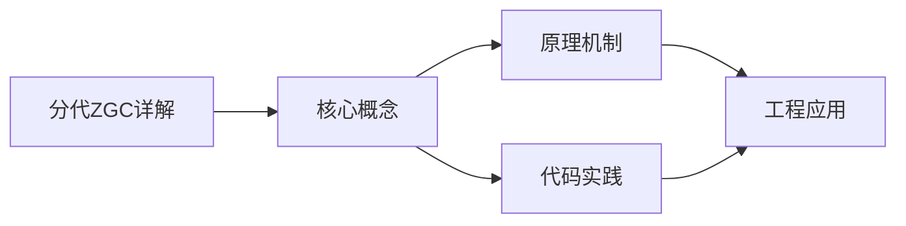
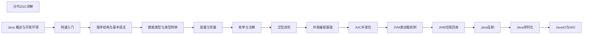

## 1. 学习目标（Bloom 分类）

本节按照布鲁姆教育目标分类学组织学习路径。本文主题为《分代ZGC详解》，属于 Java 模块，读者可以根据自身阶段选择阅读深度。

记忆层面：能够准确复述本文的核心概念、术语与基本语法或操作步骤，并能够在提问或检索时快速定位对应知识点。能够说出 Java 的编译执行模型（javac 到字节码，JVM 解释与 JIT）。

理解层面：能够用自己的语言解释核心原理与工作机制，说明概念之间的因果关系，而不是机械记忆结论。能够解释面向对象三大特性与 JVM 内存区域的职责。

应用层面：能够在真实项目或练习场景中运用本文知识解决具体问题，写出正确且可维护的实现。能够编写类、接口、集合操作与异常处理的完整程序。

分析层面：能够拆解复杂问题，比较本文主题与相邻概念的异同，识别边界条件与例外情况。能够分析 Java 与 C++、Go 在内存管理与并发模型上的差异。

评价层面：能够根据约束条件（性能、可读性、安全、成本）评价不同方案的优劣，做出有依据的技术决策。能够评价不同集合、并发工具与框架的适用场景。

创造层面：能够把本文知识与其他模块知识组合，设计出新的解决方案或可复用的工程模式。能够组合 Spring 生态设计企业级应用。

通过本节学习，读者应当能够把《分代ZGC详解》纳入自己的知识网络，并与 Java 模块的其他主题（JVM、集合框架、并发、Spring 生态）建立关联。

## 2. 历史动机与发展脉络

《分代ZGC详解》是 Java 领域的重要主题。要真正理解它，需要先了解它解决的问题与演进过程。

Java 由 James Gosling 领导的 Sun 团队于 1995 年发布，口号“一次编写，到处运行”依托 JVM 字节码实现跨平台。2006 年 Sun 将 Java 开源（OpenJDK），2010 年 Oracle 收购 Sun 后 Java 进入新的治理阶段。
Java 的版本节奏在 2017 年后改为每半年一个特性版本、每两年一个 LTS（长期支持）版本。当前主流 LTS 包括 Java 11、17、21 与 25；Java 21 引入虚拟线程（Project Loom 成果），显著降低高并发服务的线程成本。
Java 生态以 Spring 家族为核心：Spring Boot 简化配置与部署，Spring Cloud 提供微服务组件；构建工具从 Maven 演进到 Gradle；JVM 语言（Kotlin、Scala、Groovy）与 Java 共存互操作。
Android 开发早期使用 Java，2019 年后官方转向 Kotlin-first，但 Java 仍是服务端领域（尤其是金融、电商等企业系统）的中坚力量。

回到本文主题：分代ZGC详解 的提出与成熟，正是上述技术背景下的必然产物。早期实现往往以简单可用为目标，随着工程规模扩大，社区逐渐沉淀出标准做法与最佳实践；理解这一脉络，可以帮助读者判断“为什么文档中的推荐写法是现在这个样子”，也能在遇到历史遗留代码时准确识别其设计年代与取舍。

理解 Java 版本与 LTS 机制，是工程选型的起点：生产环境优先 LTS，新特性（如虚拟线程）可以在受控场景评估后引入。

## 3. 形式化定义与核心概念精讲

本节把《分代ZGC详解》涉及的核心概念以“定义 + 讲解”的形式展开。读者应把定义当作工具，把讲解当作理解路径；两者结合才能形成可迁移的知识。

JVM 与字节码：`javac` 把 .java 编译为 .class 字节码，JVM 加载、校验并执行；热点代码由 JIT（如 C2）编译为机器码，解释与编译结合实现启动速度与峰值性能的平衡。
面向对象：封装（访问控制）、继承（extends/implements）与多态（重载/重写）是 Java 的类型系统支柱；接口默认方法（Java 8）与密封类（Java 17）持续演进表达能力。
异常体系：受检异常（checked）编译期强制处理，非受检异常（RuntimeException）运行时抛出；try-with-resources 自动关闭资源。
泛型与擦除：Java 泛型在编译期检查后擦除类型参数，运行时无泛型信息；这解释了 `List<String>` 与 `List<Integer>` 的 Class 相同，以及通配符 `? extends` 的逆变协变规则。

### 3.1 原文章节逐一精讲

原文档把主题拆分为 13 个小节，下面按顺序给出每一节的导读讲解，随后保留原文细节供精读。

#### 原文精读（完整保留）


#### 学习目标

完成本章学习后，你应当能够：

- **Remember（记忆）**：复述分代 ZGC（Generational ZGC）的关键术语，包括 colored pointer、load barrier、relocation set、remembered set、forwarding table 等。
- **Understand（理解）**：解释 JDK 21 分代 ZGC 相比非分代 ZGC 的核心改进，以及分代假说在低延迟回收器中的具体体现。
- **Apply（应用）**：在生产环境中通过 `-XX:+UseZGC -XX:+ZGenerational` 启用分代 ZGC，并使用 `jcmd`、JFR、`zgc-stat` 等工具观察其行为。
- **Analyze（分析）**：解构分代 ZGC 的回收流水线，识别 young collection、major collection、relocation set selection 各阶段的工作内容与停顿来源。
- **Evaluate（评价）**：针对大堆（>16GB）、低延迟（P99 < 5ms）、高分配速率场景，评估分代 ZGC 与 G1、Shenandoah 的取舍。
- **Create（创造）**：设计一套分代 ZGC 调优实验，涵盖基线测量、参数扫描、回归验证，输出可复现的性能报告。

#### 历史动机与发展脉络

##### ZGC 的诞生背景

Java 9 时代，G1 已成为服务端主流 GC，但其在堆 > 16GB 时停顿随堆增长，无法满足低延迟 SLA。Azul 的 Pauseless GC（2005）证明并发转移可行，但工程实现复杂。Oracle 于 2017 年发起 ZGC 项目（JEP 377），目标是：无论堆大小、不论对象分配速率，单次 GC 停顿 < 10ms（实际 < 1ms）。

##### ZGC 演进时间线

| 版本 | JEP | 关键里程碑 | 工程意义 |
| --- | --- | --- | --- |
| JDK 11 | JEP 333 | ZGC 实验性引入 | 早期原型，仅 Linux/x64 |
| JDK 13 | JEP 350 | 支持未提交内存释放 | 容器场景内存友好 |
| JDK 14 | JEP 364 | 支持 macOS | 跨平台 |
| JDK 15 | JEP 377 | 生产可用（Production） | 撤销实验标记 |
| JDK 16 | JEP 376 | 并发线程栈扫描 | 进一步降低停顿 |
| JDK 17 | JEP 377 LTS | 增量调优、JFR 事件 | LTS 工业级可用 |
| JDK 18 | JEP 416 | 改进的 finalize 处理 | 与 Cleaner 协同 |
| JDK 21 | JEP 439 | 分代 ZGC 正式 GA | 引入分代假说 |
| JDK 22 | — | 分代 ZGC 默认开启 | 全面替代非分代 |
| JDK 23+ | — | 持续优化 remembered set | 减少屏障开销 |

##### 为什么需要分代 ZGC？

非分代 ZGC 的核心问题在于**吞吐损失**：所有对象无论存活时间都参与每次并发标记与转移，老年代对象反复扫描造成无谓开销。基准测试显示，非分代 ZGC 在分配密集型负载下吞吐损失可达 5–15%。

分代假说（generational hypothesis）——"绝大多数对象朝生夕灭"——在分代 ZGC 中重新被引入：

- **Young collection**：仅扫描新生代，频率高、停顿短。
- **Major collection**：扫描老年代，频率低、可承受较长并发周期。
- **Remembered set**：维护 old → young 跨代引用，避免全堆扫描。

JDK 21 的分代 ZGC（JEP 439）将吞吐损失降至 3–8%，同时保持 < 1ms 停顿。

#### 形式化定义

##### 分代 ZGC 的内存布局

设堆大小为 $H$，分代 ZGC 将堆逻辑分为：

$$
H = H_{\text{young}} + H_{\text{old}}
$$

其中 $H_{\text{young}}$ 动态调整（默认最小 $H/8$，最大 $H/2$），$H_{\text{old}}$ 占其余。物理上仍为 ZPage 集合，每个 ZPage 大小为 2MB（小对象）或 32MB（大对象）。

##### 染色指针编码

ZGC 利用 64 位指针的高 4 位（bit 42–45）编码对象状态：

| 颜色位 | 含义 |
| --- | --- |
| `Marked0` | 当前标记周期内已标记（视图 0） |
| `Marked1` | 上一标记周期已标记（视图 1） |
| `Remapped` | 转移完成后地址已更新 |
| `Finalizable` | 通过 FinalizerReference 引用 |

形式化，设指针为 $p \in \{0,1\}^{64}$，则：

$$
\text{color}(p) = (p \gg 42)\ \&\ 0xF
$$

$$
\text{object\_addr}(p) = p\ \&\ 0x3FFFFFFFFFFF
$$

##### Load Barrier 形式化

每次从堆中加载引用时，JIT 编译器插入 load barrier：

$$
\text{load}(p) = \begin{cases}
\text{forward}(p) & \text{if color}(p) \neq \text{Remapped} \\
p & \text{otherwise}
\end{cases}
$$

其中 $\text{forward}(p)$ 查询 forwarding table 获取对象最新地址。这使得应用线程在并发转移过程中访问对象时，自动重定向到新地址。

##### 停顿时间分解

分代 ZGC 单次 young collection 停顿：

$$
T_{\text{young}} = T_{\text{mark-start}} + T_{\text{relocate-start}} + T_{\text{ref-proc-young}}
$$

理论上各阶段均为 $O(|\text{roots}|)$，与堆大小无关，故 $T_{\text{young}} < 1\text{ms}$。

Major collection 包含并发标记 + 并发转移，停顿同样为常数级：

$$
T_{\text{major-pause}} \approx T_{\text{young}} + O(1)
$$

##### Remembered Set 抽象

设跨代引用集合 $RS \subseteq \{(o_{\text{old}}, f, o_{\text{young}})\}$，其中 $o_{\text{old}} \in \text{Old}$，$f$ 为字段，$o_{\text{young}} \in \text{Young}$。Young collection 时，roots 扩展为：

$$
R' = R \cup \{o_{\text{young}} \mid \exists (o_{\text{old}}, f, o_{\text{young}}) \in RS\}
$$

通过 write barrier 维护 RS：当老年代对象写入指向新生代的引用时，记录该卡（card）或记忆集条目。分代 ZGC 使用 card-and-table 混合结构，平衡精度与开销。

#### 理论推导与原理解析

##### 分代假说的统计基础

经验数据显示，对象存活时间分布近似服从 Weibull 分布：

$$
P(\text{lifetime} > t) = e^{-(t/\lambda)^k}
$$

其中 $k < 1$（早期死亡率高）。对绝大多数 Java 应用，约 90% 对象在第一次 Minor GC 中死亡。这一统计性质是分代回收的根本动机。

##### 并发标记的正确性

分代 ZGC 采用 SATB（Snapshot At The Beginning）+ 染色指针的混合策略：

1. **标记开始**：记录当前快照，所有对象初始为白。
2. **并发标记**：从 roots 出发遍历，标记可达对象（设 Marked0）。
3. **SATB 屏障**：应用线程修改引用时，将被覆盖的旧引用入队（着灰），保证不漏标。
4. **重标记**：处理 SATB 队列与残留灰对象。
5. **转移**：将存活对象复制到新 ZPage，更新 forwarding table。

正确性证明（非形式化）：SATB 保证了"标记开始时刻可达的对象集合"被完整标记。即使应用线程在并发标记过程中删除引用，原快照中的对象仍被保留（可能浮动垃圾，下一周期回收）。

##### 并发转移的挑战

转移（relocation）将存活对象从源 ZPage 复制到目标 ZPage。并发转移的核心挑战：

1. **应用线程访问转移中对象**：通过 load barrier 转发到新地址。
2. **引用更新**：转移完成后，需更新所有指向旧地址的引用。ZGC 采用"懒更新"——load barrier 在首次访问时更新，并发的 reference processing 阶段批量更新剩余。
3. **Forwarding table 一致性**：转发表必须线程安全，使用 CAS 更新。

设转移集合为 $S \subseteq \text{ZPages}$，对每个 $p \in S$：

$$
\forall o \in p,\ \text{forward}(o_{\text{old}}) = o_{\text{new}}
$$

应用线程加载 $o_{\text{old}}$ 时，barrier 检查颜色，若非 Remapped 则查表转发。

##### Young vs Major Collection 流水线

**Young Collection**（频率高，停顿短）：

1. **Pause Mark Start**（STW, ~0.1ms）：标记 roots 直接引用的 young 对象，启动并发标记。
2. **Concurrent Mark**：从 young roots + RS 出发，标记 young 代活跃对象。
3. **Pause Mark End**（STW, ~0.1ms）：处理 SATB 队列，结束标记。
4. **Concurrent Relocate**：转移 young 代存活对象到新 ZPage。
5. **Concurrent Reference Processing**：处理 SoftReference、WeakReference、PhantomReference。

**Major Collection**（频率低，触发条件：old 代占用率高）：

1. **Pause Mark Start**（STW, ~0.1ms）：标记 roots（全堆）。
2. **Concurrent Mark**：全堆并发标记。
3. **Pause Mark End**（STW, ~0.1ms）：重标记。
4. **Concurrent Relocate**：转移 old 代存活对象。
5. **Concurrent Reference Processing & Unloading**：引用处理与类卸载。

##### 双视图标记

ZGC 使用 Marked0 与 Marked1 两个标记位，交替使用：

- 周期 N：使用 Marked0 标记，结束时切换到 Marked1。
- 周期 N+1：使用 Marked1 标记，结束时切换回 Marked0。

这种设计避免了标记位的清理开销——上一周期标记的对象在新周期开始时自然"过期"。

#### 代码示例

##### 示例 1：启用分代 ZGC 的最小程序

`pom.xml`：

```xml
<project xmlns="http://maven.apache.org/POM/4.0.0">
    <modelVersion>4.0.0</modelVersion>
    <groupId>com.fandex.zgc</groupId>
    <artifactId>zgc-demo</artifactId>
    <version>1.0.0</version>
    <properties>
        <maven.compiler.release>21</maven.compiler.release>
        <project.build.sourceEncoding>UTF-8</project.build.sourceEncoding>
    </properties>
    <build>
        <plugins>
            <plugin>
                <artifactId>maven-jar-plugin</artifactId>
                <version>3.3.0</version>
                <configuration>
                    <archive>
                        <manifest><mainClass>com.fandex.zgc.ZgcDemo</mainClass></manifest>
                    </archive>
                </configuration>
            </plugin>
        </plugins>
    </build>
</project>
```

`src/main/java/com/fandex/zgc/ZgcDemo.java`（Java 21，虚拟线程 + 高分配速率）：

```java
package com.fandex.zgc;

import java.util.ArrayList;
import java.util.List;
import java.util.concurrent.ExecutorService;
import java.util.concurrent.Executors;
import java.util.concurrent.TimeUnit;
import java.util.concurrent.atomic.AtomicLong;

/**
 * 分代 ZGC 压力测试：模拟高分配速率 + 长期存活对象。
 * 使用虚拟线程最大化分配压力。
 */
public final class ZgcDemo {

    private static final AtomicLong ALLOCATED = new AtomicLong();
    private static final List<byte[]> OLD_GEN = new ArrayList<>();

    public static void main(String[] args) throws InterruptedException {
        System.out.println("PID = " + ProcessHandle.current().pid());
        int vThreads = Integer.parseInt(args.length > 0 ? args[0] : "1000");
        ExecutorService pool = Executors.newVirtualThreadPerTaskExecutor();

        for (int i = 0; i < vThreads; i++) {
            pool.submit(() -> {
                for (int j = 0; j < 100_000; j++) {
                    byte[] data = new byte[1024];       // 短生命周期：进入 young
                    ALLOCATED.addAndGet(data.length);
                    if (j % 1000 == 0) {
                        synchronized (OLD_GEN) {
                            OLD_GEN.add(new byte[4 * 1024]);  // 长期存活：晋升 old
                        }
                    }
                    if (j % 10000 == 0) {
                        Thread.sleep(1);
                    }
                }
            });
        }

        pool.shutdown();
        pool.awaitTermination(1, TimeUnit.HOURS);
        System.out.printf("Total allocated = %d MB%n", ALLOCATED.get() >> 20);
    }
}
```

运行：

```bash
java -XX:+UseZGC -XX:+ZGenerational \
     -Xms4g -Xmx4g \
     -XX:SoftMaxHeapSize=3g \
     -Xlog:gc*:file=gc.log:time,level,tags:filecount=10,filesize=20M \
     -jar target/zgc-demo-1.0.0.jar 1000
```

##### 示例 2：JFR 监控分代 ZGC 事件

```java
package com.fandex.zgc;

import jdk.jfr.Configuration;
import jdk.jfr.Recording;
import java.nio.file.Path;

/**
 * 使用 JFR 持续记录 ZGC 事件。
 * 关键事件：jdk.ZAllocationStall, jdk.ZPageAllocation, jdk.ZRelocationSet, jdk.ZUncommit
 */
public final class ZgcJfrMonitor {

    public static void main(String[] args) throws Exception {
        Configuration config = Configuration.getConfiguration("profile");
        try (Recording recording = new Recording(config)) {
            recording.enable("jdk.ZAllocationStall");
            recording.enable("jdk.ZPageAllocation").withThreshold("1ms");
            recording.enable("jdk.ZRelocationSet");
            recording.enable("jdk.ZUncommit");
            recording.enable("jdk.GarbageCollection");
            recording.setMaxAge(java.time.Duration.ofHours(1));
            recording.setToDisk(true);
            recording.start();

            Thread.sleep(600_000); // 10 分钟采样
            recording.stop();
            recording.dump(Path.of("zgc-recording.jfr"));
            System.out.println("JFR 文件已生成：zgc-recording.jfr");
        }
    }
}
```

分析：

```bash
# 列出所有 ZGC 事件
jfr print --events jdk.ZAllocationStall,jdk.ZRelocationSet,jdk.ZPageAllocation zgc-recording.jfr

# 统计分配停顿
jfr view gc-pauses zgc-recording.jfr
```

##### 示例 3：自定义 ZGC 监控指标（Spring Boot + Micrometer）

```java
package com.fandex.zgc;

import io.micrometer.core.instrument.Gauge;
import io.micrometer.core.instrument.MeterRegistry;
import jakarta.annotation.PostConstruct;
import org.springframework.stereotype.Component;

import java.lang.management.ManagementFactory;
import java.lang.management.MemoryMXBean;
import java.lang.management.MemoryUsage;
import java.util.concurrent.Executors;
import java.util.concurrent.TimeUnit;

/**
 * 自定义 ZGC 监控指标：暴露 young/old 占用率至 Prometheus。
 */
@Component
public class ZgcMetricsExporter {

    private final MeterRegistry registry;

    public ZgcMetricsExporter(MeterRegistry registry) {
        this.registry = registry;
    }

    @PostConstruct
    public void init() {
        MemoryMXBean memoryBean = ManagementFactory.getMemoryMXBean();

        // 堆使用率
        Gauge.builder("zgc.heap.used", memoryBean, b -> b.getHeapMemoryUsage().getUsed())
                .baseUnit("bytes")
                .description("ZGC 堆已用字节")
                .register(registry);

        Gauge.builder("zgc.heap.committed", memoryBean, b -> b.getHeapMemoryUsage().getCommitted())
                .baseUnit("bytes")
                .description("ZGC 堆已提交字节")
                .register(registry);

        // 周期性记录分配停顿
        var scheduler = Executors.newSingleThreadScheduledExecutor();
        scheduler.scheduleAtFixedRate(() -> {
            MemoryUsage usage = memoryBean.getHeapMemoryUsage();
            long used = usage.getUsed();
            long max = usage.getMax();
            double ratio = max > 0 ? (double) used / max : 0;
            // 可推送至 Prometheus / 自定义告警
        }, 0, 1, TimeUnit.SECONDS);
    }
}
```

##### 示例 4：Maven JVM 参数集成

```xml
<plugin>
    <groupId>org.codehaus.mojo</groupId>
    <artifactId>exec-maven-plugin</artifactId>
    <version>3.1.0</version>
    <configuration>
        <executable>java</executable>
        <arguments>
            <argument>-XX:+UseZGC</argument>
            <argument>-XX:+ZGenerational</argument>
            <argument>-Xms8g</argument>
            <argument>-Xmx8g</argument>
            <argument>-XX:SoftMaxHeapSize=7g</argument>
            <argument>-XX:ZAllocationSpikeTolerance=2</argument>
            <argument>-XX:+HeapDumpOnOutOfMemoryError</argument>
            <argument>-XX:HeapDumpPath=${project.build.directory}/oom</argument>
            <argument>-Xlog:gc*:file=${project.build.directory}/gc.log:time,level,tags</argument>
            <argument>--enable-preview</argument>
            <argument>-classpath</argument>
            <classpath/>
            <argument>com.fandex.zgc.ZgcDemo</argument>
        </arguments>
    </configuration>
</plugin>
```

##### 示例 5：Gradle 配置

`build.gradle.kts`：

```kotlin
plugins {
    application
}
application {
    mainClass.set("com.fandex.zgc.ZgcDemo")
    applicationDefaultJvmArgs = listOf(
        "-XX:+UseZGC",
        "-XX:+ZGenerational",
        "-Xms8g", "-Xmx8g",
        "-XX:SoftMaxHeapSize=7g",
        "-XX:ZAllocationSpikeTolerance=2",
        "-XX:+HeapDumpOnOutOfMemoryError",
        "-XX:HeapDumpPath=build/oom",
        "-Xlog:gc*:file=build/gc.log:time,level,tags"
    )
}
```

#### 对比分析

##### 分代 ZGC vs 其他现代 GC

| GC | 单次停顿 | 吞吐损失 | footprint | 分代 | 适用堆 | JDK 版本 |
| --- | --- | --- | --- | --- | --- | --- |
| G1 | 10–200ms | 5–10% | 1.0× | 是 | <32GB | JDK 9+ |
| Shenandoah | 1–10ms | 5–15% | 1.0× | 否（Old 模式可选） | <64GB | JDK 12+ |
| 非分代 ZGC | <1ms | 5–15% | 1.1–1.3× | 否 | <16TB | JDK 15+ |
| 分代 ZGC | <1ms | 3–8% | 1.1–1.2× | 是 | <16TB | JDK 21+ |
| Parallel GC | 100ms–数秒 | 1–5% | 1.0× | 是 | <32GB | JDK 8+ |
| Serial GC | 100ms–数秒 | 1–3% | 1.0× | 是 | <2GB | JDK 1.0+ |

##### 与 Shenandoah 设计对比

| 维度 | 分代 ZGC | Shenandoah |
| --- | --- | --- |
| 并发转移机制 | 染色指针 + load barrier | Brooks pointer（每个对象额外指针） |
| 屏障开销 | 读屏障（汇编级插入） | 读写屏障 |
| 分代支持 | 是（JDK 21+） | Old 模式（JDK 21+ 实验性） |
| 平台 | Linux/x64/ARM/PPC；macOS/Windows | Linux/x64/ARM |
| 堆上限 | 16TB | 64GB（早期），现已提升 |
| JDK 维护方 | Oracle | Red Hat |

##### 与 G1 详细对比

| 场景 | G1 | 分代 ZGC | 推荐选择 |
| --- | --- | --- | --- |
| 4GB 堆，QPS 1000 | P99 50ms | P99 1ms | ZGC（延迟敏感） |
| 4GB 堆，批处理 ETL | 吞吐 95% | 吞吐 92% | G1（吞吐优先） |
| 32GB 堆，在线服务 | P99 200ms | P99 1ms | ZGC |
| 32GB 堆，离线分析 | 吞吐 90% | 吞吐 92% | ZGC |
| 64GB 堆，金融交易 | P99 500ms | P99 1ms | ZGC |
| 2GB 堆，嵌入式 | footprint 1.0× | footprint 1.2× | G1 |

##### 与 C# Server GC / Go GC 对比

| 平台 | 单次停顿 | 分代 | 并发转移 | 备注 |
| --- | --- | --- | --- | --- |
| 分代 ZGC | <1ms | 是 | 是 | 大堆 + 低延迟工业级 |
| .NET 8 Server BG | 3–10ms | 是 | 部分 | BGC 与分代结合 |
| Go 1.22 | 1–5ms | 否 | 否 | 简单高效，逃逸分析减少堆分配 |
| V8 Orinoco | 1–10ms | 是 | 部分 | 增量 + 并发 |

#### 常见陷阱与最佳实践

##### 陷阱 1：未启用分代模式

JDK 21 中分代 ZGC 需显式启用 `-XX:+ZGenerational`，JDK 22 起为默认。误用非分代 ZGC 会损失吞吐。

**正确做法**：JDK 21 必须显式启用；JDK 22+ 可省略。

##### 陷阱 2：堆大小过小

ZGC 的元数据（forwarding table、remembered set）有固定开销，约堆大小的 1–3%。堆 < 1GB 时，footprint 占比过高，反而不如 G1。

**最佳实践**：ZGC 适合堆 ≥ 4GB；小堆场景选 G1。

##### 陷阱 3：忽略分配停顿

ZGC 单次 GC 停顿 < 1ms，但**分配停顿**（allocation stall）可能显著：当应用分配速率超过 ZGC 回收速率，应用线程在分配时阻塞等待。

**诊断**：JFR 事件 `jdk.ZAllocationStall`，记录每次分配停顿时长。

**修复**：

- 增大 `SoftMaxHeapSize`，给 ZGC 更多缓冲。
- 降低分配速率：对象池、缓存复用、避免装箱。
- 增加并发 GC 线程：`-XX:ConcGCThreads`（默认 CPU 核数的 1/4）。

##### 陷阱 4：DirectByteBuffer 内存未释放

ZGC 不直接管理 native 内存。大量 DirectByteBuffer 可能导致 OOM: Direct buffer memory。

**最佳实践**：复用 Buffer；显式调用 `sun.misc.Unsafe.invokeCleaner(buffer)`（JDK 9+）；监控 `BufferPoolMXBean`。

##### 陷阱 5：误调 ZAllocationSpikeTolerance

`-XX:ZAllocationSpikeTolerance`（默认 2.0）控制 ZGC 对分配峰值的容忍度。过低会导致频繁回收，过高会导致堆增长。

**最佳实践**：默认 2.0 适用于大多数场景；负载波动大时上调至 3.0；稳定负载下调至 1.5。

##### 陷阱 6：忘记关闭 finalize

`finalize` 方法会触发额外引用处理，可能增加停顿。Java 18+ 标记 forRemoval。

**最佳实践**：使用 `Cleaner` API；`--finalization=disabled`（JDK 18+）禁用 finalize。

##### 陷阱 7：容器内存感知

容器化部署时，JVM 需正确感知 cgroup 内存上限。JDK 11+ 默认支持 cgroup v2，但需确保容器运行时与内核版本一致。

**最佳实践**：

```bash
java -XX:+UseZGC -XX:+ZGenerational \
     -XX:MaxRAMPercentage=75 \
     -XX:InitialRAMPercentage=50 \
     -jar app.jar
```

避免使用 `-Xmx` 硬编码，便于容器扩缩容。

##### 陷阱 8：忽略 JFR 事件

许多 ZGC 性能问题（分配停顿、relocate 失败、引用处理延迟）仅通过 JFR 事件可见，普通 GC 日志无法捕获。

**最佳实践**：生产环境常态化开启 JFR 连续采样（< 1% 开销）：

```bash
java -XX:StartFlightRecording=filename=continuous.jfr,maxsize=500m,settings=profile \
     -XX:+UseZGC -XX:+ZGenerational -jar app.jar
```

##### 最佳实践清单

1. **JDK 21+ 优先分代 ZGC**：低延迟 + 高吞吐双优。
2. **堆 ≥ 4GB**：小堆场景选 G1。
3. **SoftMaxHeapSize 设置**：建议为 Xmx 的 85–90%。
4. **常态化 JFR**：低开销持续采样。
5. **监控分配停顿**：`jdk.ZAllocationStall` 事件。
6. **避免 finalize**：使用 Cleaner。
7. **容器内存感知**：使用 `MaxRAMPercentage`。
8. **回归测试**：每次 JDK 升级后跑 JMH 基线。

#### 工程实践

##### 构建与打包

Maven 多模块项目的 ZGC 友好配置：

```xml
<plugin>
    <groupId>org.springframework.boot</groupId>
    <artifactId>spring-boot-maven-plugin</artifactId>
    <configuration>
        <jvmArguments>
            -XX:+UseZGC -XX:+ZGenerational
            -Xms8g -Xmx8g
            -XX:SoftMaxHeapSize=7g
            -XX:+HeapDumpOnOutOfMemoryError
        </jvmArguments>
    </configuration>
</plugin>
```

##### Docker 容器化部署

```dockerfile
FROM eclipse-temurin:21-jre-jammy
RUN apt-get update && apt-get install -y --no-install-recommends \
    jq curl && rm -rf /var/lib/apt/lists/*
COPY target/app.jar /app/app.jar
ENV JAVA_OPTS="-XX:+UseZGC -XX:+ZGenerational -XX:MaxRAMPercentage=75 -XX:SoftMaxHeapSize=70%"
ENV JAVA_TOOL_OPTIONS="-XX:+HeapDumpOnOutOfMemoryError -XX:HeapDumpPath=/var/log/oom"
HEALTHCHECK --interval=30s --timeout=5s CMD curl -f http://localhost:8080/actuator/health || exit 1
ENTRYPOINT ["sh", "-c", "java $JAVA_OPTS -jar /app/app.jar"]
```

##### Kubernetes 部署

```yaml
apiVersion: apps/v1
kind: Deployment
metadata:
  name: fandex-zgc-app
spec:
  template:
    spec:
      containers:
      - name: app
        image: fandex/app:21
        resources:
          requests:
            memory: "8Gi"
            cpu: "4"
          limits:
            memory: "8Gi"
            cpu: "8"
        env:
        - name: JAVA_OPTS
          value: "-XX:+UseZGC -XX:+ZGenerational -XX:MaxRAMPercentage=75 -XX:SoftMaxHeapSize=70%"
        volumeMounts:
        - name: heap-dumps
          mountPath: /var/log/oom
      volumes:
      - name: heap-dumps
        emptyDir: {}
```

##### JVM 调优方法论

1. **基线测量**：使用 JFR 跑 1 小时生产负载，记录：
   - P50/P99/P99.9 GC 停顿
   - 分配停顿（`jdk.ZAllocationStall`）
   - 吞吐量（应用线程时间占比）
   - footprint（堆利用率、forwarding table 大小）

2. **参数扫描**：单变量实验，每次仅修改一个参数：
   - `SoftMaxHeapSize`：70% → 80% → 90%
   - `ZAllocationSpikeTolerance`：1.5 → 2.0 → 3.0
   - `ConcGCThreads`：默认 → +50% → +100%

3. **回归验证**：JMH 微基准 + 端到端负载。

4. **生产灰度**：金丝雀节点 24 小时观察，再全量。

##### 调试工具链

| 工具 | 用途 | 命令示例 |
| --- | --- | --- |
| `jcmd <pid> ZGC.stats` | 查看 ZGC 实时统计 | `jcmd 12345 ZGC.stats` |
| `jcmd <pid> GC.heap_info` | 查看 ZPage 分布 | `jcmd 12345 GC.heap_info` |
| `jcmd <pid> Thread.print` | 线程栈（含 barrier 状态） | `jcmd 12345 Thread.print` |
| JFR / JDK Mission Control | 持续低开销采样 | `jfr print --events jdk.Z* zgc.jfr` |
| async-profiler | CPU/堆/锁采样 | `./profiler.sh -d 60 -f flame.html <pid>` |
| ZGC 日志分析 | 离线分析 | 上传至 GCEasy 或使用 jfr view |
| Eclipse MAT | 堆转储分析 | `jmap -dump:format=b,file=h.hprof <pid>` |
| zgc-stat（社区工具） | 实时 ZGC 指标 | https://github.com/chriswhocodes/zgc-stat |

##### 关键 JFR 事件

| 事件 | 含义 | 关键字段 |
| --- | --- | --- |
| `jdk.ZAllocationStall` | 分配停顿 | duration, type |
| `jdk.ZPageAllocation` | ZPage 分配 | size, used, committed |
| `jdk.ZRelocationSet` | 转移集合选择 | total, empty, relocate |
| `jdk.ZUncommit` | 内存释放 | uncommitted |
| `jdk.GarbageCollection` | GC 概要 | name, cause, sumOfPauses, longestPause |
| `jdk.ZPhaseRelocate` | 转移阶段 | duration |

##### Spring Boot 集成监控

```java
package com.fandex.zgc;

import io.micrometer.core.instrument.binder.jvm.JvmGcMetrics;
import io.micrometer.core.instrument.binder.jvm.JvmMemoryMetrics;
import org.springframework.context.annotation.Bean;
import org.springframework.context.annotation.Configuration;

/**
 * 注册 ZGC 相关指标至 Micrometer。
 */
@Configuration
public class ZgcMetricsConfig {

    @Bean
    public JvmGcMetrics jvmGcMetrics() {
        return new JvmGcMetrics();
    }

    @Bean
    public JvmMemoryMetrics jvmMemoryMetrics() {
        return new JvmMemoryMetrics();
    }
}
```

`application.yml`：

```yaml
management:
  endpoints:
    web:
      exposure:
        include: health,info,metrics,prometheus
  metrics:
    distribution:
      percentiles-histogram:
        jvm.gc.pause: true
      percentiles:
        jvm.gc.pause: 0.5,0.95,0.99,0.999
```

Prometheus 告警规则示例：

```yaml
groups:
- name: zgc
  rules:
  - alert: ZgcAllocationStallHigh
    expr: rate(jvm_gc_pause_seconds_max{cause="Allocation Stall"}[1m]) > 0.1
    for: 5m
    annotations:
      summary: "ZGC 分配停顿过高"
  - alert: ZgcHeapUsageHigh
    expr: jvm_memory_used_bytes{area="heap"} / jvm_memory_max_bytes{area="heap"} > 0.9
    for: 5m
    annotations:
      summary: "ZGC 堆使用率 > 90%"
```

#### 案例研究

##### 案例 1：电商订单服务从 G1 迁移到分代 ZGC

**场景**：订单服务 QPS 5000，堆 16GB，原 G1 配置：

```bash
-XX:+UseG1GC -Xms16g -Xmx16g -XX:MaxGCPauseMillis=100
```

**问题**：P99 延迟 250ms，大促期间偶发 800ms 尖刺，影响 SLA。

**迁移过程**：

1. JDK 17 升级至 JDK 21。
2. 切换至分代 ZGC：

```bash
-XX:+UseZGC -XX:+ZGenerational -Xms16g -Xmx16g -XX:SoftMaxHeapSize=14g
```

3. 灰度发布：5% → 25% → 100%，每阶段观察 24 小时。

**效果**：
- P99 延迟：250ms → 1.2ms
- P99.9 延迟：800ms → 3ms
- 吞吐量：保持不变（QPS 5000）
- footprint：增加约 8%（forwarding table）

##### 案例 2：金融风控服务大堆（64GB）

**场景**：风控服务堆 64GB，要求 P99 < 10ms。

**配置**：

```bash
java -XX:+UseZGC -XX:+ZGenerational \
     -Xms64g -Xmx64g \
     -XX:SoftMaxHeapSize=56g \
     -XX:ZAllocationSpikeTolerance=2 \
     -XX:ConcGCThreads=8 \
     -Xlog:gc*:file=gc.log:time,level,tags \
     -jar risk-engine.jar
```

**结果**：
- P99 停顿：0.8ms
- P99.9 停顿：1.5ms
- 吞吐损失：6%
- 老年代 Major GC 频率：每 2 小时一次（并发，无感知）

##### 案例 3：Kafka 流处理分配停顿优化

**场景**：Kafka Streams 应用，堆 8GB，分代 ZGC，P99 延迟 5ms，但偶发 50ms 尖刺。

**诊断**：JFR 事件 `jdk.ZAllocationStall` 显示峰值 50ms，发生在 Major Collection 期间。

**修复**：

1. `ZAllocationSpikeTolerance` 从 2.0 上调至 3.0。
2. `SoftMaxHeapSize` 从 7g 上调至 7.5g。
3. Kafka Streams 参数优化：`commit.interval.ms=5000`，减少 state store flush 频率。

**效果**：分配停顿 P99 从 50ms 降至 2ms。

##### 案例 4：Android 应用考虑 ZGC

**场景**：Android 14（ART）应用，列表滚动卡顿。

**说明**：Android ART 使用自己的 GC（Concurrent Copying, CC），非 ZGC。但概念类似——并发复制 + 读屏障。

**借鉴**：分代假说在 ART 中同样适用。Android 14 已支持分代 CC。

##### 案例 5：Hibernate + 分代 ZGC

**场景**：Spring Boot + Hibernate 二级缓存，堆 12GB，分代 ZGC。

**问题**：Major GC 频率高（每 30 分钟一次），吞吐损失 12%。

**诊断**：Hibernate 二级缓存对象长期存活，但频繁变动，导致 old 代碎片化。

**修复**：

1. 切换二级缓存至 Caffeine（off-heap）。
2. `SoftMaxHeapSize` 上调至 11g。
3. `ZAllocationSpikeTolerance` 上调至 2.5。

**效果**：Major GC 频率降至每 4 小时一次，吞吐损失 5%。

#### 知识讲解与要点分析（原习题）

##### 选择题

**1. JDK 21 分代 ZGC 通过哪个参数启用？**

A. `-XX:+UseZGC`
B. `-XX:+ZGenerational`
C. `-XX:+UseZGC -XX:+ZGenerational`
D. `-XX:+UseG1GC -XX:+ZGenerational`

**答案**：C
**解析**：JDK 21 中分代 ZGC 需同时启用 ZGC 与分代模式。JDK 22 起 `ZGenerational` 为默认。

**2. ZGC 染色指针使用 64 位指针的哪些位编码对象状态？**

A. bit 0–3
B. bit 16–19
C. bit 42–45
D. bit 60–63

**答案**：C
**解析**：ZGC 使用 bit 42–45（4 位）编码 Marked0、Marked1、Remapped、Finalizable 四种状态。

**3. 分代 ZGC 中 remembered set 的作用是？**

A. 记录所有堆对象
B. 记录跨代引用，避免全堆扫描
C. 记录 finalize 队列
D. 记录 ZPage 分配历史

**答案**：B
**解析**：remembered set 记录 old → young 跨代引用，使 Young Collection 仅需扫描 young 代 + RS，无需全堆扫描，保证停顿与堆大小解耦。

**4. 下列哪种情况会导致 ZGC 分配停顿（allocation stall）？**

A. GC 停顿过长
B. 应用分配速率超过 GC 回收速率
C. finalize 方法过慢
D. 类加载过慢

**答案**：B
**解析**：分配停顿发生在 ZGC 无法及时回收内存以应对应用分配需求时，应用线程在分配时阻塞等待。可通过降低分配速率或上调 SoftMaxHeapSize 缓解。

**5. 分代 ZGC 相比非分代 ZGC 的核心改进是？**

A. 降低单次停顿
B. 提升吞吐量
C. 减少 footprint
D. 支持更小堆

**答案**：B
**解析**：非分代 ZGC 对所有对象一视同仁，老年代对象反复参与标记转移，吞吐损失较高。分代 ZGC 引入分代假说，新生代独立频繁回收，老年代低频回收，显著提升吞吐（5–15% → 3–8%）。

##### 填空题

**1.** ZGC 利用 ___ 技术在并发转移过程中自动转发对象引用。

**答案**：染色指针 + load barrier

**2.** 分代 ZGC 中，`SoftMaxHeapSize` 的建议值为 Xmx 的 ___。

**答案**：85–90%

**3.** ZGC 双视图标记使用 ___ 与 ___ 两个标记位。

**答案**：Marked0；Marked1

**4.** ZGC 单 ZPage 大小为 ___（小对象）或 ___（大对象）。

**答案**：2MB；32MB

**5.** 分代 ZGC 中 Young Collection 的停顿与 ___ 无关，仅与 roots 数量相关。

**答案**：堆大小

##### 编程题

**1.** 编写一个程序，使用 JFR API 监听 `jdk.ZAllocationStall` 事件并打印告警。

**参考答案**：

```java
package com.fandex.zgc;

import jdk.jfr.consumer.EventStream;
import jdk.jfr.consumer.RecordedEvent;

import java.nio.file.Path;
import java.time.Duration;

/**
 * 实时监听 JFR 事件，对 ZGC 分配停顿 > 10ms 的事件打印告警。
 * 可在生产环境作为旁路监控运行。
 */
public final class ZgcAllocationStallMonitor {

    public static void main(String[] args) throws Exception {
        // 监听当前 JVM 的 JFR 流
        try (EventStream stream = EventStream.openRepository()) {
            stream.enable("jdk.ZAllocationStall").withThreshold(Duration.ofMillis(10));
            stream.onEvent("jdk.ZAllocationStall", ZgcAllocationStallMonitor::handle);
            stream.startAsync();
            System.out.println("Monitoring ZGC allocation stalls...");
            Thread.sleep(Long.MAX_VALUE);
        }
    }

    private static void handle(RecordedEvent event) {
        long durationMs = event.getDuration("duration").toMillis();
        System.out.printf("[ALERT] ZGC allocation stall: %d ms%n", durationMs);
        // 实际场景：推送至 Prometheus AlertManager 或 Slack
    }
}
```

**2.** 实现一个工具，使用 `jcmd` 定期采集 ZGC 统计信息并计算分配速率。

**参考答案**：

```java
package com.fandex.zgc;

import java.io.BufferedReader;
import java.io.InputStreamReader;
import java.util.regex.Matcher;
import java.util.regex.Pattern;

/**
 * 定期调用 jcmd ZGC.stats 采集指标，计算分配速率。
 */
public final class ZgcStatsCollector {

    private static final Pattern USED_PATTERN = Pattern.compile("Used:\\s+(\\d+)\\s+MB");
    private static final Pattern CAPACITY_PATTERN = Pattern.compile("Capacity:\\s+(\\d+)\\s+MB");

    public static void main(String[] args) throws Exception {
        long pid = ProcessHandle.current().pid();
        long prevUsed = 0;
        long prevTime = System.currentTimeMillis();

        while (true) {
            Process p = new ProcessBuilder("jcmd", String.valueOf(pid), "ZGC.stats").start();
            try (BufferedReader r = new BufferedReader(new InputStreamReader(p.getInputStream()))) {
                String line;
                long used = 0;
                while ((line = r.readLine()) != null) {
                    Matcher m = USED_PATTERN.matcher(line);
                    if (m.find()) used = Long.parseLong(m.group(1));
                }
                long now = System.currentTimeMillis();
                if (prevUsed > 0) {
                    long deltaMB = used - prevUsed;
                    long deltaSec = (now - prevTime) / 1000;
                    double rateMBps = deltaSec > 0 ? (double) deltaMB / deltaSec : 0;
                    System.out.printf("Heap used = %d MB, alloc rate = %.2f MB/s%n", used, rateMBps);
                }
                prevUsed = used;
                prevTime = now;
            }
            Thread.sleep(5000);
        }
    }
}
```

#### 知识讲解与要点分析（原思考题）

**1.** 为什么 ZGC 选择 load barrier 而非 write barrier？这种设计有何优劣？

**参考答案**：ZGC 的核心挑战是并发转移——对象在应用线程访问时可能正在被转移。Load barrier 在每次加载引用时检查颜色并按需转发，保证应用线程始终访问最新地址。优势：转移可与应用并发进行，停顿与堆大小解耦。劣势：load barrier 开销较高（约 5–10% 吞吐损失），因为读操作远多于写。Shenandoah 选择 Brooks pointer（每对象额外指针），开销更均匀但 footprint 更高。ZGC 的设计在低延迟场景下更优，因为读屏障可由 JIT 优化（如比较颜色后快速路径）。

**2.** 分代 ZGC 引入 remembered set 后，是否会重新引入类似 G1 的写屏障开销？

**参考答案**：是，但开销更低。分代 ZGC 的 remembered set 仅在 old → young 跨代写时触发，且采用 card-and-table 混合结构，写屏障仅为简单的位标记。相比 G1 的 SATB + 卡表双屏障，分代 ZGC 的写屏障更轻量。实测显示，分代 ZGC 的总屏障开销（读 + 写）仍低于非分代 ZGC 的纯读屏障，因为新生代回收频率高但范围小，总扫描成本下降。

**3.** 假设你管理一个 32GB 堆、P99 < 5ms 的服务，目前使用 G1，P99 实测 80ms。如何评估是否迁移到分代 ZGC？

**参考答案**：(1) 确认 JDK 版本 ≥ 21；(2) 在预发环境部署分代 ZGC，使用相同负载跑 1 小时；(3) 通过 JFR 采集 P50/P99/P99.9 停顿、分配停顿、吞吐量、footprint；(4) 若 P99 < 5ms 且吞吐损失 < 10%，则迁移；(5) 灰度发布：5% → 25% → 100%，每阶段观察 24 小时；(6) 关注分配停顿 `jdk.ZAllocationStall`，若 P99 > 10ms 需调参（SoftMaxHeapSize、ZAllocationSpikeTolerance）；(7) 准备回滚方案（G1 配置保留）。

#### 参考文献

[1] Yang, X., et al. 2018. The Z Garbage Collector. OpenJDK JEP 377. Available at: https://openjdk.org/jeps/377

[2] Yang, X., et al. 2023. Generational ZGC. OpenJDK JEP 439. Available at: https://openjdk.org/jeps/439

[3] Click, C. 2005. Azul pauseless GC. In *Companion to the 20th Annual ACM SIGPLAN Conference on Object-Oriented Programming, Systems, Languages, and Applications (OOPSLA '05)*. ACM, New York, NY, USA, 282–283. DOI: https://doi.org/10.1145/1094855.1094917

[4] Detlefs, D., Flood, C., Heller, S., and Printezis, T. 2004. Garbage-first garbage collection. In *Proceedings of the 4th international symposium on Memory management (ISMM '04)*. ACM, New York, NY, USA, 37–48. DOI: https://doi.org/10.1145/1029873.1029879

[5] Flood, C., et al. 2023. Shenandoah: The garbage collector that could. In *Companion to the 28th ACM SIGPLAN Annual Conference on Object-Oriented Programming, Systems, Languages, and Applications (OOPSLA '23 Companion)*. ACM, New York, NY, USA, 1–2. DOI: https://doi.org/10.1145/3622780.3622781

[6] Dijkstra, E. W., Lamport, L., Martin, A. J., Scholten, C. S., and Steffens, E. F. M. 1978. On-the-fly garbage collection: An exercise in cooperation. *Communications of the ACM* 21, 11 (Nov. 1978), 966–975. DOI: https://doi.org/10.1145/359642.359655

[7] Lieberman, H. and Hewitt, C. 1983. A real-time garbage collector based on the lifetimes of objects. *Communications of the ACM* 26, 6 (June 1983), 419–429. DOI: https://doi.org/10.1145/358141.358147

[8] Appel, A. W. 1989. Simple generational garbage collection and fast allocation. *Software: Practice and Experience* 19, 2, 171–183. DOI: https://doi.org/10.1002/spe.4380190206

[9] Jones, R., Hosking, A., and Moss, E. 2011. *The Garbage Collection Handbook: The Art of Automatic Memory Management* (2nd ed.). Chapman & Hall/CRC, Boca Raton, FL, USA.

[10] Oracle Corporation. 2023. *The Java Virtual Machine Specification, Java SE 21 Edition*. Oracle, Redwood City, CA, USA.

[11] Yang, X., Blackburn, S. M., McKinley, K. S., and Frampton, D. 2017. Barriers: friend or foe? In *Proceedings of the 2017 ACM SIGPLAN International Symposium on Memory Management (ISMM 2017)*. ACM, New York, NY, USA, 24–36. DOI: https://doi.org/10.1145/3080207.3080217

[12] Bacon, D. F., Cheng, P., and Rajan, V. T. 2004. A unified theory of garbage collection. In *Proceedings of the 19th Annual ACM SIGPLAN Conference on Object-Oriented Programming, Systems, Languages, and Applications (OOPSLA '04)*. ACM, New York, NY, USA, 50–68. DOI: https://doi.org/10.1145/1028976.1028982

#### 延伸阅读

##### 书籍

- **Jones, R., Hosking, A., and Moss, E.** *The Garbage Collection Handbook* (2nd ed.). CRC Press, 2011. — GC 算法百科全书，涵盖 ZGC 理论基础。
- **Lin, C.** *Java Performance: The Definitive Guide*. O'Reilly, 2020. — Scott Oaks 著，含 ZGC 章节。
- **Kabutz, Dr. H.** *The Java Specialists' Newsletter*. https://www.javaspecialists.eu — ZGC 深度文章连载。

##### 论文

- **Baker, H. G.** *List Processing in Real Time on a Serial Computer*. CACM, 1978. — 增量复制 GC 奠基论文。
- **Wilson, P. R.** *Uniprocessor Garbage Collection Techniques*. IWMM, 1992. — 经典综述。
- **Printezis, T. and Detlefs, D.** *A Generational Mostly-concurrent Garbage Collector*. ISMM, 2000. — CMS 设计论文，分代 ZGC 的灵感来源。

##### 在线资源

- **JEP 439: Generational ZGC**：https://openjdk.org/jeps/439
- **JEP 377: ZGC: A Scalable Low-Latency Garbage Collector**：https://openjdk.org/jeps/377
- **ZGC Documentation (Oracle)**：https://docs.oracle.com/en/java/javase/21/gctuning/z-garbage-collector.html
- **ZGC 源码（OpenJDK）**：https://github.com/openjdk/jdk/tree/master/src/hotspot/share/gc/z
- **JDK Mission Control**：https://github.com/openjdk/jmc
- **zgc-stat 在线工具**：https://chriswhocodes.com/zgc-stat/
- **GCEasy**：https://gceasy.io
- **Hacker News: ZGC Discussion**：https://news.ycombinator.com/item?id=37575555

##### 相关课程

- **MIT 6.102 Software Construction**：自动内存管理章节。
- **Stanford CS140 Operating Systems**：内存管理与并发回收。
- **CMU 15-410 Operating Systems**：GC 屏障与并发数据结构。
- **Berkeley CS162 Operating Systems**：现代 GC 设计讲座。
- **Oracle University: Java Performance Tuning**：ZGC 实战培训。


### 3.2 概念关系图

下面用 Mermaid 图表达本文核心概念之间的关系，帮助读者建立整体图景：



图中展示的是本文知识的结构化关系：核心概念是入口，原理机制解释“为什么”，代码实践演示“怎么做”，工程应用回答“何时用”。读者学习时可以把每个小节的内容挂接到对应节点上。

## 4. 理论推导与原理解析

本节深入《分代ZGC详解》背后的原理。理论部分不求面面俱到，而是聚焦“能解释现象、能指导实践”的关键推导。

JVM 内存模型：堆（新生代/老年代）、元空间、虚拟机栈、本地方法栈与程序计数器；GC 从 CMS 演进到 G1（默认）、ZGC（超低延迟），理解分代收集是调优前提。
并发工具：synchronized 与 JUC（java.util.concurrent）的锁、并发容器、线程池、CompletableFuture 构成并发工具箱；Java 21 的虚拟线程让“每任务一线程”成为可能。
类加载机制：双亲委派模型保证类唯一性，SPI（ServiceLoader）打破委派实现扩展；自定义类加载器是热部署与隔离的基础。
反射与注解：反射在运行时检查类结构，注解提供元数据；Spring 的依赖注入与 AOP 均基于这些机制，但反射有性能与安全成本。

需要强调的是，理论推导与工程实践之间存在翻译层：理论给出的是理想化模型与边界条件，工程代码则必须处理真实环境中的例外。读者在学习时应先掌握理论的“标准情形”，再通过陷阱章节了解“非标准情形”。

## 5. 代码示例与逐行讲解

本节把原文中的代码示例系统整理，并为每个示例补充用途说明与讲解。读者不应只浏览代码，而应逐段对照讲解理解设计意图。

### 5.1 示例：示例 1：启用分代 ZGC 的最小程序

该示例来自原文《示例 1：启用分代 ZGC 的最小程序》小节，用于演示分代ZGC详解相关操作。阅读时请先看代码结构，再看其后的讲解。

```xml
<project xmlns="http://maven.apache.org/POM/4.0.0">
    <modelVersion>4.0.0</modelVersion>
    <groupId>com.fandex.zgc</groupId>
    <artifactId>zgc-demo</artifactId>
    <version>1.0.0</version>
    <properties>
        <maven.compiler.release>21</maven.compiler.release>
        <project.build.sourceEncoding>UTF-8</project.build.sourceEncoding>
    </properties>
    <build>
        <plugins>
            <plugin>
                <artifactId>maven-jar-plugin</artifactId>
                <version>3.3.0</version>
                <configuration>
                    <archive>
                        <manifest><mainClass>com.fandex.zgc.ZgcDemo</mainClass></manifest>
                    </archive>
                </configuration>
            </plugin>
        </plugins>
    </build>
</project>
```

讲解：这段代码演示了本节核心知识点。代码中的关键操作可以归纳为三步：准备（定义或初始化）、执行（核心逻辑）、收尾（释放资源或返回结果）。实际项目中，这三步往往被封装为函数或类，以提升复用性与可测试性。

关键点分析：

该示例共 23 行有效代码，结构以数据或配置为主。阅读时应关注：数据字段的含义、配置项的作用，以及它们与运行行为的对应关系。

进阶思考路径：先尝试修改参数观察行为变化，再把示例中的模式迁移到自己的项目中；每次修改都记录预期与实测差异，这是把示例转化为能力的最快方式。

### 5.2 示例：示例 1：启用分代 ZGC 的最小程序

该示例来自原文《示例 1：启用分代 ZGC 的最小程序》小节，用于演示分代ZGC详解相关操作。阅读时请先看代码结构，再看其后的讲解。

```java
package com.fandex.zgc;

import java.util.ArrayList;
import java.util.List;
import java.util.concurrent.ExecutorService;
import java.util.concurrent.Executors;
import java.util.concurrent.TimeUnit;
import java.util.concurrent.atomic.AtomicLong;

/**
 * 分代 ZGC 压力测试：模拟高分配速率 + 长期存活对象。
 * 使用虚拟线程最大化分配压力。
 */
public final class ZgcDemo {

    private static final AtomicLong ALLOCATED = new AtomicLong();
    private static final List<byte[]> OLD_GEN = new ArrayList<>();

    public static void main(String[] args) throws InterruptedException {
        System.out.println("PID = " + ProcessHandle.current().pid());
        int vThreads = Integer.parseInt(args.length > 0 ? args[0] : "1000");
        ExecutorService pool = Executors.newVirtualThreadPerTaskExecutor();

        for (int i = 0; i < vThreads; i++) {
            pool.submit(() -> {
                for (int j = 0; j < 100_000; j++) {
                    byte[] data = new byte[1024];       // 短生命周期：进入 young
                    ALLOCATED.addAndGet(data.length);
                    if (j % 1000 == 0) {
                        synchronized (OLD_GEN) {
                            OLD_GEN.add(new byte[4 * 1024]);  // 长期存活：晋升 old
                        }
                    }
                    if (j % 10000 == 0) {
                        Thread.sleep(1);
                    }
                }
            });
        }

        pool.shutdown();
        pool.awaitTermination(1, TimeUnit.HOURS);
        System.out.printf("Total allocated = %d MB%n", ALLOCATED.get() >> 20);
    }
}
```

讲解：这段代码演示了本节核心知识点。代码中的关键操作可以归纳为三步：准备（定义或初始化）、执行（核心逻辑）、收尾（释放资源或返回结果）。实际项目中，这三步往往被封装为函数或类，以提升复用性与可测试性。

关键点分析：

该示例共 39 行有效代码，包含 4 类关键结构（class、import、if、for）。其中：

- 入口与初始化部分负责建立上下文，对应实际项目中的启动或装配逻辑；
- 核心逻辑部分体现本文主题的主要操作，是阅读时最需要对照讲解理解的部分；
- 输出或返回部分把结果交给调用方，注意其类型与边界条件。

进阶思考路径：先尝试修改参数观察行为变化，再把示例中的模式迁移到自己的项目中；每次修改都记录预期与实测差异，这是把示例转化为能力的最快方式。

### 5.3 示例：示例 1：启用分代 ZGC 的最小程序

该示例来自原文《示例 1：启用分代 ZGC 的最小程序》小节，用于演示分代ZGC详解相关操作。阅读时请先看代码结构，再看其后的讲解。

```bash
java -XX:+UseZGC -XX:+ZGenerational \
     -Xms4g -Xmx4g \
     -XX:SoftMaxHeapSize=3g \
     -Xlog:gc*:file=gc.log:time,level,tags:filecount=10,filesize=20M \
     -jar target/zgc-demo-1.0.0.jar 1000
```

讲解：这段代码演示了本节核心知识点。代码中的关键操作可以归纳为三步：准备（定义或初始化）、执行（核心逻辑）、收尾（释放资源或返回结果）。实际项目中，这三步往往被封装为函数或类，以提升复用性与可测试性。

关键点分析：

该示例共 5 行有效代码，结构以数据或配置为主。阅读时应关注：数据字段的含义、配置项的作用，以及它们与运行行为的对应关系。

进阶思考路径：先尝试修改参数观察行为变化，再把示例中的模式迁移到自己的项目中；每次修改都记录预期与实测差异，这是把示例转化为能力的最快方式。

### 5.4 示例：示例 2：JFR 监控分代 ZGC 事件

该示例来自原文《示例 2：JFR 监控分代 ZGC 事件》小节，用于演示分代ZGC详解相关操作。阅读时请先看代码结构，再看其后的讲解。

```java
package com.fandex.zgc;

import jdk.jfr.Configuration;
import jdk.jfr.Recording;
import java.nio.file.Path;

/**
 * 使用 JFR 持续记录 ZGC 事件。
 * 关键事件：jdk.ZAllocationStall, jdk.ZPageAllocation, jdk.ZRelocationSet, jdk.ZUncommit
 */
public final class ZgcJfrMonitor {

    public static void main(String[] args) throws Exception {
        Configuration config = Configuration.getConfiguration("profile");
        try (Recording recording = new Recording(config)) {
            recording.enable("jdk.ZAllocationStall");
            recording.enable("jdk.ZPageAllocation").withThreshold("1ms");
            recording.enable("jdk.ZRelocationSet");
            recording.enable("jdk.ZUncommit");
            recording.enable("jdk.GarbageCollection");
            recording.setMaxAge(java.time.Duration.ofHours(1));
            recording.setToDisk(true);
            recording.start();

            Thread.sleep(600_000); // 10 分钟采样
            recording.stop();
            recording.dump(Path.of("zgc-recording.jfr"));
            System.out.println("JFR 文件已生成：zgc-recording.jfr");
        }
    }
}
```

讲解：这段代码演示了本节核心知识点。代码中的关键操作可以归纳为三步：准备（定义或初始化）、执行（核心逻辑）、收尾（释放资源或返回结果）。实际项目中，这三步往往被封装为函数或类，以提升复用性与可测试性。

关键点分析：

该示例共 27 行有效代码，包含 2 类关键结构（class、import）。其中：

- 入口与初始化部分负责建立上下文，对应实际项目中的启动或装配逻辑；
- 核心逻辑部分体现本文主题的主要操作，是阅读时最需要对照讲解理解的部分；
- 输出或返回部分把结果交给调用方，注意其类型与边界条件。

进阶思考路径：先尝试修改参数观察行为变化，再把示例中的模式迁移到自己的项目中；每次修改都记录预期与实测差异，这是把示例转化为能力的最快方式。

### 5.5 示例：示例 2：JFR 监控分代 ZGC 事件

该示例来自原文《示例 2：JFR 监控分代 ZGC 事件》小节，用于演示分代ZGC详解相关操作。阅读时请先看代码结构，再看其后的讲解。

```bash
# 列出所有 ZGC 事件
jfr print --events jdk.ZAllocationStall,jdk.ZRelocationSet,jdk.ZPageAllocation zgc-recording.jfr

# 统计分配停顿
jfr view gc-pauses zgc-recording.jfr
```

讲解：这段代码演示了本节核心知识点。代码中的关键操作可以归纳为三步：准备（定义或初始化）、执行（核心逻辑）、收尾（释放资源或返回结果）。实际项目中，这三步往往被封装为函数或类，以提升复用性与可测试性。

关键点分析：

该示例共 4 行有效代码，结构以数据或配置为主。阅读时应关注：数据字段的含义、配置项的作用，以及它们与运行行为的对应关系。

进阶思考路径：先尝试修改参数观察行为变化，再把示例中的模式迁移到自己的项目中；每次修改都记录预期与实测差异，这是把示例转化为能力的最快方式。

### 5.6 示例：示例 3：自定义 ZGC 监控指标（Spring Boot + Micrometer）

该示例来自原文《示例 3：自定义 ZGC 监控指标（Spring Boot + Micrometer）》小节，用于演示分代ZGC详解相关操作。阅读时请先看代码结构，再看其后的讲解。

```java
package com.fandex.zgc;

import io.micrometer.core.instrument.Gauge;
import io.micrometer.core.instrument.MeterRegistry;
import jakarta.annotation.PostConstruct;
import org.springframework.stereotype.Component;

import java.lang.management.ManagementFactory;
import java.lang.management.MemoryMXBean;
import java.lang.management.MemoryUsage;
import java.util.concurrent.Executors;
import java.util.concurrent.TimeUnit;

/**
 * 自定义 ZGC 监控指标：暴露 young/old 占用率至 Prometheus。
 */
@Component
public class ZgcMetricsExporter {

    private final MeterRegistry registry;

    public ZgcMetricsExporter(MeterRegistry registry) {
        this.registry = registry;
    }

    @PostConstruct
    public void init() {
        MemoryMXBean memoryBean = ManagementFactory.getMemoryMXBean();

        // 堆使用率
        Gauge.builder("zgc.heap.used", memoryBean, b -> b.getHeapMemoryUsage().getUsed())
                .baseUnit("bytes")
                .description("ZGC 堆已用字节")
                .register(registry);

        Gauge.builder("zgc.heap.committed", memoryBean, b -> b.getHeapMemoryUsage().getCommitted())
                .baseUnit("bytes")
                .description("ZGC 堆已提交字节")
                .register(registry);

        // 周期性记录分配停顿
        var scheduler = Executors.newSingleThreadScheduledExecutor();
        scheduler.scheduleAtFixedRate(() -> {
            MemoryUsage usage = memoryBean.getHeapMemoryUsage();
            long used = usage.getUsed();
            long max = usage.getMax();
            double ratio = max > 0 ? (double) used / max : 0;
            // 可推送至 Prometheus / 自定义告警
        }, 0, 1, TimeUnit.SECONDS);
    }
}
```

讲解：这段代码演示了本节核心知识点。代码中的关键操作可以归纳为三步：准备（定义或初始化）、执行（核心逻辑）、收尾（释放资源或返回结果）。实际项目中，这三步往往被封装为函数或类，以提升复用性与可测试性。

关键点分析：

该示例共 42 行有效代码，包含 2 类关键结构（class、import）。其中：

- 入口与初始化部分负责建立上下文，对应实际项目中的启动或装配逻辑；
- 核心逻辑部分体现本文主题的主要操作，是阅读时最需要对照讲解理解的部分；
- 输出或返回部分把结果交给调用方，注意其类型与边界条件。

进阶思考路径：先尝试修改参数观察行为变化，再把示例中的模式迁移到自己的项目中；每次修改都记录预期与实测差异，这是把示例转化为能力的最快方式。

### 5.7 示例：示例 4：Maven JVM 参数集成

该示例来自原文《示例 4：Maven JVM 参数集成》小节，用于演示分代ZGC详解相关操作。阅读时请先看代码结构，再看其后的讲解。

```xml
<plugin>
    <groupId>org.codehaus.mojo</groupId>
    <artifactId>exec-maven-plugin</artifactId>
    <version>3.1.0</version>
    <configuration>
        <executable>java</executable>
        <arguments>
            <argument>-XX:+UseZGC</argument>
            <argument>-XX:+ZGenerational</argument>
            <argument>-Xms8g</argument>
            <argument>-Xmx8g</argument>
            <argument>-XX:SoftMaxHeapSize=7g</argument>
            <argument>-XX:ZAllocationSpikeTolerance=2</argument>
            <argument>-XX:+HeapDumpOnOutOfMemoryError</argument>
            <argument>-XX:HeapDumpPath=${project.build.directory}/oom</argument>
            <argument>-Xlog:gc*:file=${project.build.directory}/gc.log:time,level,tags</argument>
            <argument>--enable-preview</argument>
            <argument>-classpath</argument>
            <classpath/>
            <argument>com.fandex.zgc.ZgcDemo</argument>
        </arguments>
    </configuration>
</plugin>
```

讲解：这段代码演示了本节核心知识点。代码中的关键操作可以归纳为三步：准备（定义或初始化）、执行（核心逻辑）、收尾（释放资源或返回结果）。实际项目中，这三步往往被封装为函数或类，以提升复用性与可测试性。

关键点分析：

该示例共 23 行有效代码，包含 1 类关键结构（class）。其中：

- 入口与初始化部分负责建立上下文，对应实际项目中的启动或装配逻辑；
- 核心逻辑部分体现本文主题的主要操作，是阅读时最需要对照讲解理解的部分；
- 输出或返回部分把结果交给调用方，注意其类型与边界条件。

进阶思考路径：先尝试修改参数观察行为变化，再把示例中的模式迁移到自己的项目中；每次修改都记录预期与实测差异，这是把示例转化为能力的最快方式。

### 5.8 示例：示例 5：Gradle 配置

该示例来自原文《示例 5：Gradle 配置》小节，用于演示分代ZGC详解相关操作。阅读时请先看代码结构，再看其后的讲解。

```kotlin
plugins {
    application
}
application {
    mainClass.set("com.fandex.zgc.ZgcDemo")
    applicationDefaultJvmArgs = listOf(
        "-XX:+UseZGC",
        "-XX:+ZGenerational",
        "-Xms8g", "-Xmx8g",
        "-XX:SoftMaxHeapSize=7g",
        "-XX:ZAllocationSpikeTolerance=2",
        "-XX:+HeapDumpOnOutOfMemoryError",
        "-XX:HeapDumpPath=build/oom",
        "-Xlog:gc*:file=build/gc.log:time,level,tags"
    )
}
```

讲解：这段代码演示了本节核心知识点。代码中的关键操作可以归纳为三步：准备（定义或初始化）、执行（核心逻辑）、收尾（释放资源或返回结果）。实际项目中，这三步往往被封装为函数或类，以提升复用性与可测试性。

关键点分析：

该示例共 16 行有效代码，结构以数据或配置为主。阅读时应关注：数据字段的含义、配置项的作用，以及它们与运行行为的对应关系。

进阶思考路径：先尝试修改参数观察行为变化，再把示例中的模式迁移到自己的项目中；每次修改都记录预期与实测差异，这是把示例转化为能力的最快方式。

### 5.9 示例：陷阱 7：容器内存感知

该示例来自原文《陷阱 7：容器内存感知》小节，用于演示分代ZGC详解相关操作。阅读时请先看代码结构，再看其后的讲解。

```bash
java -XX:+UseZGC -XX:+ZGenerational \
     -XX:MaxRAMPercentage=75 \
     -XX:InitialRAMPercentage=50 \
     -jar app.jar
```

讲解：这段代码演示了本节核心知识点。代码中的关键操作可以归纳为三步：准备（定义或初始化）、执行（核心逻辑）、收尾（释放资源或返回结果）。实际项目中，这三步往往被封装为函数或类，以提升复用性与可测试性。

关键点分析：

该示例共 4 行有效代码，结构以数据或配置为主。阅读时应关注：数据字段的含义、配置项的作用，以及它们与运行行为的对应关系。

进阶思考路径：先尝试修改参数观察行为变化，再把示例中的模式迁移到自己的项目中；每次修改都记录预期与实测差异，这是把示例转化为能力的最快方式。

### 5.10 示例：陷阱 8：忽略 JFR 事件

该示例来自原文《陷阱 8：忽略 JFR 事件》小节，用于演示分代ZGC详解相关操作。阅读时请先看代码结构，再看其后的讲解。

```bash
java -XX:StartFlightRecording=filename=continuous.jfr,maxsize=500m,settings=profile \
     -XX:+UseZGC -XX:+ZGenerational -jar app.jar
```

讲解：这段代码演示了本节核心知识点。代码中的关键操作可以归纳为三步：准备（定义或初始化）、执行（核心逻辑）、收尾（释放资源或返回结果）。实际项目中，这三步往往被封装为函数或类，以提升复用性与可测试性。

关键点分析：

该示例共 2 行有效代码，结构以数据或配置为主。阅读时应关注：数据字段的含义、配置项的作用，以及它们与运行行为的对应关系。

进阶思考路径：先尝试修改参数观察行为变化，再把示例中的模式迁移到自己的项目中；每次修改都记录预期与实测差异，这是把示例转化为能力的最快方式。

### 5.11 示例：构建与打包

该示例来自原文《构建与打包》小节，用于演示分代ZGC详解相关操作。阅读时请先看代码结构，再看其后的讲解。

```xml
<plugin>
    <groupId>org.springframework.boot</groupId>
    <artifactId>spring-boot-maven-plugin</artifactId>
    <configuration>
        <jvmArguments>
            -XX:+UseZGC -XX:+ZGenerational
            -Xms8g -Xmx8g
            -XX:SoftMaxHeapSize=7g
            -XX:+HeapDumpOnOutOfMemoryError
        </jvmArguments>
    </configuration>
</plugin>
```

讲解：这段代码演示了本节核心知识点。代码中的关键操作可以归纳为三步：准备（定义或初始化）、执行（核心逻辑）、收尾（释放资源或返回结果）。实际项目中，这三步往往被封装为函数或类，以提升复用性与可测试性。

关键点分析：

该示例共 12 行有效代码，结构以数据或配置为主。阅读时应关注：数据字段的含义、配置项的作用，以及它们与运行行为的对应关系。

进阶思考路径：先尝试修改参数观察行为变化，再把示例中的模式迁移到自己的项目中；每次修改都记录预期与实测差异，这是把示例转化为能力的最快方式。

### 5.12 示例：Docker 容器化部署

该示例来自原文《Docker 容器化部署》小节，用于演示分代ZGC详解相关操作。阅读时请先看代码结构，再看其后的讲解。

```dockerfile
FROM eclipse-temurin:21-jre-jammy
RUN apt-get update && apt-get install -y --no-install-recommends \
    jq curl && rm -rf /var/lib/apt/lists/*
COPY target/app.jar /app/app.jar
ENV JAVA_OPTS="-XX:+UseZGC -XX:+ZGenerational -XX:MaxRAMPercentage=75 -XX:SoftMaxHeapSize=70%"
ENV JAVA_TOOL_OPTIONS="-XX:+HeapDumpOnOutOfMemoryError -XX:HeapDumpPath=/var/log/oom"
HEALTHCHECK --interval=30s --timeout=5s CMD curl -f http://localhost:8080/actuator/health || exit 1
ENTRYPOINT ["sh", "-c", "java $JAVA_OPTS -jar /app/app.jar"]
```

讲解：这段代码演示了本节核心知识点。代码中的关键操作可以归纳为三步：准备（定义或初始化）、执行（核心逻辑）、收尾（释放资源或返回结果）。实际项目中，这三步往往被封装为函数或类，以提升复用性与可测试性。

关键点分析：

该示例共 8 行有效代码，包含 1 类关键结构（FROM）。其中：

- 入口与初始化部分负责建立上下文，对应实际项目中的启动或装配逻辑；
- 核心逻辑部分体现本文主题的主要操作，是阅读时最需要对照讲解理解的部分；
- 输出或返回部分把结果交给调用方，注意其类型与边界条件。

进阶思考路径：先尝试修改参数观察行为变化，再把示例中的模式迁移到自己的项目中；每次修改都记录预期与实测差异，这是把示例转化为能力的最快方式。

### 5.13 示例：Kubernetes 部署

该示例来自原文《Kubernetes 部署》小节，用于演示分代ZGC详解相关操作。阅读时请先看代码结构，再看其后的讲解。

```yaml
apiVersion: apps/v1
kind: Deployment
metadata:
  name: fandex-zgc-app
spec:
  template:
    spec:
      containers:
      - name: app
        image: fandex/app:21
        resources:
          requests:
            memory: "8Gi"
            cpu: "4"
          limits:
            memory: "8Gi"
            cpu: "8"
        env:
        - name: JAVA_OPTS
          value: "-XX:+UseZGC -XX:+ZGenerational -XX:MaxRAMPercentage=75 -XX:SoftMaxHeapSize=70%"
        volumeMounts:
        - name: heap-dumps
          mountPath: /var/log/oom
      volumes:
      - name: heap-dumps
        emptyDir: {}
```

讲解：这段代码演示了本节核心知识点。代码中的关键操作可以归纳为三步：准备（定义或初始化）、执行（核心逻辑）、收尾（释放资源或返回结果）。实际项目中，这三步往往被封装为函数或类，以提升复用性与可测试性。

关键点分析：

该示例共 26 行有效代码，包含 1 类关键结构（apiVersion）。其中：

- 入口与初始化部分负责建立上下文，对应实际项目中的启动或装配逻辑；
- 核心逻辑部分体现本文主题的主要操作，是阅读时最需要对照讲解理解的部分；
- 输出或返回部分把结果交给调用方，注意其类型与边界条件。

进阶思考路径：先尝试修改参数观察行为变化，再把示例中的模式迁移到自己的项目中；每次修改都记录预期与实测差异，这是把示例转化为能力的最快方式。

### 5.14 示例：Spring Boot 集成监控

该示例来自原文《Spring Boot 集成监控》小节，用于演示分代ZGC详解相关操作。阅读时请先看代码结构，再看其后的讲解。

```java
package com.fandex.zgc;

import io.micrometer.core.instrument.binder.jvm.JvmGcMetrics;
import io.micrometer.core.instrument.binder.jvm.JvmMemoryMetrics;
import org.springframework.context.annotation.Bean;
import org.springframework.context.annotation.Configuration;

/**
 * 注册 ZGC 相关指标至 Micrometer。
 */
@Configuration
public class ZgcMetricsConfig {

    @Bean
    public JvmGcMetrics jvmGcMetrics() {
        return new JvmGcMetrics();
    }

    @Bean
    public JvmMemoryMetrics jvmMemoryMetrics() {
        return new JvmMemoryMetrics();
    }
}
```

讲解：这段代码演示了本节核心知识点。代码中的关键操作可以归纳为三步：准备（定义或初始化）、执行（核心逻辑）、收尾（释放资源或返回结果）。实际项目中，这三步往往被封装为函数或类，以提升复用性与可测试性。

关键点分析：

该示例共 19 行有效代码，包含 3 类关键结构（class、import、return）。其中：

- 入口与初始化部分负责建立上下文，对应实际项目中的启动或装配逻辑；
- 核心逻辑部分体现本文主题的主要操作，是阅读时最需要对照讲解理解的部分；
- 输出或返回部分把结果交给调用方，注意其类型与边界条件。

进阶思考路径：先尝试修改参数观察行为变化，再把示例中的模式迁移到自己的项目中；每次修改都记录预期与实测差异，这是把示例转化为能力的最快方式。

### 5.15 示例：Spring Boot 集成监控

该示例来自原文《Spring Boot 集成监控》小节，用于演示分代ZGC详解相关操作。阅读时请先看代码结构，再看其后的讲解。

```yaml
management:
  endpoints:
    web:
      exposure:
        include: health,info,metrics,prometheus
  metrics:
    distribution:
      percentiles-histogram:
        jvm.gc.pause: true
      percentiles:
        jvm.gc.pause: 0.5,0.95,0.99,0.999
```

讲解：这段代码演示了本节核心知识点。代码中的关键操作可以归纳为三步：准备（定义或初始化）、执行（核心逻辑）、收尾（释放资源或返回结果）。实际项目中，这三步往往被封装为函数或类，以提升复用性与可测试性。

关键点分析：

该示例共 11 行有效代码，结构以数据或配置为主。阅读时应关注：数据字段的含义、配置项的作用，以及它们与运行行为的对应关系。

进阶思考路径：先尝试修改参数观察行为变化，再把示例中的模式迁移到自己的项目中；每次修改都记录预期与实测差异，这是把示例转化为能力的最快方式。

### 5.16 示例：Spring Boot 集成监控

该示例来自原文《Spring Boot 集成监控》小节，用于演示分代ZGC详解相关操作。阅读时请先看代码结构，再看其后的讲解。

```yaml
groups:
- name: zgc
  rules:
  - alert: ZgcAllocationStallHigh
    expr: rate(jvm_gc_pause_seconds_max{cause="Allocation Stall"}[1m]) > 0.1
    for: 5m
    annotations:
      summary: "ZGC 分配停顿过高"
  - alert: ZgcHeapUsageHigh
    expr: jvm_memory_used_bytes{area="heap"} / jvm_memory_max_bytes{area="heap"} > 0.9
    for: 5m
    annotations:
      summary: "ZGC 堆使用率 > 90%"
```

讲解：这段代码演示了本节核心知识点。代码中的关键操作可以归纳为三步：准备（定义或初始化）、执行（核心逻辑）、收尾（释放资源或返回结果）。实际项目中，这三步往往被封装为函数或类，以提升复用性与可测试性。

关键点分析：

该示例共 13 行有效代码，结构以数据或配置为主。阅读时应关注：数据字段的含义、配置项的作用，以及它们与运行行为的对应关系。

进阶思考路径：先尝试修改参数观察行为变化，再把示例中的模式迁移到自己的项目中；每次修改都记录预期与实测差异，这是把示例转化为能力的最快方式。

### 5.17 示例：案例 1：电商订单服务从 G1 迁移到分代 ZGC

该示例来自原文《案例 1：电商订单服务从 G1 迁移到分代 ZGC》小节，用于演示分代ZGC详解相关操作。阅读时请先看代码结构，再看其后的讲解。

```bash
-XX:+UseG1GC -Xms16g -Xmx16g -XX:MaxGCPauseMillis=100
```

讲解：这段代码演示了本节核心知识点。代码中的关键操作可以归纳为三步：准备（定义或初始化）、执行（核心逻辑）、收尾（释放资源或返回结果）。实际项目中，这三步往往被封装为函数或类，以提升复用性与可测试性。

关键点分析：

该示例共 1 行有效代码，结构以数据或配置为主。阅读时应关注：数据字段的含义、配置项的作用，以及它们与运行行为的对应关系。

进阶思考路径：先尝试修改参数观察行为变化，再把示例中的模式迁移到自己的项目中；每次修改都记录预期与实测差异，这是把示例转化为能力的最快方式。

### 5.18 示例：案例 1：电商订单服务从 G1 迁移到分代 ZGC

该示例来自原文《案例 1：电商订单服务从 G1 迁移到分代 ZGC》小节，用于演示分代ZGC详解相关操作。阅读时请先看代码结构，再看其后的讲解。

```bash
-XX:+UseZGC -XX:+ZGenerational -Xms16g -Xmx16g -XX:SoftMaxHeapSize=14g
```

讲解：这段代码演示了本节核心知识点。代码中的关键操作可以归纳为三步：准备（定义或初始化）、执行（核心逻辑）、收尾（释放资源或返回结果）。实际项目中，这三步往往被封装为函数或类，以提升复用性与可测试性。

关键点分析：

该示例共 1 行有效代码，结构以数据或配置为主。阅读时应关注：数据字段的含义、配置项的作用，以及它们与运行行为的对应关系。

进阶思考路径：先尝试修改参数观察行为变化，再把示例中的模式迁移到自己的项目中；每次修改都记录预期与实测差异，这是把示例转化为能力的最快方式。

### 5.19 示例：案例 2：金融风控服务大堆（64GB）

该示例来自原文《案例 2：金融风控服务大堆（64GB）》小节，用于演示分代ZGC详解相关操作。阅读时请先看代码结构，再看其后的讲解。

```bash
java -XX:+UseZGC -XX:+ZGenerational \
     -Xms64g -Xmx64g \
     -XX:SoftMaxHeapSize=56g \
     -XX:ZAllocationSpikeTolerance=2 \
     -XX:ConcGCThreads=8 \
     -Xlog:gc*:file=gc.log:time,level,tags \
     -jar risk-engine.jar
```

讲解：这段代码演示了本节核心知识点。代码中的关键操作可以归纳为三步：准备（定义或初始化）、执行（核心逻辑）、收尾（释放资源或返回结果）。实际项目中，这三步往往被封装为函数或类，以提升复用性与可测试性。

关键点分析：

该示例共 7 行有效代码，结构以数据或配置为主。阅读时应关注：数据字段的含义、配置项的作用，以及它们与运行行为的对应关系。

进阶思考路径：先尝试修改参数观察行为变化，再把示例中的模式迁移到自己的项目中；每次修改都记录预期与实测差异，这是把示例转化为能力的最快方式。

### 5.20 示例：编程题

该示例来自原文《编程题》小节，用于演示分代ZGC详解相关操作。阅读时请先看代码结构，再看其后的讲解。

```java
package com.fandex.zgc;

import jdk.jfr.consumer.EventStream;
import jdk.jfr.consumer.RecordedEvent;

import java.nio.file.Path;
import java.time.Duration;

/**
 * 实时监听 JFR 事件，对 ZGC 分配停顿 > 10ms 的事件打印告警。
 * 可在生产环境作为旁路监控运行。
 */
public final class ZgcAllocationStallMonitor {

    public static void main(String[] args) throws Exception {
        // 监听当前 JVM 的 JFR 流
        try (EventStream stream = EventStream.openRepository()) {
            stream.enable("jdk.ZAllocationStall").withThreshold(Duration.ofMillis(10));
            stream.onEvent("jdk.ZAllocationStall", ZgcAllocationStallMonitor::handle);
            stream.startAsync();
            System.out.println("Monitoring ZGC allocation stalls...");
            Thread.sleep(Long.MAX_VALUE);
        }
    }

    private static void handle(RecordedEvent event) {
        long durationMs = event.getDuration("duration").toMillis();
        System.out.printf("[ALERT] ZGC allocation stall: %d ms%n", durationMs);
        // 实际场景：推送至 Prometheus AlertManager 或 Slack
    }
}
```

讲解：这段代码演示了本节核心知识点。代码中的关键操作可以归纳为三步：准备（定义或初始化）、执行（核心逻辑）、收尾（释放资源或返回结果）。实际项目中，这三步往往被封装为函数或类，以提升复用性与可测试性。

关键点分析：

该示例共 26 行有效代码，包含 2 类关键结构（class、import）。其中：

- 入口与初始化部分负责建立上下文，对应实际项目中的启动或装配逻辑；
- 核心逻辑部分体现本文主题的主要操作，是阅读时最需要对照讲解理解的部分；
- 输出或返回部分把结果交给调用方，注意其类型与边界条件。

进阶思考路径：先尝试修改参数观察行为变化，再把示例中的模式迁移到自己的项目中；每次修改都记录预期与实测差异，这是把示例转化为能力的最快方式。

### 5.21 示例：编程题

该示例来自原文《编程题》小节，用于演示分代ZGC详解相关操作。阅读时请先看代码结构，再看其后的讲解。

```java
package com.fandex.zgc;

import java.io.BufferedReader;
import java.io.InputStreamReader;
import java.util.regex.Matcher;
import java.util.regex.Pattern;

/**
 * 定期调用 jcmd ZGC.stats 采集指标，计算分配速率。
 */
public final class ZgcStatsCollector {

    private static final Pattern USED_PATTERN = Pattern.compile("Used:\\s+(\\d+)\\s+MB");
    private static final Pattern CAPACITY_PATTERN = Pattern.compile("Capacity:\\s+(\\d+)\\s+MB");

    public static void main(String[] args) throws Exception {
        long pid = ProcessHandle.current().pid();
        long prevUsed = 0;
        long prevTime = System.currentTimeMillis();

        while (true) {
            Process p = new ProcessBuilder("jcmd", String.valueOf(pid), "ZGC.stats").start();
            try (BufferedReader r = new BufferedReader(new InputStreamReader(p.getInputStream()))) {
                String line;
                long used = 0;
                while ((line = r.readLine()) != null) {
                    Matcher m = USED_PATTERN.matcher(line);
                    if (m.find()) used = Long.parseLong(m.group(1));
                }
                long now = System.currentTimeMillis();
                if (prevUsed > 0) {
                    long deltaMB = used - prevUsed;
                    long deltaSec = (now - prevTime) / 1000;
                    double rateMBps = deltaSec > 0 ? (double) deltaMB / deltaSec : 0;
                    System.out.printf("Heap used = %d MB, alloc rate = %.2f MB/s%n", used, rateMBps);
                }
                prevUsed = used;
                prevTime = now;
            }
            Thread.sleep(5000);
        }
    }
}
```

讲解：这段代码演示了本节核心知识点。代码中的关键操作可以归纳为三步：准备（定义或初始化）、执行（核心逻辑）、收尾（释放资源或返回结果）。实际项目中，这三步往往被封装为函数或类，以提升复用性与可测试性。

关键点分析：

该示例共 38 行有效代码，包含 4 类关键结构（class、import、if、while）。其中：

- 入口与初始化部分负责建立上下文，对应实际项目中的启动或装配逻辑；
- 核心逻辑部分体现本文主题的主要操作，是阅读时最需要对照讲解理解的部分；
- 输出或返回部分把结果交给调用方，注意其类型与边界条件。

进阶思考路径：先尝试修改参数观察行为变化，再把示例中的模式迁移到自己的项目中；每次修改都记录预期与实测差异，这是把示例转化为能力的最快方式。

```java
// 泛型工具：类型安全的取最小值
public static <T extends Comparable<T>> T minOf(T a, T b) {
    return a.compareTo(b) <= 0 ? a : b;
}
```
讲解：`<T extends Comparable<T>>` 约束 T 必须可比较，编译期保证 `compareTo` 可用；返回值类型与入参一致，避免运行时强转。

综合以上示例，可以总结出本主题的代码实践要点：第一，先定义清晰的输入输出契约；第二，核心逻辑保持单一职责；第三，错误处理与边界条件不可省略；第四，命名与注释表达意图而非复述代码。

## 6. 对比分析

对比是理解《分代ZGC详解》定位的最快路径。下面从多个维度与相邻方案进行对比。

Java 与 C++：Java 无指针算术、自动 GC、跨平台；C++ 可精细控制内存与性能，适合系统级开发。Java 开发效率高，C++ 性能上限高。
Java 与 Go：Java 生态成熟、类型系统与工具链完备；Go 语法简单、并发原生、部署为单一二进制。服务端选型取决于团队与生态。
Java 8 与 Java 21：lambda/Stream（8）与虚拟线程/模式匹配（21）代表两个时代；新项目应基于 17+ 使用现代 API。

对比的目的不是分出绝对优劣，而是建立选择依据：不同约束条件下，最优解不同。读者应把每个对比维度转化为决策检查清单。

## 7. 常见陷阱与最佳实践

本节整理该主题的高频错误与推荐做法。每个陷阱先描述现象，再解释原因，最后给出最佳实践。

### 7.1 equals 与 hashCode 不一致

违反约定导致 HashMap 查找失效。重写 equals 必须同步重写 hashCode，且保证相等对象哈希一致。

深入讲解：该问题之所以被归类为“常见陷阱”，是因为它在初学者的代码中反复出现，而且往往不在第一时间暴露——错误通常隐藏在特定数据或特定时序下。

从成因上看，equals 与 hashCode 不一致 一般源于对 Java 某个机制的理解偏差：要么误用了默认行为，要么忽略了边界条件，要么把其他语言的思维惯性带了过来。

从影响上看，equals 与 hashCode 不一致 轻则产生错误结果，重则导致资源泄漏、数据损坏或安全事故；这也是为什么工程评审中会把它列为检查项。

从修复策略上看，处理equals 与 hashCode 不一致的正确顺序是：先复现（构造最小用例），再定位（确认机制层面的根因），最后修复并补充回归测试。跳过复现直接改代码，往往治标不治本。

### 7.2 集合遍历时修改

`for-each` 中调用 `list.remove` 抛 ConcurrentModificationException。使用 Iterator.remove 或收集后批量删除。

深入讲解：该问题之所以被归类为“常见陷阱”，是因为它在初学者的代码中反复出现，而且往往不在第一时间暴露——错误通常隐藏在特定数据或特定时序下。

从成因上看，集合遍历时修改 一般源于对 Java 某个机制的理解偏差：要么误用了默认行为，要么忽略了边界条件，要么把其他语言的思维惯性带了过来。

从影响上看，集合遍历时修改 轻则产生错误结果，重则导致资源泄漏、数据损坏或安全事故；这也是为什么工程评审中会把它列为检查项。

从修复策略上看，处理集合遍历时修改的正确顺序是：先复现（构造最小用例），再定位（确认机制层面的根因），最后修复并补充回归测试。跳过复现直接改代码，往往治标不治本。

### 7.3 字符串用 == 比较

`==` 比较引用而非内容；字符串应使用 `equals`，并优先字符串常量池与 `StringBuilder` 拼接。

深入讲解：该问题之所以被归类为“常见陷阱”，是因为它在初学者的代码中反复出现，而且往往不在第一时间暴露——错误通常隐藏在特定数据或特定时序下。

从成因上看，字符串用 == 比较 一般源于对 Java 某个机制的理解偏差：要么误用了默认行为，要么忽略了边界条件，要么把其他语言的思维惯性带了过来。

从影响上看，字符串用 == 比较 轻则产生错误结果，重则导致资源泄漏、数据损坏或安全事故；这也是为什么工程评审中会把它列为检查项。

从修复策略上看，处理字符串用 == 比较的正确顺序是：先复现（构造最小用例），再定位（确认机制层面的根因），最后修复并补充回归测试。跳过复现直接改代码，往往治标不治本。

### 7.4 整数缓存误判

`Integer` 在 -128~127 间缓存，`==` 可能为 true，超出范围为 false。包装类型比较一律用 equals。

深入讲解：该问题之所以被归类为“常见陷阱”，是因为它在初学者的代码中反复出现，而且往往不在第一时间暴露——错误通常隐藏在特定数据或特定时序下。

从成因上看，整数缓存误判 一般源于对 Java 某个机制的理解偏差：要么误用了默认行为，要么忽略了边界条件，要么把其他语言的思维惯性带了过来。

从影响上看，整数缓存误判 轻则产生错误结果，重则导致资源泄漏、数据损坏或安全事故；这也是为什么工程评审中会把它列为检查项。

从修复策略上看，处理整数缓存误判的正确顺序是：先复现（构造最小用例），再定位（确认机制层面的根因），最后修复并补充回归测试。跳过复现直接改代码，往往治标不治本。

### 7.5 线程安全误用

`SimpleDateFormat` 非线程安全，多线程格式化出错。使用 `DateTimeFormatter`（不可变）或 ThreadLocal。

深入讲解：该问题之所以被归类为“常见陷阱”，是因为它在初学者的代码中反复出现，而且往往不在第一时间暴露——错误通常隐藏在特定数据或特定时序下。

从成因上看，线程安全误用 一般源于对 Java 某个机制的理解偏差：要么误用了默认行为，要么忽略了边界条件，要么把其他语言的思维惯性带了过来。

从影响上看，线程安全误用 轻则产生错误结果，重则导致资源泄漏、数据损坏或安全事故；这也是为什么工程评审中会把它列为检查项。

从修复策略上看，处理线程安全误用的正确顺序是：先复现（构造最小用例），再定位（确认机制层面的根因），最后修复并补充回归测试。跳过复现直接改代码，往往治标不治本。

### 7.6 资源泄漏

忘记关闭连接与流。使用 try-with-resources 或确保 finally 关闭。

深入讲解：该问题之所以被归类为“常见陷阱”，是因为它在初学者的代码中反复出现，而且往往不在第一时间暴露——错误通常隐藏在特定数据或特定时序下。

从成因上看，资源泄漏 一般源于对 Java 某个机制的理解偏差：要么误用了默认行为，要么忽略了边界条件，要么把其他语言的思维惯性带了过来。

从影响上看，资源泄漏 轻则产生错误结果，重则导致资源泄漏、数据损坏或安全事故；这也是为什么工程评审中会把它列为检查项。

从修复策略上看，处理资源泄漏的正确顺序是：先复现（构造最小用例），再定位（确认机制层面的根因），最后修复并补充回归测试。跳过复现直接改代码，往往治标不治本。

### 7.7 空指针

链式调用未判空。使用 Optional、Objects.requireNonNull 与防御式检查。

深入讲解：该问题之所以被归类为“常见陷阱”，是因为它在初学者的代码中反复出现，而且往往不在第一时间暴露——错误通常隐藏在特定数据或特定时序下。

从成因上看，空指针 一般源于对 Java 某个机制的理解偏差：要么误用了默认行为，要么忽略了边界条件，要么把其他语言的思维惯性带了过来。

从影响上看，空指针 轻则产生错误结果，重则导致资源泄漏、数据损坏或安全事故；这也是为什么工程评审中会把它列为检查项。

从修复策略上看，处理空指针的正确顺序是：先复现（构造最小用例），再定位（确认机制层面的根因），最后修复并补充回归测试。跳过复现直接改代码，往往治标不治本。

### 7.8 大对象长时间存活

导致老年代增长与 Full GC。评估对象生命周期，及时释放引用，必要时使用弱引用。

深入讲解：该问题之所以被归类为“常见陷阱”，是因为它在初学者的代码中反复出现，而且往往不在第一时间暴露——错误通常隐藏在特定数据或特定时序下。

从成因上看，大对象长时间存活 一般源于对 Java 某个机制的理解偏差：要么误用了默认行为，要么忽略了边界条件，要么把其他语言的思维惯性带了过来。

从影响上看，大对象长时间存活 轻则产生错误结果，重则导致资源泄漏、数据损坏或安全事故；这也是为什么工程评审中会把它列为检查项。

从修复策略上看，处理大对象长时间存活的正确顺序是：先复现（构造最小用例），再定位（确认机制层面的根因），最后修复并补充回归测试。跳过复现直接改代码，往往治标不治本。

### 7.9 魔法数字与重复代码

可读性与维护性下降。使用常量、枚举与抽取方法。

深入讲解：该问题之所以被归类为“常见陷阱”，是因为它在初学者的代码中反复出现，而且往往不在第一时间暴露——错误通常隐藏在特定数据或特定时序下。

从成因上看，魔法数字与重复代码 一般源于对 Java 某个机制的理解偏差：要么误用了默认行为，要么忽略了边界条件，要么把其他语言的思维惯性带了过来。

从影响上看，魔法数字与重复代码 轻则产生错误结果，重则导致资源泄漏、数据损坏或安全事故；这也是为什么工程评审中会把它列为检查项。

从修复策略上看，处理魔法数字与重复代码的正确顺序是：先复现（构造最小用例），再定位（确认机制层面的根因），最后修复并补充回归测试。跳过复现直接改代码，往往治标不治本。

### 7.10 忽略编译告警

未检查类型转换与废弃 API 隐藏问题。开启 -Xlint 并保持零告警。

深入讲解：该问题之所以被归类为“常见陷阱”，是因为它在初学者的代码中反复出现，而且往往不在第一时间暴露——错误通常隐藏在特定数据或特定时序下。

从成因上看，忽略编译告警 一般源于对 Java 某个机制的理解偏差：要么误用了默认行为，要么忽略了边界条件，要么把其他语言的思维惯性带了过来。

从影响上看，忽略编译告警 轻则产生错误结果，重则导致资源泄漏、数据损坏或安全事故；这也是为什么工程评审中会把它列为检查项。

从修复策略上看，处理忽略编译告警的正确顺序是：先复现（构造最小用例），再定位（确认机制层面的根因），最后修复并补充回归测试。跳过复现直接改代码，往往治标不治本。

### 7.0 最佳实践总览

1. 遵循 Java 命名规范：类名驼峰、常量全大写、包名小写域名反写。
2. 面向接口编程，依赖注入优先于直接 new。
3. 不可变对象优先：final 字段 + 防御性拷贝。
4. 集合返回只读视图，避免外部修改内部状态。
5. 日志使用 SLF4J 门面 + 占位符，避免字符串拼接。
6. 测试使用 JUnit 5 + AssertJ，按 given/when/then 组织。

把这些最佳实践固化为团队规范与代码评审检查项，是避免同类问题反复出现的关键。

## 8. 工程实践

本节把《分代ZGC详解》放入真实工程场景，给出可复用的模式与组织方法。

Maven 项目结构：src/main/java、src/test/java 与 pom.xml；依赖坐标（groupId/artifactId/version）从中央仓库解析。
Spring Boot 分层：Controller（HTTP 层）、Service（业务层）、Repository（数据层）；DTO 与实体分离防止内部结构泄漏。
配置管理：application.yml + profile（dev/prod）+ 配置中心；敏感信息走环境变量或 Secret。
可观测性：actuator 健康端点、Micrometer 指标、分布式追踪（OpenTelemetry）构成生产基线。

### 8.1 工程实践的原则拆解

以上工程实践可以归纳为四条原则。第一，配置与代码分离：Java 项目中环境差异应通过配置注入，而不是散落在代码分支中；这保证同一份代码可以在开发、测试、生产环境一致运行。

第二，接口稳定优先：对外接口（函数签名、协议、数据格式）一旦被消费方依赖，变更成本极高；设计时应预留扩展点并保持向后兼容。

第三，可观测性内置：日志、指标与追踪应该在功能开发时同步设计，而不是故障发生后补救；没有观测手段的模块等于黑盒。

第四，变更可回滚：任何发布都应有对应的回滚方案；数据库迁移、配置变更与代码发布一样需要版本管理与逆向路径。

### 8.2 实践落地的检查清单

- [ ] Maven 项目结构：对照本节描述，检查当前项目是否已经落实；未落实的项列入技术债并排期处理。
- [ ] Spring Boot 分层：对照本节描述，检查当前项目是否已经落实；未落实的项列入技术债并排期处理。
- [ ] 配置管理：对照本节描述，检查当前项目是否已经落实；未落实的项列入技术债并排期处理。
- [ ] 可观测性：对照本节描述，检查当前项目是否已经落实；未落实的项列入技术债并排期处理。

工程实践的共性原则：配置与代码分离、接口稳定优先、可观测性内置、变更可回滚。这些原则适用于本主题的所有实现。

## 9. 案例研究

本节通过一个完整案例把《分代ZGC详解》的知识串起来。案例按“需求分析、方案设计、实现、验证”四步展开。

需求：实现订单服务，支持创建订单、查询列表与状态流转。
方案：Spring Boot 3 + JPA + H2（演示），Controller-Service-Repository 三层。
实现要点：订单状态用枚举；金额用 BigDecimal；创建订单在事务内完成库存校验与扣减；接口返回 DTO。
验证：JUnit 测试服务层事务回滚；MockMvc 测试 HTTP 层；压测关注吞吐与延迟。

### 9.1 案例的扩展讨论

把案例中的方案放大到真实规模，需要额外考虑三个问题：

第一，规模：当数据量或并发量上升一个数量级时，原方案中的数据结构、缓存策略与任务调度是否仍然成立？通常需要引入分层与异步。

第二，团队：多人协作时，模块边界、接口契约与代码所有权必须明确；案例中的实现应拆分为可独立测试的单元，并配合文档说明设计意图。

第三，演进：上线后的需求变化不可避免；方案设计时应预留扩展点（配置化、插件化、事件化），并定期用真实指标验证假设。


案例研究的学习方法：先独立阅读需求，尝试在脑中形成方案，再对照实现与讲解，最后思考“如果约束变化（数据量、并发、团队规模），方案应如何调整”。

## 10. 知识要点总结与深入讲解

本节以讲解形式汇总全文要点，替代传统的习题与自测，读者不需要答题，只需跟随解释建立完整的认知框架。

关于《分代ZGC详解》的核心结论：

Java 的竞争力来自 JVM 生态的深度与广度，选型时应优先考虑团队存量技能与生态需求。
内存、并发与类加载三大机制是 Java 进阶的分水岭，理解它们才能解决线上疑难问题。
工程化基线：LTS 版本、依赖锁定、静态检查、单元测试与可观测性。

原文档各小节的要点回顾：

- 学习目标：该小节围绕分代ZGC详解展开具体细节，阅读时应关注其与核心结论的对应关系；每个小节都是核心结论在某一个侧面的展开。
- 历史动机与发展脉络：该小节围绕分代ZGC详解展开具体细节，阅读时应关注其与核心结论的对应关系；每个小节都是核心结论在某一个侧面的展开。
- 形式化定义：该小节围绕分代ZGC详解展开具体细节，阅读时应关注其与核心结论的对应关系；每个小节都是核心结论在某一个侧面的展开。
- 理论推导与原理解析：该小节围绕分代ZGC详解展开具体细节，阅读时应关注其与核心结论的对应关系；每个小节都是核心结论在某一个侧面的展开。
- 代码示例：该小节围绕分代ZGC详解展开具体细节，阅读时应关注其与核心结论的对应关系；每个小节都是核心结论在某一个侧面的展开。
- 对比分析：该小节围绕分代ZGC详解展开具体细节，阅读时应关注其与核心结论的对应关系；每个小节都是核心结论在某一个侧面的展开。
- 常见陷阱与最佳实践：该小节围绕分代ZGC详解展开具体细节，阅读时应关注其与核心结论的对应关系；每个小节都是核心结论在某一个侧面的展开。
- 工程实践：该小节围绕分代ZGC详解展开具体细节，阅读时应关注其与核心结论的对应关系；每个小节都是核心结论在某一个侧面的展开。
- 案例研究：该小节围绕分代ZGC详解展开具体细节，阅读时应关注其与核心结论的对应关系；每个小节都是核心结论在某一个侧面的展开。
- 知识讲解与要点分析（原习题）：该小节围绕分代ZGC详解展开具体细节，阅读时应关注其与核心结论的对应关系；每个小节都是核心结论在某一个侧面的展开。
- 知识讲解与要点分析（原思考题）：该小节围绕分代ZGC详解展开具体细节，阅读时应关注其与核心结论的对应关系；每个小节都是核心结论在某一个侧面的展开。
- 参考文献：该小节围绕分代ZGC详解展开具体细节，阅读时应关注其与核心结论的对应关系；每个小节都是核心结论在某一个侧面的展开。
- 延伸阅读：该小节围绕分代ZGC详解展开具体细节，阅读时应关注其与核心结论的对应关系；每个小节都是核心结论在某一个侧面的展开。

把以上要点与第 3-9 节的内容对照复习，即可完成对本文主题的闭环学习。

## 11. 参考文献


Oracle Java 官方文档：https://docs.oracle.com/en/java/
OpenJDK 项目：https://openjdk.org/
Java 语言规范：https://docs.oracle.com/javase/specs/
Spring 官方文档：https://spring.io/projects/spring-boot
Baeldung 教程站：https://www.baeldung.com/
Maven 官方文档：https://maven.apache.org/guides/

## 12. 延伸阅读


Java 并发与 JUC，见 013-java 模块并发文档。
JVM 内存与 GC 调优，见 013-java 模块 JVM 文档。
Spring Boot 微服务与 Kubernetes，见 013-java/041-JavaKubernetes 文档。
数据库访问（JDBC/JPA），见 019-sql 模块相关文档。
黑马程序员 Bilibili 空间（https://space.bilibili.com/37974444 ）提供 Java 全栈课程；尚硅谷 Bilibili 空间（https://space.bilibili.com/302417610 ）提供 Java 进阶课程。

## 14. 模块知识图谱与学习路径

本文属于 Java 模块。为了把《分代ZGC详解》放入完整的知识网络，下面列出本模块的全部主题并给出相互关联的导读。学习时建议按模块内顺序推进，并在每个文档中留意交叉引用。



上图为模块主题的推荐学习顺序示意图（仅展示前若干主题）。各主题之间存在三类关联：

第一，前置依赖关系：早期主题是后期主题的基础，例如环境与语法先行、进阶主题随后；

第二，横向并列关系：同一层级主题从不同角度覆盖模块能力，学习顺序可以按兴趣调整；

第三，工程组合关系：多个主题在真实项目中组合使用，例如配置、性能与安全主题往往出现在同一系统的不同层面。

### 14.1 模块主题速查表

| 文档 | 主题 | 与本文的关联 |
| --- | --- | --- |
| Java 概述与开发环境 | 001-JavaOverviewDevEnv | 本文的前置基础 |
| 快速入门 | 002-QuickStart | 本文的前置基础 |
| 程序结构与基本语法 | 003-ProgramStructureBasicSyntax | 本文的并列主题 |
| 数据类型与类型转换 | 004-DataTypeConversion | 本文的并列主题 |
| 变量与常量 | 005-VariableConstant | 本文的并列主题 |
| 枚举与注解 | 006-JavaAnnotationsTutorial | 本文的并列主题 |
| 泛型进阶 | 007-JavaGenericsTutorial | 本文的并列主题 |
| 并发编程基础 | 008-ConcurrencyBasics | 本文的前置基础 |
| JUC并发包 | 009-JUCConcurrency | 本文的并列主题 |
| JVM类加载机制 | 010-JVMClassLoadingMechanism | 本文的原理深化 |
| JVM垃圾回收 | 011-JVMGC | 本文的并列主题 |
| Java反射 | 012-JavaReflection | 本文的并列主题 |
| Java序列化 | 013-JavaSerialization | 本文的并列主题 |
| JavaIO与NIO | 014-JavaIONIO | 本文的并列主题 |
| Java新特性 | 015-JavaNewFeatures | 本文的并列主题 |
| 运算符与表达式 | 016-OperatorExpression | 本文的并列主题 |
| Spring 基础：IoC 容器、AOP、Bean 生命周期与企业级开发核心 | 017-SpringBasicsIoCAOPBeanLifecycle | 本文的前置基础 |
| SpringBoot进阶 | 018-SpringBootAdvanced | 本文的并列主题 |
| SpringBoot安全 | 019-SpringBootSecurity | 本文的安全延伸 |
| SpringBoot数据访问 | 020-SpringBootDataAccess | 本文的并列主题 |
| Java设计模式 | 021-JavaDesignPattern | 本文的并列主题 |
| Java函数式编程 | 022-JavaFunctionalProgramming | 本文的并列主题 |
| Java网络编程 | 023-JavaNetworkProgramming | 本文的并列主题 |
| Java日志系统 | 024-JavaLogSystem | 本文的并列主题 |
| Java单元测试 | 025-JavaUnitTest | 本文的并列主题 |
| Java构建工具 | 026-JavaBuildTool | 本文的并列主题 |
| 控制流 | 027-ControlFlow | 本文的并列主题 |
| Java与微服务 | 028-JavaMicroservice | 本文的并列主题 |
| Java与消息队列 | 029-JavaMessageQueue | 本文的并列主题 |
| Java与Redis | 030-JavaRedis | 本文的并列主题 |
| Java与Docker | 031-JavaDocker | 本文的并列主题 |
| Java与GraphQL | 032-JavaGraphQL | 本文的并列主题 |
| Java性能调优 | 033-JavaPerformanceTuning | 本文的性能延伸 |
| Java与AI | 034-JavaAI | 本文的并列主题 |
| Java与安全 | 035-JavaSecurity | 本文的安全延伸 |
| Java与WebAssembly | 036-JavaWebAssembly | 本文的并列主题 |
| Java与响应式编程 | 037-JavaReactiveProgramming | 本文的并列主题 |
| 方法详解 | 038-MethodDetailed | 本文的并列主题 |
| Java与虚拟线程 | 039-JavaVirtualThread | 本文的并列主题 |
| Java与GraalVM | 040-JavaGraalVM | 本文的并列主题 |
| Java与Kubernetes | 041-JavaKubernetes | 本文的并列主题 |
| Java记录类 | 042-JavaRecordClass | 本文的并列主题 |
| Java文本块 | 043-JavaTextBlock | 本文的并列主题 |
| Java模块系统 | 044-JavaModuleSystem | 本文的并列主题 |
| Java与数据库连接 | 045-JavaDatabaseConnection | 本文的并列主题 |
| Java 新特性与生态 | 046-JavaNewFeaturesEcosystem | 本文的并列主题 |
| 数组详解 | 047-ArrayDetailed | 本文的并列主题 |
| JVM调优 | 048-JVMtuning | 本文的性能延伸 |
| 集合框架详解 | 049-CollectionFrameworkDetailed | 本文的并列主题 |
| 并发编程详解 | 050-ConcurrencyDetailed | 本文的并列主题 |
| CompletableFuture异步编排 | 051-CompletableFutureAsync | 本文的并列主题 |
| ThreadLocal内存泄漏 | 052-ThreadLocalMemoryLeak | 本文的并列主题 |
| 反射与动态代理 | 053-ReflectionDynamicProxy | 本文的并列主题 |
| 注解处理器 | 054-AnnotationProcessor | 本文的并列主题 |
| 分代ZGC详解 | 055-GenerationalZGCDetailed | 本文自身 |
| 面向对象编程 | 056-OOP | 本文的并列主题 |
| 抽象类与接口 | 057-AbstractClassInterface | 本文的并列主题 |
| 异常处理机制 | 058-ExceptionHandlingMechanism | 本文的原理深化 |
| 泛型详解 | 059-GenericDetailed | 本文的并列主题 |
| I/O 流与文件操作 | 060-IOStreamFileOperation | 本文的并列主题 |
| 多线程基础 | 061-MultithreadingBasics | 本文的前置基础 |
| JVM 内存模型 | 062-JVMMemoryModel | 本文的并列主题 |
| Lambda与函数式编程 | 063-LambdaFunctionalProgramming | 本文的并列主题 |
| Stream API | 064-StreamAPI | 本文的并列主题 |
| Spring Boot 学习笔记 | 065-SpringBootNotes | 本文的并列主题 |
| 网络编程 | 066-NetworkProgramming | 本文的并列主题 |
| Spring Cloud 微服务开发 | 067-SpringCloudMicroserviceDevelopment | 本文的并列主题 |
| Java Swing 图形界面 | 068-JavaSwingGUI | 本文的并列主题 |
| Java 项目示例：图书管理系统 | 069-JavaProjectExampleLibrarySystem | 本文的综合应用 |
| Java 理论知识点：JVM 原理、类加载机制与内存管理 | 070-JavaTheoryJVMClassLoadingMemory | 本文的原理深化 |
| Java NIO 通道与缓冲区 | 071-JavaNIOChannelBuffer | 本文的并列主题 |
| Java JDBC 数据库连接 | 072-JDBCDatabaseConnection | 本文的并列主题 |
| Java Optional 类 | 073-JavaOptionalClass | 本文的并列主题 |
| Java Executor 与 ForkJoin | 074-ExecutorForkJoinPool | 本文的并列主题 |
| Java Path 与 Files 语法速查手册 | 075-JavaPathFiles | 本文的并列主题 |
| 启动 REPL 交互环境 | 076-JavaJshellJpackage | 本文的前置基础 |
| Java 同步器 CountDownLatch/CyclicBarrier/Phaser 语法速查手册 | 077-JavaCountDownLatchCyclicBarrier | 本文的并列主题 |
| Java 阻塞队列 BlockingQueue 语法速查手册 | 078-JavaBlockingQueue | 本文的并列主题 |
| Java try-with-resources 与异常链语法速查手册 | 079-JavaTryWithResources | 本文的并列主题 |
| Java HttpClient 与 WebSocket 语法速查手册 | 080-JavaHttpClientWebSocket | 本文的并列主题 |
| Java 时间格式化 DateTimeFormatter/ZoneId 语法速查手册 | 081-JavaTimeFormatting | 本文的并列主题 |
| Java 类型擦除与桥接方法语法速查手册 | 082-JavaTypeErasure | 本文的并列主题 |
| Java 枚举进阶 EnumSet/EnumMap/枚举单例语法速查手册 | 083-JavaEnumAdvanced | 本文的并列主题 |
| Java Iterator/Iterable/Spliterator 语法速查手册 | 084-JavaIteratorIterable | 本文的并列主题 |
| Java Comparator/Comparable 语法速查手册 | 085-JavaComparatorComparable | 本文的并列主题 |
| Java String.format/printf/MessageFormat 语法速查手册 | 086-JavaStringFormat | 本文的并列主题 |
| Java Arrays 工具类语法速查手册 | 087-JavaArraysUtility | 本文的并列主题 |
| Java Objects 工具类语法速查手册 | 088-JavaObjectsUtility | 本文的并列主题 |
| Java 命令行工具 javac/java/jar/jshell/jpackage 语法速查手册 | 089-JavaCommandLineTools | 本文的并列主题 |
| Maven pom.xml 配置语法速查手册 | 090-MavenPomConfiguration | 本文的并列主题 |
| Gradle build.gradle 配置语法速查手册 | 091-GradleBuildConfiguration | 本文的并列主题 |

速查表的作用是让读者快速判断：哪些文档应在阅读本文前掌握（前置基础），哪些文档应在阅读本文后继续（延伸主题）。本模块的交叉引用体系即以此表为基础。

## 15. 术语表

下表整理《分代ZGC详解》及 Java 模块中出现的高频术语，给出简明释义。术语按字母序或逻辑序排列，供查阅。

| 术语 | 释义 |
| --- | --- |
| JVM 与字节码 | `javac` 把 .java 编译为 .class 字节码，JVM 加载、校验并执行；热点代码由 JIT（如 C2）编译为机器码，解释与编译结合实现启动速度与 |
| 面向对象 | 封装（访问控制）、继承（extends/implements）与多态（重载/重写）是 Java 的类型系统支柱；接口默认方法（Java 8）与密封类（Java  |
| 异常体系 | 受检异常（checked）编译期强制处理，非受检异常（RuntimeException）运行时抛出；try-with-resources 自动关闭资源。 |
| 泛型与擦除 | Java 泛型在编译期检查后擦除类型参数，运行时无泛型信息；这解释了 `List<String>` 与 `List<Integer>` 的 Class 相同，以 |
| JVM 内存模型 | 堆（新生代/老年代）、元空间、虚拟机栈、本地方法栈与程序计数器；GC 从 CMS 演进到 G1（默认）、ZGC（超低延迟），理解分代收集是调优前提。 |
| 并发工具 | synchronized 与 JUC（java.util.concurrent）的锁、并发容器、线程池、CompletableFuture 构成并发工具箱；Ja |
| 类加载机制 | 双亲委派模型保证类唯一性，SPI（ServiceLoader）打破委派实现扩展；自定义类加载器是热部署与隔离的基础。 |
| 反射与注解 | 反射在运行时检查类结构，注解提供元数据；Spring 的依赖注入与 AOP 均基于这些机制，但反射有性能与安全成本。 |
| equals 与 hashCode 不一致（易错点） | 参见常见陷阱章节的详细讲解 |
| 集合遍历时修改（易错点） | 参见常见陷阱章节的详细讲解 |
| 字符串用 == 比较（易错点） | 参见常见陷阱章节的详细讲解 |
| 整数缓存误判（易错点） | 参见常见陷阱章节的详细讲解 |
| 线程安全误用（易错点） | 参见常见陷阱章节的详细讲解 |
| 资源泄漏（易错点） | 参见常见陷阱章节的详细讲解 |

术语表与正文配合使用：先通读正文，遇到模糊术语回查本表；长期使用后术语会自然进入工作记忆。
