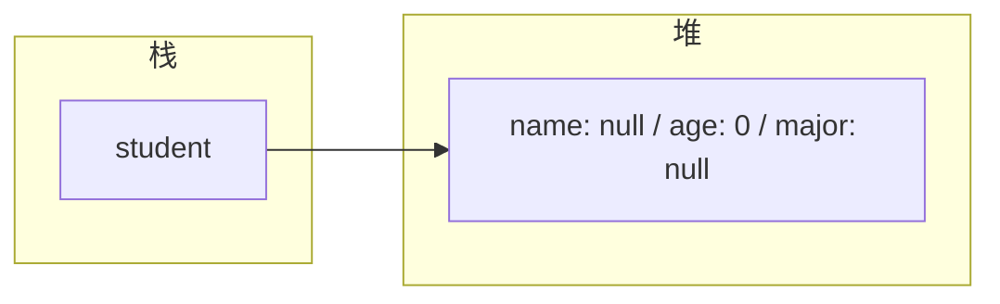
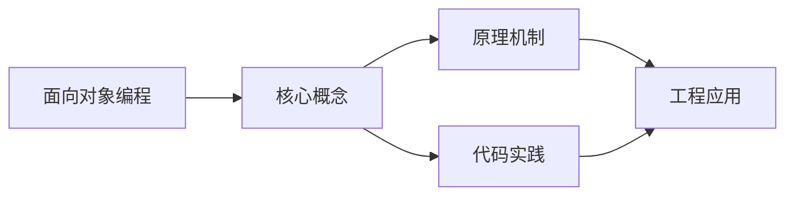
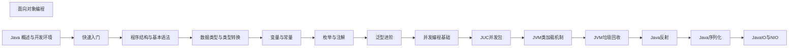

## 1. 学习目标（Bloom 分类）

本节按照布鲁姆教育目标分类学组织学习路径。本文主题为《面向对象编程》，属于 Java 模块，读者可以根据自身阶段选择阅读深度。

记忆层面：能够准确复述本文的核心概念、术语与基本语法或操作步骤，并能够在提问或检索时快速定位对应知识点。能够说出 Java 的编译执行模型（javac 到字节码，JVM 解释与 JIT）。

理解层面：能够用自己的语言解释核心原理与工作机制，说明概念之间的因果关系，而不是机械记忆结论。能够解释面向对象三大特性与 JVM 内存区域的职责。

应用层面：能够在真实项目或练习场景中运用本文知识解决具体问题，写出正确且可维护的实现。能够编写类、接口、集合操作与异常处理的完整程序。

分析层面：能够拆解复杂问题，比较本文主题与相邻概念的异同，识别边界条件与例外情况。能够分析 Java 与 C++、Go 在内存管理与并发模型上的差异。

评价层面：能够根据约束条件（性能、可读性、安全、成本）评价不同方案的优劣，做出有依据的技术决策。能够评价不同集合、并发工具与框架的适用场景。

创造层面：能够把本文知识与其他模块知识组合，设计出新的解决方案或可复用的工程模式。能够组合 Spring 生态设计企业级应用。

通过本节学习，读者应当能够把《面向对象编程》纳入自己的知识网络，并与 Java 模块的其他主题（JVM、集合框架、并发、Spring 生态）建立关联。

## 2. 历史动机与发展脉络

《面向对象编程》是 Java 领域的重要主题。要真正理解它，需要先了解它解决的问题与演进过程。

Java 由 James Gosling 领导的 Sun 团队于 1995 年发布，口号“一次编写，到处运行”依托 JVM 字节码实现跨平台。2006 年 Sun 将 Java 开源（OpenJDK），2010 年 Oracle 收购 Sun 后 Java 进入新的治理阶段。
Java 的版本节奏在 2017 年后改为每半年一个特性版本、每两年一个 LTS（长期支持）版本。当前主流 LTS 包括 Java 11、17、21 与 25；Java 21 引入虚拟线程（Project Loom 成果），显著降低高并发服务的线程成本。
Java 生态以 Spring 家族为核心：Spring Boot 简化配置与部署，Spring Cloud 提供微服务组件；构建工具从 Maven 演进到 Gradle；JVM 语言（Kotlin、Scala、Groovy）与 Java 共存互操作。
Android 开发早期使用 Java，2019 年后官方转向 Kotlin-first，但 Java 仍是服务端领域（尤其是金融、电商等企业系统）的中坚力量。

回到本文主题：面向对象编程 的提出与成熟，正是上述技术背景下的必然产物。早期实现往往以简单可用为目标，随着工程规模扩大，社区逐渐沉淀出标准做法与最佳实践；理解这一脉络，可以帮助读者判断“为什么文档中的推荐写法是现在这个样子”，也能在遇到历史遗留代码时准确识别其设计年代与取舍。

理解 Java 版本与 LTS 机制，是工程选型的起点：生产环境优先 LTS，新特性（如虚拟线程）可以在受控场景评估后引入。

## 3. 形式化定义与核心概念精讲

本节把《面向对象编程》涉及的核心概念以“定义 + 讲解”的形式展开。读者应把定义当作工具，把讲解当作理解路径；两者结合才能形成可迁移的知识。

JVM 与字节码：`javac` 把 .java 编译为 .class 字节码，JVM 加载、校验并执行；热点代码由 JIT（如 C2）编译为机器码，解释与编译结合实现启动速度与峰值性能的平衡。
面向对象：封装（访问控制）、继承（extends/implements）与多态（重载/重写）是 Java 的类型系统支柱；接口默认方法（Java 8）与密封类（Java 17）持续演进表达能力。
异常体系：受检异常（checked）编译期强制处理，非受检异常（RuntimeException）运行时抛出；try-with-resources 自动关闭资源。
泛型与擦除：Java 泛型在编译期检查后擦除类型参数，运行时无泛型信息；这解释了 `List<String>` 与 `List<Integer>` 的 Class 相同，以及通配符 `? extends` 的逆变协变规则。

### 3.1 原文章节逐一精讲

原文档把主题拆分为 22 个小节，下面按顺序给出每一节的导读讲解，随后保留原文细节供精读。

#### 原文精读（完整保留）

# Java 面向对象编程

> **符号约定**：`< >` 必填参数 | `[ ]` 可选参数

---

#### 1. 类与对象 (Class & Object)

##### 1.1 类的定义

类是对象的模板，定义了对象的属性和行为。

```java
 public class Student {
  // 属性 (成员变量)
  private String name;
  private int age;
  private String major;
  // 行为 (方法)
  public void study() {
  System.out.println(name + " is studying.");
  }
  public void introduce() {
  System.out.println("I'm " + name + ", " + age + " years old, major in " + major);
  }
 }
```

##### 1.2 类的结构

- **成员变量** (Fields): 类的属性，存储对象的状态
- **方法** (Methods): 类的行为，定义对象的操作
- **构造器** (Constructors): 用于创建对象的特殊方法
- **代码块** (Blocks): 静态代码块和实例代码块
- **内部类** (Inner Classes): 类中定义的类

##### 1.3 对象的创建与使用

###### 1.3.1 对象的创建

使用 `new` 关键字创建对象。



###### 1.3.2 对象的内存布局

- **栈 (Stack)**: 存放对象引用变量
- **堆 (Heap)**: 存放对象的实际数据


##### 1.4 构造器 (Constructors)

构造器用于初始化对象，与类同名，无返回值。

###### 1.4.1 默认构造器

如果类中没有定义构造器，编译器会自动生成一个无参构造器。

```java
 public class Student {
  // 默认构造器（由编译器生成）
  public Student() {
  }
 }
```

###### 1.4.2 自定义构造器

可以定义多个构造器，实现方法重载。

```java
 public class Student {
  private String name;
  private int age;
  private String major;
  // 无参构造器
  public Student() {
  }
  // 带参数的构造器
  public Student(String name, int age) {
  this.name = name;
  this.age = age;
  }
  // 全参构造器
  public Student(String name, int age, String major) {
  this.name = name;
  this.age = age;
  this.major = major;
  }
 }
```

###### 1.4.3 构造器的调用

```java
 // 使用无参构造器
 Student student1 = new Student();
 // 使用带参数的构造器
 Student student2 = new Student("Bob", 21);
 // 使用全参构造器
 Student student3 = new Student("Charlie", 22, "Software Engineering");
```

#### 2. 封装 (Encapsulation)

##### 2.1 封装的概念

封装是指将对象的状态和行为封装起来，只暴露必要的接口，隐藏实现细节。

##### 2.2 访问修饰符

| 修饰符      | 类内 | 同包 | 子类 | 任意位置 |
| ----------- | ---- | ---- | ---- | -------- |
| `private`   |      |      |      |          |
| `default`   |      |      |      |          |
| `protected` |      |      |      |          |
| `public`    |      |      |      |          |

##### 2.3 封装的实现

使用 `private` 修饰符隐藏属性，通过 getter/setter 方法暴露接口。

```java
 public class Student {
  // 私有属性
  private String name;
  private int age;
  private String major;
  // Getter 方法
  public String getName() {
  return name;
  }
  public int getAge() {
  return age;
  }
  public String getMajor() {
  return major;
  }
  // Setter 方法
  public void setName(String name) {
  this.name = name;
  }
  public void setAge(int age) {
  if (age >= 0 && age <= 150) {
  this.age = age;
  } else {
  System.out.println("Invalid age");
  }
  }
  public void setMajor(String major) {
  this.major = major;
  }
 }
```

##### 2.4 封装的优点

- **安全性**: 防止外部直接修改对象状态
- **可维护性**: 内部实现可以自由修改，不影响外部使用
- **可读性**: 明确对象的接口和职责
- **灵活性**: 可以在 setter 中添加验证逻辑

#### 3. 继承 (Inheritance)

##### 3.1 继承的概念

继承是指一个类（子类）继承另一个类（父类）的属性和方法，实现代码复用。

##### 3.2 继承的语法

使用 `extends` 关键字。

```java
 // 父类
 public class Animal {
  protected String name;
  public void eat() {
  System.out.println(name + " is eating.");
  }
  public void sleep() {
  System.out.println(name + " is sleeping.");
  }
 }
 // 子类
 public class Dog extends Animal {
  public void bark() {
  System.out.println(name + " is barking.");
  }
 }
```

##### 3.3 继承的特性

- **单继承**: Java 只支持单继承，一个类只能有一个直接父类
- **传递性**: 如果 A 继承 B，B 继承 C，则 A 间接继承 C
- **方法重写**: 子类可以重写父类的方法
- **super 关键字**: 用于访问父类的成员和构造器

##### 3.4 super 关键字的使用

###### 3.4.1 访问父类的成员变量

```java
 public class Dog extends Animal {
  private String breed;
  public Dog(String name, String breed) {
  super.name = name; // 访问父类的成员变量
  this.breed = breed;
  }
 }
```

###### 3.4.2 调用父类的方法

```java
 public class Dog extends Animal {
  @Override
  public void eat() {
  super.eat(); // 调用父类的 eat 方法
  System.out.println("Dog eats bones.");
  }
 }
```

###### 3.4.3 调用父类的构造器

```java
 public class Animal {
  protected String name;
  public Animal(String name) {
  this.name = name;
  }
 }
 public class Dog extends Animal {
  private String breed;
  public Dog(String name, String breed) {
  super(name); // 调用父类的构造器
  this.breed = breed;
  }
 }
```

##### 3.5 方法重写 (Override)

###### 3.5.1 方法重写的规则

- **方法名相同**
- **参数列表相同**
- **返回类型相同或为子类类型** (协变返回类型)
- **访问修饰符不能更严格**
- **不能抛出比父类方法更多的异常**

###### 3.5.2 方法重写的示例

```java
 public class Animal {
  public void makeSound() {
  System.out.println("Animal makes sound.");
  }
 }
 public class Cat extends Animal {
  @Override
  public void makeSound() {
  System.out.println("Cat meows.");
  }
 }
 public class Dog extends Animal {
  @Override
  public void makeSound() {
  System.out.println("Dog barks.");
  }
 }
```

#### 4. 多态 (Polymorphism)

##### 4.1 多态的概念

多态是指同一行为在不同对象上有不同的表现形式。

##### 4.2 多态的必要条件

1. **继承关系**
2. **方法重写**
3. **父类引用指向子类对象**

##### 4.3 多态的示例

```java
 // 父类引用指向子类对象
 Animal animal1 = new Cat();
 animal1.makeSound(); // 输出: Cat meows.
 Animal animal2 = new Dog();
 animal2.makeSound(); // 输出: Dog barks.
```

##### 4.4 多态的原理

- **编译时类型**: 变量声明的类型（父类类型）
- **运行时类型**: 变量实际指向的对象类型（子类类型）
- **方法调用**: 编译时检查父类是否有该方法，运行时执行子类重写的方法

##### 4.5 多态的优点

- **可扩展性**: 新增子类不影响现有代码
- **代码复用**: 统一使用父类引用处理不同子类对象
- **灵活性**: 运行时动态绑定方法实现

#### 5. this 关键字

##### 5.1 this 关键字的作用

- **指向当前对象**
- **区分成员变量和局部变量**
- **调用本类的其他构造器**
- **返回当前对象**

##### 5.2 this 关键字的使用

###### 5.2.1 区分成员变量和局部变量

```java
 public class Student {
  private String name;
  public void setName(String name) {
  this.name = name; // this.name 指成员变量，name 指局部变量
  }
 }
```

###### 5.2.2 调用本类的其他构造器

```java
 public class Student {
  private String name;
  private int age;
  public Student() {
  this("Unknown", 0); // 调用带两个参数的构造器
  }
  public Student(String name) {
  this(name, 0); // 调用带两个参数的构造器
  }
  public Student(String name, int age) {
  this.name = name;
  this.age = age;
  }
 }
```

###### 5.2.3 返回当前对象

```java
 public class Student {
  private String name;
  private int age;
  public Student setName(String name) {
  this.name = name;
  return this; // 返回当前对象，支持链式调用
  }
  public Student setAge(int age) {
  this.age = age;
  return this; // 返回当前对象，支持链式调用
  }
 }
 // 链式调用
 Student student = new Student().setName("Alice").setAge(20);
```

#### 6. 面向对象的设计原则

##### 6.1 单一职责原则 (SRP)

一个类应该只负责一项职责。

##### 6.2 开放-封闭原则 (OCP)

软件实体应该对扩展开放，对修改封闭。

##### 6.3 里氏替换原则 (LSP)

子类应该能够替换父类而不影响程序的正确性。

##### 6.4 依赖倒置原则 (DIP)

高层模块不应该依赖低层模块，两者都应该依赖抽象。

##### 6.5 接口隔离原则 (ISP)

客户端不应该依赖它不需要的接口。

#### 7. 实际应用案例

##### 7.1 简单的学生管理系统

```java
 // 基类
 public class Person {
  private String name;
  private int age;
  // 构造器、getter/setter 方法
 }
 // 子类
 public class Student extends Person {
  private String studentId;
  private String major;
  // 构造器、getter/setter 方法
  public void study() {
  System.out.println(getName() + " is studying " + major);
  }
 }
 // 子类
 public class Teacher extends Person {
  private String teacherId;
  private String subject;
  // 构造器、getter/setter 方法
  public void teach() {
  System.out.println(getName() + " is teaching " + subject);
  }
 }
 // 测试
 public class Test {
  public static void main(String[] args) {
  Student student = new Student();
  student.setName("Alice");
  student.setAge(20);
  student.setStudentId("S12345");
  student.setMajor("Computer Science");
  student.study();
  Teacher teacher = new Teacher();
  teacher.setName("Mr. Smith");
  teacher.setAge(35);
  teacher.setTeacherId("T67890");
  teacher.setSubject("Java Programming");
  teacher.teach();
  }
 }
```

##### 7.2 形状类的多态示例

```java
 // 抽象基类
 public abstract class Shape {
  public abstract double calculateArea();
  public abstract double calculatePerimeter();
 }
 // 子类
 public class Circle extends Shape {
  private double radius;
  public Circle(double radius) {
  this.radius = radius;
  }
  @Override
  public double calculateArea() {
  return Math.PI * radius * radius;
  }
  @Override
  public double calculatePerimeter() {
  return 2 * Math.PI * radius;
  }
 }
 // 子类
 public class Rectangle extends Shape {
  private double width;
  private double height;
  public Rectangle(double width, double height) {
  this.width = width;
  this.height = height;
  }
  @Override
  public double calculateArea() {
  return width * height;
  }
  @Override
  public double calculatePerimeter() {
  return 2 * (width + height);
  }
 }
 // 测试
 public class Test {
  public static void main(String[] args) {
  Shape[] shapes = new Shape[2];
  shapes[0] = new Circle(5);
  shapes[1] = new Rectangle(4, 6);
  for (Shape shape : shapes) {
  System.out.println("Area: " + shape.calculateArea());
  System.out.println("Perimeter: " + shape.calculatePerimeter());
  System.out.println();
  }
  }
 }
```

#### 8. 常见陷阱

##### 8.1 构造器调用顺序

- 父类构造器总是在子类构造器之前执行
- 如果子类构造器没有显式调用父类构造器，会自动调用父类的无参构造器
- 如果父类没有无参构造器，子类必须显式调用父类的有参构造器

##### 8.2 方法重写与方法重载的区别

- **方法重写**：发生在父子类之间，方法名、参数列表相同
- **方法重载**：发生在同一类中，方法名相同，参数列表不同

##### 8.3 多态的局限性

- 多态只适用于方法，不适用于属性
- 父类引用不能直接调用子类特有的方法，需要强制类型转换

##### 8.4 继承的滥用

- 不要为了代码复用而滥用继承
- 优先考虑组合关系而不是继承关系
- 遵循里氏替换原则

---

#### 类定义

**基本写法：类定义**
`<修饰符> class <类名> { }`
```java
// 定义一个公开类
public class Person {
}
```

---

**换行写法：多字段类定义**
`<修饰符> class <类名> { <字段1> <字段2> <方法> }`
```java
// 定义包含多个字段的类
public class Person {
    private String name;
    private int age;
    private String address;
}
```

---

#### 成员变量

**基本写法：实例变量声明**
`<修饰符> <类型> <变量名>;`
```java
// 声明实例变量
private String name;
```

---

**基本写法：实例变量初始化**
`<修饰符> <类型> <变量名> = <值>;`
```java
// 声明并初始化实例变量
private int age = 18;
```

---

**基本写法：静态变量声明**
`<修饰符> static <类型> <变量名>;`
```java
// 声明静态变量
private static int count;
```

---

#### 构造方法

**基本写法：无参构造方法**
`<修饰符> <类名>() { }`
```java
// 定义无参构造方法
public Person() {
}
```

---

**基本写法：有参构造方法**
`<修饰符> <类名>(<参数列表>) { }`
```java
// 定义有参构造方法
public Person(String name, int age) {
    this.name = name;
    this.age = age;
}
```

---

**基本写法：构造方法重载**
`<修饰符> <类名>(<参数列表>) { this(<参数>); }`
```java
// 构造方法调用另一个构造方法
public Person() {
    this("Unknown", 0);
}
```

---

#### 方法

**基本写法：实例方法**
`<修饰符> <返回类型> <方法名>(<参数>) { }`
```java
// 定义实例方法
public String getName() {
    return name;
}
```

---

**基本写法：静态方法**
`<修饰符> static <返回类型> <方法名>(<参数>) { }`
```java
// 定义静态方法
public static int getCount() {
    return count;
}
```

---

#### 对象创建与使用

**基本写法：创建对象**
`<类名> <变量名> = new <类名>(<参数>);`
```java
// 创建 Person 对象
Person p = new Person("Alice", 25);
```

---

**基本写法：调用实例方法**
`<对象>.<方法名>(<参数>);`
```java
// 调用对象的方法
String name = p.getName();
```

---

**基本写法：访问实例变量**
`<对象>.<变量名>`
```java
// 访问对象的公开变量
String name = p.name;
```

---

#### 封装

**基本写法：私有字段**
`private <类型> <变量名>;`
```java
// 使用 private 修饰字段
private String password;
```

---

**基本写法：getter 方法**
`public <类型> get<字段名>() { return <字段>; }`
```java
// 提供字段的读取方法
public String getPassword() {
    return password;
}
```

---

**基本写法：setter 方法**
`public void set<字段名>(<类型> <参数>) { <字段> = <参数>; }`
```java
// 提供字段的设置方法
public void setPassword(String password) {
    this.password = password;
}
```

---

#### 继承

**基本写法：类继承**
`<修饰符> class <子类> extends <父类> { }`
```java
// Student 类继承 Person 类
public class Student extends Person {
}
```

---

**基本写法：调用父类构造方法**
`super(<参数>);`
```java
// 在子类构造方法中调用父类构造方法
public Student(String name, int age, String studentId) {
    super(name, age);
    this.studentId = studentId;
}
```

---

**基本写法：调用父类方法**
`super.<方法名>(<参数>);`
```java
// 调用父类的方法
super.display();
```

---

**基本写法：方法重写**
`@Override <修饰符> <返回类型> <方法名>(<参数>) { }`
```java
// 重写父类方法
@Override
public String toString() {
    return "Student: " + getName();
}
```

---

#### 多态

**基本写法：父类引用指向子类对象**
`<父类> <变量> = new <子类>();`
```java
// 父类引用指向子类对象
Person p = new Student();
```

---

**基本写法：instanceof 检查**
`<对象> instanceof <类>`
```java
// 检查对象是否为特定类型
if (p instanceof Student) {
    Student s = (Student) p;
}
```

---

**基本写法：Java 16+ instanceof 模式匹配**
`if (<对象> instanceof <类型> <变量名>) { }`
```java
// 模式匹配直接绑定变量
if (p instanceof Student s) {
    s.getStudentId();
}
```

---

#### final 关键字

**基本写法：final 类**
`final class <类名> { }`
```java
// final 类不能被继承
public final class String {
}
```

---

**基本写法：final 方法**
`<修饰符> final <返回类型> <方法名>() { }`
```java
// final 方法不能被重写
public final void secureMethod() {
}
```

---

**基本写法：final 变量**
`final <类型> <变量名> = <值>;`
```java
// final 变量只能赋值一次
final int MAX_VALUE = 100;
```

---

#### static 关键字

**基本写法：静态代码块**
`static { }`
```java
// 类加载时执行的静态代码块
static {
    count = 0;
}
```

---

**基本写法：实例代码块**
`{ }`
```java
// 每次创建对象时执行的代码块
{
    count++;
}
```

---

#### 内部类

**基本写法：成员内部类**
`<修饰符> class <外部类> { <修饰符> class <内部类> { } }`
```java
// 定义成员内部类
public class Outer {
    public class Inner {
    }
}
```

---

**基本写法：创建内部类实例**
`<外部类>.<内部类> <变量> = <外部类实例>.new <内部类>();`
```java
// 创建成员内部类对象
Outer.Inner inner = outer.new Inner();
```

---

**基本写法：静态内部类**
`<修饰符> static class <静态内部类> { }`
```java
// 定义静态内部类
public class Outer {
    public static class StaticInner {
    }
}
```

---

**基本写法：创建静态内部类实例**
`<外部类>.<静态内部类> <变量> = new <外部类>.<静态内部类>();`
```java
// 创建静态内部类对象
Outer.StaticInner inner = new Outer.StaticInner();
```

---

**基本写法：匿名内部类**
`new <类名|接口>() { <方法实现> }`
```java
// 匿名实现接口
Runnable r = new Runnable() {
    @Override
    public void run() {
    }
};
```

---

#### 抽象类

**基本写法：抽象类定义**
`abstract class <类名> { }`
```java
// 定义抽象类
public abstract class Animal {
}
```

---

**基本写法：抽象方法**
`abstract <返回类型> <方法名>(<参数>);`
```java
// 定义抽象方法
public abstract void makeSound();
```

---

#### 接口

**基本写法：接口定义**
`interface <接口名> { }`
```java
// 定义接口
public interface Comparable {
}
```

---

**基本写法：接口默认方法**
`default <返回类型> <方法名>(<参数>) { }`
```java
// 接口中的默认方法
default void printInfo() {
}
```

---

**基本写法：接口静态方法**
`static <返回类型> <方法名>(<参数>) { }`
```java
// 接口中的静态方法
static Comparable getDefault() {
    return null;
}
```

---

**基本写法：接口私有方法**
`private <返回类型> <方法名>(<参数>) { }`
```java
// 接口中的私有方法 Java 9+
private void helperMethod() {
}
```

---

**基本写法：实现接口**
`<修饰符> class <类名> implements <接口> { }`
```java
// 类实现接口
public class Student implements Comparable {
}
```

---

**基本写法：接口继承**
`interface <接口> extends <父接口1>, <父接口2> { }`
```java
// 接口继承多个接口
public interface AdvancedList extends List, RandomAccess {
}
```

---

#### this 关键字

**基本写法：this 引用当前对象**
`this.<字段名>`
```java
// 区分成员变量和参数
this.name = name;
```

---

**基本写法：this 调用构造方法**
`this(<参数>);`
```java
// 在构造方法中调用另一个构造方法
public Person() {
    this("Unknown");
}
```

---

**基本写法：this 作为参数传递**
`method(this);`
```java
// 将当前对象作为参数传递
someMethod(this);
```

---

**基本写法：this 作为返回值**
`return this;`
```java
// 返回当前对象实现链式调用
public Builder setName(String name) {
    this.name = name;
    return this;
}
```


### 3.2 概念关系图

下面用 Mermaid 图表达本文核心概念之间的关系，帮助读者建立整体图景：



图中展示的是本文知识的结构化关系：核心概念是入口，原理机制解释“为什么”，代码实践演示“怎么做”，工程应用回答“何时用”。读者学习时可以把每个小节的内容挂接到对应节点上。

## 4. 理论推导与原理解析

本节深入《面向对象编程》背后的原理。理论部分不求面面俱到，而是聚焦“能解释现象、能指导实践”的关键推导。

JVM 内存模型：堆（新生代/老年代）、元空间、虚拟机栈、本地方法栈与程序计数器；GC 从 CMS 演进到 G1（默认）、ZGC（超低延迟），理解分代收集是调优前提。
并发工具：synchronized 与 JUC（java.util.concurrent）的锁、并发容器、线程池、CompletableFuture 构成并发工具箱；Java 21 的虚拟线程让“每任务一线程”成为可能。
类加载机制：双亲委派模型保证类唯一性，SPI（ServiceLoader）打破委派实现扩展；自定义类加载器是热部署与隔离的基础。
反射与注解：反射在运行时检查类结构，注解提供元数据；Spring 的依赖注入与 AOP 均基于这些机制，但反射有性能与安全成本。

需要强调的是，理论推导与工程实践之间存在翻译层：理论给出的是理想化模型与边界条件，工程代码则必须处理真实环境中的例外。读者在学习时应先掌握理论的“标准情形”，再通过陷阱章节了解“非标准情形”。

## 5. 代码示例与逐行讲解

本节把原文中的代码示例系统整理，并为每个示例补充用途说明与讲解。读者不应只浏览代码，而应逐段对照讲解理解设计意图。

### 5.1 示例：1.1 类的定义

该示例来自原文《1.1 类的定义》小节，用于演示面向对象编程相关操作。阅读时请先看代码结构，再看其后的讲解。

```java
 public class Student {
  // 属性 (成员变量)
  private String name;
  private int age;
  private String major;
  // 行为 (方法)
  public void study() {
  System.out.println(name + " is studying.");
  }
  public void introduce() {
  System.out.println("I'm " + name + ", " + age + " years old, major in " + major);
  }
 }
```

讲解：这段代码演示了本节核心知识点。代码中的关键操作可以归纳为三步：准备（定义或初始化）、执行（核心逻辑）、收尾（释放资源或返回结果）。实际项目中，这三步往往被封装为函数或类，以提升复用性与可测试性。

关键点分析：

该示例共 13 行有效代码，包含 1 类关键结构（class）。其中：

- 入口与初始化部分负责建立上下文，对应实际项目中的启动或装配逻辑；
- 核心逻辑部分体现本文主题的主要操作，是阅读时最需要对照讲解理解的部分；
- 输出或返回部分把结果交给调用方，注意其类型与边界条件。

进阶思考路径：先尝试修改参数观察行为变化，再把示例中的模式迁移到自己的项目中；每次修改都记录预期与实测差异，这是把示例转化为能力的最快方式。

### 5.2 示例：1.3.1 对象的创建

该示例来自原文《1.3.1 对象的创建》小节，用于演示面向对象编程相关操作。阅读时请先看代码结构，再看其后的讲解。


讲解：这段代码演示了本节核心知识点。代码中的关键操作可以归纳为三步：准备（定义或初始化）、执行（核心逻辑）、收尾（释放资源或返回结果）。实际项目中，这三步往往被封装为函数或类，以提升复用性与可测试性。

关键点分析：

该示例共 8 行有效代码，结构以数据或配置为主。阅读时应关注：数据字段的含义、配置项的作用，以及它们与运行行为的对应关系。

进阶思考路径：先尝试修改参数观察行为变化，再把示例中的模式迁移到自己的项目中；每次修改都记录预期与实测差异，这是把示例转化为能力的最快方式。

### 5.3 示例：1.3.2 对象的内存布局

该示例来自原文《1.3.2 对象的内存布局》小节，用于演示面向对象编程相关操作。阅读时请先看代码结构，再看其后的讲解。


讲解：这段代码演示了本节核心知识点。代码中的关键操作可以归纳为三步：准备（定义或初始化）、执行（核心逻辑）、收尾（释放资源或返回结果）。实际项目中，这三步往往被封装为函数或类，以提升复用性与可测试性。

关键点分析：

该示例共 8 行有效代码，结构以数据或配置为主。阅读时应关注：数据字段的含义、配置项的作用，以及它们与运行行为的对应关系。

进阶思考路径：先尝试修改参数观察行为变化，再把示例中的模式迁移到自己的项目中；每次修改都记录预期与实测差异，这是把示例转化为能力的最快方式。

### 5.4 示例：1.4.1 默认构造器

该示例来自原文《1.4.1 默认构造器》小节，用于演示面向对象编程相关操作。阅读时请先看代码结构，再看其后的讲解。

```java
 public class Student {
  // 默认构造器（由编译器生成）
  public Student() {
  }
 }
```

讲解：这段代码演示了本节核心知识点。代码中的关键操作可以归纳为三步：准备（定义或初始化）、执行（核心逻辑）、收尾（释放资源或返回结果）。实际项目中，这三步往往被封装为函数或类，以提升复用性与可测试性。

关键点分析：

该示例共 5 行有效代码，包含 1 类关键结构（class）。其中：

- 入口与初始化部分负责建立上下文，对应实际项目中的启动或装配逻辑；
- 核心逻辑部分体现本文主题的主要操作，是阅读时最需要对照讲解理解的部分；
- 输出或返回部分把结果交给调用方，注意其类型与边界条件。

进阶思考路径：先尝试修改参数观察行为变化，再把示例中的模式迁移到自己的项目中；每次修改都记录预期与实测差异，这是把示例转化为能力的最快方式。

### 5.5 示例：1.4.2 自定义构造器

该示例来自原文《1.4.2 自定义构造器》小节，用于演示面向对象编程相关操作。阅读时请先看代码结构，再看其后的讲解。

```java
 public class Student {
  private String name;
  private int age;
  private String major;
  // 无参构造器
  public Student() {
  }
  // 带参数的构造器
  public Student(String name, int age) {
  this.name = name;
  this.age = age;
  }
  // 全参构造器
  public Student(String name, int age, String major) {
  this.name = name;
  this.age = age;
  this.major = major;
  }
 }
```

讲解：这段代码演示了本节核心知识点。代码中的关键操作可以归纳为三步：准备（定义或初始化）、执行（核心逻辑）、收尾（释放资源或返回结果）。实际项目中，这三步往往被封装为函数或类，以提升复用性与可测试性。

关键点分析：

该示例共 19 行有效代码，包含 1 类关键结构（class）。其中：

- 入口与初始化部分负责建立上下文，对应实际项目中的启动或装配逻辑；
- 核心逻辑部分体现本文主题的主要操作，是阅读时最需要对照讲解理解的部分；
- 输出或返回部分把结果交给调用方，注意其类型与边界条件。

进阶思考路径：先尝试修改参数观察行为变化，再把示例中的模式迁移到自己的项目中；每次修改都记录预期与实测差异，这是把示例转化为能力的最快方式。

### 5.6 示例：1.4.3 构造器的调用

该示例来自原文《1.4.3 构造器的调用》小节，用于演示面向对象编程相关操作。阅读时请先看代码结构，再看其后的讲解。

```java
 // 使用无参构造器
 Student student1 = new Student();
 // 使用带参数的构造器
 Student student2 = new Student("Bob", 21);
 // 使用全参构造器
 Student student3 = new Student("Charlie", 22, "Software Engineering");
```

讲解：这段代码演示了本节核心知识点。代码中的关键操作可以归纳为三步：准备（定义或初始化）、执行（核心逻辑）、收尾（释放资源或返回结果）。实际项目中，这三步往往被封装为函数或类，以提升复用性与可测试性。

关键点分析：

该示例共 6 行有效代码，结构以数据或配置为主。阅读时应关注：数据字段的含义、配置项的作用，以及它们与运行行为的对应关系。

进阶思考路径：先尝试修改参数观察行为变化，再把示例中的模式迁移到自己的项目中；每次修改都记录预期与实测差异，这是把示例转化为能力的最快方式。

### 5.7 示例：2.3 封装的实现

该示例来自原文《2.3 封装的实现》小节，用于演示面向对象编程相关操作。阅读时请先看代码结构，再看其后的讲解。

```java
 public class Student {
  // 私有属性
  private String name;
  private int age;
  private String major;
  // Getter 方法
  public String getName() {
  return name;
  }
  public int getAge() {
  return age;
  }
  public String getMajor() {
  return major;
  }
  // Setter 方法
  public void setName(String name) {
  this.name = name;
  }
  public void setAge(int age) {
  if (age >= 0 && age <= 150) {
  this.age = age;
  } else {
  System.out.println("Invalid age");
  }
  }
  public void setMajor(String major) {
  this.major = major;
  }
 }
```

讲解：这段代码演示了本节核心知识点。代码中的关键操作可以归纳为三步：准备（定义或初始化）、执行（核心逻辑）、收尾（释放资源或返回结果）。实际项目中，这三步往往被封装为函数或类，以提升复用性与可测试性。

关键点分析：

该示例共 30 行有效代码，包含 3 类关键结构（class、if、return）。其中：

- 入口与初始化部分负责建立上下文，对应实际项目中的启动或装配逻辑；
- 核心逻辑部分体现本文主题的主要操作，是阅读时最需要对照讲解理解的部分；
- 输出或返回部分把结果交给调用方，注意其类型与边界条件。

进阶思考路径：先尝试修改参数观察行为变化，再把示例中的模式迁移到自己的项目中；每次修改都记录预期与实测差异，这是把示例转化为能力的最快方式。

### 5.8 示例：3.2 继承的语法

该示例来自原文《3.2 继承的语法》小节，用于演示面向对象编程相关操作。阅读时请先看代码结构，再看其后的讲解。

```java
 // 父类
 public class Animal {
  protected String name;
  public void eat() {
  System.out.println(name + " is eating.");
  }
  public void sleep() {
  System.out.println(name + " is sleeping.");
  }
 }
 // 子类
 public class Dog extends Animal {
  public void bark() {
  System.out.println(name + " is barking.");
  }
 }
```

讲解：这段代码演示了本节核心知识点。代码中的关键操作可以归纳为三步：准备（定义或初始化）、执行（核心逻辑）、收尾（释放资源或返回结果）。实际项目中，这三步往往被封装为函数或类，以提升复用性与可测试性。

关键点分析：

该示例共 16 行有效代码，包含 1 类关键结构（class）。其中：

- 入口与初始化部分负责建立上下文，对应实际项目中的启动或装配逻辑；
- 核心逻辑部分体现本文主题的主要操作，是阅读时最需要对照讲解理解的部分；
- 输出或返回部分把结果交给调用方，注意其类型与边界条件。

进阶思考路径：先尝试修改参数观察行为变化，再把示例中的模式迁移到自己的项目中；每次修改都记录预期与实测差异，这是把示例转化为能力的最快方式。

### 5.9 示例：3.4.1 访问父类的成员变量

该示例来自原文《3.4.1 访问父类的成员变量》小节，用于演示面向对象编程相关操作。阅读时请先看代码结构，再看其后的讲解。

```java
 public class Dog extends Animal {
  private String breed;
  public Dog(String name, String breed) {
  super.name = name; // 访问父类的成员变量
  this.breed = breed;
  }
 }
```

讲解：这段代码演示了本节核心知识点。代码中的关键操作可以归纳为三步：准备（定义或初始化）、执行（核心逻辑）、收尾（释放资源或返回结果）。实际项目中，这三步往往被封装为函数或类，以提升复用性与可测试性。

关键点分析：

该示例共 7 行有效代码，包含 1 类关键结构（class）。其中：

- 入口与初始化部分负责建立上下文，对应实际项目中的启动或装配逻辑；
- 核心逻辑部分体现本文主题的主要操作，是阅读时最需要对照讲解理解的部分；
- 输出或返回部分把结果交给调用方，注意其类型与边界条件。

进阶思考路径：先尝试修改参数观察行为变化，再把示例中的模式迁移到自己的项目中；每次修改都记录预期与实测差异，这是把示例转化为能力的最快方式。

### 5.10 示例：3.4.2 调用父类的方法

该示例来自原文《3.4.2 调用父类的方法》小节，用于演示面向对象编程相关操作。阅读时请先看代码结构，再看其后的讲解。

```java
 public class Dog extends Animal {
  @Override
  public void eat() {
  super.eat(); // 调用父类的 eat 方法
  System.out.println("Dog eats bones.");
  }
 }
```

讲解：这段代码演示了本节核心知识点。代码中的关键操作可以归纳为三步：准备（定义或初始化）、执行（核心逻辑）、收尾（释放资源或返回结果）。实际项目中，这三步往往被封装为函数或类，以提升复用性与可测试性。

关键点分析：

该示例共 7 行有效代码，包含 1 类关键结构（class）。其中：

- 入口与初始化部分负责建立上下文，对应实际项目中的启动或装配逻辑；
- 核心逻辑部分体现本文主题的主要操作，是阅读时最需要对照讲解理解的部分；
- 输出或返回部分把结果交给调用方，注意其类型与边界条件。

进阶思考路径：先尝试修改参数观察行为变化，再把示例中的模式迁移到自己的项目中；每次修改都记录预期与实测差异，这是把示例转化为能力的最快方式。

### 5.11 示例：3.4.3 调用父类的构造器

该示例来自原文《3.4.3 调用父类的构造器》小节，用于演示面向对象编程相关操作。阅读时请先看代码结构，再看其后的讲解。

```java
 public class Animal {
  protected String name;
  public Animal(String name) {
  this.name = name;
  }
 }
 public class Dog extends Animal {
  private String breed;
  public Dog(String name, String breed) {
  super(name); // 调用父类的构造器
  this.breed = breed;
  }
 }
```

讲解：这段代码演示了本节核心知识点。代码中的关键操作可以归纳为三步：准备（定义或初始化）、执行（核心逻辑）、收尾（释放资源或返回结果）。实际项目中，这三步往往被封装为函数或类，以提升复用性与可测试性。

关键点分析：

该示例共 13 行有效代码，包含 1 类关键结构（class）。其中：

- 入口与初始化部分负责建立上下文，对应实际项目中的启动或装配逻辑；
- 核心逻辑部分体现本文主题的主要操作，是阅读时最需要对照讲解理解的部分；
- 输出或返回部分把结果交给调用方，注意其类型与边界条件。

进阶思考路径：先尝试修改参数观察行为变化，再把示例中的模式迁移到自己的项目中；每次修改都记录预期与实测差异，这是把示例转化为能力的最快方式。

### 5.12 示例：3.5.2 方法重写的示例

该示例来自原文《3.5.2 方法重写的示例》小节，用于演示面向对象编程相关操作。阅读时请先看代码结构，再看其后的讲解。

```java
 public class Animal {
  public void makeSound() {
  System.out.println("Animal makes sound.");
  }
 }
 public class Cat extends Animal {
  @Override
  public void makeSound() {
  System.out.println("Cat meows.");
  }
 }
 public class Dog extends Animal {
  @Override
  public void makeSound() {
  System.out.println("Dog barks.");
  }
 }
```

讲解：这段代码演示了本节核心知识点。代码中的关键操作可以归纳为三步：准备（定义或初始化）、执行（核心逻辑）、收尾（释放资源或返回结果）。实际项目中，这三步往往被封装为函数或类，以提升复用性与可测试性。

关键点分析：

该示例共 17 行有效代码，包含 1 类关键结构（class）。其中：

- 入口与初始化部分负责建立上下文，对应实际项目中的启动或装配逻辑；
- 核心逻辑部分体现本文主题的主要操作，是阅读时最需要对照讲解理解的部分；
- 输出或返回部分把结果交给调用方，注意其类型与边界条件。

进阶思考路径：先尝试修改参数观察行为变化，再把示例中的模式迁移到自己的项目中；每次修改都记录预期与实测差异，这是把示例转化为能力的最快方式。

### 5.13 示例：4.3 多态的示例

该示例来自原文《4.3 多态的示例》小节，用于演示面向对象编程相关操作。阅读时请先看代码结构，再看其后的讲解。

```java
 // 父类引用指向子类对象
 Animal animal1 = new Cat();
 animal1.makeSound(); // 输出: Cat meows.
 Animal animal2 = new Dog();
 animal2.makeSound(); // 输出: Dog barks.
```

讲解：这段代码演示了本节核心知识点。代码中的关键操作可以归纳为三步：准备（定义或初始化）、执行（核心逻辑）、收尾（释放资源或返回结果）。实际项目中，这三步往往被封装为函数或类，以提升复用性与可测试性。

关键点分析：

该示例共 5 行有效代码，结构以数据或配置为主。阅读时应关注：数据字段的含义、配置项的作用，以及它们与运行行为的对应关系。

进阶思考路径：先尝试修改参数观察行为变化，再把示例中的模式迁移到自己的项目中；每次修改都记录预期与实测差异，这是把示例转化为能力的最快方式。

### 5.14 示例：5.2.1 区分成员变量和局部变量

该示例来自原文《5.2.1 区分成员变量和局部变量》小节，用于演示面向对象编程相关操作。阅读时请先看代码结构，再看其后的讲解。

```java
 public class Student {
  private String name;
  public void setName(String name) {
  this.name = name; // this.name 指成员变量，name 指局部变量
  }
 }
```

讲解：这段代码演示了本节核心知识点。代码中的关键操作可以归纳为三步：准备（定义或初始化）、执行（核心逻辑）、收尾（释放资源或返回结果）。实际项目中，这三步往往被封装为函数或类，以提升复用性与可测试性。

关键点分析：

该示例共 6 行有效代码，包含 1 类关键结构（class）。其中：

- 入口与初始化部分负责建立上下文，对应实际项目中的启动或装配逻辑；
- 核心逻辑部分体现本文主题的主要操作，是阅读时最需要对照讲解理解的部分；
- 输出或返回部分把结果交给调用方，注意其类型与边界条件。

进阶思考路径：先尝试修改参数观察行为变化，再把示例中的模式迁移到自己的项目中；每次修改都记录预期与实测差异，这是把示例转化为能力的最快方式。

### 5.15 示例：5.2.2 调用本类的其他构造器

该示例来自原文《5.2.2 调用本类的其他构造器》小节，用于演示面向对象编程相关操作。阅读时请先看代码结构，再看其后的讲解。

```java
 public class Student {
  private String name;
  private int age;
  public Student() {
  this("Unknown", 0); // 调用带两个参数的构造器
  }
  public Student(String name) {
  this(name, 0); // 调用带两个参数的构造器
  }
  public Student(String name, int age) {
  this.name = name;
  this.age = age;
  }
 }
```

讲解：这段代码演示了本节核心知识点。代码中的关键操作可以归纳为三步：准备（定义或初始化）、执行（核心逻辑）、收尾（释放资源或返回结果）。实际项目中，这三步往往被封装为函数或类，以提升复用性与可测试性。

关键点分析：

该示例共 14 行有效代码，包含 1 类关键结构（class）。其中：

- 入口与初始化部分负责建立上下文，对应实际项目中的启动或装配逻辑；
- 核心逻辑部分体现本文主题的主要操作，是阅读时最需要对照讲解理解的部分；
- 输出或返回部分把结果交给调用方，注意其类型与边界条件。

进阶思考路径：先尝试修改参数观察行为变化，再把示例中的模式迁移到自己的项目中；每次修改都记录预期与实测差异，这是把示例转化为能力的最快方式。

### 5.16 示例：5.2.3 返回当前对象

该示例来自原文《5.2.3 返回当前对象》小节，用于演示面向对象编程相关操作。阅读时请先看代码结构，再看其后的讲解。

```java
 public class Student {
  private String name;
  private int age;
  public Student setName(String name) {
  this.name = name;
  return this; // 返回当前对象，支持链式调用
  }
  public Student setAge(int age) {
  this.age = age;
  return this; // 返回当前对象，支持链式调用
  }
 }
 // 链式调用
 Student student = new Student().setName("Alice").setAge(20);
```

讲解：这段代码演示了本节核心知识点。代码中的关键操作可以归纳为三步：准备（定义或初始化）、执行（核心逻辑）、收尾（释放资源或返回结果）。实际项目中，这三步往往被封装为函数或类，以提升复用性与可测试性。

关键点分析：

该示例共 14 行有效代码，包含 2 类关键结构（class、return）。其中：

- 入口与初始化部分负责建立上下文，对应实际项目中的启动或装配逻辑；
- 核心逻辑部分体现本文主题的主要操作，是阅读时最需要对照讲解理解的部分；
- 输出或返回部分把结果交给调用方，注意其类型与边界条件。

进阶思考路径：先尝试修改参数观察行为变化，再把示例中的模式迁移到自己的项目中；每次修改都记录预期与实测差异，这是把示例转化为能力的最快方式。

### 5.17 示例：7.1 简单的学生管理系统

该示例来自原文《7.1 简单的学生管理系统》小节，用于演示面向对象编程相关操作。阅读时请先看代码结构，再看其后的讲解。

```java
 // 基类
 public class Person {
  private String name;
  private int age;
  // 构造器、getter/setter 方法
 }
 // 子类
 public class Student extends Person {
  private String studentId;
  private String major;
  // 构造器、getter/setter 方法
  public void study() {
  System.out.println(getName() + " is studying " + major);
  }
 }
 // 子类
 public class Teacher extends Person {
  private String teacherId;
  private String subject;
  // 构造器、getter/setter 方法
  public void teach() {
  System.out.println(getName() + " is teaching " + subject);
  }
 }
 // 测试
 public class Test {
  public static void main(String[] args) {
  Student student = new Student();
  student.setName("Alice");
  student.setAge(20);
  student.setStudentId("S12345");
  student.setMajor("Computer Science");
  student.study();
  Teacher teacher = new Teacher();
  teacher.setName("Mr. Smith");
  teacher.setAge(35);
  teacher.setTeacherId("T67890");
  teacher.setSubject("Java Programming");
  teacher.teach();
  }
 }
```

讲解：这段代码演示了本节核心知识点。代码中的关键操作可以归纳为三步：准备（定义或初始化）、执行（核心逻辑）、收尾（释放资源或返回结果）。实际项目中，这三步往往被封装为函数或类，以提升复用性与可测试性。

关键点分析：

该示例共 41 行有效代码，包含 1 类关键结构（class）。其中：

- 入口与初始化部分负责建立上下文，对应实际项目中的启动或装配逻辑；
- 核心逻辑部分体现本文主题的主要操作，是阅读时最需要对照讲解理解的部分；
- 输出或返回部分把结果交给调用方，注意其类型与边界条件。

进阶思考路径：先尝试修改参数观察行为变化，再把示例中的模式迁移到自己的项目中；每次修改都记录预期与实测差异，这是把示例转化为能力的最快方式。

### 5.18 示例：7.2 形状类的多态示例

该示例来自原文《7.2 形状类的多态示例》小节，用于演示面向对象编程相关操作。阅读时请先看代码结构，再看其后的讲解。

```java
 // 抽象基类
 public abstract class Shape {
  public abstract double calculateArea();
  public abstract double calculatePerimeter();
 }
 // 子类
 public class Circle extends Shape {
  private double radius;
  public Circle(double radius) {
  this.radius = radius;
  }
  @Override
  public double calculateArea() {
  return Math.PI * radius * radius;
  }
  @Override
  public double calculatePerimeter() {
  return 2 * Math.PI * radius;
  }
 }
 // 子类
 public class Rectangle extends Shape {
  private double width;
  private double height;
  public Rectangle(double width, double height) {
  this.width = width;
  this.height = height;
  }
  @Override
  public double calculateArea() {
  return width * height;
  }
  @Override
  public double calculatePerimeter() {
  return 2 * (width + height);
  }
 }
 // 测试
 public class Test {
  public static void main(String[] args) {
  Shape[] shapes = new Shape[2];
  shapes[0] = new Circle(5);
  shapes[1] = new Rectangle(4, 6);
  for (Shape shape : shapes) {
  System.out.println("Area: " + shape.calculateArea());
  System.out.println("Perimeter: " + shape.calculatePerimeter());
  System.out.println();
  }
  }
 }
```

讲解：这段代码演示了本节核心知识点。代码中的关键操作可以归纳为三步：准备（定义或初始化）、执行（核心逻辑）、收尾（释放资源或返回结果）。实际项目中，这三步往往被封装为函数或类，以提升复用性与可测试性。

关键点分析：

该示例共 50 行有效代码，包含 3 类关键结构（class、for、return）。其中：

- 入口与初始化部分负责建立上下文，对应实际项目中的启动或装配逻辑；
- 核心逻辑部分体现本文主题的主要操作，是阅读时最需要对照讲解理解的部分；
- 输出或返回部分把结果交给调用方，注意其类型与边界条件。

进阶思考路径：先尝试修改参数观察行为变化，再把示例中的模式迁移到自己的项目中；每次修改都记录预期与实测差异，这是把示例转化为能力的最快方式。

### 5.19 示例：类定义

该示例来自原文《类定义》小节，用于演示面向对象编程相关操作。阅读时请先看代码结构，再看其后的讲解。

```java
// 定义一个公开类
public class Person {
}
```

讲解：这段代码演示了本节核心知识点。代码中的关键操作可以归纳为三步：准备（定义或初始化）、执行（核心逻辑）、收尾（释放资源或返回结果）。实际项目中，这三步往往被封装为函数或类，以提升复用性与可测试性。

关键点分析：

该示例共 3 行有效代码，包含 1 类关键结构（class）。其中：

- 入口与初始化部分负责建立上下文，对应实际项目中的启动或装配逻辑；
- 核心逻辑部分体现本文主题的主要操作，是阅读时最需要对照讲解理解的部分；
- 输出或返回部分把结果交给调用方，注意其类型与边界条件。

进阶思考路径：先尝试修改参数观察行为变化，再把示例中的模式迁移到自己的项目中；每次修改都记录预期与实测差异，这是把示例转化为能力的最快方式。

### 5.20 示例：类定义

该示例来自原文《类定义》小节，用于演示面向对象编程相关操作。阅读时请先看代码结构，再看其后的讲解。

```java
// 定义包含多个字段的类
public class Person {
    private String name;
    private int age;
    private String address;
}
```

讲解：这段代码演示了本节核心知识点。代码中的关键操作可以归纳为三步：准备（定义或初始化）、执行（核心逻辑）、收尾（释放资源或返回结果）。实际项目中，这三步往往被封装为函数或类，以提升复用性与可测试性。

关键点分析：

该示例共 6 行有效代码，包含 1 类关键结构（class）。其中：

- 入口与初始化部分负责建立上下文，对应实际项目中的启动或装配逻辑；
- 核心逻辑部分体现本文主题的主要操作，是阅读时最需要对照讲解理解的部分；
- 输出或返回部分把结果交给调用方，注意其类型与边界条件。

进阶思考路径：先尝试修改参数观察行为变化，再把示例中的模式迁移到自己的项目中；每次修改都记录预期与实测差异，这是把示例转化为能力的最快方式。

### 5.21 示例：成员变量

该示例来自原文《成员变量》小节，用于演示面向对象编程相关操作。阅读时请先看代码结构，再看其后的讲解。

```java
// 声明实例变量
private String name;
```

讲解：这段代码演示了本节核心知识点。代码中的关键操作可以归纳为三步：准备（定义或初始化）、执行（核心逻辑）、收尾（释放资源或返回结果）。实际项目中，这三步往往被封装为函数或类，以提升复用性与可测试性。

关键点分析：

该示例共 2 行有效代码，结构以数据或配置为主。阅读时应关注：数据字段的含义、配置项的作用，以及它们与运行行为的对应关系。

进阶思考路径：先尝试修改参数观察行为变化，再把示例中的模式迁移到自己的项目中；每次修改都记录预期与实测差异，这是把示例转化为能力的最快方式。

### 5.22 示例：成员变量

该示例来自原文《成员变量》小节，用于演示面向对象编程相关操作。阅读时请先看代码结构，再看其后的讲解。

```java
// 声明并初始化实例变量
private int age = 18;
```

讲解：这段代码演示了本节核心知识点。代码中的关键操作可以归纳为三步：准备（定义或初始化）、执行（核心逻辑）、收尾（释放资源或返回结果）。实际项目中，这三步往往被封装为函数或类，以提升复用性与可测试性。

关键点分析：

该示例共 2 行有效代码，结构以数据或配置为主。阅读时应关注：数据字段的含义、配置项的作用，以及它们与运行行为的对应关系。

进阶思考路径：先尝试修改参数观察行为变化，再把示例中的模式迁移到自己的项目中；每次修改都记录预期与实测差异，这是把示例转化为能力的最快方式。

### 5.23 示例：成员变量

该示例来自原文《成员变量》小节，用于演示面向对象编程相关操作。阅读时请先看代码结构，再看其后的讲解。

```java
// 声明静态变量
private static int count;
```

讲解：这段代码演示了本节核心知识点。代码中的关键操作可以归纳为三步：准备（定义或初始化）、执行（核心逻辑）、收尾（释放资源或返回结果）。实际项目中，这三步往往被封装为函数或类，以提升复用性与可测试性。

关键点分析：

该示例共 2 行有效代码，结构以数据或配置为主。阅读时应关注：数据字段的含义、配置项的作用，以及它们与运行行为的对应关系。

进阶思考路径：先尝试修改参数观察行为变化，再把示例中的模式迁移到自己的项目中；每次修改都记录预期与实测差异，这是把示例转化为能力的最快方式。

### 5.24 示例：构造方法

该示例来自原文《构造方法》小节，用于演示面向对象编程相关操作。阅读时请先看代码结构，再看其后的讲解。

```java
// 定义无参构造方法
public Person() {
}
```

讲解：这段代码演示了本节核心知识点。代码中的关键操作可以归纳为三步：准备（定义或初始化）、执行（核心逻辑）、收尾（释放资源或返回结果）。实际项目中，这三步往往被封装为函数或类，以提升复用性与可测试性。

关键点分析：

该示例共 3 行有效代码，结构以数据或配置为主。阅读时应关注：数据字段的含义、配置项的作用，以及它们与运行行为的对应关系。

进阶思考路径：先尝试修改参数观察行为变化，再把示例中的模式迁移到自己的项目中；每次修改都记录预期与实测差异，这是把示例转化为能力的最快方式。

### 5.25 示例：构造方法

该示例来自原文《构造方法》小节，用于演示面向对象编程相关操作。阅读时请先看代码结构，再看其后的讲解。

```java
// 定义有参构造方法
public Person(String name, int age) {
    this.name = name;
    this.age = age;
}
```

讲解：这段代码演示了本节核心知识点。代码中的关键操作可以归纳为三步：准备（定义或初始化）、执行（核心逻辑）、收尾（释放资源或返回结果）。实际项目中，这三步往往被封装为函数或类，以提升复用性与可测试性。

关键点分析：

该示例共 5 行有效代码，结构以数据或配置为主。阅读时应关注：数据字段的含义、配置项的作用，以及它们与运行行为的对应关系。

进阶思考路径：先尝试修改参数观察行为变化，再把示例中的模式迁移到自己的项目中；每次修改都记录预期与实测差异，这是把示例转化为能力的最快方式。

### 5.26 示例：构造方法

该示例来自原文《构造方法》小节，用于演示面向对象编程相关操作。阅读时请先看代码结构，再看其后的讲解。

```java
// 构造方法调用另一个构造方法
public Person() {
    this("Unknown", 0);
}
```

讲解：这段代码演示了本节核心知识点。代码中的关键操作可以归纳为三步：准备（定义或初始化）、执行（核心逻辑）、收尾（释放资源或返回结果）。实际项目中，这三步往往被封装为函数或类，以提升复用性与可测试性。

关键点分析：

该示例共 4 行有效代码，结构以数据或配置为主。阅读时应关注：数据字段的含义、配置项的作用，以及它们与运行行为的对应关系。

进阶思考路径：先尝试修改参数观察行为变化，再把示例中的模式迁移到自己的项目中；每次修改都记录预期与实测差异，这是把示例转化为能力的最快方式。

### 5.27 示例：方法

该示例来自原文《方法》小节，用于演示面向对象编程相关操作。阅读时请先看代码结构，再看其后的讲解。

```java
// 定义实例方法
public String getName() {
    return name;
}
```

讲解：这段代码演示了本节核心知识点。代码中的关键操作可以归纳为三步：准备（定义或初始化）、执行（核心逻辑）、收尾（释放资源或返回结果）。实际项目中，这三步往往被封装为函数或类，以提升复用性与可测试性。

关键点分析：

该示例共 4 行有效代码，包含 1 类关键结构（return）。其中：

- 入口与初始化部分负责建立上下文，对应实际项目中的启动或装配逻辑；
- 核心逻辑部分体现本文主题的主要操作，是阅读时最需要对照讲解理解的部分；
- 输出或返回部分把结果交给调用方，注意其类型与边界条件。

进阶思考路径：先尝试修改参数观察行为变化，再把示例中的模式迁移到自己的项目中；每次修改都记录预期与实测差异，这是把示例转化为能力的最快方式。

### 5.28 示例：方法

该示例来自原文《方法》小节，用于演示面向对象编程相关操作。阅读时请先看代码结构，再看其后的讲解。

```java
// 定义静态方法
public static int getCount() {
    return count;
}
```

讲解：这段代码演示了本节核心知识点。代码中的关键操作可以归纳为三步：准备（定义或初始化）、执行（核心逻辑）、收尾（释放资源或返回结果）。实际项目中，这三步往往被封装为函数或类，以提升复用性与可测试性。

关键点分析：

该示例共 4 行有效代码，包含 1 类关键结构（return）。其中：

- 入口与初始化部分负责建立上下文，对应实际项目中的启动或装配逻辑；
- 核心逻辑部分体现本文主题的主要操作，是阅读时最需要对照讲解理解的部分；
- 输出或返回部分把结果交给调用方，注意其类型与边界条件。

进阶思考路径：先尝试修改参数观察行为变化，再把示例中的模式迁移到自己的项目中；每次修改都记录预期与实测差异，这是把示例转化为能力的最快方式。

### 5.29 示例：对象创建与使用

该示例来自原文《对象创建与使用》小节，用于演示面向对象编程相关操作。阅读时请先看代码结构，再看其后的讲解。

```java
// 创建 Person 对象
Person p = new Person("Alice", 25);
```

讲解：这段代码演示了本节核心知识点。代码中的关键操作可以归纳为三步：准备（定义或初始化）、执行（核心逻辑）、收尾（释放资源或返回结果）。实际项目中，这三步往往被封装为函数或类，以提升复用性与可测试性。

关键点分析：

该示例共 2 行有效代码，结构以数据或配置为主。阅读时应关注：数据字段的含义、配置项的作用，以及它们与运行行为的对应关系。

进阶思考路径：先尝试修改参数观察行为变化，再把示例中的模式迁移到自己的项目中；每次修改都记录预期与实测差异，这是把示例转化为能力的最快方式。

### 5.30 示例：对象创建与使用

该示例来自原文《对象创建与使用》小节，用于演示面向对象编程相关操作。阅读时请先看代码结构，再看其后的讲解。

```java
// 调用对象的方法
String name = p.getName();
```

讲解：这段代码演示了本节核心知识点。代码中的关键操作可以归纳为三步：准备（定义或初始化）、执行（核心逻辑）、收尾（释放资源或返回结果）。实际项目中，这三步往往被封装为函数或类，以提升复用性与可测试性。

关键点分析：

该示例共 2 行有效代码，结构以数据或配置为主。阅读时应关注：数据字段的含义、配置项的作用，以及它们与运行行为的对应关系。

进阶思考路径：先尝试修改参数观察行为变化，再把示例中的模式迁移到自己的项目中；每次修改都记录预期与实测差异，这是把示例转化为能力的最快方式。

### 5.31 示例：对象创建与使用

该示例来自原文《对象创建与使用》小节，用于演示面向对象编程相关操作。阅读时请先看代码结构，再看其后的讲解。

```java
// 访问对象的公开变量
String name = p.name;
```

讲解：这段代码演示了本节核心知识点。代码中的关键操作可以归纳为三步：准备（定义或初始化）、执行（核心逻辑）、收尾（释放资源或返回结果）。实际项目中，这三步往往被封装为函数或类，以提升复用性与可测试性。

关键点分析：

该示例共 2 行有效代码，结构以数据或配置为主。阅读时应关注：数据字段的含义、配置项的作用，以及它们与运行行为的对应关系。

进阶思考路径：先尝试修改参数观察行为变化，再把示例中的模式迁移到自己的项目中；每次修改都记录预期与实测差异，这是把示例转化为能力的最快方式。

### 5.32 示例：封装

该示例来自原文《封装》小节，用于演示面向对象编程相关操作。阅读时请先看代码结构，再看其后的讲解。

```java
// 使用 private 修饰字段
private String password;
```

讲解：这段代码演示了本节核心知识点。代码中的关键操作可以归纳为三步：准备（定义或初始化）、执行（核心逻辑）、收尾（释放资源或返回结果）。实际项目中，这三步往往被封装为函数或类，以提升复用性与可测试性。

关键点分析：

该示例共 2 行有效代码，结构以数据或配置为主。阅读时应关注：数据字段的含义、配置项的作用，以及它们与运行行为的对应关系。

进阶思考路径：先尝试修改参数观察行为变化，再把示例中的模式迁移到自己的项目中；每次修改都记录预期与实测差异，这是把示例转化为能力的最快方式。

### 5.33 示例：封装

该示例来自原文《封装》小节，用于演示面向对象编程相关操作。阅读时请先看代码结构，再看其后的讲解。

```java
// 提供字段的读取方法
public String getPassword() {
    return password;
}
```

讲解：这段代码演示了本节核心知识点。代码中的关键操作可以归纳为三步：准备（定义或初始化）、执行（核心逻辑）、收尾（释放资源或返回结果）。实际项目中，这三步往往被封装为函数或类，以提升复用性与可测试性。

关键点分析：

该示例共 4 行有效代码，包含 1 类关键结构（return）。其中：

- 入口与初始化部分负责建立上下文，对应实际项目中的启动或装配逻辑；
- 核心逻辑部分体现本文主题的主要操作，是阅读时最需要对照讲解理解的部分；
- 输出或返回部分把结果交给调用方，注意其类型与边界条件。

进阶思考路径：先尝试修改参数观察行为变化，再把示例中的模式迁移到自己的项目中；每次修改都记录预期与实测差异，这是把示例转化为能力的最快方式。

### 5.34 示例：封装

该示例来自原文《封装》小节，用于演示面向对象编程相关操作。阅读时请先看代码结构，再看其后的讲解。

```java
// 提供字段的设置方法
public void setPassword(String password) {
    this.password = password;
}
```

讲解：这段代码演示了本节核心知识点。代码中的关键操作可以归纳为三步：准备（定义或初始化）、执行（核心逻辑）、收尾（释放资源或返回结果）。实际项目中，这三步往往被封装为函数或类，以提升复用性与可测试性。

关键点分析：

该示例共 4 行有效代码，结构以数据或配置为主。阅读时应关注：数据字段的含义、配置项的作用，以及它们与运行行为的对应关系。

进阶思考路径：先尝试修改参数观察行为变化，再把示例中的模式迁移到自己的项目中；每次修改都记录预期与实测差异，这是把示例转化为能力的最快方式。

### 5.35 示例：继承

该示例来自原文《继承》小节，用于演示面向对象编程相关操作。阅读时请先看代码结构，再看其后的讲解。

```java
// Student 类继承 Person 类
public class Student extends Person {
}
```

讲解：这段代码演示了本节核心知识点。代码中的关键操作可以归纳为三步：准备（定义或初始化）、执行（核心逻辑）、收尾（释放资源或返回结果）。实际项目中，这三步往往被封装为函数或类，以提升复用性与可测试性。

关键点分析：

该示例共 3 行有效代码，包含 1 类关键结构（class）。其中：

- 入口与初始化部分负责建立上下文，对应实际项目中的启动或装配逻辑；
- 核心逻辑部分体现本文主题的主要操作，是阅读时最需要对照讲解理解的部分；
- 输出或返回部分把结果交给调用方，注意其类型与边界条件。

进阶思考路径：先尝试修改参数观察行为变化，再把示例中的模式迁移到自己的项目中；每次修改都记录预期与实测差异，这是把示例转化为能力的最快方式。

### 5.36 示例：继承

该示例来自原文《继承》小节，用于演示面向对象编程相关操作。阅读时请先看代码结构，再看其后的讲解。

```java
// 在子类构造方法中调用父类构造方法
public Student(String name, int age, String studentId) {
    super(name, age);
    this.studentId = studentId;
}
```

讲解：这段代码演示了本节核心知识点。代码中的关键操作可以归纳为三步：准备（定义或初始化）、执行（核心逻辑）、收尾（释放资源或返回结果）。实际项目中，这三步往往被封装为函数或类，以提升复用性与可测试性。

关键点分析：

该示例共 5 行有效代码，结构以数据或配置为主。阅读时应关注：数据字段的含义、配置项的作用，以及它们与运行行为的对应关系。

进阶思考路径：先尝试修改参数观察行为变化，再把示例中的模式迁移到自己的项目中；每次修改都记录预期与实测差异，这是把示例转化为能力的最快方式。

### 5.37 示例：继承

该示例来自原文《继承》小节，用于演示面向对象编程相关操作。阅读时请先看代码结构，再看其后的讲解。

```java
// 调用父类的方法
super.display();
```

讲解：这段代码演示了本节核心知识点。代码中的关键操作可以归纳为三步：准备（定义或初始化）、执行（核心逻辑）、收尾（释放资源或返回结果）。实际项目中，这三步往往被封装为函数或类，以提升复用性与可测试性。

关键点分析：

该示例共 2 行有效代码，结构以数据或配置为主。阅读时应关注：数据字段的含义、配置项的作用，以及它们与运行行为的对应关系。

进阶思考路径：先尝试修改参数观察行为变化，再把示例中的模式迁移到自己的项目中；每次修改都记录预期与实测差异，这是把示例转化为能力的最快方式。

### 5.38 示例：继承

该示例来自原文《继承》小节，用于演示面向对象编程相关操作。阅读时请先看代码结构，再看其后的讲解。

```java
// 重写父类方法
@Override
public String toString() {
    return "Student: " + getName();
}
```

讲解：这段代码演示了本节核心知识点。代码中的关键操作可以归纳为三步：准备（定义或初始化）、执行（核心逻辑）、收尾（释放资源或返回结果）。实际项目中，这三步往往被封装为函数或类，以提升复用性与可测试性。

关键点分析：

该示例共 5 行有效代码，包含 1 类关键结构（return）。其中：

- 入口与初始化部分负责建立上下文，对应实际项目中的启动或装配逻辑；
- 核心逻辑部分体现本文主题的主要操作，是阅读时最需要对照讲解理解的部分；
- 输出或返回部分把结果交给调用方，注意其类型与边界条件。

进阶思考路径：先尝试修改参数观察行为变化，再把示例中的模式迁移到自己的项目中；每次修改都记录预期与实测差异，这是把示例转化为能力的最快方式。

### 5.39 示例：多态

该示例来自原文《多态》小节，用于演示面向对象编程相关操作。阅读时请先看代码结构，再看其后的讲解。

```java
// 父类引用指向子类对象
Person p = new Student();
```

讲解：这段代码演示了本节核心知识点。代码中的关键操作可以归纳为三步：准备（定义或初始化）、执行（核心逻辑）、收尾（释放资源或返回结果）。实际项目中，这三步往往被封装为函数或类，以提升复用性与可测试性。

关键点分析：

该示例共 2 行有效代码，结构以数据或配置为主。阅读时应关注：数据字段的含义、配置项的作用，以及它们与运行行为的对应关系。

进阶思考路径：先尝试修改参数观察行为变化，再把示例中的模式迁移到自己的项目中；每次修改都记录预期与实测差异，这是把示例转化为能力的最快方式。

### 5.40 示例：多态

该示例来自原文《多态》小节，用于演示面向对象编程相关操作。阅读时请先看代码结构，再看其后的讲解。

```java
// 检查对象是否为特定类型
if (p instanceof Student) {
    Student s = (Student) p;
}
```

讲解：这段代码演示了本节核心知识点。代码中的关键操作可以归纳为三步：准备（定义或初始化）、执行（核心逻辑）、收尾（释放资源或返回结果）。实际项目中，这三步往往被封装为函数或类，以提升复用性与可测试性。

关键点分析：

该示例共 4 行有效代码，包含 1 类关键结构（if）。其中：

- 入口与初始化部分负责建立上下文，对应实际项目中的启动或装配逻辑；
- 核心逻辑部分体现本文主题的主要操作，是阅读时最需要对照讲解理解的部分；
- 输出或返回部分把结果交给调用方，注意其类型与边界条件。

进阶思考路径：先尝试修改参数观察行为变化，再把示例中的模式迁移到自己的项目中；每次修改都记录预期与实测差异，这是把示例转化为能力的最快方式。

### 5.41 示例：多态

该示例来自原文《多态》小节，用于演示面向对象编程相关操作。阅读时请先看代码结构，再看其后的讲解。

```java
// 模式匹配直接绑定变量
if (p instanceof Student s) {
    s.getStudentId();
}
```

讲解：这段代码演示了本节核心知识点。代码中的关键操作可以归纳为三步：准备（定义或初始化）、执行（核心逻辑）、收尾（释放资源或返回结果）。实际项目中，这三步往往被封装为函数或类，以提升复用性与可测试性。

关键点分析：

该示例共 4 行有效代码，包含 1 类关键结构（if）。其中：

- 入口与初始化部分负责建立上下文，对应实际项目中的启动或装配逻辑；
- 核心逻辑部分体现本文主题的主要操作，是阅读时最需要对照讲解理解的部分；
- 输出或返回部分把结果交给调用方，注意其类型与边界条件。

进阶思考路径：先尝试修改参数观察行为变化，再把示例中的模式迁移到自己的项目中；每次修改都记录预期与实测差异，这是把示例转化为能力的最快方式。

### 5.42 示例：final 关键字

该示例来自原文《final 关键字》小节，用于演示面向对象编程相关操作。阅读时请先看代码结构，再看其后的讲解。

```java
// final 类不能被继承
public final class String {
}
```

讲解：这段代码演示了本节核心知识点。代码中的关键操作可以归纳为三步：准备（定义或初始化）、执行（核心逻辑）、收尾（释放资源或返回结果）。实际项目中，这三步往往被封装为函数或类，以提升复用性与可测试性。

关键点分析：

该示例共 3 行有效代码，包含 1 类关键结构（class）。其中：

- 入口与初始化部分负责建立上下文，对应实际项目中的启动或装配逻辑；
- 核心逻辑部分体现本文主题的主要操作，是阅读时最需要对照讲解理解的部分；
- 输出或返回部分把结果交给调用方，注意其类型与边界条件。

进阶思考路径：先尝试修改参数观察行为变化，再把示例中的模式迁移到自己的项目中；每次修改都记录预期与实测差异，这是把示例转化为能力的最快方式。

### 5.43 示例：final 关键字

该示例来自原文《final 关键字》小节，用于演示面向对象编程相关操作。阅读时请先看代码结构，再看其后的讲解。

```java
// final 方法不能被重写
public final void secureMethod() {
}
```

讲解：这段代码演示了本节核心知识点。代码中的关键操作可以归纳为三步：准备（定义或初始化）、执行（核心逻辑）、收尾（释放资源或返回结果）。实际项目中，这三步往往被封装为函数或类，以提升复用性与可测试性。

关键点分析：

该示例共 3 行有效代码，结构以数据或配置为主。阅读时应关注：数据字段的含义、配置项的作用，以及它们与运行行为的对应关系。

进阶思考路径：先尝试修改参数观察行为变化，再把示例中的模式迁移到自己的项目中；每次修改都记录预期与实测差异，这是把示例转化为能力的最快方式。

### 5.44 示例：final 关键字

该示例来自原文《final 关键字》小节，用于演示面向对象编程相关操作。阅读时请先看代码结构，再看其后的讲解。

```java
// final 变量只能赋值一次
final int MAX_VALUE = 100;
```

讲解：这段代码演示了本节核心知识点。代码中的关键操作可以归纳为三步：准备（定义或初始化）、执行（核心逻辑）、收尾（释放资源或返回结果）。实际项目中，这三步往往被封装为函数或类，以提升复用性与可测试性。

关键点分析：

该示例共 2 行有效代码，结构以数据或配置为主。阅读时应关注：数据字段的含义、配置项的作用，以及它们与运行行为的对应关系。

进阶思考路径：先尝试修改参数观察行为变化，再把示例中的模式迁移到自己的项目中；每次修改都记录预期与实测差异，这是把示例转化为能力的最快方式。

### 5.45 示例：static 关键字

该示例来自原文《static 关键字》小节，用于演示面向对象编程相关操作。阅读时请先看代码结构，再看其后的讲解。

```java
// 类加载时执行的静态代码块
static {
    count = 0;
}
```

讲解：这段代码演示了本节核心知识点。代码中的关键操作可以归纳为三步：准备（定义或初始化）、执行（核心逻辑）、收尾（释放资源或返回结果）。实际项目中，这三步往往被封装为函数或类，以提升复用性与可测试性。

关键点分析：

该示例共 4 行有效代码，结构以数据或配置为主。阅读时应关注：数据字段的含义、配置项的作用，以及它们与运行行为的对应关系。

进阶思考路径：先尝试修改参数观察行为变化，再把示例中的模式迁移到自己的项目中；每次修改都记录预期与实测差异，这是把示例转化为能力的最快方式。

### 5.46 示例：static 关键字

该示例来自原文《static 关键字》小节，用于演示面向对象编程相关操作。阅读时请先看代码结构，再看其后的讲解。

```java
// 每次创建对象时执行的代码块
{
    count++;
}
```

讲解：这段代码演示了本节核心知识点。代码中的关键操作可以归纳为三步：准备（定义或初始化）、执行（核心逻辑）、收尾（释放资源或返回结果）。实际项目中，这三步往往被封装为函数或类，以提升复用性与可测试性。

关键点分析：

该示例共 4 行有效代码，结构以数据或配置为主。阅读时应关注：数据字段的含义、配置项的作用，以及它们与运行行为的对应关系。

进阶思考路径：先尝试修改参数观察行为变化，再把示例中的模式迁移到自己的项目中；每次修改都记录预期与实测差异，这是把示例转化为能力的最快方式。

### 5.47 示例：内部类

该示例来自原文《内部类》小节，用于演示面向对象编程相关操作。阅读时请先看代码结构，再看其后的讲解。

```java
// 定义成员内部类
public class Outer {
    public class Inner {
    }
}
```

讲解：这段代码演示了本节核心知识点。代码中的关键操作可以归纳为三步：准备（定义或初始化）、执行（核心逻辑）、收尾（释放资源或返回结果）。实际项目中，这三步往往被封装为函数或类，以提升复用性与可测试性。

关键点分析：

该示例共 5 行有效代码，包含 1 类关键结构（class）。其中：

- 入口与初始化部分负责建立上下文，对应实际项目中的启动或装配逻辑；
- 核心逻辑部分体现本文主题的主要操作，是阅读时最需要对照讲解理解的部分；
- 输出或返回部分把结果交给调用方，注意其类型与边界条件。

进阶思考路径：先尝试修改参数观察行为变化，再把示例中的模式迁移到自己的项目中；每次修改都记录预期与实测差异，这是把示例转化为能力的最快方式。

### 5.48 示例：内部类

该示例来自原文《内部类》小节，用于演示面向对象编程相关操作。阅读时请先看代码结构，再看其后的讲解。

```java
// 创建成员内部类对象
Outer.Inner inner = outer.new Inner();
```

讲解：这段代码演示了本节核心知识点。代码中的关键操作可以归纳为三步：准备（定义或初始化）、执行（核心逻辑）、收尾（释放资源或返回结果）。实际项目中，这三步往往被封装为函数或类，以提升复用性与可测试性。

关键点分析：

该示例共 2 行有效代码，结构以数据或配置为主。阅读时应关注：数据字段的含义、配置项的作用，以及它们与运行行为的对应关系。

进阶思考路径：先尝试修改参数观察行为变化，再把示例中的模式迁移到自己的项目中；每次修改都记录预期与实测差异，这是把示例转化为能力的最快方式。

### 5.49 示例：内部类

该示例来自原文《内部类》小节，用于演示面向对象编程相关操作。阅读时请先看代码结构，再看其后的讲解。

```java
// 定义静态内部类
public class Outer {
    public static class StaticInner {
    }
}
```

讲解：这段代码演示了本节核心知识点。代码中的关键操作可以归纳为三步：准备（定义或初始化）、执行（核心逻辑）、收尾（释放资源或返回结果）。实际项目中，这三步往往被封装为函数或类，以提升复用性与可测试性。

关键点分析：

该示例共 5 行有效代码，包含 1 类关键结构（class）。其中：

- 入口与初始化部分负责建立上下文，对应实际项目中的启动或装配逻辑；
- 核心逻辑部分体现本文主题的主要操作，是阅读时最需要对照讲解理解的部分；
- 输出或返回部分把结果交给调用方，注意其类型与边界条件。

进阶思考路径：先尝试修改参数观察行为变化，再把示例中的模式迁移到自己的项目中；每次修改都记录预期与实测差异，这是把示例转化为能力的最快方式。

### 5.50 示例：内部类

该示例来自原文《内部类》小节，用于演示面向对象编程相关操作。阅读时请先看代码结构，再看其后的讲解。

```java
// 创建静态内部类对象
Outer.StaticInner inner = new Outer.StaticInner();
```

讲解：这段代码演示了本节核心知识点。代码中的关键操作可以归纳为三步：准备（定义或初始化）、执行（核心逻辑）、收尾（释放资源或返回结果）。实际项目中，这三步往往被封装为函数或类，以提升复用性与可测试性。

关键点分析：

该示例共 2 行有效代码，结构以数据或配置为主。阅读时应关注：数据字段的含义、配置项的作用，以及它们与运行行为的对应关系。

进阶思考路径：先尝试修改参数观察行为变化，再把示例中的模式迁移到自己的项目中；每次修改都记录预期与实测差异，这是把示例转化为能力的最快方式。

### 5.51 示例：内部类

该示例来自原文《内部类》小节，用于演示面向对象编程相关操作。阅读时请先看代码结构，再看其后的讲解。

```java
// 匿名实现接口
Runnable r = new Runnable() {
    @Override
    public void run() {
    }
};
```

讲解：这段代码演示了本节核心知识点。代码中的关键操作可以归纳为三步：准备（定义或初始化）、执行（核心逻辑）、收尾（释放资源或返回结果）。实际项目中，这三步往往被封装为函数或类，以提升复用性与可测试性。

关键点分析：

该示例共 6 行有效代码，结构以数据或配置为主。阅读时应关注：数据字段的含义、配置项的作用，以及它们与运行行为的对应关系。

进阶思考路径：先尝试修改参数观察行为变化，再把示例中的模式迁移到自己的项目中；每次修改都记录预期与实测差异，这是把示例转化为能力的最快方式。

### 5.52 示例：抽象类

该示例来自原文《抽象类》小节，用于演示面向对象编程相关操作。阅读时请先看代码结构，再看其后的讲解。

```java
// 定义抽象类
public abstract class Animal {
}
```

讲解：这段代码演示了本节核心知识点。代码中的关键操作可以归纳为三步：准备（定义或初始化）、执行（核心逻辑）、收尾（释放资源或返回结果）。实际项目中，这三步往往被封装为函数或类，以提升复用性与可测试性。

关键点分析：

该示例共 3 行有效代码，包含 1 类关键结构（class）。其中：

- 入口与初始化部分负责建立上下文，对应实际项目中的启动或装配逻辑；
- 核心逻辑部分体现本文主题的主要操作，是阅读时最需要对照讲解理解的部分；
- 输出或返回部分把结果交给调用方，注意其类型与边界条件。

进阶思考路径：先尝试修改参数观察行为变化，再把示例中的模式迁移到自己的项目中；每次修改都记录预期与实测差异，这是把示例转化为能力的最快方式。

### 5.53 示例：抽象类

该示例来自原文《抽象类》小节，用于演示面向对象编程相关操作。阅读时请先看代码结构，再看其后的讲解。

```java
// 定义抽象方法
public abstract void makeSound();
```

讲解：这段代码演示了本节核心知识点。代码中的关键操作可以归纳为三步：准备（定义或初始化）、执行（核心逻辑）、收尾（释放资源或返回结果）。实际项目中，这三步往往被封装为函数或类，以提升复用性与可测试性。

关键点分析：

该示例共 2 行有效代码，结构以数据或配置为主。阅读时应关注：数据字段的含义、配置项的作用，以及它们与运行行为的对应关系。

进阶思考路径：先尝试修改参数观察行为变化，再把示例中的模式迁移到自己的项目中；每次修改都记录预期与实测差异，这是把示例转化为能力的最快方式。

### 5.54 示例：接口

该示例来自原文《接口》小节，用于演示面向对象编程相关操作。阅读时请先看代码结构，再看其后的讲解。

```java
// 定义接口
public interface Comparable {
}
```

讲解：这段代码演示了本节核心知识点。代码中的关键操作可以归纳为三步：准备（定义或初始化）、执行（核心逻辑）、收尾（释放资源或返回结果）。实际项目中，这三步往往被封装为函数或类，以提升复用性与可测试性。

关键点分析：

该示例共 3 行有效代码，结构以数据或配置为主。阅读时应关注：数据字段的含义、配置项的作用，以及它们与运行行为的对应关系。

进阶思考路径：先尝试修改参数观察行为变化，再把示例中的模式迁移到自己的项目中；每次修改都记录预期与实测差异，这是把示例转化为能力的最快方式。

### 5.55 示例：接口

该示例来自原文《接口》小节，用于演示面向对象编程相关操作。阅读时请先看代码结构，再看其后的讲解。

```java
// 接口中的默认方法
default void printInfo() {
}
```

讲解：这段代码演示了本节核心知识点。代码中的关键操作可以归纳为三步：准备（定义或初始化）、执行（核心逻辑）、收尾（释放资源或返回结果）。实际项目中，这三步往往被封装为函数或类，以提升复用性与可测试性。

关键点分析：

该示例共 3 行有效代码，结构以数据或配置为主。阅读时应关注：数据字段的含义、配置项的作用，以及它们与运行行为的对应关系。

进阶思考路径：先尝试修改参数观察行为变化，再把示例中的模式迁移到自己的项目中；每次修改都记录预期与实测差异，这是把示例转化为能力的最快方式。

### 5.56 示例：接口

该示例来自原文《接口》小节，用于演示面向对象编程相关操作。阅读时请先看代码结构，再看其后的讲解。

```java
// 接口中的静态方法
static Comparable getDefault() {
    return null;
}
```

讲解：这段代码演示了本节核心知识点。代码中的关键操作可以归纳为三步：准备（定义或初始化）、执行（核心逻辑）、收尾（释放资源或返回结果）。实际项目中，这三步往往被封装为函数或类，以提升复用性与可测试性。

关键点分析：

该示例共 4 行有效代码，包含 1 类关键结构（return）。其中：

- 入口与初始化部分负责建立上下文，对应实际项目中的启动或装配逻辑；
- 核心逻辑部分体现本文主题的主要操作，是阅读时最需要对照讲解理解的部分；
- 输出或返回部分把结果交给调用方，注意其类型与边界条件。

进阶思考路径：先尝试修改参数观察行为变化，再把示例中的模式迁移到自己的项目中；每次修改都记录预期与实测差异，这是把示例转化为能力的最快方式。

### 5.57 示例：接口

该示例来自原文《接口》小节，用于演示面向对象编程相关操作。阅读时请先看代码结构，再看其后的讲解。

```java
// 接口中的私有方法 Java 9+
private void helperMethod() {
}
```

讲解：这段代码演示了本节核心知识点。代码中的关键操作可以归纳为三步：准备（定义或初始化）、执行（核心逻辑）、收尾（释放资源或返回结果）。实际项目中，这三步往往被封装为函数或类，以提升复用性与可测试性。

关键点分析：

该示例共 3 行有效代码，结构以数据或配置为主。阅读时应关注：数据字段的含义、配置项的作用，以及它们与运行行为的对应关系。

进阶思考路径：先尝试修改参数观察行为变化，再把示例中的模式迁移到自己的项目中；每次修改都记录预期与实测差异，这是把示例转化为能力的最快方式。

### 5.58 示例：接口

该示例来自原文《接口》小节，用于演示面向对象编程相关操作。阅读时请先看代码结构，再看其后的讲解。

```java
// 类实现接口
public class Student implements Comparable {
}
```

讲解：这段代码演示了本节核心知识点。代码中的关键操作可以归纳为三步：准备（定义或初始化）、执行（核心逻辑）、收尾（释放资源或返回结果）。实际项目中，这三步往往被封装为函数或类，以提升复用性与可测试性。

关键点分析：

该示例共 3 行有效代码，包含 1 类关键结构（class）。其中：

- 入口与初始化部分负责建立上下文，对应实际项目中的启动或装配逻辑；
- 核心逻辑部分体现本文主题的主要操作，是阅读时最需要对照讲解理解的部分；
- 输出或返回部分把结果交给调用方，注意其类型与边界条件。

进阶思考路径：先尝试修改参数观察行为变化，再把示例中的模式迁移到自己的项目中；每次修改都记录预期与实测差异，这是把示例转化为能力的最快方式。

### 5.59 示例：接口

该示例来自原文《接口》小节，用于演示面向对象编程相关操作。阅读时请先看代码结构，再看其后的讲解。

```java
// 接口继承多个接口
public interface AdvancedList extends List, RandomAccess {
}
```

讲解：这段代码演示了本节核心知识点。代码中的关键操作可以归纳为三步：准备（定义或初始化）、执行（核心逻辑）、收尾（释放资源或返回结果）。实际项目中，这三步往往被封装为函数或类，以提升复用性与可测试性。

关键点分析：

该示例共 3 行有效代码，结构以数据或配置为主。阅读时应关注：数据字段的含义、配置项的作用，以及它们与运行行为的对应关系。

进阶思考路径：先尝试修改参数观察行为变化，再把示例中的模式迁移到自己的项目中；每次修改都记录预期与实测差异，这是把示例转化为能力的最快方式。

### 5.60 示例：this 关键字

该示例来自原文《this 关键字》小节，用于演示面向对象编程相关操作。阅读时请先看代码结构，再看其后的讲解。

```java
// 区分成员变量和参数
this.name = name;
```

讲解：这段代码演示了本节核心知识点。代码中的关键操作可以归纳为三步：准备（定义或初始化）、执行（核心逻辑）、收尾（释放资源或返回结果）。实际项目中，这三步往往被封装为函数或类，以提升复用性与可测试性。

关键点分析：

该示例共 2 行有效代码，结构以数据或配置为主。阅读时应关注：数据字段的含义、配置项的作用，以及它们与运行行为的对应关系。

进阶思考路径：先尝试修改参数观察行为变化，再把示例中的模式迁移到自己的项目中；每次修改都记录预期与实测差异，这是把示例转化为能力的最快方式。

### 5.61 示例：this 关键字

该示例来自原文《this 关键字》小节，用于演示面向对象编程相关操作。阅读时请先看代码结构，再看其后的讲解。

```java
// 在构造方法中调用另一个构造方法
public Person() {
    this("Unknown");
}
```

讲解：这段代码演示了本节核心知识点。代码中的关键操作可以归纳为三步：准备（定义或初始化）、执行（核心逻辑）、收尾（释放资源或返回结果）。实际项目中，这三步往往被封装为函数或类，以提升复用性与可测试性。

关键点分析：

该示例共 4 行有效代码，结构以数据或配置为主。阅读时应关注：数据字段的含义、配置项的作用，以及它们与运行行为的对应关系。

进阶思考路径：先尝试修改参数观察行为变化，再把示例中的模式迁移到自己的项目中；每次修改都记录预期与实测差异，这是把示例转化为能力的最快方式。

### 5.62 示例：this 关键字

该示例来自原文《this 关键字》小节，用于演示面向对象编程相关操作。阅读时请先看代码结构，再看其后的讲解。

```java
// 将当前对象作为参数传递
someMethod(this);
```

讲解：这段代码演示了本节核心知识点。代码中的关键操作可以归纳为三步：准备（定义或初始化）、执行（核心逻辑）、收尾（释放资源或返回结果）。实际项目中，这三步往往被封装为函数或类，以提升复用性与可测试性。

关键点分析：

该示例共 2 行有效代码，结构以数据或配置为主。阅读时应关注：数据字段的含义、配置项的作用，以及它们与运行行为的对应关系。

进阶思考路径：先尝试修改参数观察行为变化，再把示例中的模式迁移到自己的项目中；每次修改都记录预期与实测差异，这是把示例转化为能力的最快方式。

### 5.63 示例：this 关键字

该示例来自原文《this 关键字》小节，用于演示面向对象编程相关操作。阅读时请先看代码结构，再看其后的讲解。

```java
// 返回当前对象实现链式调用
public Builder setName(String name) {
    this.name = name;
    return this;
}
```

讲解：这段代码演示了本节核心知识点。代码中的关键操作可以归纳为三步：准备（定义或初始化）、执行（核心逻辑）、收尾（释放资源或返回结果）。实际项目中，这三步往往被封装为函数或类，以提升复用性与可测试性。

关键点分析：

该示例共 5 行有效代码，包含 1 类关键结构（return）。其中：

- 入口与初始化部分负责建立上下文，对应实际项目中的启动或装配逻辑；
- 核心逻辑部分体现本文主题的主要操作，是阅读时最需要对照讲解理解的部分；
- 输出或返回部分把结果交给调用方，注意其类型与边界条件。

进阶思考路径：先尝试修改参数观察行为变化，再把示例中的模式迁移到自己的项目中；每次修改都记录预期与实测差异，这是把示例转化为能力的最快方式。

```java
// 泛型工具：类型安全的取最小值
public static <T extends Comparable<T>> T minOf(T a, T b) {
    return a.compareTo(b) <= 0 ? a : b;
}
```
讲解：`<T extends Comparable<T>>` 约束 T 必须可比较，编译期保证 `compareTo` 可用；返回值类型与入参一致，避免运行时强转。

综合以上示例，可以总结出本主题的代码实践要点：第一，先定义清晰的输入输出契约；第二，核心逻辑保持单一职责；第三，错误处理与边界条件不可省略；第四，命名与注释表达意图而非复述代码。

## 6. 对比分析

对比是理解《面向对象编程》定位的最快路径。下面从多个维度与相邻方案进行对比。

Java 与 C++：Java 无指针算术、自动 GC、跨平台；C++ 可精细控制内存与性能，适合系统级开发。Java 开发效率高，C++ 性能上限高。
Java 与 Go：Java 生态成熟、类型系统与工具链完备；Go 语法简单、并发原生、部署为单一二进制。服务端选型取决于团队与生态。
Java 8 与 Java 21：lambda/Stream（8）与虚拟线程/模式匹配（21）代表两个时代；新项目应基于 17+ 使用现代 API。

对比的目的不是分出绝对优劣，而是建立选择依据：不同约束条件下，最优解不同。读者应把每个对比维度转化为决策检查清单。

## 7. 常见陷阱与最佳实践

本节整理该主题的高频错误与推荐做法。每个陷阱先描述现象，再解释原因，最后给出最佳实践。

### 7.1 equals 与 hashCode 不一致

违反约定导致 HashMap 查找失效。重写 equals 必须同步重写 hashCode，且保证相等对象哈希一致。

深入讲解：该问题之所以被归类为“常见陷阱”，是因为它在初学者的代码中反复出现，而且往往不在第一时间暴露——错误通常隐藏在特定数据或特定时序下。

从成因上看，equals 与 hashCode 不一致 一般源于对 Java 某个机制的理解偏差：要么误用了默认行为，要么忽略了边界条件，要么把其他语言的思维惯性带了过来。

从影响上看，equals 与 hashCode 不一致 轻则产生错误结果，重则导致资源泄漏、数据损坏或安全事故；这也是为什么工程评审中会把它列为检查项。

从修复策略上看，处理equals 与 hashCode 不一致的正确顺序是：先复现（构造最小用例），再定位（确认机制层面的根因），最后修复并补充回归测试。跳过复现直接改代码，往往治标不治本。

### 7.2 集合遍历时修改

`for-each` 中调用 `list.remove` 抛 ConcurrentModificationException。使用 Iterator.remove 或收集后批量删除。

深入讲解：该问题之所以被归类为“常见陷阱”，是因为它在初学者的代码中反复出现，而且往往不在第一时间暴露——错误通常隐藏在特定数据或特定时序下。

从成因上看，集合遍历时修改 一般源于对 Java 某个机制的理解偏差：要么误用了默认行为，要么忽略了边界条件，要么把其他语言的思维惯性带了过来。

从影响上看，集合遍历时修改 轻则产生错误结果，重则导致资源泄漏、数据损坏或安全事故；这也是为什么工程评审中会把它列为检查项。

从修复策略上看，处理集合遍历时修改的正确顺序是：先复现（构造最小用例），再定位（确认机制层面的根因），最后修复并补充回归测试。跳过复现直接改代码，往往治标不治本。

### 7.3 字符串用 == 比较

`==` 比较引用而非内容；字符串应使用 `equals`，并优先字符串常量池与 `StringBuilder` 拼接。

深入讲解：该问题之所以被归类为“常见陷阱”，是因为它在初学者的代码中反复出现，而且往往不在第一时间暴露——错误通常隐藏在特定数据或特定时序下。

从成因上看，字符串用 == 比较 一般源于对 Java 某个机制的理解偏差：要么误用了默认行为，要么忽略了边界条件，要么把其他语言的思维惯性带了过来。

从影响上看，字符串用 == 比较 轻则产生错误结果，重则导致资源泄漏、数据损坏或安全事故；这也是为什么工程评审中会把它列为检查项。

从修复策略上看，处理字符串用 == 比较的正确顺序是：先复现（构造最小用例），再定位（确认机制层面的根因），最后修复并补充回归测试。跳过复现直接改代码，往往治标不治本。

### 7.4 整数缓存误判

`Integer` 在 -128~127 间缓存，`==` 可能为 true，超出范围为 false。包装类型比较一律用 equals。

深入讲解：该问题之所以被归类为“常见陷阱”，是因为它在初学者的代码中反复出现，而且往往不在第一时间暴露——错误通常隐藏在特定数据或特定时序下。

从成因上看，整数缓存误判 一般源于对 Java 某个机制的理解偏差：要么误用了默认行为，要么忽略了边界条件，要么把其他语言的思维惯性带了过来。

从影响上看，整数缓存误判 轻则产生错误结果，重则导致资源泄漏、数据损坏或安全事故；这也是为什么工程评审中会把它列为检查项。

从修复策略上看，处理整数缓存误判的正确顺序是：先复现（构造最小用例），再定位（确认机制层面的根因），最后修复并补充回归测试。跳过复现直接改代码，往往治标不治本。

### 7.5 线程安全误用

`SimpleDateFormat` 非线程安全，多线程格式化出错。使用 `DateTimeFormatter`（不可变）或 ThreadLocal。

深入讲解：该问题之所以被归类为“常见陷阱”，是因为它在初学者的代码中反复出现，而且往往不在第一时间暴露——错误通常隐藏在特定数据或特定时序下。

从成因上看，线程安全误用 一般源于对 Java 某个机制的理解偏差：要么误用了默认行为，要么忽略了边界条件，要么把其他语言的思维惯性带了过来。

从影响上看，线程安全误用 轻则产生错误结果，重则导致资源泄漏、数据损坏或安全事故；这也是为什么工程评审中会把它列为检查项。

从修复策略上看，处理线程安全误用的正确顺序是：先复现（构造最小用例），再定位（确认机制层面的根因），最后修复并补充回归测试。跳过复现直接改代码，往往治标不治本。

### 7.6 资源泄漏

忘记关闭连接与流。使用 try-with-resources 或确保 finally 关闭。

深入讲解：该问题之所以被归类为“常见陷阱”，是因为它在初学者的代码中反复出现，而且往往不在第一时间暴露——错误通常隐藏在特定数据或特定时序下。

从成因上看，资源泄漏 一般源于对 Java 某个机制的理解偏差：要么误用了默认行为，要么忽略了边界条件，要么把其他语言的思维惯性带了过来。

从影响上看，资源泄漏 轻则产生错误结果，重则导致资源泄漏、数据损坏或安全事故；这也是为什么工程评审中会把它列为检查项。

从修复策略上看，处理资源泄漏的正确顺序是：先复现（构造最小用例），再定位（确认机制层面的根因），最后修复并补充回归测试。跳过复现直接改代码，往往治标不治本。

### 7.7 空指针

链式调用未判空。使用 Optional、Objects.requireNonNull 与防御式检查。

深入讲解：该问题之所以被归类为“常见陷阱”，是因为它在初学者的代码中反复出现，而且往往不在第一时间暴露——错误通常隐藏在特定数据或特定时序下。

从成因上看，空指针 一般源于对 Java 某个机制的理解偏差：要么误用了默认行为，要么忽略了边界条件，要么把其他语言的思维惯性带了过来。

从影响上看，空指针 轻则产生错误结果，重则导致资源泄漏、数据损坏或安全事故；这也是为什么工程评审中会把它列为检查项。

从修复策略上看，处理空指针的正确顺序是：先复现（构造最小用例），再定位（确认机制层面的根因），最后修复并补充回归测试。跳过复现直接改代码，往往治标不治本。

### 7.8 大对象长时间存活

导致老年代增长与 Full GC。评估对象生命周期，及时释放引用，必要时使用弱引用。

深入讲解：该问题之所以被归类为“常见陷阱”，是因为它在初学者的代码中反复出现，而且往往不在第一时间暴露——错误通常隐藏在特定数据或特定时序下。

从成因上看，大对象长时间存活 一般源于对 Java 某个机制的理解偏差：要么误用了默认行为，要么忽略了边界条件，要么把其他语言的思维惯性带了过来。

从影响上看，大对象长时间存活 轻则产生错误结果，重则导致资源泄漏、数据损坏或安全事故；这也是为什么工程评审中会把它列为检查项。

从修复策略上看，处理大对象长时间存活的正确顺序是：先复现（构造最小用例），再定位（确认机制层面的根因），最后修复并补充回归测试。跳过复现直接改代码，往往治标不治本。

### 7.9 魔法数字与重复代码

可读性与维护性下降。使用常量、枚举与抽取方法。

深入讲解：该问题之所以被归类为“常见陷阱”，是因为它在初学者的代码中反复出现，而且往往不在第一时间暴露——错误通常隐藏在特定数据或特定时序下。

从成因上看，魔法数字与重复代码 一般源于对 Java 某个机制的理解偏差：要么误用了默认行为，要么忽略了边界条件，要么把其他语言的思维惯性带了过来。

从影响上看，魔法数字与重复代码 轻则产生错误结果，重则导致资源泄漏、数据损坏或安全事故；这也是为什么工程评审中会把它列为检查项。

从修复策略上看，处理魔法数字与重复代码的正确顺序是：先复现（构造最小用例），再定位（确认机制层面的根因），最后修复并补充回归测试。跳过复现直接改代码，往往治标不治本。

### 7.10 忽略编译告警

未检查类型转换与废弃 API 隐藏问题。开启 -Xlint 并保持零告警。

深入讲解：该问题之所以被归类为“常见陷阱”，是因为它在初学者的代码中反复出现，而且往往不在第一时间暴露——错误通常隐藏在特定数据或特定时序下。

从成因上看，忽略编译告警 一般源于对 Java 某个机制的理解偏差：要么误用了默认行为，要么忽略了边界条件，要么把其他语言的思维惯性带了过来。

从影响上看，忽略编译告警 轻则产生错误结果，重则导致资源泄漏、数据损坏或安全事故；这也是为什么工程评审中会把它列为检查项。

从修复策略上看，处理忽略编译告警的正确顺序是：先复现（构造最小用例），再定位（确认机制层面的根因），最后修复并补充回归测试。跳过复现直接改代码，往往治标不治本。

### 7.0 最佳实践总览

1. 遵循 Java 命名规范：类名驼峰、常量全大写、包名小写域名反写。
2. 面向接口编程，依赖注入优先于直接 new。
3. 不可变对象优先：final 字段 + 防御性拷贝。
4. 集合返回只读视图，避免外部修改内部状态。
5. 日志使用 SLF4J 门面 + 占位符，避免字符串拼接。
6. 测试使用 JUnit 5 + AssertJ，按 given/when/then 组织。

把这些最佳实践固化为团队规范与代码评审检查项，是避免同类问题反复出现的关键。

## 8. 工程实践

本节把《面向对象编程》放入真实工程场景，给出可复用的模式与组织方法。

Maven 项目结构：src/main/java、src/test/java 与 pom.xml；依赖坐标（groupId/artifactId/version）从中央仓库解析。
Spring Boot 分层：Controller（HTTP 层）、Service（业务层）、Repository（数据层）；DTO 与实体分离防止内部结构泄漏。
配置管理：application.yml + profile（dev/prod）+ 配置中心；敏感信息走环境变量或 Secret。
可观测性：actuator 健康端点、Micrometer 指标、分布式追踪（OpenTelemetry）构成生产基线。

### 8.1 工程实践的原则拆解

以上工程实践可以归纳为四条原则。第一，配置与代码分离：Java 项目中环境差异应通过配置注入，而不是散落在代码分支中；这保证同一份代码可以在开发、测试、生产环境一致运行。

第二，接口稳定优先：对外接口（函数签名、协议、数据格式）一旦被消费方依赖，变更成本极高；设计时应预留扩展点并保持向后兼容。

第三，可观测性内置：日志、指标与追踪应该在功能开发时同步设计，而不是故障发生后补救；没有观测手段的模块等于黑盒。

第四，变更可回滚：任何发布都应有对应的回滚方案；数据库迁移、配置变更与代码发布一样需要版本管理与逆向路径。

### 8.2 实践落地的检查清单

- [ ] Maven 项目结构：对照本节描述，检查当前项目是否已经落实；未落实的项列入技术债并排期处理。
- [ ] Spring Boot 分层：对照本节描述，检查当前项目是否已经落实；未落实的项列入技术债并排期处理。
- [ ] 配置管理：对照本节描述，检查当前项目是否已经落实；未落实的项列入技术债并排期处理。
- [ ] 可观测性：对照本节描述，检查当前项目是否已经落实；未落实的项列入技术债并排期处理。

工程实践的共性原则：配置与代码分离、接口稳定优先、可观测性内置、变更可回滚。这些原则适用于本主题的所有实现。

## 9. 案例研究

本节通过一个完整案例把《面向对象编程》的知识串起来。案例按“需求分析、方案设计、实现、验证”四步展开。

需求：实现订单服务，支持创建订单、查询列表与状态流转。
方案：Spring Boot 3 + JPA + H2（演示），Controller-Service-Repository 三层。
实现要点：订单状态用枚举；金额用 BigDecimal；创建订单在事务内完成库存校验与扣减；接口返回 DTO。
验证：JUnit 测试服务层事务回滚；MockMvc 测试 HTTP 层；压测关注吞吐与延迟。

### 9.1 案例的扩展讨论

把案例中的方案放大到真实规模，需要额外考虑三个问题：

第一，规模：当数据量或并发量上升一个数量级时，原方案中的数据结构、缓存策略与任务调度是否仍然成立？通常需要引入分层与异步。

第二，团队：多人协作时，模块边界、接口契约与代码所有权必须明确；案例中的实现应拆分为可独立测试的单元，并配合文档说明设计意图。

第三，演进：上线后的需求变化不可避免；方案设计时应预留扩展点（配置化、插件化、事件化），并定期用真实指标验证假设。


案例研究的学习方法：先独立阅读需求，尝试在脑中形成方案，再对照实现与讲解，最后思考“如果约束变化（数据量、并发、团队规模），方案应如何调整”。

## 10. 知识要点总结与深入讲解

本节以讲解形式汇总全文要点，替代传统的习题与自测，读者不需要答题，只需跟随解释建立完整的认知框架。

关于《面向对象编程》的核心结论：

Java 的竞争力来自 JVM 生态的深度与广度，选型时应优先考虑团队存量技能与生态需求。
内存、并发与类加载三大机制是 Java 进阶的分水岭，理解它们才能解决线上疑难问题。
工程化基线：LTS 版本、依赖锁定、静态检查、单元测试与可观测性。

原文档各小节的要点回顾：

- 1. 类与对象 (Class & Object)：该小节围绕面向对象编程展开具体细节，阅读时应关注其与核心结论的对应关系；每个小节都是核心结论在某一个侧面的展开。
- 2. 封装 (Encapsulation)：该小节围绕面向对象编程展开具体细节，阅读时应关注其与核心结论的对应关系；每个小节都是核心结论在某一个侧面的展开。
- 3. 继承 (Inheritance)：该小节围绕面向对象编程展开具体细节，阅读时应关注其与核心结论的对应关系；每个小节都是核心结论在某一个侧面的展开。
- 4. 多态 (Polymorphism)：该小节围绕面向对象编程展开具体细节，阅读时应关注其与核心结论的对应关系；每个小节都是核心结论在某一个侧面的展开。
- 5. this 关键字：该小节围绕面向对象编程展开具体细节，阅读时应关注其与核心结论的对应关系；每个小节都是核心结论在某一个侧面的展开。
- 6. 面向对象的设计原则：该小节围绕面向对象编程展开具体细节，阅读时应关注其与核心结论的对应关系；每个小节都是核心结论在某一个侧面的展开。
- 7. 实际应用案例：该小节围绕面向对象编程展开具体细节，阅读时应关注其与核心结论的对应关系；每个小节都是核心结论在某一个侧面的展开。
- 8. 常见陷阱：该小节围绕面向对象编程展开具体细节，阅读时应关注其与核心结论的对应关系；每个小节都是核心结论在某一个侧面的展开。
- 类定义：该小节围绕面向对象编程展开具体细节，阅读时应关注其与核心结论的对应关系；每个小节都是核心结论在某一个侧面的展开。
- 成员变量：该小节围绕面向对象编程展开具体细节，阅读时应关注其与核心结论的对应关系；每个小节都是核心结论在某一个侧面的展开。
- 构造方法：该小节围绕面向对象编程展开具体细节，阅读时应关注其与核心结论的对应关系；每个小节都是核心结论在某一个侧面的展开。
- 方法：该小节围绕面向对象编程展开具体细节，阅读时应关注其与核心结论的对应关系；每个小节都是核心结论在某一个侧面的展开。
- 对象创建与使用：该小节围绕面向对象编程展开具体细节，阅读时应关注其与核心结论的对应关系；每个小节都是核心结论在某一个侧面的展开。
- 封装：该小节围绕面向对象编程展开具体细节，阅读时应关注其与核心结论的对应关系；每个小节都是核心结论在某一个侧面的展开。
- 继承：该小节围绕面向对象编程展开具体细节，阅读时应关注其与核心结论的对应关系；每个小节都是核心结论在某一个侧面的展开。
- 多态：该小节围绕面向对象编程展开具体细节，阅读时应关注其与核心结论的对应关系；每个小节都是核心结论在某一个侧面的展开。
- final 关键字：该小节围绕面向对象编程展开具体细节，阅读时应关注其与核心结论的对应关系；每个小节都是核心结论在某一个侧面的展开。
- static 关键字：该小节围绕面向对象编程展开具体细节，阅读时应关注其与核心结论的对应关系；每个小节都是核心结论在某一个侧面的展开。
- 内部类：该小节围绕面向对象编程展开具体细节，阅读时应关注其与核心结论的对应关系；每个小节都是核心结论在某一个侧面的展开。
- 抽象类：该小节围绕面向对象编程展开具体细节，阅读时应关注其与核心结论的对应关系；每个小节都是核心结论在某一个侧面的展开。
- 接口：该小节围绕面向对象编程展开具体细节，阅读时应关注其与核心结论的对应关系；每个小节都是核心结论在某一个侧面的展开。
- this 关键字：该小节围绕面向对象编程展开具体细节，阅读时应关注其与核心结论的对应关系；每个小节都是核心结论在某一个侧面的展开。

把以上要点与第 3-9 节的内容对照复习，即可完成对本文主题的闭环学习。

## 11. 参考文献


Oracle Java 官方文档：https://docs.oracle.com/en/java/
OpenJDK 项目：https://openjdk.org/
Java 语言规范：https://docs.oracle.com/javase/specs/
Spring 官方文档：https://spring.io/projects/spring-boot
Baeldung 教程站：https://www.baeldung.com/
Maven 官方文档：https://maven.apache.org/guides/

## 12. 延伸阅读


Java 并发与 JUC，见 013-java 模块并发文档。
JVM 内存与 GC 调优，见 013-java 模块 JVM 文档。
Spring Boot 微服务与 Kubernetes，见 013-java/041-JavaKubernetes 文档。
数据库访问（JDBC/JPA），见 019-sql 模块相关文档。
黑马程序员 Bilibili 空间（https://space.bilibili.com/37974444 ）提供 Java 全栈课程；尚硅谷 Bilibili 空间（https://space.bilibili.com/302417610 ）提供 Java 进阶课程。

## 14. 模块知识图谱与学习路径

本文属于 Java 模块。为了把《面向对象编程》放入完整的知识网络，下面列出本模块的全部主题并给出相互关联的导读。学习时建议按模块内顺序推进，并在每个文档中留意交叉引用。



上图为模块主题的推荐学习顺序示意图（仅展示前若干主题）。各主题之间存在三类关联：

第一，前置依赖关系：早期主题是后期主题的基础，例如环境与语法先行、进阶主题随后；

第二，横向并列关系：同一层级主题从不同角度覆盖模块能力，学习顺序可以按兴趣调整；

第三，工程组合关系：多个主题在真实项目中组合使用，例如配置、性能与安全主题往往出现在同一系统的不同层面。

### 14.1 模块主题速查表

| 文档 | 主题 | 与本文的关联 |
| --- | --- | --- |
| Java 概述与开发环境 | 001-JavaOverviewDevEnv | 本文的前置基础 |
| 快速入门 | 002-QuickStart | 本文的前置基础 |
| 程序结构与基本语法 | 003-ProgramStructureBasicSyntax | 本文的并列主题 |
| 数据类型与类型转换 | 004-DataTypeConversion | 本文的并列主题 |
| 变量与常量 | 005-VariableConstant | 本文的并列主题 |
| 枚举与注解 | 006-JavaAnnotationsTutorial | 本文的并列主题 |
| 泛型进阶 | 007-JavaGenericsTutorial | 本文的并列主题 |
| 并发编程基础 | 008-ConcurrencyBasics | 本文的前置基础 |
| JUC并发包 | 009-JUCConcurrency | 本文的并列主题 |
| JVM类加载机制 | 010-JVMClassLoadingMechanism | 本文的原理深化 |
| JVM垃圾回收 | 011-JVMGC | 本文的并列主题 |
| Java反射 | 012-JavaReflection | 本文的并列主题 |
| Java序列化 | 013-JavaSerialization | 本文的并列主题 |
| JavaIO与NIO | 014-JavaIONIO | 本文的并列主题 |
| Java新特性 | 015-JavaNewFeatures | 本文的并列主题 |
| 运算符与表达式 | 016-OperatorExpression | 本文的并列主题 |
| Spring 基础：IoC 容器、AOP、Bean 生命周期与企业级开发核心 | 017-SpringBasicsIoCAOPBeanLifecycle | 本文的前置基础 |
| SpringBoot进阶 | 018-SpringBootAdvanced | 本文的并列主题 |
| SpringBoot安全 | 019-SpringBootSecurity | 本文的安全延伸 |
| SpringBoot数据访问 | 020-SpringBootDataAccess | 本文的并列主题 |
| Java设计模式 | 021-JavaDesignPattern | 本文的并列主题 |
| Java函数式编程 | 022-JavaFunctionalProgramming | 本文的并列主题 |
| Java网络编程 | 023-JavaNetworkProgramming | 本文的并列主题 |
| Java日志系统 | 024-JavaLogSystem | 本文的并列主题 |
| Java单元测试 | 025-JavaUnitTest | 本文的并列主题 |
| Java构建工具 | 026-JavaBuildTool | 本文的并列主题 |
| 控制流 | 027-ControlFlow | 本文的并列主题 |
| Java与微服务 | 028-JavaMicroservice | 本文的并列主题 |
| Java与消息队列 | 029-JavaMessageQueue | 本文的并列主题 |
| Java与Redis | 030-JavaRedis | 本文的并列主题 |
| Java与Docker | 031-JavaDocker | 本文的并列主题 |
| Java与GraphQL | 032-JavaGraphQL | 本文的并列主题 |
| Java性能调优 | 033-JavaPerformanceTuning | 本文的性能延伸 |
| Java与AI | 034-JavaAI | 本文的并列主题 |
| Java与安全 | 035-JavaSecurity | 本文的安全延伸 |
| Java与WebAssembly | 036-JavaWebAssembly | 本文的并列主题 |
| Java与响应式编程 | 037-JavaReactiveProgramming | 本文的并列主题 |
| 方法详解 | 038-MethodDetailed | 本文的并列主题 |
| Java与虚拟线程 | 039-JavaVirtualThread | 本文的并列主题 |
| Java与GraalVM | 040-JavaGraalVM | 本文的并列主题 |
| Java与Kubernetes | 041-JavaKubernetes | 本文的并列主题 |
| Java记录类 | 042-JavaRecordClass | 本文的并列主题 |
| Java文本块 | 043-JavaTextBlock | 本文的并列主题 |
| Java模块系统 | 044-JavaModuleSystem | 本文的并列主题 |
| Java与数据库连接 | 045-JavaDatabaseConnection | 本文的并列主题 |
| Java 新特性与生态 | 046-JavaNewFeaturesEcosystem | 本文的并列主题 |
| 数组详解 | 047-ArrayDetailed | 本文的并列主题 |
| JVM调优 | 048-JVMtuning | 本文的性能延伸 |
| 集合框架详解 | 049-CollectionFrameworkDetailed | 本文的并列主题 |
| 并发编程详解 | 050-ConcurrencyDetailed | 本文的并列主题 |
| CompletableFuture异步编排 | 051-CompletableFutureAsync | 本文的并列主题 |
| ThreadLocal内存泄漏 | 052-ThreadLocalMemoryLeak | 本文的并列主题 |
| 反射与动态代理 | 053-ReflectionDynamicProxy | 本文的并列主题 |
| 注解处理器 | 054-AnnotationProcessor | 本文的并列主题 |
| 分代ZGC详解 | 055-GenerationalZGCDetailed | 本文的并列主题 |
| 面向对象编程 | 056-OOP | 本文自身 |
| 抽象类与接口 | 057-AbstractClassInterface | 本文的并列主题 |
| 异常处理机制 | 058-ExceptionHandlingMechanism | 本文的原理深化 |
| 泛型详解 | 059-GenericDetailed | 本文的并列主题 |
| I/O 流与文件操作 | 060-IOStreamFileOperation | 本文的并列主题 |
| 多线程基础 | 061-MultithreadingBasics | 本文的前置基础 |
| JVM 内存模型 | 062-JVMMemoryModel | 本文的并列主题 |
| Lambda与函数式编程 | 063-LambdaFunctionalProgramming | 本文的并列主题 |
| Stream API | 064-StreamAPI | 本文的并列主题 |
| Spring Boot 学习笔记 | 065-SpringBootNotes | 本文的并列主题 |
| 网络编程 | 066-NetworkProgramming | 本文的并列主题 |
| Spring Cloud 微服务开发 | 067-SpringCloudMicroserviceDevelopment | 本文的并列主题 |
| Java Swing 图形界面 | 068-JavaSwingGUI | 本文的并列主题 |
| Java 项目示例：图书管理系统 | 069-JavaProjectExampleLibrarySystem | 本文的综合应用 |
| Java 理论知识点：JVM 原理、类加载机制与内存管理 | 070-JavaTheoryJVMClassLoadingMemory | 本文的原理深化 |
| Java NIO 通道与缓冲区 | 071-JavaNIOChannelBuffer | 本文的并列主题 |
| Java JDBC 数据库连接 | 072-JDBCDatabaseConnection | 本文的并列主题 |
| Java Optional 类 | 073-JavaOptionalClass | 本文的并列主题 |
| Java Executor 与 ForkJoin | 074-ExecutorForkJoinPool | 本文的并列主题 |
| Java Path 与 Files 语法速查手册 | 075-JavaPathFiles | 本文的并列主题 |
| 启动 REPL 交互环境 | 076-JavaJshellJpackage | 本文的前置基础 |
| Java 同步器 CountDownLatch/CyclicBarrier/Phaser 语法速查手册 | 077-JavaCountDownLatchCyclicBarrier | 本文的并列主题 |
| Java 阻塞队列 BlockingQueue 语法速查手册 | 078-JavaBlockingQueue | 本文的并列主题 |
| Java try-with-resources 与异常链语法速查手册 | 079-JavaTryWithResources | 本文的并列主题 |
| Java HttpClient 与 WebSocket 语法速查手册 | 080-JavaHttpClientWebSocket | 本文的并列主题 |
| Java 时间格式化 DateTimeFormatter/ZoneId 语法速查手册 | 081-JavaTimeFormatting | 本文的并列主题 |
| Java 类型擦除与桥接方法语法速查手册 | 082-JavaTypeErasure | 本文的并列主题 |
| Java 枚举进阶 EnumSet/EnumMap/枚举单例语法速查手册 | 083-JavaEnumAdvanced | 本文的并列主题 |
| Java Iterator/Iterable/Spliterator 语法速查手册 | 084-JavaIteratorIterable | 本文的并列主题 |
| Java Comparator/Comparable 语法速查手册 | 085-JavaComparatorComparable | 本文的并列主题 |
| Java String.format/printf/MessageFormat 语法速查手册 | 086-JavaStringFormat | 本文的并列主题 |
| Java Arrays 工具类语法速查手册 | 087-JavaArraysUtility | 本文的并列主题 |
| Java Objects 工具类语法速查手册 | 088-JavaObjectsUtility | 本文的并列主题 |
| Java 命令行工具 javac/java/jar/jshell/jpackage 语法速查手册 | 089-JavaCommandLineTools | 本文的并列主题 |
| Maven pom.xml 配置语法速查手册 | 090-MavenPomConfiguration | 本文的并列主题 |
| Gradle build.gradle 配置语法速查手册 | 091-GradleBuildConfiguration | 本文的并列主题 |

速查表的作用是让读者快速判断：哪些文档应在阅读本文前掌握（前置基础），哪些文档应在阅读本文后继续（延伸主题）。本模块的交叉引用体系即以此表为基础。

## 15. 术语表

下表整理《面向对象编程》及 Java 模块中出现的高频术语，给出简明释义。术语按字母序或逻辑序排列，供查阅。

| 术语 | 释义 |
| --- | --- |
| JVM 与字节码 | `javac` 把 .java 编译为 .class 字节码，JVM 加载、校验并执行；热点代码由 JIT（如 C2）编译为机器码，解释与编译结合实现启动速度与 |
| 面向对象 | 封装（访问控制）、继承（extends/implements）与多态（重载/重写）是 Java 的类型系统支柱；接口默认方法（Java 8）与密封类（Java  |
| 异常体系 | 受检异常（checked）编译期强制处理，非受检异常（RuntimeException）运行时抛出；try-with-resources 自动关闭资源。 |
| 泛型与擦除 | Java 泛型在编译期检查后擦除类型参数，运行时无泛型信息；这解释了 `List<String>` 与 `List<Integer>` 的 Class 相同，以 |
| JVM 内存模型 | 堆（新生代/老年代）、元空间、虚拟机栈、本地方法栈与程序计数器；GC 从 CMS 演进到 G1（默认）、ZGC（超低延迟），理解分代收集是调优前提。 |
| 并发工具 | synchronized 与 JUC（java.util.concurrent）的锁、并发容器、线程池、CompletableFuture 构成并发工具箱；Ja |
| 类加载机制 | 双亲委派模型保证类唯一性，SPI（ServiceLoader）打破委派实现扩展；自定义类加载器是热部署与隔离的基础。 |
| 反射与注解 | 反射在运行时检查类结构，注解提供元数据；Spring 的依赖注入与 AOP 均基于这些机制，但反射有性能与安全成本。 |
| equals 与 hashCode 不一致（易错点） | 参见常见陷阱章节的详细讲解 |
| 集合遍历时修改（易错点） | 参见常见陷阱章节的详细讲解 |
| 字符串用 == 比较（易错点） | 参见常见陷阱章节的详细讲解 |
| 整数缓存误判（易错点） | 参见常见陷阱章节的详细讲解 |
| 线程安全误用（易错点） | 参见常见陷阱章节的详细讲解 |
| 资源泄漏（易错点） | 参见常见陷阱章节的详细讲解 |

术语表与正文配合使用：先通读正文，遇到模糊术语回查本表；长期使用后术语会自然进入工作记忆。
