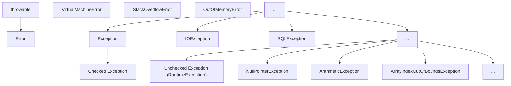
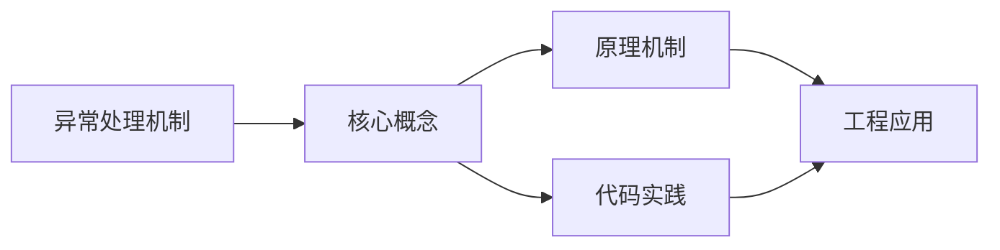
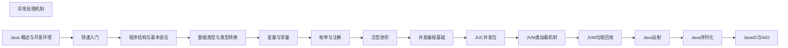

## 1. 学习目标（Bloom 分类）

本节按照布鲁姆教育目标分类学组织学习路径。本文主题为《异常处理机制》，属于 Java 模块，读者可以根据自身阶段选择阅读深度。

记忆层面：能够准确复述本文的核心概念、术语与基本语法或操作步骤，并能够在提问或检索时快速定位对应知识点。能够说出 Java 的编译执行模型（javac 到字节码，JVM 解释与 JIT）。

理解层面：能够用自己的语言解释核心原理与工作机制，说明概念之间的因果关系，而不是机械记忆结论。能够解释面向对象三大特性与 JVM 内存区域的职责。

应用层面：能够在真实项目或练习场景中运用本文知识解决具体问题，写出正确且可维护的实现。能够编写类、接口、集合操作与异常处理的完整程序。

分析层面：能够拆解复杂问题，比较本文主题与相邻概念的异同，识别边界条件与例外情况。能够分析 Java 与 C++、Go 在内存管理与并发模型上的差异。

评价层面：能够根据约束条件（性能、可读性、安全、成本）评价不同方案的优劣，做出有依据的技术决策。能够评价不同集合、并发工具与框架的适用场景。

创造层面：能够把本文知识与其他模块知识组合，设计出新的解决方案或可复用的工程模式。能够组合 Spring 生态设计企业级应用。

通过本节学习，读者应当能够把《异常处理机制》纳入自己的知识网络，并与 Java 模块的其他主题（JVM、集合框架、并发、Spring 生态）建立关联。

## 2. 历史动机与发展脉络

《异常处理机制》是 Java 领域的重要主题。要真正理解它，需要先了解它解决的问题与演进过程。

Java 由 James Gosling 领导的 Sun 团队于 1995 年发布，口号“一次编写，到处运行”依托 JVM 字节码实现跨平台。2006 年 Sun 将 Java 开源（OpenJDK），2010 年 Oracle 收购 Sun 后 Java 进入新的治理阶段。
Java 的版本节奏在 2017 年后改为每半年一个特性版本、每两年一个 LTS（长期支持）版本。当前主流 LTS 包括 Java 11、17、21 与 25；Java 21 引入虚拟线程（Project Loom 成果），显著降低高并发服务的线程成本。
Java 生态以 Spring 家族为核心：Spring Boot 简化配置与部署，Spring Cloud 提供微服务组件；构建工具从 Maven 演进到 Gradle；JVM 语言（Kotlin、Scala、Groovy）与 Java 共存互操作。
Android 开发早期使用 Java，2019 年后官方转向 Kotlin-first，但 Java 仍是服务端领域（尤其是金融、电商等企业系统）的中坚力量。

回到本文主题：异常处理机制 的提出与成熟，正是上述技术背景下的必然产物。早期实现往往以简单可用为目标，随着工程规模扩大，社区逐渐沉淀出标准做法与最佳实践；理解这一脉络，可以帮助读者判断“为什么文档中的推荐写法是现在这个样子”，也能在遇到历史遗留代码时准确识别其设计年代与取舍。

理解 Java 版本与 LTS 机制，是工程选型的起点：生产环境优先 LTS，新特性（如虚拟线程）可以在受控场景评估后引入。

## 3. 形式化定义与核心概念精讲

本节把《异常处理机制》涉及的核心概念以“定义 + 讲解”的形式展开。读者应把定义当作工具，把讲解当作理解路径；两者结合才能形成可迁移的知识。

JVM 与字节码：`javac` 把 .java 编译为 .class 字节码，JVM 加载、校验并执行；热点代码由 JIT（如 C2）编译为机器码，解释与编译结合实现启动速度与峰值性能的平衡。
面向对象：封装（访问控制）、继承（extends/implements）与多态（重载/重写）是 Java 的类型系统支柱；接口默认方法（Java 8）与密封类（Java 17）持续演进表达能力。
异常体系：受检异常（checked）编译期强制处理，非受检异常（RuntimeException）运行时抛出；try-with-resources 自动关闭资源。
泛型与擦除：Java 泛型在编译期检查后擦除类型参数，运行时无泛型信息；这解释了 `List<String>` 与 `List<Integer>` 的 Class 相同，以及通配符 `? extends` 的逆变协变规则。

### 3.1 原文章节逐一精讲

原文档把主题拆分为 19 个小节，下面按顺序给出每一节的导读讲解，随后保留原文细节供精读。

#### 原文精读（完整保留）

# Java 异常处理机制

> **符号约定**：`< >` 必填参数 | `[ ]` 可选参数

---

#### 1. 异常体系 (Exception Hierarchy)

##### 1.1 异常的层次结构

Java 中的异常体系以 `Throwable` 为顶级父类，分为两大类：



##### 1.2 异常的分类

- **Error**: 严重错误，如 `StackOverflowError`、`OutOfMemoryError`，程序无法恢复
- **Exception**: 应用程序可捕获并处理的异常
- **检查型异常 (Checked Exception)**: 编译时强制要求处理，如 `IOException`、`SQLException`
- **运行时异常 (Runtime / Unchecked Exception)**: 逻辑错误，不强制要求捕获，如 `NullPointerException`、`ArithmeticException`

##### 1.3 常见异常类型

###### 1.3.1 运行时异常

- **NullPointerException**: 空指针异常
- **ArithmeticException**: 算术异常（如除零）
- **ArrayIndexOutOfBoundsException**: 数组下标越界异常
- **ClassCastException**: 类型转换异常
- **IllegalArgumentException**: 非法参数异常
- **IllegalStateException**: 非法状态异常

###### 1.3.2 检查型异常

- **IOException**: IO 操作异常
- **SQLException**: 数据库操作异常
- **ClassNotFoundException**: 类未找到异常
- **InterruptedException**: 线程中断异常

#### 2. 异常处理 (Try-Catch-Finally)

##### 2.1 基本语法

```java
 try {
  // 可能抛出异常的代码
 }
  // 处理特定异常
 }
  // 处理另一种异常
 }
  // 捕获所有其他异常
 }
  // 无论是否发生异常，都会执行的代码
 }
```

##### 2.2 异常处理的执行流程

1. 执行 try 块中的代码
2. 如果发生异常，寻找匹配的 catch 块
3. 执行匹配的 catch 块
4. 执行 finally 块
5. 继续执行后续代码

##### 2.3 异常对象的常用方法

- **getMessage()**: 获取异常信息
- **printStackTrace()**: 打印异常堆栈信息
- **getCause()**: 获取导致当前异常的原因
- **getStackTrace()**: 获取异常堆栈跟踪信息

##### 2.4 异常捕获的顺序

- 先捕获具体的异常，再捕获通用的异常
- 如果先捕获通用异常，后面的具体异常捕获块永远不会执行

```java
 // 正确的顺序
 try {
  // 可能抛出异常的代码
 }
  // 处理算术异常
 }
  // 处理其他异常
 }
 // 错误的顺序（ArithmeticException 捕获块永远不会执行）
 try {
  // 可能抛出异常的代码
 }
  // 处理所有异常
 }
  // 永远不会执行
 }
```

#### 3. 抛出异常 (Throw & Throws)

##### 3.1 throw 关键字

用于在方法体内抛出一个具体的异常对象。

```java
 public void validateAge(int age) {
  if (age < 0) {
  throw new IllegalArgumentException("Age cannot be negative");
  }
  if (age > 150) {
  throw new IllegalArgumentException("Age cannot be greater than 150");
  }
 }
```

##### 3.2 throws 关键字

用于在方法签名处声明该方法可能抛出的异常类型。

```java
 public void readFile(String path) throws IOException, FileNotFoundException {
  if (path == null) {
  throw new NullPointerException("Path cannot be null");
  }
  // 可能抛出 IOException 的代码
 }
```

##### 3.3 throw 与 throws 的区别

| 特性     | throw                  | throws                        |
| -------- | ---------------------- | ----------------------------- |
| **位置** | 方法体内               | 方法签名处                    |
| **作用** | 抛出具体异常对象       | 声明方法可能抛出的异常类型    |
| **数量** | 一次只能抛出一个异常   | 可以声明多个异常              |
| **语法** | throw new Exception(); | throws Exception1, Exception2 |

#### 4. 自定义异常 (Custom Exception)

##### 4.1 自定义异常的创建

继承 `Exception` (检查型) 或 `RuntimeException` (非检查型)。

###### 4.1.1 自定义检查型异常

```java
 public class BusinessException extends Exception {
  private int errorCode;
  public BusinessException() {
  super();
  }
  public BusinessException(String message) {
  super(message);
  }
  public BusinessException(String message, int errorCode) {
  super(message);
  this.errorCode = errorCode;
  }
  public BusinessException(String message, Throwable cause) {
  super(message, cause);
  }
  public int getErrorCode() {
  return errorCode;
  }
 }
```

###### 4.1.2 自定义运行时异常

```java
 public class ValidationException extends RuntimeException {
  private String fieldName;
  public ValidationException(String message) {
  super(message);
  }
  public ValidationException(String message, String fieldName) {
  super(message);
  this.fieldName = fieldName;
  }
  public String getFieldName() {
  return fieldName;
  }
 }
```

##### 4.2 自定义异常的使用

```java
 public void registerUser(String username, String password) throws BusinessException {
  if (username == null || username.isEmpty()) {
  throw new BusinessException("Username cannot be empty", 400);
  }
  if (password == null || password.length() < 6) {
  throw new BusinessException("Password must be at least 6 characters", 400);
  }
  // 注册用户的逻辑
 }
 // 使用自定义异常
 try {
  registerUser("", "123");
 }
  System.out.println("Error code: " + e.getErrorCode());
  System.out.println("Error message: " + e.getMessage());
 }
```

#### 5. Try-with-resources (Java 7+)

##### 5.1 基本语法

自动管理实现了 `AutoCloseable` 接口的资源，无需手动关闭。

```java
 try (BufferedReader br = new BufferedReader(new FileReader("file.txt"));
  BufferedWriter bw = new BufferedWriter(new FileWriter("output.txt"))) {
  // 使用资源
  String line;
  while ((line = br.readLine()) != null) {
  bw.write(line);
  bw.newLine();
  }
 }
  // 处理异常
  e.printStackTrace();
 }
```

##### 5.2 实现 AutoCloseable 接口

```java
 public class CustomResource implements AutoCloseable {
  public CustomResource() {
  System.out.println("Resource created");
  }
  public void use() {
  System.out.println("Resource used");
  }
  @Override
  public void close() throws Exception {
  System.out.println("Resource closed");
  }
 }
 // 使用自定义资源
 try (CustomResource resource = new CustomResource()) {
  resource.use();
 }
  e.printStackTrace();
 }
```

##### 5.3 Try-with-resources 的优势

- **自动关闭资源**: 无需在 finally 块中手动关闭资源
- **异常抑制**: 如果关闭资源时发生异常，会被抑制，不会影响原始异常
- **代码简洁**: 减少样板代码，提高可读性

#### 6. 异常处理的实际应用

##### 6.1 分层异常处理

###### 6.1.1 数据访问层

```java
 public class UserDao {
  public User findById(int id) throws SQLException {
  try (Connection conn = getConnection();
  PreparedStatement stmt = conn.prepareStatement("SELECT * FROM users WHERE id = ?")) {
  stmt.setInt(1, id);
  try (ResultSet rs = stmt.executeQuery()) {
  if (rs.next()) {
  return new User(rs.getInt("id"), rs.getString("name"));
  }
  return null;
  }
  }
  }
 }
```

###### 6.1.2 业务逻辑层

```java
 public class UserService {
  private UserDao userDao = new UserDao();
  public User getUser(int id) throws BusinessException {
  try {
  User user = userDao.findById(id);
  if (user == null) {
  throw new BusinessException("User not found", 404);
  }
  return user;
  } catch (SQLException e) {
  throw new BusinessException("Database error", 500, e);
  }
  }
 }
```

###### 6.1.3 表现层

```java
 public class UserController {
  private UserService userService = new UserService();
  public void handleGetUser(int id) {
  try {
  User user = userService.getUser(id);
  System.out.println("User found: " + user);
  } catch (BusinessException e) {
  System.out.println("Error: " + e.getMessage());
  // 可以根据错误码进行不同的处理
  }
  }
 }
```

##### 6.2 异常链

将底层异常包装为上层异常，保留原始异常信息。

```java
 try {
  // 可能抛出 SQLException 的代码
 }
  // 包装为业务异常，保留原始异常
  throw new BusinessException("Database operation failed", e);
 }
```

#### 7. 异常处理的最佳实践

##### 7.1 基本原则

- **不要捕获所有异常**: 应该捕获具体的异常类型
- **不要忽略异常**: 至少应该记录异常信息
- **不要在 finally 中抛出异常**: 会覆盖原始异常
- **使用 try-with-resources 管理资源**: 避免资源泄漏
- **合理使用自定义异常**: 提供更具体的错误信息

##### 7.2 异常处理的最佳实践

1. **只捕获可以处理的异常**
2. **对不同的异常进行不同的处理**
3. **记录异常信息**
4. **向上层传递不能处理的异常**
5. **使用 finally 块释放资源**
6. **使用 try-with-resources 管理资源**
7. **合理设计异常层次结构**
8. **在合适的层次处理异常**

##### 7.3 异常处理的反模式

- **空 catch 块**: 捕获异常但不做任何处理
- **过度使用异常**: 用异常控制流程
- **捕获并重新抛出相同的异常**: 没有添加任何信息
- **抛出异常过于宽泛**: 如直接抛出 Exception
- **在 finally 块中修改返回值**: 会覆盖 try 或 catch 中的返回值

#### 8. 常见陷阱

##### 8.1 异常捕获顺序错误

```java
 // 错误的顺序
 try {
  // 代码
 }
  // 处理所有异常
 }
  // 永远不会执行
 }
```

##### 8.2 资源泄漏

```java
 // 错误：没有关闭资源
 BufferedReader br = null;
 try {
  br = new BufferedReader(new FileReader("file.txt"));
  // 使用 br
 }
  e.printStackTrace();
 }
 // 正确：使用 try-with-resources
 try (BufferedReader br = new BufferedReader(new FileReader("file.txt"))) {
  // 使用 br
 }
  e.printStackTrace();
 }
```

##### 8.3 异常信息不完整

```java
 // 错误：没有传递原始异常
 catch (SQLException e) {
  throw new BusinessException("Database error");
 }
 // 正确：传递原始异常
 catch (SQLException e) {
  throw new BusinessException("Database error", e);
 }
```

##### 8.4 过度使用异常

```java
 // 错误：用异常控制流程
 public int divide(int a, int b) {
  try {
  return a / b;
  } catch (ArithmeticException e) {
  return 0;
  }
 }
 // 正确：先检查
 public int divide(int a, int b) {
  if (b == 0) {
  return 0;
  }
  return a / b;
 }
```

#### 9. 异常处理的性能考虑

##### 9.1 异常的性能开销

- **创建异常对象**: 会捕获当前堆栈信息，开销较大
- **抛出异常**: 会中断正常的执行流程
- **异常处理**: 会影响代码的执行效率

##### 9.2 性能优化建议

- **只在真正异常的情况下使用异常**
- **避免在循环中抛出异常**
- **使用检查型异常处理可恢复的错误**
- **使用运行时异常处理编程错误**
- **合理设计异常层次结构**

---

#### 异常体系

**基本写法：Throwable 体系**
`Throwable -> Error | Exception`
```java
// 异常体系根类
Throwable
```

---

**基本写法：Error 不可恢复**
`class <错误类> extends Error`
```java
// 严重错误程序无法处理
OutOfMemoryError
```

---

**基本写法：Exception 可恢复**
`class <异常类> extends Exception`
```java
// 可检查异常必须处理
IOException
```

---

**基本写法：RuntimeException 运行时异常**
`class <异常类> extends RuntimeException`
```java
// 运行时异常可不处理
NullPointerException
```

---

#### try-catch

**基本写法：单 catch**
`try { } catch (<异常类型> <变量>) { }`
```java
// 捕获单个异常
try {
    int result = 10 / 0;
} catch (ArithmeticException e) {
}
```

---

**基本写法：多 catch**
`try { } catch (<异常1> <变量>) { } catch (<异常2> <变量>) { }`
```java
// 捕获多种异常分别处理
try {
} catch (ArithmeticException e) {
} catch (NullPointerException e) {
}
```

---

**基本写法：Java 7+ 多异常合并**
`try { } catch (<异常1> | <异常2> <变量>) { }`
```java
// 多种异常合并捕获
try {
} catch (IOException | SQLException e) {
}
```

---

**基本写法：try-catch-finally**
`try { } catch (<异常> <变量>) { } finally { }`
```java
// finally 块无论是否异常都执行
try {
} catch (Exception e) {
} finally {
}
```

---

**基本写法：try-finally**
`try { } finally { }`
```java
// 无 catch 仅 finally
try {
} finally {
}
```

---

#### try-with-resources

**基本写法：自动资源管理**
`try (<资源声明>) { }`
```java
// 自动关闭实现 AutoCloseable 的资源
try (FileReader fr = new FileReader("file.txt")) {
}
```

---

**换行写法：多个资源**
`try (<资源1>; <资源2>) { }`
```java
// 管理多个资源按声明逆序关闭
try (
    FileReader fr = new FileReader("input.txt");
    FileWriter fw = new FileWriter("output.txt")
) {
}
```

---

**基本写法：try-with-resources 异常处理**
`try (<资源>) { } catch (<异常> <变量>) { }`
```java
// 自动关闭资源并捕获异常
try (FileReader fr = new FileReader("file.txt")) {
} catch (IOException e) {
}
```

---

#### throw 抛出异常

**基本写法：抛出异常**
`throw new <异常类>("<消息>");`
```java
// 手动抛出异常
throw new IllegalArgumentException("Invalid parameter");
```

---

**基本写法：抛出已存在异常**
`throw <异常变量>;`
```java
// 重新抛出捕获的异常
throw e;
```

---

**基本写法：抛出带原因的异常**
`throw new <异常类>("<消息>", <原因>);`
```java
// 抛出异常并附带原因
throw new RuntimeException("Operation failed", cause);
```

---

#### throws 声明异常

**基本写法：声明单个异常**
`<方法签名> throws <异常类型>`
```java
// 方法声明可能抛出的异常
public void readFile() throws IOException {
}
```

---

**单行写法：声明多个异常**
`<方法签名> throws <异常1>, <异常2>`
```java
// 方法声明抛出多种异常
public void process() throws IOException, SQLException {
}
```

---

**换行写法：声明多个异常**
`<方法签名> throws <异常1>, <异常2>, <异常3>`
```java
// 换行声明抛出多种异常
public void process()
        throws IOException,
        SQLException,
        ClassNotFoundException {
}
```

---

#### 自定义异常

**基本写法：自定义检查异常**
`class <异常名> extends Exception { }`
```java
// 继承 Exception 定义检查异常
public class BusinessException extends Exception {
    public BusinessException(String message) {
        super(message);
    }
}
```

---

**基本写法：自定义运行时异常**
`class <异常名> extends RuntimeException { }`
```java
// 继承 RuntimeException 定义运行时异常
public class ValidationException extends RuntimeException {
    public ValidationException(String message) {
        super(message);
    }
}
```

---

**换行写法：带属性的自定义异常**
`class <异常名> extends Exception { private <字段>; <构造方法> <getter> }`
```java
// 自定义异常带额外属性
public class BusinessException extends Exception {
    private int errorCode;

    public BusinessException(int errorCode, String message) {
        super(message);
        this.errorCode = errorCode;
    }

    public int getErrorCode() {
        return errorCode;
    }
}
```

---

#### 异常链

**基本写法：保留原始异常**
`throw new <异常类>("<消息>", <原始异常>);`
```java
// 抛出新异常并保留原始异常
try {
} catch (IOException e) {
    throw new BusinessException("File operation failed", e);
}
```

---

**基本写法：initCause 设置原因**
`<异常>.initCause(<原因>)`
```java
// 使用 initCause 设置异常原因
BusinessException be = new BusinessException("Error");
be.initCause(originalException);
throw be;
```

---

**基本写法：获取原始异常**
`<异常>.getCause()`
```java
// 获取异常的根本原因
Throwable cause = e.getCause();
```

---

#### 异常信息获取

**基本写法：获取消息**
`<异常>.getMessage()`
```java
// 获取异常的详细消息
String message = e.getMessage();
```

---

**基本写法：获取堆栈**
`<异常>.getStackTrace()`
```java
// 获取异常的堆栈跟踪数组
StackTraceElement[] stack = e.getStackTrace();
```

---

**基本写法：打印堆栈**
`<异常>.printStackTrace()`
```java
// 打印异常堆栈到标准错误流
e.printStackTrace();
```

---

**基本写法：获取所有异常**
`<异常>.getSuppressed()`
```java
// 获取 try-with-resources 中被抑制的异常
Throwable[] suppressed = e.getSuppressed();
```

---

#### 异常处理最佳实践

**基本写法：捕获具体异常**
`catch (<具体异常类型> <变量>)`
```java
// 捕获具体的异常类型而非通用 Exception
try {
} catch (FileNotFoundException e) {
}
```

---

**基本写法：异常不忽略**
`catch (<异常> <变量>) { <处理逻辑> }`
```java
// catch 块中必须有处理逻辑
try {
} catch (Exception e) {
    log.error("Error occurred", e);
}
```

---

**基本写法：finally 不 return**
`finally { <清理逻辑> }`
```java
// finally 块只做资源清理不返回值
try {
} finally {
    resource.close();
}
```

---

#### 常见运行时异常

**基本写法：空指针异常**
`throw new NullPointerException("<消息>");`
```java
// 抛出空指针异常
throw new NullPointerException("Object is null");
```

---

**基本写法：数组越界异常**
`throw new ArrayIndexOutOfBoundsException(<索引>);`
```java
// 抛出数组越界异常
throw new ArrayIndexOutOfBoundsException(10);
```

---

**基本写法：类型转换异常**
`throw new ClassCastException("<消息>");`
```java
// 抛出类型转换异常
throw new ClassCastException("Cannot cast to String");
```

---

**基本写法：非法参数异常**
`throw new IllegalArgumentException("<消息>");`
```java
// 抛出非法参数异常
throw new IllegalArgumentException("Age must be positive");
```

---

**基本写法：非法状态异常**
`throw new IllegalStateException("<消息>");`
```java
// 抛出非法状态异常
throw new IllegalStateException("Connection is closed");
```

---

**基本写法：不支持操作异常**
`throw new UnsupportedOperationException();`
```java
// 抛出不支持操作异常
throw new UnsupportedOperationException();
```


### 3.2 概念关系图

下面用 Mermaid 图表达本文核心概念之间的关系，帮助读者建立整体图景：



图中展示的是本文知识的结构化关系：核心概念是入口，原理机制解释“为什么”，代码实践演示“怎么做”，工程应用回答“何时用”。读者学习时可以把每个小节的内容挂接到对应节点上。

## 4. 理论推导与原理解析

本节深入《异常处理机制》背后的原理。理论部分不求面面俱到，而是聚焦“能解释现象、能指导实践”的关键推导。

JVM 内存模型：堆（新生代/老年代）、元空间、虚拟机栈、本地方法栈与程序计数器；GC 从 CMS 演进到 G1（默认）、ZGC（超低延迟），理解分代收集是调优前提。
并发工具：synchronized 与 JUC（java.util.concurrent）的锁、并发容器、线程池、CompletableFuture 构成并发工具箱；Java 21 的虚拟线程让“每任务一线程”成为可能。
类加载机制：双亲委派模型保证类唯一性，SPI（ServiceLoader）打破委派实现扩展；自定义类加载器是热部署与隔离的基础。
反射与注解：反射在运行时检查类结构，注解提供元数据；Spring 的依赖注入与 AOP 均基于这些机制，但反射有性能与安全成本。

需要强调的是，理论推导与工程实践之间存在翻译层：理论给出的是理想化模型与边界条件，工程代码则必须处理真实环境中的例外。读者在学习时应先掌握理论的“标准情形”，再通过陷阱章节了解“非标准情形”。

## 5. 代码示例与逐行讲解

本节把原文中的代码示例系统整理，并为每个示例补充用途说明与讲解。读者不应只浏览代码，而应逐段对照讲解理解设计意图。

### 5.1 示例：1.1 异常的层次结构

该示例来自原文《1.1 异常的层次结构》小节，用于演示异常处理机制相关操作。阅读时请先看代码结构，再看其后的讲解。


讲解：这段代码演示了本节核心知识点。代码中的关键操作可以归纳为三步：准备（定义或初始化）、执行（核心逻辑）、收尾（释放资源或返回结果）。实际项目中，这三步往往被封装为函数或类，以提升复用性与可测试性。

关键点分析：

该示例共 28 行有效代码，结构以数据或配置为主。阅读时应关注：数据字段的含义、配置项的作用，以及它们与运行行为的对应关系。

进阶思考路径：先尝试修改参数观察行为变化，再把示例中的模式迁移到自己的项目中；每次修改都记录预期与实测差异，这是把示例转化为能力的最快方式。

### 5.2 示例：2.1 基本语法

该示例来自原文《2.1 基本语法》小节，用于演示异常处理机制相关操作。阅读时请先看代码结构，再看其后的讲解。

```java
 try {
  // 可能抛出异常的代码
 }
  // 处理特定异常
 }
  // 处理另一种异常
 }
  // 捕获所有其他异常
 }
  // 无论是否发生异常，都会执行的代码
 }
```

讲解：这段代码演示了本节核心知识点。代码中的关键操作可以归纳为三步：准备（定义或初始化）、执行（核心逻辑）、收尾（释放资源或返回结果）。实际项目中，这三步往往被封装为函数或类，以提升复用性与可测试性。

关键点分析：

该示例共 11 行有效代码，结构以数据或配置为主。阅读时应关注：数据字段的含义、配置项的作用，以及它们与运行行为的对应关系。

进阶思考路径：先尝试修改参数观察行为变化，再把示例中的模式迁移到自己的项目中；每次修改都记录预期与实测差异，这是把示例转化为能力的最快方式。

### 5.3 示例：2.4 异常捕获的顺序

该示例来自原文《2.4 异常捕获的顺序》小节，用于演示异常处理机制相关操作。阅读时请先看代码结构，再看其后的讲解。

```java
 // 正确的顺序
 try {
  // 可能抛出异常的代码
 }
  // 处理算术异常
 }
  // 处理其他异常
 }
 // 错误的顺序（ArithmeticException 捕获块永远不会执行）
 try {
  // 可能抛出异常的代码
 }
  // 处理所有异常
 }
  // 永远不会执行
 }
```

讲解：这段代码演示了本节核心知识点。代码中的关键操作可以归纳为三步：准备（定义或初始化）、执行（核心逻辑）、收尾（释放资源或返回结果）。实际项目中，这三步往往被封装为函数或类，以提升复用性与可测试性。

关键点分析：

该示例共 16 行有效代码，结构以数据或配置为主。阅读时应关注：数据字段的含义、配置项的作用，以及它们与运行行为的对应关系。

进阶思考路径：先尝试修改参数观察行为变化，再把示例中的模式迁移到自己的项目中；每次修改都记录预期与实测差异，这是把示例转化为能力的最快方式。

### 5.4 示例：3.1 throw 关键字

该示例来自原文《3.1 throw 关键字》小节，用于演示异常处理机制相关操作。阅读时请先看代码结构，再看其后的讲解。

```java
 public void validateAge(int age) {
  if (age < 0) {
  throw new IllegalArgumentException("Age cannot be negative");
  }
  if (age > 150) {
  throw new IllegalArgumentException("Age cannot be greater than 150");
  }
 }
```

讲解：这段代码演示了本节核心知识点。代码中的关键操作可以归纳为三步：准备（定义或初始化）、执行（核心逻辑）、收尾（释放资源或返回结果）。实际项目中，这三步往往被封装为函数或类，以提升复用性与可测试性。

关键点分析：

该示例共 8 行有效代码，包含 1 类关键结构（if）。其中：

- 入口与初始化部分负责建立上下文，对应实际项目中的启动或装配逻辑；
- 核心逻辑部分体现本文主题的主要操作，是阅读时最需要对照讲解理解的部分；
- 输出或返回部分把结果交给调用方，注意其类型与边界条件。

进阶思考路径：先尝试修改参数观察行为变化，再把示例中的模式迁移到自己的项目中；每次修改都记录预期与实测差异，这是把示例转化为能力的最快方式。

### 5.5 示例：3.2 throws 关键字

该示例来自原文《3.2 throws 关键字》小节，用于演示异常处理机制相关操作。阅读时请先看代码结构，再看其后的讲解。

```java
 public void readFile(String path) throws IOException, FileNotFoundException {
  if (path == null) {
  throw new NullPointerException("Path cannot be null");
  }
  // 可能抛出 IOException 的代码
 }
```

讲解：这段代码演示了本节核心知识点。代码中的关键操作可以归纳为三步：准备（定义或初始化）、执行（核心逻辑）、收尾（释放资源或返回结果）。实际项目中，这三步往往被封装为函数或类，以提升复用性与可测试性。

关键点分析：

该示例共 6 行有效代码，包含 1 类关键结构（if）。其中：

- 入口与初始化部分负责建立上下文，对应实际项目中的启动或装配逻辑；
- 核心逻辑部分体现本文主题的主要操作，是阅读时最需要对照讲解理解的部分；
- 输出或返回部分把结果交给调用方，注意其类型与边界条件。

进阶思考路径：先尝试修改参数观察行为变化，再把示例中的模式迁移到自己的项目中；每次修改都记录预期与实测差异，这是把示例转化为能力的最快方式。

### 5.6 示例：4.1.1 自定义检查型异常

该示例来自原文《4.1.1 自定义检查型异常》小节，用于演示异常处理机制相关操作。阅读时请先看代码结构，再看其后的讲解。

```java
 public class BusinessException extends Exception {
  private int errorCode;
  public BusinessException() {
  super();
  }
  public BusinessException(String message) {
  super(message);
  }
  public BusinessException(String message, int errorCode) {
  super(message);
  this.errorCode = errorCode;
  }
  public BusinessException(String message, Throwable cause) {
  super(message, cause);
  }
  public int getErrorCode() {
  return errorCode;
  }
 }
```

讲解：这段代码演示了本节核心知识点。代码中的关键操作可以归纳为三步：准备（定义或初始化）、执行（核心逻辑）、收尾（释放资源或返回结果）。实际项目中，这三步往往被封装为函数或类，以提升复用性与可测试性。

关键点分析：

该示例共 19 行有效代码，包含 2 类关键结构（class、return）。其中：

- 入口与初始化部分负责建立上下文，对应实际项目中的启动或装配逻辑；
- 核心逻辑部分体现本文主题的主要操作，是阅读时最需要对照讲解理解的部分；
- 输出或返回部分把结果交给调用方，注意其类型与边界条件。

进阶思考路径：先尝试修改参数观察行为变化，再把示例中的模式迁移到自己的项目中；每次修改都记录预期与实测差异，这是把示例转化为能力的最快方式。

### 5.7 示例：4.1.2 自定义运行时异常

该示例来自原文《4.1.2 自定义运行时异常》小节，用于演示异常处理机制相关操作。阅读时请先看代码结构，再看其后的讲解。

```java
 public class ValidationException extends RuntimeException {
  private String fieldName;
  public ValidationException(String message) {
  super(message);
  }
  public ValidationException(String message, String fieldName) {
  super(message);
  this.fieldName = fieldName;
  }
  public String getFieldName() {
  return fieldName;
  }
 }
```

讲解：这段代码演示了本节核心知识点。代码中的关键操作可以归纳为三步：准备（定义或初始化）、执行（核心逻辑）、收尾（释放资源或返回结果）。实际项目中，这三步往往被封装为函数或类，以提升复用性与可测试性。

关键点分析：

该示例共 13 行有效代码，包含 2 类关键结构（class、return）。其中：

- 入口与初始化部分负责建立上下文，对应实际项目中的启动或装配逻辑；
- 核心逻辑部分体现本文主题的主要操作，是阅读时最需要对照讲解理解的部分；
- 输出或返回部分把结果交给调用方，注意其类型与边界条件。

进阶思考路径：先尝试修改参数观察行为变化，再把示例中的模式迁移到自己的项目中；每次修改都记录预期与实测差异，这是把示例转化为能力的最快方式。

### 5.8 示例：4.2 自定义异常的使用

该示例来自原文《4.2 自定义异常的使用》小节，用于演示异常处理机制相关操作。阅读时请先看代码结构，再看其后的讲解。

```java
 public void registerUser(String username, String password) throws BusinessException {
  if (username == null || username.isEmpty()) {
  throw new BusinessException("Username cannot be empty", 400);
  }
  if (password == null || password.length() < 6) {
  throw new BusinessException("Password must be at least 6 characters", 400);
  }
  // 注册用户的逻辑
 }
 // 使用自定义异常
 try {
  registerUser("", "123");
 }
  System.out.println("Error code: " + e.getErrorCode());
  System.out.println("Error message: " + e.getMessage());
 }
```

讲解：这段代码演示了本节核心知识点。代码中的关键操作可以归纳为三步：准备（定义或初始化）、执行（核心逻辑）、收尾（释放资源或返回结果）。实际项目中，这三步往往被封装为函数或类，以提升复用性与可测试性。

关键点分析：

该示例共 16 行有效代码，包含 1 类关键结构（if）。其中：

- 入口与初始化部分负责建立上下文，对应实际项目中的启动或装配逻辑；
- 核心逻辑部分体现本文主题的主要操作，是阅读时最需要对照讲解理解的部分；
- 输出或返回部分把结果交给调用方，注意其类型与边界条件。

进阶思考路径：先尝试修改参数观察行为变化，再把示例中的模式迁移到自己的项目中；每次修改都记录预期与实测差异，这是把示例转化为能力的最快方式。

### 5.9 示例：5.1 基本语法

该示例来自原文《5.1 基本语法》小节，用于演示异常处理机制相关操作。阅读时请先看代码结构，再看其后的讲解。

```java
 try (BufferedReader br = new BufferedReader(new FileReader("file.txt"));
  BufferedWriter bw = new BufferedWriter(new FileWriter("output.txt"))) {
  // 使用资源
  String line;
  while ((line = br.readLine()) != null) {
  bw.write(line);
  bw.newLine();
  }
 }
  // 处理异常
  e.printStackTrace();
 }
```

讲解：这段代码演示了本节核心知识点。代码中的关键操作可以归纳为三步：准备（定义或初始化）、执行（核心逻辑）、收尾（释放资源或返回结果）。实际项目中，这三步往往被封装为函数或类，以提升复用性与可测试性。

关键点分析：

该示例共 12 行有效代码，包含 1 类关键结构（while）。其中：

- 入口与初始化部分负责建立上下文，对应实际项目中的启动或装配逻辑；
- 核心逻辑部分体现本文主题的主要操作，是阅读时最需要对照讲解理解的部分；
- 输出或返回部分把结果交给调用方，注意其类型与边界条件。

进阶思考路径：先尝试修改参数观察行为变化，再把示例中的模式迁移到自己的项目中；每次修改都记录预期与实测差异，这是把示例转化为能力的最快方式。

### 5.10 示例：5.2 实现 AutoCloseable 接口

该示例来自原文《5.2 实现 AutoCloseable 接口》小节，用于演示异常处理机制相关操作。阅读时请先看代码结构，再看其后的讲解。

```java
 public class CustomResource implements AutoCloseable {
  public CustomResource() {
  System.out.println("Resource created");
  }
  public void use() {
  System.out.println("Resource used");
  }
  @Override
  public void close() throws Exception {
  System.out.println("Resource closed");
  }
 }
 // 使用自定义资源
 try (CustomResource resource = new CustomResource()) {
  resource.use();
 }
  e.printStackTrace();
 }
```

讲解：这段代码演示了本节核心知识点。代码中的关键操作可以归纳为三步：准备（定义或初始化）、执行（核心逻辑）、收尾（释放资源或返回结果）。实际项目中，这三步往往被封装为函数或类，以提升复用性与可测试性。

关键点分析：

该示例共 18 行有效代码，包含 1 类关键结构（class）。其中：

- 入口与初始化部分负责建立上下文，对应实际项目中的启动或装配逻辑；
- 核心逻辑部分体现本文主题的主要操作，是阅读时最需要对照讲解理解的部分；
- 输出或返回部分把结果交给调用方，注意其类型与边界条件。

进阶思考路径：先尝试修改参数观察行为变化，再把示例中的模式迁移到自己的项目中；每次修改都记录预期与实测差异，这是把示例转化为能力的最快方式。

### 5.11 示例：6.1.1 数据访问层

该示例来自原文《6.1.1 数据访问层》小节，用于演示异常处理机制相关操作。阅读时请先看代码结构，再看其后的讲解。

```java
 public class UserDao {
  public User findById(int id) throws SQLException {
  try (Connection conn = getConnection();
  PreparedStatement stmt = conn.prepareStatement("SELECT * FROM users WHERE id = ?")) {
  stmt.setInt(1, id);
  try (ResultSet rs = stmt.executeQuery()) {
  if (rs.next()) {
  return new User(rs.getInt("id"), rs.getString("name"));
  }
  return null;
  }
  }
  }
 }
```

讲解：这段代码演示了本节核心知识点。代码中的关键操作可以归纳为三步：准备（定义或初始化）、执行（核心逻辑）、收尾（释放资源或返回结果）。实际项目中，这三步往往被封装为函数或类，以提升复用性与可测试性。

关键点分析：

该示例共 14 行有效代码，包含 5 类关键结构（class、if、return、SELECT、FROM）。其中：

- 入口与初始化部分负责建立上下文，对应实际项目中的启动或装配逻辑；
- 核心逻辑部分体现本文主题的主要操作，是阅读时最需要对照讲解理解的部分；
- 输出或返回部分把结果交给调用方，注意其类型与边界条件。

进阶思考路径：先尝试修改参数观察行为变化，再把示例中的模式迁移到自己的项目中；每次修改都记录预期与实测差异，这是把示例转化为能力的最快方式。

### 5.12 示例：6.1.2 业务逻辑层

该示例来自原文《6.1.2 业务逻辑层》小节，用于演示异常处理机制相关操作。阅读时请先看代码结构，再看其后的讲解。

```java
 public class UserService {
  private UserDao userDao = new UserDao();
  public User getUser(int id) throws BusinessException {
  try {
  User user = userDao.findById(id);
  if (user == null) {
  throw new BusinessException("User not found", 404);
  }
  return user;
  } catch (SQLException e) {
  throw new BusinessException("Database error", 500, e);
  }
  }
 }
```

讲解：这段代码演示了本节核心知识点。代码中的关键操作可以归纳为三步：准备（定义或初始化）、执行（核心逻辑）、收尾（释放资源或返回结果）。实际项目中，这三步往往被封装为函数或类，以提升复用性与可测试性。

关键点分析：

该示例共 14 行有效代码，包含 3 类关键结构（class、if、return）。其中：

- 入口与初始化部分负责建立上下文，对应实际项目中的启动或装配逻辑；
- 核心逻辑部分体现本文主题的主要操作，是阅读时最需要对照讲解理解的部分；
- 输出或返回部分把结果交给调用方，注意其类型与边界条件。

进阶思考路径：先尝试修改参数观察行为变化，再把示例中的模式迁移到自己的项目中；每次修改都记录预期与实测差异，这是把示例转化为能力的最快方式。

### 5.13 示例：6.1.3 表现层

该示例来自原文《6.1.3 表现层》小节，用于演示异常处理机制相关操作。阅读时请先看代码结构，再看其后的讲解。

```java
 public class UserController {
  private UserService userService = new UserService();
  public void handleGetUser(int id) {
  try {
  User user = userService.getUser(id);
  System.out.println("User found: " + user);
  } catch (BusinessException e) {
  System.out.println("Error: " + e.getMessage());
  // 可以根据错误码进行不同的处理
  }
  }
 }
```

讲解：这段代码演示了本节核心知识点。代码中的关键操作可以归纳为三步：准备（定义或初始化）、执行（核心逻辑）、收尾（释放资源或返回结果）。实际项目中，这三步往往被封装为函数或类，以提升复用性与可测试性。

关键点分析：

该示例共 12 行有效代码，包含 1 类关键结构（class）。其中：

- 入口与初始化部分负责建立上下文，对应实际项目中的启动或装配逻辑；
- 核心逻辑部分体现本文主题的主要操作，是阅读时最需要对照讲解理解的部分；
- 输出或返回部分把结果交给调用方，注意其类型与边界条件。

进阶思考路径：先尝试修改参数观察行为变化，再把示例中的模式迁移到自己的项目中；每次修改都记录预期与实测差异，这是把示例转化为能力的最快方式。

### 5.14 示例：6.2 异常链

该示例来自原文《6.2 异常链》小节，用于演示异常处理机制相关操作。阅读时请先看代码结构，再看其后的讲解。

```java
 try {
  // 可能抛出 SQLException 的代码
 }
  // 包装为业务异常，保留原始异常
  throw new BusinessException("Database operation failed", e);
 }
```

讲解：这段代码演示了本节核心知识点。代码中的关键操作可以归纳为三步：准备（定义或初始化）、执行（核心逻辑）、收尾（释放资源或返回结果）。实际项目中，这三步往往被封装为函数或类，以提升复用性与可测试性。

关键点分析：

该示例共 6 行有效代码，结构以数据或配置为主。阅读时应关注：数据字段的含义、配置项的作用，以及它们与运行行为的对应关系。

进阶思考路径：先尝试修改参数观察行为变化，再把示例中的模式迁移到自己的项目中；每次修改都记录预期与实测差异，这是把示例转化为能力的最快方式。

### 5.15 示例：8.1 异常捕获顺序错误

该示例来自原文《8.1 异常捕获顺序错误》小节，用于演示异常处理机制相关操作。阅读时请先看代码结构，再看其后的讲解。

```java
 // 错误的顺序
 try {
  // 代码
 }
  // 处理所有异常
 }
  // 永远不会执行
 }
```

讲解：这段代码演示了本节核心知识点。代码中的关键操作可以归纳为三步：准备（定义或初始化）、执行（核心逻辑）、收尾（释放资源或返回结果）。实际项目中，这三步往往被封装为函数或类，以提升复用性与可测试性。

关键点分析：

该示例共 8 行有效代码，结构以数据或配置为主。阅读时应关注：数据字段的含义、配置项的作用，以及它们与运行行为的对应关系。

进阶思考路径：先尝试修改参数观察行为变化，再把示例中的模式迁移到自己的项目中；每次修改都记录预期与实测差异，这是把示例转化为能力的最快方式。

### 5.16 示例：8.2 资源泄漏

该示例来自原文《8.2 资源泄漏》小节，用于演示异常处理机制相关操作。阅读时请先看代码结构，再看其后的讲解。

```java
 // 错误：没有关闭资源
 BufferedReader br = null;
 try {
  br = new BufferedReader(new FileReader("file.txt"));
  // 使用 br
 }
  e.printStackTrace();
 }
 // 正确：使用 try-with-resources
 try (BufferedReader br = new BufferedReader(new FileReader("file.txt"))) {
  // 使用 br
 }
  e.printStackTrace();
 }
```

讲解：这段代码演示了本节核心知识点。代码中的关键操作可以归纳为三步：准备（定义或初始化）、执行（核心逻辑）、收尾（释放资源或返回结果）。实际项目中，这三步往往被封装为函数或类，以提升复用性与可测试性。

关键点分析：

该示例共 14 行有效代码，结构以数据或配置为主。阅读时应关注：数据字段的含义、配置项的作用，以及它们与运行行为的对应关系。

进阶思考路径：先尝试修改参数观察行为变化，再把示例中的模式迁移到自己的项目中；每次修改都记录预期与实测差异，这是把示例转化为能力的最快方式。

### 5.17 示例：8.3 异常信息不完整

该示例来自原文《8.3 异常信息不完整》小节，用于演示异常处理机制相关操作。阅读时请先看代码结构，再看其后的讲解。

```java
 // 错误：没有传递原始异常
 catch (SQLException e) {
  throw new BusinessException("Database error");
 }
 // 正确：传递原始异常
 catch (SQLException e) {
  throw new BusinessException("Database error", e);
 }
```

讲解：这段代码演示了本节核心知识点。代码中的关键操作可以归纳为三步：准备（定义或初始化）、执行（核心逻辑）、收尾（释放资源或返回结果）。实际项目中，这三步往往被封装为函数或类，以提升复用性与可测试性。

关键点分析：

该示例共 8 行有效代码，结构以数据或配置为主。阅读时应关注：数据字段的含义、配置项的作用，以及它们与运行行为的对应关系。

进阶思考路径：先尝试修改参数观察行为变化，再把示例中的模式迁移到自己的项目中；每次修改都记录预期与实测差异，这是把示例转化为能力的最快方式。

### 5.18 示例：8.4 过度使用异常

该示例来自原文《8.4 过度使用异常》小节，用于演示异常处理机制相关操作。阅读时请先看代码结构，再看其后的讲解。

```java
 // 错误：用异常控制流程
 public int divide(int a, int b) {
  try {
  return a / b;
  } catch (ArithmeticException e) {
  return 0;
  }
 }
 // 正确：先检查
 public int divide(int a, int b) {
  if (b == 0) {
  return 0;
  }
  return a / b;
 }
```

讲解：这段代码演示了本节核心知识点。代码中的关键操作可以归纳为三步：准备（定义或初始化）、执行（核心逻辑）、收尾（释放资源或返回结果）。实际项目中，这三步往往被封装为函数或类，以提升复用性与可测试性。

关键点分析：

该示例共 15 行有效代码，包含 2 类关键结构（if、return）。其中：

- 入口与初始化部分负责建立上下文，对应实际项目中的启动或装配逻辑；
- 核心逻辑部分体现本文主题的主要操作，是阅读时最需要对照讲解理解的部分；
- 输出或返回部分把结果交给调用方，注意其类型与边界条件。

进阶思考路径：先尝试修改参数观察行为变化，再把示例中的模式迁移到自己的项目中；每次修改都记录预期与实测差异，这是把示例转化为能力的最快方式。

### 5.19 示例：异常体系

该示例来自原文《异常体系》小节，用于演示异常处理机制相关操作。阅读时请先看代码结构，再看其后的讲解。

```java
// 异常体系根类
Throwable
```

讲解：这段代码演示了本节核心知识点。代码中的关键操作可以归纳为三步：准备（定义或初始化）、执行（核心逻辑）、收尾（释放资源或返回结果）。实际项目中，这三步往往被封装为函数或类，以提升复用性与可测试性。

关键点分析：

该示例共 2 行有效代码，结构以数据或配置为主。阅读时应关注：数据字段的含义、配置项的作用，以及它们与运行行为的对应关系。

进阶思考路径：先尝试修改参数观察行为变化，再把示例中的模式迁移到自己的项目中；每次修改都记录预期与实测差异，这是把示例转化为能力的最快方式。

### 5.20 示例：异常体系

该示例来自原文《异常体系》小节，用于演示异常处理机制相关操作。阅读时请先看代码结构，再看其后的讲解。

```java
// 严重错误程序无法处理
OutOfMemoryError
```

讲解：这段代码演示了本节核心知识点。代码中的关键操作可以归纳为三步：准备（定义或初始化）、执行（核心逻辑）、收尾（释放资源或返回结果）。实际项目中，这三步往往被封装为函数或类，以提升复用性与可测试性。

关键点分析：

该示例共 2 行有效代码，结构以数据或配置为主。阅读时应关注：数据字段的含义、配置项的作用，以及它们与运行行为的对应关系。

进阶思考路径：先尝试修改参数观察行为变化，再把示例中的模式迁移到自己的项目中；每次修改都记录预期与实测差异，这是把示例转化为能力的最快方式。

### 5.21 示例：异常体系

该示例来自原文《异常体系》小节，用于演示异常处理机制相关操作。阅读时请先看代码结构，再看其后的讲解。

```java
// 可检查异常必须处理
IOException
```

讲解：这段代码演示了本节核心知识点。代码中的关键操作可以归纳为三步：准备（定义或初始化）、执行（核心逻辑）、收尾（释放资源或返回结果）。实际项目中，这三步往往被封装为函数或类，以提升复用性与可测试性。

关键点分析：

该示例共 2 行有效代码，结构以数据或配置为主。阅读时应关注：数据字段的含义、配置项的作用，以及它们与运行行为的对应关系。

进阶思考路径：先尝试修改参数观察行为变化，再把示例中的模式迁移到自己的项目中；每次修改都记录预期与实测差异，这是把示例转化为能力的最快方式。

### 5.22 示例：异常体系

该示例来自原文《异常体系》小节，用于演示异常处理机制相关操作。阅读时请先看代码结构，再看其后的讲解。

```java
// 运行时异常可不处理
NullPointerException
```

讲解：这段代码演示了本节核心知识点。代码中的关键操作可以归纳为三步：准备（定义或初始化）、执行（核心逻辑）、收尾（释放资源或返回结果）。实际项目中，这三步往往被封装为函数或类，以提升复用性与可测试性。

关键点分析：

该示例共 2 行有效代码，结构以数据或配置为主。阅读时应关注：数据字段的含义、配置项的作用，以及它们与运行行为的对应关系。

进阶思考路径：先尝试修改参数观察行为变化，再把示例中的模式迁移到自己的项目中；每次修改都记录预期与实测差异，这是把示例转化为能力的最快方式。

### 5.23 示例：try-catch

该示例来自原文《try-catch》小节，用于演示异常处理机制相关操作。阅读时请先看代码结构，再看其后的讲解。

```java
// 捕获单个异常
try {
    int result = 10 / 0;
} catch (ArithmeticException e) {
}
```

讲解：这段代码演示了本节核心知识点。代码中的关键操作可以归纳为三步：准备（定义或初始化）、执行（核心逻辑）、收尾（释放资源或返回结果）。实际项目中，这三步往往被封装为函数或类，以提升复用性与可测试性。

关键点分析：

该示例共 5 行有效代码，结构以数据或配置为主。阅读时应关注：数据字段的含义、配置项的作用，以及它们与运行行为的对应关系。

进阶思考路径：先尝试修改参数观察行为变化，再把示例中的模式迁移到自己的项目中；每次修改都记录预期与实测差异，这是把示例转化为能力的最快方式。

### 5.24 示例：try-catch

该示例来自原文《try-catch》小节，用于演示异常处理机制相关操作。阅读时请先看代码结构，再看其后的讲解。

```java
// 捕获多种异常分别处理
try {
} catch (ArithmeticException e) {
} catch (NullPointerException e) {
}
```

讲解：这段代码演示了本节核心知识点。代码中的关键操作可以归纳为三步：准备（定义或初始化）、执行（核心逻辑）、收尾（释放资源或返回结果）。实际项目中，这三步往往被封装为函数或类，以提升复用性与可测试性。

关键点分析：

该示例共 5 行有效代码，结构以数据或配置为主。阅读时应关注：数据字段的含义、配置项的作用，以及它们与运行行为的对应关系。

进阶思考路径：先尝试修改参数观察行为变化，再把示例中的模式迁移到自己的项目中；每次修改都记录预期与实测差异，这是把示例转化为能力的最快方式。

### 5.25 示例：try-catch

该示例来自原文《try-catch》小节，用于演示异常处理机制相关操作。阅读时请先看代码结构，再看其后的讲解。

```java
// 多种异常合并捕获
try {
} catch (IOException | SQLException e) {
}
```

讲解：这段代码演示了本节核心知识点。代码中的关键操作可以归纳为三步：准备（定义或初始化）、执行（核心逻辑）、收尾（释放资源或返回结果）。实际项目中，这三步往往被封装为函数或类，以提升复用性与可测试性。

关键点分析：

该示例共 4 行有效代码，结构以数据或配置为主。阅读时应关注：数据字段的含义、配置项的作用，以及它们与运行行为的对应关系。

进阶思考路径：先尝试修改参数观察行为变化，再把示例中的模式迁移到自己的项目中；每次修改都记录预期与实测差异，这是把示例转化为能力的最快方式。

### 5.26 示例：try-catch

该示例来自原文《try-catch》小节，用于演示异常处理机制相关操作。阅读时请先看代码结构，再看其后的讲解。

```java
// finally 块无论是否异常都执行
try {
} catch (Exception e) {
} finally {
}
```

讲解：这段代码演示了本节核心知识点。代码中的关键操作可以归纳为三步：准备（定义或初始化）、执行（核心逻辑）、收尾（释放资源或返回结果）。实际项目中，这三步往往被封装为函数或类，以提升复用性与可测试性。

关键点分析：

该示例共 5 行有效代码，结构以数据或配置为主。阅读时应关注：数据字段的含义、配置项的作用，以及它们与运行行为的对应关系。

进阶思考路径：先尝试修改参数观察行为变化，再把示例中的模式迁移到自己的项目中；每次修改都记录预期与实测差异，这是把示例转化为能力的最快方式。

### 5.27 示例：try-catch

该示例来自原文《try-catch》小节，用于演示异常处理机制相关操作。阅读时请先看代码结构，再看其后的讲解。

```java
// 无 catch 仅 finally
try {
} finally {
}
```

讲解：这段代码演示了本节核心知识点。代码中的关键操作可以归纳为三步：准备（定义或初始化）、执行（核心逻辑）、收尾（释放资源或返回结果）。实际项目中，这三步往往被封装为函数或类，以提升复用性与可测试性。

关键点分析：

该示例共 4 行有效代码，结构以数据或配置为主。阅读时应关注：数据字段的含义、配置项的作用，以及它们与运行行为的对应关系。

进阶思考路径：先尝试修改参数观察行为变化，再把示例中的模式迁移到自己的项目中；每次修改都记录预期与实测差异，这是把示例转化为能力的最快方式。

### 5.28 示例：try-with-resources

该示例来自原文《try-with-resources》小节，用于演示异常处理机制相关操作。阅读时请先看代码结构，再看其后的讲解。

```java
// 自动关闭实现 AutoCloseable 的资源
try (FileReader fr = new FileReader("file.txt")) {
}
```

讲解：这段代码演示了本节核心知识点。代码中的关键操作可以归纳为三步：准备（定义或初始化）、执行（核心逻辑）、收尾（释放资源或返回结果）。实际项目中，这三步往往被封装为函数或类，以提升复用性与可测试性。

关键点分析：

该示例共 3 行有效代码，结构以数据或配置为主。阅读时应关注：数据字段的含义、配置项的作用，以及它们与运行行为的对应关系。

进阶思考路径：先尝试修改参数观察行为变化，再把示例中的模式迁移到自己的项目中；每次修改都记录预期与实测差异，这是把示例转化为能力的最快方式。

### 5.29 示例：try-with-resources

该示例来自原文《try-with-resources》小节，用于演示异常处理机制相关操作。阅读时请先看代码结构，再看其后的讲解。

```java
// 管理多个资源按声明逆序关闭
try (
    FileReader fr = new FileReader("input.txt");
    FileWriter fw = new FileWriter("output.txt")
) {
}
```

讲解：这段代码演示了本节核心知识点。代码中的关键操作可以归纳为三步：准备（定义或初始化）、执行（核心逻辑）、收尾（释放资源或返回结果）。实际项目中，这三步往往被封装为函数或类，以提升复用性与可测试性。

关键点分析：

该示例共 6 行有效代码，结构以数据或配置为主。阅读时应关注：数据字段的含义、配置项的作用，以及它们与运行行为的对应关系。

进阶思考路径：先尝试修改参数观察行为变化，再把示例中的模式迁移到自己的项目中；每次修改都记录预期与实测差异，这是把示例转化为能力的最快方式。

### 5.30 示例：try-with-resources

该示例来自原文《try-with-resources》小节，用于演示异常处理机制相关操作。阅读时请先看代码结构，再看其后的讲解。

```java
// 自动关闭资源并捕获异常
try (FileReader fr = new FileReader("file.txt")) {
} catch (IOException e) {
}
```

讲解：这段代码演示了本节核心知识点。代码中的关键操作可以归纳为三步：准备（定义或初始化）、执行（核心逻辑）、收尾（释放资源或返回结果）。实际项目中，这三步往往被封装为函数或类，以提升复用性与可测试性。

关键点分析：

该示例共 4 行有效代码，结构以数据或配置为主。阅读时应关注：数据字段的含义、配置项的作用，以及它们与运行行为的对应关系。

进阶思考路径：先尝试修改参数观察行为变化，再把示例中的模式迁移到自己的项目中；每次修改都记录预期与实测差异，这是把示例转化为能力的最快方式。

### 5.31 示例：throw 抛出异常

该示例来自原文《throw 抛出异常》小节，用于演示异常处理机制相关操作。阅读时请先看代码结构，再看其后的讲解。

```java
// 手动抛出异常
throw new IllegalArgumentException("Invalid parameter");
```

讲解：这段代码演示了本节核心知识点。代码中的关键操作可以归纳为三步：准备（定义或初始化）、执行（核心逻辑）、收尾（释放资源或返回结果）。实际项目中，这三步往往被封装为函数或类，以提升复用性与可测试性。

关键点分析：

该示例共 2 行有效代码，结构以数据或配置为主。阅读时应关注：数据字段的含义、配置项的作用，以及它们与运行行为的对应关系。

进阶思考路径：先尝试修改参数观察行为变化，再把示例中的模式迁移到自己的项目中；每次修改都记录预期与实测差异，这是把示例转化为能力的最快方式。

### 5.32 示例：throw 抛出异常

该示例来自原文《throw 抛出异常》小节，用于演示异常处理机制相关操作。阅读时请先看代码结构，再看其后的讲解。

```java
// 重新抛出捕获的异常
throw e;
```

讲解：这段代码演示了本节核心知识点。代码中的关键操作可以归纳为三步：准备（定义或初始化）、执行（核心逻辑）、收尾（释放资源或返回结果）。实际项目中，这三步往往被封装为函数或类，以提升复用性与可测试性。

关键点分析：

该示例共 2 行有效代码，结构以数据或配置为主。阅读时应关注：数据字段的含义、配置项的作用，以及它们与运行行为的对应关系。

进阶思考路径：先尝试修改参数观察行为变化，再把示例中的模式迁移到自己的项目中；每次修改都记录预期与实测差异，这是把示例转化为能力的最快方式。

### 5.33 示例：throw 抛出异常

该示例来自原文《throw 抛出异常》小节，用于演示异常处理机制相关操作。阅读时请先看代码结构，再看其后的讲解。

```java
// 抛出异常并附带原因
throw new RuntimeException("Operation failed", cause);
```

讲解：这段代码演示了本节核心知识点。代码中的关键操作可以归纳为三步：准备（定义或初始化）、执行（核心逻辑）、收尾（释放资源或返回结果）。实际项目中，这三步往往被封装为函数或类，以提升复用性与可测试性。

关键点分析：

该示例共 2 行有效代码，结构以数据或配置为主。阅读时应关注：数据字段的含义、配置项的作用，以及它们与运行行为的对应关系。

进阶思考路径：先尝试修改参数观察行为变化，再把示例中的模式迁移到自己的项目中；每次修改都记录预期与实测差异，这是把示例转化为能力的最快方式。

### 5.34 示例：throws 声明异常

该示例来自原文《throws 声明异常》小节，用于演示异常处理机制相关操作。阅读时请先看代码结构，再看其后的讲解。

```java
// 方法声明可能抛出的异常
public void readFile() throws IOException {
}
```

讲解：这段代码演示了本节核心知识点。代码中的关键操作可以归纳为三步：准备（定义或初始化）、执行（核心逻辑）、收尾（释放资源或返回结果）。实际项目中，这三步往往被封装为函数或类，以提升复用性与可测试性。

关键点分析：

该示例共 3 行有效代码，结构以数据或配置为主。阅读时应关注：数据字段的含义、配置项的作用，以及它们与运行行为的对应关系。

进阶思考路径：先尝试修改参数观察行为变化，再把示例中的模式迁移到自己的项目中；每次修改都记录预期与实测差异，这是把示例转化为能力的最快方式。

### 5.35 示例：throws 声明异常

该示例来自原文《throws 声明异常》小节，用于演示异常处理机制相关操作。阅读时请先看代码结构，再看其后的讲解。

```java
// 方法声明抛出多种异常
public void process() throws IOException, SQLException {
}
```

讲解：这段代码演示了本节核心知识点。代码中的关键操作可以归纳为三步：准备（定义或初始化）、执行（核心逻辑）、收尾（释放资源或返回结果）。实际项目中，这三步往往被封装为函数或类，以提升复用性与可测试性。

关键点分析：

该示例共 3 行有效代码，结构以数据或配置为主。阅读时应关注：数据字段的含义、配置项的作用，以及它们与运行行为的对应关系。

进阶思考路径：先尝试修改参数观察行为变化，再把示例中的模式迁移到自己的项目中；每次修改都记录预期与实测差异，这是把示例转化为能力的最快方式。

### 5.36 示例：throws 声明异常

该示例来自原文《throws 声明异常》小节，用于演示异常处理机制相关操作。阅读时请先看代码结构，再看其后的讲解。

```java
// 换行声明抛出多种异常
public void process()
        throws IOException,
        SQLException,
        ClassNotFoundException {
}
```

讲解：这段代码演示了本节核心知识点。代码中的关键操作可以归纳为三步：准备（定义或初始化）、执行（核心逻辑）、收尾（释放资源或返回结果）。实际项目中，这三步往往被封装为函数或类，以提升复用性与可测试性。

关键点分析：

该示例共 6 行有效代码，结构以数据或配置为主。阅读时应关注：数据字段的含义、配置项的作用，以及它们与运行行为的对应关系。

进阶思考路径：先尝试修改参数观察行为变化，再把示例中的模式迁移到自己的项目中；每次修改都记录预期与实测差异，这是把示例转化为能力的最快方式。

### 5.37 示例：自定义异常

该示例来自原文《自定义异常》小节，用于演示异常处理机制相关操作。阅读时请先看代码结构，再看其后的讲解。

```java
// 继承 Exception 定义检查异常
public class BusinessException extends Exception {
    public BusinessException(String message) {
        super(message);
    }
}
```

讲解：这段代码演示了本节核心知识点。代码中的关键操作可以归纳为三步：准备（定义或初始化）、执行（核心逻辑）、收尾（释放资源或返回结果）。实际项目中，这三步往往被封装为函数或类，以提升复用性与可测试性。

关键点分析：

该示例共 6 行有效代码，包含 1 类关键结构（class）。其中：

- 入口与初始化部分负责建立上下文，对应实际项目中的启动或装配逻辑；
- 核心逻辑部分体现本文主题的主要操作，是阅读时最需要对照讲解理解的部分；
- 输出或返回部分把结果交给调用方，注意其类型与边界条件。

进阶思考路径：先尝试修改参数观察行为变化，再把示例中的模式迁移到自己的项目中；每次修改都记录预期与实测差异，这是把示例转化为能力的最快方式。

### 5.38 示例：自定义异常

该示例来自原文《自定义异常》小节，用于演示异常处理机制相关操作。阅读时请先看代码结构，再看其后的讲解。

```java
// 继承 RuntimeException 定义运行时异常
public class ValidationException extends RuntimeException {
    public ValidationException(String message) {
        super(message);
    }
}
```

讲解：这段代码演示了本节核心知识点。代码中的关键操作可以归纳为三步：准备（定义或初始化）、执行（核心逻辑）、收尾（释放资源或返回结果）。实际项目中，这三步往往被封装为函数或类，以提升复用性与可测试性。

关键点分析：

该示例共 6 行有效代码，包含 1 类关键结构（class）。其中：

- 入口与初始化部分负责建立上下文，对应实际项目中的启动或装配逻辑；
- 核心逻辑部分体现本文主题的主要操作，是阅读时最需要对照讲解理解的部分；
- 输出或返回部分把结果交给调用方，注意其类型与边界条件。

进阶思考路径：先尝试修改参数观察行为变化，再把示例中的模式迁移到自己的项目中；每次修改都记录预期与实测差异，这是把示例转化为能力的最快方式。

### 5.39 示例：自定义异常

该示例来自原文《自定义异常》小节，用于演示异常处理机制相关操作。阅读时请先看代码结构，再看其后的讲解。

```java
// 自定义异常带额外属性
public class BusinessException extends Exception {
    private int errorCode;

    public BusinessException(int errorCode, String message) {
        super(message);
        this.errorCode = errorCode;
    }

    public int getErrorCode() {
        return errorCode;
    }
}
```

讲解：这段代码演示了本节核心知识点。代码中的关键操作可以归纳为三步：准备（定义或初始化）、执行（核心逻辑）、收尾（释放资源或返回结果）。实际项目中，这三步往往被封装为函数或类，以提升复用性与可测试性。

关键点分析：

该示例共 11 行有效代码，包含 2 类关键结构（class、return）。其中：

- 入口与初始化部分负责建立上下文，对应实际项目中的启动或装配逻辑；
- 核心逻辑部分体现本文主题的主要操作，是阅读时最需要对照讲解理解的部分；
- 输出或返回部分把结果交给调用方，注意其类型与边界条件。

进阶思考路径：先尝试修改参数观察行为变化，再把示例中的模式迁移到自己的项目中；每次修改都记录预期与实测差异，这是把示例转化为能力的最快方式。

### 5.40 示例：异常链

该示例来自原文《异常链》小节，用于演示异常处理机制相关操作。阅读时请先看代码结构，再看其后的讲解。

```java
// 抛出新异常并保留原始异常
try {
} catch (IOException e) {
    throw new BusinessException("File operation failed", e);
}
```

讲解：这段代码演示了本节核心知识点。代码中的关键操作可以归纳为三步：准备（定义或初始化）、执行（核心逻辑）、收尾（释放资源或返回结果）。实际项目中，这三步往往被封装为函数或类，以提升复用性与可测试性。

关键点分析：

该示例共 5 行有效代码，结构以数据或配置为主。阅读时应关注：数据字段的含义、配置项的作用，以及它们与运行行为的对应关系。

进阶思考路径：先尝试修改参数观察行为变化，再把示例中的模式迁移到自己的项目中；每次修改都记录预期与实测差异，这是把示例转化为能力的最快方式。

### 5.41 示例：异常链

该示例来自原文《异常链》小节，用于演示异常处理机制相关操作。阅读时请先看代码结构，再看其后的讲解。

```java
// 使用 initCause 设置异常原因
BusinessException be = new BusinessException("Error");
be.initCause(originalException);
throw be;
```

讲解：这段代码演示了本节核心知识点。代码中的关键操作可以归纳为三步：准备（定义或初始化）、执行（核心逻辑）、收尾（释放资源或返回结果）。实际项目中，这三步往往被封装为函数或类，以提升复用性与可测试性。

关键点分析：

该示例共 4 行有效代码，结构以数据或配置为主。阅读时应关注：数据字段的含义、配置项的作用，以及它们与运行行为的对应关系。

进阶思考路径：先尝试修改参数观察行为变化，再把示例中的模式迁移到自己的项目中；每次修改都记录预期与实测差异，这是把示例转化为能力的最快方式。

### 5.42 示例：异常链

该示例来自原文《异常链》小节，用于演示异常处理机制相关操作。阅读时请先看代码结构，再看其后的讲解。

```java
// 获取异常的根本原因
Throwable cause = e.getCause();
```

讲解：这段代码演示了本节核心知识点。代码中的关键操作可以归纳为三步：准备（定义或初始化）、执行（核心逻辑）、收尾（释放资源或返回结果）。实际项目中，这三步往往被封装为函数或类，以提升复用性与可测试性。

关键点分析：

该示例共 2 行有效代码，结构以数据或配置为主。阅读时应关注：数据字段的含义、配置项的作用，以及它们与运行行为的对应关系。

进阶思考路径：先尝试修改参数观察行为变化，再把示例中的模式迁移到自己的项目中；每次修改都记录预期与实测差异，这是把示例转化为能力的最快方式。

### 5.43 示例：异常信息获取

该示例来自原文《异常信息获取》小节，用于演示异常处理机制相关操作。阅读时请先看代码结构，再看其后的讲解。

```java
// 获取异常的详细消息
String message = e.getMessage();
```

讲解：这段代码演示了本节核心知识点。代码中的关键操作可以归纳为三步：准备（定义或初始化）、执行（核心逻辑）、收尾（释放资源或返回结果）。实际项目中，这三步往往被封装为函数或类，以提升复用性与可测试性。

关键点分析：

该示例共 2 行有效代码，结构以数据或配置为主。阅读时应关注：数据字段的含义、配置项的作用，以及它们与运行行为的对应关系。

进阶思考路径：先尝试修改参数观察行为变化，再把示例中的模式迁移到自己的项目中；每次修改都记录预期与实测差异，这是把示例转化为能力的最快方式。

### 5.44 示例：异常信息获取

该示例来自原文《异常信息获取》小节，用于演示异常处理机制相关操作。阅读时请先看代码结构，再看其后的讲解。

```java
// 获取异常的堆栈跟踪数组
StackTraceElement[] stack = e.getStackTrace();
```

讲解：这段代码演示了本节核心知识点。代码中的关键操作可以归纳为三步：准备（定义或初始化）、执行（核心逻辑）、收尾（释放资源或返回结果）。实际项目中，这三步往往被封装为函数或类，以提升复用性与可测试性。

关键点分析：

该示例共 2 行有效代码，结构以数据或配置为主。阅读时应关注：数据字段的含义、配置项的作用，以及它们与运行行为的对应关系。

进阶思考路径：先尝试修改参数观察行为变化，再把示例中的模式迁移到自己的项目中；每次修改都记录预期与实测差异，这是把示例转化为能力的最快方式。

### 5.45 示例：异常信息获取

该示例来自原文《异常信息获取》小节，用于演示异常处理机制相关操作。阅读时请先看代码结构，再看其后的讲解。

```java
// 打印异常堆栈到标准错误流
e.printStackTrace();
```

讲解：这段代码演示了本节核心知识点。代码中的关键操作可以归纳为三步：准备（定义或初始化）、执行（核心逻辑）、收尾（释放资源或返回结果）。实际项目中，这三步往往被封装为函数或类，以提升复用性与可测试性。

关键点分析：

该示例共 2 行有效代码，结构以数据或配置为主。阅读时应关注：数据字段的含义、配置项的作用，以及它们与运行行为的对应关系。

进阶思考路径：先尝试修改参数观察行为变化，再把示例中的模式迁移到自己的项目中；每次修改都记录预期与实测差异，这是把示例转化为能力的最快方式。

### 5.46 示例：异常信息获取

该示例来自原文《异常信息获取》小节，用于演示异常处理机制相关操作。阅读时请先看代码结构，再看其后的讲解。

```java
// 获取 try-with-resources 中被抑制的异常
Throwable[] suppressed = e.getSuppressed();
```

讲解：这段代码演示了本节核心知识点。代码中的关键操作可以归纳为三步：准备（定义或初始化）、执行（核心逻辑）、收尾（释放资源或返回结果）。实际项目中，这三步往往被封装为函数或类，以提升复用性与可测试性。

关键点分析：

该示例共 2 行有效代码，结构以数据或配置为主。阅读时应关注：数据字段的含义、配置项的作用，以及它们与运行行为的对应关系。

进阶思考路径：先尝试修改参数观察行为变化，再把示例中的模式迁移到自己的项目中；每次修改都记录预期与实测差异，这是把示例转化为能力的最快方式。

### 5.47 示例：异常处理最佳实践

该示例来自原文《异常处理最佳实践》小节，用于演示异常处理机制相关操作。阅读时请先看代码结构，再看其后的讲解。

```java
// 捕获具体的异常类型而非通用 Exception
try {
} catch (FileNotFoundException e) {
}
```

讲解：这段代码演示了本节核心知识点。代码中的关键操作可以归纳为三步：准备（定义或初始化）、执行（核心逻辑）、收尾（释放资源或返回结果）。实际项目中，这三步往往被封装为函数或类，以提升复用性与可测试性。

关键点分析：

该示例共 4 行有效代码，结构以数据或配置为主。阅读时应关注：数据字段的含义、配置项的作用，以及它们与运行行为的对应关系。

进阶思考路径：先尝试修改参数观察行为变化，再把示例中的模式迁移到自己的项目中；每次修改都记录预期与实测差异，这是把示例转化为能力的最快方式。

### 5.48 示例：异常处理最佳实践

该示例来自原文《异常处理最佳实践》小节，用于演示异常处理机制相关操作。阅读时请先看代码结构，再看其后的讲解。

```java
// catch 块中必须有处理逻辑
try {
} catch (Exception e) {
    log.error("Error occurred", e);
}
```

讲解：这段代码演示了本节核心知识点。代码中的关键操作可以归纳为三步：准备（定义或初始化）、执行（核心逻辑）、收尾（释放资源或返回结果）。实际项目中，这三步往往被封装为函数或类，以提升复用性与可测试性。

关键点分析：

该示例共 5 行有效代码，结构以数据或配置为主。阅读时应关注：数据字段的含义、配置项的作用，以及它们与运行行为的对应关系。

进阶思考路径：先尝试修改参数观察行为变化，再把示例中的模式迁移到自己的项目中；每次修改都记录预期与实测差异，这是把示例转化为能力的最快方式。

### 5.49 示例：异常处理最佳实践

该示例来自原文《异常处理最佳实践》小节，用于演示异常处理机制相关操作。阅读时请先看代码结构，再看其后的讲解。

```java
// finally 块只做资源清理不返回值
try {
} finally {
    resource.close();
}
```

讲解：这段代码演示了本节核心知识点。代码中的关键操作可以归纳为三步：准备（定义或初始化）、执行（核心逻辑）、收尾（释放资源或返回结果）。实际项目中，这三步往往被封装为函数或类，以提升复用性与可测试性。

关键点分析：

该示例共 5 行有效代码，结构以数据或配置为主。阅读时应关注：数据字段的含义、配置项的作用，以及它们与运行行为的对应关系。

进阶思考路径：先尝试修改参数观察行为变化，再把示例中的模式迁移到自己的项目中；每次修改都记录预期与实测差异，这是把示例转化为能力的最快方式。

### 5.50 示例：常见运行时异常

该示例来自原文《常见运行时异常》小节，用于演示异常处理机制相关操作。阅读时请先看代码结构，再看其后的讲解。

```java
// 抛出空指针异常
throw new NullPointerException("Object is null");
```

讲解：这段代码演示了本节核心知识点。代码中的关键操作可以归纳为三步：准备（定义或初始化）、执行（核心逻辑）、收尾（释放资源或返回结果）。实际项目中，这三步往往被封装为函数或类，以提升复用性与可测试性。

关键点分析：

该示例共 2 行有效代码，结构以数据或配置为主。阅读时应关注：数据字段的含义、配置项的作用，以及它们与运行行为的对应关系。

进阶思考路径：先尝试修改参数观察行为变化，再把示例中的模式迁移到自己的项目中；每次修改都记录预期与实测差异，这是把示例转化为能力的最快方式。

### 5.51 示例：常见运行时异常

该示例来自原文《常见运行时异常》小节，用于演示异常处理机制相关操作。阅读时请先看代码结构，再看其后的讲解。

```java
// 抛出数组越界异常
throw new ArrayIndexOutOfBoundsException(10);
```

讲解：这段代码演示了本节核心知识点。代码中的关键操作可以归纳为三步：准备（定义或初始化）、执行（核心逻辑）、收尾（释放资源或返回结果）。实际项目中，这三步往往被封装为函数或类，以提升复用性与可测试性。

关键点分析：

该示例共 2 行有效代码，结构以数据或配置为主。阅读时应关注：数据字段的含义、配置项的作用，以及它们与运行行为的对应关系。

进阶思考路径：先尝试修改参数观察行为变化，再把示例中的模式迁移到自己的项目中；每次修改都记录预期与实测差异，这是把示例转化为能力的最快方式。

### 5.52 示例：常见运行时异常

该示例来自原文《常见运行时异常》小节，用于演示异常处理机制相关操作。阅读时请先看代码结构，再看其后的讲解。

```java
// 抛出类型转换异常
throw new ClassCastException("Cannot cast to String");
```

讲解：这段代码演示了本节核心知识点。代码中的关键操作可以归纳为三步：准备（定义或初始化）、执行（核心逻辑）、收尾（释放资源或返回结果）。实际项目中，这三步往往被封装为函数或类，以提升复用性与可测试性。

关键点分析：

该示例共 2 行有效代码，结构以数据或配置为主。阅读时应关注：数据字段的含义、配置项的作用，以及它们与运行行为的对应关系。

进阶思考路径：先尝试修改参数观察行为变化，再把示例中的模式迁移到自己的项目中；每次修改都记录预期与实测差异，这是把示例转化为能力的最快方式。

### 5.53 示例：常见运行时异常

该示例来自原文《常见运行时异常》小节，用于演示异常处理机制相关操作。阅读时请先看代码结构，再看其后的讲解。

```java
// 抛出非法参数异常
throw new IllegalArgumentException("Age must be positive");
```

讲解：这段代码演示了本节核心知识点。代码中的关键操作可以归纳为三步：准备（定义或初始化）、执行（核心逻辑）、收尾（释放资源或返回结果）。实际项目中，这三步往往被封装为函数或类，以提升复用性与可测试性。

关键点分析：

该示例共 2 行有效代码，结构以数据或配置为主。阅读时应关注：数据字段的含义、配置项的作用，以及它们与运行行为的对应关系。

进阶思考路径：先尝试修改参数观察行为变化，再把示例中的模式迁移到自己的项目中；每次修改都记录预期与实测差异，这是把示例转化为能力的最快方式。

### 5.54 示例：常见运行时异常

该示例来自原文《常见运行时异常》小节，用于演示异常处理机制相关操作。阅读时请先看代码结构，再看其后的讲解。

```java
// 抛出非法状态异常
throw new IllegalStateException("Connection is closed");
```

讲解：这段代码演示了本节核心知识点。代码中的关键操作可以归纳为三步：准备（定义或初始化）、执行（核心逻辑）、收尾（释放资源或返回结果）。实际项目中，这三步往往被封装为函数或类，以提升复用性与可测试性。

关键点分析：

该示例共 2 行有效代码，结构以数据或配置为主。阅读时应关注：数据字段的含义、配置项的作用，以及它们与运行行为的对应关系。

进阶思考路径：先尝试修改参数观察行为变化，再把示例中的模式迁移到自己的项目中；每次修改都记录预期与实测差异，这是把示例转化为能力的最快方式。

### 5.55 示例：常见运行时异常

该示例来自原文《常见运行时异常》小节，用于演示异常处理机制相关操作。阅读时请先看代码结构，再看其后的讲解。

```java
// 抛出不支持操作异常
throw new UnsupportedOperationException();
```

讲解：这段代码演示了本节核心知识点。代码中的关键操作可以归纳为三步：准备（定义或初始化）、执行（核心逻辑）、收尾（释放资源或返回结果）。实际项目中，这三步往往被封装为函数或类，以提升复用性与可测试性。

关键点分析：

该示例共 2 行有效代码，结构以数据或配置为主。阅读时应关注：数据字段的含义、配置项的作用，以及它们与运行行为的对应关系。

进阶思考路径：先尝试修改参数观察行为变化，再把示例中的模式迁移到自己的项目中；每次修改都记录预期与实测差异，这是把示例转化为能力的最快方式。

```java
// 泛型工具：类型安全的取最小值
public static <T extends Comparable<T>> T minOf(T a, T b) {
    return a.compareTo(b) <= 0 ? a : b;
}
```
讲解：`<T extends Comparable<T>>` 约束 T 必须可比较，编译期保证 `compareTo` 可用；返回值类型与入参一致，避免运行时强转。

综合以上示例，可以总结出本主题的代码实践要点：第一，先定义清晰的输入输出契约；第二，核心逻辑保持单一职责；第三，错误处理与边界条件不可省略；第四，命名与注释表达意图而非复述代码。

## 6. 对比分析

对比是理解《异常处理机制》定位的最快路径。下面从多个维度与相邻方案进行对比。

Java 与 C++：Java 无指针算术、自动 GC、跨平台；C++ 可精细控制内存与性能，适合系统级开发。Java 开发效率高，C++ 性能上限高。
Java 与 Go：Java 生态成熟、类型系统与工具链完备；Go 语法简单、并发原生、部署为单一二进制。服务端选型取决于团队与生态。
Java 8 与 Java 21：lambda/Stream（8）与虚拟线程/模式匹配（21）代表两个时代；新项目应基于 17+ 使用现代 API。

对比的目的不是分出绝对优劣，而是建立选择依据：不同约束条件下，最优解不同。读者应把每个对比维度转化为决策检查清单。

## 7. 常见陷阱与最佳实践

本节整理该主题的高频错误与推荐做法。每个陷阱先描述现象，再解释原因，最后给出最佳实践。

### 7.1 equals 与 hashCode 不一致

违反约定导致 HashMap 查找失效。重写 equals 必须同步重写 hashCode，且保证相等对象哈希一致。

深入讲解：该问题之所以被归类为“常见陷阱”，是因为它在初学者的代码中反复出现，而且往往不在第一时间暴露——错误通常隐藏在特定数据或特定时序下。

从成因上看，equals 与 hashCode 不一致 一般源于对 Java 某个机制的理解偏差：要么误用了默认行为，要么忽略了边界条件，要么把其他语言的思维惯性带了过来。

从影响上看，equals 与 hashCode 不一致 轻则产生错误结果，重则导致资源泄漏、数据损坏或安全事故；这也是为什么工程评审中会把它列为检查项。

从修复策略上看，处理equals 与 hashCode 不一致的正确顺序是：先复现（构造最小用例），再定位（确认机制层面的根因），最后修复并补充回归测试。跳过复现直接改代码，往往治标不治本。

### 7.2 集合遍历时修改

`for-each` 中调用 `list.remove` 抛 ConcurrentModificationException。使用 Iterator.remove 或收集后批量删除。

深入讲解：该问题之所以被归类为“常见陷阱”，是因为它在初学者的代码中反复出现，而且往往不在第一时间暴露——错误通常隐藏在特定数据或特定时序下。

从成因上看，集合遍历时修改 一般源于对 Java 某个机制的理解偏差：要么误用了默认行为，要么忽略了边界条件，要么把其他语言的思维惯性带了过来。

从影响上看，集合遍历时修改 轻则产生错误结果，重则导致资源泄漏、数据损坏或安全事故；这也是为什么工程评审中会把它列为检查项。

从修复策略上看，处理集合遍历时修改的正确顺序是：先复现（构造最小用例），再定位（确认机制层面的根因），最后修复并补充回归测试。跳过复现直接改代码，往往治标不治本。

### 7.3 字符串用 == 比较

`==` 比较引用而非内容；字符串应使用 `equals`，并优先字符串常量池与 `StringBuilder` 拼接。

深入讲解：该问题之所以被归类为“常见陷阱”，是因为它在初学者的代码中反复出现，而且往往不在第一时间暴露——错误通常隐藏在特定数据或特定时序下。

从成因上看，字符串用 == 比较 一般源于对 Java 某个机制的理解偏差：要么误用了默认行为，要么忽略了边界条件，要么把其他语言的思维惯性带了过来。

从影响上看，字符串用 == 比较 轻则产生错误结果，重则导致资源泄漏、数据损坏或安全事故；这也是为什么工程评审中会把它列为检查项。

从修复策略上看，处理字符串用 == 比较的正确顺序是：先复现（构造最小用例），再定位（确认机制层面的根因），最后修复并补充回归测试。跳过复现直接改代码，往往治标不治本。

### 7.4 整数缓存误判

`Integer` 在 -128~127 间缓存，`==` 可能为 true，超出范围为 false。包装类型比较一律用 equals。

深入讲解：该问题之所以被归类为“常见陷阱”，是因为它在初学者的代码中反复出现，而且往往不在第一时间暴露——错误通常隐藏在特定数据或特定时序下。

从成因上看，整数缓存误判 一般源于对 Java 某个机制的理解偏差：要么误用了默认行为，要么忽略了边界条件，要么把其他语言的思维惯性带了过来。

从影响上看，整数缓存误判 轻则产生错误结果，重则导致资源泄漏、数据损坏或安全事故；这也是为什么工程评审中会把它列为检查项。

从修复策略上看，处理整数缓存误判的正确顺序是：先复现（构造最小用例），再定位（确认机制层面的根因），最后修复并补充回归测试。跳过复现直接改代码，往往治标不治本。

### 7.5 线程安全误用

`SimpleDateFormat` 非线程安全，多线程格式化出错。使用 `DateTimeFormatter`（不可变）或 ThreadLocal。

深入讲解：该问题之所以被归类为“常见陷阱”，是因为它在初学者的代码中反复出现，而且往往不在第一时间暴露——错误通常隐藏在特定数据或特定时序下。

从成因上看，线程安全误用 一般源于对 Java 某个机制的理解偏差：要么误用了默认行为，要么忽略了边界条件，要么把其他语言的思维惯性带了过来。

从影响上看，线程安全误用 轻则产生错误结果，重则导致资源泄漏、数据损坏或安全事故；这也是为什么工程评审中会把它列为检查项。

从修复策略上看，处理线程安全误用的正确顺序是：先复现（构造最小用例），再定位（确认机制层面的根因），最后修复并补充回归测试。跳过复现直接改代码，往往治标不治本。

### 7.6 资源泄漏

忘记关闭连接与流。使用 try-with-resources 或确保 finally 关闭。

深入讲解：该问题之所以被归类为“常见陷阱”，是因为它在初学者的代码中反复出现，而且往往不在第一时间暴露——错误通常隐藏在特定数据或特定时序下。

从成因上看，资源泄漏 一般源于对 Java 某个机制的理解偏差：要么误用了默认行为，要么忽略了边界条件，要么把其他语言的思维惯性带了过来。

从影响上看，资源泄漏 轻则产生错误结果，重则导致资源泄漏、数据损坏或安全事故；这也是为什么工程评审中会把它列为检查项。

从修复策略上看，处理资源泄漏的正确顺序是：先复现（构造最小用例），再定位（确认机制层面的根因），最后修复并补充回归测试。跳过复现直接改代码，往往治标不治本。

### 7.7 空指针

链式调用未判空。使用 Optional、Objects.requireNonNull 与防御式检查。

深入讲解：该问题之所以被归类为“常见陷阱”，是因为它在初学者的代码中反复出现，而且往往不在第一时间暴露——错误通常隐藏在特定数据或特定时序下。

从成因上看，空指针 一般源于对 Java 某个机制的理解偏差：要么误用了默认行为，要么忽略了边界条件，要么把其他语言的思维惯性带了过来。

从影响上看，空指针 轻则产生错误结果，重则导致资源泄漏、数据损坏或安全事故；这也是为什么工程评审中会把它列为检查项。

从修复策略上看，处理空指针的正确顺序是：先复现（构造最小用例），再定位（确认机制层面的根因），最后修复并补充回归测试。跳过复现直接改代码，往往治标不治本。

### 7.8 大对象长时间存活

导致老年代增长与 Full GC。评估对象生命周期，及时释放引用，必要时使用弱引用。

深入讲解：该问题之所以被归类为“常见陷阱”，是因为它在初学者的代码中反复出现，而且往往不在第一时间暴露——错误通常隐藏在特定数据或特定时序下。

从成因上看，大对象长时间存活 一般源于对 Java 某个机制的理解偏差：要么误用了默认行为，要么忽略了边界条件，要么把其他语言的思维惯性带了过来。

从影响上看，大对象长时间存活 轻则产生错误结果，重则导致资源泄漏、数据损坏或安全事故；这也是为什么工程评审中会把它列为检查项。

从修复策略上看，处理大对象长时间存活的正确顺序是：先复现（构造最小用例），再定位（确认机制层面的根因），最后修复并补充回归测试。跳过复现直接改代码，往往治标不治本。

### 7.9 魔法数字与重复代码

可读性与维护性下降。使用常量、枚举与抽取方法。

深入讲解：该问题之所以被归类为“常见陷阱”，是因为它在初学者的代码中反复出现，而且往往不在第一时间暴露——错误通常隐藏在特定数据或特定时序下。

从成因上看，魔法数字与重复代码 一般源于对 Java 某个机制的理解偏差：要么误用了默认行为，要么忽略了边界条件，要么把其他语言的思维惯性带了过来。

从影响上看，魔法数字与重复代码 轻则产生错误结果，重则导致资源泄漏、数据损坏或安全事故；这也是为什么工程评审中会把它列为检查项。

从修复策略上看，处理魔法数字与重复代码的正确顺序是：先复现（构造最小用例），再定位（确认机制层面的根因），最后修复并补充回归测试。跳过复现直接改代码，往往治标不治本。

### 7.10 忽略编译告警

未检查类型转换与废弃 API 隐藏问题。开启 -Xlint 并保持零告警。

深入讲解：该问题之所以被归类为“常见陷阱”，是因为它在初学者的代码中反复出现，而且往往不在第一时间暴露——错误通常隐藏在特定数据或特定时序下。

从成因上看，忽略编译告警 一般源于对 Java 某个机制的理解偏差：要么误用了默认行为，要么忽略了边界条件，要么把其他语言的思维惯性带了过来。

从影响上看，忽略编译告警 轻则产生错误结果，重则导致资源泄漏、数据损坏或安全事故；这也是为什么工程评审中会把它列为检查项。

从修复策略上看，处理忽略编译告警的正确顺序是：先复现（构造最小用例），再定位（确认机制层面的根因），最后修复并补充回归测试。跳过复现直接改代码，往往治标不治本。

### 7.0 最佳实践总览

1. 遵循 Java 命名规范：类名驼峰、常量全大写、包名小写域名反写。
2. 面向接口编程，依赖注入优先于直接 new。
3. 不可变对象优先：final 字段 + 防御性拷贝。
4. 集合返回只读视图，避免外部修改内部状态。
5. 日志使用 SLF4J 门面 + 占位符，避免字符串拼接。
6. 测试使用 JUnit 5 + AssertJ，按 given/when/then 组织。

把这些最佳实践固化为团队规范与代码评审检查项，是避免同类问题反复出现的关键。

## 8. 工程实践

本节把《异常处理机制》放入真实工程场景，给出可复用的模式与组织方法。

Maven 项目结构：src/main/java、src/test/java 与 pom.xml；依赖坐标（groupId/artifactId/version）从中央仓库解析。
Spring Boot 分层：Controller（HTTP 层）、Service（业务层）、Repository（数据层）；DTO 与实体分离防止内部结构泄漏。
配置管理：application.yml + profile（dev/prod）+ 配置中心；敏感信息走环境变量或 Secret。
可观测性：actuator 健康端点、Micrometer 指标、分布式追踪（OpenTelemetry）构成生产基线。

### 8.1 工程实践的原则拆解

以上工程实践可以归纳为四条原则。第一，配置与代码分离：Java 项目中环境差异应通过配置注入，而不是散落在代码分支中；这保证同一份代码可以在开发、测试、生产环境一致运行。

第二，接口稳定优先：对外接口（函数签名、协议、数据格式）一旦被消费方依赖，变更成本极高；设计时应预留扩展点并保持向后兼容。

第三，可观测性内置：日志、指标与追踪应该在功能开发时同步设计，而不是故障发生后补救；没有观测手段的模块等于黑盒。

第四，变更可回滚：任何发布都应有对应的回滚方案；数据库迁移、配置变更与代码发布一样需要版本管理与逆向路径。

### 8.2 实践落地的检查清单

- [ ] Maven 项目结构：对照本节描述，检查当前项目是否已经落实；未落实的项列入技术债并排期处理。
- [ ] Spring Boot 分层：对照本节描述，检查当前项目是否已经落实；未落实的项列入技术债并排期处理。
- [ ] 配置管理：对照本节描述，检查当前项目是否已经落实；未落实的项列入技术债并排期处理。
- [ ] 可观测性：对照本节描述，检查当前项目是否已经落实；未落实的项列入技术债并排期处理。

工程实践的共性原则：配置与代码分离、接口稳定优先、可观测性内置、变更可回滚。这些原则适用于本主题的所有实现。

## 9. 案例研究

本节通过一个完整案例把《异常处理机制》的知识串起来。案例按“需求分析、方案设计、实现、验证”四步展开。

需求：实现订单服务，支持创建订单、查询列表与状态流转。
方案：Spring Boot 3 + JPA + H2（演示），Controller-Service-Repository 三层。
实现要点：订单状态用枚举；金额用 BigDecimal；创建订单在事务内完成库存校验与扣减；接口返回 DTO。
验证：JUnit 测试服务层事务回滚；MockMvc 测试 HTTP 层；压测关注吞吐与延迟。

### 9.1 案例的扩展讨论

把案例中的方案放大到真实规模，需要额外考虑三个问题：

第一，规模：当数据量或并发量上升一个数量级时，原方案中的数据结构、缓存策略与任务调度是否仍然成立？通常需要引入分层与异步。

第二，团队：多人协作时，模块边界、接口契约与代码所有权必须明确；案例中的实现应拆分为可独立测试的单元，并配合文档说明设计意图。

第三，演进：上线后的需求变化不可避免；方案设计时应预留扩展点（配置化、插件化、事件化），并定期用真实指标验证假设。


案例研究的学习方法：先独立阅读需求，尝试在脑中形成方案，再对照实现与讲解，最后思考“如果约束变化（数据量、并发、团队规模），方案应如何调整”。

## 10. 知识要点总结与深入讲解

本节以讲解形式汇总全文要点，替代传统的习题与自测，读者不需要答题，只需跟随解释建立完整的认知框架。

关于《异常处理机制》的核心结论：

Java 的竞争力来自 JVM 生态的深度与广度，选型时应优先考虑团队存量技能与生态需求。
内存、并发与类加载三大机制是 Java 进阶的分水岭，理解它们才能解决线上疑难问题。
工程化基线：LTS 版本、依赖锁定、静态检查、单元测试与可观测性。

原文档各小节的要点回顾：

- 1. 异常体系 (Exception Hierarchy)：该小节围绕异常处理机制展开具体细节，阅读时应关注其与核心结论的对应关系；每个小节都是核心结论在某一个侧面的展开。
- 2. 异常处理 (Try-Catch-Finally)：该小节围绕异常处理机制展开具体细节，阅读时应关注其与核心结论的对应关系；每个小节都是核心结论在某一个侧面的展开。
- 3. 抛出异常 (Throw & Throws)：该小节围绕异常处理机制展开具体细节，阅读时应关注其与核心结论的对应关系；每个小节都是核心结论在某一个侧面的展开。
- 4. 自定义异常 (Custom Exception)：该小节围绕异常处理机制展开具体细节，阅读时应关注其与核心结论的对应关系；每个小节都是核心结论在某一个侧面的展开。
- 5. Try-with-resources (Java 7+)：该小节围绕异常处理机制展开具体细节，阅读时应关注其与核心结论的对应关系；每个小节都是核心结论在某一个侧面的展开。
- 6. 异常处理的实际应用：该小节围绕异常处理机制展开具体细节，阅读时应关注其与核心结论的对应关系；每个小节都是核心结论在某一个侧面的展开。
- 7. 异常处理的最佳实践：该小节围绕异常处理机制展开具体细节，阅读时应关注其与核心结论的对应关系；每个小节都是核心结论在某一个侧面的展开。
- 8. 常见陷阱：该小节围绕异常处理机制展开具体细节，阅读时应关注其与核心结论的对应关系；每个小节都是核心结论在某一个侧面的展开。
- 9. 异常处理的性能考虑：该小节围绕异常处理机制展开具体细节，阅读时应关注其与核心结论的对应关系；每个小节都是核心结论在某一个侧面的展开。
- 异常体系：该小节围绕异常处理机制展开具体细节，阅读时应关注其与核心结论的对应关系；每个小节都是核心结论在某一个侧面的展开。
- try-catch：该小节围绕异常处理机制展开具体细节，阅读时应关注其与核心结论的对应关系；每个小节都是核心结论在某一个侧面的展开。
- try-with-resources：该小节围绕异常处理机制展开具体细节，阅读时应关注其与核心结论的对应关系；每个小节都是核心结论在某一个侧面的展开。
- throw 抛出异常：该小节围绕异常处理机制展开具体细节，阅读时应关注其与核心结论的对应关系；每个小节都是核心结论在某一个侧面的展开。
- throws 声明异常：该小节围绕异常处理机制展开具体细节，阅读时应关注其与核心结论的对应关系；每个小节都是核心结论在某一个侧面的展开。
- 自定义异常：该小节围绕异常处理机制展开具体细节，阅读时应关注其与核心结论的对应关系；每个小节都是核心结论在某一个侧面的展开。
- 异常链：该小节围绕异常处理机制展开具体细节，阅读时应关注其与核心结论的对应关系；每个小节都是核心结论在某一个侧面的展开。
- 异常信息获取：该小节围绕异常处理机制展开具体细节，阅读时应关注其与核心结论的对应关系；每个小节都是核心结论在某一个侧面的展开。
- 异常处理最佳实践：该小节围绕异常处理机制展开具体细节，阅读时应关注其与核心结论的对应关系；每个小节都是核心结论在某一个侧面的展开。
- 常见运行时异常：该小节围绕异常处理机制展开具体细节，阅读时应关注其与核心结论的对应关系；每个小节都是核心结论在某一个侧面的展开。

把以上要点与第 3-9 节的内容对照复习，即可完成对本文主题的闭环学习。

## 11. 参考文献


Oracle Java 官方文档：https://docs.oracle.com/en/java/
OpenJDK 项目：https://openjdk.org/
Java 语言规范：https://docs.oracle.com/javase/specs/
Spring 官方文档：https://spring.io/projects/spring-boot
Baeldung 教程站：https://www.baeldung.com/
Maven 官方文档：https://maven.apache.org/guides/

## 12. 延伸阅读


Java 并发与 JUC，见 013-java 模块并发文档。
JVM 内存与 GC 调优，见 013-java 模块 JVM 文档。
Spring Boot 微服务与 Kubernetes，见 013-java/041-JavaKubernetes 文档。
数据库访问（JDBC/JPA），见 019-sql 模块相关文档。
黑马程序员 Bilibili 空间（https://space.bilibili.com/37974444 ）提供 Java 全栈课程；尚硅谷 Bilibili 空间（https://space.bilibili.com/302417610 ）提供 Java 进阶课程。

## 14. 模块知识图谱与学习路径

本文属于 Java 模块。为了把《异常处理机制》放入完整的知识网络，下面列出本模块的全部主题并给出相互关联的导读。学习时建议按模块内顺序推进，并在每个文档中留意交叉引用。



上图为模块主题的推荐学习顺序示意图（仅展示前若干主题）。各主题之间存在三类关联：

第一，前置依赖关系：早期主题是后期主题的基础，例如环境与语法先行、进阶主题随后；

第二，横向并列关系：同一层级主题从不同角度覆盖模块能力，学习顺序可以按兴趣调整；

第三，工程组合关系：多个主题在真实项目中组合使用，例如配置、性能与安全主题往往出现在同一系统的不同层面。

### 14.1 模块主题速查表

| 文档 | 主题 | 与本文的关联 |
| --- | --- | --- |
| Java 概述与开发环境 | 001-JavaOverviewDevEnv | 本文的前置基础 |
| 快速入门 | 002-QuickStart | 本文的前置基础 |
| 程序结构与基本语法 | 003-ProgramStructureBasicSyntax | 本文的并列主题 |
| 数据类型与类型转换 | 004-DataTypeConversion | 本文的并列主题 |
| 变量与常量 | 005-VariableConstant | 本文的并列主题 |
| 枚举与注解 | 006-JavaAnnotationsTutorial | 本文的并列主题 |
| 泛型进阶 | 007-JavaGenericsTutorial | 本文的并列主题 |
| 并发编程基础 | 008-ConcurrencyBasics | 本文的前置基础 |
| JUC并发包 | 009-JUCConcurrency | 本文的并列主题 |
| JVM类加载机制 | 010-JVMClassLoadingMechanism | 本文的原理深化 |
| JVM垃圾回收 | 011-JVMGC | 本文的并列主题 |
| Java反射 | 012-JavaReflection | 本文的并列主题 |
| Java序列化 | 013-JavaSerialization | 本文的并列主题 |
| JavaIO与NIO | 014-JavaIONIO | 本文的并列主题 |
| Java新特性 | 015-JavaNewFeatures | 本文的并列主题 |
| 运算符与表达式 | 016-OperatorExpression | 本文的并列主题 |
| Spring 基础：IoC 容器、AOP、Bean 生命周期与企业级开发核心 | 017-SpringBasicsIoCAOPBeanLifecycle | 本文的前置基础 |
| SpringBoot进阶 | 018-SpringBootAdvanced | 本文的并列主题 |
| SpringBoot安全 | 019-SpringBootSecurity | 本文的安全延伸 |
| SpringBoot数据访问 | 020-SpringBootDataAccess | 本文的并列主题 |
| Java设计模式 | 021-JavaDesignPattern | 本文的并列主题 |
| Java函数式编程 | 022-JavaFunctionalProgramming | 本文的并列主题 |
| Java网络编程 | 023-JavaNetworkProgramming | 本文的并列主题 |
| Java日志系统 | 024-JavaLogSystem | 本文的并列主题 |
| Java单元测试 | 025-JavaUnitTest | 本文的并列主题 |
| Java构建工具 | 026-JavaBuildTool | 本文的并列主题 |
| 控制流 | 027-ControlFlow | 本文的并列主题 |
| Java与微服务 | 028-JavaMicroservice | 本文的并列主题 |
| Java与消息队列 | 029-JavaMessageQueue | 本文的并列主题 |
| Java与Redis | 030-JavaRedis | 本文的并列主题 |
| Java与Docker | 031-JavaDocker | 本文的并列主题 |
| Java与GraphQL | 032-JavaGraphQL | 本文的并列主题 |
| Java性能调优 | 033-JavaPerformanceTuning | 本文的性能延伸 |
| Java与AI | 034-JavaAI | 本文的并列主题 |
| Java与安全 | 035-JavaSecurity | 本文的安全延伸 |
| Java与WebAssembly | 036-JavaWebAssembly | 本文的并列主题 |
| Java与响应式编程 | 037-JavaReactiveProgramming | 本文的并列主题 |
| 方法详解 | 038-MethodDetailed | 本文的并列主题 |
| Java与虚拟线程 | 039-JavaVirtualThread | 本文的并列主题 |
| Java与GraalVM | 040-JavaGraalVM | 本文的并列主题 |
| Java与Kubernetes | 041-JavaKubernetes | 本文的并列主题 |
| Java记录类 | 042-JavaRecordClass | 本文的并列主题 |
| Java文本块 | 043-JavaTextBlock | 本文的并列主题 |
| Java模块系统 | 044-JavaModuleSystem | 本文的并列主题 |
| Java与数据库连接 | 045-JavaDatabaseConnection | 本文的并列主题 |
| Java 新特性与生态 | 046-JavaNewFeaturesEcosystem | 本文的并列主题 |
| 数组详解 | 047-ArrayDetailed | 本文的并列主题 |
| JVM调优 | 048-JVMtuning | 本文的性能延伸 |
| 集合框架详解 | 049-CollectionFrameworkDetailed | 本文的并列主题 |
| 并发编程详解 | 050-ConcurrencyDetailed | 本文的并列主题 |
| CompletableFuture异步编排 | 051-CompletableFutureAsync | 本文的并列主题 |
| ThreadLocal内存泄漏 | 052-ThreadLocalMemoryLeak | 本文的并列主题 |
| 反射与动态代理 | 053-ReflectionDynamicProxy | 本文的并列主题 |
| 注解处理器 | 054-AnnotationProcessor | 本文的并列主题 |
| 分代ZGC详解 | 055-GenerationalZGCDetailed | 本文的并列主题 |
| 面向对象编程 | 056-OOP | 本文的并列主题 |
| 抽象类与接口 | 057-AbstractClassInterface | 本文的并列主题 |
| 异常处理机制 | 058-ExceptionHandlingMechanism | 本文自身 |
| 泛型详解 | 059-GenericDetailed | 本文的并列主题 |
| I/O 流与文件操作 | 060-IOStreamFileOperation | 本文的并列主题 |
| 多线程基础 | 061-MultithreadingBasics | 本文的前置基础 |
| JVM 内存模型 | 062-JVMMemoryModel | 本文的并列主题 |
| Lambda与函数式编程 | 063-LambdaFunctionalProgramming | 本文的并列主题 |
| Stream API | 064-StreamAPI | 本文的并列主题 |
| Spring Boot 学习笔记 | 065-SpringBootNotes | 本文的并列主题 |
| 网络编程 | 066-NetworkProgramming | 本文的并列主题 |
| Spring Cloud 微服务开发 | 067-SpringCloudMicroserviceDevelopment | 本文的并列主题 |
| Java Swing 图形界面 | 068-JavaSwingGUI | 本文的并列主题 |
| Java 项目示例：图书管理系统 | 069-JavaProjectExampleLibrarySystem | 本文的综合应用 |
| Java 理论知识点：JVM 原理、类加载机制与内存管理 | 070-JavaTheoryJVMClassLoadingMemory | 本文的原理深化 |
| Java NIO 通道与缓冲区 | 071-JavaNIOChannelBuffer | 本文的并列主题 |
| Java JDBC 数据库连接 | 072-JDBCDatabaseConnection | 本文的并列主题 |
| Java Optional 类 | 073-JavaOptionalClass | 本文的并列主题 |
| Java Executor 与 ForkJoin | 074-ExecutorForkJoinPool | 本文的并列主题 |
| Java Path 与 Files 语法速查手册 | 075-JavaPathFiles | 本文的并列主题 |
| 启动 REPL 交互环境 | 076-JavaJshellJpackage | 本文的前置基础 |
| Java 同步器 CountDownLatch/CyclicBarrier/Phaser 语法速查手册 | 077-JavaCountDownLatchCyclicBarrier | 本文的并列主题 |
| Java 阻塞队列 BlockingQueue 语法速查手册 | 078-JavaBlockingQueue | 本文的并列主题 |
| Java try-with-resources 与异常链语法速查手册 | 079-JavaTryWithResources | 本文的并列主题 |
| Java HttpClient 与 WebSocket 语法速查手册 | 080-JavaHttpClientWebSocket | 本文的并列主题 |
| Java 时间格式化 DateTimeFormatter/ZoneId 语法速查手册 | 081-JavaTimeFormatting | 本文的并列主题 |
| Java 类型擦除与桥接方法语法速查手册 | 082-JavaTypeErasure | 本文的并列主题 |
| Java 枚举进阶 EnumSet/EnumMap/枚举单例语法速查手册 | 083-JavaEnumAdvanced | 本文的并列主题 |
| Java Iterator/Iterable/Spliterator 语法速查手册 | 084-JavaIteratorIterable | 本文的并列主题 |
| Java Comparator/Comparable 语法速查手册 | 085-JavaComparatorComparable | 本文的并列主题 |
| Java String.format/printf/MessageFormat 语法速查手册 | 086-JavaStringFormat | 本文的并列主题 |
| Java Arrays 工具类语法速查手册 | 087-JavaArraysUtility | 本文的并列主题 |
| Java Objects 工具类语法速查手册 | 088-JavaObjectsUtility | 本文的并列主题 |
| Java 命令行工具 javac/java/jar/jshell/jpackage 语法速查手册 | 089-JavaCommandLineTools | 本文的并列主题 |
| Maven pom.xml 配置语法速查手册 | 090-MavenPomConfiguration | 本文的并列主题 |
| Gradle build.gradle 配置语法速查手册 | 091-GradleBuildConfiguration | 本文的并列主题 |

速查表的作用是让读者快速判断：哪些文档应在阅读本文前掌握（前置基础），哪些文档应在阅读本文后继续（延伸主题）。本模块的交叉引用体系即以此表为基础。

## 15. 术语表

下表整理《异常处理机制》及 Java 模块中出现的高频术语，给出简明释义。术语按字母序或逻辑序排列，供查阅。

| 术语 | 释义 |
| --- | --- |
| JVM 与字节码 | `javac` 把 .java 编译为 .class 字节码，JVM 加载、校验并执行；热点代码由 JIT（如 C2）编译为机器码，解释与编译结合实现启动速度与 |
| 面向对象 | 封装（访问控制）、继承（extends/implements）与多态（重载/重写）是 Java 的类型系统支柱；接口默认方法（Java 8）与密封类（Java  |
| 异常体系 | 受检异常（checked）编译期强制处理，非受检异常（RuntimeException）运行时抛出；try-with-resources 自动关闭资源。 |
| 泛型与擦除 | Java 泛型在编译期检查后擦除类型参数，运行时无泛型信息；这解释了 `List<String>` 与 `List<Integer>` 的 Class 相同，以 |
| JVM 内存模型 | 堆（新生代/老年代）、元空间、虚拟机栈、本地方法栈与程序计数器；GC 从 CMS 演进到 G1（默认）、ZGC（超低延迟），理解分代收集是调优前提。 |
| 并发工具 | synchronized 与 JUC（java.util.concurrent）的锁、并发容器、线程池、CompletableFuture 构成并发工具箱；Ja |
| 类加载机制 | 双亲委派模型保证类唯一性，SPI（ServiceLoader）打破委派实现扩展；自定义类加载器是热部署与隔离的基础。 |
| 反射与注解 | 反射在运行时检查类结构，注解提供元数据；Spring 的依赖注入与 AOP 均基于这些机制，但反射有性能与安全成本。 |
| equals 与 hashCode 不一致（易错点） | 参见常见陷阱章节的详细讲解 |
| 集合遍历时修改（易错点） | 参见常见陷阱章节的详细讲解 |
| 字符串用 == 比较（易错点） | 参见常见陷阱章节的详细讲解 |
| 整数缓存误判（易错点） | 参见常见陷阱章节的详细讲解 |
| 线程安全误用（易错点） | 参见常见陷阱章节的详细讲解 |
| 资源泄漏（易错点） | 参见常见陷阱章节的详细讲解 |

术语表与正文配合使用：先通读正文，遇到模糊术语回查本表；长期使用后术语会自然进入工作记忆。
