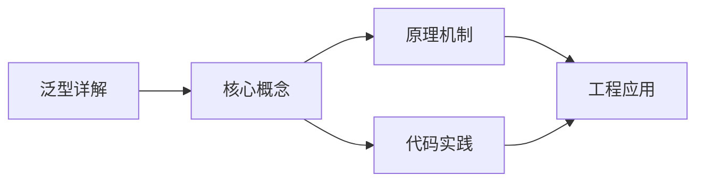
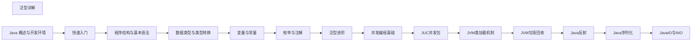

## 1. 学习目标（Bloom 分类）

本节按照布鲁姆教育目标分类学组织学习路径。本文主题为《泛型详解》，属于 Java 模块，读者可以根据自身阶段选择阅读深度。

记忆层面：能够准确复述本文的核心概念、术语与基本语法或操作步骤，并能够在提问或检索时快速定位对应知识点。能够说出 Java 的编译执行模型（javac 到字节码，JVM 解释与 JIT）。

理解层面：能够用自己的语言解释核心原理与工作机制，说明概念之间的因果关系，而不是机械记忆结论。能够解释面向对象三大特性与 JVM 内存区域的职责。

应用层面：能够在真实项目或练习场景中运用本文知识解决具体问题，写出正确且可维护的实现。能够编写类、接口、集合操作与异常处理的完整程序。

分析层面：能够拆解复杂问题，比较本文主题与相邻概念的异同，识别边界条件与例外情况。能够分析 Java 与 C++、Go 在内存管理与并发模型上的差异。

评价层面：能够根据约束条件（性能、可读性、安全、成本）评价不同方案的优劣，做出有依据的技术决策。能够评价不同集合、并发工具与框架的适用场景。

创造层面：能够把本文知识与其他模块知识组合，设计出新的解决方案或可复用的工程模式。能够组合 Spring 生态设计企业级应用。

通过本节学习，读者应当能够把《泛型详解》纳入自己的知识网络，并与 Java 模块的其他主题（JVM、集合框架、并发、Spring 生态）建立关联。

## 2. 历史动机与发展脉络

《泛型详解》是 Java 领域的重要主题。要真正理解它，需要先了解它解决的问题与演进过程。

Java 由 James Gosling 领导的 Sun 团队于 1995 年发布，口号“一次编写，到处运行”依托 JVM 字节码实现跨平台。2006 年 Sun 将 Java 开源（OpenJDK），2010 年 Oracle 收购 Sun 后 Java 进入新的治理阶段。
Java 的版本节奏在 2017 年后改为每半年一个特性版本、每两年一个 LTS（长期支持）版本。当前主流 LTS 包括 Java 11、17、21 与 25；Java 21 引入虚拟线程（Project Loom 成果），显著降低高并发服务的线程成本。
Java 生态以 Spring 家族为核心：Spring Boot 简化配置与部署，Spring Cloud 提供微服务组件；构建工具从 Maven 演进到 Gradle；JVM 语言（Kotlin、Scala、Groovy）与 Java 共存互操作。
Android 开发早期使用 Java，2019 年后官方转向 Kotlin-first，但 Java 仍是服务端领域（尤其是金融、电商等企业系统）的中坚力量。

回到本文主题：泛型详解 的提出与成熟，正是上述技术背景下的必然产物。早期实现往往以简单可用为目标，随着工程规模扩大，社区逐渐沉淀出标准做法与最佳实践；理解这一脉络，可以帮助读者判断“为什么文档中的推荐写法是现在这个样子”，也能在遇到历史遗留代码时准确识别其设计年代与取舍。

理解 Java 版本与 LTS 机制，是工程选型的起点：生产环境优先 LTS，新特性（如虚拟线程）可以在受控场景评估后引入。

## 3. 形式化定义与核心概念精讲

本节把《泛型详解》涉及的核心概念以“定义 + 讲解”的形式展开。读者应把定义当作工具，把讲解当作理解路径；两者结合才能形成可迁移的知识。

JVM 与字节码：`javac` 把 .java 编译为 .class 字节码，JVM 加载、校验并执行；热点代码由 JIT（如 C2）编译为机器码，解释与编译结合实现启动速度与峰值性能的平衡。
面向对象：封装（访问控制）、继承（extends/implements）与多态（重载/重写）是 Java 的类型系统支柱；接口默认方法（Java 8）与密封类（Java 17）持续演进表达能力。
异常体系：受检异常（checked）编译期强制处理，非受检异常（RuntimeException）运行时抛出；try-with-resources 自动关闭资源。
泛型与擦除：Java 泛型在编译期检查后擦除类型参数，运行时无泛型信息；这解释了 `List<String>` 与 `List<Integer>` 的 Class 相同，以及通配符 `? extends` 的逆变协变规则。

### 3.1 原文章节逐一精讲

原文档把主题拆分为 20 个小节，下面按顺序给出每一节的导读讲解，随后保留原文细节供精读。

#### 原文精读（完整保留）

# Java 泛型详解

> **符号约定**：`< >` 必填参数 | `[ ]` 可选参数

---

#### 1. 泛型概述 (Overview)

##### 1.1 什么是泛型

泛型是 Java 5 引入的特性，允许在定义类、接口和方法时使用类型参数，使得代码可以更具通用性和类型安全性。

##### 1.2 泛型的优势

- **编译时类型安全检查**: 避免运行时类型转换异常
- **消除强制类型转换**: 代码更简洁、可读性更高
- **代码复用**: 可以编写适用于多种类型的通用代码
- **类型参数化**: 提高代码的灵活性和可维护性

##### 1.3 泛型的应用场景

- **集合类**: `List<T>`, `Map<K, V>` 等
- **通用工具类**: 如排序、搜索等算法
- **自定义数据结构**: 如链表、栈、队列等
- **框架和库**: 如 Spring、Hibernate 等

#### 2. 泛型类 (Generic Classes)

##### 2.1 泛型类的定义

泛型类是指在类定义时使用类型参数的类。

```java
 // 简单泛型类
 public class Box<T> {
  private T data;
  public Box(T data) {
  this.data = data;
  }
  public T getData() {
  return data;
  }
  public void setData(T data) {
  this.data = data;
  }
 }
```

##### 2.2 泛型类的使用

```java
 // 使用泛型类
 Box<String> stringBox = new Box<>();
 stringBox.setData("Hello, Generics!");
 String value = stringBox.getData(); // 无需类型转换
 Box<Integer> integerBox = new Box<>();
 integerBox.setData(42);
 int number = integerBox.getData(); // 无需类型转换
```

##### 2.3 多类型参数

泛型类可以有多个类型参数。

```java
 // 多类型参数的泛型类
 public class Pair<K, V> {
  private K key;
  private V value;
  public Pair(K key, V value) {
  this.key = key;
  this.value = value;
  }
  public K getKey() {
  return key;
  }
  public V getValue() {
  return value;
  }
 }
```

##### 2.4 类型参数的命名约定

- **E**: 元素 (Element)，用于集合
- **K**: 键 (Key)
- **V**: 值 (Value)
- **T**: 类型 (Type)
- **U, S**: 辅助类型

#### 3. 泛型方法 (Generic Methods)

##### 3.1 泛型方法的定义

泛型方法是指在方法声明时使用类型参数的方法。

```java
 // 泛型方法
 public <T> void printArray(T[] array) {
  for (T element : array) {
  System.out.println(element);
  }
 }
```

##### 3.2 泛型方法的使用

```java
 // 使用泛型方法
 integer[] intArray = {1, 2, 3, 4, 5};
 String[] stringArray = {"Hello", "World", "Generics"};
 printArray(intArray); // 自动推断类型为 Integer
 printArray(stringArray); // 自动推断类型为 String
```

##### 3.3 泛型方法与泛型类的区别

- **泛型方法**: 类型参数在方法声明时定义，适用于单个方法
- **泛型类**: 类型参数在类声明时定义，适用于整个类

##### 3.4 静态泛型方法

静态方法可以是泛型方法，但静态方法不能使用类的泛型类型参数。

```java
 // 静态泛型方法
 public static <T> void staticGenericMethod(T value) {
  System.out.println("Value: " + value);
 }
```

##### 3.5 泛型方法的类型推断

Java 编译器可以根据方法参数自动推断泛型类型。

```java
 // 类型推断
 public <T> T getFirstElement(List<T> list) {
  return list.isEmpty() ? null : list.get(0);
 }
 // 使用
 List<String> strings = Arrays.asList("a", "b", "c");
 String first = getFirstElement(strings); // 自动推断 T 为 String
```

#### 4. 类型擦除 (Type Erasure)

##### 4.1 类型擦除的概念

Java 泛型是通过类型擦除实现的，即在编译时检查类型，在运行时擦除泛型信息。

##### 4.2 类型擦除的过程

1. **编译时**: 检查泛型类型的正确性
2. **擦除时**: 将泛型类型替换为边界类型（无边界时替换为 Object）
3. **运行时**: 无法获取泛型类型信息

##### 4.3 类型擦除的示例

```java
 // 泛型类
 public class Box<T> {
  private T data;
  // ...
 }
 // 擦除后
 public class Box {
  private Object data;
  // ...
 }
 // 有边界的泛型
 public class NumberBox<T extends Number> {
  private T data;
  // ...
 }
 // 擦除后
 public class NumberBox {
  private Number data;
  // ...
 }
```

##### 4.4 类型擦除的影响

- **运行时类型信息丢失**: 无法使用 `instanceof` 检查泛型类型
- **泛型数组创建受限**: 不能直接创建泛型数组
- **类型转换**: 编译时会自动插入必要的类型转换

##### 4.5 类型擦除的局限性

```java
 // 以下代码无法编译
 if (list instanceof List<String>) { // 错误: 泛型类型不能用于 instanceof
  // ...
 }
 // 以下代码可以编译，但运行时会有警告
 List<String> list = new ArrayList<>();
 List rawList = list;
 rawList.add(123); // 运行时不会报错
 String s = list.get(0); // 运行时会抛出 ClassCastException
```

#### 5. 通配符与边界 (Wildcards and Bounds)

##### 5.1 无界通配符

无界通配符 `<?>` 表示任意类型。

```java
 // 无界通配符
 public void printList(List<?> list) {
  for (Object item : list) {
  System.out.println(item);
  }
 }
```

##### 5.2 上界通配符

上界通配符 `<? extends T>` 表示 T 或 T 的子类。

```java
 // 上界通配符
 public double sumOfList(List<? extends Number> list) {
  double sum = 0.0;
  for (Number number : list) {
  sum += number.doubleValue();
  }
  return sum;
 }
```

##### 5.3 下界通配符

下界通配符 `<? super T>` 表示 T 或 T 的父类。

```java
 // 下界通配符
 public void addNumbers(List<? super Integer> list) {
  for (int i = 1; i <= 10; i++) {
  list.add(i);
  }
 }
```

##### 5.4 PECS 原则

- **PECS**: Producer Extends, Consumer Super
- **Producer (生产者)**: 如果你需要从集合中读取元素，使用 `<? extends T>`
- **Consumer (消费者)**: 如果你需要向集合中写入元素，使用 `<? super T>`

##### 5.5 通配符的使用场景

- **读取场景**: 使用 `<? extends T>`，如获取集合元素
- **写入场景**: 使用 `<? super T>`，如添加元素到集合
- **读写场景**: 使用具体类型，不使用通配符

#### 6. 泛型的高级特性

##### 6.1 泛型与继承

- **泛型类的继承**: 泛型类可以被继承
- **类型参数的继承**: 泛型类型参数不具有继承关系

```java
 // 泛型类的继承
 public class Box<T> {
  // ...
 }
 public class StringBox extends Box<String> {
  // ...
 }
 // 类型参数的继承
 List<String> strings = new ArrayList<>();
 List<Object> objects = strings; // 错误: 类型不兼容
```

##### 6.2 泛型与接口

泛型接口的定义和使用。

```java
 // 泛型接口
 public interface Generator<T> {
  T generate();
 }
 // 实现泛型接口
 public class StringGenerator implements Generator<String> {
  @Override
  public String generate() {
  return "Generated string";
  }
 }
```

##### 6.3 泛型与反射

通过反射获取泛型类型信息。

```java
 // 获取泛型类型信息
 public class GenericType<T> {
  private Class<T> type;
  @SuppressWarnings("unchecked")
  public GenericType() {
  // 通过反射获取泛型类型
  Type genericSuperclass = getClass().getGenericSuperclass();
  if (genericSuperclass instanceof ParameterizedType) {
  ParameterizedType paramType = (ParameterizedType) genericSuperclass;
  type = (Class<T>) paramType.getActualTypeArguments()[0];
  }
  }
  public Class<T> getType() {
  return type;
  }
 }
 // 使用
 public class StringType extends GenericType<String> {
 }
 StringType stringType = new StringType();
 class<String> type = stringType.getType();
 System.out.println(type.getName()); // 输出: java.lang.String
```

##### 6.4 类型参数的限制

- **不能使用基本类型**: 必须使用包装类，如 `Integer` 而非 `int`
- **不能创建泛型数组**: 不能直接创建 `new T[10]`
- **静态成员不能使用泛型类型**: 静态成员属于类，而泛型类型属于实例
- **不能在异常中使用泛型**: 不能抛出或捕获泛型类型的异常

#### 7. 泛型在集合中的应用

##### 7.1 集合类的泛型

```java
 // 泛型集合
 List<String> stringList = new ArrayList<>();
 stringList.add("Hello");
 stringList.add("World");
 String s = stringList.get(0); // 无需类型转换
 Map<String, Integer> map = new HashMap<>();
 map.put("one", 1);
 map.put("two", 2);
 integer value = map.get("one"); // 无需类型转换
```

##### 7.2 集合的通配符使用

```java
 // 读取集合元素
 public void processList(List<? extends Number> list) {
  for (Number number : list) {
  System.out.println(number);
  }
 }
 // 写入集合元素
 public void addIntegers(List<? super Integer> list) {
  list.add(1);
  list.add(2);
  list.add(3);
 }
```

##### 7.3 集合的类型安全

```java
 // 类型安全的集合操作
 List<String> strings = new ArrayList<>();
 strings.add("Hello");
 // strings.add(123); // 编译错误: 类型不兼容
 // 原始类型的集合（不安全）
 List rawList = new ArrayList();
 rawList.add("Hello");
 rawList.add(123); // 编译通过，但运行时可能出错
```

#### 8. 实际应用案例

##### 8.1 通用工具类

```java
 // 通用工具类
 public class GenericUtils {
  // 泛型方法：获取列表中的最大值
  public static <T extends Comparable<T>> T max(List<T> list) {
  if (list == null || list.isEmpty()) {
  return null;
  }
  T max = list.get(0);
  for (T item : list) {
  if (item.compareTo(max) > 0) {
  max = item;
  }
  }
  return max;
  }
  // 泛型方法：交换数组中的两个元素
  public static <T> void swap(T[] array, int i, int j) {
  if (array == null || i < 0 || j < 0 || i >= array.length || j >= array.length) {
  return;
  }
  T temp = array[i];
  array[i] = array[j];
  array[j] = temp;
  }
 }
```

##### 8.2 自定义泛型集合

```java
 // 自定义泛型链表
 public class LinkedList<T> {
  private Node<T> head;
  private int size;
  private static class Node<T> {
  T data;
  Node<T> next;
  Node(T data) {
  this.data = data;
  this.next = null;
  }
  }
  public void add(T data) {
  Node<T> newNode = new Node<>(data);
  if (head == null) {
  head = newNode;
  } else {
  Node<T> current = head;
  while (current.next != null) {
  current = current.next;
  }
  current.next = newNode;
  }
  size++;
  }
  public T get(int index) {
  if (index < 0 || index >= size) {
  throw new IndexOutOfBoundsException();
  }
  Node<T> current = head;
  for (int i = 0; i < index; i++) {
  current = current.next;
  }
  return current.data;
  }
  public int size() {
  return size;
  }
 }
```

##### 8.3 泛型与工厂模式

```java
 // 泛型工厂
 public interface Product {
  void use();
 }
 public class ConcreteProductA implements Product {
  @Override
  public void use() {
  System.out.println("Using Product A");
  }
 }
 public class ConcreteProductB implements Product {
  @Override
  public void use() {
  System.out.println("Using Product B");
  }
 }
 public class ProductFactory {
  public static <T extends Product> T createProduct(Class<T> productClass) {
  try {
  return productClass.newInstance();
  } catch (Exception e) {
  throw new RuntimeException("Failed to create product", e);
  }
  }
 }
 // 使用
 Product productA = ProductFactory.createProduct(ConcreteProductA.class);
 productA.use(); // 输出: Using Product A
 Product productB = ProductFactory.createProduct(ConcreteProductB.class);
 productB.use(); // 输出: Using Product B
```

#### 9. 最佳实践

##### 9.1 泛型使用最佳实践

- **明确类型参数**: 尽量使用具体的类型参数，避免使用原始类型
- **合理使用通配符**: 根据 PECS 原则选择合适的通配符
- **类型参数命名**: 遵循命名约定，使用有意义的类型参数名
- **避免过度泛型**: 不要过度使用泛型，保持代码简洁

##### 9.2 性能考虑

- **类型擦除**: 泛型不会影响运行时性能
- **自动装箱/拆箱**: 注意基本类型的包装类带来的性能开销
- **集合操作**: 合理选择集合类型，避免不必要的类型转换

##### 9.3 代码可读性

- **类型参数说明**: 对于复杂的泛型代码，添加注释说明类型参数的含义
- **方法签名**: 保持方法签名简洁，避免过多的类型参数
- **泛型层级**: 避免过深的泛型层级，保持代码结构清晰

#### 10. 常见陷阱

##### 10.1 类型擦除相关陷阱

- **运行时类型信息丢失**: 无法在运行时获取泛型类型
- **泛型数组创建**: 不能直接创建泛型数组，需要使用类型转换
- **类型转换异常**: 原始类型与泛型类型混用可能导致运行时异常

##### 10.2 通配符使用陷阱

- **上界通配符的写入限制**: 使用 `<? extends T>` 不能向集合中添加元素
- **下界通配符的读取限制**: 使用 `<? super T>` 读取元素时只能得到 Object 类型
- **通配符的过度使用**: 过度使用通配符会使代码难以理解

##### 10.3 其他常见陷阱

- **基本类型的使用**: 泛型不能使用基本类型，必须使用包装类
- **静态成员的泛型使用**: 静态成员不能使用类的泛型类型参数
- **异常的泛型使用**: 不能抛出或捕获泛型类型的异常
- **类型参数的继承**: 泛型类型参数不具有继承关系

#### 11. 泛型的未来发展

##### 11.1 Java 7 的改进

- **菱形操作符**: 简化泛型类的实例化

```java
 // Java 7 之前
 List<String> list = new ArrayList<String>();
 // Java 7 及以后
 List<String> list = new ArrayList<>(); // 菱形操作符
```

##### 11.2 Java 8 的改进

- **类型推断增强**: 增强了泛型方法的类型推断

```java
 // Java 8 之前
 List<String> list = Arrays.<String>asList("a", "b", "c");
 // Java 8 及以后
 List<String> list = Arrays.asList("a", "b", "c"); // 自动推断类型
```

##### 11.3 Java 9+ 的改进

- **不可变集合工厂方法**: 提供了创建不可变集合的泛型方法

```java
 // Java 9+
 List<String> immutableList = List.of("a", "b", "c");
 Map<String, Integer> immutableMap = Map.of("one", 1, "two", 2);
```

---

#### 泛型类

**基本写法：泛型类定义**
`class <类名><T> { }`
```java
// 定义单类型参数的泛型类
public class Box<T> {
    private T item;
}
```

---

**换行写法：多类型参数泛型类**
`class <类名><T1, T2, T3> { }`
```java
// 定义多类型参数的泛型类
public class Pair<K, V> {
    private K key;
    private V value;
}
```

---

**基本写法：使用泛型类**
`<类名><<类型>> <变量> = new <类名><>();`
```java
// 使用泛型类指定具体类型
Box<String> box = new Box<>();
```

---

**基本写法：泛型类方法**
`public <返回类型> <方法名>(T <参数>) { }`
```java
// 泛型类中使用类型参数的方法
public void setItem(T item) {
    this.item = item;
}
```

---

**基本写法：泛型类返回类型**
`public T <方法名>() { }`
```java
// 方法返回类型为类型参数
public T getItem() {
    return item;
}
```

---

#### 泛型接口

**基本写法：泛型接口定义**
`interface <接口名><T> { }`
```java
// 定义泛型接口
public interface Repository<T> {
}
```

---

**基本写法：实现泛型接口指定类型**
`class <类名> implements <接口><<具体类型>> { }`
```java
// 实现泛型接口并指定具体类型
public class UserRepository implements Repository<User> {
}
```

---

**基本写法：实现泛型接口保留泛型**
`class <类名><T> implements <接口><T> { }`
```java
// 实现泛型接口保留泛型参数
public class GenericRepository<T> implements Repository<T> {
}
```

---

#### 泛型方法

**基本写法：泛型方法定义**
`public <T> <返回类型> <方法名>(T <参数>) { }`
```java
// 定义泛型方法
public <T> void printItem(T item) {
}
```

---

**基本写法：泛型方法有返回值**
`public <T> T <方法名>(T <参数>) { }`
```java
// 泛型方法返回类型参数
public <T> T process(T input) {
    return input;
}
```

---

**换行写法：多类型参数泛型方法**
`public <T, U> <返回类型> <方法名>(T <参数1>, U <参数2>) { }`
```java
// 泛型方法接受多个类型参数
public <T, U> String combine(T first, U second) {
    return first.toString() + second.toString();
}
```

---

**基本写法：静态泛型方法**
`public static <T> <返回类型> <方法名>(T <参数>) { }`
```java
// 定义静态泛型方法
public static <T> T getFirst(List<T> list) {
    return list.get(0);
}
```

---

#### 类型通配符

**基本写法：无界通配符**
`<?>`
```java
// 接受任意类型的泛型
List<?> list = new ArrayList<String>();
```

---

**基本写法：上界通配符**
`<? extends <类型>>`
```java
// 接受指定类型及其子类
List<? extends Number> list = new ArrayList<Integer>();
```

---

**基本写法：下界通配符**
`<? super <类型>>`
```java
// 接受指定类型及其父类
List<? super Integer> list = new ArrayList<Number>();
```

---

#### 类型约束

**基本写法：泛型上界约束**
`<T extends <类型>>`
```java
// 限制类型参数必须是指定类型或子类
public class NumberBox<T extends Number> {
}
```

---

**换行写法：多边界约束**
`<T extends <类型1> & <接口2>>`
```java
// 类型参数必须同时满足多个边界
public class Container<T extends Number & Comparable<T>> {
}
```

---

**基本写法：泛型方法上界约束**
`public <T extends <类型>> <方法名>(T <参数>)`
```java
// 泛型方法限制类型上界
public <T extends Number> double sum(T num) {
    return num.doubleValue();
}
```

---

#### 类型擦除

**基本写法：运行时类型检查**
`<对象> instanceof <原始类型>`
```java
// 泛型在运行时被擦除只能检查原始类型
List<String> list = new ArrayList<>();
boolean isList = list instanceof List;
```

---

**基本写法：无法实例化类型参数**
`new T()`
```java
// 泛型类型参数无法直接实例化编译错误
// T item = new T();
```

---

**基本写法：无法创建泛型数组**
`new T[<长度>]`
```java
// 无法创建泛型类型数组编译错误
// T[] array = new T[10];
```

---

#### 泛型集合

**基本写法：泛型 List**
`List<<类型>> <变量> = new ArrayList<>();`
```java
// 创建泛型 List
List<String> names = new ArrayList<>();
```

---

**基本写法：泛型 Map**
`Map<<键类型>, <值类型>> <变量> = new HashMap<>();`
```java
// 创建泛型 Map
Map<String, Integer> ages = new HashMap<>();
```

---

**基本写法：泛型 Set**
`Set<<类型>> <变量> = new HashSet<>();`
```java
// 创建泛型 Set
Set<Integer> numbers = new HashSet<>();
```

---

#### PECS 原则

**基本写法：生产者使用 extends**
`List<? extends <类型>> <变量>`
```java
// 从集合读取数据使用上界通配符
List<? extends Number> producer = new ArrayList<Integer>();
Number n = producer.get(0);
```

---

**基本写法：消费者使用 super**
`List<? super <类型>> <变量>`
```java
// 向集合写入数据使用下界通配符
List<? super Integer> consumer = new ArrayList<Number>();
consumer.add(1);
```

---

#### 泛型工具方法

**基本写法：泛型数组创建**
`@SuppressWarnings("unchecked") T[] <变量> = (T[]) new Object[<长度>];`
```java
// 通过 Object 数组创建泛型数组
@SuppressWarnings("unchecked")
T[] array = (T[]) new Object[10];
```

---

**基本写法：泛型类型转换**
`(<类型>) <对象>`
```java
// 泛型类型转换需要强制
Object obj = "Hello";
String str = (String) obj;
```

---

**基本写法：Class 类型参数**
`Class<<类型>> <变量> = <类型>.class;`
```java
// 获取泛型 Class 对象
Class<String> clazz = String.class;
```

---

**基本写法：泛型方法实例化**
`<类型>.newInstance()`
```java
// 通过 Class 创建实例
T instance = clazz.newInstance();
```


### 3.2 概念关系图

下面用 Mermaid 图表达本文核心概念之间的关系，帮助读者建立整体图景：



图中展示的是本文知识的结构化关系：核心概念是入口，原理机制解释“为什么”，代码实践演示“怎么做”，工程应用回答“何时用”。读者学习时可以把每个小节的内容挂接到对应节点上。

## 4. 理论推导与原理解析

本节深入《泛型详解》背后的原理。理论部分不求面面俱到，而是聚焦“能解释现象、能指导实践”的关键推导。

JVM 内存模型：堆（新生代/老年代）、元空间、虚拟机栈、本地方法栈与程序计数器；GC 从 CMS 演进到 G1（默认）、ZGC（超低延迟），理解分代收集是调优前提。
并发工具：synchronized 与 JUC（java.util.concurrent）的锁、并发容器、线程池、CompletableFuture 构成并发工具箱；Java 21 的虚拟线程让“每任务一线程”成为可能。
类加载机制：双亲委派模型保证类唯一性，SPI（ServiceLoader）打破委派实现扩展；自定义类加载器是热部署与隔离的基础。
反射与注解：反射在运行时检查类结构，注解提供元数据；Spring 的依赖注入与 AOP 均基于这些机制，但反射有性能与安全成本。

需要强调的是，理论推导与工程实践之间存在翻译层：理论给出的是理想化模型与边界条件，工程代码则必须处理真实环境中的例外。读者在学习时应先掌握理论的“标准情形”，再通过陷阱章节了解“非标准情形”。

## 5. 代码示例与逐行讲解

本节把原文中的代码示例系统整理，并为每个示例补充用途说明与讲解。读者不应只浏览代码，而应逐段对照讲解理解设计意图。

### 5.1 示例：2.1 泛型类的定义

该示例来自原文《2.1 泛型类的定义》小节，用于演示泛型详解相关操作。阅读时请先看代码结构，再看其后的讲解。

```java
 // 简单泛型类
 public class Box<T> {
  private T data;
  public Box(T data) {
  this.data = data;
  }
  public T getData() {
  return data;
  }
  public void setData(T data) {
  this.data = data;
  }
 }
```

讲解：这段代码演示了本节核心知识点。代码中的关键操作可以归纳为三步：准备（定义或初始化）、执行（核心逻辑）、收尾（释放资源或返回结果）。实际项目中，这三步往往被封装为函数或类，以提升复用性与可测试性。

关键点分析：

该示例共 13 行有效代码，包含 2 类关键结构（class、return）。其中：

- 入口与初始化部分负责建立上下文，对应实际项目中的启动或装配逻辑；
- 核心逻辑部分体现本文主题的主要操作，是阅读时最需要对照讲解理解的部分；
- 输出或返回部分把结果交给调用方，注意其类型与边界条件。

进阶思考路径：先尝试修改参数观察行为变化，再把示例中的模式迁移到自己的项目中；每次修改都记录预期与实测差异，这是把示例转化为能力的最快方式。

### 5.2 示例：2.2 泛型类的使用

该示例来自原文《2.2 泛型类的使用》小节，用于演示泛型详解相关操作。阅读时请先看代码结构，再看其后的讲解。

```java
 // 使用泛型类
 Box<String> stringBox = new Box<>();
 stringBox.setData("Hello, Generics!");
 String value = stringBox.getData(); // 无需类型转换
 Box<Integer> integerBox = new Box<>();
 integerBox.setData(42);
 int number = integerBox.getData(); // 无需类型转换
```

讲解：这段代码演示了本节核心知识点。代码中的关键操作可以归纳为三步：准备（定义或初始化）、执行（核心逻辑）、收尾（释放资源或返回结果）。实际项目中，这三步往往被封装为函数或类，以提升复用性与可测试性。

关键点分析：

该示例共 7 行有效代码，结构以数据或配置为主。阅读时应关注：数据字段的含义、配置项的作用，以及它们与运行行为的对应关系。

进阶思考路径：先尝试修改参数观察行为变化，再把示例中的模式迁移到自己的项目中；每次修改都记录预期与实测差异，这是把示例转化为能力的最快方式。

### 5.3 示例：2.3 多类型参数

该示例来自原文《2.3 多类型参数》小节，用于演示泛型详解相关操作。阅读时请先看代码结构，再看其后的讲解。

```java
 // 多类型参数的泛型类
 public class Pair<K, V> {
  private K key;
  private V value;
  public Pair(K key, V value) {
  this.key = key;
  this.value = value;
  }
  public K getKey() {
  return key;
  }
  public V getValue() {
  return value;
  }
 }
```

讲解：这段代码演示了本节核心知识点。代码中的关键操作可以归纳为三步：准备（定义或初始化）、执行（核心逻辑）、收尾（释放资源或返回结果）。实际项目中，这三步往往被封装为函数或类，以提升复用性与可测试性。

关键点分析：

该示例共 15 行有效代码，包含 2 类关键结构（class、return）。其中：

- 入口与初始化部分负责建立上下文，对应实际项目中的启动或装配逻辑；
- 核心逻辑部分体现本文主题的主要操作，是阅读时最需要对照讲解理解的部分；
- 输出或返回部分把结果交给调用方，注意其类型与边界条件。

进阶思考路径：先尝试修改参数观察行为变化，再把示例中的模式迁移到自己的项目中；每次修改都记录预期与实测差异，这是把示例转化为能力的最快方式。

### 5.4 示例：3.1 泛型方法的定义

该示例来自原文《3.1 泛型方法的定义》小节，用于演示泛型详解相关操作。阅读时请先看代码结构，再看其后的讲解。

```java
 // 泛型方法
 public <T> void printArray(T[] array) {
  for (T element : array) {
  System.out.println(element);
  }
 }
```

讲解：这段代码演示了本节核心知识点。代码中的关键操作可以归纳为三步：准备（定义或初始化）、执行（核心逻辑）、收尾（释放资源或返回结果）。实际项目中，这三步往往被封装为函数或类，以提升复用性与可测试性。

关键点分析：

该示例共 6 行有效代码，包含 1 类关键结构（for）。其中：

- 入口与初始化部分负责建立上下文，对应实际项目中的启动或装配逻辑；
- 核心逻辑部分体现本文主题的主要操作，是阅读时最需要对照讲解理解的部分；
- 输出或返回部分把结果交给调用方，注意其类型与边界条件。

进阶思考路径：先尝试修改参数观察行为变化，再把示例中的模式迁移到自己的项目中；每次修改都记录预期与实测差异，这是把示例转化为能力的最快方式。

### 5.5 示例：3.2 泛型方法的使用

该示例来自原文《3.2 泛型方法的使用》小节，用于演示泛型详解相关操作。阅读时请先看代码结构，再看其后的讲解。

```java
 // 使用泛型方法
 integer[] intArray = {1, 2, 3, 4, 5};
 String[] stringArray = {"Hello", "World", "Generics"};
 printArray(intArray); // 自动推断类型为 Integer
 printArray(stringArray); // 自动推断类型为 String
```

讲解：这段代码演示了本节核心知识点。代码中的关键操作可以归纳为三步：准备（定义或初始化）、执行（核心逻辑）、收尾（释放资源或返回结果）。实际项目中，这三步往往被封装为函数或类，以提升复用性与可测试性。

关键点分析：

该示例共 5 行有效代码，结构以数据或配置为主。阅读时应关注：数据字段的含义、配置项的作用，以及它们与运行行为的对应关系。

进阶思考路径：先尝试修改参数观察行为变化，再把示例中的模式迁移到自己的项目中；每次修改都记录预期与实测差异，这是把示例转化为能力的最快方式。

### 5.6 示例：3.4 静态泛型方法

该示例来自原文《3.4 静态泛型方法》小节，用于演示泛型详解相关操作。阅读时请先看代码结构，再看其后的讲解。

```java
 // 静态泛型方法
 public static <T> void staticGenericMethod(T value) {
  System.out.println("Value: " + value);
 }
```

讲解：这段代码演示了本节核心知识点。代码中的关键操作可以归纳为三步：准备（定义或初始化）、执行（核心逻辑）、收尾（释放资源或返回结果）。实际项目中，这三步往往被封装为函数或类，以提升复用性与可测试性。

关键点分析：

该示例共 4 行有效代码，结构以数据或配置为主。阅读时应关注：数据字段的含义、配置项的作用，以及它们与运行行为的对应关系。

进阶思考路径：先尝试修改参数观察行为变化，再把示例中的模式迁移到自己的项目中；每次修改都记录预期与实测差异，这是把示例转化为能力的最快方式。

### 5.7 示例：3.5 泛型方法的类型推断

该示例来自原文《3.5 泛型方法的类型推断》小节，用于演示泛型详解相关操作。阅读时请先看代码结构，再看其后的讲解。

```java
 // 类型推断
 public <T> T getFirstElement(List<T> list) {
  return list.isEmpty() ? null : list.get(0);
 }
 // 使用
 List<String> strings = Arrays.asList("a", "b", "c");
 String first = getFirstElement(strings); // 自动推断 T 为 String
```

讲解：这段代码演示了本节核心知识点。代码中的关键操作可以归纳为三步：准备（定义或初始化）、执行（核心逻辑）、收尾（释放资源或返回结果）。实际项目中，这三步往往被封装为函数或类，以提升复用性与可测试性。

关键点分析：

该示例共 7 行有效代码，包含 1 类关键结构（return）。其中：

- 入口与初始化部分负责建立上下文，对应实际项目中的启动或装配逻辑；
- 核心逻辑部分体现本文主题的主要操作，是阅读时最需要对照讲解理解的部分；
- 输出或返回部分把结果交给调用方，注意其类型与边界条件。

进阶思考路径：先尝试修改参数观察行为变化，再把示例中的模式迁移到自己的项目中；每次修改都记录预期与实测差异，这是把示例转化为能力的最快方式。

### 5.8 示例：4.3 类型擦除的示例

该示例来自原文《4.3 类型擦除的示例》小节，用于演示泛型详解相关操作。阅读时请先看代码结构，再看其后的讲解。

```java
 // 泛型类
 public class Box<T> {
  private T data;
  // ...
 }
 // 擦除后
 public class Box {
  private Object data;
  // ...
 }
 // 有边界的泛型
 public class NumberBox<T extends Number> {
  private T data;
  // ...
 }
 // 擦除后
 public class NumberBox {
  private Number data;
  // ...
 }
```

讲解：这段代码演示了本节核心知识点。代码中的关键操作可以归纳为三步：准备（定义或初始化）、执行（核心逻辑）、收尾（释放资源或返回结果）。实际项目中，这三步往往被封装为函数或类，以提升复用性与可测试性。

关键点分析：

该示例共 20 行有效代码，包含 1 类关键结构（class）。其中：

- 入口与初始化部分负责建立上下文，对应实际项目中的启动或装配逻辑；
- 核心逻辑部分体现本文主题的主要操作，是阅读时最需要对照讲解理解的部分；
- 输出或返回部分把结果交给调用方，注意其类型与边界条件。

进阶思考路径：先尝试修改参数观察行为变化，再把示例中的模式迁移到自己的项目中；每次修改都记录预期与实测差异，这是把示例转化为能力的最快方式。

### 5.9 示例：4.5 类型擦除的局限性

该示例来自原文《4.5 类型擦除的局限性》小节，用于演示泛型详解相关操作。阅读时请先看代码结构，再看其后的讲解。

```java
 // 以下代码无法编译
 if (list instanceof List<String>) { // 错误: 泛型类型不能用于 instanceof
  // ...
 }
 // 以下代码可以编译，但运行时会有警告
 List<String> list = new ArrayList<>();
 List rawList = list;
 rawList.add(123); // 运行时不会报错
 String s = list.get(0); // 运行时会抛出 ClassCastException
```

讲解：这段代码演示了本节核心知识点。代码中的关键操作可以归纳为三步：准备（定义或初始化）、执行（核心逻辑）、收尾（释放资源或返回结果）。实际项目中，这三步往往被封装为函数或类，以提升复用性与可测试性。

关键点分析：

该示例共 9 行有效代码，包含 1 类关键结构（if）。其中：

- 入口与初始化部分负责建立上下文，对应实际项目中的启动或装配逻辑；
- 核心逻辑部分体现本文主题的主要操作，是阅读时最需要对照讲解理解的部分；
- 输出或返回部分把结果交给调用方，注意其类型与边界条件。

进阶思考路径：先尝试修改参数观察行为变化，再把示例中的模式迁移到自己的项目中；每次修改都记录预期与实测差异，这是把示例转化为能力的最快方式。

### 5.10 示例：5.1 无界通配符

该示例来自原文《5.1 无界通配符》小节，用于演示泛型详解相关操作。阅读时请先看代码结构，再看其后的讲解。

```java
 // 无界通配符
 public void printList(List<?> list) {
  for (Object item : list) {
  System.out.println(item);
  }
 }
```

讲解：这段代码演示了本节核心知识点。代码中的关键操作可以归纳为三步：准备（定义或初始化）、执行（核心逻辑）、收尾（释放资源或返回结果）。实际项目中，这三步往往被封装为函数或类，以提升复用性与可测试性。

关键点分析：

该示例共 6 行有效代码，包含 1 类关键结构（for）。其中：

- 入口与初始化部分负责建立上下文，对应实际项目中的启动或装配逻辑；
- 核心逻辑部分体现本文主题的主要操作，是阅读时最需要对照讲解理解的部分；
- 输出或返回部分把结果交给调用方，注意其类型与边界条件。

进阶思考路径：先尝试修改参数观察行为变化，再把示例中的模式迁移到自己的项目中；每次修改都记录预期与实测差异，这是把示例转化为能力的最快方式。

### 5.11 示例：5.2 上界通配符

该示例来自原文《5.2 上界通配符》小节，用于演示泛型详解相关操作。阅读时请先看代码结构，再看其后的讲解。

```java
 // 上界通配符
 public double sumOfList(List<? extends Number> list) {
  double sum = 0.0;
  for (Number number : list) {
  sum += number.doubleValue();
  }
  return sum;
 }
```

讲解：这段代码演示了本节核心知识点。代码中的关键操作可以归纳为三步：准备（定义或初始化）、执行（核心逻辑）、收尾（释放资源或返回结果）。实际项目中，这三步往往被封装为函数或类，以提升复用性与可测试性。

关键点分析：

该示例共 8 行有效代码，包含 2 类关键结构（for、return）。其中：

- 入口与初始化部分负责建立上下文，对应实际项目中的启动或装配逻辑；
- 核心逻辑部分体现本文主题的主要操作，是阅读时最需要对照讲解理解的部分；
- 输出或返回部分把结果交给调用方，注意其类型与边界条件。

进阶思考路径：先尝试修改参数观察行为变化，再把示例中的模式迁移到自己的项目中；每次修改都记录预期与实测差异，这是把示例转化为能力的最快方式。

### 5.12 示例：5.3 下界通配符

该示例来自原文《5.3 下界通配符》小节，用于演示泛型详解相关操作。阅读时请先看代码结构，再看其后的讲解。

```java
 // 下界通配符
 public void addNumbers(List<? super Integer> list) {
  for (int i = 1; i <= 10; i++) {
  list.add(i);
  }
 }
```

讲解：这段代码演示了本节核心知识点。代码中的关键操作可以归纳为三步：准备（定义或初始化）、执行（核心逻辑）、收尾（释放资源或返回结果）。实际项目中，这三步往往被封装为函数或类，以提升复用性与可测试性。

关键点分析：

该示例共 6 行有效代码，包含 1 类关键结构（for）。其中：

- 入口与初始化部分负责建立上下文，对应实际项目中的启动或装配逻辑；
- 核心逻辑部分体现本文主题的主要操作，是阅读时最需要对照讲解理解的部分；
- 输出或返回部分把结果交给调用方，注意其类型与边界条件。

进阶思考路径：先尝试修改参数观察行为变化，再把示例中的模式迁移到自己的项目中；每次修改都记录预期与实测差异，这是把示例转化为能力的最快方式。

### 5.13 示例：6.1 泛型与继承

该示例来自原文《6.1 泛型与继承》小节，用于演示泛型详解相关操作。阅读时请先看代码结构，再看其后的讲解。

```java
 // 泛型类的继承
 public class Box<T> {
  // ...
 }
 public class StringBox extends Box<String> {
  // ...
 }
 // 类型参数的继承
 List<String> strings = new ArrayList<>();
 List<Object> objects = strings; // 错误: 类型不兼容
```

讲解：这段代码演示了本节核心知识点。代码中的关键操作可以归纳为三步：准备（定义或初始化）、执行（核心逻辑）、收尾（释放资源或返回结果）。实际项目中，这三步往往被封装为函数或类，以提升复用性与可测试性。

关键点分析：

该示例共 10 行有效代码，包含 1 类关键结构（class）。其中：

- 入口与初始化部分负责建立上下文，对应实际项目中的启动或装配逻辑；
- 核心逻辑部分体现本文主题的主要操作，是阅读时最需要对照讲解理解的部分；
- 输出或返回部分把结果交给调用方，注意其类型与边界条件。

进阶思考路径：先尝试修改参数观察行为变化，再把示例中的模式迁移到自己的项目中；每次修改都记录预期与实测差异，这是把示例转化为能力的最快方式。

### 5.14 示例：6.2 泛型与接口

该示例来自原文《6.2 泛型与接口》小节，用于演示泛型详解相关操作。阅读时请先看代码结构，再看其后的讲解。

```java
 // 泛型接口
 public interface Generator<T> {
  T generate();
 }
 // 实现泛型接口
 public class StringGenerator implements Generator<String> {
  @Override
  public String generate() {
  return "Generated string";
  }
 }
```

讲解：这段代码演示了本节核心知识点。代码中的关键操作可以归纳为三步：准备（定义或初始化）、执行（核心逻辑）、收尾（释放资源或返回结果）。实际项目中，这三步往往被封装为函数或类，以提升复用性与可测试性。

关键点分析：

该示例共 11 行有效代码，包含 2 类关键结构（class、return）。其中：

- 入口与初始化部分负责建立上下文，对应实际项目中的启动或装配逻辑；
- 核心逻辑部分体现本文主题的主要操作，是阅读时最需要对照讲解理解的部分；
- 输出或返回部分把结果交给调用方，注意其类型与边界条件。

进阶思考路径：先尝试修改参数观察行为变化，再把示例中的模式迁移到自己的项目中；每次修改都记录预期与实测差异，这是把示例转化为能力的最快方式。

### 5.15 示例：6.3 泛型与反射

该示例来自原文《6.3 泛型与反射》小节，用于演示泛型详解相关操作。阅读时请先看代码结构，再看其后的讲解。

```java
 // 获取泛型类型信息
 public class GenericType<T> {
  private Class<T> type;
  @SuppressWarnings("unchecked")
  public GenericType() {
  // 通过反射获取泛型类型
  Type genericSuperclass = getClass().getGenericSuperclass();
  if (genericSuperclass instanceof ParameterizedType) {
  ParameterizedType paramType = (ParameterizedType) genericSuperclass;
  type = (Class<T>) paramType.getActualTypeArguments()[0];
  }
  }
  public Class<T> getType() {
  return type;
  }
 }
 // 使用
 public class StringType extends GenericType<String> {
 }
 StringType stringType = new StringType();
 class<String> type = stringType.getType();
 System.out.println(type.getName()); // 输出: java.lang.String
```

讲解：这段代码演示了本节核心知识点。代码中的关键操作可以归纳为三步：准备（定义或初始化）、执行（核心逻辑）、收尾（释放资源或返回结果）。实际项目中，这三步往往被封装为函数或类，以提升复用性与可测试性。

关键点分析：

该示例共 22 行有效代码，包含 3 类关键结构（class、if、return）。其中：

- 入口与初始化部分负责建立上下文，对应实际项目中的启动或装配逻辑；
- 核心逻辑部分体现本文主题的主要操作，是阅读时最需要对照讲解理解的部分；
- 输出或返回部分把结果交给调用方，注意其类型与边界条件。

进阶思考路径：先尝试修改参数观察行为变化，再把示例中的模式迁移到自己的项目中；每次修改都记录预期与实测差异，这是把示例转化为能力的最快方式。

### 5.16 示例：7.1 集合类的泛型

该示例来自原文《7.1 集合类的泛型》小节，用于演示泛型详解相关操作。阅读时请先看代码结构，再看其后的讲解。

```java
 // 泛型集合
 List<String> stringList = new ArrayList<>();
 stringList.add("Hello");
 stringList.add("World");
 String s = stringList.get(0); // 无需类型转换
 Map<String, Integer> map = new HashMap<>();
 map.put("one", 1);
 map.put("two", 2);
 integer value = map.get("one"); // 无需类型转换
```

讲解：这段代码演示了本节核心知识点。代码中的关键操作可以归纳为三步：准备（定义或初始化）、执行（核心逻辑）、收尾（释放资源或返回结果）。实际项目中，这三步往往被封装为函数或类，以提升复用性与可测试性。

关键点分析：

该示例共 9 行有效代码，结构以数据或配置为主。阅读时应关注：数据字段的含义、配置项的作用，以及它们与运行行为的对应关系。

进阶思考路径：先尝试修改参数观察行为变化，再把示例中的模式迁移到自己的项目中；每次修改都记录预期与实测差异，这是把示例转化为能力的最快方式。

### 5.17 示例：7.2 集合的通配符使用

该示例来自原文《7.2 集合的通配符使用》小节，用于演示泛型详解相关操作。阅读时请先看代码结构，再看其后的讲解。

```java
 // 读取集合元素
 public void processList(List<? extends Number> list) {
  for (Number number : list) {
  System.out.println(number);
  }
 }
 // 写入集合元素
 public void addIntegers(List<? super Integer> list) {
  list.add(1);
  list.add(2);
  list.add(3);
 }
```

讲解：这段代码演示了本节核心知识点。代码中的关键操作可以归纳为三步：准备（定义或初始化）、执行（核心逻辑）、收尾（释放资源或返回结果）。实际项目中，这三步往往被封装为函数或类，以提升复用性与可测试性。

关键点分析：

该示例共 12 行有效代码，包含 1 类关键结构（for）。其中：

- 入口与初始化部分负责建立上下文，对应实际项目中的启动或装配逻辑；
- 核心逻辑部分体现本文主题的主要操作，是阅读时最需要对照讲解理解的部分；
- 输出或返回部分把结果交给调用方，注意其类型与边界条件。

进阶思考路径：先尝试修改参数观察行为变化，再把示例中的模式迁移到自己的项目中；每次修改都记录预期与实测差异，这是把示例转化为能力的最快方式。

### 5.18 示例：7.3 集合的类型安全

该示例来自原文《7.3 集合的类型安全》小节，用于演示泛型详解相关操作。阅读时请先看代码结构，再看其后的讲解。

```java
 // 类型安全的集合操作
 List<String> strings = new ArrayList<>();
 strings.add("Hello");
 // strings.add(123); // 编译错误: 类型不兼容
 // 原始类型的集合（不安全）
 List rawList = new ArrayList();
 rawList.add("Hello");
 rawList.add(123); // 编译通过，但运行时可能出错
```

讲解：这段代码演示了本节核心知识点。代码中的关键操作可以归纳为三步：准备（定义或初始化）、执行（核心逻辑）、收尾（释放资源或返回结果）。实际项目中，这三步往往被封装为函数或类，以提升复用性与可测试性。

关键点分析：

该示例共 8 行有效代码，结构以数据或配置为主。阅读时应关注：数据字段的含义、配置项的作用，以及它们与运行行为的对应关系。

进阶思考路径：先尝试修改参数观察行为变化，再把示例中的模式迁移到自己的项目中；每次修改都记录预期与实测差异，这是把示例转化为能力的最快方式。

### 5.19 示例：8.1 通用工具类

该示例来自原文《8.1 通用工具类》小节，用于演示泛型详解相关操作。阅读时请先看代码结构，再看其后的讲解。

```java
 // 通用工具类
 public class GenericUtils {
  // 泛型方法：获取列表中的最大值
  public static <T extends Comparable<T>> T max(List<T> list) {
  if (list == null || list.isEmpty()) {
  return null;
  }
  T max = list.get(0);
  for (T item : list) {
  if (item.compareTo(max) > 0) {
  max = item;
  }
  }
  return max;
  }
  // 泛型方法：交换数组中的两个元素
  public static <T> void swap(T[] array, int i, int j) {
  if (array == null || i < 0 || j < 0 || i >= array.length || j >= array.length) {
  return;
  }
  T temp = array[i];
  array[i] = array[j];
  array[j] = temp;
  }
 }
```

讲解：这段代码演示了本节核心知识点。代码中的关键操作可以归纳为三步：准备（定义或初始化）、执行（核心逻辑）、收尾（释放资源或返回结果）。实际项目中，这三步往往被封装为函数或类，以提升复用性与可测试性。

关键点分析：

该示例共 25 行有效代码，包含 4 类关键结构（class、if、for、return）。其中：

- 入口与初始化部分负责建立上下文，对应实际项目中的启动或装配逻辑；
- 核心逻辑部分体现本文主题的主要操作，是阅读时最需要对照讲解理解的部分；
- 输出或返回部分把结果交给调用方，注意其类型与边界条件。

进阶思考路径：先尝试修改参数观察行为变化，再把示例中的模式迁移到自己的项目中；每次修改都记录预期与实测差异，这是把示例转化为能力的最快方式。

### 5.20 示例：8.2 自定义泛型集合

该示例来自原文《8.2 自定义泛型集合》小节，用于演示泛型详解相关操作。阅读时请先看代码结构，再看其后的讲解。

```java
 // 自定义泛型链表
 public class LinkedList<T> {
  private Node<T> head;
  private int size;
  private static class Node<T> {
  T data;
  Node<T> next;
  Node(T data) {
  this.data = data;
  this.next = null;
  }
  }
  public void add(T data) {
  Node<T> newNode = new Node<>(data);
  if (head == null) {
  head = newNode;
  } else {
  Node<T> current = head;
  while (current.next != null) {
  current = current.next;
  }
  current.next = newNode;
  }
  size++;
  }
  public T get(int index) {
  if (index < 0 || index >= size) {
  throw new IndexOutOfBoundsException();
  }
  Node<T> current = head;
  for (int i = 0; i < index; i++) {
  current = current.next;
  }
  return current.data;
  }
  public int size() {
  return size;
  }
 }
```

讲解：这段代码演示了本节核心知识点。代码中的关键操作可以归纳为三步：准备（定义或初始化）、执行（核心逻辑）、收尾（释放资源或返回结果）。实际项目中，这三步往往被封装为函数或类，以提升复用性与可测试性。

关键点分析：

该示例共 39 行有效代码，包含 5 类关键结构（class、if、for、while、return）。其中：

- 入口与初始化部分负责建立上下文，对应实际项目中的启动或装配逻辑；
- 核心逻辑部分体现本文主题的主要操作，是阅读时最需要对照讲解理解的部分；
- 输出或返回部分把结果交给调用方，注意其类型与边界条件。

进阶思考路径：先尝试修改参数观察行为变化，再把示例中的模式迁移到自己的项目中；每次修改都记录预期与实测差异，这是把示例转化为能力的最快方式。

### 5.21 示例：8.3 泛型与工厂模式

该示例来自原文《8.3 泛型与工厂模式》小节，用于演示泛型详解相关操作。阅读时请先看代码结构，再看其后的讲解。

```java
 // 泛型工厂
 public interface Product {
  void use();
 }
 public class ConcreteProductA implements Product {
  @Override
  public void use() {
  System.out.println("Using Product A");
  }
 }
 public class ConcreteProductB implements Product {
  @Override
  public void use() {
  System.out.println("Using Product B");
  }
 }
 public class ProductFactory {
  public static <T extends Product> T createProduct(Class<T> productClass) {
  try {
  return productClass.newInstance();
  } catch (Exception e) {
  throw new RuntimeException("Failed to create product", e);
  }
  }
 }
 // 使用
 Product productA = ProductFactory.createProduct(ConcreteProductA.class);
 productA.use(); // 输出: Using Product A
 Product productB = ProductFactory.createProduct(ConcreteProductB.class);
 productB.use(); // 输出: Using Product B
```

讲解：这段代码演示了本节核心知识点。代码中的关键操作可以归纳为三步：准备（定义或初始化）、执行（核心逻辑）、收尾（释放资源或返回结果）。实际项目中，这三步往往被封装为函数或类，以提升复用性与可测试性。

关键点分析：

该示例共 30 行有效代码，包含 2 类关键结构（class、return）。其中：

- 入口与初始化部分负责建立上下文，对应实际项目中的启动或装配逻辑；
- 核心逻辑部分体现本文主题的主要操作，是阅读时最需要对照讲解理解的部分；
- 输出或返回部分把结果交给调用方，注意其类型与边界条件。

进阶思考路径：先尝试修改参数观察行为变化，再把示例中的模式迁移到自己的项目中；每次修改都记录预期与实测差异，这是把示例转化为能力的最快方式。

### 5.22 示例：11.1 Java 7 的改进

该示例来自原文《11.1 Java 7 的改进》小节，用于演示泛型详解相关操作。阅读时请先看代码结构，再看其后的讲解。

```java
 // Java 7 之前
 List<String> list = new ArrayList<String>();
 // Java 7 及以后
 List<String> list = new ArrayList<>(); // 菱形操作符
```

讲解：这段代码演示了本节核心知识点。代码中的关键操作可以归纳为三步：准备（定义或初始化）、执行（核心逻辑）、收尾（释放资源或返回结果）。实际项目中，这三步往往被封装为函数或类，以提升复用性与可测试性。

关键点分析：

该示例共 4 行有效代码，结构以数据或配置为主。阅读时应关注：数据字段的含义、配置项的作用，以及它们与运行行为的对应关系。

进阶思考路径：先尝试修改参数观察行为变化，再把示例中的模式迁移到自己的项目中；每次修改都记录预期与实测差异，这是把示例转化为能力的最快方式。

### 5.23 示例：11.2 Java 8 的改进

该示例来自原文《11.2 Java 8 的改进》小节，用于演示泛型详解相关操作。阅读时请先看代码结构，再看其后的讲解。

```java
 // Java 8 之前
 List<String> list = Arrays.<String>asList("a", "b", "c");
 // Java 8 及以后
 List<String> list = Arrays.asList("a", "b", "c"); // 自动推断类型
```

讲解：这段代码演示了本节核心知识点。代码中的关键操作可以归纳为三步：准备（定义或初始化）、执行（核心逻辑）、收尾（释放资源或返回结果）。实际项目中，这三步往往被封装为函数或类，以提升复用性与可测试性。

关键点分析：

该示例共 4 行有效代码，结构以数据或配置为主。阅读时应关注：数据字段的含义、配置项的作用，以及它们与运行行为的对应关系。

进阶思考路径：先尝试修改参数观察行为变化，再把示例中的模式迁移到自己的项目中；每次修改都记录预期与实测差异，这是把示例转化为能力的最快方式。

### 5.24 示例：11.3 Java 9+ 的改进

该示例来自原文《11.3 Java 9+ 的改进》小节，用于演示泛型详解相关操作。阅读时请先看代码结构，再看其后的讲解。

```java
 // Java 9+
 List<String> immutableList = List.of("a", "b", "c");
 Map<String, Integer> immutableMap = Map.of("one", 1, "two", 2);
```

讲解：这段代码演示了本节核心知识点。代码中的关键操作可以归纳为三步：准备（定义或初始化）、执行（核心逻辑）、收尾（释放资源或返回结果）。实际项目中，这三步往往被封装为函数或类，以提升复用性与可测试性。

关键点分析：

该示例共 3 行有效代码，结构以数据或配置为主。阅读时应关注：数据字段的含义、配置项的作用，以及它们与运行行为的对应关系。

进阶思考路径：先尝试修改参数观察行为变化，再把示例中的模式迁移到自己的项目中；每次修改都记录预期与实测差异，这是把示例转化为能力的最快方式。

### 5.25 示例：泛型类

该示例来自原文《泛型类》小节，用于演示泛型详解相关操作。阅读时请先看代码结构，再看其后的讲解。

```java
// 定义单类型参数的泛型类
public class Box<T> {
    private T item;
}
```

讲解：这段代码演示了本节核心知识点。代码中的关键操作可以归纳为三步：准备（定义或初始化）、执行（核心逻辑）、收尾（释放资源或返回结果）。实际项目中，这三步往往被封装为函数或类，以提升复用性与可测试性。

关键点分析：

该示例共 4 行有效代码，包含 1 类关键结构（class）。其中：

- 入口与初始化部分负责建立上下文，对应实际项目中的启动或装配逻辑；
- 核心逻辑部分体现本文主题的主要操作，是阅读时最需要对照讲解理解的部分；
- 输出或返回部分把结果交给调用方，注意其类型与边界条件。

进阶思考路径：先尝试修改参数观察行为变化，再把示例中的模式迁移到自己的项目中；每次修改都记录预期与实测差异，这是把示例转化为能力的最快方式。

### 5.26 示例：泛型类

该示例来自原文《泛型类》小节，用于演示泛型详解相关操作。阅读时请先看代码结构，再看其后的讲解。

```java
// 定义多类型参数的泛型类
public class Pair<K, V> {
    private K key;
    private V value;
}
```

讲解：这段代码演示了本节核心知识点。代码中的关键操作可以归纳为三步：准备（定义或初始化）、执行（核心逻辑）、收尾（释放资源或返回结果）。实际项目中，这三步往往被封装为函数或类，以提升复用性与可测试性。

关键点分析：

该示例共 5 行有效代码，包含 1 类关键结构（class）。其中：

- 入口与初始化部分负责建立上下文，对应实际项目中的启动或装配逻辑；
- 核心逻辑部分体现本文主题的主要操作，是阅读时最需要对照讲解理解的部分；
- 输出或返回部分把结果交给调用方，注意其类型与边界条件。

进阶思考路径：先尝试修改参数观察行为变化，再把示例中的模式迁移到自己的项目中；每次修改都记录预期与实测差异，这是把示例转化为能力的最快方式。

### 5.27 示例：泛型类

该示例来自原文《泛型类》小节，用于演示泛型详解相关操作。阅读时请先看代码结构，再看其后的讲解。

```java
// 使用泛型类指定具体类型
Box<String> box = new Box<>();
```

讲解：这段代码演示了本节核心知识点。代码中的关键操作可以归纳为三步：准备（定义或初始化）、执行（核心逻辑）、收尾（释放资源或返回结果）。实际项目中，这三步往往被封装为函数或类，以提升复用性与可测试性。

关键点分析：

该示例共 2 行有效代码，结构以数据或配置为主。阅读时应关注：数据字段的含义、配置项的作用，以及它们与运行行为的对应关系。

进阶思考路径：先尝试修改参数观察行为变化，再把示例中的模式迁移到自己的项目中；每次修改都记录预期与实测差异，这是把示例转化为能力的最快方式。

### 5.28 示例：泛型类

该示例来自原文《泛型类》小节，用于演示泛型详解相关操作。阅读时请先看代码结构，再看其后的讲解。

```java
// 泛型类中使用类型参数的方法
public void setItem(T item) {
    this.item = item;
}
```

讲解：这段代码演示了本节核心知识点。代码中的关键操作可以归纳为三步：准备（定义或初始化）、执行（核心逻辑）、收尾（释放资源或返回结果）。实际项目中，这三步往往被封装为函数或类，以提升复用性与可测试性。

关键点分析：

该示例共 4 行有效代码，结构以数据或配置为主。阅读时应关注：数据字段的含义、配置项的作用，以及它们与运行行为的对应关系。

进阶思考路径：先尝试修改参数观察行为变化，再把示例中的模式迁移到自己的项目中；每次修改都记录预期与实测差异，这是把示例转化为能力的最快方式。

### 5.29 示例：泛型类

该示例来自原文《泛型类》小节，用于演示泛型详解相关操作。阅读时请先看代码结构，再看其后的讲解。

```java
// 方法返回类型为类型参数
public T getItem() {
    return item;
}
```

讲解：这段代码演示了本节核心知识点。代码中的关键操作可以归纳为三步：准备（定义或初始化）、执行（核心逻辑）、收尾（释放资源或返回结果）。实际项目中，这三步往往被封装为函数或类，以提升复用性与可测试性。

关键点分析：

该示例共 4 行有效代码，包含 1 类关键结构（return）。其中：

- 入口与初始化部分负责建立上下文，对应实际项目中的启动或装配逻辑；
- 核心逻辑部分体现本文主题的主要操作，是阅读时最需要对照讲解理解的部分；
- 输出或返回部分把结果交给调用方，注意其类型与边界条件。

进阶思考路径：先尝试修改参数观察行为变化，再把示例中的模式迁移到自己的项目中；每次修改都记录预期与实测差异，这是把示例转化为能力的最快方式。

### 5.30 示例：泛型接口

该示例来自原文《泛型接口》小节，用于演示泛型详解相关操作。阅读时请先看代码结构，再看其后的讲解。

```java
// 定义泛型接口
public interface Repository<T> {
}
```

讲解：这段代码演示了本节核心知识点。代码中的关键操作可以归纳为三步：准备（定义或初始化）、执行（核心逻辑）、收尾（释放资源或返回结果）。实际项目中，这三步往往被封装为函数或类，以提升复用性与可测试性。

关键点分析：

该示例共 3 行有效代码，结构以数据或配置为主。阅读时应关注：数据字段的含义、配置项的作用，以及它们与运行行为的对应关系。

进阶思考路径：先尝试修改参数观察行为变化，再把示例中的模式迁移到自己的项目中；每次修改都记录预期与实测差异，这是把示例转化为能力的最快方式。

### 5.31 示例：泛型接口

该示例来自原文《泛型接口》小节，用于演示泛型详解相关操作。阅读时请先看代码结构，再看其后的讲解。

```java
// 实现泛型接口并指定具体类型
public class UserRepository implements Repository<User> {
}
```

讲解：这段代码演示了本节核心知识点。代码中的关键操作可以归纳为三步：准备（定义或初始化）、执行（核心逻辑）、收尾（释放资源或返回结果）。实际项目中，这三步往往被封装为函数或类，以提升复用性与可测试性。

关键点分析：

该示例共 3 行有效代码，包含 1 类关键结构（class）。其中：

- 入口与初始化部分负责建立上下文，对应实际项目中的启动或装配逻辑；
- 核心逻辑部分体现本文主题的主要操作，是阅读时最需要对照讲解理解的部分；
- 输出或返回部分把结果交给调用方，注意其类型与边界条件。

进阶思考路径：先尝试修改参数观察行为变化，再把示例中的模式迁移到自己的项目中；每次修改都记录预期与实测差异，这是把示例转化为能力的最快方式。

### 5.32 示例：泛型接口

该示例来自原文《泛型接口》小节，用于演示泛型详解相关操作。阅读时请先看代码结构，再看其后的讲解。

```java
// 实现泛型接口保留泛型参数
public class GenericRepository<T> implements Repository<T> {
}
```

讲解：这段代码演示了本节核心知识点。代码中的关键操作可以归纳为三步：准备（定义或初始化）、执行（核心逻辑）、收尾（释放资源或返回结果）。实际项目中，这三步往往被封装为函数或类，以提升复用性与可测试性。

关键点分析：

该示例共 3 行有效代码，包含 1 类关键结构（class）。其中：

- 入口与初始化部分负责建立上下文，对应实际项目中的启动或装配逻辑；
- 核心逻辑部分体现本文主题的主要操作，是阅读时最需要对照讲解理解的部分；
- 输出或返回部分把结果交给调用方，注意其类型与边界条件。

进阶思考路径：先尝试修改参数观察行为变化，再把示例中的模式迁移到自己的项目中；每次修改都记录预期与实测差异，这是把示例转化为能力的最快方式。

### 5.33 示例：泛型方法

该示例来自原文《泛型方法》小节，用于演示泛型详解相关操作。阅读时请先看代码结构，再看其后的讲解。

```java
// 定义泛型方法
public <T> void printItem(T item) {
}
```

讲解：这段代码演示了本节核心知识点。代码中的关键操作可以归纳为三步：准备（定义或初始化）、执行（核心逻辑）、收尾（释放资源或返回结果）。实际项目中，这三步往往被封装为函数或类，以提升复用性与可测试性。

关键点分析：

该示例共 3 行有效代码，结构以数据或配置为主。阅读时应关注：数据字段的含义、配置项的作用，以及它们与运行行为的对应关系。

进阶思考路径：先尝试修改参数观察行为变化，再把示例中的模式迁移到自己的项目中；每次修改都记录预期与实测差异，这是把示例转化为能力的最快方式。

### 5.34 示例：泛型方法

该示例来自原文《泛型方法》小节，用于演示泛型详解相关操作。阅读时请先看代码结构，再看其后的讲解。

```java
// 泛型方法返回类型参数
public <T> T process(T input) {
    return input;
}
```

讲解：这段代码演示了本节核心知识点。代码中的关键操作可以归纳为三步：准备（定义或初始化）、执行（核心逻辑）、收尾（释放资源或返回结果）。实际项目中，这三步往往被封装为函数或类，以提升复用性与可测试性。

关键点分析：

该示例共 4 行有效代码，包含 1 类关键结构（return）。其中：

- 入口与初始化部分负责建立上下文，对应实际项目中的启动或装配逻辑；
- 核心逻辑部分体现本文主题的主要操作，是阅读时最需要对照讲解理解的部分；
- 输出或返回部分把结果交给调用方，注意其类型与边界条件。

进阶思考路径：先尝试修改参数观察行为变化，再把示例中的模式迁移到自己的项目中；每次修改都记录预期与实测差异，这是把示例转化为能力的最快方式。

### 5.35 示例：泛型方法

该示例来自原文《泛型方法》小节，用于演示泛型详解相关操作。阅读时请先看代码结构，再看其后的讲解。

```java
// 泛型方法接受多个类型参数
public <T, U> String combine(T first, U second) {
    return first.toString() + second.toString();
}
```

讲解：这段代码演示了本节核心知识点。代码中的关键操作可以归纳为三步：准备（定义或初始化）、执行（核心逻辑）、收尾（释放资源或返回结果）。实际项目中，这三步往往被封装为函数或类，以提升复用性与可测试性。

关键点分析：

该示例共 4 行有效代码，包含 1 类关键结构（return）。其中：

- 入口与初始化部分负责建立上下文，对应实际项目中的启动或装配逻辑；
- 核心逻辑部分体现本文主题的主要操作，是阅读时最需要对照讲解理解的部分；
- 输出或返回部分把结果交给调用方，注意其类型与边界条件。

进阶思考路径：先尝试修改参数观察行为变化，再把示例中的模式迁移到自己的项目中；每次修改都记录预期与实测差异，这是把示例转化为能力的最快方式。

### 5.36 示例：泛型方法

该示例来自原文《泛型方法》小节，用于演示泛型详解相关操作。阅读时请先看代码结构，再看其后的讲解。

```java
// 定义静态泛型方法
public static <T> T getFirst(List<T> list) {
    return list.get(0);
}
```

讲解：这段代码演示了本节核心知识点。代码中的关键操作可以归纳为三步：准备（定义或初始化）、执行（核心逻辑）、收尾（释放资源或返回结果）。实际项目中，这三步往往被封装为函数或类，以提升复用性与可测试性。

关键点分析：

该示例共 4 行有效代码，包含 1 类关键结构（return）。其中：

- 入口与初始化部分负责建立上下文，对应实际项目中的启动或装配逻辑；
- 核心逻辑部分体现本文主题的主要操作，是阅读时最需要对照讲解理解的部分；
- 输出或返回部分把结果交给调用方，注意其类型与边界条件。

进阶思考路径：先尝试修改参数观察行为变化，再把示例中的模式迁移到自己的项目中；每次修改都记录预期与实测差异，这是把示例转化为能力的最快方式。

### 5.37 示例：类型通配符

该示例来自原文《类型通配符》小节，用于演示泛型详解相关操作。阅读时请先看代码结构，再看其后的讲解。

```java
// 接受任意类型的泛型
List<?> list = new ArrayList<String>();
```

讲解：这段代码演示了本节核心知识点。代码中的关键操作可以归纳为三步：准备（定义或初始化）、执行（核心逻辑）、收尾（释放资源或返回结果）。实际项目中，这三步往往被封装为函数或类，以提升复用性与可测试性。

关键点分析：

该示例共 2 行有效代码，结构以数据或配置为主。阅读时应关注：数据字段的含义、配置项的作用，以及它们与运行行为的对应关系。

进阶思考路径：先尝试修改参数观察行为变化，再把示例中的模式迁移到自己的项目中；每次修改都记录预期与实测差异，这是把示例转化为能力的最快方式。

### 5.38 示例：类型通配符

该示例来自原文《类型通配符》小节，用于演示泛型详解相关操作。阅读时请先看代码结构，再看其后的讲解。

```java
// 接受指定类型及其子类
List<? extends Number> list = new ArrayList<Integer>();
```

讲解：这段代码演示了本节核心知识点。代码中的关键操作可以归纳为三步：准备（定义或初始化）、执行（核心逻辑）、收尾（释放资源或返回结果）。实际项目中，这三步往往被封装为函数或类，以提升复用性与可测试性。

关键点分析：

该示例共 2 行有效代码，结构以数据或配置为主。阅读时应关注：数据字段的含义、配置项的作用，以及它们与运行行为的对应关系。

进阶思考路径：先尝试修改参数观察行为变化，再把示例中的模式迁移到自己的项目中；每次修改都记录预期与实测差异，这是把示例转化为能力的最快方式。

### 5.39 示例：类型通配符

该示例来自原文《类型通配符》小节，用于演示泛型详解相关操作。阅读时请先看代码结构，再看其后的讲解。

```java
// 接受指定类型及其父类
List<? super Integer> list = new ArrayList<Number>();
```

讲解：这段代码演示了本节核心知识点。代码中的关键操作可以归纳为三步：准备（定义或初始化）、执行（核心逻辑）、收尾（释放资源或返回结果）。实际项目中，这三步往往被封装为函数或类，以提升复用性与可测试性。

关键点分析：

该示例共 2 行有效代码，结构以数据或配置为主。阅读时应关注：数据字段的含义、配置项的作用，以及它们与运行行为的对应关系。

进阶思考路径：先尝试修改参数观察行为变化，再把示例中的模式迁移到自己的项目中；每次修改都记录预期与实测差异，这是把示例转化为能力的最快方式。

### 5.40 示例：类型约束

该示例来自原文《类型约束》小节，用于演示泛型详解相关操作。阅读时请先看代码结构，再看其后的讲解。

```java
// 限制类型参数必须是指定类型或子类
public class NumberBox<T extends Number> {
}
```

讲解：这段代码演示了本节核心知识点。代码中的关键操作可以归纳为三步：准备（定义或初始化）、执行（核心逻辑）、收尾（释放资源或返回结果）。实际项目中，这三步往往被封装为函数或类，以提升复用性与可测试性。

关键点分析：

该示例共 3 行有效代码，包含 1 类关键结构（class）。其中：

- 入口与初始化部分负责建立上下文，对应实际项目中的启动或装配逻辑；
- 核心逻辑部分体现本文主题的主要操作，是阅读时最需要对照讲解理解的部分；
- 输出或返回部分把结果交给调用方，注意其类型与边界条件。

进阶思考路径：先尝试修改参数观察行为变化，再把示例中的模式迁移到自己的项目中；每次修改都记录预期与实测差异，这是把示例转化为能力的最快方式。

### 5.41 示例：类型约束

该示例来自原文《类型约束》小节，用于演示泛型详解相关操作。阅读时请先看代码结构，再看其后的讲解。

```java
// 类型参数必须同时满足多个边界
public class Container<T extends Number & Comparable<T>> {
}
```

讲解：这段代码演示了本节核心知识点。代码中的关键操作可以归纳为三步：准备（定义或初始化）、执行（核心逻辑）、收尾（释放资源或返回结果）。实际项目中，这三步往往被封装为函数或类，以提升复用性与可测试性。

关键点分析：

该示例共 3 行有效代码，包含 1 类关键结构（class）。其中：

- 入口与初始化部分负责建立上下文，对应实际项目中的启动或装配逻辑；
- 核心逻辑部分体现本文主题的主要操作，是阅读时最需要对照讲解理解的部分；
- 输出或返回部分把结果交给调用方，注意其类型与边界条件。

进阶思考路径：先尝试修改参数观察行为变化，再把示例中的模式迁移到自己的项目中；每次修改都记录预期与实测差异，这是把示例转化为能力的最快方式。

### 5.42 示例：类型约束

该示例来自原文《类型约束》小节，用于演示泛型详解相关操作。阅读时请先看代码结构，再看其后的讲解。

```java
// 泛型方法限制类型上界
public <T extends Number> double sum(T num) {
    return num.doubleValue();
}
```

讲解：这段代码演示了本节核心知识点。代码中的关键操作可以归纳为三步：准备（定义或初始化）、执行（核心逻辑）、收尾（释放资源或返回结果）。实际项目中，这三步往往被封装为函数或类，以提升复用性与可测试性。

关键点分析：

该示例共 4 行有效代码，包含 1 类关键结构（return）。其中：

- 入口与初始化部分负责建立上下文，对应实际项目中的启动或装配逻辑；
- 核心逻辑部分体现本文主题的主要操作，是阅读时最需要对照讲解理解的部分；
- 输出或返回部分把结果交给调用方，注意其类型与边界条件。

进阶思考路径：先尝试修改参数观察行为变化，再把示例中的模式迁移到自己的项目中；每次修改都记录预期与实测差异，这是把示例转化为能力的最快方式。

### 5.43 示例：类型擦除

该示例来自原文《类型擦除》小节，用于演示泛型详解相关操作。阅读时请先看代码结构，再看其后的讲解。

```java
// 泛型在运行时被擦除只能检查原始类型
List<String> list = new ArrayList<>();
boolean isList = list instanceof List;
```

讲解：这段代码演示了本节核心知识点。代码中的关键操作可以归纳为三步：准备（定义或初始化）、执行（核心逻辑）、收尾（释放资源或返回结果）。实际项目中，这三步往往被封装为函数或类，以提升复用性与可测试性。

关键点分析：

该示例共 3 行有效代码，结构以数据或配置为主。阅读时应关注：数据字段的含义、配置项的作用，以及它们与运行行为的对应关系。

进阶思考路径：先尝试修改参数观察行为变化，再把示例中的模式迁移到自己的项目中；每次修改都记录预期与实测差异，这是把示例转化为能力的最快方式。

### 5.44 示例：类型擦除

该示例来自原文《类型擦除》小节，用于演示泛型详解相关操作。阅读时请先看代码结构，再看其后的讲解。

```java
// 泛型类型参数无法直接实例化编译错误
// T item = new T();
```

讲解：这段代码演示了本节核心知识点。代码中的关键操作可以归纳为三步：准备（定义或初始化）、执行（核心逻辑）、收尾（释放资源或返回结果）。实际项目中，这三步往往被封装为函数或类，以提升复用性与可测试性。

关键点分析：

该示例共 2 行有效代码，结构以数据或配置为主。阅读时应关注：数据字段的含义、配置项的作用，以及它们与运行行为的对应关系。

进阶思考路径：先尝试修改参数观察行为变化，再把示例中的模式迁移到自己的项目中；每次修改都记录预期与实测差异，这是把示例转化为能力的最快方式。

### 5.45 示例：类型擦除

该示例来自原文《类型擦除》小节，用于演示泛型详解相关操作。阅读时请先看代码结构，再看其后的讲解。

```java
// 无法创建泛型类型数组编译错误
// T[] array = new T[10];
```

讲解：这段代码演示了本节核心知识点。代码中的关键操作可以归纳为三步：准备（定义或初始化）、执行（核心逻辑）、收尾（释放资源或返回结果）。实际项目中，这三步往往被封装为函数或类，以提升复用性与可测试性。

关键点分析：

该示例共 2 行有效代码，结构以数据或配置为主。阅读时应关注：数据字段的含义、配置项的作用，以及它们与运行行为的对应关系。

进阶思考路径：先尝试修改参数观察行为变化，再把示例中的模式迁移到自己的项目中；每次修改都记录预期与实测差异，这是把示例转化为能力的最快方式。

### 5.46 示例：泛型集合

该示例来自原文《泛型集合》小节，用于演示泛型详解相关操作。阅读时请先看代码结构，再看其后的讲解。

```java
// 创建泛型 List
List<String> names = new ArrayList<>();
```

讲解：这段代码演示了本节核心知识点。代码中的关键操作可以归纳为三步：准备（定义或初始化）、执行（核心逻辑）、收尾（释放资源或返回结果）。实际项目中，这三步往往被封装为函数或类，以提升复用性与可测试性。

关键点分析：

该示例共 2 行有效代码，结构以数据或配置为主。阅读时应关注：数据字段的含义、配置项的作用，以及它们与运行行为的对应关系。

进阶思考路径：先尝试修改参数观察行为变化，再把示例中的模式迁移到自己的项目中；每次修改都记录预期与实测差异，这是把示例转化为能力的最快方式。

### 5.47 示例：泛型集合

该示例来自原文《泛型集合》小节，用于演示泛型详解相关操作。阅读时请先看代码结构，再看其后的讲解。

```java
// 创建泛型 Map
Map<String, Integer> ages = new HashMap<>();
```

讲解：这段代码演示了本节核心知识点。代码中的关键操作可以归纳为三步：准备（定义或初始化）、执行（核心逻辑）、收尾（释放资源或返回结果）。实际项目中，这三步往往被封装为函数或类，以提升复用性与可测试性。

关键点分析：

该示例共 2 行有效代码，结构以数据或配置为主。阅读时应关注：数据字段的含义、配置项的作用，以及它们与运行行为的对应关系。

进阶思考路径：先尝试修改参数观察行为变化，再把示例中的模式迁移到自己的项目中；每次修改都记录预期与实测差异，这是把示例转化为能力的最快方式。

### 5.48 示例：泛型集合

该示例来自原文《泛型集合》小节，用于演示泛型详解相关操作。阅读时请先看代码结构，再看其后的讲解。

```java
// 创建泛型 Set
Set<Integer> numbers = new HashSet<>();
```

讲解：这段代码演示了本节核心知识点。代码中的关键操作可以归纳为三步：准备（定义或初始化）、执行（核心逻辑）、收尾（释放资源或返回结果）。实际项目中，这三步往往被封装为函数或类，以提升复用性与可测试性。

关键点分析：

该示例共 2 行有效代码，结构以数据或配置为主。阅读时应关注：数据字段的含义、配置项的作用，以及它们与运行行为的对应关系。

进阶思考路径：先尝试修改参数观察行为变化，再把示例中的模式迁移到自己的项目中；每次修改都记录预期与实测差异，这是把示例转化为能力的最快方式。

### 5.49 示例：PECS 原则

该示例来自原文《PECS 原则》小节，用于演示泛型详解相关操作。阅读时请先看代码结构，再看其后的讲解。

```java
// 从集合读取数据使用上界通配符
List<? extends Number> producer = new ArrayList<Integer>();
Number n = producer.get(0);
```

讲解：这段代码演示了本节核心知识点。代码中的关键操作可以归纳为三步：准备（定义或初始化）、执行（核心逻辑）、收尾（释放资源或返回结果）。实际项目中，这三步往往被封装为函数或类，以提升复用性与可测试性。

关键点分析：

该示例共 3 行有效代码，结构以数据或配置为主。阅读时应关注：数据字段的含义、配置项的作用，以及它们与运行行为的对应关系。

进阶思考路径：先尝试修改参数观察行为变化，再把示例中的模式迁移到自己的项目中；每次修改都记录预期与实测差异，这是把示例转化为能力的最快方式。

### 5.50 示例：PECS 原则

该示例来自原文《PECS 原则》小节，用于演示泛型详解相关操作。阅读时请先看代码结构，再看其后的讲解。

```java
// 向集合写入数据使用下界通配符
List<? super Integer> consumer = new ArrayList<Number>();
consumer.add(1);
```

讲解：这段代码演示了本节核心知识点。代码中的关键操作可以归纳为三步：准备（定义或初始化）、执行（核心逻辑）、收尾（释放资源或返回结果）。实际项目中，这三步往往被封装为函数或类，以提升复用性与可测试性。

关键点分析：

该示例共 3 行有效代码，结构以数据或配置为主。阅读时应关注：数据字段的含义、配置项的作用，以及它们与运行行为的对应关系。

进阶思考路径：先尝试修改参数观察行为变化，再把示例中的模式迁移到自己的项目中；每次修改都记录预期与实测差异，这是把示例转化为能力的最快方式。

### 5.51 示例：泛型工具方法

该示例来自原文《泛型工具方法》小节，用于演示泛型详解相关操作。阅读时请先看代码结构，再看其后的讲解。

```java
// 通过 Object 数组创建泛型数组
@SuppressWarnings("unchecked")
T[] array = (T[]) new Object[10];
```

讲解：这段代码演示了本节核心知识点。代码中的关键操作可以归纳为三步：准备（定义或初始化）、执行（核心逻辑）、收尾（释放资源或返回结果）。实际项目中，这三步往往被封装为函数或类，以提升复用性与可测试性。

关键点分析：

该示例共 3 行有效代码，结构以数据或配置为主。阅读时应关注：数据字段的含义、配置项的作用，以及它们与运行行为的对应关系。

进阶思考路径：先尝试修改参数观察行为变化，再把示例中的模式迁移到自己的项目中；每次修改都记录预期与实测差异，这是把示例转化为能力的最快方式。

### 5.52 示例：泛型工具方法

该示例来自原文《泛型工具方法》小节，用于演示泛型详解相关操作。阅读时请先看代码结构，再看其后的讲解。

```java
// 泛型类型转换需要强制
Object obj = "Hello";
String str = (String) obj;
```

讲解：这段代码演示了本节核心知识点。代码中的关键操作可以归纳为三步：准备（定义或初始化）、执行（核心逻辑）、收尾（释放资源或返回结果）。实际项目中，这三步往往被封装为函数或类，以提升复用性与可测试性。

关键点分析：

该示例共 3 行有效代码，结构以数据或配置为主。阅读时应关注：数据字段的含义、配置项的作用，以及它们与运行行为的对应关系。

进阶思考路径：先尝试修改参数观察行为变化，再把示例中的模式迁移到自己的项目中；每次修改都记录预期与实测差异，这是把示例转化为能力的最快方式。

### 5.53 示例：泛型工具方法

该示例来自原文《泛型工具方法》小节，用于演示泛型详解相关操作。阅读时请先看代码结构，再看其后的讲解。

```java
// 获取泛型 Class 对象
Class<String> clazz = String.class;
```

讲解：这段代码演示了本节核心知识点。代码中的关键操作可以归纳为三步：准备（定义或初始化）、执行（核心逻辑）、收尾（释放资源或返回结果）。实际项目中，这三步往往被封装为函数或类，以提升复用性与可测试性。

关键点分析：

该示例共 2 行有效代码，包含 1 类关键结构（class）。其中：

- 入口与初始化部分负责建立上下文，对应实际项目中的启动或装配逻辑；
- 核心逻辑部分体现本文主题的主要操作，是阅读时最需要对照讲解理解的部分；
- 输出或返回部分把结果交给调用方，注意其类型与边界条件。

进阶思考路径：先尝试修改参数观察行为变化，再把示例中的模式迁移到自己的项目中；每次修改都记录预期与实测差异，这是把示例转化为能力的最快方式。

### 5.54 示例：泛型工具方法

该示例来自原文《泛型工具方法》小节，用于演示泛型详解相关操作。阅读时请先看代码结构，再看其后的讲解。

```java
// 通过 Class 创建实例
T instance = clazz.newInstance();
```

讲解：这段代码演示了本节核心知识点。代码中的关键操作可以归纳为三步：准备（定义或初始化）、执行（核心逻辑）、收尾（释放资源或返回结果）。实际项目中，这三步往往被封装为函数或类，以提升复用性与可测试性。

关键点分析：

该示例共 2 行有效代码，结构以数据或配置为主。阅读时应关注：数据字段的含义、配置项的作用，以及它们与运行行为的对应关系。

进阶思考路径：先尝试修改参数观察行为变化，再把示例中的模式迁移到自己的项目中；每次修改都记录预期与实测差异，这是把示例转化为能力的最快方式。

```java
// 泛型工具：类型安全的取最小值
public static <T extends Comparable<T>> T minOf(T a, T b) {
    return a.compareTo(b) <= 0 ? a : b;
}
```
讲解：`<T extends Comparable<T>>` 约束 T 必须可比较，编译期保证 `compareTo` 可用；返回值类型与入参一致，避免运行时强转。

综合以上示例，可以总结出本主题的代码实践要点：第一，先定义清晰的输入输出契约；第二，核心逻辑保持单一职责；第三，错误处理与边界条件不可省略；第四，命名与注释表达意图而非复述代码。

## 6. 对比分析

对比是理解《泛型详解》定位的最快路径。下面从多个维度与相邻方案进行对比。

Java 与 C++：Java 无指针算术、自动 GC、跨平台；C++ 可精细控制内存与性能，适合系统级开发。Java 开发效率高，C++ 性能上限高。
Java 与 Go：Java 生态成熟、类型系统与工具链完备；Go 语法简单、并发原生、部署为单一二进制。服务端选型取决于团队与生态。
Java 8 与 Java 21：lambda/Stream（8）与虚拟线程/模式匹配（21）代表两个时代；新项目应基于 17+ 使用现代 API。

对比的目的不是分出绝对优劣，而是建立选择依据：不同约束条件下，最优解不同。读者应把每个对比维度转化为决策检查清单。

## 7. 常见陷阱与最佳实践

本节整理该主题的高频错误与推荐做法。每个陷阱先描述现象，再解释原因，最后给出最佳实践。

### 7.1 equals 与 hashCode 不一致

违反约定导致 HashMap 查找失效。重写 equals 必须同步重写 hashCode，且保证相等对象哈希一致。

深入讲解：该问题之所以被归类为“常见陷阱”，是因为它在初学者的代码中反复出现，而且往往不在第一时间暴露——错误通常隐藏在特定数据或特定时序下。

从成因上看，equals 与 hashCode 不一致 一般源于对 Java 某个机制的理解偏差：要么误用了默认行为，要么忽略了边界条件，要么把其他语言的思维惯性带了过来。

从影响上看，equals 与 hashCode 不一致 轻则产生错误结果，重则导致资源泄漏、数据损坏或安全事故；这也是为什么工程评审中会把它列为检查项。

从修复策略上看，处理equals 与 hashCode 不一致的正确顺序是：先复现（构造最小用例），再定位（确认机制层面的根因），最后修复并补充回归测试。跳过复现直接改代码，往往治标不治本。

### 7.2 集合遍历时修改

`for-each` 中调用 `list.remove` 抛 ConcurrentModificationException。使用 Iterator.remove 或收集后批量删除。

深入讲解：该问题之所以被归类为“常见陷阱”，是因为它在初学者的代码中反复出现，而且往往不在第一时间暴露——错误通常隐藏在特定数据或特定时序下。

从成因上看，集合遍历时修改 一般源于对 Java 某个机制的理解偏差：要么误用了默认行为，要么忽略了边界条件，要么把其他语言的思维惯性带了过来。

从影响上看，集合遍历时修改 轻则产生错误结果，重则导致资源泄漏、数据损坏或安全事故；这也是为什么工程评审中会把它列为检查项。

从修复策略上看，处理集合遍历时修改的正确顺序是：先复现（构造最小用例），再定位（确认机制层面的根因），最后修复并补充回归测试。跳过复现直接改代码，往往治标不治本。

### 7.3 字符串用 == 比较

`==` 比较引用而非内容；字符串应使用 `equals`，并优先字符串常量池与 `StringBuilder` 拼接。

深入讲解：该问题之所以被归类为“常见陷阱”，是因为它在初学者的代码中反复出现，而且往往不在第一时间暴露——错误通常隐藏在特定数据或特定时序下。

从成因上看，字符串用 == 比较 一般源于对 Java 某个机制的理解偏差：要么误用了默认行为，要么忽略了边界条件，要么把其他语言的思维惯性带了过来。

从影响上看，字符串用 == 比较 轻则产生错误结果，重则导致资源泄漏、数据损坏或安全事故；这也是为什么工程评审中会把它列为检查项。

从修复策略上看，处理字符串用 == 比较的正确顺序是：先复现（构造最小用例），再定位（确认机制层面的根因），最后修复并补充回归测试。跳过复现直接改代码，往往治标不治本。

### 7.4 整数缓存误判

`Integer` 在 -128~127 间缓存，`==` 可能为 true，超出范围为 false。包装类型比较一律用 equals。

深入讲解：该问题之所以被归类为“常见陷阱”，是因为它在初学者的代码中反复出现，而且往往不在第一时间暴露——错误通常隐藏在特定数据或特定时序下。

从成因上看，整数缓存误判 一般源于对 Java 某个机制的理解偏差：要么误用了默认行为，要么忽略了边界条件，要么把其他语言的思维惯性带了过来。

从影响上看，整数缓存误判 轻则产生错误结果，重则导致资源泄漏、数据损坏或安全事故；这也是为什么工程评审中会把它列为检查项。

从修复策略上看，处理整数缓存误判的正确顺序是：先复现（构造最小用例），再定位（确认机制层面的根因），最后修复并补充回归测试。跳过复现直接改代码，往往治标不治本。

### 7.5 线程安全误用

`SimpleDateFormat` 非线程安全，多线程格式化出错。使用 `DateTimeFormatter`（不可变）或 ThreadLocal。

深入讲解：该问题之所以被归类为“常见陷阱”，是因为它在初学者的代码中反复出现，而且往往不在第一时间暴露——错误通常隐藏在特定数据或特定时序下。

从成因上看，线程安全误用 一般源于对 Java 某个机制的理解偏差：要么误用了默认行为，要么忽略了边界条件，要么把其他语言的思维惯性带了过来。

从影响上看，线程安全误用 轻则产生错误结果，重则导致资源泄漏、数据损坏或安全事故；这也是为什么工程评审中会把它列为检查项。

从修复策略上看，处理线程安全误用的正确顺序是：先复现（构造最小用例），再定位（确认机制层面的根因），最后修复并补充回归测试。跳过复现直接改代码，往往治标不治本。

### 7.6 资源泄漏

忘记关闭连接与流。使用 try-with-resources 或确保 finally 关闭。

深入讲解：该问题之所以被归类为“常见陷阱”，是因为它在初学者的代码中反复出现，而且往往不在第一时间暴露——错误通常隐藏在特定数据或特定时序下。

从成因上看，资源泄漏 一般源于对 Java 某个机制的理解偏差：要么误用了默认行为，要么忽略了边界条件，要么把其他语言的思维惯性带了过来。

从影响上看，资源泄漏 轻则产生错误结果，重则导致资源泄漏、数据损坏或安全事故；这也是为什么工程评审中会把它列为检查项。

从修复策略上看，处理资源泄漏的正确顺序是：先复现（构造最小用例），再定位（确认机制层面的根因），最后修复并补充回归测试。跳过复现直接改代码，往往治标不治本。

### 7.7 空指针

链式调用未判空。使用 Optional、Objects.requireNonNull 与防御式检查。

深入讲解：该问题之所以被归类为“常见陷阱”，是因为它在初学者的代码中反复出现，而且往往不在第一时间暴露——错误通常隐藏在特定数据或特定时序下。

从成因上看，空指针 一般源于对 Java 某个机制的理解偏差：要么误用了默认行为，要么忽略了边界条件，要么把其他语言的思维惯性带了过来。

从影响上看，空指针 轻则产生错误结果，重则导致资源泄漏、数据损坏或安全事故；这也是为什么工程评审中会把它列为检查项。

从修复策略上看，处理空指针的正确顺序是：先复现（构造最小用例），再定位（确认机制层面的根因），最后修复并补充回归测试。跳过复现直接改代码，往往治标不治本。

### 7.8 大对象长时间存活

导致老年代增长与 Full GC。评估对象生命周期，及时释放引用，必要时使用弱引用。

深入讲解：该问题之所以被归类为“常见陷阱”，是因为它在初学者的代码中反复出现，而且往往不在第一时间暴露——错误通常隐藏在特定数据或特定时序下。

从成因上看，大对象长时间存活 一般源于对 Java 某个机制的理解偏差：要么误用了默认行为，要么忽略了边界条件，要么把其他语言的思维惯性带了过来。

从影响上看，大对象长时间存活 轻则产生错误结果，重则导致资源泄漏、数据损坏或安全事故；这也是为什么工程评审中会把它列为检查项。

从修复策略上看，处理大对象长时间存活的正确顺序是：先复现（构造最小用例），再定位（确认机制层面的根因），最后修复并补充回归测试。跳过复现直接改代码，往往治标不治本。

### 7.9 魔法数字与重复代码

可读性与维护性下降。使用常量、枚举与抽取方法。

深入讲解：该问题之所以被归类为“常见陷阱”，是因为它在初学者的代码中反复出现，而且往往不在第一时间暴露——错误通常隐藏在特定数据或特定时序下。

从成因上看，魔法数字与重复代码 一般源于对 Java 某个机制的理解偏差：要么误用了默认行为，要么忽略了边界条件，要么把其他语言的思维惯性带了过来。

从影响上看，魔法数字与重复代码 轻则产生错误结果，重则导致资源泄漏、数据损坏或安全事故；这也是为什么工程评审中会把它列为检查项。

从修复策略上看，处理魔法数字与重复代码的正确顺序是：先复现（构造最小用例），再定位（确认机制层面的根因），最后修复并补充回归测试。跳过复现直接改代码，往往治标不治本。

### 7.10 忽略编译告警

未检查类型转换与废弃 API 隐藏问题。开启 -Xlint 并保持零告警。

深入讲解：该问题之所以被归类为“常见陷阱”，是因为它在初学者的代码中反复出现，而且往往不在第一时间暴露——错误通常隐藏在特定数据或特定时序下。

从成因上看，忽略编译告警 一般源于对 Java 某个机制的理解偏差：要么误用了默认行为，要么忽略了边界条件，要么把其他语言的思维惯性带了过来。

从影响上看，忽略编译告警 轻则产生错误结果，重则导致资源泄漏、数据损坏或安全事故；这也是为什么工程评审中会把它列为检查项。

从修复策略上看，处理忽略编译告警的正确顺序是：先复现（构造最小用例），再定位（确认机制层面的根因），最后修复并补充回归测试。跳过复现直接改代码，往往治标不治本。

### 7.0 最佳实践总览

1. 遵循 Java 命名规范：类名驼峰、常量全大写、包名小写域名反写。
2. 面向接口编程，依赖注入优先于直接 new。
3. 不可变对象优先：final 字段 + 防御性拷贝。
4. 集合返回只读视图，避免外部修改内部状态。
5. 日志使用 SLF4J 门面 + 占位符，避免字符串拼接。
6. 测试使用 JUnit 5 + AssertJ，按 given/when/then 组织。

把这些最佳实践固化为团队规范与代码评审检查项，是避免同类问题反复出现的关键。

## 8. 工程实践

本节把《泛型详解》放入真实工程场景，给出可复用的模式与组织方法。

Maven 项目结构：src/main/java、src/test/java 与 pom.xml；依赖坐标（groupId/artifactId/version）从中央仓库解析。
Spring Boot 分层：Controller（HTTP 层）、Service（业务层）、Repository（数据层）；DTO 与实体分离防止内部结构泄漏。
配置管理：application.yml + profile（dev/prod）+ 配置中心；敏感信息走环境变量或 Secret。
可观测性：actuator 健康端点、Micrometer 指标、分布式追踪（OpenTelemetry）构成生产基线。

### 8.1 工程实践的原则拆解

以上工程实践可以归纳为四条原则。第一，配置与代码分离：Java 项目中环境差异应通过配置注入，而不是散落在代码分支中；这保证同一份代码可以在开发、测试、生产环境一致运行。

第二，接口稳定优先：对外接口（函数签名、协议、数据格式）一旦被消费方依赖，变更成本极高；设计时应预留扩展点并保持向后兼容。

第三，可观测性内置：日志、指标与追踪应该在功能开发时同步设计，而不是故障发生后补救；没有观测手段的模块等于黑盒。

第四，变更可回滚：任何发布都应有对应的回滚方案；数据库迁移、配置变更与代码发布一样需要版本管理与逆向路径。

### 8.2 实践落地的检查清单

- [ ] Maven 项目结构：对照本节描述，检查当前项目是否已经落实；未落实的项列入技术债并排期处理。
- [ ] Spring Boot 分层：对照本节描述，检查当前项目是否已经落实；未落实的项列入技术债并排期处理。
- [ ] 配置管理：对照本节描述，检查当前项目是否已经落实；未落实的项列入技术债并排期处理。
- [ ] 可观测性：对照本节描述，检查当前项目是否已经落实；未落实的项列入技术债并排期处理。

工程实践的共性原则：配置与代码分离、接口稳定优先、可观测性内置、变更可回滚。这些原则适用于本主题的所有实现。

## 9. 案例研究

本节通过一个完整案例把《泛型详解》的知识串起来。案例按“需求分析、方案设计、实现、验证”四步展开。

需求：实现订单服务，支持创建订单、查询列表与状态流转。
方案：Spring Boot 3 + JPA + H2（演示），Controller-Service-Repository 三层。
实现要点：订单状态用枚举；金额用 BigDecimal；创建订单在事务内完成库存校验与扣减；接口返回 DTO。
验证：JUnit 测试服务层事务回滚；MockMvc 测试 HTTP 层；压测关注吞吐与延迟。

### 9.1 案例的扩展讨论

把案例中的方案放大到真实规模，需要额外考虑三个问题：

第一，规模：当数据量或并发量上升一个数量级时，原方案中的数据结构、缓存策略与任务调度是否仍然成立？通常需要引入分层与异步。

第二，团队：多人协作时，模块边界、接口契约与代码所有权必须明确；案例中的实现应拆分为可独立测试的单元，并配合文档说明设计意图。

第三，演进：上线后的需求变化不可避免；方案设计时应预留扩展点（配置化、插件化、事件化），并定期用真实指标验证假设。


案例研究的学习方法：先独立阅读需求，尝试在脑中形成方案，再对照实现与讲解，最后思考“如果约束变化（数据量、并发、团队规模），方案应如何调整”。

## 10. 知识要点总结与深入讲解

本节以讲解形式汇总全文要点，替代传统的习题与自测，读者不需要答题，只需跟随解释建立完整的认知框架。

关于《泛型详解》的核心结论：

Java 的竞争力来自 JVM 生态的深度与广度，选型时应优先考虑团队存量技能与生态需求。
内存、并发与类加载三大机制是 Java 进阶的分水岭，理解它们才能解决线上疑难问题。
工程化基线：LTS 版本、依赖锁定、静态检查、单元测试与可观测性。

原文档各小节的要点回顾：

- 1. 泛型概述 (Overview)：该小节围绕泛型详解展开具体细节，阅读时应关注其与核心结论的对应关系；每个小节都是核心结论在某一个侧面的展开。
- 2. 泛型类 (Generic Classes)：该小节围绕泛型详解展开具体细节，阅读时应关注其与核心结论的对应关系；每个小节都是核心结论在某一个侧面的展开。
- 3. 泛型方法 (Generic Methods)：该小节围绕泛型详解展开具体细节，阅读时应关注其与核心结论的对应关系；每个小节都是核心结论在某一个侧面的展开。
- 4. 类型擦除 (Type Erasure)：该小节围绕泛型详解展开具体细节，阅读时应关注其与核心结论的对应关系；每个小节都是核心结论在某一个侧面的展开。
- 5. 通配符与边界 (Wildcards and Bounds)：该小节围绕泛型详解展开具体细节，阅读时应关注其与核心结论的对应关系；每个小节都是核心结论在某一个侧面的展开。
- 6. 泛型的高级特性：该小节围绕泛型详解展开具体细节，阅读时应关注其与核心结论的对应关系；每个小节都是核心结论在某一个侧面的展开。
- 7. 泛型在集合中的应用：该小节围绕泛型详解展开具体细节，阅读时应关注其与核心结论的对应关系；每个小节都是核心结论在某一个侧面的展开。
- 8. 实际应用案例：该小节围绕泛型详解展开具体细节，阅读时应关注其与核心结论的对应关系；每个小节都是核心结论在某一个侧面的展开。
- 9. 最佳实践：该小节围绕泛型详解展开具体细节，阅读时应关注其与核心结论的对应关系；每个小节都是核心结论在某一个侧面的展开。
- 10. 常见陷阱：该小节围绕泛型详解展开具体细节，阅读时应关注其与核心结论的对应关系；每个小节都是核心结论在某一个侧面的展开。
- 11. 泛型的未来发展：该小节围绕泛型详解展开具体细节，阅读时应关注其与核心结论的对应关系；每个小节都是核心结论在某一个侧面的展开。
- 泛型类：该小节围绕泛型详解展开具体细节，阅读时应关注其与核心结论的对应关系；每个小节都是核心结论在某一个侧面的展开。
- 泛型接口：该小节围绕泛型详解展开具体细节，阅读时应关注其与核心结论的对应关系；每个小节都是核心结论在某一个侧面的展开。
- 泛型方法：该小节围绕泛型详解展开具体细节，阅读时应关注其与核心结论的对应关系；每个小节都是核心结论在某一个侧面的展开。
- 类型通配符：该小节围绕泛型详解展开具体细节，阅读时应关注其与核心结论的对应关系；每个小节都是核心结论在某一个侧面的展开。
- 类型约束：该小节围绕泛型详解展开具体细节，阅读时应关注其与核心结论的对应关系；每个小节都是核心结论在某一个侧面的展开。
- 类型擦除：该小节围绕泛型详解展开具体细节，阅读时应关注其与核心结论的对应关系；每个小节都是核心结论在某一个侧面的展开。
- 泛型集合：该小节围绕泛型详解展开具体细节，阅读时应关注其与核心结论的对应关系；每个小节都是核心结论在某一个侧面的展开。
- PECS 原则：该小节围绕泛型详解展开具体细节，阅读时应关注其与核心结论的对应关系；每个小节都是核心结论在某一个侧面的展开。
- 泛型工具方法：该小节围绕泛型详解展开具体细节，阅读时应关注其与核心结论的对应关系；每个小节都是核心结论在某一个侧面的展开。

把以上要点与第 3-9 节的内容对照复习，即可完成对本文主题的闭环学习。

## 11. 参考文献


Oracle Java 官方文档：https://docs.oracle.com/en/java/
OpenJDK 项目：https://openjdk.org/
Java 语言规范：https://docs.oracle.com/javase/specs/
Spring 官方文档：https://spring.io/projects/spring-boot
Baeldung 教程站：https://www.baeldung.com/
Maven 官方文档：https://maven.apache.org/guides/

## 12. 延伸阅读


Java 并发与 JUC，见 013-java 模块并发文档。
JVM 内存与 GC 调优，见 013-java 模块 JVM 文档。
Spring Boot 微服务与 Kubernetes，见 013-java/041-JavaKubernetes 文档。
数据库访问（JDBC/JPA），见 019-sql 模块相关文档。
黑马程序员 Bilibili 空间（https://space.bilibili.com/37974444 ）提供 Java 全栈课程；尚硅谷 Bilibili 空间（https://space.bilibili.com/302417610 ）提供 Java 进阶课程。

## 14. 模块知识图谱与学习路径

本文属于 Java 模块。为了把《泛型详解》放入完整的知识网络，下面列出本模块的全部主题并给出相互关联的导读。学习时建议按模块内顺序推进，并在每个文档中留意交叉引用。



上图为模块主题的推荐学习顺序示意图（仅展示前若干主题）。各主题之间存在三类关联：

第一，前置依赖关系：早期主题是后期主题的基础，例如环境与语法先行、进阶主题随后；

第二，横向并列关系：同一层级主题从不同角度覆盖模块能力，学习顺序可以按兴趣调整；

第三，工程组合关系：多个主题在真实项目中组合使用，例如配置、性能与安全主题往往出现在同一系统的不同层面。

### 14.1 模块主题速查表

| 文档 | 主题 | 与本文的关联 |
| --- | --- | --- |
| Java 概述与开发环境 | 001-JavaOverviewDevEnv | 本文的前置基础 |
| 快速入门 | 002-QuickStart | 本文的前置基础 |
| 程序结构与基本语法 | 003-ProgramStructureBasicSyntax | 本文的并列主题 |
| 数据类型与类型转换 | 004-DataTypeConversion | 本文的并列主题 |
| 变量与常量 | 005-VariableConstant | 本文的并列主题 |
| 枚举与注解 | 006-JavaAnnotationsTutorial | 本文的并列主题 |
| 泛型进阶 | 007-JavaGenericsTutorial | 本文的并列主题 |
| 并发编程基础 | 008-ConcurrencyBasics | 本文的前置基础 |
| JUC并发包 | 009-JUCConcurrency | 本文的并列主题 |
| JVM类加载机制 | 010-JVMClassLoadingMechanism | 本文的原理深化 |
| JVM垃圾回收 | 011-JVMGC | 本文的并列主题 |
| Java反射 | 012-JavaReflection | 本文的并列主题 |
| Java序列化 | 013-JavaSerialization | 本文的并列主题 |
| JavaIO与NIO | 014-JavaIONIO | 本文的并列主题 |
| Java新特性 | 015-JavaNewFeatures | 本文的并列主题 |
| 运算符与表达式 | 016-OperatorExpression | 本文的并列主题 |
| Spring 基础：IoC 容器、AOP、Bean 生命周期与企业级开发核心 | 017-SpringBasicsIoCAOPBeanLifecycle | 本文的前置基础 |
| SpringBoot进阶 | 018-SpringBootAdvanced | 本文的并列主题 |
| SpringBoot安全 | 019-SpringBootSecurity | 本文的安全延伸 |
| SpringBoot数据访问 | 020-SpringBootDataAccess | 本文的并列主题 |
| Java设计模式 | 021-JavaDesignPattern | 本文的并列主题 |
| Java函数式编程 | 022-JavaFunctionalProgramming | 本文的并列主题 |
| Java网络编程 | 023-JavaNetworkProgramming | 本文的并列主题 |
| Java日志系统 | 024-JavaLogSystem | 本文的并列主题 |
| Java单元测试 | 025-JavaUnitTest | 本文的并列主题 |
| Java构建工具 | 026-JavaBuildTool | 本文的并列主题 |
| 控制流 | 027-ControlFlow | 本文的并列主题 |
| Java与微服务 | 028-JavaMicroservice | 本文的并列主题 |
| Java与消息队列 | 029-JavaMessageQueue | 本文的并列主题 |
| Java与Redis | 030-JavaRedis | 本文的并列主题 |
| Java与Docker | 031-JavaDocker | 本文的并列主题 |
| Java与GraphQL | 032-JavaGraphQL | 本文的并列主题 |
| Java性能调优 | 033-JavaPerformanceTuning | 本文的性能延伸 |
| Java与AI | 034-JavaAI | 本文的并列主题 |
| Java与安全 | 035-JavaSecurity | 本文的安全延伸 |
| Java与WebAssembly | 036-JavaWebAssembly | 本文的并列主题 |
| Java与响应式编程 | 037-JavaReactiveProgramming | 本文的并列主题 |
| 方法详解 | 038-MethodDetailed | 本文的并列主题 |
| Java与虚拟线程 | 039-JavaVirtualThread | 本文的并列主题 |
| Java与GraalVM | 040-JavaGraalVM | 本文的并列主题 |
| Java与Kubernetes | 041-JavaKubernetes | 本文的并列主题 |
| Java记录类 | 042-JavaRecordClass | 本文的并列主题 |
| Java文本块 | 043-JavaTextBlock | 本文的并列主题 |
| Java模块系统 | 044-JavaModuleSystem | 本文的并列主题 |
| Java与数据库连接 | 045-JavaDatabaseConnection | 本文的并列主题 |
| Java 新特性与生态 | 046-JavaNewFeaturesEcosystem | 本文的并列主题 |
| 数组详解 | 047-ArrayDetailed | 本文的并列主题 |
| JVM调优 | 048-JVMtuning | 本文的性能延伸 |
| 集合框架详解 | 049-CollectionFrameworkDetailed | 本文的并列主题 |
| 并发编程详解 | 050-ConcurrencyDetailed | 本文的并列主题 |
| CompletableFuture异步编排 | 051-CompletableFutureAsync | 本文的并列主题 |
| ThreadLocal内存泄漏 | 052-ThreadLocalMemoryLeak | 本文的并列主题 |
| 反射与动态代理 | 053-ReflectionDynamicProxy | 本文的并列主题 |
| 注解处理器 | 054-AnnotationProcessor | 本文的并列主题 |
| 分代ZGC详解 | 055-GenerationalZGCDetailed | 本文的并列主题 |
| 面向对象编程 | 056-OOP | 本文的并列主题 |
| 抽象类与接口 | 057-AbstractClassInterface | 本文的并列主题 |
| 异常处理机制 | 058-ExceptionHandlingMechanism | 本文的原理深化 |
| 泛型详解 | 059-GenericDetailed | 本文自身 |
| I/O 流与文件操作 | 060-IOStreamFileOperation | 本文的并列主题 |
| 多线程基础 | 061-MultithreadingBasics | 本文的前置基础 |
| JVM 内存模型 | 062-JVMMemoryModel | 本文的并列主题 |
| Lambda与函数式编程 | 063-LambdaFunctionalProgramming | 本文的并列主题 |
| Stream API | 064-StreamAPI | 本文的并列主题 |
| Spring Boot 学习笔记 | 065-SpringBootNotes | 本文的并列主题 |
| 网络编程 | 066-NetworkProgramming | 本文的并列主题 |
| Spring Cloud 微服务开发 | 067-SpringCloudMicroserviceDevelopment | 本文的并列主题 |
| Java Swing 图形界面 | 068-JavaSwingGUI | 本文的并列主题 |
| Java 项目示例：图书管理系统 | 069-JavaProjectExampleLibrarySystem | 本文的综合应用 |
| Java 理论知识点：JVM 原理、类加载机制与内存管理 | 070-JavaTheoryJVMClassLoadingMemory | 本文的原理深化 |
| Java NIO 通道与缓冲区 | 071-JavaNIOChannelBuffer | 本文的并列主题 |
| Java JDBC 数据库连接 | 072-JDBCDatabaseConnection | 本文的并列主题 |
| Java Optional 类 | 073-JavaOptionalClass | 本文的并列主题 |
| Java Executor 与 ForkJoin | 074-ExecutorForkJoinPool | 本文的并列主题 |
| Java Path 与 Files 语法速查手册 | 075-JavaPathFiles | 本文的并列主题 |
| 启动 REPL 交互环境 | 076-JavaJshellJpackage | 本文的前置基础 |
| Java 同步器 CountDownLatch/CyclicBarrier/Phaser 语法速查手册 | 077-JavaCountDownLatchCyclicBarrier | 本文的并列主题 |
| Java 阻塞队列 BlockingQueue 语法速查手册 | 078-JavaBlockingQueue | 本文的并列主题 |
| Java try-with-resources 与异常链语法速查手册 | 079-JavaTryWithResources | 本文的并列主题 |
| Java HttpClient 与 WebSocket 语法速查手册 | 080-JavaHttpClientWebSocket | 本文的并列主题 |
| Java 时间格式化 DateTimeFormatter/ZoneId 语法速查手册 | 081-JavaTimeFormatting | 本文的并列主题 |
| Java 类型擦除与桥接方法语法速查手册 | 082-JavaTypeErasure | 本文的并列主题 |
| Java 枚举进阶 EnumSet/EnumMap/枚举单例语法速查手册 | 083-JavaEnumAdvanced | 本文的并列主题 |
| Java Iterator/Iterable/Spliterator 语法速查手册 | 084-JavaIteratorIterable | 本文的并列主题 |
| Java Comparator/Comparable 语法速查手册 | 085-JavaComparatorComparable | 本文的并列主题 |
| Java String.format/printf/MessageFormat 语法速查手册 | 086-JavaStringFormat | 本文的并列主题 |
| Java Arrays 工具类语法速查手册 | 087-JavaArraysUtility | 本文的并列主题 |
| Java Objects 工具类语法速查手册 | 088-JavaObjectsUtility | 本文的并列主题 |
| Java 命令行工具 javac/java/jar/jshell/jpackage 语法速查手册 | 089-JavaCommandLineTools | 本文的并列主题 |
| Maven pom.xml 配置语法速查手册 | 090-MavenPomConfiguration | 本文的并列主题 |
| Gradle build.gradle 配置语法速查手册 | 091-GradleBuildConfiguration | 本文的并列主题 |

速查表的作用是让读者快速判断：哪些文档应在阅读本文前掌握（前置基础），哪些文档应在阅读本文后继续（延伸主题）。本模块的交叉引用体系即以此表为基础。

## 15. 术语表

下表整理《泛型详解》及 Java 模块中出现的高频术语，给出简明释义。术语按字母序或逻辑序排列，供查阅。

| 术语 | 释义 |
| --- | --- |
| JVM 与字节码 | `javac` 把 .java 编译为 .class 字节码，JVM 加载、校验并执行；热点代码由 JIT（如 C2）编译为机器码，解释与编译结合实现启动速度与 |
| 面向对象 | 封装（访问控制）、继承（extends/implements）与多态（重载/重写）是 Java 的类型系统支柱；接口默认方法（Java 8）与密封类（Java  |
| 异常体系 | 受检异常（checked）编译期强制处理，非受检异常（RuntimeException）运行时抛出；try-with-resources 自动关闭资源。 |
| 泛型与擦除 | Java 泛型在编译期检查后擦除类型参数，运行时无泛型信息；这解释了 `List<String>` 与 `List<Integer>` 的 Class 相同，以 |
| JVM 内存模型 | 堆（新生代/老年代）、元空间、虚拟机栈、本地方法栈与程序计数器；GC 从 CMS 演进到 G1（默认）、ZGC（超低延迟），理解分代收集是调优前提。 |
| 并发工具 | synchronized 与 JUC（java.util.concurrent）的锁、并发容器、线程池、CompletableFuture 构成并发工具箱；Ja |
| 类加载机制 | 双亲委派模型保证类唯一性，SPI（ServiceLoader）打破委派实现扩展；自定义类加载器是热部署与隔离的基础。 |
| 反射与注解 | 反射在运行时检查类结构，注解提供元数据；Spring 的依赖注入与 AOP 均基于这些机制，但反射有性能与安全成本。 |
| equals 与 hashCode 不一致（易错点） | 参见常见陷阱章节的详细讲解 |
| 集合遍历时修改（易错点） | 参见常见陷阱章节的详细讲解 |
| 字符串用 == 比较（易错点） | 参见常见陷阱章节的详细讲解 |
| 整数缓存误判（易错点） | 参见常见陷阱章节的详细讲解 |
| 线程安全误用（易错点） | 参见常见陷阱章节的详细讲解 |
| 资源泄漏（易错点） | 参见常见陷阱章节的详细讲解 |

术语表与正文配合使用：先通读正文，遇到模糊术语回查本表；长期使用后术语会自然进入工作记忆。
