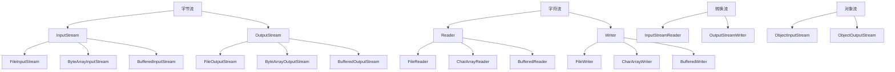
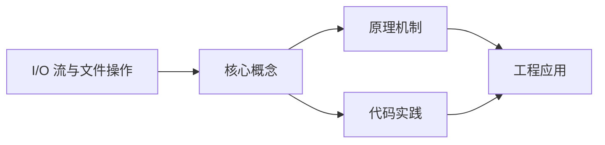
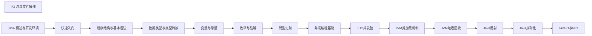

## 1. 学习目标（Bloom 分类）

本节按照布鲁姆教育目标分类学组织学习路径。本文主题为《I/O 流与文件操作》，属于 Java 模块，读者可以根据自身阶段选择阅读深度。

记忆层面：能够准确复述本文的核心概念、术语与基本语法或操作步骤，并能够在提问或检索时快速定位对应知识点。能够说出 Java 的编译执行模型（javac 到字节码，JVM 解释与 JIT）。

理解层面：能够用自己的语言解释核心原理与工作机制，说明概念之间的因果关系，而不是机械记忆结论。能够解释面向对象三大特性与 JVM 内存区域的职责。

应用层面：能够在真实项目或练习场景中运用本文知识解决具体问题，写出正确且可维护的实现。能够编写类、接口、集合操作与异常处理的完整程序。

分析层面：能够拆解复杂问题，比较本文主题与相邻概念的异同，识别边界条件与例外情况。能够分析 Java 与 C++、Go 在内存管理与并发模型上的差异。

评价层面：能够根据约束条件（性能、可读性、安全、成本）评价不同方案的优劣，做出有依据的技术决策。能够评价不同集合、并发工具与框架的适用场景。

创造层面：能够把本文知识与其他模块知识组合，设计出新的解决方案或可复用的工程模式。能够组合 Spring 生态设计企业级应用。

通过本节学习，读者应当能够把《I/O 流与文件操作》纳入自己的知识网络，并与 Java 模块的其他主题（JVM、集合框架、并发、Spring 生态）建立关联。

## 2. 历史动机与发展脉络

《I/O 流与文件操作》是 Java 领域的重要主题。要真正理解它，需要先了解它解决的问题与演进过程。

Java 由 James Gosling 领导的 Sun 团队于 1995 年发布，口号“一次编写，到处运行”依托 JVM 字节码实现跨平台。2006 年 Sun 将 Java 开源（OpenJDK），2010 年 Oracle 收购 Sun 后 Java 进入新的治理阶段。
Java 的版本节奏在 2017 年后改为每半年一个特性版本、每两年一个 LTS（长期支持）版本。当前主流 LTS 包括 Java 11、17、21 与 25；Java 21 引入虚拟线程（Project Loom 成果），显著降低高并发服务的线程成本。
Java 生态以 Spring 家族为核心：Spring Boot 简化配置与部署，Spring Cloud 提供微服务组件；构建工具从 Maven 演进到 Gradle；JVM 语言（Kotlin、Scala、Groovy）与 Java 共存互操作。
Android 开发早期使用 Java，2019 年后官方转向 Kotlin-first，但 Java 仍是服务端领域（尤其是金融、电商等企业系统）的中坚力量。

回到本文主题：I/O 流与文件操作 的提出与成熟，正是上述技术背景下的必然产物。早期实现往往以简单可用为目标，随着工程规模扩大，社区逐渐沉淀出标准做法与最佳实践；理解这一脉络，可以帮助读者判断“为什么文档中的推荐写法是现在这个样子”，也能在遇到历史遗留代码时准确识别其设计年代与取舍。

理解 Java 版本与 LTS 机制，是工程选型的起点：生产环境优先 LTS，新特性（如虚拟线程）可以在受控场景评估后引入。

## 3. 形式化定义与核心概念精讲

本节把《I/O 流与文件操作》涉及的核心概念以“定义 + 讲解”的形式展开。读者应把定义当作工具，把讲解当作理解路径；两者结合才能形成可迁移的知识。

JVM 与字节码：`javac` 把 .java 编译为 .class 字节码，JVM 加载、校验并执行；热点代码由 JIT（如 C2）编译为机器码，解释与编译结合实现启动速度与峰值性能的平衡。
面向对象：封装（访问控制）、继承（extends/implements）与多态（重载/重写）是 Java 的类型系统支柱；接口默认方法（Java 8）与密封类（Java 17）持续演进表达能力。
异常体系：受检异常（checked）编译期强制处理，非受检异常（RuntimeException）运行时抛出；try-with-resources 自动关闭资源。
泛型与擦除：Java 泛型在编译期检查后擦除类型参数，运行时无泛型信息；这解释了 `List<String>` 与 `List<Integer>` 的 Class 相同，以及通配符 `? extends` 的逆变协变规则。

### 3.1 原文章节逐一精讲

原文档把主题拆分为 18 个小节，下面按顺序给出每一节的导读讲解，随后保留原文细节供精读。

#### 原文精读（完整保留）

# Java IO 流与文件操作

> **符号约定**：`< >` 必填参数 | `[ ]` 可选参数

---

#### 1. I/O 流分类 (Classification)

##### 1.1 按流向分类

- **输入流 (Input Stream)**: 从外部设备读取数据到程序
- **输出流 (Output Stream)**: 从程序写入数据到外部设备

##### 1.2 按数据单位分类

- **字节流 (Byte Stream)**: 以字节为单位处理数据，可处理所有类型的文件
- 顶级类: `InputStream` (输入), `OutputStream` (输出)
- **字符流 (Character Stream)**: 以字符为单位处理数据，专门用于处理文本文件
- 顶级类: `Reader` (输入), `Writer` (输出)

##### 1.3 按功能分类

- **节点流**: 直接与数据源相连，如 `FileInputStream`
- **处理流**: 对节点流进行包装，提供额外功能，如 `BufferedInputStream`

##### 1.4 IO 流的层次结构



#### 2. 字节流 (Byte Stream)

##### 2.1 基本字节流

###### 2.1.1 FileInputStream

用于从文件读取字节数据。

```java
 // 读取文件
 try (FileInputStream fis = new FileInputStream("input.txt")) {
  int data;
  while ((data = fis.read()) != -1) {
  System.out.print((char) data);
  }
 }
  e.printStackTrace();
 }
```

###### 2.1.2 FileOutputStream

用于向文件写入字节数据。

```java
 // 写入文件
 try (FileOutputStream fos = new FileOutputStream("output.txt")) {
  String content = "Hello, FileOutputStream!";
  fos.write(content.getBytes());
 }
  e.printStackTrace();
 }
```

##### 2.2 缓冲字节流

###### 2.2.1 BufferedInputStream

带缓冲区的输入流，提高读取性能。

```java
 // 使用缓冲流读取
 try (BufferedInputStream bis = new BufferedInputStream(new FileInputStream("input.txt"))) {
  byte[] buffer = new byte[1024];
  int bytesRead;
  while ((bytesRead = bis.read(buffer)) != -1) {
  System.out.print(new String(buffer, 0, bytesRead));
  }
 }
  e.printStackTrace();
 }
```

###### 2.2.2 BufferedOutputStream

带缓冲区的输出流，提高写入性能。

```java
 // 使用缓冲流写入
 try (BufferedOutputStream bos = new BufferedOutputStream(new FileOutputStream("output.txt"))) {
  String content = "Hello, BufferedOutputStream!";
  bos.write(content.getBytes());
  bos.flush(); // 刷新缓冲区
 }
  e.printStackTrace();
 }
```

#### 3. 字符流 (Character Stream)

##### 3.1 基本字符流

###### 3.1.1 FileReader

用于从文件读取字符数据。

```java
 // 读取文本文件
 try (FileReader fr = new FileReader("input.txt")) {
  int data;
  while ((data = fr.read()) != -1) {
  System.out.print((char) data);
  }
 }
  e.printStackTrace();
 }
```

###### 3.1.2 FileWriter

用于向文件写入字符数据。

```java
 // 写入文本文件
 try (FileWriter fw = new FileWriter("output.txt")) {
  String content = "Hello, FileWriter!";
  fw.write(content);
 }
  e.printStackTrace();
 }
```

##### 3.2 缓冲字符流

###### 3.2.1 BufferedReader

带缓冲区的字符输入流，提供按行读取功能。

```java
 // 使用缓冲流按行读取
 try (BufferedReader br = new BufferedReader(new FileReader("input.txt"))) {
  String line;
  while ((line = br.readLine()) != null) {
  System.out.println(line);
  }
 }
  e.printStackTrace();
 }
```

###### 3.2.2 BufferedWriter

带缓冲区的字符输出流，提供写入换行功能。

```java
 // 使用缓冲流写入
 try (BufferedWriter bw = new BufferedWriter(new FileWriter("output.txt"))) {
  bw.write("Hello, BufferedWriter!");
  bw.newLine(); // 写入换行
  bw.write("This is a new line.");
  bw.flush(); // 刷新缓冲区
 }
  e.printStackTrace();
 }
```

#### 4. 转换流

##### 4.1 InputStreamReader

将字节流转换为字符流，指定字符编码。

```java
 // 使用转换流读取，指定编码
 try (InputStreamReader isr = new InputStreamReader(new FileInputStream("input.txt"), "UTF-8")) {
  int data;
  while ((data = isr.read()) != -1) {
  System.out.print((char) data);
  }
 }
  e.printStackTrace();
 }
```

##### 4.2 OutputStreamWriter

将字符流转换为字节流，指定字符编码。

```java
 // 使用转换流写入，指定编码
 try (OutputStreamWriter osw = new OutputStreamWriter(new FileOutputStream("output.txt"), "UTF-8")) {
  String content = "Hello, OutputStreamWriter!";
  osw.write(content);
  osw.flush();
 }
  e.printStackTrace();
 }
```

#### 5. 对象序列化 (Serialization)

##### 5.1 序列化的概念

将对象的状态转换为字节序列，以便存储或传输。

##### 5.2 序列化的条件

- 类必须实现 `Serializable` 接口
- 类的所有非瞬态字段必须可序列化

##### 5.3 序列化示例

###### 5.3.1 可序列化的类

```java
 import java.io.Serializable;
 public class Person implements Serializable {
  private static final long serialVersionUID = 1L;
  private String name;
  private int age;
  private transient String password; // 不参与序列化
  // 构造器、getter、setter 方法
 }
```

###### 5.3.2 对象序列化

```java
 // 序列化对象到文件
 try (ObjectOutputStream oos = new ObjectOutputStream(new FileOutputStream("person.dat"))) {
  Person person = new Person("Alice", 25, "123456");
  oos.writeObject(person);
  System.out.println("对象序列化成功");
 }
  e.printStackTrace();
 }
```

###### 5.3.3 对象反序列化

```java
 // 从文件反序列化对象
 try (ObjectInputStream ois = new ObjectInputStream(new FileInputStream("person.dat"))) {
  Person person = (Person) ois.readObject();
  System.out.println("姓名: " + person.getName());
  System.out.println("年龄: " + person.getAge());
  System.out.println("密码: " + person.getPassword()); // 输出 null，因为 password 是 transient
  System.out.println("对象反序列化成功");
 }
  e.printStackTrace();
 }
```

##### 5.4 序列化的注意事项

- **serialVersionUID**: 建议显式声明，确保版本兼容性
- **transient**: 标记不需要序列化的字段
- **静态字段**: 静态字段不会被序列化
- **循环引用**: 序列化会自动处理循环引用
- **安全性**: 序列化可能导致安全问题，需要注意

#### 6. 文件操作 (java.io.File)

##### 6.1 File 类的常用方法

###### 6.1.1 文件检查方法

- **exists()**: 检查文件或目录是否存在
- **isFile()**: 检查是否为文件
- **isDirectory()**: 检查是否为目录
- **canRead()**: 检查是否可读
- **canWrite()**: 检查是否可写
- **isHidden()**: 检查是否隐藏

###### 6.1.2 文件操作方法

- **createNewFile()**: 创建新文件
- **delete()**: 删除文件或目录
- **renameTo(File dest)**: 重命名文件或目录
- **mkdir()**: 创建目录
- **mkdirs()**: 创建多级目录
- **deleteOnExit()**: JVM 退出时删除文件

###### 6.1.3 文件信息方法

- **getName()**: 获取文件名
- **getPath()**: 获取文件路径
- **getAbsolutePath()**: 获取绝对路径
- **getCanonicalPath()**: 获取规范路径
- **length()**: 获取文件长度
- **lastModified()**: 获取最后修改时间

###### 6.1.4 目录操作方法

- **list()**: 获取目录下的文件和目录名
- **listFiles()**: 获取目录下的文件和目录对象
- **listFiles(FileFilter filter)**: 获取符合过滤条件的文件和目录

##### 6.2 File 操作示例

###### 6.2.1 创建文件

```java
 File file = new File("test.txt");
 try {
  if (file.createNewFile()) {
  System.out.println("文件创建成功");
  } else {
  System.out.println("文件已存在");
  }
 }
  e.printStackTrace();
 }
```

###### 6.2.2 创建目录

```java
 // 创建单个目录
 File dir = new File("mydir");
 if (dir.mkdir()) {
  System.out.println("目录创建成功");
 }
  System.out.println("目录创建失败");
 }
 // 创建多级目录
 File multiDir = new File("dir1/dir2/dir3");
 if (multiDir.mkdirs()) {
  System.out.println("多级目录创建成功");
 }
  System.out.println("多级目录创建失败");
 }
```

###### 6.2.3 列出目录内容

```java
 File dir = new File(".");
 String[] files = dir.list();
 System.out.println("目录内容:");
 for (String file : files) {
  System.out.println(file);
 }
 // 使用 FileFilter
 File[] javaFiles = dir.listFiles((f) -> f.getName().endsWith(".java"));
 System.out.println("Java 文件:");
 for (File file : javaFiles) {
  System.out.println(file.getName());
 }
```

#### 7. NIO (Non-blocking I/O)

##### 7.1 NIO 的核心组件

- **Buffer**: 缓冲区，用于存储数据
- **Channel**: 通道，用于数据传输
- **Selector**: 选择器，用于监控多个通道的事件

##### 7.2 Buffer

###### 7.2.1 Buffer 的类型

- **ByteBuffer**
- **CharBuffer**
- **ShortBuffer**
- **IntBuffer**
- **LongBuffer**
- **FloatBuffer**
- **DoubleBuffer**

###### 7.2.2 Buffer 的使用

```java
 // 创建缓冲区
 ByteBuffer buffer = ByteBuffer.allocate(1024);
 // 写入数据
 buffer.put("Hello, NIO!".getBytes());
 // 切换到读模式
 buffer.flip();
 // 读取数据
 byte[] data = new byte[buffer.limit()];
 buffer.get(data);
 System.out.println(new String(data));
 // 清空缓冲区
 buffer.clear();
```

##### 7.3 Channel

###### 7.3.1 Channel 的类型

- **FileChannel**: 文件通道
- **SocketChannel**: 套接字通道
- **ServerSocketChannel**: 服务器套接字通道
- **DatagramChannel**: 数据报通道

###### 7.3.2 FileChannel 的使用

```java
 // 读取文件
 try (FileChannel channel = new FileInputStream("input.txt").getChannel()) {
  ByteBuffer buffer = ByteBuffer.allocate(1024);
  while (channel.read(buffer) != -1) {
  buffer.flip();
  byte[] data = new byte[buffer.limit()];
  buffer.get(data);
  System.out.print(new String(data));
  buffer.clear();
  }
 }
  e.printStackTrace();
 }
 // 写入文件
 try (FileChannel channel = new FileOutputStream("output.txt").getChannel()) {
  ByteBuffer buffer = ByteBuffer.wrap("Hello, FileChannel!".getBytes());
  channel.write(buffer);
 }
  e.printStackTrace();
 }
```

##### 7.4 NIO 2.0 (Java 7+)

###### 7.4.1 Path 接口

```java
 // 创建 Path
 Path path = Paths.get("test.txt");
 // 获取路径信息
 System.out.println("文件名: " + path.getFileName());
 System.out.println("父路径: " + path.getParent());
 System.out.println("绝对路径: " + path.toAbsolutePath());
```

###### 7.4.2 Files 类

```java
 // 读取文件
 List<String> lines = Files.readAllLines(Paths.get("input.txt"), StandardCharsets.UTF_8);
 for (String line : lines) {
  System.out.println(line);
 }
 // 写入文件
 List<String> content = Arrays.asList("Hello, Files!", "This is a test.");
 Files.write(Paths.get("output.txt"), content, StandardCharsets.UTF_8);
 // 复制文件
 Files.copy(Paths.get("input.txt"), Paths.get("copy.txt"), StandardCopyOption.REPLACE_EXISTING);
 // 删除文件
 Files.deleteIfExists(Paths.get("temp.txt"));
```

#### 8. 实际应用案例

##### 8.1 文件复制

###### 8.1.1 使用字节流复制

```java
 public static void copyFileUsingStream(File source, File dest) throws IOException {
  try (InputStream is = new FileInputStream(source);
  OutputStream os = new FileOutputStream(dest)) {
  byte[] buffer = new byte[1024];
  int length;
  while ((length = is.read(buffer)) > 0) {
  os.write(buffer, 0, length);
  }
  }
 }
```

###### 8.1.2 使用缓冲流复制

```java
 public static void copyFileUsingBufferedStream(File source, File dest) throws IOException {
  try (BufferedInputStream bis = new BufferedInputStream(new FileInputStream(source));
  BufferedOutputStream bos = new BufferedOutputStream(new FileOutputStream(dest))) {
  byte[] buffer = new byte[1024];
  int length;
  while ((length = bis.read(buffer)) > 0) {
  bos.write(buffer, 0, length);
  }
  }
 }
```

###### 8.1.3 使用 NIO 复制

```java
 public static void copyFileUsingNIO(File source, File dest) throws IOException {
  try (FileChannel sourceChannel = new FileInputStream(source).getChannel();
  FileChannel destChannel = new FileOutputStream(dest).getChannel()) {
  destChannel.transferFrom(sourceChannel, 0, sourceChannel.size());
  }
 }
```

##### 8.2 文本文件读写

###### 8.2.1 读取文本文件

```java
 public static List<String> readTextFile(String filePath) throws IOException {
  List<String> lines = new ArrayList<>();
  try (BufferedReader br = new BufferedReader(new FileReader(filePath))) {
  String line;
  while ((line = br.readLine()) != null) {
  lines.add(line);
  }
  }
  return lines;
 }
```

###### 8.2.2 写入文本文件

```java
 public static void writeTextFile(String filePath, List<String> lines) throws IOException {
  try (BufferedWriter bw = new BufferedWriter(new FileWriter(filePath))) {
  for (String line : lines) {
  bw.write(line);
  bw.newLine();
  }
  }
 }
```

##### 8.3 目录遍历

```java
 public static void listFilesRecursively(File directory) {
  if (!directory.isDirectory()) {
  return;
  }
  File[] files = directory.listFiles();
  if (files != null) {
  for (File file : files) {
  if (file.isDirectory()) {
  System.out.println("目录: " + file.getAbsolutePath());
  listFilesRecursively(file);
  } else {
  System.out.println("文件: " + file.getAbsolutePath());
  }
  }
  }
 }
```

#### 9. 最佳实践

##### 9.1 资源管理

- **使用 try-with-resources**: 自动关闭资源，避免资源泄漏
- **显式关闭资源**: 在 try-with-resources 不可用的情况下，使用 finally 块关闭资源

##### 9.2 性能优化

- **使用缓冲流**: 提高读写性能
- **合理设置缓冲区大小**: 根据实际情况调整缓冲区大小
- **使用 NIO**: 对于大文件操作，考虑使用 NIO 提高性能
- **批量操作**: 减少 I/O 操作次数

##### 9.3 编码处理

- **指定字符编码**: 避免默认编码导致的问题
- **使用 UTF-8**: 推荐使用 UTF-8 编码
- **使用转换流**: 在字节流和字符流之间转换时指定编码

##### 9.4 文件操作

- **检查文件存在性**: 在操作文件前检查文件是否存在
- **处理异常**: 妥善处理 I/O 异常
- **使用 Files 类**: Java 7+ 推荐使用 Files 类进行文件操作
- **路径处理**: 使用 Path 接口处理路径

##### 9.5 序列化

- **显式声明 serialVersionUID**: 确保版本兼容性
- **谨慎使用 transient**: 只对不需要序列化的字段使用
- **注意序列化的安全性**: 避免序列化敏感信息

#### 10. 常见陷阱

##### 10.1 资源泄漏

- **忘记关闭资源**: 导致文件句柄泄漏
- **在 finally 块中关闭资源时发生异常**: 掩盖原始异常

##### 10.2 编码问题

- **使用默认编码**: 可能导致跨平台问题
- **字节与字符转换错误**: 导致乱码

##### 10.3 文件操作陷阱

- **路径分隔符**: 不同操作系统的路径分隔符不同
- **文件权限**: 没有足够的权限操作文件
- **文件名长度**: 超过系统限制

##### 10.4 序列化陷阱

- **serialVersionUID 不匹配**: 导致反序列化失败
- **序列化循环引用**: 可能导致栈溢出
- **序列化大对象**: 可能导致内存问题

##### 10.5 性能陷阱

- **频繁的小 I/O 操作**: 降低性能
- **不使用缓冲流**: 导致频繁的磁盘操作
- **大文件一次性读入内存**: 可能导致内存溢出

---

#### 字节流

**基本写法：FileInputStream 创建**
`FileInputStream <变量> = new FileInputStream("<文件路径>");`
```java
// 创建字节输入流
FileInputStream fis = new FileInputStream("input.txt");
```

---

**基本写法：读取单字节**
`<fis>.read()`
```java
// 读取一个字节返回 -1 表示结束
int data = fis.read();
```

---

**基本写法：读取多字节**
`<fis>.read(byte[] <缓冲区>)`
```java
// 读取多个字节到缓冲区
byte[] buffer = new byte[1024];
int len = fis.read(buffer);
```

---

**基本写法：FileOutputStream 创建**
`FileOutputStream <变量> = new FileOutputStream("<文件路径>");`
```java
// 创建字节输出流
FileOutputStream fos = new FileOutputStream("output.txt");
```

---

**基本写法：写入字节**
`<fos>.write(<字节>)`
```java
// 写入单个字节
fos.write(65);
```

---

**基本写法：写入字节数组**
`<fos>.write(byte[] <数据>)`
```java
// 写入字节数组
fos.write(buffer);
```

---

**基本写法：关闭流**
`<流>.close();`
```java
// 关闭流释放资源
fis.close();
```

---

#### 字符流

**基本写法：FileReader 创建**
`FileReader <变量> = new FileReader("<文件路径>");`
```java
// 创建字符输入流
FileReader fr = new FileReader("input.txt");
```

---

**基本写法：读取单字符**
`<fr>.read()`
```java
// 读取一个字符
int ch = fr.read();
```

---

**基本写法：读取多字符**
`<fr>.read(char[] <缓冲区>)`
```java
// 读取多个字符到缓冲区
char[] buffer = new char[1024];
int len = fr.read(buffer);
```

---

**基本写法：FileWriter 创建**
`FileWriter <变量> = new FileWriter("<文件路径>");`
```java
// 创建字符输出流
FileWriter fw = new FileWriter("output.txt");
```

---

**基本写法：写入字符串**
`<fw>.write("<字符串>")`
```java
// 写入字符串
fw.write("Hello, World!");
```

---

**基本写法：追加写入**
`FileWriter <变量> = new FileWriter("<文件路径>", true);`
```java
// 创建追加模式的 FileWriter
FileWriter fw = new FileWriter("log.txt", true);
```

---

#### 缓冲流

**基本写法：BufferedReader 创建**
`BufferedReader <变量> = new BufferedReader(new FileReader("<文件>"));`
```java
// 创建带缓冲的字符输入流
BufferedReader br = new BufferedReader(new FileReader("input.txt"));
```

---

**基本写法：读取一行**
`<br>.readLine()`
```java
// 读取一行文本返回 null 表示结束
String line = br.readLine();
```

---

**基本写法：BufferedWriter 创建**
`BufferedWriter <变量> = new BufferedWriter(new FileWriter("<文件>"));`
```java
// 创建带缓冲的字符输出流
BufferedWriter bw = new BufferedWriter(new FileWriter("output.txt"));
```

---

**基本写法：写入并换行**
`<bw>.write("<字符串>"); <bw>.newLine();`
```java
// 写入字符串并换行
bw.write("Hello");
bw.newLine();
```

---

#### try-with-resources

**基本写法：自动关闭资源**
`try (<资源声明>) { }`
```java
// 自动关闭实现 AutoCloseable 的资源
try (FileReader fr = new FileReader("file.txt")) {
}
```

---

**换行写法：多个资源自动关闭**
`try (<资源1>; <资源2>) { }`
```java
// 多个资源按声明逆序自动关闭
try (
    BufferedReader br = new BufferedReader(new FileReader("in.txt"));
    BufferedWriter bw = new BufferedWriter(new FileWriter("out.txt"))
) {
}
```

---

#### File 类

**基本写法：创建 File 对象**
`File <变量> = new File("<路径>");`
```java
// 创建 File 对象
File file = new File("test.txt");
```

---

**基本写法：判断文件存在**
`<file>.exists()`
```java
// 判断文件或目录是否存在
boolean exists = file.exists();
```

---

**基本写法：判断是文件**
`<file>.isFile()`
```java
// 判断是否为文件
boolean isFile = file.isFile();
```

---

**基本写法：判断是目录**
`<file>.isDirectory()`
```java
// 判断是否为目录
boolean isDir = file.isDirectory();
```

---

**基本写法：创建文件**
`<file>.createNewFile()`
```java
// 创建新文件
boolean created = file.createNewFile();
```

---

**基本写法：创建目录**
`<file>.mkdir()`
```java
// 创建单层目录
boolean created = file.mkdir();
```

---

**基本写法：创建多层目录**
`<file>.mkdirs()`
```java
// 创建多层目录
boolean created = file.mkdirs();
```

---

**基本写法：删除文件**
`<file>.delete()`
```java
// 删除文件或目录
boolean deleted = file.delete();
```

---

**基本写法：获取文件名**
`<file>.getName()`
```java
// 获取文件名
String name = file.getName();
```

---

**基本写法：获取路径**
`<file>.getPath()`
```java
// 获取路径字符串
String path = file.getPath();
```

---

**基本写法：获取绝对路径**
`<file>.getAbsolutePath()`
```java
// 获取绝对路径
String absPath = file.getAbsolutePath();
```

---

**基本写法：获取文件大小**
`<file>.length()`
```java
// 获取文件字节数
long size = file.length();
```

---

**基本写法：列出目录文件**
`<file>.listFiles()`
```java
// 列出目录下的文件数组
File[] files = dir.listFiles();
```

---

#### NIO Path

**基本写法：创建 Path**
`Path <变量> = Paths.get("<路径>");`
```java
// 创建 Path 对象
Path path = Paths.get("test.txt");
```

---

**基本写法：判断文件存在**
`Files.exists(<path>)`
```java
// 判断路径是否存在
boolean exists = Files.exists(path);
```

---

**基本写法：创建文件**
`Files.createFile(<path>)`
```java
// 创建新文件
Files.createFile(path);
```

---

**基本写法：创建目录**
`Files.createDirectory(<path>)`
```java
// 创建目录
Files.createDirectory(path);
```

---

**基本写法：删除文件**
`Files.delete(<path>)`
```java
// 删除文件不存在则抛异常
Files.delete(path);
```

---

**基本写法：复制文件**
`Files.copy(<源路径>, <目标路径>)`
```java
// 复制文件
Files.copy(source, target);
```

---

**基本写法：移动文件**
`Files.move(<源路径>, <目标路径>)`
```java
// 移动或重命名文件
Files.move(source, target);
```

---

#### NIO 文件读写

**基本写法：读取所有字节**
`Files.readAllBytes(<path>)`
```java
// 读取文件所有字节
byte[] data = Files.readAllBytes(path);
```

---

**基本写法：读取所有行**
`Files.readAllLines(<path>)`
```java
// 读取文件所有行
List<String> lines = Files.readAllLines(path);
```

---

**基本写法：写入字节**
`Files.write(<path>, <字节数组>)`
```java
// 写入字节数组到文件
Files.write(path, data);
```

---

**基本写法：写入字符串**
`Files.writeString(<path>, "<字符串>")`
```java
// Java 11+ 写入字符串到文件
Files.writeString(path, "Hello");
```

---

**基本写法：读取字符串**
`Files.readString(<path>)`
```java
// Java 11+ 读取文件为字符串
String content = Files.readString(path);
```

---

#### 对象序列化

**基本写法：实现 Serializable**
`class <类名> implements Serializable { }`
```java
// 类实现序列化接口
public class User implements Serializable {
}
```

---

**基本写法：序列化对象**
`new ObjectOutputStream(new FileOutputStream("<文件>")).writeObject(<对象>)`
```java
// 将对象写入文件
try (ObjectOutputStream oos = new ObjectOutputStream(new FileOutputStream("user.dat"))) {
    oos.writeObject(user);
}
```

---

**基本写法：反序列化对象**
`new ObjectInputStream(new FileInputStream("<文件>")).readObject()`
```java
// 从文件读取对象
try (ObjectInputStream ois = new ObjectInputStream(new FileInputStream("user.dat"))) {
    User user = (User) ois.readObject();
}
```

---

**基本写法：transient 关键字**
`transient <类型> <字段名>;`
```java
// 标记字段不参与序列化
private transient String password;
```

---

**基本写法：serialVersionUID**
`private static final long serialVersionUID = <值>L;`
```java
// 定义序列化版本号
private static final long serialVersionUID = 1L;
```


### 3.2 概念关系图

下面用 Mermaid 图表达本文核心概念之间的关系，帮助读者建立整体图景：



图中展示的是本文知识的结构化关系：核心概念是入口，原理机制解释“为什么”，代码实践演示“怎么做”，工程应用回答“何时用”。读者学习时可以把每个小节的内容挂接到对应节点上。

## 4. 理论推导与原理解析

本节深入《I/O 流与文件操作》背后的原理。理论部分不求面面俱到，而是聚焦“能解释现象、能指导实践”的关键推导。

JVM 内存模型：堆（新生代/老年代）、元空间、虚拟机栈、本地方法栈与程序计数器；GC 从 CMS 演进到 G1（默认）、ZGC（超低延迟），理解分代收集是调优前提。
并发工具：synchronized 与 JUC（java.util.concurrent）的锁、并发容器、线程池、CompletableFuture 构成并发工具箱；Java 21 的虚拟线程让“每任务一线程”成为可能。
类加载机制：双亲委派模型保证类唯一性，SPI（ServiceLoader）打破委派实现扩展；自定义类加载器是热部署与隔离的基础。
反射与注解：反射在运行时检查类结构，注解提供元数据；Spring 的依赖注入与 AOP 均基于这些机制，但反射有性能与安全成本。

需要强调的是，理论推导与工程实践之间存在翻译层：理论给出的是理想化模型与边界条件，工程代码则必须处理真实环境中的例外。读者在学习时应先掌握理论的“标准情形”，再通过陷阱章节了解“非标准情形”。

## 5. 代码示例与逐行讲解

本节把原文中的代码示例系统整理，并为每个示例补充用途说明与讲解。读者不应只浏览代码，而应逐段对照讲解理解设计意图。

### 5.1 示例：1.4 IO 流的层次结构

该示例来自原文《1.4 IO 流的层次结构》小节，用于演示I/O 流与文件操作相关操作。阅读时请先看代码结构，再看其后的讲解。


讲解：这段代码演示了本节核心知识点。代码中的关键操作可以归纳为三步：准备（定义或初始化）、执行（核心逻辑）、收尾（释放资源或返回结果）。实际项目中，这三步往往被封装为函数或类，以提升复用性与可测试性。

关键点分析：

该示例共 21 行有效代码，结构以数据或配置为主。阅读时应关注：数据字段的含义、配置项的作用，以及它们与运行行为的对应关系。

进阶思考路径：先尝试修改参数观察行为变化，再把示例中的模式迁移到自己的项目中；每次修改都记录预期与实测差异，这是把示例转化为能力的最快方式。

### 5.2 示例：2.1.1 FileInputStream

该示例来自原文《2.1.1 FileInputStream》小节，用于演示I/O 流与文件操作相关操作。阅读时请先看代码结构，再看其后的讲解。

```java
 // 读取文件
 try (FileInputStream fis = new FileInputStream("input.txt")) {
  int data;
  while ((data = fis.read()) != -1) {
  System.out.print((char) data);
  }
 }
  e.printStackTrace();
 }
```

讲解：这段代码演示了本节核心知识点。代码中的关键操作可以归纳为三步：准备（定义或初始化）、执行（核心逻辑）、收尾（释放资源或返回结果）。实际项目中，这三步往往被封装为函数或类，以提升复用性与可测试性。

关键点分析：

该示例共 9 行有效代码，包含 1 类关键结构（while）。其中：

- 入口与初始化部分负责建立上下文，对应实际项目中的启动或装配逻辑；
- 核心逻辑部分体现本文主题的主要操作，是阅读时最需要对照讲解理解的部分；
- 输出或返回部分把结果交给调用方，注意其类型与边界条件。

进阶思考路径：先尝试修改参数观察行为变化，再把示例中的模式迁移到自己的项目中；每次修改都记录预期与实测差异，这是把示例转化为能力的最快方式。

### 5.3 示例：2.1.2 FileOutputStream

该示例来自原文《2.1.2 FileOutputStream》小节，用于演示I/O 流与文件操作相关操作。阅读时请先看代码结构，再看其后的讲解。

```java
 // 写入文件
 try (FileOutputStream fos = new FileOutputStream("output.txt")) {
  String content = "Hello, FileOutputStream!";
  fos.write(content.getBytes());
 }
  e.printStackTrace();
 }
```

讲解：这段代码演示了本节核心知识点。代码中的关键操作可以归纳为三步：准备（定义或初始化）、执行（核心逻辑）、收尾（释放资源或返回结果）。实际项目中，这三步往往被封装为函数或类，以提升复用性与可测试性。

关键点分析：

该示例共 7 行有效代码，结构以数据或配置为主。阅读时应关注：数据字段的含义、配置项的作用，以及它们与运行行为的对应关系。

进阶思考路径：先尝试修改参数观察行为变化，再把示例中的模式迁移到自己的项目中；每次修改都记录预期与实测差异，这是把示例转化为能力的最快方式。

### 5.4 示例：2.2.1 BufferedInputStream

该示例来自原文《2.2.1 BufferedInputStream》小节，用于演示I/O 流与文件操作相关操作。阅读时请先看代码结构，再看其后的讲解。

```java
 // 使用缓冲流读取
 try (BufferedInputStream bis = new BufferedInputStream(new FileInputStream("input.txt"))) {
  byte[] buffer = new byte[1024];
  int bytesRead;
  while ((bytesRead = bis.read(buffer)) != -1) {
  System.out.print(new String(buffer, 0, bytesRead));
  }
 }
  e.printStackTrace();
 }
```

讲解：这段代码演示了本节核心知识点。代码中的关键操作可以归纳为三步：准备（定义或初始化）、执行（核心逻辑）、收尾（释放资源或返回结果）。实际项目中，这三步往往被封装为函数或类，以提升复用性与可测试性。

关键点分析：

该示例共 10 行有效代码，包含 1 类关键结构（while）。其中：

- 入口与初始化部分负责建立上下文，对应实际项目中的启动或装配逻辑；
- 核心逻辑部分体现本文主题的主要操作，是阅读时最需要对照讲解理解的部分；
- 输出或返回部分把结果交给调用方，注意其类型与边界条件。

进阶思考路径：先尝试修改参数观察行为变化，再把示例中的模式迁移到自己的项目中；每次修改都记录预期与实测差异，这是把示例转化为能力的最快方式。

### 5.5 示例：2.2.2 BufferedOutputStream

该示例来自原文《2.2.2 BufferedOutputStream》小节，用于演示I/O 流与文件操作相关操作。阅读时请先看代码结构，再看其后的讲解。

```java
 // 使用缓冲流写入
 try (BufferedOutputStream bos = new BufferedOutputStream(new FileOutputStream("output.txt"))) {
  String content = "Hello, BufferedOutputStream!";
  bos.write(content.getBytes());
  bos.flush(); // 刷新缓冲区
 }
  e.printStackTrace();
 }
```

讲解：这段代码演示了本节核心知识点。代码中的关键操作可以归纳为三步：准备（定义或初始化）、执行（核心逻辑）、收尾（释放资源或返回结果）。实际项目中，这三步往往被封装为函数或类，以提升复用性与可测试性。

关键点分析：

该示例共 8 行有效代码，结构以数据或配置为主。阅读时应关注：数据字段的含义、配置项的作用，以及它们与运行行为的对应关系。

进阶思考路径：先尝试修改参数观察行为变化，再把示例中的模式迁移到自己的项目中；每次修改都记录预期与实测差异，这是把示例转化为能力的最快方式。

### 5.6 示例：3.1.1 FileReader

该示例来自原文《3.1.1 FileReader》小节，用于演示I/O 流与文件操作相关操作。阅读时请先看代码结构，再看其后的讲解。

```java
 // 读取文本文件
 try (FileReader fr = new FileReader("input.txt")) {
  int data;
  while ((data = fr.read()) != -1) {
  System.out.print((char) data);
  }
 }
  e.printStackTrace();
 }
```

讲解：这段代码演示了本节核心知识点。代码中的关键操作可以归纳为三步：准备（定义或初始化）、执行（核心逻辑）、收尾（释放资源或返回结果）。实际项目中，这三步往往被封装为函数或类，以提升复用性与可测试性。

关键点分析：

该示例共 9 行有效代码，包含 1 类关键结构（while）。其中：

- 入口与初始化部分负责建立上下文，对应实际项目中的启动或装配逻辑；
- 核心逻辑部分体现本文主题的主要操作，是阅读时最需要对照讲解理解的部分；
- 输出或返回部分把结果交给调用方，注意其类型与边界条件。

进阶思考路径：先尝试修改参数观察行为变化，再把示例中的模式迁移到自己的项目中；每次修改都记录预期与实测差异，这是把示例转化为能力的最快方式。

### 5.7 示例：3.1.2 FileWriter

该示例来自原文《3.1.2 FileWriter》小节，用于演示I/O 流与文件操作相关操作。阅读时请先看代码结构，再看其后的讲解。

```java
 // 写入文本文件
 try (FileWriter fw = new FileWriter("output.txt")) {
  String content = "Hello, FileWriter!";
  fw.write(content);
 }
  e.printStackTrace();
 }
```

讲解：这段代码演示了本节核心知识点。代码中的关键操作可以归纳为三步：准备（定义或初始化）、执行（核心逻辑）、收尾（释放资源或返回结果）。实际项目中，这三步往往被封装为函数或类，以提升复用性与可测试性。

关键点分析：

该示例共 7 行有效代码，结构以数据或配置为主。阅读时应关注：数据字段的含义、配置项的作用，以及它们与运行行为的对应关系。

进阶思考路径：先尝试修改参数观察行为变化，再把示例中的模式迁移到自己的项目中；每次修改都记录预期与实测差异，这是把示例转化为能力的最快方式。

### 5.8 示例：3.2.1 BufferedReader

该示例来自原文《3.2.1 BufferedReader》小节，用于演示I/O 流与文件操作相关操作。阅读时请先看代码结构，再看其后的讲解。

```java
 // 使用缓冲流按行读取
 try (BufferedReader br = new BufferedReader(new FileReader("input.txt"))) {
  String line;
  while ((line = br.readLine()) != null) {
  System.out.println(line);
  }
 }
  e.printStackTrace();
 }
```

讲解：这段代码演示了本节核心知识点。代码中的关键操作可以归纳为三步：准备（定义或初始化）、执行（核心逻辑）、收尾（释放资源或返回结果）。实际项目中，这三步往往被封装为函数或类，以提升复用性与可测试性。

关键点分析：

该示例共 9 行有效代码，包含 1 类关键结构（while）。其中：

- 入口与初始化部分负责建立上下文，对应实际项目中的启动或装配逻辑；
- 核心逻辑部分体现本文主题的主要操作，是阅读时最需要对照讲解理解的部分；
- 输出或返回部分把结果交给调用方，注意其类型与边界条件。

进阶思考路径：先尝试修改参数观察行为变化，再把示例中的模式迁移到自己的项目中；每次修改都记录预期与实测差异，这是把示例转化为能力的最快方式。

### 5.9 示例：3.2.2 BufferedWriter

该示例来自原文《3.2.2 BufferedWriter》小节，用于演示I/O 流与文件操作相关操作。阅读时请先看代码结构，再看其后的讲解。

```java
 // 使用缓冲流写入
 try (BufferedWriter bw = new BufferedWriter(new FileWriter("output.txt"))) {
  bw.write("Hello, BufferedWriter!");
  bw.newLine(); // 写入换行
  bw.write("This is a new line.");
  bw.flush(); // 刷新缓冲区
 }
  e.printStackTrace();
 }
```

讲解：这段代码演示了本节核心知识点。代码中的关键操作可以归纳为三步：准备（定义或初始化）、执行（核心逻辑）、收尾（释放资源或返回结果）。实际项目中，这三步往往被封装为函数或类，以提升复用性与可测试性。

关键点分析：

该示例共 9 行有效代码，结构以数据或配置为主。阅读时应关注：数据字段的含义、配置项的作用，以及它们与运行行为的对应关系。

进阶思考路径：先尝试修改参数观察行为变化，再把示例中的模式迁移到自己的项目中；每次修改都记录预期与实测差异，这是把示例转化为能力的最快方式。

### 5.10 示例：4.1 InputStreamReader

该示例来自原文《4.1 InputStreamReader》小节，用于演示I/O 流与文件操作相关操作。阅读时请先看代码结构，再看其后的讲解。

```java
 // 使用转换流读取，指定编码
 try (InputStreamReader isr = new InputStreamReader(new FileInputStream("input.txt"), "UTF-8")) {
  int data;
  while ((data = isr.read()) != -1) {
  System.out.print((char) data);
  }
 }
  e.printStackTrace();
 }
```

讲解：这段代码演示了本节核心知识点。代码中的关键操作可以归纳为三步：准备（定义或初始化）、执行（核心逻辑）、收尾（释放资源或返回结果）。实际项目中，这三步往往被封装为函数或类，以提升复用性与可测试性。

关键点分析：

该示例共 9 行有效代码，包含 1 类关键结构（while）。其中：

- 入口与初始化部分负责建立上下文，对应实际项目中的启动或装配逻辑；
- 核心逻辑部分体现本文主题的主要操作，是阅读时最需要对照讲解理解的部分；
- 输出或返回部分把结果交给调用方，注意其类型与边界条件。

进阶思考路径：先尝试修改参数观察行为变化，再把示例中的模式迁移到自己的项目中；每次修改都记录预期与实测差异，这是把示例转化为能力的最快方式。

### 5.11 示例：4.2 OutputStreamWriter

该示例来自原文《4.2 OutputStreamWriter》小节，用于演示I/O 流与文件操作相关操作。阅读时请先看代码结构，再看其后的讲解。

```java
 // 使用转换流写入，指定编码
 try (OutputStreamWriter osw = new OutputStreamWriter(new FileOutputStream("output.txt"), "UTF-8")) {
  String content = "Hello, OutputStreamWriter!";
  osw.write(content);
  osw.flush();
 }
  e.printStackTrace();
 }
```

讲解：这段代码演示了本节核心知识点。代码中的关键操作可以归纳为三步：准备（定义或初始化）、执行（核心逻辑）、收尾（释放资源或返回结果）。实际项目中，这三步往往被封装为函数或类，以提升复用性与可测试性。

关键点分析：

该示例共 8 行有效代码，结构以数据或配置为主。阅读时应关注：数据字段的含义、配置项的作用，以及它们与运行行为的对应关系。

进阶思考路径：先尝试修改参数观察行为变化，再把示例中的模式迁移到自己的项目中；每次修改都记录预期与实测差异，这是把示例转化为能力的最快方式。

### 5.12 示例：5.3.1 可序列化的类

该示例来自原文《5.3.1 可序列化的类》小节，用于演示I/O 流与文件操作相关操作。阅读时请先看代码结构，再看其后的讲解。

```java
 import java.io.Serializable;
 public class Person implements Serializable {
  private static final long serialVersionUID = 1L;
  private String name;
  private int age;
  private transient String password; // 不参与序列化
  // 构造器、getter、setter 方法
 }
```

讲解：这段代码演示了本节核心知识点。代码中的关键操作可以归纳为三步：准备（定义或初始化）、执行（核心逻辑）、收尾（释放资源或返回结果）。实际项目中，这三步往往被封装为函数或类，以提升复用性与可测试性。

关键点分析：

该示例共 8 行有效代码，包含 2 类关键结构（class、import）。其中：

- 入口与初始化部分负责建立上下文，对应实际项目中的启动或装配逻辑；
- 核心逻辑部分体现本文主题的主要操作，是阅读时最需要对照讲解理解的部分；
- 输出或返回部分把结果交给调用方，注意其类型与边界条件。

进阶思考路径：先尝试修改参数观察行为变化，再把示例中的模式迁移到自己的项目中；每次修改都记录预期与实测差异，这是把示例转化为能力的最快方式。

### 5.13 示例：5.3.2 对象序列化

该示例来自原文《5.3.2 对象序列化》小节，用于演示I/O 流与文件操作相关操作。阅读时请先看代码结构，再看其后的讲解。

```java
 // 序列化对象到文件
 try (ObjectOutputStream oos = new ObjectOutputStream(new FileOutputStream("person.dat"))) {
  Person person = new Person("Alice", 25, "123456");
  oos.writeObject(person);
  System.out.println("对象序列化成功");
 }
  e.printStackTrace();
 }
```

讲解：这段代码演示了本节核心知识点。代码中的关键操作可以归纳为三步：准备（定义或初始化）、执行（核心逻辑）、收尾（释放资源或返回结果）。实际项目中，这三步往往被封装为函数或类，以提升复用性与可测试性。

关键点分析：

该示例共 8 行有效代码，结构以数据或配置为主。阅读时应关注：数据字段的含义、配置项的作用，以及它们与运行行为的对应关系。

进阶思考路径：先尝试修改参数观察行为变化，再把示例中的模式迁移到自己的项目中；每次修改都记录预期与实测差异，这是把示例转化为能力的最快方式。

### 5.14 示例：5.3.3 对象反序列化

该示例来自原文《5.3.3 对象反序列化》小节，用于演示I/O 流与文件操作相关操作。阅读时请先看代码结构，再看其后的讲解。

```java
 // 从文件反序列化对象
 try (ObjectInputStream ois = new ObjectInputStream(new FileInputStream("person.dat"))) {
  Person person = (Person) ois.readObject();
  System.out.println("姓名: " + person.getName());
  System.out.println("年龄: " + person.getAge());
  System.out.println("密码: " + person.getPassword()); // 输出 null，因为 password 是 transient
  System.out.println("对象反序列化成功");
 }
  e.printStackTrace();
 }
```

讲解：这段代码演示了本节核心知识点。代码中的关键操作可以归纳为三步：准备（定义或初始化）、执行（核心逻辑）、收尾（释放资源或返回结果）。实际项目中，这三步往往被封装为函数或类，以提升复用性与可测试性。

关键点分析：

该示例共 10 行有效代码，结构以数据或配置为主。阅读时应关注：数据字段的含义、配置项的作用，以及它们与运行行为的对应关系。

进阶思考路径：先尝试修改参数观察行为变化，再把示例中的模式迁移到自己的项目中；每次修改都记录预期与实测差异，这是把示例转化为能力的最快方式。

### 5.15 示例：6.2.1 创建文件

该示例来自原文《6.2.1 创建文件》小节，用于演示I/O 流与文件操作相关操作。阅读时请先看代码结构，再看其后的讲解。

```java
 File file = new File("test.txt");
 try {
  if (file.createNewFile()) {
  System.out.println("文件创建成功");
  } else {
  System.out.println("文件已存在");
  }
 }
  e.printStackTrace();
 }
```

讲解：这段代码演示了本节核心知识点。代码中的关键操作可以归纳为三步：准备（定义或初始化）、执行（核心逻辑）、收尾（释放资源或返回结果）。实际项目中，这三步往往被封装为函数或类，以提升复用性与可测试性。

关键点分析：

该示例共 10 行有效代码，包含 1 类关键结构（if）。其中：

- 入口与初始化部分负责建立上下文，对应实际项目中的启动或装配逻辑；
- 核心逻辑部分体现本文主题的主要操作，是阅读时最需要对照讲解理解的部分；
- 输出或返回部分把结果交给调用方，注意其类型与边界条件。

进阶思考路径：先尝试修改参数观察行为变化，再把示例中的模式迁移到自己的项目中；每次修改都记录预期与实测差异，这是把示例转化为能力的最快方式。

### 5.16 示例：6.2.2 创建目录

该示例来自原文《6.2.2 创建目录》小节，用于演示I/O 流与文件操作相关操作。阅读时请先看代码结构，再看其后的讲解。

```java
 // 创建单个目录
 File dir = new File("mydir");
 if (dir.mkdir()) {
  System.out.println("目录创建成功");
 }
  System.out.println("目录创建失败");
 }
 // 创建多级目录
 File multiDir = new File("dir1/dir2/dir3");
 if (multiDir.mkdirs()) {
  System.out.println("多级目录创建成功");
 }
  System.out.println("多级目录创建失败");
 }
```

讲解：这段代码演示了本节核心知识点。代码中的关键操作可以归纳为三步：准备（定义或初始化）、执行（核心逻辑）、收尾（释放资源或返回结果）。实际项目中，这三步往往被封装为函数或类，以提升复用性与可测试性。

关键点分析：

该示例共 14 行有效代码，包含 1 类关键结构（if）。其中：

- 入口与初始化部分负责建立上下文，对应实际项目中的启动或装配逻辑；
- 核心逻辑部分体现本文主题的主要操作，是阅读时最需要对照讲解理解的部分；
- 输出或返回部分把结果交给调用方，注意其类型与边界条件。

进阶思考路径：先尝试修改参数观察行为变化，再把示例中的模式迁移到自己的项目中；每次修改都记录预期与实测差异，这是把示例转化为能力的最快方式。

### 5.17 示例：6.2.3 列出目录内容

该示例来自原文《6.2.3 列出目录内容》小节，用于演示I/O 流与文件操作相关操作。阅读时请先看代码结构，再看其后的讲解。

```java
 File dir = new File(".");
 String[] files = dir.list();
 System.out.println("目录内容:");
 for (String file : files) {
  System.out.println(file);
 }
 // 使用 FileFilter
 File[] javaFiles = dir.listFiles((f) -> f.getName().endsWith(".java"));
 System.out.println("Java 文件:");
 for (File file : javaFiles) {
  System.out.println(file.getName());
 }
```

讲解：这段代码演示了本节核心知识点。代码中的关键操作可以归纳为三步：准备（定义或初始化）、执行（核心逻辑）、收尾（释放资源或返回结果）。实际项目中，这三步往往被封装为函数或类，以提升复用性与可测试性。

关键点分析：

该示例共 12 行有效代码，包含 1 类关键结构（for）。其中：

- 入口与初始化部分负责建立上下文，对应实际项目中的启动或装配逻辑；
- 核心逻辑部分体现本文主题的主要操作，是阅读时最需要对照讲解理解的部分；
- 输出或返回部分把结果交给调用方，注意其类型与边界条件。

进阶思考路径：先尝试修改参数观察行为变化，再把示例中的模式迁移到自己的项目中；每次修改都记录预期与实测差异，这是把示例转化为能力的最快方式。

### 5.18 示例：7.2.2 Buffer 的使用

该示例来自原文《7.2.2 Buffer 的使用》小节，用于演示I/O 流与文件操作相关操作。阅读时请先看代码结构，再看其后的讲解。

```java
 // 创建缓冲区
 ByteBuffer buffer = ByteBuffer.allocate(1024);
 // 写入数据
 buffer.put("Hello, NIO!".getBytes());
 // 切换到读模式
 buffer.flip();
 // 读取数据
 byte[] data = new byte[buffer.limit()];
 buffer.get(data);
 System.out.println(new String(data));
 // 清空缓冲区
 buffer.clear();
```

讲解：这段代码演示了本节核心知识点。代码中的关键操作可以归纳为三步：准备（定义或初始化）、执行（核心逻辑）、收尾（释放资源或返回结果）。实际项目中，这三步往往被封装为函数或类，以提升复用性与可测试性。

关键点分析：

该示例共 12 行有效代码，结构以数据或配置为主。阅读时应关注：数据字段的含义、配置项的作用，以及它们与运行行为的对应关系。

进阶思考路径：先尝试修改参数观察行为变化，再把示例中的模式迁移到自己的项目中；每次修改都记录预期与实测差异，这是把示例转化为能力的最快方式。

### 5.19 示例：7.3.2 FileChannel 的使用

该示例来自原文《7.3.2 FileChannel 的使用》小节，用于演示I/O 流与文件操作相关操作。阅读时请先看代码结构，再看其后的讲解。

```java
 // 读取文件
 try (FileChannel channel = new FileInputStream("input.txt").getChannel()) {
  ByteBuffer buffer = ByteBuffer.allocate(1024);
  while (channel.read(buffer) != -1) {
  buffer.flip();
  byte[] data = new byte[buffer.limit()];
  buffer.get(data);
  System.out.print(new String(data));
  buffer.clear();
  }
 }
  e.printStackTrace();
 }
 // 写入文件
 try (FileChannel channel = new FileOutputStream("output.txt").getChannel()) {
  ByteBuffer buffer = ByteBuffer.wrap("Hello, FileChannel!".getBytes());
  channel.write(buffer);
 }
  e.printStackTrace();
 }
```

讲解：这段代码演示了本节核心知识点。代码中的关键操作可以归纳为三步：准备（定义或初始化）、执行（核心逻辑）、收尾（释放资源或返回结果）。实际项目中，这三步往往被封装为函数或类，以提升复用性与可测试性。

关键点分析：

该示例共 20 行有效代码，包含 1 类关键结构（while）。其中：

- 入口与初始化部分负责建立上下文，对应实际项目中的启动或装配逻辑；
- 核心逻辑部分体现本文主题的主要操作，是阅读时最需要对照讲解理解的部分；
- 输出或返回部分把结果交给调用方，注意其类型与边界条件。

进阶思考路径：先尝试修改参数观察行为变化，再把示例中的模式迁移到自己的项目中；每次修改都记录预期与实测差异，这是把示例转化为能力的最快方式。

### 5.20 示例：7.4.1 Path 接口

该示例来自原文《7.4.1 Path 接口》小节，用于演示I/O 流与文件操作相关操作。阅读时请先看代码结构，再看其后的讲解。

```java
 // 创建 Path
 Path path = Paths.get("test.txt");
 // 获取路径信息
 System.out.println("文件名: " + path.getFileName());
 System.out.println("父路径: " + path.getParent());
 System.out.println("绝对路径: " + path.toAbsolutePath());
```

讲解：这段代码演示了本节核心知识点。代码中的关键操作可以归纳为三步：准备（定义或初始化）、执行（核心逻辑）、收尾（释放资源或返回结果）。实际项目中，这三步往往被封装为函数或类，以提升复用性与可测试性。

关键点分析：

该示例共 6 行有效代码，结构以数据或配置为主。阅读时应关注：数据字段的含义、配置项的作用，以及它们与运行行为的对应关系。

进阶思考路径：先尝试修改参数观察行为变化，再把示例中的模式迁移到自己的项目中；每次修改都记录预期与实测差异，这是把示例转化为能力的最快方式。

### 5.21 示例：7.4.2 Files 类

该示例来自原文《7.4.2 Files 类》小节，用于演示I/O 流与文件操作相关操作。阅读时请先看代码结构，再看其后的讲解。

```java
 // 读取文件
 List<String> lines = Files.readAllLines(Paths.get("input.txt"), StandardCharsets.UTF_8);
 for (String line : lines) {
  System.out.println(line);
 }
 // 写入文件
 List<String> content = Arrays.asList("Hello, Files!", "This is a test.");
 Files.write(Paths.get("output.txt"), content, StandardCharsets.UTF_8);
 // 复制文件
 Files.copy(Paths.get("input.txt"), Paths.get("copy.txt"), StandardCopyOption.REPLACE_EXISTING);
 // 删除文件
 Files.deleteIfExists(Paths.get("temp.txt"));
```

讲解：这段代码演示了本节核心知识点。代码中的关键操作可以归纳为三步：准备（定义或初始化）、执行（核心逻辑）、收尾（释放资源或返回结果）。实际项目中，这三步往往被封装为函数或类，以提升复用性与可测试性。

关键点分析：

该示例共 12 行有效代码，包含 1 类关键结构（for）。其中：

- 入口与初始化部分负责建立上下文，对应实际项目中的启动或装配逻辑；
- 核心逻辑部分体现本文主题的主要操作，是阅读时最需要对照讲解理解的部分；
- 输出或返回部分把结果交给调用方，注意其类型与边界条件。

进阶思考路径：先尝试修改参数观察行为变化，再把示例中的模式迁移到自己的项目中；每次修改都记录预期与实测差异，这是把示例转化为能力的最快方式。

### 5.22 示例：8.1.1 使用字节流复制

该示例来自原文《8.1.1 使用字节流复制》小节，用于演示I/O 流与文件操作相关操作。阅读时请先看代码结构，再看其后的讲解。

```java
 public static void copyFileUsingStream(File source, File dest) throws IOException {
  try (InputStream is = new FileInputStream(source);
  OutputStream os = new FileOutputStream(dest)) {
  byte[] buffer = new byte[1024];
  int length;
  while ((length = is.read(buffer)) > 0) {
  os.write(buffer, 0, length);
  }
  }
 }
```

讲解：这段代码演示了本节核心知识点。代码中的关键操作可以归纳为三步：准备（定义或初始化）、执行（核心逻辑）、收尾（释放资源或返回结果）。实际项目中，这三步往往被封装为函数或类，以提升复用性与可测试性。

关键点分析：

该示例共 10 行有效代码，包含 1 类关键结构（while）。其中：

- 入口与初始化部分负责建立上下文，对应实际项目中的启动或装配逻辑；
- 核心逻辑部分体现本文主题的主要操作，是阅读时最需要对照讲解理解的部分；
- 输出或返回部分把结果交给调用方，注意其类型与边界条件。

进阶思考路径：先尝试修改参数观察行为变化，再把示例中的模式迁移到自己的项目中；每次修改都记录预期与实测差异，这是把示例转化为能力的最快方式。

### 5.23 示例：8.1.2 使用缓冲流复制

该示例来自原文《8.1.2 使用缓冲流复制》小节，用于演示I/O 流与文件操作相关操作。阅读时请先看代码结构，再看其后的讲解。

```java
 public static void copyFileUsingBufferedStream(File source, File dest) throws IOException {
  try (BufferedInputStream bis = new BufferedInputStream(new FileInputStream(source));
  BufferedOutputStream bos = new BufferedOutputStream(new FileOutputStream(dest))) {
  byte[] buffer = new byte[1024];
  int length;
  while ((length = bis.read(buffer)) > 0) {
  bos.write(buffer, 0, length);
  }
  }
 }
```

讲解：这段代码演示了本节核心知识点。代码中的关键操作可以归纳为三步：准备（定义或初始化）、执行（核心逻辑）、收尾（释放资源或返回结果）。实际项目中，这三步往往被封装为函数或类，以提升复用性与可测试性。

关键点分析：

该示例共 10 行有效代码，包含 1 类关键结构（while）。其中：

- 入口与初始化部分负责建立上下文，对应实际项目中的启动或装配逻辑；
- 核心逻辑部分体现本文主题的主要操作，是阅读时最需要对照讲解理解的部分；
- 输出或返回部分把结果交给调用方，注意其类型与边界条件。

进阶思考路径：先尝试修改参数观察行为变化，再把示例中的模式迁移到自己的项目中；每次修改都记录预期与实测差异，这是把示例转化为能力的最快方式。

### 5.24 示例：8.1.3 使用 NIO 复制

该示例来自原文《8.1.3 使用 NIO 复制》小节，用于演示I/O 流与文件操作相关操作。阅读时请先看代码结构，再看其后的讲解。

```java
 public static void copyFileUsingNIO(File source, File dest) throws IOException {
  try (FileChannel sourceChannel = new FileInputStream(source).getChannel();
  FileChannel destChannel = new FileOutputStream(dest).getChannel()) {
  destChannel.transferFrom(sourceChannel, 0, sourceChannel.size());
  }
 }
```

讲解：这段代码演示了本节核心知识点。代码中的关键操作可以归纳为三步：准备（定义或初始化）、执行（核心逻辑）、收尾（释放资源或返回结果）。实际项目中，这三步往往被封装为函数或类，以提升复用性与可测试性。

关键点分析：

该示例共 6 行有效代码，结构以数据或配置为主。阅读时应关注：数据字段的含义、配置项的作用，以及它们与运行行为的对应关系。

进阶思考路径：先尝试修改参数观察行为变化，再把示例中的模式迁移到自己的项目中；每次修改都记录预期与实测差异，这是把示例转化为能力的最快方式。

### 5.25 示例：8.2.1 读取文本文件

该示例来自原文《8.2.1 读取文本文件》小节，用于演示I/O 流与文件操作相关操作。阅读时请先看代码结构，再看其后的讲解。

```java
 public static List<String> readTextFile(String filePath) throws IOException {
  List<String> lines = new ArrayList<>();
  try (BufferedReader br = new BufferedReader(new FileReader(filePath))) {
  String line;
  while ((line = br.readLine()) != null) {
  lines.add(line);
  }
  }
  return lines;
 }
```

讲解：这段代码演示了本节核心知识点。代码中的关键操作可以归纳为三步：准备（定义或初始化）、执行（核心逻辑）、收尾（释放资源或返回结果）。实际项目中，这三步往往被封装为函数或类，以提升复用性与可测试性。

关键点分析：

该示例共 10 行有效代码，包含 2 类关键结构（while、return）。其中：

- 入口与初始化部分负责建立上下文，对应实际项目中的启动或装配逻辑；
- 核心逻辑部分体现本文主题的主要操作，是阅读时最需要对照讲解理解的部分；
- 输出或返回部分把结果交给调用方，注意其类型与边界条件。

进阶思考路径：先尝试修改参数观察行为变化，再把示例中的模式迁移到自己的项目中；每次修改都记录预期与实测差异，这是把示例转化为能力的最快方式。

### 5.26 示例：8.2.2 写入文本文件

该示例来自原文《8.2.2 写入文本文件》小节，用于演示I/O 流与文件操作相关操作。阅读时请先看代码结构，再看其后的讲解。

```java
 public static void writeTextFile(String filePath, List<String> lines) throws IOException {
  try (BufferedWriter bw = new BufferedWriter(new FileWriter(filePath))) {
  for (String line : lines) {
  bw.write(line);
  bw.newLine();
  }
  }
 }
```

讲解：这段代码演示了本节核心知识点。代码中的关键操作可以归纳为三步：准备（定义或初始化）、执行（核心逻辑）、收尾（释放资源或返回结果）。实际项目中，这三步往往被封装为函数或类，以提升复用性与可测试性。

关键点分析：

该示例共 8 行有效代码，包含 1 类关键结构（for）。其中：

- 入口与初始化部分负责建立上下文，对应实际项目中的启动或装配逻辑；
- 核心逻辑部分体现本文主题的主要操作，是阅读时最需要对照讲解理解的部分；
- 输出或返回部分把结果交给调用方，注意其类型与边界条件。

进阶思考路径：先尝试修改参数观察行为变化，再把示例中的模式迁移到自己的项目中；每次修改都记录预期与实测差异，这是把示例转化为能力的最快方式。

### 5.27 示例：8.3 目录遍历

该示例来自原文《8.3 目录遍历》小节，用于演示I/O 流与文件操作相关操作。阅读时请先看代码结构，再看其后的讲解。

```java
 public static void listFilesRecursively(File directory) {
  if (!directory.isDirectory()) {
  return;
  }
  File[] files = directory.listFiles();
  if (files != null) {
  for (File file : files) {
  if (file.isDirectory()) {
  System.out.println("目录: " + file.getAbsolutePath());
  listFilesRecursively(file);
  } else {
  System.out.println("文件: " + file.getAbsolutePath());
  }
  }
  }
 }
```

讲解：这段代码演示了本节核心知识点。代码中的关键操作可以归纳为三步：准备（定义或初始化）、执行（核心逻辑）、收尾（释放资源或返回结果）。实际项目中，这三步往往被封装为函数或类，以提升复用性与可测试性。

关键点分析：

该示例共 16 行有效代码，包含 3 类关键结构（if、for、return）。其中：

- 入口与初始化部分负责建立上下文，对应实际项目中的启动或装配逻辑；
- 核心逻辑部分体现本文主题的主要操作，是阅读时最需要对照讲解理解的部分；
- 输出或返回部分把结果交给调用方，注意其类型与边界条件。

进阶思考路径：先尝试修改参数观察行为变化，再把示例中的模式迁移到自己的项目中；每次修改都记录预期与实测差异，这是把示例转化为能力的最快方式。

### 5.28 示例：字节流

该示例来自原文《字节流》小节，用于演示I/O 流与文件操作相关操作。阅读时请先看代码结构，再看其后的讲解。

```java
// 创建字节输入流
FileInputStream fis = new FileInputStream("input.txt");
```

讲解：这段代码演示了本节核心知识点。代码中的关键操作可以归纳为三步：准备（定义或初始化）、执行（核心逻辑）、收尾（释放资源或返回结果）。实际项目中，这三步往往被封装为函数或类，以提升复用性与可测试性。

关键点分析：

该示例共 2 行有效代码，结构以数据或配置为主。阅读时应关注：数据字段的含义、配置项的作用，以及它们与运行行为的对应关系。

进阶思考路径：先尝试修改参数观察行为变化，再把示例中的模式迁移到自己的项目中；每次修改都记录预期与实测差异，这是把示例转化为能力的最快方式。

### 5.29 示例：字节流

该示例来自原文《字节流》小节，用于演示I/O 流与文件操作相关操作。阅读时请先看代码结构，再看其后的讲解。

```java
// 读取一个字节返回 -1 表示结束
int data = fis.read();
```

讲解：这段代码演示了本节核心知识点。代码中的关键操作可以归纳为三步：准备（定义或初始化）、执行（核心逻辑）、收尾（释放资源或返回结果）。实际项目中，这三步往往被封装为函数或类，以提升复用性与可测试性。

关键点分析：

该示例共 2 行有效代码，结构以数据或配置为主。阅读时应关注：数据字段的含义、配置项的作用，以及它们与运行行为的对应关系。

进阶思考路径：先尝试修改参数观察行为变化，再把示例中的模式迁移到自己的项目中；每次修改都记录预期与实测差异，这是把示例转化为能力的最快方式。

### 5.30 示例：字节流

该示例来自原文《字节流》小节，用于演示I/O 流与文件操作相关操作。阅读时请先看代码结构，再看其后的讲解。

```java
// 读取多个字节到缓冲区
byte[] buffer = new byte[1024];
int len = fis.read(buffer);
```

讲解：这段代码演示了本节核心知识点。代码中的关键操作可以归纳为三步：准备（定义或初始化）、执行（核心逻辑）、收尾（释放资源或返回结果）。实际项目中，这三步往往被封装为函数或类，以提升复用性与可测试性。

关键点分析：

该示例共 3 行有效代码，结构以数据或配置为主。阅读时应关注：数据字段的含义、配置项的作用，以及它们与运行行为的对应关系。

进阶思考路径：先尝试修改参数观察行为变化，再把示例中的模式迁移到自己的项目中；每次修改都记录预期与实测差异，这是把示例转化为能力的最快方式。

### 5.31 示例：字节流

该示例来自原文《字节流》小节，用于演示I/O 流与文件操作相关操作。阅读时请先看代码结构，再看其后的讲解。

```java
// 创建字节输出流
FileOutputStream fos = new FileOutputStream("output.txt");
```

讲解：这段代码演示了本节核心知识点。代码中的关键操作可以归纳为三步：准备（定义或初始化）、执行（核心逻辑）、收尾（释放资源或返回结果）。实际项目中，这三步往往被封装为函数或类，以提升复用性与可测试性。

关键点分析：

该示例共 2 行有效代码，结构以数据或配置为主。阅读时应关注：数据字段的含义、配置项的作用，以及它们与运行行为的对应关系。

进阶思考路径：先尝试修改参数观察行为变化，再把示例中的模式迁移到自己的项目中；每次修改都记录预期与实测差异，这是把示例转化为能力的最快方式。

### 5.32 示例：字节流

该示例来自原文《字节流》小节，用于演示I/O 流与文件操作相关操作。阅读时请先看代码结构，再看其后的讲解。

```java
// 写入单个字节
fos.write(65);
```

讲解：这段代码演示了本节核心知识点。代码中的关键操作可以归纳为三步：准备（定义或初始化）、执行（核心逻辑）、收尾（释放资源或返回结果）。实际项目中，这三步往往被封装为函数或类，以提升复用性与可测试性。

关键点分析：

该示例共 2 行有效代码，结构以数据或配置为主。阅读时应关注：数据字段的含义、配置项的作用，以及它们与运行行为的对应关系。

进阶思考路径：先尝试修改参数观察行为变化，再把示例中的模式迁移到自己的项目中；每次修改都记录预期与实测差异，这是把示例转化为能力的最快方式。

### 5.33 示例：字节流

该示例来自原文《字节流》小节，用于演示I/O 流与文件操作相关操作。阅读时请先看代码结构，再看其后的讲解。

```java
// 写入字节数组
fos.write(buffer);
```

讲解：这段代码演示了本节核心知识点。代码中的关键操作可以归纳为三步：准备（定义或初始化）、执行（核心逻辑）、收尾（释放资源或返回结果）。实际项目中，这三步往往被封装为函数或类，以提升复用性与可测试性。

关键点分析：

该示例共 2 行有效代码，结构以数据或配置为主。阅读时应关注：数据字段的含义、配置项的作用，以及它们与运行行为的对应关系。

进阶思考路径：先尝试修改参数观察行为变化，再把示例中的模式迁移到自己的项目中；每次修改都记录预期与实测差异，这是把示例转化为能力的最快方式。

### 5.34 示例：字节流

该示例来自原文《字节流》小节，用于演示I/O 流与文件操作相关操作。阅读时请先看代码结构，再看其后的讲解。

```java
// 关闭流释放资源
fis.close();
```

讲解：这段代码演示了本节核心知识点。代码中的关键操作可以归纳为三步：准备（定义或初始化）、执行（核心逻辑）、收尾（释放资源或返回结果）。实际项目中，这三步往往被封装为函数或类，以提升复用性与可测试性。

关键点分析：

该示例共 2 行有效代码，结构以数据或配置为主。阅读时应关注：数据字段的含义、配置项的作用，以及它们与运行行为的对应关系。

进阶思考路径：先尝试修改参数观察行为变化，再把示例中的模式迁移到自己的项目中；每次修改都记录预期与实测差异，这是把示例转化为能力的最快方式。

### 5.35 示例：字符流

该示例来自原文《字符流》小节，用于演示I/O 流与文件操作相关操作。阅读时请先看代码结构，再看其后的讲解。

```java
// 创建字符输入流
FileReader fr = new FileReader("input.txt");
```

讲解：这段代码演示了本节核心知识点。代码中的关键操作可以归纳为三步：准备（定义或初始化）、执行（核心逻辑）、收尾（释放资源或返回结果）。实际项目中，这三步往往被封装为函数或类，以提升复用性与可测试性。

关键点分析：

该示例共 2 行有效代码，结构以数据或配置为主。阅读时应关注：数据字段的含义、配置项的作用，以及它们与运行行为的对应关系。

进阶思考路径：先尝试修改参数观察行为变化，再把示例中的模式迁移到自己的项目中；每次修改都记录预期与实测差异，这是把示例转化为能力的最快方式。

### 5.36 示例：字符流

该示例来自原文《字符流》小节，用于演示I/O 流与文件操作相关操作。阅读时请先看代码结构，再看其后的讲解。

```java
// 读取一个字符
int ch = fr.read();
```

讲解：这段代码演示了本节核心知识点。代码中的关键操作可以归纳为三步：准备（定义或初始化）、执行（核心逻辑）、收尾（释放资源或返回结果）。实际项目中，这三步往往被封装为函数或类，以提升复用性与可测试性。

关键点分析：

该示例共 2 行有效代码，结构以数据或配置为主。阅读时应关注：数据字段的含义、配置项的作用，以及它们与运行行为的对应关系。

进阶思考路径：先尝试修改参数观察行为变化，再把示例中的模式迁移到自己的项目中；每次修改都记录预期与实测差异，这是把示例转化为能力的最快方式。

### 5.37 示例：字符流

该示例来自原文《字符流》小节，用于演示I/O 流与文件操作相关操作。阅读时请先看代码结构，再看其后的讲解。

```java
// 读取多个字符到缓冲区
char[] buffer = new char[1024];
int len = fr.read(buffer);
```

讲解：这段代码演示了本节核心知识点。代码中的关键操作可以归纳为三步：准备（定义或初始化）、执行（核心逻辑）、收尾（释放资源或返回结果）。实际项目中，这三步往往被封装为函数或类，以提升复用性与可测试性。

关键点分析：

该示例共 3 行有效代码，结构以数据或配置为主。阅读时应关注：数据字段的含义、配置项的作用，以及它们与运行行为的对应关系。

进阶思考路径：先尝试修改参数观察行为变化，再把示例中的模式迁移到自己的项目中；每次修改都记录预期与实测差异，这是把示例转化为能力的最快方式。

### 5.38 示例：字符流

该示例来自原文《字符流》小节，用于演示I/O 流与文件操作相关操作。阅读时请先看代码结构，再看其后的讲解。

```java
// 创建字符输出流
FileWriter fw = new FileWriter("output.txt");
```

讲解：这段代码演示了本节核心知识点。代码中的关键操作可以归纳为三步：准备（定义或初始化）、执行（核心逻辑）、收尾（释放资源或返回结果）。实际项目中，这三步往往被封装为函数或类，以提升复用性与可测试性。

关键点分析：

该示例共 2 行有效代码，结构以数据或配置为主。阅读时应关注：数据字段的含义、配置项的作用，以及它们与运行行为的对应关系。

进阶思考路径：先尝试修改参数观察行为变化，再把示例中的模式迁移到自己的项目中；每次修改都记录预期与实测差异，这是把示例转化为能力的最快方式。

### 5.39 示例：字符流

该示例来自原文《字符流》小节，用于演示I/O 流与文件操作相关操作。阅读时请先看代码结构，再看其后的讲解。

```java
// 写入字符串
fw.write("Hello, World!");
```

讲解：这段代码演示了本节核心知识点。代码中的关键操作可以归纳为三步：准备（定义或初始化）、执行（核心逻辑）、收尾（释放资源或返回结果）。实际项目中，这三步往往被封装为函数或类，以提升复用性与可测试性。

关键点分析：

该示例共 2 行有效代码，结构以数据或配置为主。阅读时应关注：数据字段的含义、配置项的作用，以及它们与运行行为的对应关系。

进阶思考路径：先尝试修改参数观察行为变化，再把示例中的模式迁移到自己的项目中；每次修改都记录预期与实测差异，这是把示例转化为能力的最快方式。

### 5.40 示例：字符流

该示例来自原文《字符流》小节，用于演示I/O 流与文件操作相关操作。阅读时请先看代码结构，再看其后的讲解。

```java
// 创建追加模式的 FileWriter
FileWriter fw = new FileWriter("log.txt", true);
```

讲解：这段代码演示了本节核心知识点。代码中的关键操作可以归纳为三步：准备（定义或初始化）、执行（核心逻辑）、收尾（释放资源或返回结果）。实际项目中，这三步往往被封装为函数或类，以提升复用性与可测试性。

关键点分析：

该示例共 2 行有效代码，结构以数据或配置为主。阅读时应关注：数据字段的含义、配置项的作用，以及它们与运行行为的对应关系。

进阶思考路径：先尝试修改参数观察行为变化，再把示例中的模式迁移到自己的项目中；每次修改都记录预期与实测差异，这是把示例转化为能力的最快方式。

### 5.41 示例：缓冲流

该示例来自原文《缓冲流》小节，用于演示I/O 流与文件操作相关操作。阅读时请先看代码结构，再看其后的讲解。

```java
// 创建带缓冲的字符输入流
BufferedReader br = new BufferedReader(new FileReader("input.txt"));
```

讲解：这段代码演示了本节核心知识点。代码中的关键操作可以归纳为三步：准备（定义或初始化）、执行（核心逻辑）、收尾（释放资源或返回结果）。实际项目中，这三步往往被封装为函数或类，以提升复用性与可测试性。

关键点分析：

该示例共 2 行有效代码，结构以数据或配置为主。阅读时应关注：数据字段的含义、配置项的作用，以及它们与运行行为的对应关系。

进阶思考路径：先尝试修改参数观察行为变化，再把示例中的模式迁移到自己的项目中；每次修改都记录预期与实测差异，这是把示例转化为能力的最快方式。

### 5.42 示例：缓冲流

该示例来自原文《缓冲流》小节，用于演示I/O 流与文件操作相关操作。阅读时请先看代码结构，再看其后的讲解。

```java
// 读取一行文本返回 null 表示结束
String line = br.readLine();
```

讲解：这段代码演示了本节核心知识点。代码中的关键操作可以归纳为三步：准备（定义或初始化）、执行（核心逻辑）、收尾（释放资源或返回结果）。实际项目中，这三步往往被封装为函数或类，以提升复用性与可测试性。

关键点分析：

该示例共 2 行有效代码，结构以数据或配置为主。阅读时应关注：数据字段的含义、配置项的作用，以及它们与运行行为的对应关系。

进阶思考路径：先尝试修改参数观察行为变化，再把示例中的模式迁移到自己的项目中；每次修改都记录预期与实测差异，这是把示例转化为能力的最快方式。

### 5.43 示例：缓冲流

该示例来自原文《缓冲流》小节，用于演示I/O 流与文件操作相关操作。阅读时请先看代码结构，再看其后的讲解。

```java
// 创建带缓冲的字符输出流
BufferedWriter bw = new BufferedWriter(new FileWriter("output.txt"));
```

讲解：这段代码演示了本节核心知识点。代码中的关键操作可以归纳为三步：准备（定义或初始化）、执行（核心逻辑）、收尾（释放资源或返回结果）。实际项目中，这三步往往被封装为函数或类，以提升复用性与可测试性。

关键点分析：

该示例共 2 行有效代码，结构以数据或配置为主。阅读时应关注：数据字段的含义、配置项的作用，以及它们与运行行为的对应关系。

进阶思考路径：先尝试修改参数观察行为变化，再把示例中的模式迁移到自己的项目中；每次修改都记录预期与实测差异，这是把示例转化为能力的最快方式。

### 5.44 示例：缓冲流

该示例来自原文《缓冲流》小节，用于演示I/O 流与文件操作相关操作。阅读时请先看代码结构，再看其后的讲解。

```java
// 写入字符串并换行
bw.write("Hello");
bw.newLine();
```

讲解：这段代码演示了本节核心知识点。代码中的关键操作可以归纳为三步：准备（定义或初始化）、执行（核心逻辑）、收尾（释放资源或返回结果）。实际项目中，这三步往往被封装为函数或类，以提升复用性与可测试性。

关键点分析：

该示例共 3 行有效代码，结构以数据或配置为主。阅读时应关注：数据字段的含义、配置项的作用，以及它们与运行行为的对应关系。

进阶思考路径：先尝试修改参数观察行为变化，再把示例中的模式迁移到自己的项目中；每次修改都记录预期与实测差异，这是把示例转化为能力的最快方式。

### 5.45 示例：try-with-resources

该示例来自原文《try-with-resources》小节，用于演示I/O 流与文件操作相关操作。阅读时请先看代码结构，再看其后的讲解。

```java
// 自动关闭实现 AutoCloseable 的资源
try (FileReader fr = new FileReader("file.txt")) {
}
```

讲解：这段代码演示了本节核心知识点。代码中的关键操作可以归纳为三步：准备（定义或初始化）、执行（核心逻辑）、收尾（释放资源或返回结果）。实际项目中，这三步往往被封装为函数或类，以提升复用性与可测试性。

关键点分析：

该示例共 3 行有效代码，结构以数据或配置为主。阅读时应关注：数据字段的含义、配置项的作用，以及它们与运行行为的对应关系。

进阶思考路径：先尝试修改参数观察行为变化，再把示例中的模式迁移到自己的项目中；每次修改都记录预期与实测差异，这是把示例转化为能力的最快方式。

### 5.46 示例：try-with-resources

该示例来自原文《try-with-resources》小节，用于演示I/O 流与文件操作相关操作。阅读时请先看代码结构，再看其后的讲解。

```java
// 多个资源按声明逆序自动关闭
try (
    BufferedReader br = new BufferedReader(new FileReader("in.txt"));
    BufferedWriter bw = new BufferedWriter(new FileWriter("out.txt"))
) {
}
```

讲解：这段代码演示了本节核心知识点。代码中的关键操作可以归纳为三步：准备（定义或初始化）、执行（核心逻辑）、收尾（释放资源或返回结果）。实际项目中，这三步往往被封装为函数或类，以提升复用性与可测试性。

关键点分析：

该示例共 6 行有效代码，结构以数据或配置为主。阅读时应关注：数据字段的含义、配置项的作用，以及它们与运行行为的对应关系。

进阶思考路径：先尝试修改参数观察行为变化，再把示例中的模式迁移到自己的项目中；每次修改都记录预期与实测差异，这是把示例转化为能力的最快方式。

### 5.47 示例：File 类

该示例来自原文《File 类》小节，用于演示I/O 流与文件操作相关操作。阅读时请先看代码结构，再看其后的讲解。

```java
// 创建 File 对象
File file = new File("test.txt");
```

讲解：这段代码演示了本节核心知识点。代码中的关键操作可以归纳为三步：准备（定义或初始化）、执行（核心逻辑）、收尾（释放资源或返回结果）。实际项目中，这三步往往被封装为函数或类，以提升复用性与可测试性。

关键点分析：

该示例共 2 行有效代码，结构以数据或配置为主。阅读时应关注：数据字段的含义、配置项的作用，以及它们与运行行为的对应关系。

进阶思考路径：先尝试修改参数观察行为变化，再把示例中的模式迁移到自己的项目中；每次修改都记录预期与实测差异，这是把示例转化为能力的最快方式。

### 5.48 示例：File 类

该示例来自原文《File 类》小节，用于演示I/O 流与文件操作相关操作。阅读时请先看代码结构，再看其后的讲解。

```java
// 判断文件或目录是否存在
boolean exists = file.exists();
```

讲解：这段代码演示了本节核心知识点。代码中的关键操作可以归纳为三步：准备（定义或初始化）、执行（核心逻辑）、收尾（释放资源或返回结果）。实际项目中，这三步往往被封装为函数或类，以提升复用性与可测试性。

关键点分析：

该示例共 2 行有效代码，结构以数据或配置为主。阅读时应关注：数据字段的含义、配置项的作用，以及它们与运行行为的对应关系。

进阶思考路径：先尝试修改参数观察行为变化，再把示例中的模式迁移到自己的项目中；每次修改都记录预期与实测差异，这是把示例转化为能力的最快方式。

### 5.49 示例：File 类

该示例来自原文《File 类》小节，用于演示I/O 流与文件操作相关操作。阅读时请先看代码结构，再看其后的讲解。

```java
// 判断是否为文件
boolean isFile = file.isFile();
```

讲解：这段代码演示了本节核心知识点。代码中的关键操作可以归纳为三步：准备（定义或初始化）、执行（核心逻辑）、收尾（释放资源或返回结果）。实际项目中，这三步往往被封装为函数或类，以提升复用性与可测试性。

关键点分析：

该示例共 2 行有效代码，结构以数据或配置为主。阅读时应关注：数据字段的含义、配置项的作用，以及它们与运行行为的对应关系。

进阶思考路径：先尝试修改参数观察行为变化，再把示例中的模式迁移到自己的项目中；每次修改都记录预期与实测差异，这是把示例转化为能力的最快方式。

### 5.50 示例：File 类

该示例来自原文《File 类》小节，用于演示I/O 流与文件操作相关操作。阅读时请先看代码结构，再看其后的讲解。

```java
// 判断是否为目录
boolean isDir = file.isDirectory();
```

讲解：这段代码演示了本节核心知识点。代码中的关键操作可以归纳为三步：准备（定义或初始化）、执行（核心逻辑）、收尾（释放资源或返回结果）。实际项目中，这三步往往被封装为函数或类，以提升复用性与可测试性。

关键点分析：

该示例共 2 行有效代码，结构以数据或配置为主。阅读时应关注：数据字段的含义、配置项的作用，以及它们与运行行为的对应关系。

进阶思考路径：先尝试修改参数观察行为变化，再把示例中的模式迁移到自己的项目中；每次修改都记录预期与实测差异，这是把示例转化为能力的最快方式。

### 5.51 示例：File 类

该示例来自原文《File 类》小节，用于演示I/O 流与文件操作相关操作。阅读时请先看代码结构，再看其后的讲解。

```java
// 创建新文件
boolean created = file.createNewFile();
```

讲解：这段代码演示了本节核心知识点。代码中的关键操作可以归纳为三步：准备（定义或初始化）、执行（核心逻辑）、收尾（释放资源或返回结果）。实际项目中，这三步往往被封装为函数或类，以提升复用性与可测试性。

关键点分析：

该示例共 2 行有效代码，结构以数据或配置为主。阅读时应关注：数据字段的含义、配置项的作用，以及它们与运行行为的对应关系。

进阶思考路径：先尝试修改参数观察行为变化，再把示例中的模式迁移到自己的项目中；每次修改都记录预期与实测差异，这是把示例转化为能力的最快方式。

### 5.52 示例：File 类

该示例来自原文《File 类》小节，用于演示I/O 流与文件操作相关操作。阅读时请先看代码结构，再看其后的讲解。

```java
// 创建单层目录
boolean created = file.mkdir();
```

讲解：这段代码演示了本节核心知识点。代码中的关键操作可以归纳为三步：准备（定义或初始化）、执行（核心逻辑）、收尾（释放资源或返回结果）。实际项目中，这三步往往被封装为函数或类，以提升复用性与可测试性。

关键点分析：

该示例共 2 行有效代码，结构以数据或配置为主。阅读时应关注：数据字段的含义、配置项的作用，以及它们与运行行为的对应关系。

进阶思考路径：先尝试修改参数观察行为变化，再把示例中的模式迁移到自己的项目中；每次修改都记录预期与实测差异，这是把示例转化为能力的最快方式。

### 5.53 示例：File 类

该示例来自原文《File 类》小节，用于演示I/O 流与文件操作相关操作。阅读时请先看代码结构，再看其后的讲解。

```java
// 创建多层目录
boolean created = file.mkdirs();
```

讲解：这段代码演示了本节核心知识点。代码中的关键操作可以归纳为三步：准备（定义或初始化）、执行（核心逻辑）、收尾（释放资源或返回结果）。实际项目中，这三步往往被封装为函数或类，以提升复用性与可测试性。

关键点分析：

该示例共 2 行有效代码，结构以数据或配置为主。阅读时应关注：数据字段的含义、配置项的作用，以及它们与运行行为的对应关系。

进阶思考路径：先尝试修改参数观察行为变化，再把示例中的模式迁移到自己的项目中；每次修改都记录预期与实测差异，这是把示例转化为能力的最快方式。

### 5.54 示例：File 类

该示例来自原文《File 类》小节，用于演示I/O 流与文件操作相关操作。阅读时请先看代码结构，再看其后的讲解。

```java
// 删除文件或目录
boolean deleted = file.delete();
```

讲解：这段代码演示了本节核心知识点。代码中的关键操作可以归纳为三步：准备（定义或初始化）、执行（核心逻辑）、收尾（释放资源或返回结果）。实际项目中，这三步往往被封装为函数或类，以提升复用性与可测试性。

关键点分析：

该示例共 2 行有效代码，结构以数据或配置为主。阅读时应关注：数据字段的含义、配置项的作用，以及它们与运行行为的对应关系。

进阶思考路径：先尝试修改参数观察行为变化，再把示例中的模式迁移到自己的项目中；每次修改都记录预期与实测差异，这是把示例转化为能力的最快方式。

### 5.55 示例：File 类

该示例来自原文《File 类》小节，用于演示I/O 流与文件操作相关操作。阅读时请先看代码结构，再看其后的讲解。

```java
// 获取文件名
String name = file.getName();
```

讲解：这段代码演示了本节核心知识点。代码中的关键操作可以归纳为三步：准备（定义或初始化）、执行（核心逻辑）、收尾（释放资源或返回结果）。实际项目中，这三步往往被封装为函数或类，以提升复用性与可测试性。

关键点分析：

该示例共 2 行有效代码，结构以数据或配置为主。阅读时应关注：数据字段的含义、配置项的作用，以及它们与运行行为的对应关系。

进阶思考路径：先尝试修改参数观察行为变化，再把示例中的模式迁移到自己的项目中；每次修改都记录预期与实测差异，这是把示例转化为能力的最快方式。

### 5.56 示例：File 类

该示例来自原文《File 类》小节，用于演示I/O 流与文件操作相关操作。阅读时请先看代码结构，再看其后的讲解。

```java
// 获取路径字符串
String path = file.getPath();
```

讲解：这段代码演示了本节核心知识点。代码中的关键操作可以归纳为三步：准备（定义或初始化）、执行（核心逻辑）、收尾（释放资源或返回结果）。实际项目中，这三步往往被封装为函数或类，以提升复用性与可测试性。

关键点分析：

该示例共 2 行有效代码，结构以数据或配置为主。阅读时应关注：数据字段的含义、配置项的作用，以及它们与运行行为的对应关系。

进阶思考路径：先尝试修改参数观察行为变化，再把示例中的模式迁移到自己的项目中；每次修改都记录预期与实测差异，这是把示例转化为能力的最快方式。

### 5.57 示例：File 类

该示例来自原文《File 类》小节，用于演示I/O 流与文件操作相关操作。阅读时请先看代码结构，再看其后的讲解。

```java
// 获取绝对路径
String absPath = file.getAbsolutePath();
```

讲解：这段代码演示了本节核心知识点。代码中的关键操作可以归纳为三步：准备（定义或初始化）、执行（核心逻辑）、收尾（释放资源或返回结果）。实际项目中，这三步往往被封装为函数或类，以提升复用性与可测试性。

关键点分析：

该示例共 2 行有效代码，结构以数据或配置为主。阅读时应关注：数据字段的含义、配置项的作用，以及它们与运行行为的对应关系。

进阶思考路径：先尝试修改参数观察行为变化，再把示例中的模式迁移到自己的项目中；每次修改都记录预期与实测差异，这是把示例转化为能力的最快方式。

### 5.58 示例：File 类

该示例来自原文《File 类》小节，用于演示I/O 流与文件操作相关操作。阅读时请先看代码结构，再看其后的讲解。

```java
// 获取文件字节数
long size = file.length();
```

讲解：这段代码演示了本节核心知识点。代码中的关键操作可以归纳为三步：准备（定义或初始化）、执行（核心逻辑）、收尾（释放资源或返回结果）。实际项目中，这三步往往被封装为函数或类，以提升复用性与可测试性。

关键点分析：

该示例共 2 行有效代码，结构以数据或配置为主。阅读时应关注：数据字段的含义、配置项的作用，以及它们与运行行为的对应关系。

进阶思考路径：先尝试修改参数观察行为变化，再把示例中的模式迁移到自己的项目中；每次修改都记录预期与实测差异，这是把示例转化为能力的最快方式。

### 5.59 示例：File 类

该示例来自原文《File 类》小节，用于演示I/O 流与文件操作相关操作。阅读时请先看代码结构，再看其后的讲解。

```java
// 列出目录下的文件数组
File[] files = dir.listFiles();
```

讲解：这段代码演示了本节核心知识点。代码中的关键操作可以归纳为三步：准备（定义或初始化）、执行（核心逻辑）、收尾（释放资源或返回结果）。实际项目中，这三步往往被封装为函数或类，以提升复用性与可测试性。

关键点分析：

该示例共 2 行有效代码，结构以数据或配置为主。阅读时应关注：数据字段的含义、配置项的作用，以及它们与运行行为的对应关系。

进阶思考路径：先尝试修改参数观察行为变化，再把示例中的模式迁移到自己的项目中；每次修改都记录预期与实测差异，这是把示例转化为能力的最快方式。

### 5.60 示例：NIO Path

该示例来自原文《NIO Path》小节，用于演示I/O 流与文件操作相关操作。阅读时请先看代码结构，再看其后的讲解。

```java
// 创建 Path 对象
Path path = Paths.get("test.txt");
```

讲解：这段代码演示了本节核心知识点。代码中的关键操作可以归纳为三步：准备（定义或初始化）、执行（核心逻辑）、收尾（释放资源或返回结果）。实际项目中，这三步往往被封装为函数或类，以提升复用性与可测试性。

关键点分析：

该示例共 2 行有效代码，结构以数据或配置为主。阅读时应关注：数据字段的含义、配置项的作用，以及它们与运行行为的对应关系。

进阶思考路径：先尝试修改参数观察行为变化，再把示例中的模式迁移到自己的项目中；每次修改都记录预期与实测差异，这是把示例转化为能力的最快方式。

### 5.61 示例：NIO Path

该示例来自原文《NIO Path》小节，用于演示I/O 流与文件操作相关操作。阅读时请先看代码结构，再看其后的讲解。

```java
// 判断路径是否存在
boolean exists = Files.exists(path);
```

讲解：这段代码演示了本节核心知识点。代码中的关键操作可以归纳为三步：准备（定义或初始化）、执行（核心逻辑）、收尾（释放资源或返回结果）。实际项目中，这三步往往被封装为函数或类，以提升复用性与可测试性。

关键点分析：

该示例共 2 行有效代码，结构以数据或配置为主。阅读时应关注：数据字段的含义、配置项的作用，以及它们与运行行为的对应关系。

进阶思考路径：先尝试修改参数观察行为变化，再把示例中的模式迁移到自己的项目中；每次修改都记录预期与实测差异，这是把示例转化为能力的最快方式。

### 5.62 示例：NIO Path

该示例来自原文《NIO Path》小节，用于演示I/O 流与文件操作相关操作。阅读时请先看代码结构，再看其后的讲解。

```java
// 创建新文件
Files.createFile(path);
```

讲解：这段代码演示了本节核心知识点。代码中的关键操作可以归纳为三步：准备（定义或初始化）、执行（核心逻辑）、收尾（释放资源或返回结果）。实际项目中，这三步往往被封装为函数或类，以提升复用性与可测试性。

关键点分析：

该示例共 2 行有效代码，结构以数据或配置为主。阅读时应关注：数据字段的含义、配置项的作用，以及它们与运行行为的对应关系。

进阶思考路径：先尝试修改参数观察行为变化，再把示例中的模式迁移到自己的项目中；每次修改都记录预期与实测差异，这是把示例转化为能力的最快方式。

### 5.63 示例：NIO Path

该示例来自原文《NIO Path》小节，用于演示I/O 流与文件操作相关操作。阅读时请先看代码结构，再看其后的讲解。

```java
// 创建目录
Files.createDirectory(path);
```

讲解：这段代码演示了本节核心知识点。代码中的关键操作可以归纳为三步：准备（定义或初始化）、执行（核心逻辑）、收尾（释放资源或返回结果）。实际项目中，这三步往往被封装为函数或类，以提升复用性与可测试性。

关键点分析：

该示例共 2 行有效代码，结构以数据或配置为主。阅读时应关注：数据字段的含义、配置项的作用，以及它们与运行行为的对应关系。

进阶思考路径：先尝试修改参数观察行为变化，再把示例中的模式迁移到自己的项目中；每次修改都记录预期与实测差异，这是把示例转化为能力的最快方式。

### 5.64 示例：NIO Path

该示例来自原文《NIO Path》小节，用于演示I/O 流与文件操作相关操作。阅读时请先看代码结构，再看其后的讲解。

```java
// 删除文件不存在则抛异常
Files.delete(path);
```

讲解：这段代码演示了本节核心知识点。代码中的关键操作可以归纳为三步：准备（定义或初始化）、执行（核心逻辑）、收尾（释放资源或返回结果）。实际项目中，这三步往往被封装为函数或类，以提升复用性与可测试性。

关键点分析：

该示例共 2 行有效代码，结构以数据或配置为主。阅读时应关注：数据字段的含义、配置项的作用，以及它们与运行行为的对应关系。

进阶思考路径：先尝试修改参数观察行为变化，再把示例中的模式迁移到自己的项目中；每次修改都记录预期与实测差异，这是把示例转化为能力的最快方式。

### 5.65 示例：NIO Path

该示例来自原文《NIO Path》小节，用于演示I/O 流与文件操作相关操作。阅读时请先看代码结构，再看其后的讲解。

```java
// 复制文件
Files.copy(source, target);
```

讲解：这段代码演示了本节核心知识点。代码中的关键操作可以归纳为三步：准备（定义或初始化）、执行（核心逻辑）、收尾（释放资源或返回结果）。实际项目中，这三步往往被封装为函数或类，以提升复用性与可测试性。

关键点分析：

该示例共 2 行有效代码，结构以数据或配置为主。阅读时应关注：数据字段的含义、配置项的作用，以及它们与运行行为的对应关系。

进阶思考路径：先尝试修改参数观察行为变化，再把示例中的模式迁移到自己的项目中；每次修改都记录预期与实测差异，这是把示例转化为能力的最快方式。

### 5.66 示例：NIO Path

该示例来自原文《NIO Path》小节，用于演示I/O 流与文件操作相关操作。阅读时请先看代码结构，再看其后的讲解。

```java
// 移动或重命名文件
Files.move(source, target);
```

讲解：这段代码演示了本节核心知识点。代码中的关键操作可以归纳为三步：准备（定义或初始化）、执行（核心逻辑）、收尾（释放资源或返回结果）。实际项目中，这三步往往被封装为函数或类，以提升复用性与可测试性。

关键点分析：

该示例共 2 行有效代码，结构以数据或配置为主。阅读时应关注：数据字段的含义、配置项的作用，以及它们与运行行为的对应关系。

进阶思考路径：先尝试修改参数观察行为变化，再把示例中的模式迁移到自己的项目中；每次修改都记录预期与实测差异，这是把示例转化为能力的最快方式。

### 5.67 示例：NIO 文件读写

该示例来自原文《NIO 文件读写》小节，用于演示I/O 流与文件操作相关操作。阅读时请先看代码结构，再看其后的讲解。

```java
// 读取文件所有字节
byte[] data = Files.readAllBytes(path);
```

讲解：这段代码演示了本节核心知识点。代码中的关键操作可以归纳为三步：准备（定义或初始化）、执行（核心逻辑）、收尾（释放资源或返回结果）。实际项目中，这三步往往被封装为函数或类，以提升复用性与可测试性。

关键点分析：

该示例共 2 行有效代码，结构以数据或配置为主。阅读时应关注：数据字段的含义、配置项的作用，以及它们与运行行为的对应关系。

进阶思考路径：先尝试修改参数观察行为变化，再把示例中的模式迁移到自己的项目中；每次修改都记录预期与实测差异，这是把示例转化为能力的最快方式。

### 5.68 示例：NIO 文件读写

该示例来自原文《NIO 文件读写》小节，用于演示I/O 流与文件操作相关操作。阅读时请先看代码结构，再看其后的讲解。

```java
// 读取文件所有行
List<String> lines = Files.readAllLines(path);
```

讲解：这段代码演示了本节核心知识点。代码中的关键操作可以归纳为三步：准备（定义或初始化）、执行（核心逻辑）、收尾（释放资源或返回结果）。实际项目中，这三步往往被封装为函数或类，以提升复用性与可测试性。

关键点分析：

该示例共 2 行有效代码，结构以数据或配置为主。阅读时应关注：数据字段的含义、配置项的作用，以及它们与运行行为的对应关系。

进阶思考路径：先尝试修改参数观察行为变化，再把示例中的模式迁移到自己的项目中；每次修改都记录预期与实测差异，这是把示例转化为能力的最快方式。

### 5.69 示例：NIO 文件读写

该示例来自原文《NIO 文件读写》小节，用于演示I/O 流与文件操作相关操作。阅读时请先看代码结构，再看其后的讲解。

```java
// 写入字节数组到文件
Files.write(path, data);
```

讲解：这段代码演示了本节核心知识点。代码中的关键操作可以归纳为三步：准备（定义或初始化）、执行（核心逻辑）、收尾（释放资源或返回结果）。实际项目中，这三步往往被封装为函数或类，以提升复用性与可测试性。

关键点分析：

该示例共 2 行有效代码，结构以数据或配置为主。阅读时应关注：数据字段的含义、配置项的作用，以及它们与运行行为的对应关系。

进阶思考路径：先尝试修改参数观察行为变化，再把示例中的模式迁移到自己的项目中；每次修改都记录预期与实测差异，这是把示例转化为能力的最快方式。

### 5.70 示例：NIO 文件读写

该示例来自原文《NIO 文件读写》小节，用于演示I/O 流与文件操作相关操作。阅读时请先看代码结构，再看其后的讲解。

```java
// Java 11+ 写入字符串到文件
Files.writeString(path, "Hello");
```

讲解：这段代码演示了本节核心知识点。代码中的关键操作可以归纳为三步：准备（定义或初始化）、执行（核心逻辑）、收尾（释放资源或返回结果）。实际项目中，这三步往往被封装为函数或类，以提升复用性与可测试性。

关键点分析：

该示例共 2 行有效代码，结构以数据或配置为主。阅读时应关注：数据字段的含义、配置项的作用，以及它们与运行行为的对应关系。

进阶思考路径：先尝试修改参数观察行为变化，再把示例中的模式迁移到自己的项目中；每次修改都记录预期与实测差异，这是把示例转化为能力的最快方式。

### 5.71 示例：NIO 文件读写

该示例来自原文《NIO 文件读写》小节，用于演示I/O 流与文件操作相关操作。阅读时请先看代码结构，再看其后的讲解。

```java
// Java 11+ 读取文件为字符串
String content = Files.readString(path);
```

讲解：这段代码演示了本节核心知识点。代码中的关键操作可以归纳为三步：准备（定义或初始化）、执行（核心逻辑）、收尾（释放资源或返回结果）。实际项目中，这三步往往被封装为函数或类，以提升复用性与可测试性。

关键点分析：

该示例共 2 行有效代码，结构以数据或配置为主。阅读时应关注：数据字段的含义、配置项的作用，以及它们与运行行为的对应关系。

进阶思考路径：先尝试修改参数观察行为变化，再把示例中的模式迁移到自己的项目中；每次修改都记录预期与实测差异，这是把示例转化为能力的最快方式。

### 5.72 示例：对象序列化

该示例来自原文《对象序列化》小节，用于演示I/O 流与文件操作相关操作。阅读时请先看代码结构，再看其后的讲解。

```java
// 类实现序列化接口
public class User implements Serializable {
}
```

讲解：这段代码演示了本节核心知识点。代码中的关键操作可以归纳为三步：准备（定义或初始化）、执行（核心逻辑）、收尾（释放资源或返回结果）。实际项目中，这三步往往被封装为函数或类，以提升复用性与可测试性。

关键点分析：

该示例共 3 行有效代码，包含 1 类关键结构（class）。其中：

- 入口与初始化部分负责建立上下文，对应实际项目中的启动或装配逻辑；
- 核心逻辑部分体现本文主题的主要操作，是阅读时最需要对照讲解理解的部分；
- 输出或返回部分把结果交给调用方，注意其类型与边界条件。

进阶思考路径：先尝试修改参数观察行为变化，再把示例中的模式迁移到自己的项目中；每次修改都记录预期与实测差异，这是把示例转化为能力的最快方式。

### 5.73 示例：对象序列化

该示例来自原文《对象序列化》小节，用于演示I/O 流与文件操作相关操作。阅读时请先看代码结构，再看其后的讲解。

```java
// 将对象写入文件
try (ObjectOutputStream oos = new ObjectOutputStream(new FileOutputStream("user.dat"))) {
    oos.writeObject(user);
}
```

讲解：这段代码演示了本节核心知识点。代码中的关键操作可以归纳为三步：准备（定义或初始化）、执行（核心逻辑）、收尾（释放资源或返回结果）。实际项目中，这三步往往被封装为函数或类，以提升复用性与可测试性。

关键点分析：

该示例共 4 行有效代码，结构以数据或配置为主。阅读时应关注：数据字段的含义、配置项的作用，以及它们与运行行为的对应关系。

进阶思考路径：先尝试修改参数观察行为变化，再把示例中的模式迁移到自己的项目中；每次修改都记录预期与实测差异，这是把示例转化为能力的最快方式。

### 5.74 示例：对象序列化

该示例来自原文《对象序列化》小节，用于演示I/O 流与文件操作相关操作。阅读时请先看代码结构，再看其后的讲解。

```java
// 从文件读取对象
try (ObjectInputStream ois = new ObjectInputStream(new FileInputStream("user.dat"))) {
    User user = (User) ois.readObject();
}
```

讲解：这段代码演示了本节核心知识点。代码中的关键操作可以归纳为三步：准备（定义或初始化）、执行（核心逻辑）、收尾（释放资源或返回结果）。实际项目中，这三步往往被封装为函数或类，以提升复用性与可测试性。

关键点分析：

该示例共 4 行有效代码，结构以数据或配置为主。阅读时应关注：数据字段的含义、配置项的作用，以及它们与运行行为的对应关系。

进阶思考路径：先尝试修改参数观察行为变化，再把示例中的模式迁移到自己的项目中；每次修改都记录预期与实测差异，这是把示例转化为能力的最快方式。

### 5.75 示例：对象序列化

该示例来自原文《对象序列化》小节，用于演示I/O 流与文件操作相关操作。阅读时请先看代码结构，再看其后的讲解。

```java
// 标记字段不参与序列化
private transient String password;
```

讲解：这段代码演示了本节核心知识点。代码中的关键操作可以归纳为三步：准备（定义或初始化）、执行（核心逻辑）、收尾（释放资源或返回结果）。实际项目中，这三步往往被封装为函数或类，以提升复用性与可测试性。

关键点分析：

该示例共 2 行有效代码，结构以数据或配置为主。阅读时应关注：数据字段的含义、配置项的作用，以及它们与运行行为的对应关系。

进阶思考路径：先尝试修改参数观察行为变化，再把示例中的模式迁移到自己的项目中；每次修改都记录预期与实测差异，这是把示例转化为能力的最快方式。

### 5.76 示例：对象序列化

该示例来自原文《对象序列化》小节，用于演示I/O 流与文件操作相关操作。阅读时请先看代码结构，再看其后的讲解。

```java
// 定义序列化版本号
private static final long serialVersionUID = 1L;
```

讲解：这段代码演示了本节核心知识点。代码中的关键操作可以归纳为三步：准备（定义或初始化）、执行（核心逻辑）、收尾（释放资源或返回结果）。实际项目中，这三步往往被封装为函数或类，以提升复用性与可测试性。

关键点分析：

该示例共 2 行有效代码，结构以数据或配置为主。阅读时应关注：数据字段的含义、配置项的作用，以及它们与运行行为的对应关系。

进阶思考路径：先尝试修改参数观察行为变化，再把示例中的模式迁移到自己的项目中；每次修改都记录预期与实测差异，这是把示例转化为能力的最快方式。

```java
// 泛型工具：类型安全的取最小值
public static <T extends Comparable<T>> T minOf(T a, T b) {
    return a.compareTo(b) <= 0 ? a : b;
}
```
讲解：`<T extends Comparable<T>>` 约束 T 必须可比较，编译期保证 `compareTo` 可用；返回值类型与入参一致，避免运行时强转。

综合以上示例，可以总结出本主题的代码实践要点：第一，先定义清晰的输入输出契约；第二，核心逻辑保持单一职责；第三，错误处理与边界条件不可省略；第四，命名与注释表达意图而非复述代码。

## 6. 对比分析

对比是理解《I/O 流与文件操作》定位的最快路径。下面从多个维度与相邻方案进行对比。

Java 与 C++：Java 无指针算术、自动 GC、跨平台；C++ 可精细控制内存与性能，适合系统级开发。Java 开发效率高，C++ 性能上限高。
Java 与 Go：Java 生态成熟、类型系统与工具链完备；Go 语法简单、并发原生、部署为单一二进制。服务端选型取决于团队与生态。
Java 8 与 Java 21：lambda/Stream（8）与虚拟线程/模式匹配（21）代表两个时代；新项目应基于 17+ 使用现代 API。

对比的目的不是分出绝对优劣，而是建立选择依据：不同约束条件下，最优解不同。读者应把每个对比维度转化为决策检查清单。

## 7. 常见陷阱与最佳实践

本节整理该主题的高频错误与推荐做法。每个陷阱先描述现象，再解释原因，最后给出最佳实践。

### 7.1 equals 与 hashCode 不一致

违反约定导致 HashMap 查找失效。重写 equals 必须同步重写 hashCode，且保证相等对象哈希一致。

深入讲解：该问题之所以被归类为“常见陷阱”，是因为它在初学者的代码中反复出现，而且往往不在第一时间暴露——错误通常隐藏在特定数据或特定时序下。

从成因上看，equals 与 hashCode 不一致 一般源于对 Java 某个机制的理解偏差：要么误用了默认行为，要么忽略了边界条件，要么把其他语言的思维惯性带了过来。

从影响上看，equals 与 hashCode 不一致 轻则产生错误结果，重则导致资源泄漏、数据损坏或安全事故；这也是为什么工程评审中会把它列为检查项。

从修复策略上看，处理equals 与 hashCode 不一致的正确顺序是：先复现（构造最小用例），再定位（确认机制层面的根因），最后修复并补充回归测试。跳过复现直接改代码，往往治标不治本。

### 7.2 集合遍历时修改

`for-each` 中调用 `list.remove` 抛 ConcurrentModificationException。使用 Iterator.remove 或收集后批量删除。

深入讲解：该问题之所以被归类为“常见陷阱”，是因为它在初学者的代码中反复出现，而且往往不在第一时间暴露——错误通常隐藏在特定数据或特定时序下。

从成因上看，集合遍历时修改 一般源于对 Java 某个机制的理解偏差：要么误用了默认行为，要么忽略了边界条件，要么把其他语言的思维惯性带了过来。

从影响上看，集合遍历时修改 轻则产生错误结果，重则导致资源泄漏、数据损坏或安全事故；这也是为什么工程评审中会把它列为检查项。

从修复策略上看，处理集合遍历时修改的正确顺序是：先复现（构造最小用例），再定位（确认机制层面的根因），最后修复并补充回归测试。跳过复现直接改代码，往往治标不治本。

### 7.3 字符串用 == 比较

`==` 比较引用而非内容；字符串应使用 `equals`，并优先字符串常量池与 `StringBuilder` 拼接。

深入讲解：该问题之所以被归类为“常见陷阱”，是因为它在初学者的代码中反复出现，而且往往不在第一时间暴露——错误通常隐藏在特定数据或特定时序下。

从成因上看，字符串用 == 比较 一般源于对 Java 某个机制的理解偏差：要么误用了默认行为，要么忽略了边界条件，要么把其他语言的思维惯性带了过来。

从影响上看，字符串用 == 比较 轻则产生错误结果，重则导致资源泄漏、数据损坏或安全事故；这也是为什么工程评审中会把它列为检查项。

从修复策略上看，处理字符串用 == 比较的正确顺序是：先复现（构造最小用例），再定位（确认机制层面的根因），最后修复并补充回归测试。跳过复现直接改代码，往往治标不治本。

### 7.4 整数缓存误判

`Integer` 在 -128~127 间缓存，`==` 可能为 true，超出范围为 false。包装类型比较一律用 equals。

深入讲解：该问题之所以被归类为“常见陷阱”，是因为它在初学者的代码中反复出现，而且往往不在第一时间暴露——错误通常隐藏在特定数据或特定时序下。

从成因上看，整数缓存误判 一般源于对 Java 某个机制的理解偏差：要么误用了默认行为，要么忽略了边界条件，要么把其他语言的思维惯性带了过来。

从影响上看，整数缓存误判 轻则产生错误结果，重则导致资源泄漏、数据损坏或安全事故；这也是为什么工程评审中会把它列为检查项。

从修复策略上看，处理整数缓存误判的正确顺序是：先复现（构造最小用例），再定位（确认机制层面的根因），最后修复并补充回归测试。跳过复现直接改代码，往往治标不治本。

### 7.5 线程安全误用

`SimpleDateFormat` 非线程安全，多线程格式化出错。使用 `DateTimeFormatter`（不可变）或 ThreadLocal。

深入讲解：该问题之所以被归类为“常见陷阱”，是因为它在初学者的代码中反复出现，而且往往不在第一时间暴露——错误通常隐藏在特定数据或特定时序下。

从成因上看，线程安全误用 一般源于对 Java 某个机制的理解偏差：要么误用了默认行为，要么忽略了边界条件，要么把其他语言的思维惯性带了过来。

从影响上看，线程安全误用 轻则产生错误结果，重则导致资源泄漏、数据损坏或安全事故；这也是为什么工程评审中会把它列为检查项。

从修复策略上看，处理线程安全误用的正确顺序是：先复现（构造最小用例），再定位（确认机制层面的根因），最后修复并补充回归测试。跳过复现直接改代码，往往治标不治本。

### 7.6 资源泄漏

忘记关闭连接与流。使用 try-with-resources 或确保 finally 关闭。

深入讲解：该问题之所以被归类为“常见陷阱”，是因为它在初学者的代码中反复出现，而且往往不在第一时间暴露——错误通常隐藏在特定数据或特定时序下。

从成因上看，资源泄漏 一般源于对 Java 某个机制的理解偏差：要么误用了默认行为，要么忽略了边界条件，要么把其他语言的思维惯性带了过来。

从影响上看，资源泄漏 轻则产生错误结果，重则导致资源泄漏、数据损坏或安全事故；这也是为什么工程评审中会把它列为检查项。

从修复策略上看，处理资源泄漏的正确顺序是：先复现（构造最小用例），再定位（确认机制层面的根因），最后修复并补充回归测试。跳过复现直接改代码，往往治标不治本。

### 7.7 空指针

链式调用未判空。使用 Optional、Objects.requireNonNull 与防御式检查。

深入讲解：该问题之所以被归类为“常见陷阱”，是因为它在初学者的代码中反复出现，而且往往不在第一时间暴露——错误通常隐藏在特定数据或特定时序下。

从成因上看，空指针 一般源于对 Java 某个机制的理解偏差：要么误用了默认行为，要么忽略了边界条件，要么把其他语言的思维惯性带了过来。

从影响上看，空指针 轻则产生错误结果，重则导致资源泄漏、数据损坏或安全事故；这也是为什么工程评审中会把它列为检查项。

从修复策略上看，处理空指针的正确顺序是：先复现（构造最小用例），再定位（确认机制层面的根因），最后修复并补充回归测试。跳过复现直接改代码，往往治标不治本。

### 7.8 大对象长时间存活

导致老年代增长与 Full GC。评估对象生命周期，及时释放引用，必要时使用弱引用。

深入讲解：该问题之所以被归类为“常见陷阱”，是因为它在初学者的代码中反复出现，而且往往不在第一时间暴露——错误通常隐藏在特定数据或特定时序下。

从成因上看，大对象长时间存活 一般源于对 Java 某个机制的理解偏差：要么误用了默认行为，要么忽略了边界条件，要么把其他语言的思维惯性带了过来。

从影响上看，大对象长时间存活 轻则产生错误结果，重则导致资源泄漏、数据损坏或安全事故；这也是为什么工程评审中会把它列为检查项。

从修复策略上看，处理大对象长时间存活的正确顺序是：先复现（构造最小用例），再定位（确认机制层面的根因），最后修复并补充回归测试。跳过复现直接改代码，往往治标不治本。

### 7.9 魔法数字与重复代码

可读性与维护性下降。使用常量、枚举与抽取方法。

深入讲解：该问题之所以被归类为“常见陷阱”，是因为它在初学者的代码中反复出现，而且往往不在第一时间暴露——错误通常隐藏在特定数据或特定时序下。

从成因上看，魔法数字与重复代码 一般源于对 Java 某个机制的理解偏差：要么误用了默认行为，要么忽略了边界条件，要么把其他语言的思维惯性带了过来。

从影响上看，魔法数字与重复代码 轻则产生错误结果，重则导致资源泄漏、数据损坏或安全事故；这也是为什么工程评审中会把它列为检查项。

从修复策略上看，处理魔法数字与重复代码的正确顺序是：先复现（构造最小用例），再定位（确认机制层面的根因），最后修复并补充回归测试。跳过复现直接改代码，往往治标不治本。

### 7.10 忽略编译告警

未检查类型转换与废弃 API 隐藏问题。开启 -Xlint 并保持零告警。

深入讲解：该问题之所以被归类为“常见陷阱”，是因为它在初学者的代码中反复出现，而且往往不在第一时间暴露——错误通常隐藏在特定数据或特定时序下。

从成因上看，忽略编译告警 一般源于对 Java 某个机制的理解偏差：要么误用了默认行为，要么忽略了边界条件，要么把其他语言的思维惯性带了过来。

从影响上看，忽略编译告警 轻则产生错误结果，重则导致资源泄漏、数据损坏或安全事故；这也是为什么工程评审中会把它列为检查项。

从修复策略上看，处理忽略编译告警的正确顺序是：先复现（构造最小用例），再定位（确认机制层面的根因），最后修复并补充回归测试。跳过复现直接改代码，往往治标不治本。

### 7.0 最佳实践总览

1. 遵循 Java 命名规范：类名驼峰、常量全大写、包名小写域名反写。
2. 面向接口编程，依赖注入优先于直接 new。
3. 不可变对象优先：final 字段 + 防御性拷贝。
4. 集合返回只读视图，避免外部修改内部状态。
5. 日志使用 SLF4J 门面 + 占位符，避免字符串拼接。
6. 测试使用 JUnit 5 + AssertJ，按 given/when/then 组织。

把这些最佳实践固化为团队规范与代码评审检查项，是避免同类问题反复出现的关键。

## 8. 工程实践

本节把《I/O 流与文件操作》放入真实工程场景，给出可复用的模式与组织方法。

Maven 项目结构：src/main/java、src/test/java 与 pom.xml；依赖坐标（groupId/artifactId/version）从中央仓库解析。
Spring Boot 分层：Controller（HTTP 层）、Service（业务层）、Repository（数据层）；DTO 与实体分离防止内部结构泄漏。
配置管理：application.yml + profile（dev/prod）+ 配置中心；敏感信息走环境变量或 Secret。
可观测性：actuator 健康端点、Micrometer 指标、分布式追踪（OpenTelemetry）构成生产基线。

### 8.1 工程实践的原则拆解

以上工程实践可以归纳为四条原则。第一，配置与代码分离：Java 项目中环境差异应通过配置注入，而不是散落在代码分支中；这保证同一份代码可以在开发、测试、生产环境一致运行。

第二，接口稳定优先：对外接口（函数签名、协议、数据格式）一旦被消费方依赖，变更成本极高；设计时应预留扩展点并保持向后兼容。

第三，可观测性内置：日志、指标与追踪应该在功能开发时同步设计，而不是故障发生后补救；没有观测手段的模块等于黑盒。

第四，变更可回滚：任何发布都应有对应的回滚方案；数据库迁移、配置变更与代码发布一样需要版本管理与逆向路径。

### 8.2 实践落地的检查清单

- [ ] Maven 项目结构：对照本节描述，检查当前项目是否已经落实；未落实的项列入技术债并排期处理。
- [ ] Spring Boot 分层：对照本节描述，检查当前项目是否已经落实；未落实的项列入技术债并排期处理。
- [ ] 配置管理：对照本节描述，检查当前项目是否已经落实；未落实的项列入技术债并排期处理。
- [ ] 可观测性：对照本节描述，检查当前项目是否已经落实；未落实的项列入技术债并排期处理。

工程实践的共性原则：配置与代码分离、接口稳定优先、可观测性内置、变更可回滚。这些原则适用于本主题的所有实现。

## 9. 案例研究

本节通过一个完整案例把《I/O 流与文件操作》的知识串起来。案例按“需求分析、方案设计、实现、验证”四步展开。

需求：实现订单服务，支持创建订单、查询列表与状态流转。
方案：Spring Boot 3 + JPA + H2（演示），Controller-Service-Repository 三层。
实现要点：订单状态用枚举；金额用 BigDecimal；创建订单在事务内完成库存校验与扣减；接口返回 DTO。
验证：JUnit 测试服务层事务回滚；MockMvc 测试 HTTP 层；压测关注吞吐与延迟。

### 9.1 案例的扩展讨论

把案例中的方案放大到真实规模，需要额外考虑三个问题：

第一，规模：当数据量或并发量上升一个数量级时，原方案中的数据结构、缓存策略与任务调度是否仍然成立？通常需要引入分层与异步。

第二，团队：多人协作时，模块边界、接口契约与代码所有权必须明确；案例中的实现应拆分为可独立测试的单元，并配合文档说明设计意图。

第三，演进：上线后的需求变化不可避免；方案设计时应预留扩展点（配置化、插件化、事件化），并定期用真实指标验证假设。


案例研究的学习方法：先独立阅读需求，尝试在脑中形成方案，再对照实现与讲解，最后思考“如果约束变化（数据量、并发、团队规模），方案应如何调整”。

## 10. 知识要点总结与深入讲解

本节以讲解形式汇总全文要点，替代传统的习题与自测，读者不需要答题，只需跟随解释建立完整的认知框架。

关于《I/O 流与文件操作》的核心结论：

Java 的竞争力来自 JVM 生态的深度与广度，选型时应优先考虑团队存量技能与生态需求。
内存、并发与类加载三大机制是 Java 进阶的分水岭，理解它们才能解决线上疑难问题。
工程化基线：LTS 版本、依赖锁定、静态检查、单元测试与可观测性。

原文档各小节的要点回顾：

- 1. I/O 流分类 (Classification)：该小节围绕I/O 流与文件操作展开具体细节，阅读时应关注其与核心结论的对应关系；每个小节都是核心结论在某一个侧面的展开。
- 2. 字节流 (Byte Stream)：该小节围绕I/O 流与文件操作展开具体细节，阅读时应关注其与核心结论的对应关系；每个小节都是核心结论在某一个侧面的展开。
- 3. 字符流 (Character Stream)：该小节围绕I/O 流与文件操作展开具体细节，阅读时应关注其与核心结论的对应关系；每个小节都是核心结论在某一个侧面的展开。
- 4. 转换流：该小节围绕I/O 流与文件操作展开具体细节，阅读时应关注其与核心结论的对应关系；每个小节都是核心结论在某一个侧面的展开。
- 5. 对象序列化 (Serialization)：该小节围绕I/O 流与文件操作展开具体细节，阅读时应关注其与核心结论的对应关系；每个小节都是核心结论在某一个侧面的展开。
- 6. 文件操作 (java.io.File)：该小节围绕I/O 流与文件操作展开具体细节，阅读时应关注其与核心结论的对应关系；每个小节都是核心结论在某一个侧面的展开。
- 7. NIO (Non-blocking I/O)：该小节围绕I/O 流与文件操作展开具体细节，阅读时应关注其与核心结论的对应关系；每个小节都是核心结论在某一个侧面的展开。
- 8. 实际应用案例：该小节围绕I/O 流与文件操作展开具体细节，阅读时应关注其与核心结论的对应关系；每个小节都是核心结论在某一个侧面的展开。
- 9. 最佳实践：该小节围绕I/O 流与文件操作展开具体细节，阅读时应关注其与核心结论的对应关系；每个小节都是核心结论在某一个侧面的展开。
- 10. 常见陷阱：该小节围绕I/O 流与文件操作展开具体细节，阅读时应关注其与核心结论的对应关系；每个小节都是核心结论在某一个侧面的展开。
- 字节流：该小节围绕I/O 流与文件操作展开具体细节，阅读时应关注其与核心结论的对应关系；每个小节都是核心结论在某一个侧面的展开。
- 字符流：该小节围绕I/O 流与文件操作展开具体细节，阅读时应关注其与核心结论的对应关系；每个小节都是核心结论在某一个侧面的展开。
- 缓冲流：该小节围绕I/O 流与文件操作展开具体细节，阅读时应关注其与核心结论的对应关系；每个小节都是核心结论在某一个侧面的展开。
- try-with-resources：该小节围绕I/O 流与文件操作展开具体细节，阅读时应关注其与核心结论的对应关系；每个小节都是核心结论在某一个侧面的展开。
- File 类：该小节围绕I/O 流与文件操作展开具体细节，阅读时应关注其与核心结论的对应关系；每个小节都是核心结论在某一个侧面的展开。
- NIO Path：该小节围绕I/O 流与文件操作展开具体细节，阅读时应关注其与核心结论的对应关系；每个小节都是核心结论在某一个侧面的展开。
- NIO 文件读写：该小节围绕I/O 流与文件操作展开具体细节，阅读时应关注其与核心结论的对应关系；每个小节都是核心结论在某一个侧面的展开。
- 对象序列化：该小节围绕I/O 流与文件操作展开具体细节，阅读时应关注其与核心结论的对应关系；每个小节都是核心结论在某一个侧面的展开。

把以上要点与第 3-9 节的内容对照复习，即可完成对本文主题的闭环学习。

## 11. 参考文献


Oracle Java 官方文档：https://docs.oracle.com/en/java/
OpenJDK 项目：https://openjdk.org/
Java 语言规范：https://docs.oracle.com/javase/specs/
Spring 官方文档：https://spring.io/projects/spring-boot
Baeldung 教程站：https://www.baeldung.com/
Maven 官方文档：https://maven.apache.org/guides/

## 12. 延伸阅读


Java 并发与 JUC，见 013-java 模块并发文档。
JVM 内存与 GC 调优，见 013-java 模块 JVM 文档。
Spring Boot 微服务与 Kubernetes，见 013-java/041-JavaKubernetes 文档。
数据库访问（JDBC/JPA），见 019-sql 模块相关文档。
黑马程序员 Bilibili 空间（https://space.bilibili.com/37974444 ）提供 Java 全栈课程；尚硅谷 Bilibili 空间（https://space.bilibili.com/302417610 ）提供 Java 进阶课程。

## 14. 模块知识图谱与学习路径

本文属于 Java 模块。为了把《I/O 流与文件操作》放入完整的知识网络，下面列出本模块的全部主题并给出相互关联的导读。学习时建议按模块内顺序推进，并在每个文档中留意交叉引用。



上图为模块主题的推荐学习顺序示意图（仅展示前若干主题）。各主题之间存在三类关联：

第一，前置依赖关系：早期主题是后期主题的基础，例如环境与语法先行、进阶主题随后；

第二，横向并列关系：同一层级主题从不同角度覆盖模块能力，学习顺序可以按兴趣调整；

第三，工程组合关系：多个主题在真实项目中组合使用，例如配置、性能与安全主题往往出现在同一系统的不同层面。

### 14.1 模块主题速查表

| 文档 | 主题 | 与本文的关联 |
| --- | --- | --- |
| Java 概述与开发环境 | 001-JavaOverviewDevEnv | 本文的前置基础 |
| 快速入门 | 002-QuickStart | 本文的前置基础 |
| 程序结构与基本语法 | 003-ProgramStructureBasicSyntax | 本文的并列主题 |
| 数据类型与类型转换 | 004-DataTypeConversion | 本文的并列主题 |
| 变量与常量 | 005-VariableConstant | 本文的并列主题 |
| 枚举与注解 | 006-JavaAnnotationsTutorial | 本文的并列主题 |
| 泛型进阶 | 007-JavaGenericsTutorial | 本文的并列主题 |
| 并发编程基础 | 008-ConcurrencyBasics | 本文的前置基础 |
| JUC并发包 | 009-JUCConcurrency | 本文的并列主题 |
| JVM类加载机制 | 010-JVMClassLoadingMechanism | 本文的原理深化 |
| JVM垃圾回收 | 011-JVMGC | 本文的并列主题 |
| Java反射 | 012-JavaReflection | 本文的并列主题 |
| Java序列化 | 013-JavaSerialization | 本文的并列主题 |
| JavaIO与NIO | 014-JavaIONIO | 本文的并列主题 |
| Java新特性 | 015-JavaNewFeatures | 本文的并列主题 |
| 运算符与表达式 | 016-OperatorExpression | 本文的并列主题 |
| Spring 基础：IoC 容器、AOP、Bean 生命周期与企业级开发核心 | 017-SpringBasicsIoCAOPBeanLifecycle | 本文的前置基础 |
| SpringBoot进阶 | 018-SpringBootAdvanced | 本文的并列主题 |
| SpringBoot安全 | 019-SpringBootSecurity | 本文的安全延伸 |
| SpringBoot数据访问 | 020-SpringBootDataAccess | 本文的并列主题 |
| Java设计模式 | 021-JavaDesignPattern | 本文的并列主题 |
| Java函数式编程 | 022-JavaFunctionalProgramming | 本文的并列主题 |
| Java网络编程 | 023-JavaNetworkProgramming | 本文的并列主题 |
| Java日志系统 | 024-JavaLogSystem | 本文的并列主题 |
| Java单元测试 | 025-JavaUnitTest | 本文的并列主题 |
| Java构建工具 | 026-JavaBuildTool | 本文的并列主题 |
| 控制流 | 027-ControlFlow | 本文的并列主题 |
| Java与微服务 | 028-JavaMicroservice | 本文的并列主题 |
| Java与消息队列 | 029-JavaMessageQueue | 本文的并列主题 |
| Java与Redis | 030-JavaRedis | 本文的并列主题 |
| Java与Docker | 031-JavaDocker | 本文的并列主题 |
| Java与GraphQL | 032-JavaGraphQL | 本文的并列主题 |
| Java性能调优 | 033-JavaPerformanceTuning | 本文的性能延伸 |
| Java与AI | 034-JavaAI | 本文的并列主题 |
| Java与安全 | 035-JavaSecurity | 本文的安全延伸 |
| Java与WebAssembly | 036-JavaWebAssembly | 本文的并列主题 |
| Java与响应式编程 | 037-JavaReactiveProgramming | 本文的并列主题 |
| 方法详解 | 038-MethodDetailed | 本文的并列主题 |
| Java与虚拟线程 | 039-JavaVirtualThread | 本文的并列主题 |
| Java与GraalVM | 040-JavaGraalVM | 本文的并列主题 |
| Java与Kubernetes | 041-JavaKubernetes | 本文的并列主题 |
| Java记录类 | 042-JavaRecordClass | 本文的并列主题 |
| Java文本块 | 043-JavaTextBlock | 本文的并列主题 |
| Java模块系统 | 044-JavaModuleSystem | 本文的并列主题 |
| Java与数据库连接 | 045-JavaDatabaseConnection | 本文的并列主题 |
| Java 新特性与生态 | 046-JavaNewFeaturesEcosystem | 本文的并列主题 |
| 数组详解 | 047-ArrayDetailed | 本文的并列主题 |
| JVM调优 | 048-JVMtuning | 本文的性能延伸 |
| 集合框架详解 | 049-CollectionFrameworkDetailed | 本文的并列主题 |
| 并发编程详解 | 050-ConcurrencyDetailed | 本文的并列主题 |
| CompletableFuture异步编排 | 051-CompletableFutureAsync | 本文的并列主题 |
| ThreadLocal内存泄漏 | 052-ThreadLocalMemoryLeak | 本文的并列主题 |
| 反射与动态代理 | 053-ReflectionDynamicProxy | 本文的并列主题 |
| 注解处理器 | 054-AnnotationProcessor | 本文的并列主题 |
| 分代ZGC详解 | 055-GenerationalZGCDetailed | 本文的并列主题 |
| 面向对象编程 | 056-OOP | 本文的并列主题 |
| 抽象类与接口 | 057-AbstractClassInterface | 本文的并列主题 |
| 异常处理机制 | 058-ExceptionHandlingMechanism | 本文的原理深化 |
| 泛型详解 | 059-GenericDetailed | 本文的并列主题 |
| I/O 流与文件操作 | 060-IOStreamFileOperation | 本文自身 |
| 多线程基础 | 061-MultithreadingBasics | 本文的前置基础 |
| JVM 内存模型 | 062-JVMMemoryModel | 本文的并列主题 |
| Lambda与函数式编程 | 063-LambdaFunctionalProgramming | 本文的并列主题 |
| Stream API | 064-StreamAPI | 本文的并列主题 |
| Spring Boot 学习笔记 | 065-SpringBootNotes | 本文的并列主题 |
| 网络编程 | 066-NetworkProgramming | 本文的并列主题 |
| Spring Cloud 微服务开发 | 067-SpringCloudMicroserviceDevelopment | 本文的并列主题 |
| Java Swing 图形界面 | 068-JavaSwingGUI | 本文的并列主题 |
| Java 项目示例：图书管理系统 | 069-JavaProjectExampleLibrarySystem | 本文的综合应用 |
| Java 理论知识点：JVM 原理、类加载机制与内存管理 | 070-JavaTheoryJVMClassLoadingMemory | 本文的原理深化 |
| Java NIO 通道与缓冲区 | 071-JavaNIOChannelBuffer | 本文的并列主题 |
| Java JDBC 数据库连接 | 072-JDBCDatabaseConnection | 本文的并列主题 |
| Java Optional 类 | 073-JavaOptionalClass | 本文的并列主题 |
| Java Executor 与 ForkJoin | 074-ExecutorForkJoinPool | 本文的并列主题 |
| Java Path 与 Files 语法速查手册 | 075-JavaPathFiles | 本文的并列主题 |
| 启动 REPL 交互环境 | 076-JavaJshellJpackage | 本文的前置基础 |
| Java 同步器 CountDownLatch/CyclicBarrier/Phaser 语法速查手册 | 077-JavaCountDownLatchCyclicBarrier | 本文的并列主题 |
| Java 阻塞队列 BlockingQueue 语法速查手册 | 078-JavaBlockingQueue | 本文的并列主题 |
| Java try-with-resources 与异常链语法速查手册 | 079-JavaTryWithResources | 本文的并列主题 |
| Java HttpClient 与 WebSocket 语法速查手册 | 080-JavaHttpClientWebSocket | 本文的并列主题 |
| Java 时间格式化 DateTimeFormatter/ZoneId 语法速查手册 | 081-JavaTimeFormatting | 本文的并列主题 |
| Java 类型擦除与桥接方法语法速查手册 | 082-JavaTypeErasure | 本文的并列主题 |
| Java 枚举进阶 EnumSet/EnumMap/枚举单例语法速查手册 | 083-JavaEnumAdvanced | 本文的并列主题 |
| Java Iterator/Iterable/Spliterator 语法速查手册 | 084-JavaIteratorIterable | 本文的并列主题 |
| Java Comparator/Comparable 语法速查手册 | 085-JavaComparatorComparable | 本文的并列主题 |
| Java String.format/printf/MessageFormat 语法速查手册 | 086-JavaStringFormat | 本文的并列主题 |
| Java Arrays 工具类语法速查手册 | 087-JavaArraysUtility | 本文的并列主题 |
| Java Objects 工具类语法速查手册 | 088-JavaObjectsUtility | 本文的并列主题 |
| Java 命令行工具 javac/java/jar/jshell/jpackage 语法速查手册 | 089-JavaCommandLineTools | 本文的并列主题 |
| Maven pom.xml 配置语法速查手册 | 090-MavenPomConfiguration | 本文的并列主题 |
| Gradle build.gradle 配置语法速查手册 | 091-GradleBuildConfiguration | 本文的并列主题 |

速查表的作用是让读者快速判断：哪些文档应在阅读本文前掌握（前置基础），哪些文档应在阅读本文后继续（延伸主题）。本模块的交叉引用体系即以此表为基础。

## 15. 术语表

下表整理《I/O 流与文件操作》及 Java 模块中出现的高频术语，给出简明释义。术语按字母序或逻辑序排列，供查阅。

| 术语 | 释义 |
| --- | --- |
| JVM 与字节码 | `javac` 把 .java 编译为 .class 字节码，JVM 加载、校验并执行；热点代码由 JIT（如 C2）编译为机器码，解释与编译结合实现启动速度与 |
| 面向对象 | 封装（访问控制）、继承（extends/implements）与多态（重载/重写）是 Java 的类型系统支柱；接口默认方法（Java 8）与密封类（Java  |
| 异常体系 | 受检异常（checked）编译期强制处理，非受检异常（RuntimeException）运行时抛出；try-with-resources 自动关闭资源。 |
| 泛型与擦除 | Java 泛型在编译期检查后擦除类型参数，运行时无泛型信息；这解释了 `List<String>` 与 `List<Integer>` 的 Class 相同，以 |
| JVM 内存模型 | 堆（新生代/老年代）、元空间、虚拟机栈、本地方法栈与程序计数器；GC 从 CMS 演进到 G1（默认）、ZGC（超低延迟），理解分代收集是调优前提。 |
| 并发工具 | synchronized 与 JUC（java.util.concurrent）的锁、并发容器、线程池、CompletableFuture 构成并发工具箱；Ja |
| 类加载机制 | 双亲委派模型保证类唯一性，SPI（ServiceLoader）打破委派实现扩展；自定义类加载器是热部署与隔离的基础。 |
| 反射与注解 | 反射在运行时检查类结构，注解提供元数据；Spring 的依赖注入与 AOP 均基于这些机制，但反射有性能与安全成本。 |
| equals 与 hashCode 不一致（易错点） | 参见常见陷阱章节的详细讲解 |
| 集合遍历时修改（易错点） | 参见常见陷阱章节的详细讲解 |
| 字符串用 == 比较（易错点） | 参见常见陷阱章节的详细讲解 |
| 整数缓存误判（易错点） | 参见常见陷阱章节的详细讲解 |
| 线程安全误用（易错点） | 参见常见陷阱章节的详细讲解 |
| 资源泄漏（易错点） | 参见常见陷阱章节的详细讲解 |

术语表与正文配合使用：先通读正文，遇到模糊术语回查本表；长期使用后术语会自然进入工作记忆。
