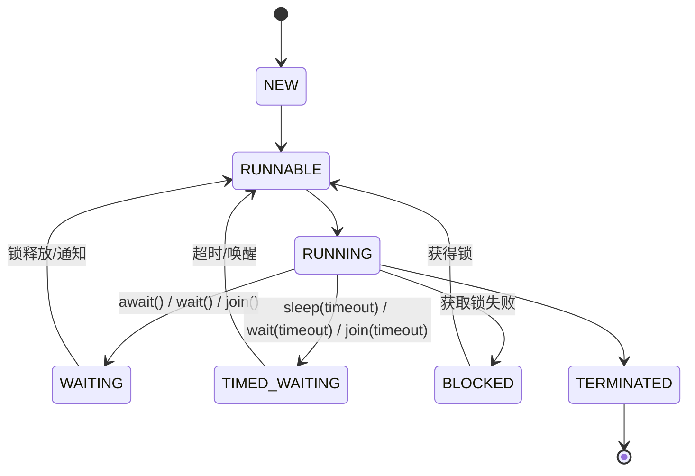
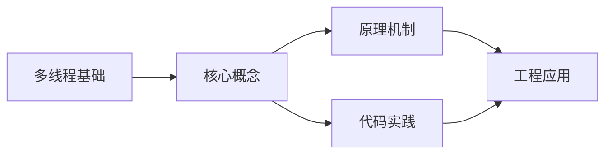
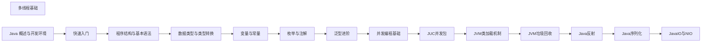

## 1. 学习目标（Bloom 分类）

本节按照布鲁姆教育目标分类学组织学习路径。本文主题为《多线程基础》，属于 Java 模块，读者可以根据自身阶段选择阅读深度。

记忆层面：能够准确复述本文的核心概念、术语与基本语法或操作步骤，并能够在提问或检索时快速定位对应知识点。能够说出 Java 的编译执行模型（javac 到字节码，JVM 解释与 JIT）。

理解层面：能够用自己的语言解释核心原理与工作机制，说明概念之间的因果关系，而不是机械记忆结论。能够解释面向对象三大特性与 JVM 内存区域的职责。

应用层面：能够在真实项目或练习场景中运用本文知识解决具体问题，写出正确且可维护的实现。能够编写类、接口、集合操作与异常处理的完整程序。

分析层面：能够拆解复杂问题，比较本文主题与相邻概念的异同，识别边界条件与例外情况。能够分析 Java 与 C++、Go 在内存管理与并发模型上的差异。

评价层面：能够根据约束条件（性能、可读性、安全、成本）评价不同方案的优劣，做出有依据的技术决策。能够评价不同集合、并发工具与框架的适用场景。

创造层面：能够把本文知识与其他模块知识组合，设计出新的解决方案或可复用的工程模式。能够组合 Spring 生态设计企业级应用。

通过本节学习，读者应当能够把《多线程基础》纳入自己的知识网络，并与 Java 模块的其他主题（JVM、集合框架、并发、Spring 生态）建立关联。

## 2. 历史动机与发展脉络

《多线程基础》是 Java 领域的重要主题。要真正理解它，需要先了解它解决的问题与演进过程。

Java 由 James Gosling 领导的 Sun 团队于 1995 年发布，口号“一次编写，到处运行”依托 JVM 字节码实现跨平台。2006 年 Sun 将 Java 开源（OpenJDK），2010 年 Oracle 收购 Sun 后 Java 进入新的治理阶段。
Java 的版本节奏在 2017 年后改为每半年一个特性版本、每两年一个 LTS（长期支持）版本。当前主流 LTS 包括 Java 11、17、21 与 25；Java 21 引入虚拟线程（Project Loom 成果），显著降低高并发服务的线程成本。
Java 生态以 Spring 家族为核心：Spring Boot 简化配置与部署，Spring Cloud 提供微服务组件；构建工具从 Maven 演进到 Gradle；JVM 语言（Kotlin、Scala、Groovy）与 Java 共存互操作。
Android 开发早期使用 Java，2019 年后官方转向 Kotlin-first，但 Java 仍是服务端领域（尤其是金融、电商等企业系统）的中坚力量。

回到本文主题：多线程基础 的提出与成熟，正是上述技术背景下的必然产物。早期实现往往以简单可用为目标，随着工程规模扩大，社区逐渐沉淀出标准做法与最佳实践；理解这一脉络，可以帮助读者判断“为什么文档中的推荐写法是现在这个样子”，也能在遇到历史遗留代码时准确识别其设计年代与取舍。

理解 Java 版本与 LTS 机制，是工程选型的起点：生产环境优先 LTS，新特性（如虚拟线程）可以在受控场景评估后引入。

## 3. 形式化定义与核心概念精讲

本节把《多线程基础》涉及的核心概念以“定义 + 讲解”的形式展开。读者应把定义当作工具，把讲解当作理解路径；两者结合才能形成可迁移的知识。

JVM 与字节码：`javac` 把 .java 编译为 .class 字节码，JVM 加载、校验并执行；热点代码由 JIT（如 C2）编译为机器码，解释与编译结合实现启动速度与峰值性能的平衡。
面向对象：封装（访问控制）、继承（extends/implements）与多态（重载/重写）是 Java 的类型系统支柱；接口默认方法（Java 8）与密封类（Java 17）持续演进表达能力。
异常体系：受检异常（checked）编译期强制处理，非受检异常（RuntimeException）运行时抛出；try-with-resources 自动关闭资源。
泛型与擦除：Java 泛型在编译期检查后擦除类型参数，运行时无泛型信息；这解释了 `List<String>` 与 `List<Integer>` 的 Class 相同，以及通配符 `? extends` 的逆变协变规则。

### 3.1 原文章节逐一精讲

原文档把主题拆分为 24 个小节，下面按顺序给出每一节的导读讲解，随后保留原文细节供精读。

#### 原文精读（完整保留）

# Java 多线程基础

> **符号约定**：`< >` 必填参数 | `[ ]` 可选参数

---

#### 1. 线程概念 (Threads)

##### 1.1 进程与线程

- **进程**: 操作系统分配资源的最小单位，拥有独立的内存空间
- **线程**: 进程内部的执行流，共享进程的内存空间，是 CPU 调度的最小单位
- **多线程的优势**: 提高程序响应速度，充分利用 CPU 资源，简化程序结构

##### 1.2 Java 中的线程

- **Thread 类**: 表示线程的类
- **Runnable 接口**: 定义线程执行体的接口
- **Callable 接口**: 可以返回结果和抛出异常的接口

#### 2. 线程创建方式 (Creation)

##### 2.1 继承 Thread 类

```java
 class MyThread extends Thread {
  @Override
  public void run() {
  for (int i = 0; i < 10; i++) {
  System.out.println(Thread.currentThread().getName() + ": " + i);
  try {
  Thread.sleep(100);
  } catch (InterruptedException e) {
  e.printStackTrace();
  }
  }
  }
 }
 // 使用
 MyThread thread1 = new MyThread();
 MyThread thread2 = new MyThread();
 thread1.start();
 thread2.start();
```

##### 2.2 实现 Runnable 接口

```java
 class MyRunnable implements Runnable {
  @Override
  public void run() {
  for (int i = 0; i < 10; i++) {
  System.out.println(Thread.currentThread().getName() + ": " + i);
  try {
  Thread.sleep(100);
  } catch (InterruptedException e) {
  e.printStackTrace();
  }
  }
  }
 }
 // 使用
 Runnable runnable = new MyRunnable();
 Thread thread1 = new Thread(runnable, "Thread-1");
 Thread thread2 = new Thread(runnable, "Thread-2");
 thread1.start();
 thread2.start();
```

##### 2.3 实现 Callable 接口

```java
 class MyCallable implements Callable<Integer> {
  @Override
  public Integer call() throws Exception {
  int sum = 0;
  for (int i = 1; i <= 100; i++) {
  sum += i;
  }
  return sum;
  }
 }
 // 使用
 Callable<Integer> callable = new MyCallable();
 FutureTask<Integer> futureTask = new FutureTask<>(callable);
 Thread thread = new Thread(futureTask);
 thread.start();
 try {
  // 获取结果
  Integer result = futureTask.get();
  System.out.println("Sum: " + result);
 }
  e.printStackTrace();
 }
```

##### 2.4 使用 Lambda 表达式

```java
 // 使用 Lambda 表达式创建线程
 Thread thread1 = new Thread(() -> {
  for (int i = 0; i < 10; i++) {
  System.out.println(Thread.currentThread().getName() + ": " + i);
  try {
  Thread.sleep(100);
  } catch (InterruptedException e) {
  e.printStackTrace();
  }
  }
 }
 thread1.start();
```

#### 3. 线程生命周期 (Lifecycle)

##### 3.1 线程状态

Java 线程有 6 种状态，定义在 `Thread.State` 枚举中：

1. **新建 (NEW)**: 线程被创建但尚未启动
2. **可运行 (RUNNABLE)**: 线程正在 JVM 中运行或等待 CPU 执行权
3. **阻塞 (BLOCKED)**: 线程等待获取锁
4. **等待 (WAITING)**: 线程无限期等待其他线程的通知
5. **超时等待 (TIMED_WAITING)**: 线程在指定时间内等待
6. **终止 (TERMINATED)**: 线程执行完成

##### 3.2 状态转换图



##### 3.3 状态转换方法

- **NEW → RUNNABLE**: `start()`
- **RUNNABLE → BLOCKED**: 获取锁失败
- **RUNNABLE → WAITING**: `wait()`, `join()`, `LockSupport.park()`
- **RUNNABLE → TIMED_WAITING**: `sleep(time)`, `wait(time)`, `join(time)`, `LockSupport.parkNanos()`, `LockSupport.parkUntil()`
- **BLOCKED → RUNNABLE**: 获取锁成功
- **WAITING → RUNNABLE**: 被其他线程唤醒
- **TIMED_WAITING → RUNNABLE**: 超时或被其他线程唤醒
- **RUNNABLE → TERMINATED**: `run()` 方法执行完成

#### 4. 线程同步 (Synchronization)

##### 4.1 线程安全问题

- **并发访问共享资源**时可能导致的数据不一致问题
- **示例**: 多线程同时操作同一个计数器

##### 4.2 synchronized 关键字

###### 4.2.1 同步方法

```java
 public synchronized void increment() {
  count++;
 }
```

###### 4.2.2 同步代码块

```java
 synchronized (this) {
  count++;
 }
```

###### 4.2.3 静态同步方法

```java
 public static synchronized void increment() {
  staticCount++;
 }
```

##### 4.3 volatile 关键字

- **保证可见性**: 一个线程对变量的修改对其他线程立即可见
- **保证有序性**: 禁止指令重排序
- **不保证原子性**: 适合于状态标记或双重检查锁定

```java
 private volatile boolean flag = false;
 public void setFlag(boolean flag) {
  this.flag = flag; // 对其他线程可见
 }
 public boolean getFlag() {
  return flag; // 读取最新值
 }
```

##### 4.4 Lock 接口

###### 4.4.1 ReentrantLock

```java
 private final Lock lock = new ReentrantLock();
 public void increment() {
  lock.lock();
  try {
  count++;
  } finally {
  lock.unlock(); // 必须在 finally 中释放锁
  }
 }
```

###### 4.4.2 ReentrantReadWriteLock

- **读锁**: 多个线程可以同时获取
- **写锁**: 只能有一个线程获取

```java
 private final ReadWriteLock rwLock = new ReentrantReadWriteLock();
 private final Lock readLock = rwLock.readLock();
 private final Lock writeLock = rwLock.writeLock();
 public void read() {
  readLock.lock();
  try {
  // 读取操作
  } finally {
  readLock.unlock();
  }
 }
 public void write() {
  writeLock.lock();
  try {
  // 写入操作
  } finally {
  writeLock.unlock();
  }
 }
```

##### 4.5 原子类

- **java.util.concurrent.atomic 包**提供的原子操作类
- **保证原子性**，无需使用锁

```java
 private AtomicInteger count = new AtomicInteger(0);
 public void increment() {
  count.incrementAndGet(); // 原子操作
 }
 public int getCount() {
  return count.get();
 }
```

#### 5. 线程池 (Thread Pools)

##### 5.1 线程池的优势

- **减少线程创建和销毁的开销**
- **控制最大并发数**，避免资源耗尽
- **提高线程的可管理性**
- **提供任务队列**，实现任务的缓冲

##### 5.2 Executor 框架

- **Executor**: 执行任务的接口
- **ExecutorService**: 扩展了 Executor，提供了生命周期管理
- **ScheduledExecutorService**: 支持定时和周期性任务

##### 5.3 线程池的创建

###### 5.3.1 使用 Executors 工厂方法

- **newFixedThreadPool(int nThreads)**: 创建固定大小的线程池
- **newCachedThreadPool()**: 创建可缓存的线程池
- **newSingleThreadExecutor()**: 创建单线程的线程池
- **newScheduledThreadPool(int corePoolSize)**: 创建支持定时和周期性任务的线程池

```java
 // 创建固定大小的线程池
 ExecutorService executorService = Executors.newFixedThreadPool(5);
 // 提交任务
 for (int i = 0; i < 10; i++) {
  final int taskId = i;
  executorService.submit(() -> {
  System.out.println("Task " + taskId + " executed by " + Thread.currentThread().getName());
  try {
  Thread.sleep(1000);
  } catch (InterruptedException e) {
  e.printStackTrace();
  }
  });
 }
 // 关闭线程池
 executorService.shutdown();
```

###### 5.3.2 自定义线程池

使用 `ThreadPoolExecutor` 构造函数自定义线程池参数。

```java
 ThreadPoolExecutor executor = new ThreadPoolExecutor(
  5, // 核心线程数
  10, // 最大线程数
  60L, // 空闲线程存活时间
  TimeUnit.SECONDS, // 时间单位
  new LinkedBlockingQueue<>(100), // 工作队列
  Executors.defaultThreadFactory(), // 线程工厂
  new ThreadPoolExecutor.AbortPolicy() // 拒绝策略
 )
```

##### 5.4 线程池的参数

- **corePoolSize**: 核心线程数
- **maximumPoolSize**: 最大线程数
- **keepAliveTime**: 空闲线程存活时间
- **unit**: 时间单位
- **workQueue**: 工作队列
- **threadFactory**: 线程工厂
- **handler**: 拒绝策略

##### 5.5 拒绝策略

- **AbortPolicy**: 直接抛出异常
- **CallerRunsPolicy**: 由调用线程执行任务
- **DiscardPolicy**: 丢弃任务
- **DiscardOldestPolicy**: 丢弃最旧的任务

#### 6. 并发工具类

##### 6.1 CountDownLatch

- **倒计时门闩**，等待一组线程完成

```java
 CountDownLatch latch = new CountDownLatch(3);
 for (int i = 0; i < 3; i++) {
  new Thread(() -> {
  System.out.println(Thread.currentThread().getName() + " is working");
  try {
  Thread.sleep(1000);
  } catch (InterruptedException e) {
  e.printStackTrace();
  }
  latch.countDown(); // 倒计时减1
  System.out.println(Thread.currentThread().getName() + " finished");
  }).start();
 }
 System.out.println("Waiting for all threads to finish...");
 latch.await(); // 等待倒计时为0
 System.out.println("All threads have finished");
```

##### 6.2 CyclicBarrier

- **循环栅栏**，等待一组线程达到屏障

```java
 CyclicBarrier barrier = new CyclicBarrier(3, () -> {
  System.out.println("All threads have reached the barrier");
 }
 for (int i = 0; i < 3; i++) {
  new Thread(() -> {
  System.out.println(Thread.currentThread().getName() + " is working");
  try {
  Thread.sleep(1000);
  System.out.println(Thread.currentThread().getName() + " is waiting at the barrier");
  barrier.await(); // 等待其他线程
  System.out.println(Thread.currentThread().getName() + " continues");
  } catch (Exception e) {
  e.printStackTrace();
  }
  }).start();
 }
```

##### 6.3 Semaphore

- **信号量**，控制同时访问资源的线程数

```java
 Semaphore semaphore = new Semaphore(2); // 最多2个线程同时访问
 for (int i = 0; i < 5; i++) {
  new Thread(() -> {
  try {
  semaphore.acquire(); // 获取许可
  System.out.println(Thread.currentThread().getName() + " acquired the semaphore");
  Thread.sleep(2000);
  } catch (InterruptedException e) {
  e.printStackTrace();
  } finally {
  semaphore.release(); // 释放许可
  System.out.println(Thread.currentThread().getName() + " released the semaphore");
  }
  }).start();
 }
```

##### 6.4 Future 和 CompletableFuture

- **Future**: 表示异步计算的结果
- **CompletableFuture**: 提供了更丰富的异步操作 API

```java
 // 使用 CompletableFuture
 CompletableFuture.supplyAsync(() -> {
  System.out.println("Task executed in thread: " + Thread.currentThread().getName());
  try {
  Thread.sleep(1000);
  } catch (InterruptedException e) {
  e.printStackTrace();
  }
  return "Hello, CompletableFuture!";
 }
  System.out.println("Result: " + result);
 }
  ex.printStackTrace();
  return "Error occurred";
 }
 System.out.println("Main thread continues");
 // 等待异步任务完成
 try {
  Thread.sleep(2000);
 }
  e.printStackTrace();
 }
```

#### 7. 线程安全集合

##### 7.1 并发集合

- **ConcurrentHashMap**: 线程安全的 HashMap
- **CopyOnWriteArrayList**: 读多写少场景的线程安全列表
- **CopyOnWriteArraySet**: 基于 CopyOnWriteArrayList 的线程安全集合
- **ConcurrentLinkedQueue**: 无界线程安全队列
- **BlockingQueue**: 阻塞队列接口，如 ArrayBlockingQueue, LinkedBlockingQueue

##### 7.2 同步集合

- 通过 `Collections.synchronizedXXX()` 创建的线程安全集合
- 方法级同步，性能较低

#### 8. 线程间通信

##### 8.1 wait() 和 notify()/notifyAll()

```java
 class SharedResource {
  private boolean available = false;
  private int data;
  public synchronized void produce(int value) {
  while (available) {
  try {
  wait(); // 等待消费者消费
  } catch (InterruptedException e) {
  e.printStackTrace();
  }
  }
  data = value;
  available = true;
  System.out.println("Produced: " + data);
  notifyAll(); // 通知消费者
  }
  public synchronized int consume() {
  while (!available) {
  try {
  wait(); // 等待生产者生产
  } catch (InterruptedException e) {
  e.printStackTrace();
  }
  }
  available = false;
  System.out.println("Consumed: " + data);
  notifyAll(); // 通知生产者
  return data;
  }
 }
```

##### 8.2 Condition

- **更灵活的线程间通信方式**
- **与 Lock 配合使用**

```java
 class BoundedBuffer {
  private final Lock lock = new ReentrantLock();
  private final Condition notFull = lock.newCondition();
  private final Condition notEmpty = lock.newCondition();
  private final Object[] buffer;
  private int count, putIndex, takeIndex;
  public BoundedBuffer(int size) {
  buffer = new Object[size];
  }
  public void put(Object item) throws InterruptedException {
  lock.lock();
  try {
  while (count == buffer.length) {
  notFull.await(); // 缓冲区满，等待
  }
  buffer[putIndex] = item;
  if (++putIndex == buffer.length) putIndex = 0;
  count++;
  notEmpty.signal(); // 通知消费者
  } finally {
  lock.unlock();
  }
  }
  public Object take() throws InterruptedException {
  lock.lock();
  try {
  while (count == 0) {
  notEmpty.await(); // 缓冲区空，等待
  }
  Object item = buffer[takeIndex];
  if (++takeIndex == buffer.length) takeIndex = 0;
  count--;
  notFull.signal(); // 通知生产者
  return item;
  } finally {
  lock.unlock();
  }
  }
 }
```

#### 9. 实际应用案例

##### 9.1 生产者-消费者模式

```java
 public class ProducerConsumerExample {
  public static void main(String[] args) {
  BlockingQueue<Integer> queue = new ArrayBlockingQueue<>(10);
  // 生产者线程
  Runnable producer = () -> {
  try {
  for (int i = 0; i < 20; i++) {
  queue.put(i);
  System.out.println("Produced: " + i);
  Thread.sleep(100);
  }
  } catch (InterruptedException e) {
  e.printStackTrace();
  }
  };
  // 消费者线程
  Runnable consumer = () -> {
  try {
  for (int i = 0; i < 20; i++) {
  int value = queue.take();
  System.out.println("Consumed: " + value);
  Thread.sleep(200);
  }
  } catch (InterruptedException e) {
  e.printStackTrace();
  }
  };
  new Thread(producer).start();
  new Thread(consumer).start();
  }
 }
```

##### 9.2 线程池的使用

```java
 public class ThreadPoolExample {
  public static void main(String[] args) {
  // 创建线程池
  ExecutorService executorService = Executors.newFixedThreadPool(5);
  // 提交任务
  List<Future<Integer>> futures = new ArrayList<>();
  for (int i = 0; i < 10; i++) {
  final int taskId = i;
  Future<Integer> future = executorService.submit(() -> {
  System.out.println("Task " + taskId + " started");
  Thread.sleep(1000);
  System.out.println("Task " + taskId + " completed");
  return taskId * 10;
  });
  futures.add(future);
  }
  // 获取结果
  for (int i = 0; i < futures.size(); i++) {
  try {
  Integer result = futures.get(i).get();
  System.out.println("Result of task " + i + ": " + result);
  } catch (Exception e) {
  e.printStackTrace();
  }
  }
  // 关闭线程池
  executorService.shutdown();
  }
 }
```

##### 9.3 并行计算

```java
 public class ParallelComputationExample {
  public static void main(String[] args) {
  int[] numbers = new int[1000000];
  for (int i = 0; i < numbers.length; i++) {
  numbers[i] = i + 1;
  }
  // 并行计算总和
  long startTime = System.currentTimeMillis();
  int sum = Arrays.stream(numbers).parallel().sum();
  long endTime = System.currentTimeMillis();
  System.out.println("Sum: " + sum);
  System.out.println("Time taken: " + (endTime - startTime) + " ms");
  }
 }
```

#### 10. 线程安全问题

##### 10.1 常见的线程安全问题

- **竞态条件**: 多个线程同时访问共享资源导致数据不一致
- **死锁**: 两个或多个线程互相等待对方释放资源
- **活锁**: 线程不断尝试但始终无法获得资源
- **饥饿**: 某些线程长期无法获得 CPU 执行权

##### 10.2 死锁示例

```java
 class DeadlockExample {
  private static final Object lock1 = new Object();
  private static final Object lock2 = new Object();
  public static void main(String[] args) {
  // 线程1: 先获取 lock1，再获取 lock2
  new Thread(() -> {
  synchronized (lock1) {
  System.out.println("Thread 1 acquired lock1");
  try {
  Thread.sleep(100);
  } catch (InterruptedException e) {
  e.printStackTrace();
  }
  synchronized (lock2) {
  System.out.println("Thread 1 acquired lock2");
  }
  }
  }).start();
  // 线程2: 先获取 lock2，再获取 lock1
  new Thread(() -> {
  synchronized (lock2) {
  System.out.println("Thread 2 acquired lock2");
  try {
  Thread.sleep(100);
  } catch (InterruptedException e) {
  e.printStackTrace();
  }
  synchronized (lock1) {
  System.out.println("Thread 2 acquired lock1");
  }
  }
  }).start();
  }
 }
```

##### 10.3 避免死锁的方法

- **按顺序获取锁**
- **使用定时锁** (`tryLock()`)
- **使用 Lock 替代 synchronized**
- **减少锁的范围**
- **使用无锁数据结构**

#### 11. 最佳实践

##### 11.1 线程创建与管理

- **优先使用线程池**而非直接创建线程
- **合理设置线程池参数**
- **使用 ExecutorService 管理线程生命周期**
- **避免创建过多线程**

##### 11.2 线程同步

- **优先使用 synchronized** 关键字，简单易用
- **复杂场景使用 Lock** 接口
- **使用原子类**处理简单的原子操作
- **最小化同步范围**
- **避免在同步块中执行耗时操作**

##### 11.3 线程安全

- **使用线程安全的集合**
- **避免共享可变状态**
- **使用不可变对象**
- **合理使用 volatile**
- **考虑使用并发工具类**

##### 11.4 性能优化

- **减少线程上下文切换**
- **避免线程阻塞**
- **使用适当的并发级别**
- **考虑使用无锁算法**
- **合理使用缓存**

#### 12. 常见陷阱

##### 12.1 线程启动错误

- **调用 run() 而不是 start()**
- **多次调用 start()**

##### 12.2 线程安全陷阱

- **忘记释放锁**
- **死锁**
- **过度同步**
- **不正确的 volatile 使用**

##### 12.3 线程池陷阱

- **线程池参数设置不合理**
- **忘记关闭线程池**
- **任务队列过大**
- **拒绝策略选择不当**

##### 12.4 内存可见性问题

- **共享变量未使用 volatile**
- **非线程安全的单例模式**

---

#### 创建线程

**基本写法：继承 Thread**
`class <类> extends Thread { public void run() {} }`
```java
// 继承 Thread 创建线程
class MyThread extends Thread {
    public void run() { System.out.println("running"); }
}
new MyThread().start();
```

---

**基本写法：实现 Runnable**
`new Thread(<Runnable>).start();`
```java
// 实现 Runnable 接口
new Thread(() -> System.out.println("running")).start();
```

---

**基本写法：实现 Callable**
`class <类> implements Callable<<类型>> { public <类型> call() {} }`
```java
// 带返回值的任务
Callable<Integer> task = () -> 42;
Future<Integer> f = Executors.newSingleThreadExecutor().submit(task);
```

---

#### 线程基本操作

**基本写法：启动线程**
`<thread>.start();`
```java
// 启动线程执行 run
thread.start();
```

---

**基本写法：等待线程结束**
`<thread>.join();`
```java
// 阻塞当前线程直到目标结束
thread.join();
```

---

**基本写法：超时等待**
`<thread>.join(<毫秒>);`
```java
// 最多等待 1000 毫秒
thread.join(1000);
```

---

**基本写法：休眠**
`Thread.sleep(<毫秒>);`
```java
// 当前线程休眠 500 毫秒
Thread.sleep(500);
```

---

**基本写法：让出 CPU**
`Thread.yield();`
```java
// 提示调度器让出 CPU
Thread.yield();
```

---

#### 线程状态

**基本写法：获取状态**
`<thread>.getState();`
```java
// 获取线程状态枚举
Thread.State s = thread.getState();
```

---

**基本写法：判断存活**
`<thread>.isAlive();`
```java
// 判断线程是否存活
boolean alive = thread.isAlive();
```

---

**基本写法：判断中断**
`<thread>.isInterrupted();`
```java
// 判断线程是否被中断
boolean i = thread.isInterrupted();
```

---

#### 中断机制

**基本写法：请求中断**
`<thread>.interrupt();`
```java
// 设置线程中断标志
thread.interrupt();
```

---

**基本写法：检测中断并清除标志**
`Thread.interrupted();`
```java
// 静态方法检测并清除当前线程中断
boolean i = Thread.interrupted();
```

---

**基本写法：响应中断**
`if (Thread.currentThread().isInterrupted()) break;`
```java
// 循环中检测中断
while (!Thread.currentThread().isInterrupted()) {
    doWork();
}
```

---

#### synchronized 同步

**基本写法：同步方法**
`public synchronized <返回> <方法>() {}`
```java
// 整个方法同步
public synchronized void inc() { count++; }
```

---

**基本写法：同步代码块**
`synchronized (<对象>) { }`
```java
// 同步代码块减少锁范围
synchronized (this) { count++; }
```

---

**基本写法：同步静态方法**
`public static synchronized <返回> <方法>() {}`
```java
// 静态方法锁 Class 对象
public static synchronized void inc() { total++; }
```

---

**基本写法：同步任意锁对象**
`private final Object <锁> = new Object();`
```java
// 使用私有锁对象
private final Object lock = new Object();
synchronized (lock) { count++; }
```

---

#### volatile 关键字

**基本写法：声明 volatile 字段**
`private volatile <类型> <字段>;`
```java
// 保证可见性但不保证原子性
private volatile boolean running = true;
```

---

#### wait / notify

**基本写法：等待**
`<对象>.wait();`
```java
// 释放锁并等待通知
synchronized (lock) {
    while (!ready) lock.wait();
}
```

---

**基本写法：通知一个**
`<对象>.notify();`
```java
// 唤醒一个等待线程
synchronized (lock) {
    ready = true;
    lock.notify();
}
```

---

**基本写法：通知所有**
`<对象>.notifyAll();`
```java
// 唤醒所有等待线程
synchronized (lock) {
    lock.notifyAll();
}
```

---

**基本写法：超时等待**
`<对象>.wait(<毫秒>);`
```java
// 最多等待 1000 毫秒
lock.wait(1000);
```

---

#### 线程优先级

**基本写法：设置优先级**
`<thread>.setPriority(<级别>);`
```java
// 设置线程优先级 1-10
thread.setPriority(Thread.MAX_PRIORITY);
```

---

**基本写法：守护线程**
`<thread>.setDaemon(true);`
```java
// 设置为守护线程（主线程退出即结束）
thread.setDaemon(true);
thread.start();
```

---

#### 线程异常处理

**基本写法：设置未捕获异常处理器**
`<thread>.setUncaughtExceptionHandler(<处理器>);`
```java
// 设置线程异常处理器
thread.setUncaughtExceptionHandler((t, e) -> {
    System.out.println(t.getName() + " " + e);
});
```

---

**基本写法：全局默认处理器**
`Thread.setDefaultUncaughtExceptionHandler(<处理器>);`
```java
// 设置全局默认异常处理器
Thread.setDefaultUncaughtExceptionHandler((t, e) -> log.error(e));
```

---

#### 线程工厂

**基本写法：自定义线程工厂**
`new ThreadFactory() { public Thread newThread(Runnable r) {} }`
```java
// 自定义线程创建
ThreadFactory factory = r -> {
    Thread t = new Thread(r);
    t.setName("worker-" + t.getId());
    t.setDaemon(true);
    return t;
};
```

---

#### 线程局部变量（简化版）

**基本写法：使用 ThreadLocal**
`ThreadLocal.<类型>withInitial(() -> <值>);`
```java
// 线程私有计数器
ThreadLocal<Integer> tl = ThreadLocal.withInitial(() -> 0);
```

---

#### Thread 类静态方法

**基本写法：获取当前线程**
`Thread.currentThread();`
```java
// 获取当前执行线程
Thread t = Thread.currentThread();
```

---

**基本写法：获取所有栈帧**
`Thread.getAllStackTraces();`
```java
// 获取所有活动线程的栈帧
Map<Thread, StackTraceElement[]> m = Thread.getAllStackTraces();
```

---

**基本写法：onSpinWait 提示**
`Thread.onSpinWait();`
```java
// Java 9+ 自旋等待提示优化
while (!ready) Thread.onSpinWait();
```


### 3.2 概念关系图

下面用 Mermaid 图表达本文核心概念之间的关系，帮助读者建立整体图景：



图中展示的是本文知识的结构化关系：核心概念是入口，原理机制解释“为什么”，代码实践演示“怎么做”，工程应用回答“何时用”。读者学习时可以把每个小节的内容挂接到对应节点上。

## 4. 理论推导与原理解析

本节深入《多线程基础》背后的原理。理论部分不求面面俱到，而是聚焦“能解释现象、能指导实践”的关键推导。

JVM 内存模型：堆（新生代/老年代）、元空间、虚拟机栈、本地方法栈与程序计数器；GC 从 CMS 演进到 G1（默认）、ZGC（超低延迟），理解分代收集是调优前提。
并发工具：synchronized 与 JUC（java.util.concurrent）的锁、并发容器、线程池、CompletableFuture 构成并发工具箱；Java 21 的虚拟线程让“每任务一线程”成为可能。
类加载机制：双亲委派模型保证类唯一性，SPI（ServiceLoader）打破委派实现扩展；自定义类加载器是热部署与隔离的基础。
反射与注解：反射在运行时检查类结构，注解提供元数据；Spring 的依赖注入与 AOP 均基于这些机制，但反射有性能与安全成本。

需要强调的是，理论推导与工程实践之间存在翻译层：理论给出的是理想化模型与边界条件，工程代码则必须处理真实环境中的例外。读者在学习时应先掌握理论的“标准情形”，再通过陷阱章节了解“非标准情形”。

## 5. 代码示例与逐行讲解

本节把原文中的代码示例系统整理，并为每个示例补充用途说明与讲解。读者不应只浏览代码，而应逐段对照讲解理解设计意图。

### 5.1 示例：2.1 继承 Thread 类

该示例来自原文《2.1 继承 Thread 类》小节，用于演示多线程基础相关操作。阅读时请先看代码结构，再看其后的讲解。

```java
 class MyThread extends Thread {
  @Override
  public void run() {
  for (int i = 0; i < 10; i++) {
  System.out.println(Thread.currentThread().getName() + ": " + i);
  try {
  Thread.sleep(100);
  } catch (InterruptedException e) {
  e.printStackTrace();
  }
  }
  }
 }
 // 使用
 MyThread thread1 = new MyThread();
 MyThread thread2 = new MyThread();
 thread1.start();
 thread2.start();
```

讲解：这段代码演示了本节核心知识点。代码中的关键操作可以归纳为三步：准备（定义或初始化）、执行（核心逻辑）、收尾（释放资源或返回结果）。实际项目中，这三步往往被封装为函数或类，以提升复用性与可测试性。

关键点分析：

该示例共 18 行有效代码，包含 2 类关键结构（class、for）。其中：

- 入口与初始化部分负责建立上下文，对应实际项目中的启动或装配逻辑；
- 核心逻辑部分体现本文主题的主要操作，是阅读时最需要对照讲解理解的部分；
- 输出或返回部分把结果交给调用方，注意其类型与边界条件。

进阶思考路径：先尝试修改参数观察行为变化，再把示例中的模式迁移到自己的项目中；每次修改都记录预期与实测差异，这是把示例转化为能力的最快方式。

### 5.2 示例：2.2 实现 Runnable 接口

该示例来自原文《2.2 实现 Runnable 接口》小节，用于演示多线程基础相关操作。阅读时请先看代码结构，再看其后的讲解。

```java
 class MyRunnable implements Runnable {
  @Override
  public void run() {
  for (int i = 0; i < 10; i++) {
  System.out.println(Thread.currentThread().getName() + ": " + i);
  try {
  Thread.sleep(100);
  } catch (InterruptedException e) {
  e.printStackTrace();
  }
  }
  }
 }
 // 使用
 Runnable runnable = new MyRunnable();
 Thread thread1 = new Thread(runnable, "Thread-1");
 Thread thread2 = new Thread(runnable, "Thread-2");
 thread1.start();
 thread2.start();
```

讲解：这段代码演示了本节核心知识点。代码中的关键操作可以归纳为三步：准备（定义或初始化）、执行（核心逻辑）、收尾（释放资源或返回结果）。实际项目中，这三步往往被封装为函数或类，以提升复用性与可测试性。

关键点分析：

该示例共 19 行有效代码，包含 2 类关键结构（class、for）。其中：

- 入口与初始化部分负责建立上下文，对应实际项目中的启动或装配逻辑；
- 核心逻辑部分体现本文主题的主要操作，是阅读时最需要对照讲解理解的部分；
- 输出或返回部分把结果交给调用方，注意其类型与边界条件。

进阶思考路径：先尝试修改参数观察行为变化，再把示例中的模式迁移到自己的项目中；每次修改都记录预期与实测差异，这是把示例转化为能力的最快方式。

### 5.3 示例：2.3 实现 Callable 接口

该示例来自原文《2.3 实现 Callable 接口》小节，用于演示多线程基础相关操作。阅读时请先看代码结构，再看其后的讲解。

```java
 class MyCallable implements Callable<Integer> {
  @Override
  public Integer call() throws Exception {
  int sum = 0;
  for (int i = 1; i <= 100; i++) {
  sum += i;
  }
  return sum;
  }
 }
 // 使用
 Callable<Integer> callable = new MyCallable();
 FutureTask<Integer> futureTask = new FutureTask<>(callable);
 Thread thread = new Thread(futureTask);
 thread.start();
 try {
  // 获取结果
  Integer result = futureTask.get();
  System.out.println("Sum: " + result);
 }
  e.printStackTrace();
 }
```

讲解：这段代码演示了本节核心知识点。代码中的关键操作可以归纳为三步：准备（定义或初始化）、执行（核心逻辑）、收尾（释放资源或返回结果）。实际项目中，这三步往往被封装为函数或类，以提升复用性与可测试性。

关键点分析：

该示例共 22 行有效代码，包含 3 类关键结构（class、for、return）。其中：

- 入口与初始化部分负责建立上下文，对应实际项目中的启动或装配逻辑；
- 核心逻辑部分体现本文主题的主要操作，是阅读时最需要对照讲解理解的部分；
- 输出或返回部分把结果交给调用方，注意其类型与边界条件。

进阶思考路径：先尝试修改参数观察行为变化，再把示例中的模式迁移到自己的项目中；每次修改都记录预期与实测差异，这是把示例转化为能力的最快方式。

### 5.4 示例：2.4 使用 Lambda 表达式

该示例来自原文《2.4 使用 Lambda 表达式》小节，用于演示多线程基础相关操作。阅读时请先看代码结构，再看其后的讲解。

```java
 // 使用 Lambda 表达式创建线程
 Thread thread1 = new Thread(() -> {
  for (int i = 0; i < 10; i++) {
  System.out.println(Thread.currentThread().getName() + ": " + i);
  try {
  Thread.sleep(100);
  } catch (InterruptedException e) {
  e.printStackTrace();
  }
  }
 }
 thread1.start();
```

讲解：这段代码演示了本节核心知识点。代码中的关键操作可以归纳为三步：准备（定义或初始化）、执行（核心逻辑）、收尾（释放资源或返回结果）。实际项目中，这三步往往被封装为函数或类，以提升复用性与可测试性。

关键点分析：

该示例共 12 行有效代码，包含 1 类关键结构（for）。其中：

- 入口与初始化部分负责建立上下文，对应实际项目中的启动或装配逻辑；
- 核心逻辑部分体现本文主题的主要操作，是阅读时最需要对照讲解理解的部分；
- 输出或返回部分把结果交给调用方，注意其类型与边界条件。

进阶思考路径：先尝试修改参数观察行为变化，再把示例中的模式迁移到自己的项目中；每次修改都记录预期与实测差异，这是把示例转化为能力的最快方式。

### 5.5 示例：3.2 状态转换图

该示例来自原文《3.2 状态转换图》小节，用于演示多线程基础相关操作。阅读时请先看代码结构，再看其后的讲解。


讲解：这段代码演示了本节核心知识点。代码中的关键操作可以归纳为三步：准备（定义或初始化）、执行（核心逻辑）、收尾（释放资源或返回结果）。实际项目中，这三步往往被封装为函数或类，以提升复用性与可测试性。

关键点分析：

该示例共 12 行有效代码，结构以数据或配置为主。阅读时应关注：数据字段的含义、配置项的作用，以及它们与运行行为的对应关系。

进阶思考路径：先尝试修改参数观察行为变化，再把示例中的模式迁移到自己的项目中；每次修改都记录预期与实测差异，这是把示例转化为能力的最快方式。

### 5.6 示例：4.2.1 同步方法

该示例来自原文《4.2.1 同步方法》小节，用于演示多线程基础相关操作。阅读时请先看代码结构，再看其后的讲解。

```java
 public synchronized void increment() {
  count++;
 }
```

讲解：这段代码演示了本节核心知识点。代码中的关键操作可以归纳为三步：准备（定义或初始化）、执行（核心逻辑）、收尾（释放资源或返回结果）。实际项目中，这三步往往被封装为函数或类，以提升复用性与可测试性。

关键点分析：

该示例共 3 行有效代码，结构以数据或配置为主。阅读时应关注：数据字段的含义、配置项的作用，以及它们与运行行为的对应关系。

进阶思考路径：先尝试修改参数观察行为变化，再把示例中的模式迁移到自己的项目中；每次修改都记录预期与实测差异，这是把示例转化为能力的最快方式。

### 5.7 示例：4.2.2 同步代码块

该示例来自原文《4.2.2 同步代码块》小节，用于演示多线程基础相关操作。阅读时请先看代码结构，再看其后的讲解。

```java
 synchronized (this) {
  count++;
 }
```

讲解：这段代码演示了本节核心知识点。代码中的关键操作可以归纳为三步：准备（定义或初始化）、执行（核心逻辑）、收尾（释放资源或返回结果）。实际项目中，这三步往往被封装为函数或类，以提升复用性与可测试性。

关键点分析：

该示例共 3 行有效代码，结构以数据或配置为主。阅读时应关注：数据字段的含义、配置项的作用，以及它们与运行行为的对应关系。

进阶思考路径：先尝试修改参数观察行为变化，再把示例中的模式迁移到自己的项目中；每次修改都记录预期与实测差异，这是把示例转化为能力的最快方式。

### 5.8 示例：4.2.3 静态同步方法

该示例来自原文《4.2.3 静态同步方法》小节，用于演示多线程基础相关操作。阅读时请先看代码结构，再看其后的讲解。

```java
 public static synchronized void increment() {
  staticCount++;
 }
```

讲解：这段代码演示了本节核心知识点。代码中的关键操作可以归纳为三步：准备（定义或初始化）、执行（核心逻辑）、收尾（释放资源或返回结果）。实际项目中，这三步往往被封装为函数或类，以提升复用性与可测试性。

关键点分析：

该示例共 3 行有效代码，结构以数据或配置为主。阅读时应关注：数据字段的含义、配置项的作用，以及它们与运行行为的对应关系。

进阶思考路径：先尝试修改参数观察行为变化，再把示例中的模式迁移到自己的项目中；每次修改都记录预期与实测差异，这是把示例转化为能力的最快方式。

### 5.9 示例：4.3 volatile 关键字

该示例来自原文《4.3 volatile 关键字》小节，用于演示多线程基础相关操作。阅读时请先看代码结构，再看其后的讲解。

```java
 private volatile boolean flag = false;
 public void setFlag(boolean flag) {
  this.flag = flag; // 对其他线程可见
 }
 public boolean getFlag() {
  return flag; // 读取最新值
 }
```

讲解：这段代码演示了本节核心知识点。代码中的关键操作可以归纳为三步：准备（定义或初始化）、执行（核心逻辑）、收尾（释放资源或返回结果）。实际项目中，这三步往往被封装为函数或类，以提升复用性与可测试性。

关键点分析：

该示例共 7 行有效代码，包含 1 类关键结构（return）。其中：

- 入口与初始化部分负责建立上下文，对应实际项目中的启动或装配逻辑；
- 核心逻辑部分体现本文主题的主要操作，是阅读时最需要对照讲解理解的部分；
- 输出或返回部分把结果交给调用方，注意其类型与边界条件。

进阶思考路径：先尝试修改参数观察行为变化，再把示例中的模式迁移到自己的项目中；每次修改都记录预期与实测差异，这是把示例转化为能力的最快方式。

### 5.10 示例：4.4.1 ReentrantLock

该示例来自原文《4.4.1 ReentrantLock》小节，用于演示多线程基础相关操作。阅读时请先看代码结构，再看其后的讲解。

```java
 private final Lock lock = new ReentrantLock();
 public void increment() {
  lock.lock();
  try {
  count++;
  } finally {
  lock.unlock(); // 必须在 finally 中释放锁
  }
 }
```

讲解：这段代码演示了本节核心知识点。代码中的关键操作可以归纳为三步：准备（定义或初始化）、执行（核心逻辑）、收尾（释放资源或返回结果）。实际项目中，这三步往往被封装为函数或类，以提升复用性与可测试性。

关键点分析：

该示例共 9 行有效代码，结构以数据或配置为主。阅读时应关注：数据字段的含义、配置项的作用，以及它们与运行行为的对应关系。

进阶思考路径：先尝试修改参数观察行为变化，再把示例中的模式迁移到自己的项目中；每次修改都记录预期与实测差异，这是把示例转化为能力的最快方式。

### 5.11 示例：4.4.2 ReentrantReadWriteLock

该示例来自原文《4.4.2 ReentrantReadWriteLock》小节，用于演示多线程基础相关操作。阅读时请先看代码结构，再看其后的讲解。

```java
 private final ReadWriteLock rwLock = new ReentrantReadWriteLock();
 private final Lock readLock = rwLock.readLock();
 private final Lock writeLock = rwLock.writeLock();
 public void read() {
  readLock.lock();
  try {
  // 读取操作
  } finally {
  readLock.unlock();
  }
 }
 public void write() {
  writeLock.lock();
  try {
  // 写入操作
  } finally {
  writeLock.unlock();
  }
 }
```

讲解：这段代码演示了本节核心知识点。代码中的关键操作可以归纳为三步：准备（定义或初始化）、执行（核心逻辑）、收尾（释放资源或返回结果）。实际项目中，这三步往往被封装为函数或类，以提升复用性与可测试性。

关键点分析：

该示例共 19 行有效代码，结构以数据或配置为主。阅读时应关注：数据字段的含义、配置项的作用，以及它们与运行行为的对应关系。

进阶思考路径：先尝试修改参数观察行为变化，再把示例中的模式迁移到自己的项目中；每次修改都记录预期与实测差异，这是把示例转化为能力的最快方式。

### 5.12 示例：4.5 原子类

该示例来自原文《4.5 原子类》小节，用于演示多线程基础相关操作。阅读时请先看代码结构，再看其后的讲解。

```java
 private AtomicInteger count = new AtomicInteger(0);
 public void increment() {
  count.incrementAndGet(); // 原子操作
 }
 public int getCount() {
  return count.get();
 }
```

讲解：这段代码演示了本节核心知识点。代码中的关键操作可以归纳为三步：准备（定义或初始化）、执行（核心逻辑）、收尾（释放资源或返回结果）。实际项目中，这三步往往被封装为函数或类，以提升复用性与可测试性。

关键点分析：

该示例共 7 行有效代码，包含 1 类关键结构（return）。其中：

- 入口与初始化部分负责建立上下文，对应实际项目中的启动或装配逻辑；
- 核心逻辑部分体现本文主题的主要操作，是阅读时最需要对照讲解理解的部分；
- 输出或返回部分把结果交给调用方，注意其类型与边界条件。

进阶思考路径：先尝试修改参数观察行为变化，再把示例中的模式迁移到自己的项目中；每次修改都记录预期与实测差异，这是把示例转化为能力的最快方式。

### 5.13 示例：5.3.1 使用 Executors 工厂方法

该示例来自原文《5.3.1 使用 Executors 工厂方法》小节，用于演示多线程基础相关操作。阅读时请先看代码结构，再看其后的讲解。

```java
 // 创建固定大小的线程池
 ExecutorService executorService = Executors.newFixedThreadPool(5);
 // 提交任务
 for (int i = 0; i < 10; i++) {
  final int taskId = i;
  executorService.submit(() -> {
  System.out.println("Task " + taskId + " executed by " + Thread.currentThread().getName());
  try {
  Thread.sleep(1000);
  } catch (InterruptedException e) {
  e.printStackTrace();
  }
  });
 }
 // 关闭线程池
 executorService.shutdown();
```

讲解：这段代码演示了本节核心知识点。代码中的关键操作可以归纳为三步：准备（定义或初始化）、执行（核心逻辑）、收尾（释放资源或返回结果）。实际项目中，这三步往往被封装为函数或类，以提升复用性与可测试性。

关键点分析：

该示例共 16 行有效代码，包含 1 类关键结构（for）。其中：

- 入口与初始化部分负责建立上下文，对应实际项目中的启动或装配逻辑；
- 核心逻辑部分体现本文主题的主要操作，是阅读时最需要对照讲解理解的部分；
- 输出或返回部分把结果交给调用方，注意其类型与边界条件。

进阶思考路径：先尝试修改参数观察行为变化，再把示例中的模式迁移到自己的项目中；每次修改都记录预期与实测差异，这是把示例转化为能力的最快方式。

### 5.14 示例：5.3.2 自定义线程池

该示例来自原文《5.3.2 自定义线程池》小节，用于演示多线程基础相关操作。阅读时请先看代码结构，再看其后的讲解。

```java
 ThreadPoolExecutor executor = new ThreadPoolExecutor(
  5, // 核心线程数
  10, // 最大线程数
  60L, // 空闲线程存活时间
  TimeUnit.SECONDS, // 时间单位
  new LinkedBlockingQueue<>(100), // 工作队列
  Executors.defaultThreadFactory(), // 线程工厂
  new ThreadPoolExecutor.AbortPolicy() // 拒绝策略
 )
```

讲解：这段代码演示了本节核心知识点。代码中的关键操作可以归纳为三步：准备（定义或初始化）、执行（核心逻辑）、收尾（释放资源或返回结果）。实际项目中，这三步往往被封装为函数或类，以提升复用性与可测试性。

关键点分析：

该示例共 9 行有效代码，结构以数据或配置为主。阅读时应关注：数据字段的含义、配置项的作用，以及它们与运行行为的对应关系。

进阶思考路径：先尝试修改参数观察行为变化，再把示例中的模式迁移到自己的项目中；每次修改都记录预期与实测差异，这是把示例转化为能力的最快方式。

### 5.15 示例：6.1 CountDownLatch

该示例来自原文《6.1 CountDownLatch》小节，用于演示多线程基础相关操作。阅读时请先看代码结构，再看其后的讲解。

```java
 CountDownLatch latch = new CountDownLatch(3);
 for (int i = 0; i < 3; i++) {
  new Thread(() -> {
  System.out.println(Thread.currentThread().getName() + " is working");
  try {
  Thread.sleep(1000);
  } catch (InterruptedException e) {
  e.printStackTrace();
  }
  latch.countDown(); // 倒计时减1
  System.out.println(Thread.currentThread().getName() + " finished");
  }).start();
 }
 System.out.println("Waiting for all threads to finish...");
 latch.await(); // 等待倒计时为0
 System.out.println("All threads have finished");
```

讲解：这段代码演示了本节核心知识点。代码中的关键操作可以归纳为三步：准备（定义或初始化）、执行（核心逻辑）、收尾（释放资源或返回结果）。实际项目中，这三步往往被封装为函数或类，以提升复用性与可测试性。

关键点分析：

该示例共 16 行有效代码，包含 1 类关键结构（for）。其中：

- 入口与初始化部分负责建立上下文，对应实际项目中的启动或装配逻辑；
- 核心逻辑部分体现本文主题的主要操作，是阅读时最需要对照讲解理解的部分；
- 输出或返回部分把结果交给调用方，注意其类型与边界条件。

进阶思考路径：先尝试修改参数观察行为变化，再把示例中的模式迁移到自己的项目中；每次修改都记录预期与实测差异，这是把示例转化为能力的最快方式。

### 5.16 示例：6.2 CyclicBarrier

该示例来自原文《6.2 CyclicBarrier》小节，用于演示多线程基础相关操作。阅读时请先看代码结构，再看其后的讲解。

```java
 CyclicBarrier barrier = new CyclicBarrier(3, () -> {
  System.out.println("All threads have reached the barrier");
 }
 for (int i = 0; i < 3; i++) {
  new Thread(() -> {
  System.out.println(Thread.currentThread().getName() + " is working");
  try {
  Thread.sleep(1000);
  System.out.println(Thread.currentThread().getName() + " is waiting at the barrier");
  barrier.await(); // 等待其他线程
  System.out.println(Thread.currentThread().getName() + " continues");
  } catch (Exception e) {
  e.printStackTrace();
  }
  }).start();
 }
```

讲解：这段代码演示了本节核心知识点。代码中的关键操作可以归纳为三步：准备（定义或初始化）、执行（核心逻辑）、收尾（释放资源或返回结果）。实际项目中，这三步往往被封装为函数或类，以提升复用性与可测试性。

关键点分析：

该示例共 16 行有效代码，包含 1 类关键结构（for）。其中：

- 入口与初始化部分负责建立上下文，对应实际项目中的启动或装配逻辑；
- 核心逻辑部分体现本文主题的主要操作，是阅读时最需要对照讲解理解的部分；
- 输出或返回部分把结果交给调用方，注意其类型与边界条件。

进阶思考路径：先尝试修改参数观察行为变化，再把示例中的模式迁移到自己的项目中；每次修改都记录预期与实测差异，这是把示例转化为能力的最快方式。

### 5.17 示例：6.3 Semaphore

该示例来自原文《6.3 Semaphore》小节，用于演示多线程基础相关操作。阅读时请先看代码结构，再看其后的讲解。

```java
 Semaphore semaphore = new Semaphore(2); // 最多2个线程同时访问
 for (int i = 0; i < 5; i++) {
  new Thread(() -> {
  try {
  semaphore.acquire(); // 获取许可
  System.out.println(Thread.currentThread().getName() + " acquired the semaphore");
  Thread.sleep(2000);
  } catch (InterruptedException e) {
  e.printStackTrace();
  } finally {
  semaphore.release(); // 释放许可
  System.out.println(Thread.currentThread().getName() + " released the semaphore");
  }
  }).start();
 }
```

讲解：这段代码演示了本节核心知识点。代码中的关键操作可以归纳为三步：准备（定义或初始化）、执行（核心逻辑）、收尾（释放资源或返回结果）。实际项目中，这三步往往被封装为函数或类，以提升复用性与可测试性。

关键点分析：

该示例共 15 行有效代码，包含 1 类关键结构（for）。其中：

- 入口与初始化部分负责建立上下文，对应实际项目中的启动或装配逻辑；
- 核心逻辑部分体现本文主题的主要操作，是阅读时最需要对照讲解理解的部分；
- 输出或返回部分把结果交给调用方，注意其类型与边界条件。

进阶思考路径：先尝试修改参数观察行为变化，再把示例中的模式迁移到自己的项目中；每次修改都记录预期与实测差异，这是把示例转化为能力的最快方式。

### 5.18 示例：6.4 Future 和 CompletableFuture

该示例来自原文《6.4 Future 和 CompletableFuture》小节，用于演示多线程基础相关操作。阅读时请先看代码结构，再看其后的讲解。

```java
 // 使用 CompletableFuture
 CompletableFuture.supplyAsync(() -> {
  System.out.println("Task executed in thread: " + Thread.currentThread().getName());
  try {
  Thread.sleep(1000);
  } catch (InterruptedException e) {
  e.printStackTrace();
  }
  return "Hello, CompletableFuture!";
 }
  System.out.println("Result: " + result);
 }
  ex.printStackTrace();
  return "Error occurred";
 }
 System.out.println("Main thread continues");
 // 等待异步任务完成
 try {
  Thread.sleep(2000);
 }
  e.printStackTrace();
 }
```

讲解：这段代码演示了本节核心知识点。代码中的关键操作可以归纳为三步：准备（定义或初始化）、执行（核心逻辑）、收尾（释放资源或返回结果）。实际项目中，这三步往往被封装为函数或类，以提升复用性与可测试性。

关键点分析：

该示例共 22 行有效代码，包含 1 类关键结构（return）。其中：

- 入口与初始化部分负责建立上下文，对应实际项目中的启动或装配逻辑；
- 核心逻辑部分体现本文主题的主要操作，是阅读时最需要对照讲解理解的部分；
- 输出或返回部分把结果交给调用方，注意其类型与边界条件。

进阶思考路径：先尝试修改参数观察行为变化，再把示例中的模式迁移到自己的项目中；每次修改都记录预期与实测差异，这是把示例转化为能力的最快方式。

### 5.19 示例：8.1 wait() 和 notify()/notifyAll()

该示例来自原文《8.1 wait() 和 notify()/notifyAll()》小节，用于演示多线程基础相关操作。阅读时请先看代码结构，再看其后的讲解。

```java
 class SharedResource {
  private boolean available = false;
  private int data;
  public synchronized void produce(int value) {
  while (available) {
  try {
  wait(); // 等待消费者消费
  } catch (InterruptedException e) {
  e.printStackTrace();
  }
  }
  data = value;
  available = true;
  System.out.println("Produced: " + data);
  notifyAll(); // 通知消费者
  }
  public synchronized int consume() {
  while (!available) {
  try {
  wait(); // 等待生产者生产
  } catch (InterruptedException e) {
  e.printStackTrace();
  }
  }
  available = false;
  System.out.println("Consumed: " + data);
  notifyAll(); // 通知生产者
  return data;
  }
 }
```

讲解：这段代码演示了本节核心知识点。代码中的关键操作可以归纳为三步：准备（定义或初始化）、执行（核心逻辑）、收尾（释放资源或返回结果）。实际项目中，这三步往往被封装为函数或类，以提升复用性与可测试性。

关键点分析：

该示例共 30 行有效代码，包含 3 类关键结构（class、while、return）。其中：

- 入口与初始化部分负责建立上下文，对应实际项目中的启动或装配逻辑；
- 核心逻辑部分体现本文主题的主要操作，是阅读时最需要对照讲解理解的部分；
- 输出或返回部分把结果交给调用方，注意其类型与边界条件。

进阶思考路径：先尝试修改参数观察行为变化，再把示例中的模式迁移到自己的项目中；每次修改都记录预期与实测差异，这是把示例转化为能力的最快方式。

### 5.20 示例：8.2 Condition

该示例来自原文《8.2 Condition》小节，用于演示多线程基础相关操作。阅读时请先看代码结构，再看其后的讲解。

```java
 class BoundedBuffer {
  private final Lock lock = new ReentrantLock();
  private final Condition notFull = lock.newCondition();
  private final Condition notEmpty = lock.newCondition();
  private final Object[] buffer;
  private int count, putIndex, takeIndex;
  public BoundedBuffer(int size) {
  buffer = new Object[size];
  }
  public void put(Object item) throws InterruptedException {
  lock.lock();
  try {
  while (count == buffer.length) {
  notFull.await(); // 缓冲区满，等待
  }
  buffer[putIndex] = item;
  if (++putIndex == buffer.length) putIndex = 0;
  count++;
  notEmpty.signal(); // 通知消费者
  } finally {
  lock.unlock();
  }
  }
  public Object take() throws InterruptedException {
  lock.lock();
  try {
  while (count == 0) {
  notEmpty.await(); // 缓冲区空，等待
  }
  Object item = buffer[takeIndex];
  if (++takeIndex == buffer.length) takeIndex = 0;
  count--;
  notFull.signal(); // 通知生产者
  return item;
  } finally {
  lock.unlock();
  }
  }
 }
```

讲解：这段代码演示了本节核心知识点。代码中的关键操作可以归纳为三步：准备（定义或初始化）、执行（核心逻辑）、收尾（释放资源或返回结果）。实际项目中，这三步往往被封装为函数或类，以提升复用性与可测试性。

关键点分析：

该示例共 39 行有效代码，包含 4 类关键结构（class、if、while、return）。其中：

- 入口与初始化部分负责建立上下文，对应实际项目中的启动或装配逻辑；
- 核心逻辑部分体现本文主题的主要操作，是阅读时最需要对照讲解理解的部分；
- 输出或返回部分把结果交给调用方，注意其类型与边界条件。

进阶思考路径：先尝试修改参数观察行为变化，再把示例中的模式迁移到自己的项目中；每次修改都记录预期与实测差异，这是把示例转化为能力的最快方式。

### 5.21 示例：9.1 生产者-消费者模式

该示例来自原文《9.1 生产者-消费者模式》小节，用于演示多线程基础相关操作。阅读时请先看代码结构，再看其后的讲解。

```java
 public class ProducerConsumerExample {
  public static void main(String[] args) {
  BlockingQueue<Integer> queue = new ArrayBlockingQueue<>(10);
  // 生产者线程
  Runnable producer = () -> {
  try {
  for (int i = 0; i < 20; i++) {
  queue.put(i);
  System.out.println("Produced: " + i);
  Thread.sleep(100);
  }
  } catch (InterruptedException e) {
  e.printStackTrace();
  }
  };
  // 消费者线程
  Runnable consumer = () -> {
  try {
  for (int i = 0; i < 20; i++) {
  int value = queue.take();
  System.out.println("Consumed: " + value);
  Thread.sleep(200);
  }
  } catch (InterruptedException e) {
  e.printStackTrace();
  }
  };
  new Thread(producer).start();
  new Thread(consumer).start();
  }
 }
```

讲解：这段代码演示了本节核心知识点。代码中的关键操作可以归纳为三步：准备（定义或初始化）、执行（核心逻辑）、收尾（释放资源或返回结果）。实际项目中，这三步往往被封装为函数或类，以提升复用性与可测试性。

关键点分析：

该示例共 31 行有效代码，包含 2 类关键结构（class、for）。其中：

- 入口与初始化部分负责建立上下文，对应实际项目中的启动或装配逻辑；
- 核心逻辑部分体现本文主题的主要操作，是阅读时最需要对照讲解理解的部分；
- 输出或返回部分把结果交给调用方，注意其类型与边界条件。

进阶思考路径：先尝试修改参数观察行为变化，再把示例中的模式迁移到自己的项目中；每次修改都记录预期与实测差异，这是把示例转化为能力的最快方式。

### 5.22 示例：9.2 线程池的使用

该示例来自原文《9.2 线程池的使用》小节，用于演示多线程基础相关操作。阅读时请先看代码结构，再看其后的讲解。

```java
 public class ThreadPoolExample {
  public static void main(String[] args) {
  // 创建线程池
  ExecutorService executorService = Executors.newFixedThreadPool(5);
  // 提交任务
  List<Future<Integer>> futures = new ArrayList<>();
  for (int i = 0; i < 10; i++) {
  final int taskId = i;
  Future<Integer> future = executorService.submit(() -> {
  System.out.println("Task " + taskId + " started");
  Thread.sleep(1000);
  System.out.println("Task " + taskId + " completed");
  return taskId * 10;
  });
  futures.add(future);
  }
  // 获取结果
  for (int i = 0; i < futures.size(); i++) {
  try {
  Integer result = futures.get(i).get();
  System.out.println("Result of task " + i + ": " + result);
  } catch (Exception e) {
  e.printStackTrace();
  }
  }
  // 关闭线程池
  executorService.shutdown();
  }
 }
```

讲解：这段代码演示了本节核心知识点。代码中的关键操作可以归纳为三步：准备（定义或初始化）、执行（核心逻辑）、收尾（释放资源或返回结果）。实际项目中，这三步往往被封装为函数或类，以提升复用性与可测试性。

关键点分析：

该示例共 29 行有效代码，包含 3 类关键结构（class、for、return）。其中：

- 入口与初始化部分负责建立上下文，对应实际项目中的启动或装配逻辑；
- 核心逻辑部分体现本文主题的主要操作，是阅读时最需要对照讲解理解的部分；
- 输出或返回部分把结果交给调用方，注意其类型与边界条件。

进阶思考路径：先尝试修改参数观察行为变化，再把示例中的模式迁移到自己的项目中；每次修改都记录预期与实测差异，这是把示例转化为能力的最快方式。

### 5.23 示例：9.3 并行计算

该示例来自原文《9.3 并行计算》小节，用于演示多线程基础相关操作。阅读时请先看代码结构，再看其后的讲解。

```java
 public class ParallelComputationExample {
  public static void main(String[] args) {
  int[] numbers = new int[1000000];
  for (int i = 0; i < numbers.length; i++) {
  numbers[i] = i + 1;
  }
  // 并行计算总和
  long startTime = System.currentTimeMillis();
  int sum = Arrays.stream(numbers).parallel().sum();
  long endTime = System.currentTimeMillis();
  System.out.println("Sum: " + sum);
  System.out.println("Time taken: " + (endTime - startTime) + " ms");
  }
 }
```

讲解：这段代码演示了本节核心知识点。代码中的关键操作可以归纳为三步：准备（定义或初始化）、执行（核心逻辑）、收尾（释放资源或返回结果）。实际项目中，这三步往往被封装为函数或类，以提升复用性与可测试性。

关键点分析：

该示例共 14 行有效代码，包含 2 类关键结构（class、for）。其中：

- 入口与初始化部分负责建立上下文，对应实际项目中的启动或装配逻辑；
- 核心逻辑部分体现本文主题的主要操作，是阅读时最需要对照讲解理解的部分；
- 输出或返回部分把结果交给调用方，注意其类型与边界条件。

进阶思考路径：先尝试修改参数观察行为变化，再把示例中的模式迁移到自己的项目中；每次修改都记录预期与实测差异，这是把示例转化为能力的最快方式。

### 5.24 示例：10.2 死锁示例

该示例来自原文《10.2 死锁示例》小节，用于演示多线程基础相关操作。阅读时请先看代码结构，再看其后的讲解。

```java
 class DeadlockExample {
  private static final Object lock1 = new Object();
  private static final Object lock2 = new Object();
  public static void main(String[] args) {
  // 线程1: 先获取 lock1，再获取 lock2
  new Thread(() -> {
  synchronized (lock1) {
  System.out.println("Thread 1 acquired lock1");
  try {
  Thread.sleep(100);
  } catch (InterruptedException e) {
  e.printStackTrace();
  }
  synchronized (lock2) {
  System.out.println("Thread 1 acquired lock2");
  }
  }
  }).start();
  // 线程2: 先获取 lock2，再获取 lock1
  new Thread(() -> {
  synchronized (lock2) {
  System.out.println("Thread 2 acquired lock2");
  try {
  Thread.sleep(100);
  } catch (InterruptedException e) {
  e.printStackTrace();
  }
  synchronized (lock1) {
  System.out.println("Thread 2 acquired lock1");
  }
  }
  }).start();
  }
 }
```

讲解：这段代码演示了本节核心知识点。代码中的关键操作可以归纳为三步：准备（定义或初始化）、执行（核心逻辑）、收尾（释放资源或返回结果）。实际项目中，这三步往往被封装为函数或类，以提升复用性与可测试性。

关键点分析：

该示例共 34 行有效代码，包含 1 类关键结构（class）。其中：

- 入口与初始化部分负责建立上下文，对应实际项目中的启动或装配逻辑；
- 核心逻辑部分体现本文主题的主要操作，是阅读时最需要对照讲解理解的部分；
- 输出或返回部分把结果交给调用方，注意其类型与边界条件。

进阶思考路径：先尝试修改参数观察行为变化，再把示例中的模式迁移到自己的项目中；每次修改都记录预期与实测差异，这是把示例转化为能力的最快方式。

### 5.25 示例：创建线程

该示例来自原文《创建线程》小节，用于演示多线程基础相关操作。阅读时请先看代码结构，再看其后的讲解。

```java
// 继承 Thread 创建线程
class MyThread extends Thread {
    public void run() { System.out.println("running"); }
}
new MyThread().start();
```

讲解：这段代码演示了本节核心知识点。代码中的关键操作可以归纳为三步：准备（定义或初始化）、执行（核心逻辑）、收尾（释放资源或返回结果）。实际项目中，这三步往往被封装为函数或类，以提升复用性与可测试性。

关键点分析：

该示例共 5 行有效代码，包含 1 类关键结构（class）。其中：

- 入口与初始化部分负责建立上下文，对应实际项目中的启动或装配逻辑；
- 核心逻辑部分体现本文主题的主要操作，是阅读时最需要对照讲解理解的部分；
- 输出或返回部分把结果交给调用方，注意其类型与边界条件。

进阶思考路径：先尝试修改参数观察行为变化，再把示例中的模式迁移到自己的项目中；每次修改都记录预期与实测差异，这是把示例转化为能力的最快方式。

### 5.26 示例：创建线程

该示例来自原文《创建线程》小节，用于演示多线程基础相关操作。阅读时请先看代码结构，再看其后的讲解。

```java
// 实现 Runnable 接口
new Thread(() -> System.out.println("running")).start();
```

讲解：这段代码演示了本节核心知识点。代码中的关键操作可以归纳为三步：准备（定义或初始化）、执行（核心逻辑）、收尾（释放资源或返回结果）。实际项目中，这三步往往被封装为函数或类，以提升复用性与可测试性。

关键点分析：

该示例共 2 行有效代码，结构以数据或配置为主。阅读时应关注：数据字段的含义、配置项的作用，以及它们与运行行为的对应关系。

进阶思考路径：先尝试修改参数观察行为变化，再把示例中的模式迁移到自己的项目中；每次修改都记录预期与实测差异，这是把示例转化为能力的最快方式。

### 5.27 示例：创建线程

该示例来自原文《创建线程》小节，用于演示多线程基础相关操作。阅读时请先看代码结构，再看其后的讲解。

```java
// 带返回值的任务
Callable<Integer> task = () -> 42;
Future<Integer> f = Executors.newSingleThreadExecutor().submit(task);
```

讲解：这段代码演示了本节核心知识点。代码中的关键操作可以归纳为三步：准备（定义或初始化）、执行（核心逻辑）、收尾（释放资源或返回结果）。实际项目中，这三步往往被封装为函数或类，以提升复用性与可测试性。

关键点分析：

该示例共 3 行有效代码，结构以数据或配置为主。阅读时应关注：数据字段的含义、配置项的作用，以及它们与运行行为的对应关系。

进阶思考路径：先尝试修改参数观察行为变化，再把示例中的模式迁移到自己的项目中；每次修改都记录预期与实测差异，这是把示例转化为能力的最快方式。

### 5.28 示例：线程基本操作

该示例来自原文《线程基本操作》小节，用于演示多线程基础相关操作。阅读时请先看代码结构，再看其后的讲解。

```java
// 启动线程执行 run
thread.start();
```

讲解：这段代码演示了本节核心知识点。代码中的关键操作可以归纳为三步：准备（定义或初始化）、执行（核心逻辑）、收尾（释放资源或返回结果）。实际项目中，这三步往往被封装为函数或类，以提升复用性与可测试性。

关键点分析：

该示例共 2 行有效代码，结构以数据或配置为主。阅读时应关注：数据字段的含义、配置项的作用，以及它们与运行行为的对应关系。

进阶思考路径：先尝试修改参数观察行为变化，再把示例中的模式迁移到自己的项目中；每次修改都记录预期与实测差异，这是把示例转化为能力的最快方式。

### 5.29 示例：线程基本操作

该示例来自原文《线程基本操作》小节，用于演示多线程基础相关操作。阅读时请先看代码结构，再看其后的讲解。

```java
// 阻塞当前线程直到目标结束
thread.join();
```

讲解：这段代码演示了本节核心知识点。代码中的关键操作可以归纳为三步：准备（定义或初始化）、执行（核心逻辑）、收尾（释放资源或返回结果）。实际项目中，这三步往往被封装为函数或类，以提升复用性与可测试性。

关键点分析：

该示例共 2 行有效代码，结构以数据或配置为主。阅读时应关注：数据字段的含义、配置项的作用，以及它们与运行行为的对应关系。

进阶思考路径：先尝试修改参数观察行为变化，再把示例中的模式迁移到自己的项目中；每次修改都记录预期与实测差异，这是把示例转化为能力的最快方式。

### 5.30 示例：线程基本操作

该示例来自原文《线程基本操作》小节，用于演示多线程基础相关操作。阅读时请先看代码结构，再看其后的讲解。

```java
// 最多等待 1000 毫秒
thread.join(1000);
```

讲解：这段代码演示了本节核心知识点。代码中的关键操作可以归纳为三步：准备（定义或初始化）、执行（核心逻辑）、收尾（释放资源或返回结果）。实际项目中，这三步往往被封装为函数或类，以提升复用性与可测试性。

关键点分析：

该示例共 2 行有效代码，结构以数据或配置为主。阅读时应关注：数据字段的含义、配置项的作用，以及它们与运行行为的对应关系。

进阶思考路径：先尝试修改参数观察行为变化，再把示例中的模式迁移到自己的项目中；每次修改都记录预期与实测差异，这是把示例转化为能力的最快方式。

### 5.31 示例：线程基本操作

该示例来自原文《线程基本操作》小节，用于演示多线程基础相关操作。阅读时请先看代码结构，再看其后的讲解。

```java
// 当前线程休眠 500 毫秒
Thread.sleep(500);
```

讲解：这段代码演示了本节核心知识点。代码中的关键操作可以归纳为三步：准备（定义或初始化）、执行（核心逻辑）、收尾（释放资源或返回结果）。实际项目中，这三步往往被封装为函数或类，以提升复用性与可测试性。

关键点分析：

该示例共 2 行有效代码，结构以数据或配置为主。阅读时应关注：数据字段的含义、配置项的作用，以及它们与运行行为的对应关系。

进阶思考路径：先尝试修改参数观察行为变化，再把示例中的模式迁移到自己的项目中；每次修改都记录预期与实测差异，这是把示例转化为能力的最快方式。

### 5.32 示例：线程基本操作

该示例来自原文《线程基本操作》小节，用于演示多线程基础相关操作。阅读时请先看代码结构，再看其后的讲解。

```java
// 提示调度器让出 CPU
Thread.yield();
```

讲解：这段代码演示了本节核心知识点。代码中的关键操作可以归纳为三步：准备（定义或初始化）、执行（核心逻辑）、收尾（释放资源或返回结果）。实际项目中，这三步往往被封装为函数或类，以提升复用性与可测试性。

关键点分析：

该示例共 2 行有效代码，结构以数据或配置为主。阅读时应关注：数据字段的含义、配置项的作用，以及它们与运行行为的对应关系。

进阶思考路径：先尝试修改参数观察行为变化，再把示例中的模式迁移到自己的项目中；每次修改都记录预期与实测差异，这是把示例转化为能力的最快方式。

### 5.33 示例：线程状态

该示例来自原文《线程状态》小节，用于演示多线程基础相关操作。阅读时请先看代码结构，再看其后的讲解。

```java
// 获取线程状态枚举
Thread.State s = thread.getState();
```

讲解：这段代码演示了本节核心知识点。代码中的关键操作可以归纳为三步：准备（定义或初始化）、执行（核心逻辑）、收尾（释放资源或返回结果）。实际项目中，这三步往往被封装为函数或类，以提升复用性与可测试性。

关键点分析：

该示例共 2 行有效代码，结构以数据或配置为主。阅读时应关注：数据字段的含义、配置项的作用，以及它们与运行行为的对应关系。

进阶思考路径：先尝试修改参数观察行为变化，再把示例中的模式迁移到自己的项目中；每次修改都记录预期与实测差异，这是把示例转化为能力的最快方式。

### 5.34 示例：线程状态

该示例来自原文《线程状态》小节，用于演示多线程基础相关操作。阅读时请先看代码结构，再看其后的讲解。

```java
// 判断线程是否存活
boolean alive = thread.isAlive();
```

讲解：这段代码演示了本节核心知识点。代码中的关键操作可以归纳为三步：准备（定义或初始化）、执行（核心逻辑）、收尾（释放资源或返回结果）。实际项目中，这三步往往被封装为函数或类，以提升复用性与可测试性。

关键点分析：

该示例共 2 行有效代码，结构以数据或配置为主。阅读时应关注：数据字段的含义、配置项的作用，以及它们与运行行为的对应关系。

进阶思考路径：先尝试修改参数观察行为变化，再把示例中的模式迁移到自己的项目中；每次修改都记录预期与实测差异，这是把示例转化为能力的最快方式。

### 5.35 示例：线程状态

该示例来自原文《线程状态》小节，用于演示多线程基础相关操作。阅读时请先看代码结构，再看其后的讲解。

```java
// 判断线程是否被中断
boolean i = thread.isInterrupted();
```

讲解：这段代码演示了本节核心知识点。代码中的关键操作可以归纳为三步：准备（定义或初始化）、执行（核心逻辑）、收尾（释放资源或返回结果）。实际项目中，这三步往往被封装为函数或类，以提升复用性与可测试性。

关键点分析：

该示例共 2 行有效代码，结构以数据或配置为主。阅读时应关注：数据字段的含义、配置项的作用，以及它们与运行行为的对应关系。

进阶思考路径：先尝试修改参数观察行为变化，再把示例中的模式迁移到自己的项目中；每次修改都记录预期与实测差异，这是把示例转化为能力的最快方式。

### 5.36 示例：中断机制

该示例来自原文《中断机制》小节，用于演示多线程基础相关操作。阅读时请先看代码结构，再看其后的讲解。

```java
// 设置线程中断标志
thread.interrupt();
```

讲解：这段代码演示了本节核心知识点。代码中的关键操作可以归纳为三步：准备（定义或初始化）、执行（核心逻辑）、收尾（释放资源或返回结果）。实际项目中，这三步往往被封装为函数或类，以提升复用性与可测试性。

关键点分析：

该示例共 2 行有效代码，结构以数据或配置为主。阅读时应关注：数据字段的含义、配置项的作用，以及它们与运行行为的对应关系。

进阶思考路径：先尝试修改参数观察行为变化，再把示例中的模式迁移到自己的项目中；每次修改都记录预期与实测差异，这是把示例转化为能力的最快方式。

### 5.37 示例：中断机制

该示例来自原文《中断机制》小节，用于演示多线程基础相关操作。阅读时请先看代码结构，再看其后的讲解。

```java
// 静态方法检测并清除当前线程中断
boolean i = Thread.interrupted();
```

讲解：这段代码演示了本节核心知识点。代码中的关键操作可以归纳为三步：准备（定义或初始化）、执行（核心逻辑）、收尾（释放资源或返回结果）。实际项目中，这三步往往被封装为函数或类，以提升复用性与可测试性。

关键点分析：

该示例共 2 行有效代码，结构以数据或配置为主。阅读时应关注：数据字段的含义、配置项的作用，以及它们与运行行为的对应关系。

进阶思考路径：先尝试修改参数观察行为变化，再把示例中的模式迁移到自己的项目中；每次修改都记录预期与实测差异，这是把示例转化为能力的最快方式。

### 5.38 示例：中断机制

该示例来自原文《中断机制》小节，用于演示多线程基础相关操作。阅读时请先看代码结构，再看其后的讲解。

```java
// 循环中检测中断
while (!Thread.currentThread().isInterrupted()) {
    doWork();
}
```

讲解：这段代码演示了本节核心知识点。代码中的关键操作可以归纳为三步：准备（定义或初始化）、执行（核心逻辑）、收尾（释放资源或返回结果）。实际项目中，这三步往往被封装为函数或类，以提升复用性与可测试性。

关键点分析：

该示例共 4 行有效代码，包含 1 类关键结构（while）。其中：

- 入口与初始化部分负责建立上下文，对应实际项目中的启动或装配逻辑；
- 核心逻辑部分体现本文主题的主要操作，是阅读时最需要对照讲解理解的部分；
- 输出或返回部分把结果交给调用方，注意其类型与边界条件。

进阶思考路径：先尝试修改参数观察行为变化，再把示例中的模式迁移到自己的项目中；每次修改都记录预期与实测差异，这是把示例转化为能力的最快方式。

### 5.39 示例：synchronized 同步

该示例来自原文《synchronized 同步》小节，用于演示多线程基础相关操作。阅读时请先看代码结构，再看其后的讲解。

```java
// 整个方法同步
public synchronized void inc() { count++; }
```

讲解：这段代码演示了本节核心知识点。代码中的关键操作可以归纳为三步：准备（定义或初始化）、执行（核心逻辑）、收尾（释放资源或返回结果）。实际项目中，这三步往往被封装为函数或类，以提升复用性与可测试性。

关键点分析：

该示例共 2 行有效代码，结构以数据或配置为主。阅读时应关注：数据字段的含义、配置项的作用，以及它们与运行行为的对应关系。

进阶思考路径：先尝试修改参数观察行为变化，再把示例中的模式迁移到自己的项目中；每次修改都记录预期与实测差异，这是把示例转化为能力的最快方式。

### 5.40 示例：synchronized 同步

该示例来自原文《synchronized 同步》小节，用于演示多线程基础相关操作。阅读时请先看代码结构，再看其后的讲解。

```java
// 同步代码块减少锁范围
synchronized (this) { count++; }
```

讲解：这段代码演示了本节核心知识点。代码中的关键操作可以归纳为三步：准备（定义或初始化）、执行（核心逻辑）、收尾（释放资源或返回结果）。实际项目中，这三步往往被封装为函数或类，以提升复用性与可测试性。

关键点分析：

该示例共 2 行有效代码，结构以数据或配置为主。阅读时应关注：数据字段的含义、配置项的作用，以及它们与运行行为的对应关系。

进阶思考路径：先尝试修改参数观察行为变化，再把示例中的模式迁移到自己的项目中；每次修改都记录预期与实测差异，这是把示例转化为能力的最快方式。

### 5.41 示例：synchronized 同步

该示例来自原文《synchronized 同步》小节，用于演示多线程基础相关操作。阅读时请先看代码结构，再看其后的讲解。

```java
// 静态方法锁 Class 对象
public static synchronized void inc() { total++; }
```

讲解：这段代码演示了本节核心知识点。代码中的关键操作可以归纳为三步：准备（定义或初始化）、执行（核心逻辑）、收尾（释放资源或返回结果）。实际项目中，这三步往往被封装为函数或类，以提升复用性与可测试性。

关键点分析：

该示例共 2 行有效代码，结构以数据或配置为主。阅读时应关注：数据字段的含义、配置项的作用，以及它们与运行行为的对应关系。

进阶思考路径：先尝试修改参数观察行为变化，再把示例中的模式迁移到自己的项目中；每次修改都记录预期与实测差异，这是把示例转化为能力的最快方式。

### 5.42 示例：synchronized 同步

该示例来自原文《synchronized 同步》小节，用于演示多线程基础相关操作。阅读时请先看代码结构，再看其后的讲解。

```java
// 使用私有锁对象
private final Object lock = new Object();
synchronized (lock) { count++; }
```

讲解：这段代码演示了本节核心知识点。代码中的关键操作可以归纳为三步：准备（定义或初始化）、执行（核心逻辑）、收尾（释放资源或返回结果）。实际项目中，这三步往往被封装为函数或类，以提升复用性与可测试性。

关键点分析：

该示例共 3 行有效代码，结构以数据或配置为主。阅读时应关注：数据字段的含义、配置项的作用，以及它们与运行行为的对应关系。

进阶思考路径：先尝试修改参数观察行为变化，再把示例中的模式迁移到自己的项目中；每次修改都记录预期与实测差异，这是把示例转化为能力的最快方式。

### 5.43 示例：volatile 关键字

该示例来自原文《volatile 关键字》小节，用于演示多线程基础相关操作。阅读时请先看代码结构，再看其后的讲解。

```java
// 保证可见性但不保证原子性
private volatile boolean running = true;
```

讲解：这段代码演示了本节核心知识点。代码中的关键操作可以归纳为三步：准备（定义或初始化）、执行（核心逻辑）、收尾（释放资源或返回结果）。实际项目中，这三步往往被封装为函数或类，以提升复用性与可测试性。

关键点分析：

该示例共 2 行有效代码，结构以数据或配置为主。阅读时应关注：数据字段的含义、配置项的作用，以及它们与运行行为的对应关系。

进阶思考路径：先尝试修改参数观察行为变化，再把示例中的模式迁移到自己的项目中；每次修改都记录预期与实测差异，这是把示例转化为能力的最快方式。

### 5.44 示例：wait / notify

该示例来自原文《wait / notify》小节，用于演示多线程基础相关操作。阅读时请先看代码结构，再看其后的讲解。

```java
// 释放锁并等待通知
synchronized (lock) {
    while (!ready) lock.wait();
}
```

讲解：这段代码演示了本节核心知识点。代码中的关键操作可以归纳为三步：准备（定义或初始化）、执行（核心逻辑）、收尾（释放资源或返回结果）。实际项目中，这三步往往被封装为函数或类，以提升复用性与可测试性。

关键点分析：

该示例共 4 行有效代码，包含 1 类关键结构（while）。其中：

- 入口与初始化部分负责建立上下文，对应实际项目中的启动或装配逻辑；
- 核心逻辑部分体现本文主题的主要操作，是阅读时最需要对照讲解理解的部分；
- 输出或返回部分把结果交给调用方，注意其类型与边界条件。

进阶思考路径：先尝试修改参数观察行为变化，再把示例中的模式迁移到自己的项目中；每次修改都记录预期与实测差异，这是把示例转化为能力的最快方式。

### 5.45 示例：wait / notify

该示例来自原文《wait / notify》小节，用于演示多线程基础相关操作。阅读时请先看代码结构，再看其后的讲解。

```java
// 唤醒一个等待线程
synchronized (lock) {
    ready = true;
    lock.notify();
}
```

讲解：这段代码演示了本节核心知识点。代码中的关键操作可以归纳为三步：准备（定义或初始化）、执行（核心逻辑）、收尾（释放资源或返回结果）。实际项目中，这三步往往被封装为函数或类，以提升复用性与可测试性。

关键点分析：

该示例共 5 行有效代码，结构以数据或配置为主。阅读时应关注：数据字段的含义、配置项的作用，以及它们与运行行为的对应关系。

进阶思考路径：先尝试修改参数观察行为变化，再把示例中的模式迁移到自己的项目中；每次修改都记录预期与实测差异，这是把示例转化为能力的最快方式。

### 5.46 示例：wait / notify

该示例来自原文《wait / notify》小节，用于演示多线程基础相关操作。阅读时请先看代码结构，再看其后的讲解。

```java
// 唤醒所有等待线程
synchronized (lock) {
    lock.notifyAll();
}
```

讲解：这段代码演示了本节核心知识点。代码中的关键操作可以归纳为三步：准备（定义或初始化）、执行（核心逻辑）、收尾（释放资源或返回结果）。实际项目中，这三步往往被封装为函数或类，以提升复用性与可测试性。

关键点分析：

该示例共 4 行有效代码，结构以数据或配置为主。阅读时应关注：数据字段的含义、配置项的作用，以及它们与运行行为的对应关系。

进阶思考路径：先尝试修改参数观察行为变化，再把示例中的模式迁移到自己的项目中；每次修改都记录预期与实测差异，这是把示例转化为能力的最快方式。

### 5.47 示例：wait / notify

该示例来自原文《wait / notify》小节，用于演示多线程基础相关操作。阅读时请先看代码结构，再看其后的讲解。

```java
// 最多等待 1000 毫秒
lock.wait(1000);
```

讲解：这段代码演示了本节核心知识点。代码中的关键操作可以归纳为三步：准备（定义或初始化）、执行（核心逻辑）、收尾（释放资源或返回结果）。实际项目中，这三步往往被封装为函数或类，以提升复用性与可测试性。

关键点分析：

该示例共 2 行有效代码，结构以数据或配置为主。阅读时应关注：数据字段的含义、配置项的作用，以及它们与运行行为的对应关系。

进阶思考路径：先尝试修改参数观察行为变化，再把示例中的模式迁移到自己的项目中；每次修改都记录预期与实测差异，这是把示例转化为能力的最快方式。

### 5.48 示例：线程优先级

该示例来自原文《线程优先级》小节，用于演示多线程基础相关操作。阅读时请先看代码结构，再看其后的讲解。

```java
// 设置线程优先级 1-10
thread.setPriority(Thread.MAX_PRIORITY);
```

讲解：这段代码演示了本节核心知识点。代码中的关键操作可以归纳为三步：准备（定义或初始化）、执行（核心逻辑）、收尾（释放资源或返回结果）。实际项目中，这三步往往被封装为函数或类，以提升复用性与可测试性。

关键点分析：

该示例共 2 行有效代码，结构以数据或配置为主。阅读时应关注：数据字段的含义、配置项的作用，以及它们与运行行为的对应关系。

进阶思考路径：先尝试修改参数观察行为变化，再把示例中的模式迁移到自己的项目中；每次修改都记录预期与实测差异，这是把示例转化为能力的最快方式。

### 5.49 示例：线程优先级

该示例来自原文《线程优先级》小节，用于演示多线程基础相关操作。阅读时请先看代码结构，再看其后的讲解。

```java
// 设置为守护线程（主线程退出即结束）
thread.setDaemon(true);
thread.start();
```

讲解：这段代码演示了本节核心知识点。代码中的关键操作可以归纳为三步：准备（定义或初始化）、执行（核心逻辑）、收尾（释放资源或返回结果）。实际项目中，这三步往往被封装为函数或类，以提升复用性与可测试性。

关键点分析：

该示例共 3 行有效代码，结构以数据或配置为主。阅读时应关注：数据字段的含义、配置项的作用，以及它们与运行行为的对应关系。

进阶思考路径：先尝试修改参数观察行为变化，再把示例中的模式迁移到自己的项目中；每次修改都记录预期与实测差异，这是把示例转化为能力的最快方式。

### 5.50 示例：线程异常处理

该示例来自原文《线程异常处理》小节，用于演示多线程基础相关操作。阅读时请先看代码结构，再看其后的讲解。

```java
// 设置线程异常处理器
thread.setUncaughtExceptionHandler((t, e) -> {
    System.out.println(t.getName() + " " + e);
});
```

讲解：这段代码演示了本节核心知识点。代码中的关键操作可以归纳为三步：准备（定义或初始化）、执行（核心逻辑）、收尾（释放资源或返回结果）。实际项目中，这三步往往被封装为函数或类，以提升复用性与可测试性。

关键点分析：

该示例共 4 行有效代码，结构以数据或配置为主。阅读时应关注：数据字段的含义、配置项的作用，以及它们与运行行为的对应关系。

进阶思考路径：先尝试修改参数观察行为变化，再把示例中的模式迁移到自己的项目中；每次修改都记录预期与实测差异，这是把示例转化为能力的最快方式。

### 5.51 示例：线程异常处理

该示例来自原文《线程异常处理》小节，用于演示多线程基础相关操作。阅读时请先看代码结构，再看其后的讲解。

```java
// 设置全局默认异常处理器
Thread.setDefaultUncaughtExceptionHandler((t, e) -> log.error(e));
```

讲解：这段代码演示了本节核心知识点。代码中的关键操作可以归纳为三步：准备（定义或初始化）、执行（核心逻辑）、收尾（释放资源或返回结果）。实际项目中，这三步往往被封装为函数或类，以提升复用性与可测试性。

关键点分析：

该示例共 2 行有效代码，结构以数据或配置为主。阅读时应关注：数据字段的含义、配置项的作用，以及它们与运行行为的对应关系。

进阶思考路径：先尝试修改参数观察行为变化，再把示例中的模式迁移到自己的项目中；每次修改都记录预期与实测差异，这是把示例转化为能力的最快方式。

### 5.52 示例：线程工厂

该示例来自原文《线程工厂》小节，用于演示多线程基础相关操作。阅读时请先看代码结构，再看其后的讲解。

```java
// 自定义线程创建
ThreadFactory factory = r -> {
    Thread t = new Thread(r);
    t.setName("worker-" + t.getId());
    t.setDaemon(true);
    return t;
};
```

讲解：这段代码演示了本节核心知识点。代码中的关键操作可以归纳为三步：准备（定义或初始化）、执行（核心逻辑）、收尾（释放资源或返回结果）。实际项目中，这三步往往被封装为函数或类，以提升复用性与可测试性。

关键点分析：

该示例共 7 行有效代码，包含 1 类关键结构（return）。其中：

- 入口与初始化部分负责建立上下文，对应实际项目中的启动或装配逻辑；
- 核心逻辑部分体现本文主题的主要操作，是阅读时最需要对照讲解理解的部分；
- 输出或返回部分把结果交给调用方，注意其类型与边界条件。

进阶思考路径：先尝试修改参数观察行为变化，再把示例中的模式迁移到自己的项目中；每次修改都记录预期与实测差异，这是把示例转化为能力的最快方式。

### 5.53 示例：线程局部变量（简化版）

该示例来自原文《线程局部变量（简化版）》小节，用于演示多线程基础相关操作。阅读时请先看代码结构，再看其后的讲解。

```java
// 线程私有计数器
ThreadLocal<Integer> tl = ThreadLocal.withInitial(() -> 0);
```

讲解：这段代码演示了本节核心知识点。代码中的关键操作可以归纳为三步：准备（定义或初始化）、执行（核心逻辑）、收尾（释放资源或返回结果）。实际项目中，这三步往往被封装为函数或类，以提升复用性与可测试性。

关键点分析：

该示例共 2 行有效代码，结构以数据或配置为主。阅读时应关注：数据字段的含义、配置项的作用，以及它们与运行行为的对应关系。

进阶思考路径：先尝试修改参数观察行为变化，再把示例中的模式迁移到自己的项目中；每次修改都记录预期与实测差异，这是把示例转化为能力的最快方式。

### 5.54 示例：Thread 类静态方法

该示例来自原文《Thread 类静态方法》小节，用于演示多线程基础相关操作。阅读时请先看代码结构，再看其后的讲解。

```java
// 获取当前执行线程
Thread t = Thread.currentThread();
```

讲解：这段代码演示了本节核心知识点。代码中的关键操作可以归纳为三步：准备（定义或初始化）、执行（核心逻辑）、收尾（释放资源或返回结果）。实际项目中，这三步往往被封装为函数或类，以提升复用性与可测试性。

关键点分析：

该示例共 2 行有效代码，结构以数据或配置为主。阅读时应关注：数据字段的含义、配置项的作用，以及它们与运行行为的对应关系。

进阶思考路径：先尝试修改参数观察行为变化，再把示例中的模式迁移到自己的项目中；每次修改都记录预期与实测差异，这是把示例转化为能力的最快方式。

### 5.55 示例：Thread 类静态方法

该示例来自原文《Thread 类静态方法》小节，用于演示多线程基础相关操作。阅读时请先看代码结构，再看其后的讲解。

```java
// 获取所有活动线程的栈帧
Map<Thread, StackTraceElement[]> m = Thread.getAllStackTraces();
```

讲解：这段代码演示了本节核心知识点。代码中的关键操作可以归纳为三步：准备（定义或初始化）、执行（核心逻辑）、收尾（释放资源或返回结果）。实际项目中，这三步往往被封装为函数或类，以提升复用性与可测试性。

关键点分析：

该示例共 2 行有效代码，结构以数据或配置为主。阅读时应关注：数据字段的含义、配置项的作用，以及它们与运行行为的对应关系。

进阶思考路径：先尝试修改参数观察行为变化，再把示例中的模式迁移到自己的项目中；每次修改都记录预期与实测差异，这是把示例转化为能力的最快方式。

### 5.56 示例：Thread 类静态方法

该示例来自原文《Thread 类静态方法》小节，用于演示多线程基础相关操作。阅读时请先看代码结构，再看其后的讲解。

```java
// Java 9+ 自旋等待提示优化
while (!ready) Thread.onSpinWait();
```

讲解：这段代码演示了本节核心知识点。代码中的关键操作可以归纳为三步：准备（定义或初始化）、执行（核心逻辑）、收尾（释放资源或返回结果）。实际项目中，这三步往往被封装为函数或类，以提升复用性与可测试性。

关键点分析：

该示例共 2 行有效代码，包含 1 类关键结构（while）。其中：

- 入口与初始化部分负责建立上下文，对应实际项目中的启动或装配逻辑；
- 核心逻辑部分体现本文主题的主要操作，是阅读时最需要对照讲解理解的部分；
- 输出或返回部分把结果交给调用方，注意其类型与边界条件。

进阶思考路径：先尝试修改参数观察行为变化，再把示例中的模式迁移到自己的项目中；每次修改都记录预期与实测差异，这是把示例转化为能力的最快方式。

```java
// 泛型工具：类型安全的取最小值
public static <T extends Comparable<T>> T minOf(T a, T b) {
    return a.compareTo(b) <= 0 ? a : b;
}
```
讲解：`<T extends Comparable<T>>` 约束 T 必须可比较，编译期保证 `compareTo` 可用；返回值类型与入参一致，避免运行时强转。

综合以上示例，可以总结出本主题的代码实践要点：第一，先定义清晰的输入输出契约；第二，核心逻辑保持单一职责；第三，错误处理与边界条件不可省略；第四，命名与注释表达意图而非复述代码。

## 6. 对比分析

对比是理解《多线程基础》定位的最快路径。下面从多个维度与相邻方案进行对比。

Java 与 C++：Java 无指针算术、自动 GC、跨平台；C++ 可精细控制内存与性能，适合系统级开发。Java 开发效率高，C++ 性能上限高。
Java 与 Go：Java 生态成熟、类型系统与工具链完备；Go 语法简单、并发原生、部署为单一二进制。服务端选型取决于团队与生态。
Java 8 与 Java 21：lambda/Stream（8）与虚拟线程/模式匹配（21）代表两个时代；新项目应基于 17+ 使用现代 API。

对比的目的不是分出绝对优劣，而是建立选择依据：不同约束条件下，最优解不同。读者应把每个对比维度转化为决策检查清单。

## 7. 常见陷阱与最佳实践

本节整理该主题的高频错误与推荐做法。每个陷阱先描述现象，再解释原因，最后给出最佳实践。

### 7.1 equals 与 hashCode 不一致

违反约定导致 HashMap 查找失效。重写 equals 必须同步重写 hashCode，且保证相等对象哈希一致。

深入讲解：该问题之所以被归类为“常见陷阱”，是因为它在初学者的代码中反复出现，而且往往不在第一时间暴露——错误通常隐藏在特定数据或特定时序下。

从成因上看，equals 与 hashCode 不一致 一般源于对 Java 某个机制的理解偏差：要么误用了默认行为，要么忽略了边界条件，要么把其他语言的思维惯性带了过来。

从影响上看，equals 与 hashCode 不一致 轻则产生错误结果，重则导致资源泄漏、数据损坏或安全事故；这也是为什么工程评审中会把它列为检查项。

从修复策略上看，处理equals 与 hashCode 不一致的正确顺序是：先复现（构造最小用例），再定位（确认机制层面的根因），最后修复并补充回归测试。跳过复现直接改代码，往往治标不治本。

### 7.2 集合遍历时修改

`for-each` 中调用 `list.remove` 抛 ConcurrentModificationException。使用 Iterator.remove 或收集后批量删除。

深入讲解：该问题之所以被归类为“常见陷阱”，是因为它在初学者的代码中反复出现，而且往往不在第一时间暴露——错误通常隐藏在特定数据或特定时序下。

从成因上看，集合遍历时修改 一般源于对 Java 某个机制的理解偏差：要么误用了默认行为，要么忽略了边界条件，要么把其他语言的思维惯性带了过来。

从影响上看，集合遍历时修改 轻则产生错误结果，重则导致资源泄漏、数据损坏或安全事故；这也是为什么工程评审中会把它列为检查项。

从修复策略上看，处理集合遍历时修改的正确顺序是：先复现（构造最小用例），再定位（确认机制层面的根因），最后修复并补充回归测试。跳过复现直接改代码，往往治标不治本。

### 7.3 字符串用 == 比较

`==` 比较引用而非内容；字符串应使用 `equals`，并优先字符串常量池与 `StringBuilder` 拼接。

深入讲解：该问题之所以被归类为“常见陷阱”，是因为它在初学者的代码中反复出现，而且往往不在第一时间暴露——错误通常隐藏在特定数据或特定时序下。

从成因上看，字符串用 == 比较 一般源于对 Java 某个机制的理解偏差：要么误用了默认行为，要么忽略了边界条件，要么把其他语言的思维惯性带了过来。

从影响上看，字符串用 == 比较 轻则产生错误结果，重则导致资源泄漏、数据损坏或安全事故；这也是为什么工程评审中会把它列为检查项。

从修复策略上看，处理字符串用 == 比较的正确顺序是：先复现（构造最小用例），再定位（确认机制层面的根因），最后修复并补充回归测试。跳过复现直接改代码，往往治标不治本。

### 7.4 整数缓存误判

`Integer` 在 -128~127 间缓存，`==` 可能为 true，超出范围为 false。包装类型比较一律用 equals。

深入讲解：该问题之所以被归类为“常见陷阱”，是因为它在初学者的代码中反复出现，而且往往不在第一时间暴露——错误通常隐藏在特定数据或特定时序下。

从成因上看，整数缓存误判 一般源于对 Java 某个机制的理解偏差：要么误用了默认行为，要么忽略了边界条件，要么把其他语言的思维惯性带了过来。

从影响上看，整数缓存误判 轻则产生错误结果，重则导致资源泄漏、数据损坏或安全事故；这也是为什么工程评审中会把它列为检查项。

从修复策略上看，处理整数缓存误判的正确顺序是：先复现（构造最小用例），再定位（确认机制层面的根因），最后修复并补充回归测试。跳过复现直接改代码，往往治标不治本。

### 7.5 线程安全误用

`SimpleDateFormat` 非线程安全，多线程格式化出错。使用 `DateTimeFormatter`（不可变）或 ThreadLocal。

深入讲解：该问题之所以被归类为“常见陷阱”，是因为它在初学者的代码中反复出现，而且往往不在第一时间暴露——错误通常隐藏在特定数据或特定时序下。

从成因上看，线程安全误用 一般源于对 Java 某个机制的理解偏差：要么误用了默认行为，要么忽略了边界条件，要么把其他语言的思维惯性带了过来。

从影响上看，线程安全误用 轻则产生错误结果，重则导致资源泄漏、数据损坏或安全事故；这也是为什么工程评审中会把它列为检查项。

从修复策略上看，处理线程安全误用的正确顺序是：先复现（构造最小用例），再定位（确认机制层面的根因），最后修复并补充回归测试。跳过复现直接改代码，往往治标不治本。

### 7.6 资源泄漏

忘记关闭连接与流。使用 try-with-resources 或确保 finally 关闭。

深入讲解：该问题之所以被归类为“常见陷阱”，是因为它在初学者的代码中反复出现，而且往往不在第一时间暴露——错误通常隐藏在特定数据或特定时序下。

从成因上看，资源泄漏 一般源于对 Java 某个机制的理解偏差：要么误用了默认行为，要么忽略了边界条件，要么把其他语言的思维惯性带了过来。

从影响上看，资源泄漏 轻则产生错误结果，重则导致资源泄漏、数据损坏或安全事故；这也是为什么工程评审中会把它列为检查项。

从修复策略上看，处理资源泄漏的正确顺序是：先复现（构造最小用例），再定位（确认机制层面的根因），最后修复并补充回归测试。跳过复现直接改代码，往往治标不治本。

### 7.7 空指针

链式调用未判空。使用 Optional、Objects.requireNonNull 与防御式检查。

深入讲解：该问题之所以被归类为“常见陷阱”，是因为它在初学者的代码中反复出现，而且往往不在第一时间暴露——错误通常隐藏在特定数据或特定时序下。

从成因上看，空指针 一般源于对 Java 某个机制的理解偏差：要么误用了默认行为，要么忽略了边界条件，要么把其他语言的思维惯性带了过来。

从影响上看，空指针 轻则产生错误结果，重则导致资源泄漏、数据损坏或安全事故；这也是为什么工程评审中会把它列为检查项。

从修复策略上看，处理空指针的正确顺序是：先复现（构造最小用例），再定位（确认机制层面的根因），最后修复并补充回归测试。跳过复现直接改代码，往往治标不治本。

### 7.8 大对象长时间存活

导致老年代增长与 Full GC。评估对象生命周期，及时释放引用，必要时使用弱引用。

深入讲解：该问题之所以被归类为“常见陷阱”，是因为它在初学者的代码中反复出现，而且往往不在第一时间暴露——错误通常隐藏在特定数据或特定时序下。

从成因上看，大对象长时间存活 一般源于对 Java 某个机制的理解偏差：要么误用了默认行为，要么忽略了边界条件，要么把其他语言的思维惯性带了过来。

从影响上看，大对象长时间存活 轻则产生错误结果，重则导致资源泄漏、数据损坏或安全事故；这也是为什么工程评审中会把它列为检查项。

从修复策略上看，处理大对象长时间存活的正确顺序是：先复现（构造最小用例），再定位（确认机制层面的根因），最后修复并补充回归测试。跳过复现直接改代码，往往治标不治本。

### 7.9 魔法数字与重复代码

可读性与维护性下降。使用常量、枚举与抽取方法。

深入讲解：该问题之所以被归类为“常见陷阱”，是因为它在初学者的代码中反复出现，而且往往不在第一时间暴露——错误通常隐藏在特定数据或特定时序下。

从成因上看，魔法数字与重复代码 一般源于对 Java 某个机制的理解偏差：要么误用了默认行为，要么忽略了边界条件，要么把其他语言的思维惯性带了过来。

从影响上看，魔法数字与重复代码 轻则产生错误结果，重则导致资源泄漏、数据损坏或安全事故；这也是为什么工程评审中会把它列为检查项。

从修复策略上看，处理魔法数字与重复代码的正确顺序是：先复现（构造最小用例），再定位（确认机制层面的根因），最后修复并补充回归测试。跳过复现直接改代码，往往治标不治本。

### 7.10 忽略编译告警

未检查类型转换与废弃 API 隐藏问题。开启 -Xlint 并保持零告警。

深入讲解：该问题之所以被归类为“常见陷阱”，是因为它在初学者的代码中反复出现，而且往往不在第一时间暴露——错误通常隐藏在特定数据或特定时序下。

从成因上看，忽略编译告警 一般源于对 Java 某个机制的理解偏差：要么误用了默认行为，要么忽略了边界条件，要么把其他语言的思维惯性带了过来。

从影响上看，忽略编译告警 轻则产生错误结果，重则导致资源泄漏、数据损坏或安全事故；这也是为什么工程评审中会把它列为检查项。

从修复策略上看，处理忽略编译告警的正确顺序是：先复现（构造最小用例），再定位（确认机制层面的根因），最后修复并补充回归测试。跳过复现直接改代码，往往治标不治本。

### 7.0 最佳实践总览

1. 遵循 Java 命名规范：类名驼峰、常量全大写、包名小写域名反写。
2. 面向接口编程，依赖注入优先于直接 new。
3. 不可变对象优先：final 字段 + 防御性拷贝。
4. 集合返回只读视图，避免外部修改内部状态。
5. 日志使用 SLF4J 门面 + 占位符，避免字符串拼接。
6. 测试使用 JUnit 5 + AssertJ，按 given/when/then 组织。

把这些最佳实践固化为团队规范与代码评审检查项，是避免同类问题反复出现的关键。

## 8. 工程实践

本节把《多线程基础》放入真实工程场景，给出可复用的模式与组织方法。

Maven 项目结构：src/main/java、src/test/java 与 pom.xml；依赖坐标（groupId/artifactId/version）从中央仓库解析。
Spring Boot 分层：Controller（HTTP 层）、Service（业务层）、Repository（数据层）；DTO 与实体分离防止内部结构泄漏。
配置管理：application.yml + profile（dev/prod）+ 配置中心；敏感信息走环境变量或 Secret。
可观测性：actuator 健康端点、Micrometer 指标、分布式追踪（OpenTelemetry）构成生产基线。

### 8.1 工程实践的原则拆解

以上工程实践可以归纳为四条原则。第一，配置与代码分离：Java 项目中环境差异应通过配置注入，而不是散落在代码分支中；这保证同一份代码可以在开发、测试、生产环境一致运行。

第二，接口稳定优先：对外接口（函数签名、协议、数据格式）一旦被消费方依赖，变更成本极高；设计时应预留扩展点并保持向后兼容。

第三，可观测性内置：日志、指标与追踪应该在功能开发时同步设计，而不是故障发生后补救；没有观测手段的模块等于黑盒。

第四，变更可回滚：任何发布都应有对应的回滚方案；数据库迁移、配置变更与代码发布一样需要版本管理与逆向路径。

### 8.2 实践落地的检查清单

- [ ] Maven 项目结构：对照本节描述，检查当前项目是否已经落实；未落实的项列入技术债并排期处理。
- [ ] Spring Boot 分层：对照本节描述，检查当前项目是否已经落实；未落实的项列入技术债并排期处理。
- [ ] 配置管理：对照本节描述，检查当前项目是否已经落实；未落实的项列入技术债并排期处理。
- [ ] 可观测性：对照本节描述，检查当前项目是否已经落实；未落实的项列入技术债并排期处理。

工程实践的共性原则：配置与代码分离、接口稳定优先、可观测性内置、变更可回滚。这些原则适用于本主题的所有实现。

## 9. 案例研究

本节通过一个完整案例把《多线程基础》的知识串起来。案例按“需求分析、方案设计、实现、验证”四步展开。

需求：实现订单服务，支持创建订单、查询列表与状态流转。
方案：Spring Boot 3 + JPA + H2（演示），Controller-Service-Repository 三层。
实现要点：订单状态用枚举；金额用 BigDecimal；创建订单在事务内完成库存校验与扣减；接口返回 DTO。
验证：JUnit 测试服务层事务回滚；MockMvc 测试 HTTP 层；压测关注吞吐与延迟。

### 9.1 案例的扩展讨论

把案例中的方案放大到真实规模，需要额外考虑三个问题：

第一，规模：当数据量或并发量上升一个数量级时，原方案中的数据结构、缓存策略与任务调度是否仍然成立？通常需要引入分层与异步。

第二，团队：多人协作时，模块边界、接口契约与代码所有权必须明确；案例中的实现应拆分为可独立测试的单元，并配合文档说明设计意图。

第三，演进：上线后的需求变化不可避免；方案设计时应预留扩展点（配置化、插件化、事件化），并定期用真实指标验证假设。


案例研究的学习方法：先独立阅读需求，尝试在脑中形成方案，再对照实现与讲解，最后思考“如果约束变化（数据量、并发、团队规模），方案应如何调整”。

## 10. 知识要点总结与深入讲解

本节以讲解形式汇总全文要点，替代传统的习题与自测，读者不需要答题，只需跟随解释建立完整的认知框架。

关于《多线程基础》的核心结论：

Java 的竞争力来自 JVM 生态的深度与广度，选型时应优先考虑团队存量技能与生态需求。
内存、并发与类加载三大机制是 Java 进阶的分水岭，理解它们才能解决线上疑难问题。
工程化基线：LTS 版本、依赖锁定、静态检查、单元测试与可观测性。

原文档各小节的要点回顾：

- 1. 线程概念 (Threads)：该小节围绕多线程基础展开具体细节，阅读时应关注其与核心结论的对应关系；每个小节都是核心结论在某一个侧面的展开。
- 2. 线程创建方式 (Creation)：该小节围绕多线程基础展开具体细节，阅读时应关注其与核心结论的对应关系；每个小节都是核心结论在某一个侧面的展开。
- 3. 线程生命周期 (Lifecycle)：该小节围绕多线程基础展开具体细节，阅读时应关注其与核心结论的对应关系；每个小节都是核心结论在某一个侧面的展开。
- 4. 线程同步 (Synchronization)：该小节围绕多线程基础展开具体细节，阅读时应关注其与核心结论的对应关系；每个小节都是核心结论在某一个侧面的展开。
- 5. 线程池 (Thread Pools)：该小节围绕多线程基础展开具体细节，阅读时应关注其与核心结论的对应关系；每个小节都是核心结论在某一个侧面的展开。
- 6. 并发工具类：该小节围绕多线程基础展开具体细节，阅读时应关注其与核心结论的对应关系；每个小节都是核心结论在某一个侧面的展开。
- 7. 线程安全集合：该小节围绕多线程基础展开具体细节，阅读时应关注其与核心结论的对应关系；每个小节都是核心结论在某一个侧面的展开。
- 8. 线程间通信：该小节围绕多线程基础展开具体细节，阅读时应关注其与核心结论的对应关系；每个小节都是核心结论在某一个侧面的展开。
- 9. 实际应用案例：该小节围绕多线程基础展开具体细节，阅读时应关注其与核心结论的对应关系；每个小节都是核心结论在某一个侧面的展开。
- 10. 线程安全问题：该小节围绕多线程基础展开具体细节，阅读时应关注其与核心结论的对应关系；每个小节都是核心结论在某一个侧面的展开。
- 11. 最佳实践：该小节围绕多线程基础展开具体细节，阅读时应关注其与核心结论的对应关系；每个小节都是核心结论在某一个侧面的展开。
- 12. 常见陷阱：该小节围绕多线程基础展开具体细节，阅读时应关注其与核心结论的对应关系；每个小节都是核心结论在某一个侧面的展开。
- 创建线程：该小节围绕多线程基础展开具体细节，阅读时应关注其与核心结论的对应关系；每个小节都是核心结论在某一个侧面的展开。
- 线程基本操作：该小节围绕多线程基础展开具体细节，阅读时应关注其与核心结论的对应关系；每个小节都是核心结论在某一个侧面的展开。
- 线程状态：该小节围绕多线程基础展开具体细节，阅读时应关注其与核心结论的对应关系；每个小节都是核心结论在某一个侧面的展开。
- 中断机制：该小节围绕多线程基础展开具体细节，阅读时应关注其与核心结论的对应关系；每个小节都是核心结论在某一个侧面的展开。
- synchronized 同步：该小节围绕多线程基础展开具体细节，阅读时应关注其与核心结论的对应关系；每个小节都是核心结论在某一个侧面的展开。
- volatile 关键字：该小节围绕多线程基础展开具体细节，阅读时应关注其与核心结论的对应关系；每个小节都是核心结论在某一个侧面的展开。
- wait / notify：该小节围绕多线程基础展开具体细节，阅读时应关注其与核心结论的对应关系；每个小节都是核心结论在某一个侧面的展开。
- 线程优先级：该小节围绕多线程基础展开具体细节，阅读时应关注其与核心结论的对应关系；每个小节都是核心结论在某一个侧面的展开。
- 线程异常处理：该小节围绕多线程基础展开具体细节，阅读时应关注其与核心结论的对应关系；每个小节都是核心结论在某一个侧面的展开。
- 线程工厂：该小节围绕多线程基础展开具体细节，阅读时应关注其与核心结论的对应关系；每个小节都是核心结论在某一个侧面的展开。
- 线程局部变量（简化版）：该小节围绕多线程基础展开具体细节，阅读时应关注其与核心结论的对应关系；每个小节都是核心结论在某一个侧面的展开。
- Thread 类静态方法：该小节围绕多线程基础展开具体细节，阅读时应关注其与核心结论的对应关系；每个小节都是核心结论在某一个侧面的展开。

把以上要点与第 3-9 节的内容对照复习，即可完成对本文主题的闭环学习。

## 11. 参考文献


Oracle Java 官方文档：https://docs.oracle.com/en/java/
OpenJDK 项目：https://openjdk.org/
Java 语言规范：https://docs.oracle.com/javase/specs/
Spring 官方文档：https://spring.io/projects/spring-boot
Baeldung 教程站：https://www.baeldung.com/
Maven 官方文档：https://maven.apache.org/guides/

## 12. 延伸阅读


Java 并发与 JUC，见 013-java 模块并发文档。
JVM 内存与 GC 调优，见 013-java 模块 JVM 文档。
Spring Boot 微服务与 Kubernetes，见 013-java/041-JavaKubernetes 文档。
数据库访问（JDBC/JPA），见 019-sql 模块相关文档。
黑马程序员 Bilibili 空间（https://space.bilibili.com/37974444 ）提供 Java 全栈课程；尚硅谷 Bilibili 空间（https://space.bilibili.com/302417610 ）提供 Java 进阶课程。

## 14. 模块知识图谱与学习路径

本文属于 Java 模块。为了把《多线程基础》放入完整的知识网络，下面列出本模块的全部主题并给出相互关联的导读。学习时建议按模块内顺序推进，并在每个文档中留意交叉引用。



上图为模块主题的推荐学习顺序示意图（仅展示前若干主题）。各主题之间存在三类关联：

第一，前置依赖关系：早期主题是后期主题的基础，例如环境与语法先行、进阶主题随后；

第二，横向并列关系：同一层级主题从不同角度覆盖模块能力，学习顺序可以按兴趣调整；

第三，工程组合关系：多个主题在真实项目中组合使用，例如配置、性能与安全主题往往出现在同一系统的不同层面。

### 14.1 模块主题速查表

| 文档 | 主题 | 与本文的关联 |
| --- | --- | --- |
| Java 概述与开发环境 | 001-JavaOverviewDevEnv | 本文的前置基础 |
| 快速入门 | 002-QuickStart | 本文的前置基础 |
| 程序结构与基本语法 | 003-ProgramStructureBasicSyntax | 本文的并列主题 |
| 数据类型与类型转换 | 004-DataTypeConversion | 本文的并列主题 |
| 变量与常量 | 005-VariableConstant | 本文的并列主题 |
| 枚举与注解 | 006-JavaAnnotationsTutorial | 本文的并列主题 |
| 泛型进阶 | 007-JavaGenericsTutorial | 本文的并列主题 |
| 并发编程基础 | 008-ConcurrencyBasics | 本文的前置基础 |
| JUC并发包 | 009-JUCConcurrency | 本文的并列主题 |
| JVM类加载机制 | 010-JVMClassLoadingMechanism | 本文的原理深化 |
| JVM垃圾回收 | 011-JVMGC | 本文的并列主题 |
| Java反射 | 012-JavaReflection | 本文的并列主题 |
| Java序列化 | 013-JavaSerialization | 本文的并列主题 |
| JavaIO与NIO | 014-JavaIONIO | 本文的并列主题 |
| Java新特性 | 015-JavaNewFeatures | 本文的并列主题 |
| 运算符与表达式 | 016-OperatorExpression | 本文的并列主题 |
| Spring 基础：IoC 容器、AOP、Bean 生命周期与企业级开发核心 | 017-SpringBasicsIoCAOPBeanLifecycle | 本文的前置基础 |
| SpringBoot进阶 | 018-SpringBootAdvanced | 本文的并列主题 |
| SpringBoot安全 | 019-SpringBootSecurity | 本文的安全延伸 |
| SpringBoot数据访问 | 020-SpringBootDataAccess | 本文的并列主题 |
| Java设计模式 | 021-JavaDesignPattern | 本文的并列主题 |
| Java函数式编程 | 022-JavaFunctionalProgramming | 本文的并列主题 |
| Java网络编程 | 023-JavaNetworkProgramming | 本文的并列主题 |
| Java日志系统 | 024-JavaLogSystem | 本文的并列主题 |
| Java单元测试 | 025-JavaUnitTest | 本文的并列主题 |
| Java构建工具 | 026-JavaBuildTool | 本文的并列主题 |
| 控制流 | 027-ControlFlow | 本文的并列主题 |
| Java与微服务 | 028-JavaMicroservice | 本文的并列主题 |
| Java与消息队列 | 029-JavaMessageQueue | 本文的并列主题 |
| Java与Redis | 030-JavaRedis | 本文的并列主题 |
| Java与Docker | 031-JavaDocker | 本文的并列主题 |
| Java与GraphQL | 032-JavaGraphQL | 本文的并列主题 |
| Java性能调优 | 033-JavaPerformanceTuning | 本文的性能延伸 |
| Java与AI | 034-JavaAI | 本文的并列主题 |
| Java与安全 | 035-JavaSecurity | 本文的安全延伸 |
| Java与WebAssembly | 036-JavaWebAssembly | 本文的并列主题 |
| Java与响应式编程 | 037-JavaReactiveProgramming | 本文的并列主题 |
| 方法详解 | 038-MethodDetailed | 本文的并列主题 |
| Java与虚拟线程 | 039-JavaVirtualThread | 本文的并列主题 |
| Java与GraalVM | 040-JavaGraalVM | 本文的并列主题 |
| Java与Kubernetes | 041-JavaKubernetes | 本文的并列主题 |
| Java记录类 | 042-JavaRecordClass | 本文的并列主题 |
| Java文本块 | 043-JavaTextBlock | 本文的并列主题 |
| Java模块系统 | 044-JavaModuleSystem | 本文的并列主题 |
| Java与数据库连接 | 045-JavaDatabaseConnection | 本文的并列主题 |
| Java 新特性与生态 | 046-JavaNewFeaturesEcosystem | 本文的并列主题 |
| 数组详解 | 047-ArrayDetailed | 本文的并列主题 |
| JVM调优 | 048-JVMtuning | 本文的性能延伸 |
| 集合框架详解 | 049-CollectionFrameworkDetailed | 本文的并列主题 |
| 并发编程详解 | 050-ConcurrencyDetailed | 本文的并列主题 |
| CompletableFuture异步编排 | 051-CompletableFutureAsync | 本文的并列主题 |
| ThreadLocal内存泄漏 | 052-ThreadLocalMemoryLeak | 本文的并列主题 |
| 反射与动态代理 | 053-ReflectionDynamicProxy | 本文的并列主题 |
| 注解处理器 | 054-AnnotationProcessor | 本文的并列主题 |
| 分代ZGC详解 | 055-GenerationalZGCDetailed | 本文的并列主题 |
| 面向对象编程 | 056-OOP | 本文的并列主题 |
| 抽象类与接口 | 057-AbstractClassInterface | 本文的并列主题 |
| 异常处理机制 | 058-ExceptionHandlingMechanism | 本文的原理深化 |
| 泛型详解 | 059-GenericDetailed | 本文的并列主题 |
| I/O 流与文件操作 | 060-IOStreamFileOperation | 本文的并列主题 |
| 多线程基础 | 061-MultithreadingBasics | 本文自身 |
| JVM 内存模型 | 062-JVMMemoryModel | 本文的并列主题 |
| Lambda与函数式编程 | 063-LambdaFunctionalProgramming | 本文的并列主题 |
| Stream API | 064-StreamAPI | 本文的并列主题 |
| Spring Boot 学习笔记 | 065-SpringBootNotes | 本文的并列主题 |
| 网络编程 | 066-NetworkProgramming | 本文的并列主题 |
| Spring Cloud 微服务开发 | 067-SpringCloudMicroserviceDevelopment | 本文的并列主题 |
| Java Swing 图形界面 | 068-JavaSwingGUI | 本文的并列主题 |
| Java 项目示例：图书管理系统 | 069-JavaProjectExampleLibrarySystem | 本文的综合应用 |
| Java 理论知识点：JVM 原理、类加载机制与内存管理 | 070-JavaTheoryJVMClassLoadingMemory | 本文的原理深化 |
| Java NIO 通道与缓冲区 | 071-JavaNIOChannelBuffer | 本文的并列主题 |
| Java JDBC 数据库连接 | 072-JDBCDatabaseConnection | 本文的并列主题 |
| Java Optional 类 | 073-JavaOptionalClass | 本文的并列主题 |
| Java Executor 与 ForkJoin | 074-ExecutorForkJoinPool | 本文的并列主题 |
| Java Path 与 Files 语法速查手册 | 075-JavaPathFiles | 本文的并列主题 |
| 启动 REPL 交互环境 | 076-JavaJshellJpackage | 本文的前置基础 |
| Java 同步器 CountDownLatch/CyclicBarrier/Phaser 语法速查手册 | 077-JavaCountDownLatchCyclicBarrier | 本文的并列主题 |
| Java 阻塞队列 BlockingQueue 语法速查手册 | 078-JavaBlockingQueue | 本文的并列主题 |
| Java try-with-resources 与异常链语法速查手册 | 079-JavaTryWithResources | 本文的并列主题 |
| Java HttpClient 与 WebSocket 语法速查手册 | 080-JavaHttpClientWebSocket | 本文的并列主题 |
| Java 时间格式化 DateTimeFormatter/ZoneId 语法速查手册 | 081-JavaTimeFormatting | 本文的并列主题 |
| Java 类型擦除与桥接方法语法速查手册 | 082-JavaTypeErasure | 本文的并列主题 |
| Java 枚举进阶 EnumSet/EnumMap/枚举单例语法速查手册 | 083-JavaEnumAdvanced | 本文的并列主题 |
| Java Iterator/Iterable/Spliterator 语法速查手册 | 084-JavaIteratorIterable | 本文的并列主题 |
| Java Comparator/Comparable 语法速查手册 | 085-JavaComparatorComparable | 本文的并列主题 |
| Java String.format/printf/MessageFormat 语法速查手册 | 086-JavaStringFormat | 本文的并列主题 |
| Java Arrays 工具类语法速查手册 | 087-JavaArraysUtility | 本文的并列主题 |
| Java Objects 工具类语法速查手册 | 088-JavaObjectsUtility | 本文的并列主题 |
| Java 命令行工具 javac/java/jar/jshell/jpackage 语法速查手册 | 089-JavaCommandLineTools | 本文的并列主题 |
| Maven pom.xml 配置语法速查手册 | 090-MavenPomConfiguration | 本文的并列主题 |
| Gradle build.gradle 配置语法速查手册 | 091-GradleBuildConfiguration | 本文的并列主题 |

速查表的作用是让读者快速判断：哪些文档应在阅读本文前掌握（前置基础），哪些文档应在阅读本文后继续（延伸主题）。本模块的交叉引用体系即以此表为基础。

## 15. 术语表

下表整理《多线程基础》及 Java 模块中出现的高频术语，给出简明释义。术语按字母序或逻辑序排列，供查阅。

| 术语 | 释义 |
| --- | --- |
| JVM 与字节码 | `javac` 把 .java 编译为 .class 字节码，JVM 加载、校验并执行；热点代码由 JIT（如 C2）编译为机器码，解释与编译结合实现启动速度与 |
| 面向对象 | 封装（访问控制）、继承（extends/implements）与多态（重载/重写）是 Java 的类型系统支柱；接口默认方法（Java 8）与密封类（Java  |
| 异常体系 | 受检异常（checked）编译期强制处理，非受检异常（RuntimeException）运行时抛出；try-with-resources 自动关闭资源。 |
| 泛型与擦除 | Java 泛型在编译期检查后擦除类型参数，运行时无泛型信息；这解释了 `List<String>` 与 `List<Integer>` 的 Class 相同，以 |
| JVM 内存模型 | 堆（新生代/老年代）、元空间、虚拟机栈、本地方法栈与程序计数器；GC 从 CMS 演进到 G1（默认）、ZGC（超低延迟），理解分代收集是调优前提。 |
| 并发工具 | synchronized 与 JUC（java.util.concurrent）的锁、并发容器、线程池、CompletableFuture 构成并发工具箱；Ja |
| 类加载机制 | 双亲委派模型保证类唯一性，SPI（ServiceLoader）打破委派实现扩展；自定义类加载器是热部署与隔离的基础。 |
| 反射与注解 | 反射在运行时检查类结构，注解提供元数据；Spring 的依赖注入与 AOP 均基于这些机制，但反射有性能与安全成本。 |
| equals 与 hashCode 不一致（易错点） | 参见常见陷阱章节的详细讲解 |
| 集合遍历时修改（易错点） | 参见常见陷阱章节的详细讲解 |
| 字符串用 == 比较（易错点） | 参见常见陷阱章节的详细讲解 |
| 整数缓存误判（易错点） | 参见常见陷阱章节的详细讲解 |
| 线程安全误用（易错点） | 参见常见陷阱章节的详细讲解 |
| 资源泄漏（易错点） | 参见常见陷阱章节的详细讲解 |

术语表与正文配合使用：先通读正文，遇到模糊术语回查本表；长期使用后术语会自然进入工作记忆。
