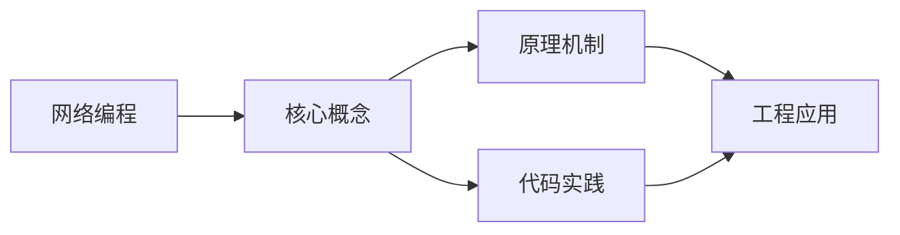
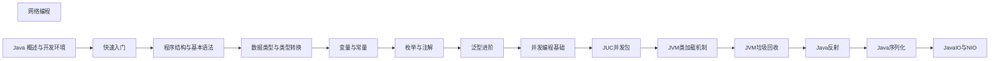

## 1. 学习目标（Bloom 分类）

本节按照布鲁姆教育目标分类学组织学习路径。本文主题为《网络编程》，属于 Java 模块，读者可以根据自身阶段选择阅读深度。

记忆层面：能够准确复述本文的核心概念、术语与基本语法或操作步骤，并能够在提问或检索时快速定位对应知识点。能够说出 Java 的编译执行模型（javac 到字节码，JVM 解释与 JIT）。

理解层面：能够用自己的语言解释核心原理与工作机制，说明概念之间的因果关系，而不是机械记忆结论。能够解释面向对象三大特性与 JVM 内存区域的职责。

应用层面：能够在真实项目或练习场景中运用本文知识解决具体问题，写出正确且可维护的实现。能够编写类、接口、集合操作与异常处理的完整程序。

分析层面：能够拆解复杂问题，比较本文主题与相邻概念的异同，识别边界条件与例外情况。能够分析 Java 与 C++、Go 在内存管理与并发模型上的差异。

评价层面：能够根据约束条件（性能、可读性、安全、成本）评价不同方案的优劣，做出有依据的技术决策。能够评价不同集合、并发工具与框架的适用场景。

创造层面：能够把本文知识与其他模块知识组合，设计出新的解决方案或可复用的工程模式。能够组合 Spring 生态设计企业级应用。

通过本节学习，读者应当能够把《网络编程》纳入自己的知识网络，并与 Java 模块的其他主题（JVM、集合框架、并发、Spring 生态）建立关联。

## 2. 历史动机与发展脉络

《网络编程》是 Java 领域的重要主题。要真正理解它，需要先了解它解决的问题与演进过程。

Java 由 James Gosling 领导的 Sun 团队于 1995 年发布，口号“一次编写，到处运行”依托 JVM 字节码实现跨平台。2006 年 Sun 将 Java 开源（OpenJDK），2010 年 Oracle 收购 Sun 后 Java 进入新的治理阶段。
Java 的版本节奏在 2017 年后改为每半年一个特性版本、每两年一个 LTS（长期支持）版本。当前主流 LTS 包括 Java 11、17、21 与 25；Java 21 引入虚拟线程（Project Loom 成果），显著降低高并发服务的线程成本。
Java 生态以 Spring 家族为核心：Spring Boot 简化配置与部署，Spring Cloud 提供微服务组件；构建工具从 Maven 演进到 Gradle；JVM 语言（Kotlin、Scala、Groovy）与 Java 共存互操作。
Android 开发早期使用 Java，2019 年后官方转向 Kotlin-first，但 Java 仍是服务端领域（尤其是金融、电商等企业系统）的中坚力量。

回到本文主题：网络编程 的提出与成熟，正是上述技术背景下的必然产物。早期实现往往以简单可用为目标，随着工程规模扩大，社区逐渐沉淀出标准做法与最佳实践；理解这一脉络，可以帮助读者判断“为什么文档中的推荐写法是现在这个样子”，也能在遇到历史遗留代码时准确识别其设计年代与取舍。

理解 Java 版本与 LTS 机制，是工程选型的起点：生产环境优先 LTS，新特性（如虚拟线程）可以在受控场景评估后引入。

## 3. 形式化定义与核心概念精讲

本节把《网络编程》涉及的核心概念以“定义 + 讲解”的形式展开。读者应把定义当作工具，把讲解当作理解路径；两者结合才能形成可迁移的知识。

JVM 与字节码：`javac` 把 .java 编译为 .class 字节码，JVM 加载、校验并执行；热点代码由 JIT（如 C2）编译为机器码，解释与编译结合实现启动速度与峰值性能的平衡。
面向对象：封装（访问控制）、继承（extends/implements）与多态（重载/重写）是 Java 的类型系统支柱；接口默认方法（Java 8）与密封类（Java 17）持续演进表达能力。
异常体系：受检异常（checked）编译期强制处理，非受检异常（RuntimeException）运行时抛出；try-with-resources 自动关闭资源。
泛型与擦除：Java 泛型在编译期检查后擦除类型参数，运行时无泛型信息；这解释了 `List<String>` 与 `List<Integer>` 的 Class 相同，以及通配符 `? extends` 的逆变协变规则。

### 3.1 原文章节逐一精讲

原文档把主题拆分为 16 个小节，下面按顺序给出每一节的导读讲解，随后保留原文细节供精读。

#### 原文精读（完整保留）

# Java 网络编程 API 速查

> **符号约定**：`< >` 必填参数 | `[ ]` 可选参数

---

#### 1. 网络编程基础

##### 1.1 网络基本概念

```java
import java.net.*;

public class NetworkBasics {
    public static void main(String[] args) throws Exception {
        // 获取本机信息
        InetAddress localHost = InetAddress.getLocalHost();
        System.out.println("主机名: " + localHost.getHostName());
        System.out.println("IP地址: " + localHost.getHostAddress());

        // 通过域名获取地址
        InetAddress[] addresses = InetAddress.getAllByName("www.baidu.com");
        for (InetAddress addr : addresses) {
            System.out.println("百度IP: " + addr.getHostAddress());
        }

        // 检测可达性
        boolean reachable = InetAddress.getByName("www.baidu.com")
            .isReachable(5000);  // 5秒超时
        System.out.println("百度可达: " + reachable);

        // InetSocketAddress: 包含IP和端口
        InetSocketAddress socketAddr = new InetSocketAddress("localhost", 8080);
        System.out.println("地址: " + socketAddr.getAddress());
        System.out.println("端口: " + socketAddr.getPort());
    }
}
```

##### 1.2 URL 处理

```java
import java.net.*;
import java.io.*;

public class URLDemo {
    public static void main(String[] args) throws Exception {
        URL url = new URL("https://example.com:443/api/users?page=1#top");

        System.out.println("协议: " + url.getProtocol());     // https
        System.out.println("主机: " + url.getHost());         // example.com
        System.out.println("端口: " + url.getPort());         // 443
        System.out.println("路径: " + url.getPath());         // /api/users
        System.out.println("查询: " + url.getQuery());        // page=1
        System.out.println("片段: " + url.getRef());          // top

        // URL编码解码
        String encoded = URLEncoder.encode("你好世界", "UTF-8");
        String decoded = URLDecoder.decode(encoded, "UTF-8");
        System.out.println("编码: " + encoded);
        System.out.println("解码: " + decoded);

        // 读取URL内容
        URLConnection conn = url.openConnection();
        conn.setConnectTimeout(5000);
        conn.setReadTimeout(10000);
        try (BufferedReader reader = new BufferedReader(
                new InputStreamReader(conn.getInputStream()))) {
            String line;
            while ((line = reader.readLine()) != null) {
                System.out.println(line);
            }
        }
    }
}
```

#### 2. Socket 编程

##### 2.1 TCP 服务器与客户端

```java
import java.io.*;
import java.net.*;
import java.util.concurrent.*;

// TCP服务器
class TCPServer {
    public static void main(String[] args) {
        int port = 8888;
        ExecutorService pool = Executors.newFixedThreadPool(10);

        try (ServerSocket serverSocket = new ServerSocket(port)) {
            System.out.println("服务器启动，监听端口: " + port);

            while (true) {
                Socket clientSocket = serverSocket.accept();
                System.out.println("客户端连接: " + clientSocket.getRemoteSocketAddress());
                pool.submit(() -> handleClient(clientSocket));
            }
        } catch (IOException e) {
            e.printStackTrace();
        }
    }

    private static void handleClient(Socket socket) {
        try (socket;
             BufferedReader in = new BufferedReader(
                 new InputStreamReader(socket.getInputStream()));
             PrintWriter out = new PrintWriter(socket.getOutputStream(), true)) {

            String inputLine;
            while ((inputLine = in.readLine()) != null) {
                System.out.println("收到: " + inputLine);
                out.println("Echo: " + inputLine);

                if ("bye".equalsIgnoreCase(inputLine.trim())) {
                    break;
                }
            }
        } catch (IOException e) {
            e.printStackTrace();
        }
    }
}

// TCP客户端
class TCPClient {
    public static void main(String[] args) {
        String host = "localhost";
        int port = 8888;

        try (Socket socket = new Socket(host, port);
             BufferedReader in = new BufferedReader(
                 new InputStreamReader(socket.getInputStream()));
             PrintWriter out = new PrintWriter(socket.getOutputStream(), true);
             BufferedReader console = new BufferedReader(
                 new InputStreamReader(System.in))) {

            System.out.println("已连接到服务器: " + socket.getRemoteSocketAddress());

            // 读取服务器响应的线程
            Thread readerThread = new Thread(() -> {
                String response;
                try {
                    while ((response = in.readLine()) != null) {
                        System.out.println("服务器: " + response);
                    }
                } catch (IOException e) {
                    // 连接关闭
                }
            });
            readerThread.setDaemon(true);
            readerThread.start();

            // 从控制台读取输入并发送
            String userInput;
            while ((userInput = console.readLine()) != null) {
                out.println(userInput);
            }
        } catch (IOException e) {
            e.printStackTrace();
        }
    }
}
```

##### 2.2 UDP 编程

```java
import java.net.*;

// UDP服务器
class UDPServer {
    public static void main(String[] args) {
        int port = 9999;

        try (DatagramSocket socket = new DatagramSocket(port)) {
            byte[] buffer = new byte[1024];
            DatagramPacket packet = new DatagramPacket(buffer, buffer.length);

            System.out.println("UDP服务器启动，监听端口: " + port);

            while (true) {
                socket.receive(packet);
                String message = new String(packet.getData(), 0, packet.getLength());
                System.out.println("收到来自 " + packet.getSocketAddress() + ": " + message);

                // 回复
                String reply = "Echo: " + message;
                byte[] replyData = reply.getBytes();
                DatagramPacket replyPacket = new DatagramPacket(
                    replyData, replyData.length,
                    packet.getAddress(), packet.getPort()
                );
                socket.send(replyPacket);
            }
        } catch (Exception e) {
            e.printStackTrace();
        }
    }
}

// UDP客户端
class UDPClient {
    public static void main(String[] args) {
        String host = "localhost";
        int port = 9999;

        try (DatagramSocket socket = new DatagramSocket()) {
            socket.setSoTimeout(5000);  // 5秒超时

            InetAddress address = InetAddress.getByName(host);
            String message = "Hello UDP Server";
            byte[] sendData = message.getBytes();

            DatagramPacket sendPacket = new DatagramPacket(
                sendData, sendData.length, address, port
            );
            socket.send(sendPacket);

            // 接收回复
            byte[] receiveBuffer = new byte[1024];
            DatagramPacket receivePacket = new DatagramPacket(receiveBuffer, receiveBuffer.length);
            socket.receive(receivePacket);

            String reply = new String(receivePacket.getData(), 0, receivePacket.getLength());
            System.out.println("服务器回复: " + reply);
        } catch (Exception e) {
            e.printStackTrace();
        }
    }
}
```

#### 3. NIO 网络编程

##### 3.1 NIO 服务器

```java
import java.io.*;
import java.net.*;
import java.nio.*;
import java.nio.channels.*;
import java.nio.charset.*;
import java.util.*;

public class NIOServer {
    public static void main(String[] args) throws IOException {
        Selector selector = Selector.open();
        ServerSocketChannel serverChannel = ServerSocketChannel.open();
        serverChannel.configureBlocking(false);
        serverChannel.bind(new InetSocketAddress(8888));
        serverChannel.register(selector, SelectionKey.OP_ACCEPT);

        System.out.println("NIO服务器启动，监听端口: 8888");
        Charset charset = StandardCharsets.UTF_8;

        while (true) {
            selector.select();  // 阻塞直到有事件
            Iterator<SelectionKey> keys = selector.selectedKeys().iterator();

            while (keys.hasNext()) {
                SelectionKey key = keys.next();
                keys.remove();

                if (!key.isValid()) continue;

                if (key.isAcceptable()) {
                    // 接受新连接
                    SocketChannel client = serverChannel.accept();
                    client.configureBlocking(false);
                    client.register(selector, SelectionKey.OP_READ);
                    System.out.println("新连接: " + client.getRemoteAddress());
                }

                if (key.isReadable()) {
                    // 读取数据
                    SocketChannel client = (SocketChannel) key.channel();
                    ByteBuffer buffer = ByteBuffer.allocate(1024);
                    int bytesRead = client.read(buffer);

                    if (bytesRead == -1) {
                        client.close();
                        continue;
                    }

                    buffer.flip();
                    String message = charset.decode(buffer).toString();
                    System.out.println("收到: " + message);

                    // 回复
                    buffer.clear();
                    buffer.put(charset.encode("Echo: " + message));
                    buffer.flip();
                    client.write(buffer);
                }
            }
        }
    }
}
```

#### 4. HttpClient（Java 11+）

##### 4.1 同步与异步请求

```java
import java.net.*;
import java.net.http.*;
import java.time.*;
import java.util.*;
import java.util.concurrent.*;

public class HttpClientDemo {
    public static void main(String[] args) throws Exception {
        HttpClient client = HttpClient.newBuilder()
            .version(HttpClient.Version.HTTP_2)
            .connectTimeout(Duration.ofSeconds(10))
            .followRedirects(HttpClient.Redirect.NORMAL)
            .build();

        // GET请求
        HttpRequest getRequest = HttpRequest.newBuilder()
            .uri(URI.create("https://httpbin.org/get"))
            .header("Accept", "application/json")
            .GET()
            .build();

        // 同步请求
        HttpResponse<String> response = client.send(getRequest,
            HttpResponse.BodyHandlers.ofString());
        System.out.println("状态码: " + response.statusCode());
        System.out.println("响应体: " + response.body());

        // 异步请求
        CompletableFuture<HttpResponse<String>> futureResponse =
            client.sendAsync(getRequest, HttpResponse.BodyHandlers.ofString());
        futureResponse.thenAccept(resp ->
            System.out.println("异步状态码: " + resp.statusCode())
        );

        // POST请求（JSON）
        String jsonBody = "{\"name\":\"John\",\"age\":30}";
        HttpRequest postRequest = HttpRequest.newBuilder()
            .uri(URI.create("https://httpbin.org/post"))
            .header("Content-Type", "application/json")
            .POST(HttpRequest.BodyPublishers.ofString(jsonBody))
            .build();

        HttpResponse<String> postResponse = client.send(postRequest,
            HttpResponse.BodyHandlers.ofString());
        System.out.println("POST响应: " + postResponse.body());

        // 文件上传
        Path filePath = Path.of("upload.txt");
        HttpRequest uploadRequest = HttpRequest.newBuilder()
            .uri(URI.create("https://httpbin.org/post"))
            .header("Content-Type", "application/octet-stream")
            .POST(HttpRequest.BodyPublishers.ofFile(filePath))
            .build();

        // 多个并发请求
        List<URI> urls = List.of(
            URI.create("https://httpbin.org/get?id=1"),
            URI.create("https://httpbin.org/get?id=2"),
            URI.create("https://httpbin.org/get?id=3")
        );

        List<CompletableFuture<HttpResponse<String>>> futures = urls.stream()
            .map(url -> client.sendAsync(
                HttpRequest.newBuilder(url).GET().build(),
                HttpResponse.BodyHandlers.ofString()
            ))
            .collect(Collectors.toList());

        CompletableFuture.allOf(futures.toArray(new CompletableFuture[0])).join();
    }
}
```

#### 5. 常见问题与解决方案

##### 5.1 连接超时处理

```java
// 设置连接和读取超时
Socket socket = new Socket();
socket.connect(new InetSocketAddress(host, port), 5000);  // 连接超时5秒
socket.setSoTimeout(10000);  // 读取超时10秒

// HttpClient超时
HttpClient client = HttpClient.newBuilder()
    .connectTimeout(Duration.ofSeconds(5))
    .build();

HttpRequest request = HttpRequest.newBuilder()
    .uri(URI.create(url))
    .timeout(Duration.ofSeconds(10))  // 请求超时
    .build();
```

##### 5.2 资源泄漏

```java
// 错误：未关闭Socket
Socket socket = new Socket(host, port);
// 如果异常，socket不会被关闭

// 正确：try-with-resources
try (Socket socket = new Socket(host, port);
     BufferedReader in = new BufferedReader(
         new InputStreamReader(socket.getInputStream()));
     PrintWriter out = new PrintWriter(socket.getOutputStream(), true)) {
    // 使用socket
} catch (IOException e) {
    e.printStackTrace();
}
```

##### 5.3 粘包与半包

```java
// TCP粘包问题：发送方多次发送的数据被接收方一次读出
// 解决方案1：固定长度消息
// 解决方案2：分隔符
// 解决方案3：长度前缀（推荐）

// 长度前缀协议示例
void sendMessage(DataOutputStream out, String message) throws IOException {
    byte[] data = message.getBytes(StandardCharsets.UTF_8);
    out.writeInt(data.length);  // 先发送长度
    out.write(data);            // 再发送数据
    out.flush();
}

String receiveMessage(DataInputStream in) throws IOException {
    int length = in.readInt();  // 读取长度
    byte[] data = new byte[length];
    in.readFully(data);         // 读取完整数据
    return new String(data, StandardCharsets.UTF_8);
}
```

#### 6. 总结与最佳实践

##### 6.1 网络编程选择指南

| 场景         | 推荐方案                      | 原因                |
| :----------- | :---------------------------- | :------------------ |
| 简单HTTP请求 | HttpClient (Java 11+)         | 现代API，支持HTTP/2 |
| 自定义协议   | Socket/NIO                    | 灵活控制            |
| 高并发服务器 | NIO/Netty                     | 非阻塞，可扩展      |
| 简单数据报   | UDP Socket                    | 无连接，低延迟      |
| Web Service  | Spring RestTemplate/WebClient | 企业级框架          |

##### 6.2 最佳实践

1. **始终设置超时**：避免无限等待
2. **使用try-with-resources**：确保Socket和流正确关闭
3. **线程池处理连接**：避免为每个连接创建线程
4. **大文件用NIO**：零拷贝提升性能
5. **协议设计用长度前缀**：解决粘包半包问题
6. **HTTPS优先**：保护数据安全
#### Socket TCP 客户端

**基本写法：创建客户端连接**
`new Socket(<host>, <port>)`
```java
// 建立与服务端的 TCP 连接
try (Socket socket = new Socket("example.com", 8080)) {
    OutputStream out = socket.getOutputStream();
    out.write("hello".getBytes());
}
```

---

**基本写法：读取服务端响应**
`<socket>.getInputStream()`
```java
// 从输入流读取服务端返回数据
try (Socket socket = new Socket("example.com", 8080);
     BufferedReader reader = new BufferedReader(
         new InputStreamReader(socket.getInputStream()))) {
    String line = reader.readLine();
}
```

---

**基本写法：设置超时**
`<socket>.setSoTimeout(<ms>)`
```java
// 读操作最长等待时间
Socket socket = new Socket("example.com", 8080);
socket.setSoTimeout(5000);
```

---

**基本写法：连接超时**
`new Socket()` + `<socket>.connect(<endpoint>, <timeout>)`
```java
// 控制连接建立阶段超时
Socket socket = new Socket();
socket.connect(new InetSocketAddress("example.com", 8080), 3000);
```

---

#### Socket TCP 服务端

**基本写法：创建服务端**
`new ServerSocket(<port>)`
```java
// 监听指定端口
try (ServerSocket server = new ServerSocket(8080)) {
    Socket client = server.accept();
    handleClient(client);
}
```

---

**基本写法：循环接收连接**
`while (true) { <server>.accept(); }`
```java
// 持续接收客户端连接
try (ServerSocket server = new ServerSocket(8080)) {
    while (true) {
        Socket client = server.accept();
        new Thread(() -> handleClient(client)).start();
    }
}
```

---

**基本写法：设置接收缓冲区**
`<server>.setReceiveBufferSize(<size>)`
```java
// 调整服务端接收缓冲区大小
ServerSocket server = new ServerSocket(8080);
server.setReceiveBufferSize(64 * 1024);
```

---

#### UDP 数据报

**基本写法：发送 UDP 包**
`new DatagramSocket()` + `<socket>.send(<packet>)`
```java
// 发送数据报到目标地址
try (DatagramSocket socket = new DatagramSocket()) {
    byte[] data = "hello".getBytes();
    DatagramPacket packet = new DatagramPacket(
        data, data.length, InetAddress.getByName("127.0.0.1"), 9090);
    socket.send(packet);
}
```

---

**基本写法：接收 UDP 包**
`new DatagramSocket(<port>)` + `<socket>.receive(<packet>)`
```java
// 在指定端口监听 UDP 数据报
try (DatagramSocket socket = new DatagramSocket(9090)) {
    byte[] buffer = new byte[1024];
    DatagramPacket packet = new DatagramPacket(buffer, buffer.length);
    socket.receive(packet);
    String msg = new String(packet.getData(), 0, packet.getLength());
}
```

---

#### URL 访问

**基本写法：打开 URL 连接**
`new URL(<url>).openConnection()`
```java
// 传统 URL 读取方式
URL url = new URL("https://example.com/api");
try (BufferedReader reader = new BufferedReader(
        new InputStreamReader(url.openStream()))) {
    String line;
    while ((line = reader.readLine()) != null) {
        System.out.println(line);
    }
}
```

---

**基本写法：HTTP GET 请求**
`<conn>.setRequestMethod("GET")`
```java
// 通过 HttpURLConnection 发送 GET
URL url = new URL("https://example.com/api");
HttpURLConnection conn = (HttpURLConnection) url.openConnection();
conn.setRequestMethod("GET");
conn.setRequestProperty("Accept", "application/json");
int code = conn.getResponseCode();
```

---

**基本写法：HTTP POST 请求**
`<conn>.setRequestMethod("POST")` + `<conn>.getOutputStream()`
```java
// 发送 POST 请求并写入请求体
HttpURLConnection conn = (HttpURLConnection) new URL("https://example.com/api").openConnection();
conn.setRequestMethod("POST");
conn.setDoOutput(true);
conn.setRequestProperty("Content-Type", "application/json");
try (OutputStream os = conn.getOutputStream()) {
    os.write("{\"name\":\"Alice\"}".getBytes());
}
```

---

#### HttpClient（Java 11+）

**基本写法：创建 HttpClient**
`HttpClient.newHttpClient()`
```java
// 创建默认 HTTP 客户端
HttpClient client = HttpClient.newHttpClient();
```

---

**基本写法：自定义 HttpClient**
`HttpClient.newBuilder()`
```java
// 配置连接超时、HTTP 版本等
HttpClient client = HttpClient.newBuilder()
    .version(HttpClient.Version.HTTP_2)
    .connectTimeout(Duration.ofSeconds(10))
    .followRedirects(HttpClient.Redirect.NORMAL)
    .build();
```

---

**基本写法：发送 GET 请求**
`<client>.send(<request>, <handler>)`
```java
// 同步发送 GET 并返回响应
HttpRequest request = HttpRequest.newBuilder()
    .uri(URI.create("https://example.com/api"))
    .timeout(Duration.ofSeconds(10))
    .header("Accept", "application/json")
    .GET()
    .build();
HttpResponse<String> response =
    client.send(request, HttpResponse.BodyHandlers.ofString());
System.out.println(response.body());
```

---

**基本写法：发送 POST 请求**
`HttpRequest.BodyPublishers.ofString(<body>)`
```java
// 发送 JSON 请求体
HttpRequest request = HttpRequest.newBuilder()
    .uri(URI.create("https://example.com/api"))
    .header("Content-Type", "application/json")
    .POST(HttpRequest.BodyPublishers.ofString("{\"name\":\"Alice\"}"))
    .build();
HttpResponse<String> response =
    client.send(request, HttpResponse.BodyHandlers.ofString());
```

---

**基本写法：异步发送请求**
`<client>.sendAsync(<request>, <handler>)`
```java
// 返回 CompletableFuture，非阻塞
client.sendAsync(request, HttpResponse.BodyHandlers.ofString())
    .thenApply(HttpResponse::body)
    .thenAccept(System.out::println);
```

---

**基本写法：发送 PUT 请求**
`.PUT(HttpRequest.BodyPublishers.ofString(<body>))`
```java
// RESTful PUT 请求
HttpRequest request = HttpRequest.newBuilder()
    .uri(URI.create("https://example.com/api/1"))
    .header("Content-Type", "application/json")
    .PUT(HttpRequest.BodyPublishers.ofString("{\"name\":\"Bob\"}"))
    .build();
```

---

**基本写法：发送 DELETE 请求**
`.DELETE()`
```java
// RESTful DELETE 请求
HttpRequest request = HttpRequest.newBuilder()
    .uri(URI.create("https://example.com/api/1"))
    .DELETE()
    .build();
```

---

**基本写法：处理响应体为字节数组**
`HttpResponse.BodyHandlers.ofByteArray()`
```java
// 适用于下载二进制文件
HttpResponse<byte[]> response =
    client.send(request, HttpResponse.BodyHandlers.ofByteArray());
Files.write(Path.of("out.bin"), response.body());
```

---

**基本写法：流式处理响应体**
`HttpResponse.BodyHandlers.ofInputStream()`
```java
// 大响应体流式读取
HttpResponse<InputStream> response =
    client.send(request, HttpResponse.BodyHandlers.ofInputStream());
try (InputStream is = response.body()) {
    is.transferTo(System.out);
}
```

---

#### 基本参数与查询

**基本写法：拼接查询参数**
`URI.create(<url> + "?" + <query>)`
```java
// 手动拼接 URL 查询参数
String url = "https://example.com/search?q=" + URLEncoder.encode("Java 编程", StandardCharsets.UTF_8);
HttpRequest request = HttpRequest.newBuilder()
    .uri(URI.create(url))
    .GET()
    .build();
```

---

**基本写法：设置 Basic 认证**
`<builder>.header("Authorization", "Basic " + <encoded>)`
```java
// 用户名密码 Basic 认证
String auth = "alice:secret";
String encoded = Base64.getEncoder().encodeToString(auth.getBytes());
HttpRequest request = HttpRequest.newBuilder()
    .uri(URI.create("https://example.com/api"))
    .header("Authorization", "Basic " + encoded)
    .GET()
    .build();
```

---

#### InetSocketAddress 地址

**基本写法：创建地址对象**
`new InetSocketAddress(<host>, <port>)`
```java
// 封装主机名与端口
InetSocketAddress addr = new InetSocketAddress("example.com", 8080);
```

---

**基本写法：未解析地址**
`InetSocketAddress.createUnresolved(<host>, <port>)`
```java
// 不进行 DNS 解析，连接时才解析
InetSocketAddress addr = InetSocketAddress.createUnresolved("example.com", 8080);
```

---

#### NetworkInterface 网络接口

**基本写法：列举所有网卡**
`NetworkInterface.getNetworkInterfaces()`
```java
// 遍历本机所有网络接口
Enumeration<NetworkInterface> nics = NetworkInterface.getNetworkInterfaces();
while (nics.hasMoreElements()) {
    NetworkInterface nic = nics.nextElement();
    System.out.println(nic.getName());
}
```

---

**基本写法：获取本机 IP**
`NetworkInterface.getByName(<name>)`
```java
// 通过网卡名获取其 IP 地址
NetworkInterface nic = NetworkInterface.getByName("eth0");
Enumeration<InetAddress> addrs = nic.getInetAddresses();
while (addrs.hasMoreElements()) {
    System.out.println(addrs.nextElement().getHostAddress());
}
```

---

#### ServerSocket 多线程处理

**基本写法：线程池处理客户端**
`ExecutorService` + `server.accept()`
```java
// 使用线程池避免无限创建线程
ExecutorService pool = Executors.newFixedThreadPool(50);
try (ServerSocket server = new ServerSocket(8080)) {
    while (true) {
        Socket client = server.accept();
        pool.submit(() -> handleClient(client));
    }
}
```

---

**基本写法：NIO Selector 监听**
`Selector.open()`
```java
// 单线程管理多通道，适合高并发
Selector selector = Selector.open();
ServerSocketChannel server = ServerSocketChannel.open();
server.configureBlocking(false);
server.register(selector, SelectionKey.OP_ACCEPT);
```

---

#### 文件传输

**基本写法：服务端发送文件**
`Files.copy(<path>, <outputStream>)`
```java
// 将文件写入 Socket 输出流
try (Socket socket = server.accept();
     OutputStream out = socket.getOutputStream()) {
    Files.copy(Path.of("data.txt"), out);
}
```

---

**基本写法：客户端接收文件**
`<inputStream>.transferTo(<outputStream>)`
```java
// 接收服务端传输的文件内容
try (InputStream in = socket.getInputStream();
     FileOutputStream fos = new FileOutputStream("received.txt")) {
    in.transferTo(fos);
}
```


### 3.2 概念关系图

下面用 Mermaid 图表达本文核心概念之间的关系，帮助读者建立整体图景：



图中展示的是本文知识的结构化关系：核心概念是入口，原理机制解释“为什么”，代码实践演示“怎么做”，工程应用回答“何时用”。读者学习时可以把每个小节的内容挂接到对应节点上。

## 4. 理论推导与原理解析

本节深入《网络编程》背后的原理。理论部分不求面面俱到，而是聚焦“能解释现象、能指导实践”的关键推导。

JVM 内存模型：堆（新生代/老年代）、元空间、虚拟机栈、本地方法栈与程序计数器；GC 从 CMS 演进到 G1（默认）、ZGC（超低延迟），理解分代收集是调优前提。
并发工具：synchronized 与 JUC（java.util.concurrent）的锁、并发容器、线程池、CompletableFuture 构成并发工具箱；Java 21 的虚拟线程让“每任务一线程”成为可能。
类加载机制：双亲委派模型保证类唯一性，SPI（ServiceLoader）打破委派实现扩展；自定义类加载器是热部署与隔离的基础。
反射与注解：反射在运行时检查类结构，注解提供元数据；Spring 的依赖注入与 AOP 均基于这些机制，但反射有性能与安全成本。

需要强调的是，理论推导与工程实践之间存在翻译层：理论给出的是理想化模型与边界条件，工程代码则必须处理真实环境中的例外。读者在学习时应先掌握理论的“标准情形”，再通过陷阱章节了解“非标准情形”。

## 5. 代码示例与逐行讲解

本节把原文中的代码示例系统整理，并为每个示例补充用途说明与讲解。读者不应只浏览代码，而应逐段对照讲解理解设计意图。

### 5.1 示例：1.1 网络基本概念

该示例来自原文《1.1 网络基本概念》小节，用于演示网络编程相关操作。阅读时请先看代码结构，再看其后的讲解。

```java
import java.net.*;

public class NetworkBasics {
    public static void main(String[] args) throws Exception {
        // 获取本机信息
        InetAddress localHost = InetAddress.getLocalHost();
        System.out.println("主机名: " + localHost.getHostName());
        System.out.println("IP地址: " + localHost.getHostAddress());

        // 通过域名获取地址
        InetAddress[] addresses = InetAddress.getAllByName("www.baidu.com");
        for (InetAddress addr : addresses) {
            System.out.println("百度IP: " + addr.getHostAddress());
        }

        // 检测可达性
        boolean reachable = InetAddress.getByName("www.baidu.com")
            .isReachable(5000);  // 5秒超时
        System.out.println("百度可达: " + reachable);

        // InetSocketAddress: 包含IP和端口
        InetSocketAddress socketAddr = new InetSocketAddress("localhost", 8080);
        System.out.println("地址: " + socketAddr.getAddress());
        System.out.println("端口: " + socketAddr.getPort());
    }
}
```

讲解：这段代码演示了本节核心知识点。代码中的关键操作可以归纳为三步：准备（定义或初始化）、执行（核心逻辑）、收尾（释放资源或返回结果）。实际项目中，这三步往往被封装为函数或类，以提升复用性与可测试性。

关键点分析：

该示例共 22 行有效代码，包含 3 类关键结构（class、import、for）。其中：

- 入口与初始化部分负责建立上下文，对应实际项目中的启动或装配逻辑；
- 核心逻辑部分体现本文主题的主要操作，是阅读时最需要对照讲解理解的部分；
- 输出或返回部分把结果交给调用方，注意其类型与边界条件。

进阶思考路径：先尝试修改参数观察行为变化，再把示例中的模式迁移到自己的项目中；每次修改都记录预期与实测差异，这是把示例转化为能力的最快方式。

### 5.2 示例：1.2 URL 处理

该示例来自原文《1.2 URL 处理》小节，用于演示网络编程相关操作。阅读时请先看代码结构，再看其后的讲解。

```java
import java.net.*;
import java.io.*;

public class URLDemo {
    public static void main(String[] args) throws Exception {
        URL url = new URL("https://example.com:443/api/users?page=1#top");

        System.out.println("协议: " + url.getProtocol());     // https
        System.out.println("主机: " + url.getHost());         // example.com
        System.out.println("端口: " + url.getPort());         // 443
        System.out.println("路径: " + url.getPath());         // /api/users
        System.out.println("查询: " + url.getQuery());        // page=1
        System.out.println("片段: " + url.getRef());          // top

        // URL编码解码
        String encoded = URLEncoder.encode("你好世界", "UTF-8");
        String decoded = URLDecoder.decode(encoded, "UTF-8");
        System.out.println("编码: " + encoded);
        System.out.println("解码: " + decoded);

        // 读取URL内容
        URLConnection conn = url.openConnection();
        conn.setConnectTimeout(5000);
        conn.setReadTimeout(10000);
        try (BufferedReader reader = new BufferedReader(
                new InputStreamReader(conn.getInputStream()))) {
            String line;
            while ((line = reader.readLine()) != null) {
                System.out.println(line);
            }
        }
    }
}
```

讲解：这段代码演示了本节核心知识点。代码中的关键操作可以归纳为三步：准备（定义或初始化）、执行（核心逻辑）、收尾（释放资源或返回结果）。实际项目中，这三步往往被封装为函数或类，以提升复用性与可测试性。

关键点分析：

该示例共 29 行有效代码，包含 3 类关键结构（class、import、while）。其中：

- 入口与初始化部分负责建立上下文，对应实际项目中的启动或装配逻辑；
- 核心逻辑部分体现本文主题的主要操作，是阅读时最需要对照讲解理解的部分；
- 输出或返回部分把结果交给调用方，注意其类型与边界条件。

进阶思考路径：先尝试修改参数观察行为变化，再把示例中的模式迁移到自己的项目中；每次修改都记录预期与实测差异，这是把示例转化为能力的最快方式。

### 5.3 示例：2.1 TCP 服务器与客户端

该示例来自原文《2.1 TCP 服务器与客户端》小节，用于演示网络编程相关操作。阅读时请先看代码结构，再看其后的讲解。

```java
import java.io.*;
import java.net.*;
import java.util.concurrent.*;

// TCP服务器
class TCPServer {
    public static void main(String[] args) {
        int port = 8888;
        ExecutorService pool = Executors.newFixedThreadPool(10);

        try (ServerSocket serverSocket = new ServerSocket(port)) {
            System.out.println("服务器启动，监听端口: " + port);

            while (true) {
                Socket clientSocket = serverSocket.accept();
                System.out.println("客户端连接: " + clientSocket.getRemoteSocketAddress());
                pool.submit(() -> handleClient(clientSocket));
            }
        } catch (IOException e) {
            e.printStackTrace();
        }
    }

    private static void handleClient(Socket socket) {
        try (socket;
             BufferedReader in = new BufferedReader(
                 new InputStreamReader(socket.getInputStream()));
             PrintWriter out = new PrintWriter(socket.getOutputStream(), true)) {

            String inputLine;
            while ((inputLine = in.readLine()) != null) {
                System.out.println("收到: " + inputLine);
                out.println("Echo: " + inputLine);

                if ("bye".equalsIgnoreCase(inputLine.trim())) {
                    break;
                }
            }
        } catch (IOException e) {
            e.printStackTrace();
        }
    }
}

// TCP客户端
class TCPClient {
    public static void main(String[] args) {
        String host = "localhost";
        int port = 8888;

        try (Socket socket = new Socket(host, port);
             BufferedReader in = new BufferedReader(
                 new InputStreamReader(socket.getInputStream()));
             PrintWriter out = new PrintWriter(socket.getOutputStream(), true);
             BufferedReader console = new BufferedReader(
                 new InputStreamReader(System.in))) {

            System.out.println("已连接到服务器: " + socket.getRemoteSocketAddress());

            // 读取服务器响应的线程
            Thread readerThread = new Thread(() -> {
                String response;
                try {
                    while ((response = in.readLine()) != null) {
                        System.out.println("服务器: " + response);
                    }
                } catch (IOException e) {
                    // 连接关闭
                }
            });
            readerThread.setDaemon(true);
            readerThread.start();

            // 从控制台读取输入并发送
            String userInput;
            while ((userInput = console.readLine()) != null) {
                out.println(userInput);
            }
        } catch (IOException e) {
            e.printStackTrace();
        }
    }
}
```

讲解：这段代码演示了本节核心知识点。代码中的关键操作可以归纳为三步：准备（定义或初始化）、执行（核心逻辑）、收尾（释放资源或返回结果）。实际项目中，这三步往往被封装为函数或类，以提升复用性与可测试性。

关键点分析：

该示例共 72 行有效代码，包含 4 类关键结构（class、import、if、while）。其中：

- 入口与初始化部分负责建立上下文，对应实际项目中的启动或装配逻辑；
- 核心逻辑部分体现本文主题的主要操作，是阅读时最需要对照讲解理解的部分；
- 输出或返回部分把结果交给调用方，注意其类型与边界条件。

进阶思考路径：先尝试修改参数观察行为变化，再把示例中的模式迁移到自己的项目中；每次修改都记录预期与实测差异，这是把示例转化为能力的最快方式。

### 5.4 示例：2.2 UDP 编程

该示例来自原文《2.2 UDP 编程》小节，用于演示网络编程相关操作。阅读时请先看代码结构，再看其后的讲解。

```java
import java.net.*;

// UDP服务器
class UDPServer {
    public static void main(String[] args) {
        int port = 9999;

        try (DatagramSocket socket = new DatagramSocket(port)) {
            byte[] buffer = new byte[1024];
            DatagramPacket packet = new DatagramPacket(buffer, buffer.length);

            System.out.println("UDP服务器启动，监听端口: " + port);

            while (true) {
                socket.receive(packet);
                String message = new String(packet.getData(), 0, packet.getLength());
                System.out.println("收到来自 " + packet.getSocketAddress() + ": " + message);

                // 回复
                String reply = "Echo: " + message;
                byte[] replyData = reply.getBytes();
                DatagramPacket replyPacket = new DatagramPacket(
                    replyData, replyData.length,
                    packet.getAddress(), packet.getPort()
                );
                socket.send(replyPacket);
            }
        } catch (Exception e) {
            e.printStackTrace();
        }
    }
}

// UDP客户端
class UDPClient {
    public static void main(String[] args) {
        String host = "localhost";
        int port = 9999;

        try (DatagramSocket socket = new DatagramSocket()) {
            socket.setSoTimeout(5000);  // 5秒超时

            InetAddress address = InetAddress.getByName(host);
            String message = "Hello UDP Server";
            byte[] sendData = message.getBytes();

            DatagramPacket sendPacket = new DatagramPacket(
                sendData, sendData.length, address, port
            );
            socket.send(sendPacket);

            // 接收回复
            byte[] receiveBuffer = new byte[1024];
            DatagramPacket receivePacket = new DatagramPacket(receiveBuffer, receiveBuffer.length);
            socket.receive(receivePacket);

            String reply = new String(receivePacket.getData(), 0, receivePacket.getLength());
            System.out.println("服务器回复: " + reply);
        } catch (Exception e) {
            e.printStackTrace();
        }
    }
}
```

讲解：这段代码演示了本节核心知识点。代码中的关键操作可以归纳为三步：准备（定义或初始化）、执行（核心逻辑）、收尾（释放资源或返回结果）。实际项目中，这三步往往被封装为函数或类，以提升复用性与可测试性。

关键点分析：

该示例共 52 行有效代码，包含 3 类关键结构（class、import、while）。其中：

- 入口与初始化部分负责建立上下文，对应实际项目中的启动或装配逻辑；
- 核心逻辑部分体现本文主题的主要操作，是阅读时最需要对照讲解理解的部分；
- 输出或返回部分把结果交给调用方，注意其类型与边界条件。

进阶思考路径：先尝试修改参数观察行为变化，再把示例中的模式迁移到自己的项目中；每次修改都记录预期与实测差异，这是把示例转化为能力的最快方式。

### 5.5 示例：3.1 NIO 服务器

该示例来自原文《3.1 NIO 服务器》小节，用于演示网络编程相关操作。阅读时请先看代码结构，再看其后的讲解。

```java
import java.io.*;
import java.net.*;
import java.nio.*;
import java.nio.channels.*;
import java.nio.charset.*;
import java.util.*;

public class NIOServer {
    public static void main(String[] args) throws IOException {
        Selector selector = Selector.open();
        ServerSocketChannel serverChannel = ServerSocketChannel.open();
        serverChannel.configureBlocking(false);
        serverChannel.bind(new InetSocketAddress(8888));
        serverChannel.register(selector, SelectionKey.OP_ACCEPT);

        System.out.println("NIO服务器启动，监听端口: 8888");
        Charset charset = StandardCharsets.UTF_8;

        while (true) {
            selector.select();  // 阻塞直到有事件
            Iterator<SelectionKey> keys = selector.selectedKeys().iterator();

            while (keys.hasNext()) {
                SelectionKey key = keys.next();
                keys.remove();

                if (!key.isValid()) continue;

                if (key.isAcceptable()) {
                    // 接受新连接
                    SocketChannel client = serverChannel.accept();
                    client.configureBlocking(false);
                    client.register(selector, SelectionKey.OP_READ);
                    System.out.println("新连接: " + client.getRemoteAddress());
                }

                if (key.isReadable()) {
                    // 读取数据
                    SocketChannel client = (SocketChannel) key.channel();
                    ByteBuffer buffer = ByteBuffer.allocate(1024);
                    int bytesRead = client.read(buffer);

                    if (bytesRead == -1) {
                        client.close();
                        continue;
                    }

                    buffer.flip();
                    String message = charset.decode(buffer).toString();
                    System.out.println("收到: " + message);

                    // 回复
                    buffer.clear();
                    buffer.put(charset.encode("Echo: " + message));
                    buffer.flip();
                    client.write(buffer);
                }
            }
        }
    }
}
```

讲解：这段代码演示了本节核心知识点。代码中的关键操作可以归纳为三步：准备（定义或初始化）、执行（核心逻辑）、收尾（释放资源或返回结果）。实际项目中，这三步往往被封装为函数或类，以提升复用性与可测试性。

关键点分析：

该示例共 51 行有效代码，包含 4 类关键结构（class、import、if、while）。其中：

- 入口与初始化部分负责建立上下文，对应实际项目中的启动或装配逻辑；
- 核心逻辑部分体现本文主题的主要操作，是阅读时最需要对照讲解理解的部分；
- 输出或返回部分把结果交给调用方，注意其类型与边界条件。

进阶思考路径：先尝试修改参数观察行为变化，再把示例中的模式迁移到自己的项目中；每次修改都记录预期与实测差异，这是把示例转化为能力的最快方式。

### 5.6 示例：4.1 同步与异步请求

该示例来自原文《4.1 同步与异步请求》小节，用于演示网络编程相关操作。阅读时请先看代码结构，再看其后的讲解。

```java
import java.net.*;
import java.net.http.*;
import java.time.*;
import java.util.*;
import java.util.concurrent.*;

public class HttpClientDemo {
    public static void main(String[] args) throws Exception {
        HttpClient client = HttpClient.newBuilder()
            .version(HttpClient.Version.HTTP_2)
            .connectTimeout(Duration.ofSeconds(10))
            .followRedirects(HttpClient.Redirect.NORMAL)
            .build();

        // GET请求
        HttpRequest getRequest = HttpRequest.newBuilder()
            .uri(URI.create("https://httpbin.org/get"))
            .header("Accept", "application/json")
            .GET()
            .build();

        // 同步请求
        HttpResponse<String> response = client.send(getRequest,
            HttpResponse.BodyHandlers.ofString());
        System.out.println("状态码: " + response.statusCode());
        System.out.println("响应体: " + response.body());

        // 异步请求
        CompletableFuture<HttpResponse<String>> futureResponse =
            client.sendAsync(getRequest, HttpResponse.BodyHandlers.ofString());
        futureResponse.thenAccept(resp ->
            System.out.println("异步状态码: " + resp.statusCode())
        );

        // POST请求（JSON）
        String jsonBody = "{\"name\":\"John\",\"age\":30}";
        HttpRequest postRequest = HttpRequest.newBuilder()
            .uri(URI.create("https://httpbin.org/post"))
            .header("Content-Type", "application/json")
            .POST(HttpRequest.BodyPublishers.ofString(jsonBody))
            .build();

        HttpResponse<String> postResponse = client.send(postRequest,
            HttpResponse.BodyHandlers.ofString());
        System.out.println("POST响应: " + postResponse.body());

        // 文件上传
        Path filePath = Path.of("upload.txt");
        HttpRequest uploadRequest = HttpRequest.newBuilder()
            .uri(URI.create("https://httpbin.org/post"))
            .header("Content-Type", "application/octet-stream")
            .POST(HttpRequest.BodyPublishers.ofFile(filePath))
            .build();

        // 多个并发请求
        List<URI> urls = List.of(
            URI.create("https://httpbin.org/get?id=1"),
            URI.create("https://httpbin.org/get?id=2"),
            URI.create("https://httpbin.org/get?id=3")
        );

        List<CompletableFuture<HttpResponse<String>>> futures = urls.stream()
            .map(url -> client.sendAsync(
                HttpRequest.newBuilder(url).GET().build(),
                HttpResponse.BodyHandlers.ofString()
            ))
            .collect(Collectors.toList());

        CompletableFuture.allOf(futures.toArray(new CompletableFuture[0])).join();
    }
}
```

讲解：这段代码演示了本节核心知识点。代码中的关键操作可以归纳为三步：准备（定义或初始化）、执行（核心逻辑）、收尾（释放资源或返回结果）。实际项目中，这三步往往被封装为函数或类，以提升复用性与可测试性。

关键点分析：

该示例共 61 行有效代码，包含 2 类关键结构（class、import）。其中：

- 入口与初始化部分负责建立上下文，对应实际项目中的启动或装配逻辑；
- 核心逻辑部分体现本文主题的主要操作，是阅读时最需要对照讲解理解的部分；
- 输出或返回部分把结果交给调用方，注意其类型与边界条件。

进阶思考路径：先尝试修改参数观察行为变化，再把示例中的模式迁移到自己的项目中；每次修改都记录预期与实测差异，这是把示例转化为能力的最快方式。

### 5.7 示例：5.1 连接超时处理

该示例来自原文《5.1 连接超时处理》小节，用于演示网络编程相关操作。阅读时请先看代码结构，再看其后的讲解。

```java
// 设置连接和读取超时
Socket socket = new Socket();
socket.connect(new InetSocketAddress(host, port), 5000);  // 连接超时5秒
socket.setSoTimeout(10000);  // 读取超时10秒

// HttpClient超时
HttpClient client = HttpClient.newBuilder()
    .connectTimeout(Duration.ofSeconds(5))
    .build();

HttpRequest request = HttpRequest.newBuilder()
    .uri(URI.create(url))
    .timeout(Duration.ofSeconds(10))  // 请求超时
    .build();
```

讲解：这段代码演示了本节核心知识点。代码中的关键操作可以归纳为三步：准备（定义或初始化）、执行（核心逻辑）、收尾（释放资源或返回结果）。实际项目中，这三步往往被封装为函数或类，以提升复用性与可测试性。

关键点分析：

该示例共 12 行有效代码，结构以数据或配置为主。阅读时应关注：数据字段的含义、配置项的作用，以及它们与运行行为的对应关系。

进阶思考路径：先尝试修改参数观察行为变化，再把示例中的模式迁移到自己的项目中；每次修改都记录预期与实测差异，这是把示例转化为能力的最快方式。

### 5.8 示例：5.2 资源泄漏

该示例来自原文《5.2 资源泄漏》小节，用于演示网络编程相关操作。阅读时请先看代码结构，再看其后的讲解。

```java
// 错误：未关闭Socket
Socket socket = new Socket(host, port);
// 如果异常，socket不会被关闭

// 正确：try-with-resources
try (Socket socket = new Socket(host, port);
     BufferedReader in = new BufferedReader(
         new InputStreamReader(socket.getInputStream()));
     PrintWriter out = new PrintWriter(socket.getOutputStream(), true)) {
    // 使用socket
} catch (IOException e) {
    e.printStackTrace();
}
```

讲解：这段代码演示了本节核心知识点。代码中的关键操作可以归纳为三步：准备（定义或初始化）、执行（核心逻辑）、收尾（释放资源或返回结果）。实际项目中，这三步往往被封装为函数或类，以提升复用性与可测试性。

关键点分析：

该示例共 12 行有效代码，结构以数据或配置为主。阅读时应关注：数据字段的含义、配置项的作用，以及它们与运行行为的对应关系。

进阶思考路径：先尝试修改参数观察行为变化，再把示例中的模式迁移到自己的项目中；每次修改都记录预期与实测差异，这是把示例转化为能力的最快方式。

### 5.9 示例：5.3 粘包与半包

该示例来自原文《5.3 粘包与半包》小节，用于演示网络编程相关操作。阅读时请先看代码结构，再看其后的讲解。

```java
// TCP粘包问题：发送方多次发送的数据被接收方一次读出
// 解决方案1：固定长度消息
// 解决方案2：分隔符
// 解决方案3：长度前缀（推荐）

// 长度前缀协议示例
void sendMessage(DataOutputStream out, String message) throws IOException {
    byte[] data = message.getBytes(StandardCharsets.UTF_8);
    out.writeInt(data.length);  // 先发送长度
    out.write(data);            // 再发送数据
    out.flush();
}

String receiveMessage(DataInputStream in) throws IOException {
    int length = in.readInt();  // 读取长度
    byte[] data = new byte[length];
    in.readFully(data);         // 读取完整数据
    return new String(data, StandardCharsets.UTF_8);
}
```

讲解：这段代码演示了本节核心知识点。代码中的关键操作可以归纳为三步：准备（定义或初始化）、执行（核心逻辑）、收尾（释放资源或返回结果）。实际项目中，这三步往往被封装为函数或类，以提升复用性与可测试性。

关键点分析：

该示例共 17 行有效代码，包含 1 类关键结构（return）。其中：

- 入口与初始化部分负责建立上下文，对应实际项目中的启动或装配逻辑；
- 核心逻辑部分体现本文主题的主要操作，是阅读时最需要对照讲解理解的部分；
- 输出或返回部分把结果交给调用方，注意其类型与边界条件。

进阶思考路径：先尝试修改参数观察行为变化，再把示例中的模式迁移到自己的项目中；每次修改都记录预期与实测差异，这是把示例转化为能力的最快方式。

### 5.10 示例：Socket TCP 客户端

该示例来自原文《Socket TCP 客户端》小节，用于演示网络编程相关操作。阅读时请先看代码结构，再看其后的讲解。

```java
// 建立与服务端的 TCP 连接
try (Socket socket = new Socket("example.com", 8080)) {
    OutputStream out = socket.getOutputStream();
    out.write("hello".getBytes());
}
```

讲解：这段代码演示了本节核心知识点。代码中的关键操作可以归纳为三步：准备（定义或初始化）、执行（核心逻辑）、收尾（释放资源或返回结果）。实际项目中，这三步往往被封装为函数或类，以提升复用性与可测试性。

关键点分析：

该示例共 5 行有效代码，结构以数据或配置为主。阅读时应关注：数据字段的含义、配置项的作用，以及它们与运行行为的对应关系。

进阶思考路径：先尝试修改参数观察行为变化，再把示例中的模式迁移到自己的项目中；每次修改都记录预期与实测差异，这是把示例转化为能力的最快方式。

### 5.11 示例：Socket TCP 客户端

该示例来自原文《Socket TCP 客户端》小节，用于演示网络编程相关操作。阅读时请先看代码结构，再看其后的讲解。

```java
// 从输入流读取服务端返回数据
try (Socket socket = new Socket("example.com", 8080);
     BufferedReader reader = new BufferedReader(
         new InputStreamReader(socket.getInputStream()))) {
    String line = reader.readLine();
}
```

讲解：这段代码演示了本节核心知识点。代码中的关键操作可以归纳为三步：准备（定义或初始化）、执行（核心逻辑）、收尾（释放资源或返回结果）。实际项目中，这三步往往被封装为函数或类，以提升复用性与可测试性。

关键点分析：

该示例共 6 行有效代码，结构以数据或配置为主。阅读时应关注：数据字段的含义、配置项的作用，以及它们与运行行为的对应关系。

进阶思考路径：先尝试修改参数观察行为变化，再把示例中的模式迁移到自己的项目中；每次修改都记录预期与实测差异，这是把示例转化为能力的最快方式。

### 5.12 示例：Socket TCP 客户端

该示例来自原文《Socket TCP 客户端》小节，用于演示网络编程相关操作。阅读时请先看代码结构，再看其后的讲解。

```java
// 读操作最长等待时间
Socket socket = new Socket("example.com", 8080);
socket.setSoTimeout(5000);
```

讲解：这段代码演示了本节核心知识点。代码中的关键操作可以归纳为三步：准备（定义或初始化）、执行（核心逻辑）、收尾（释放资源或返回结果）。实际项目中，这三步往往被封装为函数或类，以提升复用性与可测试性。

关键点分析：

该示例共 3 行有效代码，结构以数据或配置为主。阅读时应关注：数据字段的含义、配置项的作用，以及它们与运行行为的对应关系。

进阶思考路径：先尝试修改参数观察行为变化，再把示例中的模式迁移到自己的项目中；每次修改都记录预期与实测差异，这是把示例转化为能力的最快方式。

### 5.13 示例：Socket TCP 客户端

该示例来自原文《Socket TCP 客户端》小节，用于演示网络编程相关操作。阅读时请先看代码结构，再看其后的讲解。

```java
// 控制连接建立阶段超时
Socket socket = new Socket();
socket.connect(new InetSocketAddress("example.com", 8080), 3000);
```

讲解：这段代码演示了本节核心知识点。代码中的关键操作可以归纳为三步：准备（定义或初始化）、执行（核心逻辑）、收尾（释放资源或返回结果）。实际项目中，这三步往往被封装为函数或类，以提升复用性与可测试性。

关键点分析：

该示例共 3 行有效代码，结构以数据或配置为主。阅读时应关注：数据字段的含义、配置项的作用，以及它们与运行行为的对应关系。

进阶思考路径：先尝试修改参数观察行为变化，再把示例中的模式迁移到自己的项目中；每次修改都记录预期与实测差异，这是把示例转化为能力的最快方式。

### 5.14 示例：Socket TCP 服务端

该示例来自原文《Socket TCP 服务端》小节，用于演示网络编程相关操作。阅读时请先看代码结构，再看其后的讲解。

```java
// 监听指定端口
try (ServerSocket server = new ServerSocket(8080)) {
    Socket client = server.accept();
    handleClient(client);
}
```

讲解：这段代码演示了本节核心知识点。代码中的关键操作可以归纳为三步：准备（定义或初始化）、执行（核心逻辑）、收尾（释放资源或返回结果）。实际项目中，这三步往往被封装为函数或类，以提升复用性与可测试性。

关键点分析：

该示例共 5 行有效代码，结构以数据或配置为主。阅读时应关注：数据字段的含义、配置项的作用，以及它们与运行行为的对应关系。

进阶思考路径：先尝试修改参数观察行为变化，再把示例中的模式迁移到自己的项目中；每次修改都记录预期与实测差异，这是把示例转化为能力的最快方式。

### 5.15 示例：Socket TCP 服务端

该示例来自原文《Socket TCP 服务端》小节，用于演示网络编程相关操作。阅读时请先看代码结构，再看其后的讲解。

```java
// 持续接收客户端连接
try (ServerSocket server = new ServerSocket(8080)) {
    while (true) {
        Socket client = server.accept();
        new Thread(() -> handleClient(client)).start();
    }
}
```

讲解：这段代码演示了本节核心知识点。代码中的关键操作可以归纳为三步：准备（定义或初始化）、执行（核心逻辑）、收尾（释放资源或返回结果）。实际项目中，这三步往往被封装为函数或类，以提升复用性与可测试性。

关键点分析：

该示例共 7 行有效代码，包含 1 类关键结构（while）。其中：

- 入口与初始化部分负责建立上下文，对应实际项目中的启动或装配逻辑；
- 核心逻辑部分体现本文主题的主要操作，是阅读时最需要对照讲解理解的部分；
- 输出或返回部分把结果交给调用方，注意其类型与边界条件。

进阶思考路径：先尝试修改参数观察行为变化，再把示例中的模式迁移到自己的项目中；每次修改都记录预期与实测差异，这是把示例转化为能力的最快方式。

### 5.16 示例：Socket TCP 服务端

该示例来自原文《Socket TCP 服务端》小节，用于演示网络编程相关操作。阅读时请先看代码结构，再看其后的讲解。

```java
// 调整服务端接收缓冲区大小
ServerSocket server = new ServerSocket(8080);
server.setReceiveBufferSize(64 * 1024);
```

讲解：这段代码演示了本节核心知识点。代码中的关键操作可以归纳为三步：准备（定义或初始化）、执行（核心逻辑）、收尾（释放资源或返回结果）。实际项目中，这三步往往被封装为函数或类，以提升复用性与可测试性。

关键点分析：

该示例共 3 行有效代码，结构以数据或配置为主。阅读时应关注：数据字段的含义、配置项的作用，以及它们与运行行为的对应关系。

进阶思考路径：先尝试修改参数观察行为变化，再把示例中的模式迁移到自己的项目中；每次修改都记录预期与实测差异，这是把示例转化为能力的最快方式。

### 5.17 示例：UDP 数据报

该示例来自原文《UDP 数据报》小节，用于演示网络编程相关操作。阅读时请先看代码结构，再看其后的讲解。

```java
// 发送数据报到目标地址
try (DatagramSocket socket = new DatagramSocket()) {
    byte[] data = "hello".getBytes();
    DatagramPacket packet = new DatagramPacket(
        data, data.length, InetAddress.getByName("127.0.0.1"), 9090);
    socket.send(packet);
}
```

讲解：这段代码演示了本节核心知识点。代码中的关键操作可以归纳为三步：准备（定义或初始化）、执行（核心逻辑）、收尾（释放资源或返回结果）。实际项目中，这三步往往被封装为函数或类，以提升复用性与可测试性。

关键点分析：

该示例共 7 行有效代码，结构以数据或配置为主。阅读时应关注：数据字段的含义、配置项的作用，以及它们与运行行为的对应关系。

进阶思考路径：先尝试修改参数观察行为变化，再把示例中的模式迁移到自己的项目中；每次修改都记录预期与实测差异，这是把示例转化为能力的最快方式。

### 5.18 示例：UDP 数据报

该示例来自原文《UDP 数据报》小节，用于演示网络编程相关操作。阅读时请先看代码结构，再看其后的讲解。

```java
// 在指定端口监听 UDP 数据报
try (DatagramSocket socket = new DatagramSocket(9090)) {
    byte[] buffer = new byte[1024];
    DatagramPacket packet = new DatagramPacket(buffer, buffer.length);
    socket.receive(packet);
    String msg = new String(packet.getData(), 0, packet.getLength());
}
```

讲解：这段代码演示了本节核心知识点。代码中的关键操作可以归纳为三步：准备（定义或初始化）、执行（核心逻辑）、收尾（释放资源或返回结果）。实际项目中，这三步往往被封装为函数或类，以提升复用性与可测试性。

关键点分析：

该示例共 7 行有效代码，结构以数据或配置为主。阅读时应关注：数据字段的含义、配置项的作用，以及它们与运行行为的对应关系。

进阶思考路径：先尝试修改参数观察行为变化，再把示例中的模式迁移到自己的项目中；每次修改都记录预期与实测差异，这是把示例转化为能力的最快方式。

### 5.19 示例：URL 访问

该示例来自原文《URL 访问》小节，用于演示网络编程相关操作。阅读时请先看代码结构，再看其后的讲解。

```java
// 传统 URL 读取方式
URL url = new URL("https://example.com/api");
try (BufferedReader reader = new BufferedReader(
        new InputStreamReader(url.openStream()))) {
    String line;
    while ((line = reader.readLine()) != null) {
        System.out.println(line);
    }
}
```

讲解：这段代码演示了本节核心知识点。代码中的关键操作可以归纳为三步：准备（定义或初始化）、执行（核心逻辑）、收尾（释放资源或返回结果）。实际项目中，这三步往往被封装为函数或类，以提升复用性与可测试性。

关键点分析：

该示例共 9 行有效代码，包含 1 类关键结构（while）。其中：

- 入口与初始化部分负责建立上下文，对应实际项目中的启动或装配逻辑；
- 核心逻辑部分体现本文主题的主要操作，是阅读时最需要对照讲解理解的部分；
- 输出或返回部分把结果交给调用方，注意其类型与边界条件。

进阶思考路径：先尝试修改参数观察行为变化，再把示例中的模式迁移到自己的项目中；每次修改都记录预期与实测差异，这是把示例转化为能力的最快方式。

### 5.20 示例：URL 访问

该示例来自原文《URL 访问》小节，用于演示网络编程相关操作。阅读时请先看代码结构，再看其后的讲解。

```java
// 通过 HttpURLConnection 发送 GET
URL url = new URL("https://example.com/api");
HttpURLConnection conn = (HttpURLConnection) url.openConnection();
conn.setRequestMethod("GET");
conn.setRequestProperty("Accept", "application/json");
int code = conn.getResponseCode();
```

讲解：这段代码演示了本节核心知识点。代码中的关键操作可以归纳为三步：准备（定义或初始化）、执行（核心逻辑）、收尾（释放资源或返回结果）。实际项目中，这三步往往被封装为函数或类，以提升复用性与可测试性。

关键点分析：

该示例共 6 行有效代码，结构以数据或配置为主。阅读时应关注：数据字段的含义、配置项的作用，以及它们与运行行为的对应关系。

进阶思考路径：先尝试修改参数观察行为变化，再把示例中的模式迁移到自己的项目中；每次修改都记录预期与实测差异，这是把示例转化为能力的最快方式。

### 5.21 示例：URL 访问

该示例来自原文《URL 访问》小节，用于演示网络编程相关操作。阅读时请先看代码结构，再看其后的讲解。

```java
// 发送 POST 请求并写入请求体
HttpURLConnection conn = (HttpURLConnection) new URL("https://example.com/api").openConnection();
conn.setRequestMethod("POST");
conn.setDoOutput(true);
conn.setRequestProperty("Content-Type", "application/json");
try (OutputStream os = conn.getOutputStream()) {
    os.write("{\"name\":\"Alice\"}".getBytes());
}
```

讲解：这段代码演示了本节核心知识点。代码中的关键操作可以归纳为三步：准备（定义或初始化）、执行（核心逻辑）、收尾（释放资源或返回结果）。实际项目中，这三步往往被封装为函数或类，以提升复用性与可测试性。

关键点分析：

该示例共 8 行有效代码，结构以数据或配置为主。阅读时应关注：数据字段的含义、配置项的作用，以及它们与运行行为的对应关系。

进阶思考路径：先尝试修改参数观察行为变化，再把示例中的模式迁移到自己的项目中；每次修改都记录预期与实测差异，这是把示例转化为能力的最快方式。

### 5.22 示例：HttpClient（Java 11+）

该示例来自原文《HttpClient（Java 11+）》小节，用于演示网络编程相关操作。阅读时请先看代码结构，再看其后的讲解。

```java
// 创建默认 HTTP 客户端
HttpClient client = HttpClient.newHttpClient();
```

讲解：这段代码演示了本节核心知识点。代码中的关键操作可以归纳为三步：准备（定义或初始化）、执行（核心逻辑）、收尾（释放资源或返回结果）。实际项目中，这三步往往被封装为函数或类，以提升复用性与可测试性。

关键点分析：

该示例共 2 行有效代码，结构以数据或配置为主。阅读时应关注：数据字段的含义、配置项的作用，以及它们与运行行为的对应关系。

进阶思考路径：先尝试修改参数观察行为变化，再把示例中的模式迁移到自己的项目中；每次修改都记录预期与实测差异，这是把示例转化为能力的最快方式。

### 5.23 示例：HttpClient（Java 11+）

该示例来自原文《HttpClient（Java 11+）》小节，用于演示网络编程相关操作。阅读时请先看代码结构，再看其后的讲解。

```java
// 配置连接超时、HTTP 版本等
HttpClient client = HttpClient.newBuilder()
    .version(HttpClient.Version.HTTP_2)
    .connectTimeout(Duration.ofSeconds(10))
    .followRedirects(HttpClient.Redirect.NORMAL)
    .build();
```

讲解：这段代码演示了本节核心知识点。代码中的关键操作可以归纳为三步：准备（定义或初始化）、执行（核心逻辑）、收尾（释放资源或返回结果）。实际项目中，这三步往往被封装为函数或类，以提升复用性与可测试性。

关键点分析：

该示例共 6 行有效代码，结构以数据或配置为主。阅读时应关注：数据字段的含义、配置项的作用，以及它们与运行行为的对应关系。

进阶思考路径：先尝试修改参数观察行为变化，再把示例中的模式迁移到自己的项目中；每次修改都记录预期与实测差异，这是把示例转化为能力的最快方式。

### 5.24 示例：HttpClient（Java 11+）

该示例来自原文《HttpClient（Java 11+）》小节，用于演示网络编程相关操作。阅读时请先看代码结构，再看其后的讲解。

```java
// 同步发送 GET 并返回响应
HttpRequest request = HttpRequest.newBuilder()
    .uri(URI.create("https://example.com/api"))
    .timeout(Duration.ofSeconds(10))
    .header("Accept", "application/json")
    .GET()
    .build();
HttpResponse<String> response =
    client.send(request, HttpResponse.BodyHandlers.ofString());
System.out.println(response.body());
```

讲解：这段代码演示了本节核心知识点。代码中的关键操作可以归纳为三步：准备（定义或初始化）、执行（核心逻辑）、收尾（释放资源或返回结果）。实际项目中，这三步往往被封装为函数或类，以提升复用性与可测试性。

关键点分析：

该示例共 10 行有效代码，结构以数据或配置为主。阅读时应关注：数据字段的含义、配置项的作用，以及它们与运行行为的对应关系。

进阶思考路径：先尝试修改参数观察行为变化，再把示例中的模式迁移到自己的项目中；每次修改都记录预期与实测差异，这是把示例转化为能力的最快方式。

### 5.25 示例：HttpClient（Java 11+）

该示例来自原文《HttpClient（Java 11+）》小节，用于演示网络编程相关操作。阅读时请先看代码结构，再看其后的讲解。

```java
// 发送 JSON 请求体
HttpRequest request = HttpRequest.newBuilder()
    .uri(URI.create("https://example.com/api"))
    .header("Content-Type", "application/json")
    .POST(HttpRequest.BodyPublishers.ofString("{\"name\":\"Alice\"}"))
    .build();
HttpResponse<String> response =
    client.send(request, HttpResponse.BodyHandlers.ofString());
```

讲解：这段代码演示了本节核心知识点。代码中的关键操作可以归纳为三步：准备（定义或初始化）、执行（核心逻辑）、收尾（释放资源或返回结果）。实际项目中，这三步往往被封装为函数或类，以提升复用性与可测试性。

关键点分析：

该示例共 8 行有效代码，结构以数据或配置为主。阅读时应关注：数据字段的含义、配置项的作用，以及它们与运行行为的对应关系。

进阶思考路径：先尝试修改参数观察行为变化，再把示例中的模式迁移到自己的项目中；每次修改都记录预期与实测差异，这是把示例转化为能力的最快方式。

### 5.26 示例：HttpClient（Java 11+）

该示例来自原文《HttpClient（Java 11+）》小节，用于演示网络编程相关操作。阅读时请先看代码结构，再看其后的讲解。

```java
// 返回 CompletableFuture，非阻塞
client.sendAsync(request, HttpResponse.BodyHandlers.ofString())
    .thenApply(HttpResponse::body)
    .thenAccept(System.out::println);
```

讲解：这段代码演示了本节核心知识点。代码中的关键操作可以归纳为三步：准备（定义或初始化）、执行（核心逻辑）、收尾（释放资源或返回结果）。实际项目中，这三步往往被封装为函数或类，以提升复用性与可测试性。

关键点分析：

该示例共 4 行有效代码，结构以数据或配置为主。阅读时应关注：数据字段的含义、配置项的作用，以及它们与运行行为的对应关系。

进阶思考路径：先尝试修改参数观察行为变化，再把示例中的模式迁移到自己的项目中；每次修改都记录预期与实测差异，这是把示例转化为能力的最快方式。

### 5.27 示例：HttpClient（Java 11+）

该示例来自原文《HttpClient（Java 11+）》小节，用于演示网络编程相关操作。阅读时请先看代码结构，再看其后的讲解。

```java
// RESTful PUT 请求
HttpRequest request = HttpRequest.newBuilder()
    .uri(URI.create("https://example.com/api/1"))
    .header("Content-Type", "application/json")
    .PUT(HttpRequest.BodyPublishers.ofString("{\"name\":\"Bob\"}"))
    .build();
```

讲解：这段代码演示了本节核心知识点。代码中的关键操作可以归纳为三步：准备（定义或初始化）、执行（核心逻辑）、收尾（释放资源或返回结果）。实际项目中，这三步往往被封装为函数或类，以提升复用性与可测试性。

关键点分析：

该示例共 6 行有效代码，结构以数据或配置为主。阅读时应关注：数据字段的含义、配置项的作用，以及它们与运行行为的对应关系。

进阶思考路径：先尝试修改参数观察行为变化，再把示例中的模式迁移到自己的项目中；每次修改都记录预期与实测差异，这是把示例转化为能力的最快方式。

### 5.28 示例：HttpClient（Java 11+）

该示例来自原文《HttpClient（Java 11+）》小节，用于演示网络编程相关操作。阅读时请先看代码结构，再看其后的讲解。

```java
// RESTful DELETE 请求
HttpRequest request = HttpRequest.newBuilder()
    .uri(URI.create("https://example.com/api/1"))
    .DELETE()
    .build();
```

讲解：这段代码演示了本节核心知识点。代码中的关键操作可以归纳为三步：准备（定义或初始化）、执行（核心逻辑）、收尾（释放资源或返回结果）。实际项目中，这三步往往被封装为函数或类，以提升复用性与可测试性。

关键点分析：

该示例共 5 行有效代码，结构以数据或配置为主。阅读时应关注：数据字段的含义、配置项的作用，以及它们与运行行为的对应关系。

进阶思考路径：先尝试修改参数观察行为变化，再把示例中的模式迁移到自己的项目中；每次修改都记录预期与实测差异，这是把示例转化为能力的最快方式。

### 5.29 示例：HttpClient（Java 11+）

该示例来自原文《HttpClient（Java 11+）》小节，用于演示网络编程相关操作。阅读时请先看代码结构，再看其后的讲解。

```java
// 适用于下载二进制文件
HttpResponse<byte[]> response =
    client.send(request, HttpResponse.BodyHandlers.ofByteArray());
Files.write(Path.of("out.bin"), response.body());
```

讲解：这段代码演示了本节核心知识点。代码中的关键操作可以归纳为三步：准备（定义或初始化）、执行（核心逻辑）、收尾（释放资源或返回结果）。实际项目中，这三步往往被封装为函数或类，以提升复用性与可测试性。

关键点分析：

该示例共 4 行有效代码，结构以数据或配置为主。阅读时应关注：数据字段的含义、配置项的作用，以及它们与运行行为的对应关系。

进阶思考路径：先尝试修改参数观察行为变化，再把示例中的模式迁移到自己的项目中；每次修改都记录预期与实测差异，这是把示例转化为能力的最快方式。

### 5.30 示例：HttpClient（Java 11+）

该示例来自原文《HttpClient（Java 11+）》小节，用于演示网络编程相关操作。阅读时请先看代码结构，再看其后的讲解。

```java
// 大响应体流式读取
HttpResponse<InputStream> response =
    client.send(request, HttpResponse.BodyHandlers.ofInputStream());
try (InputStream is = response.body()) {
    is.transferTo(System.out);
}
```

讲解：这段代码演示了本节核心知识点。代码中的关键操作可以归纳为三步：准备（定义或初始化）、执行（核心逻辑）、收尾（释放资源或返回结果）。实际项目中，这三步往往被封装为函数或类，以提升复用性与可测试性。

关键点分析：

该示例共 6 行有效代码，结构以数据或配置为主。阅读时应关注：数据字段的含义、配置项的作用，以及它们与运行行为的对应关系。

进阶思考路径：先尝试修改参数观察行为变化，再把示例中的模式迁移到自己的项目中；每次修改都记录预期与实测差异，这是把示例转化为能力的最快方式。

### 5.31 示例：基本参数与查询

该示例来自原文《基本参数与查询》小节，用于演示网络编程相关操作。阅读时请先看代码结构，再看其后的讲解。

```java
// 手动拼接 URL 查询参数
String url = "https://example.com/search?q=" + URLEncoder.encode("Java 编程", StandardCharsets.UTF_8);
HttpRequest request = HttpRequest.newBuilder()
    .uri(URI.create(url))
    .GET()
    .build();
```

讲解：这段代码演示了本节核心知识点。代码中的关键操作可以归纳为三步：准备（定义或初始化）、执行（核心逻辑）、收尾（释放资源或返回结果）。实际项目中，这三步往往被封装为函数或类，以提升复用性与可测试性。

关键点分析：

该示例共 6 行有效代码，结构以数据或配置为主。阅读时应关注：数据字段的含义、配置项的作用，以及它们与运行行为的对应关系。

进阶思考路径：先尝试修改参数观察行为变化，再把示例中的模式迁移到自己的项目中；每次修改都记录预期与实测差异，这是把示例转化为能力的最快方式。

### 5.32 示例：基本参数与查询

该示例来自原文《基本参数与查询》小节，用于演示网络编程相关操作。阅读时请先看代码结构，再看其后的讲解。

```java
// 用户名密码 Basic 认证
String auth = "alice:secret";
String encoded = Base64.getEncoder().encodeToString(auth.getBytes());
HttpRequest request = HttpRequest.newBuilder()
    .uri(URI.create("https://example.com/api"))
    .header("Authorization", "Basic " + encoded)
    .GET()
    .build();
```

讲解：这段代码演示了本节核心知识点。代码中的关键操作可以归纳为三步：准备（定义或初始化）、执行（核心逻辑）、收尾（释放资源或返回结果）。实际项目中，这三步往往被封装为函数或类，以提升复用性与可测试性。

关键点分析：

该示例共 8 行有效代码，结构以数据或配置为主。阅读时应关注：数据字段的含义、配置项的作用，以及它们与运行行为的对应关系。

进阶思考路径：先尝试修改参数观察行为变化，再把示例中的模式迁移到自己的项目中；每次修改都记录预期与实测差异，这是把示例转化为能力的最快方式。

### 5.33 示例：InetSocketAddress 地址

该示例来自原文《InetSocketAddress 地址》小节，用于演示网络编程相关操作。阅读时请先看代码结构，再看其后的讲解。

```java
// 封装主机名与端口
InetSocketAddress addr = new InetSocketAddress("example.com", 8080);
```

讲解：这段代码演示了本节核心知识点。代码中的关键操作可以归纳为三步：准备（定义或初始化）、执行（核心逻辑）、收尾（释放资源或返回结果）。实际项目中，这三步往往被封装为函数或类，以提升复用性与可测试性。

关键点分析：

该示例共 2 行有效代码，结构以数据或配置为主。阅读时应关注：数据字段的含义、配置项的作用，以及它们与运行行为的对应关系。

进阶思考路径：先尝试修改参数观察行为变化，再把示例中的模式迁移到自己的项目中；每次修改都记录预期与实测差异，这是把示例转化为能力的最快方式。

### 5.34 示例：InetSocketAddress 地址

该示例来自原文《InetSocketAddress 地址》小节，用于演示网络编程相关操作。阅读时请先看代码结构，再看其后的讲解。

```java
// 不进行 DNS 解析，连接时才解析
InetSocketAddress addr = InetSocketAddress.createUnresolved("example.com", 8080);
```

讲解：这段代码演示了本节核心知识点。代码中的关键操作可以归纳为三步：准备（定义或初始化）、执行（核心逻辑）、收尾（释放资源或返回结果）。实际项目中，这三步往往被封装为函数或类，以提升复用性与可测试性。

关键点分析：

该示例共 2 行有效代码，结构以数据或配置为主。阅读时应关注：数据字段的含义、配置项的作用，以及它们与运行行为的对应关系。

进阶思考路径：先尝试修改参数观察行为变化，再把示例中的模式迁移到自己的项目中；每次修改都记录预期与实测差异，这是把示例转化为能力的最快方式。

### 5.35 示例：NetworkInterface 网络接口

该示例来自原文《NetworkInterface 网络接口》小节，用于演示网络编程相关操作。阅读时请先看代码结构，再看其后的讲解。

```java
// 遍历本机所有网络接口
Enumeration<NetworkInterface> nics = NetworkInterface.getNetworkInterfaces();
while (nics.hasMoreElements()) {
    NetworkInterface nic = nics.nextElement();
    System.out.println(nic.getName());
}
```

讲解：这段代码演示了本节核心知识点。代码中的关键操作可以归纳为三步：准备（定义或初始化）、执行（核心逻辑）、收尾（释放资源或返回结果）。实际项目中，这三步往往被封装为函数或类，以提升复用性与可测试性。

关键点分析：

该示例共 6 行有效代码，包含 1 类关键结构（while）。其中：

- 入口与初始化部分负责建立上下文，对应实际项目中的启动或装配逻辑；
- 核心逻辑部分体现本文主题的主要操作，是阅读时最需要对照讲解理解的部分；
- 输出或返回部分把结果交给调用方，注意其类型与边界条件。

进阶思考路径：先尝试修改参数观察行为变化，再把示例中的模式迁移到自己的项目中；每次修改都记录预期与实测差异，这是把示例转化为能力的最快方式。

### 5.36 示例：NetworkInterface 网络接口

该示例来自原文《NetworkInterface 网络接口》小节，用于演示网络编程相关操作。阅读时请先看代码结构，再看其后的讲解。

```java
// 通过网卡名获取其 IP 地址
NetworkInterface nic = NetworkInterface.getByName("eth0");
Enumeration<InetAddress> addrs = nic.getInetAddresses();
while (addrs.hasMoreElements()) {
    System.out.println(addrs.nextElement().getHostAddress());
}
```

讲解：这段代码演示了本节核心知识点。代码中的关键操作可以归纳为三步：准备（定义或初始化）、执行（核心逻辑）、收尾（释放资源或返回结果）。实际项目中，这三步往往被封装为函数或类，以提升复用性与可测试性。

关键点分析：

该示例共 6 行有效代码，包含 1 类关键结构（while）。其中：

- 入口与初始化部分负责建立上下文，对应实际项目中的启动或装配逻辑；
- 核心逻辑部分体现本文主题的主要操作，是阅读时最需要对照讲解理解的部分；
- 输出或返回部分把结果交给调用方，注意其类型与边界条件。

进阶思考路径：先尝试修改参数观察行为变化，再把示例中的模式迁移到自己的项目中；每次修改都记录预期与实测差异，这是把示例转化为能力的最快方式。

### 5.37 示例：ServerSocket 多线程处理

该示例来自原文《ServerSocket 多线程处理》小节，用于演示网络编程相关操作。阅读时请先看代码结构，再看其后的讲解。

```java
// 使用线程池避免无限创建线程
ExecutorService pool = Executors.newFixedThreadPool(50);
try (ServerSocket server = new ServerSocket(8080)) {
    while (true) {
        Socket client = server.accept();
        pool.submit(() -> handleClient(client));
    }
}
```

讲解：这段代码演示了本节核心知识点。代码中的关键操作可以归纳为三步：准备（定义或初始化）、执行（核心逻辑）、收尾（释放资源或返回结果）。实际项目中，这三步往往被封装为函数或类，以提升复用性与可测试性。

关键点分析：

该示例共 8 行有效代码，包含 1 类关键结构（while）。其中：

- 入口与初始化部分负责建立上下文，对应实际项目中的启动或装配逻辑；
- 核心逻辑部分体现本文主题的主要操作，是阅读时最需要对照讲解理解的部分；
- 输出或返回部分把结果交给调用方，注意其类型与边界条件。

进阶思考路径：先尝试修改参数观察行为变化，再把示例中的模式迁移到自己的项目中；每次修改都记录预期与实测差异，这是把示例转化为能力的最快方式。

### 5.38 示例：ServerSocket 多线程处理

该示例来自原文《ServerSocket 多线程处理》小节，用于演示网络编程相关操作。阅读时请先看代码结构，再看其后的讲解。

```java
// 单线程管理多通道，适合高并发
Selector selector = Selector.open();
ServerSocketChannel server = ServerSocketChannel.open();
server.configureBlocking(false);
server.register(selector, SelectionKey.OP_ACCEPT);
```

讲解：这段代码演示了本节核心知识点。代码中的关键操作可以归纳为三步：准备（定义或初始化）、执行（核心逻辑）、收尾（释放资源或返回结果）。实际项目中，这三步往往被封装为函数或类，以提升复用性与可测试性。

关键点分析：

该示例共 5 行有效代码，结构以数据或配置为主。阅读时应关注：数据字段的含义、配置项的作用，以及它们与运行行为的对应关系。

进阶思考路径：先尝试修改参数观察行为变化，再把示例中的模式迁移到自己的项目中；每次修改都记录预期与实测差异，这是把示例转化为能力的最快方式。

### 5.39 示例：文件传输

该示例来自原文《文件传输》小节，用于演示网络编程相关操作。阅读时请先看代码结构，再看其后的讲解。

```java
// 将文件写入 Socket 输出流
try (Socket socket = server.accept();
     OutputStream out = socket.getOutputStream()) {
    Files.copy(Path.of("data.txt"), out);
}
```

讲解：这段代码演示了本节核心知识点。代码中的关键操作可以归纳为三步：准备（定义或初始化）、执行（核心逻辑）、收尾（释放资源或返回结果）。实际项目中，这三步往往被封装为函数或类，以提升复用性与可测试性。

关键点分析：

该示例共 5 行有效代码，结构以数据或配置为主。阅读时应关注：数据字段的含义、配置项的作用，以及它们与运行行为的对应关系。

进阶思考路径：先尝试修改参数观察行为变化，再把示例中的模式迁移到自己的项目中；每次修改都记录预期与实测差异，这是把示例转化为能力的最快方式。

### 5.40 示例：文件传输

该示例来自原文《文件传输》小节，用于演示网络编程相关操作。阅读时请先看代码结构，再看其后的讲解。

```java
// 接收服务端传输的文件内容
try (InputStream in = socket.getInputStream();
     FileOutputStream fos = new FileOutputStream("received.txt")) {
    in.transferTo(fos);
}
```

讲解：这段代码演示了本节核心知识点。代码中的关键操作可以归纳为三步：准备（定义或初始化）、执行（核心逻辑）、收尾（释放资源或返回结果）。实际项目中，这三步往往被封装为函数或类，以提升复用性与可测试性。

关键点分析：

该示例共 5 行有效代码，结构以数据或配置为主。阅读时应关注：数据字段的含义、配置项的作用，以及它们与运行行为的对应关系。

进阶思考路径：先尝试修改参数观察行为变化，再把示例中的模式迁移到自己的项目中；每次修改都记录预期与实测差异，这是把示例转化为能力的最快方式。

```java
// 泛型工具：类型安全的取最小值
public static <T extends Comparable<T>> T minOf(T a, T b) {
    return a.compareTo(b) <= 0 ? a : b;
}
```
讲解：`<T extends Comparable<T>>` 约束 T 必须可比较，编译期保证 `compareTo` 可用；返回值类型与入参一致，避免运行时强转。

综合以上示例，可以总结出本主题的代码实践要点：第一，先定义清晰的输入输出契约；第二，核心逻辑保持单一职责；第三，错误处理与边界条件不可省略；第四，命名与注释表达意图而非复述代码。

## 6. 对比分析

对比是理解《网络编程》定位的最快路径。下面从多个维度与相邻方案进行对比。

Java 与 C++：Java 无指针算术、自动 GC、跨平台；C++ 可精细控制内存与性能，适合系统级开发。Java 开发效率高，C++ 性能上限高。
Java 与 Go：Java 生态成熟、类型系统与工具链完备；Go 语法简单、并发原生、部署为单一二进制。服务端选型取决于团队与生态。
Java 8 与 Java 21：lambda/Stream（8）与虚拟线程/模式匹配（21）代表两个时代；新项目应基于 17+ 使用现代 API。

对比的目的不是分出绝对优劣，而是建立选择依据：不同约束条件下，最优解不同。读者应把每个对比维度转化为决策检查清单。

## 7. 常见陷阱与最佳实践

本节整理该主题的高频错误与推荐做法。每个陷阱先描述现象，再解释原因，最后给出最佳实践。

### 7.1 equals 与 hashCode 不一致

违反约定导致 HashMap 查找失效。重写 equals 必须同步重写 hashCode，且保证相等对象哈希一致。

深入讲解：该问题之所以被归类为“常见陷阱”，是因为它在初学者的代码中反复出现，而且往往不在第一时间暴露——错误通常隐藏在特定数据或特定时序下。

从成因上看，equals 与 hashCode 不一致 一般源于对 Java 某个机制的理解偏差：要么误用了默认行为，要么忽略了边界条件，要么把其他语言的思维惯性带了过来。

从影响上看，equals 与 hashCode 不一致 轻则产生错误结果，重则导致资源泄漏、数据损坏或安全事故；这也是为什么工程评审中会把它列为检查项。

从修复策略上看，处理equals 与 hashCode 不一致的正确顺序是：先复现（构造最小用例），再定位（确认机制层面的根因），最后修复并补充回归测试。跳过复现直接改代码，往往治标不治本。

### 7.2 集合遍历时修改

`for-each` 中调用 `list.remove` 抛 ConcurrentModificationException。使用 Iterator.remove 或收集后批量删除。

深入讲解：该问题之所以被归类为“常见陷阱”，是因为它在初学者的代码中反复出现，而且往往不在第一时间暴露——错误通常隐藏在特定数据或特定时序下。

从成因上看，集合遍历时修改 一般源于对 Java 某个机制的理解偏差：要么误用了默认行为，要么忽略了边界条件，要么把其他语言的思维惯性带了过来。

从影响上看，集合遍历时修改 轻则产生错误结果，重则导致资源泄漏、数据损坏或安全事故；这也是为什么工程评审中会把它列为检查项。

从修复策略上看，处理集合遍历时修改的正确顺序是：先复现（构造最小用例），再定位（确认机制层面的根因），最后修复并补充回归测试。跳过复现直接改代码，往往治标不治本。

### 7.3 字符串用 == 比较

`==` 比较引用而非内容；字符串应使用 `equals`，并优先字符串常量池与 `StringBuilder` 拼接。

深入讲解：该问题之所以被归类为“常见陷阱”，是因为它在初学者的代码中反复出现，而且往往不在第一时间暴露——错误通常隐藏在特定数据或特定时序下。

从成因上看，字符串用 == 比较 一般源于对 Java 某个机制的理解偏差：要么误用了默认行为，要么忽略了边界条件，要么把其他语言的思维惯性带了过来。

从影响上看，字符串用 == 比较 轻则产生错误结果，重则导致资源泄漏、数据损坏或安全事故；这也是为什么工程评审中会把它列为检查项。

从修复策略上看，处理字符串用 == 比较的正确顺序是：先复现（构造最小用例），再定位（确认机制层面的根因），最后修复并补充回归测试。跳过复现直接改代码，往往治标不治本。

### 7.4 整数缓存误判

`Integer` 在 -128~127 间缓存，`==` 可能为 true，超出范围为 false。包装类型比较一律用 equals。

深入讲解：该问题之所以被归类为“常见陷阱”，是因为它在初学者的代码中反复出现，而且往往不在第一时间暴露——错误通常隐藏在特定数据或特定时序下。

从成因上看，整数缓存误判 一般源于对 Java 某个机制的理解偏差：要么误用了默认行为，要么忽略了边界条件，要么把其他语言的思维惯性带了过来。

从影响上看，整数缓存误判 轻则产生错误结果，重则导致资源泄漏、数据损坏或安全事故；这也是为什么工程评审中会把它列为检查项。

从修复策略上看，处理整数缓存误判的正确顺序是：先复现（构造最小用例），再定位（确认机制层面的根因），最后修复并补充回归测试。跳过复现直接改代码，往往治标不治本。

### 7.5 线程安全误用

`SimpleDateFormat` 非线程安全，多线程格式化出错。使用 `DateTimeFormatter`（不可变）或 ThreadLocal。

深入讲解：该问题之所以被归类为“常见陷阱”，是因为它在初学者的代码中反复出现，而且往往不在第一时间暴露——错误通常隐藏在特定数据或特定时序下。

从成因上看，线程安全误用 一般源于对 Java 某个机制的理解偏差：要么误用了默认行为，要么忽略了边界条件，要么把其他语言的思维惯性带了过来。

从影响上看，线程安全误用 轻则产生错误结果，重则导致资源泄漏、数据损坏或安全事故；这也是为什么工程评审中会把它列为检查项。

从修复策略上看，处理线程安全误用的正确顺序是：先复现（构造最小用例），再定位（确认机制层面的根因），最后修复并补充回归测试。跳过复现直接改代码，往往治标不治本。

### 7.6 资源泄漏

忘记关闭连接与流。使用 try-with-resources 或确保 finally 关闭。

深入讲解：该问题之所以被归类为“常见陷阱”，是因为它在初学者的代码中反复出现，而且往往不在第一时间暴露——错误通常隐藏在特定数据或特定时序下。

从成因上看，资源泄漏 一般源于对 Java 某个机制的理解偏差：要么误用了默认行为，要么忽略了边界条件，要么把其他语言的思维惯性带了过来。

从影响上看，资源泄漏 轻则产生错误结果，重则导致资源泄漏、数据损坏或安全事故；这也是为什么工程评审中会把它列为检查项。

从修复策略上看，处理资源泄漏的正确顺序是：先复现（构造最小用例），再定位（确认机制层面的根因），最后修复并补充回归测试。跳过复现直接改代码，往往治标不治本。

### 7.7 空指针

链式调用未判空。使用 Optional、Objects.requireNonNull 与防御式检查。

深入讲解：该问题之所以被归类为“常见陷阱”，是因为它在初学者的代码中反复出现，而且往往不在第一时间暴露——错误通常隐藏在特定数据或特定时序下。

从成因上看，空指针 一般源于对 Java 某个机制的理解偏差：要么误用了默认行为，要么忽略了边界条件，要么把其他语言的思维惯性带了过来。

从影响上看，空指针 轻则产生错误结果，重则导致资源泄漏、数据损坏或安全事故；这也是为什么工程评审中会把它列为检查项。

从修复策略上看，处理空指针的正确顺序是：先复现（构造最小用例），再定位（确认机制层面的根因），最后修复并补充回归测试。跳过复现直接改代码，往往治标不治本。

### 7.8 大对象长时间存活

导致老年代增长与 Full GC。评估对象生命周期，及时释放引用，必要时使用弱引用。

深入讲解：该问题之所以被归类为“常见陷阱”，是因为它在初学者的代码中反复出现，而且往往不在第一时间暴露——错误通常隐藏在特定数据或特定时序下。

从成因上看，大对象长时间存活 一般源于对 Java 某个机制的理解偏差：要么误用了默认行为，要么忽略了边界条件，要么把其他语言的思维惯性带了过来。

从影响上看，大对象长时间存活 轻则产生错误结果，重则导致资源泄漏、数据损坏或安全事故；这也是为什么工程评审中会把它列为检查项。

从修复策略上看，处理大对象长时间存活的正确顺序是：先复现（构造最小用例），再定位（确认机制层面的根因），最后修复并补充回归测试。跳过复现直接改代码，往往治标不治本。

### 7.9 魔法数字与重复代码

可读性与维护性下降。使用常量、枚举与抽取方法。

深入讲解：该问题之所以被归类为“常见陷阱”，是因为它在初学者的代码中反复出现，而且往往不在第一时间暴露——错误通常隐藏在特定数据或特定时序下。

从成因上看，魔法数字与重复代码 一般源于对 Java 某个机制的理解偏差：要么误用了默认行为，要么忽略了边界条件，要么把其他语言的思维惯性带了过来。

从影响上看，魔法数字与重复代码 轻则产生错误结果，重则导致资源泄漏、数据损坏或安全事故；这也是为什么工程评审中会把它列为检查项。

从修复策略上看，处理魔法数字与重复代码的正确顺序是：先复现（构造最小用例），再定位（确认机制层面的根因），最后修复并补充回归测试。跳过复现直接改代码，往往治标不治本。

### 7.10 忽略编译告警

未检查类型转换与废弃 API 隐藏问题。开启 -Xlint 并保持零告警。

深入讲解：该问题之所以被归类为“常见陷阱”，是因为它在初学者的代码中反复出现，而且往往不在第一时间暴露——错误通常隐藏在特定数据或特定时序下。

从成因上看，忽略编译告警 一般源于对 Java 某个机制的理解偏差：要么误用了默认行为，要么忽略了边界条件，要么把其他语言的思维惯性带了过来。

从影响上看，忽略编译告警 轻则产生错误结果，重则导致资源泄漏、数据损坏或安全事故；这也是为什么工程评审中会把它列为检查项。

从修复策略上看，处理忽略编译告警的正确顺序是：先复现（构造最小用例），再定位（确认机制层面的根因），最后修复并补充回归测试。跳过复现直接改代码，往往治标不治本。

### 7.0 最佳实践总览

1. 遵循 Java 命名规范：类名驼峰、常量全大写、包名小写域名反写。
2. 面向接口编程，依赖注入优先于直接 new。
3. 不可变对象优先：final 字段 + 防御性拷贝。
4. 集合返回只读视图，避免外部修改内部状态。
5. 日志使用 SLF4J 门面 + 占位符，避免字符串拼接。
6. 测试使用 JUnit 5 + AssertJ，按 given/when/then 组织。

把这些最佳实践固化为团队规范与代码评审检查项，是避免同类问题反复出现的关键。

## 8. 工程实践

本节把《网络编程》放入真实工程场景，给出可复用的模式与组织方法。

Maven 项目结构：src/main/java、src/test/java 与 pom.xml；依赖坐标（groupId/artifactId/version）从中央仓库解析。
Spring Boot 分层：Controller（HTTP 层）、Service（业务层）、Repository（数据层）；DTO 与实体分离防止内部结构泄漏。
配置管理：application.yml + profile（dev/prod）+ 配置中心；敏感信息走环境变量或 Secret。
可观测性：actuator 健康端点、Micrometer 指标、分布式追踪（OpenTelemetry）构成生产基线。

### 8.1 工程实践的原则拆解

以上工程实践可以归纳为四条原则。第一，配置与代码分离：Java 项目中环境差异应通过配置注入，而不是散落在代码分支中；这保证同一份代码可以在开发、测试、生产环境一致运行。

第二，接口稳定优先：对外接口（函数签名、协议、数据格式）一旦被消费方依赖，变更成本极高；设计时应预留扩展点并保持向后兼容。

第三，可观测性内置：日志、指标与追踪应该在功能开发时同步设计，而不是故障发生后补救；没有观测手段的模块等于黑盒。

第四，变更可回滚：任何发布都应有对应的回滚方案；数据库迁移、配置变更与代码发布一样需要版本管理与逆向路径。

### 8.2 实践落地的检查清单

- [ ] Maven 项目结构：对照本节描述，检查当前项目是否已经落实；未落实的项列入技术债并排期处理。
- [ ] Spring Boot 分层：对照本节描述，检查当前项目是否已经落实；未落实的项列入技术债并排期处理。
- [ ] 配置管理：对照本节描述，检查当前项目是否已经落实；未落实的项列入技术债并排期处理。
- [ ] 可观测性：对照本节描述，检查当前项目是否已经落实；未落实的项列入技术债并排期处理。

工程实践的共性原则：配置与代码分离、接口稳定优先、可观测性内置、变更可回滚。这些原则适用于本主题的所有实现。

## 9. 案例研究

本节通过一个完整案例把《网络编程》的知识串起来。案例按“需求分析、方案设计、实现、验证”四步展开。

需求：实现订单服务，支持创建订单、查询列表与状态流转。
方案：Spring Boot 3 + JPA + H2（演示），Controller-Service-Repository 三层。
实现要点：订单状态用枚举；金额用 BigDecimal；创建订单在事务内完成库存校验与扣减；接口返回 DTO。
验证：JUnit 测试服务层事务回滚；MockMvc 测试 HTTP 层；压测关注吞吐与延迟。

### 9.1 案例的扩展讨论

把案例中的方案放大到真实规模，需要额外考虑三个问题：

第一，规模：当数据量或并发量上升一个数量级时，原方案中的数据结构、缓存策略与任务调度是否仍然成立？通常需要引入分层与异步。

第二，团队：多人协作时，模块边界、接口契约与代码所有权必须明确；案例中的实现应拆分为可独立测试的单元，并配合文档说明设计意图。

第三，演进：上线后的需求变化不可避免；方案设计时应预留扩展点（配置化、插件化、事件化），并定期用真实指标验证假设。


案例研究的学习方法：先独立阅读需求，尝试在脑中形成方案，再对照实现与讲解，最后思考“如果约束变化（数据量、并发、团队规模），方案应如何调整”。

## 10. 知识要点总结与深入讲解

本节以讲解形式汇总全文要点，替代传统的习题与自测，读者不需要答题，只需跟随解释建立完整的认知框架。

关于《网络编程》的核心结论：

Java 的竞争力来自 JVM 生态的深度与广度，选型时应优先考虑团队存量技能与生态需求。
内存、并发与类加载三大机制是 Java 进阶的分水岭，理解它们才能解决线上疑难问题。
工程化基线：LTS 版本、依赖锁定、静态检查、单元测试与可观测性。

原文档各小节的要点回顾：

- 1. 网络编程基础：该小节围绕网络编程展开具体细节，阅读时应关注其与核心结论的对应关系；每个小节都是核心结论在某一个侧面的展开。
- 2. Socket 编程：该小节围绕网络编程展开具体细节，阅读时应关注其与核心结论的对应关系；每个小节都是核心结论在某一个侧面的展开。
- 3. NIO 网络编程：该小节围绕网络编程展开具体细节，阅读时应关注其与核心结论的对应关系；每个小节都是核心结论在某一个侧面的展开。
- 4. HttpClient（Java 11+）：该小节围绕网络编程展开具体细节，阅读时应关注其与核心结论的对应关系；每个小节都是核心结论在某一个侧面的展开。
- 5. 常见问题与解决方案：该小节围绕网络编程展开具体细节，阅读时应关注其与核心结论的对应关系；每个小节都是核心结论在某一个侧面的展开。
- 6. 总结与最佳实践：该小节围绕网络编程展开具体细节，阅读时应关注其与核心结论的对应关系；每个小节都是核心结论在某一个侧面的展开。
- Socket TCP 客户端：该小节围绕网络编程展开具体细节，阅读时应关注其与核心结论的对应关系；每个小节都是核心结论在某一个侧面的展开。
- Socket TCP 服务端：该小节围绕网络编程展开具体细节，阅读时应关注其与核心结论的对应关系；每个小节都是核心结论在某一个侧面的展开。
- UDP 数据报：该小节围绕网络编程展开具体细节，阅读时应关注其与核心结论的对应关系；每个小节都是核心结论在某一个侧面的展开。
- URL 访问：该小节围绕网络编程展开具体细节，阅读时应关注其与核心结论的对应关系；每个小节都是核心结论在某一个侧面的展开。
- HttpClient（Java 11+）：该小节围绕网络编程展开具体细节，阅读时应关注其与核心结论的对应关系；每个小节都是核心结论在某一个侧面的展开。
- 基本参数与查询：该小节围绕网络编程展开具体细节，阅读时应关注其与核心结论的对应关系；每个小节都是核心结论在某一个侧面的展开。
- InetSocketAddress 地址：该小节围绕网络编程展开具体细节，阅读时应关注其与核心结论的对应关系；每个小节都是核心结论在某一个侧面的展开。
- NetworkInterface 网络接口：该小节围绕网络编程展开具体细节，阅读时应关注其与核心结论的对应关系；每个小节都是核心结论在某一个侧面的展开。
- ServerSocket 多线程处理：该小节围绕网络编程展开具体细节，阅读时应关注其与核心结论的对应关系；每个小节都是核心结论在某一个侧面的展开。
- 文件传输：该小节围绕网络编程展开具体细节，阅读时应关注其与核心结论的对应关系；每个小节都是核心结论在某一个侧面的展开。

把以上要点与第 3-9 节的内容对照复习，即可完成对本文主题的闭环学习。

## 11. 参考文献


Oracle Java 官方文档：https://docs.oracle.com/en/java/
OpenJDK 项目：https://openjdk.org/
Java 语言规范：https://docs.oracle.com/javase/specs/
Spring 官方文档：https://spring.io/projects/spring-boot
Baeldung 教程站：https://www.baeldung.com/
Maven 官方文档：https://maven.apache.org/guides/

## 12. 延伸阅读


Java 并发与 JUC，见 013-java 模块并发文档。
JVM 内存与 GC 调优，见 013-java 模块 JVM 文档。
Spring Boot 微服务与 Kubernetes，见 013-java/041-JavaKubernetes 文档。
数据库访问（JDBC/JPA），见 019-sql 模块相关文档。
黑马程序员 Bilibili 空间（https://space.bilibili.com/37974444 ）提供 Java 全栈课程；尚硅谷 Bilibili 空间（https://space.bilibili.com/302417610 ）提供 Java 进阶课程。

## 14. 模块知识图谱与学习路径

本文属于 Java 模块。为了把《网络编程》放入完整的知识网络，下面列出本模块的全部主题并给出相互关联的导读。学习时建议按模块内顺序推进，并在每个文档中留意交叉引用。



上图为模块主题的推荐学习顺序示意图（仅展示前若干主题）。各主题之间存在三类关联：

第一，前置依赖关系：早期主题是后期主题的基础，例如环境与语法先行、进阶主题随后；

第二，横向并列关系：同一层级主题从不同角度覆盖模块能力，学习顺序可以按兴趣调整；

第三，工程组合关系：多个主题在真实项目中组合使用，例如配置、性能与安全主题往往出现在同一系统的不同层面。

### 14.1 模块主题速查表

| 文档 | 主题 | 与本文的关联 |
| --- | --- | --- |
| Java 概述与开发环境 | 001-JavaOverviewDevEnv | 本文的前置基础 |
| 快速入门 | 002-QuickStart | 本文的前置基础 |
| 程序结构与基本语法 | 003-ProgramStructureBasicSyntax | 本文的并列主题 |
| 数据类型与类型转换 | 004-DataTypeConversion | 本文的并列主题 |
| 变量与常量 | 005-VariableConstant | 本文的并列主题 |
| 枚举与注解 | 006-JavaAnnotationsTutorial | 本文的并列主题 |
| 泛型进阶 | 007-JavaGenericsTutorial | 本文的并列主题 |
| 并发编程基础 | 008-ConcurrencyBasics | 本文的前置基础 |
| JUC并发包 | 009-JUCConcurrency | 本文的并列主题 |
| JVM类加载机制 | 010-JVMClassLoadingMechanism | 本文的原理深化 |
| JVM垃圾回收 | 011-JVMGC | 本文的并列主题 |
| Java反射 | 012-JavaReflection | 本文的并列主题 |
| Java序列化 | 013-JavaSerialization | 本文的并列主题 |
| JavaIO与NIO | 014-JavaIONIO | 本文的并列主题 |
| Java新特性 | 015-JavaNewFeatures | 本文的并列主题 |
| 运算符与表达式 | 016-OperatorExpression | 本文的并列主题 |
| Spring 基础：IoC 容器、AOP、Bean 生命周期与企业级开发核心 | 017-SpringBasicsIoCAOPBeanLifecycle | 本文的前置基础 |
| SpringBoot进阶 | 018-SpringBootAdvanced | 本文的并列主题 |
| SpringBoot安全 | 019-SpringBootSecurity | 本文的安全延伸 |
| SpringBoot数据访问 | 020-SpringBootDataAccess | 本文的并列主题 |
| Java设计模式 | 021-JavaDesignPattern | 本文的并列主题 |
| Java函数式编程 | 022-JavaFunctionalProgramming | 本文的并列主题 |
| Java网络编程 | 023-JavaNetworkProgramming | 本文的并列主题 |
| Java日志系统 | 024-JavaLogSystem | 本文的并列主题 |
| Java单元测试 | 025-JavaUnitTest | 本文的并列主题 |
| Java构建工具 | 026-JavaBuildTool | 本文的并列主题 |
| 控制流 | 027-ControlFlow | 本文的并列主题 |
| Java与微服务 | 028-JavaMicroservice | 本文的并列主题 |
| Java与消息队列 | 029-JavaMessageQueue | 本文的并列主题 |
| Java与Redis | 030-JavaRedis | 本文的并列主题 |
| Java与Docker | 031-JavaDocker | 本文的并列主题 |
| Java与GraphQL | 032-JavaGraphQL | 本文的并列主题 |
| Java性能调优 | 033-JavaPerformanceTuning | 本文的性能延伸 |
| Java与AI | 034-JavaAI | 本文的并列主题 |
| Java与安全 | 035-JavaSecurity | 本文的安全延伸 |
| Java与WebAssembly | 036-JavaWebAssembly | 本文的并列主题 |
| Java与响应式编程 | 037-JavaReactiveProgramming | 本文的并列主题 |
| 方法详解 | 038-MethodDetailed | 本文的并列主题 |
| Java与虚拟线程 | 039-JavaVirtualThread | 本文的并列主题 |
| Java与GraalVM | 040-JavaGraalVM | 本文的并列主题 |
| Java与Kubernetes | 041-JavaKubernetes | 本文的并列主题 |
| Java记录类 | 042-JavaRecordClass | 本文的并列主题 |
| Java文本块 | 043-JavaTextBlock | 本文的并列主题 |
| Java模块系统 | 044-JavaModuleSystem | 本文的并列主题 |
| Java与数据库连接 | 045-JavaDatabaseConnection | 本文的并列主题 |
| Java 新特性与生态 | 046-JavaNewFeaturesEcosystem | 本文的并列主题 |
| 数组详解 | 047-ArrayDetailed | 本文的并列主题 |
| JVM调优 | 048-JVMtuning | 本文的性能延伸 |
| 集合框架详解 | 049-CollectionFrameworkDetailed | 本文的并列主题 |
| 并发编程详解 | 050-ConcurrencyDetailed | 本文的并列主题 |
| CompletableFuture异步编排 | 051-CompletableFutureAsync | 本文的并列主题 |
| ThreadLocal内存泄漏 | 052-ThreadLocalMemoryLeak | 本文的并列主题 |
| 反射与动态代理 | 053-ReflectionDynamicProxy | 本文的并列主题 |
| 注解处理器 | 054-AnnotationProcessor | 本文的并列主题 |
| 分代ZGC详解 | 055-GenerationalZGCDetailed | 本文的并列主题 |
| 面向对象编程 | 056-OOP | 本文的并列主题 |
| 抽象类与接口 | 057-AbstractClassInterface | 本文的并列主题 |
| 异常处理机制 | 058-ExceptionHandlingMechanism | 本文的原理深化 |
| 泛型详解 | 059-GenericDetailed | 本文的并列主题 |
| I/O 流与文件操作 | 060-IOStreamFileOperation | 本文的并列主题 |
| 多线程基础 | 061-MultithreadingBasics | 本文的前置基础 |
| JVM 内存模型 | 062-JVMMemoryModel | 本文的并列主题 |
| Lambda与函数式编程 | 063-LambdaFunctionalProgramming | 本文的并列主题 |
| Stream API | 064-StreamAPI | 本文的并列主题 |
| Spring Boot 学习笔记 | 065-SpringBootNotes | 本文的并列主题 |
| 网络编程 | 066-NetworkProgramming | 本文自身 |
| Spring Cloud 微服务开发 | 067-SpringCloudMicroserviceDevelopment | 本文的并列主题 |
| Java Swing 图形界面 | 068-JavaSwingGUI | 本文的并列主题 |
| Java 项目示例：图书管理系统 | 069-JavaProjectExampleLibrarySystem | 本文的综合应用 |
| Java 理论知识点：JVM 原理、类加载机制与内存管理 | 070-JavaTheoryJVMClassLoadingMemory | 本文的原理深化 |
| Java NIO 通道与缓冲区 | 071-JavaNIOChannelBuffer | 本文的并列主题 |
| Java JDBC 数据库连接 | 072-JDBCDatabaseConnection | 本文的并列主题 |
| Java Optional 类 | 073-JavaOptionalClass | 本文的并列主题 |
| Java Executor 与 ForkJoin | 074-ExecutorForkJoinPool | 本文的并列主题 |
| Java Path 与 Files 语法速查手册 | 075-JavaPathFiles | 本文的并列主题 |
| 启动 REPL 交互环境 | 076-JavaJshellJpackage | 本文的前置基础 |
| Java 同步器 CountDownLatch/CyclicBarrier/Phaser 语法速查手册 | 077-JavaCountDownLatchCyclicBarrier | 本文的并列主题 |
| Java 阻塞队列 BlockingQueue 语法速查手册 | 078-JavaBlockingQueue | 本文的并列主题 |
| Java try-with-resources 与异常链语法速查手册 | 079-JavaTryWithResources | 本文的并列主题 |
| Java HttpClient 与 WebSocket 语法速查手册 | 080-JavaHttpClientWebSocket | 本文的并列主题 |
| Java 时间格式化 DateTimeFormatter/ZoneId 语法速查手册 | 081-JavaTimeFormatting | 本文的并列主题 |
| Java 类型擦除与桥接方法语法速查手册 | 082-JavaTypeErasure | 本文的并列主题 |
| Java 枚举进阶 EnumSet/EnumMap/枚举单例语法速查手册 | 083-JavaEnumAdvanced | 本文的并列主题 |
| Java Iterator/Iterable/Spliterator 语法速查手册 | 084-JavaIteratorIterable | 本文的并列主题 |
| Java Comparator/Comparable 语法速查手册 | 085-JavaComparatorComparable | 本文的并列主题 |
| Java String.format/printf/MessageFormat 语法速查手册 | 086-JavaStringFormat | 本文的并列主题 |
| Java Arrays 工具类语法速查手册 | 087-JavaArraysUtility | 本文的并列主题 |
| Java Objects 工具类语法速查手册 | 088-JavaObjectsUtility | 本文的并列主题 |
| Java 命令行工具 javac/java/jar/jshell/jpackage 语法速查手册 | 089-JavaCommandLineTools | 本文的并列主题 |
| Maven pom.xml 配置语法速查手册 | 090-MavenPomConfiguration | 本文的并列主题 |
| Gradle build.gradle 配置语法速查手册 | 091-GradleBuildConfiguration | 本文的并列主题 |

速查表的作用是让读者快速判断：哪些文档应在阅读本文前掌握（前置基础），哪些文档应在阅读本文后继续（延伸主题）。本模块的交叉引用体系即以此表为基础。

## 15. 术语表

下表整理《网络编程》及 Java 模块中出现的高频术语，给出简明释义。术语按字母序或逻辑序排列，供查阅。

| 术语 | 释义 |
| --- | --- |
| JVM 与字节码 | `javac` 把 .java 编译为 .class 字节码，JVM 加载、校验并执行；热点代码由 JIT（如 C2）编译为机器码，解释与编译结合实现启动速度与 |
| 面向对象 | 封装（访问控制）、继承（extends/implements）与多态（重载/重写）是 Java 的类型系统支柱；接口默认方法（Java 8）与密封类（Java  |
| 异常体系 | 受检异常（checked）编译期强制处理，非受检异常（RuntimeException）运行时抛出；try-with-resources 自动关闭资源。 |
| 泛型与擦除 | Java 泛型在编译期检查后擦除类型参数，运行时无泛型信息；这解释了 `List<String>` 与 `List<Integer>` 的 Class 相同，以 |
| JVM 内存模型 | 堆（新生代/老年代）、元空间、虚拟机栈、本地方法栈与程序计数器；GC 从 CMS 演进到 G1（默认）、ZGC（超低延迟），理解分代收集是调优前提。 |
| 并发工具 | synchronized 与 JUC（java.util.concurrent）的锁、并发容器、线程池、CompletableFuture 构成并发工具箱；Ja |
| 类加载机制 | 双亲委派模型保证类唯一性，SPI（ServiceLoader）打破委派实现扩展；自定义类加载器是热部署与隔离的基础。 |
| 反射与注解 | 反射在运行时检查类结构，注解提供元数据；Spring 的依赖注入与 AOP 均基于这些机制，但反射有性能与安全成本。 |
| equals 与 hashCode 不一致（易错点） | 参见常见陷阱章节的详细讲解 |
| 集合遍历时修改（易错点） | 参见常见陷阱章节的详细讲解 |
| 字符串用 == 比较（易错点） | 参见常见陷阱章节的详细讲解 |
| 整数缓存误判（易错点） | 参见常见陷阱章节的详细讲解 |
| 线程安全误用（易错点） | 参见常见陷阱章节的详细讲解 |
| 资源泄漏（易错点） | 参见常见陷阱章节的详细讲解 |

术语表与正文配合使用：先通读正文，遇到模糊术语回查本表；长期使用后术语会自然进入工作记忆。
