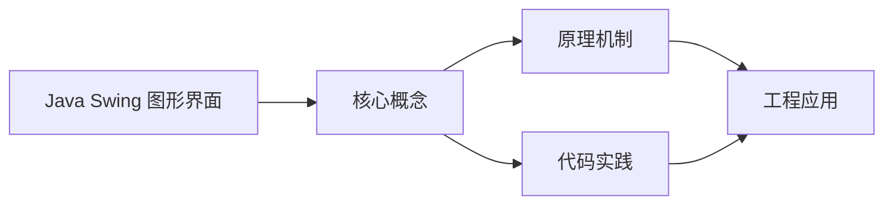
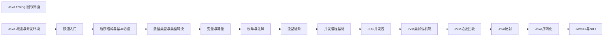

## 1. 学习目标（Bloom 分类）

本节按照布鲁姆教育目标分类学组织学习路径。本文主题为《Java Swing 图形界面》，属于 Java 模块，读者可以根据自身阶段选择阅读深度。

记忆层面：能够准确复述本文的核心概念、术语与基本语法或操作步骤，并能够在提问或检索时快速定位对应知识点。能够说出 Java 的编译执行模型（javac 到字节码，JVM 解释与 JIT）。

理解层面：能够用自己的语言解释核心原理与工作机制，说明概念之间的因果关系，而不是机械记忆结论。能够解释面向对象三大特性与 JVM 内存区域的职责。

应用层面：能够在真实项目或练习场景中运用本文知识解决具体问题，写出正确且可维护的实现。能够编写类、接口、集合操作与异常处理的完整程序。

分析层面：能够拆解复杂问题，比较本文主题与相邻概念的异同，识别边界条件与例外情况。能够分析 Java 与 C++、Go 在内存管理与并发模型上的差异。

评价层面：能够根据约束条件（性能、可读性、安全、成本）评价不同方案的优劣，做出有依据的技术决策。能够评价不同集合、并发工具与框架的适用场景。

创造层面：能够把本文知识与其他模块知识组合，设计出新的解决方案或可复用的工程模式。能够组合 Spring 生态设计企业级应用。

通过本节学习，读者应当能够把《Java Swing 图形界面》纳入自己的知识网络，并与 Java 模块的其他主题（JVM、集合框架、并发、Spring 生态）建立关联。

## 2. 历史动机与发展脉络

《Java Swing 图形界面》是 Java 领域的重要主题。要真正理解它，需要先了解它解决的问题与演进过程。

Java 由 James Gosling 领导的 Sun 团队于 1995 年发布，口号“一次编写，到处运行”依托 JVM 字节码实现跨平台。2006 年 Sun 将 Java 开源（OpenJDK），2010 年 Oracle 收购 Sun 后 Java 进入新的治理阶段。
Java 的版本节奏在 2017 年后改为每半年一个特性版本、每两年一个 LTS（长期支持）版本。当前主流 LTS 包括 Java 11、17、21 与 25；Java 21 引入虚拟线程（Project Loom 成果），显著降低高并发服务的线程成本。
Java 生态以 Spring 家族为核心：Spring Boot 简化配置与部署，Spring Cloud 提供微服务组件；构建工具从 Maven 演进到 Gradle；JVM 语言（Kotlin、Scala、Groovy）与 Java 共存互操作。
Android 开发早期使用 Java，2019 年后官方转向 Kotlin-first，但 Java 仍是服务端领域（尤其是金融、电商等企业系统）的中坚力量。

回到本文主题：Java Swing 图形界面 的提出与成熟，正是上述技术背景下的必然产物。早期实现往往以简单可用为目标，随着工程规模扩大，社区逐渐沉淀出标准做法与最佳实践；理解这一脉络，可以帮助读者判断“为什么文档中的推荐写法是现在这个样子”，也能在遇到历史遗留代码时准确识别其设计年代与取舍。

理解 Java 版本与 LTS 机制，是工程选型的起点：生产环境优先 LTS，新特性（如虚拟线程）可以在受控场景评估后引入。

## 3. 形式化定义与核心概念精讲

本节把《Java Swing 图形界面》涉及的核心概念以“定义 + 讲解”的形式展开。读者应把定义当作工具，把讲解当作理解路径；两者结合才能形成可迁移的知识。

JVM 与字节码：`javac` 把 .java 编译为 .class 字节码，JVM 加载、校验并执行；热点代码由 JIT（如 C2）编译为机器码，解释与编译结合实现启动速度与峰值性能的平衡。
面向对象：封装（访问控制）、继承（extends/implements）与多态（重载/重写）是 Java 的类型系统支柱；接口默认方法（Java 8）与密封类（Java 17）持续演进表达能力。
异常体系：受检异常（checked）编译期强制处理，非受检异常（RuntimeException）运行时抛出；try-with-resources 自动关闭资源。
泛型与擦除：Java 泛型在编译期检查后擦除类型参数，运行时无泛型信息；这解释了 `List<String>` 与 `List<Integer>` 的 Class 相同，以及通配符 `? extends` 的逆变协变规则。

### 3.1 原文章节逐一精讲

原文档把主题拆分为 15 个小节，下面按顺序给出每一节的导读讲解，随后保留原文细节供精读。

#### 原文精读（完整保留）

# Java Switch 模式匹配 语法速查手册

> **符号约定**：`< >` 必填参数 | `[ ]` 可选参数

---

#### 1. Swing 概述 | Swing Overview

Swing 是 Java 提供的一个 GUI (图形用户界面) 工具包，是 AWT (Abstract Window Toolkit) 的增强版本。Swing 提供了丰富的组件和功能，用于创建跨平台的桌面应用程序。

##### 1.1 Swing 的特点

- **纯 Java 实现**：Swing 组件完全由 Java 实现，不依赖于底层操作系统的 GUI 组件
- **跨平台**：相同的 Swing 代码可以在不同的操作系统上运行，保持一致的外观和行为
- **轻量级组件**：Swing 组件不依赖于本地平台的 GUI 组件，而是在 Java 中模拟实现
- **丰富的组件**：提供了大量的 GUI 组件，如按钮、文本框、列表、表格等
- **可定制性**：可以通过 Look and Feel 机制更改应用程序的外观
- **事件驱动**：基于事件处理模型，响应用户的操作

##### 1.2 Swing 与 AWT 的区别

| 特性                 | AWT                        | Swing            |
| -------------------- | -------------------------- | ---------------- |
| 实现方式             | 依赖本地平台 GUI 组件      | 纯 Java 实现     |
| 组件类型             | 重量级组件                 | 轻量级组件       |
| 外观一致性           | 依赖平台，不同平台外观不同 | 跨平台一致的外观 |
| 组件丰富度           | 基础组件                   | 丰富的组件库     |
| 性能                 | 通常更快                   | 可能稍慢但更灵活 |
| ## 2. Swing 基础组件 | Basic Components           |

Swing 提供了丰富的 GUI 组件，以下是一些常用的基础组件：

##### 2.1 顶层容器

- **JFrame**：主窗口，包含标题栏、最小化/最大化/关闭按钮
- **JDialog**：对话框窗口，通常用于显示消息或获取用户输入
- **JApplet**：小程序容器，用于在网页中运行 Java 应用

##### 2.2 中间组件

- **JPanel**：面板，用于组织和布局其他组件
- **JScrollPane**：带滚动条的面板，用于显示超出容器大小的内容
- **JSplitPane**：分割面板，用于将容器分为两个可调整大小的部分
- **JTabbedPane**：选项卡面板，用于在同一区域显示多个面板

##### 2.3 基本控件

- **JButton**：按钮，用于触发操作
- **JTextField**：文本输入框，用于输入单行文本
- **JTextArea**：文本区域，用于输入多行文本
- **JLabel**：标签，用于显示文本或图像
- **JCheckBox**：复选框，用于选择多个选项
- **JRadioButton**：单选按钮，用于从多个选项中选择一个
- **JComboBox**：下拉列表，用于从预定义选项中选择
- **JList**：列表，用于显示多个选项
- **JTable**：表格，用于显示二维数据
- **JSlider**：滑块，用于在范围内选择值
- **JProgressBar**：进度条，用于显示操作进度

#### 3. 布局管理器 | Layout Managers

布局管理器负责组件在容器中的排列方式，Swing 提供了多种布局管理器：

##### 3.1 FlowLayout

- **特点**：组件按照从左到右、从上到下的顺序排列
- **适用场景**：简单的组件排列，如按钮组
- **示例**：

```java
 JPanel panel = new JPanel();
 panel.setLayout(new FlowLayout());
 panel.add(new JButton("Button 1"));
 panel.add(new JButton("Button 2"));
 panel.add(new JButton("Button 3"));
```

##### 3.2 BorderLayout

- **特点**：将容器分为东、西、南、北、中五个区域
- **适用场景**：主窗口布局，如菜单栏在北，状态栏在南，内容在中
- **示例**：

```java
 JFrame frame = new JFrame("BorderLayout Example");
 frame.setLayout(new BorderLayout());
 frame.add(new JButton("North"), BorderLayout.NORTH);
 frame.add(new JButton("South"), BorderLayout.SOUTH);
 frame.add(new JButton("East"), BorderLayout.EAST);
 frame.add(new JButton("West"), BorderLayout.WEST);
 frame.add(new JButton("Center"), BorderLayout.CENTER);
```

##### 3.3 GridLayout

- **特点**：将容器分为规则的网格，每个单元格大小相同
- **适用场景**：需要整齐排列的组件，如计算器按钮
- **示例**：

```java
 JPanel panel = new JPanel();
 panel.setLayout(new GridLayout(3, 3)); // 3行3列
 for (int i = 1; i <= 9; i++) {
  panel.add(new JButton("" + i));
 }
```

##### 3.4 GridBagLayout

- **特点**：灵活的网格布局，可以指定组件的位置、大小和权重
- **适用场景**：复杂的布局需求
- **示例**：

```java
 JPanel panel = new JPanel();
 panel.setLayout(new GridBagLayout());
 GridBagConstraints gbc = new GridBagConstraints();
 // 添加第一个组件
 JButton button1 = new JButton("Button 1");
 gbc.gridx = 0;
 gbc.gridy = 0;
 gbc.gridwidth = 1;
 gbc.gridheight = 1;
 gbc.fill = GridBagConstraints.HORIZONTAL;
 panel.add(button1, gbc);
 // 添加第二个组件
 JButton button2 = new JButton("Button 2");
 gbc.gridx = 1;
 gbc.gridy = 0;
 gbc.gridwidth = 2;
 gbc.fill = GridBagConstraints.HORIZONTAL;
 panel.add(button2, gbc);
```

##### 3.5 CardLayout

- **特点**：在同一区域显示多个组件，但每次只显示一个
- **适用场景**：选项卡式界面，如向导或多步骤表单
- **示例**：

```java
 JPanel panel = new JPanel();
 CardLayout cardLayout = new CardLayout();
 panel.setLayout(cardLayout);
 // 添加卡片
 panel.add(new JButton("Card 1"), "card1");
 panel.add(new JButton("Card 2"), "card2");
 panel.add(new JButton("Card 3"), "card3");
 // 显示特定卡片
 cardLayout.show(panel, "card2");
```

#### 4. 事件处理 | Event Handling

Swing 使用事件处理模型来响应用户的操作，主要包括以下几个部分：

##### 4.1 事件类型

- **ActionEvent**：按钮点击、菜单项选择等操作
- **MouseEvent**：鼠标点击、移动、拖动等操作
- **KeyEvent**：键盘按键操作
- **WindowEvent**：窗口打开、关闭、最小化等操作
- **FocusEvent**：组件获得或失去焦点的操作

##### 4.2 事件监听器

事件监听器是实现了特定接口的对象，用于处理特定类型的事件：

- **ActionListener**：处理 ActionEvent
- **MouseListener**：处理 MouseEvent
- **KeyListener**：处理 KeyEvent
- **WindowListener**：处理 WindowEvent
- **FocusListener**：处理 FocusEvent

##### 4.3 事件处理示例

```java
 import javax.swing.*;
 import java.awt.event.*;
 public class EventHandlingExample {
  public static void main(String[] args) {
  JFrame frame = new JFrame("Event Handling Example");
  frame.setSize(300, 200);
  frame.setDefaultCloseOperation(JFrame.EXIT_ON_CLOSE);
  JPanel panel = new JPanel();
  JButton button = new JButton("Click Me");
  // 添加动作监听器
  button.addActionListener(new ActionListener() {
  @Override
  public void actionPerformed(ActionEvent e) {
  JOptionPane.showMessageDialog(frame, "Button clicked!");
  }
  });
  panel.add(button);
  frame.add(panel);
  frame.setVisible(true);
  }
 }
```

##### 4.4 适配器类

为了简化事件监听器的实现，Swing 提供了适配器类，这些类实现了相应的监听器接口，但所有方法都是空实现：

- **MouseAdapter**：实现 MouseListener 接口
- **KeyAdapter**：实现 KeyListener 接口
- **WindowAdapter**：实现 WindowListener 接口
- **FocusAdapter**：实现 FocusListener 接口
  使用适配器类可以只重写需要的方法，而不是实现所有方法：

```java
 button.addMouseListener(new MouseAdapter() {
  @Override
  public void mouseClicked(MouseEvent e) {
  System.out.println("Mouse clicked!");
  }
 }
```

#### 5. Swing 高级特性 | Advanced Features

##### 5.1 对话框 | Dialogs

Swing 提供了多种对话框，用于显示消息、获取用户输入等：

- **JOptionPane**：显示消息、确认、输入等对话框
- **JFileChooser**：文件选择对话框
- **JColorChooser**：颜色选择对话框
  示例：

```java
 // 显示消息对话框
 JOptionPane.showMessageDialog(frame, "Hello, Swing!");
 // 显示确认对话框
 int option = JOptionPane.showConfirmDialog(frame, "Are you sure?");
 if (option == JOptionPane.YES_OPTION) {
  System.out.println("User clicked Yes");
 }
 // 显示输入对话框
 String input = JOptionPane.showInputDialog(frame, "Enter your name:");
 System.out.println("User entered: " + input);
 // 显示文件选择对话框
 JFileChooser fileChooser = new JFileChooser();
 int result = fileChooser.showOpenDialog(frame);
 if (result == JFileChooser.APPROVE_OPTION) {
  System.out.println("Selected file: " + fileChooser.getSelectedFile());
 }
 // 显示颜色选择对话框
 Color color = JColorChooser.showDialog(frame, "Choose a color", Color.RED);
 System.out.println("Selected color: " + color);
```

##### 5.2 菜单 | Menus

Swing 提供了完整的菜单系统，包括菜单栏、菜单和菜单项：

```java
 JFrame frame = new JFrame("Menu Example");
 frame.setSize(400, 300);
 frame.setDefaultCloseOperation(JFrame.EXIT_ON_CLOSE);
 // 创建菜单栏
 JMenuBar menuBar = new JMenuBar();
 // 创建文件菜单
 JMenu fileMenu = new JMenu("File");
 JMenuItem newItem = new JMenuItem("New");
 JMenuItem openItem = new JMenuItem("Open");
 JMenuItem saveItem = new JMenuItem("Save");
 JMenuItem exitItem = new JMenuItem("Exit");
 // 添加菜单项到文件菜单
 fileMenu.add(newItem);
 fileMenu.add(openItem);
 fileMenu.add(saveItem);
 fileMenu.addSeparator(); // 添加分隔线
 fileMenu.add(exitItem);
 // 创建编辑菜单
 JMenu editMenu = new JMenu("Edit");
 JMenuItem cutItem = new JMenuItem("Cut");
 JMenuItem copyItem = new JMenuItem("Copy");
 JMenuItem pasteItem = new JMenuItem("Paste");
 // 添加菜单项到编辑菜单
 editMenu.add(cutItem);
 editMenu.add(copyItem);
 editMenu.add(pasteItem);
 // 添加菜单到菜单栏
 menuBar.add(fileMenu);
 menuBar.add(editMenu);
 // 设置菜单栏
 frame.setJMenuBar(menuBar);
 // 添加退出菜单项的监听器
 exitItem.addActionListener(new ActionListener() {
  @Override
  public void actionPerformed(ActionEvent e) {
  System.exit(0);
  }
 }
 frame.setVisible(true);
```

##### 5.3 表格 | Tables

JTable 组件用于显示和编辑二维数据：

```java
 JFrame frame = new JFrame("Table Example");
 frame.setSize(500, 300);
 frame.setDefaultCloseOperation(JFrame.EXIT_ON_CLOSE);
 // 列名
 String[] columnNames = {"ID", "Name", "Age", "City"};
 // 数据
 Object[][] data = {
  {1, "John", 25, "New York"},
  {2, "Mary", 30, "London"},
  {3, "Bob", 35, "Paris"},
  {4, "Alice", 28, "Tokyo"}
 }
 // 创建表格
 JTable table = new JTable(data, columnNames);
 // 添加滚动条
 JScrollPane scrollPane = new JScrollPane(table);
 frame.add(scrollPane);
 frame.setVisible(true);
```

##### 5.4 树 | Trees

JTree 组件用于显示层次结构数据：

```java
 JFrame frame = new JFrame("Tree Example");
 frame.setSize(400, 300);
 frame.setDefaultCloseOperation(JFrame.EXIT_ON_CLOSE);
 // 创建根节点
 defaultMutableTreeNode root = new DefaultMutableTreeNode("Root");
 // 创建子节点
 defaultMutableTreeNode node1 = new DefaultMutableTreeNode("Node 1");
 defaultMutableTreeNode node2 = new DefaultMutableTreeNode("Node 2");
 defaultMutableTreeNode node3 = new DefaultMutableTreeNode("Node 3");
 // 添加子节点到根节点
 root.add(node1);
 root.add(node2);
 root.add(node3);
 // 创建子子节点
 defaultMutableTreeNode node1_1 = new DefaultMutableTreeNode("Node 1.1");
 defaultMutableTreeNode node1_2 = new DefaultMutableTreeNode("Node 1.2");
 node1.add(node1_1);
 node1.add(node1_2);
 // 创建树
 JTree tree = new JTree(root);
 // 添加滚动条
 JScrollPane scrollPane = new JScrollPane(tree);
 frame.add(scrollPane);
 frame.setVisible(true);
```

#### 6. 外观与感觉 | Look and Feel

Swing 允许通过 Look and Feel (L&F) 机制更改应用程序的外观：

##### 6.1 内置的 Look and Feel

- **Metal**：默认的跨平台外观
- **Nimbus**：现代的跨平台外观
- **Windows**：Windows 风格的外观
- **Windows Classic**：经典 Windows 风格的外观
- **Motif**：Unix/Linux 风格的外观
- **Mac OS X**：Mac 风格的外观（仅在 Mac 系统上可用）

##### 6.2 设置 Look and Feel

```java
 import javax.swing.*;
 import javax.swing.plaf.nimbus.NimbusLookAndFeel;
 public class LookAndFeelExample {
  public static void main(String[] args) {
  try {
  // 设置 Nimbus Look and Feel
  UIManager.setLookAndFeel(new NimbusLookAndFeel());
  // 或者使用系统默认的 Look and Feel
  // UIManager.setLookAndFeel(UIManager.getSystemLookAndFeelClassName());
  } catch (Exception e) {
  e.printStackTrace();
  }
  // 创建并显示 GUI
  JFrame frame = new JFrame("Look and Feel Example");
  frame.setSize(300, 200);
  frame.setDefaultCloseOperation(JFrame.EXIT_ON_CLOSE);
  JPanel panel = new JPanel();
  panel.add(new JButton("Button"));
  panel.add(new JTextField(20));
  panel.add(new JCheckBox("Check Box"));
  frame.add(panel);
  frame.setVisible(true);
  }
 }
```

#### 7. 实战示例 | Practical Examples

##### 7.1 简单的计算器

```java
 import javax.swing.*;
 import java.awt.*;
 import java.awt.event.*;
 public class Calculator {
  private JFrame frame;
  private JTextField textField;
  private String operator = "";
  private double firstNumber = 0;
  private boolean start = true;
  public Calculator() {
  frame = new JFrame("Calculator");
  frame.setSize(300, 400);
  frame.setDefaultCloseOperation(JFrame.EXIT_ON_CLOSE);
  frame.setLayout(new BorderLayout());
  // 创建文本框
  textField = new JTextField();
  textField.setFont(new Font("Arial", Font.PLAIN, 24));
  textField.setHorizontalAlignment(JTextField.RIGHT);
  frame.add(textField, BorderLayout.NORTH);
  // 创建按钮面板
  JPanel buttonPanel = new JPanel();
  buttonPanel.setLayout(new GridLayout(4, 4, 5, 5));
  // 按钮标签
  String[] buttons = {
  "7", "8", "9", "/",
  "4", "5", "6", "*",
  "1", "2", "3", "-",
  "C", "0", "=", "+"
  };
  // 创建并添加按钮
  for (String button : buttons) {
  JButton btn = new JButton(button);
  btn.setFont(new Font("Arial", Font.PLAIN, 18));
  btn.addActionListener(new ButtonClickListener());
  buttonPanel.add(btn);
  }
  frame.add(buttonPanel, BorderLayout.CENTER);
  frame.setVisible(true);
  }
  private class ButtonClickListener implements ActionListener {
  @Override
  public void actionPerformed(ActionEvent e) {
  String command = e.getActionCommand();
  if (command.charAt(0) >= '0' && command.charAt(0) <= '9' || command.equals(".")) {
  if (start) {
  textField.setText("");
  start = false;
  }
  textField.setText(textField.getText() + command);
  } else if (command.equals("C")) {
  textField.setText("");
  operator = "";
  firstNumber = 0;
  start = true;
  } else if (command.equals("=")) {
  double secondNumber = Double.parseDouble(textField.getText());
  double result = 0;
  switch (operator) {
  case "+":
  result = firstNumber + secondNumber;
  break;
  case "-":
  result = firstNumber - secondNumber;
  break;
  case "*":
  result = firstNumber * secondNumber;
  break;
  case "/":
  result = firstNumber / secondNumber;
  break;
  }
  textField.setText(String.valueOf(result));
  operator = "";
  start = true;
  } else {
  if (!start) {
  firstNumber = Double.parseDouble(textField.getText());
  operator = command;
  start = true;
  }
  }
  }
  }
  public static void main(String[] args) {
  new Calculator();
  }
 }
```

##### 7.2 简单的文本编辑器

```java
 import javax.swing.*;
 import java.awt.*;
 import java.awt.event.*;
 import java.io.*;
 public class TextEditor {
  private JFrame frame;
  private JTextArea textArea;
  private JMenuBar menuBar;
  private JMenu fileMenu;
  private JMenuItem newItem, openItem, saveItem, exitItem;
  private File currentFile = null;
  public TextEditor() {
  frame = new JFrame("Text Editor");
  frame.setSize(600, 400);
  frame.setDefaultCloseOperation(JFrame.EXIT_ON_CLOSE);
  // 创建文本区域
  textArea = new JTextArea();
  textArea.setFont(new Font("Arial", Font.PLAIN, 14));
  JScrollPane scrollPane = new JScrollPane(textArea);
  frame.add(scrollPane, BorderLayout.CENTER);
  // 创建菜单栏
  menuBar = new JMenuBar();
  // 创建文件菜单
  fileMenu = new JMenu("File");
  // 创建菜单项
  newItem = new JMenuItem("New");
  openItem = new JMenuItem("Open");
  saveItem = new JMenuItem("Save");
  exitItem = new JMenuItem("Exit");
  // 添加菜单项到文件菜单
  fileMenu.add(newItem);
  fileMenu.add(openItem);
  fileMenu.add(saveItem);
  fileMenu.addSeparator();
  fileMenu.add(exitItem);
  // 添加文件菜单到菜单栏
  menuBar.add(fileMenu);
  // 设置菜单栏
  frame.setJMenuBar(menuBar);
  // 添加事件监听器
  newItem.addActionListener(new ActionListener() {
  @Override
  public void actionPerformed(ActionEvent e) {
  textArea.setText("");
  currentFile = null;
  frame.setTitle("Text Editor");
  }
  });
  openItem.addActionListener(new ActionListener() {
  @Override
  public void actionPerformed(ActionEvent e) {
  JFileChooser fileChooser = new JFileChooser();
  int result = fileChooser.showOpenDialog(frame);
  if (result == JFileChooser.APPROVE_OPTION) {
  currentFile = fileChooser.getSelectedFile();
  try {
  BufferedReader reader = new BufferedReader(new FileReader(currentFile));
  textArea.read(reader, null);
  reader.close();
  frame.setTitle("Text Editor - " + currentFile.getName());
  } catch (IOException ex) {
  ex.printStackTrace();
  }
  }
  }
  });
  saveItem.addActionListener(new ActionListener() {
  @Override
  public void actionPerformed(ActionEvent e) {
  if (currentFile == null) {
  JFileChooser fileChooser = new JFileChooser();
  int result = fileChooser.showSaveDialog(frame);
  if (result == JFileChooser.APPROVE_OPTION) {
  currentFile = fileChooser.getSelectedFile();
  } else {
  return;
  }
  }
  try {
  BufferedWriter writer = new BufferedWriter(new FileWriter(currentFile));
  textArea.write(writer);
  writer.close();
  frame.setTitle("Text Editor - " + currentFile.getName());
  } catch (IOException ex) {
  ex.printStackTrace();
  }
  }
  });
  exitItem.addActionListener(new ActionListener() {
  @Override
  public void actionPerformed(ActionEvent e) {
  System.exit(0);
  }
  });
  frame.setVisible(true);
  }
  public static void main(String[] args) {
  new TextEditor();
  }
 }
```

#### 8. 最佳实践 | Best Practices

##### 8.1 性能优化

- **使用合适的布局管理器**：根据界面需求选择合适的布局管理器
- **避免过度使用重量级组件**：重量级组件可能影响性能
- **使用 SwingUtilities.invokeLater**：确保 GUI 操作在事件分发线程中执行
- **合理使用组件**：只创建必要的组件，避免创建过多组件

##### 8.2 代码组织

- **使用 MVC 模式**：将模型、视图和控制器分离
- **模块化设计**：将功能划分为模块，提高代码可维护性
- **命名规范**：使用清晰的命名规范，提高代码可读性
- **注释**：添加适当的注释，说明代码的功能和逻辑

##### 8.3 用户体验

- **响应式设计**：确保界面在不同大小的窗口中都能正常显示
- **合理的布局**：使用合理的布局，使界面美观易用
- **适当的反馈**：对用户操作提供适当的反馈，如进度条、消息框等
- **快捷键**：为常用操作提供快捷键，提高用户操作效率

#### 9. 总结 | Summary

Swing 是 Java 提供的功能强大的 GUI 工具包，通过它可以创建跨平台的桌面应用程序。Swing 提供了丰富的组件和功能，包括各种控件、布局管理器、事件处理机制等。
通过学习 Swing，你可以创建各种类型的桌面应用程序，从简单的计算器到复杂的文本编辑器。在实际开发中，应根据具体需求选择合适的组件和布局管理器，并遵循相关的最佳实践，以创建美观、高效、用户友好的应用程序。
#### 类型模式

**基本写法：instanceof 类型模式**
`if (<变量> instanceof <类型> <变量名>) { ... }`
```java
// Java 16+，类型转换自动绑定变量
Object obj = "hello";
if (obj instanceof String s) {
    System.out.println(s.length());
}
```

---

**基本写法：switch 类型模式**
`case <类型> <变量名> -> <结果>;`
```java
// Java 21 正式，按类型分支
static String format(Object obj) {
    return switch (obj) {
        case Integer i -> "int: " + i;
        case String s  -> "str: " + s;
        case null      -> "null";
        default        -> "other";
    };
}
```

---

#### 守卫模式

**基本写法：when 条件守卫**
`case <类型> <变量名> when <条件> -> <结果>;`
```java
// Java 21 正式，在 case 后追加条件
static String classify(Integer i) {
    return switch (i) {
        case Integer v when v > 0  -> "positive";
        case Integer v when v == 0 -> "zero";
        case Integer v             -> "negative";
    };
}
```

---

#### null 处理

**基本写法：显式 null 分支**
`case null -> <结果>;`
```java
// Java 21，switch 内直接处理 null
String label = switch (obj) {
    case null      -> "N/A";
    case String s  -> s;
    default        -> obj.toString();
};
```

---

**基本写法：null 合并分支**
`case null, default -> <结果>;`
```java
// null 与 default 合并处理
String label = switch (obj) {
    case String s -> s;
    case null, default -> "fallback";
};
```

---

#### 记录模式

**基本写法：解构记录**
`case <记录名>(<组件1>, <组件2>) -> <结果>;`
```java
// Java 21 正式，解构 record 组件
record Point(int x, int y) {}
static int sum(Point p) {
    return switch (p) {
        case Point(int x, int y) -> x + y;
    };
}
```

---

**基本写法：嵌套记录模式**
`case <外层>(<内层>, <值>) -> <结果>;`
```java
// 嵌套解构
record Point(int x, int y) {}
record Line(Point start, Point end) {}
static String desc(Line l) {
    return switch (l) {
        case Line(Point(int x1, int y1), Point(int x2, int y2))
            -> "(" + x1 + "," + y1 + ")->(" + x2 + "," + y2 + ")";
    };
}
```

---

**基本写法：类型 + 守卫结合**
`case <类型> <名> when <条件> -> <结果>;`
```java
// 组合类型模式与守卫
record Point(int x, int y) {}
static String where(Point p) {
    return switch (p) {
        case Point(int x, int y) when x == y -> "diagonal";
        case Point(int x, int y)             -> "other";
    };
}
```

---

#### 穷举性与密封类

**基本写法：密封类穷举**
`sealed interface <名称> permits <子类1>, <子类2>`
```java
// 密封层级 + switch 穷举，无需 default
sealed interface Shape permits Circle, Square {}
record Circle(double r) implements Shape {}
record Square(double s) implements Shape {}

static double area(Shape s) {
    return switch (s) {
        case Circle c -> Math.PI * c.r() * c.r();
        case Square q -> q.s() * q.s();
    };
}
```

---

**基本写法：未命名模式变量**
`case <类型> _ -> <结果>;`
```java
// Java 22+，不需要组件值时用 _ 占位
static boolean isCircle(Shape s) {
    return switch (s) {
        case Circle _ -> true;
        case Square _ -> false;
    };
}
```

---

#### 表达式与语句

**基本写法：switch 表达式**
`switch (<值>) { case ... -> <结果>; }`
```java
// 返回值，用 -> 箭头
int len = switch (s) {
    case null -> 0;
    case String v -> v.length();
};
```

---

**基本写法：switch 语句带 yield**
`switch (<值>) { case <模式>: yield <值>; }`
```java
// 块语句中用 yield 返回
int len = switch (s) {
    case String v: {
        System.out.println("got string");
        yield v.length();
    }
    case null: yield 0;
};
```

---

#### 进阶用法

**基本写法：父类型分支需在前**
`case <子类型> -> ...; case <父类型> -> ...;`
```java
// 子类型分支必须在父类型之前
static String of(Number n) {
    return switch (n) {
        case Integer i -> "int " + i;
        case Double d  -> "dbl " + d;
        case Number x  -> "num " + x;
    };
}
```

---

**基本写法：数组与集合判断**
`case <类型>[] <名> -> ...;`
```java
// 数组类型模式
static String desc(Object o) {
    return switch (o) {
        case int[] arr   -> "int[" + arr.length + "]";
        case String[] arr-> "str[" + arr.length + "]";
        default          -> "other";
    };
}
```


### 3.2 概念关系图

下面用 Mermaid 图表达本文核心概念之间的关系，帮助读者建立整体图景：



图中展示的是本文知识的结构化关系：核心概念是入口，原理机制解释“为什么”，代码实践演示“怎么做”，工程应用回答“何时用”。读者学习时可以把每个小节的内容挂接到对应节点上。

## 4. 理论推导与原理解析

本节深入《Java Swing 图形界面》背后的原理。理论部分不求面面俱到，而是聚焦“能解释现象、能指导实践”的关键推导。

JVM 内存模型：堆（新生代/老年代）、元空间、虚拟机栈、本地方法栈与程序计数器；GC 从 CMS 演进到 G1（默认）、ZGC（超低延迟），理解分代收集是调优前提。
并发工具：synchronized 与 JUC（java.util.concurrent）的锁、并发容器、线程池、CompletableFuture 构成并发工具箱；Java 21 的虚拟线程让“每任务一线程”成为可能。
类加载机制：双亲委派模型保证类唯一性，SPI（ServiceLoader）打破委派实现扩展；自定义类加载器是热部署与隔离的基础。
反射与注解：反射在运行时检查类结构，注解提供元数据；Spring 的依赖注入与 AOP 均基于这些机制，但反射有性能与安全成本。

需要强调的是，理论推导与工程实践之间存在翻译层：理论给出的是理想化模型与边界条件，工程代码则必须处理真实环境中的例外。读者在学习时应先掌握理论的“标准情形”，再通过陷阱章节了解“非标准情形”。

## 5. 代码示例与逐行讲解

本节把原文中的代码示例系统整理，并为每个示例补充用途说明与讲解。读者不应只浏览代码，而应逐段对照讲解理解设计意图。

### 5.1 示例：3.1 FlowLayout

该示例来自原文《3.1 FlowLayout》小节，用于演示Java Swing 图形界面相关操作。阅读时请先看代码结构，再看其后的讲解。

```java
 JPanel panel = new JPanel();
 panel.setLayout(new FlowLayout());
 panel.add(new JButton("Button 1"));
 panel.add(new JButton("Button 2"));
 panel.add(new JButton("Button 3"));
```

讲解：这段代码演示了本节核心知识点。代码中的关键操作可以归纳为三步：准备（定义或初始化）、执行（核心逻辑）、收尾（释放资源或返回结果）。实际项目中，这三步往往被封装为函数或类，以提升复用性与可测试性。

关键点分析：

该示例共 5 行有效代码，结构以数据或配置为主。阅读时应关注：数据字段的含义、配置项的作用，以及它们与运行行为的对应关系。

进阶思考路径：先尝试修改参数观察行为变化，再把示例中的模式迁移到自己的项目中；每次修改都记录预期与实测差异，这是把示例转化为能力的最快方式。

### 5.2 示例：3.2 BorderLayout

该示例来自原文《3.2 BorderLayout》小节，用于演示Java Swing 图形界面相关操作。阅读时请先看代码结构，再看其后的讲解。

```java
 JFrame frame = new JFrame("BorderLayout Example");
 frame.setLayout(new BorderLayout());
 frame.add(new JButton("North"), BorderLayout.NORTH);
 frame.add(new JButton("South"), BorderLayout.SOUTH);
 frame.add(new JButton("East"), BorderLayout.EAST);
 frame.add(new JButton("West"), BorderLayout.WEST);
 frame.add(new JButton("Center"), BorderLayout.CENTER);
```

讲解：这段代码演示了本节核心知识点。代码中的关键操作可以归纳为三步：准备（定义或初始化）、执行（核心逻辑）、收尾（释放资源或返回结果）。实际项目中，这三步往往被封装为函数或类，以提升复用性与可测试性。

关键点分析：

该示例共 7 行有效代码，结构以数据或配置为主。阅读时应关注：数据字段的含义、配置项的作用，以及它们与运行行为的对应关系。

进阶思考路径：先尝试修改参数观察行为变化，再把示例中的模式迁移到自己的项目中；每次修改都记录预期与实测差异，这是把示例转化为能力的最快方式。

### 5.3 示例：3.3 GridLayout

该示例来自原文《3.3 GridLayout》小节，用于演示Java Swing 图形界面相关操作。阅读时请先看代码结构，再看其后的讲解。

```java
 JPanel panel = new JPanel();
 panel.setLayout(new GridLayout(3, 3)); // 3行3列
 for (int i = 1; i <= 9; i++) {
  panel.add(new JButton("" + i));
 }
```

讲解：这段代码演示了本节核心知识点。代码中的关键操作可以归纳为三步：准备（定义或初始化）、执行（核心逻辑）、收尾（释放资源或返回结果）。实际项目中，这三步往往被封装为函数或类，以提升复用性与可测试性。

关键点分析：

该示例共 5 行有效代码，包含 1 类关键结构（for）。其中：

- 入口与初始化部分负责建立上下文，对应实际项目中的启动或装配逻辑；
- 核心逻辑部分体现本文主题的主要操作，是阅读时最需要对照讲解理解的部分；
- 输出或返回部分把结果交给调用方，注意其类型与边界条件。

进阶思考路径：先尝试修改参数观察行为变化，再把示例中的模式迁移到自己的项目中；每次修改都记录预期与实测差异，这是把示例转化为能力的最快方式。

### 5.4 示例：3.4 GridBagLayout

该示例来自原文《3.4 GridBagLayout》小节，用于演示Java Swing 图形界面相关操作。阅读时请先看代码结构，再看其后的讲解。

```java
 JPanel panel = new JPanel();
 panel.setLayout(new GridBagLayout());
 GridBagConstraints gbc = new GridBagConstraints();
 // 添加第一个组件
 JButton button1 = new JButton("Button 1");
 gbc.gridx = 0;
 gbc.gridy = 0;
 gbc.gridwidth = 1;
 gbc.gridheight = 1;
 gbc.fill = GridBagConstraints.HORIZONTAL;
 panel.add(button1, gbc);
 // 添加第二个组件
 JButton button2 = new JButton("Button 2");
 gbc.gridx = 1;
 gbc.gridy = 0;
 gbc.gridwidth = 2;
 gbc.fill = GridBagConstraints.HORIZONTAL;
 panel.add(button2, gbc);
```

讲解：这段代码演示了本节核心知识点。代码中的关键操作可以归纳为三步：准备（定义或初始化）、执行（核心逻辑）、收尾（释放资源或返回结果）。实际项目中，这三步往往被封装为函数或类，以提升复用性与可测试性。

关键点分析：

该示例共 18 行有效代码，结构以数据或配置为主。阅读时应关注：数据字段的含义、配置项的作用，以及它们与运行行为的对应关系。

进阶思考路径：先尝试修改参数观察行为变化，再把示例中的模式迁移到自己的项目中；每次修改都记录预期与实测差异，这是把示例转化为能力的最快方式。

### 5.5 示例：3.5 CardLayout

该示例来自原文《3.5 CardLayout》小节，用于演示Java Swing 图形界面相关操作。阅读时请先看代码结构，再看其后的讲解。

```java
 JPanel panel = new JPanel();
 CardLayout cardLayout = new CardLayout();
 panel.setLayout(cardLayout);
 // 添加卡片
 panel.add(new JButton("Card 1"), "card1");
 panel.add(new JButton("Card 2"), "card2");
 panel.add(new JButton("Card 3"), "card3");
 // 显示特定卡片
 cardLayout.show(panel, "card2");
```

讲解：这段代码演示了本节核心知识点。代码中的关键操作可以归纳为三步：准备（定义或初始化）、执行（核心逻辑）、收尾（释放资源或返回结果）。实际项目中，这三步往往被封装为函数或类，以提升复用性与可测试性。

关键点分析：

该示例共 9 行有效代码，结构以数据或配置为主。阅读时应关注：数据字段的含义、配置项的作用，以及它们与运行行为的对应关系。

进阶思考路径：先尝试修改参数观察行为变化，再把示例中的模式迁移到自己的项目中；每次修改都记录预期与实测差异，这是把示例转化为能力的最快方式。

### 5.6 示例：4.3 事件处理示例

该示例来自原文《4.3 事件处理示例》小节，用于演示Java Swing 图形界面相关操作。阅读时请先看代码结构，再看其后的讲解。

```java
 import javax.swing.*;
 import java.awt.event.*;
 public class EventHandlingExample {
  public static void main(String[] args) {
  JFrame frame = new JFrame("Event Handling Example");
  frame.setSize(300, 200);
  frame.setDefaultCloseOperation(JFrame.EXIT_ON_CLOSE);
  JPanel panel = new JPanel();
  JButton button = new JButton("Click Me");
  // 添加动作监听器
  button.addActionListener(new ActionListener() {
  @Override
  public void actionPerformed(ActionEvent e) {
  JOptionPane.showMessageDialog(frame, "Button clicked!");
  }
  });
  panel.add(button);
  frame.add(panel);
  frame.setVisible(true);
  }
 }
```

讲解：这段代码演示了本节核心知识点。代码中的关键操作可以归纳为三步：准备（定义或初始化）、执行（核心逻辑）、收尾（释放资源或返回结果）。实际项目中，这三步往往被封装为函数或类，以提升复用性与可测试性。

关键点分析：

该示例共 21 行有效代码，包含 2 类关键结构（class、import）。其中：

- 入口与初始化部分负责建立上下文，对应实际项目中的启动或装配逻辑；
- 核心逻辑部分体现本文主题的主要操作，是阅读时最需要对照讲解理解的部分；
- 输出或返回部分把结果交给调用方，注意其类型与边界条件。

进阶思考路径：先尝试修改参数观察行为变化，再把示例中的模式迁移到自己的项目中；每次修改都记录预期与实测差异，这是把示例转化为能力的最快方式。

### 5.7 示例：4.4 适配器类

该示例来自原文《4.4 适配器类》小节，用于演示Java Swing 图形界面相关操作。阅读时请先看代码结构，再看其后的讲解。

```java
 button.addMouseListener(new MouseAdapter() {
  @Override
  public void mouseClicked(MouseEvent e) {
  System.out.println("Mouse clicked!");
  }
 }
```

讲解：这段代码演示了本节核心知识点。代码中的关键操作可以归纳为三步：准备（定义或初始化）、执行（核心逻辑）、收尾（释放资源或返回结果）。实际项目中，这三步往往被封装为函数或类，以提升复用性与可测试性。

关键点分析：

该示例共 6 行有效代码，结构以数据或配置为主。阅读时应关注：数据字段的含义、配置项的作用，以及它们与运行行为的对应关系。

进阶思考路径：先尝试修改参数观察行为变化，再把示例中的模式迁移到自己的项目中；每次修改都记录预期与实测差异，这是把示例转化为能力的最快方式。

### 5.8 示例：5.1 对话框 | Dialogs

该示例来自原文《5.1 对话框 | Dialogs》小节，用于演示Java Swing 图形界面相关操作。阅读时请先看代码结构，再看其后的讲解。

```java
 // 显示消息对话框
 JOptionPane.showMessageDialog(frame, "Hello, Swing!");
 // 显示确认对话框
 int option = JOptionPane.showConfirmDialog(frame, "Are you sure?");
 if (option == JOptionPane.YES_OPTION) {
  System.out.println("User clicked Yes");
 }
 // 显示输入对话框
 String input = JOptionPane.showInputDialog(frame, "Enter your name:");
 System.out.println("User entered: " + input);
 // 显示文件选择对话框
 JFileChooser fileChooser = new JFileChooser();
 int result = fileChooser.showOpenDialog(frame);
 if (result == JFileChooser.APPROVE_OPTION) {
  System.out.println("Selected file: " + fileChooser.getSelectedFile());
 }
 // 显示颜色选择对话框
 Color color = JColorChooser.showDialog(frame, "Choose a color", Color.RED);
 System.out.println("Selected color: " + color);
```

讲解：这段代码演示了本节核心知识点。代码中的关键操作可以归纳为三步：准备（定义或初始化）、执行（核心逻辑）、收尾（释放资源或返回结果）。实际项目中，这三步往往被封装为函数或类，以提升复用性与可测试性。

关键点分析：

该示例共 19 行有效代码，包含 1 类关键结构（if）。其中：

- 入口与初始化部分负责建立上下文，对应实际项目中的启动或装配逻辑；
- 核心逻辑部分体现本文主题的主要操作，是阅读时最需要对照讲解理解的部分；
- 输出或返回部分把结果交给调用方，注意其类型与边界条件。

进阶思考路径：先尝试修改参数观察行为变化，再把示例中的模式迁移到自己的项目中；每次修改都记录预期与实测差异，这是把示例转化为能力的最快方式。

### 5.9 示例：5.2 菜单 | Menus

该示例来自原文《5.2 菜单 | Menus》小节，用于演示Java Swing 图形界面相关操作。阅读时请先看代码结构，再看其后的讲解。

```java
 JFrame frame = new JFrame("Menu Example");
 frame.setSize(400, 300);
 frame.setDefaultCloseOperation(JFrame.EXIT_ON_CLOSE);
 // 创建菜单栏
 JMenuBar menuBar = new JMenuBar();
 // 创建文件菜单
 JMenu fileMenu = new JMenu("File");
 JMenuItem newItem = new JMenuItem("New");
 JMenuItem openItem = new JMenuItem("Open");
 JMenuItem saveItem = new JMenuItem("Save");
 JMenuItem exitItem = new JMenuItem("Exit");
 // 添加菜单项到文件菜单
 fileMenu.add(newItem);
 fileMenu.add(openItem);
 fileMenu.add(saveItem);
 fileMenu.addSeparator(); // 添加分隔线
 fileMenu.add(exitItem);
 // 创建编辑菜单
 JMenu editMenu = new JMenu("Edit");
 JMenuItem cutItem = new JMenuItem("Cut");
 JMenuItem copyItem = new JMenuItem("Copy");
 JMenuItem pasteItem = new JMenuItem("Paste");
 // 添加菜单项到编辑菜单
 editMenu.add(cutItem);
 editMenu.add(copyItem);
 editMenu.add(pasteItem);
 // 添加菜单到菜单栏
 menuBar.add(fileMenu);
 menuBar.add(editMenu);
 // 设置菜单栏
 frame.setJMenuBar(menuBar);
 // 添加退出菜单项的监听器
 exitItem.addActionListener(new ActionListener() {
  @Override
  public void actionPerformed(ActionEvent e) {
  System.exit(0);
  }
 }
 frame.setVisible(true);
```

讲解：这段代码演示了本节核心知识点。代码中的关键操作可以归纳为三步：准备（定义或初始化）、执行（核心逻辑）、收尾（释放资源或返回结果）。实际项目中，这三步往往被封装为函数或类，以提升复用性与可测试性。

关键点分析：

该示例共 39 行有效代码，结构以数据或配置为主。阅读时应关注：数据字段的含义、配置项的作用，以及它们与运行行为的对应关系。

进阶思考路径：先尝试修改参数观察行为变化，再把示例中的模式迁移到自己的项目中；每次修改都记录预期与实测差异，这是把示例转化为能力的最快方式。

### 5.10 示例：5.3 表格 | Tables

该示例来自原文《5.3 表格 | Tables》小节，用于演示Java Swing 图形界面相关操作。阅读时请先看代码结构，再看其后的讲解。

```java
 JFrame frame = new JFrame("Table Example");
 frame.setSize(500, 300);
 frame.setDefaultCloseOperation(JFrame.EXIT_ON_CLOSE);
 // 列名
 String[] columnNames = {"ID", "Name", "Age", "City"};
 // 数据
 Object[][] data = {
  {1, "John", 25, "New York"},
  {2, "Mary", 30, "London"},
  {3, "Bob", 35, "Paris"},
  {4, "Alice", 28, "Tokyo"}
 }
 // 创建表格
 JTable table = new JTable(data, columnNames);
 // 添加滚动条
 JScrollPane scrollPane = new JScrollPane(table);
 frame.add(scrollPane);
 frame.setVisible(true);
```

讲解：这段代码演示了本节核心知识点。代码中的关键操作可以归纳为三步：准备（定义或初始化）、执行（核心逻辑）、收尾（释放资源或返回结果）。实际项目中，这三步往往被封装为函数或类，以提升复用性与可测试性。

关键点分析：

该示例共 18 行有效代码，结构以数据或配置为主。阅读时应关注：数据字段的含义、配置项的作用，以及它们与运行行为的对应关系。

进阶思考路径：先尝试修改参数观察行为变化，再把示例中的模式迁移到自己的项目中；每次修改都记录预期与实测差异，这是把示例转化为能力的最快方式。

### 5.11 示例：5.4 树 | Trees

该示例来自原文《5.4 树 | Trees》小节，用于演示Java Swing 图形界面相关操作。阅读时请先看代码结构，再看其后的讲解。

```java
 JFrame frame = new JFrame("Tree Example");
 frame.setSize(400, 300);
 frame.setDefaultCloseOperation(JFrame.EXIT_ON_CLOSE);
 // 创建根节点
 defaultMutableTreeNode root = new DefaultMutableTreeNode("Root");
 // 创建子节点
 defaultMutableTreeNode node1 = new DefaultMutableTreeNode("Node 1");
 defaultMutableTreeNode node2 = new DefaultMutableTreeNode("Node 2");
 defaultMutableTreeNode node3 = new DefaultMutableTreeNode("Node 3");
 // 添加子节点到根节点
 root.add(node1);
 root.add(node2);
 root.add(node3);
 // 创建子子节点
 defaultMutableTreeNode node1_1 = new DefaultMutableTreeNode("Node 1.1");
 defaultMutableTreeNode node1_2 = new DefaultMutableTreeNode("Node 1.2");
 node1.add(node1_1);
 node1.add(node1_2);
 // 创建树
 JTree tree = new JTree(root);
 // 添加滚动条
 JScrollPane scrollPane = new JScrollPane(tree);
 frame.add(scrollPane);
 frame.setVisible(true);
```

讲解：这段代码演示了本节核心知识点。代码中的关键操作可以归纳为三步：准备（定义或初始化）、执行（核心逻辑）、收尾（释放资源或返回结果）。实际项目中，这三步往往被封装为函数或类，以提升复用性与可测试性。

关键点分析：

该示例共 24 行有效代码，结构以数据或配置为主。阅读时应关注：数据字段的含义、配置项的作用，以及它们与运行行为的对应关系。

进阶思考路径：先尝试修改参数观察行为变化，再把示例中的模式迁移到自己的项目中；每次修改都记录预期与实测差异，这是把示例转化为能力的最快方式。

### 5.12 示例：6.2 设置 Look and Feel

该示例来自原文《6.2 设置 Look and Feel》小节，用于演示Java Swing 图形界面相关操作。阅读时请先看代码结构，再看其后的讲解。

```java
 import javax.swing.*;
 import javax.swing.plaf.nimbus.NimbusLookAndFeel;
 public class LookAndFeelExample {
  public static void main(String[] args) {
  try {
  // 设置 Nimbus Look and Feel
  UIManager.setLookAndFeel(new NimbusLookAndFeel());
  // 或者使用系统默认的 Look and Feel
  // UIManager.setLookAndFeel(UIManager.getSystemLookAndFeelClassName());
  } catch (Exception e) {
  e.printStackTrace();
  }
  // 创建并显示 GUI
  JFrame frame = new JFrame("Look and Feel Example");
  frame.setSize(300, 200);
  frame.setDefaultCloseOperation(JFrame.EXIT_ON_CLOSE);
  JPanel panel = new JPanel();
  panel.add(new JButton("Button"));
  panel.add(new JTextField(20));
  panel.add(new JCheckBox("Check Box"));
  frame.add(panel);
  frame.setVisible(true);
  }
 }
```

讲解：这段代码演示了本节核心知识点。代码中的关键操作可以归纳为三步：准备（定义或初始化）、执行（核心逻辑）、收尾（释放资源或返回结果）。实际项目中，这三步往往被封装为函数或类，以提升复用性与可测试性。

关键点分析：

该示例共 24 行有效代码，包含 2 类关键结构（class、import）。其中：

- 入口与初始化部分负责建立上下文，对应实际项目中的启动或装配逻辑；
- 核心逻辑部分体现本文主题的主要操作，是阅读时最需要对照讲解理解的部分；
- 输出或返回部分把结果交给调用方，注意其类型与边界条件。

进阶思考路径：先尝试修改参数观察行为变化，再把示例中的模式迁移到自己的项目中；每次修改都记录预期与实测差异，这是把示例转化为能力的最快方式。

### 5.13 示例：7.1 简单的计算器

该示例来自原文《7.1 简单的计算器》小节，用于演示Java Swing 图形界面相关操作。阅读时请先看代码结构，再看其后的讲解。

```java
 import javax.swing.*;
 import java.awt.*;
 import java.awt.event.*;
 public class Calculator {
  private JFrame frame;
  private JTextField textField;
  private String operator = "";
  private double firstNumber = 0;
  private boolean start = true;
  public Calculator() {
  frame = new JFrame("Calculator");
  frame.setSize(300, 400);
  frame.setDefaultCloseOperation(JFrame.EXIT_ON_CLOSE);
  frame.setLayout(new BorderLayout());
  // 创建文本框
  textField = new JTextField();
  textField.setFont(new Font("Arial", Font.PLAIN, 24));
  textField.setHorizontalAlignment(JTextField.RIGHT);
  frame.add(textField, BorderLayout.NORTH);
  // 创建按钮面板
  JPanel buttonPanel = new JPanel();
  buttonPanel.setLayout(new GridLayout(4, 4, 5, 5));
  // 按钮标签
  String[] buttons = {
  "7", "8", "9", "/",
  "4", "5", "6", "*",
  "1", "2", "3", "-",
  "C", "0", "=", "+"
  };
  // 创建并添加按钮
  for (String button : buttons) {
  JButton btn = new JButton(button);
  btn.setFont(new Font("Arial", Font.PLAIN, 18));
  btn.addActionListener(new ButtonClickListener());
  buttonPanel.add(btn);
  }
  frame.add(buttonPanel, BorderLayout.CENTER);
  frame.setVisible(true);
  }
  private class ButtonClickListener implements ActionListener {
  @Override
  public void actionPerformed(ActionEvent e) {
  String command = e.getActionCommand();
  if (command.charAt(0) >= '0' && command.charAt(0) <= '9' || command.equals(".")) {
  if (start) {
  textField.setText("");
  start = false;
  }
  textField.setText(textField.getText() + command);
  } else if (command.equals("C")) {
  textField.setText("");
  operator = "";
  firstNumber = 0;
  start = true;
  } else if (command.equals("=")) {
  double secondNumber = Double.parseDouble(textField.getText());
  double result = 0;
  switch (operator) {
  case "+":
  result = firstNumber + secondNumber;
  break;
  case "-":
  result = firstNumber - secondNumber;
  break;
  case "*":
  result = firstNumber * secondNumber;
  break;
  case "/":
  result = firstNumber / secondNumber;
  break;
  }
  textField.setText(String.valueOf(result));
  operator = "";
  start = true;
  } else {
  if (!start) {
  firstNumber = Double.parseDouble(textField.getText());
  operator = command;
  start = true;
  }
  }
  }
  }
  public static void main(String[] args) {
  new Calculator();
  }
 }
```

讲解：这段代码演示了本节核心知识点。代码中的关键操作可以归纳为三步：准备（定义或初始化）、执行（核心逻辑）、收尾（释放资源或返回结果）。实际项目中，这三步往往被封装为函数或类，以提升复用性与可测试性。

关键点分析：

该示例共 87 行有效代码，包含 4 类关键结构（class、import、if、for）。其中：

- 入口与初始化部分负责建立上下文，对应实际项目中的启动或装配逻辑；
- 核心逻辑部分体现本文主题的主要操作，是阅读时最需要对照讲解理解的部分；
- 输出或返回部分把结果交给调用方，注意其类型与边界条件。

进阶思考路径：先尝试修改参数观察行为变化，再把示例中的模式迁移到自己的项目中；每次修改都记录预期与实测差异，这是把示例转化为能力的最快方式。

### 5.14 示例：7.2 简单的文本编辑器

该示例来自原文《7.2 简单的文本编辑器》小节，用于演示Java Swing 图形界面相关操作。阅读时请先看代码结构，再看其后的讲解。

```java
 import javax.swing.*;
 import java.awt.*;
 import java.awt.event.*;
 import java.io.*;
 public class TextEditor {
  private JFrame frame;
  private JTextArea textArea;
  private JMenuBar menuBar;
  private JMenu fileMenu;
  private JMenuItem newItem, openItem, saveItem, exitItem;
  private File currentFile = null;
  public TextEditor() {
  frame = new JFrame("Text Editor");
  frame.setSize(600, 400);
  frame.setDefaultCloseOperation(JFrame.EXIT_ON_CLOSE);
  // 创建文本区域
  textArea = new JTextArea();
  textArea.setFont(new Font("Arial", Font.PLAIN, 14));
  JScrollPane scrollPane = new JScrollPane(textArea);
  frame.add(scrollPane, BorderLayout.CENTER);
  // 创建菜单栏
  menuBar = new JMenuBar();
  // 创建文件菜单
  fileMenu = new JMenu("File");
  // 创建菜单项
  newItem = new JMenuItem("New");
  openItem = new JMenuItem("Open");
  saveItem = new JMenuItem("Save");
  exitItem = new JMenuItem("Exit");
  // 添加菜单项到文件菜单
  fileMenu.add(newItem);
  fileMenu.add(openItem);
  fileMenu.add(saveItem);
  fileMenu.addSeparator();
  fileMenu.add(exitItem);
  // 添加文件菜单到菜单栏
  menuBar.add(fileMenu);
  // 设置菜单栏
  frame.setJMenuBar(menuBar);
  // 添加事件监听器
  newItem.addActionListener(new ActionListener() {
  @Override
  public void actionPerformed(ActionEvent e) {
  textArea.setText("");
  currentFile = null;
  frame.setTitle("Text Editor");
  }
  });
  openItem.addActionListener(new ActionListener() {
  @Override
  public void actionPerformed(ActionEvent e) {
  JFileChooser fileChooser = new JFileChooser();
  int result = fileChooser.showOpenDialog(frame);
  if (result == JFileChooser.APPROVE_OPTION) {
  currentFile = fileChooser.getSelectedFile();
  try {
  BufferedReader reader = new BufferedReader(new FileReader(currentFile));
  textArea.read(reader, null);
  reader.close();
  frame.setTitle("Text Editor - " + currentFile.getName());
  } catch (IOException ex) {
  ex.printStackTrace();
  }
  }
  }
  });
  saveItem.addActionListener(new ActionListener() {
  @Override
  public void actionPerformed(ActionEvent e) {
  if (currentFile == null) {
  JFileChooser fileChooser = new JFileChooser();
  int result = fileChooser.showSaveDialog(frame);
  if (result == JFileChooser.APPROVE_OPTION) {
  currentFile = fileChooser.getSelectedFile();
  } else {
  return;
  }
  }
  try {
  BufferedWriter writer = new BufferedWriter(new FileWriter(currentFile));
  textArea.write(writer);
  writer.close();
  frame.setTitle("Text Editor - " + currentFile.getName());
  } catch (IOException ex) {
  ex.printStackTrace();
  }
  }
  });
  exitItem.addActionListener(new ActionListener() {
  @Override
  public void actionPerformed(ActionEvent e) {
  System.exit(0);
  }
  });
  frame.setVisible(true);
  }
  public static void main(String[] args) {
  new TextEditor();
  }
 }
```

讲解：这段代码演示了本节核心知识点。代码中的关键操作可以归纳为三步：准备（定义或初始化）、执行（核心逻辑）、收尾（释放资源或返回结果）。实际项目中，这三步往往被封装为函数或类，以提升复用性与可测试性。

关键点分析：

该示例共 100 行有效代码，包含 4 类关键结构（class、import、if、return）。其中：

- 入口与初始化部分负责建立上下文，对应实际项目中的启动或装配逻辑；
- 核心逻辑部分体现本文主题的主要操作，是阅读时最需要对照讲解理解的部分；
- 输出或返回部分把结果交给调用方，注意其类型与边界条件。

进阶思考路径：先尝试修改参数观察行为变化，再把示例中的模式迁移到自己的项目中；每次修改都记录预期与实测差异，这是把示例转化为能力的最快方式。

### 5.15 示例：类型模式

该示例来自原文《类型模式》小节，用于演示Java Swing 图形界面相关操作。阅读时请先看代码结构，再看其后的讲解。

```java
// Java 16+，类型转换自动绑定变量
Object obj = "hello";
if (obj instanceof String s) {
    System.out.println(s.length());
}
```

讲解：这段代码演示了本节核心知识点。代码中的关键操作可以归纳为三步：准备（定义或初始化）、执行（核心逻辑）、收尾（释放资源或返回结果）。实际项目中，这三步往往被封装为函数或类，以提升复用性与可测试性。

关键点分析：

该示例共 5 行有效代码，包含 1 类关键结构（if）。其中：

- 入口与初始化部分负责建立上下文，对应实际项目中的启动或装配逻辑；
- 核心逻辑部分体现本文主题的主要操作，是阅读时最需要对照讲解理解的部分；
- 输出或返回部分把结果交给调用方，注意其类型与边界条件。

进阶思考路径：先尝试修改参数观察行为变化，再把示例中的模式迁移到自己的项目中；每次修改都记录预期与实测差异，这是把示例转化为能力的最快方式。

### 5.16 示例：类型模式

该示例来自原文《类型模式》小节，用于演示Java Swing 图形界面相关操作。阅读时请先看代码结构，再看其后的讲解。

```java
// Java 21 正式，按类型分支
static String format(Object obj) {
    return switch (obj) {
        case Integer i -> "int: " + i;
        case String s  -> "str: " + s;
        case null      -> "null";
        default        -> "other";
    };
}
```

讲解：这段代码演示了本节核心知识点。代码中的关键操作可以归纳为三步：准备（定义或初始化）、执行（核心逻辑）、收尾（释放资源或返回结果）。实际项目中，这三步往往被封装为函数或类，以提升复用性与可测试性。

关键点分析：

该示例共 9 行有效代码，包含 1 类关键结构（return）。其中：

- 入口与初始化部分负责建立上下文，对应实际项目中的启动或装配逻辑；
- 核心逻辑部分体现本文主题的主要操作，是阅读时最需要对照讲解理解的部分；
- 输出或返回部分把结果交给调用方，注意其类型与边界条件。

进阶思考路径：先尝试修改参数观察行为变化，再把示例中的模式迁移到自己的项目中；每次修改都记录预期与实测差异，这是把示例转化为能力的最快方式。

### 5.17 示例：守卫模式

该示例来自原文《守卫模式》小节，用于演示Java Swing 图形界面相关操作。阅读时请先看代码结构，再看其后的讲解。

```java
// Java 21 正式，在 case 后追加条件
static String classify(Integer i) {
    return switch (i) {
        case Integer v when v > 0  -> "positive";
        case Integer v when v == 0 -> "zero";
        case Integer v             -> "negative";
    };
}
```

讲解：这段代码演示了本节核心知识点。代码中的关键操作可以归纳为三步：准备（定义或初始化）、执行（核心逻辑）、收尾（释放资源或返回结果）。实际项目中，这三步往往被封装为函数或类，以提升复用性与可测试性。

关键点分析：

该示例共 8 行有效代码，包含 2 类关键结构（class、return）。其中：

- 入口与初始化部分负责建立上下文，对应实际项目中的启动或装配逻辑；
- 核心逻辑部分体现本文主题的主要操作，是阅读时最需要对照讲解理解的部分；
- 输出或返回部分把结果交给调用方，注意其类型与边界条件。

进阶思考路径：先尝试修改参数观察行为变化，再把示例中的模式迁移到自己的项目中；每次修改都记录预期与实测差异，这是把示例转化为能力的最快方式。

### 5.18 示例：null 处理

该示例来自原文《null 处理》小节，用于演示Java Swing 图形界面相关操作。阅读时请先看代码结构，再看其后的讲解。

```java
// Java 21，switch 内直接处理 null
String label = switch (obj) {
    case null      -> "N/A";
    case String s  -> s;
    default        -> obj.toString();
};
```

讲解：这段代码演示了本节核心知识点。代码中的关键操作可以归纳为三步：准备（定义或初始化）、执行（核心逻辑）、收尾（释放资源或返回结果）。实际项目中，这三步往往被封装为函数或类，以提升复用性与可测试性。

关键点分析：

该示例共 6 行有效代码，结构以数据或配置为主。阅读时应关注：数据字段的含义、配置项的作用，以及它们与运行行为的对应关系。

进阶思考路径：先尝试修改参数观察行为变化，再把示例中的模式迁移到自己的项目中；每次修改都记录预期与实测差异，这是把示例转化为能力的最快方式。

### 5.19 示例：null 处理

该示例来自原文《null 处理》小节，用于演示Java Swing 图形界面相关操作。阅读时请先看代码结构，再看其后的讲解。

```java
// null 与 default 合并处理
String label = switch (obj) {
    case String s -> s;
    case null, default -> "fallback";
};
```

讲解：这段代码演示了本节核心知识点。代码中的关键操作可以归纳为三步：准备（定义或初始化）、执行（核心逻辑）、收尾（释放资源或返回结果）。实际项目中，这三步往往被封装为函数或类，以提升复用性与可测试性。

关键点分析：

该示例共 5 行有效代码，结构以数据或配置为主。阅读时应关注：数据字段的含义、配置项的作用，以及它们与运行行为的对应关系。

进阶思考路径：先尝试修改参数观察行为变化，再把示例中的模式迁移到自己的项目中；每次修改都记录预期与实测差异，这是把示例转化为能力的最快方式。

### 5.20 示例：记录模式

该示例来自原文《记录模式》小节，用于演示Java Swing 图形界面相关操作。阅读时请先看代码结构，再看其后的讲解。

```java
// Java 21 正式，解构 record 组件
record Point(int x, int y) {}
static int sum(Point p) {
    return switch (p) {
        case Point(int x, int y) -> x + y;
    };
}
```

讲解：这段代码演示了本节核心知识点。代码中的关键操作可以归纳为三步：准备（定义或初始化）、执行（核心逻辑）、收尾（释放资源或返回结果）。实际项目中，这三步往往被封装为函数或类，以提升复用性与可测试性。

关键点分析：

该示例共 7 行有效代码，包含 1 类关键结构（return）。其中：

- 入口与初始化部分负责建立上下文，对应实际项目中的启动或装配逻辑；
- 核心逻辑部分体现本文主题的主要操作，是阅读时最需要对照讲解理解的部分；
- 输出或返回部分把结果交给调用方，注意其类型与边界条件。

进阶思考路径：先尝试修改参数观察行为变化，再把示例中的模式迁移到自己的项目中；每次修改都记录预期与实测差异，这是把示例转化为能力的最快方式。

### 5.21 示例：记录模式

该示例来自原文《记录模式》小节，用于演示Java Swing 图形界面相关操作。阅读时请先看代码结构，再看其后的讲解。

```java
// 嵌套解构
record Point(int x, int y) {}
record Line(Point start, Point end) {}
static String desc(Line l) {
    return switch (l) {
        case Line(Point(int x1, int y1), Point(int x2, int y2))
            -> "(" + x1 + "," + y1 + ")->(" + x2 + "," + y2 + ")";
    };
}
```

讲解：这段代码演示了本节核心知识点。代码中的关键操作可以归纳为三步：准备（定义或初始化）、执行（核心逻辑）、收尾（释放资源或返回结果）。实际项目中，这三步往往被封装为函数或类，以提升复用性与可测试性。

关键点分析：

该示例共 9 行有效代码，包含 1 类关键结构（return）。其中：

- 入口与初始化部分负责建立上下文，对应实际项目中的启动或装配逻辑；
- 核心逻辑部分体现本文主题的主要操作，是阅读时最需要对照讲解理解的部分；
- 输出或返回部分把结果交给调用方，注意其类型与边界条件。

进阶思考路径：先尝试修改参数观察行为变化，再把示例中的模式迁移到自己的项目中；每次修改都记录预期与实测差异，这是把示例转化为能力的最快方式。

### 5.22 示例：记录模式

该示例来自原文《记录模式》小节，用于演示Java Swing 图形界面相关操作。阅读时请先看代码结构，再看其后的讲解。

```java
// 组合类型模式与守卫
record Point(int x, int y) {}
static String where(Point p) {
    return switch (p) {
        case Point(int x, int y) when x == y -> "diagonal";
        case Point(int x, int y)             -> "other";
    };
}
```

讲解：这段代码演示了本节核心知识点。代码中的关键操作可以归纳为三步：准备（定义或初始化）、执行（核心逻辑）、收尾（释放资源或返回结果）。实际项目中，这三步往往被封装为函数或类，以提升复用性与可测试性。

关键点分析：

该示例共 8 行有效代码，包含 1 类关键结构（return）。其中：

- 入口与初始化部分负责建立上下文，对应实际项目中的启动或装配逻辑；
- 核心逻辑部分体现本文主题的主要操作，是阅读时最需要对照讲解理解的部分；
- 输出或返回部分把结果交给调用方，注意其类型与边界条件。

进阶思考路径：先尝试修改参数观察行为变化，再把示例中的模式迁移到自己的项目中；每次修改都记录预期与实测差异，这是把示例转化为能力的最快方式。

### 5.23 示例：穷举性与密封类

该示例来自原文《穷举性与密封类》小节，用于演示Java Swing 图形界面相关操作。阅读时请先看代码结构，再看其后的讲解。

```java
// 密封层级 + switch 穷举，无需 default
sealed interface Shape permits Circle, Square {}
record Circle(double r) implements Shape {}
record Square(double s) implements Shape {}

static double area(Shape s) {
    return switch (s) {
        case Circle c -> Math.PI * c.r() * c.r();
        case Square q -> q.s() * q.s();
    };
}
```

讲解：这段代码演示了本节核心知识点。代码中的关键操作可以归纳为三步：准备（定义或初始化）、执行（核心逻辑）、收尾（释放资源或返回结果）。实际项目中，这三步往往被封装为函数或类，以提升复用性与可测试性。

关键点分析：

该示例共 10 行有效代码，包含 1 类关键结构（return）。其中：

- 入口与初始化部分负责建立上下文，对应实际项目中的启动或装配逻辑；
- 核心逻辑部分体现本文主题的主要操作，是阅读时最需要对照讲解理解的部分；
- 输出或返回部分把结果交给调用方，注意其类型与边界条件。

进阶思考路径：先尝试修改参数观察行为变化，再把示例中的模式迁移到自己的项目中；每次修改都记录预期与实测差异，这是把示例转化为能力的最快方式。

### 5.24 示例：穷举性与密封类

该示例来自原文《穷举性与密封类》小节，用于演示Java Swing 图形界面相关操作。阅读时请先看代码结构，再看其后的讲解。

```java
// Java 22+，不需要组件值时用 _ 占位
static boolean isCircle(Shape s) {
    return switch (s) {
        case Circle _ -> true;
        case Square _ -> false;
    };
}
```

讲解：这段代码演示了本节核心知识点。代码中的关键操作可以归纳为三步：准备（定义或初始化）、执行（核心逻辑）、收尾（释放资源或返回结果）。实际项目中，这三步往往被封装为函数或类，以提升复用性与可测试性。

关键点分析：

该示例共 7 行有效代码，包含 1 类关键结构（return）。其中：

- 入口与初始化部分负责建立上下文，对应实际项目中的启动或装配逻辑；
- 核心逻辑部分体现本文主题的主要操作，是阅读时最需要对照讲解理解的部分；
- 输出或返回部分把结果交给调用方，注意其类型与边界条件。

进阶思考路径：先尝试修改参数观察行为变化，再把示例中的模式迁移到自己的项目中；每次修改都记录预期与实测差异，这是把示例转化为能力的最快方式。

### 5.25 示例：表达式与语句

该示例来自原文《表达式与语句》小节，用于演示Java Swing 图形界面相关操作。阅读时请先看代码结构，再看其后的讲解。

```java
// 返回值，用 -> 箭头
int len = switch (s) {
    case null -> 0;
    case String v -> v.length();
};
```

讲解：这段代码演示了本节核心知识点。代码中的关键操作可以归纳为三步：准备（定义或初始化）、执行（核心逻辑）、收尾（释放资源或返回结果）。实际项目中，这三步往往被封装为函数或类，以提升复用性与可测试性。

关键点分析：

该示例共 5 行有效代码，结构以数据或配置为主。阅读时应关注：数据字段的含义、配置项的作用，以及它们与运行行为的对应关系。

进阶思考路径：先尝试修改参数观察行为变化，再把示例中的模式迁移到自己的项目中；每次修改都记录预期与实测差异，这是把示例转化为能力的最快方式。

### 5.26 示例：表达式与语句

该示例来自原文《表达式与语句》小节，用于演示Java Swing 图形界面相关操作。阅读时请先看代码结构，再看其后的讲解。

```java
// 块语句中用 yield 返回
int len = switch (s) {
    case String v: {
        System.out.println("got string");
        yield v.length();
    }
    case null: yield 0;
};
```

讲解：这段代码演示了本节核心知识点。代码中的关键操作可以归纳为三步：准备（定义或初始化）、执行（核心逻辑）、收尾（释放资源或返回结果）。实际项目中，这三步往往被封装为函数或类，以提升复用性与可测试性。

关键点分析：

该示例共 8 行有效代码，结构以数据或配置为主。阅读时应关注：数据字段的含义、配置项的作用，以及它们与运行行为的对应关系。

进阶思考路径：先尝试修改参数观察行为变化，再把示例中的模式迁移到自己的项目中；每次修改都记录预期与实测差异，这是把示例转化为能力的最快方式。

### 5.27 示例：进阶用法

该示例来自原文《进阶用法》小节，用于演示Java Swing 图形界面相关操作。阅读时请先看代码结构，再看其后的讲解。

```java
// 子类型分支必须在父类型之前
static String of(Number n) {
    return switch (n) {
        case Integer i -> "int " + i;
        case Double d  -> "dbl " + d;
        case Number x  -> "num " + x;
    };
}
```

讲解：这段代码演示了本节核心知识点。代码中的关键操作可以归纳为三步：准备（定义或初始化）、执行（核心逻辑）、收尾（释放资源或返回结果）。实际项目中，这三步往往被封装为函数或类，以提升复用性与可测试性。

关键点分析：

该示例共 8 行有效代码，包含 1 类关键结构（return）。其中：

- 入口与初始化部分负责建立上下文，对应实际项目中的启动或装配逻辑；
- 核心逻辑部分体现本文主题的主要操作，是阅读时最需要对照讲解理解的部分；
- 输出或返回部分把结果交给调用方，注意其类型与边界条件。

进阶思考路径：先尝试修改参数观察行为变化，再把示例中的模式迁移到自己的项目中；每次修改都记录预期与实测差异，这是把示例转化为能力的最快方式。

### 5.28 示例：进阶用法

该示例来自原文《进阶用法》小节，用于演示Java Swing 图形界面相关操作。阅读时请先看代码结构，再看其后的讲解。

```java
// 数组类型模式
static String desc(Object o) {
    return switch (o) {
        case int[] arr   -> "int[" + arr.length + "]";
        case String[] arr-> "str[" + arr.length + "]";
        default          -> "other";
    };
}
```

讲解：这段代码演示了本节核心知识点。代码中的关键操作可以归纳为三步：准备（定义或初始化）、执行（核心逻辑）、收尾（释放资源或返回结果）。实际项目中，这三步往往被封装为函数或类，以提升复用性与可测试性。

关键点分析：

该示例共 8 行有效代码，包含 1 类关键结构（return）。其中：

- 入口与初始化部分负责建立上下文，对应实际项目中的启动或装配逻辑；
- 核心逻辑部分体现本文主题的主要操作，是阅读时最需要对照讲解理解的部分；
- 输出或返回部分把结果交给调用方，注意其类型与边界条件。

进阶思考路径：先尝试修改参数观察行为变化，再把示例中的模式迁移到自己的项目中；每次修改都记录预期与实测差异，这是把示例转化为能力的最快方式。

```java
// 泛型工具：类型安全的取最小值
public static <T extends Comparable<T>> T minOf(T a, T b) {
    return a.compareTo(b) <= 0 ? a : b;
}
```
讲解：`<T extends Comparable<T>>` 约束 T 必须可比较，编译期保证 `compareTo` 可用；返回值类型与入参一致，避免运行时强转。

综合以上示例，可以总结出本主题的代码实践要点：第一，先定义清晰的输入输出契约；第二，核心逻辑保持单一职责；第三，错误处理与边界条件不可省略；第四，命名与注释表达意图而非复述代码。

## 6. 对比分析

对比是理解《Java Swing 图形界面》定位的最快路径。下面从多个维度与相邻方案进行对比。

Java 与 C++：Java 无指针算术、自动 GC、跨平台；C++ 可精细控制内存与性能，适合系统级开发。Java 开发效率高，C++ 性能上限高。
Java 与 Go：Java 生态成熟、类型系统与工具链完备；Go 语法简单、并发原生、部署为单一二进制。服务端选型取决于团队与生态。
Java 8 与 Java 21：lambda/Stream（8）与虚拟线程/模式匹配（21）代表两个时代；新项目应基于 17+ 使用现代 API。

对比的目的不是分出绝对优劣，而是建立选择依据：不同约束条件下，最优解不同。读者应把每个对比维度转化为决策检查清单。

## 7. 常见陷阱与最佳实践

本节整理该主题的高频错误与推荐做法。每个陷阱先描述现象，再解释原因，最后给出最佳实践。

### 7.1 equals 与 hashCode 不一致

违反约定导致 HashMap 查找失效。重写 equals 必须同步重写 hashCode，且保证相等对象哈希一致。

深入讲解：该问题之所以被归类为“常见陷阱”，是因为它在初学者的代码中反复出现，而且往往不在第一时间暴露——错误通常隐藏在特定数据或特定时序下。

从成因上看，equals 与 hashCode 不一致 一般源于对 Java 某个机制的理解偏差：要么误用了默认行为，要么忽略了边界条件，要么把其他语言的思维惯性带了过来。

从影响上看，equals 与 hashCode 不一致 轻则产生错误结果，重则导致资源泄漏、数据损坏或安全事故；这也是为什么工程评审中会把它列为检查项。

从修复策略上看，处理equals 与 hashCode 不一致的正确顺序是：先复现（构造最小用例），再定位（确认机制层面的根因），最后修复并补充回归测试。跳过复现直接改代码，往往治标不治本。

### 7.2 集合遍历时修改

`for-each` 中调用 `list.remove` 抛 ConcurrentModificationException。使用 Iterator.remove 或收集后批量删除。

深入讲解：该问题之所以被归类为“常见陷阱”，是因为它在初学者的代码中反复出现，而且往往不在第一时间暴露——错误通常隐藏在特定数据或特定时序下。

从成因上看，集合遍历时修改 一般源于对 Java 某个机制的理解偏差：要么误用了默认行为，要么忽略了边界条件，要么把其他语言的思维惯性带了过来。

从影响上看，集合遍历时修改 轻则产生错误结果，重则导致资源泄漏、数据损坏或安全事故；这也是为什么工程评审中会把它列为检查项。

从修复策略上看，处理集合遍历时修改的正确顺序是：先复现（构造最小用例），再定位（确认机制层面的根因），最后修复并补充回归测试。跳过复现直接改代码，往往治标不治本。

### 7.3 字符串用 == 比较

`==` 比较引用而非内容；字符串应使用 `equals`，并优先字符串常量池与 `StringBuilder` 拼接。

深入讲解：该问题之所以被归类为“常见陷阱”，是因为它在初学者的代码中反复出现，而且往往不在第一时间暴露——错误通常隐藏在特定数据或特定时序下。

从成因上看，字符串用 == 比较 一般源于对 Java 某个机制的理解偏差：要么误用了默认行为，要么忽略了边界条件，要么把其他语言的思维惯性带了过来。

从影响上看，字符串用 == 比较 轻则产生错误结果，重则导致资源泄漏、数据损坏或安全事故；这也是为什么工程评审中会把它列为检查项。

从修复策略上看，处理字符串用 == 比较的正确顺序是：先复现（构造最小用例），再定位（确认机制层面的根因），最后修复并补充回归测试。跳过复现直接改代码，往往治标不治本。

### 7.4 整数缓存误判

`Integer` 在 -128~127 间缓存，`==` 可能为 true，超出范围为 false。包装类型比较一律用 equals。

深入讲解：该问题之所以被归类为“常见陷阱”，是因为它在初学者的代码中反复出现，而且往往不在第一时间暴露——错误通常隐藏在特定数据或特定时序下。

从成因上看，整数缓存误判 一般源于对 Java 某个机制的理解偏差：要么误用了默认行为，要么忽略了边界条件，要么把其他语言的思维惯性带了过来。

从影响上看，整数缓存误判 轻则产生错误结果，重则导致资源泄漏、数据损坏或安全事故；这也是为什么工程评审中会把它列为检查项。

从修复策略上看，处理整数缓存误判的正确顺序是：先复现（构造最小用例），再定位（确认机制层面的根因），最后修复并补充回归测试。跳过复现直接改代码，往往治标不治本。

### 7.5 线程安全误用

`SimpleDateFormat` 非线程安全，多线程格式化出错。使用 `DateTimeFormatter`（不可变）或 ThreadLocal。

深入讲解：该问题之所以被归类为“常见陷阱”，是因为它在初学者的代码中反复出现，而且往往不在第一时间暴露——错误通常隐藏在特定数据或特定时序下。

从成因上看，线程安全误用 一般源于对 Java 某个机制的理解偏差：要么误用了默认行为，要么忽略了边界条件，要么把其他语言的思维惯性带了过来。

从影响上看，线程安全误用 轻则产生错误结果，重则导致资源泄漏、数据损坏或安全事故；这也是为什么工程评审中会把它列为检查项。

从修复策略上看，处理线程安全误用的正确顺序是：先复现（构造最小用例），再定位（确认机制层面的根因），最后修复并补充回归测试。跳过复现直接改代码，往往治标不治本。

### 7.6 资源泄漏

忘记关闭连接与流。使用 try-with-resources 或确保 finally 关闭。

深入讲解：该问题之所以被归类为“常见陷阱”，是因为它在初学者的代码中反复出现，而且往往不在第一时间暴露——错误通常隐藏在特定数据或特定时序下。

从成因上看，资源泄漏 一般源于对 Java 某个机制的理解偏差：要么误用了默认行为，要么忽略了边界条件，要么把其他语言的思维惯性带了过来。

从影响上看，资源泄漏 轻则产生错误结果，重则导致资源泄漏、数据损坏或安全事故；这也是为什么工程评审中会把它列为检查项。

从修复策略上看，处理资源泄漏的正确顺序是：先复现（构造最小用例），再定位（确认机制层面的根因），最后修复并补充回归测试。跳过复现直接改代码，往往治标不治本。

### 7.7 空指针

链式调用未判空。使用 Optional、Objects.requireNonNull 与防御式检查。

深入讲解：该问题之所以被归类为“常见陷阱”，是因为它在初学者的代码中反复出现，而且往往不在第一时间暴露——错误通常隐藏在特定数据或特定时序下。

从成因上看，空指针 一般源于对 Java 某个机制的理解偏差：要么误用了默认行为，要么忽略了边界条件，要么把其他语言的思维惯性带了过来。

从影响上看，空指针 轻则产生错误结果，重则导致资源泄漏、数据损坏或安全事故；这也是为什么工程评审中会把它列为检查项。

从修复策略上看，处理空指针的正确顺序是：先复现（构造最小用例），再定位（确认机制层面的根因），最后修复并补充回归测试。跳过复现直接改代码，往往治标不治本。

### 7.8 大对象长时间存活

导致老年代增长与 Full GC。评估对象生命周期，及时释放引用，必要时使用弱引用。

深入讲解：该问题之所以被归类为“常见陷阱”，是因为它在初学者的代码中反复出现，而且往往不在第一时间暴露——错误通常隐藏在特定数据或特定时序下。

从成因上看，大对象长时间存活 一般源于对 Java 某个机制的理解偏差：要么误用了默认行为，要么忽略了边界条件，要么把其他语言的思维惯性带了过来。

从影响上看，大对象长时间存活 轻则产生错误结果，重则导致资源泄漏、数据损坏或安全事故；这也是为什么工程评审中会把它列为检查项。

从修复策略上看，处理大对象长时间存活的正确顺序是：先复现（构造最小用例），再定位（确认机制层面的根因），最后修复并补充回归测试。跳过复现直接改代码，往往治标不治本。

### 7.9 魔法数字与重复代码

可读性与维护性下降。使用常量、枚举与抽取方法。

深入讲解：该问题之所以被归类为“常见陷阱”，是因为它在初学者的代码中反复出现，而且往往不在第一时间暴露——错误通常隐藏在特定数据或特定时序下。

从成因上看，魔法数字与重复代码 一般源于对 Java 某个机制的理解偏差：要么误用了默认行为，要么忽略了边界条件，要么把其他语言的思维惯性带了过来。

从影响上看，魔法数字与重复代码 轻则产生错误结果，重则导致资源泄漏、数据损坏或安全事故；这也是为什么工程评审中会把它列为检查项。

从修复策略上看，处理魔法数字与重复代码的正确顺序是：先复现（构造最小用例），再定位（确认机制层面的根因），最后修复并补充回归测试。跳过复现直接改代码，往往治标不治本。

### 7.10 忽略编译告警

未检查类型转换与废弃 API 隐藏问题。开启 -Xlint 并保持零告警。

深入讲解：该问题之所以被归类为“常见陷阱”，是因为它在初学者的代码中反复出现，而且往往不在第一时间暴露——错误通常隐藏在特定数据或特定时序下。

从成因上看，忽略编译告警 一般源于对 Java 某个机制的理解偏差：要么误用了默认行为，要么忽略了边界条件，要么把其他语言的思维惯性带了过来。

从影响上看，忽略编译告警 轻则产生错误结果，重则导致资源泄漏、数据损坏或安全事故；这也是为什么工程评审中会把它列为检查项。

从修复策略上看，处理忽略编译告警的正确顺序是：先复现（构造最小用例），再定位（确认机制层面的根因），最后修复并补充回归测试。跳过复现直接改代码，往往治标不治本。

### 7.0 最佳实践总览

1. 遵循 Java 命名规范：类名驼峰、常量全大写、包名小写域名反写。
2. 面向接口编程，依赖注入优先于直接 new。
3. 不可变对象优先：final 字段 + 防御性拷贝。
4. 集合返回只读视图，避免外部修改内部状态。
5. 日志使用 SLF4J 门面 + 占位符，避免字符串拼接。
6. 测试使用 JUnit 5 + AssertJ，按 given/when/then 组织。

把这些最佳实践固化为团队规范与代码评审检查项，是避免同类问题反复出现的关键。

## 8. 工程实践

本节把《Java Swing 图形界面》放入真实工程场景，给出可复用的模式与组织方法。

Maven 项目结构：src/main/java、src/test/java 与 pom.xml；依赖坐标（groupId/artifactId/version）从中央仓库解析。
Spring Boot 分层：Controller（HTTP 层）、Service（业务层）、Repository（数据层）；DTO 与实体分离防止内部结构泄漏。
配置管理：application.yml + profile（dev/prod）+ 配置中心；敏感信息走环境变量或 Secret。
可观测性：actuator 健康端点、Micrometer 指标、分布式追踪（OpenTelemetry）构成生产基线。

### 8.1 工程实践的原则拆解

以上工程实践可以归纳为四条原则。第一，配置与代码分离：Java 项目中环境差异应通过配置注入，而不是散落在代码分支中；这保证同一份代码可以在开发、测试、生产环境一致运行。

第二，接口稳定优先：对外接口（函数签名、协议、数据格式）一旦被消费方依赖，变更成本极高；设计时应预留扩展点并保持向后兼容。

第三，可观测性内置：日志、指标与追踪应该在功能开发时同步设计，而不是故障发生后补救；没有观测手段的模块等于黑盒。

第四，变更可回滚：任何发布都应有对应的回滚方案；数据库迁移、配置变更与代码发布一样需要版本管理与逆向路径。

### 8.2 实践落地的检查清单

- [ ] Maven 项目结构：对照本节描述，检查当前项目是否已经落实；未落实的项列入技术债并排期处理。
- [ ] Spring Boot 分层：对照本节描述，检查当前项目是否已经落实；未落实的项列入技术债并排期处理。
- [ ] 配置管理：对照本节描述，检查当前项目是否已经落实；未落实的项列入技术债并排期处理。
- [ ] 可观测性：对照本节描述，检查当前项目是否已经落实；未落实的项列入技术债并排期处理。

工程实践的共性原则：配置与代码分离、接口稳定优先、可观测性内置、变更可回滚。这些原则适用于本主题的所有实现。

## 9. 案例研究

本节通过一个完整案例把《Java Swing 图形界面》的知识串起来。案例按“需求分析、方案设计、实现、验证”四步展开。

需求：实现订单服务，支持创建订单、查询列表与状态流转。
方案：Spring Boot 3 + JPA + H2（演示），Controller-Service-Repository 三层。
实现要点：订单状态用枚举；金额用 BigDecimal；创建订单在事务内完成库存校验与扣减；接口返回 DTO。
验证：JUnit 测试服务层事务回滚；MockMvc 测试 HTTP 层；压测关注吞吐与延迟。

### 9.1 案例的扩展讨论

把案例中的方案放大到真实规模，需要额外考虑三个问题：

第一，规模：当数据量或并发量上升一个数量级时，原方案中的数据结构、缓存策略与任务调度是否仍然成立？通常需要引入分层与异步。

第二，团队：多人协作时，模块边界、接口契约与代码所有权必须明确；案例中的实现应拆分为可独立测试的单元，并配合文档说明设计意图。

第三，演进：上线后的需求变化不可避免；方案设计时应预留扩展点（配置化、插件化、事件化），并定期用真实指标验证假设。


案例研究的学习方法：先独立阅读需求，尝试在脑中形成方案，再对照实现与讲解，最后思考“如果约束变化（数据量、并发、团队规模），方案应如何调整”。

## 10. 知识要点总结与深入讲解

本节以讲解形式汇总全文要点，替代传统的习题与自测，读者不需要答题，只需跟随解释建立完整的认知框架。

关于《Java Swing 图形界面》的核心结论：

Java 的竞争力来自 JVM 生态的深度与广度，选型时应优先考虑团队存量技能与生态需求。
内存、并发与类加载三大机制是 Java 进阶的分水岭，理解它们才能解决线上疑难问题。
工程化基线：LTS 版本、依赖锁定、静态检查、单元测试与可观测性。

原文档各小节的要点回顾：

- 1. Swing 概述 | Swing Overview：该小节围绕Java Swing 图形界面展开具体细节，阅读时应关注其与核心结论的对应关系；每个小节都是核心结论在某一个侧面的展开。
- 3. 布局管理器 | Layout Managers：该小节围绕Java Swing 图形界面展开具体细节，阅读时应关注其与核心结论的对应关系；每个小节都是核心结论在某一个侧面的展开。
- 4. 事件处理 | Event Handling：该小节围绕Java Swing 图形界面展开具体细节，阅读时应关注其与核心结论的对应关系；每个小节都是核心结论在某一个侧面的展开。
- 5. Swing 高级特性 | Advanced Features：该小节围绕Java Swing 图形界面展开具体细节，阅读时应关注其与核心结论的对应关系；每个小节都是核心结论在某一个侧面的展开。
- 6. 外观与感觉 | Look and Feel：该小节围绕Java Swing 图形界面展开具体细节，阅读时应关注其与核心结论的对应关系；每个小节都是核心结论在某一个侧面的展开。
- 7. 实战示例 | Practical Examples：该小节围绕Java Swing 图形界面展开具体细节，阅读时应关注其与核心结论的对应关系；每个小节都是核心结论在某一个侧面的展开。
- 8. 最佳实践 | Best Practices：该小节围绕Java Swing 图形界面展开具体细节，阅读时应关注其与核心结论的对应关系；每个小节都是核心结论在某一个侧面的展开。
- 9. 总结 | Summary：该小节围绕Java Swing 图形界面展开具体细节，阅读时应关注其与核心结论的对应关系；每个小节都是核心结论在某一个侧面的展开。
- 类型模式：该小节围绕Java Swing 图形界面展开具体细节，阅读时应关注其与核心结论的对应关系；每个小节都是核心结论在某一个侧面的展开。
- 守卫模式：该小节围绕Java Swing 图形界面展开具体细节，阅读时应关注其与核心结论的对应关系；每个小节都是核心结论在某一个侧面的展开。
- null 处理：该小节围绕Java Swing 图形界面展开具体细节，阅读时应关注其与核心结论的对应关系；每个小节都是核心结论在某一个侧面的展开。
- 记录模式：该小节围绕Java Swing 图形界面展开具体细节，阅读时应关注其与核心结论的对应关系；每个小节都是核心结论在某一个侧面的展开。
- 穷举性与密封类：该小节围绕Java Swing 图形界面展开具体细节，阅读时应关注其与核心结论的对应关系；每个小节都是核心结论在某一个侧面的展开。
- 表达式与语句：该小节围绕Java Swing 图形界面展开具体细节，阅读时应关注其与核心结论的对应关系；每个小节都是核心结论在某一个侧面的展开。
- 进阶用法：该小节围绕Java Swing 图形界面展开具体细节，阅读时应关注其与核心结论的对应关系；每个小节都是核心结论在某一个侧面的展开。

把以上要点与第 3-9 节的内容对照复习，即可完成对本文主题的闭环学习。

## 11. 参考文献


Oracle Java 官方文档：https://docs.oracle.com/en/java/
OpenJDK 项目：https://openjdk.org/
Java 语言规范：https://docs.oracle.com/javase/specs/
Spring 官方文档：https://spring.io/projects/spring-boot
Baeldung 教程站：https://www.baeldung.com/
Maven 官方文档：https://maven.apache.org/guides/

## 12. 延伸阅读


Java 并发与 JUC，见 013-java 模块并发文档。
JVM 内存与 GC 调优，见 013-java 模块 JVM 文档。
Spring Boot 微服务与 Kubernetes，见 013-java/041-JavaKubernetes 文档。
数据库访问（JDBC/JPA），见 019-sql 模块相关文档。
黑马程序员 Bilibili 空间（https://space.bilibili.com/37974444 ）提供 Java 全栈课程；尚硅谷 Bilibili 空间（https://space.bilibili.com/302417610 ）提供 Java 进阶课程。

## 14. 模块知识图谱与学习路径

本文属于 Java 模块。为了把《Java Swing 图形界面》放入完整的知识网络，下面列出本模块的全部主题并给出相互关联的导读。学习时建议按模块内顺序推进，并在每个文档中留意交叉引用。



上图为模块主题的推荐学习顺序示意图（仅展示前若干主题）。各主题之间存在三类关联：

第一，前置依赖关系：早期主题是后期主题的基础，例如环境与语法先行、进阶主题随后；

第二，横向并列关系：同一层级主题从不同角度覆盖模块能力，学习顺序可以按兴趣调整；

第三，工程组合关系：多个主题在真实项目中组合使用，例如配置、性能与安全主题往往出现在同一系统的不同层面。

### 14.1 模块主题速查表

| 文档 | 主题 | 与本文的关联 |
| --- | --- | --- |
| Java 概述与开发环境 | 001-JavaOverviewDevEnv | 本文的前置基础 |
| 快速入门 | 002-QuickStart | 本文的前置基础 |
| 程序结构与基本语法 | 003-ProgramStructureBasicSyntax | 本文的并列主题 |
| 数据类型与类型转换 | 004-DataTypeConversion | 本文的并列主题 |
| 变量与常量 | 005-VariableConstant | 本文的并列主题 |
| 枚举与注解 | 006-JavaAnnotationsTutorial | 本文的并列主题 |
| 泛型进阶 | 007-JavaGenericsTutorial | 本文的并列主题 |
| 并发编程基础 | 008-ConcurrencyBasics | 本文的前置基础 |
| JUC并发包 | 009-JUCConcurrency | 本文的并列主题 |
| JVM类加载机制 | 010-JVMClassLoadingMechanism | 本文的原理深化 |
| JVM垃圾回收 | 011-JVMGC | 本文的并列主题 |
| Java反射 | 012-JavaReflection | 本文的并列主题 |
| Java序列化 | 013-JavaSerialization | 本文的并列主题 |
| JavaIO与NIO | 014-JavaIONIO | 本文的并列主题 |
| Java新特性 | 015-JavaNewFeatures | 本文的并列主题 |
| 运算符与表达式 | 016-OperatorExpression | 本文的并列主题 |
| Spring 基础：IoC 容器、AOP、Bean 生命周期与企业级开发核心 | 017-SpringBasicsIoCAOPBeanLifecycle | 本文的前置基础 |
| SpringBoot进阶 | 018-SpringBootAdvanced | 本文的并列主题 |
| SpringBoot安全 | 019-SpringBootSecurity | 本文的安全延伸 |
| SpringBoot数据访问 | 020-SpringBootDataAccess | 本文的并列主题 |
| Java设计模式 | 021-JavaDesignPattern | 本文的并列主题 |
| Java函数式编程 | 022-JavaFunctionalProgramming | 本文的并列主题 |
| Java网络编程 | 023-JavaNetworkProgramming | 本文的并列主题 |
| Java日志系统 | 024-JavaLogSystem | 本文的并列主题 |
| Java单元测试 | 025-JavaUnitTest | 本文的并列主题 |
| Java构建工具 | 026-JavaBuildTool | 本文的并列主题 |
| 控制流 | 027-ControlFlow | 本文的并列主题 |
| Java与微服务 | 028-JavaMicroservice | 本文的并列主题 |
| Java与消息队列 | 029-JavaMessageQueue | 本文的并列主题 |
| Java与Redis | 030-JavaRedis | 本文的并列主题 |
| Java与Docker | 031-JavaDocker | 本文的并列主题 |
| Java与GraphQL | 032-JavaGraphQL | 本文的并列主题 |
| Java性能调优 | 033-JavaPerformanceTuning | 本文的性能延伸 |
| Java与AI | 034-JavaAI | 本文的并列主题 |
| Java与安全 | 035-JavaSecurity | 本文的安全延伸 |
| Java与WebAssembly | 036-JavaWebAssembly | 本文的并列主题 |
| Java与响应式编程 | 037-JavaReactiveProgramming | 本文的并列主题 |
| 方法详解 | 038-MethodDetailed | 本文的并列主题 |
| Java与虚拟线程 | 039-JavaVirtualThread | 本文的并列主题 |
| Java与GraalVM | 040-JavaGraalVM | 本文的并列主题 |
| Java与Kubernetes | 041-JavaKubernetes | 本文的并列主题 |
| Java记录类 | 042-JavaRecordClass | 本文的并列主题 |
| Java文本块 | 043-JavaTextBlock | 本文的并列主题 |
| Java模块系统 | 044-JavaModuleSystem | 本文的并列主题 |
| Java与数据库连接 | 045-JavaDatabaseConnection | 本文的并列主题 |
| Java 新特性与生态 | 046-JavaNewFeaturesEcosystem | 本文的并列主题 |
| 数组详解 | 047-ArrayDetailed | 本文的并列主题 |
| JVM调优 | 048-JVMtuning | 本文的性能延伸 |
| 集合框架详解 | 049-CollectionFrameworkDetailed | 本文的并列主题 |
| 并发编程详解 | 050-ConcurrencyDetailed | 本文的并列主题 |
| CompletableFuture异步编排 | 051-CompletableFutureAsync | 本文的并列主题 |
| ThreadLocal内存泄漏 | 052-ThreadLocalMemoryLeak | 本文的并列主题 |
| 反射与动态代理 | 053-ReflectionDynamicProxy | 本文的并列主题 |
| 注解处理器 | 054-AnnotationProcessor | 本文的并列主题 |
| 分代ZGC详解 | 055-GenerationalZGCDetailed | 本文的并列主题 |
| 面向对象编程 | 056-OOP | 本文的并列主题 |
| 抽象类与接口 | 057-AbstractClassInterface | 本文的并列主题 |
| 异常处理机制 | 058-ExceptionHandlingMechanism | 本文的原理深化 |
| 泛型详解 | 059-GenericDetailed | 本文的并列主题 |
| I/O 流与文件操作 | 060-IOStreamFileOperation | 本文的并列主题 |
| 多线程基础 | 061-MultithreadingBasics | 本文的前置基础 |
| JVM 内存模型 | 062-JVMMemoryModel | 本文的并列主题 |
| Lambda与函数式编程 | 063-LambdaFunctionalProgramming | 本文的并列主题 |
| Stream API | 064-StreamAPI | 本文的并列主题 |
| Spring Boot 学习笔记 | 065-SpringBootNotes | 本文的并列主题 |
| 网络编程 | 066-NetworkProgramming | 本文的并列主题 |
| Spring Cloud 微服务开发 | 067-SpringCloudMicroserviceDevelopment | 本文的并列主题 |
| Java Swing 图形界面 | 068-JavaSwingGUI | 本文自身 |
| Java 项目示例：图书管理系统 | 069-JavaProjectExampleLibrarySystem | 本文的综合应用 |
| Java 理论知识点：JVM 原理、类加载机制与内存管理 | 070-JavaTheoryJVMClassLoadingMemory | 本文的原理深化 |
| Java NIO 通道与缓冲区 | 071-JavaNIOChannelBuffer | 本文的并列主题 |
| Java JDBC 数据库连接 | 072-JDBCDatabaseConnection | 本文的并列主题 |
| Java Optional 类 | 073-JavaOptionalClass | 本文的并列主题 |
| Java Executor 与 ForkJoin | 074-ExecutorForkJoinPool | 本文的并列主题 |
| Java Path 与 Files 语法速查手册 | 075-JavaPathFiles | 本文的并列主题 |
| 启动 REPL 交互环境 | 076-JavaJshellJpackage | 本文的前置基础 |
| Java 同步器 CountDownLatch/CyclicBarrier/Phaser 语法速查手册 | 077-JavaCountDownLatchCyclicBarrier | 本文的并列主题 |
| Java 阻塞队列 BlockingQueue 语法速查手册 | 078-JavaBlockingQueue | 本文的并列主题 |
| Java try-with-resources 与异常链语法速查手册 | 079-JavaTryWithResources | 本文的并列主题 |
| Java HttpClient 与 WebSocket 语法速查手册 | 080-JavaHttpClientWebSocket | 本文的并列主题 |
| Java 时间格式化 DateTimeFormatter/ZoneId 语法速查手册 | 081-JavaTimeFormatting | 本文的并列主题 |
| Java 类型擦除与桥接方法语法速查手册 | 082-JavaTypeErasure | 本文的并列主题 |
| Java 枚举进阶 EnumSet/EnumMap/枚举单例语法速查手册 | 083-JavaEnumAdvanced | 本文的并列主题 |
| Java Iterator/Iterable/Spliterator 语法速查手册 | 084-JavaIteratorIterable | 本文的并列主题 |
| Java Comparator/Comparable 语法速查手册 | 085-JavaComparatorComparable | 本文的并列主题 |
| Java String.format/printf/MessageFormat 语法速查手册 | 086-JavaStringFormat | 本文的并列主题 |
| Java Arrays 工具类语法速查手册 | 087-JavaArraysUtility | 本文的并列主题 |
| Java Objects 工具类语法速查手册 | 088-JavaObjectsUtility | 本文的并列主题 |
| Java 命令行工具 javac/java/jar/jshell/jpackage 语法速查手册 | 089-JavaCommandLineTools | 本文的并列主题 |
| Maven pom.xml 配置语法速查手册 | 090-MavenPomConfiguration | 本文的并列主题 |
| Gradle build.gradle 配置语法速查手册 | 091-GradleBuildConfiguration | 本文的并列主题 |

速查表的作用是让读者快速判断：哪些文档应在阅读本文前掌握（前置基础），哪些文档应在阅读本文后继续（延伸主题）。本模块的交叉引用体系即以此表为基础。

## 15. 术语表

下表整理《Java Swing 图形界面》及 Java 模块中出现的高频术语，给出简明释义。术语按字母序或逻辑序排列，供查阅。

| 术语 | 释义 |
| --- | --- |
| JVM 与字节码 | `javac` 把 .java 编译为 .class 字节码，JVM 加载、校验并执行；热点代码由 JIT（如 C2）编译为机器码，解释与编译结合实现启动速度与 |
| 面向对象 | 封装（访问控制）、继承（extends/implements）与多态（重载/重写）是 Java 的类型系统支柱；接口默认方法（Java 8）与密封类（Java  |
| 异常体系 | 受检异常（checked）编译期强制处理，非受检异常（RuntimeException）运行时抛出；try-with-resources 自动关闭资源。 |
| 泛型与擦除 | Java 泛型在编译期检查后擦除类型参数，运行时无泛型信息；这解释了 `List<String>` 与 `List<Integer>` 的 Class 相同，以 |
| JVM 内存模型 | 堆（新生代/老年代）、元空间、虚拟机栈、本地方法栈与程序计数器；GC 从 CMS 演进到 G1（默认）、ZGC（超低延迟），理解分代收集是调优前提。 |
| 并发工具 | synchronized 与 JUC（java.util.concurrent）的锁、并发容器、线程池、CompletableFuture 构成并发工具箱；Ja |
| 类加载机制 | 双亲委派模型保证类唯一性，SPI（ServiceLoader）打破委派实现扩展；自定义类加载器是热部署与隔离的基础。 |
| 反射与注解 | 反射在运行时检查类结构，注解提供元数据；Spring 的依赖注入与 AOP 均基于这些机制，但反射有性能与安全成本。 |
| equals 与 hashCode 不一致（易错点） | 参见常见陷阱章节的详细讲解 |
| 集合遍历时修改（易错点） | 参见常见陷阱章节的详细讲解 |
| 字符串用 == 比较（易错点） | 参见常见陷阱章节的详细讲解 |
| 整数缓存误判（易错点） | 参见常见陷阱章节的详细讲解 |
| 线程安全误用（易错点） | 参见常见陷阱章节的详细讲解 |
| 资源泄漏（易错点） | 参见常见陷阱章节的详细讲解 |

术语表与正文配合使用：先通读正文，遇到模糊术语回查本表；长期使用后术语会自然进入工作记忆。
