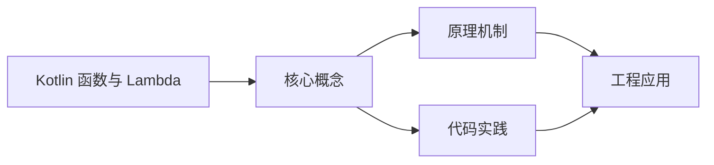

## 1. 学习目标（Bloom 分类）

本节按照布鲁姆教育目标分类学组织学习路径。本文主题为《Kotlin 函数与 Lambda》，属于 Kotlin 模块，读者可以根据自身阶段选择阅读深度。

记忆层面：能够准确复述本文的核心概念、术语与基本语法或操作步骤，并能够在提问或检索时快速定位对应知识点。能够说出 val/var、空安全操作符与 when 表达式的语法。

理解层面：能够用自己的语言解释核心原理与工作机制，说明概念之间的因果关系，而不是机械记忆结论。能够解释 Kotlin 与 Java 互操作的机制与平台类型概念。

应用层面：能够在真实项目或练习场景中运用本文知识解决具体问题，写出正确且可维护的实现。能够编写数据类、扩展函数与协程代码。

分析层面：能够拆解复杂问题，比较本文主题与相邻概念的异同，识别边界条件与例外情况。能够分析空安全、智能转换与协程调度原理。

评价层面：能够根据约束条件（性能、可读性、安全、成本）评价不同方案的优劣，做出有依据的技术决策。能够评价 Kotlin 在 Android、服务端与多平台场景的适用性。

创造层面：能够把本文知识与其他模块知识组合，设计出新的解决方案或可复用的工程模式。能够组合 Compose 与协程设计跨平台应用。

通过本节学习，读者应当能够把《Kotlin 函数与 Lambda》纳入自己的知识网络，并与 Kotlin 模块的其他主题（类型推断、空安全、协程、KMP）建立关联。

## 2. 历史动机与发展脉络

《Kotlin 函数与 Lambda》是 Kotlin 领域的重要主题。要真正理解它，需要先了解它解决的问题与演进过程。

Kotlin 由 JetBrains 于 2010 年开始研发，2016 年发布 1.0，定位是“更现代的 JVM 语言”：减少样板代码、消灭空指针、增强函数式能力，同时与 Java 100% 互操作。
2017 年 Google 宣布 Kotlin 成为 Android 一级语言，2019 年确立 Kotlin-first 政策；2023 年 Kotlin 2.0 的 K2 编译器显著提升编译速度与类型推导。
Kotlin Multiplatform（KMP）支持 JVM、Android、iOS、WebAssembly 等目标，配合 Compose Multiplatform 实现共享 UI 与业务逻辑，是 JetBrains 的长期战略方向。

回到本文主题：Kotlin 函数与 Lambda 的提出与成熟，正是上述技术背景下的必然产物。早期实现往往以简单可用为目标，随着工程规模扩大，社区逐渐沉淀出标准做法与最佳实践；理解这一脉络，可以帮助读者判断“为什么文档中的推荐写法是现在这个样子”，也能在遇到历史遗留代码时准确识别其设计年代与取舍。


## 3. 形式化定义与核心概念精讲

本节把《Kotlin 函数与 Lambda》涉及的核心概念以“定义 + 讲解”的形式展开。读者应把定义当作工具，把讲解当作理解路径；两者结合才能形成可迁移的知识。

空安全：类型系统区分 `String` 与 `String?`，编译期强制处理可空值；`?.` 短路、`?:` 提供默认、`!!` 显式断言，三者覆盖所有空值处理模式。
智能转换：`is` 检查后在不可变上下文中自动转换类型，减少显式强转；`as?` 安全转换失败返回 null。
协程：挂起函数（suspend）与调度器（Dispatchers.Main/IO/Default）实现非阻塞并发，结构化并发保证作用域内任务可取消。

### 3.1 原文章节逐一精讲

原文档把主题拆分为 14 个小节，下面按顺序给出每一节的导读讲解，随后保留原文细节供精读。

#### 原文精读（完整保留）

# Kotlin 函数与 Lambda 速查

> **符号约定**：`< >` 必填参数 | `[ ]` 可选参数

---

#### 1. 函数定义

##### 1.1 基本函数

```kotlin
// 标准函数
fun add(a: Int, b: Int): Int {
    return a + b
}

// 表达式函数体
fun add(a: Int, b: Int): Int = a + b

// 返回类型推断
fun add(a: Int, b: Int) = a + b  // 推断为 Int

// 无返回值（Unit）
fun greet(name: String): Unit {
    println("Hello, $name!")
}
// Unit 可省略
fun greet(name: String) {
    println("Hello, $name!")
}
```

##### 1.2 默认参数

```kotlin
fun connect(host: String, port: Int = 8080, timeout: Int = 5000): String {
    return "$host:$port (timeout: ${timeout}ms)"
}

connect("localhost")                    // localhost:8080 (timeout: 5000ms)
connect("localhost", 3306)              // localhost:3306 (timeout: 5000ms)
connect("localhost", 3306, 10000)       // localhost:3306 (timeout: 10000ms)
```

##### 1.3 命名参数

```kotlin
fun createUser(name: String, age: Int = 0, email: String = "", active: Boolean = true) {
    // ...
}

// 使用命名参数跳过中间参数
createUser("Alice", email = "alice@example.com")
createUser(name = "Bob", active = false)
```

> **最佳实践**：当函数有多个参数时，尤其是布尔类型参数，使用命名参数可大幅提升代码可读性。

##### 1.4 可变参数

```kotlin
fun sum(vararg numbers: Int): Int {
    return numbers.sum()
}

sum(1, 2, 3)          // 6
sum(1, 2, 3, 4, 5)    // 15

// 展开数组
val array = intArrayOf(1, 2, 3)
sum(*array)            // 使用 * 展开运算符
```

##### 1.5 尾递归函数

```kotlin
tailrec fun factorial(n: Long, acc: Long = 1): Long {
    return if (n <= 1) acc else factorial(n - 1, acc * n)
}

factorial(20)  // 2432902008176640000
```

#### 2. 扩展函数

扩展函数允许为已有类添加新方法，无需继承或修改源码：

```kotlin
// 为 String 添加扩展函数
fun String.addExclamation(): String = this + "!"

println("Hello".addExclamation())  // Hello!

// 为 Int 添加扩展
fun Int.isEven(): Boolean = this % 2 == 0
println(4.isEven())  // true
println(3.isEven())  // false

// 为 List 添加扩展
fun <T> List<T>.second(): T = this[1]
val list = listOf("a", "b", "c")
println(list.second())  // b
```

##### 2.1 可空接收者扩展

```kotlin
// 可空接收者 — 在函数内部处理 null
fun String?.isNullOrEmpty(): Boolean = this == null || this.isEmpty()

val s: String? = null
s.isNullOrEmpty()  // true
```

##### 2.2 扩展属性

```kotlin
val String.halfLength: Int
    get() = this.length / 2

println("Kotlin".halfLength)  // 3

var StringBuilder.lastChar: Char
    get() = this[this.length - 1]
    set(value) { this.append(value) }
```

##### 2.3 扩展函数的解析

扩展函数是**静态解析**的，不是虚函数：

```kotlin
open class Animal
class Dog : Animal()

fun Animal.sound() = "Generic sound"
fun Dog.sound() = "Woof"

fun makeSound(animal: Animal) {
    println(animal.sound())  // 静态解析，调用 Animal.sound()
}

val dog: Dog = Dog()
val animal: Animal = dog

makeSound(dog)     // "Generic sound"（不是 "Woof"！）
dog.sound()        // "Woof"
animal.sound()     // "Generic sound"
```

#### 3. Lambda 表达式

##### 3.1 基本语法

```kotlin
// 完整语法
val sum: (Int, Int) -> Int = { a: Int, b: Int -> a + b }

// 类型推断
val sum = { a: Int, b: Int -> a + b }

// 指定类型省略参数类型
val sum: (Int, Int) -> Int = { a, b -> a + b }
```

##### 3.2 it 隐式参数

当 Lambda 只有一个参数时，可用 `it` 代替：

```kotlin
val square: (Int) -> Int = { it * it }
val isEven: (Int) -> Boolean = { it % 2 == 0 }

val numbers = listOf(1, 2, 3, 4, 5)
numbers.filter { it > 3 }      // [4, 5]
numbers.map { it * 2 }          // [2, 4, 6, 8, 10]
```

##### 3.3 Lambda 与集合操作

```kotlin
val numbers = listOf(1, 2, 3, 4, 5, 6, 7, 8, 9, 10)

// filter — 过滤
val evens = numbers.filter { it % 2 == 0 }

// map — 映射
val squares = numbers.map { it * it }

// forEach — 遍历
numbers.forEach { println(it) }

// fold — 累积
val sum = numbers.fold(0) { acc, num -> acc + num }

// groupBy — 分组
val grouped = numbers.groupBy { if (it % 2 == 0) "even" else "odd" }

// sortedBy — 排序
val sorted = numbers.sortedByDescending { it }
```

#### 4. 高阶函数

高阶函数是以函数作为参数或返回值的函数：

```kotlin
// 函数作为参数
fun <T> List<T>.customFilter(predicate: (T) -> Boolean): List<T> {
    val result = mutableListOf<T>()
    for (item in this) {
        if (predicate(item)) result.add(item)
    }
    return result
}

numbers.customFilter { it > 5 }

// 函数作为返回值
fun multiplier(factor: Int): (Int) -> Int = { number -> number * factor }

val double = multiplier(2)
val triple = multiplier(3)
double(5)   // 10
triple(5)   // 15
```

##### 4.1 函数类型

```kotlin
// 函数类型语法
val f1: () -> Unit = { println("No params") }
val f2: (Int) -> String = { "Number: $it" }
val f3: (Int, String) -> Boolean = { num, str -> num == str.length }

// 带接收者的函数类型
val f4: String.(Int) -> String = { this.repeat(it) }
"Ha".f4(3)        // "HaHaHa"
"Ha".let { f4(it, 3) }  // 等价写法

// 函数类型实例化
val f5 = fun(a: Int, b: Int): Int = a + b  // 匿名函数
```

##### 4.2 常见高阶函数模式

```kotlin
// also — 执行附加操作，返回原对象
val user = User("Alice", 25).also {
    println("Created: $it")
}

// apply — 配置对象，返回原对象
val builder = StringBuilder().apply {
    append("Hello")
    append(", ")
    append("Kotlin")
}

// let — 转换对象，返回 Lambda 结果
val length = "Kotlin".let {
    println("Processing: $it")
    it.length
}

// run — 执行代码块，返回结果
val result = "Kotlin".run {
    println("Processing: $this")
    length
}

// with — 非扩展版本的 run
val greeting = with(StringBuilder()) {
    append("Hello")
    append(", Kotlin")
    toString()
}
```

#### 5. 内联函数

##### 5.1 inline 关键字

高阶函数会为 Lambda 创建匿名内部类对象，产生运行时开销。`inline` 将函数体直接内联到调用处：

```kotlin
inline fun <T> measureTime(block: () -> T): T {
    val start = System.currentTimeMillis()
    val result = block()
    val end = System.currentTimeMillis()
    println("Execution time: ${end - start}ms")
    return result
}

// 调用处展开后等价于：
// val start = System.currentTimeMillis()
// val result = /* block 内容 */
// val end = System.currentTimeMillis()
```

##### 5.2 noinline 与 crossinline

```kotlin
// noinline — 禁止内联特定参数
inline fun process(
    inlineBlock: () -> Unit,      // 被内联
    noinline notInlined: () -> Unit  // 不被内联
) {
    inlineBlock()
    notInlined()
}

// crossinline — 允许内联但禁止非局部返回
inline fun runInThread(crossinline action: () -> Unit) {
    Thread { action() }.start()
    // action 中不能使用 return 退出外层函数
}
```

##### 5.3 非局部返回

```kotlin
fun processElements(elements: List<Int>) {
    elements.forEach {
        if (it == 0) return  // 非局部返回，退出 processElements
        println(it)
    }
    println("Done")  // 如果遇到 0，这行不会执行
}
```

#### 6. SAM 转换

Kotlin 支持对 Java 单抽象方法（SAM）接口的自动转换：

```kotlin
// Java 接口
// public interface OnClickListener {
//     void onClick(View v);
// }

// Kotlin 中使用 SAM 转换
button.setOnClickListener { view ->
    println("Clicked: $view")
}

// 显式 SAM 转换（Kotlin 1.4+ 也支持 Kotlin 函数式接口）
fun interface Producer<T> {
    fun produce(): T
}

val producer = Producer { "Hello" }
producer.produce()  // "Hello"
```

##### 6.1 Kotlin 函数式接口

```kotlin
// fun interface — Kotlin 1.4+ 支持
fun interface Transformer<T, R> {
    fun transform(input: T): R
}

// SAM 转换
val toLength: Transformer<String, Int> = Transformer { it.length }
toLength.transform("Kotlin")  // 6

// 多个 Lambda 参数时指定哪个进行 SAM 转换
fun interface ClickHandler {
    fun onClick()
}

fun setup(handler: ClickHandler, delay: Long = 0) {
    // ...
}

setup(ClickHandler { println("Clicked!") })
```

#### 7. 作用域函数对比

| 函数    | 对象引用 | 返回值      | 是否扩展函数 | 典型场景             |
| ------- | -------- | ----------- | ------------ | -------------------- |
| `let`   | `it`     | Lambda 结果 | 是           | 空安全操作、链式转换 |
| `run`   | `this`   | Lambda 结果 | 是           | 对象初始化并计算结果 |
| `with`  | `this`   | Lambda 结果 | 否（参数）   | 对已存在对象进行操作 |
| `apply` | `this`   | 对象本身    | 是           | 对象初始化/配置      |
| `also`  | `it`     | 对象本身    | 是           | 附加操作、日志、验证 |

```kotlin
// 典型使用场景
val person = Person().apply {
    name = "Alice"
    age = 25
}.also {
    println("Created person: $it")
}

val nameLength = person.let {
    it.name.length
}
```

> **选择建议**：需要返回对象本身用 `apply`/`also`，需要返回计算结果用 `let`/`run`/`with`；引用用 `this` 还是 `it` 取决于是否需要频繁访问对象成员。
#### 函数定义

**基本写法：标准函数**
`fun <name>(<params>): <ReturnType> { <body> }`
```kotlin
// 标准函数定义
fun add(a: Int, b: Int): Int {
    return a + b;
}
```

**基本写法：表达式函数体**
`fun <name>(<params>): <ReturnType> = <expr>`
```kotlin
// 表达式函数体
fun add(a: Int, b: Int): Int = a + b;
```

**基本写法：表达式函数体类型推断**
`fun <name>(<params>) = <expr>`
```kotlin
// 返回类型推断为 Int
fun add(a: Int, b: Int) = a + b;
```

**基本写法：Unit 无返回值函数**
`fun <name>(<params>): Unit { <body> }`
```kotlin
// 无返回值（Unit）
fun greet(name: String): Unit {
    println("Hello, $name!");
}
```

**基本写法：省略 Unit 的无返回值函数**
`fun <name>(<params>) { <body> }`
```kotlin
// Unit 可省略
fun greet(name: String) {
    println("Hello, $name!");
}
```

**单行写法：默认参数函数**
`fun <name>(<param1>: <Type>, <param2>: <Type> = <default>): <ReturnType>`
```kotlin
// 单行声明带默认参数的函数
fun connect(host: String, port: Int = 8080): String = "$host:$port";
```

**换行写法：多默认参数函数**
`fun <name>(<param1>: <Type>, <param2>: <Type> = <default>, <param3>: <Type> = <default>): <ReturnType>`
```kotlin
// 换行声明多个默认参数
fun connect(
    host: String,
    port: Int = 8080,
    timeout: Int = 5000
): String {
    return "$host:$port (timeout: ${timeout}ms)";
}
```

**基本写法：命名参数调用**
`<name>(<arg> = <value>)`
```kotlin
// 使用命名参数跳过中间参数
createUser("Alice", email = "alice@example.com");
```

**基本写法：可变参数函数**
`fun <name>(vararg <params>: <Type>): <ReturnType>`
```kotlin
// 可变参数函数
fun sum(vararg numbers: Int): Int {
    return numbers.sum();
}
```

**基本写法：展开数组调用可变参数**
`<name>(*<array>)`
```kotlin
// 使用 * 展开运算符
val array = intArrayOf(1, 2, 3);
sum(*array);
```

**基本写法：尾递归函数**
`tailrec fun <name>(<params>): <ReturnType>`
```kotlin
// 尾递归函数，避免栈溢出
tailrec fun factorial(n: Long, acc: Long = 1): Long {
    return if (n <= 1) acc else factorial(n - 1, acc * n);
}
```

---

#### 扩展函数

**基本写法：为类添加扩展函数**
`fun <ReceiverType>.<name>(<params>): <ReturnType>`
```kotlin
// 为 String 添加扩展函数
fun String.addExclamation(): String = this + "!";
```

**基本写法：为 Int 添加扩展函数**
`fun Int.<name>(): <ReturnType>`
```kotlin
// 为 Int 添加扩展
fun Int.isEven(): Boolean = this % 2 == 0;
```

**基本写法：可空接收者扩展**
`fun <ReceiverType>?.<name>(<params>): <ReturnType>`
```kotlin
// 可空接收者，在函数内部处理 null
fun String?.isNullOrEmpty(): Boolean = this == null || this.isEmpty();
```

**基本写法：只读扩展属性**
`val <ReceiverType>.<name>: <Type> get() = <expr>`
```kotlin
// 为 String 添加只读扩展属性
val String.halfLength: Int
    get() = this.length / 2;
```

**换行写法：可变扩展属性**
`var <ReceiverType>.<name>: <Type> [get() = <expr>] [set(value) { <body> }]`
```kotlin
// 为 StringBuilder 添加可变扩展属性
var StringBuilder.lastChar: Char
    get() = this[this.length - 1]
    set(value) { this.append(value); }
```

**基本写法：扩展函数静态解析**
`fun <BaseType>.<name>() = <expr>`
```kotlin
// 扩展函数静态解析，由声明类型决定
open class Animal;
class Dog : Animal();
fun Animal.sound() = "Generic sound";
fun Dog.sound() = "Woof";
val animal: Animal = Dog();
animal.sound();  // "Generic sound"
```

---

#### Lambda 表达式

**基本写法：完整语法 Lambda**
`val <name>: (<ParamTypes>) -> <ReturnType> = { <params> -> <body> }`
```kotlin
// 完整语法
val sum: (Int, Int) -> Int = { a: Int, b: Int -> a + b };
```

**基本写法：类型推断 Lambda**
`val <name> = { <params> -> <body> }`
```kotlin
// 类型推断
val sum = { a: Int, b: Int -> a + b };
```

**基本写法：指定类型省略参数类型**
`val <name>: (<ParamTypes>) -> <ReturnType> = { <params> -> <body> }`
```kotlin
// 指定函数类型，省略参数类型
val sum: (Int, Int) -> Int = { a, b -> a + b };
```

**基本写法：it 隐式参数**
`{ <body using it> }`
```kotlin
// 单参数 Lambda 用 it 代替
val square: (Int) -> Int = { it * it };
```

**基本写法：filter 过滤**
`<collection>.filter { <predicate> }`
```kotlin
// filter 过滤集合
val numbers = listOf(1, 2, 3, 4, 5);
numbers.filter { it > 3 };
```

**基本写法：map 映射**
`<collection>.map { <transform> }`
```kotlin
// map 映射集合元素
numbers.map { it * 2 };
```

**基本写法：forEach 遍历**
`<collection>.forEach { <body> }`
```kotlin
// forEach 遍历集合
numbers.forEach { println(it); }
```

**基本写法：fold 累积**
`<collection>.fold(<init>) { <acc>, <item> -> <body> }`
```kotlin
// fold 带初始值累积
val sum = numbers.fold(0) { acc, num -> acc + num };
```

**基本写法：groupBy 分组**
`<collection>.groupBy { <keySelector> }`
```kotlin
// groupBy 按条件分组
val grouped = numbers.groupBy { if (it % 2 == 0) "even" else "odd" };
```

---

#### 高阶函数

**基本写法：函数作为参数**
`fun <name>(<param>: (<Type>) -> <ReturnType>): <ReturnType>`
```kotlin
// 接受函数作为参数
fun <T> List<T>.customFilter(predicate: (T) -> Boolean): List<T> {
    val result = mutableListOf<T>();
    for (item in this) {
        if (predicate(item)) result.add(item);
    }
    return result;
}
```

**基本写法：函数作为返回值**
`fun <name>(<params>): (<Type>) -> <ReturnType>`
```kotlin
// 返回函数
fun multiplier(factor: Int): (Int) -> Int = { number -> number * factor };
```

**基本写法：无参函数类型**
`val <name>: () -> <ReturnType> = { <body> }`
```kotlin
// 无参函数类型
val f1: () -> Unit = { println("No params"); };
```

**基本写法：带参函数类型**
`val <name>: (<Type>) -> <ReturnType> = { <body> }`
```kotlin
// 带参函数类型
val f2: (Int) -> String = { "Number: $it" };
```

**基本写法：带接收者的函数类型**
`val <name>: <ReceiverType>.(<Type>) -> <ReturnType> = { <body> }`
```kotlin
// 带接收者的函数类型
val f4: String.(Int) -> String = { this.repeat(it) };
```

**基本写法：匿名函数**
`val <name> = fun(<params>): <ReturnType> = <expr>`
```kotlin
// 匿名函数
val f5 = fun(a: Int, b: Int): Int = a + b;
```

**基本写法：also 执行附加操作**
`<obj>.also { <body with it> }`
```kotlin
// also 返回原对象
val user = User("Alice", 25).also {
    println("Created: $it");
};
```

**基本写法：apply 配置对象**
`<obj>.apply { <body with this> }`
```kotlin
// apply 返回原对象
val builder = StringBuilder().apply {
    append("Hello");
    append(", Kotlin");
};
```

**基本写法：let 转换对象**
`<obj>.let { <body with it> }`
```kotlin
// let 返回 Lambda 结果
val length = "Kotlin".let { it.length };
```

**基本写法：run 执行代码块**
`<obj>.run { <body with this> }`
```kotlin
// run 返回 Lambda 结果
val result = "Kotlin".run { length };
```

**基本写法：with 执行多个操作**
`with(<obj>) { <body with this> }`
```kotlin
// with 非扩展版本
val greeting = with(StringBuilder()) {
    append("Hello");
    append(", Kotlin");
    toString();
};
```

---

#### 内联函数

**基本写法：inline 内联函数**
`inline fun <name>(<params>): <ReturnType>`
```kotlin
// inline 关键字内联函数
inline fun <T> measureTime(block: () -> T): T {
    val start = System.currentTimeMillis();
    val result = block();
    val end = System.currentTimeMillis();
    println("Execution time: ${end - start}ms");
    return result;
}
```

**换行写法：noinline 与 crossinline**
`inline fun <name>(<param1>: () -> Unit, noinline <param2>: () -> Unit)`
```kotlin
// noinline 禁止内联，crossinline 禁止非局部返回
inline fun process(
    inlineBlock: () -> Unit,
    noinline notInlined: () -> Unit
) {
    inlineBlock();
    notInlined();
}
```

**基本写法：crossinline 禁止非局部返回**
`inline fun <name>(crossinline <param>: () -> Unit)`
```kotlin
// crossinline 允许内联但禁止非局部返回
inline fun runInThread(crossinline action: () -> Unit) {
    Thread { action(); }.start();
}
```

**基本写法：非局部返回**
`<collection>.forEach { if (<cond>) return; <body> }`
```kotlin
// 非局部返回，退出外层函数
fun processElements(elements: List<Int>) {
    elements.forEach {
        if (it == 0) return;
        println(it);
    }
}
```

---

#### SAM 转换

**基本写法：Java SAM 接口转换**
`<obj>.setListener { <param> -> <body> }`
```kotlin
// SAM 转换简化 Java 接口实现
button.setOnClickListener { view ->
    println("Clicked: $view");
}
```

**基本写法：Kotlin 函数式接口**
`fun interface <Name> { fun <method>(<params>): <ReturnType> }`
```kotlin
// fun interface 声明
fun interface Producer<T> {
    fun produce(): T;
}
```

**基本写法：函数式接口实例化**
`val <name> = <Interface> { <body> }`
```kotlin
// 函数式接口实例化
val producer = Producer { "Hello" };
```

**单行写法：多类型参数函数式接口**
`fun interface <Name><<T1>, <T2>> { fun <method>(<param>: <T1>): <T2> }`
```kotlin
// 多类型参数函数式接口
fun interface Transformer<T, R> {
    fun transform(input: T): R;
}
```

---

#### 作用域函数对比

**基本写法：apply 配置并返回对象**
`<obj>.apply { <body with this> }`
```kotlin
// apply 典型场景：配置对象
val person = Person().apply {
    name = "Alice";
    age = 25;
};
```

**基本写法：also 附加操作并返回对象**
`<obj>.also { <body with it> }`
```kotlin
// also 典型场景：日志记录
val logged = person.also {
    println("Created person: $it");
};
```

**基本写法：let 转换并返回结果**
`<obj>.let { <body with it> }`
```kotlin
// let 典型场景：转换
val nameLength = person.let { it.name.length };
```


### 3.2 概念关系图

下面用 Mermaid 图表达本文核心概念之间的关系，帮助读者建立整体图景：



图中展示的是本文知识的结构化关系：核心概念是入口，原理机制解释“为什么”，代码实践演示“怎么做”，工程应用回答“何时用”。读者学习时可以把每个小节的内容挂接到对应节点上。

## 4. 理论推导与原理解析

本节深入《Kotlin 函数与 Lambda》背后的原理。理论部分不求面面俱到，而是聚焦“能解释现象、能指导实践”的关键推导。

空安全：类型系统区分 `String` 与 `String?`，编译期强制处理可空值；`?.` 短路、`?:` 提供默认、`!!` 显式断言，三者覆盖所有空值处理模式。
智能转换：`is` 检查后在不可变上下文中自动转换类型，减少显式强转；`as?` 安全转换失败返回 null。
协程：挂起函数（suspend）与调度器（Dispatchers.Main/IO/Default）实现非阻塞并发，结构化并发保证作用域内任务可取消。
扩展函数与属性：在不修改原类的情况下为类添加行为，是 Kotlin 标准库（如集合操作）的基石。

需要强调的是，理论推导与工程实践之间存在翻译层：理论给出的是理想化模型与边界条件，工程代码则必须处理真实环境中的例外。读者在学习时应先掌握理论的“标准情形”，再通过陷阱章节了解“非标准情形”。

## 5. 代码示例与逐行讲解

本节把原文中的代码示例系统整理，并为每个示例补充用途说明与讲解。读者不应只浏览代码，而应逐段对照讲解理解设计意图。

### 5.1 示例：1.1 基本函数

该示例来自原文《1.1 基本函数》小节，用于演示Kotlin 函数与 Lambda相关操作。阅读时请先看代码结构，再看其后的讲解。

```kotlin
// 标准函数
fun add(a: Int, b: Int): Int {
    return a + b
}

// 表达式函数体
fun add(a: Int, b: Int): Int = a + b

// 返回类型推断
fun add(a: Int, b: Int) = a + b  // 推断为 Int

// 无返回值（Unit）
fun greet(name: String): Unit {
    println("Hello, $name!")
}
// Unit 可省略
fun greet(name: String) {
    println("Hello, $name!")
}
```

讲解：这段代码演示了本节核心知识点。代码中的关键操作可以归纳为三步：准备（定义或初始化）、执行（核心逻辑）、收尾（释放资源或返回结果）。实际项目中，这三步往往被封装为函数或类，以提升复用性与可测试性。

关键点分析：

该示例共 16 行有效代码，包含 1 类关键结构（return）。其中：

- 入口与初始化部分负责建立上下文，对应实际项目中的启动或装配逻辑；
- 核心逻辑部分体现本文主题的主要操作，是阅读时最需要对照讲解理解的部分；
- 输出或返回部分把结果交给调用方，注意其类型与边界条件。

进阶思考路径：先尝试修改参数观察行为变化，再把示例中的模式迁移到自己的项目中；每次修改都记录预期与实测差异，这是把示例转化为能力的最快方式。

### 5.2 示例：1.2 默认参数

该示例来自原文《1.2 默认参数》小节，用于演示Kotlin 函数与 Lambda相关操作。阅读时请先看代码结构，再看其后的讲解。

```kotlin
fun connect(host: String, port: Int = 8080, timeout: Int = 5000): String {
    return "$host:$port (timeout: ${timeout}ms)"
}

connect("localhost")                    // localhost:8080 (timeout: 5000ms)
connect("localhost", 3306)              // localhost:3306 (timeout: 5000ms)
connect("localhost", 3306, 10000)       // localhost:3306 (timeout: 10000ms)
```

讲解：这段代码演示了本节核心知识点。代码中的关键操作可以归纳为三步：准备（定义或初始化）、执行（核心逻辑）、收尾（释放资源或返回结果）。实际项目中，这三步往往被封装为函数或类，以提升复用性与可测试性。

关键点分析：

该示例共 6 行有效代码，包含 1 类关键结构（return）。其中：

- 入口与初始化部分负责建立上下文，对应实际项目中的启动或装配逻辑；
- 核心逻辑部分体现本文主题的主要操作，是阅读时最需要对照讲解理解的部分；
- 输出或返回部分把结果交给调用方，注意其类型与边界条件。

进阶思考路径：先尝试修改参数观察行为变化，再把示例中的模式迁移到自己的项目中；每次修改都记录预期与实测差异，这是把示例转化为能力的最快方式。

### 5.3 示例：1.3 命名参数

该示例来自原文《1.3 命名参数》小节，用于演示Kotlin 函数与 Lambda相关操作。阅读时请先看代码结构，再看其后的讲解。

```kotlin
fun createUser(name: String, age: Int = 0, email: String = "", active: Boolean = true) {
    // ...
}

// 使用命名参数跳过中间参数
createUser("Alice", email = "alice@example.com")
createUser(name = "Bob", active = false)
```

讲解：这段代码演示了本节核心知识点。代码中的关键操作可以归纳为三步：准备（定义或初始化）、执行（核心逻辑）、收尾（释放资源或返回结果）。实际项目中，这三步往往被封装为函数或类，以提升复用性与可测试性。

关键点分析：

该示例共 6 行有效代码，结构以数据或配置为主。阅读时应关注：数据字段的含义、配置项的作用，以及它们与运行行为的对应关系。

进阶思考路径：先尝试修改参数观察行为变化，再把示例中的模式迁移到自己的项目中；每次修改都记录预期与实测差异，这是把示例转化为能力的最快方式。

### 5.4 示例：1.4 可变参数

该示例来自原文《1.4 可变参数》小节，用于演示Kotlin 函数与 Lambda相关操作。阅读时请先看代码结构，再看其后的讲解。

```kotlin
fun sum(vararg numbers: Int): Int {
    return numbers.sum()
}

sum(1, 2, 3)          // 6
sum(1, 2, 3, 4, 5)    // 15

// 展开数组
val array = intArrayOf(1, 2, 3)
sum(*array)            // 使用 * 展开运算符
```

讲解：这段代码演示了本节核心知识点。代码中的关键操作可以归纳为三步：准备（定义或初始化）、执行（核心逻辑）、收尾（释放资源或返回结果）。实际项目中，这三步往往被封装为函数或类，以提升复用性与可测试性。

关键点分析：

该示例共 8 行有效代码，包含 1 类关键结构（return）。其中：

- 入口与初始化部分负责建立上下文，对应实际项目中的启动或装配逻辑；
- 核心逻辑部分体现本文主题的主要操作，是阅读时最需要对照讲解理解的部分；
- 输出或返回部分把结果交给调用方，注意其类型与边界条件。

进阶思考路径：先尝试修改参数观察行为变化，再把示例中的模式迁移到自己的项目中；每次修改都记录预期与实测差异，这是把示例转化为能力的最快方式。

### 5.5 示例：1.5 尾递归函数

该示例来自原文《1.5 尾递归函数》小节，用于演示Kotlin 函数与 Lambda相关操作。阅读时请先看代码结构，再看其后的讲解。

```kotlin
tailrec fun factorial(n: Long, acc: Long = 1): Long {
    return if (n <= 1) acc else factorial(n - 1, acc * n)
}

factorial(20)  // 2432902008176640000
```

讲解：这段代码演示了本节核心知识点。代码中的关键操作可以归纳为三步：准备（定义或初始化）、执行（核心逻辑）、收尾（释放资源或返回结果）。实际项目中，这三步往往被封装为函数或类，以提升复用性与可测试性。

关键点分析：

该示例共 4 行有效代码，包含 2 类关键结构（if、return）。其中：

- 入口与初始化部分负责建立上下文，对应实际项目中的启动或装配逻辑；
- 核心逻辑部分体现本文主题的主要操作，是阅读时最需要对照讲解理解的部分；
- 输出或返回部分把结果交给调用方，注意其类型与边界条件。

进阶思考路径：先尝试修改参数观察行为变化，再把示例中的模式迁移到自己的项目中；每次修改都记录预期与实测差异，这是把示例转化为能力的最快方式。

### 5.6 示例：2. 扩展函数

该示例来自原文《2. 扩展函数》小节，用于演示Kotlin 函数与 Lambda相关操作。阅读时请先看代码结构，再看其后的讲解。

```kotlin
// 为 String 添加扩展函数
fun String.addExclamation(): String = this + "!"

println("Hello".addExclamation())  // Hello!

// 为 Int 添加扩展
fun Int.isEven(): Boolean = this % 2 == 0
println(4.isEven())  // true
println(3.isEven())  // false

// 为 List 添加扩展
fun <T> List<T>.second(): T = this[1]
val list = listOf("a", "b", "c")
println(list.second())  // b
```

讲解：这段代码演示了本节核心知识点。代码中的关键操作可以归纳为三步：准备（定义或初始化）、执行（核心逻辑）、收尾（释放资源或返回结果）。实际项目中，这三步往往被封装为函数或类，以提升复用性与可测试性。

关键点分析：

该示例共 11 行有效代码，结构以数据或配置为主。阅读时应关注：数据字段的含义、配置项的作用，以及它们与运行行为的对应关系。

进阶思考路径：先尝试修改参数观察行为变化，再把示例中的模式迁移到自己的项目中；每次修改都记录预期与实测差异，这是把示例转化为能力的最快方式。

### 5.7 示例：2.1 可空接收者扩展

该示例来自原文《2.1 可空接收者扩展》小节，用于演示Kotlin 函数与 Lambda相关操作。阅读时请先看代码结构，再看其后的讲解。

```kotlin
// 可空接收者 — 在函数内部处理 null
fun String?.isNullOrEmpty(): Boolean = this == null || this.isEmpty()

val s: String? = null
s.isNullOrEmpty()  // true
```

讲解：这段代码演示了本节核心知识点。代码中的关键操作可以归纳为三步：准备（定义或初始化）、执行（核心逻辑）、收尾（释放资源或返回结果）。实际项目中，这三步往往被封装为函数或类，以提升复用性与可测试性。

关键点分析：

该示例共 4 行有效代码，结构以数据或配置为主。阅读时应关注：数据字段的含义、配置项的作用，以及它们与运行行为的对应关系。

进阶思考路径：先尝试修改参数观察行为变化，再把示例中的模式迁移到自己的项目中；每次修改都记录预期与实测差异，这是把示例转化为能力的最快方式。

### 5.8 示例：2.2 扩展属性

该示例来自原文《2.2 扩展属性》小节，用于演示Kotlin 函数与 Lambda相关操作。阅读时请先看代码结构，再看其后的讲解。

```kotlin
val String.halfLength: Int
    get() = this.length / 2

println("Kotlin".halfLength)  // 3

var StringBuilder.lastChar: Char
    get() = this[this.length - 1]
    set(value) { this.append(value) }
```

讲解：这段代码演示了本节核心知识点。代码中的关键操作可以归纳为三步：准备（定义或初始化）、执行（核心逻辑）、收尾（释放资源或返回结果）。实际项目中，这三步往往被封装为函数或类，以提升复用性与可测试性。

关键点分析：

该示例共 6 行有效代码，结构以数据或配置为主。阅读时应关注：数据字段的含义、配置项的作用，以及它们与运行行为的对应关系。

进阶思考路径：先尝试修改参数观察行为变化，再把示例中的模式迁移到自己的项目中；每次修改都记录预期与实测差异，这是把示例转化为能力的最快方式。

### 5.9 示例：2.3 扩展函数的解析

该示例来自原文《2.3 扩展函数的解析》小节，用于演示Kotlin 函数与 Lambda相关操作。阅读时请先看代码结构，再看其后的讲解。

```kotlin
open class Animal
class Dog : Animal()

fun Animal.sound() = "Generic sound"
fun Dog.sound() = "Woof"

fun makeSound(animal: Animal) {
    println(animal.sound())  // 静态解析，调用 Animal.sound()
}

val dog: Dog = Dog()
val animal: Animal = dog

makeSound(dog)     // "Generic sound"（不是 "Woof"！）
dog.sound()        // "Woof"
animal.sound()     // "Generic sound"
```

讲解：这段代码演示了本节核心知识点。代码中的关键操作可以归纳为三步：准备（定义或初始化）、执行（核心逻辑）、收尾（释放资源或返回结果）。实际项目中，这三步往往被封装为函数或类，以提升复用性与可测试性。

关键点分析：

该示例共 12 行有效代码，包含 1 类关键结构（class）。其中：

- 入口与初始化部分负责建立上下文，对应实际项目中的启动或装配逻辑；
- 核心逻辑部分体现本文主题的主要操作，是阅读时最需要对照讲解理解的部分；
- 输出或返回部分把结果交给调用方，注意其类型与边界条件。

进阶思考路径：先尝试修改参数观察行为变化，再把示例中的模式迁移到自己的项目中；每次修改都记录预期与实测差异，这是把示例转化为能力的最快方式。

### 5.10 示例：3.1 基本语法

该示例来自原文《3.1 基本语法》小节，用于演示Kotlin 函数与 Lambda相关操作。阅读时请先看代码结构，再看其后的讲解。

```kotlin
// 完整语法
val sum: (Int, Int) -> Int = { a: Int, b: Int -> a + b }

// 类型推断
val sum = { a: Int, b: Int -> a + b }

// 指定类型省略参数类型
val sum: (Int, Int) -> Int = { a, b -> a + b }
```

讲解：这段代码演示了本节核心知识点。代码中的关键操作可以归纳为三步：准备（定义或初始化）、执行（核心逻辑）、收尾（释放资源或返回结果）。实际项目中，这三步往往被封装为函数或类，以提升复用性与可测试性。

关键点分析：

该示例共 6 行有效代码，结构以数据或配置为主。阅读时应关注：数据字段的含义、配置项的作用，以及它们与运行行为的对应关系。

进阶思考路径：先尝试修改参数观察行为变化，再把示例中的模式迁移到自己的项目中；每次修改都记录预期与实测差异，这是把示例转化为能力的最快方式。

### 5.11 示例：3.2 it 隐式参数

该示例来自原文《3.2 it 隐式参数》小节，用于演示Kotlin 函数与 Lambda相关操作。阅读时请先看代码结构，再看其后的讲解。

```kotlin
val square: (Int) -> Int = { it * it }
val isEven: (Int) -> Boolean = { it % 2 == 0 }

val numbers = listOf(1, 2, 3, 4, 5)
numbers.filter { it > 3 }      // [4, 5]
numbers.map { it * 2 }          // [2, 4, 6, 8, 10]
```

讲解：这段代码演示了本节核心知识点。代码中的关键操作可以归纳为三步：准备（定义或初始化）、执行（核心逻辑）、收尾（释放资源或返回结果）。实际项目中，这三步往往被封装为函数或类，以提升复用性与可测试性。

关键点分析：

该示例共 5 行有效代码，结构以数据或配置为主。阅读时应关注：数据字段的含义、配置项的作用，以及它们与运行行为的对应关系。

进阶思考路径：先尝试修改参数观察行为变化，再把示例中的模式迁移到自己的项目中；每次修改都记录预期与实测差异，这是把示例转化为能力的最快方式。

### 5.12 示例：3.3 Lambda 与集合操作

该示例来自原文《3.3 Lambda 与集合操作》小节，用于演示Kotlin 函数与 Lambda相关操作。阅读时请先看代码结构，再看其后的讲解。

```kotlin
val numbers = listOf(1, 2, 3, 4, 5, 6, 7, 8, 9, 10)

// filter — 过滤
val evens = numbers.filter { it % 2 == 0 }

// map — 映射
val squares = numbers.map { it * it }

// forEach — 遍历
numbers.forEach { println(it) }

// fold — 累积
val sum = numbers.fold(0) { acc, num -> acc + num }

// groupBy — 分组
val grouped = numbers.groupBy { if (it % 2 == 0) "even" else "odd" }

// sortedBy — 排序
val sorted = numbers.sortedByDescending { it }
```

讲解：这段代码演示了本节核心知识点。代码中的关键操作可以归纳为三步：准备（定义或初始化）、执行（核心逻辑）、收尾（释放资源或返回结果）。实际项目中，这三步往往被封装为函数或类，以提升复用性与可测试性。

关键点分析：

该示例共 13 行有效代码，包含 1 类关键结构（if）。其中：

- 入口与初始化部分负责建立上下文，对应实际项目中的启动或装配逻辑；
- 核心逻辑部分体现本文主题的主要操作，是阅读时最需要对照讲解理解的部分；
- 输出或返回部分把结果交给调用方，注意其类型与边界条件。

进阶思考路径：先尝试修改参数观察行为变化，再把示例中的模式迁移到自己的项目中；每次修改都记录预期与实测差异，这是把示例转化为能力的最快方式。

### 5.13 示例：4. 高阶函数

该示例来自原文《4. 高阶函数》小节，用于演示Kotlin 函数与 Lambda相关操作。阅读时请先看代码结构，再看其后的讲解。

```kotlin
// 函数作为参数
fun <T> List<T>.customFilter(predicate: (T) -> Boolean): List<T> {
    val result = mutableListOf<T>()
    for (item in this) {
        if (predicate(item)) result.add(item)
    }
    return result
}

numbers.customFilter { it > 5 }

// 函数作为返回值
fun multiplier(factor: Int): (Int) -> Int = { number -> number * factor }

val double = multiplier(2)
val triple = multiplier(3)
double(5)   // 10
triple(5)   // 15
```

讲解：这段代码演示了本节核心知识点。代码中的关键操作可以归纳为三步：准备（定义或初始化）、执行（核心逻辑）、收尾（释放资源或返回结果）。实际项目中，这三步往往被封装为函数或类，以提升复用性与可测试性。

关键点分析：

该示例共 15 行有效代码，包含 3 类关键结构（if、for、return）。其中：

- 入口与初始化部分负责建立上下文，对应实际项目中的启动或装配逻辑；
- 核心逻辑部分体现本文主题的主要操作，是阅读时最需要对照讲解理解的部分；
- 输出或返回部分把结果交给调用方，注意其类型与边界条件。

进阶思考路径：先尝试修改参数观察行为变化，再把示例中的模式迁移到自己的项目中；每次修改都记录预期与实测差异，这是把示例转化为能力的最快方式。

### 5.14 示例：4.1 函数类型

该示例来自原文《4.1 函数类型》小节，用于演示Kotlin 函数与 Lambda相关操作。阅读时请先看代码结构，再看其后的讲解。

```kotlin
// 函数类型语法
val f1: () -> Unit = { println("No params") }
val f2: (Int) -> String = { "Number: $it" }
val f3: (Int, String) -> Boolean = { num, str -> num == str.length }

// 带接收者的函数类型
val f4: String.(Int) -> String = { this.repeat(it) }
"Ha".f4(3)        // "HaHaHa"
"Ha".let { f4(it, 3) }  // 等价写法

// 函数类型实例化
val f5 = fun(a: Int, b: Int): Int = a + b  // 匿名函数
```

讲解：这段代码演示了本节核心知识点。代码中的关键操作可以归纳为三步：准备（定义或初始化）、执行（核心逻辑）、收尾（释放资源或返回结果）。实际项目中，这三步往往被封装为函数或类，以提升复用性与可测试性。

关键点分析：

该示例共 10 行有效代码，结构以数据或配置为主。阅读时应关注：数据字段的含义、配置项的作用，以及它们与运行行为的对应关系。

进阶思考路径：先尝试修改参数观察行为变化，再把示例中的模式迁移到自己的项目中；每次修改都记录预期与实测差异，这是把示例转化为能力的最快方式。

### 5.15 示例：4.2 常见高阶函数模式

该示例来自原文《4.2 常见高阶函数模式》小节，用于演示Kotlin 函数与 Lambda相关操作。阅读时请先看代码结构，再看其后的讲解。

```kotlin
// also — 执行附加操作，返回原对象
val user = User("Alice", 25).also {
    println("Created: $it")
}

// apply — 配置对象，返回原对象
val builder = StringBuilder().apply {
    append("Hello")
    append(", ")
    append("Kotlin")
}

// let — 转换对象，返回 Lambda 结果
val length = "Kotlin".let {
    println("Processing: $it")
    it.length
}

// run — 执行代码块，返回结果
val result = "Kotlin".run {
    println("Processing: $this")
    length
}

// with — 非扩展版本的 run
val greeting = with(StringBuilder()) {
    append("Hello")
    append(", Kotlin")
    toString()
}
```

讲解：这段代码演示了本节核心知识点。代码中的关键操作可以归纳为三步：准备（定义或初始化）、执行（核心逻辑）、收尾（释放资源或返回结果）。实际项目中，这三步往往被封装为函数或类，以提升复用性与可测试性。

关键点分析：

该示例共 26 行有效代码，结构以数据或配置为主。阅读时应关注：数据字段的含义、配置项的作用，以及它们与运行行为的对应关系。

进阶思考路径：先尝试修改参数观察行为变化，再把示例中的模式迁移到自己的项目中；每次修改都记录预期与实测差异，这是把示例转化为能力的最快方式。

### 5.16 示例：5.1 inline 关键字

该示例来自原文《5.1 inline 关键字》小节，用于演示Kotlin 函数与 Lambda相关操作。阅读时请先看代码结构，再看其后的讲解。

```kotlin
inline fun <T> measureTime(block: () -> T): T {
    val start = System.currentTimeMillis()
    val result = block()
    val end = System.currentTimeMillis()
    println("Execution time: ${end - start}ms")
    return result
}

// 调用处展开后等价于：
// val start = System.currentTimeMillis()
// val result = /* block 内容 */
// val end = System.currentTimeMillis()
```

讲解：这段代码演示了本节核心知识点。代码中的关键操作可以归纳为三步：准备（定义或初始化）、执行（核心逻辑）、收尾（释放资源或返回结果）。实际项目中，这三步往往被封装为函数或类，以提升复用性与可测试性。

关键点分析：

该示例共 11 行有效代码，包含 1 类关键结构（return）。其中：

- 入口与初始化部分负责建立上下文，对应实际项目中的启动或装配逻辑；
- 核心逻辑部分体现本文主题的主要操作，是阅读时最需要对照讲解理解的部分；
- 输出或返回部分把结果交给调用方，注意其类型与边界条件。

进阶思考路径：先尝试修改参数观察行为变化，再把示例中的模式迁移到自己的项目中；每次修改都记录预期与实测差异，这是把示例转化为能力的最快方式。

### 5.17 示例：5.2 noinline 与 crossinline

该示例来自原文《5.2 noinline 与 crossinline》小节，用于演示Kotlin 函数与 Lambda相关操作。阅读时请先看代码结构，再看其后的讲解。

```kotlin
// noinline — 禁止内联特定参数
inline fun process(
    inlineBlock: () -> Unit,      // 被内联
    noinline notInlined: () -> Unit  // 不被内联
) {
    inlineBlock()
    notInlined()
}

// crossinline — 允许内联但禁止非局部返回
inline fun runInThread(crossinline action: () -> Unit) {
    Thread { action() }.start()
    // action 中不能使用 return 退出外层函数
}
```

讲解：这段代码演示了本节核心知识点。代码中的关键操作可以归纳为三步：准备（定义或初始化）、执行（核心逻辑）、收尾（释放资源或返回结果）。实际项目中，这三步往往被封装为函数或类，以提升复用性与可测试性。

关键点分析：

该示例共 13 行有效代码，包含 1 类关键结构（return）。其中：

- 入口与初始化部分负责建立上下文，对应实际项目中的启动或装配逻辑；
- 核心逻辑部分体现本文主题的主要操作，是阅读时最需要对照讲解理解的部分；
- 输出或返回部分把结果交给调用方，注意其类型与边界条件。

进阶思考路径：先尝试修改参数观察行为变化，再把示例中的模式迁移到自己的项目中；每次修改都记录预期与实测差异，这是把示例转化为能力的最快方式。

### 5.18 示例：5.3 非局部返回

该示例来自原文《5.3 非局部返回》小节，用于演示Kotlin 函数与 Lambda相关操作。阅读时请先看代码结构，再看其后的讲解。

```kotlin
fun processElements(elements: List<Int>) {
    elements.forEach {
        if (it == 0) return  // 非局部返回，退出 processElements
        println(it)
    }
    println("Done")  // 如果遇到 0，这行不会执行
}
```

讲解：这段代码演示了本节核心知识点。代码中的关键操作可以归纳为三步：准备（定义或初始化）、执行（核心逻辑）、收尾（释放资源或返回结果）。实际项目中，这三步往往被封装为函数或类，以提升复用性与可测试性。

关键点分析：

该示例共 7 行有效代码，包含 2 类关键结构（if、return）。其中：

- 入口与初始化部分负责建立上下文，对应实际项目中的启动或装配逻辑；
- 核心逻辑部分体现本文主题的主要操作，是阅读时最需要对照讲解理解的部分；
- 输出或返回部分把结果交给调用方，注意其类型与边界条件。

进阶思考路径：先尝试修改参数观察行为变化，再把示例中的模式迁移到自己的项目中；每次修改都记录预期与实测差异，这是把示例转化为能力的最快方式。

### 5.19 示例：6. SAM 转换

该示例来自原文《6. SAM 转换》小节，用于演示Kotlin 函数与 Lambda相关操作。阅读时请先看代码结构，再看其后的讲解。

```kotlin
// Java 接口
// public interface OnClickListener {
//     void onClick(View v);
// }

// Kotlin 中使用 SAM 转换
button.setOnClickListener { view ->
    println("Clicked: $view")
}

// 显式 SAM 转换（Kotlin 1.4+ 也支持 Kotlin 函数式接口）
fun interface Producer<T> {
    fun produce(): T
}

val producer = Producer { "Hello" }
producer.produce()  // "Hello"
```

讲解：这段代码演示了本节核心知识点。代码中的关键操作可以归纳为三步：准备（定义或初始化）、执行（核心逻辑）、收尾（释放资源或返回结果）。实际项目中，这三步往往被封装为函数或类，以提升复用性与可测试性。

关键点分析：

该示例共 14 行有效代码，结构以数据或配置为主。阅读时应关注：数据字段的含义、配置项的作用，以及它们与运行行为的对应关系。

进阶思考路径：先尝试修改参数观察行为变化，再把示例中的模式迁移到自己的项目中；每次修改都记录预期与实测差异，这是把示例转化为能力的最快方式。

### 5.20 示例：6.1 Kotlin 函数式接口

该示例来自原文《6.1 Kotlin 函数式接口》小节，用于演示Kotlin 函数与 Lambda相关操作。阅读时请先看代码结构，再看其后的讲解。

```kotlin
// fun interface — Kotlin 1.4+ 支持
fun interface Transformer<T, R> {
    fun transform(input: T): R
}

// SAM 转换
val toLength: Transformer<String, Int> = Transformer { it.length }
toLength.transform("Kotlin")  // 6

// 多个 Lambda 参数时指定哪个进行 SAM 转换
fun interface ClickHandler {
    fun onClick()
}

fun setup(handler: ClickHandler, delay: Long = 0) {
    // ...
}

setup(ClickHandler { println("Clicked!") })
```

讲解：这段代码演示了本节核心知识点。代码中的关键操作可以归纳为三步：准备（定义或初始化）、执行（核心逻辑）、收尾（释放资源或返回结果）。实际项目中，这三步往往被封装为函数或类，以提升复用性与可测试性。

关键点分析：

该示例共 15 行有效代码，结构以数据或配置为主。阅读时应关注：数据字段的含义、配置项的作用，以及它们与运行行为的对应关系。

进阶思考路径：先尝试修改参数观察行为变化，再把示例中的模式迁移到自己的项目中；每次修改都记录预期与实测差异，这是把示例转化为能力的最快方式。

### 5.21 示例：7. 作用域函数对比

该示例来自原文《7. 作用域函数对比》小节，用于演示Kotlin 函数与 Lambda相关操作。阅读时请先看代码结构，再看其后的讲解。

```kotlin
// 典型使用场景
val person = Person().apply {
    name = "Alice"
    age = 25
}.also {
    println("Created person: $it")
}

val nameLength = person.let {
    it.name.length
}
```

讲解：这段代码演示了本节核心知识点。代码中的关键操作可以归纳为三步：准备（定义或初始化）、执行（核心逻辑）、收尾（释放资源或返回结果）。实际项目中，这三步往往被封装为函数或类，以提升复用性与可测试性。

关键点分析：

该示例共 10 行有效代码，结构以数据或配置为主。阅读时应关注：数据字段的含义、配置项的作用，以及它们与运行行为的对应关系。

进阶思考路径：先尝试修改参数观察行为变化，再把示例中的模式迁移到自己的项目中；每次修改都记录预期与实测差异，这是把示例转化为能力的最快方式。

### 5.22 示例：函数定义

该示例来自原文《函数定义》小节，用于演示Kotlin 函数与 Lambda相关操作。阅读时请先看代码结构，再看其后的讲解。

```kotlin
// 标准函数定义
fun add(a: Int, b: Int): Int {
    return a + b;
}
```

讲解：这段代码演示了本节核心知识点。代码中的关键操作可以归纳为三步：准备（定义或初始化）、执行（核心逻辑）、收尾（释放资源或返回结果）。实际项目中，这三步往往被封装为函数或类，以提升复用性与可测试性。

关键点分析：

该示例共 4 行有效代码，包含 1 类关键结构（return）。其中：

- 入口与初始化部分负责建立上下文，对应实际项目中的启动或装配逻辑；
- 核心逻辑部分体现本文主题的主要操作，是阅读时最需要对照讲解理解的部分；
- 输出或返回部分把结果交给调用方，注意其类型与边界条件。

进阶思考路径：先尝试修改参数观察行为变化，再把示例中的模式迁移到自己的项目中；每次修改都记录预期与实测差异，这是把示例转化为能力的最快方式。

### 5.23 示例：函数定义

该示例来自原文《函数定义》小节，用于演示Kotlin 函数与 Lambda相关操作。阅读时请先看代码结构，再看其后的讲解。

```kotlin
// 表达式函数体
fun add(a: Int, b: Int): Int = a + b;
```

讲解：这段代码演示了本节核心知识点。代码中的关键操作可以归纳为三步：准备（定义或初始化）、执行（核心逻辑）、收尾（释放资源或返回结果）。实际项目中，这三步往往被封装为函数或类，以提升复用性与可测试性。

关键点分析：

该示例共 2 行有效代码，结构以数据或配置为主。阅读时应关注：数据字段的含义、配置项的作用，以及它们与运行行为的对应关系。

进阶思考路径：先尝试修改参数观察行为变化，再把示例中的模式迁移到自己的项目中；每次修改都记录预期与实测差异，这是把示例转化为能力的最快方式。

### 5.24 示例：函数定义

该示例来自原文《函数定义》小节，用于演示Kotlin 函数与 Lambda相关操作。阅读时请先看代码结构，再看其后的讲解。

```kotlin
// 返回类型推断为 Int
fun add(a: Int, b: Int) = a + b;
```

讲解：这段代码演示了本节核心知识点。代码中的关键操作可以归纳为三步：准备（定义或初始化）、执行（核心逻辑）、收尾（释放资源或返回结果）。实际项目中，这三步往往被封装为函数或类，以提升复用性与可测试性。

关键点分析：

该示例共 2 行有效代码，结构以数据或配置为主。阅读时应关注：数据字段的含义、配置项的作用，以及它们与运行行为的对应关系。

进阶思考路径：先尝试修改参数观察行为变化，再把示例中的模式迁移到自己的项目中；每次修改都记录预期与实测差异，这是把示例转化为能力的最快方式。

### 5.25 示例：函数定义

该示例来自原文《函数定义》小节，用于演示Kotlin 函数与 Lambda相关操作。阅读时请先看代码结构，再看其后的讲解。

```kotlin
// 无返回值（Unit）
fun greet(name: String): Unit {
    println("Hello, $name!");
}
```

讲解：这段代码演示了本节核心知识点。代码中的关键操作可以归纳为三步：准备（定义或初始化）、执行（核心逻辑）、收尾（释放资源或返回结果）。实际项目中，这三步往往被封装为函数或类，以提升复用性与可测试性。

关键点分析：

该示例共 4 行有效代码，结构以数据或配置为主。阅读时应关注：数据字段的含义、配置项的作用，以及它们与运行行为的对应关系。

进阶思考路径：先尝试修改参数观察行为变化，再把示例中的模式迁移到自己的项目中；每次修改都记录预期与实测差异，这是把示例转化为能力的最快方式。

### 5.26 示例：函数定义

该示例来自原文《函数定义》小节，用于演示Kotlin 函数与 Lambda相关操作。阅读时请先看代码结构，再看其后的讲解。

```kotlin
// Unit 可省略
fun greet(name: String) {
    println("Hello, $name!");
}
```

讲解：这段代码演示了本节核心知识点。代码中的关键操作可以归纳为三步：准备（定义或初始化）、执行（核心逻辑）、收尾（释放资源或返回结果）。实际项目中，这三步往往被封装为函数或类，以提升复用性与可测试性。

关键点分析：

该示例共 4 行有效代码，结构以数据或配置为主。阅读时应关注：数据字段的含义、配置项的作用，以及它们与运行行为的对应关系。

进阶思考路径：先尝试修改参数观察行为变化，再把示例中的模式迁移到自己的项目中；每次修改都记录预期与实测差异，这是把示例转化为能力的最快方式。

### 5.27 示例：函数定义

该示例来自原文《函数定义》小节，用于演示Kotlin 函数与 Lambda相关操作。阅读时请先看代码结构，再看其后的讲解。

```kotlin
// 单行声明带默认参数的函数
fun connect(host: String, port: Int = 8080): String = "$host:$port";
```

讲解：这段代码演示了本节核心知识点。代码中的关键操作可以归纳为三步：准备（定义或初始化）、执行（核心逻辑）、收尾（释放资源或返回结果）。实际项目中，这三步往往被封装为函数或类，以提升复用性与可测试性。

关键点分析：

该示例共 2 行有效代码，结构以数据或配置为主。阅读时应关注：数据字段的含义、配置项的作用，以及它们与运行行为的对应关系。

进阶思考路径：先尝试修改参数观察行为变化，再把示例中的模式迁移到自己的项目中；每次修改都记录预期与实测差异，这是把示例转化为能力的最快方式。

### 5.28 示例：函数定义

该示例来自原文《函数定义》小节，用于演示Kotlin 函数与 Lambda相关操作。阅读时请先看代码结构，再看其后的讲解。

```kotlin
// 换行声明多个默认参数
fun connect(
    host: String,
    port: Int = 8080,
    timeout: Int = 5000
): String {
    return "$host:$port (timeout: ${timeout}ms)";
}
```

讲解：这段代码演示了本节核心知识点。代码中的关键操作可以归纳为三步：准备（定义或初始化）、执行（核心逻辑）、收尾（释放资源或返回结果）。实际项目中，这三步往往被封装为函数或类，以提升复用性与可测试性。

关键点分析：

该示例共 8 行有效代码，包含 1 类关键结构（return）。其中：

- 入口与初始化部分负责建立上下文，对应实际项目中的启动或装配逻辑；
- 核心逻辑部分体现本文主题的主要操作，是阅读时最需要对照讲解理解的部分；
- 输出或返回部分把结果交给调用方，注意其类型与边界条件。

进阶思考路径：先尝试修改参数观察行为变化，再把示例中的模式迁移到自己的项目中；每次修改都记录预期与实测差异，这是把示例转化为能力的最快方式。

### 5.29 示例：函数定义

该示例来自原文《函数定义》小节，用于演示Kotlin 函数与 Lambda相关操作。阅读时请先看代码结构，再看其后的讲解。

```kotlin
// 使用命名参数跳过中间参数
createUser("Alice", email = "alice@example.com");
```

讲解：这段代码演示了本节核心知识点。代码中的关键操作可以归纳为三步：准备（定义或初始化）、执行（核心逻辑）、收尾（释放资源或返回结果）。实际项目中，这三步往往被封装为函数或类，以提升复用性与可测试性。

关键点分析：

该示例共 2 行有效代码，结构以数据或配置为主。阅读时应关注：数据字段的含义、配置项的作用，以及它们与运行行为的对应关系。

进阶思考路径：先尝试修改参数观察行为变化，再把示例中的模式迁移到自己的项目中；每次修改都记录预期与实测差异，这是把示例转化为能力的最快方式。

### 5.30 示例：函数定义

该示例来自原文《函数定义》小节，用于演示Kotlin 函数与 Lambda相关操作。阅读时请先看代码结构，再看其后的讲解。

```kotlin
// 可变参数函数
fun sum(vararg numbers: Int): Int {
    return numbers.sum();
}
```

讲解：这段代码演示了本节核心知识点。代码中的关键操作可以归纳为三步：准备（定义或初始化）、执行（核心逻辑）、收尾（释放资源或返回结果）。实际项目中，这三步往往被封装为函数或类，以提升复用性与可测试性。

关键点分析：

该示例共 4 行有效代码，包含 1 类关键结构（return）。其中：

- 入口与初始化部分负责建立上下文，对应实际项目中的启动或装配逻辑；
- 核心逻辑部分体现本文主题的主要操作，是阅读时最需要对照讲解理解的部分；
- 输出或返回部分把结果交给调用方，注意其类型与边界条件。

进阶思考路径：先尝试修改参数观察行为变化，再把示例中的模式迁移到自己的项目中；每次修改都记录预期与实测差异，这是把示例转化为能力的最快方式。

### 5.31 示例：函数定义

该示例来自原文《函数定义》小节，用于演示Kotlin 函数与 Lambda相关操作。阅读时请先看代码结构，再看其后的讲解。

```kotlin
// 使用 * 展开运算符
val array = intArrayOf(1, 2, 3);
sum(*array);
```

讲解：这段代码演示了本节核心知识点。代码中的关键操作可以归纳为三步：准备（定义或初始化）、执行（核心逻辑）、收尾（释放资源或返回结果）。实际项目中，这三步往往被封装为函数或类，以提升复用性与可测试性。

关键点分析：

该示例共 3 行有效代码，结构以数据或配置为主。阅读时应关注：数据字段的含义、配置项的作用，以及它们与运行行为的对应关系。

进阶思考路径：先尝试修改参数观察行为变化，再把示例中的模式迁移到自己的项目中；每次修改都记录预期与实测差异，这是把示例转化为能力的最快方式。

### 5.32 示例：函数定义

该示例来自原文《函数定义》小节，用于演示Kotlin 函数与 Lambda相关操作。阅读时请先看代码结构，再看其后的讲解。

```kotlin
// 尾递归函数，避免栈溢出
tailrec fun factorial(n: Long, acc: Long = 1): Long {
    return if (n <= 1) acc else factorial(n - 1, acc * n);
}
```

讲解：这段代码演示了本节核心知识点。代码中的关键操作可以归纳为三步：准备（定义或初始化）、执行（核心逻辑）、收尾（释放资源或返回结果）。实际项目中，这三步往往被封装为函数或类，以提升复用性与可测试性。

关键点分析：

该示例共 4 行有效代码，包含 2 类关键结构（if、return）。其中：

- 入口与初始化部分负责建立上下文，对应实际项目中的启动或装配逻辑；
- 核心逻辑部分体现本文主题的主要操作，是阅读时最需要对照讲解理解的部分；
- 输出或返回部分把结果交给调用方，注意其类型与边界条件。

进阶思考路径：先尝试修改参数观察行为变化，再把示例中的模式迁移到自己的项目中；每次修改都记录预期与实测差异，这是把示例转化为能力的最快方式。

### 5.33 示例：扩展函数

该示例来自原文《扩展函数》小节，用于演示Kotlin 函数与 Lambda相关操作。阅读时请先看代码结构，再看其后的讲解。

```kotlin
// 为 String 添加扩展函数
fun String.addExclamation(): String = this + "!";
```

讲解：这段代码演示了本节核心知识点。代码中的关键操作可以归纳为三步：准备（定义或初始化）、执行（核心逻辑）、收尾（释放资源或返回结果）。实际项目中，这三步往往被封装为函数或类，以提升复用性与可测试性。

关键点分析：

该示例共 2 行有效代码，结构以数据或配置为主。阅读时应关注：数据字段的含义、配置项的作用，以及它们与运行行为的对应关系。

进阶思考路径：先尝试修改参数观察行为变化，再把示例中的模式迁移到自己的项目中；每次修改都记录预期与实测差异，这是把示例转化为能力的最快方式。

### 5.34 示例：扩展函数

该示例来自原文《扩展函数》小节，用于演示Kotlin 函数与 Lambda相关操作。阅读时请先看代码结构，再看其后的讲解。

```kotlin
// 为 Int 添加扩展
fun Int.isEven(): Boolean = this % 2 == 0;
```

讲解：这段代码演示了本节核心知识点。代码中的关键操作可以归纳为三步：准备（定义或初始化）、执行（核心逻辑）、收尾（释放资源或返回结果）。实际项目中，这三步往往被封装为函数或类，以提升复用性与可测试性。

关键点分析：

该示例共 2 行有效代码，结构以数据或配置为主。阅读时应关注：数据字段的含义、配置项的作用，以及它们与运行行为的对应关系。

进阶思考路径：先尝试修改参数观察行为变化，再把示例中的模式迁移到自己的项目中；每次修改都记录预期与实测差异，这是把示例转化为能力的最快方式。

### 5.35 示例：扩展函数

该示例来自原文《扩展函数》小节，用于演示Kotlin 函数与 Lambda相关操作。阅读时请先看代码结构，再看其后的讲解。

```kotlin
// 可空接收者，在函数内部处理 null
fun String?.isNullOrEmpty(): Boolean = this == null || this.isEmpty();
```

讲解：这段代码演示了本节核心知识点。代码中的关键操作可以归纳为三步：准备（定义或初始化）、执行（核心逻辑）、收尾（释放资源或返回结果）。实际项目中，这三步往往被封装为函数或类，以提升复用性与可测试性。

关键点分析：

该示例共 2 行有效代码，结构以数据或配置为主。阅读时应关注：数据字段的含义、配置项的作用，以及它们与运行行为的对应关系。

进阶思考路径：先尝试修改参数观察行为变化，再把示例中的模式迁移到自己的项目中；每次修改都记录预期与实测差异，这是把示例转化为能力的最快方式。

### 5.36 示例：扩展函数

该示例来自原文《扩展函数》小节，用于演示Kotlin 函数与 Lambda相关操作。阅读时请先看代码结构，再看其后的讲解。

```kotlin
// 为 String 添加只读扩展属性
val String.halfLength: Int
    get() = this.length / 2;
```

讲解：这段代码演示了本节核心知识点。代码中的关键操作可以归纳为三步：准备（定义或初始化）、执行（核心逻辑）、收尾（释放资源或返回结果）。实际项目中，这三步往往被封装为函数或类，以提升复用性与可测试性。

关键点分析：

该示例共 3 行有效代码，结构以数据或配置为主。阅读时应关注：数据字段的含义、配置项的作用，以及它们与运行行为的对应关系。

进阶思考路径：先尝试修改参数观察行为变化，再把示例中的模式迁移到自己的项目中；每次修改都记录预期与实测差异，这是把示例转化为能力的最快方式。

### 5.37 示例：扩展函数

该示例来自原文《扩展函数》小节，用于演示Kotlin 函数与 Lambda相关操作。阅读时请先看代码结构，再看其后的讲解。

```kotlin
// 为 StringBuilder 添加可变扩展属性
var StringBuilder.lastChar: Char
    get() = this[this.length - 1]
    set(value) { this.append(value); }
```

讲解：这段代码演示了本节核心知识点。代码中的关键操作可以归纳为三步：准备（定义或初始化）、执行（核心逻辑）、收尾（释放资源或返回结果）。实际项目中，这三步往往被封装为函数或类，以提升复用性与可测试性。

关键点分析：

该示例共 4 行有效代码，结构以数据或配置为主。阅读时应关注：数据字段的含义、配置项的作用，以及它们与运行行为的对应关系。

进阶思考路径：先尝试修改参数观察行为变化，再把示例中的模式迁移到自己的项目中；每次修改都记录预期与实测差异，这是把示例转化为能力的最快方式。

### 5.38 示例：扩展函数

该示例来自原文《扩展函数》小节，用于演示Kotlin 函数与 Lambda相关操作。阅读时请先看代码结构，再看其后的讲解。

```kotlin
// 扩展函数静态解析，由声明类型决定
open class Animal;
class Dog : Animal();
fun Animal.sound() = "Generic sound";
fun Dog.sound() = "Woof";
val animal: Animal = Dog();
animal.sound();  // "Generic sound"
```

讲解：这段代码演示了本节核心知识点。代码中的关键操作可以归纳为三步：准备（定义或初始化）、执行（核心逻辑）、收尾（释放资源或返回结果）。实际项目中，这三步往往被封装为函数或类，以提升复用性与可测试性。

关键点分析：

该示例共 7 行有效代码，包含 1 类关键结构（class）。其中：

- 入口与初始化部分负责建立上下文，对应实际项目中的启动或装配逻辑；
- 核心逻辑部分体现本文主题的主要操作，是阅读时最需要对照讲解理解的部分；
- 输出或返回部分把结果交给调用方，注意其类型与边界条件。

进阶思考路径：先尝试修改参数观察行为变化，再把示例中的模式迁移到自己的项目中；每次修改都记录预期与实测差异，这是把示例转化为能力的最快方式。

### 5.39 示例：Lambda 表达式

该示例来自原文《Lambda 表达式》小节，用于演示Kotlin 函数与 Lambda相关操作。阅读时请先看代码结构，再看其后的讲解。

```kotlin
// 完整语法
val sum: (Int, Int) -> Int = { a: Int, b: Int -> a + b };
```

讲解：这段代码演示了本节核心知识点。代码中的关键操作可以归纳为三步：准备（定义或初始化）、执行（核心逻辑）、收尾（释放资源或返回结果）。实际项目中，这三步往往被封装为函数或类，以提升复用性与可测试性。

关键点分析：

该示例共 2 行有效代码，结构以数据或配置为主。阅读时应关注：数据字段的含义、配置项的作用，以及它们与运行行为的对应关系。

进阶思考路径：先尝试修改参数观察行为变化，再把示例中的模式迁移到自己的项目中；每次修改都记录预期与实测差异，这是把示例转化为能力的最快方式。

### 5.40 示例：Lambda 表达式

该示例来自原文《Lambda 表达式》小节，用于演示Kotlin 函数与 Lambda相关操作。阅读时请先看代码结构，再看其后的讲解。

```kotlin
// 类型推断
val sum = { a: Int, b: Int -> a + b };
```

讲解：这段代码演示了本节核心知识点。代码中的关键操作可以归纳为三步：准备（定义或初始化）、执行（核心逻辑）、收尾（释放资源或返回结果）。实际项目中，这三步往往被封装为函数或类，以提升复用性与可测试性。

关键点分析：

该示例共 2 行有效代码，结构以数据或配置为主。阅读时应关注：数据字段的含义、配置项的作用，以及它们与运行行为的对应关系。

进阶思考路径：先尝试修改参数观察行为变化，再把示例中的模式迁移到自己的项目中；每次修改都记录预期与实测差异，这是把示例转化为能力的最快方式。

### 5.41 示例：Lambda 表达式

该示例来自原文《Lambda 表达式》小节，用于演示Kotlin 函数与 Lambda相关操作。阅读时请先看代码结构，再看其后的讲解。

```kotlin
// 指定函数类型，省略参数类型
val sum: (Int, Int) -> Int = { a, b -> a + b };
```

讲解：这段代码演示了本节核心知识点。代码中的关键操作可以归纳为三步：准备（定义或初始化）、执行（核心逻辑）、收尾（释放资源或返回结果）。实际项目中，这三步往往被封装为函数或类，以提升复用性与可测试性。

关键点分析：

该示例共 2 行有效代码，结构以数据或配置为主。阅读时应关注：数据字段的含义、配置项的作用，以及它们与运行行为的对应关系。

进阶思考路径：先尝试修改参数观察行为变化，再把示例中的模式迁移到自己的项目中；每次修改都记录预期与实测差异，这是把示例转化为能力的最快方式。

### 5.42 示例：Lambda 表达式

该示例来自原文《Lambda 表达式》小节，用于演示Kotlin 函数与 Lambda相关操作。阅读时请先看代码结构，再看其后的讲解。

```kotlin
// 单参数 Lambda 用 it 代替
val square: (Int) -> Int = { it * it };
```

讲解：这段代码演示了本节核心知识点。代码中的关键操作可以归纳为三步：准备（定义或初始化）、执行（核心逻辑）、收尾（释放资源或返回结果）。实际项目中，这三步往往被封装为函数或类，以提升复用性与可测试性。

关键点分析：

该示例共 2 行有效代码，结构以数据或配置为主。阅读时应关注：数据字段的含义、配置项的作用，以及它们与运行行为的对应关系。

进阶思考路径：先尝试修改参数观察行为变化，再把示例中的模式迁移到自己的项目中；每次修改都记录预期与实测差异，这是把示例转化为能力的最快方式。

### 5.43 示例：Lambda 表达式

该示例来自原文《Lambda 表达式》小节，用于演示Kotlin 函数与 Lambda相关操作。阅读时请先看代码结构，再看其后的讲解。

```kotlin
// filter 过滤集合
val numbers = listOf(1, 2, 3, 4, 5);
numbers.filter { it > 3 };
```

讲解：这段代码演示了本节核心知识点。代码中的关键操作可以归纳为三步：准备（定义或初始化）、执行（核心逻辑）、收尾（释放资源或返回结果）。实际项目中，这三步往往被封装为函数或类，以提升复用性与可测试性。

关键点分析：

该示例共 3 行有效代码，结构以数据或配置为主。阅读时应关注：数据字段的含义、配置项的作用，以及它们与运行行为的对应关系。

进阶思考路径：先尝试修改参数观察行为变化，再把示例中的模式迁移到自己的项目中；每次修改都记录预期与实测差异，这是把示例转化为能力的最快方式。

### 5.44 示例：Lambda 表达式

该示例来自原文《Lambda 表达式》小节，用于演示Kotlin 函数与 Lambda相关操作。阅读时请先看代码结构，再看其后的讲解。

```kotlin
// map 映射集合元素
numbers.map { it * 2 };
```

讲解：这段代码演示了本节核心知识点。代码中的关键操作可以归纳为三步：准备（定义或初始化）、执行（核心逻辑）、收尾（释放资源或返回结果）。实际项目中，这三步往往被封装为函数或类，以提升复用性与可测试性。

关键点分析：

该示例共 2 行有效代码，结构以数据或配置为主。阅读时应关注：数据字段的含义、配置项的作用，以及它们与运行行为的对应关系。

进阶思考路径：先尝试修改参数观察行为变化，再把示例中的模式迁移到自己的项目中；每次修改都记录预期与实测差异，这是把示例转化为能力的最快方式。

### 5.45 示例：Lambda 表达式

该示例来自原文《Lambda 表达式》小节，用于演示Kotlin 函数与 Lambda相关操作。阅读时请先看代码结构，再看其后的讲解。

```kotlin
// forEach 遍历集合
numbers.forEach { println(it); }
```

讲解：这段代码演示了本节核心知识点。代码中的关键操作可以归纳为三步：准备（定义或初始化）、执行（核心逻辑）、收尾（释放资源或返回结果）。实际项目中，这三步往往被封装为函数或类，以提升复用性与可测试性。

关键点分析：

该示例共 2 行有效代码，结构以数据或配置为主。阅读时应关注：数据字段的含义、配置项的作用，以及它们与运行行为的对应关系。

进阶思考路径：先尝试修改参数观察行为变化，再把示例中的模式迁移到自己的项目中；每次修改都记录预期与实测差异，这是把示例转化为能力的最快方式。

### 5.46 示例：Lambda 表达式

该示例来自原文《Lambda 表达式》小节，用于演示Kotlin 函数与 Lambda相关操作。阅读时请先看代码结构，再看其后的讲解。

```kotlin
// fold 带初始值累积
val sum = numbers.fold(0) { acc, num -> acc + num };
```

讲解：这段代码演示了本节核心知识点。代码中的关键操作可以归纳为三步：准备（定义或初始化）、执行（核心逻辑）、收尾（释放资源或返回结果）。实际项目中，这三步往往被封装为函数或类，以提升复用性与可测试性。

关键点分析：

该示例共 2 行有效代码，结构以数据或配置为主。阅读时应关注：数据字段的含义、配置项的作用，以及它们与运行行为的对应关系。

进阶思考路径：先尝试修改参数观察行为变化，再把示例中的模式迁移到自己的项目中；每次修改都记录预期与实测差异，这是把示例转化为能力的最快方式。

### 5.47 示例：Lambda 表达式

该示例来自原文《Lambda 表达式》小节，用于演示Kotlin 函数与 Lambda相关操作。阅读时请先看代码结构，再看其后的讲解。

```kotlin
// groupBy 按条件分组
val grouped = numbers.groupBy { if (it % 2 == 0) "even" else "odd" };
```

讲解：这段代码演示了本节核心知识点。代码中的关键操作可以归纳为三步：准备（定义或初始化）、执行（核心逻辑）、收尾（释放资源或返回结果）。实际项目中，这三步往往被封装为函数或类，以提升复用性与可测试性。

关键点分析：

该示例共 2 行有效代码，包含 1 类关键结构（if）。其中：

- 入口与初始化部分负责建立上下文，对应实际项目中的启动或装配逻辑；
- 核心逻辑部分体现本文主题的主要操作，是阅读时最需要对照讲解理解的部分；
- 输出或返回部分把结果交给调用方，注意其类型与边界条件。

进阶思考路径：先尝试修改参数观察行为变化，再把示例中的模式迁移到自己的项目中；每次修改都记录预期与实测差异，这是把示例转化为能力的最快方式。

### 5.48 示例：高阶函数

该示例来自原文《高阶函数》小节，用于演示Kotlin 函数与 Lambda相关操作。阅读时请先看代码结构，再看其后的讲解。

```kotlin
// 接受函数作为参数
fun <T> List<T>.customFilter(predicate: (T) -> Boolean): List<T> {
    val result = mutableListOf<T>();
    for (item in this) {
        if (predicate(item)) result.add(item);
    }
    return result;
}
```

讲解：这段代码演示了本节核心知识点。代码中的关键操作可以归纳为三步：准备（定义或初始化）、执行（核心逻辑）、收尾（释放资源或返回结果）。实际项目中，这三步往往被封装为函数或类，以提升复用性与可测试性。

关键点分析：

该示例共 8 行有效代码，包含 3 类关键结构（if、for、return）。其中：

- 入口与初始化部分负责建立上下文，对应实际项目中的启动或装配逻辑；
- 核心逻辑部分体现本文主题的主要操作，是阅读时最需要对照讲解理解的部分；
- 输出或返回部分把结果交给调用方，注意其类型与边界条件。

进阶思考路径：先尝试修改参数观察行为变化，再把示例中的模式迁移到自己的项目中；每次修改都记录预期与实测差异，这是把示例转化为能力的最快方式。

### 5.49 示例：高阶函数

该示例来自原文《高阶函数》小节，用于演示Kotlin 函数与 Lambda相关操作。阅读时请先看代码结构，再看其后的讲解。

```kotlin
// 返回函数
fun multiplier(factor: Int): (Int) -> Int = { number -> number * factor };
```

讲解：这段代码演示了本节核心知识点。代码中的关键操作可以归纳为三步：准备（定义或初始化）、执行（核心逻辑）、收尾（释放资源或返回结果）。实际项目中，这三步往往被封装为函数或类，以提升复用性与可测试性。

关键点分析：

该示例共 2 行有效代码，结构以数据或配置为主。阅读时应关注：数据字段的含义、配置项的作用，以及它们与运行行为的对应关系。

进阶思考路径：先尝试修改参数观察行为变化，再把示例中的模式迁移到自己的项目中；每次修改都记录预期与实测差异，这是把示例转化为能力的最快方式。

### 5.50 示例：高阶函数

该示例来自原文《高阶函数》小节，用于演示Kotlin 函数与 Lambda相关操作。阅读时请先看代码结构，再看其后的讲解。

```kotlin
// 无参函数类型
val f1: () -> Unit = { println("No params"); };
```

讲解：这段代码演示了本节核心知识点。代码中的关键操作可以归纳为三步：准备（定义或初始化）、执行（核心逻辑）、收尾（释放资源或返回结果）。实际项目中，这三步往往被封装为函数或类，以提升复用性与可测试性。

关键点分析：

该示例共 2 行有效代码，结构以数据或配置为主。阅读时应关注：数据字段的含义、配置项的作用，以及它们与运行行为的对应关系。

进阶思考路径：先尝试修改参数观察行为变化，再把示例中的模式迁移到自己的项目中；每次修改都记录预期与实测差异，这是把示例转化为能力的最快方式。

### 5.51 示例：高阶函数

该示例来自原文《高阶函数》小节，用于演示Kotlin 函数与 Lambda相关操作。阅读时请先看代码结构，再看其后的讲解。

```kotlin
// 带参函数类型
val f2: (Int) -> String = { "Number: $it" };
```

讲解：这段代码演示了本节核心知识点。代码中的关键操作可以归纳为三步：准备（定义或初始化）、执行（核心逻辑）、收尾（释放资源或返回结果）。实际项目中，这三步往往被封装为函数或类，以提升复用性与可测试性。

关键点分析：

该示例共 2 行有效代码，结构以数据或配置为主。阅读时应关注：数据字段的含义、配置项的作用，以及它们与运行行为的对应关系。

进阶思考路径：先尝试修改参数观察行为变化，再把示例中的模式迁移到自己的项目中；每次修改都记录预期与实测差异，这是把示例转化为能力的最快方式。

### 5.52 示例：高阶函数

该示例来自原文《高阶函数》小节，用于演示Kotlin 函数与 Lambda相关操作。阅读时请先看代码结构，再看其后的讲解。

```kotlin
// 带接收者的函数类型
val f4: String.(Int) -> String = { this.repeat(it) };
```

讲解：这段代码演示了本节核心知识点。代码中的关键操作可以归纳为三步：准备（定义或初始化）、执行（核心逻辑）、收尾（释放资源或返回结果）。实际项目中，这三步往往被封装为函数或类，以提升复用性与可测试性。

关键点分析：

该示例共 2 行有效代码，结构以数据或配置为主。阅读时应关注：数据字段的含义、配置项的作用，以及它们与运行行为的对应关系。

进阶思考路径：先尝试修改参数观察行为变化，再把示例中的模式迁移到自己的项目中；每次修改都记录预期与实测差异，这是把示例转化为能力的最快方式。

### 5.53 示例：高阶函数

该示例来自原文《高阶函数》小节，用于演示Kotlin 函数与 Lambda相关操作。阅读时请先看代码结构，再看其后的讲解。

```kotlin
// 匿名函数
val f5 = fun(a: Int, b: Int): Int = a + b;
```

讲解：这段代码演示了本节核心知识点。代码中的关键操作可以归纳为三步：准备（定义或初始化）、执行（核心逻辑）、收尾（释放资源或返回结果）。实际项目中，这三步往往被封装为函数或类，以提升复用性与可测试性。

关键点分析：

该示例共 2 行有效代码，结构以数据或配置为主。阅读时应关注：数据字段的含义、配置项的作用，以及它们与运行行为的对应关系。

进阶思考路径：先尝试修改参数观察行为变化，再把示例中的模式迁移到自己的项目中；每次修改都记录预期与实测差异，这是把示例转化为能力的最快方式。

### 5.54 示例：高阶函数

该示例来自原文《高阶函数》小节，用于演示Kotlin 函数与 Lambda相关操作。阅读时请先看代码结构，再看其后的讲解。

```kotlin
// also 返回原对象
val user = User("Alice", 25).also {
    println("Created: $it");
};
```

讲解：这段代码演示了本节核心知识点。代码中的关键操作可以归纳为三步：准备（定义或初始化）、执行（核心逻辑）、收尾（释放资源或返回结果）。实际项目中，这三步往往被封装为函数或类，以提升复用性与可测试性。

关键点分析：

该示例共 4 行有效代码，结构以数据或配置为主。阅读时应关注：数据字段的含义、配置项的作用，以及它们与运行行为的对应关系。

进阶思考路径：先尝试修改参数观察行为变化，再把示例中的模式迁移到自己的项目中；每次修改都记录预期与实测差异，这是把示例转化为能力的最快方式。

### 5.55 示例：高阶函数

该示例来自原文《高阶函数》小节，用于演示Kotlin 函数与 Lambda相关操作。阅读时请先看代码结构，再看其后的讲解。

```kotlin
// apply 返回原对象
val builder = StringBuilder().apply {
    append("Hello");
    append(", Kotlin");
};
```

讲解：这段代码演示了本节核心知识点。代码中的关键操作可以归纳为三步：准备（定义或初始化）、执行（核心逻辑）、收尾（释放资源或返回结果）。实际项目中，这三步往往被封装为函数或类，以提升复用性与可测试性。

关键点分析：

该示例共 5 行有效代码，结构以数据或配置为主。阅读时应关注：数据字段的含义、配置项的作用，以及它们与运行行为的对应关系。

进阶思考路径：先尝试修改参数观察行为变化，再把示例中的模式迁移到自己的项目中；每次修改都记录预期与实测差异，这是把示例转化为能力的最快方式。

### 5.56 示例：高阶函数

该示例来自原文《高阶函数》小节，用于演示Kotlin 函数与 Lambda相关操作。阅读时请先看代码结构，再看其后的讲解。

```kotlin
// let 返回 Lambda 结果
val length = "Kotlin".let { it.length };
```

讲解：这段代码演示了本节核心知识点。代码中的关键操作可以归纳为三步：准备（定义或初始化）、执行（核心逻辑）、收尾（释放资源或返回结果）。实际项目中，这三步往往被封装为函数或类，以提升复用性与可测试性。

关键点分析：

该示例共 2 行有效代码，结构以数据或配置为主。阅读时应关注：数据字段的含义、配置项的作用，以及它们与运行行为的对应关系。

进阶思考路径：先尝试修改参数观察行为变化，再把示例中的模式迁移到自己的项目中；每次修改都记录预期与实测差异，这是把示例转化为能力的最快方式。

### 5.57 示例：高阶函数

该示例来自原文《高阶函数》小节，用于演示Kotlin 函数与 Lambda相关操作。阅读时请先看代码结构，再看其后的讲解。

```kotlin
// run 返回 Lambda 结果
val result = "Kotlin".run { length };
```

讲解：这段代码演示了本节核心知识点。代码中的关键操作可以归纳为三步：准备（定义或初始化）、执行（核心逻辑）、收尾（释放资源或返回结果）。实际项目中，这三步往往被封装为函数或类，以提升复用性与可测试性。

关键点分析：

该示例共 2 行有效代码，结构以数据或配置为主。阅读时应关注：数据字段的含义、配置项的作用，以及它们与运行行为的对应关系。

进阶思考路径：先尝试修改参数观察行为变化，再把示例中的模式迁移到自己的项目中；每次修改都记录预期与实测差异，这是把示例转化为能力的最快方式。

### 5.58 示例：高阶函数

该示例来自原文《高阶函数》小节，用于演示Kotlin 函数与 Lambda相关操作。阅读时请先看代码结构，再看其后的讲解。

```kotlin
// with 非扩展版本
val greeting = with(StringBuilder()) {
    append("Hello");
    append(", Kotlin");
    toString();
};
```

讲解：这段代码演示了本节核心知识点。代码中的关键操作可以归纳为三步：准备（定义或初始化）、执行（核心逻辑）、收尾（释放资源或返回结果）。实际项目中，这三步往往被封装为函数或类，以提升复用性与可测试性。

关键点分析：

该示例共 6 行有效代码，结构以数据或配置为主。阅读时应关注：数据字段的含义、配置项的作用，以及它们与运行行为的对应关系。

进阶思考路径：先尝试修改参数观察行为变化，再把示例中的模式迁移到自己的项目中；每次修改都记录预期与实测差异，这是把示例转化为能力的最快方式。

### 5.59 示例：内联函数

该示例来自原文《内联函数》小节，用于演示Kotlin 函数与 Lambda相关操作。阅读时请先看代码结构，再看其后的讲解。

```kotlin
// inline 关键字内联函数
inline fun <T> measureTime(block: () -> T): T {
    val start = System.currentTimeMillis();
    val result = block();
    val end = System.currentTimeMillis();
    println("Execution time: ${end - start}ms");
    return result;
}
```

讲解：这段代码演示了本节核心知识点。代码中的关键操作可以归纳为三步：准备（定义或初始化）、执行（核心逻辑）、收尾（释放资源或返回结果）。实际项目中，这三步往往被封装为函数或类，以提升复用性与可测试性。

关键点分析：

该示例共 8 行有效代码，包含 1 类关键结构（return）。其中：

- 入口与初始化部分负责建立上下文，对应实际项目中的启动或装配逻辑；
- 核心逻辑部分体现本文主题的主要操作，是阅读时最需要对照讲解理解的部分；
- 输出或返回部分把结果交给调用方，注意其类型与边界条件。

进阶思考路径：先尝试修改参数观察行为变化，再把示例中的模式迁移到自己的项目中；每次修改都记录预期与实测差异，这是把示例转化为能力的最快方式。

### 5.60 示例：内联函数

该示例来自原文《内联函数》小节，用于演示Kotlin 函数与 Lambda相关操作。阅读时请先看代码结构，再看其后的讲解。

```kotlin
// noinline 禁止内联，crossinline 禁止非局部返回
inline fun process(
    inlineBlock: () -> Unit,
    noinline notInlined: () -> Unit
) {
    inlineBlock();
    notInlined();
}
```

讲解：这段代码演示了本节核心知识点。代码中的关键操作可以归纳为三步：准备（定义或初始化）、执行（核心逻辑）、收尾（释放资源或返回结果）。实际项目中，这三步往往被封装为函数或类，以提升复用性与可测试性。

关键点分析：

该示例共 8 行有效代码，结构以数据或配置为主。阅读时应关注：数据字段的含义、配置项的作用，以及它们与运行行为的对应关系。

进阶思考路径：先尝试修改参数观察行为变化，再把示例中的模式迁移到自己的项目中；每次修改都记录预期与实测差异，这是把示例转化为能力的最快方式。

### 5.61 示例：内联函数

该示例来自原文《内联函数》小节，用于演示Kotlin 函数与 Lambda相关操作。阅读时请先看代码结构，再看其后的讲解。

```kotlin
// crossinline 允许内联但禁止非局部返回
inline fun runInThread(crossinline action: () -> Unit) {
    Thread { action(); }.start();
}
```

讲解：这段代码演示了本节核心知识点。代码中的关键操作可以归纳为三步：准备（定义或初始化）、执行（核心逻辑）、收尾（释放资源或返回结果）。实际项目中，这三步往往被封装为函数或类，以提升复用性与可测试性。

关键点分析：

该示例共 4 行有效代码，结构以数据或配置为主。阅读时应关注：数据字段的含义、配置项的作用，以及它们与运行行为的对应关系。

进阶思考路径：先尝试修改参数观察行为变化，再把示例中的模式迁移到自己的项目中；每次修改都记录预期与实测差异，这是把示例转化为能力的最快方式。

### 5.62 示例：内联函数

该示例来自原文《内联函数》小节，用于演示Kotlin 函数与 Lambda相关操作。阅读时请先看代码结构，再看其后的讲解。

```kotlin
// 非局部返回，退出外层函数
fun processElements(elements: List<Int>) {
    elements.forEach {
        if (it == 0) return;
        println(it);
    }
}
```

讲解：这段代码演示了本节核心知识点。代码中的关键操作可以归纳为三步：准备（定义或初始化）、执行（核心逻辑）、收尾（释放资源或返回结果）。实际项目中，这三步往往被封装为函数或类，以提升复用性与可测试性。

关键点分析：

该示例共 7 行有效代码，包含 2 类关键结构（if、return）。其中：

- 入口与初始化部分负责建立上下文，对应实际项目中的启动或装配逻辑；
- 核心逻辑部分体现本文主题的主要操作，是阅读时最需要对照讲解理解的部分；
- 输出或返回部分把结果交给调用方，注意其类型与边界条件。

进阶思考路径：先尝试修改参数观察行为变化，再把示例中的模式迁移到自己的项目中；每次修改都记录预期与实测差异，这是把示例转化为能力的最快方式。

### 5.63 示例：SAM 转换

该示例来自原文《SAM 转换》小节，用于演示Kotlin 函数与 Lambda相关操作。阅读时请先看代码结构，再看其后的讲解。

```kotlin
// SAM 转换简化 Java 接口实现
button.setOnClickListener { view ->
    println("Clicked: $view");
}
```

讲解：这段代码演示了本节核心知识点。代码中的关键操作可以归纳为三步：准备（定义或初始化）、执行（核心逻辑）、收尾（释放资源或返回结果）。实际项目中，这三步往往被封装为函数或类，以提升复用性与可测试性。

关键点分析：

该示例共 4 行有效代码，结构以数据或配置为主。阅读时应关注：数据字段的含义、配置项的作用，以及它们与运行行为的对应关系。

进阶思考路径：先尝试修改参数观察行为变化，再把示例中的模式迁移到自己的项目中；每次修改都记录预期与实测差异，这是把示例转化为能力的最快方式。

### 5.64 示例：SAM 转换

该示例来自原文《SAM 转换》小节，用于演示Kotlin 函数与 Lambda相关操作。阅读时请先看代码结构，再看其后的讲解。

```kotlin
// fun interface 声明
fun interface Producer<T> {
    fun produce(): T;
}
```

讲解：这段代码演示了本节核心知识点。代码中的关键操作可以归纳为三步：准备（定义或初始化）、执行（核心逻辑）、收尾（释放资源或返回结果）。实际项目中，这三步往往被封装为函数或类，以提升复用性与可测试性。

关键点分析：

该示例共 4 行有效代码，结构以数据或配置为主。阅读时应关注：数据字段的含义、配置项的作用，以及它们与运行行为的对应关系。

进阶思考路径：先尝试修改参数观察行为变化，再把示例中的模式迁移到自己的项目中；每次修改都记录预期与实测差异，这是把示例转化为能力的最快方式。

### 5.65 示例：SAM 转换

该示例来自原文《SAM 转换》小节，用于演示Kotlin 函数与 Lambda相关操作。阅读时请先看代码结构，再看其后的讲解。

```kotlin
// 函数式接口实例化
val producer = Producer { "Hello" };
```

讲解：这段代码演示了本节核心知识点。代码中的关键操作可以归纳为三步：准备（定义或初始化）、执行（核心逻辑）、收尾（释放资源或返回结果）。实际项目中，这三步往往被封装为函数或类，以提升复用性与可测试性。

关键点分析：

该示例共 2 行有效代码，结构以数据或配置为主。阅读时应关注：数据字段的含义、配置项的作用，以及它们与运行行为的对应关系。

进阶思考路径：先尝试修改参数观察行为变化，再把示例中的模式迁移到自己的项目中；每次修改都记录预期与实测差异，这是把示例转化为能力的最快方式。

### 5.66 示例：SAM 转换

该示例来自原文《SAM 转换》小节，用于演示Kotlin 函数与 Lambda相关操作。阅读时请先看代码结构，再看其后的讲解。

```kotlin
// 多类型参数函数式接口
fun interface Transformer<T, R> {
    fun transform(input: T): R;
}
```

讲解：这段代码演示了本节核心知识点。代码中的关键操作可以归纳为三步：准备（定义或初始化）、执行（核心逻辑）、收尾（释放资源或返回结果）。实际项目中，这三步往往被封装为函数或类，以提升复用性与可测试性。

关键点分析：

该示例共 4 行有效代码，结构以数据或配置为主。阅读时应关注：数据字段的含义、配置项的作用，以及它们与运行行为的对应关系。

进阶思考路径：先尝试修改参数观察行为变化，再把示例中的模式迁移到自己的项目中；每次修改都记录预期与实测差异，这是把示例转化为能力的最快方式。

### 5.67 示例：作用域函数对比

该示例来自原文《作用域函数对比》小节，用于演示Kotlin 函数与 Lambda相关操作。阅读时请先看代码结构，再看其后的讲解。

```kotlin
// apply 典型场景：配置对象
val person = Person().apply {
    name = "Alice";
    age = 25;
};
```

讲解：这段代码演示了本节核心知识点。代码中的关键操作可以归纳为三步：准备（定义或初始化）、执行（核心逻辑）、收尾（释放资源或返回结果）。实际项目中，这三步往往被封装为函数或类，以提升复用性与可测试性。

关键点分析：

该示例共 5 行有效代码，结构以数据或配置为主。阅读时应关注：数据字段的含义、配置项的作用，以及它们与运行行为的对应关系。

进阶思考路径：先尝试修改参数观察行为变化，再把示例中的模式迁移到自己的项目中；每次修改都记录预期与实测差异，这是把示例转化为能力的最快方式。

### 5.68 示例：作用域函数对比

该示例来自原文《作用域函数对比》小节，用于演示Kotlin 函数与 Lambda相关操作。阅读时请先看代码结构，再看其后的讲解。

```kotlin
// also 典型场景：日志记录
val logged = person.also {
    println("Created person: $it");
};
```

讲解：这段代码演示了本节核心知识点。代码中的关键操作可以归纳为三步：准备（定义或初始化）、执行（核心逻辑）、收尾（释放资源或返回结果）。实际项目中，这三步往往被封装为函数或类，以提升复用性与可测试性。

关键点分析：

该示例共 4 行有效代码，结构以数据或配置为主。阅读时应关注：数据字段的含义、配置项的作用，以及它们与运行行为的对应关系。

进阶思考路径：先尝试修改参数观察行为变化，再把示例中的模式迁移到自己的项目中；每次修改都记录预期与实测差异，这是把示例转化为能力的最快方式。

### 5.69 示例：作用域函数对比

该示例来自原文《作用域函数对比》小节，用于演示Kotlin 函数与 Lambda相关操作。阅读时请先看代码结构，再看其后的讲解。

```kotlin
// let 典型场景：转换
val nameLength = person.let { it.name.length };
```

讲解：这段代码演示了本节核心知识点。代码中的关键操作可以归纳为三步：准备（定义或初始化）、执行（核心逻辑）、收尾（释放资源或返回结果）。实际项目中，这三步往往被封装为函数或类，以提升复用性与可测试性。

关键点分析：

该示例共 2 行有效代码，结构以数据或配置为主。阅读时应关注：数据字段的含义、配置项的作用，以及它们与运行行为的对应关系。

进阶思考路径：先尝试修改参数观察行为变化，再把示例中的模式迁移到自己的项目中；每次修改都记录预期与实测差异，这是把示例转化为能力的最快方式。


综合以上示例，可以总结出本主题的代码实践要点：第一，先定义清晰的输入输出契约；第二，核心逻辑保持单一职责；第三，错误处理与边界条件不可省略；第四，命名与注释表达意图而非复述代码。

## 6. 对比分析

对比是理解《Kotlin 函数与 Lambda》定位的最快路径。下面从多个维度与相邻方案进行对比。

Kotlin 与 Java：Kotlin 代码更短、空安全更强；Java 生态工具链更传统。两者互操作，可渐进迁移。
Kotlin 与 Swift：Kotlin 服务端/Android 与 Swift iOS 各自主导；KMP 让业务逻辑共享成为可能。
协程与线程：协程是用户态调度，数量可达百万级；线程是内核态，切换成本高。

对比的目的不是分出绝对优劣，而是建立选择依据：不同约束条件下，最优解不同。读者应把每个对比维度转化为决策检查清单。

## 7. 常见陷阱与最佳实践

本节整理该主题的高频错误与推荐做法。每个陷阱先描述现象，再解释原因，最后给出最佳实践。

### 7.1 val 误当不可变对象

val 只约束引用；对象内部仍可变。需要深层不可变时使用只读集合与 data class 副本。

深入讲解：该问题之所以被归类为“常见陷阱”，是因为它在初学者的代码中反复出现，而且往往不在第一时间暴露——错误通常隐藏在特定数据或特定时序下。

从成因上看，val 误当不可变对象 一般源于对 Kotlin 某个机制的理解偏差：要么误用了默认行为，要么忽略了边界条件，要么把其他语言的思维惯性带了过来。

从影响上看，val 误当不可变对象 轻则产生错误结果，重则导致资源泄漏、数据损坏或安全事故；这也是为什么工程评审中会把它列为检查项。

从修复策略上看，处理val 误当不可变对象的正确顺序是：先复现（构造最小用例），再定位（确认机制层面的根因），最后修复并补充回归测试。跳过复现直接改代码，往往治标不治本。

### 7.2 滥用 !!

非空断言重新引入 NPE。业务代码用 ?: 与 ?. 替代，!! 仅限互操作边界。

深入讲解：该问题之所以被归类为“常见陷阱”，是因为它在初学者的代码中反复出现，而且往往不在第一时间暴露——错误通常隐藏在特定数据或特定时序下。

从成因上看，滥用 !! 一般源于对 Kotlin 某个机制的理解偏差：要么误用了默认行为，要么忽略了边界条件，要么把其他语言的思维惯性带了过来。

从影响上看，滥用 !! 轻则产生错误结果，重则导致资源泄漏、数据损坏或安全事故；这也是为什么工程评审中会把它列为检查项。

从修复策略上看，处理滥用 !!的正确顺序是：先复现（构造最小用例），再定位（确认机制层面的根因），最后修复并补充回归测试。跳过复现直接改代码，往往治标不治本。

### 7.3 协程作用域泄漏

在 Activity/ViewModel 外启动协程导致任务悬挂。使用 viewModelScope 或 lifecycleScope。

深入讲解：该问题之所以被归类为“常见陷阱”，是因为它在初学者的代码中反复出现，而且往往不在第一时间暴露——错误通常隐藏在特定数据或特定时序下。

从成因上看，协程作用域泄漏 一般源于对 Kotlin 某个机制的理解偏差：要么误用了默认行为，要么忽略了边界条件，要么把其他语言的思维惯性带了过来。

从影响上看，协程作用域泄漏 轻则产生错误结果，重则导致资源泄漏、数据损坏或安全事故；这也是为什么工程评审中会把它列为检查项。

从修复策略上看，处理协程作用域泄漏的正确顺序是：先复现（构造最小用例），再定位（确认机制层面的根因），最后修复并补充回归测试。跳过复现直接改代码，往往治标不治本。

### 7.4 扩展函数命名冲突

同签名扩展函数按导入优先级解析，易混淆。使用明确包名与独特命名。

深入讲解：该问题之所以被归类为“常见陷阱”，是因为它在初学者的代码中反复出现，而且往往不在第一时间暴露——错误通常隐藏在特定数据或特定时序下。

从成因上看，扩展函数命名冲突 一般源于对 Kotlin 某个机制的理解偏差：要么误用了默认行为，要么忽略了边界条件，要么把其他语言的思维惯性带了过来。

从影响上看，扩展函数命名冲突 轻则产生错误结果，重则导致资源泄漏、数据损坏或安全事故；这也是为什么工程评审中会把它列为检查项。

从修复策略上看，处理扩展函数命名冲突的正确顺序是：先复现（构造最小用例），再定位（确认机制层面的根因），最后修复并补充回归测试。跳过复现直接改代码，往往治标不治本。

### 7.5 data class 相等性误判

相等性基于所有主构造属性；集合属性（List）使用引用相等。注意复制副本的共享引用。

深入讲解：该问题之所以被归类为“常见陷阱”，是因为它在初学者的代码中反复出现，而且往往不在第一时间暴露——错误通常隐藏在特定数据或特定时序下。

从成因上看，data class 相等性误判 一般源于对 Kotlin 某个机制的理解偏差：要么误用了默认行为，要么忽略了边界条件，要么把其他语言的思维惯性带了过来。

从影响上看，data class 相等性误判 轻则产生错误结果，重则导致资源泄漏、数据损坏或安全事故；这也是为什么工程评审中会把它列为检查项。

从修复策略上看，处理data class 相等性误判的正确顺序是：先复现（构造最小用例），再定位（确认机制层面的根因），最后修复并补充回归测试。跳过复现直接改代码，往往治标不治本。

### 7.6 挂起函数在非协程调用

suspend 函数只能在协程或其他挂起函数中调用；需要桥接时用 runBlocking（慎用）或回调封装。

深入讲解：该问题之所以被归类为“常见陷阱”，是因为它在初学者的代码中反复出现，而且往往不在第一时间暴露——错误通常隐藏在特定数据或特定时序下。

从成因上看，挂起函数在非协程调用 一般源于对 Kotlin 某个机制的理解偏差：要么误用了默认行为，要么忽略了边界条件，要么把其他语言的思维惯性带了过来。

从影响上看，挂起函数在非协程调用 轻则产生错误结果，重则导致资源泄漏、数据损坏或安全事故；这也是为什么工程评审中会把它列为检查项。

从修复策略上看，处理挂起函数在非协程调用的正确顺序是：先复现（构造最小用例），再定位（确认机制层面的根因），最后修复并补充回归测试。跳过复现直接改代码，往往治标不治本。

### 7.0 最佳实践总览

1. 优先 val 与不可变集合，减少可变状态面。
2. 用数据类表达数据，用密封类表达受限层级。
3. 协程遵循结构化并发，子任务随父作用域取消。
4. 接口默认实现与扩展函数分离“数据”与“行为”。
5. 使用 ktlint/detekt 保持风格一致。

把这些最佳实践固化为团队规范与代码评审检查项，是避免同类问题反复出现的关键。

## 8. 工程实践

本节把《Kotlin 函数与 Lambda》放入真实工程场景，给出可复用的模式与组织方法。

Android 项目：Gradle Kotlin DSL 构建，Compose 声明式 UI，ViewModel + StateFlow 管理状态。
服务端：Ktor 轻量异步框架，或 Spring Boot 使用 Kotlin 语言特性。
多平台：共享模块（commonMain）放业务逻辑，平台模块（androidMain/iosMain）放平台 API。

### 8.1 工程实践的原则拆解

以上工程实践可以归纳为四条原则。第一，配置与代码分离：Kotlin 项目中环境差异应通过配置注入，而不是散落在代码分支中；这保证同一份代码可以在开发、测试、生产环境一致运行。

第二，接口稳定优先：对外接口（函数签名、协议、数据格式）一旦被消费方依赖，变更成本极高；设计时应预留扩展点并保持向后兼容。

第三，可观测性内置：日志、指标与追踪应该在功能开发时同步设计，而不是故障发生后补救；没有观测手段的模块等于黑盒。

第四，变更可回滚：任何发布都应有对应的回滚方案；数据库迁移、配置变更与代码发布一样需要版本管理与逆向路径。

### 8.2 实践落地的检查清单

- [ ] Android 项目：对照本节描述，检查当前项目是否已经落实；未落实的项列入技术债并排期处理。
- [ ] 服务端：对照本节描述，检查当前项目是否已经落实；未落实的项列入技术债并排期处理。
- [ ] 多平台：对照本节描述，检查当前项目是否已经落实；未落实的项列入技术债并排期处理。

工程实践的共性原则：配置与代码分离、接口稳定优先、可观测性内置、变更可回滚。这些原则适用于本主题的所有实现。

## 9. 案例研究

本节通过一个完整案例把《Kotlin 函数与 Lambda》的知识串起来。案例按“需求分析、方案设计、实现、验证”四步展开。

需求：实现跨平台（Android/iOS）的待办事项应用核心逻辑。
方案：KMP 共享数据层与状态管理，平台层仅做 UI 渲染。
要点：Room/SQLDelight 做本地存储；协程处理异步；expect/actual 声明平台差异。
验证：共享模块单元测试 + 平台端集成测试。

### 9.1 案例的扩展讨论

把案例中的方案放大到真实规模，需要额外考虑三个问题：

第一，规模：当数据量或并发量上升一个数量级时，原方案中的数据结构、缓存策略与任务调度是否仍然成立？通常需要引入分层与异步。

第二，团队：多人协作时，模块边界、接口契约与代码所有权必须明确；案例中的实现应拆分为可独立测试的单元，并配合文档说明设计意图。

第三，演进：上线后的需求变化不可避免；方案设计时应预留扩展点（配置化、插件化、事件化），并定期用真实指标验证假设。


案例研究的学习方法：先独立阅读需求，尝试在脑中形成方案，再对照实现与讲解，最后思考“如果约束变化（数据量、并发、团队规模），方案应如何调整”。

## 10. 知识要点总结与深入讲解

本节以讲解形式汇总全文要点，替代传统的习题与自测，读者不需要答题，只需跟随解释建立完整的认知框架。

关于《Kotlin 函数与 Lambda》的核心结论：

Kotlin 的价值在于“现代化而不割裂”：保留 JVM 生态，同时提供现代语言特性。
空安全与协程是 Kotlin 的两大支柱，工程代码应默认使用。
KMP 适合业务逻辑共享，UI 层按平台选择 Compose 或原生。

原文档各小节的要点回顾：

- 1. 函数定义：该小节围绕Kotlin 函数与 Lambda展开具体细节，阅读时应关注其与核心结论的对应关系；每个小节都是核心结论在某一个侧面的展开。
- 2. 扩展函数：该小节围绕Kotlin 函数与 Lambda展开具体细节，阅读时应关注其与核心结论的对应关系；每个小节都是核心结论在某一个侧面的展开。
- 3. Lambda 表达式：该小节围绕Kotlin 函数与 Lambda展开具体细节，阅读时应关注其与核心结论的对应关系；每个小节都是核心结论在某一个侧面的展开。
- 4. 高阶函数：该小节围绕Kotlin 函数与 Lambda展开具体细节，阅读时应关注其与核心结论的对应关系；每个小节都是核心结论在某一个侧面的展开。
- 5. 内联函数：该小节围绕Kotlin 函数与 Lambda展开具体细节，阅读时应关注其与核心结论的对应关系；每个小节都是核心结论在某一个侧面的展开。
- 6. SAM 转换：该小节围绕Kotlin 函数与 Lambda展开具体细节，阅读时应关注其与核心结论的对应关系；每个小节都是核心结论在某一个侧面的展开。
- 7. 作用域函数对比：该小节围绕Kotlin 函数与 Lambda展开具体细节，阅读时应关注其与核心结论的对应关系；每个小节都是核心结论在某一个侧面的展开。
- 函数定义：该小节围绕Kotlin 函数与 Lambda展开具体细节，阅读时应关注其与核心结论的对应关系；每个小节都是核心结论在某一个侧面的展开。
- 扩展函数：该小节围绕Kotlin 函数与 Lambda展开具体细节，阅读时应关注其与核心结论的对应关系；每个小节都是核心结论在某一个侧面的展开。
- Lambda 表达式：该小节围绕Kotlin 函数与 Lambda展开具体细节，阅读时应关注其与核心结论的对应关系；每个小节都是核心结论在某一个侧面的展开。
- 高阶函数：该小节围绕Kotlin 函数与 Lambda展开具体细节，阅读时应关注其与核心结论的对应关系；每个小节都是核心结论在某一个侧面的展开。
- 内联函数：该小节围绕Kotlin 函数与 Lambda展开具体细节，阅读时应关注其与核心结论的对应关系；每个小节都是核心结论在某一个侧面的展开。
- SAM 转换：该小节围绕Kotlin 函数与 Lambda展开具体细节，阅读时应关注其与核心结论的对应关系；每个小节都是核心结论在某一个侧面的展开。
- 作用域函数对比：该小节围绕Kotlin 函数与 Lambda展开具体细节，阅读时应关注其与核心结论的对应关系；每个小节都是核心结论在某一个侧面的展开。

把以上要点与第 3-9 节的内容对照复习，即可完成对本文主题的闭环学习。

## 11. 参考文献


Kotlin 官方文档：https://kotlinlang.org/docs/home.html
Kotlin 协程指南：https://kotlinlang.org/docs/coroutines-guide.html
Compose Multiplatform：https://www.jetbrains.com/compose-multiplatform/
Ktor 框架：https://ktor.io/
Android 开发者文档：https://developer.android.com/kotlin

## 12. 延伸阅读


Kotlin 基础语法精讲，见 014-kotlin/002-KotlinBasicSyntax 文档。
协程与 Flow，见 014-kotlin 模块协程文档。
Android 与 HarmonyOS 应用开发，见 018-harmonyos 模块。
黑马程序员 Bilibili 空间（https://space.bilibili.com/37974444 ）提供 Kotlin 课程。

## 14. 模块知识图谱与学习路径

本文属于 Kotlin 模块。为了把《Kotlin 函数与 Lambda》放入完整的知识网络，下面列出本模块的全部主题并给出相互关联的导读。学习时建议按模块内顺序推进，并在每个文档中留意交叉引用。

```mermaid
flowchart LR
    A["Kotlin 函数与 Lambda"]
    N0["Kotlin 概述与环境配置"]
    N1["Kotlin 基础语法"]
    N0 --> N1
    N2["Kotlin 函数与 Lambda"]
    N1 --> N2
    N3["Kotlin 类与对象"]
    N2 --> N3
    N4["Kotlin 泛型与类型系统"]
    N3 --> N4
    N5["Kotlin 集合与协程"]
    N4 --> N5
    N6["Kotlin 协程进阶"]
    N5 --> N6
    N7["Kotlin 多平台"]
    N6 --> N7
    N8["Kotlin DSL 与领域特定语言"]
    N7 --> N8
    N9["Kotlin 测试与最佳实践"]
    N8 --> N9
    N10["Kotlin与协程Channel"]
    N9 --> N10
    N11["空安全详解"]
    N10 --> N11
    N12["密封类与代数数据类型"]
    N11 --> N12
    N13["委托属性"]
    N12 --> N13
```



上图为模块主题的推荐学习顺序示意图（仅展示前若干主题）。各主题之间存在三类关联：

第一，前置依赖关系：早期主题是后期主题的基础，例如环境与语法先行、进阶主题随后；

第二，横向并列关系：同一层级主题从不同角度覆盖模块能力，学习顺序可以按兴趣调整；

第三，工程组合关系：多个主题在真实项目中组合使用，例如配置、性能与安全主题往往出现在同一系统的不同层面。

### 14.1 模块主题速查表

| 文档 | 主题 | 与本文的关联 |
| --- | --- | --- |
| Kotlin 概述与环境配置 | 001-KotlinOverviewEnvSetup | 本文的前置基础 |
| Kotlin 基础语法 | 002-KotlinBasicSyntax | 本文的前置基础 |
| Kotlin 函数与 Lambda | 003-KotlinFunctionAndLambda | 本文自身 |
| Kotlin 类与对象 | 004-KotlinClassObject | 本文的并列主题 |
| Kotlin 泛型与类型系统 | 005-KotlinGenericTypeSystem | 本文的并列主题 |
| Kotlin 集合与协程 | 006-KotlinCollectionCoroutine | 本文的并列主题 |
| Kotlin 协程进阶 | 007-KotlinCoroutineAdvanced | 本文的并列主题 |
| Kotlin 多平台 | 008-KotlinMultiplatform | 本文的并列主题 |
| Kotlin DSL 与领域特定语言 | 009-KotlinDSLDomainSpecificLanguage | 本文的并列主题 |
| Kotlin 测试与最佳实践 | 010-KotlinTestBestPractice | 本文的并列主题 |
| Kotlin与协程Channel | 011-KotlinCoroutineChannel | 本文的并列主题 |
| 空安全详解 | 012-NullSafetyDetailed | 本文的安全延伸 |
| 密封类与代数数据类型 | 013-SealedClassAlgebraicDataType | 本文的并列主题 |
| 委托属性 | 014-DelegateProperty | 本文的并列主题 |
| 扩展函数 | 015-ExtensionFunction | 本文的并列主题 |
| 协程基础 | 016-CoroutineBasics | 本文的前置基础 |
| Flow与响应式流 | 017-FlowReactiveStream | 本文的并列主题 |
| Kotlin作用域函数 | 018-KotlinScopeFunction | 本文的并列主题 |
| Kotlin集合操作 | 019-KotlinCollectionOperation | 本文的并列主题 |
| Kotlin内联类 | 020-KotlinInlineClass | 本文的并列主题 |
| Kotlin 契约（Contracts） | 021-KotlinContractContracts | 本文的并列主题 |
| Kotlin与DSL | 022-KotlinDSL | 本文的并列主题 |
| Kotlin序列化 | 023-KotlinSerialization | 本文的并列主题 |
| Kotlin与Android | 024-KotlinAndroid | 本文的并列主题 |
| Kotlin与Spring | 025-KotlinSpring | 本文的并列主题 |
| Kotlin类型系统 | 026-KotlinTypeSystem | 本文的并列主题 |
| Kotlin与Compose | 027-KotlinCompose | 本文的并列主题 |
| Kotlin与Arrow | 028-KotlinArrow | 本文的并列主题 |
| Kotlin与Ktor | 029-KotlinKtor | 本文的并列主题 |
| Kotlin与Exposed | 030-KotlinExposed | 本文的并列主题 |
| Kotlin与Koin | 031-KotlinKoin | 本文的并列主题 |
| Kotlin与ktor-client | 032-KotlinKtorClient | 本文的并列主题 |
| Kotlin与测试 | 033-KotlinTest | 本文的并列主题 |
| Kotlin与编译器插件 | 034-KotlinCompilerPlugin | 本文的并列主题 |
| Kotlin与Gradle | 035-KotlinGradle | 本文的并列主题 |
| Kotlin与原子操作 | 036-KotlinAtomicOperation | 本文的并列主题 |
| Kotlin与Benchmark | 037-KotlinBenchmark | 本文的并列主题 |
| Kotlin与IO | 038-KotlinIO | 本文的并列主题 |
| Kotlin 与正则表达式 | 039-KotlinRegex | 本文的并列主题 |
| Kotlin与时间 | 040-KotlinTime | 本文的并列主题 |
| Kotlin与并发安全 | 041-KotlinConcurrencySafety | 本文的安全延伸 |
| Kotlin与WebSocket | 042-KotlinWebSocket | 本文的并列主题 |
| Kotlin与安全 | 043-KotlinSecurity | 本文的安全延伸 |
| 协程调度器与上下文 | 044-CoroutineDispatcherContext | 本文的并列主题 |
| Flow冷流与SharedFlow和StateFlow | 045-FlowColdSharedState | 本文的并列主题 |
| Channel与BroadcastChannel | 046-ChannelBroadcastChannel | 本文的并列主题 |
| 密封类与密封接口 | 047-SealedClassSealedInterface | 本文的并列主题 |
| 内联类 | 048-InlineClass | 本文的并列主题 |
| 扩展函数的编译原理 | 049-ExtensionFunctionCompilePrinciple | 本文的原理深化 |
| 作用域函数区别 | 050-ScopeFunctionDifference | 本文的并列主题 |
| 协程异常处理 | 051-CoroutineExceptionHandling | 本文的并列主题 |
| Kotlin跨平台 | 052-KotlinCrossPlatform | 本文的并列主题 |
| Kotlin Flow 进阶 | 053-FlowAdvanced | 本文的并列主题 |

速查表的作用是让读者快速判断：哪些文档应在阅读本文前掌握（前置基础），哪些文档应在阅读本文后继续（延伸主题）。本模块的交叉引用体系即以此表为基础。

## 15. 术语表

下表整理《Kotlin 函数与 Lambda》及 Kotlin 模块中出现的高频术语，给出简明释义。术语按字母序或逻辑序排列，供查阅。

| 术语 | 释义 |
| --- | --- |
| 空安全 | 类型系统区分 `String` 与 `String?`，编译期强制处理可空值；`?.` 短路、`?:` 提供默认、`!!` 显式断言，三者覆盖所有空值处理模式。 |
| 智能转换 | `is` 检查后在不可变上下文中自动转换类型，减少显式强转；`as?` 安全转换失败返回 null。 |
| 协程 | 挂起函数（suspend）与调度器（Dispatchers.Main/IO/Default）实现非阻塞并发，结构化并发保证作用域内任务可取消。 |
| 扩展函数与属性 | 在不修改原类的情况下为类添加行为，是 Kotlin 标准库（如集合操作）的基石。 |
| val 误当不可变对象（易错点） | 参见常见陷阱章节的详细讲解 |
| 滥用 !!（易错点） | 参见常见陷阱章节的详细讲解 |
| 协程作用域泄漏（易错点） | 参见常见陷阱章节的详细讲解 |
| 扩展函数命名冲突（易错点） | 参见常见陷阱章节的详细讲解 |
| data class 相等性误判（易错点） | 参见常见陷阱章节的详细讲解 |
| 挂起函数在非协程调用（易错点） | 参见常见陷阱章节的详细讲解 |

术语表与正文配合使用：先通读正文，遇到模糊术语回查本表；长期使用后术语会自然进入工作记忆。
