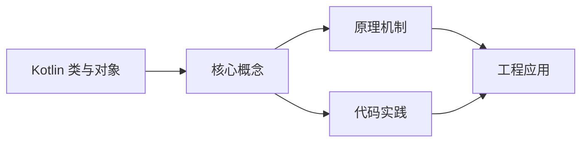

## 1. 学习目标（Bloom 分类）

本节按照布鲁姆教育目标分类学组织学习路径。本文主题为《Kotlin 类与对象》，属于 Kotlin 模块，读者可以根据自身阶段选择阅读深度。

记忆层面：能够准确复述本文的核心概念、术语与基本语法或操作步骤，并能够在提问或检索时快速定位对应知识点。能够说出 val/var、空安全操作符与 when 表达式的语法。

理解层面：能够用自己的语言解释核心原理与工作机制，说明概念之间的因果关系，而不是机械记忆结论。能够解释 Kotlin 与 Java 互操作的机制与平台类型概念。

应用层面：能够在真实项目或练习场景中运用本文知识解决具体问题，写出正确且可维护的实现。能够编写数据类、扩展函数与协程代码。

分析层面：能够拆解复杂问题，比较本文主题与相邻概念的异同，识别边界条件与例外情况。能够分析空安全、智能转换与协程调度原理。

评价层面：能够根据约束条件（性能、可读性、安全、成本）评价不同方案的优劣，做出有依据的技术决策。能够评价 Kotlin 在 Android、服务端与多平台场景的适用性。

创造层面：能够把本文知识与其他模块知识组合，设计出新的解决方案或可复用的工程模式。能够组合 Compose 与协程设计跨平台应用。

通过本节学习，读者应当能够把《Kotlin 类与对象》纳入自己的知识网络，并与 Kotlin 模块的其他主题（类型推断、空安全、协程、KMP）建立关联。

## 2. 历史动机与发展脉络

《Kotlin 类与对象》是 Kotlin 领域的重要主题。要真正理解它，需要先了解它解决的问题与演进过程。

Kotlin 由 JetBrains 于 2010 年开始研发，2016 年发布 1.0，定位是“更现代的 JVM 语言”：减少样板代码、消灭空指针、增强函数式能力，同时与 Java 100% 互操作。
2017 年 Google 宣布 Kotlin 成为 Android 一级语言，2019 年确立 Kotlin-first 政策；2023 年 Kotlin 2.0 的 K2 编译器显著提升编译速度与类型推导。
Kotlin Multiplatform（KMP）支持 JVM、Android、iOS、WebAssembly 等目标，配合 Compose Multiplatform 实现共享 UI 与业务逻辑，是 JetBrains 的长期战略方向。

回到本文主题：Kotlin 类与对象 的提出与成熟，正是上述技术背景下的必然产物。早期实现往往以简单可用为目标，随着工程规模扩大，社区逐渐沉淀出标准做法与最佳实践；理解这一脉络，可以帮助读者判断“为什么文档中的推荐写法是现在这个样子”，也能在遇到历史遗留代码时准确识别其设计年代与取舍。


## 3. 形式化定义与核心概念精讲

本节把《Kotlin 类与对象》涉及的核心概念以“定义 + 讲解”的形式展开。读者应把定义当作工具，把讲解当作理解路径；两者结合才能形成可迁移的知识。

空安全：类型系统区分 `String` 与 `String?`，编译期强制处理可空值；`?.` 短路、`?:` 提供默认、`!!` 显式断言，三者覆盖所有空值处理模式。
智能转换：`is` 检查后在不可变上下文中自动转换类型，减少显式强转；`as?` 安全转换失败返回 null。
协程：挂起函数（suspend）与调度器（Dispatchers.Main/IO/Default）实现非阻塞并发，结构化并发保证作用域内任务可取消。

### 3.1 原文章节逐一精讲

原文档把主题拆分为 22 个小节，下面按顺序给出每一节的导读讲解，随后保留原文细节供精读。

#### 原文精读（完整保留）

# Kotlin 类与对象速查

> **符号约定**：`< >` 必填参数 | `[ ]` 可选参数

---

#### 1. 类定义

##### 1.1 基本类

```kotlin
class Person {
    var name: String = ""
    var age: Int = 0

    fun introduce() {
        println("Hi, I'm $name, $age years old.")
    }
}

// 使用
val person = Person()
person.name = "Alice"
person.age = 25
person.introduce()
```

##### 1.2 属性与字段

```kotlin
class User {
    // 可变属性
    var name: String = "Unknown"
        get() = field.uppercase()       // 自定义 getter
        set(value) { field = value.trim() }  // 自定义 setter

    // 只读属性
    val createdAt: Long = System.currentTimeMillis()

    // 编译期常量
    companion object {
        const val MAX_AGE = 150
    }
}
```

Kotlin 属性背后使用**幕后字段**（backing field），通过 `field` 关键字访问：

```kotlin
class Temperature {
    var celsius: Double = 0.0
        set(value) {
            field = value
            // field 就是幕后字段，避免递归调用 setter
        }

    val fahrenheit: Double
        get() = celsius * 9 / 5 + 32
}
```

##### 1.3 延迟初始化属性

```kotlin
class Service {
    lateinit var repository: Repository

    fun init() {
        repository = Repository()
    }

    fun process() {
        if (::repository.isInitialized) {
            repository.query()
        }
    }
}
```

#### 2. 构造函数

##### 2.1 主构造函数

```kotlin
// 主构造函数在类头部声明
class Person(val name: String, val age: Int)

// 等价于
class Person constructor(val name: String, val age: Int)

// 使用
val person = Person("Alice", 25)
```

##### 2.2 init 块

主构造函数不能包含代码，初始化逻辑放在 `init` 块中：

```kotlin
class Person(val name: String, val age: Int) {
    init {
        require(age >= 0) { "Age cannot be negative" }
        println("Person created: $name, $age")
    }

    // 属性也可以在声明时初始化
    val isAdult: Boolean = age >= 18
}
```

##### 2.3 次构造函数

```kotlin
class Person(val name: String, val age: Int) {
    // 次构造函数必须委托给主构造函数
    constructor(name: String) : this(name, 0)

    constructor() : this("Unknown", 0)

    override fun toString(): String = "Person(name=$name, age=$age)"
}

Person("Alice", 25)  // 主构造
Person("Bob")        // 次构造，age=0
Person()             // 次构造，name="Unknown", age=0
```

##### 2.4 私有主构造函数

```kotlin
class Singleton private constructor() {
    companion object {
        val instance: Singleton by lazy { Singleton() }
    }
}
```

#### 3. 继承

Kotlin 中类默认是 `final` 的，必须使用 `open` 修饰才可被继承：

```kotlin
open class Animal(val name: String) {
    open fun sound() = "Some sound"

    fun description() = "Animal: $name"  // 不可重写（默认 final）
}

class Dog(name: String) : Animal(name) {
    override fun sound() = "Woof"
}

class Cat(name: String) : Animal(name) {
    override fun sound() = "Meow"
}
```

##### 3.1 属性重写

```kotlin
open class Base {
    open val value: Int = 0
}

class Derived : Base() {
    override val value: Int = 42  // 重写属性
}

// 主构造函数中的属性也可以重写
class Derived2(override val value: Int) : Base()
```

##### 3.2 调用父类实现

```kotlin
open class View {
    open fun draw() {
        println("Drawing view")
    }
}

class Button : View() {
    override fun draw() {
        super.draw()  // 调用父类实现
        println("Drawing button")
    }
}
```

#### 4. 抽象类

```kotlin
abstract class Shape {
    abstract val area: Double          // 抽象属性
    abstract fun perimeter(): Double   // 抽象方法

    fun describe() = "Area: $area, Perimeter: ${perimeter()}"
}

class Circle(val radius: Double) : Shape() {
    override val area: Double = Math.PI * radius * radius
    override fun perimeter(): Double = 2 * Math.PI * radius
}

class Rectangle(val width: Double, val height: Double) : Shape() {
    override val area: Double = width * height
    override fun perimeter(): Double = 2 * (width + height)
}
```

#### 5. 接口

Kotlin 接口可以包含抽象方法、具体方法和属性：

```kotlin
interface Clickable {
    fun click()                    // 抽象方法
    fun showOff() = "Clickable!"   // 带默认实现的方法
}

interface Focusable {
    fun setFocus(focused: Boolean)
    fun showOff() = "Focusable!"   // 同名默认实现
}

// 实现多个接口，解决冲突
class Button : Clickable, Focusable {
    override fun click() = println("Button clicked")
    override fun setFocus(focused: Boolean) = println("Focus: $focused")

    // 必须显式覆盖冲突的默认实现
    override fun showOff(): String {
        return super<Clickable>.showOff() + " & " + super<Focusable>.showOff()
    }
}
```

##### 5.1 接口中的属性

```kotlin
interface Config {
    val host: String           // 抽象属性
    val port: Int              // 抽象属性
    val url: String            // 抽象属性
        get() = "$host:$port"  // 可提供默认 getter

    // val timeout: Int = 5000  // 编译错误：接口中不能有幕后字段
}

class ServerConfig(override val host: String, override val port: Int) : Config
```

#### 6. 数据类

`data class` 自动生成 `equals()`、`hashCode()`、`toString()`、`copy()` 和 `componentN()` 函数：

```kotlin
data class User(val name: String, val age: Int, val email: String)

val user1 = User("Alice", 25, "alice@example.com")
val user2 = User("Alice", 25, "alice@example.com")

user1 == user2           // true（基于属性值比较）
user1.hashCode() == user2.hashCode()  // true
println(user1)           // User(name=Alice, age=25, email=alice@example.com)

// copy — 创建副本并修改部分属性
val user3 = user1.copy(age = 26, email = "new@example.com")

// 解构声明
val (name, age, email) = user1
```

##### 6.1 数据类要求

- 主构造函数必须至少有一个参数
- 主构造函数参数必须标记为 `val` 或 `var`
- 不能是 `abstract`、`open`、`sealed` 或 `inner`

#### 7. 密封类

密封类限制类的继承层次，所有子类必须在同一文件中声明：

```kotlin
sealed class Result<out T> {
    data class Success<T>(val value: T) : Result<T>()
    data class Error(val message: String, val code: Int) : Result<Nothing>()
    object Loading : Result<Nothing>()
}

fun handleResult(result: Result<Int>) = when (result) {
    is Result.Success -> println("Success: ${result.value}")
    is Result.Error -> println("Error: ${result.message}")
    Result.Loading -> println("Loading...")
    // 不需要 else 分支 — 编译器确保覆盖所有子类
}
```

##### 7.1 密封接口（Kotlin 1.5+）

```kotlin
sealed interface Action
sealed interface Readable : Action { val content: String }
sealed interface Writable : Action { fun write(text: String) }

data class ReadAction(override val content: String) : Readable
data class WriteAction(val buffer: StringBuilder) : Writable {
    override fun write(text: String) { buffer.append(text) }
}
```

#### 8. 枚举类

```kotlin
enum class Direction {
    NORTH, SOUTH, EAST, WEST
}

// 带属性的枚举
enum class Planet(val mass: Double, val radius: Double) {
    EARTH(5.97e24, 6371.0),
    MARS(6.42e23, 3390.0),
    JUPITER(1.90e27, 69911.0);

    val surfaceGravity: Double
        get() = 6.67e-11 * mass / (radius * radius * 1e6)

    fun surfaceWeight(mass: Double): Double = mass * surfaceGravity
}

// 枚举实现接口
enum class Format : Runnable {
    JSON {
        override fun run() = println("Formatting as JSON")
    },
    XML {
        override fun run() = println("Formatting as XML")
    }
}
```

##### 8.1 枚举常用操作

```kotlin
Direction.values()             // [NORTH, SOUTH, EAST, WEST]
Direction.valueOf("NORTH")     // NORTH
Direction.NORTH.name          // "NORTH"
Direction.NORTH.ordinal       // 0
Direction.entries              // Kotlin 1.9+，替代 values()
```

#### 9. 伴生对象

Kotlin 没有 `static` 关键字，使用 `companion object` 替代：

```kotlin
class MyClass {
    companion object {
        const val CONSTANT = "Hello"
        private var instanceCount = 0

        fun create(): MyClass {
            instanceCount++
            return MyClass()
        }
    }
}

MyClass.CONSTANT     // 通过类名访问
MyClass.create()     // 调用伴生对象方法
```

##### 9.1 伴生对象实现接口

```kotlin
interface Factory<T> {
    fun create(): T
}

class Product(val name: String) {
    companion object : Factory<Product> {
        override fun create(): Product = Product("Default")
    }
}

val product = Product.create()
```

##### 9.2 伴生对象扩展

```kotlin
class Product(val name: String) {
    companion object
}

// 为伴生对象添加扩展函数
fun Product.Companion.fromJson(json: String): Product {
    return Product(json)
}

val product = Product.fromJson("{\"name\":\"Widget\"}")
```

#### 10. 对象表达式与声明

##### 10.1 对象表达式（匿名内部类）

```kotlin
// 替代 Java 匿名内部类
window.addMouseListener(object : MouseAdapter() {
    override fun mouseClicked(e: MouseEvent) {
        println("Clicked at ${e.point}")
    }
})

// 实现多个接口
val obj = object : Clickable, Focusable {
    override fun click() = println("Clicked")
    override fun setFocus(focused: Boolean) = println("Focus: $focused")
}

// 简单对象表达式（无继承）
val config = object {
    val host = "localhost"
    val port = 8080
}
```

##### 10.2 对象声明（单例）

```kotlin
object Database {
    private val tables = mutableMapOf<String, String>()

    fun addTable(name: String, schema: String) {
        tables[name] = schema
    }

    fun getSchema(name: String): String? = tables[name]
}

Database.addTable("users", "id INT, name VARCHAR")
Database.getSchema("users")
```

##### 10.3 嵌套对象

```kotlin
class Outer {
    object Nested {
        fun greet() = "Hello from Nested"
    }

    inner class Inner {
        // 可以访问 Outer 的成员
        fun greet() = "Hello from Inner"
    }
}

Outer.Nested.greet()   // 直接通过类名访问
Outer().Inner().greet()  // 需要外部类实例
```

#### 11. 委托

##### 11.1 类委托

```kotlin
interface Repository {
    fun findAll(): List<String>
}

class DefaultRepository : Repository {
    override fun findAll() = listOf("item1", "item2")
}

// 通过委托实现装饰器模式
class LoggingRepository(private val repo: Repository) : Repository by repo {
    override fun findAll(): List<String> {
        println("Finding all items...")
        return repo.findAll().also { println("Found ${it.size} items") }
    }
}
```

##### 11.2 属性委托

```kotlin
import kotlin.properties.Delegates

class Config {
    // observable — 属性变化时回调
    var name: String by Delegates.observable("initial") { _, old, new ->
        println("Name changed from $old to $new")
    }

    // vetoable — 可否决属性变化
    var age: Int by Delegates.vetoable(0) { _, _, new ->
        new >= 0  // 只允许非负值
    }

    // lazy — 延迟初始化
    val heavyData: List<String> by lazy {
        println("Computing...")
        (1..1000).map { "Item $it" }
    }
}
```

##### 11.3 自定义属性委托

```kotlin
import kotlin.reflect.KProperty

class Preference<T>(private val key: String, private val default: T) {
    private val prefs: Map<String, Any> = mutableMapOf()  // 简化示例

    operator fun getValue(thisRef: Any?, property: KProperty<*>): T {
        @Suppress("UNCHECKED_CAST")
        return prefs[key] as? T ?: default
    }

    operator fun setValue(thisRef: Any?, property: KProperty<*>, value: T) {
        (prefs as MutableMap)[key] = value as Any
    }
}

class Settings {
    var theme: String by Preference("theme", "dark")
    var fontSize: Int by Preference("fontSize", 14)
}
```
#### 类定义

**基本写法：基本类定义**
`class <Name> { <body> }`
```kotlin
// 基本类定义
class Person {
    var name: String = "";
    var age: Int = 0;
}
```

**基本写法：可变属性与自定义 getter**
`var <name>: <Type> = <init> get() = <expr>`
```kotlin
// 可变属性自定义 getter
class User {
    var name: String = "Unknown"
        get() = field.uppercase();
}
```

**基本写法：可变属性与自定义 setter**
`var <name>: <Type> = <init> set(value) { field = <expr> }`
```kotlin
// 可变属性自定义 setter
class User {
    var name: String = "Unknown"
        set(value) { field = value.trim(); }
}
```

**基本写法：只读属性**
`val <name>: <Type> = <init>`
```kotlin
// 只读属性
class User {
    val createdAt: Long = System.currentTimeMillis();
}
```

**基本写法：幕后字段**
`set(value) { field = <expr> }`
```kotlin
// field 引用幕后字段，避免递归调用 setter
class Temperature {
    var celsius: Double = 0.0
        set(value) {
            field = value;
        }
}
```

**基本写法：lateinit 延迟初始化属性**
`lateinit var <name>: <Type>`
```kotlin
// lateinit 延迟初始化
class Service {
    lateinit var repository: Repository;
    fun init() {
        repository = Repository();
    }
}
```

**基本写法：检查 lateinit 是否初始化**
`::<name>.isInitialized`
```kotlin
// 检查 lateinit 属性是否已初始化
if (::repository.isInitialized) {
    repository.query();
}
```

---

#### 构造函数

**单行写法：主构造函数**
`class <Name>(val <prop>: <Type>, val <prop2>: <Type>)`
```kotlin
// 单行主构造函数声明属性
class Person(val name: String, val age: Int);
```

**单行写法：constructor 关键字主构造函数**
`class <Name> constructor(val <prop>: <Type>)`
```kotlin
// 显式 constructor 关键字
class Person constructor(val name: String, val age: Int);
```

**换行写法：多参数主构造函数**
`class <Name>(val <prop1>: <Type>, val <prop2>: <Type>, val <prop3>: <Type>)`
```kotlin
// 换行声明多参数主构造函数
class Person(
    val name: String,
    val age: Int,
    val email: String
);
```

**基本写法：init 块**
`init { <body> }`
```kotlin
// init 块执行初始化逻辑
class Person(val name: String, val age: Int) {
    init {
        require(age >= 0) { "Age cannot be negative" };
    }
}
```

**基本写法：次构造函数**
`constructor(<params>) : this(<args>)`
```kotlin
// 次构造函数委托给主构造函数
class Person(val name: String, val age: Int) {
    constructor(name: String) : this(name, 0);
}
```

**基本写法：私有主构造函数**
`class <Name> private constructor() { <body> }`
```kotlin
// 私有主构造函数实现单例
class Singleton private constructor() {
    companion object {
        val instance: Singleton by lazy { Singleton(); }
    }
}
```

---

#### 继承

**基本写法：open 类继承**
`open class <Name>(<params>) { open fun <name>(): <ReturnType> }`
```kotlin
// open 修饰类允许继承
open class Animal(val name: String) {
    open fun sound() = "Some sound";
}
```

**基本写法：子类继承**
`class <SubName>(<params>) : <BaseName>(<args>) { override fun <name>(): <ReturnType> }`
```kotlin
// 子类重写方法
class Dog(name: String) : Animal(name) {
    override fun sound() = "Woof";
}
```

**基本写法：属性重写**
`override val <name>: <Type> = <value>`
```kotlin
// 重写父类属性
open class Base {
    open val value: Int = 0;
}
class Derived : Base() {
    override val value: Int = 42;
}
```

**基本写法：主构造函数属性重写**
`class <SubName>(override val <prop>: <Type>) : <BaseName>()`
```kotlin
// 主构造函数中重写属性
class Derived2(override val value: Int) : Base();
```

**基本写法：调用父类实现**
`super.<method>()`
```kotlin
// 调用父类方法
class Button : View() {
    override fun draw() {
        super.draw();
        println("Drawing button");
    }
}
```

---

#### 抽象类

**基本写法：抽象类定义**
`abstract class <Name> { abstract fun <name>(): <ReturnType> }`
```kotlin
// 抽象类定义抽象方法
abstract class Shape {
    abstract fun perimeter(): Double;
}
```

**基本写法：抽象属性**
`abstract class <Name> { abstract val <prop>: <Type> }`
```kotlin
// 抽象类定义抽象属性
abstract class Shape {
    abstract val area: Double;
}
```

**基本写法：抽象类实现**
`class <SubName>(<params>) : <BaseName>() { override val <prop>: <Type> = <value> }`
```kotlin
// 实现抽象类
class Circle(val radius: Double) : Shape() {
    override val area: Double = Math.PI * radius * radius;
    override fun perimeter(): Double = 2 * Math.PI * radius;
}
```

---

#### 接口

**基本写法：接口定义**
`interface <Name> { fun <method>(<params>): <ReturnType> }`
```kotlin
// 接口定义抽象方法
interface Clickable {
    fun click();
}
```

**基本写法：接口默认实现**
`interface <Name> { fun <method>(): <ReturnType> = <expr> }`
```kotlin
// 接口方法默认实现
interface Clickable {
    fun showOff() = "Clickable!";
}
```

**换行写法：实现多个接口**
`class <Name> : <Interface1>, <Interface2> { override fun <method> }`
```kotlin
// 实现多个接口并解决冲突
class Button : Clickable, Focusable {
    override fun click() = println("Button clicked");
    override fun showOff(): String {
        return super<Clickable>.showOff() + " & " + super<Focusable>.showOff();
    }
}
```

**基本写法：接口中的属性**
`interface <Name> { val <prop>: <Type> }`
```kotlin
// 接口定义抽象属性
interface Config {
    val host: String;
    val port: Int;
}
```

**基本写法：接口属性默认 getter**
`interface <Name> { val <prop>: <Type> get() = <expr> }`
```kotlin
// 接口属性提供默认 getter
interface Config {
    val url: String
        get() = "$host:$port";
}
```

---

#### 数据类

**单行写法：data class**
`data class <Name>(val <prop>: <Type>, val <prop2>: <Type>)`
```kotlin
// 单行数据类
data class User(val name: String, val age: Int);
```

**换行写法：多参数 data class**
`data class <Name>(val <prop1>: <Type>, val <prop2>: <Type>, val <prop3>: <Type>)`
```kotlin
// 换行声明多参数数据类
data class User(
    val name: String,
    val age: Int,
    val email: String
);
```

**基本写法：copy 复制并修改**
`<obj>.copy(<prop> = <value>)`
```kotlin
// copy 创建副本并修改部分属性
val user3 = user1.copy(age = 26);
```

**基本写法：解构声明**
`val (<a>, <b>, <c>) = <obj>`
```kotlin
// 解构声明提取属性
val (name, age, email) = user1;
```

---

#### 密封类

**基本写法：密封类定义**
`sealed class <Name> { <subclasses> }`
```kotlin
// 密封类定义子类
sealed class Result<out T> {
    data class Success<T>(val value: T) : Result<T>();
    object Loading : Result<Nothing>();
}
```

**基本写法：when 穷举密封类**
`fun <name>(<param>: <SealedClass>) = when (<param>) { is <Type> -> <expr> }`
```kotlin
// when 穷举所有子类，无需 else
fun handle(result: Result<Int>) = when (result) {
    is Result.Success -> println("Success: ${result.value}");
    Result.Loading -> println("Loading...");
}
```

**基本写法：密封接口定义**
`sealed interface <Name>`
```kotlin
// 密封接口定义
sealed interface Action {
    data class Click(val x: Int, val y: Int) : Action;
    object Idle : Action;
}
```

**基本写法：密封接口组合**
`sealed interface <Name> : <Other>`
```kotlin
// 密封接口继承其他密封接口
sealed interface Drawable {
    fun draw();
}
```

---

#### 枚举类

**单行写法：枚举定义**
`enum class <Name> { <VALUES> }`
```kotlin
// 单行枚举定义
enum class Direction {
    NORTH, SOUTH, EAST, WEST
}
```

**换行写法：带属性的枚举**
`enum class <Name>(val <prop>: <Type>) { <VALUE>(<args>), ... }`
```kotlin
// 换行声明带属性的枚举
enum class Planet(val mass: Double, val radius: Double) {
    EARTH(5.97e24, 6371.0),
    MARS(6.42e23, 3390.0),
    JUPITER(1.90e27, 69911.0)
}
```

**基本写法：枚举实现接口**
`enum class <Name> : <Interface> { <VALUE> { override fun <method>() } }`
```kotlin
// 枚举实现接口
enum class Format : Runnable {
    JSON {
        override fun run() = println("Formatting as JSON");
    }
}
```

**基本写法：枚举 values 获取所有值**
`<EnumClass>.values()`
```kotlin
// 获取所有枚举值
Direction.values();
```

**基本写法：枚举 valueOf 根据名称获取**
`<EnumClass>.valueOf("<name>")`
```kotlin
// 根据名称获取枚举值
Direction.valueOf("NORTH");
```

**基本写法：枚举 name 属性**
`<EnumValue>.name`
```kotlin
// 获取枚举值名称
Direction.NORTH.name;
```

**基本写法：枚举 ordinal 属性**
`<EnumValue>.ordinal`
```kotlin
// 获取枚举值序号
Direction.NORTH.ordinal;
```

---

#### 伴生对象

**基本写法：companion object**
`class <Name> { companion object { <members> } }`
```kotlin
// 伴生对象定义静态成员
class MyClass {
    companion object {
        const val CONSTANT = "Hello";
        fun create(): MyClass = MyClass();
    }
}
```

**基本写法：伴生对象实现接口**
`companion object : <Interface> { override fun <method>(): <ReturnType> }`
```kotlin
// 伴生对象实现工厂接口
class Product(val name: String) {
    companion object : Factory<Product> {
        override fun create(): Product = Product("Default");
    }
}
```

**基本写法：伴生对象扩展**
`fun <Class>.Companion.<name>(<params>): <ReturnType>`
```kotlin
// 为伴生对象添加扩展函数
fun Product.Companion.fromJson(json: String): Product {
    return Product(json);
}
```

---

#### 对象表达式与声明

**基本写法：对象表达式**
`object : <Class>(), <Interface> { <overrides> }`
```kotlin
// 对象表达式替代匿名内部类
window.addMouseListener(object : MouseAdapter() {
    override fun mouseClicked(e: MouseEvent) {
        println("Clicked at ${e.point}");
    }
})
```

**基本写法：简单对象表达式**
`val <name> = object { <members> }`
```kotlin
// 无继承的简单对象表达式
val config = object {
    val host = "localhost";
    val port = 8080;
}
```

**基本写法：对象声明（单例）**
`object <Name> { <body> }`
```kotlin
// 对象声明实现单例
object Database {
    fun getSchema(name: String): String? = tables[name];
}
```

**基本写法：嵌套对象**
`class <Outer> { object <Nested> { <body> } }`
```kotlin
// 嵌套对象（静态内部类）
class Outer {
    object Nested {
        fun greet() = "Hello from Nested";
    }
}
```

**基本写法：内部类**
`class <Outer> { inner class <Inner> { <body> } }`
```kotlin
// inner class 内部类（持有外部类引用）
class Outer {
    inner class Inner {
        fun greet() = "Hello from Inner";
    }
}
```

---

#### 委托

**基本写法：类委托**
`class <Name>(<val delegate>: <Interface>) : <Interface> by <delegate>`
```kotlin
// 类委托实现装饰器模式
class LoggingRepository(private val repo: Repository) : Repository by repo {
    override fun findAll(): List<String> {
        println("Finding all items...");
        return repo.findAll();
    }
}
```

**基本写法：observable 属性委托**
`var <name>: <Type> by Delegates.observable(<init>) { _, old, new -> <body> }`
```kotlin
// observable 属性变化时回调
class Config {
    var name: String by Delegates.observable("initial") { _, old, new ->
        println("Name changed from $old to $new");
    }
}
```

**基本写法：vetoable 属性委托**
`var <name>: <Type> by Delegates.vetoable(<init>) { _, _, new -> <cond> }`
```kotlin
// vetoable 可否决属性变化
class Config {
    var age: Int by Delegates.vetoable(0) { _, _, new ->
        new >= 0;
    }
}
```

**基本写法：lazy 属性委托**
`val <name>: <Type> by lazy { <init> }`
```kotlin
// lazy 延迟初始化
class Config {
    val heavyData: List<String> by lazy {
        (1..1000).map { "Item $it" };
    }
}
```

**换行写法：自定义属性委托**
`class <Delegate><T> { operator fun getValue(...) / setValue(...) }`
```kotlin
// 自定义属性委托实现
class Preference<T>(private val key: String, private val default: T) {
    operator fun getValue(thisRef: Any?, property: KProperty<*>): T {
        return prefs[key] as? T ?: default;
    }
    operator fun setValue(thisRef: Any?, property: KProperty<*>, value: T) {
        prefs[key] = value;
    }
}
```


### 3.2 概念关系图

下面用 Mermaid 图表达本文核心概念之间的关系，帮助读者建立整体图景：



图中展示的是本文知识的结构化关系：核心概念是入口，原理机制解释“为什么”，代码实践演示“怎么做”，工程应用回答“何时用”。读者学习时可以把每个小节的内容挂接到对应节点上。

## 4. 理论推导与原理解析

本节深入《Kotlin 类与对象》背后的原理。理论部分不求面面俱到，而是聚焦“能解释现象、能指导实践”的关键推导。

空安全：类型系统区分 `String` 与 `String?`，编译期强制处理可空值；`?.` 短路、`?:` 提供默认、`!!` 显式断言，三者覆盖所有空值处理模式。
智能转换：`is` 检查后在不可变上下文中自动转换类型，减少显式强转；`as?` 安全转换失败返回 null。
协程：挂起函数（suspend）与调度器（Dispatchers.Main/IO/Default）实现非阻塞并发，结构化并发保证作用域内任务可取消。
扩展函数与属性：在不修改原类的情况下为类添加行为，是 Kotlin 标准库（如集合操作）的基石。

需要强调的是，理论推导与工程实践之间存在翻译层：理论给出的是理想化模型与边界条件，工程代码则必须处理真实环境中的例外。读者在学习时应先掌握理论的“标准情形”，再通过陷阱章节了解“非标准情形”。

## 5. 代码示例与逐行讲解

本节把原文中的代码示例系统整理，并为每个示例补充用途说明与讲解。读者不应只浏览代码，而应逐段对照讲解理解设计意图。

### 5.1 示例：1.1 基本类

该示例来自原文《1.1 基本类》小节，用于演示Kotlin 类与对象相关操作。阅读时请先看代码结构，再看其后的讲解。

```kotlin
class Person {
    var name: String = ""
    var age: Int = 0

    fun introduce() {
        println("Hi, I'm $name, $age years old.")
    }
}

// 使用
val person = Person()
person.name = "Alice"
person.age = 25
person.introduce()
```

讲解：这段代码演示了本节核心知识点。代码中的关键操作可以归纳为三步：准备（定义或初始化）、执行（核心逻辑）、收尾（释放资源或返回结果）。实际项目中，这三步往往被封装为函数或类，以提升复用性与可测试性。

关键点分析：

该示例共 12 行有效代码，包含 1 类关键结构（class）。其中：

- 入口与初始化部分负责建立上下文，对应实际项目中的启动或装配逻辑；
- 核心逻辑部分体现本文主题的主要操作，是阅读时最需要对照讲解理解的部分；
- 输出或返回部分把结果交给调用方，注意其类型与边界条件。

进阶思考路径：先尝试修改参数观察行为变化，再把示例中的模式迁移到自己的项目中；每次修改都记录预期与实测差异，这是把示例转化为能力的最快方式。

### 5.2 示例：1.2 属性与字段

该示例来自原文《1.2 属性与字段》小节，用于演示Kotlin 类与对象相关操作。阅读时请先看代码结构，再看其后的讲解。

```kotlin
class User {
    // 可变属性
    var name: String = "Unknown"
        get() = field.uppercase()       // 自定义 getter
        set(value) { field = value.trim() }  // 自定义 setter

    // 只读属性
    val createdAt: Long = System.currentTimeMillis()

    // 编译期常量
    companion object {
        const val MAX_AGE = 150
    }
}
```

讲解：这段代码演示了本节核心知识点。代码中的关键操作可以归纳为三步：准备（定义或初始化）、执行（核心逻辑）、收尾（释放资源或返回结果）。实际项目中，这三步往往被封装为函数或类，以提升复用性与可测试性。

关键点分析：

该示例共 12 行有效代码，包含 1 类关键结构（class）。其中：

- 入口与初始化部分负责建立上下文，对应实际项目中的启动或装配逻辑；
- 核心逻辑部分体现本文主题的主要操作，是阅读时最需要对照讲解理解的部分；
- 输出或返回部分把结果交给调用方，注意其类型与边界条件。

进阶思考路径：先尝试修改参数观察行为变化，再把示例中的模式迁移到自己的项目中；每次修改都记录预期与实测差异，这是把示例转化为能力的最快方式。

### 5.3 示例：1.2 属性与字段

该示例来自原文《1.2 属性与字段》小节，用于演示Kotlin 类与对象相关操作。阅读时请先看代码结构，再看其后的讲解。

```kotlin
class Temperature {
    var celsius: Double = 0.0
        set(value) {
            field = value
            // field 就是幕后字段，避免递归调用 setter
        }

    val fahrenheit: Double
        get() = celsius * 9 / 5 + 32
}
```

讲解：这段代码演示了本节核心知识点。代码中的关键操作可以归纳为三步：准备（定义或初始化）、执行（核心逻辑）、收尾（释放资源或返回结果）。实际项目中，这三步往往被封装为函数或类，以提升复用性与可测试性。

关键点分析：

该示例共 9 行有效代码，包含 1 类关键结构（class）。其中：

- 入口与初始化部分负责建立上下文，对应实际项目中的启动或装配逻辑；
- 核心逻辑部分体现本文主题的主要操作，是阅读时最需要对照讲解理解的部分；
- 输出或返回部分把结果交给调用方，注意其类型与边界条件。

进阶思考路径：先尝试修改参数观察行为变化，再把示例中的模式迁移到自己的项目中；每次修改都记录预期与实测差异，这是把示例转化为能力的最快方式。

### 5.4 示例：1.3 延迟初始化属性

该示例来自原文《1.3 延迟初始化属性》小节，用于演示Kotlin 类与对象相关操作。阅读时请先看代码结构，再看其后的讲解。

```kotlin
class Service {
    lateinit var repository: Repository

    fun init() {
        repository = Repository()
    }

    fun process() {
        if (::repository.isInitialized) {
            repository.query()
        }
    }
}
```

讲解：这段代码演示了本节核心知识点。代码中的关键操作可以归纳为三步：准备（定义或初始化）、执行（核心逻辑）、收尾（释放资源或返回结果）。实际项目中，这三步往往被封装为函数或类，以提升复用性与可测试性。

关键点分析：

该示例共 11 行有效代码，包含 2 类关键结构（class、if）。其中：

- 入口与初始化部分负责建立上下文，对应实际项目中的启动或装配逻辑；
- 核心逻辑部分体现本文主题的主要操作，是阅读时最需要对照讲解理解的部分；
- 输出或返回部分把结果交给调用方，注意其类型与边界条件。

进阶思考路径：先尝试修改参数观察行为变化，再把示例中的模式迁移到自己的项目中；每次修改都记录预期与实测差异，这是把示例转化为能力的最快方式。

### 5.5 示例：2.1 主构造函数

该示例来自原文《2.1 主构造函数》小节，用于演示Kotlin 类与对象相关操作。阅读时请先看代码结构，再看其后的讲解。

```kotlin
// 主构造函数在类头部声明
class Person(val name: String, val age: Int)

// 等价于
class Person constructor(val name: String, val age: Int)

// 使用
val person = Person("Alice", 25)
```

讲解：这段代码演示了本节核心知识点。代码中的关键操作可以归纳为三步：准备（定义或初始化）、执行（核心逻辑）、收尾（释放资源或返回结果）。实际项目中，这三步往往被封装为函数或类，以提升复用性与可测试性。

关键点分析：

该示例共 6 行有效代码，包含 1 类关键结构（class）。其中：

- 入口与初始化部分负责建立上下文，对应实际项目中的启动或装配逻辑；
- 核心逻辑部分体现本文主题的主要操作，是阅读时最需要对照讲解理解的部分；
- 输出或返回部分把结果交给调用方，注意其类型与边界条件。

进阶思考路径：先尝试修改参数观察行为变化，再把示例中的模式迁移到自己的项目中；每次修改都记录预期与实测差异，这是把示例转化为能力的最快方式。

### 5.6 示例：2.2 init 块

该示例来自原文《2.2 init 块》小节，用于演示Kotlin 类与对象相关操作。阅读时请先看代码结构，再看其后的讲解。

```kotlin
class Person(val name: String, val age: Int) {
    init {
        require(age >= 0) { "Age cannot be negative" }
        println("Person created: $name, $age")
    }

    // 属性也可以在声明时初始化
    val isAdult: Boolean = age >= 18
}
```

讲解：这段代码演示了本节核心知识点。代码中的关键操作可以归纳为三步：准备（定义或初始化）、执行（核心逻辑）、收尾（释放资源或返回结果）。实际项目中，这三步往往被封装为函数或类，以提升复用性与可测试性。

关键点分析：

该示例共 8 行有效代码，包含 1 类关键结构（class）。其中：

- 入口与初始化部分负责建立上下文，对应实际项目中的启动或装配逻辑；
- 核心逻辑部分体现本文主题的主要操作，是阅读时最需要对照讲解理解的部分；
- 输出或返回部分把结果交给调用方，注意其类型与边界条件。

进阶思考路径：先尝试修改参数观察行为变化，再把示例中的模式迁移到自己的项目中；每次修改都记录预期与实测差异，这是把示例转化为能力的最快方式。

### 5.7 示例：2.3 次构造函数

该示例来自原文《2.3 次构造函数》小节，用于演示Kotlin 类与对象相关操作。阅读时请先看代码结构，再看其后的讲解。

```kotlin
class Person(val name: String, val age: Int) {
    // 次构造函数必须委托给主构造函数
    constructor(name: String) : this(name, 0)

    constructor() : this("Unknown", 0)

    override fun toString(): String = "Person(name=$name, age=$age)"
}

Person("Alice", 25)  // 主构造
Person("Bob")        // 次构造，age=0
Person()             // 次构造，name="Unknown", age=0
```

讲解：这段代码演示了本节核心知识点。代码中的关键操作可以归纳为三步：准备（定义或初始化）、执行（核心逻辑）、收尾（释放资源或返回结果）。实际项目中，这三步往往被封装为函数或类，以提升复用性与可测试性。

关键点分析：

该示例共 9 行有效代码，包含 1 类关键结构（class）。其中：

- 入口与初始化部分负责建立上下文，对应实际项目中的启动或装配逻辑；
- 核心逻辑部分体现本文主题的主要操作，是阅读时最需要对照讲解理解的部分；
- 输出或返回部分把结果交给调用方，注意其类型与边界条件。

进阶思考路径：先尝试修改参数观察行为变化，再把示例中的模式迁移到自己的项目中；每次修改都记录预期与实测差异，这是把示例转化为能力的最快方式。

### 5.8 示例：2.4 私有主构造函数

该示例来自原文《2.4 私有主构造函数》小节，用于演示Kotlin 类与对象相关操作。阅读时请先看代码结构，再看其后的讲解。

```kotlin
class Singleton private constructor() {
    companion object {
        val instance: Singleton by lazy { Singleton() }
    }
}
```

讲解：这段代码演示了本节核心知识点。代码中的关键操作可以归纳为三步：准备（定义或初始化）、执行（核心逻辑）、收尾（释放资源或返回结果）。实际项目中，这三步往往被封装为函数或类，以提升复用性与可测试性。

关键点分析：

该示例共 5 行有效代码，包含 1 类关键结构（class）。其中：

- 入口与初始化部分负责建立上下文，对应实际项目中的启动或装配逻辑；
- 核心逻辑部分体现本文主题的主要操作，是阅读时最需要对照讲解理解的部分；
- 输出或返回部分把结果交给调用方，注意其类型与边界条件。

进阶思考路径：先尝试修改参数观察行为变化，再把示例中的模式迁移到自己的项目中；每次修改都记录预期与实测差异，这是把示例转化为能力的最快方式。

### 5.9 示例：3. 继承

该示例来自原文《3. 继承》小节，用于演示Kotlin 类与对象相关操作。阅读时请先看代码结构，再看其后的讲解。

```kotlin
open class Animal(val name: String) {
    open fun sound() = "Some sound"

    fun description() = "Animal: $name"  // 不可重写（默认 final）
}

class Dog(name: String) : Animal(name) {
    override fun sound() = "Woof"
}

class Cat(name: String) : Animal(name) {
    override fun sound() = "Meow"
}
```

讲解：这段代码演示了本节核心知识点。代码中的关键操作可以归纳为三步：准备（定义或初始化）、执行（核心逻辑）、收尾（释放资源或返回结果）。实际项目中，这三步往往被封装为函数或类，以提升复用性与可测试性。

关键点分析：

该示例共 10 行有效代码，包含 1 类关键结构（class）。其中：

- 入口与初始化部分负责建立上下文，对应实际项目中的启动或装配逻辑；
- 核心逻辑部分体现本文主题的主要操作，是阅读时最需要对照讲解理解的部分；
- 输出或返回部分把结果交给调用方，注意其类型与边界条件。

进阶思考路径：先尝试修改参数观察行为变化，再把示例中的模式迁移到自己的项目中；每次修改都记录预期与实测差异，这是把示例转化为能力的最快方式。

### 5.10 示例：3.1 属性重写

该示例来自原文《3.1 属性重写》小节，用于演示Kotlin 类与对象相关操作。阅读时请先看代码结构，再看其后的讲解。

```kotlin
open class Base {
    open val value: Int = 0
}

class Derived : Base() {
    override val value: Int = 42  // 重写属性
}

// 主构造函数中的属性也可以重写
class Derived2(override val value: Int) : Base()
```

讲解：这段代码演示了本节核心知识点。代码中的关键操作可以归纳为三步：准备（定义或初始化）、执行（核心逻辑）、收尾（释放资源或返回结果）。实际项目中，这三步往往被封装为函数或类，以提升复用性与可测试性。

关键点分析：

该示例共 8 行有效代码，包含 1 类关键结构（class）。其中：

- 入口与初始化部分负责建立上下文，对应实际项目中的启动或装配逻辑；
- 核心逻辑部分体现本文主题的主要操作，是阅读时最需要对照讲解理解的部分；
- 输出或返回部分把结果交给调用方，注意其类型与边界条件。

进阶思考路径：先尝试修改参数观察行为变化，再把示例中的模式迁移到自己的项目中；每次修改都记录预期与实测差异，这是把示例转化为能力的最快方式。

### 5.11 示例：3.2 调用父类实现

该示例来自原文《3.2 调用父类实现》小节，用于演示Kotlin 类与对象相关操作。阅读时请先看代码结构，再看其后的讲解。

```kotlin
open class View {
    open fun draw() {
        println("Drawing view")
    }
}

class Button : View() {
    override fun draw() {
        super.draw()  // 调用父类实现
        println("Drawing button")
    }
}
```

讲解：这段代码演示了本节核心知识点。代码中的关键操作可以归纳为三步：准备（定义或初始化）、执行（核心逻辑）、收尾（释放资源或返回结果）。实际项目中，这三步往往被封装为函数或类，以提升复用性与可测试性。

关键点分析：

该示例共 11 行有效代码，包含 1 类关键结构（class）。其中：

- 入口与初始化部分负责建立上下文，对应实际项目中的启动或装配逻辑；
- 核心逻辑部分体现本文主题的主要操作，是阅读时最需要对照讲解理解的部分；
- 输出或返回部分把结果交给调用方，注意其类型与边界条件。

进阶思考路径：先尝试修改参数观察行为变化，再把示例中的模式迁移到自己的项目中；每次修改都记录预期与实测差异，这是把示例转化为能力的最快方式。

### 5.12 示例：4. 抽象类

该示例来自原文《4. 抽象类》小节，用于演示Kotlin 类与对象相关操作。阅读时请先看代码结构，再看其后的讲解。

```kotlin
abstract class Shape {
    abstract val area: Double          // 抽象属性
    abstract fun perimeter(): Double   // 抽象方法

    fun describe() = "Area: $area, Perimeter: ${perimeter()}"
}

class Circle(val radius: Double) : Shape() {
    override val area: Double = Math.PI * radius * radius
    override fun perimeter(): Double = 2 * Math.PI * radius
}

class Rectangle(val width: Double, val height: Double) : Shape() {
    override val area: Double = width * height
    override fun perimeter(): Double = 2 * (width + height)
}
```

讲解：这段代码演示了本节核心知识点。代码中的关键操作可以归纳为三步：准备（定义或初始化）、执行（核心逻辑）、收尾（释放资源或返回结果）。实际项目中，这三步往往被封装为函数或类，以提升复用性与可测试性。

关键点分析：

该示例共 13 行有效代码，包含 1 类关键结构（class）。其中：

- 入口与初始化部分负责建立上下文，对应实际项目中的启动或装配逻辑；
- 核心逻辑部分体现本文主题的主要操作，是阅读时最需要对照讲解理解的部分；
- 输出或返回部分把结果交给调用方，注意其类型与边界条件。

进阶思考路径：先尝试修改参数观察行为变化，再把示例中的模式迁移到自己的项目中；每次修改都记录预期与实测差异，这是把示例转化为能力的最快方式。

### 5.13 示例：5. 接口

该示例来自原文《5. 接口》小节，用于演示Kotlin 类与对象相关操作。阅读时请先看代码结构，再看其后的讲解。

```kotlin
interface Clickable {
    fun click()                    // 抽象方法
    fun showOff() = "Clickable!"   // 带默认实现的方法
}

interface Focusable {
    fun setFocus(focused: Boolean)
    fun showOff() = "Focusable!"   // 同名默认实现
}

// 实现多个接口，解决冲突
class Button : Clickable, Focusable {
    override fun click() = println("Button clicked")
    override fun setFocus(focused: Boolean) = println("Focus: $focused")

    // 必须显式覆盖冲突的默认实现
    override fun showOff(): String {
        return super<Clickable>.showOff() + " & " + super<Focusable>.showOff()
    }
}
```

讲解：这段代码演示了本节核心知识点。代码中的关键操作可以归纳为三步：准备（定义或初始化）、执行（核心逻辑）、收尾（释放资源或返回结果）。实际项目中，这三步往往被封装为函数或类，以提升复用性与可测试性。

关键点分析：

该示例共 17 行有效代码，包含 2 类关键结构（class、return）。其中：

- 入口与初始化部分负责建立上下文，对应实际项目中的启动或装配逻辑；
- 核心逻辑部分体现本文主题的主要操作，是阅读时最需要对照讲解理解的部分；
- 输出或返回部分把结果交给调用方，注意其类型与边界条件。

进阶思考路径：先尝试修改参数观察行为变化，再把示例中的模式迁移到自己的项目中；每次修改都记录预期与实测差异，这是把示例转化为能力的最快方式。

### 5.14 示例：5.1 接口中的属性

该示例来自原文《5.1 接口中的属性》小节，用于演示Kotlin 类与对象相关操作。阅读时请先看代码结构，再看其后的讲解。

```kotlin
interface Config {
    val host: String           // 抽象属性
    val port: Int              // 抽象属性
    val url: String            // 抽象属性
        get() = "$host:$port"  // 可提供默认 getter

    // val timeout: Int = 5000  // 编译错误：接口中不能有幕后字段
}

class ServerConfig(override val host: String, override val port: Int) : Config
```

讲解：这段代码演示了本节核心知识点。代码中的关键操作可以归纳为三步：准备（定义或初始化）、执行（核心逻辑）、收尾（释放资源或返回结果）。实际项目中，这三步往往被封装为函数或类，以提升复用性与可测试性。

关键点分析：

该示例共 8 行有效代码，包含 1 类关键结构（class）。其中：

- 入口与初始化部分负责建立上下文，对应实际项目中的启动或装配逻辑；
- 核心逻辑部分体现本文主题的主要操作，是阅读时最需要对照讲解理解的部分；
- 输出或返回部分把结果交给调用方，注意其类型与边界条件。

进阶思考路径：先尝试修改参数观察行为变化，再把示例中的模式迁移到自己的项目中；每次修改都记录预期与实测差异，这是把示例转化为能力的最快方式。

### 5.15 示例：6. 数据类

该示例来自原文《6. 数据类》小节，用于演示Kotlin 类与对象相关操作。阅读时请先看代码结构，再看其后的讲解。

```kotlin
data class User(val name: String, val age: Int, val email: String)

val user1 = User("Alice", 25, "alice@example.com")
val user2 = User("Alice", 25, "alice@example.com")

user1 == user2           // true（基于属性值比较）
user1.hashCode() == user2.hashCode()  // true
println(user1)           // User(name=Alice, age=25, email=alice@example.com)

// copy — 创建副本并修改部分属性
val user3 = user1.copy(age = 26, email = "new@example.com")

// 解构声明
val (name, age, email) = user1
```

讲解：这段代码演示了本节核心知识点。代码中的关键操作可以归纳为三步：准备（定义或初始化）、执行（核心逻辑）、收尾（释放资源或返回结果）。实际项目中，这三步往往被封装为函数或类，以提升复用性与可测试性。

关键点分析：

该示例共 10 行有效代码，包含 1 类关键结构（class）。其中：

- 入口与初始化部分负责建立上下文，对应实际项目中的启动或装配逻辑；
- 核心逻辑部分体现本文主题的主要操作，是阅读时最需要对照讲解理解的部分；
- 输出或返回部分把结果交给调用方，注意其类型与边界条件。

进阶思考路径：先尝试修改参数观察行为变化，再把示例中的模式迁移到自己的项目中；每次修改都记录预期与实测差异，这是把示例转化为能力的最快方式。

### 5.16 示例：7. 密封类

该示例来自原文《7. 密封类》小节，用于演示Kotlin 类与对象相关操作。阅读时请先看代码结构，再看其后的讲解。

```kotlin
sealed class Result<out T> {
    data class Success<T>(val value: T) : Result<T>()
    data class Error(val message: String, val code: Int) : Result<Nothing>()
    object Loading : Result<Nothing>()
}

fun handleResult(result: Result<Int>) = when (result) {
    is Result.Success -> println("Success: ${result.value}")
    is Result.Error -> println("Error: ${result.message}")
    Result.Loading -> println("Loading...")
    // 不需要 else 分支 — 编译器确保覆盖所有子类
}
```

讲解：这段代码演示了本节核心知识点。代码中的关键操作可以归纳为三步：准备（定义或初始化）、执行（核心逻辑）、收尾（释放资源或返回结果）。实际项目中，这三步往往被封装为函数或类，以提升复用性与可测试性。

关键点分析：

该示例共 11 行有效代码，包含 1 类关键结构（class）。其中：

- 入口与初始化部分负责建立上下文，对应实际项目中的启动或装配逻辑；
- 核心逻辑部分体现本文主题的主要操作，是阅读时最需要对照讲解理解的部分；
- 输出或返回部分把结果交给调用方，注意其类型与边界条件。

进阶思考路径：先尝试修改参数观察行为变化，再把示例中的模式迁移到自己的项目中；每次修改都记录预期与实测差异，这是把示例转化为能力的最快方式。

### 5.17 示例：7.1 密封接口（Kotlin 1.5+）

该示例来自原文《7.1 密封接口（Kotlin 1.5+）》小节，用于演示Kotlin 类与对象相关操作。阅读时请先看代码结构，再看其后的讲解。

```kotlin
sealed interface Action
sealed interface Readable : Action { val content: String }
sealed interface Writable : Action { fun write(text: String) }

data class ReadAction(override val content: String) : Readable
data class WriteAction(val buffer: StringBuilder) : Writable {
    override fun write(text: String) { buffer.append(text) }
}
```

讲解：这段代码演示了本节核心知识点。代码中的关键操作可以归纳为三步：准备（定义或初始化）、执行（核心逻辑）、收尾（释放资源或返回结果）。实际项目中，这三步往往被封装为函数或类，以提升复用性与可测试性。

关键点分析：

该示例共 7 行有效代码，包含 1 类关键结构（class）。其中：

- 入口与初始化部分负责建立上下文，对应实际项目中的启动或装配逻辑；
- 核心逻辑部分体现本文主题的主要操作，是阅读时最需要对照讲解理解的部分；
- 输出或返回部分把结果交给调用方，注意其类型与边界条件。

进阶思考路径：先尝试修改参数观察行为变化，再把示例中的模式迁移到自己的项目中；每次修改都记录预期与实测差异，这是把示例转化为能力的最快方式。

### 5.18 示例：8. 枚举类

该示例来自原文《8. 枚举类》小节，用于演示Kotlin 类与对象相关操作。阅读时请先看代码结构，再看其后的讲解。

```kotlin
enum class Direction {
    NORTH, SOUTH, EAST, WEST
}

// 带属性的枚举
enum class Planet(val mass: Double, val radius: Double) {
    EARTH(5.97e24, 6371.0),
    MARS(6.42e23, 3390.0),
    JUPITER(1.90e27, 69911.0);

    val surfaceGravity: Double
        get() = 6.67e-11 * mass / (radius * radius * 1e6)

    fun surfaceWeight(mass: Double): Double = mass * surfaceGravity
}

// 枚举实现接口
enum class Format : Runnable {
    JSON {
        override fun run() = println("Formatting as JSON")
    },
    XML {
        override fun run() = println("Formatting as XML")
    }
}
```

讲解：这段代码演示了本节核心知识点。代码中的关键操作可以归纳为三步：准备（定义或初始化）、执行（核心逻辑）、收尾（释放资源或返回结果）。实际项目中，这三步往往被封装为函数或类，以提升复用性与可测试性。

关键点分析：

该示例共 21 行有效代码，包含 1 类关键结构（class）。其中：

- 入口与初始化部分负责建立上下文，对应实际项目中的启动或装配逻辑；
- 核心逻辑部分体现本文主题的主要操作，是阅读时最需要对照讲解理解的部分；
- 输出或返回部分把结果交给调用方，注意其类型与边界条件。

进阶思考路径：先尝试修改参数观察行为变化，再把示例中的模式迁移到自己的项目中；每次修改都记录预期与实测差异，这是把示例转化为能力的最快方式。

### 5.19 示例：8.1 枚举常用操作

该示例来自原文《8.1 枚举常用操作》小节，用于演示Kotlin 类与对象相关操作。阅读时请先看代码结构，再看其后的讲解。

```kotlin
Direction.values()             // [NORTH, SOUTH, EAST, WEST]
Direction.valueOf("NORTH")     // NORTH
Direction.NORTH.name          // "NORTH"
Direction.NORTH.ordinal       // 0
Direction.entries              // Kotlin 1.9+，替代 values()
```

讲解：这段代码演示了本节核心知识点。代码中的关键操作可以归纳为三步：准备（定义或初始化）、执行（核心逻辑）、收尾（释放资源或返回结果）。实际项目中，这三步往往被封装为函数或类，以提升复用性与可测试性。

关键点分析：

该示例共 5 行有效代码，结构以数据或配置为主。阅读时应关注：数据字段的含义、配置项的作用，以及它们与运行行为的对应关系。

进阶思考路径：先尝试修改参数观察行为变化，再把示例中的模式迁移到自己的项目中；每次修改都记录预期与实测差异，这是把示例转化为能力的最快方式。

### 5.20 示例：9. 伴生对象

该示例来自原文《9. 伴生对象》小节，用于演示Kotlin 类与对象相关操作。阅读时请先看代码结构，再看其后的讲解。

```kotlin
class MyClass {
    companion object {
        const val CONSTANT = "Hello"
        private var instanceCount = 0

        fun create(): MyClass {
            instanceCount++
            return MyClass()
        }
    }
}

MyClass.CONSTANT     // 通过类名访问
MyClass.create()     // 调用伴生对象方法
```

讲解：这段代码演示了本节核心知识点。代码中的关键操作可以归纳为三步：准备（定义或初始化）、执行（核心逻辑）、收尾（释放资源或返回结果）。实际项目中，这三步往往被封装为函数或类，以提升复用性与可测试性。

关键点分析：

该示例共 12 行有效代码，包含 2 类关键结构（class、return）。其中：

- 入口与初始化部分负责建立上下文，对应实际项目中的启动或装配逻辑；
- 核心逻辑部分体现本文主题的主要操作，是阅读时最需要对照讲解理解的部分；
- 输出或返回部分把结果交给调用方，注意其类型与边界条件。

进阶思考路径：先尝试修改参数观察行为变化，再把示例中的模式迁移到自己的项目中；每次修改都记录预期与实测差异，这是把示例转化为能力的最快方式。

### 5.21 示例：9.1 伴生对象实现接口

该示例来自原文《9.1 伴生对象实现接口》小节，用于演示Kotlin 类与对象相关操作。阅读时请先看代码结构，再看其后的讲解。

```kotlin
interface Factory<T> {
    fun create(): T
}

class Product(val name: String) {
    companion object : Factory<Product> {
        override fun create(): Product = Product("Default")
    }
}

val product = Product.create()
```

讲解：这段代码演示了本节核心知识点。代码中的关键操作可以归纳为三步：准备（定义或初始化）、执行（核心逻辑）、收尾（释放资源或返回结果）。实际项目中，这三步往往被封装为函数或类，以提升复用性与可测试性。

关键点分析：

该示例共 9 行有效代码，包含 1 类关键结构（class）。其中：

- 入口与初始化部分负责建立上下文，对应实际项目中的启动或装配逻辑；
- 核心逻辑部分体现本文主题的主要操作，是阅读时最需要对照讲解理解的部分；
- 输出或返回部分把结果交给调用方，注意其类型与边界条件。

进阶思考路径：先尝试修改参数观察行为变化，再把示例中的模式迁移到自己的项目中；每次修改都记录预期与实测差异，这是把示例转化为能力的最快方式。

### 5.22 示例：9.2 伴生对象扩展

该示例来自原文《9.2 伴生对象扩展》小节，用于演示Kotlin 类与对象相关操作。阅读时请先看代码结构，再看其后的讲解。

```kotlin
class Product(val name: String) {
    companion object
}

// 为伴生对象添加扩展函数
fun Product.Companion.fromJson(json: String): Product {
    return Product(json)
}

val product = Product.fromJson("{\"name\":\"Widget\"}")
```

讲解：这段代码演示了本节核心知识点。代码中的关键操作可以归纳为三步：准备（定义或初始化）、执行（核心逻辑）、收尾（释放资源或返回结果）。实际项目中，这三步往往被封装为函数或类，以提升复用性与可测试性。

关键点分析：

该示例共 8 行有效代码，包含 2 类关键结构（class、return）。其中：

- 入口与初始化部分负责建立上下文，对应实际项目中的启动或装配逻辑；
- 核心逻辑部分体现本文主题的主要操作，是阅读时最需要对照讲解理解的部分；
- 输出或返回部分把结果交给调用方，注意其类型与边界条件。

进阶思考路径：先尝试修改参数观察行为变化，再把示例中的模式迁移到自己的项目中；每次修改都记录预期与实测差异，这是把示例转化为能力的最快方式。

### 5.23 示例：10.1 对象表达式（匿名内部类）

该示例来自原文《10.1 对象表达式（匿名内部类）》小节，用于演示Kotlin 类与对象相关操作。阅读时请先看代码结构，再看其后的讲解。

```kotlin
// 替代 Java 匿名内部类
window.addMouseListener(object : MouseAdapter() {
    override fun mouseClicked(e: MouseEvent) {
        println("Clicked at ${e.point}")
    }
})

// 实现多个接口
val obj = object : Clickable, Focusable {
    override fun click() = println("Clicked")
    override fun setFocus(focused: Boolean) = println("Focus: $focused")
}

// 简单对象表达式（无继承）
val config = object {
    val host = "localhost"
    val port = 8080
}
```

讲解：这段代码演示了本节核心知识点。代码中的关键操作可以归纳为三步：准备（定义或初始化）、执行（核心逻辑）、收尾（释放资源或返回结果）。实际项目中，这三步往往被封装为函数或类，以提升复用性与可测试性。

关键点分析：

该示例共 16 行有效代码，结构以数据或配置为主。阅读时应关注：数据字段的含义、配置项的作用，以及它们与运行行为的对应关系。

进阶思考路径：先尝试修改参数观察行为变化，再把示例中的模式迁移到自己的项目中；每次修改都记录预期与实测差异，这是把示例转化为能力的最快方式。

### 5.24 示例：10.2 对象声明（单例）

该示例来自原文《10.2 对象声明（单例）》小节，用于演示Kotlin 类与对象相关操作。阅读时请先看代码结构，再看其后的讲解。

```kotlin
object Database {
    private val tables = mutableMapOf<String, String>()

    fun addTable(name: String, schema: String) {
        tables[name] = schema
    }

    fun getSchema(name: String): String? = tables[name]
}

Database.addTable("users", "id INT, name VARCHAR")
Database.getSchema("users")
```

讲解：这段代码演示了本节核心知识点。代码中的关键操作可以归纳为三步：准备（定义或初始化）、执行（核心逻辑）、收尾（释放资源或返回结果）。实际项目中，这三步往往被封装为函数或类，以提升复用性与可测试性。

关键点分析：

该示例共 9 行有效代码，结构以数据或配置为主。阅读时应关注：数据字段的含义、配置项的作用，以及它们与运行行为的对应关系。

进阶思考路径：先尝试修改参数观察行为变化，再把示例中的模式迁移到自己的项目中；每次修改都记录预期与实测差异，这是把示例转化为能力的最快方式。

### 5.25 示例：10.3 嵌套对象

该示例来自原文《10.3 嵌套对象》小节，用于演示Kotlin 类与对象相关操作。阅读时请先看代码结构，再看其后的讲解。

```kotlin
class Outer {
    object Nested {
        fun greet() = "Hello from Nested"
    }

    inner class Inner {
        // 可以访问 Outer 的成员
        fun greet() = "Hello from Inner"
    }
}

Outer.Nested.greet()   // 直接通过类名访问
Outer().Inner().greet()  // 需要外部类实例
```

讲解：这段代码演示了本节核心知识点。代码中的关键操作可以归纳为三步：准备（定义或初始化）、执行（核心逻辑）、收尾（释放资源或返回结果）。实际项目中，这三步往往被封装为函数或类，以提升复用性与可测试性。

关键点分析：

该示例共 11 行有效代码，包含 2 类关键结构（class、from）。其中：

- 入口与初始化部分负责建立上下文，对应实际项目中的启动或装配逻辑；
- 核心逻辑部分体现本文主题的主要操作，是阅读时最需要对照讲解理解的部分；
- 输出或返回部分把结果交给调用方，注意其类型与边界条件。

进阶思考路径：先尝试修改参数观察行为变化，再把示例中的模式迁移到自己的项目中；每次修改都记录预期与实测差异，这是把示例转化为能力的最快方式。

### 5.26 示例：11.1 类委托

该示例来自原文《11.1 类委托》小节，用于演示Kotlin 类与对象相关操作。阅读时请先看代码结构，再看其后的讲解。

```kotlin
interface Repository {
    fun findAll(): List<String>
}

class DefaultRepository : Repository {
    override fun findAll() = listOf("item1", "item2")
}

// 通过委托实现装饰器模式
class LoggingRepository(private val repo: Repository) : Repository by repo {
    override fun findAll(): List<String> {
        println("Finding all items...")
        return repo.findAll().also { println("Found ${it.size} items") }
    }
}
```

讲解：这段代码演示了本节核心知识点。代码中的关键操作可以归纳为三步：准备（定义或初始化）、执行（核心逻辑）、收尾（释放资源或返回结果）。实际项目中，这三步往往被封装为函数或类，以提升复用性与可测试性。

关键点分析：

该示例共 13 行有效代码，包含 2 类关键结构（class、return）。其中：

- 入口与初始化部分负责建立上下文，对应实际项目中的启动或装配逻辑；
- 核心逻辑部分体现本文主题的主要操作，是阅读时最需要对照讲解理解的部分；
- 输出或返回部分把结果交给调用方，注意其类型与边界条件。

进阶思考路径：先尝试修改参数观察行为变化，再把示例中的模式迁移到自己的项目中；每次修改都记录预期与实测差异，这是把示例转化为能力的最快方式。

### 5.27 示例：11.2 属性委托

该示例来自原文《11.2 属性委托》小节，用于演示Kotlin 类与对象相关操作。阅读时请先看代码结构，再看其后的讲解。

```kotlin
import kotlin.properties.Delegates

class Config {
    // observable — 属性变化时回调
    var name: String by Delegates.observable("initial") { _, old, new ->
        println("Name changed from $old to $new")
    }

    // vetoable — 可否决属性变化
    var age: Int by Delegates.vetoable(0) { _, _, new ->
        new >= 0  // 只允许非负值
    }

    // lazy — 延迟初始化
    val heavyData: List<String> by lazy {
        println("Computing...")
        (1..1000).map { "Item $it" }
    }
}
```

讲解：这段代码演示了本节核心知识点。代码中的关键操作可以归纳为三步：准备（定义或初始化）、执行（核心逻辑）、收尾（释放资源或返回结果）。实际项目中，这三步往往被封装为函数或类，以提升复用性与可测试性。

关键点分析：

该示例共 16 行有效代码，包含 3 类关键结构（class、import、from）。其中：

- 入口与初始化部分负责建立上下文，对应实际项目中的启动或装配逻辑；
- 核心逻辑部分体现本文主题的主要操作，是阅读时最需要对照讲解理解的部分；
- 输出或返回部分把结果交给调用方，注意其类型与边界条件。

进阶思考路径：先尝试修改参数观察行为变化，再把示例中的模式迁移到自己的项目中；每次修改都记录预期与实测差异，这是把示例转化为能力的最快方式。

### 5.28 示例：11.3 自定义属性委托

该示例来自原文《11.3 自定义属性委托》小节，用于演示Kotlin 类与对象相关操作。阅读时请先看代码结构，再看其后的讲解。

```kotlin
import kotlin.reflect.KProperty

class Preference<T>(private val key: String, private val default: T) {
    private val prefs: Map<String, Any> = mutableMapOf()  // 简化示例

    operator fun getValue(thisRef: Any?, property: KProperty<*>): T {
        @Suppress("UNCHECKED_CAST")
        return prefs[key] as? T ?: default
    }

    operator fun setValue(thisRef: Any?, property: KProperty<*>, value: T) {
        (prefs as MutableMap)[key] = value as Any
    }
}

class Settings {
    var theme: String by Preference("theme", "dark")
    var fontSize: Int by Preference("fontSize", 14)
}
```

讲解：这段代码演示了本节核心知识点。代码中的关键操作可以归纳为三步：准备（定义或初始化）、执行（核心逻辑）、收尾（释放资源或返回结果）。实际项目中，这三步往往被封装为函数或类，以提升复用性与可测试性。

关键点分析：

该示例共 15 行有效代码，包含 3 类关键结构（class、import、return）。其中：

- 入口与初始化部分负责建立上下文，对应实际项目中的启动或装配逻辑；
- 核心逻辑部分体现本文主题的主要操作，是阅读时最需要对照讲解理解的部分；
- 输出或返回部分把结果交给调用方，注意其类型与边界条件。

进阶思考路径：先尝试修改参数观察行为变化，再把示例中的模式迁移到自己的项目中；每次修改都记录预期与实测差异，这是把示例转化为能力的最快方式。

### 5.29 示例：类定义

该示例来自原文《类定义》小节，用于演示Kotlin 类与对象相关操作。阅读时请先看代码结构，再看其后的讲解。

```kotlin
// 基本类定义
class Person {
    var name: String = "";
    var age: Int = 0;
}
```

讲解：这段代码演示了本节核心知识点。代码中的关键操作可以归纳为三步：准备（定义或初始化）、执行（核心逻辑）、收尾（释放资源或返回结果）。实际项目中，这三步往往被封装为函数或类，以提升复用性与可测试性。

关键点分析：

该示例共 5 行有效代码，包含 1 类关键结构（class）。其中：

- 入口与初始化部分负责建立上下文，对应实际项目中的启动或装配逻辑；
- 核心逻辑部分体现本文主题的主要操作，是阅读时最需要对照讲解理解的部分；
- 输出或返回部分把结果交给调用方，注意其类型与边界条件。

进阶思考路径：先尝试修改参数观察行为变化，再把示例中的模式迁移到自己的项目中；每次修改都记录预期与实测差异，这是把示例转化为能力的最快方式。

### 5.30 示例：类定义

该示例来自原文《类定义》小节，用于演示Kotlin 类与对象相关操作。阅读时请先看代码结构，再看其后的讲解。

```kotlin
// 可变属性自定义 getter
class User {
    var name: String = "Unknown"
        get() = field.uppercase();
}
```

讲解：这段代码演示了本节核心知识点。代码中的关键操作可以归纳为三步：准备（定义或初始化）、执行（核心逻辑）、收尾（释放资源或返回结果）。实际项目中，这三步往往被封装为函数或类，以提升复用性与可测试性。

关键点分析：

该示例共 5 行有效代码，包含 1 类关键结构（class）。其中：

- 入口与初始化部分负责建立上下文，对应实际项目中的启动或装配逻辑；
- 核心逻辑部分体现本文主题的主要操作，是阅读时最需要对照讲解理解的部分；
- 输出或返回部分把结果交给调用方，注意其类型与边界条件。

进阶思考路径：先尝试修改参数观察行为变化，再把示例中的模式迁移到自己的项目中；每次修改都记录预期与实测差异，这是把示例转化为能力的最快方式。

### 5.31 示例：类定义

该示例来自原文《类定义》小节，用于演示Kotlin 类与对象相关操作。阅读时请先看代码结构，再看其后的讲解。

```kotlin
// 可变属性自定义 setter
class User {
    var name: String = "Unknown"
        set(value) { field = value.trim(); }
}
```

讲解：这段代码演示了本节核心知识点。代码中的关键操作可以归纳为三步：准备（定义或初始化）、执行（核心逻辑）、收尾（释放资源或返回结果）。实际项目中，这三步往往被封装为函数或类，以提升复用性与可测试性。

关键点分析：

该示例共 5 行有效代码，包含 1 类关键结构（class）。其中：

- 入口与初始化部分负责建立上下文，对应实际项目中的启动或装配逻辑；
- 核心逻辑部分体现本文主题的主要操作，是阅读时最需要对照讲解理解的部分；
- 输出或返回部分把结果交给调用方，注意其类型与边界条件。

进阶思考路径：先尝试修改参数观察行为变化，再把示例中的模式迁移到自己的项目中；每次修改都记录预期与实测差异，这是把示例转化为能力的最快方式。

### 5.32 示例：类定义

该示例来自原文《类定义》小节，用于演示Kotlin 类与对象相关操作。阅读时请先看代码结构，再看其后的讲解。

```kotlin
// 只读属性
class User {
    val createdAt: Long = System.currentTimeMillis();
}
```

讲解：这段代码演示了本节核心知识点。代码中的关键操作可以归纳为三步：准备（定义或初始化）、执行（核心逻辑）、收尾（释放资源或返回结果）。实际项目中，这三步往往被封装为函数或类，以提升复用性与可测试性。

关键点分析：

该示例共 4 行有效代码，包含 1 类关键结构（class）。其中：

- 入口与初始化部分负责建立上下文，对应实际项目中的启动或装配逻辑；
- 核心逻辑部分体现本文主题的主要操作，是阅读时最需要对照讲解理解的部分；
- 输出或返回部分把结果交给调用方，注意其类型与边界条件。

进阶思考路径：先尝试修改参数观察行为变化，再把示例中的模式迁移到自己的项目中；每次修改都记录预期与实测差异，这是把示例转化为能力的最快方式。

### 5.33 示例：类定义

该示例来自原文《类定义》小节，用于演示Kotlin 类与对象相关操作。阅读时请先看代码结构，再看其后的讲解。

```kotlin
// field 引用幕后字段，避免递归调用 setter
class Temperature {
    var celsius: Double = 0.0
        set(value) {
            field = value;
        }
}
```

讲解：这段代码演示了本节核心知识点。代码中的关键操作可以归纳为三步：准备（定义或初始化）、执行（核心逻辑）、收尾（释放资源或返回结果）。实际项目中，这三步往往被封装为函数或类，以提升复用性与可测试性。

关键点分析：

该示例共 7 行有效代码，包含 1 类关键结构（class）。其中：

- 入口与初始化部分负责建立上下文，对应实际项目中的启动或装配逻辑；
- 核心逻辑部分体现本文主题的主要操作，是阅读时最需要对照讲解理解的部分；
- 输出或返回部分把结果交给调用方，注意其类型与边界条件。

进阶思考路径：先尝试修改参数观察行为变化，再把示例中的模式迁移到自己的项目中；每次修改都记录预期与实测差异，这是把示例转化为能力的最快方式。

### 5.34 示例：类定义

该示例来自原文《类定义》小节，用于演示Kotlin 类与对象相关操作。阅读时请先看代码结构，再看其后的讲解。

```kotlin
// lateinit 延迟初始化
class Service {
    lateinit var repository: Repository;
    fun init() {
        repository = Repository();
    }
}
```

讲解：这段代码演示了本节核心知识点。代码中的关键操作可以归纳为三步：准备（定义或初始化）、执行（核心逻辑）、收尾（释放资源或返回结果）。实际项目中，这三步往往被封装为函数或类，以提升复用性与可测试性。

关键点分析：

该示例共 7 行有效代码，包含 1 类关键结构（class）。其中：

- 入口与初始化部分负责建立上下文，对应实际项目中的启动或装配逻辑；
- 核心逻辑部分体现本文主题的主要操作，是阅读时最需要对照讲解理解的部分；
- 输出或返回部分把结果交给调用方，注意其类型与边界条件。

进阶思考路径：先尝试修改参数观察行为变化，再把示例中的模式迁移到自己的项目中；每次修改都记录预期与实测差异，这是把示例转化为能力的最快方式。

### 5.35 示例：类定义

该示例来自原文《类定义》小节，用于演示Kotlin 类与对象相关操作。阅读时请先看代码结构，再看其后的讲解。

```kotlin
// 检查 lateinit 属性是否已初始化
if (::repository.isInitialized) {
    repository.query();
}
```

讲解：这段代码演示了本节核心知识点。代码中的关键操作可以归纳为三步：准备（定义或初始化）、执行（核心逻辑）、收尾（释放资源或返回结果）。实际项目中，这三步往往被封装为函数或类，以提升复用性与可测试性。

关键点分析：

该示例共 4 行有效代码，包含 1 类关键结构（if）。其中：

- 入口与初始化部分负责建立上下文，对应实际项目中的启动或装配逻辑；
- 核心逻辑部分体现本文主题的主要操作，是阅读时最需要对照讲解理解的部分；
- 输出或返回部分把结果交给调用方，注意其类型与边界条件。

进阶思考路径：先尝试修改参数观察行为变化，再把示例中的模式迁移到自己的项目中；每次修改都记录预期与实测差异，这是把示例转化为能力的最快方式。

### 5.36 示例：构造函数

该示例来自原文《构造函数》小节，用于演示Kotlin 类与对象相关操作。阅读时请先看代码结构，再看其后的讲解。

```kotlin
// 单行主构造函数声明属性
class Person(val name: String, val age: Int);
```

讲解：这段代码演示了本节核心知识点。代码中的关键操作可以归纳为三步：准备（定义或初始化）、执行（核心逻辑）、收尾（释放资源或返回结果）。实际项目中，这三步往往被封装为函数或类，以提升复用性与可测试性。

关键点分析：

该示例共 2 行有效代码，包含 1 类关键结构（class）。其中：

- 入口与初始化部分负责建立上下文，对应实际项目中的启动或装配逻辑；
- 核心逻辑部分体现本文主题的主要操作，是阅读时最需要对照讲解理解的部分；
- 输出或返回部分把结果交给调用方，注意其类型与边界条件。

进阶思考路径：先尝试修改参数观察行为变化，再把示例中的模式迁移到自己的项目中；每次修改都记录预期与实测差异，这是把示例转化为能力的最快方式。

### 5.37 示例：构造函数

该示例来自原文《构造函数》小节，用于演示Kotlin 类与对象相关操作。阅读时请先看代码结构，再看其后的讲解。

```kotlin
// 显式 constructor 关键字
class Person constructor(val name: String, val age: Int);
```

讲解：这段代码演示了本节核心知识点。代码中的关键操作可以归纳为三步：准备（定义或初始化）、执行（核心逻辑）、收尾（释放资源或返回结果）。实际项目中，这三步往往被封装为函数或类，以提升复用性与可测试性。

关键点分析：

该示例共 2 行有效代码，包含 1 类关键结构（class）。其中：

- 入口与初始化部分负责建立上下文，对应实际项目中的启动或装配逻辑；
- 核心逻辑部分体现本文主题的主要操作，是阅读时最需要对照讲解理解的部分；
- 输出或返回部分把结果交给调用方，注意其类型与边界条件。

进阶思考路径：先尝试修改参数观察行为变化，再把示例中的模式迁移到自己的项目中；每次修改都记录预期与实测差异，这是把示例转化为能力的最快方式。

### 5.38 示例：构造函数

该示例来自原文《构造函数》小节，用于演示Kotlin 类与对象相关操作。阅读时请先看代码结构，再看其后的讲解。

```kotlin
// 换行声明多参数主构造函数
class Person(
    val name: String,
    val age: Int,
    val email: String
);
```

讲解：这段代码演示了本节核心知识点。代码中的关键操作可以归纳为三步：准备（定义或初始化）、执行（核心逻辑）、收尾（释放资源或返回结果）。实际项目中，这三步往往被封装为函数或类，以提升复用性与可测试性。

关键点分析：

该示例共 6 行有效代码，包含 1 类关键结构（class）。其中：

- 入口与初始化部分负责建立上下文，对应实际项目中的启动或装配逻辑；
- 核心逻辑部分体现本文主题的主要操作，是阅读时最需要对照讲解理解的部分；
- 输出或返回部分把结果交给调用方，注意其类型与边界条件。

进阶思考路径：先尝试修改参数观察行为变化，再把示例中的模式迁移到自己的项目中；每次修改都记录预期与实测差异，这是把示例转化为能力的最快方式。

### 5.39 示例：构造函数

该示例来自原文《构造函数》小节，用于演示Kotlin 类与对象相关操作。阅读时请先看代码结构，再看其后的讲解。

```kotlin
// init 块执行初始化逻辑
class Person(val name: String, val age: Int) {
    init {
        require(age >= 0) { "Age cannot be negative" };
    }
}
```

讲解：这段代码演示了本节核心知识点。代码中的关键操作可以归纳为三步：准备（定义或初始化）、执行（核心逻辑）、收尾（释放资源或返回结果）。实际项目中，这三步往往被封装为函数或类，以提升复用性与可测试性。

关键点分析：

该示例共 6 行有效代码，包含 1 类关键结构（class）。其中：

- 入口与初始化部分负责建立上下文，对应实际项目中的启动或装配逻辑；
- 核心逻辑部分体现本文主题的主要操作，是阅读时最需要对照讲解理解的部分；
- 输出或返回部分把结果交给调用方，注意其类型与边界条件。

进阶思考路径：先尝试修改参数观察行为变化，再把示例中的模式迁移到自己的项目中；每次修改都记录预期与实测差异，这是把示例转化为能力的最快方式。

### 5.40 示例：构造函数

该示例来自原文《构造函数》小节，用于演示Kotlin 类与对象相关操作。阅读时请先看代码结构，再看其后的讲解。

```kotlin
// 次构造函数委托给主构造函数
class Person(val name: String, val age: Int) {
    constructor(name: String) : this(name, 0);
}
```

讲解：这段代码演示了本节核心知识点。代码中的关键操作可以归纳为三步：准备（定义或初始化）、执行（核心逻辑）、收尾（释放资源或返回结果）。实际项目中，这三步往往被封装为函数或类，以提升复用性与可测试性。

关键点分析：

该示例共 4 行有效代码，包含 1 类关键结构（class）。其中：

- 入口与初始化部分负责建立上下文，对应实际项目中的启动或装配逻辑；
- 核心逻辑部分体现本文主题的主要操作，是阅读时最需要对照讲解理解的部分；
- 输出或返回部分把结果交给调用方，注意其类型与边界条件。

进阶思考路径：先尝试修改参数观察行为变化，再把示例中的模式迁移到自己的项目中；每次修改都记录预期与实测差异，这是把示例转化为能力的最快方式。

### 5.41 示例：构造函数

该示例来自原文《构造函数》小节，用于演示Kotlin 类与对象相关操作。阅读时请先看代码结构，再看其后的讲解。

```kotlin
// 私有主构造函数实现单例
class Singleton private constructor() {
    companion object {
        val instance: Singleton by lazy { Singleton(); }
    }
}
```

讲解：这段代码演示了本节核心知识点。代码中的关键操作可以归纳为三步：准备（定义或初始化）、执行（核心逻辑）、收尾（释放资源或返回结果）。实际项目中，这三步往往被封装为函数或类，以提升复用性与可测试性。

关键点分析：

该示例共 6 行有效代码，包含 1 类关键结构（class）。其中：

- 入口与初始化部分负责建立上下文，对应实际项目中的启动或装配逻辑；
- 核心逻辑部分体现本文主题的主要操作，是阅读时最需要对照讲解理解的部分；
- 输出或返回部分把结果交给调用方，注意其类型与边界条件。

进阶思考路径：先尝试修改参数观察行为变化，再把示例中的模式迁移到自己的项目中；每次修改都记录预期与实测差异，这是把示例转化为能力的最快方式。

### 5.42 示例：继承

该示例来自原文《继承》小节，用于演示Kotlin 类与对象相关操作。阅读时请先看代码结构，再看其后的讲解。

```kotlin
// open 修饰类允许继承
open class Animal(val name: String) {
    open fun sound() = "Some sound";
}
```

讲解：这段代码演示了本节核心知识点。代码中的关键操作可以归纳为三步：准备（定义或初始化）、执行（核心逻辑）、收尾（释放资源或返回结果）。实际项目中，这三步往往被封装为函数或类，以提升复用性与可测试性。

关键点分析：

该示例共 4 行有效代码，包含 1 类关键结构（class）。其中：

- 入口与初始化部分负责建立上下文，对应实际项目中的启动或装配逻辑；
- 核心逻辑部分体现本文主题的主要操作，是阅读时最需要对照讲解理解的部分；
- 输出或返回部分把结果交给调用方，注意其类型与边界条件。

进阶思考路径：先尝试修改参数观察行为变化，再把示例中的模式迁移到自己的项目中；每次修改都记录预期与实测差异，这是把示例转化为能力的最快方式。

### 5.43 示例：继承

该示例来自原文《继承》小节，用于演示Kotlin 类与对象相关操作。阅读时请先看代码结构，再看其后的讲解。

```kotlin
// 子类重写方法
class Dog(name: String) : Animal(name) {
    override fun sound() = "Woof";
}
```

讲解：这段代码演示了本节核心知识点。代码中的关键操作可以归纳为三步：准备（定义或初始化）、执行（核心逻辑）、收尾（释放资源或返回结果）。实际项目中，这三步往往被封装为函数或类，以提升复用性与可测试性。

关键点分析：

该示例共 4 行有效代码，包含 1 类关键结构（class）。其中：

- 入口与初始化部分负责建立上下文，对应实际项目中的启动或装配逻辑；
- 核心逻辑部分体现本文主题的主要操作，是阅读时最需要对照讲解理解的部分；
- 输出或返回部分把结果交给调用方，注意其类型与边界条件。

进阶思考路径：先尝试修改参数观察行为变化，再把示例中的模式迁移到自己的项目中；每次修改都记录预期与实测差异，这是把示例转化为能力的最快方式。

### 5.44 示例：继承

该示例来自原文《继承》小节，用于演示Kotlin 类与对象相关操作。阅读时请先看代码结构，再看其后的讲解。

```kotlin
// 重写父类属性
open class Base {
    open val value: Int = 0;
}
class Derived : Base() {
    override val value: Int = 42;
}
```

讲解：这段代码演示了本节核心知识点。代码中的关键操作可以归纳为三步：准备（定义或初始化）、执行（核心逻辑）、收尾（释放资源或返回结果）。实际项目中，这三步往往被封装为函数或类，以提升复用性与可测试性。

关键点分析：

该示例共 7 行有效代码，包含 1 类关键结构（class）。其中：

- 入口与初始化部分负责建立上下文，对应实际项目中的启动或装配逻辑；
- 核心逻辑部分体现本文主题的主要操作，是阅读时最需要对照讲解理解的部分；
- 输出或返回部分把结果交给调用方，注意其类型与边界条件。

进阶思考路径：先尝试修改参数观察行为变化，再把示例中的模式迁移到自己的项目中；每次修改都记录预期与实测差异，这是把示例转化为能力的最快方式。

### 5.45 示例：继承

该示例来自原文《继承》小节，用于演示Kotlin 类与对象相关操作。阅读时请先看代码结构，再看其后的讲解。

```kotlin
// 主构造函数中重写属性
class Derived2(override val value: Int) : Base();
```

讲解：这段代码演示了本节核心知识点。代码中的关键操作可以归纳为三步：准备（定义或初始化）、执行（核心逻辑）、收尾（释放资源或返回结果）。实际项目中，这三步往往被封装为函数或类，以提升复用性与可测试性。

关键点分析：

该示例共 2 行有效代码，包含 1 类关键结构（class）。其中：

- 入口与初始化部分负责建立上下文，对应实际项目中的启动或装配逻辑；
- 核心逻辑部分体现本文主题的主要操作，是阅读时最需要对照讲解理解的部分；
- 输出或返回部分把结果交给调用方，注意其类型与边界条件。

进阶思考路径：先尝试修改参数观察行为变化，再把示例中的模式迁移到自己的项目中；每次修改都记录预期与实测差异，这是把示例转化为能力的最快方式。

### 5.46 示例：继承

该示例来自原文《继承》小节，用于演示Kotlin 类与对象相关操作。阅读时请先看代码结构，再看其后的讲解。

```kotlin
// 调用父类方法
class Button : View() {
    override fun draw() {
        super.draw();
        println("Drawing button");
    }
}
```

讲解：这段代码演示了本节核心知识点。代码中的关键操作可以归纳为三步：准备（定义或初始化）、执行（核心逻辑）、收尾（释放资源或返回结果）。实际项目中，这三步往往被封装为函数或类，以提升复用性与可测试性。

关键点分析：

该示例共 7 行有效代码，包含 1 类关键结构（class）。其中：

- 入口与初始化部分负责建立上下文，对应实际项目中的启动或装配逻辑；
- 核心逻辑部分体现本文主题的主要操作，是阅读时最需要对照讲解理解的部分；
- 输出或返回部分把结果交给调用方，注意其类型与边界条件。

进阶思考路径：先尝试修改参数观察行为变化，再把示例中的模式迁移到自己的项目中；每次修改都记录预期与实测差异，这是把示例转化为能力的最快方式。

### 5.47 示例：抽象类

该示例来自原文《抽象类》小节，用于演示Kotlin 类与对象相关操作。阅读时请先看代码结构，再看其后的讲解。

```kotlin
// 抽象类定义抽象方法
abstract class Shape {
    abstract fun perimeter(): Double;
}
```

讲解：这段代码演示了本节核心知识点。代码中的关键操作可以归纳为三步：准备（定义或初始化）、执行（核心逻辑）、收尾（释放资源或返回结果）。实际项目中，这三步往往被封装为函数或类，以提升复用性与可测试性。

关键点分析：

该示例共 4 行有效代码，包含 1 类关键结构（class）。其中：

- 入口与初始化部分负责建立上下文，对应实际项目中的启动或装配逻辑；
- 核心逻辑部分体现本文主题的主要操作，是阅读时最需要对照讲解理解的部分；
- 输出或返回部分把结果交给调用方，注意其类型与边界条件。

进阶思考路径：先尝试修改参数观察行为变化，再把示例中的模式迁移到自己的项目中；每次修改都记录预期与实测差异，这是把示例转化为能力的最快方式。

### 5.48 示例：抽象类

该示例来自原文《抽象类》小节，用于演示Kotlin 类与对象相关操作。阅读时请先看代码结构，再看其后的讲解。

```kotlin
// 抽象类定义抽象属性
abstract class Shape {
    abstract val area: Double;
}
```

讲解：这段代码演示了本节核心知识点。代码中的关键操作可以归纳为三步：准备（定义或初始化）、执行（核心逻辑）、收尾（释放资源或返回结果）。实际项目中，这三步往往被封装为函数或类，以提升复用性与可测试性。

关键点分析：

该示例共 4 行有效代码，包含 1 类关键结构（class）。其中：

- 入口与初始化部分负责建立上下文，对应实际项目中的启动或装配逻辑；
- 核心逻辑部分体现本文主题的主要操作，是阅读时最需要对照讲解理解的部分；
- 输出或返回部分把结果交给调用方，注意其类型与边界条件。

进阶思考路径：先尝试修改参数观察行为变化，再把示例中的模式迁移到自己的项目中；每次修改都记录预期与实测差异，这是把示例转化为能力的最快方式。

### 5.49 示例：抽象类

该示例来自原文《抽象类》小节，用于演示Kotlin 类与对象相关操作。阅读时请先看代码结构，再看其后的讲解。

```kotlin
// 实现抽象类
class Circle(val radius: Double) : Shape() {
    override val area: Double = Math.PI * radius * radius;
    override fun perimeter(): Double = 2 * Math.PI * radius;
}
```

讲解：这段代码演示了本节核心知识点。代码中的关键操作可以归纳为三步：准备（定义或初始化）、执行（核心逻辑）、收尾（释放资源或返回结果）。实际项目中，这三步往往被封装为函数或类，以提升复用性与可测试性。

关键点分析：

该示例共 5 行有效代码，包含 1 类关键结构（class）。其中：

- 入口与初始化部分负责建立上下文，对应实际项目中的启动或装配逻辑；
- 核心逻辑部分体现本文主题的主要操作，是阅读时最需要对照讲解理解的部分；
- 输出或返回部分把结果交给调用方，注意其类型与边界条件。

进阶思考路径：先尝试修改参数观察行为变化，再把示例中的模式迁移到自己的项目中；每次修改都记录预期与实测差异，这是把示例转化为能力的最快方式。

### 5.50 示例：接口

该示例来自原文《接口》小节，用于演示Kotlin 类与对象相关操作。阅读时请先看代码结构，再看其后的讲解。

```kotlin
// 接口定义抽象方法
interface Clickable {
    fun click();
}
```

讲解：这段代码演示了本节核心知识点。代码中的关键操作可以归纳为三步：准备（定义或初始化）、执行（核心逻辑）、收尾（释放资源或返回结果）。实际项目中，这三步往往被封装为函数或类，以提升复用性与可测试性。

关键点分析：

该示例共 4 行有效代码，结构以数据或配置为主。阅读时应关注：数据字段的含义、配置项的作用，以及它们与运行行为的对应关系。

进阶思考路径：先尝试修改参数观察行为变化，再把示例中的模式迁移到自己的项目中；每次修改都记录预期与实测差异，这是把示例转化为能力的最快方式。

### 5.51 示例：接口

该示例来自原文《接口》小节，用于演示Kotlin 类与对象相关操作。阅读时请先看代码结构，再看其后的讲解。

```kotlin
// 接口方法默认实现
interface Clickable {
    fun showOff() = "Clickable!";
}
```

讲解：这段代码演示了本节核心知识点。代码中的关键操作可以归纳为三步：准备（定义或初始化）、执行（核心逻辑）、收尾（释放资源或返回结果）。实际项目中，这三步往往被封装为函数或类，以提升复用性与可测试性。

关键点分析：

该示例共 4 行有效代码，结构以数据或配置为主。阅读时应关注：数据字段的含义、配置项的作用，以及它们与运行行为的对应关系。

进阶思考路径：先尝试修改参数观察行为变化，再把示例中的模式迁移到自己的项目中；每次修改都记录预期与实测差异，这是把示例转化为能力的最快方式。

### 5.52 示例：接口

该示例来自原文《接口》小节，用于演示Kotlin 类与对象相关操作。阅读时请先看代码结构，再看其后的讲解。

```kotlin
// 实现多个接口并解决冲突
class Button : Clickable, Focusable {
    override fun click() = println("Button clicked");
    override fun showOff(): String {
        return super<Clickable>.showOff() + " & " + super<Focusable>.showOff();
    }
}
```

讲解：这段代码演示了本节核心知识点。代码中的关键操作可以归纳为三步：准备（定义或初始化）、执行（核心逻辑）、收尾（释放资源或返回结果）。实际项目中，这三步往往被封装为函数或类，以提升复用性与可测试性。

关键点分析：

该示例共 7 行有效代码，包含 2 类关键结构（class、return）。其中：

- 入口与初始化部分负责建立上下文，对应实际项目中的启动或装配逻辑；
- 核心逻辑部分体现本文主题的主要操作，是阅读时最需要对照讲解理解的部分；
- 输出或返回部分把结果交给调用方，注意其类型与边界条件。

进阶思考路径：先尝试修改参数观察行为变化，再把示例中的模式迁移到自己的项目中；每次修改都记录预期与实测差异，这是把示例转化为能力的最快方式。

### 5.53 示例：接口

该示例来自原文《接口》小节，用于演示Kotlin 类与对象相关操作。阅读时请先看代码结构，再看其后的讲解。

```kotlin
// 接口定义抽象属性
interface Config {
    val host: String;
    val port: Int;
}
```

讲解：这段代码演示了本节核心知识点。代码中的关键操作可以归纳为三步：准备（定义或初始化）、执行（核心逻辑）、收尾（释放资源或返回结果）。实际项目中，这三步往往被封装为函数或类，以提升复用性与可测试性。

关键点分析：

该示例共 5 行有效代码，结构以数据或配置为主。阅读时应关注：数据字段的含义、配置项的作用，以及它们与运行行为的对应关系。

进阶思考路径：先尝试修改参数观察行为变化，再把示例中的模式迁移到自己的项目中；每次修改都记录预期与实测差异，这是把示例转化为能力的最快方式。

### 5.54 示例：接口

该示例来自原文《接口》小节，用于演示Kotlin 类与对象相关操作。阅读时请先看代码结构，再看其后的讲解。

```kotlin
// 接口属性提供默认 getter
interface Config {
    val url: String
        get() = "$host:$port";
}
```

讲解：这段代码演示了本节核心知识点。代码中的关键操作可以归纳为三步：准备（定义或初始化）、执行（核心逻辑）、收尾（释放资源或返回结果）。实际项目中，这三步往往被封装为函数或类，以提升复用性与可测试性。

关键点分析：

该示例共 5 行有效代码，结构以数据或配置为主。阅读时应关注：数据字段的含义、配置项的作用，以及它们与运行行为的对应关系。

进阶思考路径：先尝试修改参数观察行为变化，再把示例中的模式迁移到自己的项目中；每次修改都记录预期与实测差异，这是把示例转化为能力的最快方式。

### 5.55 示例：数据类

该示例来自原文《数据类》小节，用于演示Kotlin 类与对象相关操作。阅读时请先看代码结构，再看其后的讲解。

```kotlin
// 单行数据类
data class User(val name: String, val age: Int);
```

讲解：这段代码演示了本节核心知识点。代码中的关键操作可以归纳为三步：准备（定义或初始化）、执行（核心逻辑）、收尾（释放资源或返回结果）。实际项目中，这三步往往被封装为函数或类，以提升复用性与可测试性。

关键点分析：

该示例共 2 行有效代码，包含 1 类关键结构（class）。其中：

- 入口与初始化部分负责建立上下文，对应实际项目中的启动或装配逻辑；
- 核心逻辑部分体现本文主题的主要操作，是阅读时最需要对照讲解理解的部分；
- 输出或返回部分把结果交给调用方，注意其类型与边界条件。

进阶思考路径：先尝试修改参数观察行为变化，再把示例中的模式迁移到自己的项目中；每次修改都记录预期与实测差异，这是把示例转化为能力的最快方式。

### 5.56 示例：数据类

该示例来自原文《数据类》小节，用于演示Kotlin 类与对象相关操作。阅读时请先看代码结构，再看其后的讲解。

```kotlin
// 换行声明多参数数据类
data class User(
    val name: String,
    val age: Int,
    val email: String
);
```

讲解：这段代码演示了本节核心知识点。代码中的关键操作可以归纳为三步：准备（定义或初始化）、执行（核心逻辑）、收尾（释放资源或返回结果）。实际项目中，这三步往往被封装为函数或类，以提升复用性与可测试性。

关键点分析：

该示例共 6 行有效代码，包含 1 类关键结构（class）。其中：

- 入口与初始化部分负责建立上下文，对应实际项目中的启动或装配逻辑；
- 核心逻辑部分体现本文主题的主要操作，是阅读时最需要对照讲解理解的部分；
- 输出或返回部分把结果交给调用方，注意其类型与边界条件。

进阶思考路径：先尝试修改参数观察行为变化，再把示例中的模式迁移到自己的项目中；每次修改都记录预期与实测差异，这是把示例转化为能力的最快方式。

### 5.57 示例：数据类

该示例来自原文《数据类》小节，用于演示Kotlin 类与对象相关操作。阅读时请先看代码结构，再看其后的讲解。

```kotlin
// copy 创建副本并修改部分属性
val user3 = user1.copy(age = 26);
```

讲解：这段代码演示了本节核心知识点。代码中的关键操作可以归纳为三步：准备（定义或初始化）、执行（核心逻辑）、收尾（释放资源或返回结果）。实际项目中，这三步往往被封装为函数或类，以提升复用性与可测试性。

关键点分析：

该示例共 2 行有效代码，结构以数据或配置为主。阅读时应关注：数据字段的含义、配置项的作用，以及它们与运行行为的对应关系。

进阶思考路径：先尝试修改参数观察行为变化，再把示例中的模式迁移到自己的项目中；每次修改都记录预期与实测差异，这是把示例转化为能力的最快方式。

### 5.58 示例：数据类

该示例来自原文《数据类》小节，用于演示Kotlin 类与对象相关操作。阅读时请先看代码结构，再看其后的讲解。

```kotlin
// 解构声明提取属性
val (name, age, email) = user1;
```

讲解：这段代码演示了本节核心知识点。代码中的关键操作可以归纳为三步：准备（定义或初始化）、执行（核心逻辑）、收尾（释放资源或返回结果）。实际项目中，这三步往往被封装为函数或类，以提升复用性与可测试性。

关键点分析：

该示例共 2 行有效代码，结构以数据或配置为主。阅读时应关注：数据字段的含义、配置项的作用，以及它们与运行行为的对应关系。

进阶思考路径：先尝试修改参数观察行为变化，再把示例中的模式迁移到自己的项目中；每次修改都记录预期与实测差异，这是把示例转化为能力的最快方式。

### 5.59 示例：密封类

该示例来自原文《密封类》小节，用于演示Kotlin 类与对象相关操作。阅读时请先看代码结构，再看其后的讲解。

```kotlin
// 密封类定义子类
sealed class Result<out T> {
    data class Success<T>(val value: T) : Result<T>();
    object Loading : Result<Nothing>();
}
```

讲解：这段代码演示了本节核心知识点。代码中的关键操作可以归纳为三步：准备（定义或初始化）、执行（核心逻辑）、收尾（释放资源或返回结果）。实际项目中，这三步往往被封装为函数或类，以提升复用性与可测试性。

关键点分析：

该示例共 5 行有效代码，包含 1 类关键结构（class）。其中：

- 入口与初始化部分负责建立上下文，对应实际项目中的启动或装配逻辑；
- 核心逻辑部分体现本文主题的主要操作，是阅读时最需要对照讲解理解的部分；
- 输出或返回部分把结果交给调用方，注意其类型与边界条件。

进阶思考路径：先尝试修改参数观察行为变化，再把示例中的模式迁移到自己的项目中；每次修改都记录预期与实测差异，这是把示例转化为能力的最快方式。

### 5.60 示例：密封类

该示例来自原文《密封类》小节，用于演示Kotlin 类与对象相关操作。阅读时请先看代码结构，再看其后的讲解。

```kotlin
// when 穷举所有子类，无需 else
fun handle(result: Result<Int>) = when (result) {
    is Result.Success -> println("Success: ${result.value}");
    Result.Loading -> println("Loading...");
}
```

讲解：这段代码演示了本节核心知识点。代码中的关键操作可以归纳为三步：准备（定义或初始化）、执行（核心逻辑）、收尾（释放资源或返回结果）。实际项目中，这三步往往被封装为函数或类，以提升复用性与可测试性。

关键点分析：

该示例共 5 行有效代码，结构以数据或配置为主。阅读时应关注：数据字段的含义、配置项的作用，以及它们与运行行为的对应关系。

进阶思考路径：先尝试修改参数观察行为变化，再把示例中的模式迁移到自己的项目中；每次修改都记录预期与实测差异，这是把示例转化为能力的最快方式。

### 5.61 示例：密封类

该示例来自原文《密封类》小节，用于演示Kotlin 类与对象相关操作。阅读时请先看代码结构，再看其后的讲解。

```kotlin
// 密封接口定义
sealed interface Action {
    data class Click(val x: Int, val y: Int) : Action;
    object Idle : Action;
}
```

讲解：这段代码演示了本节核心知识点。代码中的关键操作可以归纳为三步：准备（定义或初始化）、执行（核心逻辑）、收尾（释放资源或返回结果）。实际项目中，这三步往往被封装为函数或类，以提升复用性与可测试性。

关键点分析：

该示例共 5 行有效代码，包含 1 类关键结构（class）。其中：

- 入口与初始化部分负责建立上下文，对应实际项目中的启动或装配逻辑；
- 核心逻辑部分体现本文主题的主要操作，是阅读时最需要对照讲解理解的部分；
- 输出或返回部分把结果交给调用方，注意其类型与边界条件。

进阶思考路径：先尝试修改参数观察行为变化，再把示例中的模式迁移到自己的项目中；每次修改都记录预期与实测差异，这是把示例转化为能力的最快方式。

### 5.62 示例：密封类

该示例来自原文《密封类》小节，用于演示Kotlin 类与对象相关操作。阅读时请先看代码结构，再看其后的讲解。

```kotlin
// 密封接口继承其他密封接口
sealed interface Drawable {
    fun draw();
}
```

讲解：这段代码演示了本节核心知识点。代码中的关键操作可以归纳为三步：准备（定义或初始化）、执行（核心逻辑）、收尾（释放资源或返回结果）。实际项目中，这三步往往被封装为函数或类，以提升复用性与可测试性。

关键点分析：

该示例共 4 行有效代码，结构以数据或配置为主。阅读时应关注：数据字段的含义、配置项的作用，以及它们与运行行为的对应关系。

进阶思考路径：先尝试修改参数观察行为变化，再把示例中的模式迁移到自己的项目中；每次修改都记录预期与实测差异，这是把示例转化为能力的最快方式。

### 5.63 示例：枚举类

该示例来自原文《枚举类》小节，用于演示Kotlin 类与对象相关操作。阅读时请先看代码结构，再看其后的讲解。

```kotlin
// 单行枚举定义
enum class Direction {
    NORTH, SOUTH, EAST, WEST
}
```

讲解：这段代码演示了本节核心知识点。代码中的关键操作可以归纳为三步：准备（定义或初始化）、执行（核心逻辑）、收尾（释放资源或返回结果）。实际项目中，这三步往往被封装为函数或类，以提升复用性与可测试性。

关键点分析：

该示例共 4 行有效代码，包含 1 类关键结构（class）。其中：

- 入口与初始化部分负责建立上下文，对应实际项目中的启动或装配逻辑；
- 核心逻辑部分体现本文主题的主要操作，是阅读时最需要对照讲解理解的部分；
- 输出或返回部分把结果交给调用方，注意其类型与边界条件。

进阶思考路径：先尝试修改参数观察行为变化，再把示例中的模式迁移到自己的项目中；每次修改都记录预期与实测差异，这是把示例转化为能力的最快方式。

### 5.64 示例：枚举类

该示例来自原文《枚举类》小节，用于演示Kotlin 类与对象相关操作。阅读时请先看代码结构，再看其后的讲解。

```kotlin
// 换行声明带属性的枚举
enum class Planet(val mass: Double, val radius: Double) {
    EARTH(5.97e24, 6371.0),
    MARS(6.42e23, 3390.0),
    JUPITER(1.90e27, 69911.0)
}
```

讲解：这段代码演示了本节核心知识点。代码中的关键操作可以归纳为三步：准备（定义或初始化）、执行（核心逻辑）、收尾（释放资源或返回结果）。实际项目中，这三步往往被封装为函数或类，以提升复用性与可测试性。

关键点分析：

该示例共 6 行有效代码，包含 1 类关键结构（class）。其中：

- 入口与初始化部分负责建立上下文，对应实际项目中的启动或装配逻辑；
- 核心逻辑部分体现本文主题的主要操作，是阅读时最需要对照讲解理解的部分；
- 输出或返回部分把结果交给调用方，注意其类型与边界条件。

进阶思考路径：先尝试修改参数观察行为变化，再把示例中的模式迁移到自己的项目中；每次修改都记录预期与实测差异，这是把示例转化为能力的最快方式。

### 5.65 示例：枚举类

该示例来自原文《枚举类》小节，用于演示Kotlin 类与对象相关操作。阅读时请先看代码结构，再看其后的讲解。

```kotlin
// 枚举实现接口
enum class Format : Runnable {
    JSON {
        override fun run() = println("Formatting as JSON");
    }
}
```

讲解：这段代码演示了本节核心知识点。代码中的关键操作可以归纳为三步：准备（定义或初始化）、执行（核心逻辑）、收尾（释放资源或返回结果）。实际项目中，这三步往往被封装为函数或类，以提升复用性与可测试性。

关键点分析：

该示例共 6 行有效代码，包含 1 类关键结构（class）。其中：

- 入口与初始化部分负责建立上下文，对应实际项目中的启动或装配逻辑；
- 核心逻辑部分体现本文主题的主要操作，是阅读时最需要对照讲解理解的部分；
- 输出或返回部分把结果交给调用方，注意其类型与边界条件。

进阶思考路径：先尝试修改参数观察行为变化，再把示例中的模式迁移到自己的项目中；每次修改都记录预期与实测差异，这是把示例转化为能力的最快方式。

### 5.66 示例：枚举类

该示例来自原文《枚举类》小节，用于演示Kotlin 类与对象相关操作。阅读时请先看代码结构，再看其后的讲解。

```kotlin
// 获取所有枚举值
Direction.values();
```

讲解：这段代码演示了本节核心知识点。代码中的关键操作可以归纳为三步：准备（定义或初始化）、执行（核心逻辑）、收尾（释放资源或返回结果）。实际项目中，这三步往往被封装为函数或类，以提升复用性与可测试性。

关键点分析：

该示例共 2 行有效代码，结构以数据或配置为主。阅读时应关注：数据字段的含义、配置项的作用，以及它们与运行行为的对应关系。

进阶思考路径：先尝试修改参数观察行为变化，再把示例中的模式迁移到自己的项目中；每次修改都记录预期与实测差异，这是把示例转化为能力的最快方式。

### 5.67 示例：枚举类

该示例来自原文《枚举类》小节，用于演示Kotlin 类与对象相关操作。阅读时请先看代码结构，再看其后的讲解。

```kotlin
// 根据名称获取枚举值
Direction.valueOf("NORTH");
```

讲解：这段代码演示了本节核心知识点。代码中的关键操作可以归纳为三步：准备（定义或初始化）、执行（核心逻辑）、收尾（释放资源或返回结果）。实际项目中，这三步往往被封装为函数或类，以提升复用性与可测试性。

关键点分析：

该示例共 2 行有效代码，结构以数据或配置为主。阅读时应关注：数据字段的含义、配置项的作用，以及它们与运行行为的对应关系。

进阶思考路径：先尝试修改参数观察行为变化，再把示例中的模式迁移到自己的项目中；每次修改都记录预期与实测差异，这是把示例转化为能力的最快方式。

### 5.68 示例：枚举类

该示例来自原文《枚举类》小节，用于演示Kotlin 类与对象相关操作。阅读时请先看代码结构，再看其后的讲解。

```kotlin
// 获取枚举值名称
Direction.NORTH.name;
```

讲解：这段代码演示了本节核心知识点。代码中的关键操作可以归纳为三步：准备（定义或初始化）、执行（核心逻辑）、收尾（释放资源或返回结果）。实际项目中，这三步往往被封装为函数或类，以提升复用性与可测试性。

关键点分析：

该示例共 2 行有效代码，结构以数据或配置为主。阅读时应关注：数据字段的含义、配置项的作用，以及它们与运行行为的对应关系。

进阶思考路径：先尝试修改参数观察行为变化，再把示例中的模式迁移到自己的项目中；每次修改都记录预期与实测差异，这是把示例转化为能力的最快方式。

### 5.69 示例：枚举类

该示例来自原文《枚举类》小节，用于演示Kotlin 类与对象相关操作。阅读时请先看代码结构，再看其后的讲解。

```kotlin
// 获取枚举值序号
Direction.NORTH.ordinal;
```

讲解：这段代码演示了本节核心知识点。代码中的关键操作可以归纳为三步：准备（定义或初始化）、执行（核心逻辑）、收尾（释放资源或返回结果）。实际项目中，这三步往往被封装为函数或类，以提升复用性与可测试性。

关键点分析：

该示例共 2 行有效代码，结构以数据或配置为主。阅读时应关注：数据字段的含义、配置项的作用，以及它们与运行行为的对应关系。

进阶思考路径：先尝试修改参数观察行为变化，再把示例中的模式迁移到自己的项目中；每次修改都记录预期与实测差异，这是把示例转化为能力的最快方式。

### 5.70 示例：伴生对象

该示例来自原文《伴生对象》小节，用于演示Kotlin 类与对象相关操作。阅读时请先看代码结构，再看其后的讲解。

```kotlin
// 伴生对象定义静态成员
class MyClass {
    companion object {
        const val CONSTANT = "Hello";
        fun create(): MyClass = MyClass();
    }
}
```

讲解：这段代码演示了本节核心知识点。代码中的关键操作可以归纳为三步：准备（定义或初始化）、执行（核心逻辑）、收尾（释放资源或返回结果）。实际项目中，这三步往往被封装为函数或类，以提升复用性与可测试性。

关键点分析：

该示例共 7 行有效代码，包含 1 类关键结构（class）。其中：

- 入口与初始化部分负责建立上下文，对应实际项目中的启动或装配逻辑；
- 核心逻辑部分体现本文主题的主要操作，是阅读时最需要对照讲解理解的部分；
- 输出或返回部分把结果交给调用方，注意其类型与边界条件。

进阶思考路径：先尝试修改参数观察行为变化，再把示例中的模式迁移到自己的项目中；每次修改都记录预期与实测差异，这是把示例转化为能力的最快方式。

### 5.71 示例：伴生对象

该示例来自原文《伴生对象》小节，用于演示Kotlin 类与对象相关操作。阅读时请先看代码结构，再看其后的讲解。

```kotlin
// 伴生对象实现工厂接口
class Product(val name: String) {
    companion object : Factory<Product> {
        override fun create(): Product = Product("Default");
    }
}
```

讲解：这段代码演示了本节核心知识点。代码中的关键操作可以归纳为三步：准备（定义或初始化）、执行（核心逻辑）、收尾（释放资源或返回结果）。实际项目中，这三步往往被封装为函数或类，以提升复用性与可测试性。

关键点分析：

该示例共 6 行有效代码，包含 1 类关键结构（class）。其中：

- 入口与初始化部分负责建立上下文，对应实际项目中的启动或装配逻辑；
- 核心逻辑部分体现本文主题的主要操作，是阅读时最需要对照讲解理解的部分；
- 输出或返回部分把结果交给调用方，注意其类型与边界条件。

进阶思考路径：先尝试修改参数观察行为变化，再把示例中的模式迁移到自己的项目中；每次修改都记录预期与实测差异，这是把示例转化为能力的最快方式。

### 5.72 示例：伴生对象

该示例来自原文《伴生对象》小节，用于演示Kotlin 类与对象相关操作。阅读时请先看代码结构，再看其后的讲解。

```kotlin
// 为伴生对象添加扩展函数
fun Product.Companion.fromJson(json: String): Product {
    return Product(json);
}
```

讲解：这段代码演示了本节核心知识点。代码中的关键操作可以归纳为三步：准备（定义或初始化）、执行（核心逻辑）、收尾（释放资源或返回结果）。实际项目中，这三步往往被封装为函数或类，以提升复用性与可测试性。

关键点分析：

该示例共 4 行有效代码，包含 1 类关键结构（return）。其中：

- 入口与初始化部分负责建立上下文，对应实际项目中的启动或装配逻辑；
- 核心逻辑部分体现本文主题的主要操作，是阅读时最需要对照讲解理解的部分；
- 输出或返回部分把结果交给调用方，注意其类型与边界条件。

进阶思考路径：先尝试修改参数观察行为变化，再把示例中的模式迁移到自己的项目中；每次修改都记录预期与实测差异，这是把示例转化为能力的最快方式。

### 5.73 示例：对象表达式与声明

该示例来自原文《对象表达式与声明》小节，用于演示Kotlin 类与对象相关操作。阅读时请先看代码结构，再看其后的讲解。

```kotlin
// 对象表达式替代匿名内部类
window.addMouseListener(object : MouseAdapter() {
    override fun mouseClicked(e: MouseEvent) {
        println("Clicked at ${e.point}");
    }
})
```

讲解：这段代码演示了本节核心知识点。代码中的关键操作可以归纳为三步：准备（定义或初始化）、执行（核心逻辑）、收尾（释放资源或返回结果）。实际项目中，这三步往往被封装为函数或类，以提升复用性与可测试性。

关键点分析：

该示例共 6 行有效代码，结构以数据或配置为主。阅读时应关注：数据字段的含义、配置项的作用，以及它们与运行行为的对应关系。

进阶思考路径：先尝试修改参数观察行为变化，再把示例中的模式迁移到自己的项目中；每次修改都记录预期与实测差异，这是把示例转化为能力的最快方式。

### 5.74 示例：对象表达式与声明

该示例来自原文《对象表达式与声明》小节，用于演示Kotlin 类与对象相关操作。阅读时请先看代码结构，再看其后的讲解。

```kotlin
// 无继承的简单对象表达式
val config = object {
    val host = "localhost";
    val port = 8080;
}
```

讲解：这段代码演示了本节核心知识点。代码中的关键操作可以归纳为三步：准备（定义或初始化）、执行（核心逻辑）、收尾（释放资源或返回结果）。实际项目中，这三步往往被封装为函数或类，以提升复用性与可测试性。

关键点分析：

该示例共 5 行有效代码，结构以数据或配置为主。阅读时应关注：数据字段的含义、配置项的作用，以及它们与运行行为的对应关系。

进阶思考路径：先尝试修改参数观察行为变化，再把示例中的模式迁移到自己的项目中；每次修改都记录预期与实测差异，这是把示例转化为能力的最快方式。

### 5.75 示例：对象表达式与声明

该示例来自原文《对象表达式与声明》小节，用于演示Kotlin 类与对象相关操作。阅读时请先看代码结构，再看其后的讲解。

```kotlin
// 对象声明实现单例
object Database {
    fun getSchema(name: String): String? = tables[name];
}
```

讲解：这段代码演示了本节核心知识点。代码中的关键操作可以归纳为三步：准备（定义或初始化）、执行（核心逻辑）、收尾（释放资源或返回结果）。实际项目中，这三步往往被封装为函数或类，以提升复用性与可测试性。

关键点分析：

该示例共 4 行有效代码，结构以数据或配置为主。阅读时应关注：数据字段的含义、配置项的作用，以及它们与运行行为的对应关系。

进阶思考路径：先尝试修改参数观察行为变化，再把示例中的模式迁移到自己的项目中；每次修改都记录预期与实测差异，这是把示例转化为能力的最快方式。

### 5.76 示例：对象表达式与声明

该示例来自原文《对象表达式与声明》小节，用于演示Kotlin 类与对象相关操作。阅读时请先看代码结构，再看其后的讲解。

```kotlin
// 嵌套对象（静态内部类）
class Outer {
    object Nested {
        fun greet() = "Hello from Nested";
    }
}
```

讲解：这段代码演示了本节核心知识点。代码中的关键操作可以归纳为三步：准备（定义或初始化）、执行（核心逻辑）、收尾（释放资源或返回结果）。实际项目中，这三步往往被封装为函数或类，以提升复用性与可测试性。

关键点分析：

该示例共 6 行有效代码，包含 2 类关键结构（class、from）。其中：

- 入口与初始化部分负责建立上下文，对应实际项目中的启动或装配逻辑；
- 核心逻辑部分体现本文主题的主要操作，是阅读时最需要对照讲解理解的部分；
- 输出或返回部分把结果交给调用方，注意其类型与边界条件。

进阶思考路径：先尝试修改参数观察行为变化，再把示例中的模式迁移到自己的项目中；每次修改都记录预期与实测差异，这是把示例转化为能力的最快方式。

### 5.77 示例：对象表达式与声明

该示例来自原文《对象表达式与声明》小节，用于演示Kotlin 类与对象相关操作。阅读时请先看代码结构，再看其后的讲解。

```kotlin
// inner class 内部类（持有外部类引用）
class Outer {
    inner class Inner {
        fun greet() = "Hello from Inner";
    }
}
```

讲解：这段代码演示了本节核心知识点。代码中的关键操作可以归纳为三步：准备（定义或初始化）、执行（核心逻辑）、收尾（释放资源或返回结果）。实际项目中，这三步往往被封装为函数或类，以提升复用性与可测试性。

关键点分析：

该示例共 6 行有效代码，包含 2 类关键结构（class、from）。其中：

- 入口与初始化部分负责建立上下文，对应实际项目中的启动或装配逻辑；
- 核心逻辑部分体现本文主题的主要操作，是阅读时最需要对照讲解理解的部分；
- 输出或返回部分把结果交给调用方，注意其类型与边界条件。

进阶思考路径：先尝试修改参数观察行为变化，再把示例中的模式迁移到自己的项目中；每次修改都记录预期与实测差异，这是把示例转化为能力的最快方式。

### 5.78 示例：委托

该示例来自原文《委托》小节，用于演示Kotlin 类与对象相关操作。阅读时请先看代码结构，再看其后的讲解。

```kotlin
// 类委托实现装饰器模式
class LoggingRepository(private val repo: Repository) : Repository by repo {
    override fun findAll(): List<String> {
        println("Finding all items...");
        return repo.findAll();
    }
}
```

讲解：这段代码演示了本节核心知识点。代码中的关键操作可以归纳为三步：准备（定义或初始化）、执行（核心逻辑）、收尾（释放资源或返回结果）。实际项目中，这三步往往被封装为函数或类，以提升复用性与可测试性。

关键点分析：

该示例共 7 行有效代码，包含 2 类关键结构（class、return）。其中：

- 入口与初始化部分负责建立上下文，对应实际项目中的启动或装配逻辑；
- 核心逻辑部分体现本文主题的主要操作，是阅读时最需要对照讲解理解的部分；
- 输出或返回部分把结果交给调用方，注意其类型与边界条件。

进阶思考路径：先尝试修改参数观察行为变化，再把示例中的模式迁移到自己的项目中；每次修改都记录预期与实测差异，这是把示例转化为能力的最快方式。

### 5.79 示例：委托

该示例来自原文《委托》小节，用于演示Kotlin 类与对象相关操作。阅读时请先看代码结构，再看其后的讲解。

```kotlin
// observable 属性变化时回调
class Config {
    var name: String by Delegates.observable("initial") { _, old, new ->
        println("Name changed from $old to $new");
    }
}
```

讲解：这段代码演示了本节核心知识点。代码中的关键操作可以归纳为三步：准备（定义或初始化）、执行（核心逻辑）、收尾（释放资源或返回结果）。实际项目中，这三步往往被封装为函数或类，以提升复用性与可测试性。

关键点分析：

该示例共 6 行有效代码，包含 2 类关键结构（class、from）。其中：

- 入口与初始化部分负责建立上下文，对应实际项目中的启动或装配逻辑；
- 核心逻辑部分体现本文主题的主要操作，是阅读时最需要对照讲解理解的部分；
- 输出或返回部分把结果交给调用方，注意其类型与边界条件。

进阶思考路径：先尝试修改参数观察行为变化，再把示例中的模式迁移到自己的项目中；每次修改都记录预期与实测差异，这是把示例转化为能力的最快方式。

### 5.80 示例：委托

该示例来自原文《委托》小节，用于演示Kotlin 类与对象相关操作。阅读时请先看代码结构，再看其后的讲解。

```kotlin
// vetoable 可否决属性变化
class Config {
    var age: Int by Delegates.vetoable(0) { _, _, new ->
        new >= 0;
    }
}
```

讲解：这段代码演示了本节核心知识点。代码中的关键操作可以归纳为三步：准备（定义或初始化）、执行（核心逻辑）、收尾（释放资源或返回结果）。实际项目中，这三步往往被封装为函数或类，以提升复用性与可测试性。

关键点分析：

该示例共 6 行有效代码，包含 1 类关键结构（class）。其中：

- 入口与初始化部分负责建立上下文，对应实际项目中的启动或装配逻辑；
- 核心逻辑部分体现本文主题的主要操作，是阅读时最需要对照讲解理解的部分；
- 输出或返回部分把结果交给调用方，注意其类型与边界条件。

进阶思考路径：先尝试修改参数观察行为变化，再把示例中的模式迁移到自己的项目中；每次修改都记录预期与实测差异，这是把示例转化为能力的最快方式。

### 5.81 示例：委托

该示例来自原文《委托》小节，用于演示Kotlin 类与对象相关操作。阅读时请先看代码结构，再看其后的讲解。

```kotlin
// lazy 延迟初始化
class Config {
    val heavyData: List<String> by lazy {
        (1..1000).map { "Item $it" };
    }
}
```

讲解：这段代码演示了本节核心知识点。代码中的关键操作可以归纳为三步：准备（定义或初始化）、执行（核心逻辑）、收尾（释放资源或返回结果）。实际项目中，这三步往往被封装为函数或类，以提升复用性与可测试性。

关键点分析：

该示例共 6 行有效代码，包含 1 类关键结构（class）。其中：

- 入口与初始化部分负责建立上下文，对应实际项目中的启动或装配逻辑；
- 核心逻辑部分体现本文主题的主要操作，是阅读时最需要对照讲解理解的部分；
- 输出或返回部分把结果交给调用方，注意其类型与边界条件。

进阶思考路径：先尝试修改参数观察行为变化，再把示例中的模式迁移到自己的项目中；每次修改都记录预期与实测差异，这是把示例转化为能力的最快方式。

### 5.82 示例：委托

该示例来自原文《委托》小节，用于演示Kotlin 类与对象相关操作。阅读时请先看代码结构，再看其后的讲解。

```kotlin
// 自定义属性委托实现
class Preference<T>(private val key: String, private val default: T) {
    operator fun getValue(thisRef: Any?, property: KProperty<*>): T {
        return prefs[key] as? T ?: default;
    }
    operator fun setValue(thisRef: Any?, property: KProperty<*>, value: T) {
        prefs[key] = value;
    }
}
```

讲解：这段代码演示了本节核心知识点。代码中的关键操作可以归纳为三步：准备（定义或初始化）、执行（核心逻辑）、收尾（释放资源或返回结果）。实际项目中，这三步往往被封装为函数或类，以提升复用性与可测试性。

关键点分析：

该示例共 9 行有效代码，包含 2 类关键结构（class、return）。其中：

- 入口与初始化部分负责建立上下文，对应实际项目中的启动或装配逻辑；
- 核心逻辑部分体现本文主题的主要操作，是阅读时最需要对照讲解理解的部分；
- 输出或返回部分把结果交给调用方，注意其类型与边界条件。

进阶思考路径：先尝试修改参数观察行为变化，再把示例中的模式迁移到自己的项目中；每次修改都记录预期与实测差异，这是把示例转化为能力的最快方式。


综合以上示例，可以总结出本主题的代码实践要点：第一，先定义清晰的输入输出契约；第二，核心逻辑保持单一职责；第三，错误处理与边界条件不可省略；第四，命名与注释表达意图而非复述代码。

## 6. 对比分析

对比是理解《Kotlin 类与对象》定位的最快路径。下面从多个维度与相邻方案进行对比。

Kotlin 与 Java：Kotlin 代码更短、空安全更强；Java 生态工具链更传统。两者互操作，可渐进迁移。
Kotlin 与 Swift：Kotlin 服务端/Android 与 Swift iOS 各自主导；KMP 让业务逻辑共享成为可能。
协程与线程：协程是用户态调度，数量可达百万级；线程是内核态，切换成本高。

对比的目的不是分出绝对优劣，而是建立选择依据：不同约束条件下，最优解不同。读者应把每个对比维度转化为决策检查清单。

## 7. 常见陷阱与最佳实践

本节整理该主题的高频错误与推荐做法。每个陷阱先描述现象，再解释原因，最后给出最佳实践。

### 7.1 val 误当不可变对象

val 只约束引用；对象内部仍可变。需要深层不可变时使用只读集合与 data class 副本。

深入讲解：该问题之所以被归类为“常见陷阱”，是因为它在初学者的代码中反复出现，而且往往不在第一时间暴露——错误通常隐藏在特定数据或特定时序下。

从成因上看，val 误当不可变对象 一般源于对 Kotlin 某个机制的理解偏差：要么误用了默认行为，要么忽略了边界条件，要么把其他语言的思维惯性带了过来。

从影响上看，val 误当不可变对象 轻则产生错误结果，重则导致资源泄漏、数据损坏或安全事故；这也是为什么工程评审中会把它列为检查项。

从修复策略上看，处理val 误当不可变对象的正确顺序是：先复现（构造最小用例），再定位（确认机制层面的根因），最后修复并补充回归测试。跳过复现直接改代码，往往治标不治本。

### 7.2 滥用 !!

非空断言重新引入 NPE。业务代码用 ?: 与 ?. 替代，!! 仅限互操作边界。

深入讲解：该问题之所以被归类为“常见陷阱”，是因为它在初学者的代码中反复出现，而且往往不在第一时间暴露——错误通常隐藏在特定数据或特定时序下。

从成因上看，滥用 !! 一般源于对 Kotlin 某个机制的理解偏差：要么误用了默认行为，要么忽略了边界条件，要么把其他语言的思维惯性带了过来。

从影响上看，滥用 !! 轻则产生错误结果，重则导致资源泄漏、数据损坏或安全事故；这也是为什么工程评审中会把它列为检查项。

从修复策略上看，处理滥用 !!的正确顺序是：先复现（构造最小用例），再定位（确认机制层面的根因），最后修复并补充回归测试。跳过复现直接改代码，往往治标不治本。

### 7.3 协程作用域泄漏

在 Activity/ViewModel 外启动协程导致任务悬挂。使用 viewModelScope 或 lifecycleScope。

深入讲解：该问题之所以被归类为“常见陷阱”，是因为它在初学者的代码中反复出现，而且往往不在第一时间暴露——错误通常隐藏在特定数据或特定时序下。

从成因上看，协程作用域泄漏 一般源于对 Kotlin 某个机制的理解偏差：要么误用了默认行为，要么忽略了边界条件，要么把其他语言的思维惯性带了过来。

从影响上看，协程作用域泄漏 轻则产生错误结果，重则导致资源泄漏、数据损坏或安全事故；这也是为什么工程评审中会把它列为检查项。

从修复策略上看，处理协程作用域泄漏的正确顺序是：先复现（构造最小用例），再定位（确认机制层面的根因），最后修复并补充回归测试。跳过复现直接改代码，往往治标不治本。

### 7.4 扩展函数命名冲突

同签名扩展函数按导入优先级解析，易混淆。使用明确包名与独特命名。

深入讲解：该问题之所以被归类为“常见陷阱”，是因为它在初学者的代码中反复出现，而且往往不在第一时间暴露——错误通常隐藏在特定数据或特定时序下。

从成因上看，扩展函数命名冲突 一般源于对 Kotlin 某个机制的理解偏差：要么误用了默认行为，要么忽略了边界条件，要么把其他语言的思维惯性带了过来。

从影响上看，扩展函数命名冲突 轻则产生错误结果，重则导致资源泄漏、数据损坏或安全事故；这也是为什么工程评审中会把它列为检查项。

从修复策略上看，处理扩展函数命名冲突的正确顺序是：先复现（构造最小用例），再定位（确认机制层面的根因），最后修复并补充回归测试。跳过复现直接改代码，往往治标不治本。

### 7.5 data class 相等性误判

相等性基于所有主构造属性；集合属性（List）使用引用相等。注意复制副本的共享引用。

深入讲解：该问题之所以被归类为“常见陷阱”，是因为它在初学者的代码中反复出现，而且往往不在第一时间暴露——错误通常隐藏在特定数据或特定时序下。

从成因上看，data class 相等性误判 一般源于对 Kotlin 某个机制的理解偏差：要么误用了默认行为，要么忽略了边界条件，要么把其他语言的思维惯性带了过来。

从影响上看，data class 相等性误判 轻则产生错误结果，重则导致资源泄漏、数据损坏或安全事故；这也是为什么工程评审中会把它列为检查项。

从修复策略上看，处理data class 相等性误判的正确顺序是：先复现（构造最小用例），再定位（确认机制层面的根因），最后修复并补充回归测试。跳过复现直接改代码，往往治标不治本。

### 7.6 挂起函数在非协程调用

suspend 函数只能在协程或其他挂起函数中调用；需要桥接时用 runBlocking（慎用）或回调封装。

深入讲解：该问题之所以被归类为“常见陷阱”，是因为它在初学者的代码中反复出现，而且往往不在第一时间暴露——错误通常隐藏在特定数据或特定时序下。

从成因上看，挂起函数在非协程调用 一般源于对 Kotlin 某个机制的理解偏差：要么误用了默认行为，要么忽略了边界条件，要么把其他语言的思维惯性带了过来。

从影响上看，挂起函数在非协程调用 轻则产生错误结果，重则导致资源泄漏、数据损坏或安全事故；这也是为什么工程评审中会把它列为检查项。

从修复策略上看，处理挂起函数在非协程调用的正确顺序是：先复现（构造最小用例），再定位（确认机制层面的根因），最后修复并补充回归测试。跳过复现直接改代码，往往治标不治本。

### 7.0 最佳实践总览

1. 优先 val 与不可变集合，减少可变状态面。
2. 用数据类表达数据，用密封类表达受限层级。
3. 协程遵循结构化并发，子任务随父作用域取消。
4. 接口默认实现与扩展函数分离“数据”与“行为”。
5. 使用 ktlint/detekt 保持风格一致。

把这些最佳实践固化为团队规范与代码评审检查项，是避免同类问题反复出现的关键。

## 8. 工程实践

本节把《Kotlin 类与对象》放入真实工程场景，给出可复用的模式与组织方法。

Android 项目：Gradle Kotlin DSL 构建，Compose 声明式 UI，ViewModel + StateFlow 管理状态。
服务端：Ktor 轻量异步框架，或 Spring Boot 使用 Kotlin 语言特性。
多平台：共享模块（commonMain）放业务逻辑，平台模块（androidMain/iosMain）放平台 API。

### 8.1 工程实践的原则拆解

以上工程实践可以归纳为四条原则。第一，配置与代码分离：Kotlin 项目中环境差异应通过配置注入，而不是散落在代码分支中；这保证同一份代码可以在开发、测试、生产环境一致运行。

第二，接口稳定优先：对外接口（函数签名、协议、数据格式）一旦被消费方依赖，变更成本极高；设计时应预留扩展点并保持向后兼容。

第三，可观测性内置：日志、指标与追踪应该在功能开发时同步设计，而不是故障发生后补救；没有观测手段的模块等于黑盒。

第四，变更可回滚：任何发布都应有对应的回滚方案；数据库迁移、配置变更与代码发布一样需要版本管理与逆向路径。

### 8.2 实践落地的检查清单

- [ ] Android 项目：对照本节描述，检查当前项目是否已经落实；未落实的项列入技术债并排期处理。
- [ ] 服务端：对照本节描述，检查当前项目是否已经落实；未落实的项列入技术债并排期处理。
- [ ] 多平台：对照本节描述，检查当前项目是否已经落实；未落实的项列入技术债并排期处理。

工程实践的共性原则：配置与代码分离、接口稳定优先、可观测性内置、变更可回滚。这些原则适用于本主题的所有实现。

## 9. 案例研究

本节通过一个完整案例把《Kotlin 类与对象》的知识串起来。案例按“需求分析、方案设计、实现、验证”四步展开。

需求：实现跨平台（Android/iOS）的待办事项应用核心逻辑。
方案：KMP 共享数据层与状态管理，平台层仅做 UI 渲染。
要点：Room/SQLDelight 做本地存储；协程处理异步；expect/actual 声明平台差异。
验证：共享模块单元测试 + 平台端集成测试。

### 9.1 案例的扩展讨论

把案例中的方案放大到真实规模，需要额外考虑三个问题：

第一，规模：当数据量或并发量上升一个数量级时，原方案中的数据结构、缓存策略与任务调度是否仍然成立？通常需要引入分层与异步。

第二，团队：多人协作时，模块边界、接口契约与代码所有权必须明确；案例中的实现应拆分为可独立测试的单元，并配合文档说明设计意图。

第三，演进：上线后的需求变化不可避免；方案设计时应预留扩展点（配置化、插件化、事件化），并定期用真实指标验证假设。


案例研究的学习方法：先独立阅读需求，尝试在脑中形成方案，再对照实现与讲解，最后思考“如果约束变化（数据量、并发、团队规模），方案应如何调整”。

## 10. 知识要点总结与深入讲解

本节以讲解形式汇总全文要点，替代传统的习题与自测，读者不需要答题，只需跟随解释建立完整的认知框架。

关于《Kotlin 类与对象》的核心结论：

Kotlin 的价值在于“现代化而不割裂”：保留 JVM 生态，同时提供现代语言特性。
空安全与协程是 Kotlin 的两大支柱，工程代码应默认使用。
KMP 适合业务逻辑共享，UI 层按平台选择 Compose 或原生。

原文档各小节的要点回顾：

- 1. 类定义：该小节围绕Kotlin 类与对象展开具体细节，阅读时应关注其与核心结论的对应关系；每个小节都是核心结论在某一个侧面的展开。
- 2. 构造函数：该小节围绕Kotlin 类与对象展开具体细节，阅读时应关注其与核心结论的对应关系；每个小节都是核心结论在某一个侧面的展开。
- 3. 继承：该小节围绕Kotlin 类与对象展开具体细节，阅读时应关注其与核心结论的对应关系；每个小节都是核心结论在某一个侧面的展开。
- 4. 抽象类：该小节围绕Kotlin 类与对象展开具体细节，阅读时应关注其与核心结论的对应关系；每个小节都是核心结论在某一个侧面的展开。
- 5. 接口：该小节围绕Kotlin 类与对象展开具体细节，阅读时应关注其与核心结论的对应关系；每个小节都是核心结论在某一个侧面的展开。
- 6. 数据类：该小节围绕Kotlin 类与对象展开具体细节，阅读时应关注其与核心结论的对应关系；每个小节都是核心结论在某一个侧面的展开。
- 7. 密封类：该小节围绕Kotlin 类与对象展开具体细节，阅读时应关注其与核心结论的对应关系；每个小节都是核心结论在某一个侧面的展开。
- 8. 枚举类：该小节围绕Kotlin 类与对象展开具体细节，阅读时应关注其与核心结论的对应关系；每个小节都是核心结论在某一个侧面的展开。
- 9. 伴生对象：该小节围绕Kotlin 类与对象展开具体细节，阅读时应关注其与核心结论的对应关系；每个小节都是核心结论在某一个侧面的展开。
- 10. 对象表达式与声明：该小节围绕Kotlin 类与对象展开具体细节，阅读时应关注其与核心结论的对应关系；每个小节都是核心结论在某一个侧面的展开。
- 11. 委托：该小节围绕Kotlin 类与对象展开具体细节，阅读时应关注其与核心结论的对应关系；每个小节都是核心结论在某一个侧面的展开。
- 类定义：该小节围绕Kotlin 类与对象展开具体细节，阅读时应关注其与核心结论的对应关系；每个小节都是核心结论在某一个侧面的展开。
- 构造函数：该小节围绕Kotlin 类与对象展开具体细节，阅读时应关注其与核心结论的对应关系；每个小节都是核心结论在某一个侧面的展开。
- 继承：该小节围绕Kotlin 类与对象展开具体细节，阅读时应关注其与核心结论的对应关系；每个小节都是核心结论在某一个侧面的展开。
- 抽象类：该小节围绕Kotlin 类与对象展开具体细节，阅读时应关注其与核心结论的对应关系；每个小节都是核心结论在某一个侧面的展开。
- 接口：该小节围绕Kotlin 类与对象展开具体细节，阅读时应关注其与核心结论的对应关系；每个小节都是核心结论在某一个侧面的展开。
- 数据类：该小节围绕Kotlin 类与对象展开具体细节，阅读时应关注其与核心结论的对应关系；每个小节都是核心结论在某一个侧面的展开。
- 密封类：该小节围绕Kotlin 类与对象展开具体细节，阅读时应关注其与核心结论的对应关系；每个小节都是核心结论在某一个侧面的展开。
- 枚举类：该小节围绕Kotlin 类与对象展开具体细节，阅读时应关注其与核心结论的对应关系；每个小节都是核心结论在某一个侧面的展开。
- 伴生对象：该小节围绕Kotlin 类与对象展开具体细节，阅读时应关注其与核心结论的对应关系；每个小节都是核心结论在某一个侧面的展开。
- 对象表达式与声明：该小节围绕Kotlin 类与对象展开具体细节，阅读时应关注其与核心结论的对应关系；每个小节都是核心结论在某一个侧面的展开。
- 委托：该小节围绕Kotlin 类与对象展开具体细节，阅读时应关注其与核心结论的对应关系；每个小节都是核心结论在某一个侧面的展开。

把以上要点与第 3-9 节的内容对照复习，即可完成对本文主题的闭环学习。

## 11. 参考文献


Kotlin 官方文档：https://kotlinlang.org/docs/home.html
Kotlin 协程指南：https://kotlinlang.org/docs/coroutines-guide.html
Compose Multiplatform：https://www.jetbrains.com/compose-multiplatform/
Ktor 框架：https://ktor.io/
Android 开发者文档：https://developer.android.com/kotlin

## 12. 延伸阅读


Kotlin 基础语法精讲，见 014-kotlin/002-KotlinBasicSyntax 文档。
协程与 Flow，见 014-kotlin 模块协程文档。
Android 与 HarmonyOS 应用开发，见 018-harmonyos 模块。
黑马程序员 Bilibili 空间（https://space.bilibili.com/37974444 ）提供 Kotlin 课程。

## 14. 模块知识图谱与学习路径

本文属于 Kotlin 模块。为了把《Kotlin 类与对象》放入完整的知识网络，下面列出本模块的全部主题并给出相互关联的导读。学习时建议按模块内顺序推进，并在每个文档中留意交叉引用。

```mermaid
flowchart LR
    A["Kotlin 类与对象"]
    N0["Kotlin 概述与环境配置"]
    N1["Kotlin 基础语法"]
    N0 --> N1
    N2["Kotlin 函数与 Lambda"]
    N1 --> N2
    N3["Kotlin 类与对象"]
    N2 --> N3
    N4["Kotlin 泛型与类型系统"]
    N3 --> N4
    N5["Kotlin 集合与协程"]
    N4 --> N5
    N6["Kotlin 协程进阶"]
    N5 --> N6
    N7["Kotlin 多平台"]
    N6 --> N7
    N8["Kotlin DSL 与领域特定语言"]
    N7 --> N8
    N9["Kotlin 测试与最佳实践"]
    N8 --> N9
    N10["Kotlin与协程Channel"]
    N9 --> N10
    N11["空安全详解"]
    N10 --> N11
    N12["密封类与代数数据类型"]
    N11 --> N12
    N13["委托属性"]
    N12 --> N13
```



上图为模块主题的推荐学习顺序示意图（仅展示前若干主题）。各主题之间存在三类关联：

第一，前置依赖关系：早期主题是后期主题的基础，例如环境与语法先行、进阶主题随后；

第二，横向并列关系：同一层级主题从不同角度覆盖模块能力，学习顺序可以按兴趣调整；

第三，工程组合关系：多个主题在真实项目中组合使用，例如配置、性能与安全主题往往出现在同一系统的不同层面。

### 14.1 模块主题速查表

| 文档 | 主题 | 与本文的关联 |
| --- | --- | --- |
| Kotlin 概述与环境配置 | 001-KotlinOverviewEnvSetup | 本文的前置基础 |
| Kotlin 基础语法 | 002-KotlinBasicSyntax | 本文的前置基础 |
| Kotlin 函数与 Lambda | 003-KotlinFunctionAndLambda | 本文的并列主题 |
| Kotlin 类与对象 | 004-KotlinClassObject | 本文自身 |
| Kotlin 泛型与类型系统 | 005-KotlinGenericTypeSystem | 本文的并列主题 |
| Kotlin 集合与协程 | 006-KotlinCollectionCoroutine | 本文的并列主题 |
| Kotlin 协程进阶 | 007-KotlinCoroutineAdvanced | 本文的并列主题 |
| Kotlin 多平台 | 008-KotlinMultiplatform | 本文的并列主题 |
| Kotlin DSL 与领域特定语言 | 009-KotlinDSLDomainSpecificLanguage | 本文的并列主题 |
| Kotlin 测试与最佳实践 | 010-KotlinTestBestPractice | 本文的并列主题 |
| Kotlin与协程Channel | 011-KotlinCoroutineChannel | 本文的并列主题 |
| 空安全详解 | 012-NullSafetyDetailed | 本文的安全延伸 |
| 密封类与代数数据类型 | 013-SealedClassAlgebraicDataType | 本文的并列主题 |
| 委托属性 | 014-DelegateProperty | 本文的并列主题 |
| 扩展函数 | 015-ExtensionFunction | 本文的并列主题 |
| 协程基础 | 016-CoroutineBasics | 本文的前置基础 |
| Flow与响应式流 | 017-FlowReactiveStream | 本文的并列主题 |
| Kotlin作用域函数 | 018-KotlinScopeFunction | 本文的并列主题 |
| Kotlin集合操作 | 019-KotlinCollectionOperation | 本文的并列主题 |
| Kotlin内联类 | 020-KotlinInlineClass | 本文的并列主题 |
| Kotlin 契约（Contracts） | 021-KotlinContractContracts | 本文的并列主题 |
| Kotlin与DSL | 022-KotlinDSL | 本文的并列主题 |
| Kotlin序列化 | 023-KotlinSerialization | 本文的并列主题 |
| Kotlin与Android | 024-KotlinAndroid | 本文的并列主题 |
| Kotlin与Spring | 025-KotlinSpring | 本文的并列主题 |
| Kotlin类型系统 | 026-KotlinTypeSystem | 本文的并列主题 |
| Kotlin与Compose | 027-KotlinCompose | 本文的并列主题 |
| Kotlin与Arrow | 028-KotlinArrow | 本文的并列主题 |
| Kotlin与Ktor | 029-KotlinKtor | 本文的并列主题 |
| Kotlin与Exposed | 030-KotlinExposed | 本文的并列主题 |
| Kotlin与Koin | 031-KotlinKoin | 本文的并列主题 |
| Kotlin与ktor-client | 032-KotlinKtorClient | 本文的并列主题 |
| Kotlin与测试 | 033-KotlinTest | 本文的并列主题 |
| Kotlin与编译器插件 | 034-KotlinCompilerPlugin | 本文的并列主题 |
| Kotlin与Gradle | 035-KotlinGradle | 本文的并列主题 |
| Kotlin与原子操作 | 036-KotlinAtomicOperation | 本文的并列主题 |
| Kotlin与Benchmark | 037-KotlinBenchmark | 本文的并列主题 |
| Kotlin与IO | 038-KotlinIO | 本文的并列主题 |
| Kotlin 与正则表达式 | 039-KotlinRegex | 本文的并列主题 |
| Kotlin与时间 | 040-KotlinTime | 本文的并列主题 |
| Kotlin与并发安全 | 041-KotlinConcurrencySafety | 本文的安全延伸 |
| Kotlin与WebSocket | 042-KotlinWebSocket | 本文的并列主题 |
| Kotlin与安全 | 043-KotlinSecurity | 本文的安全延伸 |
| 协程调度器与上下文 | 044-CoroutineDispatcherContext | 本文的并列主题 |
| Flow冷流与SharedFlow和StateFlow | 045-FlowColdSharedState | 本文的并列主题 |
| Channel与BroadcastChannel | 046-ChannelBroadcastChannel | 本文的并列主题 |
| 密封类与密封接口 | 047-SealedClassSealedInterface | 本文的并列主题 |
| 内联类 | 048-InlineClass | 本文的并列主题 |
| 扩展函数的编译原理 | 049-ExtensionFunctionCompilePrinciple | 本文的原理深化 |
| 作用域函数区别 | 050-ScopeFunctionDifference | 本文的并列主题 |
| 协程异常处理 | 051-CoroutineExceptionHandling | 本文的并列主题 |
| Kotlin跨平台 | 052-KotlinCrossPlatform | 本文的并列主题 |
| Kotlin Flow 进阶 | 053-FlowAdvanced | 本文的并列主题 |

速查表的作用是让读者快速判断：哪些文档应在阅读本文前掌握（前置基础），哪些文档应在阅读本文后继续（延伸主题）。本模块的交叉引用体系即以此表为基础。

## 15. 术语表

下表整理《Kotlin 类与对象》及 Kotlin 模块中出现的高频术语，给出简明释义。术语按字母序或逻辑序排列，供查阅。

| 术语 | 释义 |
| --- | --- |
| 空安全 | 类型系统区分 `String` 与 `String?`，编译期强制处理可空值；`?.` 短路、`?:` 提供默认、`!!` 显式断言，三者覆盖所有空值处理模式。 |
| 智能转换 | `is` 检查后在不可变上下文中自动转换类型，减少显式强转；`as?` 安全转换失败返回 null。 |
| 协程 | 挂起函数（suspend）与调度器（Dispatchers.Main/IO/Default）实现非阻塞并发，结构化并发保证作用域内任务可取消。 |
| 扩展函数与属性 | 在不修改原类的情况下为类添加行为，是 Kotlin 标准库（如集合操作）的基石。 |
| val 误当不可变对象（易错点） | 参见常见陷阱章节的详细讲解 |
| 滥用 !!（易错点） | 参见常见陷阱章节的详细讲解 |
| 协程作用域泄漏（易错点） | 参见常见陷阱章节的详细讲解 |
| 扩展函数命名冲突（易错点） | 参见常见陷阱章节的详细讲解 |
| data class 相等性误判（易错点） | 参见常见陷阱章节的详细讲解 |
| 挂起函数在非协程调用（易错点） | 参见常见陷阱章节的详细讲解 |

术语表与正文配合使用：先通读正文，遇到模糊术语回查本表；长期使用后术语会自然进入工作记忆。
