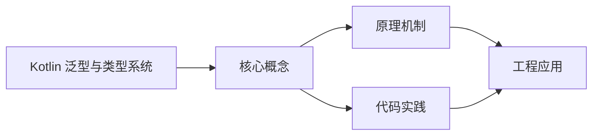

## 1. 学习目标（Bloom 分类）

本节按照布鲁姆教育目标分类学组织学习路径。本文主题为《Kotlin 泛型与类型系统》，属于 Kotlin 模块，读者可以根据自身阶段选择阅读深度。

记忆层面：能够准确复述本文的核心概念、术语与基本语法或操作步骤，并能够在提问或检索时快速定位对应知识点。能够说出 val/var、空安全操作符与 when 表达式的语法。

理解层面：能够用自己的语言解释核心原理与工作机制，说明概念之间的因果关系，而不是机械记忆结论。能够解释 Kotlin 与 Java 互操作的机制与平台类型概念。

应用层面：能够在真实项目或练习场景中运用本文知识解决具体问题，写出正确且可维护的实现。能够编写数据类、扩展函数与协程代码。

分析层面：能够拆解复杂问题，比较本文主题与相邻概念的异同，识别边界条件与例外情况。能够分析空安全、智能转换与协程调度原理。

评价层面：能够根据约束条件（性能、可读性、安全、成本）评价不同方案的优劣，做出有依据的技术决策。能够评价 Kotlin 在 Android、服务端与多平台场景的适用性。

创造层面：能够把本文知识与其他模块知识组合，设计出新的解决方案或可复用的工程模式。能够组合 Compose 与协程设计跨平台应用。

通过本节学习，读者应当能够把《Kotlin 泛型与类型系统》纳入自己的知识网络，并与 Kotlin 模块的其他主题（类型推断、空安全、协程、KMP）建立关联。

## 2. 历史动机与发展脉络

《Kotlin 泛型与类型系统》是 Kotlin 领域的重要主题。要真正理解它，需要先了解它解决的问题与演进过程。

Kotlin 由 JetBrains 于 2010 年开始研发，2016 年发布 1.0，定位是“更现代的 JVM 语言”：减少样板代码、消灭空指针、增强函数式能力，同时与 Java 100% 互操作。
2017 年 Google 宣布 Kotlin 成为 Android 一级语言，2019 年确立 Kotlin-first 政策；2023 年 Kotlin 2.0 的 K2 编译器显著提升编译速度与类型推导。
Kotlin Multiplatform（KMP）支持 JVM、Android、iOS、WebAssembly 等目标，配合 Compose Multiplatform 实现共享 UI 与业务逻辑，是 JetBrains 的长期战略方向。

回到本文主题：Kotlin 泛型与类型系统 的提出与成熟，正是上述技术背景下的必然产物。早期实现往往以简单可用为目标，随着工程规模扩大，社区逐渐沉淀出标准做法与最佳实践；理解这一脉络，可以帮助读者判断“为什么文档中的推荐写法是现在这个样子”，也能在遇到历史遗留代码时准确识别其设计年代与取舍。


## 3. 形式化定义与核心概念精讲

本节把《Kotlin 泛型与类型系统》涉及的核心概念以“定义 + 讲解”的形式展开。读者应把定义当作工具，把讲解当作理解路径；两者结合才能形成可迁移的知识。

空安全：类型系统区分 `String` 与 `String?`，编译期强制处理可空值；`?.` 短路、`?:` 提供默认、`!!` 显式断言，三者覆盖所有空值处理模式。
智能转换：`is` 检查后在不可变上下文中自动转换类型，减少显式强转；`as?` 安全转换失败返回 null。
协程：挂起函数（suspend）与调度器（Dispatchers.Main/IO/Default）实现非阻塞并发，结构化并发保证作用域内任务可取消。

### 3.1 原文章节逐一精讲

原文档把主题拆分为 16 个小节，下面按顺序给出每一节的导读讲解，随后保留原文细节供精读。

#### 原文精读（完整保留）

# Kotlin 泛型与类型系统速查

> **符号约定**：`< >` 必填参数 | `[ ]` 可选参数

---

#### 1. 泛型基础

##### 1.1 泛型类与接口

```kotlin
// 泛型类
class Box<T>(val value: T) {
    fun unwrap(): T = value
}

val intBox = Box(42)         // Box<Int>，类型推断
val strBox = Box<String>("Hello")  // 显式指定

// 泛型接口
interface Repository<T> {
    fun findById(id: String): T?
    fun save(entity: T): T
    fun delete(id: String)
}

class UserRepository : Repository<User> {
    override fun findById(id: String): User? = /* ... */
    override fun save(entity: User): User = /* ... */
    override fun delete(id: String) { /* ... */ }
}
```

##### 1.2 泛型函数

```kotlin
fun <T> List<T>.secondOrNull(): T? =
    if (this.size >= 2) this[1] else null

fun <T : Comparable<T>> maxOf(a: T, b: T): T = if (a > b) a else b

val result = maxOf(3, 7)        // Int
val result2 = maxOf("a", "b")   // String
```

##### 1.3 多类型参数

```kotlin
class Pair<A, B>(val first: A, val second: B)

fun <K, V> buildMap(builder: MutableMap<K, V>.() -> Unit): Map<K, V> {
    val map = mutableMapOf<K, V>()
    map.builder()
    return map
}

val map = buildMap<String, Int> {
    put("one", 1)
    put("two", 2)
}
```

#### 2. 型变（Variance）

型变是泛型中最核心也最复杂的概念，描述泛型实例的子类型关系。

##### 2.1 不可变性（Invariant）

默认情况下，Kotlin 泛型是不可变的：`List<String>` 不是 `List<Any>` 的子类型。

```kotlin
// 编译错误
val strings: List<String> = listOf("a", "b")
// val anys: List<Any> = strings  // Type mismatch
```

##### 2.2 协变（Covariance — out）

`out` 修饰符表示泛型参数只能出现在输出位置（返回值），使泛型成为协变的：

```kotlin
// Producer 只"产出" T，不"消费" T
interface Producer<out T> {
    fun produce(): T
}

class StringProducer : Producer<String> {
    override fun produce(): String = "Hello"
}

// 协变允许子类型关系
val producer: Producer<Any> = StringProducer()  // OK!
```

**规则**：`out T` 意味着 T 只能作为函数返回类型，不能作为函数参数类型。

```kotlin
interface Source<out T> {
    fun next(): T           // OK — T 在输出位置
    // fun consume(item: T) // 编译错误 — T 在输入位置
}
```

##### 2.3 逆变（Contravariance — in）

`in` 修饰符表示泛型参数只能出现在输入位置（参数），使泛型成为逆变的：

```kotlin
// Consumer 只"消费" T，不"产出" T
interface Consumer<in T> {
    fun consume(item: T)
}

class AnyConsumer : Consumer<Any> {
    override fun consume(item: Any) = println(item)
}

// 逆变允许反向子类型关系
val consumer: Consumer<String> = AnyConsumer()  // OK!
```

##### 2.4 型变总结

| 声明               | 含义   | 子类型关系                         | T 的位置 |
| ------------------ | ------ | ---------------------------------- | -------- |
| `class Box<T>`     | 不可变 | 无子类型关系                       | 任意     |
| `class Box<out T>` | 协变   | `Box<String>` 是 `Box<Any>` 子类型 | 仅输出   |
| `class Box<in T>`  | 逆变   | `Box<Any>` 是 `Box<String>` 子类型 | 仅输入   |

记忆口诀：**"Producer out, Consumer in"**（PECS 原则的 Kotlin 版本）。

##### 2.5 使用处型变（Type Projection）

当无法在声明处指定型变时，可以在使用处投影：

```kotlin
// 使用处协变投影
fun copy(from: Array<out Any>, to: Array<Any>) {
    for (i in from.indices) {
        to[i] = from[i]
    }
}

// 使用处逆变投影
fun fill(array: Array<in String>, value: String) {
    for (i in array.indices) {
        array[i] = value
    }
}
```

#### 3. 星投影

当泛型参数的具体类型不重要或未知时，使用星投影：

```kotlin
// Array<*> 等价于 Array<out Any?>
fun printArray(array: Array<*>) {
    for (item in array) {
        println(item)  // OK — 可以读取
        // array[0] = "new"  // 编译错误 — 不能写入
    }
}

// Map<*, *> — 两个类型参数都未知
fun printMap(map: Map<*, *>) {
    for ((key, value) in map) {
        println("$key: $value")
    }
}
```

#### 4. 泛型约束

##### 4.1 上界约束

```kotlin
// T 必须实现 Comparable<T>
fun <T : Comparable<T>> sort(list: List<T>): List<T> {
    return list.sorted()
}

// 多重约束（where 子句）
fun <T> process(value: T): String where T : CharSequence, T : Comparable<T> {
    return if (value > "threshold") value.toString() else "default"
}
```

##### 4.2 约束默认值

```kotlin
// 默认上界是 Any?
fun <T> defaultExample(value: T) {
    // T 的上界是 Any?，所以 value 可以为 null
}

// 显式非空上界
fun <T : Any> nonNullExample(value: T) {
    // T 的上界是 Any，value 不为 null
}
```

#### 5. reified 类型参数

由于 JVM 的类型擦除，运行时无法获取泛型的具体类型。`reified` 配合 `inline` 函数解决此问题：

```kotlin
// 普通 — 运行时无法检查类型
// fun <T> isType(value: Any): Boolean = value is T  // 编译错误

// reified — 保留类型信息
inline fun <reified T> isType(value: Any): Boolean = value is T

isType<String>("Hello")  // true
isType<Int>("Hello")     // false

// 实际应用：类型安全的 JSON 解析
inline fun <reified T> HttpClient.parseResponse(): T {
    val response = execute()
    return Json.decodeFromString<T>(response.body)
}

// 实际应用：按类型过滤
inline fun <reified T> List<Any>.filterIsInstance(): List<T> {
    return this.filterIsInstanceTo(mutableListOf())
}
```

##### 5.1 reified 的限制

- 只能用于 `inline` 函数
- 不能用于类属性（非内联函数参数）
- 不能用于非内联函数的参数类型

#### 6. 空安全

空安全是 Kotlin 类型系统最重要的特性，从编译期消除空指针异常。

##### 6.1 可空与非空类型

```kotlin
var name: String = "Kotlin"   // 非空类型，不能赋 null
// name = null                // 编译错误

var nickname: String? = "Kt"  // 可空类型
nickname = null               // OK
```

##### 6.2 安全调用操作符 ?.

```kotlin
val length: Int? = nickname?.length  // 如果 nickname 为 null，返回 null
val upper: String? = nickname?.uppercase()
```

##### 6.3 非空断言 !!

```kotlin
val length: Int = nickname!!.length  // 如果 nickname 为 null，抛出 NullPointerException

// 慎用 !! — 只在确定不为 null 时使用
// 优先使用 ?. 或 ?: 替代
```

##### 6.4 Elvis 操作符 ?:

```kotlin
val length: Int = nickname?.length ?: 0  // 如果为 null，使用默认值 0
val name: String = nickname ?: "Unknown"

// Elvis 与 throw 结合
val value = nullableValue ?: throw IllegalArgumentException("Required value is null")

// Elvis 与 return 结合
fun process(input: String?) {
    val text = input ?: return
    println(text.length)  // text 在此处智能转换为非空
}
```

##### 6.5 let 安全调用

```kotlin
nickname?.let {
    // it 在此 Lambda 中是非空的 String
    println("Length: ${it.length}")
    println("Upper: ${it.uppercase()}")
}
```

##### 6.6 安全类型转换 as?

```kotlin
val value: Any = "Hello"
val number: Int? = value as? Int  // null（转换失败返回 null）
val text: String? = value as? String  // "Hello"
```

##### 6.7 空安全与集合

```kotlin
val list: List<String?> = listOf("a", null, "b", null, "c")

// 过滤非空元素
val nonNull: List<String> = list.filterNotNull()  // ["a", "b", "c"]

// Map 的空安全操作
val map = mapOf("key" to "value")
val value: String = map["key"] ?: "default"  // map[] 返回可空类型
```

#### 7. 智能转换

Kotlin 编译器在条件分支中自动进行类型转换：

```kotlin
fun process(input: Any) {
    if (input is String) {
        // input 自动智能转换为 String
        println(input.length)  // 无需手动强转
    }

    when (input) {
        is Int -> println(input + 1)        // input: Int
        is String -> println(input.length)  // input: String
        is List<*> -> println(input.size)   // input: List<*>
    }
}

// 与空安全结合
fun greet(name: String?) {
    if (name != null) {
        // name 智能转换为 String（非空）
        println(name.length)
    }
}

// when 中的智能转换
fun describe(x: Any) = when (x) {
    is Int -> "Int: ${x + 1}"          // x: Int
    is String -> "String: ${x.length}" // x: String
    else -> "Unknown"
}
```

##### 7.1 智能转换的限制

```kotlin
class MyClass {
    var value: String? = null

    fun process() {
        if (value != null) {
            // 编译错误！value 是 var，可能在检查后被修改
            // println(value.length)

            // 解决方案 1：使用局部变量
            val v = value
            if (v != null) {
                println(v.length)  // OK
            }

            // 解决方案 2：使用 let
            value?.let { println(it.length) }
        }
    }
}
```

#### 8. 类型系统特殊类型

##### 8.1 Nothing

`Nothing` 是 Kotlin 类型体系的底部类型，没有实例：

```kotlin
// Nothing 表示永远不会正常返回
fun fail(message: String): Nothing {
    throw IllegalArgumentException(message)
}

// 用于类型推断
val result: String = if (condition) "success" else fail("error")

// Nothing? 是可空底部类型
val nullValue: Nothing? = null
val maybeString: String? = nullValue  // Nothing? 是 String? 的子类型
```

##### 8.2 Unit

`Unit` 类似 Java 的 `void`，但有实例：

```kotlin
fun printHello(): Unit {  // Unit 可省略
    println("Hello")
}

// Unit 作为泛型参数
val actions: List<() -> Unit> = listOf(
    { println("Action 1") },
    { println("Action 2") }
)
```

##### 8.3 Any 与 Any?

```kotlin
// Any 是所有非空类型的根（类似 Java Object）
val value: Any = "Hello"

// Any? 是所有类型的根（包括可空类型）
val nullable: Any? = null
```
#### 泛型基础

**基本写法：泛型类**
`class <Name><T>(val <prop>: T) { <body> }`
```kotlin
// 泛型类定义
class Box<T>(val value: T) {
    fun unwrap(): T = value;
}
```

**基本写法：泛型接口**
`interface <Name><T> { fun <method>(<param>): T }`
```kotlin
// 泛型接口定义
interface Repository<T> {
    fun findById(id: String): T?;
    fun save(entity: T): T;
}
```

**基本写法：泛型函数**
`fun <T> <name>(<params>): <ReturnType>`
```kotlin
// 泛型函数定义
fun <T> List<T>.secondOrNull(): T? =
    if (this.size >= 2) this[1] else null;
```

**基本写法：带约束的泛型函数**
`fun <T : <Bound>> <name>(<params>): <ReturnType>`
```kotlin
// T 必须实现 Comparable<T>
fun <T : Comparable<T>> maxOf(a: T, b: T): T = if (a > b) a else b;
```

**单行写法：多类型参数泛型类**
`class <Name><A, B>(val <prop1>: A, val <prop2>: B)`
```kotlin
// 单行多类型参数泛型类
class Pair<A, B>(val first: A, val second: B);
```

**换行写法：多类型参数泛型函数**
`fun <K, V> <name>(<param>): <ReturnType> { <body> }`
```kotlin
// 换行声明多类型参数泛型函数
fun <K, V> buildMap(builder: MutableMap<K, V>.() -> Unit): Map<K, V> {
    val map = mutableMapOf<K, V>();
    map.builder();
    return map;
}
```

---

#### 型变

**基本写法：协变（out）**
`interface <Name><out T> { fun <method>(): T }`
```kotlin
// 协变：T 只能作为返回类型
interface Producer<out T> {
    fun produce(): T;
}
```

**基本写法：逆变（in）**
`interface <Name><in T> { fun <method>(<param>: T) }`
```kotlin
// 逆变：T 只能作为参数类型
interface Consumer<in T> {
    fun consume(item: T);
}
```

**基本写法：使用处协变投影**
`fun <name>(<param>: Array<out <Type>>)`
```kotlin
// 使用处协变投影
fun copy(from: Array<out Any>, to: Array<Any>) {
    for (i in from.indices) {
        to[i] = from[i];
    }
}
```

**基本写法：使用处逆变投影**
`fun <name>(<param>: Array<in <Type>>)`
```kotlin
// 使用处逆变投影
fun fill(array: Array<in String>, value: String) {
    for (i in array.indices) {
        array[i] = value;
    }
}
```

---

#### 星投影

**基本写法：Array 星投影**
`fun <name>(<param>: Array<*>)`
```kotlin
// Array<*> 等价于 Array<out Any?>
fun printArray(array: Array<*>) {
    for (item in array) {
        println(item);
    }
}
```

**基本写法：Map 星投影**
`fun <name>(<param>: Map<*, *>)`
```kotlin
// Map<*, *> 两个类型参数都未知
fun printMap(map: Map<*, *>) {
    for ((key, value) in map) {
        println("$key: $value");
    }
}
```

---

#### 泛型约束

**基本写法：上界约束**
`fun <T : <Bound>> <name>(<params>): <ReturnType>`
```kotlin
// T 必须实现 Comparable<T>
fun <T : Comparable<T>> sort(list: List<T>): List<T> {
    return list.sorted();
}
```

**换行写法：多重约束（where 子句）**
`fun <T> <name>(<params>): <ReturnType> where T : <Bound1>, T : <Bound2>`
```kotlin
// 多重约束
fun <T> process(value: T): String where T : CharSequence, T : Comparable<T> {
    return if (value > "threshold") value.toString() else "default";
}
```

**基本写法：非空上界约束**
`fun <T : Any> <name>(<param>: T)`
```kotlin
// 显式非空上界
fun <T : Any> nonNullExample(value: T) {
    // T 的上界是 Any，value 不为 null
}
```

---

#### reified 类型参数

**基本写法：reified 类型参数**
`inline fun <reified T> <name>(<param>): <ReturnType>`
```kotlin
// reified 保留类型信息
inline fun <reified T> isType(value: Any): Boolean = value is T;
```

**基本写法：reified 类型安全 JSON 解析**
`inline fun <reified T> <name>(): T`
```kotlin
// 类型安全的 JSON 解析
inline fun <reified T> HttpClient.parseResponse(): T {
    val response = execute();
    return Json.decodeFromString<T>(response.body);
}
```

---

#### 空安全

**基本写法：非空类型**
`var <name>: <Type> = <value>`
```kotlin
// 非空类型，不能赋 null
var name: String = "Kotlin";
```

**基本写法：可空类型**
`var <name>: <Type>? = <value>`
```kotlin
// 可空类型，允许 null
var nickname: String? = "Kt";
nickname = null;
```

**基本写法：安全调用操作符 ?.**
`<obj>?.<prop>`
```kotlin
// 安全调用，为 null 时返回 null
val length: Int? = nickname?.length;
```

**基本写法：非空断言 !!**
`<obj>!!.<prop>`
```kotlin
// 非空断言，为 null 时抛出 NPE
val length: Int = nickname!!.length;
```

**基本写法：Elvis 操作符 ?:**
`<expr> ?: <default>`
```kotlin
// Elvis 运算符提供默认值
val length: Int = nickname?.length ?: 0;
```

**基本写法：Elvis 与 throw 结合**
`<expr> ?: throw <Exception>`
```kotlin
// 为 null 时抛出异常
val value = nullableValue ?: throw IllegalArgumentException("Required value is null");
```

**基本写法：let 安全调用**
`<obj>?.let { <body with it> }`
```kotlin
// let 安全调用非空值
nickname?.let {
    println("Length: ${it.length}");
}
```

**基本写法：安全类型转换 as?**
`<obj> as? <Type>`
```kotlin
// 安全转换，失败返回 null
val number: Int? = value as? Int;
```

**基本写法：filterNotNull 过滤 null**
`<list>.filterNotNull()`
```kotlin
// 过滤集合中的 null 值
val list: List<String?> = listOf("a", null, "b");
val nonNull: List<String> = list.filterNotNull();
```

**基本写法：mapNotNull 映射并过滤 null**
`<list>.mapNotNull { <transform> }`
```kotlin
// 映射并过滤 null
val lengths: List<Int> = list.mapNotNull { it?.length };
```

---

#### 智能转换

**基本写法：is 检查后智能转换**
`if (<obj> is <Type>) { <body with obj as Type> }`
```kotlin
// is 检查后自动智能转换
if (input is String) {
    println(input.length);
}
```

**基本写法：when 中的智能转换**
`fun <name>(<param>: Any) = when (<param>) { is <Type> -> <expr> }`
```kotlin
// when 中 is 检查后智能转换
fun describe(x: Any) = when (x) {
    is Int -> "Int: ${x + 1}";
    is String -> "String: ${x.length}";
    else -> "Unknown";
}
```

**基本写法：null 检查后智能转换**
`if (<obj> != null) { <body with obj as non-null> }`
```kotlin
// null 检查后智能转换为非空
fun greet(name: String?) {
    if (name != null) {
        println(name.length);
    }
}
```

**基本写法：智能转换的限制**
`val <local> = <prop>; if (<local> != null) { <body> }`
```kotlin
// var 属性需使用局部变量避免智能转换限制
val v = value;
if (v != null) {
    println(v.length);
}
```

---

#### 类型系统特殊类型

**基本写法：Nothing 类型**
`fun <name>(<params>): Nothing`
```kotlin
// Nothing 表示永远不会正常返回
fun fail(message: String): Nothing {
    throw IllegalArgumentException(message);
}
```

**基本写法：Nothing 用于类型推断**
`val <name>: <Type> = if (<cond>) <expr> else fail(<msg>)`
```kotlin
// Nothing 是所有类型的子类型
val result: String = if (condition) "success" else fail("error");
```

**基本写法：Unit 类型**
`fun <name>(<params>): Unit { <body> }`
```kotlin
// Unit 表示无返回值
fun printHello(): Unit {
    println("Hello");
}
```

**基本写法：Unit 作为泛型参数**
`val <name>: List<() -> Unit> = listOf(<lambdas>)`
```kotlin
// Unit 作为泛型参数
val actions: List<() -> Unit> = listOf(
    { println("Action 1"); },
    { println("Action 2"); }
);
```

**基本写法：Any 类型**
`val <name>: Any = <value>`
```kotlin
// Any 是所有非空类型的根
val value: Any = "Hello";
```

**基本写法：Any? 类型**
`val <name>: Any? = null`
```kotlin
// Any? 是所有类型的根（包括可空类型）
val nullable: Any? = null;
```


### 3.2 概念关系图

下面用 Mermaid 图表达本文核心概念之间的关系，帮助读者建立整体图景：



图中展示的是本文知识的结构化关系：核心概念是入口，原理机制解释“为什么”，代码实践演示“怎么做”，工程应用回答“何时用”。读者学习时可以把每个小节的内容挂接到对应节点上。

## 4. 理论推导与原理解析

本节深入《Kotlin 泛型与类型系统》背后的原理。理论部分不求面面俱到，而是聚焦“能解释现象、能指导实践”的关键推导。

空安全：类型系统区分 `String` 与 `String?`，编译期强制处理可空值；`?.` 短路、`?:` 提供默认、`!!` 显式断言，三者覆盖所有空值处理模式。
智能转换：`is` 检查后在不可变上下文中自动转换类型，减少显式强转；`as?` 安全转换失败返回 null。
协程：挂起函数（suspend）与调度器（Dispatchers.Main/IO/Default）实现非阻塞并发，结构化并发保证作用域内任务可取消。
扩展函数与属性：在不修改原类的情况下为类添加行为，是 Kotlin 标准库（如集合操作）的基石。

需要强调的是，理论推导与工程实践之间存在翻译层：理论给出的是理想化模型与边界条件，工程代码则必须处理真实环境中的例外。读者在学习时应先掌握理论的“标准情形”，再通过陷阱章节了解“非标准情形”。

## 5. 代码示例与逐行讲解

本节把原文中的代码示例系统整理，并为每个示例补充用途说明与讲解。读者不应只浏览代码，而应逐段对照讲解理解设计意图。

### 5.1 示例：1.1 泛型类与接口

该示例来自原文《1.1 泛型类与接口》小节，用于演示Kotlin 泛型与类型系统相关操作。阅读时请先看代码结构，再看其后的讲解。

```kotlin
// 泛型类
class Box<T>(val value: T) {
    fun unwrap(): T = value
}

val intBox = Box(42)         // Box<Int>，类型推断
val strBox = Box<String>("Hello")  // 显式指定

// 泛型接口
interface Repository<T> {
    fun findById(id: String): T?
    fun save(entity: T): T
    fun delete(id: String)
}

class UserRepository : Repository<User> {
    override fun findById(id: String): User? = /* ... */
    override fun save(entity: User): User = /* ... */
    override fun delete(id: String) { /* ... */ }
}
```

讲解：这段代码演示了本节核心知识点。代码中的关键操作可以归纳为三步：准备（定义或初始化）、执行（核心逻辑）、收尾（释放资源或返回结果）。实际项目中，这三步往往被封装为函数或类，以提升复用性与可测试性。

关键点分析：

该示例共 17 行有效代码，包含 1 类关键结构（class）。其中：

- 入口与初始化部分负责建立上下文，对应实际项目中的启动或装配逻辑；
- 核心逻辑部分体现本文主题的主要操作，是阅读时最需要对照讲解理解的部分；
- 输出或返回部分把结果交给调用方，注意其类型与边界条件。

进阶思考路径：先尝试修改参数观察行为变化，再把示例中的模式迁移到自己的项目中；每次修改都记录预期与实测差异，这是把示例转化为能力的最快方式。

### 5.2 示例：1.2 泛型函数

该示例来自原文《1.2 泛型函数》小节，用于演示Kotlin 泛型与类型系统相关操作。阅读时请先看代码结构，再看其后的讲解。

```kotlin
fun <T> List<T>.secondOrNull(): T? =
    if (this.size >= 2) this[1] else null

fun <T : Comparable<T>> maxOf(a: T, b: T): T = if (a > b) a else b

val result = maxOf(3, 7)        // Int
val result2 = maxOf("a", "b")   // String
```

讲解：这段代码演示了本节核心知识点。代码中的关键操作可以归纳为三步：准备（定义或初始化）、执行（核心逻辑）、收尾（释放资源或返回结果）。实际项目中，这三步往往被封装为函数或类，以提升复用性与可测试性。

关键点分析：

该示例共 5 行有效代码，包含 1 类关键结构（if）。其中：

- 入口与初始化部分负责建立上下文，对应实际项目中的启动或装配逻辑；
- 核心逻辑部分体现本文主题的主要操作，是阅读时最需要对照讲解理解的部分；
- 输出或返回部分把结果交给调用方，注意其类型与边界条件。

进阶思考路径：先尝试修改参数观察行为变化，再把示例中的模式迁移到自己的项目中；每次修改都记录预期与实测差异，这是把示例转化为能力的最快方式。

### 5.3 示例：1.3 多类型参数

该示例来自原文《1.3 多类型参数》小节，用于演示Kotlin 泛型与类型系统相关操作。阅读时请先看代码结构，再看其后的讲解。

```kotlin
class Pair<A, B>(val first: A, val second: B)

fun <K, V> buildMap(builder: MutableMap<K, V>.() -> Unit): Map<K, V> {
    val map = mutableMapOf<K, V>()
    map.builder()
    return map
}

val map = buildMap<String, Int> {
    put("one", 1)
    put("two", 2)
}
```

讲解：这段代码演示了本节核心知识点。代码中的关键操作可以归纳为三步：准备（定义或初始化）、执行（核心逻辑）、收尾（释放资源或返回结果）。实际项目中，这三步往往被封装为函数或类，以提升复用性与可测试性。

关键点分析：

该示例共 10 行有效代码，包含 2 类关键结构（class、return）。其中：

- 入口与初始化部分负责建立上下文，对应实际项目中的启动或装配逻辑；
- 核心逻辑部分体现本文主题的主要操作，是阅读时最需要对照讲解理解的部分；
- 输出或返回部分把结果交给调用方，注意其类型与边界条件。

进阶思考路径：先尝试修改参数观察行为变化，再把示例中的模式迁移到自己的项目中；每次修改都记录预期与实测差异，这是把示例转化为能力的最快方式。

### 5.4 示例：2.1 不可变性（Invariant）

该示例来自原文《2.1 不可变性（Invariant）》小节，用于演示Kotlin 泛型与类型系统相关操作。阅读时请先看代码结构，再看其后的讲解。

```kotlin
// 编译错误
val strings: List<String> = listOf("a", "b")
// val anys: List<Any> = strings  // Type mismatch
```

讲解：这段代码演示了本节核心知识点。代码中的关键操作可以归纳为三步：准备（定义或初始化）、执行（核心逻辑）、收尾（释放资源或返回结果）。实际项目中，这三步往往被封装为函数或类，以提升复用性与可测试性。

关键点分析：

该示例共 3 行有效代码，结构以数据或配置为主。阅读时应关注：数据字段的含义、配置项的作用，以及它们与运行行为的对应关系。

进阶思考路径：先尝试修改参数观察行为变化，再把示例中的模式迁移到自己的项目中；每次修改都记录预期与实测差异，这是把示例转化为能力的最快方式。

### 5.5 示例：2.2 协变（Covariance — out）

该示例来自原文《2.2 协变（Covariance — out）》小节，用于演示Kotlin 泛型与类型系统相关操作。阅读时请先看代码结构，再看其后的讲解。

```kotlin
// Producer 只"产出" T，不"消费" T
interface Producer<out T> {
    fun produce(): T
}

class StringProducer : Producer<String> {
    override fun produce(): String = "Hello"
}

// 协变允许子类型关系
val producer: Producer<Any> = StringProducer()  // OK!
```

讲解：这段代码演示了本节核心知识点。代码中的关键操作可以归纳为三步：准备（定义或初始化）、执行（核心逻辑）、收尾（释放资源或返回结果）。实际项目中，这三步往往被封装为函数或类，以提升复用性与可测试性。

关键点分析：

该示例共 9 行有效代码，包含 1 类关键结构（class）。其中：

- 入口与初始化部分负责建立上下文，对应实际项目中的启动或装配逻辑；
- 核心逻辑部分体现本文主题的主要操作，是阅读时最需要对照讲解理解的部分；
- 输出或返回部分把结果交给调用方，注意其类型与边界条件。

进阶思考路径：先尝试修改参数观察行为变化，再把示例中的模式迁移到自己的项目中；每次修改都记录预期与实测差异，这是把示例转化为能力的最快方式。

### 5.6 示例：2.2 协变（Covariance — out）

该示例来自原文《2.2 协变（Covariance — out）》小节，用于演示Kotlin 泛型与类型系统相关操作。阅读时请先看代码结构，再看其后的讲解。

```kotlin
interface Source<out T> {
    fun next(): T           // OK — T 在输出位置
    // fun consume(item: T) // 编译错误 — T 在输入位置
}
```

讲解：这段代码演示了本节核心知识点。代码中的关键操作可以归纳为三步：准备（定义或初始化）、执行（核心逻辑）、收尾（释放资源或返回结果）。实际项目中，这三步往往被封装为函数或类，以提升复用性与可测试性。

关键点分析：

该示例共 4 行有效代码，结构以数据或配置为主。阅读时应关注：数据字段的含义、配置项的作用，以及它们与运行行为的对应关系。

进阶思考路径：先尝试修改参数观察行为变化，再把示例中的模式迁移到自己的项目中；每次修改都记录预期与实测差异，这是把示例转化为能力的最快方式。

### 5.7 示例：2.3 逆变（Contravariance — in）

该示例来自原文《2.3 逆变（Contravariance — in）》小节，用于演示Kotlin 泛型与类型系统相关操作。阅读时请先看代码结构，再看其后的讲解。

```kotlin
// Consumer 只"消费" T，不"产出" T
interface Consumer<in T> {
    fun consume(item: T)
}

class AnyConsumer : Consumer<Any> {
    override fun consume(item: Any) = println(item)
}

// 逆变允许反向子类型关系
val consumer: Consumer<String> = AnyConsumer()  // OK!
```

讲解：这段代码演示了本节核心知识点。代码中的关键操作可以归纳为三步：准备（定义或初始化）、执行（核心逻辑）、收尾（释放资源或返回结果）。实际项目中，这三步往往被封装为函数或类，以提升复用性与可测试性。

关键点分析：

该示例共 9 行有效代码，包含 1 类关键结构（class）。其中：

- 入口与初始化部分负责建立上下文，对应实际项目中的启动或装配逻辑；
- 核心逻辑部分体现本文主题的主要操作，是阅读时最需要对照讲解理解的部分；
- 输出或返回部分把结果交给调用方，注意其类型与边界条件。

进阶思考路径：先尝试修改参数观察行为变化，再把示例中的模式迁移到自己的项目中；每次修改都记录预期与实测差异，这是把示例转化为能力的最快方式。

### 5.8 示例：2.5 使用处型变（Type Projection）

该示例来自原文《2.5 使用处型变（Type Projection）》小节，用于演示Kotlin 泛型与类型系统相关操作。阅读时请先看代码结构，再看其后的讲解。

```kotlin
// 使用处协变投影
fun copy(from: Array<out Any>, to: Array<Any>) {
    for (i in from.indices) {
        to[i] = from[i]
    }
}

// 使用处逆变投影
fun fill(array: Array<in String>, value: String) {
    for (i in array.indices) {
        array[i] = value
    }
}
```

讲解：这段代码演示了本节核心知识点。代码中的关键操作可以归纳为三步：准备（定义或初始化）、执行（核心逻辑）、收尾（释放资源或返回结果）。实际项目中，这三步往往被封装为函数或类，以提升复用性与可测试性。

关键点分析：

该示例共 12 行有效代码，包含 1 类关键结构（for）。其中：

- 入口与初始化部分负责建立上下文，对应实际项目中的启动或装配逻辑；
- 核心逻辑部分体现本文主题的主要操作，是阅读时最需要对照讲解理解的部分；
- 输出或返回部分把结果交给调用方，注意其类型与边界条件。

进阶思考路径：先尝试修改参数观察行为变化，再把示例中的模式迁移到自己的项目中；每次修改都记录预期与实测差异，这是把示例转化为能力的最快方式。

### 5.9 示例：3. 星投影

该示例来自原文《3. 星投影》小节，用于演示Kotlin 泛型与类型系统相关操作。阅读时请先看代码结构，再看其后的讲解。

```kotlin
// Array<*> 等价于 Array<out Any?>
fun printArray(array: Array<*>) {
    for (item in array) {
        println(item)  // OK — 可以读取
        // array[0] = "new"  // 编译错误 — 不能写入
    }
}

// Map<*, *> — 两个类型参数都未知
fun printMap(map: Map<*, *>) {
    for ((key, value) in map) {
        println("$key: $value")
    }
}
```

讲解：这段代码演示了本节核心知识点。代码中的关键操作可以归纳为三步：准备（定义或初始化）、执行（核心逻辑）、收尾（释放资源或返回结果）。实际项目中，这三步往往被封装为函数或类，以提升复用性与可测试性。

关键点分析：

该示例共 13 行有效代码，包含 1 类关键结构（for）。其中：

- 入口与初始化部分负责建立上下文，对应实际项目中的启动或装配逻辑；
- 核心逻辑部分体现本文主题的主要操作，是阅读时最需要对照讲解理解的部分；
- 输出或返回部分把结果交给调用方，注意其类型与边界条件。

进阶思考路径：先尝试修改参数观察行为变化，再把示例中的模式迁移到自己的项目中；每次修改都记录预期与实测差异，这是把示例转化为能力的最快方式。

### 5.10 示例：4.1 上界约束

该示例来自原文《4.1 上界约束》小节，用于演示Kotlin 泛型与类型系统相关操作。阅读时请先看代码结构，再看其后的讲解。

```kotlin
// T 必须实现 Comparable<T>
fun <T : Comparable<T>> sort(list: List<T>): List<T> {
    return list.sorted()
}

// 多重约束（where 子句）
fun <T> process(value: T): String where T : CharSequence, T : Comparable<T> {
    return if (value > "threshold") value.toString() else "default"
}
```

讲解：这段代码演示了本节核心知识点。代码中的关键操作可以归纳为三步：准备（定义或初始化）、执行（核心逻辑）、收尾（释放资源或返回结果）。实际项目中，这三步往往被封装为函数或类，以提升复用性与可测试性。

关键点分析：

该示例共 8 行有效代码，包含 2 类关键结构（if、return）。其中：

- 入口与初始化部分负责建立上下文，对应实际项目中的启动或装配逻辑；
- 核心逻辑部分体现本文主题的主要操作，是阅读时最需要对照讲解理解的部分；
- 输出或返回部分把结果交给调用方，注意其类型与边界条件。

进阶思考路径：先尝试修改参数观察行为变化，再把示例中的模式迁移到自己的项目中；每次修改都记录预期与实测差异，这是把示例转化为能力的最快方式。

### 5.11 示例：4.2 约束默认值

该示例来自原文《4.2 约束默认值》小节，用于演示Kotlin 泛型与类型系统相关操作。阅读时请先看代码结构，再看其后的讲解。

```kotlin
// 默认上界是 Any?
fun <T> defaultExample(value: T) {
    // T 的上界是 Any?，所以 value 可以为 null
}

// 显式非空上界
fun <T : Any> nonNullExample(value: T) {
    // T 的上界是 Any，value 不为 null
}
```

讲解：这段代码演示了本节核心知识点。代码中的关键操作可以归纳为三步：准备（定义或初始化）、执行（核心逻辑）、收尾（释放资源或返回结果）。实际项目中，这三步往往被封装为函数或类，以提升复用性与可测试性。

关键点分析：

该示例共 8 行有效代码，结构以数据或配置为主。阅读时应关注：数据字段的含义、配置项的作用，以及它们与运行行为的对应关系。

进阶思考路径：先尝试修改参数观察行为变化，再把示例中的模式迁移到自己的项目中；每次修改都记录预期与实测差异，这是把示例转化为能力的最快方式。

### 5.12 示例：5. reified 类型参数

该示例来自原文《5. reified 类型参数》小节，用于演示Kotlin 泛型与类型系统相关操作。阅读时请先看代码结构，再看其后的讲解。

```kotlin
// 普通 — 运行时无法检查类型
// fun <T> isType(value: Any): Boolean = value is T  // 编译错误

// reified — 保留类型信息
inline fun <reified T> isType(value: Any): Boolean = value is T

isType<String>("Hello")  // true
isType<Int>("Hello")     // false

// 实际应用：类型安全的 JSON 解析
inline fun <reified T> HttpClient.parseResponse(): T {
    val response = execute()
    return Json.decodeFromString<T>(response.body)
}

// 实际应用：按类型过滤
inline fun <reified T> List<Any>.filterIsInstance(): List<T> {
    return this.filterIsInstanceTo(mutableListOf())
}
```

讲解：这段代码演示了本节核心知识点。代码中的关键操作可以归纳为三步：准备（定义或初始化）、执行（核心逻辑）、收尾（释放资源或返回结果）。实际项目中，这三步往往被封装为函数或类，以提升复用性与可测试性。

关键点分析：

该示例共 15 行有效代码，包含 1 类关键结构（return）。其中：

- 入口与初始化部分负责建立上下文，对应实际项目中的启动或装配逻辑；
- 核心逻辑部分体现本文主题的主要操作，是阅读时最需要对照讲解理解的部分；
- 输出或返回部分把结果交给调用方，注意其类型与边界条件。

进阶思考路径：先尝试修改参数观察行为变化，再把示例中的模式迁移到自己的项目中；每次修改都记录预期与实测差异，这是把示例转化为能力的最快方式。

### 5.13 示例：6.1 可空与非空类型

该示例来自原文《6.1 可空与非空类型》小节，用于演示Kotlin 泛型与类型系统相关操作。阅读时请先看代码结构，再看其后的讲解。

```kotlin
var name: String = "Kotlin"   // 非空类型，不能赋 null
// name = null                // 编译错误

var nickname: String? = "Kt"  // 可空类型
nickname = null               // OK
```

讲解：这段代码演示了本节核心知识点。代码中的关键操作可以归纳为三步：准备（定义或初始化）、执行（核心逻辑）、收尾（释放资源或返回结果）。实际项目中，这三步往往被封装为函数或类，以提升复用性与可测试性。

关键点分析：

该示例共 4 行有效代码，结构以数据或配置为主。阅读时应关注：数据字段的含义、配置项的作用，以及它们与运行行为的对应关系。

进阶思考路径：先尝试修改参数观察行为变化，再把示例中的模式迁移到自己的项目中；每次修改都记录预期与实测差异，这是把示例转化为能力的最快方式。

### 5.14 示例：6.2 安全调用操作符 ?.

该示例来自原文《6.2 安全调用操作符 ?.》小节，用于演示Kotlin 泛型与类型系统相关操作。阅读时请先看代码结构，再看其后的讲解。

```kotlin
val length: Int? = nickname?.length  // 如果 nickname 为 null，返回 null
val upper: String? = nickname?.uppercase()
```

讲解：这段代码演示了本节核心知识点。代码中的关键操作可以归纳为三步：准备（定义或初始化）、执行（核心逻辑）、收尾（释放资源或返回结果）。实际项目中，这三步往往被封装为函数或类，以提升复用性与可测试性。

关键点分析：

该示例共 2 行有效代码，结构以数据或配置为主。阅读时应关注：数据字段的含义、配置项的作用，以及它们与运行行为的对应关系。

进阶思考路径：先尝试修改参数观察行为变化，再把示例中的模式迁移到自己的项目中；每次修改都记录预期与实测差异，这是把示例转化为能力的最快方式。

### 5.15 示例：6.3 非空断言 !!

该示例来自原文《6.3 非空断言 !!》小节，用于演示Kotlin 泛型与类型系统相关操作。阅读时请先看代码结构，再看其后的讲解。

```kotlin
val length: Int = nickname!!.length  // 如果 nickname 为 null，抛出 NullPointerException

// 慎用 !! — 只在确定不为 null 时使用
// 优先使用 ?. 或 ?: 替代
```

讲解：这段代码演示了本节核心知识点。代码中的关键操作可以归纳为三步：准备（定义或初始化）、执行（核心逻辑）、收尾（释放资源或返回结果）。实际项目中，这三步往往被封装为函数或类，以提升复用性与可测试性。

关键点分析：

该示例共 3 行有效代码，结构以数据或配置为主。阅读时应关注：数据字段的含义、配置项的作用，以及它们与运行行为的对应关系。

进阶思考路径：先尝试修改参数观察行为变化，再把示例中的模式迁移到自己的项目中；每次修改都记录预期与实测差异，这是把示例转化为能力的最快方式。

### 5.16 示例：6.4 Elvis 操作符 ?:

该示例来自原文《6.4 Elvis 操作符 ?:》小节，用于演示Kotlin 泛型与类型系统相关操作。阅读时请先看代码结构，再看其后的讲解。

```kotlin
val length: Int = nickname?.length ?: 0  // 如果为 null，使用默认值 0
val name: String = nickname ?: "Unknown"

// Elvis 与 throw 结合
val value = nullableValue ?: throw IllegalArgumentException("Required value is null")

// Elvis 与 return 结合
fun process(input: String?) {
    val text = input ?: return
    println(text.length)  // text 在此处智能转换为非空
}
```

讲解：这段代码演示了本节核心知识点。代码中的关键操作可以归纳为三步：准备（定义或初始化）、执行（核心逻辑）、收尾（释放资源或返回结果）。实际项目中，这三步往往被封装为函数或类，以提升复用性与可测试性。

关键点分析：

该示例共 9 行有效代码，包含 1 类关键结构（return）。其中：

- 入口与初始化部分负责建立上下文，对应实际项目中的启动或装配逻辑；
- 核心逻辑部分体现本文主题的主要操作，是阅读时最需要对照讲解理解的部分；
- 输出或返回部分把结果交给调用方，注意其类型与边界条件。

进阶思考路径：先尝试修改参数观察行为变化，再把示例中的模式迁移到自己的项目中；每次修改都记录预期与实测差异，这是把示例转化为能力的最快方式。

### 5.17 示例：6.5 let 安全调用

该示例来自原文《6.5 let 安全调用》小节，用于演示Kotlin 泛型与类型系统相关操作。阅读时请先看代码结构，再看其后的讲解。

```kotlin
nickname?.let {
    // it 在此 Lambda 中是非空的 String
    println("Length: ${it.length}")
    println("Upper: ${it.uppercase()}")
}
```

讲解：这段代码演示了本节核心知识点。代码中的关键操作可以归纳为三步：准备（定义或初始化）、执行（核心逻辑）、收尾（释放资源或返回结果）。实际项目中，这三步往往被封装为函数或类，以提升复用性与可测试性。

关键点分析：

该示例共 5 行有效代码，结构以数据或配置为主。阅读时应关注：数据字段的含义、配置项的作用，以及它们与运行行为的对应关系。

进阶思考路径：先尝试修改参数观察行为变化，再把示例中的模式迁移到自己的项目中；每次修改都记录预期与实测差异，这是把示例转化为能力的最快方式。

### 5.18 示例：6.6 安全类型转换 as?

该示例来自原文《6.6 安全类型转换 as?》小节，用于演示Kotlin 泛型与类型系统相关操作。阅读时请先看代码结构，再看其后的讲解。

```kotlin
val value: Any = "Hello"
val number: Int? = value as? Int  // null（转换失败返回 null）
val text: String? = value as? String  // "Hello"
```

讲解：这段代码演示了本节核心知识点。代码中的关键操作可以归纳为三步：准备（定义或初始化）、执行（核心逻辑）、收尾（释放资源或返回结果）。实际项目中，这三步往往被封装为函数或类，以提升复用性与可测试性。

关键点分析：

该示例共 3 行有效代码，结构以数据或配置为主。阅读时应关注：数据字段的含义、配置项的作用，以及它们与运行行为的对应关系。

进阶思考路径：先尝试修改参数观察行为变化，再把示例中的模式迁移到自己的项目中；每次修改都记录预期与实测差异，这是把示例转化为能力的最快方式。

### 5.19 示例：6.7 空安全与集合

该示例来自原文《6.7 空安全与集合》小节，用于演示Kotlin 泛型与类型系统相关操作。阅读时请先看代码结构，再看其后的讲解。

```kotlin
val list: List<String?> = listOf("a", null, "b", null, "c")

// 过滤非空元素
val nonNull: List<String> = list.filterNotNull()  // ["a", "b", "c"]

// Map 的空安全操作
val map = mapOf("key" to "value")
val value: String = map["key"] ?: "default"  // map[] 返回可空类型
```

讲解：这段代码演示了本节核心知识点。代码中的关键操作可以归纳为三步：准备（定义或初始化）、执行（核心逻辑）、收尾（释放资源或返回结果）。实际项目中，这三步往往被封装为函数或类，以提升复用性与可测试性。

关键点分析：

该示例共 6 行有效代码，结构以数据或配置为主。阅读时应关注：数据字段的含义、配置项的作用，以及它们与运行行为的对应关系。

进阶思考路径：先尝试修改参数观察行为变化，再把示例中的模式迁移到自己的项目中；每次修改都记录预期与实测差异，这是把示例转化为能力的最快方式。

### 5.20 示例：7. 智能转换

该示例来自原文《7. 智能转换》小节，用于演示Kotlin 泛型与类型系统相关操作。阅读时请先看代码结构，再看其后的讲解。

```kotlin
fun process(input: Any) {
    if (input is String) {
        // input 自动智能转换为 String
        println(input.length)  // 无需手动强转
    }

    when (input) {
        is Int -> println(input + 1)        // input: Int
        is String -> println(input.length)  // input: String
        is List<*> -> println(input.size)   // input: List<*>
    }
}

// 与空安全结合
fun greet(name: String?) {
    if (name != null) {
        // name 智能转换为 String（非空）
        println(name.length)
    }
}

// when 中的智能转换
fun describe(x: Any) = when (x) {
    is Int -> "Int: ${x + 1}"          // x: Int
    is String -> "String: ${x.length}" // x: String
    else -> "Unknown"
}
```

讲解：这段代码演示了本节核心知识点。代码中的关键操作可以归纳为三步：准备（定义或初始化）、执行（核心逻辑）、收尾（释放资源或返回结果）。实际项目中，这三步往往被封装为函数或类，以提升复用性与可测试性。

关键点分析：

该示例共 24 行有效代码，包含 1 类关键结构（if）。其中：

- 入口与初始化部分负责建立上下文，对应实际项目中的启动或装配逻辑；
- 核心逻辑部分体现本文主题的主要操作，是阅读时最需要对照讲解理解的部分；
- 输出或返回部分把结果交给调用方，注意其类型与边界条件。

进阶思考路径：先尝试修改参数观察行为变化，再把示例中的模式迁移到自己的项目中；每次修改都记录预期与实测差异，这是把示例转化为能力的最快方式。

### 5.21 示例：7.1 智能转换的限制

该示例来自原文《7.1 智能转换的限制》小节，用于演示Kotlin 泛型与类型系统相关操作。阅读时请先看代码结构，再看其后的讲解。

```kotlin
class MyClass {
    var value: String? = null

    fun process() {
        if (value != null) {
            // 编译错误！value 是 var，可能在检查后被修改
            // println(value.length)

            // 解决方案 1：使用局部变量
            val v = value
            if (v != null) {
                println(v.length)  // OK
            }

            // 解决方案 2：使用 let
            value?.let { println(it.length) }
        }
    }
}
```

讲解：这段代码演示了本节核心知识点。代码中的关键操作可以归纳为三步：准备（定义或初始化）、执行（核心逻辑）、收尾（释放资源或返回结果）。实际项目中，这三步往往被封装为函数或类，以提升复用性与可测试性。

关键点分析：

该示例共 16 行有效代码，包含 2 类关键结构（class、if）。其中：

- 入口与初始化部分负责建立上下文，对应实际项目中的启动或装配逻辑；
- 核心逻辑部分体现本文主题的主要操作，是阅读时最需要对照讲解理解的部分；
- 输出或返回部分把结果交给调用方，注意其类型与边界条件。

进阶思考路径：先尝试修改参数观察行为变化，再把示例中的模式迁移到自己的项目中；每次修改都记录预期与实测差异，这是把示例转化为能力的最快方式。

### 5.22 示例：8.1 Nothing

该示例来自原文《8.1 Nothing》小节，用于演示Kotlin 泛型与类型系统相关操作。阅读时请先看代码结构，再看其后的讲解。

```kotlin
// Nothing 表示永远不会正常返回
fun fail(message: String): Nothing {
    throw IllegalArgumentException(message)
}

// 用于类型推断
val result: String = if (condition) "success" else fail("error")

// Nothing? 是可空底部类型
val nullValue: Nothing? = null
val maybeString: String? = nullValue  // Nothing? 是 String? 的子类型
```

讲解：这段代码演示了本节核心知识点。代码中的关键操作可以归纳为三步：准备（定义或初始化）、执行（核心逻辑）、收尾（释放资源或返回结果）。实际项目中，这三步往往被封装为函数或类，以提升复用性与可测试性。

关键点分析：

该示例共 9 行有效代码，包含 1 类关键结构（if）。其中：

- 入口与初始化部分负责建立上下文，对应实际项目中的启动或装配逻辑；
- 核心逻辑部分体现本文主题的主要操作，是阅读时最需要对照讲解理解的部分；
- 输出或返回部分把结果交给调用方，注意其类型与边界条件。

进阶思考路径：先尝试修改参数观察行为变化，再把示例中的模式迁移到自己的项目中；每次修改都记录预期与实测差异，这是把示例转化为能力的最快方式。

### 5.23 示例：8.2 Unit

该示例来自原文《8.2 Unit》小节，用于演示Kotlin 泛型与类型系统相关操作。阅读时请先看代码结构，再看其后的讲解。

```kotlin
fun printHello(): Unit {  // Unit 可省略
    println("Hello")
}

// Unit 作为泛型参数
val actions: List<() -> Unit> = listOf(
    { println("Action 1") },
    { println("Action 2") }
)
```

讲解：这段代码演示了本节核心知识点。代码中的关键操作可以归纳为三步：准备（定义或初始化）、执行（核心逻辑）、收尾（释放资源或返回结果）。实际项目中，这三步往往被封装为函数或类，以提升复用性与可测试性。

关键点分析：

该示例共 8 行有效代码，结构以数据或配置为主。阅读时应关注：数据字段的含义、配置项的作用，以及它们与运行行为的对应关系。

进阶思考路径：先尝试修改参数观察行为变化，再把示例中的模式迁移到自己的项目中；每次修改都记录预期与实测差异，这是把示例转化为能力的最快方式。

### 5.24 示例：8.3 Any 与 Any?

该示例来自原文《8.3 Any 与 Any?》小节，用于演示Kotlin 泛型与类型系统相关操作。阅读时请先看代码结构，再看其后的讲解。

```kotlin
// Any 是所有非空类型的根（类似 Java Object）
val value: Any = "Hello"

// Any? 是所有类型的根（包括可空类型）
val nullable: Any? = null
```

讲解：这段代码演示了本节核心知识点。代码中的关键操作可以归纳为三步：准备（定义或初始化）、执行（核心逻辑）、收尾（释放资源或返回结果）。实际项目中，这三步往往被封装为函数或类，以提升复用性与可测试性。

关键点分析：

该示例共 4 行有效代码，结构以数据或配置为主。阅读时应关注：数据字段的含义、配置项的作用，以及它们与运行行为的对应关系。

进阶思考路径：先尝试修改参数观察行为变化，再把示例中的模式迁移到自己的项目中；每次修改都记录预期与实测差异，这是把示例转化为能力的最快方式。

### 5.25 示例：泛型基础

该示例来自原文《泛型基础》小节，用于演示Kotlin 泛型与类型系统相关操作。阅读时请先看代码结构，再看其后的讲解。

```kotlin
// 泛型类定义
class Box<T>(val value: T) {
    fun unwrap(): T = value;
}
```

讲解：这段代码演示了本节核心知识点。代码中的关键操作可以归纳为三步：准备（定义或初始化）、执行（核心逻辑）、收尾（释放资源或返回结果）。实际项目中，这三步往往被封装为函数或类，以提升复用性与可测试性。

关键点分析：

该示例共 4 行有效代码，包含 1 类关键结构（class）。其中：

- 入口与初始化部分负责建立上下文，对应实际项目中的启动或装配逻辑；
- 核心逻辑部分体现本文主题的主要操作，是阅读时最需要对照讲解理解的部分；
- 输出或返回部分把结果交给调用方，注意其类型与边界条件。

进阶思考路径：先尝试修改参数观察行为变化，再把示例中的模式迁移到自己的项目中；每次修改都记录预期与实测差异，这是把示例转化为能力的最快方式。

### 5.26 示例：泛型基础

该示例来自原文《泛型基础》小节，用于演示Kotlin 泛型与类型系统相关操作。阅读时请先看代码结构，再看其后的讲解。

```kotlin
// 泛型接口定义
interface Repository<T> {
    fun findById(id: String): T?;
    fun save(entity: T): T;
}
```

讲解：这段代码演示了本节核心知识点。代码中的关键操作可以归纳为三步：准备（定义或初始化）、执行（核心逻辑）、收尾（释放资源或返回结果）。实际项目中，这三步往往被封装为函数或类，以提升复用性与可测试性。

关键点分析：

该示例共 5 行有效代码，结构以数据或配置为主。阅读时应关注：数据字段的含义、配置项的作用，以及它们与运行行为的对应关系。

进阶思考路径：先尝试修改参数观察行为变化，再把示例中的模式迁移到自己的项目中；每次修改都记录预期与实测差异，这是把示例转化为能力的最快方式。

### 5.27 示例：泛型基础

该示例来自原文《泛型基础》小节，用于演示Kotlin 泛型与类型系统相关操作。阅读时请先看代码结构，再看其后的讲解。

```kotlin
// 泛型函数定义
fun <T> List<T>.secondOrNull(): T? =
    if (this.size >= 2) this[1] else null;
```

讲解：这段代码演示了本节核心知识点。代码中的关键操作可以归纳为三步：准备（定义或初始化）、执行（核心逻辑）、收尾（释放资源或返回结果）。实际项目中，这三步往往被封装为函数或类，以提升复用性与可测试性。

关键点分析：

该示例共 3 行有效代码，包含 1 类关键结构（if）。其中：

- 入口与初始化部分负责建立上下文，对应实际项目中的启动或装配逻辑；
- 核心逻辑部分体现本文主题的主要操作，是阅读时最需要对照讲解理解的部分；
- 输出或返回部分把结果交给调用方，注意其类型与边界条件。

进阶思考路径：先尝试修改参数观察行为变化，再把示例中的模式迁移到自己的项目中；每次修改都记录预期与实测差异，这是把示例转化为能力的最快方式。

### 5.28 示例：泛型基础

该示例来自原文《泛型基础》小节，用于演示Kotlin 泛型与类型系统相关操作。阅读时请先看代码结构，再看其后的讲解。

```kotlin
// T 必须实现 Comparable<T>
fun <T : Comparable<T>> maxOf(a: T, b: T): T = if (a > b) a else b;
```

讲解：这段代码演示了本节核心知识点。代码中的关键操作可以归纳为三步：准备（定义或初始化）、执行（核心逻辑）、收尾（释放资源或返回结果）。实际项目中，这三步往往被封装为函数或类，以提升复用性与可测试性。

关键点分析：

该示例共 2 行有效代码，包含 1 类关键结构（if）。其中：

- 入口与初始化部分负责建立上下文，对应实际项目中的启动或装配逻辑；
- 核心逻辑部分体现本文主题的主要操作，是阅读时最需要对照讲解理解的部分；
- 输出或返回部分把结果交给调用方，注意其类型与边界条件。

进阶思考路径：先尝试修改参数观察行为变化，再把示例中的模式迁移到自己的项目中；每次修改都记录预期与实测差异，这是把示例转化为能力的最快方式。

### 5.29 示例：泛型基础

该示例来自原文《泛型基础》小节，用于演示Kotlin 泛型与类型系统相关操作。阅读时请先看代码结构，再看其后的讲解。

```kotlin
// 单行多类型参数泛型类
class Pair<A, B>(val first: A, val second: B);
```

讲解：这段代码演示了本节核心知识点。代码中的关键操作可以归纳为三步：准备（定义或初始化）、执行（核心逻辑）、收尾（释放资源或返回结果）。实际项目中，这三步往往被封装为函数或类，以提升复用性与可测试性。

关键点分析：

该示例共 2 行有效代码，包含 1 类关键结构（class）。其中：

- 入口与初始化部分负责建立上下文，对应实际项目中的启动或装配逻辑；
- 核心逻辑部分体现本文主题的主要操作，是阅读时最需要对照讲解理解的部分；
- 输出或返回部分把结果交给调用方，注意其类型与边界条件。

进阶思考路径：先尝试修改参数观察行为变化，再把示例中的模式迁移到自己的项目中；每次修改都记录预期与实测差异，这是把示例转化为能力的最快方式。

### 5.30 示例：泛型基础

该示例来自原文《泛型基础》小节，用于演示Kotlin 泛型与类型系统相关操作。阅读时请先看代码结构，再看其后的讲解。

```kotlin
// 换行声明多类型参数泛型函数
fun <K, V> buildMap(builder: MutableMap<K, V>.() -> Unit): Map<K, V> {
    val map = mutableMapOf<K, V>();
    map.builder();
    return map;
}
```

讲解：这段代码演示了本节核心知识点。代码中的关键操作可以归纳为三步：准备（定义或初始化）、执行（核心逻辑）、收尾（释放资源或返回结果）。实际项目中，这三步往往被封装为函数或类，以提升复用性与可测试性。

关键点分析：

该示例共 6 行有效代码，包含 1 类关键结构（return）。其中：

- 入口与初始化部分负责建立上下文，对应实际项目中的启动或装配逻辑；
- 核心逻辑部分体现本文主题的主要操作，是阅读时最需要对照讲解理解的部分；
- 输出或返回部分把结果交给调用方，注意其类型与边界条件。

进阶思考路径：先尝试修改参数观察行为变化，再把示例中的模式迁移到自己的项目中；每次修改都记录预期与实测差异，这是把示例转化为能力的最快方式。

### 5.31 示例：型变

该示例来自原文《型变》小节，用于演示Kotlin 泛型与类型系统相关操作。阅读时请先看代码结构，再看其后的讲解。

```kotlin
// 协变：T 只能作为返回类型
interface Producer<out T> {
    fun produce(): T;
}
```

讲解：这段代码演示了本节核心知识点。代码中的关键操作可以归纳为三步：准备（定义或初始化）、执行（核心逻辑）、收尾（释放资源或返回结果）。实际项目中，这三步往往被封装为函数或类，以提升复用性与可测试性。

关键点分析：

该示例共 4 行有效代码，结构以数据或配置为主。阅读时应关注：数据字段的含义、配置项的作用，以及它们与运行行为的对应关系。

进阶思考路径：先尝试修改参数观察行为变化，再把示例中的模式迁移到自己的项目中；每次修改都记录预期与实测差异，这是把示例转化为能力的最快方式。

### 5.32 示例：型变

该示例来自原文《型变》小节，用于演示Kotlin 泛型与类型系统相关操作。阅读时请先看代码结构，再看其后的讲解。

```kotlin
// 逆变：T 只能作为参数类型
interface Consumer<in T> {
    fun consume(item: T);
}
```

讲解：这段代码演示了本节核心知识点。代码中的关键操作可以归纳为三步：准备（定义或初始化）、执行（核心逻辑）、收尾（释放资源或返回结果）。实际项目中，这三步往往被封装为函数或类，以提升复用性与可测试性。

关键点分析：

该示例共 4 行有效代码，结构以数据或配置为主。阅读时应关注：数据字段的含义、配置项的作用，以及它们与运行行为的对应关系。

进阶思考路径：先尝试修改参数观察行为变化，再把示例中的模式迁移到自己的项目中；每次修改都记录预期与实测差异，这是把示例转化为能力的最快方式。

### 5.33 示例：型变

该示例来自原文《型变》小节，用于演示Kotlin 泛型与类型系统相关操作。阅读时请先看代码结构，再看其后的讲解。

```kotlin
// 使用处协变投影
fun copy(from: Array<out Any>, to: Array<Any>) {
    for (i in from.indices) {
        to[i] = from[i];
    }
}
```

讲解：这段代码演示了本节核心知识点。代码中的关键操作可以归纳为三步：准备（定义或初始化）、执行（核心逻辑）、收尾（释放资源或返回结果）。实际项目中，这三步往往被封装为函数或类，以提升复用性与可测试性。

关键点分析：

该示例共 6 行有效代码，包含 1 类关键结构（for）。其中：

- 入口与初始化部分负责建立上下文，对应实际项目中的启动或装配逻辑；
- 核心逻辑部分体现本文主题的主要操作，是阅读时最需要对照讲解理解的部分；
- 输出或返回部分把结果交给调用方，注意其类型与边界条件。

进阶思考路径：先尝试修改参数观察行为变化，再把示例中的模式迁移到自己的项目中；每次修改都记录预期与实测差异，这是把示例转化为能力的最快方式。

### 5.34 示例：型变

该示例来自原文《型变》小节，用于演示Kotlin 泛型与类型系统相关操作。阅读时请先看代码结构，再看其后的讲解。

```kotlin
// 使用处逆变投影
fun fill(array: Array<in String>, value: String) {
    for (i in array.indices) {
        array[i] = value;
    }
}
```

讲解：这段代码演示了本节核心知识点。代码中的关键操作可以归纳为三步：准备（定义或初始化）、执行（核心逻辑）、收尾（释放资源或返回结果）。实际项目中，这三步往往被封装为函数或类，以提升复用性与可测试性。

关键点分析：

该示例共 6 行有效代码，包含 1 类关键结构（for）。其中：

- 入口与初始化部分负责建立上下文，对应实际项目中的启动或装配逻辑；
- 核心逻辑部分体现本文主题的主要操作，是阅读时最需要对照讲解理解的部分；
- 输出或返回部分把结果交给调用方，注意其类型与边界条件。

进阶思考路径：先尝试修改参数观察行为变化，再把示例中的模式迁移到自己的项目中；每次修改都记录预期与实测差异，这是把示例转化为能力的最快方式。

### 5.35 示例：星投影

该示例来自原文《星投影》小节，用于演示Kotlin 泛型与类型系统相关操作。阅读时请先看代码结构，再看其后的讲解。

```kotlin
// Array<*> 等价于 Array<out Any?>
fun printArray(array: Array<*>) {
    for (item in array) {
        println(item);
    }
}
```

讲解：这段代码演示了本节核心知识点。代码中的关键操作可以归纳为三步：准备（定义或初始化）、执行（核心逻辑）、收尾（释放资源或返回结果）。实际项目中，这三步往往被封装为函数或类，以提升复用性与可测试性。

关键点分析：

该示例共 6 行有效代码，包含 1 类关键结构（for）。其中：

- 入口与初始化部分负责建立上下文，对应实际项目中的启动或装配逻辑；
- 核心逻辑部分体现本文主题的主要操作，是阅读时最需要对照讲解理解的部分；
- 输出或返回部分把结果交给调用方，注意其类型与边界条件。

进阶思考路径：先尝试修改参数观察行为变化，再把示例中的模式迁移到自己的项目中；每次修改都记录预期与实测差异，这是把示例转化为能力的最快方式。

### 5.36 示例：星投影

该示例来自原文《星投影》小节，用于演示Kotlin 泛型与类型系统相关操作。阅读时请先看代码结构，再看其后的讲解。

```kotlin
// Map<*, *> 两个类型参数都未知
fun printMap(map: Map<*, *>) {
    for ((key, value) in map) {
        println("$key: $value");
    }
}
```

讲解：这段代码演示了本节核心知识点。代码中的关键操作可以归纳为三步：准备（定义或初始化）、执行（核心逻辑）、收尾（释放资源或返回结果）。实际项目中，这三步往往被封装为函数或类，以提升复用性与可测试性。

关键点分析：

该示例共 6 行有效代码，包含 1 类关键结构（for）。其中：

- 入口与初始化部分负责建立上下文，对应实际项目中的启动或装配逻辑；
- 核心逻辑部分体现本文主题的主要操作，是阅读时最需要对照讲解理解的部分；
- 输出或返回部分把结果交给调用方，注意其类型与边界条件。

进阶思考路径：先尝试修改参数观察行为变化，再把示例中的模式迁移到自己的项目中；每次修改都记录预期与实测差异，这是把示例转化为能力的最快方式。

### 5.37 示例：泛型约束

该示例来自原文《泛型约束》小节，用于演示Kotlin 泛型与类型系统相关操作。阅读时请先看代码结构，再看其后的讲解。

```kotlin
// T 必须实现 Comparable<T>
fun <T : Comparable<T>> sort(list: List<T>): List<T> {
    return list.sorted();
}
```

讲解：这段代码演示了本节核心知识点。代码中的关键操作可以归纳为三步：准备（定义或初始化）、执行（核心逻辑）、收尾（释放资源或返回结果）。实际项目中，这三步往往被封装为函数或类，以提升复用性与可测试性。

关键点分析：

该示例共 4 行有效代码，包含 1 类关键结构（return）。其中：

- 入口与初始化部分负责建立上下文，对应实际项目中的启动或装配逻辑；
- 核心逻辑部分体现本文主题的主要操作，是阅读时最需要对照讲解理解的部分；
- 输出或返回部分把结果交给调用方，注意其类型与边界条件。

进阶思考路径：先尝试修改参数观察行为变化，再把示例中的模式迁移到自己的项目中；每次修改都记录预期与实测差异，这是把示例转化为能力的最快方式。

### 5.38 示例：泛型约束

该示例来自原文《泛型约束》小节，用于演示Kotlin 泛型与类型系统相关操作。阅读时请先看代码结构，再看其后的讲解。

```kotlin
// 多重约束
fun <T> process(value: T): String where T : CharSequence, T : Comparable<T> {
    return if (value > "threshold") value.toString() else "default";
}
```

讲解：这段代码演示了本节核心知识点。代码中的关键操作可以归纳为三步：准备（定义或初始化）、执行（核心逻辑）、收尾（释放资源或返回结果）。实际项目中，这三步往往被封装为函数或类，以提升复用性与可测试性。

关键点分析：

该示例共 4 行有效代码，包含 2 类关键结构（if、return）。其中：

- 入口与初始化部分负责建立上下文，对应实际项目中的启动或装配逻辑；
- 核心逻辑部分体现本文主题的主要操作，是阅读时最需要对照讲解理解的部分；
- 输出或返回部分把结果交给调用方，注意其类型与边界条件。

进阶思考路径：先尝试修改参数观察行为变化，再把示例中的模式迁移到自己的项目中；每次修改都记录预期与实测差异，这是把示例转化为能力的最快方式。

### 5.39 示例：泛型约束

该示例来自原文《泛型约束》小节，用于演示Kotlin 泛型与类型系统相关操作。阅读时请先看代码结构，再看其后的讲解。

```kotlin
// 显式非空上界
fun <T : Any> nonNullExample(value: T) {
    // T 的上界是 Any，value 不为 null
}
```

讲解：这段代码演示了本节核心知识点。代码中的关键操作可以归纳为三步：准备（定义或初始化）、执行（核心逻辑）、收尾（释放资源或返回结果）。实际项目中，这三步往往被封装为函数或类，以提升复用性与可测试性。

关键点分析：

该示例共 4 行有效代码，结构以数据或配置为主。阅读时应关注：数据字段的含义、配置项的作用，以及它们与运行行为的对应关系。

进阶思考路径：先尝试修改参数观察行为变化，再把示例中的模式迁移到自己的项目中；每次修改都记录预期与实测差异，这是把示例转化为能力的最快方式。

### 5.40 示例：reified 类型参数

该示例来自原文《reified 类型参数》小节，用于演示Kotlin 泛型与类型系统相关操作。阅读时请先看代码结构，再看其后的讲解。

```kotlin
// reified 保留类型信息
inline fun <reified T> isType(value: Any): Boolean = value is T;
```

讲解：这段代码演示了本节核心知识点。代码中的关键操作可以归纳为三步：准备（定义或初始化）、执行（核心逻辑）、收尾（释放资源或返回结果）。实际项目中，这三步往往被封装为函数或类，以提升复用性与可测试性。

关键点分析：

该示例共 2 行有效代码，结构以数据或配置为主。阅读时应关注：数据字段的含义、配置项的作用，以及它们与运行行为的对应关系。

进阶思考路径：先尝试修改参数观察行为变化，再把示例中的模式迁移到自己的项目中；每次修改都记录预期与实测差异，这是把示例转化为能力的最快方式。

### 5.41 示例：reified 类型参数

该示例来自原文《reified 类型参数》小节，用于演示Kotlin 泛型与类型系统相关操作。阅读时请先看代码结构，再看其后的讲解。

```kotlin
// 类型安全的 JSON 解析
inline fun <reified T> HttpClient.parseResponse(): T {
    val response = execute();
    return Json.decodeFromString<T>(response.body);
}
```

讲解：这段代码演示了本节核心知识点。代码中的关键操作可以归纳为三步：准备（定义或初始化）、执行（核心逻辑）、收尾（释放资源或返回结果）。实际项目中，这三步往往被封装为函数或类，以提升复用性与可测试性。

关键点分析：

该示例共 5 行有效代码，包含 1 类关键结构（return）。其中：

- 入口与初始化部分负责建立上下文，对应实际项目中的启动或装配逻辑；
- 核心逻辑部分体现本文主题的主要操作，是阅读时最需要对照讲解理解的部分；
- 输出或返回部分把结果交给调用方，注意其类型与边界条件。

进阶思考路径：先尝试修改参数观察行为变化，再把示例中的模式迁移到自己的项目中；每次修改都记录预期与实测差异，这是把示例转化为能力的最快方式。

### 5.42 示例：空安全

该示例来自原文《空安全》小节，用于演示Kotlin 泛型与类型系统相关操作。阅读时请先看代码结构，再看其后的讲解。

```kotlin
// 非空类型，不能赋 null
var name: String = "Kotlin";
```

讲解：这段代码演示了本节核心知识点。代码中的关键操作可以归纳为三步：准备（定义或初始化）、执行（核心逻辑）、收尾（释放资源或返回结果）。实际项目中，这三步往往被封装为函数或类，以提升复用性与可测试性。

关键点分析：

该示例共 2 行有效代码，结构以数据或配置为主。阅读时应关注：数据字段的含义、配置项的作用，以及它们与运行行为的对应关系。

进阶思考路径：先尝试修改参数观察行为变化，再把示例中的模式迁移到自己的项目中；每次修改都记录预期与实测差异，这是把示例转化为能力的最快方式。

### 5.43 示例：空安全

该示例来自原文《空安全》小节，用于演示Kotlin 泛型与类型系统相关操作。阅读时请先看代码结构，再看其后的讲解。

```kotlin
// 可空类型，允许 null
var nickname: String? = "Kt";
nickname = null;
```

讲解：这段代码演示了本节核心知识点。代码中的关键操作可以归纳为三步：准备（定义或初始化）、执行（核心逻辑）、收尾（释放资源或返回结果）。实际项目中，这三步往往被封装为函数或类，以提升复用性与可测试性。

关键点分析：

该示例共 3 行有效代码，结构以数据或配置为主。阅读时应关注：数据字段的含义、配置项的作用，以及它们与运行行为的对应关系。

进阶思考路径：先尝试修改参数观察行为变化，再把示例中的模式迁移到自己的项目中；每次修改都记录预期与实测差异，这是把示例转化为能力的最快方式。

### 5.44 示例：空安全

该示例来自原文《空安全》小节，用于演示Kotlin 泛型与类型系统相关操作。阅读时请先看代码结构，再看其后的讲解。

```kotlin
// 安全调用，为 null 时返回 null
val length: Int? = nickname?.length;
```

讲解：这段代码演示了本节核心知识点。代码中的关键操作可以归纳为三步：准备（定义或初始化）、执行（核心逻辑）、收尾（释放资源或返回结果）。实际项目中，这三步往往被封装为函数或类，以提升复用性与可测试性。

关键点分析：

该示例共 2 行有效代码，结构以数据或配置为主。阅读时应关注：数据字段的含义、配置项的作用，以及它们与运行行为的对应关系。

进阶思考路径：先尝试修改参数观察行为变化，再把示例中的模式迁移到自己的项目中；每次修改都记录预期与实测差异，这是把示例转化为能力的最快方式。

### 5.45 示例：空安全

该示例来自原文《空安全》小节，用于演示Kotlin 泛型与类型系统相关操作。阅读时请先看代码结构，再看其后的讲解。

```kotlin
// 非空断言，为 null 时抛出 NPE
val length: Int = nickname!!.length;
```

讲解：这段代码演示了本节核心知识点。代码中的关键操作可以归纳为三步：准备（定义或初始化）、执行（核心逻辑）、收尾（释放资源或返回结果）。实际项目中，这三步往往被封装为函数或类，以提升复用性与可测试性。

关键点分析：

该示例共 2 行有效代码，结构以数据或配置为主。阅读时应关注：数据字段的含义、配置项的作用，以及它们与运行行为的对应关系。

进阶思考路径：先尝试修改参数观察行为变化，再把示例中的模式迁移到自己的项目中；每次修改都记录预期与实测差异，这是把示例转化为能力的最快方式。

### 5.46 示例：空安全

该示例来自原文《空安全》小节，用于演示Kotlin 泛型与类型系统相关操作。阅读时请先看代码结构，再看其后的讲解。

```kotlin
// Elvis 运算符提供默认值
val length: Int = nickname?.length ?: 0;
```

讲解：这段代码演示了本节核心知识点。代码中的关键操作可以归纳为三步：准备（定义或初始化）、执行（核心逻辑）、收尾（释放资源或返回结果）。实际项目中，这三步往往被封装为函数或类，以提升复用性与可测试性。

关键点分析：

该示例共 2 行有效代码，结构以数据或配置为主。阅读时应关注：数据字段的含义、配置项的作用，以及它们与运行行为的对应关系。

进阶思考路径：先尝试修改参数观察行为变化，再把示例中的模式迁移到自己的项目中；每次修改都记录预期与实测差异，这是把示例转化为能力的最快方式。

### 5.47 示例：空安全

该示例来自原文《空安全》小节，用于演示Kotlin 泛型与类型系统相关操作。阅读时请先看代码结构，再看其后的讲解。

```kotlin
// 为 null 时抛出异常
val value = nullableValue ?: throw IllegalArgumentException("Required value is null");
```

讲解：这段代码演示了本节核心知识点。代码中的关键操作可以归纳为三步：准备（定义或初始化）、执行（核心逻辑）、收尾（释放资源或返回结果）。实际项目中，这三步往往被封装为函数或类，以提升复用性与可测试性。

关键点分析：

该示例共 2 行有效代码，结构以数据或配置为主。阅读时应关注：数据字段的含义、配置项的作用，以及它们与运行行为的对应关系。

进阶思考路径：先尝试修改参数观察行为变化，再把示例中的模式迁移到自己的项目中；每次修改都记录预期与实测差异，这是把示例转化为能力的最快方式。

### 5.48 示例：空安全

该示例来自原文《空安全》小节，用于演示Kotlin 泛型与类型系统相关操作。阅读时请先看代码结构，再看其后的讲解。

```kotlin
// let 安全调用非空值
nickname?.let {
    println("Length: ${it.length}");
}
```

讲解：这段代码演示了本节核心知识点。代码中的关键操作可以归纳为三步：准备（定义或初始化）、执行（核心逻辑）、收尾（释放资源或返回结果）。实际项目中，这三步往往被封装为函数或类，以提升复用性与可测试性。

关键点分析：

该示例共 4 行有效代码，结构以数据或配置为主。阅读时应关注：数据字段的含义、配置项的作用，以及它们与运行行为的对应关系。

进阶思考路径：先尝试修改参数观察行为变化，再把示例中的模式迁移到自己的项目中；每次修改都记录预期与实测差异，这是把示例转化为能力的最快方式。

### 5.49 示例：空安全

该示例来自原文《空安全》小节，用于演示Kotlin 泛型与类型系统相关操作。阅读时请先看代码结构，再看其后的讲解。

```kotlin
// 安全转换，失败返回 null
val number: Int? = value as? Int;
```

讲解：这段代码演示了本节核心知识点。代码中的关键操作可以归纳为三步：准备（定义或初始化）、执行（核心逻辑）、收尾（释放资源或返回结果）。实际项目中，这三步往往被封装为函数或类，以提升复用性与可测试性。

关键点分析：

该示例共 2 行有效代码，结构以数据或配置为主。阅读时应关注：数据字段的含义、配置项的作用，以及它们与运行行为的对应关系。

进阶思考路径：先尝试修改参数观察行为变化，再把示例中的模式迁移到自己的项目中；每次修改都记录预期与实测差异，这是把示例转化为能力的最快方式。

### 5.50 示例：空安全

该示例来自原文《空安全》小节，用于演示Kotlin 泛型与类型系统相关操作。阅读时请先看代码结构，再看其后的讲解。

```kotlin
// 过滤集合中的 null 值
val list: List<String?> = listOf("a", null, "b");
val nonNull: List<String> = list.filterNotNull();
```

讲解：这段代码演示了本节核心知识点。代码中的关键操作可以归纳为三步：准备（定义或初始化）、执行（核心逻辑）、收尾（释放资源或返回结果）。实际项目中，这三步往往被封装为函数或类，以提升复用性与可测试性。

关键点分析：

该示例共 3 行有效代码，结构以数据或配置为主。阅读时应关注：数据字段的含义、配置项的作用，以及它们与运行行为的对应关系。

进阶思考路径：先尝试修改参数观察行为变化，再把示例中的模式迁移到自己的项目中；每次修改都记录预期与实测差异，这是把示例转化为能力的最快方式。

### 5.51 示例：空安全

该示例来自原文《空安全》小节，用于演示Kotlin 泛型与类型系统相关操作。阅读时请先看代码结构，再看其后的讲解。

```kotlin
// 映射并过滤 null
val lengths: List<Int> = list.mapNotNull { it?.length };
```

讲解：这段代码演示了本节核心知识点。代码中的关键操作可以归纳为三步：准备（定义或初始化）、执行（核心逻辑）、收尾（释放资源或返回结果）。实际项目中，这三步往往被封装为函数或类，以提升复用性与可测试性。

关键点分析：

该示例共 2 行有效代码，结构以数据或配置为主。阅读时应关注：数据字段的含义、配置项的作用，以及它们与运行行为的对应关系。

进阶思考路径：先尝试修改参数观察行为变化，再把示例中的模式迁移到自己的项目中；每次修改都记录预期与实测差异，这是把示例转化为能力的最快方式。

### 5.52 示例：智能转换

该示例来自原文《智能转换》小节，用于演示Kotlin 泛型与类型系统相关操作。阅读时请先看代码结构，再看其后的讲解。

```kotlin
// is 检查后自动智能转换
if (input is String) {
    println(input.length);
}
```

讲解：这段代码演示了本节核心知识点。代码中的关键操作可以归纳为三步：准备（定义或初始化）、执行（核心逻辑）、收尾（释放资源或返回结果）。实际项目中，这三步往往被封装为函数或类，以提升复用性与可测试性。

关键点分析：

该示例共 4 行有效代码，包含 1 类关键结构（if）。其中：

- 入口与初始化部分负责建立上下文，对应实际项目中的启动或装配逻辑；
- 核心逻辑部分体现本文主题的主要操作，是阅读时最需要对照讲解理解的部分；
- 输出或返回部分把结果交给调用方，注意其类型与边界条件。

进阶思考路径：先尝试修改参数观察行为变化，再把示例中的模式迁移到自己的项目中；每次修改都记录预期与实测差异，这是把示例转化为能力的最快方式。

### 5.53 示例：智能转换

该示例来自原文《智能转换》小节，用于演示Kotlin 泛型与类型系统相关操作。阅读时请先看代码结构，再看其后的讲解。

```kotlin
// when 中 is 检查后智能转换
fun describe(x: Any) = when (x) {
    is Int -> "Int: ${x + 1}";
    is String -> "String: ${x.length}";
    else -> "Unknown";
}
```

讲解：这段代码演示了本节核心知识点。代码中的关键操作可以归纳为三步：准备（定义或初始化）、执行（核心逻辑）、收尾（释放资源或返回结果）。实际项目中，这三步往往被封装为函数或类，以提升复用性与可测试性。

关键点分析：

该示例共 6 行有效代码，结构以数据或配置为主。阅读时应关注：数据字段的含义、配置项的作用，以及它们与运行行为的对应关系。

进阶思考路径：先尝试修改参数观察行为变化，再把示例中的模式迁移到自己的项目中；每次修改都记录预期与实测差异，这是把示例转化为能力的最快方式。

### 5.54 示例：智能转换

该示例来自原文《智能转换》小节，用于演示Kotlin 泛型与类型系统相关操作。阅读时请先看代码结构，再看其后的讲解。

```kotlin
// null 检查后智能转换为非空
fun greet(name: String?) {
    if (name != null) {
        println(name.length);
    }
}
```

讲解：这段代码演示了本节核心知识点。代码中的关键操作可以归纳为三步：准备（定义或初始化）、执行（核心逻辑）、收尾（释放资源或返回结果）。实际项目中，这三步往往被封装为函数或类，以提升复用性与可测试性。

关键点分析：

该示例共 6 行有效代码，包含 1 类关键结构（if）。其中：

- 入口与初始化部分负责建立上下文，对应实际项目中的启动或装配逻辑；
- 核心逻辑部分体现本文主题的主要操作，是阅读时最需要对照讲解理解的部分；
- 输出或返回部分把结果交给调用方，注意其类型与边界条件。

进阶思考路径：先尝试修改参数观察行为变化，再把示例中的模式迁移到自己的项目中；每次修改都记录预期与实测差异，这是把示例转化为能力的最快方式。

### 5.55 示例：智能转换

该示例来自原文《智能转换》小节，用于演示Kotlin 泛型与类型系统相关操作。阅读时请先看代码结构，再看其后的讲解。

```kotlin
// var 属性需使用局部变量避免智能转换限制
val v = value;
if (v != null) {
    println(v.length);
}
```

讲解：这段代码演示了本节核心知识点。代码中的关键操作可以归纳为三步：准备（定义或初始化）、执行（核心逻辑）、收尾（释放资源或返回结果）。实际项目中，这三步往往被封装为函数或类，以提升复用性与可测试性。

关键点分析：

该示例共 5 行有效代码，包含 1 类关键结构（if）。其中：

- 入口与初始化部分负责建立上下文，对应实际项目中的启动或装配逻辑；
- 核心逻辑部分体现本文主题的主要操作，是阅读时最需要对照讲解理解的部分；
- 输出或返回部分把结果交给调用方，注意其类型与边界条件。

进阶思考路径：先尝试修改参数观察行为变化，再把示例中的模式迁移到自己的项目中；每次修改都记录预期与实测差异，这是把示例转化为能力的最快方式。

### 5.56 示例：类型系统特殊类型

该示例来自原文《类型系统特殊类型》小节，用于演示Kotlin 泛型与类型系统相关操作。阅读时请先看代码结构，再看其后的讲解。

```kotlin
// Nothing 表示永远不会正常返回
fun fail(message: String): Nothing {
    throw IllegalArgumentException(message);
}
```

讲解：这段代码演示了本节核心知识点。代码中的关键操作可以归纳为三步：准备（定义或初始化）、执行（核心逻辑）、收尾（释放资源或返回结果）。实际项目中，这三步往往被封装为函数或类，以提升复用性与可测试性。

关键点分析：

该示例共 4 行有效代码，结构以数据或配置为主。阅读时应关注：数据字段的含义、配置项的作用，以及它们与运行行为的对应关系。

进阶思考路径：先尝试修改参数观察行为变化，再把示例中的模式迁移到自己的项目中；每次修改都记录预期与实测差异，这是把示例转化为能力的最快方式。

### 5.57 示例：类型系统特殊类型

该示例来自原文《类型系统特殊类型》小节，用于演示Kotlin 泛型与类型系统相关操作。阅读时请先看代码结构，再看其后的讲解。

```kotlin
// Nothing 是所有类型的子类型
val result: String = if (condition) "success" else fail("error");
```

讲解：这段代码演示了本节核心知识点。代码中的关键操作可以归纳为三步：准备（定义或初始化）、执行（核心逻辑）、收尾（释放资源或返回结果）。实际项目中，这三步往往被封装为函数或类，以提升复用性与可测试性。

关键点分析：

该示例共 2 行有效代码，包含 1 类关键结构（if）。其中：

- 入口与初始化部分负责建立上下文，对应实际项目中的启动或装配逻辑；
- 核心逻辑部分体现本文主题的主要操作，是阅读时最需要对照讲解理解的部分；
- 输出或返回部分把结果交给调用方，注意其类型与边界条件。

进阶思考路径：先尝试修改参数观察行为变化，再把示例中的模式迁移到自己的项目中；每次修改都记录预期与实测差异，这是把示例转化为能力的最快方式。

### 5.58 示例：类型系统特殊类型

该示例来自原文《类型系统特殊类型》小节，用于演示Kotlin 泛型与类型系统相关操作。阅读时请先看代码结构，再看其后的讲解。

```kotlin
// Unit 表示无返回值
fun printHello(): Unit {
    println("Hello");
}
```

讲解：这段代码演示了本节核心知识点。代码中的关键操作可以归纳为三步：准备（定义或初始化）、执行（核心逻辑）、收尾（释放资源或返回结果）。实际项目中，这三步往往被封装为函数或类，以提升复用性与可测试性。

关键点分析：

该示例共 4 行有效代码，结构以数据或配置为主。阅读时应关注：数据字段的含义、配置项的作用，以及它们与运行行为的对应关系。

进阶思考路径：先尝试修改参数观察行为变化，再把示例中的模式迁移到自己的项目中；每次修改都记录预期与实测差异，这是把示例转化为能力的最快方式。

### 5.59 示例：类型系统特殊类型

该示例来自原文《类型系统特殊类型》小节，用于演示Kotlin 泛型与类型系统相关操作。阅读时请先看代码结构，再看其后的讲解。

```kotlin
// Unit 作为泛型参数
val actions: List<() -> Unit> = listOf(
    { println("Action 1"); },
    { println("Action 2"); }
);
```

讲解：这段代码演示了本节核心知识点。代码中的关键操作可以归纳为三步：准备（定义或初始化）、执行（核心逻辑）、收尾（释放资源或返回结果）。实际项目中，这三步往往被封装为函数或类，以提升复用性与可测试性。

关键点分析：

该示例共 5 行有效代码，结构以数据或配置为主。阅读时应关注：数据字段的含义、配置项的作用，以及它们与运行行为的对应关系。

进阶思考路径：先尝试修改参数观察行为变化，再把示例中的模式迁移到自己的项目中；每次修改都记录预期与实测差异，这是把示例转化为能力的最快方式。

### 5.60 示例：类型系统特殊类型

该示例来自原文《类型系统特殊类型》小节，用于演示Kotlin 泛型与类型系统相关操作。阅读时请先看代码结构，再看其后的讲解。

```kotlin
// Any 是所有非空类型的根
val value: Any = "Hello";
```

讲解：这段代码演示了本节核心知识点。代码中的关键操作可以归纳为三步：准备（定义或初始化）、执行（核心逻辑）、收尾（释放资源或返回结果）。实际项目中，这三步往往被封装为函数或类，以提升复用性与可测试性。

关键点分析：

该示例共 2 行有效代码，结构以数据或配置为主。阅读时应关注：数据字段的含义、配置项的作用，以及它们与运行行为的对应关系。

进阶思考路径：先尝试修改参数观察行为变化，再把示例中的模式迁移到自己的项目中；每次修改都记录预期与实测差异，这是把示例转化为能力的最快方式。

### 5.61 示例：类型系统特殊类型

该示例来自原文《类型系统特殊类型》小节，用于演示Kotlin 泛型与类型系统相关操作。阅读时请先看代码结构，再看其后的讲解。

```kotlin
// Any? 是所有类型的根（包括可空类型）
val nullable: Any? = null;
```

讲解：这段代码演示了本节核心知识点。代码中的关键操作可以归纳为三步：准备（定义或初始化）、执行（核心逻辑）、收尾（释放资源或返回结果）。实际项目中，这三步往往被封装为函数或类，以提升复用性与可测试性。

关键点分析：

该示例共 2 行有效代码，结构以数据或配置为主。阅读时应关注：数据字段的含义、配置项的作用，以及它们与运行行为的对应关系。

进阶思考路径：先尝试修改参数观察行为变化，再把示例中的模式迁移到自己的项目中；每次修改都记录预期与实测差异，这是把示例转化为能力的最快方式。


综合以上示例，可以总结出本主题的代码实践要点：第一，先定义清晰的输入输出契约；第二，核心逻辑保持单一职责；第三，错误处理与边界条件不可省略；第四，命名与注释表达意图而非复述代码。

## 6. 对比分析

对比是理解《Kotlin 泛型与类型系统》定位的最快路径。下面从多个维度与相邻方案进行对比。

Kotlin 与 Java：Kotlin 代码更短、空安全更强；Java 生态工具链更传统。两者互操作，可渐进迁移。
Kotlin 与 Swift：Kotlin 服务端/Android 与 Swift iOS 各自主导；KMP 让业务逻辑共享成为可能。
协程与线程：协程是用户态调度，数量可达百万级；线程是内核态，切换成本高。

对比的目的不是分出绝对优劣，而是建立选择依据：不同约束条件下，最优解不同。读者应把每个对比维度转化为决策检查清单。

## 7. 常见陷阱与最佳实践

本节整理该主题的高频错误与推荐做法。每个陷阱先描述现象，再解释原因，最后给出最佳实践。

### 7.1 val 误当不可变对象

val 只约束引用；对象内部仍可变。需要深层不可变时使用只读集合与 data class 副本。

深入讲解：该问题之所以被归类为“常见陷阱”，是因为它在初学者的代码中反复出现，而且往往不在第一时间暴露——错误通常隐藏在特定数据或特定时序下。

从成因上看，val 误当不可变对象 一般源于对 Kotlin 某个机制的理解偏差：要么误用了默认行为，要么忽略了边界条件，要么把其他语言的思维惯性带了过来。

从影响上看，val 误当不可变对象 轻则产生错误结果，重则导致资源泄漏、数据损坏或安全事故；这也是为什么工程评审中会把它列为检查项。

从修复策略上看，处理val 误当不可变对象的正确顺序是：先复现（构造最小用例），再定位（确认机制层面的根因），最后修复并补充回归测试。跳过复现直接改代码，往往治标不治本。

### 7.2 滥用 !!

非空断言重新引入 NPE。业务代码用 ?: 与 ?. 替代，!! 仅限互操作边界。

深入讲解：该问题之所以被归类为“常见陷阱”，是因为它在初学者的代码中反复出现，而且往往不在第一时间暴露——错误通常隐藏在特定数据或特定时序下。

从成因上看，滥用 !! 一般源于对 Kotlin 某个机制的理解偏差：要么误用了默认行为，要么忽略了边界条件，要么把其他语言的思维惯性带了过来。

从影响上看，滥用 !! 轻则产生错误结果，重则导致资源泄漏、数据损坏或安全事故；这也是为什么工程评审中会把它列为检查项。

从修复策略上看，处理滥用 !!的正确顺序是：先复现（构造最小用例），再定位（确认机制层面的根因），最后修复并补充回归测试。跳过复现直接改代码，往往治标不治本。

### 7.3 协程作用域泄漏

在 Activity/ViewModel 外启动协程导致任务悬挂。使用 viewModelScope 或 lifecycleScope。

深入讲解：该问题之所以被归类为“常见陷阱”，是因为它在初学者的代码中反复出现，而且往往不在第一时间暴露——错误通常隐藏在特定数据或特定时序下。

从成因上看，协程作用域泄漏 一般源于对 Kotlin 某个机制的理解偏差：要么误用了默认行为，要么忽略了边界条件，要么把其他语言的思维惯性带了过来。

从影响上看，协程作用域泄漏 轻则产生错误结果，重则导致资源泄漏、数据损坏或安全事故；这也是为什么工程评审中会把它列为检查项。

从修复策略上看，处理协程作用域泄漏的正确顺序是：先复现（构造最小用例），再定位（确认机制层面的根因），最后修复并补充回归测试。跳过复现直接改代码，往往治标不治本。

### 7.4 扩展函数命名冲突

同签名扩展函数按导入优先级解析，易混淆。使用明确包名与独特命名。

深入讲解：该问题之所以被归类为“常见陷阱”，是因为它在初学者的代码中反复出现，而且往往不在第一时间暴露——错误通常隐藏在特定数据或特定时序下。

从成因上看，扩展函数命名冲突 一般源于对 Kotlin 某个机制的理解偏差：要么误用了默认行为，要么忽略了边界条件，要么把其他语言的思维惯性带了过来。

从影响上看，扩展函数命名冲突 轻则产生错误结果，重则导致资源泄漏、数据损坏或安全事故；这也是为什么工程评审中会把它列为检查项。

从修复策略上看，处理扩展函数命名冲突的正确顺序是：先复现（构造最小用例），再定位（确认机制层面的根因），最后修复并补充回归测试。跳过复现直接改代码，往往治标不治本。

### 7.5 data class 相等性误判

相等性基于所有主构造属性；集合属性（List）使用引用相等。注意复制副本的共享引用。

深入讲解：该问题之所以被归类为“常见陷阱”，是因为它在初学者的代码中反复出现，而且往往不在第一时间暴露——错误通常隐藏在特定数据或特定时序下。

从成因上看，data class 相等性误判 一般源于对 Kotlin 某个机制的理解偏差：要么误用了默认行为，要么忽略了边界条件，要么把其他语言的思维惯性带了过来。

从影响上看，data class 相等性误判 轻则产生错误结果，重则导致资源泄漏、数据损坏或安全事故；这也是为什么工程评审中会把它列为检查项。

从修复策略上看，处理data class 相等性误判的正确顺序是：先复现（构造最小用例），再定位（确认机制层面的根因），最后修复并补充回归测试。跳过复现直接改代码，往往治标不治本。

### 7.6 挂起函数在非协程调用

suspend 函数只能在协程或其他挂起函数中调用；需要桥接时用 runBlocking（慎用）或回调封装。

深入讲解：该问题之所以被归类为“常见陷阱”，是因为它在初学者的代码中反复出现，而且往往不在第一时间暴露——错误通常隐藏在特定数据或特定时序下。

从成因上看，挂起函数在非协程调用 一般源于对 Kotlin 某个机制的理解偏差：要么误用了默认行为，要么忽略了边界条件，要么把其他语言的思维惯性带了过来。

从影响上看，挂起函数在非协程调用 轻则产生错误结果，重则导致资源泄漏、数据损坏或安全事故；这也是为什么工程评审中会把它列为检查项。

从修复策略上看，处理挂起函数在非协程调用的正确顺序是：先复现（构造最小用例），再定位（确认机制层面的根因），最后修复并补充回归测试。跳过复现直接改代码，往往治标不治本。

### 7.0 最佳实践总览

1. 优先 val 与不可变集合，减少可变状态面。
2. 用数据类表达数据，用密封类表达受限层级。
3. 协程遵循结构化并发，子任务随父作用域取消。
4. 接口默认实现与扩展函数分离“数据”与“行为”。
5. 使用 ktlint/detekt 保持风格一致。

把这些最佳实践固化为团队规范与代码评审检查项，是避免同类问题反复出现的关键。

## 8. 工程实践

本节把《Kotlin 泛型与类型系统》放入真实工程场景，给出可复用的模式与组织方法。

Android 项目：Gradle Kotlin DSL 构建，Compose 声明式 UI，ViewModel + StateFlow 管理状态。
服务端：Ktor 轻量异步框架，或 Spring Boot 使用 Kotlin 语言特性。
多平台：共享模块（commonMain）放业务逻辑，平台模块（androidMain/iosMain）放平台 API。

### 8.1 工程实践的原则拆解

以上工程实践可以归纳为四条原则。第一，配置与代码分离：Kotlin 项目中环境差异应通过配置注入，而不是散落在代码分支中；这保证同一份代码可以在开发、测试、生产环境一致运行。

第二，接口稳定优先：对外接口（函数签名、协议、数据格式）一旦被消费方依赖，变更成本极高；设计时应预留扩展点并保持向后兼容。

第三，可观测性内置：日志、指标与追踪应该在功能开发时同步设计，而不是故障发生后补救；没有观测手段的模块等于黑盒。

第四，变更可回滚：任何发布都应有对应的回滚方案；数据库迁移、配置变更与代码发布一样需要版本管理与逆向路径。

### 8.2 实践落地的检查清单

- [ ] Android 项目：对照本节描述，检查当前项目是否已经落实；未落实的项列入技术债并排期处理。
- [ ] 服务端：对照本节描述，检查当前项目是否已经落实；未落实的项列入技术债并排期处理。
- [ ] 多平台：对照本节描述，检查当前项目是否已经落实；未落实的项列入技术债并排期处理。

工程实践的共性原则：配置与代码分离、接口稳定优先、可观测性内置、变更可回滚。这些原则适用于本主题的所有实现。

## 9. 案例研究

本节通过一个完整案例把《Kotlin 泛型与类型系统》的知识串起来。案例按“需求分析、方案设计、实现、验证”四步展开。

需求：实现跨平台（Android/iOS）的待办事项应用核心逻辑。
方案：KMP 共享数据层与状态管理，平台层仅做 UI 渲染。
要点：Room/SQLDelight 做本地存储；协程处理异步；expect/actual 声明平台差异。
验证：共享模块单元测试 + 平台端集成测试。

### 9.1 案例的扩展讨论

把案例中的方案放大到真实规模，需要额外考虑三个问题：

第一，规模：当数据量或并发量上升一个数量级时，原方案中的数据结构、缓存策略与任务调度是否仍然成立？通常需要引入分层与异步。

第二，团队：多人协作时，模块边界、接口契约与代码所有权必须明确；案例中的实现应拆分为可独立测试的单元，并配合文档说明设计意图。

第三，演进：上线后的需求变化不可避免；方案设计时应预留扩展点（配置化、插件化、事件化），并定期用真实指标验证假设。


案例研究的学习方法：先独立阅读需求，尝试在脑中形成方案，再对照实现与讲解，最后思考“如果约束变化（数据量、并发、团队规模），方案应如何调整”。

## 10. 知识要点总结与深入讲解

本节以讲解形式汇总全文要点，替代传统的习题与自测，读者不需要答题，只需跟随解释建立完整的认知框架。

关于《Kotlin 泛型与类型系统》的核心结论：

Kotlin 的价值在于“现代化而不割裂”：保留 JVM 生态，同时提供现代语言特性。
空安全与协程是 Kotlin 的两大支柱，工程代码应默认使用。
KMP 适合业务逻辑共享，UI 层按平台选择 Compose 或原生。

原文档各小节的要点回顾：

- 1. 泛型基础：该小节围绕Kotlin 泛型与类型系统展开具体细节，阅读时应关注其与核心结论的对应关系；每个小节都是核心结论在某一个侧面的展开。
- 2. 型变（Variance）：该小节围绕Kotlin 泛型与类型系统展开具体细节，阅读时应关注其与核心结论的对应关系；每个小节都是核心结论在某一个侧面的展开。
- 3. 星投影：该小节围绕Kotlin 泛型与类型系统展开具体细节，阅读时应关注其与核心结论的对应关系；每个小节都是核心结论在某一个侧面的展开。
- 4. 泛型约束：该小节围绕Kotlin 泛型与类型系统展开具体细节，阅读时应关注其与核心结论的对应关系；每个小节都是核心结论在某一个侧面的展开。
- 5. reified 类型参数：该小节围绕Kotlin 泛型与类型系统展开具体细节，阅读时应关注其与核心结论的对应关系；每个小节都是核心结论在某一个侧面的展开。
- 6. 空安全：该小节围绕Kotlin 泛型与类型系统展开具体细节，阅读时应关注其与核心结论的对应关系；每个小节都是核心结论在某一个侧面的展开。
- 7. 智能转换：该小节围绕Kotlin 泛型与类型系统展开具体细节，阅读时应关注其与核心结论的对应关系；每个小节都是核心结论在某一个侧面的展开。
- 8. 类型系统特殊类型：该小节围绕Kotlin 泛型与类型系统展开具体细节，阅读时应关注其与核心结论的对应关系；每个小节都是核心结论在某一个侧面的展开。
- 泛型基础：该小节围绕Kotlin 泛型与类型系统展开具体细节，阅读时应关注其与核心结论的对应关系；每个小节都是核心结论在某一个侧面的展开。
- 型变：该小节围绕Kotlin 泛型与类型系统展开具体细节，阅读时应关注其与核心结论的对应关系；每个小节都是核心结论在某一个侧面的展开。
- 星投影：该小节围绕Kotlin 泛型与类型系统展开具体细节，阅读时应关注其与核心结论的对应关系；每个小节都是核心结论在某一个侧面的展开。
- 泛型约束：该小节围绕Kotlin 泛型与类型系统展开具体细节，阅读时应关注其与核心结论的对应关系；每个小节都是核心结论在某一个侧面的展开。
- reified 类型参数：该小节围绕Kotlin 泛型与类型系统展开具体细节，阅读时应关注其与核心结论的对应关系；每个小节都是核心结论在某一个侧面的展开。
- 空安全：该小节围绕Kotlin 泛型与类型系统展开具体细节，阅读时应关注其与核心结论的对应关系；每个小节都是核心结论在某一个侧面的展开。
- 智能转换：该小节围绕Kotlin 泛型与类型系统展开具体细节，阅读时应关注其与核心结论的对应关系；每个小节都是核心结论在某一个侧面的展开。
- 类型系统特殊类型：该小节围绕Kotlin 泛型与类型系统展开具体细节，阅读时应关注其与核心结论的对应关系；每个小节都是核心结论在某一个侧面的展开。

把以上要点与第 3-9 节的内容对照复习，即可完成对本文主题的闭环学习。

## 11. 参考文献


Kotlin 官方文档：https://kotlinlang.org/docs/home.html
Kotlin 协程指南：https://kotlinlang.org/docs/coroutines-guide.html
Compose Multiplatform：https://www.jetbrains.com/compose-multiplatform/
Ktor 框架：https://ktor.io/
Android 开发者文档：https://developer.android.com/kotlin

## 12. 延伸阅读


Kotlin 基础语法精讲，见 014-kotlin/002-KotlinBasicSyntax 文档。
协程与 Flow，见 014-kotlin 模块协程文档。
Android 与 HarmonyOS 应用开发，见 018-harmonyos 模块。
黑马程序员 Bilibili 空间（https://space.bilibili.com/37974444 ）提供 Kotlin 课程。

## 14. 模块知识图谱与学习路径

本文属于 Kotlin 模块。为了把《Kotlin 泛型与类型系统》放入完整的知识网络，下面列出本模块的全部主题并给出相互关联的导读。学习时建议按模块内顺序推进，并在每个文档中留意交叉引用。

```mermaid
flowchart LR
    A["Kotlin 泛型与类型系统"]
    N0["Kotlin 概述与环境配置"]
    N1["Kotlin 基础语法"]
    N0 --> N1
    N2["Kotlin 函数与 Lambda"]
    N1 --> N2
    N3["Kotlin 类与对象"]
    N2 --> N3
    N4["Kotlin 泛型与类型系统"]
    N3 --> N4
    N5["Kotlin 集合与协程"]
    N4 --> N5
    N6["Kotlin 协程进阶"]
    N5 --> N6
    N7["Kotlin 多平台"]
    N6 --> N7
    N8["Kotlin DSL 与领域特定语言"]
    N7 --> N8
    N9["Kotlin 测试与最佳实践"]
    N8 --> N9
    N10["Kotlin与协程Channel"]
    N9 --> N10
    N11["空安全详解"]
    N10 --> N11
    N12["密封类与代数数据类型"]
    N11 --> N12
    N13["委托属性"]
    N12 --> N13
```



上图为模块主题的推荐学习顺序示意图（仅展示前若干主题）。各主题之间存在三类关联：

第一，前置依赖关系：早期主题是后期主题的基础，例如环境与语法先行、进阶主题随后；

第二，横向并列关系：同一层级主题从不同角度覆盖模块能力，学习顺序可以按兴趣调整；

第三，工程组合关系：多个主题在真实项目中组合使用，例如配置、性能与安全主题往往出现在同一系统的不同层面。

### 14.1 模块主题速查表

| 文档 | 主题 | 与本文的关联 |
| --- | --- | --- |
| Kotlin 概述与环境配置 | 001-KotlinOverviewEnvSetup | 本文的前置基础 |
| Kotlin 基础语法 | 002-KotlinBasicSyntax | 本文的前置基础 |
| Kotlin 函数与 Lambda | 003-KotlinFunctionAndLambda | 本文的并列主题 |
| Kotlin 类与对象 | 004-KotlinClassObject | 本文的并列主题 |
| Kotlin 泛型与类型系统 | 005-KotlinGenericTypeSystem | 本文自身 |
| Kotlin 集合与协程 | 006-KotlinCollectionCoroutine | 本文的并列主题 |
| Kotlin 协程进阶 | 007-KotlinCoroutineAdvanced | 本文的并列主题 |
| Kotlin 多平台 | 008-KotlinMultiplatform | 本文的并列主题 |
| Kotlin DSL 与领域特定语言 | 009-KotlinDSLDomainSpecificLanguage | 本文的并列主题 |
| Kotlin 测试与最佳实践 | 010-KotlinTestBestPractice | 本文的并列主题 |
| Kotlin与协程Channel | 011-KotlinCoroutineChannel | 本文的并列主题 |
| 空安全详解 | 012-NullSafetyDetailed | 本文的安全延伸 |
| 密封类与代数数据类型 | 013-SealedClassAlgebraicDataType | 本文的并列主题 |
| 委托属性 | 014-DelegateProperty | 本文的并列主题 |
| 扩展函数 | 015-ExtensionFunction | 本文的并列主题 |
| 协程基础 | 016-CoroutineBasics | 本文的前置基础 |
| Flow与响应式流 | 017-FlowReactiveStream | 本文的并列主题 |
| Kotlin作用域函数 | 018-KotlinScopeFunction | 本文的并列主题 |
| Kotlin集合操作 | 019-KotlinCollectionOperation | 本文的并列主题 |
| Kotlin内联类 | 020-KotlinInlineClass | 本文的并列主题 |
| Kotlin 契约（Contracts） | 021-KotlinContractContracts | 本文的并列主题 |
| Kotlin与DSL | 022-KotlinDSL | 本文的并列主题 |
| Kotlin序列化 | 023-KotlinSerialization | 本文的并列主题 |
| Kotlin与Android | 024-KotlinAndroid | 本文的并列主题 |
| Kotlin与Spring | 025-KotlinSpring | 本文的并列主题 |
| Kotlin类型系统 | 026-KotlinTypeSystem | 本文的并列主题 |
| Kotlin与Compose | 027-KotlinCompose | 本文的并列主题 |
| Kotlin与Arrow | 028-KotlinArrow | 本文的并列主题 |
| Kotlin与Ktor | 029-KotlinKtor | 本文的并列主题 |
| Kotlin与Exposed | 030-KotlinExposed | 本文的并列主题 |
| Kotlin与Koin | 031-KotlinKoin | 本文的并列主题 |
| Kotlin与ktor-client | 032-KotlinKtorClient | 本文的并列主题 |
| Kotlin与测试 | 033-KotlinTest | 本文的并列主题 |
| Kotlin与编译器插件 | 034-KotlinCompilerPlugin | 本文的并列主题 |
| Kotlin与Gradle | 035-KotlinGradle | 本文的并列主题 |
| Kotlin与原子操作 | 036-KotlinAtomicOperation | 本文的并列主题 |
| Kotlin与Benchmark | 037-KotlinBenchmark | 本文的并列主题 |
| Kotlin与IO | 038-KotlinIO | 本文的并列主题 |
| Kotlin 与正则表达式 | 039-KotlinRegex | 本文的并列主题 |
| Kotlin与时间 | 040-KotlinTime | 本文的并列主题 |
| Kotlin与并发安全 | 041-KotlinConcurrencySafety | 本文的安全延伸 |
| Kotlin与WebSocket | 042-KotlinWebSocket | 本文的并列主题 |
| Kotlin与安全 | 043-KotlinSecurity | 本文的安全延伸 |
| 协程调度器与上下文 | 044-CoroutineDispatcherContext | 本文的并列主题 |
| Flow冷流与SharedFlow和StateFlow | 045-FlowColdSharedState | 本文的并列主题 |
| Channel与BroadcastChannel | 046-ChannelBroadcastChannel | 本文的并列主题 |
| 密封类与密封接口 | 047-SealedClassSealedInterface | 本文的并列主题 |
| 内联类 | 048-InlineClass | 本文的并列主题 |
| 扩展函数的编译原理 | 049-ExtensionFunctionCompilePrinciple | 本文的原理深化 |
| 作用域函数区别 | 050-ScopeFunctionDifference | 本文的并列主题 |
| 协程异常处理 | 051-CoroutineExceptionHandling | 本文的并列主题 |
| Kotlin跨平台 | 052-KotlinCrossPlatform | 本文的并列主题 |
| Kotlin Flow 进阶 | 053-FlowAdvanced | 本文的并列主题 |

速查表的作用是让读者快速判断：哪些文档应在阅读本文前掌握（前置基础），哪些文档应在阅读本文后继续（延伸主题）。本模块的交叉引用体系即以此表为基础。

## 15. 术语表

下表整理《Kotlin 泛型与类型系统》及 Kotlin 模块中出现的高频术语，给出简明释义。术语按字母序或逻辑序排列，供查阅。

| 术语 | 释义 |
| --- | --- |
| 空安全 | 类型系统区分 `String` 与 `String?`，编译期强制处理可空值；`?.` 短路、`?:` 提供默认、`!!` 显式断言，三者覆盖所有空值处理模式。 |
| 智能转换 | `is` 检查后在不可变上下文中自动转换类型，减少显式强转；`as?` 安全转换失败返回 null。 |
| 协程 | 挂起函数（suspend）与调度器（Dispatchers.Main/IO/Default）实现非阻塞并发，结构化并发保证作用域内任务可取消。 |
| 扩展函数与属性 | 在不修改原类的情况下为类添加行为，是 Kotlin 标准库（如集合操作）的基石。 |
| val 误当不可变对象（易错点） | 参见常见陷阱章节的详细讲解 |
| 滥用 !!（易错点） | 参见常见陷阱章节的详细讲解 |
| 协程作用域泄漏（易错点） | 参见常见陷阱章节的详细讲解 |
| 扩展函数命名冲突（易错点） | 参见常见陷阱章节的详细讲解 |
| data class 相等性误判（易错点） | 参见常见陷阱章节的详细讲解 |
| 挂起函数在非协程调用（易错点） | 参见常见陷阱章节的详细讲解 |

术语表与正文配合使用：先通读正文，遇到模糊术语回查本表；长期使用后术语会自然进入工作记忆。
