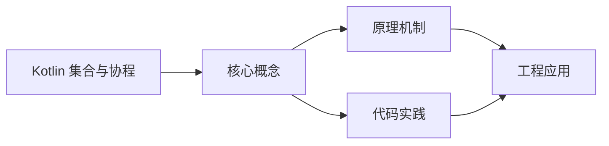

## 1. 学习目标（Bloom 分类）

本节按照布鲁姆教育目标分类学组织学习路径。本文主题为《Kotlin 集合与协程》，属于 Kotlin 模块，读者可以根据自身阶段选择阅读深度。

记忆层面：能够准确复述本文的核心概念、术语与基本语法或操作步骤，并能够在提问或检索时快速定位对应知识点。能够说出 val/var、空安全操作符与 when 表达式的语法。

理解层面：能够用自己的语言解释核心原理与工作机制，说明概念之间的因果关系，而不是机械记忆结论。能够解释 Kotlin 与 Java 互操作的机制与平台类型概念。

应用层面：能够在真实项目或练习场景中运用本文知识解决具体问题，写出正确且可维护的实现。能够编写数据类、扩展函数与协程代码。

分析层面：能够拆解复杂问题，比较本文主题与相邻概念的异同，识别边界条件与例外情况。能够分析空安全、智能转换与协程调度原理。

评价层面：能够根据约束条件（性能、可读性、安全、成本）评价不同方案的优劣，做出有依据的技术决策。能够评价 Kotlin 在 Android、服务端与多平台场景的适用性。

创造层面：能够把本文知识与其他模块知识组合，设计出新的解决方案或可复用的工程模式。能够组合 Compose 与协程设计跨平台应用。

通过本节学习，读者应当能够把《Kotlin 集合与协程》纳入自己的知识网络，并与 Kotlin 模块的其他主题（类型推断、空安全、协程、KMP）建立关联。

## 2. 历史动机与发展脉络

《Kotlin 集合与协程》是 Kotlin 领域的重要主题。要真正理解它，需要先了解它解决的问题与演进过程。

Kotlin 由 JetBrains 于 2010 年开始研发，2016 年发布 1.0，定位是“更现代的 JVM 语言”：减少样板代码、消灭空指针、增强函数式能力，同时与 Java 100% 互操作。
2017 年 Google 宣布 Kotlin 成为 Android 一级语言，2019 年确立 Kotlin-first 政策；2023 年 Kotlin 2.0 的 K2 编译器显著提升编译速度与类型推导。
Kotlin Multiplatform（KMP）支持 JVM、Android、iOS、WebAssembly 等目标，配合 Compose Multiplatform 实现共享 UI 与业务逻辑，是 JetBrains 的长期战略方向。

回到本文主题：Kotlin 集合与协程 的提出与成熟，正是上述技术背景下的必然产物。早期实现往往以简单可用为目标，随着工程规模扩大，社区逐渐沉淀出标准做法与最佳实践；理解这一脉络，可以帮助读者判断“为什么文档中的推荐写法是现在这个样子”，也能在遇到历史遗留代码时准确识别其设计年代与取舍。


## 3. 形式化定义与核心概念精讲

本节把《Kotlin 集合与协程》涉及的核心概念以“定义 + 讲解”的形式展开。读者应把定义当作工具，把讲解当作理解路径；两者结合才能形成可迁移的知识。

空安全：类型系统区分 `String` 与 `String?`，编译期强制处理可空值；`?.` 短路、`?:` 提供默认、`!!` 显式断言，三者覆盖所有空值处理模式。
智能转换：`is` 检查后在不可变上下文中自动转换类型，减少显式强转；`as?` 安全转换失败返回 null。
协程：挂起函数（suspend）与调度器（Dispatchers.Main/IO/Default）实现非阻塞并发，结构化并发保证作用域内任务可取消。

### 3.1 原文章节逐一精讲

原文档把主题拆分为 19 个小节，下面按顺序给出每一节的导读讲解，随后保留原文细节供精读。

#### 原文精读（完整保留）

# Kotlin 集合进阶

> **符号约定**：`< >` 必填参数 | `[ ]` 可选参数

---

#### 1. 集合框架

Kotlin 集合框架分为**只读**和**可变**两大体系：

##### 1.1 集合类型

| 类型 | 只读        | 可变               | 描述       |
| ---- | ----------- | ------------------ | ---------- |
| List | `List<T>`   | `MutableList<T>`   | 有序可重复 |
| Set  | `Set<T>`    | `MutableSet<T>`    | 无序不重复 |
| Map  | `Map<K, V>` | `MutableMap<K, V>` | 键值对     |

```kotlin
// 只读集合
val list: List<String> = listOf("a", "b", "c")
val set: Set<Int> = setOf(1, 2, 3)
val map: Map<String, Int> = mapOf("a" to 1, "b" to 2)

// 可变集合
val mutableList: MutableList<String> = mutableListOf("a", "b")
val mutableSet: MutableSet<Int> = mutableSetOf(1, 2)
val mutableMap: MutableMap<String, Int> = mutableMapOf("a" to 1)

// 只读视图
val readOnly: List<String> = mutableList.toList()  // 创建副本
val readOnlyView: List<String> = mutableList       // 仅类型约束，底层数据共享
```

##### 1.2 List 操作

```kotlin
val list = listOf("apple", "banana", "cherry", "date")

// 访问元素
list[0]                  // "apple"
list.getOrNull(10)       // null（安全访问）
list.first()             // "apple"
list.last()              // "date"
list.firstOrNull { it.startsWith("b") }  // "banana"

// 子列表
list.subList(1, 3)       // ["banana", "cherry"]

// 查找
list.indexOf("cherry")   // 2
list.binarySearch("cherry")  // 二分查找（需排序）

// 切片
list.slice(1..2)         // ["banana", "cherry"]
list.slice(setOf(0, 3))  // ["apple", "date"]
```

##### 1.3 Set 操作

```kotlin
val set1 = setOf(1, 2, 3, 4)
val set2 = setOf(3, 4, 5, 6)

// 集合运算
set1 union set2          // {1, 2, 3, 4, 5, 6} 并集
set1 intersect set2      // {3, 4} 交集
set1 subtract set2       // {1, 2} 差集

// 包含检查
set1.contains(3)         // true
3 in set1                // true
set1.containsAll(setOf(1, 2))  // true
```

##### 1.4 Map 操作

```kotlin
val map = mapOf("a" to 1, "b" to 2, "c" to 3)

// 访问
map["a"]                 // 1
map.getValue("a")        // 1（不存在则抛异常）
map.getOrDefault("d", 0) // 0
map.getOrElse("d") { 0 } // 0

// 遍历
for ((key, value) in map) {
    println("$key = $value")
}

// 常用操作
map.keys                 // [a, b, c]
map.values               // [1, 2, 3]
map.entries              // [a=1, b=2, c=3]

// 可变 Map 操作
val mutableMap = mutableMapOf("a" to 1)
mutableMap["b"] = 2
mutableMap.putIfAbsent("c", 3)
mutableMap.remove("a")
mutableMap += "d" to 4
```

#### 2. 序列（Sequence）

序列是惰性求值的集合，类似 Java Stream，但适用于所有平台：

##### 2.1 创建序列

```kotlin
// 从集合创建
val seq = listOf(1, 2, 3).asSequence()

// 使用 generateSequence
val naturalNumbers = generateSequence(1) { it + 1 }
val first10 = naturalNumbers.take(10).toList()  // [1, 2, ..., 10]

// 使用 sequence 构建器
val fibonacci = sequence {
    var a = 0L
    var b = 1L
    while (true) {
        yield(a)
        val next = a + b
        a = b
        b = next
    }
}
fibonacci.take(10).toList()  // [0, 1, 1, 2, 3, 5, 8, 13, 21, 34]
```

##### 2.2 惰性求值 vs 及早求值

```kotlin
// List — 及早求值（每个操作都创建新集合）
val listResult = (1..1000)
    .map { println("map $it"); it * 2 }
    .filter { println("filter $it"); it > 10 }
    .first()
// 输出：map 1, filter 2, map 2, filter 4, ... map 6, filter 12 → 返回 12
// 执行了 6 次 map + 6 次 filter

// Sequence — 惰性求值（逐元素处理管道）
val seqResult = (1..1000).asSequence()
    .map { println("map $it"); it * 2 }
    .filter { println("filter $it"); it > 10 }
    .first()
// 输出：map 1, filter 2, map 2, filter 4, map 3, filter 6, map 4, filter 8, map 5, filter 10, map 6, filter 12
// 同样找到 12，但只处理了必要的元素
```

> **何时使用 Sequence**：当集合较大且链式操作较多时，Sequence 可显著减少中间集合创建和计算量。

#### 3. 集合操作函数

##### 3.1 过滤与映射

```kotlin
val numbers = listOf(1, 2, 3, 4, 5, 6, 7, 8, 9, 10)

// 过滤
numbers.filter { it > 5 }              // [6, 7, 8, 9, 10]
numbers.filterNot { it > 5 }           // [1, 2, 3, 4, 5]
numbers.filterIndexed { i, v -> i > 3 && v > 5 }  // [6, 7, 8, 9, 10]
numbers.partition { it > 5 }           // ([6,7,8,9,10], [1,2,3,4,5])

// 映射
numbers.map { it * 2 }                 // [2, 4, 6, 8, 10, 12, 14, 16, 18, 20]
numbers.mapIndexed { i, v -> "$i:$v" } // ["0:1", "1:2", ...]
numbers.mapNotNull { if (it > 5) it else null }  // [6, 7, 8, 9, 10]

// flatMap — 映射后展平
val words = listOf("Hello", "Kotlin")
words.flatMap { it.toList() }          // [H, e, l, l, o, K, o, t, l, i, n]
```

##### 3.2 排序

```kotlin
val list = listOf(3, 1, 4, 1, 5, 9, 2, 6)

list.sorted()                          // [1, 1, 2, 3, 4, 5, 6, 9]
list.sortedDescending()                // [9, 6, 5, 4, 3, 2, 1, 1]
list.sortedBy { it % 3 }              // 按模 3 排序
list.sortedWith(compareBy({ it % 3 }, { it }))  // 多条件排序

// 原地排序（MutableList）
val mutable = mutableListOf(3, 1, 4, 1, 5)
mutable.sort()
```

##### 3.3 聚合

```kotlin
val list = listOf(1, 2, 3, 4, 5)

list.sum()                             // 15
list.sumOf { it * 2 }                  // 30
list.average()                         // 3.0
list.count()                           // 5
list.count { it > 3 }                  // 2
list.minOrNull()                       // 1
list.maxOrNull()                       // 5
list.minByOrNull { it }                // 1

// reduce — 从左到右累积
list.reduce { acc, num -> acc + num }  // 15

// fold — 带初始值的累积
list.fold(0) { acc, num -> acc + num } // 15
list.fold(1) { acc, num -> acc * num } // 120

// groupBy — 分组
val words = listOf("a", "ab", "abc", "bc", "c")
words.groupBy { it.length }
// {1=[a, c], 2=[ab, bc], 3=[abc]}

// associate — 转换为 Map
list.associateBy { "key$it" }          // {key1=1, key2=2, ...}
list.associateWith { it * 10 }         // {1=10, 2=20, ...}
```

##### 3.4 查找

```kotlin
val list = listOf(1, 2, 3, 4, 5)

list.find { it > 3 }                   // 4（第一个匹配）
list.findLast { it > 3 }               // 5（最后一个匹配）
list.first { it > 3 }                  // 4（不存在则抛异常）
list.any { it > 3 }                    // true
list.none { it > 10 }                  // true
list.all { it > 0 }                    // true
```

#### 4. 协程基础

协程是 Kotlin 的轻量级线程，提供结构化并发的编程模型。

##### 4.1 添加依赖

```kotlin
// build.gradle.kts
dependencies {
    implementation("org.jetbrains.kotlinx:kotlinx-coroutines-core:1.10.1")
    // Android
    implementation("org.jetbrains.kotlinx:kotlinx-coroutines-android:1.10.1")
}
```

##### 4.2 第一个协程

```kotlin
import kotlinx.coroutines.*

fun main() = runBlocking {  // 桥接协程与阻塞世界
    launch {  // 启动新协程
        delay(1000L)  // 非阻塞等待
        println("World!")
    }
    println("Hello")
}
// 输出：Hello → (1秒后) World!
```

##### 4.3 suspend 函数

```kotlin
suspend fun fetchData(): String {
    delay(1000)  // 模拟网络请求
    return "Data from network"
}

suspend fun processAll() {
    val data = fetchData()  // 在协程中调用 suspend 函数
    println(data)
}
```

##### 4.4 协程构建器

```kotlin
// launch — 启动协程，不返回结果（返回 Job）
val job: Job = scope.launch {
    delay(1000)
    println("Done")
}

// async — 启动协程，返回结果（返回 Deferred<T>）
val deferred: Deferred<Int> = scope.async {
    delay(1000)
    42
}
val result = deferred.await()  // 等待结果

// 并行执行
suspend fun fetchBoth(): Pair<String, String> = coroutineScope {
    val deferred1 = async { fetchUser() }
    val deferred2 = async { fetchOrders() }
    Pair(deferred1.await(), deferred2.await())
}
```

##### 4.5 协程作用域

```kotlin
// coroutineScope — 等待所有子协程完成
suspend fun fetchAll() = coroutineScope {
    launch { fetchUser() }
    launch { fetchOrders() }
    // 两个 launch 都完成后才返回
}

// supervisorScope — 子协程失败不影响其他子协程
suspend fun fetchWithRecovery() = supervisorScope {
    launch {
        throw Exception("Failed")  // 不影响另一个
    }
    launch {
        delay(100)
        println("This still runs")
    }
}
```

##### 4.6 调度器

```kotlin
// Dispatchers.Default — CPU 密集型任务
launch(Dispatchers.Default) {
    val result = heavyComputation()
}

// Dispatchers.IO — IO 密集型任务
launch(Dispatchers.IO) {
    val data = networkRequest()
}

// Dispatchers.Main — UI 线程（Android/Swing）
launch(Dispatchers.Main) {
    updateUI(result)
}

// withContext — 切换调度器
suspend fun fetchAndShow() {
    val data = withContext(Dispatchers.IO) {
        networkRequest()  // 在 IO 线程执行
    }
    showData(data)  // 回到原调度器
}
```

#### 5. Flow

Flow 是 Kotlin 协程的响应式流 API，类似 RxJava 但基于协程：

##### 5.1 创建 Flow

```kotlin
// flow 构建器
fun numbers(): Flow<Int> = flow {
    for (i in 1..5) {
        emit(i)  // 发射值
        delay(100)
    }
}

// flowOf
val flow = flowOf(1, 2, 3, 4, 5)

// 从集合转换
val listFlow = listOf(1, 2, 3).asFlow()

// channelFlow — 支持并发发射
fun mergedFlow(): Flow<Int> = channelFlow {
    launch { send(1) }
    launch { send(2) }
}
```

##### 5.2 收集 Flow

```kotlin
// collect — 终端操作
numbers().collect { value ->
    println(value)
}

// toList — 转为列表
val list = numbers().toList()

// first / firstOrNull
val first = numbers().first()

// collectLatest — 只处理最新值
numbers().collectLatest { value ->
    delay(200)  // 模拟慢处理
    println(value)  // 只打印最后一个
}
```

##### 5.3 Flow 操作符

```kotlin
numbers()
    .map { it * 2 }              // 变换
    .filter { it > 4 }           // 过滤
    .take(3)                     // 取前 3 个
    .drop(1)                     // 跳过第 1 个
    .distinctUntilChanged()      // 去重
    .onEach { println("Emit: $it") }  // 副作用
    .onStart { emit(0) }         // 开始前发射
    .onCompletion { println("Done") }  // 完成回调
    .catch { e -> emit(-1) }     // 错误处理
    .collect { println(it) }
```

#### 6. Channel

Channel 是协程间通信的管道，类似 BlockingQueue：

```kotlin
val channel = Channel<Int>()

// 生产者
launch {
    for (i in 1..5) {
        channel.send(i)
    }
    channel.close()
}

// 消费者
launch {
    for (value in channel) {
        println(value)
    }
}

// produce — 便捷生产者
fun produceNumbers(): ReceiveChannel<Int> = GlobalScope.produce {
    for (i in 1..5) {
        send(i)
    }
}
```
#### 聚合操作

**基本写法：sum 求和**
`<collection>.sum()`
```kotlin
// 求和
val sum = numbers.sum();
```

**基本写法：sumBy 条件求和**
`<collection>.sumOf { <selector> }`
```kotlin
// 按条件求和
val totalAge = people.sumOf { it.age };
```

**基本写法：maxOrNull 最大值**
`<collection>.maxOrNull()`
```kotlin
// 获取最大值（空集合返回 null）
val max = numbers.maxOrNull();
```

**基本写法：maxByOrNull 条件最大值**
`<collection>.maxByOrNull { <selector> }`
```kotlin
// 按条件获取最大元素
val oldest = people.maxByOrNull { it.age };
```

**基本写法：minOrNull 最小值**
`<collection>.minOrNull()`
```kotlin
// 获取最小值（空集合返回 null）
val min = numbers.minOrNull();
```

**基本写法：minByOrNull 条件最小值**
`<collection>.minByOrNull { <selector> }`
```kotlin
// 按条件获取最小元素
val youngest = people.minByOrNull { it.age };
```

**基本写法：average 平均值**
`<collection>.average()`
```kotlin
// 计算平均值
val avg = numbers.average();
```

**基本写法：count 计数**
`<collection>.count()`
```kotlin
// 计算元素数量
val count = numbers.count();
```

**基本写法：count 条件计数**
`<collection>.count { <predicate> }`
```kotlin
// 计算满足条件的元素数量
val count = numbers.count { it > 3 };
```

**基本写法：fold 累积**
`<collection>.fold(<initial>) { <acc>, <item> -> <body> }`
```kotlin
// 从左到右累积
val sum = numbers.fold(0) { acc, num -> acc + num };
```

**基本写法：reduce 累积**
`<collection>.reduce { <acc>, <item> -> <body> }`
```kotlin
// 从左到右累积（无初始值）
val sum = numbers.reduce { acc, num -> acc + num };
```

**基本写法：reduceOrNull 安全累积**
`<collection>.reduceOrNull { <acc>, <item> -> <body> }`
```kotlin
// 安全累积（空集合返回 null）
val sum = numbers.reduceOrNull { acc, num -> acc + num };
```

**基本写法：joinToString 连接字符串**
`<collection>.joinToString(<separator>)`
```kotlin
// 连接为字符串
val str = numbers.joinToString(", ");
```

**换行写法：joinToString 带前缀后缀**
`<collection>.joinToString(<separator>, <prefix>, <postfix>)`
```kotlin
// 连接为字符串带前缀后缀
val str = numbers.joinToString(
    separator = ", ",
    prefix = "[",
    postfix = "]"
);
```

---

#### 判断操作

**基本写法：any 判断是否有元素**
`<collection>.any()`
```kotlin
// 判断集合是否有元素
val hasElements = numbers.any();
```

**基本写法：any 条件判断**
`<collection>.any { <predicate> }`
```kotlin
// 判断是否有满足条件的元素
val hasEven = numbers.any { it % 2 == 0 };
```

**基本写法：all 全部满足**
`<collection>.all { <predicate> }`
```kotlin
// 判断是否全部满足条件
val allPositive = numbers.all { it > 0 };
```

**基本写法：none 全不满足**
`<collection>.none { <predicate> }`
```kotlin
// 判断是否全不满足条件
val noneNegative = numbers.none { it < 0 };
```

**基本写法：contains 检查包含**
`<collection>.contains(<element>)`
```kotlin
// 检查是否包含元素
numbers.contains(5);
```

---

#### 序列（Sequence）

**基本写法：asSequence 转换为序列**
`<collection>.asSequence()`
```kotlin
// 转换为序列（惰性求值）
val sequence = numbers.asSequence();
```

**基本写法：sequenceOf 创建序列**
`sequenceOf(<elements>)`
```kotlin
// 创建序列
val seq = sequenceOf(1, 2, 3);
```

**换行写法：generateSequence 生成序列**
`generateSequence(<seed>) { <next> }`
```kotlin
// 生成序列
val naturals = generateSequence(1) { it + 1 };
```

**换行写法：yield 构建序列**
`sequence { yield(<value>); yieldAll(<collection>) }`
```kotlin
// 使用 yield 构建序列
val seq = sequence {
    yield(1);
    yield(2);
    yieldAll(listOf(3, 4, 5));
}
```

**基本写法：序列操作链**
`<sequence>.filter { <predicate> }.map { <transform> }.toList()`
```kotlin
// 序列操作链（惰性求值）
val result = numbers.asSequence()
    .filter { it > 2 }
    .map { it * 2 }
    .toList();
```

**基本写法：take 限制序列**
`<sequence>.take(<n>)`
```kotlin
// 限制序列元素数量
val first5 = naturals.take(5).toList();
```

---

#### 集合转换

**基本写法：toSet 转换为 Set**
`<collection>.toSet()`
```kotlin
// 转换为 Set（去重）
val set = numbers.toSet();
```

**基本写法：toList 转换为 List**
`<collection>.toList()`
```kotlin
// 转换为 List
val list = set.toList();
```

**基本写法：toMap 转换为 Map**
`<list>.toMap()`
```kotlin
// Pair 列表转换为 Map
val map = listOf("a" to 1, "b" to 2).toMap();
```

**基本写法：toMutableList 转换为可变列表**
`<collection>.toMutableList()`
```kotlin
// 转换为可变列表
val mutable = numbers.toMutableList();
```

**基本写法：associate 转换为 Map**
`<collection>.associate { <transform> }`
```kotlin
// 转换为 Map
val map = people.associate { it.name to it.age };
```

**基本写法：associateBy 按 key 转换**
`<collection>.associateBy { <keySelector> }`
```kotlin
// 按 key 转换为 Map
val map = people.associateBy { it.name };
```

**基本写法：associateWith 按 value 转换**
`<collection>.associateWith { <valueSelector> }`
```kotlin
// 按 value 转换为 Map
val map = numbers.associateWith { it * 2 };
```

---

#### 集合遍历

**基本写法：forEach 遍历**
`<collection>.forEach { <body> }`
```kotlin
// 遍历集合
numbers.forEach { println(it); }
```

**基本写法：forEachIndexed 带索引遍历**
`<collection>.forEachIndexed { <index>, <item> -> <body> }`
```kotlin
// 带索引遍历
numbers.forEachIndexed { index, value ->
    println("$index: $value");
}
```

**基本写法：for-in 遍历**
`for (<item> in <collection>) { <body> }`
```kotlin
// for-in 遍历
for (item in numbers) {
    println(item);
}
```

**基本写法：遍历 Map**
`for ((<key>, <value>) in <map>) { <body> }`
```kotlin
// 遍历 Map 键值对
for ((key, value) in map) {
    println("$key = $value");
}
```

**基本写法：遍历 List 索引**
`for (<index> in <list>.indices) { <body> }`
```kotlin
// 遍历 List 索引
for (i in numbers.indices) {
    println("Index $i: ${numbers[i]}");
}
```

**基本写法：iterator 迭代器**
`val <iterator> = <collection>.iterator(); while (<iterator>.hasNext()) { <body> }`
```kotlin
// 使用迭代器遍历
val iterator = numbers.iterator();
while (iterator.hasNext()) {
    println(iterator.next());
}
```

---

#### 集合修改

**基本写法：add 添加元素**
`<mutableList>.add(<element>)`
```kotlin
// 添加元素到末尾
mutableList.add(4);
```

**基本写法：add 指定位置添加**
`<mutableList>.add(<index>, <element>)`
```kotlin
// 在指定位置添加元素
mutableList.add(0, 0);
```

**基本写法：addAll 添加多个元素**
`<mutableList>.addAll(<collection>)`
```kotlin
// 添加多个元素
mutableList.addAll(listOf(5, 6, 7));
```

**基本写法：remove 移除元素**
`<mutableList>.remove(<element>)`
```kotlin
// 移除指定元素
mutableList.remove(3);
```

**基本写法：removeAt 移除指定位置**
`<mutableList>.removeAt(<index>)`
```kotlin
// 移除指定位置的元素
mutableList.removeAt(0);
```

**基本写法：clear 清空集合**
`<mutableList>.clear()`
```kotlin
// 清空集合
mutableList.clear();
```

**基本写法：set 修改元素**
`<mutableList>[<index>] = <value>`
```kotlin
// 修改指定位置的元素
mutableList[0] = 10;
```

**基本写法：Map 修改**
`<mutableMap>[<key>] = <value>`
```kotlin
// 修改 Map 值
mutableMap["a"] = 10;
```

**基本写法：putIfAbsent 条件添加**
`<mutableMap>.putIfAbsent(<key>, <value>)`
```kotlin
// 键不存在时添加
mutableMap.putIfAbsent("c", 3);
```

**基本写法：remove 移除 Map 条目**
`<mutableMap>.remove(<key>)`
```kotlin
// 移除 Map 条目
mutableMap.remove("a");
```
#### 协程基础

**基本写法：launch 启动协程**
`GlobalScope.launch { <代码> }`
```kotlin
// 启动新协程（不阻塞）
GlobalScope.launch {
    delay(1000)
    println("Hello")
}
```

---

**基本写法：async 异步返回**
`GlobalScope.async { <返回值> }`
```kotlin
// 异步计算结果
val deferred = GlobalScope.async {
    delay(1000)
    42
}
val result = deferred.await()
```

---

**基本写法：runBlocking 阻塞启动**
`runBlocking { <代码> }`
```kotlin
// 阻塞主线程启动协程
runBlocking {
    launch { println("Hello") }
}
```

---

**基本写法：suspend 挂起函数**
`suspend fun <函数名>(<参数>): <返回类型> { ... }`
```kotlin
// 声明挂起函数
suspend fun fetchData(): String {
    delay(1000)
    return "Data"
}
```

---

**基本写法：CoroutineScope 自定义作用域**
`CoroutineScope(<上下文>).launch { <代码> }`
```kotlin
// 创建作用域
val scope = CoroutineScope(Dispatchers.Main)
scope.launch { /* UI 操作 */ }
```

---

#### 调度器

**基本写法：Dispatchers.Main 主线程**
`withContext(Dispatchers.Main) { <代码> }`
```kotlin
// 切换到主线程
withContext(Dispatchers.Main) {
    updateUI()
}
```

---

**基本写法：Dispatchers.IO IO 线程**
`withContext(Dispatchers.IO) { <代码> }`
```kotlin
// 切换到 IO 线程
withContext(Dispatchers.IO) {
    val data = readFromFile()
}
```

---

**基本写法：Dispatchers.Default 计算线程**
`withContext(Dispatchers.Default) { <代码> }`
```kotlin
// CPU 密集型任务
withContext(Dispatchers.Default) {
    val result = heavyCompute()
}
```

---

#### Job 控制

**基本写法：cancel 取消**
`<job>.cancel();`
```kotlin
// 取消协程
val job = launch { repeat(100) { delay(100) } }
job.cancel()
```

---

**基本写法：join 等待完成**
`<job>.join();`
```kotlin
// 等待协程完成
job.join()
```

---

**基本写法：cancelAndJoin 取消并等待**
`<job>.cancelAndJoin();`
```kotlin
// 取消并等待完成
job.cancelAndJoin()
```

---

**基本写法：isActive 检查活跃**
`<coroutineScope>.isActive`
```kotlin
// 检查协程是否仍活跃
while (isActive) {
    // 执行工作
}
```

---

#### Flow 流

**基本写法：flow 构建流**
`flow { <emit 调用> }`
```kotlin
// 创建 Flow
val flow = flow {
    for (i in 1..3) {
        emit(i)
    }
}
```

---

**基本写法：collect 收集**
`<flow>.collect { <处理> }`
```kotlin
// 收集 Flow 数据
flow.collect { value ->
    println(value)
}
```

---

**基本写法：map 转换**
`<flow>.map { <转换> }`
```kotlin
// 转换数据
flow.map { it * 2 }
```

---

**基本写法：filter 过滤**
`<flow>.filter { <条件> }`
```kotlin
// 过滤数据
flow.filter { it > 1 }
```

---

**基本写法：flatMapConcat 串联**
`<flow>.flatMapConcat { <新 Flow> }`
```kotlin
// 串联多个流
flow.flatMapConcat { value -> flowOf(value, value * 2) }
```

---

**基本写法：flowOf 固定流**
`flowOf(<元素1>, <元素2>);`
```kotlin
// 创建固定元素流
flowOf(1, 2, 3).collect { println(it) }
```

---

**基本写法：asFlow 集合转流**
`<集合>.asFlow()`
```kotlin
// List 转 Flow
listOf(1, 2, 3).asFlow().collect { println(it) }
```

---

#### Channel 通道

**基本写法：Channel 创建**
`Channel<<类型>>()`
```kotlin
// 创建通道
val channel = Channel<Int>()
launch {
    channel.send(1)
}
val value = channel.receive()
```

---

**基本写法：produce 生产者**
`produce { <send 调用> }`
```kotlin
// 创建生产者
val producer = produce {
    for (i in 1..5) send(i)
}
producer.consumeEach { println(it) }
```

---

#### 异常处理

**基本写法：try-catch 捕获异常**
`try { <代码> } catch (e: <异常类型>) { }`
```kotlin
// 捕获协程异常
try {
    deferred.await()
} catch (e: Exception) {
    println("Error: ${e.message}")
}
```

---

**基本写法：CoroutineExceptionHandler**
`CoroutineExceptionHandler { <ctx>, <throwable> -> }`
```kotlin
// 全局异常处理器
val handler = CoroutineExceptionHandler { _, e ->
    println("Caught: $e")
}
scope.launch(handler) { throw RuntimeException("fail") }
```

---

#### 超时控制

**基本写法：withTimeout 超时**
`withTimeout(<毫秒>) { <代码> }`
```kotlin
// 设置超时
withTimeout(2000) {
    delay(3000) // 抛出 TimeoutCancellationException
}
```

---

**基本写法：withTimeoutOrNull 超时返回 null**
`withTimeoutOrNull(<毫秒>) { <代码> }`
```kotlin
// 超时返回 null
val result = withTimeoutOrNull(1000) {
    delay(2000)
    "Done"
}  // null
```


### 3.2 概念关系图

下面用 Mermaid 图表达本文核心概念之间的关系，帮助读者建立整体图景：



图中展示的是本文知识的结构化关系：核心概念是入口，原理机制解释“为什么”，代码实践演示“怎么做”，工程应用回答“何时用”。读者学习时可以把每个小节的内容挂接到对应节点上。

## 4. 理论推导与原理解析

本节深入《Kotlin 集合与协程》背后的原理。理论部分不求面面俱到，而是聚焦“能解释现象、能指导实践”的关键推导。

空安全：类型系统区分 `String` 与 `String?`，编译期强制处理可空值；`?.` 短路、`?:` 提供默认、`!!` 显式断言，三者覆盖所有空值处理模式。
智能转换：`is` 检查后在不可变上下文中自动转换类型，减少显式强转；`as?` 安全转换失败返回 null。
协程：挂起函数（suspend）与调度器（Dispatchers.Main/IO/Default）实现非阻塞并发，结构化并发保证作用域内任务可取消。
扩展函数与属性：在不修改原类的情况下为类添加行为，是 Kotlin 标准库（如集合操作）的基石。

需要强调的是，理论推导与工程实践之间存在翻译层：理论给出的是理想化模型与边界条件，工程代码则必须处理真实环境中的例外。读者在学习时应先掌握理论的“标准情形”，再通过陷阱章节了解“非标准情形”。

## 5. 代码示例与逐行讲解

本节把原文中的代码示例系统整理，并为每个示例补充用途说明与讲解。读者不应只浏览代码，而应逐段对照讲解理解设计意图。

### 5.1 示例：1.1 集合类型

该示例来自原文《1.1 集合类型》小节，用于演示Kotlin 集合与协程相关操作。阅读时请先看代码结构，再看其后的讲解。

```kotlin
// 只读集合
val list: List<String> = listOf("a", "b", "c")
val set: Set<Int> = setOf(1, 2, 3)
val map: Map<String, Int> = mapOf("a" to 1, "b" to 2)

// 可变集合
val mutableList: MutableList<String> = mutableListOf("a", "b")
val mutableSet: MutableSet<Int> = mutableSetOf(1, 2)
val mutableMap: MutableMap<String, Int> = mutableMapOf("a" to 1)

// 只读视图
val readOnly: List<String> = mutableList.toList()  // 创建副本
val readOnlyView: List<String> = mutableList       // 仅类型约束，底层数据共享
```

讲解：这段代码演示了本节核心知识点。代码中的关键操作可以归纳为三步：准备（定义或初始化）、执行（核心逻辑）、收尾（释放资源或返回结果）。实际项目中，这三步往往被封装为函数或类，以提升复用性与可测试性。

关键点分析：

该示例共 11 行有效代码，结构以数据或配置为主。阅读时应关注：数据字段的含义、配置项的作用，以及它们与运行行为的对应关系。

进阶思考路径：先尝试修改参数观察行为变化，再把示例中的模式迁移到自己的项目中；每次修改都记录预期与实测差异，这是把示例转化为能力的最快方式。

### 5.2 示例：1.2 List 操作

该示例来自原文《1.2 List 操作》小节，用于演示Kotlin 集合与协程相关操作。阅读时请先看代码结构，再看其后的讲解。

```kotlin
val list = listOf("apple", "banana", "cherry", "date")

// 访问元素
list[0]                  // "apple"
list.getOrNull(10)       // null（安全访问）
list.first()             // "apple"
list.last()              // "date"
list.firstOrNull { it.startsWith("b") }  // "banana"

// 子列表
list.subList(1, 3)       // ["banana", "cherry"]

// 查找
list.indexOf("cherry")   // 2
list.binarySearch("cherry")  // 二分查找（需排序）

// 切片
list.slice(1..2)         // ["banana", "cherry"]
list.slice(setOf(0, 3))  // ["apple", "date"]
```

讲解：这段代码演示了本节核心知识点。代码中的关键操作可以归纳为三步：准备（定义或初始化）、执行（核心逻辑）、收尾（释放资源或返回结果）。实际项目中，这三步往往被封装为函数或类，以提升复用性与可测试性。

关键点分析：

该示例共 15 行有效代码，结构以数据或配置为主。阅读时应关注：数据字段的含义、配置项的作用，以及它们与运行行为的对应关系。

进阶思考路径：先尝试修改参数观察行为变化，再把示例中的模式迁移到自己的项目中；每次修改都记录预期与实测差异，这是把示例转化为能力的最快方式。

### 5.3 示例：1.3 Set 操作

该示例来自原文《1.3 Set 操作》小节，用于演示Kotlin 集合与协程相关操作。阅读时请先看代码结构，再看其后的讲解。

```kotlin
val set1 = setOf(1, 2, 3, 4)
val set2 = setOf(3, 4, 5, 6)

// 集合运算
set1 union set2          // {1, 2, 3, 4, 5, 6} 并集
set1 intersect set2      // {3, 4} 交集
set1 subtract set2       // {1, 2} 差集

// 包含检查
set1.contains(3)         // true
3 in set1                // true
set1.containsAll(setOf(1, 2))  // true
```

讲解：这段代码演示了本节核心知识点。代码中的关键操作可以归纳为三步：准备（定义或初始化）、执行（核心逻辑）、收尾（释放资源或返回结果）。实际项目中，这三步往往被封装为函数或类，以提升复用性与可测试性。

关键点分析：

该示例共 10 行有效代码，结构以数据或配置为主。阅读时应关注：数据字段的含义、配置项的作用，以及它们与运行行为的对应关系。

进阶思考路径：先尝试修改参数观察行为变化，再把示例中的模式迁移到自己的项目中；每次修改都记录预期与实测差异，这是把示例转化为能力的最快方式。

### 5.4 示例：1.4 Map 操作

该示例来自原文《1.4 Map 操作》小节，用于演示Kotlin 集合与协程相关操作。阅读时请先看代码结构，再看其后的讲解。

```kotlin
val map = mapOf("a" to 1, "b" to 2, "c" to 3)

// 访问
map["a"]                 // 1
map.getValue("a")        // 1（不存在则抛异常）
map.getOrDefault("d", 0) // 0
map.getOrElse("d") { 0 } // 0

// 遍历
for ((key, value) in map) {
    println("$key = $value")
}

// 常用操作
map.keys                 // [a, b, c]
map.values               // [1, 2, 3]
map.entries              // [a=1, b=2, c=3]

// 可变 Map 操作
val mutableMap = mutableMapOf("a" to 1)
mutableMap["b"] = 2
mutableMap.putIfAbsent("c", 3)
mutableMap.remove("a")
mutableMap += "d" to 4
```

讲解：这段代码演示了本节核心知识点。代码中的关键操作可以归纳为三步：准备（定义或初始化）、执行（核心逻辑）、收尾（释放资源或返回结果）。实际项目中，这三步往往被封装为函数或类，以提升复用性与可测试性。

关键点分析：

该示例共 20 行有效代码，包含 1 类关键结构（for）。其中：

- 入口与初始化部分负责建立上下文，对应实际项目中的启动或装配逻辑；
- 核心逻辑部分体现本文主题的主要操作，是阅读时最需要对照讲解理解的部分；
- 输出或返回部分把结果交给调用方，注意其类型与边界条件。

进阶思考路径：先尝试修改参数观察行为变化，再把示例中的模式迁移到自己的项目中；每次修改都记录预期与实测差异，这是把示例转化为能力的最快方式。

### 5.5 示例：2.1 创建序列

该示例来自原文《2.1 创建序列》小节，用于演示Kotlin 集合与协程相关操作。阅读时请先看代码结构，再看其后的讲解。

```kotlin
// 从集合创建
val seq = listOf(1, 2, 3).asSequence()

// 使用 generateSequence
val naturalNumbers = generateSequence(1) { it + 1 }
val first10 = naturalNumbers.take(10).toList()  // [1, 2, ..., 10]

// 使用 sequence 构建器
val fibonacci = sequence {
    var a = 0L
    var b = 1L
    while (true) {
        yield(a)
        val next = a + b
        a = b
        b = next
    }
}
fibonacci.take(10).toList()  // [0, 1, 1, 2, 3, 5, 8, 13, 21, 34]
```

讲解：这段代码演示了本节核心知识点。代码中的关键操作可以归纳为三步：准备（定义或初始化）、执行（核心逻辑）、收尾（释放资源或返回结果）。实际项目中，这三步往往被封装为函数或类，以提升复用性与可测试性。

关键点分析：

该示例共 17 行有效代码，包含 1 类关键结构（while）。其中：

- 入口与初始化部分负责建立上下文，对应实际项目中的启动或装配逻辑；
- 核心逻辑部分体现本文主题的主要操作，是阅读时最需要对照讲解理解的部分；
- 输出或返回部分把结果交给调用方，注意其类型与边界条件。

进阶思考路径：先尝试修改参数观察行为变化，再把示例中的模式迁移到自己的项目中；每次修改都记录预期与实测差异，这是把示例转化为能力的最快方式。

### 5.6 示例：2.2 惰性求值 vs 及早求值

该示例来自原文《2.2 惰性求值 vs 及早求值》小节，用于演示Kotlin 集合与协程相关操作。阅读时请先看代码结构，再看其后的讲解。

```kotlin
// List — 及早求值（每个操作都创建新集合）
val listResult = (1..1000)
    .map { println("map $it"); it * 2 }
    .filter { println("filter $it"); it > 10 }
    .first()
// 输出：map 1, filter 2, map 2, filter 4, ... map 6, filter 12 → 返回 12
// 执行了 6 次 map + 6 次 filter

// Sequence — 惰性求值（逐元素处理管道）
val seqResult = (1..1000).asSequence()
    .map { println("map $it"); it * 2 }
    .filter { println("filter $it"); it > 10 }
    .first()
// 输出：map 1, filter 2, map 2, filter 4, map 3, filter 6, map 4, filter 8, map 5, filter 10, map 6, filter 12
// 同样找到 12，但只处理了必要的元素
```

讲解：这段代码演示了本节核心知识点。代码中的关键操作可以归纳为三步：准备（定义或初始化）、执行（核心逻辑）、收尾（释放资源或返回结果）。实际项目中，这三步往往被封装为函数或类，以提升复用性与可测试性。

关键点分析：

该示例共 14 行有效代码，结构以数据或配置为主。阅读时应关注：数据字段的含义、配置项的作用，以及它们与运行行为的对应关系。

进阶思考路径：先尝试修改参数观察行为变化，再把示例中的模式迁移到自己的项目中；每次修改都记录预期与实测差异，这是把示例转化为能力的最快方式。

### 5.7 示例：3.1 过滤与映射

该示例来自原文《3.1 过滤与映射》小节，用于演示Kotlin 集合与协程相关操作。阅读时请先看代码结构，再看其后的讲解。

```kotlin
val numbers = listOf(1, 2, 3, 4, 5, 6, 7, 8, 9, 10)

// 过滤
numbers.filter { it > 5 }              // [6, 7, 8, 9, 10]
numbers.filterNot { it > 5 }           // [1, 2, 3, 4, 5]
numbers.filterIndexed { i, v -> i > 3 && v > 5 }  // [6, 7, 8, 9, 10]
numbers.partition { it > 5 }           // ([6,7,8,9,10], [1,2,3,4,5])

// 映射
numbers.map { it * 2 }                 // [2, 4, 6, 8, 10, 12, 14, 16, 18, 20]
numbers.mapIndexed { i, v -> "$i:$v" } // ["0:1", "1:2", ...]
numbers.mapNotNull { if (it > 5) it else null }  // [6, 7, 8, 9, 10]

// flatMap — 映射后展平
val words = listOf("Hello", "Kotlin")
words.flatMap { it.toList() }          // [H, e, l, l, o, K, o, t, l, i, n]
```

讲解：这段代码演示了本节核心知识点。代码中的关键操作可以归纳为三步：准备（定义或初始化）、执行（核心逻辑）、收尾（释放资源或返回结果）。实际项目中，这三步往往被封装为函数或类，以提升复用性与可测试性。

关键点分析：

该示例共 13 行有效代码，包含 1 类关键结构（if）。其中：

- 入口与初始化部分负责建立上下文，对应实际项目中的启动或装配逻辑；
- 核心逻辑部分体现本文主题的主要操作，是阅读时最需要对照讲解理解的部分；
- 输出或返回部分把结果交给调用方，注意其类型与边界条件。

进阶思考路径：先尝试修改参数观察行为变化，再把示例中的模式迁移到自己的项目中；每次修改都记录预期与实测差异，这是把示例转化为能力的最快方式。

### 5.8 示例：3.2 排序

该示例来自原文《3.2 排序》小节，用于演示Kotlin 集合与协程相关操作。阅读时请先看代码结构，再看其后的讲解。

```kotlin
val list = listOf(3, 1, 4, 1, 5, 9, 2, 6)

list.sorted()                          // [1, 1, 2, 3, 4, 5, 6, 9]
list.sortedDescending()                // [9, 6, 5, 4, 3, 2, 1, 1]
list.sortedBy { it % 3 }              // 按模 3 排序
list.sortedWith(compareBy({ it % 3 }, { it }))  // 多条件排序

// 原地排序（MutableList）
val mutable = mutableListOf(3, 1, 4, 1, 5)
mutable.sort()
```

讲解：这段代码演示了本节核心知识点。代码中的关键操作可以归纳为三步：准备（定义或初始化）、执行（核心逻辑）、收尾（释放资源或返回结果）。实际项目中，这三步往往被封装为函数或类，以提升复用性与可测试性。

关键点分析：

该示例共 8 行有效代码，结构以数据或配置为主。阅读时应关注：数据字段的含义、配置项的作用，以及它们与运行行为的对应关系。

进阶思考路径：先尝试修改参数观察行为变化，再把示例中的模式迁移到自己的项目中；每次修改都记录预期与实测差异，这是把示例转化为能力的最快方式。

### 5.9 示例：3.3 聚合

该示例来自原文《3.3 聚合》小节，用于演示Kotlin 集合与协程相关操作。阅读时请先看代码结构，再看其后的讲解。

```kotlin
val list = listOf(1, 2, 3, 4, 5)

list.sum()                             // 15
list.sumOf { it * 2 }                  // 30
list.average()                         // 3.0
list.count()                           // 5
list.count { it > 3 }                  // 2
list.minOrNull()                       // 1
list.maxOrNull()                       // 5
list.minByOrNull { it }                // 1

// reduce — 从左到右累积
list.reduce { acc, num -> acc + num }  // 15

// fold — 带初始值的累积
list.fold(0) { acc, num -> acc + num } // 15
list.fold(1) { acc, num -> acc * num } // 120

// groupBy — 分组
val words = listOf("a", "ab", "abc", "bc", "c")
words.groupBy { it.length }
// {1=[a, c], 2=[ab, bc], 3=[abc]}

// associate — 转换为 Map
list.associateBy { "key$it" }          // {key1=1, key2=2, ...}
list.associateWith { it * 10 }         // {1=10, 2=20, ...}
```

讲解：这段代码演示了本节核心知识点。代码中的关键操作可以归纳为三步：准备（定义或初始化）、执行（核心逻辑）、收尾（释放资源或返回结果）。实际项目中，这三步往往被封装为函数或类，以提升复用性与可测试性。

关键点分析：

该示例共 21 行有效代码，结构以数据或配置为主。阅读时应关注：数据字段的含义、配置项的作用，以及它们与运行行为的对应关系。

进阶思考路径：先尝试修改参数观察行为变化，再把示例中的模式迁移到自己的项目中；每次修改都记录预期与实测差异，这是把示例转化为能力的最快方式。

### 5.10 示例：3.4 查找

该示例来自原文《3.4 查找》小节，用于演示Kotlin 集合与协程相关操作。阅读时请先看代码结构，再看其后的讲解。

```kotlin
val list = listOf(1, 2, 3, 4, 5)

list.find { it > 3 }                   // 4（第一个匹配）
list.findLast { it > 3 }               // 5（最后一个匹配）
list.first { it > 3 }                  // 4（不存在则抛异常）
list.any { it > 3 }                    // true
list.none { it > 10 }                  // true
list.all { it > 0 }                    // true
```

讲解：这段代码演示了本节核心知识点。代码中的关键操作可以归纳为三步：准备（定义或初始化）、执行（核心逻辑）、收尾（释放资源或返回结果）。实际项目中，这三步往往被封装为函数或类，以提升复用性与可测试性。

关键点分析：

该示例共 7 行有效代码，结构以数据或配置为主。阅读时应关注：数据字段的含义、配置项的作用，以及它们与运行行为的对应关系。

进阶思考路径：先尝试修改参数观察行为变化，再把示例中的模式迁移到自己的项目中；每次修改都记录预期与实测差异，这是把示例转化为能力的最快方式。

### 5.11 示例：4.1 添加依赖

该示例来自原文《4.1 添加依赖》小节，用于演示Kotlin 集合与协程相关操作。阅读时请先看代码结构，再看其后的讲解。

```kotlin
// build.gradle.kts
dependencies {
    implementation("org.jetbrains.kotlinx:kotlinx-coroutines-core:1.10.1")
    // Android
    implementation("org.jetbrains.kotlinx:kotlinx-coroutines-android:1.10.1")
}
```

讲解：这段代码演示了本节核心知识点。代码中的关键操作可以归纳为三步：准备（定义或初始化）、执行（核心逻辑）、收尾（释放资源或返回结果）。实际项目中，这三步往往被封装为函数或类，以提升复用性与可测试性。

关键点分析：

该示例共 6 行有效代码，结构以数据或配置为主。阅读时应关注：数据字段的含义、配置项的作用，以及它们与运行行为的对应关系。

进阶思考路径：先尝试修改参数观察行为变化，再把示例中的模式迁移到自己的项目中；每次修改都记录预期与实测差异，这是把示例转化为能力的最快方式。

### 5.12 示例：4.2 第一个协程

该示例来自原文《4.2 第一个协程》小节，用于演示Kotlin 集合与协程相关操作。阅读时请先看代码结构，再看其后的讲解。

```kotlin
import kotlinx.coroutines.*

fun main() = runBlocking {  // 桥接协程与阻塞世界
    launch {  // 启动新协程
        delay(1000L)  // 非阻塞等待
        println("World!")
    }
    println("Hello")
}
// 输出：Hello → (1秒后) World!
```

讲解：这段代码演示了本节核心知识点。代码中的关键操作可以归纳为三步：准备（定义或初始化）、执行（核心逻辑）、收尾（释放资源或返回结果）。实际项目中，这三步往往被封装为函数或类，以提升复用性与可测试性。

关键点分析：

该示例共 9 行有效代码，包含 1 类关键结构（import）。其中：

- 入口与初始化部分负责建立上下文，对应实际项目中的启动或装配逻辑；
- 核心逻辑部分体现本文主题的主要操作，是阅读时最需要对照讲解理解的部分；
- 输出或返回部分把结果交给调用方，注意其类型与边界条件。

进阶思考路径：先尝试修改参数观察行为变化，再把示例中的模式迁移到自己的项目中；每次修改都记录预期与实测差异，这是把示例转化为能力的最快方式。

### 5.13 示例：4.3 suspend 函数

该示例来自原文《4.3 suspend 函数》小节，用于演示Kotlin 集合与协程相关操作。阅读时请先看代码结构，再看其后的讲解。

```kotlin
suspend fun fetchData(): String {
    delay(1000)  // 模拟网络请求
    return "Data from network"
}

suspend fun processAll() {
    val data = fetchData()  // 在协程中调用 suspend 函数
    println(data)
}
```

讲解：这段代码演示了本节核心知识点。代码中的关键操作可以归纳为三步：准备（定义或初始化）、执行（核心逻辑）、收尾（释放资源或返回结果）。实际项目中，这三步往往被封装为函数或类，以提升复用性与可测试性。

关键点分析：

该示例共 8 行有效代码，包含 2 类关键结构（from、return）。其中：

- 入口与初始化部分负责建立上下文，对应实际项目中的启动或装配逻辑；
- 核心逻辑部分体现本文主题的主要操作，是阅读时最需要对照讲解理解的部分；
- 输出或返回部分把结果交给调用方，注意其类型与边界条件。

进阶思考路径：先尝试修改参数观察行为变化，再把示例中的模式迁移到自己的项目中；每次修改都记录预期与实测差异，这是把示例转化为能力的最快方式。

### 5.14 示例：4.4 协程构建器

该示例来自原文《4.4 协程构建器》小节，用于演示Kotlin 集合与协程相关操作。阅读时请先看代码结构，再看其后的讲解。

```kotlin
// launch — 启动协程，不返回结果（返回 Job）
val job: Job = scope.launch {
    delay(1000)
    println("Done")
}

// async — 启动协程，返回结果（返回 Deferred<T>）
val deferred: Deferred<Int> = scope.async {
    delay(1000)
    42
}
val result = deferred.await()  // 等待结果

// 并行执行
suspend fun fetchBoth(): Pair<String, String> = coroutineScope {
    val deferred1 = async { fetchUser() }
    val deferred2 = async { fetchOrders() }
    Pair(deferred1.await(), deferred2.await())
}
```

讲解：这段代码演示了本节核心知识点。代码中的关键操作可以归纳为三步：准备（定义或初始化）、执行（核心逻辑）、收尾（释放资源或返回结果）。实际项目中，这三步往往被封装为函数或类，以提升复用性与可测试性。

关键点分析：

该示例共 17 行有效代码，结构以数据或配置为主。阅读时应关注：数据字段的含义、配置项的作用，以及它们与运行行为的对应关系。

进阶思考路径：先尝试修改参数观察行为变化，再把示例中的模式迁移到自己的项目中；每次修改都记录预期与实测差异，这是把示例转化为能力的最快方式。

### 5.15 示例：4.5 协程作用域

该示例来自原文《4.5 协程作用域》小节，用于演示Kotlin 集合与协程相关操作。阅读时请先看代码结构，再看其后的讲解。

```kotlin
// coroutineScope — 等待所有子协程完成
suspend fun fetchAll() = coroutineScope {
    launch { fetchUser() }
    launch { fetchOrders() }
    // 两个 launch 都完成后才返回
}

// supervisorScope — 子协程失败不影响其他子协程
suspend fun fetchWithRecovery() = supervisorScope {
    launch {
        throw Exception("Failed")  // 不影响另一个
    }
    launch {
        delay(100)
        println("This still runs")
    }
}
```

讲解：这段代码演示了本节核心知识点。代码中的关键操作可以归纳为三步：准备（定义或初始化）、执行（核心逻辑）、收尾（释放资源或返回结果）。实际项目中，这三步往往被封装为函数或类，以提升复用性与可测试性。

关键点分析：

该示例共 16 行有效代码，结构以数据或配置为主。阅读时应关注：数据字段的含义、配置项的作用，以及它们与运行行为的对应关系。

进阶思考路径：先尝试修改参数观察行为变化，再把示例中的模式迁移到自己的项目中；每次修改都记录预期与实测差异，这是把示例转化为能力的最快方式。

### 5.16 示例：4.6 调度器

该示例来自原文《4.6 调度器》小节，用于演示Kotlin 集合与协程相关操作。阅读时请先看代码结构，再看其后的讲解。

```kotlin
// Dispatchers.Default — CPU 密集型任务
launch(Dispatchers.Default) {
    val result = heavyComputation()
}

// Dispatchers.IO — IO 密集型任务
launch(Dispatchers.IO) {
    val data = networkRequest()
}

// Dispatchers.Main — UI 线程（Android/Swing）
launch(Dispatchers.Main) {
    updateUI(result)
}

// withContext — 切换调度器
suspend fun fetchAndShow() {
    val data = withContext(Dispatchers.IO) {
        networkRequest()  // 在 IO 线程执行
    }
    showData(data)  // 回到原调度器
}
```

讲解：这段代码演示了本节核心知识点。代码中的关键操作可以归纳为三步：准备（定义或初始化）、执行（核心逻辑）、收尾（释放资源或返回结果）。实际项目中，这三步往往被封装为函数或类，以提升复用性与可测试性。

关键点分析：

该示例共 19 行有效代码，结构以数据或配置为主。阅读时应关注：数据字段的含义、配置项的作用，以及它们与运行行为的对应关系。

进阶思考路径：先尝试修改参数观察行为变化，再把示例中的模式迁移到自己的项目中；每次修改都记录预期与实测差异，这是把示例转化为能力的最快方式。

### 5.17 示例：5.1 创建 Flow

该示例来自原文《5.1 创建 Flow》小节，用于演示Kotlin 集合与协程相关操作。阅读时请先看代码结构，再看其后的讲解。

```kotlin
// flow 构建器
fun numbers(): Flow<Int> = flow {
    for (i in 1..5) {
        emit(i)  // 发射值
        delay(100)
    }
}

// flowOf
val flow = flowOf(1, 2, 3, 4, 5)

// 从集合转换
val listFlow = listOf(1, 2, 3).asFlow()

// channelFlow — 支持并发发射
fun mergedFlow(): Flow<Int> = channelFlow {
    launch { send(1) }
    launch { send(2) }
}
```

讲解：这段代码演示了本节核心知识点。代码中的关键操作可以归纳为三步：准备（定义或初始化）、执行（核心逻辑）、收尾（释放资源或返回结果）。实际项目中，这三步往往被封装为函数或类，以提升复用性与可测试性。

关键点分析：

该示例共 16 行有效代码，包含 1 类关键结构（for）。其中：

- 入口与初始化部分负责建立上下文，对应实际项目中的启动或装配逻辑；
- 核心逻辑部分体现本文主题的主要操作，是阅读时最需要对照讲解理解的部分；
- 输出或返回部分把结果交给调用方，注意其类型与边界条件。

进阶思考路径：先尝试修改参数观察行为变化，再把示例中的模式迁移到自己的项目中；每次修改都记录预期与实测差异，这是把示例转化为能力的最快方式。

### 5.18 示例：5.2 收集 Flow

该示例来自原文《5.2 收集 Flow》小节，用于演示Kotlin 集合与协程相关操作。阅读时请先看代码结构，再看其后的讲解。

```kotlin
// collect — 终端操作
numbers().collect { value ->
    println(value)
}

// toList — 转为列表
val list = numbers().toList()

// first / firstOrNull
val first = numbers().first()

// collectLatest — 只处理最新值
numbers().collectLatest { value ->
    delay(200)  // 模拟慢处理
    println(value)  // 只打印最后一个
}
```

讲解：这段代码演示了本节核心知识点。代码中的关键操作可以归纳为三步：准备（定义或初始化）、执行（核心逻辑）、收尾（释放资源或返回结果）。实际项目中，这三步往往被封装为函数或类，以提升复用性与可测试性。

关键点分析：

该示例共 13 行有效代码，结构以数据或配置为主。阅读时应关注：数据字段的含义、配置项的作用，以及它们与运行行为的对应关系。

进阶思考路径：先尝试修改参数观察行为变化，再把示例中的模式迁移到自己的项目中；每次修改都记录预期与实测差异，这是把示例转化为能力的最快方式。

### 5.19 示例：5.3 Flow 操作符

该示例来自原文《5.3 Flow 操作符》小节，用于演示Kotlin 集合与协程相关操作。阅读时请先看代码结构，再看其后的讲解。

```kotlin
numbers()
    .map { it * 2 }              // 变换
    .filter { it > 4 }           // 过滤
    .take(3)                     // 取前 3 个
    .drop(1)                     // 跳过第 1 个
    .distinctUntilChanged()      // 去重
    .onEach { println("Emit: $it") }  // 副作用
    .onStart { emit(0) }         // 开始前发射
    .onCompletion { println("Done") }  // 完成回调
    .catch { e -> emit(-1) }     // 错误处理
    .collect { println(it) }
```

讲解：这段代码演示了本节核心知识点。代码中的关键操作可以归纳为三步：准备（定义或初始化）、执行（核心逻辑）、收尾（释放资源或返回结果）。实际项目中，这三步往往被封装为函数或类，以提升复用性与可测试性。

关键点分析：

该示例共 11 行有效代码，结构以数据或配置为主。阅读时应关注：数据字段的含义、配置项的作用，以及它们与运行行为的对应关系。

进阶思考路径：先尝试修改参数观察行为变化，再把示例中的模式迁移到自己的项目中；每次修改都记录预期与实测差异，这是把示例转化为能力的最快方式。

### 5.20 示例：6. Channel

该示例来自原文《6. Channel》小节，用于演示Kotlin 集合与协程相关操作。阅读时请先看代码结构，再看其后的讲解。

```kotlin
val channel = Channel<Int>()

// 生产者
launch {
    for (i in 1..5) {
        channel.send(i)
    }
    channel.close()
}

// 消费者
launch {
    for (value in channel) {
        println(value)
    }
}

// produce — 便捷生产者
fun produceNumbers(): ReceiveChannel<Int> = GlobalScope.produce {
    for (i in 1..5) {
        send(i)
    }
}
```

讲解：这段代码演示了本节核心知识点。代码中的关键操作可以归纳为三步：准备（定义或初始化）、执行（核心逻辑）、收尾（释放资源或返回结果）。实际项目中，这三步往往被封装为函数或类，以提升复用性与可测试性。

关键点分析：

该示例共 20 行有效代码，包含 1 类关键结构（for）。其中：

- 入口与初始化部分负责建立上下文，对应实际项目中的启动或装配逻辑；
- 核心逻辑部分体现本文主题的主要操作，是阅读时最需要对照讲解理解的部分；
- 输出或返回部分把结果交给调用方，注意其类型与边界条件。

进阶思考路径：先尝试修改参数观察行为变化，再把示例中的模式迁移到自己的项目中；每次修改都记录预期与实测差异，这是把示例转化为能力的最快方式。

### 5.21 示例：聚合操作

该示例来自原文《聚合操作》小节，用于演示Kotlin 集合与协程相关操作。阅读时请先看代码结构，再看其后的讲解。

```kotlin
// 求和
val sum = numbers.sum();
```

讲解：这段代码演示了本节核心知识点。代码中的关键操作可以归纳为三步：准备（定义或初始化）、执行（核心逻辑）、收尾（释放资源或返回结果）。实际项目中，这三步往往被封装为函数或类，以提升复用性与可测试性。

关键点分析：

该示例共 2 行有效代码，结构以数据或配置为主。阅读时应关注：数据字段的含义、配置项的作用，以及它们与运行行为的对应关系。

进阶思考路径：先尝试修改参数观察行为变化，再把示例中的模式迁移到自己的项目中；每次修改都记录预期与实测差异，这是把示例转化为能力的最快方式。

### 5.22 示例：聚合操作

该示例来自原文《聚合操作》小节，用于演示Kotlin 集合与协程相关操作。阅读时请先看代码结构，再看其后的讲解。

```kotlin
// 按条件求和
val totalAge = people.sumOf { it.age };
```

讲解：这段代码演示了本节核心知识点。代码中的关键操作可以归纳为三步：准备（定义或初始化）、执行（核心逻辑）、收尾（释放资源或返回结果）。实际项目中，这三步往往被封装为函数或类，以提升复用性与可测试性。

关键点分析：

该示例共 2 行有效代码，结构以数据或配置为主。阅读时应关注：数据字段的含义、配置项的作用，以及它们与运行行为的对应关系。

进阶思考路径：先尝试修改参数观察行为变化，再把示例中的模式迁移到自己的项目中；每次修改都记录预期与实测差异，这是把示例转化为能力的最快方式。

### 5.23 示例：聚合操作

该示例来自原文《聚合操作》小节，用于演示Kotlin 集合与协程相关操作。阅读时请先看代码结构，再看其后的讲解。

```kotlin
// 获取最大值（空集合返回 null）
val max = numbers.maxOrNull();
```

讲解：这段代码演示了本节核心知识点。代码中的关键操作可以归纳为三步：准备（定义或初始化）、执行（核心逻辑）、收尾（释放资源或返回结果）。实际项目中，这三步往往被封装为函数或类，以提升复用性与可测试性。

关键点分析：

该示例共 2 行有效代码，结构以数据或配置为主。阅读时应关注：数据字段的含义、配置项的作用，以及它们与运行行为的对应关系。

进阶思考路径：先尝试修改参数观察行为变化，再把示例中的模式迁移到自己的项目中；每次修改都记录预期与实测差异，这是把示例转化为能力的最快方式。

### 5.24 示例：聚合操作

该示例来自原文《聚合操作》小节，用于演示Kotlin 集合与协程相关操作。阅读时请先看代码结构，再看其后的讲解。

```kotlin
// 按条件获取最大元素
val oldest = people.maxByOrNull { it.age };
```

讲解：这段代码演示了本节核心知识点。代码中的关键操作可以归纳为三步：准备（定义或初始化）、执行（核心逻辑）、收尾（释放资源或返回结果）。实际项目中，这三步往往被封装为函数或类，以提升复用性与可测试性。

关键点分析：

该示例共 2 行有效代码，结构以数据或配置为主。阅读时应关注：数据字段的含义、配置项的作用，以及它们与运行行为的对应关系。

进阶思考路径：先尝试修改参数观察行为变化，再把示例中的模式迁移到自己的项目中；每次修改都记录预期与实测差异，这是把示例转化为能力的最快方式。

### 5.25 示例：聚合操作

该示例来自原文《聚合操作》小节，用于演示Kotlin 集合与协程相关操作。阅读时请先看代码结构，再看其后的讲解。

```kotlin
// 获取最小值（空集合返回 null）
val min = numbers.minOrNull();
```

讲解：这段代码演示了本节核心知识点。代码中的关键操作可以归纳为三步：准备（定义或初始化）、执行（核心逻辑）、收尾（释放资源或返回结果）。实际项目中，这三步往往被封装为函数或类，以提升复用性与可测试性。

关键点分析：

该示例共 2 行有效代码，结构以数据或配置为主。阅读时应关注：数据字段的含义、配置项的作用，以及它们与运行行为的对应关系。

进阶思考路径：先尝试修改参数观察行为变化，再把示例中的模式迁移到自己的项目中；每次修改都记录预期与实测差异，这是把示例转化为能力的最快方式。

### 5.26 示例：聚合操作

该示例来自原文《聚合操作》小节，用于演示Kotlin 集合与协程相关操作。阅读时请先看代码结构，再看其后的讲解。

```kotlin
// 按条件获取最小元素
val youngest = people.minByOrNull { it.age };
```

讲解：这段代码演示了本节核心知识点。代码中的关键操作可以归纳为三步：准备（定义或初始化）、执行（核心逻辑）、收尾（释放资源或返回结果）。实际项目中，这三步往往被封装为函数或类，以提升复用性与可测试性。

关键点分析：

该示例共 2 行有效代码，结构以数据或配置为主。阅读时应关注：数据字段的含义、配置项的作用，以及它们与运行行为的对应关系。

进阶思考路径：先尝试修改参数观察行为变化，再把示例中的模式迁移到自己的项目中；每次修改都记录预期与实测差异，这是把示例转化为能力的最快方式。

### 5.27 示例：聚合操作

该示例来自原文《聚合操作》小节，用于演示Kotlin 集合与协程相关操作。阅读时请先看代码结构，再看其后的讲解。

```kotlin
// 计算平均值
val avg = numbers.average();
```

讲解：这段代码演示了本节核心知识点。代码中的关键操作可以归纳为三步：准备（定义或初始化）、执行（核心逻辑）、收尾（释放资源或返回结果）。实际项目中，这三步往往被封装为函数或类，以提升复用性与可测试性。

关键点分析：

该示例共 2 行有效代码，结构以数据或配置为主。阅读时应关注：数据字段的含义、配置项的作用，以及它们与运行行为的对应关系。

进阶思考路径：先尝试修改参数观察行为变化，再把示例中的模式迁移到自己的项目中；每次修改都记录预期与实测差异，这是把示例转化为能力的最快方式。

### 5.28 示例：聚合操作

该示例来自原文《聚合操作》小节，用于演示Kotlin 集合与协程相关操作。阅读时请先看代码结构，再看其后的讲解。

```kotlin
// 计算元素数量
val count = numbers.count();
```

讲解：这段代码演示了本节核心知识点。代码中的关键操作可以归纳为三步：准备（定义或初始化）、执行（核心逻辑）、收尾（释放资源或返回结果）。实际项目中，这三步往往被封装为函数或类，以提升复用性与可测试性。

关键点分析：

该示例共 2 行有效代码，结构以数据或配置为主。阅读时应关注：数据字段的含义、配置项的作用，以及它们与运行行为的对应关系。

进阶思考路径：先尝试修改参数观察行为变化，再把示例中的模式迁移到自己的项目中；每次修改都记录预期与实测差异，这是把示例转化为能力的最快方式。

### 5.29 示例：聚合操作

该示例来自原文《聚合操作》小节，用于演示Kotlin 集合与协程相关操作。阅读时请先看代码结构，再看其后的讲解。

```kotlin
// 计算满足条件的元素数量
val count = numbers.count { it > 3 };
```

讲解：这段代码演示了本节核心知识点。代码中的关键操作可以归纳为三步：准备（定义或初始化）、执行（核心逻辑）、收尾（释放资源或返回结果）。实际项目中，这三步往往被封装为函数或类，以提升复用性与可测试性。

关键点分析：

该示例共 2 行有效代码，结构以数据或配置为主。阅读时应关注：数据字段的含义、配置项的作用，以及它们与运行行为的对应关系。

进阶思考路径：先尝试修改参数观察行为变化，再把示例中的模式迁移到自己的项目中；每次修改都记录预期与实测差异，这是把示例转化为能力的最快方式。

### 5.30 示例：聚合操作

该示例来自原文《聚合操作》小节，用于演示Kotlin 集合与协程相关操作。阅读时请先看代码结构，再看其后的讲解。

```kotlin
// 从左到右累积
val sum = numbers.fold(0) { acc, num -> acc + num };
```

讲解：这段代码演示了本节核心知识点。代码中的关键操作可以归纳为三步：准备（定义或初始化）、执行（核心逻辑）、收尾（释放资源或返回结果）。实际项目中，这三步往往被封装为函数或类，以提升复用性与可测试性。

关键点分析：

该示例共 2 行有效代码，结构以数据或配置为主。阅读时应关注：数据字段的含义、配置项的作用，以及它们与运行行为的对应关系。

进阶思考路径：先尝试修改参数观察行为变化，再把示例中的模式迁移到自己的项目中；每次修改都记录预期与实测差异，这是把示例转化为能力的最快方式。

### 5.31 示例：聚合操作

该示例来自原文《聚合操作》小节，用于演示Kotlin 集合与协程相关操作。阅读时请先看代码结构，再看其后的讲解。

```kotlin
// 从左到右累积（无初始值）
val sum = numbers.reduce { acc, num -> acc + num };
```

讲解：这段代码演示了本节核心知识点。代码中的关键操作可以归纳为三步：准备（定义或初始化）、执行（核心逻辑）、收尾（释放资源或返回结果）。实际项目中，这三步往往被封装为函数或类，以提升复用性与可测试性。

关键点分析：

该示例共 2 行有效代码，结构以数据或配置为主。阅读时应关注：数据字段的含义、配置项的作用，以及它们与运行行为的对应关系。

进阶思考路径：先尝试修改参数观察行为变化，再把示例中的模式迁移到自己的项目中；每次修改都记录预期与实测差异，这是把示例转化为能力的最快方式。

### 5.32 示例：聚合操作

该示例来自原文《聚合操作》小节，用于演示Kotlin 集合与协程相关操作。阅读时请先看代码结构，再看其后的讲解。

```kotlin
// 安全累积（空集合返回 null）
val sum = numbers.reduceOrNull { acc, num -> acc + num };
```

讲解：这段代码演示了本节核心知识点。代码中的关键操作可以归纳为三步：准备（定义或初始化）、执行（核心逻辑）、收尾（释放资源或返回结果）。实际项目中，这三步往往被封装为函数或类，以提升复用性与可测试性。

关键点分析：

该示例共 2 行有效代码，结构以数据或配置为主。阅读时应关注：数据字段的含义、配置项的作用，以及它们与运行行为的对应关系。

进阶思考路径：先尝试修改参数观察行为变化，再把示例中的模式迁移到自己的项目中；每次修改都记录预期与实测差异，这是把示例转化为能力的最快方式。

### 5.33 示例：聚合操作

该示例来自原文《聚合操作》小节，用于演示Kotlin 集合与协程相关操作。阅读时请先看代码结构，再看其后的讲解。

```kotlin
// 连接为字符串
val str = numbers.joinToString(", ");
```

讲解：这段代码演示了本节核心知识点。代码中的关键操作可以归纳为三步：准备（定义或初始化）、执行（核心逻辑）、收尾（释放资源或返回结果）。实际项目中，这三步往往被封装为函数或类，以提升复用性与可测试性。

关键点分析：

该示例共 2 行有效代码，结构以数据或配置为主。阅读时应关注：数据字段的含义、配置项的作用，以及它们与运行行为的对应关系。

进阶思考路径：先尝试修改参数观察行为变化，再把示例中的模式迁移到自己的项目中；每次修改都记录预期与实测差异，这是把示例转化为能力的最快方式。

### 5.34 示例：聚合操作

该示例来自原文《聚合操作》小节，用于演示Kotlin 集合与协程相关操作。阅读时请先看代码结构，再看其后的讲解。

```kotlin
// 连接为字符串带前缀后缀
val str = numbers.joinToString(
    separator = ", ",
    prefix = "[",
    postfix = "]"
);
```

讲解：这段代码演示了本节核心知识点。代码中的关键操作可以归纳为三步：准备（定义或初始化）、执行（核心逻辑）、收尾（释放资源或返回结果）。实际项目中，这三步往往被封装为函数或类，以提升复用性与可测试性。

关键点分析：

该示例共 6 行有效代码，结构以数据或配置为主。阅读时应关注：数据字段的含义、配置项的作用，以及它们与运行行为的对应关系。

进阶思考路径：先尝试修改参数观察行为变化，再把示例中的模式迁移到自己的项目中；每次修改都记录预期与实测差异，这是把示例转化为能力的最快方式。

### 5.35 示例：判断操作

该示例来自原文《判断操作》小节，用于演示Kotlin 集合与协程相关操作。阅读时请先看代码结构，再看其后的讲解。

```kotlin
// 判断集合是否有元素
val hasElements = numbers.any();
```

讲解：这段代码演示了本节核心知识点。代码中的关键操作可以归纳为三步：准备（定义或初始化）、执行（核心逻辑）、收尾（释放资源或返回结果）。实际项目中，这三步往往被封装为函数或类，以提升复用性与可测试性。

关键点分析：

该示例共 2 行有效代码，结构以数据或配置为主。阅读时应关注：数据字段的含义、配置项的作用，以及它们与运行行为的对应关系。

进阶思考路径：先尝试修改参数观察行为变化，再把示例中的模式迁移到自己的项目中；每次修改都记录预期与实测差异，这是把示例转化为能力的最快方式。

### 5.36 示例：判断操作

该示例来自原文《判断操作》小节，用于演示Kotlin 集合与协程相关操作。阅读时请先看代码结构，再看其后的讲解。

```kotlin
// 判断是否有满足条件的元素
val hasEven = numbers.any { it % 2 == 0 };
```

讲解：这段代码演示了本节核心知识点。代码中的关键操作可以归纳为三步：准备（定义或初始化）、执行（核心逻辑）、收尾（释放资源或返回结果）。实际项目中，这三步往往被封装为函数或类，以提升复用性与可测试性。

关键点分析：

该示例共 2 行有效代码，结构以数据或配置为主。阅读时应关注：数据字段的含义、配置项的作用，以及它们与运行行为的对应关系。

进阶思考路径：先尝试修改参数观察行为变化，再把示例中的模式迁移到自己的项目中；每次修改都记录预期与实测差异，这是把示例转化为能力的最快方式。

### 5.37 示例：判断操作

该示例来自原文《判断操作》小节，用于演示Kotlin 集合与协程相关操作。阅读时请先看代码结构，再看其后的讲解。

```kotlin
// 判断是否全部满足条件
val allPositive = numbers.all { it > 0 };
```

讲解：这段代码演示了本节核心知识点。代码中的关键操作可以归纳为三步：准备（定义或初始化）、执行（核心逻辑）、收尾（释放资源或返回结果）。实际项目中，这三步往往被封装为函数或类，以提升复用性与可测试性。

关键点分析：

该示例共 2 行有效代码，结构以数据或配置为主。阅读时应关注：数据字段的含义、配置项的作用，以及它们与运行行为的对应关系。

进阶思考路径：先尝试修改参数观察行为变化，再把示例中的模式迁移到自己的项目中；每次修改都记录预期与实测差异，这是把示例转化为能力的最快方式。

### 5.38 示例：判断操作

该示例来自原文《判断操作》小节，用于演示Kotlin 集合与协程相关操作。阅读时请先看代码结构，再看其后的讲解。

```kotlin
// 判断是否全不满足条件
val noneNegative = numbers.none { it < 0 };
```

讲解：这段代码演示了本节核心知识点。代码中的关键操作可以归纳为三步：准备（定义或初始化）、执行（核心逻辑）、收尾（释放资源或返回结果）。实际项目中，这三步往往被封装为函数或类，以提升复用性与可测试性。

关键点分析：

该示例共 2 行有效代码，结构以数据或配置为主。阅读时应关注：数据字段的含义、配置项的作用，以及它们与运行行为的对应关系。

进阶思考路径：先尝试修改参数观察行为变化，再把示例中的模式迁移到自己的项目中；每次修改都记录预期与实测差异，这是把示例转化为能力的最快方式。

### 5.39 示例：判断操作

该示例来自原文《判断操作》小节，用于演示Kotlin 集合与协程相关操作。阅读时请先看代码结构，再看其后的讲解。

```kotlin
// 检查是否包含元素
numbers.contains(5);
```

讲解：这段代码演示了本节核心知识点。代码中的关键操作可以归纳为三步：准备（定义或初始化）、执行（核心逻辑）、收尾（释放资源或返回结果）。实际项目中，这三步往往被封装为函数或类，以提升复用性与可测试性。

关键点分析：

该示例共 2 行有效代码，结构以数据或配置为主。阅读时应关注：数据字段的含义、配置项的作用，以及它们与运行行为的对应关系。

进阶思考路径：先尝试修改参数观察行为变化，再把示例中的模式迁移到自己的项目中；每次修改都记录预期与实测差异，这是把示例转化为能力的最快方式。

### 5.40 示例：序列（Sequence）

该示例来自原文《序列（Sequence）》小节，用于演示Kotlin 集合与协程相关操作。阅读时请先看代码结构，再看其后的讲解。

```kotlin
// 转换为序列（惰性求值）
val sequence = numbers.asSequence();
```

讲解：这段代码演示了本节核心知识点。代码中的关键操作可以归纳为三步：准备（定义或初始化）、执行（核心逻辑）、收尾（释放资源或返回结果）。实际项目中，这三步往往被封装为函数或类，以提升复用性与可测试性。

关键点分析：

该示例共 2 行有效代码，结构以数据或配置为主。阅读时应关注：数据字段的含义、配置项的作用，以及它们与运行行为的对应关系。

进阶思考路径：先尝试修改参数观察行为变化，再把示例中的模式迁移到自己的项目中；每次修改都记录预期与实测差异，这是把示例转化为能力的最快方式。

### 5.41 示例：序列（Sequence）

该示例来自原文《序列（Sequence）》小节，用于演示Kotlin 集合与协程相关操作。阅读时请先看代码结构，再看其后的讲解。

```kotlin
// 创建序列
val seq = sequenceOf(1, 2, 3);
```

讲解：这段代码演示了本节核心知识点。代码中的关键操作可以归纳为三步：准备（定义或初始化）、执行（核心逻辑）、收尾（释放资源或返回结果）。实际项目中，这三步往往被封装为函数或类，以提升复用性与可测试性。

关键点分析：

该示例共 2 行有效代码，结构以数据或配置为主。阅读时应关注：数据字段的含义、配置项的作用，以及它们与运行行为的对应关系。

进阶思考路径：先尝试修改参数观察行为变化，再把示例中的模式迁移到自己的项目中；每次修改都记录预期与实测差异，这是把示例转化为能力的最快方式。

### 5.42 示例：序列（Sequence）

该示例来自原文《序列（Sequence）》小节，用于演示Kotlin 集合与协程相关操作。阅读时请先看代码结构，再看其后的讲解。

```kotlin
// 生成序列
val naturals = generateSequence(1) { it + 1 };
```

讲解：这段代码演示了本节核心知识点。代码中的关键操作可以归纳为三步：准备（定义或初始化）、执行（核心逻辑）、收尾（释放资源或返回结果）。实际项目中，这三步往往被封装为函数或类，以提升复用性与可测试性。

关键点分析：

该示例共 2 行有效代码，结构以数据或配置为主。阅读时应关注：数据字段的含义、配置项的作用，以及它们与运行行为的对应关系。

进阶思考路径：先尝试修改参数观察行为变化，再把示例中的模式迁移到自己的项目中；每次修改都记录预期与实测差异，这是把示例转化为能力的最快方式。

### 5.43 示例：序列（Sequence）

该示例来自原文《序列（Sequence）》小节，用于演示Kotlin 集合与协程相关操作。阅读时请先看代码结构，再看其后的讲解。

```kotlin
// 使用 yield 构建序列
val seq = sequence {
    yield(1);
    yield(2);
    yieldAll(listOf(3, 4, 5));
}
```

讲解：这段代码演示了本节核心知识点。代码中的关键操作可以归纳为三步：准备（定义或初始化）、执行（核心逻辑）、收尾（释放资源或返回结果）。实际项目中，这三步往往被封装为函数或类，以提升复用性与可测试性。

关键点分析：

该示例共 6 行有效代码，结构以数据或配置为主。阅读时应关注：数据字段的含义、配置项的作用，以及它们与运行行为的对应关系。

进阶思考路径：先尝试修改参数观察行为变化，再把示例中的模式迁移到自己的项目中；每次修改都记录预期与实测差异，这是把示例转化为能力的最快方式。

### 5.44 示例：序列（Sequence）

该示例来自原文《序列（Sequence）》小节，用于演示Kotlin 集合与协程相关操作。阅读时请先看代码结构，再看其后的讲解。

```kotlin
// 序列操作链（惰性求值）
val result = numbers.asSequence()
    .filter { it > 2 }
    .map { it * 2 }
    .toList();
```

讲解：这段代码演示了本节核心知识点。代码中的关键操作可以归纳为三步：准备（定义或初始化）、执行（核心逻辑）、收尾（释放资源或返回结果）。实际项目中，这三步往往被封装为函数或类，以提升复用性与可测试性。

关键点分析：

该示例共 5 行有效代码，结构以数据或配置为主。阅读时应关注：数据字段的含义、配置项的作用，以及它们与运行行为的对应关系。

进阶思考路径：先尝试修改参数观察行为变化，再把示例中的模式迁移到自己的项目中；每次修改都记录预期与实测差异，这是把示例转化为能力的最快方式。

### 5.45 示例：序列（Sequence）

该示例来自原文《序列（Sequence）》小节，用于演示Kotlin 集合与协程相关操作。阅读时请先看代码结构，再看其后的讲解。

```kotlin
// 限制序列元素数量
val first5 = naturals.take(5).toList();
```

讲解：这段代码演示了本节核心知识点。代码中的关键操作可以归纳为三步：准备（定义或初始化）、执行（核心逻辑）、收尾（释放资源或返回结果）。实际项目中，这三步往往被封装为函数或类，以提升复用性与可测试性。

关键点分析：

该示例共 2 行有效代码，结构以数据或配置为主。阅读时应关注：数据字段的含义、配置项的作用，以及它们与运行行为的对应关系。

进阶思考路径：先尝试修改参数观察行为变化，再把示例中的模式迁移到自己的项目中；每次修改都记录预期与实测差异，这是把示例转化为能力的最快方式。

### 5.46 示例：集合转换

该示例来自原文《集合转换》小节，用于演示Kotlin 集合与协程相关操作。阅读时请先看代码结构，再看其后的讲解。

```kotlin
// 转换为 Set（去重）
val set = numbers.toSet();
```

讲解：这段代码演示了本节核心知识点。代码中的关键操作可以归纳为三步：准备（定义或初始化）、执行（核心逻辑）、收尾（释放资源或返回结果）。实际项目中，这三步往往被封装为函数或类，以提升复用性与可测试性。

关键点分析：

该示例共 2 行有效代码，结构以数据或配置为主。阅读时应关注：数据字段的含义、配置项的作用，以及它们与运行行为的对应关系。

进阶思考路径：先尝试修改参数观察行为变化，再把示例中的模式迁移到自己的项目中；每次修改都记录预期与实测差异，这是把示例转化为能力的最快方式。

### 5.47 示例：集合转换

该示例来自原文《集合转换》小节，用于演示Kotlin 集合与协程相关操作。阅读时请先看代码结构，再看其后的讲解。

```kotlin
// 转换为 List
val list = set.toList();
```

讲解：这段代码演示了本节核心知识点。代码中的关键操作可以归纳为三步：准备（定义或初始化）、执行（核心逻辑）、收尾（释放资源或返回结果）。实际项目中，这三步往往被封装为函数或类，以提升复用性与可测试性。

关键点分析：

该示例共 2 行有效代码，结构以数据或配置为主。阅读时应关注：数据字段的含义、配置项的作用，以及它们与运行行为的对应关系。

进阶思考路径：先尝试修改参数观察行为变化，再把示例中的模式迁移到自己的项目中；每次修改都记录预期与实测差异，这是把示例转化为能力的最快方式。

### 5.48 示例：集合转换

该示例来自原文《集合转换》小节，用于演示Kotlin 集合与协程相关操作。阅读时请先看代码结构，再看其后的讲解。

```kotlin
// Pair 列表转换为 Map
val map = listOf("a" to 1, "b" to 2).toMap();
```

讲解：这段代码演示了本节核心知识点。代码中的关键操作可以归纳为三步：准备（定义或初始化）、执行（核心逻辑）、收尾（释放资源或返回结果）。实际项目中，这三步往往被封装为函数或类，以提升复用性与可测试性。

关键点分析：

该示例共 2 行有效代码，结构以数据或配置为主。阅读时应关注：数据字段的含义、配置项的作用，以及它们与运行行为的对应关系。

进阶思考路径：先尝试修改参数观察行为变化，再把示例中的模式迁移到自己的项目中；每次修改都记录预期与实测差异，这是把示例转化为能力的最快方式。

### 5.49 示例：集合转换

该示例来自原文《集合转换》小节，用于演示Kotlin 集合与协程相关操作。阅读时请先看代码结构，再看其后的讲解。

```kotlin
// 转换为可变列表
val mutable = numbers.toMutableList();
```

讲解：这段代码演示了本节核心知识点。代码中的关键操作可以归纳为三步：准备（定义或初始化）、执行（核心逻辑）、收尾（释放资源或返回结果）。实际项目中，这三步往往被封装为函数或类，以提升复用性与可测试性。

关键点分析：

该示例共 2 行有效代码，结构以数据或配置为主。阅读时应关注：数据字段的含义、配置项的作用，以及它们与运行行为的对应关系。

进阶思考路径：先尝试修改参数观察行为变化，再把示例中的模式迁移到自己的项目中；每次修改都记录预期与实测差异，这是把示例转化为能力的最快方式。

### 5.50 示例：集合转换

该示例来自原文《集合转换》小节，用于演示Kotlin 集合与协程相关操作。阅读时请先看代码结构，再看其后的讲解。

```kotlin
// 转换为 Map
val map = people.associate { it.name to it.age };
```

讲解：这段代码演示了本节核心知识点。代码中的关键操作可以归纳为三步：准备（定义或初始化）、执行（核心逻辑）、收尾（释放资源或返回结果）。实际项目中，这三步往往被封装为函数或类，以提升复用性与可测试性。

关键点分析：

该示例共 2 行有效代码，结构以数据或配置为主。阅读时应关注：数据字段的含义、配置项的作用，以及它们与运行行为的对应关系。

进阶思考路径：先尝试修改参数观察行为变化，再把示例中的模式迁移到自己的项目中；每次修改都记录预期与实测差异，这是把示例转化为能力的最快方式。

### 5.51 示例：集合转换

该示例来自原文《集合转换》小节，用于演示Kotlin 集合与协程相关操作。阅读时请先看代码结构，再看其后的讲解。

```kotlin
// 按 key 转换为 Map
val map = people.associateBy { it.name };
```

讲解：这段代码演示了本节核心知识点。代码中的关键操作可以归纳为三步：准备（定义或初始化）、执行（核心逻辑）、收尾（释放资源或返回结果）。实际项目中，这三步往往被封装为函数或类，以提升复用性与可测试性。

关键点分析：

该示例共 2 行有效代码，结构以数据或配置为主。阅读时应关注：数据字段的含义、配置项的作用，以及它们与运行行为的对应关系。

进阶思考路径：先尝试修改参数观察行为变化，再把示例中的模式迁移到自己的项目中；每次修改都记录预期与实测差异，这是把示例转化为能力的最快方式。

### 5.52 示例：集合转换

该示例来自原文《集合转换》小节，用于演示Kotlin 集合与协程相关操作。阅读时请先看代码结构，再看其后的讲解。

```kotlin
// 按 value 转换为 Map
val map = numbers.associateWith { it * 2 };
```

讲解：这段代码演示了本节核心知识点。代码中的关键操作可以归纳为三步：准备（定义或初始化）、执行（核心逻辑）、收尾（释放资源或返回结果）。实际项目中，这三步往往被封装为函数或类，以提升复用性与可测试性。

关键点分析：

该示例共 2 行有效代码，结构以数据或配置为主。阅读时应关注：数据字段的含义、配置项的作用，以及它们与运行行为的对应关系。

进阶思考路径：先尝试修改参数观察行为变化，再把示例中的模式迁移到自己的项目中；每次修改都记录预期与实测差异，这是把示例转化为能力的最快方式。

### 5.53 示例：集合遍历

该示例来自原文《集合遍历》小节，用于演示Kotlin 集合与协程相关操作。阅读时请先看代码结构，再看其后的讲解。

```kotlin
// 遍历集合
numbers.forEach { println(it); }
```

讲解：这段代码演示了本节核心知识点。代码中的关键操作可以归纳为三步：准备（定义或初始化）、执行（核心逻辑）、收尾（释放资源或返回结果）。实际项目中，这三步往往被封装为函数或类，以提升复用性与可测试性。

关键点分析：

该示例共 2 行有效代码，结构以数据或配置为主。阅读时应关注：数据字段的含义、配置项的作用，以及它们与运行行为的对应关系。

进阶思考路径：先尝试修改参数观察行为变化，再把示例中的模式迁移到自己的项目中；每次修改都记录预期与实测差异，这是把示例转化为能力的最快方式。

### 5.54 示例：集合遍历

该示例来自原文《集合遍历》小节，用于演示Kotlin 集合与协程相关操作。阅读时请先看代码结构，再看其后的讲解。

```kotlin
// 带索引遍历
numbers.forEachIndexed { index, value ->
    println("$index: $value");
}
```

讲解：这段代码演示了本节核心知识点。代码中的关键操作可以归纳为三步：准备（定义或初始化）、执行（核心逻辑）、收尾（释放资源或返回结果）。实际项目中，这三步往往被封装为函数或类，以提升复用性与可测试性。

关键点分析：

该示例共 4 行有效代码，结构以数据或配置为主。阅读时应关注：数据字段的含义、配置项的作用，以及它们与运行行为的对应关系。

进阶思考路径：先尝试修改参数观察行为变化，再把示例中的模式迁移到自己的项目中；每次修改都记录预期与实测差异，这是把示例转化为能力的最快方式。

### 5.55 示例：集合遍历

该示例来自原文《集合遍历》小节，用于演示Kotlin 集合与协程相关操作。阅读时请先看代码结构，再看其后的讲解。

```kotlin
// for-in 遍历
for (item in numbers) {
    println(item);
}
```

讲解：这段代码演示了本节核心知识点。代码中的关键操作可以归纳为三步：准备（定义或初始化）、执行（核心逻辑）、收尾（释放资源或返回结果）。实际项目中，这三步往往被封装为函数或类，以提升复用性与可测试性。

关键点分析：

该示例共 4 行有效代码，包含 1 类关键结构（for）。其中：

- 入口与初始化部分负责建立上下文，对应实际项目中的启动或装配逻辑；
- 核心逻辑部分体现本文主题的主要操作，是阅读时最需要对照讲解理解的部分；
- 输出或返回部分把结果交给调用方，注意其类型与边界条件。

进阶思考路径：先尝试修改参数观察行为变化，再把示例中的模式迁移到自己的项目中；每次修改都记录预期与实测差异，这是把示例转化为能力的最快方式。

### 5.56 示例：集合遍历

该示例来自原文《集合遍历》小节，用于演示Kotlin 集合与协程相关操作。阅读时请先看代码结构，再看其后的讲解。

```kotlin
// 遍历 Map 键值对
for ((key, value) in map) {
    println("$key = $value");
}
```

讲解：这段代码演示了本节核心知识点。代码中的关键操作可以归纳为三步：准备（定义或初始化）、执行（核心逻辑）、收尾（释放资源或返回结果）。实际项目中，这三步往往被封装为函数或类，以提升复用性与可测试性。

关键点分析：

该示例共 4 行有效代码，包含 1 类关键结构（for）。其中：

- 入口与初始化部分负责建立上下文，对应实际项目中的启动或装配逻辑；
- 核心逻辑部分体现本文主题的主要操作，是阅读时最需要对照讲解理解的部分；
- 输出或返回部分把结果交给调用方，注意其类型与边界条件。

进阶思考路径：先尝试修改参数观察行为变化，再把示例中的模式迁移到自己的项目中；每次修改都记录预期与实测差异，这是把示例转化为能力的最快方式。

### 5.57 示例：集合遍历

该示例来自原文《集合遍历》小节，用于演示Kotlin 集合与协程相关操作。阅读时请先看代码结构，再看其后的讲解。

```kotlin
// 遍历 List 索引
for (i in numbers.indices) {
    println("Index $i: ${numbers[i]}");
}
```

讲解：这段代码演示了本节核心知识点。代码中的关键操作可以归纳为三步：准备（定义或初始化）、执行（核心逻辑）、收尾（释放资源或返回结果）。实际项目中，这三步往往被封装为函数或类，以提升复用性与可测试性。

关键点分析：

该示例共 4 行有效代码，包含 1 类关键结构（for）。其中：

- 入口与初始化部分负责建立上下文，对应实际项目中的启动或装配逻辑；
- 核心逻辑部分体现本文主题的主要操作，是阅读时最需要对照讲解理解的部分；
- 输出或返回部分把结果交给调用方，注意其类型与边界条件。

进阶思考路径：先尝试修改参数观察行为变化，再把示例中的模式迁移到自己的项目中；每次修改都记录预期与实测差异，这是把示例转化为能力的最快方式。

### 5.58 示例：集合遍历

该示例来自原文《集合遍历》小节，用于演示Kotlin 集合与协程相关操作。阅读时请先看代码结构，再看其后的讲解。

```kotlin
// 使用迭代器遍历
val iterator = numbers.iterator();
while (iterator.hasNext()) {
    println(iterator.next());
}
```

讲解：这段代码演示了本节核心知识点。代码中的关键操作可以归纳为三步：准备（定义或初始化）、执行（核心逻辑）、收尾（释放资源或返回结果）。实际项目中，这三步往往被封装为函数或类，以提升复用性与可测试性。

关键点分析：

该示例共 5 行有效代码，包含 1 类关键结构（while）。其中：

- 入口与初始化部分负责建立上下文，对应实际项目中的启动或装配逻辑；
- 核心逻辑部分体现本文主题的主要操作，是阅读时最需要对照讲解理解的部分；
- 输出或返回部分把结果交给调用方，注意其类型与边界条件。

进阶思考路径：先尝试修改参数观察行为变化，再把示例中的模式迁移到自己的项目中；每次修改都记录预期与实测差异，这是把示例转化为能力的最快方式。

### 5.59 示例：集合修改

该示例来自原文《集合修改》小节，用于演示Kotlin 集合与协程相关操作。阅读时请先看代码结构，再看其后的讲解。

```kotlin
// 添加元素到末尾
mutableList.add(4);
```

讲解：这段代码演示了本节核心知识点。代码中的关键操作可以归纳为三步：准备（定义或初始化）、执行（核心逻辑）、收尾（释放资源或返回结果）。实际项目中，这三步往往被封装为函数或类，以提升复用性与可测试性。

关键点分析：

该示例共 2 行有效代码，结构以数据或配置为主。阅读时应关注：数据字段的含义、配置项的作用，以及它们与运行行为的对应关系。

进阶思考路径：先尝试修改参数观察行为变化，再把示例中的模式迁移到自己的项目中；每次修改都记录预期与实测差异，这是把示例转化为能力的最快方式。

### 5.60 示例：集合修改

该示例来自原文《集合修改》小节，用于演示Kotlin 集合与协程相关操作。阅读时请先看代码结构，再看其后的讲解。

```kotlin
// 在指定位置添加元素
mutableList.add(0, 0);
```

讲解：这段代码演示了本节核心知识点。代码中的关键操作可以归纳为三步：准备（定义或初始化）、执行（核心逻辑）、收尾（释放资源或返回结果）。实际项目中，这三步往往被封装为函数或类，以提升复用性与可测试性。

关键点分析：

该示例共 2 行有效代码，结构以数据或配置为主。阅读时应关注：数据字段的含义、配置项的作用，以及它们与运行行为的对应关系。

进阶思考路径：先尝试修改参数观察行为变化，再把示例中的模式迁移到自己的项目中；每次修改都记录预期与实测差异，这是把示例转化为能力的最快方式。

### 5.61 示例：集合修改

该示例来自原文《集合修改》小节，用于演示Kotlin 集合与协程相关操作。阅读时请先看代码结构，再看其后的讲解。

```kotlin
// 添加多个元素
mutableList.addAll(listOf(5, 6, 7));
```

讲解：这段代码演示了本节核心知识点。代码中的关键操作可以归纳为三步：准备（定义或初始化）、执行（核心逻辑）、收尾（释放资源或返回结果）。实际项目中，这三步往往被封装为函数或类，以提升复用性与可测试性。

关键点分析：

该示例共 2 行有效代码，结构以数据或配置为主。阅读时应关注：数据字段的含义、配置项的作用，以及它们与运行行为的对应关系。

进阶思考路径：先尝试修改参数观察行为变化，再把示例中的模式迁移到自己的项目中；每次修改都记录预期与实测差异，这是把示例转化为能力的最快方式。

### 5.62 示例：集合修改

该示例来自原文《集合修改》小节，用于演示Kotlin 集合与协程相关操作。阅读时请先看代码结构，再看其后的讲解。

```kotlin
// 移除指定元素
mutableList.remove(3);
```

讲解：这段代码演示了本节核心知识点。代码中的关键操作可以归纳为三步：准备（定义或初始化）、执行（核心逻辑）、收尾（释放资源或返回结果）。实际项目中，这三步往往被封装为函数或类，以提升复用性与可测试性。

关键点分析：

该示例共 2 行有效代码，结构以数据或配置为主。阅读时应关注：数据字段的含义、配置项的作用，以及它们与运行行为的对应关系。

进阶思考路径：先尝试修改参数观察行为变化，再把示例中的模式迁移到自己的项目中；每次修改都记录预期与实测差异，这是把示例转化为能力的最快方式。

### 5.63 示例：集合修改

该示例来自原文《集合修改》小节，用于演示Kotlin 集合与协程相关操作。阅读时请先看代码结构，再看其后的讲解。

```kotlin
// 移除指定位置的元素
mutableList.removeAt(0);
```

讲解：这段代码演示了本节核心知识点。代码中的关键操作可以归纳为三步：准备（定义或初始化）、执行（核心逻辑）、收尾（释放资源或返回结果）。实际项目中，这三步往往被封装为函数或类，以提升复用性与可测试性。

关键点分析：

该示例共 2 行有效代码，结构以数据或配置为主。阅读时应关注：数据字段的含义、配置项的作用，以及它们与运行行为的对应关系。

进阶思考路径：先尝试修改参数观察行为变化，再把示例中的模式迁移到自己的项目中；每次修改都记录预期与实测差异，这是把示例转化为能力的最快方式。

### 5.64 示例：集合修改

该示例来自原文《集合修改》小节，用于演示Kotlin 集合与协程相关操作。阅读时请先看代码结构，再看其后的讲解。

```kotlin
// 清空集合
mutableList.clear();
```

讲解：这段代码演示了本节核心知识点。代码中的关键操作可以归纳为三步：准备（定义或初始化）、执行（核心逻辑）、收尾（释放资源或返回结果）。实际项目中，这三步往往被封装为函数或类，以提升复用性与可测试性。

关键点分析：

该示例共 2 行有效代码，结构以数据或配置为主。阅读时应关注：数据字段的含义、配置项的作用，以及它们与运行行为的对应关系。

进阶思考路径：先尝试修改参数观察行为变化，再把示例中的模式迁移到自己的项目中；每次修改都记录预期与实测差异，这是把示例转化为能力的最快方式。

### 5.65 示例：集合修改

该示例来自原文《集合修改》小节，用于演示Kotlin 集合与协程相关操作。阅读时请先看代码结构，再看其后的讲解。

```kotlin
// 修改指定位置的元素
mutableList[0] = 10;
```

讲解：这段代码演示了本节核心知识点。代码中的关键操作可以归纳为三步：准备（定义或初始化）、执行（核心逻辑）、收尾（释放资源或返回结果）。实际项目中，这三步往往被封装为函数或类，以提升复用性与可测试性。

关键点分析：

该示例共 2 行有效代码，结构以数据或配置为主。阅读时应关注：数据字段的含义、配置项的作用，以及它们与运行行为的对应关系。

进阶思考路径：先尝试修改参数观察行为变化，再把示例中的模式迁移到自己的项目中；每次修改都记录预期与实测差异，这是把示例转化为能力的最快方式。

### 5.66 示例：集合修改

该示例来自原文《集合修改》小节，用于演示Kotlin 集合与协程相关操作。阅读时请先看代码结构，再看其后的讲解。

```kotlin
// 修改 Map 值
mutableMap["a"] = 10;
```

讲解：这段代码演示了本节核心知识点。代码中的关键操作可以归纳为三步：准备（定义或初始化）、执行（核心逻辑）、收尾（释放资源或返回结果）。实际项目中，这三步往往被封装为函数或类，以提升复用性与可测试性。

关键点分析：

该示例共 2 行有效代码，结构以数据或配置为主。阅读时应关注：数据字段的含义、配置项的作用，以及它们与运行行为的对应关系。

进阶思考路径：先尝试修改参数观察行为变化，再把示例中的模式迁移到自己的项目中；每次修改都记录预期与实测差异，这是把示例转化为能力的最快方式。

### 5.67 示例：集合修改

该示例来自原文《集合修改》小节，用于演示Kotlin 集合与协程相关操作。阅读时请先看代码结构，再看其后的讲解。

```kotlin
// 键不存在时添加
mutableMap.putIfAbsent("c", 3);
```

讲解：这段代码演示了本节核心知识点。代码中的关键操作可以归纳为三步：准备（定义或初始化）、执行（核心逻辑）、收尾（释放资源或返回结果）。实际项目中，这三步往往被封装为函数或类，以提升复用性与可测试性。

关键点分析：

该示例共 2 行有效代码，结构以数据或配置为主。阅读时应关注：数据字段的含义、配置项的作用，以及它们与运行行为的对应关系。

进阶思考路径：先尝试修改参数观察行为变化，再把示例中的模式迁移到自己的项目中；每次修改都记录预期与实测差异，这是把示例转化为能力的最快方式。

### 5.68 示例：集合修改

该示例来自原文《集合修改》小节，用于演示Kotlin 集合与协程相关操作。阅读时请先看代码结构，再看其后的讲解。

```kotlin
// 移除 Map 条目
mutableMap.remove("a");
```

讲解：这段代码演示了本节核心知识点。代码中的关键操作可以归纳为三步：准备（定义或初始化）、执行（核心逻辑）、收尾（释放资源或返回结果）。实际项目中，这三步往往被封装为函数或类，以提升复用性与可测试性。

关键点分析：

该示例共 2 行有效代码，结构以数据或配置为主。阅读时应关注：数据字段的含义、配置项的作用，以及它们与运行行为的对应关系。

进阶思考路径：先尝试修改参数观察行为变化，再把示例中的模式迁移到自己的项目中；每次修改都记录预期与实测差异，这是把示例转化为能力的最快方式。

### 5.69 示例：协程基础

该示例来自原文《协程基础》小节，用于演示Kotlin 集合与协程相关操作。阅读时请先看代码结构，再看其后的讲解。

```kotlin
// 启动新协程（不阻塞）
GlobalScope.launch {
    delay(1000)
    println("Hello")
}
```

讲解：这段代码演示了本节核心知识点。代码中的关键操作可以归纳为三步：准备（定义或初始化）、执行（核心逻辑）、收尾（释放资源或返回结果）。实际项目中，这三步往往被封装为函数或类，以提升复用性与可测试性。

关键点分析：

该示例共 5 行有效代码，结构以数据或配置为主。阅读时应关注：数据字段的含义、配置项的作用，以及它们与运行行为的对应关系。

进阶思考路径：先尝试修改参数观察行为变化，再把示例中的模式迁移到自己的项目中；每次修改都记录预期与实测差异，这是把示例转化为能力的最快方式。

### 5.70 示例：协程基础

该示例来自原文《协程基础》小节，用于演示Kotlin 集合与协程相关操作。阅读时请先看代码结构，再看其后的讲解。

```kotlin
// 异步计算结果
val deferred = GlobalScope.async {
    delay(1000)
    42
}
val result = deferred.await()
```

讲解：这段代码演示了本节核心知识点。代码中的关键操作可以归纳为三步：准备（定义或初始化）、执行（核心逻辑）、收尾（释放资源或返回结果）。实际项目中，这三步往往被封装为函数或类，以提升复用性与可测试性。

关键点分析：

该示例共 6 行有效代码，结构以数据或配置为主。阅读时应关注：数据字段的含义、配置项的作用，以及它们与运行行为的对应关系。

进阶思考路径：先尝试修改参数观察行为变化，再把示例中的模式迁移到自己的项目中；每次修改都记录预期与实测差异，这是把示例转化为能力的最快方式。

### 5.71 示例：协程基础

该示例来自原文《协程基础》小节，用于演示Kotlin 集合与协程相关操作。阅读时请先看代码结构，再看其后的讲解。

```kotlin
// 阻塞主线程启动协程
runBlocking {
    launch { println("Hello") }
}
```

讲解：这段代码演示了本节核心知识点。代码中的关键操作可以归纳为三步：准备（定义或初始化）、执行（核心逻辑）、收尾（释放资源或返回结果）。实际项目中，这三步往往被封装为函数或类，以提升复用性与可测试性。

关键点分析：

该示例共 4 行有效代码，结构以数据或配置为主。阅读时应关注：数据字段的含义、配置项的作用，以及它们与运行行为的对应关系。

进阶思考路径：先尝试修改参数观察行为变化，再把示例中的模式迁移到自己的项目中；每次修改都记录预期与实测差异，这是把示例转化为能力的最快方式。

### 5.72 示例：协程基础

该示例来自原文《协程基础》小节，用于演示Kotlin 集合与协程相关操作。阅读时请先看代码结构，再看其后的讲解。

```kotlin
// 声明挂起函数
suspend fun fetchData(): String {
    delay(1000)
    return "Data"
}
```

讲解：这段代码演示了本节核心知识点。代码中的关键操作可以归纳为三步：准备（定义或初始化）、执行（核心逻辑）、收尾（释放资源或返回结果）。实际项目中，这三步往往被封装为函数或类，以提升复用性与可测试性。

关键点分析：

该示例共 5 行有效代码，包含 1 类关键结构（return）。其中：

- 入口与初始化部分负责建立上下文，对应实际项目中的启动或装配逻辑；
- 核心逻辑部分体现本文主题的主要操作，是阅读时最需要对照讲解理解的部分；
- 输出或返回部分把结果交给调用方，注意其类型与边界条件。

进阶思考路径：先尝试修改参数观察行为变化，再把示例中的模式迁移到自己的项目中；每次修改都记录预期与实测差异，这是把示例转化为能力的最快方式。

### 5.73 示例：协程基础

该示例来自原文《协程基础》小节，用于演示Kotlin 集合与协程相关操作。阅读时请先看代码结构，再看其后的讲解。

```kotlin
// 创建作用域
val scope = CoroutineScope(Dispatchers.Main)
scope.launch { /* UI 操作 */ }
```

讲解：这段代码演示了本节核心知识点。代码中的关键操作可以归纳为三步：准备（定义或初始化）、执行（核心逻辑）、收尾（释放资源或返回结果）。实际项目中，这三步往往被封装为函数或类，以提升复用性与可测试性。

关键点分析：

该示例共 3 行有效代码，结构以数据或配置为主。阅读时应关注：数据字段的含义、配置项的作用，以及它们与运行行为的对应关系。

进阶思考路径：先尝试修改参数观察行为变化，再把示例中的模式迁移到自己的项目中；每次修改都记录预期与实测差异，这是把示例转化为能力的最快方式。

### 5.74 示例：调度器

该示例来自原文《调度器》小节，用于演示Kotlin 集合与协程相关操作。阅读时请先看代码结构，再看其后的讲解。

```kotlin
// 切换到主线程
withContext(Dispatchers.Main) {
    updateUI()
}
```

讲解：这段代码演示了本节核心知识点。代码中的关键操作可以归纳为三步：准备（定义或初始化）、执行（核心逻辑）、收尾（释放资源或返回结果）。实际项目中，这三步往往被封装为函数或类，以提升复用性与可测试性。

关键点分析：

该示例共 4 行有效代码，结构以数据或配置为主。阅读时应关注：数据字段的含义、配置项的作用，以及它们与运行行为的对应关系。

进阶思考路径：先尝试修改参数观察行为变化，再把示例中的模式迁移到自己的项目中；每次修改都记录预期与实测差异，这是把示例转化为能力的最快方式。

### 5.75 示例：调度器

该示例来自原文《调度器》小节，用于演示Kotlin 集合与协程相关操作。阅读时请先看代码结构，再看其后的讲解。

```kotlin
// 切换到 IO 线程
withContext(Dispatchers.IO) {
    val data = readFromFile()
}
```

讲解：这段代码演示了本节核心知识点。代码中的关键操作可以归纳为三步：准备（定义或初始化）、执行（核心逻辑）、收尾（释放资源或返回结果）。实际项目中，这三步往往被封装为函数或类，以提升复用性与可测试性。

关键点分析：

该示例共 4 行有效代码，结构以数据或配置为主。阅读时应关注：数据字段的含义、配置项的作用，以及它们与运行行为的对应关系。

进阶思考路径：先尝试修改参数观察行为变化，再把示例中的模式迁移到自己的项目中；每次修改都记录预期与实测差异，这是把示例转化为能力的最快方式。

### 5.76 示例：调度器

该示例来自原文《调度器》小节，用于演示Kotlin 集合与协程相关操作。阅读时请先看代码结构，再看其后的讲解。

```kotlin
// CPU 密集型任务
withContext(Dispatchers.Default) {
    val result = heavyCompute()
}
```

讲解：这段代码演示了本节核心知识点。代码中的关键操作可以归纳为三步：准备（定义或初始化）、执行（核心逻辑）、收尾（释放资源或返回结果）。实际项目中，这三步往往被封装为函数或类，以提升复用性与可测试性。

关键点分析：

该示例共 4 行有效代码，结构以数据或配置为主。阅读时应关注：数据字段的含义、配置项的作用，以及它们与运行行为的对应关系。

进阶思考路径：先尝试修改参数观察行为变化，再把示例中的模式迁移到自己的项目中；每次修改都记录预期与实测差异，这是把示例转化为能力的最快方式。

### 5.77 示例：Job 控制

该示例来自原文《Job 控制》小节，用于演示Kotlin 集合与协程相关操作。阅读时请先看代码结构，再看其后的讲解。

```kotlin
// 取消协程
val job = launch { repeat(100) { delay(100) } }
job.cancel()
```

讲解：这段代码演示了本节核心知识点。代码中的关键操作可以归纳为三步：准备（定义或初始化）、执行（核心逻辑）、收尾（释放资源或返回结果）。实际项目中，这三步往往被封装为函数或类，以提升复用性与可测试性。

关键点分析：

该示例共 3 行有效代码，结构以数据或配置为主。阅读时应关注：数据字段的含义、配置项的作用，以及它们与运行行为的对应关系。

进阶思考路径：先尝试修改参数观察行为变化，再把示例中的模式迁移到自己的项目中；每次修改都记录预期与实测差异，这是把示例转化为能力的最快方式。

### 5.78 示例：Job 控制

该示例来自原文《Job 控制》小节，用于演示Kotlin 集合与协程相关操作。阅读时请先看代码结构，再看其后的讲解。

```kotlin
// 等待协程完成
job.join()
```

讲解：这段代码演示了本节核心知识点。代码中的关键操作可以归纳为三步：准备（定义或初始化）、执行（核心逻辑）、收尾（释放资源或返回结果）。实际项目中，这三步往往被封装为函数或类，以提升复用性与可测试性。

关键点分析：

该示例共 2 行有效代码，结构以数据或配置为主。阅读时应关注：数据字段的含义、配置项的作用，以及它们与运行行为的对应关系。

进阶思考路径：先尝试修改参数观察行为变化，再把示例中的模式迁移到自己的项目中；每次修改都记录预期与实测差异，这是把示例转化为能力的最快方式。

### 5.79 示例：Job 控制

该示例来自原文《Job 控制》小节，用于演示Kotlin 集合与协程相关操作。阅读时请先看代码结构，再看其后的讲解。

```kotlin
// 取消并等待完成
job.cancelAndJoin()
```

讲解：这段代码演示了本节核心知识点。代码中的关键操作可以归纳为三步：准备（定义或初始化）、执行（核心逻辑）、收尾（释放资源或返回结果）。实际项目中，这三步往往被封装为函数或类，以提升复用性与可测试性。

关键点分析：

该示例共 2 行有效代码，结构以数据或配置为主。阅读时应关注：数据字段的含义、配置项的作用，以及它们与运行行为的对应关系。

进阶思考路径：先尝试修改参数观察行为变化，再把示例中的模式迁移到自己的项目中；每次修改都记录预期与实测差异，这是把示例转化为能力的最快方式。

### 5.80 示例：Job 控制

该示例来自原文《Job 控制》小节，用于演示Kotlin 集合与协程相关操作。阅读时请先看代码结构，再看其后的讲解。

```kotlin
// 检查协程是否仍活跃
while (isActive) {
    // 执行工作
}
```

讲解：这段代码演示了本节核心知识点。代码中的关键操作可以归纳为三步：准备（定义或初始化）、执行（核心逻辑）、收尾（释放资源或返回结果）。实际项目中，这三步往往被封装为函数或类，以提升复用性与可测试性。

关键点分析：

该示例共 4 行有效代码，包含 1 类关键结构（while）。其中：

- 入口与初始化部分负责建立上下文，对应实际项目中的启动或装配逻辑；
- 核心逻辑部分体现本文主题的主要操作，是阅读时最需要对照讲解理解的部分；
- 输出或返回部分把结果交给调用方，注意其类型与边界条件。

进阶思考路径：先尝试修改参数观察行为变化，再把示例中的模式迁移到自己的项目中；每次修改都记录预期与实测差异，这是把示例转化为能力的最快方式。

### 5.81 示例：Flow 流

该示例来自原文《Flow 流》小节，用于演示Kotlin 集合与协程相关操作。阅读时请先看代码结构，再看其后的讲解。

```kotlin
// 创建 Flow
val flow = flow {
    for (i in 1..3) {
        emit(i)
    }
}
```

讲解：这段代码演示了本节核心知识点。代码中的关键操作可以归纳为三步：准备（定义或初始化）、执行（核心逻辑）、收尾（释放资源或返回结果）。实际项目中，这三步往往被封装为函数或类，以提升复用性与可测试性。

关键点分析：

该示例共 6 行有效代码，包含 1 类关键结构（for）。其中：

- 入口与初始化部分负责建立上下文，对应实际项目中的启动或装配逻辑；
- 核心逻辑部分体现本文主题的主要操作，是阅读时最需要对照讲解理解的部分；
- 输出或返回部分把结果交给调用方，注意其类型与边界条件。

进阶思考路径：先尝试修改参数观察行为变化，再把示例中的模式迁移到自己的项目中；每次修改都记录预期与实测差异，这是把示例转化为能力的最快方式。

### 5.82 示例：Flow 流

该示例来自原文《Flow 流》小节，用于演示Kotlin 集合与协程相关操作。阅读时请先看代码结构，再看其后的讲解。

```kotlin
// 收集 Flow 数据
flow.collect { value ->
    println(value)
}
```

讲解：这段代码演示了本节核心知识点。代码中的关键操作可以归纳为三步：准备（定义或初始化）、执行（核心逻辑）、收尾（释放资源或返回结果）。实际项目中，这三步往往被封装为函数或类，以提升复用性与可测试性。

关键点分析：

该示例共 4 行有效代码，结构以数据或配置为主。阅读时应关注：数据字段的含义、配置项的作用，以及它们与运行行为的对应关系。

进阶思考路径：先尝试修改参数观察行为变化，再把示例中的模式迁移到自己的项目中；每次修改都记录预期与实测差异，这是把示例转化为能力的最快方式。

### 5.83 示例：Flow 流

该示例来自原文《Flow 流》小节，用于演示Kotlin 集合与协程相关操作。阅读时请先看代码结构，再看其后的讲解。

```kotlin
// 转换数据
flow.map { it * 2 }
```

讲解：这段代码演示了本节核心知识点。代码中的关键操作可以归纳为三步：准备（定义或初始化）、执行（核心逻辑）、收尾（释放资源或返回结果）。实际项目中，这三步往往被封装为函数或类，以提升复用性与可测试性。

关键点分析：

该示例共 2 行有效代码，结构以数据或配置为主。阅读时应关注：数据字段的含义、配置项的作用，以及它们与运行行为的对应关系。

进阶思考路径：先尝试修改参数观察行为变化，再把示例中的模式迁移到自己的项目中；每次修改都记录预期与实测差异，这是把示例转化为能力的最快方式。

### 5.84 示例：Flow 流

该示例来自原文《Flow 流》小节，用于演示Kotlin 集合与协程相关操作。阅读时请先看代码结构，再看其后的讲解。

```kotlin
// 过滤数据
flow.filter { it > 1 }
```

讲解：这段代码演示了本节核心知识点。代码中的关键操作可以归纳为三步：准备（定义或初始化）、执行（核心逻辑）、收尾（释放资源或返回结果）。实际项目中，这三步往往被封装为函数或类，以提升复用性与可测试性。

关键点分析：

该示例共 2 行有效代码，结构以数据或配置为主。阅读时应关注：数据字段的含义、配置项的作用，以及它们与运行行为的对应关系。

进阶思考路径：先尝试修改参数观察行为变化，再把示例中的模式迁移到自己的项目中；每次修改都记录预期与实测差异，这是把示例转化为能力的最快方式。

### 5.85 示例：Flow 流

该示例来自原文《Flow 流》小节，用于演示Kotlin 集合与协程相关操作。阅读时请先看代码结构，再看其后的讲解。

```kotlin
// 串联多个流
flow.flatMapConcat { value -> flowOf(value, value * 2) }
```

讲解：这段代码演示了本节核心知识点。代码中的关键操作可以归纳为三步：准备（定义或初始化）、执行（核心逻辑）、收尾（释放资源或返回结果）。实际项目中，这三步往往被封装为函数或类，以提升复用性与可测试性。

关键点分析：

该示例共 2 行有效代码，结构以数据或配置为主。阅读时应关注：数据字段的含义、配置项的作用，以及它们与运行行为的对应关系。

进阶思考路径：先尝试修改参数观察行为变化，再把示例中的模式迁移到自己的项目中；每次修改都记录预期与实测差异，这是把示例转化为能力的最快方式。

### 5.86 示例：Flow 流

该示例来自原文《Flow 流》小节，用于演示Kotlin 集合与协程相关操作。阅读时请先看代码结构，再看其后的讲解。

```kotlin
// 创建固定元素流
flowOf(1, 2, 3).collect { println(it) }
```

讲解：这段代码演示了本节核心知识点。代码中的关键操作可以归纳为三步：准备（定义或初始化）、执行（核心逻辑）、收尾（释放资源或返回结果）。实际项目中，这三步往往被封装为函数或类，以提升复用性与可测试性。

关键点分析：

该示例共 2 行有效代码，结构以数据或配置为主。阅读时应关注：数据字段的含义、配置项的作用，以及它们与运行行为的对应关系。

进阶思考路径：先尝试修改参数观察行为变化，再把示例中的模式迁移到自己的项目中；每次修改都记录预期与实测差异，这是把示例转化为能力的最快方式。

### 5.87 示例：Flow 流

该示例来自原文《Flow 流》小节，用于演示Kotlin 集合与协程相关操作。阅读时请先看代码结构，再看其后的讲解。

```kotlin
// List 转 Flow
listOf(1, 2, 3).asFlow().collect { println(it) }
```

讲解：这段代码演示了本节核心知识点。代码中的关键操作可以归纳为三步：准备（定义或初始化）、执行（核心逻辑）、收尾（释放资源或返回结果）。实际项目中，这三步往往被封装为函数或类，以提升复用性与可测试性。

关键点分析：

该示例共 2 行有效代码，结构以数据或配置为主。阅读时应关注：数据字段的含义、配置项的作用，以及它们与运行行为的对应关系。

进阶思考路径：先尝试修改参数观察行为变化，再把示例中的模式迁移到自己的项目中；每次修改都记录预期与实测差异，这是把示例转化为能力的最快方式。

### 5.88 示例：Channel 通道

该示例来自原文《Channel 通道》小节，用于演示Kotlin 集合与协程相关操作。阅读时请先看代码结构，再看其后的讲解。

```kotlin
// 创建通道
val channel = Channel<Int>()
launch {
    channel.send(1)
}
val value = channel.receive()
```

讲解：这段代码演示了本节核心知识点。代码中的关键操作可以归纳为三步：准备（定义或初始化）、执行（核心逻辑）、收尾（释放资源或返回结果）。实际项目中，这三步往往被封装为函数或类，以提升复用性与可测试性。

关键点分析：

该示例共 6 行有效代码，结构以数据或配置为主。阅读时应关注：数据字段的含义、配置项的作用，以及它们与运行行为的对应关系。

进阶思考路径：先尝试修改参数观察行为变化，再把示例中的模式迁移到自己的项目中；每次修改都记录预期与实测差异，这是把示例转化为能力的最快方式。

### 5.89 示例：Channel 通道

该示例来自原文《Channel 通道》小节，用于演示Kotlin 集合与协程相关操作。阅读时请先看代码结构，再看其后的讲解。

```kotlin
// 创建生产者
val producer = produce {
    for (i in 1..5) send(i)
}
producer.consumeEach { println(it) }
```

讲解：这段代码演示了本节核心知识点。代码中的关键操作可以归纳为三步：准备（定义或初始化）、执行（核心逻辑）、收尾（释放资源或返回结果）。实际项目中，这三步往往被封装为函数或类，以提升复用性与可测试性。

关键点分析：

该示例共 5 行有效代码，包含 1 类关键结构（for）。其中：

- 入口与初始化部分负责建立上下文，对应实际项目中的启动或装配逻辑；
- 核心逻辑部分体现本文主题的主要操作，是阅读时最需要对照讲解理解的部分；
- 输出或返回部分把结果交给调用方，注意其类型与边界条件。

进阶思考路径：先尝试修改参数观察行为变化，再把示例中的模式迁移到自己的项目中；每次修改都记录预期与实测差异，这是把示例转化为能力的最快方式。

### 5.90 示例：异常处理

该示例来自原文《异常处理》小节，用于演示Kotlin 集合与协程相关操作。阅读时请先看代码结构，再看其后的讲解。

```kotlin
// 捕获协程异常
try {
    deferred.await()
} catch (e: Exception) {
    println("Error: ${e.message}")
}
```

讲解：这段代码演示了本节核心知识点。代码中的关键操作可以归纳为三步：准备（定义或初始化）、执行（核心逻辑）、收尾（释放资源或返回结果）。实际项目中，这三步往往被封装为函数或类，以提升复用性与可测试性。

关键点分析：

该示例共 6 行有效代码，结构以数据或配置为主。阅读时应关注：数据字段的含义、配置项的作用，以及它们与运行行为的对应关系。

进阶思考路径：先尝试修改参数观察行为变化，再把示例中的模式迁移到自己的项目中；每次修改都记录预期与实测差异，这是把示例转化为能力的最快方式。

### 5.91 示例：异常处理

该示例来自原文《异常处理》小节，用于演示Kotlin 集合与协程相关操作。阅读时请先看代码结构，再看其后的讲解。

```kotlin
// 全局异常处理器
val handler = CoroutineExceptionHandler { _, e ->
    println("Caught: $e")
}
scope.launch(handler) { throw RuntimeException("fail") }
```

讲解：这段代码演示了本节核心知识点。代码中的关键操作可以归纳为三步：准备（定义或初始化）、执行（核心逻辑）、收尾（释放资源或返回结果）。实际项目中，这三步往往被封装为函数或类，以提升复用性与可测试性。

关键点分析：

该示例共 5 行有效代码，结构以数据或配置为主。阅读时应关注：数据字段的含义、配置项的作用，以及它们与运行行为的对应关系。

进阶思考路径：先尝试修改参数观察行为变化，再把示例中的模式迁移到自己的项目中；每次修改都记录预期与实测差异，这是把示例转化为能力的最快方式。

### 5.92 示例：超时控制

该示例来自原文《超时控制》小节，用于演示Kotlin 集合与协程相关操作。阅读时请先看代码结构，再看其后的讲解。

```kotlin
// 设置超时
withTimeout(2000) {
    delay(3000) // 抛出 TimeoutCancellationException
}
```

讲解：这段代码演示了本节核心知识点。代码中的关键操作可以归纳为三步：准备（定义或初始化）、执行（核心逻辑）、收尾（释放资源或返回结果）。实际项目中，这三步往往被封装为函数或类，以提升复用性与可测试性。

关键点分析：

该示例共 4 行有效代码，结构以数据或配置为主。阅读时应关注：数据字段的含义、配置项的作用，以及它们与运行行为的对应关系。

进阶思考路径：先尝试修改参数观察行为变化，再把示例中的模式迁移到自己的项目中；每次修改都记录预期与实测差异，这是把示例转化为能力的最快方式。

### 5.93 示例：超时控制

该示例来自原文《超时控制》小节，用于演示Kotlin 集合与协程相关操作。阅读时请先看代码结构，再看其后的讲解。

```kotlin
// 超时返回 null
val result = withTimeoutOrNull(1000) {
    delay(2000)
    "Done"
}  // null
```

讲解：这段代码演示了本节核心知识点。代码中的关键操作可以归纳为三步：准备（定义或初始化）、执行（核心逻辑）、收尾（释放资源或返回结果）。实际项目中，这三步往往被封装为函数或类，以提升复用性与可测试性。

关键点分析：

该示例共 5 行有效代码，结构以数据或配置为主。阅读时应关注：数据字段的含义、配置项的作用，以及它们与运行行为的对应关系。

进阶思考路径：先尝试修改参数观察行为变化，再把示例中的模式迁移到自己的项目中；每次修改都记录预期与实测差异，这是把示例转化为能力的最快方式。


综合以上示例，可以总结出本主题的代码实践要点：第一，先定义清晰的输入输出契约；第二，核心逻辑保持单一职责；第三，错误处理与边界条件不可省略；第四，命名与注释表达意图而非复述代码。

## 6. 对比分析

对比是理解《Kotlin 集合与协程》定位的最快路径。下面从多个维度与相邻方案进行对比。

Kotlin 与 Java：Kotlin 代码更短、空安全更强；Java 生态工具链更传统。两者互操作，可渐进迁移。
Kotlin 与 Swift：Kotlin 服务端/Android 与 Swift iOS 各自主导；KMP 让业务逻辑共享成为可能。
协程与线程：协程是用户态调度，数量可达百万级；线程是内核态，切换成本高。

对比的目的不是分出绝对优劣，而是建立选择依据：不同约束条件下，最优解不同。读者应把每个对比维度转化为决策检查清单。

## 7. 常见陷阱与最佳实践

本节整理该主题的高频错误与推荐做法。每个陷阱先描述现象，再解释原因，最后给出最佳实践。

### 7.1 val 误当不可变对象

val 只约束引用；对象内部仍可变。需要深层不可变时使用只读集合与 data class 副本。

深入讲解：该问题之所以被归类为“常见陷阱”，是因为它在初学者的代码中反复出现，而且往往不在第一时间暴露——错误通常隐藏在特定数据或特定时序下。

从成因上看，val 误当不可变对象 一般源于对 Kotlin 某个机制的理解偏差：要么误用了默认行为，要么忽略了边界条件，要么把其他语言的思维惯性带了过来。

从影响上看，val 误当不可变对象 轻则产生错误结果，重则导致资源泄漏、数据损坏或安全事故；这也是为什么工程评审中会把它列为检查项。

从修复策略上看，处理val 误当不可变对象的正确顺序是：先复现（构造最小用例），再定位（确认机制层面的根因），最后修复并补充回归测试。跳过复现直接改代码，往往治标不治本。

### 7.2 滥用 !!

非空断言重新引入 NPE。业务代码用 ?: 与 ?. 替代，!! 仅限互操作边界。

深入讲解：该问题之所以被归类为“常见陷阱”，是因为它在初学者的代码中反复出现，而且往往不在第一时间暴露——错误通常隐藏在特定数据或特定时序下。

从成因上看，滥用 !! 一般源于对 Kotlin 某个机制的理解偏差：要么误用了默认行为，要么忽略了边界条件，要么把其他语言的思维惯性带了过来。

从影响上看，滥用 !! 轻则产生错误结果，重则导致资源泄漏、数据损坏或安全事故；这也是为什么工程评审中会把它列为检查项。

从修复策略上看，处理滥用 !!的正确顺序是：先复现（构造最小用例），再定位（确认机制层面的根因），最后修复并补充回归测试。跳过复现直接改代码，往往治标不治本。

### 7.3 协程作用域泄漏

在 Activity/ViewModel 外启动协程导致任务悬挂。使用 viewModelScope 或 lifecycleScope。

深入讲解：该问题之所以被归类为“常见陷阱”，是因为它在初学者的代码中反复出现，而且往往不在第一时间暴露——错误通常隐藏在特定数据或特定时序下。

从成因上看，协程作用域泄漏 一般源于对 Kotlin 某个机制的理解偏差：要么误用了默认行为，要么忽略了边界条件，要么把其他语言的思维惯性带了过来。

从影响上看，协程作用域泄漏 轻则产生错误结果，重则导致资源泄漏、数据损坏或安全事故；这也是为什么工程评审中会把它列为检查项。

从修复策略上看，处理协程作用域泄漏的正确顺序是：先复现（构造最小用例），再定位（确认机制层面的根因），最后修复并补充回归测试。跳过复现直接改代码，往往治标不治本。

### 7.4 扩展函数命名冲突

同签名扩展函数按导入优先级解析，易混淆。使用明确包名与独特命名。

深入讲解：该问题之所以被归类为“常见陷阱”，是因为它在初学者的代码中反复出现，而且往往不在第一时间暴露——错误通常隐藏在特定数据或特定时序下。

从成因上看，扩展函数命名冲突 一般源于对 Kotlin 某个机制的理解偏差：要么误用了默认行为，要么忽略了边界条件，要么把其他语言的思维惯性带了过来。

从影响上看，扩展函数命名冲突 轻则产生错误结果，重则导致资源泄漏、数据损坏或安全事故；这也是为什么工程评审中会把它列为检查项。

从修复策略上看，处理扩展函数命名冲突的正确顺序是：先复现（构造最小用例），再定位（确认机制层面的根因），最后修复并补充回归测试。跳过复现直接改代码，往往治标不治本。

### 7.5 data class 相等性误判

相等性基于所有主构造属性；集合属性（List）使用引用相等。注意复制副本的共享引用。

深入讲解：该问题之所以被归类为“常见陷阱”，是因为它在初学者的代码中反复出现，而且往往不在第一时间暴露——错误通常隐藏在特定数据或特定时序下。

从成因上看，data class 相等性误判 一般源于对 Kotlin 某个机制的理解偏差：要么误用了默认行为，要么忽略了边界条件，要么把其他语言的思维惯性带了过来。

从影响上看，data class 相等性误判 轻则产生错误结果，重则导致资源泄漏、数据损坏或安全事故；这也是为什么工程评审中会把它列为检查项。

从修复策略上看，处理data class 相等性误判的正确顺序是：先复现（构造最小用例），再定位（确认机制层面的根因），最后修复并补充回归测试。跳过复现直接改代码，往往治标不治本。

### 7.6 挂起函数在非协程调用

suspend 函数只能在协程或其他挂起函数中调用；需要桥接时用 runBlocking（慎用）或回调封装。

深入讲解：该问题之所以被归类为“常见陷阱”，是因为它在初学者的代码中反复出现，而且往往不在第一时间暴露——错误通常隐藏在特定数据或特定时序下。

从成因上看，挂起函数在非协程调用 一般源于对 Kotlin 某个机制的理解偏差：要么误用了默认行为，要么忽略了边界条件，要么把其他语言的思维惯性带了过来。

从影响上看，挂起函数在非协程调用 轻则产生错误结果，重则导致资源泄漏、数据损坏或安全事故；这也是为什么工程评审中会把它列为检查项。

从修复策略上看，处理挂起函数在非协程调用的正确顺序是：先复现（构造最小用例），再定位（确认机制层面的根因），最后修复并补充回归测试。跳过复现直接改代码，往往治标不治本。

### 7.0 最佳实践总览

1. 优先 val 与不可变集合，减少可变状态面。
2. 用数据类表达数据，用密封类表达受限层级。
3. 协程遵循结构化并发，子任务随父作用域取消。
4. 接口默认实现与扩展函数分离“数据”与“行为”。
5. 使用 ktlint/detekt 保持风格一致。

把这些最佳实践固化为团队规范与代码评审检查项，是避免同类问题反复出现的关键。

## 8. 工程实践

本节把《Kotlin 集合与协程》放入真实工程场景，给出可复用的模式与组织方法。

Android 项目：Gradle Kotlin DSL 构建，Compose 声明式 UI，ViewModel + StateFlow 管理状态。
服务端：Ktor 轻量异步框架，或 Spring Boot 使用 Kotlin 语言特性。
多平台：共享模块（commonMain）放业务逻辑，平台模块（androidMain/iosMain）放平台 API。

### 8.1 工程实践的原则拆解

以上工程实践可以归纳为四条原则。第一，配置与代码分离：Kotlin 项目中环境差异应通过配置注入，而不是散落在代码分支中；这保证同一份代码可以在开发、测试、生产环境一致运行。

第二，接口稳定优先：对外接口（函数签名、协议、数据格式）一旦被消费方依赖，变更成本极高；设计时应预留扩展点并保持向后兼容。

第三，可观测性内置：日志、指标与追踪应该在功能开发时同步设计，而不是故障发生后补救；没有观测手段的模块等于黑盒。

第四，变更可回滚：任何发布都应有对应的回滚方案；数据库迁移、配置变更与代码发布一样需要版本管理与逆向路径。

### 8.2 实践落地的检查清单

- [ ] Android 项目：对照本节描述，检查当前项目是否已经落实；未落实的项列入技术债并排期处理。
- [ ] 服务端：对照本节描述，检查当前项目是否已经落实；未落实的项列入技术债并排期处理。
- [ ] 多平台：对照本节描述，检查当前项目是否已经落实；未落实的项列入技术债并排期处理。

工程实践的共性原则：配置与代码分离、接口稳定优先、可观测性内置、变更可回滚。这些原则适用于本主题的所有实现。

## 9. 案例研究

本节通过一个完整案例把《Kotlin 集合与协程》的知识串起来。案例按“需求分析、方案设计、实现、验证”四步展开。

需求：实现跨平台（Android/iOS）的待办事项应用核心逻辑。
方案：KMP 共享数据层与状态管理，平台层仅做 UI 渲染。
要点：Room/SQLDelight 做本地存储；协程处理异步；expect/actual 声明平台差异。
验证：共享模块单元测试 + 平台端集成测试。

### 9.1 案例的扩展讨论

把案例中的方案放大到真实规模，需要额外考虑三个问题：

第一，规模：当数据量或并发量上升一个数量级时，原方案中的数据结构、缓存策略与任务调度是否仍然成立？通常需要引入分层与异步。

第二，团队：多人协作时，模块边界、接口契约与代码所有权必须明确；案例中的实现应拆分为可独立测试的单元，并配合文档说明设计意图。

第三，演进：上线后的需求变化不可避免；方案设计时应预留扩展点（配置化、插件化、事件化），并定期用真实指标验证假设。


案例研究的学习方法：先独立阅读需求，尝试在脑中形成方案，再对照实现与讲解，最后思考“如果约束变化（数据量、并发、团队规模），方案应如何调整”。

## 10. 知识要点总结与深入讲解

本节以讲解形式汇总全文要点，替代传统的习题与自测，读者不需要答题，只需跟随解释建立完整的认知框架。

关于《Kotlin 集合与协程》的核心结论：

Kotlin 的价值在于“现代化而不割裂”：保留 JVM 生态，同时提供现代语言特性。
空安全与协程是 Kotlin 的两大支柱，工程代码应默认使用。
KMP 适合业务逻辑共享，UI 层按平台选择 Compose 或原生。

原文档各小节的要点回顾：

- 1. 集合框架：该小节围绕Kotlin 集合与协程展开具体细节，阅读时应关注其与核心结论的对应关系；每个小节都是核心结论在某一个侧面的展开。
- 2. 序列（Sequence）：该小节围绕Kotlin 集合与协程展开具体细节，阅读时应关注其与核心结论的对应关系；每个小节都是核心结论在某一个侧面的展开。
- 3. 集合操作函数：该小节围绕Kotlin 集合与协程展开具体细节，阅读时应关注其与核心结论的对应关系；每个小节都是核心结论在某一个侧面的展开。
- 4. 协程基础：该小节围绕Kotlin 集合与协程展开具体细节，阅读时应关注其与核心结论的对应关系；每个小节都是核心结论在某一个侧面的展开。
- 5. Flow：该小节围绕Kotlin 集合与协程展开具体细节，阅读时应关注其与核心结论的对应关系；每个小节都是核心结论在某一个侧面的展开。
- 6. Channel：该小节围绕Kotlin 集合与协程展开具体细节，阅读时应关注其与核心结论的对应关系；每个小节都是核心结论在某一个侧面的展开。
- 聚合操作：该小节围绕Kotlin 集合与协程展开具体细节，阅读时应关注其与核心结论的对应关系；每个小节都是核心结论在某一个侧面的展开。
- 判断操作：该小节围绕Kotlin 集合与协程展开具体细节，阅读时应关注其与核心结论的对应关系；每个小节都是核心结论在某一个侧面的展开。
- 序列（Sequence）：该小节围绕Kotlin 集合与协程展开具体细节，阅读时应关注其与核心结论的对应关系；每个小节都是核心结论在某一个侧面的展开。
- 集合转换：该小节围绕Kotlin 集合与协程展开具体细节，阅读时应关注其与核心结论的对应关系；每个小节都是核心结论在某一个侧面的展开。
- 集合遍历：该小节围绕Kotlin 集合与协程展开具体细节，阅读时应关注其与核心结论的对应关系；每个小节都是核心结论在某一个侧面的展开。
- 集合修改：该小节围绕Kotlin 集合与协程展开具体细节，阅读时应关注其与核心结论的对应关系；每个小节都是核心结论在某一个侧面的展开。
- 协程基础：该小节围绕Kotlin 集合与协程展开具体细节，阅读时应关注其与核心结论的对应关系；每个小节都是核心结论在某一个侧面的展开。
- 调度器：该小节围绕Kotlin 集合与协程展开具体细节，阅读时应关注其与核心结论的对应关系；每个小节都是核心结论在某一个侧面的展开。
- Job 控制：该小节围绕Kotlin 集合与协程展开具体细节，阅读时应关注其与核心结论的对应关系；每个小节都是核心结论在某一个侧面的展开。
- Flow 流：该小节围绕Kotlin 集合与协程展开具体细节，阅读时应关注其与核心结论的对应关系；每个小节都是核心结论在某一个侧面的展开。
- Channel 通道：该小节围绕Kotlin 集合与协程展开具体细节，阅读时应关注其与核心结论的对应关系；每个小节都是核心结论在某一个侧面的展开。
- 异常处理：该小节围绕Kotlin 集合与协程展开具体细节，阅读时应关注其与核心结论的对应关系；每个小节都是核心结论在某一个侧面的展开。
- 超时控制：该小节围绕Kotlin 集合与协程展开具体细节，阅读时应关注其与核心结论的对应关系；每个小节都是核心结论在某一个侧面的展开。

把以上要点与第 3-9 节的内容对照复习，即可完成对本文主题的闭环学习。

## 11. 参考文献


Kotlin 官方文档：https://kotlinlang.org/docs/home.html
Kotlin 协程指南：https://kotlinlang.org/docs/coroutines-guide.html
Compose Multiplatform：https://www.jetbrains.com/compose-multiplatform/
Ktor 框架：https://ktor.io/
Android 开发者文档：https://developer.android.com/kotlin

## 12. 延伸阅读


Kotlin 基础语法精讲，见 014-kotlin/002-KotlinBasicSyntax 文档。
协程与 Flow，见 014-kotlin 模块协程文档。
Android 与 HarmonyOS 应用开发，见 018-harmonyos 模块。
黑马程序员 Bilibili 空间（https://space.bilibili.com/37974444 ）提供 Kotlin 课程。

## 14. 模块知识图谱与学习路径

本文属于 Kotlin 模块。为了把《Kotlin 集合与协程》放入完整的知识网络，下面列出本模块的全部主题并给出相互关联的导读。学习时建议按模块内顺序推进，并在每个文档中留意交叉引用。

```mermaid
flowchart LR
    A["Kotlin 集合与协程"]
    N0["Kotlin 概述与环境配置"]
    N1["Kotlin 基础语法"]
    N0 --> N1
    N2["Kotlin 函数与 Lambda"]
    N1 --> N2
    N3["Kotlin 类与对象"]
    N2 --> N3
    N4["Kotlin 泛型与类型系统"]
    N3 --> N4
    N5["Kotlin 集合与协程"]
    N4 --> N5
    N6["Kotlin 协程进阶"]
    N5 --> N6
    N7["Kotlin 多平台"]
    N6 --> N7
    N8["Kotlin DSL 与领域特定语言"]
    N7 --> N8
    N9["Kotlin 测试与最佳实践"]
    N8 --> N9
    N10["Kotlin与协程Channel"]
    N9 --> N10
    N11["空安全详解"]
    N10 --> N11
    N12["密封类与代数数据类型"]
    N11 --> N12
    N13["委托属性"]
    N12 --> N13
```



上图为模块主题的推荐学习顺序示意图（仅展示前若干主题）。各主题之间存在三类关联：

第一，前置依赖关系：早期主题是后期主题的基础，例如环境与语法先行、进阶主题随后；

第二，横向并列关系：同一层级主题从不同角度覆盖模块能力，学习顺序可以按兴趣调整；

第三，工程组合关系：多个主题在真实项目中组合使用，例如配置、性能与安全主题往往出现在同一系统的不同层面。

### 14.1 模块主题速查表

| 文档 | 主题 | 与本文的关联 |
| --- | --- | --- |
| Kotlin 概述与环境配置 | 001-KotlinOverviewEnvSetup | 本文的前置基础 |
| Kotlin 基础语法 | 002-KotlinBasicSyntax | 本文的前置基础 |
| Kotlin 函数与 Lambda | 003-KotlinFunctionAndLambda | 本文的并列主题 |
| Kotlin 类与对象 | 004-KotlinClassObject | 本文的并列主题 |
| Kotlin 泛型与类型系统 | 005-KotlinGenericTypeSystem | 本文的并列主题 |
| Kotlin 集合与协程 | 006-KotlinCollectionCoroutine | 本文自身 |
| Kotlin 协程进阶 | 007-KotlinCoroutineAdvanced | 本文的并列主题 |
| Kotlin 多平台 | 008-KotlinMultiplatform | 本文的并列主题 |
| Kotlin DSL 与领域特定语言 | 009-KotlinDSLDomainSpecificLanguage | 本文的并列主题 |
| Kotlin 测试与最佳实践 | 010-KotlinTestBestPractice | 本文的并列主题 |
| Kotlin与协程Channel | 011-KotlinCoroutineChannel | 本文的并列主题 |
| 空安全详解 | 012-NullSafetyDetailed | 本文的安全延伸 |
| 密封类与代数数据类型 | 013-SealedClassAlgebraicDataType | 本文的并列主题 |
| 委托属性 | 014-DelegateProperty | 本文的并列主题 |
| 扩展函数 | 015-ExtensionFunction | 本文的并列主题 |
| 协程基础 | 016-CoroutineBasics | 本文的前置基础 |
| Flow与响应式流 | 017-FlowReactiveStream | 本文的并列主题 |
| Kotlin作用域函数 | 018-KotlinScopeFunction | 本文的并列主题 |
| Kotlin集合操作 | 019-KotlinCollectionOperation | 本文的并列主题 |
| Kotlin内联类 | 020-KotlinInlineClass | 本文的并列主题 |
| Kotlin 契约（Contracts） | 021-KotlinContractContracts | 本文的并列主题 |
| Kotlin与DSL | 022-KotlinDSL | 本文的并列主题 |
| Kotlin序列化 | 023-KotlinSerialization | 本文的并列主题 |
| Kotlin与Android | 024-KotlinAndroid | 本文的并列主题 |
| Kotlin与Spring | 025-KotlinSpring | 本文的并列主题 |
| Kotlin类型系统 | 026-KotlinTypeSystem | 本文的并列主题 |
| Kotlin与Compose | 027-KotlinCompose | 本文的并列主题 |
| Kotlin与Arrow | 028-KotlinArrow | 本文的并列主题 |
| Kotlin与Ktor | 029-KotlinKtor | 本文的并列主题 |
| Kotlin与Exposed | 030-KotlinExposed | 本文的并列主题 |
| Kotlin与Koin | 031-KotlinKoin | 本文的并列主题 |
| Kotlin与ktor-client | 032-KotlinKtorClient | 本文的并列主题 |
| Kotlin与测试 | 033-KotlinTest | 本文的并列主题 |
| Kotlin与编译器插件 | 034-KotlinCompilerPlugin | 本文的并列主题 |
| Kotlin与Gradle | 035-KotlinGradle | 本文的并列主题 |
| Kotlin与原子操作 | 036-KotlinAtomicOperation | 本文的并列主题 |
| Kotlin与Benchmark | 037-KotlinBenchmark | 本文的并列主题 |
| Kotlin与IO | 038-KotlinIO | 本文的并列主题 |
| Kotlin 与正则表达式 | 039-KotlinRegex | 本文的并列主题 |
| Kotlin与时间 | 040-KotlinTime | 本文的并列主题 |
| Kotlin与并发安全 | 041-KotlinConcurrencySafety | 本文的安全延伸 |
| Kotlin与WebSocket | 042-KotlinWebSocket | 本文的并列主题 |
| Kotlin与安全 | 043-KotlinSecurity | 本文的安全延伸 |
| 协程调度器与上下文 | 044-CoroutineDispatcherContext | 本文的并列主题 |
| Flow冷流与SharedFlow和StateFlow | 045-FlowColdSharedState | 本文的并列主题 |
| Channel与BroadcastChannel | 046-ChannelBroadcastChannel | 本文的并列主题 |
| 密封类与密封接口 | 047-SealedClassSealedInterface | 本文的并列主题 |
| 内联类 | 048-InlineClass | 本文的并列主题 |
| 扩展函数的编译原理 | 049-ExtensionFunctionCompilePrinciple | 本文的原理深化 |
| 作用域函数区别 | 050-ScopeFunctionDifference | 本文的并列主题 |
| 协程异常处理 | 051-CoroutineExceptionHandling | 本文的并列主题 |
| Kotlin跨平台 | 052-KotlinCrossPlatform | 本文的并列主题 |
| Kotlin Flow 进阶 | 053-FlowAdvanced | 本文的并列主题 |

速查表的作用是让读者快速判断：哪些文档应在阅读本文前掌握（前置基础），哪些文档应在阅读本文后继续（延伸主题）。本模块的交叉引用体系即以此表为基础。

## 15. 术语表

下表整理《Kotlin 集合与协程》及 Kotlin 模块中出现的高频术语，给出简明释义。术语按字母序或逻辑序排列，供查阅。

| 术语 | 释义 |
| --- | --- |
| 空安全 | 类型系统区分 `String` 与 `String?`，编译期强制处理可空值；`?.` 短路、`?:` 提供默认、`!!` 显式断言，三者覆盖所有空值处理模式。 |
| 智能转换 | `is` 检查后在不可变上下文中自动转换类型，减少显式强转；`as?` 安全转换失败返回 null。 |
| 协程 | 挂起函数（suspend）与调度器（Dispatchers.Main/IO/Default）实现非阻塞并发，结构化并发保证作用域内任务可取消。 |
| 扩展函数与属性 | 在不修改原类的情况下为类添加行为，是 Kotlin 标准库（如集合操作）的基石。 |
| val 误当不可变对象（易错点） | 参见常见陷阱章节的详细讲解 |
| 滥用 !!（易错点） | 参见常见陷阱章节的详细讲解 |
| 协程作用域泄漏（易错点） | 参见常见陷阱章节的详细讲解 |
| 扩展函数命名冲突（易错点） | 参见常见陷阱章节的详细讲解 |
| data class 相等性误判（易错点） | 参见常见陷阱章节的详细讲解 |
| 挂起函数在非协程调用（易错点） | 参见常见陷阱章节的详细讲解 |

术语表与正文配合使用：先通读正文，遇到模糊术语回查本表；长期使用后术语会自然进入工作记忆。
