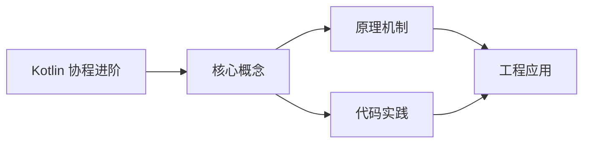

## 1. 学习目标（Bloom 分类）

本节按照布鲁姆教育目标分类学组织学习路径。本文主题为《Kotlin 协程进阶》，属于 Kotlin 模块，读者可以根据自身阶段选择阅读深度。

记忆层面：能够准确复述本文的核心概念、术语与基本语法或操作步骤，并能够在提问或检索时快速定位对应知识点。能够说出 val/var、空安全操作符与 when 表达式的语法。

理解层面：能够用自己的语言解释核心原理与工作机制，说明概念之间的因果关系，而不是机械记忆结论。能够解释 Kotlin 与 Java 互操作的机制与平台类型概念。

应用层面：能够在真实项目或练习场景中运用本文知识解决具体问题，写出正确且可维护的实现。能够编写数据类、扩展函数与协程代码。

分析层面：能够拆解复杂问题，比较本文主题与相邻概念的异同，识别边界条件与例外情况。能够分析空安全、智能转换与协程调度原理。

评价层面：能够根据约束条件（性能、可读性、安全、成本）评价不同方案的优劣，做出有依据的技术决策。能够评价 Kotlin 在 Android、服务端与多平台场景的适用性。

创造层面：能够把本文知识与其他模块知识组合，设计出新的解决方案或可复用的工程模式。能够组合 Compose 与协程设计跨平台应用。

通过本节学习，读者应当能够把《Kotlin 协程进阶》纳入自己的知识网络，并与 Kotlin 模块的其他主题（类型推断、空安全、协程、KMP）建立关联。

## 2. 历史动机与发展脉络

《Kotlin 协程进阶》是 Kotlin 领域的重要主题。要真正理解它，需要先了解它解决的问题与演进过程。

Kotlin 由 JetBrains 于 2010 年开始研发，2016 年发布 1.0，定位是“更现代的 JVM 语言”：减少样板代码、消灭空指针、增强函数式能力，同时与 Java 100% 互操作。
2017 年 Google 宣布 Kotlin 成为 Android 一级语言，2019 年确立 Kotlin-first 政策；2023 年 Kotlin 2.0 的 K2 编译器显著提升编译速度与类型推导。
Kotlin Multiplatform（KMP）支持 JVM、Android、iOS、WebAssembly 等目标，配合 Compose Multiplatform 实现共享 UI 与业务逻辑，是 JetBrains 的长期战略方向。

回到本文主题：Kotlin 协程进阶 的提出与成熟，正是上述技术背景下的必然产物。早期实现往往以简单可用为目标，随着工程规模扩大，社区逐渐沉淀出标准做法与最佳实践；理解这一脉络，可以帮助读者判断“为什么文档中的推荐写法是现在这个样子”，也能在遇到历史遗留代码时准确识别其设计年代与取舍。


## 3. 形式化定义与核心概念精讲

本节把《Kotlin 协程进阶》涉及的核心概念以“定义 + 讲解”的形式展开。读者应把定义当作工具，把讲解当作理解路径；两者结合才能形成可迁移的知识。

空安全：类型系统区分 `String` 与 `String?`，编译期强制处理可空值；`?.` 短路、`?:` 提供默认、`!!` 显式断言，三者覆盖所有空值处理模式。
智能转换：`is` 检查后在不可变上下文中自动转换类型，减少显式强转；`as?` 安全转换失败返回 null。
协程：挂起函数（suspend）与调度器（Dispatchers.Main/IO/Default）实现非阻塞并发，结构化并发保证作用域内任务可取消。

### 3.1 原文章节逐一精讲

原文档把主题拆分为 21 个小节，下面按顺序给出每一节的导读讲解，随后保留原文细节供精读。

#### 原文精读（完整保留）

# Kotlin 协程进阶

> **符号约定**：`< >` 必填参数 | `[ ]` 可选参数

---

#### 1. 协程异常处理

##### 1.1 异常传播

协程异常的传播取决于构建器类型：

```kotlin
// launch — 异常立即传播到父协程
val job = scope.launch {
    throw Exception("Failed")  // 传播到 scope，取消所有子协程
}

// async — 异常在 await() 时才暴露
val deferred = scope.async {
    throw Exception("Failed")  // 异常暂存
}
deferred.await()  // 此处抛出异常
```

##### 1.2 try-catch 处理

```kotlin
// launch 中 try-catch
try {
    scope.launch {
        throw Exception("Failed")
    }.join()
} catch (e: Exception) {
    println("Caught: $e")  // 可能捕获不到！
}

// 正确方式：在协程内部捕获
scope.launch {
    try {
        throw Exception("Failed")
    } catch (e: Exception) {
        println("Caught: $e")  // OK
    }
}

// async 中 try-catch
val deferred = scope.async {
    throw Exception("Failed")
}
try {
    deferred.await()
} catch (e: Exception) {
    println("Caught: $e")  // OK
}
```

##### 1.3 CoroutineExceptionHandler

全局异常处理器，类似 Thread 的 UncaughtExceptionHandler：

```kotlin
val handler = CoroutineExceptionHandler { _, exception ->
    println("Caught by handler: $exception")
}

// 必须在根协程上安装
val job = scope.launch(handler) {
    throw Exception("Failed")  // 被 handler 捕获
}
```

> **注意**：`CoroutineExceptionHandler` 仅对 `launch` 生效，`async` 的异常在 `await()` 时抛出。

#### 2. SupervisorJob

普通 `Job` 中，子协程失败会取消所有兄弟协程。`SupervisorJob` 中，子协程失败不影响其他子协程：

```kotlin
// 普通 Job — 一个失败全部取消
val scope1 = CoroutineScope(Job())
scope1.launch { delay(100); throw Exception("A failed") }
scope1.launch { delay(200); println("B completed") }  // 不会执行

// SupervisorJob — 一个失败不影响其他
val scope2 = CoroutineScope(SupervisorJob())
scope2.launch { delay(100); throw Exception("A failed") }
scope2.launch { delay(200); println("B completed") }  // 正常执行
```

##### 2.1 supervisorScope

```kotlin
suspend fun parallelFetch() = supervisorScope {
    launch {
        throw Exception("Service A failed")
        // 不影响 Service B
    }
    launch {
        delay(100)
        println("Service B completed")
    }
}
```

##### 2.2 ViewModel 中的 SupervisorJob

```kotlin
class MyViewModel : ViewModel() {
    // viewModelScope 默认使用 SupervisorJob + Dispatchers.Main
    fun loadData() {
        viewModelScope.launch {
            // 一个请求失败不影响其他
            val users = async { fetchUsers() }
            val orders = async { fetchOrders() }

            try {
                _uiState.value = Success(users.await())
            } catch (e: Exception) {
                _uiState.value = Error(e.message)
            }
        }
    }
}
```

#### 3. 协程取消

##### 3.1 取消机制

```kotlin
val job = scope.launch {
    repeat(1000) {
        // 检查取消状态
        ensureActive()  // 如果已取消，抛出 CancellationException
        println("Working $it")
        delay(100)      // delay 会自动检查取消
    }
}

delay(500)
job.cancel()           // 取消协程
job.join()             // 等待取消完成
// 或
job.cancelAndJoin()    // 取消并等待
```

##### 3.2 不可取消的代码块

```kotlin
val job = scope.launch {
    try {
        repeat(1000) {
            println("Working $it")
            delay(100)
        }
    } finally {
        // 取消后仍需执行的清理代码
        withContext(NonCancellable) {
            delay(100)  // 在取消状态下也能 delay
            println("Cleanup completed")
        }
    }
}
```

##### 3.3 CPU 密集型任务的取消

```kotlin
// CPU 密集型任务不会自动检查取消
scope.launch {
    var nextPrintTime = System.currentTimeMillis()
    var i = 0
    while (i < 1000000) {
        // 手动检查取消
        if (!isActive) break  // 或 ensureActive()
        i++
    }
}

// 使用 isActive 属性
scope.launch {
    while (isActive) {
        performWork()
    }
}
```

#### 4. 超时

```kotlin
// withTimeout — 超时抛出 TimeoutCancellationException
try {
    withTimeout(3000L) {
        fetchData()  // 超过 3 秒抛出异常
    }
} catch (e: TimeoutCancellationException) {
    println("Request timed out")
}

// withTimeoutOrNull — 超时返回 null
val result = withTimeoutOrNull(3000L) {
    fetchData()
}
if (result == null) {
    println("Request timed out")
}
```

#### 5. Flow 高级操作

##### 5.1 背压处理

```kotlin
// buffer — 缓冲发射的值
flow {
    for (i in 1..100) {
        emit(i)  // 快速发射
    }
}.buffer(50)  // 缓冲 50 个值
 .collect { value ->
     delay(100)  // 慢速消费
     println(value)
 }

// conflate — 只保留最新值
flow {
    repeat(10) {
        emit(it)
        delay(50)
    }
}.conflate()
 .collect { value ->
     delay(200)  // 消费比生产慢
     println(value)  // 可能跳过一些值
 }

// collectLatest — 取消旧值的处理
flow {
    repeat(10) {
        emit(it)
        delay(50)
    }
}.collectLatest { value ->
    delay(200)
    println(value)  // 只有最后一个值会被完整处理
 }
```

##### 5.2 组合 Flow

```kotlin
val flow1 = flowOf("A", "B", "C")
val flow2 = flowOf(1, 2, 3)

// zip — 一对一组合
flow1.zip(flow2) { letter, number -> "$letter$number" }
    .collect { println(it) }  // A1, B2, C3

// combine — 任一变化时重新组合
val timer = flow { emit(System.currentTimeMillis()) }
val settings = flowOf("dark", "light")

timer.combine(settings) { time, theme -> "Time: $time, Theme: $theme" }
    .collect { println(it) }

// flattenConcat — 顺序展平
val flows = flowOf(flowOf(1, 2), flowOf(3, 4))
flows.flattenConcat().collect { println(it) }  // 1, 2, 3, 4

// flattenMerge — 并发展平
flows.flattenMerge(concurrency = 2).collect { println(it) }
```

##### 5.3 Flow 错误处理

```kotlin
// catch — 捕获上游异常
flow {
    emit(1)
    throw RuntimeException("Error")
}.catch { e ->
    println("Caught: $e")
    emit(-1)  // 发射替代值
}.collect { println(it) }  // 1, -1

// retry — 重试
flow {
    emit(apiCall())  // 可能失败
}.retry(3) { e ->
    println("Retry after: $e")
    delay(1000)
    true  // 返回 true 继续重试
}

// retryWhen — 条件重试
flow {
    emit(apiCall())
}.retryWhen { cause, attempt ->
    attempt < 3 && cause is IOException
}
```

#### 6. StateFlow 与 SharedFlow

##### 6.1 StateFlow

`StateFlow` 是状态持有者，始终有值，只发射最新值给新订阅者：

```kotlin
class ViewModel {
    // 私有可变状态
    private val _state = MutableStateFlow<UiState>(UiState.Loading)
    // 公开只读状态
    val state: StateFlow<UiState> = _state.asStateFlow()

    fun loadData() {
        viewModelScope.launch {
            _state.value = UiState.Loading
            try {
                val data = repository.fetch()
                _state.value = UiState.Success(data)
            } catch (e: Exception) {
                _state.value = UiState.Error(e.message)
            }
        }
    }
}

// 在 Compose 中收集
@Composable
fun Screen(viewModel: ViewModel) {
    val state by viewModel.state.collectAsStateWithLifecycle()
    when (state) {
        is UiState.Loading -> CircularProgressIndicator()
        is UiState.Success -> Text((state as UiState.Success).data)
        is UiState.Error -> Text((state as UiState.Error).message)
    }
}
```

##### 6.2 SharedFlow

`SharedFlow` 是热流，可向多个订阅者发射值：

```kotlin
class EventBus {
    private val _events = MutableSharedFlow<Event>(
        extraBufferCapacity = 64,
        onBufferOverflow = BufferOverflow.DROP_OLDEST
    )
    val events: SharedFlow<Event> = _events.asSharedFlow()

    suspend fun emit(event: Event) {
        _events.emit(event)
    }
}

// 订阅
scope.launch {
    eventBus.events.collect { event ->
        handleEvent(event)
    }
}
```

##### 6.3 StateFlow vs SharedFlow

| 特性     | StateFlow        | SharedFlow         |
| -------- | ---------------- | ------------------ |
| 初始值   | 必须             | 可选               |
| 值缓存   | 只缓存最新值     | 可配置 replay 数量 |
| 值去重   | 相同值不重复发射 | 默认不去重         |
| 典型场景 | UI 状态管理      | 事件总线、广播     |

##### 6.4 shareIn 与 stateIn

将冷流转为热流：

```kotlin
class Repository(private val api: Api) {
    // shareIn — 共享冷流
    val latestData: SharedFlow<Data> = api.observeData()
        .shareIn(
            scope = externalScope,
            started = SharingStarted.WhileSubscribed(5000),
            replay = 1
        )

    // stateIn — 转为状态流
    val config: StateFlow<Config> = api.observeConfig()
        .stateIn(
            scope = externalScope,
            started = SharingStarted.Eagerly,
            initialValue = Config.Default
        )
}
```

#### 7. Channel 进阶

##### 7.1 Channel 类型

```kotlin
// RENDEZVOUS — 默认，0 缓冲，发送者和接收者会合
val channel1 = Channel<Int>()  // Channel.RENDEZVOUS

// UNLIMITED — 无限缓冲
val channel2 = Channel<Int>(Channel.UNLIMITED)

// CONFLATED — 只保留最新值
val channel3 = Channel<Int>(Channel.CONFLATED)

// BUFFERED — 固定缓冲（默认 64）
val channel4 = Channel<Int>(Channel.BUFFERED)

// 自定义缓冲大小
val channel5 = Channel<Int>(capacity = 10, onBufferOverflow = BufferOverflow.SUSPEND)
```

##### 7.2 Channel 与 Flow 互转

```kotlin
// Channel → Flow
val channel = Channel<Int>()
val flow: Flow<Int> = channel.receiveAsFlow()

// Flow → Channel
val flow = flowOf(1, 2, 3)
val channel: ReceiveChannel<Int> = flow.produceIn(scope)
```

#### 8. Select 表达式

`select` 允许同时等待多个挂起操作，哪个先完成就处理哪个：

```kotlin
suspend fun selectFirst(): String = coroutineScope {
    val deferred1 = async { delay(100); "Fast" }
    val deferred2 = async { delay(200); "Slow" }

    select<String> {
        deferred1.onAwait { it }
        deferred2.onAwait { it }
    }
    // 返回 "Fast"
}

// Channel 中的 select
suspend fun receiveFromAny(
    channel1: ReceiveChannel<String>,
    channel2: ReceiveChannel<String>
): String = select<String> {
    channel1.onReceive { it }
    channel2.onReceive { it }
}
```

##### 8.1 Select 实际应用

```kotlin
// 超时模式
suspend fun fetchWithTimeout(timeout: Long): String = coroutineScope {
    val deferred = async { fetchData() }
    select<String> {
        deferred.onAwait { it }
        onTimeout(timeout) { "Timeout" }
    }
}

// 优先级模式
suspend fun fetchWithFallback(
    primary: Deferred<String>,
    fallback: Deferred<String>
): String = select<String> {
    primary.onAwait { it }
    fallback.onAwait { it }
}
```
#### Job 与 Deferred

**基本写法：启动协程获取 Job**
`val <变量> = scope.launch { }`
```kotlin
// 启动协程返回 Job
val job = scope.launch { doWork() }
```

---

**基本写法：async 返回 Deferred**
`val <变量> = scope.async { <表达式> }`
```kotlin
// async 启动并返回结果
val deferred = scope.async { compute() }
val r = deferred.await()
```

---

**基本写法：等待多个 Deferred**
`awaitAll(<deferred1>, <deferred2>)`
```kotlin
// 并发等待多个结果
val (a, b) = listOf(d1, d2).awaitAll().let { it[0] to it[1] }
```

---

#### Job 生命周期

**基本写法：判断活跃**
`<job>.isActive`
```kotlin
// 判断协程是否活跃
if (job.isActive) { }
```

---

**基本写法：判断完成**
`<job>.isCompleted`
```kotlin
// 判断协程是否完成
if (job.isCompleted) { }
```

---

**基本写法：判断取消**
`<job>.isCancelled`
```kotlin
// 判断协程是否被取消
if (job.isCancelled) { }
```

---

#### 取消协程

**基本写法：取消协程**
`<job>.cancel()`
```kotlin
// 取消协程
job.cancel()
```

---

**基本写法：取消并等待**
`<job>.cancelAndJoin()`
```kotlin
// 取消并阻塞等待完成
job.cancelAndJoin()
```

---

**基本写法：响应取消**
`if (!isActive) return`
```kotlin
// 协程内主动检查取消
if (!isActive) return
```

---

**基本写法：确保取消检查**
`currentCoroutineContext().ensureActive()`
```kotlin
// 显式抛出取消异常
currentCoroutineContext().ensureActive()
```

---

#### 超时控制

**基本写法：超时抛异常**
`withTimeout(<毫秒>) { }`
```kotlin
// 超时抛 TimeoutCancellationException
withTimeout(1000) { doWork() }
```

---

**基本写法：超时返回 null**
`withTimeoutOrNull(<毫秒>) { }`
```kotlin
// 超时返回 null 不抛异常
val r = withTimeoutOrNull(1000) { doWork() }
```

---

#### 启动模式 CoroutineStart

**基本写法：默认立即调度**
`launch(start = CoroutineStart.DEFAULT) { }`
```kotlin
// 立即调度执行
launch(start = CoroutineStart.DEFAULT) { }
```

---

**基本写法：懒加载启动**
`launch(start = CoroutineStart.LAZY) { }`
```kotlin
// 调用 join 或 start 才执行
val job = scope.launch(start = CoroutineStart.LAZY) { }
job.start()
```

---

**基本写法：原子启动**
`launch(start = CoroutineStart.ATOMIC) { }`
```kotlin
// 不可在执行前取消
launch(start = CoroutineStart.ATOMIC) { }
```

---

**基本写法：不调度启动**
`launch(start = CoroutineStart.UNDISPATCHED) { }`
```kotlin
// 在当前线程执行直到第一个挂起点
launch(start = CoroutineStart.UNDISPATCHED) { }
```

---

#### 协程作用域

**基本写法：创建作用域**
`CoroutineScope(<上下文>)`
```kotlin
// 创建独立作用域
val scope = CoroutineScope(Dispatchers.Default)
```

---

**基本写法：coroutineScope 子作用域**
`coroutineScope { }`
```kotlin
// 等待所有子协程完成
coroutineScope {
    launch { }
    launch { }
}
```

---

**基本写法：supervisorScope 容错**
`supervisorScope { }`
```kotlin
// 子协程异常不互相影响
supervisorScope {
    launch { }
    launch { }
}
```

---

#### 挂起函数

**基本写法：定义挂起函数**
`suspend fun <方法名>() {}`
```kotlin
// 定义挂起函数
suspend fun fetch(): String {
    delay(100)
    return "data"
}
```

---

**基本写法：挂起函数调用**
`<挂起函数>()`
```kotlin
// 在协程中调用挂起函数
suspend fun work() { fetch() }
```

---

#### 延迟与挂起

**基本写法：延迟**
`delay(<毫秒>)`
```kotlin
// 非阻塞延迟
delay(500)
```

---

**基本写法：按 Duration 延迟**
`delay(<时长>.<单位>)`
```kotlin
// 使用 Duration 字面量延迟
delay(500.milliseconds)
```

---

#### 协程上下文操作

**基本写法：切换调度器**
`withContext(<dispatcher>) { }`
```kotlin
// 切换到 IO 调度器
withContext(Dispatchers.IO) { readFile() }
```

---

**基本写法：组合上下文元素**
`<job> + <dispatcher>`
```kotlin
// 组合 Job 与 Dispatcher
val ctx = Job() + Dispatchers.IO
```

---

#### runBlocking 阻塞

**基本写法：阻塞启动协程**
`runBlocking { }`
```kotlin
// 阻塞主线程启动协程
runBlocking { doWork() }
```

---

**基本写法：带调度器**
`runBlocking(<dispatcher>) { }`
```kotlin
// 指定调度器阻塞
runBlocking(Dispatchers.Default) { }
```

---

#### select 等待多路

**基本写法：select 多路复用**
`select<<返回类型>> { <分支> }`
```kotlin
// 等待首个就绪结果
val r = select<String> {
    deferred1.onAwait { "a" }
    deferred2.onAwait { "b" }
}
```

---

#### SupervisorJob

**基本写法：创建 SupervisorJob**
`SupervisorJob()`
```kotlin
// 子协程失败不影响其他子协程
val scope = CoroutineScope(SupervisorJob() + Dispatchers.Default)
```

---

#### 协程命名

**基本写法：命名协程**
`CoroutineName("<名称>")`
```kotlin
// 为协程命名便于调试
launch(CoroutineName("worker")) { }
```


### 3.2 概念关系图

下面用 Mermaid 图表达本文核心概念之间的关系，帮助读者建立整体图景：



图中展示的是本文知识的结构化关系：核心概念是入口，原理机制解释“为什么”，代码实践演示“怎么做”，工程应用回答“何时用”。读者学习时可以把每个小节的内容挂接到对应节点上。

## 4. 理论推导与原理解析

本节深入《Kotlin 协程进阶》背后的原理。理论部分不求面面俱到，而是聚焦“能解释现象、能指导实践”的关键推导。

空安全：类型系统区分 `String` 与 `String?`，编译期强制处理可空值；`?.` 短路、`?:` 提供默认、`!!` 显式断言，三者覆盖所有空值处理模式。
智能转换：`is` 检查后在不可变上下文中自动转换类型，减少显式强转；`as?` 安全转换失败返回 null。
协程：挂起函数（suspend）与调度器（Dispatchers.Main/IO/Default）实现非阻塞并发，结构化并发保证作用域内任务可取消。
扩展函数与属性：在不修改原类的情况下为类添加行为，是 Kotlin 标准库（如集合操作）的基石。

需要强调的是，理论推导与工程实践之间存在翻译层：理论给出的是理想化模型与边界条件，工程代码则必须处理真实环境中的例外。读者在学习时应先掌握理论的“标准情形”，再通过陷阱章节了解“非标准情形”。

## 5. 代码示例与逐行讲解

本节把原文中的代码示例系统整理，并为每个示例补充用途说明与讲解。读者不应只浏览代码，而应逐段对照讲解理解设计意图。

### 5.1 示例：1.1 异常传播

该示例来自原文《1.1 异常传播》小节，用于演示Kotlin 协程进阶相关操作。阅读时请先看代码结构，再看其后的讲解。

```kotlin
// launch — 异常立即传播到父协程
val job = scope.launch {
    throw Exception("Failed")  // 传播到 scope，取消所有子协程
}

// async — 异常在 await() 时才暴露
val deferred = scope.async {
    throw Exception("Failed")  // 异常暂存
}
deferred.await()  // 此处抛出异常
```

讲解：这段代码演示了本节核心知识点。代码中的关键操作可以归纳为三步：准备（定义或初始化）、执行（核心逻辑）、收尾（释放资源或返回结果）。实际项目中，这三步往往被封装为函数或类，以提升复用性与可测试性。

关键点分析：

该示例共 9 行有效代码，结构以数据或配置为主。阅读时应关注：数据字段的含义、配置项的作用，以及它们与运行行为的对应关系。

进阶思考路径：先尝试修改参数观察行为变化，再把示例中的模式迁移到自己的项目中；每次修改都记录预期与实测差异，这是把示例转化为能力的最快方式。

### 5.2 示例：1.2 try-catch 处理

该示例来自原文《1.2 try-catch 处理》小节，用于演示Kotlin 协程进阶相关操作。阅读时请先看代码结构，再看其后的讲解。

```kotlin
// launch 中 try-catch
try {
    scope.launch {
        throw Exception("Failed")
    }.join()
} catch (e: Exception) {
    println("Caught: $e")  // 可能捕获不到！
}

// 正确方式：在协程内部捕获
scope.launch {
    try {
        throw Exception("Failed")
    } catch (e: Exception) {
        println("Caught: $e")  // OK
    }
}

// async 中 try-catch
val deferred = scope.async {
    throw Exception("Failed")
}
try {
    deferred.await()
} catch (e: Exception) {
    println("Caught: $e")  // OK
}
```

讲解：这段代码演示了本节核心知识点。代码中的关键操作可以归纳为三步：准备（定义或初始化）、执行（核心逻辑）、收尾（释放资源或返回结果）。实际项目中，这三步往往被封装为函数或类，以提升复用性与可测试性。

关键点分析：

该示例共 25 行有效代码，结构以数据或配置为主。阅读时应关注：数据字段的含义、配置项的作用，以及它们与运行行为的对应关系。

进阶思考路径：先尝试修改参数观察行为变化，再把示例中的模式迁移到自己的项目中；每次修改都记录预期与实测差异，这是把示例转化为能力的最快方式。

### 5.3 示例：1.3 CoroutineExceptionHandler

该示例来自原文《1.3 CoroutineExceptionHandler》小节，用于演示Kotlin 协程进阶相关操作。阅读时请先看代码结构，再看其后的讲解。

```kotlin
val handler = CoroutineExceptionHandler { _, exception ->
    println("Caught by handler: $exception")
}

// 必须在根协程上安装
val job = scope.launch(handler) {
    throw Exception("Failed")  // 被 handler 捕获
}
```

讲解：这段代码演示了本节核心知识点。代码中的关键操作可以归纳为三步：准备（定义或初始化）、执行（核心逻辑）、收尾（释放资源或返回结果）。实际项目中，这三步往往被封装为函数或类，以提升复用性与可测试性。

关键点分析：

该示例共 7 行有效代码，结构以数据或配置为主。阅读时应关注：数据字段的含义、配置项的作用，以及它们与运行行为的对应关系。

进阶思考路径：先尝试修改参数观察行为变化，再把示例中的模式迁移到自己的项目中；每次修改都记录预期与实测差异，这是把示例转化为能力的最快方式。

### 5.4 示例：2. SupervisorJob

该示例来自原文《2. SupervisorJob》小节，用于演示Kotlin 协程进阶相关操作。阅读时请先看代码结构，再看其后的讲解。

```kotlin
// 普通 Job — 一个失败全部取消
val scope1 = CoroutineScope(Job())
scope1.launch { delay(100); throw Exception("A failed") }
scope1.launch { delay(200); println("B completed") }  // 不会执行

// SupervisorJob — 一个失败不影响其他
val scope2 = CoroutineScope(SupervisorJob())
scope2.launch { delay(100); throw Exception("A failed") }
scope2.launch { delay(200); println("B completed") }  // 正常执行
```

讲解：这段代码演示了本节核心知识点。代码中的关键操作可以归纳为三步：准备（定义或初始化）、执行（核心逻辑）、收尾（释放资源或返回结果）。实际项目中，这三步往往被封装为函数或类，以提升复用性与可测试性。

关键点分析：

该示例共 8 行有效代码，结构以数据或配置为主。阅读时应关注：数据字段的含义、配置项的作用，以及它们与运行行为的对应关系。

进阶思考路径：先尝试修改参数观察行为变化，再把示例中的模式迁移到自己的项目中；每次修改都记录预期与实测差异，这是把示例转化为能力的最快方式。

### 5.5 示例：2.1 supervisorScope

该示例来自原文《2.1 supervisorScope》小节，用于演示Kotlin 协程进阶相关操作。阅读时请先看代码结构，再看其后的讲解。

```kotlin
suspend fun parallelFetch() = supervisorScope {
    launch {
        throw Exception("Service A failed")
        // 不影响 Service B
    }
    launch {
        delay(100)
        println("Service B completed")
    }
}
```

讲解：这段代码演示了本节核心知识点。代码中的关键操作可以归纳为三步：准备（定义或初始化）、执行（核心逻辑）、收尾（释放资源或返回结果）。实际项目中，这三步往往被封装为函数或类，以提升复用性与可测试性。

关键点分析：

该示例共 10 行有效代码，结构以数据或配置为主。阅读时应关注：数据字段的含义、配置项的作用，以及它们与运行行为的对应关系。

进阶思考路径：先尝试修改参数观察行为变化，再把示例中的模式迁移到自己的项目中；每次修改都记录预期与实测差异，这是把示例转化为能力的最快方式。

### 5.6 示例：2.2 ViewModel 中的 SupervisorJob

该示例来自原文《2.2 ViewModel 中的 SupervisorJob》小节，用于演示Kotlin 协程进阶相关操作。阅读时请先看代码结构，再看其后的讲解。

```kotlin
class MyViewModel : ViewModel() {
    // viewModelScope 默认使用 SupervisorJob + Dispatchers.Main
    fun loadData() {
        viewModelScope.launch {
            // 一个请求失败不影响其他
            val users = async { fetchUsers() }
            val orders = async { fetchOrders() }

            try {
                _uiState.value = Success(users.await())
            } catch (e: Exception) {
                _uiState.value = Error(e.message)
            }
        }
    }
}
```

讲解：这段代码演示了本节核心知识点。代码中的关键操作可以归纳为三步：准备（定义或初始化）、执行（核心逻辑）、收尾（释放资源或返回结果）。实际项目中，这三步往往被封装为函数或类，以提升复用性与可测试性。

关键点分析：

该示例共 15 行有效代码，包含 1 类关键结构（class）。其中：

- 入口与初始化部分负责建立上下文，对应实际项目中的启动或装配逻辑；
- 核心逻辑部分体现本文主题的主要操作，是阅读时最需要对照讲解理解的部分；
- 输出或返回部分把结果交给调用方，注意其类型与边界条件。

进阶思考路径：先尝试修改参数观察行为变化，再把示例中的模式迁移到自己的项目中；每次修改都记录预期与实测差异，这是把示例转化为能力的最快方式。

### 5.7 示例：3.1 取消机制

该示例来自原文《3.1 取消机制》小节，用于演示Kotlin 协程进阶相关操作。阅读时请先看代码结构，再看其后的讲解。

```kotlin
val job = scope.launch {
    repeat(1000) {
        // 检查取消状态
        ensureActive()  // 如果已取消，抛出 CancellationException
        println("Working $it")
        delay(100)      // delay 会自动检查取消
    }
}

delay(500)
job.cancel()           // 取消协程
job.join()             // 等待取消完成
// 或
job.cancelAndJoin()    // 取消并等待
```

讲解：这段代码演示了本节核心知识点。代码中的关键操作可以归纳为三步：准备（定义或初始化）、执行（核心逻辑）、收尾（释放资源或返回结果）。实际项目中，这三步往往被封装为函数或类，以提升复用性与可测试性。

关键点分析：

该示例共 13 行有效代码，结构以数据或配置为主。阅读时应关注：数据字段的含义、配置项的作用，以及它们与运行行为的对应关系。

进阶思考路径：先尝试修改参数观察行为变化，再把示例中的模式迁移到自己的项目中；每次修改都记录预期与实测差异，这是把示例转化为能力的最快方式。

### 5.8 示例：3.2 不可取消的代码块

该示例来自原文《3.2 不可取消的代码块》小节，用于演示Kotlin 协程进阶相关操作。阅读时请先看代码结构，再看其后的讲解。

```kotlin
val job = scope.launch {
    try {
        repeat(1000) {
            println("Working $it")
            delay(100)
        }
    } finally {
        // 取消后仍需执行的清理代码
        withContext(NonCancellable) {
            delay(100)  // 在取消状态下也能 delay
            println("Cleanup completed")
        }
    }
}
```

讲解：这段代码演示了本节核心知识点。代码中的关键操作可以归纳为三步：准备（定义或初始化）、执行（核心逻辑）、收尾（释放资源或返回结果）。实际项目中，这三步往往被封装为函数或类，以提升复用性与可测试性。

关键点分析：

该示例共 14 行有效代码，结构以数据或配置为主。阅读时应关注：数据字段的含义、配置项的作用，以及它们与运行行为的对应关系。

进阶思考路径：先尝试修改参数观察行为变化，再把示例中的模式迁移到自己的项目中；每次修改都记录预期与实测差异，这是把示例转化为能力的最快方式。

### 5.9 示例：3.3 CPU 密集型任务的取消

该示例来自原文《3.3 CPU 密集型任务的取消》小节，用于演示Kotlin 协程进阶相关操作。阅读时请先看代码结构，再看其后的讲解。

```kotlin
// CPU 密集型任务不会自动检查取消
scope.launch {
    var nextPrintTime = System.currentTimeMillis()
    var i = 0
    while (i < 1000000) {
        // 手动检查取消
        if (!isActive) break  // 或 ensureActive()
        i++
    }
}

// 使用 isActive 属性
scope.launch {
    while (isActive) {
        performWork()
    }
}
```

讲解：这段代码演示了本节核心知识点。代码中的关键操作可以归纳为三步：准备（定义或初始化）、执行（核心逻辑）、收尾（释放资源或返回结果）。实际项目中，这三步往往被封装为函数或类，以提升复用性与可测试性。

关键点分析：

该示例共 16 行有效代码，包含 2 类关键结构（if、while）。其中：

- 入口与初始化部分负责建立上下文，对应实际项目中的启动或装配逻辑；
- 核心逻辑部分体现本文主题的主要操作，是阅读时最需要对照讲解理解的部分；
- 输出或返回部分把结果交给调用方，注意其类型与边界条件。

进阶思考路径：先尝试修改参数观察行为变化，再把示例中的模式迁移到自己的项目中；每次修改都记录预期与实测差异，这是把示例转化为能力的最快方式。

### 5.10 示例：4. 超时

该示例来自原文《4. 超时》小节，用于演示Kotlin 协程进阶相关操作。阅读时请先看代码结构，再看其后的讲解。

```kotlin
// withTimeout — 超时抛出 TimeoutCancellationException
try {
    withTimeout(3000L) {
        fetchData()  // 超过 3 秒抛出异常
    }
} catch (e: TimeoutCancellationException) {
    println("Request timed out")
}

// withTimeoutOrNull — 超时返回 null
val result = withTimeoutOrNull(3000L) {
    fetchData()
}
if (result == null) {
    println("Request timed out")
}
```

讲解：这段代码演示了本节核心知识点。代码中的关键操作可以归纳为三步：准备（定义或初始化）、执行（核心逻辑）、收尾（释放资源或返回结果）。实际项目中，这三步往往被封装为函数或类，以提升复用性与可测试性。

关键点分析：

该示例共 15 行有效代码，包含 1 类关键结构（if）。其中：

- 入口与初始化部分负责建立上下文，对应实际项目中的启动或装配逻辑；
- 核心逻辑部分体现本文主题的主要操作，是阅读时最需要对照讲解理解的部分；
- 输出或返回部分把结果交给调用方，注意其类型与边界条件。

进阶思考路径：先尝试修改参数观察行为变化，再把示例中的模式迁移到自己的项目中；每次修改都记录预期与实测差异，这是把示例转化为能力的最快方式。

### 5.11 示例：5.1 背压处理

该示例来自原文《5.1 背压处理》小节，用于演示Kotlin 协程进阶相关操作。阅读时请先看代码结构，再看其后的讲解。

```kotlin
// buffer — 缓冲发射的值
flow {
    for (i in 1..100) {
        emit(i)  // 快速发射
    }
}.buffer(50)  // 缓冲 50 个值
 .collect { value ->
     delay(100)  // 慢速消费
     println(value)
 }

// conflate — 只保留最新值
flow {
    repeat(10) {
        emit(it)
        delay(50)
    }
}.conflate()
 .collect { value ->
     delay(200)  // 消费比生产慢
     println(value)  // 可能跳过一些值
 }

// collectLatest — 取消旧值的处理
flow {
    repeat(10) {
        emit(it)
        delay(50)
    }
}.collectLatest { value ->
    delay(200)
    println(value)  // 只有最后一个值会被完整处理
 }
```

讲解：这段代码演示了本节核心知识点。代码中的关键操作可以归纳为三步：准备（定义或初始化）、执行（核心逻辑）、收尾（释放资源或返回结果）。实际项目中，这三步往往被封装为函数或类，以提升复用性与可测试性。

关键点分析：

该示例共 31 行有效代码，包含 1 类关键结构（for）。其中：

- 入口与初始化部分负责建立上下文，对应实际项目中的启动或装配逻辑；
- 核心逻辑部分体现本文主题的主要操作，是阅读时最需要对照讲解理解的部分；
- 输出或返回部分把结果交给调用方，注意其类型与边界条件。

进阶思考路径：先尝试修改参数观察行为变化，再把示例中的模式迁移到自己的项目中；每次修改都记录预期与实测差异，这是把示例转化为能力的最快方式。

### 5.12 示例：5.2 组合 Flow

该示例来自原文《5.2 组合 Flow》小节，用于演示Kotlin 协程进阶相关操作。阅读时请先看代码结构，再看其后的讲解。

```kotlin
val flow1 = flowOf("A", "B", "C")
val flow2 = flowOf(1, 2, 3)

// zip — 一对一组合
flow1.zip(flow2) { letter, number -> "$letter$number" }
    .collect { println(it) }  // A1, B2, C3

// combine — 任一变化时重新组合
val timer = flow { emit(System.currentTimeMillis()) }
val settings = flowOf("dark", "light")

timer.combine(settings) { time, theme -> "Time: $time, Theme: $theme" }
    .collect { println(it) }

// flattenConcat — 顺序展平
val flows = flowOf(flowOf(1, 2), flowOf(3, 4))
flows.flattenConcat().collect { println(it) }  // 1, 2, 3, 4

// flattenMerge — 并发展平
flows.flattenMerge(concurrency = 2).collect { println(it) }
```

讲解：这段代码演示了本节核心知识点。代码中的关键操作可以归纳为三步：准备（定义或初始化）、执行（核心逻辑）、收尾（释放资源或返回结果）。实际项目中，这三步往往被封装为函数或类，以提升复用性与可测试性。

关键点分析：

该示例共 15 行有效代码，结构以数据或配置为主。阅读时应关注：数据字段的含义、配置项的作用，以及它们与运行行为的对应关系。

进阶思考路径：先尝试修改参数观察行为变化，再把示例中的模式迁移到自己的项目中；每次修改都记录预期与实测差异，这是把示例转化为能力的最快方式。

### 5.13 示例：5.3 Flow 错误处理

该示例来自原文《5.3 Flow 错误处理》小节，用于演示Kotlin 协程进阶相关操作。阅读时请先看代码结构，再看其后的讲解。

```kotlin
// catch — 捕获上游异常
flow {
    emit(1)
    throw RuntimeException("Error")
}.catch { e ->
    println("Caught: $e")
    emit(-1)  // 发射替代值
}.collect { println(it) }  // 1, -1

// retry — 重试
flow {
    emit(apiCall())  // 可能失败
}.retry(3) { e ->
    println("Retry after: $e")
    delay(1000)
    true  // 返回 true 继续重试
}

// retryWhen — 条件重试
flow {
    emit(apiCall())
}.retryWhen { cause, attempt ->
    attempt < 3 && cause is IOException
}
```

讲解：这段代码演示了本节核心知识点。代码中的关键操作可以归纳为三步：准备（定义或初始化）、执行（核心逻辑）、收尾（释放资源或返回结果）。实际项目中，这三步往往被封装为函数或类，以提升复用性与可测试性。

关键点分析：

该示例共 22 行有效代码，结构以数据或配置为主。阅读时应关注：数据字段的含义、配置项的作用，以及它们与运行行为的对应关系。

进阶思考路径：先尝试修改参数观察行为变化，再把示例中的模式迁移到自己的项目中；每次修改都记录预期与实测差异，这是把示例转化为能力的最快方式。

### 5.14 示例：6.1 StateFlow

该示例来自原文《6.1 StateFlow》小节，用于演示Kotlin 协程进阶相关操作。阅读时请先看代码结构，再看其后的讲解。

```kotlin
class ViewModel {
    // 私有可变状态
    private val _state = MutableStateFlow<UiState>(UiState.Loading)
    // 公开只读状态
    val state: StateFlow<UiState> = _state.asStateFlow()

    fun loadData() {
        viewModelScope.launch {
            _state.value = UiState.Loading
            try {
                val data = repository.fetch()
                _state.value = UiState.Success(data)
            } catch (e: Exception) {
                _state.value = UiState.Error(e.message)
            }
        }
    }
}

// 在 Compose 中收集
@Composable
fun Screen(viewModel: ViewModel) {
    val state by viewModel.state.collectAsStateWithLifecycle()
    when (state) {
        is UiState.Loading -> CircularProgressIndicator()
        is UiState.Success -> Text((state as UiState.Success).data)
        is UiState.Error -> Text((state as UiState.Error).message)
    }
}
```

讲解：这段代码演示了本节核心知识点。代码中的关键操作可以归纳为三步：准备（定义或初始化）、执行（核心逻辑）、收尾（释放资源或返回结果）。实际项目中，这三步往往被封装为函数或类，以提升复用性与可测试性。

关键点分析：

该示例共 27 行有效代码，包含 1 类关键结构（class）。其中：

- 入口与初始化部分负责建立上下文，对应实际项目中的启动或装配逻辑；
- 核心逻辑部分体现本文主题的主要操作，是阅读时最需要对照讲解理解的部分；
- 输出或返回部分把结果交给调用方，注意其类型与边界条件。

进阶思考路径：先尝试修改参数观察行为变化，再把示例中的模式迁移到自己的项目中；每次修改都记录预期与实测差异，这是把示例转化为能力的最快方式。

### 5.15 示例：6.2 SharedFlow

该示例来自原文《6.2 SharedFlow》小节，用于演示Kotlin 协程进阶相关操作。阅读时请先看代码结构，再看其后的讲解。

```kotlin
class EventBus {
    private val _events = MutableSharedFlow<Event>(
        extraBufferCapacity = 64,
        onBufferOverflow = BufferOverflow.DROP_OLDEST
    )
    val events: SharedFlow<Event> = _events.asSharedFlow()

    suspend fun emit(event: Event) {
        _events.emit(event)
    }
}

// 订阅
scope.launch {
    eventBus.events.collect { event ->
        handleEvent(event)
    }
}
```

讲解：这段代码演示了本节核心知识点。代码中的关键操作可以归纳为三步：准备（定义或初始化）、执行（核心逻辑）、收尾（释放资源或返回结果）。实际项目中，这三步往往被封装为函数或类，以提升复用性与可测试性。

关键点分析：

该示例共 16 行有效代码，包含 1 类关键结构（class）。其中：

- 入口与初始化部分负责建立上下文，对应实际项目中的启动或装配逻辑；
- 核心逻辑部分体现本文主题的主要操作，是阅读时最需要对照讲解理解的部分；
- 输出或返回部分把结果交给调用方，注意其类型与边界条件。

进阶思考路径：先尝试修改参数观察行为变化，再把示例中的模式迁移到自己的项目中；每次修改都记录预期与实测差异，这是把示例转化为能力的最快方式。

### 5.16 示例：6.4 shareIn 与 stateIn

该示例来自原文《6.4 shareIn 与 stateIn》小节，用于演示Kotlin 协程进阶相关操作。阅读时请先看代码结构，再看其后的讲解。

```kotlin
class Repository(private val api: Api) {
    // shareIn — 共享冷流
    val latestData: SharedFlow<Data> = api.observeData()
        .shareIn(
            scope = externalScope,
            started = SharingStarted.WhileSubscribed(5000),
            replay = 1
        )

    // stateIn — 转为状态流
    val config: StateFlow<Config> = api.observeConfig()
        .stateIn(
            scope = externalScope,
            started = SharingStarted.Eagerly,
            initialValue = Config.Default
        )
}
```

讲解：这段代码演示了本节核心知识点。代码中的关键操作可以归纳为三步：准备（定义或初始化）、执行（核心逻辑）、收尾（释放资源或返回结果）。实际项目中，这三步往往被封装为函数或类，以提升复用性与可测试性。

关键点分析：

该示例共 16 行有效代码，包含 1 类关键结构（class）。其中：

- 入口与初始化部分负责建立上下文，对应实际项目中的启动或装配逻辑；
- 核心逻辑部分体现本文主题的主要操作，是阅读时最需要对照讲解理解的部分；
- 输出或返回部分把结果交给调用方，注意其类型与边界条件。

进阶思考路径：先尝试修改参数观察行为变化，再把示例中的模式迁移到自己的项目中；每次修改都记录预期与实测差异，这是把示例转化为能力的最快方式。

### 5.17 示例：7.1 Channel 类型

该示例来自原文《7.1 Channel 类型》小节，用于演示Kotlin 协程进阶相关操作。阅读时请先看代码结构，再看其后的讲解。

```kotlin
// RENDEZVOUS — 默认，0 缓冲，发送者和接收者会合
val channel1 = Channel<Int>()  // Channel.RENDEZVOUS

// UNLIMITED — 无限缓冲
val channel2 = Channel<Int>(Channel.UNLIMITED)

// CONFLATED — 只保留最新值
val channel3 = Channel<Int>(Channel.CONFLATED)

// BUFFERED — 固定缓冲（默认 64）
val channel4 = Channel<Int>(Channel.BUFFERED)

// 自定义缓冲大小
val channel5 = Channel<Int>(capacity = 10, onBufferOverflow = BufferOverflow.SUSPEND)
```

讲解：这段代码演示了本节核心知识点。代码中的关键操作可以归纳为三步：准备（定义或初始化）、执行（核心逻辑）、收尾（释放资源或返回结果）。实际项目中，这三步往往被封装为函数或类，以提升复用性与可测试性。

关键点分析：

该示例共 10 行有效代码，结构以数据或配置为主。阅读时应关注：数据字段的含义、配置项的作用，以及它们与运行行为的对应关系。

进阶思考路径：先尝试修改参数观察行为变化，再把示例中的模式迁移到自己的项目中；每次修改都记录预期与实测差异，这是把示例转化为能力的最快方式。

### 5.18 示例：7.2 Channel 与 Flow 互转

该示例来自原文《7.2 Channel 与 Flow 互转》小节，用于演示Kotlin 协程进阶相关操作。阅读时请先看代码结构，再看其后的讲解。

```kotlin
// Channel → Flow
val channel = Channel<Int>()
val flow: Flow<Int> = channel.receiveAsFlow()

// Flow → Channel
val flow = flowOf(1, 2, 3)
val channel: ReceiveChannel<Int> = flow.produceIn(scope)
```

讲解：这段代码演示了本节核心知识点。代码中的关键操作可以归纳为三步：准备（定义或初始化）、执行（核心逻辑）、收尾（释放资源或返回结果）。实际项目中，这三步往往被封装为函数或类，以提升复用性与可测试性。

关键点分析：

该示例共 6 行有效代码，结构以数据或配置为主。阅读时应关注：数据字段的含义、配置项的作用，以及它们与运行行为的对应关系。

进阶思考路径：先尝试修改参数观察行为变化，再把示例中的模式迁移到自己的项目中；每次修改都记录预期与实测差异，这是把示例转化为能力的最快方式。

### 5.19 示例：8. Select 表达式

该示例来自原文《8. Select 表达式》小节，用于演示Kotlin 协程进阶相关操作。阅读时请先看代码结构，再看其后的讲解。

```kotlin
suspend fun selectFirst(): String = coroutineScope {
    val deferred1 = async { delay(100); "Fast" }
    val deferred2 = async { delay(200); "Slow" }

    select<String> {
        deferred1.onAwait { it }
        deferred2.onAwait { it }
    }
    // 返回 "Fast"
}

// Channel 中的 select
suspend fun receiveFromAny(
    channel1: ReceiveChannel<String>,
    channel2: ReceiveChannel<String>
): String = select<String> {
    channel1.onReceive { it }
    channel2.onReceive { it }
}
```

讲解：这段代码演示了本节核心知识点。代码中的关键操作可以归纳为三步：准备（定义或初始化）、执行（核心逻辑）、收尾（释放资源或返回结果）。实际项目中，这三步往往被封装为函数或类，以提升复用性与可测试性。

关键点分析：

该示例共 17 行有效代码，结构以数据或配置为主。阅读时应关注：数据字段的含义、配置项的作用，以及它们与运行行为的对应关系。

进阶思考路径：先尝试修改参数观察行为变化，再把示例中的模式迁移到自己的项目中；每次修改都记录预期与实测差异，这是把示例转化为能力的最快方式。

### 5.20 示例：8.1 Select 实际应用

该示例来自原文《8.1 Select 实际应用》小节，用于演示Kotlin 协程进阶相关操作。阅读时请先看代码结构，再看其后的讲解。

```kotlin
// 超时模式
suspend fun fetchWithTimeout(timeout: Long): String = coroutineScope {
    val deferred = async { fetchData() }
    select<String> {
        deferred.onAwait { it }
        onTimeout(timeout) { "Timeout" }
    }
}

// 优先级模式
suspend fun fetchWithFallback(
    primary: Deferred<String>,
    fallback: Deferred<String>
): String = select<String> {
    primary.onAwait { it }
    fallback.onAwait { it }
}
```

讲解：这段代码演示了本节核心知识点。代码中的关键操作可以归纳为三步：准备（定义或初始化）、执行（核心逻辑）、收尾（释放资源或返回结果）。实际项目中，这三步往往被封装为函数或类，以提升复用性与可测试性。

关键点分析：

该示例共 16 行有效代码，结构以数据或配置为主。阅读时应关注：数据字段的含义、配置项的作用，以及它们与运行行为的对应关系。

进阶思考路径：先尝试修改参数观察行为变化，再把示例中的模式迁移到自己的项目中；每次修改都记录预期与实测差异，这是把示例转化为能力的最快方式。

### 5.21 示例：Job 与 Deferred

该示例来自原文《Job 与 Deferred》小节，用于演示Kotlin 协程进阶相关操作。阅读时请先看代码结构，再看其后的讲解。

```kotlin
// 启动协程返回 Job
val job = scope.launch { doWork() }
```

讲解：这段代码演示了本节核心知识点。代码中的关键操作可以归纳为三步：准备（定义或初始化）、执行（核心逻辑）、收尾（释放资源或返回结果）。实际项目中，这三步往往被封装为函数或类，以提升复用性与可测试性。

关键点分析：

该示例共 2 行有效代码，结构以数据或配置为主。阅读时应关注：数据字段的含义、配置项的作用，以及它们与运行行为的对应关系。

进阶思考路径：先尝试修改参数观察行为变化，再把示例中的模式迁移到自己的项目中；每次修改都记录预期与实测差异，这是把示例转化为能力的最快方式。

### 5.22 示例：Job 与 Deferred

该示例来自原文《Job 与 Deferred》小节，用于演示Kotlin 协程进阶相关操作。阅读时请先看代码结构，再看其后的讲解。

```kotlin
// async 启动并返回结果
val deferred = scope.async { compute() }
val r = deferred.await()
```

讲解：这段代码演示了本节核心知识点。代码中的关键操作可以归纳为三步：准备（定义或初始化）、执行（核心逻辑）、收尾（释放资源或返回结果）。实际项目中，这三步往往被封装为函数或类，以提升复用性与可测试性。

关键点分析：

该示例共 3 行有效代码，结构以数据或配置为主。阅读时应关注：数据字段的含义、配置项的作用，以及它们与运行行为的对应关系。

进阶思考路径：先尝试修改参数观察行为变化，再把示例中的模式迁移到自己的项目中；每次修改都记录预期与实测差异，这是把示例转化为能力的最快方式。

### 5.23 示例：Job 与 Deferred

该示例来自原文《Job 与 Deferred》小节，用于演示Kotlin 协程进阶相关操作。阅读时请先看代码结构，再看其后的讲解。

```kotlin
// 并发等待多个结果
val (a, b) = listOf(d1, d2).awaitAll().let { it[0] to it[1] }
```

讲解：这段代码演示了本节核心知识点。代码中的关键操作可以归纳为三步：准备（定义或初始化）、执行（核心逻辑）、收尾（释放资源或返回结果）。实际项目中，这三步往往被封装为函数或类，以提升复用性与可测试性。

关键点分析：

该示例共 2 行有效代码，结构以数据或配置为主。阅读时应关注：数据字段的含义、配置项的作用，以及它们与运行行为的对应关系。

进阶思考路径：先尝试修改参数观察行为变化，再把示例中的模式迁移到自己的项目中；每次修改都记录预期与实测差异，这是把示例转化为能力的最快方式。

### 5.24 示例：Job 生命周期

该示例来自原文《Job 生命周期》小节，用于演示Kotlin 协程进阶相关操作。阅读时请先看代码结构，再看其后的讲解。

```kotlin
// 判断协程是否活跃
if (job.isActive) { }
```

讲解：这段代码演示了本节核心知识点。代码中的关键操作可以归纳为三步：准备（定义或初始化）、执行（核心逻辑）、收尾（释放资源或返回结果）。实际项目中，这三步往往被封装为函数或类，以提升复用性与可测试性。

关键点分析：

该示例共 2 行有效代码，包含 1 类关键结构（if）。其中：

- 入口与初始化部分负责建立上下文，对应实际项目中的启动或装配逻辑；
- 核心逻辑部分体现本文主题的主要操作，是阅读时最需要对照讲解理解的部分；
- 输出或返回部分把结果交给调用方，注意其类型与边界条件。

进阶思考路径：先尝试修改参数观察行为变化，再把示例中的模式迁移到自己的项目中；每次修改都记录预期与实测差异，这是把示例转化为能力的最快方式。

### 5.25 示例：Job 生命周期

该示例来自原文《Job 生命周期》小节，用于演示Kotlin 协程进阶相关操作。阅读时请先看代码结构，再看其后的讲解。

```kotlin
// 判断协程是否完成
if (job.isCompleted) { }
```

讲解：这段代码演示了本节核心知识点。代码中的关键操作可以归纳为三步：准备（定义或初始化）、执行（核心逻辑）、收尾（释放资源或返回结果）。实际项目中，这三步往往被封装为函数或类，以提升复用性与可测试性。

关键点分析：

该示例共 2 行有效代码，包含 1 类关键结构（if）。其中：

- 入口与初始化部分负责建立上下文，对应实际项目中的启动或装配逻辑；
- 核心逻辑部分体现本文主题的主要操作，是阅读时最需要对照讲解理解的部分；
- 输出或返回部分把结果交给调用方，注意其类型与边界条件。

进阶思考路径：先尝试修改参数观察行为变化，再把示例中的模式迁移到自己的项目中；每次修改都记录预期与实测差异，这是把示例转化为能力的最快方式。

### 5.26 示例：Job 生命周期

该示例来自原文《Job 生命周期》小节，用于演示Kotlin 协程进阶相关操作。阅读时请先看代码结构，再看其后的讲解。

```kotlin
// 判断协程是否被取消
if (job.isCancelled) { }
```

讲解：这段代码演示了本节核心知识点。代码中的关键操作可以归纳为三步：准备（定义或初始化）、执行（核心逻辑）、收尾（释放资源或返回结果）。实际项目中，这三步往往被封装为函数或类，以提升复用性与可测试性。

关键点分析：

该示例共 2 行有效代码，包含 1 类关键结构（if）。其中：

- 入口与初始化部分负责建立上下文，对应实际项目中的启动或装配逻辑；
- 核心逻辑部分体现本文主题的主要操作，是阅读时最需要对照讲解理解的部分；
- 输出或返回部分把结果交给调用方，注意其类型与边界条件。

进阶思考路径：先尝试修改参数观察行为变化，再把示例中的模式迁移到自己的项目中；每次修改都记录预期与实测差异，这是把示例转化为能力的最快方式。

### 5.27 示例：取消协程

该示例来自原文《取消协程》小节，用于演示Kotlin 协程进阶相关操作。阅读时请先看代码结构，再看其后的讲解。

```kotlin
// 取消协程
job.cancel()
```

讲解：这段代码演示了本节核心知识点。代码中的关键操作可以归纳为三步：准备（定义或初始化）、执行（核心逻辑）、收尾（释放资源或返回结果）。实际项目中，这三步往往被封装为函数或类，以提升复用性与可测试性。

关键点分析：

该示例共 2 行有效代码，结构以数据或配置为主。阅读时应关注：数据字段的含义、配置项的作用，以及它们与运行行为的对应关系。

进阶思考路径：先尝试修改参数观察行为变化，再把示例中的模式迁移到自己的项目中；每次修改都记录预期与实测差异，这是把示例转化为能力的最快方式。

### 5.28 示例：取消协程

该示例来自原文《取消协程》小节，用于演示Kotlin 协程进阶相关操作。阅读时请先看代码结构，再看其后的讲解。

```kotlin
// 取消并阻塞等待完成
job.cancelAndJoin()
```

讲解：这段代码演示了本节核心知识点。代码中的关键操作可以归纳为三步：准备（定义或初始化）、执行（核心逻辑）、收尾（释放资源或返回结果）。实际项目中，这三步往往被封装为函数或类，以提升复用性与可测试性。

关键点分析：

该示例共 2 行有效代码，结构以数据或配置为主。阅读时应关注：数据字段的含义、配置项的作用，以及它们与运行行为的对应关系。

进阶思考路径：先尝试修改参数观察行为变化，再把示例中的模式迁移到自己的项目中；每次修改都记录预期与实测差异，这是把示例转化为能力的最快方式。

### 5.29 示例：取消协程

该示例来自原文《取消协程》小节，用于演示Kotlin 协程进阶相关操作。阅读时请先看代码结构，再看其后的讲解。

```kotlin
// 协程内主动检查取消
if (!isActive) return
```

讲解：这段代码演示了本节核心知识点。代码中的关键操作可以归纳为三步：准备（定义或初始化）、执行（核心逻辑）、收尾（释放资源或返回结果）。实际项目中，这三步往往被封装为函数或类，以提升复用性与可测试性。

关键点分析：

该示例共 2 行有效代码，包含 2 类关键结构（if、return）。其中：

- 入口与初始化部分负责建立上下文，对应实际项目中的启动或装配逻辑；
- 核心逻辑部分体现本文主题的主要操作，是阅读时最需要对照讲解理解的部分；
- 输出或返回部分把结果交给调用方，注意其类型与边界条件。

进阶思考路径：先尝试修改参数观察行为变化，再把示例中的模式迁移到自己的项目中；每次修改都记录预期与实测差异，这是把示例转化为能力的最快方式。

### 5.30 示例：取消协程

该示例来自原文《取消协程》小节，用于演示Kotlin 协程进阶相关操作。阅读时请先看代码结构，再看其后的讲解。

```kotlin
// 显式抛出取消异常
currentCoroutineContext().ensureActive()
```

讲解：这段代码演示了本节核心知识点。代码中的关键操作可以归纳为三步：准备（定义或初始化）、执行（核心逻辑）、收尾（释放资源或返回结果）。实际项目中，这三步往往被封装为函数或类，以提升复用性与可测试性。

关键点分析：

该示例共 2 行有效代码，结构以数据或配置为主。阅读时应关注：数据字段的含义、配置项的作用，以及它们与运行行为的对应关系。

进阶思考路径：先尝试修改参数观察行为变化，再把示例中的模式迁移到自己的项目中；每次修改都记录预期与实测差异，这是把示例转化为能力的最快方式。

### 5.31 示例：超时控制

该示例来自原文《超时控制》小节，用于演示Kotlin 协程进阶相关操作。阅读时请先看代码结构，再看其后的讲解。

```kotlin
// 超时抛 TimeoutCancellationException
withTimeout(1000) { doWork() }
```

讲解：这段代码演示了本节核心知识点。代码中的关键操作可以归纳为三步：准备（定义或初始化）、执行（核心逻辑）、收尾（释放资源或返回结果）。实际项目中，这三步往往被封装为函数或类，以提升复用性与可测试性。

关键点分析：

该示例共 2 行有效代码，结构以数据或配置为主。阅读时应关注：数据字段的含义、配置项的作用，以及它们与运行行为的对应关系。

进阶思考路径：先尝试修改参数观察行为变化，再把示例中的模式迁移到自己的项目中；每次修改都记录预期与实测差异，这是把示例转化为能力的最快方式。

### 5.32 示例：超时控制

该示例来自原文《超时控制》小节，用于演示Kotlin 协程进阶相关操作。阅读时请先看代码结构，再看其后的讲解。

```kotlin
// 超时返回 null 不抛异常
val r = withTimeoutOrNull(1000) { doWork() }
```

讲解：这段代码演示了本节核心知识点。代码中的关键操作可以归纳为三步：准备（定义或初始化）、执行（核心逻辑）、收尾（释放资源或返回结果）。实际项目中，这三步往往被封装为函数或类，以提升复用性与可测试性。

关键点分析：

该示例共 2 行有效代码，结构以数据或配置为主。阅读时应关注：数据字段的含义、配置项的作用，以及它们与运行行为的对应关系。

进阶思考路径：先尝试修改参数观察行为变化，再把示例中的模式迁移到自己的项目中；每次修改都记录预期与实测差异，这是把示例转化为能力的最快方式。

### 5.33 示例：启动模式 CoroutineStart

该示例来自原文《启动模式 CoroutineStart》小节，用于演示Kotlin 协程进阶相关操作。阅读时请先看代码结构，再看其后的讲解。

```kotlin
// 立即调度执行
launch(start = CoroutineStart.DEFAULT) { }
```

讲解：这段代码演示了本节核心知识点。代码中的关键操作可以归纳为三步：准备（定义或初始化）、执行（核心逻辑）、收尾（释放资源或返回结果）。实际项目中，这三步往往被封装为函数或类，以提升复用性与可测试性。

关键点分析：

该示例共 2 行有效代码，结构以数据或配置为主。阅读时应关注：数据字段的含义、配置项的作用，以及它们与运行行为的对应关系。

进阶思考路径：先尝试修改参数观察行为变化，再把示例中的模式迁移到自己的项目中；每次修改都记录预期与实测差异，这是把示例转化为能力的最快方式。

### 5.34 示例：启动模式 CoroutineStart

该示例来自原文《启动模式 CoroutineStart》小节，用于演示Kotlin 协程进阶相关操作。阅读时请先看代码结构，再看其后的讲解。

```kotlin
// 调用 join 或 start 才执行
val job = scope.launch(start = CoroutineStart.LAZY) { }
job.start()
```

讲解：这段代码演示了本节核心知识点。代码中的关键操作可以归纳为三步：准备（定义或初始化）、执行（核心逻辑）、收尾（释放资源或返回结果）。实际项目中，这三步往往被封装为函数或类，以提升复用性与可测试性。

关键点分析：

该示例共 3 行有效代码，结构以数据或配置为主。阅读时应关注：数据字段的含义、配置项的作用，以及它们与运行行为的对应关系。

进阶思考路径：先尝试修改参数观察行为变化，再把示例中的模式迁移到自己的项目中；每次修改都记录预期与实测差异，这是把示例转化为能力的最快方式。

### 5.35 示例：启动模式 CoroutineStart

该示例来自原文《启动模式 CoroutineStart》小节，用于演示Kotlin 协程进阶相关操作。阅读时请先看代码结构，再看其后的讲解。

```kotlin
// 不可在执行前取消
launch(start = CoroutineStart.ATOMIC) { }
```

讲解：这段代码演示了本节核心知识点。代码中的关键操作可以归纳为三步：准备（定义或初始化）、执行（核心逻辑）、收尾（释放资源或返回结果）。实际项目中，这三步往往被封装为函数或类，以提升复用性与可测试性。

关键点分析：

该示例共 2 行有效代码，结构以数据或配置为主。阅读时应关注：数据字段的含义、配置项的作用，以及它们与运行行为的对应关系。

进阶思考路径：先尝试修改参数观察行为变化，再把示例中的模式迁移到自己的项目中；每次修改都记录预期与实测差异，这是把示例转化为能力的最快方式。

### 5.36 示例：启动模式 CoroutineStart

该示例来自原文《启动模式 CoroutineStart》小节，用于演示Kotlin 协程进阶相关操作。阅读时请先看代码结构，再看其后的讲解。

```kotlin
// 在当前线程执行直到第一个挂起点
launch(start = CoroutineStart.UNDISPATCHED) { }
```

讲解：这段代码演示了本节核心知识点。代码中的关键操作可以归纳为三步：准备（定义或初始化）、执行（核心逻辑）、收尾（释放资源或返回结果）。实际项目中，这三步往往被封装为函数或类，以提升复用性与可测试性。

关键点分析：

该示例共 2 行有效代码，结构以数据或配置为主。阅读时应关注：数据字段的含义、配置项的作用，以及它们与运行行为的对应关系。

进阶思考路径：先尝试修改参数观察行为变化，再把示例中的模式迁移到自己的项目中；每次修改都记录预期与实测差异，这是把示例转化为能力的最快方式。

### 5.37 示例：协程作用域

该示例来自原文《协程作用域》小节，用于演示Kotlin 协程进阶相关操作。阅读时请先看代码结构，再看其后的讲解。

```kotlin
// 创建独立作用域
val scope = CoroutineScope(Dispatchers.Default)
```

讲解：这段代码演示了本节核心知识点。代码中的关键操作可以归纳为三步：准备（定义或初始化）、执行（核心逻辑）、收尾（释放资源或返回结果）。实际项目中，这三步往往被封装为函数或类，以提升复用性与可测试性。

关键点分析：

该示例共 2 行有效代码，结构以数据或配置为主。阅读时应关注：数据字段的含义、配置项的作用，以及它们与运行行为的对应关系。

进阶思考路径：先尝试修改参数观察行为变化，再把示例中的模式迁移到自己的项目中；每次修改都记录预期与实测差异，这是把示例转化为能力的最快方式。

### 5.38 示例：协程作用域

该示例来自原文《协程作用域》小节，用于演示Kotlin 协程进阶相关操作。阅读时请先看代码结构，再看其后的讲解。

```kotlin
// 等待所有子协程完成
coroutineScope {
    launch { }
    launch { }
}
```

讲解：这段代码演示了本节核心知识点。代码中的关键操作可以归纳为三步：准备（定义或初始化）、执行（核心逻辑）、收尾（释放资源或返回结果）。实际项目中，这三步往往被封装为函数或类，以提升复用性与可测试性。

关键点分析：

该示例共 5 行有效代码，结构以数据或配置为主。阅读时应关注：数据字段的含义、配置项的作用，以及它们与运行行为的对应关系。

进阶思考路径：先尝试修改参数观察行为变化，再把示例中的模式迁移到自己的项目中；每次修改都记录预期与实测差异，这是把示例转化为能力的最快方式。

### 5.39 示例：协程作用域

该示例来自原文《协程作用域》小节，用于演示Kotlin 协程进阶相关操作。阅读时请先看代码结构，再看其后的讲解。

```kotlin
// 子协程异常不互相影响
supervisorScope {
    launch { }
    launch { }
}
```

讲解：这段代码演示了本节核心知识点。代码中的关键操作可以归纳为三步：准备（定义或初始化）、执行（核心逻辑）、收尾（释放资源或返回结果）。实际项目中，这三步往往被封装为函数或类，以提升复用性与可测试性。

关键点分析：

该示例共 5 行有效代码，结构以数据或配置为主。阅读时应关注：数据字段的含义、配置项的作用，以及它们与运行行为的对应关系。

进阶思考路径：先尝试修改参数观察行为变化，再把示例中的模式迁移到自己的项目中；每次修改都记录预期与实测差异，这是把示例转化为能力的最快方式。

### 5.40 示例：挂起函数

该示例来自原文《挂起函数》小节，用于演示Kotlin 协程进阶相关操作。阅读时请先看代码结构，再看其后的讲解。

```kotlin
// 定义挂起函数
suspend fun fetch(): String {
    delay(100)
    return "data"
}
```

讲解：这段代码演示了本节核心知识点。代码中的关键操作可以归纳为三步：准备（定义或初始化）、执行（核心逻辑）、收尾（释放资源或返回结果）。实际项目中，这三步往往被封装为函数或类，以提升复用性与可测试性。

关键点分析：

该示例共 5 行有效代码，包含 1 类关键结构（return）。其中：

- 入口与初始化部分负责建立上下文，对应实际项目中的启动或装配逻辑；
- 核心逻辑部分体现本文主题的主要操作，是阅读时最需要对照讲解理解的部分；
- 输出或返回部分把结果交给调用方，注意其类型与边界条件。

进阶思考路径：先尝试修改参数观察行为变化，再把示例中的模式迁移到自己的项目中；每次修改都记录预期与实测差异，这是把示例转化为能力的最快方式。

### 5.41 示例：挂起函数

该示例来自原文《挂起函数》小节，用于演示Kotlin 协程进阶相关操作。阅读时请先看代码结构，再看其后的讲解。

```kotlin
// 在协程中调用挂起函数
suspend fun work() { fetch() }
```

讲解：这段代码演示了本节核心知识点。代码中的关键操作可以归纳为三步：准备（定义或初始化）、执行（核心逻辑）、收尾（释放资源或返回结果）。实际项目中，这三步往往被封装为函数或类，以提升复用性与可测试性。

关键点分析：

该示例共 2 行有效代码，结构以数据或配置为主。阅读时应关注：数据字段的含义、配置项的作用，以及它们与运行行为的对应关系。

进阶思考路径：先尝试修改参数观察行为变化，再把示例中的模式迁移到自己的项目中；每次修改都记录预期与实测差异，这是把示例转化为能力的最快方式。

### 5.42 示例：延迟与挂起

该示例来自原文《延迟与挂起》小节，用于演示Kotlin 协程进阶相关操作。阅读时请先看代码结构，再看其后的讲解。

```kotlin
// 非阻塞延迟
delay(500)
```

讲解：这段代码演示了本节核心知识点。代码中的关键操作可以归纳为三步：准备（定义或初始化）、执行（核心逻辑）、收尾（释放资源或返回结果）。实际项目中，这三步往往被封装为函数或类，以提升复用性与可测试性。

关键点分析：

该示例共 2 行有效代码，结构以数据或配置为主。阅读时应关注：数据字段的含义、配置项的作用，以及它们与运行行为的对应关系。

进阶思考路径：先尝试修改参数观察行为变化，再把示例中的模式迁移到自己的项目中；每次修改都记录预期与实测差异，这是把示例转化为能力的最快方式。

### 5.43 示例：延迟与挂起

该示例来自原文《延迟与挂起》小节，用于演示Kotlin 协程进阶相关操作。阅读时请先看代码结构，再看其后的讲解。

```kotlin
// 使用 Duration 字面量延迟
delay(500.milliseconds)
```

讲解：这段代码演示了本节核心知识点。代码中的关键操作可以归纳为三步：准备（定义或初始化）、执行（核心逻辑）、收尾（释放资源或返回结果）。实际项目中，这三步往往被封装为函数或类，以提升复用性与可测试性。

关键点分析：

该示例共 2 行有效代码，结构以数据或配置为主。阅读时应关注：数据字段的含义、配置项的作用，以及它们与运行行为的对应关系。

进阶思考路径：先尝试修改参数观察行为变化，再把示例中的模式迁移到自己的项目中；每次修改都记录预期与实测差异，这是把示例转化为能力的最快方式。

### 5.44 示例：协程上下文操作

该示例来自原文《协程上下文操作》小节，用于演示Kotlin 协程进阶相关操作。阅读时请先看代码结构，再看其后的讲解。

```kotlin
// 切换到 IO 调度器
withContext(Dispatchers.IO) { readFile() }
```

讲解：这段代码演示了本节核心知识点。代码中的关键操作可以归纳为三步：准备（定义或初始化）、执行（核心逻辑）、收尾（释放资源或返回结果）。实际项目中，这三步往往被封装为函数或类，以提升复用性与可测试性。

关键点分析：

该示例共 2 行有效代码，结构以数据或配置为主。阅读时应关注：数据字段的含义、配置项的作用，以及它们与运行行为的对应关系。

进阶思考路径：先尝试修改参数观察行为变化，再把示例中的模式迁移到自己的项目中；每次修改都记录预期与实测差异，这是把示例转化为能力的最快方式。

### 5.45 示例：协程上下文操作

该示例来自原文《协程上下文操作》小节，用于演示Kotlin 协程进阶相关操作。阅读时请先看代码结构，再看其后的讲解。

```kotlin
// 组合 Job 与 Dispatcher
val ctx = Job() + Dispatchers.IO
```

讲解：这段代码演示了本节核心知识点。代码中的关键操作可以归纳为三步：准备（定义或初始化）、执行（核心逻辑）、收尾（释放资源或返回结果）。实际项目中，这三步往往被封装为函数或类，以提升复用性与可测试性。

关键点分析：

该示例共 2 行有效代码，结构以数据或配置为主。阅读时应关注：数据字段的含义、配置项的作用，以及它们与运行行为的对应关系。

进阶思考路径：先尝试修改参数观察行为变化，再把示例中的模式迁移到自己的项目中；每次修改都记录预期与实测差异，这是把示例转化为能力的最快方式。

### 5.46 示例：runBlocking 阻塞

该示例来自原文《runBlocking 阻塞》小节，用于演示Kotlin 协程进阶相关操作。阅读时请先看代码结构，再看其后的讲解。

```kotlin
// 阻塞主线程启动协程
runBlocking { doWork() }
```

讲解：这段代码演示了本节核心知识点。代码中的关键操作可以归纳为三步：准备（定义或初始化）、执行（核心逻辑）、收尾（释放资源或返回结果）。实际项目中，这三步往往被封装为函数或类，以提升复用性与可测试性。

关键点分析：

该示例共 2 行有效代码，结构以数据或配置为主。阅读时应关注：数据字段的含义、配置项的作用，以及它们与运行行为的对应关系。

进阶思考路径：先尝试修改参数观察行为变化，再把示例中的模式迁移到自己的项目中；每次修改都记录预期与实测差异，这是把示例转化为能力的最快方式。

### 5.47 示例：runBlocking 阻塞

该示例来自原文《runBlocking 阻塞》小节，用于演示Kotlin 协程进阶相关操作。阅读时请先看代码结构，再看其后的讲解。

```kotlin
// 指定调度器阻塞
runBlocking(Dispatchers.Default) { }
```

讲解：这段代码演示了本节核心知识点。代码中的关键操作可以归纳为三步：准备（定义或初始化）、执行（核心逻辑）、收尾（释放资源或返回结果）。实际项目中，这三步往往被封装为函数或类，以提升复用性与可测试性。

关键点分析：

该示例共 2 行有效代码，结构以数据或配置为主。阅读时应关注：数据字段的含义、配置项的作用，以及它们与运行行为的对应关系。

进阶思考路径：先尝试修改参数观察行为变化，再把示例中的模式迁移到自己的项目中；每次修改都记录预期与实测差异，这是把示例转化为能力的最快方式。

### 5.48 示例：select 等待多路

该示例来自原文《select 等待多路》小节，用于演示Kotlin 协程进阶相关操作。阅读时请先看代码结构，再看其后的讲解。

```kotlin
// 等待首个就绪结果
val r = select<String> {
    deferred1.onAwait { "a" }
    deferred2.onAwait { "b" }
}
```

讲解：这段代码演示了本节核心知识点。代码中的关键操作可以归纳为三步：准备（定义或初始化）、执行（核心逻辑）、收尾（释放资源或返回结果）。实际项目中，这三步往往被封装为函数或类，以提升复用性与可测试性。

关键点分析：

该示例共 5 行有效代码，结构以数据或配置为主。阅读时应关注：数据字段的含义、配置项的作用，以及它们与运行行为的对应关系。

进阶思考路径：先尝试修改参数观察行为变化，再把示例中的模式迁移到自己的项目中；每次修改都记录预期与实测差异，这是把示例转化为能力的最快方式。

### 5.49 示例：SupervisorJob

该示例来自原文《SupervisorJob》小节，用于演示Kotlin 协程进阶相关操作。阅读时请先看代码结构，再看其后的讲解。

```kotlin
// 子协程失败不影响其他子协程
val scope = CoroutineScope(SupervisorJob() + Dispatchers.Default)
```

讲解：这段代码演示了本节核心知识点。代码中的关键操作可以归纳为三步：准备（定义或初始化）、执行（核心逻辑）、收尾（释放资源或返回结果）。实际项目中，这三步往往被封装为函数或类，以提升复用性与可测试性。

关键点分析：

该示例共 2 行有效代码，结构以数据或配置为主。阅读时应关注：数据字段的含义、配置项的作用，以及它们与运行行为的对应关系。

进阶思考路径：先尝试修改参数观察行为变化，再把示例中的模式迁移到自己的项目中；每次修改都记录预期与实测差异，这是把示例转化为能力的最快方式。

### 5.50 示例：协程命名

该示例来自原文《协程命名》小节，用于演示Kotlin 协程进阶相关操作。阅读时请先看代码结构，再看其后的讲解。

```kotlin
// 为协程命名便于调试
launch(CoroutineName("worker")) { }
```

讲解：这段代码演示了本节核心知识点。代码中的关键操作可以归纳为三步：准备（定义或初始化）、执行（核心逻辑）、收尾（释放资源或返回结果）。实际项目中，这三步往往被封装为函数或类，以提升复用性与可测试性。

关键点分析：

该示例共 2 行有效代码，结构以数据或配置为主。阅读时应关注：数据字段的含义、配置项的作用，以及它们与运行行为的对应关系。

进阶思考路径：先尝试修改参数观察行为变化，再把示例中的模式迁移到自己的项目中；每次修改都记录预期与实测差异，这是把示例转化为能力的最快方式。


综合以上示例，可以总结出本主题的代码实践要点：第一，先定义清晰的输入输出契约；第二，核心逻辑保持单一职责；第三，错误处理与边界条件不可省略；第四，命名与注释表达意图而非复述代码。

## 6. 对比分析

对比是理解《Kotlin 协程进阶》定位的最快路径。下面从多个维度与相邻方案进行对比。

Kotlin 与 Java：Kotlin 代码更短、空安全更强；Java 生态工具链更传统。两者互操作，可渐进迁移。
Kotlin 与 Swift：Kotlin 服务端/Android 与 Swift iOS 各自主导；KMP 让业务逻辑共享成为可能。
协程与线程：协程是用户态调度，数量可达百万级；线程是内核态，切换成本高。

对比的目的不是分出绝对优劣，而是建立选择依据：不同约束条件下，最优解不同。读者应把每个对比维度转化为决策检查清单。

## 7. 常见陷阱与最佳实践

本节整理该主题的高频错误与推荐做法。每个陷阱先描述现象，再解释原因，最后给出最佳实践。

### 7.1 val 误当不可变对象

val 只约束引用；对象内部仍可变。需要深层不可变时使用只读集合与 data class 副本。

深入讲解：该问题之所以被归类为“常见陷阱”，是因为它在初学者的代码中反复出现，而且往往不在第一时间暴露——错误通常隐藏在特定数据或特定时序下。

从成因上看，val 误当不可变对象 一般源于对 Kotlin 某个机制的理解偏差：要么误用了默认行为，要么忽略了边界条件，要么把其他语言的思维惯性带了过来。

从影响上看，val 误当不可变对象 轻则产生错误结果，重则导致资源泄漏、数据损坏或安全事故；这也是为什么工程评审中会把它列为检查项。

从修复策略上看，处理val 误当不可变对象的正确顺序是：先复现（构造最小用例），再定位（确认机制层面的根因），最后修复并补充回归测试。跳过复现直接改代码，往往治标不治本。

### 7.2 滥用 !!

非空断言重新引入 NPE。业务代码用 ?: 与 ?. 替代，!! 仅限互操作边界。

深入讲解：该问题之所以被归类为“常见陷阱”，是因为它在初学者的代码中反复出现，而且往往不在第一时间暴露——错误通常隐藏在特定数据或特定时序下。

从成因上看，滥用 !! 一般源于对 Kotlin 某个机制的理解偏差：要么误用了默认行为，要么忽略了边界条件，要么把其他语言的思维惯性带了过来。

从影响上看，滥用 !! 轻则产生错误结果，重则导致资源泄漏、数据损坏或安全事故；这也是为什么工程评审中会把它列为检查项。

从修复策略上看，处理滥用 !!的正确顺序是：先复现（构造最小用例），再定位（确认机制层面的根因），最后修复并补充回归测试。跳过复现直接改代码，往往治标不治本。

### 7.3 协程作用域泄漏

在 Activity/ViewModel 外启动协程导致任务悬挂。使用 viewModelScope 或 lifecycleScope。

深入讲解：该问题之所以被归类为“常见陷阱”，是因为它在初学者的代码中反复出现，而且往往不在第一时间暴露——错误通常隐藏在特定数据或特定时序下。

从成因上看，协程作用域泄漏 一般源于对 Kotlin 某个机制的理解偏差：要么误用了默认行为，要么忽略了边界条件，要么把其他语言的思维惯性带了过来。

从影响上看，协程作用域泄漏 轻则产生错误结果，重则导致资源泄漏、数据损坏或安全事故；这也是为什么工程评审中会把它列为检查项。

从修复策略上看，处理协程作用域泄漏的正确顺序是：先复现（构造最小用例），再定位（确认机制层面的根因），最后修复并补充回归测试。跳过复现直接改代码，往往治标不治本。

### 7.4 扩展函数命名冲突

同签名扩展函数按导入优先级解析，易混淆。使用明确包名与独特命名。

深入讲解：该问题之所以被归类为“常见陷阱”，是因为它在初学者的代码中反复出现，而且往往不在第一时间暴露——错误通常隐藏在特定数据或特定时序下。

从成因上看，扩展函数命名冲突 一般源于对 Kotlin 某个机制的理解偏差：要么误用了默认行为，要么忽略了边界条件，要么把其他语言的思维惯性带了过来。

从影响上看，扩展函数命名冲突 轻则产生错误结果，重则导致资源泄漏、数据损坏或安全事故；这也是为什么工程评审中会把它列为检查项。

从修复策略上看，处理扩展函数命名冲突的正确顺序是：先复现（构造最小用例），再定位（确认机制层面的根因），最后修复并补充回归测试。跳过复现直接改代码，往往治标不治本。

### 7.5 data class 相等性误判

相等性基于所有主构造属性；集合属性（List）使用引用相等。注意复制副本的共享引用。

深入讲解：该问题之所以被归类为“常见陷阱”，是因为它在初学者的代码中反复出现，而且往往不在第一时间暴露——错误通常隐藏在特定数据或特定时序下。

从成因上看，data class 相等性误判 一般源于对 Kotlin 某个机制的理解偏差：要么误用了默认行为，要么忽略了边界条件，要么把其他语言的思维惯性带了过来。

从影响上看，data class 相等性误判 轻则产生错误结果，重则导致资源泄漏、数据损坏或安全事故；这也是为什么工程评审中会把它列为检查项。

从修复策略上看，处理data class 相等性误判的正确顺序是：先复现（构造最小用例），再定位（确认机制层面的根因），最后修复并补充回归测试。跳过复现直接改代码，往往治标不治本。

### 7.6 挂起函数在非协程调用

suspend 函数只能在协程或其他挂起函数中调用；需要桥接时用 runBlocking（慎用）或回调封装。

深入讲解：该问题之所以被归类为“常见陷阱”，是因为它在初学者的代码中反复出现，而且往往不在第一时间暴露——错误通常隐藏在特定数据或特定时序下。

从成因上看，挂起函数在非协程调用 一般源于对 Kotlin 某个机制的理解偏差：要么误用了默认行为，要么忽略了边界条件，要么把其他语言的思维惯性带了过来。

从影响上看，挂起函数在非协程调用 轻则产生错误结果，重则导致资源泄漏、数据损坏或安全事故；这也是为什么工程评审中会把它列为检查项。

从修复策略上看，处理挂起函数在非协程调用的正确顺序是：先复现（构造最小用例），再定位（确认机制层面的根因），最后修复并补充回归测试。跳过复现直接改代码，往往治标不治本。

### 7.0 最佳实践总览

1. 优先 val 与不可变集合，减少可变状态面。
2. 用数据类表达数据，用密封类表达受限层级。
3. 协程遵循结构化并发，子任务随父作用域取消。
4. 接口默认实现与扩展函数分离“数据”与“行为”。
5. 使用 ktlint/detekt 保持风格一致。

把这些最佳实践固化为团队规范与代码评审检查项，是避免同类问题反复出现的关键。

## 8. 工程实践

本节把《Kotlin 协程进阶》放入真实工程场景，给出可复用的模式与组织方法。

Android 项目：Gradle Kotlin DSL 构建，Compose 声明式 UI，ViewModel + StateFlow 管理状态。
服务端：Ktor 轻量异步框架，或 Spring Boot 使用 Kotlin 语言特性。
多平台：共享模块（commonMain）放业务逻辑，平台模块（androidMain/iosMain）放平台 API。

### 8.1 工程实践的原则拆解

以上工程实践可以归纳为四条原则。第一，配置与代码分离：Kotlin 项目中环境差异应通过配置注入，而不是散落在代码分支中；这保证同一份代码可以在开发、测试、生产环境一致运行。

第二，接口稳定优先：对外接口（函数签名、协议、数据格式）一旦被消费方依赖，变更成本极高；设计时应预留扩展点并保持向后兼容。

第三，可观测性内置：日志、指标与追踪应该在功能开发时同步设计，而不是故障发生后补救；没有观测手段的模块等于黑盒。

第四，变更可回滚：任何发布都应有对应的回滚方案；数据库迁移、配置变更与代码发布一样需要版本管理与逆向路径。

### 8.2 实践落地的检查清单

- [ ] Android 项目：对照本节描述，检查当前项目是否已经落实；未落实的项列入技术债并排期处理。
- [ ] 服务端：对照本节描述，检查当前项目是否已经落实；未落实的项列入技术债并排期处理。
- [ ] 多平台：对照本节描述，检查当前项目是否已经落实；未落实的项列入技术债并排期处理。

工程实践的共性原则：配置与代码分离、接口稳定优先、可观测性内置、变更可回滚。这些原则适用于本主题的所有实现。

## 9. 案例研究

本节通过一个完整案例把《Kotlin 协程进阶》的知识串起来。案例按“需求分析、方案设计、实现、验证”四步展开。

需求：实现跨平台（Android/iOS）的待办事项应用核心逻辑。
方案：KMP 共享数据层与状态管理，平台层仅做 UI 渲染。
要点：Room/SQLDelight 做本地存储；协程处理异步；expect/actual 声明平台差异。
验证：共享模块单元测试 + 平台端集成测试。

### 9.1 案例的扩展讨论

把案例中的方案放大到真实规模，需要额外考虑三个问题：

第一，规模：当数据量或并发量上升一个数量级时，原方案中的数据结构、缓存策略与任务调度是否仍然成立？通常需要引入分层与异步。

第二，团队：多人协作时，模块边界、接口契约与代码所有权必须明确；案例中的实现应拆分为可独立测试的单元，并配合文档说明设计意图。

第三，演进：上线后的需求变化不可避免；方案设计时应预留扩展点（配置化、插件化、事件化），并定期用真实指标验证假设。


案例研究的学习方法：先独立阅读需求，尝试在脑中形成方案，再对照实现与讲解，最后思考“如果约束变化（数据量、并发、团队规模），方案应如何调整”。

## 10. 知识要点总结与深入讲解

本节以讲解形式汇总全文要点，替代传统的习题与自测，读者不需要答题，只需跟随解释建立完整的认知框架。

关于《Kotlin 协程进阶》的核心结论：

Kotlin 的价值在于“现代化而不割裂”：保留 JVM 生态，同时提供现代语言特性。
空安全与协程是 Kotlin 的两大支柱，工程代码应默认使用。
KMP 适合业务逻辑共享，UI 层按平台选择 Compose 或原生。

原文档各小节的要点回顾：

- 1. 协程异常处理：该小节围绕Kotlin 协程进阶展开具体细节，阅读时应关注其与核心结论的对应关系；每个小节都是核心结论在某一个侧面的展开。
- 2. SupervisorJob：该小节围绕Kotlin 协程进阶展开具体细节，阅读时应关注其与核心结论的对应关系；每个小节都是核心结论在某一个侧面的展开。
- 3. 协程取消：该小节围绕Kotlin 协程进阶展开具体细节，阅读时应关注其与核心结论的对应关系；每个小节都是核心结论在某一个侧面的展开。
- 4. 超时：该小节围绕Kotlin 协程进阶展开具体细节，阅读时应关注其与核心结论的对应关系；每个小节都是核心结论在某一个侧面的展开。
- 5. Flow 高级操作：该小节围绕Kotlin 协程进阶展开具体细节，阅读时应关注其与核心结论的对应关系；每个小节都是核心结论在某一个侧面的展开。
- 6. StateFlow 与 SharedFlow：该小节围绕Kotlin 协程进阶展开具体细节，阅读时应关注其与核心结论的对应关系；每个小节都是核心结论在某一个侧面的展开。
- 7. Channel 进阶：该小节围绕Kotlin 协程进阶展开具体细节，阅读时应关注其与核心结论的对应关系；每个小节都是核心结论在某一个侧面的展开。
- 8. Select 表达式：该小节围绕Kotlin 协程进阶展开具体细节，阅读时应关注其与核心结论的对应关系；每个小节都是核心结论在某一个侧面的展开。
- Job 与 Deferred：该小节围绕Kotlin 协程进阶展开具体细节，阅读时应关注其与核心结论的对应关系；每个小节都是核心结论在某一个侧面的展开。
- Job 生命周期：该小节围绕Kotlin 协程进阶展开具体细节，阅读时应关注其与核心结论的对应关系；每个小节都是核心结论在某一个侧面的展开。
- 取消协程：该小节围绕Kotlin 协程进阶展开具体细节，阅读时应关注其与核心结论的对应关系；每个小节都是核心结论在某一个侧面的展开。
- 超时控制：该小节围绕Kotlin 协程进阶展开具体细节，阅读时应关注其与核心结论的对应关系；每个小节都是核心结论在某一个侧面的展开。
- 启动模式 CoroutineStart：该小节围绕Kotlin 协程进阶展开具体细节，阅读时应关注其与核心结论的对应关系；每个小节都是核心结论在某一个侧面的展开。
- 协程作用域：该小节围绕Kotlin 协程进阶展开具体细节，阅读时应关注其与核心结论的对应关系；每个小节都是核心结论在某一个侧面的展开。
- 挂起函数：该小节围绕Kotlin 协程进阶展开具体细节，阅读时应关注其与核心结论的对应关系；每个小节都是核心结论在某一个侧面的展开。
- 延迟与挂起：该小节围绕Kotlin 协程进阶展开具体细节，阅读时应关注其与核心结论的对应关系；每个小节都是核心结论在某一个侧面的展开。
- 协程上下文操作：该小节围绕Kotlin 协程进阶展开具体细节，阅读时应关注其与核心结论的对应关系；每个小节都是核心结论在某一个侧面的展开。
- runBlocking 阻塞：该小节围绕Kotlin 协程进阶展开具体细节，阅读时应关注其与核心结论的对应关系；每个小节都是核心结论在某一个侧面的展开。
- select 等待多路：该小节围绕Kotlin 协程进阶展开具体细节，阅读时应关注其与核心结论的对应关系；每个小节都是核心结论在某一个侧面的展开。
- SupervisorJob：该小节围绕Kotlin 协程进阶展开具体细节，阅读时应关注其与核心结论的对应关系；每个小节都是核心结论在某一个侧面的展开。
- 协程命名：该小节围绕Kotlin 协程进阶展开具体细节，阅读时应关注其与核心结论的对应关系；每个小节都是核心结论在某一个侧面的展开。

把以上要点与第 3-9 节的内容对照复习，即可完成对本文主题的闭环学习。

## 11. 参考文献


Kotlin 官方文档：https://kotlinlang.org/docs/home.html
Kotlin 协程指南：https://kotlinlang.org/docs/coroutines-guide.html
Compose Multiplatform：https://www.jetbrains.com/compose-multiplatform/
Ktor 框架：https://ktor.io/
Android 开发者文档：https://developer.android.com/kotlin

## 12. 延伸阅读


Kotlin 基础语法精讲，见 014-kotlin/002-KotlinBasicSyntax 文档。
协程与 Flow，见 014-kotlin 模块协程文档。
Android 与 HarmonyOS 应用开发，见 018-harmonyos 模块。
黑马程序员 Bilibili 空间（https://space.bilibili.com/37974444 ）提供 Kotlin 课程。

## 14. 模块知识图谱与学习路径

本文属于 Kotlin 模块。为了把《Kotlin 协程进阶》放入完整的知识网络，下面列出本模块的全部主题并给出相互关联的导读。学习时建议按模块内顺序推进，并在每个文档中留意交叉引用。

```mermaid
flowchart LR
    A["Kotlin 协程进阶"]
    N0["Kotlin 概述与环境配置"]
    N1["Kotlin 基础语法"]
    N0 --> N1
    N2["Kotlin 函数与 Lambda"]
    N1 --> N2
    N3["Kotlin 类与对象"]
    N2 --> N3
    N4["Kotlin 泛型与类型系统"]
    N3 --> N4
    N5["Kotlin 集合与协程"]
    N4 --> N5
    N6["Kotlin 协程进阶"]
    N5 --> N6
    N7["Kotlin 多平台"]
    N6 --> N7
    N8["Kotlin DSL 与领域特定语言"]
    N7 --> N8
    N9["Kotlin 测试与最佳实践"]
    N8 --> N9
    N10["Kotlin与协程Channel"]
    N9 --> N10
    N11["空安全详解"]
    N10 --> N11
    N12["密封类与代数数据类型"]
    N11 --> N12
    N13["委托属性"]
    N12 --> N13
```



上图为模块主题的推荐学习顺序示意图（仅展示前若干主题）。各主题之间存在三类关联：

第一，前置依赖关系：早期主题是后期主题的基础，例如环境与语法先行、进阶主题随后；

第二，横向并列关系：同一层级主题从不同角度覆盖模块能力，学习顺序可以按兴趣调整；

第三，工程组合关系：多个主题在真实项目中组合使用，例如配置、性能与安全主题往往出现在同一系统的不同层面。

### 14.1 模块主题速查表

| 文档 | 主题 | 与本文的关联 |
| --- | --- | --- |
| Kotlin 概述与环境配置 | 001-KotlinOverviewEnvSetup | 本文的前置基础 |
| Kotlin 基础语法 | 002-KotlinBasicSyntax | 本文的前置基础 |
| Kotlin 函数与 Lambda | 003-KotlinFunctionAndLambda | 本文的并列主题 |
| Kotlin 类与对象 | 004-KotlinClassObject | 本文的并列主题 |
| Kotlin 泛型与类型系统 | 005-KotlinGenericTypeSystem | 本文的并列主题 |
| Kotlin 集合与协程 | 006-KotlinCollectionCoroutine | 本文的并列主题 |
| Kotlin 协程进阶 | 007-KotlinCoroutineAdvanced | 本文自身 |
| Kotlin 多平台 | 008-KotlinMultiplatform | 本文的并列主题 |
| Kotlin DSL 与领域特定语言 | 009-KotlinDSLDomainSpecificLanguage | 本文的并列主题 |
| Kotlin 测试与最佳实践 | 010-KotlinTestBestPractice | 本文的并列主题 |
| Kotlin与协程Channel | 011-KotlinCoroutineChannel | 本文的并列主题 |
| 空安全详解 | 012-NullSafetyDetailed | 本文的安全延伸 |
| 密封类与代数数据类型 | 013-SealedClassAlgebraicDataType | 本文的并列主题 |
| 委托属性 | 014-DelegateProperty | 本文的并列主题 |
| 扩展函数 | 015-ExtensionFunction | 本文的并列主题 |
| 协程基础 | 016-CoroutineBasics | 本文的前置基础 |
| Flow与响应式流 | 017-FlowReactiveStream | 本文的并列主题 |
| Kotlin作用域函数 | 018-KotlinScopeFunction | 本文的并列主题 |
| Kotlin集合操作 | 019-KotlinCollectionOperation | 本文的并列主题 |
| Kotlin内联类 | 020-KotlinInlineClass | 本文的并列主题 |
| Kotlin 契约（Contracts） | 021-KotlinContractContracts | 本文的并列主题 |
| Kotlin与DSL | 022-KotlinDSL | 本文的并列主题 |
| Kotlin序列化 | 023-KotlinSerialization | 本文的并列主题 |
| Kotlin与Android | 024-KotlinAndroid | 本文的并列主题 |
| Kotlin与Spring | 025-KotlinSpring | 本文的并列主题 |
| Kotlin类型系统 | 026-KotlinTypeSystem | 本文的并列主题 |
| Kotlin与Compose | 027-KotlinCompose | 本文的并列主题 |
| Kotlin与Arrow | 028-KotlinArrow | 本文的并列主题 |
| Kotlin与Ktor | 029-KotlinKtor | 本文的并列主题 |
| Kotlin与Exposed | 030-KotlinExposed | 本文的并列主题 |
| Kotlin与Koin | 031-KotlinKoin | 本文的并列主题 |
| Kotlin与ktor-client | 032-KotlinKtorClient | 本文的并列主题 |
| Kotlin与测试 | 033-KotlinTest | 本文的并列主题 |
| Kotlin与编译器插件 | 034-KotlinCompilerPlugin | 本文的并列主题 |
| Kotlin与Gradle | 035-KotlinGradle | 本文的并列主题 |
| Kotlin与原子操作 | 036-KotlinAtomicOperation | 本文的并列主题 |
| Kotlin与Benchmark | 037-KotlinBenchmark | 本文的并列主题 |
| Kotlin与IO | 038-KotlinIO | 本文的并列主题 |
| Kotlin 与正则表达式 | 039-KotlinRegex | 本文的并列主题 |
| Kotlin与时间 | 040-KotlinTime | 本文的并列主题 |
| Kotlin与并发安全 | 041-KotlinConcurrencySafety | 本文的安全延伸 |
| Kotlin与WebSocket | 042-KotlinWebSocket | 本文的并列主题 |
| Kotlin与安全 | 043-KotlinSecurity | 本文的安全延伸 |
| 协程调度器与上下文 | 044-CoroutineDispatcherContext | 本文的并列主题 |
| Flow冷流与SharedFlow和StateFlow | 045-FlowColdSharedState | 本文的并列主题 |
| Channel与BroadcastChannel | 046-ChannelBroadcastChannel | 本文的并列主题 |
| 密封类与密封接口 | 047-SealedClassSealedInterface | 本文的并列主题 |
| 内联类 | 048-InlineClass | 本文的并列主题 |
| 扩展函数的编译原理 | 049-ExtensionFunctionCompilePrinciple | 本文的原理深化 |
| 作用域函数区别 | 050-ScopeFunctionDifference | 本文的并列主题 |
| 协程异常处理 | 051-CoroutineExceptionHandling | 本文的并列主题 |
| Kotlin跨平台 | 052-KotlinCrossPlatform | 本文的并列主题 |
| Kotlin Flow 进阶 | 053-FlowAdvanced | 本文的并列主题 |

速查表的作用是让读者快速判断：哪些文档应在阅读本文前掌握（前置基础），哪些文档应在阅读本文后继续（延伸主题）。本模块的交叉引用体系即以此表为基础。

## 15. 术语表

下表整理《Kotlin 协程进阶》及 Kotlin 模块中出现的高频术语，给出简明释义。术语按字母序或逻辑序排列，供查阅。

| 术语 | 释义 |
| --- | --- |
| 空安全 | 类型系统区分 `String` 与 `String?`，编译期强制处理可空值；`?.` 短路、`?:` 提供默认、`!!` 显式断言，三者覆盖所有空值处理模式。 |
| 智能转换 | `is` 检查后在不可变上下文中自动转换类型，减少显式强转；`as?` 安全转换失败返回 null。 |
| 协程 | 挂起函数（suspend）与调度器（Dispatchers.Main/IO/Default）实现非阻塞并发，结构化并发保证作用域内任务可取消。 |
| 扩展函数与属性 | 在不修改原类的情况下为类添加行为，是 Kotlin 标准库（如集合操作）的基石。 |
| val 误当不可变对象（易错点） | 参见常见陷阱章节的详细讲解 |
| 滥用 !!（易错点） | 参见常见陷阱章节的详细讲解 |
| 协程作用域泄漏（易错点） | 参见常见陷阱章节的详细讲解 |
| 扩展函数命名冲突（易错点） | 参见常见陷阱章节的详细讲解 |
| data class 相等性误判（易错点） | 参见常见陷阱章节的详细讲解 |
| 挂起函数在非协程调用（易错点） | 参见常见陷阱章节的详细讲解 |

术语表与正文配合使用：先通读正文，遇到模糊术语回查本表；长期使用后术语会自然进入工作记忆。
