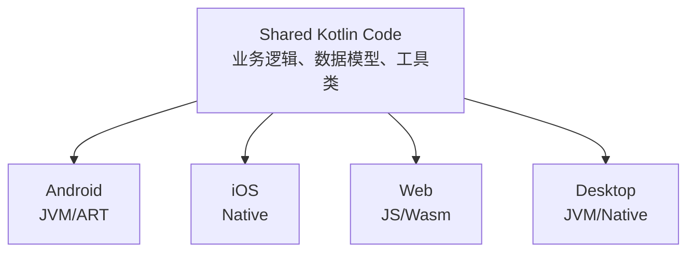
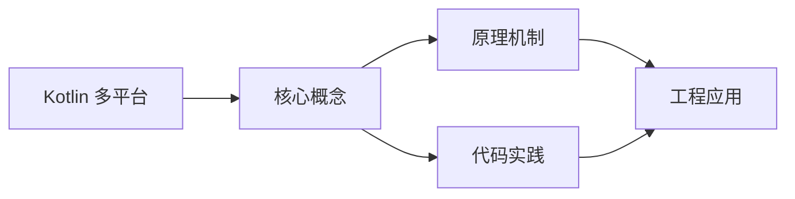

## 1. 学习目标（Bloom 分类）

本节按照布鲁姆教育目标分类学组织学习路径。本文主题为《Kotlin 多平台》，属于 Kotlin 模块，读者可以根据自身阶段选择阅读深度。

记忆层面：能够准确复述本文的核心概念、术语与基本语法或操作步骤，并能够在提问或检索时快速定位对应知识点。能够说出 val/var、空安全操作符与 when 表达式的语法。

理解层面：能够用自己的语言解释核心原理与工作机制，说明概念之间的因果关系，而不是机械记忆结论。能够解释 Kotlin 与 Java 互操作的机制与平台类型概念。

应用层面：能够在真实项目或练习场景中运用本文知识解决具体问题，写出正确且可维护的实现。能够编写数据类、扩展函数与协程代码。

分析层面：能够拆解复杂问题，比较本文主题与相邻概念的异同，识别边界条件与例外情况。能够分析空安全、智能转换与协程调度原理。

评价层面：能够根据约束条件（性能、可读性、安全、成本）评价不同方案的优劣，做出有依据的技术决策。能够评价 Kotlin 在 Android、服务端与多平台场景的适用性。

创造层面：能够把本文知识与其他模块知识组合，设计出新的解决方案或可复用的工程模式。能够组合 Compose 与协程设计跨平台应用。

通过本节学习，读者应当能够把《Kotlin 多平台》纳入自己的知识网络，并与 Kotlin 模块的其他主题（类型推断、空安全、协程、KMP）建立关联。

## 2. 历史动机与发展脉络

《Kotlin 多平台》是 Kotlin 领域的重要主题。要真正理解它，需要先了解它解决的问题与演进过程。

Kotlin 由 JetBrains 于 2010 年开始研发，2016 年发布 1.0，定位是“更现代的 JVM 语言”：减少样板代码、消灭空指针、增强函数式能力，同时与 Java 100% 互操作。
2017 年 Google 宣布 Kotlin 成为 Android 一级语言，2019 年确立 Kotlin-first 政策；2023 年 Kotlin 2.0 的 K2 编译器显著提升编译速度与类型推导。
Kotlin Multiplatform（KMP）支持 JVM、Android、iOS、WebAssembly 等目标，配合 Compose Multiplatform 实现共享 UI 与业务逻辑，是 JetBrains 的长期战略方向。

回到本文主题：Kotlin 多平台 的提出与成熟，正是上述技术背景下的必然产物。早期实现往往以简单可用为目标，随着工程规模扩大，社区逐渐沉淀出标准做法与最佳实践；理解这一脉络，可以帮助读者判断“为什么文档中的推荐写法是现在这个样子”，也能在遇到历史遗留代码时准确识别其设计年代与取舍。


## 3. 形式化定义与核心概念精讲

本节把《Kotlin 多平台》涉及的核心概念以“定义 + 讲解”的形式展开。读者应把定义当作工具，把讲解当作理解路径；两者结合才能形成可迁移的知识。

空安全：类型系统区分 `String` 与 `String?`，编译期强制处理可空值；`?.` 短路、`?:` 提供默认、`!!` 显式断言，三者覆盖所有空值处理模式。
智能转换：`is` 检查后在不可变上下文中自动转换类型，减少显式强转；`as?` 安全转换失败返回 null。
协程：挂起函数（suspend）与调度器（Dispatchers.Main/IO/Default）实现非阻塞并发，结构化并发保证作用域内任务可取消。

### 3.1 原文章节逐一精讲

原文档把主题拆分为 20 个小节，下面按顺序给出每一节的导读讲解，随后保留原文细节供精读。

#### 原文精读（完整保留）

# Kotlin Multiplatform

> **符号约定**：`< >` 必填参数 | `[ ]` 可选参数

---

#### 1. KMP 架构概述

Kotlin Multiplatform (KMP) 是 JetBrains 推出的多平台开发方案，允许在平台间共享 Kotlin 代码，同时保留平台特定实现的能力。2024 年 Kotlin 2.1 正式将 KMP 标记为稳定版。

##### 1.1 核心理念



##### 1.2 代码共享策略

| 策略     | 共享内容                 | 适用场景                         |
| -------- | ------------------------ | -------------------------------- |
| 共享逻辑 | 网络层、数据层、业务逻辑 | 最常见，推荐入门                 |
| 共享 UI  | Compose Multiplatform UI | 2024+ 逐渐成熟                   |
| 完全共享 | 逻辑 + UI + 平台适配     | Compose Multiplatform 全平台应用 |

##### 1.3 源集结构

```mermaid
flowchart TD
    T0["shared/"]
    T1["src/"]
    T2["commonMain/          # 所有平台共享"]
    T3["kotlin/"]
    T4["commonTest/          # 共享测试"]
    T5["kotlin/"]
    T6["androidMain/         # Android 特定"]
    T7["kotlin/"]
    T8["androidUnitTest/"]
    T9["iosMain/             # iOS 特定"]
    T10["kotlin/"]
    T11["jsMain/              # JS 特定"]
    T12["kotlin/"]
    T13["jvmMain/             # JVM 特定"]
    T14["kotlin/"]
    T15["nativeMain/          # 所有 Native 平台共享"]
    T16["kotlin/"]
    T17["appleMain/           # Apple 平台共享"]
    T18["kotlin/"]
    T19["wasmJsMain/          # Wasm/JS 特定"]
    T20["kotlin/"]
    T0 --> T1
```



#### 2. expect/actual 声明

`expect/actual` 是 KMP 的核心机制，用于声明平台差异化的 API：

##### 2.1 expect 声明（共享代码中）

```kotlin
// commonMain/kotlin/platform/Logger.kt
expect class Logger() {
    fun debug(message: String)
    fun error(message: String)
}

// expect 函数
expect fun getPlatformName(): String

// expect 属性
expect val currentTimestamp: Long

// expect 对象
expect object FileSystem {
    fun read(path: String): ByteArray
    fun write(path: String, data: ByteArray)
}
```

##### 2.2 actual 实现（平台代码中）

```kotlin
// androidMain/kotlin/platform/Logger.kt
actual class Logger actual constructor() {
    actual fun debug(message: String) {
        Log.d("App", message)
    }
    actual fun error(message: String) {
        Log.e("App", message)
    }
}

actual fun getPlatformName(): String = "Android"
actual val currentTimestamp: Long = System.currentTimeMillis()

// iosMain/kotlin/platform/Logger.kt
actual class Logger actual constructor() {
    actual fun debug(message: String) {
        NSLog("App: $message")
    }
    actual fun error(message: String) {
        NSLog("App ERROR: $message")
    }
}

actual fun getPlatformName(): String = "iOS"
actual val currentTimestamp: Long = NSDate().timeIntervalSince1970.toLong() * 1000
```

##### 2.3 expect/actual 规则

- `expect` 声明不能有默认实现
- `actual` 实现必须与 `expect` 声明完全匹配
- 每个 `expect` 必须在所有目标平台有对应的 `actual`
- `actual` 类的构造函数也需 `actual constructor()`

#### 3. 共享代码实践

##### 3.1 网络层共享

```kotlin
// commonMain
interface ApiClient {
    suspend fun <T> request(endpoint: String): Result<T>
}

class Repository(private val api: ApiClient) {
    suspend fun fetchUsers(): Result<List<User>> =
        api.request("/api/users")
}

// 使用 Ktor 实现跨平台网络
// build.gradle.kts (shared)
kotlin {
    sourceSets {
        commonMain {
            dependencies {
                implementation("io.ktor:ktor-client-core:3.0.0")
                implementation("io.ktor:ktor-client-content-negotiation:3.0.0")
                implementation("io.ktor:ktor-serialization-kotlinx-json:3.0.0")
            }
        }
        androidMain {
            dependencies {
                implementation("io.ktor:ktor-client-okhttp:3.0.0")
            }
        }
        iosMain {
            dependencies {
                implementation("io.ktor:ktor-client-darwin:3.0.0")
            }
        }
    }
}
```

##### 3.2 数据存储共享

```kotlin
// commonMain
expect class DataStoreFactory {
    fun create(name: String): DataStore<Preferences>
}

// 使用多平台设置库
// commonMain
class SettingsRepository(private val settings: Settings) {
    var theme: String by settings.stringBinding("theme", "system")
    var fontSize: Int by settings.intBinding("fontSize", 14)
}
```

##### 3.3 日期时间共享

```kotlin
// 使用 kotlinx-datetime（跨平台日期时间库）
import kotlinx.datetime.*

fun getCurrentDate(): LocalDate = Clock.System.todayIn(TimeZone.currentSystemDefault())

fun formatInstant(instant: Instant): String {
    return instant.toString()
}
```

#### 4. Compose Multiplatform

Compose Multiplatform 是基于 Jetpack Compose 的跨平台 UI 框架：

##### 4.1 项目配置

```kotlin
// build.gradle.kts (shared)
plugins {
    kotlin("multiplatform")
    id("org.jetbrains.compose")
    id("org.jetbrains.kotlin.plugin.compose")
}

kotlin {
    androidTarget()
    iosX64()
    iosArm64()
    iosSimulatorArm64()
    jvm("desktop")
    wasmJs { browser() }

    sourceSets {
        commonMain {
            dependencies {
                implementation(compose.runtime)
                implementation(compose.foundation)
                implementation(compose.material3)
                implementation(compose.components.resources)
            }
        }
    }
}
```

##### 4.2 共享 UI 组件

```kotlin
// commonMain
@Composable
fun App() {
    var selectedTab by remember { mutableIntStateOf(0) }

    MaterialTheme {
        Scaffold(
            bottomBar = {
                NavigationBar {
                    NavigationBarItem(
                        selected = selectedTab == 0,
                        onClick = { selectedTab = 0 },
                        icon = { Icon(Icons.Default.Home, "Home") },
                        label = { Text("Home") }
                    )
                    NavigationBarItem(
                        selected = selectedTab == 1,
                        onClick = { selectedTab = 1 },
                        icon = { Icon(Icons.Default.Settings, "Settings") },
                        label = { Text("Settings") }
                    )
                }
            }
        ) { padding ->
            when (selectedTab) {
                0 -> HomeScreen(Modifier.padding(padding))
                1 -> SettingsScreen(Modifier.padding(padding))
            }
        }
    }
}

@Composable
fun HomeScreen(modifier: Modifier = Modifier) {
    LazyColumn(modifier = modifier.fillMaxSize()) {
        items(getItems()) { item ->
            Card(
                modifier = Modifier.fillMaxWidth().padding(8.dp),
                elevation = CardDefaults.cardElevation(4.dp)
            ) {
                Text(item.title, modifier = Modifier.padding(16.dp))
            }
        }
    }
}
```

##### 4.3 平台入口

```kotlin
// Android — MainActivity.kt
class MainActivity : ComponentActivity() {
    override fun onCreate(savedInstanceState: Bundle?) {
        super.onCreate(savedInstanceState)
        setContent { App() }
    }
}

// iOS — MainViewController.kt
fun MainViewController() = ComposeUIViewController { App() }

// Desktop — Main.kt
fun main() = application {
    Window(onCloseRequest = ::exitApplication, title = "My App") {
        App()
    }
}

// Web — Main.kt
@OptIn(ExperimentalComposeUiApi::class)
fun main() {
    CanvasBasedWindow("My App") { App() }
}
```

#### 5. iOS 集成

##### 5.1 导出框架

```kotlin
kotlin {
    iosX64()
    iosArm64()
    iosSimulatorArm64()

    listOf(iosX64(), iosArm64(), iosSimulatorArm64()).forEach {
        it.binaries.framework {
            baseName = "shared"
            isStatic = true  // 推荐，避免动态库问题
        }
    }
}
```

##### 5.2 Swift 互操作

```swift
// Swift 中使用 Kotlin 共享代码
let repository = Repository(apiClient: ApiClient())
let users = try await repository.fetchUsers()

// Kotlin 的 suspend 函数自动转为 Swift async/await
// Result 类型自动映射
```

##### 5.3 ObjC 兼容性

```kotlin
// 使用 @ObjCName 自定义 ObjC 名称
@ObjCName("KMPLogger")
class Logger {
    @ObjCName("logMessage")
    fun log(message: String) { /* ... */ }
}
```

#### 6. Gradle 配置

##### 6.1 完整 KMP 项目配置

```kotlin
// build.gradle.kts (项目根)
plugins {
    kotlin("multiplatform") version "2.2.0" apply false
    id("org.jetbrains.compose") version "1.8.0" apply false
    id("org.jetbrains.kotlin.plugin.compose") version "2.2.0" apply false
}

// build.gradle.kts (shared module)
plugins {
    kotlin("multiplatform")
    id("org.jetbrains.compose")
    id("org.jetbrains.kotlin.plugin.compose")
}

kotlin {
    // 目标平台
    androidTarget {
        compilations.all {
            kotlinOptions {
                jvmTarget = "17"
            }
        }
    }

    iosX64()
    iosArm64()
    iosSimulatorArm64()

    jvm("desktop")

    wasmJs {
        browser()
    }

    // 源集依赖
    sourceSets {
        commonMain.dependencies {
            implementation("io.ktor:ktor-client-core:3.0.0")
            implementation("org.jetbrains.kotlinx:kotlinx-coroutines-core:1.10.1")
            implementation("org.jetbrains.kotlinx:kotlinx-serialization-json:1.7.0")
            implementation("org.jetbrains.kotlinx:kotlinx-datetime:0.6.0")
            implementation(compose.runtime)
            implementation(compose.foundation)
            implementation(compose.material3)
        }
        commonTest.dependencies {
            implementation(kotlin("test"))
            implementation("org.jetbrains.kotlinx:kotlinx-coroutines-test:1.10.1")
        }
        androidMain.dependencies {
            implementation("io.ktor:ktor-client-okhttp:3.0.0")
        }
        iosMain.dependencies {
            implementation("io.ktor:ktor-client-darwin:3.0.0")
        }
        desktopMain.dependencies {
            implementation("io.ktor:ktor-client-okhttp:3.0.0")
            implementation(compose.desktop.currentOs)
        }
    }
}
```

##### 6.2 版本目录（Version Catalog）

```kotlin
// gradle/libs.versions.toml
[versions]
kotlin = "2.2.0"
compose = "1.8.0"
ktor = "3.0.0"
coroutines = "1.10.1"
serialization = "1.7.0"

[libraries]
kotlinx-coroutines-core = { group = "org.jetbrains.kotlinx", name = "kotlinx-coroutines-core", version.ref = "coroutines" }
kotlinx-serialization-json = { group = "org.jetbrains.kotlinx", name = "kotlinx-serialization-json", version.ref = "serialization" }
ktor-client-core = { group = "io.ktor", name = "ktor-client-core", version.ref = "ktor" }
```

#### 7. 常用 KMP 库

| 领域   | 库                     | 说明                      |
| ------ | ---------------------- | ------------------------- |
| 网络   | Ktor                   | 跨平台 HTTP 客户端/服务端 |
| 序列化 | kotlinx.serialization  | JSON/ProtoBuf/CBOR        |
| 日期   | kotlinx-datetime       | 跨平台日期时间            |
| 协程   | kotlinx-coroutines     | 跨平台协程                |
| 存储   | multiplatform-settings | 跨平台键值存储            |
| 数据库 | SQLDelight             | 类型安全跨平台 SQL        |
| 日志   | Kermit                 | 跨平台日志库              |
| DI     | Koin                   | 跨平台依赖注入            |
| UI     | Compose Multiplatform  | 跨平台 UI 框架            |
| 导航   | Decompose              | 跨平台导航/状态管理       |

#### 8. KMP 项目最佳实践

1. **从共享逻辑开始**：先共享网络层和数据层，UI 层各平台原生实现
2. **使用 expect/actual 最小化**：尽量使用跨平台库，减少平台特定代码
3. **API 设计考虑互操作**：注意 Kotlin 与 Swift/JS 的类型映射差异
4. **利用版本目录**：统一管理依赖版本
5. **CI/CD 多平台构建**：iOS 构建需要 macOS 运行环境
#### 项目结构

**基本写法：build.gradle.kts 配置**
`kotlin { androidTarget(); jvm(); iosX64(); iosArm64() }`
```kotlin
// 声明多平台目标
kotlin {
    androidTarget()
    jvm()
    iosX64(); iosArm64(); iosSimulatorArm64()
}
```

---

**基本写法：层级 sourceSets**
`val commonMain by getting; val androidMain by getting`
```kotlin
// 公共代码与平台代码目录
kotlin {
    sourceSets {
        val commonMain by getting
        val androidMain by getting
        val iosMain by creating { dependsOn(commonMain) }
    }
}
```

---

#### expect/actual 机制

**基本写法：声明 expect**
`expect fun <方法>(): <类型>`
```kotlin
// commonMain 中声明平台差异函数
expect fun currentTimeMillis(): Long
```

---

**基本写法：实现 actual**
`actual fun <方法>(): <类型> { }`
```kotlin
// androidMain 中实现
actual fun currentTimeMillis(): Long = System.currentTimeMillis()
```

---

**基本写法：expect 类**
`expect class <类名>()`
```kotlin
// common 声明平台类
expect class DateFormatter() {
    fun format(millis: Long): String
}
```

---

**基本写法：actual 类**
`actual class <类名> { }`
```kotlin
// 平台实现具体类
actual class DateFormatter {
    actual fun format(millis: Long): String = java.text.SimpleDateFormat().format(Date(millis))
}
```

---

**基本写法：expect 属性**
`expect val <属性>: <类型>`
```kotlin
// 声明平台相关常量
expect val platformName: String
```

---

#### 跨平台依赖

**基本写法：commonMain 依赖**
`commonMain { dependencies { implementation("<坐标>") } }`
```kotlin
// 公共代码使用跨平台库
commonMain.dependencies {
    implementation("org.jetbrains.kotlinx:kotlinx-coroutines-core:1.9.0")
    implementation("org.jetbrains.kotlinx:kotlinx-serialization-json:1.7.0")
}
```

---

**基本写法：平台专属依赖**
`androidMain { dependencies { implementation("<坐标>") } }`
```kotlin
// 仅 Android 平台依赖
androidMain.dependencies {
    implementation("androidx.core:core-ktx:1.13.0")
}
```

---

#### 平台特定调用

**基本写法：Android 调用**
`import android.util.Log; Log.d(...)`
```kotlin
// androidMain 中调用 Android API
android.util.Log.d("tag", "msg")
```

---

**基本写法：iOS 调用**
`import platform.Foundation.NSDate`
```kotlin
// iosMain 中调用 Objective-C API
import platform.Foundation.NSDate
val now = NSDate()
```

---

**基本写法：JVM 调用**
`import java.io.File`
```kotlin
// jvmMain 中调用 JVM API
import java.io.File
val f = File("a.txt")
```

---

#### 跨平台 IO

**基本写法：使用 okio 跨平台 IO**
`okio.FileSystem.SYSTEM.read(<path>) { }`
```kotlin
// okio 提供跨平台文件 IO
import okio.FileSystem
FileSystem.SYSTEM.read(path) { readUtf8() }
```

---

#### kotlinx 库

**基本写法：kotlinx-datetime**
`Clock.System.now()`
```kotlin
// 跨平台日期时间
import kotlinx.datetime.Clock
val now = Clock.System.now()
```

---

**基本写法：kotlinx.coroutines 协程**
`runBlocking { }`
```kotlin
// 跨平台协程
import kotlinx.coroutines.runBlocking
runBlocking { doWork() }
```

---

**基本写法：kotlinx-serialization**
`@Serializable class <类>`
```kotlin
// 跨平台序列化
import kotlinx.serialization.Serializable
@Serializable
data class User(val name: String)
```

---

#### expect/actual 扩展函数

**基本写法：扩展 expect**
`expect fun <<T>> <类型>.<方法>(): <返回>`
```kotlin
// 声明跨平台扩展函数
expect fun Long.toDateString(): String
```

---

#### 共享业务逻辑

**基本写法：commonMain 编写业务**
`class <仓库> { suspend fun <方法>() = <实现> }`
```kotlin
// 共享业务代码不依赖平台
class UserRepository {
    suspend fun load(): User = api.fetch()
}
```

---

#### 构建与运行

**基本写法：构建所有目标**
`./gradlew build`
```bash
# 编译所有平台目标
./gradlew build
```

---

**基本写法：构建特定目标**
`./gradlew :shared:assembleAndroid`
```bash
# 仅构建 Android 目标
./gradlew :shared:assembleAndroid
```

---

**基本写法：发布 iOS Framework**
`./gradlew :shared:linkDebugFrameworkIosArm64`
```bash
# 生成 iOS Framework
./gradlew :shared:linkDebugFrameworkIosArm64
```

---

#### CocoaPods 集成

**基本写法：cocoapods 配置**
`cocoapods { summary = "<描述>"; version = "1.0" }`
```kotlin
// 配置 iOS CocoaPods 集成
kotlin {
    cocoapods {
        summary = "Shared Library"
        version = "1.0"
        ios.deploymentTarget = "14.0"
    }
}
```

---

#### 目标简写

**基本写法：iOS 目标简写**
`ios() // 等价 iosX64 + iosArm64 + iosSimulatorArm64`
```kotlin
// 一行配置所有 iOS 目标
kotlin { ios() }
```

---

**基本写法：macos 目标**
`macosX64(); macosArm64()`
```kotlin
// macOS 目标
kotlin { macosX64(); macosArm64() }
```

---

#### 中间层 sourceSet

**基本写法：iOS 共享代码**
`val iosMain by creating { dependsOn(commonMain) }`
```kotlin
// iOS 多架构共享代码
val iosMain by creating { dependsOn(commonMain) }
val iosX64Main by getting { dependsOn(iosMain) }
val iosArm64Main by getting { dependsOn(iosMain) }
```


### 3.2 概念关系图

下面用 Mermaid 图表达本文核心概念之间的关系，帮助读者建立整体图景：



图中展示的是本文知识的结构化关系：核心概念是入口，原理机制解释“为什么”，代码实践演示“怎么做”，工程应用回答“何时用”。读者学习时可以把每个小节的内容挂接到对应节点上。

## 4. 理论推导与原理解析

本节深入《Kotlin 多平台》背后的原理。理论部分不求面面俱到，而是聚焦“能解释现象、能指导实践”的关键推导。

空安全：类型系统区分 `String` 与 `String?`，编译期强制处理可空值；`?.` 短路、`?:` 提供默认、`!!` 显式断言，三者覆盖所有空值处理模式。
智能转换：`is` 检查后在不可变上下文中自动转换类型，减少显式强转；`as?` 安全转换失败返回 null。
协程：挂起函数（suspend）与调度器（Dispatchers.Main/IO/Default）实现非阻塞并发，结构化并发保证作用域内任务可取消。
扩展函数与属性：在不修改原类的情况下为类添加行为，是 Kotlin 标准库（如集合操作）的基石。

需要强调的是，理论推导与工程实践之间存在翻译层：理论给出的是理想化模型与边界条件，工程代码则必须处理真实环境中的例外。读者在学习时应先掌握理论的“标准情形”，再通过陷阱章节了解“非标准情形”。

## 5. 代码示例与逐行讲解

本节把原文中的代码示例系统整理，并为每个示例补充用途说明与讲解。读者不应只浏览代码，而应逐段对照讲解理解设计意图。

### 5.1 示例：1.1 核心理念

该示例来自原文《1.1 核心理念》小节，用于演示Kotlin 多平台相关操作。阅读时请先看代码结构，再看其后的讲解。


讲解：这段代码演示了本节核心知识点。代码中的关键操作可以归纳为三步：准备（定义或初始化）、执行（核心逻辑）、收尾（释放资源或返回结果）。实际项目中，这三步往往被封装为函数或类，以提升复用性与可测试性。

关键点分析：

该示例共 6 行有效代码，结构以数据或配置为主。阅读时应关注：数据字段的含义、配置项的作用，以及它们与运行行为的对应关系。

进阶思考路径：先尝试修改参数观察行为变化，再把示例中的模式迁移到自己的项目中；每次修改都记录预期与实测差异，这是把示例转化为能力的最快方式。

### 5.2 示例：1.3 源集结构

该示例来自原文《1.3 源集结构》小节，用于演示Kotlin 多平台相关操作。阅读时请先看代码结构，再看其后的讲解。


讲解：这段代码演示了本节核心知识点。代码中的关键操作可以归纳为三步：准备（定义或初始化）、执行（核心逻辑）、收尾（释放资源或返回结果）。实际项目中，这三步往往被封装为函数或类，以提升复用性与可测试性。

关键点分析：

该示例共 23 行有效代码，结构以数据或配置为主。阅读时应关注：数据字段的含义、配置项的作用，以及它们与运行行为的对应关系。

进阶思考路径：先尝试修改参数观察行为变化，再把示例中的模式迁移到自己的项目中；每次修改都记录预期与实测差异，这是把示例转化为能力的最快方式。

### 5.3 示例：2.1 expect 声明（共享代码中）

该示例来自原文《2.1 expect 声明（共享代码中）》小节，用于演示Kotlin 多平台相关操作。阅读时请先看代码结构，再看其后的讲解。

```kotlin
// commonMain/kotlin/platform/Logger.kt
expect class Logger() {
    fun debug(message: String)
    fun error(message: String)
}

// expect 函数
expect fun getPlatformName(): String

// expect 属性
expect val currentTimestamp: Long

// expect 对象
expect object FileSystem {
    fun read(path: String): ByteArray
    fun write(path: String, data: ByteArray)
}
```

讲解：这段代码演示了本节核心知识点。代码中的关键操作可以归纳为三步：准备（定义或初始化）、执行（核心逻辑）、收尾（释放资源或返回结果）。实际项目中，这三步往往被封装为函数或类，以提升复用性与可测试性。

关键点分析：

该示例共 14 行有效代码，包含 1 类关键结构（class）。其中：

- 入口与初始化部分负责建立上下文，对应实际项目中的启动或装配逻辑；
- 核心逻辑部分体现本文主题的主要操作，是阅读时最需要对照讲解理解的部分；
- 输出或返回部分把结果交给调用方，注意其类型与边界条件。

进阶思考路径：先尝试修改参数观察行为变化，再把示例中的模式迁移到自己的项目中；每次修改都记录预期与实测差异，这是把示例转化为能力的最快方式。

### 5.4 示例：2.2 actual 实现（平台代码中）

该示例来自原文《2.2 actual 实现（平台代码中）》小节，用于演示Kotlin 多平台相关操作。阅读时请先看代码结构，再看其后的讲解。

```kotlin
// androidMain/kotlin/platform/Logger.kt
actual class Logger actual constructor() {
    actual fun debug(message: String) {
        Log.d("App", message)
    }
    actual fun error(message: String) {
        Log.e("App", message)
    }
}

actual fun getPlatformName(): String = "Android"
actual val currentTimestamp: Long = System.currentTimeMillis()

// iosMain/kotlin/platform/Logger.kt
actual class Logger actual constructor() {
    actual fun debug(message: String) {
        NSLog("App: $message")
    }
    actual fun error(message: String) {
        NSLog("App ERROR: $message")
    }
}

actual fun getPlatformName(): String = "iOS"
actual val currentTimestamp: Long = NSDate().timeIntervalSince1970.toLong() * 1000
```

讲解：这段代码演示了本节核心知识点。代码中的关键操作可以归纳为三步：准备（定义或初始化）、执行（核心逻辑）、收尾（释放资源或返回结果）。实际项目中，这三步往往被封装为函数或类，以提升复用性与可测试性。

关键点分析：

该示例共 22 行有效代码，包含 1 类关键结构（class）。其中：

- 入口与初始化部分负责建立上下文，对应实际项目中的启动或装配逻辑；
- 核心逻辑部分体现本文主题的主要操作，是阅读时最需要对照讲解理解的部分；
- 输出或返回部分把结果交给调用方，注意其类型与边界条件。

进阶思考路径：先尝试修改参数观察行为变化，再把示例中的模式迁移到自己的项目中；每次修改都记录预期与实测差异，这是把示例转化为能力的最快方式。

### 5.5 示例：3.1 网络层共享

该示例来自原文《3.1 网络层共享》小节，用于演示Kotlin 多平台相关操作。阅读时请先看代码结构，再看其后的讲解。

```kotlin
// commonMain
interface ApiClient {
    suspend fun <T> request(endpoint: String): Result<T>
}

class Repository(private val api: ApiClient) {
    suspend fun fetchUsers(): Result<List<User>> =
        api.request("/api/users")
}

// 使用 Ktor 实现跨平台网络
// build.gradle.kts (shared)
kotlin {
    sourceSets {
        commonMain {
            dependencies {
                implementation("io.ktor:ktor-client-core:3.0.0")
                implementation("io.ktor:ktor-client-content-negotiation:3.0.0")
                implementation("io.ktor:ktor-serialization-kotlinx-json:3.0.0")
            }
        }
        androidMain {
            dependencies {
                implementation("io.ktor:ktor-client-okhttp:3.0.0")
            }
        }
        iosMain {
            dependencies {
                implementation("io.ktor:ktor-client-darwin:3.0.0")
            }
        }
    }
}
```

讲解：这段代码演示了本节核心知识点。代码中的关键操作可以归纳为三步：准备（定义或初始化）、执行（核心逻辑）、收尾（释放资源或返回结果）。实际项目中，这三步往往被封装为函数或类，以提升复用性与可测试性。

关键点分析：

该示例共 31 行有效代码，包含 1 类关键结构（class）。其中：

- 入口与初始化部分负责建立上下文，对应实际项目中的启动或装配逻辑；
- 核心逻辑部分体现本文主题的主要操作，是阅读时最需要对照讲解理解的部分；
- 输出或返回部分把结果交给调用方，注意其类型与边界条件。

进阶思考路径：先尝试修改参数观察行为变化，再把示例中的模式迁移到自己的项目中；每次修改都记录预期与实测差异，这是把示例转化为能力的最快方式。

### 5.6 示例：3.2 数据存储共享

该示例来自原文《3.2 数据存储共享》小节，用于演示Kotlin 多平台相关操作。阅读时请先看代码结构，再看其后的讲解。

```kotlin
// commonMain
expect class DataStoreFactory {
    fun create(name: String): DataStore<Preferences>
}

// 使用多平台设置库
// commonMain
class SettingsRepository(private val settings: Settings) {
    var theme: String by settings.stringBinding("theme", "system")
    var fontSize: Int by settings.intBinding("fontSize", 14)
}
```

讲解：这段代码演示了本节核心知识点。代码中的关键操作可以归纳为三步：准备（定义或初始化）、执行（核心逻辑）、收尾（释放资源或返回结果）。实际项目中，这三步往往被封装为函数或类，以提升复用性与可测试性。

关键点分析：

该示例共 10 行有效代码，包含 1 类关键结构（class）。其中：

- 入口与初始化部分负责建立上下文，对应实际项目中的启动或装配逻辑；
- 核心逻辑部分体现本文主题的主要操作，是阅读时最需要对照讲解理解的部分；
- 输出或返回部分把结果交给调用方，注意其类型与边界条件。

进阶思考路径：先尝试修改参数观察行为变化，再把示例中的模式迁移到自己的项目中；每次修改都记录预期与实测差异，这是把示例转化为能力的最快方式。

### 5.7 示例：3.3 日期时间共享

该示例来自原文《3.3 日期时间共享》小节，用于演示Kotlin 多平台相关操作。阅读时请先看代码结构，再看其后的讲解。

```kotlin
// 使用 kotlinx-datetime（跨平台日期时间库）
import kotlinx.datetime.*

fun getCurrentDate(): LocalDate = Clock.System.todayIn(TimeZone.currentSystemDefault())

fun formatInstant(instant: Instant): String {
    return instant.toString()
}
```

讲解：这段代码演示了本节核心知识点。代码中的关键操作可以归纳为三步：准备（定义或初始化）、执行（核心逻辑）、收尾（释放资源或返回结果）。实际项目中，这三步往往被封装为函数或类，以提升复用性与可测试性。

关键点分析：

该示例共 6 行有效代码，包含 2 类关键结构（import、return）。其中：

- 入口与初始化部分负责建立上下文，对应实际项目中的启动或装配逻辑；
- 核心逻辑部分体现本文主题的主要操作，是阅读时最需要对照讲解理解的部分；
- 输出或返回部分把结果交给调用方，注意其类型与边界条件。

进阶思考路径：先尝试修改参数观察行为变化，再把示例中的模式迁移到自己的项目中；每次修改都记录预期与实测差异，这是把示例转化为能力的最快方式。

### 5.8 示例：4.1 项目配置

该示例来自原文《4.1 项目配置》小节，用于演示Kotlin 多平台相关操作。阅读时请先看代码结构，再看其后的讲解。

```kotlin
// build.gradle.kts (shared)
plugins {
    kotlin("multiplatform")
    id("org.jetbrains.compose")
    id("org.jetbrains.kotlin.plugin.compose")
}

kotlin {
    androidTarget()
    iosX64()
    iosArm64()
    iosSimulatorArm64()
    jvm("desktop")
    wasmJs { browser() }

    sourceSets {
        commonMain {
            dependencies {
                implementation(compose.runtime)
                implementation(compose.foundation)
                implementation(compose.material3)
                implementation(compose.components.resources)
            }
        }
    }
}
```

讲解：这段代码演示了本节核心知识点。代码中的关键操作可以归纳为三步：准备（定义或初始化）、执行（核心逻辑）、收尾（释放资源或返回结果）。实际项目中，这三步往往被封装为函数或类，以提升复用性与可测试性。

关键点分析：

该示例共 24 行有效代码，结构以数据或配置为主。阅读时应关注：数据字段的含义、配置项的作用，以及它们与运行行为的对应关系。

进阶思考路径：先尝试修改参数观察行为变化，再把示例中的模式迁移到自己的项目中；每次修改都记录预期与实测差异，这是把示例转化为能力的最快方式。

### 5.9 示例：4.2 共享 UI 组件

该示例来自原文《4.2 共享 UI 组件》小节，用于演示Kotlin 多平台相关操作。阅读时请先看代码结构，再看其后的讲解。

```kotlin
// commonMain
@Composable
fun App() {
    var selectedTab by remember { mutableIntStateOf(0) }

    MaterialTheme {
        Scaffold(
            bottomBar = {
                NavigationBar {
                    NavigationBarItem(
                        selected = selectedTab == 0,
                        onClick = { selectedTab = 0 },
                        icon = { Icon(Icons.Default.Home, "Home") },
                        label = { Text("Home") }
                    )
                    NavigationBarItem(
                        selected = selectedTab == 1,
                        onClick = { selectedTab = 1 },
                        icon = { Icon(Icons.Default.Settings, "Settings") },
                        label = { Text("Settings") }
                    )
                }
            }
        ) { padding ->
            when (selectedTab) {
                0 -> HomeScreen(Modifier.padding(padding))
                1 -> SettingsScreen(Modifier.padding(padding))
            }
        }
    }
}

@Composable
fun HomeScreen(modifier: Modifier = Modifier) {
    LazyColumn(modifier = modifier.fillMaxSize()) {
        items(getItems()) { item ->
            Card(
                modifier = Modifier.fillMaxWidth().padding(8.dp),
                elevation = CardDefaults.cardElevation(4.dp)
            ) {
                Text(item.title, modifier = Modifier.padding(16.dp))
            }
        }
    }
}
```

讲解：这段代码演示了本节核心知识点。代码中的关键操作可以归纳为三步：准备（定义或初始化）、执行（核心逻辑）、收尾（释放资源或返回结果）。实际项目中，这三步往往被封装为函数或类，以提升复用性与可测试性。

关键点分析：

该示例共 43 行有效代码，结构以数据或配置为主。阅读时应关注：数据字段的含义、配置项的作用，以及它们与运行行为的对应关系。

进阶思考路径：先尝试修改参数观察行为变化，再把示例中的模式迁移到自己的项目中；每次修改都记录预期与实测差异，这是把示例转化为能力的最快方式。

### 5.10 示例：4.3 平台入口

该示例来自原文《4.3 平台入口》小节，用于演示Kotlin 多平台相关操作。阅读时请先看代码结构，再看其后的讲解。

```kotlin
// Android — MainActivity.kt
class MainActivity : ComponentActivity() {
    override fun onCreate(savedInstanceState: Bundle?) {
        super.onCreate(savedInstanceState)
        setContent { App() }
    }
}

// iOS — MainViewController.kt
fun MainViewController() = ComposeUIViewController { App() }

// Desktop — Main.kt
fun main() = application {
    Window(onCloseRequest = ::exitApplication, title = "My App") {
        App()
    }
}

// Web — Main.kt
@OptIn(ExperimentalComposeUiApi::class)
fun main() {
    CanvasBasedWindow("My App") { App() }
}
```

讲解：这段代码演示了本节核心知识点。代码中的关键操作可以归纳为三步：准备（定义或初始化）、执行（核心逻辑）、收尾（释放资源或返回结果）。实际项目中，这三步往往被封装为函数或类，以提升复用性与可测试性。

关键点分析：

该示例共 20 行有效代码，包含 1 类关键结构（class）。其中：

- 入口与初始化部分负责建立上下文，对应实际项目中的启动或装配逻辑；
- 核心逻辑部分体现本文主题的主要操作，是阅读时最需要对照讲解理解的部分；
- 输出或返回部分把结果交给调用方，注意其类型与边界条件。

进阶思考路径：先尝试修改参数观察行为变化，再把示例中的模式迁移到自己的项目中；每次修改都记录预期与实测差异，这是把示例转化为能力的最快方式。

### 5.11 示例：5.1 导出框架

该示例来自原文《5.1 导出框架》小节，用于演示Kotlin 多平台相关操作。阅读时请先看代码结构，再看其后的讲解。

```kotlin
kotlin {
    iosX64()
    iosArm64()
    iosSimulatorArm64()

    listOf(iosX64(), iosArm64(), iosSimulatorArm64()).forEach {
        it.binaries.framework {
            baseName = "shared"
            isStatic = true  // 推荐，避免动态库问题
        }
    }
}
```

讲解：这段代码演示了本节核心知识点。代码中的关键操作可以归纳为三步：准备（定义或初始化）、执行（核心逻辑）、收尾（释放资源或返回结果）。实际项目中，这三步往往被封装为函数或类，以提升复用性与可测试性。

关键点分析：

该示例共 11 行有效代码，结构以数据或配置为主。阅读时应关注：数据字段的含义、配置项的作用，以及它们与运行行为的对应关系。

进阶思考路径：先尝试修改参数观察行为变化，再把示例中的模式迁移到自己的项目中；每次修改都记录预期与实测差异，这是把示例转化为能力的最快方式。

### 5.12 示例：5.2 Swift 互操作

该示例来自原文《5.2 Swift 互操作》小节，用于演示Kotlin 多平台相关操作。阅读时请先看代码结构，再看其后的讲解。

```swift
// Swift 中使用 Kotlin 共享代码
let repository = Repository(apiClient: ApiClient())
let users = try await repository.fetchUsers()

// Kotlin 的 suspend 函数自动转为 Swift async/await
// Result 类型自动映射
```

讲解：这段代码演示了本节核心知识点。代码中的关键操作可以归纳为三步：准备（定义或初始化）、执行（核心逻辑）、收尾（释放资源或返回结果）。实际项目中，这三步往往被封装为函数或类，以提升复用性与可测试性。

关键点分析：

该示例共 5 行有效代码，结构以数据或配置为主。阅读时应关注：数据字段的含义、配置项的作用，以及它们与运行行为的对应关系。

进阶思考路径：先尝试修改参数观察行为变化，再把示例中的模式迁移到自己的项目中；每次修改都记录预期与实测差异，这是把示例转化为能力的最快方式。

### 5.13 示例：5.3 ObjC 兼容性

该示例来自原文《5.3 ObjC 兼容性》小节，用于演示Kotlin 多平台相关操作。阅读时请先看代码结构，再看其后的讲解。

```kotlin
// 使用 @ObjCName 自定义 ObjC 名称
@ObjCName("KMPLogger")
class Logger {
    @ObjCName("logMessage")
    fun log(message: String) { /* ... */ }
}
```

讲解：这段代码演示了本节核心知识点。代码中的关键操作可以归纳为三步：准备（定义或初始化）、执行（核心逻辑）、收尾（释放资源或返回结果）。实际项目中，这三步往往被封装为函数或类，以提升复用性与可测试性。

关键点分析：

该示例共 6 行有效代码，包含 1 类关键结构（class）。其中：

- 入口与初始化部分负责建立上下文，对应实际项目中的启动或装配逻辑；
- 核心逻辑部分体现本文主题的主要操作，是阅读时最需要对照讲解理解的部分；
- 输出或返回部分把结果交给调用方，注意其类型与边界条件。

进阶思考路径：先尝试修改参数观察行为变化，再把示例中的模式迁移到自己的项目中；每次修改都记录预期与实测差异，这是把示例转化为能力的最快方式。

### 5.14 示例：6.1 完整 KMP 项目配置

该示例来自原文《6.1 完整 KMP 项目配置》小节，用于演示Kotlin 多平台相关操作。阅读时请先看代码结构，再看其后的讲解。

```kotlin
// build.gradle.kts (项目根)
plugins {
    kotlin("multiplatform") version "2.2.0" apply false
    id("org.jetbrains.compose") version "1.8.0" apply false
    id("org.jetbrains.kotlin.plugin.compose") version "2.2.0" apply false
}

// build.gradle.kts (shared module)
plugins {
    kotlin("multiplatform")
    id("org.jetbrains.compose")
    id("org.jetbrains.kotlin.plugin.compose")
}

kotlin {
    // 目标平台
    androidTarget {
        compilations.all {
            kotlinOptions {
                jvmTarget = "17"
            }
        }
    }

    iosX64()
    iosArm64()
    iosSimulatorArm64()

    jvm("desktop")

    wasmJs {
        browser()
    }

    // 源集依赖
    sourceSets {
        commonMain.dependencies {
            implementation("io.ktor:ktor-client-core:3.0.0")
            implementation("org.jetbrains.kotlinx:kotlinx-coroutines-core:1.10.1")
            implementation("org.jetbrains.kotlinx:kotlinx-serialization-json:1.7.0")
            implementation("org.jetbrains.kotlinx:kotlinx-datetime:0.6.0")
            implementation(compose.runtime)
            implementation(compose.foundation)
            implementation(compose.material3)
        }
        commonTest.dependencies {
            implementation(kotlin("test"))
            implementation("org.jetbrains.kotlinx:kotlinx-coroutines-test:1.10.1")
        }
        androidMain.dependencies {
            implementation("io.ktor:ktor-client-okhttp:3.0.0")
        }
        iosMain.dependencies {
            implementation("io.ktor:ktor-client-darwin:3.0.0")
        }
        desktopMain.dependencies {
            implementation("io.ktor:ktor-client-okhttp:3.0.0")
            implementation(compose.desktop.currentOs)
        }
    }
}
```

讲解：这段代码演示了本节核心知识点。代码中的关键操作可以归纳为三步：准备（定义或初始化）、执行（核心逻辑）、收尾（释放资源或返回结果）。实际项目中，这三步往往被封装为函数或类，以提升复用性与可测试性。

关键点分析：

该示例共 55 行有效代码，结构以数据或配置为主。阅读时应关注：数据字段的含义、配置项的作用，以及它们与运行行为的对应关系。

进阶思考路径：先尝试修改参数观察行为变化，再把示例中的模式迁移到自己的项目中；每次修改都记录预期与实测差异，这是把示例转化为能力的最快方式。

### 5.15 示例：6.2 版本目录（Version Catalog）

该示例来自原文《6.2 版本目录（Version Catalog）》小节，用于演示Kotlin 多平台相关操作。阅读时请先看代码结构，再看其后的讲解。

```kotlin
// gradle/libs.versions.toml
[versions]
kotlin = "2.2.0"
compose = "1.8.0"
ktor = "3.0.0"
coroutines = "1.10.1"
serialization = "1.7.0"

[libraries]
kotlinx-coroutines-core = { group = "org.jetbrains.kotlinx", name = "kotlinx-coroutines-core", version.ref = "coroutines" }
kotlinx-serialization-json = { group = "org.jetbrains.kotlinx", name = "kotlinx-serialization-json", version.ref = "serialization" }
ktor-client-core = { group = "io.ktor", name = "ktor-client-core", version.ref = "ktor" }
```

讲解：这段代码演示了本节核心知识点。代码中的关键操作可以归纳为三步：准备（定义或初始化）、执行（核心逻辑）、收尾（释放资源或返回结果）。实际项目中，这三步往往被封装为函数或类，以提升复用性与可测试性。

关键点分析：

该示例共 11 行有效代码，结构以数据或配置为主。阅读时应关注：数据字段的含义、配置项的作用，以及它们与运行行为的对应关系。

进阶思考路径：先尝试修改参数观察行为变化，再把示例中的模式迁移到自己的项目中；每次修改都记录预期与实测差异，这是把示例转化为能力的最快方式。

### 5.16 示例：项目结构

该示例来自原文《项目结构》小节，用于演示Kotlin 多平台相关操作。阅读时请先看代码结构，再看其后的讲解。

```kotlin
// 声明多平台目标
kotlin {
    androidTarget()
    jvm()
    iosX64(); iosArm64(); iosSimulatorArm64()
}
```

讲解：这段代码演示了本节核心知识点。代码中的关键操作可以归纳为三步：准备（定义或初始化）、执行（核心逻辑）、收尾（释放资源或返回结果）。实际项目中，这三步往往被封装为函数或类，以提升复用性与可测试性。

关键点分析：

该示例共 6 行有效代码，结构以数据或配置为主。阅读时应关注：数据字段的含义、配置项的作用，以及它们与运行行为的对应关系。

进阶思考路径：先尝试修改参数观察行为变化，再把示例中的模式迁移到自己的项目中；每次修改都记录预期与实测差异，这是把示例转化为能力的最快方式。

### 5.17 示例：项目结构

该示例来自原文《项目结构》小节，用于演示Kotlin 多平台相关操作。阅读时请先看代码结构，再看其后的讲解。

```kotlin
// 公共代码与平台代码目录
kotlin {
    sourceSets {
        val commonMain by getting
        val androidMain by getting
        val iosMain by creating { dependsOn(commonMain) }
    }
}
```

讲解：这段代码演示了本节核心知识点。代码中的关键操作可以归纳为三步：准备（定义或初始化）、执行（核心逻辑）、收尾（释放资源或返回结果）。实际项目中，这三步往往被封装为函数或类，以提升复用性与可测试性。

关键点分析：

该示例共 8 行有效代码，结构以数据或配置为主。阅读时应关注：数据字段的含义、配置项的作用，以及它们与运行行为的对应关系。

进阶思考路径：先尝试修改参数观察行为变化，再把示例中的模式迁移到自己的项目中；每次修改都记录预期与实测差异，这是把示例转化为能力的最快方式。

### 5.18 示例：expect/actual 机制

该示例来自原文《expect/actual 机制》小节，用于演示Kotlin 多平台相关操作。阅读时请先看代码结构，再看其后的讲解。

```kotlin
// commonMain 中声明平台差异函数
expect fun currentTimeMillis(): Long
```

讲解：这段代码演示了本节核心知识点。代码中的关键操作可以归纳为三步：准备（定义或初始化）、执行（核心逻辑）、收尾（释放资源或返回结果）。实际项目中，这三步往往被封装为函数或类，以提升复用性与可测试性。

关键点分析：

该示例共 2 行有效代码，结构以数据或配置为主。阅读时应关注：数据字段的含义、配置项的作用，以及它们与运行行为的对应关系。

进阶思考路径：先尝试修改参数观察行为变化，再把示例中的模式迁移到自己的项目中；每次修改都记录预期与实测差异，这是把示例转化为能力的最快方式。

### 5.19 示例：expect/actual 机制

该示例来自原文《expect/actual 机制》小节，用于演示Kotlin 多平台相关操作。阅读时请先看代码结构，再看其后的讲解。

```kotlin
// androidMain 中实现
actual fun currentTimeMillis(): Long = System.currentTimeMillis()
```

讲解：这段代码演示了本节核心知识点。代码中的关键操作可以归纳为三步：准备（定义或初始化）、执行（核心逻辑）、收尾（释放资源或返回结果）。实际项目中，这三步往往被封装为函数或类，以提升复用性与可测试性。

关键点分析：

该示例共 2 行有效代码，结构以数据或配置为主。阅读时应关注：数据字段的含义、配置项的作用，以及它们与运行行为的对应关系。

进阶思考路径：先尝试修改参数观察行为变化，再把示例中的模式迁移到自己的项目中；每次修改都记录预期与实测差异，这是把示例转化为能力的最快方式。

### 5.20 示例：expect/actual 机制

该示例来自原文《expect/actual 机制》小节，用于演示Kotlin 多平台相关操作。阅读时请先看代码结构，再看其后的讲解。

```kotlin
// common 声明平台类
expect class DateFormatter() {
    fun format(millis: Long): String
}
```

讲解：这段代码演示了本节核心知识点。代码中的关键操作可以归纳为三步：准备（定义或初始化）、执行（核心逻辑）、收尾（释放资源或返回结果）。实际项目中，这三步往往被封装为函数或类，以提升复用性与可测试性。

关键点分析：

该示例共 4 行有效代码，包含 1 类关键结构（class）。其中：

- 入口与初始化部分负责建立上下文，对应实际项目中的启动或装配逻辑；
- 核心逻辑部分体现本文主题的主要操作，是阅读时最需要对照讲解理解的部分；
- 输出或返回部分把结果交给调用方，注意其类型与边界条件。

进阶思考路径：先尝试修改参数观察行为变化，再把示例中的模式迁移到自己的项目中；每次修改都记录预期与实测差异，这是把示例转化为能力的最快方式。

### 5.21 示例：expect/actual 机制

该示例来自原文《expect/actual 机制》小节，用于演示Kotlin 多平台相关操作。阅读时请先看代码结构，再看其后的讲解。

```kotlin
// 平台实现具体类
actual class DateFormatter {
    actual fun format(millis: Long): String = java.text.SimpleDateFormat().format(Date(millis))
}
```

讲解：这段代码演示了本节核心知识点。代码中的关键操作可以归纳为三步：准备（定义或初始化）、执行（核心逻辑）、收尾（释放资源或返回结果）。实际项目中，这三步往往被封装为函数或类，以提升复用性与可测试性。

关键点分析：

该示例共 4 行有效代码，包含 1 类关键结构（class）。其中：

- 入口与初始化部分负责建立上下文，对应实际项目中的启动或装配逻辑；
- 核心逻辑部分体现本文主题的主要操作，是阅读时最需要对照讲解理解的部分；
- 输出或返回部分把结果交给调用方，注意其类型与边界条件。

进阶思考路径：先尝试修改参数观察行为变化，再把示例中的模式迁移到自己的项目中；每次修改都记录预期与实测差异，这是把示例转化为能力的最快方式。

### 5.22 示例：expect/actual 机制

该示例来自原文《expect/actual 机制》小节，用于演示Kotlin 多平台相关操作。阅读时请先看代码结构，再看其后的讲解。

```kotlin
// 声明平台相关常量
expect val platformName: String
```

讲解：这段代码演示了本节核心知识点。代码中的关键操作可以归纳为三步：准备（定义或初始化）、执行（核心逻辑）、收尾（释放资源或返回结果）。实际项目中，这三步往往被封装为函数或类，以提升复用性与可测试性。

关键点分析：

该示例共 2 行有效代码，结构以数据或配置为主。阅读时应关注：数据字段的含义、配置项的作用，以及它们与运行行为的对应关系。

进阶思考路径：先尝试修改参数观察行为变化，再把示例中的模式迁移到自己的项目中；每次修改都记录预期与实测差异，这是把示例转化为能力的最快方式。

### 5.23 示例：跨平台依赖

该示例来自原文《跨平台依赖》小节，用于演示Kotlin 多平台相关操作。阅读时请先看代码结构，再看其后的讲解。

```kotlin
// 公共代码使用跨平台库
commonMain.dependencies {
    implementation("org.jetbrains.kotlinx:kotlinx-coroutines-core:1.9.0")
    implementation("org.jetbrains.kotlinx:kotlinx-serialization-json:1.7.0")
}
```

讲解：这段代码演示了本节核心知识点。代码中的关键操作可以归纳为三步：准备（定义或初始化）、执行（核心逻辑）、收尾（释放资源或返回结果）。实际项目中，这三步往往被封装为函数或类，以提升复用性与可测试性。

关键点分析：

该示例共 5 行有效代码，结构以数据或配置为主。阅读时应关注：数据字段的含义、配置项的作用，以及它们与运行行为的对应关系。

进阶思考路径：先尝试修改参数观察行为变化，再把示例中的模式迁移到自己的项目中；每次修改都记录预期与实测差异，这是把示例转化为能力的最快方式。

### 5.24 示例：跨平台依赖

该示例来自原文《跨平台依赖》小节，用于演示Kotlin 多平台相关操作。阅读时请先看代码结构，再看其后的讲解。

```kotlin
// 仅 Android 平台依赖
androidMain.dependencies {
    implementation("androidx.core:core-ktx:1.13.0")
}
```

讲解：这段代码演示了本节核心知识点。代码中的关键操作可以归纳为三步：准备（定义或初始化）、执行（核心逻辑）、收尾（释放资源或返回结果）。实际项目中，这三步往往被封装为函数或类，以提升复用性与可测试性。

关键点分析：

该示例共 4 行有效代码，结构以数据或配置为主。阅读时应关注：数据字段的含义、配置项的作用，以及它们与运行行为的对应关系。

进阶思考路径：先尝试修改参数观察行为变化，再把示例中的模式迁移到自己的项目中；每次修改都记录预期与实测差异，这是把示例转化为能力的最快方式。

### 5.25 示例：平台特定调用

该示例来自原文《平台特定调用》小节，用于演示Kotlin 多平台相关操作。阅读时请先看代码结构，再看其后的讲解。

```kotlin
// androidMain 中调用 Android API
android.util.Log.d("tag", "msg")
```

讲解：这段代码演示了本节核心知识点。代码中的关键操作可以归纳为三步：准备（定义或初始化）、执行（核心逻辑）、收尾（释放资源或返回结果）。实际项目中，这三步往往被封装为函数或类，以提升复用性与可测试性。

关键点分析：

该示例共 2 行有效代码，结构以数据或配置为主。阅读时应关注：数据字段的含义、配置项的作用，以及它们与运行行为的对应关系。

进阶思考路径：先尝试修改参数观察行为变化，再把示例中的模式迁移到自己的项目中；每次修改都记录预期与实测差异，这是把示例转化为能力的最快方式。

### 5.26 示例：平台特定调用

该示例来自原文《平台特定调用》小节，用于演示Kotlin 多平台相关操作。阅读时请先看代码结构，再看其后的讲解。

```kotlin
// iosMain 中调用 Objective-C API
import platform.Foundation.NSDate
val now = NSDate()
```

讲解：这段代码演示了本节核心知识点。代码中的关键操作可以归纳为三步：准备（定义或初始化）、执行（核心逻辑）、收尾（释放资源或返回结果）。实际项目中，这三步往往被封装为函数或类，以提升复用性与可测试性。

关键点分析：

该示例共 3 行有效代码，包含 1 类关键结构（import）。其中：

- 入口与初始化部分负责建立上下文，对应实际项目中的启动或装配逻辑；
- 核心逻辑部分体现本文主题的主要操作，是阅读时最需要对照讲解理解的部分；
- 输出或返回部分把结果交给调用方，注意其类型与边界条件。

进阶思考路径：先尝试修改参数观察行为变化，再把示例中的模式迁移到自己的项目中；每次修改都记录预期与实测差异，这是把示例转化为能力的最快方式。

### 5.27 示例：平台特定调用

该示例来自原文《平台特定调用》小节，用于演示Kotlin 多平台相关操作。阅读时请先看代码结构，再看其后的讲解。

```kotlin
// jvmMain 中调用 JVM API
import java.io.File
val f = File("a.txt")
```

讲解：这段代码演示了本节核心知识点。代码中的关键操作可以归纳为三步：准备（定义或初始化）、执行（核心逻辑）、收尾（释放资源或返回结果）。实际项目中，这三步往往被封装为函数或类，以提升复用性与可测试性。

关键点分析：

该示例共 3 行有效代码，包含 1 类关键结构（import）。其中：

- 入口与初始化部分负责建立上下文，对应实际项目中的启动或装配逻辑；
- 核心逻辑部分体现本文主题的主要操作，是阅读时最需要对照讲解理解的部分；
- 输出或返回部分把结果交给调用方，注意其类型与边界条件。

进阶思考路径：先尝试修改参数观察行为变化，再把示例中的模式迁移到自己的项目中；每次修改都记录预期与实测差异，这是把示例转化为能力的最快方式。

### 5.28 示例：跨平台 IO

该示例来自原文《跨平台 IO》小节，用于演示Kotlin 多平台相关操作。阅读时请先看代码结构，再看其后的讲解。

```kotlin
// okio 提供跨平台文件 IO
import okio.FileSystem
FileSystem.SYSTEM.read(path) { readUtf8() }
```

讲解：这段代码演示了本节核心知识点。代码中的关键操作可以归纳为三步：准备（定义或初始化）、执行（核心逻辑）、收尾（释放资源或返回结果）。实际项目中，这三步往往被封装为函数或类，以提升复用性与可测试性。

关键点分析：

该示例共 3 行有效代码，包含 1 类关键结构（import）。其中：

- 入口与初始化部分负责建立上下文，对应实际项目中的启动或装配逻辑；
- 核心逻辑部分体现本文主题的主要操作，是阅读时最需要对照讲解理解的部分；
- 输出或返回部分把结果交给调用方，注意其类型与边界条件。

进阶思考路径：先尝试修改参数观察行为变化，再把示例中的模式迁移到自己的项目中；每次修改都记录预期与实测差异，这是把示例转化为能力的最快方式。

### 5.29 示例：kotlinx 库

该示例来自原文《kotlinx 库》小节，用于演示Kotlin 多平台相关操作。阅读时请先看代码结构，再看其后的讲解。

```kotlin
// 跨平台日期时间
import kotlinx.datetime.Clock
val now = Clock.System.now()
```

讲解：这段代码演示了本节核心知识点。代码中的关键操作可以归纳为三步：准备（定义或初始化）、执行（核心逻辑）、收尾（释放资源或返回结果）。实际项目中，这三步往往被封装为函数或类，以提升复用性与可测试性。

关键点分析：

该示例共 3 行有效代码，包含 1 类关键结构（import）。其中：

- 入口与初始化部分负责建立上下文，对应实际项目中的启动或装配逻辑；
- 核心逻辑部分体现本文主题的主要操作，是阅读时最需要对照讲解理解的部分；
- 输出或返回部分把结果交给调用方，注意其类型与边界条件。

进阶思考路径：先尝试修改参数观察行为变化，再把示例中的模式迁移到自己的项目中；每次修改都记录预期与实测差异，这是把示例转化为能力的最快方式。

### 5.30 示例：kotlinx 库

该示例来自原文《kotlinx 库》小节，用于演示Kotlin 多平台相关操作。阅读时请先看代码结构，再看其后的讲解。

```kotlin
// 跨平台协程
import kotlinx.coroutines.runBlocking
runBlocking { doWork() }
```

讲解：这段代码演示了本节核心知识点。代码中的关键操作可以归纳为三步：准备（定义或初始化）、执行（核心逻辑）、收尾（释放资源或返回结果）。实际项目中，这三步往往被封装为函数或类，以提升复用性与可测试性。

关键点分析：

该示例共 3 行有效代码，包含 1 类关键结构（import）。其中：

- 入口与初始化部分负责建立上下文，对应实际项目中的启动或装配逻辑；
- 核心逻辑部分体现本文主题的主要操作，是阅读时最需要对照讲解理解的部分；
- 输出或返回部分把结果交给调用方，注意其类型与边界条件。

进阶思考路径：先尝试修改参数观察行为变化，再把示例中的模式迁移到自己的项目中；每次修改都记录预期与实测差异，这是把示例转化为能力的最快方式。

### 5.31 示例：kotlinx 库

该示例来自原文《kotlinx 库》小节，用于演示Kotlin 多平台相关操作。阅读时请先看代码结构，再看其后的讲解。

```kotlin
// 跨平台序列化
import kotlinx.serialization.Serializable
@Serializable
data class User(val name: String)
```

讲解：这段代码演示了本节核心知识点。代码中的关键操作可以归纳为三步：准备（定义或初始化）、执行（核心逻辑）、收尾（释放资源或返回结果）。实际项目中，这三步往往被封装为函数或类，以提升复用性与可测试性。

关键点分析：

该示例共 4 行有效代码，包含 2 类关键结构（class、import）。其中：

- 入口与初始化部分负责建立上下文，对应实际项目中的启动或装配逻辑；
- 核心逻辑部分体现本文主题的主要操作，是阅读时最需要对照讲解理解的部分；
- 输出或返回部分把结果交给调用方，注意其类型与边界条件。

进阶思考路径：先尝试修改参数观察行为变化，再把示例中的模式迁移到自己的项目中；每次修改都记录预期与实测差异，这是把示例转化为能力的最快方式。

### 5.32 示例：expect/actual 扩展函数

该示例来自原文《expect/actual 扩展函数》小节，用于演示Kotlin 多平台相关操作。阅读时请先看代码结构，再看其后的讲解。

```kotlin
// 声明跨平台扩展函数
expect fun Long.toDateString(): String
```

讲解：这段代码演示了本节核心知识点。代码中的关键操作可以归纳为三步：准备（定义或初始化）、执行（核心逻辑）、收尾（释放资源或返回结果）。实际项目中，这三步往往被封装为函数或类，以提升复用性与可测试性。

关键点分析：

该示例共 2 行有效代码，结构以数据或配置为主。阅读时应关注：数据字段的含义、配置项的作用，以及它们与运行行为的对应关系。

进阶思考路径：先尝试修改参数观察行为变化，再把示例中的模式迁移到自己的项目中；每次修改都记录预期与实测差异，这是把示例转化为能力的最快方式。

### 5.33 示例：共享业务逻辑

该示例来自原文《共享业务逻辑》小节，用于演示Kotlin 多平台相关操作。阅读时请先看代码结构，再看其后的讲解。

```kotlin
// 共享业务代码不依赖平台
class UserRepository {
    suspend fun load(): User = api.fetch()
}
```

讲解：这段代码演示了本节核心知识点。代码中的关键操作可以归纳为三步：准备（定义或初始化）、执行（核心逻辑）、收尾（释放资源或返回结果）。实际项目中，这三步往往被封装为函数或类，以提升复用性与可测试性。

关键点分析：

该示例共 4 行有效代码，包含 1 类关键结构（class）。其中：

- 入口与初始化部分负责建立上下文，对应实际项目中的启动或装配逻辑；
- 核心逻辑部分体现本文主题的主要操作，是阅读时最需要对照讲解理解的部分；
- 输出或返回部分把结果交给调用方，注意其类型与边界条件。

进阶思考路径：先尝试修改参数观察行为变化，再把示例中的模式迁移到自己的项目中；每次修改都记录预期与实测差异，这是把示例转化为能力的最快方式。

### 5.34 示例：构建与运行

该示例来自原文《构建与运行》小节，用于演示Kotlin 多平台相关操作。阅读时请先看代码结构，再看其后的讲解。

```bash
# 编译所有平台目标
./gradlew build
```

讲解：这段代码演示了本节核心知识点。代码中的关键操作可以归纳为三步：准备（定义或初始化）、执行（核心逻辑）、收尾（释放资源或返回结果）。实际项目中，这三步往往被封装为函数或类，以提升复用性与可测试性。

关键点分析：

该示例共 2 行有效代码，结构以数据或配置为主。阅读时应关注：数据字段的含义、配置项的作用，以及它们与运行行为的对应关系。

进阶思考路径：先尝试修改参数观察行为变化，再把示例中的模式迁移到自己的项目中；每次修改都记录预期与实测差异，这是把示例转化为能力的最快方式。

### 5.35 示例：构建与运行

该示例来自原文《构建与运行》小节，用于演示Kotlin 多平台相关操作。阅读时请先看代码结构，再看其后的讲解。

```bash
# 仅构建 Android 目标
./gradlew :shared:assembleAndroid
```

讲解：这段代码演示了本节核心知识点。代码中的关键操作可以归纳为三步：准备（定义或初始化）、执行（核心逻辑）、收尾（释放资源或返回结果）。实际项目中，这三步往往被封装为函数或类，以提升复用性与可测试性。

关键点分析：

该示例共 2 行有效代码，结构以数据或配置为主。阅读时应关注：数据字段的含义、配置项的作用，以及它们与运行行为的对应关系。

进阶思考路径：先尝试修改参数观察行为变化，再把示例中的模式迁移到自己的项目中；每次修改都记录预期与实测差异，这是把示例转化为能力的最快方式。

### 5.36 示例：构建与运行

该示例来自原文《构建与运行》小节，用于演示Kotlin 多平台相关操作。阅读时请先看代码结构，再看其后的讲解。

```bash
# 生成 iOS Framework
./gradlew :shared:linkDebugFrameworkIosArm64
```

讲解：这段代码演示了本节核心知识点。代码中的关键操作可以归纳为三步：准备（定义或初始化）、执行（核心逻辑）、收尾（释放资源或返回结果）。实际项目中，这三步往往被封装为函数或类，以提升复用性与可测试性。

关键点分析：

该示例共 2 行有效代码，结构以数据或配置为主。阅读时应关注：数据字段的含义、配置项的作用，以及它们与运行行为的对应关系。

进阶思考路径：先尝试修改参数观察行为变化，再把示例中的模式迁移到自己的项目中；每次修改都记录预期与实测差异，这是把示例转化为能力的最快方式。

### 5.37 示例：CocoaPods 集成

该示例来自原文《CocoaPods 集成》小节，用于演示Kotlin 多平台相关操作。阅读时请先看代码结构，再看其后的讲解。

```kotlin
// 配置 iOS CocoaPods 集成
kotlin {
    cocoapods {
        summary = "Shared Library"
        version = "1.0"
        ios.deploymentTarget = "14.0"
    }
}
```

讲解：这段代码演示了本节核心知识点。代码中的关键操作可以归纳为三步：准备（定义或初始化）、执行（核心逻辑）、收尾（释放资源或返回结果）。实际项目中，这三步往往被封装为函数或类，以提升复用性与可测试性。

关键点分析：

该示例共 8 行有效代码，结构以数据或配置为主。阅读时应关注：数据字段的含义、配置项的作用，以及它们与运行行为的对应关系。

进阶思考路径：先尝试修改参数观察行为变化，再把示例中的模式迁移到自己的项目中；每次修改都记录预期与实测差异，这是把示例转化为能力的最快方式。

### 5.38 示例：目标简写

该示例来自原文《目标简写》小节，用于演示Kotlin 多平台相关操作。阅读时请先看代码结构，再看其后的讲解。

```kotlin
// 一行配置所有 iOS 目标
kotlin { ios() }
```

讲解：这段代码演示了本节核心知识点。代码中的关键操作可以归纳为三步：准备（定义或初始化）、执行（核心逻辑）、收尾（释放资源或返回结果）。实际项目中，这三步往往被封装为函数或类，以提升复用性与可测试性。

关键点分析：

该示例共 2 行有效代码，结构以数据或配置为主。阅读时应关注：数据字段的含义、配置项的作用，以及它们与运行行为的对应关系。

进阶思考路径：先尝试修改参数观察行为变化，再把示例中的模式迁移到自己的项目中；每次修改都记录预期与实测差异，这是把示例转化为能力的最快方式。

### 5.39 示例：目标简写

该示例来自原文《目标简写》小节，用于演示Kotlin 多平台相关操作。阅读时请先看代码结构，再看其后的讲解。

```kotlin
// macOS 目标
kotlin { macosX64(); macosArm64() }
```

讲解：这段代码演示了本节核心知识点。代码中的关键操作可以归纳为三步：准备（定义或初始化）、执行（核心逻辑）、收尾（释放资源或返回结果）。实际项目中，这三步往往被封装为函数或类，以提升复用性与可测试性。

关键点分析：

该示例共 2 行有效代码，结构以数据或配置为主。阅读时应关注：数据字段的含义、配置项的作用，以及它们与运行行为的对应关系。

进阶思考路径：先尝试修改参数观察行为变化，再把示例中的模式迁移到自己的项目中；每次修改都记录预期与实测差异，这是把示例转化为能力的最快方式。

### 5.40 示例：中间层 sourceSet

该示例来自原文《中间层 sourceSet》小节，用于演示Kotlin 多平台相关操作。阅读时请先看代码结构，再看其后的讲解。

```kotlin
// iOS 多架构共享代码
val iosMain by creating { dependsOn(commonMain) }
val iosX64Main by getting { dependsOn(iosMain) }
val iosArm64Main by getting { dependsOn(iosMain) }
```

讲解：这段代码演示了本节核心知识点。代码中的关键操作可以归纳为三步：准备（定义或初始化）、执行（核心逻辑）、收尾（释放资源或返回结果）。实际项目中，这三步往往被封装为函数或类，以提升复用性与可测试性。

关键点分析：

该示例共 4 行有效代码，结构以数据或配置为主。阅读时应关注：数据字段的含义、配置项的作用，以及它们与运行行为的对应关系。

进阶思考路径：先尝试修改参数观察行为变化，再把示例中的模式迁移到自己的项目中；每次修改都记录预期与实测差异，这是把示例转化为能力的最快方式。


综合以上示例，可以总结出本主题的代码实践要点：第一，先定义清晰的输入输出契约；第二，核心逻辑保持单一职责；第三，错误处理与边界条件不可省略；第四，命名与注释表达意图而非复述代码。

## 6. 对比分析

对比是理解《Kotlin 多平台》定位的最快路径。下面从多个维度与相邻方案进行对比。

Kotlin 与 Java：Kotlin 代码更短、空安全更强；Java 生态工具链更传统。两者互操作，可渐进迁移。
Kotlin 与 Swift：Kotlin 服务端/Android 与 Swift iOS 各自主导；KMP 让业务逻辑共享成为可能。
协程与线程：协程是用户态调度，数量可达百万级；线程是内核态，切换成本高。

对比的目的不是分出绝对优劣，而是建立选择依据：不同约束条件下，最优解不同。读者应把每个对比维度转化为决策检查清单。

## 7. 常见陷阱与最佳实践

本节整理该主题的高频错误与推荐做法。每个陷阱先描述现象，再解释原因，最后给出最佳实践。

### 7.1 val 误当不可变对象

val 只约束引用；对象内部仍可变。需要深层不可变时使用只读集合与 data class 副本。

深入讲解：该问题之所以被归类为“常见陷阱”，是因为它在初学者的代码中反复出现，而且往往不在第一时间暴露——错误通常隐藏在特定数据或特定时序下。

从成因上看，val 误当不可变对象 一般源于对 Kotlin 某个机制的理解偏差：要么误用了默认行为，要么忽略了边界条件，要么把其他语言的思维惯性带了过来。

从影响上看，val 误当不可变对象 轻则产生错误结果，重则导致资源泄漏、数据损坏或安全事故；这也是为什么工程评审中会把它列为检查项。

从修复策略上看，处理val 误当不可变对象的正确顺序是：先复现（构造最小用例），再定位（确认机制层面的根因），最后修复并补充回归测试。跳过复现直接改代码，往往治标不治本。

### 7.2 滥用 !!

非空断言重新引入 NPE。业务代码用 ?: 与 ?. 替代，!! 仅限互操作边界。

深入讲解：该问题之所以被归类为“常见陷阱”，是因为它在初学者的代码中反复出现，而且往往不在第一时间暴露——错误通常隐藏在特定数据或特定时序下。

从成因上看，滥用 !! 一般源于对 Kotlin 某个机制的理解偏差：要么误用了默认行为，要么忽略了边界条件，要么把其他语言的思维惯性带了过来。

从影响上看，滥用 !! 轻则产生错误结果，重则导致资源泄漏、数据损坏或安全事故；这也是为什么工程评审中会把它列为检查项。

从修复策略上看，处理滥用 !!的正确顺序是：先复现（构造最小用例），再定位（确认机制层面的根因），最后修复并补充回归测试。跳过复现直接改代码，往往治标不治本。

### 7.3 协程作用域泄漏

在 Activity/ViewModel 外启动协程导致任务悬挂。使用 viewModelScope 或 lifecycleScope。

深入讲解：该问题之所以被归类为“常见陷阱”，是因为它在初学者的代码中反复出现，而且往往不在第一时间暴露——错误通常隐藏在特定数据或特定时序下。

从成因上看，协程作用域泄漏 一般源于对 Kotlin 某个机制的理解偏差：要么误用了默认行为，要么忽略了边界条件，要么把其他语言的思维惯性带了过来。

从影响上看，协程作用域泄漏 轻则产生错误结果，重则导致资源泄漏、数据损坏或安全事故；这也是为什么工程评审中会把它列为检查项。

从修复策略上看，处理协程作用域泄漏的正确顺序是：先复现（构造最小用例），再定位（确认机制层面的根因），最后修复并补充回归测试。跳过复现直接改代码，往往治标不治本。

### 7.4 扩展函数命名冲突

同签名扩展函数按导入优先级解析，易混淆。使用明确包名与独特命名。

深入讲解：该问题之所以被归类为“常见陷阱”，是因为它在初学者的代码中反复出现，而且往往不在第一时间暴露——错误通常隐藏在特定数据或特定时序下。

从成因上看，扩展函数命名冲突 一般源于对 Kotlin 某个机制的理解偏差：要么误用了默认行为，要么忽略了边界条件，要么把其他语言的思维惯性带了过来。

从影响上看，扩展函数命名冲突 轻则产生错误结果，重则导致资源泄漏、数据损坏或安全事故；这也是为什么工程评审中会把它列为检查项。

从修复策略上看，处理扩展函数命名冲突的正确顺序是：先复现（构造最小用例），再定位（确认机制层面的根因），最后修复并补充回归测试。跳过复现直接改代码，往往治标不治本。

### 7.5 data class 相等性误判

相等性基于所有主构造属性；集合属性（List）使用引用相等。注意复制副本的共享引用。

深入讲解：该问题之所以被归类为“常见陷阱”，是因为它在初学者的代码中反复出现，而且往往不在第一时间暴露——错误通常隐藏在特定数据或特定时序下。

从成因上看，data class 相等性误判 一般源于对 Kotlin 某个机制的理解偏差：要么误用了默认行为，要么忽略了边界条件，要么把其他语言的思维惯性带了过来。

从影响上看，data class 相等性误判 轻则产生错误结果，重则导致资源泄漏、数据损坏或安全事故；这也是为什么工程评审中会把它列为检查项。

从修复策略上看，处理data class 相等性误判的正确顺序是：先复现（构造最小用例），再定位（确认机制层面的根因），最后修复并补充回归测试。跳过复现直接改代码，往往治标不治本。

### 7.6 挂起函数在非协程调用

suspend 函数只能在协程或其他挂起函数中调用；需要桥接时用 runBlocking（慎用）或回调封装。

深入讲解：该问题之所以被归类为“常见陷阱”，是因为它在初学者的代码中反复出现，而且往往不在第一时间暴露——错误通常隐藏在特定数据或特定时序下。

从成因上看，挂起函数在非协程调用 一般源于对 Kotlin 某个机制的理解偏差：要么误用了默认行为，要么忽略了边界条件，要么把其他语言的思维惯性带了过来。

从影响上看，挂起函数在非协程调用 轻则产生错误结果，重则导致资源泄漏、数据损坏或安全事故；这也是为什么工程评审中会把它列为检查项。

从修复策略上看，处理挂起函数在非协程调用的正确顺序是：先复现（构造最小用例），再定位（确认机制层面的根因），最后修复并补充回归测试。跳过复现直接改代码，往往治标不治本。

### 7.0 最佳实践总览

1. 优先 val 与不可变集合，减少可变状态面。
2. 用数据类表达数据，用密封类表达受限层级。
3. 协程遵循结构化并发，子任务随父作用域取消。
4. 接口默认实现与扩展函数分离“数据”与“行为”。
5. 使用 ktlint/detekt 保持风格一致。

把这些最佳实践固化为团队规范与代码评审检查项，是避免同类问题反复出现的关键。

## 8. 工程实践

本节把《Kotlin 多平台》放入真实工程场景，给出可复用的模式与组织方法。

Android 项目：Gradle Kotlin DSL 构建，Compose 声明式 UI，ViewModel + StateFlow 管理状态。
服务端：Ktor 轻量异步框架，或 Spring Boot 使用 Kotlin 语言特性。
多平台：共享模块（commonMain）放业务逻辑，平台模块（androidMain/iosMain）放平台 API。

### 8.1 工程实践的原则拆解

以上工程实践可以归纳为四条原则。第一，配置与代码分离：Kotlin 项目中环境差异应通过配置注入，而不是散落在代码分支中；这保证同一份代码可以在开发、测试、生产环境一致运行。

第二，接口稳定优先：对外接口（函数签名、协议、数据格式）一旦被消费方依赖，变更成本极高；设计时应预留扩展点并保持向后兼容。

第三，可观测性内置：日志、指标与追踪应该在功能开发时同步设计，而不是故障发生后补救；没有观测手段的模块等于黑盒。

第四，变更可回滚：任何发布都应有对应的回滚方案；数据库迁移、配置变更与代码发布一样需要版本管理与逆向路径。

### 8.2 实践落地的检查清单

- [ ] Android 项目：对照本节描述，检查当前项目是否已经落实；未落实的项列入技术债并排期处理。
- [ ] 服务端：对照本节描述，检查当前项目是否已经落实；未落实的项列入技术债并排期处理。
- [ ] 多平台：对照本节描述，检查当前项目是否已经落实；未落实的项列入技术债并排期处理。

工程实践的共性原则：配置与代码分离、接口稳定优先、可观测性内置、变更可回滚。这些原则适用于本主题的所有实现。

## 9. 案例研究

本节通过一个完整案例把《Kotlin 多平台》的知识串起来。案例按“需求分析、方案设计、实现、验证”四步展开。

需求：实现跨平台（Android/iOS）的待办事项应用核心逻辑。
方案：KMP 共享数据层与状态管理，平台层仅做 UI 渲染。
要点：Room/SQLDelight 做本地存储；协程处理异步；expect/actual 声明平台差异。
验证：共享模块单元测试 + 平台端集成测试。

### 9.1 案例的扩展讨论

把案例中的方案放大到真实规模，需要额外考虑三个问题：

第一，规模：当数据量或并发量上升一个数量级时，原方案中的数据结构、缓存策略与任务调度是否仍然成立？通常需要引入分层与异步。

第二，团队：多人协作时，模块边界、接口契约与代码所有权必须明确；案例中的实现应拆分为可独立测试的单元，并配合文档说明设计意图。

第三，演进：上线后的需求变化不可避免；方案设计时应预留扩展点（配置化、插件化、事件化），并定期用真实指标验证假设。


案例研究的学习方法：先独立阅读需求，尝试在脑中形成方案，再对照实现与讲解，最后思考“如果约束变化（数据量、并发、团队规模），方案应如何调整”。

## 10. 知识要点总结与深入讲解

本节以讲解形式汇总全文要点，替代传统的习题与自测，读者不需要答题，只需跟随解释建立完整的认知框架。

关于《Kotlin 多平台》的核心结论：

Kotlin 的价值在于“现代化而不割裂”：保留 JVM 生态，同时提供现代语言特性。
空安全与协程是 Kotlin 的两大支柱，工程代码应默认使用。
KMP 适合业务逻辑共享，UI 层按平台选择 Compose 或原生。

原文档各小节的要点回顾：

- 1. KMP 架构概述：该小节围绕Kotlin 多平台展开具体细节，阅读时应关注其与核心结论的对应关系；每个小节都是核心结论在某一个侧面的展开。
- 2. expect/actual 声明：该小节围绕Kotlin 多平台展开具体细节，阅读时应关注其与核心结论的对应关系；每个小节都是核心结论在某一个侧面的展开。
- 3. 共享代码实践：该小节围绕Kotlin 多平台展开具体细节，阅读时应关注其与核心结论的对应关系；每个小节都是核心结论在某一个侧面的展开。
- 4. Compose Multiplatform：该小节围绕Kotlin 多平台展开具体细节，阅读时应关注其与核心结论的对应关系；每个小节都是核心结论在某一个侧面的展开。
- 5. iOS 集成：该小节围绕Kotlin 多平台展开具体细节，阅读时应关注其与核心结论的对应关系；每个小节都是核心结论在某一个侧面的展开。
- 6. Gradle 配置：该小节围绕Kotlin 多平台展开具体细节，阅读时应关注其与核心结论的对应关系；每个小节都是核心结论在某一个侧面的展开。
- 7. 常用 KMP 库：该小节围绕Kotlin 多平台展开具体细节，阅读时应关注其与核心结论的对应关系；每个小节都是核心结论在某一个侧面的展开。
- 8. KMP 项目最佳实践：该小节围绕Kotlin 多平台展开具体细节，阅读时应关注其与核心结论的对应关系；每个小节都是核心结论在某一个侧面的展开。
- 项目结构：该小节围绕Kotlin 多平台展开具体细节，阅读时应关注其与核心结论的对应关系；每个小节都是核心结论在某一个侧面的展开。
- expect/actual 机制：该小节围绕Kotlin 多平台展开具体细节，阅读时应关注其与核心结论的对应关系；每个小节都是核心结论在某一个侧面的展开。
- 跨平台依赖：该小节围绕Kotlin 多平台展开具体细节，阅读时应关注其与核心结论的对应关系；每个小节都是核心结论在某一个侧面的展开。
- 平台特定调用：该小节围绕Kotlin 多平台展开具体细节，阅读时应关注其与核心结论的对应关系；每个小节都是核心结论在某一个侧面的展开。
- 跨平台 IO：该小节围绕Kotlin 多平台展开具体细节，阅读时应关注其与核心结论的对应关系；每个小节都是核心结论在某一个侧面的展开。
- kotlinx 库：该小节围绕Kotlin 多平台展开具体细节，阅读时应关注其与核心结论的对应关系；每个小节都是核心结论在某一个侧面的展开。
- expect/actual 扩展函数：该小节围绕Kotlin 多平台展开具体细节，阅读时应关注其与核心结论的对应关系；每个小节都是核心结论在某一个侧面的展开。
- 共享业务逻辑：该小节围绕Kotlin 多平台展开具体细节，阅读时应关注其与核心结论的对应关系；每个小节都是核心结论在某一个侧面的展开。
- 构建与运行：该小节围绕Kotlin 多平台展开具体细节，阅读时应关注其与核心结论的对应关系；每个小节都是核心结论在某一个侧面的展开。
- CocoaPods 集成：该小节围绕Kotlin 多平台展开具体细节，阅读时应关注其与核心结论的对应关系；每个小节都是核心结论在某一个侧面的展开。
- 目标简写：该小节围绕Kotlin 多平台展开具体细节，阅读时应关注其与核心结论的对应关系；每个小节都是核心结论在某一个侧面的展开。
- 中间层 sourceSet：该小节围绕Kotlin 多平台展开具体细节，阅读时应关注其与核心结论的对应关系；每个小节都是核心结论在某一个侧面的展开。

把以上要点与第 3-9 节的内容对照复习，即可完成对本文主题的闭环学习。

## 11. 参考文献


Kotlin 官方文档：https://kotlinlang.org/docs/home.html
Kotlin 协程指南：https://kotlinlang.org/docs/coroutines-guide.html
Compose Multiplatform：https://www.jetbrains.com/compose-multiplatform/
Ktor 框架：https://ktor.io/
Android 开发者文档：https://developer.android.com/kotlin

## 12. 延伸阅读


Kotlin 基础语法精讲，见 014-kotlin/002-KotlinBasicSyntax 文档。
协程与 Flow，见 014-kotlin 模块协程文档。
Android 与 HarmonyOS 应用开发，见 018-harmonyos 模块。
黑马程序员 Bilibili 空间（https://space.bilibili.com/37974444 ）提供 Kotlin 课程。

## 14. 模块知识图谱与学习路径

本文属于 Kotlin 模块。为了把《Kotlin 多平台》放入完整的知识网络，下面列出本模块的全部主题并给出相互关联的导读。学习时建议按模块内顺序推进，并在每个文档中留意交叉引用。

```mermaid
flowchart LR
    A["Kotlin 多平台"]
    N0["Kotlin 概述与环境配置"]
    N1["Kotlin 基础语法"]
    N0 --> N1
    N2["Kotlin 函数与 Lambda"]
    N1 --> N2
    N3["Kotlin 类与对象"]
    N2 --> N3
    N4["Kotlin 泛型与类型系统"]
    N3 --> N4
    N5["Kotlin 集合与协程"]
    N4 --> N5
    N6["Kotlin 协程进阶"]
    N5 --> N6
    N7["Kotlin 多平台"]
    N6 --> N7
    N8["Kotlin DSL 与领域特定语言"]
    N7 --> N8
    N9["Kotlin 测试与最佳实践"]
    N8 --> N9
    N10["Kotlin与协程Channel"]
    N9 --> N10
    N11["空安全详解"]
    N10 --> N11
    N12["密封类与代数数据类型"]
    N11 --> N12
    N13["委托属性"]
    N12 --> N13
```



上图为模块主题的推荐学习顺序示意图（仅展示前若干主题）。各主题之间存在三类关联：

第一，前置依赖关系：早期主题是后期主题的基础，例如环境与语法先行、进阶主题随后；

第二，横向并列关系：同一层级主题从不同角度覆盖模块能力，学习顺序可以按兴趣调整；

第三，工程组合关系：多个主题在真实项目中组合使用，例如配置、性能与安全主题往往出现在同一系统的不同层面。

### 14.1 模块主题速查表

| 文档 | 主题 | 与本文的关联 |
| --- | --- | --- |
| Kotlin 概述与环境配置 | 001-KotlinOverviewEnvSetup | 本文的前置基础 |
| Kotlin 基础语法 | 002-KotlinBasicSyntax | 本文的前置基础 |
| Kotlin 函数与 Lambda | 003-KotlinFunctionAndLambda | 本文的并列主题 |
| Kotlin 类与对象 | 004-KotlinClassObject | 本文的并列主题 |
| Kotlin 泛型与类型系统 | 005-KotlinGenericTypeSystem | 本文的并列主题 |
| Kotlin 集合与协程 | 006-KotlinCollectionCoroutine | 本文的并列主题 |
| Kotlin 协程进阶 | 007-KotlinCoroutineAdvanced | 本文的并列主题 |
| Kotlin 多平台 | 008-KotlinMultiplatform | 本文自身 |
| Kotlin DSL 与领域特定语言 | 009-KotlinDSLDomainSpecificLanguage | 本文的并列主题 |
| Kotlin 测试与最佳实践 | 010-KotlinTestBestPractice | 本文的并列主题 |
| Kotlin与协程Channel | 011-KotlinCoroutineChannel | 本文的并列主题 |
| 空安全详解 | 012-NullSafetyDetailed | 本文的安全延伸 |
| 密封类与代数数据类型 | 013-SealedClassAlgebraicDataType | 本文的并列主题 |
| 委托属性 | 014-DelegateProperty | 本文的并列主题 |
| 扩展函数 | 015-ExtensionFunction | 本文的并列主题 |
| 协程基础 | 016-CoroutineBasics | 本文的前置基础 |
| Flow与响应式流 | 017-FlowReactiveStream | 本文的并列主题 |
| Kotlin作用域函数 | 018-KotlinScopeFunction | 本文的并列主题 |
| Kotlin集合操作 | 019-KotlinCollectionOperation | 本文的并列主题 |
| Kotlin内联类 | 020-KotlinInlineClass | 本文的并列主题 |
| Kotlin 契约（Contracts） | 021-KotlinContractContracts | 本文的并列主题 |
| Kotlin与DSL | 022-KotlinDSL | 本文的并列主题 |
| Kotlin序列化 | 023-KotlinSerialization | 本文的并列主题 |
| Kotlin与Android | 024-KotlinAndroid | 本文的并列主题 |
| Kotlin与Spring | 025-KotlinSpring | 本文的并列主题 |
| Kotlin类型系统 | 026-KotlinTypeSystem | 本文的并列主题 |
| Kotlin与Compose | 027-KotlinCompose | 本文的并列主题 |
| Kotlin与Arrow | 028-KotlinArrow | 本文的并列主题 |
| Kotlin与Ktor | 029-KotlinKtor | 本文的并列主题 |
| Kotlin与Exposed | 030-KotlinExposed | 本文的并列主题 |
| Kotlin与Koin | 031-KotlinKoin | 本文的并列主题 |
| Kotlin与ktor-client | 032-KotlinKtorClient | 本文的并列主题 |
| Kotlin与测试 | 033-KotlinTest | 本文的并列主题 |
| Kotlin与编译器插件 | 034-KotlinCompilerPlugin | 本文的并列主题 |
| Kotlin与Gradle | 035-KotlinGradle | 本文的并列主题 |
| Kotlin与原子操作 | 036-KotlinAtomicOperation | 本文的并列主题 |
| Kotlin与Benchmark | 037-KotlinBenchmark | 本文的并列主题 |
| Kotlin与IO | 038-KotlinIO | 本文的并列主题 |
| Kotlin 与正则表达式 | 039-KotlinRegex | 本文的并列主题 |
| Kotlin与时间 | 040-KotlinTime | 本文的并列主题 |
| Kotlin与并发安全 | 041-KotlinConcurrencySafety | 本文的安全延伸 |
| Kotlin与WebSocket | 042-KotlinWebSocket | 本文的并列主题 |
| Kotlin与安全 | 043-KotlinSecurity | 本文的安全延伸 |
| 协程调度器与上下文 | 044-CoroutineDispatcherContext | 本文的并列主题 |
| Flow冷流与SharedFlow和StateFlow | 045-FlowColdSharedState | 本文的并列主题 |
| Channel与BroadcastChannel | 046-ChannelBroadcastChannel | 本文的并列主题 |
| 密封类与密封接口 | 047-SealedClassSealedInterface | 本文的并列主题 |
| 内联类 | 048-InlineClass | 本文的并列主题 |
| 扩展函数的编译原理 | 049-ExtensionFunctionCompilePrinciple | 本文的原理深化 |
| 作用域函数区别 | 050-ScopeFunctionDifference | 本文的并列主题 |
| 协程异常处理 | 051-CoroutineExceptionHandling | 本文的并列主题 |
| Kotlin跨平台 | 052-KotlinCrossPlatform | 本文的并列主题 |
| Kotlin Flow 进阶 | 053-FlowAdvanced | 本文的并列主题 |

速查表的作用是让读者快速判断：哪些文档应在阅读本文前掌握（前置基础），哪些文档应在阅读本文后继续（延伸主题）。本模块的交叉引用体系即以此表为基础。

## 15. 术语表

下表整理《Kotlin 多平台》及 Kotlin 模块中出现的高频术语，给出简明释义。术语按字母序或逻辑序排列，供查阅。

| 术语 | 释义 |
| --- | --- |
| 空安全 | 类型系统区分 `String` 与 `String?`，编译期强制处理可空值；`?.` 短路、`?:` 提供默认、`!!` 显式断言，三者覆盖所有空值处理模式。 |
| 智能转换 | `is` 检查后在不可变上下文中自动转换类型，减少显式强转；`as?` 安全转换失败返回 null。 |
| 协程 | 挂起函数（suspend）与调度器（Dispatchers.Main/IO/Default）实现非阻塞并发，结构化并发保证作用域内任务可取消。 |
| 扩展函数与属性 | 在不修改原类的情况下为类添加行为，是 Kotlin 标准库（如集合操作）的基石。 |
| val 误当不可变对象（易错点） | 参见常见陷阱章节的详细讲解 |
| 滥用 !!（易错点） | 参见常见陷阱章节的详细讲解 |
| 协程作用域泄漏（易错点） | 参见常见陷阱章节的详细讲解 |
| 扩展函数命名冲突（易错点） | 参见常见陷阱章节的详细讲解 |
| data class 相等性误判（易错点） | 参见常见陷阱章节的详细讲解 |
| 挂起函数在非协程调用（易错点） | 参见常见陷阱章节的详细讲解 |

术语表与正文配合使用：先通读正文，遇到模糊术语回查本表；长期使用后术语会自然进入工作记忆。
