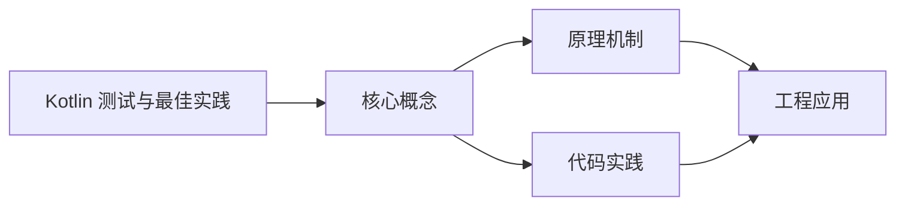

## 1. 学习目标（Bloom 分类）

本节按照布鲁姆教育目标分类学组织学习路径。本文主题为《Kotlin 测试与最佳实践》，属于 Kotlin 模块，读者可以根据自身阶段选择阅读深度。

记忆层面：能够准确复述本文的核心概念、术语与基本语法或操作步骤，并能够在提问或检索时快速定位对应知识点。能够说出 val/var、空安全操作符与 when 表达式的语法。

理解层面：能够用自己的语言解释核心原理与工作机制，说明概念之间的因果关系，而不是机械记忆结论。能够解释 Kotlin 与 Java 互操作的机制与平台类型概念。

应用层面：能够在真实项目或练习场景中运用本文知识解决具体问题，写出正确且可维护的实现。能够编写数据类、扩展函数与协程代码。

分析层面：能够拆解复杂问题，比较本文主题与相邻概念的异同，识别边界条件与例外情况。能够分析空安全、智能转换与协程调度原理。

评价层面：能够根据约束条件（性能、可读性、安全、成本）评价不同方案的优劣，做出有依据的技术决策。能够评价 Kotlin 在 Android、服务端与多平台场景的适用性。

创造层面：能够把本文知识与其他模块知识组合，设计出新的解决方案或可复用的工程模式。能够组合 Compose 与协程设计跨平台应用。

通过本节学习，读者应当能够把《Kotlin 测试与最佳实践》纳入自己的知识网络，并与 Kotlin 模块的其他主题（类型推断、空安全、协程、KMP）建立关联。

## 2. 历史动机与发展脉络

《Kotlin 测试与最佳实践》是 Kotlin 领域的重要主题。要真正理解它，需要先了解它解决的问题与演进过程。

Kotlin 由 JetBrains 于 2010 年开始研发，2016 年发布 1.0，定位是“更现代的 JVM 语言”：减少样板代码、消灭空指针、增强函数式能力，同时与 Java 100% 互操作。
2017 年 Google 宣布 Kotlin 成为 Android 一级语言，2019 年确立 Kotlin-first 政策；2023 年 Kotlin 2.0 的 K2 编译器显著提升编译速度与类型推导。
Kotlin Multiplatform（KMP）支持 JVM、Android、iOS、WebAssembly 等目标，配合 Compose Multiplatform 实现共享 UI 与业务逻辑，是 JetBrains 的长期战略方向。

回到本文主题：Kotlin 测试与最佳实践 的提出与成熟，正是上述技术背景下的必然产物。早期实现往往以简单可用为目标，随着工程规模扩大，社区逐渐沉淀出标准做法与最佳实践；理解这一脉络，可以帮助读者判断“为什么文档中的推荐写法是现在这个样子”，也能在遇到历史遗留代码时准确识别其设计年代与取舍。


## 3. 形式化定义与核心概念精讲

本节把《Kotlin 测试与最佳实践》涉及的核心概念以“定义 + 讲解”的形式展开。读者应把定义当作工具，把讲解当作理解路径；两者结合才能形成可迁移的知识。

空安全：类型系统区分 `String` 与 `String?`，编译期强制处理可空值；`?.` 短路、`?:` 提供默认、`!!` 显式断言，三者覆盖所有空值处理模式。
智能转换：`is` 检查后在不可变上下文中自动转换类型，减少显式强转；`as?` 安全转换失败返回 null。
协程：挂起函数（suspend）与调度器（Dispatchers.Main/IO/Default）实现非阻塞并发，结构化并发保证作用域内任务可取消。

### 3.1 原文章节逐一精讲

原文档把主题拆分为 8 个小节，下面按顺序给出每一节的导读讲解，随后保留原文细节供精读。

#### 原文精读（完整保留）


#### 1. JUnit 5 集成

JUnit 5 是 Kotlin 测试的主流框架：

##### 1.1 基本配置

```kotlin
// build.gradle.kts
dependencies {
    testImplementation(kotlin("test"))
    testImplementation("org.junit.jupiter:junit-jupiter:5.10.0")
    testRuntimeOnly("org.junit.platform:junit-platform-launcher")
}

tasks.test {
    useJUnitPlatform()
}
```

##### 1.2 基本测试

```kotlin
import org.junit.jupiter.api.Test
import org.junit.jupiter.api.Assertions.*
import org.junit.jupiter.api.BeforeEach
import org.junit.jupiter.api.DisplayName
import org.junit.jupiter.api.Nested

class CalculatorTest {
    private lateinit var calculator: Calculator

    @BeforeEach
    fun setup() {
        calculator = Calculator()
    }

    @Test
    @DisplayName("1 + 1 should equal 2")
    fun addition() {
        assertEquals(2, calculator.add(1, 1))
    }

    @Test
    fun `division by zero should throw`() {
        val exception = assertThrows(ArithmeticException::class.java) {
            calculator.divide(1, 0)
        }
        assertEquals("Division by zero", exception.message)
    }

    @Nested
    @DisplayName("When calculating")
    inner class WhenCalculating {
        @Test
        fun `should handle negative numbers`() {
            assertEquals(-3, calculator.add(-1, -2))
        }

        @Test
        fun `should handle zero`() {
            assertEquals(5, calculator.add(5, 0))
        }
    }
}
```

##### 1.3 参数化测试

```kotlin
import org.junit.jupiter.params.ParameterizedTest
import org.junit.jupiter.params.provider.CsvSource
import org.junit.jupiter.params.provider.ValueSource

class ParameterizedTestExample {

    @ParameterizedTest
    @ValueSource(strings = ["hello", "world", "kotlin"])
    fun `should not be blank`(input: String) {
        assertTrue(input.isNotBlank())
    }

    @ParameterizedTest
    @CsvSource(
        "1, 1, 2",
        "2, 3, 5",
        "10, 20, 30"
    )
    fun `addition should work`(a: Int, b: Int, expected: Int) {
        assertEquals(expected, a + b)
    }
}
```

#### 2. Kotest

Kotest 是 Kotlin 原生测试框架，提供更丰富的 DSL 风格：

##### 2.1 配置

```kotlin
dependencies {
    testImplementation("io.kotest:kotest-runner-junit5:5.9.0")
    testImplementation("io.kotest:kotest-assertions-core:5.9.0")
    testImplementation("io.kotest:kotest-property:5.9.0")
}
```

##### 2.2 测试风格

```kotlin
import io.kotest.core.spec.style.StringSpec
import io.kotest.core.spec.style.FunSpec
import io.kotest.core.spec.style.DescribeSpec
import io.kotest.matchers.shouldBe
import io.kotest.matchers.shouldNotBe
import io.kotest.matchers.nulls.shouldNotBeNull

// StringSpec — 最简洁
class CalculatorStringSpec : StringSpec({
    "addition should work" {
        1 + 1 shouldBe 2
    }
    "subtraction should work" {
        5 - 3 shouldBe 2
    }
})

// FunSpec — 类似 Mocha
class CalculatorFunSpec : FunSpec({
    test("addition should work") {
        1 + 1 shouldBe 2
    }
    context("with negative numbers") {
        test("should handle correctly") {
            (-1) + (-2) shouldBe -3
        }
    }
})

// DescribeSpec — 类似 RSpec
class CalculatorDescribeSpec : DescribeSpec({
    describe("addition") {
        it("should add two positive numbers") {
            1 + 1 shouldBe 2
        }
        it("should handle zero") {
            5 + 0 shouldBe 5
        }
    }
})
```

##### 2.3 属性测试

```kotlin
import io.kotest.property.Arb
import io.kotest.property.arbitrary.int
import io.kotest.property.arbitrary.string
import io.kotest.property.checkAll

class PropertyTest : StringSpec({
    "String length should be non-negative" {
        checkAll(Arb.string()) { str ->
            str.length shouldBeGreaterThanOrEqualTo 0
        }
    }

    "Addition should be commutative" {
        checkAll<Int, Int> { a, b ->
            a + b shouldBe b + a
        }
    }
})
```

#### 3. MockK

MockK 是 Kotlin 原生的 Mock 框架，支持协程、伴生对象等 Kotlin 特性：

##### 3.1 基本使用

```kotlin
import io.mockk.*
import org.junit.jupiter.api.Test

class UserServiceTest {
    private val repository = mockk<UserRepository>()
    private val service = UserService(repository)

    @Test
    fun `should find user by id`() {
        // Arrange
        val user = User("1", "Alice")
        every { repository.findById("1") } returns user

        // Act
        val result = service.getUser("1")

        // Assert
        result shouldBe user
        verify(exactly = 1) { repository.findById("1") }
    }

    @Test
    fun `should throw when user not found`() {
        every { repository.findById("999") } returns null

        shouldThrow<NotFoundException> {
            service.getUser("999")
        }
    }
}
```

##### 3.2 高级 Mock

```kotlin
// Mock 协程函数
private val api = mockk<ApiService>()

coEvery { api.fetchData() } returns listOf(Data("test"))
coVerify { api.fetchData() }

// Mock 伴生对象
mockkObject(Config)
every { Config.getVersion() } returns "2.0"

// 验证调用顺序
verifyOrder {
    repository.beginTransaction()
    repository.save(any())
    repository.commit()
}

// 参数匹配
every { repository.findByAge(any()) } returns emptyList()
every { repository.findByName(match { it.startsWith("A") }) } returns listOf(User("1", "Alice"))

// 链式调用
every { request.header("Auth") } returns "token" andThen "new-token"

// 抛出异常
every { repository.save(any()) } throws DatabaseException("Connection lost")
```

##### 3.3 松散 Mock 与严格 Mock

```kotlin
// 松散 Mock — 未配置的方法返回默认值
val mock = mockk<Repository>(relaxed = true)

// 严格 Mock — 未配置的方法抛出异常
val strictMock = mockk<Repository>()

// 验证未发生调用
verify { repository wasNot called }
verify(exactly = 0) { repository.delete(any()) }
```

#### 4. 协程测试

##### 4.1 基本协程测试

```kotlin
import kotlinx.coroutines.test.*
import org.junit.jupiter.api.Test

class CoroutineTest {

    @Test
    fun `should fetch data asynchronously`() = runTest {
        // runTest 替代 runBlocking，自动跳过 delay
        val result = fetchData()
        assertEquals("data", result)
    }

    @Test
    fun `should handle timeout`() = runTest {
        assertThrows<TimeoutCancellationException> {
            withTimeout(100) {
                delay(1000)
            }
        }
    }
}
```

##### 4.2 虚拟时间控制

```kotlin
@Test
fun `should advance time`() = runTest {
    var result = ""
    backgroundScope.launch {
        delay(1000)
        result = "done"
    }

    assertEquals("", result)
    advanceTimeBy(1000)  // 推进虚拟时间
    assertEquals("done", result)
}

@Test
fun `should run pending tasks`() = runTest {
    var executed = false
    launch {
        executed = true
    }
    assertFalse(executed)
    runCurrent()  // 执行所有待处理的任务
    assertTrue(executed)
}
```

##### 4.3 测试 ViewModel

```kotlin
class MyViewModelTest {
    @Test
    fun `should emit loading then success`() = runTest {
        val repository = mockk<Repository>()
        coEvery { repository.fetchData() } returns Data("test")

        val viewModel = MyViewModel(repository)

        // 收集 StateFlow 的值
        val states = mutableListOf<UiState>()
        val job = launch(StandardTestDispatcher()) {
            viewModel.state.toList(states)
        }

        viewModel.loadData()

        // 验证状态序列
        assertEquals(UiState.Loading, states[0])
        assertEquals(UiState.Success(Data("test")), states[1])

        job.cancel()
    }
}
```

##### 4.4 Turbine — Flow 测试

```kotlin
import app.cash.turbine.test

class FlowTest {
    @Test
    fun `should emit values in order`() = runTest {
        val flow = flow {
            emit(1)
            emit(2)
            emit(3)
        }

        flow.test {
            assertEquals(1, awaitItem())
            assertEquals(2, awaitItem())
            assertEquals(3, awaitItem())
            awaitComplete()
        }
    }

    @Test
    fun `should handle errors`() = runTest {
        val flow = flow<Int> {
            emit(1)
            throw RuntimeException("Error")
        }

        flow.test {
            assertEquals(1, awaitItem())
            val error = awaitError()
            assertEquals("Error", error.message)
        }
    }
}
```

#### 5. Android 测试

##### 5.1 本地单元测试

```kotlin
// src/test/
class ViewModelTest {
    @get:Rule
    val mainDispatcherRule = MainDispatcherRule()

    @Test
    fun `should update ui state`() = runTest {
        val viewModel = MyViewModel(FakeRepository())
        viewModel.loadData()
        assertEquals(UiState.Success(fakeData), viewModel.state.value)
    }
}

// MainDispatcherRule — 替换 Main 调度器
class MainDispatcherRule : TestWatcher() {
    val testDispatcher = StandardTestDispatcher()

    override fun starting(description: Description) {
        Dispatchers.setMain(testDispatcher)
    }

    override fun finished(description: Description) {
        Dispatchers.resetMain()
    }
}
```

##### 5.2 插桩测试

```kotlin
// src/androidTest/
@RunWith(AndroidJUnit4::class)
class DaoTest {
    private lateinit var database: AppDatabase
    private lateinit var userDao: UserDao

    @Before
    fun setup() {
        database = Room.inMemoryDatabaseBuilder(
            ApplicationProvider.getApplicationContext(),
            AppDatabase::class.java
        ).allowMainThreadQueries().build()
        userDao = database.userDao()
    }

    @After
    fun teardown() {
        database.close()
    }

    @Test
    fun insertAndRead() = runTest {
        val user = User(id = 1, name = "Alice")
        userDao.insert(user)
        val loaded = userDao.findById(1)
        assertEquals(user, loaded)
    }
}
```

#### 6. 代码规范

##### 6.1 命名规范

| 元素      | 规范                    | 示例                                     |
| --------- | ----------------------- | ---------------------------------------- |
| 包名      | 全小写，点分隔          | `com.example.project`                    |
| 类/接口   | PascalCase              | `UserService`, `Clickable`               |
| 函数/变量 | camelCase               | `calculateTotal`, `userCount`            |
| 常量      | SCREAMING_SNAKE_CASE    | `MAX_RETRY_COUNT`                        |
| 类型参数  | 大写单字母或 PascalCase | `T`, `R`, `Key`, `Value`                 |
| 测试方法  | 反引号描述              | `` `should return 404 when not found` `` |

##### 6.2 格式规范

```kotlin
// 链式调用换行
val result = items
    .filter { it.isActive }
    .map { it.name }
    .sorted()
    .toList()

// 长参数列表换行
fun createRequest(
    method: HttpMethod,
    url: String,
    headers: Map<String, String> = emptyMap(),
    body: String? = null
): Request

// when 分支格式
when (value) {
    is Int -> processInt(value)
    is String -> processString(value)
    else -> handleUnknown(value)
}
```

#### 7. 性能优化

##### 7.1 避免不必要的对象创建

```kotlin
// Bad — 每次调用创建新对象
fun process(items: List<String>): List<String> {
    val result = mutableListOf<String>()  // 每次创建
    items.forEach { result.add(it.uppercase()) }
    return result
}

// Good — 使用 map
fun process(items: List<String>): List<String> = items.map { it.uppercase() }
```

##### 7.2 使用 Sequence 处理大数据集

```kotlin
// Bad — 多次中间集合
val result = (1..1_000_000)
    .map { it * 2 }
    .filter { it > 100 }
    .take(10)
    .toList()

// Good — 惰性求值
val result = (1..1_000_000).asSequence()
    .map { it * 2 }
    .filter { it > 100 }
    .take(10)
    .toList()
```

##### 7.3 协程性能

```kotlin
// 限制并发数
suspend fun fetchAll(urls: List<String>): List<String> = coroutineScope {
    urls.map { url ->
        async(Dispatchers.IO) { fetchUrl(url) }
    }.awaitAll()
}

// 使用 Semaphore 限制并发
suspend fun fetchWithConcurrencyLimit(
    urls: List<String>,
    maxConcurrency: Int = 10
): List<String> = coroutineScope {
    val semaphore = Semaphore(maxConcurrency)
    urls.map { url ->
        async(Dispatchers.IO) {
            semaphore.withPermit { fetchUrl(url) }
        }
    }.awaitAll()
}
```

##### 7.4 原始类型数组

```kotlin
// Bad — 装箱开销
val numbers: List<Int> = (1..1000).toList()

// Good — 无装箱
val numbers: IntArray = IntArray(1000) { it + 1 }
```

#### 8. Effective Kotlin 要点

##### 8.1 限制可变性

```kotlin
// 优先使用 val
val items = listOf(1, 2, 3)  // 不可变引用 + 不可变集合

// 使用不可变集合接口
fun process(items: List<String>) {  // 而非 MutableList
    // ...
}

// 数据类使用 val
data class User(val name: String, val age: Int)  // 而非 var
```

##### 8.2 消除 !! 操作符

```kotlin
// Bad
val name: String = user.name!!

// Good — 使用 ?:
val name: String = user.name ?: "Unknown"

// Good — 使用 let
user.name?.let { processName(it) }

// Good — 使用 require/check
fun process(user: User) {
    requireNotNull(user.name) { "Name is required" }
    // 此后 user.name 智能转换为非空
}
```

##### 8.3 使用表达式体

```kotlin
// Bad
fun max(a: Int, b: Int): Int {
    return if (a > b) a else b
}

// Good
fun max(a: Int, b: Int): Int = if (a > b) a else b
```

##### 8.4 避免在构造函数中做重操作

```kotlin
// Bad — 构造函数中做 IO
class Service(config: Config) {
    private val data = loadData(config.path)  // 阻塞操作
}

// Good — 延迟加载
class Service(config: Config) {
    private val data by lazy { loadData(config.path) }
}
```

##### 8.5 使用密封类代替枚举 + when

```kotlin
// 密封类 + when 实现穷举检查
sealed class UiState {
    object Loading : UiState()
    data class Success(val data: String) : UiState()
    data class Error(val message: String) : UiState()
}

fun render(state: UiState) = when (state) {
    is UiState.Loading -> showLoading()
    is UiState.Success -> showData(state.data)
    is UiState.Error -> showError(state.message)
    // 编译器确保覆盖所有分支
}
```

##### 8.6 使用扩展函数提升可读性

```kotlin
// Bad — 工具类
class StringUtils {
    companion object {
        fun isEmail(str: String): Boolean = str.contains("@")
    }
}
StringUtils.isEmail("test@example.com")

// Good — 扩展函数
fun String.isEmail(): Boolean = this.contains("@") && this.contains(".")
"test@example.com".isEmail()
```

##### 8.7 合理使用作用域函数

```kotlin
// apply — 配置对象
val request = Request().apply {
    method = HttpMethod.POST
    url = "/api/users"
    headers["Content-Type"] = "application/json"
}

// let — 空安全链式调用
val domain = email?.substringAfter("@")?.let { it.lowercase() }

// also — 附加操作（不影响链式调用）
val user = createUser()
    .also { logger.info("Created user: ${it.id}") }
    .also { eventBus.publish(UserCreatedEvent(it.id)) }
```

##### 8.8 避免在伴生对象中存储可变状态

```kotlin
// Bad — 全局可变状态
class Config {
    companion object {
        var debugMode = false  // 全局可变，难以追踪
    }
}

// Good — 依赖注入
class Service(private val config: Config) {
    fun process() {
        if (config.debugMode) { /* ... */ }
    }
}
```


### 3.2 概念关系图

下面用 Mermaid 图表达本文核心概念之间的关系，帮助读者建立整体图景：



图中展示的是本文知识的结构化关系：核心概念是入口，原理机制解释“为什么”，代码实践演示“怎么做”，工程应用回答“何时用”。读者学习时可以把每个小节的内容挂接到对应节点上。

## 4. 理论推导与原理解析

本节深入《Kotlin 测试与最佳实践》背后的原理。理论部分不求面面俱到，而是聚焦“能解释现象、能指导实践”的关键推导。

空安全：类型系统区分 `String` 与 `String?`，编译期强制处理可空值；`?.` 短路、`?:` 提供默认、`!!` 显式断言，三者覆盖所有空值处理模式。
智能转换：`is` 检查后在不可变上下文中自动转换类型，减少显式强转；`as?` 安全转换失败返回 null。
协程：挂起函数（suspend）与调度器（Dispatchers.Main/IO/Default）实现非阻塞并发，结构化并发保证作用域内任务可取消。
扩展函数与属性：在不修改原类的情况下为类添加行为，是 Kotlin 标准库（如集合操作）的基石。

需要强调的是，理论推导与工程实践之间存在翻译层：理论给出的是理想化模型与边界条件，工程代码则必须处理真实环境中的例外。读者在学习时应先掌握理论的“标准情形”，再通过陷阱章节了解“非标准情形”。

## 5. 代码示例与逐行讲解

本节把原文中的代码示例系统整理，并为每个示例补充用途说明与讲解。读者不应只浏览代码，而应逐段对照讲解理解设计意图。

### 5.1 示例：1.1 基本配置

该示例来自原文《1.1 基本配置》小节，用于演示Kotlin 测试与最佳实践相关操作。阅读时请先看代码结构，再看其后的讲解。

```kotlin
// build.gradle.kts
dependencies {
    testImplementation(kotlin("test"))
    testImplementation("org.junit.jupiter:junit-jupiter:5.10.0")
    testRuntimeOnly("org.junit.platform:junit-platform-launcher")
}

tasks.test {
    useJUnitPlatform()
}
```

讲解：这段代码演示了本节核心知识点。代码中的关键操作可以归纳为三步：准备（定义或初始化）、执行（核心逻辑）、收尾（释放资源或返回结果）。实际项目中，这三步往往被封装为函数或类，以提升复用性与可测试性。

关键点分析：

该示例共 9 行有效代码，结构以数据或配置为主。阅读时应关注：数据字段的含义、配置项的作用，以及它们与运行行为的对应关系。

进阶思考路径：先尝试修改参数观察行为变化，再把示例中的模式迁移到自己的项目中；每次修改都记录预期与实测差异，这是把示例转化为能力的最快方式。

### 5.2 示例：1.2 基本测试

该示例来自原文《1.2 基本测试》小节，用于演示Kotlin 测试与最佳实践相关操作。阅读时请先看代码结构，再看其后的讲解。

```kotlin
import org.junit.jupiter.api.Test
import org.junit.jupiter.api.Assertions.*
import org.junit.jupiter.api.BeforeEach
import org.junit.jupiter.api.DisplayName
import org.junit.jupiter.api.Nested

class CalculatorTest {
    private lateinit var calculator: Calculator

    @BeforeEach
    fun setup() {
        calculator = Calculator()
    }

    @Test
    @DisplayName("1 + 1 should equal 2")
    fun addition() {
        assertEquals(2, calculator.add(1, 1))
    }

    @Test
    fun `division by zero should throw`() {
        val exception = assertThrows(ArithmeticException::class.java) {
            calculator.divide(1, 0)
        }
        assertEquals("Division by zero", exception.message)
    }

    @Nested
    @DisplayName("When calculating")
    inner class WhenCalculating {
        @Test
        fun `should handle negative numbers`() {
            assertEquals(-3, calculator.add(-1, -2))
        }

        @Test
        fun `should handle zero`() {
            assertEquals(5, calculator.add(5, 0))
        }
    }
}
```

讲解：这段代码演示了本节核心知识点。代码中的关键操作可以归纳为三步：准备（定义或初始化）、执行（核心逻辑）、收尾（释放资源或返回结果）。实际项目中，这三步往往被封装为函数或类，以提升复用性与可测试性。

关键点分析：

该示例共 36 行有效代码，包含 2 类关键结构（class、import）。其中：

- 入口与初始化部分负责建立上下文，对应实际项目中的启动或装配逻辑；
- 核心逻辑部分体现本文主题的主要操作，是阅读时最需要对照讲解理解的部分；
- 输出或返回部分把结果交给调用方，注意其类型与边界条件。

进阶思考路径：先尝试修改参数观察行为变化，再把示例中的模式迁移到自己的项目中；每次修改都记录预期与实测差异，这是把示例转化为能力的最快方式。

### 5.3 示例：1.3 参数化测试

该示例来自原文《1.3 参数化测试》小节，用于演示Kotlin 测试与最佳实践相关操作。阅读时请先看代码结构，再看其后的讲解。

```kotlin
import org.junit.jupiter.params.ParameterizedTest
import org.junit.jupiter.params.provider.CsvSource
import org.junit.jupiter.params.provider.ValueSource

class ParameterizedTestExample {

    @ParameterizedTest
    @ValueSource(strings = ["hello", "world", "kotlin"])
    fun `should not be blank`(input: String) {
        assertTrue(input.isNotBlank())
    }

    @ParameterizedTest
    @CsvSource(
        "1, 1, 2",
        "2, 3, 5",
        "10, 20, 30"
    )
    fun `addition should work`(a: Int, b: Int, expected: Int) {
        assertEquals(expected, a + b)
    }
}
```

讲解：这段代码演示了本节核心知识点。代码中的关键操作可以归纳为三步：准备（定义或初始化）、执行（核心逻辑）、收尾（释放资源或返回结果）。实际项目中，这三步往往被封装为函数或类，以提升复用性与可测试性。

关键点分析：

该示例共 19 行有效代码，包含 2 类关键结构（class、import）。其中：

- 入口与初始化部分负责建立上下文，对应实际项目中的启动或装配逻辑；
- 核心逻辑部分体现本文主题的主要操作，是阅读时最需要对照讲解理解的部分；
- 输出或返回部分把结果交给调用方，注意其类型与边界条件。

进阶思考路径：先尝试修改参数观察行为变化，再把示例中的模式迁移到自己的项目中；每次修改都记录预期与实测差异，这是把示例转化为能力的最快方式。

### 5.4 示例：2.1 配置

该示例来自原文《2.1 配置》小节，用于演示Kotlin 测试与最佳实践相关操作。阅读时请先看代码结构，再看其后的讲解。

```kotlin
dependencies {
    testImplementation("io.kotest:kotest-runner-junit5:5.9.0")
    testImplementation("io.kotest:kotest-assertions-core:5.9.0")
    testImplementation("io.kotest:kotest-property:5.9.0")
}
```

讲解：这段代码演示了本节核心知识点。代码中的关键操作可以归纳为三步：准备（定义或初始化）、执行（核心逻辑）、收尾（释放资源或返回结果）。实际项目中，这三步往往被封装为函数或类，以提升复用性与可测试性。

关键点分析：

该示例共 5 行有效代码，结构以数据或配置为主。阅读时应关注：数据字段的含义、配置项的作用，以及它们与运行行为的对应关系。

进阶思考路径：先尝试修改参数观察行为变化，再把示例中的模式迁移到自己的项目中；每次修改都记录预期与实测差异，这是把示例转化为能力的最快方式。

### 5.5 示例：2.2 测试风格

该示例来自原文《2.2 测试风格》小节，用于演示Kotlin 测试与最佳实践相关操作。阅读时请先看代码结构，再看其后的讲解。

```kotlin
import io.kotest.core.spec.style.StringSpec
import io.kotest.core.spec.style.FunSpec
import io.kotest.core.spec.style.DescribeSpec
import io.kotest.matchers.shouldBe
import io.kotest.matchers.shouldNotBe
import io.kotest.matchers.nulls.shouldNotBeNull

// StringSpec — 最简洁
class CalculatorStringSpec : StringSpec({
    "addition should work" {
        1 + 1 shouldBe 2
    }
    "subtraction should work" {
        5 - 3 shouldBe 2
    }
})

// FunSpec — 类似 Mocha
class CalculatorFunSpec : FunSpec({
    test("addition should work") {
        1 + 1 shouldBe 2
    }
    context("with negative numbers") {
        test("should handle correctly") {
            (-1) + (-2) shouldBe -3
        }
    }
})

// DescribeSpec — 类似 RSpec
class CalculatorDescribeSpec : DescribeSpec({
    describe("addition") {
        it("should add two positive numbers") {
            1 + 1 shouldBe 2
        }
        it("should handle zero") {
            5 + 0 shouldBe 5
        }
    }
})
```

讲解：这段代码演示了本节核心知识点。代码中的关键操作可以归纳为三步：准备（定义或初始化）、执行（核心逻辑）、收尾（释放资源或返回结果）。实际项目中，这三步往往被封装为函数或类，以提升复用性与可测试性。

关键点分析：

该示例共 37 行有效代码，包含 2 类关键结构（class、import）。其中：

- 入口与初始化部分负责建立上下文，对应实际项目中的启动或装配逻辑；
- 核心逻辑部分体现本文主题的主要操作，是阅读时最需要对照讲解理解的部分；
- 输出或返回部分把结果交给调用方，注意其类型与边界条件。

进阶思考路径：先尝试修改参数观察行为变化，再把示例中的模式迁移到自己的项目中；每次修改都记录预期与实测差异，这是把示例转化为能力的最快方式。

### 5.6 示例：2.3 属性测试

该示例来自原文《2.3 属性测试》小节，用于演示Kotlin 测试与最佳实践相关操作。阅读时请先看代码结构，再看其后的讲解。

```kotlin
import io.kotest.property.Arb
import io.kotest.property.arbitrary.int
import io.kotest.property.arbitrary.string
import io.kotest.property.checkAll

class PropertyTest : StringSpec({
    "String length should be non-negative" {
        checkAll(Arb.string()) { str ->
            str.length shouldBeGreaterThanOrEqualTo 0
        }
    }

    "Addition should be commutative" {
        checkAll<Int, Int> { a, b ->
            a + b shouldBe b + a
        }
    }
})
```

讲解：这段代码演示了本节核心知识点。代码中的关键操作可以归纳为三步：准备（定义或初始化）、执行（核心逻辑）、收尾（释放资源或返回结果）。实际项目中，这三步往往被封装为函数或类，以提升复用性与可测试性。

关键点分析：

该示例共 16 行有效代码，包含 2 类关键结构（class、import）。其中：

- 入口与初始化部分负责建立上下文，对应实际项目中的启动或装配逻辑；
- 核心逻辑部分体现本文主题的主要操作，是阅读时最需要对照讲解理解的部分；
- 输出或返回部分把结果交给调用方，注意其类型与边界条件。

进阶思考路径：先尝试修改参数观察行为变化，再把示例中的模式迁移到自己的项目中；每次修改都记录预期与实测差异，这是把示例转化为能力的最快方式。

### 5.7 示例：3.1 基本使用

该示例来自原文《3.1 基本使用》小节，用于演示Kotlin 测试与最佳实践相关操作。阅读时请先看代码结构，再看其后的讲解。

```kotlin
import io.mockk.*
import org.junit.jupiter.api.Test

class UserServiceTest {
    private val repository = mockk<UserRepository>()
    private val service = UserService(repository)

    @Test
    fun `should find user by id`() {
        // Arrange
        val user = User("1", "Alice")
        every { repository.findById("1") } returns user

        // Act
        val result = service.getUser("1")

        // Assert
        result shouldBe user
        verify(exactly = 1) { repository.findById("1") }
    }

    @Test
    fun `should throw when user not found`() {
        every { repository.findById("999") } returns null

        shouldThrow<NotFoundException> {
            service.getUser("999")
        }
    }
}
```

讲解：这段代码演示了本节核心知识点。代码中的关键操作可以归纳为三步：准备（定义或初始化）、执行（核心逻辑）、收尾（释放资源或返回结果）。实际项目中，这三步往往被封装为函数或类，以提升复用性与可测试性。

关键点分析：

该示例共 24 行有效代码，包含 3 类关键结构（class、import、return）。其中：

- 入口与初始化部分负责建立上下文，对应实际项目中的启动或装配逻辑；
- 核心逻辑部分体现本文主题的主要操作，是阅读时最需要对照讲解理解的部分；
- 输出或返回部分把结果交给调用方，注意其类型与边界条件。

进阶思考路径：先尝试修改参数观察行为变化，再把示例中的模式迁移到自己的项目中；每次修改都记录预期与实测差异，这是把示例转化为能力的最快方式。

### 5.8 示例：3.2 高级 Mock

该示例来自原文《3.2 高级 Mock》小节，用于演示Kotlin 测试与最佳实践相关操作。阅读时请先看代码结构，再看其后的讲解。

```kotlin
// Mock 协程函数
private val api = mockk<ApiService>()

coEvery { api.fetchData() } returns listOf(Data("test"))
coVerify { api.fetchData() }

// Mock 伴生对象
mockkObject(Config)
every { Config.getVersion() } returns "2.0"

// 验证调用顺序
verifyOrder {
    repository.beginTransaction()
    repository.save(any())
    repository.commit()
}

// 参数匹配
every { repository.findByAge(any()) } returns emptyList()
every { repository.findByName(match { it.startsWith("A") }) } returns listOf(User("1", "Alice"))

// 链式调用
every { request.header("Auth") } returns "token" andThen "new-token"

// 抛出异常
every { repository.save(any()) } throws DatabaseException("Connection lost")
```

讲解：这段代码演示了本节核心知识点。代码中的关键操作可以归纳为三步：准备（定义或初始化）、执行（核心逻辑）、收尾（释放资源或返回结果）。实际项目中，这三步往往被封装为函数或类，以提升复用性与可测试性。

关键点分析：

该示例共 20 行有效代码，包含 1 类关键结构（return）。其中：

- 入口与初始化部分负责建立上下文，对应实际项目中的启动或装配逻辑；
- 核心逻辑部分体现本文主题的主要操作，是阅读时最需要对照讲解理解的部分；
- 输出或返回部分把结果交给调用方，注意其类型与边界条件。

进阶思考路径：先尝试修改参数观察行为变化，再把示例中的模式迁移到自己的项目中；每次修改都记录预期与实测差异，这是把示例转化为能力的最快方式。

### 5.9 示例：3.3 松散 Mock 与严格 Mock

该示例来自原文《3.3 松散 Mock 与严格 Mock》小节，用于演示Kotlin 测试与最佳实践相关操作。阅读时请先看代码结构，再看其后的讲解。

```kotlin
// 松散 Mock — 未配置的方法返回默认值
val mock = mockk<Repository>(relaxed = true)

// 严格 Mock — 未配置的方法抛出异常
val strictMock = mockk<Repository>()

// 验证未发生调用
verify { repository wasNot called }
verify(exactly = 0) { repository.delete(any()) }
```

讲解：这段代码演示了本节核心知识点。代码中的关键操作可以归纳为三步：准备（定义或初始化）、执行（核心逻辑）、收尾（释放资源或返回结果）。实际项目中，这三步往往被封装为函数或类，以提升复用性与可测试性。

关键点分析：

该示例共 7 行有效代码，结构以数据或配置为主。阅读时应关注：数据字段的含义、配置项的作用，以及它们与运行行为的对应关系。

进阶思考路径：先尝试修改参数观察行为变化，再把示例中的模式迁移到自己的项目中；每次修改都记录预期与实测差异，这是把示例转化为能力的最快方式。

### 5.10 示例：4.1 基本协程测试

该示例来自原文《4.1 基本协程测试》小节，用于演示Kotlin 测试与最佳实践相关操作。阅读时请先看代码结构，再看其后的讲解。

```kotlin
import kotlinx.coroutines.test.*
import org.junit.jupiter.api.Test

class CoroutineTest {

    @Test
    fun `should fetch data asynchronously`() = runTest {
        // runTest 替代 runBlocking，自动跳过 delay
        val result = fetchData()
        assertEquals("data", result)
    }

    @Test
    fun `should handle timeout`() = runTest {
        assertThrows<TimeoutCancellationException> {
            withTimeout(100) {
                delay(1000)
            }
        }
    }
}
```

讲解：这段代码演示了本节核心知识点。代码中的关键操作可以归纳为三步：准备（定义或初始化）、执行（核心逻辑）、收尾（释放资源或返回结果）。实际项目中，这三步往往被封装为函数或类，以提升复用性与可测试性。

关键点分析：

该示例共 18 行有效代码，包含 2 类关键结构（class、import）。其中：

- 入口与初始化部分负责建立上下文，对应实际项目中的启动或装配逻辑；
- 核心逻辑部分体现本文主题的主要操作，是阅读时最需要对照讲解理解的部分；
- 输出或返回部分把结果交给调用方，注意其类型与边界条件。

进阶思考路径：先尝试修改参数观察行为变化，再把示例中的模式迁移到自己的项目中；每次修改都记录预期与实测差异，这是把示例转化为能力的最快方式。

### 5.11 示例：4.2 虚拟时间控制

该示例来自原文《4.2 虚拟时间控制》小节，用于演示Kotlin 测试与最佳实践相关操作。阅读时请先看代码结构，再看其后的讲解。

```kotlin
@Test
fun `should advance time`() = runTest {
    var result = ""
    backgroundScope.launch {
        delay(1000)
        result = "done"
    }

    assertEquals("", result)
    advanceTimeBy(1000)  // 推进虚拟时间
    assertEquals("done", result)
}

@Test
fun `should run pending tasks`() = runTest {
    var executed = false
    launch {
        executed = true
    }
    assertFalse(executed)
    runCurrent()  // 执行所有待处理的任务
    assertTrue(executed)
}
```

讲解：这段代码演示了本节核心知识点。代码中的关键操作可以归纳为三步：准备（定义或初始化）、执行（核心逻辑）、收尾（释放资源或返回结果）。实际项目中，这三步往往被封装为函数或类，以提升复用性与可测试性。

关键点分析：

该示例共 21 行有效代码，结构以数据或配置为主。阅读时应关注：数据字段的含义、配置项的作用，以及它们与运行行为的对应关系。

进阶思考路径：先尝试修改参数观察行为变化，再把示例中的模式迁移到自己的项目中；每次修改都记录预期与实测差异，这是把示例转化为能力的最快方式。

### 5.12 示例：4.3 测试 ViewModel

该示例来自原文《4.3 测试 ViewModel》小节，用于演示Kotlin 测试与最佳实践相关操作。阅读时请先看代码结构，再看其后的讲解。

```kotlin
class MyViewModelTest {
    @Test
    fun `should emit loading then success`() = runTest {
        val repository = mockk<Repository>()
        coEvery { repository.fetchData() } returns Data("test")

        val viewModel = MyViewModel(repository)

        // 收集 StateFlow 的值
        val states = mutableListOf<UiState>()
        val job = launch(StandardTestDispatcher()) {
            viewModel.state.toList(states)
        }

        viewModel.loadData()

        // 验证状态序列
        assertEquals(UiState.Loading, states[0])
        assertEquals(UiState.Success(Data("test")), states[1])

        job.cancel()
    }
}
```

讲解：这段代码演示了本节核心知识点。代码中的关键操作可以归纳为三步：准备（定义或初始化）、执行（核心逻辑）、收尾（释放资源或返回结果）。实际项目中，这三步往往被封装为函数或类，以提升复用性与可测试性。

关键点分析：

该示例共 18 行有效代码，包含 2 类关键结构（class、return）。其中：

- 入口与初始化部分负责建立上下文，对应实际项目中的启动或装配逻辑；
- 核心逻辑部分体现本文主题的主要操作，是阅读时最需要对照讲解理解的部分；
- 输出或返回部分把结果交给调用方，注意其类型与边界条件。

进阶思考路径：先尝试修改参数观察行为变化，再把示例中的模式迁移到自己的项目中；每次修改都记录预期与实测差异，这是把示例转化为能力的最快方式。

### 5.13 示例：4.4 Turbine — Flow 测试

该示例来自原文《4.4 Turbine — Flow 测试》小节，用于演示Kotlin 测试与最佳实践相关操作。阅读时请先看代码结构，再看其后的讲解。

```kotlin
import app.cash.turbine.test

class FlowTest {
    @Test
    fun `should emit values in order`() = runTest {
        val flow = flow {
            emit(1)
            emit(2)
            emit(3)
        }

        flow.test {
            assertEquals(1, awaitItem())
            assertEquals(2, awaitItem())
            assertEquals(3, awaitItem())
            awaitComplete()
        }
    }

    @Test
    fun `should handle errors`() = runTest {
        val flow = flow<Int> {
            emit(1)
            throw RuntimeException("Error")
        }

        flow.test {
            assertEquals(1, awaitItem())
            val error = awaitError()
            assertEquals("Error", error.message)
        }
    }
}
```

讲解：这段代码演示了本节核心知识点。代码中的关键操作可以归纳为三步：准备（定义或初始化）、执行（核心逻辑）、收尾（释放资源或返回结果）。实际项目中，这三步往往被封装为函数或类，以提升复用性与可测试性。

关键点分析：

该示例共 29 行有效代码，包含 2 类关键结构（class、import）。其中：

- 入口与初始化部分负责建立上下文，对应实际项目中的启动或装配逻辑；
- 核心逻辑部分体现本文主题的主要操作，是阅读时最需要对照讲解理解的部分；
- 输出或返回部分把结果交给调用方，注意其类型与边界条件。

进阶思考路径：先尝试修改参数观察行为变化，再把示例中的模式迁移到自己的项目中；每次修改都记录预期与实测差异，这是把示例转化为能力的最快方式。

### 5.14 示例：5.1 本地单元测试

该示例来自原文《5.1 本地单元测试》小节，用于演示Kotlin 测试与最佳实践相关操作。阅读时请先看代码结构，再看其后的讲解。

```kotlin
// src/test/
class ViewModelTest {
    @get:Rule
    val mainDispatcherRule = MainDispatcherRule()

    @Test
    fun `should update ui state`() = runTest {
        val viewModel = MyViewModel(FakeRepository())
        viewModel.loadData()
        assertEquals(UiState.Success(fakeData), viewModel.state.value)
    }
}

// MainDispatcherRule — 替换 Main 调度器
class MainDispatcherRule : TestWatcher() {
    val testDispatcher = StandardTestDispatcher()

    override fun starting(description: Description) {
        Dispatchers.setMain(testDispatcher)
    }

    override fun finished(description: Description) {
        Dispatchers.resetMain()
    }
}
```

讲解：这段代码演示了本节核心知识点。代码中的关键操作可以归纳为三步：准备（定义或初始化）、执行（核心逻辑）、收尾（释放资源或返回结果）。实际项目中，这三步往往被封装为函数或类，以提升复用性与可测试性。

关键点分析：

该示例共 21 行有效代码，包含 1 类关键结构（class）。其中：

- 入口与初始化部分负责建立上下文，对应实际项目中的启动或装配逻辑；
- 核心逻辑部分体现本文主题的主要操作，是阅读时最需要对照讲解理解的部分；
- 输出或返回部分把结果交给调用方，注意其类型与边界条件。

进阶思考路径：先尝试修改参数观察行为变化，再把示例中的模式迁移到自己的项目中；每次修改都记录预期与实测差异，这是把示例转化为能力的最快方式。

### 5.15 示例：5.2 插桩测试

该示例来自原文《5.2 插桩测试》小节，用于演示Kotlin 测试与最佳实践相关操作。阅读时请先看代码结构，再看其后的讲解。

```kotlin
// src/androidTest/
@RunWith(AndroidJUnit4::class)
class DaoTest {
    private lateinit var database: AppDatabase
    private lateinit var userDao: UserDao

    @Before
    fun setup() {
        database = Room.inMemoryDatabaseBuilder(
            ApplicationProvider.getApplicationContext(),
            AppDatabase::class.java
        ).allowMainThreadQueries().build()
        userDao = database.userDao()
    }

    @After
    fun teardown() {
        database.close()
    }

    @Test
    fun insertAndRead() = runTest {
        val user = User(id = 1, name = "Alice")
        userDao.insert(user)
        val loaded = userDao.findById(1)
        assertEquals(user, loaded)
    }
}
```

讲解：这段代码演示了本节核心知识点。代码中的关键操作可以归纳为三步：准备（定义或初始化）、执行（核心逻辑）、收尾（释放资源或返回结果）。实际项目中，这三步往往被封装为函数或类，以提升复用性与可测试性。

关键点分析：

该示例共 25 行有效代码，包含 1 类关键结构（class）。其中：

- 入口与初始化部分负责建立上下文，对应实际项目中的启动或装配逻辑；
- 核心逻辑部分体现本文主题的主要操作，是阅读时最需要对照讲解理解的部分；
- 输出或返回部分把结果交给调用方，注意其类型与边界条件。

进阶思考路径：先尝试修改参数观察行为变化，再把示例中的模式迁移到自己的项目中；每次修改都记录预期与实测差异，这是把示例转化为能力的最快方式。

### 5.16 示例：6.2 格式规范

该示例来自原文《6.2 格式规范》小节，用于演示Kotlin 测试与最佳实践相关操作。阅读时请先看代码结构，再看其后的讲解。

```kotlin
// 链式调用换行
val result = items
    .filter { it.isActive }
    .map { it.name }
    .sorted()
    .toList()

// 长参数列表换行
fun createRequest(
    method: HttpMethod,
    url: String,
    headers: Map<String, String> = emptyMap(),
    body: String? = null
): Request

// when 分支格式
when (value) {
    is Int -> processInt(value)
    is String -> processString(value)
    else -> handleUnknown(value)
}
```

讲解：这段代码演示了本节核心知识点。代码中的关键操作可以归纳为三步：准备（定义或初始化）、执行（核心逻辑）、收尾（释放资源或返回结果）。实际项目中，这三步往往被封装为函数或类，以提升复用性与可测试性。

关键点分析：

该示例共 19 行有效代码，结构以数据或配置为主。阅读时应关注：数据字段的含义、配置项的作用，以及它们与运行行为的对应关系。

进阶思考路径：先尝试修改参数观察行为变化，再把示例中的模式迁移到自己的项目中；每次修改都记录预期与实测差异，这是把示例转化为能力的最快方式。

### 5.17 示例：7.1 避免不必要的对象创建

该示例来自原文《7.1 避免不必要的对象创建》小节，用于演示Kotlin 测试与最佳实践相关操作。阅读时请先看代码结构，再看其后的讲解。

```kotlin
// Bad — 每次调用创建新对象
fun process(items: List<String>): List<String> {
    val result = mutableListOf<String>()  // 每次创建
    items.forEach { result.add(it.uppercase()) }
    return result
}

// Good — 使用 map
fun process(items: List<String>): List<String> = items.map { it.uppercase() }
```

讲解：这段代码演示了本节核心知识点。代码中的关键操作可以归纳为三步：准备（定义或初始化）、执行（核心逻辑）、收尾（释放资源或返回结果）。实际项目中，这三步往往被封装为函数或类，以提升复用性与可测试性。

关键点分析：

该示例共 8 行有效代码，包含 1 类关键结构（return）。其中：

- 入口与初始化部分负责建立上下文，对应实际项目中的启动或装配逻辑；
- 核心逻辑部分体现本文主题的主要操作，是阅读时最需要对照讲解理解的部分；
- 输出或返回部分把结果交给调用方，注意其类型与边界条件。

进阶思考路径：先尝试修改参数观察行为变化，再把示例中的模式迁移到自己的项目中；每次修改都记录预期与实测差异，这是把示例转化为能力的最快方式。

### 5.18 示例：7.2 使用 Sequence 处理大数据集

该示例来自原文《7.2 使用 Sequence 处理大数据集》小节，用于演示Kotlin 测试与最佳实践相关操作。阅读时请先看代码结构，再看其后的讲解。

```kotlin
// Bad — 多次中间集合
val result = (1..1_000_000)
    .map { it * 2 }
    .filter { it > 100 }
    .take(10)
    .toList()

// Good — 惰性求值
val result = (1..1_000_000).asSequence()
    .map { it * 2 }
    .filter { it > 100 }
    .take(10)
    .toList()
```

讲解：这段代码演示了本节核心知识点。代码中的关键操作可以归纳为三步：准备（定义或初始化）、执行（核心逻辑）、收尾（释放资源或返回结果）。实际项目中，这三步往往被封装为函数或类，以提升复用性与可测试性。

关键点分析：

该示例共 12 行有效代码，结构以数据或配置为主。阅读时应关注：数据字段的含义、配置项的作用，以及它们与运行行为的对应关系。

进阶思考路径：先尝试修改参数观察行为变化，再把示例中的模式迁移到自己的项目中；每次修改都记录预期与实测差异，这是把示例转化为能力的最快方式。

### 5.19 示例：7.3 协程性能

该示例来自原文《7.3 协程性能》小节，用于演示Kotlin 测试与最佳实践相关操作。阅读时请先看代码结构，再看其后的讲解。

```kotlin
// 限制并发数
suspend fun fetchAll(urls: List<String>): List<String> = coroutineScope {
    urls.map { url ->
        async(Dispatchers.IO) { fetchUrl(url) }
    }.awaitAll()
}

// 使用 Semaphore 限制并发
suspend fun fetchWithConcurrencyLimit(
    urls: List<String>,
    maxConcurrency: Int = 10
): List<String> = coroutineScope {
    val semaphore = Semaphore(maxConcurrency)
    urls.map { url ->
        async(Dispatchers.IO) {
            semaphore.withPermit { fetchUrl(url) }
        }
    }.awaitAll()
}
```

讲解：这段代码演示了本节核心知识点。代码中的关键操作可以归纳为三步：准备（定义或初始化）、执行（核心逻辑）、收尾（释放资源或返回结果）。实际项目中，这三步往往被封装为函数或类，以提升复用性与可测试性。

关键点分析：

该示例共 18 行有效代码，结构以数据或配置为主。阅读时应关注：数据字段的含义、配置项的作用，以及它们与运行行为的对应关系。

进阶思考路径：先尝试修改参数观察行为变化，再把示例中的模式迁移到自己的项目中；每次修改都记录预期与实测差异，这是把示例转化为能力的最快方式。

### 5.20 示例：7.4 原始类型数组

该示例来自原文《7.4 原始类型数组》小节，用于演示Kotlin 测试与最佳实践相关操作。阅读时请先看代码结构，再看其后的讲解。

```kotlin
// Bad — 装箱开销
val numbers: List<Int> = (1..1000).toList()

// Good — 无装箱
val numbers: IntArray = IntArray(1000) { it + 1 }
```

讲解：这段代码演示了本节核心知识点。代码中的关键操作可以归纳为三步：准备（定义或初始化）、执行（核心逻辑）、收尾（释放资源或返回结果）。实际项目中，这三步往往被封装为函数或类，以提升复用性与可测试性。

关键点分析：

该示例共 4 行有效代码，结构以数据或配置为主。阅读时应关注：数据字段的含义、配置项的作用，以及它们与运行行为的对应关系。

进阶思考路径：先尝试修改参数观察行为变化，再把示例中的模式迁移到自己的项目中；每次修改都记录预期与实测差异，这是把示例转化为能力的最快方式。

### 5.21 示例：8.1 限制可变性

该示例来自原文《8.1 限制可变性》小节，用于演示Kotlin 测试与最佳实践相关操作。阅读时请先看代码结构，再看其后的讲解。

```kotlin
// 优先使用 val
val items = listOf(1, 2, 3)  // 不可变引用 + 不可变集合

// 使用不可变集合接口
fun process(items: List<String>) {  // 而非 MutableList
    // ...
}

// 数据类使用 val
data class User(val name: String, val age: Int)  // 而非 var
```

讲解：这段代码演示了本节核心知识点。代码中的关键操作可以归纳为三步：准备（定义或初始化）、执行（核心逻辑）、收尾（释放资源或返回结果）。实际项目中，这三步往往被封装为函数或类，以提升复用性与可测试性。

关键点分析：

该示例共 8 行有效代码，包含 1 类关键结构（class）。其中：

- 入口与初始化部分负责建立上下文，对应实际项目中的启动或装配逻辑；
- 核心逻辑部分体现本文主题的主要操作，是阅读时最需要对照讲解理解的部分；
- 输出或返回部分把结果交给调用方，注意其类型与边界条件。

进阶思考路径：先尝试修改参数观察行为变化，再把示例中的模式迁移到自己的项目中；每次修改都记录预期与实测差异，这是把示例转化为能力的最快方式。

### 5.22 示例：8.2 消除 !! 操作符

该示例来自原文《8.2 消除 !! 操作符》小节，用于演示Kotlin 测试与最佳实践相关操作。阅读时请先看代码结构，再看其后的讲解。

```kotlin
// Bad
val name: String = user.name!!

// Good — 使用 ?:
val name: String = user.name ?: "Unknown"

// Good — 使用 let
user.name?.let { processName(it) }

// Good — 使用 require/check
fun process(user: User) {
    requireNotNull(user.name) { "Name is required" }
    // 此后 user.name 智能转换为非空
}
```

讲解：这段代码演示了本节核心知识点。代码中的关键操作可以归纳为三步：准备（定义或初始化）、执行（核心逻辑）、收尾（释放资源或返回结果）。实际项目中，这三步往往被封装为函数或类，以提升复用性与可测试性。

关键点分析：

该示例共 11 行有效代码，结构以数据或配置为主。阅读时应关注：数据字段的含义、配置项的作用，以及它们与运行行为的对应关系。

进阶思考路径：先尝试修改参数观察行为变化，再把示例中的模式迁移到自己的项目中；每次修改都记录预期与实测差异，这是把示例转化为能力的最快方式。

### 5.23 示例：8.3 使用表达式体

该示例来自原文《8.3 使用表达式体》小节，用于演示Kotlin 测试与最佳实践相关操作。阅读时请先看代码结构，再看其后的讲解。

```kotlin
// Bad
fun max(a: Int, b: Int): Int {
    return if (a > b) a else b
}

// Good
fun max(a: Int, b: Int): Int = if (a > b) a else b
```

讲解：这段代码演示了本节核心知识点。代码中的关键操作可以归纳为三步：准备（定义或初始化）、执行（核心逻辑）、收尾（释放资源或返回结果）。实际项目中，这三步往往被封装为函数或类，以提升复用性与可测试性。

关键点分析：

该示例共 6 行有效代码，包含 2 类关键结构（if、return）。其中：

- 入口与初始化部分负责建立上下文，对应实际项目中的启动或装配逻辑；
- 核心逻辑部分体现本文主题的主要操作，是阅读时最需要对照讲解理解的部分；
- 输出或返回部分把结果交给调用方，注意其类型与边界条件。

进阶思考路径：先尝试修改参数观察行为变化，再把示例中的模式迁移到自己的项目中；每次修改都记录预期与实测差异，这是把示例转化为能力的最快方式。

### 5.24 示例：8.4 避免在构造函数中做重操作

该示例来自原文《8.4 避免在构造函数中做重操作》小节，用于演示Kotlin 测试与最佳实践相关操作。阅读时请先看代码结构，再看其后的讲解。

```kotlin
// Bad — 构造函数中做 IO
class Service(config: Config) {
    private val data = loadData(config.path)  // 阻塞操作
}

// Good — 延迟加载
class Service(config: Config) {
    private val data by lazy { loadData(config.path) }
}
```

讲解：这段代码演示了本节核心知识点。代码中的关键操作可以归纳为三步：准备（定义或初始化）、执行（核心逻辑）、收尾（释放资源或返回结果）。实际项目中，这三步往往被封装为函数或类，以提升复用性与可测试性。

关键点分析：

该示例共 8 行有效代码，包含 1 类关键结构（class）。其中：

- 入口与初始化部分负责建立上下文，对应实际项目中的启动或装配逻辑；
- 核心逻辑部分体现本文主题的主要操作，是阅读时最需要对照讲解理解的部分；
- 输出或返回部分把结果交给调用方，注意其类型与边界条件。

进阶思考路径：先尝试修改参数观察行为变化，再把示例中的模式迁移到自己的项目中；每次修改都记录预期与实测差异，这是把示例转化为能力的最快方式。

### 5.25 示例：8.5 使用密封类代替枚举 + when

该示例来自原文《8.5 使用密封类代替枚举 + when》小节，用于演示Kotlin 测试与最佳实践相关操作。阅读时请先看代码结构，再看其后的讲解。

```kotlin
// 密封类 + when 实现穷举检查
sealed class UiState {
    object Loading : UiState()
    data class Success(val data: String) : UiState()
    data class Error(val message: String) : UiState()
}

fun render(state: UiState) = when (state) {
    is UiState.Loading -> showLoading()
    is UiState.Success -> showData(state.data)
    is UiState.Error -> showError(state.message)
    // 编译器确保覆盖所有分支
}
```

讲解：这段代码演示了本节核心知识点。代码中的关键操作可以归纳为三步：准备（定义或初始化）、执行（核心逻辑）、收尾（释放资源或返回结果）。实际项目中，这三步往往被封装为函数或类，以提升复用性与可测试性。

关键点分析：

该示例共 12 行有效代码，包含 1 类关键结构（class）。其中：

- 入口与初始化部分负责建立上下文，对应实际项目中的启动或装配逻辑；
- 核心逻辑部分体现本文主题的主要操作，是阅读时最需要对照讲解理解的部分；
- 输出或返回部分把结果交给调用方，注意其类型与边界条件。

进阶思考路径：先尝试修改参数观察行为变化，再把示例中的模式迁移到自己的项目中；每次修改都记录预期与实测差异，这是把示例转化为能力的最快方式。

### 5.26 示例：8.6 使用扩展函数提升可读性

该示例来自原文《8.6 使用扩展函数提升可读性》小节，用于演示Kotlin 测试与最佳实践相关操作。阅读时请先看代码结构，再看其后的讲解。

```kotlin
// Bad — 工具类
class StringUtils {
    companion object {
        fun isEmail(str: String): Boolean = str.contains("@")
    }
}
StringUtils.isEmail("test@example.com")

// Good — 扩展函数
fun String.isEmail(): Boolean = this.contains("@") && this.contains(".")
"test@example.com".isEmail()
```

讲解：这段代码演示了本节核心知识点。代码中的关键操作可以归纳为三步：准备（定义或初始化）、执行（核心逻辑）、收尾（释放资源或返回结果）。实际项目中，这三步往往被封装为函数或类，以提升复用性与可测试性。

关键点分析：

该示例共 10 行有效代码，包含 1 类关键结构（class）。其中：

- 入口与初始化部分负责建立上下文，对应实际项目中的启动或装配逻辑；
- 核心逻辑部分体现本文主题的主要操作，是阅读时最需要对照讲解理解的部分；
- 输出或返回部分把结果交给调用方，注意其类型与边界条件。

进阶思考路径：先尝试修改参数观察行为变化，再把示例中的模式迁移到自己的项目中；每次修改都记录预期与实测差异，这是把示例转化为能力的最快方式。

### 5.27 示例：8.7 合理使用作用域函数

该示例来自原文《8.7 合理使用作用域函数》小节，用于演示Kotlin 测试与最佳实践相关操作。阅读时请先看代码结构，再看其后的讲解。

```kotlin
// apply — 配置对象
val request = Request().apply {
    method = HttpMethod.POST
    url = "/api/users"
    headers["Content-Type"] = "application/json"
}

// let — 空安全链式调用
val domain = email?.substringAfter("@")?.let { it.lowercase() }

// also — 附加操作（不影响链式调用）
val user = createUser()
    .also { logger.info("Created user: ${it.id}") }
    .also { eventBus.publish(UserCreatedEvent(it.id)) }
```

讲解：这段代码演示了本节核心知识点。代码中的关键操作可以归纳为三步：准备（定义或初始化）、执行（核心逻辑）、收尾（释放资源或返回结果）。实际项目中，这三步往往被封装为函数或类，以提升复用性与可测试性。

关键点分析：

该示例共 12 行有效代码，结构以数据或配置为主。阅读时应关注：数据字段的含义、配置项的作用，以及它们与运行行为的对应关系。

进阶思考路径：先尝试修改参数观察行为变化，再把示例中的模式迁移到自己的项目中；每次修改都记录预期与实测差异，这是把示例转化为能力的最快方式。

### 5.28 示例：8.8 避免在伴生对象中存储可变状态

该示例来自原文《8.8 避免在伴生对象中存储可变状态》小节，用于演示Kotlin 测试与最佳实践相关操作。阅读时请先看代码结构，再看其后的讲解。

```kotlin
// Bad — 全局可变状态
class Config {
    companion object {
        var debugMode = false  // 全局可变，难以追踪
    }
}

// Good — 依赖注入
class Service(private val config: Config) {
    fun process() {
        if (config.debugMode) { /* ... */ }
    }
}
```

讲解：这段代码演示了本节核心知识点。代码中的关键操作可以归纳为三步：准备（定义或初始化）、执行（核心逻辑）、收尾（释放资源或返回结果）。实际项目中，这三步往往被封装为函数或类，以提升复用性与可测试性。

关键点分析：

该示例共 12 行有效代码，包含 2 类关键结构（class、if）。其中：

- 入口与初始化部分负责建立上下文，对应实际项目中的启动或装配逻辑；
- 核心逻辑部分体现本文主题的主要操作，是阅读时最需要对照讲解理解的部分；
- 输出或返回部分把结果交给调用方，注意其类型与边界条件。

进阶思考路径：先尝试修改参数观察行为变化，再把示例中的模式迁移到自己的项目中；每次修改都记录预期与实测差异，这是把示例转化为能力的最快方式。


综合以上示例，可以总结出本主题的代码实践要点：第一，先定义清晰的输入输出契约；第二，核心逻辑保持单一职责；第三，错误处理与边界条件不可省略；第四，命名与注释表达意图而非复述代码。

## 6. 对比分析

对比是理解《Kotlin 测试与最佳实践》定位的最快路径。下面从多个维度与相邻方案进行对比。

Kotlin 与 Java：Kotlin 代码更短、空安全更强；Java 生态工具链更传统。两者互操作，可渐进迁移。
Kotlin 与 Swift：Kotlin 服务端/Android 与 Swift iOS 各自主导；KMP 让业务逻辑共享成为可能。
协程与线程：协程是用户态调度，数量可达百万级；线程是内核态，切换成本高。

对比的目的不是分出绝对优劣，而是建立选择依据：不同约束条件下，最优解不同。读者应把每个对比维度转化为决策检查清单。

## 7. 常见陷阱与最佳实践

本节整理该主题的高频错误与推荐做法。每个陷阱先描述现象，再解释原因，最后给出最佳实践。

### 7.1 val 误当不可变对象

val 只约束引用；对象内部仍可变。需要深层不可变时使用只读集合与 data class 副本。

深入讲解：该问题之所以被归类为“常见陷阱”，是因为它在初学者的代码中反复出现，而且往往不在第一时间暴露——错误通常隐藏在特定数据或特定时序下。

从成因上看，val 误当不可变对象 一般源于对 Kotlin 某个机制的理解偏差：要么误用了默认行为，要么忽略了边界条件，要么把其他语言的思维惯性带了过来。

从影响上看，val 误当不可变对象 轻则产生错误结果，重则导致资源泄漏、数据损坏或安全事故；这也是为什么工程评审中会把它列为检查项。

从修复策略上看，处理val 误当不可变对象的正确顺序是：先复现（构造最小用例），再定位（确认机制层面的根因），最后修复并补充回归测试。跳过复现直接改代码，往往治标不治本。

### 7.2 滥用 !!

非空断言重新引入 NPE。业务代码用 ?: 与 ?. 替代，!! 仅限互操作边界。

深入讲解：该问题之所以被归类为“常见陷阱”，是因为它在初学者的代码中反复出现，而且往往不在第一时间暴露——错误通常隐藏在特定数据或特定时序下。

从成因上看，滥用 !! 一般源于对 Kotlin 某个机制的理解偏差：要么误用了默认行为，要么忽略了边界条件，要么把其他语言的思维惯性带了过来。

从影响上看，滥用 !! 轻则产生错误结果，重则导致资源泄漏、数据损坏或安全事故；这也是为什么工程评审中会把它列为检查项。

从修复策略上看，处理滥用 !!的正确顺序是：先复现（构造最小用例），再定位（确认机制层面的根因），最后修复并补充回归测试。跳过复现直接改代码，往往治标不治本。

### 7.3 协程作用域泄漏

在 Activity/ViewModel 外启动协程导致任务悬挂。使用 viewModelScope 或 lifecycleScope。

深入讲解：该问题之所以被归类为“常见陷阱”，是因为它在初学者的代码中反复出现，而且往往不在第一时间暴露——错误通常隐藏在特定数据或特定时序下。

从成因上看，协程作用域泄漏 一般源于对 Kotlin 某个机制的理解偏差：要么误用了默认行为，要么忽略了边界条件，要么把其他语言的思维惯性带了过来。

从影响上看，协程作用域泄漏 轻则产生错误结果，重则导致资源泄漏、数据损坏或安全事故；这也是为什么工程评审中会把它列为检查项。

从修复策略上看，处理协程作用域泄漏的正确顺序是：先复现（构造最小用例），再定位（确认机制层面的根因），最后修复并补充回归测试。跳过复现直接改代码，往往治标不治本。

### 7.4 扩展函数命名冲突

同签名扩展函数按导入优先级解析，易混淆。使用明确包名与独特命名。

深入讲解：该问题之所以被归类为“常见陷阱”，是因为它在初学者的代码中反复出现，而且往往不在第一时间暴露——错误通常隐藏在特定数据或特定时序下。

从成因上看，扩展函数命名冲突 一般源于对 Kotlin 某个机制的理解偏差：要么误用了默认行为，要么忽略了边界条件，要么把其他语言的思维惯性带了过来。

从影响上看，扩展函数命名冲突 轻则产生错误结果，重则导致资源泄漏、数据损坏或安全事故；这也是为什么工程评审中会把它列为检查项。

从修复策略上看，处理扩展函数命名冲突的正确顺序是：先复现（构造最小用例），再定位（确认机制层面的根因），最后修复并补充回归测试。跳过复现直接改代码，往往治标不治本。

### 7.5 data class 相等性误判

相等性基于所有主构造属性；集合属性（List）使用引用相等。注意复制副本的共享引用。

深入讲解：该问题之所以被归类为“常见陷阱”，是因为它在初学者的代码中反复出现，而且往往不在第一时间暴露——错误通常隐藏在特定数据或特定时序下。

从成因上看，data class 相等性误判 一般源于对 Kotlin 某个机制的理解偏差：要么误用了默认行为，要么忽略了边界条件，要么把其他语言的思维惯性带了过来。

从影响上看，data class 相等性误判 轻则产生错误结果，重则导致资源泄漏、数据损坏或安全事故；这也是为什么工程评审中会把它列为检查项。

从修复策略上看，处理data class 相等性误判的正确顺序是：先复现（构造最小用例），再定位（确认机制层面的根因），最后修复并补充回归测试。跳过复现直接改代码，往往治标不治本。

### 7.6 挂起函数在非协程调用

suspend 函数只能在协程或其他挂起函数中调用；需要桥接时用 runBlocking（慎用）或回调封装。

深入讲解：该问题之所以被归类为“常见陷阱”，是因为它在初学者的代码中反复出现，而且往往不在第一时间暴露——错误通常隐藏在特定数据或特定时序下。

从成因上看，挂起函数在非协程调用 一般源于对 Kotlin 某个机制的理解偏差：要么误用了默认行为，要么忽略了边界条件，要么把其他语言的思维惯性带了过来。

从影响上看，挂起函数在非协程调用 轻则产生错误结果，重则导致资源泄漏、数据损坏或安全事故；这也是为什么工程评审中会把它列为检查项。

从修复策略上看，处理挂起函数在非协程调用的正确顺序是：先复现（构造最小用例），再定位（确认机制层面的根因），最后修复并补充回归测试。跳过复现直接改代码，往往治标不治本。

### 7.0 最佳实践总览

1. 优先 val 与不可变集合，减少可变状态面。
2. 用数据类表达数据，用密封类表达受限层级。
3. 协程遵循结构化并发，子任务随父作用域取消。
4. 接口默认实现与扩展函数分离“数据”与“行为”。
5. 使用 ktlint/detekt 保持风格一致。

把这些最佳实践固化为团队规范与代码评审检查项，是避免同类问题反复出现的关键。

## 8. 工程实践

本节把《Kotlin 测试与最佳实践》放入真实工程场景，给出可复用的模式与组织方法。

Android 项目：Gradle Kotlin DSL 构建，Compose 声明式 UI，ViewModel + StateFlow 管理状态。
服务端：Ktor 轻量异步框架，或 Spring Boot 使用 Kotlin 语言特性。
多平台：共享模块（commonMain）放业务逻辑，平台模块（androidMain/iosMain）放平台 API。

### 8.1 工程实践的原则拆解

以上工程实践可以归纳为四条原则。第一，配置与代码分离：Kotlin 项目中环境差异应通过配置注入，而不是散落在代码分支中；这保证同一份代码可以在开发、测试、生产环境一致运行。

第二，接口稳定优先：对外接口（函数签名、协议、数据格式）一旦被消费方依赖，变更成本极高；设计时应预留扩展点并保持向后兼容。

第三，可观测性内置：日志、指标与追踪应该在功能开发时同步设计，而不是故障发生后补救；没有观测手段的模块等于黑盒。

第四，变更可回滚：任何发布都应有对应的回滚方案；数据库迁移、配置变更与代码发布一样需要版本管理与逆向路径。

### 8.2 实践落地的检查清单

- [ ] Android 项目：对照本节描述，检查当前项目是否已经落实；未落实的项列入技术债并排期处理。
- [ ] 服务端：对照本节描述，检查当前项目是否已经落实；未落实的项列入技术债并排期处理。
- [ ] 多平台：对照本节描述，检查当前项目是否已经落实；未落实的项列入技术债并排期处理。

工程实践的共性原则：配置与代码分离、接口稳定优先、可观测性内置、变更可回滚。这些原则适用于本主题的所有实现。

## 9. 案例研究

本节通过一个完整案例把《Kotlin 测试与最佳实践》的知识串起来。案例按“需求分析、方案设计、实现、验证”四步展开。

需求：实现跨平台（Android/iOS）的待办事项应用核心逻辑。
方案：KMP 共享数据层与状态管理，平台层仅做 UI 渲染。
要点：Room/SQLDelight 做本地存储；协程处理异步；expect/actual 声明平台差异。
验证：共享模块单元测试 + 平台端集成测试。

### 9.1 案例的扩展讨论

把案例中的方案放大到真实规模，需要额外考虑三个问题：

第一，规模：当数据量或并发量上升一个数量级时，原方案中的数据结构、缓存策略与任务调度是否仍然成立？通常需要引入分层与异步。

第二，团队：多人协作时，模块边界、接口契约与代码所有权必须明确；案例中的实现应拆分为可独立测试的单元，并配合文档说明设计意图。

第三，演进：上线后的需求变化不可避免；方案设计时应预留扩展点（配置化、插件化、事件化），并定期用真实指标验证假设。


案例研究的学习方法：先独立阅读需求，尝试在脑中形成方案，再对照实现与讲解，最后思考“如果约束变化（数据量、并发、团队规模），方案应如何调整”。

## 10. 知识要点总结与深入讲解

本节以讲解形式汇总全文要点，替代传统的习题与自测，读者不需要答题，只需跟随解释建立完整的认知框架。

关于《Kotlin 测试与最佳实践》的核心结论：

Kotlin 的价值在于“现代化而不割裂”：保留 JVM 生态，同时提供现代语言特性。
空安全与协程是 Kotlin 的两大支柱，工程代码应默认使用。
KMP 适合业务逻辑共享，UI 层按平台选择 Compose 或原生。

原文档各小节的要点回顾：

- 1. JUnit 5 集成：该小节围绕Kotlin 测试与最佳实践展开具体细节，阅读时应关注其与核心结论的对应关系；每个小节都是核心结论在某一个侧面的展开。
- 2. Kotest：该小节围绕Kotlin 测试与最佳实践展开具体细节，阅读时应关注其与核心结论的对应关系；每个小节都是核心结论在某一个侧面的展开。
- 3. MockK：该小节围绕Kotlin 测试与最佳实践展开具体细节，阅读时应关注其与核心结论的对应关系；每个小节都是核心结论在某一个侧面的展开。
- 4. 协程测试：该小节围绕Kotlin 测试与最佳实践展开具体细节，阅读时应关注其与核心结论的对应关系；每个小节都是核心结论在某一个侧面的展开。
- 5. Android 测试：该小节围绕Kotlin 测试与最佳实践展开具体细节，阅读时应关注其与核心结论的对应关系；每个小节都是核心结论在某一个侧面的展开。
- 6. 代码规范：该小节围绕Kotlin 测试与最佳实践展开具体细节，阅读时应关注其与核心结论的对应关系；每个小节都是核心结论在某一个侧面的展开。
- 7. 性能优化：该小节围绕Kotlin 测试与最佳实践展开具体细节，阅读时应关注其与核心结论的对应关系；每个小节都是核心结论在某一个侧面的展开。
- 8. Effective Kotlin 要点：该小节围绕Kotlin 测试与最佳实践展开具体细节，阅读时应关注其与核心结论的对应关系；每个小节都是核心结论在某一个侧面的展开。

把以上要点与第 3-9 节的内容对照复习，即可完成对本文主题的闭环学习。

## 11. 参考文献


Kotlin 官方文档：https://kotlinlang.org/docs/home.html
Kotlin 协程指南：https://kotlinlang.org/docs/coroutines-guide.html
Compose Multiplatform：https://www.jetbrains.com/compose-multiplatform/
Ktor 框架：https://ktor.io/
Android 开发者文档：https://developer.android.com/kotlin

## 12. 延伸阅读


Kotlin 基础语法精讲，见 014-kotlin/002-KotlinBasicSyntax 文档。
协程与 Flow，见 014-kotlin 模块协程文档。
Android 与 HarmonyOS 应用开发，见 018-harmonyos 模块。
黑马程序员 Bilibili 空间（https://space.bilibili.com/37974444 ）提供 Kotlin 课程。

## 14. 模块知识图谱与学习路径

本文属于 Kotlin 模块。为了把《Kotlin 测试与最佳实践》放入完整的知识网络，下面列出本模块的全部主题并给出相互关联的导读。学习时建议按模块内顺序推进，并在每个文档中留意交叉引用。

```mermaid
flowchart LR
    A["Kotlin 测试与最佳实践"]
    N0["Kotlin 概述与环境配置"]
    N1["Kotlin 基础语法"]
    N0 --> N1
    N2["Kotlin 函数与 Lambda"]
    N1 --> N2
    N3["Kotlin 类与对象"]
    N2 --> N3
    N4["Kotlin 泛型与类型系统"]
    N3 --> N4
    N5["Kotlin 集合与协程"]
    N4 --> N5
    N6["Kotlin 协程进阶"]
    N5 --> N6
    N7["Kotlin 多平台"]
    N6 --> N7
    N8["Kotlin DSL 与领域特定语言"]
    N7 --> N8
    N9["Kotlin 测试与最佳实践"]
    N8 --> N9
    N10["Kotlin与协程Channel"]
    N9 --> N10
    N11["空安全详解"]
    N10 --> N11
    N12["密封类与代数数据类型"]
    N11 --> N12
    N13["委托属性"]
    N12 --> N13
```



上图为模块主题的推荐学习顺序示意图（仅展示前若干主题）。各主题之间存在三类关联：

第一，前置依赖关系：早期主题是后期主题的基础，例如环境与语法先行、进阶主题随后；

第二，横向并列关系：同一层级主题从不同角度覆盖模块能力，学习顺序可以按兴趣调整；

第三，工程组合关系：多个主题在真实项目中组合使用，例如配置、性能与安全主题往往出现在同一系统的不同层面。

### 14.1 模块主题速查表

| 文档 | 主题 | 与本文的关联 |
| --- | --- | --- |
| Kotlin 概述与环境配置 | 001-KotlinOverviewEnvSetup | 本文的前置基础 |
| Kotlin 基础语法 | 002-KotlinBasicSyntax | 本文的前置基础 |
| Kotlin 函数与 Lambda | 003-KotlinFunctionAndLambda | 本文的并列主题 |
| Kotlin 类与对象 | 004-KotlinClassObject | 本文的并列主题 |
| Kotlin 泛型与类型系统 | 005-KotlinGenericTypeSystem | 本文的并列主题 |
| Kotlin 集合与协程 | 006-KotlinCollectionCoroutine | 本文的并列主题 |
| Kotlin 协程进阶 | 007-KotlinCoroutineAdvanced | 本文的并列主题 |
| Kotlin 多平台 | 008-KotlinMultiplatform | 本文的并列主题 |
| Kotlin DSL 与领域特定语言 | 009-KotlinDSLDomainSpecificLanguage | 本文的并列主题 |
| Kotlin 测试与最佳实践 | 010-KotlinTestBestPractice | 本文自身 |
| Kotlin与协程Channel | 011-KotlinCoroutineChannel | 本文的并列主题 |
| 空安全详解 | 012-NullSafetyDetailed | 本文的安全延伸 |
| 密封类与代数数据类型 | 013-SealedClassAlgebraicDataType | 本文的并列主题 |
| 委托属性 | 014-DelegateProperty | 本文的并列主题 |
| 扩展函数 | 015-ExtensionFunction | 本文的并列主题 |
| 协程基础 | 016-CoroutineBasics | 本文的前置基础 |
| Flow与响应式流 | 017-FlowReactiveStream | 本文的并列主题 |
| Kotlin作用域函数 | 018-KotlinScopeFunction | 本文的并列主题 |
| Kotlin集合操作 | 019-KotlinCollectionOperation | 本文的并列主题 |
| Kotlin内联类 | 020-KotlinInlineClass | 本文的并列主题 |
| Kotlin 契约（Contracts） | 021-KotlinContractContracts | 本文的并列主题 |
| Kotlin与DSL | 022-KotlinDSL | 本文的并列主题 |
| Kotlin序列化 | 023-KotlinSerialization | 本文的并列主题 |
| Kotlin与Android | 024-KotlinAndroid | 本文的并列主题 |
| Kotlin与Spring | 025-KotlinSpring | 本文的并列主题 |
| Kotlin类型系统 | 026-KotlinTypeSystem | 本文的并列主题 |
| Kotlin与Compose | 027-KotlinCompose | 本文的并列主题 |
| Kotlin与Arrow | 028-KotlinArrow | 本文的并列主题 |
| Kotlin与Ktor | 029-KotlinKtor | 本文的并列主题 |
| Kotlin与Exposed | 030-KotlinExposed | 本文的并列主题 |
| Kotlin与Koin | 031-KotlinKoin | 本文的并列主题 |
| Kotlin与ktor-client | 032-KotlinKtorClient | 本文的并列主题 |
| Kotlin与测试 | 033-KotlinTest | 本文的并列主题 |
| Kotlin与编译器插件 | 034-KotlinCompilerPlugin | 本文的并列主题 |
| Kotlin与Gradle | 035-KotlinGradle | 本文的并列主题 |
| Kotlin与原子操作 | 036-KotlinAtomicOperation | 本文的并列主题 |
| Kotlin与Benchmark | 037-KotlinBenchmark | 本文的并列主题 |
| Kotlin与IO | 038-KotlinIO | 本文的并列主题 |
| Kotlin 与正则表达式 | 039-KotlinRegex | 本文的并列主题 |
| Kotlin与时间 | 040-KotlinTime | 本文的并列主题 |
| Kotlin与并发安全 | 041-KotlinConcurrencySafety | 本文的安全延伸 |
| Kotlin与WebSocket | 042-KotlinWebSocket | 本文的并列主题 |
| Kotlin与安全 | 043-KotlinSecurity | 本文的安全延伸 |
| 协程调度器与上下文 | 044-CoroutineDispatcherContext | 本文的并列主题 |
| Flow冷流与SharedFlow和StateFlow | 045-FlowColdSharedState | 本文的并列主题 |
| Channel与BroadcastChannel | 046-ChannelBroadcastChannel | 本文的并列主题 |
| 密封类与密封接口 | 047-SealedClassSealedInterface | 本文的并列主题 |
| 内联类 | 048-InlineClass | 本文的并列主题 |
| 扩展函数的编译原理 | 049-ExtensionFunctionCompilePrinciple | 本文的原理深化 |
| 作用域函数区别 | 050-ScopeFunctionDifference | 本文的并列主题 |
| 协程异常处理 | 051-CoroutineExceptionHandling | 本文的并列主题 |
| Kotlin跨平台 | 052-KotlinCrossPlatform | 本文的并列主题 |
| Kotlin Flow 进阶 | 053-FlowAdvanced | 本文的并列主题 |

速查表的作用是让读者快速判断：哪些文档应在阅读本文前掌握（前置基础），哪些文档应在阅读本文后继续（延伸主题）。本模块的交叉引用体系即以此表为基础。

## 15. 术语表

下表整理《Kotlin 测试与最佳实践》及 Kotlin 模块中出现的高频术语，给出简明释义。术语按字母序或逻辑序排列，供查阅。

| 术语 | 释义 |
| --- | --- |
| 空安全 | 类型系统区分 `String` 与 `String?`，编译期强制处理可空值；`?.` 短路、`?:` 提供默认、`!!` 显式断言，三者覆盖所有空值处理模式。 |
| 智能转换 | `is` 检查后在不可变上下文中自动转换类型，减少显式强转；`as?` 安全转换失败返回 null。 |
| 协程 | 挂起函数（suspend）与调度器（Dispatchers.Main/IO/Default）实现非阻塞并发，结构化并发保证作用域内任务可取消。 |
| 扩展函数与属性 | 在不修改原类的情况下为类添加行为，是 Kotlin 标准库（如集合操作）的基石。 |
| val 误当不可变对象（易错点） | 参见常见陷阱章节的详细讲解 |
| 滥用 !!（易错点） | 参见常见陷阱章节的详细讲解 |
| 协程作用域泄漏（易错点） | 参见常见陷阱章节的详细讲解 |
| 扩展函数命名冲突（易错点） | 参见常见陷阱章节的详细讲解 |
| data class 相等性误判（易错点） | 参见常见陷阱章节的详细讲解 |
| 挂起函数在非协程调用（易错点） | 参见常见陷阱章节的详细讲解 |

术语表与正文配合使用：先通读正文，遇到模糊术语回查本表；长期使用后术语会自然进入工作记忆。
