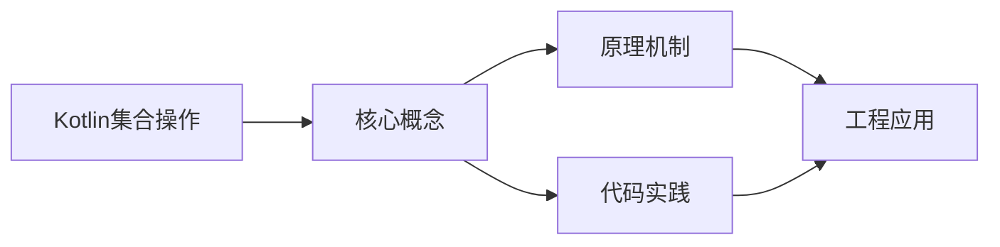

## 1. 学习目标（Bloom 分类）

本节按照布鲁姆教育目标分类学组织学习路径。本文主题为《Kotlin集合操作》，属于 Kotlin 模块，读者可以根据自身阶段选择阅读深度。

记忆层面：能够准确复述本文的核心概念、术语与基本语法或操作步骤，并能够在提问或检索时快速定位对应知识点。能够说出 val/var、空安全操作符与 when 表达式的语法。

理解层面：能够用自己的语言解释核心原理与工作机制，说明概念之间的因果关系，而不是机械记忆结论。能够解释 Kotlin 与 Java 互操作的机制与平台类型概念。

应用层面：能够在真实项目或练习场景中运用本文知识解决具体问题，写出正确且可维护的实现。能够编写数据类、扩展函数与协程代码。

分析层面：能够拆解复杂问题，比较本文主题与相邻概念的异同，识别边界条件与例外情况。能够分析空安全、智能转换与协程调度原理。

评价层面：能够根据约束条件（性能、可读性、安全、成本）评价不同方案的优劣，做出有依据的技术决策。能够评价 Kotlin 在 Android、服务端与多平台场景的适用性。

创造层面：能够把本文知识与其他模块知识组合，设计出新的解决方案或可复用的工程模式。能够组合 Compose 与协程设计跨平台应用。

通过本节学习，读者应当能够把《Kotlin集合操作》纳入自己的知识网络，并与 Kotlin 模块的其他主题（类型推断、空安全、协程、KMP）建立关联。

## 2. 历史动机与发展脉络

《Kotlin集合操作》是 Kotlin 领域的重要主题。要真正理解它，需要先了解它解决的问题与演进过程。

Kotlin 由 JetBrains 于 2010 年开始研发，2016 年发布 1.0，定位是“更现代的 JVM 语言”：减少样板代码、消灭空指针、增强函数式能力，同时与 Java 100% 互操作。
2017 年 Google 宣布 Kotlin 成为 Android 一级语言，2019 年确立 Kotlin-first 政策；2023 年 Kotlin 2.0 的 K2 编译器显著提升编译速度与类型推导。
Kotlin Multiplatform（KMP）支持 JVM、Android、iOS、WebAssembly 等目标，配合 Compose Multiplatform 实现共享 UI 与业务逻辑，是 JetBrains 的长期战略方向。

回到本文主题：Kotlin集合操作 的提出与成熟，正是上述技术背景下的必然产物。早期实现往往以简单可用为目标，随着工程规模扩大，社区逐渐沉淀出标准做法与最佳实践；理解这一脉络，可以帮助读者判断“为什么文档中的推荐写法是现在这个样子”，也能在遇到历史遗留代码时准确识别其设计年代与取舍。


## 3. 形式化定义与核心概念精讲

本节把《Kotlin集合操作》涉及的核心概念以“定义 + 讲解”的形式展开。读者应把定义当作工具，把讲解当作理解路径；两者结合才能形成可迁移的知识。

空安全：类型系统区分 `String` 与 `String?`，编译期强制处理可空值；`?.` 短路、`?:` 提供默认、`!!` 显式断言，三者覆盖所有空值处理模式。
智能转换：`is` 检查后在不可变上下文中自动转换类型，减少显式强转；`as?` 安全转换失败返回 null。
协程：挂起函数（suspend）与调度器（Dispatchers.Main/IO/Default）实现非阻塞并发，结构化并发保证作用域内任务可取消。

### 3.1 原文章节逐一精讲

原文档把主题拆分为 13 个小节，下面按顺序给出每一节的导读讲解，随后保留原文细节供精读。

#### 原文精读（完整保留）

# Kotlin 集合操作速查

> **符号约定**：`< >` 必填参数 | `[ ]` 可选参数

---

#### 过滤操作

**基本写法：filter 过滤元素**
`<collection>.filter { <predicate> }`
```kotlin
// 过滤满足条件的元素
val evens = numbers.filter { it % 2 == 0 };
```

**基本写法：filterNot 反向过滤**
`<collection>.filterNot { <predicate> }`
```kotlin
// 过滤不满足条件的元素
val odds = numbers.filterNot { it % 2 == 0 };
```

**基本写法：filterNotNull 过滤 null**
`<collection>.filterNotNull()`
```kotlin
// 过滤 null 值
val list: List<String?> = listOf("a", null, "b");
val nonNull = list.filterNotNull();
```

**基本写法：filterIndexed 带索引过滤**
`<collection>.filterIndexed { <index>, <item> -> <predicate> }`
```kotlin
// 带索引过滤
val filtered = numbers.filterIndexed { index, _ -> index % 2 == 0 };
```

**基本写法：filterIsInstance 过滤类型**
`<collection>.filterIsInstance<<Type>>()`
```kotlin
// 过滤指定类型
val mixed: List<Any> = listOf(1, "a", 2, "b");
val strings = mixed.filterIsInstance<String>();
```

**基本写法：take 获取前 n 个**
`<collection>.take(<n>)`
```kotlin
// 获取前 n 个元素
val first3 = numbers.take(3);
```

**基本写法：takeLast 获取后 n 个**
`<collection>.takeLast(<n>)`
```kotlin
// 获取后 n 个元素
val last3 = numbers.takeLast(3);
```

**基本写法：drop 丢弃前 n 个**
`<collection>.drop(<n>)`
```kotlin
// 丢弃前 n 个元素
val remaining = numbers.drop(2);
```

**基本写法：dropLast 丢弃后 n 个**
`<collection>.dropLast(<n>)`
```kotlin
// 丢弃后 n 个元素
val remaining = numbers.dropLast(2);
```

**基本写法：takeWhile 条件获取**
`<collection>.takeWhile { <predicate> }`
```kotlin
// 满足条件时获取，遇到不满足时停止
val result = numbers.takeWhile { it < 4 };
```

**基本写法：dropWhile 条件丢弃**
`<collection>.dropWhile { <predicate> }`
```kotlin
// 满足条件时丢弃，遇到不满足时停止
val result = numbers.dropWhile { it < 4 };
```

**基本写法：distinct 去重**
`<collection>.distinct()`
```kotlin
// 去重
val unique = listOf(1, 2, 2, 3, 3).distinct();
```

**基本写法：distinctBy 按条件去重**
`<collection>.distinctBy { <selector> }`
```kotlin
// 按条件去重
val people = listOf(Person("Alice", 25), Person("Bob", 25));
val uniqueAges = people.distinctBy { it.age };
```

---

#### 映射操作

**基本写法：map 映射元素**
`<collection>.map { <transform> }`
```kotlin
// 映射元素
val doubled = numbers.map { it * 2 };
```

**基本写法：mapIndexed 带索引映射**
`<collection>.mapIndexed { <index>, <item> -> <transform> }`
```kotlin
// 带索引映射
val indexed = numbers.mapIndexed { index, value -> "$index: $value" };
```

**基本写法：mapNotNull 映射并过滤 null**
`<collection>.mapNotNull { <transform> }`
```kotlin
// 映射并过滤 null
val lengths = listOf("a", null, "bb").mapNotNull { it?.length };
```

**基本写法：flatMap 扁平映射**
`<collection>.flatMap { <transform> }`
```kotlin
// 扁平映射
val nested = listOf(listOf(1, 2), listOf(3, 4));
val flat = nested.flatMap { it };
```

**基本写法：flatten 扁平化**
`<collection>.flatten()`
```kotlin
// 扁平化嵌套集合
val flat = nested.flatten();
```

**基本写法：groupBy 分组**
`<collection>.groupBy { <keySelector> }`
```kotlin
// 按条件分组
val grouped = numbers.groupBy { if (it % 2 == 0) "even" else "odd" };
```

**基本写法：groupBy 带值转换**
`<collection>.groupBy({ <keySelector> }, { <valueTransform> })`
```kotlin
// 分组并转换值
val grouped = people.groupBy({ it.age }, { it.name });
```

**基本写法：chunked 分块**
`<collection>.chunked(<size>)`
```kotlin
// 分块处理
val chunks = numbers.chunked(2);
```

**基本写法：windowed 滑动窗口**
`<collection>.windowed(<size>, <step>, <partialWindows>)`
```kotlin
// 滑动窗口
val windows = numbers.windowed(3, 1, false);
```

**基本写法：zip 合并集合**
`<list1>.zip(<list2>)`
```kotlin
// 合并两个集合
val names = listOf("Alice", "Bob");
val ages = listOf(25, 30);
val pairs = names.zip(ages);
```

**基本写法：zip 合并并转换**
`<list1>.zip(<list2>) { <a>, <b> -> <transform> }`
```kotlin
// 合并并转换
val combined = names.zip(ages) { name, age -> "$name: $age" };
```

**基本写法：unzip 拆分**
`<list>.unzip()`
```kotlin
// 拆分 Pair 列表
val pairs = listOf("a" to 1, "b" to 2);
val (keys, values) = pairs.unzip();
```

**基本写法：partition 分区**
`<collection>.partition { <predicate> }`
```kotlin
// 按条件分区为两个列表
val (evens, odds) = numbers.partition { it % 2 == 0 };
```

---

#### 查找操作

**基本写法：find 查找第一个匹配**
`<collection>.find { <predicate> }`
```kotlin
// 查找第一个匹配元素
val first = numbers.find { it > 3 };
```

**基本写法：findLast 查找最后一个匹配**
`<collection>.findLast { <predicate> }`
```kotlin
// 查找最后一个匹配元素
val last = numbers.findLast { it > 3 };
```

**基本写法：firstOrNull 获取第一个元素**
`<collection>.firstOrNull()`
```kotlin
// 获取第一个元素，空列表返回 null
val first = numbers.firstOrNull();
```

**基本写法：firstOrNull 条件查找**
`<collection>.firstOrNull { <predicate> }`
```kotlin
// 查找第一个满足条件的元素
val first = numbers.firstOrNull { it > 3 };
```

**基本写法：lastOrNull 获取最后一个元素**
`<collection>.lastOrNull()`
```kotlin
// 获取最后一个元素，空列表返回 null
val last = numbers.lastOrNull();
```

**基本写法：lastOrNull 条件查找**
`<collection>.lastOrNull { <predicate> }`
```kotlin
// 查找最后一个满足条件的元素
val last = numbers.lastOrNull { it > 3 };
```

**基本写法：indexOf 查找索引**
`<list>.indexOf(<element>)`
```kotlin
// 查找元素索引
val index = numbers.indexOf(3);
```

**基本写法：binarySearch 二分查找**
`<list>.binarySearch(<element>)`
```kotlin
// 二分查找（列表需有序）
val index = sortedList.binarySearch(5);
```

**基本写法：elementAtOrNull 安全获取**
`<list>.elementAtOrNull(<index>)`
```kotlin
// 安全获取指定索引元素
val element = numbers.elementAtOrNull(10);
```

**基本写法：elementAtOrElse 条件获取**
`<list>.elementAtOrElse(<index>) { <default> }`
```kotlin
// 获取指定索引元素，越界返回默认值
val element = numbers.elementAtOrElse(10) { -1 };
```

---

#### 排序操作

**基本写法：sorted 升序排序**
`<collection>.sorted()`
```kotlin
// 升序排序
val sorted = numbers.sorted();
```

**基本写法：sortedDescending 降序排序**
`<collection>.sortedDescending()`
```kotlin
// 降序排序
val sorted = numbers.sortedDescending();
```

**基本写法：sortedBy 按条件升序**
`<collection>.sortedBy { <selector> }`
```kotlin
// 按条件升序排序
val sorted = people.sortedBy { it.age };
```

**基本写法：sortedByDescending 按条件降序**
`<collection>.sortedByDescending { <selector> }`
```kotlin
// 按条件降序排序
val sorted = people.sortedByDescending { it.age };
```

**基本写法：sortedWith 自定义排序**
`<collection>.sortedWith(<comparator>)`
```kotlin
// 自定义比较器排序
val sorted = people.sortedWith(compareBy({ it.age }, { it.name }));
```

**基本写法：reversed 反转**
`<collection>.reversed()`
```kotlin
// 反转集合
val reversed = numbers.reversed();
```

**基本写法：shuffled 随机打乱**
`<collection>.shuffled()`
```kotlin
// 随机打乱集合
val shuffled = numbers.shuffled();
```
#### 概述

Kotlin 的集合操作是其最强大的特性之一。通过丰富的扩展函数，你可以用简洁的函数式风格对集合进行过滤、映射、排序、分组、聚合等操作，而不需要写繁琐的 for 循环。这些操作大多以 lambda 表达式作为参数，让代码既简洁又易读。

如果你有 Python 或 JavaScript 的背景，Kotlin 的集合操作会让你感到熟悉。但 Kotlin 的类型系统让这些操作更加安全。

#### 基础概念

- **List**：有序集合，可以重复，分为 MutableList（可变）和 List（不可变）
- **Set**：无序集合，不可以重复，分为 MutableSet 和 Set
- **Map**：键值对集合，分为 MutableMap 和 Map
- **Iterable**：所有集合的父接口，支持迭代
- **Sequence**：懒序列，类似 Java 的 Stream，中间操作不会立即执行
- **高阶函数**：接受函数作为参数的函数，如 map、filter、forEach 等

#### 快速上手

```kotlin
fun main() {
    val numbers = listOf(1, 2, 3, 4, 5, 6, 7, 8, 9, 10)

    // 过滤：只保留偶数
    val evens = numbers.filter { it % 2 == 0 }
    println("偶数: $evens")  // [2, 4, 6, 8, 10]

    // 映射：每个元素乘以2
    val doubled = numbers.map { it * 2 }
    println("翻倍: $doubled")  // [2, 4, 6, 8, 10, 12, 14, 16, 18, 20]

    // 链式调用：先过滤再映射
    val result = numbers.filter { it % 2 == 0 }.map { it * it }
    println("偶数的平方: $result")  // [4, 16, 36, 64, 100]

    // 排序
    val sorted = numbers.sortedDescending()
    println("降序: $sorted")  // [10, 9, 8, 7, 6, 5, 4, 3, 2, 1]

    // 求和
    val sum = numbers.sum()
    println("总和: $sum")  // 55
}
```

#### 详细用法

##### 分组和聚合

```kotlin
fun groupDemo() {
    data class Student(val name: String, val grade: String, val score: Int)

    val students = listOf(
        Student("Alice", "A", 90),
        Student("Bob", "B", 80),
        Student("Charlie", "A", 95),
        Student("David", "B", 75),
        Student("Eve", "A", 88)
    )

    // groupBy：按属性分组
    val byGrade = students.groupBy { it.grade }
    println("A组: ${byGrade["A"]?.map { it.name }}")  // [Alice, Charlie, Eve]
    println("B组: ${byGrade["B"]?.map { it.name }}")  // [Bob, David]

    // groupingBy + aggregate：更灵活的分组聚合
    val avgScoreByGrade = students.groupingBy { it.grade }.average()
    println("A组平均分: ${avgScoreByGrade["A"]}")

    // count：计数
    val countByGrade = students.groupingBy { it.grade }.eachCount()
    println(countByGrade)  // {A=3, B=2}

    // 聚合函数
    val scores = students.map { it.score }
    println("最高分: ${scores.max()}")
    println("最低分: ${scores.min()}")
    println("平均分: ${scores.average()}")
    println("总分: ${scores.sum()}")
}
```

##### Map 操作

```kotlin
fun mapOpsDemo() {
    val scores = mapOf("Alice" to 90, "Bob" to 80, "Charlie" to 95)

    // 遍历
    scores.forEach { (name, score) ->
        println("$name: $score")
    }

    // mapKeys / mapValues：转换键或值
    val upperKeys = scores.mapKeys { it.key.uppercase() }
    println(upperKeys)  // {ALICE=90, BOB=80, CHARLIE=95}

    val graded = scores.mapValues { if (it.value >= 90) "A" else "B" }
    println(graded)  // {Alice=A, Bob=B, Charlie=A}

    // filterKeys / filterValues：过滤
    val highScores = scores.filterValues { it >= 90 }
    println(highScores)  // {Alice=90, Charlie=95}

    // getOrDefault / getOrElse
    println(scores.getOrDefault("David", 0))   // 0
    println(scores.getOrElse("David") { 0 })    // 0

    // toList：转为键值对列表
    val pairs = scores.toList()
    println(pairs)  // [(Alice, 90), (Bob, 80), (Charlie, 95)]
}
```

##### Sequence 懒序列

```kotlin
fun sequenceDemo() {
    val numbers = (1..100).toList()

    // 普通集合操作：每一步都创建新集合
    val listResult = numbers
        .filter { it % 2 == 0 }   // 创建中间集合
        .map { it * it }           // 又创建中间集合
        .take(5)                   // 再创建中间集合

    // Sequence：懒执行，不创建中间集合
    val seqResult = numbers.asSequence()
        .filter { it % 2 == 0 }   // 不执行
        .map { it * it }           // 不执行
        .take(5)                   // 不执行
        .toList()                  // 到这里才执行，且每个元素走完整个管道

    println(listResult)  // [4, 16, 36, 64, 100]
    println(seqResult)   // [4, 16, 36, 64, 100]

    // Sequence 在数据量大时性能更好
    // 因为不需要创建中间集合
}
```

#### 常见场景

##### 数据转换管道

```kotlin
data class RawUser(val name: String, val age: String, val email: String?)
data class ValidUser(val name: String, val age: Int, val email: String)

fun processUsers(rawUsers: List<RawUser>): List<ValidUser> {
    return rawUsers
        .filter { it.email != null }           // 过滤掉没有邮箱的
        .map {                                  // 转换数据
            ValidUser(
                name = it.name.trim(),
                age = it.age.toIntOrNull() ?: 0,
                email = it.email!!
            )
        }
        .filter { it.age >= 18 }               // 过滤掉未成年
        .sortedBy { it.name }                   // 按名字排序
        .distinctBy { it.email }                // 按邮箱去重
}
```

##### 频率统计

```kotlin
fun frequencyDemo() {
    val text = "hello world kotlin programming"
    // 统计每个字符出现的次数
    val charFreq = text.groupingBy { it }.eachCount()
    println(charFreq)

    // 统计每个单词出现的次数
    val wordFreq = text.split(" ").groupingBy { it }.eachCount()
    println(wordFreq)

    // 找出出现次数最多的元素
    val words = listOf("a", "b", "a", "c", "a", "b")
    val mostCommon = words.groupingBy { it }.eachCount()
        .maxByOrNull { it.value }
    println("最常见的: $mostCommon")  // a=3
}
```

##### 集合的交并差

```kotlin
fun setOperations() {
    val a = setOf(1, 2, 3, 4, 5)
    val b = setOf(4, 5, 6, 7, 8)

    // 交集
    val intersect = a intersect b
    println("交集: $intersect")  // {4, 5}

    // 并集
    val union = a union b
    println("并集: $union")  // {1, 2, 3, 4, 5, 6, 7, 8}

    // 差集
    val subtract = a subtract b
    println("差集: $subtract")  // {1, 2, 3}
}
```

#### 注意事项

- **优先使用不可变集合**：`listOf`、`mapOf`、`setOf` 创建不可变集合，减少意外修改的风险
- **Sequence 适合大数据量**：当集合元素很多且链式操作很长时，用 `asSequence()` 避免创建中间集合
- **避免在 map 中做过滤**：用 `filter` + `map` 代替在 `map` 中返回 null，更清晰
- **注意空集合的聚合**：对空集合调用 `max()`、`average()` 等会抛异常，使用 `maxOrNull()` 等安全版本
- **distinctBy 会保留第一个**：当有重复键时，`distinctBy` 保留第一个遇到的元素

#### 进阶用法

##### 自定义聚合

```kotlin
// fold：带初始值的累积
val numbers = listOf(1, 2, 3, 4, 5)
val sum = numbers.fold(0) { acc, num -> acc + num }
println(sum)  // 15

// 用 fold 构建字符串
val result = numbers.fold("Numbers:") { acc, num -> "$acc $num" }
println(result)  // Numbers: 1 2 3 4 5

// reduce：不带初始值的累积（集合不能为空）
val product = numbers.reduce { acc, num -> acc * num }
println(product)  // 120
```

##### 窗口和分块

```kotlin
val numbers = (1..10).toList()

// chunked：按大小分块
val chunks = numbers.chunked(3)
println(chunks)  // [[1, 2, 3], [4, 5, 6], [7, 8, 9], [10]]

// windowed：滑动窗口
val windows = numbers.windowed(3, step = 2)
println(windows)  // [[1, 2, 3], [3, 4, 5], [5, 6, 7], [7, 8, 9], [9, 10]]

// zip：合并两个集合
val names = listOf("Alice", "Bob", "Charlie")
val ages = listOf(25, 30, 20)
val pairs = names.zip(ages)
println(pairs)  // [(Alice, 25), (Bob, 30), (Charlie, 20)]

// unzip：拆分
val (names2, ages2) = pairs.unzip()
```

##### 关联操作

```kotlin
data class Product(val id: Int, val name: String, val price: Double)

val products = listOf(
    Product(1, "手机", 2999.0),
    Product(2, "电脑", 5999.0),
    Product(3, "耳机", 299.0)
)

// associateBy：按某个属性建立 Map
val byId = products.associateBy { it.id }
println(byId[2])  // Product(id=2, name=电脑, price=5999.0)

// associateWith：用元素本身作为键
val priceMap = products.associateWith { it.price }
println(priceMap)  // {Product(1,手机,2999.0)=2999.0, ...}

// associate：自定义键值
val namePriceMap = products.associate { it.name to it.price }
println(namePriceMap)  // {手机=2999.0, 电脑=5999.0, 耳机=299.0}
```
#### 集合创建

**基本写法：listOf 创建只读列表**
`listOf(<elements>)`
```kotlin
// 创建只读列表
val numbers = listOf(1, 2, 3, 4, 5);
```

**基本写法：mutableListOf 创建可变列表**
`mutableListOf(<elements>)`
```kotlin
// 创建可变列表
val mutableList = mutableListOf(1, 2, 3);
mutableList.add(4);
```

**基本写法：setOf 创建只读集合**
`setOf(<elements>)`
```kotlin
// 创建只读集合（去重）
val set = setOf(1, 2, 3, 3);  // {1, 2, 3}
```

**基本写法：mutableSetOf 创建可变集合**
`mutableSetOf(<elements>)`
```kotlin
// 创建可变集合
val mutableSet = mutableSetOf(1, 2, 3);
mutableSet.add(4);
```

**基本写法：mapOf 创建只读映射**
`mapOf(<key1> to <value1>, <key2> to <value2>)`
```kotlin
// 创建只读映射
val map = mapOf("a" to 1, "b" to 2);
```

**基本写法：mutableMapOf 创建可变映射**
`mutableMapOf(<key1> to <value1>)`
```kotlin
// 创建可变映射
val mutableMap = mutableMapOf("a" to 1);
mutableMap["b"] = 2;
```

**基本写法：emptyList 创建空列表**
`emptyList<<Type>>()`
```kotlin
// 创建空列表
val empty: List<String> = emptyList();
```

**基本写法：arrayListOf 创建 ArrayList**
`arrayListOf(<elements>)`
```kotlin
// 创建 ArrayList
val arrayList = arrayListOf(1, 2, 3);
```

**基本写法：linkedMapOf 创建 LinkedHashMap**
`linkedMapOf(<key1> to <value1>)`
```kotlin
// 创建 LinkedHashMap（保持插入顺序）
val linkedMap = linkedMapOf("a" to 1, "b" to 2);
```

---

#### 集合基本操作

**基本写法：size 获取大小**
`<collection>.size`
```kotlin
// 获取集合大小
val size = numbers.size;
```

**基本写法：contains 检查包含**
`<collection>.contains(<element>)`
```kotlin
// 检查是否包含元素
numbers.contains(3);
```

**基本写法：in 检查包含**
`<element> in <collection>`
```kotlin
// 使用 in 检查包含
3 in numbers;
```

**基本写法：!in 检查不包含**
`<element> !in <collection>`
```kotlin
// 使用 !in 检查不包含
6 !in numbers;
```

**基本写法：isEmpty 检查空集合**
`<collection>.isEmpty()`
```kotlin
// 检查集合是否为空
numbers.isEmpty();
```

**基本写法：isNotEmpty 检查非空集合**
`<collection>.isNotEmpty()`
```kotlin
// 检查集合是否非空
numbers.isNotEmpty();
```

**基本写法：get 获取元素**
`<list>[<index>]`
```kotlin
// 通过索引获取元素
val first = numbers[0];
```

**基本写法：get 获取 Map 值**
`<map>[<key>]`
```kotlin
// 通过键获取值
val value = map["a"];
```

---


### 3.2 概念关系图

下面用 Mermaid 图表达本文核心概念之间的关系，帮助读者建立整体图景：



图中展示的是本文知识的结构化关系：核心概念是入口，原理机制解释“为什么”，代码实践演示“怎么做”，工程应用回答“何时用”。读者学习时可以把每个小节的内容挂接到对应节点上。

## 4. 理论推导与原理解析

本节深入《Kotlin集合操作》背后的原理。理论部分不求面面俱到，而是聚焦“能解释现象、能指导实践”的关键推导。

空安全：类型系统区分 `String` 与 `String?`，编译期强制处理可空值；`?.` 短路、`?:` 提供默认、`!!` 显式断言，三者覆盖所有空值处理模式。
智能转换：`is` 检查后在不可变上下文中自动转换类型，减少显式强转；`as?` 安全转换失败返回 null。
协程：挂起函数（suspend）与调度器（Dispatchers.Main/IO/Default）实现非阻塞并发，结构化并发保证作用域内任务可取消。
扩展函数与属性：在不修改原类的情况下为类添加行为，是 Kotlin 标准库（如集合操作）的基石。

需要强调的是，理论推导与工程实践之间存在翻译层：理论给出的是理想化模型与边界条件，工程代码则必须处理真实环境中的例外。读者在学习时应先掌握理论的“标准情形”，再通过陷阱章节了解“非标准情形”。

## 5. 代码示例与逐行讲解

本节把原文中的代码示例系统整理，并为每个示例补充用途说明与讲解。读者不应只浏览代码，而应逐段对照讲解理解设计意图。

### 5.1 示例：过滤操作

该示例来自原文《过滤操作》小节，用于演示Kotlin集合操作相关操作。阅读时请先看代码结构，再看其后的讲解。

```kotlin
// 过滤满足条件的元素
val evens = numbers.filter { it % 2 == 0 };
```

讲解：这段代码演示了本节核心知识点。代码中的关键操作可以归纳为三步：准备（定义或初始化）、执行（核心逻辑）、收尾（释放资源或返回结果）。实际项目中，这三步往往被封装为函数或类，以提升复用性与可测试性。

关键点分析：

该示例共 2 行有效代码，结构以数据或配置为主。阅读时应关注：数据字段的含义、配置项的作用，以及它们与运行行为的对应关系。

进阶思考路径：先尝试修改参数观察行为变化，再把示例中的模式迁移到自己的项目中；每次修改都记录预期与实测差异，这是把示例转化为能力的最快方式。

### 5.2 示例：过滤操作

该示例来自原文《过滤操作》小节，用于演示Kotlin集合操作相关操作。阅读时请先看代码结构，再看其后的讲解。

```kotlin
// 过滤不满足条件的元素
val odds = numbers.filterNot { it % 2 == 0 };
```

讲解：这段代码演示了本节核心知识点。代码中的关键操作可以归纳为三步：准备（定义或初始化）、执行（核心逻辑）、收尾（释放资源或返回结果）。实际项目中，这三步往往被封装为函数或类，以提升复用性与可测试性。

关键点分析：

该示例共 2 行有效代码，结构以数据或配置为主。阅读时应关注：数据字段的含义、配置项的作用，以及它们与运行行为的对应关系。

进阶思考路径：先尝试修改参数观察行为变化，再把示例中的模式迁移到自己的项目中；每次修改都记录预期与实测差异，这是把示例转化为能力的最快方式。

### 5.3 示例：过滤操作

该示例来自原文《过滤操作》小节，用于演示Kotlin集合操作相关操作。阅读时请先看代码结构，再看其后的讲解。

```kotlin
// 过滤 null 值
val list: List<String?> = listOf("a", null, "b");
val nonNull = list.filterNotNull();
```

讲解：这段代码演示了本节核心知识点。代码中的关键操作可以归纳为三步：准备（定义或初始化）、执行（核心逻辑）、收尾（释放资源或返回结果）。实际项目中，这三步往往被封装为函数或类，以提升复用性与可测试性。

关键点分析：

该示例共 3 行有效代码，结构以数据或配置为主。阅读时应关注：数据字段的含义、配置项的作用，以及它们与运行行为的对应关系。

进阶思考路径：先尝试修改参数观察行为变化，再把示例中的模式迁移到自己的项目中；每次修改都记录预期与实测差异，这是把示例转化为能力的最快方式。

### 5.4 示例：过滤操作

该示例来自原文《过滤操作》小节，用于演示Kotlin集合操作相关操作。阅读时请先看代码结构，再看其后的讲解。

```kotlin
// 带索引过滤
val filtered = numbers.filterIndexed { index, _ -> index % 2 == 0 };
```

讲解：这段代码演示了本节核心知识点。代码中的关键操作可以归纳为三步：准备（定义或初始化）、执行（核心逻辑）、收尾（释放资源或返回结果）。实际项目中，这三步往往被封装为函数或类，以提升复用性与可测试性。

关键点分析：

该示例共 2 行有效代码，结构以数据或配置为主。阅读时应关注：数据字段的含义、配置项的作用，以及它们与运行行为的对应关系。

进阶思考路径：先尝试修改参数观察行为变化，再把示例中的模式迁移到自己的项目中；每次修改都记录预期与实测差异，这是把示例转化为能力的最快方式。

### 5.5 示例：过滤操作

该示例来自原文《过滤操作》小节，用于演示Kotlin集合操作相关操作。阅读时请先看代码结构，再看其后的讲解。

```kotlin
// 过滤指定类型
val mixed: List<Any> = listOf(1, "a", 2, "b");
val strings = mixed.filterIsInstance<String>();
```

讲解：这段代码演示了本节核心知识点。代码中的关键操作可以归纳为三步：准备（定义或初始化）、执行（核心逻辑）、收尾（释放资源或返回结果）。实际项目中，这三步往往被封装为函数或类，以提升复用性与可测试性。

关键点分析：

该示例共 3 行有效代码，结构以数据或配置为主。阅读时应关注：数据字段的含义、配置项的作用，以及它们与运行行为的对应关系。

进阶思考路径：先尝试修改参数观察行为变化，再把示例中的模式迁移到自己的项目中；每次修改都记录预期与实测差异，这是把示例转化为能力的最快方式。

### 5.6 示例：过滤操作

该示例来自原文《过滤操作》小节，用于演示Kotlin集合操作相关操作。阅读时请先看代码结构，再看其后的讲解。

```kotlin
// 获取前 n 个元素
val first3 = numbers.take(3);
```

讲解：这段代码演示了本节核心知识点。代码中的关键操作可以归纳为三步：准备（定义或初始化）、执行（核心逻辑）、收尾（释放资源或返回结果）。实际项目中，这三步往往被封装为函数或类，以提升复用性与可测试性。

关键点分析：

该示例共 2 行有效代码，结构以数据或配置为主。阅读时应关注：数据字段的含义、配置项的作用，以及它们与运行行为的对应关系。

进阶思考路径：先尝试修改参数观察行为变化，再把示例中的模式迁移到自己的项目中；每次修改都记录预期与实测差异，这是把示例转化为能力的最快方式。

### 5.7 示例：过滤操作

该示例来自原文《过滤操作》小节，用于演示Kotlin集合操作相关操作。阅读时请先看代码结构，再看其后的讲解。

```kotlin
// 获取后 n 个元素
val last3 = numbers.takeLast(3);
```

讲解：这段代码演示了本节核心知识点。代码中的关键操作可以归纳为三步：准备（定义或初始化）、执行（核心逻辑）、收尾（释放资源或返回结果）。实际项目中，这三步往往被封装为函数或类，以提升复用性与可测试性。

关键点分析：

该示例共 2 行有效代码，结构以数据或配置为主。阅读时应关注：数据字段的含义、配置项的作用，以及它们与运行行为的对应关系。

进阶思考路径：先尝试修改参数观察行为变化，再把示例中的模式迁移到自己的项目中；每次修改都记录预期与实测差异，这是把示例转化为能力的最快方式。

### 5.8 示例：过滤操作

该示例来自原文《过滤操作》小节，用于演示Kotlin集合操作相关操作。阅读时请先看代码结构，再看其后的讲解。

```kotlin
// 丢弃前 n 个元素
val remaining = numbers.drop(2);
```

讲解：这段代码演示了本节核心知识点。代码中的关键操作可以归纳为三步：准备（定义或初始化）、执行（核心逻辑）、收尾（释放资源或返回结果）。实际项目中，这三步往往被封装为函数或类，以提升复用性与可测试性。

关键点分析：

该示例共 2 行有效代码，结构以数据或配置为主。阅读时应关注：数据字段的含义、配置项的作用，以及它们与运行行为的对应关系。

进阶思考路径：先尝试修改参数观察行为变化，再把示例中的模式迁移到自己的项目中；每次修改都记录预期与实测差异，这是把示例转化为能力的最快方式。

### 5.9 示例：过滤操作

该示例来自原文《过滤操作》小节，用于演示Kotlin集合操作相关操作。阅读时请先看代码结构，再看其后的讲解。

```kotlin
// 丢弃后 n 个元素
val remaining = numbers.dropLast(2);
```

讲解：这段代码演示了本节核心知识点。代码中的关键操作可以归纳为三步：准备（定义或初始化）、执行（核心逻辑）、收尾（释放资源或返回结果）。实际项目中，这三步往往被封装为函数或类，以提升复用性与可测试性。

关键点分析：

该示例共 2 行有效代码，结构以数据或配置为主。阅读时应关注：数据字段的含义、配置项的作用，以及它们与运行行为的对应关系。

进阶思考路径：先尝试修改参数观察行为变化，再把示例中的模式迁移到自己的项目中；每次修改都记录预期与实测差异，这是把示例转化为能力的最快方式。

### 5.10 示例：过滤操作

该示例来自原文《过滤操作》小节，用于演示Kotlin集合操作相关操作。阅读时请先看代码结构，再看其后的讲解。

```kotlin
// 满足条件时获取，遇到不满足时停止
val result = numbers.takeWhile { it < 4 };
```

讲解：这段代码演示了本节核心知识点。代码中的关键操作可以归纳为三步：准备（定义或初始化）、执行（核心逻辑）、收尾（释放资源或返回结果）。实际项目中，这三步往往被封装为函数或类，以提升复用性与可测试性。

关键点分析：

该示例共 2 行有效代码，结构以数据或配置为主。阅读时应关注：数据字段的含义、配置项的作用，以及它们与运行行为的对应关系。

进阶思考路径：先尝试修改参数观察行为变化，再把示例中的模式迁移到自己的项目中；每次修改都记录预期与实测差异，这是把示例转化为能力的最快方式。

### 5.11 示例：过滤操作

该示例来自原文《过滤操作》小节，用于演示Kotlin集合操作相关操作。阅读时请先看代码结构，再看其后的讲解。

```kotlin
// 满足条件时丢弃，遇到不满足时停止
val result = numbers.dropWhile { it < 4 };
```

讲解：这段代码演示了本节核心知识点。代码中的关键操作可以归纳为三步：准备（定义或初始化）、执行（核心逻辑）、收尾（释放资源或返回结果）。实际项目中，这三步往往被封装为函数或类，以提升复用性与可测试性。

关键点分析：

该示例共 2 行有效代码，结构以数据或配置为主。阅读时应关注：数据字段的含义、配置项的作用，以及它们与运行行为的对应关系。

进阶思考路径：先尝试修改参数观察行为变化，再把示例中的模式迁移到自己的项目中；每次修改都记录预期与实测差异，这是把示例转化为能力的最快方式。

### 5.12 示例：过滤操作

该示例来自原文《过滤操作》小节，用于演示Kotlin集合操作相关操作。阅读时请先看代码结构，再看其后的讲解。

```kotlin
// 去重
val unique = listOf(1, 2, 2, 3, 3).distinct();
```

讲解：这段代码演示了本节核心知识点。代码中的关键操作可以归纳为三步：准备（定义或初始化）、执行（核心逻辑）、收尾（释放资源或返回结果）。实际项目中，这三步往往被封装为函数或类，以提升复用性与可测试性。

关键点分析：

该示例共 2 行有效代码，结构以数据或配置为主。阅读时应关注：数据字段的含义、配置项的作用，以及它们与运行行为的对应关系。

进阶思考路径：先尝试修改参数观察行为变化，再把示例中的模式迁移到自己的项目中；每次修改都记录预期与实测差异，这是把示例转化为能力的最快方式。

### 5.13 示例：过滤操作

该示例来自原文《过滤操作》小节，用于演示Kotlin集合操作相关操作。阅读时请先看代码结构，再看其后的讲解。

```kotlin
// 按条件去重
val people = listOf(Person("Alice", 25), Person("Bob", 25));
val uniqueAges = people.distinctBy { it.age };
```

讲解：这段代码演示了本节核心知识点。代码中的关键操作可以归纳为三步：准备（定义或初始化）、执行（核心逻辑）、收尾（释放资源或返回结果）。实际项目中，这三步往往被封装为函数或类，以提升复用性与可测试性。

关键点分析：

该示例共 3 行有效代码，结构以数据或配置为主。阅读时应关注：数据字段的含义、配置项的作用，以及它们与运行行为的对应关系。

进阶思考路径：先尝试修改参数观察行为变化，再把示例中的模式迁移到自己的项目中；每次修改都记录预期与实测差异，这是把示例转化为能力的最快方式。

### 5.14 示例：映射操作

该示例来自原文《映射操作》小节，用于演示Kotlin集合操作相关操作。阅读时请先看代码结构，再看其后的讲解。

```kotlin
// 映射元素
val doubled = numbers.map { it * 2 };
```

讲解：这段代码演示了本节核心知识点。代码中的关键操作可以归纳为三步：准备（定义或初始化）、执行（核心逻辑）、收尾（释放资源或返回结果）。实际项目中，这三步往往被封装为函数或类，以提升复用性与可测试性。

关键点分析：

该示例共 2 行有效代码，结构以数据或配置为主。阅读时应关注：数据字段的含义、配置项的作用，以及它们与运行行为的对应关系。

进阶思考路径：先尝试修改参数观察行为变化，再把示例中的模式迁移到自己的项目中；每次修改都记录预期与实测差异，这是把示例转化为能力的最快方式。

### 5.15 示例：映射操作

该示例来自原文《映射操作》小节，用于演示Kotlin集合操作相关操作。阅读时请先看代码结构，再看其后的讲解。

```kotlin
// 带索引映射
val indexed = numbers.mapIndexed { index, value -> "$index: $value" };
```

讲解：这段代码演示了本节核心知识点。代码中的关键操作可以归纳为三步：准备（定义或初始化）、执行（核心逻辑）、收尾（释放资源或返回结果）。实际项目中，这三步往往被封装为函数或类，以提升复用性与可测试性。

关键点分析：

该示例共 2 行有效代码，结构以数据或配置为主。阅读时应关注：数据字段的含义、配置项的作用，以及它们与运行行为的对应关系。

进阶思考路径：先尝试修改参数观察行为变化，再把示例中的模式迁移到自己的项目中；每次修改都记录预期与实测差异，这是把示例转化为能力的最快方式。

### 5.16 示例：映射操作

该示例来自原文《映射操作》小节，用于演示Kotlin集合操作相关操作。阅读时请先看代码结构，再看其后的讲解。

```kotlin
// 映射并过滤 null
val lengths = listOf("a", null, "bb").mapNotNull { it?.length };
```

讲解：这段代码演示了本节核心知识点。代码中的关键操作可以归纳为三步：准备（定义或初始化）、执行（核心逻辑）、收尾（释放资源或返回结果）。实际项目中，这三步往往被封装为函数或类，以提升复用性与可测试性。

关键点分析：

该示例共 2 行有效代码，结构以数据或配置为主。阅读时应关注：数据字段的含义、配置项的作用，以及它们与运行行为的对应关系。

进阶思考路径：先尝试修改参数观察行为变化，再把示例中的模式迁移到自己的项目中；每次修改都记录预期与实测差异，这是把示例转化为能力的最快方式。

### 5.17 示例：映射操作

该示例来自原文《映射操作》小节，用于演示Kotlin集合操作相关操作。阅读时请先看代码结构，再看其后的讲解。

```kotlin
// 扁平映射
val nested = listOf(listOf(1, 2), listOf(3, 4));
val flat = nested.flatMap { it };
```

讲解：这段代码演示了本节核心知识点。代码中的关键操作可以归纳为三步：准备（定义或初始化）、执行（核心逻辑）、收尾（释放资源或返回结果）。实际项目中，这三步往往被封装为函数或类，以提升复用性与可测试性。

关键点分析：

该示例共 3 行有效代码，结构以数据或配置为主。阅读时应关注：数据字段的含义、配置项的作用，以及它们与运行行为的对应关系。

进阶思考路径：先尝试修改参数观察行为变化，再把示例中的模式迁移到自己的项目中；每次修改都记录预期与实测差异，这是把示例转化为能力的最快方式。

### 5.18 示例：映射操作

该示例来自原文《映射操作》小节，用于演示Kotlin集合操作相关操作。阅读时请先看代码结构，再看其后的讲解。

```kotlin
// 扁平化嵌套集合
val flat = nested.flatten();
```

讲解：这段代码演示了本节核心知识点。代码中的关键操作可以归纳为三步：准备（定义或初始化）、执行（核心逻辑）、收尾（释放资源或返回结果）。实际项目中，这三步往往被封装为函数或类，以提升复用性与可测试性。

关键点分析：

该示例共 2 行有效代码，结构以数据或配置为主。阅读时应关注：数据字段的含义、配置项的作用，以及它们与运行行为的对应关系。

进阶思考路径：先尝试修改参数观察行为变化，再把示例中的模式迁移到自己的项目中；每次修改都记录预期与实测差异，这是把示例转化为能力的最快方式。

### 5.19 示例：映射操作

该示例来自原文《映射操作》小节，用于演示Kotlin集合操作相关操作。阅读时请先看代码结构，再看其后的讲解。

```kotlin
// 按条件分组
val grouped = numbers.groupBy { if (it % 2 == 0) "even" else "odd" };
```

讲解：这段代码演示了本节核心知识点。代码中的关键操作可以归纳为三步：准备（定义或初始化）、执行（核心逻辑）、收尾（释放资源或返回结果）。实际项目中，这三步往往被封装为函数或类，以提升复用性与可测试性。

关键点分析：

该示例共 2 行有效代码，包含 1 类关键结构（if）。其中：

- 入口与初始化部分负责建立上下文，对应实际项目中的启动或装配逻辑；
- 核心逻辑部分体现本文主题的主要操作，是阅读时最需要对照讲解理解的部分；
- 输出或返回部分把结果交给调用方，注意其类型与边界条件。

进阶思考路径：先尝试修改参数观察行为变化，再把示例中的模式迁移到自己的项目中；每次修改都记录预期与实测差异，这是把示例转化为能力的最快方式。

### 5.20 示例：映射操作

该示例来自原文《映射操作》小节，用于演示Kotlin集合操作相关操作。阅读时请先看代码结构，再看其后的讲解。

```kotlin
// 分组并转换值
val grouped = people.groupBy({ it.age }, { it.name });
```

讲解：这段代码演示了本节核心知识点。代码中的关键操作可以归纳为三步：准备（定义或初始化）、执行（核心逻辑）、收尾（释放资源或返回结果）。实际项目中，这三步往往被封装为函数或类，以提升复用性与可测试性。

关键点分析：

该示例共 2 行有效代码，结构以数据或配置为主。阅读时应关注：数据字段的含义、配置项的作用，以及它们与运行行为的对应关系。

进阶思考路径：先尝试修改参数观察行为变化，再把示例中的模式迁移到自己的项目中；每次修改都记录预期与实测差异，这是把示例转化为能力的最快方式。

### 5.21 示例：映射操作

该示例来自原文《映射操作》小节，用于演示Kotlin集合操作相关操作。阅读时请先看代码结构，再看其后的讲解。

```kotlin
// 分块处理
val chunks = numbers.chunked(2);
```

讲解：这段代码演示了本节核心知识点。代码中的关键操作可以归纳为三步：准备（定义或初始化）、执行（核心逻辑）、收尾（释放资源或返回结果）。实际项目中，这三步往往被封装为函数或类，以提升复用性与可测试性。

关键点分析：

该示例共 2 行有效代码，结构以数据或配置为主。阅读时应关注：数据字段的含义、配置项的作用，以及它们与运行行为的对应关系。

进阶思考路径：先尝试修改参数观察行为变化，再把示例中的模式迁移到自己的项目中；每次修改都记录预期与实测差异，这是把示例转化为能力的最快方式。

### 5.22 示例：映射操作

该示例来自原文《映射操作》小节，用于演示Kotlin集合操作相关操作。阅读时请先看代码结构，再看其后的讲解。

```kotlin
// 滑动窗口
val windows = numbers.windowed(3, 1, false);
```

讲解：这段代码演示了本节核心知识点。代码中的关键操作可以归纳为三步：准备（定义或初始化）、执行（核心逻辑）、收尾（释放资源或返回结果）。实际项目中，这三步往往被封装为函数或类，以提升复用性与可测试性。

关键点分析：

该示例共 2 行有效代码，结构以数据或配置为主。阅读时应关注：数据字段的含义、配置项的作用，以及它们与运行行为的对应关系。

进阶思考路径：先尝试修改参数观察行为变化，再把示例中的模式迁移到自己的项目中；每次修改都记录预期与实测差异，这是把示例转化为能力的最快方式。

### 5.23 示例：映射操作

该示例来自原文《映射操作》小节，用于演示Kotlin集合操作相关操作。阅读时请先看代码结构，再看其后的讲解。

```kotlin
// 合并两个集合
val names = listOf("Alice", "Bob");
val ages = listOf(25, 30);
val pairs = names.zip(ages);
```

讲解：这段代码演示了本节核心知识点。代码中的关键操作可以归纳为三步：准备（定义或初始化）、执行（核心逻辑）、收尾（释放资源或返回结果）。实际项目中，这三步往往被封装为函数或类，以提升复用性与可测试性。

关键点分析：

该示例共 4 行有效代码，结构以数据或配置为主。阅读时应关注：数据字段的含义、配置项的作用，以及它们与运行行为的对应关系。

进阶思考路径：先尝试修改参数观察行为变化，再把示例中的模式迁移到自己的项目中；每次修改都记录预期与实测差异，这是把示例转化为能力的最快方式。

### 5.24 示例：映射操作

该示例来自原文《映射操作》小节，用于演示Kotlin集合操作相关操作。阅读时请先看代码结构，再看其后的讲解。

```kotlin
// 合并并转换
val combined = names.zip(ages) { name, age -> "$name: $age" };
```

讲解：这段代码演示了本节核心知识点。代码中的关键操作可以归纳为三步：准备（定义或初始化）、执行（核心逻辑）、收尾（释放资源或返回结果）。实际项目中，这三步往往被封装为函数或类，以提升复用性与可测试性。

关键点分析：

该示例共 2 行有效代码，结构以数据或配置为主。阅读时应关注：数据字段的含义、配置项的作用，以及它们与运行行为的对应关系。

进阶思考路径：先尝试修改参数观察行为变化，再把示例中的模式迁移到自己的项目中；每次修改都记录预期与实测差异，这是把示例转化为能力的最快方式。

### 5.25 示例：映射操作

该示例来自原文《映射操作》小节，用于演示Kotlin集合操作相关操作。阅读时请先看代码结构，再看其后的讲解。

```kotlin
// 拆分 Pair 列表
val pairs = listOf("a" to 1, "b" to 2);
val (keys, values) = pairs.unzip();
```

讲解：这段代码演示了本节核心知识点。代码中的关键操作可以归纳为三步：准备（定义或初始化）、执行（核心逻辑）、收尾（释放资源或返回结果）。实际项目中，这三步往往被封装为函数或类，以提升复用性与可测试性。

关键点分析：

该示例共 3 行有效代码，结构以数据或配置为主。阅读时应关注：数据字段的含义、配置项的作用，以及它们与运行行为的对应关系。

进阶思考路径：先尝试修改参数观察行为变化，再把示例中的模式迁移到自己的项目中；每次修改都记录预期与实测差异，这是把示例转化为能力的最快方式。

### 5.26 示例：映射操作

该示例来自原文《映射操作》小节，用于演示Kotlin集合操作相关操作。阅读时请先看代码结构，再看其后的讲解。

```kotlin
// 按条件分区为两个列表
val (evens, odds) = numbers.partition { it % 2 == 0 };
```

讲解：这段代码演示了本节核心知识点。代码中的关键操作可以归纳为三步：准备（定义或初始化）、执行（核心逻辑）、收尾（释放资源或返回结果）。实际项目中，这三步往往被封装为函数或类，以提升复用性与可测试性。

关键点分析：

该示例共 2 行有效代码，结构以数据或配置为主。阅读时应关注：数据字段的含义、配置项的作用，以及它们与运行行为的对应关系。

进阶思考路径：先尝试修改参数观察行为变化，再把示例中的模式迁移到自己的项目中；每次修改都记录预期与实测差异，这是把示例转化为能力的最快方式。

### 5.27 示例：查找操作

该示例来自原文《查找操作》小节，用于演示Kotlin集合操作相关操作。阅读时请先看代码结构，再看其后的讲解。

```kotlin
// 查找第一个匹配元素
val first = numbers.find { it > 3 };
```

讲解：这段代码演示了本节核心知识点。代码中的关键操作可以归纳为三步：准备（定义或初始化）、执行（核心逻辑）、收尾（释放资源或返回结果）。实际项目中，这三步往往被封装为函数或类，以提升复用性与可测试性。

关键点分析：

该示例共 2 行有效代码，结构以数据或配置为主。阅读时应关注：数据字段的含义、配置项的作用，以及它们与运行行为的对应关系。

进阶思考路径：先尝试修改参数观察行为变化，再把示例中的模式迁移到自己的项目中；每次修改都记录预期与实测差异，这是把示例转化为能力的最快方式。

### 5.28 示例：查找操作

该示例来自原文《查找操作》小节，用于演示Kotlin集合操作相关操作。阅读时请先看代码结构，再看其后的讲解。

```kotlin
// 查找最后一个匹配元素
val last = numbers.findLast { it > 3 };
```

讲解：这段代码演示了本节核心知识点。代码中的关键操作可以归纳为三步：准备（定义或初始化）、执行（核心逻辑）、收尾（释放资源或返回结果）。实际项目中，这三步往往被封装为函数或类，以提升复用性与可测试性。

关键点分析：

该示例共 2 行有效代码，结构以数据或配置为主。阅读时应关注：数据字段的含义、配置项的作用，以及它们与运行行为的对应关系。

进阶思考路径：先尝试修改参数观察行为变化，再把示例中的模式迁移到自己的项目中；每次修改都记录预期与实测差异，这是把示例转化为能力的最快方式。

### 5.29 示例：查找操作

该示例来自原文《查找操作》小节，用于演示Kotlin集合操作相关操作。阅读时请先看代码结构，再看其后的讲解。

```kotlin
// 获取第一个元素，空列表返回 null
val first = numbers.firstOrNull();
```

讲解：这段代码演示了本节核心知识点。代码中的关键操作可以归纳为三步：准备（定义或初始化）、执行（核心逻辑）、收尾（释放资源或返回结果）。实际项目中，这三步往往被封装为函数或类，以提升复用性与可测试性。

关键点分析：

该示例共 2 行有效代码，结构以数据或配置为主。阅读时应关注：数据字段的含义、配置项的作用，以及它们与运行行为的对应关系。

进阶思考路径：先尝试修改参数观察行为变化，再把示例中的模式迁移到自己的项目中；每次修改都记录预期与实测差异，这是把示例转化为能力的最快方式。

### 5.30 示例：查找操作

该示例来自原文《查找操作》小节，用于演示Kotlin集合操作相关操作。阅读时请先看代码结构，再看其后的讲解。

```kotlin
// 查找第一个满足条件的元素
val first = numbers.firstOrNull { it > 3 };
```

讲解：这段代码演示了本节核心知识点。代码中的关键操作可以归纳为三步：准备（定义或初始化）、执行（核心逻辑）、收尾（释放资源或返回结果）。实际项目中，这三步往往被封装为函数或类，以提升复用性与可测试性。

关键点分析：

该示例共 2 行有效代码，结构以数据或配置为主。阅读时应关注：数据字段的含义、配置项的作用，以及它们与运行行为的对应关系。

进阶思考路径：先尝试修改参数观察行为变化，再把示例中的模式迁移到自己的项目中；每次修改都记录预期与实测差异，这是把示例转化为能力的最快方式。

### 5.31 示例：查找操作

该示例来自原文《查找操作》小节，用于演示Kotlin集合操作相关操作。阅读时请先看代码结构，再看其后的讲解。

```kotlin
// 获取最后一个元素，空列表返回 null
val last = numbers.lastOrNull();
```

讲解：这段代码演示了本节核心知识点。代码中的关键操作可以归纳为三步：准备（定义或初始化）、执行（核心逻辑）、收尾（释放资源或返回结果）。实际项目中，这三步往往被封装为函数或类，以提升复用性与可测试性。

关键点分析：

该示例共 2 行有效代码，结构以数据或配置为主。阅读时应关注：数据字段的含义、配置项的作用，以及它们与运行行为的对应关系。

进阶思考路径：先尝试修改参数观察行为变化，再把示例中的模式迁移到自己的项目中；每次修改都记录预期与实测差异，这是把示例转化为能力的最快方式。

### 5.32 示例：查找操作

该示例来自原文《查找操作》小节，用于演示Kotlin集合操作相关操作。阅读时请先看代码结构，再看其后的讲解。

```kotlin
// 查找最后一个满足条件的元素
val last = numbers.lastOrNull { it > 3 };
```

讲解：这段代码演示了本节核心知识点。代码中的关键操作可以归纳为三步：准备（定义或初始化）、执行（核心逻辑）、收尾（释放资源或返回结果）。实际项目中，这三步往往被封装为函数或类，以提升复用性与可测试性。

关键点分析：

该示例共 2 行有效代码，结构以数据或配置为主。阅读时应关注：数据字段的含义、配置项的作用，以及它们与运行行为的对应关系。

进阶思考路径：先尝试修改参数观察行为变化，再把示例中的模式迁移到自己的项目中；每次修改都记录预期与实测差异，这是把示例转化为能力的最快方式。

### 5.33 示例：查找操作

该示例来自原文《查找操作》小节，用于演示Kotlin集合操作相关操作。阅读时请先看代码结构，再看其后的讲解。

```kotlin
// 查找元素索引
val index = numbers.indexOf(3);
```

讲解：这段代码演示了本节核心知识点。代码中的关键操作可以归纳为三步：准备（定义或初始化）、执行（核心逻辑）、收尾（释放资源或返回结果）。实际项目中，这三步往往被封装为函数或类，以提升复用性与可测试性。

关键点分析：

该示例共 2 行有效代码，结构以数据或配置为主。阅读时应关注：数据字段的含义、配置项的作用，以及它们与运行行为的对应关系。

进阶思考路径：先尝试修改参数观察行为变化，再把示例中的模式迁移到自己的项目中；每次修改都记录预期与实测差异，这是把示例转化为能力的最快方式。

### 5.34 示例：查找操作

该示例来自原文《查找操作》小节，用于演示Kotlin集合操作相关操作。阅读时请先看代码结构，再看其后的讲解。

```kotlin
// 二分查找（列表需有序）
val index = sortedList.binarySearch(5);
```

讲解：这段代码演示了本节核心知识点。代码中的关键操作可以归纳为三步：准备（定义或初始化）、执行（核心逻辑）、收尾（释放资源或返回结果）。实际项目中，这三步往往被封装为函数或类，以提升复用性与可测试性。

关键点分析：

该示例共 2 行有效代码，结构以数据或配置为主。阅读时应关注：数据字段的含义、配置项的作用，以及它们与运行行为的对应关系。

进阶思考路径：先尝试修改参数观察行为变化，再把示例中的模式迁移到自己的项目中；每次修改都记录预期与实测差异，这是把示例转化为能力的最快方式。

### 5.35 示例：查找操作

该示例来自原文《查找操作》小节，用于演示Kotlin集合操作相关操作。阅读时请先看代码结构，再看其后的讲解。

```kotlin
// 安全获取指定索引元素
val element = numbers.elementAtOrNull(10);
```

讲解：这段代码演示了本节核心知识点。代码中的关键操作可以归纳为三步：准备（定义或初始化）、执行（核心逻辑）、收尾（释放资源或返回结果）。实际项目中，这三步往往被封装为函数或类，以提升复用性与可测试性。

关键点分析：

该示例共 2 行有效代码，结构以数据或配置为主。阅读时应关注：数据字段的含义、配置项的作用，以及它们与运行行为的对应关系。

进阶思考路径：先尝试修改参数观察行为变化，再把示例中的模式迁移到自己的项目中；每次修改都记录预期与实测差异，这是把示例转化为能力的最快方式。

### 5.36 示例：查找操作

该示例来自原文《查找操作》小节，用于演示Kotlin集合操作相关操作。阅读时请先看代码结构，再看其后的讲解。

```kotlin
// 获取指定索引元素，越界返回默认值
val element = numbers.elementAtOrElse(10) { -1 };
```

讲解：这段代码演示了本节核心知识点。代码中的关键操作可以归纳为三步：准备（定义或初始化）、执行（核心逻辑）、收尾（释放资源或返回结果）。实际项目中，这三步往往被封装为函数或类，以提升复用性与可测试性。

关键点分析：

该示例共 2 行有效代码，结构以数据或配置为主。阅读时应关注：数据字段的含义、配置项的作用，以及它们与运行行为的对应关系。

进阶思考路径：先尝试修改参数观察行为变化，再把示例中的模式迁移到自己的项目中；每次修改都记录预期与实测差异，这是把示例转化为能力的最快方式。

### 5.37 示例：排序操作

该示例来自原文《排序操作》小节，用于演示Kotlin集合操作相关操作。阅读时请先看代码结构，再看其后的讲解。

```kotlin
// 升序排序
val sorted = numbers.sorted();
```

讲解：这段代码演示了本节核心知识点。代码中的关键操作可以归纳为三步：准备（定义或初始化）、执行（核心逻辑）、收尾（释放资源或返回结果）。实际项目中，这三步往往被封装为函数或类，以提升复用性与可测试性。

关键点分析：

该示例共 2 行有效代码，结构以数据或配置为主。阅读时应关注：数据字段的含义、配置项的作用，以及它们与运行行为的对应关系。

进阶思考路径：先尝试修改参数观察行为变化，再把示例中的模式迁移到自己的项目中；每次修改都记录预期与实测差异，这是把示例转化为能力的最快方式。

### 5.38 示例：排序操作

该示例来自原文《排序操作》小节，用于演示Kotlin集合操作相关操作。阅读时请先看代码结构，再看其后的讲解。

```kotlin
// 降序排序
val sorted = numbers.sortedDescending();
```

讲解：这段代码演示了本节核心知识点。代码中的关键操作可以归纳为三步：准备（定义或初始化）、执行（核心逻辑）、收尾（释放资源或返回结果）。实际项目中，这三步往往被封装为函数或类，以提升复用性与可测试性。

关键点分析：

该示例共 2 行有效代码，结构以数据或配置为主。阅读时应关注：数据字段的含义、配置项的作用，以及它们与运行行为的对应关系。

进阶思考路径：先尝试修改参数观察行为变化，再把示例中的模式迁移到自己的项目中；每次修改都记录预期与实测差异，这是把示例转化为能力的最快方式。

### 5.39 示例：排序操作

该示例来自原文《排序操作》小节，用于演示Kotlin集合操作相关操作。阅读时请先看代码结构，再看其后的讲解。

```kotlin
// 按条件升序排序
val sorted = people.sortedBy { it.age };
```

讲解：这段代码演示了本节核心知识点。代码中的关键操作可以归纳为三步：准备（定义或初始化）、执行（核心逻辑）、收尾（释放资源或返回结果）。实际项目中，这三步往往被封装为函数或类，以提升复用性与可测试性。

关键点分析：

该示例共 2 行有效代码，结构以数据或配置为主。阅读时应关注：数据字段的含义、配置项的作用，以及它们与运行行为的对应关系。

进阶思考路径：先尝试修改参数观察行为变化，再把示例中的模式迁移到自己的项目中；每次修改都记录预期与实测差异，这是把示例转化为能力的最快方式。

### 5.40 示例：排序操作

该示例来自原文《排序操作》小节，用于演示Kotlin集合操作相关操作。阅读时请先看代码结构，再看其后的讲解。

```kotlin
// 按条件降序排序
val sorted = people.sortedByDescending { it.age };
```

讲解：这段代码演示了本节核心知识点。代码中的关键操作可以归纳为三步：准备（定义或初始化）、执行（核心逻辑）、收尾（释放资源或返回结果）。实际项目中，这三步往往被封装为函数或类，以提升复用性与可测试性。

关键点分析：

该示例共 2 行有效代码，结构以数据或配置为主。阅读时应关注：数据字段的含义、配置项的作用，以及它们与运行行为的对应关系。

进阶思考路径：先尝试修改参数观察行为变化，再把示例中的模式迁移到自己的项目中；每次修改都记录预期与实测差异，这是把示例转化为能力的最快方式。

### 5.41 示例：排序操作

该示例来自原文《排序操作》小节，用于演示Kotlin集合操作相关操作。阅读时请先看代码结构，再看其后的讲解。

```kotlin
// 自定义比较器排序
val sorted = people.sortedWith(compareBy({ it.age }, { it.name }));
```

讲解：这段代码演示了本节核心知识点。代码中的关键操作可以归纳为三步：准备（定义或初始化）、执行（核心逻辑）、收尾（释放资源或返回结果）。实际项目中，这三步往往被封装为函数或类，以提升复用性与可测试性。

关键点分析：

该示例共 2 行有效代码，结构以数据或配置为主。阅读时应关注：数据字段的含义、配置项的作用，以及它们与运行行为的对应关系。

进阶思考路径：先尝试修改参数观察行为变化，再把示例中的模式迁移到自己的项目中；每次修改都记录预期与实测差异，这是把示例转化为能力的最快方式。

### 5.42 示例：排序操作

该示例来自原文《排序操作》小节，用于演示Kotlin集合操作相关操作。阅读时请先看代码结构，再看其后的讲解。

```kotlin
// 反转集合
val reversed = numbers.reversed();
```

讲解：这段代码演示了本节核心知识点。代码中的关键操作可以归纳为三步：准备（定义或初始化）、执行（核心逻辑）、收尾（释放资源或返回结果）。实际项目中，这三步往往被封装为函数或类，以提升复用性与可测试性。

关键点分析：

该示例共 2 行有效代码，结构以数据或配置为主。阅读时应关注：数据字段的含义、配置项的作用，以及它们与运行行为的对应关系。

进阶思考路径：先尝试修改参数观察行为变化，再把示例中的模式迁移到自己的项目中；每次修改都记录预期与实测差异，这是把示例转化为能力的最快方式。

### 5.43 示例：排序操作

该示例来自原文《排序操作》小节，用于演示Kotlin集合操作相关操作。阅读时请先看代码结构，再看其后的讲解。

```kotlin
// 随机打乱集合
val shuffled = numbers.shuffled();
```

讲解：这段代码演示了本节核心知识点。代码中的关键操作可以归纳为三步：准备（定义或初始化）、执行（核心逻辑）、收尾（释放资源或返回结果）。实际项目中，这三步往往被封装为函数或类，以提升复用性与可测试性。

关键点分析：

该示例共 2 行有效代码，结构以数据或配置为主。阅读时应关注：数据字段的含义、配置项的作用，以及它们与运行行为的对应关系。

进阶思考路径：先尝试修改参数观察行为变化，再把示例中的模式迁移到自己的项目中；每次修改都记录预期与实测差异，这是把示例转化为能力的最快方式。

### 5.44 示例：快速上手

该示例来自原文《快速上手》小节，用于演示Kotlin集合操作相关操作。阅读时请先看代码结构，再看其后的讲解。

```kotlin
fun main() {
    val numbers = listOf(1, 2, 3, 4, 5, 6, 7, 8, 9, 10)

    // 过滤：只保留偶数
    val evens = numbers.filter { it % 2 == 0 }
    println("偶数: $evens")  // [2, 4, 6, 8, 10]

    // 映射：每个元素乘以2
    val doubled = numbers.map { it * 2 }
    println("翻倍: $doubled")  // [2, 4, 6, 8, 10, 12, 14, 16, 18, 20]

    // 链式调用：先过滤再映射
    val result = numbers.filter { it % 2 == 0 }.map { it * it }
    println("偶数的平方: $result")  // [4, 16, 36, 64, 100]

    // 排序
    val sorted = numbers.sortedDescending()
    println("降序: $sorted")  // [10, 9, 8, 7, 6, 5, 4, 3, 2, 1]

    // 求和
    val sum = numbers.sum()
    println("总和: $sum")  // 55
}
```

讲解：这段代码演示了本节核心知识点。代码中的关键操作可以归纳为三步：准备（定义或初始化）、执行（核心逻辑）、收尾（释放资源或返回结果）。实际项目中，这三步往往被封装为函数或类，以提升复用性与可测试性。

关键点分析：

该示例共 18 行有效代码，结构以数据或配置为主。阅读时应关注：数据字段的含义、配置项的作用，以及它们与运行行为的对应关系。

进阶思考路径：先尝试修改参数观察行为变化，再把示例中的模式迁移到自己的项目中；每次修改都记录预期与实测差异，这是把示例转化为能力的最快方式。

### 5.45 示例：分组和聚合

该示例来自原文《分组和聚合》小节，用于演示Kotlin集合操作相关操作。阅读时请先看代码结构，再看其后的讲解。

```kotlin
fun groupDemo() {
    data class Student(val name: String, val grade: String, val score: Int)

    val students = listOf(
        Student("Alice", "A", 90),
        Student("Bob", "B", 80),
        Student("Charlie", "A", 95),
        Student("David", "B", 75),
        Student("Eve", "A", 88)
    )

    // groupBy：按属性分组
    val byGrade = students.groupBy { it.grade }
    println("A组: ${byGrade["A"]?.map { it.name }}")  // [Alice, Charlie, Eve]
    println("B组: ${byGrade["B"]?.map { it.name }}")  // [Bob, David]

    // groupingBy + aggregate：更灵活的分组聚合
    val avgScoreByGrade = students.groupingBy { it.grade }.average()
    println("A组平均分: ${avgScoreByGrade["A"]}")

    // count：计数
    val countByGrade = students.groupingBy { it.grade }.eachCount()
    println(countByGrade)  // {A=3, B=2}

    // 聚合函数
    val scores = students.map { it.score }
    println("最高分: ${scores.max()}")
    println("最低分: ${scores.min()}")
    println("平均分: ${scores.average()}")
    println("总分: ${scores.sum()}")
}
```

讲解：这段代码演示了本节核心知识点。代码中的关键操作可以归纳为三步：准备（定义或初始化）、执行（核心逻辑）、收尾（释放资源或返回结果）。实际项目中，这三步往往被封装为函数或类，以提升复用性与可测试性。

关键点分析：

该示例共 26 行有效代码，包含 1 类关键结构（class）。其中：

- 入口与初始化部分负责建立上下文，对应实际项目中的启动或装配逻辑；
- 核心逻辑部分体现本文主题的主要操作，是阅读时最需要对照讲解理解的部分；
- 输出或返回部分把结果交给调用方，注意其类型与边界条件。

进阶思考路径：先尝试修改参数观察行为变化，再把示例中的模式迁移到自己的项目中；每次修改都记录预期与实测差异，这是把示例转化为能力的最快方式。

### 5.46 示例：Map 操作

该示例来自原文《Map 操作》小节，用于演示Kotlin集合操作相关操作。阅读时请先看代码结构，再看其后的讲解。

```kotlin
fun mapOpsDemo() {
    val scores = mapOf("Alice" to 90, "Bob" to 80, "Charlie" to 95)

    // 遍历
    scores.forEach { (name, score) ->
        println("$name: $score")
    }

    // mapKeys / mapValues：转换键或值
    val upperKeys = scores.mapKeys { it.key.uppercase() }
    println(upperKeys)  // {ALICE=90, BOB=80, CHARLIE=95}

    val graded = scores.mapValues { if (it.value >= 90) "A" else "B" }
    println(graded)  // {Alice=A, Bob=B, Charlie=A}

    // filterKeys / filterValues：过滤
    val highScores = scores.filterValues { it >= 90 }
    println(highScores)  // {Alice=90, Charlie=95}

    // getOrDefault / getOrElse
    println(scores.getOrDefault("David", 0))   // 0
    println(scores.getOrElse("David") { 0 })    // 0

    // toList：转为键值对列表
    val pairs = scores.toList()
    println(pairs)  // [(Alice, 90), (Bob, 80), (Charlie, 95)]
}
```

讲解：这段代码演示了本节核心知识点。代码中的关键操作可以归纳为三步：准备（定义或初始化）、执行（核心逻辑）、收尾（释放资源或返回结果）。实际项目中，这三步往往被封装为函数或类，以提升复用性与可测试性。

关键点分析：

该示例共 21 行有效代码，包含 1 类关键结构（if）。其中：

- 入口与初始化部分负责建立上下文，对应实际项目中的启动或装配逻辑；
- 核心逻辑部分体现本文主题的主要操作，是阅读时最需要对照讲解理解的部分；
- 输出或返回部分把结果交给调用方，注意其类型与边界条件。

进阶思考路径：先尝试修改参数观察行为变化，再把示例中的模式迁移到自己的项目中；每次修改都记录预期与实测差异，这是把示例转化为能力的最快方式。

### 5.47 示例：Sequence 懒序列

该示例来自原文《Sequence 懒序列》小节，用于演示Kotlin集合操作相关操作。阅读时请先看代码结构，再看其后的讲解。

```kotlin
fun sequenceDemo() {
    val numbers = (1..100).toList()

    // 普通集合操作：每一步都创建新集合
    val listResult = numbers
        .filter { it % 2 == 0 }   // 创建中间集合
        .map { it * it }           // 又创建中间集合
        .take(5)                   // 再创建中间集合

    // Sequence：懒执行，不创建中间集合
    val seqResult = numbers.asSequence()
        .filter { it % 2 == 0 }   // 不执行
        .map { it * it }           // 不执行
        .take(5)                   // 不执行
        .toList()                  // 到这里才执行，且每个元素走完整个管道

    println(listResult)  // [4, 16, 36, 64, 100]
    println(seqResult)   // [4, 16, 36, 64, 100]

    // Sequence 在数据量大时性能更好
    // 因为不需要创建中间集合
}
```

讲解：这段代码演示了本节核心知识点。代码中的关键操作可以归纳为三步：准备（定义或初始化）、执行（核心逻辑）、收尾（释放资源或返回结果）。实际项目中，这三步往往被封装为函数或类，以提升复用性与可测试性。

关键点分析：

该示例共 18 行有效代码，结构以数据或配置为主。阅读时应关注：数据字段的含义、配置项的作用，以及它们与运行行为的对应关系。

进阶思考路径：先尝试修改参数观察行为变化，再把示例中的模式迁移到自己的项目中；每次修改都记录预期与实测差异，这是把示例转化为能力的最快方式。

### 5.48 示例：数据转换管道

该示例来自原文《数据转换管道》小节，用于演示Kotlin集合操作相关操作。阅读时请先看代码结构，再看其后的讲解。

```kotlin
data class RawUser(val name: String, val age: String, val email: String?)
data class ValidUser(val name: String, val age: Int, val email: String)

fun processUsers(rawUsers: List<RawUser>): List<ValidUser> {
    return rawUsers
        .filter { it.email != null }           // 过滤掉没有邮箱的
        .map {                                  // 转换数据
            ValidUser(
                name = it.name.trim(),
                age = it.age.toIntOrNull() ?: 0,
                email = it.email!!
            )
        }
        .filter { it.age >= 18 }               // 过滤掉未成年
        .sortedBy { it.name }                   // 按名字排序
        .distinctBy { it.email }                // 按邮箱去重
}
```

讲解：这段代码演示了本节核心知识点。代码中的关键操作可以归纳为三步：准备（定义或初始化）、执行（核心逻辑）、收尾（释放资源或返回结果）。实际项目中，这三步往往被封装为函数或类，以提升复用性与可测试性。

关键点分析：

该示例共 16 行有效代码，包含 2 类关键结构（class、return）。其中：

- 入口与初始化部分负责建立上下文，对应实际项目中的启动或装配逻辑；
- 核心逻辑部分体现本文主题的主要操作，是阅读时最需要对照讲解理解的部分；
- 输出或返回部分把结果交给调用方，注意其类型与边界条件。

进阶思考路径：先尝试修改参数观察行为变化，再把示例中的模式迁移到自己的项目中；每次修改都记录预期与实测差异，这是把示例转化为能力的最快方式。

### 5.49 示例：频率统计

该示例来自原文《频率统计》小节，用于演示Kotlin集合操作相关操作。阅读时请先看代码结构，再看其后的讲解。

```kotlin
fun frequencyDemo() {
    val text = "hello world kotlin programming"
    // 统计每个字符出现的次数
    val charFreq = text.groupingBy { it }.eachCount()
    println(charFreq)

    // 统计每个单词出现的次数
    val wordFreq = text.split(" ").groupingBy { it }.eachCount()
    println(wordFreq)

    // 找出出现次数最多的元素
    val words = listOf("a", "b", "a", "c", "a", "b")
    val mostCommon = words.groupingBy { it }.eachCount()
        .maxByOrNull { it.value }
    println("最常见的: $mostCommon")  // a=3
}
```

讲解：这段代码演示了本节核心知识点。代码中的关键操作可以归纳为三步：准备（定义或初始化）、执行（核心逻辑）、收尾（释放资源或返回结果）。实际项目中，这三步往往被封装为函数或类，以提升复用性与可测试性。

关键点分析：

该示例共 14 行有效代码，结构以数据或配置为主。阅读时应关注：数据字段的含义、配置项的作用，以及它们与运行行为的对应关系。

进阶思考路径：先尝试修改参数观察行为变化，再把示例中的模式迁移到自己的项目中；每次修改都记录预期与实测差异，这是把示例转化为能力的最快方式。

### 5.50 示例：集合的交并差

该示例来自原文《集合的交并差》小节，用于演示Kotlin集合操作相关操作。阅读时请先看代码结构，再看其后的讲解。

```kotlin
fun setOperations() {
    val a = setOf(1, 2, 3, 4, 5)
    val b = setOf(4, 5, 6, 7, 8)

    // 交集
    val intersect = a intersect b
    println("交集: $intersect")  // {4, 5}

    // 并集
    val union = a union b
    println("并集: $union")  // {1, 2, 3, 4, 5, 6, 7, 8}

    // 差集
    val subtract = a subtract b
    println("差集: $subtract")  // {1, 2, 3}
}
```

讲解：这段代码演示了本节核心知识点。代码中的关键操作可以归纳为三步：准备（定义或初始化）、执行（核心逻辑）、收尾（释放资源或返回结果）。实际项目中，这三步往往被封装为函数或类，以提升复用性与可测试性。

关键点分析：

该示例共 13 行有效代码，结构以数据或配置为主。阅读时应关注：数据字段的含义、配置项的作用，以及它们与运行行为的对应关系。

进阶思考路径：先尝试修改参数观察行为变化，再把示例中的模式迁移到自己的项目中；每次修改都记录预期与实测差异，这是把示例转化为能力的最快方式。

### 5.51 示例：自定义聚合

该示例来自原文《自定义聚合》小节，用于演示Kotlin集合操作相关操作。阅读时请先看代码结构，再看其后的讲解。

```kotlin
// fold：带初始值的累积
val numbers = listOf(1, 2, 3, 4, 5)
val sum = numbers.fold(0) { acc, num -> acc + num }
println(sum)  // 15

// 用 fold 构建字符串
val result = numbers.fold("Numbers:") { acc, num -> "$acc $num" }
println(result)  // Numbers: 1 2 3 4 5

// reduce：不带初始值的累积（集合不能为空）
val product = numbers.reduce { acc, num -> acc * num }
println(product)  // 120
```

讲解：这段代码演示了本节核心知识点。代码中的关键操作可以归纳为三步：准备（定义或初始化）、执行（核心逻辑）、收尾（释放资源或返回结果）。实际项目中，这三步往往被封装为函数或类，以提升复用性与可测试性。

关键点分析：

该示例共 10 行有效代码，结构以数据或配置为主。阅读时应关注：数据字段的含义、配置项的作用，以及它们与运行行为的对应关系。

进阶思考路径：先尝试修改参数观察行为变化，再把示例中的模式迁移到自己的项目中；每次修改都记录预期与实测差异，这是把示例转化为能力的最快方式。

### 5.52 示例：窗口和分块

该示例来自原文《窗口和分块》小节，用于演示Kotlin集合操作相关操作。阅读时请先看代码结构，再看其后的讲解。

```kotlin
val numbers = (1..10).toList()

// chunked：按大小分块
val chunks = numbers.chunked(3)
println(chunks)  // [[1, 2, 3], [4, 5, 6], [7, 8, 9], [10]]

// windowed：滑动窗口
val windows = numbers.windowed(3, step = 2)
println(windows)  // [[1, 2, 3], [3, 4, 5], [5, 6, 7], [7, 8, 9], [9, 10]]

// zip：合并两个集合
val names = listOf("Alice", "Bob", "Charlie")
val ages = listOf(25, 30, 20)
val pairs = names.zip(ages)
println(pairs)  // [(Alice, 25), (Bob, 30), (Charlie, 20)]

// unzip：拆分
val (names2, ages2) = pairs.unzip()
```

讲解：这段代码演示了本节核心知识点。代码中的关键操作可以归纳为三步：准备（定义或初始化）、执行（核心逻辑）、收尾（释放资源或返回结果）。实际项目中，这三步往往被封装为函数或类，以提升复用性与可测试性。

关键点分析：

该示例共 14 行有效代码，结构以数据或配置为主。阅读时应关注：数据字段的含义、配置项的作用，以及它们与运行行为的对应关系。

进阶思考路径：先尝试修改参数观察行为变化，再把示例中的模式迁移到自己的项目中；每次修改都记录预期与实测差异，这是把示例转化为能力的最快方式。

### 5.53 示例：关联操作

该示例来自原文《关联操作》小节，用于演示Kotlin集合操作相关操作。阅读时请先看代码结构，再看其后的讲解。

```kotlin
data class Product(val id: Int, val name: String, val price: Double)

val products = listOf(
    Product(1, "手机", 2999.0),
    Product(2, "电脑", 5999.0),
    Product(3, "耳机", 299.0)
)

// associateBy：按某个属性建立 Map
val byId = products.associateBy { it.id }
println(byId[2])  // Product(id=2, name=电脑, price=5999.0)

// associateWith：用元素本身作为键
val priceMap = products.associateWith { it.price }
println(priceMap)  // {Product(1,手机,2999.0)=2999.0, ...}

// associate：自定义键值
val namePriceMap = products.associate { it.name to it.price }
println(namePriceMap)  // {手机=2999.0, 电脑=5999.0, 耳机=299.0}
```

讲解：这段代码演示了本节核心知识点。代码中的关键操作可以归纳为三步：准备（定义或初始化）、执行（核心逻辑）、收尾（释放资源或返回结果）。实际项目中，这三步往往被封装为函数或类，以提升复用性与可测试性。

关键点分析：

该示例共 15 行有效代码，包含 1 类关键结构（class）。其中：

- 入口与初始化部分负责建立上下文，对应实际项目中的启动或装配逻辑；
- 核心逻辑部分体现本文主题的主要操作，是阅读时最需要对照讲解理解的部分；
- 输出或返回部分把结果交给调用方，注意其类型与边界条件。

进阶思考路径：先尝试修改参数观察行为变化，再把示例中的模式迁移到自己的项目中；每次修改都记录预期与实测差异，这是把示例转化为能力的最快方式。

### 5.54 示例：集合创建

该示例来自原文《集合创建》小节，用于演示Kotlin集合操作相关操作。阅读时请先看代码结构，再看其后的讲解。

```kotlin
// 创建只读列表
val numbers = listOf(1, 2, 3, 4, 5);
```

讲解：这段代码演示了本节核心知识点。代码中的关键操作可以归纳为三步：准备（定义或初始化）、执行（核心逻辑）、收尾（释放资源或返回结果）。实际项目中，这三步往往被封装为函数或类，以提升复用性与可测试性。

关键点分析：

该示例共 2 行有效代码，结构以数据或配置为主。阅读时应关注：数据字段的含义、配置项的作用，以及它们与运行行为的对应关系。

进阶思考路径：先尝试修改参数观察行为变化，再把示例中的模式迁移到自己的项目中；每次修改都记录预期与实测差异，这是把示例转化为能力的最快方式。

### 5.55 示例：集合创建

该示例来自原文《集合创建》小节，用于演示Kotlin集合操作相关操作。阅读时请先看代码结构，再看其后的讲解。

```kotlin
// 创建可变列表
val mutableList = mutableListOf(1, 2, 3);
mutableList.add(4);
```

讲解：这段代码演示了本节核心知识点。代码中的关键操作可以归纳为三步：准备（定义或初始化）、执行（核心逻辑）、收尾（释放资源或返回结果）。实际项目中，这三步往往被封装为函数或类，以提升复用性与可测试性。

关键点分析：

该示例共 3 行有效代码，结构以数据或配置为主。阅读时应关注：数据字段的含义、配置项的作用，以及它们与运行行为的对应关系。

进阶思考路径：先尝试修改参数观察行为变化，再把示例中的模式迁移到自己的项目中；每次修改都记录预期与实测差异，这是把示例转化为能力的最快方式。

### 5.56 示例：集合创建

该示例来自原文《集合创建》小节，用于演示Kotlin集合操作相关操作。阅读时请先看代码结构，再看其后的讲解。

```kotlin
// 创建只读集合（去重）
val set = setOf(1, 2, 3, 3);  // {1, 2, 3}
```

讲解：这段代码演示了本节核心知识点。代码中的关键操作可以归纳为三步：准备（定义或初始化）、执行（核心逻辑）、收尾（释放资源或返回结果）。实际项目中，这三步往往被封装为函数或类，以提升复用性与可测试性。

关键点分析：

该示例共 2 行有效代码，结构以数据或配置为主。阅读时应关注：数据字段的含义、配置项的作用，以及它们与运行行为的对应关系。

进阶思考路径：先尝试修改参数观察行为变化，再把示例中的模式迁移到自己的项目中；每次修改都记录预期与实测差异，这是把示例转化为能力的最快方式。

### 5.57 示例：集合创建

该示例来自原文《集合创建》小节，用于演示Kotlin集合操作相关操作。阅读时请先看代码结构，再看其后的讲解。

```kotlin
// 创建可变集合
val mutableSet = mutableSetOf(1, 2, 3);
mutableSet.add(4);
```

讲解：这段代码演示了本节核心知识点。代码中的关键操作可以归纳为三步：准备（定义或初始化）、执行（核心逻辑）、收尾（释放资源或返回结果）。实际项目中，这三步往往被封装为函数或类，以提升复用性与可测试性。

关键点分析：

该示例共 3 行有效代码，结构以数据或配置为主。阅读时应关注：数据字段的含义、配置项的作用，以及它们与运行行为的对应关系。

进阶思考路径：先尝试修改参数观察行为变化，再把示例中的模式迁移到自己的项目中；每次修改都记录预期与实测差异，这是把示例转化为能力的最快方式。

### 5.58 示例：集合创建

该示例来自原文《集合创建》小节，用于演示Kotlin集合操作相关操作。阅读时请先看代码结构，再看其后的讲解。

```kotlin
// 创建只读映射
val map = mapOf("a" to 1, "b" to 2);
```

讲解：这段代码演示了本节核心知识点。代码中的关键操作可以归纳为三步：准备（定义或初始化）、执行（核心逻辑）、收尾（释放资源或返回结果）。实际项目中，这三步往往被封装为函数或类，以提升复用性与可测试性。

关键点分析：

该示例共 2 行有效代码，结构以数据或配置为主。阅读时应关注：数据字段的含义、配置项的作用，以及它们与运行行为的对应关系。

进阶思考路径：先尝试修改参数观察行为变化，再把示例中的模式迁移到自己的项目中；每次修改都记录预期与实测差异，这是把示例转化为能力的最快方式。

### 5.59 示例：集合创建

该示例来自原文《集合创建》小节，用于演示Kotlin集合操作相关操作。阅读时请先看代码结构，再看其后的讲解。

```kotlin
// 创建可变映射
val mutableMap = mutableMapOf("a" to 1);
mutableMap["b"] = 2;
```

讲解：这段代码演示了本节核心知识点。代码中的关键操作可以归纳为三步：准备（定义或初始化）、执行（核心逻辑）、收尾（释放资源或返回结果）。实际项目中，这三步往往被封装为函数或类，以提升复用性与可测试性。

关键点分析：

该示例共 3 行有效代码，结构以数据或配置为主。阅读时应关注：数据字段的含义、配置项的作用，以及它们与运行行为的对应关系。

进阶思考路径：先尝试修改参数观察行为变化，再把示例中的模式迁移到自己的项目中；每次修改都记录预期与实测差异，这是把示例转化为能力的最快方式。

### 5.60 示例：集合创建

该示例来自原文《集合创建》小节，用于演示Kotlin集合操作相关操作。阅读时请先看代码结构，再看其后的讲解。

```kotlin
// 创建空列表
val empty: List<String> = emptyList();
```

讲解：这段代码演示了本节核心知识点。代码中的关键操作可以归纳为三步：准备（定义或初始化）、执行（核心逻辑）、收尾（释放资源或返回结果）。实际项目中，这三步往往被封装为函数或类，以提升复用性与可测试性。

关键点分析：

该示例共 2 行有效代码，结构以数据或配置为主。阅读时应关注：数据字段的含义、配置项的作用，以及它们与运行行为的对应关系。

进阶思考路径：先尝试修改参数观察行为变化，再把示例中的模式迁移到自己的项目中；每次修改都记录预期与实测差异，这是把示例转化为能力的最快方式。

### 5.61 示例：集合创建

该示例来自原文《集合创建》小节，用于演示Kotlin集合操作相关操作。阅读时请先看代码结构，再看其后的讲解。

```kotlin
// 创建 ArrayList
val arrayList = arrayListOf(1, 2, 3);
```

讲解：这段代码演示了本节核心知识点。代码中的关键操作可以归纳为三步：准备（定义或初始化）、执行（核心逻辑）、收尾（释放资源或返回结果）。实际项目中，这三步往往被封装为函数或类，以提升复用性与可测试性。

关键点分析：

该示例共 2 行有效代码，结构以数据或配置为主。阅读时应关注：数据字段的含义、配置项的作用，以及它们与运行行为的对应关系。

进阶思考路径：先尝试修改参数观察行为变化，再把示例中的模式迁移到自己的项目中；每次修改都记录预期与实测差异，这是把示例转化为能力的最快方式。

### 5.62 示例：集合创建

该示例来自原文《集合创建》小节，用于演示Kotlin集合操作相关操作。阅读时请先看代码结构，再看其后的讲解。

```kotlin
// 创建 LinkedHashMap（保持插入顺序）
val linkedMap = linkedMapOf("a" to 1, "b" to 2);
```

讲解：这段代码演示了本节核心知识点。代码中的关键操作可以归纳为三步：准备（定义或初始化）、执行（核心逻辑）、收尾（释放资源或返回结果）。实际项目中，这三步往往被封装为函数或类，以提升复用性与可测试性。

关键点分析：

该示例共 2 行有效代码，结构以数据或配置为主。阅读时应关注：数据字段的含义、配置项的作用，以及它们与运行行为的对应关系。

进阶思考路径：先尝试修改参数观察行为变化，再把示例中的模式迁移到自己的项目中；每次修改都记录预期与实测差异，这是把示例转化为能力的最快方式。

### 5.63 示例：集合基本操作

该示例来自原文《集合基本操作》小节，用于演示Kotlin集合操作相关操作。阅读时请先看代码结构，再看其后的讲解。

```kotlin
// 获取集合大小
val size = numbers.size;
```

讲解：这段代码演示了本节核心知识点。代码中的关键操作可以归纳为三步：准备（定义或初始化）、执行（核心逻辑）、收尾（释放资源或返回结果）。实际项目中，这三步往往被封装为函数或类，以提升复用性与可测试性。

关键点分析：

该示例共 2 行有效代码，结构以数据或配置为主。阅读时应关注：数据字段的含义、配置项的作用，以及它们与运行行为的对应关系。

进阶思考路径：先尝试修改参数观察行为变化，再把示例中的模式迁移到自己的项目中；每次修改都记录预期与实测差异，这是把示例转化为能力的最快方式。

### 5.64 示例：集合基本操作

该示例来自原文《集合基本操作》小节，用于演示Kotlin集合操作相关操作。阅读时请先看代码结构，再看其后的讲解。

```kotlin
// 检查是否包含元素
numbers.contains(3);
```

讲解：这段代码演示了本节核心知识点。代码中的关键操作可以归纳为三步：准备（定义或初始化）、执行（核心逻辑）、收尾（释放资源或返回结果）。实际项目中，这三步往往被封装为函数或类，以提升复用性与可测试性。

关键点分析：

该示例共 2 行有效代码，结构以数据或配置为主。阅读时应关注：数据字段的含义、配置项的作用，以及它们与运行行为的对应关系。

进阶思考路径：先尝试修改参数观察行为变化，再把示例中的模式迁移到自己的项目中；每次修改都记录预期与实测差异，这是把示例转化为能力的最快方式。

### 5.65 示例：集合基本操作

该示例来自原文《集合基本操作》小节，用于演示Kotlin集合操作相关操作。阅读时请先看代码结构，再看其后的讲解。

```kotlin
// 使用 in 检查包含
3 in numbers;
```

讲解：这段代码演示了本节核心知识点。代码中的关键操作可以归纳为三步：准备（定义或初始化）、执行（核心逻辑）、收尾（释放资源或返回结果）。实际项目中，这三步往往被封装为函数或类，以提升复用性与可测试性。

关键点分析：

该示例共 2 行有效代码，结构以数据或配置为主。阅读时应关注：数据字段的含义、配置项的作用，以及它们与运行行为的对应关系。

进阶思考路径：先尝试修改参数观察行为变化，再把示例中的模式迁移到自己的项目中；每次修改都记录预期与实测差异，这是把示例转化为能力的最快方式。

### 5.66 示例：集合基本操作

该示例来自原文《集合基本操作》小节，用于演示Kotlin集合操作相关操作。阅读时请先看代码结构，再看其后的讲解。

```kotlin
// 使用 !in 检查不包含
6 !in numbers;
```

讲解：这段代码演示了本节核心知识点。代码中的关键操作可以归纳为三步：准备（定义或初始化）、执行（核心逻辑）、收尾（释放资源或返回结果）。实际项目中，这三步往往被封装为函数或类，以提升复用性与可测试性。

关键点分析：

该示例共 2 行有效代码，结构以数据或配置为主。阅读时应关注：数据字段的含义、配置项的作用，以及它们与运行行为的对应关系。

进阶思考路径：先尝试修改参数观察行为变化，再把示例中的模式迁移到自己的项目中；每次修改都记录预期与实测差异，这是把示例转化为能力的最快方式。

### 5.67 示例：集合基本操作

该示例来自原文《集合基本操作》小节，用于演示Kotlin集合操作相关操作。阅读时请先看代码结构，再看其后的讲解。

```kotlin
// 检查集合是否为空
numbers.isEmpty();
```

讲解：这段代码演示了本节核心知识点。代码中的关键操作可以归纳为三步：准备（定义或初始化）、执行（核心逻辑）、收尾（释放资源或返回结果）。实际项目中，这三步往往被封装为函数或类，以提升复用性与可测试性。

关键点分析：

该示例共 2 行有效代码，结构以数据或配置为主。阅读时应关注：数据字段的含义、配置项的作用，以及它们与运行行为的对应关系。

进阶思考路径：先尝试修改参数观察行为变化，再把示例中的模式迁移到自己的项目中；每次修改都记录预期与实测差异，这是把示例转化为能力的最快方式。

### 5.68 示例：集合基本操作

该示例来自原文《集合基本操作》小节，用于演示Kotlin集合操作相关操作。阅读时请先看代码结构，再看其后的讲解。

```kotlin
// 检查集合是否非空
numbers.isNotEmpty();
```

讲解：这段代码演示了本节核心知识点。代码中的关键操作可以归纳为三步：准备（定义或初始化）、执行（核心逻辑）、收尾（释放资源或返回结果）。实际项目中，这三步往往被封装为函数或类，以提升复用性与可测试性。

关键点分析：

该示例共 2 行有效代码，结构以数据或配置为主。阅读时应关注：数据字段的含义、配置项的作用，以及它们与运行行为的对应关系。

进阶思考路径：先尝试修改参数观察行为变化，再把示例中的模式迁移到自己的项目中；每次修改都记录预期与实测差异，这是把示例转化为能力的最快方式。

### 5.69 示例：集合基本操作

该示例来自原文《集合基本操作》小节，用于演示Kotlin集合操作相关操作。阅读时请先看代码结构，再看其后的讲解。

```kotlin
// 通过索引获取元素
val first = numbers[0];
```

讲解：这段代码演示了本节核心知识点。代码中的关键操作可以归纳为三步：准备（定义或初始化）、执行（核心逻辑）、收尾（释放资源或返回结果）。实际项目中，这三步往往被封装为函数或类，以提升复用性与可测试性。

关键点分析：

该示例共 2 行有效代码，结构以数据或配置为主。阅读时应关注：数据字段的含义、配置项的作用，以及它们与运行行为的对应关系。

进阶思考路径：先尝试修改参数观察行为变化，再把示例中的模式迁移到自己的项目中；每次修改都记录预期与实测差异，这是把示例转化为能力的最快方式。

### 5.70 示例：集合基本操作

该示例来自原文《集合基本操作》小节，用于演示Kotlin集合操作相关操作。阅读时请先看代码结构，再看其后的讲解。

```kotlin
// 通过键获取值
val value = map["a"];
```

讲解：这段代码演示了本节核心知识点。代码中的关键操作可以归纳为三步：准备（定义或初始化）、执行（核心逻辑）、收尾（释放资源或返回结果）。实际项目中，这三步往往被封装为函数或类，以提升复用性与可测试性。

关键点分析：

该示例共 2 行有效代码，结构以数据或配置为主。阅读时应关注：数据字段的含义、配置项的作用，以及它们与运行行为的对应关系。

进阶思考路径：先尝试修改参数观察行为变化，再把示例中的模式迁移到自己的项目中；每次修改都记录预期与实测差异，这是把示例转化为能力的最快方式。


综合以上示例，可以总结出本主题的代码实践要点：第一，先定义清晰的输入输出契约；第二，核心逻辑保持单一职责；第三，错误处理与边界条件不可省略；第四，命名与注释表达意图而非复述代码。

## 6. 对比分析

对比是理解《Kotlin集合操作》定位的最快路径。下面从多个维度与相邻方案进行对比。

Kotlin 与 Java：Kotlin 代码更短、空安全更强；Java 生态工具链更传统。两者互操作，可渐进迁移。
Kotlin 与 Swift：Kotlin 服务端/Android 与 Swift iOS 各自主导；KMP 让业务逻辑共享成为可能。
协程与线程：协程是用户态调度，数量可达百万级；线程是内核态，切换成本高。

对比的目的不是分出绝对优劣，而是建立选择依据：不同约束条件下，最优解不同。读者应把每个对比维度转化为决策检查清单。

## 7. 常见陷阱与最佳实践

本节整理该主题的高频错误与推荐做法。每个陷阱先描述现象，再解释原因，最后给出最佳实践。

### 7.1 val 误当不可变对象

val 只约束引用；对象内部仍可变。需要深层不可变时使用只读集合与 data class 副本。

深入讲解：该问题之所以被归类为“常见陷阱”，是因为它在初学者的代码中反复出现，而且往往不在第一时间暴露——错误通常隐藏在特定数据或特定时序下。

从成因上看，val 误当不可变对象 一般源于对 Kotlin 某个机制的理解偏差：要么误用了默认行为，要么忽略了边界条件，要么把其他语言的思维惯性带了过来。

从影响上看，val 误当不可变对象 轻则产生错误结果，重则导致资源泄漏、数据损坏或安全事故；这也是为什么工程评审中会把它列为检查项。

从修复策略上看，处理val 误当不可变对象的正确顺序是：先复现（构造最小用例），再定位（确认机制层面的根因），最后修复并补充回归测试。跳过复现直接改代码，往往治标不治本。

### 7.2 滥用 !!

非空断言重新引入 NPE。业务代码用 ?: 与 ?. 替代，!! 仅限互操作边界。

深入讲解：该问题之所以被归类为“常见陷阱”，是因为它在初学者的代码中反复出现，而且往往不在第一时间暴露——错误通常隐藏在特定数据或特定时序下。

从成因上看，滥用 !! 一般源于对 Kotlin 某个机制的理解偏差：要么误用了默认行为，要么忽略了边界条件，要么把其他语言的思维惯性带了过来。

从影响上看，滥用 !! 轻则产生错误结果，重则导致资源泄漏、数据损坏或安全事故；这也是为什么工程评审中会把它列为检查项。

从修复策略上看，处理滥用 !!的正确顺序是：先复现（构造最小用例），再定位（确认机制层面的根因），最后修复并补充回归测试。跳过复现直接改代码，往往治标不治本。

### 7.3 协程作用域泄漏

在 Activity/ViewModel 外启动协程导致任务悬挂。使用 viewModelScope 或 lifecycleScope。

深入讲解：该问题之所以被归类为“常见陷阱”，是因为它在初学者的代码中反复出现，而且往往不在第一时间暴露——错误通常隐藏在特定数据或特定时序下。

从成因上看，协程作用域泄漏 一般源于对 Kotlin 某个机制的理解偏差：要么误用了默认行为，要么忽略了边界条件，要么把其他语言的思维惯性带了过来。

从影响上看，协程作用域泄漏 轻则产生错误结果，重则导致资源泄漏、数据损坏或安全事故；这也是为什么工程评审中会把它列为检查项。

从修复策略上看，处理协程作用域泄漏的正确顺序是：先复现（构造最小用例），再定位（确认机制层面的根因），最后修复并补充回归测试。跳过复现直接改代码，往往治标不治本。

### 7.4 扩展函数命名冲突

同签名扩展函数按导入优先级解析，易混淆。使用明确包名与独特命名。

深入讲解：该问题之所以被归类为“常见陷阱”，是因为它在初学者的代码中反复出现，而且往往不在第一时间暴露——错误通常隐藏在特定数据或特定时序下。

从成因上看，扩展函数命名冲突 一般源于对 Kotlin 某个机制的理解偏差：要么误用了默认行为，要么忽略了边界条件，要么把其他语言的思维惯性带了过来。

从影响上看，扩展函数命名冲突 轻则产生错误结果，重则导致资源泄漏、数据损坏或安全事故；这也是为什么工程评审中会把它列为检查项。

从修复策略上看，处理扩展函数命名冲突的正确顺序是：先复现（构造最小用例），再定位（确认机制层面的根因），最后修复并补充回归测试。跳过复现直接改代码，往往治标不治本。

### 7.5 data class 相等性误判

相等性基于所有主构造属性；集合属性（List）使用引用相等。注意复制副本的共享引用。

深入讲解：该问题之所以被归类为“常见陷阱”，是因为它在初学者的代码中反复出现，而且往往不在第一时间暴露——错误通常隐藏在特定数据或特定时序下。

从成因上看，data class 相等性误判 一般源于对 Kotlin 某个机制的理解偏差：要么误用了默认行为，要么忽略了边界条件，要么把其他语言的思维惯性带了过来。

从影响上看，data class 相等性误判 轻则产生错误结果，重则导致资源泄漏、数据损坏或安全事故；这也是为什么工程评审中会把它列为检查项。

从修复策略上看，处理data class 相等性误判的正确顺序是：先复现（构造最小用例），再定位（确认机制层面的根因），最后修复并补充回归测试。跳过复现直接改代码，往往治标不治本。

### 7.6 挂起函数在非协程调用

suspend 函数只能在协程或其他挂起函数中调用；需要桥接时用 runBlocking（慎用）或回调封装。

深入讲解：该问题之所以被归类为“常见陷阱”，是因为它在初学者的代码中反复出现，而且往往不在第一时间暴露——错误通常隐藏在特定数据或特定时序下。

从成因上看，挂起函数在非协程调用 一般源于对 Kotlin 某个机制的理解偏差：要么误用了默认行为，要么忽略了边界条件，要么把其他语言的思维惯性带了过来。

从影响上看，挂起函数在非协程调用 轻则产生错误结果，重则导致资源泄漏、数据损坏或安全事故；这也是为什么工程评审中会把它列为检查项。

从修复策略上看，处理挂起函数在非协程调用的正确顺序是：先复现（构造最小用例），再定位（确认机制层面的根因），最后修复并补充回归测试。跳过复现直接改代码，往往治标不治本。

### 7.0 最佳实践总览

1. 优先 val 与不可变集合，减少可变状态面。
2. 用数据类表达数据，用密封类表达受限层级。
3. 协程遵循结构化并发，子任务随父作用域取消。
4. 接口默认实现与扩展函数分离“数据”与“行为”。
5. 使用 ktlint/detekt 保持风格一致。

把这些最佳实践固化为团队规范与代码评审检查项，是避免同类问题反复出现的关键。

## 8. 工程实践

本节把《Kotlin集合操作》放入真实工程场景，给出可复用的模式与组织方法。

Android 项目：Gradle Kotlin DSL 构建，Compose 声明式 UI，ViewModel + StateFlow 管理状态。
服务端：Ktor 轻量异步框架，或 Spring Boot 使用 Kotlin 语言特性。
多平台：共享模块（commonMain）放业务逻辑，平台模块（androidMain/iosMain）放平台 API。

### 8.1 工程实践的原则拆解

以上工程实践可以归纳为四条原则。第一，配置与代码分离：Kotlin 项目中环境差异应通过配置注入，而不是散落在代码分支中；这保证同一份代码可以在开发、测试、生产环境一致运行。

第二，接口稳定优先：对外接口（函数签名、协议、数据格式）一旦被消费方依赖，变更成本极高；设计时应预留扩展点并保持向后兼容。

第三，可观测性内置：日志、指标与追踪应该在功能开发时同步设计，而不是故障发生后补救；没有观测手段的模块等于黑盒。

第四，变更可回滚：任何发布都应有对应的回滚方案；数据库迁移、配置变更与代码发布一样需要版本管理与逆向路径。

### 8.2 实践落地的检查清单

- [ ] Android 项目：对照本节描述，检查当前项目是否已经落实；未落实的项列入技术债并排期处理。
- [ ] 服务端：对照本节描述，检查当前项目是否已经落实；未落实的项列入技术债并排期处理。
- [ ] 多平台：对照本节描述，检查当前项目是否已经落实；未落实的项列入技术债并排期处理。

工程实践的共性原则：配置与代码分离、接口稳定优先、可观测性内置、变更可回滚。这些原则适用于本主题的所有实现。

## 9. 案例研究

本节通过一个完整案例把《Kotlin集合操作》的知识串起来。案例按“需求分析、方案设计、实现、验证”四步展开。

需求：实现跨平台（Android/iOS）的待办事项应用核心逻辑。
方案：KMP 共享数据层与状态管理，平台层仅做 UI 渲染。
要点：Room/SQLDelight 做本地存储；协程处理异步；expect/actual 声明平台差异。
验证：共享模块单元测试 + 平台端集成测试。

### 9.1 案例的扩展讨论

把案例中的方案放大到真实规模，需要额外考虑三个问题：

第一，规模：当数据量或并发量上升一个数量级时，原方案中的数据结构、缓存策略与任务调度是否仍然成立？通常需要引入分层与异步。

第二，团队：多人协作时，模块边界、接口契约与代码所有权必须明确；案例中的实现应拆分为可独立测试的单元，并配合文档说明设计意图。

第三，演进：上线后的需求变化不可避免；方案设计时应预留扩展点（配置化、插件化、事件化），并定期用真实指标验证假设。


案例研究的学习方法：先独立阅读需求，尝试在脑中形成方案，再对照实现与讲解，最后思考“如果约束变化（数据量、并发、团队规模），方案应如何调整”。

## 10. 知识要点总结与深入讲解

本节以讲解形式汇总全文要点，替代传统的习题与自测，读者不需要答题，只需跟随解释建立完整的认知框架。

关于《Kotlin集合操作》的核心结论：

Kotlin 的价值在于“现代化而不割裂”：保留 JVM 生态，同时提供现代语言特性。
空安全与协程是 Kotlin 的两大支柱，工程代码应默认使用。
KMP 适合业务逻辑共享，UI 层按平台选择 Compose 或原生。

原文档各小节的要点回顾：

- 过滤操作：该小节围绕Kotlin集合操作展开具体细节，阅读时应关注其与核心结论的对应关系；每个小节都是核心结论在某一个侧面的展开。
- 映射操作：该小节围绕Kotlin集合操作展开具体细节，阅读时应关注其与核心结论的对应关系；每个小节都是核心结论在某一个侧面的展开。
- 查找操作：该小节围绕Kotlin集合操作展开具体细节，阅读时应关注其与核心结论的对应关系；每个小节都是核心结论在某一个侧面的展开。
- 排序操作：该小节围绕Kotlin集合操作展开具体细节，阅读时应关注其与核心结论的对应关系；每个小节都是核心结论在某一个侧面的展开。
- 概述：该小节围绕Kotlin集合操作展开具体细节，阅读时应关注其与核心结论的对应关系；每个小节都是核心结论在某一个侧面的展开。
- 基础概念：该小节围绕Kotlin集合操作展开具体细节，阅读时应关注其与核心结论的对应关系；每个小节都是核心结论在某一个侧面的展开。
- 快速上手：该小节围绕Kotlin集合操作展开具体细节，阅读时应关注其与核心结论的对应关系；每个小节都是核心结论在某一个侧面的展开。
- 详细用法：该小节围绕Kotlin集合操作展开具体细节，阅读时应关注其与核心结论的对应关系；每个小节都是核心结论在某一个侧面的展开。
- 常见场景：该小节围绕Kotlin集合操作展开具体细节，阅读时应关注其与核心结论的对应关系；每个小节都是核心结论在某一个侧面的展开。
- 注意事项：该小节围绕Kotlin集合操作展开具体细节，阅读时应关注其与核心结论的对应关系；每个小节都是核心结论在某一个侧面的展开。
- 进阶用法：该小节围绕Kotlin集合操作展开具体细节，阅读时应关注其与核心结论的对应关系；每个小节都是核心结论在某一个侧面的展开。
- 集合创建：该小节围绕Kotlin集合操作展开具体细节，阅读时应关注其与核心结论的对应关系；每个小节都是核心结论在某一个侧面的展开。
- 集合基本操作：该小节围绕Kotlin集合操作展开具体细节，阅读时应关注其与核心结论的对应关系；每个小节都是核心结论在某一个侧面的展开。

把以上要点与第 3-9 节的内容对照复习，即可完成对本文主题的闭环学习。

## 11. 参考文献


Kotlin 官方文档：https://kotlinlang.org/docs/home.html
Kotlin 协程指南：https://kotlinlang.org/docs/coroutines-guide.html
Compose Multiplatform：https://www.jetbrains.com/compose-multiplatform/
Ktor 框架：https://ktor.io/
Android 开发者文档：https://developer.android.com/kotlin

## 12. 延伸阅读


Kotlin 基础语法精讲，见 014-kotlin/002-KotlinBasicSyntax 文档。
协程与 Flow，见 014-kotlin 模块协程文档。
Android 与 HarmonyOS 应用开发，见 018-harmonyos 模块。
黑马程序员 Bilibili 空间（https://space.bilibili.com/37974444 ）提供 Kotlin 课程。

## 14. 模块知识图谱与学习路径

本文属于 Kotlin 模块。为了把《Kotlin集合操作》放入完整的知识网络，下面列出本模块的全部主题并给出相互关联的导读。学习时建议按模块内顺序推进，并在每个文档中留意交叉引用。

```mermaid
flowchart LR
    A["Kotlin集合操作"]
    N0["Kotlin 概述与环境配置"]
    N1["Kotlin 基础语法"]
    N0 --> N1
    N2["Kotlin 函数与 Lambda"]
    N1 --> N2
    N3["Kotlin 类与对象"]
    N2 --> N3
    N4["Kotlin 泛型与类型系统"]
    N3 --> N4
    N5["Kotlin 集合与协程"]
    N4 --> N5
    N6["Kotlin 协程进阶"]
    N5 --> N6
    N7["Kotlin 多平台"]
    N6 --> N7
    N8["Kotlin DSL 与领域特定语言"]
    N7 --> N8
    N9["Kotlin 测试与最佳实践"]
    N8 --> N9
    N10["Kotlin与协程Channel"]
    N9 --> N10
    N11["空安全详解"]
    N10 --> N11
    N12["密封类与代数数据类型"]
    N11 --> N12
    N13["委托属性"]
    N12 --> N13
```



上图为模块主题的推荐学习顺序示意图（仅展示前若干主题）。各主题之间存在三类关联：

第一，前置依赖关系：早期主题是后期主题的基础，例如环境与语法先行、进阶主题随后；

第二，横向并列关系：同一层级主题从不同角度覆盖模块能力，学习顺序可以按兴趣调整；

第三，工程组合关系：多个主题在真实项目中组合使用，例如配置、性能与安全主题往往出现在同一系统的不同层面。

### 14.1 模块主题速查表

| 文档 | 主题 | 与本文的关联 |
| --- | --- | --- |
| Kotlin 概述与环境配置 | 001-KotlinOverviewEnvSetup | 本文的前置基础 |
| Kotlin 基础语法 | 002-KotlinBasicSyntax | 本文的前置基础 |
| Kotlin 函数与 Lambda | 003-KotlinFunctionAndLambda | 本文的并列主题 |
| Kotlin 类与对象 | 004-KotlinClassObject | 本文的并列主题 |
| Kotlin 泛型与类型系统 | 005-KotlinGenericTypeSystem | 本文的并列主题 |
| Kotlin 集合与协程 | 006-KotlinCollectionCoroutine | 本文的并列主题 |
| Kotlin 协程进阶 | 007-KotlinCoroutineAdvanced | 本文的并列主题 |
| Kotlin 多平台 | 008-KotlinMultiplatform | 本文的并列主题 |
| Kotlin DSL 与领域特定语言 | 009-KotlinDSLDomainSpecificLanguage | 本文的并列主题 |
| Kotlin 测试与最佳实践 | 010-KotlinTestBestPractice | 本文的并列主题 |
| Kotlin与协程Channel | 011-KotlinCoroutineChannel | 本文的并列主题 |
| 空安全详解 | 012-NullSafetyDetailed | 本文的安全延伸 |
| 密封类与代数数据类型 | 013-SealedClassAlgebraicDataType | 本文的并列主题 |
| 委托属性 | 014-DelegateProperty | 本文的并列主题 |
| 扩展函数 | 015-ExtensionFunction | 本文的并列主题 |
| 协程基础 | 016-CoroutineBasics | 本文的前置基础 |
| Flow与响应式流 | 017-FlowReactiveStream | 本文的并列主题 |
| Kotlin作用域函数 | 018-KotlinScopeFunction | 本文的并列主题 |
| Kotlin集合操作 | 019-KotlinCollectionOperation | 本文自身 |
| Kotlin内联类 | 020-KotlinInlineClass | 本文的并列主题 |
| Kotlin 契约（Contracts） | 021-KotlinContractContracts | 本文的并列主题 |
| Kotlin与DSL | 022-KotlinDSL | 本文的并列主题 |
| Kotlin序列化 | 023-KotlinSerialization | 本文的并列主题 |
| Kotlin与Android | 024-KotlinAndroid | 本文的并列主题 |
| Kotlin与Spring | 025-KotlinSpring | 本文的并列主题 |
| Kotlin类型系统 | 026-KotlinTypeSystem | 本文的并列主题 |
| Kotlin与Compose | 027-KotlinCompose | 本文的并列主题 |
| Kotlin与Arrow | 028-KotlinArrow | 本文的并列主题 |
| Kotlin与Ktor | 029-KotlinKtor | 本文的并列主题 |
| Kotlin与Exposed | 030-KotlinExposed | 本文的并列主题 |
| Kotlin与Koin | 031-KotlinKoin | 本文的并列主题 |
| Kotlin与ktor-client | 032-KotlinKtorClient | 本文的并列主题 |
| Kotlin与测试 | 033-KotlinTest | 本文的并列主题 |
| Kotlin与编译器插件 | 034-KotlinCompilerPlugin | 本文的并列主题 |
| Kotlin与Gradle | 035-KotlinGradle | 本文的并列主题 |
| Kotlin与原子操作 | 036-KotlinAtomicOperation | 本文的并列主题 |
| Kotlin与Benchmark | 037-KotlinBenchmark | 本文的并列主题 |
| Kotlin与IO | 038-KotlinIO | 本文的并列主题 |
| Kotlin 与正则表达式 | 039-KotlinRegex | 本文的并列主题 |
| Kotlin与时间 | 040-KotlinTime | 本文的并列主题 |
| Kotlin与并发安全 | 041-KotlinConcurrencySafety | 本文的安全延伸 |
| Kotlin与WebSocket | 042-KotlinWebSocket | 本文的并列主题 |
| Kotlin与安全 | 043-KotlinSecurity | 本文的安全延伸 |
| 协程调度器与上下文 | 044-CoroutineDispatcherContext | 本文的并列主题 |
| Flow冷流与SharedFlow和StateFlow | 045-FlowColdSharedState | 本文的并列主题 |
| Channel与BroadcastChannel | 046-ChannelBroadcastChannel | 本文的并列主题 |
| 密封类与密封接口 | 047-SealedClassSealedInterface | 本文的并列主题 |
| 内联类 | 048-InlineClass | 本文的并列主题 |
| 扩展函数的编译原理 | 049-ExtensionFunctionCompilePrinciple | 本文的原理深化 |
| 作用域函数区别 | 050-ScopeFunctionDifference | 本文的并列主题 |
| 协程异常处理 | 051-CoroutineExceptionHandling | 本文的并列主题 |
| Kotlin跨平台 | 052-KotlinCrossPlatform | 本文的并列主题 |
| Kotlin Flow 进阶 | 053-FlowAdvanced | 本文的并列主题 |

速查表的作用是让读者快速判断：哪些文档应在阅读本文前掌握（前置基础），哪些文档应在阅读本文后继续（延伸主题）。本模块的交叉引用体系即以此表为基础。

## 15. 术语表

下表整理《Kotlin集合操作》及 Kotlin 模块中出现的高频术语，给出简明释义。术语按字母序或逻辑序排列，供查阅。

| 术语 | 释义 |
| --- | --- |
| 空安全 | 类型系统区分 `String` 与 `String?`，编译期强制处理可空值；`?.` 短路、`?:` 提供默认、`!!` 显式断言，三者覆盖所有空值处理模式。 |
| 智能转换 | `is` 检查后在不可变上下文中自动转换类型，减少显式强转；`as?` 安全转换失败返回 null。 |
| 协程 | 挂起函数（suspend）与调度器（Dispatchers.Main/IO/Default）实现非阻塞并发，结构化并发保证作用域内任务可取消。 |
| 扩展函数与属性 | 在不修改原类的情况下为类添加行为，是 Kotlin 标准库（如集合操作）的基石。 |
| val 误当不可变对象（易错点） | 参见常见陷阱章节的详细讲解 |
| 滥用 !!（易错点） | 参见常见陷阱章节的详细讲解 |
| 协程作用域泄漏（易错点） | 参见常见陷阱章节的详细讲解 |
| 扩展函数命名冲突（易错点） | 参见常见陷阱章节的详细讲解 |
| data class 相等性误判（易错点） | 参见常见陷阱章节的详细讲解 |
| 挂起函数在非协程调用（易错点） | 参见常见陷阱章节的详细讲解 |

术语表与正文配合使用：先通读正文，遇到模糊术语回查本表；长期使用后术语会自然进入工作记忆。
